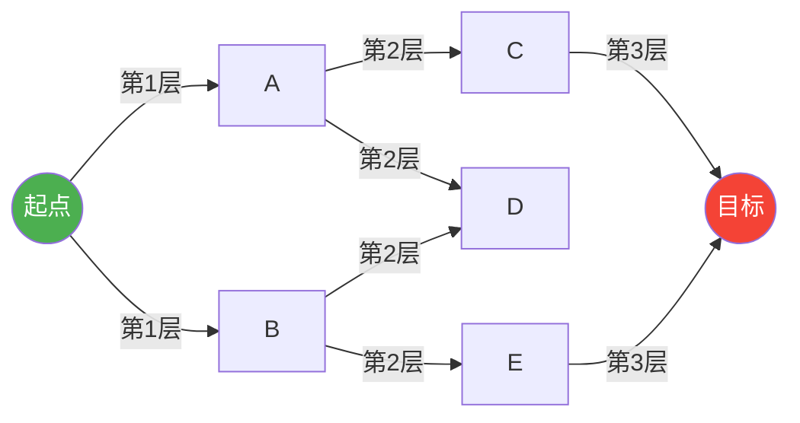
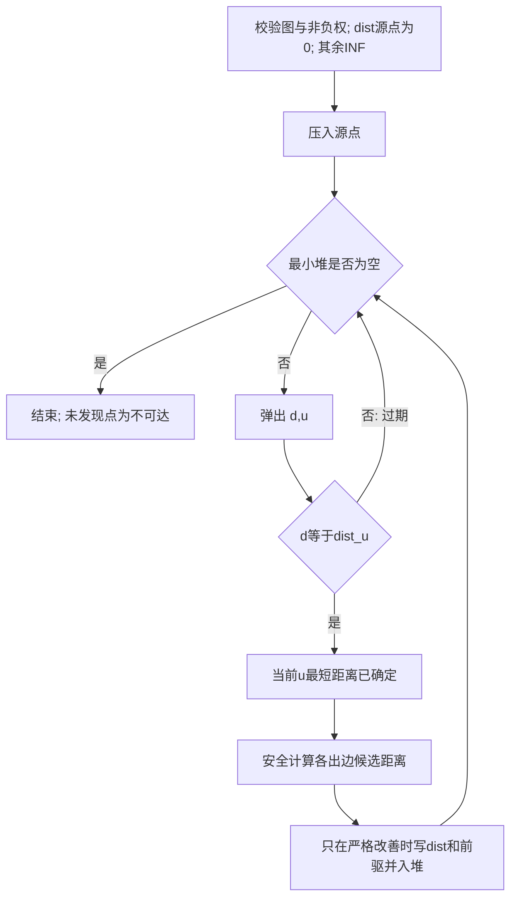

# 01 · 图论基础与搜索算法
> 知识成熟度：L2（主要承诺是固定版本的官方算法/语言合同与静态推导；第 4.4 节 BFS 与第 7.5 节 Dijkstra 的完整 Python 路径例已完成各自局部记录所列的有限运行，其余教学代码与未覆盖验证计划仍未执行）。

> 一句话定位：**把游戏地图变成图，然后选择符合目标与边权条件的搜索**。保留邻接矩阵/邻接表、BFS、DFS、连通域、洪水填充、Dijkstra、复杂度、游戏实践与 FAQ；A*、流场和 NavMesh 的完整工程实现交给各自主篇。
> 知识基线：C++17 教学代码、Python 3.12 教学代码；算法合同核对 Boost 1.86.0，语言合同选读 N4659 与 Python 3.12 官方文档（本次页面标识 3.12.15）。不要求安装 Boost，也不把下文自写示例当作 Boost 源码。
> 适用范围：有限、查询期间固定的离散网格或显式图；地图、通行规则和边权需属于同一查询快照。不覆盖连续空间的精确几何导航或引擎内部实现。
> 数值与正确性边界：BFS 最小化边数；等非负边权时该结果也是最小代价。Dijkstra 要求所有边权非负。本页实现使用整数权；浮点、启发式、量化和动态更新必须另立合同。
> 最后更新：2026-10-10（保留图表示、遍历、非负权、负环、过期堆项与溢出合同；第 4.4 节 BFS 与第 7.5 节 Dijkstra 完整路径例分别有下述有限验证）。
> 证据边界：第 4.4 节原样 Python 程序已在 Python 3.12.14 上完成所列有限验证，五行打印与手算预期一致；第 7.5 节原样 Python 程序已在 Python 3.12.14 上完成其局部记录所列有限验证，五行打印与原手算预期一致。未被这两处局部记录覆盖的具体输入/输出仍为 `PAPER_EXPECTED` 手工推导。本次没有重跑 BFS，也没有新增其他教学算法运行、C++ 编译、UE、目标网络、配置或性能实验；仓库 CI 的既有回归不等于这些片段的执行证据，原有 astar 局部证据仅保持原范围。

## 1. 概述

游戏地图可以是连续几何，也可以原本就是格子。这里把移动状态与合法移动**抽象成图**，使可达性、路线成本和依赖遍历有可计算的输入；图只是游戏 AI 的一层模型：

- 在网格（Grid/Tilemap）游戏中，每个格子是一个**顶点**，相邻可通行格子之间是一条**边**，跨越沼泽、爬坡的代价就是**边权**；
- 在采用多边形邻接图的 NavMesh 查询中，可把多边形作为**顶点**、允许通过的共享边或链接作为**边**；边权由查询的距离、区域或通行模型定义，不能把共享边本身当作唯一成本；
- 在更抽象的层面，任务依赖、技能树、对话分支都可以建模为图。

图建好之后，摆在 AI 面前的问题就变成了：

1. **从 A 到 B 有没有路？**（可达性、连通域判定）
2. **最短/代价最低的路是哪条？**（最短路问题：BFS、Dijkstra、A*）
3. **整张图哪些区域互相连通？**（连通分量，用于区域染色、安全区判定）
4. **有哪些邻居？**（遍历：BFS/DFS，也是后续所有搜索算法的基础）

本文按"存储 → 遍历 → 最短路"的顺序展开：第 2 节给出核心概念；第 3 节讲图的两种存储方式；第 4、5 节讲 BFS 与 DFS；第 6 节讲它们的直接应用——洪水填充；第 7 节讲 Dijkstra；第 8 节汇总复杂度；最后是最佳实践与 FAQ。

## 2. 核心概念

| 概念 | 英文 | 定义 | 游戏示例 |
| --- | --- | --- | --- |
| 顶点 | Vertex / Node | 图中的基本元素，用 V 表示顶点集合 | 网格中的一个格子、NavMesh 中的一个多边形、传送门节点 |
| 边 | Edge | 连接两个顶点的关系，用 E 表示边集合 | 相邻格子的通行关系、两个导航多边形之间的共享边 |
| 有向边 | Directed Edge | 只能单向通行的边 | 单向跳台、悬崖下滑、传送门（单向） |
| 权重 | Weight / Cost | 边上的代价数值，用 w(u, v) 表示 | 平地代价 1、沼泽代价 3、陡坡代价 5 |
| 路径 | Path | 按相邻边连接的顶点序列；允许重复顶点时更精确称为游走（walk） | 角色从 A 走到 B 经过的格子序列 |
| 环 | Cycle | 除首尾相同外通常不重复顶点的闭合路径；负环讨论其边权和 | 巡逻路线中的回路、地图上的环形道路 |
| 连通分量 | Connected Component | 无向图中互相可达的极大顶点集合；有向图需另分强/弱连通 | 被河流/悬崖分割成多个互不相通的区域 |
| 度 | Degree | 与某顶点相连的边数 | 一个格子周围可通行的相邻格子数 |
| 稀疏图 | Sparse Graph | E 远小于 V² 的图 | 绝大多数游戏地图（每格只连 4~8 个邻居） |
| 稠密图 | Dense Graph | E 接近 V² 的图 | 极少见；例如全连接的单位关系网络 |
| 隐式图 | Implicit Graph | 不显式存储边，由规则即时生成邻居 | 网格地图：邻居由坐标加减得到 |

> **为什么游戏地图大多是稀疏图？** 一个 1000×1000 的网格有 100 万个顶点。`PAPER_EXPECTED` 容量计算：10¹² 个矩阵元素若每个占 4 字节，裸数据约 4 TB（十进制，未含容器开销）。四方向网格的出边记录至多约 400 万条，八方向至多约 800 万条，边界/障碍还会减少；若按无向边只计一次则约减半。稀疏性决定了存储方式的选择（见第 3 节）。

本文复杂度中 `V`、`E` 表示顶点数与**存储/扫描的有向边记录数**；无向边一般存成两条记录。有向图的邻居指后继、度在遍历处指出度。邻接表与隐式图的线性界还要求邻居枚举总成本与输出边数同阶；若每次生成邻居需要昂贵碰撞查询，该成本必须另计。

## 3. 图的存储方式

### 3.1 邻接矩阵（Adjacency Matrix）

**原理**：用一个 V×V 的二维数组 `M` 存储图。`M[u][v]` 表示从 u 到 v 的关系：

- 无权图：`M[u][v] = 1` 表示有边，`0` 表示无边；
- 有权图：存在边时存 `w(u, v)`，无边使用独立空值，或使用权值域之外的哨兵；零权边合法，允许负权的图也不能拿 `-1` 无条件代表无边；
- 无向图的矩阵关于主对角线对称（`M[u][v] == M[v][u]`）。

邻接关系与最短距离是两张不同的表：没有显式自环时 `hasEdge(u,u)` 应为假，即使最短路的零步路径满足 `dist[u]=0`。矩阵每格只容纳一条边；下面对重复的 `(u,v)` 采用覆盖策略，若需保留平行边与边 ID，应改用邻接表。输入顶点 ID 都须在 `[0,V)`，本节简例把该检查交给建图入口。

**伪代码**：

```text
M = 新建 V×V 矩阵，全部为 Empty
procedure AddEdge(u, v, weight):
    M[u][v] = Some(weight)
    if 图是无向图: M[v][u] = Some(weight)
function HasEdge(u, v):
    return M[u][v] 不是 Empty
procedure ForEachNeighbor(u):
    for v in 0..V-1:
        if HasEdge(u,v): 处理 (v, M[u][v].value)
```

**C++17 教学示例（未编译）**：`std::optional<int>` 将缺边与任意合法整数权分开。构造前保证 `v>=0` 且容量可承受；调用前保证顶点范围正确。

```cpp
#include <optional>
#include <vector>

class GraphMatrix {
    int V;
    std::vector<std::vector<std::optional<int>>> M;
public:
    explicit GraphMatrix(int v)
        : V(v), M(v, std::vector<std::optional<int>>(v)) {}

    void addEdge(int u, int v, int w, bool directed = true) {
        M[u][v] = w;
        if (!directed) M[v][u] = w;
    }
    bool hasEdge(int u, int v) const { return M[u][v].has_value(); }
    template<class F>
    void forEachNeighbor(int u, F&& f) const {
        for (int v = 0; v < V; ++v)
            if (M[u][v]) f(v, *M[u][v]);
    }
};
```

`template<class F>` 与本页 C++17 基线一致。普通函数形参直接写 `auto&&` 不是这里采用的 C++17 写法；对角线不再自动伪造一条自环，显式自环则正常枚举。

**Python 3.12 教学示例（未执行）**：同样要求 `n>=0`、顶点为范围内整数，`None` 仅表示缺边。

```python
class GraphMatrix:
    def __init__(self, n: int):
        self.n = n
        self.M = [[None] * n for _ in range(n)]

    def add_edge(self, u: int, v: int, w: int = 1, directed: bool = True):
        self.M[u][v] = w
        if not directed:
            self.M[v][u] = w

    def has_edge(self, u: int, v: int) -> bool:
        return self.M[u][v] is not None

    def neighbors(self, u: int):
        for v, w in enumerate(self.M[u]):
            if w is not None:
                yield v, w
```

`PAPER_EXPECTED`：新建两点图时 `has_edge(0,0)=False`；加入 `0→1`、权 `0` 后它是真实边；再加入 `1→1`、权 `0` 后 `neighbors(1)` 应包含该自环。这三个事实不受“源点距离为零”的初始化影响。

**优缺点**：

| 优点 | 缺点 |
| --- | --- |
| 判断任意两点是否相邻：O(1) | 空间 O(V²)，稀疏图浪费严重 |
| 平坦数组可连续存储；上例嵌套 vector 仅逐行连续 | 遍历一个顶点的邻居需要扫一整行：O(V) |
| 小型稠密图或频繁邻接查询可以考虑 | 容量、初始化和行扫描成本需按元素大小计算 |

### 3.2 邻接表（Adjacency List）

**原理**：为每个顶点维护一个链表/动态数组，只存储它**实际存在的出边**。`adj[u]` 中的每个元素是 `(v, w)` 二元组。下列示例保留平行边；无向自环若双写会成为两条记录，建图方应决定是否去重。顶点数非负、ID 合法且不在遍历时修改容器，是简例的调用前提。

**伪代码**：

```text
// 初始化：V 个空列表
adj = 新建长度为 V 的列表数组

// 加边
procedure AddEdge(u, v, weight):
    adj[u].append((v, weight))
    if 图是无向图:
        adj[v].append((u, weight))

// 遍历 u 的所有邻居：O(deg(u))
procedure ForEachNeighbor(u):
    for (v, w) in adj[u]:
        处理邻居 v，边权 w
```

**C++ 实现**（vector 邻接表）：

```cpp
#include <vector>

struct Edge {
    int to;      // 目标顶点
    int weight;  // 边权
};

class GraphList {
    int V;
    std::vector<std::vector<Edge>> adj;

public:
    explicit GraphList(int v) : V(v), adj(v) {}

    void addEdge(int u, int v, int w, bool directed = true) {
        adj[u].push_back({v, w});
        if (!directed) adj[v].push_back({u, w});
    }

    const std::vector<Edge>& neighbors(int u) const { return adj[u]; }
};
```

**Python 实现**：

```python
class GraphList:
    def __init__(self, n: int):
        self.n = n
        self.adj = [[] for _ in range(n)]  # 孤立顶点也有明确槽位

    def add_edge(self, u: int, v: int, w: int = 1, directed: bool = True):
        self.adj[u].append((v, w))
        if not directed:
            self.adj[v].append((u, w))

    def neighbors(self, u: int):
        return self.adj[u]
```

**优缺点**：

| 优点 | 缺点 |
| --- | --- |
| 空间 O(V + E)，稀疏图极省内存 | 判断任意两点是否相邻需要扫描邻居列表：O(deg(u)) |
| 遍历邻居只需 O(deg(u))，是搜索算法的理想接口 | 指针/动态数组有少量开销（可用预分配优化） |
| 支持动态增删边 | 无向图插入一条边要写两处，易漏 |

### 3.3 两种存储方式对比

| 操作 | 邻接矩阵 | 邻接表 |
| --- | --- | --- |
| 空间复杂度 | O(V²) | O(V + E) |
| 判断 u、v 是否相邻 | O(1) | O(deg(u)) |
| 遍历 u 的邻居 | O(V) | O(deg(u)) |
| 加边/删边 | O(1)（顶点数固定） | vector 尾插摊还 O(1)；按目标查找/删除 O(deg(u)) |
| 适合的图 | 容量可承受的稠密图或邻接查询密集图 | 出边稀疏、主要按邻居遍历的图 |
| 游戏中的典型用法 | 小规模状态图（推箱子、解谜状态搜索） | 网格地图、NavMesh、道路图 |

> **游戏工程建议**：网格地图通常直接用**隐式图**——连邻接表都不建，邻居由坐标计算得出（`(x±1, y)`、`(x±1, y±1)`），边权由地形查表得到。这可以省掉显式边记录，但地图、状态、代价与 visited/dist 仍占内存，局部性与耗时取决于实际布局。多边形导航图通常保存邻接，动态链接、过滤和代理条件是否生效由具体导航合同决定，不能仅凭烘焙时邻接认定可通行。

## 4. 广度优先搜索 BFS

### 4.1 原理

BFS 从起点出发，**逐层向外扩展**：先访问起点（第 0 层），再访问起点的所有邻居（第 1 层），再访问第 1 层顶点的未访问邻居（第 2 层）……每层内部的顶点之间没有先后依赖，因此用**队列**（FIFO）管理"待访问顶点"。

两个关键性质：

1. **层级 = 距离**：无权图中，顶点第一次被访问时的层数，就是它到起点的**最短边数**；
2. **首次发现即最少边数**：在首次**入队**时标记 visited，同时写 dist/prev，每点最多入队一次。若等到出队才标记，多个父节点会重复排入它，原先的队列大小与工作量分析便不再成立。这里只求一个最短路径树，邻居顺序决定平局选哪条路。



### 4.2 伪代码

```text
function BFS(graph, start):
    校验 start 属于 graph
    dist[*] = ∞; prev[*] = null; visited[*] = false
    dist[start] = 0; visited[start] = true
    queue.push_back(start)
    while queue 不为空:
        u = queue.pop_front()
        for (v, w) in graph.neighbors(u):
            if not visited[v]:
                visited[v] = true
                dist[v] = dist[u] + 1
                prev[v] = u
                queue.push_back(v)
    return dist, prev

function ReconstructPath(dist, prev, start, goal):
    校验顶点与数组长度；确认结果属于本次 start 与同一图版本
    if dist[goal] == ∞: return NoPath
    path = []; cur = goal
    repeat at most V times:
        if cur 不合法: return InvalidPredecessor
        path.append(cur)
        if cur == start: reverse(path); return Found(path)
        cur = prev[cur]
    return InvalidPredecessor  // 链成环或没有回到 start
```

路径还原必须先查可达性：孤立目标的 `prev=null` 不能被误报为 `[goal]` 的成功路径；合法起点等于终点则返回 `[start]`。在数组头部逐个插入可能造成 O(L²) 移动，上述“追加后反转”是 O(L)。一般图必须检查前驱对应的边存在；平行边若要核对精确代价/通道，要同时记录选中的边 ID（仅顶点序列不足以指定是哪条平行边）。

`PAPER_EXPECTED`：上图按 A 后 B、C 后 D 的邻居顺序，T 的距离为 3，路径可为 S→A→C→T；改顺序可能得到 S→B→E→T，步数不变。增加一个孤立 U 后，U 应是 NoPath。BFS 求单目标时可以在首次发现或出队到达该目标时结束；其他未完成顶点的数组不因此成为全源最终答案。

### 4.3 C++ 实现

```cpp
#include <queue>
#include <vector>
#include <optional>
#include <cstddef>
#include <limits>
#include <stdexcept>
#include <utility>

// 隐式网格图：4 方向 BFS，返回从 start 到 goal 的最短步数
std::optional<int> bfs4(const std::vector<std::vector<int>>& grid,
                        int sx, int sy, int gx, int gy) {
    if (grid.empty() || grid.front().empty())
        throw std::invalid_argument("empty grid");
    const std::size_t width = grid.front().size();
    for (const auto& row : grid)
        if (row.size() != width) throw std::invalid_argument("ragged grid");
    const auto maxCells = static_cast<std::size_t>(std::numeric_limits<int>::max());
    if (width > maxCells || grid.size() > maxCells / width)
        throw std::length_error("grid exceeds int distance contract");
    const int H = static_cast<int>(grid.size()), W = static_cast<int>(width);
    auto inside = [&](int x, int y) { return x >= 0 && y >= 0 && x < W && y < H; };
    if (!inside(sx, sy) || !inside(gx, gy))
        throw std::invalid_argument("endpoint outside grid");
    if (grid[sy][sx] == 0 || grid[gy][gx] == 0) return std::nullopt;
    const int dx[4] = {1, -1, 0, 0};
    const int dy[4] = {0, 0, 1, -1};
    std::vector<std::vector<int>> dist(H, std::vector<int>(W, -1));
    std::queue<std::pair<int,int>> q;

    dist[sy][sx] = 0;
    q.push({sx, sy});

    while (!q.empty()) {
        auto [x, y] = q.front(); q.pop();
        if (x == gx && y == gy) return dist[y][x];
        for (int d = 0; d < 4; ++d) {
            int nx = x + dx[d], ny = y + dy[d];
            if (nx < 0 || ny < 0 || nx >= W || ny >= H) continue;
            if (grid[ny][nx] == 0 || dist[ny][nx] != -1) continue;  // 0 为障碍
            dist[ny][nx] = dist[y][x] + 1;
            q.push({nx, ny});
        }
    }
    return std::nullopt;  // 不可达
}
```

Python 接口只接受内置 `list`/`tuple` 作为 grid、每一行和端点；格子值与端点坐标只接受内置 `int`，不接受 `bool`。端点必须恰含两个坐标；格子值为 0 表示障碍，非零整数表示可走。C++ `bfs4` 与 Python `bfs` 保留“仅返回最短步数”的接口；第 4.4 节另给出 `bfs_path`，把建图输入、搜索、前驱还原和打印连接成一个完整程序。Python 的类型/形状错误、两份示例的空/不规则网格和越界端点属于 InvalidInput（抛异常）；障碍端点或无法连接的合法端点属于 NoPath（C++ `nullopt` / Python `bfs` 返回 `-1`）。合法可行走的单格起终点返回 0。C++ 将格子总数限制在 `INT_MAX` 内，从而距离与邻居坐标加减可表示；内存分配失败仍是资源失败，不能包装成 NoPath。

### 4.4 Python 完整例：从输入网格到实际路径

先走通一张小地图：`1` 是可走格，`0` 是障碍，坐标写作 `(x, y)`，读取格子时用 `grid[y][x]`。从左上角 `(0, 0)` 走到右下角 `(3, 2)`，只能上下左右移动，每步成本都是 1。把以下**整个代码块**保存为 `bfs_path_demo.py`，用 Python 3.12 执行 `python3 -B bfs_path_demo.py`；只使用标准库，不需要拼接本页其他片段。该代码块已于 2026-10-10 用现有 Python 3.12.14 原样运行，下面同时给出实际打印内容与理解步骤。

```python
from collections import deque


def bfs_path(grid, start, goal):
    """返回包含起终点的最少步数路径；合法但不可达时返回 None。"""
    if type(grid) not in (list, tuple):
        raise ValueError("grid must be a list or tuple")
    if not grid:
        raise ValueError("empty grid")
    if any(type(row) not in (list, tuple) for row in grid):
        raise ValueError("rows must be lists or tuples")
    if not grid[0]:
        raise ValueError("empty grid")
    H, W = len(grid), len(grid[0])
    if any(len(row) != W for row in grid):
        raise ValueError("ragged grid")
    if any(type(cell) is not int for row in grid for cell in row):
        raise ValueError("cells must be ints")
    for point in (start, goal):
        if (type(point) not in (list, tuple) or len(point) != 2
                or any(type(c) is not int for c in point)
                or not (0 <= point[0] < W and 0 <= point[1] < H)):
            raise ValueError("invalid endpoint")
    start, goal = tuple(start), tuple(goal)
    if grid[start[1]][start[0]] == 0 or grid[goal[1]][goal[0]] == 0:
        return None

    # 入队即写距离和前驱；dist != -1 同时表示已经发现。
    dist = [[-1] * W for _ in range(H)]
    prev = [[None] * W for _ in range(H)]
    q = deque([start])
    dist[start[1]][start[0]] = 0
    while q:
        x, y = q.popleft()
        if (x, y) == goal:
            break
        # 固定右、左、下、上顺序，使示例的平局选择可复核。
        for nx, ny in ((x+1, y), (x-1, y), (x, y+1), (x, y-1)):
            if 0 <= nx < W and 0 <= ny < H and grid[ny][nx] != 0 and dist[ny][nx] == -1:
                dist[ny][nx] = dist[y][x] + 1
                prev[ny][nx] = (x, y)
                q.append((nx, ny))

    if dist[goal[1]][goal[0]] == -1:
        return None  # 先判不可达，不能把孤立终点还原成成功的单点路径。
    path = []
    cur = goal
    for _ in range(H * W):  # 有限网格的简单路径最多包含 H*W 个顶点。
        path.append(cur)
        if cur == start:
            path.reverse()
            return path
        parent = prev[cur[1]][cur[0]]
        if parent is None:
            raise RuntimeError("broken predecessor chain")
        cur = parent
    raise RuntimeError("predecessor chain did not reach start")


def bfs(grid, start, goal):
    """保留只取步数的接口：不可达为 -1；输入错误继续抛出。"""
    path = bfs_path(grid, start, goal)
    return -1 if path is None else len(path) - 1


def show_result(label, grid, start, goal):
    try:
        path = bfs_path(grid, start, goal)
    except ValueError as error:
        print(f"{label}: InvalidInput ({error})")
        return
    if path is None:
        print(f"{label}: NoPath")
    else:
        print(f"{label}: Found, steps={len(path) - 1}, path={path}")


if __name__ == "__main__":
    grid = [
        [1, 1, 0, 1],
        [0, 1, 0, 1],
        [1, 1, 1, 1],
    ]
    show_result("route", grid, (0, 0), (3, 2))
    show_result("same", [[1]], (0, 0), (0, 0))
    show_result("unreachable", [[1, 0, 1]], (0, 0), (2, 0))
    show_result("blocked", [[0]], (0, 0), (0, 0))
    show_result("invalid", grid, (0, 0), (4, 0))
```

本次实际打印内容（与原手算预期逐字一致，进程退出码 0）：

```text
route: Found, steps=5, path=[(0, 0), (1, 0), (1, 1), (1, 2), (2, 2), (3, 2)]
same: Found, steps=0, path=[(0, 0)]
unreachable: NoPath
blocked: NoPath
invalid: InvalidInput (invalid endpoint)
```

正常例中，搜索依次为这条路线写入距离 `0, 1, 2, 3, 4, 5`。还原从终点沿 `prev` 倒着走，得到 `(3,2) → (2,2) → (1,2) → (1,1) → (1,0) → (0,0)`，最后反转。返回路径含 6 个顶点、5 条边，所以 `len(path)-1` 是 5。起点与终点相同时仍先检查障碍：可走单格返回一个顶点，障碍单格返回 NoPath。

读懂这个例子后，再区分三件事：`dist` 记录发现层数，`prev` 记录从哪里走来，返回的 `path` 才是从起点到终点的路线。队列在右侧入队、左侧出队；[Python 3.12 的 deque](https://docs.python.org/3.12/library/collections.html#collections.deque) 支持这两个端点操作。搜索与数组初始化是 O(HW)，还原是 O(L)，其中 L 是返回顶点数。

这个完整例只处理同一次调用中的固定四方向网格。前驱只在合法邻接边首次发现时写入，不接收外部或其他地图版本的前驱数组；链断裂或超过顶点数仍未回到起点属于实现错误，不能吞成 NoPath。一般显式图、平行边与外部前驱数据仍按第 4.2 节核验；不同边权转到第 7 节，启发式与路径平滑转到 A* 主篇。

**局部验证记录**：2026-10-10，Linux x86_64、Python 3.12.14，正文整个代码块原样提取后执行。演示与标准库 `unittest` 的 4 组测试均退出 0、未超时：上面 5 个打印例；14 个非法输入分别核对两个入口；固定平局顺序及 tuple/非零整数输入；2×3 网格全部 64 个障碍掩码 × 36 对端点，共 2,304 个查询合同。最后一组用独立的全顶点对邻接构造与 Floyd–Warshall 对照，同时核对路径首尾、通行格、实际相邻边、无重复点、步数和输入未修改；每图最多 6 个顶点。总执行设置 30 秒上限，演示子进程设置 5 秒上限。这是有限正确性证据，不是性能测量、任意输入证明或本篇其他算法的运行记录。

### 4.5 游戏中的应用

1. **无权网格最短路**：角色移动无地形代价差异时（或者把 8 方向统一当 1 步），BFS 就是最优解。BFS 找出的路径拥有**最少步数**，虽然不一定是"欧几里得最短"。
2. **连通域标记**：在无向通行图中，从某个格子 BFS 到的所有格子构成一个连通分量；有向图中这里只得到该点的后继可达集合。用于判断两个出生点是否在同一片大陆、随机地图生成后是否连通。
3. **洪水填充**：见第 6 节，本质就是 BFS/DFS 的直接应用。
4. **状态空间搜索**：推箱子、华容道、解谜类游戏把"整个局面"当作顶点，一步操作当作边，用 BFS 求最少操作次数。此时顶点数可能爆炸（内存是关键瓶颈），需要配合状态压缩与去重。
5. **服务器 AOI 泛洪**：可在已定义的格子/房间图中收集最多 k 次邻接跳转的候选对象；这不是自动满足欧氏距离半径、视线、楼层或订阅规则的 AOI 答案。若需要几何半径，必须另做距离与业务过滤。

## 5. 深度优先搜索 DFS

### 5.1 原理

DFS 的策略是"**一条路走到黑，走不通再回头**"：从起点出发，沿着第一条边深入，直到无法前进，再回溯到最近的分叉点尝试下一条边。递归天然适合 DFS（系统调用栈就是"回溯栈"），也可以显式使用栈。

DFS 不保证找到最短路径（找到的第一条路径取决于邻居遍历顺序），因此**游戏寻路一般不直接用 DFS**，但它在以下场景有用：

- 迷宫/地牢**随机生成**（递归回溯法）；
- **拓扑排序**（任务依赖、科技树解锁顺序）；
- **环检测**（检查任务依赖图是否有循环）；
- 判定连通性（只需"有没有路"，不要"最短"）。

### 5.2 伪代码

入口约定：顶点/邻居 ID 合法，visited 已按全部顶点初始化为 false；递归调用共享它，完整图遍历不得为每个新根重新清空。

```text
// 递归版本
function DFSRecursive(graph, u, visited):
    visited[u] = true
    处理顶点 u（例如记录访问序）
    for (v, w) in graph.neighbors(u):
        if visited[v] == false:
            DFSRecursive(graph, v, visited)

// 迭代版本：保存每层邻居迭代器，模拟递归的进入/退出顺序
function DFSIterative(graph, start):
    visited[start] = true; Enter(start)
    stack.push((start, iterator(graph.neighbors(start))))
    while stack 不为空:
        (u, it) = stack.top()
        if it 已耗尽:
            Exit(u); stack.pop()
        else:
            v = it.next().vertex
            if not visited[v]:
                visited[v] = true; Enter(v)
                stack.push((v, iterator(graph.neighbors(v))))
```

一次把所有邻居压入普通栈也能完成可达性遍历，但“发现时标记 + 全部邻居一起入栈”不保证与递归 DFS 相同的树、后序或灰色祖先关系。需要拓扑排序/环检测时，应保存上面的帧状态，或显式 Enter/Exit 事件。

有向环检测区分白（未发现）、灰（在当前递归链）、黑（已结束）：指向灰祖先的边证明有向环；仅见 visited 的边不够。无向图需忽略反向父边；若允许平行边，按**父边 ID**而不是只按父顶点忽略。DAG 的逆完成序才是拓扑序，发现环应失败而非输出貌似完整的任务顺序。[DFS 合同](https://www.boost.org/doc/libs/1_86_0/libs/graph/doc/depth_first_search.html)、[拓扑排序合同](https://www.boost.org/doc/libs/1_86_0/libs/graph/doc/topological_sort.html)

### 5.3 C++ 实现

```cpp
#include <vector>

// 递归 DFS：给每个顶点打上连通分量编号
void dfs(const std::vector<std::vector<int>>& adj, int u,
         std::vector<int>& comp, int compId) {
    comp[u] = compId;
    for (int v : adj[u])
        if (comp[v] == -1)
            dfs(adj, v, comp, compId);
}

// 仅无向图：对称邻接、所有 ID 有效、adj.size() <= INT_MAX 是调用前提
// 大深度图请将 dfs 改为显式帧/栈；这里保留递归教学例
int connectedComponents(const std::vector<std::vector<int>>& adj) {
    const int V = static_cast<int>(adj.size());
    std::vector<int> comp(V, -1);
    int count = 0;
    for (int i = 0; i < V; ++i)
        if (comp[i] == -1)
            dfs(adj, i, comp, count++);
    return count;
}
```

### 5.4 Python 实现

```python
def dfs_iterative(adj, start):
    """adj 含合法邻居列表；start 是有效顶点。返回与同序递归一致的前序。"""
    visited = {start}
    order = [start]
    stack = [(start, iter(adj[start]))]
    while stack:
        u, neighbors = stack[-1]
        try:
            v = next(neighbors)
        except StopIteration:
            stack.pop()          # 对应递归退出 u
            continue
        if v not in visited:
            visited.add(v)
            order.append(v)       # 对应递归进入 v
            stack.append((v, iter(adj[v])))
    return order
```

该单源函数只访问起点可达部分；遍历全图需要像 C++ 连通域示例那样继续选择未访问的起点。无向图的分量编号不能直接移用到有向图：`A→B` 的可达性不是对称关系，强连通与弱连通必须分别定义。无向连通分量的 DFS 合同见 [Boost 1.86.0](https://www.boost.org/doc/libs/1_86_0/libs/graph/doc/connected_components.html)。

显式帧深度最多 V，邻接表遍历 O(V+E)、额外空间 O(V)。递归链也可能达到 V；提高 `sys.setrecursionlimit` 不能制造可用栈内存，过高值可能崩溃，因此不在示例中全局提高它。[Python 3.12 的递归限制合同](https://docs.python.org/3.12/library/sys.html#sys.setrecursionlimit)

### 5.5 游戏中的应用

1. **迷宫生成（递归回溯）**：DFS 随机走格子并拆墙，若候选格图原本连通，并且只对首次到达的未访问格子拆父边，最终得到覆盖该图的生成树；候选图断开时，单个种子无法保证全图连通。Roguelike 地牢、RPG 迷宫常用此变体。
2. **拓扑排序**：游戏任务系统中，"先打 A 才能解锁 B"形成有向无环图（DAG），用 DFS 后序逆序（Kahn 算法亦可）求出合法的任务顺序；检测到环则提示设计错误。
3. **环检测**：技能树/任务图若出现环（A 需要 B、B 又需要 A），若业务把它们都解释为严格先决条件，会导致无法满足的依赖；但可循环对话、巡逻状态的环可能合法，需按图的用途决定是否报错。
4. **可达性判定**：判断玩家能否到达某个区域（如剧情锁区），BFS/DFS 都能回答存在性；谁先遇到目标依赖图形状与邻居顺序，没有普遍更快者，DFS 不给最短路径保证。

## 6. 洪水填充（Flood Fill）

### 6.1 原理

洪水填充从种子格子出发，向相邻的**同属性**格子扩散，把整片连通区域标记为同一个 ID。它是 BFS/DFS 的直接应用（两种遍历都可以），区别只在邻居定义：

- **四连通**：只考虑上下左右 4 个邻居；
- **八连通**：考虑周围 8 个邻居（含斜角）。八连通会把“对角线接触”的区域也连成一片。扫雷的计数邻域、空白展开及是否展开边界数字应按该游戏规则定义，不能无条件说雷区按四连通划分。

```text
四连通（X 为中心的可达格）          八连通
    . X .                             X X X
    X X X                             X X X
    . X .                             X X X
```

### 6.2 伪代码（栈版本，避免递归爆栈）

```text
function FloodFill(grid, seedX, seedY, regionId):
    校验网格矩形非空、种子在边界内
    oldValue = grid[seedY][seedX]
    if oldValue 不是可填充属性 or regionId == oldValue: return
    // 下文“可填充”精确指值等于 oldValue，写 regionId 后必须不再满足
    stack.push((seedX, seedY))
    grid[seedY][seedX] = regionId

    while stack 不为空:
        (x, y) = stack.pop()
        for (nx, ny) in 四邻域(x, y):
            if 在边界内 and grid[ny][nx] 是可填充属性:
                grid[ny][nx] = regionId
                stack.push((nx, ny))
```

### 6.3 扫描线优化

上面的版本在入栈时就改色，因此每个区域格子只入栈一次；固定四/八邻域检查使总时间为 O(n)，显式栈最坏上界 O(n)。递归沿蛇形区域可能形成 O(n) 调用深度，但不能据此断言同一形状的迭代前沿也必然有 n 个待处理格子。**扫描线 Flood Fill** 按"行区间"处理：

1. 从种子出发，向左/右扩展填满整行，得到一个 `[xLeft, xRight]` 区间；
2. 检查上一行与下一行与区间重叠的部分，找到新的可填充种子区间，入栈；
3. 在正确去重/标记区间、每格检查次数有常数上界的实现中仍为 O(n)；收益是批量处理、减少队列操作与改善局部性，不是把 O(4n) 改造成更低渐近阶。八连通扫描相邻行时还需按规则包含区间两端的斜邻格。

4096×4096 可作为未来大图用例的尺寸，而不是现成性能结论；扫描线是否更快、内存是否更少，需由相同区域分布和实现的测量决定。区域不规则、碎片化或容量受限时尤其要重新评估。

`PAPER_EXPECTED`：两格同色区域被填成同一个新值后应结束；若填充值与旧值相同而仍把旧色当未访问状态，就可能反复入栈，因此先返回或改用独立 visited。对角相邻但无边邻相接的两格，四连通是两个区域，八连通是一个区域。

### 6.4 游戏中的应用

| 场景 | 说明 |
| --- | --- |
| 画图工具的油漆桶 | 点击区域填色，就是 Flood Fill（编辑器、涂鸦游戏） |
| 扫雷 | 点开空格时自动展开相邻空白区域 |
| 地图区域染色 | 给随机生成的地图按连通域编号，判断大陆/岛屿 |
| 安全区判定 | 从复活点 Flood Fill，未覆盖区域禁止放置怪物 |
| 寻路预处理 | 预先标记不可达区域，A* 之前直接剪枝 |

## 7. Dijkstra 最短路

### 7.1 原理

BFS 的层数是边数；每边成本为同一非负值 c 时，代价为层数乘 c。当边有不同非负权重（沼泽 3、平地 1）时，层数不再等于代价，**Dijkstra** 是可用的通用选择。零权边允许；负权边不在它的正确性合同内。[Boost 1.86.0 Dijkstra 合同](https://www.boost.org/doc/libs/1_86_0/libs/graph/doc/dijkstra_shortest_paths.html)

Dijkstra 维护每个顶点当前已知的最短距离 `d[v]`，算法核心是一个操作——**松弛（Relaxation）**：

```
若 d[u] + w(u, v) < d[v]，则 d[v] = d[u] + w(u, v)
```

即：**如果"经过 u 再到 v"比"目前已知到 v 的路径"更短，就更新 d[v]**。每次从未确定最短距离的顶点中选出 `d` 最小者 `u`（贪心选择），对其所有出边做松弛。直觉上：所有未确定顶点中 `d` 最小的那个，不可能再通过其他未确定顶点绕出更短的路径（因为绕路的第一段代价已经不小于 `d[u]`），所以它此刻的 `d` 就是最终答案。

### 7.2 算法流程



图示对应下方“只入队可达候选、允许重复堆项”的实现。无需把所有不可达顶点都塞入未确定集合。一个顶点首次**入堆**只说明发现了候选路线；通过过期检查后的最小键**出堆**才可确定它。单目标查询可在此时检查 `u==goal` 并结束，不能在首次松弛到目标时提前结束。

### 7.3 伪代码

```text
function Dijkstra(graph, start):
    校验顶点、端点和全部边权非负
    dist[*] = ∞; prev[*] = null
    dist[start] = 0
    pq.push((0, start))
    while pq 不为空:
        (d,u) = pq.pop_min()
        if d != dist[u]: continue    // 旧候选项不能重复展开
        for (v,w) in graph.neighbors(u):
            candidate = checked_add(d,w)  // 不溢出，也不等于保留INF
            if candidate < dist[v]:
                dist[v] = candidate
                prev[v] = u
                pq.push((candidate,v))
    return dist,prev
```

`PAPER_EXPECTED` 正反例：`S→A:5, S→B:1, B→A:1, A→T:1, B→T:10`。展开 S 后有 A(5)、B(1)；展开 B 把 A 改为 2、T 改为 11；展开 A(2) 把 T 改为 3。T 首次入堆的 11 不是答案，非过期出堆的 3 才是答案，路径为 S→B→A→T；A(5)、T(11) 是以后要跳过的旧项。若只在“首次访问”标记后拒绝更新 A，就会错失该路径。

### 7.4 C++ 实现（优先队列）

```cpp
#include <cstdint>
#include <cstddef>
#include <functional>
#include <limits>
#include <queue>
#include <stdexcept>
#include <utility>
#include <vector>

using Cost = std::int64_t;
using WeightedGraph = std::vector<std::vector<std::pair<int, Cost>>>;
struct SearchResult {
    std::vector<Cost> dist;
    std::vector<int> prev;
};

SearchResult dijkstra(const WeightedGraph& adj, int start) {
    if (adj.size() > static_cast<std::size_t>(std::numeric_limits<int>::max()))
        throw std::length_error("too many vertices");
    const int V = static_cast<int>(adj.size());
    if (start < 0 || start >= V) throw std::invalid_argument("invalid start");
    for (const auto& edges : adj)
        for (auto [v, w] : edges)
            if (v < 0 || v >= V || w < 0)
                throw std::invalid_argument("invalid endpoint or negative weight");

    const Cost INF = std::numeric_limits<Cost>::max();
    SearchResult result{std::vector<Cost>(V, INF), std::vector<int>(V, -1)};
    using Item = std::pair<Cost, int>;
    std::priority_queue<Item, std::vector<Item>, std::greater<Item>> pq;
    result.dist[start] = 0;
    pq.push({0, start});
    while (!pq.empty()) {
        auto [d, u] = pq.top(); pq.pop();
        if (d != result.dist[u]) continue;
        for (auto [v, w] : adj[u]) {
            if (w >= INF - d)
                throw std::overflow_error("candidate cost collides with INF or overflows");
            const Cost candidate = d + w;
            if (candidate < result.dist[v]) {
                result.dist[v] = candidate;
                result.prev[v] = u;
                pq.push({candidate, v});
            }
        }
    }
    return result;
}
```

该示例返回距离与前驱，而不是只返回距离。严格 `<` 松弛避免零权环/等价路线导致无限入堆或重写前驱；不可达点保持 `INF`、前驱 `-1`。调用第 4.2 节还原流程时，先把 `-1` 视作无前驱，不能当数组索引。平行边可正确参与代价比较；需要精确边路径时应扩充前驱记录为 `(父顶点, 边ID)`。

数值失败采用保守、显式的合同：任何**实际尝试松弛**的候选达到 `INF` 或更大就抛异常，即使该边最终不会改善结果。这可能拒绝“最短路可表示、但某条绕路过大”的输入；好处是不会把溢出悄悄当成不可达。调用方应提供合适的代价域或使用独立可达标志及已证明安全的更宽数值实现，不应捕获后伪装成功。仅把 `int` 换成 `int64_t` 并不消除上界；加法前检查还避免了 C++ 有符号溢出的未定义行为（N4659 §8 [expr]）。

### 7.5 Python 实现（heapq）

下面是可单独保存为 `dijkstra_path_demo.py` 的完整程序（Python 3.12 标准库；已于 2026-10-10 使用 Python 3.12.14 原样执行）。输入沿用第 7.3 节的五条有向边，并给孤立点 U 保留槽位：固定 5 个顶点、5 条边，边权为不超过 10 的非负整数。先看具体建图、调用与输出，再把同一函数用于满足其合同的其他图；5 和 10 是本例规模，不是函数强制的通用容量上限。

```python
import heapq

def dijkstra(adj, start):
    """adj 是按整数顶点ID索引的邻接列表；只接受非负内置int边权。
    返回 (dist, prev)，None 表示不可达/无前驱。
    """
    n = len(adj)
    if type(start) is not int or not 0 <= start < n:
        raise ValueError("invalid start")
    for edges in adj:
        for v, w in edges:
            if type(v) is not int or not 0 <= v < n:
                raise ValueError("invalid endpoint")
            if type(w) is not int or w < 0:
                raise ValueError("weight must be a nonnegative int")
    dist = [None] * n
    prev = [None] * n
    dist[start] = 0
    pq = [(0, start)]
    while pq:
        d, u = heapq.heappop(pq)
        if d != dist[u]:
            continue
        for v, w in adj[u]:
            candidate = d + w
            if dist[v] is None or candidate < dist[v]:
                dist[v] = candidate
                prev[v] = u
                heapq.heappush(pq, (candidate, v))
    return dist, prev


def restore_path(dist, prev, start, goal):
    """仅接收同次 dijkstra 的原样结果，start/goal 为该图的合法顶点。"""
    if dist[goal] is None:
        return None
    path = []
    current = goal
    for _ in range(len(prev)):
        path.append(current)
        if current == start:
            path.reverse()
            return path
        current = prev[current]
        if current is None:
            break
    raise RuntimeError("broken predecessor chain")


if __name__ == "__main__":
    names = ("S", "A", "B", "T", "U")  # 顶点 ID 依次为 0..4
    adj = [
        [(1, 5), (2, 1)],  # S -> A:5, S -> B:1
        [(3, 1)],          # A -> T:1
        [(1, 1), (3, 10)], # B -> A:1, B -> T:10
        [],                # T 无出边
        [],                # U 是孤立点
    ]
    start = 0
    dist, prev = dijkstra(adj, start)
    print("dist =", dist)
    print("prev =", [None if p is None else names[p] for p in prev])
    for goal in (3, 0, 4):
        path = restore_path(dist, prev, start, goal)
        if path is None:
            print(f"{names[start]}->{names[goal]}: NoPath")
        else:
            route = "->".join(names[v] for v in path)
            print(f"{names[start]}->{names[goal]}: cost={dist[goal]}, path={route}")
```

把上面单个代码块保存后，可用 `python3 dijkstra_path_demo.py` 调用。本次实际打印内容如下（与原手算预期逐字一致，进程退出码 0，stderr 为空）：

```text
dist = [0, 2, 1, 3, None]
prev = [None, 'B', 'S', 'A', None]
S->T: cost=3, path=S->B->A->T
S->S: cost=0, path=S
S->U: NoPath
```

按顶点顺序读 `dist` 与 `prev`：T 的父点是 A，A 的父点是 B，B 的父点是 S；还原先收集 `T,A,B,S`，再反转成 `S,B,A,T`，代价是 `1+1+1=3`。只看边数会偏向两条边的 `S→A→T`，其代价却是 `5+1=6`。S 到自身是 `[S]`、代价 0；U 的距离是 `None`，必须在回溯前返回 NoPath，不能把 `[U]` 当成功。

`restore_path` 只消费同一固定图、同一次 `dijkstra` 返回且未被改动的 `dist/prev`，端点须合法；它不是任意外部前驱数组的验证器。最多回溯 V 个顶点，链提前断开或超过上界均报 `RuntimeError`，不伪装 NoPath。顶点前驱不记录平行边 ID；若需要具体选中的边，沿用第 7.4 节的边 ID 扩展约定。

本例选择完整单源搜索，堆耗尽后所有返回距离才供三个目标共用；它没有实现单目标早退。若另写单目标版，只能在过期项过滤之后、目标的有效出堆处结束，不能因 T 第一次以 11 入堆就返回，也不能把当时其他点的暂定标签当作全源最终结果。`adj[u]` 中省略 `(v,w)` 表示缺边，`(v,0)` 则是真实零权边；距离中的 `None` 表示不可达，距离 0 不能作不可达判据。整个图的端点与非负内置 `int` 边权会先检查，错误输入抛出异常，不转为 NoPath；图在检查、搜索与还原之间不得修改。

**局部验证记录**：2026-10-10，Linux x86_64、Python 3.12.14，正文整个代码块原样提取后执行；目标源码 SHA-256 为 `f975868427aaa1d9dc8a384cd02a04c4cdd231ae68bd414b895e9754ac398312`。原样演示和有界正确性核对均退出 0、未超时：五行打印；五边竞争路线、同点与孤立目标；零权/缺边、有向断连、零权环/自环、平行边与同距路线；规定的非法源点、端点和权值拒绝；超过有符号64位上限的有限整数距离。另枚举 3 点有向简单图的六个非自环有向位置，每处取缺边/0/1/3，共 4,096 张图 × 3 个源点，调用原样 Dijkstra 12,288 次，并检查 36,864 对源/目标结果。独立矩阵构造与 Floyd–Warshall 对照不复用目标的堆、前驱或还原函数；同时核对路径首尾、真实有向边、权和、无重复顶点、长度上界与输入未改变。同距时允许不同最短路径。演示进程设置 5 秒上限，正确性批次设置 30 秒上限。这是有限正确性证据，不是性能测量或任意输入证明；BFS 旧证据未重跑，C++ 与其他教学算法未因此验证。

Python 的整数没有固定机器字上限，但位数增长会增加运算成本与内存；复杂度表采用常数成本的距离运算模型。本例用 `None` 明确表达不可达，不混用有限整数与浮点无穷来推断精度。顶点 ID 为整数，所以 `(distance, vertex)` 同距时可比较；若改成不可比较对象，加入唯一递增序号 `(distance, serial, node)`，否则同优先级可能触发比较错误。[Python heapq](https://docs.python.org/3.12/library/heapq.html#priority-queue-implementation-notes)

浮点版本是另一份合同：排除 NaN/无穷，说明权值单位、舍入与溢出；不要把 epsilon 直接塞进堆比较器破坏严格弱序。若选择近似松弛、量化代价或以容差判等，需要重新说明优化目标与误差，不能沿用整数版精确最短路承诺。

### 7.6 正确性直觉与证明概述

设已确定集合为 S。归纳断言：**S 中每个顶点的 dist 都是真实最短距离**。

- 基础：源点零步路径代价为 0，非负边不可能产生更小代价，第一次有效出堆可确定源点；
- 归纳步：取出未确定顶点中标签最小的 u。假设存在比 `dist[u]` 更短的源点到 u 路径，令 x 是该路径第一个不在 S 中的顶点。x 的前驱在 S 中已得到正确距离，并已松弛通向 x 的边，所以 `dist[x]` 不大于该路径到 x 的前缀代价；非负后缀使此前缀不大于整条路径，于是 `dist[x] < dist[u]`，与选中最小标签 u 矛盾。因此 u 的标签是最终值。

该证明依赖**边权非负**、出堆前过滤旧项和安全的距离比较/加法；“割边前驱已经正确并完成松弛”是连接候选标签与真实路径前缀的关键。

负权反例 `PAPER_EXPECTED`：`S→A:2, S→B:5, B→A:-10`，真实最短代价是 -5；把 A 在代价 2 时永久封闭或以 A 为目标提前返回都会出错。某些允许反复重开节点的循环可能在这个小图上恰好算对，但已不是这里证明并分析的 Dijkstra 合同，负环还可能让它持续更新。

含负边时可考虑 Bellman–Ford：对有限图做至多 V−1 轮边松弛，然后检查**从源点可达**的边是否还能严格改善；每次仅从有限距离做加法，并保证数值安全。若仍改善，则存在源点可达负环。最坏时间 O(VE)，不能把旧文提到的队列改写 SPFA 当成稳定线性或更快保证。[Boost 1.86.0 Bellman–Ford 合同](https://github.com/boostorg/graph/blob/boost-1.86.0/doc/bellman_ford_shortest.html)

负环的影响要按目标范围判断：源点可达且能从环继续走到目标时，可以任意多次绕环降低代价，所以该目标没有有限最短游走；源点完全到不了的负环不影响本次单源查询；源点可达但到不了目标的负环也不能直接证明这个目标无解。`PAPER_EXPECTED`：`S→A:1, A→B:-2, B→A:1, B→T:1` 的 A/B 环每圈代价 -1，T 的代价无下界。若约束“顶点不允许重复”的最短简单路径，则换成了另一问题，不能套这个无下界结论。无向负边按可反复通行的两向边建模时，往返就形成负代价闭合游走。

游戏地形成本通常设计为非负，但奖励、退款、折扣或脚本叠加可能产生负数。应在模型与入口验证中确认，而不是用“这是游戏地图”代替前提检查。

### 7.7 复杂度分析

| 实现方式 | 时间复杂度 | 搜索额外空间（不含输入图） | 说明 |
| --- | --- | --- | --- |
| 朴素数组线性选最小 + 邻接表 | O(V²+E) | O(V) | 简单图 E=O(V²) 时写作 O(V²)；是否更快需实测 |
| 二叉堆带 decrease-key、每点一个活项 | O((V+E) log(max(2,V))) | O(V) | 需要索引/句柄维护，不是上面重复入堆版 |
| 本文二叉堆 + 过期过滤 | O(V + (E+1) log(E+2)) | O(V+E) | 平行边也适用；简单图可化为常见 O((V+E)log V) 上界 |
| 斐波那契堆并维护点句柄 | 摊还 O(E + V log(max(2,V))) | O(V) | 理论操作界；这里没有实现或测性能 |

推导本文实现的界：初始化/输入检查 O(V+E)，每条出边只在其源点的有效出堆时扫描一次，成功松弛至多 E 次，连源点最多 E+1 次入堆；堆可同时保存 O(E) 个新旧项，所以对数按 E 而不是无条件按 V 写。输入图另占 O(V+E)。矩阵枚举邻居时还要计算行扫描成本；隐式图也要计邻居生成成本。

二叉堆惰性更新容易用标准容器表达，但不能由此断言它在任意数据上“稀疏图最优”或与斐波那契堆实测相当。Boost 的 Dijkstra 文档给出的库实现界与本文容器策略不可混用；斐波那契堆的行只据相应操作的摊还复杂度推导：降低距离应提高最小堆优先级，不能机械套用 Boost 默认最大堆中同名 decrease 的方向。[Boost.Heap 1.86.0](https://www.boost.org/doc/libs/1_86_0/doc/html/heap/data_structures.html)

### 7.8 游戏中的应用

1. **代价地图寻路**：地形有真实代价差异（沼泽、斜坡、危险区）时的全局最短路，是 A* 无启发版本，也常作为 A* 的对照基准；
2. **流场距离场**（见 [流场与群体寻路](03-流场与群体寻路.md)）：从目标在**反向图**搜索，反向边 `v→u` 保留原边 `u→v` 的权值，才能得到各点到目标的代价；有向图/不对称代价不能简单从目标沿原出边跑。一次建场可由相同目标和通行模型的多个单位复用，但单位规模与收益需实测；
3. **资源分配路径**：模拟经营游戏中，"单位成本最低的运输路线"就是带权最短路；
4. **网络/服务器路由抽象**：可以把某时刻有限、非负且可相加的链路成本建成图；队列拥塞、故障与时变时延不因一次静态最短路计算而被预测，真正路由策略需自己的更新合同。

## 8. 复杂度分析总表

本表区分输入存储与算法额外空间；完整遍历使用邻接表或常数成本邻居枚举。实现只访问可达子图时扫描量更小，但下列数组版仍有 O(V) 初始化。

| 算法/结构 | 时间复杂度 | 空间口径 | 游戏定位 |
| --- | --- | --- | --- |
| 邻接矩阵 | 初始化 O(V²)，单点邻居 O(V)；全遍历 O(V²) | 图 O(V²) | 容量可承受的邻接查询密集图 |
| 邻接表 | 建图 O(V+E)，单点邻居 O(deg(u)) | 图 O(V+E) | 稀疏导航/状态图 |
| BFS | O(V+E) | 额外 O(V) | 最少步数、无向连通域、洪水填充 |
| DFS（递归或显式帧） | O(V+E) | 额外 O(V) | 迷宫、依赖、环检测 |
| 洪水填充（基础/正确扫描线实现） | O(n) | 额外最坏 O(n) | 区域标记；两者差异常在常数与布局 |
| Dijkstra（本文惰性二叉堆） | O(V+(E+1)log(E+2)) | 额外 O(V+E) | 非负加权最短路 |
| Dijkstra（朴素） | O(V²+E) | 额外 O(V) | 可考虑小型稠密图 |
| Bellman–Ford（选择边界） | O(VE) | 额外 O(V) | 负边与源点可达负环检测；此处未实现 |

固定四/八方向网格 E=O(V)，故完整 BFS 为 O(V)、本文 Dijkstra 为 O(V log V)。这是理论上界，不能由它读出毫秒耗时或某个设备的容量。

### 8.1 从问题选择算法

| 目标/前提 | 选择 | 需要额外确认 |
| --- | --- | --- |
| 是否能到达；无向分区 | BFS 或 DFS | 有向边、门状态、角色能力是否使邻接不同 |
| 最少步数；统一非负单步成本 | BFS | 斜步若视为一跳，它优化跳数；负统一成本仍不是本合同 |
| 非负不同成本的单源最短路 | Dijkstra | 零权合法；数字安全；只在有效出堆时确定 |
| 单对非负寻路且有合法启发 | 参见 A* 主篇 | 启发与边权合同、终止条件，不能仅因有目标就默认更快 |
| 负边 | Bellman–Ford 等有相应合同的方案 | 源点可达负环及其影响范围；不能只换容器继续跑 Dijkstra |
| 任务依赖顺序 | DFS 完成序的逆序或 Kahn | 必须 DAG；看到环先判断是否违反业务规则 |
| 小图任意两点成本反复查询 | 可评估 Floyd–Warshall | O(V³)/O(V²) 与预计算/更新成本，原 FAQ 的选型线索保留 |

## 验证与基准建议

第 4.4 节 BFS 与第 7.5 节 Dijkstra 已有各自局部记录所列的有限 Python 运行证据；下表保留更广范围的验证建议，与局部记录重合的用例只以对应记录为准，其余仍待执行。其他教学代码和性能实验没有因此获验证。不要因为文档静态检查或有限示例通过就把全篇标成 L3/L4。

| 输入/操作 | `PAPER_EXPECTED` 结果与判定 | 暴露的问题 |
| --- | --- | --- |
| 新建矩阵；零权边；显式自环；平行边 | 缺边、自环、零距离分别表达；矩阵按覆盖、邻接表按保留合同处理 | 哨兵碰撞与表示混淆 |
| 空图/空或锯齿网格；越界端点 | 查询入口拒绝；空无向图计数可为 0，但无合法源点 | 访问 grid[0]、无效下标 |
| 单个可通行格起终点相同；障碍起点 | 前者距离 0；后者 NoPath | 先返回 0 再检查障碍 |
| 4.1 层图加孤立点 U | T 距离 3；U NoPath；不能还原成单点成功 | BFS 可达与前驱合同 |
| A→B 有向图 | A 到 B 可达而反向不保证 | 误套无向分量 |
| 深链、菱形有向无环图、返祖边、自环/平行边 | 显式帧避免递归栈依赖；黑色交叉边非必然环，灰色返祖边才是有向环证据 | 简单 visited 误判 |
| 第 7.3 节五边图、零权环、同距路线、重复边 | T=3；旧项不重复展开；等价路线不强行唯一 | 首次入堆即封闭、非严格松弛 |
| 第 7.6 节负边与负环；另置不可达负环 | Dijkstra 拒绝负边；BF 计划区分影响目标的负环与不相关负环 | 把失败当 NoPath 或无限重试 |
| C++ 候选 `d+w >= INF`；Python 极大整数 | C++ 显式范围失败；Python 数字可表示但资源另计 | 溢出或 INF 冲突被静默吞掉 |
| 同色填充；对角两格 | 同色直接返回；四/八连通结果按规则分开 | 修改后仍可再次访问 |

未来正确性验证不只检查松弛不等式：同时需要源点零、不可达标志、路径首尾、每条实际边、路径权和等于报告距离，以及独立小图穷举/其他可信 oracle。错误地把所有距离写得过小也可能满足一组边不等式，因此这不是单独充分条件。小图可比 BFS 与等权 Dijkstra 的成本，路径序列不要求唯一。

未来性能计划记录图版本/表示、V/E、可达点数、邻居生成工作量、成功松弛数、堆 push/pop 与 stale 数、最大队列/堆大小、内存以及明确计时区间。必须区分初始化、建图、验证、搜索、还原和调度等待；用真实目标平台的输入分布作判断。原有 `python -m pytest tests/test_graph_search.py -q` 只是测试入口样式，本仓库没有因本文而新增该测试或执行它；C++ 也只是未来项目单测/benchmark 目标的计划。

## 9. 最佳实践

1. **优先评估隐式图**：规则网格可以不存边，但地图/代价/visited/dist 仍需容量；邻居的通行检查成本也要计入。
2. **8 方向 vs 4 方向**：斜向通行与拐角禁穿规则须统一在建图、搜索和移动验证中。斜步都算 1 时 BFS 求最少跳数；若斜步成本不同，改用匹配权值的最短路方案。
3. **visited 时间戳**：多次搜索可减少清空，但必须处理计数回绕、并行查询隔离、dist/prev 同步有效性；旧地图的标记不能继续代表新图。
4. **堆与过期项**：标准优先队列可使用重复入堆 + stale 过滤；不在堆内直接改键破坏不变量。数据量大时评估 O(E) 候选项的内存，带句柄堆是另一种选择。
5. **游戏帧预算**：是否超预算由项目实测；时间片、离线预处理或限流必须保留查询状态与地图版本。预算耗尽应是 Pending/BudgetExceeded，不能伪装 NoPath 或完整最优路径，详细调度见服务端与 A* 主篇。
6. **可达性剪枝**：同一静态无向通行图中，不同连通分量可直接拒绝。有向图中不同弱连通分量也可拒绝，但相同弱分量不保证方向可达；不同强分量也可能沿单向边可达，不能直接拒绝。门、动态障碍、角色能力或过滤改变后，旧分量 ID 需要失效/重建。
7. **按容量与目标选择表示**：不要拿固定 `V≤2000` 或 `V>10⁵` 当通用切换阈值。用元素大小、边数、查询次数、初始化/缓存与目标设备预算评估；深链避免依赖递归栈容量。

## 10. 常见问题 FAQ

**Q1：BFS 能用于加权图吗？**
BFS 本身最小化边数。每步同一非负代价时，最少边数路线也是最小代价路线；零代价时所有可行路线等成本，BFS 仍能找一条。不同非负权通常用 Dijkstra；负权需选择如 Bellman–Ford 的合同并处理负环。仅说“加权”并不能决定答案。

**Q2：Dijkstra 为什么不能处理负权边？**
负权边会破坏"未确定顶点中 dist 最小者即为最终答案"的贪心依据：可能存在一条更长的路径，先经过一个大正权顶点再走负权边，反而更便宜。此时已确定集合 S 中的顶点可能被"后来者"推翻。

**Q3：邻接矩阵什么时候更好？**
图足够小或足够稠密、频繁判断相邻关系且 O(V²) 容量可承受时可考虑。平坦矩阵与嵌套容器的布局不同，没有适用于所有元素类型/设备的“2000 点”阈值；解谜状态空间也可能巨大而稀疏。

**Q4：游戏里为什么几乎不用 Floyd-Warshall？**
“几乎不用”不是本页有数据支持的事实。Floyd–Warshall 是 O(V³) 时间、O(V²) 存储的全源最短路选型线索；任意两点查询密集的小型固定图可以考虑。若只是少量单源/单对查询，全对预计算可能不划算；图更新频率和负环处理也需纳入选择。这里保留原 FAQ 的用途，不扩展其实现。

**Q5：DFS 会爆栈吗？**
可能。链状图的递归深度可达 V，实际失效点依赖语言、平台和可用栈；不能保证增大 Python 递归限制安全。大图可改用显式帧，但它仍消耗 O(V) 内存，不能承诺无资源失败。

**Q6：BFS 和 Dijkstra 找的路径为什么可能"不好看"？**
它们只优化所建模的步数/代价。同成本时邻居顺序会影响外观；若要严格最少转弯，应把朝向/转向代价纳入状态或目标，不能靠随意平滑保证。路径后处理须重验通行与成本，见 [A* 主篇的路径优化与拐点平滑](02-A星算法与优化.md)，不在此重复其实现。

**Q7：网格图用 BFS 和用 Dijkstra 结果一样吗？**
所有边权为同一非负值时，BFS 步数乘单步代价与 Dijkstra 最小代价一致；平局路径可以不同。BFS 的理论开销更低，但具体耗时仍需测量。不同非负权时 Dijkstra 有本页合同支持，BFS 通常不保证最小代价；不能说只有 Dijkstra 这一种算法正确。

**Q8：搜索没结束或输入不合法也算不可达吗？**
不算。NoPath 需要在合法固定图上完成足以证明不可达的查询；空输入、负权违规、范围失败、内存不足、预算中止与地图版本变化应各自明确报告。第 4/7 节的返回约定不同，调用层应显式转换，不能把异常统一吞成 NoPath。

## 11. 关联阅读

- [02-A星算法与优化.md](02-A星算法与优化.md)：在相同图/边权和正确终止合同下理解 Dijkstra 与启发搜索的关系，完整 A* 优化和失败边界由该篇负责；
- [03-流场与群体寻路.md](03-流场与群体寻路.md)：流场的距离场正是本文 Dijkstra 的规模化应用；
- [04-空间分区与索引.md](../空间查询与碰撞/04-空间分区与索引.md)：需要空间候选检索时的结构选择；固定网格邻居可直接计算，不因顶点多就必然需要额外空间索引；
- [04-确定性与基准工程/02-动态寻路LPA与DStarLite.md](02-动态寻路LPA与DStarLite.md)：动态障碍环境下的增量搜索进阶；
- [游戏服务端 06-11 AI与寻路时间预算](../../07-网络与游戏服务端/运行调度与过载保护/11-AI与寻路时间预算.md)：服务端主循环中的寻路限流与时间切片；
- [本地实验证据 astar](../../../evidence/algorithms/astar/README.md)：独立最短路 oracle、LRU 故障对照与固定网格的实际返回成本；旧缓存常数计时已撤回，本地观测不代表线上容量；
- 《算法导论》第 22~24 章：保留原文书目线索；章节编号随版本变化，本次未读取或新增教材全文，不作为本轮已读证据；
- [Red Blob Games: Introduction to the A* Algorithm](https://www.redblobgames.com/pathfinding/a-star/introduction.html)：从 BFS 到 Dijkstra 再到 A* 的图解演进，保留与本文第 4、7 节对照的历史阅读用途；[原来源入口](https://www.redblobgames.com/pathfinding/a-star/) 亦保留，本次未重读。

## 12. 一手来源与实际核对范围

以下是本轮实际读取的范围，不表示读过整套文档、编译过库或核对过引擎实现。Boost 版本固定 1.86.0；Python 固定 3.12 文档分支，页面本次标识 3.12.15；N4659 为 2017-03-21 的 C++17 工作草案。读取日期为 2026-10-09/10 UTC。

| 来源 | 实际选读位置 | 支持及边界 |
| --- | --- | --- |
| [Boost BFS 1.86.0](https://www.boost.org/doc/libs/1_86_0/libs/graph/doc/breadth_first_search.html) | 算法说明、初始化/发现伪代码、FIFO buffer 与 Complexity | 边数距离与线性遍历；本文网格输入策略是作者设计 |
| [Boost DFS 1.86.0](https://www.boost.org/doc/libs/1_86_0/libs/graph/doc/depth_first_search.html) | 遍历/颜色说明、递归伪代码、Complexity | 进入/退出与全图遍历；显式帧示例是作者写法 |
| [无向连通分量](https://www.boost.org/doc/libs/1_86_0/libs/graph/doc/connected_components.html) / [拓扑排序](https://www.boost.org/doc/libs/1_86_0/libs/graph/doc/topological_sort.html) | 图类型、输出与失败合同、复杂度 | 无向分量与 DAG 前提；不能套为有向可达性等价关系 |
| [邻接矩阵](https://github.com/boostorg/graph/blob/boost-1.86.0/doc/adjacency_matrix.html) / [邻接表](https://www.boost.org/doc/libs/1_86_0/libs/graph/doc/adjacency_list.html) | 矩阵 doc 第 40–160 行；邻接表 Description、parallel edges、add/remove 描述 | 存储/扫描取舍及容器策略；本文简例的覆盖策略不是所有库的统一合同 |
| [Dijkstra 1.86.0](https://www.boost.org/doc/libs/1_86_0/libs/graph/doc/dijkstra_shortest_paths.html) | 非负前提、输出/前驱、松弛、distance/combine/inf、出堆事件 | 基本算法与数值合同；其库复杂度不能代替本文 lazy 堆推导 |
| [Bellman–Ford 1.86.0](https://github.com/boostorg/graph/blob/boost-1.86.0/doc/bellman_ford_shortest.html) | doc 第 35–200、290–344 行，初始化、轮次伪代码、末轮检查、Complexity | 负边与负环检测；目标受影响范围由可达性推导，不声称运行过 |
| [Boost.Heap 1.86.0](https://www.boost.org/doc/libs/1_86_0/doc/html/heap/data_structures.html) | Fibonacci 说明与操作复杂度对照 | 保留理论比较；不支持任意真实数据的速度排名 |
| [Python heapq 3.12](https://docs.python.org/3.12/library/heapq.html) | 最小堆、Priority Queue Implementation Notes 与 Theory | 平局比较、惰性移除、堆操作；不是对本文 Dijkstra 的实测 |
| [Python sys](https://docs.python.org/3.12/library/sys.html#sys.setrecursionlimit) / [数值类型](https://docs.python.org/3.12/library/stdtypes.html#numeric-types-int-float-complex) | setrecursionlimit 与 Numeric Types | 递归限制风险、整数位数/浮点类型；不支持无限资源承诺 |
| [C++17 N4659](https://www.open-std.org/jtc1/sc22/wg21/docs/papers/2017/n4659.pdf) | §8 [expr]、§10.1.7.4 [dcl.spec.auto]、§26.6.5 [priority.queue] 与相关堆操作条款 | 数值/模板/比较器前提；只选读这些条款，未读全文、未编译示例 |

官方网页中 Bellman–Ford 与 adjacency_matrix 的部分入口本次读取失败，改读了官方 boostorg/graph 的 `boost-1.86.0` 同版本文档，失败没有记作成功。原 Red Blob 与《算法导论》仍是历史延伸阅读，不升级为本轮已核对的一手来源。本文没有任何新性能数字或引擎运行结论。
