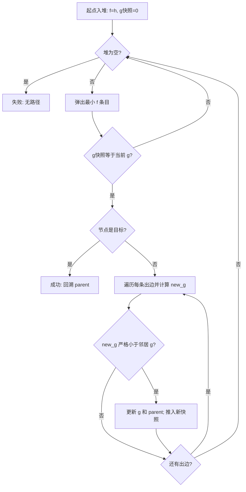
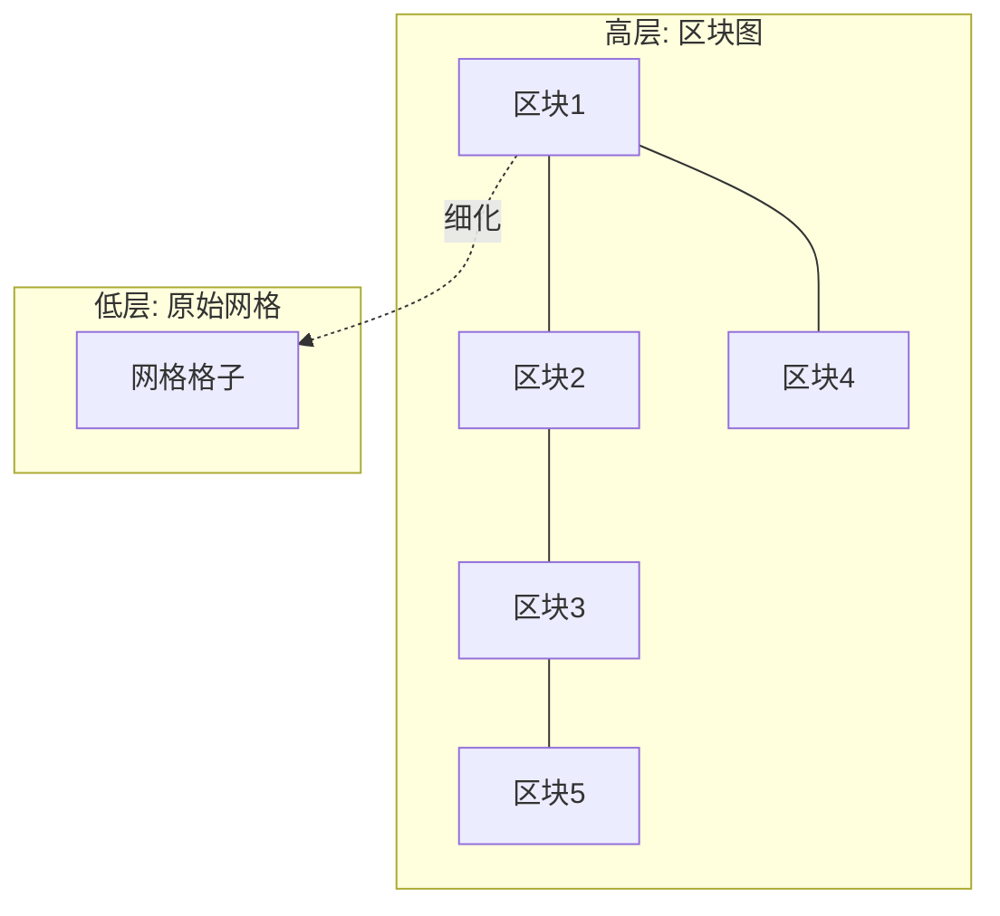

# 02 · A* 算法与优化
> 知识成熟度：L2（本轮审计修订时补标）。

> 一句话定位：**带启发的最短路搜索及其工程合同**。本文详解 A* 的原理（f = g + h、启发函数、可采纳性与一致性），并给出工程级优化：二叉堆开放列表、跳点搜索 JPS、分层寻路 HPA*，最后对比网格与 NavMesh，并解决"路径不好看"的拐点平滑问题。

> 知识基线：C++11 兼容示例（g++ 14.2.0 编译）与 Python 3.12；复杂度、浮点/整数、坐标系和随机种子均按正文声明解释。
> 适用范围：离散网格、导航网格多边形图和其他显式图；可用于单机、客户端或权威服务端查询，静态导航数据可离线烘焙，动态障碍需要重规划或局部避障；不把图搜索等同于连续空间的精确碰撞路径。
> 数值与正确性边界：本文讨论一次查询期间不变的有限图、有限非负边权与固定启发；标准最优性还需正确松弛、有效最小键出队、可采纳 h 且 h(goal)=0。关闭节点后不重开需一致性；允许重复入堆不等于允许重复扩展。浮点示例按机器数比较，不承诺跨平台位级一致。
> 最后更新：2026-10-03（保留队列/启发合同与已测试示例；收敛旧优化笔记，补齐缓存失效、预算结果和性能测量边界）。
> 参考来源：[Red Blob Games：A* 与路径搜索可视化](https://www.redblobgames.com/pathfinding/a-star/)；[Recast/Detour 开源导航实现](https://github.com/recastnavigation/recastnavigation)。

## 1. 概述

先读 [图论基础与搜索算法](01-图论基础与搜索算法.md) 中的图表示、Dijkstra 松弛和优先队列，再读本文的队列合同与反例。后续若要处理中断预算，接 [AI 与寻路时间预算](../../../游戏服务端/06-世界模拟与运行时/11-AI与寻路时间预算.md)；若目标是动态地图增量修复，接 [LPA* 与 D* Lite](02-动态寻路LPA与DStarLite.md)。

从图论基础我们知道：Dijkstra 能找到加权图的最短路径，但它"往所有方向均匀扩张"，在"起点→单个目标"的寻路场景里做了大量无用功。A*（A-Star，1968 年由 Hart、Nilsson、Raphael 提出）在 Dijkstra 的基础上加入**启发函数（Heuristic）**，让搜索"偏向目标方向"扩张，在满足边权、启发函数和终止条件等前提时保持**最优性**，并可大幅减少搜索量。

A* 是游戏寻路的常用图搜索基础之一：

- Unity 与 Unreal 的导航 API 会隐藏具体路径查询实现；除非针对目标版本、导航数据类型及源码/API 进行核对，否则不能把 `NavMeshAgent` 或 Navigation System 无条件写成“内部基于 A*”；
- 若项目已核实采用基于图的 A* 查询，才按本文的代价、启发函数与重开条件分析；否则应以实际导航后端、版本和配置为准；
- RTS、MOBA、SLG 的网格寻路可按地图规模、单位数量与动态性选择 A*、JPS、HPA* 或 D* Lite；不能只凭游戏类型推定具体实现。

本文结构：第 2 节核心概念 → 第 3 节 A* 原理与完整实现 → 第 4 节启发函数设计 → 第 5 节可采纳性与一致性证明 → 第 6 节二叉堆与开放列表优化 → 第 7 节 JPS → 第 8 节 HPA* → 第 9 节网格 vs NavMesh → 第 10 节路径优化与拐点平滑 → 第 11 节复杂度总表 → 最佳实践与 FAQ。

## 2. 核心概念

| 概念 | 符号 | 定义 | 说明 |
| --- | --- | --- | --- |
| 起点代价 | g(n) | 从起点到 n 的当前已知最小路径代价 | 是候选上界，尚不一定等于真实最短 g* |
| 启发代价 | h(n) | 从顶点 n 到目标的**估计**最小代价 | 由启发函数计算，要求不高估真实代价（可采纳） |
| 总估价 | f(n) | f(n) = g(n) + h(n) | 开放列表按 f 排序，每次扩展 f 最小的顶点 |
| 开放列表 | Open List | 等待扩展的有效候选（含重开） | 物理堆还可能含同节点的旧条目 |
| 关闭列表 | Closed List | 已扩展过的顶点集合 | 配合一致性启发可保证不重复扩展 |
| 启发函数 | Heuristic | h 的具体定义（曼哈顿/欧几里得/切比雪夫） | 决定搜索效率与最优性 |
| 可采纳性 | Admissible | 对任意 n：h(n) ≤ h*(n)（h* 为真实最短代价） | 是最优性证明的启发函数条件；图搜索还需一致性或允许 reopen |
| 一致性 | Consistent | 对任意边 (n, n')：h(n) ≤ w(n,n') + h(n') | 配合关闭列表且不 reopen 时，可保证每个顶点最多扩展一次 |
| 最优性 | Optimality | 算法返回的路径代价等于真实最小代价 | 还依赖边权、g 值松弛、终止时机和图搜索实现 |

## 3. A* 原理详解

### 3.1 为什么是 f = g + h

把搜索想象成从起点扩散的"代价等高线"：

- 只使用 g（即 Dijkstra）：等高线是以起点为圆心的同心圆，均匀扩散，与目标位置无关；
- 只使用 h（贪心最佳优先）：搜索直奔目标，但可能先撞进死胡同再折返（h 只估计、不知道障碍），路径不保证最优；
- 同时使用 g + h：等高线被"拉向"目标方向，既保证探索的完整性（g 项），又优先逼近目标（h 项）。

当 h(n) ≡ 0 时，A* 退化为 Dijkstra。更有信息量的可采纳启发可以排除更多无望分支，但 **h=h* 也可能留下大量 f=C* 的等价候选**；扩展多少个仍取决于 tie-breaking。计算 h 本身也要付出时间，不能把“估计更准”直接等同于“墙钟更快”。

### 3.2 先定合同，再画流程

正文统一采用 **不可变入堆条目 + 每次严格改进都重插 + 过期过滤**。`g[n]` 是当前已知最小代价；堆里保存的是发现该代价时的快照，二者职责不同。

1. `g[start]=0`，其他未发现节点视为无穷；每次只接受 `new_g < g[m]`。
2. 每次成功松弛都更新 `g/parent` 并入堆，**即使 m 已经在堆里或扩展过**。后者就是 reopen。
3. 出堆先比较 `queued_g` 与当前 `g[n]`；旧快照直接丢弃，不计作有效扩展。
4. 只有通过过滤的最小 f 条目才可做目标测试；在邻居中“发现目标”不能返回。
5. 下述通用流程没有永久关闭集合。若已证明 h 一致，可额外关闭已有效扩展节点；不能把这个优化照搬到任意可采纳 h。



### 3.3 伪代码与优先队列不变量

```text
function AStar(graph, start, goal):
    open = 最小堆；键为 (f, 单调递增序号)
    g[start] = 0；其他 g 默认 +∞
    parent = 空映射
    open.push((h(start), next_sequence(), 0, start))
    while open 不为空:
        (_, _, queued_g, n) = open.pop_min()
        if queued_g != g[n]: continue     // 先过滤旧版本，再测目标
        if n == goal: return ReconstructPath(parent, start, goal)
        for (m, cost) in graph.neighbors(n):
            new_g = queued_g + cost
            if new_g < g[m]:             // 不是 <=；与 m 是否在 open 无关
                g[m] = new_g
                parent[m] = n
                open.push((new_g + h(m), next_sequence(), new_g, m))
    return 失败
```

**为什么不能只改 `Node.f`？** 二叉堆维护的是存储位置间的偏序，不会监听对象字段。队列比较器若读取可变 `Node*->f`，只改 f 会破坏堆序；再压入同一个可变指针也不能把先前已破坏的堆变回合法堆。两种正确方案任选其一：

- **真 decrease-key**：索引堆保存节点到位置的映射；改键后显式上浮，并维护交换后的索引
- **惰性重插**：每次压入独立的 `(f, sequence, g_snapshot, node_id)` 值，出队过滤旧快照；`std::priority_queue`/`heapq` 都可用

本节选择后者。`g_snapshot != g[n]` 比较的是同一次赋值保存的机器数，不是拿两个独立计算的几何距离做“近似相等”。例子排除 NaN/无穷溢出；若 h、边权或状态在查询中改变，必须重启或使用有相应不变量的增量算法，不能继续复用旧堆。Python 官方文档也明确指出改优先级破坏堆结构，以及用唯一序号避免相同优先级时比较任务对象：[heapq 的优先队列说明](https://docs.python.org/3/library/heapq.html#priority-queue-implementation-notes)。

### 3.4 C++ 实现（网格 + 8 方向 + 不可变条目）

输入为矩形网格，0 障碍、非 0 可走；坐标 `(x,y)` 为整数对，正交代价 1、斜向代价 √2；**禁止穿过任一相邻正交障碍的角点**。空/非矩形网格、越界或阻塞端点返回空路径；超过 int 节点编号容量抛出 `length_error`。Octile 与这个移动下界匹配；删除穿角边不破坏其一致性。没有 `closed` 黑名单，因此实现本身保留严格改进后的重开能力。代码兼容 C++11；证据脚本会直接抽取本代码块编译。

```cpp
#include <algorithm>
#include <cmath>
#include <cstddef>
#include <cstdint>
#include <limits>
#include <queue>
#include <stdexcept>
#include <utility>
#include <vector>

std::vector<std::pair<int, int>> aStar(
        const std::vector<std::vector<int>>& grid,
        std::pair<int, int> start, std::pair<int, int> goal) {
    if (grid.empty() || grid[0].empty()) return {};
    const std::size_t imax = static_cast<std::size_t>(std::numeric_limits<int>::max());
    if (grid.size() > imax || grid[0].size() > imax / grid.size())
        throw std::length_error("grid too large for int node ids");
    const int H = static_cast<int>(grid.size()), W = static_cast<int>(grid[0].size());
    for (const auto& row : grid) if (row.size() != grid[0].size()) return {};
    auto walkable = [&](int x, int y) {
        return x >= 0 && y >= 0 && x < W && y < H && grid[y][x] != 0;
    };
    if (!walkable(start.first, start.second) || !walkable(goal.first, goal.second)) return {};
    const double diagonal = std::sqrt(2.0);
    auto heuristic = [&](int x, int y) {
        const int dx = std::abs(x - goal.first), dy = std::abs(y - goal.second);
        return std::max(dx, dy) + (diagonal - 1.0) * std::min(dx, dy);
    };
    struct Entry { double f, g; std::uint64_t sequence; int id; };
    struct Greater {
        bool operator()(const Entry& a, const Entry& b) const {
            if (a.f != b.f) return a.f > b.f;
            return a.sequence > b.sequence;  // 同 f 按入堆顺序
        }
    };
    std::priority_queue<Entry, std::vector<Entry>, Greater> open;
    std::vector<double> g(W * H, std::numeric_limits<double>::infinity());
    std::vector<int> parent(W * H, -1);
    std::uint64_t sequence = 0;
    const int sid = start.second * W + start.first, gid = goal.second * W + goal.first;
    g[sid] = 0;
    open.push({heuristic(start.first, start.second), 0, sequence++, sid});
    const int dx[8] = {1,-1,0,0,1,1,-1,-1};
    const int dy[8] = {0,0,1,-1,1,-1,1,-1};
    while (!open.empty()) {
        const Entry current = open.top(); open.pop();
        if (current.g != g[current.id]) continue;
        if (current.id == gid) {
            std::vector<std::pair<int, int>> path;
            for (int id = gid; id != -1; id = parent[id]) path.push_back({id % W, id / W});
            std::reverse(path.begin(), path.end());
            return path;
        }
        const int x = current.id % W, y = current.id / W;
        for (int d = 0; d < 8; ++d) {
            const int nx = x + dx[d], ny = y + dy[d];
            if (!walkable(nx, ny)) continue;
            if (d >= 4 && (!walkable(x + dx[d], y) || !walkable(x, y + dy[d]))) continue;
            const int id = ny * W + nx;
            const double ng = current.g + (d < 4 ? 1.0 : diagonal);
            if (ng < g[id]) {
                g[id] = ng; parent[id] = current.id;
                open.push({ng + heuristic(nx, ny), ng, sequence++, id});
            }
        }
    }
    return {};
}
```

### 3.5 Python 实现（heapq，同一网格合同）

堆键的唯一递增序号隔离了节点类型与排序；不依赖坐标元组恰好可以比较。一般图版本及计数器见 [可执行合同实验](../../../evidence/algorithms/astar-contract/README.md)，这里保留网格入口。

```python
import heapq
import itertools
import math


def a_star(grid, start, goal):
    """8 方向、不穿角；0 障碍；无路径或无效网格/端点返回 None。"""
    if not grid or not grid[0]:
        return None
    height, width = len(grid), len(grid[0])
    if any(len(row) != width for row in grid):
        return None

    def walkable(x, y):
        return 0 <= x < width and 0 <= y < height and grid[y][x] != 0

    if not walkable(*start) or not walkable(*goal):
        return None
    diagonal = math.sqrt(2.0)

    def h(node):
        dx, dy = abs(node[0] - goal[0]), abs(node[1] - goal[1])
        return max(dx, dy) + (diagonal - 1.0) * min(dx, dy)

    serial = itertools.count()
    g, parent = {start: 0.0}, {}
    open_heap = [(h(start), next(serial), 0.0, start)]
    directions = ((1,0),(-1,0),(0,1),(0,-1),(1,1),(1,-1),(-1,1),(-1,-1))
    while open_heap:
        _, _, queued_g, node = heapq.heappop(open_heap)
        if queued_g != g[node]:
            continue
        if node == goal:
            path = [node]
            while node in parent:
                node = parent[node]
                path.append(node)
            return path[::-1]
        x, y = node
        for dx, dy in directions:
            neighbor = (x + dx, y + dy)
            if not walkable(*neighbor):
                continue
            if dx and dy and (not walkable(x + dx, y) or not walkable(x, y + dy)):
                continue
            ng = queued_g + (diagonal if dx and dy else 1.0)
            if ng < g.get(neighbor, math.inf):
                g[neighbor], parent[neighbor] = ng, node
                heapq.heappush(open_heap, (ng + h(neighbor), next(serial), ng, neighbor))
    return None
```

### 3.6 四个小图，比无来源的速度倍数更有用

以下均为**有向图**，未列出的边不存在。`expanded` 仅统计通过过期过滤后遍历邻居的次数，不含目标出队；`pops` 包括过期条目和目标。图与 h 在一次搜索中固定，均使用整数精确断言。这些是正确性反例，不是性能基准。

| 实验 | 边与启发 | 可重复观察 |
| --- | --- | --- |
| 一致 h 也会重复入堆 | S→A:10，S→B:1，B→A:1，A→G:20；h(S,B,A,G)=(2,1,0,0) | A 先以 g=10、后以 g=2 入堆；最优 22。共 5 次 pop，其中 1 个过期条目；A 只有效扩展 1 次。取消过滤会扩展 A 两次 |
| 可采纳但不一致要 reopen | S→A:3，S→B:1，B→A:1，A→G:2；h(S,B,A,G)=(4,3,0,0) | h(B)=3 > 1+h(A)，但不高估。A 先以 g=3 关闭；禁止重开得 5，重开后 A 以 g=2 再扩展，得最优 4 |
| 发现目标不能终止 | S→G:10，S→A:1，A→G:1；h≡0 | 扫 S 的第一条边时返回会得 10；目标有效出堆得 2 |
| 同 f 不等于同一路径/扩展量 | S→A:1，S→B:1，A→G:1，B→G:1；h(S,A,B,G)=(2,1,1,0) | FIFO 同键策略有效扩展 S,A,B；相同 f 时优先较大 g 可只扩展 S,A。两者最优代价都是 2 |

另有“只改字段”的反例：S→A:10、S→B:1、S→G:5、B→A:1、A→G:1，h≡0。弹出 B 后，堆内顺序是 G(5)、A(10)；把 A 的字段改成 2 却不修复堆，下一次仍可能弹出 G，错误返回 5，正确答案是 3。测试同时覆盖这个错误和两种语言的正文代码，运行入口见 [astar-contract](../../../evidence/algorithms/astar-contract/README.md)。

## 4. 启发函数设计

### 4.1 三种常用启发

| 启发函数 | 公式 | 适用移动方式 | 特点 |
| --- | --- | --- | --- |
| 曼哈顿距离 | h = \|dx\| + \|dy\| | 4 方向、正交代价为 c | 用 `c·(|dx|+|dy|)`；若允许对角线且斜向代价为 √2c，会**高估**，不可采纳 |
| 欧几里得距离 | h = √(dx² + dy²) | 任意角度移动（连续世界） | 对 8 方向移动略微低估，可采纳 |
| 切比雪夫距离 | h = max(\|dx\|, \|dy\|) | 8 方向、正交/斜向代价相同为 c | 无地形差异时精确匹配真实代价 |
| 对角线距离（Octile） | h = c·(max−min) + d·min | 8 方向、正交代价 c、斜向代价 d | 常见 `d=√2c` 时精确匹配网格真实代价 |

> **关键原则**：h 必须与**实际移动方式和代价**匹配。4 方向且正交代价为 c 时用 `c·(|dx|+|dy|)`；8 方向且正交代价为 c、斜向代价为 d 时，常见 `c<d<2c` 应用 Octile 距离。特别是 `c=1、d=√2` 时，`dx=dy=1` 的曼哈顿值为 2，而真实直走代价为 √2，因此曼哈顿是**高估**而不是低估。若 `d=c`，用切比雪夫距离；若 `d≥2c`，斜向没有更便宜，曼哈顿乘 c 仍可作为匹配启发。

### 4.2 权重化 A*（Weighted A*）

把总估价改为 `f = g + w·h`（w > 1）会改变搜索顺序，**不再保证最优**：

- w = 1：恢复标准 A*，仍须满足本文完整合同；
- w > 1：原始 h 即使一致，放大后也未必一致；不能继续从“原 h 一致”推出“不需要 reopen”；
- 对可采纳原始 h、h(G)=0、允许必要重开、正确最小键与目标出队终止的版本，可沿最优前缀证明返回代价不超过 w·C*；具体删改关闭/重开策略后须重新核对保证；
- 扩展数、代价偏差与耗时应随 w 做实际对比，不预设“只差几个百分点”或单调加速。

```python
def a_star_weighted(grid, start, goal, w=1.5):
    # ... 与标准 A* 相同，仅入堆键改为 ng + w * h(m, goal)
    pass
```

### 4.3 游戏中的选择建议

| 游戏类型 | 推荐启发 | 理由 |
| --- | --- | --- |
| 2D Tilemap（4 方向） | 曼哈顿 | 精确匹配移动代价 |
| 2D Tilemap（8 方向） | 对角线距离 | 精确匹配 √2 斜向代价 |
| 3D NavMesh | 欧几里得 | 多边形中心点之间任意方向 |
| RTS 大地图 | 对角线距离 + 权重化（w≈1.2） | 帧预算优先，轻微次优可接受 |
| 需要严格最优（如解谜） | 精确匹配的启发，w = 1 | 最优性优先 |

## 5. 可采纳性与一致性

### 5.1 可采纳性（Admissible）

定义：对图中任意顶点 n，`h(n) ≤ h*(n)`，其中 h*(n) 是从 n 到目标的真实最短代价。即**启发函数永远不高估**。本文额外约定 `h(goal)=0`（常用非负可采纳 h 自然满足）；仅有“不高估”还允许负的目标 h，不能省略这个归一化条件。

**图搜索合同**：有限图、有限非负边权、固定的可采纳 h 且 h(G)=0、严格松弛、正确维护最小堆、旧条目过滤和目标有效出队终止；若允许改进后的 reopen，可以返回最优路径。若禁止 reopen，则需要一致性保证。这里是图搜索结论；有限顶点但含零代价环的图若按无限路径展开成树，不能直接套用同样的终止保证。

证明的关键是**开放边界上的最优前缀**，不是“曾经扩展过就已最优”：

1. 假设弹出的有效目标代价 C 大于最优 C*，由 h(G)=0 得 f(G)=C
2. 沿一条最优路径，从起点开始追踪已按最优 g 扩展过的前缀。其边界节点 n 必有最优 g 的有效候选仍在 OPEN；若 n 曾按更大的 g 扩展过，正确松弛会把它重开
3. `f(n)=g*(n)+h(n)≤g*(n)+h*(n)=C*<C`，因此最小堆不能先弹出 G，矛盾

第 2 步正是“可采纳但禁止重开”反例破坏的位置。允许零权边时，严格 `<` 还避免等价路径沿零代价环反复改 parent、无限重插。这个合同不要求枚举所有等价最短路径。

### 5.2 一致性（Consistent / Monotone）

定义：对任意边 (n, n')，`h(n) ≤ w(n, n') + h(n')`。

一致性比可采纳性更强（一致性 ⇒ 可采纳：取目标 G 处 h(G) = 0，沿最短路逐边递推即可证明）。它带来的工程收益：

1. **沿一次路径延伸，候选 f 单调不减**：令 `candidate_g(n')=g(n)+w(n,n')`，则 `candidate_g(n')+h(n')≥g(n)+h(n)`；这里不是说全局 `g[n']` 一定等于这条候选路径的 g；
2. **每个顶点最多扩展一次**：一旦顶点进入关闭列表，它的 g 值就是最终值，无需"重开"（re-open）——这与 Dijkstra 的"已确定集合"同理；
3. 在标准网格/几何图中，且边权与几何移动代价匹配并满足三角不等式时，曼哈顿、欧几里得、切比雪夫和对角线启发可满足一致性；对任意带权图不能无条件套用这一结论。

> 工程启示：`closed` 表示“已经扩展过”，并不天然表示“代价永远确定”。不一致 h 下发现更小 g，必须更新 parent、推入新条目，并允许再次遍历其出边；只写 g 而保留永久跳过标志不算 reopen。作者实现说明也明确讨论了改进 CLOSED 节点时的重开：[Amit Patel：Implementation notes](https://theory.stanford.edu/~amitp/GameProgramming/ImplementationNotes.html)。

## 6. 二叉堆与开放列表优化

### 6.1 区分节点数、堆条目数与扩展次数

设 V/E 是原图顶点/边数，Q 是当前堆条目数，R 是成功严格松弛的总次数。

| 操作/计数 | 索引堆（真 decrease-key） | 惰性二叉堆（本例） |
| --- | --- | --- |
| 插入/改进候选 | O(log V)，每节点一个活动条目 | O(log Q)，每次严格改进推新快照 |
| 弹出最小值 | O(log V) | O(log Q)，可能只丢弃旧快照 |
| 节点状态空间 | O(V) | O(V) |
| 队列空间 | O(V) | O(R+1)，不能一概写 O(V) |

一致 h 下每个顶点最多有效扩展一次，R≤E，惰性堆可用 `O(V+E log(E+1))` 时间、`O(V+E)` 辅助空间作上界（不含图存储）；简单图中常简写成 O((V+E) log V)。允许不一致 h 时可能多次有效扩展，R 与扫描边次数要按实际运行计数，不能直接沿用“每边只松弛一次”的复杂度推导。

索引堆减少旧条目，但维护位置映射也有代价；惰性堆简单但峰值内存可能更高，选型要测 Q 峰值、成功松弛、有效扩展、stale pop 和耗时，而不只测“visited 数”。[Red Blob 的作者实现与队列简化说明](https://www.redblobgames.com/pathfinding/a-star/implementation.html#optimizations) 可作另一种工程实现参考；不能把不同去重策略的统计量混为一谈。

### 6.2 Tie-breaking 与等价路径

- 推荐明确排序键，例如 `(f, sequence)`；或 `(f, -g, sequence)` 在 f 完全相同时优先较大的 g。只要 f 仍是第一关键字，这类同键选择不改变上述最优代价合同，但可能改变路径形状与扩展量
- 不能用 `f + ε·h` 冒充严格同键处理：任意 ε 可能颠倒本来不同的 f，改变算法/最优性条件
- `new_g == g[m]` 时保留已有 parent，不重插，获得可解释的“首次最优父节点”规则；若要枚举全部等价最短路径，应另存前驱集合并处理零代价环
- 唯一序号可防止 Python 比较不可排序节点对象，也能固定同键顺序；它**不能**修复无序邻接迭代或浮点差异。重放确定性还需固定邻居顺序、代价表示与输入快照
- “优先少拐弯”若只是 f 相同的 tie-break，不保证全局最少转弯；若转向代价属于实际目标，状态需要包含朝向，不能只用格子坐标合并状态

桶队列可用于有明确整数键范围和单调性约束的场景；它的扫描范围、摊还界与常数必须按具体结构说明，不能把所有桶队列的插入、降键和取最小都写成无条件 O(1)。

### 6.3 内存布局与微优化的验证顺序

旧优化笔记的数据结构建议在这里统一维护；以下是**待测候选**，不是收益承诺：

| 候选 | 适用条件与代价 | 应观察什么 |
| --- | --- | --- |
| 二叉堆换四叉堆（4-ary heap） | 更高分支度降低树高，但一次下沉要比较更多孩子；仅由树高不能推出更快 | 固定查询集，比较 push/pop、比较次数、峰值 Q、P50/P95；与索引堆/惰性堆分别对照 |
| 数组替代线性 Closed 查找 | 网格有稳定紧凑 ID 时可直接索引；不规则图可用哈希。是否需要 closed 仍由第 5 节合同决定 | 查询/清空成本、内存；不得借此禁止必要 reopen |
| 预分配或对象池 | 查询大小有可估上界，且已量到分配热点；池内对象要清理 parent/g/所属查询状态 | 分配次数、峰值容量、复用后正确性；C#/Lua 等还应记录相应运行时的 GC 数据 |
| 连续数组或 SoA | 按实际访问字段比较 AoS/SoA；“重排结构字段”不等于 SoA（按字段分数组） | 数据布局、遍历时长、工作集；不能把缓存改善当作未测事实 |
| 热路径去字符串/日志/临时分配 | 先用插桩或采样确认成本，再将日志改为有界汇总 | 关闭观测与开启观测的端到端差值、丢失记录数 |
| 预计算邻居偏移、缓存不变值、减少间接调用 | 必须保持边界/穿角检查与状态读取语义；编译器也可能已消除部分成本 | 相同优化编译选项下的汇编或采样变化、总查询耗时与回归测试 |

这里的堆分支度分析来自结构本身，不是本库测量；已有[二叉堆/线性扫描实验](../../../evidence/algorithms/astar/README.md)也**没有**验证四叉堆、SoA 或对象池。保留与实际发行构建相近的优化选项和可匹配符号，按[插桩与 perf 方法](../../08-工程实践与质量/调试与性能分析/03-性能工具：插桩与perf采样.md)定位后再改，不把“避免虚函数/多写局部变量”当作普遍优化规则。

## 7. 跳点搜索 JPS（Jump Point Search）

### 7.1 动机

均匀网格上，A* 的邻居结构高度对称：从 A 到 B 和从 B 到 A 会扩展几乎相同的顶点集合。JPS（Harabor & Grastien 2011）利用这种对称性做**剪枝**，只扩展少数"跳点"（Jump Point），把大量冗余顶点一次性跳过。

### 7.2 核心概念

- **直线剪枝（Straight Pruning）**：在无障碍的空旷区域，沿某个方向继续直走永远不劣于转向，因此中间顶点无需入开放列表；
- **强迫邻居（Forced Neighbor）**：当某方向的推进被障碍挡住、且障碍物背后存在"必须绕行才能到达"的邻居时，该邻居迫使当前顶点成为跳点；
- **跳点（Jump Point）**：直线推进过程中遇到的强迫邻居所在顶点、以及拐点。只有跳点进入开放列表；
- **递归跳跃（Jumping）**：沿 8 个方向之一递归向前探测，直到命中跳点、障碍或边界。

```text
ASCII 示例：向右跳跃，x 处被障碍挡住的邻居（.）是强迫邻居，迫使 B 成为跳点

      . . .      ← 上一行：x 上方被障碍挡住
    S B x x x T  ← 当前行：从 B 向右跳
      # # #      ← 下一行：障碍（#）挡住 B 的下方邻居

B 被"强迫"转向，成为跳点；中间 x 全部被跳过，不进入开放列表
```

### 7.3 伪代码

```text
function Jump(n, direction):
    // 从 n 沿 direction 递归跳跃，返回跳点；无跳点返回 null
    m = n + direction
    if m 越界或不可通行: return null
    if m == goal: return m
    if 存在强迫邻居(m): return m          // m 是跳点
    if direction 是斜向:
        if Jump(m, (dx, 0)) 或 Jump(m, (0, dy)) 非空: return m   // 斜向拐点
    return Jump(m, direction)             // 继续直线跳

function JPS(start, goal):
    open.push(start)
    while open 不为空:
        n = open.pop_min()
        if n == goal: return 还原路径
        closed.add(n)
        for direction in 8 个方向:
            if 该方向可被剪枝（有更优替代路径）: continue
            jp = Jump(n, direction)
            if jp != null:
                计算 g[jp]、f[jp]，加入开放列表
```

### 7.4 复杂度与适用性

| 指标 | A*（8 方向） | JPS |
| --- | --- | --- |
| 开放列表顶点数 | 大量（几乎所有可达顶点） | 极少（仅跳点） |
| 收益验证 | 记录扩展与耗时 | 同图、同规则下同时记录跳点扩展和跳跃扫描量；不预设倍数 |
| 额外开销 | 无 | 每次跳跃需扫描一列/一行（可预计算障碍距离加速） |
| 适用条件 | 任意图 | 仅**均匀代价网格**（无地形权重差异），且最好是 8 方向 |

**限制**：

1. 有地形代价（沼泽、坡道）时 JPS 失效——权重破坏对称性，剪枝不再安全；
2. 障碍稀疏的开阔地图收益最大，迷宫型地图收益有限；
3. 实现复杂度高于 A*，边界条件（越界、斜穿）易错。

> 实际工程中 JPS 常与"障碍距离预计算"（扫行/列记录最近障碍）结合，把跳跃探测从 O(k) 降到 O(1)，这是 JPS+ 的思路。

## 8. HPA* 分层寻路（Hierarchical Pathfinding A*）

### 8.1 动机

大网格上从零开始的 A* 查询可能超出帧预算，是否超时取决于地图、端点、实现与硬件。**分层寻路**把地图抽象成粗粒度层级，在高层图快速规划"宏观路线"，再在低层细化，搜索规模从"全图"降到"局部"。

### 8.2 原理



构建步骤（离线烘焙）：

1. 把地图划分为 n×n 的**区块（Cluster）**；
2. 计算每个区块的**入口点（Entrance）**：相邻区块边界上互相可达的格子对；
3. 在入口点之间运行局部搜索，得到入口点两两之间的代价，存入**高层图**（顶点 = 入口点，边权 = 局部最短代价）；
4. 运行时：在高层图上跑 A*（顶点数骤减）得到"入口点序列"，再对每个区块内部做局部 A* 细化，拼接成完整路径。

### 8.3 优缺点

| 优点 | 缺点 |
| --- | --- |
| 可在高层减少候选，再做局部搜索；规模与耗时需测量 | 路径可能略长于全局最优（高层近似） |
| 高层图可复用（多单位共享），支持预计算 | 动态障碍需要局部重算与高层代价更新 |
| 天然支持"寻路请求合并"（同区块单位共享高层路线） | 实现复杂度高，区块大小需调参 |

> 是否采用 HPA* 应比较建图成本、入口数量、更新频率与路径偏差；不按某个固定顶点数阈值直接承诺收益。

## 9. 网格（Grid） vs 导航网格（NavMesh）

### 9.1 两种表示的本质

- **网格（Grid）**：世界被均匀切成格子，通行信息存在格子属性里（可行走/代价）。格子大小固定，障碍精确到格子粒度；
- **导航网格（NavMesh）**：可行走表面被分解为**凸多边形**，多边形之间共享边相连。障碍越少的地方多边形越大，形状贴合真实地形。

### 9.2 对比表

| 维度 | 网格 Grid | 导航网格 NavMesh |
| --- | --- | --- |
| 构建方式 | 直接由 Tilemap/地图数据得到，无需预处理 | 需要**烘焙**：从碰撞体提取可行走表面、三角化、合并凸多边形 |
| 内存 | 每格 1~8 字节，1000×1000 约 1~8 MB | 顶点+多边形数量与地形复杂度相关，通常更省 |
| 路径质量 | 折线路径，需要平滑 | 天然贴合表面，路径更直 |
| 动态障碍 | 修改格子属性即可，简单 | 需要局部更新（动态 NavMesh）或本地避障 |
| 支持高度变化 | 难（需 3D 网格或多层） | 天然支持斜坡、台阶、多层建筑 |
| 适合类型 | 2D 游戏、RTS、塔防、回合制 | 3D 游戏、FPS、ARPG、开放世界 |
| 代表实现 | 自研 Tilemap 寻路 | Unity NavMesh、Unreal NavMesh、Recast/Detour |

### 9.3 NavMesh 上的 A*

NavMesh 上寻路时，把每个凸多边形当作顶点、共享边当作边，代价取多边形中心点距离（或边中点距离）：

1. 定位起点/终点所在多边形；
2. 在多边形图上跑 A*（欧几里得启发）；
3. 得到多边形序列后，用**漏斗算法**（见第 10 节）在序列内求最短可视路径，输出沿地面行走的路径点。

> Recast/Detour 是可核对的开源参考：Recast 负责从几何体烘焙 NavMesh，Detour 提供基于多边形图的查询与漏斗平滑。Unity、Unreal 是否直接采用或受其影响取决于引擎版本、导航后端和项目配置，不能据此推断其内部实现。

## 10. 路径优化与拐点平滑

### 10.1 问题：锯齿路径（Zigzag）

网格 A* 输出的路径是"格子中心折线"，在 8 方向网格上呈现 45° 锯齿；直接让角色沿折线走，视觉上会"抽搐"。需要后处理：

### 10.2 漏斗算法（Funnel Algorithm / String Pulling）

在路径经过的多边形/格子序列上，维护一个"漏斗"（两条射线：左边界、右边界），逐步收紧：

```text
初始：漏斗顶点 = 起点，左右射线指向下一段路径的两个端点
对每个新的路径段端点 p：
    if p 在漏斗左侧射线外侧: 记录当前左顶点为拐点，重置漏斗，继续
    if p 在漏斗右侧射线外侧: 记录当前右顶点为拐点，重置漏斗，继续
    否则: 收紧漏斗（若 p 更靠内则更新对应射线）
输出：起点 → 拐点序列 → 终点（每段都是直线可视路径）
```

```cpp
// 简化示意：对 A* 路径点序列做"视线裁剪"
std::vector<Vec2> simplify(const std::vector<Vec2>& path, bool hasLineOfSight(Vec2, Vec2)) {
    std::vector<Vec2> result;
    int start = 0;
    result.push_back(path[0]);
    for (int i = 1; i < path.size(); ++i) {
        if (!hasLineOfSight(path[start], path[i])) {
            result.push_back(path[i - 1]);  // 上一个点是可视拐点
            start = i - 1;
        }
    }
    result.push_back(path.back());
    return result;
}
```

### 10.3 字符串推杆（String Pulling）

把路径想象成一根绷紧的绳子：贪心地把路径段拉直，直到碰到障碍边界。漏斗算法是它的精确实现，在 NavMesh 多边形序列上效果最佳——路径被"贴"在多边形边界上，长度接近理论最短。

### 10.4 曲线平滑（可选）

拐点平滑后路径仍然"硬拐"，可叠加曲线：

- **Catmull-Rom 样条**：穿过全部控制点，局部可控，是角色移动路径的常用选择；
- **三次贝塞尔**：在拐点处插值，转角圆滑；
- 注意：曲线可能穿出可行走区域，需做碰撞约束（沿曲线采样点做视线检查）。

> 工程顺序：A* 路径 → 漏斗/视线简化（去掉冗余拐点）→（可选）样条平滑 → 交给移动系统。**先简化再平滑**，否则平滑会在多余拐点上制造更多抖动。

## 11. 复杂度分析总表

| 算法/技术 | 时间复杂度 | 空间复杂度 | 备注 |
| --- | --- | --- | --- |
| A*（一致 h，惰性二叉堆） | O(V+E log(E+1)) | O(V+E)，不含图 | 队列含旧条目；不一致 h 的重开须另计 |
| A*（加权，w>1） | 取决于实际扩展与松弛总量 | O(V+R)，R 为成功松弛次数 | 近似保证依赖第 4.2 节合同 |
| JPS | 最坏同 A*，典型 O(跳点数 log 跳点数) | O(V) | 仅均匀网格 |
| HPA* 构建 | O(入口点 × 局部搜索) | O(高层图) | 离线烘焙；运行时 O(高层 A*) + O(局部细化) |
| 漏斗平滑 | O(k)（k = 路径段数） | O(k) | 后处理，开销可忽略 |
| Dijkstra（对照） | O((V+E) log V) | O(V+E) | 无启发时 A* 退化为它 |

> 本文不提供无原始记录的“典型毫秒数”。已有 [堆与线性扫描实验](../../../evidence/algorithms/astar/README.md) 的数据仅适用于其记录的地图、实现和环境；本轮新增合同测试只证明明确列出的正确性行为，不是性能报告。

## 验证与基准建议

- 输入规模与边界用例：覆盖起点等于终点、不可达、目标在障碍内、角点穿墙、斜向移动、启发为零、多个相同 `f` 值和动态障碍重规划；对网格与 NavMesh 分别记录地图规模。
- 正确性断言：在非负边权和可采纳启发下，将 A* 路径代价与 Dijkstra 基线比较；断言路径首尾、相邻边合法、拐点平滑后仍在可行走走廊内，并检查 reopen/关闭列表策略的一致性。
- 复杂度与耗时指标：记录节点扩展数、开放列表峰值、路径代价、平滑前后点数、P50/P95 查询耗时和内存；JPS/HPA* 的收益只在对应地图分布上实测，不由理论复杂度直接推断。
- 本仓库实际入口：`python3 -B evidence/algorithms/astar-contract/test_astar_contract.py`。测试包含四类合同、可变键失败反例、零权环，以及直接抽取本文 C++/Python 网格代码并同独立最短路基线比较；详细口径与限制见 [测试说明](../../../evidence/algorithms/astar-contract/README.md)。

## 12. 最佳实践

1. **启发与实际移动代价匹配**：先确认邻接、地形权重和单位，再按第 4–5 节验证可采纳性/一致性；
2. **队列策略完整实现**：真 decrease-key，或不可变快照重插 + stale 过滤；closed 去重只能用于已证明一致的启发；
3. **先可达性剪枝**：起点终点不在同一连通域直接返回（01 篇连通域预计算）；
4. **帧预算与时间片**：预算耗尽返回明确的 Pending / BudgetExceeded；保留查询状态后续继续，或按第 12.1 节提供已验证的局部路线，不冒充已到达目标的最优路径；
5. **动态障碍分级处理**：静态障碍走 A* 全局规划，动态障碍交给局部避障（RVO/Steering），别把动态障碍全塞进 A*；
6. **多单位共享**：同目标的多单位可复用路径（路径缓存）、同区块复用 HPA* 高层图、或换流场（见 03 篇）；
7. **路径后处理按需接入**：计入预算，且每段都满足角色尺寸和碰撞规则；第 10 节视线简化示意假设路径非空且原相邻边已可通行，不能当作完整碰撞实现；
8. **测试覆盖**：角点穿墙、斜穿、不可达、目标在障碍内等边界用例写单元测试。

### 12.1 预算、降级与请求调度

把“单次搜索更快”与“每 Tick 发出更少请求”分别测量。具体调度实现接[服务端 AI 与寻路时间预算](../../../游戏服务端/06-世界模拟与运行时/11-AI与寻路时间预算.md)；以下为接口合同建议：

- **预算结果要有状态**：至少区分 Found、NoPath、Pending / BudgetExceeded。只有正常合同终止的 Found 才声明已找到完整路径；提前返回的可达前缀不等于通向目标的最优路线
- **直线降级先验通行**：目标距离近也可能隔墙。只有对当前地图、角色半径/高度及移动规则完成通行或扫掠检测，才允许直走；失败时停在安全点、继续排队或使用仍有效的旧路径。“直线 + 简单避障”不能替代碰撞保证
- **暂停与恢复**：保存 open、g、parent、目标和地图版本。输入变化时按明确失效策略重启或用支持变化的算法修复；不能把两个地图快照的边混为同一次 A*
- **减少无效请求**：目标/有效路线变化时重规划，另保留必要的周期检查；失败重试可设带上限的退避，地图/目标变化时重新评估，避免一边永久失败一边每 Tick 重搜
- **排队与优先级**：限制每 Tick 总预算及单查询工作量；玩家附近单位可优先，但要记录排队时长并防止低优先级请求饥饿。同区块共享高层路线时，各单位的局部通行仍需验证

### 12.2 缓存与动态地图的失效条件

仅以 `(起点格子, 终点格子)` 作缓存键不足以表达查询合同。建议按项目需要加入地图/导航数据版本、移动能力或角色尺寸、代价配置、穿角规则；LRU 只管理容量，不保证路线仍有效。

- 起点轻微偏移时，可复用后续路线，但当前位置接入旧路线的连接段必须重新验证
- 目标或障碍改变时，选择使相关缓存失效、重新验证受影响路段，或采用有明确更新合同的增量算法
- 同终点多单位可比较[流场](03-流场与群体寻路.md)；频繁地图变更可继续学习[LPA* 与 D* Lite](02-动态寻路LPA与DStarLite.md)，不能只改缓存键就称为增量搜索
- 旧笔记中的双向 A* 与 IDA* 只保留为选型线索：双向搜索必须单独证明相遇/终止条件；IDA* 的内存与重复搜索取舍须按分支和启发评估。本文没有实现或验证它们，也不作“适合某固定规模”的结论

### 12.3 数值比较与性能实验合同

- **排序与误差断言分开**：C++ 优先队列比较器须满足严格弱序；把 `abs(a-b)<epsilon` 当作“相等”可能破坏等价关系传递性。不要为抑制重复入队任意改变堆排序或松弛规则。本文保持严格 `<` 改进与不可变快照；测试端的近似代价断言不等于搜索端使用 epsilon
- **先排除模型错误**：核对边权单位、有限值、启发条件、队列更新和 stale 过滤，再讨论浮点容差。若业务改用整数/定点，必须声明量化误差并重新验证最短路合同
- **统一输入**：记录地图、随机种子、起终点集、障碍与穿角规则、二进制版本、编译选项、硬件、预热与负载。前后重复运行，报告分布；不能只看最好的一次
- **同时测工作量与时间**：按入队、出队、邻居扩展、启发计算、路径重建分阶段；记录请求数、严格松弛数、有效扩展、stale pop、Q 峰值/均值、路径代价、P50/P95/P99 和分配量。计数器解释与第 6.1 节保持一致
- **观测也需预算**：阶段嵌套计时不能直接相加到 100%；CPU 采样不能代替排队/等待墙钟。详见[性能测量口径](../../08-工程实践与质量/调试与性能分析/03-性能工具：插桩与perf采样.md#5-服务器场景的统计模式)

来源核对日期：2026-10-03。[C++ WG21 N4981](https://www.open-std.org/jtc1/sc22/wg21/docs/papers/2024/n4981.pdf) 的 `[priority.queue]` / `[alg.sorting]` 规定比较器合同；[Python heapq 官方说明](https://docs.python.org/3/library/heapq.html#priority-queue-implementation-notes)解释序号、优先级变化与旧条目处理。这些来源支撑容器规则；预算、缓存和测量清单是本文的工程建议，未声称新增集成实验已执行。

### 12.4 待完成的工程验证练习

以下不是第 3 节 14 项已执行合同测试的新增结果：

1. 以同一查询集比较二叉/四叉堆，只替换队列；先对照独立最短路 oracle，再记录队列操作、峰值内存及重复运行耗时，不预设赢家
2. 缓存一条可走路线，分别改变地图版本、角色通行配置和终点；断言旧结果失效或重新验证，而非仅观察缓存命中率
3. 令近距离终点位于墙后，强制极低预算；断言返回 Pending / BudgetExceeded 或明确无路径状态，不输出穿墙直线，也不标记 Found
4. 在固定地图暂停/恢复一次查询，并与不中断查询比较路径代价；再在暂停期间改图，检查版本失效分支。同步记录搜索时间与排队时间

## 13. 常见问题 FAQ

**Q1：A* 一定返回最优路径吗？**
不能简化成“当且仅当启发函数可采纳就最优”。在有限图、边权非负（通常取正）、正确维护 `g`/开放列表且目标出队时终止等前提下，本文图搜索还要求固定 h、h(goal)=0；关闭后不重开需 h 一致，或在改进已关闭顶点时执行 reopen。使用权重化 A*（w > 1）或过高估计的启发都会破坏标准最优性保证。

**Q2：为什么 8 方向移动不能用曼哈顿启发？**
要看移动代价：4 方向、正交代价为 c 时，曼哈顿乘 c 是匹配启发；8 方向若正交代价为 c、斜向代价为 √2c，曼哈顿会高估（例如一格斜走时 `2c > √2c`），不能作为可采纳启发。8 方向且斜向与正交代价相同用切比雪夫；斜向代价处于两者之间用 Octile。反过来，4 方向移动用未按 c 缩放的切比雪夫也可能高估，仍须按实际代价校准。

**Q3：JPS 什么时候比 A* 快？**
JPS 适用于与其剪枝规则匹配的均匀代价网格；扩展减少不一定等于同比例耗时减少，还要记录跳跃扫描工作。权重、穿角策略与窄通道分布会影响正确性或收益，应以对应实现和地图实测。

**Q4：目标点会移动怎么办？**
目标移动频繁时，每次重跑 A* 太贵。方案：目标移动慢则定期重规划；单位多则用流场（03 篇）；更激进的方案是 D* Lite（增量重规划）或 RRT（连续空间）。

**Q5：A* 的路径为什么有锯齿？**
网格中心折线导致。用漏斗算法/视线简化去掉冗余拐点，再用样条平滑转角，即可得到自然路径。

**Q6：开放列表和关闭列表为什么用哈希/数组而不用链表？**
查找"顶点是否在表中"是高频操作，哈希表 O(1) 平均；网格地图可用一维数组直接索引（O(1) 且缓存友好），比哈希更快。

**Q7：能不能把 A* 用在 NavMesh 上？**
对采用图搜索的 NavMesh 实现，可以使用“多边形图 + A*（欧几里得启发）+ 漏斗平滑”；具体引擎是否如此实现，应按目标版本、导航后端和源码/API 核对，Recast/Detour 可作为参考。

## 14. 关联阅读

- [01-图论基础与搜索算法](01-图论基础与搜索算法.md)：A* 的底子——优先队列 Dijkstra、图的存储、复杂度口径；
- [03-流场与群体寻路](03-流场与群体寻路.md)：当"单位数量"成为瓶颈时，从逐单位 A* 切换到全场流场；
- [04-空间分区与索引](../空间查询与碰撞/04-空间分区与索引.md)：A* 的邻居查询在超大世界中的加速器；
- JPS 原论文：[Harabor & Grastien，Online Graph Pruning for Pathfinding on Grid Maps（2011，作者发布版）](https://pathfinding.ai/pdf/harabor-grastien-aaai11.pdf)。
- HPA* 原论文：[Botea、Müller、Schaeffer，Near Optimal Hierarchical Path-Finding（2004，作者发布版）](https://webdocs.cs.ualberta.ca/~mmueller/ps/2004/hpastar.pdf)。
- Red Blob Games：*Introduction to the A* Algorithm*（含交互式演示）；
- 开源参考：Recast/Detour（NavMesh 烘焙 + A* + 漏斗）、Unity ML-Agents 的 GridWorld 示例。
- 本库实验证据：[evidence/algorithms/astar](../../../evidence/algorithms/astar/README.md)：A* 堆 vs 线性扫描的本地复现数据（系统实战 07 与服务端 06-11 同源引用）。
- 服务端工程实践（Tick 预算/可中断寻路/降级）：[游戏服务端/06-世界模拟与运行时/11-AI与寻路时间预算](../../../游戏服务端/06-世界模拟与运行时/11-AI与寻路时间预算.md)；端到端链路：[系统实战/07-假人AI完整链路](../../../系统实战/07-假人AI完整链路.md)。
- 旧笔记兼容入口：[A星算法优化](A星算法优化.md)；其数据结构、调度、微优化与实验要点已收敛至第 6.3、12.1–12.4 节，不再维护另一份教程。
- 本轮合同证据：[A* 开放列表、重开与终止反例](../../../evidence/algorithms/astar-contract/README.md)；正文来源核对日期为 2026-10-03，测试结果不自动改变本页 maturity 或 verified。
