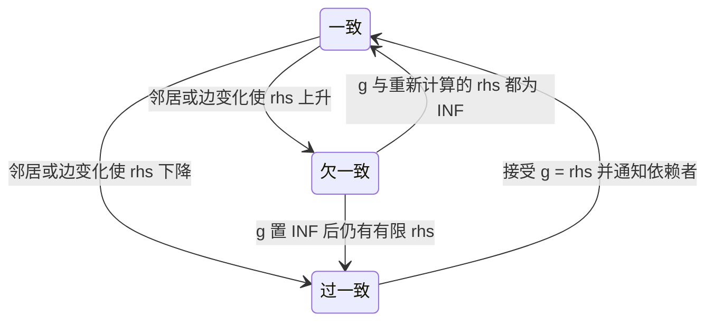
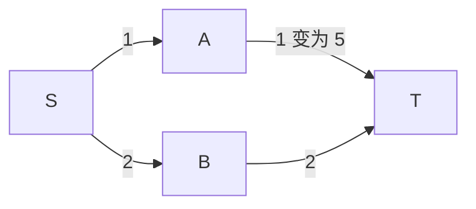

# 动态寻路：LPA* 与 D* Lite

> 知识成熟度：L2。主要承诺是增量最短路的算法合同与工程边界，依据原始论文选段和作者勘误静态核对；伪代码及纸面追踪均未运行。
> 知识基线：LPA* 2004 论文的作者发布 PDF（首页标注 24 May 2005），第 2 节、第 4 节开头、4.1–4.2 节与图 6；D* Lite 2002 论文第 4–5 页、图 3 与作者勘误。本文选择未优化版本，不混入优化版的终止条件。
> 适用范围：有限、有稳定节点身份的离散图，边代价按完整批次变化；LPA* 固定起终点，D* Lite 固定目标、允许起点移动。全局图最优不等于连续空间无碰撞或运动学可执行。
> 数值与正确性边界：可通行边使用有限正代价；`INF` 单独表示不可通行/未知距离，不能来自溢出。零权属于一般非负最短路问题，但不在本篇所选增量算法合同内，见第 2.2 节。
> 最后更新：2026-10-10。纠正反向搜索的邻接方向、旧队列项处理和目标移动边界，保留变化分类、障碍分层、回退、回放与选型用途。
> 证据范围：仅资料阅读与文档静态检查；所有 `PAPER_EXPECTED` 均为手工推导。未运行算法、模型、编译、UE、网络、性能或 PowerShell 门禁；旧 A* 实验不构成本篇的新增验证。

## 1. 要修复的是哪些依赖

一条路刚规划好，门便关上了。重新运行 A* 可以得到新快照上的答案，但会丢弃上次搜索积累的距离信息。增量搜索保留这些状态，把“旧估计与当前邻居提供的估计不一致”作为修复入口，再按优先级传播变化。

关键不是缓存一条折线，而是缓存**求解过程的依赖**。只保存旧路径，发现它没有穿过变化边，可以说明这条路仍可能可走；如果另一处道路变便宜，却不能据此说明它仍然最优。LPA* 与 D* Lite 都必须收到完整的相关边变化，而不只是旧路径上发生的变化。

先读[图论基础与搜索算法](01-图论基础与搜索算法.md)的有向图、Dijkstra 和数值边界，以及[A* 算法与优化](02-A星算法与优化.md)的启发函数与优先队列合同。本篇负责它们之后的“变化如何让已有状态失效、如何修复”；路径后处理、局部避障和服务端调度由关联主篇负责。

| 变化 | 如何进入搜索模型 | 何时停止复用 |
| --- | --- | --- |
| 路段危险度/拥堵权改变 | 更新明确的有向边代价 | 代价模型改变后启发下界不再成立 |
| 门关闭或重新打开 | 对门控边设 `INF` 或恢复正代价；双向门要处理两条弧 | 只记录门对象却无法枚举受影响边 |
| 格子占用/阵营权限改变 | 按建图规则枚举入边、出边及穿角约束关联边 | 节点属性变化没有被转换成完整边差分 |
| Tile 替换、节点增删 | 本篇只支持在稳定节点全集中启用/禁用预先定义的弧 | ID、邻接或含义无法可靠映射到旧状态 |
| D* Lite 的起点移动 | 更换查询起点，按第 5 节维护 `km` | 起点无效、图版本不匹配或启发合同失效 |
| 目标移动、代理半径或能力改变 | 新查询合同；本篇保守重新初始化 | 不能只换 `goal` 或增加 `km` 就继续沿用旧值 |

`changeId` 应能追到旧/新图版本和具体边 ID。变更量很小只描述输入：一条关键割边断开，也可能让大片旧距离失效。“局部修复”不保证只访问变化边附近，更不保证耗时恒定。

## 2. 先固定图和数值合同

### 2.1 方向、快照与启发

本文用有限有向图 `G=(V,E)`，`c(u,v)` 是沿原图 **u→v** 移动的代价。`Succ(u)` 枚举原图出边的终点，`Pred(u)` 枚举原图入边的起点。无向边以两条有向弧表达；反向维护距离不会把一条单向门变成双向门。平行边若存在，最小化遍历每条边记录，更新和最终路线必须保留边 ID。

一次修复读取一个固定快照。先完整应用变化批次，再重算受影响端点，随后执行修复；不允许一半邻接是旧版、一半代价是新版。新增/删除任意节点及重建邻接属于更广的算法实现问题，本篇通过固定节点全集和弧的 `INF` 切换表达封闭/开放；不能把失效内存地址继续当稳定节点 ID。

LPA* 的启发 `h(u,t)` 在查询序列中固定，非负、有限，`h(t,t)=0`，且对每条可通行边满足 `h(u,t) ≤ c(u,v)+h(v,t)`。D* Lite 需要双点启发 `h(a,b)`：非负、有限、`h(a,a)=0`，不高估 a→b 最短路，并满足 `h(a,c) ≤ h(a,b)+h(b,c)`。有向图中不要求它对称。上述条件必须在所有获接纳的代价版本上成立；一次降价可能破坏旧下界。

`h≡0` 是保守选择。使用几何距离时，尺度应是所有可能版本的通行成本下界；廉价传送门、新增捷径或代价缩放都可能使原启发高估。若要更换启发定义，应重建搜索状态/队列，不能把旧 key 与新函数随意混用。这些条件分别来自 [LPA* 的变量与算法说明](https://idm-lab.org/bib/abstracts/papers/aij04.pdf#page=11)和 [D* Lite 的 Heap Reordering](https://idm-lab.org/bib/abstracts/papers/aaai02b.pdf#page=5)。

### 2.2 为什么这里不能直接写“任意非负权”

所选原论文要求 `0<c(u,v)≤∞`：有限可通行边严格为正，无穷用来表达阻断。Dijkstra/A* 的零权边合同不能自动推广到这套依赖局部一致性修复旧值的算法。[LPA* 第 2 节](https://idm-lab.org/bib/abstracts/papers/aij04.pdf#page=3)

`PAPER_EXPECTED` 反例：有向边 `S→A:1, A→B:0, B→A:0, A→T:1`，`h=0`。一次完整 D* Lite 查询后可有 `g(T,A,B,S)=(0,1,1,2)`。封闭 A→T 后，A/B 仍可分别通过另一点的旧 g 得到 rhs=1，于是所有值看起来局部一致，S 仍为 2，但实际已无路到 T。零代价环让错误值互相支撑；单加一个路径环检测只能发现症状，不能修复距离状态。

因此本篇入口拒绝零/负代价、NaN 和普通数值字段中的正负无穷；阻断使用单独的 `Blocked/INF` 状态。若业务确实有零代价边，需选择已证明支持该域的变体，或在新快照上使用具有相应合同的静态算法。随便加一个 epsilon 会改变优化目标，不能当作等价修复。

### 2.3 无穷与溢出不是一回事

伪代码采用精确代价及独立 `INF`，空集合的最小值是 `INF`。记安全加法为 `⊕`：任一操作数为语义 `INF` 时结果为 `INF`；两个有限数则必须精确、可表示，否则返回 `NumericRange`，本次不能报告 Found/NoPath。`g+c`、key 的加法以及累积 `km` 都适用这个合同。

整数/定点实现需固定单位、检查范围和量化规则。`km` 可随长期移动增长，即使单条最短路很短也可能耗尽固定整数域；应在安全边界重建状态，不能回绕。浮点实现是另一份需验证的数值合同：仅检查输入有限不能排除累计溢出、舍入改变一致性或量化把正边变成零边。本文不通过 epsilon 修改堆顺序或 Bellman 判等。

## 3. g、rhs 和搜索方向必须一起解释

`g(u)` 是跨批次保留、已传播过的距离估计；`rhs(u)` 是从当前邻居 g 计算的一步前瞻。变化后，旧 g 既可能偏大，也可能低估新的真实距离，甚至已不对应任何合法路线，不能一律叫“已知可行路径的上界”。

| 约定 | 正向 LPA* | D* Lite |
| --- | --- | --- |
| g 的含义 | s 到 u 的距离估计 | u 到固定目标 t 的距离估计 |
| 根与固定 rhs | `rhs(s)=0` | `rhs(t)=0` |
| 其他节点的一步前瞻 | `rhs(u)=min[g(p) ⊕ c(p,u)]`，遍历 `Pred(u)` | `rhs(u)=min[c(u,v) ⊕ g(v)]`，遍历 `Succ(u)` |
| `g(u)` 改变后谁依赖它 | `Succ(u)` | `Pred(u)` |
| 原图边 u→v 改价先更新谁 | v（边的终点） | u（边的起点） |
| 查询完成时检查谁 | 目标 t | 当前起点 s |

这个方向表直接来自 Bellman 依赖，不能只把 LPA* 的初始化根改成目标。D* Lite 在反向传播时仍使用原边 `c(u,v)`，不是 `c(v,u)`。[LPA* 图 6](https://idm-lab.org/bib/abstracts/papers/aij04.pdf#page=11)、[D* Lite 图 3 与 Search Direction](https://idm-lab.org/bib/abstracts/papers/aaai02b.pdf#page=4)

| 本地状态 | 意义 | 修复操作 |
| --- | --- | --- |
| `g=rhs`：一致 consistent | 当前估计符合眼前的邻居估计 | 不在逻辑待修复队列中；不表示全图已求完 |
| `g>rhs`：过一致 overconsistent | 邻居提供了更小值 | 接受 rhs，令 `g=rhs`，通知依赖者 |
| `g<rhs`：欠一致 underconsistent | 原先传播的值已缺少支持 | 先令 `g=INF` 撤销旧值，再重算自身与依赖者 |



图描述一次节点修复的局部状态，邻居传播仍可能再次改变它。`INF=INF` 也是一致：它只表示当前没有有限支持，不能单凭一个节点的一致状态判定本次查询无路。原图示把“边变贵”解释成外部直接修改 g，容易跳过撤销传播；外部事件应修改图代价并重算 rhs。

## 4. LPA*：固定起终点，修复起点距离

先用不含移动起点的版本理解机制。令 `m(u)=min(g(u),rhs(u))`，双关键字为 `K_L(u)=(m(u) ⊕ h(u,t), m(u))`，按字典序比较。第二分量不可随意替换成 A* 中偏好较大 g 的 tie-break；这里采用原论文的算法。

下列是按 [LPA* 图 6](https://idm-lab.org/bib/abstracts/papers/aij04.pdf#page=11)重新表达的教学伪代码，不是逐字源码、可运行实现或优化版图 7。`U` 每节点至多一个逻辑活项；`Remove` 对不存在的节点无操作，空队列的 `TopKey` 是 `(INF,INF)`。

```text
初始化固定 s、t：
    所有 g、rhs 设为 INF；U 清空
    rhs(s) = 0；把 (s, K_L(s)) 加入 U

更新_L(u)：
    若 u != s：rhs(u) = min_{p 属于 Pred(u)} (g(p) ⊕ c(p,u))
    从 U 移除 u 的逻辑活项
    若 g(u) != rhs(u)：按 K_L(u) 重新加入 u

修复_L()：
    当 U.TopKey() < K_L(t) 或 g(t) != rhs(t)：
        u = U 弹出的最小键节点
        若 g(u) > rhs(u)：
            g(u) = rhs(u)
            对每个 v 属于 Succ(u)：更新_L(v)
        否则：                         // 活项此时是欠一致
            g(u) = INF
            对每个 v 属于 Succ(u) 并集 {u}：更新_L(v)

接纳一个边代价批次：
    完整校验批次后，写入这一快照的所有新 c(u,v)
    对变化边的每个不同终点 v：更新_L(v)
    修复_L()
```

先用 `min(g,rhs)` 排队，使刚发现的下降和需要撤销的旧低值都有机会被处理。涨价不能只把 rhs 改大就结束：其他节点可能还在依赖旧 g，因此先撤销为 `INF`，传播“旧支撑消失”，再接受仍可成立的新候选。

在上述合同及正常终止下，`g(t)=rhs(t)` 是本次最短代价；有限时，从 t 反向选择使 `g(p)+c(p,u)` 最小的前驱直到 s，再反转得到路线；为 `INF` 时无路。算法可以在队列仍有节点时结束，只保证本次 s→t 查询，不保证输出全图距离场。下一批变化仍要保留队列和状态。

## 5. D* Lite：固定目标，起点可以移动

### 5.1 为什么需要 km

D* Lite 维护各点到 t 的距离，从当前 s 选择使 `c(s,v)+g(v)` 最小的后继前进。s 移动时，旧 g/rhs 的“到固定目标”含义没有改变，但排序里的 `h(s,u)` 改变了。

定义 `K_D(u)=(m(u) ⊕ h(s,u) ⊕ km, m(u))`。从上一次计入偏移的位置 `s_last` 到当前 s，在修复前执行 `km ← km ⊕ h(s_last,s)`，随后令 `s_last=s`。利用双点启发的三角不等式，旧队列键仍是对应新键的下界；不必每走一步就全堆重排。弹出旧键太小的活项时，才用新键重插。[D* Lite 第 5 页 Heap Reordering](https://idm-lab.org/bib/abstracts/papers/aaai02b.pdf#page=5)

论文图 3 在观测到边变化后结算这段移动。本篇把“接纳当前起点、结算 km、应用边批次、修复”写成一次查询边界；无边变化也可调用，仍须每段移动只计一次。`km` 是队列偏移，不是路径代价、障碍代价或移动目标补偿；最终路径成本不加 km。

### 5.2 未优化版的完整状态流

以下逐块对应 [D* Lite 图 3](https://idm-lab.org/bib/abstracts/papers/aaai02b.pdf#page=4)：键/初始化为 01′–06′，更新为 07′–09′，修复为 10′–20′，移动与改边为 21′–35′。安全加法、批次校验和入口状态是本文工程约定；它们不是论文已有的运行结果。

```text
初始化固定目标 t 和起点 s：
    km = 0；s_last = s；U 清空
    所有 g、rhs 设为 INF
    rhs(t) = 0；把 (t, K_D(t)) 加入 U

更新_D(u)：
    若 u != t：rhs(u) = min_{v 属于 Succ(u)} (c(u,v) ⊕ g(v))
    从 U 移除 u 的逻辑活项
    若 g(u) != rhs(u)：按 K_D(u) 重新加入 u

修复_D()：
    当 U.TopKey() < K_D(s) 或 g(s) != rhs(s)：
        (k_old, u) = U 弹出的最小键活项
        k_new = K_D(u)
        若 k_old < k_new：
            按 k_new 重新加入 u       // 保留待修复任务
        否则若 g(u) > rhs(u)：
            g(u) = rhs(u)
            对每个 p 属于 Pred(u)：更新_D(p)
        否则：                       // 正常合同下活项是欠一致
            g(u) = INF
            对每个 p 属于 Pred(u) 并集 {u}：更新_D(p)

接纳当前起点 s_new 与一个边代价批次：
    校验端点、稳定图身份、完整变化集、代价和启发合同
    s = s_new
    km = km ⊕ h(s_last,s)；s_last = s
    写入这一快照的所有新 c(u,v)
    对变化边的每个不同起点 u：更新_D(u)
    修复_D()
```

首次初始化后也要调用 `修复_D()`。每次正常终止后，有限 `rhs(s)=g(s)` 才支持本次图上最短路；沿 `argmin_{v∈Succ(u)} [c(u,v)+g(v)]` 取路径，直到 t。相同代价可按稳定边 ID 选取；有效正权使所选路径上的距离严格下降。实际路径还原仍应检查节点/边有效、到达目标、总成本相符以及步数不超过简单路径上界，检测损坏状态而非无限循环。

若 s=t，合法端点上的零步路径是 `[s]`、成本 0；若正常修复后 `rhs(s)=INF`，返回当前图上的 NoPath。作者对**优化版图 4** 的勘误把无路注释由 g 改为 rhs；其停止条件与这里不同，不能把图 4 的提前终止混进本篇，再假设 g/rhs 一定相等。[官方勘误](https://idm-lab.org/bib/abstracts/Koen02e.html)

目标 t 移动会改变根、所有值的解释和 `rhs(t)=0` 边界。标准 D* Lite 的移动起点机制并未直接解决这个问题。本篇选择重新初始化；若要采用移动目标变体，须另核其算法和保证，而不是只换变量名。

## 6. 两种“旧项”不能混为一谈

上述伪代码先选具有显式 Remove/Insert 的逻辑队列，避免把容器捷径混进算法。若换成只支持 push/pop 的二叉堆，需要额外实现以下合同；这是一份实现要求，本文没有给出或测试惰性堆程序。

1. 堆项保存不可变 `(k1,k2,稳定顺序,节点ID,节点代号)`；更新/逻辑移除节点时使旧代号失效。同一节点可有物理旧项，但至多一个有效逻辑项
2. `TopKey` 和 `Pop` 都先清除失效代号的物理项；否则停止条件可能读取并不存在的待修复任务。节点代号要防回绕；已逻辑移除的一致节点不能再次扩展
3. **起点移动导致的旧 key 仍可能属于有效活项**。它的代号没有被替换，需执行 D* Lite 的 `k_old<k_new → 重插` 分支；不能因 key 不相等就直接丢弃
4. 若一个通过代号过滤的活项出现 `k_old>k_new`，在本篇“变化会更新端点、启发固定、km 正确”的合同下属于不变量异常。检查漏通知、未维护的 g/rhs、启发切换和算术错误；不要静默当成功

排序先比较完整的 `(k1,k2)`，只在它们**完全相等**后用稳定 ID/序号消除平局。算法停止条件只比较这两个数值分量，不把节点 ID 加进 `TopKey<K(s)`。若循环要求继续而逻辑 U 已空，或弹出了已一致的有效节点，应报告不变量异常，不能继续空 pop 或把它当无路。不能用容差把不同 key 当作相同：例如差值小于 ε 定义的“相等”不具传递性。状态判等、容器顺序和几何误差断言是三个不同问题。

固定 ID 也不能单独保证回放确定性；还需固定变化批次、邻接枚举、代价表示、路径平局选择和恢复边界。记录有效扩展、总 pop、失效代号丢弃、移动造成的 key 重插和队列峰值，才能区分有效修复与容器清理成本。

## 7. 可以手工复核的正反例

本节全为 `PAPER_EXPECTED`，没有执行算法或纸模型脚本。未列出的有向边不存在，`INF` 表示阻断；代价都使用精确整数，h=0（7.3 除外）。

### 7.1 一条单向链暴露方向混用

图为 `S→A:1, A→T:1`。D* Lite 初始化 `rhs(T)=0`，处理 T 后应通知 `Pred(T)={A}`，使 `rhs(A)=1`；随后 A 通知 S，得到成本 2、路线 S→A→T。

若像旧伪代码那样处理 T 后只更新 `Succ(T)`，由于 T 没有出边，队列立即为空，S 仍为 `INF`。这并非“特殊地图退化”，而是维护了错误方向的依赖。只有对称无向小图可能遮住这个错误。

### 7.2 涨价需要撤销，修复结束不等于全图一致



用 D* Lite，初始值为 `g(T,A,B,S)=(0,1,2,2)`。两条 key 相同时按 B 在 S 前处理，初次修复已使这些点一致。现在仅把 A→T 从 1 改成 5：

| 阶段 | A 的 `(g,rhs)` | S 的 `(g,rhs)` | 为什么 |
| --- | --- | --- | --- |
| 写入改价并更新 A | `(1,5)` | `(2,2)` | 改的是 A 的出边，先重算 A |
| 弹出欠一致 A | `(INF,5)` | `(2,4)` | 撤销 g(A) 后，S 改由 B 的 2 提供成本 4 |
| 弹出欠一致 S | `(INF,5)` | `(INF,4)` | 不能继续传播旧成本 2，先撤销 |
| 再弹出过一致 S | `(INF,5)` | `(4,4)` | 接受可行候选 4，得到 S→B→T |

这时 A 仍在队列，key=(5,5)，而 S 的 key=(4,4) 且一致，所以停止条件允许返回 4；A 没必要先修成 g=5。若随后 A→T 从 5 恢复为 1，更新 A 得 rhs=1，接受 g=1 后把 S 的 rhs 降为 2，最终恢复 S→A→T、成本 2。不要只通知涨价或只检查当前路径上的边。

同一图若用正向 LPA*，初始 `g(S,A,B,T)=(0,1,2,2)`。A→T 涨价后，先更新的是 **T**：`rhs(T)=min(1+5,2+2)=4`；T 经撤销和接受变为 4。两算法答案相同，触发端点和距离含义不同。

### 7.3 旧键丢弃会丢任务

设节点位于一条数轴上，采用合法的距离下界 `h(x,y)=|x-y|`，所有可通行边代价至少是端点距离。某个有效队列节点 u 位于坐标 0，`m(u)=2`；旧起点坐标 1，km=0，于是它保存的 key=(3,2)。起点走到坐标 2，且这段移动结算 `km=1` 后，新 key=(5,2)。

节点的待修复状态并未消失。弹出 (3,2) 后应重插 (5,2)；只用 `旧key!=当前key` 判断过期并丢弃，可能把唯一活项删掉。若节点状态更新曾产生新代号，才是另一类可以直接丢弃的物理旧项。

### 7.4 终态与输入边界

| 输入/操作 | 纸面预期 | 不允许的解释 |
| --- | --- | --- |
| 合法单点，s=t | `[s]`、成本 0 | 越界/已失效端点也先返回成功 |
| 7.2 中两条通向 T 的边都封闭，完成修复 | S 的 g/rhs 都为 `INF`，NoPath | 只因旧路径坏了就提前判无路 |
| 7.2 在 S 仍 `(2,4)` 时耗尽预算 | Pending 或 BudgetExceeded | 把旧 g=2 当本轮答案 |
| 有限代价加法超过表示范围 | NumericRange，不能完成查询 | 饱和为 `INF` 后宣称 NoPath |
| 缺一个方向的双向门变化 | 变更输入不完整，应拒绝/重建 | 以另一方向更新成功证明门已关闭 |
| 目标换位置或 Tile ID 换含义 | 重新初始化/GraphChanged | 用 km 修补目标或沿用旧节点数组 |
| 第 2.2 节零权环 | 不在本篇合同内；入口拒绝 | 因静态 A* 支持零权就放行 |

## 8. 接入动态导航时，算法外还要做什么

### 8.1 障碍怎样映射到边

保留三层选择：硬阻塞改变全局可达性，软代价表达危险/偏好，局部邻居处理短时避让。下面是工程建议，不是论文或某引擎的运行观察。

| 对象 | 全局图 | 局部运动与记录 |
| --- | --- | --- |
| 关闭的门、落石、断桥 | 修改相关弧的通行性，完整记录两个方向及必要依赖 | 近门减速；记录门状态、changeId 和图版本 |
| 固定炮塔危险区 | 可选非负软代价层，仍满足正边与启发下界 | 即时攻击规避另做；保存危险场版本 |
| 另一名 NPC | 通常作为局部邻居；若确实封锁战略通道再显式建模 | RVO/ORCA 或其他局部策略，保存可重建的邻居输入 |
| 临时箱子 | 由图尺度和持续时间决定硬阻塞/重建 | 记录放置移除，运行时仍做形状碰撞检查 |
| 未经服务器确认的客户端障碍 | 不直接改权威图 | 预测表现与权威事件分开 |

节点属性转边差分时不要只处理“格子四周”：禁止斜向穿角的网格中，邻格阻塞也可能使并不以该格为端点的对角边失效。代理半径、安全缓冲、NavMesh 烘焙半径与运行时碰撞形状必须统一单位和通行定义；二维圆代理可以用障碍按半径扩张的配置空间解释，但一般形状/高度需对应扫掠与几何合同。

大量移动单位每帧作为硬障碍会制造频繁批次。应根据实际战略可达性选择更新层级，不能由“用了 D* Lite”推出全局更新已经便宜；更不能声称 ORCA 自动证明全局路线可达。

### 8.2 查询状态、暂停与安全回退

将搜索结果和移动策略分开返回，建议至少区分：

| 状态 | 成立条件 | 调用方处理 |
| --- | --- | --- |
| Found | 合法快照上满足所选算法终止条件，路径还原成功 | 携带成本、端点、图/代价/代理版本；再做几何/运动验证 |
| NoPath | 合法快照完成修复，查询端 rhs 为 `INF` | 等相关事件变化后再考虑重试；未知地形中只针对当前模型 |
| Pending / BudgetExceeded | 本时间片结束，尚未满足终止条件 | 保留状态继续，或按策略取消；不判无路 |
| InvalidInput / NumericRange | 端点、边权、启发或算术域不满足合同 | 修正输入/模型；不能靠反复重试掩盖 |
| GraphChanged / RebuildRequired | 版本、ID 或目标合同无法继续复用 | 放弃这套状态，建立新查询 |
| ResourceLimit / InvariantViolation | 队列容量耗尽，或逻辑队列与不一致节点不匹配 | 可诊断失败；不能静默丢节点后继续报告最优 |

暂停点须在一次节点修复及其全部依赖更新完成之后；若要在邻居扫描中间暂停，则必须额外保存这一操作的进度，并禁止半次更新对外当成一致状态。保存 `g/rhs/U`、当前和上次结算起点、目标、km、版本、待处理批次与数值配置。恢复时要么继续同一快照，要么在完整边界接纳后续批次；单有预算计数不解决并发一致性。

回退可依项目采用：重验旧路径前缀 → 有界局部 A* → 已验证的局部可见点 → 停靠/安全点并请求重算。每一步都受当前形状、图版本和运动约束验证；局部搜索超预算不证明全图无路，近距离也可能隔墙，未经验证的直线不是安全回退。旧路径即使仍可走，若别处降价，也不能标为当前全局最优。

记录 failureReason、已完成扩展、队列规模、输入/结果版本与降级动作。节点数预算和时间预算可帮助调度，但单次高出度扫描、分配或几何查询仍可能超时；本文不承诺硬实时。完整调度见[AI 与寻路时间预算](../../07-网络与游戏服务端/运行调度与过载保护/11-AI与寻路时间预算.md)。

## 9. 何时值得复用，以及将来怎样验证

固定图身份、完整可枚举变化与相似连续查询提供复用机会。一次查询、小图、变化触及大范围或需要频繁更换根时，重新 A* 可能更简单；这是待测选择，不是速度排名。D* Lite 的一套状态也不是任意多代理、任意成本配置的共享缓存。

不能把一次 A* 的 `O((V+E)log V)` 直接贴给整个增量系统。本篇未优化 `更新` 会扫描全部相关入边或出边，同一节点可因多个邻居变化而多次被重算。若记本批总邻接扫描量为 B、队列操作总数为 H、峰值队列条目为 Q，在常数成本代价运算和二叉堆下，这部分工作可记为 `O(B + H log(Q+1))`；另计初始化、变化发现、路径还原和验证。逻辑索引队列至多 V 活项，惰性堆的物理 Q 还含旧项。B/H 不能仅由变化边数推出，更不是墙钟上界。

未来验证应分为两件事，当前均未执行：

- 正确性：固定小型有向图与正整数代价，逐批比较独立静态最短路基线；覆盖涨/降价、封闭/重开、起点移动、单向边、平局、无路、s=t、旧 key、预算恢复和数值失败，同时检查路线每条边及权和
- 工程收益：在同图、同端点序列、同成本与停止条件下，分别比较静态单次、固定端点多次、局部门变化、高频移动障碍、整图替换；同时记录变化枚举、rhs 扫描、队列操作、有效扩展、路径还原/验证、内存、排队和总墙钟分布

保留回放的图版本、changeId、批次顺序、查询端点、代理配置与平局规则；目标平台的 P50/P95/P99 与失败率必须来自真实输入和运行记录。仓库既有 [A* 证据](../../../evidence/algorithms/astar/README.md)只保留其原实验范围，不能当成 LPA*/D* Lite 正确性、加速倍数或服务端容量证据。

## 10. 常见问题 FAQ

**D* Lite 一定比 A* 快吗？** 不。它复用旧搜索信息，同时增加变更跟踪、rhs 扫描、持久状态和队列维护。变化输入小也可能有广泛依赖，必须按相同查询序列测总成本。

**追击移动目标可以只更新 km 吗？** 不可以。km 处理固定目标下移动起点导致的 key 变化；目标移动改变根与距离含义，本篇重新初始化。移动目标变体另有合同。

**为什么欠一致不能直接 g=rhs？** 邻居可能仍在通过旧 g 相互提供便宜候选。撤销为 `INF` 并向依赖方向通知，先拆除旧支撑，再重建有效距离。

**一个节点一致，就说明它的最短距离算对了吗？** 不说明。初始化时大量节点就是 `INF=INF`，别处的变化也可能尚未传播到它；必须看完整查询的停止条件。成功查询也不表示全图每点都一致。

**所有 NPC 都应该进入全局硬障碍图吗？** 通常先评估局部邻居层。真正影响全局通行的事件可以进入图，但必须能完整映射到边变化并承担修复成本。

**同输入只加稳定节点 ID 就能确定性回放吗？** 不够。输入快照、批次/邻居顺序、数值域、代号回绕、路径选择和暂停边界都可能影响状态或决策。

**预算耗尽返回旧路径是否等于成功？** 旧路径经当前几何和版本检查后可作为单独降级动作；当前搜索仍是未完成。不要把可行前缀、最优全路径和无路编码成同一个空数组。

## 11. 来源、关联阅读与修订范围

实际读取日期为 2026-10-10 UTC。论文 PDF 按下表的物理页码定位，不能把获取文件等同于读过全文或复现论文实验。

| 一手来源 | 本次实际核对范围 | 支撑与限制 |
| --- | --- | --- |
| [LPA* 作者 PDF](https://idm-lab.org/bib/abstracts/papers/aij04.pdf) | 首页版本信息，第 3 页 §2，第 10–13 页 §4 开头、图 6、§4.1–4.2；图 6 同时逐行看图 | 有限正权图、方向、g/rhs、键、更新和终止；未复现论文实验、未通读证明附录 |
| [LPA* 作者书目与勘误](https://idm-lab.org/bib/abstracts/Koen04a.html) | 书目信息及图 7 的 UpdateVertex 缩进勘误 | 所选未优化图 6 不依赖这项优化；不能混抄图 7 |
| [D* Lite 原论文](https://idm-lab.org/bib/abstracts/papers/aaai02b.pdf) | 摘要/问题说明及第 4–5 页，图 3 全部、Search Direction、Heap Reordering；图 4 只比对停止条件与无路注释 | 固定目标、反向依赖、移动起点、km 与旧 key；不声称阅读证明报告或复现性能 |
| [D* Lite 官方勘误](https://idm-lab.org/bib/abstracts/Koen02e.html) | 图 4 第 33″ 行无路判断注释 | 优化版使用 rhs 判断，不能据旧注释扩展本篇结论 |

原文的 [CMU LPA* 入口](https://www.cs.cmu.edu/~ggordon/lpa-astar.html)本次通过网页工具访问失败，保留作历史阅读线索；另一个 CMU PDF 入口也失败，实际核对使用作者 IDM Lab 发布页与 PDF，不把失败记成阅读成功。预算、快照、数值错误分类和障碍分层是本文工程合同建议；纸例为独立手工推导，不是论文实验的转述。

- [确定性与基准工程总览](../确定性与基准/01-确定性与基准工程总览.md)：保留原专题的分层架构、选型决策、跨主题 FAQ 与运行手册
- [数学与游戏算法学习路线](../../../00_Index/学习路线/数学与游戏算法.md)：从静态搜索到变化修复的阅读顺序和来源边界
- [NavMesh 工程 Recast 与 Detour](03-NavMesh工程Recast与Detour.md)：图如何来自导航数据、Tile 与节点引用何时失效；不推断该库内置了本篇增量算法
- [RVO 与数值鲁棒](04-RVO与数值鲁棒.md)：全局路径之下的局部速度选择，不能替代全局可达性
- [联机确定性与基准工程](../确定性与基准/05-联机确定性与基准工程.md)：变化输入、查询状态、路径版本和回放哈希如何衔接
- [A* 算法与优化](02-A星算法与优化.md)：静态启发搜索和开放列表；移动目标与零权能否复用应以本篇明确合同为准
- [路径平滑与转向行为](04-路径平滑与转向行为.md)：图路径/多边形走廊之后的几何、路径跟随与运动验证
- [AI 与寻路时间预算](../../07-网络与游戏服务端/运行调度与过载保护/11-AI与寻路时间预算.md)：排队、时间片与降级的运行时主篇
- [移动与群组行为](../../06-游戏AI/导航移动与群体协同/01-移动与群组行为.md)、[服务端 AI 与性能](../../06-游戏AI/评测安全与运行预算/04-服务端AI与性能.md)：AI 层怎样使用路径与预算

## 更新日志

- 2026-08-13：从原《01-动态寻路确定性与基准测试》的“一、动态寻路”拆出，保留原专题的职责分工与关联阅读
- 2026-10-10：依原始论文与勘误重写方向、状态和队列机制；补齐固定目标、正权、无路、数值和预算边界以及可手算反例。成熟度仍为 L2，`verified: []` 保持为空；没有新增运行或性能验证
