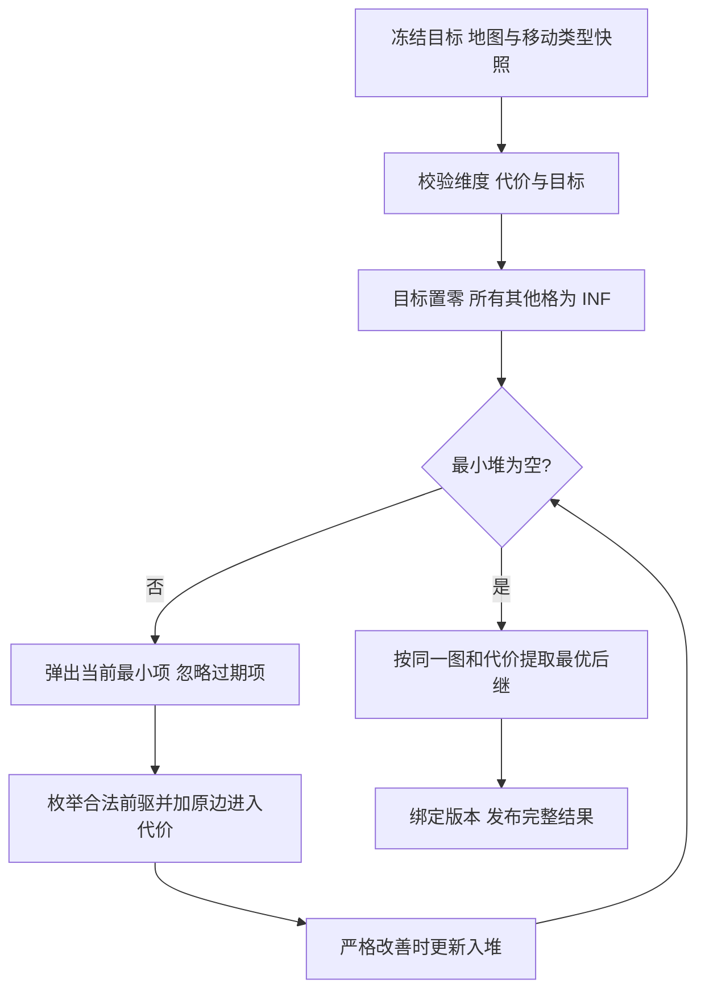
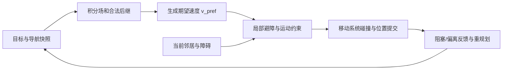

# 03 · 流场与群体寻路（Flow Field & Group Pathfinding）
> 知识成熟度：L2。核对公开原始资料并推导离散图合同；C++17教学实现未编译、未运行，第8.3与8.5的Python教学例已在Python 3.12.14完成有限运行，范围和原流见第8.5节；其余纸面用例不是实验结果。

> 一句话定位：**多个单位共享目标与通行规则时，复用到目标的代价场和下一步方向**；局部避障与实际移动仍按单位处理。
> 知识基线：有限离散图上的反向 Dijkstra；示例固定八邻域、进入格代价、正整数权重、禁止对角穿角。不同权重/拓扑必须重新定义边，不能只替换常量。
> 适用范围：RTS、塔防等多个起点共享少量目标的网格或分块导航；同一场只服务兼容的半径、移动类型、目标集合与地图版本。NavMesh、连续积分场与增量算法仅说明接口边界。
> 数值与正确性边界：Dijkstra 距离结论要求非负边；本文无环下降策略额外要求正边权与精确整数运算。O(1) 仅指已定位格子的固定大小查表，不包含邻居搜索、避障求解、碰撞、重算或到达保证。
> 最后更新：2026-10-10（修订反向边代价、合法方向、动态失效与局部避障接口，并补齐九格Python入口与有限运行记录；保持 L2、verified 为空）。
> 参考来源：[Emerson：Game AI Pro 第23章](https://www.gameaipro.com/GameAIPro/GameAIPro_Chapter23_Crowd_Pathfinding_and_Steering_Using_Flow_Field_Tiles.pdf)；[Red Blob Games：Flow Field Pathfinding for Tower Defense](https://www.redblobgames.com/pathfinding/tower-defense/)；[Reynolds：Steering Behaviors，1999](https://www.red3d.com/cwr/steer/gdc99/)；[ORCA 作者论文](https://gamma.cs.unc.edu/ORCA/publications/ORCA.pdf)。精确核对范围见第12节。

## 1. 概述

前两篇讨论图搜索与 A*。若 N 个单位各自发起一次独立搜索，总工作是这 N 次实际搜索之和；是否超帧取决于扩展节点数、路径复用、更新频率和预算，不能仅凭人数推断。多个起点共享同一目标集合时，可以反过来问：**每个合法位置到目标的最小剩余代价是多少，下一步该去哪？**

从目标沿反向边跑一次 Dijkstra，得到积分/代价距离场；再给每个可达格选择一个合法的最优后继。单位被挤到同一有效场中的其他格后也能查询下一步。正收益来自重用计算，不代表任意人数、任意目标或持续变图都没有代价。

Emerson 在《Game AI Pro》第23章介绍了 Supreme Commander 2 的分块方案，包含门户图、积分场缓存与 Steering；其 Eikonal、LOS 和近似处理不是本文离散 Dijkstra 示例的实现。原文提及的 Planetary Annihilation 案例未在本轮取得直接开发者资料，不作为本篇正确性或性能依据。

本文保留原学习路线：核心概念 → 反向积分 → 合法方向 → 复用成本 → 拥塞 → Steering 接口 → 两语言实现 → 复杂度与纸面验证 → 实践与 FAQ。

## 2. 核心概念

| 概念 | 英文 | 本文含义与边界 |
| --- | --- | --- |
| 积分/代价距离场 | Integration / Cost-to-go Field | 每个顶点到目标集合的最小累计边代价 D；不是墙壁的几何距离场 |
| 离散下降方向 | Discrete Policy | 满足 Bellman 最优条件的合法下一条边；不同权重下不能只看邻格 D |
| 方向场 | Flow / Vector Field | 下一格方向及目标、障碍、不可达状态；连续向量只是移动输入 |
| 代价场 | Cost Field | 用于构造有向边权的地形或风险数据；必须说明进入格、离开格或边本身代价 |
| 密度场 | Density Field | 群体占用的测量；可反馈为软代价，但不是必需输入或通行许可 |
| 势场 | Potential Field | 标量函数的更广泛概念；局部吸引/排斥叠加可能出现非目标极小值 |
| 局部避障 | Local Avoidance | 根据邻居、障碍与运动约束选择短期速度；不负责全局路径可达性 |

“沿场走会到达”需要限定：在有限静态图上，每次执行正权最优后继，D 严格下降，才不会成环并最终到达某个目标。插值、Boids 力、ORCA、实体碰撞或过期场都会改变实际轨迹，不能沿用此离散证明。流场也不是所有势场的反义词。

## 3. 距离场原理

### 3.1 先定边，再反向搜索

设原移动边为 u → v，权重 w(u,v) 表示**实际从 u 移到 v**的代价。需要从目标计算所有起点的代价，就在弹出 v 时遍历它的前驱 u，使用原边 w(u,v) 松弛 D[u]。有向跳跃、单行道、上下坡代价尤其不能把后继列表当成前驱列表。

本文网格的可走邻接对称，权重仍可能不对称：进入地形不同就不同。约定 c[v] 是进入 v 的地形倍率，s(u,v) 是步长权重，则 w(u,v)=s(u,v)×c[v]。反向弹出 v 后加 c[v]，不是 c[u]。若项目采用离开格代价，可以写成 s(u,v)×c[u]，但定义、反向松弛、策略提取与验证必须一起改变。

```text
D[*] = INF
对每个合法目标 t：D[t]=0，入最小堆
while 堆非空：
    (d,v) = 弹出最小项
    if d != D[v]：忽略过期堆项
    对每条合法原边 u → v（遍历前驱）：
        candidate = D[v] + w(u,v)
        if candidate < D[u]：更新 D[u] 并入堆
```

目标初始代价为零，表示已在目标不再支付入场成本；从其他格进入目标的最后一条边仍支付 c[target]。障碍没有可走入/出的边；空目标集合生成全不可达结果。越界或障碍内目标是输入错误，本例拒绝整次请求，不悄悄移动目标。

### 3.2 Bellman 条件与小图追踪

对于合法目标集合 T：

```text
D[t] = 0                                           t ∈ T
D[u] = min { w(u,v) + D[v] | 原图合法边 u → v }      u ∉ T
没有通向任何目标的路径：D[u] = INF
```

在正权有限图上，这描述最短到目标代价；非负边可求 Dijkstra 距离，但零权闭环上“任选一个同值后继”可能永远绕圈，且单写 Bellman 等式也不足以排除无目标零权分量的伪有限解。本例拒绝零权；若扩展到零权，需另外构造指向已确认目标的无环后继树或秩，不用浮点 epsilon 假装正下降。

纸面追踪（PAPER_EXPECTED，未运行）：一行 S-A-T，四连通步权10，进入倍率依次为 7、5、2。D[T]=0；弹出 T 后 D[A]=20；弹出 A 后 D[S]=70。起点自己的7未被支付。若写成反向加前驱倍率，会得到 D[A]=50、D[S]=120，计算的是另一个离开格模型。

### 3.3 流程示意与障碍合同



网格对角边要在建场和查询时遵守同一规则。本文仅在两个轴向侧格都可走时允许斜穿，防止从两个墙角之间挤过。此规则只约束格心图；有半径的实体还须在生成可走掩码时按移动体形状扩张障碍，并验证真实移动段的碰撞，不能把点格可达当作大单位可达。

## 4. 方向场

### 4.1 选择完整边代价，不只选最小邻格

```text
next[u] = argmin { w(u,v)+D[v] | 合法后继 v 且 D[v] 有限 }
要求该最小值等于 D[u]；目标、障碍、不可达不参与方向查表
```

只有所有候选边对当前 u 的 w(u,v) 相同，比较 D[v] 才等价。本例进入倍率不同、直斜步权不同，必须比较完整和。选定后 D[v]<D[u]，正边权给出下降保证；同值最优候选按固定方向序选择，便于排查。随机选择只能在合法最优候选中进行，并明确种子和采样时机；随帧任意抖动不是拥塞解法。

纸面反例（PAPER_EXPECTED，未运行）：独立有向图有两条路线 S→A→T 与 S→B→C→T，边步权均为10（这不是第8节网格布局）；c[A]=9，c[B]=c[C]=c[T]=1。D[A]=10，D[B]=20；但经 A 总价100，经 B 总价30。只取较小 D 会选 A，完整 Bellman 比较选 B。

```text
四邻域、等代价1的独立图示；x向右，y向下（不是第8节10/14示例输出）
距离：       一种合法方向：
 2 1 2          → ↓ ←
 1 T 1          → T ←
 2 1 2          → ↑ ←
```

### 4.2 存储、插值与停止状态

- 固定8方向可用紧凑索引，但目标、不可达、障碍需要额外编码或状态位。本文教学实现用整数 -1/-2/-3 区分，不宣称实际 vector<int> 是1字节/格
- 格心规则网格的双线性插值通常取所在插值方格的4个样本，8方向是方向集合，不是“双线性要取8个邻居”。插值可能抵消成零或指向墙内；必须筛掉无效样本并检查几何可行性，不能继承离散最短路保证
- 方向索引必须先验证再访问 DIRS。目标进入到达/减速逻辑；不可达等待重规划或报告失败；障碍格/越界表示位置与导航模型不一致，需要恢复。零向量不得无条件归一化
- “进入目标格”只满足本文图上的终止定义。要求到达格内某个点、攻击距离或停驻队形时，另有终点行为、碰撞与占位条件；到达后仍可能需要避让移动中的其他单位

### 4.3 多目标、版本和动态变化

多源反向 Dijkstra 将全部目标置零，得到到任意目标的最低总代价；“最近”是本模型的代价最小，不必是欧氏最近，也不含目标容量或单位分配。不同单位有不同目的地时，不能把所有目标合成一张场后仍承诺各自到指定目标。

目标移动或增删边可影响远处最优路径。局部修复必须沿依赖传播直到满足正确性终止条件；固定“目标附近几格”没有普遍保证。全量重建是本文示例的明确回退；LPA*/D* Lite 的状态与修复条件见[动态寻路](02-动态寻路LPA与DStarLite.md)，其单起终点提前终止不能直接证明全场每格都已修复。

分块方法还需维护门户图、边界值和相邻分块依赖。Emerson 的动态更新同时处理脏区、门户和受影响路径，不能缩写成“只重算目标块总是足够”。共享缓存至少按目标集合/门户边界条件、地图与代价版本、移动类别区分。对一轮构建读取不可变快照，完成后整体发布；旧结果不能覆盖更新请求。新墙出现后，即使旧场仍在使用，移动层也必须检查当前阻挡并暂停危险步进。频率由变更率与预算决定，没有统一0.5秒安全界限。

## 5. 单次计算、多人复用

### 5.1 比较相同工作范围

设 V/E 是当前导航图顶点/边数，N 是共享单位数，M 是不同场缓存键数量；索引二叉堆的一般图建场上界是 O((V+E)log V)，方向提取 O(V+E)，每个已定位格子查询 O(1)。本文使用惰性重复项堆，上界 O((V+E)log(V+E))；固定度网格 E=O(V)，同样化为 O(V log V)。若建场期间发生变更，还需计重建/作废成本。

| 方案 | 工作口径 | 取舍 |
| --- | --- | --- |
| 逐单位 A* | N 次实际搜索的代价之和 | 可只扩展很小区域；启发式、一致性与重开策略影响成本 |
| 共享一个流场 | 一次建场 + K 次查询 + 局部移动成本 | K 为实际累计单位查询数；持续帧不能省略 |
| M 个流场 | 各场构建/更新与存储之和 + 查询 | 目标、半径、通行规则与版本增加 M，不能只数目标坐标 |

N=1000、V=10⁶ 只说明“可以复用一次建场”，不意味着1000次 A* 都展开百万节点，更不推出速度相差三个数量级。一次全场搜索可能比近距离少量 A* 更贵；只有测量实际请求分布、重建次数、缓存命中与局部代价才能判断盈亏。

### 5.2 选择场景

| 场景 | 倾向与条件 |
| --- | --- |
| RTS 共同目标、塔防共同出口 | 复用流场，前提是通行规则兼容且更新可摊销 |
| MOBA 固定小兵线 | 比较预定路线、路径复用与流场，人数本身不决定方案 |
| RPG 单角色或大量不同点击目标 | 优先评估按需 A*，减少全图与多目标缓存成本 |
| 目标/障碍快速改变 | 比较按需规划、增量修复与分块建场；先满足安全失效合同 |
| 超大地图 | 门户高层图 + 按需分块；跨块代价一致性是额外职责 |

单位数、可复用目标/移动类别、实际访问区域、更新率与缓存寿命共同决定方案，不能用“单位数×目标数”一个乘积作为规则。

## 6. 群体拥塞避免

### 6.1 最短路不等于通道调度

共享策略可能把很多单位导向同一便宜通道；但不会自动生成队形，也不保证所有起点走完全相同的路线。若实体体积与通道容量形成竞争，最短路距离本身既不预订空间，也不分配通过顺序。

### 6.2 可选的密度反馈

```text
c[v] = 基础地形倍率[v] + alpha × 有明确定义的密度[v]
```

先说明密度是格内人数、单位面积人数还是占用率，alpha 的单位才能确定。本文整数示例若接入浮点密度，必须明确量化、范围与快照规则，仍保持正有限整数；原“地形代价20%~50%”没有统一依据。

流程是测量占用 → 平滑/限幅并生成新代价快照 → 全量或正确增量修复 → 一起发布距离与方向。代价降低可能吸引更多单位返回，所有单位同步绕路又可能引发来回摆动；更新间隔、滞回、错峰与密度预测需作为策略实测，不能承诺拥塞自动消失。密度代价是软偏好，不替代墙、实体碰撞或通道容量限制。

### 6.3 其他手段与边界

- 方向平局：可对合法最优后继作稳定选择或受控随机，不能任意偏转越过障碍
- 队形：维护每个单位的偏移/槽位目标，并检查半径、通道宽度与槽位占用；共同目标没有自动提供 cohesion
- 容量/让行：狭窄双向通道可使用等待、优先权与通行配额；还要防饥饿和循环等待
- 分波次：降低瞬时入口负载，但会增加部分单位延迟；这些措施各自有玩法与调度成本

## 7. 与 Steering 结合

### 7.1 从全局偏好到实际运动



全局层可按预算更新，局部层随移动步长更新；“每帧”不代表无限采样频率。Reynolds 将目标选择、Steering 与 locomotion 区分开来，本图重点连接全局导航与后两层。

### 7.2 Boids 混合与 ORCA 接口不能混用

简单 Steering 可把寻路偏好、分离、对齐、聚集组合为力或加速度，前提是单位一致，并限制加速度、速度、步长，处理零向量与障碍优先级。Separation、Alignment、Cohesion 是不同行为；大家追同一目标并不等于追局部邻居中心。任意加权和可以相互抵消，也不保证无碰撞或无死锁，权重须用具体场景调试。

ORCA 是另一种接口：把流场导出的方向、到达减速等组成 v_pref，在避障约束和最大速度约束内选尽可能接近它的速度。不能先求 ORCA 速度，再加一项“流场力”或归一化到满速；这样可能离开可行速度集合。若 locomotion 有转向/加速度限制，也必须纳入可执行运动的设计或重新验证，不能用裁剪后的速度继承原理论保证。

ORCA 作者论文使用二维形状、可即时选速度等模型假设，局部互避也不保证全局进展。无可行速度、漏邻居、拥挤死锁、有限精度和实体碰撞需要显式处理，不能把“停止”在所有动态场景里自动称为无碰撞。具体 ORCA 求解器留在[相关专篇](04-RVO与数值鲁棒.md)，本文不新增求解框架。

## 8. 完整网格建场教学示例（Python有限运行，C++未运行）

### 8.1 输入、输出与数值合同

两份实现保持同一有限模型：W/H 为正整数，W×H≤2³¹−1；格子行优先编号 y×W+x，x向右、y向下。8方向顺序为右、左、下、上、右下、右上、左下、左上；轴向步权10、对角步权14。14/10是明确的离散权重，不是精确√2；该图上的最短代价不等于连续欧氏最短路径。

输入 cost 为1..10⁶整数的地形倍率，blocked 独立表示墙；墙的占位 cost 也须满足格式约束但不产生边。目标可重复，重复目标去重；空集合合法。C++ 明确要求32位int；W×H 先检查乘法边界，INF 取 int64 最大值的1/4；任何简单路径最多 V−1 条边，最大代价上界14×10⁶×(V−1)远小于 INF，因而不会把合法大距离误作不可达。Python 采用同一容量范围和 sentinel 便于对照，不代表该规模能成功分配内存。

选择整数是本教学例的范围收窄，不说明浮点Dijkstra无效。需要连续地形/密度代价时，要另定NaN/无穷输入、溢出、舍入与平局策略；正浮点边也可能因舍入不再使存储距离严格下降。固定点量化会改变代价乃至最优路线，须说明误差预算；不要把本例整数等式原样替换成epsilon后继续声称相同保证。

输出 dist 与 flow 来自同一输入快照。flow：0..7为下一格方向，-1为不可达，-2为目标，-3为墙。非目标可达格必须找到代价与 dist 完全一致的后继，否则报内部不一致；不输出一个看起来能走的猜测方向。输入在整个调用期间必须保持不变；这不是线程同步或缓存发布器。

### 8.2 C++17 实现

```cpp
#include <array>
#include <cstdint>
#include <functional>
#include <limits>
#include <queue>
#include <stdexcept>
#include <utility>
#include <vector>

static_assert(std::numeric_limits<int>::max() == 2147483647, "requires 32-bit int");
using Cost = std::int64_t;
constexpr Cost INF = std::numeric_limits<Cost>::max() / 4;
constexpr int UNREACHABLE = -1, GOAL = -2, BLOCKED = -3;
constexpr std::array<int, 8> DX{1,-1,0,0,1,1,-1,-1};
constexpr std::array<int, 8> DY{0,0,1,-1,1,-1,1,-1};
constexpr std::array<int, 8> STEP{10,10,10,10,14,14,14,14};

struct Grid {
    int W, H;
    std::vector<Cost> cost;
    std::vector<bool> blocked;
};
struct Field {
    std::vector<Cost> dist;
    std::vector<int> flow;
};

Field computeFlowField(const Grid& g, const std::vector<int>& targets) {
    // g 在整个调用期间为不可变快照。
    if (g.W <= 0 || g.H <= 0 ||
        g.W > std::numeric_limits<int>::max() / g.H)
        throw std::invalid_argument("invalid dimensions");
    const int n = g.W * g.H;
    if (g.cost.size() != static_cast<std::size_t>(n) ||
        g.blocked.size() != static_cast<std::size_t>(n))
        throw std::invalid_argument("size mismatch");
    for (Cost c : g.cost)
        if (c < 1 || c > 1000000)
            throw std::invalid_argument("cost outside 1..1000000");
    for (int t : targets)
        if (t < 0 || t >= n || g.blocked[t])
            throw std::invalid_argument("invalid target");

    // 返回合法邻格，否则 -1；对角两侧都要可走。
    const auto neighbor = [&](int u, int k) -> int {
        if (g.blocked[u]) return -1;
        const int x = u % g.W, y = u / g.W;
        const int nx = x + DX[k], ny = y + DY[k];
        if (nx < 0 || nx >= g.W || ny < 0 || ny >= g.H) return -1;
        const int v = ny * g.W + nx;
        if (g.blocked[v]) return -1;
        if (DX[k] != 0 && DY[k] != 0 &&
            (g.blocked[y * g.W + nx] || g.blocked[ny * g.W + x]))
            return -1;
        return v;
    };

    Field f{std::vector<Cost>(n, INF), std::vector<int>(n, UNREACHABLE)};
    std::vector<bool> target(n, false);
    using Item = std::pair<Cost, int>;
    std::priority_queue<Item, std::vector<Item>, std::greater<Item>> pq;
    for (int t : targets) {
        if (target[t]) continue;
        target[t] = true;
        f.dist[t] = 0;
        pq.push({0, t});
    }
    // 阶段一：邻接对称，v 的邻格 u 也是原图前驱。
    while (!pq.empty()) {
        const auto [d, v] = pq.top();
        pq.pop();
        if (d != f.dist[v]) continue;
        for (int k = 0; k < 8; ++k) {
            const int u = neighbor(v, k);
            if (u < 0) continue;
            // 原边 u -> v 支付进入 v 的代价；反向方向的步长相同。
            const Cost candidate = d + Cost(STEP[k]) * g.cost[v];
            if (candidate < f.dist[u]) {
                f.dist[u] = candidate;
                pq.push({candidate, u});
            }
        }
    }
    // 阶段二：用相同图和原边权选后继；不按最小邻格 dist 选。
    for (int u = 0; u < n; ++u) {
        if (g.blocked[u]) { f.flow[u] = BLOCKED; continue; }
        if (target[u]) { f.flow[u] = GOAL; continue; }
        if (f.dist[u] == INF) continue;
        Cost best = INF;
        int bestDir = UNREACHABLE;
        for (int k = 0; k < 8; ++k) {
            const int v = neighbor(u, k);
            if (v < 0 || f.dist[v] == INF) continue;
            const Cost candidate = Cost(STEP[k]) * g.cost[v] + f.dist[v];
            if (candidate < best) { best = candidate; bestDir = k; }
        }
        if (bestDir < 0 || best != f.dist[u])
            throw std::logic_error("inconsistent field");
        f.flow[u] = bestDir;
    }
    return f;
}
```

本代码没有 main、线程、场缓存或移动组件；“完整”限定为输入校验、反向建场和策略提取这一纯函数边界，不声称是可直接集成的生产模块。内存分配失败沿标准容器异常返回调用方，调用方不得发布半成品。

### 8.3 Python 3.12 对照实现

```python
import heapq

INF = (2**63 - 1) // 4
UNREACHABLE, GOAL, BLOCKED = -1, -2, -3
DIRS = ((1,0), (-1,0), (0,1), (0,-1),
        (1,1), (1,-1), (-1,1), (-1,-1))
STEP = (10, 10, 10, 10, 14, 14, 14, 14)

def compute_flow_field(W, H, targets, cost, blocked):
    """平坦行优先数组；targets 为整数索引序列；输入调用期间不得改变。"""
    if type(W) is not int or type(H) is not int or W <= 0 or H <= 0:
        raise ValueError("invalid dimensions")
    n = W * H
    if n > 2**31 - 1 or len(cost) != n or len(blocked) != n:
        raise ValueError("size mismatch or capacity exceeded")
    if any(type(c) is not int or not 1 <= c <= 1000000 for c in cost):
        raise ValueError("cost must be integer in 1..1000000")
    if any(type(b) is not bool for b in blocked):
        raise ValueError("blocked must contain bools")
    targets = tuple(targets)
    if any(type(t) is not int or not 0 <= t < n or blocked[t] for t in targets):
        raise ValueError("invalid target")

    def neighbor(u, k):
        if blocked[u]:
            return None
        x, y = u % W, u // W
        dx, dy = DIRS[k]
        nx, ny = x + dx, y + dy
        if not (0 <= nx < W and 0 <= ny < H):
            return None
        v = ny * W + nx
        if blocked[v]:
            return None
        if dx and dy and (blocked[y * W + nx] or blocked[ny * W + x]):
            return None
        return v

    dist = [INF] * n
    flow = [UNREACHABLE] * n
    target = [False] * n
    pq = []
    for t in targets:
        if not target[t]:
            target[t] = True
            dist[t] = 0
            heapq.heappush(pq, (0, t))
    while pq:
        d, v = heapq.heappop(pq)
        if d != dist[v]:
            continue
        for k in range(8):
            u = neighbor(v, k)  # 本例邻接对称；一般有向图要用 predecessors
            if u is None:
                continue
            candidate = d + STEP[k] * cost[v]
            if candidate < dist[u]:
                dist[u] = candidate
                heapq.heappush(pq, (candidate, u))
    for u in range(n):
        if blocked[u]:
            flow[u] = BLOCKED
            continue
        if target[u]:
            flow[u] = GOAL
            continue
        if dist[u] == INF:
            continue
        best, best_dir = INF, UNREACHABLE
        for k in range(8):
            v = neighbor(u, k)
            if v is None or dist[v] == INF:
                continue
            candidate = STEP[k] * cost[v] + dist[v]
            if candidate < best:
                best, best_dir = candidate, k
        if best_dir < 0 or best != dist[u]:
            raise RuntimeError("inconsistent field")
        flow[u] = best_dir
    return dist, flow
```

C++ 类型与 Python 的显式输入检查并不等于所有语言边界行为相同；有限整数模型中的代价、方向序、目标去重和墙规则按上述合同对齐。本文没有执行跨语言差分测试。

### 8.4 单位移动接口（伪代码）

```text
读取一个完整的导航结果快照（目标/地图/移动类别/场版本）
若世界、单位类别或目标不匹配：停用该场并请求兼容结果
定位当前格；越界则进入恢复流程，不访问数组
读取 flow[cell]
若 BLOCKED / UNREACHABLE：不构造路径方向，进入失败/等待策略
若 GOAL：进入本任务的到达行为，以 v_pref=0 或终点控制器为偏好
若 0..7：
    解码下一格，并检查当前阻挡及本步移动段可行性
    将轴向或对角方向归一化为单位向量，再乘期望速度
    结合到达减速/编队意图生成 v_pref
其他编码：拒绝损坏结果
局部层根据邻居、障碍和运动约束选择可执行速度
移动系统按 dt 执行碰撞约束下的位移并反馈实际位置
持续无进展、场过期或偏离覆盖区：等待、重规划或明确失败
```

这里只规定处理顺序，未实现 ORCA、碰撞、导航投影或失败恢复。对角方向归一化是生成偏好阶段的单位处理；不得在局部避障输出后强行满速归一化。也不能在发现危险时仅丢掉新方向却保留旧非零速度继续穿墙。

### 8.5 从九格输入到整张场和路径（完整入口与Python有限运行）

第8.3节实现了建场函数，下面把它接到具体输入和可读输出。将第8.3节的整个 Python 代码块与本节代码块依次保存到同一个 `flow_demo.py`，使用 Python 3.12 标准库即可；`python3 -I -B flow_demo.py` 是复现命令，本例已在Python 3.12.14实际执行，精确命令和结果见本节运行记录。C++ 建场函数不变，也未编译。这里读取的是冻结网格上的格心路径，不执行实体移动。

输入是一张3×3小图，编号为 `y*3+x`；`#` 是墙，`I` 是被墙隔开的可走格。括号中是进入格的地形倍率，目标仍须支付最后一次进入代价。墙的占位倍率取1，但不产生边。

```text
坐标       x=0        x=1        x=2
y=0       0:S(7)     1:(2)      2:T(2)
y=1       3:(1)      4:(1)      5:#
y=2       6:#        7:#        8:I(1)
```

先手算建场的中间状态。堆项为 `(距离,格号)`，距离相同时先弹出较小格号；表中只列成功的松弛。所有未列距离初始为 INF，目标2初始为0。

| 弹出项 | 新得到的距离 | 原边为什么收这个代价 |
| --- | --- | --- |
| `(0,2)` | D[1]=20 | 1→2支付10×c[2]=20；4→2的对角边被侧格5阻断 |
| `(20,1)` | D[0]=40，D[4]=40，D[3]=48 | 0/4→1各支付10×2；3→1支付14×2，两侧格0、4都可走 |
| `(40,0)`、`(40,4)`、`(48,3)` | 无更小值，堆清空 | 原权重加剩余代价均不优于已知值；8没有合法邻边 |

随后才提取方向：格3向右走经4要 `10×1+40=50`，向右上走经1只要 `14×2+20=48`，所以选方向5。格4不能斜穿到目标2，即使那条非法捷径看起来只要28；它应先向上到1，再向右到2，总价40。起点0的倍率7没有被支付，其路径总代价是20+20=40。这个例子同时区分了进入格代价、10/14步权和禁止穿角。

以下入口保留原建场函数，额外提供有界的路径解码。`trace_path` 只接收刚才同一次调用的合法输入与结果；它不是通用文件格式校验器。每步在索引方向表前区分特殊状态，再复核边合法性和 Bellman 等式；发现损坏或不一致即报错，不用猜测方向继续前进。

```python
# 接在第8.3节代码之后；无需第三方库。
def trace_path(W, H, cost, blocked, dist, flow, start):
    n = W * H
    if type(start) is not int or not 0 <= start < n:
        raise ValueError("invalid start")
    if flow[start] == BLOCKED:
        return "BLOCKED", [], None
    if flow[start] == UNREACHABLE:
        return "UNREACHABLE", [], None
    path, total, u = [start], 0, start
    for _ in range(n):  # 正权下降链最多访问V个格，含目标。
        k = flow[u]
        if k == GOAL:
            if dist[u] != 0 or total != dist[start]:
                raise RuntimeError("inconsistent arrival")
            return "GOAL", path, total
        if not 0 <= k < len(DIRS):
            raise RuntimeError("invalid flow state")
        if len(path) >= n:
            raise RuntimeError("path exceeds V-1 edges")
        x, y = u % W, u // W
        dx, dy = DIRS[k]
        nx, ny = x + dx, y + dy
        if not (0 <= nx < W and 0 <= ny < H):
            raise RuntimeError("flow leaves grid")
        v = ny * W + nx
        if blocked[u] or blocked[v]:
            raise RuntimeError("flow crosses wall")
        if dx and dy and (blocked[y * W + nx] or blocked[ny * W + x]):
            raise RuntimeError("flow cuts corner")
        edge = STEP[k] * cost[v]
        if dist[v] == INF or dist[u] != edge + dist[v] or dist[v] >= dist[u]:
            raise RuntimeError("flow violates Bellman descent")
        total += edge
        path.append(v)
        u = v
    raise RuntimeError("path did not reach goal")


def print_route(label, result, W):
    state, path, total = result
    points = [(u % W, u // W) for u in path]
    print(f"{label}: {state} path={points} cost={total}")


def main():
    W, H = 3, 3
    cost = [7, 2, 2, 1, 1, 1, 1, 1, 1]
    blocked = [False, False, False, False, False, True, True, True, False]
    targets = [2]
    dist, flow = compute_flow_field(W, H, targets, cost, blocked)
    print("dist:")
    for y in range(H):
        print(["INF" if d == INF else d for d in dist[y*W:(y+1)*W]])
    print("flow:")
    for y in range(H):
        print(flow[y*W:(y+1)*W])
    for start in (0, 3, 4, 2, 8, 5):
        print_route(f"start={start}",
                    trace_path(W, H, cost, blocked, dist, flow, start), W)

    empty_dist, empty_flow = compute_flow_field(W, H, [], cost, blocked)
    print_route("empty targets", trace_path(
        W, H, cost, blocked, empty_dist, empty_flow, 0), W)
    bad_cost = cost.copy()
    bad_cost[0] = 0
    for label, trial_targets, trial_cost in (
        ("zero cost", targets, bad_cost),
        ("wall target", [5], cost),
    ):
        try:
            compute_flow_field(W, H, trial_targets, trial_cost, blocked)
        except ValueError as exc:
            print(f"{label}: ValueError: {exc}")
        else:
            raise RuntimeError(f"{label}: expected input rejection")


if __name__ == "__main__":
    main()
```

完整运行前冻结的纸面输出如下，标记为 **PAPER_EXPECTED**；这是预期值，真实终端原流另存于本节运行记录，不能用此代码块替代原流。输出路径用 `(x,y)` 坐标，`flow` 中0=右、3=上、5=右上，-1/-2/-3分别是不可达/目标/墙。墙和不可达格的 `dist` 都是 INF，但两者的 `flow` 不同；没有路径的 `cost=None` 不表示零成本到达。

```text
dist:
[40, 20, 0]
[48, 40, 'INF']
['INF', 'INF', 'INF']
flow:
[0, 0, -2]
[5, 3, -3]
[-3, -3, -1]
start=0: GOAL path=[(0, 0), (1, 0), (2, 0)] cost=40
start=3: GOAL path=[(0, 1), (1, 0), (2, 0)] cost=48
start=4: GOAL path=[(1, 1), (1, 0), (2, 0)] cost=40
start=2: GOAL path=[(2, 0)] cost=0
start=8: UNREACHABLE path=[] cost=None
start=5: BLOCKED path=[] cost=None
empty targets: UNREACHABLE path=[] cost=None
zero cost: ValueError: cost must be integer in 1..1000000
wall target: ValueError: invalid target
```

零倍率、墙内目标是输入错误，所以拒绝整次建场；空目标是合法请求，所以产生不可达场。这三种情况不能混为“没找到路径”。第8.1节还限定了尺寸、成本类型与容量；换成浮点、单向边或动态地图时，须先更改相应合同，不能只改这个入口的数组。

独立对照不应再调用建场函数的 `neighbor` 或复写它的堆循环。可把这张图人工枚举为14条原方向边：`0→1:20, 1→0:70, 0→3:10, 3→0:70, 0→4:14, 4→0:98, 1→2:20, 2→1:20, 1→3:14, 3→1:28, 1→4:10, 4→1:20, 3→4:10, 4→3:10`；5、6、7、8没有边。特别是4→2和4→8均不在图内。以目标2为零、其余为无穷，做“最多k条边”的同步 Bellman 递推：新一轮从旧一轮读取，保留原距离，并用每条原边 `u→v` 的 `w+D旧[v]` 改善u。第1轮仅D[1]变20，第2轮再得40/48/40，第3轮不变；最多V−1轮即可覆盖正权最短简单路径。把所得完整距离与上面的数组比较，再独立按给定方向序检查每个后继、全部可达起点的路径总价与V−1步界。该14边同步Bellman、九起点与六组边界已完成下面记录的有限验证；不能把同一段实现的自检称为独立证明，也不能由这些有限输入推出任意网格实现均正确。

这个入口的学习终点是“相同静态网格上，多起点查询同一张离散最短路策略”。它没有实现Eikonal、连续插值、ORCA、实体半径或群体碰撞；打印路径不能证明真实单位无碰撞、无拥塞或按时到达。相关接口仍按第4、6、7节处理。


#### 本地有限运行记录（2026-10-10）

本次在Python **3.12.14**、`Linux-6.18.44-x86_64-with-glibc2.41`执行了一次完整入口，并独立执行人工14条原方向边的同步Bellman、全部九个起点与六组边界。示例17行stdout与运行前冻结期望逐字相同；独立对照实际输出为 `{"oracle_matches": true, "policy_matches": true, "starts_checked": 9, "boundary_groups_passed": 6}`。这些是本节有限输入上的观察，不是所有网格、实体运动或群体性能的证明。

| 阶段 | UTC开始时间 | 实际墙钟秒 | 总硬限秒 | exit | stdout / stderr bytes |
| --- | --- | --- | --- | --- | --- |
| 版本与平台采集 | 11:44:45.754909 | 0.034273 | 5 | 0 | 164 / 0 |
| 九格demo | 11:44:45.789856 | 0.016769 | 10 | 0 | 505 / 0 |
| 独立Bellman与边界 | 11:44:45.807361 | 0.026027 | 10 | 0 | 99 / 0 |

三阶段均在启动前冻结输入与期望，每流限65536 bytes，正常执行预算为3/8/8秒，TERM最多1秒和KILL回收最多1秒包含在5/10/10秒总硬限内。本次均正常exit0、stderr为空，没有超时、输出截断、终止信号或自动重跑；进程组均已确认回收。表中是单次进程墙钟，含解释器启动和监督开销，不是建场吞吐或性能基准。

仓外证据定位为 `learning-evidence-20261009/flow-complete-example-author/`，不是仓内测试框架。实际工作目录和命令逐项保存在 `attempt-started.json`、`runtime.json`；实际解释器为 `/opt/codex/runtimes/codex-primary-runtime/dependencies/python/bin/python3`，两个目标命令分别为该解释器加 `-I -B flow_demo.py` 和 `-I -B oracle.py`。`metadata.stdout/.stderr`、`demo.stdout/.stderr`、`oracle.stdout/.stderr`保存各自完整原流；`expected-demo.stdout`是启动前冻结的期望。复现demo只需按前文合并两个代码块，独立对照按上一段14条边和下面说明构造，不依赖仓库模块或第三方库。

- 实跑 `flow_demo.py` SHA256：`1a1675f57bc982f119990ad3a943c179c8265b9f81c7f11ed79b091db789a90a`；两个Python块逐字保留，文件另有审前固定说明首行，运行前后hash相同
- 人工边表的 `oracle.py` SHA256：`6440f6a5276be068fc0ce5d7e92557aa9d635ce340ab70dc7c5e6993b11de340`；不使用建场函数的邻接枚举或堆循环作参照
- `demo.stdout`与冻结期望共同SHA256：`17661c95bd0ab222040976d95af67e6a00ad5235b64bfb81a8ab5fcdb29ef0dc`
- `runtime.json` SHA256：`9c4a09e265890a2c6b43e903c4d0df1784cc8f5370f5bb2d2c384db102c0bf45`；包含精确起止、命令、预算、exit、字节数、原流hash和回收状态

六组边界分别实际检查了：1×1已到目标、空目标的全部九格状态、起点−1和9、零代价及墙内目标、结果副本强制4→2穿角、另一副本含未知负方向−4。最后两组只改结果副本，原建场算法不变；应拒绝的异常由对照捕获并核对类型/消息，目标进程没有未处理异常。全部九起点还按人工边表重算每条路径代价，检查目标、不可达和墙状态，以及≤V−1条边的终止界。

这里没有执行旧P01–P12整表、C++、跨语言差分、连续插值、Eikonal、ORCA、缓存/线程或实体碰撞。普通编译/语法检查和他人论文实验也不计入这些实跑结果；本篇继续保持L2与verified为空。

## 9. 复杂度分析

| 阶段 | 时间/空间口径 | 限定 |
| --- | --- | --- |
| 反向 BFS | O(V+E) 时间、O(V) 工作空间 | 所有边权相等；本例10/14即使地形相同也不满足 |
| 反向 Dijkstra | 索引堆 O((V+E)log V)；惰性堆 O((V+E)log(V+E))，后者堆可占 O(V+E) | 本例固定度网格 E=O(V)，故时间 O(V log V)、空间 O(V) |
| 策略提取 | O(V+E) 时间、O(V) 输出 | 每格检查合法后继，固定度时为 O(V) |
| 单位查询方向 | O(1) | 格子已定位；不含查询邻居、插值安全检查与物理移动 |
| 局部避障 | 依邻居查询与约束数而定 | 无空间索引的全量两两检查可达 O(N²)，不能合并进查表常数 |
| 密度统计 | 清零全数组 O(V) + 累加 O(N) | 稀疏清零/增量维护需另外的状态和正确性合同 |
| M 张场 | 构建与更新逐张计费，常驻数据 O(MV) | 分块缓存可减少常驻区域，但加上管理与门户成本 |

若方向压缩1字节、距离float32为4字节，1000×1000仅方向项为1 MB，一张场的这两项为5 MB（十进制），5张的距离项单独20 MB。4000×4000的这两项为80 MB，但不含代价、障碍、目标、队列、双缓冲、对象与对齐；本文 C++ 输出使用 int64 距离和 int 方向，不采用5字节布局。Python 对象开销更不同。没有本机测量就不填写“几十毫秒”或“可接受”。

## 验证与基准建议

下表按原顺序称为P01–P12，仍全部标为 PAPER_EXPECTED / NOT_RUN；本轮没有按本表整组执行，它们仍是后续验证输入和判定依据，不是 PASS 记录。第8.5节另列的有限Python实跑不追认本表为实测；C++编译与运行、跨语言差分、UE、ORCA、实体移动及性能基准仍未进行。

| 输入与操作 | PAPER_EXPECTED（未运行） | 暴露的错误 |
| --- | --- | --- |
| 3×1，cost=[7,5,2]，全可走，target=[2] | dist=[70,20,0]，flow=[0,0,-2] | 反向松弛错误支付前驱地形 |
| 3×1，cost=[1,1,1]，中格墙，target=[2] | dist=[INF,INF,0]，flow=[-1,-3,-2] | 把墙当高价地形或不可达当普通方向 |
| 2×2，起点(0,0)，目标(1,1)，两轴向侧格墙 | 起点不可达，不得走对角 | 建场/策略漏掉穿角规则 |
| 2×2全可走、cost全1、目标索引3 | dist=[14,10,10,0]，flow=[4,2,0,-2] | 图距离、方向编码和对角单位化混淆 |
| 3×1全1，目标[0,2,2] | dist=[0,10,0]；中格平局依方向序选右，目标均-2 | 多目标去重与稳定平局 |
| 1×1目标[0]；另一次空目标[] | 前者 dist=[0]/flow=[-2]；后者 INF/-1 | 零向量、空集合、目标直接索引 |
| 负/零/NaN/浮点cost，越界或墙内目标，形状不匹配 | 本例拒绝输入；不发布部分结果 | 用不受支持的数据污染优先队列 |
| 第4.1节两路线加权图 | 经B的总代价30优于经A的100 | 只选最小邻格 D |
| 5×1全1，从target=4改为target=0 | D由[40,30,20,10,0]改为[0,10,20,30,40] | 目标移动影响远端，不局限目标附近 |
| 5×1目标4，在索引3新增墙 | 索引0..2全部不可达；不能保留旧下降链 | 代价增加/断路需要传播失效 |
| 旧版本A构建未完，版本B新增墙并完成发布，A随后返回 | A不得覆盖B；当前墙检查拒绝旧穿墙步进 | 构建完成次序不等于有效版本次序 |
| 局部可行约束 vx≤0.2，求解输出(0.2,0)；随后归一化到速度1 | (1,0)违反约束；不能继承避障保证 | 对ORCA结果再次满速归一化 |

后续实现验证应检查所有可达非目标格的合法后继与 Bellman 等式、每条策略链最多 V−1 步到达目标、不可达与墙状态不被解码。可用独立的前向最短路作为参照，但对照必须用同一边模型；抽样未覆盖整图，局部避障轨迹也不构成最短路证明。另测受控大代价、分配失败、边界坐标、长链与大量堆过期项。

性能实验须分开记录建场/策略/发布、查表、邻居搜索、避障与碰撞时间，标明图规模、可达率、单位与目标分布、缓存命中、变更率、重算量、吞吐及P50/P95。公平比较 A* 使用相同请求和地图快照，计入流场未被访问区域和作废工作。项目若已有测试框架，可将上述用例转成断言；本文不声称仓库已有 tests/test_flow_field.py，也不以示例命令冒充执行记录。

## 10. 最佳实践

1. 先定义边：进入/离开代价、直斜权重、穿角、半径与移动类型同时约束积分和策略
2. 将不可达、墙与已到达作为明确状态；不要用一个 -1 进入方向数组，也不要把0距离泛化为任意模型的到达证明
3. 全局场按快照构建并整体发布；变化传播范围不确定时，回退完整重建，移动层同时阻止当前非法步进
4. 密度反馈按需要启用，配合稳定性与吞吐指标；它不能替代容量调度或碰撞约束
5. 按移动类型/目标/版本设置缓存预算；方向可压缩，距离格式按范围分析选择，双缓冲和队列一并核算
6. 混合 A*、门户分层与流场时明确各自图和交接点；特殊单位不能无条件读取普通单位场
7. 热力图、合法边、状态色与箭头一起显示；调试图是诊断工具，不给出未经测量的效率倍数

## 11. 常见问题 FAQ

**Q1：能处理动态障碍吗？**
可以重新构建或做正确的增量修复。新墙改变连通性，不能只靠 Steering 穿过；短时移动单位通常进入局部避障，长期拥堵或占位再按策略反馈全局层。旧场过渡期必须保留当前几何合法性检查。

**Q2：流场与势场的区别是什么？**
本篇是全局图代价导出的离散策略，正权最优后继有严格下降证明；局部吸引/排斥场可能有非目标极小值。连续插值和局部移动不是离散证明的自动延伸，也不能笼统声称所有“流场”都保证收敛。

**Q3：追击移动目标怎么办？**
按目标预测和游戏允许的滞后重建或正确修复。目标移动可影响全图，分块复用需要边界/门户失效传播；切回 A* 也仍需处理目标过期与重规划预算。

**Q4：NavMesh 可以用吗？**
可以在有向多边形/门户图上求到目标的代价与下一门户，但一个多边形内“固定一个向量”未必能到合法出口。门户几何、半径收缩、漏斗/走廊、off-mesh连接与高度处理应由具体导航实现负责；网格示例不能直接充当这些实现。

**Q5：大家读同一张场就会保持队形吗？**
不会。场只给全局偏好，不提供相对槽位、碰撞分离或编队容量。队形偏移必须在可行区域里再处理，窄门往往需要解散或调度通过。

**Q6：流场只能做近似路径，A*才能最优吗？**
不是。相同离散图上，精确反向 Dijkstra 的策略可以达到最短代价，A* 则受启发式与实现条件约束；近似来自图抽象、权重量化、分块或实际移动偏离等选择。选型主要看查询复用和更新成本。

**Q7：4000×4000地图怎么办？**
先明确常驻数据、目标/移动类别与工作队列预算，再比较分块缓存、门户高层搜索和按需区域。不能从格数推出重算耗时；分块节省成本也同时增加边界一致性与失效管理职责。

## 12. 关联阅读与来源定位

- [01-图论基础与搜索算法.md](01-图论基础与搜索算法.md)：Dijkstra、边模型与路径还原；本篇专注多起点共享策略
- [02-A星算法与优化.md](02-A星算法与优化.md)：A* 与分层搜索的适用条件
- [04-空间分区与索引.md](../空间查询与碰撞/04-空间分区与索引.md)：密度统计与局部邻居查询
- [03-工程与实用技巧/04-路径平滑与转向行为.md](04-路径平滑与转向行为.md)：原入口名称保留；几何平滑、Steering 与运动状态更新
- [04-确定性与基准工程/04-RVO与数值鲁棒.md](04-RVO与数值鲁棒.md)：原入口名称保留；ORCA 与数值边界，不承诺自动解决全局死锁
- [游戏服务端 06-11 AI与寻路时间预算](../../07-网络与游戏服务端/运行调度与过载保护/11-AI与寻路时间预算.md)：服务端寻路预算与批量任务管理
- [游戏AI 02-01 移动与群组行为](../../06-游戏AI/导航移动与群体协同/01-移动与群组行为.md)：AI 行动层 Boids/编队编排；本文主责算法层
- [Emerson：Crowd Pathfinding and Steering Using Flow Field Tiles](https://www.gameaipro.com/GameAIPro/GameAIPro_Chapter23_Crowd_Pathfinding_and_Steering_Using_Flow_Field_Tiles.pdf)：本轮读取 Game AI Pro 卷1第23章官方公开10页PDF，书页307–316；核对§23.3–23.8、23.11–23.15的三场、门户、积分与更新职责。这里引用书章，不沿用原文未核实的“GDC 2010论文”标注；没有复现其Eikonal、LOS或性能
- [Red Blob Games：塔防流场](https://www.redblobgames.com/pathfinding/tower-defense/)：页面标注2014年创建、2026-09-29最后修改；核对BFS反向共享、came_from/distance及加权与多目标扩展。其等权演示不证明本文的非均匀代价策略；加权反例与整数代码为本文推导
- [Red Blob Games：网格路径搜索与代价](https://www.redblobgames.com/pathfinding/a-star/)：原URL当前是Introduction/Implementation路由页，继续保留；实际代价与边方向核对[Introduction的Movement costs节](https://www.redblobgames.com/pathfinding/a-star/introduction.html#dijkstra)。[原网站总入口](https://www.redblobgames.com/)继续作为导航，具体流场引用使用上面的专页
- [Reynolds：Steering Behaviors for Autonomous Characters，GDC 1999](https://www.red3d.com/cwr/steer/gdc99/)：核对Introduction的层次、Flow Field Following、群集与Combining Behaviors；[Boids 原始资料](https://www.red3d.com/cwr/boids/)保留原群集来源入口，不能把cohesion改称共同目的地
- [van den Berg 等：Reciprocal n-body Collision Avoidance](https://gamma.cs.unc.edu/ORCA/publications/ORCA.pdf)：作者公开论文PDF，16页（PDF元数据创建日为2009-07-09，出版记录另列2011）；核对§1假设、§3模型、§5.1式(7)–(9)、§5.2–5.4可行性与障碍边界；[ORCA 官方出版记录](https://gamma-web.iacs.umd.edu/ORCA/)列ISRR 2011。保留[RVO2 项目原入口](http://gamma.cs.unc.edu/RVO2/)，实际查询[HTTPS入口](https://gamma.cs.unc.edu/RVO2/)，没有锁定或运行某版RVO2 API
- [Koenig 等：Lifelong Planning A* 作者稿](https://idm-lab.org/bib/abstracts/papers/aij04.pdf)：本轮仅核对摘要及正边权/变图讨论，用于说明复用仍需修复传播；下载62页稿首页标注2005-05-24预印本，不冒充邻篇已核对的完整实现。具体LPA*/D* Lite合同通过第4.3节链接复用

所有来源本轮核对日为2026-10-10；上述明确选段以外的证明、实现与实验没有宣称复现。本文的纸面输入/期望用于揭示边界，不把文档静态检查、语法检查或他人论文实验升级为本项目算法运行证据。
