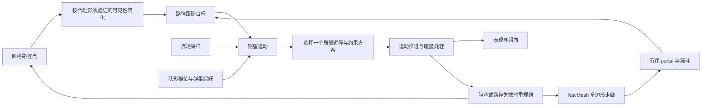

# 04-路径平滑与转向行为

> 知识成熟度：L2。核对一手论文、作者说明与固定上游源码；文中代码为教学改写，本轮仅原样运行第 4.2 节漏斗函数的两组有限输入，不代表完整导航或碰撞系统。
> 知识基线：Reynolds 1987/1999；Mononen 2010 漏斗说明；Recast/Detour `6dc1667f580357e8a2154c28b7867bea7e8ad3a7`；GEOS `3.13.0`；ORCA 原论文与 RVO2 `2.0` 参数文档。实际读取范围见第 12 节。
> 适用范围：网格路径和 NavMesh 走廊的后处理、二维连续空间转向、局部避障、Boids 与队形。单机、客户端表现或服务端可复用这些概念，但权威碰撞、网络同步和引擎运动组件另有合同。
> 数值与正确性边界：示例采用 Python 3.12 语法、有限且尺度适当的浮点坐标；距离单位一致，时间以秒计。几何可通行、期望运动、实际碰撞和到达是不同判定；没有“平滑后自然无碰撞”的总保证。
> 最后更新：2026-10-10。修正线段距离、漏斗边界/回退、速度与加速度量纲、群体更新次序和复杂度；补齐双拐点 portal 演算与有限运行核对，保留原文的移动管线、代码、Boids、队形与排障用途。
> 证据范围：除静态资料与文档核对外，仅在 Python 3.12.14 原样运行第 4.2 节漏斗函数的双拐点主例与镜像，并核对外部 trace 和独立 Fraction 插值。其余算法运行、C++ 编译、UE、渲染与性能测试均未进行；第 9 节仅明确标记的双拐点项有此次有限运行证据。

## 1. 概述：规划、几何和运动分别负责什么

A* 在所建图上找路径；网格图可能返回格点折线，NavMesh 图通常返回多边形走廊。流场则是位置到方向的场，不必先生成一条折线。后处理必须匹配上游数据：



RDP 可做形状压缩或产生待验证的捷径候选，但不自动生成 portal，也不能任意删去导航走廊中的多边形。动画样条与角度插值能改变表现；若它们驱动实际位置，就必须再次检查曲线的通行空间与运动约束。

## 2. 核心概念

| 术语 | 合同 |
| --- | --- |
| 路径简化 | 按误差或可见性规则减少路径点；减少点数不等于保留拓扑或可通行性 |
| 走廊 Corridor | 有序、相邻的凸导航多边形及共享边 portal；整体可以弯曲或非凸 |
| 漏斗 Funnel | 在合法平面走廊与固定起终点条件下拉紧折线；不重新选择所有走廊 |
| Steering | 根据目标/邻居输出期望运动或转向控制量；具体量纲由控制器定义 |
| seek / flee | 朝目标 / 远离目标；seek 本身不承诺停在目标 |
| arrive | 随距离降低期望速度，并处理当前残余速度 |
| pursue / evade | 对预测目标位置做 seek / flee；预测是启发式，不是截获保证 |
| Boids | 邻域内分离、对齐、凝聚的组合；不保证无碰撞或全局可达 |
| Formation | 锚点、槽位及单位到槽位的分配；还需可达性和通道宽度约束 |
| RVO / ORCA | 相关但不同的局部速度避障方法；ORCA 用允许速度半平面构造充分条件 |

## 3. 路径简化

### 3.1 Ramer–Douglas–Peucker（RDP）

对一个子区间，以首尾点构成线段，找中间顶点到该**线段**的最大距离。超过容差就以该顶点分裂；否则保留端点。GEOS 3.13.0 的 `simplifySection` 也以 `LineSegment.distance` 扫描、分裂；这里用索引栈表达同一思路，不是 GEOS 的完整几何修复实现。[固定源码](https://github.com/libgeos/geos/blob/3.13.0/src/simplify/DouglasPeuckerLineSimplifier.cpp#L111)

```python
import math

def point_segment_distance(p, a, b):
    vx, vy = b[0] - a[0], b[1] - a[1]
    wx, wy = p[0] - a[0], p[1] - a[1]
    length2 = vx * vx + vy * vy
    if length2 == 0.0:                 # 首尾重合：退化为点
        return math.hypot(wx, wy)
    t = max(0.0, min(1.0, (wx * vx + wy * vy) / length2))
    return math.hypot(wx - t * vx, wy - t * vy)

def rdp(points, eps):
    if not math.isfinite(eps) or eps < 0:
        raise ValueError("eps must be finite and nonnegative")
    pts = [tuple(p) for p in points]
    if any(len(p) != 2 or not all(math.isfinite(x) for x in p) for p in pts):
        raise ValueError("expected finite 2D points")
    if len(pts) < 3:
        return pts
    keep = {0, len(pts) - 1}
    pending = [(0, len(pts) - 1)]
    while pending:
        lo, hi = pending.pop()
        far, distance = None, -1.0
        for i in range(lo + 1, hi):
            d = point_segment_distance(pts[i], pts[lo], pts[hi])
            if d > distance:            # 并列时取先出现的点
                far, distance = i, d
        if far is not None and distance > eps:
            keep.add(far)
            pending.extend([(lo, far), (far, hi)])
    return [pts[i] for i in sorted(keep)]
```

纸面反例：`[(0,0),(2,0),(1,0)]` 的中点到首尾**无限直线**距离为 0，到线段距离却为 1；不能用叉积除线长替代这里的线段距离。`[(0,0),(1,0),(0,0)]` 的首尾重合也不能除以零。

本例 `eps=0` 仍可删除位于线段上的冗余点，并非必须原样返回；首尾相同也只按点序列处理，不提供闭合多边形拓扑保证。极大坐标乘法溢出、近零长度下溢和浮点误差需要项目尺度规范或更稳健谓词；有限输入校验本身不能消除这些问题。RDP 不读取障碍物，容差再小也不能代替通行检查。[GEOS 的拓扑限制说明](https://libgeos.org/doxygen/classgeos_1_1simplify_1_1DouglasPeuckerSimplifier.html)

### 3.2 可见性简化与弦拉直

网格路径可从当前锚点试探更远路径点，只有连接段可通行才跳过中间点。候选顺序、回退规则和检测器决定复杂度与结果；这种贪心捷径法不自动得到全局最短路。Bresenham/DDA 是遍历网格的工具，必须定义擦边、穿角和需要检查的格子；有半径代理还需覆盖其扫掠区域，点射线不足以证明身体能通过。

“String pulling”也常直接指漏斗式走廊拉直，Detour 就这样命名 `findStraightPath`。因此它不是必须排在漏斗前的另一道固定阶段。[Detour 说明](https://github.com/recastnavigation/recastnavigation/blob/6dc1667f580357e8a2154c28b7867bea7e8ad3a7/Detour/Source/DetourNavMeshQuery.cpp#L1775)

如果使用 RDP 预减点，必须保留原走廊信息，并验证每条替换段；失败就回退或重新规划。Catmull–Rom、Chaikin 等曲线/细分也可能切角，不能以“视觉平滑”免除实际位移的碰撞校验。

## 4. 漏斗算法（Funnel）

### 4.1 前提与状态

输入是按穿越顺序排列的 portal，每条边的左/右端点朝走廊前进方向一致。相邻区域凸，portal 不交叉（可共享端点），起终点在相应区域中；标准平面漏斗讨论的是点代理、欧氏长度、固定走廊。整体走廊不必凸，否则很多绕角案例反而被排除。3D 地表高度、面积代价、off-mesh 动作和车辆转弯半径不由二维漏斗自动解决。

保存 apex、left、right，以及它们对应的 portal 索引。新右边界越过左边界时，输出**旧左端点**为拐点；新左边界越过右边界时，输出**旧右端点**。更新 apex 后从该拐点所在 portal 的后一个重新扫描，不能只重试发生冲突的远处 portal。[Mononen 原文与示例](https://digestingduck.blogspot.com/2010/03/simple-stupid-funnel-algorithm.html)

```text
apex = start；left = right = start；保存三者索引
对每条有序 portal：
    收紧右边；若跨过左边，输出左端点并按其索引重启
    收紧左边；若跨过右边，输出右端点并按其索引重启
末 portal 用 (goal, goal)，让目标参与同样的边界判定
追加目标，但不重复追加相同的末点
```

### 4.2 Python 教学改写

下例对应固定 Detour 源码的两侧判定和索引回退结构；省略 NavMesh 查询、状态码、off-mesh 与 area crossing。采用平面 `(x,y)`；`area_source` 是普通二维叉积的**相反数**，以匹配上游 `dtTriArea2D` 的符号，不能替换成普通叉积却保留原不等号。生产输入还需验证走廊连通性和端点朝向；这里仅检查最小格式前提。

```python
def area_source(a, b, c):
    return ((c[0] - a[0]) * (b[1] - a[1])
            - (b[0] - a[0]) * (c[1] - a[1]))

def funnel(portals):
    if not portals:
        return []
    if portals[0][0] != portals[0][1] or portals[-1][0] != portals[-1][1]:
        raise ValueError("first and last portals must be point portals")
    apex = left = right = portals[0][0]
    apex_i = left_i = right_i = 0
    result = [apex]
    i = 1
    while i < len(portals):
        new_left, new_right = portals[i]
        if area_source(apex, right, new_right) <= 0:
            if right == apex or area_source(apex, left, new_right) > 0:
                right, right_i = new_right, i
            else:
                if result[-1] != left:
                    result.append(left)
                apex, apex_i = left, left_i
                left = right = apex
                left_i = right_i = apex_i
                i = apex_i + 1
                continue
        if area_source(apex, left, new_left) >= 0:
            if left == apex or area_source(apex, right, new_left) < 0:
                left, left_i = new_left, i
            else:
                if result[-1] != right:
                    result.append(right)
                apex, apex_i = right, right_i
                left = right = apex
                left_i = right_i = apex_i
                i = apex_i + 1
                continue
        i += 1
    goal = portals[-1][0]
    if result[-1] != goal:
        result.append(goal)
    return result
```

代码中的精确相等与零面积判定仅适用于上述教学合同；上游有自己的点相等容差。不能把一个坐标长度容差直接用于面积比较，也不能以增加 epsilon 修复左右端点颠倒或错误走廊。先用非退化纸面例固定方向约定，再分别测试共线、重复 portal 和尺度变化。[符号定义](https://github.com/recastnavigation/recastnavigation/blob/6dc1667f580357e8a2154c28b7867bea7e8ad3a7/Detour/Include/DetourCommon.h#L333)

#### 4.2.1 两个拐点与旧 portal 重扫：完整算例

按 x 递增方向穿越走廊，y 向上；每个二元组按 `(left, right)` 排列。以下是供上面 `funnel` 直接接收的完整输入；输出注释是纸面预期，后面的逐步表已与本轮有限运行的 trace 核对。

```python
portals = [
    ((0, 0), (0, 0)),  # P0：起点 S
    ((1, 2), (1, 0)),  # P1：L1、R1
    ((2, 4), (2, 2)),  # P2：L2、R2
    ((3, 4), (3, 2)),  # P3：L3、R3
    ((4, 3), (4, 0)),  # P4：L4、R4
    ((6, 0), (6, 0)),  # P5：终点 G
]
path = funnel(portals)
# 纸面预期：[(0, 0), (2, 2), (3, 2), (6, 0)]
```

这组输入对应一个具体合法走廊：首区是 `S,L1,R1` 三角形，中间三区依次是 `Lj,L(j+1),R(j+1),Rj` 四边形（j=1、2、3），末区是 `L4,G,R4` 三角形。各区凸且依次共享 P1–P4，portal 不相交。这里只讨论可贴边的点代理，不代表有半径代理可通过。

两个内部拐点都在右边界上。下图只示意输出折线，坐标和完整走廊由上述输入定义：

```text
          R2=(2,2) ──── R3=(3,2)
         ╱                       ╲
  S=(0,0)                         G=(6,0)
```

表中 `点@k` 表示该点及保存的 portal 索引；状态是本次迭代处理完（包括必要重置）后的值。`A(a,b,c)` 指原函数 `area_source`，仍是普通二维叉积的相反数。每次迭代先判右边，再判左边；`next i` 是下一次真正扫描的索引。

| 扫描 i | apex@apex_i | left@left_i | right@right_i | 本轮动作与新增输出 | next i |
| --- | --- | --- | --- | --- | --- |
| 初始化 | S@0 | S@0 | S@0 | 输出 S | 1 |
| 1 | S@0 | L1@1 | R1@1 | 两侧从 apex 展开 | 2 |
| 2 | S@0 | L2@2 | R2@2 | 右侧收紧；左侧共线，更新为 L2 | 3 |
| 3 | S@0 | L3@3 | R2@2 | 右侧不收紧；左侧收紧为 L3 | 4 |
| 4 | R2@2 | R2@2 | R2@2 | 新左端 L4 越过右边界；输出 R2 并重置 | **3** |
| 3（重扫） | R2@2 | L3@3 | R3@3 | 从新 apex 重新装入 P3 的两端 | 4 |
| 4（重扫） | R2@2 | L4@4 | R3@3 | 右侧不收紧；左侧收紧为 L4 | 5 |
| 5 | R3@3 | R3@3 | R3@3 | G 越过右边界；输出 R3 并重置 | **4** |
| 4（再次重扫） | R3@3 | L4@4 | R4@4 | 从新 apex 重新装入 P4 的两端 | 5 |
| 5（重扫） | G@5 | G@5 | G@5 | 右侧先收到 G；左侧判定随后输出 G 并重置 | 6（结束） |

两次内部拐点的触发可直接代数检查：

1. 首次扫描 P4：`A(S,R2,R4)=8>0`，右侧不变；`A(S,L3,L4)=7≥0`，且 `A(S,R2,L4)=2` 不满足 `<0`，所以输出旧 R2。保存的 `right_i=2`，重启索引是 `2+1=3`，不是当前冲突索引 4。
2. 重扫 P3、P4 后首次扫描 P5：`A(R2,R3,G)=2>0`，右侧不变；`A(R2,L4,G)=8≥0`，而跨右边界判定仍为 `2`，所以输出旧 R3，再从 `3+1=4` 重扫。
3. 最后一次扫描 P5：`A(R3,R4,G)=-4`、`A(R3,L4,G)=5`，右侧先更新为 G；随后左侧测试中 `A(R3,G,G)=0` 不满足 `<0`，原代码在循环内输出 G。循环末尾的去重检查因此不会再添一个 G。

完整扫描顺序是 `1,2,3,4,3,4,5,4,5`；最终恰好有两个内部拐点 R2、R3。用独立于面积谓词的线段插值检查：路径穿 P1 时 y=1，触及 P2/P3 的下端点 y=2，穿 P4 时 y=4/3，均在对应 portal 范围内；每段在相邻凸区内的部分也随之合法。

为什么不能只重试冲突 portal？若输出 R2 后直接从 P4 开始，就丢掉 P3 的下界约束。候选捷径 `R2→G` 在 x=3 时只有 y=3/2，低于 P3 的下端点 y=2，已经离开走廊。重扫不是重复劳动的装饰，而是用新 apex 恢复尚未消费的约束。[重启规则的一手说明](https://digestingduck.blogspot.com/2010/03/simple-stupid-funnel-algorithm.html)

本轮有限运行记录（2026-10-10）：使用 Python 3.12.14 原样抽取第 4.2 节函数，主例实际输出与注释一致，外部 `sys.settrace` 记录的 9 次扫描及逐次状态与表一致。把所有 y 取反并交换每个 portal 的左右端，镜像例实际输出 `[(0,0),(2,-2),(3,-2),(6,0)]`，扫描顺序相同，覆盖另一侧的内部拐点。独立 `Fraction` 插值核对了主例 P1–P4 的交点与上述越界捷径；有界脚本返回码为 0、stderr 为空。这仅验证这两组输入及列出的几何性质，未覆盖任意走廊、近退化浮点、碰撞、UE 集成或性能。

### 4.3 Detour 接口与工程边界

`findStraightPath(startPos, endPos, path, pathSize, ...)` 中的 `path` 是多边形引用数组，不是 RDP 输出。该固定版本把首尾位置分别钳制到首尾多边形的允许范围；返回点带 START/END/OFFMESH 等标志及关联引用。接口状态与输出容量必须消费：无效后续 portal 可能返回 `DT_PARTIAL_RESULT`，缓冲区不足可能返回 `DT_BUFFER_TOO_SMALL`，所以“有点返回”不等于完整到达。[头文件合同](https://github.com/recastnavigation/recastnavigation/blob/6dc1667f580357e8a2154c28b7867bea7e8ad3a7/Detour/Include/DetourNavMeshQuery.h#L195)、[具体分支](https://github.com/recastnavigation/recastnavigation/blob/6dc1667f580357e8a2154c28b7867bea7e8ad3a7/Detour/Source/DetourNavMeshQuery.cpp#L1793)

- 本例是会重扫 portal 的简化版本；不能据“只有一个循环”宣称每个 portal 仅处理常数次。第 8 节给出保守上界，不冒充已测线性性能。
- 最短性限于满足前提的选定平面走廊。图搜索的最低代价走廊与所有连续路径的欧氏最短路不是同一优化问题。
- 有半径代理先使用符合该代理配置的可通行空间，并保留必要间隙。任意把拐点“偏移一个半径”可能再次撞墙或封死窄口，不是通用修复。
- 上游 Recast/Detour 与具体引擎 fork 不能等同；UE 的完整/部分路径、PathFollowing 和 Movement 边界见 [NavMesh 寻路](../../06-游戏AI/导航移动与群体协同/03-NavMesh寻路.md)。

## 5. 转向行为（Steering Behaviors）

### 5.1 控制量、单位与到达

Reynolds 的简单车辆模型区分 steering force、质量、速度上限；具体行为可以输出控制向量，不是全部都必须先生成期望速度。[1999 原文的 Simple Vehicle Model / Steering Behaviors](https://www.red3d.com/cwr/steer/gdc99/)

本篇采用便于组合的**加速度控制器**：`a = (desired_velocity - velocity) / response_time`。若位置单位为米，则速度为米/秒、加速度为米/秒²，`response_time > 0` 为秒；需要力时另乘质量。先更新速度再更新位置，属于速度先更新的 Euler 离散形式；这里含反馈和钳制，不宣称辛性或步长无关。

```text
a = clamp_length(sum(weight[i] * acceleration[i]), max_accel)
v_next = clamp_length(v + a * dt, max_speed)
p_next = p + v_next * dt
```

| 行为 | 构造思路 | 限制 |
| --- | --- | --- |
| seek / flee | 朝向目标 / 反向的期望速度 | 零距离不能直接归一化；seek 会越过目标 |
| arrive | 距离越小，期望速度越低 | 到点时也须制动当前速度；按位置和速度双阈值验收到达 |
| pursue / evade | 预测 `target.pos + target.vel * t` | `t` 有上限，目标会转向；无法保证截获 |
| wander | 前方目标作受限随机扰动 | 随机更新频率/幅度必须与时间步合同匹配 |
| obstacle avoidance | 根据预计扫掠碰撞选转向或制动 | 需要代理形状、反应距离和有效碰撞数据 |
| separation | 对邻居产生远离偏好 | 有限加速度与拥挤环境下仍可能重叠 |

以下 `Vec2` 为不可变值；参数须有限且量级适当，调用者不能用 NaN/Inf 状态进入更新。`max_accel` 替代原例中实际当作加速度使用的 `max_force`，避免单位混用。

```python
from dataclasses import dataclass

@dataclass(frozen=True)
class Vec2:
    x: float = 0.0
    y: float = 0.0
    def __add__(self, o): return Vec2(self.x + o.x, self.y + o.y)
    def __sub__(self, o): return Vec2(self.x - o.x, self.y - o.y)
    def __mul__(self, k): return Vec2(self.x * k, self.y * k)
    def length(self): return math.hypot(self.x, self.y)
    def norm(self):
        d = self.length()
        return Vec2() if d == 0.0 else self * (1.0 / d)

def limit(v, cap):
    d = v.length()
    return v if d <= cap else v * (cap / d)

class Boid:
    def __init__(self, pos, vel, max_speed=3.0, max_accel=5.0, response_time=0.5):
        values = (max_speed, max_accel, response_time)
        if (not all(math.isfinite(x) for x in values)
                or min(max_speed, max_accel) < 0 or response_time <= 0):
            raise ValueError("invalid movement limits")
        self.pos, self.vel = pos, vel
        self.max_speed, self.max_accel, self.tau = values

    def toward_velocity(self, desired):
        return (desired - self.vel) * (1.0 / self.tau)

    def seek(self, target):
        return self.toward_velocity((target - self.pos).norm() * self.max_speed)

    def arrive(self, target, slow_radius=1.5):
        if not math.isfinite(slow_radius) or slow_radius <= 0:
            raise ValueError("slow_radius must be positive and finite")
        delta = target - self.pos
        speed = self.max_speed * min(1.0, delta.length() / slow_radius)
        desired = delta.norm() * speed       # 到点时为零期望速度
        return self.toward_velocity(desired) # 仍消除残余速度

    def pursue(self, target, horizon=1.0):
        if not math.isfinite(horizon) or horizon < 0:
            raise ValueError("invalid prediction horizon")
        if self.max_speed == 0:
            return self.toward_velocity(Vec2())
        t = min((target.pos - self.pos).length() / self.max_speed, horizon)
        return self.seek(target.pos + target.vel * t)

    def apply(self, acceleration, dt):
        if not math.isfinite(dt) or dt < 0:
            raise ValueError("dt must be finite and nonnegative")
        if dt == 0:
            return
        a = limit(acceleration, self.max_accel)
        self.vel = limit(self.vel + a * dt, self.max_speed)
        self.pos = self.pos + self.vel * dt
```

`dt=0` 是无推进；正常使用正的固定模拟步长。输入速度应已满足约定上限；非法初速被强制截断属于状态修正，不能当作受加速度约束的制动。`arrive` 的线性降速曲线是控制策略，不是保证不越过目标的解析解；步长、响应时间、加速度和刹车距离应一起调。积分和确定性细节见 [数值积分与运动学模拟](../数学与数值计算/05-数值积分与运动学模拟.md)。

### 5.2 组合与参数

加权求和可能相互抵消；逐项钳制、总量钳制和优先级分配产生不同控制器，须明确选哪一种。可以让紧急避障先占用可用加速度，再给队形和前进目标分配剩余预算；这不自动保证可行或更平滑。朝向插值也不等于已限制实际速度方向的转弯率，车辆需要独立处理运动学约束。

保持最大速度、最大加速度、响应时间、减速半径与邻居半径可配置。追逐预测上限 1 秒只是示例；追逐者更慢并不等于预测毫无价值，能否截获取决于相对位置、方向与双方约束。

### 5.3 障碍与 ORCA 的接入位置

可用单位前方的扫掠胶囊/圆柱检测预计碰撞，结合速度和制动能力选 lookahead；选预计最先碰到的障碍通常比只看中心距离有用。纸面流程是“预测扫掠 → 选择威胁 → 侧向绕行/制动 → 检查可用空间”。只施加障碍中心方向的排斥力既不一定是侧向力，也不能保证避开墙角。

ORCA 的模型是平面圆盘代理、可直接选择速度、已知邻居状态并遵循同一互惠协议；每对代理在速度空间各承担一半修正，约束求交后选择接近期望的可行速度。密集时可行集可能为空，退化处理不能仍宣称无碰撞。它是局部有限时间窗内的条件保证，不是全局路径或到达保证。[原论文 §1、§3–5](https://gamma.cs.unc.edu/ORCA/publications/ORCA.pdf)

工程接入时，先用路径/队形生成 preferred velocity，再交给所选避障方案。如果对求出的速度事后叠加任意分离力、强行加速度钳制或动画位移，实际速度可能离开允许区域；受限动力学必须进入一致的模型并验证。`neighborDist`、`maxNeighbors` 太小会遗漏威胁，时间窗影响提前避让距离。[RVO2 2.0 参数合同](https://gamma-web.iacs.umd.edu/RVO2/documentation/2.0/params.html)

## 6. Boids 群集

### 6.1 三规则与同时更新

Reynolds 在 1986 年建立模型，1987 年发表论文。作者说明中的三规则与局部感知保留为本篇基础；下列权重、响应时间和重合处理是教学选择，不是唯一的 Boids 标准。[作者背景与三规则](https://www.red3d.com/cwr/boids/)、[1987 论文摘要与书目信息](https://www.red3d.com/cwr/papers/1987/boids.html)

| 规则 | 本例输入与输出 |
| --- | --- |
| 分离 | 累计 `delta / max(distance, soft_distance)²` 的方向信号，再转成有单位的加速度 |
| 对齐 | 邻居平均速度作为期望速度，经响应时间换算 |
| 凝聚 | 邻居质心作为 seek 目标，经响应时间换算 |

注意：`delta / distance²` 的**向量模长**按 `1/distance` 衰减；`delta / distance` 则是单位方向，并非距离平方反比。后者正是旧示例注释和实现不一致之处。三项先转成一致的加速度单位再合成。

```python
def flock_accelerations(flock, radius=2.0, soft_distance=0.1,
                        w_sep=1.5, w_align=1.0, w_coh=1.0):
    if (not all(math.isfinite(x) and x > 0 for x in (radius, soft_distance))
            or not all(math.isfinite(w) and w >= 0 for w in (w_sep, w_align, w_coh))):
        raise ValueError("invalid flock parameters")
    snapshot = [(b.pos, b.vel) for b in flock]
    accelerations = []
    for i, b in enumerate(flock):
        pos, vel = snapshot[i]
        sep = avg_vel = center = Vec2()
        count = 0
        for j, (other_pos, other_vel) in enumerate(snapshot):
            if i == j:
                continue
            delta = pos - other_pos
            d = delta.length()
            if d >= radius:
                continue
            if d == 0:
                # 教学破对称规则：稳定列表中两者取反向，非物理接触求解器
                delta = Vec2(soft_distance if i < j else -soft_distance, 0)
            sep = sep + delta * (1.0 / max(d, soft_distance) ** 2)
            avg_vel = avg_vel + other_vel
            center = center + other_pos
            count += 1
        if count:
            a_sep = sep.norm() * b.max_accel
            a_align = (avg_vel * (1.0 / count) - vel) * (1.0 / b.tau)
            desired = (center * (1.0 / count) - pos).norm() * b.max_speed
            a_coh = (desired - vel) * (1.0 / b.tau)
            accelerations.append(a_sep * w_sep + a_align * w_align + a_coh * w_coh)
        else:
            accelerations.append(Vec2())
    return accelerations

def boids_update(flock, dt):
    accelerations = flock_accelerations(flock)
    for b, a in zip(flock, accelerations):
        b.apply(a, dt)
```

先计算全员加速度，再写回状态，避免后遍历者看到已更新邻居。列表应由不同单位构成，迭代期间无外部写者；重合时的列表顺序必须稳定，生产环境可改用稳定 ID。该软化与破对称只避免本例除零/完全无方向，不保证密集群体分离成功。

### 6.2 工程要点

- 邻域可按距离、视野与可见性过滤；270° 只是可选配置，隔墙凝聚要结合导航区域/视线约束。
- 空间哈希减少候选遍历，但同一桶拥挤、哈希冲突和大邻域仍可退化；AOI 兴趣集也不一定等于运动需要的全部邻居。
- 增大凝聚可能压挤，分离和响应参数不匹配可能振荡。先检查时间步和状态同步，再比较参数，不能仅靠不断加权重修复。
- 鸟鱼群可用速度方向驱动朝向；全局目的地仍由路径、领队或流场给出。模型不会凭三条局部规则推导绕过整个迷宫的路线。

## 7. 队形保持（Formation）

### 7.1 锚点、旋转与槽位

队形由锚点变换与槽位偏移组成，单位向分配到的世界槽位 arrive。保留如下二维组合示例；它补齐了旋转，并使用上一节分离项的一致快照。它没有包含地图碰撞/槽位分配器，须与第 7.2 节流程共同使用。

```python
def rotate(offset, yaw):               # yaw 为弧度，二维逆时针为正
    c, s = math.cos(yaw), math.sin(yaw)
    return Vec2(c * offset.x - s * offset.y, s * offset.x + c * offset.y)

def formation_update(anchor_pos, anchor_yaw, slots, units, dt):
    if len(slots) != len(units):
        raise ValueError("each unit needs one assigned slot")
    separation = flock_accelerations(units, w_sep=1.0, w_align=0.0, w_coh=0.0)
    accelerations = []
    for unit, off, sep in zip(units, slots, separation):
        target = anchor_pos + rotate(off, anchor_yaw)
        accelerations.append(unit.arrive(target, slow_radius=1.0) + sep * 1.2)
    for unit, acceleration in zip(units, accelerations):
        unit.apply(acceleration, dt)
```

移动锚点的槽位本身也有速度。上例是逐步追逐槽位位置的简化控制，快速平移/转向会产生跟随滞后；需要精确跟随时可把槽位速度前馈、响应时间和速度限制纳入设计，不能靠放大凝聚消除全部误差。

| 方案 | 用途与代价 |
| --- | --- |
| 刚性布局 | 槽位严格跟随锚点；地形可能使部分槽位不可达 |
| 弹性布局 | 单位允许偏离并独立避障；需定义恢复条件 |
| 领队/共享走廊 | 减少重复全局搜索；各单位仍需检查自身可达性与尺寸 |
| 流场引导 | 多单位共享目标方向场；槽位、拥堵、障碍更新另行处理 |

这些是方案类别，不据此断言某款商业游戏使用了哪套内部实现。

### 7.2 从选中单位到恢复队形

1. 计算目标朝向与槽位；按单位半径留间隔，过滤不可达/不可站立槽位
2. 给锚点或领队规划路径；检查路径宽度能否容纳当前队形，而非只检查领队圆盘
3. 用共享方向/各自局部路径生成到槽位的偏好，再统一进入选定的避障和运动约束
4. 窄口前收缩成纵队或分批通过；对阻塞设置超时、让行与重规划，不能只依赖局部排斥
5. 出口后重新分配并逐步恢复布局；用位置误差与速度双阈值、必要的滞回判定就位

就近贪心便宜但不一定全局总距离最小；匈牙利匹配只优化所给代价矩阵，也不自动避免两条执行轨迹相交。旋转锚点时控制角速度，并计入外围槽位更高的移动速度。固定 `dt` 能稳定更新合同，但乘了 `dt` 不意味着 30/60 FPS 轨迹完全一致。

## 8. 复杂度分析

设路径点数为 n、portal 数为 p、单位数为 N、候选邻居数为 k、单次通行检测成本为 C。下面是模型/代码结构分析，不是容量或耗时测量。

| 对象 | 时间 | 额外空间与前提 |
| --- | --- | --- |
| 本文索引栈 RDP | 最坏 O(n²)；分裂均衡时扫描约 O(n log n)，另有输出索引排序 | O(n)，无递归切片；“典型”输入分布未定义，不能保证平均界 |
| 枚举路径点对的可见性简化 | 至多 O(n² C) | 不计输入/输出时锚点可为 O(1)；检测器自有空间另计 |
| 本文重扫漏斗 | 有效走廊中按拐点推进、反复扫描，保守上界 O(p²) | 状态 O(1)，输出 O(p)；未给紧界或线性摊还证明 |
| 单个 seek / arrive / pursue | O(1) | O(1)；不含外部查询 |
| 朴素障碍候选检查 | 每单位 O(障碍数 × 检测成本) | 取决于碰撞表示 |
| 本文 Boids / 队形加分离 | O(N²) | O(N) 快照与加速度数组 |
| Boids + 空间网格 | 分桶成本加全部候选访问，分布良好时约 O(N + N k) | O(N + 桶数)；k 最坏接近 N |
| ORCA | 邻域构建、每代理约束生成、求解器与不可行回退分别计量 | 不把“全体 O(Nk)”和“每单位 O(Nk)”混写；实现/约束数决定界 |
| 逐单位扫描未占槽位的贪心 | O(N²) | 只存占用状态可 O(N) |
| 常见稠密匈牙利实现 | O(N³) | 显式 N×N 代价矩阵 O(N²)，不能一概写 O(N) |

## 9. 验证与基准建议

除第 4.2.1 节双拐点主例与镜像已作有限运行核对外，本节其余项均为纸面预期和项目后续测试要求。没有运行文中曾示意的 `tests/test_movement_pipeline.py`，不表示仓库存在该测试文件。

| 用例 | 预期 / 应验证的性质（实测项单列） | 主要反向控制 |
| --- | --- | --- |
| RDP 空、单点、两点 | 安全返回副本且保持顺序 | 不索引空列表 |
| RDP 首尾重合 A-B-A，ε=0 | 保留偏离端点的 B | 点到线段分母为零时不能 NaN |
| RDP `(0,0),(2,0),(1,0)`，ε<1 | 中点不能删除 | 无限直线距离版本错误删除 |
| RDP ε<0 / NaN / Inf | 拒绝无效容差 | 不能静默接受或无限分裂 |
| RDP 删除绕障拐点 | 形状误差合格也要单独判碰撞 | 不能把 RDP 返回值当通行证明 |
| 漏斗只有起终点或起终点相同 | 直达或去重末点 | 空输入与重复末点 |
| 漏斗走廊 `(0,0)` → `[(1,1),(1,-1)]` → `[(2,1),(2,-1)]` → `(3,0)` | 返回直线，不多添拐点 | 左右交换应由走廊验证拒绝，不能靠调 ε |
| 漏斗多拐角、窄口、共线/重复 portal | 所有输出段在合法走廊中，正确重扫旧索引 | 忽略回退、漏掉中间 portal |
| 第 4.2.1 节双拐点走廊 | 主例实测输出 `S→R2→R3→G`；主例与镜像均扫描 `1,2,3,4,3,4,5,4,5` | 仅重试冲突 portal 会漏掉 P3；`R2→G` 在 x=3 处越界 |
| Detour 缓冲区不足 / 失效多边形 | 消费 detail flags，识别截断/部分结果 | 不以点数大于零认定到达 |
| arrive 在目标且仍有速度 | 输出制动加速度 | 零加速度不是停止 |
| pursue 零最大速度 | 不除零，采用零期望速度 | 任意截获保证 |
| Boids 空群/空邻居/重合 | 无非法除法；先算后写；重合分支可追踪 | 原地遍历引入额外次序偏差 |
| 队形单位/槽位数量不同 | 明确拒绝，避免 zip 静默丢单位 | 槽位不可达不靠权重修复 |
| 不同 dt、卡顿、刹车与狭道 | 比较到达误差、速度、最小间距与阻塞 | 乘 dt 或固定种子不自动等于跨平台确定性 |

验证正确性时保留独立碰撞/走廊检查器，分别测点代理和有半径代理；不要用同一错误谓词同时生成和验收路径。近退化几何、坐标尺度变化、邻居截断、更新顺序、加速度受限与动画/物理修正都应纳入用例。

性能测试按阶段记录：搜索与走廊、后处理点数/portal 重扫次数、通行检测次数、候选/有效邻居数、局部求解耗时、运动推进耗时；再报告到达率、最小间距、路径偏差、阻塞时长和 P50/P95 帧成本。注明硬件、版本、场景密度、dt、采样窗口与并行方式，不能把论文演示规模当作本项目容量。

## 10. 最佳实践与 FAQ

### 10.1 实践清单

1. 先明确网格点、走廊、方向场三个输入合同，再选择后处理
2. 分开绘制原始路径、portal、拐点、期望/实际速度、邻居与代理形状
3. 让一种运动/避障方案负责最终约束；增加新力或动画位移后重新核验
4. 同一模拟步使用一致邻居状态；固定步长、稳定 ID/顺序、随机流和浮点策略共同定义回放合同
5. 大群体按实测瓶颈选择共享路径/流场、分层规划、空间索引或分批通行，保留必要的个体重规划
6. 客户端插值与模拟频率分开；根运动、速度朝向和碰撞修正的权威来源必须清楚

**Q1：漏斗之后仍穿墙？** 先核对走廊连通性、portal 顺序/左右方向、几何符号及完整结果，再检查代理尺寸、网格过期和实际位移。随意偏移拐点或样条化不能补上这些前提。

**Q2：Boids 振荡或堆积？** 先查是否混读新旧状态、是否到点还残速、响应时间与 dt 是否不匹配；再调凝聚/分离和邻域。局部行为不能解决本来就无可行通道的拥堵。

**Q3：千单位各自寻路太卡？** 先分别测全局搜索、邻域和避障。多单位同目的地可共享距离场；只有等权图才能直接用 BFS，非负变权需相应加权算法。个别单位不同尺寸或目标仍可能需要独立规划，不存在“从不各自 A*”的普遍规则。

**Q4：队形过窄口后无法恢复？** 给收缩、通过、展开明确阶段；验证槽位可达性，减少频繁交换目标，并处理堵塞/超时。收缩宽度和转向速度应遵守单位形状及运动约束。

**Q5：pursue 追不上或冲过头？** 检查预测模型与速度上限，缩短不可靠的预测时间；需要停下时切换 arrive。距离/速度只是时间估计，更慢的追逐者也可能因路线相交而截获，不能一概放弃预测。

**Q6：转向与寻路来回争夺方向？** 检查局部目标是否跨过障碍、是否每帧换槽位、是否叠加多个控制器。重算节流/滞回可以减少抖动，但周期应由障碍变化和反应预算决定；低通滤波会引入延迟，不能固定“每 0.5 秒”就视为正确。

## 11. 关联阅读与职责

- [图论基础与搜索算法](01-图论基础与搜索算法.md)：图、BFS/DFS/Dijkstra；本文不承担上游图模型的实现验证
- [A* 算法与优化](02-A星算法与优化.md)：搜索条件和已有局部实验；其证据不证明本篇几何/移动实现
- [NavMesh 工程：Recast 与 Detour](03-NavMesh工程Recast与Detour.md)：导航网格专题入口，具体实现须按版本核对
- [NavMesh 寻路](../../06-游戏AI/导航移动与群体协同/03-NavMesh寻路.md)：UE 查询、路径状态、跟随与避障的工程边界
- [数值积分与运动学模拟](../数学与数值计算/05-数值积分与运动学模拟.md)：时间离散、稳定性、约束和未运行边界
- [AOI 与视野计算](../空间查询与碰撞/03-AOI与视野计算.md)：空间查询和兴趣集；不是碰撞邻域的自动替代
- [移动与群组行为](../../06-游戏AI/导航移动与群体协同/01-移动与群组行为.md)：AI 行动层和群组设计视角；本文提供几何与控制量合同
- [数学与游戏算法学习路线](../../../00_Index/学习路线/数学与游戏算法.md)：向量、插值及相关专题入口
- Mat Buckland《Programming Game AI by Example》、Millington 与 Funge《Artificial Intelligence for Games》：保留为拓展阅读，本轮未复核其全文，不据此声称测试或项目实践

## 12. 一手来源与实际核对范围

核对日期为 2026-10-10。在线文档的读取日期不等于该软件版本的发布日期；下列范围也不等于下载或通读整个仓库/全部论文。

| 来源 | 实际核对的位置 | 支持范围与限制 |
| --- | --- | --- |
| [Reynolds 1999](https://www.red3d.com/cwr/steer/gdc99/) | Simple Vehicle Model；seek、pursuit、arrival、avoidance、separation/alignment/cohesion、Combining Behaviors | 行为与组合原理；本文时间单位、边界处理、代码和队形流程为教学设计，非作者逐字实现 |
| [Boids 作者页面](https://www.red3d.com/cwr/boids/)及[1987 论文条目](https://www.red3d.com/cwr/papers/1987/boids.html) | 背景、三规则、邻域、复杂度说明；论文摘要/书目 | 区分 1986 模型与 1987 发表；未把摘要说成完整论文实验复现 |
| [Mononen 2010](https://digestingduck.blogspot.com/2010/03/simple-stupid-funnel-algorithm.html) | 正文漏斗/重启代码、首尾点 portal；作者关于凸区域与 portal 的说明 | 走廊拉直与索引重启；博客完整评论不作为本文的实测证据 |
| [固定 Detour 源码](https://github.com/recastnavigation/recastnavigation/blob/6dc1667f580357e8a2154c28b7867bea7e8ad3a7/Detour/Source/DetourNavMeshQuery.cpp#L1775) | `DetourNavMeshQuery.cpp` 1775–2023 的 findStraightPath；头文件 195–210；`DetourCommon.h` 333–344 的面积符号 | 输入、两侧更新、索引回退、状态码及 xz 平面；未编译、未运行，不证明任意引擎 fork 相同 |
| [GEOS 3.13.0](https://github.com/libgeos/geos/blob/3.13.0/src/simplify/DouglasPeuckerLineSimplifier.cpp#L111)及[API 页面](https://libgeos.org/doxygen/classgeos_1_1simplify_1_1DouglasPeuckerSimplifier.html) | 固定源码 85–143 中递归简化段；在线页面显示 3.16.0dev 的拓扑限制 | 线段距离与递归思路；两个版本分别标明，不把 dev 文档当 3.13.0 的全部合同 |
| [ORCA 论文](https://gamma.cs.unc.edu/ORCA/publications/ORCA.pdf) | §1 的模型前提、§3 问题定义、§4–5 半平面与速度选择 | 有条件局部避碰；未复现实验与性能。项目页指向的 `ORCA-1.pdf` 本轮返回 404，改读此作者论文链接 |
| [RVO2 2.0](https://gamma-web.iacs.umd.edu/RVO2/documentation/2.0/params.html) | `neighborDist`、`maxNeighbors`、时间窗、半径与 timeStep | 参数合同；没有运行库或移植到引擎 |

本篇维持 L2 与 `verified: []`：本轮仅对两组有限漏斗输入进行了原样运行及独立插值核对，不能外推为全篇主要实现已验证；其余代码运行与更多独立几何/碰撞测试仍是后续验证入口。
