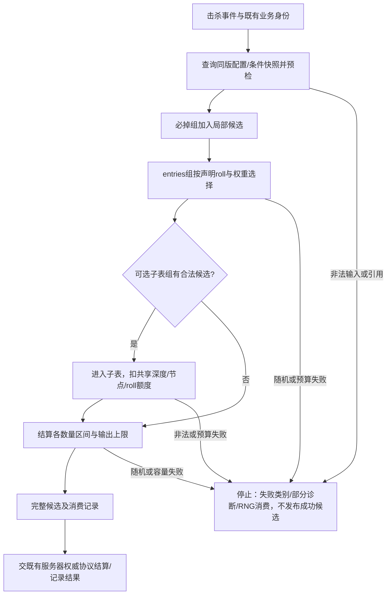
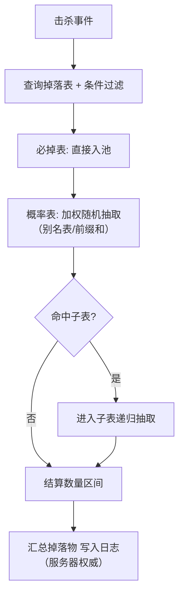

# 01-随机数与洗牌算法

> 知识成熟度：L2。本文给出来源支持的合同、有限教学实现和人工纸例；没有执行随机程序、统计检验、编译、引擎或性能实验。
> 版本与规范基线：C++17 工作草案 N4659；CPython v3.12.7 源码；Python 3.12 在线文档读取时为 3.12.15；NumPy 2.0 兼容性文档。作者动态站及论文版本分别见文末来源，不能把文档版本当成项目运行版本。
> 适用范围：玩法随机、掉落/抽卡、牌堆与地图块、AI 抖动、测试和程序化生成。经济与对战结果由项目既有权威结算处理；本文不实现安全随机产品。
> 事实边界：理想独立随机、有限状态 PRNG、整数映射、业务抽样和整批失败是不同层次。周期长、统计表现好、重放一致及不可预测性互不替代；全部纸例为 PAPER_EXPECTED / NOT_RUN。
> 最后更新：2026-10-09。
> 验证建议：先核输入域、端点、状态/版本和失败消费，再用固定小例核算法；统计、速度、多平台重放需另设项目实验，仓库文档检查不能替代。

## 1. 概述

PRNG 由有限状态的确定性转移与输出函数产生序列。使用者真正需要的是某个分布或业务结果：例如先生成原始整数，再映射到牌堆下标，交换元素，最后发布牌序。这些环节中任意一环的前提丢失，都不能仅凭“种子固定”或“用的是 MT”补回。

选型应分别考察统计性质、原始输出/映射的成本与状态大小、以及可复现合同。长周期不证明短区段无关联；一次直方图接近预期不证明所有联合分布正确；本篇没有测出某个生成器的速度优胜者。

| 场景 | 需要的随机对象 | 必须另行固定的合同 |
| --- | --- | --- |
| 掉落/开箱 | 加权条目与数量 | 组间 roll 语义、权重版本、失败和权威发放 |
| 抽卡保底 | 带状态的条件成功率 | 计数、重置/继承、尾部与对外规则 |
| 暴击/闪避 | 伯努利事件或显式状态模型 | 独立概率与失败递增模型不可混称 |
| 洗牌：牌堆、地图块 | 标号元素的排列/无放回样本 | 每轮取值域、重复显示值、有限源容量 |
| 地图/地形生成 | 坐标子流与分布/噪声 | 坐标编码、算法/资产版本、调用顺序 |
| AI 决策抖动 | 明确区间内的扰动 | 扰动是否改变目标函数，消费与性能预算 |

测试与回放贯穿这些场景：保存足以重建的完整状态和版本，以定位同一次失败；固定种子并不要求所有系统共享一条随机流。

## 2. 核心概念

| 术语 | 本文使用的含义 |
| --- | --- |
| PRNG / 引擎 | 状态转移、原始输出及初始化算法；有限状态必有循环 |
| Seed / 状态 | seed 经指定初始化变为状态；单个整数不是所有实现通用的状态表示 |
| 周期 | 指定状态轨道或输出序列重复的长度；要说明测量对象 |
| 均匀分布 | 有限集合中各值等概率；连续区间则按长度分配概率，不是“每个实数有相同正概率” |
| 分布与映射 | 将原始源转成目标整数、浮点或类别；会改变消费次数 |
| 加权随机 | 在给定有效候选集内按权重比例取值；权重本身不必是百分数 |
| 无放回抽样 | 同一条目身份至多选一次；相同显示值可以来自不同身份 |
| 期望 | 对已声明随机变量的平均值；与分位数及最坏上界不同 |
| 保底 | 由失败计数等状态改变条件成功率，硬保底规定某次必成功 |
| 综合概率 | 产品需声明口径；更新周期模型中有条件地等于 1/E[T]，不是通用定义 |

### 2.1 本文教学输入与失败合同

Python 示例只接收**已物化的普通 list**，`N_MAX=4096`，不接收子类或任意迭代器；先检查类型/长度再分配候选，不能先 `list(无限流)` 再检查。元素作为不透明引用交换，不比较、不哈希、不深拷贝。权重只接受非 bool 的普通 int，单项 `0..2^31−1`，总权 `1..W_MAX`，其中 `W_MAX=4096*(2^31−1)<2^43`。这些是教学容量，不是元素真实字节数、内存分配成功或统计质量保证。调用期间输入/配置不得被外部并发修改。

每个整数 draw 最多 R 个原始调用，一个请求共享 Q 个额度；下例把二者限制为 `1..1_000_000` 的普通整数，具体值由调用者预先决定。这只是有限调用上限，不是建议做一百万次统计采样。每次外调前先扣额度；外调异常、非法返回、拒绝值都记消费。异常原样上抛或明确抛预算/合同错误，不返回默认数、不取模补救、不自动换 seed。外部函数若不返回，调用次数预算不能保证墙钟时间。

下面是局部教学门面，原始接口参照 CPython 的 `getrandbits(k)`，要求每次按声明返回独立均匀 k 位整数才可作理想证明。真正 CPython PRNG 是确定的有限状态系统；任意外部回调也不能靠类型检查获得独立性。本文使用 `(n−1).bit_length()` 和有限 R/Q，**不同于** CPython v3.12.7 内部 `_randbelow_with_getrandbits` 的 `n.bit_length()` 与无固定上限循环。来源：[固定 random.py](https://raw.githubusercontent.com/python/cpython/v3.12.7/Lib/random.py)。

```python
# 教学示意，NOT_RUN；调用者提供已知来源的 getrandbits，参数在请求开始时固定。
N_MAX = 4096
WEIGHT_MAX = (1 << 31) - 1
W_MAX = N_MAX * WEIGHT_MAX
BUDGET_MAX = 1_000_000

class RngBudgetExceeded(RuntimeError):
    pass

class RngContractError(RuntimeError):
    pass

def plain_int(x, lo, hi, name):
    if type(x) is not int or not lo <= x <= hi:
        raise ValueError(name)

def bounded_list(a):
    if type(a) is not list or len(a) > N_MAX:
        raise ValueError("expected a materialized plain list within N_MAX")

class DrawBudget:
    def __init__(self, getrandbits, per_draw, total):
        plain_int(per_draw, 1, BUDGET_MAX, "R")
        plain_int(total, 1, BUDGET_MAX, "Q")
        if not callable(getrandbits):
            raise ValueError("getrandbits")
        self.getrandbits = getrandbits
        self.per_draw = per_draw
        self.remaining = total
        self.consumed = 0

    def below(self, n):
        plain_int(n, 1, W_MAX, "n")
        if n == 1:
            return 0  # 确定结果，不消费原始调用
        bits = (n - 1).bit_length()
        for _ in range(self.per_draw):
            if self.remaining == 0:
                raise RngBudgetExceeded("request budget exhausted")
            self.remaining -= 1
            self.consumed += 1  # 外调即使抛异常，也已经计入
            r = self.getrandbits(bits)
            if type(r) is not int or not 0 <= r < (1 << bits):
                raise RngContractError("invalid raw value")
            if r < n:
                return r
        raise RngBudgetExceeded("per-draw rejection limit exhausted")
```

请求对象及其字段由调用者独占，不允许中途重设预算或切换源；异常后保留它的 `consumed` 与源状态作为诊断。不发布局部候选可以保护原输入，**不会回滚 RNG**。重放需要记录失败消费，或按项目已约定的独立逻辑子流隔离；静默恢复 seed 会使共享源的其它系统错位。

### 2.2 单步成功与整批完成是两个事件

在独立均匀原始位假设下，固定 n 的一次拒绝选择，成功条件下每个合法值等概率。预先决定各轮 n 的 Fisher–Yates，或固定 n/W 的一次 Alias，在完成概率为正、唯一失败是固定 R/Q 预算且没有结果相关异常/筛选时，接受值与所需尝试次数的独立性可保留对应的完成条件分布。Q 不足导致无法完成时，只报告失败，不能在零概率完成事件上定义均匀性。

若下一轮范围、消费或停止依赖已抽结果，例如删去权重后总权变化、掉落走不同分支或保底提前成功，那么“只收集成功批次”可能改变整体分布。单步成功条件下正确，不能推出整批完成条件下仍为无失败理想目标。§6.3 和纸例 P20 给出精确反例；全部失败、部分前缀与完成结果必须分开记录，不能丢失败后不断重试到凑够样本。

## 3. PRNG 原理详解

### 3.1 线性同余生成器（LCG）

递推 `X_(t+1)=(a*X_t+c) mod m`。对于混合同余，m>0，在完整模 m 状态空间上达到周期 m 的 Hull–Dobell 条件为：c 与 m 互质；m 的每个质因子整除 a−1；若 4 整除 m，则 4 也整除 a−1。这是状态周期结论，不是独立性或安全性结论。[Hull & Dobell 1962，§3 Theorem 1](https://dspace.library.uvic.ca/bitstreams/b7ffb4ac-e2dd-40fb-bb69-74ae37a79fd8/download)

**P01 / PAPER_EXPECTED / NOT_RUN**：m=8、a=5、c=1、X0=0，人工递推为 `0→1→6→7→4→5→2→3→0`，所有状态出现一次，奇偶却严格交替。c=0、X0=0 则永远为0。满周期与低位相关完全可以同时成立。

历史常见参数 `1103515245,12345,2^31` 与 `1664525,1013904223,2^32` 只是实现/教材例子，不能写成 ANSI C 强制 `rand()` 使用的算法。下面保留 64 位 LCG 与取高位的教学用途。本文各 C++ 节选均为 NOT_RUN，需各自补所列头文件，假设实现提供精确宽度无符号类型，且 `unsigned int` 为32位；不承诺所有 C++17 平台均有相同可用类型。

```cpp
#include <cstdint>
#include <limits>
static_assert(std::numeric_limits<unsigned int>::digits == 32);
struct LCG {
    std::uint64_t state;
    static constexpr std::uint64_t a = 6364136223846793005ULL;
    static constexpr std::uint64_t c = 1442695040888963407ULL;
    explicit LCG(std::uint64_t seed) : state(seed) {}
    std::uint32_t next() {
        state = a * state + c;  // 无符号模 2^64
        return static_cast<std::uint32_t>(state >> 32);
    }
};
```

取高位改变观察输出，不能消除所有相关结构，也不能自动消除随后 `%n` 的区间映射偏差。生成器的统计选择必须结合实际用途与证据，不能把这一段节选当成通用推荐。

### 3.2 Mersenne Twister（MT19937）

`std::mt19937` 使用 MT19937 参数，状态表示含624个32位字，周期为 `2^19937−1`；状态转移与输出调和应分别理解。常见“623维均匀分布”指其特定精度下的 equidistribution 性质，不是“在623维内通过某项 k 分布测试”，更不表示每段短输出独立。[N4659 §29.6.3、§29.6.5](https://www.open-std.org/jtc1/sc22/wg21/docs/papers/2017/n4659.pdf)

```cpp
#include <cstdint>
#include <random>
// NOT_RUN：两个初始化方式不同的引擎，用于展示层次，未宣称序列相同。
void mt_example(std::uint32_t seed) {
    std::mt19937 rng(seed);
    std::uniform_int_distribution<int> d(0, 99); // 闭区间 [0,99]
    int v = d(rng);
    std::seed_seq seq{seed}; // 确定性扩散，不创造熵
    std::mt19937 rng2(seq);
    (void)v;
    (void)rng2;
}
```

单个32位 seed 至多选择 `2^32` 个初始化结果，`seed_seq` 不会凭空增加输入信息。MT 的状态可预测性不能归咎为“只有坏种子才不安全”，也不能把恢复状态和恢复原 seed 混为一件事；更好的初始化不会把它变成密码安全源。[PCG 作者关于 C++ seeding 的分析](https://www.pcg-random.org/posts/cpp-seeding-surprises.html)

MT 的原始输出域为32位整数时，`%2` 没有因源域大小不能整除2造成的计数偏差；出现0/1长串本身也不是低位缺陷证明。依赖/相关是另一问题。C++ distribution 负责目标分布，但 N4659 §29.6.8.1 允许其生成算法由实现定义，不能说每个标准库内部都采用某一拒绝算法，也不能从同引擎扩展为跨库同 `distribution`/`shuffle` 序列。

### 3.3 xorshift 与 xoshiro

三次异或移位能展示小状态转移。以下是原 xorshift32 形状；非零初态为使用前提，不做与其它引擎的未测速度/质量排名。

```cpp
#include <cstdint>
#include <limits>
static_assert(std::numeric_limits<unsigned int>::digits == 32);
struct XorShift32 {
    std::uint32_t x = 2463534242u;
    std::uint32_t next() {
        x ^= x << 13;
        x ^= x >> 17;
        x ^= x << 5;
        return x;
    }
};
```

**P05 的零态部分 / NOT_RUN**：把 x 设为0，三步仍为0，这是吸收态。状态构造需拒绝不满足算法前提的输入，不能期待“多调用几次就随机”。

xoshiro256** 的状态为256位，作者给出非全零状态的周期 `2^256−1`、`next`、固定 `jump/long_jump`；xoroshiro128+ 保留为同作者家族的进一步检索入口，不能仅凭名称推定具体引擎采用或质量排序。[作者生成器总页](https://prng.di.unimi.it/)

64位输出不能作为完整256位状态的可逆编码；输出扰动和状态跳转是两件事。2026-10-09 实际读取的作者动态源码还含 `jump_ce/jump_n`：利用**预置特征多项式 p(x)** 求跳转多项式 `x^n mod p(x)`，再作用于状态，并非计算特征多项式，也不是“输出可逆，配合计数即可跳”。文件自称1.0、2018，不能据此认定后加接口在2018就存在。[作者 xoshiro256starstar.c](https://prng.di.unimi.it/xoshiro256starstar.c)

并行分片需同时规定起点、跳长、片段数和每段消费上限；只有符合分配证明的范围才谈状态片段不重叠。不同种子不自动独立，非重叠片段也允许输出相同值。本轮没有运行作者统计套件/基准，也未核各游戏引擎采用清单。

### 3.4 从均匀分布到其他分布

均匀整数、有限浮点网格与连续 U 是不同模型。CPython v3.12.7 的 `random()` 用27+26位组成53位网格上的 `[0,1)` 值，不会覆盖区间内所有实数。[固定 _randommodule.c](https://raw.githubusercontent.com/python/cpython/v3.12.7/Modules/_randommodule.c)

- 指数变换 `X=−ln(1−U)/λ`：λ>0，理想 U∈[0,1)；U=0 合法，U=1 不合法。浮点 λ、变换中间值与结果都需按项目有限域核验
- Box–Muller `Z=sqrt(−2 ln U1) cos(2πU2)`：理想独立 U1∈(0,1)、U2∈[0,1)；U1=0 不合法。若来源包含0，需有明确拒绝及预算失败，不能偷偷夹到 epsilon
- 自定义类别分布见§6；拒绝采样、正态缓存和其它分布的工程合同见关联采样主篇，不在这里扩成完整分布库

**P02 / NOT_RUN**：理想 r 均匀取0..7，`r%3` 的原像数为3/3/2；拒绝6、7后再映射才各有2个。n=4 时各有2个，并不能由此证明引擎无相关；n=0 先拒绝，n=9 不能靠一个3位字覆盖。`RAND_MAX+1` 在满量程类型中可能溢出，必须先确认源域和宽类型；有限 R 次全被拒时报告失败，不填默认值。[PCG 作者 bounded-rands](https://www.pcg-random.org/posts/bounded-rands.html)

**P03 / NOT_RUN**：U 仅取 `{0,1/8,…,7/8}`，`floor(10U)` 为 `0,1,2,3,5,6,7,8`，4和9不可达。浮点缩放不能替代明确整数域映射；指数 U=0 可得0，U=1 非法，Box–Muller 径向 U1=0 非法。不可达值与端点错误不能都解释成“小样本波动”。

## 4. 确定性随机（种子一致）

### 4.1 什么是“确定性随机”

同算法、参数、初始化、完整状态与相同调用事件序列，才有确定性输出；同 seed 只是其中一项。回放还需全部模拟初态、输入/外部事件、顺序与规则版本。服务端决定经济/对战结果是权限责任，不等价于各客户端必须执行完全同一 RNG，也不是随机源安全性的证明。

最小复现记录包括引擎/初始化版本、完整状态、distribution 缓存（例如正态缓存）、整数映射及拒绝政策、调用实参与顺序、条目稳定顺序、配置版本、整数编码/位宽/端序和所需浮点/数学库环境。CPython `getstate` 涉及 Python 层缓存与底层状态；不能只截一个 seed 代替。[CPython v3.12.7 random.py](https://raw.githubusercontent.com/python/cpython/v3.12.7/Lib/random.py)；[NumPy 2.0 stream compatibility](https://numpy.org/doc/2.0/reference/random/compatibility.html)

**P04 / NOT_RUN**：人工原始2位字依次 `[3,2,1]`，目标 n=3。拒绝映射首 draw 弃3得2，下一个原始字为1；直接取模首 draw 得0，下一个原始字却为2。即使初始状态相同，映射也会改变结果及后续游标。失败消费同样属于调用轨迹，不可隐去。

### 4.2 破坏确定性的常见原因

| 原因 | 会改变什么 | 对策与边界 |
| --- | --- | --- |
| `rand()`、初始化或库实现变化 | 原始输出或映射序列 | 固定引擎和映射版本；标准引擎不固定所有 distribution 实现 |
| 浮点与数学库差异 | 变换、阈值、排序键 | 声明支持环境和容差/整数政策；整数/定点也需溢出合同 |
| 多线程共享源或按 worker 编号派生 | 消费顺序或事件到流的映射 | 用稳定系统/实体/事件 ID 分配逻辑子流，线程号不作永久身份 |
| 时间/地址初始化 | 初始状态 | 记录实际初始化材料与规则；调试可用固定 seed，线上也需可追踪 |
| 无序容器/配置热更混读 | 候选顺序、权重与消费次数 | 使用固定条目序、不可变配置快照，记录版本 |

固定若干 seed 可作未来回归计划，数量应按覆盖目标决定；本文没有运行原“1000个 seed”的建议。

### 4.3 坐标哈希种子示例

此例保留世界 seed 与块坐标的混合用途。输入限定为有符号32位坐标，转换到 `uint32_t` 使用模 `2^32` 编码；以下平台前提避免整数提升改变预期环绕。持久化时仍需指定字节编码，不能依赖本机内存布局。

```cpp
#include <cstdint>
#include <limits>
static_assert(std::numeric_limits<unsigned int>::digits == 32);
std::uint32_t chunkSeed(std::uint32_t worldSeed,
                        std::int32_t cx, std::int32_t cy) {
    std::uint32_t h = worldSeed;
    h ^= static_cast<std::uint32_t>(cx) * 0x9E3779B1u;
    h ^= static_cast<std::uint32_t>(cy) * 0x85EBCA77u;
    h ^= h >> 16; h *= 0x7FEB352Du;
    h ^= h >> 15; h *= 0x846CA68Bu;
    h ^= h >> 16;
    return h;
}
```

**P05 的容量/调度部分 / NOT_RUN**：32位输出面对 `2^32+1` 个不同坐标身份，至少两个碰撞。相同逻辑事件在不同 worker 执行时，按事件 ID 派生的版本固定映射仍相同，按 worker 号则可能不同。相同块 seed 也不证明地形算法、噪声、资产及浮点结果全相同；不把坐标哈希强套到所有回放/联机系统。

确定性与不可预测性分别设计。安全敏感场景应按具体威胁模型选择已审方案；本文的 LCG、MT、xorshift/xoshiro 例不提供密码安全保证，不执行密码、认证、操作系统随机源或安全配置操作。

## 5. Fisher–Yates 洗牌

### 5.1 原理与推导

倒序算法逐轮冻结一个位置：

```text
for i = n-1 down to 1:
    j = 均匀整数 [0,i]
    swap(a[i], a[j])
```

在给定此前选择后，本轮仍从未冻结的 i+1 个标号中等概率选一个。指定目标排列有唯一选择路径，所以理想概率为 `1/n × 1/(n−1) × … × 1/2 = 1/n!`。正序第 i 轮从 `[i,n−1]` 选 j，同样冻结一个位置，也成立。冻结的是位置，元素可能多次交换。[Wilson v1 §1，Proposition 1.1](https://arxiv.org/pdf/math/0702753v1)

**P06 / PAPER_EXPECTED / NOT_RUN**：输入标号 `[A,B,C]`，倒序六条人工路径如下；每步理想条件均匀时，各条概率1/6。

| (j2,j1) | 输出 |
|---|---|
| (0,0) | [B,C,A] |
| (0,1) | [C,B,A] |
| (1,0) | [C,A,B] |
| (1,1) | [A,C,B] |
| (2,0) | [B,A,C] |
| (2,1) | [A,B,C] |

其中 `(j2,j1)=(1,0)` 的轨迹是 `[A,B,C]→[A,C,B]→[C,A,B]`，C 的位置为 `2→1→0`，交换两次。正序例 `j0=2,j1=1` 得 `[C,B,A]`。如果整个确定性过程仅从4个可能的2位 seed 出发，至多得到4个排列，六种至少两种不可达；一般若初始可能状态数 S<n!，就不可能覆盖全体。理想证明不能补足有限 seed 容量，周期也不能替代初始化映射的分布证明。[Python 3.12 关于 shuffle 与周期的说明](https://docs.python.org/3.12/library/random.html)

### 5.2 代码示例

C++ 原地形式保留。先验容量检查在窄化前，空/单元素直接结束；N_MAX=4096 是本文示意上限。输入、rng 与元素在调用期间须有有效寿命和独占修改权。标准 distribution 未给本示例固定原始消费上限，rng 或 swap 抛出时可能已经部分置换；这是原地示意，不能叫完整事务或严格期限算法。

```cpp
#include <climits>
#include <random>
#include <stdexcept>
#include <utility>
#include <vector>
template <typename T, typename RNG>
void fisherYates(std::vector<T>& a, RNG& rng) {
    if (a.size() > 4096 || a.size() > static_cast<std::size_t>(INT_MAX))
        throw std::length_error("shuffle size");
    if (a.size() < 2) return;
    for (int i = static_cast<int>(a.size()) - 1; i > 0; --i) {
        std::uniform_int_distribution<int> d(0, i);
        using std::swap;
        swap(a[static_cast<std::size_t>(i)],
             a[static_cast<std::size_t>(d(rng))]);
    }
}
```

Python 版本接上§2.1的 `DrawBudget`，只返回完整局部候选。即使候选分配或后续计算失败，已发生的随机消费也不回滚。部分洗牌返回**有序的 k 个不同位置身份**，原数组仍保持不变；调用者要无序集合时另声明表示方式。

```python
# NOT_RUN；与§2.1合读，budget 为当前请求独占的 DrawBudget。
def fisher_yates(a, budget):
    bounded_list(a)
    candidate = a.copy()
    for i in range(len(candidate) - 1, 0, -1):
        j = budget.below(i + 1)
        candidate[i], candidate[j] = candidate[j], candidate[i]
    return candidate

def partial_shuffle(a, k, budget):
    bounded_list(a)
    n = len(a)
    plain_int(k, 0, n, "k")
    if k == 0:
        return []  # 空输入/k0也合法，不复制整表、不消费RNG
    candidate = a.copy()
    for i in range(k):
        j = i + budget.below(n - i)
        candidate[i], candidate[j] = candidate[j], candidate[i]
    return candidate[:k]
```

正序核心 O(k)；k>0 时复制整表 O(n)，返回切片 O(k)，整个包装 O(n+k) 时间、O(n) 辅助空间，不能写成总体 O(k)/O(1)。倒序也可冻结末尾 k 位再取后缀，但必须专门处理 k=0，Python `a[-0:]` 就是全表。

**P07 / NOT_RUN**：错误算法 n=3 时每轮都从全域0..2选 j，三轮共27条等概率决策路径；27不能被6整除，因此六排列不可能同概率。随机比较器对同一对对象可前后矛盾，违反排序所需的严格弱序；其问题超过“慢、不稳定”。随机键排序是不同算法，有限键冲突和 tie 政策也不自动给无偏排列。[N4659 §28.7 Compare、§28.6.13 shuffle](https://www.open-std.org/jtc1/sc22/wg21/docs/papers/2017/n4659.pdf)

**P08 / NOT_RUN**：`[A,B,C,D]`、k=2、人工 j0=2/j1=3，候选 `[C,B,A,D]→[C,D,A,B]`，返回 `[C,D]`。k=0 返回[]且消费0；k=−1、5、True 先拒绝；n=0/k=0 合法，n=0/k=1 非法。`[A,A,B]` 的两个 A 按位置身份0/1区分，各身份恰一次就合法，不断言显示值不重复。

**P10 / NOT_RUN**：`[A,B,C]` 的首次 draw 需 n=3，R=2、Q=2，人工原始值为3、3，均拒绝后抛 `RngBudgetExceeded`。没有成功牌序，原输入未改，RNG 却已消费2次。不能以 `3%3=0`、原牌序或重设 seed 掩盖失败；R=2 也不是2毫秒。

### 5.3 变体：Sattolo 算法

若目标是让不同标号构成一个 n 循环，可把倒序选择域改为 `[0,i−1]`：

```text
要求 n>=2；从 n-1 到 1：
    j = 均匀整数 [0,i-1]
    swap(a[i],a[j])
```

理想条件下输出 `(n−1)!` 个单 n 循环之一，n>1 时没有原位标号。它不覆盖所有错排，也不是仅做简单循环平移。本文“必须换位”的应用直接拒绝 n=0/1。[Wilson v1 §1，Proposition 1.2](https://arxiv.org/pdf/math/0702753v1)

**P09 / NOT_RUN**：n=4 时单4循环6个、所有错排9个；`[B,A,D,C]` 是两个2循环，Sattolo不产生。非平凡简单循环平移只有3个，也不是全部6个。普通无重复播放可先 Fisher–Yates 再依序播放；跨轮末首不相同属于额外约束，需另定义其目标分布。

## 6. 加权随机

### 6.1 三种主流方法

先固定本次候选顺序和权重版本。在§2.1整数域内，W=sum(w)>0，抽整数 r∈[0,W)，选择**第一个累计和严格大于 r** 的条目。零权可保留且不会命中；不需因零权“必然除零”而删除条目身份。

| 方法 | 预处理 | 单次选择核心 | 附加表空间 | 适用取舍 |
| --- | --- | --- | --- | --- |
| 线性扫描 | 可只核总权 O(n) | O(n) | O(1) | 小表、简单修改；校验本身也有成本 |
| 前缀和 + 二分 | O(n) | O(log n) | O(n) | 静态多次抽取；改权后需重建或另用动态结构 |
| Alias | O(n) | O(1)表访问与两个整数draw | O(n) | 构建成本可摊销的重复抽取；无未测“总是更快”保证 |

整数权重的单位可约定为最小配置刻度；外部有理/浮点权重转换到整数会改变表示，必须披露量化。浮点版还需拒绝负数/NaN/无穷，检查总和、中间值、极差与可达性；每项有限也不保证和有限，小权重可能在累计中消失。不能 clamp 结果或强行补最后一桶来冒充精确分布。

**P11 / NOT_RUN**：`[0,1,3,0]`，W=4，累计 `[0,1,4,4]`；r=0 取ID1，r=1/2/3 取ID2。`>=r` 会在r=0误选零权。空表、全零、负权、bool、NaN或超长表都在分配/随机调用前拒绝；本文整数门面不静默接受/量化 float。

### 6.2 别名表原理（Vose 算法）

Alias 把 n 个条目的质量摊到 n 个等容量桶，每桶由本条目与一个别名组成。传统说明写 `prob[i]≤1` 与 `alias[i]`。这里以**自推导的精确整数质量示意**保留这个教学用途：桶容量 W，原条目质量 `q_i=n*w_i`；取小桶 l 与大桶 g，放 `q_l` 本项质量，剩余 `W−q_l` 由 g 填充，再令 `q_g←q_g−(W−q_l)`。

每次完成一个桶，未完成质量和仍等于剩余桶数乘 W。初始非负、每次搬移不超过大桶质量；精确整数运算下，最终余桶必须各为 W。若检查不成立就构造失败，不能把它悄悄“修成1”。每次消去一个桶，构建为 O(n)。

官方工程参照：[Apache Commons RNG AliasMethodDiscreteSampler](https://commons.apache.org/proper/commons-rng/commons-rng-sampling/xref/org/apache/commons/rng/sampling/distribution/AliasMethodDiscreteSampler.html) 当日动态源码使用 `2^53` 分母的表示；下例采用 W 分母，不是它的逐字移植或相同数值合同，也没有宣称读完 Vose 1991 原论文。

```python
# NOT_RUN；依赖§2.1常量/检查；调用期间原weights须稳定。
def validated_total(weights):
    bounded_list(weights)
    if not weights:
        raise ValueError("empty weights")
    total = 0
    for w in weights:
        plain_int(w, 0, WEIGHT_MAX, "weight")
        total += w
    if not 1 <= total <= W_MAX:
        raise ValueError("total weight")
    return total

def build_alias(weights):
    total = validated_total(weights)  # 先验证，后分配
    n = len(weights)
    mass = [n * w for w in weights]
    threshold = [0] * n
    alias = list(range(n))
    small, large = [], []
    for i, q in enumerate(mass):  # 固定原索引升序入栈，LIFO
        (small if q < total else large).append(i)
    while small and large:  # 每次完成一个桶，最多 n-1 次
        lo = small.pop()
        hi = large.pop()
        threshold[lo] = mass[lo]
        alias[lo] = hi
        mass[hi] -= total - mass[lo]
        (small if mass[hi] < total else large).append(hi)
    for i in small + large:
        if mass[i] != total:
            raise ValueError("alias mass invariant failed")
        threshold[i] = total
        alias[i] = i
    # 只发布完成的不可变表；构造失败时调用者仍持有原版本。
    return (tuple(threshold), tuple(alias), total)

def draw_alias(table, budget):
    # 前提：table为本构造器返回的完整、未替换的同一版本；不接收任意外来元组。
    threshold, alias, total = table
    column = budget.below(len(threshold))
    r = budget.below(total)  # 即使阈值为0/W也保持这一步整数draw
    return column if r < threshold[column] else alias[column]
```

两次**整数 draw**顺序固定，不表示恰好两个原始字：n=1/W=1 的 `below(1)` 不消费，拒绝还会额外消费并可能失败。单次抽取绑定完整不可变表和配置版本，不混读 A.threshold/B.alias；构造候选成功后才按项目已有机制切换版本。本篇不实现热更锁/服务。参数上界内整数质量小于 `2^43`，算术有限；O(1)描述表访问与整数选择次数，不是 CPU 硬上限。

**P12 / NOT_RUN**：权重 `[1,3,6]`，n=3/W=10，质量 `[3,9,18]`；先弹小1/大2，阈值1=9，别名1=2，质量2=17；再弹小0/大2，阈值0=3，别名0=2，质量2=10。

| 列 | 本项阈值 | 别名 | r=0..9 对应质量 |
| --- | --- | --- | --- |
| 0 | 3 | 2 | ID0占3格，ID2占7格 |
| 1 | 9 | 2 | ID1占9格，ID2占1格 |
| 2 | 10 | 2 | ID2占10格 |

理想独立列/r共30个等概率格，ID0/1/2各占3/9/18，概率为1/10、3/10、6/10。此为有限计数证明，不是运行十万次后观察到的直方图。

**P13 / NOT_RUN**：`[0,4]` 得质量 `[0,8]`、阈值 `[0,4]`、别名 `[1,1]`，任何合法列/r都取ID1。全零直接拒绝；float `[1e308,1e308]` 可能总和非有限，`[1,极微小正数]` 可能丢小量，均不属于此整数例的输入。热更B构造失败时保留A；一次 draw 不得混用两版。

### 6.3 无放回加权抽样

先决定概率语义。本文采用 WRS-N-W：**每一步在剩余正权身份中按其权重比例选一个**，不是指定每个条目的最终包含率。输入 ID 唯一、k 为普通整数且 `0<=k<=正权ID数`，k=0 空结果不消费；每次选中该 ID 后把其权重置0。不得复制条目再按显示值去重，否则身份与概率都可能改变。每轮重建前缀/扫描为 O(kn)；Alias 每次重建也为 O(kn)，整批不是 O(1)。[Efraimidis v2 §2、§3.2](https://arxiv.org/pdf/1012.0256v2)

A-ES 的原形式是为每个正权条目取理想独立 `U∈(0,1)`，计算 `U^(1/w)`，取**最大的 k 个**；等价形式是 `−ln(U)/w` 取**最小的 k 个**。浮点键可能并列、下溢/上溢；稳定 ID 打破并列能帮助复现，却不证明有限实现与连续理想律完全相同。非法U、非有限键、精度策略必须明确失败或披露近似，不靠随意钳制。

**P14 / NOT_RUN**：A/B/C 权重1/1/2，理想无失败逐次取k=2。最终只有 `{A,B}` 的概率为 `2*(1/4)*(1/3)=1/6`，C 包含率5/6，不是 `k*w_C/W=1`。这个例子区分逐次比例与最终包含率，不能拿前者当无偏总体估计器。更多采样/估计职责见[概率分布与采样工程](07-概率分布与采样工程.md)。

**P20 / PAPER_EXPECTED / NOT_RUN：整批完成条件化反例**。仍是权重 `[1,1,2]`、k=2，但每步拒绝最多1个原始字，Q=2，位数为 `(W−1).bit_length()`。

- 第一步 W=4，所有2位字接受：先C概率1/2，先A/B各1/4
- 先C后 W=2，所有1位字接受，第二步完成率1；先A或B后 W=3，2位字3被拒且没额度重试，完成率3/4
- 整批完成概率 `1/2+(1/2)*(3/4)=7/8`；只看完成批次，先C比例 `(1/2)/(7/8)=4/7`，不等于理想1/2
- 完成且最终 `{A,B}` 的无条件概率 `2*(1/4)*(1/4)=1/8`；在完成批次内为1/7，而 P14 的无失败目标为1/6

每一步成功条件下仍是剩余权比例，但完成事件依赖路径。保留失败类别、已消费计数和已抽前缀用于诊断，不把前缀发布为完整 k 样本，也不自动重试到凑够成功而丢掉失败记录。若项目同时要求严格原目标与固定调用上限，应另选并证明符合有限域的算法；本文不补造通用随机框架或宣称已解决所有目标。

## 7. 掉落表设计

### 7.1 掉落表结构

掉落表把条件、权重、数量和嵌套组织为规则。以下是**本篇教学 schema**：扩展原配置以声明组间语义，不声称兼容任何项目解析器。`guaranteed` 各项均产出一次数量区间选择；`entries` 是独立的必选组，恰好 roll 一次；`sub_tables` 是另一个可选选择组，过滤后有候选时 roll 一次，无候选时记“无该组额外掉落”。条件快照在请求开始时固定。

```json
{
  "schema": "paper-loot-v1",
  "table": "boss_dragon",
  "guaranteed": [
    { "item": "dragon_scale", "min": 2, "max": 4 }
  ],
  "entries_rolls": 1,
  "entries_required": true,
  "entries": [
    { "item": "legendary_sword", "weight": 1, "min": 1, "max": 1 },
    { "item": "epic_armor", "weight": 4, "min": 1, "max": 1 },
    { "item": "rare_potion", "weight": 15, "min": 2, "max": 3 },
    { "item": "gold", "weight": 80, "min": 50, "max": 200 }
  ],
  "sub_table_rolls": 1,
  "sub_table_optional_if_empty": true,
  "sub_tables": [
    { "condition": "is_night", "table": "night_drops", "weight": 10 }
  ]
}
```

`night_drops` 必须在同一有限配置注册表中有合法定义；此片段只展示引用，单独拿它运行应因缺定义而失败。夜间若子表组只有这个候选，其组内选择概率是1，weight10并非10%，也不与 entries 中的80跨组相加。数量区间使用闭区间整数 `min+below(max−min+1)`，先验证 `0<=min<=max` 和范围容量；数量上下界为项目明定的有限整数上限，且总输出**条目数与单位数**分别有上限，不能仅靠单项 min/max 推出整个请求有界。

保留五项设计职责：必掉/加权分组；材料组等嵌套引用；时间、地图、等级、击杀方式等条件；与条目权重分离的数量区间；按稳定身份定义同表去重。必选组过滤后为空或无正权是失败；可选子表组为空才允许无额外掉落，不把各种配置错误都降级为空结果。

在抽取前检查普通有限容器、条目数、整数权重/数量域、ID唯一、引用存在与所有可达循环；明确有限深度 D，以及全局节点访问、roll、候选条目数、输出单位数和随机原始调用 Q 上限。配置解析本身也须在项目既有输入容量合同内；不能先无限递归展开再声称做过长度检查。运行中每层共享并扣减这些额度，以限制合法分支组合造成的总量增长，任一超限即停止。固定深度并不单独限制宽分支的总节点数。

按§2.2处理不同分支的随机失败与完成条件化；“每个局部池都按权重抽”不证明丢弃失败后的整批掉落仍符合无失败目标。先构建完整候选，再交项目既有权威结算，候选成功和实际资产写入成功是两层。失败不发放半个“成功掉落”；重试、日志及去重需使用既有业务身份，不能重新掷骰选择更满意结果。本文不新建经济事务协议。

### 7.2 掉落表流程



图中所有处理节点都受上述异常/容量合同约束，连线不是异常类型的穷举；最后提交若结果未知，也不能凭候选存在宣称资产已发放。必掉组仍可能有数量抽取和输出上限失败。

**P15 / PAPER_EXPECTED / NOT_RUN**：人工候选为龙鳞2单位、entries选gold50单位、夜间子表另1单位，总53。输出单位上限52时整个候选失败，不能先发52再报完整成功。若 `night_drops` 引回 `boss_dragon`，预检循环拒绝；运行共享预算仍保留。无符合条件的可选子表可记无额外掉落，必选 entries 无正权则失败。本例未执行任何发放。

## 8. 抽卡与保底

### 8.1 三种概率模型

唯一计数约定：成功前已有 f 次失败，本次抽号 `k=f+1`，p_k 是**已经到达第 k 抽条件下**的成功率。失败 f 加1，成功按规则重置；跨卡池/跨期继承若有不同政策，必须单列。

| 模型 | 条件成功率 | 目标与边界 |
| --- | --- | --- |
| 独立概率 | 每次恒为p，条件于过去仍为p | 0<p<1 时几何等待且无有限最坏次数；p=1 时T=1；p=0 时永不成功 |
| 硬保底 | k<N为p，p_N=1 | 合法模型中 T≤N；基础设施失败不是模型中一次未命中 |
| 软保底 | 在已声明抽号开始增加，最终p_N=1 | 改变尾部；体验是否更好需另评，不是数学保证 |

N须为正的非bool整数；p须有限且在[0,1]。下述软保底选择 k0 为**首次增加的抽号**：k<k0 时 p_k=p，k≥k0 时 `p_k=min(1,p+(k−k0+1)*Δ)`，并最后以 p_N=1 覆盖。要求 `1<=k0<=N`、Δ有限且非负；实际有限浮点计算仍需中间值检查，不能仅验输入后允许乘法溢出。项目也可用有界有理/整数刻度预先形成有限 p_k 表，但量化政策必须披露。

### 8.2 期望抽取次数推导

令 `S_k=P(T>k)` 为前 k 次都未成功的概率，则：

```text
S_0 = 1
S_k = S_(k-1) * (1-p_k)
P(T=k) = S_(k-1) * p_k
E[T] = Σ(k=0..N-1) S_k          （硬上限N且p_N=1）
```

这来自条件概率链及整数等待时间的尾和，不要求各个有状态的“第k抽事件”无条件独立。软保底同样可以用有限生存和准确描述，不必先获得某种简单闭式表达式。

独立 p>0 时 `E=1/p`。硬保底取 q=1−p，有：

```text
P(T=k) = q^(k-1)*p    （1<=k<N）
P(T=N) = q^(N-1)
E[T] = Σ(k=1..N-1) k*q^(k-1)*p + N*q^(N-1)
     = (1-q^N)/p     （p>0）
p=0 时 E[T]=N；p=1 或 N=1 时 E[T]=1
```

例如 p=1%、N=100，解析式给约63.4，这是理想模型的数值近似，没有运行原百万轮模拟。P99/P99.9是分位数，最坏上界是N，不能把它们写成同一个概念。统计估计还需披露误差、样本计划与失败。

**P16 / NOT_RUN**：p=1/2、N=3，PMF为 `(1/2,1/4,1/4)`，E=7/4；p=0时E=N，不代入0/0；p=1或N=1时E=1。p=.99、N=100，P99=1而最坏仍100。

**P17 / NOT_RUN**：p=1/4、N=4、k0=3、Δ=1/4，条件率 `[1/4,1/4,1/2,1]`；生存概率 `[1,3/4,9/16,9/32,0]`；PMF `[1/4,3/16,9/32,9/32]`；E=`83/32=2.59375`。旧 `(k−k0)` 会使第3抽仍1/4，和“第3抽首次增加”冲突。

**P18 / NOT_RUN**：P16每个独立同规则重置周期恰一次成功，平均周期长7/4，则更新过程长期每抽成功频率4/7。直接平均条件率 `(1/2+1/2+1)/3=2/3` 错在不同状态访问频率不同。只有规则、重置、周期独立同分布及有限期望等前提成立，才用 `1/E[T]`；不把它等同任何产品的“官方综合概率”。

### 8.3 实现与模拟

以下保留原“计算/模拟期望”的活动用途，改为**NOT_RUN 教学伪代码**。它不是仓库现存可执行函数，不导入或调用随机模块。未来实现应先设 N上限、预定完整轮数M、整个计划的随机预算Q及输出容量，验证并固定全部参数/概率表；每轮只在1..N内推进。概率到有限随机源的映射合同需要单独确定，不能假定 `random()<p` 对所有实数 p 都恰好实现该 p。

```text
预检：N与M为正的普通整数且不超过项目上限；0<=p<=1；
      若启用软保底，1<=k0<=N、Δ>=0；全部输入/中间概率有限；p_N=1
固定：模型/配置版本、概率表示与映射、每draw上限R、计划共享Q
for cycle in 1..M:
    for k in 1..N:
        根据固定概率表判定：p_k=0为失败，p_k=1为成功（均不必消费RNG）
        其它概率：执行声明的有限Bernoulli映射
        若输入/源/预算失败：记录cycle、k、消费与已完成轮数；停止计划
        若成功：记录T=k，按规则重置并进入下一轮
    若没有成功或没有明确失败：报告模型/实现合同错误
只有完整完成预定M轮才按计划报告估计；失败时报告INCOMPLETE和诊断
估计值、解析值、样本误差及基础设施失败各自标注，禁止丢失败补抽
```

有限Q可能更容易截掉长等待周期，提前成功的短周期消费较少；因此只对完成轮次求平均可能偏向短等待。§2.2/P20的条件化原则同样适用。不能用增加Q、“再换个seed”或凑满成功轮数而隐藏失败来证明公平。

**P19 / NOT_RUN**：N=0、N=True、p=NaN、k0=0或>N、Δ<0 都在随机外调前拒绝。预定M=10，若第4轮发生基础设施/预算失败，只报告3个完整轮次和第4轮失败，计划为INCOMPLETE；3轮均值不是10轮估计。停止原因、已消费调用与玩法未命中是不同字段。

服务端维护权威计数、配置版本、重置/继承与请求身份。客户端请求、显示动画、候选结果、计数持久化与资产提交不应混作同一个成功事件；沿用既有结算协议，出现失败/未知结果按其规则诊断，不能客户端重新掷骰覆盖。

### 8.4 合规与体验

规则、实际配置与对外说明需保持一致，特别是基础率、软保底开始抽号、硬上限、计数重置与跨池/跨期继承。具体辖区、时点及产品类型的披露义务需另查现行依据；本轮未核法律，不保留“多数地区/三国均如此”的现行法律保证，原措辞在历史区原样保全。

“失败后提高概率”的状态模型可改变等待时间分布，但不能笼统保证消除连黑或连爆。原 PRD/Dota 2 名称可作为进一步查具体规则的入口，本轮未核其实现参数；独立模型中此前失败不改变下一次 p，保底模型则按已有状态改变 p_k。隐藏客户端计数不会消除状态律，也不能把所有“垫刀”问题答为“真随机没有规律”。

## 9. 复杂度分析

以下计数按固定宽度或本文已限定的小整数域；O记号不提供实际延迟、硬期限或随机调用成功保证。表内“选择”成本应另加最多R次原始尝试，整个请求受Q限制，失败也计成本。

| 算法/操作 | 时间 | 空间 | 需要计入的边界 |
| --- | --- | --- | --- |
| LCG / xorshift / xoshiro 原始输出 | 固定状态下一次O(1) | O(1) | 不含初始化、整数映射、分布或jump |
| MT19937 初始化 | 按固定624字状态处理 | 固定624字状态及实现开销 | 不能从常数记号推出实际更快/慢 |
| Fisher–Yates | 最多max(0,n−1)次整数选择；n=0/1为0，提前失败按实际计数；核心O(n) | 原地核心O(1) | Python候选复制需O(n)空间；拒绝有预算成本 |
| 部分洗牌 | 原地核心O(k) | 核心O(1) | 本文k>0包装O(n+k)/O(n)，返回k项另占O(k)；k0短路 |
| Sattolo | 核心O(n) | 原地O(1) | 目标仅单n循环，n<2应用拒绝 |
| 线性加权 | 核心O(n) | 核心O(1) | 输入核验与总权计算不能省略 |
| 前缀和 + 二分 | 构建O(n)，选择O(log n) | O(n) | 改权通常重建；批次删除另计 |
| Alias 构建/选择 | O(n) / O(1)表访问 | O(n) | 两个整数draw、构建/切版成本；逐次删权重建O(kn) |
| 含子表掉落 | 按总访问节点、各roll选择与输出数累计 | 配置+候选+深度栈 | 深度乘一次抽取不足以表示分支总量；共享上限分别限制 |
| 硬/软保底期望与模拟 | 硬公式少量运算；生存和O(N)；M轮最多O(MN)次模型尝试 | 生存和可O(1)，报告/样本另计 | 幂/高精度成本依实现；随机尝试还受Q约束 |

## 验证与基准建议

本文实际证据分四层：来源选读 SOURCE_READ；Git与文件读取 GIT_READ；文本、哈希、历史回拼及语法形状 STATIC_CHECK；人工指定输入/轨迹 PAPER_EXPECTED / NOT_RUN。纸例 P01–P20 全部未运行，不是产生了20组随机样本，也不是20个漏洞。

| 未来验证类别 | 要确认的对象 | 不可替代的边界 |
| --- | --- | --- |
| 输入与停止 | 空/单元素、非法k、零/负/极端权、非法概率、保底端点、预算耗尽、外调异常 | 不以默认值或部分结果伪装成功 |
| 结构和小例 | 按身份验证排列；P06六路径、P12质量、P16/17生存和；正确处理合法重复显示值 | 人工有限证明不等于某实现已执行正确 |
| 复现 oracle | 指定版本的原始流、映射、缓存/完整状态、调用参数顺序、失败消费、跨版本恢复政策 | 同seed或一次同输出不认证所有平台/调度 |
| 统计与性能 | 预定样本/假设、置信与多重比较口径、完整失败计数；分别计原始输出/映射/构建/draw/复制/更新 | 频数/卡方只检所设假设，一次直方图不能证明独立、公平或安全 |

性能计划应记录输入大小、原始调用数、状态大小、构建/抽取吞吐与尾延迟及环境。统计样本量取决于目标误差、稀有事件率和检验能力，不能预设“百万次就足够”。外部随机失败与模型未命中分列，尤其不能以只完成的批次估计无失败目标。

原 `python -m pytest tests/test_randomness.py -q` 仅是未来测试命令的形状，**本仓库未据此新增该测试文件，本轮未运行**。C++ benchmark、PRNG、模型、枚举/统计、编译、引擎、网络与压力实验均未执行；没有新增runner/CI。文档静态校验只能说明相应文本/结构检查通过，不能提供随机质量、硬时限或安全结论。

## 10. 最佳实践

1. **统一 RNG 合同**：分开引擎、映射与分布，记录初始化/状态/版本、错误和消费；失败诊断可重放，不中途重设预算或seed
2. **明确服务器权威**：经济/对战由既有权威协议结算，表现随机可独立；结算权限和随机源不可预测性各自论证
3. **先核整数域再映射**：使用满足项目合同的库或固定自定算法；不要盲用 `%n`/浮点缩放，也不承诺所有标准库内部相同
4. **按用途管理确定性**：稳定逻辑ID分流、固定输入/调用序/配置；坐标哈希适合分块生成，但不包办所有回放与联机
5. **先算模型量再定实验**：同时看期望、尾概率、分位数和最坏界，软保底计数一致；样本计划和失败处置先于观察结果
6. **组合不同证据**：小例/守恒/边界、固定版本oracle、统计检查分别使用；合法重复值不是排列失败，统计通过不等于安全
7. **按负载选性能方案**：Alias可摊构建成本，热更/小表可能不划算；计入复制、缓存、拒绝消费与更新，不凭复杂度排名选赢家

## 11. 常见问题 FAQ

**Q1：为什么 `rand() % n` 不均匀？**

先假设原始值在 M 个整数上均匀。M不能被n整除时各余数原像数量不等；P02的M=8/n=3是3/3/2，n=4则均为2。无映射计数偏差不代表引擎独立。n=0、n大于单次源域、`MAX+1`溢出都需先处理；拒绝有预算，耗尽就失败，不能默认0或无限重试。偏差大小依具体M/n，不能只说“n越大偏差越明显”。

**Q2：洗牌为什么必须从后往前？**

不必。倒序从未冻结前缀取，正序从未冻结后缀取都可以。关键是正确条件选择并冻结一个位置；C在P06中可以移动两次。每轮全域交换才是另一种有偏算法，有限种子容量也另行限制可达排列。

**Q3：MT19937 为什么“种子相同输出却不同”？**

先分原始引擎值和经distribution处理的值，再比较初始化算法/seed编码、完整状态及缓存、调用次数/参数顺序、库版本与配置、共享对象和并发次序。C++标准引擎固定参数不保证跨库distribution一致；单线程也可能因不同拒绝/缓存而分叉。

**Q4：保底会把期望降到多少？**

硬保底p>0时 `E=(1−(1−p)^N)/p`，p=0单列N，p=1或N=1为1；软保底使用已声明p_k的生存和。P99是分位数，N是最坏界；不能用完成轮次的筛选均值冒充含有限失败实现的原模型期望。

**Q5：怎么理解玩家“垫刀”？**

独立模型的过去失败不改变下一次p；保底/失败递增模型的既有状态会改变条件率。是否跨物品/池继承、何时重置决定策略空间；由权威状态与明确规则处理，不靠隐藏计数声称规律不存在。本文未验证具体游戏PRD。

**Q6：权重为0的条目怎么处理？**

可以保留原ID/索引并使其不可抽中，W必须正。整数前缀和与Alias均不必因一个零权条目除零；全零才拒绝。条件过滤需绑定配置快照，浮点小正权被舍入丢失不能靠剔除零项掩盖。无放回k受正权ID数约束。

**Q7：多线程的随机序列会重复吗？**

相同输出值很正常，不等于状态片段重叠。不同seed不保证独立；每worker一源也不能自动跨调度复现。按稳定逻辑身份分配，固定初始化、jump区间与每段消费上限，并记录失败消费。权重删减或分支变化后，局部正确也不保证只看成功批次的分布不变。

## 12. 关联阅读

- [07-概率分布与采样工程](07-概率分布与采样工程.md)：继续学习分布契约、Reservoir、无放回/分层与泊松圆盘；本篇负责基础PRNG、洗牌、Alias与保底
- [02-程序化生成](02-程序化生成.md)：噪声、迷宫、WFC的随机输入；同seed之外仍要固定算法、资产与遍历顺序
- [05-位运算与性能优化技巧](../数据结构与编码/05-位运算与性能优化技巧.md)：状态表示、bitset与混合函数，位宽和溢出合同先于性能推断
- [05-联机确定性与基准工程](../确定性与基准/05-联机确定性与基准工程.md)：完整状态、逻辑流隔离、调用顺序与回放；其占位混合函数不是本文已核实现
- [数学与游戏算法学习路线](../../../00_Index/学习路线/数学与游戏算法.md)：寻路/图论中的随机抖动与代价扰动；代价变化可能改变目标与最优性前提
- 《Game Programming Gems》系列：保留随机数与洗牌主题检索入口，本轮未读取原书，不作章节已核证据
- 《Game Engine Architecture》（Jason Gregory）：保留引擎工具阅读入口；旧“第3章”定位未核，不保证适用于任意版本
- 抽卡概率公示与规则披露：按具体地区、时点及产品查现行依据；原引用法规名称保存在历史区，不能据此给现行法律结论

### 来源与实际读取范围

本轮于2026-10-09选读下列一手材料。固定tag/PDF与动态网站分别标明；网页工具返回的文本摘取不是原文件全字节归档，也不代表整本书、整个库或全部论文已经审计。

| ID | 来源与版本 | 用于本文的范围与限制 |
| --- | --- | --- |
| S01 | [WG21 N4659](https://www.open-std.org/jtc1/sc22/wg21/docs/papers/2017/n4659.pdf)，2017-03-21 C++17工作草案 | §29.6引擎/种子/预定义MT/分布、§28.6.13 shuffle、§28.7 Compare；不是出版ISO文本，无跨库运行证明 |
| S02 | [Python 3.12 random文档](https://docs.python.org/3.12/library/random.html)，动态3.12分支，当时标题3.12.15 | 53位网格、shuffle/sample、可复现说明；不标成固定3.12.7文档 |
| S03 | [CPython v3.12.7 random.py](https://raw.githubusercontent.com/python/cpython/v3.12.7/Lib/random.py)，固定tag | 状态/正态缓存、randrange与shuffle所用拒绝函数；本文有限门面另加，不同消费合同 |
| S04 | [CPython v3.12.7 _randommodule.c](https://raw.githubusercontent.com/python/cpython/v3.12.7/Modules/_randommodule.c)，固定tag | genrand_uint32与random()的27+26位组合，初始化；未运行代码或状态恢复 |
| S05 | [Hull & Dobell 1962机构归档](https://dspace.library.uvic.ca/bitstreams/b7ffb4ac-e2dd-40fb-bb69-74ae37a79fd8/download) | SIAM Review 4(3)，§3印刷页232–233、Theorem1；OCR部分同余符号损坏，按定理上下文转述，未取得可见截图像素核对 |
| S06 | [Wilson math/0702753v1](https://arxiv.org/pdf/math/0702753v1)，2007-02-25固定v1 | §1及Proposition1.1/1.2；固定v1链接已实际读到，作为FY/Sattolo分析，不冒充Sattolo1986原文 |
| S07 | [Blackman/Vigna xoshiro256starstar.c](https://prng.di.unimi.it/xoshiro256starstar.c)，动态作者站 | 当日含next/jump/long_jump/jump_ce/jump_n；文件1.0/2018署名不是固定revision或新增函数日期证明 |
| S08 | [PCG作者 bounded-rands](https://www.pcg-random.org/posts/bounded-rands.html)，动态作者站 | 源域/映射/拒绝思想；不采用旧机器性能排行 |
| S09 | [PCG作者 cpp-seeding-surprises](https://www.pcg-random.org/posts/cpp-seeding-surprises.html)，动态作者站 | 有限种子容量、seed_seq不创造熵；不复制或执行攻击代码 |
| S10 | [Apache AliasMethodDiscreteSampler官方xref](https://commons.apache.org/proper/commons-rng/commons-rng-sampling/xref/org/apache/commons/rng/sampling/distribution/AliasMethodDiscreteSampler.html)，动态未锁release | 类说明、2^53数值表示、参数/容量与分桶；本文W分母整数证明为独立示意 |
| S11 | [Efraimidis 1012.0256v2](https://arxiv.org/pdf/1012.0256v2)，2015-07-28固定v2 | §2两种WRS语义、§3.2 A-ES；没有复现实验，有限预算/浮点边界为本文另行说明 |
| S12 | [NumPy 2.0 stream compatibility](https://numpy.org/doc/2.0/reference/random/compatibility.html)，版本化官方页 | 同BitGenerator/seed、实参/块大小、build/环境/机器等严格条件；未读成2.1，也未运行NumPy |

读取缺口保留：MT原作者PDF超时、作者页一次错误及ACM正文不可访问，参数依据S01；Vose DOI重定向后仅JS页、镜像403，未得到全文或完成验证挑战，工程参照用S10；Sattolo1986页403、旧报告地址404，替代为S06；GSL文档/源码多次错误或超时，不列作已核全文。Apache假定release的raw路径失败，不能把动态xref倒标为该版本。Hull旧链接解析失败后由机构入口取得现链接；截图请求仅回引用文本，没有图像核对证据。

本轮没有读取上述两部原书或现行抽卡法律，不把检索标题/摘要当全文。前批概率采样、向量与当前确定性主篇只作为相邻职责与输入/数值/重放合同参照，本篇不认证邻篇全部内容或其运行效果。

## 历史保全说明

下面以一份23,386字节、478个LF的修订前原文和5个去重异文（合1,118字节）保留真实Git版本。共9次提交/路径观察对应7个不同blob；同blob不重复存整篇。回拼表中的file字段是证据来源标识，不要求读者拥有仓外目录，重建所需字节均在本页的原文与片段中。

此区包含已纠正结论、旧代码、日期和链接，仅供历史核对，不能当成现行教学或已执行证据。外层五反引号围栏与BEGIN/END标记不属于原件；原件末尾换行保留。以当前原文为base，行片段按内容去重，不声称全局最优压缩。下面历史回拼JSON的PASS只表示原始字节保全，不是随机算法或运行验证。

<!-- RS-BEFORE BEGIN -->
`````text
---
type: BestPractice
title: "01-随机数与洗牌算法"
status: stable
verified: []
maturity: L2
---
# 01-随机数与洗牌算法
> 知识成熟度：L2（本轮审计修订时补标）。

> 随机数不是"随便数"：掉落、抽卡、暴击、刷怪、地图生成、AI 决策都建立在同一个 PRNG 之上。本篇覆盖 PRNG 原理（LCG / Mersenne Twister / xorshift）、种子与确定性、Fisher–Yates 洗牌、加权随机（别名表 Alias Method）、掉落表设计与抽卡保底数学。

> 知识基线：C++17 与 Python 3.12 示例；复杂度、浮点/整数、坐标系和随机种子均按正文声明解释。
> 适用范围：玩法随机、掉落/抽卡、洗牌、AI 抖动、测试和程序化生成；单机、客户端、服务端与离线生成均可使用，但经济和对战结果应由服务端权威结算；本文 PRNG 不等同于密码学安全随机数。
> 数值与正确性边界：均匀性、概率和期望结论依赖正确的分布实现、独立抽样和明确的权重/保底状态；固定种子只能在算法版本、状态、调用顺序和平台约定一致时复现，统计质量不代表安全性，概率与性能结论应以指定样本实测。
> 最后更新：2026-08-06（补齐来源、边界条件与验证入口）。
> 参考来源：[PCG Random 官方资料](https://www.pcg-random.org/)；[NumPy 随机数与数值参考](https://numpy.org/doc/stable/reference/random/)。

## 1. 概述

游戏里几乎没有"真随机"：引擎通常使用**伪随机数生成器（PRNG）**，它由一个确定性的递推公式产生看起来随机的序列。PRNG 的三大评价维度：

- **统计质量**：序列是否均匀、是否有关联模式（低位周期性、串相关等）；
- **速度与状态大小**：每生成一个数的 CPU 开销，以及占用的内存；
- **可复现性**：同一种子在算法、状态和调用顺序一致时是否产生同一序列——这是掉落回放、跨端同步、地图生成确定性的基础。

随机在游戏中的典型应用场景：

| 场景 | 随机类型 | 关键要求 |
| --- | --- | --- |
| 掉落/开箱 | 加权随机 | 权重可配、概率可公示 |
| 抽卡保底 | 加权随机 + 计数状态 | 期望可推导、合规 |
| 暴击/闪避 | 伯努利试验 | 支持"伪随机分布"防连爆 |
| 洗牌（牌堆、地图块） | 无放回抽样 | 均匀、无偏 |
| 地图/地形生成 | 噪声 + 种子 | 确定性、跨端一致 |
| AI 决策抖动 | 均匀随机 | 快、轻量 |

## 2. 核心概念

| 术语 | 说明 |
| --- | --- |
| PRNG | 伪随机数生成器，由确定递推公式生成统计上近似随机的序列 |
| 种子（Seed） | 初始化 PRNG 状态的整数；同种子 ⇒ 同序列 |
| 周期 | 序列重复前的最长长度；实用 PRNG 周期应远大于游戏使用量 |
| 均匀分布 | 每个取值概率相等；`U(0,1)` 是其他分布的原料 |
| 加权随机 | 按权重比例抽取条目，权重可以不是概率 |
| 无放回抽样 | 抽过的元素不再出现（洗牌本质） |
| 期望（Expected Value） | 平均所需次数，抽卡设计的核心指标 |
| 保底（Pity） | 连续失败达到阈值后必出大奖的机制 |
| 综合概率 | 官方口径：1 / 期望抽取次数 |

## 3. PRNG 原理详解

### 3.1 线性同余生成器（LCG）

LCG 是最简单的 PRNG，递推公式：

```
X(n+1) = (a * X(n) + c) mod m
```

其中 `a` 为乘数、`c` 为增量、`m` 为模数。当参数满足 **Hull–Dobell 定理**时周期达到满周期 `m`：

1. `c` 与 `m` 互质；
2. `a − 1` 能被 `m` 的所有质因数整除；
3. 若 `m` 能被 4 整除，则 `a − 1` 也能被 4 整除。

经典参数：`a = 1103515245, c = 12345, m = 2^31`（ANSI C 的 rand 系）；`a = 1664525, c = 1013904223, m = 2^32`（Numerical Recipes）。

```cpp
// 64 位状态 LCG，取高 32 位作为输出（低位质量差）
struct LCG {
    uint64_t state;
    static constexpr uint64_t a = 6364136223846793005ULL;
    static constexpr uint64_t c = 1442695040888963407ULL;

    explicit LCG(uint64_t seed) : state(seed) {}

    uint32_t next() {
        state = a * state + c;
        return (uint32_t)(state >> 32); // 取高位，避免低位周期性
    }
};
```

**LCG 的坑**：取 `X mod k` 时，低位周期很短（`mod 2` 时仅 0/1 交替），所以**永远不要用 `rand() % k` 取低位**；现代做法是取高 32 位，或改用更好的生成器。此外 LCG 的"随机游走"相关性在蒙特卡洛等场景会被检出，不适合要求苛刻的统计用途。

### 3.2 Mersenne Twister（MT19937）

MT19937 是目前应用最广的高质量 PRNG（`std::mt19937` 即基于它）：

- **状态**：624 个 32 位字（约 2.5 KB），周期 `2^19937 − 1`；
- **原理**：通过"扭转（twist）"更新状态矩阵，再经"调和（tempering）"位变换输出；
- **优点**：周期极大、均匀性在 623 维内通过 k 分布测试、C++ 标准库开箱即用；
- **缺点**：状态大（不适合 GPU/嵌入式）、初始化慢、**种子质量差时初始输出可被预测**（单字种子的前 624 个输出可反推种子）。

```cpp
#include <random>

std::mt19937 rng(seed);                              // 种子初始化
std::uniform_int_distribution<int> d(0, 99);         // [0, 99] 均匀整数
int v = d(rng);                                      // 每次抽取

// 更安全的种子初始化：用 seed_seq 打散
std::seed_seq seq{seed};
std::mt19937 rng2(seq);
```

**MT 的著名退化**：用接近全零的状态初始化后，前几个输出可能全是 0；以及直接 `rng() % 2` 也会产生明显的 0/1 长串（MT 输出低位质量差）。务必用标准分布类（`uniform_int_distribution` 内部做拒绝采样消除模偏差）。

### 3.3 xorshift 与 xoshiro

xorshift 系列（Marsaglia, 2003）用三次移位异或混合状态，状态仅 4~32 字节，速度极快，质量优于同状态大小的 LCG：

```cpp
// xorshift32：状态不能为 0
struct XorShift32 {
    uint32_t x = 2463534242u;
    uint32_t next() {
        x ^= x << 13;
        x ^= x >> 17;
        x ^= x << 5;
        return x;
    }
};
```

xoshiro256**（Blackman & Vigna, 2018）是 xorshift 的现代改良：256 位状态、周期 `2^256 − 1`、通过 BigCrush 测试、且输出是状态的可逆置换（配合计数即可跳到任意位置，便于并行分片）。其姊妹算法 xoroshiro128+ 被多个引擎用于轻量随机。**工程建议**：追求速度与体积用 xoshiro256**，追求生态兼容与高维质量用 MT19937，两者都远超游戏需求。

### 3.4 从均匀分布到其他分布

游戏里 90% 的需求是均匀整数/浮点，直接 `uniform_int_distribution` / `uniform_real_distribution` 即可。偶发需求：

- **指数分布**（模拟冷却、事件间隔）：`X = −ln(1 − U) / λ`；
- **正态分布**（属性波动、暴击修正）：Box–Muller 变换 `Z = sqrt(−2 ln U1) · cos(2π U2)`；
- **自定义分布**：见第 6 节加权随机，或用拒绝采样（accept-reject）。

## 4. 确定性随机（种子一致）

### 4.1 什么是"确定性随机"

PRNG 是确定性的：**同一种子、同一调用序列 ⇒ 同一输出序列**。游戏工程大量利用这一性质：

- **回放系统**：只记录玩家输入与随机种子，战斗重放完全一致；
- **跨端一致性**：联机时"谁先掷骰子"由主机/服务器决定，客户端不参与随机；
- **无限世界**：`chunk(x, y)` 的种子 = `hash(世界种子, x, y)`，任何人进入同一坐标都生成同一地形；
- **测试**：固定种子可复现 bug；CI 里跑 1000 个种子做回归。

### 4.2 破坏确定性的常见原因

| 原因 | 后果 | 对策 |
| --- | --- | --- |
| 使用 `rand()` | `rand()` 实现因 libc 版本而异，跨平台不一致 | 自实现 PRNG，明确参数 |
| 浮点参与判定 | 不同平台 `sin/cos/sqrt` 末位不同，判定结果漂移 | 判定用整数/定点；或接受"判定前同步" |
| 多线程共享 RNG | 线程调度改变调用顺序，序列不可复现 | 每线程独立 RNG 实例（含种子） |
| 用系统时间/地址做种子 | 每次运行不同 | 仅线上/发布用随机种子；调试固定种子 |
| 遍历无序容器（哈希表） | 迭代顺序影响随机调用序列 | 用有序容器或先排序 |

### 4.3 坐标哈希种子示例

```cpp
// 世界种子 + 块坐标 → 块种子（整数运算，跨平台可复现）
uint32_t chunkSeed(uint32_t worldSeed, int cx, int cy) {
    uint32_t h = worldSeed;
    h ^= (uint32_t)cx * 0x9E3779B1u;   // 黄金比例常数，打散低位
    h ^= (uint32_t)cy * 0x85EBCA77u;
    h ^= h >> 16; h *= 0x7FEB352Du;
    h ^= h >> 15; h *= 0x846CA68Bu;
    h ^= h >> 16;
    return h;
}
```

> 注意：不要把"确定性"和"安全随机"混为一谈。**服务器权威场景（抽卡、掉落）必须用密码学安全的随机源**（操作系统 CSPRNG），否则玩家可通过观察序列预测结果（赌博机漏洞即源于此）。

## 5. Fisher–Yates 洗牌

### 5.1 原理与推导

Fisher–Yates（又称 Knuth shuffle）在 O(n) 时间内生成均匀的随机排列：

```
for i = n-1 down to 1:
    j = uniform_random(0, i)
    swap(a[i], a[j])
```

**无偏性证明**：设目标排列为 `π`。第 i 步（从 n−1 到 1）中，`a[i]` 被均匀地从剩余 `i+1` 个元素中选出。整个过程的概率为：

```
P(π) = 1/n · 1/(n−1) · … · 1/2 · 1 = 1/n!
```

每个排列等概率，且每个元素恰好被移动一次，时间复杂度 O(n)。**从后往前**的原因是：第 i 步只在前缀 `[0, i]` 里取随机数，保证"后面已定、前面未定"，避免重复交换破坏均匀性。

### 5.2 代码示例

```cpp
template <typename T, typename RNG>
void fisherYates(std::vector<T>& a, RNG& rng) {
    for (int i = (int)a.size() - 1; i > 0; --i) {
        std::uniform_int_distribution<int> d(0, i);
        std::swap(a[i], a[d(rng)]);
    }
}
```

```python
import random

def fisher_yates(a):
    for i in range(len(a) - 1, 0, -1):
        j = random.randrange(i + 1)   # [0, i]
        a[i], a[j] = a[j], a[i]
    return a

# 部分洗牌：只需前 k 个（抽牌堆、限时地图块）
def partial_shuffle(a, k):
    for i in range(len(a) - 1, len(a) - 1 - k, -1):
        j = random.randrange(i + 1)
        a[i], a[j] = a[j], a[i]
    return a[-k:]   # 后 k 个即"抽出"的结果
```

**常见错误**：`j = rand() % n`（模偏差，见 FAQ）；`j = random(0, n−1)` 全程取（产生偏置，某些排列概率更高）；对数组先 `sort` 再随机比较（O(n log n) 且不稳）。

### 5.3 变体：Sattolo 算法

若需要"循环移位"（每个元素都不在原位，如轮换武器池、随机循环播放列表）：

```
for i = n-1 down to 1:
    j = uniform_random(0, i-1)   // 注意上界是 i-1
    swap(a[i], a[j])
```

Sattolo 算法以均匀概率生成 (n−1)! 个 n 循环置换之一，常用于"无重复随机播放"。

## 6. 加权随机

### 6.1 三种主流方法

| 方法 | 预处理 | 单次抽取 | 空间 | 适用 |
| --- | --- | --- | --- | --- |
| 线性扫描 | 无 | O(n) | O(1) | 条目 ≤ 几十个 |
| 前缀和 + 二分 | O(n) | O(log n) | O(n) | 权重静态、条目多 |
| 别名表（Alias Method） | O(n) | **O(1)** | O(2n) | 高频抽取（掉落/抽卡） |

线性扫描：`r = U(0, 总权重)`，累加权重直到超过 `r`。前缀和法把权重数组转成前缀和，再用二分查找定位。

### 6.2 别名表原理（Vose 算法）

别名表的思路：把 `n` 个条目归一化（每个期望权重 1/n），然后将"超出 1/n 的部分"（大桶）切给"不足 1/n 的部分"（小桶）作为**别名**，最终得到两个数组：

- `prob[i]`：抽中第 i 桶时"直接命中 i"的概率（≤ 1）；
- `alias[i]`：未命中时改取的别名条目。

抽取只需两步：`i = uniform(0, n−1)`，再 `u = U(0,1)`；`u < prob[i]` 返回 i，否则返回 `alias[i]`。构建过程维护小桶/大桶两个栈，每次把大桶的盈余填给一个小桶，总盈余守恒，故 O(n) 完成。

```python
import random

class AliasTable:
    """Vose 别名表：O(n) 构建，O(1) 抽取"""
    def __init__(self, weights):
        n = len(weights)
        total = sum(weights)
        scaled = [w * n / total for w in weights]   # 归一化到均值 1
        self.prob = [0.0] * n
        self.alias = [0] * n
        small, large = [], []
        for i, s in enumerate(scaled):
            (small if s < 1.0 else large).append(i)
        while small and large:
            l = small.pop()
            g = large.pop()
            self.prob[l] = scaled[l]
            self.alias[l] = g
            scaled[g] = scaled[g] + scaled[l] - 1.0
            (small if scaled[g] < 1.0 else large).append(g)
        while large:
            self.prob[large.pop()] = 1.0
        while small:
            self.prob[small.pop()] = 1.0

    def draw(self):
        i = random.randrange(len(self.prob))
        return i if random.random() < self.prob[i] else self.alias[i]

# 用法：权重 [1, 3, 6] 的掉落表
table = AliasTable([1, 3, 6])
counts = [0, 0, 0]
for _ in range(100000):
    counts[table.draw()] += 1
print(counts)   # 约 [10000, 30000, 60000]
```

**工程要点**：掉落表权重来自配置（JSON/表格），构建一次缓存复用；权重会热更新时用前缀和法更简单（改权重即重算前缀和，也是 O(n)）。

### 6.3 无放回加权抽样

抽"n 张牌中的 k 张不同"且按权重：**Efraimidis–Spirakis 算法**——对每个元素生成 `u^(1/w)` 排序取前 k（权重越大越靠前）。更简单的工程做法：按权重复制进别名表后，抽中即临时移除（权重置 0 重建），条目少时直接线性扫描 + 已抽标记。

## 7. 掉落表设计

### 7.1 掉落表结构

掉落表（Loot Table）是"加权随机 + 条件 + 数量"的配置化封装：

```json
{
  "table": "boss_dragon",
  "guaranteed": [
    { "item": "dragon_scale", "min": 2, "max": 4 }
  ],
  "entries": [
    { "item": "legendary_sword",  "weight": 1,  "min": 1, "max": 1 },
    { "item": "epic_armor",       "weight": 4,  "min": 1, "max": 1 },
    { "item": "rare_potion",      "weight": 15, "min": 2, "max": 3 },
    { "item": "gold",             "weight": 80, "min": 50, "max": 200 }
  ],
  "sub_tables": [
    { "condition": "is_night", "table": "night_drops", "weight": 10 }
  ]
}
```

设计要点：

- **必掉表（guaranteed）与概率表（entries）分离**：任务道具走必掉，经济道具走权重；
- **嵌套表**：外层表抽中"材料组"，再进子表抽具体材料，天然支持"奖池套奖池"；
- **条件字段**：时间、地图、玩家等级、击杀方式（爆头/处决）；
- **数量区间**：`min..max` 均匀取整，与权重正交；
- **抽奖去重**：同表内"不重复掉落"用无放回抽样，或用"已掉落标记"。

### 7.2 掉落表流程



## 8. 抽卡与保底

### 8.1 三种概率模型

| 模型 | 单抽概率 | 说明 |
| --- | --- | --- |
| 独立概率 | 恒为 p | 几何分布，可能出现极端连黑/连金 |
| 硬保底 | 前 N−1 抽为 p，第 N 抽必出 | 保证最坏情况 |
| 软保底 | 前 k 抽为 p，之后概率递增到 1 | 平滑尾部，体感更好 |

### 8.2 期望抽取次数推导

**独立概率**（p）：几何分布，期望 `E = 1/p`。如 p = 1%，平均 100 抽出。

**硬保底 N**：设 q = 1 − p。第 k 抽才出的概率：

```
P(X = k) = q^(k−1) · p   (k = 1..N−1)
P(X = N) = q^(N−1)       (保底那抽必出)
```

期望：

```
E = Σ_{k=1}^{N−1} k·q^(k−1)·p + N·q^(N−1)
  = (1 − q^N) / p
```

验证：p = 1%、N = 100 时，`E = (1 − 0.99^100)/0.01 ≈ (1 − 0.366)/0.01 ≈ 63.4`，即 100 发硬保底把期望从 100 降到约 63 发。**官方"综合概率"就是 1/E**（如综合概率 1.6% ⇒ 平均 62.5 抽）。

**软保底**：从第 k₀ 抽开始概率线性爬升 `p(k) = p + (k − k₀)·Δ`，无闭式解，用模拟或动态规划算期望；实现上先算"前 k₀ 抽未出"的概率分布再叠加。

### 8.3 实现与模拟

```python
import random

def pity_model(p, hard_pity, soft_from=None, soft_step=0.0):
    """按保底模型生成"第几次出"；返回单次抽取次数"""
    count = 0
    while True:
        count += 1
        rate = p
        if soft_from and count >= soft_from:
            rate = min(1.0, p + (count - soft_from + 1) * soft_step)
        if count >= hard_pity or random.random() < rate:
            return count

def expected(p, hard_pity, n=1_000_000, soft_from=None, soft_step=0.0):
    return sum(pity_model(p, hard_pity, soft_from, soft_step)
               for _ in range(n)) / n

print(expected(0.01, 100))                      # ≈ 63.4（硬保底）
print(expected(0.006, 90, soft_from=74, soft_step=0.06))  # 软保底示例
```

**服务端实现注意**：抽卡计数是玩家数据（`pityCount`），必须由服务器持久化；客户端只发"抽卡请求"，结果由服务器结算并写日志——这既是防作弊，也是合规审计要求。

### 8.4 合规与体验

- 多数地区要求**公示抽取概率与保底规则**（中国版号、韩国、日本景品法均有规定），配置与公示必须一致；
- 用"伪随机分布"（如 Dota 2 的 PRD：失败后概率递增）压低极端连爆；
- 保底计数跨卡池/跨期是否继承，需策划明确并在配置中固化。

## 9. 复杂度分析

| 算法/操作 | 时间复杂度 | 空间复杂度 | 说明 |
| --- | --- | --- | --- |
| LCG / xorshift / xoshiro | O(1) | O(1) | 单次生成 |
| MT19937 初始化 | O(624) | O(624) | 一次性 |
| Fisher–Yates 洗牌 | O(n) | O(1) | 最优无偏洗牌 |
| 部分洗牌（前 k） | O(k) | O(1) | 抽 k 张 |
| Sattolo 循环 | O(n) | O(1) | 无原位元素 |
| 线性加权抽取 | O(n) | O(1) | 条目少时够用 |
| 前缀和 + 二分抽取 | O(log n) | O(n) | 静态权重 |
| 别名表构建/抽取 | O(n) / O(1) | O(2n) | 高频抽奖首选 |
| 掉落表（含子表） | O(表深度 × 抽取) | O(配置) | 递归嵌套 |
| 保底期望（硬保底） | O(1)（公式）/ O(N)（模拟） | O(1) | 闭式解 |

## 验证与基准建议

- 输入规模与边界用例：覆盖空/单元素洗牌、`n=0/1`、权重全零/单项/极端大值、非法概率、保底边界、种子为 0/最大值、流分片和跨版本状态恢复；统计测试至少区分小样本回归与大样本分布检验。
- 正确性断言：固定种子与固定调用序列应产生快照一致的序列；Fisher–Yates 输出应是原集合的排列且各位置无重复，权重表索引范围合法，保底最坏次数和累计概率符合配置公式。
- 复杂度与耗时指标：记录生成次数、状态大小、洗牌长度、别名表构建/抽样耗时、吞吐量和卡方/频数偏差；统计结果给出样本数和置信口径，不把一次模拟当作概率证明。
- 命令示意（仅示意，不表示仓库已有测试）：`python -m pytest tests/test_randomness.py -q`；C++ 可用项目自有 benchmark 比较不同 RNG、洗牌和别名表实现。

## 10. 最佳实践

1. **统一 RNG 门面**：项目内封装 `Rng` 类（种子、生成、分布），禁止散落 `rand()`/`Math.random()` 裸用；调试点一键固定种子。
2. **服务器权威**：掉落、抽卡、暴击等影响经济/对战平衡的随机由服务器结算并落日志，客户端随机只用于表现。
3. **避免模偏差**：一律用 `uniform_int_distribution`（内部拒绝采样）或 `randrange`，不要 `rand() % n`。
4. **确定性优先**：涉及回放/联机/生成的地图，全部用"世界种子 + 坐标哈希"，杜绝时间种子。
5. **期望先行**：任何保底/概率改动先算期望与最坏情况（P99），再上线；可用模拟 100 万次作为起始统计样本，但样本量与置信口径需按目标精度验证。
6. **测试**：为洗牌/加权随机写统计测试（卡方检验）、固定种子的快照测试。
7. **性能**：掉落表用别名表缓存；一帧内大量随机时注意 RNG 调用次数与缓存局部性。

## 11. 常见问题 FAQ

**Q1：为什么 `rand() % n` 不均匀？**
`rand()` 返回 [0, RAND_MAX]，若 `RAND_MAX + 1` 不能被 n 整除，余数 0..(RAND_MAX+1) mod n − 1 会比其余余数多出现一次；n 越大偏差越明显。用拒绝采样：生成 `r` 直到 `r < (RAND_MAX+1)/n*n` 再取模。

**Q2：洗牌为什么必须从后往前？**
从前往后会出现"同一元素被多次选中"且后续交换可能撤销前面决定，导致分布偏置；从后往前每一步冻结一个位置，严格等概率。

**Q3：MT19937 为什么"种子相同输出却不同"？**
多半是序列被其他线程的随机调用"插队"，或初始化方式不同（如 `seed_seq` 展开不同）。确定性要求：单线程调用序列完全一致。

**Q4：保底会把期望降到多少？**
硬保底 N 的期望 `E = (1 − q^N)/p`。保底主要压最坏情况（P99/P99.9），对期望的改善随 N 增大而减弱；软保底进一步平滑尾部。

**Q5：怎么防止玩家"垫刀"（利用连败规律）？**
真随机没有规律可垫；若用"连败递增"的伪随机分布，必须由服务器维护计数且明确规则（如 Dota 2 PRD），并在配置中公示。

**Q6：权重为 0 的条目怎么处理？**
权重 0 即不可抽中，构建时直接剔除（避免别名表除零）；条件不满足的条目同理，先过滤再构建。

**Q7：多线程各线程的随机序列会重复吗？**
会。每线程独立 RNG + 线程专属种子（主种子派生），或用支持跳转（jump）的生成器（xoshiro 系列支持），避免共享状态加锁。

## 12. 关联阅读

- [07-概率分布与采样工程](07-概率分布与采样工程.md)：从基础 PRNG 进阶到分布契约、蓄水池抽样与泊松圆盘采样；
- [02-程序化生成](02-程序化生成.md)：噪声、迷宫、WFC 全部建立在"种子确定性"之上；
- [05-位运算与性能优化技巧](../数据结构与编码/05-位运算与性能优化技巧.md)：bitset 可做随机数状态存储，位运算加速哈希；
- [04-确定性与基准工程/05-联机确定性与基准工程.md](../确定性与基准/05-联机确定性与基准工程.md)：帧同步系统中逻辑随机数种子的严格隔离与回放；
- [01-寻路与图论](../../../00_Index/学习路线/数学与游戏算法.md)：A* 的随机抖动（路径多样性与代价扰动）；
- 《Game Programming Gems》系列（随机数与洗牌章节）；
- 《Game Engine Architecture》(Jason Gregory) 第 3 章（随机与引擎工具）；
- 抽卡合规：各国游戏概率公示法规（中国《关于规范网络游戏运营加强事中事后监管工作的通知》等）。
`````
<!-- RS-BEFORE END -->

## 历史差异片段及回拼表（配合修订前原文单份）

所有行号1起始且含末行，按recipe顺序串接并保留原换行；外层围栏不是原字节。以下只保留历史，不是现行用法或已运行证据。

```json
{
  "before_sha256": "ad5766ff1ee1c152ef85244ad82ee1dbf5af1dcdc273b84765f4d16b443d656d",
  "before_bytes": 23386,
  "before_LF": 478,
  "fragment_count": 5,
  "fragment_bytes": 1118,
  "versions": [
    {
      "commit": "49b0a565f5c36f4646b020dc026c3f82501d1780",
      "path": "知识/02-数学与游戏算法/随机采样与程序化生成/01-随机数与洗牌算法.md",
      "blob": "1d9077e3a89e89603502c2f680b129b441ea313b",
      "file": "raw/current.md",
      "bytes": 23386,
      "sha256": "ad5766ff1ee1c152ef85244ad82ee1dbf5af1dcdc273b84765f4d16b443d656d",
      "LF": 478,
      "recipe": [
        {
          "kind": "before",
          "start_line_1": 1,
          "end_line_1": 478
        }
      ],
      "byte_rebuild": "PASS"
    },
    {
      "commit": "0ded04bf34c2fb3a9cc4539e0685d0cb52ffb003",
      "path": "知识/02-数学与游戏算法/随机采样与程序化生成/01-随机数与洗牌算法.md",
      "blob": "8127ded1538c4ed0b437cff507b3efdfa1137236",
      "file": "raw/historical-2.md",
      "bytes": 23381,
      "sha256": "724fd3f172524c73c54086719f3742dc5785ff0d229155334d43919867931fa2",
      "LF": 478,
      "recipe": [
        {
          "kind": "before",
          "start_line_1": 1,
          "end_line_1": 474
        },
        {
          "kind": "fragment",
          "sha256": "728e098bb0eb6e1795ca50108dd19062c94179c14168f84b76e054e572c21b55",
          "bytes": 135,
          "LF": 1
        },
        {
          "kind": "before",
          "start_line_1": 476,
          "end_line_1": 478
        }
      ],
      "byte_rebuild": "PASS"
    },
    {
      "commit": "ffe221827d0ae8bb9ebc9ac6167df5cfb0b50256",
      "path": "游戏算法/03-工程与实用技巧/01-随机数与洗牌算法.md",
      "blob": "99b7bf5f91c9febcc3de25077b0a89e718d475a4",
      "file": "raw/historical-3.md",
      "bytes": 23346,
      "sha256": "61c26739ecee8d4211f25c4854d5d2488d7f98356b6d46eb745e4b33d9807e2c",
      "LF": 478,
      "recipe": [
        {
          "kind": "before",
          "start_line_1": 1,
          "end_line_1": 472
        },
        {
          "kind": "fragment",
          "sha256": "150f4f960382489f1f6e70d6b47cdf2c4acb28006364e1f2543e51ea6aa6718f",
          "bytes": 463,
          "LF": 3
        },
        {
          "kind": "before",
          "start_line_1": 476,
          "end_line_1": 478
        }
      ],
      "byte_rebuild": "PASS"
    },
    {
      "commit": "9beb653aa267a4a0dbcf44a32fa21ce205cc3ce5",
      "path": "游戏算法/03-工程与实用技巧/01-随机数与洗牌算法.md",
      "blob": "c78a99d5fb8d6263fa7b6748bd67baabc18fe192",
      "file": "raw/historical-4.md",
      "bytes": 22988,
      "sha256": "8cfa47c3e1b6ca10494729d5af5ecf776ae8053837e98187a521cb7a80339043",
      "LF": 476,
      "recipe": [
        {
          "kind": "before",
          "start_line_1": 1,
          "end_line_1": 470
        },
        {
          "kind": "before",
          "start_line_1": 472,
          "end_line_1": 472
        },
        {
          "kind": "fragment",
          "sha256": "e4d6380ab4b317b34ee1635d0d7e311aa9be2f111dd33285458e890f22dd1b3d",
          "bytes": 256,
          "LF": 2
        },
        {
          "kind": "before",
          "start_line_1": 476,
          "end_line_1": 478
        }
      ],
      "byte_rebuild": "PASS"
    },
    {
      "commit": "2653b9e01c9e9664429ba6225eed6853db30426e",
      "path": "游戏算法/03-工程与实用技巧/01-随机数与洗牌算法.md",
      "blob": "14a7a6ee7931c718d65a5c8159385a4f210fa2d2",
      "file": "raw/historical-5.md",
      "bytes": 22883,
      "sha256": "67f5d95651d928700cb204dd1f6be00d8866c393d05e72e543c762d4d95b3e41",
      "LF": 469,
      "recipe": [
        {
          "kind": "before",
          "start_line_1": 8,
          "end_line_1": 470
        },
        {
          "kind": "before",
          "start_line_1": 472,
          "end_line_1": 472
        },
        {
          "kind": "fragment",
          "sha256": "e4d6380ab4b317b34ee1635d0d7e311aa9be2f111dd33285458e890f22dd1b3d",
          "bytes": 256,
          "LF": 2
        },
        {
          "kind": "before",
          "start_line_1": 476,
          "end_line_1": 478
        }
      ],
      "byte_rebuild": "PASS"
    },
    {
      "commit": "f91701b71f22ef7ff06245ed388ed85ba28155a6",
      "path": "游戏算法/03-工程与实用技巧/01-随机数与洗牌算法.md",
      "blob": "9f379294921fdbc9d8d9aa07e81870ada9f6624b",
      "file": "raw/historical-6.md",
      "bytes": 22824,
      "sha256": "6f1cdd2b57ade223e685a29b1eea4dc1d80215b98dbe05d49ceba526ab2efbaa",
      "LF": 468,
      "recipe": [
        {
          "kind": "before",
          "start_line_1": 8,
          "end_line_1": 8
        },
        {
          "kind": "before",
          "start_line_1": 10,
          "end_line_1": 470
        },
        {
          "kind": "before",
          "start_line_1": 472,
          "end_line_1": 472
        },
        {
          "kind": "fragment",
          "sha256": "e4d6380ab4b317b34ee1635d0d7e311aa9be2f111dd33285458e890f22dd1b3d",
          "bytes": 256,
          "LF": 2
        },
        {
          "kind": "before",
          "start_line_1": 476,
          "end_line_1": 478
        }
      ],
      "byte_rebuild": "PASS"
    },
    {
      "commit": "c5c5be2536b9186276f64829d85e3450dda25d8d",
      "path": "游戏算法/03-工程与实用技巧/01-随机数与洗牌算法.md",
      "blob": "40372dd4edbc28c6405b508b32561247bfccac61",
      "file": "raw/historical-7.md",
      "bytes": 20822,
      "sha256": "8b3de4fa050b78d1d4f387b326de7f9ead7c07071f741de217b4760dee686604",
      "LF": 455,
      "recipe": [
        {
          "kind": "before",
          "start_line_1": 8,
          "end_line_1": 8
        },
        {
          "kind": "before",
          "start_line_1": 10,
          "end_line_1": 11
        },
        {
          "kind": "before",
          "start_line_1": 18,
          "end_line_1": 24
        },
        {
          "kind": "fragment",
          "sha256": "b8c5e5862c17bf3bb2143caf8921e5682d11c86ef9735da324b5db85a3b4af1d",
          "bytes": 133,
          "LF": 1
        },
        {
          "kind": "before",
          "start_line_1": 26,
          "end_line_1": 428
        },
        {
          "kind": "before",
          "start_line_1": 436,
          "end_line_1": 441
        },
        {
          "kind": "fragment",
          "sha256": "60486903996b8188aa81b1cdcd012784c3130acbf507330524929d61bf9b6962",
          "bytes": 131,
          "LF": 1
        },
        {
          "kind": "before",
          "start_line_1": 443,
          "end_line_1": 470
        },
        {
          "kind": "before",
          "start_line_1": 472,
          "end_line_1": 472
        },
        {
          "kind": "fragment",
          "sha256": "e4d6380ab4b317b34ee1635d0d7e311aa9be2f111dd33285458e890f22dd1b3d",
          "bytes": 256,
          "LF": 2
        },
        {
          "kind": "before",
          "start_line_1": 476,
          "end_line_1": 478
        }
      ],
      "byte_rebuild": "PASS"
    }
  ]
}
```

### 历史片段 728e098bb0eb6e1795ca50108dd19062c94179c14168f84b76e054e572c21b55

<!-- RS-FRAGMENT 728e098bb0eb6e1795ca50108dd19062c94179c14168f84b76e054e572c21b55 BEGIN -->
`````text
- [01-寻路与图论](../../../游戏算法/01-寻路与图论/README.md)：A* 的随机抖动（路径多样性与代价扰动）；
`````
<!-- RS-FRAGMENT 728e098bb0eb6e1795ca50108dd19062c94179c14168f84b76e054e572c21b55 END -->

### 历史片段 150f4f960382489f1f6e70d6b47cdf2c4acb28006364e1f2543e51ea6aa6718f

<!-- RS-FRAGMENT 150f4f960382489f1f6e70d6b47cdf2c4acb28006364e1f2543e51ea6aa6718f BEGIN -->
`````text
- [05-位运算与性能优化技巧](05-位运算与性能优化技巧.md)：bitset 可做随机数状态存储，位运算加速哈希；
- [04-确定性与基准工程/05-联机确定性与基准工程.md](../04-确定性与基准工程/05-联机确定性与基准工程.md)：帧同步系统中逻辑随机数种子的严格隔离与回放；
- [01-寻路与图论](../01-寻路与图论/README.md)：A* 的随机抖动（路径多样性与代价扰动）；
`````
<!-- RS-FRAGMENT 150f4f960382489f1f6e70d6b47cdf2c4acb28006364e1f2543e51ea6aa6718f END -->

### 历史片段 e4d6380ab4b317b34ee1635d0d7e311aa9be2f111dd33285458e890f22dd1b3d

<!-- RS-FRAGMENT e4d6380ab4b317b34ee1635d0d7e311aa9be2f111dd33285458e890f22dd1b3d BEGIN -->
`````text
- [05-位运算与性能优化技巧](05-位运算与性能优化技巧.md)：bitset 可做随机数状态存储，位运算加速哈希；
- [01-寻路与图论](../01-寻路与图论/README.md)：A* 的随机抖动（路径多样性与代价扰动）；
`````
<!-- RS-FRAGMENT e4d6380ab4b317b34ee1635d0d7e311aa9be2f111dd33285458e890f22dd1b3d END -->

### 历史片段 b8c5e5862c17bf3bb2143caf8921e5682d11c86ef9735da324b5db85a3b4af1d

<!-- RS-FRAGMENT b8c5e5862c17bf3bb2143caf8921e5682d11c86ef9735da324b5db85a3b4af1d BEGIN -->
`````text
- **可复现性**：同一种子是否产生同一序列——这是掉落回放、跨端同步、地图生成确定性的基础。
`````
<!-- RS-FRAGMENT b8c5e5862c17bf3bb2143caf8921e5682d11c86ef9735da324b5db85a3b4af1d END -->

### 历史片段 60486903996b8188aa81b1cdcd012784c3130acbf507330524929d61bf9b6962

<!-- RS-FRAGMENT 60486903996b8188aa81b1cdcd012784c3130acbf507330524929d61bf9b6962 BEGIN -->
`````text
5. **期望先行**：任何保底/概率改动先算期望与最坏情况（P99），再上线；模拟 100 万次验证配置。
`````
<!-- RS-FRAGMENT 60486903996b8188aa81b1cdcd012784c3130acbf507330524929d61bf9b6962 END -->
