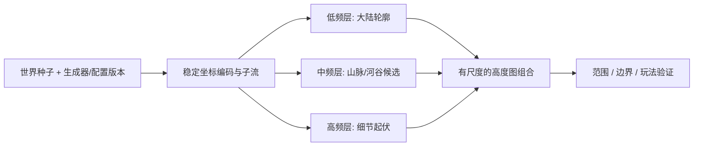
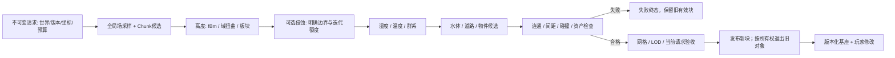

# 02-程序化生成

> 知识成熟度：L2。本文保留噪声、区域、迷宫、WFC 与分块地形的教学链路；代码、纸例、性能与跨平台结果均未运行。
> 知识基线：C++17 / Python 3.12 教学语法；Perlin 2002 参考实现、Gustavson 2005-03-22 文稿、WFC 固定提交 de7d22e705e816b62b4d613199d0463820fcaef3。资料版本不表示项目安装版本；具体选读与访问限制见 §12。
> 适用范围：离线烘焙、运行时网格地牢、连续高度场和分块世界。算法生成候选，玩法、美术、存档与发布系统分别确认自己的约束。
> 事实边界：数学保证、有限教学实现、项目工程策略和实测结果分开。固定种子不单独保证同世界；局部兼容不保证可玩；有限失败不自动证明无解。纸例统一为 PAPER_EXPECTED / NOT_RUN。
> 最后更新：2026-10-09。
> 验证建议：按 §8 与“验证与基准建议”记录输入域、失败终态、版本、资源与最终发布对象；本文未运行程序、编译、引擎或性能实验。

## 1. 概述

程序化生成用算法与规则组合资源，适合地形、地牢、城市、星系和关卡变体。它扩大设计空间，也增加了验证责任：生成出的图像像道路，不等于角色能够走通；保存了 seed，不等于旧存档能用新版生成器恢复。

按用途看，Roguelike 房间连接关注拓扑，开放世界关注连续采样和分块边界，星系/城市关注分区与密度，关卡布局还关注目标、节奏与可达性。原稿的以撒、杀戮尖塔、Minecraft、戴森球计划、无人深空、死亡细胞可作玩法观察线索；这里不据其名字断言采用了下述特定算法。

三项基本设计仍然成立：用完整版本合同支持复现；用高度、气候、群系、物件等层分开调试；用有单位和有效范围的配置供设计者调整。层之间可以有共享输入或反馈，不要求每一层只依赖紧邻上一层。



### 1.1 先声明要生成什么

| 层次 | 输入与输出合同 | 不能由上一层代替的检查 |
| --- | --- | --- |
| 随机输入 | 世界身份、子流键、PRNG/映射版本与状态 → 有限随机选择 | 源质量、失败消费、跨库一致性 |
| 算法候选 | 噪声/图/规则/边界快照 → 高度、墙、瓦片或放置点 | 无解、冲突、容量与操作预算 |
| 游戏内容 | 候选 + 资产/导航/碰撞规则 → 可接受内容 | 通路、出生空间、任务完成、美术限制 |
| 发布与持久化 | 已验候选 + 请求身份 → 当前世界及存档 | 陈旧任务、旧对象退出、版本迁移 |

噪声和生成树的数学性质只覆盖声明的模型。本篇的请求身份、失败分类、旧对象保留策略是工程设计建议，不是某个噪声或 WFC 库自动提供的行为。

## 2. 核心概念

| 术语 | 本文含义 |
| --- | --- |
| Seed | 初始化材料的一部分；还需生成器、资产、配置、映射和状态版本 |
| Noise | 具有特定空间结构的确定性场；“噪声”总称不必连续或平滑 |
| 频率/波长 | 坐标缩放与特征尺度；过高频率可超过采样分辨率 |
| Octave | 此处指频率不同的叠加层；层数为 octaves |
| Persistence / gain | 相邻层振幅比例；0.5 是示例参数 |
| Lacunarity | 相邻层频率比例；2 是示例参数 |
| Domain Warping | 用向量场改变采样位置；可产生流动外观，不是流体或侵蚀模拟 |
| Voronoi 图 | 按距离到站点的最近关系划分区域；边界存在并列 |
| 完美迷宫 | 对连通的可走格图，通道恰成一棵生成树 |
| WFC | 观察、删除候选、传播局部约束的生成方法；不是量子计算 |
| Biome | 项目定义的环境类别，可由海拔、湿度、温度及其它字段分类 |
| Chunk | 生成、加载、持久化与卸载的分区单位，其边界需另订合同 |

### 2.1 教学代码的输入与失败

下文 C++ 片段使用标准头文件和 `long long` 可表示 ±10^9 的前提；坐标先检查有限性与范围，再做 floor 和整数转换。它们不承诺浮点逐位跨平台一致。Python 片段只接收已物化的普通容器和普通 int，拒绝 bool 充当尺寸或权重；输入在整个调用期间冻结，外部回调也不得修改输入或重置预算。

公共 Python 帮助函数如下。教学容量 `MAX_CELLS=4096`、站点/瓦片/操作上限只是明确有限工作域，不是产品推荐值或分配成功保证。空尺寸在这些例子中统一拒绝；若项目允许空地图，应另定合法空结果，不能无意间从 `visited[0][0]` 越界得到策略。

```python
# 教学片段，Python 3.12，NOT_RUN
MAX_CELLS = 4096

def integer(value, low, high, label):
    if type(value) is not int or not low <= value <= high:
        raise ValueError(label)

def dimensions(w, h):
    integer(w, 1, MAX_CELLS, "width")
    integer(h, 1, MAX_CELLS, "height")
    if w * h > MAX_CELLS:
        raise ValueError("cell capacity")

def draw_index(draw_below, n):
    # 由调用者提供有界整数抽样器，例如随机数主篇的 DrawBudget.below。
    # 抽样器异常原样上抛；消费不回滚；不接受非法返回作为默认索引。
    value = draw_below(n)
    integer(value, 0, n - 1, "random index")
    return value
```

随机抽样器必须另有总原始调用预算与失败合同；验证一个返回值的类型不证明它均匀或独立。阻塞的外部回调也不能由本篇计数预算强制中断。异常、取消、资源不足不发布半成品，也不静默重新播种。

## 3. 噪声：Perlin 与 Simplex

### 3.1 值噪声与梯度噪声

值噪声在格点存值，再用核插值；梯度噪声在格点存梯度，以“格点到采样点的位移”与梯度做点积，再混合。平滑性来自插值/重建核与相邻格共享数据，不能仅凭“值噪声”断言不平滑，或凭“梯度噪声”断言完全各向同性。

### 3.2 Perlin 噪声原理（2D）

1. `i=floor(x), j=floor(y)`，格内坐标 `u=x−i, v=y−j`；负坐标也用 floor，不能用向零截断替代
2. 通过固定置换表查四角梯度；本例将0..255排列重复一次，省去组合索引的再次环绕
3. 算四个点积：`g00·(u,v)`、`g10·(u−1,v)`、`g01·(u,v−1)`、`g11·(u−1,v−1)`
4. 用 `fade(t)=6t^5−15t^4+10t^3` 分别沿 x、y 混合

在实数模型、相邻单元共享同一梯度、采用该五次 fade 的条件下，拼接具有连续二阶导数。fade 的一阶、二阶导数在0与1均为0；这不是浮点实现误差为0的承诺。[Perlin 2002 参考实现](https://cs.nyu.edu/~perlin/noise/)；[GPU Gems 第5章 §5.3–5.4](https://developer.nvidia.com/gpugems/gpugems/part-i-natural-effects/chapter-5-implementing-improved-perlin-noise)

下面保留原稿的8方向2D教学变体，不冒称与作者3D参考实现输出相同。`make_perm` 不生成随机数，只接受已按既定随机合同打乱的排列；表须作为不可变配置持有。

```cpp
// C++17 教学片段，NOT_RUN；§3.4 接着使用这些定义。
#include <array>
#include <cmath>
#include <stdexcept>
using Perm = std::array<int, 512>;

Perm make_perm(const std::array<int, 256>& order) {
    std::array<bool, 256> seen{};
    Perm p{};
    for (int i = 0; i < 256; ++i) {
        int v = order[i];
        if (v < 0 || v > 255 || seen[v])
            throw std::invalid_argument("permutation");
        seen[v] = true;
        p[i] = p[i + 256] = v;
    }
    return p;
}
double fade(double t) { return t*t*t*(t*(t*6.0-15.0)+10.0); }
double mix(double a, double b, double t) { return a + (b-a)*t; }
double grad(int h, double x, double y) {
    switch (h & 7) {
        case 0: return x+y;  case 1: return -x+y;
        case 2: return x-y;  case 3: return -x-y;
        case 4: return x;    case 5: return -x;
        case 6: return y;    default: return -y;
    }
}
int wrap256(long long i) { return int((i % 256 + 256) % 256); }

double perlin2D(double x, double y, const Perm& p) {
    if (!std::isfinite(x) || !std::isfinite(y) ||
        std::abs(x) > 1e9 || std::abs(y) > 1e9)
        throw std::invalid_argument("noise coordinate");
    double fx = std::floor(x), fy = std::floor(y);
    int xi = wrap256(static_cast<long long>(fx));
    int yi = wrap256(static_cast<long long>(fy));
    double u = x-fx, v = y-fy;
    int aa=p[p[xi]+yi], ab=p[p[xi]+yi+1];
    int ba=p[p[xi+1]+yi], bb=p[p[xi+1]+yi+1];
    double lo=mix(grad(aa,u,v), grad(ba,u-1,v), fade(u));
    double hi=mix(grad(ab,u,v-1), grad(bb,u-1,v-1), fade(u));
    return mix(lo, hi, fade(v));
}
```

调用者只能传入 `make_perm` 生成且未被改写的表。这里有轴向单位梯度和长度为 √2 的对角梯度，不能把输出当已证明的 `[-1,1]`。实数模型下每个点积绝对值≤2、fade∈[0,1]，故凸组合有保守界 `[-2,2]`，这不是紧界或浮点严格界。512只是重复查表大小；该算法在噪声坐标的每个轴以256为周期，重复表不会创造无限不重复世界。

**P01 / PAPER_EXPECTED / NOT_RUN**：`x=−0.25` 得 `floor(x)=−1,u=0.75`；直接向零取整会得错误单元。整数格点的位移和 fade 权重使输出为0；同表下在有效工作域内把 x 加256具有同一实数场值。这些纸面性质不验证实际编译结果。

### 3.3 Simplex 噪声

Simplex 将采样单元改为单形：2D 三角形只需三个角贡献。Gustavson 的2005文稿提供2D/3D/4D教学实现，并明确其梯度选择使输出不与 Perlin 原实现逐像素相同。[作者文稿，pp.4–7、2D代码](https://itn-web.it.liu.se/~stegu76/TNM084-2019/simplexnoise.pdf)

- 2D 偏斜：`F=(√3−1)/2, s=(x+y)F`，用 `floor(x+s),floor(y+s)` 定位斜网格
- 反偏斜：`G=(3−√3)/6`，恢复相对单元原点位置，再比较两个相对坐标以选中间顶点；不能只看斜坐标整数部分来区分两个三角形
- 该2D例的角贡献形如 `max(0,0.5−dot(d,d))^4 * dot(g,d)`，最后使用实现指定的尺度因子。其它维度/版本的支持半径和归一化不能任意互换

比较角数时，d维单形为d+1，超立方体为2^d；高维还需计算点积、坐标排名与哈希，不能从角数直接宣称所有实现总成本都是 O(d)，也不能推广为所有GPU/CPU都更快或完全无方向性伪影。改实现前比较目标采样尺度、导数、数值域与资产外观。商用实现选择见 FAQ Q2。

原稿的引擎选择线索可具体落到API：Unity 6000.2的 [Mathf.PerlinNoise](https://docs.unity3d.com/6000.2/Documentation/ScriptReference/Mathf.PerlinNoise.html) 是2D Perlin接口，文档还提醒可能略超出0..1；Godot 4.5的 [FastNoiseLite](https://docs.godotengine.org/en/4.5/classes/class_fastnoiselite.html) 同时列出Perlin及采用OpenSimplex2/2S的Simplex枚举。名字相近不等于与本文或Perlin原版同一实现，本轮未运行这些引擎。

### 3.4 fBm：多尺度叠加与域扭曲

游戏中常称为 fBm 的有限噪声叠加是多尺度外观模型，不自动等于数学上具有特定协方差的分数布朗运动：

```text
sum(x) = Σ(o=0..octaves−1) gain^o * noise(lacunarity^o * x)
normalized(x) = sum(x) / Σ gain^o
```

当各层具有同一已知界、权重非负且总权>0时，除以总权只保留这个界，不能把未知范围自动变成 `[-1,1]`。下面参数顺序修正为所有必填项在默认实参前；octaves为0会在进入循环前拒绝，避免0/0。

```cpp
// 依赖 §3.2；NOT_RUN。工作域是本例选择，不是 fBm 的普遍限制。
double fbm(double x, double y, int octaves, const Perm& p,
           double lacunarity=2.0, double gain=0.5) {
    if (octaves < 1 || octaves > 16 ||
        !std::isfinite(lacunarity) || lacunarity < 1 || lacunarity > 4 ||
        !std::isfinite(gain) || gain < 0 || gain > 1)
        throw std::invalid_argument("fbm parameters");
    double amp=1, freq=1, sum=0, norm=0;
    for (int o=0; o<octaves; ++o) {
        sum += amp * perlin2D(x*freq, y*freq, p); // 每层核验坐标
        norm += amp;
        amp *= gain;
        freq *= lacunarity;
    }
    return sum / norm;
}
```

域扭曲先计算向量偏移再采样：

```text
qx = fbm(x,y)
qy = fbm(x+5.2,y+1.3)
warped = fbm(x+a*qx, y+b*qy)
```

这个表达式有三次 fBm 求值，不能记作“约2倍”。每层数不同就分别计费；位移强度a、b改变最终采样位置，也可能超出工作域。域扭曲可产生流云、岩浆和侵蚀般外观，不能据此推出水流守恒或真实河网。

### 3.5 高度图、阈值和山脊

```text
height = base + 0.6*大陆低频场 + 0.3*山脉中频场 + 0.1*细节场
```

先给每个场声明取值范围和单位。若希望用0.25/0.35/0.65/0.85分出海洋、沙滩、平原、丘陵、山地，应先定义归一化域、base与溢出处理；阈值只是设计例子，不是各地形的面积比例。以下塑形先声明有限尺度B>0，令 `u=noise/B`，要求noise与u都有限且 `u∈[-1,1]`；本节选择越界即拒绝，不静默钳制。前述保守实数界[-2,2]可取B=2，浮点计算后仍须核验u的范围。再取有限指数k>0：`abs(u)^k` 强调绝对值大的位置，`ridge=(1−abs(u))^k` 则让零交叉处形成峰脊；两式底数均在[0,1]。对ridge，k>1压低峰外数值、使峰部变窄，0<k<1则抬高肩部。两者外观与位置不同，`^` 在 C++/Python 中也不是幂运算。

缓存高度图/纹理让碰撞、网格、群系等阶段复用，但缓存键必须包含生成器/配置/采样坐标版本。高频层应与网格间距、纹理采样和LOD策略相适配；增加octaves不一定改善画面，超出采样率的细节可产生闪烁或混叠。[GPU Gems 第5章 §5.7](https://developer.nvidia.com/gpugems/gpugems/part-i-natural-effects/chapter-5-implementing-improved-perlin-noise)

## 4. Voronoi 图

### 4.1 最近站点、边界与对偶

对于欧氏点站点，`V(si)={p: ||p−si||≤||p−sj||, 对所有j}`。共同边界位于站点连线的垂直平分线上；离散归属需要并列规则。Voronoi 又称泰森多边形，其对偶是 Delaunay 图；一般位置时对应三角剖分，四点共圆等退化情形需明确处理，不能把Delaunay三角形本身叫泰森多边形。[CGAL Voronoi adaptor，Introduction / Adaptation Traits](https://doc.cgal.org/latest/Voronoi_diagram_2/index.html)

在固定平面点集的三角剖分之间，Delaunay具有最大化最小角的性质；这不会保证任意点集没有瘦长三角形，也不是三维四面体质量保证。[David Mount，CMSC754 Spring2012，讲义pp.62–63](https://www.cs.cmu.edu/afs/cs/academic/class/15456-f15/Handouts/cmsc754-lects.pdf)

精确几何构图与栅格采样是两种输出：Fortune 1987 摘要给出 O(S log S) 时间、O(S) 空间的扫描线结果；本篇不实现该算法或声称普通浮点自动满足精确谓词。[Fortune 1987 摘要](https://link.springer.com/article/10.1007/BF01840357)

### 4.2 变体与用途

| 方法 | 实际构造 | 用途与附加条件 |
| --- | --- | --- |
| 欧氏最近站点 | 比较距离或平方距离 | 领土、恒星影响区；不含地形障碍成本 |
| 曼哈顿/切比雪夫 | 改距离度量 | 格网城市/房间风格；不能保留欧氏边界结论 |
| Lloyd 松弛 | 在有界域内求单元质心并移动站点 | 调整分布；需处理空单元、边界和有限迭代预算 |
| 距离差加噪声 | 对最近/次近距离字段做艺术变换 | 群系过渡；连续字段和标签分区要分别定义 |
| `d2−d1` | 最近两站距离差，站点≥2 | 边缘特征场；通常不是到最近单元边界的真实距离 |

对固定的不同站点a、b，到它们等距直线的距离为 `abs(||p−a||²−||p−b||²)/(2||a−b||)`；最近两站点的这条线也未必给出p所在单元的最近边界。做道路宽度、海岸安全距离时，需计算所需几何量，不能直接把 `d2−d1` 当世界单位距离。

### 4.3 栅格标签教学实现

```python
# 依赖 §2.1，NOT_RUN；整数坐标使本例平方距离精确。
def voronoi_cells(w, h, sites):
    dimensions(w, h)
    if type(sites) is not list or not 1 <= len(sites) <= 256:
        raise ValueError("materialized sites")
    for point in sites:
        if type(point) is not tuple or len(point) != 2:
            raise ValueError("site pair")
        for value in point:
            integer(value, -(1 << 20), 1 << 20, "site coordinate")
    if len(set(sites)) != len(sites):
        raise ValueError("duplicate sites")
    grid = [[0] * w for _ in range(h)]
    for y in range(h):
        for x in range(w):
            best, best_distance = None, None
            for i, (sx, sy) in enumerate(sites):
                d = (x-sx)**2 + (y-sy)**2
                if best_distance is None or d < best_distance:
                    best, best_distance = i, d
            grid[y][x] = best  # 相等时保留较小输入索引
    return grid
```

时间 O(WHS)，输出 O(WH)，输入站点与重复检查集合 O(S)。这只是整数样本处的站点标签，不包含多边形、边、质心或精确海岸距离。若把站点顺序作为稳定ID顺序，应先固定该顺序并记录版本。

**P02 / PAPER_EXPECTED / NOT_RUN**：3×1网格，站点 `[(0,0),(2,0)]`，标签应为 `[0,0,1]`，中心并列归0；空站点先报错，不能生成整图虚假的站点0。对于p=(0,1)、a=(0,0)、b=(2,0)，距离差为√5−1，而到等距直线x=1的距离为1。

## 5. 迷宫生成

### 5.1 生成树保证与风格

无障碍矩形四邻网格连通。每次只把“已访问集合”连接到一个新顶点，就不产生环；最终访问V个顶点、打开V−1条内部边时形成生成树。树的任意两点恰有一条简单路径，这是完美迷宫保证；它不保证门宽、角色半径、战斗空间或任务顺序合理。

| 算法 | 选择方式 | 成本与可解释的风格 |
| --- | --- | --- |
| 随机DFS | 从当前格未访问邻居随机选一个，耗尽后回溯 | 四邻网格O(V)；起点和图边界会影响结构倾向，固定seed对应的具体输出依赖邻居枚举顺序；理想模型下每步均匀、独立选择当前候选时，纯重排候选仍使每个邻居的条件概率为1/m，不改变DFS生成树分布 |
| 随机边界Prim | 在当前边界边中随机取边，连接一个新格 | 用swap-pop且每边有限入列时O(V+E)；不等同于固定随机权重的MST变体 |
| 随机Kruskal | 先洗牌所有边，再用并查集拒绝环 | 秩/大小合并与路径压缩下O(V+Eα(V))，另计随机源成本；没有排序步骤 |

### 5.2 显式栈的递归回溯

```text
stack = [起点]，标记访问
栈顶若无未访问邻居：出栈
否则随机选择一个未访问邻居：打开双方相对墙，标记，入栈
直到栈空；整个候选完成后才返回
```

```python
# 依赖 §2.1，NOT_RUN；walls[y][x] 按 N/E/S/W 存墙。
def maze_recursive_backtracker(w, h, draw_below):
    dimensions(w, h)
    if not callable(draw_below):
        raise ValueError("draw_below")
    visited = [[False] * w for _ in range(h)]
    walls = [[[True] * 4 for _ in range(w)] for _ in range(h)]
    dirs = [(-1,0,0,2), (1,0,2,0), (0,-1,3,1), (0,1,1,3)]
    stack = [(0, 0)]
    visited[0][0] = True
    while stack:
        y, x = stack[-1]
        candidates = []
        for dy, dx, wall, opposite in dirs:
            ny, nx = y+dy, x+dx
            if 0 <= ny < h and 0 <= nx < w and not visited[ny][nx]:
                candidates.append((ny, nx, wall, opposite))
        if not candidates:
            stack.pop()
            continue
        j = draw_index(draw_below, len(candidates))
        ny, nx, wall, opposite = candidates[j]
        walls[y][x][wall] = walls[ny][nx][opposite] = False
        visited[ny][nx] = True
        stack.append((ny, nx))
    return walls
```

该固定四邻版本最多V−1次选择；栈最多V格，循环为V次弹栈加V−1次扩展。算法没有Python递归深度问题，但仍有内存与抽样器预算。任意图若每次重新扫描整个邻接表，不可照搬此四邻 O(V) 推导，需保存迭代状态或另计扫描成本。障碍可把原图分成多个分量；从一个起点得到的是其分量生成树，应预检连通、显式生成森林或拒绝全图连通要求。

**P03 / PAPER_EXPECTED / NOT_RUN**：2×1无障碍网格只有一条内部边，应打开左格E/右格W，其余墙保留；1×1无需随机调用且无内部通道；w=0在分配前拒绝。后验检查同时核连通、开边数V−1、双向墙一致与边界墙。

### 5.3 随机Prim、Kruskal和均匀生成树

随机边界Prim要剔除两端均已访问的陈旧边，避免打出环；若对边设随机权重后使用优先队列，则是另一个算法合同，常有 O(E log E) 成本。不要把两者风格、复杂度和随机分布混称。

```text
Kruskal:
  edges = 所有合法无向邻边，每条一次，按固定顺序列出
  按已声明 Fisher–Yates / RNG 合同洗牌
  uf = V个单点集合
  对每条边(u,v)，若根不同：合并，打开墙
  结束后检查连通与 V−1 条开放边，否则为森林或失败
```

洗牌为O(E)，并查集应同时有按秩/大小合并与路径压缩，不能只说“用了路径压缩”就引用完整的反阿克曼界。[Sedgewick/Wayne UF 实现说明](https://raw.githubusercontent.com/kevin-wayne/algs4/master/src/main/java/edu/princeton/cs/algs4/UF.java)

DFS、随机边界Prim、随机边序Kruskal都不能在一般图上承诺所有生成树等概率。“看起来方向均匀”不是生成树均匀分布的检验。需要该分布时，可研究Wilson的擦圈随机游走：固定根树，从未入树顶点随机游走、抹去环，接上已有树后加入路径，再继续；保证依赖有限连通图和规定的随机转移。[Wilson/Propp 1996 作者机构摘要](https://www.microsoft.com/en-us/research/publication/how-to-get-an-exact-sample-from-a-generic-markov-chain-and-sample-a-random-spanning-tree-from-a-directed-graph-both-within-the-cover-time/)

本文未实现/运行Wilson，也不把“常数大，通常用不到”当选型依据。若给随机游走加预算，截停就是未完成；不能发布前缀并沿用完整算法的均匀生成树保证。

## 6. 波函数坍缩（WFC）

### 6.1 局部约束与全局目标

WFC 给每格维护可能瓦片域，选一个未确定格，按权重选值，再删去邻居中无兼容支持的候选。作者的重叠模型关注输出局部图案与输入样本相容，简单瓦片模型则使用方向兼容关系；它们不自动编码“入口可达出口”或建筑承重。[WFC 固定README，Algorithm / Tilemap generation](https://github.com/mxgmn/WaveFunctionCollapse/blob/de7d22e705e816b62b4d613199d0463820fcaef3/README.md)

局部弧一致也不等于存在全局解。一次选择造成空域，只能说明当前分支矛盾；有限重试耗尽，只能说明本策略没找到。要声称无解，必须有覆盖整个约束问题的完备求解或特定可核证明。

### 6.2 方向规则与边界

下面保留草地/道路/水/沙滩例，但把道路细分为水平与垂直，明确几何连接含义。`G`草地、`H`水平路、`V`垂直路、`W`水、`S`沙滩；外边界在本例允许终止通路，不是环绕世界。

| 瓦片 | 上U | 下D | 左L | 右R |
| --- | --- | --- | --- | --- |
| G | G/H/S | G/H/S | G/V/S | G/V/S |
| H | G/S | G/S | H | H |
| V | V | V | G/S | G/S |
| W | W/S | W/S | W/S | W/S |
| S | G/H/W/S | G/H/W/S | G/V/W/S | G/V/W/S |

每个方向都要定义允许集合，包括空集；同一无向邻接应满足 `b∈adj[a][R] ⇔ a∈adj[b][L]`，U/D同理。缺键是输入错误，空集合可以是合法但受限的规则。原稿把草地写作允许所有方向接道路、道路却仅允许左右接道路，双向含义不一致；“沙滩可接草地”也应有反向许可。

重叠模型从k×k样本图案及重叠匹配关系生成规则，图案权重不保证最终地图中每种图案严格按该频率出现。入口、出口、已放房间与相邻块边界作为初始域约束；全域必须先传播，不能等首次随机坍缩才开始检查。

### 6.3 有限单次尝试：完整教学实现

为让输入域、初始传播和终态可见，以下采用MRV（最小剩余候选数），并列按行优先；这与带权Shannon熵 `H=−Σp log p` 不同。瓦片使用稳定整数ID `0..T−1`，权重为正整数；上表可固定按G/H/V/W/S映射为0/1/2/3/4。adj是 `[tile][U,D,L,R]` 的普通list，每项为允许ID的普通set；initial是按行展开的每格普通set，可表达固定边界，空域返回矛盾。

```python
# 依赖 §2.1，NOT_RUN。单次、不回溯；返回(status, grid或None, steps)。
from collections import deque

def wfc_attempt(w, h, weights, adj, initial, draw_below, step_limit):
    dimensions(w, h)
    integer(step_limit, 0, 1_000_000, "step limit")
    if type(weights) is not list or not 1 <= len(weights) <= 64:
        raise ValueError("weights")
    T, N = len(weights), w*h
    for weight in weights:
        integer(weight, 1, (1 << 31)-1, "positive weight")
    if type(adj) is not list or len(adj) != T:
        raise ValueError("adj")
    for row in adj:
        if type(row) is not list or len(row) != 4:
            raise ValueError("four directions")
        for allowed in row:
            if type(allowed) is not set or len(allowed) > T:
                raise ValueError("allowed set")
            for tile in allowed:
                integer(tile, 0, T-1, "allowed tile")
    opposite = [1, 0, 3, 2]
    for a in range(T):
        for d in range(4):
            for b in range(T):
                if (b in adj[a][d]) != (a in adj[b][opposite[d]]):
                    raise ValueError("asymmetric adjacency")
    if type(initial) is not list or len(initial) != N:
        raise ValueError("initial domains")
    for domain in initial:
        if type(domain) is not set or len(domain) > T:
            raise ValueError("domain")
        for tile in domain:
            integer(tile, 0, T-1, "domain tile")
    if not callable(draw_below):
        raise ValueError("draw_below")
    domains = [set(domain) for domain in initial]
    steps = 0
    if any(not domain for domain in domains):
        return "CONTRADICTION", None, steps
    directions = [(0,-1), (0,1), (-1,0), (1,0)]

    def neighbors(i):
        x, y = i % w, i // w
        for d, (dx, dy) in enumerate(directions):
            nx, ny = x+dx, y+dy
            if 0 <= nx < w and 0 <= ny < h:
                yield ny*w+nx, d

    def propagate(seeds):
        nonlocal steps
        q = deque(seeds)
        queued = set(seeds)
        while q:
            i = q.popleft()
            queued.remove(i)
            for j, d in neighbors(i):
                if steps == step_limit:
                    return "BUDGET_EXHAUSTED"
                steps += 1  # 一次定向邻域修订；候选比较另计成本
                allowed = set()
                for tile in sorted(domains[i]):
                    allowed.update(adj[tile][d])
                reduced = domains[j] & allowed
                if reduced == domains[j]:
                    continue
                domains[j] = reduced
                if not reduced:
                    return "CONTRADICTION"
                if j not in queued:
                    q.append(j)
                    queued.add(j)
        return None

    status = propagate(list(range(N)))  # 即使全部初始域是单态，也先核约束
    while status is None:
        unresolved = [i for i in range(N) if len(domains[i]) > 1]
        if not unresolved:
            values = [min(domain) for domain in domains]
            # 单独遍历最终边核验；不以“已无多态格”替代成功条件。
            if any(values[j] not in adj[values[i]][d]
                   for i in range(N) for j, d in neighbors(i)):
                return "VALIDATION_FAILED", None, steps
            return "COMPLETE_LOCAL", [values[y*w:(y+1)*w] for y in range(h)], steps
        if steps == step_limit:
            return "BUDGET_EXHAUSTED", None, steps
        steps += 1  # 一次观察；RNG底层拒绝次数由draw_below独立计费
        i = min(unresolved, key=lambda j: (len(domains[j]), j))
        options = sorted(domains[i])
        total = sum(weights[tile] for tile in options)
        value = draw_index(draw_below, total)
        for tile in options:
            if value < weights[tile]:
                domains[i] = {tile}
                break
            value -= weights[tile]
        status = propagate([i])
    return status, None, steps
```

输入错误抛ValueError；随机源异常/预算失败、内存异常和外部取消沿调用链上抛，不转为“完成”。上层必须记录异常类别和源消费。`COMPLETE_LOCAL`只说明本例所有格已确定并满足声明的邻接边；游戏目标检查与发布仍未做。最终遍历是不同路径的语义核验，仍使用同一规则数据，不是假装独立实现的完整产品测试。

输入验证、域分配、MRV全图扫描、最终核验与外部抽样并不都包含在steps中。steps只限观察和弧修订，T/N另有容量上限；它不是硬墙钟期限，也不是内存分配保证。集合只用于成员关系，随机选择与并列均按稳定整数顺序；更换数据结构或顺序仍需版本化。

### 6.4 重试、回溯与失败终态

| 终态 | 已知事实 | 后续责任 |
| --- | --- | --- |
| INVALID_INPUT / 异常 | 配置、数值域、资源或随机源合同失败 | 报错并保留诊断；不能改成默认成功 |
| CONTRADICTION | 初始约束或当前选择分支有空域 | 保存冲突格/规则/选择轨迹；没有完备证明时不写全局无解 |
| BUDGET_EXHAUSTED | 本次操作额度不足 | 候选不发布；记录已消费量 |
| RETRY_EXHAUSTED | 预设尝试数用完仍无合格候选 | 终止或使用预先验证的完整备用关卡 |
| COMPLETE_LOCAL | 所有局部约束通过 | 继续连通、碰撞、资产与目标检查 |
| REJECTED_GLOBAL | 局部合格而全局目标失败 | 计入尝试与成功率分母，不只保留成功样本 |
| READY / PUBLISHED | 已验候选 / 已获当前世界接受 | 这两个状态由发布拥有者分开确认 |

重试需在请求开始前固定最大尝试A、单次上限和全请求总额度；每次从未修改的初始域开始，尝试编号纳入逻辑子流键，失败消费有记录。只固定每次预算、无限新建尝试会失去总界。换seed不能修复必然无解的规则或冲突固定边界；无论A多大，也不能承诺终将成功。

回溯需保存并恢复所有受传播影响的域、权重/熵缓存、队列及决策点，而不只是上一次所选格。它扩大搜索，不自动提供固定毫秒级完成或均匀解分布。MRV、Shannon熵或优先队列都是可比较的策略，不能写成“必然显著降低冲突”。本例没有实现回溯。

作者固定 `Model.cs` 的 `Run(seed, limit)` 在达到limit后仍可返回true，因此集成时不能只看布尔返回值认定所有格已确定；这是对该版本方法的静态观察，不代表本例接口或所有移植版行为。[固定 Model.cs，Run / NextUnobservedNode / Clear](https://github.com/mxgmn/WaveFunctionCollapse/blob/de7d22e705e816b62b4d613199d0463820fcaef3/Model.cs)

**P04 / PAPER_EXPECTED / NOT_RUN**：2×1，T=1、weight=1，两格初始域均 `{0}`，四向兼容集合都空，step_limit=8。旧例直接看到没有多态格便返回；本例初始传播在右边发现空域，返回CONTRADICTION，steps=1，未调用抽样器。1×1非环绕边界没有邻接边，单态可以局部完成，这说明边界合同不可省略。

**P05 / PAPER_EXPECTED / NOT_RUN**：2×1，T=2，所有瓦片互相兼容，两域 `{0,1}`，step_limit=0，应BUDGET_EXHAUSTED且不调用抽样器。即使某次COMPLETE_LOCAL，地图全为不可走水块仍不证明入口出口可达。禁止在冲突格放任意“默认瓦片”再把它算作成功；完整备用模板也须满足当前边界与玩法条件。

## 7. 地形与地图生成管线

### 7.1 分层管线



1. 大陆层用低频场或Voronoi板块控制陆海形状；连续场的输入是全局坐标，不是每块从零重新开始
2. 起伏层叠加中频和域扭曲，山脊变换说明零交叉还是幅值峰为目标；高频细节受最终采样分辨率约束
3. 可选侵蚀层模拟搬运、沉积等过程，必须声明边界、步长、总迭代/粒子数和数值失败；`height−河流噪声`是艺术雕刻，不具有水力侵蚀的物理保证
4. 气候层可用纬度、海拔、距海与降雨字段组合成温湿度，再分类；系数、单位、截断与热更版本是配置合同

下表保留原稿的设计用途，是一个人为海拔/湿度分类示例，不是自然界定律；若要温度参与，应扩展为温度分档或显式函数，不能在表里假装已经使用它。

| 海拔 \ 湿度 | 低湿 | 中湿 | 高湿 |
| --- | --- | --- | --- |
| 低 | 草原 | 森林 | 沼泽 |
| 中 | 丘陵草原 | 温带森林 | 雨林 |
| 高 | 荒漠山地 | 山地 | 雪峰 |

5. 物件层按群系提议树/石/草；需要最小间距时接入 [Poisson-disk采样合同](07-概率分布与采样工程.md)。NavMesh投影、量化或移动后重验距离、碰撞与可达性；采样不保证数量、公平或所有区域覆盖
6. 道路、河流和房间连接必须基于实际通行/高度等规则验证；寻路算法只能回答所给图上的问题
7. 分块尺寸可从32、64、128格等设计候选比较，但应由内存、延迟、LOD与生成依赖决定，不能把这些数字当通用推荐

### 7.2 跨块边界与复现合同

`hash(worldSeed,cx,cy)`适合隔离块内物件子流；连续地形若每块采用不同梯度表，即使两边都可复现，也可能有接缝。全局高度场应共享生成器/表、坐标编码、单位与同一边界采样位置；邻域滤波、法线、侵蚀需halo或其它明确跨块数据。WFC共享边界约束只保证已经编码的边关系，不能保证接下来所有块都有可行扩展。

| 复现材料 | 需要固定的细节 |
| --- | --- |
| 身份与版本 | world ID、生成器/规则/配置/资产版本、坐标系和单位 |
| 随机 | seed初始化、完整状态或逻辑子流规则、整数映射、调用顺序、失败消费 |
| 顺序 | 瓦片ID、站点/边枚举、并列规则、并行归并顺序；不以worker编号作永久身份 |
| 数值 | 输入域、整数位宽/溢出、浮点环境/舍入/数学库、量化与比较政策 |
| 持久化 | 正规序列化、版本标签、校验、基座/增量所属版本、迁移政策 |

采用整数最终坐标并不能消除前面浮点高度跨阈值造成的类别分歧；在阈值两侧量化也可能不同。跨平台逐位重建需要针对完整实现和支持环境另行建立证据；也可以由权威端分发已生成块或持久化基座。选择取决于项目责任，而非一句“禁止浮点平台差异”。随机流和映射细节由 [随机数与洗牌主篇](01-随机数与洗牌算法.md)负责，此处不复制另一套生成器。

**P06 / PAPER_EXPECTED / NOT_RUN**：两块共享世界位置x=64，一边用表A、一边用表B，世界seed标签相同仍不足以推出高度相等。高度0.499999与0.500001在阈值0.5分类后，一个为水一个为陆；之后把坐标改成整数不会修正类别差异。

### 7.3 候选发布、陈旧任务和旧对象

生成线程在独占候选数据上工作；完成队列只传递不可变结果、请求ID、世界/块身份及配置epoch。消费方先确认当前块仍需要该请求、版本未失效、最终验证通过，再在项目规定的线程/事务边界接受新块。任务“算完”与新块“已成为当前世界”必须分开记录。

如果请求r1未完成时已发出r2，r1晚到不得覆盖r2。取消后的晚到结果也应丢弃或按缓存合同存放，不能绕过当前请求验收。保留旧有效块直到新块被接受是常见连续性策略；如果项目要求空白或加载遮挡，应把它写成显式策略。

替换之后，渲染、碰撞、导航、物件、异步句柄和缓存各自的拥有者解除旧引用并释放资源；“从完成队列取出新网格”不自动销毁旧Actor/组件。释放时机须满足仍在使用的线程/任务，不能一发布就假定旧引用全部失效。联机权威、引擎对象线程亲和与存档事务交给项目既有系统；本篇不发明引擎API或声称运行过生命周期实验。

**P07 / PAPER_EXPECTED / NOT_RUN**：当前请求ID=r2，队列先到r1候选，应拒绝它作为当前块；r2失败则按既定政策保留旧块并报告失败；只有r2成功接受后才安排旧对象退出，不能把“r1曾成功生成”计作本次发布成功。

### 7.4 基座、玩家改动和升级

保存 `base=generate(generatorVersion, seed, config, coordinate)` 与 `delta=玩家修改` 的分层思想仍有用。delta须说明是“位置绝对新值”“相对基座差量”还是稳定实体ID上的事件，并记录顺序、版本与冲突处理。

新生成器可能移动地形、改变矿物、道路或实体ID；原delta即使字节没丢，也可能落在新海洋、重建出重复对象或引用不存在的实体。升级应选择保留旧生成器、保存已访问块快照，或做显式迁移与验证；迁移失败保留可恢复的旧版本。仅有seed和delta不能自动保证兼容。

**P08 / PAPER_EXPECTED / NOT_RUN**：旧基座坐标(10,8)是岩壁，delta记录挖成通路；新版基座该处成为海水。同坐标重放delta未丢记录，却可能造出不合设计的洞或改变连通性。需按所选存档迁移合同判定，不能宣布“算法升级不丢玩家改动”已经成立。

## 8. 复杂度分析与资源账本

下表按常数维度与相应运算成本模型描述算法；随机源拒绝次数、回调、IO、引擎上传、验证和失败重试另计。若整数位数不再有界，也需计大整数运算成本。

| 项目 | 时间 | 空间及边界 |
| --- | --- | --- |
| 本例Perlin单点 | O(1)；表初始化O(256)另计 | 固定512表，O(1)；输出场不含整张图 |
| 固定维度Simplex单点 | 对固定实现O(1) | 由实现的梯度/置换/排名结构决定 |
| o层fBm | O(o) | 共享表外O(1)；WH图另存O(WH) |
| 本文域扭曲 | 三次fBm之和 | 中间标量O(1)，不是无条件2倍 |
| 栅格Voronoi | O(WHS) | 输出O(WH)，站点/验证O(S) |
| Fortune构图 | O(S log S) | O(S)，本篇仅阅读论文摘要 |
| 四邻DFS迷宫 | O(V)，任意图需具体扫描实现 | visited、walls、栈O(V) |
| swap-pop边界Prim | 每边有限入列时O(V+E) | 边界O(E)、访问/输出O(V) |
| 洗牌Kruskal | O(V+Eα(V))，随机源另计 | 存全边O(E)，并查集与树O(V) |
| 本文WFC单次 | 输入O(T²+NT)，最多N次MRV全图扫描O(N²)；K次弧修订保守O(KT²) | 域O(NT)、规则O(T²)、去重队列O(N)、输出O(N) |
| WFC重试/回溯 | 重试累加各次实际成本；完备搜索可能指数级 | 回溯还要计快照/撤销栈；本例不实现 |
| 水滴侵蚀示意 | 若每滴≤L步且每步固定邻域，则O(drops·L) | 高度图/沉积等O(WH)，不能把单滴O(1)状态说成整体O(1) |

WFC有限不回溯尝试中的域只减不增，搜索失败与一般约束满足的指数级最坏情况不是同一个成本。优先队列可减少某些MRV/熵扫描，但需更新和淘汰旧条目；不能不计维护就宣称“实际近线性”。没有目标硬件、规则规模、失败比例和完整路径测量，本篇不保留“100×100毫秒级”或“成功率>95%”结论。

## 验证与基准建议

本节是待执行的项目验证方案，全部实际运行均为NOT_RUN。P01–P08是人工推导，不是新增程序、模型、压力测试或产品证据；文档链接和格式检查也不能证明算法输出正确。

| 对象 | 最小检查与反例 | 验收的含义 |
| --- | --- | --- |
| 噪声/fBm | 负坐标、格边、周期、非法表、NaN/Inf、octaves=0、频率放大超域 | 核实指定实现范围/连续性误差；不要求不同实现逐值相同 |
| Voronoi | 空/重复站点、并列、单站点、退化几何、P02 | 区分栅格标签与几何边；空间包含输出 |
| 迷宫 | 1×1、2×1、障碍分量、双向墙、V−1开边、RNG异常 | 验证树与原图合同；另测角色可通行 |
| WFC | 空域、全单态不兼容、非对称规则、权重非法、预算0、无解与分支冲突 | 终态正确；不发布局部前缀/默认填充 |
| 边界/LOD | 同全局坐标两侧高度/法线、halo、LOD接缝、WFC后续块不可扩展 | 高度相同只是接缝条件的一部分 |
| 发布 | r1/r2乱序、取消后完成、块卸载后晚到、旧对象仍被引用 | 当前身份与所有权正确；不以线程完成代替发布 |
| 存档 | 旧生成器、资产改名、绝对/相对delta、迁移失败 | 数据能恢复且语义正确，不只校验字节存在 |

复现记录至少包括世界/块/请求身份、完整版本、初始域与规则哈希、输入顺序、随机状态或子流键、尝试/操作/原始随机消费、首个冲突和最终终态。哈希比较还需定义序列化、字节序与浮点政策；哈希相同不是无碰撞证明，差异也不自动说明算法错误。

性能报告应分别测生成、验证、队列等待、引擎上传/激活、旧对象退出与存档IO；给出尺寸/层数/瓦片数、线程、硬件、构建与缓存冷热状态、内存峰值、P50/P95/P99以及完整失败分母。WFC成功率按预先固定的规则/边界/种子集和预算报告，不能只计算重试成功的地图。失败或超时有自己的成本和质量含义。

原稿 `python -m pytest tests/test_procgen.py -q` 仅是未来项目入口示意，仓库不因这句话就存在该测试。C++金样、跨平台回放、引擎场景和CI应在各自项目授权后执行；本次未运行。

## 9. 最佳实践

1. 保留多样化固定种子回归集，覆盖边界与曾失败输入；seed=0只是一例，不是能够代表所有世界的黄金集合
2. 参数配置化时同时记录单位、范围、依赖与版本；“山脊度”“河流密度”等美术名应映射到明确运算
3. 分层开关和高度/群系/约束调试视图保留，但关闭某层会改变生成合同；调试视图不是实测报告
4. 生成、验证和激活分别设预算；异步、分帧与预生成需要取消、过期丢弃和缓存策略。每帧N块在块成本变化时不是固定时间预算
5. 金样升级应解释预期变化并保留旧版复现材料；不能把所有差异自动重录成“通过”
6. WFC先用小图与已知冲突规则做语义核验，再按目标规模评估；8×8或1000次只是可能的项目设计，不构成本文实测
7. uint16高度量化需声明范围、误差、溢出与碰撞影响；位图适合布尔字段，不能把任意高度压成一位而保持原语义
8. LRU淘汰只处理符合可淘汰条件的缓存；玩家改动、引用中的块、待持久化事务和旧对象生命周期由各自拥有者处理

## 10. 常见问题 FAQ

**Q1：Perlin为什么有格点感或对角线伪影？**
先区分梯度/晶格特征、整数格采样、有限周期与采样混叠。可以比较梯度设计、频率、Simplex或域扭曲，但更多octaves也可能增加混叠；用目标分辨率下的画面和导数需求判断。

**Q2：Simplex噪声能商用吗？**
应核对选用的具体实现、版本、许可证与素材依赖，而不是从算法名直接下结论。Gustavson的作者页说明其代码发布条件经历过变更；这只说明该作者所指代码的来源，不能替代任意库或产品的授权核验。[作者实现与授权说明](https://www.itn.liu.se/~stegu76/simplexnoise/DSOnoises.html) 原稿关于某专利在2022年1月到期的精确断言本轮未取得原始专利状态证据，不沿用为商用保证。

**Q3：WFC频繁失败怎么办？**
先核双向兼容、固定边界、初始传播和全局目标，记录冲突输入。再比较规则修改、预算、回溯或有限重试；统计所有尝试。耗尽后明确失败或使用满足当前合同的完整备用模板，不能只塞默认瓦片并写日志。

**Q4：迷宫总偏向某个方向怎么办？**
检查方向枚举、随机映射、起点与边界，再选择DFS/Prim/Kruskal适合的结构倾向。分支外观和均匀随机生成树是不同目标；若要求后者，研究Wilson等有相应证明的方法并验证实现与停止条件。

**Q5：无限世界怎样让所有客户端一致？**
固定整个生成合同，验证支持环境；仅世界seed和坐标哈希不够。对跨平台不愿承诺逐位计算的部分，可让权威端分发结果或保存块基座；将版本、随机映射、浮点阈值和资产差异纳入协议/存档责任。

**Q6：运行时生成卡顿怎么办？**
先分出生成、验证、上传、激活或IO的瓶颈，再选择异步、分帧、预生成、缓存、LOD或离线烘焙。周边3×3块是可评估的预取例子，不能对任何移动速度和块尺寸保证不卡；异步也有内存、取消和陈旧结果成本。

**Q7：玩家改造如何与程序化基座共存？**
版本化基座加有语义的delta，保留恢复与迁移政策。算法升级需保留旧生成器/旧块或验证迁移；同坐标上的delta未丢字节不代表仍然符合新世界。

## 11. 关联阅读

- [01-随机数与洗牌算法](01-随机数与洗牌算法.md)：PRNG、坐标子流、整数映射、有限预算和失败消费
- [07-概率分布与采样工程](07-概率分布与采样工程.md)：Poisson-disk最小间距、有限提议、最终坐标与玩法检查
- [05-位运算与性能优化技巧](../数据结构与编码/05-位运算与性能优化技巧.md)：布尔位图与定量压缩的适用边界
- [数学与游戏算法学习路线](../../../00_Index/学习路线/数学与游戏算法.md)：寻路、图论与房间/道路连通性验证入口
- [04-PCG程序化内容生成](../../03-引擎架构与资源系统/程序化内容生成/04-PCG程序化内容生成.md)：UE的PCG图、资源与引擎集成；本篇不改该主责
- 《Procedural Generation in Game Design》（Tanya X. Short、Tarn Adams）：保留原稿设计阅读线索，本轮未选读正文
- [The Nature of Code：Chapter 0 Randomness](https://natureofcode.com/random/)：噪声与生成艺术入门；本轮在线版的噪声在第0章，不能继续写成第7章
- [GPU Gems 1 第5章](https://developer.nvidia.com/gpugems/gpugems/part-i-natural-effects/chapter-5-implementing-improved-perlin-noise)：Perlin改进与采样；原稿GPU Gems 1/2/3是拓展书目，本轮未核后两册的Voronoi/侵蚀章号
- [WaveFunctionCollapse固定README](https://github.com/mxgmn/WaveFunctionCollapse/blob/de7d22e705e816b62b4d613199d0463820fcaef3/README.md)：两类模型、约束传播与示例说明；没有运行其中示例
- [PCG Random作者资料](https://www.pcg-random.org/)：保留原稿随机源阅读入口；这里的PCG是随机数生成器家族，不能单独作为Perlin、迷宫或WFC全部结论的来源

## 12. 来源、选读范围与修订出处

一手资料访问日期2026-10-09。本文的数值域、教学代码、纸例、失败接口和发布策略是结合原稿用途的推导/设计，不冒称作者库原有同名功能。可读文档也不能替代产品运行证据。

| 来源 | 本轮实际选读 | 支持范围与限制 |
| --- | --- | --- |
| [Perlin Improved Noise](https://cs.nyu.edu/~perlin/noise/) | 2002 Java参考页，noise/fade/grad/表初始化 | 噪声构造；本篇为2D变体，不复制其结果保证 |
| [GPU Gems 1 第5章](https://developer.nvidia.com/gpugems/gpugems/part-i-natural-effects/chapter-5-implementing-improved-perlin-noise) | Ken Perlin，2004；§5.1–5.4、§5.7 | 平滑核、梯度与混叠；未移植GPU例或测性能 |
| [Simplex noise demystified](https://itn-web.it.liu.se/~stegu76/TNM084-2019/simplexnoise.pdf) | 正文日期2005-03-22；pp.1–7及2D代码 | 偏斜/贡献/维度与实现差异；目录2019不是论文日期 |
| [WFC README](https://github.com/mxgmn/WaveFunctionCollapse/blob/de7d22e705e816b62b4d613199d0463820fcaef3/README.md) / [Model.cs](https://github.com/mxgmn/WaveFunctionCollapse/blob/de7d22e705e816b62b4d613199d0463820fcaef3/Model.cs) | 固定2026-03-22提交；Algorithm、Tilemap、Run/Clear/Observe/Propagate | 局部合同与limit分支；不是本教学版正确性的运行证明 |
| [CGAL Voronoi adaptor](https://doc.cgal.org/latest/Voronoi_diagram_2/index.html) | 页面自标6.2.1；Introduction、Adaptation Traits、退化处理 | 动态latest页，版本化6.2.1 URL读取失败；不伪称固定发布快照 |
| [Fortune 1987](https://link.springer.com/article/10.1007/BF01840357) | 论文摘要与出版信息 | 复杂度；全文为订阅内容，本轮未取得全文 |
| [UF.java](https://raw.githubusercontent.com/kevin-wayne/algs4/master/src/main/java/edu/princeton/cs/algs4/UF.java) | 作者仓库master动态文件；说明、find、union | 秩合并/路径减半；Princeton课程网页读取失败，不声称固定commit |
| [Wilson/Propp 1996](https://www.microsoft.com/en-us/research/publication/how-to-get-an-exact-sample-from-a-generic-markov-chain-and-sample-a-random-spanning-tree-from-a-directed-graph-both-within-the-cover-time/) | 作者机构摘要 | 擦圈与随机生成树方向；本轮未取得所尝试STOC论文PDF全文 |
| [Gustavson作者页](https://www.itn.liu.se/~stegu76/simplexnoise/DSOnoises.html) | 实现身份与代码发布条件段 | 不能推出所有Simplex实现的商业使用权 |
| [Nature of Code](https://natureofcode.com/random/) | 在线Chapter0的Perlin节/目录 | 修正阅读入口；未运行交互例 |
| [Unity PerlinNoise](https://docs.unity3d.com/6000.2/Documentation/ScriptReference/Mathf.PerlinNoise.html) / [Godot FastNoiseLite](https://docs.godotengine.org/en/4.5/classes/class_fastnoiselite.html) | Unity6000.2页自标构建6000.2.16f1；Godot4.5；Description/Returns/NoiseType | 仅核接口名称与实现类型，未安装或运行 |
| [Mount计算几何讲义](https://www.cs.cmu.edu/afs/cs/academic/class/15456-f15/Handouts/cmsc754-lects.pdf) | Spring2012，pp.62–63的Maximizing Angles与定理 | 固定平面点集最小角性质；未读全161页 |

旧NYU论文PDF、旧Linköping路径与所尝试CMU论文URL有读取失败，本文改用实际可读的一手资料并保留选读限制。没有验证Simplex专利状态、具体游戏内部实现、统一WFC成功率或跨平台生成结果。

原篇最初由fantuan812于2026-08-04加入，2026-08-06补来源/边界/验证入口，之后补成熟度、OKF和关联阅读；2026-10-04的#15迁移及#16/#17调整导航。本轮保留其噪声、Voronoi、三种迷宫、WFC、地形管线、图表、例子和七问FAQ的教学职责，修正过强保证与不完整失败链。普通历史由仓外审计副本及原Git保存，不在现行教学正文复制整篇旧结论：[修订前固定正文](https://github.com/fantuan812/learning/blob/2ed2c79a414739bf4355a1bbf50048616175b04b/知识/02-数学与游戏算法/随机采样与程序化生成/02-程序化生成.md)，[初始提交](https://github.com/fantuan812/learning/commit/c5c5be2536b9186276f64829d85e3450dda25d8d)。书籍、工作日志、附件与其它主责文章不属本篇改写范围。
