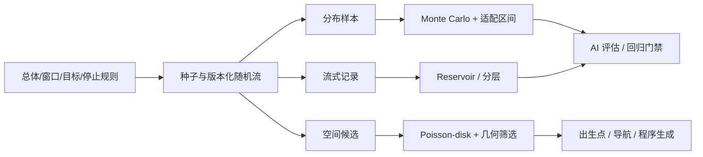
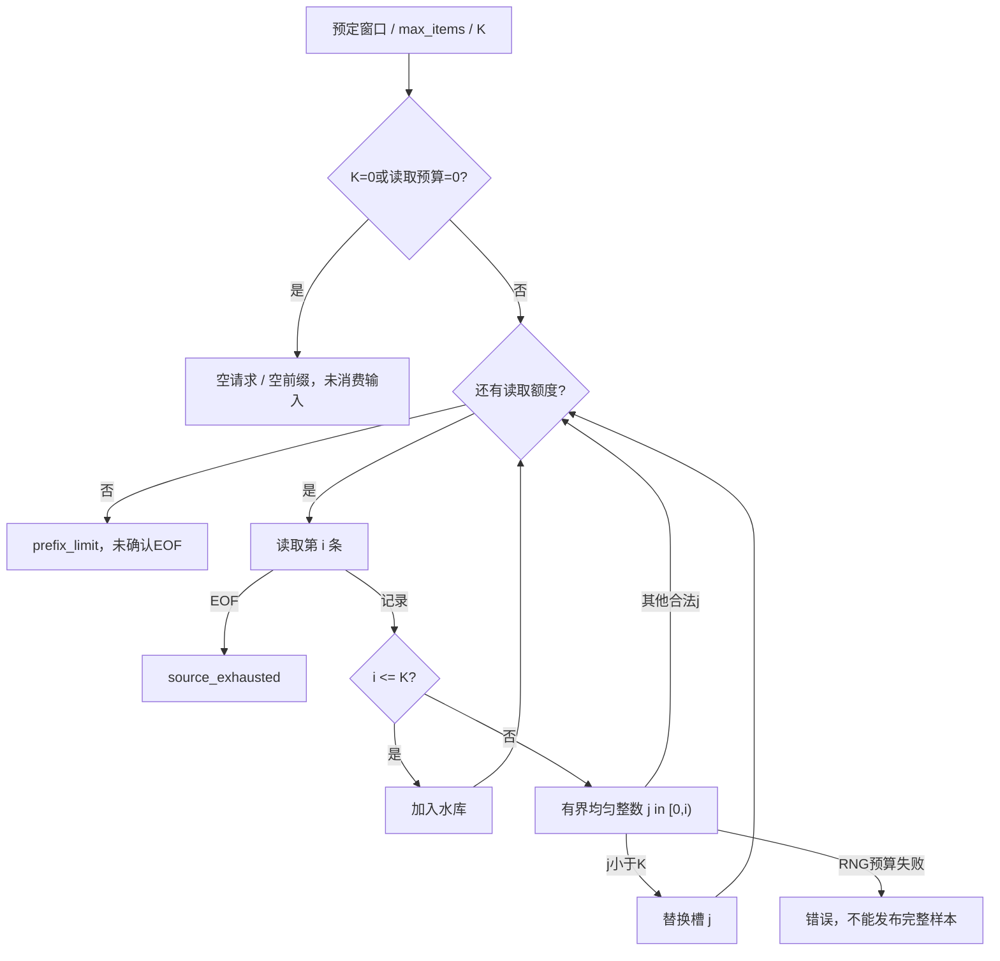
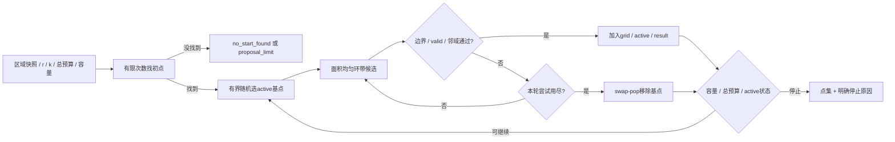
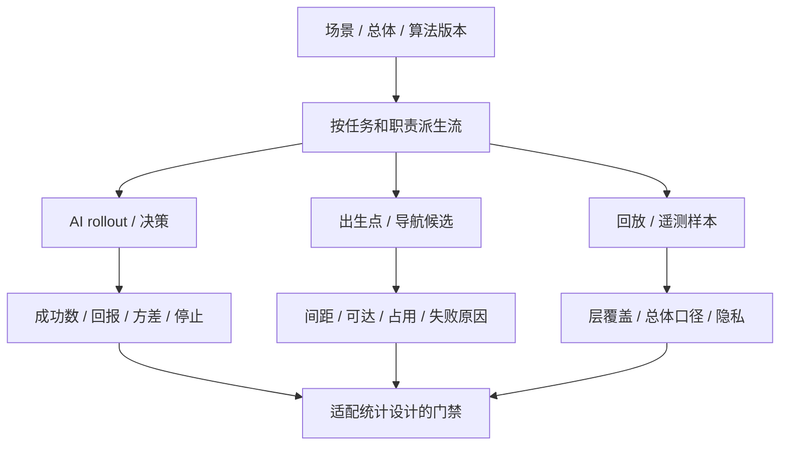
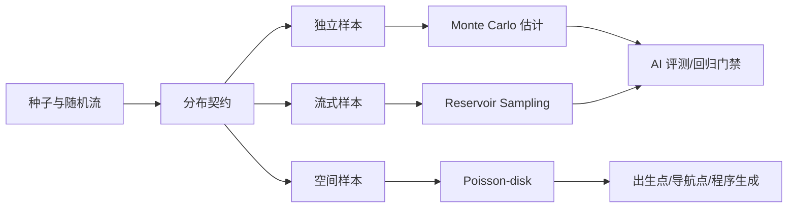
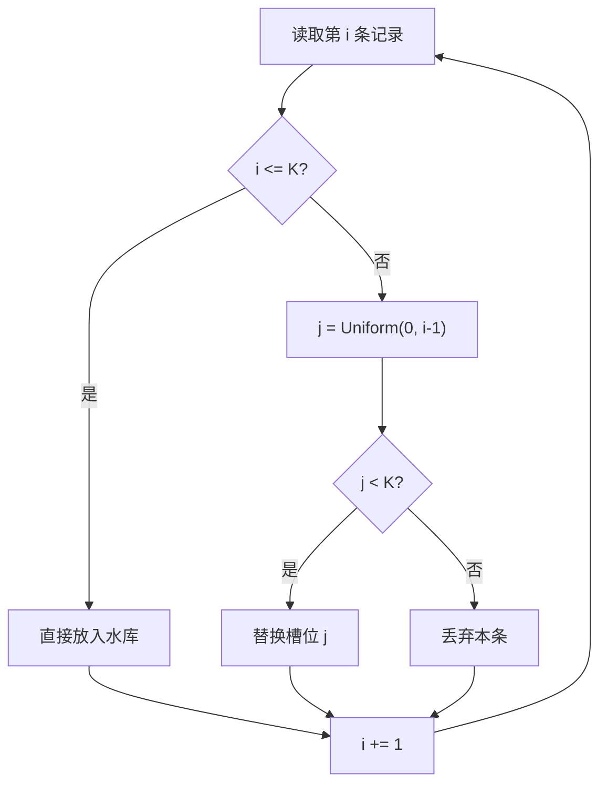
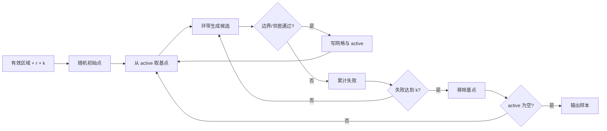
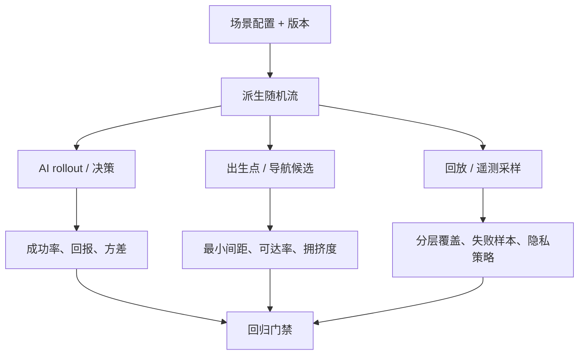

# 07-概率分布与采样工程

> 知识成熟度：L2。已整理概率模型、算法推导、有限预算示意与纸面案例；没有执行本文代码、随机模型、覆盖率、引擎或性能实验。
> 版本与规范基线：引擎无关；示意采用 Python 3.12 语法，标准库实现依据固定 CPython v3.12.7，NumPy 2.1 仅作随机流设计参考。PRNG、Fisher–Yates、Alias 与保底基础见[随机数与洗牌算法](01-随机数与洗牌算法.md)。
> 适用范围：AI 场景与 rollout、回放/遥测/回归集抽样、出生点/资源点/导航候选生成、离线概率与期望评估。经济与对战结算仍由权威服务端负责。
> 事实边界：数学保证依赖声明的总体、随机模型、输入域与停止规则；有限 PRNG、浮点、回调、I/O 和地图约束是额外实现条件。一次样本、固定种子或静态审读都不证明统计覆盖、空间质量或真实耗时。
> 最后更新：2026-10-09（修订总体/窗口、分布端点、Reservoir、Bridson、区间、稀有事件、有限预算与复现合同；原文和历史异文见文末）。
> 验证建议：§9 的 `PAPER_EXPECTED` 是人工指定输入的纸面预期，未运行；未来项目测试需另附环境、原始结果和失败记录。
> 来源入口：[Vitter 1985](https://www.cs.umd.edu/~samir/498/vitter.pdf)、[Bridson 2007](https://www.cs.ubc.ca/~rbridson/docs/bridson-siggraph07-poissondisk.pdf)、[NIST Wilson 区间](https://www.itl.nist.gov/div898/handbook/prc/section2/prc241.htm)；版本和实际选读范围见 §14。

## 1. 概述

游戏中的随机不是单次 RNG 调用。先回答四个问题，算法才有明确目标：

1. **什么分布？** 命中、等待时间、累计事件数、伤害与地图点不是同一个模型。
2. **什么总体？** “这一天的所有决策”“已收到的日志”“按玩家去重后的记录”是三个不同总体。
3. **什么估计对象？** 线上失败率、最异常的 K 条和每张地图至少一例，需要不同抽样设计。
4. **何时停止、怎样复现？** 必须区分读完、预算耗尽、业务失败、基础设施错误，并保留数据和随机流的版本。

本篇补齐基础 PRNG 之上的**分布契约与采样策略**。有限存储用 Reservoir；最小间距用 Poisson-disk；概率与期望用 Monte Carlo 和适配的区间。它们可以组合，但不能互相继承保证：空间点间有排斥关系，不能直接当独立均匀试验；异常样本更有诊断价值，也不因此代表线上比例。



只保存 seed 或最终点集不够：同一 seed 下，输入顺序、随机数消费位置、分布变换、地图版本改变，都可能改变输出。统计推断问的是“这个抽样程序针对谁、有什么误差”；可复现性问的是“给定完整状态能否重做同一结果”，两者要分别验证。

## 2. 核心概念

| 术语 | 精确含义 | 工程例子与边界 |
| --- | --- | --- |
| 总体 / 抽样框 | 希望描述的全部单位 / 实际有机会被抽到的单位 | 全天回放不等于上传成功的回放；传输丢失不能靠下游均匀抽样修复 |
| 样本单位 | 一次参与选择的记录实例、玩家或会话 | 同一玩家有100条事件，按事件抽样会给他更多入选机会 |
| 有放回 / 无放回 | 同一单位可再次抽到 / 同批最多一次 | 是否独立、是否同分布是另外的假设 |
| 无偏估计 | 对声明的抽样随机性取期望，估计量等于目标量 | 不保证这一次的均值接近目标，也不保证每种稀有模式都出现 |
| 方差 / 标准误差 | 观测量的波动 / 估计量随重复抽样的波动 | episode 回报标准差与平均回报的 SE 不是一回事 |
| 置信区间 | 声明的抽样与构区间程序在重复抽样中的覆盖性质 | 参数固定，区间随样本变化；不是下一次结果范围 |
| 分层抽样 | 按固定层分配样本，再在层内抽样 | 覆盖配额与恢复总体占比所用的权重不同 |
| 重要性抽样 | 从 q 抽样，以 p/q 修正目标 p 下的期望 | 要有支持域、可计算权重与相应方差条件 |
| Reservoir | 对已处理的有限前缀维持无放回样本 | 无限日志流没有“最后的均匀 K 条”；每次报告须指定有限窗口或前缀 |
| Poisson-disk | 点集满足两两最小距离约束 | 不等于时间 Poisson 过程，不承诺固定点数、独立性或最优覆盖 |
| Monte Carlo | 用随机样本估计积分、期望或概率 | 模型错、选择偏差和状态泄漏都不会由增大 N 自动消失 |
| 随机流 | 有独立状态和稳定身份的 RNG 实例 | 状态隔离不构成数学独立证明；也不提供密码学安全性 |

### 2.1 采样契约的最小字段

| 字段 | 必须说明什么 | 可解释的变化 |
| --- | --- | --- |
| `target_population`, `sampling_unit` | 目标总体、单位、资格规则、去重时点 | 事件率变成玩家率、过滤范围改变 |
| `observed_window`, `population_version` | 窗口起止/快照、排序、实际能读到的记录 | 迟到/丢失/截断数据，地图配置漂移 |
| `algorithm`, `sampling_policy_version` | R、A-ES、Bridson具体变体，分布参数和预算 | 算法/配额/候选规则升级 |
| `rng`, `rng_version`, `transform_version` | 发生器、种子编码、分布变换实现 | 同seed但跨版本输出不同 |
| `seed`, `stream_id`, `derivation_version` | 主种子、任务ID、流派生和消费顺序 | 日志调用扰动战斗，线程调度改变消费 |
| `planned`, `attempted`, `completed`, `invalid` | 计划、尝试、有效完成、无效数 | 只看完成得快/容易的任务所致偏差 |
| `sample_size`, `strata`, `weights` | 实际样本数、层配额、总体占比/似然比 | 把异常或低流量层过采结果当线上比例 |
| `outcome_definition`, `stop_reason` | 何为成功/失败/超时，为什么结束 | 看到好结果就停、重试直到成功 |
| `estimator`, `interval_method` | 估计目标、单双侧/置信水平、固定或序贯设计 | 将 Wilson 用到加权计数或相关样本 |
| `ordering`, `result_hash`, `failure_index` | 稳定排序/并列规则、序列化格式、失败定位 | 成员变化、呈现变化、不可复现错误 |

遥测开关不能消费 `combat` 流。并行任务应按稳定任务 ID 创建流、按稳定键汇总，不按线程完成顺序绑定随机性。抽样框外的单位没有入选机会；例如崩溃导致失败回放没有上传，上传后再做完美 Reservoir 仍会低估失败。

### 2.2 理想随机变量与有限实现

下文的均匀性/无偏性推导首先在理想独立均匀随机输入下成立。Python `Random.random()` 输出有限浮点网格上的 `[0,1)` 值，包含0、不包含1；它不是连续实数 U。一般实数 p 的 `U < p` 也受网格量化影响。给定有限 PRNG seed 后整个序列确定，不能把一次固定序列当统计证明。[Python 官方说明](https://docs.python.org/3.12/library/random.html)

正文 Python 块是可连读的教学实现：§3–5 复用下面的输入与 RNG 门面；没有在本库执行。计数域有意限制为非 bool 的 Python `int`，不隐式接受字符串、浮点计数或第三方标量。`Random` 是已知标准库实例；任意自定义 RNG、迭代器和回调仍须由接入方保证单次调用可结束。

```python
import math
from random import Random

COUNT_MAX = (1 << 63) - 1

class SamplingBudgetExceeded(RuntimeError):
    pass

def count_arg(value: int, name: str, *, positive: bool = False) -> int:
    lower = 1 if positive else 0
    if type(value) is not int or not lower <= value <= COUNT_MAX:
        raise ValueError(f"{name}: integer in [{lower}, {COUNT_MAX}] required")
    return value

def finite_arg(value: float, name: str) -> float:
    if isinstance(value, bool) or not isinstance(value, (int, float)):
        raise ValueError(f"{name}: finite int/float required")
    try:
        result = float(value)
    except OverflowError as exc:
        raise ValueError(f"{name}: outside float range") from exc
    if not math.isfinite(result):
        raise ValueError(f"{name}: finite value required")
    return result

def unit01(rng: Random) -> float:
    u = finite_arg(rng.random(), "rng output")
    if not 0.0 <= u < 1.0:
        raise ValueError("rng output must lie in [0, 1)")
    return u

def randbelow_bounded(n: int, rng: Random, max_draws: int) -> int:
    count_arg(n, "n", positive=True)
    count_arg(max_draws, "max_draws", positive=True)
    if n == 1:
        return 0                       # 不消费随机位
    bits = (n - 1).bit_length()
    for _ in range(max_draws):
        candidate = rng.getrandbits(bits)
        if type(candidate) is not int or not 0 <= candidate < (1 << bits):
            raise ValueError("invalid random bit output")
        if candidate < n:
            return candidate
    raise SamplingBudgetExceeded("uniform integer draw budget exhausted")
```

整数门面从等概率的 `2^bits` 个值中拒绝区间外值；成功返回时各个合法值机会相同。`max_draws` 限制调用次数，耗尽就报告失败，不能改用 `% n` 或默认0补救。若理想随机位独立，每次拒绝概率小于1/2，但“很少失败”不是零失败或硬期限。CPython v3.12.7 的标准 `randrange` 内部确有拒绝循环，没有固定最坏重试次数；以上是本篇新增的**有限失败变体**。[固定源码](https://raw.githubusercontent.com/python/cpython/v3.12.7/Lib/random.py)

## 3. 常用概率分布与建模边界

### 3.1 伯努利与二项分布

`X ~ Bernoulli(p)`，支持集 `{0,1}`，`0≤p≤1`；`E[X]=p`、`Var[X]=p(1−p)`。若 n 次试验独立且有**相同 p**，成功次数 S 才服从二项分布：

```text
P(S=k) = C(n,k) p^k (1-p)^(n-k),  k=0,...,n
E[S] = np
Var[S] = np(1-p)
```

技能命中、场景完成、Bot 限时到达都可定义为一次伯努利事件，但同场战斗、保底、疲劳、共享难度和策略状态会产生依赖。独立而 p 各不相同是 Poisson-binomial；有放回也不自动保证独立。必须先明确统计单位与重置条件。

```python
def binomial(rng: Random, n: int, p: float, *, max_trials: int) -> int:
    count_arg(n, "n")
    count_arg(max_trials, "max_trials")
    p = finite_arg(p, "p")
    if not 0.0 <= p <= 1.0:
        raise ValueError("p must lie in [0, 1]")
    if n > max_trials:
        raise SamplingBudgetExceeded("requested Bernoulli trials exceed budget")
    if n == 0 or p == 0.0:
        return 0
    if p == 1.0:
        return n
    return sum(unit01(rng) < p for _ in range(n))
```

这里明确端点不消费 RNG，普通路径消费 n 次；修改该约定也会改变后续流位置。逐次版本时间 O(n)、额外空间 O(1)，只适合预算内的小 n。库级二项采样器可用不同算法与拒绝策略，不能套同一消费次数或版本保证。

### 3.2 几何、指数与泊松过程

“包括成功那次在内，第几次首次成功”采用几何分布：`P(T=k)=(1−p)^(k−1)p`，`k≥1`、`0<p≤1`；`E[T]=1/p`、`Var[T]=(1−p)/p²`。若数的是成功前失败次数，应整体减1；p=0没有有限首次成功时间。无限期反复尝试不是有限预算算法，截到上限后必须报告未成功/删失，不能把上限当成已成功的次数。

指数分布本文用 **rate λ**，单位为“事件/时间”：`E[T]=1/λ`、`Var[T]=1/λ²`，λ>0。连续理想 `U~Uniform[0,1)` 的逆CDF为：

```text
F(t) = 1-exp(-λt),  t>=0
T = -ln(1-U)/λ
```

U=0对应 T=0，不是 `log(0)`。人为把 U 夹到 `1e-15` 会把小值挤到同一点，改变实现分布；直接使用 `log1p` 在小 U 时也更合适。标准连续分布的单点概率为0，有限 RNG 的 U=0却有离散概率，这两层不能混说。[NIST 逆CDF，页面采用 scale β=1/λ](https://www.itl.nist.gov/div898/handbook/eda/section3/eda3667.htm)

```python
def exponential(rng: Random, rate: float) -> float:
    rate = finite_arg(rate, "rate")
    if rate <= 0.0:
        raise ValueError("rate must be positive")
    u = unit01(rng)
    value = -math.log1p(-u) / rate
    if not math.isfinite(value):
        raise OverflowError("exponential sample outside finite float range")
    return 0.0 if value == 0.0 else value
```

有限正 rate 仍可能使除法结果溢出；这应是数值失败，不能返回看似正常的 `inf` 间隔，也不能静默 clamp 到最大时长。

**齐次 Poisson 过程还需要过程假设**。iid 指数间隔构成该过程；等价描述要求独立、平稳增量以及相应的计数分布。只知道“平均每秒 λ 次”不充分。固定窗口 t≥0 的计数满足 `N(t)~Poisson(λt)`，均值和方差为 λt；λ=0是没有到达的退化过程，应单独处理，不能传给上面的正 rate 函数。[MIT Gallager，Chapter2 §2.2](https://ocw.mit.edu/courses/6-262-discrete-stochastic-processes-spring-2011/3a19ce0e02d0008877351bfa24f3716a_MIT6_262S11_chap02.pdf)

刷怪、环境事件或告警只有在该假设适配时才这样建模。有冷却、上限、资源耗尽、玩家触发就应显式建状态。每帧用概率 `λΔt` 最多生成一个事件只是小步长近似；即使用 `1−exp(−λΔt)` 精确表达“至少一次”，仍丢掉同帧多次到达信息。不要把这种模型误差归为随机波动。

### 3.3 正态、对数正态与截断

| 需求 | 参数与候选模型 | 必须确认的边界 |
| --- | --- | --- |
| 瞄准误差对称 | 正态均值 μ、标准差 σ≥0；2D还需协方差 | 协方差矩阵须半正定；“因素很多”不替代独立/尾部等近似前提 |
| 正数且右长尾的金币/时长 | 对数正态 `exp(Z)`，Z的μ/σ属于对数尺度；或Gamma正形状/尺度 | lognormal参数不是原变量均值/标准差；检查尾部及数值溢出 |
| 有明确上下界的属性 | 截断分布 `X | a≤X≤b` | 要有a<b且区间概率>0；极窄/远尾拒绝采样可能长时间找不到 |
| 设计师给最小/最可能/最大 | 三角分布a≤mode≤b | a=b是常量特例，需显式合同；不由此证明真实尾部符合模型 |

`clamp(X,a,b)` 与截断不同：clamp把低于a的全部概率质量放在a，高于b的全部放在b；截断是丢掉区间外部分后重新归一化。对原本没有端点原子的连续分布，clamp会创造端点堆积，均值/方差通常改变。设计确实需要饱和伤害时可以采用clamp，但要把它定义为目标机制。

若用拒绝采样实现条件截断，声明每次提议分布、接受条件、最大尝试与失败响应。有限次没命中不证明条件分布无解；也不能失败后换成clamp却继续声称采到截断分布。

### 3.4 分布不是“调参曲线”的替代品

配置应连接到可解释目标：成功率、均值、P95、最小间距或覆盖，而不是因为正态好写就把所有噪声都设成正态。一起记录模型假设、估计器、预算、输入快照和失效策略。重采样、增样本、扩大区域、固定候选集都可能改变选择规则；改变规则就更新版本和报告口径。

模型提供假设下的结论；100次模拟均值只是100个观测，不是反推出“真实概率”的证据。稀有事件、分布漂移与观测缺失要在相应问题上处理，不能只调样本数。

## 4. Reservoir Sampling：未知长度流的等概率样本

### 4.1 问题

对一个长度 N 未知、不能全部装进内存的**有限流或已读前缀**，保留最多 K 个记录实例。N≥K时希望每个 K 子集等概率，而不是偏向开头、结尾、异常或上传更快的记录。N<K时只能保留 N 条，不能补造样本。

在无限日志流上，算法可以持续维护“截至此刻所见 N 条”的水库；它不是最近时间窗的样本，也没有均匀覆盖无限全集的最终结果。滚动窗口需要支持过期的另外算法，或明确重新处理窗口。一天的数据若只读完上午，就只能报告上午抽样框，不能称全天等概率样本。

### 4.2 Algorithm R

按1-based处理序号 i：前 K 条先存入；第 i>K 条抽 `j∈{0,...,i−1}`，若j<K就替换槽j，否则丢弃本条。等价说法是以K/i选新项，再均匀替换一个旧槽。这里采用 Waterman 的 Algorithm R；Vitter 1985 §2给出其解释，后续跳跃算法Z是另一变体。[原论文](https://www.cs.umd.edu/~samir/498/vitter.pdf)



### 4.3 Python 示意实现

输入记录应是稳定快照或由读取层复制，不能让生成器反复复用同一个可变缓冲区而导致旧样本随下一次读取改变。返回位置标识保证的是记录实例无放回；重复业务ID本来就可以对应不同实例。

```python
from collections.abc import Iterable
from typing import TypeVar

T = TypeVar("T")

class ReservoirFailure(RuntimeError):
    def __init__(self, seen: int):
        self.seen = seen
        super().__init__(f"reservoir failed after reading {seen} records")

def reservoir_sample(
    items: Iterable[T], k: int, rng: Random, *,
    max_items: int, max_draws: int = 64,
) -> dict:
    count_arg(k, "k")
    count_arg(max_items, "max_items")
    count_arg(max_draws, "max_draws", positive=True)
    reservoir: list[tuple[int, T]] = []
    seen = 0

    def output(reason: str) -> dict:
        return {
            "samples": [item for _, item in reservoir],
            "positions": [position for position, _ in reservoir],
            "seen": seen,
            "requested_k": k,
            "stop_reason": reason,
            "source_exhausted": reason == "source_exhausted",
        }

    if k == 0:
        return output("empty_request")
    if max_items == 0:
        return output("prefix_limit")
    try:
        iterator = iter(items)
        for _ in range(max_items):
            try:
                item = next(iterator)
            except StopIteration:
                return output("source_exhausted")
            position = seen
            seen += 1
            if seen <= k:
                reservoir.append((position, item))
            else:
                j = randbelow_bounded(seen, rng, max_draws)
                if j < k:
                    reservoir[j] = (position, item)
        return output("prefix_limit")   # 不额外next一次来“探测”EOF
    except Exception as exc:
        raise ReservoirFailure(seen) from exc
```

输出只承诺给定输入流的所见前缀。`source_exhausted` 说明该迭代器结束，不自动说明所有服务器的全天日志都已到齐；窗口完整性由数据提供者确认。源异常、随机预算耗尽通过异常和seen计数上报，不能当EOF或成功水库。外部取消应传播，不发布成功报告。

固定max_items约束读取次数；一次 `next()` 可能阻塞，读取层仍须实现超时/取消。数据流若由当前水库结果反馈决定下一条，或“看到某样本就停止”，就不再具有固定总体的原证明条件。耗尽后继续/重跑必须记录中断与策略，不能只筛选结果满意的运行。

**PAPER_EXPECTED**：输入 `[A,B,C,D]`、K=2、max_items=4；人工给第3/4条对应j为1、3，水库依次为`[A,B]→[A,C]→[A,C]`，位置`[0,2]`，seen=4，停止为prefix_limit。即使真实列表恰好4条，代码也没做第5次next，不能自行改标source_exhausted。输入`[A]`且上限4时实见EOF，输出1条；K=0不消费输入。

### 4.4 正确性直觉与复杂度

先看边际：第 i 条入选概率K/i；已在水库的旧项在第 i 步被替换概率`(K/i)(1/K)=1/i`，因此存活概率乘积给最终K/N。边际相同还不够证明全部 K 子集等概率，补上归纳：假设第 i−1步每个K子集概率为`1/C(i−1,K)`。

- 对不含新项i的目标子集S，必须原水库为S且本轮不替换，概率为`[1/C(i−1,K)](i−K)/i`
- 对含新项i的S，前态必须是`S去掉i再加入某旧项x`；共有i−K种x，每种前态概率相同，替换恰当槽的概率为1/i

两者都得到`(i−K)/[i C(i−1,K)]=1/C(i,K)`。起点N=K只有一个子集，归纳闭合。N<K则全取，K=0为唯一空子集；但K=0没有信息用于估计一般总体量。

这是关于样本**成员集合**的结论，槽位顺序不是均匀随机排列。按稳定ID排序可以用于结果哈希，不改变成员分布；若需要随机排列，应另用正确洗牌并记录额外随机流消费。

| 项目 | 成本 | 条件 |
| --- | --- | --- |
| R遍历 | O(N)条记录，最多max(0,N−K)次整数选择 | N为实际处理数；有限位宽与max_draws固定时，RNG工作有常数上界 |
| 存储 | O(min(K,N))个记录引用和位置 | 真实bytes还取决于载荷大小、复制策略与输出物化 |
| 返回物化 | O(min(K,N)) | 本示意另建samples/positions列表 |
| 输入/导出 | 另外计读取、反序列化、存储和上传成本 | 单次I/O不属于算法常数时间承诺 |

Vitter的跳跃算法可减少随机决策，但其论文CPU计量与可跳过输入的模型有明确边界。无法跳过的网络流仍须接收/解析记录，不能宣称换成Z就消除O(N)输入成本；本篇不实现Z，也不以源论文旧机器时测代替当前性能证据。

### 4.5 分层 Reservoir 与优先级样本

地图、难度、模式、Actor LOD、客户端版本可能差异很大。分层配额可以让低流量高风险层有观察机会，但“每层至少K_s条”只在该层实际有足够记录时成立。

**定额分配合同**：预先固定层集合及唯一稳定层ID，预算K与最小额m_s都是非负整数，设计权重a_s使用非负整数。先拒绝`Σm_s>K`；剩余`R=K−Σm_s`。R>0时必须`Σa_s>0`。计算每层精确商余数`divmod(R*a_s, Σa_s)`，先分整数商，再将剩余名额按余数降序、层ID升序各加1，最终严格`ΣK_s=K`。这避免`max(min,round(K*w))`不能守恒的问题。

```python
def allocate_strata(k: int, rows: list[tuple[str, int, int]]) -> dict[str, int]:
    """rows=(稳定层ID, 最小额, 非负整数设计权重)，有限固定层集合。"""
    count_arg(k, "k")
    if len({key for key, _, _ in rows}) != len(rows):
        raise ValueError("duplicate stratum IDs")
    for key, minimum, weight in rows:
        if not isinstance(key, str) or not key:
            raise ValueError("nonempty stable stratum ID required")
        count_arg(minimum, "minimum")
        count_arg(weight, "design_weight")
    minimum_total = sum(m for _, m, _ in rows)
    if minimum_total > k:
        raise ValueError("minimum quotas exceed total budget")
    result = {key: m for key, m, _ in rows}
    remainder = k - minimum_total
    if remainder == 0:
        return result
    weight_total = sum(w for _, _, w in rows)
    if weight_total == 0:
        raise ValueError("positive design weight needed for remaining budget")
    ranking = []
    for key, _, weight in rows:
        whole, fraction_numerator = divmod(remainder * weight, weight_total)
        result[key] += whole
        ranking.append((-fraction_numerator, key))
    leftover = k - sum(result.values())
    for _, key in sorted(ranking)[:leftover]:
        result[key] += 1
    return result
```

**PAPER_EXPECTED**：K=7，a/b/c三层最小额均1、设计权重均1，余量4给`1,1,1`后余1，按层键给a，最终`3,2,2`。最小额和8而总预算7为配置失败；空层集合只允许零预算。本函数时间O(S log S)、存储O(S)，其整数算术费用随数值位数增长；rows是有限配置，不是无限流。

每层独立维护Algorithm R，实际`n_s=min(K_s,N_s)`。层数据不足就报告短缺；不能从其他层补齐后仍宣称原配额保证。动态增大水库无法恢复过去已经丢弃的实例，需重放完整窗口或开启新窗口/策略版本；变小后若要维持均匀性，也需要正确的无放回子采样，不能任意删尾槽。

### 4.6 分层后的总体估计

配额权重a_s服务于设计；总体权重`π_s=N_s/N`服务于推断。若目标是固定总体均值，各正占比层均有有效随机样本且N_s已知：

```text
μ_hat = Σ_s π_s * mean_s
Var(μ_hat) = Σ_s π_s² * (1 - n_s/N_s) * S_s²/n_s
```

后一式针对各层独立SRSWOR、有限固定总体，`S_s²`以总体分母`N_s−1`定义；全取层误差为0，单元素全取层直接作0贡献。估计非全取层的方差还需足够样本，n_s<2不能硬算样本方差。若按层内独立有放回模拟，则不使用这项有限总体修正。[分层均值与方差的基本机制：Owen Chapter8 §8.4](https://artowen.su.domains/mc/Ch-var-basic.pdf)

**PAPER_EXPECTED**：总体地图占比0.9/0.1，等配额样本率0.8/0.2，估计总体率是`0.9×0.8+0.1×0.2=0.74`，不是0.5。若目标本来就是“地图等权平均”，0.5可以是另一个合法指标，但应改名。未知N_s、漏掉正权重层或上传缺失时，不能伪称恢复了完整线上总体。

### 4.7 三种“优先”任务不要混用

| 目标 | 明确算法/量 | 不能承诺 |
| --- | --- | --- |
| 按权重依次选K个不同实例 | A-ES等价于每轮按剩余权重比例选择的PPS-WOR | 最终纳入概率不是一般的`K*w_i/Σw` |
| 由固定样本估计子集权重总和 | Priority sampling，另保留第K+1阈值τ及对应估计器 | 原始入选比例、任意异常评分不能直接当线上失败率 |
| 展示最异常的K条 | 预定义score的确定性top-K或明确的诊断采样 | 无“代表总体”或无偏率估计保证 |

**A-ES**：正有限权重w_i，独立连续`U_i∈(0,1)`，取`U_i^(1/w_i)`最大的K个。等价数值形式是`−ln(U_i)/w_i`最小的K个。完整有限步骤是：逐项校验资格/权重和随机输入，计算键，维护容量K的最优键堆，结束后按稳定规则输出。堆式更新O(log K)、存储O(K)；全量排序是另一实现，不能同时称只用O(K)存储。算法与两种权重语义依据[Efraimidis，2015 v2 §2/3.2](https://arxiv.org/abs/1012.0256v2)。

例如w=`(1,2,1)`、人工U=`(1/4,1/4,1/16)`，键为`(1/4,1/2,1/16)`，K=2选B/A。这只是一次完整轨迹。最终纳入概率不能用`K*w/Σw`：如w=`(1,1,4)`且K=2，那个表达式会给大项4/3，超过1；它不是PPS-WOR的纳入公式。

**Priority sampling**：正权w_i与独立`U_i∈(0,1)`，priority=`w_i/U_i`，取最大的K项，同时保留第K+1大priority作为τ。所选项权重估计`w_hat_i=max(w_i,τ)`，未选项估计0；对预定子集求和得到该子集权重和的无偏估计。w是给定数据，不得依赖本次随机键；查询可在后来提出，但无偏结论针对不依赖本次采样随机性的固定查询目标，不能看结果挑最有利子集后套原证明。[Duffield/Lund/Thorup，arXiv v1 §1.1](https://arxiv.org/abs/cs/0509026v1)

有限实现维持top-(K+1)或等价的额外阈值状态，空间O(K+1)，最后只输出top-K。人工w=`(1,2,1)`、U=`(1/4,1/4,1/2)`，priority=`(4,8,2)`，K=1选B、τ=4，B的权重估计4。真实B权重2与这次估计4不矛盾，无偏是多次抽样期望，不是每次相等。只写`score/random_key`而缺τ与估计对象，不能援引该保证。

两种算法都必须补齐工程域：K为真整数且K≥0；K=0返回空请求、不消费流、不估计一般总体；有限窗口N<K时全取合格N项并报告容量不足。Priority在N≤K时用显式全量分支τ=0、每条估计原权，不访问不存在的第K+1项。是否读完整目标窗口另外判断。

零权若被排除，需公开这个资格规则及目标总体；负权/非有限权拒绝。有限随机源的U=0需要有上限的端点重试，耗尽就失败，不能无限等待；键的溢出、下溢与并列需定义数值失败或版本化tie规则。连续理论中并列概率为0，有限实现并非如此；稳定tie-break提供复现性，不能自动恢复连续理论分布。异常top-K应单独展示，不能与代表样本混成一条比例曲线。

## 5. Poisson-disk Sampling：有最小间距的空间样本

### 5.1 为什么不用均匀随机点

独立均匀点会出现簇和空洞，出生点、资源点、巡逻点可能挤在一起。Poisson-disk的目标是`distance(p_i,p_j)≥r`，减少近邻拥挤；它既不是晶格，也不保证全局最优蓝噪声、固定数量或每一处都覆盖。单个连续坐标的概率为0，“均匀”应说等面积区域概率相同，不能简单说每个位置有相同正概率。

距离必须在同一坐标系与单位下定义。向量篇讨论模长与数值范围；本篇只使用欧氏距离，不把任意投影、非均匀缩放或量化当作保距操作。Poisson-disk在空间中引入排斥关系，不是前文独立到达的时间Poisson过程。

### 5.2 Bridson 算法（2D）

保留active活动点和背景网格。随机选择一个活动基点，最多提议k个距离它在r到2r之间的候选；接受一个合法点就加入点集/active并开始下一轮；全k次都失败才移除该基点。自然耗尽后结束。[Bridson 2007 §2–3](https://www.cs.ubc.ca/~rbridson/docs/bridson-siggraph07-poissondisk.pdf)

2D环带均匀是**按面积**：半径ρ的累计面积比例为`(ρ²−r²)/(4r²−r²)`，所以：

```text
θ = 2πU,  ρ = r*sqrt(1+3V),  U,V 独立且均匀于[0,1)
candidate = base + ρ*(cosθ,sinθ)
```

原先`ρ=r*(1+V)`让半径均匀，却让单位面积密度偏向内圈；两种提议都可能满足最小间距，但分布并不相同，不能把后者称论文中的均匀环带。3D是体积均匀的球壳，不能照搬2D平方根公式。

精确几何中取半开网格边长`c=r/√2`，同格两点距离严格小于r，故每格最多一个合法点；只需检查候选格周围5×5格。该推论依赖正确的格索引和距离谓词。浮点舍入、极小c、极大W/c不是证明的一部分，需要另设工作域与后验检查。



### 5.3 Python 示意实现

本变体在有限半开矩形`[0,width)×[0,height)`中工作。所有长度是同一单位的有限正数；预算/容量是真正正整数。示意额外限制各轴格数比≤2^26、长度≤1e100、radius≤1e100，并检查cell不下溢；这些是便于审查的教学工作域，不是通用引擎参数。超域先缩放/换鲁棒实现并记录变换，不能静默夹输入。

`valid(x,y)`是固定地图快照上的纯布尔查询，不能随候选改变障碍或消耗采样RNG；单次必须有限结束。任意NavMesh/网络接口的超时、取消与线程安全由接入者负责，本函数只能限制调用次数。回调抛错、返回非bool、RNG耗尽或数值失效都抛异常，不能产出“成功空地图”。

```python
from collections.abc import Callable

Point = tuple[float, float]

def poisson_disk_2d(
    width: float, height: float, radius: float, attempts: int, rng: Random, *,
    init_attempts: int, proposal_budget: int, point_cap: int,
    valid: Callable[[float, float], bool] | None = None,
    max_draws: int = 64,
) -> dict:
    width = finite_arg(width, "width")
    height = finite_arg(height, "height")
    radius = finite_arg(radius, "radius")
    if not all(0.0 < x <= 1e100 for x in (width, height, radius)):
        raise ValueError("lengths outside the declared finite working domain")
    for name, value in (("attempts", attempts), ("init_attempts", init_attempts),
                        ("proposal_budget", proposal_budget), ("point_cap", point_cap),
                        ("max_draws", max_draws)):
        count_arg(value, name, positive=True)
    cell = radius / math.sqrt(2.0)
    if cell == 0.0:
        raise ValueError("cell size underflow")
    ratios = (width / cell, height / cell)
    if not all(math.isfinite(x) and x <= (1 << 26) for x in ratios):
        raise ValueError("grid ratio outside the declared working domain")
    grid: dict[tuple[int, int], Point] = {}
    active: list[Point] = []
    points: list[Point] = []
    proposed = 0
    initial_proposed = 0
    rejected = {"outside": 0, "invalid": 0, "occupied_cell": 0, "too_close": 0}

    def cell_of(p: Point) -> tuple[int, int]:
        return math.floor(p[0] / cell), math.floor(p[1] / cell)

    def fits(p: Point) -> bool:
        if not all(math.isfinite(x) for x in p):
            raise OverflowError("nonfinite candidate")
        if not (0.0 <= p[0] < width and 0.0 <= p[1] < height):
            rejected["outside"] += 1
            return False
        if valid is not None:
            legal = valid(*p)
            if type(legal) is not bool:
                raise TypeError("valid callback must return bool")
            if not legal:
                rejected["invalid"] += 1
                return False
        cx, cy = cell_of(p)
        if (cx, cy) in grid:            # 保守拒绝，绝不覆盖已有槽
            rejected["occupied_cell"] += 1
            return False
        for gy in range(cy - 2, cy + 3):
            for gx in range(cx - 2, cx + 3):
                q = grid.get((gx, gy))
                if q is not None and math.dist(p, q) < radius:
                    rejected["too_close"] += 1
                    return False
        return True

    def insert(p: Point) -> None:
        grid[cell_of(p)] = p
        active.append(p)
        points.append(p)

    def output(reason: str) -> dict:
        return {"points": points, "stop_reason": reason, "proposed": proposed,
                "initial_proposed": initial_proposed, "rejected": rejected.copy(),
                "active_remaining": len(active), "point_cap": point_cap}

    for _ in range(init_attempts):
        if proposed == proposal_budget:
            return output("proposal_limit")
        proposed += 1
        initial_proposed += 1
        first = (unit01(rng) * width, unit01(rng) * height)
        if fits(first):
            insert(first)
            break
    if not points:
        return output("proposal_limit" if proposed == proposal_budget else "no_start_found")

    # 每轮至少消费一个候选，或直接因容量/预算返回；无无限拒绝循环。
    for _ in range(proposal_budget):
        if len(points) == point_cap:
            return output("point_limit")
        if not active:
            return output("active_exhausted")
        if proposed == proposal_budget:
            return output("proposal_limit")
        base_index = randbelow_bounded(len(active), rng, max_draws)
        base = active[base_index]
        accepted = False
        for _ in range(attempts):
            if proposed == proposal_budget:
                return output("proposal_limit")
            proposed += 1
            angle = math.tau * unit01(rng)
            distance = radius * math.sqrt(1.0 + 3.0 * unit01(rng))
            p = (base[0] + math.cos(angle) * distance,
                 base[1] + math.sin(angle) * distance)
            if fits(p):
                insert(p)
                accepted = True
                break
        if not accepted:
            active[base_index] = active[-1]
            active.pop()
    raise RuntimeError("outer-loop budget invariant violated")
```

这里初始化也消耗总proposal_budget；返回原因的优先次序是达到容量、active耗尽、提议预算耗尽。自然耗尽已说明本算法的搜索状态，预算同时用完不改变这个事实。`point_limit`说明取得容量上限这么多候选，不说明全域已经填满。若函数抛错，调用方记录已知输入/seed与异常，整次作为失败；不接收尚未返回的局部点集。若要中途检查点，应另定义恢复状态与计数的持久化格式，不能凭seed猜消费位置。

**PAPER_EXPECTED**：W=H=4、r=1、attempts=1、init_attempts=1、proposal_budget=2、point_cap=2、无valid过滤；人工初始化U为`(1/4,1/4)`，初点`(1,1)`，下一轮角度和径向U均0，候选`(2,1)`，理想距离恰好1，返回2点、proposed=2、point_limit。此处active长度1的选择不消费随机位。若初始化唯一候选被valid拒绝且proposal_budget>1，返回no_start_found；如果总预算也恰用完，则按合同返回proposal_limit。

`math.dist`避免朴素平方某些溢出问题，但浮点结果不等于精确几何。上述工作域和同格拒绝能让边界责任可见，**不构成真实世界最小安全间距的证明**。安全用途须采用项目认可的鲁棒谓词/安全裕量与独立后验审计；不应只用同一格索引/距离实现重复自证。NavMesh投影、坐标量化或变换移动了点，就在最终坐标重验距离、碰撞和可达性。

### 5.4 复杂度与失败路径

| 项目 | 条件与成本 | 不能误读成 |
| --- | --- | --- |
| 稀疏grid/active/result | O(M)占用格/点，dict查找按均摊/预期模型 | 本实现预分配W×H整张网格 |
| 稠密grid备选 | O(ceil(W/c)ceil(H/c))格初始化与存储 | 可忽略初始化、半径再小也无成本 |
| 候选验证 | 固定2D最多25个邻格，加一次valid查询 | 任意维度或昂贵导航查询均为常数时间 |
| 自然完成 | 成功加入M−1次、移除M次，共2M−1个活动轮，O(Mk+初始化) | k/维度/回调变化仍有同一常数；预算截停仍恰有2M−1轮 |
| 有限预算 | 初始化与候选提议合计≤proposal_budget，点数≤point_cap | 硬墙钟期限，或任意回调可被抢占 |
| 独立全点对审计 | O(M²)，另列成本 | 算进线性实现却仍声称整体O(Mk) |

旧实现从Python列表中间`pop(index)`要搬移尾部元素，可能累积到O(M²)；这里用swap-pop，改变active顺序的规则也必须版本化。RNG位生成、三角函数、有效域查询、存储/导出应各自计量，不能从渐近复杂度得出P99。

`no_start_found`与`active_exhausted`都不是无解证明。有限k可错过仍合法的点；单起点可能漏掉与当前点集隔离超过2r的不连通合法区域。要覆盖多个岛，应明确分区起点或重启策略与跨区距离检查，并将其作为另一个版本；不能只在失败后悄悄重启直到看起来满意。

出生点还需团队容量、阵营间距、视线/安全区、NavMesh可达性和动态占用。静态点集作为候选，运行时二次筛选会改变密度和选择分布；只删除点保留原点间距，移动/投影点则不一定。常见降级是降低数量要求、扩大允许区域、预烘焙安全点或固定金样；不能随意把r砍半而不重审碰撞、出生保护和玩法平衡。

## 6. Monte Carlo：从样本估计概率与期望

### 6.1 基本估计

先定义目标分布P与函数f，再从该分布取得样本。设`Y_i=f(X_i)`：

```text
μ = E_P[f(X)]
μ_hat = (1/N) Σ_i Y_i
p_hat = successes/N       （Y_i是同一事件的0/1指示量时）
```

每个Y_i的期望都等于μ且可积，就有均值估计无偏；要使用常见误差公式，进一步要求iid与有限方差σ²：`Var(μ_hat)=σ²/N`。N>1时样本方差`s²=Σ(Y_i−μ_hat)²/(N−1)`估计σ²，`SE_hat=s/√N`。二项比例常用插件标准误差为`√[p_hat(1−p_hat)/N]`，它在0次或全成功时退化成0，不能据此断言无不确定性。[Owen Chapter2 §§2.1–2.4](https://artowen.su.domains/mc/Ch-intro.pdf)

`1/√N`描述该模型下RMSE/标准误差的尺度，不是每次绝对误差单调下降。想把这个尺度减半约需4倍N，仍不能消除生成器选错总体、同会话相关、策略状态泄漏或漂移。相关样本的方差还含协方差项，不能只换一个看起来更大的N。

Reservoir对固定有限总体的SRSWOR样本也能无偏估均值，但样本间不独立：`Var(mean)=(1−n/N)S²/n`，S²用有限总体分母N−1定义。全取时抽样误差为0；若仍想推广到未来总体，模型不确定性另算。不要把无放回全量审计的不确定性与未来玩家随机行为的不确定性混为一谈。

### 6.2 置信区间不是“下一次必然范围”

在固定N、独立同p的伯努利试验下，Wilson score区间常比简单Wald式`p_hat±z·SE_hat`更适合小样本和近0/1比例。令`a=z²/N`：

```text
center = (p_hat + a/2)/(1+a)
half = z*sqrt((p_hat*(1-p_hat)+a/4)/N)/(1+a)
CI = [center-half, center+half]
```

双侧约95%取z≈1.96；单侧95%上界或下界取z≈1.645，只保留需要的一端。单双侧不能混标。Wilson来自score检验反演，覆盖率受离散性和近似影响，**不是所有p、N都精确95%**，更不是下一次必成功或落入区间的保证。[NIST区间公式与单侧说明](https://www.itl.nist.gov/div898/handbook/prc/section2/prc241.htm)

```python
def wilson_interval(successes: int, trials: int, z: float = 1.96) -> tuple[float, float]:
    count_arg(successes, "successes")
    count_arg(trials, "trials", positive=True)
    z = finite_arg(z, "z")
    # 本教学实现的数值工作域；不是Wilson数学定义的全部参数域。
    if trials > (1 << 53) - 1 or successes > trials or not 0.5 <= z <= 8.0:
        raise ValueError("counts or z outside declared Wilson working domain")
    p = successes / trials
    a = z * z / trials
    denom = 1.0 + a
    center = (p + a / 2.0) / denom
    half = z * math.sqrt((p * (1.0 - p) + a / 4.0) / trials) / denom
    return max(0.0, center - half), min(1.0, center + half)
```

函数返回双侧端点；单侧报告可用正确单侧z后选择一端，但必须在元数据中标明方法。输入n=0、bool/小数计数、s>n、NaN/Inf或超工作域都会失败，不能返回一个“默认区间”掩盖无数据。`clamp`仅用于最后的浮点端点舍入，不是把原始试验数/比例夹成合法输入。

**PAPER_EXPECTED**：0/100、z=1.96时下界为0，上界`z²/(100+z²)`约0.037；100/100时对称，下界约0.963。49/50与9800/10000都报98%却有不同精度，因此报告必须给原始成功数/试验数、方法、单双侧、置信水平、seed集合与停止规则。

频率学派解释是：如果在同一模型下重复整个预先指定的抽样/构区间程序，覆盖表现接近名义水平；不能给“这个已经算出的固定区间有95%概率包含固定p”的后验解释。也不能用CI证明抽样框外、未来版本或新玩家的行为符合这个p。

**固定N与停止规则**：普通Wilson区间不自动支持“每次加样本就看一眼，直到下界过线再停”。这改变了程序与误报率；应预先固定N/检查点并处理多重比较，或另选有适当保证的序贯方法。这里只实现固定N报告。若外部预算中断或有基础设施缺失，报告INCOMPLETE并保存计数，不把剩下的成功样本当计划评估已完成。

### 6.3 AI 评估中的 Monte Carlo

明确指标是“从指定场景分布、对手规则与策略版本，**在至多max_steps个状态转移内成功**的概率”。这是模拟步预算事件，不是墙钟硬期限。初始状态已经终局也应定义；运行时基础设施错误与正常业务失败分开。

下面是完整的有限调度骨架，复用§2输入帮助函数。项目需要提供五个接口：

| 接口 | 输入 → 输出 | 责任 |
| --- | --- | --- |
| `scenario_factory(scenario_rng)` | RNG → 新的场景状态 | 固定配置/分布，不能按最终成败过滤；不复用会被别的episode修改的状态 |
| `policy_factory()` | 无 → 新策略实例 | 每个episode重置内部状态；模型权重版本固定 |
| `policy.choose(state, policy_rng)` | 状态、决策流 → 动作 | 不访问共享全局RNG或其他episode状态 |
| `transition(state, action, opponent_rng)` | 状态、动作、外生/对手流 → 新状态 | 一次转移有限可结束；环境事件的随机语义固定 |
| `outcome(state)` | 状态 → True成功、False业务失败、None继续 | 只能返回这三类值，评价规则事先固定 |

```python
import hashlib

STREAM_IDS = ("scenario", "opponent", "policy", "telemetry")

def episode_seeds(master_seed: int, episode_id: int) -> dict[str, int]:
    count_arg(master_seed, "master_seed")
    count_arg(episode_id, "episode_id")
    result = {}
    for name in STREAM_IDS:
        tag = name.encode("ascii")
        encoded = (b"sampling-eval-streams-v1\x00"
                   + master_seed.to_bytes(16, "big")
                   + episode_id.to_bytes(8, "big")
                   + len(tag).to_bytes(2, "big") + tag)
        result[name] = int.from_bytes(hashlib.sha256(encoded).digest(), "big")
    return result

def run_limited_episode(state, policy, transition, outcome, streams, max_steps: int):
    count_arg(max_steps, "max_steps")
    verdict = outcome(state)
    if type(verdict) is bool:
        return verdict, 0, "terminal"
    if verdict is not None:
        raise TypeError("outcome must be bool or None")
    for step_id in range(max_steps):
        action = policy.choose(state, streams["policy"])
        state = transition(state, action, streams["opponent"])
        verdict = outcome(state)
        if type(verdict) is bool:
            return verdict, step_id + 1, "terminal"
        if verdict is not None:
            raise TypeError("outcome must be bool or None")
    return False, max_steps, "step_limit"  # 预定义“限步内成功”事件的有效失败

def evaluate(
    policy_factory, scenario_factory, transition, outcome, *,
    trials: int, master_seed: int, max_steps: int, max_trials: int,
) -> dict:
    count_arg(trials, "trials", positive=True)
    count_arg(master_seed, "master_seed")
    count_arg(max_steps, "max_steps")
    count_arg(max_trials, "max_trials", positive=True)
    if trials > max_trials:
        raise SamplingBudgetExceeded("evaluation exceeds planned work budget")
    wins = completed = attempted = invalid = 0
    records = []
    for episode_id in range(trials):
        attempted += 1
        seeds = episode_seeds(master_seed, episode_id)
        try:
            streams = {name: Random(seed) for name, seed in seeds.items()}
            state = scenario_factory(streams["scenario"])
            policy = policy_factory()
            success, steps, reason = run_limited_episode(
                state, policy, transition, outcome, streams, max_steps)
        except Exception as exc:
            invalid += 1
            records.append({"episode_id": episode_id, "seeds": seeds,
                            "reason": "infrastructure_or_contract_error",
                            "error_type": type(exc).__name__})
            break  # 保留失败，不重试直到成功，不偷换后续seed
        wins += int(success)
        completed += 1
        records.append({"episode_id": episode_id, "seeds": seeds,
                        "success": success, "steps": steps, "reason": reason})
    complete = completed == trials and invalid == 0
    return {"status": "COMPLETE" if complete else "INCOMPLETE",
            "planned": trials, "attempted": attempted, "completed": completed,
            "invalid": invalid, "not_started": trials - attempted,
            "successes": wins, "failures": completed - wins,
            "rate": wins / trials if complete else None,
            "derivation_version": "sampling-eval-streams-v1",
            "records": records}
```

每条流的编码/字节序/派生版本明示；不使用进程随机化的语言`hash()`。telemetry流即使未消费也有自己的身份，日志开关不应触碰战斗/对手/策略流。SHA派生与独立实例提供可复现的状态分隔，**不同seed不等于数学独立证明**；这不是密码学安全随机方案。若采用NumPy SeedSequence，其官方措辞也是“以很高概率”独立，应保留生成器/版本/任务映射。[NumPy 2.1](https://numpy.org/doc/2.1/reference/random/parallel.html)

同一Random整数种子、相同字节编码，也不能单独保证跨Python版本、跨语言、浮点库、策略版本和调用顺序位级一致。重放需保存每episode种子或状态、场景/策略版本、配置哈希、排序与消费规则；恢复到中途还需对应状态，不能只重设seed从中间猜起。

**失败计数合同**：限步未完成是事先定义指标中的有效失败；网络断开、回调错误、无效输出等不是“输了”，应判INCOMPLETE。若计划4次、前2次成功/失败、第3次基础设施错误，则attempted=3、completed=2、invalid=1、not_started=1，rate=None。不能报告1/2后当作完成了4次评估，也不能只统计先完成的episode，因为困难场景可能耗时更长。

循环有有限步数，但无法抢占卡死的`choose`、`transition`或工厂；需要硬期限时，项目必须用可取消接口/隔离执行环境保证单次调用，并如实处理强制中止。本骨架没有声称做到这个运行时隔离。保留records用O(N)空间；若流式持久化可减少进程内记录，但写入失败与恢复边界也要定义。

### 6.4 方差缩减

| 方法 | 保持目标的方法 | 何时可能适得其反 |
| --- | --- | --- |
| 分层 | 各层内估计后按已知目标占比合并 | 配额不是总体权重，缺层/错权改变目标 |
| 对立变量 | 保持边际分布，把U与1−U形成一对，按对平均 | 只有结果负协方差才降低同成本方差；有限端点也要处理 |
| 重要性抽样 | 从q抽，以p/q修正f | 支持域遗漏、巨大权重或无限方差 |
| 共同随机数 | 为A/B提供语义对齐的外生输入，分析配对差 | Cov(A,B)≤0时无益或更差；同seed但消费分叉不等于同输入 |

对立变量应把一对的平均作为独立复制单位，不能把一对的两个相关结果当两次iid试验。连续U∈(0,1)下1−U仍同分布；有限`random()`可取0，直接1−U可等于1，调用逆CDF时须用明确、有限的端点规则。方差符号和共同随机数的实现前提见[Owen Chapter8 §§8.2/8.6](https://artowen.su.domains/mc/Ch-var-basic.pdf)。

**重要性抽样**：目标密度/质量函数p，提议q；在`f(x)p(x)≠0`处必须q(x)>0，且能算所需归一化比值。对`X_i iid~q`：

```text
w_i = p(X_i)/q(X_i)
Y_i = f(X_i)*w_i
μ_hat_IS = (1/N) ΣY_i
```

可积且支持条件满足时无偏；`E_q[Y²]<∞`才有通常的有限方差与SE/CLT基础。区间应基于加权变量Y的方差，不能把非整数加权成功数或ESS塞进Wilson。提议q遗漏原目标有贡献的区域时，没有任何事后权重能恢复未见部分。[Owen Chapter9 §9.1](https://artowen.su.domains/mc/Ch-var-is.pdf)

若p和/或q只差一个未知的正有限归一化常数，可用与p/q成同一正比例的未归一化权重，形成`Σw_i f_i / Σw_i`，这叫**自归一化重要性估计（SNIS）**。其通常的一致性合同更强：p是目标概率分布，**q在整个p支持域上为正，包括f=0的部分**；f对p可积，使`E_q[|w*f|]`有限，且`0<E_q[w]<∞`。独立q样本下分子/分母才分别收敛到成同比例的目标积分/归一化常数。有限样本比值通常有偏，区间还需对应加权残差的方差/极限条件，不能沿用普通IS的方差式。[Owen Chapter9 §9.2定理9.2](https://artowen.su.domains/mc/Ch-var-is.pdf)

逐次计算必须检查权重非负、相关量可表示，实际`Σw_i`为正且有限；权重和为0时不可估，非有限权重/累计值为数值失败，不能输出比值或默认0。正有限权重和只保证能做这次除法，不证明支持条件。纸面反例：p=`(1/2,1/2)`、f=`(1,0)`、q=`(1,0)`满足普通IS在f*p非零处的支持要求，普通IS恒得1/2；SNIS却恒得1，因为q漏掉了f=0但p有质量的另一半。目标仍是1/2，所以前一较弱支持条件不能传给SNIS。权重裁剪也改变估计器，不能只说“更稳定”而不交代偏差。

`ESS=(Σw_i)²/Σw_i²`是已见非负权重的集中度诊断，要求分母和权重和有效。小ESS提示风险，大ESS也不能证明q覆盖良好或没漏重要尾部；没有出现的区域不会出现在这个公式里。最好同时报告Y的样本波动、最大权重、支持设计和原始/定向两个口径。[Owen Chapter9 §§9.2–9.3](https://artowen.su.domains/mc/Ch-var-is.pdf)

**PAPER_EXPECTED**：失败/成功的目标p=`(1/100,99/100)`，提议q=`(1/2,1/2)`；人工两样本恰为失败/成功，权重`(1/50,99/50)`，原始失败比例1/2，IS均值`[(1×1/50)+(0×99/50)]/2=1/100`。这次刚好等真值不是保证；下次结果可以不同。若q把失败概率设为0，支持条件破坏，不能以“零失败”报告p=0。

### 6.5 MCTS 与 rollout 的边界

MCTS中的rollout带有树内依赖、自适应动作选择和预算分配，不能把同一棵树中所有返回值直接视作固定策略的iid胜负样本。纯随机rollout可能便宜但方差高；策略引导会改变评估对象，也可能带入设计偏见。探索/利用与估计质量属于具体搜索算法合同，随机走几步不保证更强。

最终策略比较应另用固定或独立held-out场景，固定rollout预算、停止条件、状态重置和tie-break，再评估结果。训练时反复挑选同一回归集的最好版本，会产生选择偏差；固定回归金样适合复现，但不是无限次调参后的无偏泛化证据。

### 6.6 A/B配对差与稀有事件

共同随机数应共享**不可变场景和语义对齐的外生事件**；两个策略实例及可变RNG状态分别持有。若A多调用一次随机数就让B的后续场景错位，虽seed相同也没有实现所需配对；可用稳定事件键、预生成外生输入或明确拆流解决，具体映射须版本化。

对同场景结果定义`D_i=Y_Bi−Y_Ai`，报告`mean(D)`、`s_D/√N`及配对设计。恒等式`Var(B−A)=Var(A)+Var(B)−2Cov(A,B)`说明只有正协方差才有降方差帮助。**PAPER_EXPECTED**：A=`(1,0,1,0)`、B=`(1,1,1,0)`，D=`(0,1,0,0)`，均值1/4、样本方差1/4、SE=1/4；N=4不因此让正态近似可靠。比较回归版本不能只用新版本下界减去一个有抽样误差的历史点估计，却忽略历史不确定性。

稀有事件的“没看见”尤其容易误导。固定N、独立同p时零次失败概率是`(1−p)^N`。观察0次失败的单侧`1−α`精确二项上界从`(1−p_upper)^N=α`反解：

```text
p_upper = 1 - α^(1/N)
95%时近似 -ln(0.05)/N ≈ 3/N
```

这里的“精确”是二项模型下反演，不是数据必然符合模型；3/N只是近似。0/100的单侧95%上界约0.0295，与Wilson双侧约0.037不同，不能混用。零事件时样本方差为0也不代表风险为0。

若真实失败概率假设p=0.01，想有至少95%机会观察到一次，解`1−(1−p)^N≥0.95`得`N≥ceil[ln(0.05)/ln(0.99)]=299`。这是纸面概率，不是299次必出。定向异常场景可提高诊断覆盖，但只有明示抽样设计/权重才能做目标总体推断；覆盖所有高风险设计点和估计线上事件率是两个分别报告的任务。

## 7. 采样策略选择

### 7.1 按问题反推算法

| 问题 | 首选 | 不能直接承诺 |
| --- | --- | --- |
| 未知长度有限流/前缀中保留K条 | Reservoir R | 一次样本包含所有极端失败、代表未收到数据 |
| 地图点最小间距 | Poisson-disk + 项目几何检查 | 固定点数、全域最大覆盖、NavMesh可达 |
| 估计目标成功率/期望 | Monte Carlo + 适配区间 | 单次均值就是真值、模型之外也有效 |
| 低流量层必须被观察 | 分层 + Reservoir | 短流必满额、不加权比例仍是原始流量比例 |
| 稀有失败诊断/估计 | 定向场景；需要率估计时设计IS或调查权重 | 定向计数就是线上概率、ESS大即可靠 |
| 对比两个策略的微小差异 | 语义对齐的共同随机数 + 配对差 | 消除所有误差、任意耦合都降低方差 |
| 高频固定权重掉落 | Alias表 | 动态条件过滤免费、等同总体率估计 |

Alias属于基础随机篇的范围；固定权重有放回抽取、加权无放回成员选择、总体参数估计三个问题有不同分母与保证，不能都用“加权随机”四个字带过。

### 7.2 AI/玩法/质量三条链路



三条链路可共享主seed与配置标识，各自持有不同stream_id。出生点多提议一次不应改变AI决策流；采样日志多写一个字段不应影响战斗。相同主seed仍需固定派生编码、数据顺序与语义接口，不能靠名字相同就认定等价。

## 8. 复杂度与资源预算

| 算法 | 时间模型 | 额外空间 | 必须另计 |
| --- | --- | --- | --- |
| 单个分布样本 | O(1)变换或有限/随机提议次数 | O(1) | 数值函数、拒绝次数与溢出；本篇二项逐次版是O(n) |
| Reservoir R | O(N)读取与有限整数选择 | O(min(K,N))引用 | 载荷bytes、I/O、复制与输出物化 |
| 分层Reservoir | O(N)，配额配置O(S log S) | O(ΣK_s+S) | 层ID查找、层计数与动态策略变化 |
| A-ES / Priority堆实现 | O(N log(K+1))，零/全取等域另分支 | O(K) / O(K+1) | 键数值域、阈值、有限随机端点重试 |
| 稀疏Bridson 2D | 自然结束O(Mk+初始化)，预算版本有提议上限 | O(M) | valid、数值谓词、后验O(M²)审计；稠密格初始化另算 |
| 朴素Monte Carlo | O(N·C)，C为单episode实际成本 | 只聚合可O(1)，本篇记录示意O(N) | 场景/策略状态、失败持久化、序列化与导出 |
| 分层/IS Monte Carlo | O(N·C)+分层/权重聚合 | O(层/权重统计)，保全原样本另计 | 估计器方差与权重稳定性不能只用名义N描述 |
| MCTS | 展开、选择路径、状态复制与rollout成本之和 | O(树节点与状态) | 树深、动作数、回传、预算分配；不是统一常数episode |

有限循环次数、渐近期望成本和墙钟deadline是三种不同承诺。拒绝采样即使期望很快，也不能省掉失败出口；外部I/O/回调即使调用一次，也可能占用不可控时间。本文给读取、提议、点数、episode、步数与RNG尝试的有限预算，不宣称实时调度或抢占能力。

线上采样优先为存储、复制和导出设限，不在关键帧中随意减少AI逻辑频率后仍称同一策略。离线增N也应分开统计场景生成、策略执行、采样、聚合、序列化与上传成本。P50/P95/P99必须来自目标硬件、版本、场景与种子集合的实测，本篇没有这些数值。

## 9. 验证与基准建议

### 9.1 正确性检查

本轮只核对来源、输入域、公式、控制流、保全字节和以下纸面案例。表中随机token是人为给定输入，**不是某个seed的实际输出**；没有运行采样、随机模型、NumPy、编译、引擎、覆盖率或性能实验。

| ID | PAPER_EXPECTED输入 | 纸面预期 / 必须拒绝的解释 |
| --- | --- | --- |
| P01 | binomial n=0,p=0.7,max_trials=3；n=3,p=1,同预算 | 分别0、3，不消费RNG；bool/小数n、NaN p拒绝 |
| P02 | exponential rate=2，U=0或1/2 | 0或ln(2)/2；U=1、非正rate、非有限值失败，不夹U |
| P03 | randbelow n=3,max_draws=2，bit tokens=3,1 | 拒绝3再返回1；预算1时抛SamplingBudgetExceeded，不能用3%3补救 |
| P04 | R输入A/B/C/D，K=2,max_items=4，j=1,3 | samples=A/C，positions=0/2，seen4、prefix_limit，无第5次next |
| P05 | R输入A，K=2,max_items=4；以及K=0 | 前者A/seen1/source_exhausted；后者空请求且不读；同业务ID不同位置允许 |
| P06 | 配额K7，a/b/c最小额1、整数权重1 | 3/2/2精确合计7；最小额总和>K拒绝；空层集合只配K0 |
| P07 | 总体层占比0.9/0.1，等样本配额，层样本率0.8/0.2 | 总体估计0.74；0.5是另一个地图等权指标，不可混标 |
| P08 | A-ES w=1/2/1，U=1/4、1/4、1/16，K2 | 键1/4、1/2、1/16，选B/A；不因此推导最终纳入率等K*w/Σw |
| P09 | Priority w=1/2/1，U=1/4、1/4、1/2，K1 | priority4/8/2，选B、τ4、估计B权4；K3全取τ0；K4还报告不足；K0不可估 |
| P10 | Bridson W=H4,r1,k1,init1,总提议2,容量2，初点U=1/4、1/4，角度/径向U0 | (1,1)/(2,1)、proposed2、point_limit；单次valid拒绝不能证明空域 |
| P11 | Wilson s0,n100,z1.96；s100同n/z | 前者[0,z²/(100+z²)]，后者对称；n0、s>n、非法z拒绝，未证明精确95%覆盖 |
| P12 | 0失败/100，固定iid、单侧95% | 上界1−0.05^(1/100)约0.0295；不是0，也不是Wilson双侧上界 |
| P13 | 配对A=(1,0,1,0)，B=(1,1,1,0) | D=(0,1,0,0)，mean1/4、样本方差1/4、SE1/4；小N不证明近似CI可靠 |
| P14 | p失败1/100，q失败1/2，人工失败/成功两样本 | 权重1/50、99/50；IS估计1/100，原始比例1/2；单次碰巧精确不是保证 |
| P15 | 评估计划4，成功/失败/基础设施错/未启动 | attempted3、completed2、invalid1、not_started1、rate=None、INCOMPLETE |

P09若U改成`(1/4,1/2,1/2)`，priority出现4/4/2并列；这是有限实现的tie边界，按声明规则处理，不当连续无并列定理的证明。P10的距离等于r是理想纸面边界，实机最终坐标仍须按项目数值合同核验。

未来项目的正确性矩阵应覆盖：

- Reservoir：N=K、N<K、K=0、空/单元素、重复业务ID、流异常与截断；小总体不仅看边际频率，还检查子集/成员规则
- Poisson-disk：边界、空/稀疏/不连通合法域、同格、极端尺度、起点失败、预算/容量停止；独立核验最终点对、投影/量化后的距离与可达性
- Monte Carlo：已知概率/积分的校准、固定N与中断、无效回调、零事件、分层缺层、相关/重复场景；区间覆盖需重复整个试验程序评估
- 分层/加权：最小额不可行、余数并列、短层、动态扩容、支持域缺失、极端权重、K=0/N≤K、键冲突与阈值；不以ESS代替正确性
- 随机流：改变日志、线程调度或呈现格式后，按约定不应变化的战斗流/结果哈希保持；先固定序列化规则再比较hash

### 9.2 统计测试与阈值

测试能发现缺陷，不是“随机数看起来均匀”就证明所有条件成立。频率检验要预先固定样本量、显著性/允许误差、多重比较与重跑规则；偶然一次失败不必然是算法错误，反复重跑直到绿同样不能当可信门禁。

项目模板可以写“每地图/难度至少200个episode”，但200只是资源/覆盖配置，不是通用统计功效保证。成功率门禁要区分：

- 若t0是事前固定的产品最低标准，可预先设计单侧下界与t0比较
- 若基线是另一组带抽样误差的数据，比较策略差值并同时考虑两边不确定性；配对设计用D，不能仅用新版本Wilson下界减历史点估计
- 若允许最多退步2个百分点，应事先定义差值方向、容忍量0.02、区间方法和多地图比较规则；数据不足返回INCONCLUSIVE/INCOMPLETE，不能等同通过

空间门禁可以要求最终点集违反项目间距谓词的对数为0，但覆盖率、可达率须按地图及最终坐标统计；有限候选耗尽不能充当“不可行证明”。Reservoir应检查记录位置不重复、实际层样本数和不足原因，不能一律禁止业务ID重复。

若将来形成L3/L4证据，放入可运行入口、版本、硬件、固定输入/seed集合、原始记录、统计方法和失败索引；文档成熟度不是因为写了命令或静态检查成功就自动提升。

### 9.3 推荐的可复现命令（示意）

下面保留原实践用途，**不是本仓已有入口，也未执行**；项目应替换为自己的实现与测试路径：

```powershell
python -m pytest tests/test_sampling.py -q
python tools/evaluate_ai.py --seed-set seeds/ai-regression.txt --episodes 2000
```

运行报告至少包含§2.1契约、计划/实际/无效数量、停止原因、结果hash和失败样本索引；真实测量才填P50/P95/P99。种子集合是输入，不是独立性证明；将相关会话拆成上千条记录不会凭空创造上千个独立试验。

## 10. 最佳实践

1. **复用并隔离RNG**：基础随机能力走统一门面，各职责分别持有流；固定seed之外还固定派生/变换版本和消费规则
2. **先定义总体与目标**：区分事件、玩家、会话，写明窗口、抽样框、分母和成功/失败定义，再选算法
3. **分层保护长尾**：地图、难度、模式与关键LOD的覆盖配额必须可行，短层报告不足；恢复总体估计用目标占比
4. **加权要匹配估计器**：顺序PPS、priority subset-sum、IS与异常top-K各有目标；保留必要权重/阈值/支持条件，不能统一用原始比例
5. **空间约束分阶段负责**：Poisson-disk生成候选；可达性、阵营、公平、安全区与动态占用独立确认，投影后重验间距
6. **固定任务和流映射**：并行按稳定任务ID派生/合并，不依赖线程编号或完成顺序；A/B对齐的是语义输入
7. **给区间也给前提**：成功数/试验数、单双侧、方法、置信水平和固定停止一起报告；加权/相关/缺失不能套普通Wilson
8. **元数据进入回放**：主seed、episode/stream身份、状态恢复点、算法/配置/场景/策略版本与序列化hash一并保存
9. **失败有可执行出口**：区分未找到、候选耗尽、容量、输入错误、基础设施中断和数值失败；固定候选/增预算等回退必须版本化
10. **性能分段实测**：采样、AI、几何/导航、聚合、序列化与上传分别计量；有限工作量不等于硬deadline
11. **保留隐私边界**：遥测采样标识尽量用受控不透明ID，避免把账号/聊天/可识别位置直接作为可导出键；异常数据按项目规则脱敏与控制访问
12. **版本化分布合同**：p、λ、r、配额、候选规则、去重和停止条件改变都应可追溯，旧回放按旧合同解释

## 11. 常见问题 FAQ

### Q1：Reservoir 为什么不直接保留最后 K 条？

最后K条是最近记录窗口，与全前缀均匀样本目标不同。需要最近窗口可用ring buffer并明确名称；Algorithm R对固定有限前缀维持无放回均匀成员集合，不会自动遗忘旧记录。

### Q2：Reservoir 能保证稀有失败一定被保留吗？

不能。等概率是抽样设计性质，不保证一次样本代表每个模式。若固定总体N条中有F条失败，取K条漏掉全部失败的概率是`C(N−F,K)/C(N,K)`（K>N−F时为0）。可以另设异常集合或分层配额，分别报告覆盖与总体估计；不要靠异常集合原始比例估线上率。

### Q3：Poisson-disk 为什么输出点数不稳定？

区域、障碍、r、k、初点与预算都会影响结果。它约束间距，不保证数量；active耗尽也不保证最大填充。需要固定容量时，可生成候选并做可达性/容量检查，或采用预烘焙点集；不足必须明确报告，不能重复运行直到够数后假称无条件分布。

### Q4：均匀随机点和 Poisson-disk 哪个更“随机”？

独立均匀点以等面积区域同概率为目标，允许聚簇；Poisson-disk加入点间排斥。后者不是iid均匀点，不能直接用独立均匀点的检验作为它的全部质量判据；最小间距、频谱、覆盖与玩法约束各自评价。

### Q5：Monte Carlo 样本加四倍后为什么仍不稳定？

有限方差iid模型下SE尺度约减半，不保证这次误差变小。抽样框偏差、相关会话、状态泄漏、极端权重、尾部漏采和分布漂移都需另处理；先确认总体/估计器/停止规则，再决定增N。

### Q6：重要性抽样把稀有失败放大后，失败率可以直接上报吗？

不可以直接用放大后的失败数除样本数。需要支持域正确、可计算的p/q与相应估计器，并对加权变量评估波动；ESS只是诊断，不保证估计可靠，也不是Wilson试验数。看板分别标原目标口径与定向诊断口径。

### Q7：为什么两个 AI 策略要共享场景随机数？

对同一场景做配对，有机会消除场景难度的共同波动；是否减少差值方差取决于协方差。应共享不可变场景/对齐的外生输入，策略和环境各自持有状态；相同seed但调用次数不同不自动形成所需配对。

### Q8：可以用浮点 `random()` 直接生成出生点吗？

可以提议候选，但最终坐标的量化、碰撞容差、NavMesh投影、跨端确定性与动态占用需由项目明确。投影/量化会移动点，应重新验证间距；服务器最终确认影响玩法的出生点并记录拒绝原因。

### Q9：随机采样和安全随机有什么关系？

本篇讨论统计设计与复现，不提供密码学安全性。看起来均匀、长周期或哈希派生都不能单独证明不可预测；经济、交易、反作弊等场景按项目安全方案设计并由权威方结算。

## 12. 关联阅读

- [随机数与洗牌算法](01-随机数与洗牌算法.md)：PRNG、种子、Fisher–Yates、加权随机、Alias 表和保底；本篇只在其上层做分布与采样。
- [程序化生成](02-程序化生成.md)：把种子、噪声和 WFC 连接到 Poisson-disk 出生点/资源点生成。
- [路径平滑与转向行为](../路径搜索与导航/04-路径平滑与转向行为.md)：出生点/导航候选通过后，继续处理移动和避障。
- [确定性与基准工程总览](../确定性与基准/01-确定性与基准工程总览.md)：回放、随机流、基准阈值和跨端确定性边界。
- [游戏AI/Utility 与 GOAP](../../06-游戏AI/感知决策与行为规划/04-Utility与GOAP.md)：效用评分和规划动作可复用同一套分层场景采样。
- [游戏AI/博弈搜索与对战 AI](../../06-游戏AI/感知决策与行为规划/05-博弈搜索与对战AI.md)：MCTS rollout、共同随机数和评估方差。
- [游戏AI/学习型 AI](../../06-游戏AI/学习适应与社会行为/03-学习型AI.md)：训练/验证分布、随机种子和策略评估边界。
- [游戏AI/AI 评测与回放](../../06-游戏AI/评测安全与运行预算/01-AI评测回放.md)：固定、随机、对抗场景，回放元数据和确定性证据链。
- [游戏AI/自动测试玩家与 AI 回归基准](../../06-游戏AI/评测安全与运行预算/02-自动测试玩家与AI回归基准.md)：Bot、场景矩阵和 CI 门禁的执行入口。

## 13. 落地检查清单

- [ ] 明确目标总体、实际抽样框、记录/玩家/会话单位、窗口、资格/去重与分母
- [ ] 记录算法/变体/版本、RNG/分布变换、seed、随机流派生、稳定遍历/tie规则
- [ ] 固定预算/停止与有效结果定义，分开计划、尝试、完成、无效/缺失和未启动数量
- [ ] 分层整数配额总和可行，短层显式不足，合并时用正确目标占比
- [ ] Reservoir覆盖EOF/前缀界、K0/N<K、记录位置与重复业务ID；动态扩容不假装恢复历史
- [ ] 加权算法说明顺序选择/纳入/子集和/期望的目标，保留阈值或似然比，不伪造无偏率
- [ ] Poisson-disk核验有限起点/候选/容量停止、网格数值域、同格保护、不连通域及最终坐标间距
- [ ] Monte Carlo点估计与CI包含原始计数/方法/单双侧/停止，缺失不静默删，零事件不称零风险
- [ ] IS支持域和方差条件成立，ESS仅作诊断；A/B语义配对、状态隔离与差值区间明确
- [ ] 真实失败样本/原始结果/实测性能另存Evidence，验证日志与调度变化不扰战斗流，回退/版本/隐私责任明确

## 14. 来源与修订范围

本轮只读相关官方/一手资料的所列章节；没有运行其代码或复现其性能实验。纸面算例、预算状态接口与定额分配是本文的推导/工程设计，不冒称来源作者提供了同一实现。维护中的网页不等于不可变发布版本，来源访问日期为2026-10-09。

| 来源 | 实际版本与选读 | 本篇用途 |
| --- | --- | --- |
| [CPython random.py](https://raw.githubusercontent.com/python/cpython/v3.12.7/Lib/random.py) | 固定v3.12.7：seed/getstate、randbelow/randrange、sample、expovariate | 有限实现、拒绝尾部、重复实例、变换与版本 |
| [Python random文档](https://docs.python.org/3.12/library/random.html) | 3.12维护系列：Random、random、Notes on Reproducibility；不是执行环境版本声明 | 浮点端点与有限可复现承诺 |
| [NumPy并行随机流](https://numpy.org/doc/2.1/reference/random/parallel.html) | 固定2.1：SeedSequence spawning相关段 | 近似独立、任务流派生；未调用NumPy |
| [Vitter：Random Sampling with a Reservoir](https://www.cs.umd.edu/~samir/498/vitter.pdf) | 1985，TOMS11(1):37–57；摘要、§1计量、§2 R、§3起始框架 | 前缀水库、R/Z区分、I/O前提；未沿用旧机时测 |
| [Bridson：Fast Poisson Disk Sampling](https://www.cs.ubc.ca/~rbridson/docs/bridson-siggraph07-poissondisk.pdf) | 2007，一页§2–3 | 均匀环带/网格/2M−1轮；预算与障碍变体另声明 |
| [Efraimidis：Weighted Random Sampling over Data Streams](https://arxiv.org/abs/1012.0256v2) | v2，2015-07-28，§1–3.2；作者解释其2006 A-ES算法 | 顺序权重与纳入概率、A-ES键；未声称读完2006期刊原文 |
| [Duffield/Lund/Thorup：Priority sampling](https://arxiv.org/abs/cs/0509026v1) | arXiv v1，提交2005-09-09；摘要/§1.1；所读PDF排版日期2018-10-29 | priority、K+1阈值、子集权重和；非期刊定稿版本声明 |
| [NIST Wilson区间](https://www.itl.nist.gov/div898/handbook/prc/section2/prc241.htm) | §7.2.4.1网页，公式与单侧解释；无不可变版本号 | score区间与单双侧z |
| [Owen：Simple Monte Carlo](https://artowen.su.domains/mc/Ch-intro.pdf) | 自著2013及作者PDF2018修订；Chapter2 §§2.1–2.4相关段 | 均值/SE、iid有限方差、区间与零事件 |
| [Owen：Variance reduction](https://artowen.su.domains/mc/Ch-var-basic.pdf) | Chapter8 §§8.2/8.4/8.6 | 对立、分层、共同随机数的协方差条件 |
| [Owen：Importance sampling](https://artowen.su.domains/mc/Ch-var-is.pdf) | Chapter9 §§9.1–9.3 | 支持域、方差、自归一化与ESS局限 |
| [Gallager：Poisson Processes](https://ocw.mit.edu/courses/6-262-discrete-stochastic-processes-spring-2011/3a19ce0e02d0008877351bfa24f3716a_MIT6_262S11_chap02.pdf) | MIT6.262 Spring2011 Chapter2，§2.2定义与§2.6总结 | 齐次过程的独立平稳增量与指数间隔 |
| [NIST指数分布](https://www.itl.nist.gov/div898/handbook/eda/section3/eda3667.htm) | §1.3.6.6.7，CDF/逆CDF/scale参数 | rate与scale、合法端点；未推广为任意刷怪机制 |

曾尝试的Owen `Ch-var-red.pdf`、NIST `prc2411.htm`、Priority `v3`地址未成功读取，均不作为证据；采用上表实际取得的正确章节/版本。检索旁支中的Weibull页面、第三方综述以及旧文仅列首页的参考，也不承担本篇具体结论的证据责任。

| 修订前用途 | 当前用途落点 |
| --- | --- |
| 概述与采样总图、术语/元数据 | §1–2补总体/窗口/停止与复现边界 |
| 命中/Bot、刷怪/告警、误差/伤害/金币/时长 | §3完整保留建模用途并修输入域与过程假设 |
| 流式回放、分层/异常、R流程图 | §4保留实现/证明，补预算、定额、权重和估计对象 |
| 出生点/资源/巡逻、Bridson流程图 | §5保留完整算法，修面积提议/成本/失败与几何责任 |
| 概率/期望、Wilson、AI骨架、MCTS、方差缩减 | §6补固定设计、失败、配对差、稀有事件和IS |
| 选择表、三链路图、资源成本 | §7–8保留并明确各自保证 |
| 正确性/统计门禁/未来命令 | §9保留用途，15组纸面输入输出与未运行边界分开 |
| 最佳实践12项、FAQ9项、原9阅读链接、检查清单 | §10–13全部保留当前教学用途；历史全文另见下节 |

## 15. 修订前原文与历史异文保全

以下原文仅供历史对照，保留原来的日期、公式、错误说法、示意代码、图表和链接，不作为现行实现。旧代码/命令未执行；学习和接入采用上面的修订正文。历史片段中的旧路径只作为原字节展示，当前九条关联阅读仍保持现行路径。

三个文本块按UTF-8原字节保留，围栏本身不计入内容。A为修订前完整602行；B/C是迁移前链接异文。重建区间按A的1-based行号，包含该行LF，不添加分隔符。

| 历史提交 / 路径阶段 | 重建表达式 | 原bytes / LF | SHA-256 |
| --- | --- | --- | --- |
| 79bb4a9ecb084d5765bcced9b5b4c586666f6d30，当前路径 | A[1:602] | 31824 / 602 | `54c08b31eaaa571bbb5ea66957dc08efbb465e24cb81e44f38c6d9de203a5ab6` |
| 0ded04bf34c2fb3a9cc4539e0685d0cb52ffb003，迁移后 | A[1:584]+B+A[590:602] | 31788 / 602 | `ca07d62bed9aab17df6a8ae1ad174c0cb6b47124665db0b25e66e0f7d413ad45` |
| 9beb653aa267a4a0dbcf44a32fa21ce205cc3ce5，旧路径 | A[1:582]+C+A[590:602] | 31757 / 602 | `88cbd19c406a8f2fd90dd643c318f5a360cb5dd9b242492fb879ed88168a3de9` |
| e3129b83c5763b74571cc25c83deb7474cb52e04，旧路径且尚无frontmatter | A[8:582]+C+A[590:602] | 31652 / 595 | `bb3df2653517048629f1caf33a00e19314662122b0e780d52edbf2b774bd8f90` |

旧路径为`游戏算法/03-工程与实用技巧/07-概率分布与采样工程.md`。A为31,824 bytes，B为816 bytes/5 LF，C为1,102 bytes/7 LF；B的SHA-256为`994c6e9a87e62ad4273e248d2a6954aa3e08da0bbac99142d17c3c86b1c746dd`，C为`74395ba5592a5ab3effb8189f476c0630d246c0143ab6ff3dc1da8660e1d6d96`。

### A. 修订前完整原文

<!-- PROBABILITY_ARCHIVE_A_BEGIN -->
````````text
---
type: Mechanism
title: "07-概率分布与采样工程"
status: stable
verified: []
maturity: L2
---
# 07-概率分布与采样工程

> 知识成熟度：L2（概率与采样原理、代码示意和验证边界已整理；尚未绑定仓库内的实测 Evidence）。

> 知识基线：引擎无关的概率统计与采样算法；示例以 C++17 与 Python 3.12 为主，随机数发生器和加权随机基础复用[随机数与洗牌算法](01-随机数与洗牌算法.md)。
> 适用范围：AI 场景生成、MCTS/对抗搜索 rollout、出生点与导航点布置、程序化生成、回归集抽样、日志/回放采样和离线评测；单机、客户端、服务端和离线工具均可采用，但影响经济或对战结果的随机仍应由权威服务端结算。
> 事实边界：分布公式、无偏性和渐近复杂度是算法层结论；实际成功率、方差、P95/P99、空间密度和玩家体验必须在目标地图、硬件、版本与种子集合上实测。示例阈值和命令均为示意，不代表仓库已有实现。
> 最后更新：2026-08-18（新增 Reservoir Sampling、Poisson-disk、Monte Carlo、置信区间与 AI/回归应用边界）。
> 参考来源：[PCG Random 官方资料](https://www.pcg-random.org/)、[Python random 文档](https://docs.python.org/3/library/random.html)、[NumPy 随机采样文档](https://numpy.org/doc/stable/reference/random/index.html)。

## 1. 概述

游戏中的“随机”不只是调用一个 PRNG。真正进入生产后，还要回答四个问题：

1. **从什么分布取样？** 事件发生率、间隔时间、伤害波动和玩家行为通常不是同一种分布；
2. **从多大的总体取样？** 全量日志、玩家遥测、地图候选点可能无法一次装入内存；
3. **样本是否代表总体？** 随机样本可能漏掉稀有但重要的边界场景，单纯扩大样本量不能修复抽样偏差；
4. **结果能否复现和解释？** AI 回放、线上事故和回归失败需要保存种子、流编号、抽样规则和版本。

已有的[随机数与洗牌算法](01-随机数与洗牌算法.md)负责 PRNG、Fisher–Yates、加权随机、Alias 表和保底。本篇不重复这些内容，而是补齐其上层的**分布契约与采样策略**：如何在有限预算下选择代表性样本、如何在空间中保持最小间距、如何用 Monte Carlo 估计成功率并给出不确定性。



图中的“种子与随机流”不是可选装饰：只保存最终样本而不保存流的派生规则，后续无法判断样本变化来自算法修改、数据分布漂移还是随机序列错位。

## 2. 核心概念

| 术语 | 含义 | 游戏工程例子 |
| --- | --- | --- |
| 总体（Population） | 所有可能观测或候选元素 | 一天内的全部 AI 决策、地图上的全部出生候选点 |
| 样本（Sample） | 从总体抽出的有限观测 | 1000 条回放、200 个导航点 |
| 有放回抽样 | 每次抽取后元素仍可再次出现 | 独立战斗场景、Monte Carlo rollout |
| 无放回抽样 | 一个元素在同一批次中最多出现一次 | 回归集抽样、牌堆或日志样本 |
| 无偏估计 | 估计量的期望等于目标量 | 用样本均值估计总体均值 |
| 方差（Variance） | 结果围绕均值的波动程度 | 不同种子下 AI 胜率的离散程度 |
| 置信区间（CI） | 在声明的模型和置信水平下给出估计范围 | 成功率 95% CI，而不是只报 95.1% |
| 分层抽样 | 先按重要维度分组，再在组内抽样 | 按地图、难度、LOD、玩家段位配额 |
| 重要性抽样 | 提高稀有/高价值区域的采样权重，再修正权重 | 稀有失败路径、Boss 技能命中 |
| Reservoir Sampling | 流式、未知长度总体上的等概率无放回抽样 | 从无限日志流保留固定 K 条回放 |
| Poisson-disk | 平面中任意两点距离不小于 r 的样本集合 | 出生点、资源点、巡逻点的最小间距 |
| Monte Carlo | 用随机样本近似积分、期望或概率 | AI 成功率、MCTS rollout、命中概率 |
| 随机流（Random Stream） | 有独立身份、种子和消费顺序的 RNG 实例 | `scenario`, `spawn`, `combat`, `telemetry` 四条流 |

### 2.1 采样契约的最小字段

任何会影响回归、AI 决策或线上解释的采样器，都建议把以下字段写入结果元数据：

| 字段 | 作用 | 失败排查 |
| --- | --- | --- |
| `algorithm` | 采样算法和变体，如 `reservoir-v1` | 算法升级导致分布变化 |
| `seed` | 主种子或密钥标识 | 重放和金样恢复 |
| `stream_id` | 独立随机流名称 | 防止新增调用改变另一条流 |
| `population_version` | 总体快照/配置版本 | 数据变化与代码变化区分 |
| `sample_size` | 目标 K 或样本数 N | 置信区间与容量计算 |
| `strata` | 分层字段与配额 | 检查某地图/难度被漏采 |
| `weights` | 重要性抽样或后处理权重 | 防止把加权结果当成原始比例 |
| `ordering` | 遍历和 tie-break 规则 | 跨平台/多线程结果漂移 |
| `result_hash` | 样本 ID 或统计结果哈希 | 快速检测回归差异 |

随机流应按职责分离。不要让“新增一个调试日志抽样”消耗战斗 RNG，否则同一场战斗会因为日志级别变化而改变伤害或技能选择。

## 3. 常用概率分布与建模边界

### 3.1 伯努利与二项分布

一次只有成功/失败的试验是伯努利分布：`X ~ Bernoulli(p)`，其中 `E[X] = p`、`Var[X] = p(1-p)`。独立进行 n 次并统计成功次数，得到二项分布：

```text
P(X = k) = C(n, k) · p^k · (1-p)^(n-k)
E[X] = n·p
Var[X] = n·p·(1-p)
```

适用例子：一次技能是否命中、一个场景是否完成、Bot 是否在时限内到达。注意“独立”是假设：连败保护、玩家疲劳和场景难度会引入相关性，不能直接套二项分布。

```python
from random import Random

def binomial(rng: Random, n: int, p: float) -> int:
    """示意：小 n 时逐次伯努利；大 n 应使用经过验证的库实现。"""
    if n < 0 or not 0.0 <= p <= 1.0:
        raise ValueError("invalid n or p")
    return sum(rng.random() < p for _ in range(n))
```

### 3.2 几何、指数与泊松过程

“直到第一次成功需要几次尝试”服从几何分布：`P(T=k)=(1-p)^(k-1)p`，期望为 `1/p`。如果事件以恒定速率 λ 随时间发生：

- 事件间隔 `T ~ Exponential(λ)`，`T = -ln(1-U)/λ`；
- 固定时间窗口内的事件数 `N ~ Poisson(λt)`，均值和方差都是 `λt`。

它们适合生成刷怪间隔、环境事件和服务器告警到达间隔，但不适合直接描述有冷却、上限、玩家触发或资源耗尽的系统。此时应使用截断分布、状态机或显式事件过程。

```python
import math
from random import Random

def exponential(rng: Random, rate: float) -> float:
    if rate <= 0.0:
        raise ValueError("rate must be positive")
    # random() 可能返回 0，但不会返回 1；max 防止 log(0)。
    u = max(rng.random(), 1e-15)
    return -math.log1p(-u) / rate
```

### 3.3 正态、对数正态与截断

正态分布适合大量独立微小因素叠加的误差，但游戏属性通常有下界（伤害不能为负）或长尾（稀有掉落），直接采样后 clamp 会改变均值和方差。常见选择：

| 需求 | 候选模型 | 注意 |
| --- | --- | --- |
| 命中误差围绕瞄准点对称 | 正态 | 用二维协方差表达横向/纵向相关 |
| 金币、时长等正数且长尾 | 对数正态或 Gamma | 先检查样本的对数尺度是否近似对称 |
| 有明确上下界的属性 | 截断正态/三角分布 | 在分布层处理边界，不要事后盲目 clamp |
| 设计师只给最小/最可能/最大 | 三角分布 | 参数可解释，但尾部不一定符合真实数据 |

### 3.4 分布不是“调参曲线”的替代品

概率模型应服务于可解释的设计参数：成功率、平均间隔、分位数、最小安全距离。不要因为正态分布好写，就把所有行为噪声都设成正态；也不要用一次 100 次模拟的均值反推“真实概率”。在文档和配置中同时记录：

1. 目标统计量（均值、P95、成功率或覆盖率）；
2. 分布假设及其适用条件；
3. 估计方法和样本量；
4. 失效时的降级策略（重采样、扩大样本、回退固定集或拒绝发布）。

## 4. Reservoir Sampling：未知长度流的等概率样本

### 4.1 问题

假设日志流总长度 N 未知，内存只允许保留 K 条，且希望流结束时每条记录被选中的概率都为 `K/N`。先读完整流再 `shuffle` 不可行；每条记录都保存也会把日志采集和评测工具拖垮。

### 4.2 Algorithm R

Algorithm R 的步骤：

1. 先把前 K 条放入水库；
2. 读取第 i 条（从 K+1 开始），以 `K/i` 的概率选中；
3. 选中时从水库的 K 个槽位中均匀替换一个；
4. 流结束时水库就是 K 条无放回样本。



### 4.3 Python 示意实现

```python
from collections.abc import Iterable
from random import Random
from typing import TypeVar

T = TypeVar("T")

def reservoir_sample(items: Iterable[T], k: int, rng: Random) -> list[T]:
    """Algorithm R；输入可为生成器，额外空间 O(k)。"""
    if k < 0:
        raise ValueError("k must be non-negative")
    reservoir: list[T] = []
    for i, item in enumerate(items):
        if i < k:
            reservoir.append(item)
            continue
        # randrange(i + 1) 产生 [0, i]，避免手写模运算偏差。
        j = rng.randrange(i + 1)
        if j < k:
            reservoir[j] = item
    return reservoir


rng = Random(20260818)
sample = reservoir_sample((f"replay-{i}" for i in range(1_000_000)), 256, rng)
assert len(sample) == 256
```

这里的 `sample` 只表达“等概率保留的 256 条”，不表达“最差的 256 条”或“最有价值的 256 条”。如果需要按失败等级、地图和版本保证配额，应使用分层水库，而不是给 Algorithm R 偷偷加一个权重。

### 4.4 正确性直觉与复杂度

第 i 条记录进入水库的概率为 `K/i`；一旦进入，它替换任意旧槽位的概率为 `1/K`。因此在处理到第 i 条后，每条记录留在水库的概率都是 `K/i`。最终 i=N 时得到 `K/N`。

| 项目 | 复杂度 | 说明 |
| --- | --- | --- |
| 时间 | O(N) | 每条记录只做一次随机判断 |
| 额外空间 | O(K) | 不依赖总体长度 |
| 输出 | O(K) | 槽位内无重复（按记录实例） |

当 N 很大且 K 远小于 N 时，可使用跳跃式 reservoir（一次跳过多条记录），但必须先做分布回归；不要为了减少 RNG 调用而自行改写概率。

### 4.5 分层 Reservoir 与优先级样本

游戏 AI 的总体通常有明显分层：地图、难度、玩法模式、Actor LOD、客户端版本。全局水库可能在高流量层“挤掉”低流量但高风险层。工程做法是为每个层维护 `K_s` 个水库：

```text
总预算 K = Σ K_s
K_s = max(最小保障配额, round(K · 该层权重))
```

动态流量变化时，调整配额会改变抽样分布。应在 `population_version` 或 `sampling_policy_version` 中记录变更，不能把两套策略的结果直接画在同一条趋势线上。

如果目标是保留“最异常”的样本，应明确这已经不是等概率抽样。可以采用优先级键 `priority = score / random_key` 的加权 reservoir，但最终报告要携带采样权重，避免把异常放大后的比例误当线上比例。

## 5. Poisson-disk Sampling：有最小间距的空间样本

### 5.1 为什么不用均匀随机点

均匀随机点容易形成簇和空洞。出生点、资源点、巡逻点如果只做均匀随机，可能出现两个点重叠、队伍出生拥挤、导航点互相遮挡。Poisson-disk sampling 要求任意两个样本点满足：

```text
distance(p_i, p_j) >= r,  i != j
```

它不是“完全均匀”的晶格，也不是全局最优的蓝噪声；它提供一个可控的最小距离和相对均匀的视觉/空间分布。

### 5.2 Bridson 算法（2D）

设采样半径为 r，候选次数为 k。Bridson 变体的步骤：

1. 在有效区域随机选一个初始点，放入 `active` 列表；
2. 从 `active` 随机挑一个点；
3. 在 `[r, 2r]` 的环带中生成最多 k 个候选；
4. 候选在边界内且与邻居网格中的所有点距离 ≥ r，则接受；
5. 一个活动点连续 k 次失败后移出 `active`；
6. 活动列表为空时结束。

网格边长取 `cell_size = r / sqrt(2)`，保证一个网格单元最多容纳一个合法点；验证候选时只需检查周围 5×5 的单元，而不是扫描全部点。



### 5.3 Python 示意实现

```python
import math
from random import Random
from typing import Callable

Point = tuple[float, float]

def poisson_disk_2d(
    width: float,
    height: float,
    radius: float,
    attempts: int,
    rng: Random,
    valid: Callable[[float, float], bool] | None = None,
) -> list[Point]:
    """Bridson 2D 示意；valid 可接入导航/阻挡查询。"""
    if width <= 0 or height <= 0 or radius <= 0 or attempts <= 0:
        raise ValueError("invalid dimensions, radius or attempts")
    cell = radius / math.sqrt(2.0)
    cols = math.ceil(width / cell)
    rows = math.ceil(height / cell)
    grid: dict[tuple[int, int], Point] = {}
    active: list[Point] = []
    result: list[Point] = []

    def cell_of(p: Point) -> tuple[int, int]:
        return int(p[0] / cell), int(p[1] / cell)

    def fits(p: Point) -> bool:
        if not (0.0 <= p[0] < width and 0.0 <= p[1] < height):
            return False
        if valid is not None and not valid(*p):
            return False
        cx, cy = cell_of(p)
        for y in range(max(0, cy - 2), min(rows, cy + 3)):
            for x in range(max(0, cx - 2), min(cols, cx + 3)):
                q = grid.get((x, y))
                if q is not None and math.dist(p, q) < radius:
                    return False
        return True

    first = (rng.random() * width, rng.random() * height)
    if valid is not None and not valid(*first):
        # 生产实现应限制初始点重试次数，并记录“无合法起点”。
        return []
    grid[cell_of(first)] = first
    active.append(first)
    result.append(first)

    while active:
        base_index = rng.randrange(len(active))
        base = active[base_index]
        accepted = False
        for _ in range(attempts):
            angle = rng.random() * math.tau
            distance = radius * (1.0 + rng.random())
            candidate = (
                base[0] + math.cos(angle) * distance,
                base[1] + math.sin(angle) * distance,
            )
            if fits(candidate):
                grid[cell_of(candidate)] = candidate
                active.append(candidate)
                result.append(candidate)
                accepted = True
                break
        if not accepted:
            active.pop(base_index)
    return result
```

上例的 `valid` 只表示空间约束接口；它不等价于“点一定可到达”。出生点还要做 NavMesh 投影、队伍容量、视线/安全区、阵营距离和动态占用检查。动态世界中应把静态 Poisson-disk 结果当候选集，再由运行时占用系统做二次筛选。

### 5.4 复杂度与失败路径

| 项目 | 复杂度/现象 | 工程含义 |
| --- | --- | --- |
| 网格空间 | O(W·H / r²) | 半径越小，网格和候选点越多 |
| 候选验证 | 近似 O(1) | 只检查相邻 5×5 单元；退化时仍可能增大 |
| 总体时间 | 近似 O(M·k) | M 为输出点数，k 为每点候选上限 |
| 输出数量 | 受区域、障碍和 r 限制 | 不应承诺固定数量 |
| 无解 | active 为空但数量不足 | 记录 seed、r、k、有效区域版本并降级 |

常见降级顺序是：降低目标数量 → 扩大候选区域 → 使用预烘焙安全点 → 回退固定金样。不要直接把最小距离 r 砍半而不更新碰撞、出生保护和玩法平衡参数。

## 6. Monte Carlo：从样本估计概率与期望

### 6.1 基本估计

若随机变量 X 的期望未知，用 N 个独立样本估计：

```text
μ_hat = (1/N) · Σ X_i
P_hat = (1/N) · Σ I(event_i)
```

样本均值的标准误差近似为 `s / sqrt(N)`；对伯努利成功率，常用标准误差为 `sqrt(p_hat(1-p_hat)/N)`。当 N 增大时误差按 `1/sqrt(N)` 下降，所以想把误差缩小一半，通常需要约四倍样本。

### 6.2 置信区间不是“下一次必然范围”

对成功率，Wilson 区间通常比直接 `p ± 1.96·SE` 在小样本和接近 0/1 时更稳健。示意公式（z=1.96 表示约 95% 置信水平）：

```text
center = (p_hat + z²/(2N)) / (1 + z²/N)
half   = z * sqrt(p_hat(1-p_hat)/N + z²/(4N²)) / (1 + z²/N)
CI     = center ± half
```

报告时要同时给 `successes / trials`、区间方法、随机种子集合和停止规则。只写“成功率 98%”无法判断是 49/50 还是 9800/10000。

```python
import math

def wilson_interval(successes: int, trials: int, z: float = 1.96) -> tuple[float, float]:
    if trials <= 0 or successes < 0 or successes > trials:
        raise ValueError("invalid binomial counts")
    p = successes / trials
    denom = 1.0 + z * z / trials
    center = (p + z * z / (2.0 * trials)) / denom
    half = z * math.sqrt(
        p * (1.0 - p) / trials + z * z / (4.0 * trials * trials)
    ) / denom
    return max(0.0, center - half), min(1.0, center + half)


assert wilson_interval(0, 100)[1] > 0.0
```

### 6.3 AI 评估中的 Monte Carlo

Monte Carlo 适合估计“在随机初始状态、对手策略和种子集合下，AI 达成目标的概率”。一个可复现的评估循环应把随机来源分开：

```python
from random import Random

def evaluate(policy, scenario_factory, trials: int, master_seed: int) -> tuple[int, int]:
    wins = 0
    for episode in range(trials):
        # 每个 episode 派生独立流；不要复用一个全局 RNG 并依赖调用顺序。
        episode_rng = Random((master_seed << 32) ^ episode)
        scenario = scenario_factory(episode_rng)
        wins += int(policy.run(scenario, episode_rng).success)
    return wins, trials
```

这段代码是评估骨架，不保证跨语言位级一致。若需要联机/回放一致，应使用项目规定的整数 PRNG、明确派生函数和排序规则，并把 `episode_seed` 写入回放元数据。

### 6.4 方差缩减

同样的计算预算可以通过降低方差获得更窄的区间。游戏 AI 常用的四类方法：

| 方法 | 做法 | 适用 |
| --- | --- | --- |
| 分层抽样 | 每个地图/难度/行为层内单独估计，再按总体占比合并 | 评测集覆盖不均 |
| 对立变量 | 对每个随机输入 U 同时评估 1-U | 输入对称、结果相关性可控 |
| 重要性抽样 | 提高稀有事件采样率，用似然比修正估计 | 极低概率失败/命中 |
| 共同随机数 | A/B 两个策略共享同一场景和随机流 | 比较策略差异而非绝对胜率 |

重要性抽样的估计必须乘权：若原分布为 p、采样分布为 q，则 `E_p[f(X)] = E_q[f(X)·p(X)/q(X)]`。权重过大时方差会爆炸；应监控有效样本量（ESS），而不是只看名义样本数。

### 6.5 MCTS 与 rollout 的边界

MCTS 的 rollout 是采样，不等于“随机走几步就一定更聪明”。采样策略会影响探索/利用平衡：

- 纯随机 rollout 便宜但方差大，适合动作空间小或有强启发式的场景；
- 分层/策略引导 rollout 可减少明显坏动作，但要防止把设计偏见硬编码成“最优”；
- 共享随机场景用于 A/B 对比，共享的是场景与初始状态，不应共享会产生状态串扰的可变 RNG；
- 回归门禁必须固定 rollout 预算、停止条件和 tie-break，否则胜率变化无法归因。

## 7. 采样策略选择

### 7.1 按问题反推算法

| 问题 | 首选 | 不能直接承诺 |
| --- | --- | --- |
| 总体长度未知，保留 K 条代表记录 | Reservoir | 样本包含所有极端失败 |
| 保证地图点之间有最小距离 | Poisson-disk | 点数固定、全局最优覆盖 |
| 估计成功率/期望 | Monte Carlo + CI | 一次运行的均值就是事实 |
| 低流量层也必须被观察 | 分层 + Reservoir | 全局比例仍保持原始流量 |
| 关注稀有失败 | 重要性抽样/定向场景 | 加权结果可直接当线上比例 |
| 对比两个策略的微小差异 | 共同随机数 | 消除所有统计误差 |
| 高频固定权重掉落 | Alias 表 | 动态条件过滤免费 |

最后一行属于[随机数与洗牌算法](01-随机数与洗牌算法.md)的范围；把“固定权重抽取”和“总体采样估计”混成一个算法，会让配置和评测口径混乱。

### 7.2 AI/玩法/质量三条链路



三条链路可以共享主种子和版本，但应使用不同的 `stream_id`。如果出生点生成多消耗一次 RNG，不应让 AI rollout 的动作序列悄悄改变。

## 8. 复杂度与资源预算

| 算法 | 时间复杂度 | 额外空间 | 主要预算项 |
| --- | --- | --- | --- |
| 独立分布单样本 | O(1) 或 O(采样步数) | O(1) | RNG、对数/三角函数 |
| Reservoir Algorithm R | O(N) | O(K) | 流读取和 K 个槽位 |
| 分层 Reservoir | O(N) | O(ΣK_s) | 分层计数、配额维护 |
| Poisson-disk 2D | 近似 O(M·k) | O(M + 网格) | 候选生成、邻居检查 |
| 朴素 Monte Carlo | O(N·C) | O(1) 或 O(批量) | 单次 episode 成本 C |
| 分层/重要性 Monte Carlo | O(N·C) | O(分层/权重统计) | 权重、ESS、区间估计 |
| MCTS | 约 O(节点数·rollout 成本) | O(树节点数) | 节点分配、状态复制 |

线上采样应优先限制**采样后的存储和导出**，而不是在关键帧循环里随意降低 AI 逻辑频率。离线评测可以提高 N，但仍要把 CPU 时间、场景生成时间和数据落盘时间分段统计。

## 9. 验证与基准建议

### 9.1 正确性检查

- Reservoir：小总体 N=K、N<K、K=0、单元素和重复 ID；对 N=10、K=2 做大量重复实验，检查每个位置的入选频率接近 `K/N`；
- Poisson-disk：检查所有点对的最小距离、边界、障碍合法性、重复点和空区域；对固定种子保存点集哈希；
- Monte Carlo：用已知概率/积分的玩具问题校准估计器，确认 CI 覆盖率和停止条件；
- 分层：检查每个层的最小配额、权重和合并公式，防止分母把“样本数”错当“总体数”；
- 随机流：改变日志采样开关、线程数量或输出格式，战斗流的结果哈希必须不变。

### 9.2 统计测试与阈值

统计测试要预先声明样本量和允许误差。例如：

```text
固定回归集：每个地图/难度至少 200 个 episode
成功率门禁：Wilson 95% 下界不低于历史基线 - 2 个百分点
Poisson-disk：最小间距违反数 = 0；有效点覆盖率按地图分层统计
Reservoir：每层样本数满足配额；样本 ID 不重复
```

这些数字只是门禁模板，不是跨项目标准。真实阈值应写入项目配置和评测报告，并附 `seed_set`、版本、硬件和原始结果路径。达到 L3/L4 时，应把可运行脚本和原始结果放入 `evidence/`，而不是只在正文里写“已测试”。

### 9.3 推荐的可复现命令（示意）

```powershell
# 仅示意：项目应替换为自己的测试入口
python -m pytest tests/test_sampling.py -q
python tools/evaluate_ai.py --seed-set seeds/ai-regression.txt --episodes 2000
```

每次运行至少输出：`algorithm`、`seed`/`seed_set`、`stream_id`、输入版本、样本量、耗时 P50/P95/P99、结果哈希和失败样本索引。

## 10. 最佳实践

1. **复用并隔离 RNG**：PRNG、Alias、Fisher–Yates 复用 01 篇的门面；按系统派生独立流，不共享隐式全局状态。
2. **先写统计目标**：先确定要估计成功率、均值、分位数还是空间覆盖率，再选择分布和采样器。
3. **分层保护长尾**：AI 回归至少按地图、难度、模式和关键 LOD 分层，避免大流量普通场景淹没稀有失败。
4. **重要性抽样要带权重**：任何改变原始分布的采样，都在结果中保留 likelihood ratio、ESS 和原始总体口径。
5. **空间采样与可达性分开**：Poisson-disk 只提供间距约束；NavMesh、碰撞、出生保护和运行时占用由后续系统确认。
6. **固定随机流顺序**：并行时按任务 ID 派生流、按稳定键合并结果；不要依赖线程完成先后。
7. **区间优先于单点**：评测报告同时给点估计、样本量和 CI；小样本或极端成功率使用 Wilson/精确区间。
8. **把随机元数据写进回放**：回放至少带主种子、episode seed、算法版本、配置哈希和流 ID。
9. **失败可降级**：采样器无解时记录原因并回退固定候选/扩大预算；不静默返回一个看似合法的空结果。
10. **性能分段**：区分采样、AI 执行、统计聚合、序列化和上传，分别记录 P50/P95/P99。
11. **保护线上隐私**：遥测 Reservoir 的采样键不能包含明文账号、聊天或可识别坐标；异常样本导出前先脱敏。
12. **版本化分布契约**：修改 λ、p、r、分层配额或候选规则时递增配置版本，旧回放用旧契约解释。

## 11. 常见问题 FAQ

### Q1：Reservoir 为什么不直接保留最后 K 条？

最后 K 条偏向时间窗口末端，不能代表全流；Algorithm R 使每条记录等概率进入水库。若业务目标就是最近窗口，应使用 ring buffer 并明确标为“时间窗样本”，不要称为 Reservoir。

### Q2：Reservoir 能保证稀有失败一定被保留吗？

不能。等概率抽样保证代表总体，不保证极端事件。可以单独维护“异常水库”或分层配额，并把它与原始代表样本分开报告。

### Q3：Poisson-disk 为什么输出点数不稳定？

点数由区域形状、障碍、半径 r 和候选次数 k 决定。它的目标是最小间距，不是固定数量；需要固定数量时先生成候选，再做容量/可达性筛选或使用预烘焙点集。

### Q4：均匀随机点和 Poisson-disk 哪个更“随机”？

两者目标不同：均匀随机保持每个位置等概率但会聚簇，Poisson-disk 引入最小距离约束以减少聚簇。后者不是完全独立同分布，不能用均匀分布的统计检验直接判定好坏。

### Q5：Monte Carlo 样本加四倍后为什么仍不稳定？

`1/sqrt(N)` 只描述抽样误差；场景生成偏差、样本相关、非独立 RNG、策略状态泄漏和分布漂移不会靠扩大 N 自动修复。先检查随机流、分层和估计量，再增加样本。

### Q6：重要性抽样把稀有失败放大后，失败率可以直接上报吗？

不能。放大后的计数必须乘以原分布/采样分布的似然比，再用有效样本量评估方差。运营看板要同时显示“原始口径”和“定向采样口径”。

### Q7：为什么两个 AI 策略要共享场景随机数？

A/B 比较的目标通常是策略差异。让两者面对同一组初始场景和对手流，可以减少由场景难度造成的方差；但每个策略内部仍应有独立、可复现的决策流，避免状态串扰。

### Q8：可以用浮点 `random()` 直接生成出生点吗？

可以生成候选，但最终判定应考虑世界坐标量化、碰撞容差、NavMesh 投影和跨平台确定性。出生点属于玩法安全边界时，由服务器最终确认并记录候选与拒绝原因。

### Q9：随机采样和安全随机有什么关系？

本篇只讨论统计和可复现采样，不提供密码学安全性。抽卡、交易和反作弊场景应遵循项目的安全随机方案；不要因为样本“看起来均匀”就把普通 PRNG 当作安全源。

## 12. 关联阅读

- [随机数与洗牌算法](01-随机数与洗牌算法.md)：PRNG、种子、Fisher–Yates、加权随机、Alias 表和保底；本篇只在其上层做分布与采样。
- [程序化生成](02-程序化生成.md)：把种子、噪声和 WFC 连接到 Poisson-disk 出生点/资源点生成。
- [路径平滑与转向行为](../路径搜索与导航/04-路径平滑与转向行为.md)：出生点/导航候选通过后，继续处理移动和避障。
- [确定性与基准工程总览](../确定性与基准/01-确定性与基准工程总览.md)：回放、随机流、基准阈值和跨端确定性边界。
- [游戏AI/Utility 与 GOAP](../../06-游戏AI/感知决策与行为规划/04-Utility与GOAP.md)：效用评分和规划动作可复用同一套分层场景采样。
- [游戏AI/博弈搜索与对战 AI](../../06-游戏AI/感知决策与行为规划/05-博弈搜索与对战AI.md)：MCTS rollout、共同随机数和评估方差。
- [游戏AI/学习型 AI](../../06-游戏AI/学习适应与社会行为/03-学习型AI.md)：训练/验证分布、随机种子和策略评估边界。
- [游戏AI/AI 评测与回放](../../06-游戏AI/评测安全与运行预算/01-AI评测回放.md)：固定、随机、对抗场景，回放元数据和确定性证据链。
- [游戏AI/自动测试玩家与 AI 回归基准](../../06-游戏AI/评测安全与运行预算/02-自动测试玩家与AI回归基准.md)：Bot、场景矩阵和 CI 门禁的执行入口。

## 13. 落地检查清单

- [ ] 明确总体、样本单位、是否有放回和目标统计量；
- [ ] 记录算法、版本、种子、随机流、遍历顺序和样本量；
- [ ] 按地图/玩法/难度/LOD 做分层并设最小配额；
- [ ] 对 Reservoir 检查等概率、重复 ID 和流结束处理；
- [ ] 对 Poisson-disk 检查最小距离、边界、碰撞、NavMesh 和动态占用；
- [ ] 对 Monte Carlo 给出点估计、CI、原始成功数/试验数和停止规则；
- [ ] 对重要性抽样保留似然比、ESS，并分别报告原始口径和定向口径；
- [ ] 把失败样本、原始结果和性能 P50/P95/P99 放入 Evidence，而不是只写结论；
- [ ] 验证改变日志采样、线程数和输出格式不会改变战斗 RNG 与回放哈希；
- [ ] 明确采样无解、预算耗尽、版本不兼容和隐私脱敏的降级动作。
````````
<!-- PROBABILITY_ARCHIVE_A_END -->

### B. 迁移后早期链接异文

<!-- PROBABILITY_ARCHIVE_B_BEGIN -->
````````text
- [游戏AI/Utility 与 GOAP](../../../游戏AI/01-决策与架构/04-Utility与GOAP.md)：效用评分和规划动作可复用同一套分层场景采样。
- [游戏AI/博弈搜索与对战 AI](../../../游戏AI/01-决策与架构/05-博弈搜索与对战AI.md)：MCTS rollout、共同随机数和评估方差。
- [游戏AI/学习型 AI](../../../游戏AI/02-移动学习与服务端/03-学习型AI.md)：训练/验证分布、随机种子和策略评估边界。
- [游戏AI/AI 评测与回放](../../../游戏AI/03-评测与安全/01-AI评测回放.md)：固定、随机、对抗场景，回放元数据和确定性证据链。
- [游戏AI/自动测试玩家与 AI 回归基准](../../../游戏AI/03-评测与安全/02-自动测试玩家与AI回归基准.md)：Bot、场景矩阵和 CI 门禁的执行入口。
````````
<!-- PROBABILITY_ARCHIVE_B_END -->

### C. 旧路径链接异文

<!-- PROBABILITY_ARCHIVE_C_BEGIN -->
````````text
- [路径平滑与转向行为](04-路径平滑与转向行为.md)：出生点/导航候选通过后，继续处理移动和避障。
- [确定性与基准工程总览](../04-确定性与基准工程/01-确定性与基准工程总览.md)：回放、随机流、基准阈值和跨端确定性边界。
- [游戏AI/Utility 与 GOAP](../../游戏AI/01-决策与架构/04-Utility与GOAP.md)：效用评分和规划动作可复用同一套分层场景采样。
- [游戏AI/博弈搜索与对战 AI](../../游戏AI/01-决策与架构/05-博弈搜索与对战AI.md)：MCTS rollout、共同随机数和评估方差。
- [游戏AI/学习型 AI](../../游戏AI/02-移动学习与服务端/03-学习型AI.md)：训练/验证分布、随机种子和策略评估边界。
- [游戏AI/AI 评测与回放](../../游戏AI/03-评测与安全/01-AI评测回放.md)：固定、随机、对抗场景，回放元数据和确定性证据链。
- [游戏AI/自动测试玩家与 AI 回归基准](../../游戏AI/03-评测与安全/02-自动测试玩家与AI回归基准.md)：Bot、场景矩阵和 CI 门禁的执行入口。
````````
<!-- PROBABILITY_ARCHIVE_C_END -->
