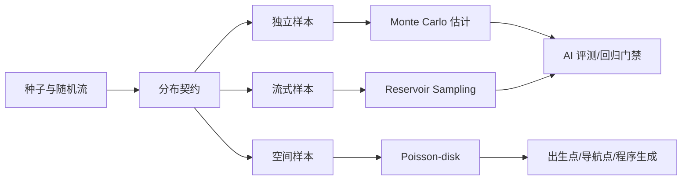
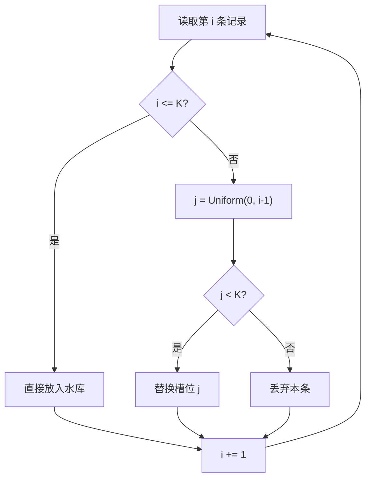
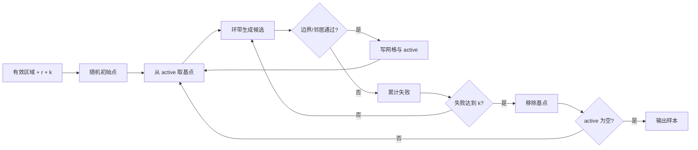
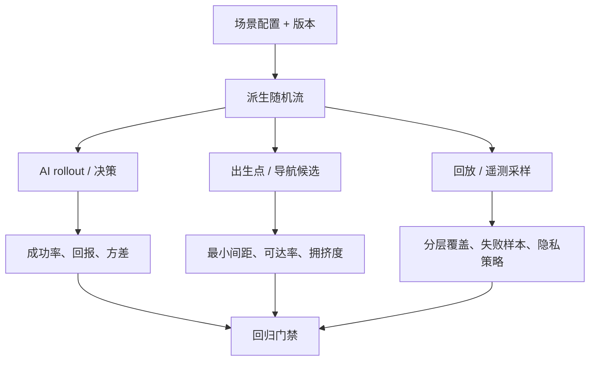

# 07-概率分布与采样工程

> 知识成熟度：L2（概率与采样原理、代码示意和验证边界已整理；尚未绑定仓库内的实测 Evidence）。

> 知识基线：引擎无关的概率统计与采样算法；示例以 C++17 与 Python 3.12 为主，随机数发生器和加权随机基础复用[随机数与洗牌算法](01-随机数与洗牌算法.md)。
> 适用范围：AI 场景生成、MCTS/对抗搜索 rollout、出生点与导航点布置、程序化生成、回归集抽样、日志/回放采样和离线评测；单机、客户端、服务端和离线工具均可采用，但影响经济或对战结果的随机仍应由权威服务端结算。
> 事实边界：分布公式、无偏性和渐近复杂度是算法层结论；实际成功率、方差、P95/P99、空间密度和玩家体验必须在目标地图、硬件、版本与种子集合上实测。示例阈值和命令均为示意，不代表仓库已有实现。
> 最后更新：2026-08-18（新增 Reservoir Sampling、Poisson-disk、Monte Carlo、置信区间与 AI/回归应用边界）。
> 参考来源：[PCG Random 官方资料](https://www.pcg-random.org/)、[Python random 文档](https://docs.python.org/3/library/random.html)、[NumPy 随机采样文档](https://numpy.org/doc/stable/reference/random/index.html)。

## 1. 概述

游戏中的“随机”不只是调用一个 PRNG。真正进入生产后，还要回答四个问题：

1. **从什么分布取样？** 事件发生率、间隔时间、伤害波动和玩家行为通常不是同一种分布；
2. **从多大的总体取样？** 全量日志、玩家遥测、地图候选点可能无法一次装入内存；
3. **样本是否代表总体？** 随机样本可能漏掉稀有但重要的边界场景，单纯扩大样本量不能修复抽样偏差；
4. **结果能否复现和解释？** AI 回放、线上事故和回归失败需要保存种子、流编号、抽样规则和版本。

已有的[随机数与洗牌算法](01-随机数与洗牌算法.md)负责 PRNG、Fisher–Yates、加权随机、Alias 表和保底。本篇不重复这些内容，而是补齐其上层的**分布契约与采样策略**：如何在有限预算下选择代表性样本、如何在空间中保持最小间距、如何用 Monte Carlo 估计成功率并给出不确定性。



图中的“种子与随机流”不是可选装饰：只保存最终样本而不保存流的派生规则，后续无法判断样本变化来自算法修改、数据分布漂移还是随机序列错位。

## 2. 核心概念

| 术语 | 含义 | 游戏工程例子 |
| --- | --- | --- |
| 总体（Population） | 所有可能观测或候选元素 | 一天内的全部 AI 决策、地图上的全部出生候选点 |
| 样本（Sample） | 从总体抽出的有限观测 | 1000 条回放、200 个导航点 |
| 有放回抽样 | 每次抽取后元素仍可再次出现 | 独立战斗场景、Monte Carlo rollout |
| 无放回抽样 | 一个元素在同一批次中最多出现一次 | 回归集抽样、牌堆或日志样本 |
| 无偏估计 | 估计量的期望等于目标量 | 用样本均值估计总体均值 |
| 方差（Variance） | 结果围绕均值的波动程度 | 不同种子下 AI 胜率的离散程度 |
| 置信区间（CI） | 在声明的模型和置信水平下给出估计范围 | 成功率 95% CI，而不是只报 95.1% |
| 分层抽样 | 先按重要维度分组，再在组内抽样 | 按地图、难度、LOD、玩家段位配额 |
| 重要性抽样 | 提高稀有/高价值区域的采样权重，再修正权重 | 稀有失败路径、Boss 技能命中 |
| Reservoir Sampling | 流式、未知长度总体上的等概率无放回抽样 | 从无限日志流保留固定 K 条回放 |
| Poisson-disk | 平面中任意两点距离不小于 r 的样本集合 | 出生点、资源点、巡逻点的最小间距 |
| Monte Carlo | 用随机样本近似积分、期望或概率 | AI 成功率、MCTS rollout、命中概率 |
| 随机流（Random Stream） | 有独立身份、种子和消费顺序的 RNG 实例 | `scenario`, `spawn`, `combat`, `telemetry` 四条流 |

### 2.1 采样契约的最小字段

任何会影响回归、AI 决策或线上解释的采样器，都建议把以下字段写入结果元数据：

| 字段 | 作用 | 失败排查 |
| --- | --- | --- |
| `algorithm` | 采样算法和变体，如 `reservoir-v1` | 算法升级导致分布变化 |
| `seed` | 主种子或密钥标识 | 重放和金样恢复 |
| `stream_id` | 独立随机流名称 | 防止新增调用改变另一条流 |
| `population_version` | 总体快照/配置版本 | 数据变化与代码变化区分 |
| `sample_size` | 目标 K 或样本数 N | 置信区间与容量计算 |
| `strata` | 分层字段与配额 | 检查某地图/难度被漏采 |
| `weights` | 重要性抽样或后处理权重 | 防止把加权结果当成原始比例 |
| `ordering` | 遍历和 tie-break 规则 | 跨平台/多线程结果漂移 |
| `result_hash` | 样本 ID 或统计结果哈希 | 快速检测回归差异 |

随机流应按职责分离。不要让“新增一个调试日志抽样”消耗战斗 RNG，否则同一场战斗会因为日志级别变化而改变伤害或技能选择。

## 3. 常用概率分布与建模边界

### 3.1 伯努利与二项分布

一次只有成功/失败的试验是伯努利分布：`X ~ Bernoulli(p)`，其中 `E[X] = p`、`Var[X] = p(1-p)`。独立进行 n 次并统计成功次数，得到二项分布：

```text
P(X = k) = C(n, k) · p^k · (1-p)^(n-k)
E[X] = n·p
Var[X] = n·p·(1-p)
```

适用例子：一次技能是否命中、一个场景是否完成、Bot 是否在时限内到达。注意“独立”是假设：连败保护、玩家疲劳和场景难度会引入相关性，不能直接套二项分布。

```python
from random import Random

def binomial(rng: Random, n: int, p: float) -> int:
    """示意：小 n 时逐次伯努利；大 n 应使用经过验证的库实现。"""
    if n < 0 or not 0.0 <= p <= 1.0:
        raise ValueError("invalid n or p")
    return sum(rng.random() < p for _ in range(n))
```

### 3.2 几何、指数与泊松过程

“直到第一次成功需要几次尝试”服从几何分布：`P(T=k)=(1-p)^(k-1)p`，期望为 `1/p`。如果事件以恒定速率 λ 随时间发生：

- 事件间隔 `T ~ Exponential(λ)`，`T = -ln(1-U)/λ`；
- 固定时间窗口内的事件数 `N ~ Poisson(λt)`，均值和方差都是 `λt`。

它们适合生成刷怪间隔、环境事件和服务器告警到达间隔，但不适合直接描述有冷却、上限、玩家触发或资源耗尽的系统。此时应使用截断分布、状态机或显式事件过程。

```python
import math
from random import Random

def exponential(rng: Random, rate: float) -> float:
    if rate <= 0.0:
        raise ValueError("rate must be positive")
    # random() 可能返回 0，但不会返回 1；max 防止 log(0)。
    u = max(rng.random(), 1e-15)
    return -math.log1p(-u) / rate
```

### 3.3 正态、对数正态与截断

正态分布适合大量独立微小因素叠加的误差，但游戏属性通常有下界（伤害不能为负）或长尾（稀有掉落），直接采样后 clamp 会改变均值和方差。常见选择：

| 需求 | 候选模型 | 注意 |
| --- | --- | --- |
| 命中误差围绕瞄准点对称 | 正态 | 用二维协方差表达横向/纵向相关 |
| 金币、时长等正数且长尾 | 对数正态或 Gamma | 先检查样本的对数尺度是否近似对称 |
| 有明确上下界的属性 | 截断正态/三角分布 | 在分布层处理边界，不要事后盲目 clamp |
| 设计师只给最小/最可能/最大 | 三角分布 | 参数可解释，但尾部不一定符合真实数据 |

### 3.4 分布不是“调参曲线”的替代品

概率模型应服务于可解释的设计参数：成功率、平均间隔、分位数、最小安全距离。不要因为正态分布好写，就把所有行为噪声都设成正态；也不要用一次 100 次模拟的均值反推“真实概率”。在文档和配置中同时记录：

1. 目标统计量（均值、P95、成功率或覆盖率）；
2. 分布假设及其适用条件；
3. 估计方法和样本量；
4. 失效时的降级策略（重采样、扩大样本、回退固定集或拒绝发布）。

## 4. Reservoir Sampling：未知长度流的等概率样本

### 4.1 问题

假设日志流总长度 N 未知，内存只允许保留 K 条，且希望流结束时每条记录被选中的概率都为 `K/N`。先读完整流再 `shuffle` 不可行；每条记录都保存也会把日志采集和评测工具拖垮。

### 4.2 Algorithm R

Algorithm R 的步骤：

1. 先把前 K 条放入水库；
2. 读取第 i 条（从 K+1 开始），以 `K/i` 的概率选中；
3. 选中时从水库的 K 个槽位中均匀替换一个；
4. 流结束时水库就是 K 条无放回样本。



### 4.3 Python 示意实现

```python
from collections.abc import Iterable
from random import Random
from typing import TypeVar

T = TypeVar("T")

def reservoir_sample(items: Iterable[T], k: int, rng: Random) -> list[T]:
    """Algorithm R；输入可为生成器，额外空间 O(k)。"""
    if k < 0:
        raise ValueError("k must be non-negative")
    reservoir: list[T] = []
    for i, item in enumerate(items):
        if i < k:
            reservoir.append(item)
            continue
        # randrange(i + 1) 产生 [0, i]，避免手写模运算偏差。
        j = rng.randrange(i + 1)
        if j < k:
            reservoir[j] = item
    return reservoir


rng = Random(20260818)
sample = reservoir_sample((f"replay-{i}" for i in range(1_000_000)), 256, rng)
assert len(sample) == 256
```

这里的 `sample` 只表达“等概率保留的 256 条”，不表达“最差的 256 条”或“最有价值的 256 条”。如果需要按失败等级、地图和版本保证配额，应使用分层水库，而不是给 Algorithm R 偷偷加一个权重。

### 4.4 正确性直觉与复杂度

第 i 条记录进入水库的概率为 `K/i`；一旦进入，它替换任意旧槽位的概率为 `1/K`。因此在处理到第 i 条后，每条记录留在水库的概率都是 `K/i`。最终 i=N 时得到 `K/N`。

| 项目 | 复杂度 | 说明 |
| --- | --- | --- |
| 时间 | O(N) | 每条记录只做一次随机判断 |
| 额外空间 | O(K) | 不依赖总体长度 |
| 输出 | O(K) | 槽位内无重复（按记录实例） |

当 N 很大且 K 远小于 N 时，可使用跳跃式 reservoir（一次跳过多条记录），但必须先做分布回归；不要为了减少 RNG 调用而自行改写概率。

### 4.5 分层 Reservoir 与优先级样本

游戏 AI 的总体通常有明显分层：地图、难度、玩法模式、Actor LOD、客户端版本。全局水库可能在高流量层“挤掉”低流量但高风险层。工程做法是为每个层维护 `K_s` 个水库：

```text
总预算 K = Σ K_s
K_s = max(最小保障配额, round(K · 该层权重))
```

动态流量变化时，调整配额会改变抽样分布。应在 `population_version` 或 `sampling_policy_version` 中记录变更，不能把两套策略的结果直接画在同一条趋势线上。

如果目标是保留“最异常”的样本，应明确这已经不是等概率抽样。可以采用优先级键 `priority = score / random_key` 的加权 reservoir，但最终报告要携带采样权重，避免把异常放大后的比例误当线上比例。

## 5. Poisson-disk Sampling：有最小间距的空间样本

### 5.1 为什么不用均匀随机点

均匀随机点容易形成簇和空洞。出生点、资源点、巡逻点如果只做均匀随机，可能出现两个点重叠、队伍出生拥挤、导航点互相遮挡。Poisson-disk sampling 要求任意两个样本点满足：

```text
distance(p_i, p_j) >= r,  i != j
```

它不是“完全均匀”的晶格，也不是全局最优的蓝噪声；它提供一个可控的最小距离和相对均匀的视觉/空间分布。

### 5.2 Bridson 算法（2D）

设采样半径为 r，候选次数为 k。Bridson 变体的步骤：

1. 在有效区域随机选一个初始点，放入 `active` 列表；
2. 从 `active` 随机挑一个点；
3. 在 `[r, 2r]` 的环带中生成最多 k 个候选；
4. 候选在边界内且与邻居网格中的所有点距离 ≥ r，则接受；
5. 一个活动点连续 k 次失败后移出 `active`；
6. 活动列表为空时结束。

网格边长取 `cell_size = r / sqrt(2)`，保证一个网格单元最多容纳一个合法点；验证候选时只需检查周围 5×5 的单元，而不是扫描全部点。



### 5.3 Python 示意实现

```python
import math
from random import Random
from typing import Callable

Point = tuple[float, float]

def poisson_disk_2d(
    width: float,
    height: float,
    radius: float,
    attempts: int,
    rng: Random,
    valid: Callable[[float, float], bool] | None = None,
) -> list[Point]:
    """Bridson 2D 示意；valid 可接入导航/阻挡查询。"""
    if width <= 0 or height <= 0 or radius <= 0 or attempts <= 0:
        raise ValueError("invalid dimensions, radius or attempts")
    cell = radius / math.sqrt(2.0)
    cols = math.ceil(width / cell)
    rows = math.ceil(height / cell)
    grid: dict[tuple[int, int], Point] = {}
    active: list[Point] = []
    result: list[Point] = []

    def cell_of(p: Point) -> tuple[int, int]:
        return int(p[0] / cell), int(p[1] / cell)

    def fits(p: Point) -> bool:
        if not (0.0 <= p[0] < width and 0.0 <= p[1] < height):
            return False
        if valid is not None and not valid(*p):
            return False
        cx, cy = cell_of(p)
        for y in range(max(0, cy - 2), min(rows, cy + 3)):
            for x in range(max(0, cx - 2), min(cols, cx + 3)):
                q = grid.get((x, y))
                if q is not None and math.dist(p, q) < radius:
                    return False
        return True

    first = (rng.random() * width, rng.random() * height)
    if valid is not None and not valid(*first):
        # 生产实现应限制初始点重试次数，并记录“无合法起点”。
        return []
    grid[cell_of(first)] = first
    active.append(first)
    result.append(first)

    while active:
        base_index = rng.randrange(len(active))
        base = active[base_index]
        accepted = False
        for _ in range(attempts):
            angle = rng.random() * math.tau
            distance = radius * (1.0 + rng.random())
            candidate = (
                base[0] + math.cos(angle) * distance,
                base[1] + math.sin(angle) * distance,
            )
            if fits(candidate):
                grid[cell_of(candidate)] = candidate
                active.append(candidate)
                result.append(candidate)
                accepted = True
                break
        if not accepted:
            active.pop(base_index)
    return result
```

上例的 `valid` 只表示空间约束接口；它不等价于“点一定可到达”。出生点还要做 NavMesh 投影、队伍容量、视线/安全区、阵营距离和动态占用检查。动态世界中应把静态 Poisson-disk 结果当候选集，再由运行时占用系统做二次筛选。

### 5.4 复杂度与失败路径

| 项目 | 复杂度/现象 | 工程含义 |
| --- | --- | --- |
| 网格空间 | O(W·H / r²) | 半径越小，网格和候选点越多 |
| 候选验证 | 近似 O(1) | 只检查相邻 5×5 单元；退化时仍可能增大 |
| 总体时间 | 近似 O(M·k) | M 为输出点数，k 为每点候选上限 |
| 输出数量 | 受区域、障碍和 r 限制 | 不应承诺固定数量 |
| 无解 | active 为空但数量不足 | 记录 seed、r、k、有效区域版本并降级 |

常见降级顺序是：降低目标数量 → 扩大候选区域 → 使用预烘焙安全点 → 回退固定金样。不要直接把最小距离 r 砍半而不更新碰撞、出生保护和玩法平衡参数。

## 6. Monte Carlo：从样本估计概率与期望

### 6.1 基本估计

若随机变量 X 的期望未知，用 N 个独立样本估计：

```text
μ_hat = (1/N) · Σ X_i
P_hat = (1/N) · Σ I(event_i)
```

样本均值的标准误差近似为 `s / sqrt(N)`；对伯努利成功率，常用标准误差为 `sqrt(p_hat(1-p_hat)/N)`。当 N 增大时误差按 `1/sqrt(N)` 下降，所以想把误差缩小一半，通常需要约四倍样本。

### 6.2 置信区间不是“下一次必然范围”

对成功率，Wilson 区间通常比直接 `p ± 1.96·SE` 在小样本和接近 0/1 时更稳健。示意公式（z=1.96 表示约 95% 置信水平）：

```text
center = (p_hat + z²/(2N)) / (1 + z²/N)
half   = z * sqrt(p_hat(1-p_hat)/N + z²/(4N²)) / (1 + z²/N)
CI     = center ± half
```

报告时要同时给 `successes / trials`、区间方法、随机种子集合和停止规则。只写“成功率 98%”无法判断是 49/50 还是 9800/10000。

```python
import math

def wilson_interval(successes: int, trials: int, z: float = 1.96) -> tuple[float, float]:
    if trials <= 0 or successes < 0 or successes > trials:
        raise ValueError("invalid binomial counts")
    p = successes / trials
    denom = 1.0 + z * z / trials
    center = (p + z * z / (2.0 * trials)) / denom
    half = z * math.sqrt(
        p * (1.0 - p) / trials + z * z / (4.0 * trials * trials)
    ) / denom
    return max(0.0, center - half), min(1.0, center + half)


assert wilson_interval(0, 100)[1] > 0.0
```

### 6.3 AI 评估中的 Monte Carlo

Monte Carlo 适合估计“在随机初始状态、对手策略和种子集合下，AI 达成目标的概率”。一个可复现的评估循环应把随机来源分开：

```python
from random import Random

def evaluate(policy, scenario_factory, trials: int, master_seed: int) -> tuple[int, int]:
    wins = 0
    for episode in range(trials):
        # 每个 episode 派生独立流；不要复用一个全局 RNG 并依赖调用顺序。
        episode_rng = Random((master_seed << 32) ^ episode)
        scenario = scenario_factory(episode_rng)
        wins += int(policy.run(scenario, episode_rng).success)
    return wins, trials
```

这段代码是评估骨架，不保证跨语言位级一致。若需要联机/回放一致，应使用项目规定的整数 PRNG、明确派生函数和排序规则，并把 `episode_seed` 写入回放元数据。

### 6.4 方差缩减

同样的计算预算可以通过降低方差获得更窄的区间。游戏 AI 常用的四类方法：

| 方法 | 做法 | 适用 |
| --- | --- | --- |
| 分层抽样 | 每个地图/难度/行为层内单独估计，再按总体占比合并 | 评测集覆盖不均 |
| 对立变量 | 对每个随机输入 U 同时评估 1-U | 输入对称、结果相关性可控 |
| 重要性抽样 | 提高稀有事件采样率，用似然比修正估计 | 极低概率失败/命中 |
| 共同随机数 | A/B 两个策略共享同一场景和随机流 | 比较策略差异而非绝对胜率 |

重要性抽样的估计必须乘权：若原分布为 p、采样分布为 q，则 `E_p[f(X)] = E_q[f(X)·p(X)/q(X)]`。权重过大时方差会爆炸；应监控有效样本量（ESS），而不是只看名义样本数。

### 6.5 MCTS 与 rollout 的边界

MCTS 的 rollout 是采样，不等于“随机走几步就一定更聪明”。采样策略会影响探索/利用平衡：

- 纯随机 rollout 便宜但方差大，适合动作空间小或有强启发式的场景；
- 分层/策略引导 rollout 可减少明显坏动作，但要防止把设计偏见硬编码成“最优”；
- 共享随机场景用于 A/B 对比，共享的是场景与初始状态，不应共享会产生状态串扰的可变 RNG；
- 回归门禁必须固定 rollout 预算、停止条件和 tie-break，否则胜率变化无法归因。

## 7. 采样策略选择

### 7.1 按问题反推算法

| 问题 | 首选 | 不能直接承诺 |
| --- | --- | --- |
| 总体长度未知，保留 K 条代表记录 | Reservoir | 样本包含所有极端失败 |
| 保证地图点之间有最小距离 | Poisson-disk | 点数固定、全局最优覆盖 |
| 估计成功率/期望 | Monte Carlo + CI | 一次运行的均值就是事实 |
| 低流量层也必须被观察 | 分层 + Reservoir | 全局比例仍保持原始流量 |
| 关注稀有失败 | 重要性抽样/定向场景 | 加权结果可直接当线上比例 |
| 对比两个策略的微小差异 | 共同随机数 | 消除所有统计误差 |
| 高频固定权重掉落 | Alias 表 | 动态条件过滤免费 |

最后一行属于[随机数与洗牌算法](01-随机数与洗牌算法.md)的范围；把“固定权重抽取”和“总体采样估计”混成一个算法，会让配置和评测口径混乱。

### 7.2 AI/玩法/质量三条链路



三条链路可以共享主种子和版本，但应使用不同的 `stream_id`。如果出生点生成多消耗一次 RNG，不应让 AI rollout 的动作序列悄悄改变。

## 8. 复杂度与资源预算

| 算法 | 时间复杂度 | 额外空间 | 主要预算项 |
| --- | --- | --- | --- |
| 独立分布单样本 | O(1) 或 O(采样步数) | O(1) | RNG、对数/三角函数 |
| Reservoir Algorithm R | O(N) | O(K) | 流读取和 K 个槽位 |
| 分层 Reservoir | O(N) | O(ΣK_s) | 分层计数、配额维护 |
| Poisson-disk 2D | 近似 O(M·k) | O(M + 网格) | 候选生成、邻居检查 |
| 朴素 Monte Carlo | O(N·C) | O(1) 或 O(批量) | 单次 episode 成本 C |
| 分层/重要性 Monte Carlo | O(N·C) | O(分层/权重统计) | 权重、ESS、区间估计 |
| MCTS | 约 O(节点数·rollout 成本) | O(树节点数) | 节点分配、状态复制 |

线上采样应优先限制**采样后的存储和导出**，而不是在关键帧循环里随意降低 AI 逻辑频率。离线评测可以提高 N，但仍要把 CPU 时间、场景生成时间和数据落盘时间分段统计。

## 9. 验证与基准建议

### 9.1 正确性检查

- Reservoir：小总体 N=K、N<K、K=0、单元素和重复 ID；对 N=10、K=2 做大量重复实验，检查每个位置的入选频率接近 `K/N`；
- Poisson-disk：检查所有点对的最小距离、边界、障碍合法性、重复点和空区域；对固定种子保存点集哈希；
- Monte Carlo：用已知概率/积分的玩具问题校准估计器，确认 CI 覆盖率和停止条件；
- 分层：检查每个层的最小配额、权重和合并公式，防止分母把“样本数”错当“总体数”；
- 随机流：改变日志采样开关、线程数量或输出格式，战斗流的结果哈希必须不变。

### 9.2 统计测试与阈值

统计测试要预先声明样本量和允许误差。例如：

```text
固定回归集：每个地图/难度至少 200 个 episode
成功率门禁：Wilson 95% 下界不低于历史基线 - 2 个百分点
Poisson-disk：最小间距违反数 = 0；有效点覆盖率按地图分层统计
Reservoir：每层样本数满足配额；样本 ID 不重复
```

这些数字只是门禁模板，不是跨项目标准。真实阈值应写入项目配置和评测报告，并附 `seed_set`、版本、硬件和原始结果路径。达到 L3/L4 时，应把可运行脚本和原始结果放入 `evidence/`，而不是只在正文里写“已测试”。

### 9.3 推荐的可复现命令（示意）

```powershell
# 仅示意：项目应替换为自己的测试入口
python -m pytest tests/test_sampling.py -q
python tools/evaluate_ai.py --seed-set seeds/ai-regression.txt --episodes 2000
```

每次运行至少输出：`algorithm`、`seed`/`seed_set`、`stream_id`、输入版本、样本量、耗时 P50/P95/P99、结果哈希和失败样本索引。

## 10. 最佳实践

1. **复用并隔离 RNG**：PRNG、Alias、Fisher–Yates 复用 01 篇的门面；按系统派生独立流，不共享隐式全局状态。
2. **先写统计目标**：先确定要估计成功率、均值、分位数还是空间覆盖率，再选择分布和采样器。
3. **分层保护长尾**：AI 回归至少按地图、难度、模式和关键 LOD 分层，避免大流量普通场景淹没稀有失败。
4. **重要性抽样要带权重**：任何改变原始分布的采样，都在结果中保留 likelihood ratio、ESS 和原始总体口径。
5. **空间采样与可达性分开**：Poisson-disk 只提供间距约束；NavMesh、碰撞、出生保护和运行时占用由后续系统确认。
6. **固定随机流顺序**：并行时按任务 ID 派生流、按稳定键合并结果；不要依赖线程完成先后。
7. **区间优先于单点**：评测报告同时给点估计、样本量和 CI；小样本或极端成功率使用 Wilson/精确区间。
8. **把随机元数据写进回放**：回放至少带主种子、episode seed、算法版本、配置哈希和流 ID。
9. **失败可降级**：采样器无解时记录原因并回退固定候选/扩大预算；不静默返回一个看似合法的空结果。
10. **性能分段**：区分采样、AI 执行、统计聚合、序列化和上传，分别记录 P50/P95/P99。
11. **保护线上隐私**：遥测 Reservoir 的采样键不能包含明文账号、聊天或可识别坐标；异常样本导出前先脱敏。
12. **版本化分布契约**：修改 λ、p、r、分层配额或候选规则时递增配置版本，旧回放用旧契约解释。

## 11. 常见问题 FAQ

### Q1：Reservoir 为什么不直接保留最后 K 条？

最后 K 条偏向时间窗口末端，不能代表全流；Algorithm R 使每条记录等概率进入水库。若业务目标就是最近窗口，应使用 ring buffer 并明确标为“时间窗样本”，不要称为 Reservoir。

### Q2：Reservoir 能保证稀有失败一定被保留吗？

不能。等概率抽样保证代表总体，不保证极端事件。可以单独维护“异常水库”或分层配额，并把它与原始代表样本分开报告。

### Q3：Poisson-disk 为什么输出点数不稳定？

点数由区域形状、障碍、半径 r 和候选次数 k 决定。它的目标是最小间距，不是固定数量；需要固定数量时先生成候选，再做容量/可达性筛选或使用预烘焙点集。

### Q4：均匀随机点和 Poisson-disk 哪个更“随机”？

两者目标不同：均匀随机保持每个位置等概率但会聚簇，Poisson-disk 引入最小距离约束以减少聚簇。后者不是完全独立同分布，不能用均匀分布的统计检验直接判定好坏。

### Q5：Monte Carlo 样本加四倍后为什么仍不稳定？

`1/sqrt(N)` 只描述抽样误差；场景生成偏差、样本相关、非独立 RNG、策略状态泄漏和分布漂移不会靠扩大 N 自动修复。先检查随机流、分层和估计量，再增加样本。

### Q6：重要性抽样把稀有失败放大后，失败率可以直接上报吗？

不能。放大后的计数必须乘以原分布/采样分布的似然比，再用有效样本量评估方差。运营看板要同时显示“原始口径”和“定向采样口径”。

### Q7：为什么两个 AI 策略要共享场景随机数？

A/B 比较的目标通常是策略差异。让两者面对同一组初始场景和对手流，可以减少由场景难度造成的方差；但每个策略内部仍应有独立、可复现的决策流，避免状态串扰。

### Q8：可以用浮点 `random()` 直接生成出生点吗？

可以生成候选，但最终判定应考虑世界坐标量化、碰撞容差、NavMesh 投影和跨平台确定性。出生点属于玩法安全边界时，由服务器最终确认并记录候选与拒绝原因。

### Q9：随机采样和安全随机有什么关系？

本篇只讨论统计和可复现采样，不提供密码学安全性。抽卡、交易和反作弊场景应遵循项目的安全随机方案；不要因为样本“看起来均匀”就把普通 PRNG 当作安全源。

## 12. 关联阅读

- [随机数与洗牌算法](01-随机数与洗牌算法.md)：PRNG、种子、Fisher–Yates、加权随机、Alias 表和保底；本篇只在其上层做分布与采样。
- [程序化生成](02-程序化生成.md)：把种子、噪声和 WFC 连接到 Poisson-disk 出生点/资源点生成。
- [路径平滑与转向行为](../路径搜索与导航/04-路径平滑与转向行为.md)：出生点/导航候选通过后，继续处理移动和避障。
- [确定性与基准工程总览](../确定性与基准/01-确定性与基准工程总览.md)：回放、随机流、基准阈值和跨端确定性边界。
- [游戏AI/Utility 与 GOAP](../../06-游戏AI/感知决策与行为规划/04-Utility与GOAP.md)：效用评分和规划动作可复用同一套分层场景采样。
- [游戏AI/博弈搜索与对战 AI](../../06-游戏AI/感知决策与行为规划/05-博弈搜索与对战AI.md)：MCTS rollout、共同随机数和评估方差。
- [游戏AI/学习型 AI](../../06-游戏AI/学习适应与社会行为/03-学习型AI.md)：训练/验证分布、随机种子和策略评估边界。
- [游戏AI/AI 评测与回放](../../06-游戏AI/评测安全与运行预算/01-AI评测回放.md)：固定、随机、对抗场景，回放元数据和确定性证据链。
- [游戏AI/自动测试玩家与 AI 回归基准](../../06-游戏AI/评测安全与运行预算/02-自动测试玩家与AI回归基准.md)：Bot、场景矩阵和 CI 门禁的执行入口。

## 13. 落地检查清单

- [ ] 明确总体、样本单位、是否有放回和目标统计量；
- [ ] 记录算法、版本、种子、随机流、遍历顺序和样本量；
- [ ] 按地图/玩法/难度/LOD 做分层并设最小配额；
- [ ] 对 Reservoir 检查等概率、重复 ID 和流结束处理；
- [ ] 对 Poisson-disk 检查最小距离、边界、碰撞、NavMesh 和动态占用；
- [ ] 对 Monte Carlo 给出点估计、CI、原始成功数/试验数和停止规则；
- [ ] 对重要性抽样保留似然比、ESS，并分别报告原始口径和定向口径；
- [ ] 把失败样本、原始结果和性能 P50/P95/P99 放入 Evidence，而不是只写结论；
- [ ] 验证改变日志采样、线程数和输出格式不会改变战斗 RNG 与回放哈希；
- [ ] 明确采样无解、预算耗尽、版本不兼容和隐私脱敏的降级动作。
