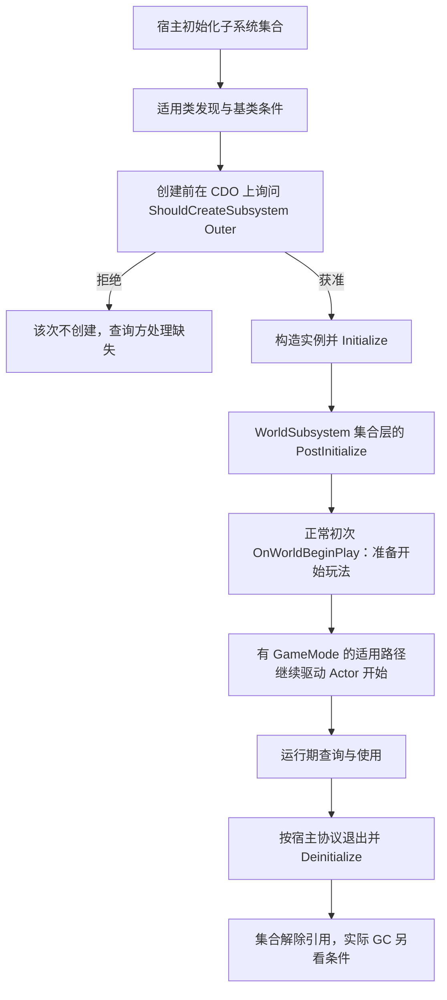

# 07 World 关卡与 Subsystem 体系
> 知识成熟度：L2。主要承诺是已核对公开资料的职责、宿主与生命周期合同；不认证旧私人引擎片段，也不包含实际 UE 工程验证。
> 版本基准：2026-10-05 核对 Epic 公开文档/API，所读页面主要标 UE5.8；固定 UE5.5 的启动钩子页仅作明确版本对照。最后更新：2026-10-05。

旧文自述 UE5.8.0、CL 55116800、分支 `++UE5+Release-5.8`，并引用本机 World.cpp 等行号；旧更新记录为 2026-08-06。本次没有读取那个 Build.version 或私人 checkout，旧身份与行号只保留为追踪线索。源码身份、宏/CVar、UHT、UE 编译/链接、PIE、客户端/专服和实际旅行/GC 实验均 **NOT_RUN**。

## 一、概述：内容属于哪层，服务跟谁活

`UWorld` 提供一组关卡及其模拟上下文；`ULevel` 组织一份关卡内容；流送机制控制部分内容何时加载、加入世界、可见及移出。把这些层分清，才能解释“换地图了服务为什么还在”“流送一个区域为什么没有重建天气系统”。

`USubsystem` 是自动实例化并由宿主管理的一族服务对象。这里的“一份”必须带上宿主范围：每个适用的 Engine、GameInstance、World 或 LocalPlayer 的集合可以各有该类型实例。它不是所有进程、所有 PIE 世界共享的万能全局单例，也不是任何派生类都必定创建。

例子：天气影响当前世界，可用 WorldSubsystem；会话中跨地图的玩家选择可用 GameInstanceSubsystem；分屏每个本地玩家自己的 UI/输入状态可用 LocalPlayerSubsystem。同一个类型放错宿主，可能要么在旅行时意外丢失数据，要么跨世界缓存失效 Actor。

本文的 §3.4 保留四类服务的生命周期入口，§3.5 保留选型职责；“四种”是本篇选型范围，并非引擎全部 Subsystem 家族的穷尽清单。[Programming Subsystems](https://dev.epicgames.com/documentation/en-us/unreal-engine/programming-subsystems-in-unreal-engine)

## 二、核心概念与边界

| 概念 | 主要职责 | 不应混同 |
|---|---|---|
| `UWorld` | 关卡集合、模拟与网络/物理等世界上下文 | 一个进程必只有一个 World |
| `ULevel` | 关卡 Actor、关卡脚本及相关内容 | 一份 Level 资源加载完就等于所有玩法已开始 |
| `PersistentLevel` / `Levels` | 持久关卡与当前纳入世界的关卡集合 | 流送描述对象本身就是已加载的 Level |
| `ULevelStreaming` | 请求/跟踪加载与可见性等状态 | 任意请求立刻同步完成 |
| World Partition | 大世界内容的单元化流送与相关组织机制 | 对调用者所有生命周期细节都透明 |
| `FSubsystemCollectionBase` | 宿主的子系统集合、创建/初始化及引用报告 | Get 首访时任意懒创建器 |
| `ShouldCreateSubsystem` | 创建实例前的 CDO 过滤 | 已创建实例上的常规运行期开关 |
| `Initialize` / `Deinitialize` | 服务建立与退出宿主协议 | UObject 构造/C++ 析构或即时 free |
| `PostInitialize` | WorldSubsystem 集合初始化这一层完成 | 所有 Actor、资源和异步玩法已就绪 |
| `OnWorldBeginPlay` | 正常初次世界准备启动玩法的前置钩子 | 所有 Actor 已完成 BeginPlay 的屏障 |

## 三、原理详解

### 3.1 UWorld：一组关卡加一套模拟上下文

理解 World 可从三组职责入手：

- **内容组织**：PersistentLevel、当前关卡集合和 StreamingLevels 描述。Actor 用 `GetLevel()` 看所在关卡，用 `GetWorld()` 看运行上下文；当前上下文关卡 `GetCurrentLevel()` 不是“每个 Actor 必在其中”的结论
- **模拟上下文**：WorldSettings、适用的 GameMode/GameState、NetDriver、物理场景、音频等世界相关服务。GameMode 在有权威玩法模式的世界才适用；客户端不能假定有同一份 GameMode
- **推进与路由**：`UWorld::Tick` 配合 Tick 管理器、物理和其他帧任务推进；世界及关卡路径也参与初始化和退出。不能压成“Timer → 物理 → 全部 Actor Tick → 渲染”的单一全序，Tick groups、依赖和等待是另一层

同一进程可有编辑器 World、一个或多个 PIE/预览/旅行相关 World；网络服务器与客户端有各自的世界状态，也可能在同一进程承载多个上下文。调试应记录具体 World 路径、类型与 NetMode，不用“每端各一份”代替身份。

普通旅行会更换地图及世界相关对象；无缝旅行还有保留/迁移特定对象的协议。GameInstance 通常跨同一游戏实例的地图旅行，但新会话或新 GameInstance 不共享原实例。不要把“地图变化”直接等同于“当前所有对象都同步析构”。

定时器由 `GetTimerManager()` 等接口取得，具体 World/GameInstance 管理器关系见[定时器与引擎 Ticker](../运行架构与任务调度/06-定时器与引擎Ticker.md)。旧文给出“World.cpp 8056 行优先返回 OwningGameInstance”的定位，本次未对勘，不能凭该行号认证所有 world 的真实宿主和帧内时序。World/Actor 开始边界的公开依据见 [UWorld::BeginPlay](https://dev.epicgames.com/documentation/en-us/unreal-engine/API/Runtime/Engine/UWorld/BeginPlay)，帧调度见 [Actor Ticking](https://dev.epicgames.com/documentation/en-us/unreal-engine/actor-ticking-in-unreal-engine)。

### 3.2 ULevel：内容存在、可见与参与玩法分开

常见结构线索包括 Actors 数组、OwningWorld、LevelScriptActor、BSP 的 Model，以及外部 Actor 内容组织相关标记。它们帮助查找内容和上下文，但不能证明数组中每个位置均是当前可用、已 BeginPlay 的 Actor；枚举时仍需遵守对象状态协议。

以下是**职责关系图，不是 ULevelStreaming 正式枚举状态机**。加载、可见和玩法参与是需要分别观察的条件，不能创造一个必经的 Active 枚举把它们合并。

```text
加载请求 ── 异步完成/失败 ── Level 内容可用
可见性请求 ── 世界关联与组件等处理 ── 达到对应显示/隐藏状态
玩法参与 ── 世界、关卡、Actor 自身门禁 ── BeginPlay / EndPlay
移出与卸载 ── 玩法退出及适用资源撤销 ── 是否回收还取决于引用与 GC
```

“Loaded”本身不回答是否可见或已经运行玩法；“Visible”也不应被定义为“保证不 Tick”。请求、异步完成、世界关联、组件注册、Actor 开始与帧调度互相有关，却不都是一个布尔值。使用 OnLevelLoaded/Unloaded、OnLevelShown/Hidden 等通知时，先确认你需要的是哪个事实，不把一个通知当全部资源和玩法就绪的屏障。

移出世界可能触发 `EndPlay(RemovedFromWorld)`，随后还有其他清理；尚未被 GC 的 Actor 在快速重载时可能复用同一实例与局部状态。因此“卸载逆序至立即释放”也不是无条件合同。[Actor Lifecycle 的流送边界](https://dev.epicgames.com/documentation/en-us/unreal-engine/unreal-engine-actor-lifecycle)

本节只给区分条件的方法，正式流送状态与异步细节继续看[关卡流送 LevelStreaming](08-关卡流送LevelStreaming.md)；单元、DataLayer 和 HLOD 看[World Partition 大世界](09-WorldPartition大世界.md)。不在本篇另建一份冲突状态机。

### 3.3 流送与旅行为什么影响不同层

传统 Level Streaming 通过流送描述及加载/可见性请求，让部分 Level 内容进入或退出同一个 World。`LoadStreamLevel`、`UnloadStreamLevel`、`SetShouldBeLoaded`、`SetShouldBeVisible` 等是常见入口，完成通知用于观察结果，不能把发出请求的瞬间当成完成。

当宿主 World 没有更换时，流送内容仍使用该世界的服务上下文；WorldSubsystem 不会仅因某一个流送 Level 加入/移出而自动换成另一份。这正适合跨区域协调服务，但该服务缓存的区域 Actor 仍可能退出或被回收，必须单独处理失效与复入。

World Partition 按流送源与单元组织运行时内容；外部 Actor/OFPA 则服务内容存储与协作。不要把“Cell”简单当成完全替换了 UObject Level 层的另一名称，也不要认为 Data Layer 的每个开关都必定销毁并新建全部 Actor。对使用者稳定的是当前 World 上下文；加载粒度、参与玩法和身份复用仍需要查询相应机制。

区分三个例子：

1. 同 World 新加载一片区域：已有 WeatherSubsystem 可以继续，区域 Actor 可能此时才 BeginPlay
2. 同 GameInstance 切换到新 World：会话服务可保留，旧世界天气服务需退出，新 World 按其集合/过滤创建新服务
3. 结束会话并新建 GameInstance：内存中的会话服务也换新；若要跨会话恢复数据，需要真正的持久化流程，不是选择一个更长寿的 UObject 就够了

### 3.4 四种 Subsystem 与生命周期

#### 先由谁负责创建

宿主初始化它的子系统集合。集合按适用基类、可用类型及过滤条件发现/创建服务；创建前在该类 **CDO** 上调用 `ShouldCreateSubsystem(Outer)`，获准后才有该宿主中的实例及 Initialize。类发现、动态模块加载和后加入集合的内部细节需按目标引擎核对，不能说“所有派生类在某一刻无条件全部创建”。[FSubsystemCollectionBase](https://dev.epicgames.com/documentation/en-us/unreal-engine/API/Runtime/Engine/FSubsystemCollectionBase)、[ShouldCreateSubsystem](https://dev.epicgames.com/documentation/en-us/unreal-engine/API/Runtime/Engine/USubsystem/ShouldCreateSubsystem)

因此 `GetSubsystem<T>()` 是获取适用集合中实例的接口，**不是任意第一次 Get 才触发构造的懒创建合同**。即使业务从未 Get，符合条件的集合初始化也可以已经创建/Initialize 服务；反过来，Get 返回空可能是集合时机、类型可用性、过滤或 world 类型不适用，不能靠重复 Get 强制生成。

| 本文选择的类型 | 关联宿主/基类 | 适用寿命 | C++ 获取入口示意 |
|---|---|---|---|
| `UEngineSubsystem` | Engine；继承 `UDynamicSubsystem` | 引擎宿主管理，动态模块还会影响可用性 | 有效 GEngine 上 `GetEngineSubsystem<T>()` |
| `UGameInstanceSubsystem` | 每个 GameInstance | 同一 GameInstance 可跨地图；新会话不保证复用 | 有效 GameInstance 上 `GetSubsystem<T>()` |
| `UWorldSubsystem` | 每个适用 World | 随该 world 的集合初始化/退出；同世界流送不等于换宿主 | 有效 World 上 `GetSubsystem<T>()` |
| `ULocalPlayerSubsystem` | 每个 LocalPlayer | 本地玩家加入/离开及其宿主协议 | 对应 LocalPlayer 上 `GetSubsystem<T>()` |

这些入口先要求获取正确宿主，再处理返回空。分屏多个 LocalPlayer、多个 PIE GameInstance/World 都可能有独立实例。仅凭类名、显示名或一个全局缓存指针无法确定属于哪个会话/玩家。

#### World 的正常初次流程与晚加补调



图只画正常初次路径。`PostInitialize` 指 WorldSubsystem 集合层已完成初始化，不是所有 Actor、资源、异步任务都就绪。`OnWorldBeginPlay` 正常初次发生在 GameMode 转换状态并推动 Actor BeginPlay **之前**，是准备启动的机会，不是 Actor 全员完成屏障。[UWorldSubsystem](https://dev.epicgames.com/documentation/en-us/unreal-engine/API/Runtime/Engine/UWorldSubsystem)、[UE5.5 固定版本 OnWorldBeginPlay](https://dev.epicgames.com/documentation/unreal-engine/API/Runtime/Engine/Subsystems/UWorldSubsystem/OnWorldBeginPlay?application_version=5.5)

公开 UWorldSubsystem 还说明集合会给已初始化 world 的后加入子系统补 PostInitialize/OnWorldBeginPlay。因此“这个钩子每次都早于任何 Actor 开始”也是过宽结论；正常初次前置与晚加入补调要分开记录。

当前公开 API 另列 OnWorldEndPlay、PreDeinitialize、OnWorldComponentsUpdated 等钩子，本篇重点教学 Initialize/PostInitialize/OnWorldBeginPlay/Deinitialize 子集。它们既不是“额外仅两个时机”，下面的候选例也不自称包含全部生命周期回调。

**同名事件与网络边界**：WorldSubsystem 的 `OnWorldBeginPlay(UWorld&)` 与 UWorld 自身的 `OnWorldBeginPlay` 委托不是同一个对象上的同一调用点；所存历史正常路径中后者在 GameMode StartPlay 后。无 GameMode 的 world 可执行世界回调而不设置 begun；网络客户端则由 GameState 复制推进 Actor BeginPlay 和 begun 状态，不能把服务器链画成客户端的无条件入口。[UWorld::BeginPlay](https://dev.epicgames.com/documentation/en-us/unreal-engine/API/Runtime/Engine/UWorld/BeginPlay)、[Actor 源码 AS-H14](../对象模型与生命周期/03-Actor与Component生命周期源码.md#as-h14)

**一个会漏消息的最小例子**：天气服务在正常初次 OnWorldBeginPlay 广播“一次天气准备好”，Actor 到自己的 BeginPlay 才绑定监听。绑定晚于广播，自然收不到过去的事件。可把服务状态做成可查询值，再设计“订阅变化并取得当前快照”的协议；若需要所有参与者确认完成，另建明确的收集/确认与迟到加入机制。不能重命名广播为“全局已就绪”就获得屏障。

#### 初始化依赖只解决同集合问题

当 A.Initialize 需要 B 已初始化，使用 `Collection.InitializeDependency<B>()`；调用位置必须在 Initialize 内，依赖只在**同一 collection**有效。Get 查询不是依赖声明，也不自动保证对方初始化先于当前方法。[InitializeDependency](https://dev.epicgames.com/documentation/en-us/unreal-engine/API/Runtime/Engine/FSubsystemCollectionBase/InitializeDependency)

方法体片段示意如下：调用者是另一个已声明的 WorldSubsystem，`UMyWeatherSubsystem` 使用 §4.1 的声明，直接包含 `Subsystems/SubsystemCollection.h` 与 `MyWeatherSubsystem.h`。本片段不是独立完整类，工程编译 NOT_RUN。

```cpp
// 放在调用方 WorldSubsystem::Initialize(FSubsystemCollectionBase& Collection) 中
Super::Initialize(Collection);
UMyWeatherSubsystem* Weather = Collection.InitializeDependency<UMyWeatherSubsystem>();
if (!Weather)
{
    // 该类被过滤或不适用：调用者应进入明确的禁用/失败状态。
    return;
}
// 此处只依赖对方 Initialize 完成，不依赖它的 OnWorldBeginPlay 已发生。
```

具体失败诊断/返回行为还需目标实现验证；处理空值不意味着所有非法依赖都会温和返回空。不要建立 A↔B 循环，也不要用这个 API 宣称已解决 WorldSubsystem 对 GameInstanceSubsystem 的跨集合顺序。跨宿主依赖需要生命周期明确的接口和可用性协议。

初始化依赖关系**不能推出严格逆序 Deinitialize**。公开集合职责没有给这里所需的逆拓扑销毁合同；退出时解除自己建立的订阅/任务，避免假定同伴此刻仍在。集合在正常管理期间报告子系统引用；Deinitialize、解除集合引用和最终 UObject GC/free 是不同阶段，不是“宿主期间绝对免 GC、宿主消失瞬间同步析构”。

### 3.5 选型指南

先问数据/服务跟哪个宿主有效，再问是否需要复制、持久化或 Tick，别只按“全局”这个模糊词选类型。

| 需求 | 通常选择 | 需要额外设计的边界 |
|---|---|---|
| 同一会话跨地图数据、连接协调、存档服务入口 | GameInstanceSubsystem | 不等于数据已落盘；旧 world Actor 缓存要失效 |
| 当前世界天气、刷怪协调、区域流送服务 | WorldSubsystem | 同世界多个区域共享服务；各区域 Actor 自己进出，网络状态不自动同步 |
| 真正引擎宿主级工具、平台或遥测服务 | EngineSubsystem | 不能把某一个 PIE world 当唯一世界；动态模块与退出顺序要考虑 |
| 每本地玩家输入映射、UI、设置 | LocalPlayerSubsystem | 区分 split-screen 各玩家；它不是每个服务器远程玩家的通用实例 |
| 单个对象的能力、可放置/复制的场景状态 | Actor/Component，或配合 GameState 等框架对象 | 不为追求“全局访问”把对象职责全部塞进服务 |
| World 生命周期且确实需要 Tick 的服务 | 评估 `UTickableWorldSubsystem` | 这是独立 Tickable 机制，不是 Actor PrimaryTick；正确转发 Initialize/Deinitialize 的 Super |
| 无状态的纯工具操作 | 函数/命名空间或适用函数库 | 无需为获取一个生命周期而制造不必要服务 |

[UTickableWorldSubsystem](https://dev.epicgames.com/documentation/en-us/unreal-engine/API/Runtime/Engine/UTickableWorldSubsystem) 提供现成选择，公开默认合同是在 Initialize 后开始 Tick、Deinitialize 期间停止，派生应正确调用 Super。也可以按需求使用 Timer/Ticker 等，但这些有各自的世界、线程和清理协议，不是“子系统需要更新只能自己拼”的唯一途径。

Subsystem 的自动创建不意味着网络自动复制。服务器和客户端的服务可能分别根据各自条件创建；共享的权威玩法状态应走适用复制对象/消息协议，服务只承担约定的协调或缓存职责。选择 WorldSubsystem 也不自动带来世界所有 Actor 初始化顺序保证。

## 四、代码示例

### 4.1 天气服务：CDO 过滤与准备启动状态

下面给出两个独立文件的**静态闭合候选**，只覆盖本节关心的回调子集。需要实际模块依赖 Core、CoreUObject、Engine，并将 `MYGAME_API` 替换为真实模块宏；generated include 是头文件最后一个 include。声明、定义、枚举和直接头在文本上配齐，但 UHT/UE 编译/链接/PIE 均 **NOT_RUN**。

设计目标明确为 **Game 与 PIE** world；不在 Editor/EditorPreview 等 world 建立此服务，NetMode 不另外过滤，所以符合 world 类型的客户端/专服也可各自有实例。过滤在 CDO 上执行，用 Outer 找候选 World，并保留基类条件；这里没有在 CDO 上调用实例 GetWorld。

```cpp
// MyWeatherSubsystem.h
#pragma once
#include "CoreMinimal.h"
#include "Subsystems/WorldSubsystem.h"
#include "MyWeatherSubsystem.generated.h"

UENUM(BlueprintType)
enum class EMyWeather : uint8
{
    Clear,
    Rain
};

UCLASS()
class MYGAME_API UMyWeatherSubsystem : public UWorldSubsystem
{
    GENERATED_BODY()
public:
    virtual bool ShouldCreateSubsystem(UObject* Outer) const override;
    virtual void Initialize(FSubsystemCollectionBase& Collection) override;
    virtual void PostInitialize() override;
    virtual void OnWorldBeginPlay(UWorld& InWorld) override;
    virtual void Deinitialize() override;

    UFUNCTION(BlueprintCallable, Category="Weather")
    void SetWeather(EMyWeather NewWeather);
    UFUNCTION(BlueprintPure, Category="Weather")
    EMyWeather GetWeather() const { return CurrentWeather; }
    UFUNCTION(BlueprintPure, Category="Weather")
    bool IsPreparedForGameplay() const { return bPreparedForGameplay; }
private:
    UPROPERTY()
    EMyWeather CurrentWeather = EMyWeather::Clear;
    bool bPreparedForGameplay = false;
};

// MyWeatherSubsystem.cpp
#include "MyWeatherSubsystem.h"
#include "Engine/World.h"
#include "Subsystems/SubsystemCollection.h"

bool UMyWeatherSubsystem::ShouldCreateSubsystem(UObject* Outer) const
{
    const UWorld* CandidateWorld = Cast<UWorld>(Outer);
    return CandidateWorld
        && Super::ShouldCreateSubsystem(Outer)
        && (CandidateWorld->WorldType == EWorldType::Game
            || CandidateWorld->WorldType == EWorldType::PIE);
}

void UMyWeatherSubsystem::Initialize(FSubsystemCollectionBase& Collection)
{
    Super::Initialize(Collection);
    CurrentWeather = EMyWeather::Clear;
    bPreparedForGameplay = false;
}

void UMyWeatherSubsystem::PostInitialize()
{
    Super::PostInitialize();
    UE_LOG(LogTemp, Log, TEXT("Weather subsystem collection initialized"));
}

void UMyWeatherSubsystem::OnWorldBeginPlay(UWorld& InWorld)
{
    Super::OnWorldBeginPlay(InWorld);
    bPreparedForGameplay = true; // 只表示本服务收到准备启动钩子
    UE_LOG(LogTemp, Log, TEXT("Weather prepared in %s"), *InWorld.GetPathName());
}

void UMyWeatherSubsystem::SetWeather(EMyWeather NewWeather)
{
    CurrentWeather = NewWeather; // 仅本地数据；没有自动复制或 Actor 就绪广播
}

void UMyWeatherSubsystem::Deinitialize()
{
    bPreparedForGameplay = false;
    // 真实业务若建立 Timer/委托/任务，应在合适退出阶段成对撤销。
    Super::Deinitialize();
}
```

`bPreparedForGameplay` 的含义被特意限制为“本服务收到启动钩子”，不是 `UWorld` 已 begun，也不是“所有 Actor 已订阅”。实际需要按每个开始/结束期间复位时，还应按目标版本使用适用的 OnWorldEndPlay 等钩子设计状态；本候选没有提供整套多次世界开始/结束业务。

单纯按 world 类型筛选也可以覆写合适的 `DoesSupportWorldType`，由 WorldSubsystem 基类 ShouldCreate 路线调用；不要不经说明同时绕过基类过滤。原式 `!IsPlayInEditor()` 在普通 Editor world 反而可能为真，不能拿它充当“排除编辑器”的条件。[UWorldSubsystem 的类型支持接口](https://dev.epicgames.com/documentation/en-us/unreal-engine/API/Runtime/Engine/UWorldSubsystem)

使用者仍先查 World 再查服务。以下是已有 Actor/Component 方法体片段，直接包含 `Engine/World.h` 与 `MyWeatherSubsystem.h`；它不负责创建服务，也未运行。

```cpp
if (UWorld* World = GetWorld())
{
    if (UMyWeatherSubsystem* Weather = World->GetSubsystem<UMyWeatherSubsystem>())
    {
        Weather->SetWeather(EMyWeather::Rain);
    }
    else
    {
        // 此上下文没有该服务；按功能设计跳过或报告明确的不可用状态。
    }
}
```

### 4.2 GameInstance 服务：跨地图内存不等于落盘

下面是**缩略类示意，非完整可编译文件**；省略模块宏、头文件/generated include、方法实现及真实存储层，直接依赖 `Subsystems/GameInstanceSubsystem.h` 等。`LoadFromDisk` / `SaveToDisk` 仅保留为待实现接口，未提供任何文件 I/O、成功返回或持久化保证。把它们写进流程不等于已经实现存档。

```cpp
// 缩略声明：实际项目还必须实现全部方法、错误处理和真正的存储协议。
UCLASS()
class UMySaveSubsystem : public UGameInstanceSubsystem
{
    GENERATED_BODY()
public:
    virtual void Initialize(FSubsystemCollectionBase& Collection) override;
    virtual void Deinitialize() override;
    void SetPlayerName(const FString& Name) { PlayerName = Name; }
private:
    UPROPERTY()
    FString PlayerName;
    bool LoadFromDisk(); // 待实现：解析/版本迁移/错误恢复
    bool SaveToDisk();   // 待实现：序列化/写入完成/失败处理
};

// 使用意图：在合法上下文先取得 GameInstance，再查询已有服务。
// Initialize 可发起加载，但异步加载完成需另有状态，不能隐含为同步成功。
// Deinitialize 做资源退出；是否补存以及如何等写入完成由存档协议决定。
```

在同一 GameInstance 内旅行时，PlayerName 这类会话数据可以保留；新建 GameInstance 或退出进程后，内存数据没有自动恢复合同。重要数据应在有反馈与重试能力的业务保存点提交，不要只靠 Deinitialize：异常退出、进程被杀或异步写入未完成都可能失去机会。

服务若缓存旧 World 的 Actor，应采用弱身份或合适句柄并在世界退出/对象失效时清理。FName/路径可以表达查找意图，却不是可直接解引用且不会失效的对象身份；引用字段即使强持有，也不会阻止 Actor 的显式 Destroy。[UObject 引用与 Actor 销毁边界](../对象模型与生命周期/01-UObject与反射系统.md)

### 4.3 蓝图访问与可用性

GameInstance、World、LocalPlayer 的 Subsystem 获取方式要先选正确宿主/上下文，再选具体服务类并处理缺失。蓝图节点的具体名称、过滤和可见性取决于目标版本、类标注与节点库；本轮没有枚举或运行蓝图编辑器，撤回“EngineSubsystem 一定没有现成蓝图节点”的绝对断言。

如果目标工程确需包装访问，可提供经过上下文和空值检查的 BlueprintCallable/BlueprintPure 接口；这是一种封装选择，不是必须把所有 Engine 服务转存到 World 才能使用。网络同步也不会因暴露了蓝图节点而自动出现。

## 五、设计与排查实践

1. **把宿主写进需求**：是哪一个 world、哪一个 GameInstance、哪一个 LocalPlayer，而不是只说“全局服务”
2. **构造函数只准备默认状态**：不要在 CDO/实例构造阶段假设集合和运行期服务已就绪。ShouldCreate 用 Outer 与基类条件，实例初始化用 Initialize
3. **初始化依赖显式声明**：同集合用 InitializeDependency；跨宿主用明确接口与可用性状态，避免循环和隐含的发现顺序
4. **把就绪定义到具体数据**：PostInitialize 只保证集合这一层；OnWorldBeginPlay 正常初次是前置。Actor/资源/网络全部准备好必须有你自己的协议
5. **订阅与快照结合**：迟到订阅者要能获取当前状态，流送 Actor 复入时仍可接续；一次广播不能代表永远被所有消费者收到
6. **清理自己建立的东西**：Timer、委托、Ticker、任务和连接都保存撤销所需身份；退出时不依赖某个同伴恰好晚于自己 Deinitialize
7. **跟踪引用而非幻想永久免 GC**：集合管理保证来自实际引用报告；释放引用后回收受剩余引用与 GC 阶段影响。Outer、宿主关联、Deinitialize 和内存析构各不是同义词
8. **区分本地服务和同步状态**：服务器/客户端及不同 PIE 世界分别有服务实例，复制或消息协议需要另设权威与同步策略

## 六、常见问题 FAQ

### Q1：Subsystem 和 GameInstance 有什么区别？

GameInstance 是宿主框架对象，GameInstanceSubsystem 是把某个会话服务独立成类并由其集合管理。可以把数据放 GameInstance 成员，也可以按职责拆服务；后者提供明确过滤与生命周期接口，但不是另一个进程级单例。

### Q2：流送关卡加载会重建 WorldSubsystem 吗？

仅在同一个 World 中增减流送内容，通常不会因此更换该世界已有服务；但服务缓存的区域 Actor 可能开始/结束/复入。换到新 World 时是新的宿主集合，是否创建目标类型还要过过滤。

### Q3：没人 Get，服务是不是就不会创建？

不是。自动创建由宿主集合的适用初始化路径负责，Get 查询已有适用实例。可以用“从未 Get 但 Initialize 已有日志”作为工程验证的正例，不能靠重复 Get 当创建重试器。

### Q4：ShouldCreate 返回 false 后永远不能再有该类型实例吗？

它拒绝的是这次创建尝试/适用集合，当前查询方应处理缺失；不能推广到所有未来 World、GameInstance 或动态类型/集合变化。普通运行期开关通常在已存在服务内部设计状态，不靠 Get 重新询问过滤。

### Q5：Initialize 里 Get 到另一服务，就能保证顺序吗？

查询和依赖不同。需要同集合初始化顺序时在 Initialize 内调用 InitializeDependency，并处理不适用/失败；它不保证对方 OnWorldBeginPlay 已执行，更不跨 collection 排序。

### Q6：子系统绝不会被 GC 吗？

正常管理期间集合通过引用报告持有它们；退出后 Deinitialize、解除引用与最终回收分层。剩余引用和 GC ready 等条件影响实际内存寿命，不能承诺永久免回收或与宿主同时析构。

### Q7：为什么 PIE 有多份天气服务？

实例属于特定 World，各个适用 PIE/游戏世界可各有一份；本例主动排除 Editor world。记录完整 world 类型/路径和 NetMode，不依赖相同显示名判定是同一个对象。

### Q8：OnWorldBeginPlay 能当所有 Actor 就绪的通知吗？

不能。正常初次是驱动 Actor 开始前的钩子，Actor 在自身 BeginPlay 才订阅可能已晚；后加入已初始化 world 的服务还可能得到补调。无 GameMode、客户端复制路径及同名 UWorld 委托都要分别看。

### Q9：World 服务服务器/客户端会自动一致吗？

不会。它们是各自宿主的实例，创建条件也可不同；需同步的权威状态要走明确的复制对象或消息协议，查询一个本地 Subsystem 不等于读取权威端状态。

### Q10：Deinitialize 一定按 Initialize 的逆序吗？

本次核对的公开合同不提供这种严格保证，不能从依赖初始化关系推出逆拓扑退出。清理自己建立的资源、提前解除必要依赖，并在需要时由业务显式协调退出。

### Q11：怎样实际验证？

先过候选例 UHT/编译/链接；再用 Game/PIE/Editor、两个 World、同集合依赖/目标拒绝创建、从未 Get、正常初始/晚加入、无 GameMode/客户端、同 GI 旅行/新会话等输入记录原始日志。保存版本/CL、宿主身份、NetMode、frame/thread、过滤入参、各回调和查询结果。本篇上述实验全部 **NOT_RUN**。

## 七、历史 API 材料与关联阅读

### WR-H01

修订前本篇第 112–116 行的 API 围栏完整保留如下。旧文将其归于 `Engine/Source/Runtime/Engine/Public/Subsystems/Subsystem.h` 并称“基类只定义三个虚函数”；本轮未对私有 CL 认证，也不再用这三行声称基类或所有派生族接口的完备性。创建前在 CDO 上过滤的调用上下文要从上文公开合同理解，不能从空函数体推导 Get 懒建或销毁顺序。

```cpp
virtual bool ShouldCreateSubsystem(UObject* Outer) const { return true; }
virtual void Initialize(FSubsystemCollectionBase& Collection) {}
virtual void Deinitialize() {}
```

### 关联阅读

- [UObject 与反射系统](../对象模型与生命周期/01-UObject与反射系统.md)：创建、Outer、受追踪引用和弱身份
- [Actor 与 Component 生命周期](../对象模型与生命周期/02-Actor与Component生命周期.md)、[Actor 生命周期源码](../对象模型与生命周期/03-Actor与Component生命周期源码.md)：组件 opt-in、Super/Receive、流送复入与销毁分层
- [Gameplay 框架与游戏模式](../模块化框架与对象通信/03-Gameplay框架与游戏模式.md)：GameMode/GameState 与服务职责
- [引擎启动流程与模块架构](../运行架构与任务调度/04-引擎启动流程与模块架构.md)：宿主创建的宏观上下文，本文 §3.4/§3.5 为体系与选型入口
- [场景组件与变换体系](../../04-图形动画与物理仿真/空间层级与变换/05-场景组件与变换体系.md)、[定时器与引擎 Ticker](../运行架构与任务调度/06-定时器与引擎Ticker.md)：场景挂接和时间服务各自的协议
- 待目标 checkout 核对的源码入口：`Engine/Source/Runtime/Engine/Classes/Engine/World.h`、`Classes/Engine/Level.h`、`Public/Subsystems/Subsystem.h`、`SubsystemCollection.h`、`WorldSubsystem.h`、`GameInstanceSubsystem.h`、`EngineSubsystem.h`、`LocalPlayerSubsystem.h`、`Private/Subsystems/SubsystemCollection.cpp`、`Private/World.cpp`、`Private/LevelTick.cpp`。路径线索不代表本次运行过 UE 路径验证
