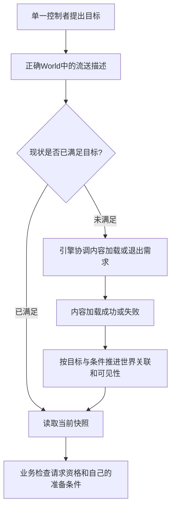
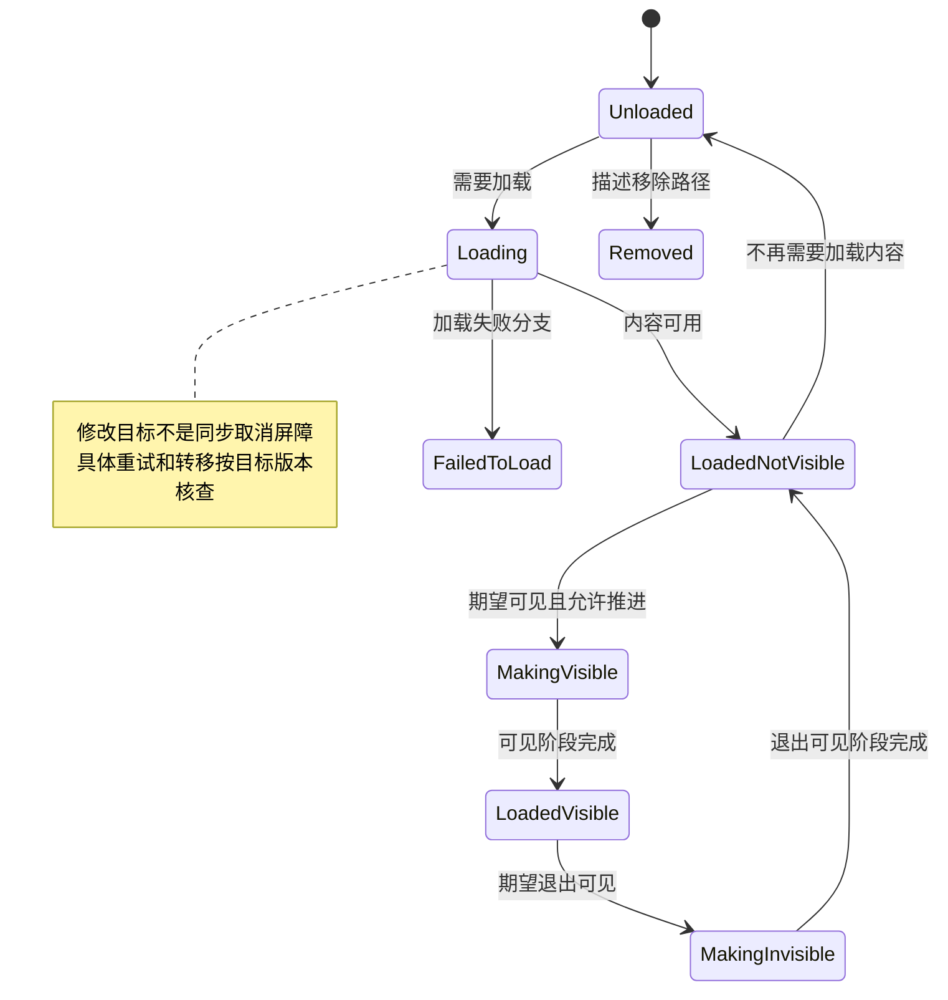
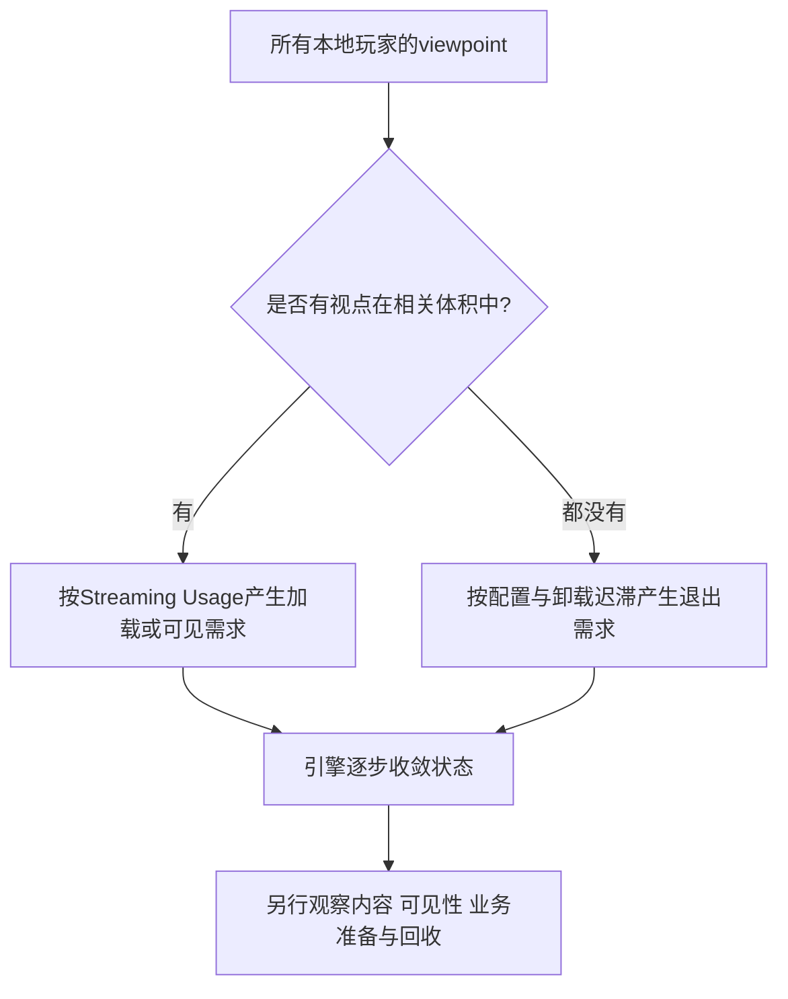
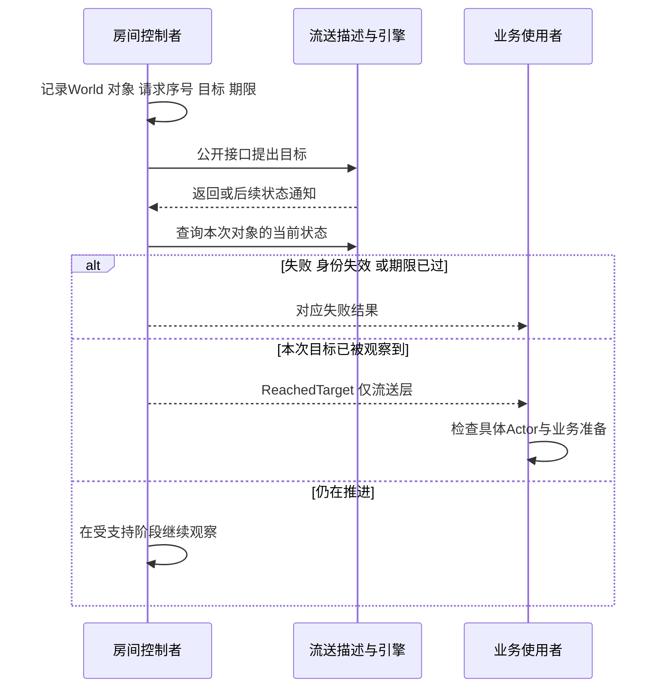
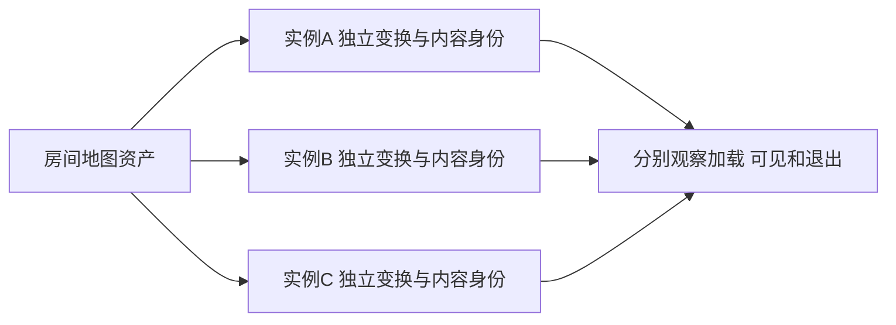
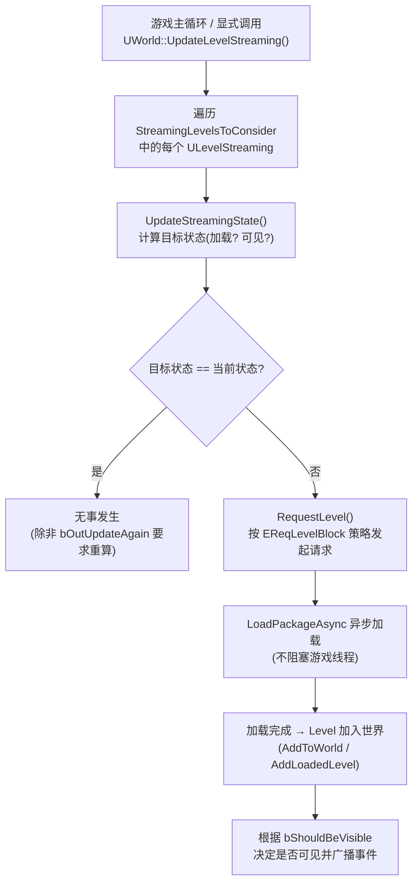
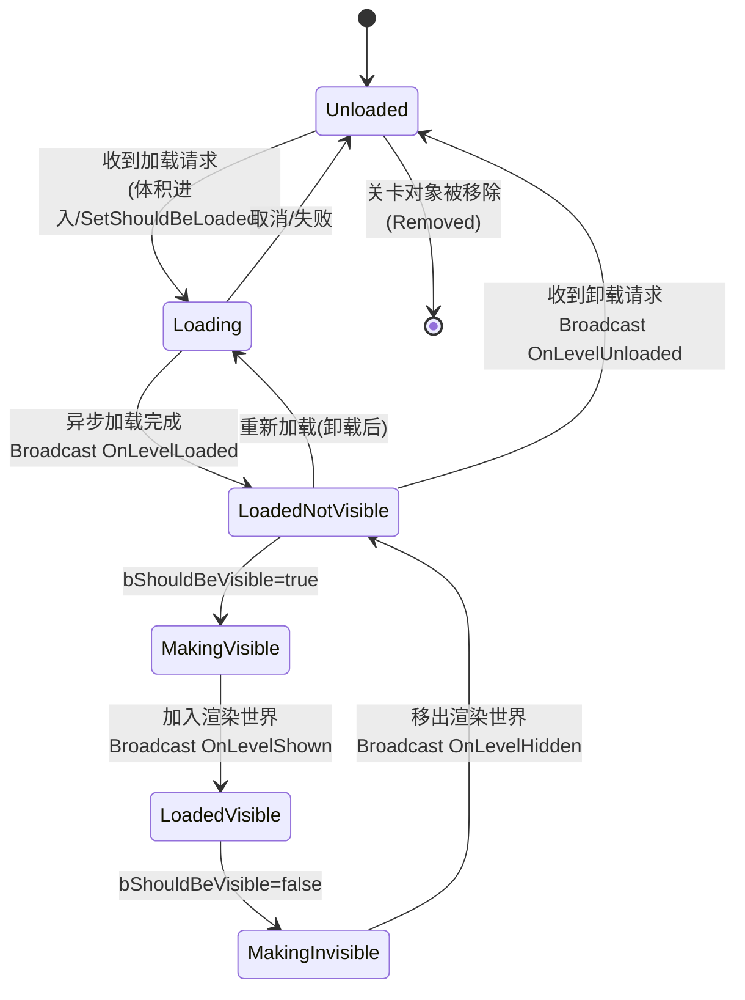
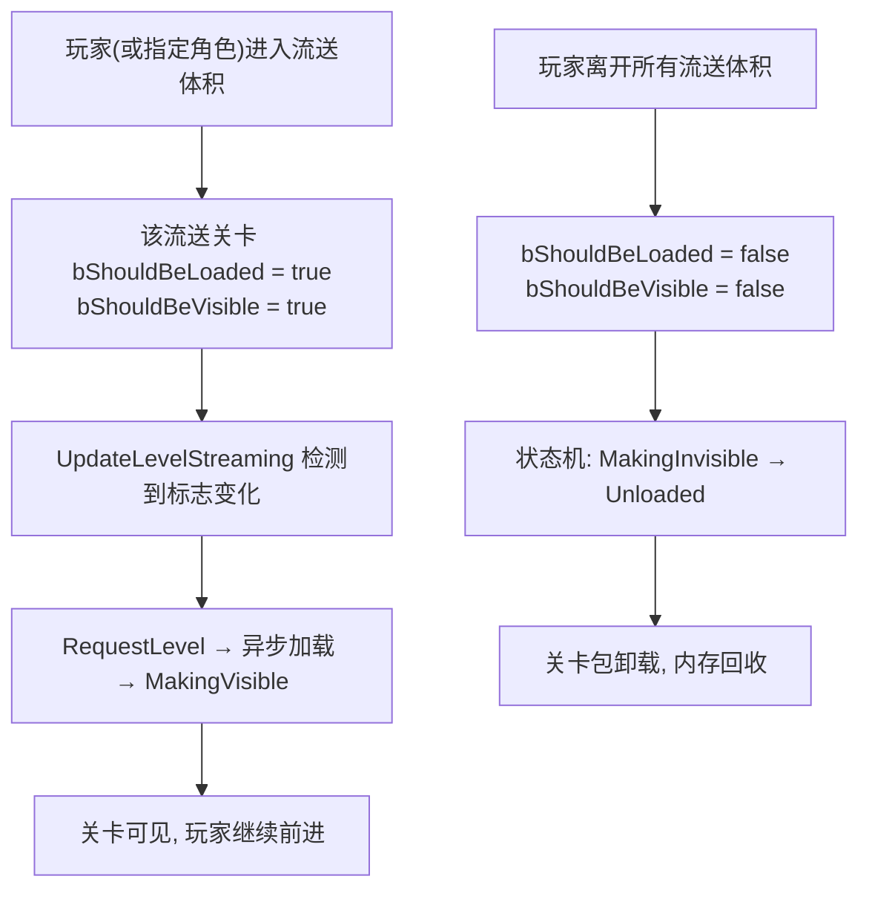
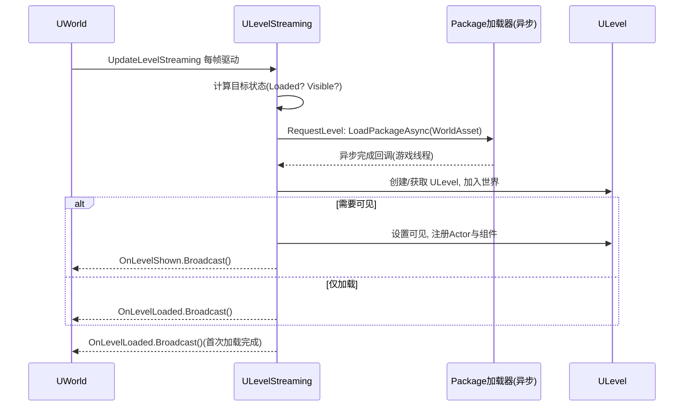
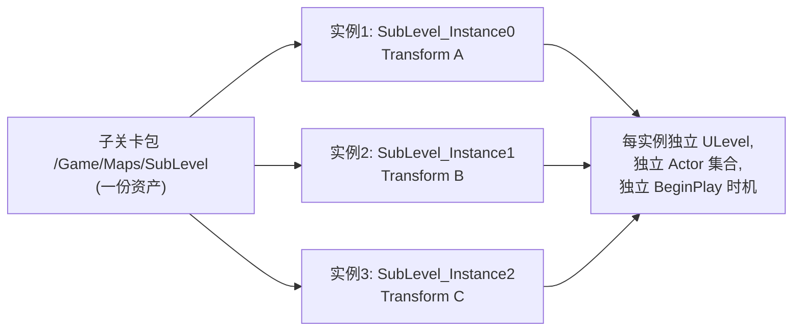

# 08 关卡流送（Level Streaming）

> 知识成熟度：L2。主要承诺是公开资料支持的流送职责、状态与使用边界；工程片段是静态教学候选，纸面轨迹是推导，没有 UE 运行或性能证据。
> 版本基准：2026-10-09 实读、页面标题标为 Unreal Engine 5.5 的 Epic 指南及公开 API，具体范围见 §九；不将旧 UE5.8.0 私有 CL 当本轮环境。
> 最后更新：2026-10-09，修订请求/状态/玩法准备、体积、实例、网络与退出合同，完整保全历史原文。

旧文自述 UE5.8.0、CL 55116800、`++UE5+Release-5.8`，并给出 Windows 安装路径和源码行号。本次未读取那个 checkout 或 Build.version；这些身份只作为历史线索保留。UHT、C++/蓝图编译、UE/PIE、实际地图/Cook、加载、GC、设备、模型、网络、性能与安全实验均 **NOT_RUN**。`verified: []` 不表示有人已运行验证。

## 一、概述

关卡流送把部分关卡内容按需载入、显示、隐藏和流出。同一个运行 `UWorld` 可以含持久关卡与多个子关卡；`ULevelStreaming` 描述如何请求和观察其中一份流送内容。把室内地图预先加载、走进门后显示、离开后释放需求，是本文贯穿的例子。

它有三个常见用途：控制同时驻留的内容以节省内存；把加载分散到接近目标区域之前；让多人分别编辑 `.umap` 内容层。异步加载可以减少某些等待，却不保证无卡顿：对象初始化、组件注册、显示、业务资源与最终回收各有代价。

先分清**类型**和**控制来源**。5.5 指南中的 Levels 窗口类型为 **Always Loaded / Blueprint**。Blueprint 类型可由流送体积、蓝图或 C++ 控制；“By Distance”涉及历史 World Composition 距离策略，不是与前两者并列的统一当前类型，更不是 Cook 包含条件。Always Loaded 可用于协作分层；常规加载/卸载请求和体积不控制它，在更换持久关卡等情形下其生命周期仍会结束。[S01：Level Streaming Overview](https://dev.epicgames.com/documentation/en-us/unreal-engine/level-streaming-overview-in-unreal-engine?application_version=5.5)

本文主例限定非 World Partition 世界里，一个由单一调用者控制的普通 Blueprint 子关卡。开放世界 Cell 的目标由 WP 的源、网格、DataLayer 等策略决定，不能见到一个 `ULevelStreaming` 就把它接入这个手控例。传统模块化房间和 WP 各有适用场景，并非只按地图大小二选一。

## 二、核心概念

| 概念 | 用途 | 需要同时记住的限制 |
| --- | --- | --- |
| Persistent Level | 当前 World 的持久内容与组织上下文 | 常驻限于该 World/旅行方案，不是进程永久存在 |
| Streaming Level | 按需求进入/退出的关卡内容，常来源于 `.umap` | 资产、运行内容与其描述对象不是一个对象 |
| `ULevelStreaming` | 保存目标、关联内容及状态的流送描述对象 | 描述存在不证明 `GetLoadedLevel()` 已有效 |
| `ULevelStreamingAlwaysLoaded` | 随持久内容加载的分层 | 不应用普通手控请求协议强行卸载 |
| `ALevelStreamingVolume` | 根据本地玩家视点产生需求 | 控制策略还有 Usage、禁用和迟滞等条件 |
| `ULevelStreamingDynamic` | 支持运行时创建/控制实例 | 返回对象不是最终可见完成 |
| `bShouldBeLoaded` / setter | 期望内容处于已加载状态 | 目标值与当前结果分开观察 |
| `bShouldBeVisible` / setter | 期望已加载内容参与可见世界 | true 不表示调用当场显示或玩法全部就绪 |
| `ELevelStreamingState` | 描述加载、可见变更及失败等阶段 | 不是业务任务结果枚举，也不是 GC 状态全集 |
| Load / Unload Stream Level | 按名字发起流送的 latent 接口 | 受正确 World、动作身份、目标寿命与内容配置约束 |
| Loaded / Shown / Hidden / Unloaded 通知 | 提醒观察对应层的变化 | 不是附带业务请求号的通用完成包 |
| Load Level Instance | 同一资产在一个世界形成不同实例 | 资产包名和运行实例身份要区分 |
| Level Transform | 对实例内容应用位置/旋转等变换 | Transform 重载不能仅因同名就与不含缩放参数的重载视为完全等价 |
| Streaming Priority | 相对优先考虑某流送需求 | 不保证完成顺序、时间期限或资源就绪顺序 |
| Level LOD | 历史 World Composition 的关卡 LOD 选择 | 不等于 WP HLOD，也不是所有项目的主机优化开关 |
| Level Streaming GC | 流出内容后涉及引用和回收的过程 | Unloaded、可回收、析构、设备资源释放不是同一时刻 |
| `bShouldBlockOnLoad` | 请求使用阻塞加载的意图 | 不是所有 Actor、渲染/导航和业务异步工作的总屏障 |
| `RequestLevel` | 引擎流送实现中寻找/请求内容的入口 | 5.5 公开类页列为 protected virtual，业务不能照旧例直接调用 |
| World Partition | 由源等策略控制 Cell 的世界组织方案 | 本文只定义与普通子关卡的边界，网格/Layer/HLOD详见邻篇 |

对应公开声明与短描述见 [S03：ULevelStreaming](https://dev.epicgames.com/documentation/en-us/unreal-engine/API/Runtime/Engine/Engine/ULevelStreaming?application_version=5.5)、[S07：ULevelStreamingDynamic](https://dev.epicgames.com/documentation/en-us/unreal-engine/API/Runtime/Engine/Engine/ULevelStreamingDynamic?application_version=5.5)。表中“不能推出”的部分是防止超出该层合同的使用限制，不冒称已经读到所有实现分支。

## 三、原理详解

### 3.1 运行时架构：UWorld、ULevel 和流送描述

`WorldAsset` 是要加载的地图资产引用；`LoadedLevel` 是当前关联的内容；触发流送的运行 World 提供模拟与关卡组织上下文。三者不能只因类型或名字相近就互换。Actor 所属 Level、所属 World 与一个全局缓存里的同名关卡也不能互相代替。



这是职责图，未证明某版本必在“下一帧”完成、逐个扫描全部对象，或包加载回调与 `AddToWorld` 是同一步。发出请求、得到描述对象、加载内容、加入世界、开始玩法和消费异步资源各回答不同问题。`SetShouldBeVisible` 标记流送对象需要被考虑，不是直接执行全部后续工作。[S03 Functions](https://dev.epicgames.com/documentation/en-us/unreal-engine/API/Runtime/Engine/Engine/ULevelStreaming?application_version=5.5)

同一个 World 流入/流出房间通常不更换 WorldSubsystem 的宿主。其初始化也不是第一次 `GetSubsystem` 的懒创建；`PostInitialize` 与 `OnWorldBeginPlay` 都不是所有现在和未来 Actor/资源的就绪屏障。选用世界服务、会话服务或本地玩家服务时，沿用 [World 篇 §3.4/§3.5](07-World关卡与Subsystem体系.md#34-四种-subsystem-与生命周期) 的生命周期与职责，不把此处控制者升级成跨世界万能宿主。

### 3.2 状态机、通知与业务结果

以下画的是典型成功方向和失败出口，不是所有实现转移的穷尽图；目标可在中途改变，已经加载的内容也可能被复用。状态名字依据 S03 的 5.5 类页；独立枚举页本次未读成功，不沿用旧文的嵌套类型定位。



| 状态 | 这里观察的层 | 不能推成 |
| --- | --- | --- |
| `Unloaded` | 此流送对象处于未加载状态 | 包在所有引用图中消失、原 Actor 已析构 |
| `Loading` | 加载尚在进行 | 一定成功、可立即访问内容 |
| `FailedToLoad` | 独立的加载失败状态 | 普通成功卸载，或立刻重试必可恢复 |
| `LoadedNotVisible` | 已加载但未可见 | 每个 Actor/组件都处于同一初始化阶段 |
| `MakingVisible` | 可见变更正在推进 | 当前所有 BeginPlay 或业务资源都已完成 |
| `LoadedVisible` | 流送层处于已加载可见状态 | 玩家已安全进入、全部交互/导航/复制就绪 |
| `MakingInvisible` | 退出可见的变更中 | 所有移出和清理都完成 |
| `Removed` | 描述不再处于正常世界流送集合的状态 | 普通可复用子关卡的成功 Unloaded 结果 |

同样，四个通知只表达其自身层。它们可用于重新查询，但没有为调用方携带本文的请求序号：

| 通知 | 公开合同的观察点 | 调用方仍需做什么 |
| --- | --- | --- |
| `OnLevelLoaded` | 内容流入的通知 | 查当前内容、可见性和业务前提；不当作已经加入并开始全部玩法 |
| `OnLevelShown` | 已加入世界且可见 | 确认仍是本请求/本World/目标Actor，检查具体资源与交互准备 |
| `OnLevelHidden` | 不再可见，可能尚未移出世界 | 不据此释放仍被工作访问的存储 |
| `OnLevelUnloaded` | 内容流出的通知 | 不据此承诺 GC/free 或动态描述已移除 |

这些限制直接对应 [S03 Variables](https://dev.epicgames.com/documentation/en-us/unreal-engine/API/Runtime/Engine/Engine/ULevelStreaming?application_version=5.5)。已在目标状态后才订阅，可能没有新的转换可广播；要能读取当前快照，不能只等待过去的事件。

Actor 的加载初始化、组件登记与 BeginPlay 还受 World/Actor/网络等前提控制；隐藏不等于设置某个 Tick 总开关。流送退场可能触发 `EndPlay(RemovedFromWorld)`，但 EndPlay 不等于同步 free。未被 GC 的子关卡快速重新进入时，Actor 可能是原实例，局部变量也未重置。[S09：Actor Lifecycle](https://dev.epicgames.com/documentation/unreal-engine/unreal-engine-actor-lifecycle?application_version=5.5)、[Actor 与 Component 生命周期](../对象模型与生命周期/02-Actor与Component生命周期.md)

### 3.3 流送体积：视点、并集与迟滞

运行时 Volume 使用玩家的 **viewpoint**，不能简化为 Pawn 位置。分屏时要考虑所有本地玩家视点；一个 Level 可由多个体积影响，一个体积也可影响多个 Level。体积应放在 Persistent Level。



`Streaming Usage` 决定体积控制 loading、loading+visibility 或其他适用组合；`Disabled` 可使其退出控制，`Editor Pre Vis Only` 可只保留编辑器预览。不要让有效体积与手动代码反复覆盖同一 Level 目标；切换控制来源时先按设计禁用原来源。

离开所有体积是退出需求，非即刻卸载/回收。5.5 指南描述卸载迟滞和 `Min Time Between Volume Unload Requests`；其中 2 秒是文档给出的默认值，项目可改，不能当本次实测。体积可有不同形状，数量及未加载关卡的相关体积会影响检查成本，不能说“几何检查始终无须考虑”。

PIE 常已把地图内容放进内存，其显示速度不能代表目标平台真实载入。实际设计应让体积提前覆盖玩家接近路径，再在目标设备验证加载、可见和业务准备时刻；本次均未运行。[S02：Volume 配置、成本与验证边界](https://dev.epicgames.com/documentation/en-us/unreal-engine/level-streaming-volumes-reference-in-unreal-engine?application_version=5.5)

### 3.4 请求、目标改变、失败与退出责任

业务入口优先使用 `UGameplayStatics` 或公开 setter。`RequestLevel` 是受保护的内部入口；这里仅把它作为读源码时的定位，不照抄旧行号、错误阻塞枚举或假定全部加载每次都重新从盘读取。



本篇把期望分为 `Unloaded / LoadedHidden / Visible`，把业务结果分为 `ReachedTarget / Failed / TimedOut / Superseded / OwnerEnded`。请求序号由控制者分配，只标识业务等待；它不是底层包加载 ID、latent UUID 或网络可见性事务 ID。

例如 n=7 请求 Visible 但还在 Loading；玩家折返后 n=8 请求 Unloaded。旧 Shown 到来不让 n=7 重新有效，也不能被当作 n=8 的“成功完成包”。重新查询当前目标和对象，等待 n=8 的条件。若新请求与未完请求目标相同，本篇合并到原序号与原期限，不靠重复点击不断延长期限。

失败对象/包、FailedToLoad、错误 World、描述被移除各有明确结果。**超时只表示本次等待结束**；加载可能随后成功。卸载目标、停止等待、解绑、移除 latent 动作、取消资源句柄和真实工作排空不是同义词。没有某接口明确的等待/排空合同，就不能据“取消了”释放仍被底层工作借用的内存。

最小主例用游戏线程 Tick 读当前状态；原生通知的无业务请求标识性质不会被伪造为 generation。事件版也只能唤醒检查。如果项目另外排队回调或开后台资源任务，发起者必须独立解决任务身份、存储寿命与取消/完成协议；弱指针、序号或退订不替代这些保证。

单一控制来源也是前提。无法靠一个局部布尔值证明全项目再无脚本写这个 Level；编辑器配置、调用约定与诊断仍要共同维持。若改用共享区域服务，先按 World 篇选宿主，不能直接让 GameInstance 持有所有旧 World Actor。

### 3.5 关卡实例化：同资产、不同运行身份



这适合重复房间、建筑与副本。编辑器 Level Instance 的组织流程、运行时 Dynamic 加载和 WP 的实例运行模式相关，但不是同一个自动管理合同。`bOutSuccess` 与返回的流送描述对象不能代替后续状态观察；实例名、内容身份与网络映射需要项目正确配置，不能保证任意 GUID 引用天然不受影响。

5.5 API 同时列出 Transform 以及 Location/Rotation 重载，前者声明还含成功输出、可选实例名、流送类和临时包选项。这里只认证参数形状；没有读私有实现来证明转调关系或完全等价。[S07：Dynamic API](https://dev.epicgames.com/documentation/en-us/unreal-engine/API/Runtime/Engine/Engine/ULevelStreamingDynamic?application_version=5.5)、[S08：Transform 重载](https://dev.epicgames.com/documentation/unreal-engine/API/Runtime/Engine/Engine/ULevelStreamingDynamic/LoadLevelInstanceBySoftObjectPtr/1?application_version=5.5)

内容卸载和描述移除分两层。普通配置子关卡卸载后还可保留描述以便再次加载；动态实例不用了可请求 `SetIsRequestingUnloadAndRemoval(true)`，但返回时不是同步 delete 或所有资源回收。调用者应停止自己发起的内容访问，同时尊重仍在进行的引擎工作。

### 3.6 网络复制下的流送

多人情境至少分四件事：服务器决定权威玩法、向适用客户端发送期望状态、客户端完成本地流送后报告可见性、引擎与业务满足复制/交互条件。服务器本地 Load 成功不能独自证明每个客户端都已收到命令、显示内容或准备好 Actor。

5.5 `APlayerController` 类页列出 server→client 的 `ClientUpdateLevelStreamingStatus`，以及 client→server 的 `ServerUpdateLevelVisibility`；`ULevelStreaming` 还提供复制状态资格和网络可见性事务的查询/配置。这些接口存在，不意味着任意调用自动进入相同网络路径。[S12：两方向接口](https://dev.epicgames.com/documentation/en-us/unreal-engine/API/Runtime/Engine/GameFramework/APlayerController?application_version=5.5)

`bLocked` 表示编辑时 Actor 的只读状态，不能当网络锁。客户端本地加载不自动生成服务器权威对象，也不必然制造重复关卡或 GUID 冲突。诊断应检查实例命名、请求来源、客户端状态/反馈及相关性，不宣称引擎会把一切早到 Actor 数据或 RPC 永久缓存并正确补放。本篇不实现多人流送协议，单机主例不能直接作为多人正确性证明。

### 3.7 传统流送与 World Partition 的分工

传统手控流送以开发者组织的子关卡内容为主要单位；WP 由源、运行网格与层等策略管理 Cell。详细主题入口保留在 [09-WorldPartition大世界](09-WorldPartition大世界.md)，但邻篇旧私有源码结论不能代替本次公开核对。

Level Instancing 的5.5指南区分 **Embedded Mode** 与 **Level Streaming Mode**：使用 OFPA 的嵌入方式可在运行时把实例内容纳入 WP 网格，一些非 OFPA 对象不会以原实例方式存在；另一模式保留额外的关卡流送层，有其成本。因此不能说所有实例都通过某对 ExternalStreamingObject 注入接口工作，也不能手动改变内部 Cell 来绕过源/Layer策略。[S10：运行模式](https://dev.epicgames.com/documentation/en-us/unreal-engine/level-instancing-in-unreal-engine?application_version=5.5)、[S11：WP 的源与目标状态](https://dev.epicgames.com/documentation/en-us/unreal-engine/world-partition-in-unreal-engine?application_version=5.5)

## 四、蓝图与 C++ 示例

### 4.1 蓝图：先准备子关卡，再请求 Load / Unload

准备非 WP 持久地图，把 `SubLevel_Interior` 加入 Levels 窗口并设为 **Blueprint** 类型；本手控路线不关联运行时流送体积，也不由其他脚本控制。子地图和其资源必须被实际目标构建包含。名称例 `/Game/Maps/SubLevel_Interior` 是包名，不含文件系统扩展名；不要依赖不同目录下可能重复的短名。

```text
受支持的游戏事件
  → Get Streaming Level，检查返回有效且是预期World中的对象
  → 准备本次观察/绑定及业务意图
  → Load Stream Level
       Level Name              = /Game/Maps/SubLevel_Interior
       Make Visible After Load = true
       Should Block On Load    = false
  → 在对应latent后续或状态观察入口，重新检查实际状态和当前意图
```

`Make Visible After Load` 提出显示需求，不是调用瞬间变可见。`Should Block On Load` 控制这个加载入口的阻塞选择；false 也不保证其他阶段毫无卡顿。蓝图编译器为 latent 节点组织恢复信息；不能把其继续执行引脚解释成任意资源和玩法的全局成功信号。[S04：LoadStreamLevel](https://dev.epicgames.com/documentation/en-us/unreal-engine/API/Runtime/Engine/Kismet/UGameplayStatics/LoadStreamLevel?application_version=5.5)

```text
确认玩家/业务不再需要室内内容
  → 先使旧“进入房间”业务等待失效，停止自己对内容的使用
  → Unload Stream Level
       Level Name             = /Game/Maps/SubLevel_Interior
       Should Block On Unload = false
  → 观察流出状态；不把后续引脚当GC/free或全部外部工作结束
```

卸载也需要正确 World 与动作身份。[S05：UnloadStreamLevel](https://dev.epicgames.com/documentation/en-us/unreal-engine/API/Runtime/Engine/Kismet/UGameplayStatics/UnloadStreamLevel?application_version=5.5)

### 4.2 蓝图：通知与当前快照一起使用

```text
解析本次Streaming对象 → 检查对象/World/控制来源
  → 记录当前意图，绑定需要的Loaded/Shown/Hidden/Unloaded事件
  → 发起请求 → 立即检查当前状态

任一通知 → 重新检查当前对象、当前目标和业务资格
         → 仅在所需条件全部满足时，通知本次业务结果

退出控制/Owner EndPlay → 使业务等待失效 → 解除自己建立的绑定
```

先绑再请求可减少漏掉变化的机会，但已经处于目标状态时仍需快照查询。状态通知不携带本文的请求代次，不应在任意 `OnLevelShown` 中无条件传送玩家。传送前至少还要明确正确玩家/World、目的地和相关 Actor 的当前玩法期、项目要求的碰撞/导航/资源准备，以及本次进入意图仍有效。

退出时只解绑自己建立的订阅，避免清掉其他订阅者；如通知被你的系统再次排入队列，移除原委托不等于队列已经排空。下面完整主例选择轮询实际状态，避免把原生事件伪装为带序号的请求完成回调。

### 4.3 C++：GameplayStatics 与 latent 身份

这是一条**独立接口路线**，不要和 §4.4 主例同时控制同一子关卡。下面头文件中的小类给出声明齐全的 Load/Unload 形状：一次只发一个动作，两个动作使用不同 UUID；回调只报告接口已恢复并查询可见性，不执行玩法。它没有失败期限或反悔协议；需要这些行为时使用下一节的有限主例。

文件名 `InteriorLatentExample.h`；依赖 Core、CoreUObject、Engine，`MYGAME_API` 替换为实际模块宏。所有 include 在 generated include 之前。在Actor已完成BeginPlay后的交互事件调用此小例；它不支持退出后重新进入玩法复用。UHT/编译未运行。

```cpp
#pragma once
#include "CoreMinimal.h"
#include "GameFramework/Actor.h"
#include "Engine/World.h"
#include "Engine/LevelStreaming.h"
#include "Engine/LatentActionManager.h"
#include "Kismet/GameplayStatics.h"
#include "InteriorLatentExample.generated.h"

UCLASS()
class MYGAME_API AInteriorLatentExample : public AActor
{
    GENERATED_BODY()
public:
    UFUNCTION(BlueprintCallable)
    bool StartLoad()
    {
        if (!CanStart()) return false;
        FLatentActionInfo Info;
        Info.CallbackTarget = this;
        Info.UUID = 101;
        Info.Linkage = 0;
        Info.ExecutionFunction = GET_FUNCTION_NAME_CHECKED(
            AInteriorLatentExample, OnLoadContinued);
        bBusy = true;
        UGameplayStatics::LoadStreamLevel(this, Package, true, false, Info);
        return true; // 仅表示调用已发出。
    }

    UFUNCTION(BlueprintCallable)
    bool StartUnload()
    {
        if (!CanStart()) return false;
        FLatentActionInfo Info;
        Info.CallbackTarget = this;
        Info.UUID = 102;
        Info.Linkage = 0;
        Info.ExecutionFunction = GET_FUNCTION_NAME_CHECKED(
            AInteriorLatentExample, OnUnloadContinued);
        bBusy = true;
        UGameplayStatics::UnloadStreamLevel(this, Package, Info, false);
        return true;
    }

protected:
    virtual void EndPlay(const EEndPlayReason::Type Reason) override
    {
        bEnding = true;
        bBusy = false;
        Super::EndPlay(Reason);
    }

private:
    const FName Package = FName(TEXT("/Game/Maps/SubLevel_Interior"));
    bool bBusy = false;
    bool bEnding = false;

    bool CanStart() const
    {
        UWorld* W = GetWorld();
        return !bEnding && !bBusy && HasActorBegunPlay() && IsValid(W)
            && !W->bIsTearingDown && !W->IsPartitionedWorld()
            && W->GetNetMode() == NM_Standalone
            && IsValid(UGameplayStatics::GetStreamingLevel(this, Package));
    }

    UFUNCTION()
    void OnLoadContinued(int32 Linkage)
    {
        if (bEnding) return;
        bBusy = false;
        ULevelStreaming* L = UGameplayStatics::GetStreamingLevel(this, Package);
        UE_LOG(LogTemp, Log, TEXT("Load continuation %d; visible=%d"),
            Linkage, IsValid(L) && L->IsLevelVisible());
    }

    UFUNCTION()
    void OnUnloadContinued(int32 Linkage)
    {
        if (bEnding) return;
        bBusy = false;
        UE_LOG(LogTemp, Log, TEXT("Unload continuation %d; GC not asserted"), Linkage);
    }
};
```

`CallbackTarget` 是接收恢复函数的对象，`ExecutionFunction` 是反射可调用函数名，`Linkage` 是恢复点，`UUID` 标识动作。UUID 不是取消句柄，也不是把所有后台工作绑定到这个对象的所有权机制。[S06：FLatentActionInfo](https://dev.epicgames.com/documentation/unreal-engine/API/Runtime/Engine/Engine/FLatentActionInfo?application_version=5.5)

此片段还依赖 §4.1 的 Blueprint 类型、无体积、单一控制源配置；它不自行证明那些前提。S04 提醒完成前重复调用可能无效，不能机械推广为任意 UUID/CallbackTarget 组合都相同。若回调不来，`bBusy` 不会凭空恢复；这正是需要明确失败和期限协议的原因，而不是用任意 Delay 补救。

### 4.4 C++：同 World 单子关卡的有限三目标主例

下面两文件包含本例所需声明和定义，不是从 UE 私有源码截取。它只控制一个预配置 Blueprint 子关卡：**单机、游戏线程、非 WP、控制 Actor 放在 persistent level、不关联体积、无其他目标写者**。不创建后台任务、不跨旅行持有内容、不处理传送或网络。类别和独占写权仍由项目配置保证；运行检查能拒绝一部分不适用状态，不能发现全项目所有潜在写者。

请求返回 0 表示前置条件拒绝，没有创建请求，也不替换原有等待；具体原因写日志。正数是本 Actor 实例中的业务序号，可在调用返回前已得到结果。`OnRequestFinished` 先订阅；处理中重复同目标合并到原序号、原期限。超时限定为 `(0,300]` 秒，是本例策略；World 的 real-time 计时不受游戏暂停/膨胀影响，但观察依赖 Tick，暂停/卡帧期间不能保证准点回调。已超过期限后才观察到目标，本例报告 TimedOut。

World/流送 API 声明依据 S03 与 [S14：固定5.5 UWorld 的 IsPartitionedWorld、IsGameWorld、GetRealTimeSeconds](https://dev.epicgames.com/documentation/en-us/unreal-engine/API/Runtime/Engine/Engine/UWorld?application_version=5.5)。模块依赖 Core、CoreUObject、Engine；将 `MYGAME_API` 替换为项目宏。以下没有经过 UHT/C++编译或运行。

`InteriorStreamingController.h`：

```cpp
#pragma once
#include "CoreMinimal.h"
#include "GameFramework/Actor.h"
#include "UObject/WeakObjectPtrTemplates.h"
#include "InteriorStreamingController.generated.h"

class ULevelStreaming;
class UWorld;

UENUM(BlueprintType)
enum class EInteriorGoal : uint8
{
    Unloaded, LoadedHidden, Visible
};

UENUM(BlueprintType)
enum class EInteriorResult : uint8
{
    ReachedTarget, Failed, TimedOut, Superseded, OwnerEnded
};

DECLARE_DYNAMIC_MULTICAST_DELEGATE_ThreeParams(FInteriorRequestFinished,
    int32, RequestId, EInteriorGoal, Goal, EInteriorResult, Result);

UCLASS()
class MYGAME_API AInteriorStreamingController : public AActor
{
    GENERATED_BODY()
public:
    AInteriorStreamingController();

    UPROPERTY(EditAnywhere, BlueprintReadOnly, Category="Interior")
    FName LevelPackage = FName(TEXT("/Game/Maps/SubLevel_Interior"));

    UPROPERTY(BlueprintAssignable, Category="Interior")
    FInteriorRequestFinished OnRequestFinished;

    UFUNCTION(BlueprintCallable, Category="Interior")
    int32 RequestInterior(EInteriorGoal Goal, float TimeoutSeconds = 30.0f);

protected:
    virtual void BeginPlay() override;
    virtual void Tick(float DeltaSeconds) override;
    virtual void EndPlay(const EEndPlayReason::Type Reason) override;

private:
    bool CanControl(UWorld* W, ULevelStreaming* L) const;
    void Observe();
    void Finish(EInteriorResult Result);

    TWeakObjectPtr<UWorld> BoundWorld;
    TWeakObjectPtr<ULevelStreaming> Streaming;
    FName BoundPackage;
    int32 LastIssuedId = 0;
    int32 ActiveId = 0;
    EInteriorGoal ActiveGoal = EInteriorGoal::Unloaded;
    double Deadline = 0.0;
    bool bAcceptRequests = false;
    bool bWaiting = false;
    bool bApplying = false;
};
```

`InteriorStreamingController.cpp`：

```cpp
#include "InteriorStreamingController.h"
#include "Engine/World.h"
#include "Engine/Level.h"
#include "Engine/LevelStreaming.h"
#include "Kismet/GameplayStatics.h"

AInteriorStreamingController::AInteriorStreamingController()
{
    PrimaryActorTick.bCanEverTick = true;
    PrimaryActorTick.bStartWithTickEnabled = true;
}

void AInteriorStreamingController::BeginPlay()
{
    UWorld* W = GetWorld();
    BoundWorld = W;
    BoundPackage = LevelPackage;
    bAcceptRequests = IsValid(W) && W->IsGameWorld()
        && !W->bIsTearingDown && !W->IsPartitionedWorld()
        && W->GetNetMode() == NM_Standalone && GetLevel() == W->PersistentLevel;
    // 先准备本类字段，再允许 Super 中的 Blueprint BeginPlay 使用本例接口。
    Super::BeginPlay();
}

bool AInteriorStreamingController::CanControl(UWorld* W, ULevelStreaming* L) const
{
    return IsValid(W) && IsValid(L) && GetWorld() == W && L->GetWorld() == W
        && !W->bIsTearingDown && !W->IsPartitionedWorld()
        && W->GetNetMode() == NM_Standalone
        && L->IsUserManaged() && !L->ShouldBeAlwaysLoaded()
        && L->GetWorldPartitionCell() == nullptr
        && L->EditorStreamingVolumes.Num() == 0
        && !L->GetIsRequestingUnloadAndRemoval();
}

int32 AInteriorStreamingController::RequestInterior(
    EInteriorGoal Goal, float TimeoutSeconds)
{
    const bool bValidGoal = Goal == EInteriorGoal::Unloaded
        || Goal == EInteriorGoal::LoadedHidden || Goal == EInteriorGoal::Visible;
    if (!IsInGameThread() || !bAcceptRequests || bApplying || !bValidGoal
        || !FMath::IsFinite(TimeoutSeconds) || TimeoutSeconds <= 0.0f
        || TimeoutSeconds > 300.0f || LevelPackage != BoundPackage)
    {
        UE_LOG(LogTemp, Warning, TEXT("Interior request rejected: owner/input/config"));
        return 0;
    }

    UWorld* W = BoundWorld.Get();
    if (!IsValid(W) || GetWorld() != W || W->bIsTearingDown)
    {
        UE_LOG(LogTemp, Warning, TEXT("Interior request rejected: World ended"));
        return 0;
    }
    ULevelStreaming* L = UGameplayStatics::GetStreamingLevel(this, BoundPackage);
    if (!CanControl(W, L))
    {
        UE_LOG(LogTemp, Warning, TEXT("Interior request rejected: level/control source"));
        return 0;
    }

    if (bWaiting && Streaming.Get() == L && ActiveGoal == Goal)
    {
        const int32 ExistingId = ActiveId;
        Observe(); // 不刷新期限；可能在此同步终结。
        return ExistingId;
    }
    if (LastIssuedId == MAX_int32)
    {
        UE_LOG(LogTemp, Warning, TEXT("Interior request rejected: ID exhausted"));
        return 0; // 不回绕/复用序号。
    }

    const int32 OldId = bWaiting ? ActiveId : 0;
    const EInteriorGoal OldGoal = ActiveGoal;
    const int32 NewId = ++LastIssuedId;
    ActiveId = NewId;
    ActiveGoal = Goal;
    Streaming = L;
    Deadline = W->GetRealTimeSeconds() + static_cast<double>(TimeoutSeconds);
    bWaiting = true; // 新代次先成为唯一有效等待。

    bApplying = true;
    if (Goal == EInteriorGoal::Unloaded)
    {
        L->SetShouldBeVisible(false);
        L->SetShouldBeLoaded(false);
    }
    else
    {
        L->SetShouldBeLoaded(true);
        L->SetShouldBeVisible(Goal == EInteriorGoal::Visible);
    }
    bApplying = false;

    if (OldId != 0)
        OnRequestFinished.Broadcast(OldId, OldGoal, EInteriorResult::Superseded);
    // 用户通知可能重入发起更新请求，不能再覆盖它的状态。
    if (bWaiting && bAcceptRequests && ActiveId == NewId) Observe();
    return NewId;
}

void AInteriorStreamingController::Observe()
{
    if (!bWaiting || !bAcceptRequests || bApplying) return;
    UWorld* W = BoundWorld.Get();
    ULevelStreaming* L = Streaming.Get();
    if (!IsValid(W) || GetWorld() != W || W->bIsTearingDown)
    {
        Finish(EInteriorResult::OwnerEnded);
        return;
    }
    if (!CanControl(W, L) || LevelPackage != BoundPackage)
    {
        UE_LOG(LogTemp, Warning, TEXT("Interior failed: level identity/control changed"));
        Finish(EInteriorResult::Failed);
        return;
    }

    const ELevelStreamingState State = L->GetLevelStreamingState();
    if (State == ELevelStreamingState::FailedToLoad
        || State == ELevelStreamingState::Removed)
    {
        UE_LOG(LogTemp, Warning, TEXT("Interior failed: state=%d"), static_cast<int32>(State));
        Finish(EInteriorResult::Failed);
        return;
    }
    if (W->GetRealTimeSeconds() >= Deadline)
    {
        Finish(EInteriorResult::TimedOut);
        return;
    }

    const bool bLoaded = L->IsLevelLoaded();
    const bool bVisible = L->IsLevelVisible();
    const bool bPending = L->IsStreamingStatePending();
    bool bReached = false;
    if (!bPending)
    {
        switch (ActiveGoal)
        {
        case EInteriorGoal::Unloaded:
            bReached = State == ELevelStreamingState::Unloaded && !bLoaded && !bVisible;
            break;
        case EInteriorGoal::LoadedHidden:
            bReached = State == ELevelStreamingState::LoadedNotVisible && bLoaded && !bVisible;
            break;
        case EInteriorGoal::Visible:
            bReached = State == ELevelStreamingState::LoadedVisible && bLoaded && bVisible;
            break;
        }
    }
    if (bReached) Finish(EInteriorResult::ReachedTarget);
}

void AInteriorStreamingController::Finish(EInteriorResult Result)
{
    if (!bWaiting) return;
    const int32 FinishedId = ActiveId;
    const EInteriorGoal FinishedGoal = ActiveGoal;
    bWaiting = false; // 先终结，后通知；通知返回后没有旧状态回写。
    UWorld* W = BoundWorld.Get();
    const FString WorldPath = IsValid(W) ? W->GetPathName() : FString(TEXT("<ended>"));
    UE_LOG(LogTemp, Log, TEXT("Interior id=%d goal=%d result=%d package=%s world=%s"),
        FinishedId, static_cast<int32>(FinishedGoal), static_cast<int32>(Result),
        *BoundPackage.ToString(), *WorldPath);
    OnRequestFinished.Broadcast(FinishedId, FinishedGoal, Result);
}

void AInteriorStreamingController::Tick(float DeltaSeconds)
{
    Super::Tick(DeltaSeconds);
    Observe();
}

void AInteriorStreamingController::EndPlay(const EEndPlayReason::Type Reason)
{
    bAcceptRequests = false; // EndPlay通知中的重入也被拒绝。
    Finish(EInteriorResult::OwnerEnded);
    Streaming.Reset();
    BoundWorld.Reset();
    Super::EndPlay(Reason);
}
```

**装配与读结果**：将该类的 Blueprint 子类放入 persistent level，填确切包名；先绑定 `OnRequestFinished` 并只打印请求号/目标/结果，再依次输入 LoadedHidden、Visible、Unloaded。以后加入真实业务时，以该控制者和请求号一起匹配自己的意图；不要只用一个全局整数。组件/Actor/资源另有就绪条件，ReachedTarget 没有替它们作证。

**两个正常输入**：初始 Unloaded，调用 LoadedHidden；Loading期间无成功，直到枚举/loaded/visible/pending一致才得到该目标结果。随后调用 Visible，等可见目标真正达成；不要求一定再收到Loaded。已在目标状态时，可在Request内部直接观察成功，调用者不能假设“保存返回号后才会通知”，应预先绑定并使用通知携带的参数。

**改意图和失败**：Visible等待中改Unloaded，新序号安装后旧序号收到Superseded。找不到子关卡直接返回0；内容已关联而后来FailedToLoad则已接受请求得到Failed。该状态不由两个false伪装成卸载成功。超时后`bWaiting=false`，迟到的成功不再自动通知本轮；显式新请求才有新的等待资格。

**退出责任**：本例无流送委托订阅和后台任务；Owner EndPlay只结束自己的等待和观察，不宣称取消了引擎加载，也不自动卸载当前内容。若项目要在主动销毁控制者前卸载，应先请求Unloaded并观察结果；World结束时由世界自己的退出流程管理内容。已经达到Visible后控制者被销毁，也不意味着内容被同步清掉。结果消费者在退出时同样必须处理自身资格，不能在OwnerEnded中无条件访问房间Actor。

**边界**：单一控制源不保证目标一定能达成；状态暂不一致时继续等到失败或期限，未跑引擎无法认证具体时序。此例不接管动态实例Removal、体积、旅行或任何网络协议；它以有限、可观察结果替代“发出加载就一定成功”。

### 4.5 C++：有意识地选择阻塞入口

普通业务不能调用 protected `RequestLevel`。如有明确进度屏需求，可在 §4.3 同样已准备的 World/latent 接收者中，使用公开参数；以下只是调用点变化，回调仍是已声明的 `OnLoadContinued`：

```cpp
// 放在 §4.3 StartLoad 中，保留 CanStart 检查、Info 和 bBusy 设置。
UGameplayStatics::LoadStreamLevel(this, Package,
    /*bMakeVisibleAfterLoad*/ true, /*bShouldBlockOnLoad*/ true, Info);
```

阻塞需要预算与体验权衡，可能停住调用线程；不要把它描述为“等所有可见、业务资源、渲染、导航都完成”，也不把此片段当无缝旅行的通用实现。[S04 公开参数](https://dev.epicgames.com/documentation/en-us/unreal-engine/API/Runtime/Engine/Kismet/UGameplayStatics/LoadStreamLevel?application_version=5.5)

### 4.6 C++：动态房间实例

普通 LevelName 参数使用包名；软对象引用应使用资产浏览器复制出的真实对象路径。下面独立的创建/退出片段给出一个形如 `/Game/Maps/SubLevel_Room.SubLevel_Room` 的例子，不声称该资产存在。`.umap` 和依赖仍需进入实际Cook内容。

```cpp
#include "CoreMinimal.h"
#include "Engine/World.h"
#include "Engine/LevelStreamingDynamic.h"
#include "UObject/SoftObjectPtr.h"

ULevelStreamingDynamic* CreateRoomInstance(UObject* WorldContext)
{
    if (!IsValid(WorldContext) || !IsValid(WorldContext->GetWorld())) return nullptr;
    const TSoftObjectPtr<UWorld> Room(
        FSoftObjectPath(TEXT("/Game/Maps/SubLevel_Room.SubLevel_Room")));
    bool bAccepted = false;
    ULevelStreamingDynamic* Instance =
        ULevelStreamingDynamic::LoadLevelInstanceBySoftObjectPtr(
            WorldContext, Room,
            FTransform(FRotator(0.0, 90.0, 0.0), FVector(1000.0, 2000.0, 0.0)),
            bAccepted, FString(), // 不固定写死所有实例同一个名称。
            TSubclassOf<ULevelStreamingDynamic>(), false);
    return bAccepted && IsValid(Instance) ? Instance : nullptr;
}

void RequestRoomInstanceRemoval(ULevelStreamingDynamic* Instance)
{
    if (!IsValid(Instance)) return;
    Instance->SetShouldBeVisible(false);
    Instance->SetShouldBeLoaded(false);
    Instance->SetIsRequestingUnloadAndRemoval(true); // 只是请求。
}
```

这是游戏线程创建/退出接口示意，不是另一个跨世界异步管理器。调用者拿到实例后保存它的身份（观察可用弱引用），绑定自己需要的状态通知并**立刻查询当前状态**；对象由创建函数返回，无法提前绑定尚未取得的实例。也可像主例那样轮询实际状态，但需按动态实例设计Removal终态，不照搬普通子关卡的Unloaded成功判据。

返回nullptr要处理创建未接受；返回描述对象也要处理后续加载失败/超时。实例已经Shown时新订阅未必重播，不能只绑Shown然后永等。显示后业务仍核自己的准备条件；退出先结束业务使用，再提出内容卸载及Removal并观察，最终GC/资源回收另看协议。空可选名称由该API路径生成实例名称；若项目指定名字，应确保唯一，网络两端身份映射必须另行约定。[S07/S08 参数范围](https://dev.epicgames.com/documentation/en-us/unreal-engine/API/Runtime/Engine/Engine/ULevelStreamingDynamic?application_version=5.5)

## 五、最佳实践

### 5.1 关卡划分原则

- **按使用区域与协作需求切分**：以玩家可能同时需要的空间和内容依赖为起点，也可为团队编辑分层；不能把“按物件类型分层”一律当错误，Always Loaded本就有协作用途
- **大小由实际预算决定**：旧0.5秒不是引擎标准。分别测冷/暖加载、组件/可见准备与业务准备，记录目标设备、路径和内存峰值，才能判断是否需拆分
- **常驻内容放对宿主**：Persistent/Always Loaded解决地图内容驻留；HUD、会话选择、玩家输入和世界服务仍按各自宿主设计，不能一律塞进常驻关卡
- **高频交互内容考虑驻留或显式保存状态**：动静分离是一种策略，需权衡内存和往返成本；纯装饰也可能有音效、引用或异步工作需要退出协议
- **审查跨关卡依赖**：软引用提供延迟寻址，不自动加载、保活或保证可用。受追踪强引用和资产依赖会影响驻留，裸指针则不建立受追踪强边；不要把“一律软引用”当完整生命周期方案

### 5.2 加载策略与预加载

- **提前量覆盖真实准备成本**：考虑玩家速度、视点、遮挡和路线上最坏的内容组合；必要时保留加载提示或门禁，不能仅看平均包读取时间
- **预加载明确设两类意图**：LoadedHidden需要 loaded=true、visible=false；仅把loaded设true可能保留旧visible=true。随后显示仍可能有世界关联和业务工作，不能承诺无成本
- **预算分阶段量度**：并发请求、初始化和组件登记分别定位。旧CVar存在性、默认值和“某变量不存在”的断言没有本轮证据，不给可直接复制的通用调参表
- **阻塞只用于能接受等待的路径**：进度屏也需说明阻塞对象和预算；`bShouldBlockOnLoad`不替代导航、材质、网络或业务准备判断
- **用迟滞减少往返抖动**：Volume有自己的卸载迟滞；手控策略可保留相邻区域，但“1–2个区域距离”只能是项目选择，先测驻留成本再决定

### 5.3 内存、引用与 GC

- **分别观察退场和释放**：Unloaded/EndPlay、引用解除、GC阶段和设备资源释放不是同一事实；旧“完整GC必在某时触发”及“Level Streaming GC面板”未被本轮认证
- **停止业务使用并清理自己建立的关系**：解除委托、缓存和任务需求要有身份；普通全局裸指针不会保活，受追踪强字段也不阻止Actor显式销毁。弱引用可检查有效性，但有效不等于仍在当前玩法期，更不等于后台工作已完成
- **对小关卡往返测成本再改组织**：可能有初始化、注册及GC压力，也可能复用尚未回收的对象；不能说每次都重新构造。合并、拆分、延长驻留或改WP都应针对实际瓶颈

对象引用与GC职责见 [S13：Unreal Object Handling](https://dev.epicgames.com/documentation/en-us/unreal-engine/unreal-object-handling-in-unreal-engine?application_version=5.5) 和 [UObject 与反射系统](../对象模型与生命周期/01-UObject与反射系统.md)。Outer不构成通用RAII父销子合同，强保活、玩法资格和工作结束需要分别证明。

### 5.4 网络多人注意事项

- **将玩法权威和流送命令分开**：明确谁向哪个客户端发期望状态，谁回报本地状态；服务器本地加载不是全端完成证明
- **把交互放在真正所需条件之后**：Shown可作为流送层条件之一，还要看对象初始化/当前玩法期、复制资格与业务资源；不能只把Loaded事件换成Shown就宣布安全
- **检查竞态的实际路径**：核双方实例身份、包名、命令、反馈、相关性和调用时机；不承诺所有早到数据均自动缓存，也不禁用一切客户端本地加载
- **测状态变更的频率与网络成本**：由实际事务和复制实现决定，不把“一份可见列表自动复制”当所有版本和策略的唯一机制

### 5.5 编辑、构建与旅行

- **保留Levels窗口的组织用途**：子关卡有自己的内容和LevelScript等编辑上下文，但每个子关卡的WorldSettings不意味着各自运行一个独立GameMode；World级服务仍归运行World
- **Cook与流送类型分开核查**：地图及依赖通过项目真实资源/打包策略进入构建；Always Loaded/Blueprint或Volume配置本身不是Cook成功证明，也不能凭分类断言无重复内容
- **动态实例有独立身份和退出需求**：避免指定重复实例名；卸载内容和移除描述分别处理。普通可复用子关卡不应每次卸载都删除描述
- **旅行与保存另有协议**：普通旅行和无缝旅行的对象保留/迁移条件不同，不等于所有流送对象当场析构。重要数据在有反馈、失败和重试机会的业务保存点提交，不能只依赖EndPlay最后一次异步落盘

## 六、FAQ

**Q1：调用 Load Stream Level 后关卡里的东西没出现？**

先核当前World、已配置的子关卡、包名、控制类型和目标构建是否含地图；再看loaded/visible目标、实际枚举、pending及FailedToLoad。已加载不可见不等于应重新加载，已到目标后绑定事件也未必重放。状态正常再检查内容、裁剪与业务准备。记录这些事实比盲目Delay可靠；旧`Level`命令和诊断面板名本轮未核。

**Q2：卸载时，里面的 Actor 会被销毁吗？**

流送退场可以触发EndPlay及适用的组件/世界清理，最终内存释放另依赖回收过程；未GC快速重新加载时可能复用同一Actor。不要把裸指针跨退场长期使用，也不要把“只隐藏”理解为肯定保留全部BeginPlay/Tick行为。区别见Actor篇和S09。

**Q3：latent节点为什么没有按预期继续？**

查World是否仍推进、动作是否真的建立、CallbackTarget是否仍有效、ExecutionFunction/Linkage/UUID是否正确、是否有重复或冲突请求；查看实际状态及失败日志。节点应放在支持latent动作的调用位置，不能塞进构造脚本当普通同步函数。动作由世界的latent机制推进，并不要求“调用它的Actor自己必须持续Tick”作为普遍规则。§4.3仅示入口，§4.4才给本篇期限/失败/改意图协议。

**Q4：同一关卡反复加载/卸载会有性能问题吗？**

可能反复支付初始化、组件登记、可见变化及回收成本，但不能保证每次都从盘重建对象。以实际目标设备记录，比较迟滞、预载、保留相邻内容和调整粒度；不要拿PIE瞬间显示或旧固定0.5秒指标替代结果。

**Q5：服务器加载了，客户端却没显示？**

依次查该策略是否发出了客户端期望状态、客户端收到的包/实例身份、本地状态与可见报告、复制/初始化前提。不能只查服务器`IsLevelVisible`。客户端本地加载不是天然错误，但它不会自动补齐服务器权威状态或网络实例命名；也不能假设所有早到RPC都被缓存。

**Q6：加载事件里访问 Actor 报空指针？**

先确认访问的是哪个World和实例中的哪个Actor，是否已加载、是否已进入适用玩法期、是否已被销毁或退出，以及业务资源是否另外异步准备。Loaded不保证显示，Shown也不保证任意目标Actor和未来组件存在。换一个事件名不足以修复错误身份或对象寿命；每次消费前按所需层检查。

**Q7：Level Blueprint变量能跨关卡访问吗？**

“完全不能直接访问”过于绝对；S03列出在关卡已加载有效时获得`GetLevelScriptActor`的入口。但外部依赖具体LevelScript私有变量会把加载时机、类型和关卡耦合到一起。优先以Actor接口、事件或真正匹配寿命的既有服务交流，并处理缺失/退场；不是随手加一个永久全局单例。

**Q8：World Partition 项目还能用 Load Stream Level 吗？**

先识别要控制的是普通子关卡、动态实例，还是WP内部Cell。内部Cell应交由原流送策略，不套用§4.4手控例。Level Instance又有Embedded和Level Streaming等模式，并非总是另一个手控子关卡。本文保留WP入口，但具体组合需按目标版本和工程验证，不能用一对注入API解释全部情况。

## 七、关联阅读

- [Actor与Component生命周期](../对象模型与生命周期/02-Actor与Component生命周期.md)：BeginPlay门禁、EndPlay、注册与GC分层
- [World关卡与Subsystem体系](07-World关卡与Subsystem体系.md)：宿主、同World流送与旅行、§3.4生命周期及§3.5选型
- [UObject与反射系统](../对象模型与生命周期/01-UObject与反射系统.md)：软/弱/受追踪强引用与对象有效期
- [WorldPartition大世界](09-WorldPartition大世界.md)：Cell、源、DataLayer与HLOD主题入口；不以其旧实现泛化替代本文S10/S11的边界
- [网络架构与复制基础](../../07-网络与游戏服务端/状态复制与兴趣管理/01-网络架构与复制基础.md)：对应旧“06-网络同步”阅读用途，继续区分流送和复制条件
- [性能分析工具与Profiling](../../08-工程实践与质量/调试与性能分析/03-性能分析工具与Profiling.md)：对应旧“07-UI与性能优化”的测量用途，加载阶段与预算需实际证据
- [官方Level Streaming](https://dev.epicgames.com/documentation/en-us/unreal-engine/level-streaming-overview-in-unreal-engine?application_version=5.5) 与 [World Partition](https://dev.epicgames.com/documentation/en-us/unreal-engine/world-partition-in-unreal-engine?application_version=5.5)：公开使用合同入口

## 八、验证与基准（PAPER_EXPECTED）

下面20项都是按本文合同作的文字推导，没有运行模型或UE，表中时长是输入，不是实测。实际主例先检查对象/World/控制归属与FailedToLoad/Removed，再检查期限，最后要求枚举、loaded、visible和pending一致；不能从两个false推出成功卸载。

本例ReachedTarget仅表示有效请求在本次观察中达到对应流送层目标。Already-visible可由快照直接满足；目标变化终结旧等待，超时结束等待但不保证底层停止。主例没有引擎事件绑定/异步投递，涉及事件或外部队列的案例说明另一种实现需遵守的责任。

### 有限输入与预期

| ID | 初始状态与输入 | 纸面预期 / 必须拒绝的误判 |
| --- | --- | --- |
| LS-P01 | W1/L1已Unloaded；n=1请求LoadedHidden；随后观察Loading、LoadedNotVisible且pending=false | 请求函数返回时仍Pending；最后仅n1得到ReachedTarget(LoadedHidden)。不调用进入房间动作，也不宣称所有Actor已BeginPlay |
| LS-P02 | W1/L1已LoadedNotVisible；n2请求Visible；随后观察MakingVisible、LoadedVisible且pending=false | ReachedTarget只证明目标层收敛。需要传送仍检查具体玩家、目标位置/Actor、业务准备及collision等要求 |
| LS-P03 | W1/L1已经LoadedVisible；此时首次绑定Shown并请求Visible | 通过当前快照可得到目标已达；不能永等一个历史事件重放；不能据“没收到Shown”推导失败 |
| LS-P04 | n3请求Visible尚未完成；n4改为Unloaded；随后收到旧Shown通知 | n3结果Superseded，n4保持卸载目标；旧通知只引发重查，不传送、不把n4报成Visible成功。可能短暂可见不等于旧请求重新合法 |
| LS-P05 | n5等待Visible；同目标重复调用；底层仍Loading | 主例合并并返回当前业务请求，保留原期限；不能无限增长latent请求；用户层序号不是底层取消句柄 |
| LS-P06 | n6 Waiting；引擎观察到FailedToLoad | 本轮结果Failed并保存目标/包/world诊断；不伪造Unloaded收敛或承诺重试一定成功；不再等待Loaded作为唯一失败出口 |
| LS-P07 | 30秒业务等待期限到达，仍Loading；1秒后底层Loaded | 本轮TimedOut；迟到Loaded不能自动恢复本轮业务资格。超时没有证明I/O/资源使用结束；若需要再试，形成新有效请求或由调用方决定 |
| LS-P08 | n7等待Visible期间Owner EndPlay；后续有已投递的应用通知 | OwnerEnded/不再接收业务成功；先失效业务资格并解除自己订阅。不得用解除委托当其他队列已排空，不释放仍受未完工作借用的内存 |
| LS-P09 | 旅行结束W1控制者，W2有同名包的新控制者；旧n7通知到达 | World/对象身份不同，不能由相同包名把旧消息当W2成功。新WorldSubsystem/Actor入口按其既有生命周期初始化 |
| LS-P10 | 已Shown且Actor弱指针有效，但Actor已EndPlay或必要资源任务未完成 | 不得因IsValid/Visible执行玩法操作；重新检查玩法期/业务依赖。强引用同样不恢复玩法资格 |
| LS-P11 | Hidden通知已到，但尚有世界移出工作；随后Unloaded | Hidden只证明不再可见；Unloaded也不证明GC完成。未GC快速重载可能复用原Actor与局部变量，不能假设默认值重置 |
| LS-P12 | 普通配置子关卡Unloaded，与动态Instance请求UnloadAndRemoval分别观察 | 前者可保留Streaming描述用于未来加载；后者还需观察移除请求对应的状态。任一返回都不是同步delete协议 |
| LS-P13 | 玩家Pawn在体积内但其viewpoint在外；第二本地玩家viewpoint在内 | 按所有本地viewpoint的规则保留对应需求；不能只按第一个Pawn下结论。实际体积迟滞/目标平台成本未测 |
| LS-P14 | 同Level既绑运行时Volume又由手动请求改flags | 主教学入口拒绝混控或先显式切换控制者；不试图靠每Tick覆盖别人实现“最终一致” |
| LS-P15 | 同CallbackTarget两个latent动作不恰当地复用UUID；或回调目标已退出 | 不能宣称第二请求一定建立独立等待或任何completion一定送达。以项目实际动作身份/目标寿命检查；旧UUID0双例不作为完整方案 |
| LS-P16 | LoadLevelInstance返回bOutSuccess和对象；当前仍Loading | 只接受已得到描述对象这一层；记录实例、订阅后补快照观察。已失败/对象无效退出，不把返回当Shown；还需Cook资源与唯一命名 |
| LS-P17 | Server本地L1可见，Client尚未收到对应状态命令/尚未反馈 | 不能宣布Client加载成功、Actor复制或RPC均就绪；分别核意图下发、本地流送、反馈及业务权威 |
| LS-P18 | 主控对象拿到WP内部Cell Streaming描述，或AlwaysLoaded类型 | 不用普通Blueprint子关卡三目标入口控制；交回其原策略层。并非把WP Cell调成Visible即可绕过源/DataLayer |
| LS-P19 | A通知业务ReachedTarget；业务在通知中立即发起n+1请求 | 先终结/保存n结果再调用用户通知，通知返回后不把旧n字段覆盖到n+1；本篇不以事件顺序代替重入治理 |
| LS-P20 | 指向房间Actor的裸指针被存进普通全局变量，或只有软引用 | 裸指针/软引用不建立受追踪强保活；不声称它们防GC。即使有受追踪强字段也不取消Actor的显式Destroy/EndPlay |

### 未来实际验证必须采集的证据

若后续另外获准运行：记录引擎准确版本/CL、项目提交、Game/PIE/Standalone、world identity、NetMode、地图package/instance名、请求序号/目标、调用位置、四通知、枚举/loaded/visible/pending快照、Actor BeginPlay/EndPlay原因、业务准备状态及失败日志。分别验证冷/暖缓存、目标机器、暂停/时间膨胀、来回边界、已达目标后订阅、坏包/Cook缺失、请求改意图、快速重载、旅行/PIE结束、多本地玩家。网络与性能需要各自独立用例。

这些是未来验收设计，不是已跑测试矩阵；没有日志、结果数据、编译成功或性能通过。本次证据限于来源阅读和文本/链接/身份/字节保全等仓库静态检查。

## 九、来源覆盖与未认证边界

以下均为2026-10-09实际读回正文、返回标题标UE5.5的公开页面。声明/短描述支持使用合同，不提供私有CL实现认证；本文代码为作者据此编写的未编译候选。来源阅读、字节保全、机械lint和运行证据是不同层。

| ID / 官方来源 | 实际选读范围 | 使用限制 |
| --- | --- | --- |
| [S01 Overview](https://dev.epicgames.com/documentation/en-us/unreal-engine/level-streaming-overview-in-unreal-engine?application_version=5.5) | Persistent/Streaming Levels、动态控制类型 | 不提供每帧实现全序 |
| [S02 Volumes Reference](https://dev.epicgames.com/documentation/en-us/unreal-engine/level-streaming-volumes-reference-in-unreal-engine?application_version=5.5) | 属性、Important Details、Testing、Cost、Hysteresis | 未实际测量目标平台，文档默认值不是项目配置 |
| [S03 ULevelStreaming](https://dev.epicgames.com/documentation/en-us/unreal-engine/API/Runtime/Engine/Engine/ULevelStreaming?application_version=5.5) | 状态名、四通知、查询/setter、protected RequestLevel、Removal、复用、Priority、bLocked | 不认证所有状态边/回调线程/GC时序或完整枚举定义 |
| [S04 LoadStreamLevel](https://dev.epicgames.com/documentation/en-us/unreal-engine/API/Runtime/Engine/Kismet/UGameplayStatics/LoadStreamLevel?application_version=5.5) | 公开参数与重复调用提示 | 未读FStreamLevelAction内部实现，重复提示不扩为全部动作身份组合的规则 |
| [S05 UnloadStreamLevel](https://dev.epicgames.com/documentation/en-us/unreal-engine/API/Runtime/Engine/Kismet/UGameplayStatics/UnloadStreamLevel?application_version=5.5) | 卸载参数、LatentInfo与阻塞选择 | 不证明资源已排空或GC结束 |
| [S06 FLatentActionInfo](https://dev.epicgames.com/documentation/unreal-engine/API/Runtime/Engine/Engine/FLatentActionInfo?application_version=5.5) | 四字段及构造声明 | 不把UUID当取消/保活句柄 |
| [S07 Dynamic](https://dev.epicgames.com/documentation/en-us/unreal-engine/API/Runtime/Engine/Engine/ULevelStreamingDynamic?application_version=5.5) | 两个软引用实例重载、初始标志和实例命名相关声明 | 不认证Cook、网络映射或最终可见 |
| [S08 Transform重载](https://dev.epicgames.com/documentation/unreal-engine/API/Runtime/Engine/Engine/ULevelStreamingDynamic/LoadLevelInstanceBySoftObjectPtr/1?application_version=5.5) | 参数形状和include | 无实现，不能证明内部转调与两重载完全等价 |
| [S09 Actor Lifecycle](https://dev.epicgames.com/documentation/unreal-engine/unreal-engine-actor-lifecycle?application_version=5.5) | 加载、EndPlay、快速复用、GC阶段 | 高层概览的旧术语不覆盖已修Actor篇更细条件 |
| [S10 Level Instancing](https://dev.epicgames.com/documentation/en-us/unreal-engine/level-instancing-in-unreal-engine?application_version=5.5) | 编辑复用、运行Data Layers与两种模式 | 不支持所有实例都通过同一注入API的泛化 |
| [S11 World Partition](https://dev.epicgames.com/documentation/en-us/unreal-engine/world-partition-in-unreal-engine?application_version=5.5) | 使用、Actors、Streaming Sources、Target State和完成查询 | 完成查询有具体集合；不把它当全项目工作屏障 |
| [S12 PlayerController](https://dev.epicgames.com/documentation/en-us/unreal-engine/API/Runtime/Engine/GameFramework/APlayerController?application_version=5.5) | ClientUpdateLevelStreamingStatus与ServerUpdateLevelVisibility对应表项 | 只核两方向接口，不证明任意本地Load都自动走此路径 |
| [S13 Object Handling](https://dev.epicgames.com/documentation/en-us/unreal-engine/unreal-object-handling-in-unreal-engine?application_version=5.5) | 引用更新、raw/weak与GC、显式销毁 | 不能由引用有效推导玩法就绪/线程安全/同步free |
| [S14 UWorld](https://dev.epicgames.com/documentation/en-us/unreal-engine/API/Runtime/Engine/Engine/UWorld?application_version=5.5) | World区分、IsGameWorld/IsPartitionedWorld、real-time查询、teardown字段 | 只补候选使用的公开接口与时钟含义，不认证旅行/帧内总序 |

**失败与不足保留**：ELevelStreamingState、EReqLevelBlock的独立固定版本页多次返回不可访问/缓存失败；某当前EReqLevelBlock页仅有5.7标题、没有正文。搜索摘要中出现的枚举名不算完整读回，旧 `BlockAlways/BlockOnLoad/DoNotBlock` 不再进入业务例。RequestLevel独立页也失败，protected事实来自成功的S03类页。

部分含en-us的5.5旧路由失败，FLatentActionInfo和Actor Lifecycle用上表无语言段路由成功；Location/Rotation重载直页失败，但S07类页确实列出两个声明。Object Pointers5.5曾只返回一行标题，未计成功，引用论据用S13及已修UObject篇。FLevelStreamingVisibilityStatus当前页只给5.7类名而无参数表，未认证完整委托签名；本文没有据此声称原生通知有业务请求ID。

网络两条5.5独立长路径曾失败，S12类页对应行成功；另读到5.8的ServerUpdateLevelVisibility页面仅作研究对照，本文主合同使用固定5.5资料，不把它混进同一checkout。官方C++加载教程猜测路由和LoadLevelInstance/2直页失败，没有把本文代码冒称官方原例。S14的IsPartitionedWorld独立页失败，成功的类页列出该方法及选读的时钟/World接口。

旧本机Build.version、CL55116800、源码行号、CVar/命令/面板的存在性与默认值未认证；没有实际编译、加载/GC、Cook、网络或性能结果。该边界不会因为代码看起来完整、表格齐全或字节回拼成功而消失。

## 历史原文与逐字回拼

以下是历史证据，不是现行结论；原代码仅展示，未执行。完整旧文保留一份，差异片段去重保留。

<!-- LEVEL_STREAMING_ORIGINAL_CURRENT_BEGIN -->
````````text
---
type: Concept
title: "08 关卡流送（Level Streaming）"
status: stable
verified: []
maturity: L2
---
# 08 关卡流送（Level Streaming）
> 知识成熟度：L2（本轮审计修订时补标）。

## 一、概述

关卡流送（Level Streaming）是虚幻引擎最经典的"大世界"解决方案：把一张巨大的关卡拆分为一个**持久关卡（Persistent Level）**和若干**流送关卡（Streaming Level）**，运行时只把玩家附近（或当前需要的）子关卡加载进内存，离开后再卸载，从而同时解决三个问题：

- **内存**：不需要把整张地图的所有 Actor、贴图、网格体一次性放进内存；
- **加载时间**：分块异步加载，避免进入游戏前一次性阻塞加载几十秒；
- **协作**：不同美术/策划可以同时编辑不同的子关卡文件（.umap），互不冲突。

流送关卡的加载/卸载判定有三种经典模式：**Always Loaded（始终加载）**、**By Distance（按距离）**、**Streaming Volume（流送体积）**；此外也可以用蓝图/C++ 在任意时机手动触发 Load/Unload。

UE5 引入了 World Partition（世界分区）作为面向超大型开放世界的演进方案，但传统 Level Streaming 并没有过时：中小型项目、模块化子关卡（室内副本、活动地图）、以及"主城 + 副本"这类结构，仍然大量使用传统流送。理解传统流送也是理解 World Partition 的前提——后者在运行时底层仍然借助 `ULevelStreaming` 机制（World Partition 的运行时单元会生成对应的流送关卡对象）。

> 版本基准：UE 5.8.0（本机 `Engine/Build/Build.version`：CL 55116800，分支 `++UE5+Release-5.8`）。
> 源码依据：`C:\Program Files\Epic Games\UE_5.8\Engine\Source\Runtime\Engine\Private\LevelStreaming.cpp` 与 `Classes\Engine\LevelStreaming.h`。
> 兼容性边界：UE4.27 仅作为传统流送迁移对照，当前 World Partition/Level Streaming 行为以 UE5.8 为准。
> 最后更新：2026-08-05（统一 UE5.8 版本基线）。
> 官方参考：[Unreal Engine UE5.8 官方文档总页](https://dev.epicgames.com/documentation/en-us/unreal-engine)。

## 二、核心概念

| 概念 | 说明 | 关键点 |
| --- | --- | --- |
| Persistent Level（持久关卡） | 常驻内存的主关卡，包含世界设置的永久 Actor | 流送关卡都挂接在它下面，不能卸载 |
| Streaming Level（流送关卡） | 独立 `.umap` 子关卡，运行时按需加载/卸载 | 编辑器里可从主关卡添加子关卡 |
| `ULevelStreaming` | 驱动单个流送关卡的核心类（抽象基类） | 每个流送关卡对应一个实例，持有 `WorldAsset` 软引用 |
| `ULevelStreamingAlwaysLoaded` | "始终加载"类型的流送关卡 | 关卡一进游戏就加载并显示，不参与距离/体积判定 |
| `ALevelStreamingVolume` | 流送体积（盒子/球体等），玩家进入/离开触发加载与卸载 | 编辑器里挂在流送关卡上，可多个组合 |
| `ULevelStreamingDynamic` | 运行时动态创建的流送关卡（关卡实例化） | 同一个关卡可创建多个实例，各自带 Transform |
| `bShouldBeLoaded` | "应当加载"标志：是否把关卡包加载进内存 | `SetShouldBeLoaded()`，蓝图 Setter |
| `bShouldBeVisible` | "应当可见"标志：关卡加载完成后是否显示 | `SetShouldBeVisible()`，蓝图 Setter |
| `ELevelStreamingState` | 流送状态机状态（Unloaded→Loading→LoadedVisible…） | `ULevelStreaming` 内部维护，事件在各状态转换时广播 |
| Load Stream Level / Unload Stream Level | 蓝图/`UGameplayStatics` 提供的加载/卸载节点 | 潜伏动作（Latent Action），用 `FLatentActionInfo` 控制 |
| `OnLevelLoaded` / `OnLevelShown` 等 | 流送事件委托（加载完成、显示、卸载、隐藏） | 蓝图可绑定，C++ 可 `AddDynamic` |
| Load Level Instance（关卡实例化） | 运行时以实例方式加载关卡，支持多个实例 | `ULevelStreamingDynamic::LoadLevelInstanceBySoftObjectPtr` |
| Level Transform | 流送关卡在世界中的变换（位置/旋转/缩放） | 静态关卡通常保持原点，实例化关卡常用 |
| `StreamingPriority` | 流送优先级，决定多个关卡竞争加载时的先后 | `SetPriority()` / `SetPriorityOverride()` |
| Level LOD | 流送关卡的低配版本（不同 LOD 显示不同关卡） | `SetLevelLODIndex()`，适合主机平台 |
| Level Streaming GC | 关卡卸载后的内存回收机制 | `ULevelStreamingGCHelper` 触发完整 GC 时机 |
| `bShouldBlockOnLoad` | 加载时是否阻塞游戏线程等待 | 非必要不要开，会卡帧 |
| `RequestLevel` | `ULevelStreaming` 内部驱动加载的核心函数 | 带 `EReqLevelBlock` 阻塞策略参数 |
| World Partition | UE5 面向大世界的"按 Actor 装箱"方案 | 与传统流送对比见 3.7 与《09-WorldPartition大世界》 |

## 三、原理详解

### 3.1 运行时架构：UWorld 与 ULevelStreaming

一个支持流送的世界，内存中同时存在多个 `ULevel`：持久关卡的 Level 常驻，流送关卡的 Level 按需加载。每个流送关卡在 `UWorld::StreamingLevels` 数组中对应一个 `ULevelStreaming` 派生对象，它本身**不是**关卡内容，而是"如何加载/卸载某个关卡"的控制器：

- `WorldAsset`（`TSoftObjectPtr<UWorld>`）：指向要加载的子关卡包；
- 加载/可见标志、优先级、流送体积列表：决定"何时加载"；
- 状态机与委托：记录"加载到哪一步"并对外广播事件。

驱动这一切的主循环在 `UWorld::UpdateLevelStreaming()`（`UWorld` 每帧或按需调用），它遍历 `StreamingLevelsToConsider` 中所有流送关卡，逐个执行 `ULevelStreaming::UpdateStreamingState()`；当状态发生变化时调用 `ULevelStreaming::RequestLevel(PersistentWorld, bAllowLevelLoadRequests, BlockPolicy)` 真正发起异步加载请求。简化流程：



要点：

- **加载与显示是两回事**：`bShouldBeLoaded` 只决定关卡包是否进入内存；关卡**加载完成**后，只有 `bShouldBeVisible` 为真才会显示（`LoadedNotVisible` vs `LoadedVisible`）。蓝图节点 `Load Stream Level` 的 `Make Visible After Load` 参数就是控制这个行为；
- **每帧判断是"惰性"的**：`UpdateStreamingState` 只有在标志、体积或外部条件变化时才真正发起加载/卸载请求；`bOutUpdateAgain` 用于某些需要持续重试的状态（如等待异步加载完成）；
- **异步为主**：除 `bShouldBlockOnLoad`/`EReqLevelBlock::BlockAlways` 外，加载走 `LoadPackageAsync`，游戏线程不等待，加载完成后在游戏线程回调里继续推进状态机。

### 3.2 状态机：一个流送关卡的一生

`ULevelStreaming::ELevelStreamingState` 定义了流送关卡的生命周期（源码 `LevelStreaming.h` 中与 `FStreamLevelAction` 并列的枚举）：`Removed → Unloaded → Loading → LoadedNotVisible → MakingVisible → LoadedVisible → MakingInvisible → LoadedNotVisible …`。图示：



各状态含义：

| 状态 | 含义 | 对应事件 |
| --- | --- | --- |
| `Unloaded` | 关卡包不在内存中 | — |
| `Loading` | 异步加载进行中 | — |
| `LoadedNotVisible` | 已加载进内存，但未显示（Actor 已存在、未注册渲染/物理） | `OnLevelLoaded` |
| `MakingVisible` | 正在加入可渲染世界（注册组件、触发 BeginPlay） | — |
| `LoadedVisible` | 完全可见、可交互 | `OnLevelShown` |
| `MakingInvisible` | 正在移出渲染世界（EndPlay `RemovedFromWorld`） | — |
| `Removed` | 流送关卡对象已从世界移除 | `OnLevelUnloaded`（卸载后） |

注意：**Actor 的 BeginPlay 不是在 `LoadedNotVisible` 触发，而是在 `MakingVisible`（关卡真正激活显示）时**。这也是为什么流送关卡里的 Actor `BeginPlay` 时机比持久关卡晚；卸载时先 `EndPlay(EEndPlayReason::RemovedFromWorld)` 再移出世界。

### 3.3 流送体积（Streaming Volume）如何工作

流送体积是最常用的自动判定方式。在编辑器中，选中流送关卡后可在关卡细节面板把多个 `ALevelStreamingVolume` 指定为它的流送体积（源码 `EditorStreamingVolumes` 数组）。运行时判定逻辑：



关键细节：

- **多个体积取并集**：一个流送关卡可以挂多个体积，玩家在**任意一个**体积内即保持加载；
- **离开体积 = 卸载**：玩家离开全部体积后，关卡先隐藏再卸载；如果只想"隐藏"不想卸载，需要关闭 `Level Streaming` 设置中的自动卸载，或改用手动控制；
- **体积形状**：支持 Box/Sphere/Cylinder 等基础形状，也可以用多个体积拼出复杂区域；
- **判断角色**：默认用玩家控制器所在 Pawn 的位置做包含测试（可在 World Settings 或流送设置中调整）；
- **性能**：包含测试每帧进行，纯空间计算开销极低。

### 3.4 加载与卸载的内部流程（RequestLevel）

`ULevelStreaming::RequestLevel()` 是状态机推进的核心（源码 `LevelStreaming.cpp` 1588 行起）。它做的事大致如下：



要点：

- `RequestLevel` 的第三个参数 `EReqLevelBlock` 控制阻塞策略：`BlockAlways`（无论什么情况都等它加载完，通常用于必须同步的场景如无缝旅行）、`BlockOnLoad`（仅等待加载、不等待可见）、`DoNotBlock`（完全异步，默认推荐）；
- **加载完成 ≠ 立即可见**：完成回调只把关卡加入世界；可见性由下一轮状态机根据 `bShouldBeVisible` 决定，因此蓝图里"Load 完成事件"（`OnLevelLoaded`）与"显示事件"（`OnLevelShown`）是两个不同的回调；
- **卸载**：卸载请求同样由状态机驱动，`LoadedVisible → MakingInvisible → LoadedNotVisible → Unloaded`，之后关卡包会在合适的 GC 时机（`ULevelStreamingGCHelper` 配合完整 GC）被回收，卸载事件 `OnLevelUnloaded` 在包释放前广播；
- **加载错误处理**：如果包不存在或加载失败，状态机会回退到 `Unloaded` 并输出警告日志，`OnLevelLoaded` 不会被触发——所以业务逻辑不应假设"调用加载后一定成功"。

### 3.5 关卡实例化（Level Instancing）

同一张子关卡地图被多次引用时，传统 `ULevelStreaming` 只能加载一份；关卡实例化允许**同一个包被加载为多个实例**，各自拥有独立的 `LevelTransform`、Actor 集合与实例名：



- 编辑器里通过 **Level Instance（关卡实例）** 工具放置；运行时动态创建用 `ULevelStreamingDynamic`（见 4.6）；
- 各实例的 Actor 通过"实例名前缀"区分，避免重名冲突（GUID 引用不受影响）；
- 适合"重复的房间/建筑/副本"场景，能显著减少关卡资产数量与编辑重复劳动。

### 3.6 网络复制下的流送

多人游戏中，流送有两个层面的问题：**关卡加载状态是否一致**与**Actor 复制时机**。

- **关卡可见性由服务器权威管理**：服务器决定每个客户端应该加载/显示哪些流送关卡，并通过复制把"可见关卡列表"同步给客户端（`Level Visibility` 复制）。客户端本地手动加载的关卡不会自动参与复制；
- **客户端必须等待关卡加载**：如果服务器把某个关卡标记为可见，客户端会收到复制请求并异步加载；加载完成前该关卡的 Actor 复制数据到达时会被缓存/延迟处理；
- **`ULevelStreaming::bLocked`**：锁定后编辑器不可更改加载设置，用于保证运行时与服务器配置一致；
- **网络可见性请求**：UE5 中 `ULevelStreaming` 提供 `BeginClientNetVisibilityRequest` / `UpdateNetVisibilityTransactionState`（源码 `LevelStreaming.h` 421/427 行），配合 `FNetLevelVisibilityTransactionId` 管理客户端可见性变更事务，避免频繁切换；
- **RPC 与复制 Actor 的陷阱**：不要假设目标 Actor 所在关卡已加载；跨关卡引用尽量用软引用，并在 `OnLevelLoaded` 之后建立。

### 3.7 与传统流送 vs World Partition

对比表以 [09-WorldPartition大世界](09-WorldPartition大世界.md) §3.7 为准（切分粒度/加载单元/DataLayer/HLOD 等逐项对比），本文只保留一句话口径：

- **Level Streaming**：手动按关卡（.umap）划分、`ULevelStreaming` 状态机驱动，适合中小型关卡与模块化子关卡；
- **World Partition**：按 Actor 自动装箱 Cell、流送源驱动距离查询，适合超大型开放世界；运行时仍复用 LevelStreaming 机制。

## 四、蓝图与 C++ 示例

### 4.1 蓝图：Load Stream Level / Unload Stream Level

最常见的蓝图用法是"走到门口 → 加载室内关卡"。节点位于 `Gameplay Statics` 分类下：

```text
[Event BeginPlay] → [Load Stream Level]
    Level Name               = /Game/Maps/SubLevel_Interior
    Make Visible After Load  = true
    Should Block On Load     = false
    Latent Info              = (默认)
```

参数说明（对应 `UGameplayStatics::LoadStreamLevel`，源码 `GameplayStatics.h` 306 行）：

- **Level Name**：子关卡包的完整路径名或短名（`/Game/Maps/SubLevel_Interior` 最可靠）；
- **Make Visible After Load**：加载完成后是否立即显示（对应 `bShouldBeVisible`）；
- **Should Block On Load**：是否阻塞游戏线程直到加载完成（正常应保持 false）；
- **Latent Info**：潜伏动作标识，保证节点作为"等待加载完成"的流程节点工作。

卸载对应 `Unload Stream Level`（`UGameplayStatics::UnloadStreamLevel`，314 行）：

```text
[Event 离开房间] → [Unload Stream Level]
    Level Name            = /Game/Maps/SubLevel_Interior
    Latent Info           = (默认)
    Should Block On Unload = false
```

### 4.2 蓝图：流送事件绑定

在"加载完成后再干活"的场景（例如加载后立刻把玩家传送到关卡内的某个点），不要依赖 `Delay`，而是绑定事件：

```text
[BeginPlay] → [Get Streaming Level] (Level Name = SubLevel_Interior)
           → [Assign On Level Shown] → [自定义事件: 传送玩家到目标点]
```

`Get Streaming Level` 返回 `ULevelStreaming` 对象，其上有四个可绑定事件（源码 `LevelStreaming.h` 635-648 行，均为 `BlueprintAssignable`）：

- `On Level Loaded`：包加载完成（Actor 存在但可能不可见）；
- `On Level Shown`：关卡已显示（推荐在此做"进入关卡"逻辑）；
- `On Level Hidden`：关卡已隐藏；
- `On Level Unloaded`：关卡已卸载（注意：此时关卡内对象可能已不可用）。

### 4.3 C++：用 UGameplayStatics 加载/卸载

```cpp
#include "Kismet/GameplayStatics.h"

// 加载流送关卡（异步、加载后可见）
UGameplayStatics::LoadStreamLevel(
    this,                                    // WorldContextObject
    TEXT("/Game/Maps/SubLevel_Interior"),    // LevelName
    true,                                    // bMakeVisibleAfterLoad
    false,                                   // bShouldBlockOnLoad
    FLatentActionInfo(0, 0, TEXT("LoadInterior"), this));

// 卸载流送关卡
UGameplayStatics::UnloadStreamLevel(
    this,
    TEXT("/Game/Maps/SubLevel_Interior"),
    FLatentActionInfo(0, 0, TEXT("UnloadInterior"), this),
    false);                                  // bShouldBlockOnUnload
```

### 4.4 C++：直接操作 ULevelStreaming（细粒度控制）

```cpp
#include "Engine/LevelStreaming.h"

// 1. 按包名找到流送关卡控制器
ULevelStreaming* StreamingLevel = GetWorld()->GetLevelStreamingForPackageName(
    TEXT("/Game/Maps/SubLevel_Interior"));
if (!StreamingLevel)
{
    UE_LOG(LogTemp, Warning, TEXT("流送关卡不存在或未配置"));
    return;
}

// 2. 设置加载与可见标志（下一帧 UpdateLevelStreaming 生效）
StreamingLevel->SetShouldBeLoaded(true);
StreamingLevel->SetShouldBeVisible(true);

// 3. 绑定事件（注意：绑定时机在加载发起之前）
StreamingLevel->OnLevelShown.AddDynamic(this, &AMyPlayerController::OnSubLevelShown);

// 4. 查询状态
bool bLoaded  = StreamingLevel->IsLevelLoaded();   // LoadedLevel != nullptr
bool bVisible = StreamingLevel->IsLevelVisible();
```

如果不需要精细控制，也可以直接用 `UWorld::GetStreamingLevels()` 遍历全部流送关卡，按 `GetWorldAssetPackageFName()` 匹配。

### 4.5 C++：强制立即加载（阻塞）

```cpp
ULevelStreaming* Level = GetWorld()->GetLevelStreamingForPackageName(TEXT("/Game/Maps/Critical"));
if (Level)
{
    Level->SetShouldBeLoaded(true);
    // 阻塞直到加载完成（谨慎使用，仅限关键路径）
    Level->RequestLevel(GetWorld(), /*bAllowLevelLoadRequests*/ true,
        ULevelStreaming::EReqLevelBlock::BlockAlways);
}
```

### 4.6 C++：动态关卡实例化（Load Level Instance）

运行时把同一个子关卡加载成多个带变换的实例，使用 `ULevelStreamingDynamic`（源码 `LevelStreaming.cpp` 2660 行）：

```cpp
#include "Engine/LevelStreamingDynamic.h"

bool bSuccess = false;
ULevelStreamingDynamic* Instance = ULevelStreamingDynamic::LoadLevelInstanceBySoftObjectPtr(
    this,                                        // WorldContextObject
    TSoftObjectPtr<UWorld>(FSoftObjectPath(TEXT("/Game/Maps/SubLevel_Room"))),
    FTransform(FRotator(0, 90, 0), FVector(1000, 2000, 0)),  // 实例变换
    bSuccess,
    TEXT("Room_Instance_A"),                     // OptionalLevelNameOverride
    nullptr,                                     // OptionalLevelStreamingClass
    /*bLoadAsTempPackage*/ false);

if (bSuccess && Instance)
{
    Instance->OnLevelShown.AddDynamic(this, &AMyActor::OnRoomShown);
}
```

注意：`LoadLevelInstanceBySoftObjectPtr` 的重载之一是 `(WorldContextObject, Level, Location, Rotation, bOutSuccess, OptionalLevelNameOverride, OptionalLevelStreamingClass, bLoadAsTempPackage)`，二者等价，后者内部转成 Transform 版本。

## 五、最佳实践

### 5.1 关卡划分原则

- **按区域切分**：把"玩家不可能同时需要"的区域拆开（如不同楼层、不同房间组），而不是按物件类型切；
- **控制单关卡大小**：目标单关卡加载时间在 0.5 秒以内（PC 可放宽），用 `stat streaming` / `stat levels` 观察；
- **固定内容放 Always Loaded**：HUD、全局逻辑、地形基础面等放持久关卡或 Always Loaded 子关卡，避免"东西突然消失"；
- **动静分离**：频繁交互的动态内容所在关卡保持常驻，纯装饰区域可大胆卸载；
- **避免关卡间硬引用**：跨关卡引用一律用**软引用**（`TSoftObjectPtr` / 蓝图 Soft Reference），硬引用会把被引用关卡一起带进内存，破坏流送的意义。

### 5.2 加载策略与预加载

- **提前量**：流送体积（或手动加载点）要放在玩家"看到目标区域"之前，配合加载进度提示；
- **预加载下一区域**：在玩家进入区域 A 时预加载区域 B（只 `SetShouldBeLoaded(true)`，不设可见），真正进入时只做"显示"，体验最好；
- **加载预算**：同时加载的关卡数不要太多；`s.LevelStreamingComponentsRegistrationGranularity`、`s.LevelStreamingActorsUpdateTimeLimit` 等控制台变量可调节加载/初始化节奏（5.8；`s.LevelStreaming.MaxPendingLevels` 不存在）；
- **禁止滥用阻塞加载**：`Should Block On Load = true` 只在进度屏/切换场景等明确场景使用，否则直接表现为卡顿；
- **卸载时机**：离开区域后不要立刻卸载——留出"回头"的余量（如 1-2 个区域距离），避免频繁加载/卸载抖动。

### 5.3 内存与 GC

- 卸载只移除引用，**内存释放依赖 GC**：`ULevelStreamingGCHelper` 会在适当时机触发完整 GC，观察内存请用 `stat memory` / `Level Streaming GC` 面板；
- 关卡内 Actor 若被外部强引用（如全局单例缓存了它的指针），关卡卸载后内存无法释放——养成"加载时绑定、卸载时解绑"的习惯；
- 大量小关卡频繁往返会产生加载/卸载抖动，优先考虑合并成更大的关卡或改用 World Partition。

### 5.4 网络多人注意事项

- **服务器权威**：由服务器决定何时 Load/Unload，客户端通过复制获得可见关卡列表，避免客户端各自为政导致不同步；
- **先加载后交互**：交互逻辑放在 `OnLevelShown`（而不是 `OnLevelLoaded`）之后，此时 Actor 才完整注册；
- **复制 Actor 与关卡加载竞态**：若客户端收到某 Actor 的复制数据但所在关卡尚未加载，引擎会延迟处理；不要在客户端手动加载同一关卡造成重复；
- **Level Visibility 复制开销**：大量流送关卡时可见列表复制有带宽成本，尽量用"整块区域开关"而不是频繁逐关卡切换。

### 5.5 编辑与打包

- 使用 **Levels 窗口**管理子关卡：每个子关卡有独立的 Level Blueprint 与 World Settings，注意各自设置（如光照、GameMode 覆盖）；
- 打包时确认子关卡都在 **Always Loaded / By Distance / By Volume** 分类下，且没有被打进其他关卡导致重复；
- 关卡实例化场景注意实例名唯一性，动态创建的实例要管理好生命周期（卸载时同时移除实例对象）；
- 换关（Level Transition）时流送关卡会被全部卸载，若有存档需求在 `EndPlay(EEndPlayReason::LevelTransition)` 中处理。

## 六、FAQ

**Q1：调用 Load Stream Level 后关卡里的东西没出现？**

最常见原因：① Level Name 写错（建议用完整包路径 `/Game/Maps/xxx`）；② 关卡已经加载过（`IsLevelLoaded()` 为 true，事件不重复触发）；③ 加载完成但 `Make Visible After Load` 为 false 且没有后续设可见；④ 关卡里没有任何 Actor 或全被裁剪。先用 `stat streaming` 或控制台 `Level` 命令检查状态。

**Q2：流送关卡卸载时，里面的 Actor 会被销毁吗？**

会走完整的"离场"流程：`EndPlay(EEndPlayReason::RemovedFromWorld)` → 组件反注册 → 从世界移除 → 关卡包 GC 后对象析构。所以不要在持久关卡里长期缓存流送关卡内 Actor 的裸指针；如果只是"暂时不用"，可以考虑只隐藏（不卸载）。

**Q3：蓝图节点为什么没有按预期"等加载完再执行下一步"？**

`Load Stream Level` 是潜伏动作（Latent Action），它依赖 `FLatentActionInfo` 的 UUID/CallbackTarget；如果两个节点共用同一个 `Latent Info` 或回调对象被销毁，流程会提前中断。另外节点必须放在能持续执行 Tick 的流程里（如 Event 图，而不是一次性构造脚本）。

**Q4：同一个关卡反复加载/卸载会不会有性能问题？**

会。每次加载都要重新解析包、重建 Actor、注册组件；频繁往返会造成帧率抖动与 GC 压力。缓解：① 加大卸载延迟（延迟卸载）；② 减少往返（预加载/保留相邻关卡）；③ 关卡内容过大时拆分。控制台 `s.LevelStreaming` 系列变量可调。

**Q5：服务器加载了关卡，客户端却没显示？**

确认该流送关卡的可见性由服务器复制（默认自动），检查客户端日志是否有 `LevelVisibility` 复制错误；不要同时在客户端手动调用加载节点加载同一关卡，会导致关卡重复或 GUID 冲突。

**Q6：关卡加载完成事件里访问关卡内 Actor 报空指针？**

`OnLevelLoaded` 时关卡已加入世界但**尚未显示**，部分组件/初始化可能未完成；请改用 `OnLevelShown`，或用 `ULevelStreaming::IsLevelVisible()` 判断后再访问。

**Q7：流送关卡里的 Level Blueprint 变量能跨关卡访问吗？**

不能直接访问（每个 Level Blueprint 作用域独立）。需要跨关卡通信时，走 GameInstance / GameState / 全局子系统，或用软引用 + 事件转发。

**Q8：World Partition 项目里还能用 Load Stream Level 吗？**

World Partition 运行时内部就依赖流送关卡机制（每个 Cell 生成对应的流送对象），但开发者不需要（也不应该）手动对 Cell 调用 Load/Unload；若需要在 WP 大世界里嵌套"手工子关卡"，使用 **Level Instance**（关卡实例），它通过 `InjectExternalStreamingObject` / `RemoveExternalStreamingObject` 与大世界协作。

## 七、关联阅读

- 《02-Actor与Component生命周期》：流送关卡中 Actor 的延迟 BeginPlay、卸载时的 EndPlay 原因与组件反注册顺序；
- 《09-WorldPartition大世界》：Actor 装箱、DataLayer 与运行时流送策略，理解大世界方案如何"复用"并超越传统流送；
- 《06-网络同步》：Level Visibility 复制、复制 Actor 与加载竞态；
- 《07-UI与性能优化》：加载时间优化、内存预算、`stat streaming` 使用；
- 官方文档：Level Streaming（Docs）与 World Partition（Docs）。
````````
<!-- LEVEL_STREAMING_ORIGINAL_CURRENT_END -->

<!-- LEVEL_STREAMING_HISTORY_H01_BEGIN -->
````````text
> 适用版本：UE 5.x（本文 API 对照本机 UE 5.8 源码 `Engine\Source\Runtime\Engine\Private\LevelStreaming.cpp` 与 `Classes\Engine\LevelStreaming.h` 验证）；大部分内容兼容 UE4.27，差异点会标注。
````````
<!-- LEVEL_STREAMING_HISTORY_H01_END -->

<!-- LEVEL_STREAMING_HISTORY_H02_BEGIN -->
````````text
| 维度 | Level Streaming（本文） | World Partition（见 09 篇） |
| --- | --- | --- |
| 划分粒度 | 整个关卡文件（.umap） | 单个 Actor（运行时自动装箱成 Cell） |
| 谁划分 | 开发者手动拆关卡、配置体积 | 引擎按空间哈希自动划分 |
| 编辑体验 | 一次只能编辑一个关卡（子关卡模式） | 整个大世界在同一关卡中编辑、多人协同 |
| 加载单元 | 关卡（可能很大） | Cell（由 Actor 数量决定，可很小） |
| 判定方式 | 体积/距离/手动/始终加载 | 流送源（位置+形状）驱动距离查询 |
| 运行时底层 | `ULevelStreaming` 状态机 | 运行时把 Cell 转成流送关卡，复用 LevelStreaming 机制 |
| 适合场景 | 中小型关卡、模块化子关卡、副本 | 超大型开放世界、无缝大地图 |
| 动态加载 | `LoadLevelInstance` 支持多实例 | Cell 自动管理，另配 Level Instance 做子区域 |
| 数据分层 | 无原生概念（需自行管理） | DataLayer 数据层 |
| 远景优化 | 手动做 LOD/代理 | HLOD 自动生成（合并 ISM） |
````````
<!-- LEVEL_STREAMING_HISTORY_H02_END -->

<!-- LEVEL_STREAMING_HISTORY_H03_BEGIN -->
````````text
- **加载预算**：同时加载的关卡数不要太多；`s.LevelStreaming.MaxPendingLevels` 等控制台变量可调节并发请求；
````````
<!-- LEVEL_STREAMING_HISTORY_H03_END -->

<!-- LEVEL_STREAMING_HISTORY_H04_BEGIN -->
````````text
    ULevelStreaming::RequestLevel(Level, GetWorld(), /*bAllowLevelLoadRequests*/ true,
````````
<!-- LEVEL_STREAMING_HISTORY_H04_END -->

<!-- LEVEL_STREAMING_HISTORY_H05_BEGIN -->
````````text

````````
<!-- LEVEL_STREAMING_HISTORY_H05_END -->

### 历史回拼表

以 CURRENT/Hxx 注释标记内的原字节为准；CURRENT 行号为1起、含端点、保留LF。

| Git blob | bytes | SHA-256 | 回拼顺序 |
| --- | --- | --- | --- |
| `594450bed5091101822f441959b2773fbeacc74d` | 27799 | `57d9c9f4e88a06c07c8a97afc14868016950fd77e9674777ecfd1ce088b78542` | CURRENT[8:416] |
| `022a28411d426303b81ded6d41c88a12194a0009` | 27880 | `92a71ba80e8cebfbbbaba74beb18f915118f7ca804dc3ed37dc6580e78b1d5a4` | CURRENT[8:8] + CURRENT[10:22] + H01 + CURRENT[28:199] + H02 + CURRENT[204:351] + H03 + CURRENT[353:416] |
| `7e44410ea7d0b1649d67e13218385ccbf7a9f7ab` | 27898 | `46c771b5e41708ddec9594d5c28f3d449209393cb4815cb85bf10fda7994d9af` | CURRENT[8:8] + CURRENT[10:22] + H01 + CURRENT[28:199] + H02 + CURRENT[204:307] + H04 + CURRENT[309:351] + H03 + CURRENT[353:416] + H05 |
| `4deccc0ad820e74320b5e73ea3a122e742b83656` | 27908 | `9f7a59104f8bf2249de98be15125521162a9dfae7923f948a7316925c6b1985b` | CURRENT[1:416] |
| `ce477b135964ee4794be836c9b3dc403fdd74aa9` | 28005 | `0dc230340e5dff337671c604045f4e6f54d2cdee2eaa06693ec74ceaa6ea488f` | CURRENT[8:8] + CURRENT[10:22] + H01 + CURRENT[28:199] + H02 + CURRENT[204:416] |
| `a038030b9af507f26dcddd6dbf7710097a93aeb6` | 28234 | `6d7fde77cea4b6bcb4170732a08b546e9ae638d04aaefba239550cdda3d0c6f0` | CURRENT[8:8] + CURRENT[10:26] + CURRENT[28:199] + H02 + CURRENT[204:416] |
| `1ade4d816ced92b0958f22d110adae227e2ecd11` | 28356 | `93ebc1aec23be9f9ad0328565e54c2e1ec049343643eafcfc57eb41b770fbe40` | CURRENT[8:8] + CURRENT[10:199] + H02 + CURRENT[204:416] |

### 历史来源定位

| Git blob | 一个真实来源提交 | 当时路径 |
| --- | --- | --- |
| `594450bed5091101822f441959b2773fbeacc74d` | `2653b9e01c9e9664429ba6225eed6853db30426e` | `游戏知识/01-引擎基础/08-关卡流送LevelStreaming.md` |
| `022a28411d426303b81ded6d41c88a12194a0009` | `b688b2f4652a5e0760d23886db819ee5bd462273` | `游戏知识/01-引擎基础/08-关卡流送LevelStreaming.md` |
| `7e44410ea7d0b1649d67e13218385ccbf7a9f7ab` | `872451a60515a168421907b7da375c038b7ea7be` | `游戏知识/01-引擎基础/08-关卡流送LevelStreaming.md` |
| `4deccc0ad820e74320b5e73ea3a122e742b83656` | `0ded04bf34c2fb3a9cc4539e0685d0cb52ffb003` | `游戏知识/01-引擎基础/08-关卡流送LevelStreaming.md` |
| `ce477b135964ee4794be836c9b3dc403fdd74aa9` | `d294ec876825038e6ed8c16b363d0ca811d414f0` | `游戏知识/01-引擎基础/08-关卡流送LevelStreaming.md` |
| `a038030b9af507f26dcddd6dbf7710097a93aeb6` | `1e4e9858a66a1cb75e9ae22d5b0f3d8909c9c815` | `游戏知识/01-引擎基础/08-关卡流送LevelStreaming.md` |
| `1ade4d816ced92b0958f22d110adae227e2ecd11` | `27b9549fd65ac78c1306b77f88f2384880cf8c2f` | `游戏知识/01-引擎基础/08-关卡流送LevelStreaming.md` |
