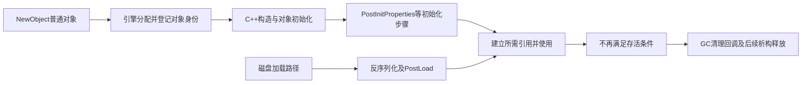
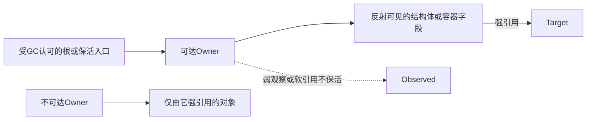
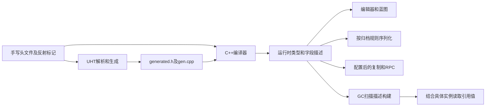

# 01 UObject 与反射系统

> 知识成熟度：L2。主要承诺是对象创建、反射与引用持有的公开使用合同；2026-10-05 核对 Epic 公开文档（页面标签 UE 5.8）及三篇既有文字。下列工程片段未经过 UHT、UE 编译或 PIE；纸面追踪是推导，不是 GC 时序实测。`verified: []` 不代表已有人工验证。

- **版本基准**：2026-10-05 核对的Epic公开UE5.8标签文档；历史私有CL仅作待复核线索，不代表当前环境
- **最后更新**：2026-10-05，重写教学合同、条件化推导与证据边界

## 一、读者要解决什么问题

拿到一个 `UObject*`，最重要的不是先背宏，而是回答：对象如何创建，谁让它保持可达，什么时候可以读取它，哪些系统会看到这个字段？反射为多种系统提供描述信息；每个系统仍有自己的过滤规则和运行条件。

本文先走“创建 → 持有 → 使用 → 失效”这条路径，再看反射、存档与 RPC。前置知识是 C++ 指针、类与成员、值语义；不要把普通 `delete` 所有权直接套到 UObject。

### 本文证据范围

- 公开合同：Object Pointers 的选型表与脚注、Objects 的 CDO/构造说明、Incremental GC 的写屏障与线程限制、SaveGameToSlot 的 Description、属性说明符表，均于 2026-10-05 核对
- 历史来源线索：旧文自述 UE 5.8.0 / CL 55116800 / `++UE5+Release-5.8`，涉及 `Engine/Source/Runtime/CoreUObject/`。本轮未访问该 checkout，不能认证该 CL、Build.version、源码行号或宏取值
- 本文正反例：按公开合同推导可达性或字段过滤；工程例是待编译候选，没有虚构运行日志
- 关联源码篇保存历史节选，并单列其可由文字推导的机制与尚未认证的引擎实现

## 二、先分清身份、描述与值

| 名称 | 它是什么 | 不应混成什么 |
|---|---|---|
| `UObject` | 引擎管理的对象身份及反射/生命周期接口 | 不是所有 C++ 对象的基类，也不是一个普通 `new/delete` 对象 |
| `UClass` | 描述一个 UObject 类型的元数据对象 | 与该类的 CDO 是两个对象；不是“UClass 实例本身就是默认值” |
| CDO | 类默认对象，保存该类型的默认属性，可由 `UClass::GetDefaultObject()` 取得 | 不是每个游戏实例，也不是一次构造后所有实例同步共享的值 |
| `USTRUCT` / `UScriptStruct` | 前者声明可反射的结构体值类型，后者描述该类型 | 结构体值不是独立 GC 节点，但嵌套对象引用可被扫描 |
| `FProperty` | 名称、类型、偏移、尺寸、标志等字段描述 | 一份描述可服务许多实例；不存这些实例的全部字段当前值 |
| `UFunction` | 函数、参数与调用标志的反射描述 | 不替调用者验证随意拼出的参数内存 |
| `UHT` | 在 C++ 编译前处理反射声明并生成辅助代码的工具 | 不是运行时扫描任意 C++ 内存的反射引擎 |
| `UENUM` | 让枚举进入反射描述 | `BlueprintType` 与支持的底层类型仍需按使用场景选择 |

例如同类对象 A、B 都有 `Health`：字段描述可以相同，但 A.Health=10、B.Health=20。描述加上 A 的地址才能找到 A 的值；改 A.Health 不会改 B，也不应把属性描述改成 10。CDO 的默认值参与实例初始化，实例之后的修改并不会自动回写 CDO。[Objects：类默认对象与构造](https://dev.epicgames.com/documentation/en-us/unreal-engine/objects-in-unreal-engine)

## 三、创建与初始化：工厂、Outer 和默认子对象

### 3.1 选择正确创建入口

普通 UObject 使用 `NewObject<T>`，Actor 使用世界的 `SpawnActor<T>`；构造默认子对象使用 `CreateDefaultSubobject<T>`。引擎内部可能用底层分配与 placement construction，但这不授权业务代码绕过对象登记、初始化和生命周期协议。

```cpp
// 方法体内的片段；this 是合适且有效的 Outer，UMyItem 已有完整声明。
UMyItem* Item = NewObject<UMyItem>(this);
UMyItem* TemporaryItem = NewObject<UMyItem>(GetTransientPackage());
// 上面两个局部变量本身不建立长期保活边。
```

`Outer` 表达命名/归属上下文，参与对象路径等机制；`GetTransientPackage()` 也是真实 Outer，不是“没有 Outer”。不能从 `NewObject(this)` 推导父对象对所有内部对象具有通用的 RAII 式父销子合同，也不能推导父对象必然通过反射强持有这个新对象。需要保留的实例仍应存到可达 owner 的受追踪强字段，或用显式保活机制。



图是职责示意，不是每种对象都严格相同的函数调用栈。新建对象不会仅因调用 `NewObject` 就经过磁盘反序列化和 `PostLoad`。构造发生在引擎创建路径内；“构造时完全没有登记”不是禁用随意创建子对象的正确理由。

### 3.2 默认子对象为何有专门入口

默认子对象属于类的构造模板，例如构造函数中有稳定名称的部件或辅助 UObject。它们要与 CDO、实例化和继承模板协调；运行时临时对象解决的是另一类问题。因此在 UObject 构造路径创建默认子对象应使用 `CreateDefaultSubobject`，不能只把它限定为 Actor/Component 方法。[UObject::CreateDefaultSubobject](https://dev.epicgames.com/documentation/en-us/unreal-engine/API/Runtime/CoreUObject/UObject/CreateDefaultSubobject)

构造函数会用于 CDO 以及多种实例创建情境，宜初始化默认数据和默认子对象；不要假定已有有效世界、网络连接或游戏进行中的服务。`PostInitProperties` 也不自动保证这些运行上下文可用。Actor 的玩法初始化和销毁协议另见[Actor 与 Component 生命周期](02-Actor与Component生命周期.md)。

## 四、一条引用究竟能不能保活

### 4.1 GC 看完整可达路径

可以把追踪式 GC 先理解成有向图：UObject 是节点；根和显式受支持的引用报告提供起点；强引用边把可达性传给目标。仅仅出现在全局对象数组中，只表示对象已登记，并不把每个对象都变成根。普通 C++ 全局裸指针同样不会自动成为根。



上图假定没有其他强路径、没有显式保活或特殊对象状态；在这些前提下 X/Y 不能只靠互相引用变成根，W 也不会因这条弱边而存活。真实 GC 还涉及对象状态、集群及阶段安排，不能把“没看到某条边”直接说成“下一帧必然释放”。[Unreal Object Handling：根与可达引用](https://dev.epicgames.com/documentation/en-us/unreal-engine/unreal-object-handling-in-unreal-engine)

### 4.2 USTRUCT 不独立回收，但其字段可被发现

以下是声明形状示意，省略所属头文件、模块宏及 generated include，未经过 UHT：

```cpp
USTRUCT()
struct FInventorySlot
{
    GENERATED_BODY()
    UPROPERTY() TObjectPtr<UMyItem> Item = nullptr;
};

UCLASS()
class UInventory : public UObject
{
    GENERATED_BODY()
public:
    UPROPERTY() FInventorySlot Slot;
};
```

假设外部已使 Inventory 可达，扫描器可沿 `Inventory → Slot → Item` 找到 Item。`Slot` 是 Inventory 内部的值，不需要成为独立 UObject；关键是每层字段都可被发现，且最终引用类型承担保活。

| 纸面输入，均假定没有其他保活路径 | 由这条路径能否保活 Item | 为什么 |
|---|---|---|
| Inventory 可达，外层 Slot 和内层 Item 均反射可见，Item 为强引用 | 能 | 从根一路存在可追踪的强路径 |
| 仅把内层改为 `TWeakObjectPtr` | 不能 | 描述存在，边的性质仍是弱 |
| 仅去掉外层 Slot 的反射标记，也没有显式引用报告 | 不能自动发现 | 扫描器没有沿该原生成员进入结构体的描述 |
| Inventory 自身不可达，其余条件相同 | 不能单靠内部边 | 不可达子图内部有强引用不等于有根 |

局部栈上的 USTRUCT 值不会因 `USTRUCT` 宏自动加入根集合。普通 C++ 容器中的同类值也必须有合适的持有/引用报告方案。另有强持有者时，目标仍可能存活；这不是上述推导失效，而是输入图变了。

### 4.3 按意图选择引用类型

| 表达 | 是否靠自身/该字段保活 | 使用条件 |
|---|---|---|
| `UPROPERTY() TObjectPtr<T>` | 可达 owner 的强边 | 适合反射字段；包装类型放任意位置不自动成为根 |
| `UPROPERTY() T*` | 旧配置允许时可作为反射强边 | UHT 的裸属性支持受配置影响；增量可达性要求迁移相应强引用写入 |
| 局部 `T*` | 不建立额外保活 | 仅借用，外部须保证这段使用期间对象可用 |
| `TWeakObjectPtr<T>` | 不保活 | 非拥有观察/缓存；解析后判空，不将旧裸地址当探针 |
| `TSoftObjectPtr<T>` | 不保活 | 路径型资产引用，加载和加载后的持有另行安排 |
| `TStrongObjectPtr<T>` | 显式强持有 | 非 UObject owner 或需要强保活的作用域；避免难发现的自持有循环 |
| `FGCObject::AddReferencedObjects` | 上报的强边可保活 | 普通 C++ 持有者注册并正确上报；不是把持有者变成 UObject |
| `TLazyObjectPtr<T>` | 不保活 | 公开文档列为弃用方向，新代码通常按需求改用软引用 |

强/弱/软不由 `UPROPERTY` 单独决定；弱软字段加宏后仍不是强边。软引用“已成功加载”也不等于软指针承担保活。选型与配置脚注见[Object Pointers](https://dev.epicgames.com/documentation/en-us/unreal-engine/object-pointers-in-unreal-engine)。

### 4.4 FGCObject：报告引用，而不是只保存地址

下面作者例直接包含所需接口。`UMyItem` 来自后面的物品例；调用放在已有对象生命周期协议内，示例未经过 UE 编译。

```cpp
#include "MyItem.h"
#include "UObject/GCObject.h"
#include "UObject/ObjectPtr.h"
#include "UObject/UObjectGlobals.h"

class FItemHolder final : public FGCObject
{
public:
    TObjectPtr<UMyItem> HeldItem = nullptr;

    void AddReferencedObjects(FReferenceCollector& Collector) override
    {
        Collector.AddReferencedObject(HeldItem, nullptr, nullptr);
    }

    FString GetReferencerName() const override
    {
        return TEXT("FItemHolder");
    }
};
```

这里是注册持有者的引用报告使 HeldItem 可见；不是这个非 UObject 成员上的 `TObjectPtr` 自己注册成根。选择它而不是裸成员，也为增量写屏障留下正确的赋值入口。FGCObject 实例不可按可平凡重定位类型存进会搬家的 UE 容器；持有者销毁后不再承担引用报告，其他路径仍可能持有目标。[FGCObject](https://dev.epicgames.com/documentation/en-us/unreal-engine/API/Runtime/CoreUObject/FGCObject)、[Collector 的 TObjectPtr 重载](https://dev.epicgames.com/documentation/en-us/unreal-engine/API/Runtime/CoreUObject/FReferenceCollector/AddReferencedObject)

短时借用、弱观察和短时强保活是三件事。已有稳定强持有者时可以借用裸指针；不知道对象是否仍存活时用弱引用解析；需要让目标在作用域内持续存活时再考虑 `TStrongObjectPtr`。弱引用不能替代最后一种职责，强保活也不赋予任意跨线程访问 UObject 成员的权限。

### 4.5 委托绑定不是另一条隐含强边

`BindUObject` 使用弱引用语义；仅留下委托绑定不会阻止目标回收。适用的无返回值单播调用使用 `ExecuteIfBound`；不能把“弱绑定”泛化成所有裸 `Execute` 都安全。Lambda 则需要检查捕获的是裸地址、弱包装还是强持有者，各自生命周期不同。[官方委托绑定表](https://dev.epicgames.com/documentation/unreal-engine/delegates-and-lambda-functions-in-unreal-engine)、[委托源码中的引用语义](../模块化框架与对象通信/06-委托与事件系统源码.md)

## 五、GC 的两条时间轴

### 5.1 判断存活与执行销毁不是同一个阶段

可达性分析决定哪些对象仍应保留；Gather 收集待处理对象；随后才有 `BeginDestroy`、就绪判断、`FinishDestroy`、析构与内存释放。`FinishDestroy` 是释放前的清理回调，不等于 C++ 析构；异步资源清理是对象可以使用的机制，不是每个 UObject 都等待 GPU fence。[Actor Lifecycle：垃圾回收阶段](https://dev.epicgames.com/documentation/en-us/unreal-engine/unreal-engine-actor-lifecycle)

公开控制台变量表在 2026-10-05 的同一 UE 5.8 标签页面索引中列出 `gc.AllowIncrementalReachability=0`、`gc.AllowIncrementalGather=0`、`gc.IncrementalBeginDestroyEnabled=1`。这只是该公开表的缺省记录，不是此机器或你的工程实际值；本轮该大页直接抓取超时，未作实时 CVar 查询。[官方 CVar 表](https://dev.epicgames.com/documentation/en-us/unreal-engine/unreal-engine-console-variables-reference)

因此“默认有增量销毁”不能推导“可达性默认跨帧”或“GC 不会卡顿”。诊断时分别看对象量、引用扫描、锁等待、清理回调和释放开销，再核对工程实际开关。强制 full purge 也不是免费的优化；可能把可分摊的工作集中执行。

### 5.2 为什么增量可达性需要写屏障

用三个对象做纸面追踪：根已让 A 可达，A 已扫描完；B 尚未被标记；随后游戏逻辑写入 A.Target=B，而 B 又指向 C。

1. 如果这次写入对 GC 不可见，扫描器可能不再重扫 A，因而漏掉新边 A→B，连 B→C 也无从发现
2. 参与增量 GC 的 `TObjectPtr` 赋值屏障会立即把目标纳入可达处理；后续遍历再处理 B 的下游引用
3. “立即防漏标”不等于 B 的整棵子图必须在同一帧同步扫描完；队列消费和软时间片是另一层调度
4. 若只保留旧裸属性写入而未满足该模式的屏障要求，不能靠 `UPROPERTY` 标签补救时间片之间丢失的新边

[Incremental GC](https://dev.epicgames.com/documentation/en-us/unreal-engine/incremental-garbage-collection-in-unreal-engine) 将此功能标为实验性，要求相应强引用（含 UObject/FGCObject 的显式报告路径）迁移为 `TObjectPtr`，并指出跨工作线程操作的限制。页面的 0.002 秒是启用配置例；它不是所有项目默认值，更不是硬实时上限。上述 A/B/C 是因果反例，未在引擎中运行。

### 5.3 判空不能修复一个已经悬垂的裸指针

`IsValid(Obj)` 用于来源仍合法的对象指针并检查相关对象状态；它不是可以安全探测任意已释放地址的工具。`TWeakObjectPtr::Get()` 通过受管理身份解析对象，失效时返回空；这不要求引擎逐个把所有弱指针变量的内部整数清零。取出临时裸指针后仍须遵守使用时段与线程条件。详见[GC 源码：索引与序列号](02-UObject与垃圾回收源码.md)。

## 六、反射描述怎样被不同系统使用

### 6.1 UHT 与 C++ 的分工



UHT 生成辅助声明、注册与描述代码，不替开发者再声明一份业务字段。修改反射声明后应通过受支持的构建流程重新生成；`MyItem.generated.h` 应是该头文件**最后一个 include**，后面仍有类型声明，并不是把 include 写到文件末尾。生成器源码与某次实际 `.gen.cpp` 是两种证据，参见[反射源码篇](01-UPROPERTY与反射系统源码.md)。

### 6.2 常用说明符按消费者理解

| 消费者 | 说明符 | 条件与边界 |
|---|---|---|
| 蓝图字段访问 | `BlueprintReadWrite` / `BlueprintReadOnly` | 图表可读写/只读，不替所有 C++ 代码施加 const |
| 编辑器 Details | `EditAnywhere` / `EditDefaultsOnly` / `EditInstanceOnly` | 控制模板/实例等编辑范围 |
| 编辑器只读展示 | `VisibleAnywhere` / `VisibleInstanceOnly` | 是属性窗口可见性，不是运行时不可修改 |
| 编辑器元数据 | `Category`、`ToolTip`、`ClampMin` | UI 提示与编辑规则不等于服务器业务校验 |
| 配置 | `Config` / `GlobalConfig` | 配合类及配置加载路径使用 |
| 持久化 | `Transient` | 不参与通常的持久保存/加载，不表示不参与 GC 引用管理 |
| 专用存档筛选 | `SaveGame` | 是供归档选取的标签，默认槽位 API 不检查它 |
| 实例子对象 | `Instanced` | 对默认属性中指定的对象进行逐实例实例化，并隐含EditInline/Export；不表示任意赋值都深拷贝 |
| 网络复制 | `Replicated` / `ReplicatedUsing` | 还需对象复制设置、注册/条件及权威网络路径 |

`UPROPERTY` 让字段可被描述，但不会无条件启用所有消费者。`WITH_EDITORONLY_DATA` 表示编译条件；不要发明 `EditOnly` 说明符，归档是否滤除编辑器数据也要按实际路径判断。[属性说明符](https://dev.epicgames.com/documentation/en-us/unreal-engine/unreal-engine-uproperties)

| 函数说明符 | 意图 | 使用边界 |
|---|---|---|
| `BlueprintCallable` | 蓝图可调用 | 参数与返回类型需受反射支持 |
| `BlueprintPure` | 纯节点合同 | 不靠宏阻止 C++ 实现产生副作用，作者必须守约 |
| `BlueprintImplementableEvent` | 由蓝图实现事件 | C++ 声明反射接口 |
| `BlueprintNativeEvent` | 蓝图覆写并可调用 C++ 默认实现 | 默认实现放 `_Implementation` |
| `CallInEditor` / `Exec` | 编辑器调用入口 / 控制台入口 | 不能据此保证任意上下文可调用 |
| `BlueprintAuthorityOnly` / `BlueprintCosmetic` | 约束相应蓝图调用情境 | 不替代 RPC 路由或任意 C++ 安全检查 |
| `Server` / `Client` / `NetMulticast` | RPC 路由意图 | 受 ownership、相关性、连接和对象生命周期约束 |

### 6.3 SaveGame：先问走哪条归档路径

默认 `UGameplayStatics::SaveGameToSlot` 保存 SaveGameObject 的非 Transient 属性，**不检查 SaveGame 标记**。专用归档若以 `ArIsSaveGame=true` 进入标准属性筛选，则应按标记规则检查字段；自定义 `Serialize` 仍可能实现另一个格式。[SaveGameToSlot 的明确合同](https://dev.epicgames.com/documentation/en-us/unreal-engine/API/Runtime/Engine/UGameplayStatics/SaveGameToSlot)

| 同一 USaveGame 子类中的字段 | 默认槽位属性保存的预期 | 采用 SaveGame 筛选的标准归档预期 |
|---|---|---|
| `UPROPERTY() int32 Chapter` | 参与 | 未标 SaveGame，不应仅因反射可见就纳入 |
| `UPROPERTY(SaveGame) int32 Coins` | 参与 | 有标签，可继续按归档规则处理 |
| `UPROPERTY(Transient) float Cache` | 不作标准持久化保存 | 仍受持久化/Transient 过滤影响 |
| 无反射的 `int32 NativeOnly` | 默认属性路径不发现 | 需要自定义处理，标签体系不会自动找到 |

这是接口合同推导，未运行存档实验。嵌套结构的外层和内层都须满足实际归档过滤；序列化对象引用也不等于自动重建任意运行期对象图。CDO/archetype 的差量、EditorOnly、端口标志与自定义列表都使“所有非 Transient 字段总会写盘”过于宽泛。完整保存、恢复与失败处理见[SaveGame 存档专题](../../05-Gameplay与交互系统/背包装备与存档/12-SaveGame存档系统与序列化.md)。

## 七、物品例：从声明到可观察行为

此例保留原物品、稀有度、软资产引用、蓝图事件用法。项目至少需要相应 `Core`、`CoreUObject`、`Engine` 模块依赖；把 `MYGAME_API` 换成实际模块导出宏。`APawn` 在头中前向声明足以声明指针参数，在 cpp 调它的成员则需要 `GameFramework/Pawn.h` 的完整声明。

```cpp
// MyItem.h
#pragma once

#include "CoreMinimal.h"
#include "UObject/NoExportTypes.h"
#include "UObject/SoftObjectPtr.h"
#include "MyItem.generated.h"

class APawn;
class UStaticMesh;

UENUM(BlueprintType)
enum class EItemRarity : uint8
{
    Common     UMETA(DisplayName = "普通"),
    Rare       UMETA(DisplayName = "稀有"),
    Epic       UMETA(DisplayName = "史诗"),
    Legendary  UMETA(DisplayName = "传说")
};

UCLASS(Blueprintable, BlueprintType, Config = Game)
class MYGAME_API UMyItem : public UObject
{
    GENERATED_BODY()

public:
    UMyItem();

    UPROPERTY(EditAnywhere, BlueprintReadWrite, Category = "Item")
    FName ItemName;

    UPROPERTY(EditAnywhere, BlueprintReadWrite, Category = "Item")
    EItemRarity Rarity;

    UPROPERTY(EditAnywhere, BlueprintReadWrite, Category = "Item", Meta = (ClampMin = "0.0"))
    float Weight = 1.0f;

    // 软引用：不强制加载资产
    UPROPERTY(EditAnywhere, BlueprintReadWrite, Category = "Item")
    TSoftObjectPtr<UStaticMesh> PreviewMesh;

    // 运行期缓存：不参与标准持久化属性保存
    UPROPERTY(Transient)
    float CachedScore = 0.0f;

    UFUNCTION(BlueprintPure, Category = "Item")
    float GetWeight() const { return Weight; }

    // 蓝图可实现事件（C++ 提供默认实现）
    UFUNCTION(BlueprintNativeEvent, Category = "Item")
    void OnEquipped(APawn* Equipper);
    virtual void OnEquipped_Implementation(APawn* Equipper);

    // 蓝图实现事件（C++ 不提供实现）
    UFUNCTION(BlueprintImplementableEvent, Category = "Item")
    void OnItemPickedUp();
};
```

```cpp
// MyItem.cpp
#include "MyItem.h"
#include "GameFramework/Pawn.h"

UMyItem::UMyItem()
{
    ItemName = TEXT("未命名物品");
    Rarity = EItemRarity::Common;
}

void UMyItem::OnEquipped_Implementation(APawn* Equipper)
{
    UE_LOG(LogTemp, Log, TEXT("%s 被 %s 装备"), *ItemName.ToString(),
           Equipper ? *Equipper->GetName() : TEXT("无"));
}
```

预期操作：在支持该基类的蓝图创建流程中继承 `UMyItem`，覆写事件；运行时用 `Construct Object from Class` 或 C++ `NewObject` 创建实例，并把它保存到正确强字段。创建蓝图类、创建资产和创建运行时对象是不同操作，不能把通用“Create Advanced Asset”菜单当成任何 UObject 都可用的工厂。

- 不覆写 `OnEquipped` 时应使用 C++ 默认实现；蓝图覆写后是否调用父实现由蓝图逻辑决定
- `OnItemPickedUp` 由蓝图实现；持有正确实例再调用它
- `Weight` 可在对应编辑器/蓝图情境访问；`PreviewMesh` 软引用不强迫加载，使用网格前另做加载及持有
- `CachedScore` 是运行缓存；说明符不使它退出普通内存和引用管理

这些是待验证预期，未记录编译、日志输出或蓝图节点颜色等运行观察。

### 7.1 运行时枚举和事件调用

先处理“只有合法 `UObject*`，还不知道是不是物品”的输入。下面仍是未经过UE编译的作者片段，要求调用者传入来源有效的对象引用或空指针；它不能检查任意悬垂地址：

```cpp
UMyItem* ResolveItem(UObject* Candidate)
{
    if (!IsValid(Candidate)) return nullptr;
    return Cast<UMyItem>(Candidate); // 类型不匹配返回nullptr
}
```

对已判活的Candidate，`Candidate->IsA<UMyItem>()` 可以只问类型是否匹配；需要使用物品接口时，保留Cast结果并判空，不要靠一个随后仍可能失效的裸地址断言。UObject反射类型转换与普通C++强制转换的检查职责不同。[Cast API](https://dev.epicgames.com/documentation/en-us/unreal-engine/API/Runtime/CoreUObject/Cast)

下面是接收已由调用者合法持有的 `UMyItem*` 的函数片段。`IsValid` 不是未知地址探针；依赖 `MyItem.h`、`UObject/UnrealType.h` 和模块日志定义。代码未经过 UE 编译。

```cpp
void InspectItem(UMyItem* Item)
{
    if (!IsValid(Item)) return;
    for (TFieldIterator<FProperty> It(Item->GetClass()); It; ++It)
    {
        FProperty* Property = *It;
        const void* Value = Property->ContainerPtrToValuePtr<void>(Item);
        FString Text;
        Property->ExportText_Direct(Text, Value, nullptr, Item, 0, nullptr);
        UE_LOG(LogTemp, Log, TEXT("%s = %s"), *Property->GetName(), *Text);
    }

    // 只调用本文声明的无参数、无返回值事件，不给任意UFunction猜参数布局。
    UFunction* Event = Item->FindFunction(GET_FUNCTION_NAME_CHECKED(UMyItem, OnItemPickedUp));
    if (Event && Event->NumParms == 0)
    {
        Item->ProcessEvent(Event, nullptr);
    }
}
```

已知类型直接调用 `Item->OnItemPickedUp()` 通常更清楚；这里用 `ProcessEvent` 解释描述驱动调用。带参数的函数必须匹配其准确布局和初始化/销毁规则，不能照抄一个自造 `FParams` 去调用任意同名函数。默认 `TFieldIterator` 包含父类与 deprecated 字段，不自动含接口。文本导入导出是值与文字的转换接口，不代表等同所有归档格式。[FProperty API](https://dev.epicgames.com/documentation/en-us/unreal-engine/API/Runtime/CoreUObject/FProperty)

### 7.2 保留的网络合同

#### RPC 调用规则（重要）

- 客户端远程调用 `Server` RPC 时，必须拥有该 Actor；服务器自己调用时在本地执行。
- 服务器调用 `Client` RPC 时，目标由 owning connection 决定；没有客户端 Owner 不代表广播。
- `NetMulticast` 由服务器调用时，只覆盖服务器和当前已连接、对该 Actor 相关的客户端；客户端调用只在本地执行。
- `Reliable` 是 UE 复制层的确认/重传语义，不等于 TCP。可靠 RPC 的顺序保证限于同一连接、同一发送方向内的同一 Actor 及其子对象调用流，不能推导出跨 Actor、属性或 OnRep 的统一顺序；错误路由、断线与对象生命周期仍需处理。
- Actor 和可复制的 ActorComponent 都能声明 RPC。普通 UObject 不会因加一个宏就自动获得 RPC 路由；特殊复制子对象需要额外实现 callspace/remote-function 路由，GameInstance 等对象通常经拥有的 Actor 转发。

依据：[RPC 调用矩阵](https://dev.epicgames.com/documentation/unreal-engine/remote-procedure-calls-in-unreal-engine?lang=en-US)、[执行顺序](https://dev.epicgames.com/documentation/en-us/unreal-engine/replicated-object-execution-order-in-unreal-engine)、[组件复制](https://dev.epicgames.com/documentation/unreal-engine/replicating-actor-components-in-unreal-engine) 与 [UObject RPC 路由](https://dev.epicgames.com/documentation/en-us/unreal-engine/replicating-uobjects-in-unreal-engine)。本次为文档核对，未运行 UE 联机测试。

以下仍是 RPC 声明/实现片段，不是完整角色或射击系统；未展开头文件、全部实现和服务端业务校验。

```cpp
// AMyCharacter.h（片段）
UCLASS()
class MYGAME_API AMyCharacter : public ACharacter
{
    GENERATED_BODY()
public:
    // 客户端→服务器：带校验
    UFUNCTION(Server, Reliable, WithValidation)
    void ServerRequestFire(FVector_NetQuantize Target);
    bool ServerRequestFire_Validate(FVector_NetQuantize Target);

    // 服务器→拥有客户端
    UFUNCTION(Client, Reliable)
    void ClientNotifyHit(AActor* HitActor);

    // 服务器→自身和当前对该Actor相关的已连接客户端
    UFUNCTION(NetMulticast, Unreliable)
    void MulticastPlayMuzzleEffect();
};

// AMyCharacter.cpp（片段）
void AMyCharacter::ServerRequestFire_Implementation(FVector_NetQuantize Target)
{
    // 服务器权威逻辑
    MulticastPlayMuzzleEffect();
}

bool AMyCharacter::ServerRequestFire_Validate(FVector_NetQuantize Target)
{
    return Target.SizeSquared() < 100000000.0f; // 简单合法性校验
}
```

`WithValidation` 的服务端验证函数返回false时，官方合同会断开调用客户端；因此冷却未到、弹药不足等普通业务拒绝宜在实现内处理，不应随意走该失败路径。示例距离阈值只演示函数形状，不能代替弹药、冷却、身份、命中等服务器校验；连接中断与对象失效同样需要处理。本篇未运行联机测试。

## 八、诊断与常见问题

### 8.1 对象消失或常驻时按顺序检查

1. 确认指针来源、目标状态与使用线程；弱引用先解析，别先解引用未知旧地址
2. 画出根到 owner 的路径，再检查每层结构体/容器字段是否可见，最后检查强/弱/软性质
3. 需要保活却只有 `BindUObject`、软引用或局部裸指针时，补正确的持有合同；不为“修复”把所有引用都改强
4. 对象不释放时查其他强字段、FGCObject 报告、`TStrongObjectPtr` 和匹配的 Root 操作；Subsystem 通常已有框架生命周期，不应默认再 AddToRoot
5. 用适用构建中的 `obj list` / `obj refs`、引用链工具和 Unreal Insights 分别定位引用与开销；命令可用性及结果覆盖需按项目核对

旧例未提供可核对的 `GetReferencers(SomeObject, Referencers)` 定义，这里改为明确的诊断入口，不继续把它当公共 API 样例。公开 `FReferenceChainSearch` 在 `UObject/ReferenceChainSearch.h` 中提供查询及打印接口；它可能很慢，适合受控调试，不能承诺“一秒列全”。[引用链查询 API](https://dev.epicgames.com/documentation/en-us/unreal-engine/API/Runtime/CoreUObject/FReferenceChainSearch)

### 8.2 快速问答

- **漏 UPROPERTY 就一定被回收吗？** 该普通成员不会自动成为反射强边，但目标可能另有强路径；“这个引用不可见”和“整个对象不可达”不同
- **USTRUCT 只能放无行为数据吗？** 值类型也可有 C++ 方法。按值语义、身份和生命周期需求选择；需要独立 UObject 身份或蓝图事件时考虑 UCLASS
- **为什么不统一把成员都改强？** 观察关系变强可能延长生命周期或形成难发现的常驻图，按职责选择
- **IsPendingKill 何时移除？** 本文不提供未核对的精确移除版本；按目标版本的公开 API 选择判活方式，不据旧教程推版本史
- **GC 卡顿怎么处理？** 先测阶段和实际开关，再减少无用对象/引用或调整对象池；时间片、错峰或 full purge 都有代价，不承诺消除所有卡顿
- **蓝图看不到属性？** 分开检查基类可创建/可覆写条件、字段/函数说明符、支持的类型以及构建是否重新生成；一个 `Blueprintable` 不会替所有字段开启访问
- **何时修正加载数据？** `PostLoad` 等钩子可用于加载后的修正；`PreSave` 与自定义序列化有自己的上下文，不能假定所有创建都会经过它们

## 九、最小验证计划与关联阅读

当前状态：UE/UHT 编译、PIE、真实 GC、存档读写、联机行为均 **NOT_RUN**。有授权项目时应按同一版本记录：头文件与模块依赖→UHT输出→编译结果→控制输入→观察结果。四组引用图实验要排除其他强持有者；SaveGame 试验要记录归档开关；增量试验要区分标记和销毁，不拿“最后看到了对象消失”反证每一帧的内部过程。

本次维持 L2 是因为使用层主要合同已定位核对，不是因为历史 CL 声明或提供了工程片段。主要更正包括 USTRUCT 强链、委托弱绑定、Outer、GC阶段、SaveGame过滤及直接头依赖；来源访问与工程运行没有混记。

- [UPROPERTY 与反射系统源码](01-UPROPERTY与反射系统源码.md)：共享描述、实例值、生成器与偏移分支
- [UObject 与垃圾回收源码](02-UObject与垃圾回收源码.md)：槽位、schema、屏障和分批清理
- [Actor 与 Component 生命周期](02-Actor与Component生命周期.md)：Actor/Component 的创建与销毁协议
- [Gameplay 框架与游戏模式](../模块化框架与对象通信/03-Gameplay框架与游戏模式.md)：框架对象如何组织运行上下文
- [引擎启动流程与模块架构](../运行架构与任务调度/04-引擎启动流程与模块架构.md)：CoreUObject 与模块启动
