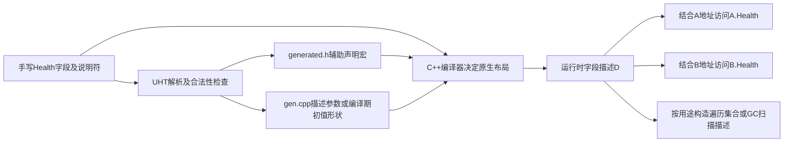

# UE 引擎源码分析 01：UPROPERTY 与反射系统源码剖析

> 知识成熟度：L2。主要承诺收窄为已核对公开API的“共享字段描述→实例值访问→不同消费者”机制与有条件的代码推导，不再声称全面认证某私有CL源码。历史实现节选逐块保存但身份待复核；标准语言模型只作局部反例，未据此提高整篇等级。UE/UHT/PIE与性能测试均未运行，`verified: []`。
> 前置：[UObject 与反射系统](01-UObject与反射系统.md)；下游：[GC 源码](02-UObject与垃圾回收源码.md)。

- **版本基准**：2026-10-05 核对的Epic公开UE5.8标签文档；历史私有CL仅作待复核线索，不代表当前环境
- **最后更新**：2026-10-05，重写教学合同、条件化推导与证据边界

## 一、以同一个字段的旅行组织问题

设开发者声明一个 `Health` 字段，运行时有同类对象 A 和 B。要解释反射，需连续回答：

1. UHT看见什么声明，会输出哪类辅助信息？
2. 运行时描述项记录什么，它和 A.Health/B.Health 是什么关系？
3. 偏移由谁提供，重布局和保留偏移有何不同？
4. 持有描述项后怎样定位某个实例值？
5. 序列化、编辑器与GC各自怎样消费这些信息，为何不能混成同一循环？

2026-10-05 实际核对了Epic公开接口（页面标签UE5.8）与学习仓库既有文档。旧文自述UE5.8.0 / CL55116800 / `++UE5+Release-5.8`；未访问该checkout，未认证Build.version、行号、条件宏、逐字源码或实际生成产物。篇后70个历史C++/C#围栏原字节保留，以 `RF-Bxx` 定位；代码中的省略和原注释不因此成为新认证事实。

公开API能确认接口、职责及类型关系；历史节选能作为条件化控制流的输入；普通C++模型能反驳过宽的语言结论。三者证据不能互相替代。保持L2的理由是本文核心的公开描述/值访问合同有可定位来源；本文不把待认证函数体、性能或完整私有注册链列为已核承诺。

## 二、描述共享，值属于每个实例

### 2.1 一份说明书并不装着所有住户的家具

令字段描述D记录名称Target、允许的类型、偏移o和元素大小s。D可以同时服务A和B：

| 时刻 | 描述D | A.Target | B.Target |
|---|---|---|---|
| 初始 | 名称/类型/o/s | X | Y |
| 只改A.Target=Z | 不需变成Z | Z | Y |
| 按D读取B | D与B基址结合 | 不参与本次读 | 得到Y |

因此有三层不同信息：

- **描述对象的引用**：例如FObjectPropertyBase的PropertyClass指向允许的目标UClass，FStructProperty的Struct指向UScriptStruct
- **业务实例的值**：A.Target当前指向X，B.Target当前指向Y
- **派生扫描描述**：从字段类型/偏移/容器结构产生schema，供扫描某个实例时定位引用

`UStruct::CollectPropertyReferencedObjects`的所存片段只遍历FField描述，没有业务实例Data参数。`ScriptAndPropertyObjectReferences`保存脚本及FProperty描述涉及的UObject引用，不能解释成所有实例字段值汇总。否则A改成Z时共享描述也要变成Z，与B仍为Y相矛盾。[UStruct的变量说明](https://dev.epicgames.com/documentation/en-us/unreal-engine/API/Runtime/CoreUObject/UStruct)、[FObjectPropertyBase](https://dev.epicgames.com/documentation/unreal-engine/API/Runtime/CoreUObject/FObjectPropertyBase)

### 2.2 保活还要回到完整引用图

A可达并通过受GC认可的强字段指向X，可让X沿此路径可达；换成弱/软字段不行。A失去所有强可达路径后，A→X这条内部强边不会让二者自动成为根。X仍可能有别的保活者，不能把“某成员未反射”说成“目标下一次必被回收”。USTRUCT值不是独立GC节点，但在完整可见的owner字段链中可以暴露内部强引用。[Object Pointers](https://dev.epicgames.com/documentation/en-us/unreal-engine/object-pointers-in-unreal-engine)

## 三、UHT生成辅助描述，不是运行时扫描任意C++字段

### 3.1 从Health声明到输出形状

作者输入示意（非完整头文件，未运行UHT）：

```cpp
UPROPERTY(EditAnywhere, BlueprintReadWrite, Category = "Combat")
float Health;
```

UHT在构建流程中解析反射声明；C++编译器仍负责真正的字段布局、函数编译和链接。所存宏[RF-B17](#rf-b17)显示UPROPERTY在普通C++预处理视角可为空，而UCLASS/GENERATED_BODY类宏可拼接生成名称；“宏本身为空”不代表整个反射机制没有数据或运行成本。



`.generated.h`里不是再声明一份Health；辅助宏把生成声明接到手写类型上。`CURRENT_FILE_ID`、行号、后缀共同形成宏名，所以移动GENERATED_BODY而用旧生成文件可能导致名字不匹配；它只是该类错误的一个原因，include顺序、生成失败、声明错误也要检查。generated头应是最后一个include，类型定义仍写在其后。[基础篇构建约束](01-UObject与反射系统.md)

### 3.2 说明符处理器、表和合法性检查

[RF-B03](#rf-b03)、[RF-B04](#rf-b04)保存VisibleAnywhere与BlueprintReadWrite处理器；片段中既有按位或，也有冲突和访问校验。`GetSpecifierTable`又说明处理器通过成员/参数等表分发。因此“只允许一个编辑说明符”可由处理器状态检查实现，不等于UHT没有表或语法约束。

**旧文误贴已纠正**：原本放在“EditAnywhere处理器”下面的[RF-B02](#rf-b02)实际写HeaderInfos、CURRENT_FILE_ID、`.generated.h`和CommitOutput，与[RF-B09](#rf-b09)属于头文件生成器形状；它不证明EditAnywhere如何置位。两块按旧字节保存，放到同一历史材料组供辨认，不补造未核对的EditAnywhere私有函数体。

公开说明符表确认EditAnywhere的编辑范围；历史映射称其主标志为Edit。具体完整位集合、合法组合及UHT处理函数，应以目标版本源码/生成结果核对，不能由错贴的长代码获得证明。[属性说明符](https://dev.epicgames.com/documentation/en-us/unreal-engine/unreal-engine-uproperties)

### 3.3 生成器源码不等于这次项目的生成产物

在[RF-B13](#rf-b13)、[RF-B15](#rf-b15)里看见字符串 `STRUCT_OFFSET(Type, Member)`，能说明相应生成分支会输出该表达式；不能证明已经看过本项目Health的.gen.cpp，更不能据该字符串证明目标CL的宏恰好展开为标准offsetof。

历史Params路径按位置输出名称、通知、标志、类型、访问器、数组维度和偏移等；ConstInit路径按相应字段名写初值。两条都可携带偏移表达式。哪个路径生效、生成守卫如何组合、最终值是什么，受输入、生成器版本、模块设置与条件宏影响。

| 证据 | 可观察到 | 还缺什么 |
|---|---|---|
| 输入头文件 | 声明名、类型和说明符 | 工具是否接受、如何输出 |
| 生成器节选 | 某个条件分支的输出形状 | 实际选择的分支、实际文件 |
| 实际generated.h/gen.cpp | 固定输入与配置下的输出 | 编译/链接与运行行为 |
| 编译/运行记录 | 指定构建下的观测 | 其他版本/平台或性能推广 |

本篇只有前两类教学材料，没有假造后两类记录。`PropPointers`字符串出现在所存生成器中，也不能宣称它是全库唯一生成入口。节选的9/10行省略计数曾不一致，保留原代码标记但不再拿旧行数作为认证依据。

## 四、偏移有不同来源：重布局不等于重建全部C++布局

### 4.1 输入偏移与Link分支并列

[RF-B21](#rf-b21)展示 `UStruct::Link(Ar,bRelinkExistingProperties)` 的两种处理：

| 条件/阶段 | 所示操作 | 可以解释的因果关系 |
|---|---|---|
| 编译入属性描述输入 | Params或ConstInit可提供偏移 | 原生编译器布局可成为描述输入，不限constinit |
| bRelinkExistingProperties=true | 初始化尺寸/对齐，调用Property->Link | 通过LinkInternal及SetupOffset逐个计算动态布局 |
| bRelinkExistingProperties=false | LinkWithoutChangingOffset | 初始化属性内部信息，同时保留已有偏移 |
| 适用UScriptStruct的CppStructOps | 取得原生size/alignment | 原生结构体整体尺寸可能覆盖累加值 |

是否实际走true或false，必须追具体注册/链接调用者。本篇未认证该CL调用链，不能说所有native字段都由Link重新累计，更不能说修改pragma pack后Link会自动恢复正确布局。

### 4.2 为什么原生类型不能只算反射字段

普通C++反例：一个标准布局结构体依次有 `uint8 marker`、未反射的 `uint64 gap`、`float health`。即使只给health建立描述，它仍要落在真实C++对象中gap之后，不能因为“只描述一个float”就猜偏移0。编译器填充、非反射字段、继承等均参与实际布局；UObject还不是可随意套标准布局offsetof规则的普通结构。

本文第九节标准模型在GCC14.2/x86_64观察到health偏移16、只按一个反射字段猜值0；它反驳过宽算法，不认证UE的STRUCT_OFFSET宏、UObject ABI或目标平台布局。

### 4.3 可重布局分支的手算输入

依[RF-B42](#rf-b42)与[RF-B43](#rf-b43)，若当前OwnerStruct总尺寸为12、字段最小对齐8、单元素大小8、ArrayDim=2，则对齐后offset=16，字段占16，新尺寸为32。此推导只适用于进入SetupOffset且给定这些输入的分支。

反例：若已给native字段offset=24，并走LinkWithoutChangingOffset，调用LinkInternal不意味着把它改回16。别把前一分支公式套进后一分支。

`GetSize`所示为ArrayDim×ElementSize，边界还包括整数范围；旧节选自己带溢出审计注释。`Offset_Internal`不是唯一输入，容器基址、ArrayIndex、ElementSize、具体属性表示和访问器也影响取值。

## 五、四条链是用途不同的候选集合

[RF-B24](#rf-b24)至[RF-B31](#rf-b31)保存四链构建与next映射。这里的元素是字段描述，不是业务对象实例。

| UStruct头 | FProperty的next成员 | 所存构建条件/目的 |
|---|---|---|
| PropertyLink | PropertyLinkNext | 迭代到的属性；供需要完整属性候选集合的消费者 |
| RefLink | NextRef | ContainsObjectReference(...Any)，可包含强、弱、软以及需保守处理的自定义类型 |
| DestructorLink | DestructorLinkNext | 按LinkDestructor等属性清理条件选择 |
| PostConstructLink | PostConstructLinkNext | 按初始化/CDO后构造复制需求选择 |

它们不是四份字段值，更不是四种根集合。RefLink包含weak/soft，只表示引用处理用途需要发现它们，不代表保活性质改变。

### 5.1 默认遍历与当前owner链不同

`EFieldIterationFlags::Default = IncludeSuper | IncludeDeprecated`，**不含IncludeInterfaces**；接口需显式选择且受类型条件约束。ChildProperties/Next用于owner字段链；展开父类的TFieldIterator得到另一个遍历范围。[EFieldIterationFlags](https://dev.epicgames.com/documentation/en-us/unreal-engine/API/Runtime/CoreUObject/EFieldIterationFlags)、[FField::Next](https://dev.epicgames.com/documentation/en-us/unreal-engine/API/Runtime/CoreUObject/FField)

正例：默认迭代一个派生类描述时可包含父类字段。反例：不能仅因默认带父类就期待接口字段自动出现。判断查询结果时先写出实际遍历器及flags，而不是只看变量叫PropertyLink。

### 5.2 AppendNoTerminate只写当前尾部槽位

[RF-B28](#rf-b28)的操作是通过EndPtr写新元素地址，再把EndPtr指向新元素的next槽位；第一次写的可能是链头，不一定总是“上一个元素的next”。它不清新节点自己的旧next。

两个纸面输入：

- 新节点N.next原来就是null，追加后即使没再写尾，链也可能碰巧结束
- N.next原来指向旧节点Q，追加后若没有完成终止协议，结果会错误延伸到Q；Q可能仍有效，也可能已失效，不能一律称悬垂

`NullTerminate`把最终尾槽写null，是建立终止不变量的方式。四个builder可在同一个循环中追加不同集合，不需要机械地“四次Append循环”。

### 5.3 union与发布点需要完整生命周期

[RF-B40](#rf-b40)把某些next与编译期元数据共用union，条件成员受WITH_METADATA/ConstInit控制。只有在相关模式下活动成员仍是元数据时，才不能把它误读为NextRef；普通路径或已切换后的状态另判。不能笼统说“Link前任何NextRef访问都是UB”。

[RF-B36](#rf-b36)存在release写的就绪位，只是发布协议的一半。读端须有合适同步、初始化完成且不与重链接并发改链等条件。本文没有完整读端/重链接协议，不提供“看到一行release即可任意线程读取”的保证。

## 六、给定实例读值：先定位，再读写

### 6.1 找描述、核类型、定位值、调用访问器

作者教学片段，未经过UE编译；输入TargetActor必须由调用方合法持有。这里只演示普通直接存储float字段，未覆盖native getter/setter、编辑器事务或网络复制通知。

```cpp
#include "CoreMinimal.h"
#include "UObject/UnrealType.h"
#include "GameFramework/Actor.h"

void ModifyActorHealthReflected(AActor* TargetActor, float NewHealthValue)
{
    if (!IsValid(TargetActor)) return;
    FProperty* Property = TargetActor->GetClass()->FindPropertyByName(TEXT("Health"));
    FFloatProperty* FloatProperty = CastField<FFloatProperty>(Property);
    if (!FloatProperty) return;
    void* ValueAddress = FloatProperty->ContainerPtrToValuePtr<void>(TargetActor);
    const float OldValue = FloatProperty->GetPropertyValue(ValueAddress);
    FloatProperty->SetPropertyValue(ValueAddress, NewHealthValue);
    UE_LOG(LogTemp, Log, TEXT("Health: %.1f -> %.1f"), OldValue, NewHealthValue);
}
```

预期：有匹配float Health时修改该实例；字段不存在或类型不是FFloatProperty时不修改。此处不宣称属性变化会自动触发某个setter、OnRep或事务通知；写业务数据前应选择符合业务合同的接口。

旧“Get/SetPropertyValue定义在模板基类所以不能这样调用”的勘误错误。公开接口列出这些静态值地址方法；标准C++允许通过可访问的派生对象表达式引用继承静态成员。整个UE例仍未编译，但方法来自基类不是把它判成伪API的理由。[TPropertyTypeFundamentals](https://dev.epicgames.com/documentation/unreal-engine/API/Runtime/CoreUObject/TPropertyTypeFundamentals?lang=en-US)、[C++静态成员访问](https://eel.is/c%2B%2Bdraft/class.static.general)

### 6.2 值地址和容器地址不要传反

对于所示直接存储路径，定位公式是：容器基址+Offset_Internal+ElementSize×ArrayIndex。`ContainerPtrToValuePtr`接容器，得到值地址；`GetPropertyValue(ValueAddress)`接已经定位的值。若把容器当值读，会读错字段；若把值地址再次当容器加偏移，则会重复偏移，可能越界。

`_InContainer`风格接口的具体定位与getter/setter支持按其API核对，不能只凭后缀推断；也不能先算值地址，再把它交给需要容器的接口。位域bool、动态数组内部元素、结构体嵌套和native访问器要使用具体属性类支持的路径。[FProperty值访问接口](https://dev.epicgames.com/documentation/en-us/unreal-engine/API/Runtime/CoreUObject/FProperty)

所存[RF-B45](#rf-b45)至[RF-B47](#rf-b47)区分UObject*和void*包装：前者多一些对象/owner兼容性断言，后者对原始容器内存有不同前提。断言不使任意裸地址安全；Shipping默认check不执行。不能从更多断言直接给未经测量的“必更慢”结论。

### 6.3 具名类、模板实现和值类型是三个层次

公开接口中 `FFloatProperty` 是具名class，继承 `TProperty_Numeric<float>`，再复用下层模板；它不是模板实例的别名，更不是一个业务float值。[FFloatProperty](https://dev.epicgames.com/documentation/unreal-engine/API/Runtime/CoreUObject/FFloatProperty)

[RF-B48](#rf-b48)至[RF-B51](#rf-b51)显示模板从C++类型系统取得sizeof/alignof及computed flags。这说明该部分值的来源，不能推断UHT“完全不知道float”，也不能从一次位或的幂等推出整个Link幂等。FStructProperty可能从UScriptStruct取得尺寸/对齐；bool位域又有其专门表示。

### 6.4 线性查链只决定首个匹配，不授权UHT重名

[RF-B59](#rf-b59)和[RF-B60](#rf-b60)沿PropertyLink顺序查名称/偏移。给定链有n项，最坏需要检查n项；函数内未显示哈希索引。

若人为给一个重复名字的链，算法返回第一个匹配。这只是查找行为，不证明UHT接受反射继承层的同名声明。普通C++允许某些成员遮蔽与UHT附加限制是两个合同；本篇未运行该负向UHT用例，不伪造报错，业务例使用唯一属性名。

## 七、同一描述如何分给序列化和GC

### 7.1 两级归档分支都要看

[RF-B61](#rf-b61)保存SerializeScriptProperties主体的历史节选；它不只是“到Tagged调用处”，后面还包括其他路由和收尾。按所示条件先做第一层选择：

| 条件，按原有if/else优先级 | 入口 | 需要留意 |
|---|---|---|
| TextFormat或读写且不要求binary property | SerializeTaggedProperties | 取得archetype/default上下文，内部仍可选择versioned/unversioned |
| 否则port flags非0且非custom list | SerializeBinEx | 带默认值上下文的路径，具体差量按实现/归档判断 |
| 其他 | SerializeBin | 还要看下一层分支，不能直接叫“全量写所有值” |

进入SerializeBin以后，[RF-B63](#rf-b63)还有第二层：

| 条件 | 候选集合 | 行为边界 |
|---|---|---|
| IsObjectReferenceCollector | RefLink | 只选含引用的描述；强弱软仍按各自语义处理 |
| 否则ArUseCustomPropertyList | 外部custom list | 按指定属性/数组索引及子列表处理 |
| 否则 | PropertyLink | 遍历全部候选描述并调用属性处理，仍不证明每项都写入输出 |

第三个集合是外部列表，不是前文四条内置FProperty链中的“第三条链”。`SerializeBinProperty`仍接Data，由更下层进行值定位、过滤和类型化操作。归档可能是读取、写入、引用收集等用途；一个for循环不等于整套序列化。CDO标记影响默认值上下文，不把所有实例变成CDO；unversioned是否是某cook配置默认行为，本轮未核，不作保证。

### 7.2 SaveGame、Transient与Instanced按用途解释

| 说明符 | 准确使用合同 | 容易误推的结论 |
|---|---|---|
| SaveGame | 供采用SaveGame过滤语义的专用归档选择字段 | 默认SaveGameToSlot并不检查此标志 |
| Transient | 通常不作持久化属性保存/加载 | 不等于所有Serialize用途都忽略，也不等于不保活 |
| Instanced | 对默认属性中指定的对象进行逐实例实例化，隐含EditInline/Export | 不只是面板展开、不限于某种构造调用、不意味着任意赋值都深拷贝 |
| Replicated/ReplicatedUsing | 表达复制意图及通知配置 | 宏不替复制注册、权威或路由条件 |
| Edit/Visible类 | 编辑器编辑/显示范围 | 不给任意运行代码提供业务权限校验 |

默认槽位API下，普通反射Chapter与标SaveGame的Coins都参与标准非Transient保存；Transient缓存和无反射NativeOnly不走该默认保存合同。另设ArIsSaveGame的标准归档会筛选标签，嵌套外层/内层也需满足实际过滤。手写Serialize可另定格式；这些是接口推导，未做读写实验。[SaveGameToSlot](https://dev.epicgames.com/documentation/en-us/unreal-engine/API/Runtime/Engine/UGameplayStatics/SaveGameToSlot)、[FArchiveState::IsSaveGame](https://dev.epicgames.com/documentation/en-us/unreal-engine/API/Runtime/Core/FArchiveState/IsSaveGame)、[存档专题](../../05-Gameplay与交互系统/背包装备与存档/12-SaveGame存档系统与序列化.md)

### 7.3 具体属性类不共享同一种值表示

| 描述类 | 公共/所示类型形状 | GC引用性质 |
|---|---|---|
| FObjectProperty | 所存片段通过TObjectPtr相关接口处理对象属性 | 具体声明与扫描路径下的强引用；不是所有引用类型的总表示 |
| FWeakObjectProperty | TFObjectPropertyBase<FWeakObjectPtr> | 弱观察不保活 |
| FSoftObjectProperty | TFObjectPropertyBase<FSoftObjectPtr> | 路径/弱引用不保活 |
| FStructProperty | 指向UScriptStruct描述，值是内嵌结构体数据 | 是否含强引用由其可见成员/回调与owner路径决定 |

依据：[FWeakObjectProperty](https://dev.epicgames.com/documentation/unreal-engine/API/Runtime/CoreUObject/FWeakObjectProperty)、[FSoftObjectProperty](https://dev.epicgames.com/documentation/unreal-engine/API/Runtime/CoreUObject/FSoftObjectProperty)。[RF-B65](#rf-b65)是FObjectProperty片段，不是FObjectPropertyBase的完整实现；原省略使括号/分支不独立完整，本篇不把它包装为可编译代码。

### 7.4 GC另有“描述构建→实例消费”路径

公开FProperty有EmitReferenceInfo，UClass有相关schema/原生回调接口。历史GC篇进一步给出：组装扫描描述，然后VisitMembers以实例基址和描述偏移读当前引用。RefLink的对象引用归档分支只是一个消费者，不能取代这个说明链。

在增量可达性中，已扫描A后来新增A→B的边需要TObjectPtr写屏障及时纳入B；后续Pass再扫描B的子图。反射可见性、强弱性质与跨帧写屏障是不同条件。有关实验性、线程与soft budget限制见[Incremental GC](https://dev.epicgames.com/documentation/en-us/unreal-engine/incremental-garbage-collection-in-unreal-engine)，具体控制流推导见[GC源码篇](02-UObject与垃圾回收源码.md)。

## 八、consteval、FField与版本差异的证据上限

### 8.1 常量求值不意味着对象不可变

所存[RF-B73](#rf-b73)有consteval构造及后续InitializeConstInitProperty入口。三件事要分开：

- consteval限制相应函数调用必须产生常量表达式求值结果
- constinit约束静态/线程存储变量的初始化方式
- const才涉及对象是否可经该类型接口修改；consteval/constinit本身不等同const对象

因此编译期准备部分初值后，运行期仍可有注册、元数据处理、链表构造/成员切换。不能把“存在consteval”当成模块启动零运行初始化或已经测出性能收益。`FStructProperty`所示构造接受StructSize，只能说明尺寸从该入参传入，未追实参前不猜由UHT计算还是其他来源。

### 8.2 FField不是UObject，不等于没有EObjectFlags

公开FField页面列FlagsPrivate及相关访问器；FProperty继承FField与“全家族无EObjectFlags”不相容。[FField API](https://dev.epicgames.com/documentation/en-us/unreal-engine/API/Runtime/CoreUObject/FField)

[RF-B75](#rf-b75)至[RF-B77](#rf-b77)的旧构造转发若准确，只说明该构造路径不再把InObjectFlags传给新构造；不能据继承关系臆测弃用动机或抹去其他状态。公开页与未核私有CL的确切差异仍需真实Field.h与变更记录对照。

### 8.3 当前形态不是版本变化证明

历史片段显示ElementSize弃用标签、访问器、模板层、TObjectPtr和ConstInit形状。其中显式UE_DEPRECATED(5.5/5.8)标签可作为旧记录的版本线索，但没有前后版本证据时，不能说某特性“5.8首次新增”“最大变化”或“已推行三个版本”。同理，宏列表含UPARTIAL/RIGVM_METHOD不证明它们何时加入。

五个偏移访问器返回相同成员，只能证明所示实现一致，不证明历史上曾分别存五个字段。RepIndex的紧凑类型、预取和模板是可观察实现形状，不自动证明总体性能、零成本、必更慢或完整Link幂等。

FFieldPath/TFieldPath保留为另一类字段引用路径材料：[RF-B78](#rf-b78)显示类型包装起点。旧文关于所有拷贝均刷新序列号的具体函数未完整展示，本轮不认证；读者应在目标版本核对失效处理，而不是把包装理解为永久稳定的裸FProperty指针。

## 九、普通C++正反模型与工程验证计划

### 9.1 模型只检验语言/地址关系

准备阶段在GCC14.2.0、x86_64实际运行以下完整C++20模型。它没有UE头文件；命令 `g++ -std=c++20 -Wall -Wextra -Wpedantic -Werror model.cpp -o model && ./model`。原生类型采用标准布局限制，不能套到所有UObject布局。

```cpp
// Standard C++20 teaching model only. No Unreal headers, UHT, UE binary or runtime.
#include <cassert>
#include <cstddef>
#include <cstdint>
#include <iostream>
#include <type_traits>
struct NativeRecord {
    std::uint8_t marker;
    std::uint64_t non_reflected_gap;
    float health;
};
static_assert(std::is_standard_layout_v<NativeRecord>);
struct Fundamentals {
    static float GetPropertyValue(const void* value) {
        return *static_cast<const float*>(value);
    }
    static void SetPropertyValue(void* value, float next) {
        *static_cast<float*>(value) = next;
    }
};
struct NamedFloatDescriptor : Fundamentals {
    std::size_t offset;
    float* value(NativeRecord& object) const {
        return reinterpret_cast<float*>(reinterpret_cast<unsigned char*>(&object) + offset);
    }
};
struct MutableDescriptor {
    int state;
    consteval MutableDescriptor(int v) : state(v) {}
};
constinit MutableDescriptor descriptor{1};
int main() {
    NativeRecord a{1, 42, 10.0f}, b{2, 43, 20.0f};
    NamedFloatDescriptor field{{}, offsetof(NativeRecord, health)};
    // Deliberately wrong algorithm: layout only one reflected float from byte 0.
    const std::size_t reflected_only_guess = 0;
    assert(field.offset != reflected_only_guess);
    std::cout << "native_health_offset=" << field.offset
              << " reflected_only_guess=" << reflected_only_guess << '\n';
    assert(field.value(a) == &a.health && field.value(b) == &b.health);
    std::cout << "same_descriptor_distinct_instances=" << (field.value(a) != field.value(b)) << '\n';
    auto* ptr = &field;
    ptr->SetPropertyValue(ptr->value(a), 30.0f); // Valid inherited static member call.
    assert(ptr->GetPropertyValue(ptr->value(a)) == 30.0f && b.health == 20.0f);
    std::cout << "inherited_static_member_call=" << ptr->GetPropertyValue(ptr->value(a))
              << " other_instance=" << b.health << '\n';
    descriptor.state = 2; // consteval construction does not make the variable const.
    assert(descriptor.state == 2);
    std::cout << "consteval_constructed_mutable_state=" << descriptor.state << '\n';
}
```

实际stdout：

```text
native_health_offset=16 reflected_only_guess=0
same_descriptor_distinct_instances=1
inherited_static_member_call=30 other_instance=20
consteval_constructed_mutable_state=2
```

编译exit0、运行exit0；三个问题各有判据：offset不等于反射字段单独布局猜值；改A而B保留20；consteval构造的非const变量仍能改为2。继承静态方法调用合法。模型不覆盖UE注册调用者、UHT输入合法性、真实偏移、GC或性能；本篇只是复载既有观察，没有靠重复执行增加“通过数”。

### 9.2 同版本闭合生成链的计划，NOT_RUN

有获授权的项目后，固定输入头、模块/UHT选项、引擎revision，保存实际generated.h/gen.cpp，再追描述初始化和Link实参；保持同一次构建的输入/输出关联。随后用两个实例检查独立字段值，用普通/SaveGame/Transient/native字段比较实际归档路径；不能把某个rg命中当成实验通过。

以下命令只供定位，读者自行设UE_SRC，本轮未执行：

```powershell
if (-not $env:UE_SRC) { throw '先设置获授权的UE_SRC' }
$E = Join-Path $env:UE_SRC 'Engine'
Get-Content (Join-Path $E 'Build/Build.version')
$CU = Join-Path $E 'Source/Runtime/CoreUObject'
$UHT = Join-Path $E 'Source/Programs/Shared/EpicGames.UHT'
rg -n 'EditAnywhereSpecifier|VisibleAnywhereSpecifier|BlueprintReadWriteSpecifier|GetSpecifierTable' $UHT
rg -n 'AppendPropertiesDecl|AppendPropertiesDefs|AppendParamsDefStart|AppendConstInitDefStart' $UHT
rg -n 'UStruct::Link|LinkWithoutChangingOffset|SetupOffset|CollectPropertyReferencedObjects' $CU
rg -n 'PropertyLinkNext|NextRef|IncludeInterfaces|Default = IncludeSuper' $CU
rg -n 'SerializeScriptProperties|SerializeBinProperty|EmitReferenceInfo|STRUCT_OFFSET' $CU
```

记录命中位置、完整函数边界、宏取值与负向结果；零命中只能作为该搜索范围观察，不能证明全引擎或另一版本不存在。真实UE编译、UHT、PIE、GC与benchmark均NOT_RUN。

## 十、使用时的自检问题

- 这次拿到的是字段描述、容器地址还是值地址？是否用了正确的实例？
- 布局来自原生编译器输入，还是明确走动态重布局分支？
- 当前遍历集合是ChildProperties、PropertyLink、RefLink、custom list还是GC schema？
- 候选字段可见，不代表必写盘/必保活/必复制；实际消费者与flags是什么？
- 缓存FProperty指针后，蓝图重编译或重链接是否让描述失效？没有生命周期协议就不要跨阶段/线程随意使用缓存
- 遇到生成错误时先读UHT诊断与输出关联，不只把所有问题归因于GENERATED_BODY行号

关联：[基础篇](01-UObject与反射系统.md)、[GC源码篇](02-UObject与垃圾回收源码.md)、[网络复制与RPC源码](../../07-网络与游戏服务端/状态复制与兴趣管理/09-网络复制与RPC源码.md)、[编程与计算机基础路线](../../../00_Index/学习路线/编程与计算机基础.md)。

## 历史节选索引与逐块材料

以下材料来自旧文自述 UE 5.8.0 / CL 55116800 / `++UE5+Release-5.8` 的记录。逐字保留的是**学习仓库里的代码围栏**，不是新一次与该私有源码对勘。正文只把片段中可见的输入、分支和状态变化当作推理前提；公开API不能替这些函数体验真。代码内原有注释、条件宏、省略标记或拼写错误均未修改；其中有不连续或未闭合片段，不能把材料索引当成独立可编译程序。若与当前解释冲突，以本篇已明确给出的条件化推导为准。

## 历史材料 A：UHT解析、生成器与宏输入

### RF-B03

**VisibleAnywhere处理器**。历史定位：`Engine/Source/Programs/Shared/EpicGames.UHT/Specifiers/UhtPropertyMemberSpecifiers.cs`；旧文L155–167。旧文引擎行号线索：56（未复核）。

阅读问题：观察Edit/EditConst与SeenEditSpecifier；不要混淆编辑器可见与运行期只读。

```csharp
		[UhtSpecifier(Extends = UhtTableNames.PropertyMember, ValueType = UhtSpecifierValueType.None)]
		private static void VisibleAnywhereSpecifier(UhtSpecifierContext specifierContext)
		{
			UhtPropertySpecifierContext context = (UhtPropertySpecifierContext)specifierContext;
			if (context.SeenEditSpecifier)
			{
				context.MessageSite.LogError("Found more than one edit/visibility specifier (VisibleAnywhere), only one is allowed");
			}
			context.PropertySettings.PropertyFlags |= EPropertyFlags.Edit | EPropertyFlags.EditConst;
			context.SeenEditSpecifier = true;
		}
```

### RF-B04

**BlueprintReadWrite处理器**。历史定位：`Engine/Source/Programs/Shared/EpicGames.UHT/Specifiers/UhtPropertyMemberSpecifiers.cs`；旧文L171–195。旧文引擎行号线索：92（未复核）。

阅读问题：可见性位与冲突/private/editor-only校验均在所存片段中。

```csharp
		[UhtSpecifier(Extends = UhtTableNames.PropertyMember, ValueType = UhtSpecifierValueType.None)]
		private static void BlueprintReadWriteSpecifier(UhtSpecifierContext specifierContext)
		{
			UhtPropertySpecifierContext context = (UhtPropertySpecifierContext)specifierContext;
			if (context.SeenBlueprintReadOnlySpecifier)
			{
				context.MessageSite.LogError("Cannot specify a property as being both BlueprintReadOnly and BlueprintReadWrite.");
			}

			bool allowPrivateAccess = context.MetaData.TryGetValue(UhtNames.AllowPrivateAccess, out string? privateAccessMD) && !privateAccessMD.Equals("false", StringComparison.OrdinalIgnoreCase);
			if (specifierContext.AccessSpecifier == UhtAccessSpecifier.Private && !allowPrivateAccess)
			{
				context.MessageSite.LogError("BlueprintReadWrite should not be used on private members");
			}

			if (context.PropertySettings.PropertyFlags.HasAnyFlags(EPropertyFlags.EditorOnly) && context.PropertySettings.Outer is UhtScriptStruct)
			{
				context.MessageSite.LogError("Blueprint exposed struct members cannot be editor only");
			}

			context.PropertySettings.PropertyFlags |= EPropertyFlags.BlueprintVisible;
			context.SeenBlueprintWriteSpecifier = true;
		}
```

### RF-B05

**PreParseType开头**。历史定位：`Engine/Source/Programs/Shared/EpicGames.UHT/Parsers/UhtPropertyParser.cs`；旧文L209–229。旧文引擎行号线索：831（未复核）。

阅读问题：成员/参数表选择与ParseSpecifiers；代码在函数结束前截断。

```csharp
		public static void PreParseType(UhtPropertySpecifierContext specifierContext, bool isTemplateArgument)
		{
			UhtPropertySettings propertySettings = specifierContext.PropertySettings;
			IUhtTokenReader tokenReader = specifierContext.TokenReader;
			UhtSession session = specifierContext.Type.Session;

			// We parse specifiers when:
			//
			// 1. This is the start of a member property (but not a template)
			// 2. The UPARAM identifier is found
			bool isMember = propertySettings.PropertyCategory == UhtPropertyCategory.Member;
			bool parseSpecifiers = (isMember && !isTemplateArgument) || tokenReader.TryOptional("UPARAM");

			UhtSpecifierParser specifiers = UhtSpecifierParser.GetThreadInstance(specifierContext, "Variable",
				isMember ? session.GetSpecifierTable(UhtTableNames.PropertyMember) : session.GetSpecifierTable(UhtTableNames.PropertyArgument));
			if (parseSpecifiers)
			{
				specifiers.ParseSpecifiers();
			}
```

### RF-B06

**AppendMacroName**。历史定位：`Engine/Source/Programs/Shared/EpicGames.UHT/Exporters/CodeGen/UhtHeaderCodeGenerator.cs`；旧文L242–248。旧文引擎行号线索：697（未复核）。

阅读问题：FileId、LineNumber、Suffix怎样形成名称。

```csharp
		public static StringBuilder AppendMacroName(this StringBuilder builder, string fileId, int lineNumber, string macroSuffix)
		{
			builder.Append(fileId).Append('_').Append(lineNumber).Append('_').Append(macroSuffix);
			return builder;
		}
```

### RF-B07

**UhtMacroCreator构造**。历史定位：`Engine/Source/Programs/Shared/EpicGames.UHT/Exporters/CodeGen/UhtMacroCreator.cs`；旧文L252–259。旧文引擎行号线索：29（未复核）。

阅读问题：输出define与记录builder起点。

```csharp
		public UhtMacroCreator(StringBuilder builder, UhtHeaderCodeGenerator generator, UhtType type, string macroSuffix, UhtDefineScope defineScope = UhtDefineScope.None, bool includeSuffix = true)
		{
			builder.Append("#define ").AppendMacroName(generator.FileId, type.GetMacroLineNumber(), macroSuffix, defineScope, includeSuffix).Append(" \\\r\n");
			_builder = builder;
			_startingLength = builder.Length;
		}
```

### RF-B08

**UhtMacroCreator.Dispose**。历史定位：`Engine/Source/Programs/Shared/EpicGames.UHT/Exporters/CodeGen/UhtMacroCreator.cs`；旧文L263–286。旧文引擎行号线索：36（未复核）。

阅读问题：宏末尾换行格式的检查和收尾。

```csharp
		public void Dispose()
		{
			int finalLength = _builder.Length;
			if (finalLength < 4 ||
				_builder[finalLength - 4] != ' ' ||
				_builder[finalLength - 3] != '\\' ||
				_builder[finalLength - 2] != '\r' ||
				_builder[finalLength - 1] != '\n')
			{
				throw new UhtException("Macro line must end in ' \\\\\\r\\n'");
			}

			_builder.Length -= 4;
			if (finalLength == _startingLength)
			{
				_builder.Append("\r\n");
			}
			else
			{
				_builder.Append("\r\n\r\n\r\n");
			}
		}
```

### RF-B09

**HFile.Generate形状**。历史定位：`Engine/Source/Programs/Shared/EpicGames.UHT/Exporters/CodeGen/UhtHeaderCodeGeneratorHFile.cs`；旧文L290–351。旧文引擎行号线索：35（未复核）。

阅读问题：CURRENT_FILE_ID及生成文件写出器；不是说明符处理器。

```csharp
		{
			ref UhtCodeGenerator.HeaderInfo headerInfo = ref HeaderInfos[HeaderFile.HeaderFileTypeIndex];
			{
				using BorrowStringBuilder borrower = new(StringBuilderCache.Big);
				StringBuilder builder = borrower.StringBuilder;

				builder.Append(HeaderCopyright);
				builder.Append("// IWYU pragma: private, include \"").Append(HeaderFile.IncludeFilePath).Append("\"\r\n");

				string strippedName = Path.GetFileNameWithoutExtension(HeaderFile.FilePath);
				string defineName = $"{Module.ShortName.ToUpperInvariant()}_{strippedName}_generated_h".Replace('.', '_');

				builder.Append("\r\n");
				builder.Append("#ifdef ").Append(defineName).Append("\r\n");
				builder.Append("#error \"").Append(strippedName).Append(".generated.h already included, missing '#pragma once' in ").Append(strippedName).Append(".h\"\r\n");
				builder.Append("#endif\r\n");
				builder.Append("#define ").Append(defineName).Append("\r\n");

				// Attempt to limit the headers included. This is needed in the lower level engine code
				// to get around circular header include issues.
				builder.Append("\r\n");

				builder.Append("#include \"UObject/ObjectMacros.h\"\r\n");

				if (HeaderFile.References.ExportTypes.Any(x => x is UhtEnum or UhtClass or UhtScriptStruct))
				{
					// We need to specialize StaticClass/StaticStruct/StaticEnum template
					builder.Append("#include \"UObject/ReflectedTypeAccessors.h\"\r\n");
				}
				if (HeaderFile.References.ExportTypes.Any(x => x is UhtEnum))
				{
					// We need to specialize TIsUEnumClass
					builder.Append("#include \"Templates/IsUEnumClass.h\"\r\n");
				}

// …（节选：省略 138 行）
				builder.Append("\r\n");
				builder.Append("#undef CURRENT_FILE_ID\r\n");
				builder.Append("#define CURRENT_FILE_ID ").Append(headerInfo.FileId).Append("\r\n");

				foreach (UhtField field in HeaderFile.References.ExportTypes)
				{
					if (field is UhtEnum enumObject)
					{
						using UhtCodeBlockComment blockComment = new(builder, field);
						using UhtMacroBlockEmitter macroBlockEmitter = new(builder, field.DefineScope);
						AppendEnum(builder, enumObject);
					}
				}

				builder.Append("\r\n");
				builder.Append(EnableDeprecationWarnings).Append("\r\n");

				if (SaveExportedHeaders)
				{
					string headerFilePath = factory.MakePath(HeaderFile, ".generated.h");
					factory.CommitOutput(headerFilePath, builder);
				}
			}
		}
```

### RF-B02

**旧误贴的HFile写出器块**。历史定位：`Engine/Source/Programs/Shared/EpicGames.UHT/Exporters/CodeGen/UhtHeaderCodeGeneratorHFile.cs`；旧文L91–151。旧文引擎行号线索：20（未复核）。

阅读问题：本块旧来源归属错误，不能证明EditAnywhere置位。保留原字节及其不同省略标记，不替它伪造目标私有函数体。

```csharp
		{
			ref UhtCodeGenerator.HeaderInfo headerInfo = ref HeaderInfos[HeaderFile.HeaderFileTypeIndex];
			{
				using BorrowStringBuilder borrower = new(StringBuilderCache.Big);
				StringBuilder builder = borrower.StringBuilder;

				builder.Append(HeaderCopyright);
				builder.Append("// IWYU pragma: private, include \"").Append(HeaderFile.IncludeFilePath).Append("\"\r\n");

				string strippedName = Path.GetFileNameWithoutExtension(HeaderFile.FilePath);
				string defineName = $"{Module.ShortName.ToUpperInvariant()}_{strippedName}_generated_h".Replace('.', '_');

				builder.Append("\r\n");
				builder.Append("#ifdef ").Append(defineName).Append("\r\n");
				builder.Append("#error \"").Append(strippedName).Append(".generated.h already included, missing '#pragma once' in ").Append(strippedName).Append(".h\"\r\n");
				builder.Append("#endif\r\n");
				builder.Append("#define ").Append(defineName).Append("\r\n");

				// Attempt to limit the headers included. This is needed in the lower level engine code
				// to get around circular header include issues.
				builder.Append("\r\n");

				builder.Append("#include \"UObject/ObjectMacros.h\"\r\n");

				if (HeaderFile.References.ExportTypes.Any(x => x is UhtEnum or UhtClass or UhtScriptStruct))
				{
					// We need to specialize StaticClass/StaticStruct/StaticEnum template
					builder.Append("#include \"UObject/ReflectedTypeAccessors.h\"\r\n");
				}
				if (HeaderFile.References.ExportTypes.Any(x => x is UhtEnum))
				{
					// We need to specialize TIsUEnumClass
					builder.Append("#include \"Templates/IsUEnumClass.h\"\r\n");
				}
// …（节选：省略 139 行）
				builder.Append("\r\n");
				builder.Append("#undef CURRENT_FILE_ID\r\n");
				builder.Append("#define CURRENT_FILE_ID ").Append(headerInfo.FileId).Append("\r\n");

				foreach (UhtField field in HeaderFile.References.ExportTypes)
				{
					if (field is UhtEnum enumObject)
					{
						using UhtCodeBlockComment blockComment = new(builder, field);
						using UhtMacroBlockEmitter macroBlockEmitter = new(builder, field.DefineScope);
						AppendEnum(builder, enumObject);
					}
				}

				builder.Append("\r\n");
				builder.Append(EnableDeprecationWarnings).Append("\r\n");

				if (SaveExportedHeaders)
				{
					string headerFilePath = factory.MakePath(HeaderFile, ".generated.h");
					factory.CommitOutput(headerFilePath, builder);
				}
			}
		}
```

### RF-B10

**AppendGeneratedBodyMacroBlock节选**。历史定位：`Engine/Source/Programs/Shared/EpicGames.UHT/Exporters/CodeGen/UhtHeaderCodeGeneratorHFile.cs`；旧文L355–391。旧文引擎行号线索：1968（未复核）。

阅读问题：按类型/选项插入不同宏引用；不是某个项目实际generated.h。

```csharp
		private StringBuilder AppendGeneratedBodyMacroBlock(StringBuilder builder, UhtClass classObj, UhtClass bodyClassObj, bool isLegacy,
			UhtUsedDefineScopes<UhtFunction> rpcFunctions, UhtUsedDefineScopes<UhtFunction> verseNativeCallableFunctions,
			UhtUsedDefineScopes<UhtProperty> autoGetterSetterProperties, bool hasSparseStructs,
			UhtUsedDefineScopes<UhtProperty> sparseProperties, IEnumerable<UhtProperty> getterSetterProperties, bool hasCallbacks, string? deprecatedMacroName)
		{
			bool isInterface = classObj.ClassFlags.HasAnyFlags(EClassFlags.Interface);
			using (UhtMacroCreator macro = new(builder, this, bodyClassObj, isLegacy ? GeneratedBodyLegacyMacroSuffix : GeneratedBodyMacroSuffix))
			{
				if (deprecatedMacroName != null)
				{
					AppendGeneratedMacroDeprecationWarning(builder, deprecatedMacroName);
				}
				builder.Append(DisableDeprecationWarnings).Append(" \\\r\n");
				builder.Append("public: \\\r\n");
				if (hasSparseStructs)
				{
					builder.Append('\t').AppendMacroName(this, classObj, SparseDataMacroSuffix).Append(" \\\r\n");
					builder.AppendMultiMacroRefs(sparseProperties, this, classObj, SparseDataPropertyAccessorsMacroSuffix);
				}
				builder.AppendMultiMacroRefs(rpcFunctions, this, classObj, isLegacy ? RpcWrappersMacroSuffix : RpcWrappersNoPureDeclsMacroSuffix);
				builder.AppendMultiMacroRefs(verseNativeCallableFunctions, this, classObj, VerseNativeCallableWrappersMacroSuffix);
				if (getterSetterProperties.Any())
				{
					builder.Append('\t').AppendMacroName(this, classObj, AccessorsMacroSuffix).Append(" \\\r\n");
				}
				builder.AppendMultiMacroRefs(autoGetterSetterProperties, this, classObj, AutoGettersSettersMacroSuffix);
				if (hasCallbacks)
				{
					builder.Append('\t').AppendMacroName(this, classObj, CallbackWrappersMacroSuffix).Append(" \\\r\n");
				}
// …（节选：省略 46 行）
				builder.Append(EnableDeprecationWarnings).Append(" \\\r\n");
				Session.Tables!.CodeGeneratorInjectorTable.Inject(builder, classObj, UhtCodeGeneratorInjectionLocation.GeneratedMacro);
			}
			return builder;
```

### RF-B11

**GENERATED_BODY接收宏**。历史定位：`Engine/Source/Runtime/CoreUObject/Public/UObject/ObjectMacros.h`；旧文L395–404。旧文引擎行号线索：793（未复核）。

阅读问题：预处理器按FileId/当前行组合名称，不扫描字段值。

```cpp
// This pair of macros is used to help implement GENERATED_BODY() and GENERATED_USTRUCT_BODY()
#define BODY_MACRO_COMBINE_INNER(A,B,C,D) A##B##C##D
#define BODY_MACRO_COMBINE(A,B,C,D) BODY_MACRO_COMBINE_INNER(A,B,C,D)

// Include a redundant semicolon at the end of the generated code block, so that intellisense parsers can start parsing
// a new declaration if the line number/generated code is out of date.
#define GENERATED_BODY_LEGACY(...) BODY_MACRO_COMBINE(CURRENT_FILE_ID,_,__LINE__,_GENERATED_BODY_LEGACY);
#define GENERATED_BODY(...) BODY_MACRO_COMBINE(CURRENT_FILE_ID,_,__LINE__,_GENERATED_BODY);
```

### RF-B12

**AppendPropertiesDefs节选**。历史定位：`Engine/Source/Programs/Shared/EpicGames.UHT/Exporters/CodeGen/UhtHeaderCodeGeneratorCppFile.cs`；旧文L417–446。旧文引擎行号线索：1829（未复核）。

阅读问题：选择生成分支并逐属性写出；省略处不补猜闭合源码。

```csharp
		private StringBuilder AppendPropertiesDefs(StringBuilder builder, UhtPropertyMemberContextImpl context, UhtUsedDefineScopes<UhtProperty> properties, int tabs)
		{
			if (properties.IsEmpty)
			{
				return builder;
// …（节选：省略 35 行）
			{
				using UhtConditionalMacroBlock macroBlock = new(builder, "!UE_WITH_CONSTINIT_UOBJECT", Session.IsUsingMultipleCompiledInObjectFormats);
				builder.AppendInstances(properties,
					(builder, property) =>
					{
						UhtCppIdentifier identifier = UhtNames.GetPropertyIdentifier(property);
						if (property.CodeGenWrapInRestValue)
						{
							builder.AppendLine("#if WITH_VERSE_VM");
							context.IsLegacy = false;
							builder.AppendParamsDef(property, context, identifier.AppendSuffix("_Legacy"), "0", tabs);
							context.IsLegacy = true;
							UhtProperty.AppendParamsDefStart(builder, property, context, identifier, null, tabs, "FVerseValuePropertyParams", "UECodeGen_Private::EPropertyGenFlags::VerseLegacyValue", true);
							UhtProperty.AppendParamsDefEnd(builder, property, context, identifier);
							builder.AppendLine("#else");
						}
						builder.AppendParamsDef(property, context, identifier, null, tabs);
						if (property.CodeGenWrapInRestValue)
						{
							builder.AppendLine("#endif");
						}
					});
```

### RF-B13

**AppendParamsDefStart**。历史定位：`Engine/Source/Programs/Shared/EpicGames.UHT/Types/UhtProperty.cs`；旧文L450–495。旧文引擎行号线索：1643（未复核）。

阅读问题：Params路径也能输出STRUCT_OFFSET表达式。

```csharp
		public static StringBuilder AppendParamsDefStart(StringBuilder builder, UhtProperty property, IUhtPropertyMemberContext context, UhtCppIdentifier identifier, string? offset, int tabs,
			string paramsStructName, string paramsGenFlags, bool appendOffset)
		{
			builder
				.AppendTabs(tabs)
				.Append($"const UECodeGen_Private::{paramsStructName} {identifier.MakeStatics()} = {{ ")
				.AppendUTF8LiteralString(property.EngineName).Append(", ")
				.AppendNotifyFunc(property).Append(", ")
				.AppendFlags(property.PropertyFlags).Append(", ")
				.Append(paramsGenFlags).Append(", ");

			if (property.PropertyExportFlags.HasAnyFlags(UhtPropertyExportFlags.SetterFound))
			{
				builder.Append('&').Append(property.Outer!.SourceName).Append("::").AppendPropertySetterWrapperName(property).Append(", ");
			}
			else
			{
				builder.Append("nullptr, ");
			}

			if (property.PropertyExportFlags.HasAnyFlags(UhtPropertyExportFlags.GetterFound))
			{
				builder.Append('&').Append(property.Outer!.SourceName).Append("::").AppendPropertyGetterWrapperName(property).Append(", ");
			}
			else
			{
				builder.Append("nullptr, ");
			}

			builder.AppendArrayDim(property, context).Append(", ");

			if (appendOffset)
			{
				if (!String.IsNullOrEmpty(offset))
				{
					builder.Append(offset).Append(", ");
				}
				else
				{
					builder.Append($"STRUCT_OFFSET({context.OuterIdentifier}, {property.SourceName}), ");
				}
			}
			return builder;
		}
```

### RF-B14

**AppendParamsDefEnd**。历史定位：`Engine/Source/Programs/Shared/EpicGames.UHT/Types/UhtProperty.cs`；旧文L499–508。旧文引擎行号线索：1696（未复核）。

阅读问题：元数据/哈希与结尾怎样追加；不把这一段当整个生成过程。

```csharp
		public static StringBuilder AppendParamsDefEnd(StringBuilder builder, UhtProperty property, IUhtPropertyMemberContext context, UhtCppIdentifier identifier)
		{
			return builder
				.AppendMetaDataParams(context.IsLegacy ? property.MetaData : null, identifier)
				.Append(" };")
				.AppendObjectHashes(property, context)
				.Append("\r\n");
		}
```

### RF-B15

**AppendConstInitDefStart节选**。历史定位：`Engine/Source/Programs/Shared/EpicGames.UHT/Types/UhtProperty.cs`；旧文L512–600。旧文引擎行号线索：1858（未复核）。

阅读问题：Owner、NextProperty、Offset与ElementSize占位的形状；具体工具调用/宏启用未认证。

```csharp
		public static StringBuilder AppendConstInitDefStart(StringBuilder builder, UhtProperty property, IUhtPropertyMemberContext context, UhtCppIdentifier identifier,
			Action<StringBuilder>? outerFunc, string? offset, int tabs, string engineClassName)
		{
			string? typePrefix = property.HasGetterOrSetter ? "TPropertyWithSetterAndGetter<" : null;
			string? typeSuffix = property.HasGetterOrSetter ? ">" : null;
			builder.AppendTabs(tabs)
				.Append($"UE_CONSTINIT_UOBJECT_DECL TNoDestroy<{typePrefix}F{engineClassName}{typeSuffix}> {identifier.MakeStatics()}{{NoDestroyConstEval, ");

// …（节选：省略 0 行）
			if (property.HasGetterOrSetter)
			{
				if (property.PropertyExportFlags.HasAnyFlags(UhtPropertyExportFlags.SetterFound))
				{
					builder.Append('&').Append(property.Outer!.SourceName).Append("::").AppendPropertySetterWrapperName(property).Append(", ");
				}
				else
				{
					builder.Append("nullptr, ");
				}

				if (property.PropertyExportFlags.HasAnyFlags(UhtPropertyExportFlags.GetterFound))
				{
					builder.Append('&').Append(property.Outer!.SourceName).Append("::").AppendPropertyGetterWrapperName(property).Append(", ");
				}
				else
				{
					builder.Append("nullptr, ");
				}
			}

			builder.Append($"UE::CodeGen::ConstInit::FPropertyParams{{ .Owner = ");
			if (outerFunc is not null)
			{
				outerFunc(builder);
				builder.Append(", ");
			}
			else if (property.Outer is UhtPartial partial)
			{
				builder.Append($"&{context.GetSingletonName(partial.OwnerClass, UhtSingletonType.ConstInit)}, ");
			}
			else if (property.Outer is UhtObject obj)
			{
				builder.Append($"&{context.GetSingletonName(obj, UhtSingletonType.ConstInit)}, ");
			}
			else
			{
				throw new UhtException("Property had an outer which was not a UhtObject and no outerFunc was passed");
			}
			// Only properties inside UhtStruct have a next property - properties inside other properties do not
			if (property.NextProperty is not null)
			{
				builder.Append(".NextProperty = ");
				if (property.NextProperty.Next.Count > 1)
				{
					// Call the GetNextProperty function we defined
					builder.Append($"GetNextProperty_{property.EngineName}(), ");
				}
				else
				{
					// 0 or 1, so we should be appending null or a property defined in the same scopes as this. Otherwise the builder should have appended an explicit null
					UhtProperty? next = property.NextProperty.Next[0];
					builder.AppendConstInitPtr(next, UhtNames.GetPropertyIdentifier(next), 0, ", ");
				}
			}
			builder.Append(".NameUTF8 = UTF8TEXT(").AppendUTF8LiteralString(property.EngineName).Append("), ");
			if (property.RepNotifyName is not null)
			{
				builder.Append(".RepNotifyFuncUTF8 = UTF8TEXT(").AppendUTF8LiteralString(property.RepNotifyName).Append("), ");
			}
			builder.Append(".PropertyFlags = ").AppendFlags(property.PropertyFlags).Append(", ");

			builder.Append(".ArrayDim = ").AppendArrayDim(property, context).Append(", ");

			if (!String.IsNullOrEmpty(offset))
			{
				builder.Append($".Offset = {offset}, ");
			}
			else
			{
				builder.Append($".Offset = STRUCT_OFFSET({context.OuterIdentifier}, {property.SourceName}), ");
			}
			builder.Append(".ElementSize = 0, "); // At present this is overridden by properties with reference to cpp type info. In future this can be used to provide size for e.g. optional properties by referencing inner property type.
// …（节选：省略 7 行）
				builder.Append($"IF_WITH_METADATA(.MetaData = MakeConstArrayView({identifier.MakeStatics()}_MetaData),)");
			}
			builder.Append("}, ");
			return builder;
```

### RF-B17

**反射标记空宏组**。历史定位：`Engine/Source/Runtime/CoreUObject/Public/UObject/ObjectMacros.h`；旧文L643–660。旧文引擎行号线索：772（未复核）。

阅读问题：预处理视角为空，不代表生成后的反射系统无数据或成本。

```cpp
///////////////////////////////
/// UObject definition macros
///////////////////////////////

// These macros wrap metadata parsed by the Unreal Header Tool, and are otherwise
// ignored when code containing them is compiled by the C++ compiler
#define UPROPERTY(...)
#define UFUNCTION(...)
#define USTRUCT(...)
#define UPARTIAL(...)
#define UMETA(...)
#define UPARAM(...)
#define UENUM(...)
#define UDELEGATE(...)
#define RIGVM_METHOD(...)
#define VMODULE(...)
```

### RF-B18

**UCLASS条件宏**。历史定位：`Engine/Source/Runtime/CoreUObject/Public/UObject/ObjectMacros.h`；旧文L669–677。旧文引擎行号线索：807（未复核）。

阅读问题：文档/IntelliSense分支与普通预处理形状不同。

```cpp
#if UE_BUILD_DOCS || defined(__INTELLISENSE__ )
#define UCLASS(...)
#define VINTERFACES(...)
#else
#define UCLASS(...) BODY_MACRO_COMBINE(CURRENT_FILE_ID,_,__LINE__,_PROLOG)
#define VINTERFACES(...) BODY_MACRO_COMBINE(CURRENT_FILE_ID,_,__LINE__,_VINTERFACES)
#endif
```

### RF-B20

**AppendPropertiesDecl节选**。历史定位：`Engine/Source/Programs/Shared/EpicGames.UHT/Exporters/CodeGen/UhtHeaderCodeGeneratorCppFile.cs`；旧文L711–736。旧文引擎行号线索：1758（未复核）。

阅读问题：PropPointers字符串来自所示分支；原省略标注不认证行数或唯一来源。

```csharp
		private StringBuilder AppendPropertiesDecl(StringBuilder builder, UhtPropertyMemberContextImpl context, UhtUsedDefineScopes<UhtProperty> properties, int tabs)
		{
			using UhtCodeBlockComment block = new(builder, context.OuterStruct, "constinit property declarations");
// …（节选：省略 38 行）
			if (Session.IsUsingCompiledInObjectFormat(UhtCompiledInObjectFormat.Params))
			{
				using UhtConditionalMacroBlock macroBlock = new(builder, "!UE_WITH_CONSTINIT_UOBJECT", Session.IsUsingMultipleCompiledInObjectFormats);
				builder.AppendInstances(properties,
					builder => { },
					(builder, property) =>
					{
// …（节选：省略 10 行）
						builder.AppendParamsDecl(property, context, identifier, tabs);
						if (property.CodeGenWrapInRestValue)
						{
							builder.AppendLine("#endif");
						}
					},
					builder => builder.AppendTabs(tabs).Append("static const UECodeGen_Private::FPropertyParamsBase* const PropPointers[];\r\n")
					);
			}

			return builder;
		}
```

### RF-B71

**Params/ConstInit生成选择片段**。历史定位：`Engine/Source/Programs/Shared/EpicGames.UHT/Exporters/CodeGen/UhtHeaderCodeGeneratorCppFile.cs`；旧文L2111–2115。旧文引擎行号线索：1761、1799（未复核）。

阅读问题：只见条件分支，不证明这是首次加入的版本。

```csharp
			if (Session.IsUsingCompiledInObjectFormat(UhtCompiledInObjectFormat.ConstInit))
// …（节选：省略 37 行）
			if (Session.IsUsingCompiledInObjectFormat(UhtCompiledInObjectFormat.Params))
```

### RF-B72

**ConstInit类型声明写出片段**。历史定位：`Engine/Source/Programs/Shared/EpicGames.UHT/Types/UhtProperty.cs`；旧文L2119–2124。旧文引擎行号线索：1861（未复核）。

阅读问题：TNoDestroy包装与NoDestroyConstEval初始形状，不推导对象不可变。

```csharp
			string? typePrefix = property.HasGetterOrSetter ? "TPropertyWithSetterAndGetter<" : null;
			string? typeSuffix = property.HasGetterOrSetter ? ">" : null;
			builder.AppendTabs(tabs)
				.Append($"UE_CONSTINIT_UOBJECT_DECL TNoDestroy<{typePrefix}F{engineClassName}{typeSuffix}> {identifier.MakeStatics()}{{NoDestroyConstEval, ");
```

## 历史材料 B：Link分支、链构建与描述对象引用

### RF-B21

**UStruct::Link尺寸分支**。历史定位：`Engine/Source/Runtime/CoreUObject/Private/UObject/Class.cpp`；旧文L773–895。旧文引擎行号线索：854（未复核）。

阅读问题：true分支可重布局，false分支调用LinkWithoutChangingOffset；未追调用者前不推广成native必重算。

```cpp
void UStruct::Link(FArchive& Ar, bool bRelinkExistingProperties)
{
#if WITH_EDITORONLY_DATA
	// In the editor structures can be relinked to accomdate changes elsewhere in the struct hierarchy (mostly
	// due to blueprint compilation, but also from package reload, live coding, and other blueprint like systems
	// such as property bags, control rig, or third party scripting solutions)
	DestroyUnversionedSchema(this);
#endif

	if (bRelinkExistingProperties)
	{
		// Preload everything before we calculate size, as the preload may end up recursively linking things
		UStruct* InheritanceSuper = GetInheritanceSuper();
		if (Ar.IsLoading())
		{
			if (InheritanceSuper)
			{
				Ar.Preload(InheritanceSuper);
			}

			PreloadChildren(Ar);

#if WITH_EDITORONLY_DATA
			ConvertUFieldsToFFields();
#endif // WITH_EDITORONLY_DATA
		}

	#if WITH_EDITORONLY_DATA
		TotalFieldCount = 0;
	#endif
		PropertiesSize = 0;
		MinAlignment = 1;

		if (InheritanceSuper)
		{
		#if WITH_EDITORONLY_DATA
			TotalFieldCount = InheritanceSuper->TotalFieldCount;
		#endif
			PropertiesSize = InheritanceSuper->GetPropertiesSize();
			MinAlignment = IntCastChecked<int16>(InheritanceSuper->GetMinAlignment());
		}

		for (FField* Field = ChildProperties; Field; Field = Field->Next)
		{
			if (Field->GetOwner<UObject>() != this)
			{
				break;
			}

			if (FProperty* Property = CastField<FProperty>(Field))
			{
			#if !WITH_EDITORONLY_DATA
				// If we don't have the editor, make sure we aren't trying to link properties that are editor only.
				check(!Property->IsEditorOnlyProperty());
			#endif // WITH_EDITORONLY_DATA
				ensureMsgf(Property->GetOwner<UObject>() == this, TEXT("Linking '%s'. Property '%s' has outer '%s'"),
					*GetFullName(), *Property->GetName(), *Property->GetOwnerVariant().GetFullName());

				PropertiesSize = Property->Link(Ar);

			#if WITH_EDITORONLY_DATA
				Property->SetIndexInOwner(TotalFieldCount);
				TotalFieldCount += Property->ArrayDim;
			#endif

				MinAlignment = IntCastChecked<int16>(FMath::Max(MinAlignment, Property->GetMinAlignment()));
			}
		}

		bool bHandledWithCppStructOps = false;
		if (GetClass()->IsChildOf(UScriptStruct::StaticClass()))
		{
			// check for internal struct recursion via arrays
			for (FField* Field = ChildProperties; Field; Field = Field->Next)
			{
				FArrayProperty* ArrayProp = CastField<FArrayProperty>(Field);
				if (ArrayProp != NULL)
				{
					FStructProperty* StructProp = CastField<FStructProperty>(ArrayProp->Inner);
					if (StructProp != NULL && StructProp->Struct == this)
					{
						//we won't support this, too complicated
						UE_LOGF(LogClass, Fatal, "'Struct recursion via arrays is unsupported for properties.");
					}
				}
			}

			UScriptStruct& ScriptStruct = dynamic_cast<UScriptStruct&>(*this);
			ScriptStruct.PrepareCppStructOps();

			if (UScriptStruct::ICppStructOps* CppStructOps = ScriptStruct.GetCppStructOps())
			{
				MinAlignment = IntCastChecked<int16>(CppStructOps->GetAlignment());
				PropertiesSize = CppStructOps->GetSize();
				bHandledWithCppStructOps = true;
			}
		}
	}
	else
	{
	#if WITH_EDITORONLY_DATA
		TotalFieldCount = 0;
		if (UStruct* InheritanceSuper = GetInheritanceSuper())
		{
			TotalFieldCount = InheritanceSuper->TotalFieldCount;
		}
	#endif

		for (FField* Field = ChildProperties; (Field != NULL) && (Field->GetOwner<UObject>() == this); Field = Field->Next)
		{
			if (FProperty* Property = CastField<FProperty>(Field))
			{
				Property->LinkWithoutChangingOffset(Ar);

			#if WITH_EDITORONLY_DATA
				Property->SetIndexInOwner(TotalFieldCount);
				TotalFieldCount += Property->ArrayDim;
			#endif
			}
		}
	}
```

### RF-B24

**四类链builder与遍历开头**。历史定位：`Engine/Source/Runtime/CoreUObject/Private/UObject/Class.cpp`；旧文L972–986。旧文引擎行号线索：975、1036（未复核）。

阅读问题：四个builder可在同一循环分流候选属性。

```cpp
	// Link the references, structs, and arrays for optimized cleanup.
	// Note: Could optimize further by adding FProperty::NeedsDynamicRefCleanup, excluding things like arrays of ints.
	UEProperty_Private::FPropertyListBuilderPropertyLink PropertyLinkBuilder(&PropertyLink);
	UEProperty_Private::FPropertyListBuilderDestructorLink DestructorLinkBuilder(&DestructorLink);
	UEProperty_Private::FPropertyListBuilderRefLink RefLinkBuilder(&RefLink);
	UEProperty_Private::FPropertyListBuilderPostConstructLink PostConstructLinkBuilder(&PostConstructLink);

	TArray<const FStructProperty*> EncounteredStructProps;
	for (TFieldIterator<FProperty> It(this); It; ++It)
	{
		FProperty* Property = *It;

// …（节选：省略 35 行）
```

### RF-B25

**RefLink/Destructor/PostConstruct筛选**。历史定位：`Engine/Source/Runtime/CoreUObject/Private/UObject/Class.cpp`；旧文L990–1010。旧文引擎行号线索：1070（未复核）。

阅读问题：Any引用包括弱软；集合不是实例值也不是强根。

```cpp
		// Ref link contains any properties which contain object references including types with user-defined serializers which don't explicitly specify whether they
		// contain object references
		if (Property->ContainsObjectReference(EncounteredStructProps, EPropertyObjectReferenceType_Any))
		{
			RefLinkBuilder.AppendNoTerminate(*Property);
		}

		// These properties will be destructed via the property implementation.  Things in a struct that need a destructor will still be in here,
		// even though in many cases they will also be destroyed by a native destructor on the whole struct
		if ((PropertyLinkFlags & (EStructPropertyLinkFlags::LinkDestructor | EStructPropertyLinkFlags::NeverLinkDestructor_Internal)) == EStructPropertyLinkFlags::LinkDestructor)
		{
			DestructorLinkBuilder.AppendNoTerminate(*Property);
		}

		// Link references to properties that require their values to be initialized and/or copied from CDO post-construction. Note that this includes all non-native-class-owned properties.
		if (EnumHasAnyFlags(PropertyLinkFlags, EStructPropertyLinkFlags::LinkPostConstruct))
		{
			PostConstructLinkBuilder.AppendNoTerminate(*Property);
		}
```

### RF-B26

**四个NullTerminate**。历史定位：`Engine/Source/Runtime/CoreUObject/Private/UObject/Class.cpp`；旧文L1014–1019。旧文引擎行号线索：1099（未复核）。

阅读问题：显式结束每条结果链，避免继承旧后继。

```cpp
	PropertyLinkBuilder.NullTerminate();
	DestructorLinkBuilder.NullTerminate();
	RefLinkBuilder.NullTerminate();
	PostConstructLinkBuilder.NullTerminate();
```

### RF-B27

**WriteEndPtr与构造开头**。历史定位：`Engine/Source/Runtime/Core/Public/Containers/LinkedListBuilder.h`；旧文L1023–1038。旧文引擎行号线索：45（未复核）。

阅读问题：写入位置可能是链头也可能是先前尾节点的next。

```cpp
	inline void WriteEndPtr(PointerType NewValue)
	{
		// Do not overwrite the same value to avoid dirtying the cache and
		// also prevent TSAN from thinking we are messing around with existing data.
		if (*EndPtr != NewValue)
		{
			*EndPtr = NewValue;
		}
	}

public:

	[[nodiscard]] explicit TLinkedListBuilderBase(PointerType* ListStartPtr) :
		StartPtr(ListStartPtr),
```

### RF-B28

**AppendNoTerminate片段**。历史定位：`Engine/Source/Runtime/Core/Public/Containers/LinkedListBuilder.h`；旧文L1042–1048。旧文引擎行号线索：71（未复核）。

阅读问题：不改新元素next，尾部终止须另有协议。

```cpp
	// Append element, don't touch next link
	inline void AppendNoTerminate(ElementType& Element)
	{
		WriteEndPtr(&Element);
		EndPtr = LinkAccessor::GetNextPtr(Element);
```

### RF-B29

**NullTerminate**。历史定位：`Engine/Source/Runtime/Core/Public/Containers/LinkedListBuilder.h`；旧文L1052–1058。旧文引擎行号线索：150（未复核）。

阅读问题：把最终尾槽写null；未写时可能残留旧尾而非必然悬垂。

```cpp
	// Mark end of the list
	UE_FORCEINLINE_HINT void NullTerminate()
	{
		WriteEndPtr(nullptr);
	}
```

### RF-B30

**FPropertyListBuilder别名**。历史定位：`Engine/Source/Runtime/CoreUObject/Public/UObject/UnrealType.h`；旧文L1064–1071。旧文引擎行号线索：7121（未复核）。

阅读问题：四个next成员的静态绑定。

```cpp
namespace UEProperty_Private
{
	using FPropertyListBuilderPropertyLink = TLinkedListBuilder<FProperty, TLinkedListBuilderNextLinkMemberVar<FProperty, &FProperty::PropertyLinkNext>>;
	using FPropertyListBuilderRefLink = TLinkedListBuilder<FProperty, TLinkedListBuilderNextLinkMemberVar<FProperty, &FProperty::NextRef>>;
	using FPropertyListBuilderDestructorLink = TLinkedListBuilder<FProperty, TLinkedListBuilderNextLinkMemberVar<FProperty, &FProperty::DestructorLinkNext>>;
	using FPropertyListBuilderPostConstructLink = TLinkedListBuilder<FProperty, TLinkedListBuilderNextLinkMemberVar<FProperty, &FProperty::PostConstructLinkNext>>;
```

### RF-B31

**EStructPropertyLinkFlags**。历史定位：`Engine/Source/Runtime/CoreUObject/Public/UObject/Class.h`；旧文L1089–1106。旧文引擎行号线索：467（未复核）。

阅读问题：析构和后构造集合条件与单个旧CPF名字不能混写。

```cpp
/** Provides more explicit control over if a property is added to PostConstruct & Destructor collections */
enum class EStructPropertyLinkFlags : uint8
{
	/** Property should not be added to any link lists */
	None = 0,

	/** If set, add the property to the post constructor link list */
	LinkPostConstruct = 1 << 0,

	/** If set, add the property to the destructor link list */
	LinkDestructor = 1 << 1,

	/** INTERNAL USE ONLY - If set, never respect the LinkDestructor flag.  This is needed for VNI native classes and can be removed once VNI is deprecated */
	NeverLinkDestructor_Internal = 1 << 2,
};
ENUM_CLASS_FLAGS(EStructPropertyLinkFlags)
```

### RF-B32

**编辑器加载转换片段**。历史定位：`Engine/Source/Runtime/CoreUObject/Private/UObject/Class.cpp`；旧文L1112–1130。旧文引擎行号线索：863（未复核）。

阅读问题：这里只是Link(true)且Ar.IsLoading且编辑器数据条件下的分支，前面的主体已经含它。

```cpp
	if (bRelinkExistingProperties)
	{
		// Preload everything before we calculate size, as the preload may end up recursively linking things
		UStruct* InheritanceSuper = GetInheritanceSuper();
		if (Ar.IsLoading())
		{
			if (InheritanceSuper)
			{
				Ar.Preload(InheritanceSuper);
			}

			PreloadChildren(Ar);

#if WITH_EDITORONLY_DATA
			ConvertUFieldsToFFields();
#endif // WITH_EDITORONLY_DATA
		}
```

### RF-B33

**继承尺寸初始化片段**。历史定位：`Engine/Source/Runtime/CoreUObject/Private/UObject/Class.cpp`；旧文L1134–1149。旧文引擎行号线索：881（未复核）。

阅读问题：用于该可重布局分支，不证明所有C++基类布局都按此累计。

```cpp
	#if WITH_EDITORONLY_DATA
		TotalFieldCount = 0;
	#endif
		PropertiesSize = 0;
		MinAlignment = 1;

		if (InheritanceSuper)
		{
		#if WITH_EDITORONLY_DATA
			TotalFieldCount = InheritanceSuper->TotalFieldCount;
		#endif
			PropertiesSize = InheritanceSuper->GetPropertiesSize();
			MinAlignment = IntCastChecked<int16>(InheritanceSuper->GetMinAlignment());
		}
```

### RF-B34

**ICppStructOps尺寸覆盖**。历史定位：`Engine/Source/Runtime/CoreUObject/Private/UObject/Class.cpp`；旧文L1158–1168。旧文引擎行号线索：941（未复核）。

阅读问题：原生结构体整体size/alignment可能成为输入。

```cpp
			UScriptStruct& ScriptStruct = dynamic_cast<UScriptStruct&>(*this);
			ScriptStruct.PrepareCppStructOps();

			if (UScriptStruct::ICppStructOps* CppStructOps = ScriptStruct.GetCppStructOps())
			{
				MinAlignment = IntCastChecked<int16>(CppStructOps->GetAlignment());
				PropertiesSize = CppStructOps->GetSize();
				bHandledWithCppStructOps = true;
			}
```

### RF-B35

**收集属性描述引用调用**。历史定位：`Engine/Source/Runtime/CoreUObject/Private/UObject/Class.cpp`；旧文L1176–1180。旧文引擎行号线索：1104（未复核）。

阅读问题：FProperties对UObject的引用与实例当前值不同。

```cpp
	{
		// Now collect all references from FProperties to UObjects and store them in GC-exposed array for fast access
		CollectPropertyReferencedObjects(MutableView(ScriptAndPropertyObjectReferences));
```

### RF-B36

**PropertyDataAvailable release发布点**。历史定位：`Engine/Source/Runtime/CoreUObject/Private/UObject/Class.cpp`；旧文L1184–1187。旧文引擎行号线索：1145（未复核）。

阅读问题：单个release写不构成完整读端/重链接并发安全协议。

```cpp
	StructStateFlags.fetch_or(static_cast<uint16>(EStructStateFlags::PropertyDataAvailable), std::memory_order_release);
}
```

### RF-B37

**CollectPropertyReferencedObjects**。历史定位：`Engine/Source/Runtime/CoreUObject/Private/UObject/Class.cpp`；旧文L1191–1200。旧文引擎行号线索：766（未复核）。

阅读问题：参数没有业务实例Data；逐FField收集描述层引用。

```cpp
void UStruct::CollectPropertyReferencedObjects(TArray<UObject*>& OutReferencedObjects)
{
	FPropertyReferenceCollector PropertyReferenceCollector(this, OutReferencedObjects);
	for (FField* CurrentField = ChildProperties; CurrentField; CurrentField = CurrentField->Next)
	{
		CurrentField->AddReferencedObjects(PropertyReferenceCollector);
	}
}
```

## 历史材料 C：FProperty字段、地址与类型实现

### RF-B39

**FProperty起始字段**。历史定位：`Engine/Source/Runtime/CoreUObject/Public/UObject/UnrealType.h`；旧文L1239–1254。旧文引擎行号线索：173（未复核）。

阅读问题：ArrayDim、ElementSize、PropertyFlags、RepIndex是描述数据，不是实例值。

```cpp
class FProperty : public FField
{
	DECLARE_FIELD_API(FProperty, FField, CASTCLASS_FProperty, UE_API)

	// Persistent variables.
	int32			ArrayDim;
	UE_DEPRECATED(5.5, "Use GetElementSize/SetElementSize instead.")
	int32			ElementSize;
public:
	EPropertyFlags	PropertyFlags;
	uint16			RepIndex;

private:
	TEnumAsByte<ELifetimeCondition> BlueprintReplicationCondition;
```

### RF-B40

**偏移、链next与条件union**。历史定位：`Engine/Source/Runtime/CoreUObject/Public/UObject/UnrealType.h`；旧文L1258–1295。旧文引擎行号线索：205（未复核）。

阅读问题：根据宏与活动成员判断可读性，不能泛称Link前全部UB。

```cpp
	// In memory variables (generated during Link()).
	// When UE_WITH_CONSTINIT_UOBJECT is set, this is set at compile time for compiled-in objects.
	int32		Offset_Internal;

public:
	/** In memory only: Linked list of properties from most-derived to base **/
	FProperty*	PropertyLinkNext = nullptr;

	union
	{
		/** In memory only: Linked list of object reference properties from most-derived to base **/
		FProperty*  NextRef = nullptr;
#if WITH_METADATA && UE_WITH_CONSTINIT_UOBJECT
		/**
		 * Metadata parameters stored in this object at compile time from UHT
		 * This union member is active until initial UObject construction in UObjectProcessRegistrants populates runtime metadata
		 */
		const UE::CodeGen::ConstInit::FMetaData* MetaDataParams;
#endif
	};
	union
	{
		/** In memory only: Linked list of properties requiring destruction. Note this does not include things that will be destroyed by the native destructor **/
		FProperty*	DestructorLinkNext = nullptr;
#if UE_WITH_CONSTINIT_UOBJECT
		/**
		 * RepNotify function name stored in this object at compile time from UHT
		 * This union member is active until initial UObject construction in UObjectProcessRegistrants
		 */
		const UTF8CHAR* RepNotifyFuncNameUTF8;
#endif
	};
	/** In memory only: Linked list of properties requiring post constructor initialization.**/
	FProperty*	PostConstructLinkNext = nullptr;

	FName		RepNotifyFunc;
```

### RF-B41

**五个偏移访问器**。历史定位：`Engine/Source/Runtime/CoreUObject/Public/UObject/UnrealType.h`；旧文L1310–1336。旧文引擎行号线索：445（未复核）。

阅读问题：相同方法体不证明未经展示的历史合并动机。

```cpp
	/** Return offset of property from container base. */
	UE_FORCEINLINE_HINT int32 GetOffset_ForDebug() const
	{
		return Offset_Internal;
	}
	/** Return offset of property from container base. */
	UE_FORCEINLINE_HINT int32 GetOffset_ForUFunction() const
	{
		return Offset_Internal;
	}
	/** Return offset of property from container base. */
	UE_FORCEINLINE_HINT int32 GetOffset_ForGC() const
	{
		return Offset_Internal;
	}
	/** Return offset of property from container base. */
	UE_FORCEINLINE_HINT int32 GetOffset_ForInternal() const
	{
		return Offset_Internal;
	}
	/** Return offset of property from container base. */
	UE_FORCEINLINE_HINT int32 GetOffset_ReplaceWith_ContainerPtrToValuePtr() const
	{
		return Offset_Internal;
	}
```

### RF-B42

**FProperty::SetupOffset**。历史定位：`Engine/Source/Runtime/CoreUObject/Private/UObject/Property.cpp`；旧文L1344–1365。旧文引擎行号线索：1269（未复核）。

阅读问题：按当前PropertiesSize/对齐计算并返回尺寸；前提是走该函数。

```cpp
int32 FProperty::SetupOffset()
{
	UObject* OwnerUObject = GetOwner<UObject>();
	if (OwnerUObject && (OwnerUObject->GetClass()->ClassCastFlags & CASTCLASS_UStruct))
	{
		UStruct* OwnerStruct = (UStruct*)OwnerUObject;
		Offset_Internal = Align(OwnerStruct->GetPropertiesSize(), GetMinAlignment());
	}
	else
	{
		Offset_Internal = Align(0, GetMinAlignment());
	}

	uint32 UnsignedTotal = (uint32)Offset_Internal + (uint32)GetSize();
	if (UnsignedTotal >= (uint32)MAX_int32)
	{
		UE::CoreUObject::Private::OnInvalidPropertySize(UnsignedTotal, this);
	}
	return (int32)UnsignedTotal;
}
```

### RF-B43

**Link与LinkWithoutChangingOffset包装**。历史定位：`Engine/Source/Runtime/CoreUObject/Public/UObject/UnrealType.h`；旧文L1369–1380。旧文引擎行号线索：471（未复核）。

阅读问题：前者额外SetupOffset；后者仅LinkInternal，分支必须保留。

```cpp
	void LinkWithoutChangingOffset(FArchive& Ar)
	{
		LinkInternal(Ar);
	}

	int32 Link(FArchive& Ar)
	{
		LinkInternal(Ar);
		return SetupOffset();
	}
```

### RF-B44

**GetSize**。历史定位：`Engine/Source/Runtime/CoreUObject/Public/UObject/UnrealType.h`；旧文L1393–1400。旧文引擎行号线索：1206（未复核）。

阅读问题：ArrayDim乘ElementSize；原注释的整数边界未据此消失。

```cpp
    // @TODO: Surely this can have an int32 overflow. This should probably return size_t. Just
    // need to audit all callers to make such a change.
	UE_FORCEINLINE_HINT int32 GetSize() const
	{
		return ArrayDim * GetElementSize();
	}
```

### RF-B45

**ContainerPtrToValuePtr两个包装**。历史定位：`Engine/Source/Runtime/CoreUObject/Public/UObject/UnrealType.h`；旧文L1406–1417。旧文引擎行号线索：800（未复核）。

阅读问题：UObject容器和原始内存容器转发到不同校验路径。

```cpp
	template<typename ValueType>
	UE_FORCEINLINE_HINT ValueType* ContainerPtrToValuePtr(UObject* ContainerPtr, int32 ArrayIndex = 0) const
	{
		return (ValueType*)ContainerUObjectPtrToValuePtrInternal(ContainerPtr, ArrayIndex);
	}
	template<typename ValueType>
	UE_FORCEINLINE_HINT ValueType* ContainerPtrToValuePtr(void* ContainerPtr, int32 ArrayIndex = 0) const
	{
		return (ValueType*)ContainerVoidPtrToValuePtrInternal(ContainerPtr, ArrayIndex);
	}
```

### RF-B46

**void容器内部定位**。历史定位：`Engine/Source/Runtime/CoreUObject/Public/UObject/UnrealType.h`；旧文L1421–1435。旧文引擎行号线索：733（未复核）。

阅读问题：基址+偏移+元素步距；if(0)内检查未启用。

```cpp
	inline void* ContainerVoidPtrToValuePtrInternal(void* ContainerPtr, int32 ArrayIndex) const
	{
		checkf((ArrayIndex >= 0) && (ArrayIndex < ArrayDim), TEXT("Array index out of bounds: %i from an array of size %i"), ArrayIndex, ArrayDim);
		check(ContainerPtr);

		if (0)
		{
			// in the future, these checks will be tested if the property is NOT relative to a UClass
			check(!GetOwner<UClass>()); // Check we are _not_ calling this on a direct child property of a UClass, you should pass in a UObject* in that case
		}

		return (uint8*)ContainerPtr + Offset_Internal + static_cast<size_t>(GetElementSize()) * ArrayIndex;
	}
```

### RF-B47

**UObject容器内部定位节选**。历史定位：`Engine/Source/Runtime/CoreUObject/Public/UObject/UnrealType.h`；旧文L1439–1453。旧文引擎行号线索：747（未复核）。

阅读问题：断言不等于任意裸地址探测器，截去的注释也未补造。

```cpp
	inline void* ContainerUObjectPtrToValuePtrInternal(UObject* ContainerPtr, int32 ArrayIndex) const
	{
		checkf((ArrayIndex >= 0) && (ArrayIndex < ArrayDim), TEXT("Array index out of bounds: %i from an array of size %i"), ArrayIndex, ArrayDim);
		check(ContainerPtr);

		// in the future, these checks will be tested if the property is supposed be from a UClass
		// need something for networking, since those are NOT live uobjects, just memory blocks
		checkf(((UObject*)ContainerPtr)->IsValidLowLevel(), TEXT("%s does not belong to a valid ContainerPtr"), *GetName()); // Check its a valid UObject that was passed in
		checkf(((UObject*)ContainerPtr)->GetClass() != NULL, TEXT("Expected that %s belongs to a class, and %s is not a class"), *GetName(), *((UObject*)ContainerPtr)->GetName());
		checkf(GetOwner<UClass>(), TEXT("%s does not belong to a class"), *GetName()); // Check that the outer of this property is a UClass (not another property)
// …（节选：省略 14 行）
		return (uint8*)ContainerPtr + Offset_Internal + static_cast<size_t>(GetElementSize()) * ArrayIndex;
	}
```

### RF-B48

**TProperty继承与构造**。历史定位：`Engine/Source/Runtime/CoreUObject/Public/UObject/UnrealType.h`；旧文L1466–1500。旧文引擎行号线索：1552（未复核）。

阅读问题：具名属性类可复用模板，TCppType是被描述的值类型。

```cpp
template<typename InTCppType, class TInPropertyBaseClass>
class TProperty : public TInPropertyBaseClass, public TPropertyTypeFundamentals<InTCppType>
{
public:

	typedef InTCppType TCppType;
	typedef TInPropertyBaseClass Super;
	typedef TPropertyTypeFundamentals<InTCppType> TTypeFundamentals;

	TProperty(EInternal InInernal, FFieldClass* InClass)
		: Super(EC_InternalUseOnlyConstructor, InClass)
	{
	}

	TProperty(FFieldVariant InOwner, const FName& InName)
		: Super(InOwner, InName)
	{
		this->SetElementSize(TTypeFundamentals::CPPSize);
	}
	UE_DEPRECATED(5.8, "TProperty constructor with InObjectFlags is deprecated, remove that parameter.")
	TProperty(FFieldVariant InOwner, const FName& InName, EObjectFlags InObjectFlags) : TProperty(InOwner, InName) {}

	/**
	 * Constructor used for constructing compiled in properties
	 * @param InOwner Owner of the property
	 * @param PropBase Pointer to the compiled in structure describing the property
	 **/
	template <typename PropertyParamsType>
	TProperty(FFieldVariant InOwner, PropertyParamsType& Prop)
		: Super(InOwner, Prop, TTypeFundamentals::GetComputedFlagsPropertyFlags())
	{
		this->SetElementSize(TTypeFundamentals::CPPSize);
	}
```

### RF-B49

**TProperty虚接口**。历史定位：`Engine/Source/Runtime/CoreUObject/Public/UObject/UnrealType.h`；旧文L1509–1528。旧文引擎行号线索：1615（未复核）。

阅读问题：LinkInternal重设元素信息；局部或位幂等不证明完整Link幂等。

```cpp
	// FProperty interface.
	virtual int32 GetMinAlignment() const override
	{
		return TTypeFundamentals::CPPAlignment;
	}
	virtual void LinkInternal(FArchive& Ar) override
	{
		this->SetElementSize(TTypeFundamentals::CPPSize);
		this->PropertyFlags |= TTypeFundamentals::GetComputedFlagsPropertyFlags();

	}
	virtual void CopyValuesInternal( void* Dest, void const* Src, int32 Count ) const override
	{
		for (int32 Index = 0; Index < Count; Index++)
		{
			TTypeFundamentals::GetPropertyValuePtr(Dest)[Index] = TTypeFundamentals::GetPropertyValuePtr(Src)[Index];
		}
	}
```

### RF-B50

**TPropertyTypeFundamentals字段片段**。历史定位：`Engine/Source/Runtime/CoreUObject/Public/UObject/UnrealType.h`；旧文L1535–1546。旧文引擎行号线索：1461（未复核）。

阅读问题：sizeof/alignof由C++类型信息提供；该块未含完整模板声明。

```cpp
class TPropertyTypeFundamentals
{
public:
	/** Type of the CPP property **/
	typedef InTCppType TCppType;
	enum
	{
		CPPSize = sizeof(TCppType),
		CPPAlignment = alignof(TCppType)
	};
```

### RF-B51

**computed flags推导**。历史定位：`Engine/Source/Runtime/CoreUObject/Public/UObject/UnrealType.h`；旧文L1550–1563。旧文引擎行号线索：1538（未复核）。

阅读问题：POD、平凡析构、零构造及hash trait的这组计算。

```cpp
protected:
	/** Get the property flags corresponding to this C++ type, from the C++ type traits system */
	static inline EPropertyFlags GetComputedFlagsPropertyFlags()
	{
		return
			(TIsPODType<TCppType>::Value ? CPF_IsPlainOldData : CPF_None)
			| (std::is_trivially_destructible_v<TCppType> ? CPF_NoDestructor : CPF_None)
			| (TIsZeroConstructType<TCppType>::Value ? CPF_ZeroConstructor : CPF_None)
			| (TModels_V<CGetTypeHashable, TCppType> ? CPF_HasGetValueTypeHash : CPF_None);

	}
};
```

### RF-B52

**FObjectPropertyBase与PropertyClass**。历史定位：`Engine/Source/Runtime/CoreUObject/Public/UObject/UnrealType.h`；旧文L1571–1580。旧文引擎行号线索：2773（未复核）。

阅读问题：PropertyClass是允许目标类型描述，不是某实例Target当前值。

```cpp
class FObjectPropertyBase : public FProperty
{
	DECLARE_FIELD_API(FObjectPropertyBase, FProperty, CASTCLASS_FObjectPropertyBase, UE_API)

public:

	// Variables.
	TObjectPtr<class UClass> PropertyClass;
```

### RF-B53

**FObjectProperty继承起点**。历史定位：`Engine/Source/Runtime/CoreUObject/Public/UObject/UnrealType.h`；旧文L1584–1588。旧文引擎行号线索：3135（未复核）。

阅读问题：不能将一种TObjectPtr接口泛化为weak/soft的值表示。

```cpp
class FObjectProperty : public TFObjectPropertyBase<TObjectPtr<UObject>>
{
	DECLARE_FIELD_API(FObjectProperty, TFObjectPropertyBase<TObjectPtr<UObject>>, CASTCLASS_FObjectProperty, UE_API)
```

### RF-B54

**FStructProperty与Struct**。历史定位：`Engine/Source/Runtime/CoreUObject/Public/UObject/UnrealType.h`；旧文L1592–1600。旧文引擎行号线索：6387（未复核）。

阅读问题：Struct指向类型描述；实例内嵌值需另给地址。

```cpp
class FStructProperty : public FProperty
{
	DECLARE_FIELD_API(FStructProperty, FProperty, CASTCLASS_FStructProperty, UE_API)

	// Variables.
	TObjectPtr<class UScriptStruct> Struct;
public:
```

### RF-B55

**FNumericProperty起点**。历史定位：`Engine/Source/Runtime/CoreUObject/Public/UObject/UnrealType.h`；旧文L1604–1608。旧文引擎行号线索：1785（未复核）。

阅读问题：只有声明开头，不能认证整个类没有任何数据成员。

```cpp
class FNumericProperty : public FProperty
{
	DECLARE_FIELD_API(FNumericProperty, FProperty, CASTCLASS_FNumericProperty, UE_API)
```

### RF-B56

**EFieldIterationFlags**。历史定位：`Engine/Source/Runtime/CoreUObject/Public/UObject/UnrealType.h`；旧文L1626–1639。旧文引擎行号线索：7133（未复核）。

阅读问题：Default含父类/弃用项，不含接口。

```cpp
/** TFieldIterator construction flags */
enum class EFieldIterationFlags : uint8
{
	None = 0,
	IncludeSuper = 1<<0,		// Include super class
	IncludeDeprecated = 1<<1,	// Include deprecated properties
	IncludeInterfaces = 1<<2,	// Include interfaces

	IncludeAll = IncludeSuper | IncludeDeprecated | IncludeInterfaces,

	Default = IncludeSuper | IncludeDeprecated,
};
```

### RF-B57

**TFieldIterator构造**。历史定位：`Engine/Source/Runtime/CoreUObject/Public/UObject/UnrealType.h`；旧文L1643–1654。旧文引擎行号线索：7210（未复核）。

阅读问题：具体flags如何成为遍历条件；接口还受UClass类型条件约束。

```cpp
	TFieldIterator(const UStruct* InStruct, EFieldIterationFlags InIterationFlags = EFieldIterationFlags::Default)
		: Struct            ( InStruct )
		, Field             ( InStruct ? GetChildFieldsFromStruct<typename T::BaseFieldClass>(InStruct) : NULL )
		, InterfaceIndex    ( -1 )
		, bIncludeSuper     ( EnumHasAnyFlags(InIterationFlags, EFieldIterationFlags::IncludeSuper) )
		, bIncludeDeprecated( EnumHasAnyFlags(InIterationFlags, EFieldIterationFlags::IncludeDeprecated) )
		, bIncludeInterface ( EnumHasAnyFlags(InIterationFlags, EFieldIterationFlags::IncludeInterfaces) && InStruct && InStruct->IsA(UClass::StaticClass()) )
	{
		IterateToNext();
	}
```

## 历史材料 D：查找与两级序列化分派

### RF-B59

**FindPropertyByName**。历史定位：`Engine/Source/Runtime/CoreUObject/Private/UObject/Property.cpp`；旧文L1702–1715。旧文引擎行号线索：2482（未复核）。

阅读问题：顺序首个匹配返回，不证明UHT允许生成重名链。

```cpp
FProperty* UStruct::FindPropertyByName(FName InName) const
{
	for (FProperty* Property = PropertyLink; Property != nullptr; Property = Property->PropertyLinkNext)
	{
		if (Property->GetFName() == InName)
		{
			return Property;
		}
	}

	return nullptr;
}
```

### RF-B60

**FindPropertyByOffset**。历史定位：`Engine/Source/Runtime/CoreUObject/Private/UObject/Property.cpp`；旧文L1719–1732。旧文引擎行号线索：2495（未复核）。

阅读问题：查等于给定偏移的描述，非任意落入字段字节都匹配。

```cpp
FProperty* UStruct::FindPropertyByOffset(int32 Offset) const
{
	for (FProperty* Property = PropertyLink; Property != nullptr; Property = Property->PropertyLinkNext)
	{
		if (Property->GetOffset_ForInternal() == Offset)
		{
			return Property;
		}
	}

	return nullptr;
}
```

### RF-B61

**SerializeScriptProperties节选**。历史定位：`Engine/Source/Runtime/CoreUObject/Private/UObject/Obj.cpp`；旧文L1746–1838。旧文引擎行号线索：2031（未复核）。

阅读问题：顶层路由、default上下文和收尾均保留，不再误说只到Tagged调用。

```cpp
void UObject::SerializeScriptProperties( FStructuredArchive::FSlot Slot ) const
{
	FUObjectSerializeContext* SerializeContext = FUObjectThreadContext::Get().GetSerializeContext();
	FArchive& UnderlyingArchive = Slot.GetUnderlyingArchive();

#if WITH_EDITORONLY_DATA
	if (SerializeContext->SerializedObject == this)
	{
		SerializeContext->SerializedObjectScriptStartOffset = UnderlyingArchive.Tell();
	}
#endif
	UnderlyingArchive.MarkScriptSerializationStart(this);
	if( HasAnyFlags(RF_ClassDefaultObject) )
	{
		UnderlyingArchive.StartSerializingDefaults();
	}

	UClass *ObjClass = GetClass();

	if(UnderlyingArchive.IsTextFormat() || ((UnderlyingArchive.IsLoading() || UnderlyingArchive.IsSaving()) && !UnderlyingArchive.WantBinaryPropertySerialization()))
	{
		//@todoio GetArchetype is pathological for blueprint classes and the event driven loader; the EDL already knows what the archetype is; just calling this->GetArchetype() tries to load some other stuff.
		UObject* DiffObject = UnderlyingArchive.GetArchetypeFromLoader(this);
		if (!DiffObject)
		{
			DiffObject = GetArchetype();
		}

		// When migrating remote objects the only instance where we serialize a CDO is when resetting an object to its archetype state in which case
		// we want to serialize against the actual object class to get the right delta
		UClass* DiffClass = (HasAnyFlags(RF_ClassDefaultObject) && !UnderlyingArchive.HasAnyPortFlags(PPF_AvoidRemoteObjectMigration)) ? ObjClass->GetSuperClass() : ObjClass;
// …（节选：省略 2 行）
		const UObject* ThisObject = this;
#if WITH_EDITORONLY_DATA
		if (const UObject* Impersonator = UE::Private::GetDataImpersonator(ThisObject))
		{
			ThisObject = Impersonator;
			ObjClass = ThisObject->GetClass();

			// Find (or create) an impersonator for the archetype that matches the same class so it's serializable
			DiffObject = UE::GetTemplateForInstanceDataObject(this, DiffObject, Impersonator->GetClass());
			if (!DiffObject || !ThisObject->IsA(DiffObject->GetClass()))
			{
				DiffObject = ObjClass->GetDefaultObject();
			}
			DiffClass = DiffObject ? DiffObject->GetClass() : nullptr;

			ensureAlwaysMsgf(ThisObject->IsA(DiffClass), TEXT("Impersonation of '%s' using a different default class not appropriately supported at the moment. Class: '%s', DefaultClass: '%s'")
				, *ThisObject->GetPathName(), *ObjClass->GetPathName(), *DiffClass->GetPathName());
		}
#endif

#if WITH_EDITOR
		static const FBoolConfigValueHelper BreakSerializationRecursion(TEXT("StructSerialization"), TEXT("BreakSerializationRecursion"));
		const bool bBreakSerializationRecursion = BreakSerializationRecursion && UnderlyingArchive.IsLoading() && UnderlyingArchive.GetLinker();

		static const FName NAME_SerializeScriptProperties = FName("SerializeScriptProperties");
		FArchive::FScopeAddDebugData P(UnderlyingArchive, NAME_SerializeScriptProperties);
		FArchive::FScopeAddDebugData S(UnderlyingArchive, ObjClass->GetFName());
#else
		const bool bBreakSerializationRecursion = false;
#endif
		ObjClass->SerializeTaggedProperties(Slot, (uint8*)ThisObject, DiffClass, (uint8*)DiffObject, bBreakSerializationRecursion ? ThisObject : nullptr);
	}
	else if (UnderlyingArchive.GetPortFlags() != 0 && !UnderlyingArchive.ArUseCustomPropertyList )
	{
		//@todoio GetArchetype is pathological for blueprint classes and the event driven loader; the EDL already knows what the archetype is; just calling this->GetArchetype() tries to load some other stuff.
		UObject* DiffObject = UnderlyingArchive.GetArchetypeFromLoader(this);
		if (!DiffObject)
		{
			DiffObject = GetArchetype();
		}
		ObjClass->SerializeBinEx(Slot, const_cast<UObject *>(this), DiffObject, DiffObject ? DiffObject->GetClass() : nullptr);
	}
	else
	{
		ObjClass->SerializeBin(Slot, const_cast<UObject *>(this));
	}

	if (HasAnyFlags(RF_ClassDefaultObject))
	{
		UnderlyingArchive.StopSerializingDefaults();
	}
	UnderlyingArchive.MarkScriptSerializationEnd(this);
#if WITH_EDITORONLY_DATA
	if (SerializeContext->SerializedObject == this)
	{
		SerializeContext->SerializedObjectScriptEndOffset = UnderlyingArchive.Tell();
	}
#endif
}
```

### RF-B62

**Tagged内部versioned/unversioned分支**。历史定位：`Engine/Source/Runtime/CoreUObject/Private/UObject/Class.cpp`；旧文L1852–1861。旧文引擎行号线索：1476（未复核）。

阅读问题：按归档状态选择；不能据此断言某cook配置的默认。

```cpp
	if (Slot.GetArchiveState().UseUnversionedPropertySerialization())
	{
		SerializeUnversionedProperties(this, Slot, Data, DefaultsStruct, Defaults);
	}
	else
	{
		SerializeVersionedTaggedProperties(Slot, Data, DefaultsStruct, Defaults, BreakRecursionIfFullyLoad);
	}
```

### RF-B63

**SerializeBin分支节选**。历史定位：`Engine/Source/Runtime/CoreUObject/Private/UObject/Class.cpp`；旧文L1869–1924。旧文引擎行号线索：1212（未复核）。

阅读问题：RefLink优先、custom list其次、PropertyLink最后；遍历候选不等于写全部值。

```cpp
{
#if WITH_EDITORONLY_DATA
	FUObjectSerializeContext* SerializeContext = FUObjectThreadContext::Get().GetSerializeContext();
// …（节选：省略 12 行）
	FStructuredArchive::FStream PropertyStream = Slot.EnterStream();

	// RefLink contains Strong, Weak and Soft object references including FSoftObjectPath
	// If objects wish to serialize other properties they should not set ArIsObjectReferenceCollector
	if (UnderlyingArchive.IsObjectReferenceCollector())
	{
		// The FProperty instance might start in the middle of a cache line
		static constexpr uint32 ExtraPrefetchBytes = PLATFORM_CACHE_LINE_SIZE - /* min alignment */ 16;
		// Prefetch vtable, PropertyFlags and NextRef. NextRef comes last.
		static constexpr uint32 PropertyPrefetchBytes = offsetof(FProperty, NextRef) + ExtraPrefetchBytes;
		FPlatformMisc::PrefetchBlock(RefLink, PropertyPrefetchBytes);
		for( FProperty* RefLinkProperty=RefLink; RefLinkProperty!=NULL; RefLinkProperty=RefLinkProperty->NextRef )
		{
			FPlatformMisc::PrefetchBlock(RefLinkProperty->NextRef, PropertyPrefetchBytes);
			RefLinkProperty->SerializeBinProperty(PropertyStream.EnterElement(), Data );
		}
	}
	else if( UnderlyingArchive.ArUseCustomPropertyList )
	{
		const FCustomPropertyListNode* CustomPropertyList = UnderlyingArchive.ArCustomPropertyList;
		for (auto PropertyNode = CustomPropertyList; PropertyNode; PropertyNode = PropertyNode->PropertyListNext)
		{
			FProperty* Property = PropertyNode->Property;
			if( Property )
			{
				// Temporarily set to the sub property list, in case we're serializing a UStruct property.
				UnderlyingArchive.ArCustomPropertyList = PropertyNode->SubPropertyList;

				Property->SerializeBinProperty(PropertyStream.EnterElement(), Data, PropertyNode->ArrayIndex);

				// Restore the original property list.
				UnderlyingArchive.ArCustomPropertyList = CustomPropertyList;
			}
		}
	}
	else
	{
		for (FProperty* Property = PropertyLink; Property != NULL; Property = Property->PropertyLinkNext)
		{
			Property->SerializeBinProperty(PropertyStream.EnterElement(), Data);
		}
	}

#if WITH_EDITORONLY_DATA
	if (bSaveSerializedPropertyPath)
	{
		SerializeContext->SerializedPropertyPath = MoveTemp(PrevSerializedPropertyPath);
	}
#endif
}
```

### RF-B64

**FStructProperty::SerializeItem**。历史定位：`Engine/Source/Runtime/CoreUObject/Private/UObject/PropertyStruct.cpp`；旧文L1938–1945。旧文引擎行号线索：168（未复核）。

阅读问题：Value参数进入结构体描述的处理；后续自定义/内建分支未完整显示。

```cpp
void FStructProperty::SerializeItem(FStructuredArchive::FSlot Slot, TNotNull<void*> Value, void const* Defaults) const
{
	FScopedPlaceholderPropertyTracker ImportPropertyTracker(this);

	Struct->SerializeItem(Slot, Value, Defaults);
}
```

### RF-B65

**FObjectProperty::SerializeItem不连续节选**。历史定位：`Engine/Source/Runtime/CoreUObject/Private/UObject/PropertyObject.cpp`；旧文L1949–2006。旧文引擎行号线索：201（未复核）。

阅读问题：这是FObjectProperty而非Base；保留旧断裂形状，不当可编译或所有弱软统一实现。

```cpp
{
	FArchive& UnderlyingArchive = Slot.GetUnderlyingArchive();
	TObjectPtr<UObject>* ObjectPtr = GetPropertyValuePtr(Value);
	if (UnderlyingArchive.IsObjectReferenceCollector())
	{
		TObjectPtr<UObject> CurrentValue = *ObjectPtr;
#if UE_WITH_OBJECT_HANDLE_LATE_RESOLVE || UE_WITH_REMOTE_OBJECT_HANDLE
		if (HasAnyPropertyFlags(CPF_TObjectPtr))
		{
			FObjectPtr* Ptr = (FObjectPtr*)ObjectPtr;
			Slot << *Ptr;
		}
		else
#endif
		{
			// Serialize in place
// …（节选：省略 9 行）
	else
	{
#if UE_WITH_OBJECT_HANDLE_LATE_RESOLVE || UE_WITH_REMOTE_OBJECT_HANDLE
		if (HasAnyPropertyFlags(CPF_TObjectPtr) || UnderlyingArchive.HasAnyPortFlags(PPF_AvoidRemoteObjectMigration))
		{
			FObjectHandle OriginalHandle = ObjectPtr->GetHandle();
			Slot << *ObjectPtr;

			FObjectHandle CurrentHandle = ObjectPtr->GetHandle();
			if ((OriginalHandle != CurrentHandle) && IsObjectHandleResolved(CurrentHandle))
			{
#if USE_CIRCULAR_DEPENDENCY_LOAD_DEFERRING
				if (ObjectPtr->IsA<ULinkerPlaceholderExportObject>())
				{
					//resolve the handle with no read to avoid trigger a handle read.
					ULinkerPlaceholderExportObject* PlaceholderVal = static_cast<ULinkerPlaceholderExportObject*>(UE::CoreUObject::Private::ReadObjectHandlePointerNoCheck(CurrentHandle));
					PlaceholderVal->AddReferencingPropertyValue(this, Value);
				}
				else if (ObjectPtr->IsA<ULinkerPlaceholderClass>())
				{
					//resolve the handle with no read to avoid trigger a handle read.
					ULinkerPlaceholderClass* PlaceholderClass = static_cast<ULinkerPlaceholderClass*>(UE::CoreUObject::Private::ReadObjectHandlePointerNoCheck(CurrentHandle));
					PlaceholderClass->AddReferencingPropertyValue(this, Value);
				}
// …（节选：省略 22 行）
		{
			TObjectPtr<UObject> ObjectValuePtr = GetObjectPtrPropertyValue(Value);
			check(ObjectValuePtr.IsResolved());
			UObject* ObjectValue = UE::CoreUObject::Private::ReadObjectHandlePointerNoCheck(ObjectValuePtr.GetHandle());

			Slot << ObjectValue;

			TObjectPtr<UObject> CurrentValuePtr = GetObjectPtrPropertyValue(Value);
			check(CurrentValuePtr.IsResolved());
			UObject* CurrentValue = UE::CoreUObject::Private::ReadObjectHandlePointerNoCheck(CurrentValuePtr.GetHandle());
			PostSerializeObjectItem(UnderlyingArchive, Value, CurrentValue, ObjectValue, EObjectPropertyOptions::None, Defaults);
		}
	}
}
```

## 历史材料 E：形态、弃用标签与ConstInit

### RF-B67

**ElementSize弃用标签**。历史定位：`Engine/Source/Runtime/CoreUObject/Public/UObject/UnrealType.h`；旧文L2045–2050。旧文引擎行号线索：178（未复核）。

阅读问题：标签的标注版本与完整历史变更不是一回事。

```cpp
	// Persistent variables.
	int32			ArrayDim;
	UE_DEPRECATED(5.5, "Use GetElementSize/SetElementSize instead.")
	int32			ElementSize;
```

### RF-B68

**ElementSize访问器**。历史定位：`Engine/Source/Runtime/CoreUObject/Public/UObject/UnrealType.h`；旧文L2055–2064。旧文引擎行号线索：291（未复核）。

阅读问题：提供封装边界；不猜未来具体存储类型。

```cpp
	// ElementSize accessors to facilitate underlying type change
	COREUOBJECT_API void SetElementSize(int32 NewSize);
	int32 	GetElementSize() const
	{
PRAGMA_DISABLE_DEPRECATION_WARNINGS
		return ElementSize;
PRAGMA_ENABLE_DEPRECATION_WARNINGS
	}
```

### RF-B69

**PropertyClass字段记录**。历史定位：`Engine/Source/Runtime/CoreUObject/Public/UObject/UnrealType.h`；旧文L2087–2090。旧文引擎行号线索：2780（未复核）。

阅读问题：与类型描述引用有关；不是GC追踪第一次出现的历史证据。

```cpp
	// Variables.
	TObjectPtr<class UClass> PropertyClass;
```

### RF-B70

**CPF_TObjectPtr标志**。历史定位：`Engine/Source/Runtime/CoreUObject/Public/UObject/ObjectMacros.h`；旧文L2099–2101。旧文引擎行号线索：490（未复核）。

阅读问题：区分声明形态的相关标志；不外推全部对象属性ABI。

```cpp
	CPF_TObjectPtr						= 0x0100000000000000,	///< Property is a TObjectPtr<T> instead of a USomething*. Need to differentiate between TObjectclassOf and TObjectPtr
```

### RF-B73

**FProperty consteval构造与初始化接口**。历史定位：`Engine/Source/Runtime/CoreUObject/Public/UObject/UnrealType.h`；旧文L2128–2153。旧文引擎行号线索：262（未复核）。

阅读问题：编译期求值不使对象成为const，也不排除后续初始化。

```cpp
#if UE_WITH_CONSTINIT_UOBJECT
	PRAGMA_DISABLE_DEPRECATION_WARNINGS
	explicit consteval FProperty(UE::CodeGen::ConstInit::FPropertyParams InParams)
		: Super(ConstEval, InParams.Owner, InParams.NextProperty, InParams.NameUTF8)
		, ArrayDim(InParams.ArrayDim)
		, ElementSize(InParams.ElementSize)
		, PropertyFlags(InParams.PropertyFlags)
		, RepIndex(0)
		, BlueprintReplicationCondition()
#if WITH_METADATA
		, NumMetaDataParams(InParams.MetaData.Num())
#endif
		, Offset_Internal(InParams.Offset)
		, PropertyLinkNext(nullptr)
#if WITH_METADATA
		, MetaDataParams(InParams.MetaData.GetData())
#endif
		, RepNotifyFuncNameUTF8(InParams.RepNotifyFuncUTF8)
	{
	}
	PRAGMA_ENABLE_DEPRECATION_WARNINGS
	void InitializeConstInitProperty(UStruct* InStructOwner);
	void InitializeConstInitProperty(FProperty* InPropertyOwner);
#endif
```

### RF-B74

**FStructProperty consteval构造**。历史定位：`Engine/Source/Runtime/CoreUObject/Public/UObject/UnrealType.h`；旧文L2163–2175。旧文引擎行号线索：6406（未复核）。

阅读问题：StructSize从实参进入；没有调用点不猜尺寸由谁计算。

```cpp
#if UE_WITH_CONSTINIT_UOBJECT
	explicit consteval FStructProperty(
		UE::CodeGen::ConstInit::FPropertyParams InBaseParams,
		int32 StructSize,
		UE::CodeGen::ConstInit::TObjectRefParam<UScriptStruct> InScriptStruct
	)
		: Super(InBaseParams.SetElementSize(StructSize))
		, Struct(InScriptStruct)
	{
	}
#endif
```

### RF-B75

**FProperty旧构造转发**。历史定位：`Engine/Source/Runtime/CoreUObject/Public/UObject/UnrealType.h`；旧文L2183–2186。旧文引擎行号线索：245（未复核）。

阅读问题：不传InObjectFlags不等于整个FField无相应状态。

```cpp
	UE_DEPRECATED(5.8, "FProperty constructor with InObjectFlags is deprecated, remove that parameter.")
	FProperty(FFieldVariant InOwner, const FName& InName, EObjectFlags InObjectFlags) : FProperty(InOwner, InName) {}
```

### RF-B76

**TProperty旧构造转发**。历史定位：`Engine/Source/Runtime/CoreUObject/Public/UObject/UnrealType.h`；旧文L2190–2193。旧文引擎行号线索：1571（未复核）。

阅读问题：只解释此重载的转发及弃用标签，不猜动机。

```cpp
	UE_DEPRECATED(5.8, "TProperty constructor with InObjectFlags is deprecated, remove that parameter.")
	TProperty(FFieldVariant InOwner, const FName& InName, EObjectFlags InObjectFlags) : TProperty(InOwner, InName) {}
```

### RF-B77

**FObjectPropertyBase旧构造转发**。历史定位：`Engine/Source/Runtime/CoreUObject/Public/UObject/UnrealType.h`；旧文L2197–2200。旧文引擎行号线索：2783（未复核）。

阅读问题：同上；公开FField API仍列flags，私有CL实际差异待核。

```cpp
	UE_DEPRECATED(5.8, "FObjectPropertyBase constructor with InObjectFlags is deprecated, remove that parameter.")
	FObjectPropertyBase(FFieldVariant InOwner, const FName& InName, EObjectFlags InObjectFlags) : FObjectPropertyBase(InOwner, InName) {}
```

### RF-B78

**TFieldPath继承开头**。历史定位：`Engine/Source/Runtime/CoreUObject/Public/UObject/FieldPath.h`；旧文L2212–2220。旧文引擎行号线索：278（未复核）。

阅读问题：显示类型包装的起点，不认证未展示的完整拷贝失效逻辑。

```cpp
template<class PropertyType>
struct TFieldPath : public FFieldPath
{
private:

	// These exists only to disambiguate the two constructors below
	enum EDummy1 { Dummy1 };
```
