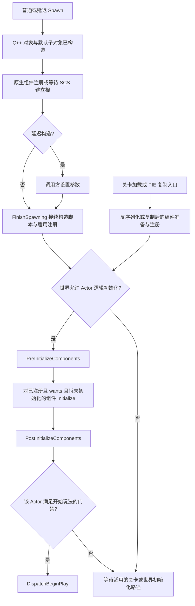
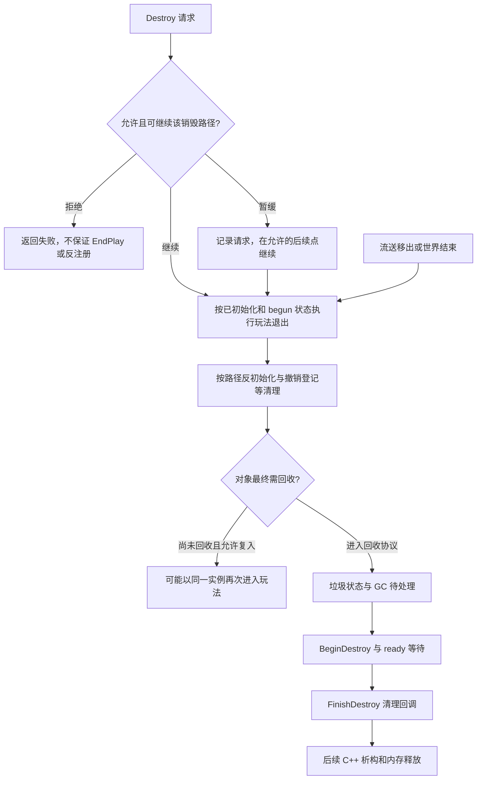
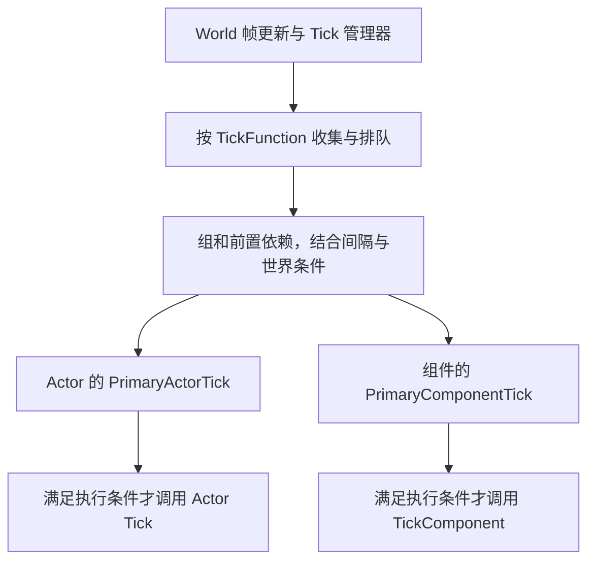
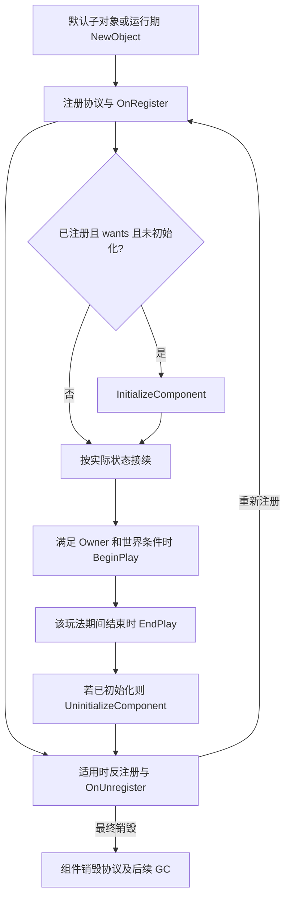

# 02 Actor 与 Component 生命周期
> 知识成熟度：L2。主要承诺是已核对公开资料的使用合同；具体基类函数内部顺序另标为历史片段的条件推导。没有 UE 工程运行证据。

## 一、先问对象现在能做什么

`AActor` 是可放置或生成到关卡中的玩法对象，`UActorComponent` 是它的可复用功能单元；`USceneComponent` 在此基础上增加变换和场景挂接。一个 Actor 可以有多个组件，但“有这个组件”不等于“这个组件已能参与玩法”。初始化、注册、激活和 Tick 各有自己的协议。

例如，一个已构造的逻辑组件可以没有注册；已注册的组件可以选择不执行 `InitializeComponent`；已经 BeginPlay 的组件可以不 Tick。把它们画成一条无条件流水线，会使“日志为什么没出现”“销毁后能否继续访问”得到相反答案。本文先区分这些状态，再比较四种创建入口，最后给出可打点的候选例。

**版本基准**：2026-10-05 核对 Epic 公开文档/API（所读页面主要标为 UE5.8）。旧文自述 UE5.8.0、CL 55116800、分支 `++UE5+Release-5.8`，安装路径 `C:\Program Files\Epic Games\UE_5.8\Engine\Source\Runtime\Engine`；这些是历史来源线索，本次未访问、未认证。旧文 2026-08-05 的版本更新记录不代表本轮运行环境。内部代码保留与定位见[源码篇](03-Actor与Component生命周期源码.md)。UHT、UE 编译/链接、PIE、独立游戏、客户端/专服及私有 CL 对勘均为 **NOT_RUN**。

**最后更新**：2026-10-05。本轮修订覆盖状态条件、四种入口、回调偏序、Tick、销毁与候选例；没有新增工程验证事件。

## 二、七种状态与四种关系

### 2.1 不要拿一个布尔值替代整个生命周期

| 问题 | 对应机制 | 不能据此推出 |
|---|---|---|
| 对象是否已构造？ | UObject 工厂、Actor Spawn 或加载协议 | 有可用的运行时 World；已注册；所有依赖已完成 |
| 组件是否已注册？ | `RegisterComponent`、`IsRegistered`、`OnRegister` | 必须有渲染代理/刚体；物理资源同步完成；已 BeginPlay |
| 是否要求逻辑初始化？ | `bWantsInitializeComponent` | 仅 override `InitializeComponent` 就自动 opt-in |
| 是否已逻辑初始化？ | `HasBeenInitialized`、Initialize/Uninitialize | 每次重新注册都重新初始化；所有其他组件已初始化 |
| 是否已进入玩法？ | Actor/Component 各自的 BeginPlay 状态 | 已永久活到会话末尾；之后不会 EndPlay/复入 |
| 是否 active？ | Activate/Deactivate、`bAutoActivate` | 与注册、可见性、碰撞、Tick 是同一个开关 |
| 主 Tick 能否执行？ | capability、登记、enable、组/依赖/间隔及世界条件 | `bCanEverTick=true` 就每帧调用 |

`OnRegister` 也可能在编辑器、重建或重新注册路径发生。把“只做一次”的全局委托绑定放进去而不配套撤销，会产生重复回调。相反，仅为一个玩法期间建立的 Timer 或订阅，应围绕该玩法期间管理。

### 2.2 Outer、Owner、组件登记和场景挂接分别是什么

- **UObject Outer**：命名和归属上下文；`NewObject<Component>(Actor)` 不建立任意 UObject 都适用的强父销子规则
- **Actor Owner**：Actor 间的拥有者关系，涉及网络等规则；不等同于 Actor 所在的 Level，也不等同于组件的场景父节点
- **Actor 的组件登记**：`OwnedComponents` 及相关集合帮助枚举、分类和推进组件协议；`RegisterComponent` 的公开合同包括必要时加入所属 Actor 的组件数组
- **Scene attachment**：场景组件之间的变换层级；`SetupAttachment` 不替代注册，也不证明双方 Tick 同组或 GC 强持有关系

保活必须看可达 owner 的受追踪强字段或明确引用报告；弱引用用于观察。强字段不会取消 Actor 的显式 `Destroy` 协议。[UObject 创建与引用合同](01-UObject与反射系统.md)、[RegisterComponent](https://dev.epicgames.com/documentation/en-us/unreal-engine/API/Runtime/Engine/UActorComponent/RegisterComponent)

## 三、原理详解

### 3.1 四种入口：构造、注册、逻辑初始化不是同一步

下面是职责图，省略失败/复制/编辑器分支；箭头表示满足旁注条件后的推进，不是所有对象共用的调用栈。



| 入口 | 已经发生什么 | 后续关键条件与易错点 |
|---|---|---|
| 运行中普通 `SpawnActor` | C++ 构造、默认子对象创建，接续 Actor 构造/组装流程 | 原生根存在与蓝图 SCS 建根的注册时点不同。正常情况下可能在 Spawn 返回前进入 BeginPlay；生成可失败，不能先假定返回有效 |
| `SpawnActorDeferred` 或延迟构造参数 | C++ 对象已经存在，尚未完成后续构造脚本/组装 | 在 `FinishSpawning` 前填好构造与 BeginPlay 要读的参数；该调用可能同步推进至 BeginPlay。它不是“延迟 C++ 构造” |
| 磁盘关卡加载 / PIE 场景复制 | 分别经过加载或复制的对象路径，不是重新走每个普通 Spawn 钩子 | 组件准备后经关卡初始化推进；`PostLoad` 与生成侧 `PostActorCreated` 是不同入口。世界、网络和 ChildActor 条件仍有效 |
| 运行中动态新增组件 | `NewObject` 只解决组件对象创建 | 设置属性、选择合适 Owner/场景挂接，再调用注册接口。Owner 已初始化或已 BeginPlay 时可补相应阶段；不是重新播放整个 Actor 生命周期 |

公开 [Actor Lifecycle](https://dev.epicgames.com/documentation/en-us/unreal-engine/unreal-engine-actor-lifecycle) 区分加载、编辑器复制、普通与延迟生成；[AActor API](https://dev.epicgames.com/documentation/en-us/unreal-engine/API/Runtime/Engine/AActor) 还列明原生/蓝图组件注册的差异。构造函数会用于 CDO 和多种实例创建情境，适合设置默认值与 `CreateDefaultSubobject`；即使 `GetWorld()` 非空，也不保证运行期服务已经可用。

**初始化最小反例**：设组件注册状态 R=true、意愿 W=false、已初始化 I=false。所存 `InitializeComponents` 的调用条件为 `R && W && !I`，结果是 false。只写 override 不改变 W。改成 W=true 且其余条件保持，才会进入回调；正常转发 Super 才完成基类状态维护。R=false 时也不会调用，I=true 时不会重复调用。[InitializeComponent 的注册/opt-in 前提](https://dev.epicgames.com/documentation/en-us/unreal-engine/API/Runtime/Engine/UActorComponent/InitializeComponent)

这并不等于 W=false 的组件永远不能 BeginPlay。初始化是 opt-in 协议；BeginPlay 有自己的筛选。`PostInitializeComponents` 也不宣布所有现在和未来的组件均已注册：`bAutoRegister=false`、稍后添加的组件、尚未完成的外部异步资源都必须单独处理。

**世界布尔值不是全部门禁**：历史 `PostActorConstruction` 中还检查初始复制、ChildActor 父状态、编辑器预览等；其中开始条件包含 `BeginPlayCallDepth > 0 || World->HasBegunPlay()`。因此在 Actor A 的 BeginPlay 里生成 B 时，即使世界标志尚未最后置位，也可能由调用深度左项推进 B。这个结论来自[源码篇 AS-H04](03-Actor与Component生命周期源码.md#as-h04) 的字面条件，未作该 CL 实测。

### 3.2 BeginPlay 与 EndPlay：先说清“Actor”指哪一层

派生 C++ 的 `BeginPlay`、`Super::BeginPlay` 进入的基类实现、蓝图 `ReceiveBeginPlay` 和组件回调不是同一个时刻。Epic 的[原生/蓝图回调说明](https://issues.unrealengine.com/issue/UE-10138) 说明 Super 内调用 Receive；以下更细的组件顺序来自所存 [AS-H12](03-Actor与Component生命周期源码.md#as-h12) / [AS-H32](03-Actor与Component生命周期源码.md#as-h32)，仅对正常进入这些基类分支并转发 Super 的情况成立。

| 观察点 | 正常局部关系 | 不能推广成 |
|---|---|---|
| 派生 Actor BeginPlay 的 Super 前 | 用户逻辑先运行，然后进入 AActor 基类 | 组件已经开始；蓝图已经收到 Receive |
| AActor 基类 BeginPlay 内 | 设置寿命、尝试登记 Actor Tick；遍历已注册且尚未 begun 的组件，登记其 Tick 并调用 BeginPlay；然后调用 Actor `ReceiveBeginPlay` | 所有未注册/未来组件都完成；某两个组件或 Actor 的固定全局顺序 |
| 派生 Actor BeginPlay 的 Super 后 | 上述基类步骤已返回，所存正常路径中 Actor 已置 begun | 把这一条日志当作 C++ override 的入口时间 |
| 派生 Actor EndPlay 的 Super 前 | 用户清理逻辑先运行，随后进入 AActor 基类 | 组件已退出玩法 |
| AActor 基类 EndPlay 内 | 将 Actor 状态改为未 begun，Actor `ReceiveEndPlay` / `OnEndPlay`，随后给已 begun 的组件派发 EndPlay | Begin 全流程的机械倒放 |
| 派生 Actor EndPlay 的 Super 后 | 基类组件回调已返回；RouteEndPlay 后续还可反初始化组件 | 所有资源和内存已经释放 |

不要省略 Super 来人为获得某个顺序；这样可能使注册、状态、蓝图或组件协议根本没完成。`ensure` 是诊断机制，也不能被写成所有构建都必然终止的断言保证。跨 Actor 依赖应使用明确的初始化/就绪协议；“在我这一次日志里 A 先出现”不是契约。

下面将**销毁请求**和**退出玩法**分开，GC 另画一层。EndPlay 也可以由切图、停止 PIE、退出或关卡从世界移除触发，不只来自 Destroy。



`Destroy` 返回 true 表达成功或已经标记的调用者合同，false 表达不能销毁；它是 latent 销毁，不能据返回时刻承诺所有 EndPlay/反注册均已发生，也不能据 true 认为内存立刻释放。[AActor::Destroy](https://dev.epicgames.com/documentation/en-us/unreal-engine/API/Runtime/Engine/AActor/Destroy)

业务通常应在成功请求后停止把目标当普通玩法对象使用；若被拒绝，则按业务需求处理失败，不假装已经移除。从未 BeginPlay 的创建失败对象不一定走同样的 EndPlay，因此构造/注册阶段建立的资源还要在对应阶段撤销。不要手工 `delete` UObject。

### 3.3 Tick：能力、登记、启用和本帧执行



这是调度职责图，没有假设 `ULevel::Tick` 是必经中间函数，也没有把组件放进 Actor 主 Tick 的内部。Actor 和组件可以使用不同 TickGroup，场景 attachment 与 OwnedComponents 都不能替代显式 Tick 依赖。[Actor Ticking](https://dev.epicgames.com/documentation/en-us/unreal-engine/actor-ticking-in-unreal-engine)

| 层 | 要检查什么 | 常见反例 |
|---|---|---|
| 能力 | `bCanEverTick` | false 时只改 enable 不会补出主 Tick 能力 |
| 调用入口 | Actor 包装器 `bTickFunctionsRegistered`（本文记 Q）等门禁 | 重复请求同一包装状态可能不再进入内部注册函数 |
| 实际登记 | `PrimaryActorTick.IsTickFunctionRegistered()`（记 R） | 包装器 Q=true，不代表 R=true；能力或 DedicatedServer 门禁可阻止实际登记 |
| 启用状态 | `IsTickFunctionEnabled`、`SetActorTickEnabled` / `SetComponentTickEnabled` | 已登记也可 disabled；enabled 也未必已登记 |
| 调度 | 世界/暂停、DS 许可、TickInterval、组/依赖、本帧执行路径 | R=true 且 enabled=true，间隔未到仍不执行 |

`bStartWithTickEnabled` 是初始启用意愿。历史 Actor 注册函数在**真正到达表达式时**用 S OR E 计算 enable，S 为该意愿，E 为此时当前 enabled。并非“永远保留当前禁用”。

| S | E | S OR E |
|---:|---:|---:|
| 0 | 0 | 0 |
| 0 | 1 | 1 |
| 1 | 0 | 1 |
| 1 | 1 | 1 |

如果 Q 已为 true，重复请求 true 可能是 no-op，E 不变；这不反驳第三行。先经正常注销使包装器允许再次注册，且满足能力等条件，才会重新算表达式，S=1、E=0 会得到 1。底层仍可能因 DS 条件不登记，所以 enable=1 又不能证明 R=1。完整纸面追踪见[源码篇 Tick 条件](03-Actor与Component生命周期源码.md#五tick先证实入口再计算状态)。公开 [FTickFunction](https://dev.epicgames.com/documentation/en-us/unreal-engine/API/Runtime/Engine/FTickFunction) 支持各配置职责，具体 OR 实现仅来自历史块，不是公开 API 对私有 CL 的认证。

选择组时，`TG_PrePhysics` 适合产生物理前输入，`TG_DuringPhysics` 的代码不能假设本帧物理结果已经完成，`TG_PostPhysics` 适合需要本帧物理结果的工作，`TG_PostUpdateWork` 更晚。这里是工作意图，不是某组件类的默认组清单。前置依赖用 `AddTickPrerequisiteActor` / `AddTickPrerequisiteComponent` 表达“本 Tick 等目标”，可能让实际执行推后。不要建依赖环。

`TickInterval=0.1f` 表达约每 0.1 秒的调度间隔，不是硬实时 10Hz 保证；暂停 Tick 还有能力限制。`bTickEvenWhenPaused` 不能概括整个暂停系统，时间膨胀也不是对一切 Timer/异步工作的统一时钟。需要时分别记录游戏时间、实际时间、NetMode、frame 和真正执行点；本文没有认证完整暂停或物理子步路径。

### 3.4 Component 生命周期：哪些动作可以重复



图不要求所有对象走完每个框。初始化、玩法和注册可以在不同入口里接续；一个反注册/重注册动作本身不等于重做所有 Initialize/BeginPlay。激活是另一轴，不画成必经清理步骤。

`RegisterComponent` 建立适用的世界状态，通常包括注册事件及需要的渲染/物理状态，但非图元组件不必有 SceneProxy，物理状态也有条件和延后路径。`OnRegister` 可以在编辑器触发，不是“所有玩法服务和资源都已可用”的通知。[RegisterComponent API](https://dev.epicgames.com/documentation/en-us/unreal-engine/API/Runtime/Engine/UActorComponent/RegisterComponent)

运行期动态组件通常按“用有效 Actor 作为合适的创建上下文 → 设置属性 → 场景组件设置挂接 → 注册”推进。所存代码将非游戏世界、游戏世界无 Owner、游戏世界有 Owner 分支分开；最后一种转给 `HandleRegisterComponentWithWorld`，本文没有它的完整实现，不能补造一条无条件全链。公开 [Component BeginPlay](https://dev.epicgames.com/documentation/en-us/unreal-engine/API/Runtime/Engine/UActorComponent/BeginPlay) 支持 Owner 已开始时动态组件后补启动，但网络和 ChildActor 仍可能延迟。

`DestroyComponent` 会按已有状态选择 EndPlay、反初始化、反注册、移出所属集合、销毁通知和垃圾标记。尚未 free 不等于 `IsValid` 仍为 true。对应历史分支见[AS-H34](03-Actor与Component生命周期源码.md#as-h34)。

### 3.5 流送、World Partition 与复入

流送移出世界可触发 `EndPlay(RemovedFromWorld)`。若对象还没被 GC、关卡很快重新加入，可能复用同一 Actor 与原局部状态，再进入一个玩法期间；不能假定一定重新构造或所有字段恢复默认。[Actor Lifecycle 的流送复入说明](https://dev.epicgames.com/documentation/en-us/unreal-engine/unreal-engine-actor-lifecycle)

因此 BeginPlay 建立的订阅/Timer 应和 EndPlay 配对，复入时应按业务决定重置哪些数据。跨单元或跨地图的权威状态，按宿主寿命放入适当的 Subsystem 或 GameInstance；Actor 负责这一轮参与玩法的局部状态。World Partition、Data Layer 的加载、可见性、激活策略不能一律翻译成“每次开关都新建并销毁 Actor”。详见[关卡流送](../世界组织与资源加载/08-关卡流送LevelStreaming.md)、[World Partition](../世界组织与资源加载/09-WorldPartition大世界.md)。

对象最终回收还要经过 BeginDestroy、ready 等待、FinishDestroy 及之后的 C++ 析构/释放。`FinishDestroy` 是清理回调，不是析构函数；不得承诺“下一次 GC 必 free”。Epic 概述仍有旧 PendingKill/下一 GC 的简写，应连同该页复入和 ready 条件阅读，而不能盖过更具体的阶段合同。[FinishDestroy](https://dev.epicgames.com/documentation/en-us/unreal-engine/API/Runtime/CoreUObject/UObject/FinishDestroy)、[GC 源码的阶段说明](02-UObject与垃圾回收源码.md)

## 四、代码示例：打点的位置也是输入

以下四个文件构成**静态闭合的候选例**：声明、定义、直接头文件及 generated include 按示例配齐；`MYGAME_API` 要替换为实际模块导出宏，模块需依赖 Core、CoreUObject、Engine。它们没有经过 UHT、UE 编译或链接，不称“可编译验证通过”。原生类不自带蓝图事件日志；若要观察 Receive，另外创建该 Actor/组件的蓝图子类，在各 Event BeginPlay/EndPlay 中打点。

### 4.1 Actor：区分 Super 前后

```cpp
// MySpawnableActor.h
#pragma once
#include "CoreMinimal.h"
#include "GameFramework/Actor.h"
#include "UObject/ObjectPtr.h"
#include "MySpawnableActor.generated.h"

class USceneComponent;
class UStaticMeshComponent;
class UMyActorComponent;

UCLASS()
class MYGAME_API AMySpawnableActor : public AActor
{
    GENERATED_BODY()
public:
    AMySpawnableActor();
    virtual void PreInitializeComponents() override;
    virtual void PostInitializeComponents() override;
    virtual void BeginPlay() override;
    virtual void EndPlay(const EEndPlayReason::Type Reason) override;
    virtual void Tick(float DeltaSeconds) override;

    UPROPERTY(VisibleAnywhere, BlueprintReadOnly, Category="Components")
    TObjectPtr<USceneComponent> SceneRoot;
    UPROPERTY(VisibleAnywhere, BlueprintReadOnly, Category="Components")
    TObjectPtr<UStaticMeshComponent> MeshComp;
    UPROPERTY(VisibleAnywhere, BlueprintReadOnly, Category="Components")
    TObjectPtr<UMyActorComponent> LogicComp;
};
```

```cpp
// MySpawnableActor.cpp
#include "MySpawnableActor.h"
#include "MyActorComponent.h"
#include "Components/SceneComponent.h"
#include "Components/StaticMeshComponent.h"
#include "Engine/World.h"

DEFINE_LOG_CATEGORY_STATIC(LogActorLife, Log, All);

AMySpawnableActor::AMySpawnableActor()
{
    PrimaryActorTick.bCanEverTick = true;           // 允许登记主 Tick
    PrimaryActorTick.bStartWithTickEnabled = true;  // 本例选择初始启用
    PrimaryActorTick.TickGroup = TG_PrePhysics;    // 本例配置，不是所有类默认值
    SceneRoot = CreateDefaultSubobject<USceneComponent>(TEXT("SceneRoot"));
    SetRootComponent(SceneRoot);
    MeshComp = CreateDefaultSubobject<UStaticMeshComponent>(TEXT("MeshComp"));
    MeshComp->SetupAttachment(SceneRoot);
    LogicComp = CreateDefaultSubobject<UMyActorComponent>(TEXT("LogicComp"));
}

void AMySpawnableActor::PreInitializeComponents()
{
    Super::PreInitializeComponents();
    UE_LOG(LogActorLife, Log, TEXT("%s PreInitialize.after"), *GetPathName());
}

void AMySpawnableActor::PostInitializeComponents()
{
    Super::PostInitializeComponents();
    UE_LOG(LogActorLife, Log, TEXT("%s PostInitialize.after"), *GetPathName());
}

void AMySpawnableActor::BeginPlay()
{
    UE_LOG(LogActorLife, Log, TEXT("%s A.Begin.before begun=%d beginning=%d"),
        *GetPathName(), HasActorBegunPlay(), IsActorBeginningPlay());
    Super::BeginPlay();
    UE_LOG(LogActorLife, Log, TEXT("%s A.Begin.after begun=%d World=%s"),
        *GetPathName(), HasActorBegunPlay(), *GetPathNameSafe(GetWorld()));
}

void AMySpawnableActor::EndPlay(const EEndPlayReason::Type Reason)
{
    UE_LOG(LogActorLife, Log, TEXT("%s A.End.before reason=%d begun=%d"),
        *GetPathName(), static_cast<int32>(Reason), HasActorBegunPlay());
    Super::EndPlay(Reason);
    UE_LOG(LogActorLife, Log, TEXT("%s A.End.after begun=%d"),
        *GetPathName(), HasActorBegunPlay());
}

void AMySpawnableActor::Tick(float DeltaSeconds)
{
    Super::Tick(DeltaSeconds);
    // 只在调度器实际调用时执行本例的帧逻辑。
}
```

`SceneRoot`/`MeshComp`/`LogicComp` 放在反射强字段中，须连同 owner 的可达路径理解；它们不是 `Outer` 万能保活的证明。`GetPathName` 有助于区分 PIE/实例；正式实验还需记录 frame、thread、NetMode 和弱身份，不能只比较显示名。

### 4.2 Component：opt-in 与 Timer 配对

```cpp
// MyActorComponent.h
#pragma once
#include "CoreMinimal.h"
#include "Components/ActorComponent.h"
#include "TimerManager.h"
#include "MyActorComponent.generated.h"

UCLASS(Blueprintable, ClassGroup=(Custom), meta=(BlueprintSpawnableComponent))
class MYGAME_API UMyActorComponent : public UActorComponent
{
    GENERATED_BODY()
public:
    UMyActorComponent();
    virtual void OnRegister() override;
    virtual void InitializeComponent() override;
    virtual void BeginPlay() override;
    virtual void TickComponent(float DeltaTime, ELevelTick TickType,
        FActorComponentTickFunction* ThisTickFunction) override;
    virtual void EndPlay(const EEndPlayReason::Type Reason) override;
    virtual void UninitializeComponent() override;
    virtual void OnUnregister() override;

    UPROPERTY(EditAnywhere, BlueprintReadWrite, Category="Logic")
    float Interval = 1.0f;
    UFUNCTION(BlueprintCallable, Category="Logic")
    void RestartTimer();
private:
    bool bTimerStartsAllowed = false; // 本例的玩法期间意愿，独立于引擎 begun 状态
    FTimerHandle TimerHandle;
    void OnIntervalElapsed();
};
```

```cpp
// MyActorComponent.cpp
#include "MyActorComponent.h"
#include "Engine/World.h"
#include "TimerManager.h"

DEFINE_LOG_CATEGORY_STATIC(LogCompLife, Log, All);

UMyActorComponent::UMyActorComponent()
{
    bWantsInitializeComponent = true; // override 之外，明确要求逻辑初始化
    PrimaryComponentTick.bCanEverTick = false; // 本例只需 Timer
    PrimaryComponentTick.bStartWithTickEnabled = false;
}

void UMyActorComponent::OnRegister()
{
    Super::OnRegister();
    UE_LOG(LogCompLife, Log, TEXT("%s OnRegister registered=%d"),
        *GetPathName(), IsRegistered());
}

void UMyActorComponent::InitializeComponent()
{
    Super::InitializeComponent();
    UE_LOG(LogCompLife, Log, TEXT("%s Initialize initialized=%d"),
        *GetPathName(), HasBeenInitialized());
}

void UMyActorComponent::BeginPlay()
{
    bTimerStartsAllowed = true; // 同实例复入时重新开放；RestartTimer 还会检查 begun
    UE_LOG(LogCompLife, Log, TEXT("%s C.Begin.before"), *GetPathName());
    Super::BeginPlay();
    RestartTimer();
    UE_LOG(LogCompLife, Log, TEXT("%s C.Begin.after"), *GetPathName());
}

void UMyActorComponent::TickComponent(float DeltaTime, ELevelTick TickType,
    FActorComponentTickFunction* ThisTickFunction)
{
    Super::TickComponent(DeltaTime, TickType, ThisTickFunction);
    // 本例未启用主 Tick。要实验 Tick，另配置能力、登记与启用条件。
}

void UMyActorComponent::EndPlay(const EEndPlayReason::Type Reason)
{
    bTimerStartsAllowed = false; // 先关闭业务启动入口，再允许任何蓝图/委托回调
    UE_LOG(LogCompLife, Log, TEXT("%s C.End.before reason=%d"),
        *GetPathName(), static_cast<int32>(Reason));
    if (UWorld* World = GetWorld())
    {
        World->GetTimerManager().ClearTimer(TimerHandle);
    }
    TimerHandle.Invalidate();
    Super::EndPlay(Reason);
    UE_LOG(LogCompLife, Log, TEXT("%s C.End.after"), *GetPathName());
}

void UMyActorComponent::UninitializeComponent()
{
    Super::UninitializeComponent();
    UE_LOG(LogCompLife, Log, TEXT("%s Uninitialize"), *GetPathName());
}

void UMyActorComponent::OnUnregister()
{
    Super::OnUnregister();
    UE_LOG(LogCompLife, Log, TEXT("%s OnUnregister"), *GetPathName());
}

void UMyActorComponent::RestartTimer()
{
    if (UWorld* World = GetWorld())
    {
        World->GetTimerManager().ClearTimer(TimerHandle);
        if (bTimerStartsAllowed && HasBegunPlay() && Interval > 0.0f)
        {
            World->GetTimerManager().SetTimer(TimerHandle, this,
                &UMyActorComponent::OnIntervalElapsed, Interval, true);
        }
    }
}

void UMyActorComponent::OnIntervalElapsed()
{
    UE_LOG(LogCompLife, Log, TEXT("%s Timer elapsed"), *GetPathName());
}
```

正/负控制：其他条件相同，分别将构造函数的 `bWantsInitializeComponent` 设 true/false。前者在已注册且未初始化的适用路径应记录 Initialize，后者不应期待该记录；两者都可能有 OnRegister/BeginPlay。该预期是纸面推导，**未运行**。另一次反注册/重注册实验应单独记录，不应把重复 OnRegister 当作重复逻辑初始化的证明。

另一个纸面负例：组件蓝图的 Event EndPlay 调用公开 `RestartTimer()`。历史组件基类在 ReceiveEndPlay 之后才复位 begun，因此只用 `HasBegunPlay()` 不能阻止该重入；先清 Timer 再调用 Super 也可能被回调重新启动。本例在 EndPlay 入口先将 `bTimerStartsAllowed=false`，Restart 同时检查业务意愿与 begun，所以回调只能清理，不能新建 Timer。BeginPlay 入口再开放意愿，允许同实例下个玩法期间接续；即使 Begin 的 Super 内发生退出，也不会在 Super 后无条件重新开放。这个负例与蓝图运行均 **NOT_RUN**。

Timer 由 TimerManager 调度，不依赖本组件主 Tick 已启用。这里仅在 BeginPlay 后创建 Timer，故在 EndPlay 清理与建立点成对；若业务改为注册时启动、允许无 Owner 或跨 World 迁移，就需要重新设计与实际管理器对应的撤销点，不能照搬这份玩法期间示例。

### 4.3 生成与请求销毁：方法体片段

下例是已有 Actor 方法体中的片段，直接依赖 `Engine/World.h` 和上面的 `MySpawnableActor.h`；不是独立翻译单元，也未运行。立刻请求销毁只为演示返回值处理，不是推荐的业务流程。

```cpp
if (UWorld* World = GetWorld())
{
    FActorSpawnParameters Params;
    Params.SpawnCollisionHandlingOverride =
        ESpawnActorCollisionHandlingMethod::AdjustIfPossibleButAlwaysSpawn;
    AMySpawnableActor* NewActor = World->SpawnActor<AMySpawnableActor>(
        AMySpawnableActor::StaticClass(), FVector(0, 0, 100),
        FRotator::ZeroRotator, Params);
    if (IsValid(NewActor)) // 来自这次工厂返回值，不是任意旧地址
    {
        const bool bAccepted = NewActor->Destroy();
        if (!bAccepted)
        {
            UE_LOG(LogTemp, Warning, TEXT("Destroy request was rejected"));
        }
        // 无论接受与否，本示例到此结束借用，不继续访问 NewActor。
    }
}
```

停 Actor Tick 不会一并取消组件 Tick、Timer、委托、网络回调或异步任务，因此没有“销毁前先停 Tick 就普遍安全”的步骤。清理应由每个资源的建立者完成，异步回调还要使用合法弱身份、业务有效期和正确线程协议。

### 4.4 蓝图与日志怎么对照

蓝图 Event BeginPlay/EndPlay 对应 Receive 这一层，不是派生 C++ override 的入口。给本例 Actor 派生蓝图及组件派生蓝图的事件打 `BP.Begin` / `BP.End` 标签。组件声明显式加 `Blueprintable` 才允许作为蓝图基类，`BlueprintSpawnableComponent` 只负责可由蓝图生成的用途，二者不同。创建组件蓝图资产后，还要在测试 Actor 蓝图中实际添加该组件蓝图类的实例（例如命名 `BPLogicProbe`），并在场景中放置或生成这个 Actor 蓝图。仅创建资产不会替换构造函数里 `CreateDefaultSubobject<UMyActorComponent>` 创建的原生 `LogicComp`；本例可让二者同时存在，用对象路径/不同名称区分各自日志。然后再和 `A.Begin.before/after`、`C.Begin.before/after` 对照，才能检查 §3.2 的偏序。蓝图添加组件节点可能包含模板、挂接、注册等额外步骤，不能把每种节点都当作字面相同的 `NewObject + RegisterComponent`。

上述类标注依据：[Class Specifiers](https://dev.epicgames.com/documentation/en-us/unreal-engine/class-specifiers)、[UActorComponent 声明](https://dev.epicgames.com/documentation/en-us/unreal-engine/API/Runtime/Engine/UActorComponent)。这一步是待运行测试配置，不是本轮创建过蓝图资产。

Tick 的 Details 默认值可能被类、CDO/蓝图覆盖；要看目标实例配置，不应把“勾一个选项”当成四层条件都已满足。复现实验时分别测普通 Spawn、延迟 Spawn、关卡放置和 BeginPlay 后动态组件。

## 五、实践与排查

1. 默认数据与默认子对象放构造路径；依赖组件状态的逻辑放适用初始化钩子；玩法期间的资源在进入/退出玩法时配对管理
2. 每个回调写清依赖哪一层状态，不默认其他 Actor 已就绪。需要全员完成时设计收集/确认协议，并考虑迟到 Actor 与流送复入
3. 无连续工作就不启用主 Tick；需要动态开关时区分能力与 enable。Timer、事件和异步回调各有自己的成本与清理责任
4. 存档策略由业务的数据损失风险决定，`EEndPlayReason` 提供原因输入；不能写成某个原因必存、Quit 必不存的引擎规则
5. 日志保留 Super 前后、对象路径、world/NetMode、frame/thread 和输入。先确认 UHT/编译，再收集原始日志；日志类别/CVar/命令的存在和默认值需要在目标版本查证
6. `IsValid` 只用于来源合法的指针；旧悬垂裸地址不能拿来试探。`TWeakObjectPtr::Get()` 失效时返回空，但解析后也不授予无限使用期或任意线程访问权

## 六、常见问题 FAQ

### Q1：Spawn 后为什么没有 BeginPlay？

先确认生成成功、是否延迟构造未完成、世界是否允许逻辑初始化，再检查初始复制、ChildActor、编辑器预览和派发状态。`World->HasBegunPlay()` 只是一个条件；嵌套生成有调用深度分支，不能只看这个布尔值诊断所有路径。

### Q2：Destroy 后非空指针还能用吗？

非空不证明可用，尚未 free 也不证明可以继续玩法。检查 Destroy 返回值并遵守销毁协议；不要用强字段试图阻止显式销毁，也不要对可能已释放的裸地址调用 `IsValid`。长期观察用合法弱身份并处理业务已退出状态。

### Q3：Tick 为什么不执行？

分别查 capability、实际 TickFunction 登记、enable、DS/世界/暂停条件、interval、组和依赖；组件还需满足自身注册协议。Actor 包装器 Q 不是实际登记 R，组件和 Actor 也各有主 Tick。

### Q4：BeginPlay 里能无条件使用任意组件吗？

不能。已注册、opt-in 初始化、begun 和外部资源就绪分别检查；`bAutoRegister=false` 及之后才创建的组件是直接反例。你的组件接口也应明确调用前提，别把 Actor 的一个回调当作所有依赖的屏障。

### Q5：究竟是 Actor 先还是组件先？

先标出四个身份。正常历史基类 BeginPlay 在派生 Super 内先处理适用组件，再 Actor Receive；派生 C++ Super 前代码更早。正常基类 EndPlay 则先 Actor Receive/OnEndPlay，再适用组件，派生 Super 后代码更晚。见 §3.2，不能缩成一句无条件全序。

### Q6：为什么构造函数不宜依赖 GetWorld？

构造用于 CDO 和不同实例路径，不保证运行时上下文/服务已初始化；并非“所有构造都是 CDO”或“Actor 的 Outer 一定直接是 UWorld”。默认数据在构造设置，运行期依赖移到合适钩子并检查状态。

### Q7：流送重进一定获得新 Actor 吗？

不一定。RemovedFromWorld 后未 GC 的对象可能复入并保留局部值。Begin/End 应按玩法期间配对，跨期间保留/重置字段要显式决定，不能靠假设重新构造完成重置。

### Q8：动态组件什么时候销毁？

需要结束组件寿命时使用 `DestroyComponent`，它按已有状态执行退出、反初始化和反注册等步骤；只是暂时退出世界状态则要用合适注册协议。两者都不是业务直接调用 C++ 析构或 free。

### Q9：TickInterval 与 TickGroup 可以一起用吗？

可以，间隔影响何时到期，组与依赖影响该帧内何时能执行；既不保证精确频率，也不保证两个同组对象的固定相邻次序。角色/插值类组件降频需单独验证玩法效果。

### Q10：如何验证这些结论？

先构建候选例，再分别收集普通/延迟 Spawn、关卡加载、动态组件、opt-in true/false、Super 前后、注销重注册、BeginPlay 内 Destroy、流送快卸快载的原始日志；PIE、独立运行、专服与客户端分别记录。本文这些工程实验均 **NOT_RUN**，Python/文本检查不代替它们。

## 七、关联阅读与来源

- [Actor 与 Component 生命周期源码](03-Actor与Component生命周期源码.md)：历史材料身份、局部控制流及未展示函数的追踪缺口
- [UObject 与反射系统](01-UObject与反射系统.md)、[UObject 与垃圾回收源码](02-UObject与垃圾回收源码.md)：Outer、强弱引用与 GC 阶段
- [World 关卡与 Subsystem 体系](../世界组织与资源加载/07-World关卡与Subsystem体系.md)：服务宿主、前置启动钩子和生命周期选择
- [Gameplay 框架与游戏模式](../模块化框架与对象通信/03-Gameplay框架与游戏模式.md)、[引擎启动流程与模块架构](../运行架构与任务调度/04-引擎启动流程与模块架构.md)：框架对象和世界启动上下文
- 源码追踪入口：`Engine/Source/Runtime/Engine/Private/Actor.cpp`、`Private/Components/ActorComponent.cpp`、`Private/LevelActor.cpp`、`Private/Level.cpp`、`Private/World.cpp`、`Private/LevelTick.cpp`。这是待目标 checkout 核对的路径线索，本次没有运行路径存在性或 CL 对勘
