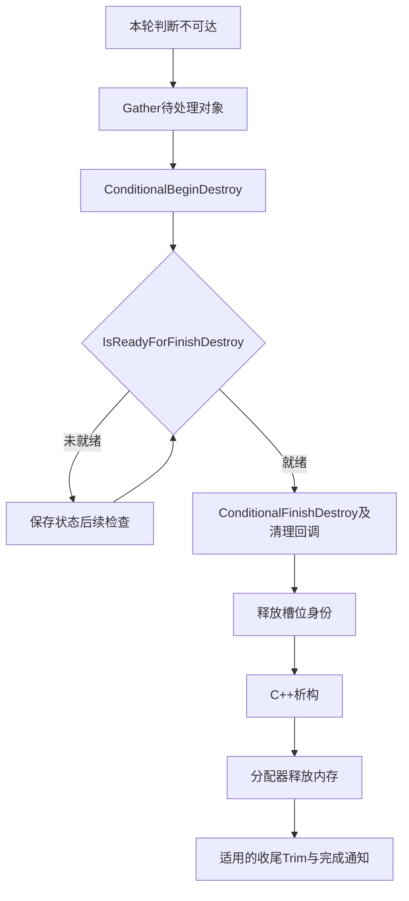

# UE 引擎源码分析 02：UObject 与垃圾回收源码剖析

> 知识成熟度：L1。本文的主要承诺是解释对象槽位、引用扫描描述和分批清理的不变量；内部函数材料来自既有文档的历史节选，未与其所称私有 checkout 对勘。旧标 L2 曾宣称“全面补齐真实源码”，证据不足，本次按主要内部算法承诺调整。公开API核对与标准语言模型分别记录，不替整篇认证。
> 使用前置：[UObject 与反射系统](01-UObject与反射系统.md)；元数据前置：[UPROPERTY 与反射源码](01-UPROPERTY与反射系统源码.md)。

- **版本基准**：2026-10-05 核对的Epic公开UE5.8标签文档；历史私有CL仅作待复核线索，不代表当前环境
- **最后更新**：2026-10-05，重写教学合同、条件化推导与证据边界

## 一、阅读合同：读到了什么，能推出什么

本次更新日为 2026-10-05。旧文自述 UE 5.8.0 / CL 55116800 / `++UE5+Release-5.8`；这一身份与旧行号保留为历史线索。实际核对对象是学习仓库中的文档、Epic公开文档（页面标签 UE 5.8）和已有普通 C++/Python 模型。未访问 UE 私有源码、Build.version、UHT 输出，也未运行引擎、PIE、真实 GC 或性能基准。

后文把证据分三层：

1. **公开使用合同**：强弱引用、实验性增量可达性、写屏障、清理回调与检查宏的文档语义
2. **节选的字面推导**：若所存代码按其所示执行，某条分支会怎样移动游标、修改哪个槽位、何时允许进入第二趟。即使来源身份待核，算术与控制流仍可检验
3. **标准模型观察**：普通数组/结构体/整数的结果，只验证限定模型，不代表 UE ABI、并发、回收时序或性能

历史代码集中在篇后，正文通过 `GC-Bxx` 标识引用；45个引擎围栏均保留原字节。某块有截断或原注释不准确时，不填造“真实实现”，而是限定它能回答的问题。本文没有新增 `verified` 事件。

## 二、先分开三个容易混淆的数据结构

| 结构 | 保存什么 | 它不回答什么 |
|---|---|---|
| 全局对象槽位表 | 对象身份索引、对象地址、序列号和内部状态 | 登记对象不等于使它成为根；槽位表不是完整引用图 |
| 类/结构的引用 schema | 如何从实例中找到需要处理的引用位置或回调 | 描述不是每个实例当前引用值的拷贝 |
| 可达性工作队列与清理状态 | 哪些对象还要扫描、哪些阶段做到哪里 | 队列名字不能替代跨时间片正确性协议 |

同类实例 A.Target=X、B.Target=Y 可以共享一份“Target在偏移 o”的描述；扫描 A 时必须以 A 为基址，扫描 B 时换成 B。`FProperty` 自身引用一个目标类型 `UClass` 是描述层的边；实例引用 X/Y 是值层的边。把类型描述的 `ScriptAndPropertyObjectReferences` 误当所有实例字段值表，就无法解释 A 改值后 B 为什么不变。

GC通常从受认可的根和显式引用报告出发，沿强边传播可达性。可达owner中的反射USTRUCT值可以继续暴露嵌套强引用；结构体不是独立GC节点。弱/软属性以及 `BindUObject` 弱绑定不会仅因出现在描述中而保活；没有宏的成员也可能通过其他显式机制报告。完整路径的正反例见基础篇。[Object Pointers](https://dev.epicgames.com/documentation/en-us/unreal-engine/object-pointers-in-unreal-engine)

## 三、对象身份先登记，生命周期不能套普通 delete

### 3.1 三层类是职责分工，不是“没有虚函数的快层”

- `UObjectBase` 保存身份和基础状态，包含 `InternalIndex`、`ObjectFlags`、类、名字与 Outer 等；不能漏掉 ObjectFlags 后再说“仅有四字段”
- `UObjectBaseUtility` 提供对象查询和状态/集群等工具；公开API仍列有 `CanBeClusterRoot`、`CanBeInCluster`、`CreateCluster`、`GetVersePath` 等虚方法
- `UObject` 提供更完整的反射、序列化与生命周期行为；这不意味着前两层没有虚函数，公开 UObjectBase 也列有虚析构等接口

依据：[UObjectBaseUtility 的 Public Virtual](https://dev.epicgames.com/documentation/unreal-engine/API/Runtime/CoreUObject/UObjectBaseUtility?lang=en-US)、[UObjectBase](https://dev.epicgames.com/documentation/en-us/unreal-engine/API/Runtime/CoreUObject/UObjectBase)。本轮撤回把 GetWorld 定位到 BaseUtility 的说法；公开页面未列某符号不能证明该私有 CL 已删除它。

C++允许构造/析构期间的虚调用，其派发不进入尚未构造或已析构的更派生部分；纯虚调用还有单独限制。“不调虚函数”既不是构造合法性的全部条件，也不能保证没有其他未定义行为。UE构造时不应假定世界/网络服务可用，是对象初始化协议的问题。[C++构造期虚调用](https://eel.is/c%2B%2Bdraft/class.cdtor#4)、[纯虚调用边界](https://eel.is/c%2B%2Bdraft/class.abstract#6)

### 3.2 NewObject 片段里的真实因果顺序

[GC-B03](#gc-b03) 保存 `StaticConstructObject_Internal` 记录。依该片段：取创建参数→分配/复用对象→仅当未复用时调用类构造函数→解开重建守卫→处理适用的编辑器事务和通知→返回对象。

重要的分支是 `!bRecycledSubobject`：已经存在而未销毁的子对象不会再走同一构造步骤。守卫的 `Unlock` 放在构造之后，表达保护半成品的意图；片段没有给出守卫完整实现，不能据一个名字证明全部并发安全。

该函数体没有直接出现 `PostInitProperties()`，只说明此片段未直接调用；需要继续追 `FObjectInitializer` 等路径才能认证确切时序，不据它宣称某旧版本“在这里手调过”。新建、磁盘加载与默认子对象构造必须分开。业务入口按对象类别选择 NewObject、SpawnActor 或默认子对象接口，Outer也不自动成为任意UObject的父销子协议。

## 四、槽位：地址、编号和序列号为何要分开

### 4.1 先算字段下界，再谈 packing 收益

[GC-B06](#gc-b06) 的声明把 `FlagsAndRefCount`、指针部分、`SerialNumber`、`ClusterRootIndex` 分开。按其 packed 分支的固定宽度类型，独立字段已经是：

| 字段组 | 所示存储字节 |
|---|---:|
| `int64 FlagsAndRefCount` | 8 |
| `uint32 ObjectPtrLow` | 4 |
| `int32 SerialNumber` | 4 |
| `int32 ClusterRootIndex` | 4 |
| 未算填充/其他条件成员的合计 | 20 |

按所存声明前的注释，`FlagsAndRefCount`低32位放RefCount，高32位放内部flags（packing时还容纳指针高位载荷）。把它们放入同一64位存储的局部设计意图，是让引用计数更新与“根标志＋引用计数”的联合观察相配合；它不等于每个对象都靠普通引用计数决定存亡，也不凭这段注释证明整个GC的无锁或并发正确性。

因此原来的“16压到12字节”不可能从本段声明推出。真实 `sizeof` 还需要宏取值、指针对齐、padding、RemoteId、统计字段和编译器/平台。普通x86_64模型中packed与unpacked都可为24字节；这也不证明真实UE打包收益为零。字段载荷减少与最终类型大小减少不是同一结论。

### 4.2 两套位坐标：指针高位存到 flag word 低位

按旧注释的假设，指针先利用8字节对齐去掉3个必零位；剩余45位载荷可分为低32位和高13位。这里是**移位后指针的坐标**，不是说取原地址低32位再另外随意挪动。

`FlagsAndRefCount` 的高32位字承担 flags，并在空闲位塞指针载荷。若 `MinFlagBit=14`：

- `FlagsMask = 0xFFFFC000`，覆盖这个32位flag word的位14..31
- `PtrMask = ~FlagsMask = 0x00003FFF`，覆盖该word的位0..13
- 原指针的高13位载荷放在 **PtrMask覆盖的区域内**，不能写“PtrMask之外”
- PtrMask在此假设下有14位，而载荷只需要13位；掩码容量与实际载荷宽度不能混成一个数

这是对声明/注释的无符号32位算术解释；未展示的 `SetObject/GetObject` 才决定准确移位与组合。保留块中“shifted ... to the left”原注释不能替代实现核对，本篇不据此认证打包函数。

### 4.3 分块和槽位复用各解决一个问题

[GC-B10](#gc-b10) 至 [GC-B12](#gc-b12) 给出 `NumElementsPerChunk=64*1024`、除法/取模定位以及追加chunk的代码。它避免扩容时搬迁已有chunk中的槽位；稳定地址消除一种指针失效原因，却不独自保证无锁并发读取。新chunk发布、计数同步、槽位复用与对象释放仍有生命周期和同步协议；`TSAN_ATOMIC` 名字本身不是完整证明。

[GC-B13](#gc-b13) 的索引来源有三支：复用显式旧索引、DisregardForGC范围、常规可用列表/追加。其关键写入顺序是取槽→设置构造状态及当前reachable位→写对象及身份数据→写 `InternalIndex`→再处理可能登记根的初始标志→解锁→通知。

`InitialFlags` 在 `InternalIndex` 之后应用，是因为根登记路径需要有效索引。当前代reachable位与标志交换使用同一对象数组锁，是防止新对象落在错误代状态的必要连接；不能只解释“LIFO快”而漏掉它。

### 4.4 index相同不等于同一个对象

[GC-B14](#gc-b14) 的 `FreeUObjectIndex` 清掉槽位对象、序列号和相关状态，再按条件把索引放回可用表。[GC-B15](#gc-b15) 的 `AllocateSerialNumber` 在没有现成序列号时取候选号，CAS失败则采用已被其他调用者安装的值；计数耗尽走显式失败路径，而不是静默回绕复用旧身份。

纸面输入：旧对象位于index=7，旧弱引用存(7,101)。槽位回收后serial=0，Get不能匹配；后来新对象也分到index=7但serial=102，旧弱引用仍不能匹配。这里失效的是**解析结果**，旧弱指针变量仍可存(7,101)，并不需要逐个清零。

弱引用赋值是按需取得序列号的常见入口，但不能称唯一入口：本段分配函数公开给其他需要稳定身份的路径使用，创建函数还接受SerialNumber参数。没有全调用链与负载统计，就不能断言“绝大多数Actor/CDO终身为0”。弱解析代码还检查对象状态，可能早于槽位清零就返回空，详见[GC-B40](#gc-b40)至[GC-B45](#gc-b45)。

## 五、schema：如何把“描述字段”变成“读取当前实例”

### 5.1 构建阶段与消费阶段

[GC-B21](#gc-b21) 展示 `UClass::AssembleReferenceTokenStreamInternal` 的历史形状：先取得父类schema，遍历当前类的反射属性，调用 `EmitReferenceInfo`，再构建或共享描述。公开 FProperty API 也有接受 `FSchemaBuilder` 的 `EmitReferenceInfo`，支持此职责划分。[FProperty API](https://dev.epicgames.com/documentation/en-us/unreal-engine/API/Runtime/CoreUObject/FProperty)

UHT提供上游反射信息；这里的运行期构建器产生扫描描述。不能把“UHT不直接写这份runtime schema”扩大为“UHT与GC描述完全无关”。

父schema的 `Append` 参与构造候选描述；仅当没有新增相关成员且ARO等条件满足 `bReuseSuper`，才直接使用父 `FSchemaView`，否则调用Build。不能把所有Append说成“不复制/不分配”。`CLASS_TokenStreamAssembled` 表达已组装状态并供递归诊断；标志位不是互斥锁，实际跨线程调用仍需要外层同步。

### 5.2 Header[-1] 是一次按类型回退

[GC-B18](#gc-b18) 中：

`reinterpret_cast<const FSchemaHeader*>(GetWords())[-1].StructStride`

应拆成两步：以Header为元素回退1个，随后读取该Header中的StructStride。地址公式是 `P - sizeof(Header) + offsetof(Header, StructStride)`；返回字段宽4字节，不代表指针只回退4字节。所示Header另有atomic计数，真实布局需绑定构建；标准模型测得Header为8、回退8、字段4，见后文。

`FSchemaView` 的低位标签还要求数据指针对齐保证该位空闲。标签视图、Header存储和后面的成员字是三个概念，不能只说“前一个word”而省略实际类型尺寸假设。

### 5.3 位宽手算：直接偏移和Jump的范围不同

[GC-B19](#gc-b19) 给定 `TypeBits=5`、`OffsetBits=11`，因此 `WordOffset` 范围为0..2047，`OffsetRange=2048`。消费器中的 `InstanceCursor` 是 `uint64*`，以下字长取8字节。

| 输入 | 算式 | 结果 |
|---|---|---:|
| 普通成员最大起始偏移 | 2047×8 | 16376字节 |
| Jump，WordOffset=0 | (0+1)×2048×8 | 16384字节，16KiB |
| Jump，WordOffset=1 | (1+1)×2048×8 | 32768字节，32KiB |
| Jump，WordOffset=2047 | (2047+1)×2048×8 | 33554432字节，32MiB |

`+1` 使最小跳跃为一个OffsetRange，避免零长度Jump；不是“把11位全1保留出来”。普通成员范围是2048个字位置，最大字段**起始**地址是16376；Jump额外乘了一次OffsetRange。任意大对象是否允许、布局是否对齐、构建器能否编码，仍受格式和对象实现约束，不能从可连续Jump推成“任何大小都合法”。

### 5.4 同时跟踪两个游标才不会读错附注

[GC-B20](#gc-b20) 中，`WordIt` 走schema字，`InstanceCursor` 走实例地址；当前Quad先被解包成四个成员。处理某个成员时 `++WordIt` 消费的是附注字，不是在解包数组中多跳一个成员。

| 类型 | 对实例/回调的动作 | 是否消费下一个schema字 | 是否终止 |
|---|---|---|---|
| Reference、ReferenceArray | 读当前实例字段/数组 | 否 | 否 |
| Jump | 只推进InstanceCursor | 否 | 否 |
| StridedArray | 处理按步长排列的引用 | 是，StridedLayout | 否 |
| StructArray、StructSet、FreezableStructArray、Optional | 递归使用内部描述 | 是，InnerSchema | 否 |
| MemberARO | 对当前成员调用回调 | 是，函数字 | 否 |
| ARO | 对实例调用回调 | 是，函数字 | 是 |
| SlowARO | 用Member.WordOffset作索引 | **否** | 是 |
| Stop | 停止扫描 | 否 | 是 |

FieldPath、FieldPathArray、FreezableReferenceArray、DynamicallyTypedValue在所示分支也没有 `++WordIt`；条件编译的Verse部分被旧文省略，不能补猜其布局。

手算输入：schema的W0包含四个已解包成员：Reference(偏移1)、StridedArray(偏移2)、Jump(0)、SlowARO(5)；W1是StridedLayout。开始WordIt=W0、实例基址=0：Reference读地址8；StridedArray读原基址+16并把WordIt增到W1；Jump把实例游标加16384但不动WordIt；SlowARO用索引5调用并返回，不再读W2，也不执行外层循环末尾增量。这是对消费者的抽象追踪，不声称构建器在真实工程一定输出这四种组合。

## 六、标记与跨帧新增边：先守正确性，再谈预算

### 6.1 O(1)只属于交换，不属于整次初始化

[GC-B25](#gc-b25)和[GC-B26](#gc-b26)显示：首次可交换两个全局可达标志的“值”，使上一代reachable位在当前代解释为maybe-unreachable。交换本身O(1)，避免一轮普通全表清位；随后仍要处理根、cluster，并可能因KeepFlags做额外扫描，锁等待也不是零成本。垃圾引用追踪重入分支还会重置对象标志。

[GC-B27](#gc-b27)中的InitialObjects与FGCObject referencer补入规则说明“谁先进入队列”另有成本和条件。因此不能用“交换两个值”推导“标记起点接近零开销”，更不能推导百万对象扫描的毫秒保证。

### 6.2 最小写屏障反例

输入：A已扫描且可达；B尚未扫描；B持有C；游戏逻辑在两个时间片之间写A.Target=B。

- 没有被GC认可的写入屏障时，A可能不再被访问，新边便不在旧扫描结果里，B/C可被漏掉
- 参与增量模式的TObjectPtr赋值屏障及时让B可达，后续工作队列/Pass处理B及C
- 即时标记与何时遍历下游不同；没有完整调度函数，不能把某条条件片段说成“全部必须本帧完成”

[Incremental GC 文档](https://dev.epicgames.com/documentation/en-us/unreal-engine/incremental-garbage-collection-in-unreal-engine)要求相应引用暴露路径使用TObjectPtr，并标明实验性、soft limit和工作线程限制。只把字段加UPROPERTY而继续不符合屏障协议的裸写，不能解决跨时间片正确性。强保活与线程安全也不同，不能借此给任意工作线程操作UObject开绿灯。

### 6.3 启动、挂起和续跑分别读哪个状态

[GC-B04](#gc-b04) 的 `IsSuspended` 分支决定是否初始化；续跑跳过初始化以继续已有工作。循环执行Pass；是否退出由挂起/超时与队列状态等条件决定，旧节选还省略了部分Verse行为，不能把它包装为所有配置完整循环。

[GC-B22](#gc-b22)至[GC-B24](#gc-b24)的Options模板把部分模式条件变成编译期常量，有利于优化；它不消除所有运行期数据分支、队列、调用和计时成本。没有机器码与测量就不说“零运行分支成本”。

[GC-B31](#gc-b31)显示：请求新GC时若旧增量轮仍在进行，先尝试完成旧轮，再重新获取锁并处理新请求。`checkf` 是诊断，不是所有发行构建的恢复协议。单行片段[GC-B32](#gc-b32)缺完整条件，本篇仅保留定位，不能据其复原整段布尔逻辑。

### 6.4 三个增量开关不能互相替代

公开同一UE5.8标签CVar表的2026-10-05索引记录列：Reachability=0、Gather=0、IncrementalBeginDestroyEnabled=1，ReachabilityTimeLimit=0.005；增量说明页给0.002作为启用样例。表的直接打开曾超时，索引只是公开缺省证据；工程实际值未查询。[控制台变量参考](https://dev.epicgames.com/documentation/en-us/unreal-engine/unreal-engine-console-variables-reference)

默认增量销毁不能证明标记也跨帧，5ms/2ms不能混成同一个默认，也不是硬上限。已有节选中purge的0.002默认实参同样是另一个阶段；调用者传了值就覆盖默认，`bUseTimeLimit=false`时不靠它切片。

## 七、销毁不是一次函数调用：回调、槽位与内存

### 7.1 先等待资源清理，再析构



公开生命周期页支持BeginDestroy→ready→FinishDestroy的职责；具体渲染对象可能等待异步资源，不能推广为所有UObject都调用同一种GPU fence。[Actor Lifecycle](https://dev.epicgames.com/documentation/en-us/unreal-engine/unreal-engine-actor-lifecycle)、[IsReadyForFinishDestroy](https://dev.epicgames.com/documentation/unreal-engine/API/Runtime/CoreUObject/UObject/IsReadyForFinishDestroy)

后面槽位/析构次序是本文保存的具体节选推导，不是公共生命周期页对所有版本的保证。Actor销毁还有其自己的Destroy/EndPlay等协议，不能只靠强字段承诺对象永远可用。

### 7.2 void入口与内部完成状态

[GC-B34](#gc-b34) 的 `IncrementalPurgeGarbage` 返回 **void**。内部 `bCompleted` 控制状态守卫、统计与完成广播，不是调用者能接收的bool。

片段先检查是否有待清理工作；Gather/Unhash尚未结束时保存进度；否则推进Destroy。限时路径把 `bCompleted` 与 `!bUseTimeLimit`相与，表示对象处理结束后仍保留下一次调用的收尾机会；`!GObjPurgeIsRequired`分支再Trim并完成。应说“内部仍标进行中”，不说“本帧返回未完成”。也不要保证Trim立刻把全部页归还OS，分配器实现与平台未核对。

### 7.3 两个抽样计时循环的首次检查不同

- [GC-B35](#gc-b35) 的Unhash循环把 `TimePollCounter` 初始化为0，并在处理一个对象后算 `(TimePollCounter++) % 10 == 0`。因此处理第**1、11、21…**项后检查，不是先满10项才第一次查
- [GC-B36](#gc-b36) 的DestroyObjects使用 `ProcessedObjectsCount >= GIncrementalBeginDestroyGranularity` 并要求仍有剩余对象才抽查；计数还在两趟之间延续/按片段重置，不能套用Unhash固定10的说明

计时抽样降低频繁读取时钟的次数，但单个回调或一批对象可能已经超预算，因而不是硬实时承诺。进度游标避免从头重做，不等于续跑毫无成本。

### 7.4 union数组真正依赖的是前缀不变量

[GC-B36](#gc-b36) 的第一趟在持对象数组锁时把每项 `ObjectItem` 读出并改写为 `Object`，随后释放对应索引；第二趟只在第一趟全部结束后开始。union自己没有自动标签，游标定义如何解释每个元素。

取N=3，k是第一趟游标，d是析构游标；暂不计constinit空项：

| 暂停点 | 数组逻辑含义 | 可否开始析构 |
|---|---|---|
| k=0 | Item, Item, Item | 否 |
| k=1 | Object, Item, Item | 否 |
| k=2 | Object, Object, Item | 否 |
| k=3,d=0 | Object, Object, Object | 是 |
| k=3,d=1 | null, Object, Object | 已在第二趟 |
| k=3,d=3 | null, null, null | 第二趟完成 |

第一趟不变量是 `[0,k)`已转换、`[k,N)`仍是槽位指针；中途可以混合，旧“任意时刻全数组同型”错误。第二趟不变量是已处理前缀清空、其余保存对象指针；所示constinit分支可在第一趟先产生null，析构分支单独跳过它。

这让调用析构时不再需要原槽位或同一全局数组锁，缩短持锁范围；不是析构内任意业务操作都安全的证明。`InternalIndex`在片段中暂存负偏移，是内部协议，不能把“错用会崩”的注释当所有构建实际崩溃保证。

## 八、公开调用与检查宏：调用发生不等于工作全部完成

[GC-B47](#gc-b47)至[GC-B49](#gc-b49)区分：

| 观察 | 能推出 | 不能推出 |
|---|---|---|
| CollectGarbage返回 | 此void调用结束 | 一定进行了回收；片段有initial-load/transaction早退 |
| TryCollectGarbage返回false | 这次未进入相应收集路径 | 以后永远不会执行 |
| TryCollectGarbage返回true | 片段已获取锁并调用内部GC | 有对象被回收、全周期已完成 |
| full purge=true | 请求不按可选增量时间片主动让出 | 无锁等待、无清理等待、无早退/失败，或任何调用即时成功 |

Try路径也不保证永远非阻塞：已有增量轮或超过重试条件可改走阻塞锁。用途是选择调度/尝试策略，不是一个“绝不卡”的API。内部统计状态可辅助引擎调试，业务代码应使用目标版本受支持的公开生命周期信号，不把私有全局量当稳定接口。

[GC-B38](#gc-b38)显示GC等异步使用者退出、再取得相应独占条件；GCWantsToRun信号需要协作方主动支持，不能抢占一切线程。缺失的LockAsync完整路径与实际负载仍决定竞争情况，不能从这段推导“异步线程之间几乎无竞争”。

[GC-B46](#gc-b46)中的 `check(!IsRooted())` 是内部前提诊断。官方说明check默认在Debug/Development启用，Shipping默认不执行，`USE_CHECKS_IN_SHIPPING`可改变配置；它不是发行版恢复逻辑。对rooted对象标垃圾仍违反使用前提，但不能仅从这条check推断Shipping必然崩溃或后续安全。[Asserts](https://dev.epicgames.com/documentation/en-us/unreal-engine/asserts-in-unreal-engine)

## 九、可复现的小模型与未运行范围

### 9.1 已有标准模型：算术、Header与字段下界

下面是本次准备阶段实际运行的完整普通C++源码；GCC14.2.0、x86_64，命令 `g++ -std=c++20 -Wall -Wextra -pedantic model.cpp -o model && ./model`。它没有UE头文件。这里复载已有结果，没有为增加数字重复运行。

```cpp
#include <atomic>
#include <cstddef>
#include <cstdint>
#include <iostream>
#include <cassert>
struct Header { std::uint32_t stride; std::atomic<std::int32_t> count; };
struct PackedFieldModel { std::int64_t flags; std::uint32_t object_low, serial, cluster; };
struct UnpackedFieldModel { std::int64_t flags; void* object; std::int32_t serial, cluster; };
int main() {
    constexpr std::uint64_t range = 1ull << (16-5);
    constexpr auto min_jump = (0+1)*range*8;
    constexpr auto max_jump = ((range-1)+1)*range*8;
    constexpr auto max_direct_offset = (range-1)*8;
    static_assert(min_jump==16384 && max_jump==33554432 && max_direct_offset==16376);
    Header h[2]{}; h[0].stride = 123; Header* p = &h[1];
    assert(p[-1].stride==123);
    auto step = reinterpret_cast<std::uintptr_t>(p)-reinterpret_cast<std::uintptr_t>(&p[-1]);
    assert(step==sizeof(Header));
    std::cout << "min_jump_bytes="<<min_jump<<" max_jump_bytes="<<max_jump<<" max_direct_offset_bytes="<<max_direct_offset<<'\n';
    std::cout << "header_size="<<sizeof(Header)<<" typed_minus_one_bytes="<<step<<" stride_field_size="<<sizeof(h[0].stride)<<'\n';
    std::cout << "packed_model_size="<<sizeof(PackedFieldModel)<<" unpacked_model_size="<<sizeof(UnpackedFieldModel)<<" independent_packed_field_bytes="<<(8+4+4+4)<<'\n';
}
```

实际stdout：

```text
min_jump_bytes=16384 max_jump_bytes=33554432 max_direct_offset_bytes=16376
header_size=8 typed_minus_one_bytes=8 stride_field_size=4
packed_model_size=24 unpacked_model_size=24 independent_packed_field_bytes=20
```

编译和运行exit0，无stderr。Header访问建立在真实Header数组上，没有把未分配地址强转后读；整数地址差用于观察本环境步距。8/24是该模型在这个编译环境的结果，不是UE类型尺寸。模型未测任何GC性能。

### 9.2 前缀状态纸面复现

给三个符号Item组成数组，k从0开始，每次将第k项变Object再加1；k<N就暂停，不进第二循环。k=N后令d从0开始逐项变null。按上表每步检查两个前缀即可反驳全数组始终同型。准备阶段Python3.12模型实际记录的是三次转换（k=1、2、3）和三次清空（d=1、2、3）。上表另列k=0初态，并省略对称的d=2行，因此表的六行不是模型六条输出的同一集合。模型只模拟标签，不创建或销毁UE对象，不证明线程/资源安全。

### 9.3 引擎核验计划，NOT_RUN

读者须在获授权的checkout自行设置UE_SRC；不存在/零命中都是待解释结果，不预先规定旧符号必须消失。以下替代旧个人机器绝对路径命令：

```powershell
if (-not $env:UE_SRC) { throw '先设置获授权的UE_SRC' }
$CU = Join-Path $env:UE_SRC 'Engine/Source/Runtime/CoreUObject'
Get-Content (Join-Path $env:UE_SRC 'Engine/Build/Build.version')
rg -n 'struct FUObjectItem|class FChunkedFixedUObjectArray|AllocateSerialNumber' $CU
rg -n 'AssembleReferenceTokenStreamInternal|VisitMembers|FSchemaHeader|FMemberPacked' $CU
rg -n 'PerformReachabilityAnalysis|MarkObjectsAsUnreachable|SwapReachableAndMaybeUnreachable' $CU
rg -n 'IncrementalPurgeGarbage|UnhashUnreachableObjects|DestroyObjects|TryCollectGarbage' $CU
rg -n 'FGCFrameData|PurgeObjectsAndRecordsInSlot|FGCContext|FGCCallbacks|MarkPendingKill' $CU
```

应保存引擎revision、实际宏与平台、函数完整边界、命令退出码/输出后，才比较本文记录。源码存在不证明某路径执行；要测GC还要记录根图、写入线程、CVar实值、控制输入和各阶段观察。启用增量/弱引用/内存计量均未在本轮执行。

旧文的全目录零命中、旧符号替换时间、安装版/checkout行号一致、固定性能收益等没有本轮证据，均不保留为当前事实。原节选中已经显示的有用机制仍完整保存。

## 十、排障时把问题落到一层

- **对象过早失效**：查根到owner的路径、外层结构字段、强弱性质、增量写屏障和线程；别只检查是否写了宏
- **对象不回收**：查其他强字段、显式报告、StrongObjectPtr和根管理；循环强边是否有外部根才是关键
- **弱引用指向新对象？** 先查index与serial是否一致、是否误存了裸地址；不要把地址复用当身份复用
- **卡顿**：分别观察锁、初始根处理、引用扫描、Gather、清理回调、析构与分配器；soft budget不保证每项回调可被中断
- **清理没结束**：区分void入口的内部状态、Try返回值和完整周期；等待对象就绪的原因不能靠强制重复GC修好

相关：[Actor与Component生命周期源码](03-Actor与Component生命周期源码.md)、[反射源码](01-UPROPERTY与反射系统源码.md)、[C++对象生命周期与RAII](../../01-编程与计算机基础/C%2B%2B语言与对象模型/01-C%2B%2B对象生命周期与RAII.md)。

## 历史节选索引与逐块材料

以下材料来自旧文自述 UE 5.8.0 / CL 55116800 / `++UE5+Release-5.8` 的记录。逐字保留的是**学习仓库里的代码围栏**，不是新一次与该私有源码对勘。正文只把片段中可见的输入、分支和状态变化当作推理前提；公开API不能替这些函数体验真。代码内原有注释、条件宏、省略标记或拼写错误均未修改；其中有不连续或未闭合片段，不能把材料索引当成独立可编译程序。若与当前解释冲突，以本篇已明确给出的条件化推导为准。

## 历史材料 A：创建与全局对象表

### GC-B03

**StaticConstructObject_Internal**。历史定位：`Engine/Source/Runtime/CoreUObject/Private/UObject/UObjectGlobals.cpp`；旧文L119–193。旧文引擎行号线索：4803、4875（未复核）。

阅读问题：未复用分支何时调用构造？守卫何时解锁？

```cpp
UObject* StaticConstructObject_Internal(const FStaticConstructObjectParameters& Params)
{
	const UClass* InClass = Params.Class;
	UObject* InOuter = Params.Outer;
	const FName& InName = Params.Name;
	EObjectFlags InFlags = Params.SetFlags;
	UObject* InTemplate = Params.Template;
	int32 SerialNumber = Params.SerialNumber;
	FRemoteObjectId RemoteId;

	LLM_SCOPE(ELLMTag::UObject);
	LLM_SCOPE_BYTAG(UObject_StaticConstructObjectInternal);

	SCOPE_CYCLE_COUNTER(STAT_ConstructObject);
	UObject* Result = NULL;

#if WITH_EDITORONLY_DATA
	// Check if we can construct the object: you can construct the object if its a package (InOuter is null) or the package the object is created in is not currently saving
	bool bCanConstruct = InOuter == nullptr || !UE::IsSavingPackage(Params.ExternalPackage ? Params.ExternalPackage : InOuter->GetPackage());
	UE_CLOGF(!bCanConstruct, LogUObjectGlobals, Fatal, "Illegal call to StaticConstructObject() while serializing object data! (Object will not be saved!)");
#endif

	checkf(!InTemplate || InTemplate->IsA(InClass) || (InFlags & RF_ClassDefaultObject), TEXT("StaticConstructObject %s is not an instance of class %s and it is not a CDO."), *GetFullNameSafe(InTemplate), *GetFullNameSafe(InClass)); // template must be an instance of the class we are creating, except CDOs

	// Subobjects are always created in the constructor, no need to re-create them unless their archetype != CDO or they're blueprint generated.
	// If the existing subobject is to be re-used it can't have BeginDestroy called on it so we need to pass this information to StaticAllocateObject.
	const bool bIsNativeClass = InClass->HasAnyClassFlags(CLASS_Native | CLASS_Intrinsic);
	const bool bIsNativeFromCDO = bIsNativeClass &&
		(
			!InTemplate ||
			(InName != NAME_None && (Params.bAssumeTemplateIsArchetype || InTemplate == UObject::GetArchetypeFromRequiredInfo(InClass, InOuter, InName, InFlags)))
			);

	const bool bCanRecycleSubobjects = bIsNativeFromCDO && (!(InFlags & RF_DefaultSubObject) || !FUObjectThreadContext::Get().IsInConstructor);


#if UE_WITH_REMOTE_OBJECT_HANDLE
	RemoteId = Params.RemoteId;
#endif

	FGCReconstructionGuard GCGuard;
	bool bRecycledSubobject = false;
	Result = StaticAllocateObject(InClass, InOuter, InName, InFlags, Params.InternalSetFlags, bCanRecycleSubobjects, &bRecycledSubobject, Params.ExternalPackage, SerialNumber, RemoteId, &GCGuard);
	check(Result != nullptr);
	// Don't call the constructor on recycled subobjects, they haven't been destroyed.
	if (!bRecycledSubobject)
	{
		STAT(FScopeCycleCounterUObject ConstructorScope(InClass->GetFName().IsNone() ? nullptr : InClass, GET_STATID(STAT_ConstructObject)));
		(*InClass->ClassConstructor)(FObjectInitializer(Result, Params));
	}
	// StaticAllocateObject might have locked GCGuard but it can only be unlocked after the object has been fully constructed so unlock it here
	GCGuard.Unlock();

	if (GIsEditor &&
		// Do not consider object creation in transaction if the object is marked as async or in being async loaded
		!Result->HasAnyInternalFlags(EInternalObjectFlags::Async | EInternalObjectFlags_AsyncLoading) &&
		// Read GUndo only if not having Async flags set to avoid making TSAN unhappy that we're trying to read an unsynchronized global
		GUndo &&
		(InFlags & RF_Transactional) && !(InFlags & RF_NeedLoad) &&
		!InClass->IsChildOf(UField::StaticClass())
		)
	{
		// Set RF_PendingKill and update the undo buffer so an undo operation will set RF_PendingKill on the newly constructed object.
		Result->MarkAsGarbage();
		SaveToTransactionBuffer(Result, false);
		Result->ClearGarbage();
	}

#if WITH_EDITOR
	FCoreUObjectDelegates::OnObjectConstructed.Broadcast(Result);
#endif
	return Result;
}
```

### GC-B06

**FUObjectItem声明片段**。历史定位：`Engine/Source/Runtime/CoreUObject/Public/UObject/UObjectArray.h`；旧文L346–443。旧文引擎行号线索：41、136（未复核）。

阅读问题：四个独立字段下界为何已经20字节？条件成员与原位移注释不能当已核sizeof。

```cpp
struct FUObjectItem
{
	friend class FUObjectArray;
	friend class UE::GC::Private::FGCFlags;

private:
	// Stores EInternalObjectFlags (and higher 13 bits of the UObject pointer packed together if UE_PACK_FUOBJECT_ITEM is set to 1)
	// These can only be changed via Set* and Clear* functions
	// The Flags are now stored on high 32-bit so that we can use InterlockedInc/InterlockedDec directly for RefCount which is stored on the low 32-bit
	// while preserving atomicity of the whole thing so RootFlags+RefCount can be evaluated in a lock-less way.
	// If we want to add more Flags, we can reduce the size of RefCount to 24 bits to give us more bits for Flags but will require that we convert
	// EInternalObjectFlags to a 64-bit.
	union
	{
		int64 FlagsAndRefCount;
#if !UE_WITH_REMOTE_OBJECT_HANDLE
		// Dummy variable for natvis
		uint8 RemoteId;
#endif
	};

#if !UE_ENABLE_FUOBJECT_ITEM_PACKING
public:
	union
	{
		// Pointer to the allocated object
		UE_DEPRECATED(5.6, "Use GetObject() and SetObject() to access Object.")
		class UObjectBase* Object = nullptr;
		uint32 ObjectPtrLow;	// this one is used as a dummy for natvis only an will be removed once packing will be enabled by default
	};
#else
	union
	{
		// Stores lower 32 bits of UObject pointer shifted by 3 to the left as all our allocations are at least 8 bytes aligned and lower 3 bits will always be 0
		uint32 ObjectPtrLow = 0;
		uint32 Object;	// this one is used as a dummy for natvis only an will be removed once packing will be enabled by default
	};
#endif
private:
	// Currently we assume UObjects are aligned by 8 bytes, that gives us 3 lower bits as zeros that we can discard.
	// This will give us total 45 bits in a pointer that we pack into a int32 and the remaining 13 bits we pack with Flags
	// EInternalObjectFlags_MinFlagBitIndex at the time of writing this is 14 and we have only 1 bit left in the EInternalObjectFlags for future use
	// We can increase UObject alignment to 16 bytes to get one more bit and reduce the overall addressable virtual memory range to get more bits if necessary
	constexpr static int32 UObjectAlignment = 8;
	constexpr static int32 UObjectPtrTrailingZeroes = FMath::CountTrailingZeros(UObjectAlignment);
	static_assert(int(EInternalObjectFlags_MinFlagBitIndex) >= 48 - 32 - UObjectPtrTrailingZeroes, "We need at least 13 bits to pack higher bits of a UObject pointer into Flags");
	constexpr static int32 FlagsMask = 0xFFFFFFFF << int(EInternalObjectFlags_MinFlagBitIndex);
	constexpr static int32 PtrMask = ~FlagsMask;

public:
	// Weak Object Pointer Serial number associated with the object
	int32 SerialNumber;
	// UObject Owner Cluster Index
	int32 ClusterRootIndex;

#if UE_WITH_REMOTE_OBJECT_HANDLE
private:
	// Globally unique id of this object
	FRemoteObjectId RemoteId;
public:
#endif

#if STATS || ENABLE_STATNAMEDEVENTS_UOBJECT
	/** Stat id of this object, 0 if nobody asked for it yet */
	mutable TStatId StatID;

#if ENABLE_STATNAMEDEVENTS_UOBJECT
	mutable PROFILER_CHAR* StatIDStringStorage;
#endif
#endif // STATS || ENABLE_STATNAMEDEVENTS

	FUObjectItem()
		: FlagsAndRefCount(0)
		, SerialNumber(0)
		, ClusterRootIndex(0)
#if ENABLE_STATNAMEDEVENTS_UOBJECT
		, StatIDStringStorage(nullptr)
#endif
	{
	}
	~FUObjectItem()
	{
#if ENABLE_STATNAMEDEVENTS_UOBJECT
		if (PROFILER_CHAR* Storage = StatIDStringStorage)
		{
			AutoRTFM::PopOnAbortHandler(Storage);
			delete[] Storage;
		}
#endif
	}

	// Non-copyable
	FUObjectItem(FUObjectItem&&) = delete;
	FUObjectItem(const FUObjectItem&) = delete;
	FUObjectItem& operator=(FUObjectItem&&) = delete;
	FUObjectItem& operator=(const FUObjectItem&) = delete;
```

### GC-B07

**IsUnreachable读取**。历史定位：`Engine/Source/Runtime/CoreUObject/Public/UObject/UObjectArray.h`；旧文L464–469。旧文引擎行号线索：311、314（未复核）。

阅读问题：这里只读内部标志，不包含完整GC判定。

```cpp
	UE_FORCEINLINE_HINT bool IsUnreachable() const
	{
		return !!(GetFlagsInternal() & int32(EInternalObjectFlags::Unreachable));
	}
```

### GC-B08

**FGCFlags::SetUnreachable**。历史定位：`Engine/Source/Runtime/CoreUObject/Private/UObject/GarbageCollectionInternalFlags.h`；旧文L473–478。旧文引擎行号线索：34、37（未复核）。

阅读问题：写入通过GC内部入口；单片段不证明全库唯一入口。

```cpp
	FORCEINLINE static void SetUnreachable(FUObjectItem* ObjectItem)
	{
		ObjectItem->AtomicallySetFlag_ForGC(EInternalObjectFlags::Unreachable);
	}
```

### GC-B09

**可达标志纪律注释**。历史定位：`Engine/Source/Runtime/CoreUObject/Private/UObject/GarbageCollectionInternalFlags.h`；旧文L482–489。旧文引擎行号线索：18、23（未复核）。

阅读问题：注释限制非GC代码读写内部代际位；不是业务同步API。

```cpp
/**
* Access to internal garbage collector rachability flags. Only GC and GC related functions can use these.
* NOTHING except GC should be manipulating reachability flags (including EInternalObjectFlags::Unreachable).
* EInternalObjectFlags::Unreachable is the ONLY reachability flag that can be safely READ by non-GC functions.
* Reading ReachableObjectFlag and MaybeUnreachableObjectFlag outside of GC is NOT THREAD SAFE.
*/
```

### GC-B10

**FChunkedFixedUObjectArray与ExpandChunksToIndex**。历史定位：`Engine/Source/Runtime/CoreUObject/Public/UObject/UObjectArray.h`；旧文L497–548。旧文引擎行号线索：707、756、755（未复核）。

阅读问题：分块如何避免搬迁旧槽位？CompareExchange不等于支持任意并发追加。

```cpp
class FChunkedFixedUObjectArray
{
	enum
	{
		NumElementsPerChunk = 64 * 1024,
	};

	/** Primary table to chunks of pointers **/
	FUObjectItem** Objects;
	/** Number of elements we currently have **/
	TSAN_ATOMIC(int32) NumElements;
	/** Maximum number of elements **/
	TSAN_ATOMIC(int32) MaxElements;
	/** Number of chunks we currently have **/
	TSAN_ATOMIC(int32) NumChunks;
	/** Maximum number of chunks **/
	int32 MaxChunks;
	/** If requested, a contiguous memory where all objects are allocated **/
	FUObjectItem* PreAllocatedObjects;

	static constexpr bool bFUObjectItemIsPacked = UE_ENABLE_FUOBJECT_ITEM_PACKING;


	/**
	* Allocates new chunk for the array
	**/
	void ExpandChunksToIndex(int32 Index)
	{
		check(Index >= 0 && Index < MaxElements);
		int32 ChunkIndex = Index / NumElementsPerChunk;
		while (ChunkIndex >= NumChunks)
		{
			// add a chunk, and make sure nobody else tries
			FUObjectItem** Chunk = &Objects[NumChunks];
			FUObjectItem* NewChunk = new FUObjectItem[NumElementsPerChunk];
			if (FPlatformAtomics::InterlockedCompareExchangePointer((void**)Chunk, NewChunk, nullptr))
			{
				// someone else beat us to the add, we don't support multiple concurrent adds
				check(0);
			}
			else
			{
				NumChunks++;
				check(NumChunks <= MaxChunks);
			}
		}
		check(ChunkIndex < NumChunks && Objects[ChunkIndex]); // should have a valid pointer now
	}

public:
```

### GC-B11

**AddRange与AddSingle**。历史定位：`Engine/Source/Runtime/CoreUObject/Public/UObject/UObjectArray.h`；旧文L552–566。旧文引擎行号线索：893、905（未复核）。

阅读问题：先检查上限、扩到最后位置，再增加NumElements。

```cpp
	int32 AddRange(int32 NumToAdd)
	{
		int32 Result = NumElements;
		UE::UObjectArrayPrivate::CheckUObjectLimitReached(Result, MaxElements, NumToAdd);
		ExpandChunksToIndex(Result + NumToAdd - 1);
		NumElements += NumToAdd;
		return Result;
	}

	int32 AddSingle()
	{
		return AddRange(1);
	}
```

### GC-B12

**GetObjectPtr**。历史定位：`Engine/Source/Runtime/CoreUObject/Public/UObject/UObjectArray.h`；旧文L570–582。旧文引擎行号线索：854、864（未复核）。

阅读问题：除法/取模定位chunk与块内索引；有效性前提仍需调用者满足。

```cpp
	inline FUObjectItem* GetObjectPtr(int32 Index)
	{
		const uint32 ChunkIndex = (uint32)Index / NumElementsPerChunk;
		const uint32 WithinChunkIndex = (uint32)Index % NumElementsPerChunk;
		checkf(IsValidIndex(Index), TEXT("IsValidIndex(%d)"), Index);
		checkf(ChunkIndex < (uint32)NumChunks, TEXT("ChunkIndex (%d) < NumChunks (%d)"), ChunkIndex, (int32)NumChunks);
		checkf(Index < MaxElements, TEXT("Index (%d) < MaxElements (%d)"), Index, (int32)MaxElements);
		FUObjectItem* Chunk = Objects[ChunkIndex];
		check(Chunk);
		return Chunk + WithinChunkIndex;
	}
```

### GC-B13

**AllocateUObjectIndex**。历史定位：`Engine/Source/Runtime/CoreUObject/Private/UObject/UObjectArray.cpp`；旧文L590–699。旧文引擎行号线索：233、340（未复核）。

阅读问题：索引三种来源以及InitialFlags为何在InternalIndex赋值后应用。

```cpp
void FUObjectArray::AllocateUObjectIndex(UObjectBase* Object, EInternalObjectFlags InitialFlags, int32 AlreadyAllocatedIndex, int32 SerialNumber, FRemoteObjectId RemoteId)
{
	LLM_SCOPE(ELLMTag::UObject);
	LLM_SCOPE_BYTAG(UObject_UObjectArray);
	// Clear asset scopes
	LLM_TAGSET_SCOPE_CLEAR(ELLMTagSet::Assets);
	LLM_TAGSET_SCOPE_CLEAR(ELLMTagSet::AssetClasses);
	UE_TRACE_METADATA_CLEAR_SCOPE();

	int32 Index = INDEX_NONE;
	check(Object->InternalIndex == INDEX_NONE);

#if UE_WITH_REMOTE_OBJECT_HANDLE
	if (!RemoteId.IsValid())
	{
		RemoteId = FRemoteObjectId::Generate(Object, *Object->GetFName().ToString(), nullptr, InitialFlags);
	}
	else
	{
		RemoteId = UE::RemoteObject::Private::FRemoteIdLocalizationHelper::GetLocalized(RemoteId);
	}
#endif

	LockInternalArray();

	if (AlreadyAllocatedIndex >= 0)
	{
		Index = AlreadyAllocatedIndex;
	}
	// Special non- garbage collectable range.
	else if (IsOpenForDisregardForGC() & GUObjectArray.DisregardForGCEnabled()) //-V792
	{
		Index = ++ObjLastNonGCIndex;
		// Check if we're not out of bounds, unless there hasn't been any gc objects yet
		UE_CLOGF(ObjLastNonGCIndex >= MaxObjectsNotConsideredByGC && ObjFirstGCIndex >= 0, LogUObjectArray, Fatal, "Unable to add more objects to disregard for GC pool (Max: %d)", MaxObjectsNotConsideredByGC);
		// If we haven't added any GC objects yet, it's fine to keep growing the disregard pool past its initial size.
		if (ObjLastNonGCIndex >= MaxObjectsNotConsideredByGC)
		{
			Index = ObjObjects.AddSingle();
			check(Index == ObjLastNonGCIndex);
		}
		MaxObjectsNotConsideredByGC = FMath::Max(MaxObjectsNotConsideredByGC, ObjLastNonGCIndex + 1);
	}
	// Regular pool/ range.
	else
	{
		if (ObjAvailableList.Num() > 0)
		{
			Index = ObjAvailableList.Pop();
			const int32 AvailableCount = ObjAvailableList.Num();
			checkSlow(AvailableCount >= 0);
			ObjAvailableListEstimateCount = AvailableCount;
		}
		else
		{
			// Make sure ObjFirstGCIndex is valid, otherwise we didn't close the disregard for GC set
			check(ObjFirstGCIndex >= 0);
			Index = ObjObjects.AddSingle();
		}
		check(Index >= ObjFirstGCIndex && Index > ObjLastNonGCIndex);
	}
	// Add to global table.
	FUObjectItem* ObjectItem = IndexToObject(Index);
	UE_CLOGF(ObjectItem->GetObject() != nullptr, LogUObjectArray, Fatal, "Attempting to add %ls at index %d but another object (0x%016llx) exists at that index!", *Object->GetFName().ToString(), Index, (int64)(PTRINT)ObjectItem->GetObject());
	// At this point all not-compiled-in objects are not fully constructed yet and this is the earliest we can mark them as such
	ObjectItem->FlagsAndRefCount = (int64)((uint64)EInternalObjectFlags::PendingConstruction << 32);
	// Objects in the disregad for GC pool don't need the reachable flag set because GC will never process them
	if (!IsIndexDisregardForGC(Index))
	{
		// It's safe to access FGCFlags::GetReachableFlagValue_ForGC() here because creating new objects is being performed
		// under the same UObjectArray lock as swapping reachability flags inside of GC, see FGCFlags::SwapReachableAndMaybeUnreachable()
		ObjectItem->FlagsAndRefCount |= ((int64)UE::GC::Private::FGCFlags::GetReachableFlagValue_ForGC()) << 32;
	}
	ObjectItem->SetObject(Object);
	ObjectItem->ClusterRootIndex = 0;

	// AutoRTFM doesn't like atomics even when relaxed, so we need to differentiate the code here
#if USING_INSTRUMENTATION || USING_THREAD_SANITISER
	// This can race with weakptr trying to resolve an old object in this slot.
	// Avoid TSAN warning here since this is safe, the ObjectItem can't possibly match as its been
	// cleaned up during GC.
	FPlatformAtomics::AtomicStore_Relaxed(&ObjectItem->SerialNumber, SerialNumber);
#else
	ObjectItem->SerialNumber = SerialNumber;
#endif

#if UE_WITH_REMOTE_OBJECT_HANDLE
	ObjectItem->SetRemoteId(RemoteId);
#endif // UE_WITH_REMOTE_OBJECT_HANDLE
	Object->InternalIndex = Index;

	// This needs to happen after the InternalIndex is set because setting root flags may result in the object being added to UE::GC::Priate::GRoots array
	if (InitialFlags != EInternalObjectFlags::None)
	{
		ObjectItem->ThisThreadAtomicallySetFlag(InitialFlags);
	}

	UnlockInternalArray();

#if THREADSAFE_UOBJECTS
	UE::TScopeLock UObjectCreateListenersLock(UObjectCreateListenersCritical);
#endif

	for (int32 ListenerIndex = 0; ListenerIndex < UObjectCreateListeners.Num(); ListenerIndex++)
	{
		UObjectCreateListeners[ListenerIndex]->NotifyUObjectCreated(Object,Index);
	}
}
```

### GC-B14

**FreeUObjectIndex**。历史定位：`Engine/Source/Runtime/CoreUObject/Private/UObject/UObjectArray.cpp`；旧文L716–772。旧文引擎行号线索：382、436（未复核）。

阅读问题：槽位状态清理、身份失效及可回收索引的边界分别在哪里。

```cpp
void FUObjectArray::FreeUObjectIndex(UObjectBase* Object)
{
	LLM_SCOPE(ELLMTag::UObject);
	LLM_SCOPE_BYTAG(UObject_UObjectArray);

	// No need to call LockInternalArray(); here as it should already be locked by GC

#if UE_WITH_OBJECT_HANDLE_LATE_RESOLVE
	UE::CoreUObject::Private::FreeObjectHandle(Object);
#endif


	int32 Index = Object->InternalIndex;
	FUObjectItem* ObjectItem = IndexToObject(Index);
	UE_CLOGF(ObjectItem->GetObject() != Object, LogUObjectArray, Fatal, "Removing object (0x%016llx) at index %d but the index points to a different object (0x%016llx)!", (int64)(PTRINT)Object, Index, (int64)(PTRINT)ObjectItem->GetObject());

	// This should only be happening on the game thread (GC runs only on game thread when it's freeing objects)
	// We loosen the restriction a little bit to allow overwrite of UObjects that are still in the construction loading phase,
	// this only happens for very narrow cases and should be fine as long as the UObject's in question have thread-safe
	// destructor and destruction virtuals.
	check(IsInGameThread() || (IsInAsyncLoadingThread() && ObjectItem->HasAnyFlags(EInternalObjectFlags::AsyncLoadingPhase1)));

	// Can't destroy a refcounted object
	check(ObjectItem->GetRefCount() == 0 || GExitPurge);

	// Clear root flags to remove this object's index from UE::GC::Private::GRoots array
	if ((ObjectItem->GetFlagsInternal() & (int32)EInternalObjectFlags_RootFlags) != 0)
	{
		ObjectItem->ThisThreadAtomicallyClearedFlag(EInternalObjectFlags_RootFlags);
	}

	// Due to atomic operations, these fields are only modified in the open.
	// Mixing open and closed writes to the same memory location can cause memory corruption (SOL-6743)
	// so, reset these fields in the open.
	UE_AUTORTFM_OPEN
	{
		ObjectItem->FlagsAndRefCount = 0;
	};

	ObjectItem->SetObject(nullptr);
	ObjectItem->ClusterRootIndex = 0;
	ObjectItem->SerialNumber = 0;
#if UE_WITH_REMOTE_OBJECT_HANDLE
	ObjectItem->RemoteId = FRemoteObjectId();
#endif
	Object->InternalIndex = INDEX_NONE;

	// You cannot safely recycle indicies in the non-GC range
	// No point in filling this list when doing exit purge. Nothing should be allocated afterwards anyway.
	if (Index > ObjLastNonGCIndex && !GExitPurge && bShouldRecycleObjectIndices)
	{
		ObjAvailableList.Add(Index);
		ObjAvailableListEstimateCount = ObjAvailableList.Num();
	}
}
```

### GC-B15

**AllocateSerialNumber**。历史定位：`Engine/Source/Runtime/CoreUObject/Private/UObject/UObjectArray.cpp`；旧文L780–813。旧文引擎行号线索：529、560（未复核）。

阅读问题：已分配值、CAS竞争与计数溢出分支如何避免静默身份混淆。

```cpp
int32 FUObjectArray::AllocateSerialNumber(int32 Index)
{
	FUObjectItem* ObjectItem = IndexToObject(Index);
	checkSlow(ObjectItem);

	volatile int32 *SerialNumberPtr = &ObjectItem->SerialNumber;
	// Open around PrimarySerialNumber. If we fail/abort a transaction, we don't
	// need to undo this; we simply allow it to grow for the next use.
	// Disable the AutoRTFM sanitizer for this open as we're performing an
	// explicitly recorded write to SerialNumber which the AutoRTFM sanitizer
	// will treat as a false-positive mixed open / closed write.
	int32 SerialNumber;
	UE_AUTORTFM_OPEN_NO_SANITIZE
	{
		SerialNumber = FPlatformAtomics::AtomicRead_Relaxed(SerialNumberPtr);
		if (!SerialNumber)
		{
			SerialNumber = PrimarySerialNumber.Increment();
			UE_CLOG(SerialNumber <= START_SERIAL_NUMBER, LogUObjectArray, Fatal, TEXT("UObject serial numbers overflowed (trying to allocate serial number %d)."), SerialNumber);
			AutoRTFM::RecordOpenWrite(const_cast<int32*>(SerialNumberPtr)); // const_cast to remove volatile
			int32 ValueWas = FPlatformAtomics::InterlockedCompareExchange((int32*)SerialNumberPtr, SerialNumber, 0);
			if (ValueWas != 0)
			{
				// Someone else got it first; use their value.
				SerialNumber = ValueWas;
			}
		}
	};
	checkSlow(SerialNumber > START_SERIAL_NUMBER);

	return SerialNumber;
}
```

### GC-B16

**弱赋值的一处序列号调用**。历史定位：`Engine/Source/Runtime/CoreUObject/Private/UObject/WeakObjectPtr.cpp`；旧文L817–819。旧文引擎行号线索：43（未复核）。

阅读问题：这是一处调用点，不证明全部调用点只此一处。

```cpp
			ObjectSerialNumber = GUObjectArray.AllocateSerialNumber(ObjectIndex);
```

## 历史材料 B：schema布局、生成与消费

### GC-B17

**EMemberType**。历史定位：`Engine/Source/Runtime/CoreUObject/Public/UObject/GarbageCollectionSchema.h`；旧文L839–864。旧文引擎行号线索：24、47（未复核）。

阅读问题：枚举底层uint8与紧凑编码中Type占5位不是同一概念。

```cpp
enum class EMemberType : uint8
{
	Stop,								// Null terminator
	Jump,								// Move base pointer forward to reach members at large offsets
	Reference,							// Member - Scalar reference, e.g. MyObject* and TObjectPtr<MyObject>
	ReferenceArray,						// Member - Array of references, e.g. TArray<MyObject*> and TArray<TObjectPtr<MyObject>>
	StructArray,						// Array of structs
	StridedArray,						// Array of structs with single reference per struct (~half of struct instances)
	StructSet,							// TMap/TSet of structs
	FieldPath,							// Field path strong reference to owner
	FieldPathArray,					 	// Array of field paths
	FreezableReferenceArray,			// Freezable array of references
	FreezableStructArray,				// Freezable array of structs
	Optional,							// TOptional
	DynamicallyTypedValue,				// FDynamicallyTypedValue
	ARO,								// Call Add[Struct]ReferencedObjects() on current object / struct
	SlowARO,							// Call or queue AddReferencedObjects() on current object
	MemberARO,							// Call AddStructReferencedObjects() on a struct member in current object / struct
#if WITH_VERSE_VM || defined(__INTELLISENSE__)
	VerseValue,							// Member - Verse value
	VerseValueArray,					// Member - Verse value array
#endif
	Count
};
```

### GC-B18

**FSchemaHeader与FSchemaView**。历史定位：`Engine/Source/Runtime/CoreUObject/Public/UObject/GarbageCollectionSchema.h`；旧文L872–908。旧文引擎行号线索：105、139（未复核）。

阅读问题：[-1]按Header元素步进，Origin标签还有对齐前提。

```cpp
struct FSchemaHeader
{
	uint32 StructStride; // sizeof(T), required to iterate over struct array
	std::atomic<int32> RefCount;
};

union FMemberWord;

/** Describes all strong GC references in a class or struct */
class FSchemaView
{
	static constexpr uint64 OriginBit = 1;
	uint64 Handle;

public:
	FSchemaView() : Handle(0) {}
	FSchemaView(ENoInit) {}
	FSchemaView(FSchemaView View, EOrigin Origin) : FSchemaView(View.GetWords(), Origin) {}
	explicit FSchemaView(const FMemberWord* Data, EOrigin Origin = EOrigin::Other)
	: Handle(reinterpret_cast<uint64>(Data) | static_cast<uint64>(Origin))
	{
		static_assert(sizeof(Handle) >= sizeof(Data)); //-V568
	}


	const FMemberWord* GetWords() const				{ return reinterpret_cast<FMemberWord*>(Handle & ~OriginBit); }
	EOrigin GetOrigin() const						{ return static_cast<EOrigin>(Handle & OriginBit); }
	bool IsEmpty() const							{ return GetWords() == nullptr;}
	void SetOrigin(EOrigin Origin)					{ Handle = (Handle & ~OriginBit) | static_cast<uint64>(Origin); }

	/// @pre !IsEmpty()
	uint32 GetStructStride() const					{ return reinterpret_cast<const FSchemaHeader*>(GetWords())[-1].StructStride; }
	FSchemaHeader& GetHeader();
	FSchemaHeader* TryGetHeader();
};
```

### GC-B19

**FMemberPacked与FMemberWord**。历史定位：`Engine/Source/Runtime/CoreUObject/Public/UObject/GarbageCollectionSchema.h`；旧文L912–940。旧文引擎行号线索：194、220（未复核）。

阅读问题：11位WordOffset的单位及union附注形状由消费者决定。

```cpp
struct FMemberPacked
{
	static constexpr uint32 TypeBits = 5;
	static constexpr uint32 OffsetBits = 16 - TypeBits;
	static constexpr uint32 OffsetRange = 1u << FMemberPacked::OffsetBits;

	uint16 Type : TypeBits;
	uint16 WordOffset : OffsetBits;
};

using ObjectAROFn = void (*)(UObject*, FReferenceCollector&);
using StructAROFn = void (*)(void*, FReferenceCollector&);

struct alignas(4) FStridedLayout
{
	uint16 WordOffset;
	uint16 WordStride;
};

union FMemberWord
{
	FMemberPacked Members[4];
	FSchemaView InnerSchema{NoInit};
	ObjectAROFn ObjectARO;
	StructAROFn StructARO;
	FStridedLayout StridedLayout;
};
```

### GC-B20

**VisitMembers节选**。历史定位：`Engine/Source/Runtime/CoreUObject/Public/UObject/FastReferenceCollector.h`；旧文L957–1018。旧文引擎行号线索：684、748、734、739（未复核）。

阅读问题：跟踪WordIt与InstanceCursor；SlowARO无附注，StridedArray有附注。

```cpp
template<class DispatcherType, typename ObjectType>
AUTORTFM_INFER FORCEINLINE_DEBUGGABLE void VisitMembers(DispatcherType& Dispatcher, FSchemaView Schema, ObjectType* Instance, int32 OffsetToPropertiesStart)
{
	check(!Schema.IsEmpty());

	const EOrigin Origin = GetSchemaOrigin(Schema, Instance);
	uint8* InstanceBegin = (uint8*)Instance + OffsetToPropertiesStart;
	uint64* InstanceCursor = (uint64*)InstanceBegin;	// Advanced via Jump to reach far members
	uint32 DebugIdx = 0;
	for (const FMemberWord* WordIt = Schema.GetWords(); true; ++WordIt)
	{
		const FMemberWordUnpacked Quad(WordIt->Members);
		for (FMemberUnpacked Member : Quad.Members)
		{
			uint8* MemberPtr = (uint8*)(InstanceCursor + Member.WordOffset);
			Dispatcher.SetDebugSchemaStackMemberId(FMemberId(DebugIdx));

			switch (Member.Type)
			{
			case EMemberType::Reference:				Dispatcher.HandleKillableReference(*(UObject**)MemberPtr, FMemberId(DebugIdx), Origin);
			break;
			case EMemberType::ReferenceArray:			Dispatcher.HandleKillableArray(*(TArray<UObject*>*)MemberPtr, FMemberId(DebugIdx), Origin);
			break;
			case EMemberType::StridedArray:				Dispatcher.HandleKillableArray(FStridedReferenceArray{(FScriptArray*)MemberPtr, (++WordIt)->StridedLayout}, FMemberId(DebugIdx), Origin);
			break;
			case EMemberType::FreezableReferenceArray:	Dispatcher.HandleKillableReferences(*(TArray<UObject*, FMemoryImageAllocator>*)MemberPtr, FMemberId(DebugIdx), Origin);
			break;
			case EMemberType::StructArray:				VisitStructArray(			Dispatcher, FSchemaView((++WordIt)->InnerSchema, Origin), *(FScriptArray*)MemberPtr);
			break;
			case EMemberType::StructSet:				VisitStructSet(				Dispatcher, FSchemaView((++WordIt)->InnerSchema, Origin), *(FScriptSet*)MemberPtr);
			break;
			case EMemberType::FreezableStructArray:		VisitStructArray(			Dispatcher, FSchemaView((++WordIt)->InnerSchema, Origin), *(FFreezableScriptArray*)MemberPtr);
			break;
			case EMemberType::Optional:					VisitOptional(				Dispatcher, FSchemaView((++WordIt)->InnerSchema, Origin), MemberPtr);
			break;
			case EMemberType::FieldPath:				VisitFieldPath(				Dispatcher, *(FFieldPath*)MemberPtr, Origin, DebugIdx);
			break;
			case EMemberType::FieldPathArray:			VisitFieldPathArray(		Dispatcher, *(TArray<FFieldPath>*)MemberPtr, Origin, DebugIdx);
			break;
			case EMemberType::DynamicallyTypedValue:	VisitDynamicallyTypedValue(	Dispatcher, *(UE::FDynamicallyTypedValue*)MemberPtr);
			break;
			case EMemberType::Jump:						InstanceCursor += (Member.WordOffset + 1) * FMemberPacked::OffsetRange;
			break;
			case EMemberType::MemberARO:				CallARO(Dispatcher, MemberPtr, *++WordIt);
			break; // Struct member ARO isn't an implicit stop
			case EMemberType::ARO:						CallARO(Dispatcher, Instance, *++WordIt);
			return; // Instance ARO is an implicit stop
			case EMemberType::SlowARO:					CallSlowARO(Dispatcher, /* slow ARO index */ Member.WordOffset, Instance, DebugIdx);
			return; // ARO is an implicit stop
			case EMemberType::Stop:
			return; // Stop schema without ARO call
			case EMemberType::Count:
			default:									LogIllegalTypeFatal(Member.Type, DebugIdx, Instance);
			return;
			}

			DebugIdx += UE_GC_DEBUGNAMES;
		} // for quad members
	} // for schema member words
}
```

### GC-B21

**AssembleReferenceTokenStreamInternal**。历史定位：`Engine/Source/Runtime/CoreUObject/Private/UObject/GarbageCollection.cpp`；旧文L1032–1088。旧文引擎行号线索：7043、7097（未复核）。

阅读问题：Append构造候选；符合bReuseSuper才整份共享父描述。

```cpp
void UClass::AssembleReferenceTokenStreamInternal(bool bForce)
{
	using namespace UE::GC;

	if (!HasAnyClassFlags(CLASS_TokenStreamAssembled) || bForce)
	{
		if (bForce)
		{
			ClassFlags &= ~CLASS_TokenStreamAssembled;
		}

		// We need to make sure all offsets to properties are positive because of schema format.
		int32 StartOffset = -GetPropertiesStartOffset();

		FSchemaBuilder Schema(/* don't store sizeof(class) to enable super class schema reuse */ 0);
		FSchemaView SuperSchema;
		if (UClass* SuperClass = GetSuperClass())
		{
			SuperClass->AssembleReferenceTokenStreamInternal();
			SuperSchema = SuperClass->ReferenceSchema.Get();
			Schema.Append(SuperSchema, StartOffset - (-SuperClass->GetPropertiesStartOffset()));
		}
		const int32 NumSuperMembers = Schema.NumMembers();

		{
			FPropertyStack DebugPath;
			TArray<const FStructProperty*> EncounteredStructProps;

			// Iterate over properties defined in this class
			for (TFieldIterator<FProperty> It(this, EFieldIteratorFlags::ExcludeSuper); It; ++It)
			{
				FProperty* Property = *It;
				FPropertyStackScope PropertyScope(DebugPath, Property);
				Property->EmitReferenceInfo(Schema, StartOffset, EncounteredStructProps, DebugPath);
			}
		}

		if (ClassFlags & CLASS_Intrinsic)
		{
			Schema.Append(UE::GC::GetIntrinsicSchema(this), 0);
		}

		// Make sure all Blueprint properties are marked as non-native
		// @todo Currently native super class properties of BP base classes are incorrectly marked as Blueprint
		// @todo Investigate if CLASS_CompiledFromBlueprint is better to avoid reference eliminating non-native non-blueprint properties
		EOrigin Origin = GetClass()->HasAnyClassFlags(CLASS_NeedsDeferredDependencyLoading) ? EOrigin::Blueprint : EOrigin::Other;

		bool bReuseSuper = Schema.NumMembers() == NumSuperMembers && NumSuperMembers > 0 && GetARO(this) == GetARO(GetSuperClass());
		FSchemaView View(bReuseSuper ? SuperSchema : Schema.Build(GetARO(this)), Origin);
		ReferenceSchema.Set(View);

		checkf(!HasAnyClassFlags(CLASS_TokenStreamAssembled), TEXT("GC schema already assembled for class '%s'"), *GetPathName()); // recursion here is probably bad
		ClassFlags |= CLASS_TokenStreamAssembled;
	}
}
```

## 历史材料 C：可达性状态与调度

### GC-B04

**PerformReachabilityAnalysis节选**。历史定位：`Engine/Source/Runtime/CoreUObject/Private/UObject/GarbageCollection.cpp`；旧文L220–283。旧文引擎行号线索：4643、4704（未复核）。

阅读问题：首轮和挂起续跑分开；省略Verse代码不应冒称完整所有配置。

```cpp
	void PerformReachabilityAnalysis(EObjectFlags KeepFlags, const EGCOptions Options)
	{
		LLM_SCOPE(ELLMTag::GC);

		const bool bIsGarbageTracking = !GReachabilityState.IsSuspended() && Stats.bFoundGarbageRef;

		if (!GReachabilityState.IsSuspended())
		{
			StartReachabilityAnalysis(KeepFlags, Options);
			// We start verse GC here so that the objects are unmarked prior to verse marking them
			StartVerseGC();
		}

		{
			const double StartTime = FPlatformTime::Seconds();

			while (true)
			{
				PerformReachabilityAnalysisPass(Options);

				if (GReachabilityState.IsSuspended())
				{
					// We may have suspended either via incremental timeout, or because verse GC is still marking.
					// If we are not incremental at all, keep going while verse GC adds to GReachableObjects.
					// If we are incremental without a time limit, the goal is still to reach all objects, so never stop early.
					if (EnumHasAnyFlags(Options, EGCOptions::IncrementalReachability) && GReachabilityState.IsTimeLimitExceeded())
					{
						break;
					}
				}
				else if (Private::GReachableObjects.IsEmpty()
					&& Private::GReachableClusters.IsEmpty()
#if WITH_VERSE_VM || defined(__INTELLISENSE__)
					&& Private::GReachableNativeStructs.IsEmpty()
#endif
					)
				{
					// We terminate verse GC here now that both sides have nothing left to mark.
					// This check must happen only when !IsSuspended, so verse GC can no longer add to GReachableObjects.
					StopVerseGC();
					break;
				}
			}

			const double ElapsedTime = FPlatformTime::Seconds() - StartTime;
			if (!bIsGarbageTracking)
			{
				GGCStats.ReferenceCollectionTime += ElapsedTime;
			}
			UE_LOGF(LogGarbage, Verbose, "%f ms for Reachability Analysis", ElapsedTime * 1000);
		}

PRAGMA_DISABLE_DEPRECATION_WARNINGS
		// Allowing external systems to add object roots. This can't be done through AddReferencedObjects
		// because it may require tracing objects (via FGarbageCollectionTracer) multiple times
		if (!GReachabilityState.IsSuspended())
		{
			const double StartTime = FPlatformTime::Seconds();
			GGCStats.TraceExternalRootsTime += FPlatformTime::Seconds() - StartTime;
		}
PRAGMA_ENABLE_DEPRECATION_WARNINGS
	}
```

### GC-B22

**EGCOptions**。历史定位：`Engine/Source/Runtime/CoreUObject/Public/UObject/FastReferenceCollector.h`；旧文L1106–1116。旧文引擎行号线索：44、52（未复核）。

阅读问题：模式位提供模板派发输入，不代表配置默认开启。

```cpp
enum class EGCOptions : uint32
{
	None = 0,
	Parallel = 1 << 0,					// Use all task workers to collect references, must be started on main thread
	AutogenerateSchemas = 1 << 1,		// Assemble schemas for new UClasses
	EliminateGarbage  = 1 << 2,			// Internal flag used by reachability analysis
	IncrementalReachability = 1 << 3	// Run Reachability Analysis incrementally
};
ENUM_CLASS_FLAGS(EGCOptions);
```

### GC-B23

**两条预绑定函数指针记录**。历史定位：`Engine/Source/Runtime/CoreUObject/Private/UObject/GarbageCollection.cpp`；旧文L1120–1123。旧文引擎行号线索：4249、4259（未复核）。

阅读问题：只展示两条绑定，不能单凭这两行认证全部组合或机器码。

```cpp
		ReachabilityAnalysisFunctions[GetGCFunctionIndex(EGCOptions::None)] = &FRealtimeGC::PerformReachabilityAnalysisOnObjectsInternal<EGCOptions::None | EGCOptions::None>;
		ReachabilityAnalysisFunctions[GetGCFunctionIndex(EGCOptions::Parallel | EGCOptions::None)] = &FRealtimeGC::PerformReachabilityAnalysisOnObjectsInternal<EGCOptions::Parallel | EGCOptions::None>;
```

### GC-B24

**PerformReachabilityAnalysisOnObjectsInternal**。历史定位：`Engine/Source/Runtime/CoreUObject/Private/UObject/GarbageCollection.cpp`；旧文L1131–1151。旧文引擎行号线索：4217、4235（未复核）。

阅读问题：非Shipping诊断分支与正常处理器分开；模板不消除数据依赖成本。

```cpp
	template <EGCOptions Options>
	AUTORTFM_DISABLE void PerformReachabilityAnalysisOnObjectsInternal(FWorkerContext& Context)
	{
		TRACE_CPUPROFILER_EVENT_SCOPE(PerformReachabilityAnalysisOnObjectsInternal);

#if !UE_BUILD_SHIPPING
		TDebugReachabilityProcessor<Options> DebugProcessor;
		if (DebugProcessor.IsForceEnabled() | //-V792
			DebugProcessor.TracksHistory() |
			DebugProcessor.TracksGarbage() & Stats.bFoundGarbageRef)
		{
			CollectReferencesForGC<TDebugReachabilityCollector<Options>>(DebugProcessor, Context);
			return;
		}
#endif

		TReachabilityProcessor<Options> Processor;
		CollectReferencesForGC<TReachabilityCollector<Options>>(Processor, Context);
	}
```

### GC-B25

**MarkObjectsAsUnreachable**。历史定位：`Engine/Source/Runtime/CoreUObject/Private/UObject/GarbageCollection.cpp`；旧文L1159–1188。旧文引擎行号线索：4495、4522（未复核）。

阅读问题：交换/重置之后仍有cluster和root工作。

```cpp
	FORCENOINLINE void MarkObjectsAsUnreachable(const EObjectFlags KeepFlags)
	{
		using namespace UE::GC;
		using namespace UE::GC::Private;

		EGatherOptions GatherOptions = GetObjectGatherOptions();

		// Don't swap the flags if we're re-entering this function to track garbage references
		if (const bool bInitialMark = !Stats.bFoundGarbageRef)
		{
			// This marks all UObjects as MaybeUnreachable
			FGCFlags::SwapReachableAndMaybeUnreachable();
		}
		else
		{
			// Swapping flags would inverse reachability results from the initial (normal) pass but what we want
			// is to reset reachability state of all objects to 'MaybeUnreachable'
			ResetReachabilityFlags(GatherOptions);
		}

		// Not counting the disregard for GC set to preserve legacy behavior
		GObjectCountDuringLastMarkPhase.Set(GUObjectArray.GetObjectArrayNumMinusAvailable() - GUObjectArray.GetFirstGCIndex());

		// Now make sure all clustered objects and root objects are marked as Reachable.
		// This could be considered as initial part of reachability analysis and could be made incremental.
		MarkClusteredObjectsAsReachable(GatherOptions, InitialObjects);
		MarkRootObjectsAsReachable(GatherOptions, KeepFlags, InitialObjects);
	}
```

### GC-B26

**SwapReachableAndMaybeUnreachable**。历史定位：`Engine/Source/Runtime/CoreUObject/Private/UObject/GarbageCollectionInternalFlags.h`；旧文L1192–1201。旧文引擎行号线索：116、123（未复核）。

阅读问题：O(1)仅指两值交换，取锁可能等待。

```cpp
	FORCEINLINE static void SwapReachableAndMaybeUnreachable()
	{
		// It's important to lock the global UObjectArray so that the flag swap doesn't occur while a new object is being created
		// as we set the ReachableObject flag on all newly created objects
		GUObjectArray.LockInternalArray();
		Swap(ReachableObjectFlag, MaybeUnreachableObjectFlag);
		GUObjectArray.UnlockInternalArray();
	}
```

### GC-B27

**StartReachabilityAnalysis**。历史定位：`Engine/Source/Runtime/CoreUObject/Private/UObject/GarbageCollection.cpp`；旧文L1212–1242。旧文引擎行号线索：4542、4570（未复核）。

阅读问题：FGCObject referencer在特定构建条件下补入初始队列。

```cpp
	void StartReachabilityAnalysis(EObjectFlags KeepFlags, const EGCOptions Options)
	{
		BeginInitialReferenceCollection(Options);

		// Reset object count.
		GObjectCountDuringLastMarkPhase.Reset();

		InitialObjects.Reset();
#if WITH_VERSE_VM || defined(__INTELLISENSE__)
		InitialNativeStructs.Reset();
#endif

		// Make sure GC referencer object is checked for references to other objects even if it resides in permanent object pool
		if (FPlatformProperties::RequiresCookedData() && GUObjectArray.IsDisregardForGC(FGCObject::GGCObjectReferencer))
		{
			InitialObjects.Add(FGCObject::GGCObjectReferencer);
		}

		{
			const double StartTime = FPlatformTime::Seconds();
			MarkObjectsAsUnreachable(KeepFlags);
			const double ElapsedTime = FPlatformTime::Seconds() - StartTime;
			if (!Stats.bFoundGarbageRef)
			{
				GGCStats.MarkObjectsAsUnreachableTime = ElapsedTime;
			}
			UE_LOGF(LogGarbage, Verbose, "%f ms for MarkObjectsAsUnreachable Phase (%d Objects To Serialize)", ElapsedTime * 1000, InitialObjects.Num());
		}
	}
```

### GC-B28

**IterationTimeLimit赋值**。历史定位：`Engine/Source/Runtime/CoreUObject/Private/UObject/GarbageCollection.cpp`；旧文L1255–1257。旧文引擎行号线索：6032（未复核）。

阅读问题：0表示该处不使用时限，不能当其他阶段开关。

```cpp
			IterationTimeLimit = bReachabilityUsingTimeLimit ? GIncrementalReachabilityTimeLimit : 0.0;
```

### GC-B29

**ReachabilityTimeLimit历史初值**。历史定位：`Engine/Source/Runtime/CoreUObject/Private/UObject/GarbageCollection.cpp`；旧文L1261–1263。旧文引擎行号线索：310、6172（未复核）。

阅读问题：0.005是本记录变量初值，不是工程当前CVar实值。

```cpp
static float GIncrementalReachabilityTimeLimit = 0.005f;
```

### GC-B30

**时间预算写入口的一行**。历史定位：`Engine/Source/Runtime/CoreUObject/Private/UObject/GarbageCollection.cpp`；旧文L1265–1267。旧文引擎行号线索：310、6172（未复核）。

阅读问题：该行只说明值可被写入，不复原省略的函数合同。

```cpp
	GIncrementalReachabilityTimeLimit = TimeLimitSeconds;
```

### GC-B31

**FReachabilityAnalysisState::CollectGarbage**。历史定位：`Engine/Source/Runtime/CoreUObject/Private/UObject/GarbageCollection.cpp`；旧文L1271–1295。旧文引擎行号线索：5963、5985（未复核）。

阅读问题：挂起旧轮与新请求的先后及重新取锁。

```cpp
void FReachabilityAnalysisState::CollectGarbage(EObjectFlags KeepFlags, bool bFullPurge)
{
	using namespace UE::GC::Private;

	if (GIsIncrementalReachabilityPending)
	{
		// Something triggered a new GC run but we're in the middle of incremental reachability analysis.
		// Finish the current GC pass (including purging all unreachable objects) and then kick off another GC run as requested
		bPerformFullPurge = true;
		PerformReachabilityAnalysisAndConditionallyPurgeGarbage(/*bReachabilityUsingTimeLimit =*/ false);

		checkf(!GIsIncrementalReachabilityPending, TEXT("Flushing incremental reachability analysis did not complete properly"));

		// Need to acquire GC lock again as it was released in PerformReachabilityAnalysisAndConditionallyPurgeGarbage() -> UE::GC::PostCollectGarbageImpl()
		AcquireGCLock();
	}

	ObjectKeepFlags = KeepFlags;
	bPerformFullPurge = bFullPurge;

	const bool bReachabilityUsingTimeLimit = !bFullPurge && GAllowIncrementalReachability;
	PerformReachabilityAnalysisAndConditionallyPurgeGarbage(bReachabilityUsingTimeLimit);
}
```

### GC-B32

**缺少完整条件的单行记录**。历史定位：`Engine/Source/Runtime/CoreUObject/Private/UObject/GarbageCollection.cpp`；旧文L1301–1303。旧文引擎行号线索：6132、6145（未复核）。

阅读问题：仅留历史定位，不由该行猜整条判据。

```cpp
		!bIsSuspended || // but only but only after the first iteration (which also does MarkObjectsAsUnreachable)
```

## 历史材料 D：清理回调、两趟释放与GC锁

### GC-B05

**IncrementalPurgeGarbage声明**。历史定位：`Engine/Source/Runtime/CoreUObject/Public/UObject/UObjectGlobals.h`；旧文L315–317。旧文引擎行号线索：1023（未复核）。

阅读问题：返回void；默认实参是调用者省略第二参数时的值。

```cpp
COREUOBJECT_API void IncrementalPurgeGarbage( bool bUseTimeLimit, double TimeLimit = 0.002 );
```

### GC-B34

**IncrementalPurgeGarbage节选**。历史定位：`Engine/Source/Runtime/CoreUObject/Private/UObject/GarbageCollection.cpp`；旧文L1351–1450。旧文引擎行号线索：4768、4878（未复核）。

阅读问题：内部bCompleted如何影响状态守卫和完成广播，不能当返回值。

```cpp
void IncrementalPurgeGarbage(bool bUseTimeLimit, double TimeLimit)
{
	using namespace UE::GC;
	using namespace UE::GC::Private;

	if (GExitPurge)
	{
		GObjPurgeIsRequired = true;
		GUObjectArray.DisableDisregardForGC();
		GObjCurrentPurgeObjectIndexNeedsReset = true;
	}
	// Early out if there is nothing to do.
	if (!GObjPurgeIsRequired && !GObjIncrementalPurgeIsInProgress)
	{
		return;
	}
	// …（节选：省略 3 行 AutoRTFM 事务守卫）
	bool bCompleted = false;

	struct FResetPurgeProgress
	{
		bool& bCompletedRef;
		FResetPurgeProgress(bool& bInCompletedRef)
			: bCompletedRef(bInCompletedRef)
		{
			// Incremental purge is now in progress.
			GObjIncrementalPurgeIsInProgress = true;
		}
		~FResetPurgeProgress()
		{
			if (bCompletedRef)
			{
				GObjIncrementalPurgeIsInProgress = false;
			}
		}

	} ResetPurgeProgress(bCompleted);

	// if the purge was completed last tick, perform the trim to finalize this incremental purge
	if (!GObjPurgeIsRequired)
	{
		FMemory::Trim();
		bCompleted = true;
	}
	else
	{
		// Set 'I'm garbage collecting' flag - might be checked inside various functions.
		TGuardValue GuardIsGarbageCollecting(GIsGarbageCollecting, true);

		// Keep track of start time to enforce time limit unless bForceFullPurge is true;
		GCStartTime = FPlatformTime::Seconds();
		bool bTimeLimitReached = false;

		if (IsIncrementalUnhashPending())
		{
			bTimeLimitReached = UnhashUnreachableObjects(bUseTimeLimit, TimeLimit);

			if (GUnreachableObjectIndex >= GUnreachableObjects.Num())
			{
				FScopedCBDProfile::DumpProfile();
			}
		}

		if (!bTimeLimitReached)
		{
			bCompleted = IncrementalDestroyGarbage(bUseTimeLimit, TimeLimit);
		}

		if (bCompleted)
		{
			// Broadcast the post-purge garbage delegate to give systems a chance to clean up things
			// that might have been referenced by purged objects.
			TRACE_CPUPROFILER_EVENT_SCOPE(BroadcastPostPurgeGarbage);
			FCoreUObjectDelegates::GetPostPurgeGarbageDelegate().Broadcast();
		}

		// when running incrementally using a time limit, add one last tick for the memory trim
		bCompleted = bCompleted && !bUseTimeLimit;

		if (bUseTimeLimit)
		{
			// Add total time only if we're using time limit otherwise purge phase time is included in PostGarbageCollect
			GGCStats.TotalTime += FPlatformTime::Seconds() - GCStartTime;
		}
	}
	GGCStats.bInProgress = !bCompleted;

	if (bCompleted && bUseTimeLimit)
	{
		// If this was incremental purge then its completion marks the completion of the entire GC cycle (otherwise see PostCollectGarbageImpl)
		FCoreUObjectDelegates::GarbageCollectComplete.Broadcast();
		if (GDumpGCAnalyticsToLog)
		{
			GGCStats.DumpToLog();
		}
		TRACE_END_REGION(TEXT("GarbageCollection"));
	}
}
```

### GC-B35

**UnhashUnreachableObjects节选**。历史定位：`Engine/Source/Runtime/CoreUObject/Private/UObject/GarbageCollection.cpp`；旧文L1464–1535。旧文引擎行号线索：6255、6364（未复核）。

阅读问题：Gather、BeginDestroy与处理第1/11/21项后的计时抽样。

```cpp
bool UnhashUnreachableObjects(bool bUseTimeLimit, double TimeLimit)
{
	using namespace UE::GC;
	using namespace UE::GC::Private;

	bool bTimeLimitReached = false;
	// …（节选：省略 11 行 AutoRTFM 事务守卫）
	if (GGatherUnreachableObjectsState.IsPending())
	{
		// Incremental Gather needs to be called from UnhashUnreachableObjects to match changes in IsIncrementalUnhashPending() (and not introduce IsIncrementalGatherPending())
		const EGatherOptions GatherOptions = GetObjectGatherOptions();
		const double GatherTimeLimit = GIncrementalGatherTimeLimit > 0.0f ? GIncrementalGatherTimeLimit : TimeLimit;
		bTimeLimitReached = GatherUnreachableObjects(GatherOptions, bUseTimeLimit ? GatherTimeLimit : 0.0);
		if (!bTimeLimitReached)
		{
			if (bUseTimeLimit)
			{
				TimeLimit -= FMath::Min(TimeLimit, FPlatformTime::Seconds() - GCStartTime);
			}
		}
		else
		{
			return bTimeLimitReached;
		}
	}

	TRACE_CPUPROFILER_EVENT_SCOPE(UnhashUnreachableObjects);
	DECLARE_SCOPE_CYCLE_COUNTER(TEXT("UnhashUnreachableObjects"), STAT_UnhashUnreachableObjects, STATGROUP_GC);

	TGuardValue GuardObjUnhashUnreachableIsInProgress(GObjUnhashUnreachableIsInProgress, true);

	{
		TRACE_CPUPROFILER_EVENT_SCOPE(BroadcastGarbageCollectConditionalBeginDestroy);
		FCoreUObjectDelegates::PreGarbageCollectConditionalBeginDestroy.Broadcast();
	}

	// Unhash all unreachable objects.
	const double StartTime = FPlatformTime::Seconds();
	double LastPollTime = 0.0;
	const int32 TimeLimitEnforcementGranularityForBeginDestroy = 10;
	int32 TimePollCounter = 0;
	const bool bFirstIteration = (GUnreachableObjectIndex == 0);

	{
		TRACE_CPUPROFILER_EVENT_SCOPE(ConditionalBeginDestroy);
		while (GUnreachableObjectIndex < GUnreachableObjects.Num())
		{
			//@todo UE - A prefetch was removed here. Re-add it. It wasn't right anyway, since it was ten items ahead and the consoles on have 8 prefetch slots

			FUObjectItem* ObjectItem = GUnreachableObjects[GUnreachableObjectIndex++].ObjectItem;
			{
				UObject* Object = static_cast<UObject*>(ObjectItem->GetObject());
				FScopedCBDProfile Profile(Object);
				// Begin the object's asynchronous destruction.
				Object->ConditionalBeginDestroy();
			}

			const bool bPollTimeLimit = ((TimePollCounter++) % TimeLimitEnforcementGranularityForBeginDestroy == 0);
			if (bUseTimeLimit & bPollTimeLimit)
			{
				LastPollTime = FPlatformTime::Seconds();
				if ((LastPollTime - StartTime) > TimeLimit)
				{
					break;
				}
			}
		}
	}

	bTimeLimitReached = (GUnreachableObjectIndex < GUnreachableObjects.Num());
```

### GC-B36

**FObjectPurge::DestroyObjects**。历史定位：`Engine/Source/Runtime/CoreUObject/Private/UObject/GarbageCollection.cpp`；旧文L1548–1655。旧文引擎行号线索：877、982（未复核）。

阅读问题：k前缀混合状态，k=N门以及d前缀清空；constinit空项另判。

```cpp
	FORCENOINLINE bool DestroyObjects(bool bUseTimeLimit, double TimeLimit, double StartTime)
	{
		TRACE_CPUPROFILER_EVENT_SCOPE(FObjectPurge::DestroyObjects);
		const int32 TimeLimitEnforcementGranularityForDeletion = GIncrementalBeginDestroyGranularity;
		int32 ProcessedObjectsCount = 0;

		// Global UObject Array needs to be locked only when freeing UObject indices
		GUObjectArray.LockInternalArray();
		{
			// This loops replaces every entry in GUnreachableObjects which up until this point has been an FUObjectItem
			// with the actual UObject that the FUObjectItem represented.
			// This is because in this loop we free UObject indices meaning that they are removed from GUObjectArray and
			// the associated FUObjectItem is reset and no longer pointing at UObject.
			// This approach has the benefit that we don't need to lock GUObjectArray when calling UObject destructors and
			// we can reclaim GUObjectArray entries faster.
			while (ObjCurrentFreeIndexObjectIndex < GUnreachableObjects.Num())
			{
				UE::GC::FUnreachableObject& UnreachableObject = GUnreachableObjects[ObjCurrentFreeIndexObjectIndex];
				FUObjectItem* ObjectItem = UnreachableObject.ObjectItem;
				check(ObjectItem->IsUnreachable());

				UObject* Object = (UObject*)ObjectItem->GetObject();
				check(Object->HasAllFlags(RF_FinishDestroyed | RF_BeginDestroyed));

#if UE_WITH_CONSTINIT_UOBJECT
				if (ObjectItem->HasAllFlags(EInternalObjectFlags::Native))
				{
					// Skip the destructor/delete of compiled-in constinit objects
					UnreachableObject.Object = nullptr;
				}
				else
#endif // UE_WITH_CONSTINIT_UOBJECT
				{
					// Replace the entry in GUnreachableObjects with the actual UObject so that we can iterate over the same array when
					// we call UObject destructors and free their memory in the loop below
					UnreachableObject.Object = Object;
				}

				// We need to get OffsetToAllocation while we have a valid class pointer
				// Since InternalIndex is not used after FreeUObjectIndex we can temporarily use it to store the offset to allocation
				// This is a temporary solution until we can free up a RF_HasPartials flag. Then we will use the flag to decide if there are partials
				// .. and in that case we look in the memory in front of the Object to get the offset (which we write after we have destroyed the partials)
				int32 OffsetToAllocation = Object->GetClass()->GetPropertiesStartOffset();

				GUObjectArray.FreeUObjectIndex(Object);

				// Temporary usage (also, OffsetToAllocation is negative which will crash if InternalIndex happens to be used by mistake after this which is good)
				Object->InternalIndex = OffsetToAllocation;

				++ProcessedObjectsCount;
				++ObjCurrentFreeIndexObjectIndex;

				// Time slicing when running on the game thread
				if (bUseTimeLimit && (ProcessedObjectsCount >= TimeLimitEnforcementGranularityForDeletion) && (ObjCurrentFreeIndexObjectIndex < GUnreachableObjects.Num()))
				{
					ProcessedObjectsCount = 0;
					if ((FPlatformTime::Seconds() - StartTime) > TimeLimit)
					{
						break;
					}
				}
			}
		}
		GUObjectArray.UnlockInternalArray();

		if (ObjCurrentFreeIndexObjectIndex == GUnreachableObjects.Num())
		{
			// At this point all entries in GUnreachableObjects point at UObject memory instead of FUObjectItems
			while (ObjCurrentPurgeObjectIndex < GUnreachableObjects.Num())
			{
				UE::GC::FUnreachableObject& UnreachableObject = GUnreachableObjects[ObjCurrentPurgeObjectIndex];
				UObject* Object = UnreachableObject.Object;

#if UE_WITH_CONSTINIT_UOBJECT
				if (Object)
#endif // UE_WITH_CONSTINIT_UOBJECT
				{
					checkSlow(Object); // This is here to make static analysis happy. Object can never be null here

					int32 OffsetToObject = -Object->InternalIndex; // OffsetToObject == -OffsetToAllocation
					Object->InternalIndex = INDEX_NONE;

					Object->~UObject();
					GUObjectAllocator.FreeUObject(Object, OffsetToObject);
					UnreachableObject.Object = nullptr;
				}

				++ProcessedObjectsCount;
				++ObjectsDestroyedSinceLastMarkPhase;
				++ObjCurrentPurgeObjectIndex;

				// Time slicing when running on the game thread
				if (bUseTimeLimit && (ProcessedObjectsCount >= TimeLimitEnforcementGranularityForDeletion) && (ObjCurrentPurgeObjectIndex < GUnreachableObjects.Num()))
				{
					ProcessedObjectsCount = 0;
					if ((FPlatformTime::Seconds() - StartTime) > TimeLimit)
					{
						break;
					}
				}
			}
		}

		bFinishedDestroyingObjects = (ObjCurrentPurgeObjectIndex == GUnreachableObjects.Num());
		return bFinishedDestroyingObjects;
	}
```

### GC-B37

**FGCCSyncObject成员**。历史定位：`Engine/Source/Runtime/CoreUObject/Private/UObject/GCScopeLock.h`；旧文L1667–1693。旧文引擎行号线索：25、49（未复核）。

阅读问题：计数、共享mutex与等待event各负何责。

```cpp
class FGCCSyncObject
{
	/** Non zero if any of the non-game threads is blocking GC */
	FThreadSafeCounter AsyncCounter;
	/** Non zero if GC is running */
	FThreadSafeCounter GCCounter;
	/** Non zero if GC wants to run but is blocked by some other thread \
	    This flag is not automatically enforced on the async threads, instead
			threads have to manually implement support for it. */
	TAtomic<int32> GCWantsToRunCounter {0};
	/** Shared mutex for thread safe operations */
	UE::FSharedMutex SharedMutex;
	/** Event used to block non-game threads when GC is running */
	FEvent* GCUnlockedEvent;

public:

	FGCCSyncObject();
	~FGCCSyncObject();

	/** Creates the singleton object */
	static void Create();

	/** Gets the singleton object */
	static FGCCSyncObject& Get();
```

### GC-B38

**GCLock**。历史定位：`Engine/Source/Runtime/CoreUObject/Private/UObject/GCScopeLock.h`；旧文L1697–1727。旧文引擎行号线索：109、137（未复核）。

阅读问题：异步持有者未让出时如何等待；协作信号不是抢占。

```cpp
	void GCLock()
	{
		// Signal other threads that GC wants to run
		SetGCIsWaiting();

		// Wait until all other threads are done if they're currently holding the lock
		bool bLocked = false;
		do
		{
			FPlatformProcess::ConditionalSleep([&]()
			{
				return AsyncCounter.GetValue() == 0;
			});
			{
				// Guard against any reader locks owned by other threads.
				UE::TUniqueLock ExclusiveLock(SharedMutex);
				if (AsyncCounter.GetValue() == 0)
				{
					GCUnlockedEvent->Reset();
					int32 GCCounterValue = GCCounter.Increment();
					check(GCCounterValue == 1); // GCLock doesn't support recursive locks
					// At this point GC can run so remove the signal that it's waiting
					FPlatformMisc::MemoryBarrier();
					ResetGCIsWaiting();
					bLocked = true;
				}
			}
		} while (!bLocked);
	}
```

## 历史材料 E：弱解析与收集公开入口

### GC-B40

**FWeakObjectPtr成员**。历史定位：`Engine/Source/Runtime/CoreUObject/Public/UObject/WeakObjectPtr.h`；旧文L1762–1770。旧文引擎行号线索：569、575（未复核）。

阅读问题：默认空状态受条件宏影响；不要把所有弱指针存储失效等同清零。

```cpp
#if UE_WEAKOBJECTPTR_ZEROINIT_FIX
	int32		ObjectIndex = UE::Core::Private::InvalidWeakObjectIndex;
	int32		ObjectSerialNumber = 0;
#else
	int32		ObjectIndex;
	int32		ObjectSerialNumber;
#endif // UE_WEAKOBJECTPTR_ZEROINIT_FIX
```

### GC-B41

**Internal_GetObjectItem部分分支**。历史定位：`Engine/Source/Runtime/CoreUObject/Public/UObject/WeakObjectPtr.h`；旧文L1778–1807。旧文引擎行号线索：479、505、446、477（未复核）。

阅读问题：远程句柄分支被省略；本段只验证所示index/serial路径。

```cpp
#else
		if (ObjectSerialNumber == 0)
		{
#if UE_WEAKOBJECTPTR_ZEROINIT_FIX
			checkSlow(ObjectIndex == InvalidWeakObjectIndex); // otherwise this is a corrupted weak pointer
#else
			checkSlow(ObjectIndex == 0 || ObjectIndex == -1); // otherwise this is a corrupted weak pointer
#endif

			return nullptr;
		}

		if (ObjectIndex < 0)
		{
			return nullptr;
		}
		FUObjectItem* const ObjectItem = GUObjectArray.IndexToObject(ObjectIndex);
		if (!ObjectItem)
		{
			return nullptr;
		}
		if (!SerialNumbersMatch(ObjectItem))
		{
			return nullptr;
		}
		return ObjectItem;
#endif // UE_WITH_REMOTE_OBJECT_HANDLE
	}
```

### GC-B42

**Internal_Get**。历史定位：`Engine/Source/Runtime/CoreUObject/Public/UObject/WeakObjectPtr.h`；旧文L1811–1818。旧文引擎行号线索：559、564（未复核）。

阅读问题：身份匹配后还需对象状态有效。

```cpp
	/** Private (inlined) version for internal use only. */
	inline UObject* Internal_Get(bool bEvenIfGarbage) const
	{
		FUObjectItem* const ObjectItem = Internal_GetObjectItem();
		return ((ObjectItem != nullptr) && GUObjectArray.IsValid(ObjectItem, bEvenIfGarbage)) ? (UObject*)ObjectItem->GetObject() : nullptr;
	}
```

### GC-B43

**Get**。历史定位：`Engine/Source/Runtime/CoreUObject/Private/UObject/WeakObjectPtr.cpp`；旧文L1822–1828。旧文引擎行号线索：116、120（未复核）。

阅读问题：给Internal_Get传false，不代表强持有。

```cpp
UObject* FWeakObjectPtr::Get(/*bool bEvenIfGarbage = false*/) const
{
	// Using a literal here allows the optimizer to remove branches later down the chain.
	return Internal_Get(false);
}
```

### GC-B44

**GUObjectArray::IsValid**。历史定位：`Engine/Source/Runtime/CoreUObject/Public/UObject/UObjectArray.h`；旧文L1832–1841。旧文引擎行号线索：1115、1122（未复核）。

阅读问题：bEvenIfGarbage改变检查条件，Unreachable仍参与。

```cpp
	inline bool IsValid(FUObjectItem* ObjectItem, bool bEvenIfGarbage)
	{
		if (ObjectItem)
		{
			return bEvenIfGarbage ? !ObjectItem->IsUnreachable() : !(ObjectItem->HasAnyFlags(EInternalObjectFlags::Unreachable | EInternalObjectFlags::Garbage));
		}
		return false;
	}
```

### GC-B45

**FWeakObjectPtr赋值**。历史定位：`Engine/Source/Runtime/CoreUObject/Private/UObject/WeakObjectPtr.cpp`；旧文L1854–1878。旧文引擎行号线索：29、51（未复核）。

阅读问题：对象为空时Reset；其他身份需求也能请求序列号。

```cpp
void FWeakObjectPtr::operator=(FObjectPtr ObjectPtr)
{
	if (ObjectPtr // && UObjectInitialized() we might need this at some point, but it is a speed hit we would prefer to avoid
		)
	{
#if UE_WITH_REMOTE_OBJECT_HANDLE
		ObjectRemoteId = ObjectPtr.GetRemoteId();

		// if the object is local, fill in the index and serial number immediately
		if (ObjectPtr.GetResidence() == EResidence::Local)
#endif
		{
			const UObject* Object = ObjectPtr.Get();
			ObjectIndex = GUObjectArray.ObjectToIndex((UObjectBase*)Object);
			ObjectSerialNumber = GUObjectArray.AllocateSerialNumber(ObjectIndex);
			checkSlow(SerialNumbersMatch());
		}
	}
	else
	{
		Reset();
	}
}
```

### GC-B46

**MarkAsGarbage与ClearGarbage**。历史定位：`Engine/Source/Runtime/CoreUObject/Public/UObject/UObjectBaseUtility.h`；旧文L1886–1909。旧文引擎行号线索：204、225（未复核）。

阅读问题：check默认构建边界、镜像标志与Async清理各自解释。

```cpp
	/**
	 * Marks this object as Garbage.
	 */
	inline void MarkAsGarbage()
	{
		check(!IsRooted());

		AtomicallySetFlags(RF_MirroredGarbage);
		GUObjectArray.IndexToObject(InternalIndex)->SetGarbage();

		// If we explicitly marked the object as garbage, remove the async flag so it's visible to the GC
		AtomicallyClearInternalFlags(EInternalObjectFlags::Async);
	}

	/**
	 * Unmarks this object as Garbage.
	 */
	inline void ClearGarbage()
	{
		AtomicallyClearFlags(RF_MirroredGarbage);
		GUObjectArray.IndexToObject(InternalIndex)->ClearGarbage();
	}
```

### GC-B47

**CollectGarbage与TryCollectGarbage声明**。历史定位：`Engine/Source/Runtime/CoreUObject/Public/UObject/UObjectGlobals.h`；旧文L1920–1924。旧文引擎行号线索：952、962（未复核）。

阅读问题：void/bool及full purge请求语义。

```cpp
COREUOBJECT_API void CollectGarbage(EObjectFlags KeepFlags, bool bPerformFullPurge = true);
// …（节选：省略两处声明之间的 9 行注释）
COREUOBJECT_API bool TryCollectGarbage(EObjectFlags KeepFlags, bool bPerformFullPurge = true);
```

### GC-B48

**CollectGarbage**。历史定位：`Engine/Source/Runtime/CoreUObject/Private/UObject/GarbageCollection.cpp`；旧文L1928–1955。旧文引擎行号线索：6366、6393、6366、6391（未复核）。

阅读问题：initial load与事务早退反驳无条件完成保证。

```cpp
void CollectGarbage(EObjectFlags KeepFlags, bool bPerformFullPurge)
{
	if (GIsInitialLoad)
	{
		// During initial load classes may not yet have their GC token streams assembled
		UE_LOGF(LogGarbage, Log, "Skipping CollectGarbage() call during initial load. It's not safe.");
		return;
	}

	if (AutoRTFM::IsTransactional())
	{
		// Memory cannot be freed within a transaction as this would prevent us from rolling back to the initial state.
		UE_LOGF(LogGarbage, Log, "TryCollectGarbage: skipping garbage collection because an AutoRTFM transaction is active.");
		return;
	}

	AutoRTFM::UnreachableIfTransactional();

	// No other thread may be performing UObject operations while we're running
	AcquireGCLock();

	// Perform actual garbage collection
	UE::GC::CollectGarbageInternal(KeepFlags, bPerformFullPurge);

	// GC lock was released after reachability analysis inside CollectGarbageInternal
}
```

### GC-B49

**TryCollectGarbage锁策略节选**。历史定位：`Engine/Source/Runtime/CoreUObject/Private/UObject/GarbageCollection.cpp`；旧文L1959–1994。旧文引擎行号线索：6393、6439（未复核）。

阅读问题：true表示调用内部路径，重试/进行中条件仍可阻塞。

```cpp
bool TryCollectGarbage(EObjectFlags KeepFlags, bool bPerformFullPurge)
{
	// …（节选：省略 9 行 GIsInitialLoad 与 AutoRTFM 事务守卫）
	AutoRTFM::UnreachableIfTransactional();

	// No other thread may be performing UObject operations while we're running so try to acquire GC lock
	if (UE::GC::GIsIncrementalReachabilityPending)
	{
		// Since we're already in the middle of a previous GC acquire GC lock even if it means we have to block main thread
		AcquireGCLock();
	}
	else if (!FGCCSyncObject::Get().TryGCLock())
	{
		if (GNumRetriesBeforeForcingGC > 0 && GNumAttemptsSinceLastGC > GNumRetriesBeforeForcingGC)
		{
			// Force acquire GC lock and block main thread
			UE_LOGF(LogGarbage, Warning, "TryCollectGarbage: forcing GC after %d skipped attempts.", GNumAttemptsSinceLastGC);
			GNumAttemptsSinceLastGC = 0;
			AcquireGCLock();
		}
		else
		{
			++GNumAttemptsSinceLastGC;
			return false;
		}
	}

	// Perform actual garbage collection
	UE::GC::CollectGarbageInternal(KeepFlags, bPerformFullPurge);

	// GC lock was released after reachability analysis inside CollectGarbageInternal

	return true;
}
```
