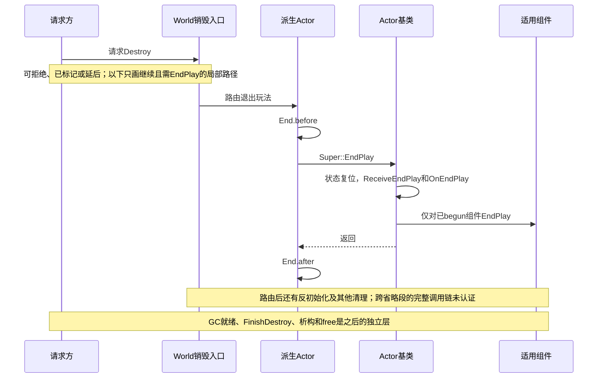

# UE 引擎源码分析 03：Actor 与 Component 生命周期源码剖析
> 知识成熟度：L1。主要承诺是解释所存内部片段的条件和因果；未与旧文声称的私人引擎 checkout 对勘。旧 L2“全面补齐真实源码”缺乏本轮可验证身份，故按全文主要证据调整。公开 API 的局部核对另标，不把它升级为整篇内部实现认证。
> 使用层入口：[Actor 与 Component 生命周期](02-Actor与Component生命周期.md)。最后更新：2026-10-05。

**版本基准**：2026-10-05 核对的 Epic 公开 UE5.8 标签资料，加本仓库历史节选；私有 CL55116800 尚未认证，不能合并为当前引擎实现基线。

## 一、阅读合同与源码地图

### 1.1 四种证据必须分开

本文读过的“源码”首先是**学习仓库中已有的历史节选**。34 个代码围栏连同原注释、省略标记、空白与出现顺序完整保存在篇末 AS-H01 至 AS-H34。它们有真实的仓库字节身份，却没有本次可确认的私有引擎来源身份；有些块把不连续函数拼在一起，有些只有函数头或尾。

1. **公开使用合同**：2026-10-05 核对 Epic 官方 API/文档，所读页面主要标 UE5.8；用于确认注册、opt-in、Tick、Destroy、World 启动等公开职责
2. **历史字面推导**：如果 AS-Hxx 所示条件与调用按字面执行，会发生什么。可以手算 OR、判断循环内外和 Super 内局部关系；不能由省略片段推出完整函数所有分支
3. **UObject 前置合同**：[UObject 基础](01-UObject与反射系统.md)、[反射源码](01-UPROPERTY与反射系统源码.md)、[GC 源码](02-UObject与垃圾回收源码.md) 已分清创建入口、Outer、受追踪强引用与最终释放。本篇不重新发明与之冲突的“Actor 特例”
4. **工程观察**：本次没有。UHT、UE 编译/链接、PIE、Game/Editor/专服/客户端日志、真实 GC、性能和私有 CL 对勘均 **NOT_RUN**；文本/布尔校验不能填这个空位

历史身份线索：旧文自述 UE5.8.0、CL 55116800、分支 `++UE5+Release-5.8`；安装目录 `C:\Program Files\Epic Games\UE_5.8\Engine`，行号则自述来自 `C:\Users\zhaozhiqi\Documents\GitHub\UnrealEngine`。旧记录称 2026-09-14 已把示意块替换为逐字源码，却又在原第 332 行称前四小节为压缩/改写版；两种说法冲突。保留这段历史和篇末各块旧路径/行号，并不继续认证“本机”“完整”“逐字”。

本轮定位使用稳定块 ID 和符号。原“第 N 行”若指已经替换的示意块，不能再用于定位；篇末保留的原文行区间是**修订前知识文档**行号，旧引擎行号则标为待核，两者不是同一坐标。

### 1.2 按问题找入口

| 问题 | 历史块 | 待目标 checkout 读取的文件与符号 |
|---|---|---|
| 实例如何创建、选择 Level/模板？ | AS-H01–02 | `Engine/Source/Runtime/Engine/Private/LevelActor.cpp`：SpawnActor；`Private/Actor.cpp`：PostSpawnInitialize |
| 延迟构造、SCS 和逻辑初始化何时接续？ | AS-H03–06 | `Private/Actor.cpp`：FinishSpawning/PostActorConstruction/InitializeComponents；`Private/ActorConstruction.cpp`：ExecuteConstruction |
| 注册如何关联世界、资源、Owner？ | AS-H07–11 | `Private/Components/ActorComponent.cpp`；`Private/Actor.cpp`：OwnedComponents/InstanceComponents |
| 谁发起 BeginPlay，谁实际回调？ | AS-H12–18 | `Private/Actor.cpp`、`World.cpp`、`WorldSettings.cpp`、`GameModeBase.cpp`、`GameStateBase.cpp`、`Level.cpp` |
| Tick 的登记/启用/任务图怎样分工？ | AS-H19–26 | `Classes/Engine/EngineBaseTypes.h`；`Private/TickTaskManager.cpp`；组释放还需读 `Private/LevelTick.cpp` |
| 请求销毁、玩法退出、组件清理怎么接上 GC？ | AS-H27–34 | `Private/Actor.cpp`、`LevelActor.cpp`、`Components/ActorComponent.cpp`；底层垃圾状态线索在 `Engine/Source/Runtime/CoreUObject/Public/UObject/UObjectBaseUtility.h` |

这张表保留可继续追踪的入口，不表示本环境已检查这些引擎文件存在。源码宏、CVar 默认值、专服分支和返回值的省略部分都需要目标版本验证。

### 1.3 总览：几条可接续的协议

```text
普通 Spawn ── 对象/默认子对象已构造 ── 原生注册或 SCS 后补注册 ─┐
延迟 Spawn ── 已有 C++ 实例 ── 调用方填参数 ── FinishSpawning ──┤
关卡加载 / PIE复制 ── 各自加载/复制准备 ── 关卡初始化路线 ──────┤
                                                              ↓
       世界允许初始化：Pre → 对 registered && wants && !initialized 的组件 Initialize → Post
       该 Actor 满足开始门禁：Dispatch → 派生 Begin.before → Super 内部 → Begin.after
                                      Super 内：Actor Tick登记尝试 → 适用组件 Begin → Actor Receive

运行期动态组件 ── 创建/属性/挂接 ── 注册 ── 按 Owner/World 当前状态接续自己的阶段
Tick：每个 TickFunction 独立登记、启用、分组和建立依赖；不是上述箭头的无条件下一步
退出玩法：派生 End.before → Super 内 Actor Receive/OnEnd → 已begun组件 End → End.after
最终回收：垃圾状态 / GC判定 → BeginDestroy → ready等待 → FinishDestroy → 后续析构/free
```

图只保留关键偏序，未表示全线程调用栈。EndPlay 可以先于对象内存寿命结束很久，流送复入还可再次进入玩法。组件注册/反注册也可以独立重复，不能按整张图每次从头重播。

## 二、生成：先找分支，再读顺序

### 2.1 SpawnActor 分配之前已经可能失败

[AS-H01](#as-h01) 保存生成入口：它先处理类是否合法、构造脚本上下文、Level 与模板选择、碰撞策略，然后才显示 `NewObject<AActor>`。因此“任何生成失败本质上都是先生成后 Destroy”不成立。该块已经有分配前的碰撞拒绝；分配后的构造/碰撞处理也可能失败，两种失败要区分。

按所示代码读参数优先级：

- `LevelToSpawnIn` 首先取 `SpawnParameters.OverrideLevel`；仅为空才使用 `Owner->GetLevel()` 或 `CurrentLevel`。所以 Owner 同关卡不是这一段不可覆盖的硬规则。是否允许某个具体跨关卡用法，还需核对完整上下文，不能只凭此行推荐跨关卡操作
- `Template` 优先取显式 `SpawnParameters.Template`，没有才取 `Class->GetDefaultObject<AActor>()`；模板并不恒等于 CDO。已有模板类不匹配时，所示分支还受 `bNoFail` 影响
- 碰撞策略从模板开始，可被显式 Override 覆盖；`bNoFail` 再把所示两个可能拒绝的策略改成对应 always-spawn 策略。它不是绕过任何失败门禁的万能开关
- 预检组合模板根相对变换与用户变换；最终值不能一律认为就是调用者传入 Transform。具体数学实现及完整的缩放策略有省略，不用旧行号的推测填上

`NewObject<AActor>(LevelToSpawnIn, ...)` 显示 Outer 为 Level。业务仍用 `SpawnActor`，因为世界登记、构造、复制等协议不止这一次分配；Outer 也不自动提供任意强所有权。[UObject 的入口与 Outer 合同](01-UObject与反射系统.md#三创建与初始化工厂outer-和默认子对象)

该块的 `OnActorPreSpawnInitialization` 在对象创建后、`PostSpawnInitialize` 前广播。这可以帮助寻找早期观察点，但不能把它称为所有框架的推荐就绪点：用户代码可能重入，原生构造已经发生，后续注册和玩法状态尚未满足。`OnActorSpawned` / `AddNetworkActor` 在所示 CVar 条件下执行，具体 CVar 缺省及 `OnActorFinishedSpawning` 的完整实现未给出。

**调用者结论**：记录失败输入、最早日志和返回值，区分预检拒绝与后验失败。AS-H01 的省略范围覆盖其他控制流，不能只看到末尾 `return Actor` 就宣称所有失败都会返回“已坏的非空指针”；也不能由函数名证明 `SpawnActor_Internal` 在某个私有目录全树不存在。

### 2.2 PostSpawnInitialize：原生注册与延迟构造分叉

[AS-H02](#as-h02) 的可见操作包括 CreationTime、网络角色交换、Owner/Instigator、默认组件创建通知和注册选择。头部概览注释提到整条管线的 Pre/Initialize/Post，但本函数体没有因此“直接调用每一项”。真正逻辑初始化在下游 AS-H04/06，必须继续读。

关键状态 `bHasDeferredComponentRegistration` 表达“无原生场景根且为蓝图生成类”。此时先等 SCS 建立根，再接续注册；否则在有 World 的适用路径调用 `RegisterAllComponents`。它解释了为什么原生组件和蓝图构造组件未必在同一位置注册，而不是说明逻辑 Initialize 可以普遍早于注册。

`bDeferConstruction=false` 会接 `FinishSpawning`；为 true 时 C++ Actor 与默认子对象已经创建，只是暂缓后续构造与装配。存在原生根的分支还保存原始生成变换供后续使用。旧文谈到的 `FixupNativeActorComponents` 缩放细节、`PostActorCreated` 精确插入点位于省略处：可保留为目标追踪方向，不能从当前可见块认证完整实现。

### 2.3 FinishSpawning 不等于“调用一个空完成通知”

[AS-H03](#as-h03) 在 `if (ensure(!bHasFinishedSpawning))` 内置位，随后调用 `ExecuteConstruction`、`PostActorConstruction`，再通知世界完成生成。读者应同时看条件和副作用：若已经完成，所存条件分支不会再次装配；但 `ensure` 的诊断/中断行为不能写成所有构建均必终止。

因为 `PostActorConstruction` 可能推进 BeginPlay，调用方要在 `FinishSpawning` **之前**填好要让构造脚本和 BeginPlay 看见的输入。在 Finish 返回后才赋值，会错过该次回调。默认根变换和 deferred cache 的完整合成部分被省略，不将旧文手写公式视为本轮对勘结论。

以下是已有 Actor 方法体片段，依赖基础篇 `MySpawnableActor.h` 与 `Engine/World.h`，在有效游戏线程/World 上使用；未工程编译。它只演示在 Finish 前设置已有字段，不是完整项目或延迟生成所有错误恢复代码。

```cpp
if (UWorld* World = GetWorld())
{
    const FTransform SpawnTransform(FRotator::ZeroRotator, FVector(0, 0, 100));
    AMySpawnableActor* Spawned = World->SpawnActorDeferred<AMySpawnableActor>(
        AMySpawnableActor::StaticClass(), SpawnTransform);
    if (IsValid(Spawned))
    {
        Spawned->InitialLifeSpan = 10.0f; // 本次 BeginPlay 需要读取的输入
        Spawned->FinishSpawning(SpawnTransform); // 可能在内部进入 BeginPlay
        // 不假定返回后仍处于可继续业务使用的状态；本片段结束借用。
    }
}
```

### 2.4 PostActorConstruction：世界初始化与玩法启动是两道门

[AS-H04](#as-h04) 先取 `World && World->AreActorsInitialized()`。为真时才调用 PreInitializeComponents、InitializeComponents，并在适用有效性条件下调用 PostInitializeComponents。世界尚未允许逻辑初始化时，不应期待这些日志立即出现；后续关卡初始化路径可接续。

这里还有另一个条件：初始复制要求是否已满足。可见表达式 `bDeferBeginPlayAndUpdateOverlaps` 涉及角色交换和 reinstancing；因此“世界已开始”不意味着一个复制 Actor 已完成自己的初始状态。要定位延迟原因，需要知道是世界初始化未完成，还是这个 Actor 的复制/父子/预览门禁。

所存开始条件是 `!bDeferBeginPlayAndUpdateOverlaps && (BeginPlayCallDepth > 0 || World->HasBegunPlay())`，后面还可被 ParentActor 和编辑器预览条件收窄。最小反例：世界正在批量开始，A 的 BeginPlay 尚未返回，A 在内部 Spawn B；此时深度大于零，即使世界的 begun 标志尚未最终设置，OR 左项也可能为 B 打开入口。不能改写成“世界布尔为 false，所以所有 Spawn 一律等待”。

`PostInitializeComponents` 后检查 `bActorInitialized` 的 Fatal 分支，说明正确转发 Super 是协议的一部分。正常基类返回只是本 Actor 的状态，不是整个关卡和任意未来组件的全局完成屏障。

未初始化世界的另一分支出现 `MarkAsGarbage → Modify(false) → ClearGarbage`。其注释说明与初始撤销记录有关；它是临时状态序列，不是“调用过 MarkAsGarbage，所以该 Actor 已永久退出并会在下一 GC free”。同一个函数名出现在不同协议里，意义要看前后条件。

### 2.5 SCS：每个类内部的创建与末尾补注册

[AS-H05](#as-h05) 显示构造重入保护、根变换处理、蓝图父类栈和注册补偿。可见循环从栈末向前遍历，每轮先处理该类的 `SimpleConstructionScript`（如果存在），随后就在**这一轮循环内部**调用 `CreateComponentsForActor(CurrentBPGClass, this)`。不能读成“所有类 SCS 都结束后只调用一次 CreateComponentsForActor”。父类栈的生成语义仍以实际目标函数为准。

`FGuardValue_Bitfield` 设置构造脚本上下文，与 Spawn 入口拒绝在构造脚本中生成的条件相呼应；有显式允许参数的分支，不是无例外禁令。注册补偿先看 deferred 状态和 world 初始化，再在 PostSCSComponents 上过滤：未注册、`bAutoRegister`、有效、世界/Actor 登记状态，以及 SCS 新建/不在前集合等条件。

这些筛选的因果是“只把适用的漏注册组件补上”，不是“任何蓝图组件必然已经注册”。`bAutoRegister=false` 是直接反例；未来动态组件尚未存在更不在这次循环中。

### 2.6 Pre / Initialize / Post 三个名称里的实质

[AS-H06](#as-h06) 合并了三个不连续实现；不能把相邻显示当作同一连续函数体。

- Pre 的可见基类工作是 AutoReceiveInput：找到 PlayerController 则 EnableInput，找不到则登记等待。它不替任意派生框架保证 PlayerState、Pawn 输入或所有玩家已经存在
- InitializeComponents 先枚举当前组件，外层要求 `IsRegistered()`；其中 `bAutoActivate && !IsActive()` 才激活，另一个条件 `bWantsInitializeComponent && !HasBeenInitialized()` 才调用逻辑初始化。激活与初始化是两个检查，不是同义词
- Post 在有效时置 `bActorInitialized=true` 并更新复制组件信息。它不创建所有未来动态组件，也不保证每个组件执行过 opt-in Initialize

把 R=registered、W=wants、I=initialized 代入 `R && W && !I`：只有 R=1、W=1、I=0 才调用。R=1/W=0/I=0 的组件即使有 override 也不进入；R=0/W=1/I=0 未注册也不进入；R=1/W=1/I=1 已初始化不重复进入。这是可手算的局部条件，与 [InitializeComponent API](https://dev.epicgames.com/documentation/en-us/unreal-engine/API/Runtime/Engine/UActorComponent/InitializeComponent) 的注册/opt-in 前提一致，仍不是 UE 实测。

## 三、组件注册：状态、资源与关系分层

### 3.1 ExecuteRegisterEvents 的三个工作层

[AS-H07](#as-h07) 先在未注册时调用 OnRegister 并检查标志，再根据能否渲染、已有状态、Scene 和 `ShouldCreateRenderState` 决定创建渲染状态，最后调用允许延后的 CreatePhysicsState。

“进入注册协议”并不代表每个组件有三种同样的资源。`UActorComponent` 逻辑组件可能没有图元；渲染状态基类工作与 `UPrimitiveComponent` 创建 SceneProxy 的派生工作不同。物理场景、`ShouldCreatePhysicsState` 和延后策略也可以使刚体并未立即建立。公开 [RegisterComponent](https://dev.epicgames.com/documentation/en-us/unreal-engine/API/Runtime/Engine/UActorComponent/RegisterComponent) 的资源描述要按适用组件类型理解。

### 3.2 RegisterComponentWithWorld 为什么要分三支

[AS-H08](#as-h08) 可见的早退包括无效、已注册和空 InWorld。无效/重复注册分支有日志，空 world 的日志被注释；所以不能把所有早退统一称为“静默”或“全部打日志”。其他早退位于省略区域，不能用旧讲解代替完整实现。

建立 `WorldPrivate` 并执行注册事件后，分支如下：

| 上下文 | 块内可见工作 | 不能补出的结论 |
|---|---|---|
| 非游戏 World | 登记组件 Tick | 自动进入正常游戏 BeginPlay |
| 游戏 World、无 Owner | wants 且未初始化才 Initialize，之后登记 Tick | 无条件 Initialize；会自动得到 Owner 的 BeginPlay |
| 游戏 World、有 Owner | 调用 `MyOwner->HandleRegisterComponentWithWorld(this)` | 当前块未给该函数体，不能声称已追完动态补 Initialize/BeginPlay/Tick 的每一条件 |

公开 [UActorComponent::BeginPlay](https://dev.epicgames.com/documentation/en-us/unreal-engine/API/Runtime/Engine/UActorComponent/BeginPlay) 说明 Owner 已开始时动态组件可后补开始；具体内部组合仍列追踪缺口。缺源码不等于否定公开合同，也不意味着可以把三支合成无条件箭头。

SCS 子组件补注册还要求 construction-script 来源、`bAutoRegister`、未注册且 Owner 相同；“Outer 树里所有东西都被同样管理”不是它的含义。末尾输入绑定仅在 Owner 已有 InputComponent 时执行，因此这段不能推出“必须注册早于 SetupPlayerInputComponent 才能绑定”；别处的输入建立/重绑流程尚未追踪。

### 3.3 注销的局部反向顺序不等于所有生命周期逆序

[AS-H09](#as-h09) 是 `DestroyPhysicsState → 有渲染状态时 DestroyRenderState_Concurrent → 已注册时 OnUnregister`。和 AS-H07 的创建阶段相比，这个局部顺序确实是反向的，不能一边列出逆序一边说“并非逆序”。但 BeginPlay/EndPlay、异步完成、重注册和最终 GC 并不因此成为一条严格反向流水线。

检查宏校验派生调用是否维护基类标志，说明 Super 转发重要；宏在不同构建的行为需要目标配置。`_Concurrent` 后缀也不是业务在任意线程调用任意组件函数的许可证。资源命令可能跨线程、完成时刻可能晚于当前回调；具体线程约束需要读调用方、实现和任务同步。

隐藏、Deactivate、禁用 Tick 与反注册不是一个操作。若只是想停止某项行为，应选对应接口；滥用全反注册可能重建资源，引入额外成本和重复回调。

### 3.4 Render / Physics / Replication 三类“ready”不要混淆

[AS-H10](#as-h10) 中基类 CreateRenderState_Concurrent 设置创建状态及脏标记，不包含完整的 SceneProxy 递交逻辑。CreatePhysicsState 外层条件是尚未创建、有物理场景且应该创建；内部 ShouldDefer 的计算省略，但可见分支会选择延期请求或 OnCreatePhysicsState。当前块不能证明旧文所列每个 CVar、BodySetup、Overlap 条件的完整合取式，更不能据此估算默认延迟次数。

同块的 ReadyForReplication 仅设置一个准备状态。准备好、被加入复制候选、某个连接实际复制出去是不同层；看到置位不意味着网络包已经发出。

### 3.5 OwnedComponents 与 InstanceComponents 的作用

[AS-H11](#as-h11) 先要求组件 Owner 匹配，再加入 OwnedComponents，以是否已存在避免重复追加辅助集合。复制组件会进入 ReplicatedComponents 并调用复制登记接口；SCS/实例来源则分别分类。这里是“纳入管理”的证据，不是“立即通过网络发送”的证据。

AddInstanceComponent 的可见操作只有设置 CreationMethod 和加入 InstanceComponents；它不是注册世界状态的代用品。另一方面，公开 RegisterComponent 合同明确必要时将组件加入所属 Actor 数组，不能因为当前节选没追到所有 AddOwnedComponent 调用点，就对读者说“注册过也不应期待被 Actor 枚举”。正确结论是：采用支持的 ActorComponent 创建/注册路径；内部登记点若需精确定位，再追 PostInitProperties、PostRename、编辑器 Undo 和 Owner helper。

`Modify(false)` 的注释说明本调用不替上层编辑工具标脏；这和世界注册或网络复制是另一职责。不要把 OwnedComponents、Outer、Actor Owner、Scene attachment 合成一般强父子关系；保活与显式销毁仍按 UObject 和 Actor 各自协议处理。

## 四、BeginPlay：派发、Super 与蓝图是三个边界

### 4.1 基类实现的局部顺序

[AS-H12](#as-h12) 中，AActor::BeginPlay 先检查 BeginningPlay 状态，设置初始寿命，尝试登记 Actor Tick；随后遍历**已注册且尚未 begun**的组件，分别登记组件 Tick 并调用 BeginPlay；适用时向 AutoDestroySubsystem 登记；再执行 Actor ReceiveBeginPlay，最后把 Actor 状态置为 HasBegunPlay。

这句话的主体是“所存 AActor 基类实现”，不是任意派生 override。把 C++ override 写为 before → Super → after 后，局部偏序才清晰：

| 观察位置 | 已完成什么 | 尚不能假设什么 |
|---|---|---|
| 派生 A.Begin.before | Dispatch 已到本 Actor 虚入口，正常路径处于 BeginningPlay | Super 的组件循环和 Actor Receive 尚未执行 |
| Super 内 Actor Tick 登记尝试 | 寿命设置已读取此时 InitialLifeSpan | 实际 Tick 登记一定成功；本帧一定执行 |
| Super 内某适用组件 BeginPlay | 该组件通过 registered/未 begun 条件 | 另一组件、另一 Actor 或未来组件也已就绪 |
| Actor ReceiveBeginPlay | 本次适用组件循环已处理 | 所有外部异步资源完毕；Actor 状态已经翻为 HasBegunPlay |
| 派生 A.Begin.after | 正常基类返回且已置 Actor begun | 每个可能存在的组件均执行过自己的 Initialize |

[UE-10138 开发者说明](https://issues.unrealengine.com/issue/UE-10138) 支持原生 BeginPlay 内调用 Receive 的区别，但它是 UE4.7 的历史说明，不认证本篇 UE5 私有 CL 的全部函数体。

一个日志在 Super 后，只能证明该打印点晚于 Super 内组件；不能据它说“组件比 Actor C++ 入口先”。同理，Super 前改变 `InitialLifeSpan` 可以被后续基类 SetLifeSpan 读取；“BeginPlay 里改该字段永远不生效”过宽。若在基类已经应用后更改运行时寿命，应使用相应寿命 API，而不是期待字段写入自动重设计时器。

### 4.2 DispatchBeginPlay 维护的是进入协议

[AS-H13](#as-h13) 对初始复制待处理状态和已 begun/有效性做门禁；随后记录调用深度，建立复制组件信息，置 BeginningPlay，启动适用复制并调用虚 BeginPlay。所存宏分支还可能跳过通常用户回调而直接置 HasBegunPlay，因此状态位本身不是“每个回调确实执行过”的日志证明。

这里 `ensure` 检查状态和调用深度，不能拿它当完整运行时强制隔离。基类/派生正确返回是协议要求，不应自行把 BeginPlay 拆成跨帧异步 continuation 或手工绕过 Dispatch 调基类来“补一遍”。需要异步加载时，应让 BeginPlay 启动业务自己的异步状态机。

BeginPlay 中的 Destroy 请求还可被记录为 `bActorWantsDestroyDuringBeginPlay`，在派发收尾继续销毁；重叠状态更新另受有效性和宏条件控制。由此不能说“进入 BeginPlay 后对象在整个回调直到下一帧都保证可普通使用”。每个可能重入的外部调用之后都需遵守项目自己的状态协议。

### 4.3 World 启动：正常服务器链只是其中一条

[AS-H14](#as-h14) 把几个世界函数拼在一起。HasBegunPlay 可见表达式包含 begun 标志、PersistentLevel 和其 Actor 数量；AreActorsInitialized 也不只是一个裸布尔。这个实现的具体形状未认证，不将它推广为跨版本公共不变量。

所存正常 UWorld::BeginPlay 中先调用每个 WorldSubsystem 的 OnWorldBeginPlay，再在有 GameMode 时调用 StartPlay，随后才广播 UWorld 自己的同名 OnWorldBeginPlay 委托。这两个同名事件属于不同对象、不同位置，绝不能交换解释。

[AS-H16](#as-h16) 和 [AS-H17](#as-h17) 展示 GameModeBase::StartPlay 接 GameStateBase::HandleBeginPlay，再经 [AS-H15](#as-h15) 的 WorldSettings::NotifyBeginPlay 遍历 Actor 派发并设置世界 begun。遍历顺序不是应用的跨 Actor 依赖协议；某 Actor 的 Dispatch 可以因自己的门禁不进入通常回调，动态加入对象更不能被一次 world 标志穷尽。

**两个反例**：

1. Actor 在自己的 BeginPlay 才订阅 WorldSubsystem 的“准备启动”广播，会错过正常初次前置钩子。这不是“订阅失败”，而是订阅晚于广播；应查询当前业务状态并配合订阅/补发协议
2. 世界尚未最后置 begun 时，嵌套 Spawn 仍可满足 AS-H04 的调用深度分支。不能从 NotifyBeginPlay 末尾才置位，反推之前 Spawn 的一切 Actor 都只能等待

当前公开 [UWorld::BeginPlay](https://dev.epicgames.com/documentation/en-us/unreal-engine/API/Runtime/Engine/UWorld/BeginPlay) 还明确：无 GameMode 时可执行 world 回调而不置 begun；网络客户端的 Actor BeginPlay 和设置 begun 由 GameState 复制路径驱动。该复制函数体本篇未展示，不补造同一服务器全链。WorldSubsystem 对已初始化 world 的晚加入可补 PostInitialize/OnWorldBeginPlay，不能把“正常初次前置”写成每次永远早于任何 Actor。[UWorldSubsystem](https://dev.epicgames.com/documentation/en-us/unreal-engine/API/Runtime/Engine/UWorldSubsystem)、[World 篇 §3.4](../世界组织与资源加载/07-World关卡与Subsystem体系.md#34-四种-subsystem-与生命周期)

### 4.4 关卡加载和增量初始化

[AS-H18](#as-h18) 是 `ULevel::RouteActorInitialize` 的状态机节选：Preinitialize 对尚未初始化 Actor 做 Pre，Initialize 做组件初始化和 Post 并检查状态，BeginPlay 阶段在 world 已开始时处理非 ChildActor，最终进入 Finished。循环按 Actor 数量与预算推进，中途可以 return；不能用它绘制“所有关卡必在同一帧完成”的图。

Pre 阶段注释指出初始化可能生成新 Actor，所以循环条件会继续检查数组长度。它支持这个局部处理策略，不证明无限新增可以无成本完成，也不赋予组件遍历固定顺序。

ChildActor 在这里被排除，结合 AS-H04 的父状态约束，可以解释它有专门启动路径；完整父组件实现尚未给出。`bActorSeamlessTraveled` 不出现在所示 BeginPlay 条件中，旧文给出的置位/清零、重构和网络启动 Actor 关系是另一条待查路径，不要把“无缝旅行”一词直接改写成 BeginPlay 的统一开关。

## 五、Tick：先证实入口，再计算状态

### 5.1 TickGroup 是调度意图，不是组件默认值清单

```text
TG_PrePhysics       需要在物理开始前准备输入的工作
TG_DuringPhysics    可与物理推进交叠、不要求本帧最终物理结果的工作
TG_PostPhysics      需要物理结果已完成后处理的工作
TG_PostUpdateWork   较晚的帧内更新工作
```

这些是工作类别例，不是 CharacterMovement、SkeletalMesh、UI 或 Timer 的默认分组认证。Actor 和各组件有独立 TickFunction，组和依赖可不同；TimerManager 也不因“定时”二字就是其中某组固有成员。[Actor Ticking](https://dev.epicgames.com/documentation/en-us/unreal-engine/actor-ticking-in-unreal-engine)

[AS-H19](#as-h19) 原枚举还含 **四个** Hidden 项：StartPhysics、EndPhysics、LastDemotable、NewlySpawned。最后者有特殊新生任务语义，不能当普通可选组。以下仅是所存枚举/旧调度描述的概念摘要，省略具体物理注入、等待策略和其他帧任务；不认证完整 LevelTick.cpp 路线。

```text
PrePhysics → StartPhysics → DuringPhysics → EndPhysics → PostPhysics → PostUpdateWork → LastDemotable
NewlySpawned：特殊补排机制；何时执行仍依排队、上下文、预算与未展示分支
```

[AS-H20](#as-h20) 区分 TickGroup（最早可执行组）与 EndTickGroup（需要在哪一组内完成），并列能力、初始启用、专服、优先级、并行、批处理和手动派发等配置。声明没有给某个派生类/配置的默认值，尤其不能凭 `bAllowTickOnDedicatedServer` 一行就认定默认 false。`bRunOnAnyThread` 也要求该 Tick 的实现自身满足线程约束。

### 5.2 Q、R 和 E：三个不同的状态

先固定符号，避免同名“注册”换义：

| 符号 | 所指 | 查证位置 |
|---|---|---|
| Q | Actor 包装器 `bTickFunctionsRegistered` | AS-H23 是否再次调用内部注册函数 |
| R | 主 TickFunction 的实际 registered | AS-H21 的登记结果 / IsTickFunctionRegistered |
| C | `bCanEverTick` 能力 | AS-H22 的主 Tick 门禁 |
| S | `bStartWithTickEnabled` | 本次配置的初始意愿 |
| E | 表达式求值时的 enabled | IsTickFunctionEnabled，不是 Q/R |

[AS-H23](#as-h23) 的第一层是非模板且 Q 不等于请求值，才进 RegisterActorTickFunctions；随后把 Q 设成请求值。[AS-H22](#as-h22) 注册分支还要求 C=true，之后才设 Target、调用 `SetTickFunctionEnable(S || E)`、尝试实际登记。最后 [AS-H21](#as-h21) 的底层登记又会看是否已登记及 DS 条件。

因此 Q=true 可能只说明包装器已处理过 true 请求。C=false 时主 Tick 没有登记；C=true 但专服禁止此 Tick 时也可能 R=false。不能用 Q 替代 R，更不能用 R 证明本帧执行。

**仅在实际到达 AS-H22 的 OR 表达式时**：

| S | E | 传给 SetTickFunctionEnable 的 S OR E |
|---:|---:|---:|
| 0 | 0 | 0 |
| 0 | 1 | 1 |
| 1 | 0 | 1 |
| 1 | 1 | 1 |

第三行直接反驳旧说法“重注册一定保留禁用”。但实验必须先确实到达这行代码，不能把包装器挡掉的重复请求当成 OR 的执行结果。

### 5.3 六个纸面用例比一句“开关”更精确

| 输入与操作 | 沿历史块推导 | 解释 |
|---|---|---|
| Q=1、R=1、S=1、E=0；再次请求包装器 true | Q 已相等，不进入主 Tick 注册；E 保持 0 | no-op 对照，不是实际重注册 |
| 同上先包装器 false，再 true；C=1，允许底层登记 | 先注销，再重新到达 OR；1 OR 0=1，实际登记成功时 R=1 | 旧“禁用不会复活”的最小反例 |
| Q=0、C=0；请求 true | 主 Tick 能力门禁跳过，包装器仍可置 Q=1，R 仍为 0 | 包装状态不等于主 Tick 登记结果 |
| Q=0、C=1、S=1、E=0；专服且不允许 DS Tick | 先把 enabled 置 1，底层可拒绝登记，Q=1/R=0 | enable 不等于 registered |
| Q=0、C=1、S=0、E=0；底层允许 | 可登记 disabled Tick，R=1/E=0 | registered 不等于 enabled |
| R=1/E=1，间隔未到或当前组/依赖/暂停路径不满足 | 不能推出本帧调用 | 执行是调度结果，不是单一状态 |

这些是局部控制流推导，假设正常基类转发、没有额外 override 副作用和未展示改写；不是真实 TickFunction 日志。当前 [FTickFunction API](https://dev.epicgames.com/documentation/en-us/unreal-engine/API/Runtime/Engine/FTickFunction) 支持注册、启用与能力的职责分离，但不展示本篇 OR 私有实现。

AS-H23 中 `bDoComponents` 控制是否另外遍历组件，即使主包装状态没变化也不能简单说“整个函数绝对 no-op”；异步物理 Tick 的登记也是另一路。上表 no-op 专指主 Actor Tick 注册/OR 路径。BeginPlay 传 false 后自己处理组件；Destroy 尾段传 true 统一请求注销。线程上下文哨兵帮助检测 Super 链，不是把哨兵代码复制到派生类就能补回基类协议。

### 5.4 底层登记、集合与每帧任务

AS-H21 仅在实际登记成功路径创建必要的 InternalData、加入管理器并置 registered；注销时移出并清 registered，未登记时不会做同样移除。InternalData 间接持有内部状态，指针本身仍占空间；没有 sizeof/ABI 测量，不能说这种设计“不放大 Actor/Component 尺寸”。

[AS-H24](#as-h24) 显示管理器找到关卡的 TickTaskLevel，并按 enabled/disabled 放入不同集合；启用集合在当前新生收集阶段还可加入 NewlySpawned。由“按关卡组织”不能推出“引擎绝无跨关卡全局容器”；这里只读到该入口的数据归属。disabled Tick 仍可在管理器中，所以“存在于管理器”不是“正在更新”。

[AS-H25](#as-h25) 拼合 StartFrame、QueueAllTicks、Sequencer 的 QueueTickTask 与 RunTickGroup 片段：

1. 帧上下文记录 delta、类型、线程/world，准备关卡列表和新生收集
2. 启用集合为 Tick 排队；有 interval 的任务从当前迭代集合移出并重新安排间隔。冷却到期如何回投的完整实现未展示，但调度间隔与注销应分开理解
3. QueueTickTask 属于 Sequencer，创建带 prerequisites 的任务并 hold；完成事件按实际 start/end group 记录。组描述的是任务释放/完成约束，不能等同于一个数组逐个调用
4. 手动派发有自己的记录/完成事件；完整 release、兜底与防死锁行为需继续读实现
5. RunTickGroup 检查当前组，释放任务并递增上下文组；新生 Tick 是否能在同帧后续执行还受未展示排队和预算分支约束，不能从末尾注释认证“所有新 Actor 必在下一组跑”

旧文给出的 101 次循环、唯一非阻塞组、并发 CVar 和具体 LevelTick 行区间没有完整函数体支撑；保留为 §七的追踪线索。`SetTickFunctionEnable` 的内部移动集合和冷却重置实现也不在 AS-H21 内，不把接口名称补造成已读算法。

### 5.5 依赖会改变时机，不提供任意跨线程安全

[AS-H26](#as-h26) 在双方具备能力或已登记时加入唯一 prerequisite，并提供移除操作。依赖表达“本 Tick 等待目标 Tick”，有助于避免只靠同组或 Actor/组件关系猜顺序。[Actor Ticking](https://dev.epicgames.com/documentation/en-us/unreal-engine/actor-ticking-in-unreal-engine) 说明依赖和组可共同使用。

实际 start/end group 可能因前置项推迟，旧文提及 `QueueTickFunction` / `QueueTickFunctionParallel` 的降组计算和 `CanDemoteIntoTickGroup` 循环，但完整实现未存入本篇；不能把那条手写 max 公式认证为目标 CL 的完整算法。显式依赖也不会使被依赖对象永久存活，更不会令任意 UObject 成员访问线程安全。项目要避免环并在合法寿命内增删依赖。

## 六、销毁：请求、玩法退出与内存释放三层

### 6.1 Destroy 返回值有用，但不是 free 通知

[AS-H27](#as-h27) 先看已在销毁过程的状态，存在 world 才转给 DestroyActor，最后返回状态查询。公开 [AActor::Destroy](https://dev.epicgames.com/documentation/en-us/unreal-engine/API/Runtime/Engine/AActor/Destroy) 的调用者合同是 true 涵盖成功或已标记、false 表达不能销毁，并说明 latent 销毁。内部返回谓词并不把此合同否定成“返回值不是销毁是否成功”；真正要区分的是成功请求/状态与最终内存释放。

[AS-H28](#as-h28) 可见 WorldSettings 拒绝、网络角色/许可、网络接管和 BeginPlay 期间延迟请求。某些 return 在任何正常退出玩法通知之前，所以“每次调用 Destroy 都同步 EndPlay/Unregister”是错的。BeginPlay 延迟分支可先报告接受，再由 AS-H13 收尾继续；派生或网络路径需另外核对。

这里 `check(IsValidLowLevel())` 是引擎内部前提检查，不授权调用方把任意旧裸地址塞进来验证是否仍活着。来源合法的返回值、受控强借用或弱身份解析是前提；`IsValid`/销毁状态判断不能修复已经悬垂的裸指针。

### 6.2 Destroyed、RouteEndPlay 和 EndPlay 的工作不同

[AS-H30](#as-h30) 显示 Destroyed 先 RouteEndPlay(Destroyed)，再 ReceiveDestroyed 与 OnDestroyed。EndPlay 涵盖的原因比 Destroyed 更广，清理玩法期间资源通常应考虑 EndPlay，而不是只处理显式 Destroyed 事件。

[AS-H31](#as-h31) 对 `bActorInitialized` 和 ActorHasBegunPlay 做条件检查，满足才调用 Actor EndPlay。RemovedFromWorld 分支会清重叠、重置 initialized 并移除适用网络参与；寿命 Timer 的清理在外层 initialized 内，UninitializeComponents 则在该外层之后另调用。因此没走 EndPlay 不等于没调用任何反初始化；反过来，也不能期待从未 begun 的对象有相同 EndPlay 日志。

[AS-H32](#as-h32) 的基类顺序是：Actor 置未 begun → 停止适用复制 → Actor ReceiveEndPlay / OnEndPlay → 遍历已 begun 组件调用 EndPlay。派生 End.before 在进入此实现前；End.after 在它返回后。它并不是 BeginPlay 的“组件先/Actor 后”口号的简单反转，而是两个不同局部过程。



### 6.3 世界移除与组件资源撤销

[AS-H29](#as-h29) 是 DestroyActor 的尾段，前段调用 Destroyed 及其他 detach/overlap 等处理不在这个尾段中，不应把两个省略片段冒充完整连续函数。尾段自身可确定的次序是：RemoveActor → 适用编辑器通知及移出广播 → UnregisterAllComponents → Actor/直接组件垃圾标记等 → 请求注销 Actor 与组件 Tick。旧图把反注册无条件画在从关卡 Actor 列表移除之前，与该段不符。

“这些调用返回”也不证明所有渲染/物理跨线程资源已经物理释放；逻辑撤销、异步资源完成和 UObject 存储释放分开。`SetActorTickEnabled(false)` 只影响 Actor 主 Tick 的启用，不一并清理组件、Timer、委托或网络异步工作，不能作为普适销毁安全屏障。

### 6.4 Component 的独立销毁分支

[AS-H33](#as-h33) 合并组件 EndPlay 与 OnUnregister。EndPlay 要求组件已 begun，停止适用复制，且在未处于 BeginDestroy/不可达等条件下才可能调用蓝图 ReceiveEndPlay，最后复位 ready/begun。OnUnregister 则清注册状态和帧尾更新需求，不是再次等同于 EndPlay。

[AS-H34](#as-h34) 可按状态手算：重入保护 → 若 begun 则 EndPlay → 若 initialized 则 Uninitialize → 清 ready → 若 registered 则 Unregister → 移出适用所属集合及根组件关系 → OnComponentDestroyed → MarkAsGarbage。各 if 解释了为何不同创建/失败入口的日志不同。

原块末尾旧注释说 pending kill、清空其他引用；保留原字节，但不能用它认定“调用一返回所有别处指针都立即清零”。更不能反向因为内存尚未 free，就称 DestroyComponent 后 IsValid 仍为 true。垃圾状态、弱身份解析、反射字段更新时点及实际内存释放各有机制；业务应停止使用并管理自己的引用。

### 6.5 RemovedFromWorld 不保证对象寿命结束

公开 [Actor Lifecycle](https://dev.epicgames.com/documentation/en-us/unreal-engine/unreal-engine-actor-lifecycle) 给出流送快速卸载/重载且尚未 GC 时可能复用原 Actor 和局部值的边界。因此 EndPlay 是离开一个玩法期间的通知，并不是必然最终销毁的宣告。重新进入时要明确哪些数据保留、哪些重置，不能假设构造函数会替你重置。

这也解释了为什么一次性全局注册不适合无条件放在每次 BeginPlay，而需要成对撤销或独立宿主管理。GameInstance/WorldSubsystem 的不同寿命在[World 篇](../世界组织与资源加载/07-World关卡与Subsystem体系.md) 中比较；没有哪个宿主可以替代所有 Actor 的玩法协议。

### 6.6 垃圾标记之后还有哪些阶段

MarkAsGarbage 的旧归属线索是 UObjectBaseUtility，旧文还给出 `RF_MirroredGarbage`、对象槽位 garbage 和 Async 标志的操作自述；本次没展示/对勘其函数体，不能把该自述升级为当前具体标志实现。可靠教学层是：显式 Actor 销毁和普通 UObject 不可达判定相互关联但不等同；强字段不阻止 Actor 的显式 Destroy。

最终清理按 [UObject/GC Canonical](02-UObject与垃圾回收源码.md) 分成 BeginDestroy、ready 条件、FinishDestroy、之后的 C++ 析构和分配器释放。ready 未满足可继续等待，并非每个对象都等 GPU fence，也非下一次 GC 必 free。[FinishDestroy API](https://dev.epicgames.com/documentation/en-us/unreal-engine/API/Runtime/CoreUObject/UObject/FinishDestroy) 是清理回调合同，不是析构函数的别名。

官方概述中的旧 PendingKill/下一 GC 简写，不能覆盖同页的复入、ready 延后或更具体 API 条件；历史块里的 MarkAsGarbage 临时事务序列同样不能被误作最终回收证据。失效的裸地址尤其不能当作状态探针，长期观察应保留合法弱身份并在合适时段/线程解析。

## 七、缺口与可复现检查计划

### 7.1 这些旧定位有价值，但尚未认证

| 待补函数/历史线索 | 需要回答的问题 | 目前为何不能下结论 |
|---|---|---|
| SpawnActor 完整尾段、OnActorFinishedSpawning；旧 LevelActor.cpp 456–800、CVar 定义约 52 行 | 生成后失败如何影响返回、广播与网络登记；具体默认值 | AS-H01 有大段省略，CVar 定义未给出 |
| PostSpawnInitialize 的变换/创建通知，FinishSpawning 的 deferred cache；旧 Actor.cpp 4276、4374 起 | 不同缩放策略、PostActorCreated、变换重新组合 | 对应内容部分位于省略处 |
| HandleRegisterComponentWithWorld；旧 Actor.cpp 6427 起 | Owner initialized/begun 与动态组件补回调、Tick、复制准备的精确组合 | AS-H08 只见调用，未见完整函数体 |
| 组件 PostInitProperties/PostRename/PostEditUndo；旧 ActorComponent.cpp 597、951/982、1390/1412 | OwnedComponents 的全部登记/迁移点 | 本篇只给 AddOwnedComponent/部分注册，不可从缺口否定公开合同 |
| CreatePhysicsState 的 ShouldDefer；旧 ActorComponent.cpp 2398 起 | World/CVar、Primitive、Overlap、BodySetup 条件与异步完成 | AS-H10 省略计算，不能认证旧合取列表或默认值 |
| 复制 OnRep、PostNetInit、ChildActorComponent | 客户端、初始复制和父子开始的实际路径 | 公开职责可确认，函数体与目标配置未给出 |
| SetBegunPlay 与 seamless 标志；旧 World.cpp 4947/8833、Level.cpp 3709/3723、ActorConstruction.cpp 268、Actor.cpp 742 | 委托触发、跨图保留、重构与网络启动判断 | AS-H14–18 没有这些完整实现 |
| SetTickFunctionEnable；旧 TickTaskManager.cpp 2439 起 | 已登记/未登记时移动集合、状态与冷却修改 | 本篇保存注册/注销，不含该函数体 |
| QueueTickFunction/Parallel、ReleaseTickGroup、冷却与新生循环；旧 TickTaskManager.cpp 2622/2713、LevelTick.cpp 1742–1886 | 实际组/结束组、等待条件、循环预算、并发调度 | AS-H25 是拼合节选；旧“101次/唯一非阻塞组”未核 |
| DestroyActor 中间段、垃圾状态/IsValid 实现；旧 LevelActor.cpp 839 起、UObjectBaseUtility.h 207 起 | 请求接受后各清理的精确连接及状态含义 | 不能由尾段或 API 简介拼出全函数或直接等同 free |

“缺口”是明确停止外推的位置，不是把对应主题删除。上文保留局部因果，今后得到合法目标 checkout 后再核路径、Build.version/CL、函数全边界、宏/CVar、日志与返回值。

### 7.2 最小实验矩阵：全部 NOT_RUN

| 控制输入 | 需要记录的观察 | 能区分的错误模型 |
|---|---|---|
| 基础篇四文件候选，实际模块/头依赖 | UHT → C++ 编译 → 链接的原始输出 | 静态闭合不等于工程可用 |
| wants true/false，注册/未注册，已初始化/未初始化 | OnRegister、Initialize、BeginPlay 和状态 | override 不等于 opt-in；重注册不等于再次 Initialize |
| 普通/延迟 Spawn、关卡加载、动态组件 | 四种入口、World 状态、Finish 前后 | 一条无条件总链不足以解释 |
| C++ Super 前后、蓝图 Receive、两个组件 | object path、frame/thread、同一实例身份 | 打印点不等于虚入口；不同组件顺序非保证 |
| Tick 四行 OR，重复包装器请求与注销再注册对照 | Q、R、C、S、E、NetMode | no-op 不能代替 OR；Q 不等于 R |
| 不同组、依赖、interval、pause、DS、新生 Tick | 实际排队/执行/完成位置 | enabled/registered 不保证本帧执行 |
| Destroy 拒绝、BeginPlay 中请求、未 begun、组件销毁 | 返回值、退出/反注册、合法弱身份 | 请求/玩法退出/内存释放分层 |
| 流送快卸快载，GC 前后对照 | 弱身份、局部值、End/Begin 配对 | 不是每次都会重新构造；相同地址不能单独证明同一对象 |
| 世界初始启动/无 GameMode/客户端/晚加子系统 | WorldSubsystem 钩子、world delegate、Actor 开始 | 正常前置钩子不等于全员完成屏障 |

每次实验至少附真实引擎版本/CL、项目 commit、平台/构建、World 类型/NetMode、输入、原始日志及失败负例。文本检查与手算表只覆盖文章内部一致性，不能给 `verified` 追加引擎运行事件。

## 八、常见问题与排障

**为什么构造函数里 GetWorld 不可靠？** 构造服务于 CDO 及多种实例路径，尚不保证运行期上下文已就绪；不是“所有构造都在编译期发生”，也不是“Actor Outer 应直接指 UWorld”。默认值/默认子对象放构造，运行依赖在适当钩子处理。

**动态组件没有渲染或碰撞，是否 Register 一次就够？** 先检查创建与 Owner、属性/挂接、实际注册结果，然后看组件类型、资源资产、ShouldCreate 条件和延后创建；注册是必要协议，不是所有资源立即存在的充分条件。

**世界已开始，为什么一个对象还是没 BeginPlay？** 世界状态、Actor 初始复制/ChildActor/预览状态、组件注册/Owner 接续各是不同门禁；到具体入口打点，不能强行手调 BeginPlay 替代协议。

**停掉 Tick 后重注册为什么又 Tick？** 先看是否真正重进 AS-H22，再代入 S OR E。S=true/E=false 会置 true；重复包装器 true 的 no-op 是另一情况。还要确认实际 R 与本帧调度，不能只看一个 enable 日志。

**DestroyComponent 后还没 GC，能不能再用？** 不行，未 free 不保证玩法可用或 IsValid 为 true。历史块已经调用垃圾标记；合法对象身份、退出协议与内存阶段不能互换。

## 九、历史材料区：完整保留，按块阅读

以下 AS-H01–AS-H34 均为本次修订前的原围栏字节。每块标出原知识文档行区间、旧引擎定位自述和具体阅读限制；这些定位不是本次对私有 checkout 的认证。原错误/过宽注释也不在围栏内修字，解释以块外正文为准。不能把这些节选作为独立可编译代码，也不能把相邻不连续片段当完整调用栈。

### AS-H01

原知识文档第 92–226 行。旧定位自述（未经本轮对勘）：以下代码摘自本机 UE 5.8 源码 `Engine\Source\Runtime\Engine\Private\LevelActor.cpp`（第 456 行起，节选；该函数真实范围为第 456 行至第 800 行）：

阅读限制：类与碰撞门禁可在分配前拒绝；显式 Template 不必是 CDO，OverrideLevel 优先。多处省略使返回处理和广播全链不可认证；原变换注释保留，但须结合实际表达式读，不能只读一句英文就概括最终 Transform。

```cpp
AActor* UWorld::SpawnActor( UClass* Class, FTransform const* UserTransformPtr, const FActorSpawnParameters& SpawnParameters )
{
	SCOPE_CYCLE_COUNTER(STAT_SpawnActorTime);
	CSV_SCOPED_TIMING_STAT_EXCLUSIVE(ActorSpawning);

#if WITH_EDITORONLY_DATA
	check( CurrentLevel );
	check(GIsEditor || (CurrentLevel == PersistentLevel));
#else
	ULevel* CurrentLevel = PersistentLevel;
#endif

	// Make sure this class is spawnable.
	if( !Class )
	{
// …（节选：省略 10 行）
	if( Class->HasAnyClassFlags(CLASS_Deprecated) )
	{
		UE_LOGF(LogSpawn, Warning, "SpawnActor failed because class %ls is deprecated", *Class->GetName() );
		return NULL;
	}
	if( Class->HasAnyClassFlags(CLASS_Abstract) )
	{
		UE_LOGF(LogSpawn, Warning, "SpawnActor failed because class %ls is abstract", *Class->GetName() );
		return NULL;
	}
	else if( !Class->IsChildOf(AActor::StaticClass()) )
	{
		UE_LOGF(LogSpawn, Warning, "SpawnActor failed because %ls is not an actor class", *Class->GetName() );
		return NULL;
	}
	else if (SpawnParameters.Template != NULL && SpawnParameters.Template->GetClass() != Class)
	{
		UE_LOGF(LogSpawn, Warning, "SpawnActor failed because template class (%ls) does not match spawn class (%ls)", *SpawnParameters.Template->GetClass()->GetName(), *Class->GetName());
		if (!SpawnParameters.bNoFail)
		{
			return NULL;
		}
	}
	else if (bIsRunningConstructionScript && !SpawnParameters.bAllowDuringConstructionScript)
	{
		UE_LOGF(LogSpawn, Warning, "SpawnActor failed because we are running a ConstructionScript (%ls)", *Class->GetName() );
		return NULL;
	}
// …（节选：省略 24 行）
	ULevel* LevelToSpawnIn = SpawnParameters.OverrideLevel;
	if (LevelToSpawnIn == NULL)
	{
		// Spawn in the same level as the owner if we have one.
		LevelToSpawnIn = (SpawnParameters.Owner != NULL) ? SpawnParameters.Owner->GetLevel() : ToRawPtr(CurrentLevel);
	}

	// Use class's default actor as a template if none provided.
	AActor* Template = SpawnParameters.Template ? SpawnParameters.Template : Class->GetDefaultObject<AActor>();
// …（节选：省略 79 行）
	FTransform const UserTransform = UserTransformPtr ? *UserTransformPtr : FTransform::Identity;

	// Choose the collision handling method. In order of increasing priority: actor template setting (often class default), collision handling override, bNoFail
	ESpawnActorCollisionHandlingMethod CollisionHandlingMethod = Template->SpawnCollisionHandlingMethod;

	// Adopt collision handling override if any was set
	if (SpawnParameters.SpawnCollisionHandlingOverride != ESpawnActorCollisionHandlingMethod::Undefined)
	{
		CollisionHandlingMethod = SpawnParameters.SpawnCollisionHandlingOverride;
	}

	// If bNoFail is true, upgrade collision handling method to an always spawning one
	if (SpawnParameters.bNoFail)
	{
		if (CollisionHandlingMethod == ESpawnActorCollisionHandlingMethod::AdjustIfPossibleButDontSpawnIfColliding)
		{
			CollisionHandlingMethod = ESpawnActorCollisionHandlingMethod::AdjustIfPossibleButAlwaysSpawn;
		}
		else if (CollisionHandlingMethod == ESpawnActorCollisionHandlingMethod::DontSpawnIfColliding)
		{
			CollisionHandlingMethod = ESpawnActorCollisionHandlingMethod::AlwaysSpawn;
		}
	}
// …（节选：省略 3 行）
	if (CollisionHandlingMethod == ESpawnActorCollisionHandlingMethod::DontSpawnIfColliding)
	{
		USceneComponent* const TemplateRootComponent = Template->GetRootComponent();

		// Note that we respect any initial transformation the root component may have from the CDO, so the final transform
		// might necessarily be exactly the passed-in UserTransform.
		FTransform const FinalRootComponentTransform =
			TemplateRootComponent
			? FTransform(TemplateRootComponent->GetRelativeRotation(), TemplateRootComponent->GetRelativeLocation(), TemplateRootComponent->GetRelativeScale3D()) * UserTransform
			: UserTransform;

		FVector const FinalRootLocation = FinalRootComponentTransform.GetLocation();
		FRotator const FinalRootRotation = FinalRootComponentTransform.Rotator();

		if (EncroachingBlockingGeometry(Template, FinalRootLocation, FinalRootRotation))
		{
			// a native component is colliding, that's enough to reject spawning
			UE_LOGF(LogSpawn, Log, "SpawnActor failed because of collision at the spawn location [%ls] for [%ls]", *FinalRootLocation.ToString(), *Class->GetName());
			return nullptr;
		}
	}

	EObjectFlags ActorFlags = SpawnParameters.ObjectFlags;

	// actually make the actor object
	AActor* const Actor = NewObject<AActor>(LevelToSpawnIn, Class, NewActorName, ActorFlags, Template, false/*bCopyTransientsFromClassDefaults*/, nullptr/*InInstanceGraph*/, ExternalPackage);

	check(Actor);
	check(Actor->GetLevel() == LevelToSpawnIn);
// …（节选：省略 73 行）
	// tell the actor what method to use, in case it was overridden
	Actor->SpawnCollisionHandlingMethod = CollisionHandlingMethod;

	// Broadcast delegate before the actor and its contained components are initialized
	OnActorPreSpawnInitialization.Broadcast(Actor);

	Actor->PostSpawnInitialize(UserTransform, SpawnParameters.Owner, SpawnParameters.Instigator, SpawnParameters.IsRemoteOwned(), SpawnParameters.bNoFail, SpawnParameters.bDeferConstruction, SpawnParameters.TransformScaleMethod);
// …（节选：省略 13 行）
	// This is too early, we were not guaranteed to call FinishSpawning in PostSpawnInitialize:
	// CVar in case some ugly case comes up
	if (!UE::Gameplay::CVars::bDelayOnActorSpawnedUntilFinishedSpawning)
	{
		// Broadcast notification of spawn
		OnActorSpawned.Broadcast(Actor);
	}
// …（节选：省略 17 行）
	if (!UE::Gameplay::CVars::bDelayOnActorSpawnedUntilFinishedSpawning)
	{
		// Add this newly spawned actor to the network actor list. Do this after PostSpawnInitialize so that actor has "finished" spawning.
		AddNetworkActor( Actor );
	}

	return Actor;
}
```

### AS-H02

原知识文档第 252–319 行。旧定位自述（未经本轮对勘）：以下代码摘自本机 UE 5.8 源码 `Engine\Source\Runtime\Engine\Private\Actor.cpp`（第 4276 行起，节选）：

阅读限制：头部注释是整条生成管线概览，不是此函数每条实际调用。可见部分区分原生/SCS 注册及延迟构造，省略了部分变换和创建通知；这里的“所有组件”注释也不能涵盖未来动态组件或取消自动注册的组件。

```cpp
void AActor::PostSpawnInitialize(FTransform const& UserSpawnTransform, AActor* InOwner, APawn* InInstigator, bool bRemoteOwned, bool bNoFail, bool bDeferConstruction, ESpawnActorScaleMethod TransformScaleMethod)
{
	// General flow here is like so
	// - Actor sets up the basics.
	// - Actor gets PreInitializeComponents()
	// - Actor constructs itself, after which its components should be fully assembled
	// - Actor components get OnComponentCreated
	// - Actor components get InitializeComponent
	// - Actor gets PostInitializeComponents() once everything is set up
	//
	// This should be the same sequence for deferred or nondeferred spawning.

	// It's not safe to call UWorld accessor functions till the world info has been spawned.
	UWorld* const World = GetWorld();
	bool const bActorsInitialized = World && World->AreActorsInitialized();

	CreationTime = (World ? World->GetTimeSeconds() : 0.f);

	// Set network role.
	ensureMsgf(GetLocalRole() == ROLE_Authority, TEXT("Actor %s has an invalid Role and may be a corrupt asset!"), *GetFullName());
	ExchangeNetRoles(bRemoteOwned);

	// Set owner.
	SetOwner(InOwner);

	// Set instigator
	SetInstigator(InInstigator);
// …（节选：省略 24 行）
	// Call OnComponentCreated on all default (native) components
	DispatchOnComponentsCreated(this);

	// Register the actor's default (native) components, but only if we have a native scene root. If we don't, it implies that there could be only non-scene components
	// at the native class level. In that case, if this is a Blueprint instance, we need to defer native registration until after SCS execution can establish a scene root.
	// Note: This API will also call PostRegisterAllComponents() on the actor instance. If deferred, PostRegisterAllComponents() won't be called until the root is set by SCS.
	bHasDeferredComponentRegistration = (SceneRootComponent == nullptr && Cast<UBlueprintGeneratedClass>(GetClass()) != nullptr);
	if (!bHasDeferredComponentRegistration && GetWorld())
	{
		RegisterAllComponents();
	}

#if WITH_EDITOR
	// When placing actors in the editor, init any random streams
	if (!bActorsInitialized)
	{
		SeedAllRandomStreams();
	}
#endif

	// See if anything has deleted us
	if( !IsValidChecked(this) && !bNoFail )
	{
		return;
	}
// …（节选：省略 4 行）
	// Executes native and BP construction scripts.
	// After this, we can assume all components are created and assembled.
	if (!bDeferConstruction)
	{
		FinishSpawning(UserSpawnTransform, true);
	}
	else if (SceneRootComponent != nullptr)
	{
		// we have a native root component and are deferring construction, store our original UserSpawnTransform
		// so we can do the proper thing if the user passes in a different transform during FinishSpawning
		GSpawnActorDeferredTransformCache.Emplace(this, UserSpawnTransform);
	}
```

### AS-H03

原知识文档第 347–377 行。旧定位自述（未经本轮对勘）：以下代码摘自本机 UE 5.8 源码 `Engine\Source\Runtime\Engine\Private\Actor.cpp`（第 4374 行起，节选）：

阅读限制：条件内才推进 Finish；ensure 不是所有构建必终止。变换计算有省略，不能将旧手写公式认作完整实现。PostActorConstruction 可在 Finish 返回前推进玩法。

```cpp
void AActor::FinishSpawning(const FTransform& UserTransform, bool bIsDefaultTransform, const FComponentInstanceDataCache* InstanceDataCache, ESpawnActorScaleMethod TransformScaleMethod)
{
#if ENABLE_SPAWNACTORTIMER
	FScopedSpawnActorTimer SpawnTimer(GetClass()->GetFName(), ESpawnActorTimingType::FinishSpawning);
	SpawnTimer.SetActorName(GetFName());
#endif

	if (ensure(!bHasFinishedSpawning))
	{
		bHasFinishedSpawning = true;

		FTransform FinalRootComponentTransform = (RootComponent ? RootComponent->GetComponentTransform() : UserTransform);
// …（节选：省略 27 行）
		{
			FEditorScriptExecutionGuard ScriptGuard;
			ExecuteConstruction(FinalRootComponentTransform, nullptr, InstanceDataCache, bIsDefaultTransform, TransformScaleMethod);
		}

		{
			SCOPE_CYCLE_COUNTER(STAT_PostActorConstruction);
			PostActorConstruction();
		}

		if (UWorld* World = GetWorld())
		{
			World->OnActorFinishedSpawning(this);
		}
	}
}
```

### AS-H04

原知识文档第 402–471 行。旧定位自述（未经本轮对勘）：以下代码摘自本机 UE 5.8 源码 `Engine\Source\Runtime\Engine\Private\Actor.cpp`（第 4430 行起，节选）：

阅读限制：世界初始化、初始复制、调用深度 OR、父 Actor 与预览条件各自独立。原注释“all components”不能盖过 AS-H06 的注册/wants 过滤。末尾 MarkAsGarbage 后有 ClearGarbage，是事务序列，不是最终销毁。

```cpp
void AActor::PostActorConstruction()
{
	LLM_SCOPE_DYNAMIC_STAT_OBJECTPATH(GetPackage(), ELLMTagSet::Assets);
	LLM_SCOPE_DYNAMIC_STAT_OBJECTPATH(GetClass(), ELLMTagSet::AssetClasses);
	UE_TRACE_METADATA_SCOPE_ASSET(this, GetClass());
	UWorld* const World = GetWorld();
	bool const bActorsInitialized = World && World->AreActorsInitialized();

	if (bActorsInitialized)
	{
		PreInitializeComponents();
	}

	// If this is dynamically spawned replicated actor, defer calls to BeginPlay and UpdateOverlaps until replicated properties are deserialized
	const bool bDeferBeginPlayAndUpdateOverlaps = (bExchangedRoles && RemoteRole == ROLE_Authority) && !GIsReinstancing;

	if (bActorsInitialized)
	{
		// Call InitializeComponent on components
		InitializeComponents();

		// actor should have all of its components created and registered now, do any collision checking and handling that we need to do
// …（节选：省略 47 行）
		if (IsValidChecked(this))
		{
			PostInitializeComponents();
			if (IsValidChecked(this))
			{
				if (!bActorInitialized)
				{
					UE_LOGF(LogActor, Fatal, "%ls failed to route PostInitializeComponents.  Please call Super::PostInitializeComponents() in your <className>::PostInitializeComponents() function. ", *GetFullName());
				}

				bool bRunBeginPlay = !bDeferBeginPlayAndUpdateOverlaps && (BeginPlayCallDepth > 0 || World->HasBegunPlay());
				if (bRunBeginPlay)
				{
					if (AActor* ParentActor = GetParentActor())
					{
						// Child Actors cannot run begin play until their parent has run
						bRunBeginPlay = (ParentActor->HasActorBegunPlay() || ParentActor->IsActorBeginningPlay());
					}
				}

#if WITH_EDITOR
				if (bRunBeginPlay && bIsEditorPreviewActor)
				{
					bRunBeginPlay = false;
				}
#endif

				if (bRunBeginPlay)
				{
					SCOPE_CYCLE_COUNTER(STAT_ActorBeginPlay);
					DispatchBeginPlay();
				}
			}
		}
	}
	else
	{
		// Invalidate the object so that when the initial undo record is made,
		// the actor will be treated as destroyed, in that undo an add will
		// actually work
		MarkAsGarbage();
		Modify(false);
		ClearGarbage();
	}
}
```

### AS-H05

原知识文档第 488–554 行。旧定位自述（未经本轮对勘）：以下代码摘自本机 UE 5.8 源码 `Engine\Source\Runtime\Engine\Private\ActorConstruction.cpp`（第 818 行起，节选）：

阅读限制：CreateComponentsForActor 位于每个类的循环内部；最终补注册仍受 auto-register、world 和来源条件过滤。本块有截断，不能独立编译或认证完整 SCS 算法。

```cpp
bool AActor::ExecuteConstruction(const FTransform& Transform, const FRotationConversionCache* TransformRotationCache, const FComponentInstanceDataCache* InstanceDataCache, bool bIsDefaultTransform, ESpawnActorScaleMethod TransformScaleMethod)
{
	check(IsValidChecked(this));
	check(!HasAnyFlags(RF_BeginDestroyed|RF_FinishDestroyed));

#if WITH_EDITOR
	// Guard against reentrancy due to attribute editing at construction time.
	// @see RerunConstructionScripts()
	checkf(!bActorIsBeingConstructed, TEXT("Actor construction is not reentrant"));
#endif
	bActorIsBeingConstructed = true;
	ON_SCOPE_EXIT
	{
		bActorIsBeingConstructed = false;
		UCSBlueprintComponentArchetypeCounts.Remove(this);
	};

	// ensure that any existing native root component gets this new transform
	// we can skip this in the default case as the given transform will be the root component's transform
	if (RootComponent && !bIsDefaultTransform)
	{
		if (TransformRotationCache)
		{
			RootComponent->SetRelativeRotationCache(*TransformRotationCache);
		}
		RootComponent->SetWorldTransform(Transform, /*bSweep=*/false, /*OutSweepHitResult=*/nullptr, ETeleportType::TeleportPhysics);
	}

	// Generate the parent blueprint hierarchy for this actor, so we can run all the construction scripts sequentially
	TArray<const UBlueprintGeneratedClass*> ParentBPClassStack;
	const bool bErrorFree = UBlueprintGeneratedClass::GetGeneratedClassesHierarchy(GetClass(), ParentBPClassStack);
// …（节选：省略 43 行）
			// Prevent user from spawning actors in User Construction Script
			FGuardValue_Bitfield(GetWorld()->bIsRunningConstructionScript, true);
			for (int32 i = ParentBPClassStack.Num() - 1; i >= 0; i--)
			{
				const UBlueprintGeneratedClass* CurrentBPGClass = ParentBPClassStack[i];
				check(CurrentBPGClass);
				USimpleConstructionScript* SCS = CurrentBPGClass->SimpleConstructionScript;
				if (SCS)
				{
					SCS->ExecuteScriptOnActor(this, NativeSceneComponents, Transform, TransformRotationCache, bIsDefaultTransform, TransformScaleMethod);
				}
				// Now that the construction scripts have been run, we can create timelines and hook them up
				UBlueprintGeneratedClass::CreateComponentsForActor(CurrentBPGClass, this);
			}

			// Ensure that we've called RegisterAllComponents(), in case it was deferred and the SCS could not be fully executed.
			if (HasDeferredComponentRegistration() && GetWorld()->bIsWorldInitialized)
			{
				RegisterAllComponents();
			}

			// Once SCS execution has finished, we do a final pass to register any new components that may have been deferred or were otherwise left unregistered after SCS execution.
			TInlineComponentArray<UActorComponent*> PostSCSComponents;
			GetComponents(PostSCSComponents);
			for (UActorComponent* ActorComponent : PostSCSComponents)
			{
				// Limit registration to components that are known to have been created during SCS execution
				if (!ActorComponent->IsRegistered() && ActorComponent->bAutoRegister && IsValidChecked(ActorComponent) && (GetWorld()->bIsWorldInitialized || bHasRegisteredAllComponents)
					&& (ActorComponent->CreationMethod == EComponentCreationMethod::SimpleConstructionScript || !PreSCSComponents.Contains(ActorComponent)))
				{
					USimpleConstructionScript::RegisterInstancedComponent(ActorComponent);
				}
			}
```

### AS-H06

原知识文档第 567–622 行。旧定位自述（未经本轮对勘）：以下代码摘自本机 UE 5.8 源码 `Engine\Source\Runtime\Engine\Private\Actor.cpp`（第 6630 行起、第 6388 行起、第 6618 行起，三个互不连续的片段，均完整逐字）：

阅读限制：三个不连续函数的合集。调用条件为 registered && wants && !initialized，激活是另一条件。内层旧“Broadcast activation”注释不是 InitializeComponent 全部职责的定义；Post 状态不保证所有组件都执行 Initialize。

```cpp
void AActor::PreInitializeComponents()
{
	if (AutoReceiveInput != EAutoReceiveInput::Disabled)
	{
		const int32 PlayerIndex = int32(AutoReceiveInput.GetValue()) - 1;

		APlayerController* PC = UGameplayStatics::GetPlayerController(this, PlayerIndex);
		if (PC)
		{
			EnableInput(PC);
		}
		else
		{
			GetWorld()->PersistentLevel->RegisterActorForAutoReceiveInput(this, PlayerIndex);
		}
	}
}
// …（节选：以下片段取自本文件第 6388 行，与上文不连续）
void AActor::InitializeComponents()
{
	QUICK_SCOPE_CYCLE_COUNTER(STAT_Actor_InitializeComponents);

	TInlineComponentArray<UActorComponent*> Components;
	GetComponents(Components);

	for (UActorComponent* ActorComp : Components)
	{
		if (ActorComp->IsRegistered())
		{
			if (ActorComp->bAutoActivate && !ActorComp->IsActive())
			{
				ActorComp->Activate(true);
			}

			if (ActorComp->bWantsInitializeComponent && !ActorComp->HasBeenInitialized())
			{
				// Broadcast the activation event since Activate occurs too early to fire a callback in a game
				ActorComp->InitializeComponent();
			}
		}
	}
}
// …（节选：省略 206 行）
void AActor::PostInitializeComponents()
{
	QUICK_SCOPE_CYCLE_COUNTER(STAT_Actor_PostInitComponents);

	if(IsValidChecked(this) )
	{
		bActorInitialized = true;

		UpdateAllReplicatedComponents();
	}
}
```

### AS-H07

原知识文档第 642–665 行。旧定位自述（未经本轮对勘）：以下代码摘自本机 UE 5.8 源码 `Engine\Source\Runtime\Engine\Private\Components\ActorComponent.cpp`（第 2510 行起，完整逐字）：

阅读限制：渲染与物理状态创建均有条件；OnRegister 不等于全部资源同步完成。逻辑组件没有必须创建 Primitive 代理的义务。

```cpp
void UActorComponent::ExecuteRegisterEvents(FRegisterComponentContext* Context)
{
	if(!bRegistered)
	{
		SCOPE_CYCLE_COUNTER(STAT_ComponentOnRegister);
		OnRegister();
		checkf(bRegistered, TEXT("Failed to route OnRegister (%s)"), *GetFullName());
	}

	if(FApp::CanEverRender() && !bRenderStateCreated && WorldPrivate->Scene && ShouldCreateRenderState())
	{
		SCOPE_CYCLE_COUNTER(STAT_ComponentCreateRenderState);
		LLM_SCOPE(ELLMTag::SceneRender);
		LLM_SCOPE_DYNAMIC_STAT_OBJECTPATH(GetPackage(), ELLMTagSet::Assets);
		LLM_SCOPE_DYNAMIC_STAT_OBJECTPATH(UWorld::StaticClass(), ELLMTagSet::AssetClasses);
		UE_TRACE_METADATA_SCOPE_ASSET_FNAME(NAME_None, UWorld::StaticClass()->GetFName(), GetPackage()->GetFName());
		CreateRenderState_Concurrent(Context);
		checkf(bRenderStateCreated, TEXT("Failed to route CreateRenderState_Concurrent (%s)"), *GetFullName());
	}

	CreatePhysicsState(/*bAllowDeferral=*/true);
}
```

### AS-H08

原知识文档第 680–759 行。旧定位自述（未经本轮对勘）：以下代码摘自本机 UE 5.8 源码 `Engine\Source\Runtime\Engine\Private\Components\ActorComponent.cpp`（第 1967 行起，节选）：

阅读限制：早退日志不全相同；非游戏、无 Owner 与有 Owner 三支分开。HandleRegisterComponentWithWorld 函数体缺失；末尾要求 Owner 已有 InputComponent，不能推出“注册越早越能绑定”。

```cpp
void UActorComponent::RegisterComponentWithWorld(UWorld* InWorld, FRegisterComponentContext* Context)
{
	SCOPE_CYCLE_COUNTER(STAT_RegisterComponent);
	FScopeCycleCounterUObject ComponentScope(this);

	checkf(!IsUnreachable(), TEXT("%s"), *GetFullName());

	if(!IsValidChecked(this))
	{
		UE_LOGF(LogActorComponent, Log, "RegisterComponentWithWorld: (%ls) Trying to register component with IsValid() == false. Aborting.", *GetPathName());
		return;
	}

	// If the component was already registered, do nothing
	if(IsRegistered())
	{
		UE_LOGF(LogActorComponent, Log, "RegisterComponentWithWorld: (%ls) Already registered. Aborting.", *GetPathName());
		return;
	}

	if(InWorld == nullptr)
	{
		//UE_LOGF(LogActorComponent, Log, "RegisterComponentWithWorld: (%ls) NULL InWorld specified. Aborting.", *GetPathName());
		return;
	}
// …（节选：省略 34 行）
	if (!bHasBeenCreated)
	{
		OnComponentCreated();
	}

	WorldPrivate = InWorld;

	ExecuteRegisterEvents(Context);

	// If not in a game world register ticks now, otherwise defer until BeginPlay. If no owner we won't trigger BeginPlay either so register now in that case as well.
	if (!InWorld->IsGameWorld())
	{
		RegisterAllComponentTickFunctions(true);
	}
	else if (MyOwner == nullptr)
	{
		if (!bHasBeenInitialized && bWantsInitializeComponent)
		{
			InitializeComponent();
		}

		RegisterAllComponentTickFunctions(true);
	}
	else
	{
		MyOwner->HandleRegisterComponentWithWorld(this);
	}
// …（节选：省略 1 行）
	// If this is a blueprint created component and it has component children they can miss getting registered in some scenarios
	if (IsCreatedByConstructionScript())
	{
		TArray<UObject*> Children;
		GetObjectsWithOuter(this, Children, EGetObjectsFlags::IncludeNestedObjects, RF_NoFlags, EInternalObjectFlags::Garbage);

		for (UObject* Child : Children)
		{
			if (UActorComponent* ChildComponent = Cast<UActorComponent>(Child))
			{
				if (ChildComponent->bAutoRegister && !ChildComponent->IsRegistered() && ChildComponent->GetOwner() == MyOwner)
				{
					ChildComponent->RegisterComponentWithWorld(InWorld);
				}
			}
		}

	}

	if (MyOwner && MyOwner->InputComponent)
	{
		UInputDelegateBinding::BindInputDelegates(GetClass(), MyOwner->InputComponent, this);
	}
}
```

### AS-H09

原知识文档第 774–794 行。旧定位自述（未经本轮对勘）：以下代码摘自本机 UE 5.8 源码 `Engine\Source\Runtime\Engine\Private\Components\ActorComponent.cpp`（第 2534 行起，完整逐字）：

阅读限制：这里局部阶段确为物理→渲染→OnUnregister 的反向撤销，但不证明整个生命周期严格逆序或跨线程资源已经物理释放。

```cpp
void UActorComponent::ExecuteUnregisterEvents()
{
	DestroyPhysicsState();

	if (bRenderStateCreated)
	{
		SCOPE_CYCLE_COUNTER(STAT_ComponentDestroyRenderState);
		checkf(bRegistered, TEXT("Component has render state when not registered (%s)"), *GetFullName());
		DestroyRenderState_Concurrent();
		checkf(!bRenderStateCreated, TEXT("Failed to route DestroyRenderState_Concurrent (%s)"), *GetFullName());
	}

	if (bRegistered)
	{
		SCOPE_CYCLE_COUNTER(STAT_ComponentOnUnregister);
		OnUnregister();
		checkf(!bRegistered, TEXT("Failed to route OnUnregister (%s)"), *GetFullName());
	}
}
```

### AS-H10

原知识文档第 806–861 行。旧定位自述（未经本轮对勘）：以下代码摘自本机 UE 5.8 源码 `Engine\Source\Runtime\Engine\Private\Components\ActorComponent.cpp`（第 2243 行起、第 2398 行起、第 1643 行起，三个互不连续的片段；第一、三段完整逐字，第二段为节选）：

阅读限制：由基类脏状态可见部分、Physics 节选与 ReadyForReplication 拼合。ShouldDefer 的完整计算未显示，ready 标志不是实际网络发送。

```cpp
void UActorComponent::CreateRenderState_Concurrent(FRegisterComponentContext* Context)
{
	check(IsRegistered());
	check(WorldPrivate->Scene);
	check(!bRenderStateCreated);
	bRenderStateCreated = true;

	bRenderStateDirty = false;
	bRenderTransformDirty = false;
	bRenderDynamicDataDirty = false;
	bRenderInstancesDirty = false;

#if LOG_RENDER_STATE
	UE_LOGF(LogActorComponent, Log, "CreateRenderState_Concurrent: %ls", *GetPathName());
#endif

#if WITH_EDITOR
	FObjectCacheEventSink::NotifyRenderStateChanged_Concurrent(this);
#endif
}
// …（节选：省略 135 行）
void UActorComponent::CreatePhysicsState(bool bAllowDeferral)
{
	LLM_SCOPE(ELLMTag::Chaos);
	LLM_SCOPE_DYNAMIC_STAT_OBJECTPATH(GetPackage(), ELLMTagSet::Assets);
	LLM_SCOPE_DYNAMIC_STAT_OBJECTPATH(UWorld::StaticClass(), ELLMTagSet::AssetClasses);
	UE_TRACE_METADATA_SCOPE_ASSET_FNAME(NAME_None, UWorld::StaticClass()->GetFName(), GetPackage()->GetFName());

	SCOPE_CYCLE_COUNTER(STAT_ComponentCreatePhysicsState);
	TRACE_CPUPROFILER_EVENT_SCOPE(UActorComponent::CreatePhysicsState);

	if (!bPhysicsStateCreated && GetPhysicsScene() && ShouldCreatePhysicsState())
	{
// …（节选：省略 21 行）
		if (ShouldDefer)
		{
			GetPhysicsScene()->DeferPhysicsStateCreation(Primitive);
		}
		else
		{
			// Call virtual
			OnCreatePhysicsState();

			checkf(bPhysicsStateCreated, TEXT("Failed to route OnCreatePhysicsState (%s)"), *GetFullName());

			// Broadcast delegate
			GlobalCreatePhysicsDelegate.Broadcast(this);
		}
	}
// …（节选：以下片段取自本文件第 1643 行，与上文不连续）
void UActorComponent::ReadyForReplication()
{
	bIsReadyForReplication = true;
}
```

### AS-H11

原知识文档第 873–911 行。旧定位自述（未经本轮对勘）：以下代码摘自本机 UE 5.8 源码 `Engine\Source\Runtime\Engine\Private\Actor.cpp`（第 3792 行起、第 3985 行起，均完整逐字）：

阅读限制：OwnedComponents 去重并维护辅助分类；AddInstanceComponent 不替代世界注册。复制登记不等于已发送数据，Outer/Owner/attachment 不能混成通用强所有权。

```cpp
void AActor::AddOwnedComponent(UActorComponent* Component)
{
	check(Component->GetOwner() == this);

	// Note: we do not mark dirty here because this can be called when in editor when modifying transient components
	// if a component is added during this time it should not dirty.  Higher level code in the editor should always dirty the package anyway
	const bool bMarkDirty = false;
	Modify(bMarkDirty);

	bool bAlreadyInSet = false;
	OwnedComponents.Add(Component, &bAlreadyInSet);

	if (!bAlreadyInSet)
	{
		if (Component->GetIsReplicated())
		{
			ReplicatedComponents.AddUnique(Component);

			AddComponentForReplication(Component);
		}

		if (Component->IsCreatedByConstructionScript())
		{
			BlueprintCreatedComponents.Add(Component);
		}
		else if (Component->CreationMethod == EComponentCreationMethod::Instance)
		{
			InstanceComponents.Add(Component);
		}
	}
}
// …（节选：省略 162 行）
void AActor::AddInstanceComponent(UActorComponent* Component)
{
	Component->CreationMethod = EComponentCreationMethod::Instance;
	InstanceComponents.AddUnique(Component);
}
```

### AS-H12

原知识文档第 933–976 行。旧定位自述（未经本轮对勘）：以下代码摘自本机 UE 5.8 源码 `Engine\Source\Runtime\Engine\Private\Actor.cpp`（第 4808 行起，完整逐字）：

阅读限制：这是 AActor 基类实现，不是派生 override 入口。适用组件循环先于 Actor Receive，状态最后置 begun；不同组件遍历次序和未来组件不在此保证之内。

```cpp
void AActor::BeginPlay()
{
	TRACE_OBJECT_LIFETIME_BEGIN(this);

	ensureMsgf(ActorHasBegunPlay == EActorBeginPlayState::BeginningPlay, TEXT("BeginPlay was called on actor %s which was in state %d"), *GetPathName(), (int32)ActorHasBegunPlay);
	SetLifeSpan( InitialLifeSpan );
	RegisterAllActorTickFunctions(true, false); // Components are done below.

	TInlineComponentArray<UActorComponent*> Components;
	GetComponents(Components);

	for (UActorComponent* Component : Components)
	{
		// bHasBegunPlay will be true for the component if the component was renamed and moved to a new outer during initialization
		if (Component->IsRegistered() && !Component->HasBegunPlay())
		{
			Component->RegisterAllComponentTickFunctions(true);
			Component->BeginPlay();
			ensureMsgf(Component->HasBegunPlay(), TEXT("Failed to route BeginPlay (%s)"), *Component->GetFullName());
		}
		else
		{
			// When an Actor begins play we expect only the not bAutoRegister false components to not be registered
			//check(!Component->bAutoRegister);
		}
	}

	if (GetAutoDestroyWhenFinished())
	{
		if (UWorld* MyWorld = GetWorld())
		{
			if (UAutoDestroySubsystem* AutoDestroySys = MyWorld->GetSubsystem<UAutoDestroySubsystem>())
			{
				AutoDestroySys->RegisterActor(this);
			}
		}
	}

	ReceiveBeginPlay();

	ActorHasBegunPlay = EActorBeginPlayState::HasBegunPlay;
}
```

### AS-H13

原知识文档第 988–1050 行。旧定位自述（未经本轮对勘）：以下代码摘自本机 UE 5.8 源码 `Engine\Source\Runtime\Engine\Private\Actor.cpp`（第 4738 行起，节选）：

阅读限制：Dispatch 负责门禁与中间状态；宏分支可跳过通常回调，ensure 不是统一硬终止。BeginPlay 中销毁请求的续作和初始 overlap 各有条件。

```cpp
void AActor::DispatchBeginPlay(bool bFromLevelStreaming)
{
	// If we are spawned from networking, the actor is not ready for begin play until the initial state has been applied.
	if (bActorIsPendingPostNetInit)
	{
		if (UE::Net::FReplicationSystemUtil::GetReplicationSystem(this))
		{
			return;
		}
	}

	UWorld* World = (!HasActorBegunPlay() && IsValidChecked(this) ? GetWorld() : nullptr);
// …（节选：省略 8 行）
		ensureMsgf(ActorHasBegunPlay == EActorBeginPlayState::HasNotBegunPlay, TEXT("BeginPlay was called on actor %s which was in state %d"), *GetPathName(), (int32)ActorHasBegunPlay);
		const uint32 CurrentCallDepth = BeginPlayCallDepth++;

		bActorBeginningPlayFromLevelStreaming = bFromLevelStreaming;

		// Call this before updating status of ActorHasBegunPlay
		BuildReplicatedComponentsInfo();

		ActorHasBegunPlay = EActorBeginPlayState::BeginningPlay;

		UE::Net::FReplicationSystemUtil::StartReplicatingActor(this);

#if UE_SUPPORT_FOR_ACTOR_TICK_DISABLE
		// If we're loading from level streaming, allow a BeginPlay since it may spawn additional Actors
		if (bFromLevelStreaming || World->IsActorTickAndUserCallbacksEnabled())
#endif
		{
			BeginPlay();
		}
#if UE_SUPPORT_FOR_ACTOR_TICK_DISABLE
		else
		{
			ActorHasBegunPlay = EActorBeginPlayState::HasBegunPlay;
		}
#endif

		ensure(BeginPlayCallDepth - 1 == CurrentCallDepth);
		BeginPlayCallDepth = CurrentCallDepth;

		if (bActorWantsDestroyDuringBeginPlay)
		{
			// Pass true for bNetForce as either it doesn't matter or it was true the first time to even
			// get to the point we set bActorWantsDestroyDuringBeginPlay to true
			World->DestroyActor(this, true);
		}
// …（节选：省略 1 行）
		if (IsValidChecked(this)
#if UE_SUPPORT_FOR_ACTOR_TICK_DISABLE
			&& World->IsActorTickAndUserCallbacksEnabled()
#endif
		)
		{
			// Initialize overlap state
			UpdateInitialOverlaps(bFromLevelStreaming);
		}

		bActorBeginningPlayFromLevelStreaming = false;
	}
```

### AS-H14

原知识文档第 1080–1126 行。旧定位自述（未经本轮对勘）：以下代码摘自本机 UE 5.8 源码 `Engine\Source\Runtime\Engine\Private\World.cpp`（第 6797 行起、第 6153 行起，两个互不连续的片段）：

阅读限制：World 查询与 BeginPlay 为不连续材料。Subsystem 方法先于 GameMode，UWorld 同名委托是后面的另一个位置；正常服务器局部链不能代表无 GameMode/客户端/晚加子系统。

```cpp
bool UWorld::HasBegunPlay() const
{
	return GetBegunPlay() && PersistentLevel && PersistentLevel->Actors.Num();
}

bool UWorld::AreActorsInitialized() const
{
	return bActorsInitialized && PersistentLevel && PersistentLevel->Actors.Num();
}
// …（节选：以下片段取自本文件第 6153 行，与上文不连续）
void UWorld::BeginPlay()
{
	if (SupportsMakingVisibleTransactionRequests() && (IsNetMode(NM_DedicatedServer) || IsNetMode(NM_ListenServer)))
	{
		ServerStreamingLevelsVisibility = AServerStreamingLevelsVisibility::SpawnServerActor(this);
	}

#if WITH_EDITOR
	// Gives a chance to any assets being used for PIE/game to complete
	FAssetCompilingManager::Get().ProcessAsyncTasks();
#endif

	SubsystemCollection.ForEachSubsystem([this](UWorldSubsystem* WorldSubsystem)
	{
		WorldSubsystem->OnWorldBeginPlay(*this);
		WorldSubsystem->EnsureHasCalledBeginPlay();
	});

	AGameModeBase* const GameMode = GetAuthGameMode();
	if (GameMode)
	{
		GameMode->StartPlay();
		if (GetAISystem())
		{
			GetAISystem()->StartPlay();
		}
	}

	OnWorldBeginPlay.Broadcast();

	if(PhysicsScene)
	{
		PhysicsScene->OnWorldBeginPlay();
	}
}
```

### AS-H15

原知识文档第 1132–1150 行。旧定位自述（未经本轮对勘）：以下代码摘自本机 UE 5.8 源码 `Engine\Source\Runtime\Engine\Private\WorldSettings.cpp`（第 363 行起，完整逐字）：

阅读限制：遍历后设置 world begun 不代表每个 Dispatch 都执行过通常用户回调，也不阻止遍历中的嵌套生成通过调用深度分支。跨 Actor 顺序不能当业务契约。

```cpp
void AWorldSettings::NotifyBeginPlay()
{
	UWorld* World = GetWorld();
	if (!World->GetBegunPlay())
	{
		World->OnWorldPreBeginPlay.Broadcast();

		for (FActorIterator It(World); It; ++It)
		{
			SCOPE_CYCLE_COUNTER(STAT_ActorBeginPlay);
			const bool bFromLevelLoad = true;
			It->DispatchBeginPlay(bFromLevelLoad);
		}

		World->SetBegunPlay(true);
	}
}
```

### AS-H16

原知识文档第 1154–1159 行。旧定位自述（未经本轮对勘）：以下代码摘自本机 UE 5.8 源码 `Engine\Source\Runtime\Engine\Private\GameModeBase.cpp`（第 204 行起，完整逐字）：

阅读限制：这一段只展示 GameModeBase 向 GameState 的转交；不能由一行代码穷尽派生 GameMode、网络客户端或游戏状态机。

```cpp
void AGameModeBase::StartPlay()
{
	GameState->HandleBeginPlay();
}
```

### AS-H17

原知识文档第 1163–1171 行。旧定位自述（未经本轮对勘）：以下代码摘自本机 UE 5.8 源码 `Engine\Source\Runtime\Engine\Private\GameStateBase.cpp`（第 205 行起，完整逐字）：

阅读限制：服务端可见路径设置复制状态并通知世界设置；对应客户端 OnRep 函数体未展示，不能伪造完整复制调用链。

```cpp
void AGameStateBase::HandleBeginPlay()
{
	bReplicatedHasBegunPlay = true;

	GetWorldSettings()->NotifyBeginPlay();
	GetWorldSettings()->NotifyMatchStarted();
}
```

### AS-H18

原知识文档第 1186–1265 行。旧定位自述（未经本轮对勘）：以下代码摘自本机 UE 5.8 源码 `Engine\Source\Runtime\Engine\Private\Level.cpp`（第 3843 行起、第 3896 行起，节选）：

阅读限制：这是有预算与状态的关卡初始化节选，包含动态增长数组、是否已初始化和非 ChildActor 条件。不能认证所有对象同帧、无条件完成。

```cpp
		case ERouteActorInitializationState::Preinitialize:
		{
			// Actor pre-initialization may spawn new actors so we need to incrementally process until actor count stabilizes
			while (RouteActorInitializationIndex < Actors.Num())
			{
				AActor* const Actor = Actors[RouteActorInitializationIndex];
				if (Actor && !Actor->IsActorInitialized())
				{
					Actor->PreInitializeComponents();
				}

				++RouteActorInitializationIndex;
				if (!bFullProcessing && (--NumActorsToProcess == 0))
				{
					return;
				}
			}

			RouteActorInitializationIndex = 0;
			RouteActorInitializationState = ERouteActorInitializationState::Initialize;
		}

		// Intentional fall-through, proceeding if we haven't expired our actor count budget
		case ERouteActorInitializationState::Initialize:
		{
			while (RouteActorInitializationIndex < Actors.Num())
			{
				AActor* const Actor = Actors[RouteActorInitializationIndex];
				if (Actor)
				{
					if (!Actor->IsActorInitialized())
					{
						Actor->InitializeComponents();
						Actor->PostInitializeComponents();
						if (!Actor->IsActorInitialized() && IsValidChecked(Actor))
						{
							UE_LOGF(LogActor, Fatal, "%ls failed to route PostInitializeComponents. Please call Super::PostInitializeComponents() in your <className>::PostInitializeComponents() function.", *Actor->GetFullName());
						}
					}
				}

				++RouteActorInitializationIndex;
				if (!bFullProcessing && (--NumActorsToProcess == 0))
				{
					return;
				}
			}

			RouteActorInitializationIndex = 0;
			RouteActorInitializationState = ERouteActorInitializationState::BeginPlay;
		}
// …（节选：省略 2 行）
		case ERouteActorInitializationState::BeginPlay:
		{
			if (OwningWorld->HasBegunPlay())
			{
				while (RouteActorInitializationIndex < Actors.Num())
				{
					// Child actors have play begun explicitly by their parents
					AActor* const Actor = Actors[RouteActorInitializationIndex];
					if (Actor && !Actor->IsChildActor())
					{
						// This will no-op if the actor has already begun play
						SCOPE_CYCLE_COUNTER(STAT_ActorBeginPlay);
						const bool bFromLevelStreaming = true;
						Actor->DispatchBeginPlay(bFromLevelStreaming);
					}

					++RouteActorInitializationIndex;
					if (!bFullProcessing && (--NumActorsToProcess == 0))
					{
						return;
					}
				}
			}

			RouteActorInitializationState = ERouteActorInitializationState::Finished;
		}
```

### AS-H19

原知识文档第 1309–1338 行。旧定位自述（未经本轮对勘）：以下代码摘自本机 UE 5.8 源码 `Engine\Source\Runtime\Engine\Classes\Engine\EngineBaseTypes.h`（第 83 行起，完整逐字）：

阅读限制：Hidden 项有四个，NewlySpawned 是特殊机制。枚举成员顺序不能单独证明 LevelTick 的完整释放/等待时序。

```cpp
enum ETickingGroup : int
{
	/** Any item that needs to be executed before physics simulation starts. */
	TG_PrePhysics UMETA(DisplayName="Pre Physics"),

	/** Special tick group that starts physics simulation. */
	TG_StartPhysics UMETA(Hidden, DisplayName="Start Physics"),

	/** Any item that can be run in parallel with our physics simulation work. */
	TG_DuringPhysics UMETA(DisplayName="During Physics"),

	/** Special tick group that ends physics simulation. */
	TG_EndPhysics UMETA(Hidden, DisplayName="End Physics"),

	/** Any item that needs rigid body and cloth simulation to be complete before being executed. */
	TG_PostPhysics UMETA(DisplayName="Post Physics"),

	/** Any item that needs to be ticked after all normal gameplay tasks. */
	TG_PostUpdateWork UMETA(DisplayName="Post Update Work"),

	/** Last group which tick functions can be delayed into because of dependencies. */
	TG_LastDemotable UMETA(Hidden, DisplayName = "Last Demotable"),

	/** Special tick group that is not actually a tick group. After every tick group this is repeatedly re-run until there are no more newly spawned items to run. */
	TG_NewlySpawned UMETA(Hidden, DisplayName="Newly Spawned"),

	TG_MAX,
};
```

### AS-H20

原知识文档第 1344–1399 行。旧定位自述（未经本轮对勘）：以下代码摘自本机 UE 5.8 源码 `Engine\Source\Runtime\Engine\Classes\Engine\EngineBaseTypes.h`（第 183 行起，节选）：

阅读限制：声明块有截断，能解释配置职责但不能确定构造默认值、sizeof、派生类配置或线程安全。

```cpp
struct FTickFunction
{
	GENERATED_BODY()

public:
	// The following UPROPERTYs are for configuration and inherited from the CDO/archetype/blueprint etc

	/**
	 * Defines the first tick group where this function can be executed.
	 * These groups determine the relative order of when objects tick during a frame update.
	 * If this function has prerequisites, execution may be delayed to a later group.
	 */
	UPROPERTY(EditDefaultsOnly, Category="Tick", AdvancedDisplay)
	TEnumAsByte<enum ETickingGroup> TickGroup;

	/**
	 * Defines the tick group that this tick function must finish within.
	 * Normal synchronous ticks do not need to set this manually.
	 * The game thread will stall at the end of this group if the function (or a spawned task) is still in progress.
	 */
	UPROPERTY(EditDefaultsOnly, Category="Tick", AdvancedDisplay)
	TEnumAsByte<enum ETickingGroup> EndTickGroup;

public:
	/** Bool indicating that this function should execute even if the gameplay is paused. Pause ticks are very limited in capabilities. */
	UPROPERTY(EditDefaultsOnly, Category="Tick", AdvancedDisplay)
	uint8 bTickEvenWhenPaused:1;

	/** If false, this tick function will never be registered and will never tick. Only settable in defaults. */
	UPROPERTY()
	uint8 bCanEverTick:1;

	/** If true, this tick function will start enabled, but can be disabled later on. */
	UPROPERTY(EditDefaultsOnly, Category="Tick")
	uint8 bStartWithTickEnabled:1;

	/** If we allow this tick to run on a dedicated server */
	UPROPERTY(EditDefaultsOnly, Category="Tick", AdvancedDisplay)
	uint8 bAllowTickOnDedicatedServer:1;

	/** True if we allow this tick to be combined with other ticks for improved performance */
	uint8 bAllowTickBatching:1;

	/** Run this tick first within the tick group, presumably to start async tasks that must be completed with this tick group, hiding the latency. */
	uint8 bHighPriority:1;

	/** If false, this tick will only run on the game thread. If true it can run on any thread in parallel with the game thread and with other async ticks and tasks */
	uint8 bRunOnAnyThread:1;

	/** (experimental) if true, the tick function will be run transactionally */
	uint8 bRunTransactionally:1;

	/** True if this is an event that will not execute until it has been manually dispatched (and prerequisites complete) instead of being dispatched at start of the tick group */
	uint8 bDispatchManually : 1;
```

### AS-H21

原知识文档第 1411–1447 行。旧定位自述（未经本轮对勘）：以下代码摘自本机 UE 5.8 源码 `Engine\Source\Runtime\Engine\Private\TickTaskManager.cpp`（第 2402 行起，完整逐字）：

阅读限制：实际 registered 与 enable 分开；DS 可阻止登记。InternalData 是间接持有，不代表指针零成本，也不含 SetTickFunctionEnable 完整实现。

```cpp
/**
* Adds the tick function to the primary list of tick functions.
* @param Level - level to place this tick function in
**/
void FTickFunction::RegisterTickFunction(ULevel* Level)
{
	if (!IsTickFunctionRegistered())
	{
		// Only allow registration of tick if we are are allowed on dedicated server, or we are not a dedicated server
		const UWorld* World = Level ? Level->GetWorld() : nullptr;
		if(bAllowTickOnDedicatedServer || !(World && World->IsNetMode(NM_DedicatedServer)))
		{
			if (InternalData == nullptr)
			{
				InternalData.Reset(new FInternalData());
			}
			FTickTaskManager::Get().AddTickFunction(Level, this);
			InternalData->bRegistered = true;
		}
	}
	else
	{
		check(FTickTaskManager::Get().HasTickFunction(Level, this));
	}
}

/** Removes the tick function from the primary list of tick functions. **/
void FTickFunction::UnRegisterTickFunction()
{
	if (IsTickFunctionRegistered())
	{
		FTickTaskManager::Get().RemoveTickFunction(this);
		InternalData->bRegistered = false;
	}
}
```

### AS-H22

原知识文档第 1460–1484 行。旧定位自述（未经本轮对勘）：以下代码摘自本机 UE 5.8 源码 `Engine\Source\Runtime\Engine\Private\Actor.cpp`（第 1684 行起，完整逐字）：

阅读限制：真正到达表达式时 S OR E 的第三行 1 OR 0=1，不能解释成禁用必保留。需先通过包装器和能力门禁；底层登记仍可能失败。

```cpp
void AActor::RegisterActorTickFunctions(bool bRegister)
{
	check(!IsTemplate());

	if(bRegister)
	{
		if(PrimaryActorTick.bCanEverTick)
		{
			PrimaryActorTick.Target = this;
			PrimaryActorTick.SetTickFunctionEnable(PrimaryActorTick.bStartWithTickEnabled || PrimaryActorTick.IsTickFunctionEnabled());
			PrimaryActorTick.RegisterTickFunction(GetLevel());
		}
	}
	else
	{
		if(PrimaryActorTick.IsTickFunctionRegistered())
		{
			PrimaryActorTick.UnRegisterTickFunction();
		}
	}

	FActorThreadContext::Get().TestRegisterTickFunctions = this; // we will verify the super call chain is intact. Don't copy and paste this to another actor class!
}
```

### AS-H23

原知识文档第 1488–1534 行。旧定位自述（未经本轮对勘）：以下代码摘自本机 UE 5.8 源码 `Engine\Source\Runtime\Engine\Private\Actor.cpp`（第 1708 行起，节选）：

阅读限制：Q 是包装器已处理的请求状态，R 是主 TickFunction 实际登记，二者不可换用。主路径被去重不代表组件分支或异步物理分支也绝对 no-op。

```cpp
void AActor::RegisterAllActorTickFunctions(bool bRegister, bool bDoComponents)
{
	if(!IsTemplate())
	{
		// Prevent repeated redundant attempts
		if (bTickFunctionsRegistered != bRegister)
		{
			FActorThreadContext& ThreadContext = FActorThreadContext::Get();
			check(ThreadContext.TestRegisterTickFunctions == nullptr);
			RegisterActorTickFunctions(bRegister);
			bTickFunctionsRegistered = bRegister;
			checkf(ThreadContext.TestRegisterTickFunctions == this, TEXT("Failed to route Actor RegisterTickFunctions (%s)"), *GetFullName());
			ThreadContext.TestRegisterTickFunctions = nullptr;
		}

		if (bDoComponents)
		{
			for (UActorComponent* Component : GetComponents())
			{
				if (Component)
				{
					Component->RegisterAllComponentTickFunctions(bRegister);
				}
			}
		}

		if (bAsyncPhysicsTickEnabled)
		{
			if (UWorld* World = GetWorld())
			{
				if (FPhysScene_Chaos* Scene = static_cast<FPhysScene_Chaos*>(World->GetPhysicsScene()))
				{
					if (bRegister)
					{
						Scene->RegisterAsyncPhysicsTickActor(this);
					}
					else
					{
						Scene->UnregisterAsyncPhysicsTickActor(this);
					}
				}
			}
		}
	}
}
```

### AS-H24

原知识文档第 1548–1584 行。旧定位自述（未经本轮对勘）：以下代码摘自本机 UE 5.8 源码 `Engine\Source\Runtime\Engine\Private\TickTaskManager.cpp`（第 2202 行起、第 1680 行起，两个互不连续的片段，均完整逐字）：

阅读限制：两个 AddTickFunction 层级不连续；按关卡容器与 enabled/disabled 分类，不证明引擎不存在其他全局结构。

```cpp
	/** Add the tick function to the primary list **/
	void AddTickFunction(ULevel* InLevel, FTickFunction* TickFunction)
	{
		check(TickFunction->TickGroup >= 0 && TickFunction->TickGroup < TG_NewlySpawned); // You may not schedule a tick in the newly spawned group...they can only end up there if they are spawned late in a frame.
		FTickTaskLevel* Level = TickTaskLevelForLevel(InLevel);
		Level->AddTickFunction(TickFunction);
		TickFunction->InternalData->TickTaskLevel = Level;
	}
	/** Remove the tick function from the primary list **/
	void RemoveTickFunction(FTickFunction* TickFunction)
	{
		check(TickFunction->InternalData);
		FTickTaskLevel* Level = TickFunction->InternalData->TickTaskLevel;
		check(Level);
		Level->RemoveTickFunction(TickFunction);
	}
// …（节选：以下片段取自本文件第 1680 行，与上文不连续）
	/** Add the tick function to the primary list **/
	void AddTickFunction(FTickFunction* TickFunction)
	{
		check(!HasTickFunction(TickFunction));
		if (TickFunction->TickState == FTickFunction::ETickState::Enabled)
		{
			AllEnabledTickFunctions.Add(TickFunction);
			if (bTickNewlySpawned)
			{
				NewlySpawnedTickFunctions.Add(TickFunction);
			}
		}
		else
		{
			check(TickFunction->TickState == FTickFunction::ETickState::Disabled);
			AllDisabledTickFunctions.Add(TickFunction);
		}
	}
```

### AS-H25

原知识文档第 1597–1664 行。旧定位自述（未经本轮对勘）：以下代码摘自本机 UE 5.8 源码 `Engine\Source\Runtime\Engine\Private\TickTaskManager.cpp`（第 2023 行起、第 1474 行起、第 872 行起、第 2120 行起，四个互不连续的片段，均节选）：

阅读限制：多个调度函数的拼合节选，结尾截断。旧末行“new actors go into next tick group”注释只能说明上下文推进意图，不能保证所有新生对象下一组实际执行；未给循环上限、完整等待/冷却实现。

```cpp
		Context.TickGroup = ETickingGroup(0); // reset this to the start tick group
		Context.DeltaSeconds = InDeltaSeconds;
		Context.TickType = InTickType;
		Context.Thread = ENamedThreads::GameThread;
		Context.World = InWorld;

		bTickNewlySpawned = true;
		TickTaskSequencer.StartFrame();
		FillLevelList(LevelsToTick);
// …（节选：以下片段取自本文件第 1474 行，与上文不连续）
	void QueueAllTicks()
	{
		FTickTaskSequencer& TTS = FTickTaskSequencer::Get();

		// Only use the lower 32 bits of the frame counter
		uint32 CurrentFrameCounter = (uint32)GFrameCounter;

		for (TSet<FTickFunction*>::TIterator It(AllEnabledTickFunctions); It; ++It)
		{
			FTickFunction* TickFunction = *It;
			if (!TTS.HasBeenVisited(TickFunction, CurrentFrameCounter))
			{
				TickFunction->QueueTickFunction(TTS, Context);
			}

			if (TickFunction->TickInterval > 0.f)
			{
				It.RemoveCurrent();
				RescheduleForInterval(TickFunction, TickFunction->TickInterval);
			}
		}
// …（节选：以下片段取自本文件第 872 行，与上文不连续）
	FORCEINLINE void QueueTickTask(const FGraphEventArray* Prerequisites, FTickFunction* TickFunction, const FTickContext& TickContext)
	{
		FTickContext UseContext = SetupTickContext(TickFunction, TickContext);
		FTickGraphTask* Task = TGraphTask<FTickFunctionTask>::CreateTask(Prerequisites, ENamedThreads::GameThread).ConstructAndHold(TickFunction, &UseContext);
		TickFunction->SetTaskPointer(FTickFunction::ETickTaskState::HasTask, Task);

		if (TickFunction->bDispatchManually)
		{
			const ETickingGroup TickGroup = TickFunction->InternalData->ActualEndTickGroup;
			ManualDispatchTicks[TickGroup].Add(TickFunction);
			TickCompletionEvents[TickGroup].Add(Task->GetCompletionEvent());
			TickFunction->bWasDispatchedManually = false;
		}
		else
		{
			AddTickTaskCompletion(TickFunction->InternalData->ActualStartTickGroup, TickFunction->InternalData->ActualEndTickGroup, Task, TickFunction->bHighPriority);
		}
	}
// …（节选：省略 1230 行）
	virtual void RunTickGroup(ETickingGroup Group, bool bBlockTillComplete ) override
	{
		check(Context.TickGroup == Group); // this should already be at the correct value, but we want to make sure things are happening in the right order
		check(bTickNewlySpawned); // we should be in the middle of ticking

		TArray<FTickFunction*> TicksToManualDispatch;
		FTaskSyncManager* SyncManager = FTaskSyncManager::Get();

		if (SyncManager)
		{
			SyncManager->StartTickGroup(Context.World, Group, TicksToManualDispatch);
		}

		TickTaskSequencer.ReleaseTickGroup(Group, bBlockTillComplete, TicksToManualDispatch);
		Context.TickGroup = ETickingGroup(Context.TickGroup + 1); // new actors go into the next tick group because this one is already gone
```

### AS-H26

原知识文档第 1691–1707 行。旧定位自述（未经本轮对勘）：以下代码摘自本机 UE 5.8 源码 `Engine\Source\Runtime\Engine\Private\TickTaskManager.cpp`（第 2481 行起，完整逐字）：

阅读限制：这里添加/移除 prerequisite，能力条件不等于本帧已执行。完整的实际组推迟算法与依赖环行为不在本块。

```cpp
void FTickFunction::AddPrerequisite(UObject* TargetObject, struct FTickFunction& TargetTickFunction)
{
	const bool bThisCanTick = (bCanEverTick || IsTickFunctionRegistered());
	const bool bTargetCanTick = (TargetTickFunction.bCanEverTick || TargetTickFunction.IsTickFunctionRegistered());

	if (bThisCanTick && bTargetCanTick)
	{
		Prerequisites.AddUnique(FTickPrerequisite(TargetObject, TargetTickFunction));
	}
}

void FTickFunction::RemovePrerequisite(UObject* TargetObject, struct FTickFunction& TargetTickFunction)
{
	Prerequisites.RemoveSwap(FTickPrerequisite(TargetObject, TargetTickFunction));
}
```

### AS-H27

原知识文档第 1721–1740 行。旧定位自述（未经本轮对勘）：以下代码摘自本机 UE 5.8 源码 `Engine\Source\Runtime\Engine\Private\Actor.cpp`（第 5343 行起，完整逐字）：

阅读限制：内部 pending 查询与公开 Destroy 成功/已标记返回合同可并存；它不是内存 free 通知，也不授权任意裸地址状态探测。

```cpp
bool AActor::Destroy( bool bNetForce, bool bShouldModifyLevel )
{
	// It's already pending kill or in DestroyActor(), no need to beat the corpse
	if (!IsPendingKillPending())
	{
		UWorld* World = GetWorld();
		if (World)
		{
			World->DestroyActor( this, bNetForce, bShouldModifyLevel );
		}
		else
		{
			UE_LOGF(LogSpawn, Warning, "Destroying %ls, which doesn't have a valid world pointer", *GetPathName());
		}
	}

	return IsPendingKillPending();
}
```

### AS-H28

原知识文档第 1744–1807 行。旧定位自述（未经本轮对勘）：以下代码摘自本机 UE 5.8 源码 `Engine\Source\Runtime\Engine\Private\LevelActor.cpp`（第 839 行起，节选）：

阅读限制：多种拒绝与 BeginPlay 中延迟请求清楚可见，但函数中段/尾段并不连续。原 IsValidLowLevel 是调用前提检查，不是对悬垂地址的安全检测。

```cpp
bool UWorld::DestroyActor( AActor* ThisActor, bool bNetForce, bool bShouldModifyLevel )
{
	SCOPE_CYCLE_COUNTER(STAT_DestroyActor);
	CSV_SCOPED_TIMING_STAT_EXCLUSIVE(ActorDestroying);

	check(ThisActor);
	check(ThisActor->IsValidLowLevel());
	//UE_LOGF(LogSpawn, Log,  "Destroy %ls", *ThisActor->GetClass()->GetName() );

	SCOPE_CYCLE_UOBJECT(ThisActor, ThisActor);

	if (ThisActor->GetWorld() == NULL)
	{
		UE_LOGF(LogSpawn, Warning, "Destroying %ls, which doesn't have a valid world pointer", *ThisActor->GetPathName());
	}

	// If already on list to be deleted, pretend the call was successful.
	// We don't want recursive calls to trigger destruction notifications multiple times.
	if (ThisActor->IsPendingKillPending())
	{
		return true;
	}

	// Never destroy the world settings actor. This used to be enforced by bNoDelete and is actually needed for
	// seamless travel and network games.
	if (GetWorldSettings() == ThisActor)
	{
		return false;
	}
// …（节选：省略 6 行）
		const bool bIsNetworkedActor = ThisActor->GetLocalRole() != ROLE_None;

		// Can't kill if wrong role.
		const bool bCanDestroyNetworkActor = ThisActor->GetLocalRole() == ROLE_Authority || bNetForce || ThisActor->bNetTemporary;
		if (bIsNetworkedActor && !bCanDestroyNetworkActor)
		{
			return false;
		}

		const bool bCanDestroyNonNetworkActor = !!CVarAllowDestroyNonNetworkActors.GetValueOnAnyThread();
		if (!bIsNetworkedActor && !bCanDestroyNonNetworkActor)
		{
			return false;
		}

		if (ThisActor->DestroyNetworkActorHandled())
		{
			// Network actor short circuited the destroy (network will cleanup properly)
			// Don't destroy PlayerControllers and BeaconClients
			return false;
		}

		if (ThisActor->IsActorBeginningPlay()
#if UE_SUPPORT_FOR_ACTOR_TICK_DISABLE
			&& IsActorTickAndUserCallbacksEnabled()
#endif
		)
		{
			FSetActorWantsDestroyDuringBeginPlay SetActorWantsDestroyDuringBeginPlay(ThisActor);
			return true; // while we didn't actually destroy it now, we are going to, so tell the calling code it succeeded
		}
	}
```

### AS-H29

原知识文档第 1822–1857 行。旧定位自述（未经本轮对勘）：以下代码摘自本机 UE 5.8 源码 `Engine\Source\Runtime\Engine\Private\LevelActor.cpp`（第 1033 行起，完整逐字）：

阅读限制：这是尾段，RemoveActor 在 UnregisterAllComponents 前。旧 pending-kill 注释与实际 MarkAsGarbage 名字均保留；不能由此断言下一 GC 必 free 或所有跨线程资源已经释放。

```cpp
	// Remove the actor from the actor list.
	RemoveActor( ThisActor, bShouldModifyLevel );

	// Invalidate the lighting cache in the Editor.  We need to check for GIsEditor as play has not begun in network game and objects get destroyed on switching levels
	if ( GIsEditor )
	{
		if (!IsGameWorld())
		{
			ThisActor->InvalidateLightingCache();
		}

#if WITH_EDITOR
		GEngine->BroadcastLevelActorDeleted(ThisActor);
#endif
	}

	OnActorRemovedFromWorld.Broadcast(ThisActor);

	// Clean up the actor's components.
	ThisActor->UnregisterAllComponents();

	// Mark the actor and its direct components as pending kill.
	ThisActor->MarkAsGarbage();
	ThisActor->MarkPackageDirty();
	ThisActor->MarkComponentsAsGarbage();

	// Unregister the actor's tick function
	const bool bRegisterTickFunctions = false;
	const bool bIncludeComponents = true;
	ThisActor->RegisterAllActorTickFunctions(bRegisterTickFunctions, bIncludeComponents);

	// Return success.
	return true;
}
```

### AS-H30

原知识文档第 1873–1881 行。旧定位自述（未经本轮对勘）：以下代码摘自本机 UE 5.8 源码 `Engine\Source\Runtime\Engine\Private\Actor.cpp`（第 3311 行起，完整逐字）：

阅读限制：Destroyed 是显式销毁相关通知，先路由 EndPlay 再 ReceiveDestroyed/OnDestroyed；EndPlay 的原因范围更大。

```cpp
void AActor::Destroyed()
{
	RouteEndPlay(EEndPlayReason::Destroyed);

	ReceiveDestroyed();
	OnDestroyed.Broadcast(this);
}
```

### AS-H31

原知识文档第 1885–1923 行。旧定位自述（未经本轮对勘）：以下代码摘自本机 UE 5.8 源码 `Engine\Source\Runtime\Engine\Private\Actor.cpp`（第 3221 行起，完整逐字）：

阅读限制：EndPlay 需 initialized 且 begun；UninitializeComponents 在外层 initialized 判断之外。RemovedFromWorld 重置状态可与后续复入关联，不等于最终析构。

```cpp
void AActor::RouteEndPlay(const EEndPlayReason::Type EndPlayReason)
{
	if (bActorInitialized)
	{
		if (ActorHasBegunPlay == EActorBeginPlayState::HasBegunPlay)
		{
			SCOPE_CYCLE_UOBJECT(EndPlay, this);

			EndPlay(EndPlayReason);
			ensureMsgf(ActorHasBegunPlay == EActorBeginPlayState::HasNotBegunPlay, TEXT("EndPlay on %s failed. Make sure to call Super::EndPlay() in your override function."), *GetName());
		}

		// Behaviors specific to an actor being unloaded due to a streaming level removal
		if (EndPlayReason == EEndPlayReason::RemovedFromWorld)
		{
			ClearComponentOverlaps();

			bActorInitialized = false;
			if (UWorld* World = GetWorld())
			{
				World->RemoveNetworkActor(this);
				UE::Net::FReplicationSystemUtil::StopReplicatingActor(this, FStopReplicatingActorParams(EndPlayReason));
			}
		}

		// Clear any ticking lifespan timers
		if (TimerHandle_LifeSpanExpired.IsValid())
		{
			SetLifeSpan(0.f);
		}
	}

	{
		SCOPE_CYCLE_UOBJECT(UninitializeComponents, this);
		UninitializeComponents();
	}
}
```

### AS-H32

原知识文档第 1927–1956 行。旧定位自述（未经本轮对勘）：以下代码摘自本机 UE 5.8 源码 `Engine\Source\Runtime\Engine\Private\Actor.cpp`（第 3259 行起，完整逐字）：

阅读限制：基类先置未 begun，再 Actor Receive/OnEndPlay，随后已 begun 组件。派生 Super 前后代码在本块之外，不可简写为任何 override 都是 Actor 先/后。

```cpp
void AActor::EndPlay(const EEndPlayReason::Type EndPlayReason)
{
	if (ActorHasBegunPlay == EActorBeginPlayState::HasBegunPlay)
	{
		TRACE_OBJECT_LIFETIME_END(this);

		ActorHasBegunPlay = EActorBeginPlayState::HasNotBegunPlay;

		// This must be called otherwise the ReplicationSystem will keep a reference to the actor forever.
		UE::Net::FReplicationSystemUtil::StopReplicatingActor(this, FStopReplicatingActorParams(EndPlayReason));

		// Dispatch the blueprint events
		ReceiveEndPlay(EndPlayReason);
		OnEndPlay.Broadcast(this, EndPlayReason);

		TInlineComponentArray<UActorComponent*> Components;
		GetComponents(Components);

		for (UActorComponent* Component : Components)
		{
			if (Component->HasBegunPlay())
			{
				Component->EndPlay(EndPlayReason);
				ensureMsgf(Component->HasBegunPlay() == false, TEXT("EndPlay on %s failed. Make sure to call Super::EndPlay() in the override function in class %s."), *Component->GetName(), *Component->GetClass()->GetName());
			}
		}
	}
}
```

### AS-H33

原知识文档第 1971–2009 行。旧定位自述（未经本轮对勘）：以下代码摘自本机 UE 5.8 源码 `Engine\Source\Runtime\Engine\Private\Components\ActorComponent.cpp`（第 1664 行起、第 1616 行起，两个互不连续的片段，均完整逐字）：

阅读限制：EndPlay 与 OnUnregister 为不连续实现，GC/类条件可跳过蓝图回调。状态撤销不等于内存释放或所有异步资源已物理回收。

```cpp
void UActorComponent::EndPlay(const EEndPlayReason::Type EndPlayReason)
{
	TRACE_OBJECT_LIFETIME_END(this);

	check(bHasBegunPlay);

#if UE_WITH_REMOTE_OBJECT_HANDLE
	if (bCallStopReplicationInEndPlay)
#endif
	{
		if (EndPlayReason != EEndPlayReason::EndPlayInEditor && EndPlayReason != EEndPlayReason::Quit)
		{
			UE::Net::FReplicationSystemUtil::StopReplicatingActorComponent(this);
		}
	}

	// If we're in the process of being garbage collected it is unsafe to call out to blueprints
	if (!HasAnyFlags(RF_BeginDestroyed) && !IsUnreachable() && (GetClass()->HasAnyClassFlags(CLASS_CompiledFromBlueprint) || !GetClass()->HasAnyClassFlags(CLASS_Native)))
	{
		ReceiveEndPlay(EndPlayReason);
	}

	bIsReadyForReplication = false;
	bHasBegunPlay = false;
}
// …（节选：以下片段取自本文件第 1616 行，与上文不连续）
void UActorComponent::OnUnregister()
{
	check(bRegistered);
	bRegistered = false;

	check(!IsPreRegistering());
	check(!IsPreUnregistering());
	RegistrationState = EComponentRegistrationState::None;

	ClearNeedEndOfFrameUpdate();
}
```

### AS-H34

原知识文档第 2013–2067 行。旧定位自述（未经本轮对勘）：以下代码摘自本机 UE 5.8 源码 `Engine\Source\Runtime\Engine\Private\Components\ActorComponent.cpp`（第 2153 行起，完整逐字）：

阅读限制：按已有状态执行 EndPlay、Uninitialize、Unregister，再移除关系、通知和垃圾标记。末尾旧“NULL out any other refs”注释不保证所有指针同步清空；未 free 不能推出 IsValid=true。

```cpp
void UActorComponent::DestroyComponent(bool bPromoteChildren/*= false*/)
{
	// Avoid re-entrancy
	if (bIsBeingDestroyed)
	{
		return;
	}

	bIsBeingDestroyed = true;

	if (bHasBegunPlay)
	{
		EndPlay(EEndPlayReason::Destroyed);
	}

	// Ensure that we call UninitializeComponent before we destroy this component
	if (bHasBeenInitialized)
	{
		UninitializeComponent();
	}

	bIsReadyForReplication = false;

	// Unregister if registered
	if(IsRegistered())
	{
		UnregisterComponent();
	}

	// Then remove from Components array, if we have an Actor
	if(AActor* MyOwner = GetOwner())
	{
		if (IsCreatedByConstructionScript())
		{
			MyOwner->BlueprintCreatedComponents.Remove(this);
		}
		else
		{
			MyOwner->RemoveInstanceComponent(this);
		}
		MyOwner->RemoveOwnedComponent(this);
		if (MyOwner->GetRootComponent() == this)
		{
			MyOwner->SetRootComponent(NULL);
		}
	}

	// Tell the component it is being destroyed
	OnComponentDestroyed(false);

	// Finally mark pending kill, to NULL out any other refs
	MarkAsGarbage();
}
```

## 十、关联阅读

- [Actor 与 Component 生命周期](02-Actor与Component生命周期.md)：四种入口、最小日志候选与使用层 FAQ
- [UPROPERTY 与反射系统源码](01-UPROPERTY与反射系统源码.md)：共享字段描述与每实例值的分层
- [UObject 与垃圾回收源码](02-UObject与垃圾回收源码.md)：对象身份、引用报告、ready 与最终释放
- [Gameplay 框架与登录流程源码](../../07-网络与游戏服务端/会话身份与在线服务/04-Gameplay框架与登录流程源码.md)：网络框架创建与 Possess 的专题入口
- [World 关卡与 Subsystem 体系](../世界组织与资源加载/07-World关卡与Subsystem体系.md)：宿主集合、依赖初始化与前置世界钩子
