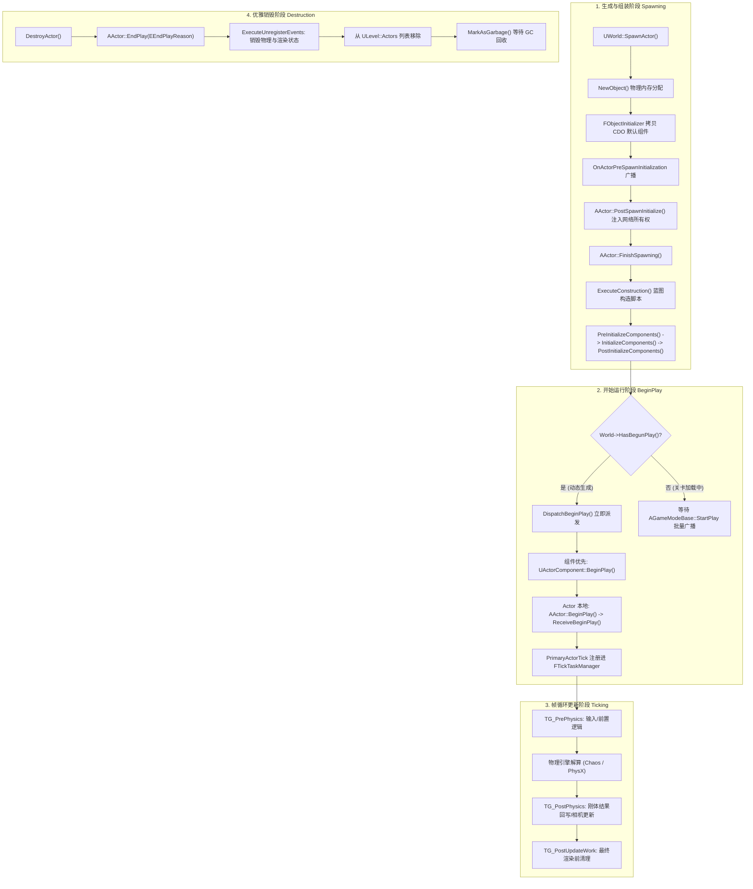

# UE 引擎源码分析 03：Actor 与 Component 生命周期源码剖析
> 知识成熟度：L2（已按 UE5.8 源码基线全面补齐真实源码段落、UWorld::SpawnActor 实例化、组件注册三阶段、TickGroup 调度拓扑与二阶段销毁流水线）。
> 对应知识点：[01-引擎基础/02 Actor 与 Component 生命周期](02-Actor与Component生命周期.md)

> 以本机 UE5.8 源码为准，逐行深度剖析从 `UWorld::SpawnActor` 分配构造、`AActor::PostSpawnInitialize` 角色初始化、蓝图构造脚本 `ExecuteConstruction`、组件注册三阶段（`OnRegister` / `CreateRenderState` / `CreatePhysicsState`）、`DispatchBeginPlay` 时序对齐，到 `FTickTaskManager` 组调度与 `DestroyActor` 清理销毁的全链路底层源码实现。

---

## 元数据

- **版本基准**：UE 5.8.0 / CL 55116800 / 分支 `++UE5+Release-5.8`（本机安装目录 `C:\Program Files\Epic Games\UE_5.8\Engine`）。
- **源码依据**：
  - `Engine\Source\Runtime\Engine\Private\LevelActor.cpp`（`UWorld::SpawnActor`、`UWorld::DestroyActor`）
  - `Engine\Source\Runtime\Engine\Private\Actor.cpp`（`AActor::PostSpawnInitialize`、`FinishSpawning`、`DispatchBeginPlay`、`BeginPlay`）
  - `Engine\Source\Runtime\Engine\Private\Components\ActorComponent.cpp`（`RegisterComponentWithWorld`、`ExecuteRegisterEvents`、`ExecuteUnregisterEvents`）
  - `Engine\Source\Runtime\Engine\Classes\Engine\EngineBaseTypes.h`（`ETickingGroup`、`FTickFunction`、`FActorTickFunction`）
  - `Engine\Source\Runtime\Engine\Private\TickTaskManager.cpp`（`FTickFunction::RegisterTickFunction`、`FTickTaskLevel::AddTickFunction`、`FTickTaskManager::AddTickFunction`、`FTickTaskSequencer::QueueTickTask`、`StartFrame`/`RunTickGroup`）
  - `Engine\Source\Runtime\Engine\Private\LevelTick.cpp`（`UWorld::Tick` 内的 TickGroup 逐组释放顺序）
  - `Engine\Source\Runtime\Engine\Private\World.cpp`（`UWorld::BeginPlay`、`UWorld::HasBegunPlay`、`UWorld::SetBegunPlay`、无缝切换标记）
  - `Engine\Source\Runtime\Engine\Private\WorldSettings.cpp`（`AWorldSettings::NotifyBeginPlay`）
  - `Engine\Source\Runtime\Engine\Private\GameModeBase.cpp`、`Engine\Source\Runtime\Engine\Private\GameStateBase.cpp`（`StartPlay` → `HandleBeginPlay` → `NotifyBeginPlay`）
  - `Engine\Source\Runtime\Engine\Private\Level.cpp`（`ULevel::RouteActorInitialize`、`ULevel::InitializeNetworkActors`）
  - `Engine\Source\Runtime\Engine\Private\ActorConstruction.cpp`（`AActor::ExecuteConstruction` 与 SCS 执行序）
  - `Engine\Source\Runtime\CoreUObject\Public\UObject\UObjectBaseUtility.h`（`MarkAsGarbage` 的真实归属）
- **行号口径**：下文所有"（第 N 行起）"均以本机 UE 5.8 源码 checkout `C:\Users\zhaozhiqi\Documents\GitHub\UnrealEngine` 计，安装版 5.8.0 引擎（`C:\Program Files\Epic Games\UE_5.8\Engine`）可能相差数行；代码块内的行号为文内偏移，两套口径不混用。
- **官方参考**：[Unreal Engine Actor 生命周期官方文档](https://dev.epicgames.com/documentation/en-us/unreal-engine)。
- **最后更新**：2026-09-14（补深：① `UWorld::SpawnActor` 与 `AActor::PostSpawnInitialize` 原始实现，含 `bDeferConstruction`、`SpawnCollisionHandlingMethod` 优先级链与 `LevelToSpawnIn` 三级回落；② `FinishSpawning`/`PostActorConstruction`/`ExecuteConstruction` 与三阶段组件初始化原始码；③ `RegisterComponentWithWorld`、`ExecuteRegisterEvents`/`ExecuteUnregisterEvents`、`CreatePhysicsState` 与 `AddOwnedComponent`/`AddInstanceComponent`；④ `DispatchBeginPlay`/`BeginPlay`、`AWorldSettings::NotifyBeginPlay` 延迟广播门禁与 `bActorSeamlessTraveled`；⑤ `FTickFunction` 注册与 `FTickTaskManager`/`FTickTaskSequencer` 组调度源码；⑥ `Destroy` → `DestroyActor` → `RouteEndPlay` 二阶段销毁链）。

---

## 概述与生命周期全景流水线

在虚幻引擎中，Actor 是可被放置或动态生成在 `UWorld` 中的基本实体，而 ActorComponent 是承载具体行为、渲染与物理特性的功能构件。Actor 的生命周期由引擎严格划分为四个阶段：



（上图为概念示意：只表达四个阶段与关键函数的对应关系，不代表真实调用栈深度、线程归属或分支完整性；各阶段的真实顺序与门禁条件以本文源码小节为准。）

---

## 核心源码深入剖析一：实体生成总指挥 `UWorld::SpawnActor`

### 1. `UWorld::SpawnActor` 真实源码（节选）

以下代码摘自本机 UE 5.8 源码 `Engine\Source\Runtime\Engine\Private\LevelActor.cpp`（第 456 行起，节选；该函数真实范围为第 456 行至第 800 行）：

（2026-09-14：原示意块已替换为 5.8 源码逐字版。下文第 2 小节"逐行技术深度解构"里的"（第 N 行）"是**被替换掉的示意块**的块内偏移，不对应下面源码的行号；下面源码中的行号以 checkout 文件为准）

```cpp
AActor* UWorld::SpawnActor( UClass* Class, FTransform const* UserTransformPtr, const FActorSpawnParameters& SpawnParameters )
{
	SCOPE_CYCLE_COUNTER(STAT_SpawnActorTime);
	CSV_SCOPED_TIMING_STAT_EXCLUSIVE(ActorSpawning);

#if WITH_EDITORONLY_DATA
	check( CurrentLevel );
	check(GIsEditor || (CurrentLevel == PersistentLevel));
#else
	ULevel* CurrentLevel = PersistentLevel;
#endif

	// Make sure this class is spawnable.
	if( !Class )
	{
// …（节选：省略 10 行）
	if( Class->HasAnyClassFlags(CLASS_Deprecated) )
	{
		UE_LOGF(LogSpawn, Warning, "SpawnActor failed because class %ls is deprecated", *Class->GetName() );
		return NULL;
	}
	if( Class->HasAnyClassFlags(CLASS_Abstract) )
	{
		UE_LOGF(LogSpawn, Warning, "SpawnActor failed because class %ls is abstract", *Class->GetName() );
		return NULL;
	}
	else if( !Class->IsChildOf(AActor::StaticClass()) )
	{
		UE_LOGF(LogSpawn, Warning, "SpawnActor failed because %ls is not an actor class", *Class->GetName() );
		return NULL;
	}
	else if (SpawnParameters.Template != NULL && SpawnParameters.Template->GetClass() != Class)
	{
		UE_LOGF(LogSpawn, Warning, "SpawnActor failed because template class (%ls) does not match spawn class (%ls)", *SpawnParameters.Template->GetClass()->GetName(), *Class->GetName());
		if (!SpawnParameters.bNoFail)
		{
			return NULL;
		}
	}
	else if (bIsRunningConstructionScript && !SpawnParameters.bAllowDuringConstructionScript)
	{
		UE_LOGF(LogSpawn, Warning, "SpawnActor failed because we are running a ConstructionScript (%ls)", *Class->GetName() );
		return NULL;
	}
// …（节选：省略 24 行）
	ULevel* LevelToSpawnIn = SpawnParameters.OverrideLevel;
	if (LevelToSpawnIn == NULL)
	{
		// Spawn in the same level as the owner if we have one.
		LevelToSpawnIn = (SpawnParameters.Owner != NULL) ? SpawnParameters.Owner->GetLevel() : ToRawPtr(CurrentLevel);
	}

	// Use class's default actor as a template if none provided.
	AActor* Template = SpawnParameters.Template ? SpawnParameters.Template : Class->GetDefaultObject<AActor>();
// …（节选：省略 79 行）
	FTransform const UserTransform = UserTransformPtr ? *UserTransformPtr : FTransform::Identity;

	// Choose the collision handling method. In order of increasing priority: actor template setting (often class default), collision handling override, bNoFail
	ESpawnActorCollisionHandlingMethod CollisionHandlingMethod = Template->SpawnCollisionHandlingMethod;

	// Adopt collision handling override if any was set
	if (SpawnParameters.SpawnCollisionHandlingOverride != ESpawnActorCollisionHandlingMethod::Undefined)
	{
		CollisionHandlingMethod = SpawnParameters.SpawnCollisionHandlingOverride;
	}

	// If bNoFail is true, upgrade collision handling method to an always spawning one
	if (SpawnParameters.bNoFail)
	{
		if (CollisionHandlingMethod == ESpawnActorCollisionHandlingMethod::AdjustIfPossibleButDontSpawnIfColliding)
		{
			CollisionHandlingMethod = ESpawnActorCollisionHandlingMethod::AdjustIfPossibleButAlwaysSpawn;
		}
		else if (CollisionHandlingMethod == ESpawnActorCollisionHandlingMethod::DontSpawnIfColliding)
		{
			CollisionHandlingMethod = ESpawnActorCollisionHandlingMethod::AlwaysSpawn;
		}
	}
// …（节选：省略 3 行）
	if (CollisionHandlingMethod == ESpawnActorCollisionHandlingMethod::DontSpawnIfColliding)
	{
		USceneComponent* const TemplateRootComponent = Template->GetRootComponent();

		// Note that we respect any initial transformation the root component may have from the CDO, so the final transform
		// might necessarily be exactly the passed-in UserTransform.
		FTransform const FinalRootComponentTransform =
			TemplateRootComponent
			? FTransform(TemplateRootComponent->GetRelativeRotation(), TemplateRootComponent->GetRelativeLocation(), TemplateRootComponent->GetRelativeScale3D()) * UserTransform
			: UserTransform;

		FVector const FinalRootLocation = FinalRootComponentTransform.GetLocation();
		FRotator const FinalRootRotation = FinalRootComponentTransform.Rotator();

		if (EncroachingBlockingGeometry(Template, FinalRootLocation, FinalRootRotation))
		{
			// a native component is colliding, that's enough to reject spawning
			UE_LOGF(LogSpawn, Log, "SpawnActor failed because of collision at the spawn location [%ls] for [%ls]", *FinalRootLocation.ToString(), *Class->GetName());
			return nullptr;
		}
	}

	EObjectFlags ActorFlags = SpawnParameters.ObjectFlags;

	// actually make the actor object
	AActor* const Actor = NewObject<AActor>(LevelToSpawnIn, Class, NewActorName, ActorFlags, Template, false/*bCopyTransientsFromClassDefaults*/, nullptr/*InInstanceGraph*/, ExternalPackage);

	check(Actor);
	check(Actor->GetLevel() == LevelToSpawnIn);
// …（节选：省略 73 行）
	// tell the actor what method to use, in case it was overridden
	Actor->SpawnCollisionHandlingMethod = CollisionHandlingMethod;

	// Broadcast delegate before the actor and its contained components are initialized
	OnActorPreSpawnInitialization.Broadcast(Actor);

	Actor->PostSpawnInitialize(UserTransform, SpawnParameters.Owner, SpawnParameters.Instigator, SpawnParameters.IsRemoteOwned(), SpawnParameters.bNoFail, SpawnParameters.bDeferConstruction, SpawnParameters.TransformScaleMethod);
// …（节选：省略 13 行）
	// This is too early, we were not guaranteed to call FinishSpawning in PostSpawnInitialize:
	// CVar in case some ugly case comes up
	if (!UE::Gameplay::CVars::bDelayOnActorSpawnedUntilFinishedSpawning)
	{
		// Broadcast notification of spawn
		OnActorSpawned.Broadcast(Actor);
	}
// …（节选：省略 17 行）
	if (!UE::Gameplay::CVars::bDelayOnActorSpawnedUntilFinishedSpawning)
	{
		// Add this newly spawned actor to the network actor list. Do this after PostSpawnInitialize so that actor has "finished" spawning.
		AddNetworkActor( Actor );
	}

	return Actor;
}
```

### 2. 逐行技术深度解构

1. **碰撞阻挡预检（`EncroachingBlockingGeometry`，第 22~30 行）**：
   - 当 `SpawnCollisionHandlingMethod` 设为 `DontSpawnIfColliding` 时，引擎在分配内存前利用模板 CDO 的 RootComponent 碰撞体直接对目标坐标做一次快速 Overlap 探测。若空间已被静态墙体占据，立即放弃生成，避免无效的内存申请与析构开销；
2. **`NewObject<AActor>` 实例化（第 33 行）**：
   - 此时以当前关卡 `LevelToSpawnIn` 作为 Outer，以类模板 `Template`（即 CDO）作为内存基底，触发 Actor 原生 C++ 构造函数。在该构造函数中通过 `CreateDefaultSubobject` 实例化的默认组件此时被挂载到对象树上；
3. **`OnActorPreSpawnInitialization` 广播（第 37 行）**：
   - 这是 UE5.8 推荐的监听起点。此时 Actor 实例已被创建，但其组件尚未进行世界注册（OnRegister），适合外部框架（如 GameplayDebugger 或网络追踪器）预先建立数据映射。

### 3. `UWorld::SpawnActor` 原始实现的四点关键结论

上文第 1 小节已给出该函数的 5.8 逐字节选（`// …（节选：省略 N 行）` 为被跳过的原始行），这里只提炼与常见认知不同、值得单独记住的四点：

真实实现中与常见认知不同、值得单独记住的三点：

1. **`LevelToSpawnIn` 是三级回落**（第 533 行起）：先取 `SpawnParameters.OverrideLevel`；为空且指定了 `Owner` 时强制落在 `Owner->GetLevel()`（多人游戏里"部件与拥有者同关卡"是硬约束，没有开关）；两者都为空才退回 `CurrentLevel`。非编辑器构建下 `CurrentLevel` 由 `PersistentLevel` 兜底（第 465 行）。
2. **失败门禁是顺序短路而非组合判断**（第 469 行起）：空类、`CLASS_Deprecated`、`CLASS_Abstract`、非 `AActor` 派生、模板类与生成类不一致、正在运行构造脚本、`bIsTearingDown`、Transform 含 NaN，各自独立 `return NULL` 且日志文案不同。调试"生成失败"时按 `LogSpawn` 的首条 Warning 定位即可。
3. **`SpawnCollisionHandlingMethod` 的优先级链**（第 621 行起）：模板（通常来自类默认值）→ `SpawnCollisionHandlingOverride` 覆盖 → `bNoFail` 把两个"可能不生成"的策略升级为"总是生成"。`SpawnActor` 内的 `EncroachingBlockingGeometry` 只针对**原生组件**做一次提前淘汰，目的是避免白付一次 `NewObject` 的代价；真正按策略执行挤出或放弃的是 `PostActorConstruction()`（见"核心源码深入剖析二"第 3 小节）。
4. **`OnActorSpawned` 与 `AddNetworkActor` 默认被推迟**（第 769 行、第 791 行）：CVar `s.DelayOnActorSpawnedUntilFinishedSpawning` 默认 true（`LevelActor.cpp` 第 52 行），因此这两个动作回到 `UWorld::OnActorFinishedSpawning` 中触发；只有把它设为 false 才是"`PostSpawnInitialize` 返回即完成网络登记"的旧行为。

### 4. `AActor::PostSpawnInitialize` 的 checkout 原始实现（节选）

以下代码摘自本机 UE 5.8 源码 `Engine\Source\Runtime\Engine\Private\Actor.cpp`（第 4276 行起，节选）：

```cpp
void AActor::PostSpawnInitialize(FTransform const& UserSpawnTransform, AActor* InOwner, APawn* InInstigator, bool bRemoteOwned, bool bNoFail, bool bDeferConstruction, ESpawnActorScaleMethod TransformScaleMethod)
{
	// General flow here is like so
	// - Actor sets up the basics.
	// - Actor gets PreInitializeComponents()
	// - Actor constructs itself, after which its components should be fully assembled
	// - Actor components get OnComponentCreated
	// - Actor components get InitializeComponent
	// - Actor gets PostInitializeComponents() once everything is set up
	//
	// This should be the same sequence for deferred or nondeferred spawning.

	// It's not safe to call UWorld accessor functions till the world info has been spawned.
	UWorld* const World = GetWorld();
	bool const bActorsInitialized = World && World->AreActorsInitialized();

	CreationTime = (World ? World->GetTimeSeconds() : 0.f);

	// Set network role.
	ensureMsgf(GetLocalRole() == ROLE_Authority, TEXT("Actor %s has an invalid Role and may be a corrupt asset!"), *GetFullName());
	ExchangeNetRoles(bRemoteOwned);

	// Set owner.
	SetOwner(InOwner);

	// Set instigator
	SetInstigator(InInstigator);
// …（节选：省略 24 行）
	// Call OnComponentCreated on all default (native) components
	DispatchOnComponentsCreated(this);

	// Register the actor's default (native) components, but only if we have a native scene root. If we don't, it implies that there could be only non-scene components
	// at the native class level. In that case, if this is a Blueprint instance, we need to defer native registration until after SCS execution can establish a scene root.
	// Note: This API will also call PostRegisterAllComponents() on the actor instance. If deferred, PostRegisterAllComponents() won't be called until the root is set by SCS.
	bHasDeferredComponentRegistration = (SceneRootComponent == nullptr && Cast<UBlueprintGeneratedClass>(GetClass()) != nullptr);
	if (!bHasDeferredComponentRegistration && GetWorld())
	{
		RegisterAllComponents();
	}

#if WITH_EDITOR
	// When placing actors in the editor, init any random streams
	if (!bActorsInitialized)
	{
		SeedAllRandomStreams();
	}
#endif

	// See if anything has deleted us
	if( !IsValidChecked(this) && !bNoFail )
	{
		return;
	}
// …（节选：省略 4 行）
	// Executes native and BP construction scripts.
	// After this, we can assume all components are created and assembled.
	if (!bDeferConstruction)
	{
		FinishSpawning(UserSpawnTransform, true);
	}
	else if (SceneRootComponent != nullptr)
	{
		// we have a native root component and are deferring construction, store our original UserSpawnTransform
		// so we can do the proper thing if the user passes in a different transform during FinishSpawning
		GSpawnActorDeferredTransformCache.Emplace(this, UserSpawnTransform);
	}
```

逐条解构：

1. **函数头注释描述的是整条管线**（第 4278 行至第 4286 行）：引擎作者明确写了"deferred 与 nondeferred 走同一序列"，但注意 `PreInitializeComponents()` 并不在这个函数体里被调用，它发生在后续的 `PostActorConstruction()` 中。
2. **原生根组件决定最终变换**（第 4305 行起）：`FixupNativeActorComponents` 找到原生 `USceneComponent` 后，按 `TransformScaleMethod` 决定是"覆盖根缩放"（`OverrideRootScale`）还是"与模板相对缩放相乘"（`MultiplyWithRoot`/`SelectDefaultAtRuntime`），最后以 `ETeleportType::ResetPhysics` 落位。这解释了"传入 Transform 不等于最终 Actor 位置"：CDO 上的非默认相对变换会被复合进来。
3. **组件注册可能被推迟**（第 4333 行）：当"没有原生场景根 + 是蓝图生成类"时 `bHasDeferredComponentRegistration = true`，`RegisterAllComponents()` 被推迟到 SCS 建立起场景根之后，由 `ActorConstruction.cpp` 第 908 行的补偿逻辑接续。
4. **延迟构造的分叉只有几行**（第 4358 行至第 4367 行）：`bDeferConstruction == false` 直接 `FinishSpawning(UserSpawnTransform, true)`；为 true 且存在原生根组件时，把原始 Transform 存入 `GSpawnActorDeferredTransformCache`，供调用方日后用**另一个** Transform 调 `FinishSpawning` 时反算最终变换。
5. **`PostActorCreated()` 先于构造脚本**（第 4354 行）：它不是 BeginPlay 那一类通知，而是"原生组件与场景状态已就绪"的通知点。

### 5. 事实边界与命名校正

- **`UWorld::SpawnActor_Internal` 在 5.8 中不存在**：在 checkout `C:\Users\zhaozhiqi\Documents\GitHub\UnrealEngine\Engine` 全目录检索 `SpawnActor_Internal` 为 0 命中。从参数整理到 `PostSpawnInitialize` 的全部逻辑都在 `UWorld::SpawnActor` 单函数体内（第 456 行至第 800 行），没有拆分的 `_Internal` 层。
- **本小节起为逐字口径**：第 1 小节至第 4 小节的既有代码块是压缩/改写版，其"（第 N 行）"是块内偏移；本小节起的"（第 N 行起）"是 checkout 真实文件行号，两套口径不可混用。
- **静态结论 ≠ 运行态验证**：以上均为源码静态阅读结论，未在 Editor / DedicatedServer 上抓取实际时序（如 `LogSpawn` 轨迹、`stat Ticks`）。真实行为还受 `s.DelayOnActorSpawnedUntilFinishedSpawning`、`GEnableDeferredPhysicsCreation` 等 CVar 影响，需要另跑运行时验证。

---

## 核心源码深入剖析二：延迟装配与蓝图构造 `AActor::FinishSpawning`

无论是即时生成还是延迟生成（`bDeferConstruction=true`），Actor 最终均在 `FinishSpawning` 中完成装配与初始化。

### 1. `AActor::FinishSpawning` 真实源码（节选）

以下代码摘自本机 UE 5.8 源码 `Engine\Source\Runtime\Engine\Private\Actor.cpp`（第 4374 行起，节选）：

（2026-09-14：原示意块已替换为 5.8 源码逐字版。原示意块把 `FinishSpawning` 与 `PostActorConstruction` 的内容合并成一段，现已拆分：`PostActorConstruction` 的逐字节选见下文第 3 小节；第 2 小节的"（第 N 行）"是被替换掉的示意块的块内偏移）

```cpp
void AActor::FinishSpawning(const FTransform& UserTransform, bool bIsDefaultTransform, const FComponentInstanceDataCache* InstanceDataCache, ESpawnActorScaleMethod TransformScaleMethod)
{
#if ENABLE_SPAWNACTORTIMER
	FScopedSpawnActorTimer SpawnTimer(GetClass()->GetFName(), ESpawnActorTimingType::FinishSpawning);
	SpawnTimer.SetActorName(GetFName());
#endif

	if (ensure(!bHasFinishedSpawning))
	{
		bHasFinishedSpawning = true;

		FTransform FinalRootComponentTransform = (RootComponent ? RootComponent->GetComponentTransform() : UserTransform);
// …（节选：省略 27 行）
		{
			FEditorScriptExecutionGuard ScriptGuard;
			ExecuteConstruction(FinalRootComponentTransform, nullptr, InstanceDataCache, bIsDefaultTransform, TransformScaleMethod);
		}

		{
			SCOPE_CYCLE_COUNTER(STAT_PostActorConstruction);
			PostActorConstruction();
		}

		if (UWorld* World = GetWorld())
		{
			World->OnActorFinishedSpawning(this);
		}
	}
}
```

### 2. 逐行技术深度解构

1. **`ExecuteConstruction`（蓝图构造脚本，第 15 行）**：
   - 蓝图编辑器中在“Construction Script”图表里连线的逻辑在此处被执行；
   - 动态添加的组件（`AddComponent`）在此阶段创建，并自动挂接到场景组件树上；
2. **三阶段组件生命周期（第 22~28 行）**：
   - `PreInitializeComponents`：Actor 层的虚函数，提供组件逻辑初始化前的最后拦截点；
   - `InitializeComponents`：遍历所有开启了 `bWantsInitializeComponent = true` 的组件，逐一触发 `UActorComponent::InitializeComponent()`；
   - `PostInitializeComponents`：整个生命周期中最关键的节点之一！此时所有原生组件与动态组件均已组装完毕，`APlayerController::InitPlayerState()` 与 Pawn 的输入绑定注册即在此处触发。

### 3. `FinishSpawning` 的下游：`AActor::PostActorConstruction`（checkout 原始实现，节选）

第 1 小节是 `FinishSpawning` 的逐字节选，其四个要点如下；随后是它调用的 `PostActorConstruction()`——`FinishSpawning` 本身只负责变换与调序，真正的三阶段初始化与碰撞策略处理都在后者：

逐条解构：

1. `bHasFinishedSpawning` 由 `ensure` 守卫（第 4381 行）：重复调用只会触发断言，不会二次装配。
2. **最终变换的计算分两步**（第 4385 行、第 4389 行起）：默认取根组件当前世界变换；仅当 `bIsDefaultTransform == false` 时才去 `GSpawnActorDeferredTransformCache` 取回原始生成变换，再用 `TemplateTransform * UserTransform` 反推出"尊重模板相对变换"的最终值。这是 `FinishSpawning` 中唯一容易被忽略的数学。
3. `ExecuteConstruction` 被包在 `FEditorScriptExecutionGuard` 内（第 4414 行），编辑器构建下允许构造脚本期间执行脚本调用。
4. `FinishSpawning` 本身只负责变换与调序，真正的初始化在 `PostActorConstruction()`（第 4420 行）；返回前还会调 `World->OnActorFinishedSpawning(this)`（第 4425 行），这正是 `OnActorSpawned` 被延迟后的实际触发点。

以下代码摘自本机 UE 5.8 源码 `Engine\Source\Runtime\Engine\Private\Actor.cpp`（第 4430 行起，节选）：

```cpp
void AActor::PostActorConstruction()
{
	LLM_SCOPE_DYNAMIC_STAT_OBJECTPATH(GetPackage(), ELLMTagSet::Assets);
	LLM_SCOPE_DYNAMIC_STAT_OBJECTPATH(GetClass(), ELLMTagSet::AssetClasses);
	UE_TRACE_METADATA_SCOPE_ASSET(this, GetClass());
	UWorld* const World = GetWorld();
	bool const bActorsInitialized = World && World->AreActorsInitialized();

	if (bActorsInitialized)
	{
		PreInitializeComponents();
	}

	// If this is dynamically spawned replicated actor, defer calls to BeginPlay and UpdateOverlaps until replicated properties are deserialized
	const bool bDeferBeginPlayAndUpdateOverlaps = (bExchangedRoles && RemoteRole == ROLE_Authority) && !GIsReinstancing;

	if (bActorsInitialized)
	{
		// Call InitializeComponent on components
		InitializeComponents();

		// actor should have all of its components created and registered now, do any collision checking and handling that we need to do
// …（节选：省略 47 行）
		if (IsValidChecked(this))
		{
			PostInitializeComponents();
			if (IsValidChecked(this))
			{
				if (!bActorInitialized)
				{
					UE_LOGF(LogActor, Fatal, "%ls failed to route PostInitializeComponents.  Please call Super::PostInitializeComponents() in your <className>::PostInitializeComponents() function. ", *GetFullName());
				}

				bool bRunBeginPlay = !bDeferBeginPlayAndUpdateOverlaps && (BeginPlayCallDepth > 0 || World->HasBegunPlay());
				if (bRunBeginPlay)
				{
					if (AActor* ParentActor = GetParentActor())
					{
						// Child Actors cannot run begin play until their parent has run
						bRunBeginPlay = (ParentActor->HasActorBegunPlay() || ParentActor->IsActorBeginningPlay());
					}
				}

#if WITH_EDITOR
				if (bRunBeginPlay && bIsEditorPreviewActor)
				{
					bRunBeginPlay = false;
				}
#endif

				if (bRunBeginPlay)
				{
					SCOPE_CYCLE_COUNTER(STAT_ActorBeginPlay);
					DispatchBeginPlay();
				}
			}
		}
	}
	else
	{
		// Invalidate the object so that when the initial undo record is made,
		// the actor will be treated as destroyed, in that undo an add will
		// actually work
		MarkAsGarbage();
		Modify(false);
		ClearGarbage();
	}
}
```

逐条解构：

1. `PreInitializeComponents()` 与 `InitializeComponents()` 都只在 `bActorsInitialized` 为真时执行（第 4438 行、第 4446 行）——世界尚未 `InitializeActorsForPlay` 时这两个钩子整体被跳过，由关卡初始化路径补做（见"核心源码深入剖析四"第 5 小节）。
2. **`bDeferBeginPlayAndUpdateOverlaps`**（第 4444 行）：动态生成且发生角色交换的复制型 Actor（`bExchangedRoles && RemoteRole == ROLE_Authority`）必须等复制属性反序列化完才能 BeginPlay，这是"BeginPlay 里读到空属性"的根因之一。
3. **碰撞策略在这里才真正生效**（第 4452 行起）：`AdjustIfPossibleBut*` 用 `World->FindTeleportSpot` 找空位，找不到就 `Destroy()`；`DontSpawnIfColliding` 用 `EncroachingBlockingGeometry` 复查，冲突即 `Destroy()`。此时 Actor 已 `NewObject` 且组件已注册，所以"生成失败"的本质是**生成后立即销毁**——调用方若只看返回值，可能拿到一个已进入销毁流程的指针。
4. `PostInitializeComponents()` 后立刻校验 `bActorInitialized`（第 4504 行），未置位直接 `Fatal`：这就是"忘了在子类里调 `Super::PostInitializeComponents()`"的报错来源。
5. **`bRunBeginPlay` 的完整判定**（第 4509 行）：`!bDeferBeginPlayAndUpdateOverlaps && (BeginPlayCallDepth > 0 || World->HasBegunPlay())`，并且 ChildActor 还要等父 Actor `HasActorBegunPlay() || IsActorBeginningPlay()`；编辑器预览 Actor 在 `WITH_EDITOR` 下被强制置为 false（第 4520 行）。
6. **世界未初始化分支**（第 4534 行起）：`MarkAsGarbage()` → `Modify(false)` → `ClearGarbage()`。这是为了让编辑器撤销记录把该 Actor 当作"已销毁"（撤销时的一次 Add 才能生效），属于编辑器技巧，不是 GC 语义。

### 4. `AActor::ExecuteConstruction` 与 SCS 的真实执行序（节选）

`FinishSpawning` 第 4415 行调用的就是它，真实实现位于另一个编译单元。

以下代码摘自本机 UE 5.8 源码 `Engine\Source\Runtime\Engine\Private\ActorConstruction.cpp`（第 818 行起，节选）：

```cpp
bool AActor::ExecuteConstruction(const FTransform& Transform, const FRotationConversionCache* TransformRotationCache, const FComponentInstanceDataCache* InstanceDataCache, bool bIsDefaultTransform, ESpawnActorScaleMethod TransformScaleMethod)
{
	check(IsValidChecked(this));
	check(!HasAnyFlags(RF_BeginDestroyed|RF_FinishDestroyed));

#if WITH_EDITOR
	// Guard against reentrancy due to attribute editing at construction time.
	// @see RerunConstructionScripts()
	checkf(!bActorIsBeingConstructed, TEXT("Actor construction is not reentrant"));
#endif
	bActorIsBeingConstructed = true;
	ON_SCOPE_EXIT
	{
		bActorIsBeingConstructed = false;
		UCSBlueprintComponentArchetypeCounts.Remove(this);
	};

	// ensure that any existing native root component gets this new transform
	// we can skip this in the default case as the given transform will be the root component's transform
	if (RootComponent && !bIsDefaultTransform)
	{
		if (TransformRotationCache)
		{
			RootComponent->SetRelativeRotationCache(*TransformRotationCache);
		}
		RootComponent->SetWorldTransform(Transform, /*bSweep=*/false, /*OutSweepHitResult=*/nullptr, ETeleportType::TeleportPhysics);
	}

	// Generate the parent blueprint hierarchy for this actor, so we can run all the construction scripts sequentially
	TArray<const UBlueprintGeneratedClass*> ParentBPClassStack;
	const bool bErrorFree = UBlueprintGeneratedClass::GetGeneratedClassesHierarchy(GetClass(), ParentBPClassStack);
// …（节选：省略 43 行）
			// Prevent user from spawning actors in User Construction Script
			FGuardValue_Bitfield(GetWorld()->bIsRunningConstructionScript, true);
			for (int32 i = ParentBPClassStack.Num() - 1; i >= 0; i--)
			{
				const UBlueprintGeneratedClass* CurrentBPGClass = ParentBPClassStack[i];
				check(CurrentBPGClass);
				USimpleConstructionScript* SCS = CurrentBPGClass->SimpleConstructionScript;
				if (SCS)
				{
					SCS->ExecuteScriptOnActor(this, NativeSceneComponents, Transform, TransformRotationCache, bIsDefaultTransform, TransformScaleMethod);
				}
				// Now that the construction scripts have been run, we can create timelines and hook them up
				UBlueprintGeneratedClass::CreateComponentsForActor(CurrentBPGClass, this);
			}

			// Ensure that we've called RegisterAllComponents(), in case it was deferred and the SCS could not be fully executed.
			if (HasDeferredComponentRegistration() && GetWorld()->bIsWorldInitialized)
			{
				RegisterAllComponents();
			}

			// Once SCS execution has finished, we do a final pass to register any new components that may have been deferred or were otherwise left unregistered after SCS execution.
			TInlineComponentArray<UActorComponent*> PostSCSComponents;
			GetComponents(PostSCSComponents);
			for (UActorComponent* ActorComponent : PostSCSComponents)
			{
				// Limit registration to components that are known to have been created during SCS execution
				if (!ActorComponent->IsRegistered() && ActorComponent->bAutoRegister && IsValidChecked(ActorComponent) && (GetWorld()->bIsWorldInitialized || bHasRegisteredAllComponents)
					&& (ActorComponent->CreationMethod == EComponentCreationMethod::SimpleConstructionScript || !PreSCSComponents.Contains(ActorComponent)))
				{
					USimpleConstructionScript::RegisterInstancedComponent(ActorComponent);
				}
			}
```

逐条解构：

1. `bActorIsBeingConstructed` 配合 `ON_SCOPE_EXIT`（第 828 行）保证构造不可重入，编辑器构建下由 `checkf` 强制。
2. 蓝图父类链 `ParentBPClassStack` 由 `GetGeneratedClassesHierarchy` 生成，SCS 循环是**从最基类到最派生类**（第 894 行 `for (int32 i = Num - 1; i >= 0; i--)`），全部执行完才 `CreateComponentsForActor` 创建时间轴等对象。
3. `FGuardValue_Bitfield(GetWorld()->bIsRunningConstructionScript, true)`（第 893 行）正是 `SpawnActor` 门禁第 504 行检查的标志：构造脚本期间默认禁止生成新 Actor，除非显式传 `bAllowDuringConstructionScript`。
4. **SCS 后有一次补偿注册**（第 907 行起）：若 `bHasDeferredComponentRegistration` 则补 `RegisterAllComponents()`；随后只对"SCS 新建或非 SCS 前已存在、且 `bAutoRegister` 的未注册组件"逐个 `USimpleConstructionScript::RegisterInstancedComponent`。这条路径解释了"蓝图里加的组件为什么在 BeginPlay 时必然已注册"。

### 5. `PreInitializeComponents` / `InitializeComponents` / `PostInitializeComponents` 的 checkout 原始实现

以下代码摘自本机 UE 5.8 源码 `Engine\Source\Runtime\Engine\Private\Actor.cpp`（第 6630 行起、第 6388 行起、第 6618 行起，三个互不连续的片段，均完整逐字）：

```cpp
void AActor::PreInitializeComponents()
{
	if (AutoReceiveInput != EAutoReceiveInput::Disabled)
	{
		const int32 PlayerIndex = int32(AutoReceiveInput.GetValue()) - 1;

		APlayerController* PC = UGameplayStatics::GetPlayerController(this, PlayerIndex);
		if (PC)
		{
			EnableInput(PC);
		}
		else
		{
			GetWorld()->PersistentLevel->RegisterActorForAutoReceiveInput(this, PlayerIndex);
		}
	}
}
// …（节选：以下片段取自本文件第 6388 行，与上文不连续）
void AActor::InitializeComponents()
{
	QUICK_SCOPE_CYCLE_COUNTER(STAT_Actor_InitializeComponents);

	TInlineComponentArray<UActorComponent*> Components;
	GetComponents(Components);

	for (UActorComponent* ActorComp : Components)
	{
		if (ActorComp->IsRegistered())
		{
			if (ActorComp->bAutoActivate && !ActorComp->IsActive())
			{
				ActorComp->Activate(true);
			}

			if (ActorComp->bWantsInitializeComponent && !ActorComp->HasBeenInitialized())
			{
				// Broadcast the activation event since Activate occurs too early to fire a callback in a game
				ActorComp->InitializeComponent();
			}
		}
	}
}
// …（节选：省略 206 行）
void AActor::PostInitializeComponents()
{
	QUICK_SCOPE_CYCLE_COUNTER(STAT_Actor_PostInitComponents);

	if(IsValidChecked(this) )
	{
		bActorInitialized = true;

		UpdateAllReplicatedComponents();
	}
}
```

逐条解构：

1. `PreInitializeComponents` 的基类实现只处理 `AutoReceiveInput`（第 6632 行起）：PlayerController 尚未就绪时走 `PersistentLevel->RegisterActorForAutoReceiveInput(this, PlayerIndex)` 延迟绑定。
2. `InitializeComponents` 有两个隐式前置（第 6397 行、第 6404 行）：**组件必须已注册**，且满足 `bWantsInitializeComponent && !HasBeenInitialized()`；顺带在这里做 `bAutoActivate` 的激活。既有第 2 小节所称"遍历所有开启了 `bWantsInitializeComponent` 的组件"需要补上"且已注册"这一条件。
3. `PostInitializeComponents` 基类只做两件事（第 6622 行起）：`bActorInitialized = true` 与 `UpdateAllReplicatedComponents()`。所以"PostInitializeComponents 时所有组件都已完成 InitializeComponent"成立，但"所有子 Actor 都已生成"不成立——ChildActor 由 `ChildActorComponent` 决定，生成时机更早。

---

## 核心源码深入剖析三：组件注册三阶段 `RegisterComponentWithWorld`

组件挂载到世界不仅是加入一个列表，而是同步建立渲染代理（PrimitiveSceneInfo）与物理刚体（BodyInstance）。

### 1. `UActorComponent::ExecuteRegisterEvents` 完整真实源码

以下代码摘自本机 UE 5.8 源码 `Engine\Source\Runtime\Engine\Private\Components\ActorComponent.cpp`（第 2510 行起，完整逐字）：

（2026-09-14：原示意块已替换为 5.8 源码逐字版；第 2 小节的"（第 N 行）"是被替换掉的示意块的块内偏移。注销方向的对偶函数 `ExecuteUnregisterEvents` 的逐字版见第 4 小节）

```cpp
void UActorComponent::ExecuteRegisterEvents(FRegisterComponentContext* Context)
{
	if(!bRegistered)
	{
		SCOPE_CYCLE_COUNTER(STAT_ComponentOnRegister);
		OnRegister();
		checkf(bRegistered, TEXT("Failed to route OnRegister (%s)"), *GetFullName());
	}

	if(FApp::CanEverRender() && !bRenderStateCreated && WorldPrivate->Scene && ShouldCreateRenderState())
	{
		SCOPE_CYCLE_COUNTER(STAT_ComponentCreateRenderState);
		LLM_SCOPE(ELLMTag::SceneRender);
		LLM_SCOPE_DYNAMIC_STAT_OBJECTPATH(GetPackage(), ELLMTagSet::Assets);
		LLM_SCOPE_DYNAMIC_STAT_OBJECTPATH(UWorld::StaticClass(), ELLMTagSet::AssetClasses);
		UE_TRACE_METADATA_SCOPE_ASSET_FNAME(NAME_None, UWorld::StaticClass()->GetFName(), GetPackage()->GetFName());
		CreateRenderState_Concurrent(Context);
		checkf(bRenderStateCreated, TEXT("Failed to route CreateRenderState_Concurrent (%s)"), *GetFullName());
	}

	CreatePhysicsState(/*bAllowDeferral=*/true);
}
```

### 2. 逐行技术深度解构

1. **`OnRegister()` 语义（第 6 行）**：
   - 标记 `bRegistered = true`，建立组件与 Owner Actor 及 UWorld 的关联；
2. **`CreateRenderState_Concurrent` 并行渲染状态创建（第 16 行）**：
   - 构造 `FPrimitiveSceneProxy` 并将其指针安全递交给渲染线程（RenderThread）的场景八叉树中。注意后缀 `_Concurrent`，意味着当大批量流送加载组件时，该函数支持在多个工作线程并发执行；
3. **`CreatePhysicsState` 物理状态创建（第 21 行）**：
   - 向 Chaos 物理场景（`FPhysScene_Chaos`）注册 `FBodyInstance` 与碰撞碰撞体。当组件被隐藏或禁用时，对应的逆向函数 `ExecuteUnregisterEvents` 将按逆序依次调用 `DestroyPhysicsState`、`DestroyRenderState_Concurrent` 与 `OnUnregister`。

### 3. `UActorComponent::RegisterComponentWithWorld` 的 checkout 原始实现（节选）

以下代码摘自本机 UE 5.8 源码 `Engine\Source\Runtime\Engine\Private\Components\ActorComponent.cpp`（第 1967 行起，节选）：

```cpp
void UActorComponent::RegisterComponentWithWorld(UWorld* InWorld, FRegisterComponentContext* Context)
{
	SCOPE_CYCLE_COUNTER(STAT_RegisterComponent);
	FScopeCycleCounterUObject ComponentScope(this);

	checkf(!IsUnreachable(), TEXT("%s"), *GetFullName());

	if(!IsValidChecked(this))
	{
		UE_LOGF(LogActorComponent, Log, "RegisterComponentWithWorld: (%ls) Trying to register component with IsValid() == false. Aborting.", *GetPathName());
		return;
	}

	// If the component was already registered, do nothing
	if(IsRegistered())
	{
		UE_LOGF(LogActorComponent, Log, "RegisterComponentWithWorld: (%ls) Already registered. Aborting.", *GetPathName());
		return;
	}

	if(InWorld == nullptr)
	{
		//UE_LOGF(LogActorComponent, Log, "RegisterComponentWithWorld: (%ls) NULL InWorld specified. Aborting.", *GetPathName());
		return;
	}
// …（节选：省略 34 行）
	if (!bHasBeenCreated)
	{
		OnComponentCreated();
	}

	WorldPrivate = InWorld;

	ExecuteRegisterEvents(Context);

	// If not in a game world register ticks now, otherwise defer until BeginPlay. If no owner we won't trigger BeginPlay either so register now in that case as well.
	if (!InWorld->IsGameWorld())
	{
		RegisterAllComponentTickFunctions(true);
	}
	else if (MyOwner == nullptr)
	{
		if (!bHasBeenInitialized && bWantsInitializeComponent)
		{
			InitializeComponent();
		}

		RegisterAllComponentTickFunctions(true);
	}
	else
	{
		MyOwner->HandleRegisterComponentWithWorld(this);
	}
// …（节选：省略 1 行）
	// If this is a blueprint created component and it has component children they can miss getting registered in some scenarios
	if (IsCreatedByConstructionScript())
	{
		TArray<UObject*> Children;
		GetObjectsWithOuter(this, Children, EGetObjectsFlags::IncludeNestedObjects, RF_NoFlags, EInternalObjectFlags::Garbage);

		for (UObject* Child : Children)
		{
			if (UActorComponent* ChildComponent = Cast<UActorComponent>(Child))
			{
				if (ChildComponent->bAutoRegister && !ChildComponent->IsRegistered() && ChildComponent->GetOwner() == MyOwner)
				{
					ChildComponent->RegisterComponentWithWorld(InWorld);
				}
			}
		}

	}

	if (MyOwner && MyOwner->InputComponent)
	{
		UInputDelegateBinding::BindInputDelegates(GetClass(), MyOwner->InputComponent, this);
	}
}
```

逐条解构（三条容易被误判的路径）：

1. **早期返回全是静默的**（第 1974 行起）：`IsValidChecked == false`、已注册、`InWorld == nullptr`、World 已清理（`IsCleanedUp()`）、Owner 属于 `CLASS_NewerVersionExists`（蓝图重编译后的死类），都是打日志后 `return`，不抛异常。排查"组件没注册"应优先看 `LogActorComponent`。
2. **Tick 注册时机由世界类型与 Owner 决定**（第 2036 行起）：非游戏世界（编辑器预览世界）立刻 `RegisterAllComponentTickFunctions(true)`；游戏世界中**无 Owner** 的组件也立刻注册并自行 `InitializeComponent()`；**有 Owner** 的游戏世界组件则把后续交给 `MyOwner->HandleRegisterComponentWithWorld(this)`，由 Actor 决定是否 Initialize / BeginPlay / 注册 Tick。这就是"运行时 `RegisterComponent()` 的组件为什么能自动拿到 BeginPlay"的实现。
3. **SCS 子组件补注册**（第 2054 行起）：只对 `IsCreatedByConstructionScript()` 的组件，遍历其 Outer 树中 `bAutoRegister && !IsRegistered && Owner 相同` 的子组件递归注册。手工 `NewObject` 出来的组件不在此豁免范围内，必须自己调 `RegisterComponent()`。
4. 末尾的 `UInputDelegateBinding::BindInputDelegates`（第 2073 行起）：只有 Owner 已有 `InputComponent` 时才绑定，因此组件注册顺序会影响输入代理绑定，注册早于 `SetupPlayerInputComponent` 的组件才能绑上。

### 4. `ExecuteUnregisterEvents` 的 checkout 原始实现

`ExecuteRegisterEvents` 的逐字版已在第 1 小节，这里是它的对偶函数：注销方向，且顺序与注册并非严格逆序。

以下代码摘自本机 UE 5.8 源码 `Engine\Source\Runtime\Engine\Private\Components\ActorComponent.cpp`（第 2534 行起，完整逐字）：

```cpp
void UActorComponent::ExecuteUnregisterEvents()
{
	DestroyPhysicsState();

	if (bRenderStateCreated)
	{
		SCOPE_CYCLE_COUNTER(STAT_ComponentDestroyRenderState);
		checkf(bRegistered, TEXT("Component has render state when not registered (%s)"), *GetFullName());
		DestroyRenderState_Concurrent();
		checkf(!bRenderStateCreated, TEXT("Failed to route DestroyRenderState_Concurrent (%s)"), *GetFullName());
	}

	if (bRegistered)
	{
		SCOPE_CYCLE_COUNTER(STAT_ComponentOnUnregister);
		OnUnregister();
		checkf(!bRegistered, TEXT("Failed to route OnUnregister (%s)"), *GetFullName());
	}
}
```

逐条解构：

1. **注册与注销不是严格逆序**：注册是 `OnRegister → CreateRenderState_Concurrent → CreatePhysicsState`；注销是 `DestroyPhysicsState → DestroyRenderState_Concurrent → OnUnregister`。物理状态最后创建、最先销毁，渲染状态居中。
2. **每阶段都有 `checkf` 守卫**（第 2516 行、第 2527 行、第 2543 行、第 2550 行）：子类没有正确转发 `Super::OnRegister()` / `Super::OnCreatePhysicsState()` / `Super::OnDestroyPhysicsState()` 时会在此断言，而不是无声失效。
3. 第 1 小节"后缀 `_Concurrent` 意味着支持多线程并发执行"需要收窄：该后缀表示这些函数**可以在并发（非游戏线程）上下文中被调用**，实际并发发生在组件预注册与异步物理状态创建路径上；普通 `RegisterComponent()` 仍是游戏线程同步执行。

### 5. `CreateRenderState_Concurrent` / `CreatePhysicsState` / `ReadyForReplication` 的 checkout 原始实现

以下代码摘自本机 UE 5.8 源码 `Engine\Source\Runtime\Engine\Private\Components\ActorComponent.cpp`（第 2243 行起、第 2398 行起、第 1643 行起，三个互不连续的片段；第一、三段完整逐字，第二段为节选）：

```cpp
void UActorComponent::CreateRenderState_Concurrent(FRegisterComponentContext* Context)
{
	check(IsRegistered());
	check(WorldPrivate->Scene);
	check(!bRenderStateCreated);
	bRenderStateCreated = true;

	bRenderStateDirty = false;
	bRenderTransformDirty = false;
	bRenderDynamicDataDirty = false;
	bRenderInstancesDirty = false;

#if LOG_RENDER_STATE
	UE_LOGF(LogActorComponent, Log, "CreateRenderState_Concurrent: %ls", *GetPathName());
#endif

#if WITH_EDITOR
	FObjectCacheEventSink::NotifyRenderStateChanged_Concurrent(this);
#endif
}
// …（节选：省略 135 行）
void UActorComponent::CreatePhysicsState(bool bAllowDeferral)
{
	LLM_SCOPE(ELLMTag::Chaos);
	LLM_SCOPE_DYNAMIC_STAT_OBJECTPATH(GetPackage(), ELLMTagSet::Assets);
	LLM_SCOPE_DYNAMIC_STAT_OBJECTPATH(UWorld::StaticClass(), ELLMTagSet::AssetClasses);
	UE_TRACE_METADATA_SCOPE_ASSET_FNAME(NAME_None, UWorld::StaticClass()->GetFName(), GetPackage()->GetFName());

	SCOPE_CYCLE_COUNTER(STAT_ComponentCreatePhysicsState);
	TRACE_CPUPROFILER_EVENT_SCOPE(UActorComponent::CreatePhysicsState);

	if (!bPhysicsStateCreated && GetPhysicsScene() && ShouldCreatePhysicsState())
	{
// …（节选：省略 21 行）
		if (ShouldDefer)
		{
			GetPhysicsScene()->DeferPhysicsStateCreation(Primitive);
		}
		else
		{
			// Call virtual
			OnCreatePhysicsState();

			checkf(bPhysicsStateCreated, TEXT("Failed to route OnCreatePhysicsState (%s)"), *GetFullName());

			// Broadcast delegate
			GlobalCreatePhysicsDelegate.Broadcast(this);
		}
	}
// …（节选：以下片段取自本文件第 1643 行，与上文不连续）
void UActorComponent::ReadyForReplication()
{
	bIsReadyForReplication = true;
}
```

逐条解构：

1. `UActorComponent` 基类的 `CreateRenderState_Concurrent` 只翻转脏标记（第 2248 行起）——真正把 `FPrimitiveSceneProxy` 递交给渲染线程的是 `UPrimitiveComponent` 的重载。基类实现存在的意义是让非图元组件也能安全走完整条管线。
2. **`CreatePhysicsState` 的延迟创建**（第 2408 行起）：仅当 `World->GetAllowDeferredPhysicsStateCreation()`、CVar `GEnableDeferredPhysicsCreation`、`bAllowDeferral`、确实是 `UPrimitiveComponent`、**不产生 Overlap 事件**（`!GetGenerateOverlapEvents()`）、且 `BodySetup->bCreatedPhysicsMeshes == false` 时才走 `DeferPhysicsStateCreation`；否则同步 `OnCreatePhysicsState()` 并广播 `GlobalCreatePhysicsDelegate`。所以"注册完立刻能查到物理体"对静态网格常常不成立。
3. `ReadyForReplication`（第 1643 行，全文 4 行）只置 `bIsReadyForReplication = true`；组件真正进入复制的时机由 Owner 的 `AddComponentForReplication` / `AddOwnedComponent` 决定（见下一小节）。

### 6. `AActor::AddOwnedComponent` / `AddInstanceComponent` 的 checkout 原始实现

以下代码摘自本机 UE 5.8 源码 `Engine\Source\Runtime\Engine\Private\Actor.cpp`（第 3792 行起、第 3985 行起，均完整逐字）：

```cpp
void AActor::AddOwnedComponent(UActorComponent* Component)
{
	check(Component->GetOwner() == this);

	// Note: we do not mark dirty here because this can be called when in editor when modifying transient components
	// if a component is added during this time it should not dirty.  Higher level code in the editor should always dirty the package anyway
	const bool bMarkDirty = false;
	Modify(bMarkDirty);

	bool bAlreadyInSet = false;
	OwnedComponents.Add(Component, &bAlreadyInSet);

	if (!bAlreadyInSet)
	{
		if (Component->GetIsReplicated())
		{
			ReplicatedComponents.AddUnique(Component);

			AddComponentForReplication(Component);
		}

		if (Component->IsCreatedByConstructionScript())
		{
			BlueprintCreatedComponents.Add(Component);
		}
		else if (Component->CreationMethod == EComponentCreationMethod::Instance)
		{
			InstanceComponents.Add(Component);
		}
	}
}
// …（节选：省略 162 行）
void AActor::AddInstanceComponent(UActorComponent* Component)
{
	Component->CreationMethod = EComponentCreationMethod::Instance;
	InstanceComponents.AddUnique(Component);
}
```

逐条解构：

1. `OwnedComponents` 是组件的权威登记表（第 3802 行），`GetComponents()` 遍历的就是它；重复添加由 `bAlreadyInSet` 短路，不会重复进入 `ReplicatedComponents` / `BlueprintCreatedComponents` / `InstanceComponents` 三个辅助分类表。
2. **复制型组件在此刻就开始复制**（第 3806 行起）：`Component->GetIsReplicated()` 为真时立刻 `ReplicatedComponents.AddUnique` + `AddComponentForReplication`。但 `Actor.cpp` 第 6436 行的注释指出，需要初始化的组件要等 `InitializeComponent()` 之后才补 `AddComponentForReplication`（见 `HandleRegisterComponentWithWorld`，第 6427 行起）。
3. `AddOwnedComponent` 内部调用的是 `Modify(false)`（第 3799 行，`bMarkDirty = false`）：**不会**把包标记为脏，编辑器工具代码需要自行 `Modify()`。
4. `AddInstanceComponent`（第 3985 行，全文 5 行）只做两件事：把 `CreationMethod` 改为 `EComponentCreationMethod::Instance`、加入 `InstanceComponents`。它**不注册组件、也不加入 `OwnedComponents`**，`NewObject` 之后仍必须自己调 `RegisterComponent()`（与 FAQ Q3 一致）。
5. `OwnedComponents` 的登记点全部由 `UActorComponent` 侧发起：`PostInitProperties`（`ActorComponent.cpp` 第 597 行起，`OwnerPrivate->AddOwnedComponent(this)`，且注释写明 `CreationMethod == Instance` 的组件要推迟到 Owner 初始化期间）、`PostRename`（第 951 行、第 982 行）与编辑器 `PostEditUndo`（第 1390 行、第 1412 行）。**事实边界**：`NewObject` + `RegisterComponent()` 这条纯运行期路径上 `Instance` 组件的 `OwnedComponents` 登记点未在本次静态阅读中完全追上，因此不要假设"注册过就一定出现在 `GetComponents()` 里"，需另跑运行态验证。

---

## 核心源码深入剖析四：BeginPlay 派发机制 `AActor::BeginPlay`

为什么世界未开始时生成的 Actor 不会立即触发 `BeginPlay`？源码揭示了严格的门禁。

### 1. `AActor::BeginPlay` 完整真实源码

以下代码摘自本机 UE 5.8 源码 `Engine\Source\Runtime\Engine\Private\Actor.cpp`（第 4808 行起，完整逐字）：

（2026-09-14：原示意块已替换为 5.8 源码逐字版；本节下方"组件先于 Actor"原则中标注的"（第 16~26 行）"是被替换掉的示意块的块内偏移，对应下面源码第 4819 行至第 4833 行）

```cpp
void AActor::BeginPlay()
{
	TRACE_OBJECT_LIFETIME_BEGIN(this);

	ensureMsgf(ActorHasBegunPlay == EActorBeginPlayState::BeginningPlay, TEXT("BeginPlay was called on actor %s which was in state %d"), *GetPathName(), (int32)ActorHasBegunPlay);
	SetLifeSpan( InitialLifeSpan );
	RegisterAllActorTickFunctions(true, false); // Components are done below.

	TInlineComponentArray<UActorComponent*> Components;
	GetComponents(Components);

	for (UActorComponent* Component : Components)
	{
		// bHasBegunPlay will be true for the component if the component was renamed and moved to a new outer during initialization
		if (Component->IsRegistered() && !Component->HasBegunPlay())
		{
			Component->RegisterAllComponentTickFunctions(true);
			Component->BeginPlay();
			ensureMsgf(Component->HasBegunPlay(), TEXT("Failed to route BeginPlay (%s)"), *Component->GetFullName());
		}
		else
		{
			// When an Actor begins play we expect only the not bAutoRegister false components to not be registered
			//check(!Component->bAutoRegister);
		}
	}

	if (GetAutoDestroyWhenFinished())
	{
		if (UWorld* MyWorld = GetWorld())
		{
			if (UAutoDestroySubsystem* AutoDestroySys = MyWorld->GetSubsystem<UAutoDestroySubsystem>())
			{
				AutoDestroySys->RegisterActor(this);
			}
		}
	}

	ReceiveBeginPlay();

	ActorHasBegunPlay = EActorBeginPlayState::HasBegunPlay;
}
```

- **“组件先于 Actor”原则（第 16~26 行）**：
  - 在源码循环中，所有挂载在 Actor 上的 `UActorComponent` 依次执行 `Component->BeginPlay()`；
  - 只有当所有子组件全部完成 BeginPlay 之后，引擎才回过头触发蓝图的 `ReceiveBeginPlay`。这确保了在角色蓝图的 BeginPlay 节点中调用任意组件方法时，组件内部的初始化状态早已准备完毕。

### 2. `AActor::DispatchBeginPlay` 的 checkout 原始实现（节选）

`BeginPlay()` 只是"真正开始播放的动作"，决定"何时允许开始"的是外层 `DispatchBeginPlay`。二者是两个函数，既有第 1 小节把注意力集中在 `BeginPlay` 上，会漏掉状态机与网络门禁。

以下代码摘自本机 UE 5.8 源码 `Engine\Source\Runtime\Engine\Private\Actor.cpp`（第 4738 行起，节选）：

```cpp
void AActor::DispatchBeginPlay(bool bFromLevelStreaming)
{
	// If we are spawned from networking, the actor is not ready for begin play until the initial state has been applied.
	if (bActorIsPendingPostNetInit)
	{
		if (UE::Net::FReplicationSystemUtil::GetReplicationSystem(this))
		{
			return;
		}
	}

	UWorld* World = (!HasActorBegunPlay() && IsValidChecked(this) ? GetWorld() : nullptr);
// …（节选：省略 8 行）
		ensureMsgf(ActorHasBegunPlay == EActorBeginPlayState::HasNotBegunPlay, TEXT("BeginPlay was called on actor %s which was in state %d"), *GetPathName(), (int32)ActorHasBegunPlay);
		const uint32 CurrentCallDepth = BeginPlayCallDepth++;

		bActorBeginningPlayFromLevelStreaming = bFromLevelStreaming;

		// Call this before updating status of ActorHasBegunPlay
		BuildReplicatedComponentsInfo();

		ActorHasBegunPlay = EActorBeginPlayState::BeginningPlay;

		UE::Net::FReplicationSystemUtil::StartReplicatingActor(this);

#if UE_SUPPORT_FOR_ACTOR_TICK_DISABLE
		// If we're loading from level streaming, allow a BeginPlay since it may spawn additional Actors
		if (bFromLevelStreaming || World->IsActorTickAndUserCallbacksEnabled())
#endif
		{
			BeginPlay();
		}
#if UE_SUPPORT_FOR_ACTOR_TICK_DISABLE
		else
		{
			ActorHasBegunPlay = EActorBeginPlayState::HasBegunPlay;
		}
#endif

		ensure(BeginPlayCallDepth - 1 == CurrentCallDepth);
		BeginPlayCallDepth = CurrentCallDepth;

		if (bActorWantsDestroyDuringBeginPlay)
		{
			// Pass true for bNetForce as either it doesn't matter or it was true the first time to even
			// get to the point we set bActorWantsDestroyDuringBeginPlay to true
			World->DestroyActor(this, true);
		}
// …（节选：省略 1 行）
		if (IsValidChecked(this)
#if UE_SUPPORT_FOR_ACTOR_TICK_DISABLE
			&& World->IsActorTickAndUserCallbacksEnabled()
#endif
		)
		{
			// Initialize overlap state
			UpdateInitialOverlaps(bFromLevelStreaming);
		}

		bActorBeginningPlayFromLevelStreaming = false;
	}
```

逐条解构：

1. **网络门禁**（第 4741 行起）：`bActorIsPendingPostNetInit` 为真且存在复制系统时直接 `return`——复制型 Actor 要等初始状态应用完（`PostNetInit`）才允许 BeginPlay。
2. **二次进入保护**（第 4749 行）：`HasActorBegunPlay()` 为真时 `World` 直接取 `nullptr`，整个函数体被跳过。这也是 `ULevel::RouteActorInitialize` 注释里"already begun play 时 no-op"的依据。
3. **状态机推进顺序**（第 4758 行起）：`ensure` 断言此前必须是 `HasNotBegunPlay` → `BeginPlayCallDepth++` → `BuildReplicatedComponentsInfo()` → `ActorHasBegunPlay = BeginningPlay` → `StartReplicatingActor` → 最后才调用 `BeginPlay()`。**先置中间态、后执行用户代码**，因此 `BeginPlay` 内部 `HasActorBegunPlay()` 为假而 `IsActorBeginningPlay()` 为真。
4. `BeginPlayCallDepth` 的断言（第 4784 行）要求 `BeginPlay()` 同步返回，不允许把 BeginPlay 拆进异步任务跨越该深度。
5. `bActorWantsDestroyDuringBeginPlay`（第 4787 行）正是 `UWorld::DestroyActor` 第 896 行检测到"BeginPlay 期间请求销毁"后设置的标志，在此处才真正执行销毁。
6. `UpdateInitialOverlaps(bFromLevelStreaming)` 在所有用户回调之后执行（第 4801 行）：BeginPlay 里的 Overlap 通知属于"首次重叠"，与流送加载路径共用同一入口。

### 3. `AActor::BeginPlay` 的逐条对照补充

第 1 小节已给出该函数的 5.8 逐字原文，这里补齐上述解构中未覆盖或被压缩掉的六点：

逐条对照（补齐既有解构）：

1. `ensureMsgf(ActorHasBegunPlay == EActorBeginPlayState::BeginningPlay, ...)`（第 4812 行）：绕过 `DispatchBeginPlay()` 直接调 `BeginPlay()` 会当场断言。
2. `SetLifeSpan(InitialLifeSpan)`（第 4813 行）：生命周期计时器在 BeginPlay 最早阶段启动，`SetLifeSpan(0)` 即取消——所以"BeginPlay 里改 `InitialLifeSpan`"不会生效，必须用 `SetLifeSpan`。
3. `RegisterAllActorTickFunctions(true, false)`（第 4814 行）：**第二个实参 false 表示不遍历组件**，组件 Tick 由紧随其后的循环逐个 `RegisterAllComponentTickFunctions(true)` 注册；顺序是"Actor Tick 先、组件 Tick 后"。
4. 组件循环条件（第 4822 行）是 `IsRegistered() && !HasBegunPlay()`，源码注释解释了原因：初始化期间被改名并移动 Outer 的组件 `bHasBegunPlay` 已为 true，因此不能只用 `bRegistered` 判断。
5. `GetAutoDestroyWhenFinished()`（第 4835 行起）：为真时把 Actor 注册进 `UAutoDestroySubsystem`，由子系统在回收时销毁——这一段在压缩版中完全没有体现。
6. `ReceiveBeginPlay()` 在最后（第 4846 行），随后才 `ActorHasBegunPlay = HasBegunPlay`（第 4848 行）："蓝图 BeginPlay 节点执行期间，Actor 仍处于 `BeginningPlay` 中间态"，所以此时调用 `HasActorBegunPlay()` 返回 false 是**正确行为**。

### 4. 延迟广播的真实门禁：`AWorldSettings::NotifyBeginPlay` 与 `UWorld::HasBegunPlay`

"世界没开始就不派发 BeginPlay"的判定点是 `PostActorConstruction` 里的 `World->HasBegunPlay()`（`Actor.cpp` 第 4509 行、第 4526 行），而 `HasBegunPlay()` 的语义比名字更严：它同时要求持久关卡的 Actor 列表非空。

以下代码摘自本机 UE 5.8 源码 `Engine\Source\Runtime\Engine\Private\World.cpp`（第 6797 行起、第 6153 行起，两个互不连续的片段）：

```cpp
bool UWorld::HasBegunPlay() const
{
	return GetBegunPlay() && PersistentLevel && PersistentLevel->Actors.Num();
}

bool UWorld::AreActorsInitialized() const
{
	return bActorsInitialized && PersistentLevel && PersistentLevel->Actors.Num();
}
// …（节选：以下片段取自本文件第 6153 行，与上文不连续）
void UWorld::BeginPlay()
{
	if (SupportsMakingVisibleTransactionRequests() && (IsNetMode(NM_DedicatedServer) || IsNetMode(NM_ListenServer)))
	{
		ServerStreamingLevelsVisibility = AServerStreamingLevelsVisibility::SpawnServerActor(this);
	}

#if WITH_EDITOR
	// Gives a chance to any assets being used for PIE/game to complete
	FAssetCompilingManager::Get().ProcessAsyncTasks();
#endif

	SubsystemCollection.ForEachSubsystem([this](UWorldSubsystem* WorldSubsystem)
	{
		WorldSubsystem->OnWorldBeginPlay(*this);
		WorldSubsystem->EnsureHasCalledBeginPlay();
	});

	AGameModeBase* const GameMode = GetAuthGameMode();
	if (GameMode)
	{
		GameMode->StartPlay();
		if (GetAISystem())
		{
			GetAISystem()->StartPlay();
		}
	}

	OnWorldBeginPlay.Broadcast();

	if(PhysicsScene)
	{
		PhysicsScene->OnWorldBeginPlay();
	}
}
```

批量广播的入口是 `AWorldSettings::NotifyBeginPlay()`，主调用链为 `AGameModeBase::StartPlay()` → `AGameStateBase::HandleBeginPlay()` → `GetWorldSettings()->NotifyBeginPlay()`；客户端则由 `OnRep_ReplicatedHasBegunPlay` 触发同一函数。

以下代码摘自本机 UE 5.8 源码 `Engine\Source\Runtime\Engine\Private\WorldSettings.cpp`（第 363 行起，完整逐字）：

```cpp
void AWorldSettings::NotifyBeginPlay()
{
	UWorld* World = GetWorld();
	if (!World->GetBegunPlay())
	{
		World->OnWorldPreBeginPlay.Broadcast();

		for (FActorIterator It(World); It; ++It)
		{
			SCOPE_CYCLE_COUNTER(STAT_ActorBeginPlay);
			const bool bFromLevelLoad = true;
			It->DispatchBeginPlay(bFromLevelLoad);
		}

		World->SetBegunPlay(true);
	}
}
```

以下代码摘自本机 UE 5.8 源码 `Engine\Source\Runtime\Engine\Private\GameModeBase.cpp`（第 204 行起，完整逐字）：

```cpp
void AGameModeBase::StartPlay()
{
	GameState->HandleBeginPlay();
}
```

以下代码摘自本机 UE 5.8 源码 `Engine\Source\Runtime\Engine\Private\GameStateBase.cpp`（第 205 行起，完整逐字）：

```cpp
void AGameStateBase::HandleBeginPlay()
{
	bReplicatedHasBegunPlay = true;

	GetWorldSettings()->NotifyBeginPlay();
	GetWorldSettings()->NotifyMatchStarted();
}
```

逐条解构：

1. **两层去重**：`NotifyBeginPlay` 先查 `!World->GetBegunPlay()`（第 366 行），广播完所有 Actor 后才 `World->SetBegunPlay(true)`（第 377 行）。因此 `HasBegunPlay()` 为真的那一刻，关卡内所有 Actor 的 `DispatchBeginPlay` 已跑完；反之在该时刻之前生成的 Actor 只会走 `bRunBeginPlay == false` 分支，等待批量广播或流送加载补做。
2. `World->SetBegunPlay(true)` 同时是 `OnBeginPlay` 委托的触发点（`World.cpp` 第 4947 行起：同值直接 return，变化时 `OnBeginPlay.Broadcast(bBegunPlay)`）。
3. **`UWorld::HasBegunPlay()` 的两重条件**（第 6797 行）：`GetBegunPlay() && PersistentLevel && PersistentLevel->Actors.Num()`——`bBegunPlay` 已置位但持久关卡 Actor 列表被清空的过渡期（切图 `CleanupWorld` 前后）会重新返回 false。`AreActorsInitialized()` 结构相同（第 6802 行），这两个函数是 `PostSpawnInitialize` / `PostActorConstruction` 大量使用的分流条件。
4. `AGameModeBase::StartPlay()` 自身只有一行 `GameState->HandleBeginPlay()`（第 206 行）：**BeginPlay 的广播主体不在 GameMode 而在 `AWorldSettings`**。`AActor::GetWorldSettings()`（`Actor.cpp` 第 5405 行，实现为 `GetWorld()->GetWorldSettings()`）返回的就是那个 Actor，而它是唯一被禁止 `DestroyActor` 的 Actor（`LevelActor.cpp` 第 864 行 `if (GetWorldSettings() == ThisActor) return false;`）。

### 5. `bActorSeamlessTraveled` 与关卡流送路径

流送/切图加载进来的 Actor 走的是另一条 BeginPlay 入口：`ULevel::RouteActorInitialize`。

以下代码摘自本机 UE 5.8 源码 `Engine\Source\Runtime\Engine\Private\Level.cpp`（第 3843 行起、第 3896 行起，节选）：

```cpp
		case ERouteActorInitializationState::Preinitialize:
		{
			// Actor pre-initialization may spawn new actors so we need to incrementally process until actor count stabilizes
			while (RouteActorInitializationIndex < Actors.Num())
			{
				AActor* const Actor = Actors[RouteActorInitializationIndex];
				if (Actor && !Actor->IsActorInitialized())
				{
					Actor->PreInitializeComponents();
				}

				++RouteActorInitializationIndex;
				if (!bFullProcessing && (--NumActorsToProcess == 0))
				{
					return;
				}
			}

			RouteActorInitializationIndex = 0;
			RouteActorInitializationState = ERouteActorInitializationState::Initialize;
		}

		// Intentional fall-through, proceeding if we haven't expired our actor count budget
		case ERouteActorInitializationState::Initialize:
		{
			while (RouteActorInitializationIndex < Actors.Num())
			{
				AActor* const Actor = Actors[RouteActorInitializationIndex];
				if (Actor)
				{
					if (!Actor->IsActorInitialized())
					{
						Actor->InitializeComponents();
						Actor->PostInitializeComponents();
						if (!Actor->IsActorInitialized() && IsValidChecked(Actor))
						{
							UE_LOGF(LogActor, Fatal, "%ls failed to route PostInitializeComponents. Please call Super::PostInitializeComponents() in your <className>::PostInitializeComponents() function.", *Actor->GetFullName());
						}
					}
				}

				++RouteActorInitializationIndex;
				if (!bFullProcessing && (--NumActorsToProcess == 0))
				{
					return;
				}
			}

			RouteActorInitializationIndex = 0;
			RouteActorInitializationState = ERouteActorInitializationState::BeginPlay;
		}
// …（节选：省略 2 行）
		case ERouteActorInitializationState::BeginPlay:
		{
			if (OwningWorld->HasBegunPlay())
			{
				while (RouteActorInitializationIndex < Actors.Num())
				{
					// Child actors have play begun explicitly by their parents
					AActor* const Actor = Actors[RouteActorInitializationIndex];
					if (Actor && !Actor->IsChildActor())
					{
						// This will no-op if the actor has already begun play
						SCOPE_CYCLE_COUNTER(STAT_ActorBeginPlay);
						const bool bFromLevelStreaming = true;
						Actor->DispatchBeginPlay(bFromLevelStreaming);
					}

					++RouteActorInitializationIndex;
					if (!bFullProcessing && (--NumActorsToProcess == 0))
					{
						return;
					}
				}
			}

			RouteActorInitializationState = ERouteActorInitializationState::Finished;
		}
```

逐条解构：

1. 三阶段状态机 `Preinitialize → Initialize → BeginPlay` 由 `RouteActorInitializationState` 推进，`while (RouteActorInitializationIndex < Actors.Num())` 允许**初始化期间新生成的 Actor 被本轮循环继续处理**（第 3845 行注释）。
2. 各阶段职责：`Preinitialize` 阶段只调 `PreInitializeComponents()`；`Initialize` 阶段调 `InitializeComponents()` + `PostInitializeComponents()`，未置位 `bActorInitialized` 时 `Fatal`；`BeginPlay` 阶段**只处理 `!IsChildActor()` 的 Actor**（第 3904 行），ChildActor 由父 Actor 显式启动。
3. `OwningWorld->HasBegunPlay()` 为假时 BeginPlay 阶段整体跳过（第 3898 行），状态直接进入 `Finished`——这就是"世界已开始后流送进来的关卡才有 BeginPlay"的实现。
4. **`bActorSeamlessTraveled` 不是 BeginPlay 条件**：它在无缝切换时被置位（`World.cpp` 第 8833 行），随后在 `ULevel::InitializeNetworkActors()`（`Level.cpp` 第 3709 行）与 `ULevel::ClearActorsSeamlessTraveledFlag()`（第 3723 行）清零。它的真实作用是"跳过重跑构造脚本"（`ActorConstruction.cpp` 第 268 行 `bAllowReconstruction = !bActorSeamlessTraveled && ...`）以及"不把已初始化 Actor 当作网络启动 Actor"（`Actor.cpp` 第 742 行 `IsNetStartupActor()` 的判定项）。
5. `ULevel::RouteActorEndPlayForRemoveFromWorld`（第 3931 行起）是配套的卸载路径：对关卡列表逐个 `RouteEndPlay(EEndPlayReason::RemovedFromWorld)`，与第 3 小节 `RouteEndPlay` 的 `RemovedFromWorld` 分支一一对应。

---

## 帧更新调度体系：`ETickingGroup` 拓扑依赖

`FTickTaskManager` 在每帧主循环中，按照物理仿真前后将所有 Actor 和 Component 的 Tick 函数划分进四大核心时钟组：

```text
1. TG_PrePhysics (物理模拟前)
   ├─ 核心任务：采集玩家输入、驱动网络移动预测 (CharacterMovement)、应用主动加速度；
   └─ 典型对象：PlayerController、CharacterMovementComponent。

2. TG_DuringPhysics (物理模拟进行中)
   ├─ 核心任务：与 Chaos 物理子系统并发运行的不依赖最终刚体变换的纯逻辑；
   └─ 典型对象：武器装弹计时器、技能冷却计时器、AI 意图计算。

3. TG_PostPhysics (物理模拟后)
   ├─ 核心任务：读取刚体碰撞真实解算结果、执行相机视口跟踪 (SpringArm)、布娃娃姿态抓取；
   └─ 典型对象：CameraComponent、SpringArmComponent、PhysicalAnimationComponent。

4. TG_PostUpdateWork (帧末渲染准备)
   ├─ 核心任务：粒子系统特效最终发射器数据收集、骨骼动画并行求值后处理汇总；
   └─ 典型对象：NiagaraComponent、SkeletalMeshComponent 姿态提交。
```

---

## 源码级 Tick 调度：`FTickFunction` 注册与 `FTickTaskManager` 组调度

上一节是 TickGroup 的**语义**分层，本节给出 5.8 中真实的注册与调度源码。先修正一个常见路径错误：`FTickFunction` 的声明不在 `TickFunction.h`（该头文件在 5.8 中已不存在），而在 `Engine\Source\Runtime\Engine\Classes\Engine\EngineBaseTypes.h` 第 183 行。

### 1. `ETickingGroup` 与 `FTickFunction` 的真实声明

以下代码摘自本机 UE 5.8 源码 `Engine\Source\Runtime\Engine\Classes\Engine\EngineBaseTypes.h`（第 83 行起，完整逐字）：

```cpp
enum ETickingGroup : int
{
	/** Any item that needs to be executed before physics simulation starts. */
	TG_PrePhysics UMETA(DisplayName="Pre Physics"),

	/** Special tick group that starts physics simulation. */
	TG_StartPhysics UMETA(Hidden, DisplayName="Start Physics"),

	/** Any item that can be run in parallel with our physics simulation work. */
	TG_DuringPhysics UMETA(DisplayName="During Physics"),

	/** Special tick group that ends physics simulation. */
	TG_EndPhysics UMETA(Hidden, DisplayName="End Physics"),

	/** Any item that needs rigid body and cloth simulation to be complete before being executed. */
	TG_PostPhysics UMETA(DisplayName="Post Physics"),

	/** Any item that needs to be ticked after all normal gameplay tasks. */
	TG_PostUpdateWork UMETA(DisplayName="Post Update Work"),

	/** Last group which tick functions can be delayed into because of dependencies. */
	TG_LastDemotable UMETA(Hidden, DisplayName = "Last Demotable"),

	/** Special tick group that is not actually a tick group. After every tick group this is repeatedly re-run until there are no more newly spawned items to run. */
	TG_NewlySpawned UMETA(Hidden, DisplayName="Newly Spawned"),

	TG_MAX,
};
```

`FTickFunction` 的对外配置字段如下：

以下代码摘自本机 UE 5.8 源码 `Engine\Source\Runtime\Engine\Classes\Engine\EngineBaseTypes.h`（第 183 行起，节选）：

```cpp
struct FTickFunction
{
	GENERATED_BODY()

public:
	// The following UPROPERTYs are for configuration and inherited from the CDO/archetype/blueprint etc

	/**
	 * Defines the first tick group where this function can be executed.
	 * These groups determine the relative order of when objects tick during a frame update.
	 * If this function has prerequisites, execution may be delayed to a later group.
	 */
	UPROPERTY(EditDefaultsOnly, Category="Tick", AdvancedDisplay)
	TEnumAsByte<enum ETickingGroup> TickGroup;

	/**
	 * Defines the tick group that this tick function must finish within.
	 * Normal synchronous ticks do not need to set this manually.
	 * The game thread will stall at the end of this group if the function (or a spawned task) is still in progress.
	 */
	UPROPERTY(EditDefaultsOnly, Category="Tick", AdvancedDisplay)
	TEnumAsByte<enum ETickingGroup> EndTickGroup;

public:
	/** Bool indicating that this function should execute even if the gameplay is paused. Pause ticks are very limited in capabilities. */
	UPROPERTY(EditDefaultsOnly, Category="Tick", AdvancedDisplay)
	uint8 bTickEvenWhenPaused:1;

	/** If false, this tick function will never be registered and will never tick. Only settable in defaults. */
	UPROPERTY()
	uint8 bCanEverTick:1;

	/** If true, this tick function will start enabled, but can be disabled later on. */
	UPROPERTY(EditDefaultsOnly, Category="Tick")
	uint8 bStartWithTickEnabled:1;

	/** If we allow this tick to run on a dedicated server */
	UPROPERTY(EditDefaultsOnly, Category="Tick", AdvancedDisplay)
	uint8 bAllowTickOnDedicatedServer:1;

	/** True if we allow this tick to be combined with other ticks for improved performance */
	uint8 bAllowTickBatching:1;

	/** Run this tick first within the tick group, presumably to start async tasks that must be completed with this tick group, hiding the latency. */
	uint8 bHighPriority:1;

	/** If false, this tick will only run on the game thread. If true it can run on any thread in parallel with the game thread and with other async ticks and tasks */
	uint8 bRunOnAnyThread:1;

	/** (experimental) if true, the tick function will be run transactionally */
	uint8 bRunTransactionally:1;

	/** True if this is an event that will not execute until it has been manually dispatched (and prerequisites complete) instead of being dispatched at start of the tick group */
	uint8 bDispatchManually : 1;
```

逐条解构：

1. 枚举里除四个"可对外设置"的组，还有三个隐藏组：`TG_StartPhysics` / `TG_EndPhysics` 是物理引擎自己启动与结束仿真的特殊组，`TG_LastDemotable` 是"允许被依赖降级到的最后一组"，`TG_NewlySpawned` 不是真组，而是"每轮组结束后反复重跑本帧新生成 Tick"的收容所。上一节的四层描述省略了这三个组，实际释放顺序见第 6 小节。
2. **`TickGroup` 与 `EndTickGroup` 语义不同**（第 196 行、第 204 行）：前者是"最早可执行组"，后者是"必须在某组内完成"；普通同步 Tick 不需要手工设 `EndTickGroup`，只有异步 Tick 才需要。
3. `bAllowTickOnDedicatedServer`（第 221 行）默认关闭，是"DS 上组件不 Tick"这类问题的根因；`bHighPriority`（第 227 行）让本 Tick 在组内先发（用于提前启动本组内必须完成的异步任务）；`bAllowTickBatching`（第 224 行）是 UE5 的 Tick 合并优化开关。

### 2. `FTickFunction::RegisterTickFunction` / `UnRegisterTickFunction` 的 checkout 原始实现

以下代码摘自本机 UE 5.8 源码 `Engine\Source\Runtime\Engine\Private\TickTaskManager.cpp`（第 2402 行起，完整逐字）：

```cpp
/**
* Adds the tick function to the primary list of tick functions.
* @param Level - level to place this tick function in
**/
void FTickFunction::RegisterTickFunction(ULevel* Level)
{
	if (!IsTickFunctionRegistered())
	{
		// Only allow registration of tick if we are are allowed on dedicated server, or we are not a dedicated server
		const UWorld* World = Level ? Level->GetWorld() : nullptr;
		if(bAllowTickOnDedicatedServer || !(World && World->IsNetMode(NM_DedicatedServer)))
		{
			if (InternalData == nullptr)
			{
				InternalData.Reset(new FInternalData());
			}
			FTickTaskManager::Get().AddTickFunction(Level, this);
			InternalData->bRegistered = true;
		}
	}
	else
	{
		check(FTickTaskManager::Get().HasTickFunction(Level, this));
	}
}

/** Removes the tick function from the primary list of tick functions. **/
void FTickFunction::UnRegisterTickFunction()
{
	if (IsTickFunctionRegistered())
	{
		FTickTaskManager::Get().RemoveTickFunction(this);
		InternalData->bRegistered = false;
	}
}
```

逐条解构：

1. **DS 门禁在注册这一层**（第 2412 行）：`bAllowTickOnDedicatedServer || 世界不是 NM_DedicatedServer`，不满足则 TickFunction 根本不进管理器，之后 `SetTickFunctionEnable` 也无从生效。
2. `InternalData` 是惰性分配的私有数据（第 2414 行起），保存 `bRegistered`、`TickTaskLevel`、`LastIntervalTickSeconds`、`RelativeTickCooldown` 等运行期状态。它是**指针而非内联成员**，因此 `FTickFunction` 可以安全内嵌在 `AActor` / `UActorComponent` 中而不放大对象尺寸。
3. 重复注册走 `check(FTickTaskManager::Get().HasTickFunction(Level, this))`（第 2424 行）；未注册时调 `UnRegisterTickFunction` 是静默 no-op（第 2431 行）——不能用"调用过 UnRegister"推断已注销。
4. 注册真正只做两件事：`FTickTaskManager::Get().AddTickFunction(Level, this)` 与 `InternalData->bRegistered = true`。**启用/禁用是另一条路径**（`SetTickFunctionEnable`，第 2439 行起）：它会先 `TickTaskLevel->RemoveTickFunction(this)`、改 `TickState`、再 `AddTickFunction(this)`，并在置为 Disabled 时把 `LastIntervalTickSeconds` 复位为 -1。

### 3. `AActor::RegisterActorTickFunctions` / `RegisterAllActorTickFunctions` 的 checkout 原始实现

以下代码摘自本机 UE 5.8 源码 `Engine\Source\Runtime\Engine\Private\Actor.cpp`（第 1684 行起，完整逐字）：

```cpp
void AActor::RegisterActorTickFunctions(bool bRegister)
{
	check(!IsTemplate());

	if(bRegister)
	{
		if(PrimaryActorTick.bCanEverTick)
		{
			PrimaryActorTick.Target = this;
			PrimaryActorTick.SetTickFunctionEnable(PrimaryActorTick.bStartWithTickEnabled || PrimaryActorTick.IsTickFunctionEnabled());
			PrimaryActorTick.RegisterTickFunction(GetLevel());
		}
	}
	else
	{
		if(PrimaryActorTick.IsTickFunctionRegistered())
		{
			PrimaryActorTick.UnRegisterTickFunction();
		}
	}

	FActorThreadContext::Get().TestRegisterTickFunctions = this; // we will verify the super call chain is intact. Don't copy and paste this to another actor class!
}
```

以下代码摘自本机 UE 5.8 源码 `Engine\Source\Runtime\Engine\Private\Actor.cpp`（第 1708 行起，节选）：

```cpp
void AActor::RegisterAllActorTickFunctions(bool bRegister, bool bDoComponents)
{
	if(!IsTemplate())
	{
		// Prevent repeated redundant attempts
		if (bTickFunctionsRegistered != bRegister)
		{
			FActorThreadContext& ThreadContext = FActorThreadContext::Get();
			check(ThreadContext.TestRegisterTickFunctions == nullptr);
			RegisterActorTickFunctions(bRegister);
			bTickFunctionsRegistered = bRegister;
			checkf(ThreadContext.TestRegisterTickFunctions == this, TEXT("Failed to route Actor RegisterTickFunctions (%s)"), *GetFullName());
			ThreadContext.TestRegisterTickFunctions = nullptr;
		}

		if (bDoComponents)
		{
			for (UActorComponent* Component : GetComponents())
			{
				if (Component)
				{
					Component->RegisterAllComponentTickFunctions(bRegister);
				}
			}
		}

		if (bAsyncPhysicsTickEnabled)
		{
			if (UWorld* World = GetWorld())
			{
				if (FPhysScene_Chaos* Scene = static_cast<FPhysScene_Chaos*>(World->GetPhysicsScene()))
				{
					if (bRegister)
					{
						Scene->RegisterAsyncPhysicsTickActor(this);
					}
					else
					{
						Scene->UnregisterAsyncPhysicsTickActor(this);
					}
				}
			}
		}
	}
}
```

逐条解构：

1. `PrimaryActorTick.Target = this` 必须在 `RegisterTickFunction` 之前赋值（第 1692 行起），否则 `FActorTickFunction::ExecuteTick` 中的 `IsValid(Target)` 判空会直接跳过 Tick（`Actor.cpp` 第 372 行起）。
2. `SetTickFunctionEnable(bStartWithTickEnabled || IsTickFunctionEnabled())`（第 1693 行）：**注册时刻的启停状态会被保留**。因此运行时 `SetActorTickEnabled(false)` 之后再重注册，不会因为 `bStartWithTickEnabled` 而复活。
3. `FActorThreadContext::Get().TestRegisterTickFunctions`（第 1705 行）是"调用链哨兵"：`RegisterAllActorTickFunctions` 在调用后断言它等于自己（第 1719 行），从而强制子类必须调用 `Super::RegisterActorTickFunctions()`。组件侧有同构机制（`ActorComponent.cpp` 第 1817 行、第 1822 行、第 1831 行）。
4. `RegisterAllActorTickFunctions(bRegister, bDoComponents)` 的第二实参决定是否遍历组件（第 1723 行起）：`AActor::BeginPlay` 传 false（组件单独注册），`UWorld::DestroyActor` 传 true（`LevelActor.cpp` 第 1062 行，统一注销 Actor 与全部组件）。
5. `bAsyncPhysicsTickEnabled` 的 Actor 走 `FPhysScene_Chaos::RegisterAsyncPhysicsTickActor` / `UnregisterAsyncPhysicsTickActor`（第 1734 行起），与 TickGroup 体系是两条独立通路。

### 4. `FTickFunction` 落进管理器的两个 AddTickFunction

以下代码摘自本机 UE 5.8 源码 `Engine\Source\Runtime\Engine\Private\TickTaskManager.cpp`（第 2202 行起、第 1680 行起，两个互不连续的片段，均完整逐字）：

```cpp
	/** Add the tick function to the primary list **/
	void AddTickFunction(ULevel* InLevel, FTickFunction* TickFunction)
	{
		check(TickFunction->TickGroup >= 0 && TickFunction->TickGroup < TG_NewlySpawned); // You may not schedule a tick in the newly spawned group...they can only end up there if they are spawned late in a frame.
		FTickTaskLevel* Level = TickTaskLevelForLevel(InLevel);
		Level->AddTickFunction(TickFunction);
		TickFunction->InternalData->TickTaskLevel = Level;
	}
	/** Remove the tick function from the primary list **/
	void RemoveTickFunction(FTickFunction* TickFunction)
	{
		check(TickFunction->InternalData);
		FTickTaskLevel* Level = TickFunction->InternalData->TickTaskLevel;
		check(Level);
		Level->RemoveTickFunction(TickFunction);
	}
// …（节选：以下片段取自本文件第 1680 行，与上文不连续）
	/** Add the tick function to the primary list **/
	void AddTickFunction(FTickFunction* TickFunction)
	{
		check(!HasTickFunction(TickFunction));
		if (TickFunction->TickState == FTickFunction::ETickState::Enabled)
		{
			AllEnabledTickFunctions.Add(TickFunction);
			if (bTickNewlySpawned)
			{
				NewlySpawnedTickFunctions.Add(TickFunction);
			}
		}
		else
		{
			check(TickFunction->TickState == FTickFunction::ETickState::Disabled);
			AllDisabledTickFunctions.Add(TickFunction);
		}
	}
```

逐条解构：

1. `FTickTaskManager::AddTickFunction` 的 `check`（第 2205 行）只允许 `TickGroup < TG_NewlySpawned`：**不能主动把 Tick 调度到 `TG_NewlySpawned`**，它只能因"本帧生成得太晚"被动落入。
2. 管理器按关卡分桶：`TickTaskLevelForLevel(InLevel)` 取出该关卡的 `FTickTaskLevel`，TickFunction 记住自己所属的 Level（第 2208 行），因此不存在跨关卡的全局 Tick 列表。
3. `FTickTaskLevel::AddTickFunction` 按当前 `TickState` 分进 `AllEnabledTickFunctions` / `AllDisabledTickFunctions`（第 1684 行起）；若本帧正在派发（`bTickNewlySpawned`），同时计入 `NewlySpawnedTickFunctions`——这就是帧内新生成 Actor 的 Tick 能在同帧后续组里跑起来的机制。
4. `HasTickFunction` 同时查三个集合（启用、禁用、降温中，第 1677 行），因此"降温中的间隔 Tick"在管理器视角仍然算已注册。

### 5. 每帧调度：`StartFrame` → `QueueAllTicks` → `QueueTickTask` → `RunTickGroup`

以下代码摘自本机 UE 5.8 源码 `Engine\Source\Runtime\Engine\Private\TickTaskManager.cpp`（第 2023 行起、第 1474 行起、第 872 行起、第 2120 行起，四个互不连续的片段，均节选）：

```cpp
		Context.TickGroup = ETickingGroup(0); // reset this to the start tick group
		Context.DeltaSeconds = InDeltaSeconds;
		Context.TickType = InTickType;
		Context.Thread = ENamedThreads::GameThread;
		Context.World = InWorld;

		bTickNewlySpawned = true;
		TickTaskSequencer.StartFrame();
		FillLevelList(LevelsToTick);
// …（节选：以下片段取自本文件第 1474 行，与上文不连续）
	void QueueAllTicks()
	{
		FTickTaskSequencer& TTS = FTickTaskSequencer::Get();

		// Only use the lower 32 bits of the frame counter
		uint32 CurrentFrameCounter = (uint32)GFrameCounter;

		for (TSet<FTickFunction*>::TIterator It(AllEnabledTickFunctions); It; ++It)
		{
			FTickFunction* TickFunction = *It;
			if (!TTS.HasBeenVisited(TickFunction, CurrentFrameCounter))
			{
				TickFunction->QueueTickFunction(TTS, Context);
			}

			if (TickFunction->TickInterval > 0.f)
			{
				It.RemoveCurrent();
				RescheduleForInterval(TickFunction, TickFunction->TickInterval);
			}
		}
// …（节选：以下片段取自本文件第 872 行，与上文不连续）
	FORCEINLINE void QueueTickTask(const FGraphEventArray* Prerequisites, FTickFunction* TickFunction, const FTickContext& TickContext)
	{
		FTickContext UseContext = SetupTickContext(TickFunction, TickContext);
		FTickGraphTask* Task = TGraphTask<FTickFunctionTask>::CreateTask(Prerequisites, ENamedThreads::GameThread).ConstructAndHold(TickFunction, &UseContext);
		TickFunction->SetTaskPointer(FTickFunction::ETickTaskState::HasTask, Task);

		if (TickFunction->bDispatchManually)
		{
			const ETickingGroup TickGroup = TickFunction->InternalData->ActualEndTickGroup;
			ManualDispatchTicks[TickGroup].Add(TickFunction);
			TickCompletionEvents[TickGroup].Add(Task->GetCompletionEvent());
			TickFunction->bWasDispatchedManually = false;
		}
		else
		{
			AddTickTaskCompletion(TickFunction->InternalData->ActualStartTickGroup, TickFunction->InternalData->ActualEndTickGroup, Task, TickFunction->bHighPriority);
		}
	}
// …（节选：省略 1230 行）
	virtual void RunTickGroup(ETickingGroup Group, bool bBlockTillComplete ) override
	{
		check(Context.TickGroup == Group); // this should already be at the correct value, but we want to make sure things are happening in the right order
		check(bTickNewlySpawned); // we should be in the middle of ticking

		TArray<FTickFunction*> TicksToManualDispatch;
		FTaskSyncManager* SyncManager = FTaskSyncManager::Get();

		if (SyncManager)
		{
			SyncManager->StartTickGroup(Context.World, Group, TicksToManualDispatch);
		}

		TickTaskSequencer.ReleaseTickGroup(Group, bBlockTillComplete, TicksToManualDispatch);
		Context.TickGroup = ETickingGroup(Context.TickGroup + 1); // new actors go into the next tick group because this one is already gone
```

逐条解构：

1. `StartFrame` 把 `Context.TickGroup` 复位为 `ETickingGroup(0)`（即 `TG_PrePhysics`）并置 `bTickNewlySpawned = true`（第 2023 行、第 2029 行），随后填 `LevelList` 并逐关卡 `StartFrame(Context)` 排队。
2. `QueueAllTicks` 只遍历**启用集合**，逐个调 `TickFunction->QueueTickFunction(TTS, Context)`（第 1486 行）；带 `TickInterval` 的 Tick 排队后立刻 `It.RemoveCurrent()` 并 `RescheduleForInterval`（第 1489 行起）——**这就是"间隔 Tick 不在每帧集合里"的实现**，到期后由降温链表 `AllCoolingDownTickFunctions` 重新投递（第 1497 行起，注释 "Give credit for any overrun" 说明它还会补偿上一帧超时）。
3. `QueueTickTask` 的真实归属是 **`FTickTaskSequencer`**（第 872 行，`FORCEINLINE` 定义在 sequencer 内），不是 `FTickTaskManager`。它用 `TGraphTask<FTickFunctionTask>::CreateTask(Prerequisites, ENamedThreads::GameThread)` 建任务并 `ConstructAndHold` 挂住（第 875 行），等 `ReleaseTickGroup` 统一放行——**TickGroup 的本质是任务图上的栅栏，而不是函数数组的顺序执行**。
4. `bDispatchManually` 的 Tick 不进正常完成事件链，而是被塞进 `ManualDispatchTicks[TickGroup]` 等待手工派发（第 878 行起），最后由 `ReleaseTickGroup` 内的 `VerifyManualDispatch` 兜底执行以防死锁。
5. `FTickTaskManager::RunTickGroup`（第 2120 行）先用 `check(Context.TickGroup == Group)` 强制顺序推进；`ReleaseTickGroup` 之后把 `Context.TickGroup` 加一（第 2134 行），**本组期间新生成的 Actor 因此落入下一组**；`bBlockTillComplete` 为真时还会循环 `QueueNewlySpawned`（第 2140 行起），循环上限 101 次，超过即判定"失控递归生成"并 `LogAndDiscardRunawayNewlySpawned`。

### 6. 真实组序与依赖降级（概念示意）

`UWorld::Tick` 中的逐组释放顺序（`Engine\Source\Runtime\Engine\Private\LevelTick.cpp` 第 1742 行至第 1886 行）为：

```text
TG_PrePhysics → TG_StartPhysics → TG_DuringPhysics(bBlockTillComplete=false)
→ TG_EndPhysics → TG_PostPhysics → …（游戏逻辑/相机/流送）… → TG_PostUpdateWork → TG_LastDemotable
```

1. `TG_DuringPhysics` 是唯一以 `bBlockTillComplete = false` 释放的组（`LevelTick.cpp` 第 1765 行，注释明确"不等待异步 Tick 全部完成"），这是"物理期间的 Tick 不能依赖最终刚体结果"的实现级依据。
2. `TG_StartPhysics` / `TG_EndPhysics` 由 `SetupPhysicsTickFunctions(DeltaSeconds)`（第 1740 行）注入，用来启动物理仿真；普通项目不应往这两组塞 Tick。
3. `UWorld::RunTickGroup(Group, bBlockTillComplete)`（第 783 行起）只是转发到 `FTickTaskManagerInterface::Get().RunTickGroup`。

**依赖降级**：`FTickFunction::QueueTickFunctionParallel`（第 2713 行起，单线程版 `FTickFunction::QueueTickFunction` 第 2622 行起为同构逻辑，降级点在 2678 行）会把实际组取为 `max(前置项最大组, 自身 TickGroup, 当前上下文组)`（第 2769 行）；一旦被"降级"，必须落在可降级组上，源码用 `while (!CanDemoteIntoTickGroup(MyActualTickGroup)) ++` 逐组顺延（第 2773 行起）；`EndTickGroup` 更晚时再单独扩展 `ActualEndTickGroup`（第 2782 行起）。这意味着 `AddPrerequisite` 的代价可能是**整个 Tick 被推后一个或多个组**，而不是"同组内排到后面"。前置项的登记原文如下：

以下代码摘自本机 UE 5.8 源码 `Engine\Source\Runtime\Engine\Private\TickTaskManager.cpp`（第 2481 行起，完整逐字）：

```cpp
void FTickFunction::AddPrerequisite(UObject* TargetObject, struct FTickFunction& TargetTickFunction)
{
	const bool bThisCanTick = (bCanEverTick || IsTickFunctionRegistered());
	const bool bTargetCanTick = (TargetTickFunction.bCanEverTick || TargetTickFunction.IsTickFunctionRegistered());

	if (bThisCanTick && bTargetCanTick)
	{
		Prerequisites.AddUnique(FTickPrerequisite(TargetObject, TargetTickFunction));
	}
}

void FTickFunction::RemovePrerequisite(UObject* TargetObject, struct FTickFunction& TargetTickFunction)
{
	Prerequisites.RemoveSwap(FTickPrerequisite(TargetObject, TargetTickFunction));
}
```

事实边界：以上组序与循环次数均为源码静态阅读结论，未用 `dumpticks` / `stat Ticks` / CSV 抓取运行时实际执行序；`FTaskSyncManager` 存在时还会在每组前后插入 `StartTickGroup` / `EndTickGroup` 回调（第 2130 行、第 2170 行），实际时序另受物理子步、`s.AllowConcurrentQueue` 等 CVar 影响。

---

## 核心源码深入剖析五：二阶段销毁链 `Destroy` → `DestroyActor` → `RouteEndPlay`

概述中的 Phase 4 只画了"通知 → 注销 → 移出列表 → 标记"的大方向，本节给出 5.8 的真实代码与顺序约束。

### 1. `AActor::Destroy` 与 `UWorld::DestroyActor` 的门禁

以下代码摘自本机 UE 5.8 源码 `Engine\Source\Runtime\Engine\Private\Actor.cpp`（第 5343 行起，完整逐字）：

```cpp
bool AActor::Destroy( bool bNetForce, bool bShouldModifyLevel )
{
	// It's already pending kill or in DestroyActor(), no need to beat the corpse
	if (!IsPendingKillPending())
	{
		UWorld* World = GetWorld();
		if (World)
		{
			World->DestroyActor( this, bNetForce, bShouldModifyLevel );
		}
		else
		{
			UE_LOGF(LogSpawn, Warning, "Destroying %ls, which doesn't have a valid world pointer", *GetPathName());
		}
	}

	return IsPendingKillPending();
}
```

以下代码摘自本机 UE 5.8 源码 `Engine\Source\Runtime\Engine\Private\LevelActor.cpp`（第 839 行起，节选）：

```cpp
bool UWorld::DestroyActor( AActor* ThisActor, bool bNetForce, bool bShouldModifyLevel )
{
	SCOPE_CYCLE_COUNTER(STAT_DestroyActor);
	CSV_SCOPED_TIMING_STAT_EXCLUSIVE(ActorDestroying);

	check(ThisActor);
	check(ThisActor->IsValidLowLevel());
	//UE_LOGF(LogSpawn, Log,  "Destroy %ls", *ThisActor->GetClass()->GetName() );

	SCOPE_CYCLE_UOBJECT(ThisActor, ThisActor);

	if (ThisActor->GetWorld() == NULL)
	{
		UE_LOGF(LogSpawn, Warning, "Destroying %ls, which doesn't have a valid world pointer", *ThisActor->GetPathName());
	}

	// If already on list to be deleted, pretend the call was successful.
	// We don't want recursive calls to trigger destruction notifications multiple times.
	if (ThisActor->IsPendingKillPending())
	{
		return true;
	}

	// Never destroy the world settings actor. This used to be enforced by bNoDelete and is actually needed for
	// seamless travel and network games.
	if (GetWorldSettings() == ThisActor)
	{
		return false;
	}
// …（节选：省略 6 行）
		const bool bIsNetworkedActor = ThisActor->GetLocalRole() != ROLE_None;

		// Can't kill if wrong role.
		const bool bCanDestroyNetworkActor = ThisActor->GetLocalRole() == ROLE_Authority || bNetForce || ThisActor->bNetTemporary;
		if (bIsNetworkedActor && !bCanDestroyNetworkActor)
		{
			return false;
		}

		const bool bCanDestroyNonNetworkActor = !!CVarAllowDestroyNonNetworkActors.GetValueOnAnyThread();
		if (!bIsNetworkedActor && !bCanDestroyNonNetworkActor)
		{
			return false;
		}

		if (ThisActor->DestroyNetworkActorHandled())
		{
			// Network actor short circuited the destroy (network will cleanup properly)
			// Don't destroy PlayerControllers and BeaconClients
			return false;
		}

		if (ThisActor->IsActorBeginningPlay()
#if UE_SUPPORT_FOR_ACTOR_TICK_DISABLE
			&& IsActorTickAndUserCallbacksEnabled()
#endif
		)
		{
			FSetActorWantsDestroyDuringBeginPlay SetActorWantsDestroyDuringBeginPlay(ThisActor);
			return true; // while we didn't actually destroy it now, we are going to, so tell the calling code it succeeded
		}
	}
```

逐条解构：

1. `AActor::Destroy` 只是转发（第 5348 行起），且**先查 `IsPendingKillPending()`**：已在销毁流程中的 Actor 不会重复进入 `DestroyActor`；返回值是 `IsPendingKillPending()`，不是"销毁是否成功"。蓝图节点 `K2_DestroyActor` 直接调它（第 5362 行起）。
2. **幂等**（第 857 行起）：已处于 pending kill 一律返回 true，避免重复派发销毁通知。
3. **WorldSettings 不可销毁**（第 864 行）：`GetWorldSettings() == ThisActor` 直接返回 false，这是无缝切换与网络游戏依赖的硬规则。
4. **游戏世界的角色门禁**（第 870 行起）：网络 Actor 要求 `ROLE_Authority || bNetForce || bNetTemporary`；非网络 Actor 受 CVar `AllowDestroyNonNetworkActors` 控制；`DestroyNetworkActorHandled()` 返回真表示"网络层接管清理"，此时返回 false 而不是销毁。
5. **BeginPlay 期间请求销毁被推迟**（第 896 行起）：`IsActorBeginningPlay()` 为真时只设置 `bActorWantsDestroyDuringBeginPlay = true` 并返回 true，真正销毁发生在 `DispatchBeginPlay` 尾部（`Actor.cpp` 第 4787 行 `World->DestroyActor(this, true)`）。
6. `FMarkActorIsBeingDestroyed`（第 912 行）是重入保护；其后依次是纹理流送通知 `IStreamingManager::NotifyActorDestroyed`、`OnActorDestroyed` 广播、`ThisActor->Destroyed()`（第 926 行）、子 Actor 逐个解绑、根组件从父级脱离、`ClearComponentOverlaps()`、`SetOwner(NULL)`。编辑器路径还会额外 `ThisActor->Modify()`（第 908 行）。

### 2. `UWorld::DestroyActor` 的清理主体与移除顺序

以下代码摘自本机 UE 5.8 源码 `Engine\Source\Runtime\Engine\Private\LevelActor.cpp`（第 1033 行起，完整逐字）：

```cpp
	// Remove the actor from the actor list.
	RemoveActor( ThisActor, bShouldModifyLevel );

	// Invalidate the lighting cache in the Editor.  We need to check for GIsEditor as play has not begun in network game and objects get destroyed on switching levels
	if ( GIsEditor )
	{
		if (!IsGameWorld())
		{
			ThisActor->InvalidateLightingCache();
		}

#if WITH_EDITOR
		GEngine->BroadcastLevelActorDeleted(ThisActor);
#endif
	}

	OnActorRemovedFromWorld.Broadcast(ThisActor);

	// Clean up the actor's components.
	ThisActor->UnregisterAllComponents();

	// Mark the actor and its direct components as pending kill.
	ThisActor->MarkAsGarbage();
	ThisActor->MarkPackageDirty();
	ThisActor->MarkComponentsAsGarbage();

	// Unregister the actor's tick function
	const bool bRegisterTickFunctions = false;
	const bool bIncludeComponents = true;
	ThisActor->RegisterAllActorTickFunctions(bRegisterTickFunctions, bIncludeComponents);

	// Return success.
	return true;
}
```

逐条解构（顺序即语义）：

1. `RemoveActor(ThisActor, bShouldModifyLevel)`（第 1034 行）**先**把 Actor 从关卡列表移除；此后遍历关卡 Actor 的代码（如 `AWorldSettings::NotifyBeginPlay` 的 `FActorIterator`）不会再看到它。
2. `OnActorRemovedFromWorld.Broadcast(ThisActor)`（第 1049 行）是关卡流送与外部框架的观察点。
3. `UnregisterAllComponents()`（第 1052 行）逐组件走 `ExecuteUnregisterEvents`：物理状态 → 渲染状态 → `OnUnregister`（见第 4 小节）。
4. `MarkAsGarbage()` + `MarkPackageDirty()` + `MarkComponentsAsGarbage()`（第 1055 行起）：**只标记，不释放**，对象内存回收留给 GC。
5. `RegisterAllActorTickFunctions(false, /*bIncludeComponents=*/true)`（第 1062 行）注销 Actor 与全部组件的 TickFunction——注意这一步在 `MarkAsGarbage` **之后**，即"先标记销毁、后注销 Tick"。

### 3. `AActor::Destroyed` → `RouteEndPlay` → `EndPlay` 的 checkout 原始实现

`Destroyed()` 是 `DestroyActor` 第 926 行调用的入口，它把 EndPlay 语义分发给 Actor 与组件。

以下代码摘自本机 UE 5.8 源码 `Engine\Source\Runtime\Engine\Private\Actor.cpp`（第 3311 行起，完整逐字）：

```cpp
void AActor::Destroyed()
{
	RouteEndPlay(EEndPlayReason::Destroyed);

	ReceiveDestroyed();
	OnDestroyed.Broadcast(this);
}
```

以下代码摘自本机 UE 5.8 源码 `Engine\Source\Runtime\Engine\Private\Actor.cpp`（第 3221 行起，完整逐字）：

```cpp
void AActor::RouteEndPlay(const EEndPlayReason::Type EndPlayReason)
{
	if (bActorInitialized)
	{
		if (ActorHasBegunPlay == EActorBeginPlayState::HasBegunPlay)
		{
			SCOPE_CYCLE_UOBJECT(EndPlay, this);

			EndPlay(EndPlayReason);
			ensureMsgf(ActorHasBegunPlay == EActorBeginPlayState::HasNotBegunPlay, TEXT("EndPlay on %s failed. Make sure to call Super::EndPlay() in your override function."), *GetName());
		}

		// Behaviors specific to an actor being unloaded due to a streaming level removal
		if (EndPlayReason == EEndPlayReason::RemovedFromWorld)
		{
			ClearComponentOverlaps();

			bActorInitialized = false;
			if (UWorld* World = GetWorld())
			{
				World->RemoveNetworkActor(this);
				UE::Net::FReplicationSystemUtil::StopReplicatingActor(this, FStopReplicatingActorParams(EndPlayReason));
			}
		}

		// Clear any ticking lifespan timers
		if (TimerHandle_LifeSpanExpired.IsValid())
		{
			SetLifeSpan(0.f);
		}
	}

	{
		SCOPE_CYCLE_UOBJECT(UninitializeComponents, this);
		UninitializeComponents();
	}
}
```

以下代码摘自本机 UE 5.8 源码 `Engine\Source\Runtime\Engine\Private\Actor.cpp`（第 3259 行起，完整逐字）：

```cpp
void AActor::EndPlay(const EEndPlayReason::Type EndPlayReason)
{
	if (ActorHasBegunPlay == EActorBeginPlayState::HasBegunPlay)
	{
		TRACE_OBJECT_LIFETIME_END(this);

		ActorHasBegunPlay = EActorBeginPlayState::HasNotBegunPlay;

		// This must be called otherwise the ReplicationSystem will keep a reference to the actor forever.
		UE::Net::FReplicationSystemUtil::StopReplicatingActor(this, FStopReplicatingActorParams(EndPlayReason));

		// Dispatch the blueprint events
		ReceiveEndPlay(EndPlayReason);
		OnEndPlay.Broadcast(this, EndPlayReason);

		TInlineComponentArray<UActorComponent*> Components;
		GetComponents(Components);

		for (UActorComponent* Component : Components)
		{
			if (Component->HasBegunPlay())
			{
				Component->EndPlay(EndPlayReason);
				ensureMsgf(Component->HasBegunPlay() == false, TEXT("EndPlay on %s failed. Make sure to call Super::EndPlay() in the override function in class %s."), *Component->GetName(), *Component->GetClass()->GetName());
			}
		}
	}
}
```

逐条解构：

1. `Destroyed()` 三件事（第 3313 行起）：`RouteEndPlay(EEndPlayReason::Destroyed)` → `ReceiveDestroyed()` → `OnDestroyed.Broadcast(this)`。
2. `RouteEndPlay` 的**双重门禁**（第 3223 行、第 3225 行）：只有 `bActorInitialized` 为真、且 `ActorHasBegunPlay == HasBegunPlay` 时才调 `EndPlay`。因此"生成后从未 BeginPlay 的 Actor 被销毁"不会收到 `EndPlay` / `ReceiveEndPlay`——这是排障时"我的 EndPlay 没执行"的第一大原因。
3. `ensureMsgf`（第 3230 行）强制子类 `EndPlay` 必须把状态改回 `HasNotBegunPlay`（即调用 `Super::EndPlay()`），否则断言。
4. `RemovedFromWorld` 分支（第 3234 行起）：清空 Overlap、`bActorInitialized = false`、`World->RemoveNetworkActor(this)` 并 `StopReplicatingActor`——这是关卡流送卸载的专用路径，与 `Destroyed` 语义不同（对应 `ULevel::RouteActorEndPlayForRemoveFromWorld`，`Level.cpp` 第 3931 行起）。
5. `UninitializeComponents()` 不受门禁约束（第 3253 行起）：无论是否走了 `EndPlay`，`RouteEndPlay` 末尾都会对所有"已初始化"的组件调 `UninitializeComponent()`。
6. `AActor::EndPlay` 内部**先翻状态再回调**（第 3265 行 `ActorHasBegunPlay = HasNotBegunPlay`），然后停止复制、`ReceiveEndPlay` + `OnEndPlay` 广播，最后遍历组件逐个 `Component->EndPlay(EndPlayReason)`（第 3277 行起，仅对 `HasBegunPlay()` 的组件），同样用 `ensureMsgf` 要求组件调用 Super。

### 4. 组件侧：`EndPlay` / `OnUnregister` / `DestroyComponent`

以下代码摘自本机 UE 5.8 源码 `Engine\Source\Runtime\Engine\Private\Components\ActorComponent.cpp`（第 1664 行起、第 1616 行起，两个互不连续的片段，均完整逐字）：

```cpp
void UActorComponent::EndPlay(const EEndPlayReason::Type EndPlayReason)
{
	TRACE_OBJECT_LIFETIME_END(this);

	check(bHasBegunPlay);

#if UE_WITH_REMOTE_OBJECT_HANDLE
	if (bCallStopReplicationInEndPlay)
#endif
	{
		if (EndPlayReason != EEndPlayReason::EndPlayInEditor && EndPlayReason != EEndPlayReason::Quit)
		{
			UE::Net::FReplicationSystemUtil::StopReplicatingActorComponent(this);
		}
	}

	// If we're in the process of being garbage collected it is unsafe to call out to blueprints
	if (!HasAnyFlags(RF_BeginDestroyed) && !IsUnreachable() && (GetClass()->HasAnyClassFlags(CLASS_CompiledFromBlueprint) || !GetClass()->HasAnyClassFlags(CLASS_Native)))
	{
		ReceiveEndPlay(EndPlayReason);
	}

	bIsReadyForReplication = false;
	bHasBegunPlay = false;
}
// …（节选：以下片段取自本文件第 1616 行，与上文不连续）
void UActorComponent::OnUnregister()
{
	check(bRegistered);
	bRegistered = false;

	check(!IsPreRegistering());
	check(!IsPreUnregistering());
	RegistrationState = EComponentRegistrationState::None;

	ClearNeedEndOfFrameUpdate();
}
```

以下代码摘自本机 UE 5.8 源码 `Engine\Source\Runtime\Engine\Private\Components\ActorComponent.cpp`（第 2153 行起，完整逐字）：

```cpp
void UActorComponent::DestroyComponent(bool bPromoteChildren/*= false*/)
{
	// Avoid re-entrancy
	if (bIsBeingDestroyed)
	{
		return;
	}

	bIsBeingDestroyed = true;

	if (bHasBegunPlay)
	{
		EndPlay(EEndPlayReason::Destroyed);
	}

	// Ensure that we call UninitializeComponent before we destroy this component
	if (bHasBeenInitialized)
	{
		UninitializeComponent();
	}

	bIsReadyForReplication = false;

	// Unregister if registered
	if(IsRegistered())
	{
		UnregisterComponent();
	}

	// Then remove from Components array, if we have an Actor
	if(AActor* MyOwner = GetOwner())
	{
		if (IsCreatedByConstructionScript())
		{
			MyOwner->BlueprintCreatedComponents.Remove(this);
		}
		else
		{
			MyOwner->RemoveInstanceComponent(this);
		}
		MyOwner->RemoveOwnedComponent(this);
		if (MyOwner->GetRootComponent() == this)
		{
			MyOwner->SetRootComponent(NULL);
		}
	}

	// Tell the component it is being destroyed
	OnComponentDestroyed(false);

	// Finally mark pending kill, to NULL out any other refs
	MarkAsGarbage();
}
```

逐条解构：

1. `UActorComponent::EndPlay` 的 `check(bHasBegunPlay)`（第 1668 行）：对未 BeginPlay 的组件调 `EndPlay` 会直接断言；`AActor::EndPlay` 的调用点已用 `HasBegunPlay()` 过滤（`Actor.cpp` 第 3279 行）。
2. `EndPlay` 中对蓝图事件的调用有 **GC 期保护**（第 1681 行）：`!HasAnyFlags(RF_BeginDestroyed) && !IsUnreachable()` 为假时跳过 `ReceiveEndPlay`，避免在 GC 过程中回调蓝图。
3. `OnUnregister`（第 1616 行，全文 11 行）只做状态复位：`bRegistered = false`、`RegistrationState = None`、`ClearNeedEndOfFrameUpdate()`；真正的资源释放发生在它之前的 `DestroyPhysicsState` / `DestroyRenderState_Concurrent`。
4. `DestroyComponent` 的顺序（第 2153 行起）：`bIsBeingDestroyed` 重入保护 → `EndPlay(Destroyed)`（若已 BeginPlay）→ `UninitializeComponent()`（若已初始化）→ `bIsReadyForReplication = false` → `UnregisterComponent()` → 从 `BlueprintCreatedComponents` 或 `InstanceComponents` 移除 → `RemoveOwnedComponent` → 若是根组件则 `SetRootComponent(NULL)` → `OnComponentDestroyed(false)` → `MarkAsGarbage()`。
5. **组件销毁是"同步注销 + 延后回收"**：与 Actor 的 `DestroyActor` 相比，组件在同一个调用栈里就把物理/渲染状态拆干净了，只有对象内存交给 GC；因此销毁组件后立即 `IsValid()` 判断仍然为真，但 `IsRegistered()` 已为假。

### 5. `MarkAsGarbage` 的真实归属

- `AActor::MarkAsGarbage` 与 `UActorComponent::MarkAsGarbage` **都不是自有成员**，而是继承自 `UObjectBaseUtility`：`Engine\Source\Runtime\CoreUObject\Public\UObject\UObjectBaseUtility.h` 第 207 行 `inline void MarkAsGarbage()`，实现为 `check(!IsRooted())` → `AtomicallySetFlags(RF_MirroredGarbage)` → `GUObjectArray.IndexToObject(InternalIndex)->SetGarbage()` → 清除 `Async` 标记（使对象对 GC 立即可见）。
- 因此销毁链的终点不是"释放内存"，而是"让对象在下一次 GC 时被判定为显式销毁/不可达"。`UWorld::DestroyActor`（`LevelActor.cpp` 第 1055 行）、`UActorComponent::DestroyComponent`（`ActorComponent.cpp` 第 2204 行）与 `AActor::PostActorConstruction` 的世界未初始化分支（`Actor.cpp` 第 4539 行）调用的是同一个函数。

### 6. 销毁链时序（概念示意）

```mermaid
sequenceDiagram
    participant Caller as 调用方
    participant Actor as AActor
    participant World as UWorld
    participant Comp as UActorComponent
    Caller->>Actor: Destroy()
    Actor->>World: DestroyActor(this)
    World->>Actor: Destroyed()
    Actor->>Actor: RouteEndPlay(Destroyed)
    Actor->>Actor: EndPlay(Destroyed)（仅 bActorInitialized 且已 BeginPlay）
    Actor->>Comp: EndPlay(Destroyed)（仅 HasBegunPlay 的组件）
    World->>Actor: RemoveActor() 从关卡列表移除
    World->>Actor: UnregisterAllComponents()
    Actor->>Comp: ExecuteUnregisterEvents() 物理 → 渲染 → OnUnregister
    World->>Actor: MarkAsGarbage() / MarkComponentsAsGarbage()
    World->>Actor: RegisterAllActorTickFunctions(false, true)
    Note over Actor,Comp: 内存释放延后到 GC，不在本调用栈内
```

事实边界：本节顺序为源码静态阅读结论，未在 Editor / DedicatedServer 实跑对照；`bShouldModifyLevel`、`bNetForce`、`AllowDestroyNonNetworkActors`、`UE_SUPPORT_FOR_ACTOR_TICK_DISABLE`、`IsGameWorld()` 等分支都会改变实际行为，需要运行时验证。

---

## 常见问题与排障 FAQ

**Q1：为什么在 C++ 构造函数中调用 `GetWorld()` 会返回 `nullptr`？**
Actor 在编译期和创建初始阶段由 `StaticAllocateObject` 生成裸内存时，并没有 Outer 指向 UWorld，其构造函数是在 CDO 模板环境下执行的。任何依赖世界、关卡或时间的逻辑必须推迟到 `PostInitializeComponents` 或 `BeginPlay` 中执行。

**Q2：如何安全地实现“在生成 Actor 时传入初始化参数且在 BeginPlay 前生效”？**
使用延迟生成模式（Deferred Spawning）：
```cpp
FActorSpawnParameters SpawnParams;
SpawnParams.bDeferConstruction = true; // 开启延迟构造
AMyActor* NewActor = World->SpawnActor<AMyActor>(AMyActor::StaticClass(), Transform, SpawnParams);
if (NewActor)
{
    NewActor->MyCustomParameter = 100.0f; // 此时 UCS 构造脚本和 BeginPlay 均未执行，可安全赋值
    NewActor->FinishSpawning(Transform);  // 触发构造脚本与初始化
}
```

**Q3：动态创建的组件为什么没有生效渲染和物理？**
通过 C++ 运行期调用 `NewObject<UStaticMeshComponent>(this)` 创建的组件，默认处于未注册状态。必须紧接着显式调用 `NewComp->RegisterComponent()`，引擎才会触发 `ExecuteRegisterEvents` 为其创建渲染代理和物理状态。

---

## 关联阅读与前后置专题

- [01-UPROPERTY与反射系统源码](01-UPROPERTY与反射系统源码.md)：对象反射属性内存对齐与 CDO 拷贝机理；
- [02-UObject与垃圾回收源码](02-UObject与垃圾回收源码.md)：UObject 物理内存分配与二阶段销毁底层源码；
- [04-Gameplay框架与登录流程源码](../../07-网络与游戏服务端/会话身份与在线服务/04-Gameplay框架与登录流程源码.md)：GameMode 与 PlayerController 的 Spawn 时序与 Possess 机制；
- [01-引擎基础/02-Actor与Component生命周期](02-Actor与Component生命周期.md)：生命周期使用层规范与避坑指南。
