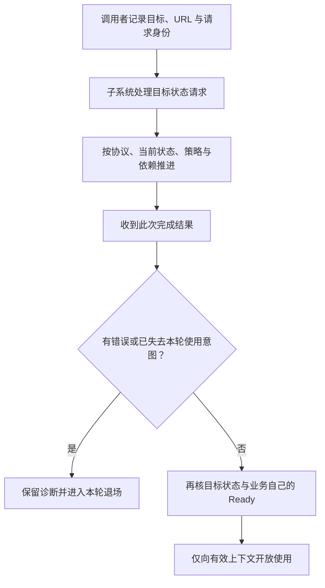

# 05 GameFeatures 特性插件

> 知识成熟度：L2。主要承诺是 Epic 公开文档/API 的静态核对与明确前提下的纸面使用链；没有编译、加载插件或运行 UE。
> 知识基线：2026-10-10 UTC 返回的 Epic 文档，正文所用默认页面标示 UE 5.8；固定 UE 5.5 页仅核对完成委托与部分子系统签名。多项 5.5/5.6/5.7/5.8 固定版本 URL 未返回正文，不能据默认页认证这些版本或 CL 55116800。
> 最后更新：2026-10-10。纠正状态迁移、回调签名、Action/WorldContext、取消与退场边界；保留创建、热更新、策略、排障与关联阅读用途。
> 源码核对状态：未取得本次 UE/Lyra checkout；下文引擎路径来自公开 API 定位，不表示已读取对应实现。未执行 UHT、UBT、PIE、打包、下载、热卸载、线程/网络/GC 或性能实验；`PAPER_EXPECTED` 均为有限纸面推导。

## 一、先分开四种“完成”

GameFeatures（Game Feature Plugin，GFP）把一组可独立开关的玩法内容组织为插件。以赛季效果为例，插件文件已在磁盘、状态机已 Active、某个世界装配完成、退出后无人再使用效果资产，是四个不同事实。GFP 提供状态管理与 Action 扩展入口；业务仍须定义自己的可用和结束条件。[官方介绍](https://dev.epicgames.com/documentation/en-us/unreal-engine/game-features-and-modular-gameplay-in-unreal-engine)

| 要回答的问题 | 责任方 | 不能据此推出 |
| --- | --- | --- |
| 插件在哪里、包含哪些模块/依赖？ | `.uplugin`、插件发现与交付策略 | 已取得或已执行玩法内容 |
| 要达到哪个插件状态、此次请求结果如何？ | `UGameFeaturesSubsystem` 与完成回调 | 每个 Actor、玩家、UI 或自建异步任务已 Ready |
| 在哪些上下文应用哪些变化？ | `UGameFeatureData`、Actions 与状态变更 Context | 多世界、客户端/服务器权限已自动正确分流 |
| 谁持有组件请求、委托、任务、资源和业务对象？ | Action 及实际使用者的所有权记录 | 调用 Unload 就能立即使外部工作静默或回收全部内存 |

前置知识是普通插件/模块、UObject/World 生命周期、软引用和异步完成通知。本文主责是插件装配边界；组件 Receiver、请求句柄与 InitState 详见 [ModularGameplay](../../05-Gameplay与交互系统/玩法架构与任务协作/08-ModularGameplay模块化玩法.md)，Pawn 就绪、输入与能力交接详见 [Lyra 41](../模块化框架与对象通信/41-Lyra-Pawn初始化与模块化组件源码.md)。这些机制可以被 Action 使用，但不是同一套状态机。

## 二、从插件描述到可请求的特性

### 2.1 用最小内容插件建立可辨认的输入

官方入门流程先启用 Game Features 和 Modular Gameplay，按提示重启，再创建 `Game Feature (Content Only)` 插件，放在项目 `Plugins/GameFeatures/` 下，在插件顶层 Content 中创建与插件同名的 `GameFeatureData` 资产。本文示例采用这个已记录的标准布局；这是一套待执行流程，本次未操作编辑器。[创建流程](https://dev.epicgames.com/documentation/en-us/unreal-engine/game-features-and-modular-gameplay-in-unreal-engine)

```text
Plugins/GameFeatures/SeasonEffect/
  SeasonEffect.uplugin
  Content/SeasonEffect.uasset       # GameFeatureData；采用官方入门命名
  Content/Data/EffectData.uasset     # 示例玩法数据
  Content/Maps/                     # 需要时才加入
  Config/DefaultSeasonEffect.ini    # 项目插件配置命名约定，实际装载另核
  Source/                          # 仅含代码时需要；不是 Content Only 的必需目录
```

不要把“资产任意改名并放到 Data/ 后就一定能发现”当作默认合同。`IsValidGameFeaturePlugin` 公开页说明其输入是 descriptor 路径，但没有展示路径判定实现。标准目录之外、Restricted、AdditionalPluginDirectories 及自定义发行路径的完整识别规则须核目标版本与项目策略；本轮既不否定这些扩展，也不把旧文的“只可能在一个目录”保留成全称结论。[Settings API](https://dev.epicgames.com/documentation/en-us/unreal-engine/API/Plugins/GameFeatures/UGameFeaturesSubsystemSettings)

### 2.2 描述符、模块与依赖分别检查

下面是原创的字段说明片段，不是经过编辑器生成、可独立运行的完整 GFP 模板；应在目标引擎模板生成结果上核对额外字段、默认状态、平台与资产发现配置。

```json
{
  "FileVersion": 3,
  "Version": 1,
  "VersionName": "1.0",
  "FriendlyName": "SeasonEffect",
  "CanContainContent": true,
  "Plugins": [
    { "Name": "GameFeatures", "Enabled": true }
  ]
}
```

`FileVersion` 是描述符格式版本；插件自身版本是另外的字段。有代码时再配置 `Modules`，每个模块的名称、类型、加载阶段及 Build.cs 依赖需要一致。普通插件允许声明插件依赖，并受项目/引擎层级约束；不能概括为“GFP 不能依赖启动时加载的普通插件”。同样，能解析依赖不代表任意依赖的外部业务资源已经就绪。[插件结构与依赖](https://dev.epicgames.com/documentation/en-us/unreal-engine/plugins-in-unreal-engine)

`AdditionalPluginMetadataKeys` 只是列出需要从 `.uplugin` 解析、交给 `FGameFeaturePluginDetails` 的附加键。写入一个名为 `InstallBundle` 的自定义键，不会自行创建下载清单、CDN、平台安装服务或包体。[附加元数据合同](https://dev.epicgames.com/documentation/en-us/unreal-engine/API/Plugins/GameFeatures/UGameFeaturesSubsystemSettings)

### 2.3 GameFeatureData 与 URL

`UGameFeatureData` 是 `UPrimaryDataAsset`：Actions 描述要应用的功能；PrimaryAsset 扫描信息描述插件层级内的扫描范围。扫描、资产 Bundle 和资源驻留是不同环节，不能因为对象继承了 PrimaryDataAsset 就宣称所有软引用均已被 Cook 或加载。其公开 API 还有资产 Bundle 更新和 `IsDataValid` 入口。[GameFeatureData](https://dev.epicgames.com/documentation/unreal-engine/API/Plugins/GameFeatures/UGameFeatureData)

Plugin URL 是子系统请求使用的身份输入。公开协议枚举包含 `File`、`InstallBundle`，但枚举不是完整 URL 语法。对于已知插件使用 `GetPluginURLByName` 的结果并检查返回值；对于 built-in GFP，可用受项目策略约束的 `GetBuiltInGameFeaturePluginURL`。不要把显示名、资产路径、安装包名当成可直接互换的 URL，也不要把手写 `installbundle:SeasonEffect` 当成可用发行配置。[协议](https://dev.epicgames.com/documentation/unreal-engine/API/Plugins/GameFeatures/EGameFeaturePluginProtocol)、[built-in URL](https://dev.epicgames.com/documentation/unreal-engine/API/Plugins/GameFeatures/UGameFeaturesSubsystem/GetBuiltInGameFeaturePluginURL)

## 三、目标状态、可观察状态与请求结果

### 3.1 四个目标不是完整调用顺序

公开 `EGameFeatureTargetState` 列出 `Installed`、`Registered`、`Loaded`、`Active`。它们回答请求希望达到哪一层；公开 `EGameFeaturePluginState` 还包含过渡和错误状态，并明确内部可能有额外状态。旧文“约 36 个内部状态”和按枚举声明顺序画出的固定执行链，不能用来认证实际迁移。[目标枚举](https://dev.epicgames.com/documentation/en-us/unreal-engine/API/Plugins/GameFeatures/EGameFeatureTargetState)、[状态枚举](https://dev.epicgames.com/documentation/unreal-engine/API/Plugins/GameFeatures/GameFeaturePluginStatePrivate__E-)

| 目标层次 | 教学解释 | 本文不附加的保证 |
| --- | --- | --- |
| Installed | 以安装层为目标 | 已注册、资产已全部常驻、已经应用 Action |
| Registered | 允许后续激活的登记层 | 已执行激活副作用；登记后也可能从未激活 |
| Loaded | 为激活加载的层次 | 已对目标世界应用功能 |
| Active | 插件特性激活层 | 所有外部任务、玩家复制、输入和业务依赖都已完成 |

`UnknownStatus/CheckingStatus`、`Downloading/ErrorManagingData`、`Mounting/ErrorMounting`、`WaitingForDependencies/ErrorWaitingForDependencies`、`Registering/ErrorRegistering`、`Loading/ErrorLoading`、`ActivatingDependencies/ErrorActivatingDependencies` 等适合定位失败阶段；它们不构成每次都必经的线性列表。也不能仅由枚举顺序断言 Pak 挂载发生在某个资产/配置回调之后。[公开状态的范围](https://dev.epicgames.com/documentation/unreal-engine/API/Plugins/GameFeatures/GameFeaturePluginStatePrivate__E-)



这是调用者必须建立的因果关系，不是引擎私有状态机全序。请求已经满足时如何回调、依赖共享计数、Action 遍历/逆序、取消与完成的具体交错，本轮没有读取实现，不作额外保证。

### 3.2 选择操作并读取它的实际合同

| 入口 | 已核合同与使用方式 |
| --- | --- |
| `RegisterGameFeaturePlugin` / `LoadGameFeaturePlugin` | 分别提交登记/加载请求；完成结果仍须处理 |
| `LoadAndActivateGameFeaturePlugin` | 加载并激活；有单插件与带选项等重载，不把 `void` 返回当成功 |
| `ChangeGameFeatureTargetState` | 显式请求目标；不是任意数字都可用的同步赋值 |
| `DeactivateGameFeaturePlugin` | 官方给出的目标范围是 `[Terminal, Loaded]`；不保证每次精确落在 Loaded 或重新加载已处于更低层的插件 |
| `UnloadGameFeaturePlugin` | `bKeepRegistered=false` 的范围为 `[Terminal, Installed]`；`true` 为 `[Terminal, Registered]`，两者都不是删除安装数据的承诺 |
| `UninstallGameFeaturePlugin` | 针对该 GFP 存储的数据执行卸载并终止；具体协议/平台/共享包可回收范围仍需核对 |

前三项见 [Subsystem](https://dev.epicgames.com/documentation/unreal-engine/API/Plugins/GameFeatures/UGameFeaturesSubsystem?lang=en-US) 与 [LoadAndActivate](https://dev.epicgames.com/documentation/unreal-engine/API/Plugins/GameFeatures/UGameFeaturesSubsystem/LoadAndActivateGameFeaturePlugin)；后三项分别见 [Deactivate](https://dev.epicgames.com/documentation/unreal-engine/API/Plugins/GameFeatures/UGameFeaturesSubsystem/DeactivateGameFeaturePlugin)、[Unload](https://dev.epicgames.com/documentation/unreal-engine/API/Plugins/GameFeatures/UGameFeaturesSubsystem/UnloadGameFeaturePlugin)、[Uninstall](https://dev.epicgames.com/documentation/unreal-engine/API/Plugins/GameFeatures/UGameFeaturesSubsystem/UninstallGameFeaturePlugin)。这些区间不是要求调用者逐个请求 Terminal、Installed、Registered 的脚本。

状态查询、安装进度查询和枚举活动数据是读取接口，不应与异步状态请求一起宣称“均为异步、带完成回调”。例如安装进度查询有返回值与输出参数；读取状态也不能替代某个请求的完成通知。[Subsystem API 表](https://dev.epicgames.com/documentation/unreal-engine/API/Plugins/GameFeatures/UGameFeaturesSubsystem?lang=en-US)

### 3.3 完成签名与失败不能猜

默认 5.8 模块表中 `FGameFeaturePluginLoadComplete` 等别名指向 `FGameFeaturePluginChangeStateComplete`，其参数是一个 `const UE::GameFeatures::FResult&`；固定 5.5 页也展示单参数声明。URL 是调用者预先绑定/捕获的身份，不是凭空增加的回调参数。[当前 typedef](https://dev.epicgames.com/documentation/en-us/unreal-engine/API/Plugins/GameFeatures)、[固定 5.5 声明](https://dev.epicgames.com/documentation/unreal-engine/API/Plugins/GameFeatures/FGameFeaturePluginChangeStateCom-?application_version=5.5)

公开 `FResult` 提供 `HasError()`、`HasValue()`、`GetError()` 与可选错误文本；不能把旧示例的 `FGameFeaturePluginOperationResult::WasSuccessful()/GetErrorCode()` 当作当前声明。记录 URL、操作身份、期望状态、结果与当前状态，错误分支不开放玩法入口。[FResult](https://dev.epicgames.com/documentation/unreal-engine/API/Plugins/GameFeatures/FResult)

下面仅说明原创适配器的输入/输出形状，不是可编译类，也不假设回调一定延迟到下一帧：

```text
提交前：记录 Request = {URL, SessionToken, OperationSerial, Kind=Activate, Pending=true}
调用：LoadAndActivateGameFeaturePlugin(URL, 已绑定完成委托)
完成委托原生输入：const UE::GameFeatures::FResult& Result
委托绑定的项目上下文：Request 的身份、寿命安全的协调者引用
委托输出：把结果复制为项目值记录，再交给请求拥有者结算
```

失败不等于“没有任何副作用”；Action 可能已经建立了部分资源。只因完成回调报告错误就清空所有账本，会丢失撤销对象。反过来，`OnGameFeatureActivating` 是 `void`，其中提前返回并不是公开的事务回滚接口；自定义业务准备失败需要自己的结果与补偿，不能假设子系统会自动将其变成请求错误。[激活回调声明](https://dev.epicgames.com/documentation/en-us/unreal-engine/API/Plugins/GameFeatures/UGameFeatureAction/OnGameFeatureActivating)

### 3.4 取消的是状态请求，资源还需各自收尾

`CancelGameFeatureStateChange` 文档说明：尝试取消状态变化，取消完成时回调，其他仍 pending 的相关回调会收到 canceled error。因此调用者仍要结算原请求，不能把取消解释为“再也没有回调”。该合同不包含 Action 自建 HTTP、任务队列、定时器、输入/能力执行或外部资产使用者；也没有证明成功已经发生的副作用被撤销。[取消合同](https://dev.epicgames.com/documentation/unreal-engine/API/Plugins/GameFeatures/UGameFeaturesSubsystem/CancelGameFeatureStateChange?lang=en-US)

项目先关闭本轮使用入口，再等待相关请求结算和需要的停止确认。旧回调不得使新一轮 Ready；但属于旧轮、尚未收尾的操作记录仍须处理，而不是只比较一个全局 generation 后全部丢弃。超时可停止用户等待并保留失败状态，不能把超时当作后台静默或资源已可销毁的证明。

## 四、Action：按上下文应用，再按来源撤销

### 4.1 把资源绑定到取得它的阶段

公开 Action 合同包含注册/注销、加载/卸载、激活/停用等入口。注册回调可能发生在插件从未激活的情况下；停用之后又可能再次激活。因此“所有资源只在 Deactivate 清理”也不完整：注册期取得的资源应有注销期的对应责任，加载期资源亦然。当前基类公开表没有列出旧文声称的 `OnGameFeatureDeactivated`，本篇不以它为可重写入口。[Action API](https://dev.epicgames.com/documentation/unreal-engine/API/Plugins/GameFeatures/UGameFeatureAction)

下面是项目设计规则：每次成功取得资源就记录实际 handle、创建者、阶段、World/GameInstance、SessionToken 和撤销方法；失败也保留已取得的子集。按资源之间真实依赖收尾，不假定框架会逆序调用所有 Action。幂等是“同一来源的资源最多结算一次”，不是跳过失败记录或把另一轮创建的资源一并清空。

### 4.2 WorldContext 与端侧条件是两道门

`FGameFeatureActivatingContext` 继承 `FGameFeatureStateChangeContext`。后者处理多世界/多上下文的适用范围，默认匹配全部；`SetRequiredWorldContextHandle` 限制范围，`ShouldApplyToWorldContext` 用来判断某个 WorldContext 是否匹配。它可以复制供后续查询，但并不保证所指世界仍存活，也不提供业务唯一激活代次。[激活 Context](https://dev.epicgames.com/documentation/unreal-engine/API/Plugins/GameFeatures/FGameFeatureActivatingContext)、[上下文规则](https://dev.epicgames.com/documentation/en-us/unreal-engine/API/Plugins/GameFeatures/FGameFeatureStateChangeContext)

项目在 WorldContext 匹配后，还要核有效游戏世界、GameInstance、LocalPlayer/Authority 和业务前提。两次激活使用相同 WorldContext 并不等于同一 Session；PIE 的两个 GameInstance 也不能共用一个全局效果注册键。不要用 `GWorld` 或进程单例替代这些身份。

`AddComponents` 向 Component Manager 添加 Actor/Component 请求；Actor 必须明确参与，条目还有 `bClientComponent`、`bServerComponent` 和 `AdditionFlags`。请求存在、组件创建、组件业务 Ready 是三种事实；端侧 Flags 不能由 WorldContext 相等替代。[AddComponents](https://dev.epicgames.com/documentation/en-us/unreal-engine/API/Plugins/GameFeatures/UGameFeatureAction_AddComponents)、[组件条目](https://dev.epicgames.com/documentation/en-us/unreal-engine/API/Plugins/GameFeatures/FGameFeatureComponentEntry)

### 4.3 原有 Action 用途与选择范围

| 用途 | 已核入口与边界 |
| --- | --- |
| Actor 组件装配 | `UGameFeatureAction_AddComponents`；Receiver、请求所有权与 Ready 另核 |
| World Partition 内容 | `UGameFeatureAction_AddWorldPartitionContent` 与 `UGameFeatureAction_AddWPContent` 是不同类；后者公开 ContentBundle 字段，不互换为同一套 DataLayer 配置 |
| 数据注册表/数据源 | DataRegistry、DataRegistrySource；数据源名与资产路径不是同一字段，目标 Registry/Meta Source 必须适配 |
| 工具与打包 | AddActorFactory 在注册时添加工厂；AddChunkOverride 面向 Cook 的 chunkId，不是激活时下载包的开关 |
| 调试/音频/扩展 | AddCheats、AudioActionBase；其目标分别是 CheatManager 与音频设备，不能统一成只按 Actor 清理 |
| 可选集成 | 公开派生类还有 `UIrisFilterGameFeatureAction`、ConfigureInstancedActors、AddAttributeDefaults；名称存在不证明本项目已启用相应插件或具有其全部版本能力 |

入口依据 [模块目录](https://dev.epicgames.com/documentation/en-us/unreal-engine/API/Plugins/GameFeatures)、[派生类表](https://dev.epicgames.com/documentation/unreal-engine/API/Plugins/GameFeatures/UGameFeatureAction)、[AddWPContent](https://dev.epicgames.com/documentation/unreal-engine/API/Plugins/GameFeatures/UGameFeatureAction_AddWPContent) 与 [DataRegistrySource](https://dev.epicgames.com/documentation/unreal-engine/API/Plugins/GameFeatures/UGameFeatureAction_DataRegistryS-?lang=en-US)。这保留原文的选型用途，但不声称已核对所有 Action 的完整实现。

### 4.4 停用暂停与两条退出轴

`FGameFeatureDeactivatingContext::PauseDeactivationUntilComplete` 提供停用期间的异步收尾机制：取得完成 delegate，收尾完成后在游戏线程调用。暂停是显式登记的工作，不能替没有登记的外部使用者收尾；漏调会让本应完成的停用继续等待。[停用 Context](https://dev.epicgames.com/documentation/en-us/unreal-engine/API/Plugins/GameFeatures/FGameFeatureDeactivatingContext)

| 退出轴 | 触发 | 需要结算的对象 |
| --- | --- | --- |
| 插件/Action 参与期 | 功能关闭、取消后退场、停用/卸载/注销 | 本来源的请求句柄、订阅、任务、效果注册及资产持有 |
| 使用者/世界寿命 | Actor EndPlay、玩家离开、World/GameInstance 退出 | 该使用者不再发起工作；归还其借用/注册，处理仍在途的完成通知 |

两轴可能先后任意到达。Actor 退出不代表仍有其他 Actor 使用的插件应被全局停用；插件停用也不等于 Actor、能力和外部任务都已销毁。释放一个 shared handle 副本不等于最后所有者退出，更不能拿它当另一使用者的撤销。[组件请求与资源两层所有权](../../05-Gameplay与交互系统/玩法架构与任务协作/08-ModularGameplay模块化玩法.md)

原文“激活/停用回调可能在非游戏线程，所以访问全局对象即可防护”没有本轮来源支持。本文只保留已明确的 pauser 完成 delegate 游戏线程要求；其他入口的线程合同应逐 API/目标实现确认。下面的例子把项目协调逻辑约束到游戏线程，这是一项前提，不能反向宣称所有引擎回调天然满足。

## 五、有限使用链：单世界赛季效果的一次开启和关闭

### 5.1 输入、职责与停止条件

这是原创流程伪代码，不是引擎内部实现或可编译示例。范围限定为：已存在的一个游戏世界 W、一个内容型 GFP、一个本地效果功能、一次开启到关闭；不覆盖下载、World Travel、服务器复制、任意第三方 Action 或多系统争夺同一 URL 的全局状态。将其用于多人/多消费者时，必须另有共同的插件需求协调者，不能让每个 Pawn 独立全局 Unload。

本例进一步只接纳**已确认静止于 Registered** 的插件：没有未结算状态操作，没有自动策略或其他消费者同时驱动此 URL，也没有本例遗留的业务资源。首轮和旧轮 Closed 后重开都要重新核对；已 Active、过渡、错误、未知，甚至虽静止但不在 Registered 的输入均拒绝并记录诊断，不提交新请求、不擅自改变插件状态。本例的效果准备只由实际抵达的 Action 激活入口创建；不支持加入一个已经 Active 的插件，也不从“再次请求 Active 成功”推定框架会重播 Action。

输入包括：已解析的 URL、期望 WorldContext/GameInstance、效果数据软引用、业务 EffectManager 和一份不可复用的 SessionToken。EffectManager 是项目接口：准备期间取得的资源不向使用者开放；按本轮 token 注册返回可撤销 handle；失败要报告已取得的部分结果；停止确认意味着本来源消费者不再回调、不再持有资源。若实现无法提供这些保证，例子的成功结束条件不成立。

明确的终态只有：`Ready`（当前轮可用）、`Closed`（本例拥有的使用者与插件请求均已结算）、`CleanupUnconfirmed`（仍有资源/结果无法确认，入口关闭且保留诊断）。重复 Start 在未 Closed 时拒绝；新一轮只有在旧轮 Closed 后才允许创建。关闭是终结本轮，不通过“重新置 Ready=false”伪装成全部清理。

### 5.2 账本与回调交接

每轮有两张表，生命周期由长于该轮业务对象的协调者负责：

- 操作表：URL、Token、OperationSerial、Kind、Pending、Result；只提交一项插件状态操作，上一项及取消涉及的回调结算后才推进下一项
- 资源表：目标 World/GameInstance、Action 记录、订阅、在途业务请求、返回的注册 handle、已持有资产、当前使用者及停止确认；只删除已确认撤销的条目

适配器把 native `FResult` 复制成值记录，把完成交给协调者；不存过期的 `Result&`。它必须能处理调用尚未返回时就完成的情形：在调用前建表，回调只投递记录，调度到本次外部调用栈退出后的安全点再处理。这个安全队列是必须实现并验证的项目设施，不是“随便设一个定时器”或引擎默认保证。

```text
Start(URL, W)：
  核对世界、URL、唯一协调者和旧轮终态；失败则不提交
  首轮和重开均复核：插件静止于 Registered，无未结算状态操作/本例遗留业务资源
    没有自动策略或其他消费者同时驱动此 URL；不能确认任一项则拒绝并记录诊断
  建立 s，入口关闭，Phase=Starting，StopRequested=false，业务 Ready=false
  在 s.Operation 表登记 Activate，再调用引擎加载并激活入口
  调用返回后也不直接开放入口；安全点消费已到达的结果

ConsumeOperationResult(s, operation, copiedResult)：
  按 URL + Token + OperationSerial 找回原记录；结算对应 Pending
  已结算的重复通知仅记诊断，不重复执行成功副作用
  即使 s 已 Stopping，仍结算原操作，但绝不把它改回 Ready
  激活失败：记错误，RequestStop(s)
  激活成功且仍 Starting：记 PluginActivationSucceeded，TryPublish(s)
  取消结果或其被取消的原请求结果：各记各的完成，全部应结算项齐后继续退场
  停用/卸载结果：转入对应成功条件；有错转 CleanupUnconfirmed，不假装完成

TryPublish(s)：
  若已不是当前轮、Phase!=Starting 或 StopRequested：不开放，不新建工作
  若世界失效或收到业务失败：RequestStop(s)，不静默留在 Starting
  若激活请求尚未结算：只等待已登记的该请求结果；不当成失败或 Ready
  激活请求成功后再核插件实际 Active（不把 Activating 算成功）
    状态异常或无法确认：记录状态，RequestStop(s)，按五4结算或保留 CleanupUnconfirmed
  若成功后没有本轮 Action 资源记录：记录装配前提未兑现，RequestStop(s)
    这是本例保守失败策略；不等待假定会重播的 Action，不判定引擎实现一定错误
  若本轮记录仍在准备：只等它已登记的完成/失败；超时按未确认退场，不设永远轮询
  要求本轮 Action 的业务 Ready 已确认，且未收到退出/失败
  全部满足才 Phase=Ready，开放该世界的效果入口
```

`TryPublish` 由激活结果和 Action 业务准备结果两个入口触发，覆盖任一先到；没有新结果时不持续轮询。World 退出、用户关闭或准备错误随时优先封住入口。逻辑串行不保证外部操作可撤销，不能以“我的回调没再执行”证明外部任务已停止。

### 5.3 自定义效果 Action 的取得与归还

这延续原文 `EffectData → EffectManager` 用途，并补齐其原来缺少的作用域、失败与所有权；`BeginPrepareEffect/StopOwnedEffect` 是项目接口名，不是 UE API。

```text
Action 激活入口(Context)：
  找回原会话 s；只在 s 仍为当前会话、Phase==Starting 且 !StopRequested 时接纳新准备
  Stopping、CleanupUnconfirmed、Closed 或其他阶段均拒绝新增，不建立资源记录
  枚举本例允许的 W，先核 Context.ShouldApplyToWorldContext(WContext)
  再核游戏世界、GameInstance、业务端侧条件与原会话 SessionToken
  若本轮已登记则不重复添加；跨轮未清完则报告冲突，不能覆盖旧账
  创建记录和发起准备前仍须满足上述当前会话/Starting/未停止条件
  先建立本轮资源记录，Ready=false，再发起 BeginPrepareEffect

业务准备完成(record, result, acquiredHandle, acquiredAssets)：
  先把确实取得的资源记回原 record，包括失败或已停止时的部分取得
  若旧轮/世界退出/StopRequested 或 Phase 为 Stopping/CleanupUnconfirmed/Closed：
    只安排原 record 的收尾，不注入当前轮；不使用新增准备的门槛丢弃已经返回的资源
  若失败：报告业务失败，RequestStop 原轮
  若成功且当前轮有效：公布业务 Ready，触发 TryPublish

Action/使用者请求停止(record)：
  先封住新增注册与效果使用，标记 Stopping
  停止通知和清理重入只处理原 record，不建立新账或调用 BeginPrepareEffect
  解除本来源的入口订阅；已有在途操作按其取消/完成合同结算
  对已取得的本来源 handle 发起 StopOwnedEffect，等待停止确认
  已确认不再有本来源使用者/回调后，归还持有的资源与资产引用
  条目全部已结算才报告 BusinessCleanupConfirmed
```

新准备的 Phase/StopRequested 门槛只控制尚未发起的工作，不能套用为丢弃旧结果的理由。若业务注册函数会同步回调，亦采用先建记录/返回后安全点结算；若停止时注册调用还在途，稍后返回的 handle 归回原记录，不能因 Token 旧或本轮已停止而泄漏。撤销前先从“可用”集合移出，避免撤销过程重入再次使用；撤销失败则留在“待清理”集合，不能无条件清空数组。

世界退出应在所需管理器仍有效的生命周期边界启动收尾；稍后处理记录前复核弱世界/管理器身份，不能解引用已失效对象。若管理器先销毁，只有其明确的寿命结束确认能够结算由它接管的资源；弱引用失效本身不是外部任务停止证据。缺少这种确认就保留 CleanupUnconfirmed，不能假设总会有“下一帧”来补清理。

停用回调若需要等待以上异步工作，应在该回调允许的时期取得 pauser delegate。可能同步完成时，先建立协调状态，再开始外部收尾；回调内不能使用还未保存的返回 handle。真正确认收尾后，在游戏线程安全点调用该 delegate 一次。此例不把超时、世界消失或结果丢失当成 pauser 的成功条件；无法确认时要保留 CleanupUnconfirmed 并由仍存活的协调者负责后续处置。

### 5.4 停用和卸载的先决条件

```text
RequestStop(s)：
  入口立即关闭，先置 s.StopRequested=true，再置 s.Phase=Stopping；重复 Stop 只合并原因
  对本轮已知的每个资源记录发出项目停止意图；不等引擎一定回调 Deactivating
    未结束的准备先按其合同结算，已取得资源按五3收尾；不抢先销毁仍被调用的对象
  若 Activate 仍 Pending：登记取消操作，再请求 CancelGameFeatureStateChange
    等取消操作及受影响原请求的结算；不在 Pending 时叠加全局 Unload
  若请求结果无法确认或取消出错：CleanupUnconfirmed，停止继续拆资源依赖
  相关插件操作均结算后，登记并提交 Deactivate
  Action 停用入口与使用者退出路径都按原资源记录收尾；不得重复消费 handle
  只有停用请求成功且本轮 BusinessCleanupConfirmed，才提交 Unload
    本例选择 bKeepRegistered=true；这是显式保留登记的策略
  卸载请求成功，且操作表无未结算项、资源表无本轮未结算拥有项，才 Closed
  任何阶段错误：保留记录与关闭入口，不把失败重试写成无限循环
```

这份项目策略主动串行化退场，并不声称每个项目都必须先调用 Deactivate 再调用 Unload。项目停止意图也覆盖“已取得部分资源但未成功激活”的路径，不假设这种路径必有 Deactivating 回调；后来的停用回调只加入同一收尾过程，必要时等待它完成。引擎状态区间、Action pauser 和项目使用者账本各管自己的条件。单纯连续调用两个 `void` API 后销毁协调者，缺少了完成结果、World 退出及外部使用者确认。

`Closed` 仅表示本例受控的请求和资源已结算：没有据此断言全部 UObject 已 GC、所有其他插件无引用、原生模块库已卸载、渲染/音频后台已无任何相关工作或磁盘包已删除。对未登记在本例合同中的资源，不得借 Closed 偷换为全进程静默。

## 六、发行、配置与普通插件的比较

### 6.1 预下载不解决全部依赖

`PredownloadGameFeaturePlugins` 的文档说明它预安装所需数据，不实例化 GFP；传入的 URL 集合要包含依赖。原页面此处有双重否定笔误，但明确的“集合应包含所有依赖”足以否定“只给根插件便自动完成全部依赖预下载”的用法。`bWaitForBundlesToRelease` 还影响完成通知时机。预下载完成不等于特性激活。[预下载合同](https://dev.epicgames.com/documentation/unreal-engine/API/Plugins/GameFeatures/UGameFeaturesSubsystem/PredownloadGameFeaturePlugins)

版本签名不能混用：本轮取得的[固定 UE5.5 Subsystem 页](https://dev.epicgames.com/documentation/unreal-engine/API/Plugins/GameFeatures/UGameFeaturesSubsystem?application_version=5.5)展示 URL 集合、完成和进度三个参数；上面的默认 UE5.8 页还展示 `bWaitForBundlesToRelease`。这只是已返回声明的比较，不是全部重载、默认参数、ABI 或迁移兼容性验证。

赛季/DLC 交付需要另一条可验收链：Cook 收集正确资产 → 分包与共享资源规划 → 发布可取得的包/清单 → 平台安装与完整性结果 → GFP 请求 → 业务 Ready。Chunk、Pak/其他目标容器、InstallBundle 和 Asset Bundle 不是同义词；AssetManager 扫描和 `.uplugin` 字段不会自动搭建下载服务。A/B 资格与灰度回退也由项目策略负责，插件只承载被选择的功能。

磁盘回收使用适用的安装数据卸载协议，并核共享依赖/平台限制；不能从 `Deactivate + Unload` 推出已经删除 Pak。即使调用 Uninstall，仍要以完成结果与目标平台实际包状态为证据，本次没有执行。[安装数据卸载](https://dev.epicgames.com/documentation/unreal-engine/API/Plugins/GameFeatures/UGameFeaturesSubsystem/UninstallGameFeaturePlugin)

### 6.2 配置与项目策略

GameFeatureData API 区分加载期的 base ini 处理和激活期的 hierarchical ini 处理，不能统一写成“所有配置仅在激活时并入”。这些入口也没给出任意配置副作用自动回滚的合同；配置影响到长寿命对象时，需要核该对象如何重新读值和恢复。[配置处理入口](https://dev.epicgames.com/documentation/unreal-engine/API/Plugins/GameFeatures/UGameFeatureData)

项目可继承 `UGameFeaturesProjectPolicies`，在 Project Settings → Game Features 选择；Settings 的 `GameFeaturesManagerClassName` 是策略类入口并标有重启要求。保留原配置示意如下，类必须在目标项目中真实存在；本次没有修改配置或实例化策略。[Policies](https://dev.epicgames.com/documentation/unreal-engine/API/Plugins/GameFeatures/UGameFeaturesProjectPolicies)、[Settings](https://dev.epicgames.com/documentation/en-us/unreal-engine/API/Plugins/GameFeatures/UGameFeaturesSubsystemSettings)

```ini
[/Script/GameFeatures.GameFeaturesSubsystemSettings]
GameFeaturesManagerClassName=/Script/MyGame.MyGameFeaturesProjectPolicies
```

没有自定义策略时，公开默认策略依据内置自动注册/加载/激活设置处理 GFP；所以“GFP 全部必须手动按需加载”也不成立。旧文的四个策略 override 签名本轮没有完整声明支持，不再作为可编译骨架。[默认策略](https://dev.epicgames.com/documentation/unreal-engine/API/Plugins/GameFeatures/UDefaultGameFeaturesProjectPolic-)

统计、UI 或项目级状态观察可使用 `IGameFeatureStateChangeObserver`；官方建议涉及数据的功能优先用 GFD 上的 Action。确需 observer 时由策略建立，通过 `AddObserver/RemoveObserver` 成对管理；不能把同名 observer 方法笼统写成“任意可绑定的 multicast 广播”。[Observer 合同](https://dev.epicgames.com/documentation/unreal-engine/API/Plugins/GameFeatures/IGameFeatureStateChangeObserver)

### 6.3 比较的是管理层次，不是二分的卸载能力

| 维度 | 普通插件/模块 | GameFeatures |
| --- | --- | --- |
| 描述与发现 | `.uplugin`、搜索路径、模块及依赖 | 仍基于插件，再增加特性数据、策略和状态管理 |
| 功能应用 | 由插件自己的生命周期和业务实现 | 通过 Actions 表达登记/加载/激活等变化 |
| 运行期开关 | 取决于模块、宿主与业务设计 | 有明确状态请求入口，但仍须清理外部使用者 |
| C++/内容交付 | 代码需目标平台构建，资产需正确收集 | 可以包含代码和内容；激活不是下载任意 C++ 后即时执行的通用热更协议 |
| 回收 | 取决于模块卸载能力和对象/依赖 | 插件状态回退、引用释放、GC、原生库卸载、磁盘卸载分别验收 |

`FModuleManager::UnloadModule` 明确存在正常退出之前卸载模块的 API，并提醒依赖风险，因此旧文“普通插件一旦加载绝不能卸载”不成立；这也不意味着所有普通插件或 GFP 都能安全卸载原生库。不能把模块 API 的存在当成适用于任意目标的承诺。[模块卸载](https://dev.epicgames.com/documentation/en-us/unreal-engine/API/Runtime/Core/FModuleManager/UnloadModule)

## 七、排障：先找未成立的条件

| 症状 | 先查什么 | 不采用的捷径 |
| --- | --- | --- |
| 插件不被识别 | descriptor 路径/JSON、启用的插件、模板与策略、URL 解析结果 | 只看文件夹名就判断状态机一定存在 |
| 卡在下载/不可用 | 请求协议、安装服务/清单、依赖 URL、结果错误与当前状态 | 手写一个 InstallBundle URL 就当作本地文件协议 |
| 激活结果成功却没有效果 | WorldContext、端侧条件、Receiver、Action 自己的准备结果 | Active 当作所有组件和业务 Ready |
| 资产路径可见但加载失败 | 软引用、Cook 收集、扫描、Bundle、包可访问性与所需类型 | 猜固定的挂载/加载源码时序 |
| 第二次激活效果重复 | 旧轮订阅、注册 handle、在途返回和清理失败记录 | 新一轮覆盖旧全局指针 |
| 停用一直等待 | 哪个 pauser 未确认、项目任务是否仍运行、World 退出是否有人接管 | 超时就无条件调用完成 delegate |
| 停用后仍有内存/效果 | 本来源资源、外部引用与使用者、后端完成/GC 条件 | 只把强引用改软引用，或宣称 Unload 已清空一切 |
| 客户端/服务器行为不一致 | AddComponents 端侧 Flags、World/LocalPlayer/Authority 条件及本端数据 | 用 WorldContext 代替权限检查 |
| 多个 GFP 共用依赖 | 显式依赖与所有消费者需求、最后使用者退出的策略 | 一个消费者结束就全局停用公共插件 |

每条检查都是调查入口，不代表本次已经复现该故障。注册/配置错误通常先修配置；缺包与下载错误按交付策略处理；未知状态、取消失败或清理未确认时关闭入口并保留账本，不能无限自动重试。数据校验可在后续授权运行中使用 GFD 的 `IsDataValid`，但静态配置合法仍不是激活/退场测试通过。

## 八、验证建议：有限 PAPER_EXPECTED 追踪

以下采用第五节前提，全部 `PAPER_EXPECTED`，不是测试日志、引擎模型运行或性能数据。判定对象只有本轮状态、操作表、资源表与世界作用域。

| 输入/操作 | PAPER_EXPECTED | 能暴露的反例 |
| --- | --- | --- |
| 首轮已 Active、过渡/错误/未知，或无法确认静止 Registered/无其他驱动；重开同样复核 | 拒绝本次 Start，记录初态；不新建参与期、不提交 Activate | 再次请求成功便假定重播本轮 Action |
| 已有本轮 Action 准备记录，Activate 成功先到，业务准备后到 | 前者仅记成功，后者到齐才 Ready | 完成回调直接开放 UI |
| 业务 Ready 先到，Activate 尚 pending | 入口仍关闭；成功到齐才可开放 | Action 返回当成整个插件请求成功 |
| Activate 报成功，但状态非 Active/无法确认，或没有本轮 Action 记录 | RequestStop；结算已有工作，无法确认则 CleanupUnconfirmed | 没有新事件便永久停在 Starting |
| Activate 错误，已有部分资源 | 不开放，保留部分资源并退场 | 错误即直接删账 |
| pending 时用户关闭，原回调收到 canceled error | 结算原操作与取消操作；无 Ready 回升 | 把 Cancel 当作永不回调 |
| Activate pending 时先 Stop，之后同 Token 的 Action 激活入口才到达 | 因 StopRequested/Phase 拒绝新增记录和 BeginPrepareEffect | 只检查 Token，有效旧会话在关闭后重建工作 |
| 关闭后在途业务注册返回 handle | handle 归旧记录收尾，不能注入下一轮 | 旧 token 直接 return 导致漏清 |
| Context 限 W1，场景另有 W2 | W2 无本轮装配；W1 还需核端侧条件 | 对进程中所有世界操作 |
| Actor/World 先退出，插件后停用 | 使用者先停止，本来源记录由存活协调者结算 | 等下一帧访问已失效 World |
| pauser 收尾未确认或请求超时 | 入口关闭、CleanupUnconfirmed；无 Closed | 计时结束当作资源回收证据 |
| 停用成功但业务清理未确认 | 本策略不提交 Unload、不报 Closed | 两个 void 调用后销毁 owner |
| 全部记录结算且 Unload(true) 成功 | 本例 Closed；允许后来创建新 token | 声称磁盘清空/GC 完毕/所有外部任务静默 |

后续若获得目标项目运行授权，应分别记录版本、平台、URL 协议、插件/Action 配置、回调身份与错误、World/GameInstance、资源取得/撤销记录，覆盖成功、失败、重复开关、关闭中完成、世界先退出等路径。还要观测真正的后端停止、资产引用与目标状态；日志里没有回调、文档检查通过或纸面表格齐全都不是这些结果。本文不预写任何通过数、时延或内存收益。

## 九、历史、来源覆盖与关联阅读

### 9.1 历史身份与本次边界

以下原声明逐字保留作历史标识，不能作为本轮环境或证据：

> 知识成熟度：L2（本轮审计修订时补标）。
> 版本基准：UE 5.8.0（本机 `Engine/Build/Build.version`：CL 55116800，分支 `++UE5+Release-5.8`）。
> 兼容性边界：适用于 UE5.8 编辑器/运行时，UE4.27 与早期 UE5 仅作迁移背景，具体模块以正文为准。
> 最后更新：2026-08-06（本轮元数据维护）。

> 本文基于 UE 5.8 源码验证：`Engine/Plugins/Runtime/GameFeatures/Source/GameFeatures/Public/GameFeaturesSubsystem.h`、`GameFeatureAction.h`、`GameFeatureData.h`、`GameFeatureTypes.h`。

原文完整版本与历史变体保存在仓外审计材料和原 Git 中；本次不把完整旧稿另附为第二份现行正文，不改书籍、工作日志和原始运行记录。原 L2 保持，但依据改为实际返回的公开资料，不沿用无法重新认证的“本机源码已验证”。`verified: []` 不因静态整理改变。

### 9.2 来源覆盖与失败边界

| 资料组 | 本轮实际取得的内容 | 范围限制 |
| --- | --- | --- |
| Epic Game Features 指南与插件指南 | 标准创建流程、Actions 入口、插件描述/依赖 | 未运行模板或打开 uasset；不是发行平台支持矩阵 |
| Subsystem、状态/目标、各操作页 | API 声明、取消合同、停用/卸载目标区间 | 未读状态机 cpp；不补依赖/Action/回调的精确全序 |
| Action、Context、AddComponents、Data | 生命周期注释、默认世界作用域、pauser、公开字段/入口 | 不是全部派生 Action 实现验证 |
| 固定 UE 5.5 完成委托/Subsystem 页 | 单参数 `FResult` typedef、部分子系统声明与预下载签名 | 只覆盖实际返回的声明，不扩展为 UE5.5 全部行为 |
| 默认页标示 UE5.8 的对应 typedef/结果 | 当前公开声明与错误访问方式 | 没有对应源码 CL；不是 UE5.5→5.8 ABI/迁移测试 |
| 固定版本与部分详情访问 | 5.5/5.6/5.7/5.8 多项 URL 错误、空页；Details/PredownloadHandle 详情未取得 | 失败 raw 保留；不用空页面支持实现、所有权或取消语义 |

### 9.3 关联阅读

- [UBT 构建系统与编译配置](../../08-工程实践与质量/构建编译与制品/01-UBT构建系统与编译配置.md)：C++ 模块的构建边界
- [插件开发与编辑器扩展](../../08-工程实践与质量/编辑器工具与资产自动化/03-插件开发与编辑器扩展.md)：普通插件、模块与描述符
- [资源管理与热更新](../../08-工程实践与质量/持续交付与发布治理/04-资源管理与热更新.md)：包体交付和资源管理；不把状态激活当作完整发行流程
- [Interchange 与 DataValidation](../../08-工程实践与质量/编辑器工具与资产自动化/06-Interchange与DataValidation.md)：资产静态校验
- [ModularGameplay 模块化玩法](../../05-Gameplay与交互系统/玩法架构与任务协作/08-ModularGameplay模块化玩法.md)：请求、Receiver、InitState 与两条退出轴
- [Lyra Experience 与 GameFeature](../模块化框架与对象通信/40-Lyra-Experience与GameFeature源码.md)：项目级装配历史阅读入口，其版本/就绪结论需按自身证据核对
- [Lyra Pawn 初始化与模块化组件](../模块化框架与对象通信/41-Lyra-Pawn初始化与模块化组件源码.md)：对象初始化与输入/能力资源责任
- [官方 Lyra 示例介绍](https://dev.epicgames.com/documentation/en-us/unreal-engine/lyra-sample-game-in-unreal-engine)：样例获取/总览入口，本轮未据它重新认证源码
- [官方 Modular Gameplay 原链接](https://dev.epicgames.com/documentation/en-us/unreal-engine/modular-gameplay-in-unreal-engine)：保留旧文外部入口；本轮组件机制采用上面的专篇，不据这个未重新取得正文的入口作结论
