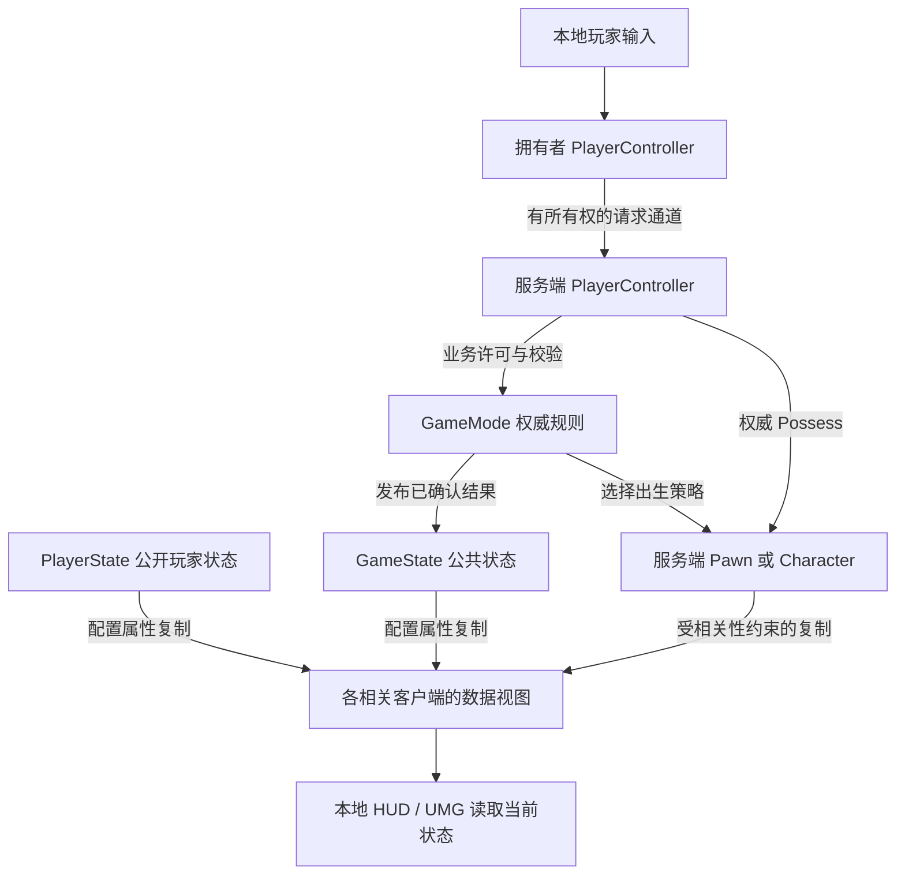
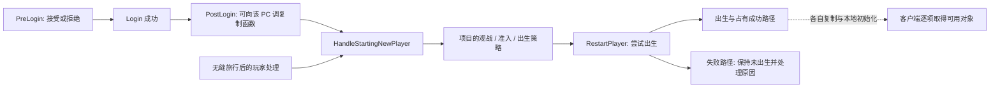
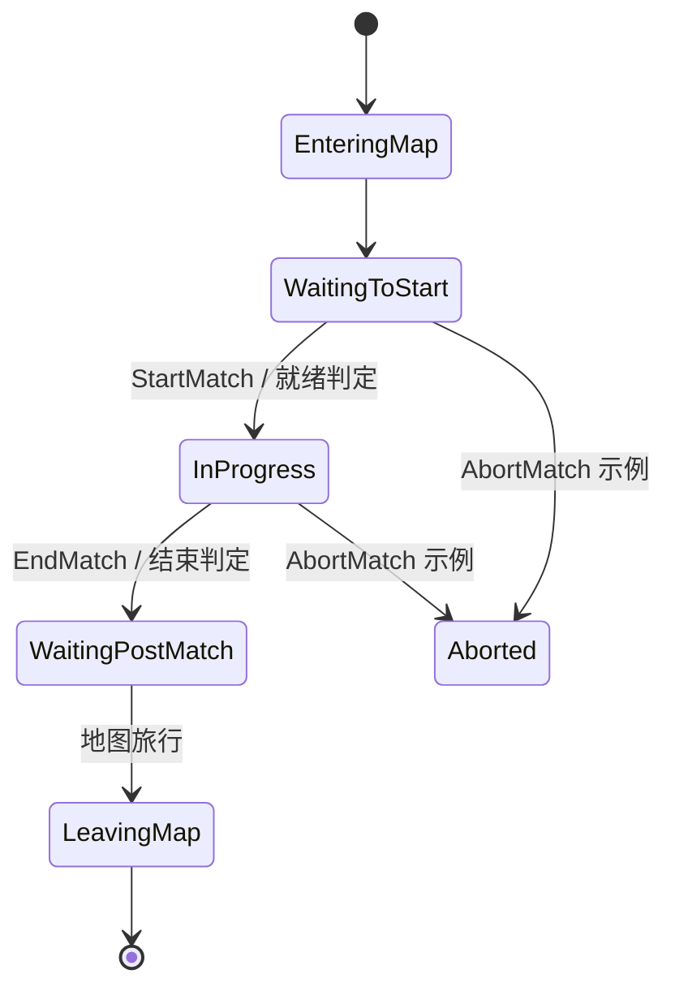
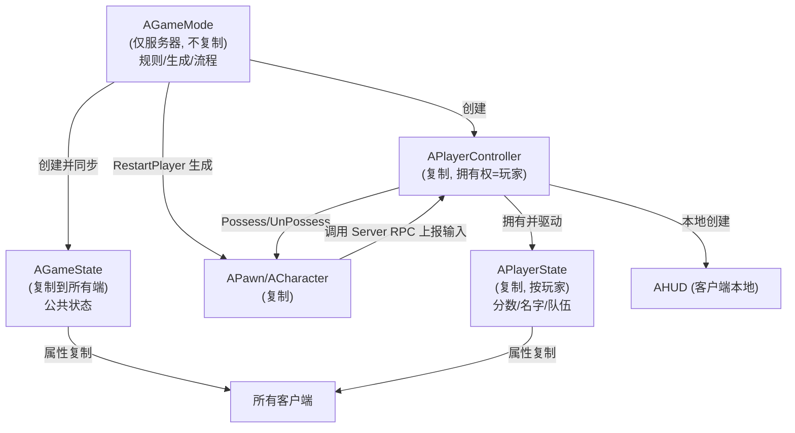
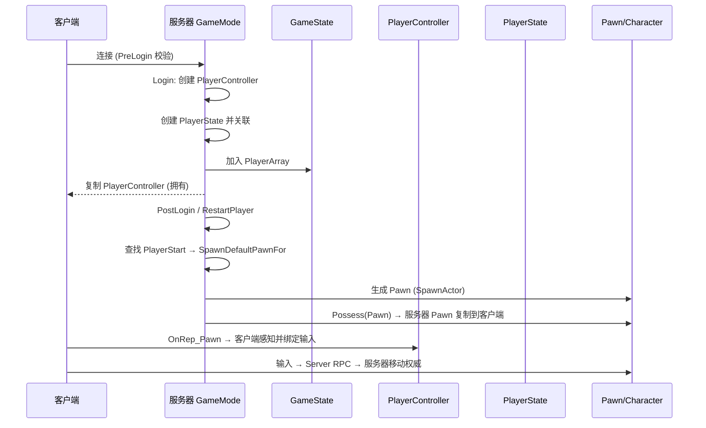
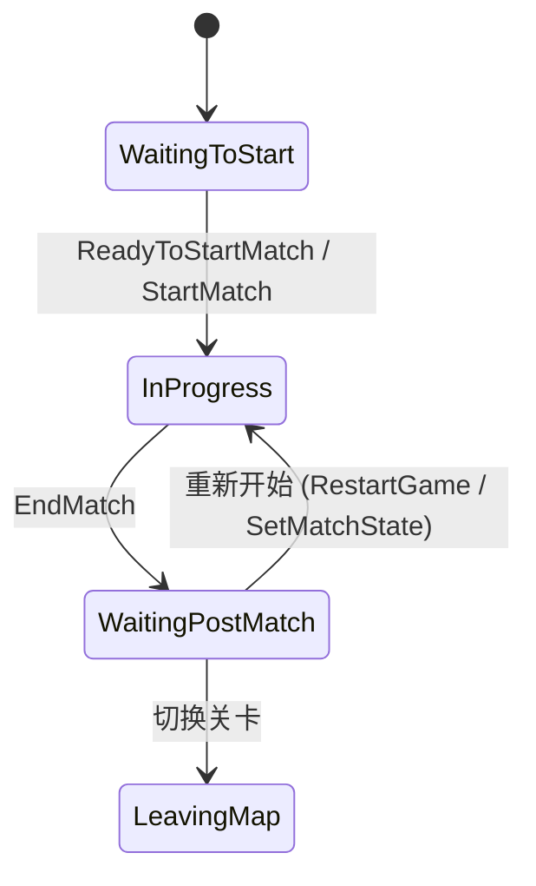

# 03 Gameplay 框架与游戏模式

> 知识成熟度：L2。主要结论经过公开官方文档/API 静态核对；教学代码未编译，纸面预期未执行，不代表运行验证。
> 版本基准：本次实际可读的 Epic UE 5.5 固定版本公开文档/API（链接带 application_version=5.5）；不是本机引擎 checkout。
> 事实边界：讨论标准服务端权威 Gameplay 框架与项目扩展责任；不保证覆盖自定义网络驱动、引擎修改或其他版本的内部调用顺序。
> 最后更新：2026-10-09；修订职责、可见性、登录/占有、比赛、死亡复活及旅行边界。
> 验证范围：仅文档、来源、Git 与字节保全静态核对；未运行 UE、PIE、编译、联机、网络模拟、性能或压力实验。

## 一、先决定数据属于谁，再选择框架类

本文解决三个问题：谁有权改变规则和结果；哪些机器能看到数据；换 Pawn、断线或旅行后哪些数据仍有意义。服务器权威、连接所有权、本地玩家身份是不同维度。Listen Server 的主机玩家可以同时是权威对象和本地玩家；因此 `!HasAuthority()` 不能作为创建本地 UI 的通用条件。

以一局双队比赛为例：GameMode 决定是否可出生和谁获胜；GameState 发布比分与比赛阶段；PlayerState 保存可公开的个人分数和队伍；PlayerController 接收该玩家输入并承载其有所有权的请求；Pawn/Character 是可以死亡、换身体的世界实体；HUD/UMG 读取这些状态形成界面。GameInstance 管理同一游戏实例中的跨地图上下文，但不会替你把内存数据复制到另一台机器或存进磁盘。

“每玩家一份”不等于“仅该玩家可见”。公开队伍信息适合 PlayerState；未公开的手牌、服务端校验数据需要另行设计服务端存储或所有者条件复制，不能仅凭类名认定隐私边界。官方说明 PlayerState 会复制给各客户端，PlayerController 默认只对拥有它的连接相关。[PlayerState API](https://dev.epicgames.com/documentation/en-us/unreal-engine/API/Runtime/Engine/GameFramework/APlayerState?application_version=5.5)、[拥有者与连接](https://dev.epicgames.com/documentation/en-us/unreal-engine/actor-owner-and-owning-connection-in-unreal-engine?application_version=5.5)

### 1.1 职责、存在位置与生命周期

以下是标准框架的职责边界，数量按一个游戏 World/游戏实例描述，不是一个操作系统进程的永久单例。一个进程可以有多个 PIE World；分屏也可以有多个本地玩家。

| 对象 | 存在位置与可见性 | 生命周期与合适用途 |
| --- | --- | --- |
| `AGameModeBase` / `AGameMode` | 服务端权威 World；远端客户端没有该实例 | 当前 World 的规则、加入/出生/比赛决策；不能用它给客户端直接读实时数据 |
| `AGameStateBase` / `AGameState` | 服务端实例及客户端复制实例；只复制已配置的状态 | 当前 World 的公共比赛状态；`AGameState` 增加 Match State 支持 |
| `APlayerController` | 服务端有各玩家 Controller；客户端通常只有自己拥有的 Controller | 连接/玩家控制、拥有者 RPC、本地输入与表现协调；换 Pawn 时通常可继续使用，不承诺跨所有旅行路径身份不变 |
| `APlayerState` | 服务端创建，向客户端发布玩家相关信息 | 可跨 Pawn 更换保留的名字、分数、队伍；断线/旅行仍需单独的保留或复制策略 |
| `APawn` / `ACharacter` | 是否及向谁复制取决于服务器生成、复制配置、相关性等；客户端不必拥有它 | 世界化身；可由玩家或 AI Controller 控制，也可暂时无 Controller；Character 提供专用移动集成 |
| `AHUD` / UMG | 针对本地玩家的表现对象，不是权威比赛数据通道 | HUD/界面创建和销毁后重新从当前数据绘制；不能假定整台客户端只有一个 HUD |
| `UGameInstance` | 各游戏实例自己的 UObject；不是复制 Actor | 同一运行实例建立到关闭之间的上下文；本机跨地图数据与服务协调，不等于联机共享或持久存档 |

GameMode 的基类拆分在 UE 4.14 引入，原稿的“UE4.24+ 引入”不准确。采用 `AGameMode` 的比赛状态机时，应搭配继承 `AGameState` 的类；不把 `AGameStateBase` 当作具有同样 Match State 行为的替代品。[GameMode/GameState 官方说明](https://dev.epicgames.com/documentation/en-us/unreal-engine/game-mode-and-game-state-in-unreal-engine?application_version=5.5)

补充类仍各司其职：GameSession 协助登录许可和在线会话；WorldSettings 保存关卡设置，其 GameMode Override 是模式选择输入；PlayerStart 是出生候选点；PlayerCameraManager 管理玩家视角。CameraManager 不能概括为“只在客户端存在”，PlayerController API 明确有服务端及拥有玩家侧的创建用途。SpectatorClass 是观战 Pawn 类选择，不能推导出“死亡自动在服务器生成并复制一个观战 Pawn”。实际观战存在位置和复制配置应核对项目路径。[GameModeBase API](https://dev.epicgames.com/documentation/en-us/unreal-engine/API/Runtime/Engine/GameFramework/AGameModeBase?application_version=5.5)、[PlayerController API](https://dev.epicgames.com/documentation/en-us/unreal-engine/API/Runtime/Engine/GameFramework/APlayerController?application_version=5.5)、[WorldSettings API](https://dev.epicgames.com/documentation/en-us/unreal-engine/API/Runtime/Engine/GameFramework/AWorldSettings?application_version=5.5)

### 1.2 协作图：箭头表示职责，不表示复制完成顺序



Actor 所有权主要影响 RPC 路由和复制过滤，不把服务器决定权转交给客户端；“客户端能看见该 Actor”也不意味着能在它上面成功发 Server RPC。不要让所有客户端直接通过 GameState 的 Server RPC 提交分数。[RPC 调用矩阵](https://dev.epicgames.com/documentation/en-us/unreal-engine/remote-procedure-calls-in-unreal-engine?application_version=5.5)

## 二、登录、生成和占有：用可观察的局部合同排查

### 2.1 登录成功不等于 Pawn、输入和 UI 已同时就绪

公开资料支持的关系是：`PreLogin` 先于 `Login`，成功登录后进入 `PostLogin`；`PostLogin` 是对该 PlayerController 调用复制函数的首个安全位置；`HandleStartingNewPlayer` 可以在 PostLogin 或无缝旅行后进入；`RestartPlayer` 尝试开始出生。PreLogin 与 Login 之间可能相隔较久，项目不应把预检查当作永久有效的资源预留。[GameMode/GameState](https://dev.epicgames.com/documentation/en-us/unreal-engine/game-mode-and-game-state-in-unreal-engine?application_version=5.5)



这张图没有声明 PlayerState 创建、PlayerArray 增补、各 Actor 的 BeginPlay、OnRep、输入初始化的完整全序。`PlayerArray` 在服务端和客户端维护；它是玩家状态入口，不是“PostLogin 发出一个数组包后所有玩家对象都已就绪”的屏障。客户端 UI 必须允许 GameState、PlayerState、Pawn、Widget 分别较晚可用。[GameStateBase API](https://dev.epicgames.com/documentation/en-us/unreal-engine/API/Runtime/Engine/GameFramework/AGameStateBase?application_version=5.5)

### 2.2 出生合同与失败责任

`FindPlayerStart` 可以复用已保存的 StartActor 或调用 `ChoosePlayerStart`；默认后者寻找未被占用的候选点。`GetDefaultPawnClassForController` 允许按玩家选择 Pawn 类，`SpawnDefaultPawnFor` / `SpawnDefaultPawnAtTransform` 是对应生成扩展点，`FailedToRestartPlayer` 是出生失败处理入口。这里只核对 API 职责，不给所有覆写路径编排一个必然调用栈。[GameModeBase API](https://dev.epicgames.com/documentation/en-us/unreal-engine/API/Runtime/Engine/GameFramework/AGameModeBase?application_version=5.5)

排查时依次记录实际模式类、玩家是否获准进入、是否只观战、当前是否已有 Pawn、所选出生点、最终 Pawn 类、生成结果和占有后的 Pawn。缺少地图标记、阻挡碰撞、空/不适合的类、过期 Controller 或项目主动拒绝都可能阻止出生；“DefaultPawnClass 已设置”不是成功证据。失败后由规则层决定重新选点、等待或拒绝，不在 UI Tick 中反复调用 RestartPlayer。重试要重新检查玩家仍在线、仍有资格且尚无有效 Pawn，避免重复生成；这些是项目责任，不是本文已运行的重试实现。

出生点标签可作为项目选择策略，但“标签存在”不会自动定义队伍分配。保留 `ChoosePlayerStart` / `FindPlayerStart` 扩展用途，具体标签名称和碰撞行为以项目实现为准。

### 2.3 占有和本地绑定不是同一个回调

| 入口 | 可据公开合同安排的工作 | 不应据此假设 |
| --- | --- | --- |
| `AController::Possess` / `OnPossess` | 权威端尝试建立控制关系，保留父类行为 | 所有客户端已接收 Pawn 或 UI 已创建 |
| `APawn::PossessedBy` | 服务端或 Standalone 的 Pawn 占有响应 | 它是远端拥有者客户端的初始化通知 |
| `AController::OnRep_Pawn` | 对 Pawn 引用复制更新的响应 | 必然是唯一客户端入口，或一次性到齐全部依赖 |
| `OnPossessedPawnChanged` | 权威端和客户端的 Pawn 更换通知；处理旧值或新值为空 | 与其他 Actor 的 OnRep 具有固定全局先后关系 |
| `APlayerController::AcknowledgePossession` | 客户端的本地 Pawn 设置；文档给出它在 ServerAcknowledgePossession 之前 | 这是任意 UI/资源加载都已完成的通知 |
| `APawn::Restart` / `PawnClientRestart` | Pawn 重启及拥有者客户端重启路径 | 等价于服务器重新 Spawn，或所有客户端都走同一路径 |

来源：[Controller API](https://dev.epicgames.com/documentation/en-us/unreal-engine/API/Runtime/Engine/GameFramework/AController?application_version=5.5)、[Possess](https://dev.epicgames.com/documentation/en-us/unreal-engine/API/Runtime/Engine/GameFramework/AController/Possess?application_version=5.5)、[Pawn API](https://dev.epicgames.com/documentation/unreal-engine/API/Runtime/Engine/GameFramework/APawn?application_version=5.5)、[Restart](https://dev.epicgames.com/documentation/unreal-engine/API/Runtime/Engine/GameFramework/APawn/Restart?application_version=5.5)、[PlayerController API](https://dev.epicgames.com/documentation/en-us/unreal-engine/API/Runtime/Engine/GameFramework/APlayerController?application_version=5.5)

本地输入、HUD 和数据订阅应选定明确的入口：先解绑旧 Pawn，绑定当前有效 Pawn，再立即读取一次当前状态；数据未就绪则等待对应对象变化重新协调；销毁/旅行时撤销旧订阅。重复收到通知时不得累积绑定或重放已经结算的业务动作。这里是生命周期设计合同，不是要求同时覆写表中全部回调。`BeginPlay` 仅凭执行过一次不能替代以后换 Pawn、晚创建 UI 或旅行后的重新绑定。

## 三、比赛状态与模式配置

### 3.1 先配对 GameMode 与 GameState

简单玩法或自定义流程可以使用 `AGameModeBase` 与 `AGameStateBase`。采用内建 Match State 时使用 `AGameMode` 与 `AGameState`。下例保留原稿的类配置用途；类定义、模块依赖和生成头需在实际项目提供，代码未编译。

```cpp
// AMyGameMode derives from AGameMode.
// AMyGameState MUST derive from AGameState for this match-state example.
AMyGameMode::AMyGameMode()
{
    DefaultPawnClass = AMyCharacter::StaticClass();
    PlayerControllerClass = AMyPlayerController::StaticClass();
    PlayerStateClass = AMyPlayerState::StaticClass();
    GameStateClass = AMyGameState::StaticClass();
    HUDClass = AMyHUD::StaticClass();
    SpectatorClass = AMySpectatorPawn::StaticClass();
    bDelayedStart = true;
}
```

模式选择应检查实际加载结果。GameModeBase API 给出的直接选择顺序为 URL `?game=...`、World Settings 的 GameMode Override、项目默认值；原稿把 `UWorld::SetGameMode` 当作配置优先级最高且可随时切换的通用入口不成立。服务端默认配置、模式别名与地图前缀也可能参与项目解析，本文不重建未核对的内部选择算法。蓝图 Class Defaults 可覆盖相应默认类，最终应观察实际实例类。[GameModeBase API](https://dev.epicgames.com/documentation/en-us/unreal-engine/API/Runtime/Engine/GameFramework/AGameModeBase?application_version=5.5)

### 3.2 MatchState 是 FName，不是 EMatchState 枚举



图只示意常见路径；Aborted 的箭头不是完整允许转移集合。`SetMatchState(FName)` 是 GameMode 的受保护状态扩展点；普通比赛规则优先调用 `StartMatch` / `EndMatch` 等语义入口并遵守各自前提，不能把直接赋值或任意 SetMatchState 当作能完成全部准备/重置工作的捷径。GameState 通过自己的 MatchState 与通知支持客户端表现；客户端不因此获得切换比赛状态的权力。[GameMode API](https://dev.epicgames.com/documentation/en-us/unreal-engine/API/Runtime/Engine/GameFramework/AGameMode?application_version=5.5)、[GameState API](https://dev.epicgames.com/documentation/en-us/unreal-engine/API/Runtime/Engine/GameFramework/AGameState?application_version=5.5)

`RestartGame` 默认是旅行到当前地图，不是保证在原有对象上从 WaitingPostMatch 直接回到 InProgress。`ResetLevel` 也不是整局对象、计时器和订阅全部清空的保证。等待就绪应由服务端定义参加者集合、就绪状态、退出/超时处理和开赛条件；人数达到二并不证明双方已加载、可控制或愿意开始。`GetNumPlayers` 的“活跃人类玩家”计数不能未经设计就代替候场参与者集合。`bDelayedStart` 保留延迟开赛用途，不能代替应用自己的就绪协议或一个只在 PostLogin 检查一次的条件。

## 四、代码与数据流：修复示例的权威和表现边界

本节全部是未编译的教学片段，不是引擎源码节选，也不是可直接组装的完整项目。省略的头文件、UCLASS/USTRUCT 声明、模块导出、项目规则和 UI 订阅必须另行实现。原始完整示例与三个原图在文末原样保留，不能作为现行正确代码复制。

### 4.1 GameMode 决策，GameState 发布，UI 重读快照

客户端请求应从拥有的 PlayerController/Pawn 通道进入；服务器根据可信上下文计算得分和胜者，再用普通服务端函数修改 GameState。不要让客户端提供“直接加多少分”“直接扣多少血”作为可信结果。以下示例把 GameState 的记分 RPC 改成普通受权威检查的 setter，保留分数、胜者、DOREPLIFETIME 和表现通知用途。

```cpp
// In AMyGameState : public AGameState (class boilerplate omitted).
UPROPERTY(ReplicatedUsing=OnRep_Score)
int32 TeamAScore = 0;
UPROPERTY(ReplicatedUsing=OnRep_Score)
int32 TeamBScore = 0;
UPROPERTY(ReplicatedUsing=OnRep_Winner)
TObjectPtr<APlayerState> WinnerPlayerState = nullptr;

// Ordinary C++ methods; none of these setters is a Server RPC.
void AMyGameState::SetScoresFromAuthority(int32 NewA, int32 NewB)
{
    if (!HasAuthority() || NewA < 0 || NewB < 0) return;
    TeamAScore = NewA;
    TeamBScore = NewB;
    RefreshLocalPresentation();
}

void AMyGameState::SetWinnerFromAuthority(APlayerState* Winner)
{
    if (!HasAuthority()) return;
    WinnerPlayerState = Winner; // GameMode has checked eligibility; nullptr means none.
    RefreshLocalPresentation();
}

void AMyGameState::GetLifetimeReplicatedProps(
    TArray<FLifetimeProperty>& OutLifetimeProps) const
{
    Super::GetLifetimeReplicatedProps(OutLifetimeProps);
    DOREPLIFETIME(AMyGameState, TeamAScore);
    DOREPLIFETIME(AMyGameState, TeamBScore);
    DOREPLIFETIME(AMyGameState, WinnerPlayerState);
}

void AMyGameState::OnRep_Score() { RefreshLocalPresentation(); }
void AMyGameState::OnRep_Winner() { RefreshLocalPresentation(); }
```

`OnRep_Score` / `OnRep_Winner` 需在实际类声明为对应 UFUNCTION。`RefreshLocalPresentation` 是项目自定义入口：只通知本机存在的表现订阅者，没有 Widget 就暂不绘制；它不得改分、判胜、生成 Pawn 或把一次回调当作一次奖励。C++ 的服务端赋值不等于自动执行客户端 OnRep，服务端本地玩家的刷新由 setter 显式安排；远端由 OnRep 安排；晚创建 Widget 自己首次读取当前值。Blueprint 的 Set 节点与 C++ RepNotify 触发行为不同，不应把手动调用 OnRep 作为跨两种语言的唯一模板。[属性复制与 RepNotify](https://dev.epicgames.com/documentation/en-us/unreal-engine/replicate-actor-properties-in-unreal-engine?application_version=5.5)

三个属性不组成跨对象原子事务，也没有 OnRep_Score 一定先于 OnRep_Winner 的保证。暂未解析出胜者对象时显示“结果待就绪”，不要把空引用直接解释成平局；胜者可能离开，长期比赛结果应按项目需求保存稳定标识和展示数据。若一组数据必须作为同一业务结果使用，应设计同一结果记录和明确的就绪条件，不能从两个独立通知的先后猜测。[复制执行顺序](https://dev.epicgames.com/documentation/unreal-engine/replicated-object-execution-order-in-unreal-engine?application_version=5.5)

服务端的结束入口先检查比赛仍允许结算、胜者属于有效参赛者、当前局尚未结算，再发布结果并调用 EndMatch；重复请求不能重复发奖。这是项目规则职责，本文没有实现或执行该判定。原 `PostLogin` / `StartPlay` / `HandleMatchHasStarted` / `HandleMatchHasEnded` 的扩展用途仍成立：覆写时保留适用父类行为，业务副作用要定义只发生一次的条件，不能把一条日志当作远端完成证据。

### 4.2 PlayerController：本地输入和 RPC 请求分别处理

```cpp
// In AMyPlayerController (declarations/headers omitted).
void AMyPlayerController::BeginPlay()
{
    Super::BeginPlay();
    if (IsLocalController())
    {
        SetInputMode(FInputModeGameOnly());
    }
}

void AMyPlayerController::SetupInputComponent()
{
    Super::SetupInputComponent();
    if (IsLocalController() && InputComponent)
    {
        InputComponent->BindAction("Jump", IE_Pressed,
            this, &AMyPlayerController::TryJump);
        InputComponent->BindAction("Jump", IE_Released,
            this, &AMyPlayerController::StopJump);
    }
}

void AMyPlayerController::TryJump()
{
    if (!IsLocalController()) return;
    if (ACharacter* Character = Cast<ACharacter>(GetPawn()))
    {
        Character->Jump();
    }
}

void AMyPlayerController::StopJump()
{
    if (!IsLocalController()) return;
    if (ACharacter* Character = Cast<ACharacter>(GetPawn()))
    {
        Character->StopJumping();
    }
}
```

这是保留经典 InputComponent 绑定用途的片段，前提是项目配置了 Jump Action；采用 Enhanced Input 的项目应在自己的映射/绑定体系接入同样的本地动作责任。`Jump` 属于 Character 的 API，不能通过 `APawn*` 直接调用；按下/释放语义需要配对。CharacterMovement 有拥有者预测、服务器重演/校正和其他客户端的模拟平滑路径，不应把这个例子改成“仅自制 Reliable ServerRequestJump 后在服务器 Jump”，也不能声称 `bReplicates=true` 自动解决普通 Pawn 的所有移动。[Character API](https://dev.epicgames.com/documentation/en-us/unreal-engine/API/Runtime/Engine/GameFramework/ACharacter?application_version=5.5)、[Character 网络移动](https://dev.epicgames.com/documentation/unreal-engine/understanding-networked-movement-in-the-character-movement-component-for-unreal-engine?application_version=5.5)

原稿的 RPC 教学用途用“申请就绪”表达更清楚：在拥有的 PlayerController 声明 `UFUNCTION(Server, Reliable) void ServerSetReady(bool bReady);`，其 `_Implementation` 只根据这个 Controller 对应的服务端玩家身份向 GameMode 提交意图，GameMode 检查当前比赛阶段和参加资格再改变状态。不要接收一个客户端任意指定的 Controller 当作请求者；`WithValidation` 的 `_Validate` 无条件返回 true 不构成业务安全校验。`ClientShowMatchResult_Implementation` 若作为拥有者瞬时提示使用，应完整定义；可在稍后加入或重建 UI 时恢复的结果仍应从 GameState 读取。[RPC 定义、路由与验证](https://dev.epicgames.com/documentation/en-us/unreal-engine/remote-procedure-calls-in-unreal-engine?application_version=5.5)

### 4.3 Character：权威生命状态与死亡表现分开

```cpp
// In AMyCharacter : public ACharacter.
// Health is UPROPERTY(ReplicatedUsing=OnRep_Health), initially 100.0f.
// OnRep_Health is a UFUNCTION; Health uses DOREPLIFETIME in the override.
void AMyCharacter::ApplyAuthoritativeDamage(float Amount)
{
    if (!HasAuthority() || !FMath::IsFinite(Amount) || Amount <= 0.0f
        || !FMath::IsFinite(Health) || Health <= 0.0f) return;

    Health = FMath::Max(0.0f, Health - Amount);
    RefreshHealthPresentation();
    if (Health == 0.0f)
    {
        // Project authority death policy belongs here or in its rule service.
        // Record death once, then decide unpossess, corpse, spectate and respawn.
    }
}

void AMyCharacter::OnRep_Health()
{
    RefreshHealthPresentation(); // Project-local presentation only.
}
```

这个普通方法只接收服务器已确认的伤害；它不是供客户端任意传入 Amount 的 RPC。有限正伤害检查只能保护本片段的数值入口，不能证明命中、射程、队伍规则或反作弊已完成。Health 的初值和“0 为死亡”是本例约定，不是 UE 内建死亡系统。死亡决策在服务端处理，客户端 OnRep 只显示当前生命/死亡状态。需要逐次伤害飘字时另用有身份的表现事件，不能要求属性复制保留每一个中间值。

不要照抄原稿关闭 Character 的 Actor Tick；与跳跃等 Character 自身更新相互作用的行为需要在目标版本验证，本文不修改 Tick 配置。血量为零也不会替你自动选择尸体时长、复活点或观战方式。

### 4.4 蓝图对应关系

蓝图可以选择 GameMode/GameState 配对及 Default Pawn/Controller/PlayerState/HUD/Spectator 类。客户端读取公共比赛状态走 Get Game State；GameMode 的权威实例不可在远端客户端读取。Controller 的占有事件和 Pawn 的 ReceivePossessed/ReceiveUnpossessed 属于不同对象；Pawn 的 ReceiveControllerChanged、ReceiveRestarted 有各自通知合同，不能把所有蓝图事件统称为 C++ PossessedBy。RepNotify 函数由复制属性关联，不保证统一叫“Event OnRep_X”，也不能把蓝图 Set 节点的本地通知误认成网络复制已完成。[Pawn API](https://dev.epicgames.com/documentation/unreal-engine/API/Runtime/Engine/GameFramework/APawn?application_version=5.5)、[RepNotify 差异](https://dev.epicgames.com/documentation/en-us/unreal-engine/replicate-actor-properties-in-unreal-engine?application_version=5.5)

## 五、死亡、断线、重连和旅行不共用一个“保留”开关

### 5.1 死亡与复活

Pawn 死亡是项目状态。服务端决定是否失去控制、销毁或保留尸体、切换视角、进入观战以及何时允许复活；PlayerController 和 PlayerState 可以继续代表玩家。再次调用出生流程前检查比赛阶段、玩家资格、复活等待和已有 Pawn。客户端对新 Pawn 重新绑定，必须清掉旧 Pawn 的输入/界面订阅。不要从 UnPossess 推导“引擎一定生成服务器观战 Pawn”，也不要从 Health OnRep 触发权威复活。

### 5.2 断线与 PlayerState 恢复

`Logout` 是离开通知；`PawnLeavingGame` 的基类实现会销毁 Pawn。不能保证在 Logout 里才 UnPossess 就一定赶得上更早的清理，也不能把 `bShouldSpawnAtStartSpot` 当作 Pawn 保留开关。要保留离线角色，应在选定的实际清理路径设计清楚所有权撤销、AI 接管/冻结、清除订阅和回收责任，随后在目标引擎中核实。[PawnLeavingGame 所在 API](https://dev.epicgames.com/documentation/en-us/unreal-engine/API/Runtime/Engine/GameFramework/APlayerController?application_version=5.5)

`AGameMode` 提供 InactivePlayerArray、InactivePlayerStateLifeSpan、MaxInactivePlayers 等非活动 PlayerState 机制；这不等于 GameModeBase 都有同样保留行为，也不是无限期账户存储。PlayerState 的 CopyProperties、OverrideWith、SeamlessTravelTo 等有不同恢复方向和用途，覆写要保留父类数据并明确哪些自定义字段迁移。`bMustSpectate` 不是通用 PlayerState 持久化开关；重连身份确认、过期/驱逐和恢复失败后的处理仍由项目定义。[GameMode API](https://dev.epicgames.com/documentation/en-us/unreal-engine/API/Runtime/Engine/GameFramework/AGameMode?application_version=5.5)、[PlayerState API](https://dev.epicgames.com/documentation/en-us/unreal-engine/API/Runtime/Engine/GameFramework/APlayerState?application_version=5.5)

### 5.3 旅行与保存

| 目标 | 应用应依赖的边界 | 不能据此承诺 |
| --- | --- | --- |
| 同一局换身体 | Controller/PlayerState 与 Pawn 生命周期分离 | 原 Pawn 指针永远有效 |
| 同一游戏实例换地图 | GameInstance 到该实例关闭才结束，可承载本机跨地图上下文 | 客户端 GameInstance 自动复制给服务器；Actor 引用随旧 World 一同长期可用 |
| 无缝旅行 | 过渡地图、保留 Actor 列表和玩家重新初始化有专门入口 | 所有对象、所有字段、所有两段旅行都保持同一个实例 |
| 非无缝旅行 | 连接断开/重连路径和重新加载上下文 | 它与无缝旅行具有相同回调序列 |
| 退出程序后恢复 | 另行设计 SaveGame/服务端持久化、身份和恢复校验 | GameInstance 或 PlayerState 的内存寿命等于磁盘存档 |

无缝旅行包含旧图到过渡图、过渡图到目标图两段，GameModeBase 的 GetSeamlessTravelActorList 会在两段被调用；Controller 类还可能需要重新初始化或交换。官方概览的默认保留列表不能外推为“目标 World 必定继续使用旧 GameMode/旧 Pawn”。本文只说明公开扩展入口和保留责任，没有核对受限引擎源码中的所有条件。[多人旅行](https://dev.epicgames.com/documentation/en-us/unreal-engine/travelling-in-multiplayer-in-unreal-engine?application_version=5.5)、[GameModeBase 旅行 API](https://dev.epicgames.com/documentation/en-us/unreal-engine/API/Runtime/Engine/GameFramework/AGameModeBase?application_version=5.5)、[GameInstance API](https://dev.epicgames.com/documentation/en-us/unreal-engine/API/Runtime/Engine/Engine/UGameInstance?application_version=5.5)

## 六、常见问题 FAQ

### Q1：GameMode 与 GameState 有何区别？

前者做权威规则与决定，后者向客户端发布已配置复制的状态。客户端仍须处理状态尚未到达，不能把“存在 GameState”当作所有数据已经同步。

### Q2：为什么客户端 GetGameMode 为空？

远端客户端没有权威实例。读取走 GameState；请求走有所有权的 Controller/Pawn 等通道，再由服务端转给规则层。Listen Server 本地玩家与远端客户端的存在位置不同。

### Q3：DefaultPawnClass 已设置却没出生？

先确认实际 GameMode/GameState 配对和类，再查准入/只观战/比赛阶段、出生点、Pawn 类与生成结果。按第二节的分段证据定位，不把 PostLogin 被调用等同于出生完成。

### Q4：PlayerController 在复制，为什么看不到 Pawn？

先分清这是自己的 Controller 还是其他玩家的 Controller；远端玩家的 Controller 通常不在该客户端。再检查服务端确实生成/占有、Pawn 复制与相关性、引用是否已经可用。仅增补 GetLifetimeReplicatedProps 不能修复 Actor 根本不存在或不相关的问题。

### Q5：比分或胜者 UI 不一致？

检查权威来源、GameState 的复制配置、拥有者 RPC 是否路由成功、本地服务器是否刷新、Widget 是否晚于通知创建及旧订阅是否残留。UI 应首次读取当前状态，并允许分数/胜者在不同通知时变为可用。

### Q6：Base 与完整 GameMode 如何选？

是否需要内建 Match State 是关键。使用完整 GameMode 时配完整 GameState；自行管理流程时不要假设 Base 自带比赛状态机。

### Q7：哪些框架对象能发 RPC？

Actor 和符合复制条件的 ActorComponent 可以承载 RPC；还要检查复制配置、所有权和 RPC 类型。GameMode 不在远端客户端，GameInstance 不属于这种复制 Actor 通道；GameState 是 Actor 也不意味着所有客户端拥有它。Multicast 受 Actor 相关性与调用端约束，不等于永久“全服公告”，也不能给后来加入者补发既往调用。

### Q8：断线后 Pawn 与 PlayerState 去哪了？

PawnLeavingGame 默认销毁 Pawn；PlayerState 的非活动保留机制另有条件、期限和容量。先明确是否要保留世界角色、公开玩家信息或长期账户数据，再设计各自路径，不以出生点或观战布尔量替代保存合同。

### Q9：怎样等待所有玩家就绪？

服务端维护明确的参加者/就绪集合与退出规则。通过拥有者通道提交意图，在规则层核验并决定 StartMatch；人数、PostLogin 和加载完成是不同事实。倒计时可由服务器发布阶段/目标时间，客户端按同步时间读出显示，但裁决仍在服务端。

### Q10：单机仍有意义吗？

有，仍可分开规则、玩家控制和身体生命周期。Standalone 中相关权威实例也可能是本地玩家，这正说明本地 UI 不该依赖 `!HasAuthority()`；没有跨机器传输不能证明联机所有权、回调次序或复制已通过验证。

## 七、验证与基准：有限 PAPER_EXPECTED，不是运行结果

以下每项都是纸面合同审阅，没有运行 UE 或自建状态模型。前提变化时只保留其明确支持的结论。

| 纸面输入/操作 | PAPER_EXPECTED | 暴露的反例 |
| --- | --- | --- |
| Listen Server 主机的本地 PlayerController | 本地输入/UI 路径使用 IsLocalController；权威规则仍使用 HasAuthority | 用 !HasAuthority 会排除主机玩家 |
| 客户端 A 读取 B 的 PlayerState 公开队伍，再在 GameState 调 Server RPC | 公开状态与请求所有权分开判断；不能从可读推导可调用 | 将 PlayerState 私密化、将 GameState 当万人共用请求通道 |
| PostLogin 成功，但玩家策略决定先观战 | 只确认登录后 PC 调用点；不宣称 Pawn/Input/UI 都准备完成 | 顺序图把“登录”直接当完整出生屏障 |
| Widget 晚创建；随后发生 Pawn 更换、旧 Pawn 销毁 | 首次重读当前状态，换绑定且解除旧订阅 | 只在 BeginPlay 或一次 OnRep 初始化，造成空白或旧对象通知 |
| GameState 得分、胜者与 UI 所需 PlayerState 引用依次可用 | 各次通知可重新协调当前状态；不依赖跨属性固定 OnRep 次序 | 将广播到达或空胜者引用当作完整结算/平局 |
| Character 跳跃键按下后释放；当前 Pawn 也可能不是 Character | 类型检查，Character 的 Jump/StopJumping；无 Character 则不做此动作 | APawn::Jump 或自制可靠 RPC 替代 CMC 预测 |
| 权威伤害令本例 Health 达到 0；之后再来伤害请求 | 规则层处理一次死亡；客户端只呈现；复活另经资格检查 | 客户端 OnRep 生成新 Pawn、重复死亡发奖 |
| 玩家断开或旅行后尝试沿用旧 Pawn 指针 | 重新确认 World/对象与身份；按各自迁移机制恢复 | 将 GameInstance 内的旧 Actor 指针等同于跨图存活 |
| WaitingPostMatch 调用默认 RestartGame | 按默认地图旅行理解，重新建立目标局上下文 | 宣称旧对象状态直接回到 InProgress |

若日后另行开展运行验证，应记录准确引擎版本、工程类覆写、启动拓扑（Standalone/Listen/专服及各客户端）、每条日志所属 World/网络角色/本地玩家/Pawn/PlayerState，以及实际生成结果和回调。至少检查晚加入、晚创建 UI、无 Pawn、重复绑定、出生失败、断线和两类旅行。原稿的 `-numplayers`、`net connection` 不在本次已核对命令范围，不作为可直接执行的验证说明；`stat net` 等观察命令也不能证明业务合同成立。本轮没有执行这些验证，更没有设置网络、访问受限工作区或新增引擎源码。

## 八、关联阅读与证据边界

- [01-UObject与反射系统.md](../对象模型与生命周期/01-UObject与反射系统.md)：引用生命周期、反射与 RPC 声明基础
- [02-Actor与Component生命周期.md](../对象模型与生命周期/02-Actor与Component生命周期.md)：Actor/Component 初始化和结束；本文不重新定义其完整时序
- [04-引擎启动流程与模块架构.md](../运行架构与任务调度/04-引擎启动流程与模块架构.md)：World/地图初始化背景
- [06-网络同步/01-网络架构与复制基础](../../07-网络与游戏服务端/状态复制与兴趣管理/01-网络架构与复制基础.md)：网络复制、相关性与 RPC 的主篇；本文代码只说明 Gameplay 责任
- 官方定位：上述固定 UE 5.5 文档/API 是本次已读来源；API 上显示的头文件/Source 路径只作为定位，不意味着本机文件或函数实现已读
- 历史原稿中 UE5.8.0、CL 55116800、`++UE5+Release-5.8`、2026-08-06 是原稿来源身份；本轮未访问该 checkout，不用其支持新正文
- 部分 UE5.6 API、部分独立函数页与观战类页读取失败；已读同版本类页只能支持其中明确列出的合同，不补写未见实现或未知全序

## 九、历史原稿逐字保留（非现行教学结论）

下方围栏完整保留基线 Git 原文，包括原 frontmatter、标题、3 个 Mermaid 图、全部 C++ 示例、蓝图说明、最佳实践、10 个 FAQ 和关联阅读。它用于核对来源与恢复，不代表其中版本、API、时序、所有权或验证声明仍成立。原文 21,574 字节，SHA-256：`d9dd18b646ffcf527e9dc53ea2ecb254b08f4fc3c4e7c1802cec1c06152fcd7d`；没有改写历史字节。

`````markdown
---
type: Concept
title: "03 Gameplay 框架与游戏模式"
status: stable
verified: []
maturity: L2
---
# 03 Gameplay 框架与游戏模式
> 知识成熟度：L2（本轮审计修订时补标）。
> 版本基准：UE 5.8.0（本机 `Engine/Build/Build.version`：CL 55116800，分支 `++UE5+Release-5.8`）。
> 兼容性边界：适用于 UE5.8 编辑器/运行时，UE4.27 与早期 UE5 仅作迁移背景，具体模块以正文为准。
> 官方参考：[Unreal Engine UE5.8 官方文档总页](https://dev.epicgames.com/documentation/en-us/unreal-engine)。
> 最后更新：2026-08-06（本轮元数据维护）。

## 一、概述

UE 提供了一套完整的 Gameplay 框架类，用来组织"一局游戏"的规则与玩家交互：谁制定规则（GameMode）、谁同步公共状态（GameState）、谁代表每个玩家（PlayerController / PlayerState）、玩家在场景中的化身是什么（Pawn / Character）。这套框架天然支持多人网络：**服务器权威（Server Authority）** 是它的设计核心。

理解本框架后，你将能够：

- 分清 GameMode 与 GameState 的职责边界（"规则"与"状态"）；
- 理解玩家从连接、登录、出生（Spawn）、Possess 到断线的完整流程；
- 知道在多人游戏中"数据应该放在哪个类里"才不会出现同步混乱；
- 正确配置 `DefaultPawnClass`、`PlayerControllerClass` 等类的指定方式；
- 使用 Match State 状态机管理"等待开始 → 进行中 → 结束"的回合流程。

> 适用版本：UE 5.0+（`AGameModeBase`/`AGameStateBase` 为 UE4.24+ 引入的简化基类，UE5 沿用）。

## 二、核心概念

| 类 | 是否复制 | 数量 | 职责 |
| --- | --- | --- | --- |
| `AGameModeBase` / `AGameMode` | 否（仅在服务器存在） | 每局 1 个（服务器） | 规则制定者：出生点、胜利条件、允许的玩家数、Match State |
| `AGameStateBase` / `AGameState` | 是 | 每局 1 个（所有端） | 可复制的公共状态：玩家列表、比赛阶段、计分 |
| `APlayerController` | 是 | 每个玩家 1 个 | 玩家"大脑"：输入、HUD 控制、相机管理、Possess Pawn |
| `APawn` | 是 | 玩家化身 | 可被控制（Possess）的实体；AI 也可控制 |
| `ACharacter` | 是 | 玩家化身 | Pawn 的子类：含 Capsule、Mesh、CharacterMovementComponent |
| `APlayerState` | 是 | 每个玩家 1 个 | 玩家私有复制数据：名字、分数、队伍、击杀数 |
| `AHUD` | 否（客户端本地） | 每客户端 1 个 | 绘制 HUD（旧式 Canvas 绘制；现代 UI 多用 UMG） |
| `AGameSession` | 否 | 每局 1 个（服务器） | 会话管理：登录校验、踢人、会话创建（在线子系统） |
| `AWorldSettings` | 是 | 每个关卡 1 个 | 关卡级规则：TimeDilation、bEnableWorldBounds 等 |
| `APlayerStart` | - | 多个 | 玩家出生点（标签 `PlayerStart`） |
| `APlayerCameraManager` | 否（客户端本地） | 每玩家 1 个 | 相机管理与震屏、视角切换 |
| `ASpectatorPawn` | 是 | 观战者 | 死亡后观战用的 Pawn |

## 三、原理详解

### 3.1 框架职责与协作关系



**分工原则**：

- **GameMode 不复制**：它只存在于服务器，是"裁判"。客户端没有 GameMode 实例（客户端 `GetWorld()->GetAuthGameMode()` 返回空）；
- **GameState 复制**：所有端都能读到的"比赛公共数据"放这里（当前回合、倒计时、队伍比分）；
- **PlayerState 复制**：每个玩家一份、所有端可见（排行榜、队伍归属）；
- **PlayerController 拥有权**：服务器权威创建，复制到"拥有它的"那个客户端；`GetLocalPlayerController` 只在本地端返回自己的；
- **Pawn 是棋子**：谁 Possess 谁控制；玩家断开后 Pawn 默认被销毁（可配置）；
- **HUD/相机是表现层**：只在客户端本地存在，不做权威判定。

### 3.2 玩家登录与出生流程（多人）



关键回调：

- `AGameModeBase::PreLogin`：连接前校验（如服务器满员），返回错误字符串可拒绝连接；
- `AGameModeBase::Login`：创建 PlayerController；`PostLogin`：登录完成（创建 PlayerState、加入 GameState）；
- `AGameModeBase::RestartPlayer`：为玩家选择出生点并生成默认 Pawn（内部调用 `FindPlayerStart` + `SpawnDefaultPawnFor` + `Possess`）；
- `APlayerController::Possess`（服务器）→ `APawn::PossessedBy`；客户端通过 `APlayerController::OnRep_Pawn` 感知新 Pawn；
- 断线：服务器调用 `Logout`，销毁该玩家的 PlayerController 与 Pawn（默认行为），PlayerState 是否保留取决于配置（如 `bMustSpectate` 等配置）。

### 3.3 Match State（比赛状态机）

`AGameMode`（注意：是 `AGameMode` 而非 `AGameModeBase`）内置 Match State：



- `SetMatchState(EMatchState)` 是唯一合法的状态修改入口，状态变化会触发对应 `HandleMatchHasStarted()` / `HandleMatchHasEnded()` 等回调；
- GameState 上通过 `OnRep_MatchState` 把状态复制给所有客户端；
- `bDelayedStart`：设为 true 时不会自动开始，适合等待所有玩家就绪的倒计时场景；
- 常用函数：`ReadyToStartMatch()`、`StartMatch()`、`EndMatch()`、`RestartGame()`、`ResetLevel()`。

### 3.4 类的指定与默认配置

GameMode 子类在构造函数中指定各类默认类：

```cpp
AMyGameMode::AMyGameMode()
{
    DefaultPawnClass = AMyCharacter::StaticClass();
    PlayerControllerClass = AMyPlayerController::StaticClass();
    PlayerStateClass = AMyPlayerState::StaticClass();
    GameStateClass = AMyGameState::StaticClass();
    HUDClass = AMyHUD::StaticClass();
    SpectatorClass = AMySpectatorPawn::StaticClass();
}
```

指定生效方式（优先级从低到高）：

1. 项目设置 → Maps & Modes → **Default GameMode**（全局默认）；
2. 每个关卡的 World Settings → **GameMode Override**（仅当前关卡）；
3. 代码运行时 `UWorld::SetGameMode`（服务器端，特殊场景）。

### 3.5 网络相关要点

- `AGameModeBase::GetDefaultPawnClassForController`：可按控制器/玩家定制出生 Pawn 类（如按队伍）；
- PlayerState 的复制通过 `AActor::GetLifetimeReplicatedProps` 声明（`DOREPLIFETIME` 等宏）；
- Pawn 复制：`bReplicates = true` 后，服务器上的位置/旋转通过 `AActor::ReplicateMovement` 同步，客户端作为模拟端（`RemoteRole`）插值；
- RPC 权限模型（详见 01 文档）：输入从客户端经 Server RPC 到服务器，由服务器权威移动后再复制回客户端；
- `APlayerController` 的 `Client` RPC 可用于"服务器通知某个玩家"；`NetMulticast` 用于广播（如全服公告）；
- 观战系统：死亡后 `APlayerController::UnPossess` → 服务器生成 `SpectatorClass`（默认 `ASpectatorPawn`）并 Possess。

## 四、代码示例

### 4.1 自定义 GameMode（服务器规则）

```cpp
// MyGameMode.h
#pragma once

#include "CoreMinimal.h"
#include "GameFramework/GameMode.h"
#include "MyGameMode.generated.h"

UCLASS()
class MYGAME_API AMyGameMode : public AGameMode
{
    GENERATED_BODY()

public:
    AMyGameMode();

    virtual void PostLogin(APlayerController* NewPlayer) override;
    virtual void StartPlay() override;
    virtual void HandleMatchHasStarted() override;
    virtual void HandleMatchHasEnded() override;

    UFUNCTION(BlueprintCallable, Category = "Match")
    void EndMatchWithWinner(APlayerState* Winner);
};
```

```cpp
// MyGameMode.cpp
#include "MyGameMode.h"
#include "MyCharacter.h"
#include "MyPlayerController.h"
#include "MyGameState.h"
#include "MyPlayerState.h"
#include "GameFramework/PlayerStart.h"
#include "EngineUtils.h"

AMyGameMode::AMyGameMode()
{
    DefaultPawnClass = AMyCharacter::StaticClass();
    PlayerControllerClass = AMyPlayerController::StaticClass();
    PlayerStateClass = AMyPlayerState::StaticClass();
    GameStateClass = AMyGameState::StaticClass();
    bDelayedStart = true; // 等待 ReadyToStartMatch()
}

void AMyGameMode::PostLogin(APlayerController* NewPlayer)
{
    Super::PostLogin(NewPlayer);
    UE_LOG(LogTemp, Log, TEXT("玩家登录: %s"), *NewPlayer->GetName());
    // 满 2 人即开始
    if (GetNumPlayers() >= 2 && MatchState == MatchState::WaitingToStart)
    {
        StartMatch();
    }
}

void AMyGameMode::StartPlay()
{
    Super::StartPlay();
}

void AMyGameMode::HandleMatchHasStarted()
{
    Super::HandleMatchHasStarted();
    // 通知所有客户端比赛开始（经 GameState 复制）
}

void AMyGameMode::EndMatchWithWinner(APlayerState* Winner)
{
    if (AMyGameState* GS = GetGameState<AMyGameState>())
    {
        GS->SetWinner(Winner);   // 复制给所有端
    }
    EndMatch();
}

void AMyGameMode::HandleMatchHasEnded()
{
    Super::HandleMatchHasEnded();
    // 广播结果、播放结算
}
```

### 4.2 自定义 GameState（复制公共状态）

```cpp
// MyGameState.h
#pragma once

#include "CoreMinimal.h"
#include "GameFramework/GameStateBase.h"
#include "MyGameState.generated.h"

UCLASS()
class MYGAME_API AMyGameState : public AGameStateBase
{
    GENERATED_BODY()

public:
    virtual void GetLifetimeReplicatedProps(TArray<FLifetimeProperty>& OutLifetimeProps) const override;

    UPROPERTY(ReplicatedUsing = OnRep_TeamScore, BlueprintReadOnly, Category = "Score")
    int32 TeamAScore = 0;

    UPROPERTY(ReplicatedUsing = OnRep_TeamScore, BlueprintReadOnly, Category = "Score")
    int32 TeamBScore = 0;

    UFUNCTION(BlueprintCallable, Server, Reliable, Category = "Score")
    void ServerAddScore(int32 TeamId, int32 Delta);

    UFUNCTION()
    void OnRep_TeamScore();

    UFUNCTION(BlueprintCallable, Category = "Score")
    void SetWinner(APlayerState* Winner);

    UPROPERTY(ReplicatedUsing = OnRep_Winner, BlueprintReadOnly, Category = "Match")
    APlayerState* WinnerPlayerState = nullptr;

    UFUNCTION()
    void OnRep_Winner();
};
```

```cpp
// MyGameState.cpp
#include "MyGameState.h"
#include "Net/UnrealNetwork.h"

void AMyGameState::GetLifetimeReplicatedProps(TArray<FLifetimeProperty>& OutLifetimeProps) const
{
    Super::GetLifetimeReplicatedProps(OutLifetimeProps);

    DOREPLIFETIME(AMyGameState, TeamAScore);
    DOREPLIFETIME(AMyGameState, TeamBScore);
    DOREPLIFETIME(AMyGameState, WinnerPlayerState);
}

void AMyGameState::ServerAddScore_Implementation(int32 TeamId, int32 Delta)
{
    if (TeamId == 0) TeamAScore += Delta;
    else TeamBScore += Delta;
}

void AMyGameState::OnRep_TeamScore()
{
    // 客户端收到新比分：刷新 UI
}

void AMyGameState::SetWinner(APlayerState* Winner)
{
    // 仅服务器调用
    WinnerPlayerState = Winner;
    OnRep_Winner(); // 服务器本地也立即刷新
}

void AMyGameState::OnRep_Winner()
{
    // 所有端显示胜者
}
```

### 4.3 自定义 PlayerController 与输入

```cpp
// MyPlayerController.h
UCLASS()
class MYGAME_API AMyPlayerController : public APlayerController
{
    GENERATED_BODY()

public:
    virtual void BeginPlay() override;
    virtual void SetupInputComponent() override;
    virtual void OnPossess(APawn* InPawn) override;
    virtual void OnUnPossess() override;

    UFUNCTION(Server, Reliable, WithValidation)
    void ServerRequestJump();

    UFUNCTION(Client, Reliable)
    void ClientShowMatchResult(const FString& WinnerName);

    void TryJump();
};
```

```cpp
// MyPlayerController.cpp
#include "MyPlayerController.h"

void AMyPlayerController::BeginPlay()
{
    Super::BeginPlay();
    // 设置输入模式（仅本地端生效，用 HasAuthority 区分）
    if (!HasAuthority())
    {
        FInputModeGameOnly Mode;
        SetInputMode(Mode);
    }
}

void AMyPlayerController::SetupInputComponent()
{
    Super::SetupInputComponent();
    if (InputComponent)
    {
        InputComponent->BindAction("Jump", IE_Pressed, this, &AMyPlayerController::TryJump);
    }
}

void AMyPlayerController::TryJump()
{
    // 客户端→服务器请求
    ServerRequestJump();
}

void AMyPlayerController::ServerRequestJump_Implementation()
{
    if (APawn* P = GetPawn())
    {
        P->Jump(); // 服务器权威
    }
}

bool AMyPlayerController::ServerRequestJump_Validate()
{
    return true;
}

void AMyPlayerController::OnPossess(APawn* InPawn)
{
    Super::OnPossess(InPawn);
    UE_LOG(LogTemp, Log, TEXT("服务器: 控制 %s"), *InPawn->GetName());
}

void AMyPlayerController::OnUnPossess()
{
    Super::OnUnPossess();
}
```

### 4.4 自定义 Character

```cpp
// MyCharacter.h
UCLASS()
class MYGAME_API AMyCharacter : public ACharacter
{
    GENERATED_BODY()

public:
    AMyCharacter();

    virtual void GetLifetimeReplicatedProps(TArray<FLifetimeProperty>& OutLifetimeProps) const override;

    UPROPERTY(ReplicatedUsing = OnRep_Health, BlueprintReadOnly, Category = "Combat")
    float Health = 100.0f;

    UFUNCTION()
    void OnRep_Health();

    UFUNCTION(BlueprintCallable, Server, Reliable, Category = "Combat")
    void ServerTakeDamage(float Amount);
};

// MyCharacter.cpp（片段）
AMyCharacter::AMyCharacter()
{
    bReplicates = true;  // 参与网络复制
    PrimaryActorTick.bCanEverTick = false;
}

void AMyCharacter::GetLifetimeReplicatedProps(TArray<FLifetimeProperty>& OutLifetimeProps) const
{
    Super::GetLifetimeReplicatedProps(OutLifetimeProps);
    DOREPLIFETIME(AMyCharacter, Health);
}

void AMyCharacter::ServerTakeDamage_Implementation(float Amount)
{
    Health = FMath::Max(0.0f, Health - Amount);  // 服务器权威扣血
}

void AMyCharacter::OnRep_Health()
{
    // 客户端表现：飘血、死亡动画
    if (Health <= 0.0f)
    {
        // 播放死亡表现（表现层逻辑）
    }
}
```

### 4.5 蓝图说明

- 在蓝图中创建 `GameMode Base`/`GameMode` 蓝图子类，在 Class Defaults 中指定 `Default Pawn Class`、`Player Controller Class` 等（对应 C++ 构造函数赋值）；
- 关卡蓝图中 `Get Game Mode` 节点在客户端返回空，需通过 `Get Game State` 读取公共状态；
- 事件 `OnPossess`/`OnUnPossess`（蓝图中的 Pawn 事件）与 C++ `PossessedBy` 对应；
- 自定义 GameState 蓝图子类中，`Replicated Using` 属性对应的 `OnRep` 事件是 `Event OnRep_X`。

## 五、最佳实践

1. **数据放置原则**：一局公共数据 → GameState；单个玩家私有数据 → PlayerState；玩家输入/相机/本地 UI → PlayerController；场景实体 → Pawn/Character；规则/流程 → GameMode；
2. **服务器权威**：所有判定（伤害、得分、胜负）只在服务器执行，客户端只发"请求"（Server RPC）与"表现"；
3. **GameMode 不存需要同步的状态**：客户端拿不到它，需要同步的放 GameState；
4. **区分 `AGameModeBase` 与 `AGameMode`**：无回合概念的单机/简单玩法用 Base；需要 Match State 的多人对战用 `AGameMode`；
5. **Pawn 与 Controller 解耦**：玩家逻辑放 Controller（可换 Pawn），身体/移动放 Pawn；换角色时 Controller 不变；
6. **出生点管理**：用 `PlayerStart` 标签区分队伍出生点，重载 `ChoosePlayerStart`/`FindPlayerStart` 定制选择逻辑；
7. **断线处理**：明确 `Logout` 后的清理（Pawn 销毁策略、PlayerState 保留策略），观战/重连场景提前设计；
8. **Match State 驱动 UI**：客户端 UI 监听 GameState 的 `MatchState` 变化（`OnRep_MatchState`），避免各端自行计时导致不同步；
9. **Replication 最小化**：只复制必要属性，用 `ReplicatedUsing` 做增量通知，避免高频复制拖垮带宽；
10. **测试**：用 Listen Server + 多个 `-game` 客户端（`-numplayers`）验证框架逻辑，结合 `net connection`、`stat net` 等命令观察复制。

## 六、常见问题 FAQ

### Q1：GameMode 与 GameState 到底有什么区别？

GameMode 是"规则"，只在服务器，不复制，负责生成、流程、胜负判定；GameState 是"状态"，复制给所有端，客户端通过它读取比赛进度与公共数据。一句话：**GameMode 管"怎么做"，GameState 管"现在是什么"**。

### Q2：为什么客户端 `GetGameMode()` 返回空？

客户端没有 GameMode 实例（设计如此）。需要比赛数据时用 `GetGameState()`；需要执行服务器逻辑时用 Server RPC 或通过拥有权通道（Controller/Pawn 上的 RPC）。

### Q3：设置了 `DefaultPawnClass` 但玩家没有出生？

排查：① GameMode 是否真的被关卡使用（World Settings Override 覆盖了默认值？）；② 关卡中是否有 `PlayerStart`；③ 是否 `bDelayedStart = true` 且从未 `StartMatch`；④ `PostLogin` 中是否提前 `RestartPlayer` 失败；⑤ 出生点是否被占用/碰撞（`SpawnCollisionHandlingOverride`）。

### Q4：PlayerController 与 Pawn 都在复制，为什么客户端看不到 Pawn？

检查 Pawn 是否 `bReplicates = true`、是否在 `GetLifetimeReplicatedProps` 中声明了需要复制的属性；`Possess` 必须在服务器调用；客户端通过 `OnRep_Pawn` 感知，若 `SetPawn` 在客户端被覆盖也会异常。

### Q5：分数显示不一致（客户端与服务器不同步）？

典型错误：客户端本地直接改分。正确做法：客户端 → Server RPC → 服务器修改 GameState 复制属性 → `OnRep` 刷新所有端 UI。检查所有端是否都监听了 `OnRep` 且服务器本地也手动触发了刷新。

### Q6：`AGameModeBase` 与 `AGameMode` 如何选？

需要回合/比赛状态机（Match State）、`ReadyToStartMatch`、自动流程控制时用 `AGameMode`；简单玩法、自己管理流程时用 `AGameModeBase` 更轻量。

### Q7：RPC 在框架类上的限制？

RPC 只能定义在 Actor 上。GameState/PlayerState/PlayerController/Pawn/Character 都是 Actor，可直接用；GameMode 虽是 Actor 但**不复制到客户端**，不能作为"客户端→服务器"的 RPC 载体，也不能被客户端调用其 RPC。

### Q8：玩家断开后 Pawn 去哪了？

默认 `APlayerController` 销毁时其 Possess 的 Pawn 也会被销毁（可通过 `AGameModeBase::Logout`、`bShouldSpawnAtStartSpot` 等定制）；若希望保留尸体/角色，需在 `Logout` 中 UnPossess 并保留 Pawn。

### Q9：如何实现"等待所有玩家就绪再开始"？

`bDelayedStart = true`，在 `PostLogin`/就绪事件中统计玩家，全部就绪后调用 `StartMatch()`（或 `ReadyToStartMatch()` 自动判断）。状态变化经 GameState 复制给客户端驱动倒计时 UI。

### Q10：单机模式下这套框架还有意义吗？

有。单机也走"GameMode + PlayerController + Pawn"（Local Player 的 Controller 没有网络但流程一致），便于将来加联机；单机中 `HasAuthority()` 恒为 true，RPC 会立即本地执行。

## 七、关联阅读

- [01-UObject与反射系统.md](../对象模型与生命周期/01-UObject与反射系统.md)：`Replicated` 属性的 GC 引用、RPC 反射机制；
- [02-Actor与Component生命周期.md](../对象模型与生命周期/02-Actor与Component生命周期.md)：Pawn/Controller 的 BeginPlay/EndPlay 时序（`RestartPlayer` 本质是 SpawnActor）；
- [04-引擎启动流程与模块架构.md](../运行架构与任务调度/04-引擎启动流程与模块架构.md)：LoadMap 时 GameMode 的创建时机；
- 官方文档：Unreal Engine 5 Documentation → Programming and Scripting → Gameplay Framework；
- 引擎源码：`Engine/Source/Runtime/Engine/Classes/GameFramework/`（GameMode、GameState、PlayerController、Pawn、Character、PlayerState）；
- 后续分类：网络同步与 RPC 深入（属性复制通道、RPC 通道）、UMG 与 HUD、AI 控制（`AIController` 与 `Possess` 的对应）。
- 网络机制细节以 [06-网络同步/01-网络架构与复制基础](../../07-网络与游戏服务端/状态复制与兴趣管理/01-网络架构与复制基础.md) 为准（本文的 DOREPLIFETIME/OnRep 示例只说明框架职责）。
`````
