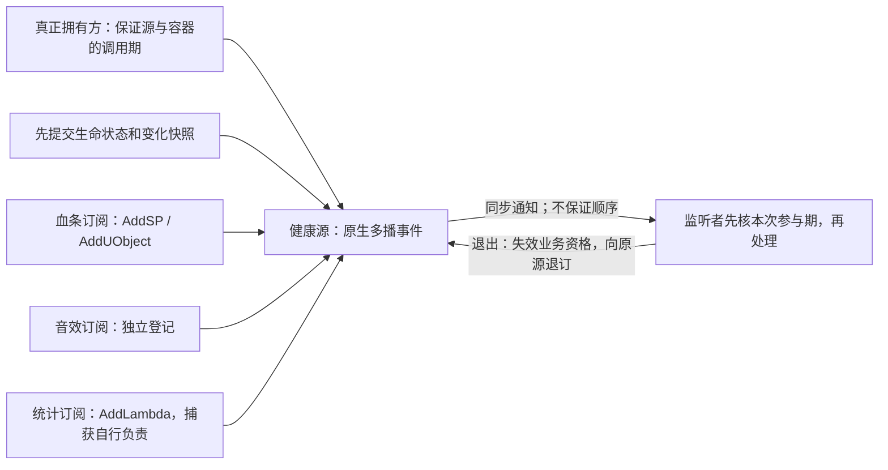
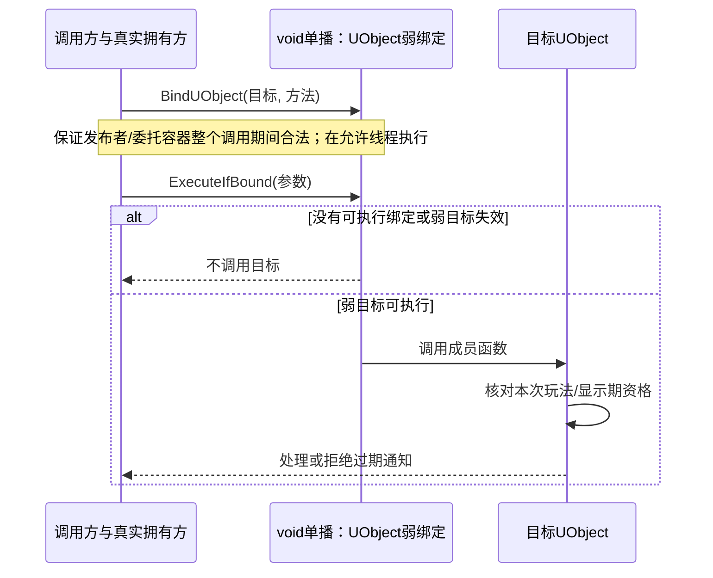

# 04 委托、事件与对象通信

> 知识成熟度：L2。主要承诺是解释委托选型、调用前提，以及可纸面追踪的订阅与退出协议；依据公开官方合同，不声称已验证某个引擎 checkout 的完整实现。
> 当前证据：2026-10-05 的官方文档核对及 2026-10-06 的核心合同复核。页面标签多为 5.8，部分 API 明确为 5.5；Event 权限的直接依据是 **4.27** 指南。标签不认证 UE patch、CL 或当前宏函数体。
> 适用范围：运行时 C++ 对象通信、动态委托与蓝图接口；纵向例限定单 GameThread、显式业务参与期和同步通知。
> 最后更新：2026-10-06（宏、所有权、调用入口、完整 Health/UI 责任链及证据边界）。全文代码均为作者教学候选，尚未 UE/UHT/UBT 编译，纸面情景标作 `PAPER_EXPECTED`；UE、PIE、真实 delegate、GC、网络、线程和性能运行均为 `NOT_RUN`。

## 一、概述

血条要知道生命值变化，技能要接收输入结果，AI 要接收感知通知。直接调用适合明确的一对一命令；如果发布方不应该依赖每种 UI、音效和统计实现，可以用委托表达一个函数签名，由监听方注册处理函数。

委托减少的是调用方对具体接收类型的依赖，**不会自动接管两端的所有权、线程与业务资格**。单播最多绑定一个回调；多播持有多个登记项，每次广播对符合执行条件的项发起调用。绑定、广播和退订都必须针对正确的委托实例。



图中是**原生多播**，不是一个同时接受 `AddDynamic` 的万能容器。动态多播另用对应声明与反射绑定。下面先分清类型，再建立一条可退出的 Health/UI 链。

## 二、核心概念速览

四个轴应分别选择，不能把“动态”“多播”“弱引用”“线程安全”当互斥的四种类型：

| 轴 | 选择 | 实际回答的问题 |
| --- | --- | --- |
| 监听数量 | 单播 / 多播 | 需要一个返回结果，还是通知多个消费者？单播再次 Bind 替换原绑定；多播 Add 添加登记 |
| 反射接口 | 原生 / dynamic | 只需 C++ 调用，还是需要 UFUNCTION、蓝图绑定与反射序列化能力？dynamic 也有单播和多播 |
| 绑定与持有 | Static、Raw、SP、UObject、Lambda、WeakLambda | 如何找到函数、检查哪个目标、谁真正拥有目标及其捕获资源？ |
| 访问策略 | 默认策略 / 指定线程安全策略，加业务线程合同 | 委托存储如何被访问？回调本身及其数据在哪个线程合法？ |

`TDelegate<void(float)>` 表达原生单播签名；`TMulticastDelegate` 是原生多播体系。`TScriptDelegate` 属于脚本委托底层，不能把它并列标成另一种“原生委托”。`DECLARE_EVENT` 则给多播接口加 OwningType 操作权限，见 3.6。

选择顺序：先决定一对一结果还是一对多通知，再判断是否需要反射，随后明确绑定所有权和线程。多播没有返回值汇聚；若必须得到各监听者结果，设计显式查询/聚合协议，别用共享 out 参数依赖调用顺序。[官方单播指南](https://dev.epicgames.com/documentation/unreal-engine/delegates-and-lambda-functions-in-unreal-engine)、[多播执行合同](https://dev.epicgames.com/documentation/en-us/unreal-engine/multicast-delegates-in-unreal-engine)、[动态指南](https://dev.epicgames.com/documentation/en-us/unreal-engine/dynamic-delegates-in-unreal-engine)分别描述这些能力。

## 三、原理详解

### 3.1 委托保存什么，安全入口检查什么

一次绑定至少涉及函数身份、目标/闭包状态，可能还有绑定时 payload。不同绑定有不同前提：

| 绑定 | 委托对目标的关系 | 仍由调用者/宿主负责 |
| --- | --- | --- |
| BindStatic | 函数指针，没有成员对象目标 | 函数所在模块、payload、全局资源与业务线程仍须有效 |
| BindRaw | 非 UObject 裸目标，不管理寿命 | 必须在目标销毁前停止调用并解绑；ExecuteIfBound 也救不了悬空 raw |
| BindSP | 对 shared-pointer 对象保持弱关系 | 另有 TSharedPtr/TSharedRef 拥有方；最后的强拥有方释放后不能期待继续调用 |
| BindUObject | 对 UObject 的弱引用 | GC 可达性另管，Actor EndPlay/组件退场等业务资格另管 |
| BindLambda | 保存 functor，遵循捕获自身的规则 | 值、shared、raw 和引用捕获各自的资源/别名关系 |
| BindWeakLambda | 以传入的 UObject Owner 作弱有效性门槛 | 不递归保护其余捕获，不自动判断 Owner 的玩法/显示期 |

`BindUFunction` 是按 UFUNCTION 名称建立绑定的另一入口；有按名绑定能力不等于整个类型就是 `DECLARE_DYNAMIC` 家族。UObject 不能交给 `TSharedPtr` 的引用计数体系管理；该体系适合普通 C++ 对象。[绑定 API（5.5）](https://dev.epicgames.com/documentation/unreal-engine/API/Runtime/Core/Delegates/TDelegateRegistr-?application_version=5.5)、[UE 智能指针](https://dev.epicgames.com/documentation/en-us/unreal-engine/smart-pointers-in-unreal-engine)支持这种区分。



这是 void 单播的特定绑定路径。多播按各登记项所属绑定类别处理，不将 UObject 的弱检查推广到 Raw。弱有效性检查也不证明正在调用的发布者仍有合法容器，图中的拥有方前提不可省。

### 3.2 声明语法：原生 type-only，dynamic type/name

以下是声明示意，类型声明放在全局、命名空间或类声明中，不放在函数体内。原生宏的参数位置只写类型；dynamic 宏才成对写类型和参数名。

```cpp
DECLARE_DELEGATE(FMyDelegate);
DECLARE_DELEGATE_OneParam(FMyIntDelegate, int32);
DECLARE_DELEGATE_TwoParams(FMyTwoDelegate, AActor*, float);
DECLARE_DELEGATE_RetVal(int32, FReadScore);
DECLARE_MULTICAST_DELEGATE_OneParam(FOnHealthChanged, float);

DECLARE_DYNAMIC_MULTICAST_DELEGATE_OneParam(
    FOnHealthChangedDyn, float, NewHealth);
DECLARE_DYNAMIC_DELEGATE(FOnTaskFinishedDyn);

// OwningType、事件类型、参数类型；仍不是 dynamic 的 type/name 对。
class FDeathPublisher;
DECLARE_EVENT(FDeathPublisher, FOnDied);
```

参数名用于 dynamic 的反射签名表达。不能把 `DECLARE_DELEGATE_OneParam(F, int32, Value)` 当作原生正确写法。所读指南的“8 参数/4 payload”和变参模板 API 不足以认证所有当前宏的硬上限；本文不再宣称全版本最多 NineParams，也不反向保证无限参数。目标宏、UHT 可表示类型及具体签名需要在目标工程核验。

### 3.3 单播：替换绑定、执行与未调用分支

以下完整局部片段演示替换和默认值；函数均在合法单线程调用窗口执行。目标是 void 通知、int 返回值以及 out 参数三个不同合同，不是异步程序。

```cpp
DECLARE_DELEGATE_OneParam(FOnLoadFinished, bool);
DECLARE_DELEGATE_RetVal(int32, FScoreQuery);
DECLARE_DELEGATE_OneParam(FFillScore, int32&);

static void StaticHandleLoad(bool bOK)
{
    UE_LOG(LogTemp, Log, TEXT("Load result: %d"), bOK);
}

struct FLoadSink
{
    int32 Calls = 0;
    void Handle(bool bOK) { ++Calls; }
};

static void ShowSinglecastBranches()
{
    FOnLoadFinished Finished;
    Finished.ExecuteIfBound(false); // 空绑定：不通知
    Finished.BindStatic(&StaticHandleLoad);
    Finished.BindLambda([](bool bOK) // 替换上面的 static，不是添加第二项
    {
        UE_LOG(LogTemp, Log, TEXT("Lambda result: %d"), bOK);
    });
    Finished.ExecuteIfBound(true);
    Finished.Unbind();

    FScoreQuery Query;
    int32 Score = 17;               // 未调用的业务 fallback
    if (Query.IsBound())
    {
        Score = Query.Execute();   // 这里 Query 为空，所以纸面结果仍是 17
    }

    FFillScore Fill;
    int32 OutScore = -1;            // safe 入口不替我们初始化 out
    Fill.ExecuteIfBound(OutScore);  // 未执行时仍是 -1

    TSharedPtr<FLoadSink> SharedOwner = MakeShared<FLoadSink>();
    FOnLoadFinished WeakSP;
    WeakSP.BindSP(SharedOwner.ToSharedRef(), &FLoadSink::Handle);
    WeakSP.ExecuteIfBound(true);     // 外部 strong owner 仍存在
    SharedOwner.Reset();             // 最后一个 strong owner 离开
    WeakSP.ExecuteIfBound(true);     // 弱 SP 不再进入已释放目标

    FLoadSink StackSink;
    FOnLoadFinished Raw;
    Raw.BindRaw(&StackSink, &FLoadSink::Handle);
    Raw.ExecuteIfBound(true);        // 正例依据是 StackSink 的词法寿命
    Raw.Unbind();                    // 在 StackSink 离开前先停止这条调用路径
    // 负例：若把 Raw 留到 StackSink 销毁后再调用，IfBound 不修复悬空。
}
```

成员绑定语法例如 `Finished.BindUObject(Receiver, &ULoadReceiver::HandleLoad)`，其签名须为 `void HandleLoad(bool)`。改用 SP 时，需要一个普通 C++ Receiver 的真实 shared 拥有方；BindSP 自身不续命。BindRaw 则要求 Receiver 在全部调用窗口内存活，即使调用名带 `IfBound` 也一样。

- `Execute` 的前置条件是当前绑定可执行。失效 UObject 目标不因 BindUObject 就让任意 Execute 自动变为静默跳过；诊断断言也不是恢复分支。
- 所读合同允许 **void** 单播用 ExecuteIfBound。它不是所有 RetVal 类型的通用“可选返回值包装”；若目标版本返回执行标记，也不能当成业务返回结果。
- `IsBound` 之后再 Execute 不是跨线程的检查执行原子事务。上例成立，因为同一线程窗口没有并发改绑/销毁；业务线程变更时必须重新建立同步合同。
- 单播不是天然“一次性”：除非显式 Unbind 或应用终态锁存，它可以再次执行。未初始化 out 是空绑定的一条独立失败路径。

### 3.4 多播：精确登记、退订与借用窗口

下面只演示一个词法寿命完整的小例：源和三个监听闭包都在函数内，广播完成后才退订。实际跨对象会话在 4.1 给出。

```cpp
DECLARE_MULTICAST_DELEGATE_OneParam(FOnSampleHealth, float);

static void ShowMulticastOwnership()
{
    FOnSampleHealth Source; // 当前栈真正拥有委托容器
    const FDelegateHandle UI = Source.AddLambda([](float H)
    {
        UE_LOG(LogTemp, Log, TEXT("UI health: %.1f"), H);
    });
    const FDelegateHandle Sound = Source.AddLambda([](float H)
    {
        UE_LOG(LogTemp, Log, TEXT("Sound input: %.1f"), H);
    });
    FDelegateHandle Stats = Source.AddLambda([](float H)
    {
        UE_LOG(LogTemp, Log, TEXT("Stats health: %.1f"), H);
    });
    Source.Broadcast(75.f); // 不断言三项的调用顺序
    Source.Remove(Stats);  // 向登记时的 Source 退订
    Stats.Reset();         // 只清本地标识，不是另一次 Remove
    Source.Remove(UI);
    Source.Remove(Sound);
    Source.Broadcast(50.f); // 空列表可广播，不产生返回值
}
```

跨对象时应保存 **实际 publisher/委托实例 + handle + 本业务登记状态**。[FDelegateHandle::IsValid](https://dev.epicgames.com/documentation/unreal-engine/API/Runtime/Core/FDelegateHandle)只说明该标识曾有效，不能证明当前仍订阅、源仍存在或回调对象还活着。普通 Add 不应被当作幂等连接；dynamic 的 AddUnique 另有按绑定身份去重的合同，不靠 native handle 统一解释。

`RemoveAll(Obj)` 查的是委托实例记录的目标关联，不会遍历普通 AddLambda 的任意捕获图。一个捕获 this 的普通 Lambda 不因此自动归入 RemoveAll(this)。共享源的消费者只退订自己登记的项，不用 Clear 把其他消费者清掉。

Broadcast 无返回值；空广播也不会初始化 out。`const FSnapshot&` 是**此次同步调用内的借用**，不是资源所有权：监听者要保存到稍后的任务里，必须复制/移动自己拥有的结果。减少传参复制不等于内部零复制、无分配或整个捕获图深拷贝。

### 3.5 动态委托：UFUNCTION 与蓝图边界

以下为三个互相对应的教学节选，不是完整工程。需要 `Core`、`CoreUObject`、`Engine` 模块，头文件包括 `CoreMinimal.h`、`GameFramework/Actor.h`，并把 `DamageSignal.generated.h` 放在该头文件最后一个 include；类/模块名按实际工程替换。`BlueprintAssignable` 是动态多播属性的暴露方式，仍需 UHT。

```cpp
// DamageSignal.h：这里只展示声明，不是完整项目文件。
DECLARE_DYNAMIC_MULTICAST_DELEGATE_TwoParams(
    FOnDamagedDyn, AActor*, DamagedActor, float, Damage);

UCLASS()
class ADamageSignal : public AActor
{
    GENERATED_BODY()
public:
    UPROPERTY(BlueprintAssignable, Category = "Events")
    FOnDamagedDyn OnDamaged;

    // 宿主先完成伤害状态提交，再调用这个通知入口。
    void NotifyCommittedDamage(float Damage);
    void CloseSignal() { bAcceptNotifications = false; }
private:
    bool bAcceptNotifications = true;
};
```

```cpp
void ADamageSignal::NotifyCommittedDamage(float Damage)
{
    if (!IsInGameThread() || !bAcceptNotifications ||
        !FMath::IsFinite(Damage) || Damage <= 0.f)
    {
        return;
    }
    OnDamaged.Broadcast(this, Damage);
    // 此处不继续读 this；仍需宿主保证整个 Broadcast 的 Actor/容器合法。
}
```

本例仅教动态声明和通知，不把裸 Actor 当作已闭合的自毁安全框架。接入条件是宿主禁止在整个同步广播内销毁/覆盖它的委托容器，并把玩法退出与最终容器销毁分开；不能提供此条件就不要直接采用该节选。回调也应核本次参与期。4.1 改用有明确强拥有方的普通 C++ 发布容器给出完整局部协议。

```cpp
// UDamageView 的类声明中：
// UFUNCTION()
// void HandleDamaged(AActor* DamagedActor, float Damage);

// 安全建立期：Publisher 与 View 合法，保存该 Publisher 的观察引用。
Publisher->OnDamaged.AddDynamic(View, &UDamageView::HandleDamaged);

// 安全退出期：只能对原 Publisher，且它仍可合法访问。
Publisher->OnDamaged.RemoveDynamic(View, &UDamageView::HandleDamaged);
```

C++ 入口仍传 `&UDamageView::HandleDamaged`，供签名检查并建立相应函数名绑定；不要手写任意字符串替代 AddDynamic 的成员函数语法。动态单播适合把一个蓝图回调作为参数传入 C++，但这不会自动创建异步任务。

动态签名受 UHT、反射和蓝图接口约束，**不是全面禁止引用**：[Fading Lights 官方例](https://dev.epicgames.com/documentation/unreal-engine/fading-lights-in-unreal-engine?lang=en-US)使用带 `const FHitResult&` 的 UFUNCTION 与 AddDynamic。这个反例不能推广成任意 `T&`、容器、指针或返回引用都受支持；也不能规定所有自定义结构体只能使用 const 引用。

可反射/可序列化不等于自动 SaveGame、随 Actor 复制、网络广播或热重载免维护。[SaveGame](https://dev.epicgames.com/documentation/unreal-engine/saving-and-loading-your-game-in-unreal-engine?lang=en-US)需要选取和恢复数据，[RPC](https://dev.epicgames.com/documentation/unreal-engine/remote-procedure-calls-in-unreal-engine)有明确远程调用规则，[Live Coding](https://dev.epicgames.com/documentation/unreal-engine/using-live-coding-to-recompile-unreal-engine-applications-at-runtime)的重实例化可能要求刷新对象引用/缓存。字段路径定位、委托属性签名元数据、监听者 Object+FunctionName 是不同层次，不能编造“每次动态调用必经 TFieldPath”的链。

### 3.6 Event：订阅接口与 OwningType 权限

直接证据来自 [Epic 4.27 Events 指南](https://dev.epicgames.com/documentation/unreal-engine/events?application_version=4.27)：Broadcast、IsBound、Clear 由指定 OwningType 控制。事件成员是 public 还是 private，回答的是外部能否找到这个成员；事件类型里的操作权限是另一件事。

```cpp
class FDeathPublisher
{
public:
    DECLARE_EVENT(FDeathPublisher, FDiedEvent);
    FDiedEvent& OnDiedEvent() { return Died; } // 非 const，可用于登记和退订
    void CommitDeath();
private:
    bool bDead = false;
    FDiedEvent Died;
};
```

```cpp
void FDeathPublisher::CommitDeath()
{
    if (bDead) { return; }
    bDead = true; // 先锁存，再向外调用
    Died.Broadcast(); // 由 OwningType 操作
}

// 合法词法拥有期示意：不在回调里破坏 Publisher。
static void ShowEventAccess()
{
    FDeathPublisher Publisher;
    const FDelegateHandle H = Publisher.OnDiedEvent().AddLambda([]()
    {
        UE_LOG(LogTemp, Log, TEXT("Died"));
    });
    Publisher.CommitDeath();
    Publisher.CommitDeath(); // 本例闩锁拒绝第二次死亡通知
    Publisher.OnDiedEvent().Remove(H);
    // Publisher.OnDiedEvent().Broadcast(); // 按 4.27 Event 合同不允许
}
```

返回非 const 引用是**可订阅接口**，不应叫“只读多播”。即使将 Died 成员公开，也不会按上述 Event 合同自动开放 Broadcast。若外部需要请求动作，暴露像 CommitDeath 一样有业务约束的 owner 方法。当前 Event 宏体未取得，以上为按官方合同写的示意，不能说已核对当前版本的 friend/private 展开或已通过目标编译。

### 3.7 Lambda、payload 与复制的资源边界

以下片段假定 `UListener` 有 `IsSessionOpen()`、`IsCurrentEpoch(uint64)`、`Consume(AActor*)` 方法，`Owner`、`Other` 和 `OnKilled` 在建立期合法；这些业务函数不是 UE 内建 API。owner 与其他捕获分开核验，且单 GameThread 的外层拥有方保证正在处理的对象在这次同步调用中可用。

```cpp
DECLARE_MULTICAST_DELEGATE_OneParam(FOnKilledSignal, AActor*);
DECLARE_DELEGATE_OneParam(FReportValue, int32);

// 在宿主函数内建立：
TWeakObjectPtr<UListener> OtherWeak = Other;
const uint64 ExpectedEpoch = Owner->GetEpoch();
const FDelegateHandle H = OnKilled.AddWeakLambda(Owner,
    [Owner, OtherWeak, ExpectedEpoch](AActor* Victim)
    {
        if (!Owner->IsSessionOpen() || !Owner->IsCurrentEpoch(ExpectedEpoch))
        {
            return;
        }
        UListener* Receiver = OtherWeak.Get();
        if (!Receiver || !Receiver->IsSessionOpen() || !IsValid(Victim))
        {
            return;
        }
        Receiver->Consume(Victim); // 借用 Victim；不保存裸指针到异步任务
    });

// 独立的 payload 例：这段函数/类型声明位于命名空间作用域。
static void ReportWithChannel(int32 Value, int32 Channel)
{
    UE_LOG(LogTemp, Log, TEXT("%d:%d"), Channel, Value);
}
static void ShowPayload()
{
    FReportValue Report;
    Report.BindStatic(&ReportWithChannel, int32(3)); // 绑定期 payload
    FReportValue Copy = Report;
    Report.Unbind();
    Copy.ExecuteIfBound(9); // 签名参数 9 在前，payload 3 在后
}
```

AddWeakLambda 的承诺只覆盖传入 Owner 的弱目标门槛，[API（5.5）](https://dev.epicgames.com/documentation/unreal-engine/API/Runtime/Core/Delegates/TMulticastDelega-_1/AddWeakLambda?application_version=5.5)把 Owner 和 Functor 作为不同输入。若改捕获 `OtherRaw` 或局部引用，Owner 仍活着也不能保证它们有效。普通 Lambda 捕获 shared/strong 资源则可能延长资源寿命；“所有委托都不持有任何强资源”同样不正确。

payload 的位置是调用参数之后，不能把它误写进原生声明宏作为额外参数名。上述复制例复制的是委托状态；若 payload 改成指针、引用包装或 shared 指针，资源别名仍由这些类型决定，不自动深拷贝资源。原实例 Unbind/Remove 不撤销已复制委托中的绑定，副本必须有自己的业务资格检查。精确复制次数、分配次数和副本是否重新发号都未在本轮核验。

### 3.8 生命周期、在途回调和线程

先区分四件事：弱目标失效导致某些安全入口不调用；源列表可能稍后压缩；消费者主动退订；业务本期停止。它们没有统一的发生时刻。native `IDelegateInstance::IsCompactable` 的[公开注释（5.5）](https://dev.epicgames.com/documentation/unreal-engine/API/Runtime/Core/Delegates/IDelegateInstance/IsCompactable?application_version=5.5)用 true 表示目标已不可再用，与“现在可执行”不同；已读 script 同名方法旧页注释存在冲突，未得当前函数体，不拿它推导具体 GC 时序。

- Actor/Component 的玩法期订阅在对应玩法退出时结束；注册期订阅在注销注册时结束。EndPlay 可能发生于销毁、关卡退出等，UObject 仍存在并不等于本玩法期还有效。[Actor 生命周期](https://dev.epicgames.com/documentation/en-us/unreal-engine/unreal-engine-actor-lifecycle)、[OnUnregister](https://dev.epicgames.com/documentation/en-us/unreal-engine/API/Runtime/Engine/UActorComponent/OnUnregister)
- Widget 的 Construct/Destruct 可随 Slate 资源/层级变化多次发生，OnInitialized 的一次性初始化不能与“每次 Destruct 退订但不再重绑”混用。项目应明确自己的显示会话入口；不是每次可见性变化都承诺触发这些钩子。[Construct](https://dev.epicgames.com/documentation/en-us/unreal-engine/API/Runtime/UMG/UUserWidget/Construct)、[Destruct](https://dev.epicgames.com/documentation/en-us/unreal-engine/API/Runtime/UMG/UUserWidget/Destruct)、[OnInitialized](https://dev.epicgames.com/documentation/en-us/unreal-engine/API/Runtime/UMG/UUserWidget/OnInitialized)
- BeginDestroy 是较晚的回收阶段，不代替业务退出。关闭先取消接受结果的资格，再安排合法的注销/释放。Remove/RemoveAll/Clear **不是通用的在途回调或跨线程完成屏障**；已经开始执行的代码、已复制的 delegate、排入任务队列的结果均另有责任。
- 当前 native/script 的 Broadcast/Remove 完整函数体未取得。不能保证在广播内任意自移除、Clear、源自毁或追加项如何影响当前轮。4.1 主动避免这些未证明的组合：派发中拒绝登记/变更，退订只入队，派发后再改原列表。
- [FDefaultDelegateUserPolicy](https://dev.epicgames.com/documentation/unreal-engine/API/Runtime/Core/FDefaultDelegateUserPolicy)为非线程安全策略，开发构建的 race detection 不是锁。[FDefaultTSDelegateUserPolicy](https://dev.epicgames.com/documentation/en-us/unreal-engine/API/Runtime/Core/FDefaultTSDelegateUserPolicy)的委托存储同步、ThreadSafeSP 的引用计数、回调读写的业务状态同步是三层。它们不能互相代替。

投递到 GameThread 只选择执行地点；若工作线程仍在改捕获的数据，就仍有 race。`IsBound`、弱指针、Pin 得到强持有，均不自动授予任意 UObject 字段的跨线程操作或玩法权限。[对象指针](https://dev.epicgames.com/documentation/en-us/unreal-engine/object-pointers-in-unreal-engine)的内存持有合同不等于业务活动期合同。

## 四、代码示例

### 4.1 完整局部协议：健康源、组件拥有方与可重建 UI

**这是 Health 专用的作者设计，不是 UE 的自动生命周期保证。** 它用一个纯 C++ `FHealthSource` 承载状态和原生事件，组件每个玩法期创建一个新源。组件拥有源的 TSharedPtr；每次 TakeDamage 又持有一个栈内 TSharedRef，确实覆盖整个 Broadcast 和随后的退订处理。它不靠 UObject 的“仍有效”推导玩法还在继续，也不把源变成 UObject 的替代内存管理器。

宿主与失败边界先固定：

1. 全部源、订阅与 UI 操作都在 GameThread；不允许并发调用、异常穿出回调、手工析构对象或覆写正在广播的事件。源必须由 MakeShared 创建，不在栈上构造后调用 AsShared。
2. 源的内部事件不直接暴露给消费者，不可复制给外部，也不能绕过接口 Add/Remove/Clear。本例登记使用弱 SP 接收者和平凡 payload，不在闭包复制/析构中执行用户动作。Subscribe 只做登记，不同步执行用户回调；派发中拒绝登记和新的健康变更。一次 Connect 被拒绝时返回失败，由宿主在合法空闲入口显式重试，不暗藏队列。
3. 回调可请求组件退出或 UI Close。关闭立即撤掉业务资格；源的列表结构改动等到本次完整 Broadcast 返回后执行。每一条待退订 handle **存入产生它的源的 PendingRemove**；不用未来 Tick，TakeDamage 的同一调用尾部会消费。若源闲时关闭，则当场清空自身列表；只有源 owner 才有这个全源关闭权限。
4. 一次变化携带 Old/New、死亡状态与本次 Alive→Dead 标记。血条刷新和死亡响应合并为一次事件的两个字段，替代原来先 HealthChanged、再 OnDied 的两次外部边界。消费者不再订阅两个通知；纯死亡监听者只处理 `bBecameDead`。重新连接时读取 `After.bDead` 用于初始显示，不重放死亡跃迁。
5. 组件 EndPlay 必须先关闭这一玩法期的源；源实例永不重新激活。UI 显示会话由宿主明确 Open/Close，Slate/控件在最后一次 SetPercent 调用内的合法性由 Widget 宿主保证。弱控件指针只是失效检查，不替宿主证明这一窗口。

代码为静态教学候选。普通 C++ 部分依赖 `CoreMinimal.h`、`Delegates/Delegate.h`、`Templates/SharedPointer.h`；组件另需 `Components/ActorComponent.h` 和本类 generated header；UI 模型另需 `Components/ProgressBar.h`、UMG 模块。下列三块按声明依赖顺序阅读，未提供完整 Build.cs/UHT 工程，未编译或模拟运行。

**第一块：输入验证 → 快照提交 → 一次派发 → 同栈清理。** `Changed` 采用 Event 来约束 owner 广播，使用层仍按 3.6 的 4.27 官方 Event 合同理解，当前宏体未核。

```cpp
struct FHealthState
{
    float Health = 100.f;
    float MaxHealth = 100.f;
    bool bDead = false;
};
struct FHealthChange
{
    FHealthState Before;
    FHealthState After;
    uint64 Revision = 0;
    bool bBecameDead = false;
};
enum class EDamageResult
{
    Applied, WrongThread, Closed, Reentrant,
    InvalidAmount, AlreadyDead, NoChange, RevisionExhausted
};
DECLARE_DELEGATE_OneParam(FHealthListener, const FHealthChange&);

class FHealthSource : public TSharedFromThis<FHealthSource>
{
public:
    DECLARE_EVENT_OneParam(FHealthSource, FChangedEvent, const FHealthChange&);

    FHealthSource() = default;
    FHealthSource(const FHealthSource&) = delete;
    FHealthSource& operator=(const FHealthSource&) = delete;

    // 以下只读/订阅/关闭接口的调用前提均为 GameThread。
    bool IsActive() const { return bActive; }
    bool IsDispatching() const { return bDispatching; }
    FHealthChange ReadInitial() const
    {
        return {State, State, Revision, false}; // 初读不制造一次死亡事件
    }
    FDelegateHandle Subscribe(const FHealthListener& Listener)
    {
        if (!bActive || bDispatching || !Listener.IsBound()) { return {}; }
        return Changed.Add(Listener); // 本项目接口不调用外部监听者
    }
    void Unsubscribe(FDelegateHandle H)
    {
        if (!H.IsValid()) { return; }
        if (bDispatching)
        {
            PendingRemove.AddUnique(H); // 由这个原源保存并消费责任
        }
        else
        {
            Changed.Remove(H); // 无正在执行的本源广播
        }
    }
    void Close()
    {
        bActive = false; // 先禁止一切后续业务写入/消费
        if (!bDispatching) { DrainAtIdle(); }
        // 派发中仅改变资格；TakeDamage 返回前必调用 DrainAtIdle。
    }
    EDamageResult TakeDamage(float Amount)
    {
        if (!IsInGameThread()) { return EDamageResult::WrongThread; }
        const TSharedRef<FHealthSource> KeepAlive = AsShared();
        if (!bActive) { return EDamageResult::Closed; }
        if (bDispatching) { return EDamageResult::Reentrant; }
        if (!FMath::IsFinite(Amount) || Amount <= 0.f)
        {
            return EDamageResult::InvalidAmount;
        }
        if (State.bDead) { return EDamageResult::AlreadyDead; }
        if (Revision == MAX_uint64) { return EDamageResult::RevisionExhausted; }

        const FHealthState Before = State;
        FHealthState After = State;
        After.Health = FMath::Max(0.f, Before.Health - Amount);
        if (After.Health == Before.Health) { return EDamageResult::NoChange; }
        After.bDead = After.Health == 0.f;
        const FHealthChange Change{
            Before, After, Revision + 1, !Before.bDead && After.bDead};

        State = After;                 // 一次提交，外部回调还没有发生
        Revision = Change.Revision;
        bDispatching = true;            // 回调重入 TakeDamage 明确拒绝
        Changed.Broadcast(Change);     // KeepAlive 覆盖整个容器访问栈
        bDispatching = false;
        DrainAtIdle();                 // 即使回调 Close，仍在合法容器上收尾
        return EDamageResult::Applied; // 表示状态已提交，不保证所有消费者处理
    }
private:
    void DrainAtIdle()
    {
        if (!bActive)
        {
            Changed.Clear();           // 源 owner 关闭整个本源
        }
        else
        {
            for (FDelegateHandle H : PendingRemove) { Changed.Remove(H); }
        }
        PendingRemove.Reset();         // 没有等待未来 Tick 的悬挂责任
    }
    FHealthState State;
    uint64 Revision = 0;
    bool bActive = true;
    bool bDispatching = false;
    FChangedEvent Changed;
    TArray<FDelegateHandle> PendingRemove;
};
```

初始 MaxHealth 固定为有限正数 100，本例没有可变 MaxHealth、治疗或复活接口；因此这些新功能不能绕过输入和状态不变量直接加字段。微小伤害若因浮点表示没有改变 Health，返回 NoChange。到达 `MAX_uint64` 时拒绝新修订，绝不回绕；工程若需要继续，应关闭旧玩法期并建立独立新源。

**第二块：组件把玩法资格和内存拥有分开。** 这是组件的必要适配片段：BeginPlay 建新源，EndPlay 先摘下成员中的所有权并 Close；广播中的强引用只让纯 C++ 容器可完成收尾，不让组件继续参与玩法。

```cpp
// HealthComponent.h：需正常 UCLASS 头文件/UHT 布置。
UCLASS()
class UMyHealthComponent : public UActorComponent
{
    GENERATED_BODY()
public:
    TSharedPtr<FHealthSource> GetSource() const { return Source; }
    EDamageResult ApplyHealthDamage(float Amount)
    {
        // 宿主只能在组件仍可合法进入的窗口调用。
        if (!IsInGameThread()) { return EDamageResult::WrongThread; }
        TSharedPtr<FHealthSource> Local = Source;
        if (!Local) { return EDamageResult::Closed; }
        return Local->TakeDamage(Amount); // 此后不再读写组件 this
    }
protected:
    virtual void BeginPlay() override
    {
        if (Source) { Source->Close(); }
        Source = MakeShared<FHealthSource>();
        Super::BeginPlay(); // 最后外调；若内部 EndPlay，不在返回后重新开放源
    }
    virtual void EndPlay(const EEndPlayReason::Type Reason) override
    {
        TSharedPtr<FHealthSource> Old = MoveTemp(Source);
        if (Old) { Old->Close(); }
        Super::EndPlay(Reason);
    }
private:
    TSharedPtr<FHealthSource> Source; // 普通 C++ 数据；不管理 UObject 寿命
};
```

外层 Local 与 TakeDamage 内 KeepAlive 都是真正的强拥有方。回调请求 EndPlay 时，Source 成员被移走且源立即 inactive；后续回调仍可能被引擎分派，所以监听者也查源的 IsActive。Broadcast 返回后的私有清理只接触仍被 KeepAlive 持有的纯 C++ 源，既不读取已退出组件，也不再发第二个死亡通知。**若宿主漏掉 Close，强引用不会替它封住玩法资格，这是本合同的失败条件。** BeginPlay 在调用 Super 之前建源；若 Super 内的外部回调触发 EndPlay，源已被关闭，返回后不会被无条件重新开放。生命周期钩子由引擎调用，不作为手工重启入口。组件重复玩法期创建新源，旧源不复用；World 退出仍由相应宿主触发退出，不凭全局 key 保留跨 World 的资格。

**第三块：UI 的实际 publisher + handle + 会话代次。** `FHealthView` 是纯 C++ 显示会话，Widget 宿主用 TSharedPtr 持有它，回调采用 SP 弱绑定；控件仍是 UObject，由正常 Widget/GC 体系管理。`Close` 可在源的回调内调用，但不会在委托正在执行的栈上直接移除自身。

```cpp
class FHealthView : public TSharedFromThis<FHealthView>
{
public:
    explicit FHealthView(UProgressBar* InBar) : Bar(InBar) {}

    bool Connect(const TSharedPtr<FHealthSource>& Candidate)
    {
        const TSharedRef<FHealthView> KeepAlive = AsShared();
        if (bOpen && Candidate && Source.Pin() == Candidate && Candidate->IsActive())
        {
            return true; // 本协议：活跃源只经本会话登记/退出，不由外部清列表
        }
        Close(); // 先使旧代次失效，再向旧源交付其 handle 的清理责任
        if (!Candidate || !Candidate->IsActive() || Candidate->IsDispatching() ||
            bEpochExhausted || !AdvanceEpoch())
        {
            return false;
        }
        const uint64 Wanted = Epoch;
        Source = Candidate;             // 登记新责任在先
        bOpen = true;
        LastRevision = 0;
        const FDelegateHandle NewHandle = Candidate->Subscribe(
            FHealthListener::CreateSP(AsShared(), &FHealthView::Receive, Wanted));

        // 返回结果属于发起登记时的 Candidate/Wanted，绝不先覆盖当前句柄。
        if (!bOpen || Epoch != Wanted || Source.Pin() != Candidate)
        {
            Candidate->Unsubscribe(NewHandle);
            return false;
        }
        if (!NewHandle.IsValid()) { Close(); return false; }
        Handle = NewHandle;
        Receive(Candidate->ReadInitial(), Wanted); // 先订阅再初读，无外部回调间隙
        return bOpen && Epoch == Wanted;
    }
    void Close()
    {
        if (!bOpen && !Handle.IsValid() && !Source.IsValid()) { return; }
        bOpen = false;                   // 在任何可重入外部清理之前封住业务
        AdvanceEpoch();                 // 耗尽时也保持关闭，未来 Connect 拒绝
        TSharedPtr<FHealthSource> OldSource = Source.Pin();
        const FDelegateHandle OldHandle = Handle;
        Source.Reset();
        Handle.Reset();                  // 本地归零不是清理完成证明
        if (OldSource) { OldSource->Unsubscribe(OldHandle); }
        // 若原源已不存在，其自身列表已随之销毁；不解引用失效弱源。
    }
    bool IsOpen() const { return bOpen; }
    bool ShouldShowDead() const { return bShowDead; }
    uint64 GetDeathTransitions() const { return DeathTransitions; }
private:
    bool AdvanceEpoch()
    {
        if (Epoch == MAX_uint64)
        {
            bEpochExhausted = true;
            return false;               // 不允许回绕或复用旧 token
        }
        ++Epoch;
        return true;
    }
    void Receive(const FHealthChange& Change, uint64 ExpectedEpoch)
    {
        const TSharedRef<FHealthView> KeepAlive = AsShared();
        if (!bOpen || Epoch != ExpectedEpoch) { return; }
        const TSharedPtr<FHealthSource> Current = Source.Pin();
        if (!Current || !Current->IsActive()) { Close(); return; }
        if (Change.Revision < LastRevision) { return; }
        UProgressBar* Target = Bar.Get();
        if (!Target || !FMath::IsFinite(Change.After.MaxHealth) ||
            Change.After.MaxHealth <= 0.f)
        {
            Close();
            return;
        }
        const float Percent = FMath::Clamp(
            Change.After.Health / Change.After.MaxHealth, 0.f, 1.f);
        if (Change.bBecameDead && Change.Revision > LastRevision)
        {
            if (DeathTransitions != MAX_uint64) { ++DeathTransitions; }
            // 观察计数饱和，不作为 epoch 或业务授权。
        }
        bShowDead = Change.After.bDead;
        LastRevision = Change.Revision;
        Target->SetPercent(Percent);    // 最后一个外部操作；之后不再访问控件
    }
    TWeakPtr<FHealthSource> Source;
    FDelegateHandle Handle;
    TWeakObjectPtr<UProgressBar> Bar;
    uint64 Epoch = 0;
    uint64 LastRevision = 0;
    uint64 DeathTransitions = 0;
    bool bOpen = false;
    bool bEpochExhausted = false;
    bool bShowDead = false;
};
```

宿主在显示入口持有 `MakeShared<FHealthView>(ProgressBar)` 后 Connect；显示出口先 Close 再释放该 shared owner。再次显示可重连原会话，控件重建则建立新会话。源的 AddSP 只有弱目标，不替 Widget 持有显示会话；已经进入 Receive 的 KeepAlive 仅保障这个普通 C++ 方法完成。显示 Close 后不得再因 weak valid 或 KeepAlive 存在而更新旧控件。

源内登记与初读之间只允许本协议的普通同步操作；因此没有工作线程/外部回调插入，初读得到登记后当前值，不丢一个夹在“先读后订阅”之间的变更。Initial 的死亡位用于恢复 UI 状态，但 `bBecameDead=false`，不会把重建 UI 当新死亡。若未来改成并发或异步登记，这个无间隙证明失效，必须另做版本化快照/补读协议。

源与 UI 都只保证有限编号不回绕：耗尽时关闭或拒绝新变更/连接，不悄悄清零。Epoch 仅在**同一个 FHealthView 实例**里筛掉旧会话结果；SP 绑定身份另区分对象实例。它不是网络鉴权、跨实例唯一 ID、跨进程恢复键，也不自动解决一般 ABA。

**晚返回绑定的责任**：本 Subscribe 不调用用户代码也不异步，所以本实现不存在跨帧返回；NewHandle 检查仍说明归属。若适配器引入可重入/异步登记，发起方必须保留独立 receipt（原源、原 epoch、登记结果），Close 先使该 epoch 无效。即使当前 Handle 已空，receipt 仍未完成；旧结果回来时由 receipt 拥有者向原源退订，直到成功交付退订责任或确认原容器已销毁。不能向新源 Remove 旧 handle，也不能丢掉晚到 handle。没有停止确认前，不得销毁负责接收迟返结果的操作对象；本文没有实现这个更广的异步适配器。

**不以在途 Remove 作为保证**：本例在源派发中只排队，直到 Broadcast 返回后才移除，从未声称撤回已经开始的回调。先 Close/epoch 检查才使其余旧回调无业务作用；换源时若旧源仍在分派，旧源负责同栈消费自己的队列，新源独立登记。旧源在关闭后继续活着也只用于收尾。如果原源已真正销毁，私有列表也随之销毁，UI 只丢本地身份；这里不包括外部复制出的委托，因为本源接口禁止导出副本。一般副本仍有独立责任，见 3.7。

### 4.2 动态多播冷却信号：完成锁存与代次

这是第二个**接口节选**，依赖正常 UCLASS/UHT 工程；宿主必须提供 3.5 所列完整广播寿命与活动期前提。代次由此对象发行，不接受重复 Start 为同一周期，溢出永久拒绝继续发行；Finish 不等于异步生产者已停止。

```cpp
DECLARE_DYNAMIC_MULTICAST_DELEGATE_OneParam(
    FOnCooldownReady, float, TotalTime);

UCLASS()
class UCooldownSignal : public UObject
{
    GENERATED_BODY()
public:
    UPROPERTY(BlueprintAssignable, Category = "Ability")
    FOnCooldownReady OnCooldownReady;

    bool Start(float Seconds, uint64& OutEpoch)
    {
        OutEpoch = 0; // 失败不留下未初始化输出
        if (!IsInGameThread() || !bActive || bPublishing ||
            !FMath::IsFinite(Seconds) || Seconds < 0.f || Epoch == MAX_uint64)
        {
            return false;
        }
        ++Epoch;
        Duration = Seconds;
        bFinished = false;
        OutEpoch = Epoch;
        return true;
    }
    void Finish(uint64 ExpectedEpoch)
    {
        if (!IsInGameThread() || !bActive || bPublishing || bFinished ||
            ExpectedEpoch == 0 || ExpectedEpoch != Epoch)
        {
            return;
        }
        bFinished = true;
        const float Snapshot = Duration;
        bPublishing = true;
        OnCooldownReady.Broadcast(Snapshot);
        bPublishing = false; // 宿主必须保证包括这一收尾的合法寿命
    }
    void Close() { bActive = false; } // GameThread；不能同步销毁正在广播的容器
private:
    uint64 Epoch = 0;
    float Duration = 0.f;
    bool bActive = true;
    bool bFinished = true;
    bool bPublishing = false;
};
```

调用方保存 Start 成功返回的 epoch；旧 Finish、重复 Finish、关闭后 Finish 都不广播。接收方也要有显示/玩法期门槛：已经在途的 Broadcast 不会被 Close 撤回。外部可见 BlueprintAssignable 属性不构成授权边界，项目仍需限制谁能触发业务；这个 dynamic 例没有宣称当前 Event 类型式的广播访问控制。实际定时器、网络响应、生产线程及取消收敛不在该接口片段内。

### 4.3 单播 + Lambda：同步查询与异步扩展责任

原 QueryItems 在函数返回前构造 Result 并执行回调，实际上是同步调用。下面给齐数据，明确借用窗口；不用“模拟异步”掩盖缺失的生产者和线程交接。

```cpp
struct FItemData
{
    int32 Id = 0;
    int32 Count = 0;
};
DECLARE_DELEGATE_OneParam(FOnQueryResult, const TArray<FItemData>&);

static void QueryItemsNow(const FOnQueryResult& Callback)
{
    const TArray<FItemData> Result{{1, 2}, {7, 1}};
    Callback.ExecuteIfBound(Result); // Result 只借给本次同步调用
}
static void ShowSynchronousQuery()
{
    TArray<FItemData> OwnedCopy;
    const FOnQueryResult Callback = FOnQueryResult::CreateLambda(
        [&OwnedCopy](const TArray<FItemData>& Items)
        {
            OwnedCopy = Items; // 复制两个值字段，返回后仍拥有数组内容
        });
    QueryItemsNow(Callback);
    // 此处 OwnedCopy 仍有效；没有任务持有 &OwnedCopy，也没有保存 &Items。
}
```

这段使用局部引用捕获是有明确理由的：Callback 没被保存/排队，且被调用时 OwnedCopy 一直在同一外层栈上。把 QueryItemsNow 改成保存 Callback 后稍后调用，会立即破坏该前提；不能照搬此捕获。

若要做真正异步查询，最低责任链如下，仍是**设计要求而非已实现/已运行程序**：

| 阶段 | 谁拥有数据与责任 | 正常/失败分支 |
| --- | --- | --- |
| 发起 | 操作对象记录 Owner 弱身份、请求 epoch、目标线程及完成出口；先登记责任再启动工作 | Owner 已关/epoch 耗尽则拒绝；不能只留当前 UI Handle |
| 生产 | 工作方拥有结果值或拥有明确共享只读数据；不触碰 UI/UObject 业务字段 | 失败形成有值的错误结果；不投递局部数组引用 |
| 交接 | 队列消息拥有结果，投递到指定 GameThread；生产方不继续无同步地写该结果 | 投递失败由操作对象处理失败并释放其拥有数据，不能永远等待回调 |
| 消费 | 在目标线程检查 Owner、请求 epoch、closing 和结果状态，再作业务写入 | 过期结果只释放数据/完成操作清理，不更新新会话；借用引用限这次消费调用 |
| 关闭/取消 | 先撤销结果资格，再发取消请求；操作对象继续负责未完成任务和迟返结果 | 取消请求不是停止确认；只有生产者确认停止/完成且约定交接已收敛，才释放其仍可能使用的资源 |

线程投递、拥有结果、Owner 存活和 epoch 匹配各解决一部分问题，缺任一项都不能以“弱委托安全”补齐。任务结束/取消语义应服从具体 Task API，不从回调触发推导所有工作线程已退出。

### 4.4 蓝图侧操作要点

1. C++ 动态多播通常由 BlueprintAssignable 暴露，具体资产/上下文提供 Bind Event/Assign 等节点；未在本轮编辑器中实操，不保证所有属性都有相同细节面板入口。
2. Blueprint Event Dispatcher 提供绑定、调用和解绑机制；它不是远程网络传输。C++ AddDynamic 对应 UFUNCTION 签名，生命周期责任与蓝图监听者同样存在。
3. 动态单播参数可用来接收蓝图处理函数；参数反射/UHT 验证与任务是否异步是两件事。
4. UI 可在属性确实变化时刷新。若合并通知，明确保存最终值还是全部跃迁，尤其不能把一次死亡边沿当普通连续值随意丢弃；是否更快须在真实项目测量。

## 五、最佳实践

1. **先写谁拥有谁。** 委托保存绑定不等于拥有 publisher 或目标；handle 不是所有权。明确源容器跨完整同步派发的真实拥有方，以及业务关闭与最终销毁的不同时间点。
2. **按参与期配对。** Actor 玩法期、组件注册期、Widget 显示/Slate 期各用对应入口。先取消旧会话资格，再处理原源上的注销责任；BeginDestroy 不代替所有退出时机。
3. **选择受支持的调用入口。** void 的 ExecuteIfBound、RetVal 的显式 fallback、out 的预初始化分别处理。Raw/普通引用捕获即使名字里有 safe 也可能悬空。
4. **每次登记有责任人。** Connect 幂等由源身份、会话状态与项目协议保证；不是凭 Handle.IsValid。异步登记需要独立 receipt，不因当前 handle 已空而宣称释放完成。
5. **把外部回调视为可重入边界。** 状态、死亡闩锁、关闭标志和 epoch 先提交；若不支持重入变更，就给明确拒绝结果。禁止依赖未核对的任意自移除/源自毁行为。
6. **不依赖多播顺序。** 没有注册顺序合同。顺序、优先级、聚合结果和背压若是业务需求，写成独立的显式协议。
7. **参数策略按寿命选择。** const 引用适合同步借用，拥有的值适合跨任务交接；捕获的 raw/ref/shared 都保留自身语义，不承诺深复制或固定成本。
8. **分清三个线程层次。** SP 引用计数、委托列表策略、回调业务状态分别审查。GameThread 投递不修复悬空捕获，也不消除其他线程仍在写共享结果的 race。
9. **按机制评估性能。** 原生调用、反射调用、列表维护和每个监听者的工作都有成本。本轮没有“原生快一个数量级”“每次等于虚调用”或广播预算的测量证据。
10. **用名称表达接口。** 类型可用 FOnXxx、事件访问器可用 OnXxxEvent；命名不能代替操作权限、完成确认或业务授权。

## 六、常见问题 FAQ

**Q1：AddDynamic 找不到 UFUNCTION 或签名不匹配怎么办？**
核对接收函数的 UFUNCTION 声明、完整参数类型及返回类型，再检查目标工程的反射类型是否受支持。C++ 传成员函数指针语法，不把显示节点名当任意字符串传入；重新运行目标工程 UHT/编译才能证明签名可用。普通 Lambda 不直接冒充这个 UFUNCTION 回调。

**Q2：广播了却没回调，应该先查什么？**
依次查：订阅是否已经建立；是否同一 publisher 和委托实例；绑定目标及函数是否有效；本次参与期/epoch 是否仍允许；自己是否已经 Close；是否记录了注册失败。复制委托会另有绑定状态，原实例注销不会撤回副本；资源却可能仍别名，不能把副本当全新深拷贝对象。不要只查一个 Handle.IsValid 或一次 IsBound。

**Q3：把 Event 成员改成 public，外部就能 Broadcast 吗？**
按所读 **4.27** Event 合同不能。成员可见性、非 const 的可订阅引用和 OwningType 的 Broadcast/IsBound/Clear 权限不同。当前宏展开未核，本例未编译；不要编造当前 friend/private 细节，也不要用 public 字段当开放广播权的方法。

**Q4：对象已退出，为什么还收到旧通知或发生崩溃？**
内存有效不等于仍处于旧玩法/显示期。先查 Raw 与局部引用捕获，再查 weak Owner 是否仅覆盖了其中一个对象；检查关闭标志/epoch 是否在清理之前提交。已进入的回调、复制出的 delegate 或已排队结果不被一次 Remove 撤回。失效源上不能为“清理”继续解引用；源还合法时精确退订，已销毁则由其自身容器析构结束原列表责任。

**Q5：Blueprint Event Dispatcher、dynamic delegate 和 NetMulticast 是一回事吗？**
前两者提供本地观察/反射接口，NetMulticast 是带网络规则的 RPC。BlueprintAssignable 或 Actor 的 bReplicates 不会把任意 Broadcast 变成远程执行，也不让绑定自动成为 SaveGame 中可恢复的延迟回调。

**Q6：指针、引用和结构体能不能作参数？**
原生委托遵循相应 C++ 签名；dynamic 还受 UHT/反射约束。官方 const FHitResult& 例足以否定“全部引用禁止”，但不保证任意引用都支持。传引用不延长对象寿命；跨回调保留时另取拥有数据。UI 比例计算也必须有有效控件和有限正 MaxHealth 前提。

**Q7：为什么 Close 后 handle 空了还不能说所有工作停止？**
清空本地 handle 只改本地标识。4.1 在源派发内 Close 时，原源的 PendingRemove 仍承担退订，直到同一 TakeDamage 调用尾部处理；一般异步适配器还可能有未返回的注册 receipt、正在执行的回调或生产任务。须按各自完成条件收敛，不能用 Remove 返回或 weak invalid 替代停止确认。

## 七、关联阅读

- [01-GameplayAbilitySystem能力系统](../../05-Gameplay与交互系统/技能战斗与属性结算/01-GameplayAbilitySystem能力系统.md)：GAS 的属性变化委托、能力结束委托、AbilityTask 回调。
- [03-GameplayTag与数据资产](../../05-Gameplay与交互系统/玩法架构与任务协作/03-GameplayTag与数据资产.md)：标签增减事件（`OnTagAdded` / `OnTagRemoved`）即委托应用。
- [05-蓝图与C++协作](../../05-Gameplay与交互系统/玩法架构与任务协作/05-蓝图与C%2B%2B协作.md)：`BlueprintAssignable` 与动态委托是蓝图/C++ 协作的关键桥梁。
- [07-UI与性能优化](../../../00_Index/学习路线/Gameplay与交互系统.md)：UI 通过委托刷新数据的模式与性能注意点。
- [06-网络同步](../../../00_Index/学习路线/网络与游戏服务端.md)：RPC 与委托的分工——跨机器用 RPC，同机器解耦用委托。

## 八、纸面验收：正例、负例与失败轨迹

以下全部为 `PAPER_EXPECTED`，输入和分支可据正文手动追踪，**不是测试 PASS 或实测日志**。数值示例仅用于核对因果，不能提供性能/线程/GC 证明。P09/P20 同时界定源码阅读的边界，不把历史片段当当前函数体。

| ID | 给定输入与操作 | 按合同推导的结果 | 负例/失败判据 |
| --- | --- | --- | --- |
| P01 | 对照原生 OneParam 与 dynamic OneParam | 原生只 type；dynamic 为 type/name 对 | 将参数名塞进原生宏，或 dynamic 漏名字，拒绝该候选；未编译 |
| P02 | void 单播空绑定 → 绑有效 UObject → 目标失效，均用安全入口 | 空/失效不调用，有效时才进入目标方法 | 直接 Execute 失效目标不能期待跳过；Raw 悬空不受此检查保护 |
| P03 | 空 RetVal 查询，fallback=17；空 out 查询，初值=-1 | 值分别保持 17、-1 | 用 ExecuteIfBound 当业务 int 返回值或读取未初始化 out，失败 |
| P04 | SP 绑定后释放最后一个外部 strong owner | 委托不延长普通 C++ 目标寿命 | 凭 delegate 存在推导目标存在，或用 TSharedPtr 管 UObject，失败 |
| P05 | WeakLambda Owner 仍活，另一个 Other 已失效 | OtherWeak.Get 失败后不访问它 | 仅因 Owner 有效就解引用 OtherRaw，失败 |
| P06 | 先登记 A/B/C，再移除 B，再广播 | 只依赖合格回调集合；不指定 A/C 顺序 | 用注册顺序、稳定逆序或删除保持原序作 API 保证，失败 |
| P07 | FHealthView Connect(A) 两次 → Connect(B) → Close 两次 | A 只登记一次；换源先失效旧 epoch；只向 A 退旧 H；第二次 Close 无新责任 | 普通 Add 当幂等、对 B Remove(A.H)、消费者 Clear 共享源，失败 |
| P08 | 同一对象普通 AddLambda 捕获 this，另登记 AddWeakLambda(this,...) | 用每项 handle 精确区分；RemoveAll 只按关联对象识别 | 假设 RemoveAll(this) 扫描全部捕获，失败 |
| P09 | 条件化读历史 native 本体 [A,B] 与 script copy=[A,B]；一个回调删另一个 | 本体下一次读槽与已复制条目可有不同结果；copy 中弱目标仍须有效 | 把一种算法的当轮删除效果推广另一族/当前版本，或当屏障，失败 |
| P10 | 关闭源/显示会话后旧结果到达 | inactive 或旧 epoch 导致无新业务写入；清理仍由原责任人完成 | UObject 仍 IsValid 就允许写旧玩法/新显示期，失败 |
| P11 | 源先 Close 并真正析构；UI 仍保存非空 handle，然后 Close | 源弱 Pin 失败，UI 清本地观察身份，不访问已析构对象 | handle 当源所有权、Reset 当已经向源 Remove，失败 |
| P12 | 显示 → Close → 同会话再次 Connect；或重建控件后新会话 Connect | 新显示期重新登记并初读，已死状态只显示、不重播死亡跃迁 | 只在 OnInitialized 绑定，却每次 Destruct 解绑且不再绑定，失败 |
| P13 | Health100 → Damage100 → Damage1 | 先提交 Health0、dead=true、Revision1；第一次变化只有一次死亡标记；第二次 AlreadyDead | 每次 Health<=0 都发死亡事件，失败 |
| P14 | 首个回调重入 Damage1，然后请求组件 EndPlay，剩余回调继续到达 | 重入 Reentrant；Close 使源 inactive；其余消费者拒绝业务；原 TakeDamage 栈末 Clear，无未来 Tick；KeepAlive 此后才释放 | 在 Broadcast 中析构/覆盖容器、回调后重读 Health 决定本次死亡、漏 Close 仍消费，失败 |
| P15 | 工作方创建局部数组，准备跨线程投递 | 消息必须拥有结果；目标线程再查 Owner/epoch | 捕获局部数组引用/裸 this，或只投递而不停止并发写，失败 |
| P16 | 复制 delegate 后原实例 Unbind；捕获为值/shared/raw/ref 各作对照 | 副本保有自身绑定状态，外部资源按捕获类型继续独立或别名 | 认为原 Unbind 能取消副本、复制自动深拷贝/线程同步/重新发号，失败 |
| P17 | 官方 const FHitResult& 动态 UFUNCTION 例 | 证明 dynamic 非全面禁引用 | 推导所有引用均可反射，或所有 struct 必须 constref，失败 |
| P18 | 外部持 public Event 成员或非 const 事件引用 | 按 4.27 合同可登记/退订，不解除 owner 广播等权限 | public 等于外部可 Broadcast，失败；当前宏体仍未核 |
| P19 | 空多播被用于填写 out，调用前 out=-1 | 没有监听者时仍 -1，Broadcast 不返回聚合结果 | 假设空广播自动初始化 out，失败 |
| P20 | 对照 native IsCompactable 与执行资格，再遇 script 旧页冲突注释 | native true 表示不能再用，可清理；当前 script 体未取得 | 用冲突注释认证“GC 后 false 用于清理”，失败 |
| P21 | Live Coding 改签名/替实例后重新使用绑定 | 按目标工程刷新引用/绑定并验证；可能无法解析旧目标 | 仅凭名字/FieldPath 宣称永远有效，失败 |
| P22 | Actor 开 bReplicates，成员为 BlueprintAssignable | 仍须独立 RPC/复制及 SaveGame 设计 | 把本地 Broadcast 当网络广播或自动恢复任意绑定，失败 |

对 4.1 再逐状态追一遍两条易遗漏的分支：

- **在途换源**：A 正在广播，旧 token=4 的回调导致 Connect(B)。Close 先令 bOpen=false、epoch=5，把 A.H 交给 A.PendingRemove；随后 B 空闲，建立 epoch=6 的新订阅和初读。A 中剩余旧 token=4 回调即使进入也被拒绝。A 广播返回后消费自己的队列；B 不接触 A.H。若 B 正在派发，Connect 返回 false，会话保持关闭，宿主等合法入口重试。
- **关闭与晚登记结果**：若未来改为异步适配器，发起 A/epoch4 的 receipt 后 Close，再建 B/epoch6；A 的 handle 迟返时由旧 receipt 向 A 交付退订，不覆盖 B.Handle。若 A 已析构，确认容器已不存在后结束该 receipt。仅看到当前 Handle 为空不能提前销毁 receipt。此为扩展的必要协议，当前同步 Subscribe 没有实现或运行这条异步路径。
- **epoch 耗尽**：Epoch=MAX_uint64 时 Close 仍令 bOpen=false，AdvanceEpoch 返回 false 并置 exhausted；后续 Connect 被拒绝。不得把编号重设为0复用旧 token。源 Revision 同样拒绝溢出。这是明确停止条件，不是“uint64 足够大所以无 ABA”的证明。

## 九、证据分层与尚未验证范围

| 层次 | 本文实际使用 | 不能由此推出 |
| --- | --- | --- |
| 官方公开合同 | 单播宏/调用、不同绑定、空多播/无顺序、handle 身份；dynamic、对象/控件生命周期及线程策略 API | 当前引擎完整函数体、UHT 产物、GC 精确调度或某 CL 的真实性 |
| 明确旧版本资料 | 4.27 Event 权限；5.5 绑定 API、WeakLambda 和 native IsCompactable 注释 | 自动认证当前 Event 宏展开、script 同名实现或全部版本兼容 |
| 作者项目合同 | FHealthSource 拥有链、重入拒绝、Close/延迟退订、UI epoch、同步借用与异步责任流程 | UE 自动提供这些政策；任意第三方回调、并发宿主均可直接安全套用 |
| 原有历史记录 | 下节保留的版本、机器路径、日期与成熟度声明 | 本轮已访问那个 checkout、重跑历史审计或取得当前源码 |
| 本轮验收 | 文档与原字节/链接/范围静态检查；正文纸面推导 | 已编译或通过 UE/UHT/UBT/PIE、GC/网络/线程/性能测试 |

资料本身也有边界：多播指南表格残有 RetVal 字样，但同页明确不允许返回值；本篇采用明确的执行合同。指南参数上限与变参 API 不能互证宏硬上限。当前 native Broadcast、script 广播、Remove、Event 宏完整函数体均未取得；部分版本页面空白/不可访问，不能以空结果断言 API 不存在。script IsCompactable 旧注释冲突已标出，不用 native 接口替代其当前实现。

若以后要宣称可运行，应先建立目标版 UE 工程，固定版本/CL、模块、头文件、UHT 产物及宿主寿命策略，再分别验证 native/dynamic、重复登记、退订、关闭、重入和目标失效。异步扩展还须真实的取消/停止确认与线程交接。这里没有新增 delegate 桩、替代引擎模型、runner 或 CI；机械检查不提高 L2，也不产生 `verified` 事件。

## 十、原版本记录（历史原文）

以下原记录按字节保留一次，所述“本机”“本轮”及 2026-08-05 均指原稿时期。它不是 2026-10-06 的环境观测；本次没有认证所列安装目录、CL 或完整源树。当前成熟度与事实边界以本文开头和第九节为准。

> 知识成熟度：L2（本轮审计修订时补标）。

> 版本基准：UE 5.8.0（本机 `Engine/Build/Build.version`：CL 55116800，分支 `++UE5+Release-5.8`）。
> 源码依据：`C:\Program Files\Epic Games\UE_5.8\Engine\Source\Runtime\Core\Public\Delegates`；反射/动态委托另参考 `CoreUObject`。
> 适用范围：运行时 C++ 委托、动态委托与 UObject 生命周期安全；本文是概念/使用层说明。
> 兼容性边界：UE 4.27/早期 UE5 仅作为迁移对照，不作为当前基准。
> 最后更新：2026-08-05（统一 UE5.8 版本基线）。
> 官方参考：[Unreal Engine UE5.8 官方文档总页](https://dev.epicgames.com/documentation/en-us/unreal-engine)。
