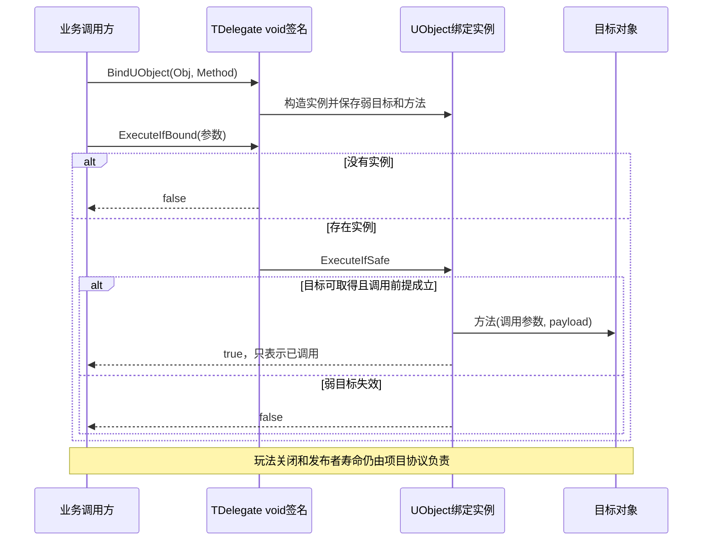
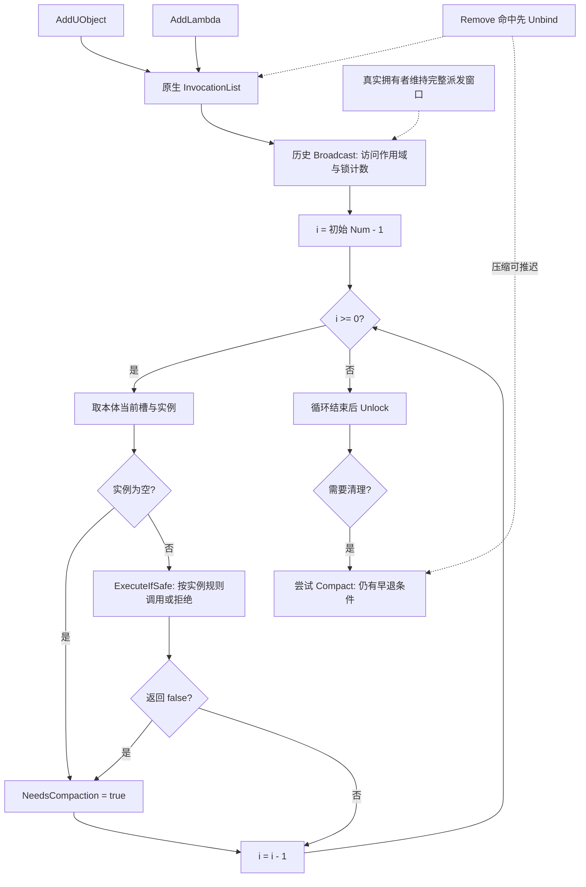
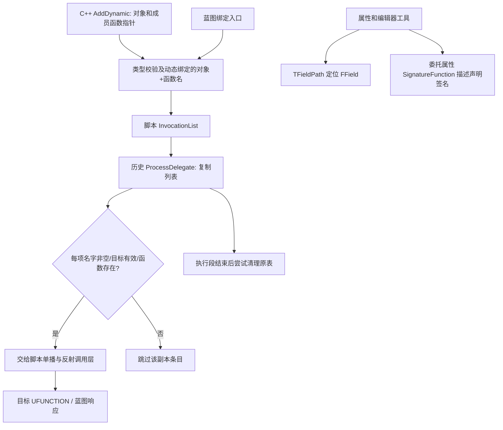

# UE 引擎源码分析 06：委托与事件系统源码剖析

> 知识成熟度：L2。主要承诺是公开 API 合同下的机制教学，以及对本文原存代码的条件化静态分析，不是当前 UE 私有 checkout 的认证或引擎实验。
> 本次更新：2026-10-06 UTC。使用 2026-10-05 已取得的 Epic 公开资料，并于 2026-10-06 复读默认策略、句柄、4.27 Events、断言、5.5 注册类型、native/script IsCompactable 与多播指南。页面版本分开标注，不等同 UE 5.8.2 / CL 55116800。
> UE、UHT、UBT、PIE、真实 delegate、GC、网络、线程、性能与替代引擎模型均未运行。全文的 PAPER_EXPECTED 是输入明确的纸面预期，不能当作实际 stdout 或测试通过。
> 原 40 个 cpp 节选、来源定位、历史路径和带日期勘误均原字节保留。源码旁的“摘自”“真正”“真实”等词属于旧来源自述；原第十一节的版本、行号、零命中计数与“本轮”均指 2026-09-15 记录，未在本次重跑。

## 一、先分清委托承诺了哪一层

委托使调用方可以保存一个有签名的回调，而不把全部接收者类型写进发布者。它不能统一接管资源寿命：一条 UObject 弱绑定、一条 Raw 绑定和一个捕获共享资源的 lambda，执行资格与所有权完全不同。读源码时至少分开四轴：

| 轴 | 回答的问题 | 不能由它推出 |
| --- | --- | --- |
| 单播 / 多播 | 一次绑定还是监听列表；是否有单一返回值 | 回调对象是否保活 |
| 原生 / 动态 | C++ 类型化调用，还是反射与按名绑定 | 是否跨线程、是否自动网络同步 |
| 绑定实例类别 | 存什么目标、方法、闭包与 payload；如何检查 | 发布者和容器是否活到派发返回 |
| 访问策略 / 业务线程 | 谁检测或同步委托内部访问；回调允许在哪执行 | 回调访问的业务字段也自动同步 |

本文仍沿原文的四层用途阅读：单播、原生多播、动态反射、对象生命周期；把其中机制展开为七条因果链。应用侧的选型与 Health/UI 完整责任链见[委托、事件与对象通信](04-委托事件与对象通信.md)。本篇不另造一个未实现的万能宿主来宣称例子可运行。

证据标签统一如下：

- **公开合同**：Epic 页面明确描述的能力、签名或限制；以所见版本标签为准
- **历史片段 H**：本文原存 cpp 的可见状态和分支。假设选定的实现确实等同该文本，且省略部分不改变已声明前提，才作控制流推导；不认证原来源真实性
- **项目合同 P**：应用自己承担的所有权、活动 epoch、重入拒绝和关闭顺序；不是引擎自动保证

公开多播合同只承诺无返回值、允许空广播且不保证调用顺序。空广播不会替应用初始化 out 参数；业务确实需要多个返回结果时，应另外定义聚合协议，不能靠监听顺序或最后一次写 out 获得稳定结果。指南宏表带有 RetVal 的宽泛模板记号与其正文冲突，此处采用明确的无返回值合同，不创造 RetVal 多播。[多播指南](https://dev.epicgames.com/documentation/en-us/unreal-engine/multicast-delegates-in-unreal-engine)

## 二、源码与资料的阅读地图

| 阅读对象 | 关注的状态 / 因果 | 本次证据范围 |
| --- | --- | --- |
| Core 的 Delegates/Delegate.h、DelegateCombinations.h | 声明宏与辅助绑定宏 | 下文原存宏节选；公开示例核签名 |
| Delegates/DelegateSignatureImpl.inl | 签名特化、注册入口、单播 / 多播执行入口 | 原存节选与公开类 API；不是完整当前文件 |
| Delegates/DelegateInstancesImpl.h、DelegateInstanceInterface.h | 方法指针、闭包、目标引用、payload、safe 接口 | 原存节选；未展示的实现不补写 |
| DelegateBase.h、MulticastDelegateBase.h、DelegateAccessHandler.h | 基类策略、实例、列表、计数、阈值 | 原存片段加官方策略说明；名字叫 Scope 不等于真实锁 |
| Core 的 UObject/ScriptDelegates.h | 弱 Object、FName、脚本监听列表 | 原存脚本快照及判定片段；与 native 分析分开 |
| CoreUObject 的 ScriptDelegateFwd.h、UnrealType.h | 公开别名、委托属性签名元数据 | 原别名片段与属性 API，不补序列化实现 |
| CoreUObject 的 FieldPath.h / FieldPath.cpp | 字段缓存、owner、FName 路径、解析失败 | 原存字段片段与字段 API，不作为每次回调链 |
| DelegateHandle.cpp | uint64 发号、保留零值 | 原存函数；不认证事务运行时语义 |

上述相对定位用于找到概念。旧版本的完整文件表和行号原样放在文末历史记录中。未取得完整当前源文件时，能确认的仅是公开合同与这里明确给出的偏序，不能拼接出不存在的内部完整调用顺序。5.5 已有 [TDelegateRegistration](https://dev.epicgames.com/documentation/unreal-engine/API/Runtime/Core/Delegates/TDelegateRegistr-?application_version=5.5) 和[脚本委托模板 API](https://dev.epicgames.com/documentation/unreal-engine/API/Runtime/Core/UObject/TScriptDelegate?application_version=5.5)，所以它们不是由本文材料证明的“5.8 首次引入”。旧 checkout 零命中也不能证明一个名字历史上从未存在。

## 三、链一：签名 → 注册入口 → 实例状态 → 执行资格

### 3.1 模板匹配与 policy 的准确归属

原生声明示例是 `DECLARE_DELEGATE_OneParam(FOnValue, float)`：宏参数为类型，不加形参名。动态 OneParam 另需参数名，见链五。此处只给签名形状，未执行编译。指南的“8 参数”与历史教程的“9 参数”不能互换成当前跨版本硬上限；需要目标版宏定义与 UHT/编译验证，参数包 API 本身也不证明任意宏个数均支持。[委托指南](https://dev.epicgames.com/documentation/unreal-engine/delegates-and-lambda-functions-in-unreal-engine)

#### 历史节选 06-F02：TDelegate主模板/函数签名特化

此块及其“摘自”定位是原文保存的历史材料，下面仅分析可见表达式；当前公开 API 不认证它的 checkout、行号或完整函数体。

摘自 `Engine/Source/Runtime/Core/Public/Delegates/DelegateSignatureImpl.inl`（第 317 行起，类头声明；317~318 行是类注释，320 行是主模板与特化）

```cpp
/**
 * Unicast delegate template class.
 */
template <typename DelegateSignature, typename UserPolicy = FDefaultDelegateUserPolicy>
class TDelegate
{
	static_assert(sizeof(UserPolicy) == 0, "Expected a function signature for the delegate template parameter");
};

template <typename InRetValType, typename... ParamTypes, typename UserPolicy>
class TDelegate<InRetValType(ParamTypes...), UserPolicy> : public TDelegateRegistration<InRetValType(ParamTypes...), UserPolicy>
{
private:
	using Super                         = TDelegateRegistration<InRetValType(ParamTypes...), UserPolicy>;
	using DelegateInstanceInterfaceType = typename Super::DelegateInstanceInterfaceType;
	using FuncType                      = typename Super::FuncType;

	// Make sure FDelegateBase's protected functions are not accidentally exposed through the TDelegate API
	using typename Super::FReadAccessScope;
	using Super::GetReadAccessScope;
	using typename Super::FWriteAccessScope;
	using Super::GetWriteAccessScope;

	template <typename>
	friend class TMulticastDelegateBase;

public:
	using RegistrationType = Super;

	/** Type definition for return value type. */
	using RetValType = InRetValType;
	using TFuncType  = InRetValType(ParamTypes...);
```

这段把函数类型拆为返回类型 `InRetValType` 与 `ParamTypes...`，使执行入口和具体实例必须同签名。`TDelegate<void(float)>` 命中偏特化；`TDelegate<void>` 不具函数类型形状，落入主模板的依赖型 static_assert。这里是类型匹配的纸面推演，不是编译器诊断实测。

继承关系准确写为 `TDelegate<签名, Policy>` → `TDelegateRegistration<签名, Policy>` → `Policy::FDelegateExtras`。当前默认策略的 FDelegateExtras 是 `TDelegateBase<FThreadSafetyMode>`，其 FThreadSafetyMode 为 `FNotThreadSafeDelegateMode`：非线程安全，开发构建带竞态检测。多播内部条目的 `FNotThreadSafeNotCheckedDelegateMode` 是另一层，不能挪作默认外部 policy；不存在本文旧稿误拼的模式名。片段 private using 收回了作用域接口的可见性，不改变底层策略。[默认策略 API](https://dev.epicgames.com/documentation/unreal-engine/API/Runtime/Core/FDefaultDelegateUserPolicy)

`FReadAccessScope` / `FWriteAccessScope` 应译为访问作用域。其具体 Mode 可能提供检测或同步；列表锁计数、SP 原子引用计数和回调字段互斥分别解决不同问题。线程安全策略的存在不授权工作线程操作任意 UObject 或 UI 状态。[线程安全 policy API](https://dev.epicgames.com/documentation/en-us/unreal-engine/API/Runtime/Core/FDefaultTSDelegateUserPolicy)

#### 历史节选 06-F03：TDelegate::Execute与void限定ExecuteIfBound

此块及其“摘自”定位是原文保存的历史材料，下面仅分析可见表达式；当前公开 API 不认证它的 checkout、行号或完整函数体。

摘自 `Engine/Source/Runtime/Core/Public/Delegates/DelegateSignatureImpl.inl`（第 609 行起，执行入口）

```cpp
public:
	/**
	 * Execute the delegate.
	 *
	 * If the function pointer is not valid, an error will occur. Check IsBound() before
	 * calling this method or use ExecuteIfBound() instead.
	 *
	 * @see ExecuteIfBound
	 */
	inline RetValType Execute(ParamTypes... Params) const
	{
		FReadAccessScope ReadScope = GetReadAccessScope();

		const DelegateInstanceInterfaceType* LocalDelegateInstance = GetDelegateInstanceProtected();

		// If this assert goes off, Execute() was called before a function was bound to the delegate.
		// Consider using ExecuteIfBound() instead.
		checkSlow(LocalDelegateInstance != nullptr);

		return LocalDelegateInstance->Execute(Forward<ParamTypes>(Params)...);
	}

	/**
	 * Execute the delegate, but only if the function pointer is still valid
	 *
	 * @return  Returns true if the function was executed
	 */
	 // NOTE: Currently only delegates with no return value support ExecuteIfBound()
	inline bool ExecuteIfBound(ParamTypes... Params) const
		requires (std::is_void_v<RetValType>)
	{
		FReadAccessScope ReadScope = GetReadAccessScope();

		if (const DelegateInstanceInterfaceType* Ptr = GetDelegateInstanceProtected())
		{
			return Ptr->ExecuteIfSafe(Forward<ParamTypes>(Params)...);
		}

		return false;
	}
```

入口的差异是下游选择，不只是少一个 assert：`Execute` 取实例、断言、直接调实例 Execute；void 限定的 `ExecuteIfBound` 在空实例分支返回 false，非空时把决定权交给实例 ExecuteIfSafe。这里返回 true 仅表示进行了调用，不表示业务回调成功，也不是回调自己的 RetVal。

不能把弱目标的失效统一解释成任意 Execute 自动跳过。`checkSlow` 是诊断：官方文档描述默认 Slow 宏只在 Debug 生效，实际构建还能配置，不能写成所有 Shipping 必有 / 必无保护。即使开启诊断，它也不提供目标寿命协议。[断言说明](https://dev.epicgames.com/documentation/en-us/unreal-engine/asserts-in-unreal-engine)

返回 int 的单播若无绑定，应用可规定 fallback=17；只有已建立合法调用前提才取 Execute 的返回值。不要将 ExecuteIfBound 的 bool 当业务 int。out 参数应先初始化，例如未执行时保留约定默认值；IsBound 与稍后 Execute 之间没有因此获得跨线程活期同步。

### 3.2 构造为什么决定后续能检查什么

注册入口选择一种实例类，实例保存的状态决定以后能做的检查。单播重新 Bind 替换原绑定；Create 系列构造可传递的绑定值。把注册视图与执行权限拆开可以限制接口暴露，但不能因此省略寿命责任。下列构造、布局、执行三块要合起来读。

#### 历史节选 06-F04：UObject实例类型约束与构造

此块及其“摘自”定位是原文保存的历史材料，下面仅分析可见表达式；当前公开 API 不认证它的 checkout、行号或完整函数体。

摘自 `Engine/Source/Runtime/Core/Public/Delegates/DelegateInstancesImpl.h`（第 505 行起）

```cpp
	// C++ member function pointer.
	FMethodPtr MethodPtr;
};


template <bool bConst, class UserClass, typename RetValType, typename... ParamTypes, typename UserPolicy, typename... VarTypes>
class TBaseUObjectMethodDelegateInstance<bConst, UserClass, RetValType(ParamTypes...), UserPolicy, VarTypes...> : public TCommonDelegateInstanceState<RetValType(ParamTypes...), UserPolicy, VarTypes...>
{
private:
	using Super            = TCommonDelegateInstanceState<RetValType(ParamTypes...), UserPolicy, VarTypes...>;
	using DelegateBaseType = typename UserPolicy::FDelegateExtras;

	static_assert(UE::Delegates::Private::IsUObjectPtr((UserClass*)nullptr), "You cannot use UObject method delegates with raw pointers.");

public:
	using FMethodPtr = typename TMemFunPtrType<bConst, UserClass, RetValType(ParamTypes..., VarTypes...)>::Type;

	template <typename... InVarTypes>
	explicit TBaseUObjectMethodDelegateInstance(UserClass* InUserObject, FMethodPtr InMethodPtr, InVarTypes&&... Vars)
		: Super     (Forward<InVarTypes>(Vars)...)
		, UserObject(InUserObject)
		, MethodPtr (InMethodPtr)
	{
		// NOTE: UObject delegates are allowed to have a null incoming object pointer.  UObject weak pointers can expire,
		//       an it is possible for a copy of a delegate instance to end up with a null pointer.
		checkSlow(MethodPtr != nullptr);
	}
```

构造把 payload 转发到公共基座，把 InUserObject 保存为 UserObject，把方法指针保存为 MethodPtr。FMethodPtr 用 `TMemFunPtrType` 区分 const / 非 const 成员，并把调用参数与绑定 payload 参数共同纳入类型。UObject 类型门槛来自实例中的 IsUObjectPtr，非 const 对象重载还有 const 正确性限制；“类型匹配”不能检测一个已经失效的运行时地址。

开头的 MethodPtr/右花括号来自相邻类末尾，这是原节选边界，不能用这两行推断完整前一类。构造注释允许弱绑定拷贝后对象为空，因此构造成功也不等于永远可调用。

#### 历史节选 06-F06：UObject实例弱对象与MethodPtr布局

此块及其“摘自”定位是原文保存的历史材料，下面仅分析可见表达式；当前公开 API 不认证它的 checkout、行号或完整函数体。

摘自 `Engine/Source/Runtime/Core/Public/Delegates/DelegateInstancesImpl.h`（第 632 行起，成员布局）

```cpp
protected:

	// Pointer to the user's class which contains a method we would like to call.
	TWeakObjectPtr<UserClass> UserObject;

	// C++ member function pointer.
	FMethodPtr MethodPtr;
};
```

这里才明确 UserObject 是 `TWeakObjectPtr<UserClass>`，MethodPtr 是成员函数指针。前者负责解析目标，后者负责调用哪个方法；二者都不是发布者或 delegate 容器的所有权。弱指针不会给 UObject 创建强可达性，不能代替真正拥有者维持目标或源的合法寿命。

#### 历史节选 06-F05：UObject实例Execute/ExecuteIfSafe

此块及其“摘自”定位是原文保存的历史材料，下面仅分析可见表达式；当前公开 API 不认证它的 checkout、行号或完整函数体。

摘自 `Engine/Source/Runtime/Core/Public/Delegates/DelegateInstancesImpl.h`（第 594 行起，`Execute` / `ExecuteIfSafe`）

```cpp
	RetValType Execute(ParamTypes... Params) const final
	{
		using MutableUserClass = std::remove_const_t<UserClass>;

		// Verify that the user object is still valid.  We only have a weak reference to it.
		checkSlow(UserObject.IsValid());

		// Safely remove const to work around a compiler issue with instantiating template permutations for
		// overloaded functions that take a function pointer typedef as a member of a templated class.  In
		// all cases where this code is actually invoked, the UserClass will already be a const pointer.
		MutableUserClass* MutableUserObject = const_cast<MutableUserClass*>(UserObject.Get());

		checkSlow(MethodPtr != nullptr);

		return this->Payload.ApplyAfter(MethodPtr, MutableUserObject, Forward<ParamTypes>(Params)...);
	}

	bool ExecuteIfSafe(ParamTypes... Params) const final
	{
		TStrongObjectPtr<UserClass> PinnedObject = IsInGameThread() ? nullptr : this->UserObject.Pin();
		if (UserClass* ActualUserObject = this->UserObject.Get())
		{
			using MutableUserClass = std::remove_const_t<UserClass>;

			// Safely remove const to work around a compiler issue with instantiating template permutations for
			// overloaded functions that take a function pointer typedef as a member of a templated class.  In
			// all cases where this code is actually invoked, the UserClass will already be a const pointer.
			MutableUserClass* MutableUserObject = const_cast<MutableUserClass*>(ActualUserObject);

			checkSlow(MethodPtr != nullptr);

			(void)this->Payload.ApplyAfter(MethodPtr, MutableUserObject, Forward<ParamTypes>(Params)...);

			return true;
		}
		return false;
	}
```

沿直接 Execute 路径：断言 UserObject.IsValid → Get → const_cast → 断言方法指针 → Payload.ApplyAfter。沿 safe 路径：先出现条件 Pin 局部变量，再 Get；取不到目标则 false，取得后调用 ApplyAfter 并 true。这足以解释两条分支为什么不同，但不能把直接 Execute 描述为有一个失效返回分支。

PinnedObject 的存在表明该历史片段考虑了非 GameThread 临时强持有；不能据此补出 GC 调度、Pin/Get 组合的完整并发规范，或宣称 GameThread 的任意回调都不受重入关闭影响。Pin 可能失败，临时保活与业务字段可跨线程访问是两件事。const_cast 旁的原注释描述编译器模板实例化兼容问题，不授予修改真正 const 对象的权限。[Object Pointers](https://dev.epicgames.com/documentation/en-us/unreal-engine/object-pointers-in-unreal-engine)

ApplyAfter 的教学重点是实参顺序：调用期 ParamTypes 在前，绑定时保存的 payload 在后；不能从这一调用点算出完整构造、复制、移动或分配次数。

### 3.3 六类入口及其持有责任

“safe”的强度来自实例，而不是函数名。下面保留原绑定类教学，并补上 ThreadSafeSP、SPLambda、Static 的边界。

#### 历史节选 06-F08：BindUObject重载

此块及其“摘自”定位是原文保存的历史材料，下面仅分析可见表达式；当前公开 API 不认证它的 checkout、行号或完整函数体。

摘自 `Engine/Source/Runtime/Core/Public/Delegates/DelegateSignatureImpl.inl`（第 281 行起，`BindUObject` 三个重载）

```cpp
	/**
	 * Binds a UObject-based member function delegate.
	 *
	 * UObject delegates keep a weak reference to your object.
	 * You can use ExecuteIfBound() to call them.
	 */
	template <typename UserClass, typename... VarTypes>
	inline void BindUObject(UserClass* InUserObject, typename TMemFunPtrType<false, UserClass, RetValType (ParamTypes..., std::decay_t<VarTypes>...)>::Type InFunc, VarTypes&&... Vars)
	{
		static_assert(!std::is_const_v<UserClass>, "Attempting to bind a delegate with a const object pointer and non-const member function.");

		new (TWriteLockedDelegateAllocation{*this}) TBaseUObjectMethodDelegateInstance<false, UserClass, FuncType, UserPolicy, std::decay_t<VarTypes>...>(InUserObject, InFunc, Forward<VarTypes>(Vars)...);
	}
	template <typename UserClass, typename... VarTypes>
	inline void BindUObject(const UserClass* InUserObject, typename TMemFunPtrType<true, UserClass, RetValType (ParamTypes..., std::decay_t<VarTypes>...)>::Type InFunc, VarTypes&&... Vars)
	{
		new (TWriteLockedDelegateAllocation{*this}) TBaseUObjectMethodDelegateInstance<true, const UserClass, FuncType, UserPolicy, std::decay_t<VarTypes>...>(InUserObject, InFunc, Forward<VarTypes>(Vars)...);
	}
// ...（节选：省略第 299~311 行，共 13 行）
```

非 const 与 const 重载各自选择 `TBaseUObjectMethodDelegateInstance`，传目标、方法、转发后的 payload；placement-new 的目的位置由 `TWriteLockedDelegateAllocation{*this}` 提供。这里看到实例构造，没看到完整分配器所有分支，不能得出零分配。代码里的省略区域仍未覆盖，不把标题称“三重载”当成已展示全部重载。目标弱存储由 06-F06 证明，不由入口参数是裸指针反推 Raw 语义。

#### 历史节选 06-F09：BindRaw重载

此块及其“摘自”定位是原文保存的历史材料，下面仅分析可见表达式；当前公开 API 不认证它的 checkout、行号或完整函数体。

摘自 `Engine/Source/Runtime/Core/Public/Delegates/DelegateSignatureImpl.inl`（第 168 行起，`BindRaw` 两个重载）

```cpp
	/**
	 * Binds a raw C++ pointer delegate.
	 *
	 * Raw pointer doesn't use any sort of reference, so may be unsafe to call if the object was
	 * deleted out from underneath your delegate. Be careful when calling Execute()!
	 */
	template <typename UserClass, typename... VarTypes>
	inline void BindRaw(UserClass* InUserObject, typename TMemFunPtrType<false, UserClass, RetValType (ParamTypes..., std::decay_t<VarTypes>...)>::Type InFunc, VarTypes&&... Vars)
	{
		static_assert(!std::is_const_v<UserClass>, "Attempting to bind a delegate with a const object pointer and non-const member function.");

		new (TWriteLockedDelegateAllocation{*this}) TBaseRawMethodDelegateInstance<false, UserClass, FuncType, UserPolicy, std::decay_t<VarTypes>...>(InUserObject, InFunc, Forward<VarTypes>(Vars)...);
	}
// ...（节选：省略第 182~185 行，共 4 行）
```

Raw 入口构造另一种实例；函数注释已把提前 delete 风险交给调用者。`UserClass*` 非空与 IsBound 为 true 都不能鉴别悬空地址。正例是拥有者保证整个调用窗口目标活着；负例是在 owner 释放后期待 ExecuteIfBound 救活 raw 目标。更换绑定方式须匹配实际所有权模型，不能把 UObject 放进 TSharedPtr 体系。

#### 历史节选 06-F10：BindLambda/BindSPLambda/BindWeakLambda

此块及其“摘自”定位是原文保存的历史材料，下面仅分析可见表达式；当前公开 API 不认证它的 checkout、行号或完整函数体。

摘自 `Engine/Source/Runtime/Core/Public/Delegates/DelegateSignatureImpl.inl`（第 133 行起，`BindLambda` 与 `BindWeakLambda`）

```cpp
	/**
	 * Static: Binds a C++ lambda delegate
	 * technically this works for any functor types, but lambdas are the primary use case
	 */
	template<typename FunctorType, typename... VarTypes>
	inline void BindLambda(FunctorType&& InFunctor, VarTypes&&... Vars)
	{
		new (TWriteLockedDelegateAllocation{*this}) TBaseFunctorDelegateInstance<FuncType, UserPolicy, std::remove_reference_t<FunctorType>, std::decay_t<VarTypes>...>(Forward<FunctorType>(InFunctor), Forward<VarTypes>(Vars)...);
	}

	/**
	 * Static: Binds a weak shared pointer C++ lambda delegate
	 * technically this works for any functor types, but lambdas are the primary use case
	 */
	template<typename UserClass, ESPMode Mode, typename FunctorType, typename... VarTypes>
	inline void BindSPLambda(const TSharedRef<UserClass, Mode>& InUserObjectRef, FunctorType&& InFunctor, VarTypes&&... Vars)
	{
		new (TWriteLockedDelegateAllocation{*this}) TBaseSPLambdaDelegateInstance<Mode, FuncType, UserPolicy, std::remove_reference_t<FunctorType>, std::decay_t<VarTypes>...>(TWeakPtr<const void>(InUserObjectRef), Forward<FunctorType>(InFunctor), Forward<VarTypes>(Vars)...);
	}
// ...（节选：省略第 152~157 行，共 6 行）

	/**
	 * Static: Binds a weak object C++ lambda delegate
	 * technically this works for any functor types, but lambdas are the primary use case
	 */
	template<typename FunctorType, typename... VarTypes>
	inline void BindWeakLambda(const UObject* InUserObject, FunctorType&& InFunctor, VarTypes&&... Vars)
	{
		new (TWriteLockedDelegateAllocation{*this}) TWeakBaseFunctorDelegateInstance<FuncType, UserPolicy, std::remove_reference_t<FunctorType>, std::decay_t<VarTypes>...>(InUserObject, Forward<FunctorType>(InFunctor), Forward<VarTypes>(Vars)...);
	}
```

三个入口分别构造普通 Functor、SP 弱门控 Functor、UObject 弱门控 Functor。普通闭包保留什么由捕获决定：值捕获可以拥有值，shared/strong 捕获可以延长相应资源寿命，raw/ref 捕获只是借用。SPLambda 与 WeakLambda 都另外给出一个“能否进入闭包”的目标门槛，而不是遍历闭包里的所有捕获。

纸面反例：ContextObject 仍有效，但另一个捕获 OtherRaw 已失效；WeakLambda 的指定门通过仍不能合法使用 OtherRaw。应让 Other 也有自己的弱解析及活动期检查，或确实拥有其资源；若 ContextObject 先失效，整个弱入口可拒绝，不能把这点扩大成所有捕获都受到保护。

#### 历史节选 06-F11：BindSP首重载

此块及其“摘自”定位是原文保存的历史材料，下面仅分析可见表达式；当前公开 API 不认证它的 checkout、行号或完整函数体。

摘自 `Engine/Source/Runtime/Core/Public/Delegates/DelegateSignatureImpl.inl`（第 187 行起，`BindSP` 第一个重载）

```cpp
	/**
	 * Binds a shared pointer-based member function delegate.  Shared pointer delegates keep a weak reference to your object.  You can use ExecuteIfBound() to call them.
	 */
	template <typename UserClass, ESPMode Mode, typename... VarTypes>
	inline void BindSP(const TSharedRef<UserClass, Mode>& InUserObjectRef, typename TMemFunPtrType<false, UserClass, RetValType (ParamTypes..., std::decay_t<VarTypes>...)>::Type InFunc, VarTypes&&... Vars)
	{
		static_assert(!std::is_const_v<UserClass>, "Attempting to bind a delegate with a const object pointer and non-const member function.");

		new (TWriteLockedDelegateAllocation{*this}) TBaseSPMethodDelegateInstance<false, UserClass, Mode, FuncType, UserPolicy, std::decay_t<VarTypes>...>(InUserObjectRef, InFunc, Forward<VarTypes>(Vars)...);
	}
```

BindSP 接受 TSharedRef，却按注释对目标弱持有；接收参数类型与实例持有方式不可混读。最后一个外部 strong owner 释放后，不应因 delegate 仍存在而认为目标仍存在。ThreadSafeSP 的区别涉及线程安全 shared 控制块/对应绑定接口，不意味着同一个 delegate 的并发改绑、发布者存储或回调对象字段都安全。UObject GC 与 UE shared pointer 是不同体系。[智能指针说明](https://dev.epicgames.com/documentation/en-us/unreal-engine/smart-pointers-in-unreal-engine)

#### 历史节选 06-F12：BindUFunction

此块及其“摘自”定位是原文保存的历史材料，下面仅分析可见表达式；当前公开 API 不认证它的 checkout、行号或完整函数体。

摘自 `Engine/Source/Runtime/Core/Public/Delegates/DelegateSignatureImpl.inl`（第 264 行起，`BindUFunction`）

```cpp
	/**
	 * Binds a UFunction-based member function delegate.
	 *
	 * UFunction delegates keep a weak reference to your object.
	 * You can use ExecuteIfBound() to call them.
	 */
	template <typename UObjectTemplate, typename... VarTypes>
	inline void BindUFunction(UObjectTemplate* InUserObject, const FName& InFunctionName, VarTypes&&... Vars)
	{
		new (TWriteLockedDelegateAllocation{*this}) TBaseUFunctionDelegateInstance<UObjectTemplate, FuncType, UserPolicy, std::decay_t<VarTypes>...>(InUserObject, InFunctionName, Forward<VarTypes>(Vars)...);
	}
```

BindUFunction 选择按名调用的原生实例，输入为对象与 FName，并转发 payload；“原生绑定可按名”不等于“它就是 DECLARE_DYNAMIC 家族”。旧稿还描述了该实例的 CachedFunction，但本块未展示缓存构造 / 失效完整体，不能由此断言所有热重载都必须重绑或永远不必维护缓存。应在重实例化后依实际工程和对应实现更新引用、失效缓存并重新校验。

| 绑定 | 保存 / 依赖 | 使用方还必须负责 |
| --- | --- | --- |
| Static | 函数及可能的 payload；没有成员对象目标 | 函数代码仍可用、全局资源和 payload 有效、线程合法；不是“永远可执行” |
| Raw | 借用普通 C++ 对象地址与方法 | 外部拥有者跨整个调用维持寿命，销毁前结束订阅 |
| SP / ThreadSafeSP | 对 shared 体系目标弱持有 | 真正 strong owner、正确 ESPMode、字段同步、调用线程 |
| UObject | UObject 弱目标与方法 | GC 强可达性由外部安排；还要检查玩法活动期 |
| Lambda | 闭包本身及其捕获 | 对每个 capture 分别识别拥有 / 借用；普通 lambda 无自动对象关联 |
| WeakLambda / SPLambda | 闭包 + 指定目标的弱门槛 | 其他捕获、发布者、容器、业务 epoch 仍独立负责 |
| UFunction | 弱 UObject + 按名反射调用所需状态 | UFUNCTION/签名匹配、缓存与重实例化维护、调用期合法性 |

复制 delegate 是复制绑定状态，不是复制整个对象图。纸面比较：值 int payload 可成为副本中的独立值；shared 捕获的多个副本通常共享同一资源；raw/ref payload 的副本仍指向同一外部对象，失效风险也复制过去。`std::decay_t` 存储形状不把指针转成所有权。绑定时 payload=Tag7、调用时 Value=3，目标接收次序是 Value 再 Tag；复制次数、handle 是否重新发号和分配次数需要完整构造实现，本文未核。

### 3.4 IsBound 是两层判定

#### 历史节选 06-F14：IsBound

此块及其“摘自”定位是原文保存的历史材料，下面仅分析可见表达式；当前公开 API 不认证它的 checkout、行号或完整函数体。

摘自 `Engine/Source/Runtime/Core/Public/Delegates/DelegateBase.h`（第 280 行起，`IsBound` 与 `IsCompactable`）

```cpp
	/**
	 * Checks to see if the user object bound to this delegate is still valid.
	 *
	 * @return True if the user object is still valid and it's safe to execute the function call.
	 */
	inline bool IsBound( ) const
	{
		FReadAccessScope ReadScope = GetReadAccessScope();

		const IDelegateInstance* DelegateInstance = GetDelegateInstanceProtected();
		return DelegateInstance && DelegateInstance->IsSafeToExecute();
	}
```

可见表达式为“实例存在 且 实例 IsSafeToExecute”。不是只判断指针非空。该结果只对这次观察、这个实例类别有效：UObject 实例可检查弱目标，Raw 实例不能由此发现外部 delete，Functor 不能由此证明全部捕获有效。检查到 true 后再调用也不是检查执行原子区，若需要并发或重入寿命保证，必须由拥有方和同步协议提供。

#### 历史节选 06-F15：IsCompactable

此块及其“摘自”定位是原文保存的历史材料，下面仅分析可见表达式；当前公开 API 不认证它的 checkout、行号或完整函数体。

摘自 `Engine/Source/Runtime/Core/Public/Delegates/DelegateBase.h`（第 340 行起，`IsCompactable`）

```cpp
	/**
	 * Checks to see if this delegate can ever become valid again - if not, it can
	 * be removed from broadcast lists or otherwise repurposed.
	 *
	 * @return True if the delegate is compatable, false otherwise.
	 */
	inline bool IsCompactable() const
	{
		FReadAccessScope ReadScope = GetReadAccessScope();

		const IDelegateInstance* DelegateInstance = GetDelegateInstanceProtected();
		return !DelegateInstance || DelegateInstance->IsCompactable();
	}
```

这里的表达式是“实例为空 或 实例自身 IsCompactable”。它回答是否允许回收条目，不是 IsBound 的简单逻辑取反：实例可以暂时不适合执行却尚不可永久丢弃。native 接口将 true 用于再也不可使用的目标；具体实例和 GC 阶段须另核，链七给布尔推演与脚本注释冲突边界。

### 3.5 PAPER_EXPECTED-H01 / H02 / H03：从输入走到分支

- **H01 签名**：输入 `void(float)` → 偏特化提取返回 void / 参数 float → 可形成对应注册和执行类型；输入 `void` → 主模板 static_assert 分支。未实际编译，不声称某编译器报错文案已验证
- **H02 类型**：把派生自 UObjectBase 的类型用于所存 UObject 实例 → IsUObjectPtr 的 UObjectBase 重载为真；普通 C++ 类对应省略号重载为假 → 类型门槛失败。正分支只解决类型，不解决 null、已结束玩法期或线程访问
- **H03 实例**：依次给空实例、存在但 safe=false、存在且 safe=true。IsBound 依次 false/false/true；void safe 入口依次不调用 / 由实例拒绝 / 在目标合法前提下进入方法。直接 Execute 不走同一拒绝分支；Raw 的悬空地址不是此 UObject 案例能够检测的输入。RetVal 未绑定取17及 out 预初始化均是应用合同，不是假想运行输出

## 四、链二：handle → owning delegate → 订阅身份

句柄应当和“哪个仍可合法访问的源 / delegate”一起保存。它只是绑定标识，既不是智能指针，也不是访问该源的授权。官方 API 把 ID 列为 uint64，并明确要求向 owning delegate 确认绑定当前是否仍存在。[FDelegateHandle](https://dev.epicgames.com/documentation/unreal-engine/API/Runtime/Core/FDelegateHandle)

#### 历史节选 06-F13：GetHandle

此块及其“摘自”定位是原文保存的历史材料，下面仅分析可见表达式；当前公开 API 不认证它的 checkout、行号或完整函数体。

摘自 `Engine/Source/Runtime/Core/Public/Delegates/DelegateBase.h`（第 354 行起）

```cpp
	/**
	 * Gets a handle to the delegate.
	 *
	 * @return The delegate instance.
	 */
	inline FDelegateHandle GetHandle() const
	{
		FReadAccessScope ReadScope = GetReadAccessScope();

		const IDelegateInstance* DelegateInstance = GetDelegateInstanceProtected();
		return DelegateInstance ? DelegateInstance->GetHandle() : FDelegateHandle{};
	}
```

GetHandle 有实例时取实例的 Handle，没有实例时返回空句柄。它没有调用 IsSafeToExecute，所以目标失效时仍可能取到非空标识。与链一相对照：标识存在、列表含绑定、目标可执行是三个状态，不能互换。随后列表压缩也可能移除条目，不是只有显式 Remove 才能移除。

#### 历史节选 06-F16：FDelegateHandle::GenerateNewID

此块及其“摘自”定位是原文保存的历史材料，下面仅分析可见表达式；当前公开 API 不认证它的 checkout、行号或完整函数体。

摘自 `Engine/Source/Runtime/Core/Private/Delegates/DelegateHandle.cpp`（第 8 行起）

```cpp
namespace UE::Delegates::Private
{
	TAtomic<uint64> GNextID(1);
}

uint64 FDelegateHandle::GenerateNewID()
{
	// Just increment a counter to generate an ID.
	uint64 Result = 0; // Initialize just to silence static analysis.

	UE_AUTORTFM_OPEN
	{
		Result = ++UE::Delegates::Private::GNextID;

		// Check for the next-to-impossible event that we wrap round to 0, because we reserve 0 for null delegates.
		if (Result == 0)
		{
			// Increment it again - it might not be zero, so don't just assign it to 1.
			Result = ++UE::Delegates::Private::GNextID;
		}
	};

	return Result;
}
```

所存发号器使用 `TAtomic<uint64>`，先自增取得 Result，遇零再自增；零作为空值被避开。这里并不是 int32，也不是“指针 + 序号”结构。原稿描述公共实例底座含 Payload 与 Handle，此处能直接追踪的是发号，而不是完整实例复制过程。

`UE_AUTORTFM_OPEN` 原样保留，但仅凭这段文本不能认证事务系统的运行语义、首次引入版本、回滚全序或性能收益。uint64 递增也不能推出永不 wrap、永无 ABA、具备认证能力或跨进程全局唯一。分配一次非零 ID，与以后每份副本是否复用它，是两个问题。

### 4.1 从登记到释放要核对的三个状态

| 时刻 / 动作 | 本地 handle 标识 | owning delegate 的登记 | 目标 / 业务资格 |
| --- | --- | --- | --- |
| 成功 Add 后 | 得到返回值并与源身份一起保存 | 由该源持有实例 | 仍须满足绑定类型和业务活动期 |
| 目标弱引用失效 | 调用方保存的 handle 可仍非空 | 条目可能尚未压缩 | safe 入口可能拒绝 |
| 精确 Remove 命中后 | 调用方的 handle 不因按值参数而自动 Reset | 所存实现先 Unbind，物理删除可能推迟 | 已开始回调不因此被证明结束 |
| 仅本地 Reset | 标识清空 | 不能据此宣称源已 Remove | 原绑定或副本可能仍可调用 |
| 源先关闭 / 销毁 | 旧标识甚至旧弱观察都可能还在本地 | 不得访问已非法的源来核对 / 解绑 | 本地会话关闭，源承担自身销毁清理 |
| 普通 Add 重复登记 | 需要逐项管理返回身份 | 不把 Add 当 AddUnique | 回调集合 / 次数可能改变，须核实际登记 |

精确释放采用两阶段项目协议。第一阶段立即撤销接收资格并推进 epoch，把原源身份、handle、旧 epoch 和清理责任交给独立于待退订闭包的责任拥有者保存；回调中 Close 只登记退订请求，不在这里销毁仍被当前调用使用的实例或捕获。第二阶段由原拥有者确认完整相关派发边界已经退出、源仍可合法访问，且退订可能释放的实例 / Functor / 捕获与共享资源不再被任何在途调用借用，才对原源执行 Remove 并释放资源、清空该记录。源与容器保活只是其中一项前提；用户回调函数刚返回、内部 lockcount 归零或 Remove 返回，都不单独证明原生执行包装栈及其他副本的使用已经结束。

若源已在满足全部相关在途寿命要求后合法结束，就丢弃其观察身份，不为“必须解绑”访问非法源；若源失效时相关调用尚未收敛，属于拥有协议缺口，不能以跳过 Remove 宣称安全。失败 Add 不建立成功登记状态。登记流程若允许同步回调触发 Close，迟返 handle 仍登记到原源 / 原 epoch 的待清理责任中，不能安到新源，也不能仅因 Add 返回就立即退订；由同一第二阶段判断何时可处理。无法证明派发边界、副本使用或借用资源寿命时，停止释放动作并补足真实拥有协议。这是项目责任合同，不是 weak、稳定记录或 handle 自带的保活 / 同步功能。

同源幂等连接须以本会话状态、源身份和 epoch 判断；不能单凭 handle.IsValid 判定“已绑定”。动态 AddUnique 的唯一添加功能按其脚本绑定身份处理，不以 native handle 当成它的统一内部实现。委托副本拥有自己的绑定状态，解绑原表并不撤销所有副本。

## 五、链三：原生登记 → 列表存储 → 删除 → 惰性压缩

### 5.1 存储和访问控制各有职责

这一链只解释原存 native 列表。不能从它倒推所有 UE4.x 曾用何种容器，或推定某版本何时“简化”。当前 API 无顺序保证，内部连续数组也不构成未经测量的性能结论。

#### 历史节选 06-F17：原生InvocationList分配器/阈值宏

此块及其“摘自”定位是原文保存的历史材料，下面仅分析可见表达式；当前公开 API 不认证它的 checkout、行号或完整函数体。

摘自 `Engine/Source/Runtime/Core/Public/Delegates/MulticastDelegateBase.h`（第 13 行起，分配器与紧凑化阈值）

```cpp
#if !defined(NUM_MULTICAST_DELEGATE_INLINE_ENTRIES) || NUM_MULTICAST_DELEGATE_INLINE_ENTRIES == 0
	typedef FHeapAllocator FMulticastInvocationListAllocatorType;
#elif NUM_MULTICAST_DELEGATE_INLINE_ENTRIES < 0
	#error NUM_MULTICAST_DELEGATE_INLINE_ENTRIES must be positive
#else
	typedef TInlineAllocator<NUM_MULTICAST_DELEGATE_INLINE_ENTRIES> FMulticastInvocationListAllocatorType;
#endif

#define UE_MULTICAST_DELEGATE_DEFAULT_COMPACTION_THRESHOLD 2
```

这里用宏选择 allocator：未定义 / 零时 Heap，正数时对应 Inline，负数走预处理错误；默认 compaction threshold 为2。这是编译期存储选择与清理阈值，不是回调时延测量。Inline 存储可能避免部分数组分配，但条目实例与捕获资源的分配仍是其他层，不能称整体零堆分配。

#### 历史节选 06-F18：TMulticastDelegateBase与内部entry Mode

此块及其“摘自”定位是原文保存的历史材料，下面仅分析可见表达式；当前公开 API 不认证它的 checkout、行号或完整函数体。

摘自 `Engine/Source/Runtime/Core/Public/Delegates/MulticastDelegateBase.h`（第 46 行起，类头与存储成员）

```cpp
/**
 * Abstract base class for multicast delegates.
 */
template<typename UserPolicy>
class TMulticastDelegateBase :
	public TDelegateAccessHandlerBase<typename UserPolicy::FThreadSafetyMode>
{
protected:
	using Super = TDelegateAccessHandlerBase<typename UserPolicy::FThreadSafetyMode>;
	using typename Super::FReadAccessScope;
	using Super::GetReadAccessScope;
	using typename Super::FWriteAccessScope;
	using Super::GetWriteAccessScope;

	// individual bindings are not checked for races as it's done for the parent delegate
	using UnicastDelegateType = TDelegateBase<FNotThreadSafeNotCheckedDelegateMode>;

	using InvocationListType = TArray<UnicastDelegateType, FMulticastInvocationListAllocatorType>;
```

外层基类继承 `TDelegateAccessHandlerBase<typename UserPolicy::FThreadSafetyMode>`，内部每个条目则是 `TDelegateBase<FNotThreadSafeNotCheckedDelegateMode>`。注释说明竞态检查由父 delegate 承担，因此内层不重复检查。InvocationList 是这些底座的 TArray，不直接把它当成任意裸实例指针数组。外层默认 mode 仍按链一的官方 policy 区分；NotChecked 并不自动使无锁并发合法。

#### 历史节选 06-F19：InvocationList/threshold/lockcount三个成员

此块及其“摘自”定位是原文保存的历史材料，下面仅分析可见表达式；当前公开 API 不认证它的 checkout、行号或完整函数体。

摘自 `Engine/Source/Runtime/Core/Public/Delegates/MulticastDelegateBase.h`（第 494 行起，三个数据成员）

```cpp
	/** Holds the collection of delegate instances to invoke. */
	InvocationListType InvocationList;

	/** Used to determine when a compaction should happen. */
	int32 CompactionThreshold = UE_MULTICAST_DELEGATE_DEFAULT_COMPACTION_THRESHOLD;

	/** Holds a lock counter for the invocation list. */
	mutable int32 InvocationListLockCount = 0;
};
```

列表保存登记，CompactionThreshold 控制某些清理尝试，InvocationListLockCount 控制特定时段是否允许搬移。后两者均是 int32，但 handle 的 ID 是 uint64，不要把字段类型串错。mutable 锁计数表明 const 广播仍会维护状态；计数不拥有互斥语义，也不维持 publisher 寿命。

### 5.2 Add 与 Remove：公开入口和存储入口的偏序

应把“返回给调用者的身份”与“登记是否真正进入列表”连起来看，而不是见到 Add 调用就认为成功。

#### 历史节选 06-F20：公开Add

此块及其“摘自”定位是原文保存的历史材料，下面仅分析可见表达式；当前公开 API 不认证它的 checkout、行号或完整函数体。

摘自 `Engine/Source/Runtime/Core/Public/Delegates/DelegateSignatureImpl.inl`（第 779 行起，公开 `Add`）

```cpp
	/**
	 * Adds a delegate instance to this multicast delegate's invocation list.
	 *
	 * @param Delegate The delegate to add.
	 */
	FDelegateHandle Add(FDelegate&& InNewDelegate)
	{
		FDelegateHandle Handle = Super::AddDelegateInstance(MoveTemp(InNewDelegate));
		UE_REGISTER_MULTICAST_INSTANCE(Handle);
		return Handle;
	}
```

公开 Add 把单播值移动给 AddDelegateInstance，接到 Handle 后经过追踪宏，再把同一结果返回。不能因出现 UE_REGISTER_MULTICAST_INSTANCE 推出所有构建都开启生命周期检测；原片段没有展开宏。AddXxx 创建对应单播实例再登记是原稿描述的组织方式，本节以下只对已展示的 Add/内层函数作逐分支推演。

#### 历史节选 06-F22：AddDelegateInstance

此块及其“摘自”定位是原文保存的历史材料，下面仅分析可见表达式；当前公开 API 不认证它的 checkout、行号或完整函数体。

摘自 `Engine/Source/Runtime/Core/Public/Delegates/MulticastDelegateBase.h`（第 320 行起，`AddDelegateInstance`）

```cpp
	/**
	 * Adds the given delegate instance to the invocation list.
	 *
	 * @param NewDelegateBaseRef The delegate instance to add.
	 */
	template <typename NewDelegateType>
	inline FDelegateHandle AddDelegateInstance(NewDelegateType&& NewDelegateBaseRef)
	{
		FWriteAccessScope WriteScope = GetWriteAccessScope();

		FDelegateHandle Result;
		if (NewDelegateBaseRef.IsBound())
		{
			// compact but obey threshold of when this will trigger
			CompactInvocationList(true);
			Result = NewDelegateBaseRef.GetHandle();
			InvocationList.Emplace(Forward<NewDelegateType>(NewDelegateBaseRef));
		}
		return Result;
	}
```

内层取写访问作用域，先构造默认 Result，仅在 NewDelegateBaseRef.IsBound 为真时调用 CompactInvocationList(true)、取得 handle 并 Emplace。顺序是“资格判定 → 尝试清理 → 保存身份 → 追加”，不是所有输入必清理。IsBound 还包含实例的安全性判据，因此仅有一个实例对象不必然进入此分支。

这里 Forward/MoveTemp 给出值类别传递意图，未展示全部构造 / 异常路径。不能凭片段声称固定搬移次数或所有分配失败行为已经验证。

#### 历史节选 06-F21：公开Remove

此块及其“摘自”定位是原文保存的历史材料，下面仅分析可见表达式；当前公开 API 不认证它的 checkout、行号或完整函数体。

摘自 `Engine/Source/Runtime/Core/Public/Delegates/DelegateSignatureImpl.inl`（第 1052 行起，公开 `Remove(FDelegateHandle)`）

```cpp
public:

	/**
	 * Removes a delegate instance from this multi-cast delegate's invocation list (performance is O(N)).
	 *
	 * Note that the order of the delegate instances may not be preserved!
	 *
	 * @param Handle The handle of the delegate instance to remove.
	 * @return  true if the delegate was successfully removed.
	 */
	bool Remove( FDelegateHandle Handle )
	{
		bool bResult = false;
		if (Handle.IsValid())
		{
			bResult = RemoveDelegateInstance(Handle);
		}
		return bResult;
	}
```

公开 Remove 先看 handle.IsValid：空句柄直接返回初始 false；非空才进入扫描。它只接受身份，不替调用方证明 owning delegate 仍合法。API 说明可能破坏顺序，不能依赖删除后保留原注册次序。

#### 历史节选 06-F23：RemoveDelegateInstance

此块及其“摘自”定位是原文保存的历史材料，下面仅分析可见表达式；当前公开 API 不认证它的 checkout、行号或完整函数体。

摘自 `Engine/Source/Runtime/Core/Public/Delegates/MulticastDelegateBase.h`（第 341 行起，`RemoveDelegateInstance`）

```cpp
	/**
	 * Removes a function from this multi-cast delegate's invocation list (performance is O(N)).
	 *
	 * @param Handle The handle of the delegate instance to remove.
	 * @return  true if the delegate was successfully removed.
	 */
	bool RemoveDelegateInstance(FDelegateHandle Handle)
	{
		FWriteAccessScope WriteScope = GetWriteAccessScope();

		UE_UNREGISTER_MULTICAST_INSTANCE(Handle);

		for (int32 InvocationListIndex = 0; InvocationListIndex < InvocationList.Num(); ++InvocationListIndex)
		{
			UnicastDelegateType& DelegateBase = InvocationList[InvocationListIndex];

			IDelegateInstance* DelegateInstance = DelegateBase.GetDelegateInstanceProtected();
			if (DelegateInstance && DelegateInstance->GetHandle() == Handle)
			{
				DelegateBase.Unbind();
				CompactInvocationList();
				return true; // each delegate binding has a unique handle, so once we find it, we can stop
			}
		}

		return false;
	}
```

内层取写作用域并经过追踪钩子，然后逐槽取当前实例、比较 Handle。命中先 Unbind，再尝试 CompactInvocationList，最后 true；无命中 false。因此 true 表示这次查找移除了匹配绑定，不表示数组已缩短，也不表示等待了其他线程或已开始的回调返回。Unbind 会改变实例状态，不应把它仅仅说成无副作用的“打个标记”。

#### 历史节选 06-F24：RemoveAll两分支

此块及其“摘自”定位是原文保存的历史材料，下面仅分析可见表达式；当前公开 API 不认证它的 checkout、行号或完整函数体。

摘自 `Engine/Source/Runtime/Core/Public/Delegates/MulticastDelegateBase.h`（第 166 行起，`RemoveAll`）

```cpp
	/**
	 * Removes all functions from this multi-cast delegate's invocation list that are bound to the specified UserObject.
	 * Note that the order of the delegates may not be preserved!
	 *
	 * @param InUserObject The object to remove all delegates for.
	 * @return  The number of delegates successfully removed.
	 */
	int32 RemoveAll(FDelegateUserObjectConst InUserObject)
	{
		FWriteAccessScope WriteScope = GetWriteAccessScope();

		int32 Result = 0;
		if (ShouldSkipCompactionUnderAutoRTFM() || (InvocationListLockCount > 0))
		{
			for (UnicastDelegateType& DelegateBaseRef : InvocationList)
			{
				IDelegateInstance* DelegateInstance = DelegateBaseRef.GetDelegateInstanceProtected();
				if ((DelegateInstance != nullptr) && DelegateInstance->HasSameObject(InUserObject))
				{
					UE_UNREGISTER_MULTICAST_INSTANCE(DelegateInstance->GetHandle());

					// Manually unbind the delegate here so the compaction will find and remove it.
					DelegateBaseRef.Unbind();
					++Result;
				}
			}

			// can't compact at the moment as the invocation list is locked, but set out threshold to zero so the next add will do it
			if (Result > 0)
			{
				CompactionThreshold = 0;
			}
		}
		else
		{
			// compact us while shuffling in later delegates to fill holes
			for (int32 InvocationListIndex = 0; InvocationListIndex < InvocationList.Num();)
			{
				UnicastDelegateType& DelegateBaseRef = InvocationList[InvocationListIndex];

				IDelegateInstance* DelegateInstance = DelegateBaseRef.GetDelegateInstanceProtected();

				if (DelegateInstance == nullptr
					|| DelegateInstance->HasSameObject(InUserObject)
					|| DelegateInstance->IsCompactable())
				{
					if (DelegateInstance)
					{
						UE_UNREGISTER_MULTICAST_INSTANCE(DelegateInstance->GetHandle());
					}

					InvocationList.RemoveAtSwap(InvocationListIndex, EAllowShrinking::No);
					++Result;
				}
				else
				{
					InvocationListIndex++;
				}
			}

			CompactionThreshold = FMath::Max(UE_MULTICAST_DELEGATE_DEFAULT_COMPACTION_THRESHOLD, 2 * InvocationList.Num());

			InvocationList.Shrink();
		}

		return Result;
	}
```

读分支条件须同时保留事务谓词和锁计数。任一要求跳过压缩时，扫描存在的实例并以 HasSameObject 匹配，只 Unbind 匹配项并计数；至少一项命中才把 threshold 置0。此时是取消绑定与延后物理清理两个动作。

另一分支把三类条目 RemoveAtSwap：空实例、目标匹配、或自身 compactable。删后不递增索引，因尾项被换到当前位置还需检查；保留时才加索引。Result 包括这三类，不一定是 Obj 的回调数。最后按余量重置阈值并 Shrink。

HasSameObject 匹配实例关联对象，不遍历普通 lambda 的 capture 图。`AddLambda([this]...)` 不能因此被承诺一定由 RemoveAll(this) 移走；应保存自己的 handle。两个分支也没有建立“对象一销毁就同步清空列表”的关系。

### 5.3 Compact 与列表锁计数

物理压缩需要真正走到清理循环。弱失效可以先发生，解除业务订阅也可以先发生，二者都不强制立即改变数组长度。

#### 历史节选 06-F26：CompactInvocationList

此块及其“摘自”定位是原文保存的历史材料，下面仅分析可见表达式；当前公开 API 不认证它的 checkout、行号或完整函数体。

摘自 `Engine/Source/Runtime/Core/Public/Delegates/MulticastDelegateBase.h`（第 380 行起，`CompactInvocationList`）

```cpp
	/**
	 * Removes any expired or deleted functions from the invocation list.
	 *
	 * @see RequestCompaction
	 */
	void CompactInvocationList(bool CheckThreshold=false)
	{
		if (ShouldSkipCompactionUnderAutoRTFM())
		{
			return;
		}

		// if locked and no object, just return
		if (InvocationListLockCount > 0)
		{
			return;
		}

		// if checking threshold, obey but decay. This is to ensure that even infrequently called delegates will
		// eventually compact during an Add()
		if (CheckThreshold 	&& --CompactionThreshold > InvocationList.Num())
		{
			return;
		}

		int32 OldNumItems = InvocationList.Num();

		// Find anything null or compactable and remove it
		for (int32 InvocationListIndex = 0; InvocationListIndex < InvocationList.Num();)
		{
			auto& DelegateBaseRef = InvocationList[InvocationListIndex];

			IDelegateInstance* DelegateInstance = DelegateBaseRef.GetDelegateInstanceProtected();

			if (DelegateInstance == nullptr	|| DelegateInstance->IsCompactable())
			{
				if (DelegateInstance)
				{
					UE_UNREGISTER_MULTICAST_INSTANCE(DelegateInstance->GetHandle());
				}

				InvocationList.RemoveAtSwap(InvocationListIndex, EAllowShrinking::No);
			}
			else
			{
				InvocationListIndex++;
			}
		}

		CompactionThreshold = FMath::Max(UE_MULTICAST_DELEGATE_DEFAULT_COMPACTION_THRESHOLD, 2 * InvocationList.Num());

		if (OldNumItems > CompactionThreshold)
		{
			// would be nice to shrink down to threshold, but reserve only grows..?
			InvocationList.Shrink();
		}
	}
```

完整可见顺序是：事务谓词为真早退 → lockcount>0早退 → 如 CheckThreshold=true，先递减 threshold，仍大于 Num 则早退 → 扫空 / compactable 并交换删除 → threshold=max(2,2*Num) → OldNumItems 大于新 threshold 才 Shrink。前两处早退甚至不会做阈值衰减。

由此只能说持续发生符合前提的清理尝试可能衰减阈值，不能说低频委托存在自动定时回收。没有 Add/Remove/Broadcast 等触发，就没有本段的执行；无效 Add 也进不到它。RemoveAll 把 threshold 设零的注释表达动机，仍不能覆盖事务和锁计数早退。

这不是本文已证的“所有清理唯一入口”：RemoveAll 的非锁分支自身已经展示直接删除；Clear 完整实现、脚本序列化清理路径未展示，不能按名字猜它们都走同一路。

#### 历史节选 06-F27：Lock/UnlockInvocationList

此块及其“摘自”定位是原文保存的历史材料，下面仅分析可见表达式；当前公开 API 不认证它的 checkout、行号或完整函数体。

摘自 `Engine/Source/Runtime/Core/Public/Delegates/MulticastDelegateBase.h`（第 453 行起，广播锁）

```cpp
	/** Increments the lock counter for the invocation list. */
	inline void LockInvocationList( ) const
	{
		if (ShouldSkipCompactionUnderAutoRTFM())
		{
			return;
		}

		++InvocationListLockCount;
	}

	/** Decrements the lock counter for the invocation list. */
	inline void UnlockInvocationList( ) const
	{
		if (ShouldSkipCompactionUnderAutoRTFM())
		{
			return;
		}

		--InvocationListLockCount;
	}
```

可见 Lock/Unlock 都先问同一个事务谓词，再分别 ++ / -- lockcount。两者组成在特定执行条件下延后搬移的计数协议，没有 mutex 原语出现在这里。事务谓词为真时两者都早退，只可作布尔输入分析；本文未取得该谓词当前完整定义及 AutoRTFM 运行验证，不把原稿“优化收益”升级成事实。

### 5.4 PAPER_EXPECTED-H04 至 H07：逐分支追踪

共同前提：读的是所存函数文本；除 H07 专门给出的事务布尔输入外，不引入未知事务运行语义；单线程、无异常，真实拥有者维持整个访问窗口的源和容器寿命。

| 纸例 | 输入 → 条件 → 操作 | PAPER_EXPECTED 正分支 | 负控 / 不能推出 |
| --- | --- | --- | --- |
| H04a | Num=2，threshold=5，Add(empty) | IsBound=false，Result 保持空；无 compact、无 Emplace | 不能说“有 Add 就清垃圾” |
| H04b | 同初值 Add(bound)，事务谓词=false，lockcount=0 | compact(true) 先5→4，4>2早退；再取得 handle 并追加，Num 变3 | 有效登记也不代表发生物理清理；构造异常未核 |
| H05a | 空 handle → 公开 Remove | 不扫描，false | 非空标识才只是进入扫描资格 |
| H05b | 非空未知 handle → 逐项均不匹配 | false，不执行匹配分支的 Unbind | 失败原因还可能是找错源，不能操作失效源来试 |
| H05c | 匹配 handle，lockcount=1 | Unbind 后 compact 早退，返回 true；槽可能仍占位 | true 不是在途完成屏障，不保证数组已缩短 |
| H06a | 列表含 Obj 匹配、空槽、过期 Other，lockcount=1 | 只 Unbind Obj 匹配项，Result 仅计这些匹配；至少一项才 threshold=0 | 空 / 过期 Other 在本分支不额外计数 |
| H06b | 同三类输入且 unlocked、事务谓词=false，再加一条有效 Other | 三类各移除一次，Result=3；有效 Other 保留，Num=1，threshold=2，并 Shrink | 此3不是 Obj 回调数；RemoveAtSwap 改序 |
| H07a | 事务谓词=true，其他值任意 | Compact 首处 return，无循环、无阈值递减 | 只证明 if 的布尔分支，不证明真实事务回滚语义 |
| H07b | 谓词=false，lockcount>0 | 第二处 return，仍未递减 threshold | threshold=0 也不能越过此门 |
| H07c | 谓词=false，lockcount=0，CheckThreshold=true，Num=2，threshold=5 | -- 后4>2，第三处 return | 没有自动定时器继续替你调用 |
| H07d | 同条件，threshold=3，列表=[空,有效] | -- 后2>2为假，删空项并复查换入位置，Num=1；threshold=2，OldNum=2不大于2，故此例不 Shrink | 若 OldNum 大于重算阈值才 Shrink；不是每次压缩都缩容量 |

判定方式是逐项代入表达式、核对状态变化及返回值，以上没有真实运行或计时。

## 六、链四：原生 Broadcast 当轮读取 → 重入 → 容器寿命

公开合同不保证顺序。以下倒序仅为 06-F25 的历史实现观察，用来回答“这一段为什么不把追加项纳入外层当前索引范围”，不能写成当前所有版本的稳定 LIFO / 注册序保证。

#### 历史节选 06-F25：原生Broadcast

此块及其“摘自”定位是原文保存的历史材料，下面仅分析可见表达式；当前公开 API 不认证它的 checkout、行号或完整函数体。

摘自 `Engine/Source/Runtime/Core/Public/Delegates/MulticastDelegateBase.h`（第 287 行起，真正的 `Broadcast`）

```cpp
	template<typename DelegateInstanceInterfaceType, typename... ParamTypes>
	void Broadcast(ParamTypes... Params) const
	{
		// the `const` on the method is a lie
		FWriteAccessScope WriteScope = const_cast<TMulticastDelegateBase*>(this)->GetWriteAccessScope();

		bool NeedsCompaction = false;

		LockInvocationList();
		{
			const InvocationListType& LocalInvocationList = GetInvocationList();

			// call bound functions in reverse order, so we ignore any instances that may be added by callees
			for (int32 InvocationListIndex = LocalInvocationList.Num() - 1; InvocationListIndex >= 0; --InvocationListIndex)
			{
				// this down-cast is OK! allows for managing invocation list in the base class without requiring virtual functions
				const UnicastDelegateType& DelegateBase = LocalInvocationList[InvocationListIndex];

				const IDelegateInstance* DelegateInstanceInterface = DelegateBase.GetDelegateInstanceProtected();
				if (DelegateInstanceInterface == nullptr || !static_cast<const DelegateInstanceInterfaceType*>(DelegateInstanceInterface)->ExecuteIfSafe(Params...))
				{
					NeedsCompaction = true;
				}
			}
		}
		UnlockInvocationList();

		if (NeedsCompaction)
		{
			const_cast<TMulticastDelegateBase*>(this)->CompactInvocationList();
		}
	}
```

执行前取写访问作用域，并通过 const_cast 允许维护内部状态；NeedsCompaction 初始 false；加列表锁计数后取列表本体引用，初始索引为当时 Num-1。每轮重新从当前槽取实例，空或 ExecuteIfSafe=false 就置 NeedsCompaction。循环结束先 Unlock，再按需要尝试 compact。

这条因果链只支持在所列前提下分析“尚未读取的槽”。一个已开始回调内的 Remove 不是让调用栈倒退。普通 Functor 自己退订时可能销毁正在使用的闭包 / 捕获；列表没有搬移并不能证明闭包存活。容器自身若被重入析构、覆盖或换源，局部引用也救不了它。真正的拥有方必须保证源、容器以及在途使用的实例 / 闭包 / 捕获资源跨完整相关派发栈合法；关闭先撤业务资格、登记清理责任，实际退订及破坏性释放按 H12 的边界处理。只等内部用户回调返回不足以证明外层执行包装已退出，也不能靠回调后检查 weak 或 IsBound 修复已经非法的访问。

### 6.1 PAPER_EXPECTED-H08：五种变更不能合成一个“安全”答案

前提：初始原生列表槽0=A、槽1=B；采用所存倒序本体，单线程、无事务、无异常，Add/Remove 等仅执行已展示分支，源及容器的真实拥有方保证整个递归派发栈合法；回调依赖的资源也必须有独立合法寿命。这里只以该初始顺序计算，不要求其他版本保持此顺序。

1. **B 删除尚未执行的 A**：外层起点 i=1 调 B；B 的 Remove(A) 命中槽0并 Unbind；lockcount>0 导致 compact 早退；外层下一 i=0 重新取实例得到空，因此不调 A，置 NeedsCompaction；最外层解锁后再尝试清理。改变为脚本快照则不能套这个结果
2. **B 追加 C**：C 在尾部追加为槽2；外层 i 已从1往0走，不会上升到2，故 C 不进入这一外层轮。该追踪还依赖调用时未发生未列出的破坏操作，不认证分配 / 自毁 / 并发行为
3. **B 追加 C 后递归广播**：内层拥有新起点 Num-1=2，可先看到 C。若 B 每次都无限递归，就不存在有限完成保证；纸面正例给 B 一个“仅递归一次”的应用闩锁，使第二次经过 B 时不再递归。内层返回后外层继续0。只有最外层 lockcount 降到0才可能真的压缩，内层需要清理也可能早退
4. **B 删除自己**：只可从列表层推出命中项 Unbind 和压缩推迟。当前执行所需的实例 / Functor / capture 是否可被同时销毁，须具体实例与拥有关系证明；本篇拒绝“任意自移除永远不会崩”。本篇的正向项目方案是回调先撤业务资格、只提交属于原源的退订请求；真正 Remove 及其可能销毁的实例 / 捕获资源，由原拥有者在完整相关派发栈退出并确认没有其他在途借用后处理。用户回调返回不是这条完整边界，独立副本和脚本快照还要分别收敛，详见 H12；这是应用协议
5. **B 调 Clear 或请求销毁发布者**：未取得 Clear 当前 / 完整历史体，不预测当前轮 A 必跳过或必执行。若关闭先撤业务资格并按 H12 登记清理责任，尚存回调仍应核 epoch 后拒绝旧业务；实际退订以及实例 / 捕获 / 容器释放，均等原拥有者确认完整相关派发与借用已收敛。若直接析构本体，违反本纸例寿命前提，分析在此停止，不能报告安全

### 6.2 Remove 后仍回调，先找是哪一份绑定

按顺序排查：是否同一发布者 / 同一 delegate；是否拿错 handle；是否普通 Add 产生多份登记；是否回调已经开始；是否另有复制的 delegate / 脚本列表快照；是否旧 epoch 没有在业务入口被拒绝。AddUnique 的去重功能不应被反说成“默认会重复添加”，它的具体身份与版本细节另核。Remove / RemoveAll / Clear 均不能在缺少同步合同的情况下当成跨线程完成屏障。

单播重复 Bind 替换一个绑定，多播 Add 追加一个绑定；单播有返回值变体，多播不自动聚合；单播 Unbind 与多播 Remove(handle) 也不是同一份状态操作。动态 / 原生仍是另一独立轴。

## 七、链五：动态声明 → 对象 / 函数名 → 脚本快照 → 反射调用

### 7.1 声明签名与绑定身份不是一回事

动态宏例应是 `DECLARE_DYNAMIC_MULTICAST_DELEGATE_OneParam(FOnHealthChanged, float, NewHealth)`，比原生形状多参数名。动态调用支持反射 / 序列化，不等于任意类型都能经 UHT 或任意对象都自动参与 SaveGame、RPC。`AddDynamic(Obj, &UReceiver::OnHealthChanged)` 的成员函数指针与反射函数名各有职责，不能把调用写成传任意字符串。[动态指南](https://dev.epicgames.com/documentation/en-us/unreal-engine/dynamic-delegates-in-unreal-engine)、[官方动态 OneParam 示例](https://dev.epicgames.com/documentation/en-us/unreal-engine/implementing-chunkdownloader-in-your-gameplay-in-unreal-engine)

#### 历史节选 06-F28：动态宏组合

此块及其“摘自”定位是原文保存的历史材料，下面仅分析可见表达式；当前公开 API 不认证它的 checkout、行号或完整函数体。

摘自 `Engine/Source/Runtime/Core/Public/Delegates/DelegateCombinations.h`（第 37 行起）

```cpp
/** Declares a blueprint-accessible broadcast delegate that can bind to multiple native UFUNCTIONs simultaneously */
#define DECLARE_DYNAMIC_MULTICAST_DELEGATE(DelegateName) UE_PRIVATE_DECLARE_DYNAMIC_MULTICAST_DELEGATE(DelegateName, void())
// ...（节选：省略第 39~52 行，共 14 行）
#define DECLARE_DYNAMIC_MULTICAST_DELEGATE_OneParam(DelegateName, Param1Type, Param1Name) UE_PRIVATE_DECLARE_DYNAMIC_MULTICAST_DELEGATE(DelegateName, void(Param1Type Param1Name))
```

OneParam 宏的三个输入是 delegate 名、参数类型、参数名；得到形如 void(float NewHealth) 的签名。缺第三个输入与该宏形状不符。无参和单参入口共用后面的私有声明宏，这只能说明所存宏之间的展开关系，不能从省略段推全部参数数量上限。

#### 历史节选 06-F29：动态多播声明展开

此块及其“摘自”定位是原文保存的历史材料，下面仅分析可见表达式；当前公开 API 不认证它的 checkout、行号或完整函数体。

摘自 `Engine/Source/Runtime/Core/Public/Delegates/Delegate.h`（第 238 行起，宏的最终展开）

```cpp
/** Declare user's dynamic multi-cast delegate, with wrapper proxy method for executing the delegate */
#define UE_PRIVATE_DECLARE_DYNAMIC_MULTICAST_DELEGATE(DynamicMulticastDelegateClassName, FuncType) \
	class DynamicMulticastDelegateClassName : public TDynamicMulticastDelegate<FuncType> \
	{ \
	public: \
		using TDynamicMulticastDelegate<FuncType>::TDynamicMulticastDelegate; \
	};
```

此段生成继承 `TDynamicMulticastDelegate<FuncType>` 的类，并继承其构造函数。类形状能与 UPROPERTY 的声明用途关联，但此处没有 UHT 的 .gen.cpp；不能把“动态宏带 USTRUCT 生成代码”当成看过的事实。蓝图可绑定的具体宿主、UFUNCTION 和属性标记必须匹配，本文没有编译目标工程。

#### 历史节选 06-F07：动态TMethodPtrResolver

此块及其“摘自”定位是原文保存的历史材料，下面仅分析可见表达式；当前公开 API 不认证它的 checkout、行号或完整函数体。

摘自 `Engine/Source/Runtime/Core/Public/Delegates/DelegateSignatureImpl.inl`（第 1188 行起）

```cpp
	/**
	 * Templated helper class to define a typedef for user's method pointer, then used below
	 */
	template <bool bConst, typename UserClass, typename... VarTypes>
	struct TMethodPtrResolver
	{
		// The decay_t means that captured payloads will need to be passed by value, including things like FString.  Will need a mapping for that.
		using FMethodPtr = std::conditional_t<
			bConst,
			RetValType(UserClass::*)(ParamTypes... Params, std::decay_t<VarTypes>...) const,
			RetValType(UserClass::*)(ParamTypes... Params, std::decay_t<VarTypes>...)
		>;
	};
```

这段 TMethodPtrResolver 是动态类内部的类型辅助模板：RetValType / ParamTypes 来自外层；根据 bConst 形成 const 或非 const 成员指针类型，payload 参数使用 decay。它不同于原生实例的 TMemFunPtrType。成员函数指针匹配是 C++ 类型校验的一环，运行时仍需反射函数存在、签名兼容以及对象有效，不能说它是全部安全的唯一来源。

#### 历史节选 06-F30：AddDynamic/AddUniqueDynamic/RemoveDynamic/IsAlreadyBound宏

此块及其“摘自”定位是原文保存的历史材料，下面仅分析可见表达式；当前公开 API 不认证它的 checkout、行号或完整函数体。

摘自 `Engine/Source/Runtime/Core/Public/Delegates/Delegate.h`（第 323 行起，`AddDynamic` / `AddUniqueDynamic` / `RemoveDynamic` / `IsAlreadyBound` 四个宏）

```cpp
/**
 * Helper macro to bind a UObject instance and a member UFUNCTION to a dynamic multi-cast delegate.
 *
 * @param	UserObject		UObject instance
 * @param	FuncName		Function pointer to member UFUNCTION, usually in form &UClassName::FunctionName
 */
#define AddDynamic( UserObject, FuncName, ... ) __Internal_AddDynamic( UserObject, FuncName, UE_PRIVATE_STATIC_FUNCTION_FNAME( #FuncName ), ##__VA_ARGS__ )

/**
 * Helper macro to bind a UObject instance and a member UFUNCTION to a dynamic multi-cast delegate, but only if it hasn't been bound before.
 *
 * @param	UserObject		UObject instance
 * @param	FuncName		Function pointer to member UFUNCTION, usually in form &UClassName::FunctionName
 */
#define AddUniqueDynamic( UserObject, FuncName, ... ) __Internal_AddUniqueDynamic( UserObject, FuncName, UE_PRIVATE_STATIC_FUNCTION_FNAME( #FuncName ), ##__VA_ARGS__ )
// ...（节选：省略第 339~344 行，共 6 行）

#define RemoveDynamic( UserObject, FuncName, ... ) __Internal_RemoveDynamic( UserObject, FuncName, UE_PRIVATE_STATIC_FUNCTION_FNAME( #FuncName ), ##__VA_ARGS__ )
// ...（节选：省略第 347~352 行，共 6 行）

#define IsAlreadyBound( UserObject, FuncName, ... ) __Internal_IsAlreadyBound( UserObject, FuncName, UE_PRIVATE_STATIC_FUNCTION_FNAME( #FuncName ), ##__VA_ARGS__ )
```

宏确实传 UserObject 与 FuncName 成员指针，同时用字符串化输入推导 FName，还转发可选尾参数。因此“不传指针”的旧解释与这个块本身矛盾。指针用于静态匹配与函数标识输入，动态绑定最终依对象 + 函数名定位，不等于通过该指针做原生直接调用。

AddUniqueDynamic 的公开意图是只在尚未绑定时添加，RemoveDynamic / IsAlreadyBound 使用对应对象与函数身份；这里未展开内部比较和压缩完整体，不能断言“先 AddUnique 再 compact”在当前版本必然如此。宏的可选参数也不足以认证打开动态 payload 开关后的完整实现。

### 7.2 脚本列表的元素、别名和属性访问

#### 历史节选 06-F31：TMulticastScriptDelegate类头/条目类型

此块及其“摘自”定位是原文保存的历史材料，下面仅分析可见表达式；当前公开 API 不认证它的 checkout、行号或完整函数体。

摘自 `Engine/Source/Runtime/Core/Public/UObject/ScriptDelegates.h`（第 1078 行起，注意路径在 **Core** 模块）

```cpp
template<typename ThreadSafetyMode>
struct TIsZeroConstructType<TScriptDelegate<ThreadSafetyMode>>
{
	static constexpr bool Value =
		TIsZeroConstructType<typename UE::Core::Private::TScriptDelegateTraits<ThreadSafetyMode>::WeakPtrType>::Value &&
		TIsZeroConstructType<typename TScriptDelegate<ThreadSafetyMode>::Super>::Value;
};

/**
 * Script multi-cast delegate base class
 */
template <typename InThreadSafetyMode>
class TMulticastScriptDelegate : public TDelegateAccessHandlerBase<InThreadSafetyMode>
{
private:
	using Super = TDelegateAccessHandlerBase<InThreadSafetyMode>;
	using typename Super::FReadAccessScope;
	using Super::GetReadAccessScope;
	using typename Super::FWriteAccessScope;
	using Super::GetWriteAccessScope;

	using UnicastDelegateType = TScriptDelegate<typename UE::Core::Private::TScriptDelegateTraits<InThreadSafetyMode>::UnicastThreadSafetyModeForMulticasts>;

public:
	using ThreadSafetyMode = typename UE::Core::Private::TScriptDelegateTraits<InThreadSafetyMode>::ThreadSafetyMode;
	using InvocationListType = TArray<UnicastDelegateType>;
```

本段先结束一个零构造特征模板，再给 TMulticastScriptDelegate 类头。外层传入 InThreadSafetyMode，经 trait 得到条目的 UnicastThreadSafetyModeForMulticasts；InvocationListType 为 TArray。必须分清外部访问策略与内部条目策略，不把一个 mode 名直接套到两层，也不从类型别名推具体锁原语。

#### 历史节选 06-F32：脚本InvocationList/属性friend

此块及其“摘自”定位是原文保存的历史材料，下面仅分析可见表达式；当前公开 API 不认证它的 checkout、行号或完整函数体。

摘自 `Engine/Source/Runtime/Core/Public/UObject/ScriptDelegates.h`（第 1607 行起，存储成员）

```cpp
protected:

	/** Ordered list functions to invoke when the Broadcast function is called */
	mutable InvocationListType InvocationList;		// Mutable so that we can housekeep list even with 'const' broadcasts

	// Declare ourselves as a friend of FMulticastDelegateProperty so that it can access our function list
	friend class FMulticastDelegateProperty;
	friend class FMulticastInlineDelegateProperty;
	friend class FMulticastSparseDelegateProperty;

	//
	friend class FCallDelegateHelper;

	friend struct TIsZeroConstructType<TMulticastScriptDelegate>;
};
```

mutable InvocationList 允许 const 派发维护列表；几个属性类和调用辅助类得到 friend 访问。它说明属性系统与脚本列表有接口关系，不证明复制、存档或网络序列化的实际处理内容，更不能把 friend 关系画成每个 listener 都要走 FieldPath 的调用箭头。

#### 历史节选 06-F33：Script delegate与TS别名

此块及其“摘自”定位是原文保存的历史材料，下面仅分析可见表达式；当前公开 API 不认证它的 checkout、行号或完整函数体。

摘自 `Engine/Source/Runtime/CoreUObject/Public/UObject/ScriptDelegateFwd.h`（第 19 行起）

```cpp
// Typedef script delegates for convenience.
typedef TScriptDelegate<> FScriptDelegate;
typedef TMulticastScriptDelegate<> FMulticastScriptDelegate;

typedef TScriptDelegate<FThreadSafeDelegateMode> FTSScriptDelegate;
typedef TMulticastScriptDelegate<FThreadSafeDelegateMode> FTSMulticastScriptDelegate;
```

此历史头保留 FScriptDelegate / FMulticastScriptDelegate 便利别名，同时列出 TS 模式别名。看到模板不等于旧别名已删除；也不能把 TS 字样当成回调访问 UObject 字段安全。5.5 官方已存在脚本模板，所以旧稿“5.8 起模板化”的首次版本归因不成立为本次事实。

### 7.3 为什么删原列表不撤销脚本副本

#### 历史节选 06-F34：脚本ProcessDelegate快照循环

此块及其“摘自”定位是原文保存的历史材料，下面仅分析可见表达式；当前公开 API 不认证它的 checkout、行号或完整函数体。

摘自 `Engine/Source/Runtime/Core/Public/UObject/ScriptDelegates.h`（第 1420 行起）

```cpp
	/**
	 * Executes a multi-cast delegate by calling all functions on objects bound to the delegate.  Always
	 * safe to call, even if when no objects are bound, or if objects have expired.  In general, you should
	 * never call this function directly.  Instead, call Broadcast() on a derived class. Note that this function
	 * is not truly const because it will clean up any compactable entries in the invocation list.
	 *
	 * @param	Params				Parameter structure
	 */
	template <class UObjectTemplate>
	void ProcessDelegate(void* Parameters) const
	{
		{
			FReadAccessScope ReadScope = const_cast<TMulticastScriptDelegate*>(this)->GetReadAccessScope();

			if( InvocationList.Num() > 0 )
			{
				// Create a copy of the invocation list, just in case the list is modified by one of the callbacks during the broadcast
				typedef TArray< UnicastDelegateType, TInlineAllocator< 4 > > FInlineInvocationList;
				FInlineInvocationList InvocationListCopy = FInlineInvocationList(InvocationList);

				// Invoke each bound function
				for( typename FInlineInvocationList::TConstIterator FunctionIt( InvocationListCopy ); FunctionIt; ++FunctionIt )
				{
					if( FunctionIt->IsBound() )
					{
						// Invoke this delegate!
						FunctionIt->template ProcessDelegate<UObjectTemplate>(Parameters);
					}
				}
			}
		}

		{
			FWriteAccessScope WriteScope = const_cast<TMulticastScriptDelegate*>(this)->GetWriteAccessScope();
			// Removes need to occur under a separate write scope because we don't want to hold a write lock during execution
			// We want to take the least restrictive lock (guard, really) possible in order to permit the callbacks to
			// inspect the multicast delegate itself (e.g., when using the serialization system to inspect/explore data or find references)
			CompactInvocationList();
		}
	}
```

这里先取得读访问作用域；列表非空则用 TInlineAllocator<4> 的数组复制 InvocationList，并遍历这个副本；每项通过 IsBound 才调用单播脚本 ProcessDelegate。退出该读作用域后另取写作用域，对原表尝试清理。正序副本与 native 倒序本体是两个不同算法观察，不应混成一个“广播期间删除总能跳过”的规则。

副本冻结的是列表内容在复制点的状态，不冻结弱目标存活、函数查找结果或业务 epoch。后续原表 Remove 不直接改副本；目标过期却可以使副本里同一弱绑定的 IsBound 变为 false。每项仍检查，因而“快照必执行所有旧监听者”也不成立。

原注释将执行与清理放到不同访问作用域，仍须看 Mode 才知道是否是真锁。TInlineAllocator<4> 仅是这个临时列表的布局选择，不包含回调、payload 或其他内部成本；未测性能。

#### 历史节选 06-F35：脚本IsBound_Internal/BindUFunction

此块及其“摘自”定位是原文保存的历史材料，下面仅分析可见表达式；当前公开 API 不认证它的 checkout、行号或完整函数体。

摘自 `Engine/Source/Runtime/Core/Public/UObject/ScriptDelegates.h`（第 559 行起）

```cpp
private:

	template <class UObjectTemplate>
	inline bool IsBound_Internal() const
	{
		if (FunctionName != NAME_None)
		{
			if (UObject* ObjectPtr = Object.Get())
			{
				return ((UObjectTemplate*)ObjectPtr)->FindFunction(FunctionName) != nullptr;
			}
		}

		return false;
	}

public:

	/**
	 * Binds a UFunction to this delegate.
	 *
	 * @param InObject The object to call the function on.
	 * @param InFunctionName The name of the function to call.
	 */
	void BindUFunction( UObject* InObject, const FName& InFunctionName )
	{
		FWriteAccessScope WriteScope = GetWriteAccessScope();

		Object = InObject;
		FunctionName = InFunctionName;
		// TODO: Add payload support?  We don't have the dynamic delegate signature here to create a payload.
	}
```

BindUFunction 在写访问作用域内保存 Object 和 FunctionName；所存 IsBound_Internal 依次要求名字非 NAME_None、Object.Get 成功、FindFunction 命中。任何一处失败均返回 false，不是只看 Object.IsValid。

这块未展示单播脚本 ProcessDelegate 的完整体。原审计另描述 FindFunctionChecked → ProcessEvent；公开 API 支持按名处理反射函数的职责，但本次不能认证每次固定查找次数、当前 wrapper 细节或 payload 开关行为。可依赖的机制层次是：声明类型约束参数包，绑定保存目标 / 函数名，执行入口检查并交给反射处理；完整当前体待目标源码核对。

### 7.4 PAPER_EXPECTED-H09 / H10：快照的正负分支

**H09 共用输入**：原脚本列表按所存 copy 迭代得到 [A,B]，A 先执行；容器与参数包在整个同步调用中合法，单线程、无额外未列机制。分别重置初始状态后推演：

| A 的动作 | 原表 / 副本变化 | 到副本 B 时的分支 |
| --- | --- | --- |
| 仅在原表 Remove(B)，B 对象与函数仍有效 | 原表改动不直接修改已经复制的 B | B 的 IsBound 可为 true，因此仍可执行；这不是“所有版本保证本轮执行” |
| 令 B 的弱目标失效 | 副本保存的也是弱绑定，不保活目标 | Object.Get 失败，IsBound=false，不调用 B |
| 使 B 对应反射函数查找失败 | 列表副本仍含 B，但函数条件改变 | FindFunction 失败，IsBound=false |
| 添加 C，不递归 | C 不在既有 copy 内 | 外层副本没有 C，不能执行它 |
| 添加 C，再递归一次 | 新广播会建立自己的新 copy | 内层可能包含 C；若不限制递归，不能保证终止 |
| 只把业务 epoch 标为旧 | 引擎对象 / 函数可能仍有效 | IsBound 可能通过；必须由回调的项目入口拒绝旧业务写入 |

这些分支说明“取消登记”“弱目标失效”“业务关闭”分别影响不同状态。已经开始的回调同样不会被编辑原表自动中止。

**H10 判定阶梯**：Name=None 时直接 false；Name 非空但 Object.Get=null 时 false；两者满足但 FindFunction=null 时 false；三者都满足才 true。正分支还不替应用验证线程和玩法资格。C++ 的 `&UClass::Function` 名字与签名要先能编译，反射层还要求对应 UFUNCTION；不能将问题粗略归结为任意手写蓝图名字的“大小写敏感”。

结构体 / 数组签名以具体 UHT 支持为准。官方[碰撞回调示例](https://dev.epicgames.com/documentation/unreal-engine/fading-lights-in-unreal-engine?lang=en-US) 使用 `const FHitResult&`，足以否定“一概禁止动态引用”，也不支持“任何结构体唯一合法形式都是 const 引用”。这里未运行 UHT。

## 八、链六：字段定位 → 属性签名元数据 → 引用维护边界

字段路径负责“哪一个 FField / 属性”，不是“这次 listener 是哪个 UObject 上哪个函数”。应分成三层：

1. `TFieldPath<PropertyType>` 定位字段，供属性 / 编辑器工具等使用
2. `FMulticastDelegateProperty::SignatureFunction` 描述委托声明的签名，不是每个 listener 的函数身份
3. `TScriptDelegate` 的 Object + FunctionName 才是某个动态绑定的目标描述

[TFieldPath API（5.5）](https://dev.epicgames.com/documentation/unreal-engine/API/Runtime/CoreUObject/UObject/TFieldPath?application_version=5.5) 与[委托属性 API](https://dev.epicgames.com/documentation/en-us/unreal-engine/API/Runtime/CoreUObject/FMulticastDelegateProperty) 支持这一区分；不能由三者都涉及反射而合成一条每次调用必经的链。

#### 历史节选 06-F36：FFieldPath状态布局

此块及其“摘自”定位是原文保存的历史材料，下面仅分析可见表达式；当前公开 API 不认证它的 checkout、行号或完整函数体。

摘自 `Engine/Source/Runtime/CoreUObject/Public/UObject/FieldPath.h`（第 37 行起，基类 `FFieldPath` 的状态成员）

```cpp
struct FFieldPath
{
	friend struct FGCInternals;

	// TWeakFieldPtr needs access to ClearCachedField
	template<class T>
	friend struct TWeakFieldPtr;
// ...（节选：省略第 45~56 行，共 12 行）

	/** Untracked pointer to the resolved property */
	mutable FField* ResolvedField = nullptr;
#if WITH_EDITORONLY_DATA
	/** In editor builds, store the original class of the resolved property in case it changes after recompiling BPs */
	mutable FFieldClass* InitialFieldClass = nullptr;
	/** In editor builds, fields may get deleted even though their owner struct remains */
	mutable int32 FieldPathSerialNumber = 0;
#endif
	/** The cached owner of this field. Even though implemented as a weak pointer, GC will keep a strong reference to it if exposed through UPROPERTY macro */
	mutable TWeakObjectPtr<UStruct> ResolvedOwner;

	/** Path to the FField object from the innermost FField to the outermost UObject (UPackage) */
	TArray<FName> Path;
```

ResolvedField 是缓存的未跟踪字段指针；ResolvedOwner 是 owner 缓存；Path 为从内到外的 `TArray<FName>`，不是 FString。编辑器特有的类 / 序列号字段在 WITH_EDITORONLY_DATA 条件下存在，不能将它们说成所有构建都有。

ResolvedOwner 注释还指出暴露到 UPROPERTY 时的 GC 引用语义，这与普通绑定目标弱存储不是同一合同。此布局只显示状态，不证明具体 Archive 怎样序列化全部字段。字段引用能够参与编辑器查找 / 保存工具，不意味着任意动态绑定自动持久化。

#### 历史节选 06-F37：TFieldPath派生模板

此块及其“摘自”定位是原文保存的历史材料，下面仅分析可见表达式；当前公开 API 不认证它的 checkout、行号或完整函数体。

摘自 `Engine/Source/Runtime/CoreUObject/Public/UObject/FieldPath.h`（第 278 行起，派生模板）

```cpp
template<class PropertyType>
struct TFieldPath : public FFieldPath
{
private:

	// These exists only to disambiguate the two constructors below
	enum EDummy1 { Dummy1 };

public:
	TFieldPath()
	{}
```

TFieldPath 是基于 FFieldPath 的类型化包装，此处只展示类头与默认构造；不能把省略了其他成员的节选说成完整“空壳”定义。状态布局应到基类读，PropertyType 限定字段用途；不是把 listener 的 UFunction 每次塞进这条字段路径。

#### 历史节选 06-F38：FFieldPath::TryToResolvePath

此块及其“摘自”定位是原文保存的历史材料，下面仅分析可见表达式；当前公开 API 不认证它的 checkout、行号或完整函数体。

摘自 `Engine/Source/Runtime/CoreUObject/Private/UObject/FieldPath.cpp`（第 268 行起，`TryToResolvePath` 实现）

```cpp
FField* FFieldPath::TryToResolvePath(UStruct* InCurrentStruct, FFieldPath::EPathResolveType InResolveType /*= FFieldPath::UseStructIfOuterNotFound*/) const
{
	FField* Result = nullptr;
	UStruct* Owner = ResolvedOwner.Get();
	if (!Owner)
	{
		// We're probably dealing with an old path format where the Path array contained the full path to the field
		Owner = TryToResolveOwnerFromStruct(InCurrentStruct, InResolveType);
	}
	// At this point the owner should've been fully resolved
	if (Owner && Path.Num() > 0)
	{
		int32 PathIndex = Path.Num() - 1;
		Result = FindFProperty<FField>(Owner, Path[PathIndex]);
		if (!Result)
		{
			const FName RedirectedName = FProperty::FindRedirectedPropertyName(Owner, Path[PathIndex]);
			if (!RedirectedName.IsNone())
			{
				Result = FindFProperty<FField>(Owner, RedirectedName);
			}
		}
		PathIndex--;
		while (Result && PathIndex >= 0)
		{
			// Nested property
			Result = Result->GetInnerFieldByName(Path[PathIndex--]);
		}
	}
	return Result;
}
```

解析先从缓存取 Owner；没有则尝试旧格式 owner 解析。仍无 Owner 或 Path 为空时保留 null 返回。有 Owner 和路径后，从末段在 Owner 上 FindFProperty；失败才尝试属性重定向名，重定向仍可能失败。随后向前消耗路径段，通过 GetInnerFieldByName 进入嵌套字段，任一步 null 就结束。

“有重定向分支”解释为什么某些属性改名能恢复，但不是所有改名 / 类型变更都恢复。结果是 FField*，不能因此推出 listener 的 UFunction、Actor 自动复制或原实例跨 Live Coding 恒久有效。此前文中“零命中 / 已不存在”属于旧检索，不以当前这段函数为历史全树搜索证明。

### 8.1 PAPER_EXPECTED-H11：字段解析不只有成功路径

| 输入 | 分支追踪 | PAPER_EXPECTED / 失败停止点 |
| --- | --- | --- |
| 缓存 Owner 存在，Path=[Inner,Outer]，两级字段都存在 | 先 Owner 上找 Outer，再 Outer 上找 Inner | 返回 Inner 字段；不是返回 callback UFunction |
| 缓存 Owner 为空，旧格式解析成功 | 得到新 Owner 后进入正常查找 | 有条件继续；不能省略 owner 是否真正恢复的判定 |
| 缓存 Owner 为空且旧格式也失败 | Owner 条件不满足 | null，停止使用旧字段缓存 |
| Owner 存在，Path 为空 | Path.Num>0 为假 | null，不应访问 Path[-1] |
| 首字段不存在，重定向非空且目标字段存在 | 首查失败 → 重定向查找成功 | 继续内层；只证明这一条重定向可用 |
| 首字段及重定向都失败 / 重定向为空 | Result 仍 null | 不进入内层循环，返回 null |
| Outer 存在，Inner 被删除 | 进入 while，GetInnerFieldByName 返回 null | 返回 null；不得继续用旧 Inner 地址 |

### 8.2 重实例化、存档、网络各有下一步

Live Coding 的重实例化可能要求应用更新对象指针和使缓存失效。拿到 FName 或 TFieldPath 不等于恢复旧对象 / 旧签名的全部语义；失败时应停用旧绑定、按新对象和新签名重新建立并验证，而不是反复调用失效缓存。[Live Coding 的 Object Reinstancing](https://dev.epicgames.com/documentation/unreal-engine/using-live-coding-to-recompile-unreal-engine-applications-at-runtime)

序列化能力只说明存在表达状态的机制。哪些数据进入 SaveGame、如何恢复目标身份需明确设计；网络广播应走明确定义的复制 / RPC 机制。`BlueprintAssignable`、`bReplicates=true` 或属性 API 中存在 NetSerializeItem 声明，都不足以证明监听列表自动复制、本地 Broadcast 自动成为 NetMulticast RPC。需要读取相应实现和验证路径，此处不补造。[SaveGame 流程](https://dev.epicgames.com/documentation/unreal-engine/saving-and-loading-your-game-in-unreal-engine?lang=en-US)、[RPC](https://dev.epicgames.com/documentation/unreal-engine/remote-procedure-calls-in-unreal-engine)

## 九、链七：类型门槛 → 弱失效 → 可压缩 → 业务退出

### 9.1 三种“安全”不能相互替代

#### 历史节选 06-F39：IsUObjectPtr overload

此块及其“摘自”定位是原文保存的历史材料，下面仅分析可见表达式；当前公开 API 不认证它的 checkout、行号或完整函数体。

摘自 `Engine/Source/Runtime/Core/Public/Delegates/DelegateInstancesImpl.h`（第 25 行起）

```cpp
namespace UE::Delegates::Private
{
	constexpr bool IsUObjectPtr(const volatile UObjectBase*) { return true; }
	constexpr bool IsUObjectPtr(...)                         { return false; }
}
```

重载决议区分是否能转换为 UObjectBase 相关指针；配合模板 static_assert 是编译期类型门槛。它不运行 GC，也不判定某一个对象实例是否还活着。类型正确却已经 EndPlay 的 Actor 是最直接的反例：这一层仍通过，业务资格却可能已经结束。

#### 历史节选 06-F40：UFunction实例static_assert

此块及其“摘自”定位是原文保存的历史材料，下面仅分析可见表达式；当前公开 API 不认证它的 checkout、行号或完整函数体。

摘自 `Engine/Source/Runtime/Core/Public/Delegates/DelegateInstancesImpl.h`（第 65 行起，UFunction 委托同样有这道闸）

```cpp
	static_assert(UE::Delegates::Private::IsUObjectPtr((UserClass*)nullptr), "You cannot use UFunction delegates with non UObject classes.");
```

UFunction 实例也使用同一类类型门槛。此块只是一行 static_assert，不是 Raw 全部构造体。应把“不合适的绑定族”与“适合的绑定族中已失效对象”分开排查：前者可能在编译期失败，后者需要运行时和项目生命周期规则。

#### 历史节选 06-F41：ExecuteIfSafe接口声明

此块及其“摘自”定位是原文保存的历史材料，下面仅分析可见表达式；当前公开 API 不认证它的 checkout、行号或完整函数体。

摘自 `Engine/Source/Runtime/Core/Public/Delegates/DelegateInstanceInterface.h`（第 36 行起，接口声明）

```cpp
	/**
	 * Execute the delegate, but only if the function pointer is still valid
	 *
	 * @return  Returns true if the function was executed
	 */
	// NOTE: Currently only delegates with no return value support ExecuteIfSafe()
	virtual bool ExecuteIfSafe(ArgTypes...) const = 0;
```

接口声明规定一个 bool 的 safe 执行入口，注释限无返回值；具体能检查什么要回到对应实例。链一的 UObject 函数体展示弱解析失败分支，Raw/普通 Functor 则不能从这个纯虚接口凭空获得悬空检测。多播逐项调用 safe，也没有给所有 capture 提供自动保障。

### 9.2 IsCompactable 真值与三条时间轴

对已存原生基类表达式，令 E=实例存在，S=实例的 IsSafeToExecute，C=实例的 IsCompactable；结果为 `IsBound = E && S` 与 `IsCompactable = !E || C`。短路求值给出：

| E | S | C | IsBound | IsCompactable |
| --- | --- | --- | --- | --- |
| false | 不读取 | 不读取 | false | true |
| true | true | false | true | false |
| true | false | false | false | false |
| true | false | true | false | true |

这是输入表达式真值表，不声称所有实例都能达到表中每种组合。特别是 `!IsBound` 不等于 IsCompactable。旧稿文字另写 UObject 实例的 `!UserObject.Get(true)`：仅对这个历史表达式作推导，Get(true) 为空则取反为 true，非空则 false；不能据此认证当前每个 GC 阶段或脚本函数体。

官方 [native IDelegateInstance::IsCompactable（5.5）](https://dev.epicgames.com/documentation/unreal-engine/API/Runtime/Core/Delegates/IDelegateInstance/IsCompactable?application_version=5.5) 将 true 解释为目标再不可用以便清理。另一方面，[script 同名方法页（5.5）](https://dev.epicgames.com/documentation/unreal-engine/API/Runtime/Core/UObject/TScriptDelegate/IsCompactable?application_version=5.5) 的“还能否有效”说明与“true 表示仍有效且可安全调用”备注冲突，且没有函数体。因此本篇不借它认证当前 script 极性，不把 native 接口文证当成历史 CL 或 script 实现的认证。

从业务角度应分别画三条时间轴：

- **业务退出**：EndPlay、注册期退出、UI 显示会话关闭或请求换代；对象可能仍活着，此时就该停止旧业务消费
- **弱目标失效**：弱引用解析不再成功，受支持 safe 入口可能拒绝；它不是 EndPlay / 取消完成通知
- **物理压缩**：后来某次允许清理的列表操作移走空 / compactable 条目；受触发点、阈值、锁计数等限制

Actor 的 EndPlay 有多种原因，对象之后可能仍存在甚至复用；不要等 BeginDestroy 才统一解除全部玩法订阅。组件注册期与玩法期、Widget 的 Slate 构造 / 释放与 UObject 最终寿命也不同，应按订阅责任期配对。[Actor 生命周期](https://dev.epicgames.com/documentation/en-us/unreal-engine/unreal-engine-actor-lifecycle)、[Widget Construct](https://dev.epicgames.com/documentation/en-us/unreal-engine/API/Runtime/UMG/UUserWidget/Construct)、[Widget Destruct](https://dev.epicgames.com/documentation/en-us/unreal-engine/API/Runtime/UMG/UUserWidget/Destruct)

### 9.3 PAPER_EXPECTED-H12：从“仍有效”到“仍有权消费”

给同一所存 Broadcast 文本两种外层策略：默认非线程安全竞态检测 mode 与文档所列 TS mode。函数里都出现 AccessScope 名字，但前者的检测不等于互斥；后者即便同步了委托内部，也不自动同步回调的 Health / UI 字段。再给 owner 关闭但 UObject 弱目标仍有效的输入：IsBound 可能 true，只有项目 Active/Closing 与 epoch 能拒绝旧业务。

正向项目追踪给出具体输入：源 S 的会话 epoch=7、handle=H；一次同步派发正在调用该会话的 Functor，捕获资源 R 仍被使用。这里要求项目中实际存在的源拥有方与订阅资源拥有方协调，跨下面整个过程维持 S、容器、实例和 R 的合法寿命；一个 weak 源或单独的稳定记录并不提供这份所有权。没有这样的拥有者和边界，不能采用此方案。

1. Functor 内请求 Close：先 Closing=true、撤销 epoch=7 的业务资格；在闭包之外由责任拥有者保存待清理项 (S,H,7)。只提出退订请求，不在当前调用中 Remove / Clear / 销毁正在使用的实例、闭包或 R。Close 重入只归并到同一责任项
2. 让当前调用沿既定返回路径收敛；后续或嵌套回调即使通过弱目标检查，也因 epoch=7 已失效而不写旧业务。用户函数返回只退出最内层用户代码，不能据此推定 `ExecuteIfSafe`、payload / Functor 调用包装、广播维护及递归外层都已退出
3. 原拥有者在项目明确定义的安全点，确认完整相关派发栈已退出且不再启动旧会话调用。native 本体的边界至少覆盖相关完整 Broadcast 返回；脚本路径还要覆盖执行该会话的快照轮；独立 delegate 副本和其他借用 R 的调用各有自己的完成责任，不能因为原表派发返回就一并视为结束。这里限定单线程同步协议；跨线程另需真实停止 / 同步确认
4. 只有上述边界和全部在途实例 / 捕获 / 共享资源的使用已获确认，原拥有者才在 S 仍合法时对 H 执行 Remove，再释放不再被使用的会话资源并清空责任项。Remove 在这里是最后的登记清理，不是用来证明前一步完成的屏障。若 S 已在满足这些要求后合法结束，仅清理本地责任项，不访问旧源
5. 若 Close 发生在登记返回前，晚到的 H 仍归 (S,7) 待清理；登记返回只补齐身份，不提前满足第3步，也不能覆盖新会话。若存在未收敛副本、共享资源借用、未知 wrapper 边界，或源已非法失效，第4步停止；保留未完成责任并修复拥有协议，不能用重试 Remove 冒充收敛

纸面正例：完整相关调用均退出、S仍合法、R无在途借用 → 原拥有者清理H并结束责任项；负控：只收到用户回调返回、某个脚本copy或delegate副本仍可能调用 → 保持Closing和待清理，不能释放所需资源。另一负控是源在未收敛时被析构，属于前提已破坏，不能报告“安全关闭”。这些是明确项目合同下的 PAPER_EXPECTED，不是对任意版本原生 / 脚本自删安全或不安全的实测结论。

负控：仅保存 weak 源或稳定记录，然后在 Broadcast 内析构 / 覆盖容器；仅在回调后 IsBound；把 Remove 返回当工作线程已停止。三者均未满足完整访问窗口。这里不发明一个已运行宿主；缺少真实拥有者保证时应停止使用该方案，不能把它报告为安全。

### 9.4 Event 的访问权不是成员可见性

原文讨论了事件，但没有给当前 DECLARE_EVENT 宏体。直接证据来自 [4.27 官方 Events](https://dev.epicgames.com/documentation/unreal-engine/events?application_version=4.27)：外部可以绑定，OwningType 控制 Broadcast / IsBound / Clear 等敏感操作；公开 event 对象或 event 引用不因此公开这些权限。const 只是另一层 C++ 限制，不是 owner 权限的来源。派生类也不能仅凭继承就获得基类事件的敏感操作，需按其公开接口安排。

本次没有取得当前宏展开，不编造当前 friend/private 代码。用于现代工程时，应在目标版本核宏 / 注册视图接口；不能把4.27专项合同伪标为已审过5.8.2实现。

## 十、把机制用于设计、排查与复核

### 10.1 三张流程图：保留原用途，明确三种边界

图一对应原单播绑定 / 执行 / 失效图。只画 UObject 的 void safe 入口，且发布者、容器、目标方法与捕获资源的访问窗口已经由拥有方安排；不能套到 Raw 或任意 lambda。



图二对应原多播订阅 / 广播 / 退订图。AddUObject 和 AddLambda 属于这个 native 实例；AddDynamic 留给图三。倒序与计数均只来自本文历史文本，API 不承诺顺序。



沿图二作 PAPER_EXPECTED：空表 Num=0，i=-1，首次条件为否，直接 Unlock；两项列表从 i=1 处理到 i=0，每项后递减并回到条件，i=-1 才退出。实例为空或 safe 返回 false 均只设置清理标志后继续递减；业务资格仍由相应回调入口检查。这只是所存历史 for 的图文追踪，不是 Mermaid / UE 运行结果。

图三对应动态绑定 / 反射调用图。蓝图绑定节点与 C++ AddDynamic 是两种入口，不把蓝图节点说成直接调用 C++ 宏。字段定位作为独立旁路，没有连到“每个回调必须走 FieldPath”。



这些图是作者的教学归纳，没有把缺失的当前 wrapper、Clear、GC 或 UHT 实现补成新源码。

### 10.2 六个业务联系及各自停止点

1. **事件总线 / 观察者**：delegate 列表提供通知机制，会话还需保存源身份 + handle + epoch。先定义谁拥有总线，再定义谁能注销；不能把“长期源 + 短期弱监听”写成全场景安全。如果订阅自身借用 raw 资源，源长寿命反而可能拉长风险窗口
2. **UI 解耦**：Health 状态在外部回调前提交，Old/New/BecameDead 快照与死亡闩锁一次固定；派发中递归 TakeDamage 在本例合同下明确拒绝。Close 立即撤业务资格并登记原源清理责任；真实拥有方维持完整相关派发栈中的源、容器、实例及捕获资源，按 H12 在相关栈和副本 / 借用收敛后才实际退订与释放，不能只等用户回调返回。若设计连续 HealthChanged / OnDied 两次通知，间隔处必须重新证明同一活动代次仍允许发布；不能关闭后继续发第二次旧事件。使用一份变化快照也要保留“刷新血量”和“一次死亡响应”两种用途
3. **异步结果**：弱绑定只是一道目标门。结果生产者要交接拥有的值，接收线程要正确，目标还要属于同一请求 epoch。借用 const 引用只在当前同步调用内有效；跨线程投递前必须复制 / 移动成拥有数据。取消请求、拒绝旧结果与工作线程确已停止是不同事件，Remove 不能替代停止确认
4. **动态 / 热重载**：反射可见决定是否选择 dynamic；存档与网络有各自数据合同。重实例化后刷新引用 / 缓存和重建绑定的需求取决于具体实现，不能由 FName 或字段路径推出永久有效
5. **性能**：列出可能的成本来源才有意义：实例存储、捕获资源复制、列表扫描 / 交换删除、反射参数处理、名字查找与访问策略。没有同版本同负载测量，不写“一次虚调用”“快一个数量级”或“数组一定优于链表”；若真正高频，应在真实 UE 按需测而不是改用本文纸例计时
6. **GC / shared 所有权**：BindUObject 不给目标强可达性；普通 lambda 却可能捕获强 UObject 资源或 shared 资源。UObject 可达性 GC 不能简化成 shared_ptr 引用环，UObject 也不能交给 TSharedPtr 管理。判断泄漏 / 提前释放应画实际持有边，不能只看 delegate 名字

完整应用例以[04 应用篇](04-委托事件与对象通信.md)为主。这里的机制约束是其验收条件，不是另一份省略宿主的“可运行实现”。若实际拥有方、重入和停止边界说不清，先停止扩展异步或销毁行为，再补足契约。

### 10.3 22 个业务 / API 纸例与本篇机制对照

以下均为 PAPER_EXPECTED，按章节给出的合同推演；不是 UE / UHT 测试结果，也不以代码行数证明实现完成。完整宿主、头文件组合、UFUNCTION 生成物和目标构建配置须在真正工程内另核。

| ID | 输入和动作 | 预期与反例判据 | 本篇机制 |
| --- | --- | --- | --- |
| P01 | native OneParam 与 dynamic OneParam | 前者类型列表，后者 type/name；互套参数形状应拒绝，未编译 | 3.1、7.1 |
| P02 | void 单播空 / UObject有效 / 弱失效 | safe 入口依分支决定调用；直接 Execute 空或失效不保证跳过，Raw 悬空不被救活 | 3.2、H03 |
| P03 | int 回调未绑定，fallback=17；out未执行 | 明确定义17和预初始化 out；把 bool 当业务 int 或读未初始化 out 为反例 | 3.1 |
| P04 | SP 最后一个 strong owner 释放 | delegate 的弱目标不续命；用 TSharedPtr 管理 UObject 为反例 | 3.3 |
| P05 | WeakLambda owner活、Other捕获失效 | Other 独立检查 / 所有权；仅 owner 门通过便解引用 OtherRaw 为反例 | 06-F10 |
| P06 | A/B/C不同 Add 次序并删除一项 | 使用可响应集合而非顺序；断言 FIFO / 稳定LIFO为反例 | 链三、链四 |
| P07 | 同源Connect两次，换源，再Close两次 | 旧epoch先失效，原源责任项幂等保留至合法清理边界；普通Add当幂等 / 换源时丢失待清理项 / Clear共享源为反例 | 4.1、H12 |
| P08 | 普通lambda捕获this与WeakLambda(this)并存 | 用各自handle精确退订；RemoveAll遍历capture图为反例 | 06-F24 |
| P09 | native本体删未执行项，对照script副本 | 分别按H08/H09算；将两者当前轮影响统一为屏障为反例 | 链四、链五 |
| P10 | Close/EndPlay后旧结果到达 | 即使weak有效，旧epoch不写业务；退订请求保留至完整相关派发及实例 / 捕获借用收敛，Remove不是停止确认 | H12 |
| P11 | 源先结束，UI随后清理，handle仍非空 | 不访问非法源，关闭本地观察；Reset自动Remove为反例 | 4.1 |
| P12 | 同Widget释放Slate后再次构建 | 按显示会话重建且不重复；一次OnInitialized绑定+每轮解绑而无重绑为反例 | 9.2、10.2 |
| P13 | Health100，Damage100，再Damage1 | 输入有效时一次100→0死亡跃迁；每次<=0都发死亡为反例 | 10.2项目合同 |
| P14 | 通知回调再Damage或请求关闭源 | 快照与闩锁已提交，重入Damage拒绝；先撤资格并登记清理，完整相关栈及实例 / 捕获借用收敛后由原拥有者退订 / 释放；只等用户回调返回或立即自删为未满足本例前提 | H08、H12 |
| P15 | worker产生局部数组后投递 | 投递拥有值，到目标线程核owner/epoch；捕获栈引用 / 认为投递自动消除共享race为反例 | 10.2 |
| P16 | 复制绑定后解绑原实例 | 副本与资源别名分别管理；深拷贝外部资源、新handle、零分配均不能无证承诺 | 3.3、4.1 |
| P17 | dynamic回调带const FHitResult& | 官方例支持此签名形态；全面禁引用 / 任意引用都可用为反例 | 7.4 |
| P18 | 外部取得public event引用 | 4.27 owner权限不消失；public即能Broadcast为反例，当前宏待核 | 9.4 |
| P19 | 空Broadcast，out给默认值 | 可空广播但out维持业务默认；假设自动初始化 / 返回聚合为反例 | 第一节 |
| P20 | native IsBound=false 对照 Compact | 不能直接互取反；将script冲突备注充当当前实现为反例 | 9.2 |
| P21 | Live Coding换对象 / 改签名 | 根据工程策略刷新和复核；仅凭名字 / FieldPath宣称永久有效为反例 | 8.2 |
| P22 | Actor复制开关与BlueprintAssignable同时开 | 仍需显式网络 / 存档合同；本地Broadcast当RPC为反例 | 8.2 |

P13/P14 的应用前提包括有限数值、合法 MaxHealth、明确伤害域和饱和规则；不把 NaN、负伤害、已关闭源混入正常路径。先校验输入，再提交快照 / 死亡锁存，再开放外部回调，是必要偏序；本文没有冒造所有对象退出、GC、任务停止之间的引擎全序。

### 10.4 FAQ：不让简短答案盖过成立条件

**Q1：Broadcast 后为什么没收到？**
先核同一源 / 同一 delegate、登记是否成功、绑定在何时发生，再看具体实例的目标、函数名与业务 epoch。native历史本体和script历史副本对当轮Remove的影响不同；先确认正在排哪条路径。AddDynamic使用C++函数标识并派生FName，不应凭空套“手写蓝图名字大小写”解释所有失败。

**Q2：BindRaw 的目标已销毁怎么办？**
停止通过该绑定调用，修复真实拥有者与注销时序。普通 C++ shared 对象可选择 SP 弱绑定，UObject选其专用机制；不能事后用IsBound或ExecuteIfBound检测已悬空raw指针。正在执行的借用也要等合法窗口结束，不能只有销毁前一行Remove而忽略在途栈。

**Q3：广播中 Remove 自己一定不会崩吗？**
没有此保证。列表搬移推迟与当前闭包 / 捕获 / 源容器寿命是不同问题；H08分别说明删除未执行项、新增、递归、自删、Clear及源析构的边界。缺完整当前函数体时不承诺本轮必跳过 / 必执行，也不承诺Remove等待回调返回。H12的项目方案只在回调内撤资格、记责任，实际退订和释放需原拥有者确认完整相关包装栈、脚本快照 / 独立副本及捕获资源借用均已收敛；最内层用户回调返回不能代替这个边界。

**Q4：动态委托能传结构体 / 数组吗？**
选择目标版UHT和反射支持的签名，匹配UFUNCTION；const引用有官方实例，但不是所有结构体唯一合法形式。较大数据按引用传时还要定义借用窗口，异步接收者必须拥有后续所需数据。本文未编译这些任意组合。

**Q5：GetHandle 能防重复绑定吗？**
它给身份，不能单独证明仍登记。源身份、会话状态与epoch共同约束连接 / 换源 / 关闭；每次普通Add返回值要归属到对应源，包括Close后迟返的handle。换源或关闭不能丢掉原源待清理责任，实际退订按H12合法派发边界执行。dynamic的AddUnique按其绑定身份去重，不把native句柄解释为所有家族的去重内部机制。

**Q6：为什么宏和反射标记要配合？**
原生宏形成C++签名类型；动态宏 / UFUNCTION / UPROPERTY和UHT流程协同，提供反射可见性。本文只保存部分宏的C++展开，未取得生成物，不能声称动态宏本身就是USTRUCT生成代码，也不能从声明推出网络或存档已配置。

### 10.5 公开来源成功、冲突与未取得内容

| 已取得内容 / 标签 | 支持什么 | 明确不支持什么 |
| --- | --- | --- |
| Delegates / Multicast / Dynamic 指南，页面标5.8 | 类型化声明、绑定家族、void安全入口、无序多播、反射能力 | 所有宏个数上限、所有重入行为、固定成本；指南宽泛措辞不替代具体合同 |
| Default policy、TS policy、Handle API，5.8 | 默认race检测、TS类型、uint64与标识职责 | 业务字段线程安全、持有源、在途停止屏障 |
| Registration / TScriptDelegate / TFieldPath，5.5 | 这些类型在5.5已公开、注册 / 目标名 / 字段职责 | 5.8首次引入、完整当前函数体、原CL真实性 |
| Events，4.27可读 | OwningType操作权限、外部绑定、无序 | 当前宏展开；5.5/当前专项访问失败不能当宏不存在 |
| native IsCompactable，5.5及无版本页所见5.7 | true表示再不可用的接口合同 | 当前脚本极性或精确GC阶段 |
| script IsCompactable，5.5 | 存在该bool方法，并暴露说明冲突 | 用冲突备注认证当前函数体 |
| Object Pointers、Actor、Widget、Live Coding、SaveGame | 弱/强、活动期、引用维护、显式持久化边界 | delegate私有实现全序或本例真实运行 |

未取得的内容包括：当前 native Broadcast / Remove / script ProcessDelegate 的完整body、当前 DECLARE_EVENT 展开、UHT生成物、历史checkout的Build.version及CL/全树搜索raw。部分API页为空或不可访问（包括猜测的script compact / weak-functor等路径）；5.5 release notes只有可用搜索线索而非完整目标正文。失败不证明符号不存在，亦不由同名当前API给旧片段“背书”。

组件EndPlay及Widget NativeConstruct/NativeDestruct专项页的访问缺口仍在；类 / Construct / Destruct公开说明只能限定责任期，不能填出这些函数体。上述边界不妨碍对所存表达式的静态教学，但禁止把它升级成L3/L4。

若将来取得授权目标版源码，下一步是钉住版本和构建配置，分别核native与script的实际body，再用真实宿主覆盖H01–H12与P01–P22；重入、发布者销毁、线程、GC、网络分别保存原始结果。没有环境时不写伪delegate runner替引擎。机械Markdown / 字节检查只验证文档结构和原件保全。

### 10.6 关联阅读

- [委托、事件与对象通信](04-委托事件与对象通信.md)（应用层对应篇：选型、绑定会话、Health/UI和异步责任）
- [UObject与反射系统](../对象模型与生命周期/01-UObject与反射系统.md)（动态委托依赖的 UFunction / 反射与 GC 概念）
- [GAS能力系统源码](../../05-Gameplay与交互系统/技能战斗与属性结算/05-GAS能力系统源码.md)（能力和效果等委托的消费场景）
- [容器与内存管理源码](../对象模型与生命周期/07-容器与内存管理源码.md)（数组、弱引用与存储代价）
- [蓝图与C++协作](../../05-Gameplay与交互系统/玩法架构与任务协作/05-蓝图与C%2B%2B协作.md)（反射声明与蓝图绑定入口）

### 10.7 历史材料阅读边界

下面仅集中保留原版本 / 路径 / 带日期勘误与审计；40个原cpp及各自来源已随七条机制链逐块保留，不在这里重复整个旧全文。旧记录与本次解释冲突时，以前文明确证据范围的分析为准，但不改旧记录字节来制造一次未发生的复核。特别是“本轮真正引用”“目录实测”“全树零命中”“可复现”均是历史作者当时的自述。

### 历史记录 06-H01：原UE5.8.2 checkout/机械抽取/日期/本机路径身份

**历史旁批（2026-10-06）**：原开头身份和本机路径。下面的L2、checkout、CL、机械抽取、最后更新均属于2026-09-15自述；本次等级与实际范围在本篇开头另列，不认证原机器状态。

> 知识成熟度：L2（本轮审计修订时补标）
> 源码基线（版本基准）：UE 5.8.2 源码 checkout，对应 `Engine/Build/Build.version` 的 Major 5 / Minor 8 / Patch 2，CompatibleChangelist 55116800，分支 `UE5`。checkout 路径见下方代码块。
> 验收边界：本文所有引擎代码块均取自下述 checkout 的**真实行区间**（脚本按行区间机械抽取，未手工转录）；未在本文落地的主题不视为已完成源码覆盖。
> 官方参考：[Unreal Engine 官方文档总页](https://dev.epicgames.com/documentation/en-us/unreal-engine)。
> 最后更新：2026-09-15（补深：把 13 个"自称摘自源码但实为改写/示意/错误"的代码块替换为 5.8 checkout 的逐字行区间版，新增 3.5 / 4.5 两节，并列出全部查实的不匹配点）。

```text
C:\Users\zhaozhiqi\Documents\GitHub\UnrealEngine
```


### 历史记录 06-H02：原源码定位表与五条带日期勘误

**历史旁批（2026-10-06）**：原源码导航及日期勘误。版本归因、旧文件移除、行号和“真实路径”保持历史身份；特别是脚本模板并非由本次证明5.8首次出现。当前阅读地图见第二节。

## 二、源码定位

| 文件路径（相对 `Engine/Source/Runtime/Core/`） | 作用 |
| --- | --- |
| `Public/Delegates/Delegate.h` | 委托系统文档与声明宏（`DECLARE_DELEGATE`、`AddDynamic` 等）；5.8 中类定义移入 DelegateSignatureImpl.inl |
| `Public/Delegates/DelegateSignatureImpl.inl` | 5.8 中 `TDelegate` / `TMulticastDelegate` / `TDynamicDelegate` / `TDynamicMulticastDelegate` 的类定义与 Bind 重载落地实现 |
| `Public/Delegates/DelegateInstancesImpl.h` | 委托实例类：TBaseUObjectMethodDelegateInstance、TBaseRawMethodDelegateInstance、TBaseSPMethodDelegateInstance 等（5.8 不再有 FFunctionPointer） |
| `Public/Delegates/DelegateBase.h` | `TDelegateBase` 完整定义（第 155 行 `class TDelegateBase : public TDelegateAccessHandlerBase<ThreadSafetyMode>, private FDelegateAllocation`）、`FDefaultDelegateUserPolicy`（`FDelegateExtras` / `FMulticastDelegateExtras` / `FDelegateInstanceExtras`，第 39~95 行）、`FDelegateAllocation` / `TWriteLockedDelegateAllocation` / `FPrivateDelegateAllocation`（第 98~150 行）。**勘误（2026-09-15）：`TMulticastDelegateBase` 在此文件只是前向声明，完整定义在 `MulticastDelegateBase.h` 第 49 行起** |
| `Public/Delegates/DelegateAccessHandler.h` | `TDelegateAccessHandlerBase<ThreadSafetyMode>` 的三种特化（第 44 行 `FNotThreadSafeNotCheckedDelegateMode`、第 75 行 `FThreadSafeDelegateMode`、第 109 行 `FNotThreadSafeDelegateMode`）——委托的线程安全与读写作用域都在这里 |
| `Public/Delegates/DelegateInstanceInterface.h` | `IDelegateInstance` / `IBaseDelegateInstance` 接口、`TMemFunPtrType` trait（第 53~66 行）、`TPayload`（第 71~89 行） |
| `Public/Delegates/MulticastDelegateBase.h` | `TMulticastDelegateBase`：InvocationList 存储、`RemoveAll`、广播锁定、`CompactInvocationList`（5.8 中 `TMulticastDelegate` 定义于 DelegateSignatureImpl.inl，旧 `MulticastDelegate.h` 已并入）。**勘误（2026-09-15）：其默认构造函数是 `protected` 而非 private**——第 250 行注释 "Hidden default constructor"，第 253 行 `inline TMulticastDelegateBase( )` 位于 `protected:` 段内，仅供派生类（`UserPolicy::FMulticastDelegateExtras`）调用 |
| `Public/UObject/ScriptDelegates.h` | `TScriptDelegate` / `TMulticastScriptDelegate` 的模板实现：`ProcessDelegate` 等（5.8 起模板化，实现全部内联于头文件）。**勘误（2026-09-15）：真实路径是 `Runtime/Core/Public/UObject/ScriptDelegates.h`（1628 行），属 Core 模块，不在 CoreUObject 下**；CoreUObject 下只有同名前置声明头 `Runtime/CoreUObject/Public/UObject/ScriptDelegateFwd.h`（`FScriptDelegate` / `FMulticastScriptDelegate` 等 typedef 在那里） |
| `Private/UObject/ScriptDelegates.cpp` | **勘误（2026-09-15）**：真实路径为 `Runtime/Core/Private/UObject/ScriptDelegates.cpp`，共 15 行，只在 `UE_USE_DYNAMIC_DELEGATE_PAYLOADS`（默认 0）打开时定义四个 payload 序列化函数指针全局变量；动态委托的运行时实现**不在任何 .cpp 里**，全部内联于头文件；旧 `Private/Delegates/Delegate.cpp` 在 5.8 确实不存在 |
| `Private/Delegates/DelegateHandle.cpp` | `FDelegateHandle::GenerateNewID()`：句柄发号器（31 行，`TAtomic<uint64> GNextID(1)`） |
| `Runtime/CoreUObject/Public/UObject/FieldPath.h` | `FFieldPath` / `TFieldPath<T>`：反射字段的安全引用（属 **CoreUObject** 模块，5.8 真实路径，不在 Core 下）。**勘误（2026-09-15）：`TFieldPath<T>` 只是 `struct TFieldPath : public FFieldPath` 的空壳（第 278~279 行），全部状态在基类 `FFieldPath`** |


### 历史记录 06-H03：主模板/参数名勘误

**历史旁批（2026-10-06）**：原模板参数名勘误。主模板的条件在对应实例化中判定；本次仅作H01纸面追踪，未编译。

第一段是主模板的**反例占位**：`static_assert(sizeof(UserPolicy) == 0, ...)` 永远为假——它的作用是在有人写了 `TDelegate<void>` 这种缺函数签名的形式时，用一句可读的错误信息把编译停住。第二段才是真实的偏特化 `TDelegate<InRetValType(ParamTypes...), UserPolicy>`，也就是"签名以函数类型形式传入"的落地形式（**勘误（2026-09-15）**：原文写着 `TDelegate<RetValType(ParamTypes...), UserPolicy>`，参数名实际是 `InRetValType`）。


### 历史记录 06-H04：SP trait与历史零命中说明

**历史旁批（2026-10-06）**：原SP trait与零命中记录。零命中范围属于旧审计，不证明从未存在；本次不重跑该搜索，也不认证其计数。

3. **智能指针路径用的是 `TMemFunPtrType`，不经过 `TMethodPtrResolver`**：`BindSP` / `CreateSP` 的形参类型统一写 `TMemFunPtrType<false, UserClass, RetValType(ParamTypes..., std::decay_t<VarTypes>...)>::Type`（`DelegateSignatureImpl.inl` 第 191 行等），实例类 `TBaseSPMethodDelegateInstance` 内部同样用 `TMemFunPtrType`（`DelegateInstancesImpl.h` 第 192 行）。**勘误（2026-09-15）**：原文称"`TIsSmartPointer` 也随之移除"——按本节统一口径检索（`rg -n -F 'TIsSmartPointer' Engine/Source`，即 `Engine/Source` 全树、固定字符串），`TIsSmartPointer` **0 命中**；但它并不是"本轮移除"，而是从未出现在这条链上。原文提到的 `TIsPointer` 确实在 `Templates/IsPointer.h`（第 11~20 行），不在 SharedPointerInternals.h。整个链的意义不变：**Bind 时无论传入裸对象还是智能指针，都能得到正确的成员函数指针**。


### 历史记录 06-H05：五条Bind勘误表

**历史旁批（2026-10-06）**：原五项Bind勘误表。保留当时源码定位；本次不将表中“5.8真实情况”当成已核当前checkout。Bind入口与实例职责见链一。

**勘误（2026-09-15）**：原文块 3.3 自称"摘自源码"但做了改写，与 5.8 有五处不符，均已按上表逐字修正：

| 原文写法 | 5.8 真实情况（证据行号） |
| --- | --- |
| `BindUObject` 内含 `static_assert(TIsDerivedFrom<UserClass, UObject>::IsDerived, "BindUObject: The object being bound must be a UObject.")` | `BindUObject` 里的 `static_assert` 是 `!std::is_const_v<UserClass>`，消息 `"Attempting to bind a delegate with a const object pointer and non-const member function."`；"必须是 UObject"由**实例类**的 `IsUObjectPtr` 断言承担（`DelegateInstancesImpl.h` 第 517 行） |
| `BindRaw` 内含 `static_assert(!TIsDerivedFrom<UserClass, UObject>::IsDerived, "BindRaw: The object being bound must NOT be a UObject.")` | `BindRaw` 同样只有 `!std::is_const_v<UserClass>` 断言；"不能是 UObject"由 `TBaseRawMethodDelegateInstance` 承担（`DelegateInstancesImpl.h` 第 394 行起） |
| 块内用中文注释描述 `// 5.8 直接 placement-new 委托实例（不再经 CreateUObjectDelegate 赋值）`，参数名写作 `BindUObject(UserClass* InUserObject, ...)` | 参数名与 placement-new 形式基本正确，但注释是中文改写；已换成源码原注释与并列的三个重载 |
| `void BindSP(const TSharedRef<UserClass, Mode>& InUserObjectRef, ...)`（省略号占位） | 真实签名是 `BindSP(const TSharedRef<UserClass, Mode>& InUserObjectRef, typename TMemFunPtrType<false, UserClass, ...>::Type InFunc, VarTypes&&... Vars)` |
| `void BindWeakLambda(const UObject* InUserObject, FunctorType&& InFunctor, ...)`（参数形状含糊） | 真实签名正确，但模板头部是 `template<typename FunctorType, typename... VarTypes>`，且它属于 `TDelegateRegistration` 而不是 `TDelegate` |


### 历史记录 06-H06：包含SP勘误的历史绑定矩阵

**历史旁批（2026-10-06）**：原绑定矩阵。该表“自动失效”“同样哑火”“想用Lambda又要安全”等简写不能当通用合同：safe入口、指定owner、其他捕获、业务活动期和源寿命按3.3分别限定。BindUFunction也不等于DECLARE_DYNAMIC家族。

六种方式的**生命周期语义**是核心差异：

| Bind 方式 | 对象引用类型 | 对象销毁后行为 | 典型场景 |
| --- | --- | --- | --- |
| `BindUObject` | `TWeakObjectPtr` | 委托自动失效，ExecuteIfBound 跳过 | 绑定 Actor/Component 的成员函数 |
| `BindRaw` | 裸指针 | 悬垂！调用者负责 | 绑定普通 C++ 对象（性能敏感、生命周期明确） |
| `BindLambda` | 由捕获决定 | 捕获引用则可能悬垂 | 临时逻辑、局部回调 |
| `BindSP` | `TWeakPtr`（**勘误（2026-09-15）：不是 `TSharedRef` 强引用**，源码注释为 "keep a **weak** reference to your object"） | 对象释放后委托**同样哑火**（与 `BindUObject` 一致） | 绑定由 `TSharedPtr` 管理的对象（如管理器），但需自行保证生命周期 |
| `BindWeakLambda` | 弱引用 | 对象失效则不再执行 | 想用 Lambda 又要安全 |
| `BindUFunction` | `TWeakObjectPtr` + 函数名 | 自动失效 | 反射调用、动态委托 |


### 历史记录 06-H07：GetHandle归属勘误

**历史旁批（2026-10-06）**：原GetHandle归属勘误。身份取值的可见表达式已在链二解释，旧版本准确归属的外部认证本次未做。

**勘误（2026-09-15）**：原文块 3.4 把 `GetHandle()` 写成 `TDelegate` 的成员函数并给出手写实现（内含 `if (const DelegateInstanceInterfaceType* DelegateInstance = GetDelegateInstanceProtected())`）。5.8 中 `GetHandle()` **是基类 `TDelegateBase` 的成员**，且不是这个写法。以下为逐字源码。


### 历史记录 06-H08：uint64/AutoRTFM历史说明

**历史旁批（2026-10-06）**：原uint64与AutoRTFM记录。uint64有公开API及所存发号器支持；“5.8新机制”“避免回滚重复发号”等运行语义 / 版本归因未被本次认证，不能以此宣称无wrap或ABA。

**勘误（2026-09-15）**：原文说"内部为按全局递增的 `int32` ID"。真实类型是 **`uint64`**，计数器是 `UE::Delegates::Private::TAtomic<uint64> GNextID(1)`（原子，起始 1；0 被保留表示空句柄）。另外它用 `UE_AUTORTFM_OPEN` 把自增包成 AutoRTFM 事务的"开"区，以避免事务回滚时重复发号——这是 5.8 的新机制，原文未提。


### 历史记录 06-H09：数组布局勘误

**历史旁批（2026-10-06）**：原布局勘误。数组布局用所存片段分析；旧版迁移和精确行号只保留历史身份。

**勘误（2026-09-15）**：原文块写的 `InvocationListLockCount` + `CompactionThreshold` 位置正确，但把 `TMulticastDelegateBase` 的注释/接口写成了自撰版本（例如原文块内 `using UnicastDelegateType = ...` 与 `InvocationList` 紧贴，实际中间隔着访问器与 `IsBound`/`IsBoundToObject`/`RemoveAll` 等一大段）。另原文称"5.8 中 `TMulticastDelegate` 定义于 DelegateSignatureImpl.inl"——正确（第 1087 行起），但 `MulticastDelegateBase.h` 依然承载全部存储逻辑，两者分工不能混。


### 历史记录 06-H10：RemoveAll分支勘误

**历史旁批（2026-10-06）**：原RemoveAll勘误。两条可见分支现于链三逐项分析；不得把非锁分支Result当纯对象匹配数。

最后补全 `RemoveAll`。**勘误（2026-09-15）**：原文块给出的 `RemoveAll` 实现（"遍历 `InvocationList`，`HasSameObject` 命中就 `Unbind()`，最后返回计数"）是**改写**，5.8 真实实现有两条分支，且**非锁定分支里还会顺手清掉已失效条目**：


### 历史记录 06-H11：Broadcast源码改写勘误

**历史旁批（2026-10-06）**：原Broadcast逐字替换勘误。所存代码的列表控制流不推出任意自删、Clear、并发或源析构安全。

**勘误（2026-09-15）**：原文 `Broadcast` 块里的 `for` 循环无 `const_cast`、无 `FWriteAccessScope`、无 `LocalInvocationList` 本地引用，且把 `ExecuteIfSafe` 的调用写成 `Instance->ExecuteIfSafe(...)` 而真实代码需要一次 `static_cast` 到 `DelegateInstanceInterfaceType`（源码注释解释了为什么要转型："this down-cast is OK! allows for managing invocation list in the base class without requiring virtual functions"——基类用非虚方式管理列表）。已替换为逐字版。


### 历史记录 06-H12：动态宏参数数量勘误

**历史旁批（2026-10-06）**：原动态宏缺名勘误。当前教学例已补第三参数，但未执行UHT / C++编译；缺参错误不能被这条旧勘误掩盖。

**勘误（2026-09-15）**：原文 `DECLARE_DYNAMIC_MULTICAST_DELEGATE_OneParam( DelegateName, Param1Type )` 只有两个宏参数，真实定义是**三个**：`(DelegateName, Param1Type, Param1Name)`，展开为 `void(Param1Type Param1Name)`（第 53 行）。原文举的 `FOnHealthChanged`/`float` 用法缺参数名，会直接编译失败。


### 历史记录 06-H13：ScriptDelegate四条勘误表

**历史旁批（2026-10-06）**：原脚本类型与路径勘误。当前用法不认证历史私有checkout；内部entry mode和外部访问策略分别解释。

四处修正（**勘误（2026-09-15）**）：

| 原文写法 | 5.8 真实情况 |
| --- | --- |
| 头文件路径写作 `Public/UObject/ScriptDelegates.h`（在 CoreUObject 语义下给出） | 真实路径是 `Engine/Source/Runtime/**Core**/Public/UObject/ScriptDelegates.h`（1628 行）；CoreUObject 下只有同名前置声明头 `Public/UObject/ScriptDelegateFwd.h` |
| `using UnicastDelegateType = TScriptDelegate<InThreadSafetyMode>;` | 真实是 `TScriptDelegate<typename UE::Core::Private::TScriptDelegateTraits<InThreadSafetyMode>::UnicastThreadSafetyModeForMulticasts>`；trait 把多播的条目类型固定为 `FNotThreadSafeNotCheckedDelegateMode`（第 72 行） |
| `using InvocationListType = TArray<UnicastDelegateType>;`（private） | 正确，但它是 **public** 的（第 1103 行），且在 `public:` 段里与 `ThreadSafetyMode` 并列 |
| `void Add(...)` / `void Remove(...)` / `void RemoveAll(const UObject*)` 声明为纯声明、`template <class UObjectTemplate> void ProcessDelegate(void*) const;` 声明为"实现内联于头文件" | 全部是**头文件内联实现**（无 `ScriptDelegates.cpp` 实现）；`ProcessDelegate` 的模板参数名是 `UObjectTemplate`，但真正调用点在 `FCallDelegateHelper::CallMulticastDelegate`（`CoreUObject/Private/UObject/ScriptCore.cpp` 第 3365 行 `DelegateAddr->ProcessDelegate<UObject>(Parameters);`） |


### 历史记录 06-H14：ScriptDelegate广播四条勘误

**历史旁批（2026-10-06）**：原脚本快照四项勘误。其“读锁 / 写锁”“≤4条不分配堆”和具体wrapper链必须限定到实际mode、临时数组与历史叙述，不代表全调用零分配或当前body已核。快照行为按H09条件化。

与原文的四处差异（**勘误（2026-09-15）**）：

1. **不是"先拷贝整个列表再遍历"那么简单**：拷贝用的是 `TArray<UnicastDelegateType, TInlineAllocator<4>>`（≤4 条不分配堆），且**拷贝发生在读作用域内**（`FReadAccessScope`），执行也在读作用域内，只有最后的 `CompactInvocationList()` 才升到**写作用域**。源码注释解释了为什么分成两个作用域："we don't want to hold a write lock during execution… to permit the callbacks to inspect the multicast delegate itself"。原文写的"`CompactInvocationList()` 清理广播期间失效/被移除的条目"结果对，但没体现作用域切换这一核心设计。
2. **倒序/正序**：多播脚本委托是**正序**遍历拷贝（`FInlineInvocationList::TConstIterator`），而原生多播是**倒序**遍历本体（4.3）。原文没区分，容易让人以为两者一致。
3. **条目判定是 `IsBound()`，不是 `IsBound()` + 其它**：`if( FunctionIt->IsBound() )`；对 `TScriptDelegate` 这意味着 `FunctionName != NAME_None` 且对象有效**且** `FindFunction(FunctionName) != nullptr`（见下方 `IsBound_Internal`）。
4. **`ProcessDelegate` 的转向链**：脚本层 `ProcessDelegate` → `TScriptDelegate::ProcessDelegate<UObjectTemplate>`；而单播脚本委托的执行入口其实是 `TDelegateFunctionWrapper::CallWrapper`（第 441~480 行），`TDynamicDelegate::Execute` 调的就是它（`DelegateSignatureImpl.inl` 第 1260~1265 行）。


### 历史记录 06-H15：FieldPath四条勘误表

**历史旁批（2026-10-06）**：原FieldPath勘误。状态布局可见，完整Archive与热重载保证未取得；“派生类空壳”和“序列化存的是”不能扩成完整当前实现，字段链与调用链分开。

**勘误（2026-09-15）**，四处：

| 原文写法 | 5.8 真实情况 |
| --- | --- |
| 成员顺序 `ResolvedOwner` → `ResolvedField` → `InitialFieldClass` → `FieldPathSerialNumber` → `FString Path` | 顺序为 `ResolvedField` →（`WITH_EDITORONLY_DATA` 内）`InitialFieldClass` → `FieldPathSerialNumber` → `ResolvedOwner` → `TArray<FName> Path` |
| `FString Path;   // 例: "MyActor:OnHealthChanged"` | `TArray<FName> Path;`——**不是字符串**，是"从最内层 FField 到最外层 UObject（UPackage）"的 FName 段数组（源码注释原文：`Path to the FField object from the innermost FField to the outermost UObject (UPackage)`）。原文举的 `"MyActor:OnHealthChanged"` 形式在 5.8 里对应的是**旧格式**，解析时会走 `TryToResolveOwnerFromStruct` 兼容路径 |
| 注释"缓存 + 路径字符串双保险：序列化只存 Path（字符串）" | 序列化存的是 `Path` 这个 FName 数组 + owner 引用；`WITH_EDITORONLY_DATA` 下的 `InitialFieldClass`/`FieldPathSerialNumber` 属于**编辑器专用**校验字段，Shipping 下根本不编译 |
| 把 `mutable FFieldClass* InitialFieldClass`、`mutable int32 FieldPathSerialNumber` 写成无条件成员 | 两者都在 `#if WITH_EDITORONLY_DATA` 内；`NeedsResolving()` 也因此分两条路径（第 71~89 行） |


### 历史记录 06-H16：带历史勘误的FAQ重入回答

**历史旁批（2026-10-06）**：原FAQ连带日期勘误。下面开头“不会”作为旧错误答复保留，明确不采纳为当前建议；H08与FAQ Q3已逐项解释自删闭包 / 捕获 / 源容器的寿命风险。

**Q3：多播委托广播中 Remove 自己会崩吗？**
不会。`Remove` 只 `Unbind()` 打标记，数组搬移交给 `CompactInvocationList()`；广播期间 `InvocationListLockCount > 0`，紧凑化直接 `return`，正在进行的倒序遍历安全（**勘误（2026-09-15）：5.8 用的是 `TArray` + `RemoveAtSwap` 惰性紧凑化，并没有"稀疏数组 + 空闲列表"**，见 4.1 与 4.5）。但**新增**的订阅不会在本次广播执行（`Emplace` 追加在尾部，而遍历是倒序）。若需要"本次广播立即生效"语义，应显式先 Add 再广播。


### 历史记录 06-H17：完整原11节元数据、行号、文件表、16项历史计数和四项未验证边界

**历史旁批（2026-10-06）**：原第十一节整节原样保留。其日期、checkout路径、CL、代码机械提取方法、所有行号、0/1/6命中数字及未核点均不改写、不重证；“本轮”仍指2026-09-15。零命中不证明从未存在，“有声明但0命中”的历史措辞也不能当本次搜索结果。原文保留的L2自述不替代本篇开头的现行证据范围。

## 十一、元数据与源码依据（补深新增）

### 11.1 元数据

| 项目 | 内容 |
| --- | --- |
| 版本基准 | UE 5.8.2 源码 checkout（Major 5 / Minor 8 / Patch 2，CompatibleChangelist 55116800，分支 `UE5`）；安装版 UE 5.8.0（CL 55116800）可对齐符号但行号可能差数行 |
| 最后更新 | 2026-09-15（补深：把 13 个"自称摘自源码但实为改写/示意/错误"的代码块替换为 5.8 checkout 逐字行区间版，新增 3.5 生命周期对照与 4.5 紧凑化规则两节，并列出全部查实的不匹配点） |
| 源码基线 | 同"版本基准"，checkout 路径：C:\Users\zhaozhiqi\Documents\GitHub\UnrealEngine（含 Samples\Games\Lyra） |
| 成熟度 | L2（结构完整、代码块可回溯；尚未逐条覆盖全部委托 API 的边界分支） |
| 覆盖范围 | 单播委托（6 类 Bind/Create + 生命周期）、多播委托（存储/增删/广播/紧凑化）、动态委托（宏/反射/字段路径）、三层对象安全 |

### 11.2 行号口径

- 本文所有行号以 **UE 5.8.2 checkout**（`C:\Users\zhaozhiqi\Documents\GitHub\UnrealEngine`）为准。
- 安装版 **UE 5.8.0（CL 55116800）** 的同名文件可能相差数行，尤其含 `#if WITH_EDITORONLY_DATA` / `UE_USE_DYNAMIC_DELEGATE_PAYLOADS` 条件段的文件（如 `ScriptDelegates.h`、`FieldPath.h`）。按行号定位时请以「**符号名 + 引用句**」为主、行号为辅。
- 全部引擎代码块由脚本按行区间机械抽取（`[System.IO.File]::ReadAllLines` + 行区间 Join，剥除行尾空白、保留行首 tab/缩进），未做手工转录或"等价重写"；节选用 `// ...（节选：省略第 A~B 行，共 K 行）` 标注，K 与源文件真实区间吻合。

### 11.3 源码依据（本轮真正引用的文件与行号）

| 文件（相对 checkout 根） | 引用行区间 | 本文位置 |
| --- | --- | --- |
| `Engine\Source\Runtime\Core\Public\Delegates\DelegateSignatureImpl.inl`（1511 行） | 11~19、82、133~141、147~156、162~166、168~185、187~196、209~220、230~241、264~274、281~298、300~310、320~348、400、609~648、650~661、740~743、779~789、1040、1052~1070、1087~1099、1133~1136、1188~1200、1234~1237、1243~1256、1260~1277、1287~1292、1336、1357~1368、1384~1404、1440~1454、1481~1499、1502~1505 | 3.1、3.2、3.3、3.4、4.1、4.2、4.3、5.1、5.2 |
| `Engine\Source\Runtime\Core\Public\Delegates\DelegateInstancesImpl.h`（929 行） | 25~29、31~53、58~80、129~132、184~199、394~412、505~531、594~630、632~639、642~644、734~740、918 | 3.2、3.5、六 |
| `Engine\Source\Runtime\Core\Public\Delegates\MulticastDelegateBase.h`（502 行） | 11~21、23~44、46~63、166~232、250~257、287~318、320~339、341~367、371~378、380~436、453~473、494~501 | 4.1、4.2、4.3、4.5 |
| `Engine\Source\Runtime\Core\Public\Delegates\DelegateBase.h`（455 行） | 39~95、98~150、155、280~291、340~352、354~365、374~380 | 3.4、二 |
| `Engine\Source\Runtime\Core\Public\Delegates\DelegateAccessHandler.h`（207 行） | 32~35、44、75、109、196 | 二 |
| `Engine\Source\Runtime\Core\Public\Delegates\DelegateInstanceInterface.h`（144 行） | 36~47、50~69、71~89 | 3.2、六、二 |
| `Engine\Source\Runtime\Core\Public\Delegates\IDelegateInstance.h`（220 行） | 15~72、101 | 3.4、六 |
| `Engine\Source\Runtime\Core\Private\Delegates\DelegateHandle.cpp`（31 行） | 全文 1~31 | 3.4 |
| `Engine\Source\Runtime\Core\Public\Delegates\Delegate.h`（378 行） | 238~244、254~312、321、329、337、345、353、358~371 | 5.1、二 |
| `Engine\Source\Runtime\Core\Public\Delegates\DelegateCombinations.h` | 37~38、53 | 5.1 |
| `Engine\Source\Runtime\Core\Public\UObject\ScriptDelegates.h`（1628 行） | 24~33、62~73、430~480、487~512、559~601、608~661、960~1018、1065~1076、1090~1103、1171~1176、1206~1215、1222~1235、1264~1297、1307~1320、1325~1329、1420~1459、1461~1466、1531~1535、1544~1555、1575~1605、1607~1621 | 5.2 |
| `Engine\Source\Runtime\CoreUObject\Public\UObject\ScriptDelegateFwd.h`（26 行） | 11~26 | 5.2、二 |
| `Engine\Source\Runtime\Core\Private\UObject\ScriptDelegates.cpp`（15 行） | 全文 1~15 | 二 |
| `Engine\Source\Runtime\CoreUObject\Public\UObject\FieldPath.h`（478 行） | 37~69、71~99、127、174、181~206、276~311 | 5.3 |
| `Engine\Source\Runtime\CoreUObject\Private\UObject\FieldPath.cpp`（436 行） | 268~298 | 5.3 |
| `Engine\Source\Runtime\CoreUObject\Public\UObject\UnrealType.h` | 6558、6693、6748、7394 | 5.3、二 |
| `Engine\Source\Runtime\CoreUObject\Private\UObject\ScriptCore.cpp`（4256 行） | 3362~3366 | 5.2、7.3 |
| `Engine\Source\Runtime\CoreUObject\Public\UObject\SparseDelegate.h` | 407、455、500 | 5.1 |
| `Engine\Source\Runtime\Core\Public\Templates\IsPointer.h` | 11~20 | 3.2 |
| `Engine\Source\Runtime\Core\Public\UObject\WeakObjectPtrTemplates.h` | 233~256 | 3.4、六 |
| `Samples\Games\Lyra\Source\LyraGame\Character\LyraHealthComponent.h`（135 行） | 19~20、91~105 | 5.1 |
| `Samples\Games\Lyra\Source\LyraGame\Character\LyraHealthComponent.cpp` | 87、140、252 | 5.1 |

### 11.4 本轮查实的不匹配点清单（原文错 → 修正 + 证据）

> **检索范围与口径（本节所有"零命中/已移除"断言统一适用，2026-09-15 复核后补写）**：检索命令为 `rg -n -F <符号> Engine/Source`——即「**`Engine/Source` 全树**、**`-F` 固定字符串**（不做正则解释）、命中**含注释与第三方目录**」；只统计 `.h/.hpp/.cpp/.inl/.cs` 等源码文本，不检索二进制与构建产物。若换用别的范围（例如只看 `Runtime/Core/Public/*.h`、或开启正则、或用 `\b` 词边界），命中数会不同，逐条已标注各自范围。所有计数均可在本 checkout 用同一命令复现。

| # | 原文说法 | 5.8 真实情况 | 证据 |
| --- | --- | --- | --- |
| 1 | `TDelegate::IsBound()` 写作 `return GetDelegateInstanceProtected() != nullptr;` | `IsBound()` 是基类 `TDelegateBase` 的成员，实现是 `DelegateInstance && DelegateInstance->IsSafeToExecute()`（含弱引用存活判定） | `DelegateBase.h` 第 285~291 行 |
| 2 | `TDelegate::GetHandle()` 写作 `TDelegate` 成员 + 手写实现 | `GetHandle()` 在 `TDelegateBase`：`return DelegateInstance ? DelegateInstance->GetHandle() : FDelegateHandle{};` | `DelegateBase.h` 第 359~365 行 |
| 3 | `TDelegate<RetValType(ParamTypes...), UserPolicy>` | 模板形参名是 `InRetValType`；另有主模板 `static_assert(sizeof(UserPolicy) == 0, "Expected a function signature for the delegate template parameter");` 作为反例占位 | `DelegateSignatureImpl.inl` 第 320~327 行 |
| 4 | `BindUObject` 含 `static_assert(TIsDerivedFrom<UserClass, UObject>::IsDerived, "BindUObject: …")`；`BindRaw` 含 `"BindRaw: … must NOT be a UObject."` | 两条消息都不存在。`BindUObject`（第 290 行）与 `BindRaw`（第 177 行）只有 `!std::is_const_v<UserClass>` 断言；UObject 判定由实例类的 `UE::Delegates::Private::IsUObjectPtr` 承担 | `DelegateSignatureImpl.inl` 第 177/290 行；`DelegateInstancesImpl.h` 第 25~29、517、394 行 |
| 5 | 3.3 表格：`BindSP` "委托持有对象，对象不会先于委托销毁" | 源码注释为 "Shared pointer delegates keep a **weak** reference to your object."；对象释放后委托同样哑火 | `DelegateSignatureImpl.inl` 第 188 行 |
| 6 | 源码定位表把 `ScriptDelegates.h` / `ScriptDelegates.cpp` 放在 CoreUObject 下 | 两者真实路径都在 **Core** 模块：`Core/Public/UObject/ScriptDelegates.h`（1628 行）、`Core/Private/UObject/ScriptDelegates.cpp`（15 行） | 目录实测；CoreUObject 下只有 `ScriptDelegateFwd.h` |
| 7 | "`ProcessMulticastDelegate` 更名 `ProcessDelegate`，旧名已弃用/移除" | 旧名**仍存在**，标 `UE_DEPRECATED(5.8, "ProcessMulticastDelegate has been deprecated, please use ProcessDelegate instead.")` 并转调 `ProcessDelegate` | `ScriptDelegates.h` 第 1461~1466 行 |
| 8 | `TMulticastScriptDelegate::ProcessDelegate` 为手写近似实现 | 逐字版含读/写两段作用域、`TInlineAllocator<4>` 拷贝、**正序**遍历；`UnicastDelegateType` 由 trait 推导为 `TScriptDelegate<FNotThreadSafeNotCheckedDelegateMode>` | `ScriptDelegates.h` 第 1428~1459、1099 行 |
| 9 | `FDelegateHandle` 内部是"按全局递增的 `int32` ID" | `uint64 ID`；发号器 `TAtomic<uint64> GNextID(1)`，0 保留给空句柄，带 AutoRTFM 开区与回绕保护 | `IDelegateInstance.h` 第 15~72 行；`DelegateHandle.cpp` 第 8~31 行 |
| 10 | `DECLARE_DYNAMIC_MULTICAST_DELEGATE_OneParam(DelegateName, Param1Type)` | 三个宏参数：`(DelegateName, Param1Type, Param1Name)`，展开为 `void(Param1Type Param1Name)` | `DelegateCombinations.h` 第 53 行 |
| 11 | `TFieldPath` 自带四个成员、`FString Path`、"序列化只存 Path（字符串）" | 状态在基类 `FFieldPath`；`Path` 是 `TArray<FName>`（内→外的 FName 段数组）；`InitialFieldClass` / `FieldPathSerialNumber` 在 `#if WITH_EDITORONLY_DATA` 内；行号：`ResolvedField` 58、`InitialFieldClass` 61、`FieldPathSerialNumber` 63、`ResolvedOwner` 66、`Path` 69 | `FieldPath.h` 第 57~69、278~279 行 |
| 12 | `RemoveAll` 只有"遍历 + `HasSameObject` + `Unbind` + 计数" | 两条分支：锁定/事务下只 `Unbind` 并把 `CompactionThreshold` 置 0；否则边遍历边 `RemoveAtSwap`（三选一条件含 `IsCompactable()`），末尾重置阈值并 `Shrink()` | `MulticastDelegateBase.h` 第 173~232 行 |
| 13 | `Broadcast` 手写近似（无 `const_cast`、无写作用域、无 `static_cast`） | 逐字版含 `// the `const` on the method is a lie`、`FWriteAccessScope`、`LocalInvocationList`、`static_cast` 到 `DelegateInstanceInterfaceType` | `MulticastDelegateBase.h` 第 288~318 行 |
| 14 | FAQ Q3："`Remove` 只清槽不搬移数组（稀疏数组 + 空闲列表）" | 5.8 没有稀疏数组/空闲列表：存储是 `TArray<UnicastDelegateType, FMulticastInvocationListAllocatorType>`，删除靠 `Unbind()` + `RemoveAtSwap` 惰性紧凑化 | `MulticastDelegateBase.h` 第 63、353~367、408~427 行 |
| 15 | 原文块 3.2 称 `TIsSmartPointer` "随之移除" | 该标识符 **`Engine/Source` 全树 0 命中**（更强的结论）；它从未出现在这条链上，"本轮移除"的说法不成立。替代者 `TIsPointer` 在 `Templates/IsPointer.h` 第 11~20 行 | `rg -n -F 'TIsSmartPointer' Engine/Source` → 0；`IsPointer.h` 第 10~20 行 |
| 16 | 一批"5.8 已移除"的旧标识符判断 | **逐条按本节统一口径（`rg -n -F <符号> Engine/Source`）复核后的真实计数**：`TBaseDelegate` 0、`FFunctionPointer` 0、`TDelegateData` 0、`RemoveAllWithObject` 0、`class FDelegateBase` 0（`FDelegateBase` 作为**独立字符串**仅 1 命中，且是 `DelegateSignatureImpl.inl` 第 334 行注释 "FDelegateBase's protected functions"，**类定义已不存在**）、`UStruct::FindFieldByName` / `FProperty::FindFieldByName` 在 `Runtime/CoreUObject` 0。**两处需修正的表述**：① `IsSameObject` **不是零命中**——`Engine/Source` 全树 6 命中，但全部是 Android JNI 的同名方法（`env->IsSameObject`），与委托 API 无关：`Runtime/Core/Private/Android/AndroidJavaEnv.cpp:133`、`:171`，`Runtime/Launch/Private/Android/AndroidJNI.cpp:1698`，`ThirdParty/SDL3/SDL-gui-backend/src/hidapi/android/hid.cpp:882`，以及 `ThirdParty/WebRTC/{4664,5414}/Include/sdk/android/native_api/jni/scoped_java_ref.h:40/43`（后两处是注释）；正确写法是「**委托 API 中已无 `IsSameObject`**」。② `ResolveFunctionName` **不是零命中**——全树 1 命中，且只是编辑器报错文案里的 `UnableResolveFunctionName_Error`（`Editor/BlueprintGraph/Private/CallFunctionHandler.cpp:1103`），**无同名函数定义**；正确写法是「**引擎 API 中已无 `ResolveFunctionName` 函数**」。其余同批断言（`CreateUObjectDelegate` / `CreateRawDelegate` / `CreateLambdaDelegate` / `CreateSPDelegate` / `FGenericDelegateType`）在上述范围内 0 命中，成立。（附：`TIsDerivedFrom` **存在**，在 `Templates/UnrealTypeTraits.h` 第 39 行——原文块曾把它写进 Bind 的断言里，属误用而非"已移除"，见第 4 条） | 见"5.8 真实情况"列内逐条给出的文件:行 |

### 11.5 未能核实 / 只写"请查阅源文件"的点

1. **UHT 为 `UPROPERTY(BlueprintAssignable)` 动态多播生成的 `.gen.cpp` 内容**：本 checkout 不含已生成的 `.gen.cpp`（需构建才产出），故本文未贴 UHT 生成物，只引用了宏的 C++ 展开（`Delegate.h` 第 239~244 行）。若需核对生成代码与 `USTRUCT` 标记，请查阅构建产物 `Intermediate/Build/<Platform>/<Config>/<Module>/UHT/<Class>.gen.cpp`。
2. **`FMulticastDelegateProperty` 的 `CopyCompleteValue` / 序列化细节**：属 CoreUObject 属性系统，本文只引其类声明行（`UnrealType.h` 第 6558 行 `class FMulticastDelegateProperty : public FProperty`、第 6693 行、第 6748 行），未展开实现；请查阅 `Engine/Source/Runtime/CoreUObject/Private/UObject/PropertyMulticastDelegate.cpp` 起。
3. **`UE_USE_DYNAMIC_DELEGATE_PAYLOADS` 打开后的动态委托路径**：该宏默认 0（`ScriptDelegates.h` 第 25~26 行），且本 checkout 中 **`IDynamicDelegatePayload` / `MakeDynamicDelegatePayload` 0 命中**（检索范围：`Engine/Source` 全树、`-F` 固定字符串；只有头文件 `Engine/Source/Runtime/Core/Public/UObject/DelegatePayloadSchema.h` 声明），说明打开该宏所需的实现不在本次 checkout 内；本文只描述默认（关闭）路径，打开后的行为请查阅 `DelegatePayloadSchema.h` 与对应实现（如来自其它分支/许可证版本）。
4. **`TDelegateAccessHandlerBase` 三种线程安全模式的锁实现细节**：本文只引其类特化行号（`DelegateAccessHandler.h` 第 44/75/109 行）与"作用域对象"语义，未展开各模式下的具体锁原语；请查阅 `Engine/Source/Runtime/Core/Public/Delegates/DelegateAccessHandler.h` 全文（207 行）。
