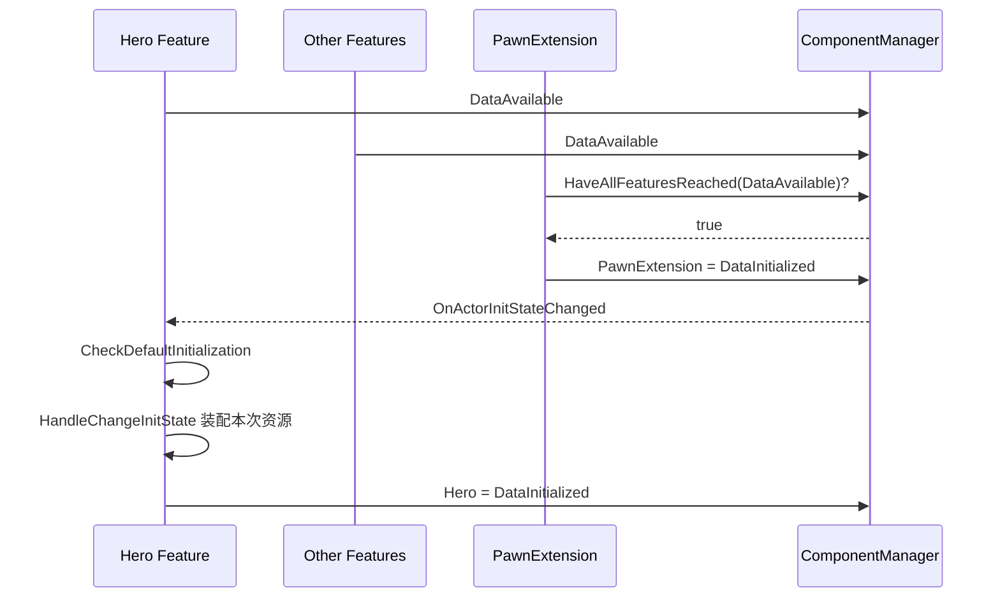
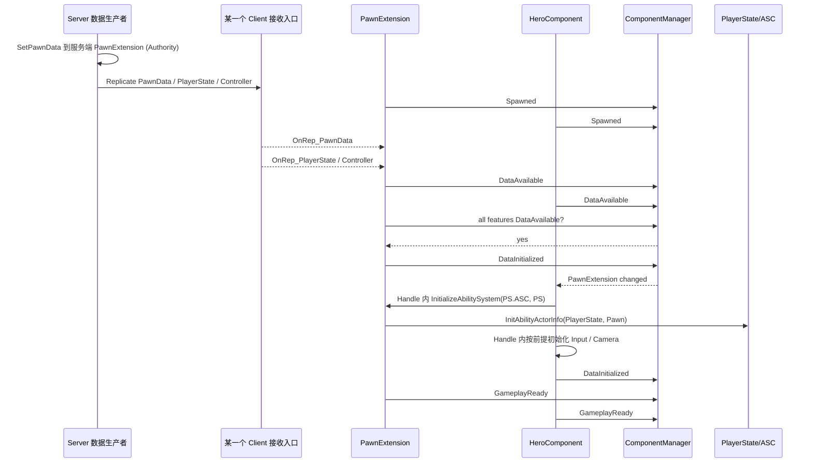

# UE5.8 Lyra 源码解析 41：Pawn 初始化与模块化组件状态机

> Lyra 角色初始化最难的不是某个 API，而是多个复制对象和动态组件可能以不同顺序到达。
> 当前知识成熟度：L2。主要承诺是对本篇历史收录项目代码的逐分支静态分析，并与 2026-10-05 已读取的 Epic 公开文档/API 合同核对；不是当前 UE/Lyra checkout 或运行认证。`verified: []` 保持不变。

**以下引言、元数据表为原历史记录，原字节保留。** 其中“本机”、CL、绝对路径和静态核对完成是旧文自述，不是本次访问到的环境；标题中的 UE5.8 保留既有研究身份。现行结论与修正边界见表后说明。

> 本篇从 `ULyraPawnExtensionComponent` 与 `ULyraHeroComponent` 出发，解释四段 InitState 如何替代 Delay、Tick 轮询和脆弱的 BeginPlay 假设。
> 知识成熟度：L2（本机 UE 5.8 与 Lyra 5.8 源码、配置已静态核对；运行实验作为后续验证步骤）。

## 元数据

| 项目 | 内容 |
| --- | --- |
| 版本基线 | UE 5.8.0 / CL 55116800 / `++UE5+Release-5.8` |
| Lyra 基线 | 本机 `LyraStarterGame.uproject`：`EngineAssociation=5.8` |
| 项目源码根 | `C:\Users\zhaozhiqi\Documents\Unreal Projects\LyraStarterGame` |
| 引擎源码根 | `C:\Program Files\Epic Games\UE_5.8\Engine` |
| 适用范围 | 多人 Pawn 初始化、PlayerState ASC、模块化组件、重生/换 Pawn、复制乱序排障 |
| 知识成熟度 | L2：项目与引擎源码静态核对完成；双端 PIE 实验步骤明确列出但未宣称已执行 |
| 官方参考 | [Game Framework Component Manager](https://dev.epicgames.com/documentation/en-us/unreal-engine/game-framework-component-manager-in-unreal-engine)、[Abilities in Lyra](https://dev.epicgames.com/documentation/en-us/unreal-engine/abilities-in-lyra-in-unreal-engine) |
| 最后更新 | 2026-08-17（补入 ALyraCharacter 与 GameFeatureAction_AddAbilities 实际源码分析） |

### 本次阅读边界与使用方式

- 本次修订日期：2026-10-05 UTC。全文及附录 20 份项目文件均参与静态核对，历史更新日志完整保留；没有把旧日志改写为本次结果
- **公开合同**：Epic 当前 API 页面多数显示 UE5.8，支持接口语义，不认证旧文 CL 55116800。本文没有取得 `GameFrameworkInitStateInterface.cpp` / `GameFrameworkComponentManager.cpp` 完整实现
- **历史实现**：附录代码与正文历史引文是仓库已有材料。可以沿这些语句推导条件和局部顺序，但没有重新认证其外部来源版本、完整工程依赖或可编译性。附录每个“本机/逐字”声明都按历史收录自述阅读
- **教学表示**：字段摘要、重排调用、流程图及纸面追踪会就地标明，不能当作逐字源文件或新完成的生产实现
- **未验证**：没有执行 UE、UHT、UBT、链接、PIE、网络/线程/GC实验、动画资产接线、输入热卸载或性能测试。纸面结果标为 `PAPER_EXPECTED`；仓库文本检查不提升到 L3/L4

阅读目标是能追到“哪个入口重试、哪条边被挡住、谁拥有实际资源、退出时究竟撤销了什么”。四段状态是协调协议，不能取代输入、能力、动画各自的成功条件。

## 一、问题模型：为什么 BeginPlay 不够

一个玩家控制网络 Pawn 的装配可能涉及以下条件；它们分属不同角色和阶段，不能作为对所有 Pawn 一次性求真的统一清单：

- Pawn 自身已经生成并开始游戏；
- 服务器已经选择并设置 `ULyraPawnData`；
- Controller 已 Possess；
- PlayerState 已创建或复制；
- PlayerState 与 Controller 的 Owner 关系正确；
- 本地玩家侧已有 `InputComponent` 和 `ULocalPlayer`；
- GameFeature 动态追加的组件已注册；
- 其他 Feature 已拿到自己的必要数据；
- ASC 的 Owner/Avatar 已初始化；
- 输入、摄像机和扩展输入已经绑定。

这些事件在服务器、Autonomous Proxy 和 Simulated Proxy 上顺序不同。

因此“在 Pawn BeginPlay 一次性初始化全部系统”没有可靠前提。

所存 Lyra 实现让每个命名 Feature 报告本端的初始化阶段，PawnExtension 在当前已登记集合上设置会合点，Hero 再装配相关资源。服务器写数据、客户端收到复制后重新检查，是不同入口；状态推进本身不是仅 Authority 可用，也不自动把两端状态同步。

例如拥有客户端先看到 Pawn、后收到 PlayerState：Hero 的首次检查应停在 Spawned，之后真正的 OnRep/转发才使它重试。反例是 BeginPlay 中无条件取 PlayerState；对象尚未到达时失败，延迟若干毫秒也没有提供该依赖已经成立的证据。

## 二、核心文件地图

| 文件 | 关键内容 |
| --- | --- |
| `System/LyraGameInstance.cpp` | 注册四段全局 InitState 顺序 |
| `Character/LyraPawnData.h` | PawnClass、AbilitySets、InputConfig、相机、Tag 关系 |
| `Character/LyraPawnExtensionComponent.h/.cpp` | 总协调器、PawnData 复制、ASC Owner/Avatar 绑定 |
| `Character/LyraHeroComponent.h/.cpp` | 玩家控制输入、摄像机和 Hero Feature 状态机 |
| `Character/LyraCharacter.h/.cpp` | Controller/PlayerState/Input 回调转发 |
| `Player/LyraPlayerState.h/.cpp` | ASC Owner、PawnData 和持久能力 |
| `AbilitySystem/LyraAbilitySet.h/.cpp` | Ability/Effect/Attribute 授予与撤销句柄 |
| `GameFeatures/GameFeatureAction_AddAbilities.cpp` | 插件按 Actor 动态授予能力与组件 |
| `GameFeatures/GameFeatureAction_AddInputBinding.cpp` | `NAME_BindInputsNow` 扩展输入 |
| 引擎 `GameFrameworkInitStateInterface.cpp` | `TryToChangeInitState`、`ContinueInitStateChain` |
| 引擎 `GameFrameworkComponentManager.cpp` | Feature 状态存储、通知和扩展句柄 |

表中 Lyra 文件以附录 1–20 的相对定位为准；引擎两份 cpp 是后续核对入口，不是已附原件。正文另引用的 `LyraAbilitySystemComponent.cpp` 短片段、`LyraCharacterMovementComponent` 缓存说明也没有完整文件支持，不扩展成其全部实现已核实。

## 三、四段状态在哪里注册

`ULyraGameInstance::Init` 取得 `UGameFrameworkComponentManager`，按顺序注册：

```text
InitState.Spawned
→ InitState.DataAvailable
→ InitState.DataInitialized
→ InitState.GameplayReady
```

注册调用指定“插在某状态前/后”的顺序关系。

这四个 Tag 属于整个 GameInstance 的共享状态字典。

它们不是每个组件的私有枚举；自定义 Feature 必须使用所在 GameInstance 实际登记的 Tag 与顺序。附录 2 的 `Init` 在 Manager 有效时注册这四项，注册状态字典并不等于为任一 Actor/Feature 设置当前状态。

共享顺序使 Component Manager 能判断“已达到该状态或更晚状态”。

## 四、InitState 不是通用玩法状态机

InitState 的特征是：

- 全局注册；
- 本文 Lyra 协议只允许精确相邻边线性前进；
- 以 Feature 为单位；
- 主要协调对象生命周期和数据可用性；
- 支持监听另一个 Feature 到达某状态。

它不适合表达：

- 站立/奔跑/跳跃；
- 武器 Idle/Fire/Reload；
- 回合 Warmup/Playing/PostGame；
- AI Patrol/Chase/Attack。

这些应使用动画状态机、Gameplay Ability、Game Phase 或 StateTree 等系统。

“前进”由项目的 `CanChangeInitState(Current, Desired)` 分支保障，不是 Manager 替所有玩法强制单调的承诺。所存两个组件的未知边、回退和跳跃最终返回 false；重复检查已完成的普通状态链不会再次跨过旧边。若资源后来失效，应进入退出/重建协议，不能只改回一个 Tag 就声称副作用已经回滚。

## 五、Feature 的身份是什么

一个 Actor 可以拥有多个命名 Feature。

实现 `IGameFrameworkInitStateInterface` 的对象通过 `GetFeatureName` 返回身份。

本篇历史收录的两个显式接口实现者（附录 5–8）是：

| 实现 | FeatureName | 职责 |
| --- | --- | --- |
| `ULyraPawnExtensionComponent` | `PawnExtension` | 总协调、PawnData、ASC 桥接 |
| `ULyraHeroComponent` | `Hero` | 玩家输入、摄像机和本地控制 |

其他 GameFeature 动态组件也可实现自己的 Feature。

身份至少要带上 Actor 与稳定的 FeatureName；不同 Actor 的 Hero 不是同一条状态记录。`UPawnComponent` 等框架基类提供便利访问，业务派生类仍需显式实现 `IGameFrameworkInitStateInterface` 并登记，不能仅因继承该基类就算一个 Feature。

PawnExtension 不认识所有具体组件类型，而查询该 Actor **当时已经登记**的 Feature 是否至少 DataAvailable；未登记的必要功能和未来才加入者都不在这次屏障里。

## 六、底层接口如何推进状态

[IGameFrameworkInitStateInterface 公开 API](https://dev.epicgames.com/documentation/en-us/unreal-engine/API/Plugins/ModularGameplay/IGameFrameworkInitStateInterface) 支持如下合同：取得 Actor、Manager 和当前 Feature 状态，询问 `CanChangeInitState(Current, Desired)`；允许后先调用原生 `HandleChangeInitState` 执行副作用，随后报告 Manager、通知观察者。旧文将最后两步写反，现已纠正。

这是有来源支持的偏序：**Can → Handle → Manager 通知**。Handle 不是通知后的补做，也不是返回成功值的事务接口。它返回 void，内部 ensure 失败后早退不构成“取消状态提交”的返回信号；没有完整引擎 cpp，不能再编造内部写状态、队列排空、回滚及跨 Feature 的调用全序。

`ContinueInitStateChain` 沿给定数组尝试可行的后续状态，在门槛拒绝处停止。要继续，必须有 BeginPlay 的首次主动尝试，或后续 OnRep、Controller/Input 建立、依赖通知再次调用 `CheckDefaultInitialization`。只登记 Feature、只让数据变为非空、只等待时间流逝，都不会凭空创建重试事件。

Manager 的状态通知队列避免递归通知，不是用户副作用、扩展事件、注册时即时回调的通用重入锁。开启 InitState 注册的 `bCallImmediately` 时，已有匹配状态可立即回调；先准备本地上下文，不能依赖注册返回后才保存的句柄。对 AddExtensionHandler，本次公开资料没有证明其返回前的精确同步栈，只按潜在外部回调边界设计防护。

同样，[Manager 的 fake multicast/TMap 定义](https://dev.epicgames.com/documentation/en-us/unreal-engine/API/Plugins/ModularGameplay/UGameFrameworkComponentManager)不能推出“注册先后就是调用先后”；[TMap 文档](https://dev.epicgames.com/documentation/en-us/unreal-engine/map-containers-in-unreal-engine)不保证插入序等于迭代序。本篇没有观测具体乱序，也不靠未展示的顺序替依赖门控作证。

## 七、PawnExtension 是无 Tick 协调器

附录 6 的构造配置历史摘录如下，保留原节选排版：

```cpp
PrimaryComponentTick.bStartWithTickEnabled = false;
PrimaryComponentTick.bCanEverTick = false;
SetIsReplicatedByDefault(true);
```

因此它不是靠 Tick 检查依赖。

它依赖下列事件重试：

- `BeginPlay`；
- `OnRep_PawnData`；
- Controller 变化；
- PlayerState 复制；
- InputComponent 完成设置；
- 其他 Feature 状态变化。

精确回调筛选也重要：附录 6 的 PawnExtension 只在“其他 Feature 到 DataAvailable”通知时调用 Check；Hero 则只在 PawnExtension 到 DataInitialized 时重试。它们还有首次 Check 和 Character 转发入口，因此不能把某一个事件监听孤立成万能唤醒器。给新 Feature 增加不同依赖时，应重新核对所等状态与回调过滤是否相匹配。

## 八、PawnExtension 生命周期

### 8.1 OnRegister

`OnRegister` 先确认 Owner 是 Pawn。

随后用 ensure 检查同一个 Pawn 上只有一个 PawnExtension。这些断言表达配置前提，不能当作无效 Owner 的完整容错：所存代码在检查后仍解引用 Pawn。

最后调用 `RegisterInitStateFeature`。

注册发生得早，但此时不强行设置 Spawned。

### 8.2 BeginPlay

`BeginPlay` 的历史删节引文如下，完整注释在附录 6：

```cpp
void ULyraPawnExtensionComponent::BeginPlay()
{
	Super::BeginPlay();

	BindOnActorInitStateChanged(NAME_None, FGameplayTag(), false);
	ensure(TryToChangeInitState(LyraGameplayTags::InitState_Spawned));
	CheckDefaultInitialization();
}
```

监听 `NAME_None` 表示关心该 Actor 上所有 Feature；这里 `bCallImmediately=false`，随后显式尝试 Spawned 并主动检查，不能删掉首次启动而仅等待未来通知。

### 8.3 EndPlay

`EndPlay` 先 `UninitializeAbilitySystem`，再 `UnregisterInitStateFeature`。

这就是所存源码的实际顺序，不能改述为它已先设置 Stopping。ASC 仅在自己仍是 Avatar 时做共享对象清理；若新 Pawn 已接管，只清本组件缓存（第二十节）。`UnregisterInitStateFeature` 负责其初始化监听/登记，不自动移除输入绑定、GameFeature 请求或所有能力。

附录 5/6 没有自定义 OnUnregister 的对称实现，也没有展示同一组件运行中反注册再注册、未 BeginPlay 即退出、流送复入的完整业务恢复合同。因此本篇不把历史实现认证为这些路径均安全；迁移模板必须明确支持边界，见第三十四节。

## 九、PawnData 是角色装配说明

`ULyraPawnData` 是声明为 Const 的角色定义 PrimaryDataAsset。以下是从附录 3 抽出的**字段摘要**，省略 UPROPERTY/注释，不能当作完整头文件：

```cpp
TSubclassOf<APawn> PawnClass;
TArray<TObjectPtr<ULyraAbilitySet>> AbilitySets;
TObjectPtr<ULyraAbilityTagRelationshipMapping> TagRelationshipMapping;
TObjectPtr<ULyraInputConfig> InputConfig;
TSubclassOf<ULyraCameraMode> DefaultCameraMode;
```

它回答五个问题：

1. 生成哪种 Pawn；
2. 该角色基础授予哪些能力集合；
3. Ability Tag 之间如何阻塞/取消；
4. 本地输入如何映射；
5. 默认摄像机模式是什么。

它不保存单个玩家的运行时血量、弹药或会话状态。

## 十、PawnData 的写入规则

`ULyraPawnExtensionComponent::SetPawnData` 有三条硬边界：

1. 输入不得为空；
2. 只有 `ROLE_Authority` 可以设置；
3. 已存在 PawnData 时拒绝覆盖并记录错误。

设置后执行：

```text
PawnData = InPawnData
→ Pawn->ForceNetUpdate()
→ CheckDefaultInitialization()
```

客户端通过 `OnRep_PawnData` 重试状态推进。

这是 PawnExtension 的 OnRep；PlayerState 的同名 OnRep 在附录 12 中为空，不能混为同一条回调。`ForceNetUpdate` 是请求及时复制的入口，不保证各连接同时拿到 PawnData、PlayerState、Controller，更不保证它们按本表顺序到达。

“一次设置”让初始化定义保持稳定。

如果产品需要运行中换职业，应设计明确的换 Pawn 或重新装配协议，而不是直接覆盖该字段。

## 十一、Spawned → DataAvailable：PawnExtension 门槛

PawnExtension 的 `CanChangeInitState` 在该过渡检查：

- PawnData 必须存在；
- 若 Pawn 有 Authority 或本地控制，Controller 必须存在；
- Simulated Proxy 不要求本地 Controller。

角色矩阵如下：

| 视角 | PawnData | Controller | 原因 |
| --- | --- | --- | --- |
| 服务器 Authority Pawn | 必须 | 必须 | 权威生成和能力归属 |
| Autonomous Proxy | 必须 | 必须 | 本地输入和 PlayerState 配对 |
| Simulated Proxy | 必须 | 不要求本地 Controller | 远端代理不拥有输入 |

这正是不能写一个统一 `if (Controller == nullptr) return` 的原因。

## 十二、DataAvailable → DataInitialized：全 Feature 会合

PawnExtension 的会合表达式（由附录 6 重排换行，保留实际 Tag 命名空间）：

```cpp
Manager->HaveAllFeaturesReachedInitState(
    Pawn,
    LyraGameplayTags::InitState_DataAvailable);
```

查询仅检查**当时已经登记在该 Actor 上的集合**。例如 Ext 与 Hero 在 DataAvailable，已登记的 Extra 仍在 Spawned，这次会合为 false；Extra 达到 DataAvailable 并触发重试后才可继续。这使屏障前加入的动态组件能够参与会合，而无需 Pawn 硬编码类型。

有两个不同反例：必要 Feature 根本没登记，Manager 不知道还缺它，不能替业务等它；Ext/Hero 已经过屏障后才登记 Extra，也不会自动回退或撤销原有 ASC/输入副作用。晚加入功能必须规定自己的依赖、追加和移除协议。需要全体重新装配的项目应另建参与期，而不是期待旧 Ready 追溯失效。

排障时只有“屏障尚未通过，且阻塞者已在集合中”才可推导它会挡住 Ext；必须同时记录注册集合、各状态和检查发生时点。

## 十三、DataInitialized → GameplayReady

附录 6 中 PawnExtension 对精确的 DataInitialized → GameplayReady 直接返回 true。

它的 `HandleChangeInitState` 在 DataInitialized 没有执行主要副作用。

真正的 ASC、输入和摄像机初始化由监听该状态的 HeroComponent 完成。

这体现“协调器通过数据会合，具体 Feature 执行职责”的分工。PawnExtension 自身到 GameplayReady 不是“Hero 和未来所有扩展已经成功绑定全部资源”的证明；Hero 的最后一条边在附录 8 也直接 true，并保留能力初始化检查的 TODO。验收必须核具体资源，不能只看最高 Tag。

## 十四、HeroComponent 的职责边界

附录 7 的历史类注释将 HeroComponent 定位为：

> 为玩家控制 Pawn（以及模拟玩家的机器人）设置输入和摄像机，并依赖 PawnExtension 协调初始化。

它不负责：

- 选择 Experience；
- 创建 PlayerState；
- 保存 ASC；
- 执行最终伤害；
- 保存 Inventory。

它负责：

- 判断本地输入依赖是否齐全；
- 把 PlayerState ASC 与 Pawn Avatar 对接；
- 建立基础输入映射和 Ability InputTag 绑定；
- 发送 `NAME_BindInputsNow` 让插件追加输入；
- 绑定默认/能力覆盖的摄像机模式。

## 十五、Hero 的 Spawned → DataAvailable 门槛

HeroComponent 检查：

1. 所有分支先要求 `GetPlayerState<ALyraPlayerState>()` 有效
2. 仅当 LocalRole 不是 SimulatedProxy，要求 Controller、其 PlayerState 非空，且 `Controller->PlayerState->GetOwner() == Controller`
3. 仅当 Pawn 本地控制且不是 Bot，再要求 Pawn InputComponent、`ALyraPlayerController` 及其 LocalPlayer

这是附录 8 的嵌套判断，不能扁平化为所有视角都需要 LyraPC/LocalPlayer。远端 Simulated 的 PlayerState 仍必须存在，但跳过非 Simulated 的 Controller 配对分支；服务器 Bot/非本地 Pawn 不因没有 LocalPlayer 被本地非 Bot 门槛挡住。

### 15.1 为什么检查 PlayerState Owner

只判断 `Controller->PlayerState != nullptr` 不够。

Hero 还检查：

```text
Controller->PlayerState->GetOwner() == Controller
```

这检查 Controller 一侧 PlayerState 的 Owner 配对。它没有显式比较前一步从 Pawn 获取的 PlayerState 与 `Controller->PlayerState` 指针相等，不能把说明升级成源码未做的更强相等验证。

### 15.2 为什么 Bot 不需要 LocalPlayer

Bot 可以使用玩家式 Hero 组件和能力，但没有真实本地设备与 LocalPlayer。

所以本地输入门槛显式排除 Bot。

## 十六、Hero 的 DataAvailable → DataInitialized 门槛

Hero 等待：

- `ALyraPlayerState` 有效；
- PawnExtension Feature 已达到 `DataInitialized`。

这看起来像循环：PawnExtension 又在等待所有 Feature DataAvailable。

在前置数据满足且有重试入口的情况下，一条可行轨迹是：

1. Hero 到 DataAvailable；
2. 其他 Feature 到 DataAvailable；
3. PawnExtension 发现全部 DataAvailable，进入 DataInitialized；
4. Hero 收到 PawnExtension 状态通知；
5. Hero 才进入自己的 DataInitialized。



这里的依赖跨越不同阶段，因而有可行前缀。若错误地把 Hero 进入 DataAvailable 也改成等 Ext.DataInitialized，就变成 Ext 等 Hero.DataAvailable、Hero 又等 Ext.DataInitialized 的真环；通知再多也不会创造可推进边。图只表示一端的可能轨迹，不声明两个 Feature 的所有回调有固定全序。

## 十七、DataInitialized 过渡执行什么

HeroComponent 在 `DataAvailable → DataInitialized` 中执行核心装配。

### 17.1 取 Pawn 和 PlayerState

两者都必须有效，否则 `ensure(Pawn && LyraPS)` 失败后提前返回。由于 Handle 返回 void，不能把这个 return 说成完整事务回滚或保证本次状态绝不通知；因此资源检查与状态检查必须分开。

### 17.2 从 PawnExtension 取 PawnData

Hero 不保存自己的重复 PawnData 指针。

它通过协调器取得同一事实源。

### 17.3 初始化 ASC

下列为附录 8 的**重排调用示意**，不是完整 Handle；只有找到 PawnExtension 的分支才调用：

```cpp
PawnExtComp->InitializeAbilitySystem(
    LyraPS->GetLyraAbilitySystemComponent(),
    LyraPS);
```

这里：

- ASC 实例来自 PlayerState；
- OwnerActor 是 PlayerState；
- AvatarActor 是当前 Pawn。

### 17.4 初始化本地输入

实际外层条件是能取得 `ALyraPlayerController` 且 Pawn InputComponent 非空，然后调用 `InitializePlayerInput`。该函数内部又检查 PC、LyraLocalPlayer、EnhancedInput 子系统；这些是契约前提，不是 Handle 中一个“全成功”返回值。

典型远端 Simulated 没有本地输入上下文，不应做本地输入装配；不能从这个典型网络视角反推外层源码已经写了 `IsLocallyControlled`/Bot 的显式 guard。

### 17.5 绑定摄像机模式

若 PawnData 有效并能找到 `ULyraCameraComponent`，将 DetermineCameraMode Delegate 绑定到 Hero。

这条摄像机分支没有仅限本地 Pawn，原注释明确用于以后观战；绑定委托不等于立即把每个 Pawn 设为活动相机。`DetermineCameraMode` 优先返回能力覆盖模式，否则从 PawnData 取默认模式；清覆盖还检查拥有该覆盖的 AbilitySpecHandle，避免旧能力清掉后来者。

所以 ASC、输入、摄像机是三个带前提的副作用分支。任一配置缺失时都不能仅凭 Hero 已到 DataInitialized 宣称三者无条件同时成功。

## 十八、为什么 ASC 放 PlayerState

`ALyraPlayerState` 构造时创建 `ULyraAbilitySystemComponent`。

ASC 开启复制，并使用 `EGameplayEffectReplicationMode::Mixed`。

PlayerState 还持有基础 AttributeSet。

设计收益：

- Pawn 死亡时 ASC 可以继续存在；
- 重生后只更换 Avatar；
- 切换 Pawn 时保留玩家级能力、属性或效果；
- PlayerState 本来就是多人玩家持久复制身份。

设计代价：

- 交接时保持 Owner/Avatar 与 Controller 信息正确，不能把每次 UnPossessed 等同反初始化；
- Pawn 专属能力必须能撤销；
- 客户端可能短暂同时看到旧 Pawn 和新 Pawn；
- 获取 ASC 不能只在 Pawn 上 FindComponent。

“长寿命”相对于 Pawn 死亡/替换，不是永远存在：附录 12 的 PlayerState 断线策略仍可 Destroy。Mixed 是所存构造配置，不证明每种客户端能同时读到所有属性、能力和效果。持久资源由其授予者管理，Pawn 的 Avatar 解绑没有拿到这些来源的全部撤销账。

## 十九、InitializeAbilitySystem 的精确语义

按附录 6 所存 `InitializeAbilitySystem`，在有效 Pawn/ASC/Owner 的工程前提下可追踪以下局部顺序：

1. 校验 ASC 和 OwnerActor；
2. 相同 ASC 已初始化则直接返回；
3. 当前有其他 ASC 时先反初始化；
4. 读取 ASC 当前 Avatar；
5. 若 ExistingAvatar 非空且不是当前 Pawn，检查旧 Avatar 交接；
6. 缓存新 ASC；
7. `InitAbilityActorInfo(InOwnerActor, Pawn)`；
8. 从 PawnData 设置 TagRelationshipMapping；
9. 广播 `OnAbilitySystemInitialized`。

相同 ASC 的早退只比较缓存指针，不会重新检查 Owner/Avatar、重设 TagRelationship 或重新广播；不能当作修复任意失配的“重装”入口。`ensure(PawnData)` 失败只跳过关系映射，后面的初始化广播仍在该条件之外。Character 订阅此广播后连接 HealthComponent 并刷新移动模式 Tag，说明 Health 的桥接不要求它自动成为 InitState Feature。

### 19.1 旧 Avatar 重叠

源码明确说明一种客户端延迟场景：

新 Pawn 已生成并被 Possess，但死亡的旧 Pawn 还没被移除。

如果 ASC 仍指向非当前 Pawn 的旧 Avatar，且能找到其 PawnExtension，才调用那个组件的 `UninitializeAbilitySystem`。

`ensure(!ExistingAvatar->HasAuthority())` 表达“不应让两个权威 Pawn 争用”的设计预期，而不是遇到权威旧 Avatar 就提前 return 的防护。当前片段仍继续查旧 Extension；本次没有并发/网络实验来证明所有交接顺序都被覆盖。

## 二十、UninitializeAbilitySystem 的边界

有缓存 ASC 且其 Avatar 仍等于本组件 Owner 时，才执行下面共享 ASC 清理分支；“完整”仅指此分支列出的动作，不是撤销所有玩法资源。

清理包括：

1. 取消能力，但忽略带 `Ability.Behavior.SurvivesDeath` 的类型；
2. 清空能力输入缓存；
3. 调用 `RemoveAllGameplayCues`；当前[官方 UAbilitySystemComponent 父页](https://dev.epicgames.com/documentation/en-us/unreal-engine/API/Plugins/GameplayAbilities/UAbilitySystemComponent)将其范围限定为独立添加、不是 GameplayEffect 组成部分的 Cue，不能据此断言 GE 关联 Cue 或全部外部表现清零；
4. OwnerActor 仍有效时只把 Avatar 设空；
5. OwnerActor 无效时清空整个 ActorInfo；
6. 在该 Avatar 守卫内部广播 Uninitialized。

最后不论 Avatar 是否仍属于自己，都清空本组件缓存指针；若一开始就无缓存则直接返回。

附录 6 能直接证明的是历史实现调用了 RemoveAllGameplayCues；上面的效果范围来自 2026-10-05 成功读取的当前官方父页对应条目，未反向认证旧 CL 的完整 GAS 实现。独立方法页此次 Cache miss，不作为成功来源。

“SurvivesDeath”体现了 Owner/Avatar 分离的价值：

一些 PlayerState 级能力可以跨 Pawn 死亡存活。

还要区分取消能力、清理输入缓存/GameplayCue、撤销 AbilitySpec、移除 GameplayEffect、移除 AttributeSet。这里没有遍历所有授予句柄，也不销毁 PlayerState ASC；不能把 CancelAbilities 说成 TakeFromAbilitySystem。

反例：A 缓存 ASC，但 ASC.Avatar 已为新 Pawn B。A 此后退出会跳过共享清理与 Uninitialized 广播，只将 A 的缓存设空；B 的 Avatar 关系保持。若 Avatar 仍为 A，且 Owner 非空，则只清 Avatar；Owner 为空才走 ClearActorInfo。

## 二十一、ALyraCharacter 如何转发生命周期事件

Character 不自己复制一套初始化状态机。

它把关键事件转给 PawnExtension：

| Character 回调 | PawnExtension 动作 |
| --- | --- |
| `PossessedBy` | `HandleControllerChanged` |
| `UnPossessed` | `HandleControllerChanged`；另解绑旧 Controller 队伍委托 |
| `OnRep_Controller` | `HandleControllerChanged` |
| `OnRep_PlayerState` | `HandlePlayerStateReplicated` |
| `SetupPlayerInputComponent` | `SetupPlayerInputComponent` |

这样无论服务器本地回调还是客户端 OnRep，最终都回到同一个 `CheckDefaultInitialization`。

附录 6 的 `HandleControllerChanged` 在“缓存 ASC 仍以该 Pawn 为 Avatar”时检查 Owner：Owner 为空才 Uninitialize，否则调用 RefreshAbilityActorInfo，然后 Check。故 UnPossessed 通常是刷新/重试路径，不恒等于清空 Avatar；死亡、EndPlay、新 Pawn 接管是另外的显式反初始化入口。

### 21.1 源码补全：角色本体的转发、死亡和快速复制

前文不能只把 `ALyraCharacter` 当成“回调转发器”。它还承担死亡收尾、移动模式 Tag 和 FastSharedReplication 三类实际职责。下面保留 `LyraCharacter.cpp` 的历史删节引文；完整所存文本见附录 10，不能重新签认为本机当前实现：

```cpp
void ALyraCharacter::PossessedBy(AController* NewController)
{
	const FGenericTeamId OldTeamID = MyTeamID;

	Super::PossessedBy(NewController);
	PawnExtComponent->HandleControllerChanged();

	if (ILyraTeamAgentInterface* ControllerAsTeamProvider = Cast<ILyraTeamAgentInterface>(NewController))
	{
		MyTeamID = ControllerAsTeamProvider->GetGenericTeamId();
		ControllerAsTeamProvider->GetTeamChangedDelegateChecked().AddDynamic(this, &ThisClass::OnControllerChangedTeam);
	}
	ConditionalBroadcastTeamChanged(this, OldTeamID, MyTeamID);
}

void ALyraCharacter::OnRep_PlayerState()
{
	Super::OnRep_PlayerState();
	PawnExtComponent->HandlePlayerStateReplicated();
}

void ALyraCharacter::SetupPlayerInputComponent(UInputComponent* PlayerInputComponent)
{
	Super::SetupPlayerInputComponent(PlayerInputComponent);
	PawnExtComponent->SetupPlayerInputComponent();
}
```

这段代码说明：服务器 `PossessedBy`、客户端 `OnRep_PlayerState` 和输入组件建立并不是三套初始化逻辑；它们都把事件交给 `PawnExtComponent`，由同一套 InitState 门控继续推进。`PossessedBy` 还同步 Controller 的队伍委托，避免 Pawn 自己维护一份会漂移的队伍来源。

死亡路径也不是简单立即 `Destroy()`。OnDeathStarted 调 DisableMovementAndCollision；其中有 Controller 时只忽略移动输入，随后禁用胶囊碰撞、停止并禁用移动。OnDeathFinished 安排下一 tick 的 DestroyDueToDeath，后者先触发 K2_OnDeathFinished 再 UninitAndDestroy。以下为对应历史删节引文：

```cpp
void ALyraCharacter::OnDeathStarted(AActor*)
{
	DisableMovementAndCollision();
}

void ALyraCharacter::OnDeathFinished(AActor*)
{
	GetWorld()->GetTimerManager().SetTimerForNextTick(this, &ThisClass::DestroyDueToDeath);
}

void ALyraCharacter::UninitAndDestroy()
{
	if (GetLocalRole() == ROLE_Authority)
	{
		DetachFromControllerPendingDestroy();
		SetLifeSpan(0.1f);
	}

	if (ULyraAbilitySystemComponent* LyraASC = GetLyraAbilitySystemComponent())
	{
		if (LyraASC->GetAvatarActor() == this)
		{
			PawnExtComponent->UninitializeAbilitySystem();
		}
	}

	SetActorHiddenInGame(true);
}
```

这里的 `GetAvatarActor() == this` 是关键保护：如果共享 ASC 已转向新 Pawn，旧 Pawn 的死亡收尾不调用此反初始化；PawnExtension 自己的 EndPlay 再以同类守卫保护共享 ASC。权威端 Detach 后设置 0.1 秒 lifespan，各端隐藏 Actor；这不等于当前栈中已经释放对象内存。

下列为附录 10 的**教学压缩/重排片段**，保留移动 Tag 与共享移动更新的用途，省略注释与上下文，不是逐字文件：

```cpp
void ALyraCharacter::SetMovementModeTag(EMovementMode MovementMode, uint8 CustomMovementMode, bool bTagEnabled)
{
	if (ULyraAbilitySystemComponent* LyraASC = GetLyraAbilitySystemComponent())
	{
		const FGameplayTag* MovementModeTag = nullptr;
		if (MovementMode == MOVE_Custom)
		{
			MovementModeTag = LyraGameplayTags::CustomMovementModeTagMap.Find(CustomMovementMode);
		}
		else
		{
			MovementModeTag = LyraGameplayTags::MovementModeTagMap.Find(MovementMode);
		}

		if (MovementModeTag && MovementModeTag->IsValid())
		{
			LyraASC->SetLooseGameplayTagCount(*MovementModeTag, bTagEnabled ? 1 : 0);
		}
	}
}

bool ALyraCharacter::UpdateSharedReplication()
{
	if (GetLocalRole() == ROLE_Authority)
	{
		FSharedRepMovement SharedMovement;
		if (SharedMovement.FillForCharacter(this))
		{
			if (!SharedMovement.Equals(LastSharedReplication, this))
			{
				LastSharedReplication = SharedMovement;
				SetReplicatedMovementMode(SharedMovement.RepMovementMode);
				FastSharedReplication(SharedMovement);
			}
			return true;
		}
	}
	return false;
}
```

移动模式变化时，`OnMovementModeChanged` 先清旧模式 Tag 再设新模式 Tag；`InitializeGameplayTags` 会清理映射表里的旧 Pawn 遗留计数后设当前模式，蹲伏在 OnStart/OnEndCrouch 另设 Status_Crouching。Tag 不在映射表、无效或 ASC 尚未连接时，这段不写入。

FastShared 的窄结论是：Authority 且 FillForCharacter 成功时，比较位置、旋转、线速度、移动模式、跳跃力、蹲伏字段；变化才生成一次新的 FastSharedReplication 调用，未变化也可返回 true。Equals 没比较时间戳，不能称“比较了所有字段”。附录 9 声明该 RPC 为 unreliable；附录 10 接收实现跳过 replay，只在 SimulatedProxy 分支应用移动/蹲伏等状态。

源码注释还谈旧 bunch 的复用，但这里没有网络驱动、ReplicationGraph 和每连接完整执行证据。不能由“未生成新调用”推导所有连接都不再发送、可靠抵达、迟到者持久重播或任何生产带宽数字。

## 二十二、PlayerState 的 PawnData 与能力授予

`ALyraPlayerState` 在 Experience Loaded 后由 GameMode 取得对应 PawnData，并调用 `SetPawnData`。

该操作只应在 Authority 执行，且 PawnData 不应重复覆盖。

PlayerState 遍历非空 `AbilitySets` 条目；下面是附录 12 的**重排调用摘要**，第二参 nullptr 表示不向调用者返回该次授予账：

```cpp
AbilitySet->GiveToAbilitySystem(
    AbilitySystemComponent,
    nullptr);
```

这些更偏“玩家角色定义随 PlayerState 持有”的能力。

GameFeature 或 Equipment 临时授予通常会保存 `FLyraAbilitySet_GrantedHandles`，以便卸载时撤销。

是否保存句柄取决于授予来源生命周期。

附录 12 在写入 PawnData、授予后发送 `NAME_LyraAbilityReady`（实际 FName 为 LyraAbilitiesReady），并 ForceNetUpdate；其 `OnRep_PawnData` 为空。客户端不会因此再次权威授予。`PostInitializeComponents` 先以 PlayerState 与当时 GetPawn 初始化 ActorInfo，非客户端游戏世界再订阅 ExperienceLoaded；后续 Hero 桥接实际 Pawn Avatar。

传 nullptr 仍会授予，只是本调用者不取得 FLyraAbilitySet_GrantedHandles，不能再声称 PawnExtension 能按这份空账撤回全部 PlayerState 默认能力。临时来源与持久来源的结束时点必须分开。

## 二十三、AbilitySet 为什么保存三类句柄

`FLyraAbilitySet_GrantedHandles` 记录：

- `FGameplayAbilitySpecHandle`；
- `FActiveGameplayEffectHandle`；
- 动态创建的 AttributeSet 指针。

`TakeFromAbilitySystem` 只能在 Owner Authority 执行。

它依次：

1. `ClearAbility`；
2. `RemoveActiveGameplayEffect`；
3. `RemoveSpawnedAttribute`；
4. 清空本地句柄数组。

附录 14 的 Give 同样检查 Owner Authority：按 AttributeSet、Ability、Effect 顺序创建/授予；无效配置记录错误并跳过，AbilitySpec 带 SourceObject、等级和 InputTag。只有提供 OutGrantedHandles 才记录对应资源，有效能力/效果句柄才进入账本。

这是一种按来源撤销的模式，不是成功事务保证：部分配置可被跳过，非权威 Take 会提前返回且不清账。取回只处理这份账拥有的三类资源，不能代替输入 callback、MappingContext、Avatar 或其他来源的清理。各引擎移除 API 对正在运行能力和外部效果的完整语义仍需目标版本验证。

## 二十四、基础输入初始化

附录 8 的局部顺序是：检查传入 InputComponent；取得 Pawn（无 Pawn 则 return）；检查 PlayerController、`ULyraLocalPlayer` 与 EnhancedInputLocalPlayerSubsystem；调用 `ClearAllMappings()`；随后才进入 PawnExtension → PawnData → InputConfig 的嵌套分支。check 是工程前提断言，不是缺配置时的恢复方案；清映射发生在确认 InputConfig 之前。

有 InputConfig 时遍历 DefaultInputMappings，同步加载 IMC。**UserSettings.RegisterInputMappingContext 和 Subsystem.AddMappingContext 都在 `Mapping.bRegisterWithSettings` 为 true 的同一分支里**；UserSettings 不存在可跳过注册，但 AddMappingContext 仍在该 flag 内调用。IMC 加载有效而 flag=false 时，这条路径既不登记也不 Add，不能按变量名猜成“只跳过设置登记”。其他来源是否有该 IMC 是另一问题。

之后 Cast 到 `ULyraInputComponent`，成功才 AddInputMappings、BindAbilityActions，以及绑定原生 Move/LookMouse/LookStick/Crouch/AutoRun。这里 BindHandles 是局部数组；本文未取得 ULyraInputComponent 完整文件，不能伪造其内部 action 数量和每项成功日志。

最后的 bReadyToBindInputs 与两次事件发送位于上述配置/类型分支之外。因此在前置 PC/LP/Subsystem 有效时，即使 PawnData/InputConfig 缺失或 LyraIC cast 失败，也可能 ready=true 且发送事件，而目标绑定根本未建立。`ClearAllMappings` 清映射语境，不等于清空 UEnhancedInputComponent 中所有 action callbacks。

## 二十五、NAME_BindInputsNow 为什么必要

`InitializePlayerInput` 走到末尾时执行如下局部顺序，不能把“走到末尾”换成“所有基础绑定成功”：

```text
bReadyToBindInputs = true
→ 向 PlayerController 发送 BindInputsNow
→ 向 Pawn 发送 BindInputsNow
```

所存代码只在 ensure(!bReadyToBindInputs) 通过时写 true，但两次事件发送在该 if 之外；重复进入此函数也不能仅靠这个 ensure 推导不会再次发送。

GameFeature 输入 Action 可能：

- 在 Pawn 出现前已激活；
- 在 Pawn 出现后才激活；
- 在基础输入准备前收到 ExtensionAdded；
- 在基础输入准备后收到 BindInputsNow。

`UGameFeatureAction_AddInputBinding::HandlePawnExtension` 同时处理：

- `ExtensionAdded`；
- `BindInputsNow`；
- `ExtensionRemoved`；
- `ReceiverRemoved`。

完整追加入口为：Action 激活建立 ChangeContext 账 → AddToWorld 检查游戏 World/GameInstance → 注册 APawn 类扩展 handler 并持有请求句柄 → HandlePawnExtension 按事件分流 → 从 Pawn 当前 Controller 取 LocalPlayer/InputSystem → 找 Hero 且 ready → 遍历 `InputConfigs` 中 `Entry.Get()` 已加载者 → AddAdditionalInputConfig。此路径不是 LoadSynchronous，未加载条目会被跳过。

扩展事件本身不保存全部过去通知供未来监听者重播；迟到处理依赖加入通知后的状态查询和项目约定的补偿入口。

早到的 ExtensionAdded 可以先因 ready=false 不绑定，后续 BindInputsNow 再尝试；晚激活可在加入通知中查询现有 ready。这只接通了重试入口，不保证 exactly-once 或必定成功。所存 AddInputMappingForPlayer 在绑定之后才 `PawnsAddedTo.AddUnique(Pawn)`，没有先判断 Pawn 已在表中而拒绝追加；而且只要 LP/InputSystem 满足，即使 Hero 不存在或不 ready，也可能登记该 Pawn。

因此同一 context、Pawn 和有效已加载 InputConfig，先 ExtensionAdded 再 BindInputsNow，两次都可能到 BindAbilityActions，PawnsAddedTo 仍只有一个 Pawn。这是入口次数与账本数量的纸面推导，不是已运行的重复键响应或实际 binding 条数观测。

## 二十六、扩展输入的清理

附录 18 的 Action 按 ChangeContext 保存 ExtensionRequestHandles 与 Pawn 弱引用；弱引用追踪表不拥有实际 bindings。Reset 先 Empty 扩展请求数组，再逐个处理剩余 Pawn：有效者进 RemoveInputMapping，无效者 Pop。RemoveInputMapping 重新找当前 Controller/LP/InputSystem/Hero，对仍已加载的配置调用 RemoveAdditionalInputConfig，最后移除 Pawn 记录。找不到这些对象时也会删记录。

**实际卸载缺口**：附录 8 的 AddAdditionalInputConfig 把 BindHandles 放在局部数组，返回后没有持久保存撤销 ID；RemoveAdditionalInputConfig 函数体只有 `//@TODO: Implement me!`。所以外层“调用 Remove 并删账”没有在这条链解绑实际输入，不能声称追加/移除对称、切换 Experience 已无残留或热重激活验证完成。组件最终销毁是否另有清理也是另一个生命周期，不能据此反向断言生产环境永久泄漏。

释放请求句柄可能引出扩展移除处理；即使通知先消费了 Pawn 账，Reset 仍只处理其剩余项。本次未读完整 Manager 实现，不给释放/通知/销毁的精确全序，也不把清空保存 TSharedPtr 的数组当成撤掉外部仍持有的所有共享引用；单个 shared pointer 的释放操作是 Reset，不是虚构 handle 自身的 Empty/Release 方法。

| 资源 | 身份/持有者 | 应核的撤销入口 | 不能替代的工作 |
| --- | --- | --- | --- |
| 扩展/组件请求 handle | Action + ChangeContext 的 shared handle | 最后共享持有者释放关联请求；组件请求的同类键另有引用计数 | 不自动代表输入和能力已撤销 |
| MappingContext 激活 | LocalPlayer 输入子系统 + IMC/来源 | 按目标工程策略 RemoveMappingContext | 不代表 action callback 已解绑 |
| UserSettings 登记 | 输入设置对象中的 IMC 注册 | 按配置寿命及目标版本登记策略回收 | 不等于当前激活态或 callback |
| action binding | 实际 InputComponent 实例 + 每次创建的 handle | 仅移除本来源拥有的 binding handle | 不能只清 PawnsAddedTo |
| AbilitySpec / Effect / AttributeSet | 授予来源 + ASC + 各类句柄/对象 | 各自 Give/Take 或 Action 的对应 API | 不由 UnregisterFeature/清 Avatar 代办 |

[RemoveBindingByHandle 公开 API](https://dev.epicgames.com/documentation/en-us/unreal-engine/API/Plugins/EnhancedInput/UEnhancedInputComponent/RemoveBindingByHandle)提供按句柄删除绑定的入口，但它的存在不能补全历史 TODO。[EnhancedInput 子系统接口](https://dev.epicgames.com/documentation/en-us/unreal-engine/API/Plugins/EnhancedInput/IEnhancedInputSubsystemInterface)的 RemoveMappingContext 是另一层资源。

项目改进合同应在绑定前建立 context/参与期、receiver、InputComponent 实例、config/来源的幂等键；保存实际生成的 handles，退出先禁止新工作，再只撤销该来源资源。不要在卸载时根据新 Controller 猜原 InputComponent。若绑定期间请求退出，必须先满足第三十四节的窄前提：相关完整 Manager 外层栈内不能同步物理移除对象；晚返句柄仍归原参与记录，实际解除等待整个相关栈退出后的合法接收点。仅当前绑定调用返回不够。这里是待实现/验证的工程建议，历史源文件没有被改成一个不存在的完整方案。

## 二十七、角色初始化时序图



图中 Ext/Hero/Manager 是同一被观察端的对象；Authority 一侧也有自己的状态链，未画成与客户端共享一个 Manager。复制箭头不保证到达顺序，Ext 与 Hero 最后 Ready 的相对次序也只是可能排列。图的结论受“所有必需参与者已登记、数据最终有效且有实际重试、没有依赖环”的前提约束；Handle 副作用在本 Feature 通知之前。

## 二十八、角色视角矩阵

| 初始化事项 | Authority | Autonomous Proxy | Simulated Proxy |
| --- | --- | --- | --- |
| 设置 PawnData | 是 | 否，接收复制 | 否，接收复制 |
| 要求 Controller | 是 | 是 | 否 |
| 要求 LocalPlayer/Input | Dedicated 无；Listen 本地玩家需要 | 是 | 否 |
| 初始化 ASC ActorInfo | 是 | 是 | 是，用于复制表现/标签 |
| 绑定本地输入 | Listen 本地玩家可能 | 是 | 否 |
| 权威授予 AbilitySet | 是 | 否 | 否 |
| 摄像机模式委托装配 | 有 PawnData/Camera 可绑定 | 同前 | 同前，为以后观战准备 |
| 立即成为活动摄像机 | 另由当前视角选择 | 另由当前视角选择 | 不由此绑定自动决定 |

不要把“客户端”视为单一角色。

Autonomous Proxy 和 Simulated Proxy 的初始化条件不同。

本表为常见视角摘要，具体条件以第十一、十五、十七节源码分支为准；Bot 排除的是本地非 Bot 输入前提，不是所有 InitState 或 ASC 操作。初始化 ActorInfo 也不承诺远端此刻已有全部 Tag/Attribute。

## 二十九、为什么不用 Tick 或 Delay

固定 Delay 有四个问题：

1. 网络环境变化时不可靠；
2. 快机器白等，慢机器仍失败；
3. 无法说明究竟缺哪个依赖；
4. 多个组件各自 Delay 会形成组合竞态。

在本例里无必要地每帧轮询会增加以下代价，但不能把所有 Tick 使用都判为错误：

- 每帧浪费检查；
- 依赖隐式；
- 初始化完成后还需正确禁用；
- 很难处理 Feature 动态增加和移除。

InitState 把依赖门槛写在 `CanChangeInitState`，把副作用写在 `HandleChangeInitState`，把重试绑定到真实事件。

如果数据生产者没有可订阅事件，项目仍要选择明确的有限重试/轮询或超时策略；本篇未提供该实现。事件驱动本身不修复循环依赖、丢掉的首次 kick、错误过滤或长期缺失配置。停在可诊断状态比无限 Delay 后假报 ready 更可控。

## 三十、排障：状态卡在哪里

### 30.1 卡在 Spawned 前

检查：

- 组件是否位于 Game World；
- `OnRegister` 是否成功；
- Owner 是否是 Pawn；
- BeginPlay 是否执行。

### 30.2 PawnExtension 卡在 Spawned

检查：

- PawnData 是否为空；
- Authority 是否调用 SetPawnData；
- Autonomous/Authority 是否已有 Controller。

### 30.3 Hero 卡在 Spawned

检查：

- PlayerState 是否复制；
- Controller 与 PlayerState Owner 是否配对；
- 本地玩家是否已有 InputComponent、LyraPlayerController 和 LocalPlayer。

### 30.4 PawnExtension 卡在 DataAvailable

枚举 Actor 上所有已注册 Feature。

找到尚未 DataAvailable 的 Feature，再检查它自己的门槛。

不要只盯 PawnExtension。

还要核必需 Feature 是否根本没有登记，以及它是否在屏障通过后才加入；查询中看不见某个缺席者不等于业务完整。

### 30.5 Hero 卡在 DataAvailable

检查 PawnExtension 是否已经 DataInitialized。

若没有，回到上一项找卡住的其他 Feature。

### 30.6 到 GameplayReady 但无输入

检查：

- `DefaultInputComponentClass` 是否仍为 `ULyraInputComponent`；
- PawnData InputConfig 是否有效；
- `InitializePlayerInput` 是否执行；
- `bReadyToBindInputs` 是否变为 true；
- `NAME_BindInputsNow` 是否被发送；
- 该 IMC 是否加载，且所存路径的 bRegisterWithSettings 是否为 true；
- 实际 LocalPlayer 子系统是否仍安装目标 MappingContext；
- 当前 InputComponent 上是否有目标 action callbacks，是否出现同配置重复绑定；
- 卸载是否真的持有并移除了绑定句柄，而不是仅看到 Pawn 账为空。

## 三十一、建议日志字段

每次状态变化至少打印：

```text
World
NetMode
Actor
LocalRole / RemoteRole
IsLocallyControlled
FeatureName
CurrentState → DesiredState
PawnData
Controller
PlayerState
InputComponent
ASC Owner / Avatar
```

再加参与期/ChangeContext、此次等待条件、已登记 Feature 集合、实际 InputComponent 身份、IMC 与 action handle 账、授予来源及撤销结果。状态日志、请求句柄数、bindings 数、AbilitySpec/GE/Attribute 数各自记录，不能共用一个“已清理”布尔值。这里是建议字段，没有生成运行日志。

只打印“初始化失败”没有排障价值。

## 三十二、静态验证命令

**历史命令示例，未在本次执行。** 下列旧机器路径与命令保留原字节，只说明原先如何定位符号，不认证这些目录在当前环境存在：

```powershell
$Lyra = 'C:\Users\zhaozhiqi\Documents\Unreal Projects\LyraStarterGame'
$UE = 'C:\Program Files\Epic Games\UE_5.8\Engine'

rg -n "RegisterInitState" "$Lyra\Source\LyraGame\System\LyraGameInstance.cpp"

rg -n "SetPawnData|OnRep_PawnData|CanChangeInitState|HaveAllFeaturesReachedInitState|InitializeAbilitySystem" `
  "$Lyra\Source\LyraGame\Character\LyraPawnExtensionComponent.cpp"

rg -n "CanChangeInitState|HandleChangeInitState|InitializePlayerInput|NAME_BindInputsNow" `
  "$Lyra\Source\LyraGame\Character\LyraHeroComponent.cpp"

rg -n "ContinueInitStateChain|TryToChangeInitState" `
  "$UE\Plugins\Runtime\ModularGameplay\Source\ModularGameplay"

rg -n "GiveToAbilitySystem|TakeFromAbilitySystem" `
  "$Lyra\Source\LyraGame\AbilitySystem\LyraAbilitySet.cpp"
```

若在自己已获授权的 checkout 复核，先传入实际项目根和引擎根、读取 Build.version/项目配置并确认文件存在，再对上述相对文件与符号搜索；记录命令、stdout/stderr 和退出码。不要把旧绝对路径替换后称旧日志已复现。

本次能够核对的是仓内收录文本、公开 API 合同和受保护字节。`check_repo` 未提供实际 UE checkout 时的源码路径检查为 NOT_RUN；路径字符串存在和 Markdown lint 通过都不是 UE 编译结果。

## 三十三、断点实验

以下 A–D 均为**待在真实工程执行的实验方案**，不是已完成实验。运行前记录 UE/Lyra revision、网络模式、输入配置和资源基线；正例、反例及退出残留都要保留，不以断点命中替代资源终态。

### 实验 A：Listen Server + 1 Client

在两端的两个 `CanChangeInitState` 下断点。

分别记录 Authority、Autonomous Proxy、Simulated Proxy 的否决条件。

不要假设两端状态到达顺序一致。

### 实验 B：延迟 PlayerState

使用网络模拟增加延迟。

观察 Hero 停在 Spawned，`OnRep_PlayerState` 后再次推进。

### 实验 C：重生时旧 Avatar 重叠

在 `InitializeAbilitySystem` 的 ExistingAvatar 分支下断点。

观察客户端是否先看到新 Pawn，再移除旧 Pawn。

### 实验 D：动态 Feature

分两种时点安排同一个测试组件，不混成一种预期：

- D1：PawnExtension 尚未过 DataAvailable 会合时就登记测试 Feature，使其拒绝 DataAvailable。预期 Ext 被挡住；解除数据门槛并主动 Check 后，预期沿可行边继续
- D2：Ext/Hero 已 GameplayReady 后才登记相同 Feature。预期原状态不自动回退，新 Feature 按自己的条件推进。若希望重新装配全体，需要另行设计参与期协议

每种记录参与集合、状态、IMC/action bindings、ASC 归属与能力账；再停用并检查实际残留。额外测试同一 Pawn 连续 ExtensionAdded/BindInputsNow、旧 Pawn 在新 Avatar 接管后退出，以及动画先于 ASC 的配置。历史输入 TODO 使“热卸载成功”目前无法仅靠本篇代码得到确认。

## 三十四、扩展一个新 Feature 的模板

先分清历史协调器与新组件合同。PawnExtension 的 Check 会要求其他实现者先尝试，再继续自己；普通业务组件不应无条件复制它的全员驱动职责。以下历史函数原字节保留，完整上下文在附录 6：

```cpp
void ULyraPawnExtensionComponent::CheckDefaultInitialization()
{
	// Before checking our progress, try progressing any other features we might depend on
	CheckDefaultInitializationForImplementers();

	static const TArray<FGameplayTag> StateChain = { LyraGameplayTags::InitState_Spawned, LyraGameplayTags::InitState_DataAvailable, LyraGameplayTags::InitState_DataInitialized, LyraGameplayTags::InitState_GameplayReady };

	// This will try to progress from spawned (which is only set in BeginPlay) through the data initialization stages until it gets to gameplay ready
	ContinueInitStateChain(StateChain);
}
```

这是所存历史引文，不是本次编译的实现。原创类和自定义 Tag 可以用于教学或项目，但必须明确自身身份、实际声明/注册及生命周期，不能伪称 Lyra 原名。

### 34.1 一次性参与的最小合同（教学流程，未运行）

设同一游戏 Actor 上有唯一 `ExampleEquipment` 与 `ExampleFeature`，同一 GameInstance 已登记四段 Tag。Equipment 的 DataInitialized 不依赖 ExampleFeature.GameplayReady；ExampleFeature 只在最后一步等待 Equipment 至少 DataInitialized。所有操作限定游戏线程，本文不证明线程安全。

本例选择**一个组件对象只参与一次**：正常终态为 GameplayReady，EndPlay 或 OnUnregister 都结束本次参与；同对象运行中反注册再注册、流送复入不恢复业务，只保持停止并要求调用方创建新参与对象。不能等待不保证再次发生的 BeginPlay，也不能复用旧句柄冒充新一轮。

**必须先满足的窄前提**：游戏线程并不自动保证对象活期。整个相关 Manager 注册、通知、状态推进的调用栈（包括包住本组件调用的更外层栈）尚未退出时，项目的所有相关调用方都不得同步 Destroy、反注册或物理移除其中仍会访问的 Actor、组件、Manager。业务回调只能记录 Stopping/停止请求，由生命周期责任方保证这些对象和原参与记录保持合法可用，直到整个相关栈退出并完成约定收尾。若外部代码不服从这个前提，本例不支持该执行路径；弱引用或一个稳定的参与记录只能帮助辨认对象/参与期，不能保证 UObject 仍可合法访问。

本文把“合法接收点”定义为项目明确提供的生命周期协调入口：它能确认所有相关完整 Manager 栈已退出，并且本次解除仍需使用的对象仍合法。它不是“自己的 Register/Check 返回”，也不是默认“下一帧”。世界退出可能没有下一帧，负责退出的 Actor/组件生命周期责任方仍须在对象失效前，于这样的合法接收点完成待收尾工作；若目标工程无法提供该保证，应判本模板不适用，不能宣称已经安全停止。

流程使用概念操作名，不是可复制编译的 UE 类；实际 Module 依赖、Tag 声明、反射、上述合法接收点及所有权由项目提供，不在这里另造通用排程宿主。Handle 的工作收窄为确定的本地缓存准备，不绑定外部订阅、不广播或授予可回调资源；更复杂或可失败的副作用需要单独的生命周期/重入合同：

1. OnRegister：检查 GameWorld/Actor/唯一 FeatureName，且从未停止；先建空账和回调上下文，再登记 Feature。登记不设 Spawned；重复 OnRegister 不重复登记
2. BeginPlay：Registered 且未停止时置 Playing；先绑定 Equipment 的到达/更晚状态监听，再主动尝试 Spawned 并 Check。即时回调只能请求 Check 或记停止请求，不能依赖尚未返回的监听句柄。返回的句柄始终交回发起注册的原参与记录；若该记录已 Stopping，句柄进入它的待解除账，不再开始本轮推进，也不转给新参与者。解除必须等上述合法接收点，不能以这次注册刚返回为由立即释放
3. 自身数据到达/OnRep：更新本端可用性后调用同一 RequestCheck。依赖回调按 Actor、FeatureName 和当前参与身份过滤，将通知当重新查询机会，不能只订 DataAvailable 却等 DataInitialized
4. Can 只接受：无状态→Spawned（Playing/Actor 有效）；Spawned→DataAvailable（自身数据有效）；DataAvailable→DataInitialized（本地有限准备条件）；DataInitialized→GameplayReady（Equipment 至少 DataInitialized）。Stopped/Stopping、重复边、跳跃、回退、未知边均拒绝
5. Handle 只为获准边做上述确定的本地缓存准备，并记本组件所有权；在向 Manager 报告前完成。它不调用外部业务、建立可能回调的订阅或递归初始化别的 Feature。依赖监听在独立注册边界建立，回调只请求重查或记停止；不能因订阅工作量有限就假定它不会回调
6. RequestCheck 已在执行时只置 Pending；外层检查沿有限四段链到阻塞或终态后再处理 Pending。只有前提真的改变或状态前进才再遍历，无进展即返回等待下一真实事件，不能空转直到成功
7. 请求 Stop：先置 Stopping 且 Playing=false，禁止新的本组件业务推进；在相关完整 Manager 栈内只记请求/待收尾账。Stopping 不能取消已经通过 Can 的原生迁移，也不能保证当前 void Handle/后续报告不再发生；此时仍可能收到状态通知，但不再把它当作恢复业务推进或成功完成。只有生命周期责任方进入上述合法接收点后，才解绑本 Feature 监听、撤销自己账内资源、收回包含迟返句柄的原参与账，并在本对象确已登记时注销自身 Feature，最后置 Stopped。清理通知也只记录停止、不创建资源；重复请求/收尾不重复释放
8. EndPlay、OnUnregister、配置取消由上述生命周期责任方接入同一请求/收尾协议。即使只 OnRegister、从未 BeginPlay，合法退出时也必须收回登记；如果外部直接在相关 Manager 栈中触发同步反注册/物理移除，这是违反前提的反例，不能靠 OnUnregister 里记 Stopping 补救。没有下一帧时也由该责任方在对象失效前完成合法收尾。Actor Receiver 与外部 Action request 由各自所有者清理，不调用全 Actor 的 RemoveActorFeatureData 误删别人

该合同是附带上述严格前提的纸面设计，不是已证明任意引擎生命周期安全的实现。目标工程必须落实完整外层栈退出判定、对象合法活期、迟返句柄的原参与归属和无下一帧的收尾责任；本篇不替这些工作假造实现，也不声称历史 Lyra 源码已经具备这些防护。需要支持同对象复入或栈内同步物理移除时，须另立合同并真实验证，不能把 Manager 通知队列当通用重入/活期保护。

## 三十五、反模式

1. 在 BeginPlay 假设 PlayerState 已复制；
2. 用 0.2 秒 Delay 等 Controller；
3. 在 Simulated Proxy 强制要求本地 Controller；
4. 在 `CanChangeInitState` 创建对象或授予能力；
5. 修改状态却不向 Component Manager 报告；
6. FeatureName 随对象实例变化；
7. 覆盖 PawnData 而不重建角色；
8. ASC 放 PlayerState，却忘记更新 Avatar；
9. 新 Pawn 接管 ASC 时不清理旧 Avatar；
10. 看到 Remove 函数被调用或 Pawn 追踪表为空，就认定实际输入绑定已移除；
11. 临时 AbilitySet 不保存撤销句柄；
12. EndPlay 先销毁依赖，再解绑回调。

## 三十六、验收清单

- [ ] 能解释为什么 BeginPlay 不足以完成网络 Pawn 初始化；
- [ ] 能说出四段 InitState；
- [ ] 能区分 PawnExtension 与 Hero 的职责；
- [ ] 能列出两个组件进入 DataAvailable 的不同门槛；
- [ ] 能解释 `HaveAllFeaturesReachedInitState` 屏障；
- [ ] 能解释 PlayerState ASC 的 Owner 与 Pawn Avatar；
- [ ] 能解释旧 Avatar 重叠处理；
- [ ] 能列出 ASC 反初始化动作；
- [ ] 能解释 `NAME_BindInputsNow` 的早到/晚到兼容；
- [ ] 能设计一个有首次尝试、真实唤醒、幂等副作用和明确退出/复入边界的新 Feature；
- [ ] 能分别指出历史源码观察、公开 API 合同、工程建议与未执行实验；
- [ ] 能按 MappingContext、action binding、request handle、AbilitySpec、Effect、AttributeSet 分别说明所有权与终态。

### 36.1 十二项纸面正反例

以下全部标为 `PAPER_EXPECTED`，是表达式/合同追踪，没有运行 C++、模型或 UE，也不写成测试 PASS。每项同时给出使推论不成立的反例或失败信号。

| 项 | 输入与操作 | PAPER_EXPECTED 与判定边界 |
| --- | --- | --- |
| 1 首次启动/唤醒 | 先只 OnRegister；后 BeginPlay；再让 PawnData 到达并调用 OnRep | 登记不等于状态；首次尝试到可行前缀，OnRep 后继续。删掉首次尝试且无通知，或数据变了却不 Check，不能推断自行推进 |
| 2 合法边与真环 | Ext 等全员 DataAvailable，Hero 等 Ext.DataInitialized；再改 Hero.DataAvailable 也等 Ext.DataInitialized | 原错层依赖可有前缀，改后同环会阻塞；回退/未知边按所存两个 Can 返回 false，不用 Delay 修环 |
| 3 角色门槛 | 分别给 Simulated、本地非 Bot、服务器 Bot 有效 PS，控制 LP/Input 是否存在 | Simulated 跳过 Controller 配对，本地非 Bot 才额外需输入/LyraPC/LP；把客户端状态全禁掉或给 Bot 强加 LP 均读错分支 |
| 4 当前会合集合 | Extra 在 Ext 过屏障前/后登记为 Spawned；再完全不登记 Extra | 屏障前可阻塞，屏障后不回退；缺席必要 Feature 不被自动等待。记录集合与时点才可判定 |
| 5 副作用与重入 | 合法迁移进入 Handle 后通知；开启注册即时回调；内层注册已返回但包住它的外层 Manager 通知仍活跃，此时请求停止并收到迟返 h | PAPER_EXPECTED：Handle 在通知前，Stopping 不撤销已通过 Can 的原生迁移；h 仍记入原参与待解除账，不在内层返回点释放。等完整相关栈退出且对象合法的接收点才清理；外部同步 Destroy/反注册违反模板前提，不能预测安全。历史 Handle 内 ensure 的 void return 也不证明回滚 |
| 6 基础输入部分成功 | 有 PC/LP/Subsystem，但 InputConfig 为空或 LyraIC cast 失败；另一组 IMC 有效且 flag=false | 前者末尾仍可 ready=true/发事件但无目标绑定；后者此路径不 AddMappingContext。ready 或事件本身不是绑定成功判据 |
| 7 重复追加与 TODO | 同 context/Pawn/已加载配置、Hero ready，依次 ExtensionAdded、BindInputsNow，再 Remove | 两次可到追加入口而 Pawn 账一项；Remove 调 TODO 后账可为空，bindings 是否清零无此链证据。不虚构具体绑定数量 |
| 8 Avatar 接管 | A 缓存 ASC，ASC.Avatar 已是 B，A 再退出；另一组仍是 A 且 Owner 为空，并区分独立添加 Cue 与 GE 关联 Cue | A 只清自己缓存，不清 B；仍是 A 且 Owner 空才 ClearActorInfo。历史路径调用 RemoveAllGameplayCues，当前公开范围为独立添加 Cue，不推出 GE 关联表现清零；取消能力不等于撤销全部 spec/effect |
| 9 授予/撤销账 | AbilitySet 在权威/非权威 Give/Take，OutGrantedHandles 有/无；Action 直接能力仍运行 | 非权威提前返回；nullptr 仍可授予但无来源返回账；Action 直接能力用 SetRemoveAbilityOnEnd，AbilitySet 另走 ClearAbility/GE/Attribute，不推“全部同步结束” |
| 10 非法条目/Actor去重 | 允许绕过编辑器的纸面输入 [空 ActorClass A, 有效 B]；另一组两个合法匹配条目同 Actor | EntryIndex 只在非空类递增，B handler 可捕获0而回查A；编辑器可判非法，不宣称当前 UE 复现。ActiveExtensions 键为 Actor，不能预期两条均独立授予 |
| 11 动画/Character | 动画早于 ASC、无兼容 AnimInstance、无映射；再观察死亡下一tick、相同/变化的移动字段 | 不满足前提不自动得到 Tag 属性；死亡并非立即释放；相同比较字段不生成新 FastShared 调用，不外推每连接保证 |
| 12 退出/资源寿命 | OnRegister 后未 BeginPlay 即请求退出；外层 Manager 仍活跃；世界退出不保证下一帧；另有一个 request 两份 shared owner | PAPER_EXPECTED：先 Stopping，禁止新工作并保留原参与/迟返句柄账；责任方等待完整栈退出，在对象仍合法的接收点收尾后才 Stopped，即使没有下一帧也须完成。只记 Stopping 后任外部同步移除对象不受支持；弱引用/稳定记录不能保 UObject 活期。释放一份 sharedptr 不代表 handle 析构；删 IMC/Feature 不等于解绑 callbacks；同对象复入仍不支持 |

## 三十七、动画实例基类与 Tag 属性映射（LYRA 批次 2 补深挖）

**以下三行是原批次 2 来源/版本声明，原字节保留；“本机静态核对/A级”未由本轮重新认证。** 本轮以附录 19/20 的所存代码及公开映射 API 为分析边界，历史行数不能替代当前引擎版本证明。

> 本篇批次 2 补深挖两件小事，但它们解释了 Lyra 的一条复用范式：GAS 的 Gameplay Tag 应该如何驱动动画蓝图层。
> 覆盖 `Source\LyraGame\Animation\` 下仅有的两个文件 `LyraAnimInstance.h`（46 行）与 `LyraAnimInstance.cpp`（65 行），全文见附录文件 19/20。
> 知识成熟度：L2。本行源布局与调用链基于本机 Lyra 5.8 + UE 5.8 源码静态核对（A 级来源）；动画资产内的具体 Tag 接线为引擎运行态行为，需在真实动画蓝图层中验证（待验证）。

### 37.1 为什么需要这个基类

动画蓝图层通常需要知道一叠“当前状态”才能挑姿态：

- 是否活着 / 是否受控；
- 移动模式（行走/飞行/游泳）与地面距离；
- 是否蹲伏、是否在状态 Tag 覆盖中。

Lyra 的做法不是让每个动画蓝图层手动去 `GetAbilitySystemComponent` 再查 Tag，而是用 `ULyraAnimInstance` 作统一基类，把“GAS Tag → 动画属性”的桥放在一个可复用的位置。

它提供两类有条件的桥接职责：

1. 在有效 ASC 与配置下用 `FGameplayTagBlueprintPropertyMap` 把 Tag 状态映射到指定属性；
2. 动画更新时，仅在 Owner 是 ALyraCharacter 且使用所需移动组件的前提下读取 GroundDistance。

### 37.2 桥：FGameplayTagBlueprintPropertyMap

`ULyraAnimInstance.h` 历史声明节选（附录 19，保留原注释）：

```cpp
// Gameplay tags that can be mapped to blueprint variables. The variables will automatically update as the tags are added or removed.
// These should be used instead of manually querying for the gameplay tags.
UPROPERTY(EditDefaultsOnly, Category = "GameplayTags")
FGameplayTagBlueprintPropertyMap GameplayTagPropertyMap;

UPROPERTY(BlueprintReadOnly, Category = "Character State Data")
float GroundDistance = -1.0f;
```

[FGameplayTagBlueprintPropertyMap 公开 API](https://dev.epicgames.com/documentation/en-us/unreal-engine/API/Plugins/GameplayAbilities/FGameplayTagBlueprintPropertyMap)说明它把属性注册到 ASC 委托，提供 Initialize、ApplyCurrentTags、IsDataValid 与 Unregister 等入口。配置项表达要映射的 Tag 和目标属性；在有效配置下用 Tag 变化驱动属性更新，避免每个动画图都手写相同查询。

映射结构绑定涉及自身地址，不能任意置于会搬移它的容器；附录 19 采用 AnimInstance 成员。这个地址稳定性合同不等于所有委托或所有容器使用都被禁止。

旧文给过 `GameplayEffectTypes.h` 约 1480 行及 bool/int/float 完备清单；本轮没取得对应完整实现，不能认证精确行号、全部属性类型/规则和每条初始化分支。应在实际目标版本核对，不能用一个公开总页证明这些细节。

### 37.3 InitializeWithAbilitySystem 调用链

`NativeInitializeAnimation` 在该初始化回调中尝试探测 ASC（附录 20 的历史函数）；动画实例可能重建，不能把“初始化”视作 Pawn 一生只一次：

```cpp
void ULyraAnimInstance::NativeInitializeAnimation()
{
	Super::NativeInitializeAnimation();

	if (AActor* OwningActor = GetOwningActor())
	{
		if (UAbilitySystemComponent* ASC = UAbilitySystemGlobals::GetAbilitySystemComponentFromActor(OwningActor))
		{
			InitializeWithAbilitySystem(ASC);
		}
	}
}
```

这里只在 OwningActor 与 helper 返回的 ASC 都非空时继续。ALyraCharacter 的 IAbilitySystemInterface 转交 PawnExtension 缓存，因而“Pawn 能找到某个组件”不等于其接口此时返回有效 ASC。[公开 helper API](https://dev.epicgames.com/documentation/en-us/unreal-engine/API/Plugins/GameplayAbilities/UAbilitySystemGlobals/GetAbilitySystem-)有 LookForComponent 参数，但本次页面未显示默认实参/完整实现，不能猜该单参调用必定回退 FindComponent。

有效 ASC 才进入下面历史函数；ASC 晚到时此探测回调是否会重新发生，不可由这段单独保证：

```cpp
void ULyraAnimInstance::InitializeWithAbilitySystem(UAbilitySystemComponent* ASC)
{
	check(ASC);

	GameplayTagPropertyMap.Initialize(this, ASC);
}
```

这里向映射结构发起初始化/ASC 委托接线；实际可用属性仍取决于有效映射，不能以函数已调用替每条配置作成功证明。

**与 ASC 初始化屏障的关系**：NativeInitializeAnimation 是上述被动探测入口。旧文另声称 `LyraAbilitySystemComponent.cpp` 第 76–79 行在 InitAbilityActorInfo 的新 Avatar 分支主动桥接动画。下面是该历史短引文，原样保留；这份 ASC 文件没有完整收录，也未在本轮取得 checkout，因此只分析所见 Cast/调用条件，不认证行号、外层完整生命周期或遗漏的重绑/解绑逻辑：

```cpp
if (ULyraAnimInstance* LyraAnimInst = Cast<ULyraAnimInstance>(ActorInfo->GetAnimInstance()))
{
	LyraAnimInst->InitializeWithAbilitySystem(this);
}
```

可见的项目链是 Hero 过渡 → PawnExtension.InitializeAbilitySystem → ASC.InitAbilityActorInfo(Owner, Pawn)；历史 ASC 节选表达在兼容 AnimInstance 上主动 InitializeWithAbilitySystem 的意图。动画此时是否存在、是否真为 ULyraAnimInstance、映射配置是否有效、ASC Tag 数据何时到达，都是额外前提。不能承诺“一 Possess 就有全部 Tag/Attribute”，也不能把 Tag 映射接口当作任意数值 Attribute 自动同步器。

### 37.4 NativeUpdateAnimation：GroundDistance

每帧更新只负责一小块表现数据：

```cpp
void ULyraAnimInstance::NativeUpdateAnimation(float DeltaSeconds)
{
	Super::NativeUpdateAnimation(DeltaSeconds);

	const ALyraCharacter* Character = Cast<ALyraCharacter>(GetOwningActor());
	if (!Character)
	{
		return;
	}

	ULyraCharacterMovementComponent* CharMoveComp = CastChecked<ULyraCharacterMovementComponent>(Character->GetCharacterMovement());
	const FLyraCharacterGroundInfo& GroundInfo = CharMoveComp->GetGroundInfo();
	GroundDistance = GroundInfo.GroundDistance;
}
```

- Owner 不是 `ALyraCharacter`（如载具）则直接返回，不假设任何角色；
- 当前可见的是 CastChecked 所需移动组件、调用 GetGroundInfo 并复制 GroundDistance。旧文关于 FLyraCharacterGroundInfo 的 LastUpdateFrame/GroundHitResult 缓存属于未附完整移动组件文件的历史线索；本轮不认证其刷新算法或每帧查询次数；
- GroundDistance 的确初值 -1.0f；资产可约定其为未取到距离的哨兵，但 Owner 后来无效时该函数只是 return，不会自动重置已有值。动画端不能把字段非默认值当作本帧数据必然新鲜。

### 37.5 WITH_EDITOR 下的资产校验

编辑器构建里重写 `IsDataValid`，把 Tag→属性映射的配置错误提前暴露：

```cpp
EDataValidationResult ULyraAnimInstance::IsDataValid(FDataValidationContext& Context) const
{
	Super::IsDataValid(Context);

	GameplayTagPropertyMap.IsDataValid(this, Context);

	return ((Context.GetNumErrors() > 0) ? EDataValidationResult::Invalid : EDataValidationResult::Valid);
}
```

所存代码调用 Super 与映射结构的 IsDataValid，再以 Context.GetNumErrors 是否大于 0 返回 Invalid/Valid。公开 API 支持映射校验入口；具体 Tag、属性类型等全部校验规则没有完整实现支持，不写成已穷尽。资产校验通过也不证明运行时 ASC、动画实例寿命和接线时序正确。

这正是 **UObject::IsDataValid 资产校验链**上的一环，与 47 篇的 LyraEditor 校验器互补：47 篇的 `UEditorValidator`（`LyraEditor` 模块）面向项目级/批处理（P4 变更集、`EDataValidationUsecase::Commandlet`）的资产集合；这里的 `IsDataValid` 是单资产的内建校验入口。是否在保存时自动触发取决于项目校验配置，不能仅凭覆写此函数推导每次保存都检查；两者提供互补的校验层。

### 37.6 分工边界声明

动画蓝图层（资产侧）与 C++ 基类的边界明确：

| 侧 | 负责 | 不负责 |
| --- | --- | --- |
| `ULyraAnimInstance`（C++ 基类） | 探测 ASC、绑 Tag→属性桥、维护数据来源 | 具体姿态逻辑、混合权重、状态机节点 |
| 动画蓝图层（资产） | 用映射出来的 bool/float 属性挑选/混合姿态 | 查询 Tag、拉取 ASC、每帧地面查询 |

基类提供探测、映射及数据更新入口，资产配置决定映射哪些 Tag。只有入口实际走到且配置有效，才能讨论对应属性值；动画实例重建、ASC 替换及真实资产表现仍需验证。表中是责任划分，不是禁止资产使用其他合法数据源。

### 源码补全：GameFeatureAction_AddAbilities 的注册、授予与回收

这部分保留原文对 AddAbilities 的独立教学用途；完整历史代码见附录 15/16。它把 Actor 扩展通知接到按上下文授予/回收入口，但“两个入口都存在”不等于任意配置下资源已原子闭环。

下列是由所存 AddToWorld 改写的**流程摘要**，不是逐字源码或可编译实现；特别保留 EntryIndex 的实际递增位置：

```text
AddToWorld(WorldContext, ChangeContext):
  ActiveData = ContextData.FindOrAdd(ChangeContext)
  若 GameInstance / World 无效或不是 GameWorld，停止
  取得 ComponentManager；仅 Manager 有效才执行后续步骤
  EntryIndex = 0
  对 AbilitiesList 中每个 Entry：
    若 ActorClass 非空：
      建 handler，捕获当前 EntryIndex 和 ChangeContext
      注册 AddExtensionHandler(Entry.ActorClass, handler)
      将返回 shared handle 保存到 ActiveData.ComponentRequests
      EntryIndex++  // 所存代码只在非空 ActorClass 分支递增
```

HandleActorExtension 先验证 Context 与 EntryIndex，在 ExtensionAdded 或 `NAME_LyraAbilityReady` 通知时进入 AddActorAbilities；移除两类事件走 RemoveActorAbilities。下列是附录 16 的**分支/资源摘要**，保留原授予用途并展开失败边界，不是原创生产实现：

```text
AddActorAbilities(Actor, Entry, ActiveData):
  check Actor；若非 Authority 或 ActiveExtensions 已有此 Actor，return
  ASC = FindOrAddComponentForActor<UAbilitySystemComponent>(...)
  若无 ASC：记录错误，return
  建局部 AddedExtensions，按配置数量 Reserve 三类账
  对非空 AbilityType：LoadSynchronous -> GiveAbility -> 记 AbilitySpecHandle
  对非空 AttributeSetType：加载成功才 NewObject
    可选加载 InitializationData，成功才 InitFromMetaDataTable
    记 AttributeSet 并 AddAttributeSetSubobject
  CastChecked ASC 为 ULyraAbilitySystemComponent
  对 GrantedAbilitySets：SetPtr.Get() 已加载才 GiveToAbilitySystem，保存 GrantedHandles
  最后 ActiveExtensions.Add(Actor, AddedExtensions)
```

FindOrAddComponentForActor 先查 Actor 组件；无组件则尝试取得 Manager 并提出组件请求。已有组件为 Native 创建方式时，它还检查 archetype 是否为 CDO，用来判断是否需为另一管理器请求补持有引用。原先无 Component 时再查找一次；没有实际得到 ASC 就不能授予。这里的启发式与请求引用计数不能被写成“任意 Actor 必有正确 ASC”。

授予也有前提：AbilityType 路径非空不等于同步加载必成功；AttributeSet 仅在 SetType 有效时创建；AbilitySet 使用 Get 而非此处同步加载；`CastChecked<ULyraAbilitySystemComponent>` 要求实际 ASC 类型兼容，连空 AbilitySet 列表也不能用来推断这个 cast 不发生。局部资源账最后才写回 ActiveExtensions，因而 Actor 级检查只防已经记录的重复调用，不是跨任意副作用重入的事务锁。

**幂等键是 Actor，不是 Actor+Entry。** 同一 Action/Context 下两条规则匹配同 Actor 时，已经记录的第一批会挡住后续条目；不能依赖 handler 注册顺序选“获胜条目”，也不能声称两条必定都授予。

**非法配置的纸面条件**：如果运行输入允许 `[空 ActorClass 的 A, 有效 B]`，A 跳过整个分支不递增，B handler 捕获的仍是 0，随后合法索引 0 指回 A。WITH_EDITOR 的 IsDataValid 会报告空类和空授予等错误，但不证明所有运行输入都经过该检查。这是所存语句的推导，不是当前 Lyra/UE 的已运行故障复现。

**撤销分资源**：RemoveActorAbilities 在现存 Actor 账下重新 FindComponent；找到 ASC 才先 RemoveSpawnedAttribute，再对直接 GrantedAbilities 调 `SetRemoveAbilityOnEnd`，再将 AbilitySetHandles 交给 `TakeFromAbilitySystem`（ClearAbility/RemoveActiveGameplayEffect/RemoveSpawnedAttribute）。直接能力正在运行时可能到结束才移除，不能统称全部立即 ClearAbility。最后 Actor 账被删，若 ASC 已丢失也会删账，因此空账不是所有外部资源同步终止的证据。

AddAbilities.Reset 的所存顺序是先逐个 RemoveActorAbilities，再清 ComponentRequests；它与输入 Action 先清请求的顺序不同。预激活会检查旧账并在异常时 Reset，停用也 Reset，但这不证明非法配置、来源替换、任意同步重入及重激活都已完整验证。本篇保留全部 TODO 和源代码，不用解释替源码补实现。

### 37.7 复用范式小结：为什么桥放在 AnimInstance 基类

- **一处接线，多处复用**：所有继承 `ULyraAnimInstance` 的动画蓝图层自动获得 Tag 属性映射能力，不需要各自写探测代码；
- **资产编辑器可见**：`EditDefaultsOnly` + 编辑器校验让美术/动画在蓝图层里直接配置 Tag 映射并得到反馈；
- **围绕 GAS 生命周期接线**：被动探测与历史主动桥提供入口，但有效 ASC/AnimInstance/映射及重建时机仍需项目保证；不能消除所有晚到或漏绑风险；
- **表现与逻辑解耦**：GAS 负责状态语义，动画消费标量/布尔，两者只通过 Tag 映射（配置）和 `GroundDistance`（C++ 属性）衔接。

## 三十八、术语速查

| 术语 | 含义 |
| --- | --- |
| AnimInstance | 动画蓝图层实例，驱动骨骼网格的动画状态机 |
| GameplayTagBlueprintPropertyMap | 将配置的 Tag 状态连接到对象属性的 GAS 映射结构；完整属性类型范围须核目标实现 |
| GameplayTagBlueprintPropertyMapping | 上述容器中的单条 Tag→属性映射条目 |
| InitializeWithAbilitySystem | ULyraAnimInstance 把 GameplayTagPropertyMap 绑定到 ASC 的入口 |
| NativeInitializeAnimation | 动画初始化回调；本文所存实现经 UAbilitySystemGlobals 尝试探测 ASC，不保证晚到自动重试 |
| NativeUpdateAnimation | AnimInstance 每帧更新回调，本文用它拉取 GroundDistance |
| GroundDistance | 角色到地面的距离，供动画蓝图层做落地/悬空姿态 |
| FLyraCharacterGroundInfo | GetGroundInfo 返回的地面信息；GroundDistance 读取可见，旧文其余缓存字段/策略待完整移动组件实现核对 |
| IsDataValid | UObject 编辑器资产校验钩子；调用时机取决于项目校验流程，函数存在不等于已执行 |

## 三十九、关联阅读

- [39-Lyra源码总览与阅读路线](../../05-Gameplay与交互系统/玩法架构与任务协作/39-Lyra源码总览与阅读路线.md)：教程入口。
- [40-Lyra-Experience与GameFeature源码](40-Lyra-Experience与GameFeature源码.md)：Pawn 出生前的装配屏障。
- [42-Lyra-输入GAS与武器战斗源码](../../05-Gameplay与交互系统/技能战斗与属性结算/42-Lyra-输入GAS与武器战斗源码.md)：初始化完成后的输入和能力链。
- [03-Actor与Component生命周期源码](../对象模型与生命周期/03-Actor与Component生命周期源码.md)：Pawn/Component 底层生命周期。
- [05-GAS能力系统源码](../../05-Gameplay与交互系统/技能战斗与属性结算/05-GAS能力系统源码.md)：ASC ActorInfo 与能力底层。
- [08-ModularGameplay模块化玩法](../../05-Gameplay与交互系统/玩法架构与任务协作/08-ModularGameplay模块化玩法.md)：概念层实践。
- [45-Lyra-相机音频与游戏阶段源码](../../05-Gameplay与交互系统/输入移动与交互/45-Lyra-相机音频与游戏阶段源码.md)：Hero 绑定摄像机模式的模式栈实现。
- [46-Lyra-AI机器人与队伍源码](../../06-游戏AI/战斗战术与机器人/46-Lyra-AI机器人与队伍源码.md)：Bot 不需要 LocalPlayer 的控制器与队伍实现。
- [47-Lyra-调试工具与扩展源码](../../08-工程实践与质量/调试与性能分析/47-Lyra-调试工具与扩展源码.md)：Pawn/组件调试与开发者设置入口。
- [48-Lyra扩展插件源码](48-Lyra扩展插件源码.md)：ModularGameplayActors 等扩展插件实现（模块化组件概念的插件侧）。

## 四十、权威来源

### 本次可支持的来源与位置

公开页面在 2026-10-05 的准备核验中实际读取；下表按“能证明什么”使用。多数当前页面显示 UE5.8，不是旧 CL 的版本锁定。历史项目细节以同篇附录/引文为证，两类来源不相互替代。

| 来源 | 对应位置与支持上限 |
| --- | --- |
| [InitState 接口](https://dev.epicgames.com/documentation/en-us/unreal-engine/API/Plugins/ModularGameplay/IGameFrameworkInitStateInterface) | 第六节 Can/Handle/通知偏序、Continue、登记/注销；未提供完整 cpp 事务与调用全序 |
| [Manager API](https://dev.epicgames.com/documentation/en-us/unreal-engine/API/Plugins/ModularGameplay/UGameFrameworkComponentManager) | 请求、事件、状态查询和队列；不能推出业务幂等或所有回调无重入 |
| [RegisterAndCallForActorInitState](https://dev.epicgames.com/documentation/unreal-engine/API/Plugins/ModularGameplay/UGameFrameworkComponentManager/RegisterAndCallF-) | RequiredState 目标/更晚筛选及 bCallImmediately；不是 AddExtensionHandler 精确同步栈证明 |
| [FComponentRequestHandle](https://dev.epicgames.com/documentation/en-us/unreal-engine/API/Plugins/ModularGameplay/FComponentRequestHandle) | 析构撤销关联请求；其 IsValid 只说明 Manager 存在，不是业务 ready |
| [UPawnComponent](https://dev.epicgames.com/documentation/en-us/unreal-engine/API/Plugins/ModularGameplay/UPawnComponent) | 框架便利基类，不是所有派生对象自动实现 InitState |
| [TMap](https://dev.epicgames.com/documentation/en-us/unreal-engine/map-containers-in-unreal-engine) | 插入序不保证迭代序；未取得 Manager 完整实现就不另造其遍历顺序 |
| [RemoveBindingByHandle](https://dev.epicgames.com/documentation/en-us/unreal-engine/API/Plugins/EnhancedInput/UEnhancedInputComponent/RemoveBindingByHandle) | action binding 按句柄移除 API；不证明历史 Hero 的 TODO 已实现 |
| [映射结构 API](https://dev.epicgames.com/documentation/en-us/unreal-engine/API/Plugins/GameplayAbilities/FGameplayTagBlueprintPropertyMap) | ASC 属性委托、地址稳定性与初始化/校验入口；不覆盖全部资产结果 |
| [ASC 查找 helper](https://dev.epicgames.com/documentation/en-us/unreal-engine/API/Plugins/GameplayAbilities/UAbilitySystemGlobals/GetAbilitySystem-) | 接口/组件查询及 LookForComponent 参数；未读到默认值和完整分支 |

### 跨版本与访问失败边界

- 通用组件 flags 的细节参考 [官方 Python 5.7](https://dev.epicgames.com/documentation/en-us/unreal-engine/python-api/class/GameFrameworkAddComponentFlags?application_version=5.7)，不能用来认证 5.8 的完整 C++ 条件；5.8 C++ 枚举页细节空缺，5.8 Python 页读取失败。本文不补出所有组合 truth table
- 官方 [5.5 FActorInitStateChangedParams](https://dev.epicgames.com/documentation/unreal-engine/API/Plugins/ModularGameplay/Components/FActorInitStateChangedParams?application_version=5.5)已列 Public/Components/GameFrameworkComponentDelegates.h；不能声称整个路径到 5.8 才出现，也不据此猜所有头文件的迁移日期
- HandleChangeInitState 独立页访问失败，顺序由成功的接口总页对应方法条目支持；RemoveMappingContext 独立页仅空标题，语义用成功的子系统接口总页。显式带 5.8 参数的部分核心页失败，默认当前页成功，两者不合并成完整版本认证
- helper 首次猜测路径失败后从官方结果恢复到表中可读路径；未用失败页证明不存在 API，也未用第三方镜像补出默认实参
- [Lyra Input Settings](https://dev.epicgames.com/documentation/en-us/unreal-engine/lyra-input-settings-in-unreal-engine)当前页面仍讲另一组 InputConfig/PlayerMappableInputConfig 接口；它不替附录 8 的 DefaultInputMappings/UserSettings 分支或输入 TODO 作证

### 概念背景

- [Game Framework Component Manager](https://dev.epicgames.com/documentation/en-us/unreal-engine/game-framework-component-manager-in-unreal-engine)
- [Abilities in Lyra](https://dev.epicgames.com/documentation/en-us/unreal-engine/abilities-in-lyra-in-unreal-engine)
- [Gameplay Ability System](https://dev.epicgames.com/documentation/en-us/unreal-engine/gameplay-ability-system-for-unreal-engine)


### 2026-10-05 修订说明

此次实质修订涵盖全部 1–40 节的初始化、资源与来源边界：纠正 Handle/通知顺序、会合范围、角色嵌套条件、输入部分成功和 TODO 卸载、Avatar 守卫、能力分账及动画前提；加入十二项 PAPER_EXPECTED 和明确一次性参与模板。成熟度按主要承诺保持 L2，无新 verified 事件，无 UE 运行结论。

**以下整个附录及其后原更新日志均为历史材料，完整原字节、原次序保留。** 附录中的日期、版本、“本机/逐字/未删改”及版权措辞是原收录声明，不构成本轮对外部 checkout 或许可的重新认证。正文历史引用与附录同函数的重复属于各自教学位置，未用整篇旧文再次包入而制造第二套附录。

## 附录：核心文件完整源码

> 收录原则：本附录把正文直接分析的 LyraStarterGame 5.8 项目源码文件逐字完整收录（未删改，保留 Epic 版权头），正文中的"节选"负责解释调用链，本附录提供全文，二者配合阅读。引擎层（`Engine/`）文件体量过大且不属于项目教程主体，仍按正文的路径+符号检索方式引用，不在此收录；`.uasset/.umap` 资产也不在收录范围。
> 覆盖补全（2026-08-17）：附录 `LyraCharacter.h/.cpp`（231+682 行，`ALyraCharacter` 类）与 `GameFeatureAction_AddAbilities.h/.cpp`（425 行）仍全文收录；正文已补入角色回调转发、死亡解绑、移动 Tag、FastSharedReplication，以及 GameFeature 扩展注册、Authority 授予、AttributeSet/AbilitySet 句柄回收的实际 C++ 片段与分析，不再把这两组文件仅作为“自行精读”的路径指引。
> 版权提示：以下代码来自 Epic Games 的 LyraStarterGame 样例（UE 5.8），随 Unreal Engine EULA 的样例代码条款提供，仅作本地学习收录；对外发布前请自行核对许可条款。

| # | 文件（相对 LyraStarterGame 根） | 行数 |
| --- | --- | --- |
| 1 | `Source\LyraGame\System\LyraGameInstance.h` | 42 |
| 2 | `Source\LyraGame\System\LyraGameInstance.cpp` | 339 |
| 3 | `Source\LyraGame\Character\LyraPawnData.h` | 56 |
| 4 | `Source\LyraGame\Character\LyraPawnData.cpp` | 14 |
| 5 | `Source\LyraGame\Character\LyraPawnExtensionComponent.h` | 106 |
| 6 | `Source\LyraGame\Character\LyraPawnExtensionComponent.cpp` | 312 |
| 7 | `Source\LyraGame\Character\LyraHeroComponent.h` | 108 |
| 8 | `Source\LyraGame\Character\LyraHeroComponent.cpp` | 512 |
| 9 | `Source\LyraGame\Character\LyraCharacter.h` | 231 |
| 10 | `Source\LyraGame\Character\LyraCharacter.cpp` | 682 |
| 11 | `Source\LyraGame\Player\LyraPlayerState.h` | 188 |
| 12 | `Source\LyraGame\Player\LyraPlayerState.cpp` | 300 |
| 13 | `Source\LyraGame\AbilitySystem\LyraAbilitySet.h` | 149 |
| 14 | `Source\LyraGame\AbilitySystem\LyraAbilitySet.cpp` | 148 |
| 15 | `Source\LyraGame\GameFeatures\GameFeatureAction_AddAbilities.h` | 127 |
| 16 | `Source\LyraGame\GameFeatures\GameFeatureAction_AddAbilities.cpp` | 298 |
| 17 | `Source\LyraGame\GameFeatures\GameFeatureAction_AddInputBinding.h` | 59 |
| 18 | `Source\LyraGame\GameFeatures\GameFeatureAction_AddInputBinding.cpp` | 175 |
| 19 | `Source\LyraGame\Animation\LyraAnimInstance.h` | 46 |
| 20 | `Source\LyraGame\Animation\LyraAnimInstance.cpp` | 65 |

### 附录文件 1：`Source\LyraGame\System\LyraGameInstance.h`

> 完整源码（本机 Lyra 5.8 样例，逐字收录，未删改）。

```cpp
// Copyright Epic Games, Inc. All Rights Reserved.

#pragma once

#include "CommonGameInstance.h"

#include "LyraGameInstance.generated.h"

#define UE_API LYRAGAME_API

class ALyraPlayerController;
class UObject;

UCLASS(MinimalAPI, Config = Game)
class ULyraGameInstance : public UCommonGameInstance
{
	GENERATED_BODY()

public:

	UE_API ULyraGameInstance(const FObjectInitializer& ObjectInitializer = FObjectInitializer::Get());

	UE_API ALyraPlayerController* GetPrimaryPlayerController() const;
	
	UE_API virtual bool CanJoinRequestedSession() const override;
	UE_API virtual void HandlerUserInitialized(const UCommonUserInfo* UserInfo, bool bSuccess, FText Error, ECommonUserPrivilege RequestedPrivilege, ECommonUserOnlineContext OnlineContext) override;

	UE_API virtual void ReceivedNetworkEncryptionToken(const FString& EncryptionToken, const FOnEncryptionKeyResponse& Delegate) override;
	UE_API virtual void ReceivedNetworkEncryptionAck(const FOnEncryptionKeyResponse& Delegate) override;

protected:

	UE_API virtual void Init() override;
	UE_API virtual void Shutdown() override;

	UE_API void OnPreClientTravelToSession(FString& URL);

	/** A hard-coded encryption key used to try out the encryption code. This is NOT SECURE, do not use this technique in production! */
	TArray<uint8> DebugTestEncryptionKey;
};

#undef UE_API
```

### 附录文件 2：`Source\LyraGame\System\LyraGameInstance.cpp`

> 完整源码（本机 Lyra 5.8 样例，逐字收录，未删改）。

```cpp
// Copyright Epic Games, Inc. All Rights Reserved.

#include "LyraGameInstance.h"

#include "CommonSessionSubsystem.h"
#include "CommonUserSubsystem.h"
#include "Components/GameFrameworkComponentManager.h"
#include "HAL/IConsoleManager.h"
#include "LyraGameplayTags.h"
#include "Misc/Paths.h"
#include "Player/LyraPlayerController.h"
#include "Player/LyraLocalPlayer.h"
#include "GameFramework/PlayerState.h"

#if UE_WITH_DTLS
#include "DTLSCertStore.h"
#include "DTLSHandlerComponent.h"
#include "Misc/FileHelper.h"
#endif // UE_WITH_DTLS

#include UE_INLINE_GENERATED_CPP_BY_NAME(LyraGameInstance)

namespace Lyra
{
	static bool bTestEncryption = false;
	static FAutoConsoleVariableRef CVarLyraTestEncryption(
		TEXT("Lyra.TestEncryption"),
		bTestEncryption,
		TEXT("If true, clients will send an encryption token with their request to join the server and attempt to encrypt the connection using a debug key. This is NOT SECURE and for demonstration purposes only."),
		ECVF_Default);

#if UE_WITH_DTLS
	static bool bUseDTLSEncryption = false;
	static FAutoConsoleVariableRef CVarLyraUseDTLSEncryption(
		TEXT("Lyra.UseDTLSEncryption"),
		bUseDTLSEncryption,
		TEXT("Set to true if using Lyra.TestEncryption and the DTLS packet handler."),
		ECVF_Default);

	/* Intended for testing with multiple game instances on the same device (desktop builds) */
	static bool bTestDTLSFingerprint = false;
	static FAutoConsoleVariableRef CVarLyraTestDTLSFingerprint(
		TEXT("Lyra.TestDTLSFingerprint"),
		bTestDTLSFingerprint,
		TEXT("If true and using DTLS encryption, generate unique cert per connection and fingerprint will be written to file to simulate passing through an online service."),
		ECVF_Default);

#if !UE_BUILD_SHIPPING
	static FAutoConsoleCommandWithWorldAndArgs CmdGenerateDTLSCertificate(
		TEXT("GenerateDTLSCertificate"),
		TEXT("Generate a DTLS self-signed certificate for testing and export to PEM."),
		FConsoleCommandWithWorldAndArgsDelegate::CreateLambda([](const TArray<FString>& InArgs, UWorld* InWorld)
			{
				if (InArgs.Num() == 1)
				{
					const FString& CertName = InArgs[0];

					FTimespan CertExpire = FTimespan::FromDays(365);
					TSharedPtr<FDTLSCertificate> Cert = FDTLSCertStore::Get().CreateCert(CertExpire, CertName);
					if (Cert.IsValid())
					{
						const FString CertPath = FPaths::ProjectContentDir() / TEXT("DTLS") / FPaths::MakeValidFileName(FString::Printf(TEXT("%s.pem"), *CertName));

						if (!Cert->ExportCertificate(CertPath))
						{
							UE_LOG(LogTemp, Error, TEXT("GenerateDTLSCertificate: Failed to export certificate."));
						}
					}
					else
					{
						UE_LOG(LogTemp, Error, TEXT("GenerateDTLSCertificate: Failed to generate certificate."));
					}
				}
				else
				{
					UE_LOG(LogTemp, Error, TEXT("GenerateDTLSCertificate: Invalid argument(s)."));
				}
			}));
#endif // UE_BUILD_SHIPPING
#endif // UE_WITH_DTLS
};

ULyraGameInstance::ULyraGameInstance(const FObjectInitializer& ObjectInitializer)
	: Super(ObjectInitializer)
{
}

void ULyraGameInstance::Init()
{
	Super::Init();

	// Register our custom init states
	UGameFrameworkComponentManager* ComponentManager = GetSubsystem<UGameFrameworkComponentManager>(this);

	if (ensure(ComponentManager))
	{
		ComponentManager->RegisterInitState(LyraGameplayTags::InitState_Spawned, false, FGameplayTag());
		ComponentManager->RegisterInitState(LyraGameplayTags::InitState_DataAvailable, false, LyraGameplayTags::InitState_Spawned);
		ComponentManager->RegisterInitState(LyraGameplayTags::InitState_DataInitialized, false, LyraGameplayTags::InitState_DataAvailable);
		ComponentManager->RegisterInitState(LyraGameplayTags::InitState_GameplayReady, false, LyraGameplayTags::InitState_DataInitialized);
	}

	// Initialize the debug key with a set value for AES256. This is not secure and for example purposes only.
	DebugTestEncryptionKey.SetNum(32);

	for (int32 i = 0; i < DebugTestEncryptionKey.Num(); ++i)
	{
		DebugTestEncryptionKey[i] = uint8(i);
	}

	if (UCommonSessionSubsystem* SessionSubsystem = GetSubsystem<UCommonSessionSubsystem>())
	{
		SessionSubsystem->OnPreClientTravelEvent.AddUObject(this, &ULyraGameInstance::OnPreClientTravelToSession);
	}
}

void ULyraGameInstance::Shutdown()
{
	if (UCommonSessionSubsystem* SessionSubsystem = GetSubsystem<UCommonSessionSubsystem>())
	{
		SessionSubsystem->OnPreClientTravelEvent.RemoveAll(this);
	}

	Super::Shutdown();
}

ALyraPlayerController* ULyraGameInstance::GetPrimaryPlayerController() const
{
	return Cast<ALyraPlayerController>(Super::GetPrimaryPlayerController(false));
}

bool ULyraGameInstance::CanJoinRequestedSession() const
{
	// Temporary first pass:  Always return true
	// This will be fleshed out to check the player's state
	if (!Super::CanJoinRequestedSession())
	{
		return false;
	}
	return true;
}

void ULyraGameInstance::HandlerUserInitialized(const UCommonUserInfo* UserInfo, bool bSuccess, FText Error, ECommonUserPrivilege RequestedPrivilege, ECommonUserOnlineContext OnlineContext)
{
	Super::HandlerUserInitialized(UserInfo, bSuccess, Error, RequestedPrivilege, OnlineContext);

	// If login succeeded, tell the local player to load their settings
	if (bSuccess && ensure(UserInfo))
	{
		ULyraLocalPlayer* LocalPlayer = Cast<ULyraLocalPlayer>(GetLocalPlayerByIndex(UserInfo->LocalPlayerIndex));

		// There will not be a local player attached to the dedicated server user
		if (LocalPlayer)
		{
			LocalPlayer->LoadSharedSettingsFromDisk();
		}
	}
}

void ULyraGameInstance::ReceivedNetworkEncryptionToken(const FString& EncryptionToken, const FOnEncryptionKeyResponse& Delegate)
{
	// This is a simple implementation to demonstrate using encryption for game traffic using a hardcoded key.
	// For a complete implementation, you would likely want to retrieve the encryption key from a secure source,
	// such as from a web service over HTTPS. This could be done in this function, even asynchronously - just
	// call the response delegate passed in once the key is known. The contents of the EncryptionToken is up to the user,
	// but it will generally contain information used to generate a unique encryption key, such as a user and/or session ID.

	FEncryptionKeyResponse Response(EEncryptionResponse::Failure, TEXT("Unknown encryption failure"));

	if (EncryptionToken.IsEmpty())
	{
		Response.Response = EEncryptionResponse::InvalidToken;
		Response.ErrorMsg = TEXT("Encryption token is empty.");
	}
	else
	{
#if UE_WITH_DTLS
		if (Lyra::bUseDTLSEncryption)
		{
			TSharedPtr<FDTLSCertificate> Cert;

			if (Lyra::bTestDTLSFingerprint)
			{
				// Generate server cert for this identifier, post the fingerprint
				FTimespan CertExpire = FTimespan::FromHours(4);
				Cert = FDTLSCertStore::Get().CreateCert(CertExpire, EncryptionToken);
			}
			else
			{
				// Load cert from disk for testing purposes (never in production)
				const FString CertPath = FPaths::ProjectContentDir() / TEXT("DTLS") / TEXT("LyraTest.pem");

				Cert = FDTLSCertStore::Get().GetCert(EncryptionToken);

				if (!Cert.IsValid())
				{
					Cert = FDTLSCertStore::Get().ImportCert(CertPath, EncryptionToken);
				}
			}

			if (Cert.IsValid())
			{
				if (Lyra::bTestDTLSFingerprint)
				{
					// Fingerprint should be posted to a secure web service for discovery
					// Writing to disk for local testing
					TArrayView<const uint8> Fingerprint = Cert->GetFingerprint();

					FString DebugFile = FPaths::Combine(*FPaths::ProjectSavedDir(), TEXT("DTLS")) / FPaths::MakeValidFileName(EncryptionToken) + TEXT("_server.txt");

					FString FingerprintStr = BytesToHex(Fingerprint.GetData(), Fingerprint.Num());
					FFileHelper::SaveStringToFile(FingerprintStr, *DebugFile);
				}

				// Server currently only needs the identifier
				Response.EncryptionData.Identifier = EncryptionToken;
				Response.EncryptionData.Key = DebugTestEncryptionKey;

				Response.Response = EEncryptionResponse::Success;
			}
			else
			{
				Response.Response = EEncryptionResponse::Failure;
				Response.ErrorMsg = TEXT("Unable to obtain certificate.");
			}
		}
		else
#endif // UE_WITH_DTLS
		{
			Response.Response = EEncryptionResponse::Success;
			Response.EncryptionData.Key = DebugTestEncryptionKey;
		}
	}

	Delegate.ExecuteIfBound(Response);
}

void ULyraGameInstance::ReceivedNetworkEncryptionAck(const FOnEncryptionKeyResponse& Delegate)
{
	// This is a simple implementation to demonstrate using encryption for game traffic using a hardcoded key.
	// For a complete implementation, you would likely want to retrieve the encryption key from a secure source,
	// such as from a web service over HTTPS. This could be done in this function, even asynchronously - just
	// call the response delegate passed in once the key is known.

	FEncryptionKeyResponse Response;

#if UE_WITH_DTLS
	if (Lyra::bUseDTLSEncryption)
	{
		Response.Response = EEncryptionResponse::Failure;

		APlayerController* const PlayerController = GetFirstLocalPlayerController();

		if (PlayerController && PlayerController->PlayerState && PlayerController->PlayerState->GetUniqueId().IsValid())
		{
			const FUniqueNetIdRepl& PlayerUniqueId = PlayerController->PlayerState->GetUniqueId();

			// Ideally the encryption token is passed in directly rather than having to attempt to rebuild it
			const FString EncryptionToken = PlayerUniqueId.ToString();

			Response.EncryptionData.Identifier = EncryptionToken;

			// Server's fingerprint should be pulled from a secure service
			if (Lyra::bTestDTLSFingerprint)
			{
				// But for testing purposes...
				FString DebugFile = FPaths::Combine(*FPaths::ProjectSavedDir(), TEXT("DTLS")) / FPaths::MakeValidFileName(EncryptionToken) + TEXT("_server.txt");
				FString FingerprintStr;
				FFileHelper::LoadFileToString(FingerprintStr, *DebugFile);

				Response.EncryptionData.Fingerprint.AddUninitialized(FingerprintStr.Len() / 2);
				HexToBytes(FingerprintStr, Response.EncryptionData.Fingerprint.GetData());
			}
			else
			{
				// Pulling expected fingerprint from disk for testing, this should come from a secure service
				const FString CertPath = FPaths::ProjectContentDir() / TEXT("DTLS") / TEXT("LyraTest.pem");

				TSharedPtr<FDTLSCertificate> Cert = FDTLSCertStore::Get().GetCert(EncryptionToken);
				if (!Cert.IsValid())
				{
					Cert = FDTLSCertStore::Get().ImportCert(CertPath, EncryptionToken);
				}

				if (Cert.IsValid())
				{
					TArrayView<const uint8> Fingerprint = Cert->GetFingerprint();

					Response.EncryptionData.Fingerprint = Fingerprint;
				}
				else
				{
					Response.Response = EEncryptionResponse::Failure;
					Response.ErrorMsg = TEXT("Unable to obtain certificate.");
				}
			}

			Response.EncryptionData.Key = DebugTestEncryptionKey;

			Response.Response = EEncryptionResponse::Success;
		}
	}
	else
#endif // UE_WITH_DTLS
	{
		Response.Response = EEncryptionResponse::Success;
		Response.EncryptionData.Key = DebugTestEncryptionKey;
	}

	Delegate.ExecuteIfBound(Response);
}

void ULyraGameInstance::OnPreClientTravelToSession(FString& URL)
{
	// Add debug encryption token if desired.
	if (Lyra::bTestEncryption)
	{
#if UE_WITH_DTLS
		if (Lyra::bUseDTLSEncryption)
		{
			APlayerController* const PlayerController = GetFirstLocalPlayerController();

			if (PlayerController && PlayerController->PlayerState && PlayerController->PlayerState->GetUniqueId().IsValid())
			{
				const FUniqueNetIdRepl& PlayerUniqueId = PlayerController->PlayerState->GetUniqueId();
				const FString EncryptionToken = PlayerUniqueId.ToString();

				URL += TEXT("?EncryptionToken=") + EncryptionToken;
			}
		}
		else
#endif // UE_WITH_DTLS
		{
			// This is just a value for testing/debugging, the server will use the same key regardless of the token value.
			// But the token could be a user ID and/or session ID that would be used to generate a unique key per user and/or session, if desired.
			URL += TEXT("?EncryptionToken=1");
		}
	}
}
```

### 附录文件 3：`Source\LyraGame\Character\LyraPawnData.h`

> 完整源码（本机 Lyra 5.8 样例，逐字收录，未删改）。

```cpp
// Copyright Epic Games, Inc. All Rights Reserved.

#pragma once

#include "Engine/DataAsset.h"

#include "LyraPawnData.generated.h"

#define UE_API LYRAGAME_API

class APawn;
class ULyraAbilitySet;
class ULyraAbilityTagRelationshipMapping;
class ULyraCameraMode;
class ULyraInputConfig;
class UObject;


/**
 * ULyraPawnData
 *
 *	Non-mutable data asset that contains properties used to define a pawn.
 */
UCLASS(MinimalAPI, BlueprintType, Const, Meta = (DisplayName = "Lyra Pawn Data", ShortTooltip = "Data asset used to define a Pawn."))
class ULyraPawnData : public UPrimaryDataAsset
{
	GENERATED_BODY()

public:

	UE_API ULyraPawnData(const FObjectInitializer& ObjectInitializer);

public:

	// Class to instantiate for this pawn (should usually derive from ALyraPawn or ALyraCharacter).
	UPROPERTY(EditDefaultsOnly, BlueprintReadOnly, Category = "Lyra|Pawn")
	TSubclassOf<APawn> PawnClass;

	// Ability sets to grant to this pawn's ability system.
	UPROPERTY(EditDefaultsOnly, BlueprintReadOnly, Category = "Lyra|Abilities")
	TArray<TObjectPtr<ULyraAbilitySet>> AbilitySets;

	// What mapping of ability tags to use for actions taking by this pawn
	UPROPERTY(EditDefaultsOnly, BlueprintReadOnly, Category = "Lyra|Abilities")
	TObjectPtr<ULyraAbilityTagRelationshipMapping> TagRelationshipMapping;

	// Input configuration used by player controlled pawns to create input mappings and bind input actions.
	UPROPERTY(EditDefaultsOnly, BlueprintReadOnly, Category = "Lyra|Input")
	TObjectPtr<ULyraInputConfig> InputConfig;

	// Default camera mode used by player controlled pawns.
	UPROPERTY(EditDefaultsOnly, BlueprintReadOnly, Category = "Lyra|Camera")
	TSubclassOf<ULyraCameraMode> DefaultCameraMode;
};

#undef UE_API
```

### 附录文件 4：`Source\LyraGame\Character\LyraPawnData.cpp`

> 完整源码（本机 Lyra 5.8 样例，逐字收录，未删改）。

```cpp
// Copyright Epic Games, Inc. All Rights Reserved.

#include "LyraPawnData.h"

#include UE_INLINE_GENERATED_CPP_BY_NAME(LyraPawnData)

ULyraPawnData::ULyraPawnData(const FObjectInitializer& ObjectInitializer)
	: Super(ObjectInitializer)
{
	PawnClass = nullptr;
	InputConfig = nullptr;
	DefaultCameraMode = nullptr;
}

```

### 附录文件 5：`Source\LyraGame\Character\LyraPawnExtensionComponent.h`

> 完整源码（本机 Lyra 5.8 样例，逐字收录，未删改）。

```cpp
// Copyright Epic Games, Inc. All Rights Reserved.

#pragma once

#include "Components/GameFrameworkInitStateInterface.h"
#include "Components/PawnComponent.h"

#include "LyraPawnExtensionComponent.generated.h"

#define UE_API LYRAGAME_API

namespace EEndPlayReason { enum Type : int; }

class UGameFrameworkComponentManager;
class ULyraAbilitySystemComponent;
class ULyraPawnData;
class UObject;
struct FActorInitStateChangedParams;
struct FFrame;
struct FGameplayTag;

/**
 * Component that adds functionality to all Pawn classes so it can be used for characters/vehicles/etc.
 * This coordinates the initialization of other components.
 */
UCLASS(MinimalAPI)
class ULyraPawnExtensionComponent : public UPawnComponent, public IGameFrameworkInitStateInterface
{
	GENERATED_BODY()

public:

	UE_API ULyraPawnExtensionComponent(const FObjectInitializer& ObjectInitializer);

	/** The name of this overall feature, this one depends on the other named component features */
	static UE_API const FName NAME_ActorFeatureName;

	//~ Begin IGameFrameworkInitStateInterface interface
	virtual FName GetFeatureName() const override { return NAME_ActorFeatureName; }
	UE_API virtual bool CanChangeInitState(UGameFrameworkComponentManager* Manager, FGameplayTag CurrentState, FGameplayTag DesiredState) const override;
	UE_API virtual void HandleChangeInitState(UGameFrameworkComponentManager* Manager, FGameplayTag CurrentState, FGameplayTag DesiredState) override;
	UE_API virtual void OnActorInitStateChanged(const FActorInitStateChangedParams& Params) override;
	UE_API virtual void CheckDefaultInitialization() override;
	//~ End IGameFrameworkInitStateInterface interface

	/** Returns the pawn extension component if one exists on the specified actor. */
	UFUNCTION(BlueprintPure, Category = "Lyra|Pawn")
	static ULyraPawnExtensionComponent* FindPawnExtensionComponent(const AActor* Actor) { return (Actor ? Actor->FindComponentByClass<ULyraPawnExtensionComponent>() : nullptr); }

	/** Gets the pawn data, which is used to specify pawn properties in data */
	template <class T>
	const T* GetPawnData() const { return Cast<T>(PawnData); }

	/** Sets the current pawn data */
	UE_API void SetPawnData(const ULyraPawnData* InPawnData);

	/** Gets the current ability system component, which may be owned by a different actor */
	UFUNCTION(BlueprintPure, Category = "Lyra|Pawn")
	ULyraAbilitySystemComponent* GetLyraAbilitySystemComponent() const { return AbilitySystemComponent; }

	/** Should be called by the owning pawn to become the avatar of the ability system. */
	UE_API void InitializeAbilitySystem(ULyraAbilitySystemComponent* InASC, AActor* InOwnerActor);

	/** Should be called by the owning pawn to remove itself as the avatar of the ability system. */
	UE_API void UninitializeAbilitySystem();

	/** Should be called by the owning pawn when the pawn's controller changes. */
	UE_API void HandleControllerChanged();

	/** Should be called by the owning pawn when the player state has been replicated. */
	UE_API void HandlePlayerStateReplicated();

	/** Should be called by the owning pawn when the input component is setup. */
	UE_API void SetupPlayerInputComponent();

	/** Register with the OnAbilitySystemInitialized delegate and broadcast if our pawn has been registered with the ability system component */
	UE_API void OnAbilitySystemInitialized_RegisterAndCall(FSimpleMulticastDelegate::FDelegate Delegate);

	/** Register with the OnAbilitySystemUninitialized delegate fired when our pawn is removed as the ability system's avatar actor */
	UE_API void OnAbilitySystemUninitialized_Register(FSimpleMulticastDelegate::FDelegate Delegate);

protected:

	UE_API virtual void OnRegister() override;
	UE_API virtual void BeginPlay() override;
	UE_API virtual void EndPlay(const EEndPlayReason::Type EndPlayReason) override;

	UFUNCTION()
	UE_API void OnRep_PawnData();

	/** Delegate fired when our pawn becomes the ability system's avatar actor */
	FSimpleMulticastDelegate OnAbilitySystemInitialized;

	/** Delegate fired when our pawn is removed as the ability system's avatar actor */
	FSimpleMulticastDelegate OnAbilitySystemUninitialized;

	/** Pawn data used to create the pawn. Specified from a spawn function or on a placed instance. */
	UPROPERTY(EditInstanceOnly, ReplicatedUsing = OnRep_PawnData, Category = "Lyra|Pawn")
	TObjectPtr<const ULyraPawnData> PawnData;

	/** Pointer to the ability system component that is cached for convenience. */
	UPROPERTY(Transient)
	TObjectPtr<ULyraAbilitySystemComponent> AbilitySystemComponent;
};

#undef UE_API
```

### 附录文件 6：`Source\LyraGame\Character\LyraPawnExtensionComponent.cpp`

> 完整源码（本机 Lyra 5.8 样例，逐字收录，未删改）。

```cpp
// Copyright Epic Games, Inc. All Rights Reserved.

#include "LyraPawnExtensionComponent.h"

#include "AbilitySystem/LyraAbilitySystemComponent.h"
#include "Components/GameFrameworkComponentDelegates.h"
#include "Components/GameFrameworkComponentManager.h"
#include "GameFramework/Controller.h"
#include "GameFramework/Pawn.h"
#include "LyraGameplayTags.h"
#include "LyraLogChannels.h"
#include "LyraPawnData.h"
#include "Net/UnrealNetwork.h"

#include UE_INLINE_GENERATED_CPP_BY_NAME(LyraPawnExtensionComponent)

class FLifetimeProperty;
class UActorComponent;

const FName ULyraPawnExtensionComponent::NAME_ActorFeatureName("PawnExtension");

ULyraPawnExtensionComponent::ULyraPawnExtensionComponent(const FObjectInitializer& ObjectInitializer)
	: Super(ObjectInitializer)
{
	PrimaryComponentTick.bStartWithTickEnabled = false;
	PrimaryComponentTick.bCanEverTick = false;

	SetIsReplicatedByDefault(true);

	PawnData = nullptr;
	AbilitySystemComponent = nullptr;
}

void ULyraPawnExtensionComponent::GetLifetimeReplicatedProps(TArray<FLifetimeProperty>& OutLifetimeProps) const
{
	Super::GetLifetimeReplicatedProps(OutLifetimeProps);

	DOREPLIFETIME(ULyraPawnExtensionComponent, PawnData);
}

void ULyraPawnExtensionComponent::OnRegister()
{
	Super::OnRegister();

	const APawn* Pawn = GetPawn<APawn>();
	ensureAlwaysMsgf((Pawn != nullptr), TEXT("LyraPawnExtensionComponent on [%s] can only be added to Pawn actors."), *GetNameSafe(GetOwner()));

	TArray<UActorComponent*> PawnExtensionComponents;
	Pawn->GetComponents(ULyraPawnExtensionComponent::StaticClass(), PawnExtensionComponents);
	ensureAlwaysMsgf((PawnExtensionComponents.Num() == 1), TEXT("Only one LyraPawnExtensionComponent should exist on [%s]."), *GetNameSafe(GetOwner()));

	// Register with the init state system early, this will only work if this is a game world
	RegisterInitStateFeature();
}

void ULyraPawnExtensionComponent::BeginPlay()
{
	Super::BeginPlay();

	// Listen for changes to all features
	BindOnActorInitStateChanged(NAME_None, FGameplayTag(), false);
	
	// Notifies state manager that we have spawned, then try rest of default initialization
	ensure(TryToChangeInitState(LyraGameplayTags::InitState_Spawned));
	CheckDefaultInitialization();
}

void ULyraPawnExtensionComponent::EndPlay(const EEndPlayReason::Type EndPlayReason)
{
	UninitializeAbilitySystem();
	UnregisterInitStateFeature();

	Super::EndPlay(EndPlayReason);
}

void ULyraPawnExtensionComponent::SetPawnData(const ULyraPawnData* InPawnData)
{
	check(InPawnData);

	APawn* Pawn = GetPawnChecked<APawn>();

	if (Pawn->GetLocalRole() != ROLE_Authority)
	{
		return;
	}

	if (PawnData)
	{
		UE_LOG(LogLyra, Error, TEXT("Trying to set PawnData [%s] on pawn [%s] that already has valid PawnData [%s]."), *GetNameSafe(InPawnData), *GetNameSafe(Pawn), *GetNameSafe(PawnData));
		return;
	}

	PawnData = InPawnData;

	Pawn->ForceNetUpdate();

	CheckDefaultInitialization();
}

void ULyraPawnExtensionComponent::OnRep_PawnData()
{
	CheckDefaultInitialization();
}

void ULyraPawnExtensionComponent::InitializeAbilitySystem(ULyraAbilitySystemComponent* InASC, AActor* InOwnerActor)
{
	check(InASC);
	check(InOwnerActor);

	if (AbilitySystemComponent == InASC)
	{
		// The ability system component hasn't changed.
		return;
	}

	if (AbilitySystemComponent)
	{
		// Clean up the old ability system component.
		UninitializeAbilitySystem();
	}

	APawn* Pawn = GetPawnChecked<APawn>();
	AActor* ExistingAvatar = InASC->GetAvatarActor();

	UE_LOG(LogLyra, Verbose, TEXT("Setting up ASC [%s] on pawn [%s] owner [%s], existing [%s] "), *GetNameSafe(InASC), *GetNameSafe(Pawn), *GetNameSafe(InOwnerActor), *GetNameSafe(ExistingAvatar));

	if ((ExistingAvatar != nullptr) && (ExistingAvatar != Pawn))
	{
		UE_LOG(LogLyra, Log, TEXT("Existing avatar (authority=%d)"), ExistingAvatar->HasAuthority() ? 1 : 0);

		// There is already a pawn acting as the ASC's avatar, so we need to kick it out
		// This can happen on clients if they're lagged: their new pawn is spawned + possessed before the dead one is removed
		ensure(!ExistingAvatar->HasAuthority());

		if (ULyraPawnExtensionComponent* OtherExtensionComponent = FindPawnExtensionComponent(ExistingAvatar))
		{
			OtherExtensionComponent->UninitializeAbilitySystem();
		}
	}

	AbilitySystemComponent = InASC;
	AbilitySystemComponent->InitAbilityActorInfo(InOwnerActor, Pawn);

	if (ensure(PawnData))
	{
		InASC->SetTagRelationshipMapping(PawnData->TagRelationshipMapping);
	}

	OnAbilitySystemInitialized.Broadcast();
}

void ULyraPawnExtensionComponent::UninitializeAbilitySystem()
{
	if (!AbilitySystemComponent)
	{
		return;
	}

	// Uninitialize the ASC if we're still the avatar actor (otherwise another pawn already did it when they became the avatar actor)
	if (AbilitySystemComponent->GetAvatarActor() == GetOwner())
	{
		FGameplayTagContainer AbilityTypesToIgnore;
		AbilityTypesToIgnore.AddTag(LyraGameplayTags::Ability_Behavior_SurvivesDeath);

		AbilitySystemComponent->CancelAbilities(nullptr, &AbilityTypesToIgnore);
		AbilitySystemComponent->ClearAbilityInput();
		AbilitySystemComponent->RemoveAllGameplayCues();

		if (AbilitySystemComponent->GetOwnerActor() != nullptr)
		{
			AbilitySystemComponent->SetAvatarActor(nullptr);
		}
		else
		{
			// If the ASC doesn't have a valid owner, we need to clear *all* actor info, not just the avatar pairing
			AbilitySystemComponent->ClearActorInfo();
		}

		OnAbilitySystemUninitialized.Broadcast();
	}

	AbilitySystemComponent = nullptr;
}

void ULyraPawnExtensionComponent::HandleControllerChanged()
{
	if (AbilitySystemComponent && (AbilitySystemComponent->GetAvatarActor() == GetPawnChecked<APawn>()))
	{
		ensure(AbilitySystemComponent->AbilityActorInfo->OwnerActor == AbilitySystemComponent->GetOwnerActor());
		if (AbilitySystemComponent->GetOwnerActor() == nullptr)
		{
			UninitializeAbilitySystem();
		}
		else
		{
			AbilitySystemComponent->RefreshAbilityActorInfo();
		}
	}

	CheckDefaultInitialization();
}

void ULyraPawnExtensionComponent::HandlePlayerStateReplicated()
{
	CheckDefaultInitialization();
}

void ULyraPawnExtensionComponent::SetupPlayerInputComponent()
{
	CheckDefaultInitialization();
}

void ULyraPawnExtensionComponent::CheckDefaultInitialization()
{
	// Before checking our progress, try progressing any other features we might depend on
	CheckDefaultInitializationForImplementers();

	static const TArray<FGameplayTag> StateChain = { LyraGameplayTags::InitState_Spawned, LyraGameplayTags::InitState_DataAvailable, LyraGameplayTags::InitState_DataInitialized, LyraGameplayTags::InitState_GameplayReady };

	// This will try to progress from spawned (which is only set in BeginPlay) through the data initialization stages until it gets to gameplay ready
	ContinueInitStateChain(StateChain);
}

bool ULyraPawnExtensionComponent::CanChangeInitState(UGameFrameworkComponentManager* Manager, FGameplayTag CurrentState, FGameplayTag DesiredState) const
{
	check(Manager);

	APawn* Pawn = GetPawn<APawn>();
	if (!CurrentState.IsValid() && DesiredState == LyraGameplayTags::InitState_Spawned)
	{
		// As long as we are on a valid pawn, we count as spawned
		if (Pawn)
		{
			return true;
		}
	}
	if (CurrentState == LyraGameplayTags::InitState_Spawned && DesiredState == LyraGameplayTags::InitState_DataAvailable)
	{
		// Pawn data is required.
		if (!PawnData)
		{
			return false;
		}

		const bool bHasAuthority = Pawn->HasAuthority();
		const bool bIsLocallyControlled = Pawn->IsLocallyControlled();

		if (bHasAuthority || bIsLocallyControlled)
		{
			// Check for being possessed by a controller.
			if (!GetController<AController>())
			{
				return false;
			}
		}

		return true;
	}
	else if (CurrentState == LyraGameplayTags::InitState_DataAvailable && DesiredState == LyraGameplayTags::InitState_DataInitialized)
	{
		// Transition to initialize if all features have their data available
		return Manager->HaveAllFeaturesReachedInitState(Pawn, LyraGameplayTags::InitState_DataAvailable);
	}
	else if (CurrentState == LyraGameplayTags::InitState_DataInitialized && DesiredState == LyraGameplayTags::InitState_GameplayReady)
	{
		return true;
	}

	return false;
}

void ULyraPawnExtensionComponent::HandleChangeInitState(UGameFrameworkComponentManager* Manager, FGameplayTag CurrentState, FGameplayTag DesiredState)
{
	if (DesiredState == LyraGameplayTags::InitState_DataInitialized)
	{
		// This is currently all handled by other components listening to this state change
	}
}

void ULyraPawnExtensionComponent::OnActorInitStateChanged(const FActorInitStateChangedParams& Params)
{
	// If another feature is now in DataAvailable, see if we should transition to DataInitialized
	if (Params.FeatureName != NAME_ActorFeatureName)
	{
		if (Params.FeatureState == LyraGameplayTags::InitState_DataAvailable)
		{
			CheckDefaultInitialization();
		}
	}
}

void ULyraPawnExtensionComponent::OnAbilitySystemInitialized_RegisterAndCall(FSimpleMulticastDelegate::FDelegate Delegate)
{
	if (!OnAbilitySystemInitialized.IsBoundToObject(Delegate.GetUObject()))
	{
		OnAbilitySystemInitialized.Add(Delegate);
	}

	if (AbilitySystemComponent)
	{
		Delegate.Execute();
	}
}

void ULyraPawnExtensionComponent::OnAbilitySystemUninitialized_Register(FSimpleMulticastDelegate::FDelegate Delegate)
{
	if (!OnAbilitySystemUninitialized.IsBoundToObject(Delegate.GetUObject()))
	{
		OnAbilitySystemUninitialized.Add(Delegate);
	}
}

```

### 附录文件 7：`Source\LyraGame\Character\LyraHeroComponent.h`

> 完整源码（本机 Lyra 5.8 样例，逐字收录，未删改）。

```cpp
// Copyright Epic Games, Inc. All Rights Reserved.

#pragma once

#include "Components/GameFrameworkInitStateInterface.h"
#include "Components/PawnComponent.h"
#include "GameFeatures/GameFeatureAction_AddInputContextMapping.h"
#include "GameplayAbilitySpecHandle.h"
#include "LyraHeroComponent.generated.h"

#define UE_API LYRAGAME_API

namespace EEndPlayReason { enum Type : int; }
struct FLoadedMappableConfigPair;
struct FMappableConfigPair;

class UGameFrameworkComponentManager;
class UInputComponent;
class ULyraCameraMode;
class ULyraInputConfig;
class UObject;
struct FActorInitStateChangedParams;
struct FFrame;
struct FGameplayTag;
struct FInputActionValue;

/**
 * Component that sets up input and camera handling for player controlled pawns (or bots that simulate players).
 * This depends on a PawnExtensionComponent to coordinate initialization.
 */
UCLASS(MinimalAPI, Blueprintable, Meta=(BlueprintSpawnableComponent))
class ULyraHeroComponent : public UPawnComponent, public IGameFrameworkInitStateInterface
{
	GENERATED_BODY()

public:

	UE_API ULyraHeroComponent(const FObjectInitializer& ObjectInitializer);

	/** Returns the hero component if one exists on the specified actor. */
	UFUNCTION(BlueprintPure, Category = "Lyra|Hero")
	static ULyraHeroComponent* FindHeroComponent(const AActor* Actor) { return (Actor ? Actor->FindComponentByClass<ULyraHeroComponent>() : nullptr); }

	/** Overrides the camera from an active gameplay ability */
	UE_API void SetAbilityCameraMode(TSubclassOf<ULyraCameraMode> CameraMode, const FGameplayAbilitySpecHandle& OwningSpecHandle);

	/** Clears the camera override if it is set */
	UE_API void ClearAbilityCameraMode(const FGameplayAbilitySpecHandle& OwningSpecHandle);

	/** Adds mode-specific input config */
	UE_API void AddAdditionalInputConfig(const ULyraInputConfig* InputConfig);

	/** Removes a mode-specific input config if it has been added */
	UE_API void RemoveAdditionalInputConfig(const ULyraInputConfig* InputConfig);

	/** True if this is controlled by a real player and has progressed far enough in initialization where additional input bindings can be added */
	UE_API bool IsReadyToBindInputs() const;
	
	/** The name of the extension event sent via UGameFrameworkComponentManager when ability inputs are ready to bind */
	static UE_API const FName NAME_BindInputsNow;

	/** The name of this component-implemented feature */
	static UE_API const FName NAME_ActorFeatureName;

	//~ Begin IGameFrameworkInitStateInterface interface
	virtual FName GetFeatureName() const override { return NAME_ActorFeatureName; }
	UE_API virtual bool CanChangeInitState(UGameFrameworkComponentManager* Manager, FGameplayTag CurrentState, FGameplayTag DesiredState) const override;
	UE_API virtual void HandleChangeInitState(UGameFrameworkComponentManager* Manager, FGameplayTag CurrentState, FGameplayTag DesiredState) override;
	UE_API virtual void OnActorInitStateChanged(const FActorInitStateChangedParams& Params) override;
	UE_API virtual void CheckDefaultInitialization() override;
	//~ End IGameFrameworkInitStateInterface interface

protected:

	UE_API virtual void OnRegister() override;
	UE_API virtual void BeginPlay() override;
	UE_API virtual void EndPlay(const EEndPlayReason::Type EndPlayReason) override;

	UE_API virtual void InitializePlayerInput(UInputComponent* PlayerInputComponent);

	UE_API void Input_AbilityInputTagPressed(FGameplayTag InputTag);
	UE_API void Input_AbilityInputTagReleased(FGameplayTag InputTag);

	UE_API void Input_Move(const FInputActionValue& InputActionValue);
	UE_API void Input_LookMouse(const FInputActionValue& InputActionValue);
	UE_API void Input_LookStick(const FInputActionValue& InputActionValue);
	UE_API void Input_Crouch(const FInputActionValue& InputActionValue);
	UE_API void Input_AutoRun(const FInputActionValue& InputActionValue);

	UE_API TSubclassOf<ULyraCameraMode> DetermineCameraMode() const;

protected:
	
	UPROPERTY(EditAnywhere)
	TArray<FInputMappingContextAndPriority> DefaultInputMappings;
	
	/** Camera mode set by an ability. */
	UPROPERTY()
	TSubclassOf<ULyraCameraMode> AbilityCameraMode;

	/** Spec handle for the last ability to set a camera mode. */
	FGameplayAbilitySpecHandle AbilityCameraModeOwningSpecHandle;

	/** True when player input bindings have been applied, will never be true for non - players */
	bool bReadyToBindInputs;
};

#undef UE_API
```

### 附录文件 8：`Source\LyraGame\Character\LyraHeroComponent.cpp`

> 完整源码（本机 Lyra 5.8 样例，逐字收录，未删改）。

```cpp
// Copyright Epic Games, Inc. All Rights Reserved.

#include "LyraHeroComponent.h"
#include "Components/GameFrameworkComponentDelegates.h"
#include "Logging/MessageLog.h"
#include "LyraLogChannels.h"
#include "EnhancedInputSubsystems.h"
#include "Player/LyraPlayerController.h"
#include "Player/LyraPlayerState.h"
#include "Player/LyraLocalPlayer.h"
#include "Character/LyraPawnExtensionComponent.h"
#include "Character/LyraPawnData.h"
#include "Character/LyraCharacter.h"
#include "AbilitySystem/LyraAbilitySystemComponent.h"
#include "Input/LyraInputConfig.h"
#include "Input/LyraInputComponent.h"
#include "Camera/LyraCameraComponent.h"
#include "LyraGameplayTags.h"
#include "Components/GameFrameworkComponentManager.h"
#include "PlayerMappableInputConfig.h"
#include "Camera/LyraCameraMode.h"
#include "UserSettings/EnhancedInputUserSettings.h"
#include "InputMappingContext.h"

#include UE_INLINE_GENERATED_CPP_BY_NAME(LyraHeroComponent)

#if WITH_EDITOR
#include "Misc/UObjectToken.h"
#endif	// WITH_EDITOR

namespace LyraHero
{
	static const float LookYawRate = 300.0f;
	static const float LookPitchRate = 165.0f;
};

const FName ULyraHeroComponent::NAME_BindInputsNow("BindInputsNow");
const FName ULyraHeroComponent::NAME_ActorFeatureName("Hero");

ULyraHeroComponent::ULyraHeroComponent(const FObjectInitializer& ObjectInitializer)
	: Super(ObjectInitializer)
{
	AbilityCameraMode = nullptr;
	bReadyToBindInputs = false;
}

void ULyraHeroComponent::OnRegister()
{
	Super::OnRegister();

	if (!GetPawn<APawn>())
	{
		UE_LOG(LogLyra, Error, TEXT("[ULyraHeroComponent::OnRegister] This component has been added to a blueprint whose base class is not a Pawn. To use this component, it MUST be placed on a Pawn Blueprint."));

#if WITH_EDITOR
		if (GIsEditor)
		{
			static const FText Message = NSLOCTEXT("LyraHeroComponent", "NotOnPawnError", "has been added to a blueprint whose base class is not a Pawn. To use this component, it MUST be placed on a Pawn Blueprint. This will cause a crash if you PIE!");
			static const FName HeroMessageLogName = TEXT("LyraHeroComponent");
			
			FMessageLog(HeroMessageLogName).Error()
				->AddToken(FUObjectToken::Create(this, FText::FromString(GetNameSafe(this))))
				->AddToken(FTextToken::Create(Message));
				
			FMessageLog(HeroMessageLogName).Open();
		}
#endif
	}
	else
	{
		// Register with the init state system early, this will only work if this is a game world
		RegisterInitStateFeature();
	}
}

bool ULyraHeroComponent::CanChangeInitState(UGameFrameworkComponentManager* Manager, FGameplayTag CurrentState, FGameplayTag DesiredState) const
{
	check(Manager);

	APawn* Pawn = GetPawn<APawn>();

	if (!CurrentState.IsValid() && DesiredState == LyraGameplayTags::InitState_Spawned)
	{
		// As long as we have a real pawn, let us transition
		if (Pawn)
		{
			return true;
		}
	}
	else if (CurrentState == LyraGameplayTags::InitState_Spawned && DesiredState == LyraGameplayTags::InitState_DataAvailable)
	{
		// The player state is required.
		if (!GetPlayerState<ALyraPlayerState>())
		{
			return false;
		}

		// If we're authority or autonomous, we need to wait for a controller with registered ownership of the player state.
		if (Pawn->GetLocalRole() != ROLE_SimulatedProxy)
		{
			AController* Controller = GetController<AController>();

			const bool bHasControllerPairedWithPS = (Controller != nullptr) && \
				(Controller->PlayerState != nullptr) && \
				(Controller->PlayerState->GetOwner() == Controller);

			if (!bHasControllerPairedWithPS)
			{
				return false;
			}
		}

		const bool bIsLocallyControlled = Pawn->IsLocallyControlled();
		const bool bIsBot = Pawn->IsBotControlled();

		if (bIsLocallyControlled && !bIsBot)
		{
			ALyraPlayerController* LyraPC = GetController<ALyraPlayerController>();

			// The input component and local player is required when locally controlled.
			if (!Pawn->InputComponent || !LyraPC || !LyraPC->GetLocalPlayer())
			{
				return false;
			}
		}

		return true;
	}
	else if (CurrentState == LyraGameplayTags::InitState_DataAvailable && DesiredState == LyraGameplayTags::InitState_DataInitialized)
	{
		// Wait for player state and extension component
		ALyraPlayerState* LyraPS = GetPlayerState<ALyraPlayerState>();

		return LyraPS && Manager->HasFeatureReachedInitState(Pawn, ULyraPawnExtensionComponent::NAME_ActorFeatureName, LyraGameplayTags::InitState_DataInitialized);
	}
	else if (CurrentState == LyraGameplayTags::InitState_DataInitialized && DesiredState == LyraGameplayTags::InitState_GameplayReady)
	{
		// TODO add ability initialization checks?
		return true;
	}

	return false;
}

void ULyraHeroComponent::HandleChangeInitState(UGameFrameworkComponentManager* Manager, FGameplayTag CurrentState, FGameplayTag DesiredState)
{
	if (CurrentState == LyraGameplayTags::InitState_DataAvailable && DesiredState == LyraGameplayTags::InitState_DataInitialized)
	{
		APawn* Pawn = GetPawn<APawn>();
		ALyraPlayerState* LyraPS = GetPlayerState<ALyraPlayerState>();
		if (!ensure(Pawn && LyraPS))
		{
			return;
		}

		const ULyraPawnData* PawnData = nullptr;

		if (ULyraPawnExtensionComponent* PawnExtComp = ULyraPawnExtensionComponent::FindPawnExtensionComponent(Pawn))
		{
			PawnData = PawnExtComp->GetPawnData<ULyraPawnData>();

			// The player state holds the persistent data for this player (state that persists across deaths and multiple pawns).
			// The ability system component and attribute sets live on the player state.
			PawnExtComp->InitializeAbilitySystem(LyraPS->GetLyraAbilitySystemComponent(), LyraPS);
		}

		if (ALyraPlayerController* LyraPC = GetController<ALyraPlayerController>())
		{
			if (Pawn->InputComponent != nullptr)
			{
				InitializePlayerInput(Pawn->InputComponent);
			}
		}

		// Hook up the delegate for all pawns, in case we spectate later
		if (PawnData)
		{
			if (ULyraCameraComponent* CameraComponent = ULyraCameraComponent::FindCameraComponent(Pawn))
			{
				CameraComponent->DetermineCameraModeDelegate.BindUObject(this, &ThisClass::DetermineCameraMode);
			}
		}
	}
}

void ULyraHeroComponent::OnActorInitStateChanged(const FActorInitStateChangedParams& Params)
{
	if (Params.FeatureName == ULyraPawnExtensionComponent::NAME_ActorFeatureName)
	{
		if (Params.FeatureState == LyraGameplayTags::InitState_DataInitialized)
		{
			// If the extension component says all all other components are initialized, try to progress to next state
			CheckDefaultInitialization();
		}
	}
}

void ULyraHeroComponent::CheckDefaultInitialization()
{
	static const TArray<FGameplayTag> StateChain = { LyraGameplayTags::InitState_Spawned, LyraGameplayTags::InitState_DataAvailable, LyraGameplayTags::InitState_DataInitialized, LyraGameplayTags::InitState_GameplayReady };

	// This will try to progress from spawned (which is only set in BeginPlay) through the data initialization stages until it gets to gameplay ready
	ContinueInitStateChain(StateChain);
}

void ULyraHeroComponent::BeginPlay()
{
	Super::BeginPlay();

	// Listen for when the pawn extension component changes init state
	BindOnActorInitStateChanged(ULyraPawnExtensionComponent::NAME_ActorFeatureName, FGameplayTag(), false);

	// Notifies that we are done spawning, then try the rest of initialization
	ensure(TryToChangeInitState(LyraGameplayTags::InitState_Spawned));
	CheckDefaultInitialization();
}

void ULyraHeroComponent::EndPlay(const EEndPlayReason::Type EndPlayReason)
{
	UnregisterInitStateFeature();

	Super::EndPlay(EndPlayReason);
}

void ULyraHeroComponent::InitializePlayerInput(UInputComponent* PlayerInputComponent)
{
	check(PlayerInputComponent);

	const APawn* Pawn = GetPawn<APawn>();
	if (!Pawn)
	{
		return;
	}

	const APlayerController* PC = GetController<APlayerController>();
	check(PC);

	const ULyraLocalPlayer* LP = Cast<ULyraLocalPlayer>(PC->GetLocalPlayer());
	check(LP);

	UEnhancedInputLocalPlayerSubsystem* Subsystem = LP->GetSubsystem<UEnhancedInputLocalPlayerSubsystem>();
	check(Subsystem);

	Subsystem->ClearAllMappings();

	if (const ULyraPawnExtensionComponent* PawnExtComp = ULyraPawnExtensionComponent::FindPawnExtensionComponent(Pawn))
	{
		if (const ULyraPawnData* PawnData = PawnExtComp->GetPawnData<ULyraPawnData>())
		{
			if (const ULyraInputConfig* InputConfig = PawnData->InputConfig)
			{
				for (const FInputMappingContextAndPriority& Mapping : DefaultInputMappings)
				{
					if (UInputMappingContext* IMC = Mapping.InputMapping.LoadSynchronous())
					{
						if (Mapping.bRegisterWithSettings)
						{
							if (UEnhancedInputUserSettings* Settings = Subsystem->GetUserSettings())
							{
								Settings->RegisterInputMappingContext(IMC);
							}
							
							FModifyContextOptions Options = {};
							Options.bIgnoreAllPressedKeysUntilRelease = false;
							// Actually add the config to the local player							
							Subsystem->AddMappingContext(IMC, Mapping.Priority, Options);
						}
					}
				}

				// The Lyra Input Component has some additional functions to map Gameplay Tags to an Input Action.
				// If you want this functionality but still want to change your input component class, make it a subclass
				// of the ULyraInputComponent or modify this component accordingly.
				ULyraInputComponent* LyraIC = Cast<ULyraInputComponent>(PlayerInputComponent);
				if (ensureMsgf(LyraIC, TEXT("Unexpected Input Component class! The Gameplay Abilities will not be bound to their inputs. Change the input component to ULyraInputComponent or a subclass of it.")))
				{
					// Add the key mappings that may have been set by the player
					LyraIC->AddInputMappings(InputConfig, Subsystem);

					// This is where we actually bind and input action to a gameplay tag, which means that Gameplay Ability Blueprints will
					// be triggered directly by these input actions Triggered events. 
					TArray<uint32> BindHandles;
					LyraIC->BindAbilityActions(InputConfig, this, &ThisClass::Input_AbilityInputTagPressed, &ThisClass::Input_AbilityInputTagReleased, /*out*/ BindHandles);

					LyraIC->BindNativeAction(InputConfig, LyraGameplayTags::InputTag_Move, ETriggerEvent::Triggered, this, &ThisClass::Input_Move, /*bLogIfNotFound=*/ false);
					LyraIC->BindNativeAction(InputConfig, LyraGameplayTags::InputTag_Look_Mouse, ETriggerEvent::Triggered, this, &ThisClass::Input_LookMouse, /*bLogIfNotFound=*/ false);
					LyraIC->BindNativeAction(InputConfig, LyraGameplayTags::InputTag_Look_Stick, ETriggerEvent::Triggered, this, &ThisClass::Input_LookStick, /*bLogIfNotFound=*/ false);
					LyraIC->BindNativeAction(InputConfig, LyraGameplayTags::InputTag_Crouch, ETriggerEvent::Triggered, this, &ThisClass::Input_Crouch, /*bLogIfNotFound=*/ false);
					LyraIC->BindNativeAction(InputConfig, LyraGameplayTags::InputTag_AutoRun, ETriggerEvent::Triggered, this, &ThisClass::Input_AutoRun, /*bLogIfNotFound=*/ false);
				}
			}
		}
	}

	if (ensure(!bReadyToBindInputs))
	{
		bReadyToBindInputs = true;
	}
 
	UGameFrameworkComponentManager::SendGameFrameworkComponentExtensionEvent(const_cast<APlayerController*>(PC), NAME_BindInputsNow);
	UGameFrameworkComponentManager::SendGameFrameworkComponentExtensionEvent(const_cast<APawn*>(Pawn), NAME_BindInputsNow);
}

void ULyraHeroComponent::AddAdditionalInputConfig(const ULyraInputConfig* InputConfig)
{
	TArray<uint32> BindHandles;

	const APawn* Pawn = GetPawn<APawn>();
	if (!Pawn)
	{
		return;
	}
	
	const APlayerController* PC = GetController<APlayerController>();
	check(PC);

	const ULocalPlayer* LP = PC->GetLocalPlayer();
	check(LP);

	UEnhancedInputLocalPlayerSubsystem* Subsystem = LP->GetSubsystem<UEnhancedInputLocalPlayerSubsystem>();
	check(Subsystem);

	if (const ULyraPawnExtensionComponent* PawnExtComp = ULyraPawnExtensionComponent::FindPawnExtensionComponent(Pawn))
	{
		ULyraInputComponent* LyraIC = Pawn->FindComponentByClass<ULyraInputComponent>();
		if (ensureMsgf(LyraIC, TEXT("Unexpected Input Component class! The Gameplay Abilities will not be bound to their inputs. Change the input component to ULyraInputComponent or a subclass of it.")))
		{
			LyraIC->BindAbilityActions(InputConfig, this, &ThisClass::Input_AbilityInputTagPressed, &ThisClass::Input_AbilityInputTagReleased, /*out*/ BindHandles);
		}
	}
}

void ULyraHeroComponent::RemoveAdditionalInputConfig(const ULyraInputConfig* InputConfig)
{
	//@TODO: Implement me!
}

bool ULyraHeroComponent::IsReadyToBindInputs() const
{
	return bReadyToBindInputs;
}

void ULyraHeroComponent::Input_AbilityInputTagPressed(FGameplayTag InputTag)
{
	if (const APawn* Pawn = GetPawn<APawn>())
	{
		if (const ULyraPawnExtensionComponent* PawnExtComp = ULyraPawnExtensionComponent::FindPawnExtensionComponent(Pawn))
		{
			if (ULyraAbilitySystemComponent* LyraASC = PawnExtComp->GetLyraAbilitySystemComponent())
			{
				LyraASC->AbilityInputTagPressed(InputTag);
			}
		}	
	}
}

void ULyraHeroComponent::Input_AbilityInputTagReleased(FGameplayTag InputTag)
{
	const APawn* Pawn = GetPawn<APawn>();
	if (!Pawn)
	{
		return;
	}

	if (const ULyraPawnExtensionComponent* PawnExtComp = ULyraPawnExtensionComponent::FindPawnExtensionComponent(Pawn))
	{
		if (ULyraAbilitySystemComponent* LyraASC = PawnExtComp->GetLyraAbilitySystemComponent())
		{
			LyraASC->AbilityInputTagReleased(InputTag);
		}
	}
}

void ULyraHeroComponent::Input_Move(const FInputActionValue& InputActionValue)
{
	APawn* Pawn = GetPawn<APawn>();
	AController* Controller = Pawn ? Pawn->GetController() : nullptr;

	// If the player has attempted to move again then cancel auto running
	if (ALyraPlayerController* LyraController = Cast<ALyraPlayerController>(Controller))
	{
		LyraController->SetIsAutoRunning(false);
	}
	
	if (Controller)
	{
		const FVector2D Value = InputActionValue.Get<FVector2D>();
		const FRotator MovementRotation(0.0f, Controller->GetControlRotation().Yaw, 0.0f);

		if (Value.X != 0.0f)
		{
			const FVector MovementDirection = MovementRotation.RotateVector(FVector::RightVector);
			Pawn->AddMovementInput(MovementDirection, Value.X);
		}

		if (Value.Y != 0.0f)
		{
			const FVector MovementDirection = MovementRotation.RotateVector(FVector::ForwardVector);
			Pawn->AddMovementInput(MovementDirection, Value.Y);
		}
	}
}

void ULyraHeroComponent::Input_LookMouse(const FInputActionValue& InputActionValue)
{
	APawn* Pawn = GetPawn<APawn>();

	if (!Pawn)
	{
		return;
	}
	
	const FVector2D Value = InputActionValue.Get<FVector2D>();

	if (Value.X != 0.0f)
	{
		Pawn->AddControllerYawInput(Value.X);
	}

	if (Value.Y != 0.0f)
	{
		Pawn->AddControllerPitchInput(Value.Y);
	}
}

void ULyraHeroComponent::Input_LookStick(const FInputActionValue& InputActionValue)
{
	APawn* Pawn = GetPawn<APawn>();

	if (!Pawn)
	{
		return;
	}
	
	const FVector2D Value = InputActionValue.Get<FVector2D>();

	const UWorld* World = GetWorld();
	check(World);

	if (Value.X != 0.0f)
	{
		Pawn->AddControllerYawInput(Value.X * LyraHero::LookYawRate * World->GetDeltaSeconds());
	}

	if (Value.Y != 0.0f)
	{
		Pawn->AddControllerPitchInput(Value.Y * LyraHero::LookPitchRate * World->GetDeltaSeconds());
	}
}

void ULyraHeroComponent::Input_Crouch(const FInputActionValue& InputActionValue)
{
	if (ALyraCharacter* Character = GetPawn<ALyraCharacter>())
	{
		Character->ToggleCrouch();
	}
}

void ULyraHeroComponent::Input_AutoRun(const FInputActionValue& InputActionValue)
{
	if (APawn* Pawn = GetPawn<APawn>())
	{
		if (ALyraPlayerController* Controller = Cast<ALyraPlayerController>(Pawn->GetController()))
		{
			// Toggle auto running
			Controller->SetIsAutoRunning(!Controller->GetIsAutoRunning());
		}	
	}
}

TSubclassOf<ULyraCameraMode> ULyraHeroComponent::DetermineCameraMode() const
{
	if (AbilityCameraMode)
	{
		return AbilityCameraMode;
	}

	const APawn* Pawn = GetPawn<APawn>();
	if (!Pawn)
	{
		return nullptr;
	}

	if (ULyraPawnExtensionComponent* PawnExtComp = ULyraPawnExtensionComponent::FindPawnExtensionComponent(Pawn))
	{
		if (const ULyraPawnData* PawnData = PawnExtComp->GetPawnData<ULyraPawnData>())
		{
			return PawnData->DefaultCameraMode;
		}
	}

	return nullptr;
}

void ULyraHeroComponent::SetAbilityCameraMode(TSubclassOf<ULyraCameraMode> CameraMode, const FGameplayAbilitySpecHandle& OwningSpecHandle)
{
	if (CameraMode)
	{
		AbilityCameraMode = CameraMode;
		AbilityCameraModeOwningSpecHandle = OwningSpecHandle;
	}
}

void ULyraHeroComponent::ClearAbilityCameraMode(const FGameplayAbilitySpecHandle& OwningSpecHandle)
{
	if (AbilityCameraModeOwningSpecHandle == OwningSpecHandle)
	{
		AbilityCameraMode = nullptr;
		AbilityCameraModeOwningSpecHandle = FGameplayAbilitySpecHandle();
	}
}

```

### 附录文件 9：`Source\LyraGame\Character\LyraCharacter.h`

> 完整源码（本机 Lyra 5.8 样例，逐字收录，未删改）。

```cpp
// Copyright Epic Games, Inc. All Rights Reserved.

#pragma once

#include "AbilitySystemInterface.h"
#include "GameplayCueInterface.h"
#include "GameplayTagAssetInterface.h"
#include "ModularCharacter.h"
#include "Teams/LyraTeamAgentInterface.h"

#include "LyraCharacter.generated.h"

#define UE_API LYRAGAME_API

class AActor;
class AController;
class ALyraPlayerController;
class ALyraPlayerState;
class FLifetimeProperty;
class IRepChangedPropertyTracker;
class UAbilitySystemComponent;
class UInputComponent;
class ULyraAbilitySystemComponent;
class ULyraCameraComponent;
class ULyraHealthComponent;
class ULyraPawnExtensionComponent;
class UObject;
struct FFrame;
struct FGameplayTag;
struct FGameplayTagContainer;


/**
 * FLyraReplicatedAcceleration: Compressed representation of acceleration
 */
USTRUCT()
struct FLyraReplicatedAcceleration
{
	GENERATED_BODY()

	UPROPERTY()
	uint8 AccelXYRadians = 0;	// Direction of XY accel component, quantized to represent [0, 2*pi]

	UPROPERTY()
	uint8 AccelXYMagnitude = 0;	//Accel rate of XY component, quantized to represent [0, MaxAcceleration]

	UPROPERTY()
	int8 AccelZ = 0;	// Raw Z accel rate component, quantized to represent [-MaxAcceleration, MaxAcceleration]
};

/** The type we use to send FastShared movement updates. */
USTRUCT()
struct FSharedRepMovement
{
	GENERATED_BODY()

	FSharedRepMovement();

	bool FillForCharacter(ACharacter* Character);
	bool Equals(const FSharedRepMovement& Other, ACharacter* Character) const;

	bool NetSerialize(FArchive& Ar, class UPackageMap* Map, bool& bOutSuccess);

	UPROPERTY(Transient)
	FRepMovement RepMovement;

	UPROPERTY(Transient)
	float RepTimeStamp = 0.0f;

	UPROPERTY(Transient)
	uint8 RepMovementMode = 0;

	UPROPERTY(Transient)
	bool bProxyIsJumpForceApplied = false;

	UPROPERTY(Transient)
	bool bIsCrouched = false;
};

template<>
struct TStructOpsTypeTraits<FSharedRepMovement> : public TStructOpsTypeTraitsBase2<FSharedRepMovement>
{
	enum
	{
		WithNetSerializer = true,
		WithNetSharedSerialization = true,
	};
};

/**
 * ALyraCharacter
 *
 *	The base character pawn class used by this project.
 *	Responsible for sending events to pawn components.
 *	New behavior should be added via pawn components when possible.
 */
UCLASS(MinimalAPI, Config = Game, Meta = (ShortTooltip = "The base character pawn class used by this project."))
class ALyraCharacter : public AModularCharacter, public IAbilitySystemInterface, public IGameplayCueInterface, public IGameplayTagAssetInterface, public ILyraTeamAgentInterface
{
	GENERATED_BODY()

public:

	UE_API ALyraCharacter(const FObjectInitializer& ObjectInitializer = FObjectInitializer::Get());

	UFUNCTION(BlueprintCallable, Category = "Lyra|Character")
	UE_API ALyraPlayerController* GetLyraPlayerController() const;

	UFUNCTION(BlueprintCallable, Category = "Lyra|Character")
	UE_API ALyraPlayerState* GetLyraPlayerState() const;

	UFUNCTION(BlueprintCallable, Category = "Lyra|Character")
	UE_API ULyraAbilitySystemComponent* GetLyraAbilitySystemComponent() const;
	UE_API virtual UAbilitySystemComponent* GetAbilitySystemComponent() const override;

	UE_API virtual void GetOwnedGameplayTags(FGameplayTagContainer& TagContainer) const override;
	UE_API virtual bool HasMatchingGameplayTag(FGameplayTag TagToCheck) const override;
	UE_API virtual bool HasAllMatchingGameplayTags(const FGameplayTagContainer& TagContainer) const override;
	UE_API virtual bool HasAnyMatchingGameplayTags(const FGameplayTagContainer& TagContainer) const override;

	UE_API void ToggleCrouch();

	//~AActor interface
	UE_API virtual void PreInitializeComponents() override;
	UE_API virtual void BeginPlay() override;
	UE_API virtual void EndPlay(const EEndPlayReason::Type EndPlayReason) override;
	UE_API virtual void Reset() override;
	UE_API virtual void GetLifetimeReplicatedProps(TArray<FLifetimeProperty>& OutLifetimeProps) const override;
	UE_API virtual void PreReplication(IRepChangedPropertyTracker& ChangedPropertyTracker) override;
	//~End of AActor interface

	//~APawn interface
	UE_API virtual void NotifyControllerChanged() override;
	//~End of APawn interface

	//~ILyraTeamAgentInterface interface
	UE_API virtual void SetGenericTeamId(const FGenericTeamId& NewTeamID) override;
	UE_API virtual FGenericTeamId GetGenericTeamId() const override;
	UE_API virtual FOnLyraTeamIndexChangedDelegate* GetOnTeamIndexChangedDelegate() override;
	//~End of ILyraTeamAgentInterface interface

	/** RPCs that is called on frames when default property replication is skipped. This replicates a single movement update to everyone. */
	UFUNCTION(NetMulticast, unreliable)
	UE_API void FastSharedReplication(const FSharedRepMovement& SharedRepMovement);

	// Last FSharedRepMovement we sent, to avoid sending repeatedly.
	FSharedRepMovement LastSharedReplication;

	UE_API virtual bool UpdateSharedReplication();

protected:

	UE_API virtual void OnAbilitySystemInitialized();
	UE_API virtual void OnAbilitySystemUninitialized();

	UE_API virtual void PossessedBy(AController* NewController) override;
	UE_API virtual void UnPossessed() override;

	UE_API virtual void OnRep_Controller() override;
	UE_API virtual void OnRep_PlayerState() override;

	UE_API virtual void SetupPlayerInputComponent(UInputComponent* PlayerInputComponent) override;

	UE_API void InitializeGameplayTags();

	UE_API virtual void FellOutOfWorld(const class UDamageType& dmgType) override;

	// Begins the death sequence for the character (disables collision, disables movement, etc...)
	UFUNCTION()
	UE_API virtual void OnDeathStarted(AActor* OwningActor);

	// Ends the death sequence for the character (detaches controller, destroys pawn, etc...)
	UFUNCTION()
	UE_API virtual void OnDeathFinished(AActor* OwningActor);

	UE_API void DisableMovementAndCollision();
	UE_API void DestroyDueToDeath();
	UE_API void UninitAndDestroy();

	// Called when the death sequence for the character has completed
	UFUNCTION(BlueprintImplementableEvent, meta=(DisplayName="OnDeathFinished"))
	UE_API void K2_OnDeathFinished();

	UE_API virtual void OnMovementModeChanged(EMovementMode PrevMovementMode, uint8 PreviousCustomMode) override;
	UE_API void SetMovementModeTag(EMovementMode MovementMode, uint8 CustomMovementMode, bool bTagEnabled);

	UE_API virtual void OnStartCrouch(float HalfHeightAdjust, float ScaledHalfHeightAdjust) override;
	UE_API virtual void OnEndCrouch(float HalfHeightAdjust, float ScaledHalfHeightAdjust) override;

	UE_API virtual bool CanJumpInternal_Implementation() const;

private:

	UPROPERTY(VisibleAnywhere, BlueprintReadOnly, Category = "Lyra|Character", Meta = (AllowPrivateAccess = "true"))
	TObjectPtr<ULyraPawnExtensionComponent> PawnExtComponent;

	UPROPERTY(VisibleAnywhere, BlueprintReadOnly, Category = "Lyra|Character", Meta = (AllowPrivateAccess = "true"))
	TObjectPtr<ULyraHealthComponent> HealthComponent;

	UPROPERTY(VisibleAnywhere, BlueprintReadOnly, Category = "Lyra|Character", Meta = (AllowPrivateAccess = "true"))
	TObjectPtr<ULyraCameraComponent> CameraComponent;

	UPROPERTY(Transient, ReplicatedUsing = OnRep_ReplicatedAcceleration)
	FLyraReplicatedAcceleration ReplicatedAcceleration;

	UPROPERTY(ReplicatedUsing = OnRep_MyTeamID)
	FGenericTeamId MyTeamID;

	UPROPERTY()
	FOnLyraTeamIndexChangedDelegate OnTeamChangedDelegate;

protected:
	// Called to determine what happens to the team ID when possession ends
	virtual FGenericTeamId DetermineNewTeamAfterPossessionEnds(FGenericTeamId OldTeamID) const
	{
		// This could be changed to return, e.g., OldTeamID if you want to keep it assigned afterwards, or return an ID for some neutral faction, or etc...
		return FGenericTeamId::NoTeam;
	}

private:
	UFUNCTION()
	UE_API void OnControllerChangedTeam(UObject* TeamAgent, int32 OldTeam, int32 NewTeam);

	UFUNCTION()
	UE_API void OnRep_ReplicatedAcceleration();

	UFUNCTION()
	UE_API void OnRep_MyTeamID(FGenericTeamId OldTeamID);
};

#undef UE_API
```

### 附录文件 10：`Source\LyraGame\Character\LyraCharacter.cpp`

> 完整源码（本机 Lyra 5.8 样例，逐字收录，未删改）。

```cpp
// Copyright Epic Games, Inc. All Rights Reserved.

#include "LyraCharacter.h"

#include "AbilitySystem/LyraAbilitySystemComponent.h"
#include "Camera/LyraCameraComponent.h"
#include "Character/LyraHealthComponent.h"
#include "Character/LyraPawnExtensionComponent.h"
#include "Components/CapsuleComponent.h"
#include "Components/SkeletalMeshComponent.h"
#include "LyraCharacterMovementComponent.h"
#include "LyraGameplayTags.h"
#include "LyraLogChannels.h"
#include "Net/UnrealNetwork.h"
#include "Player/LyraPlayerController.h"
#include "Player/LyraPlayerState.h"
#include "System/LyraSignificanceManager.h"
#include "TimerManager.h"

#include UE_INLINE_GENERATED_CPP_BY_NAME(LyraCharacter)

class AActor;
class FLifetimeProperty;
class IRepChangedPropertyTracker;
class UInputComponent;

static FName NAME_LyraCharacterCollisionProfile_Capsule(TEXT("LyraPawnCapsule"));
static FName NAME_LyraCharacterCollisionProfile_Mesh(TEXT("LyraPawnMesh"));

ALyraCharacter::ALyraCharacter(const FObjectInitializer& ObjectInitializer)
	: Super(ObjectInitializer.SetDefaultSubobjectClass<ULyraCharacterMovementComponent>(ACharacter::CharacterMovementComponentName))
{
	// Avoid ticking characters if possible.
	PrimaryActorTick.bCanEverTick = false;
	PrimaryActorTick.bStartWithTickEnabled = false;

	SetNetCullDistanceSquared(900000000.0f);

	UCapsuleComponent* CapsuleComp = GetCapsuleComponent();
	check(CapsuleComp);
	CapsuleComp->InitCapsuleSize(40.0f, 90.0f);
	CapsuleComp->SetCollisionProfileName(NAME_LyraCharacterCollisionProfile_Capsule);

	USkeletalMeshComponent* MeshComp = GetMesh();
	check(MeshComp);
	MeshComp->SetRelativeRotation(FRotator(0.0f, -90.0f, 0.0f));  // Rotate mesh to be X forward since it is exported as Y forward.
	MeshComp->SetCollisionProfileName(NAME_LyraCharacterCollisionProfile_Mesh);

	ULyraCharacterMovementComponent* LyraMoveComp = CastChecked<ULyraCharacterMovementComponent>(GetCharacterMovement());
	LyraMoveComp->GravityScale = 1.0f;
	LyraMoveComp->MaxAcceleration = 2400.0f;
	LyraMoveComp->BrakingFrictionFactor = 1.0f;
	LyraMoveComp->BrakingFriction = 6.0f;
	LyraMoveComp->GroundFriction = 8.0f;
	LyraMoveComp->BrakingDecelerationWalking = 1400.0f;
	LyraMoveComp->bUseControllerDesiredRotation = false;
	LyraMoveComp->bOrientRotationToMovement = false;
	LyraMoveComp->RotationRate = FRotator(0.0f, 720.0f, 0.0f);
	LyraMoveComp->bAllowPhysicsRotationDuringAnimRootMotion = false;
	LyraMoveComp->GetNavAgentPropertiesRef().bCanCrouch = true;
	LyraMoveComp->bCanWalkOffLedgesWhenCrouching = true;
	LyraMoveComp->SetCrouchedHalfHeight(65.0f);

	PawnExtComponent = CreateDefaultSubobject<ULyraPawnExtensionComponent>(TEXT("PawnExtensionComponent"));
	PawnExtComponent->OnAbilitySystemInitialized_RegisterAndCall(FSimpleMulticastDelegate::FDelegate::CreateUObject(this, &ThisClass::OnAbilitySystemInitialized));
	PawnExtComponent->OnAbilitySystemUninitialized_Register(FSimpleMulticastDelegate::FDelegate::CreateUObject(this, &ThisClass::OnAbilitySystemUninitialized));

	HealthComponent = CreateDefaultSubobject<ULyraHealthComponent>(TEXT("HealthComponent"));
	HealthComponent->OnDeathStarted.AddDynamic(this, &ThisClass::OnDeathStarted);
	HealthComponent->OnDeathFinished.AddDynamic(this, &ThisClass::OnDeathFinished);

	CameraComponent = CreateDefaultSubobject<ULyraCameraComponent>(TEXT("CameraComponent"));
	CameraComponent->SetRelativeLocation(FVector(-300.0f, 0.0f, 75.0f));

	bUseControllerRotationPitch = false;
	bUseControllerRotationYaw = true;
	bUseControllerRotationRoll = false;

	BaseEyeHeight = 80.0f;
	CrouchedEyeHeight = 50.0f;
}

void ALyraCharacter::PreInitializeComponents()
{
	Super::PreInitializeComponents();
}

void ALyraCharacter::BeginPlay()
{
	Super::BeginPlay();

	UWorld* World = GetWorld();

	const bool bRegisterWithSignificanceManager = !IsNetMode(NM_DedicatedServer);
	if (bRegisterWithSignificanceManager)
	{
		if (ULyraSignificanceManager* SignificanceManager = USignificanceManager::Get<ULyraSignificanceManager>(World))
		{
//@TODO: SignificanceManager->RegisterObject(this, (EFortSignificanceType)SignificanceType);
		}
	}
}

void ALyraCharacter::EndPlay(const EEndPlayReason::Type EndPlayReason)
{
	Super::EndPlay(EndPlayReason);

	UWorld* World = GetWorld();

	const bool bRegisterWithSignificanceManager = !IsNetMode(NM_DedicatedServer);
	if (bRegisterWithSignificanceManager)
	{
		if (ULyraSignificanceManager* SignificanceManager = USignificanceManager::Get<ULyraSignificanceManager>(World))
		{
			SignificanceManager->UnregisterObject(this);
		}
	}
}

void ALyraCharacter::Reset()
{
	DisableMovementAndCollision();

	K2_OnReset();

	UninitAndDestroy();
}

void ALyraCharacter::GetLifetimeReplicatedProps(TArray< FLifetimeProperty >& OutLifetimeProps) const
{
	Super::GetLifetimeReplicatedProps(OutLifetimeProps);

	DOREPLIFETIME_CONDITION(ThisClass, ReplicatedAcceleration, COND_SimulatedOnly);
	DOREPLIFETIME(ThisClass, MyTeamID)
}

void ALyraCharacter::PreReplication(IRepChangedPropertyTracker& ChangedPropertyTracker)
{
	Super::PreReplication(ChangedPropertyTracker);

	if (UCharacterMovementComponent* MovementComponent = GetCharacterMovement())
	{
		// Compress Acceleration: XY components as direction + magnitude, Z component as direct value
		const double MaxAccel = MovementComponent->MaxAcceleration;
		const FVector CurrentAccel = MovementComponent->GetCurrentAcceleration();
		double AccelXYRadians, AccelXYMagnitude;
		FMath::CartesianToPolar(CurrentAccel.X, CurrentAccel.Y, AccelXYMagnitude, AccelXYRadians);

		ReplicatedAcceleration.AccelXYRadians   = FMath::FloorToInt((AccelXYRadians / TWO_PI) * 255.0);     // [0, 2PI] -> [0, 255]
		ReplicatedAcceleration.AccelXYMagnitude = FMath::FloorToInt((AccelXYMagnitude / MaxAccel) * 255.0);	// [0, MaxAccel] -> [0, 255]
		ReplicatedAcceleration.AccelZ           = FMath::FloorToInt((CurrentAccel.Z / MaxAccel) * 127.0);   // [-MaxAccel, MaxAccel] -> [-127, 127]
	}
}

void ALyraCharacter::NotifyControllerChanged()
{
	const FGenericTeamId OldTeamId = GetGenericTeamId();

	Super::NotifyControllerChanged();

	// Update our team ID based on the controller
	if (HasAuthority() && (GetController() != nullptr))
	{
		if (ILyraTeamAgentInterface* ControllerWithTeam = Cast<ILyraTeamAgentInterface>(GetController()))
		{
			MyTeamID = ControllerWithTeam->GetGenericTeamId();
			ConditionalBroadcastTeamChanged(this, OldTeamId, MyTeamID);
		}
	}
}

ALyraPlayerController* ALyraCharacter::GetLyraPlayerController() const
{
	return Cast<ALyraPlayerController>(GetController());
}

ALyraPlayerState* ALyraCharacter::GetLyraPlayerState() const
{
	return CastChecked<ALyraPlayerState>(GetPlayerState(), ECastCheckedType::NullAllowed);
}

ULyraAbilitySystemComponent* ALyraCharacter::GetLyraAbilitySystemComponent() const
{
	return Cast<ULyraAbilitySystemComponent>(GetAbilitySystemComponent());
}

UAbilitySystemComponent* ALyraCharacter::GetAbilitySystemComponent() const
{
	if (PawnExtComponent == nullptr)
	{
		return nullptr;
	}

	return PawnExtComponent->GetLyraAbilitySystemComponent();
}

void ALyraCharacter::OnAbilitySystemInitialized()
{
	ULyraAbilitySystemComponent* LyraASC = GetLyraAbilitySystemComponent();
	check(LyraASC);

	HealthComponent->InitializeWithAbilitySystem(LyraASC);

	InitializeGameplayTags();
}

void ALyraCharacter::OnAbilitySystemUninitialized()
{
	HealthComponent->UninitializeFromAbilitySystem();
}

void ALyraCharacter::PossessedBy(AController* NewController)
{
	const FGenericTeamId OldTeamID = MyTeamID;

	Super::PossessedBy(NewController);

	PawnExtComponent->HandleControllerChanged();

	// Grab the current team ID and listen for future changes
	if (ILyraTeamAgentInterface* ControllerAsTeamProvider = Cast<ILyraTeamAgentInterface>(NewController))
	{
		MyTeamID = ControllerAsTeamProvider->GetGenericTeamId();
		ControllerAsTeamProvider->GetTeamChangedDelegateChecked().AddDynamic(this, &ThisClass::OnControllerChangedTeam);
	}
	ConditionalBroadcastTeamChanged(this, OldTeamID, MyTeamID);
}

void ALyraCharacter::UnPossessed()
{
	AController* const OldController = GetController();

	// Stop listening for changes from the old controller
	const FGenericTeamId OldTeamID = MyTeamID;
	if (ILyraTeamAgentInterface* ControllerAsTeamProvider = Cast<ILyraTeamAgentInterface>(OldController))
	{
		ControllerAsTeamProvider->GetTeamChangedDelegateChecked().RemoveAll(this);
	}

	Super::UnPossessed();

	PawnExtComponent->HandleControllerChanged();

	// Determine what the new team ID should be afterwards
	MyTeamID = DetermineNewTeamAfterPossessionEnds(OldTeamID);
	ConditionalBroadcastTeamChanged(this, OldTeamID, MyTeamID);
}

void ALyraCharacter::OnRep_Controller()
{
	Super::OnRep_Controller();

	PawnExtComponent->HandleControllerChanged();
}

void ALyraCharacter::OnRep_PlayerState()
{
	Super::OnRep_PlayerState();

	PawnExtComponent->HandlePlayerStateReplicated();
}

void ALyraCharacter::SetupPlayerInputComponent(UInputComponent* PlayerInputComponent)
{
	Super::SetupPlayerInputComponent(PlayerInputComponent);

	PawnExtComponent->SetupPlayerInputComponent();
}

void ALyraCharacter::InitializeGameplayTags()
{
	// Clear tags that may be lingering on the ability system from the previous pawn.
	if (ULyraAbilitySystemComponent* LyraASC = GetLyraAbilitySystemComponent())
	{
		for (const TPair<uint8, FGameplayTag>& TagMapping : LyraGameplayTags::MovementModeTagMap)
		{
			if (TagMapping.Value.IsValid())
			{
				LyraASC->SetLooseGameplayTagCount(TagMapping.Value, 0);
			}
		}

		for (const TPair<uint8, FGameplayTag>& TagMapping : LyraGameplayTags::CustomMovementModeTagMap)
		{
			if (TagMapping.Value.IsValid())
			{
				LyraASC->SetLooseGameplayTagCount(TagMapping.Value, 0);
			}
		}

		ULyraCharacterMovementComponent* LyraMoveComp = CastChecked<ULyraCharacterMovementComponent>(GetCharacterMovement());
		SetMovementModeTag(LyraMoveComp->MovementMode, LyraMoveComp->CustomMovementMode, true);
	}
}

void ALyraCharacter::GetOwnedGameplayTags(FGameplayTagContainer& TagContainer) const
{
	if (const ULyraAbilitySystemComponent* LyraASC = GetLyraAbilitySystemComponent())
	{
		LyraASC->GetOwnedGameplayTags(TagContainer);
	}
}

bool ALyraCharacter::HasMatchingGameplayTag(FGameplayTag TagToCheck) const
{
	if (const ULyraAbilitySystemComponent* LyraASC = GetLyraAbilitySystemComponent())
	{
		return LyraASC->HasMatchingGameplayTag(TagToCheck);
	}

	return false;
}

bool ALyraCharacter::HasAllMatchingGameplayTags(const FGameplayTagContainer& TagContainer) const
{
	if (const ULyraAbilitySystemComponent* LyraASC = GetLyraAbilitySystemComponent())
	{
		return LyraASC->HasAllMatchingGameplayTags(TagContainer);
	}

	return false;
}

bool ALyraCharacter::HasAnyMatchingGameplayTags(const FGameplayTagContainer& TagContainer) const
{
	if (const ULyraAbilitySystemComponent* LyraASC = GetLyraAbilitySystemComponent())
	{
		return LyraASC->HasAnyMatchingGameplayTags(TagContainer);
	}

	return false;
}

void ALyraCharacter::FellOutOfWorld(const class UDamageType& dmgType)
{
	HealthComponent->DamageSelfDestruct(/*bFellOutOfWorld=*/ true);
}

void ALyraCharacter::OnDeathStarted(AActor*)
{
	DisableMovementAndCollision();
}

void ALyraCharacter::OnDeathFinished(AActor*)
{
	GetWorld()->GetTimerManager().SetTimerForNextTick(this, &ThisClass::DestroyDueToDeath);
}


void ALyraCharacter::DisableMovementAndCollision()
{
	if (GetController())
	{
		GetController()->SetIgnoreMoveInput(true);
	}

	UCapsuleComponent* CapsuleComp = GetCapsuleComponent();
	check(CapsuleComp);
	CapsuleComp->SetCollisionEnabled(ECollisionEnabled::NoCollision);
	CapsuleComp->SetCollisionResponseToAllChannels(ECR_Ignore);

	ULyraCharacterMovementComponent* LyraMoveComp = CastChecked<ULyraCharacterMovementComponent>(GetCharacterMovement());
	LyraMoveComp->StopMovementImmediately();
	LyraMoveComp->DisableMovement();
}

void ALyraCharacter::DestroyDueToDeath()
{
	K2_OnDeathFinished();

	UninitAndDestroy();
}


void ALyraCharacter::UninitAndDestroy()
{
	if (GetLocalRole() == ROLE_Authority)
	{
		DetachFromControllerPendingDestroy();
		SetLifeSpan(0.1f);
	}

	// Uninitialize the ASC if we're still the avatar actor (otherwise another pawn already did it when they became the avatar actor)
	if (ULyraAbilitySystemComponent* LyraASC = GetLyraAbilitySystemComponent())
	{
		if (LyraASC->GetAvatarActor() == this)
		{
			PawnExtComponent->UninitializeAbilitySystem();
		}
	}

	SetActorHiddenInGame(true);
}

void ALyraCharacter::OnMovementModeChanged(EMovementMode PrevMovementMode, uint8 PreviousCustomMode)
{
	Super::OnMovementModeChanged(PrevMovementMode, PreviousCustomMode);

	ULyraCharacterMovementComponent* LyraMoveComp = CastChecked<ULyraCharacterMovementComponent>(GetCharacterMovement());

	SetMovementModeTag(PrevMovementMode, PreviousCustomMode, false);
	SetMovementModeTag(LyraMoveComp->MovementMode, LyraMoveComp->CustomMovementMode, true);
}

void ALyraCharacter::SetMovementModeTag(EMovementMode MovementMode, uint8 CustomMovementMode, bool bTagEnabled)
{
	if (ULyraAbilitySystemComponent* LyraASC = GetLyraAbilitySystemComponent())
	{
		const FGameplayTag* MovementModeTag = nullptr;
		if (MovementMode == MOVE_Custom)
		{
			MovementModeTag = LyraGameplayTags::CustomMovementModeTagMap.Find(CustomMovementMode);
		}
		else
		{
			MovementModeTag = LyraGameplayTags::MovementModeTagMap.Find(MovementMode);
		}

		if (MovementModeTag && MovementModeTag->IsValid())
		{
			LyraASC->SetLooseGameplayTagCount(*MovementModeTag, (bTagEnabled ? 1 : 0));
		}
	}
}

void ALyraCharacter::ToggleCrouch()
{
	const ULyraCharacterMovementComponent* LyraMoveComp = CastChecked<ULyraCharacterMovementComponent>(GetCharacterMovement());

	if (IsCrouched() || LyraMoveComp->bWantsToCrouch)
	{
		UnCrouch();
	}
	else if (LyraMoveComp->IsMovingOnGround())
	{
		Crouch();
	}
}

void ALyraCharacter::OnStartCrouch(float HalfHeightAdjust, float ScaledHalfHeightAdjust)
{
	if (ULyraAbilitySystemComponent* LyraASC = GetLyraAbilitySystemComponent())
	{
		LyraASC->SetLooseGameplayTagCount(LyraGameplayTags::Status_Crouching, 1);
	}


	Super::OnStartCrouch(HalfHeightAdjust, ScaledHalfHeightAdjust);
}

void ALyraCharacter::OnEndCrouch(float HalfHeightAdjust, float ScaledHalfHeightAdjust)
{
	if (ULyraAbilitySystemComponent* LyraASC = GetLyraAbilitySystemComponent())
	{
		LyraASC->SetLooseGameplayTagCount(LyraGameplayTags::Status_Crouching, 0);
	}

	Super::OnEndCrouch(HalfHeightAdjust, ScaledHalfHeightAdjust);
}

bool ALyraCharacter::CanJumpInternal_Implementation() const
{
	// same as ACharacter's implementation but without the crouch check
	return JumpIsAllowedInternal();
}

void ALyraCharacter::OnRep_ReplicatedAcceleration()
{
	if (ULyraCharacterMovementComponent* LyraMovementComponent = Cast<ULyraCharacterMovementComponent>(GetCharacterMovement()))
	{
		// Decompress Acceleration
		const double MaxAccel         = LyraMovementComponent->MaxAcceleration;
		const double AccelXYMagnitude = double(ReplicatedAcceleration.AccelXYMagnitude) * MaxAccel / 255.0; // [0, 255] -> [0, MaxAccel]
		const double AccelXYRadians   = double(ReplicatedAcceleration.AccelXYRadians) * TWO_PI / 255.0;     // [0, 255] -> [0, 2PI]

		FVector UnpackedAcceleration(FVector::ZeroVector);
		FMath::PolarToCartesian(AccelXYMagnitude, AccelXYRadians, UnpackedAcceleration.X, UnpackedAcceleration.Y);
		UnpackedAcceleration.Z = double(ReplicatedAcceleration.AccelZ) * MaxAccel / 127.0; // [-127, 127] -> [-MaxAccel, MaxAccel]

		LyraMovementComponent->SetReplicatedAcceleration(UnpackedAcceleration);
	}
}

void ALyraCharacter::SetGenericTeamId(const FGenericTeamId& NewTeamID)
{
	if (GetController() == nullptr)
	{
		if (HasAuthority())
		{
			const FGenericTeamId OldTeamID = MyTeamID;
			MyTeamID = NewTeamID;
			ConditionalBroadcastTeamChanged(this, OldTeamID, MyTeamID);
		}
		else
		{
			UE_LOG(LogLyraTeams, Error, TEXT("You can't set the team ID on a character (%s) except on the authority"), *GetPathNameSafe(this));
		}
	}
	else
	{
		UE_LOG(LogLyraTeams, Error, TEXT("You can't set the team ID on a possessed character (%s); it's driven by the associated controller"), *GetPathNameSafe(this));
	}
}

FGenericTeamId ALyraCharacter::GetGenericTeamId() const
{
	return MyTeamID;
}

FOnLyraTeamIndexChangedDelegate* ALyraCharacter::GetOnTeamIndexChangedDelegate()
{
	return &OnTeamChangedDelegate;
}

void ALyraCharacter::OnControllerChangedTeam(UObject* TeamAgent, int32 OldTeam, int32 NewTeam)
{
	const FGenericTeamId MyOldTeamID = MyTeamID;
	MyTeamID = IntegerToGenericTeamId(NewTeam);
	ConditionalBroadcastTeamChanged(this, MyOldTeamID, MyTeamID);
}

void ALyraCharacter::OnRep_MyTeamID(FGenericTeamId OldTeamID)
{
	ConditionalBroadcastTeamChanged(this, OldTeamID, MyTeamID);
}

bool ALyraCharacter::UpdateSharedReplication()
{
	if (GetLocalRole() == ROLE_Authority)
	{
		FSharedRepMovement SharedMovement;
		if (SharedMovement.FillForCharacter(this))
		{
			// Only call FastSharedReplication if data has changed since the last frame.
			// Skipping this call will cause replication to reuse the same bunch that we previously
			// produced, but not send it to clients that already received. (But a new client who has not received
			// it, will get it this frame)
			if (!SharedMovement.Equals(LastSharedReplication, this))
			{
				LastSharedReplication = SharedMovement;
				SetReplicatedMovementMode(SharedMovement.RepMovementMode);

				FastSharedReplication(SharedMovement);
			}
			return true;
		}
	}

	// We cannot fastrep right now. Don't send anything.
	return false;
}

void ALyraCharacter::FastSharedReplication_Implementation(const FSharedRepMovement& SharedRepMovement)
{
	if (GetWorld()->IsPlayingReplay())
	{
		return;
	}

	// Timestamp is checked to reject old moves.
	if (GetLocalRole() == ROLE_SimulatedProxy)
	{
		// Timestamp
		SetReplicatedServerLastTransformUpdateTimeStamp(SharedRepMovement.RepTimeStamp);

		// Movement mode
		if (GetReplicatedMovementMode() != SharedRepMovement.RepMovementMode)
		{
			SetReplicatedMovementMode(SharedRepMovement.RepMovementMode);
			GetCharacterMovement()->bNetworkMovementModeChanged = true;
			GetCharacterMovement()->bNetworkUpdateReceived = true;
		}

		// Location, Rotation, Velocity, etc.
		FRepMovement& MutableRepMovement = GetReplicatedMovement_Mutable();
		MutableRepMovement = SharedRepMovement.RepMovement;

		// This also sets LastRepMovement
		OnRep_ReplicatedMovement();

		// Jump force
		SetProxyIsJumpForceApplied(SharedRepMovement.bProxyIsJumpForceApplied);

		// Crouch
		if (IsCrouched() != SharedRepMovement.bIsCrouched)
		{
			SetIsCrouched(SharedRepMovement.bIsCrouched);
			OnRep_IsCrouched();
		}
	}
}

FSharedRepMovement::FSharedRepMovement()
{
	RepMovement.LocationQuantizationLevel = EVectorQuantization::RoundTwoDecimals;
}

bool FSharedRepMovement::FillForCharacter(ACharacter* Character)
{
	if (USceneComponent* PawnRootComponent = Character->GetRootComponent())
	{
		UCharacterMovementComponent* CharacterMovement = Character->GetCharacterMovement();

		RepMovement.Location = FRepMovement::RebaseOntoZeroOrigin(PawnRootComponent->GetComponentLocation(), Character);
		RepMovement.Rotation = PawnRootComponent->GetComponentRotation();
		RepMovement.LinearVelocity = CharacterMovement->Velocity;
		RepMovementMode = CharacterMovement->PackNetworkMovementMode();
		bProxyIsJumpForceApplied = Character->GetProxyIsJumpForceApplied() || (Character->JumpForceTimeRemaining > 0.0f);
		bIsCrouched = Character->IsCrouched();

		// Timestamp is sent as zero if unused
		if ((CharacterMovement->NetworkSmoothingMode == ENetworkSmoothingMode::Linear) || CharacterMovement->bNetworkAlwaysReplicateTransformUpdateTimestamp)
		{
			RepTimeStamp = CharacterMovement->GetServerLastTransformUpdateTimeStamp();
		}
		else
		{
			RepTimeStamp = 0.f;
		}

		return true;
	}
	return false;
}

bool FSharedRepMovement::Equals(const FSharedRepMovement& Other, ACharacter* Character) const
{
	if (RepMovement.Location != Other.RepMovement.Location)
	{
		return false;
	}

	if (RepMovement.Rotation != Other.RepMovement.Rotation)
	{
		return false;
	}

	if (RepMovement.LinearVelocity != Other.RepMovement.LinearVelocity)
	{
		return false;
	}

	if (RepMovementMode != Other.RepMovementMode)
	{
		return false;
	}

	if (bProxyIsJumpForceApplied != Other.bProxyIsJumpForceApplied)
	{
		return false;
	}

	if (bIsCrouched != Other.bIsCrouched)
	{
		return false;
	}

	return true;
}

bool FSharedRepMovement::NetSerialize(FArchive& Ar, class UPackageMap* Map, bool& bOutSuccess)
{
	bOutSuccess = true;
	RepMovement.NetSerialize(Ar, Map, bOutSuccess);
	Ar << RepMovementMode;
	Ar << bProxyIsJumpForceApplied;
	Ar << bIsCrouched;

	// Timestamp, if non-zero.
	uint8 bHasTimeStamp = (RepTimeStamp != 0.f);
	Ar.SerializeBits(&bHasTimeStamp, 1);
	if (bHasTimeStamp)
	{
		Ar << RepTimeStamp;
	}
	else
	{
		RepTimeStamp = 0.f;
	}

	return true;
}
```

### 附录文件 11：`Source\LyraGame\Player\LyraPlayerState.h`

> 完整源码（本机 Lyra 5.8 样例，逐字收录，未删改）。

```cpp
// Copyright Epic Games, Inc. All Rights Reserved.

#pragma once

#include "AbilitySystemInterface.h"
#include "ModularPlayerState.h"
#include "System/GameplayTagStack.h"
#include "Teams/LyraTeamAgentInterface.h"

#include "LyraPlayerState.generated.h"

#define UE_API LYRAGAME_API

struct FLyraVerbMessage;

class AController;
class ALyraPlayerController;
class APlayerState;
class FName;
class UAbilitySystemComponent;
class ULyraAbilitySystemComponent;
class ULyraExperienceDefinition;
class ULyraPawnData;
class UObject;
struct FFrame;
struct FGameplayTag;

/** Defines the types of client connected */
UENUM()
enum class ELyraPlayerConnectionType : uint8
{
	// An active player
	Player = 0,

	// Spectator connected to a running game
	LiveSpectator,

	// Spectating a demo recording offline
	ReplaySpectator,

	// A deactivated player (disconnected)
	InactivePlayer
};

/**
 * ALyraPlayerState
 *
 *	Base player state class used by this project.
 */
UCLASS(MinimalAPI, Config = Game)
class ALyraPlayerState : public AModularPlayerState, public IAbilitySystemInterface, public ILyraTeamAgentInterface
{
	GENERATED_BODY()

public:
	UE_API ALyraPlayerState(const FObjectInitializer& ObjectInitializer = FObjectInitializer::Get());

	UFUNCTION(BlueprintCallable, Category = "Lyra|PlayerState")
	UE_API ALyraPlayerController* GetLyraPlayerController() const;

	UFUNCTION(BlueprintCallable, Category = "Lyra|PlayerState")
	ULyraAbilitySystemComponent* GetLyraAbilitySystemComponent() const { return AbilitySystemComponent; }
	UE_API virtual UAbilitySystemComponent* GetAbilitySystemComponent() const override;

	template <class T>
	const T* GetPawnData() const { return Cast<T>(PawnData); }

	UE_API void SetPawnData(const ULyraPawnData* InPawnData);

	//~AActor interface
	UE_API virtual void PreInitializeComponents() override;
	UE_API virtual void PostInitializeComponents() override;
	//~End of AActor interface

	//~APlayerState interface
	UE_API virtual void Reset() override;
	UE_API virtual void ClientInitialize(AController* C) override;
	UE_API virtual void CopyProperties(APlayerState* PlayerState) override;
	UE_API virtual void OnDeactivated() override;
	UE_API virtual void OnReactivated() override;
	//~End of APlayerState interface

	//~ILyraTeamAgentInterface interface
	UE_API virtual void SetGenericTeamId(const FGenericTeamId& NewTeamID) override;
	UE_API virtual FGenericTeamId GetGenericTeamId() const override;
	UE_API virtual FOnLyraTeamIndexChangedDelegate* GetOnTeamIndexChangedDelegate() override;
	//~End of ILyraTeamAgentInterface interface

	static UE_API const FName NAME_LyraAbilityReady;

	UE_API void SetPlayerConnectionType(ELyraPlayerConnectionType NewType);
	ELyraPlayerConnectionType GetPlayerConnectionType() const { return MyPlayerConnectionType; }

	/** Returns the Squad ID of the squad the player belongs to. */
	UFUNCTION(BlueprintCallable)
	int32 GetSquadId() const
	{
		return MySquadID;
	}

	/** Returns the Team ID of the team the player belongs to. */
	UFUNCTION(BlueprintCallable)
	int32 GetTeamId() const
	{
		return GenericTeamIdToInteger(MyTeamID);
	}

	UE_API void SetSquadID(int32 NewSquadID);

	// Adds a specified number of stacks to the tag (does nothing if StackCount is below 1)
	UFUNCTION(BlueprintCallable, BlueprintAuthorityOnly, Category=Teams)
	UE_API void AddStatTagStack(FGameplayTag Tag, int32 StackCount);

	// Removes a specified number of stacks from the tag (does nothing if StackCount is below 1)
	UFUNCTION(BlueprintCallable, BlueprintAuthorityOnly, Category=Teams)
	UE_API void RemoveStatTagStack(FGameplayTag Tag, int32 StackCount);

	// Returns the stack count of the specified tag (or 0 if the tag is not present)
	UFUNCTION(BlueprintCallable, Category=Teams)
	UE_API int32 GetStatTagStackCount(FGameplayTag Tag) const;

	// Returns true if there is at least one stack of the specified tag
	UFUNCTION(BlueprintCallable, Category=Teams)
	UE_API bool HasStatTag(FGameplayTag Tag) const;

	// Send a message to just this player
	// (use only for client notifications like accolades, quest toasts, etc... that can handle being occasionally lost)
	UFUNCTION(Client, Unreliable, BlueprintCallable, Category = "Lyra|PlayerState")
	UE_API void ClientBroadcastMessage(const FLyraVerbMessage Message);

	// Gets the replicated view rotation of this player, used for spectating
	UE_API FRotator GetReplicatedViewRotation() const;

	// Sets the replicated view rotation, only valid on the server
	UE_API void SetReplicatedViewRotation(const FRotator& NewRotation);

private:
	UE_API void OnExperienceLoaded(const ULyraExperienceDefinition* CurrentExperience);

protected:
	UFUNCTION()
	UE_API void OnRep_PawnData();

protected:

	UPROPERTY(ReplicatedUsing = OnRep_PawnData)
	TObjectPtr<const ULyraPawnData> PawnData;

private:

	// The ability system component sub-object used by player characters.
	UPROPERTY(VisibleAnywhere, Category = "Lyra|PlayerState")
	TObjectPtr<ULyraAbilitySystemComponent> AbilitySystemComponent;

	// Health attribute set used by this actor.
	UPROPERTY()
	TObjectPtr<const class ULyraHealthSet> HealthSet;
	// Combat attribute set used by this actor.
	UPROPERTY()
	TObjectPtr<const class ULyraCombatSet> CombatSet;

	UPROPERTY(Replicated)
	ELyraPlayerConnectionType MyPlayerConnectionType;

	UPROPERTY()
	FOnLyraTeamIndexChangedDelegate OnTeamChangedDelegate;

	UPROPERTY(ReplicatedUsing=OnRep_MyTeamID)
	FGenericTeamId MyTeamID;

	UPROPERTY(ReplicatedUsing=OnRep_MySquadID)
	int32 MySquadID;

	UPROPERTY(Replicated)
	FGameplayTagStackContainer StatTags;

	UPROPERTY(Replicated)
	FRotator ReplicatedViewRotation;

private:
	UFUNCTION()
	UE_API void OnRep_MyTeamID(FGenericTeamId OldTeamID);

	UFUNCTION()
	UE_API void OnRep_MySquadID();
};

#undef UE_API
```

### 附录文件 12：`Source\LyraGame\Player\LyraPlayerState.cpp`

> 完整源码（本机 Lyra 5.8 样例，逐字收录，未删改）。

```cpp
// Copyright Epic Games, Inc. All Rights Reserved.

#include "LyraPlayerState.h"

#include "AbilitySystem/Attributes/LyraCombatSet.h"
#include "AbilitySystem/Attributes/LyraHealthSet.h"
#include "AbilitySystem/LyraAbilitySet.h"
#include "AbilitySystem/LyraAbilitySystemComponent.h"
#include "Character/LyraPawnData.h"
#include "Character/LyraPawnExtensionComponent.h"
#include "Components/GameFrameworkComponentManager.h"
#include "Engine/World.h"
#include "GameFramework/GameplayMessageSubsystem.h"
#include "GameModes/LyraExperienceManagerComponent.h"
//@TODO: Would like to isolate this a bit better to get the pawn data in here without this having to know about other stuff
#include "GameModes/LyraGameMode.h"
#include "LyraLogChannels.h"
#include "LyraPlayerController.h"
#include "Messages/LyraVerbMessage.h"
#include "Net/UnrealNetwork.h"

#include UE_INLINE_GENERATED_CPP_BY_NAME(LyraPlayerState)

class AController;
class APlayerState;
class FLifetimeProperty;

const FName ALyraPlayerState::NAME_LyraAbilityReady("LyraAbilitiesReady");

ALyraPlayerState::ALyraPlayerState(const FObjectInitializer& ObjectInitializer)
	: Super(ObjectInitializer)
	, MyPlayerConnectionType(ELyraPlayerConnectionType::Player)
{
	AbilitySystemComponent = ObjectInitializer.CreateDefaultSubobject<ULyraAbilitySystemComponent>(this, TEXT("AbilitySystemComponent"));
	AbilitySystemComponent->SetIsReplicated(true);
	AbilitySystemComponent->SetReplicationMode(EGameplayEffectReplicationMode::Mixed);

	// These attribute sets will be detected by AbilitySystemComponent::InitializeComponent. Keeping a reference so that the sets don't get garbage collected before that.
	HealthSet = CreateDefaultSubobject<ULyraHealthSet>(TEXT("HealthSet"));
	CombatSet = CreateDefaultSubobject<ULyraCombatSet>(TEXT("CombatSet"));

	// AbilitySystemComponent needs to be updated at a high frequency.
	SetNetUpdateFrequency(100.0f);

	MyTeamID = FGenericTeamId::NoTeam;
	MySquadID = INDEX_NONE;
}

void ALyraPlayerState::PreInitializeComponents()
{
	Super::PreInitializeComponents();
}

void ALyraPlayerState::Reset()
{
	Super::Reset();
}

void ALyraPlayerState::ClientInitialize(AController* C)
{
	Super::ClientInitialize(C);

	if (ULyraPawnExtensionComponent* PawnExtComp = ULyraPawnExtensionComponent::FindPawnExtensionComponent(GetPawn()))
	{
		PawnExtComp->CheckDefaultInitialization();
	}
}

void ALyraPlayerState::CopyProperties(APlayerState* PlayerState)
{
	Super::CopyProperties(PlayerState);

	//@TODO: Copy stats
}

void ALyraPlayerState::OnDeactivated()
{
	bool bDestroyDeactivatedPlayerState = false;

	switch (GetPlayerConnectionType())
	{
		case ELyraPlayerConnectionType::Player:
		case ELyraPlayerConnectionType::InactivePlayer:
			//@TODO: Ask the experience if we should destroy disconnecting players immediately or leave them around
			// (e.g., for long running servers where they might build up if lots of players cycle through)
			bDestroyDeactivatedPlayerState = true;
			break;
		default:
			bDestroyDeactivatedPlayerState = true;
			break;
	}
	
	SetPlayerConnectionType(ELyraPlayerConnectionType::InactivePlayer);

	if (bDestroyDeactivatedPlayerState)
	{
		Destroy();
	}
}

void ALyraPlayerState::OnReactivated()
{
	if (GetPlayerConnectionType() == ELyraPlayerConnectionType::InactivePlayer)
	{
		SetPlayerConnectionType(ELyraPlayerConnectionType::Player);
	}
}

void ALyraPlayerState::OnExperienceLoaded(const ULyraExperienceDefinition* /*CurrentExperience*/)
{
	if (ALyraGameMode* LyraGameMode = GetWorld()->GetAuthGameMode<ALyraGameMode>())
	{
		if (const ULyraPawnData* NewPawnData = LyraGameMode->GetPawnDataForController(GetOwningController()))
		{
			SetPawnData(NewPawnData);
		}
		else
		{
			UE_LOG(LogLyra, Error, TEXT("ALyraPlayerState::OnExperienceLoaded(): Unable to find PawnData to initialize player state [%s]!"), *GetNameSafe(this));
		}
	}
}

void ALyraPlayerState::GetLifetimeReplicatedProps(TArray<FLifetimeProperty>& OutLifetimeProps) const
{
	Super::GetLifetimeReplicatedProps(OutLifetimeProps);

	FDoRepLifetimeParams SharedParams;
	SharedParams.bIsPushBased = true;

	DOREPLIFETIME_WITH_PARAMS_FAST(ThisClass, PawnData, SharedParams);
	DOREPLIFETIME_WITH_PARAMS_FAST(ThisClass, MyPlayerConnectionType, SharedParams)
	DOREPLIFETIME_WITH_PARAMS_FAST(ThisClass, MyTeamID, SharedParams);
	DOREPLIFETIME_WITH_PARAMS_FAST(ThisClass, MySquadID, SharedParams);

	SharedParams.Condition = ELifetimeCondition::COND_SkipOwner;
	DOREPLIFETIME_WITH_PARAMS_FAST(ThisClass, ReplicatedViewRotation, SharedParams);

	DOREPLIFETIME(ThisClass, StatTags);	
}

FRotator ALyraPlayerState::GetReplicatedViewRotation() const
{
	// Could replace this with custom replication
	return ReplicatedViewRotation;
}

void ALyraPlayerState::SetReplicatedViewRotation(const FRotator& NewRotation)
{
	if (NewRotation != ReplicatedViewRotation)
	{
		MARK_PROPERTY_DIRTY_FROM_NAME(ThisClass, ReplicatedViewRotation, this);
		ReplicatedViewRotation = NewRotation;
	}
}

ALyraPlayerController* ALyraPlayerState::GetLyraPlayerController() const
{
	return Cast<ALyraPlayerController>(GetOwner());
}

UAbilitySystemComponent* ALyraPlayerState::GetAbilitySystemComponent() const
{
	return GetLyraAbilitySystemComponent();
}

void ALyraPlayerState::PostInitializeComponents()
{
	Super::PostInitializeComponents();

	check(AbilitySystemComponent);
	AbilitySystemComponent->InitAbilityActorInfo(this, GetPawn());

	UWorld* World = GetWorld();
	if (World && World->IsGameWorld() && World->GetNetMode() != NM_Client)
	{
		AGameStateBase* GameState = GetWorld()->GetGameState();
		check(GameState);
		ULyraExperienceManagerComponent* ExperienceComponent = GameState->FindComponentByClass<ULyraExperienceManagerComponent>();
		check(ExperienceComponent);
		ExperienceComponent->CallOrRegister_OnExperienceLoaded(FOnLyraExperienceLoaded::FDelegate::CreateUObject(this, &ThisClass::OnExperienceLoaded));
	}
}

void ALyraPlayerState::SetPawnData(const ULyraPawnData* InPawnData)
{
	check(InPawnData);

	if (GetLocalRole() != ROLE_Authority)
	{
		return;
	}

	if (PawnData)
	{
		UE_LOG(LogLyra, Error, TEXT("Trying to set PawnData [%s] on player state [%s] that already has valid PawnData [%s]."), *GetNameSafe(InPawnData), *GetNameSafe(this), *GetNameSafe(PawnData));
		return;
	}

	MARK_PROPERTY_DIRTY_FROM_NAME(ThisClass, PawnData, this);
	PawnData = InPawnData;

	for (const ULyraAbilitySet* AbilitySet : PawnData->AbilitySets)
	{
		if (AbilitySet)
		{
			AbilitySet->GiveToAbilitySystem(AbilitySystemComponent, nullptr);
		}
	}

	UGameFrameworkComponentManager::SendGameFrameworkComponentExtensionEvent(this, NAME_LyraAbilityReady);
	
	ForceNetUpdate();
}

void ALyraPlayerState::OnRep_PawnData()
{
}

void ALyraPlayerState::SetPlayerConnectionType(ELyraPlayerConnectionType NewType)
{
	MARK_PROPERTY_DIRTY_FROM_NAME(ThisClass, MyPlayerConnectionType, this);
	MyPlayerConnectionType = NewType;
}

void ALyraPlayerState::SetSquadID(int32 NewSquadId)
{
	if (HasAuthority())
	{
		MARK_PROPERTY_DIRTY_FROM_NAME(ThisClass, MySquadID, this);

		MySquadID = NewSquadId;
	}
}

void ALyraPlayerState::SetGenericTeamId(const FGenericTeamId& NewTeamID)
{
	if (HasAuthority())
	{
		const FGenericTeamId OldTeamID = MyTeamID;

		MARK_PROPERTY_DIRTY_FROM_NAME(ThisClass, MyTeamID, this);
		MyTeamID = NewTeamID;
		ConditionalBroadcastTeamChanged(this, OldTeamID, NewTeamID);
	}
	else
	{
		UE_LOG(LogLyraTeams, Error, TEXT("Cannot set team for %s on non-authority"), *GetPathName(this));
	}
}

FGenericTeamId ALyraPlayerState::GetGenericTeamId() const
{
	return MyTeamID;
}

FOnLyraTeamIndexChangedDelegate* ALyraPlayerState::GetOnTeamIndexChangedDelegate()
{
	return &OnTeamChangedDelegate;
}

void ALyraPlayerState::OnRep_MyTeamID(FGenericTeamId OldTeamID)
{
	ConditionalBroadcastTeamChanged(this, OldTeamID, MyTeamID);
}

void ALyraPlayerState::OnRep_MySquadID()
{
	//@TODO: Let the squad subsystem know (once that exists)
}

void ALyraPlayerState::AddStatTagStack(FGameplayTag Tag, int32 StackCount)
{
	StatTags.AddStack(Tag, StackCount);
}

void ALyraPlayerState::RemoveStatTagStack(FGameplayTag Tag, int32 StackCount)
{
	StatTags.RemoveStack(Tag, StackCount);
}

int32 ALyraPlayerState::GetStatTagStackCount(FGameplayTag Tag) const
{
	return StatTags.GetStackCount(Tag);
}

bool ALyraPlayerState::HasStatTag(FGameplayTag Tag) const
{
	return StatTags.ContainsTag(Tag);
}

void ALyraPlayerState::ClientBroadcastMessage_Implementation(const FLyraVerbMessage Message)
{
	// This check is needed to prevent running the action when in standalone mode
	if (GetNetMode() == NM_Client)
	{
		UGameplayMessageSubsystem::Get(this).BroadcastMessage(Message.Verb, Message);
	}
}

```

### 附录文件 13：`Source\LyraGame\AbilitySystem\LyraAbilitySet.h`

> 完整源码（本机 Lyra 5.8 样例，逐字收录，未删改）。

```cpp
// Copyright Epic Games, Inc. All Rights Reserved.

#pragma once

#include "ActiveGameplayEffectHandle.h"
#include "Engine/DataAsset.h"
#include "AttributeSet.h"
#include "GameplayTagContainer.h"

#include "GameplayAbilitySpecHandle.h"
#include "LyraAbilitySet.generated.h"

class UAttributeSet;
class UGameplayEffect;
class ULyraAbilitySystemComponent;
class ULyraGameplayAbility;
class UObject;


/**
 * FLyraAbilitySet_GameplayAbility
 *
 *	Data used by the ability set to grant gameplay abilities.
 */
USTRUCT(BlueprintType)
struct FLyraAbilitySet_GameplayAbility
{
	GENERATED_BODY()

public:

	// Gameplay ability to grant.
	UPROPERTY(EditDefaultsOnly)
	TSubclassOf<ULyraGameplayAbility> Ability;

	// Level of ability to grant.
	UPROPERTY(EditDefaultsOnly)
	int32 AbilityLevel = 1;

	// Tag used to process input for the ability.
	UPROPERTY(EditDefaultsOnly, Meta = (Categories = "InputTag"))
	FGameplayTag InputTag;
};


/**
 * FLyraAbilitySet_GameplayEffect
 *
 *	Data used by the ability set to grant gameplay effects.
 */
USTRUCT(BlueprintType)
struct FLyraAbilitySet_GameplayEffect
{
	GENERATED_BODY()

public:

	// Gameplay effect to grant.
	UPROPERTY(EditDefaultsOnly)
	TSubclassOf<UGameplayEffect> GameplayEffect;

	// Level of gameplay effect to grant.
	UPROPERTY(EditDefaultsOnly)
	float EffectLevel = 1.0f;
};

/**
 * FLyraAbilitySet_AttributeSet
 *
 *	Data used by the ability set to grant attribute sets.
 */
USTRUCT(BlueprintType)
struct FLyraAbilitySet_AttributeSet
{
	GENERATED_BODY()

public:
	// Gameplay effect to grant.
	UPROPERTY(EditDefaultsOnly)
	TSubclassOf<UAttributeSet> AttributeSet;

};

/**
 * FLyraAbilitySet_GrantedHandles
 *
 *	Data used to store handles to what has been granted by the ability set.
 */
USTRUCT(BlueprintType)
struct FLyraAbilitySet_GrantedHandles
{
	GENERATED_BODY()

public:

	void AddAbilitySpecHandle(const FGameplayAbilitySpecHandle& Handle);
	void AddGameplayEffectHandle(const FActiveGameplayEffectHandle& Handle);
	void AddAttributeSet(UAttributeSet* Set);

	void TakeFromAbilitySystem(ULyraAbilitySystemComponent* LyraASC);

protected:

	// Handles to the granted abilities.
	UPROPERTY()
	TArray<FGameplayAbilitySpecHandle> AbilitySpecHandles;

	// Handles to the granted gameplay effects.
	UPROPERTY()
	TArray<FActiveGameplayEffectHandle> GameplayEffectHandles;

	// Pointers to the granted attribute sets
	UPROPERTY()
	TArray<TObjectPtr<UAttributeSet>> GrantedAttributeSets;
};


/**
 * ULyraAbilitySet
 *
 *	Non-mutable data asset used to grant gameplay abilities and gameplay effects.
 */
UCLASS(BlueprintType, Const)
class ULyraAbilitySet : public UPrimaryDataAsset
{
	GENERATED_BODY()

public:

	ULyraAbilitySet(const FObjectInitializer& ObjectInitializer = FObjectInitializer::Get());

	// Grants the ability set to the specified ability system component.
	// The returned handles can be used later to take away anything that was granted.
	void GiveToAbilitySystem(ULyraAbilitySystemComponent* LyraASC, FLyraAbilitySet_GrantedHandles* OutGrantedHandles, UObject* SourceObject = nullptr) const;

protected:

	// Gameplay abilities to grant when this ability set is granted.
	UPROPERTY(EditDefaultsOnly, Category = "Gameplay Abilities", meta=(TitleProperty=Ability))
	TArray<FLyraAbilitySet_GameplayAbility> GrantedGameplayAbilities;

	// Gameplay effects to grant when this ability set is granted.
	UPROPERTY(EditDefaultsOnly, Category = "Gameplay Effects", meta=(TitleProperty=GameplayEffect))
	TArray<FLyraAbilitySet_GameplayEffect> GrantedGameplayEffects;

	// Attribute sets to grant when this ability set is granted.
	UPROPERTY(EditDefaultsOnly, Category = "Attribute Sets", meta=(TitleProperty=AttributeSet))
	TArray<FLyraAbilitySet_AttributeSet> GrantedAttributes;
};
```

### 附录文件 14：`Source\LyraGame\AbilitySystem\LyraAbilitySet.cpp`

> 完整源码（本机 Lyra 5.8 样例，逐字收录，未删改）。

```cpp
// Copyright Epic Games, Inc. All Rights Reserved.

#include "LyraAbilitySet.h"

#include "AbilitySystem/Abilities/LyraGameplayAbility.h"
#include "LyraAbilitySystemComponent.h"
#include "LyraLogChannels.h"

#include UE_INLINE_GENERATED_CPP_BY_NAME(LyraAbilitySet)

void FLyraAbilitySet_GrantedHandles::AddAbilitySpecHandle(const FGameplayAbilitySpecHandle& Handle)
{
	if (Handle.IsValid())
	{
		AbilitySpecHandles.Add(Handle);
	}
}

void FLyraAbilitySet_GrantedHandles::AddGameplayEffectHandle(const FActiveGameplayEffectHandle& Handle)
{
	if (Handle.IsValid())
	{
		GameplayEffectHandles.Add(Handle);
	}
}

void FLyraAbilitySet_GrantedHandles::AddAttributeSet(UAttributeSet* Set)
{
	GrantedAttributeSets.Add(Set);
}

void FLyraAbilitySet_GrantedHandles::TakeFromAbilitySystem(ULyraAbilitySystemComponent* LyraASC)
{
	check(LyraASC);

	if (!LyraASC->IsOwnerActorAuthoritative())
	{
		// Must be authoritative to give or take ability sets.
		return;
	}

	for (const FGameplayAbilitySpecHandle& Handle : AbilitySpecHandles)
	{
		if (Handle.IsValid())
		{
			LyraASC->ClearAbility(Handle);
		}
	}

	for (const FActiveGameplayEffectHandle& Handle : GameplayEffectHandles)
	{
		if (Handle.IsValid())
		{
			LyraASC->RemoveActiveGameplayEffect(Handle);
		}
	}

	for (UAttributeSet* Set : GrantedAttributeSets)
	{
		LyraASC->RemoveSpawnedAttribute(Set);
	}

	AbilitySpecHandles.Reset();
	GameplayEffectHandles.Reset();
	GrantedAttributeSets.Reset();
}

ULyraAbilitySet::ULyraAbilitySet(const FObjectInitializer& ObjectInitializer)
	: Super(ObjectInitializer)
{
}

void ULyraAbilitySet::GiveToAbilitySystem(ULyraAbilitySystemComponent* LyraASC, FLyraAbilitySet_GrantedHandles* OutGrantedHandles, UObject* SourceObject) const
{
	check(LyraASC);

	if (!LyraASC->IsOwnerActorAuthoritative())
	{
		// Must be authoritative to give or take ability sets.
		return;
	}
	
	// Grant the attribute sets.
	for (int32 SetIndex = 0; SetIndex < GrantedAttributes.Num(); ++SetIndex)
	{
		const FLyraAbilitySet_AttributeSet& SetToGrant = GrantedAttributes[SetIndex];

		if (!IsValid(SetToGrant.AttributeSet))
		{
			UE_LOG(LogLyraAbilitySystem, Error, TEXT("GrantedAttributes[%d] on ability set [%s] is not valid"), SetIndex, *GetNameSafe(this));
			continue;
		}

		UAttributeSet* NewSet = NewObject<UAttributeSet>(LyraASC->GetOwner(), SetToGrant.AttributeSet);
		LyraASC->AddAttributeSetSubobject(NewSet);

		if (OutGrantedHandles)
		{
			OutGrantedHandles->AddAttributeSet(NewSet);
		}
	}

	// Grant the gameplay abilities.
	for (int32 AbilityIndex = 0; AbilityIndex < GrantedGameplayAbilities.Num(); ++AbilityIndex)
	{
		const FLyraAbilitySet_GameplayAbility& AbilityToGrant = GrantedGameplayAbilities[AbilityIndex];

		if (!IsValid(AbilityToGrant.Ability))
		{
			UE_LOG(LogLyraAbilitySystem, Error, TEXT("GrantedGameplayAbilities[%d] on ability set [%s] is not valid."), AbilityIndex, *GetNameSafe(this));
			continue;
		}

		ULyraGameplayAbility* AbilityCDO = AbilityToGrant.Ability->GetDefaultObject<ULyraGameplayAbility>();

		FGameplayAbilitySpec AbilitySpec(AbilityCDO, AbilityToGrant.AbilityLevel);
		AbilitySpec.SourceObject = SourceObject;
		AbilitySpec.GetDynamicSpecSourceTags().AddTag(AbilityToGrant.InputTag);

		const FGameplayAbilitySpecHandle AbilitySpecHandle = LyraASC->GiveAbility(AbilitySpec);

		if (OutGrantedHandles)
		{
			OutGrantedHandles->AddAbilitySpecHandle(AbilitySpecHandle);
		}
	}

	// Grant the gameplay effects.
	for (int32 EffectIndex = 0; EffectIndex < GrantedGameplayEffects.Num(); ++EffectIndex)
	{
		const FLyraAbilitySet_GameplayEffect& EffectToGrant = GrantedGameplayEffects[EffectIndex];

		if (!IsValid(EffectToGrant.GameplayEffect))
		{
			UE_LOG(LogLyraAbilitySystem, Error, TEXT("GrantedGameplayEffects[%d] on ability set [%s] is not valid"), EffectIndex, *GetNameSafe(this));
			continue;
		}

		const UGameplayEffect* GameplayEffect = EffectToGrant.GameplayEffect->GetDefaultObject<UGameplayEffect>();
		const FActiveGameplayEffectHandle GameplayEffectHandle = LyraASC->ApplyGameplayEffectToSelf(GameplayEffect, EffectToGrant.EffectLevel, LyraASC->MakeEffectContext());

		if (OutGrantedHandles)
		{
			OutGrantedHandles->AddGameplayEffectHandle(GameplayEffectHandle);
		}
	}
}

```

### 附录文件 15：`Source\LyraGame\GameFeatures\GameFeatureAction_AddAbilities.h`

> 完整源码（本机 Lyra 5.8 样例，逐字收录，未删改）。

```cpp
// Copyright Epic Games, Inc. All Rights Reserved.

#pragma once

#include "GameFeatureAction_WorldActionBase.h"
#include "Abilities/GameplayAbility.h"
#include "AbilitySystem/LyraAbilitySet.h"

#include "GameFeatureAction_AddAbilities.generated.h"

struct FWorldContext;
class UInputAction;
class UAttributeSet;
class UDataTable;
struct FComponentRequestHandle;
class ULyraAbilitySet;

USTRUCT(BlueprintType)
struct FLyraAbilityGrant
{
	GENERATED_BODY()

	// Type of ability to grant
	UPROPERTY(EditAnywhere, BlueprintReadOnly, meta=(AssetBundles="Client,Server"))
	TSoftClassPtr<UGameplayAbility> AbilityType;

	// Input action to bind the ability to, if any (can be left unset)
// 	UPROPERTY(EditAnywhere, BlueprintReadOnly)
// 	TSoftObjectPtr<UInputAction> InputAction;
};

USTRUCT(BlueprintType)
struct FLyraAttributeSetGrant
{
	GENERATED_BODY()

	// Ability set to grant
	UPROPERTY(EditAnywhere, BlueprintReadOnly, meta=(AssetBundles="Client,Server"))
	TSoftClassPtr<UAttributeSet> AttributeSetType;

	// Data table referent to initialize the attributes with, if any (can be left unset)
	UPROPERTY(EditAnywhere, BlueprintReadOnly, meta=(AssetBundles="Client,Server"))
	TSoftObjectPtr<UDataTable> InitializationData;
};

USTRUCT()
struct FGameFeatureAbilitiesEntry
{
	GENERATED_BODY()

	// The base actor class to add to
	UPROPERTY(EditAnywhere, Category="Abilities")
	TSoftClassPtr<AActor> ActorClass;

	// List of abilities to grant to actors of the specified class
	UPROPERTY(EditAnywhere, Category="Abilities")
	TArray<FLyraAbilityGrant> GrantedAbilities;

	// List of attribute sets to grant to actors of the specified class 
	UPROPERTY(EditAnywhere, Category="Attributes")
	TArray<FLyraAttributeSetGrant> GrantedAttributes;

	// List of ability sets to grant to actors of the specified class
	UPROPERTY(EditAnywhere, Category="Attributes", meta=(AssetBundles="Client,Server"))
	TArray<TSoftObjectPtr<const ULyraAbilitySet>> GrantedAbilitySets;
};

//////////////////////////////////////////////////////////////////////
// UGameFeatureAction_AddAbilities

/**
 * GameFeatureAction responsible for granting abilities (and attributes) to actors of a specified type.
 */
UCLASS(MinimalAPI, meta = (DisplayName = "Add Abilities"))
class UGameFeatureAction_AddAbilities final : public UGameFeatureAction_WorldActionBase
{
	GENERATED_BODY()

public:
	//~ Begin UGameFeatureAction interface
	virtual void OnGameFeatureActivating(FGameFeatureActivatingContext& Context) override;
	virtual void OnGameFeatureDeactivating(FGameFeatureDeactivatingContext& Context) override;
	//~ End UGameFeatureAction interface

	//~ Begin UObject interface
#if WITH_EDITOR
	virtual EDataValidationResult IsDataValid(class FDataValidationContext& Context) const override;
#endif
	//~ End UObject interface

	/**  */
	UPROPERTY(EditAnywhere, Category="Abilities", meta=(TitleProperty="ActorClass", ShowOnlyInnerProperties))
	TArray<FGameFeatureAbilitiesEntry> AbilitiesList;

private:
	struct FActorExtensions
	{
		TArray<FGameplayAbilitySpecHandle> Abilities;
		TArray<UAttributeSet*> Attributes;
		TArray<FLyraAbilitySet_GrantedHandles> AbilitySetHandles;
	};

	struct FPerContextData
	{
		TMap<AActor*, FActorExtensions> ActiveExtensions;
		TArray<TSharedPtr<FComponentRequestHandle>> ComponentRequests;
	};
	
	TMap<FGameFeatureStateChangeContext, FPerContextData> ContextData;	

	//~ Begin UGameFeatureAction_WorldActionBase interface
	virtual void AddToWorld(const FWorldContext& WorldContext, const FGameFeatureStateChangeContext& ChangeContext) override;
	//~ End UGameFeatureAction_WorldActionBase interface

	void Reset(FPerContextData& ActiveData);
	void HandleActorExtension(AActor* Actor, FName EventName, int32 EntryIndex, FGameFeatureStateChangeContext ChangeContext);
	void AddActorAbilities(AActor* Actor, const FGameFeatureAbilitiesEntry& AbilitiesEntry, FPerContextData& ActiveData);
	void RemoveActorAbilities(AActor* Actor, FPerContextData& ActiveData);

	template<class ComponentType>
	ComponentType* FindOrAddComponentForActor(AActor* Actor, const FGameFeatureAbilitiesEntry& AbilitiesEntry, FPerContextData& ActiveData)
	{
		//@TODO: Just find, no add?
		return Cast<ComponentType>(FindOrAddComponentForActor(ComponentType::StaticClass(), Actor, AbilitiesEntry, ActiveData));
	}
	UActorComponent* FindOrAddComponentForActor(UClass* ComponentType, AActor* Actor, const FGameFeatureAbilitiesEntry& AbilitiesEntry, FPerContextData& ActiveData);
};
```

### 附录文件 16：`Source\LyraGame\GameFeatures\GameFeatureAction_AddAbilities.cpp`

> 完整源码（本机 Lyra 5.8 样例，逐字收录，未删改）。

```cpp
// Copyright Epic Games, Inc. All Rights Reserved.

#include "GameFeatureAction_AddAbilities.h"
#include "Engine/GameInstance.h"
#include "Components/GameFrameworkComponentManager.h"
#include "AbilitySystem/LyraAbilitySystemComponent.h"
#include "Engine/World.h"
#include "Player/LyraPlayerState.h" //@TODO: For the fname
#include "GameFeatures/GameFeatureAction_WorldActionBase.h"

#if WITH_EDITOR
#include "Misc/DataValidation.h"
#endif

#include UE_INLINE_GENERATED_CPP_BY_NAME(GameFeatureAction_AddAbilities)

#define LOCTEXT_NAMESPACE "GameFeatures"

//////////////////////////////////////////////////////////////////////
// UGameFeatureAction_AddAbilities

void UGameFeatureAction_AddAbilities::OnGameFeatureActivating(FGameFeatureActivatingContext& Context)
{
	FPerContextData& ActiveData = ContextData.FindOrAdd(Context);

	if (!ensureAlways(ActiveData.ActiveExtensions.IsEmpty()) ||
		!ensureAlways(ActiveData.ComponentRequests.IsEmpty()))
	{
		Reset(ActiveData);
	}
	Super::OnGameFeatureActivating(Context);
}

void UGameFeatureAction_AddAbilities::OnGameFeatureDeactivating(FGameFeatureDeactivatingContext& Context)
{
	Super::OnGameFeatureDeactivating(Context);
	FPerContextData* ActiveData = ContextData.Find(Context);

	if (ensure(ActiveData))
	{
		Reset(*ActiveData);
	}
}

#if WITH_EDITOR
EDataValidationResult UGameFeatureAction_AddAbilities::IsDataValid(FDataValidationContext& Context) const
{
	EDataValidationResult Result = CombineDataValidationResults(Super::IsDataValid(Context), EDataValidationResult::Valid);

	int32 EntryIndex = 0;
	for (const FGameFeatureAbilitiesEntry& Entry : AbilitiesList)
	{
		if (Entry.ActorClass.IsNull())
		{
			Result = EDataValidationResult::Invalid;
			Context.AddError(FText::Format(LOCTEXT("EntryHasNullActor", "Null ActorClass at index {0} in AbilitiesList"), FText::AsNumber(EntryIndex)));
		}

		if (Entry.GrantedAbilities.IsEmpty() && Entry.GrantedAttributes.IsEmpty() && Entry.GrantedAbilitySets.IsEmpty())
		{
			Result = EDataValidationResult::Invalid;
			Context.AddError(FText::Format(LOCTEXT("EntryHasNoAddOns", "Index {0} in AbilitiesList will do nothing (no granted abilities, attributes, or ability sets)"), FText::AsNumber(EntryIndex)));
		}

		int32 AbilityIndex = 0;
		for (const FLyraAbilityGrant& Ability : Entry.GrantedAbilities)
		{
			if (Ability.AbilityType.IsNull())
			{
				Result = EDataValidationResult::Invalid;
				Context.AddError(FText::Format(LOCTEXT("EntryHasNullAbility", "Null AbilityType at index {0} in AbilitiesList[{1}].GrantedAbilities"), FText::AsNumber(AbilityIndex), FText::AsNumber(EntryIndex)));
			}
			++AbilityIndex;
		}

		int32 AttributesIndex = 0;
		for (const FLyraAttributeSetGrant& Attributes : Entry.GrantedAttributes)
		{
			if (Attributes.AttributeSetType.IsNull())
			{
				Result = EDataValidationResult::Invalid;
				Context.AddError(FText::Format(LOCTEXT("EntryHasNullAttributeSet", "Null AttributeSetType at index {0} in AbilitiesList[{1}].GrantedAttributes"), FText::AsNumber(AttributesIndex), FText::AsNumber(EntryIndex)));
			}
			++AttributesIndex;
		}

		int32 AttributeSetIndex = 0;
		for (const TSoftObjectPtr<const ULyraAbilitySet>& AttributeSetPtr : Entry.GrantedAbilitySets)
		{
			if (AttributeSetPtr.IsNull())
			{
				Result = EDataValidationResult::Invalid;
				Context.AddError(FText::Format(LOCTEXT("EntryHasNullAttributeSet", "Null AbilitySet at index {0} in AbilitiesList[{1}].GrantedAbilitySets"), FText::AsNumber(AttributeSetIndex), FText::AsNumber(EntryIndex)));
			}
			++AttributeSetIndex;
		}
		++EntryIndex;
	}

	return Result;
}
#endif

void UGameFeatureAction_AddAbilities::AddToWorld(const FWorldContext& WorldContext, const FGameFeatureStateChangeContext& ChangeContext)
{
	UWorld* World = WorldContext.World();
	UGameInstance* GameInstance = WorldContext.OwningGameInstance;
	FPerContextData& ActiveData = ContextData.FindOrAdd(ChangeContext);

	if ((GameInstance != nullptr) && (World != nullptr) && World->IsGameWorld())
	{
		if (UGameFrameworkComponentManager* ComponentMan = UGameInstance::GetSubsystem<UGameFrameworkComponentManager>(GameInstance))
		{			
			int32 EntryIndex = 0;
			for (const FGameFeatureAbilitiesEntry& Entry : AbilitiesList)
			{
				if (!Entry.ActorClass.IsNull())
				{
					UGameFrameworkComponentManager::FExtensionHandlerDelegate AddAbilitiesDelegate = UGameFrameworkComponentManager::FExtensionHandlerDelegate::CreateUObject(
						this, &UGameFeatureAction_AddAbilities::HandleActorExtension, EntryIndex, ChangeContext);
					TSharedPtr<FComponentRequestHandle> ExtensionRequestHandle = ComponentMan->AddExtensionHandler(Entry.ActorClass, AddAbilitiesDelegate);

					ActiveData.ComponentRequests.Add(ExtensionRequestHandle);
					EntryIndex++;
				}
			}
		}
	}
}

void UGameFeatureAction_AddAbilities::Reset(FPerContextData& ActiveData)
{
	while (!ActiveData.ActiveExtensions.IsEmpty())
	{
		auto ExtensionIt = ActiveData.ActiveExtensions.CreateIterator();
		RemoveActorAbilities(ExtensionIt->Key, ActiveData);
	}

	ActiveData.ComponentRequests.Empty();
}

void UGameFeatureAction_AddAbilities::HandleActorExtension(AActor* Actor, FName EventName, int32 EntryIndex, FGameFeatureStateChangeContext ChangeContext)
{
	FPerContextData* ActiveData = ContextData.Find(ChangeContext);
	if (AbilitiesList.IsValidIndex(EntryIndex) && ActiveData)
	{
		const FGameFeatureAbilitiesEntry& Entry = AbilitiesList[EntryIndex];
		if ((EventName == UGameFrameworkComponentManager::NAME_ExtensionRemoved) || (EventName == UGameFrameworkComponentManager::NAME_ReceiverRemoved))
		{
			RemoveActorAbilities(Actor, *ActiveData);
		}
		else if ((EventName == UGameFrameworkComponentManager::NAME_ExtensionAdded) || (EventName == ALyraPlayerState::NAME_LyraAbilityReady))
		{
			AddActorAbilities(Actor, Entry, *ActiveData);
		}
	}
}

void UGameFeatureAction_AddAbilities::AddActorAbilities(AActor* Actor, const FGameFeatureAbilitiesEntry& AbilitiesEntry, FPerContextData& ActiveData)
{
	check(Actor);
	if (!Actor->HasAuthority())
	{
		return;
	}

	// early out if Actor already has ability extensions applied
	if (ActiveData.ActiveExtensions.Find(Actor) != nullptr)
	{
		return;	
	}

	if (UAbilitySystemComponent* AbilitySystemComponent = FindOrAddComponentForActor<UAbilitySystemComponent>(Actor, AbilitiesEntry, ActiveData))
	{
		FActorExtensions AddedExtensions;
		AddedExtensions.Abilities.Reserve(AbilitiesEntry.GrantedAbilities.Num());
		AddedExtensions.Attributes.Reserve(AbilitiesEntry.GrantedAttributes.Num());
		AddedExtensions.AbilitySetHandles.Reserve(AbilitiesEntry.GrantedAbilitySets.Num());

		for (const FLyraAbilityGrant& Ability : AbilitiesEntry.GrantedAbilities)
		{
			if (!Ability.AbilityType.IsNull())
			{
				FGameplayAbilitySpec NewAbilitySpec(Ability.AbilityType.LoadSynchronous());
				FGameplayAbilitySpecHandle AbilityHandle = AbilitySystemComponent->GiveAbility(NewAbilitySpec);

				AddedExtensions.Abilities.Add(AbilityHandle);
			}
		}

		for (const FLyraAttributeSetGrant& Attributes : AbilitiesEntry.GrantedAttributes)
		{
			if (!Attributes.AttributeSetType.IsNull())
			{
				TSubclassOf<UAttributeSet> SetType = Attributes.AttributeSetType.LoadSynchronous();
				if (SetType)
				{
					UAttributeSet* NewSet = NewObject<UAttributeSet>(AbilitySystemComponent->GetOwner(), SetType);
					if (!Attributes.InitializationData.IsNull())
					{
						UDataTable* InitData = Attributes.InitializationData.LoadSynchronous();
						if (InitData)
						{
							NewSet->InitFromMetaDataTable(InitData);
						}
					}

					AddedExtensions.Attributes.Add(NewSet);
					AbilitySystemComponent->AddAttributeSetSubobject(NewSet);
				}
			}
		}

		ULyraAbilitySystemComponent* LyraASC = CastChecked<ULyraAbilitySystemComponent>(AbilitySystemComponent);
		for (const TSoftObjectPtr<const ULyraAbilitySet>& SetPtr : AbilitiesEntry.GrantedAbilitySets)
		{
			if (const ULyraAbilitySet* Set = SetPtr.Get())
			{
				Set->GiveToAbilitySystem(LyraASC, &AddedExtensions.AbilitySetHandles.AddDefaulted_GetRef());
			}
		}

		ActiveData.ActiveExtensions.Add(Actor, AddedExtensions);
	}
	else
	{
		UE_LOG(LogGameFeatures, Error, TEXT("Failed to find/add an ability component to '%s'. Abilities will not be granted."), *Actor->GetPathName());
	}
}

void UGameFeatureAction_AddAbilities::RemoveActorAbilities(AActor* Actor, FPerContextData& ActiveData)
{
	if (FActorExtensions* ActorExtensions = ActiveData.ActiveExtensions.Find(Actor))
	{
		if (UAbilitySystemComponent* AbilitySystemComponent = Actor->FindComponentByClass<UAbilitySystemComponent>())
		{
			for (UAttributeSet* AttribSetInstance : ActorExtensions->Attributes)
			{
				AbilitySystemComponent->RemoveSpawnedAttribute(AttribSetInstance);
			}

			for (FGameplayAbilitySpecHandle AbilityHandle : ActorExtensions->Abilities)
			{
				AbilitySystemComponent->SetRemoveAbilityOnEnd(AbilityHandle);
			}

			ULyraAbilitySystemComponent* LyraASC = CastChecked<ULyraAbilitySystemComponent>(AbilitySystemComponent);
			for (FLyraAbilitySet_GrantedHandles& SetHandle : ActorExtensions->AbilitySetHandles)
			{
				SetHandle.TakeFromAbilitySystem(LyraASC);
			}
		}

		ActiveData.ActiveExtensions.Remove(Actor);
	}
}

UActorComponent* UGameFeatureAction_AddAbilities::FindOrAddComponentForActor(UClass* ComponentType, AActor* Actor, const FGameFeatureAbilitiesEntry& AbilitiesEntry, FPerContextData& ActiveData)
{
	UActorComponent* Component = Actor->FindComponentByClass(ComponentType);
	
	bool bMakeComponentRequest = (Component == nullptr);
	if (Component)
	{
		// Check to see if this component was created from a different `UGameFrameworkComponentManager` request.
		// `Native` is what `CreationMethod` defaults to for dynamically added components.
		if (Component->CreationMethod == EComponentCreationMethod::Native)
		{
			// Attempt to tell the difference between a true native component and one created by the GameFrameworkComponent system.
			// If it is from the UGameFrameworkComponentManager, then we need to make another request (requests are ref counted).
			UObject* ComponentArchetype = Component->GetArchetype();
			bMakeComponentRequest = ComponentArchetype->HasAnyFlags(RF_ClassDefaultObject);
		}
	}

	if (bMakeComponentRequest)
	{
		UWorld* World = Actor->GetWorld();
		UGameInstance* GameInstance = World->GetGameInstance();

		if (UGameFrameworkComponentManager* ComponentMan = UGameInstance::GetSubsystem<UGameFrameworkComponentManager>(GameInstance))
		{
			TSharedPtr<FComponentRequestHandle> RequestHandle = ComponentMan->AddComponentRequest(AbilitiesEntry.ActorClass, ComponentType);
			ActiveData.ComponentRequests.Add(RequestHandle);
		}

		if (!Component)
		{
			Component = Actor->FindComponentByClass(ComponentType);
			ensureAlways(Component);
		}
	}

	return Component;
}

#undef LOCTEXT_NAMESPACE

```

### 附录文件 17：`Source\LyraGame\GameFeatures\GameFeatureAction_AddInputBinding.h`

> 完整源码（本机 Lyra 5.8 样例，逐字收录，未删改）。

```cpp
// Copyright Epic Games, Inc. All Rights Reserved.

#pragma once

#include "GameFeatureAction_WorldActionBase.h"
#include "UObject/SoftObjectPtr.h"
#include "GameFeatureAction_AddInputBinding.generated.h"

class AActor;
class UInputMappingContext;
class UPlayer;
class APlayerController;
struct FComponentRequestHandle;
class ULyraInputConfig;

/**
 * Adds InputMappingContext to local players' EnhancedInput system. 
 * Expects that local players are set up to use the EnhancedInput system.
 */
UCLASS(MinimalAPI, meta = (DisplayName = "Add Input Binds"))
class UGameFeatureAction_AddInputBinding final : public UGameFeatureAction_WorldActionBase
{
	GENERATED_BODY()

public:
	//~ Begin UGameFeatureAction interface
	virtual void OnGameFeatureActivating(FGameFeatureActivatingContext& Context) override;
	virtual void OnGameFeatureDeactivating(FGameFeatureDeactivatingContext& Context) override;
	//~ End UGameFeatureAction interface

	//~ Begin UObject interface
#if WITH_EDITOR
	virtual EDataValidationResult IsDataValid(class FDataValidationContext& Context) const override;
#endif
	//~ End UObject interface

	UPROPERTY(EditAnywhere, Category="Input", meta=(AssetBundles="Client,Server"))
	TArray<TSoftObjectPtr<const ULyraInputConfig>> InputConfigs;

private:
	struct FPerContextData
	{
		TArray<TSharedPtr<FComponentRequestHandle>> ExtensionRequestHandles;
		TArray<TWeakObjectPtr<APawn>> PawnsAddedTo;
	};

	TMap<FGameFeatureStateChangeContext, FPerContextData> ContextData;

	//~ Begin UGameFeatureAction_WorldActionBase interface
	virtual void AddToWorld(const FWorldContext& WorldContext, const FGameFeatureStateChangeContext& ChangeContext) override;
	//~ End UGameFeatureAction_WorldActionBase interface

	void Reset(FPerContextData& ActiveData);
	void HandlePawnExtension(AActor* Actor, FName EventName, FGameFeatureStateChangeContext ChangeContext);
	void AddInputMappingForPlayer(APawn* Pawn, FPerContextData& ActiveData);
	void RemoveInputMapping(APawn* Pawn, FPerContextData& ActiveData);


};
```

### 附录文件 18：`Source\LyraGame\GameFeatures\GameFeatureAction_AddInputBinding.cpp`

> 完整源码（本机 Lyra 5.8 样例，逐字收录，未删改）。

```cpp
// Copyright Epic Games, Inc. All Rights Reserved.

#include "GameFeatureAction_AddInputBinding.h"
#include "Components/GameFrameworkComponentManager.h"
#include "Engine/GameInstance.h"
#include "GameFramework/PlayerController.h"
#include "Engine/World.h"
#include "GameFramework/Pawn.h"
#include "EnhancedInputSubsystems.h"
#include "Engine/LocalPlayer.h"
#include "Character/LyraHeroComponent.h"
#include "GameFeatures/GameFeatureAction_WorldActionBase.h"
#include "Input/LyraInputConfig.h"

#if WITH_EDITOR
#include "Misc/DataValidation.h"
#endif

#include UE_INLINE_GENERATED_CPP_BY_NAME(GameFeatureAction_AddInputBinding)

#define LOCTEXT_NAMESPACE "GameFeatures"

//////////////////////////////////////////////////////////////////////
// UGameFeatureAction_AddInputBinding

void UGameFeatureAction_AddInputBinding::OnGameFeatureActivating(FGameFeatureActivatingContext& Context)
{
	FPerContextData& ActiveData = ContextData.FindOrAdd(Context);
	if (!ensure(ActiveData.ExtensionRequestHandles.IsEmpty()) ||
		!ensure(ActiveData.PawnsAddedTo.IsEmpty()))
	{
		Reset(ActiveData);
	}
	Super::OnGameFeatureActivating(Context);
}

void UGameFeatureAction_AddInputBinding::OnGameFeatureDeactivating(FGameFeatureDeactivatingContext& Context)
{
	Super::OnGameFeatureDeactivating(Context);
	FPerContextData* ActiveData = ContextData.Find(Context);

	if (ensure(ActiveData))
	{
		Reset(*ActiveData);
	}
}

#if WITH_EDITOR
EDataValidationResult UGameFeatureAction_AddInputBinding::IsDataValid(FDataValidationContext& Context) const
{
	EDataValidationResult Result = CombineDataValidationResults(Super::IsDataValid(Context), EDataValidationResult::Valid);

	int32 Index = 0;

	for (const TSoftObjectPtr<const ULyraInputConfig>& Entry : InputConfigs)
	{
		if (Entry.IsNull())
		{
			Result = EDataValidationResult::Invalid;
			Context.AddError(FText::Format(LOCTEXT("NullInputConfig", "Null InputConfig at index {0}."), Index));
		}
		++Index;
	}

	return Result;
}
#endif

void UGameFeatureAction_AddInputBinding::AddToWorld(const FWorldContext& WorldContext, const FGameFeatureStateChangeContext& ChangeContext)
{
	UWorld* World = WorldContext.World();
	UGameInstance* GameInstance = WorldContext.OwningGameInstance;
	FPerContextData& ActiveData = ContextData.FindOrAdd(ChangeContext);

	if ((GameInstance != nullptr) && (World != nullptr) && World->IsGameWorld())
	{
		if (UGameFrameworkComponentManager* ComponentManager = UGameInstance::GetSubsystem<UGameFrameworkComponentManager>(GameInstance))
		{
			UGameFrameworkComponentManager::FExtensionHandlerDelegate AddAbilitiesDelegate =
				UGameFrameworkComponentManager::FExtensionHandlerDelegate::CreateUObject(this, &ThisClass::HandlePawnExtension, ChangeContext);
			TSharedPtr<FComponentRequestHandle> ExtensionRequestHandle =
				ComponentManager->AddExtensionHandler(APawn::StaticClass(), AddAbilitiesDelegate);

			ActiveData.ExtensionRequestHandles.Add(ExtensionRequestHandle);
		}
	}
}

void UGameFeatureAction_AddInputBinding::Reset(FPerContextData& ActiveData)
{
	ActiveData.ExtensionRequestHandles.Empty();

	while (!ActiveData.PawnsAddedTo.IsEmpty())
	{
		TWeakObjectPtr<APawn> PawnPtr = ActiveData.PawnsAddedTo.Top();
		if (PawnPtr.IsValid())
		{
			RemoveInputMapping(PawnPtr.Get(), ActiveData);
		}
		else
		{
			ActiveData.PawnsAddedTo.Pop();
		}
	}
}

void UGameFeatureAction_AddInputBinding::HandlePawnExtension(AActor* Actor, FName EventName, FGameFeatureStateChangeContext ChangeContext)
{
	APawn* AsPawn = CastChecked<APawn>(Actor);
	FPerContextData& ActiveData = ContextData.FindOrAdd(ChangeContext);

	if ((EventName == UGameFrameworkComponentManager::NAME_ExtensionRemoved) || (EventName == UGameFrameworkComponentManager::NAME_ReceiverRemoved))
	{
		RemoveInputMapping(AsPawn, ActiveData);
	}
	else if ((EventName == UGameFrameworkComponentManager::NAME_ExtensionAdded) || (EventName == ULyraHeroComponent::NAME_BindInputsNow))
	{
		AddInputMappingForPlayer(AsPawn, ActiveData);
	}
}

void UGameFeatureAction_AddInputBinding::AddInputMappingForPlayer(APawn* Pawn, FPerContextData& ActiveData)
{
	APlayerController* PlayerController = Cast<APlayerController>(Pawn->GetController());

	if (ULocalPlayer* LocalPlayer = PlayerController ? PlayerController->GetLocalPlayer() : nullptr)
	{
		if (UEnhancedInputLocalPlayerSubsystem* InputSystem = LocalPlayer->GetSubsystem<UEnhancedInputLocalPlayerSubsystem>())
		{
			ULyraHeroComponent* HeroComponent = Pawn->FindComponentByClass<ULyraHeroComponent>();
			if (HeroComponent && HeroComponent->IsReadyToBindInputs())
			{
				for (const TSoftObjectPtr<const ULyraInputConfig>& Entry : InputConfigs)
				{
					if (const ULyraInputConfig* BindSet = Entry.Get())
					{
						HeroComponent->AddAdditionalInputConfig(BindSet);
					}
				}
			}
			ActiveData.PawnsAddedTo.AddUnique(Pawn);
		}
		else
		{
			UE_LOG(LogGameFeatures, Error, TEXT("Failed to find `UEnhancedInputLocalPlayerSubsystem` for local player. Input mappings will not be added. Make sure you're set to use the EnhancedInput system via config file."));
		}
	}
}

void UGameFeatureAction_AddInputBinding::RemoveInputMapping(APawn* Pawn, FPerContextData& ActiveData)
{
	APlayerController* PlayerController = Cast<APlayerController>(Pawn->GetController());

	if (ULocalPlayer* LocalPlayer = PlayerController ? PlayerController->GetLocalPlayer() : nullptr)
	{
		if (UEnhancedInputLocalPlayerSubsystem* InputSystem = LocalPlayer->GetSubsystem<UEnhancedInputLocalPlayerSubsystem>())
		{
			if (ULyraHeroComponent* HeroComponent = Pawn->FindComponentByClass<ULyraHeroComponent>())
			{
				for (const TSoftObjectPtr<const ULyraInputConfig>& Entry : InputConfigs)
				{
					if (const ULyraInputConfig* InputConfig = Entry.Get())
					{
						HeroComponent->RemoveAdditionalInputConfig(InputConfig);
					}
				}
			}
		}
	}

	ActiveData.PawnsAddedTo.Remove(Pawn);
}

#undef LOCTEXT_NAMESPACE

```

### 附录文件 19：`Source\LyraGame\Animation\LyraAnimInstance.h`

> 完整源码（本机 Lyra 5.8 样例，逐字收录，未删改）。

```cpp
// Copyright Epic Games, Inc. All Rights Reserved.

#pragma once

#include "Animation/AnimInstance.h"
#include "GameplayEffectTypes.h"
#include "LyraAnimInstance.generated.h"

class UAbilitySystemComponent;


/**
 * ULyraAnimInstance
 *
 *	The base game animation instance class used by this project.
 */
UCLASS(Config = Game)
class ULyraAnimInstance : public UAnimInstance
{
	GENERATED_BODY()

public:

	ULyraAnimInstance(const FObjectInitializer& ObjectInitializer);

	virtual void InitializeWithAbilitySystem(UAbilitySystemComponent* ASC);

protected:

#if WITH_EDITOR
	virtual EDataValidationResult IsDataValid(class FDataValidationContext& Context) const override;
#endif // WITH_EDITOR

	virtual void NativeInitializeAnimation() override;
	virtual void NativeUpdateAnimation(float DeltaSeconds) override;

protected:

	// Gameplay tags that can be mapped to blueprint variables. The variables will automatically update as the tags are added or removed.
	// These should be used instead of manually querying for the gameplay tags.
	UPROPERTY(EditDefaultsOnly, Category = "GameplayTags")
	FGameplayTagBlueprintPropertyMap GameplayTagPropertyMap;

	UPROPERTY(BlueprintReadOnly, Category = "Character State Data")
	float GroundDistance = -1.0f;
};
```

### 附录文件 20：`Source\LyraGame\Animation\LyraAnimInstance.cpp`

> 完整源码（本机 Lyra 5.8 样例，逐字收录，未删改）。

```cpp
// Copyright Epic Games, Inc. All Rights Reserved.

#include "LyraAnimInstance.h"
#include "AbilitySystemGlobals.h"
#include "Character/LyraCharacter.h"
#include "Character/LyraCharacterMovementComponent.h"

#if WITH_EDITOR
#include "Misc/DataValidation.h"
#endif

#include UE_INLINE_GENERATED_CPP_BY_NAME(LyraAnimInstance)


ULyraAnimInstance::ULyraAnimInstance(const FObjectInitializer& ObjectInitializer)
	: Super(ObjectInitializer)
{
}

void ULyraAnimInstance::InitializeWithAbilitySystem(UAbilitySystemComponent* ASC)
{
	check(ASC);

	GameplayTagPropertyMap.Initialize(this, ASC);
}

#if WITH_EDITOR
EDataValidationResult ULyraAnimInstance::IsDataValid(FDataValidationContext& Context) const
{
	Super::IsDataValid(Context);

	GameplayTagPropertyMap.IsDataValid(this, Context);

	return ((Context.GetNumErrors() > 0) ? EDataValidationResult::Invalid : EDataValidationResult::Valid);
}
#endif // WITH_EDITOR

void ULyraAnimInstance::NativeInitializeAnimation()
{
	Super::NativeInitializeAnimation();

	if (AActor* OwningActor = GetOwningActor())
	{
		if (UAbilitySystemComponent* ASC = UAbilitySystemGlobals::GetAbilitySystemComponentFromActor(OwningActor))
		{
			InitializeWithAbilitySystem(ASC);
		}
	}
}

void ULyraAnimInstance::NativeUpdateAnimation(float DeltaSeconds)
{
	Super::NativeUpdateAnimation(DeltaSeconds);

	const ALyraCharacter* Character = Cast<ALyraCharacter>(GetOwningActor());
	if (!Character)
	{
		return;
	}

	ULyraCharacterMovementComponent* CharMoveComp = CastChecked<ULyraCharacterMovementComponent>(Character->GetCharacterMovement());
	const FLyraCharacterGroundInfo& GroundInfo = CharMoveComp->GetGroundInfo();
	GroundDistance = GroundInfo.GroundDistance;
}

```

## 更新日志
- 2026-08-14（LYRA 批次 2：动画实例基类补深挖）：新增正文"三十七、动画实例基类与 Tag 属性映射"与"三十八、术语速查"，覆盖 `Source\LyraGame\Animation\` 的 `LyraAnimInstance.h`、`LyraAnimInstance.cpp`，并把两个文件逐字收录进附录（附录文件 19/20，本批次新增 2 个文件）；同步附录清单表（18→20 个文件）与"最后更新"。（原"三十七、关联阅读""三十八、权威来源"顺延为"三十九、四十"。）

- 2026-08-13：按用户要求补入核心文件完整源码附录（共 18 个文件，逐字收录），正文分析不变。

- 2026-08-13：基于本机 Lyra 5.8 源码核对 PawnData、PawnExtension/Hero 四段 InitState、角色视角门槛、PlayerState ASC Owner/Avatar、扩展输入和卸载清理。
- 2026-08-13：关联阅读补充 45-47 系列篇目。
- 2026-08-14：关联阅读补链 47（Pawn/组件调试）与 48（ModularGameplayActors 插件），同步 47 拆分出 48 的系列变更（R4-LYRA）。
