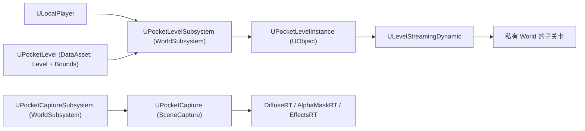

# UE5.8 Lyra 源码解析 48：扩展插件源码

> 本篇沿“扩展插件”一条线阅读 Lyra 5.8 的 `Plugins` 目录：AsyncMixin、PocketWorlds、GameSubtitles、LyraExtTool、RedRoom/GreenRoom、ModularGameplayActors 与 CommonLoadingScreen/CommonStartupLoadingScreen，覆盖异步加载生命周期、独立 UI 世界、字幕显示、编辑器批量工具、测试房间、GameFeature 可扩展基类与启动加载屏。
> 本篇由 47 篇（调试工具与扩展源码）拆分而来：47 收窄为调试工具与测试，插件的正文、验证边界断点实验与 25 个插件源码附录全部迁至本篇。
> 知识成熟度：L2（本机 UE 5.8 与 Lyra 5.8 插件源码已静态核对；PIE 断点实验为可复现验证步骤）。

> 版本基准：UE 5.8.0（本机 `Engine/Build/Build.version`：CL 55116800，分支 `++UE5+Release-5.8`），Lyra 5.8 样例 `LyraStarterGame.uproject` 的 `EngineAssociation=5.8`。
> 源码依据：`C:\Users\zhaozhiqi\Documents\Unreal Projects\LyraStarterGame\Plugins\...`（项目只读引用）；引擎层以 `C:\Program Files\Epic Games\UE_5.8\Engine\...` 为准。
> 适用范围：扩展插件（AsyncMixin/PocketWorlds/GameSubtitles/LyraExtTool/RedRoom/GreenRoom/ModularGameplayActors/加载屏）的 Lyra 5.8 项目源码解析。
> 兼容性边界：UE 4.27/早期 UE5 仅作为历史兼容性说明。
> 官方参考：[UE 5.8 官方文档](https://dev.epicgames.com/documentation/en-us/unreal-engine)。
> 最后更新：2026-08-13
> 知识成熟度：L2

## 阅读前的事实边界

### 证据分级

| 等级 | 证据 | 本文用法 |
| --- | --- | --- |
| A | Lyra 5.8 `Plugins` 插件源码与 uplugin 配置 | 作为插件类、函数、字段与启用配置的直接事实 |
| B | Lyra 5.8 `Source/LyraGame` 与 `Source/LyraEditor` 的 C++ 文件 | 作为项目内使用点与集成位置的事实 |
| C | UE 5.8 引擎源码或官方文档 | 作为流送、异步加载、加载屏语义的补充依据 |

本文不把 `.uasset`/`.umap` 文件名推断成蓝图图表内容。

资产路径只能证明资产存在和可被引用。

蓝图父类、字段值、节点连线需要在 UE 编辑器中打开资产确认。

本文不把一次静态检索写成“已经通过 PIE”或“已经通过 CI”。

断点实验章节会给出应观察的现象和记录字段。

### 先验证目录

```powershell
# 节选：确认插件目录与关键插件源码存在
$Lyra = 'C:\Users\zhaozhiqi\Documents\Unreal Projects\LyraStarterGame'
Test-Path -LiteralPath "$Lyra\Plugins\AsyncMixin\Source\Public\AsyncMixin.h"
Test-Path -LiteralPath "$Lyra\Plugins\PocketWorlds\Source\Public\PocketLevelSystem.h"
Test-Path -LiteralPath "$Lyra\Plugins\GameSubtitles\Source\Public\SubtitleDisplaySubsystem.h"
Test-Path -LiteralPath "$Lyra\Plugins\LyraExtTool\LyraExtTool.uplugin"
Test-Path -LiteralPath "$Lyra\Plugins\ModularGameplayActors\Source\ModularGameplayActors\Public\ModularAIController.h"
Test-Path -LiteralPath "$Lyra\Plugins\CommonStartupLoadingScreen\Source\CommonStartupLoadingScreen\Private\CommonPreLoadScreen.cpp"
```

命令输出 `True` 只说明路径存在。

源码事实仍以文件中的真实符号为准。

### 插件目录地图

```text
LyraStarterGame/Plugins/
├─ AsyncMixin/（Source/Public/AsyncMixin.h + Private/AsyncMixin.cpp）
├─ PocketWorlds/（PocketLevelSystem/PocketLevel/PocketLevelInstance/PocketCapture/PocketCaptureSubsystem）
├─ GameSubtitles/（SubtitleDisplaySubsystem + Widgets/SubtitleDisplay + Players/MediaSubtitlesPlayer）
├─ LyraExtTool/（Editor 模块 + Content/EUW_MaterialTool.uasset）
├─ RedRoom/   GreenRoom/（仅 Content 资产与 uplugin，无 Source 目录）
├─ ModularGameplayActors/（ModularAIController/Character/GameMode/GameState/Pawn/PlayerController/PlayerState）
├─ CommonLoadingScreen/   CommonStartupLoadingScreen/（44 篇已深挖，本篇只交叉引用）
└─ 其余插件（CommonGame/CommonUser/GameSettings/GameplayMessageRouter/UIExtension/GameFeatures 等，见 39 篇总览）
```

## 一、插件扩展地图总览

`Plugins/` 下真实插件（Get-ChildItem 核对，uplugin 均在）：

AsyncMixin、CommonGame、CommonLoadingScreen、CommonStartupLoadingScreen、CommonUser、GameFeatures（ShooterCore/ShooterExplorer/ShooterMaps/ShooterTests/TopDownArena）、GameplayMessageRouter、GameSettings、GameSubtitles、GreenRoom、LyraExampleContent、LyraExtTool、ModularGameplayActors、PocketWorlds、RedRoom、UIExtension。

`LyraStarterGame.uproject` 的插件列表已核对启用项，包括 `PocketWorlds`、`AsyncMixin`、`GameSubtitles`、`UIExtension`、`GameSettings`、`CommonUser`、`CommonGame` 等。

```powershell
# 节选：列出插件目录与 uplugin
$Lyra = 'C:\Users\zhaozhiqi\Documents\Unreal Projects\LyraStarterGame'
Get-ChildItem -LiteralPath "$Lyra\Plugins" -Directory | Select-Object -ExpandProperty Name
Get-ChildItem -LiteralPath "$Lyra\Plugins" -Recurse -Filter *.uplugin | Select-Object -ExpandProperty FullName
```

## 二、AsyncMixin

### 2.1 设计目标

`FAsyncMixin`（`Plugins/AsyncMixin/Source/Public/AsyncMixin.h`）解决“异步加载回调生命周期”问题：

- 继承者可以安全地在 lambda 里捕获 `this`，对象销毁或取消时自动解绑。
- 多个 `AsyncLoad` 按请求顺序执行回调，即使资源已经加载完成也保持顺序。
- 所有请求完成时调用 `OnFinishedLoading`。
- 不调用 `StartAsyncLoading()` 时下一帧自动开始（但文档建议显式调用，避免加载指示器闪一帧）。

内存设计：`FAsyncMixin` 自身不持有加载状态，状态存在静态 `TMap<FAsyncMixin*, TSharedRef<FLoadingState>>` 中，用完即销毁，因此“不增加实例内存”。

### 2.2 公开 API（头文件核对）

| 方法 | 语义 |
| --- | --- |
| `AsyncLoad(SoftClass/SoftObject/FSoftObjectPath/TArray, Callback)` | 异步加载并排队回调 |
| `AsyncPreloadPrimaryAssetsAndBundles(AssetIds, LoadBundles, Callback)` | 预载 Primary Asset 的指定 Bundle |
| `AsyncCondition(TSharedRef<FAsyncCondition>, Callback)` | 插入自定义条件步骤（`EAsyncConditionResult::TryAgain/Complete`） |
| `AsyncEvent(Callback)` | 不加载资源，只插入顺序回调（适合可选资源场景） |
| `StartAsyncLoading()` | 显式开始序列 |
| `CancelAsyncLoading()` | 取消挂起请求 |
| `IsAsyncLoadingInProgress()` | 查询状态 |

`FLoadingState` 内部用 `FAsyncStep` 列表串起 `FStreamableHandle`/`FAsyncCondition`，通过 `FTSTicker` 调度启动与销毁。

`FAsyncScope` 是独立于继承体系的轻量版，适合“一个对象管理多个互不共享的异步任务”。

### 2.3 项目内使用

`SActorCanvas`（`Source/LyraGame/UI/IndicatorSystem/SActorCanvas.h`）声明为 `class SActorCanvas : public SPanel, public FAsyncMixin, public FGCObject`，是 Slate 面板 + 异步加载混合的实例。

`Config/DefaultGame.ini` 有 `+Cmd="Log LogAsyncMixin VeryVerbose"`，用于运行时观察异步加载日志。

`Plugins/GameFeatures/ShooterCore/ShooterCore.uplugin` 声明依赖 AsyncMixin。

### 2.4 静态验证命令

```powershell
# 节选：核对 AsyncMixin API 与使用点
$Lyra = 'C:\Users\zhaozhiqi\Documents\Unreal Projects\LyraStarterGame'
rg -n 'AsyncLoad|AsyncCondition|AsyncEvent|StartAsyncLoading|CancelAsyncLoading|FLoadingState' "$Lyra\Plugins\AsyncMixin\Source\Public\AsyncMixin.h"
rg -n 'FAsyncMixin' "$Lyra\Source\LyraGame" -g '*.h'
rg -n 'LogAsyncMixin' "$Lyra\Config\DefaultGame.ini"
```

## 三、PocketWorlds

### 3.1 职责

PocketWorlds 提供“口袋世界”：为每个 LocalPlayer 独立流送一个小型子关卡，常用于 UI 场景（角色展示、菜单背景），并用 SceneCapture 渲染缩略图。

### 3.2 类图



四个公开类（`Plugins/PocketWorlds/Source/Public/*.h` 核对）：

| 类 | 基类 | 关键成员/方法 |
| --- | --- | --- |
| `UPocketLevelSubsystem` | `UWorldSubsystem` | `GetOrCreatePocketLevelFor(LocalPlayer, PocketLevel, DesiredSpawnPoint)`；`PocketInstances` 数组 |
| `UPocketLevel` | `UDataAsset` | `Level`（`TSoftObjectPtr<UWorld>`）、`Bounds`（`FVector`） |
| `UPocketLevelInstance` | `UObject`（`Within=PocketLevelSubsystem`） | `StreamIn/StreamOut/AddReadyCallback/RemoveReadyCallback`；`OnReadyEvent` |
| `UPocketCaptureSubsystem` | `UWorldSubsystem` | `CreateThumbnailRenderer/DestroyThumbnailRenderer/StreamThisFrame` |
| `UPocketCapture` | `UObject`（Abstract，`Within=PocketCaptureSubsystem`） | `SetRenderTargetSize`、三张 RT、三种 Capture、`SetCaptureTarget/SetAlphaMaskedActors`、`ReleaseResources/ReclaimResources` |

### 3.3 关键实现语义

`GetOrCreatePocketLevelFor` 先按 `LocalPlayer + PocketLevel` 复用已有实例；否则按已存在实例的 `Bounds.Z` 累加垂直偏移，生成新实例并 `Initialize`。

`UPocketLevelInstance::Initialize` 用 `ULevelStreamingDynamic::LoadLevelInstanceBySoftObjectPtr` 流送，绑定 `OnLevelLoaded/OnLevelShown`。

`HandlePocketLevelLoaded` 把子关卡设为 `bClientOnlyVisible = true`，并把所有 Actor 标记 `bExchangedRoles = true`，源码注释明确写着这是过渡性处理（“HACK, Remove when bClientOnlyVisible is all we need”）——即当前版本依赖两层标记保证客户端本地生成语义。

`BeginDestroy` 中设置 `bShouldBlockOnUnload = false` 并卸载，避免销毁阻塞。

`UPocketCapture` 用 `USceneCaptureComponent2D` 分别捕获漫反射、Alpha 遮罩与特效渲染目标，配套资产为 `Content/M_Black.uasset`、`M_White.uasset`、`M_PocketCaptureMasked.uasset`。

### 3.4 验证边界

`rg 'PocketLevel|PocketCapture' Source/LyraGame` 在本机没有任何 C++ 引用。

因此 PocketWorlds 的运行时入口（哪个蓝图调用 `GetOrCreatePocketLevelFor`、何时创建）不在本篇可静态证明范围内，需要打开相关 `.uasset` 或在 PIE 中打断点确认。

### 3.5 静态验证命令

```powershell
# 节选：核对 PocketWorlds 类与使用边界
$Lyra = 'C:\Users\zhaozhiqi\Documents\Unreal Projects\LyraStarterGame'
rg -n 'GetOrCreatePocketLevelFor|PocketInstances' "$Lyra\Plugins\PocketWorlds\Source\Private\PocketLevelSystem.cpp"
rg -n 'LoadLevelInstanceBySoftObjectPtr|bClientOnlyVisible|bExchangedRoles' "$Lyra\Plugins\PocketWorlds\Source\Private\PocketLevelInstance.cpp"
rg -n 'GetOrCreateDiffuseRenderTarget|CaptureAlphaMask|CaptureEffects' "$Lyra\Plugins\PocketWorlds\Source\Public\PocketCapture.h"
rg -n 'PocketLevel|PocketCapture' "$Lyra\Source\LyraGame" -g '*.h' -g '*.cpp'  # 预期为空
```

## 四、GameSubtitles

### 4.1 插件结构

`Plugins/GameSubtitles/Source/Public/`：

- `SubtitleDisplayOptions.h`：显示选项枚举（字号、颜色、边框、背景透明度）。
- `SubtitleDisplaySubsystem.h`：`USubtitleDisplaySubsystem : UGameInstanceSubsystem`。
- `Widgets/SubtitleDisplay.h`：字幕控件（UUserWidget 封装）。
- `Widgets/SSubtitleDisplay.h`：Slate 实现。
- `Players/MediaSubtitlesPlayer.h`：媒体字幕播放器。

### 4.2 子系统契约

`USubtitleDisplaySubsystem`：

- `static Get(const ULocalPlayer*)` 取子系统实例。
- `FSubtitleFormat` 保存字号/颜色/边框/背景四项枚举。
- `SetSubtitleDisplayOptions/GetSubtitleDisplayOptions` 读写格式。
- `DisplayFormatChangedEvent` 在格式变化时通知订阅者。

项目内使用点：`Source/LyraGame/Settings/LyraGameSettingRegistry_Audio.cpp` 把字号、颜色、边框、背景透明度注册为音频设置页的枚举选项，玩家设置会落到 `FSubtitleFormat`。

### 4.3 静态验证命令

```powershell
# 节选：核对字幕插件与设置注册
$Lyra = 'C:\Users\zhaozhiqi\Documents\Unreal Projects\LyraStarterGame'
rg -n 'class USubtitleDisplaySubsystem|SetSubtitleDisplayOptions|DisplayFormatChangedEvent' "$Lyra\Plugins\GameSubtitles\Source\Public\SubtitleDisplaySubsystem.h"
rg -n 'ESubtitleDisplayTextSize|ESubtitleDisplayTextColor|ESubtitleDisplayTextBorder|ESubtitleDisplayBackgroundOpacity' "$Lyra\Source\LyraGame\Settings\LyraGameSettingRegistry_Audio.cpp" | Select-Object -First 8
```

## 五、LyraExtTool

### 5.1 插件身份

`Plugins/LyraExtTool/LyraExtTool.uplugin` 的模块声明为 `"Type": "Editor"`，即纯编辑器插件。

内容资产：`Content/EUW_MaterialTool.uasset`（Editor Utility Widget）。

### 5.2 公开函数

`UBPFunctionLibrary`（`Plugins/LyraExtTool/Source/LyraExtTool/Public/BPFunctionLibrary.h/.cpp`）只有一个 BlueprintCallable：

```cpp
// 节选：Plugins/LyraExtTool/Source/LyraExtTool/Public/BPFunctionLibrary.h
UFUNCTION(BlueprintCallable, Category="LyraExt")
static bool ChangeMeshMaterials(TArray<UStaticMesh*> Mesh, UMaterialInterface* Material);
```

实现：对每个 `UStaticMesh` 调用 `Modify()`，把 `GetStaticMaterials()` 全部槽位替换为目标材质，再 `PostEditChange()`。

用途推断：配合 `EUW_MaterialTool` 在编辑器中批量替换静态网格材质。

验证边界：EUW 的按钮连线在 `.uasset` 内，需要编辑器打开确认，本篇只证明函数存在。

### 5.3 静态验证命令

```powershell
# 节选：核对 LyraExtTool
$Lyra = 'C:\Users\zhaozhiqi\Documents\Unreal Projects\LyraStarterGame'
rg -n 'ChangeMeshMaterials|GetStaticMaterials|PostEditChange' "$Lyra\Plugins\LyraExtTool\Source\LyraExtTool\Private\BPFunctionLibrary.cpp"
Select-String -LiteralPath "$Lyra\Plugins\LyraExtTool\LyraExtTool.uplugin" -Pattern 'Editor'
Test-Path -LiteralPath "$Lyra\Plugins\LyraExtTool\Content\EUW_MaterialTool.uasset"
```

## 六、RedRoom 与 GreenRoom

### 6.1 资产事实（Get-ChildItem 核对）

| 插件 | 资产 | uplugin 关键字段 |
| --- | --- | --- |
| `Plugins/RedRoom` | `Content/Red.uasset`、`Content/RedRoom.umap` | `ExplicitlyLoaded: true`、`EnabledByDefault: false`、`CanContainContent: true` |
| `Plugins/GreenRoom` | `Content/Green.uasset`、`Content/GreenRoom.umap` | 同上 |

两个插件都没有 Source 目录。

### 6.2 用途推断与验证边界

从命名与资产形态推断：`RedRoom`/`GreenRoom` 是带单一颜色资产（Red/Green）的极简测试房间地图，可能用于渲染对照、材质/光照验证或自动化测试的空白场景。

但必须写清楚验证边界：

- 在项目 C++、`Config/*.ini`、其他 uplugin 与 `LyraStarterGame.uproject` 中均未找到对这两个插件的文本引用（rg 核对为空）。
- 两张地图内部的 Actor 构成、引用关系与用途无法从静态文本证明。
- 要确认用途，需在编辑器中打开地图，或在 PIE/自动化测试中显式加载并观察。

因此本篇不声称“RedRoom 用于 XX 测试已被验证”。

### 6.3 静态验证命令

```powershell
# 节选：核对测试房间插件
$Lyra = 'C:\Users\zhaozhiqi\Documents\Unreal Projects\LyraStarterGame'
Get-ChildItem -LiteralPath "$Lyra\Plugins\RedRoom" -Recurse -File | Select-Object -ExpandProperty FullName
Get-ChildItem -LiteralPath "$Lyra\Plugins\GreenRoom" -Recurse -File | Select-Object -ExpandProperty FullName
Select-String -LiteralPath "$Lyra\Plugins\RedRoom\RedRoom.uplugin" -Pattern 'ExplicitlyLoaded|EnabledByDefault'
rg -n 'RedRoom|GreenRoom' "$Lyra\Source" "$Lyra\Config" "$Lyra\Plugins" -g '*.cpp' -g '*.h' -g '*.ini' -g '*.uplugin'  # 预期仅 uplugin 自身
```

## 七、ModularGameplayActors

### 7.1 插件内容

`Plugins/ModularGameplayActors/Source/ModularGameplayActors/Public/`：

- `ModularAIController.h` → `AModularAIController : AAIController`
- `ModularCharacter.h` → `AModularCharacter : ACharacter`
- `ModularGameMode.h` → `AModularGameModeBase : AGameModeBase`
- `ModularGameState.h` → `AModularGameStateBase : AGameStateBase`
- `ModularPawn.h` → `AModularPawn : APawn`
- `ModularPlayerController.h` → `AModularPlayerController : APlayerController`
- `ModularPlayerState.h` → `AModularPlayerState : APlayerState`

每个类注释统一为“Minimal class that supports extension by game feature plugins”，并重写 `PreInitializeComponents`、`BeginPlay`、`EndPlay`。

### 7.2 项目内继承（rg 核对）

| 项目类 | 基类 |
| --- | --- |
| `ALyraGameState` | `AModularGameStateBase` |
| `ALyraPlayerState` | `AModularPlayerState` |
| `ALyraGameMode` | `AModularGameModeBase` |
| `ALyraPlayerBotController` | `AModularAIController` |
| `ALyraPawn` | `AModularPawn` |
| `ALyraCharacter` | `AModularCharacter` |

设计含义：让 GameFeature 插件可以通过这些 Actor 生命周期钩子挂载组件逻辑，而不需要替换原生类。

46 篇（AI 队伍与调试）会深挖 `ALyraPlayerBotController` 与队伍逻辑，本篇只做交叉引用。

### 7.3 静态验证命令

```powershell
# 节选：核对 Modular 基类与继承
$Lyra = 'C:\Users\zhaozhiqi\Documents\Unreal Projects\LyraStarterGame'
rg -n 'class AModular' "$Lyra\Plugins\ModularGameplayActors\Source\ModularGameplayActors\Public\*.h"
rg -n 'AModular' "$Lyra\Source\LyraGame" -g '*.h' | Select-Object -First 10
```

## 八、CommonLoadingScreen 与 CommonStartupLoadingScreen

44 篇已深挖 `ULoadingScreenManager` 的投票机制、`CheckForAnyNeedToShowLoadingScreen`、`FLoadingScreenInputPreProcessor` 与加载屏 CVar。

本篇只补充边界说明：

| 插件 | 文件（相对路径） | 与 44 篇的关系 |
| --- | --- | --- |
| `Plugins/CommonLoadingScreen` | `Source/CommonLoadingScreen/Private/LoadingScreenManager.cpp`、`Public/LoadingProcessInterface.h`、`Public/LoadingProcessTask.h` | 44 篇的加载屏投票主体 |
| `Plugins/CommonStartupLoadingScreen` | `Source/CommonStartupLoadingScreen/Private/CommonPreLoadScreen.cpp`、`SCommonPreLoadingScreenWidget.cpp` | 启动期 PreLoadScreen，在 GameInstance 之前显示；44 篇提及加载屏触发来源，本篇不重复展开 |

```powershell
# 节选：确认两个加载屏插件存在
$Lyra = 'C:\Users\zhaozhiqi\Documents\Unreal Projects\LyraStarterGame'
Test-Path -LiteralPath "$Lyra\Plugins\CommonLoadingScreen\Source\CommonLoadingScreen\Private\LoadingScreenManager.cpp"
Test-Path -LiteralPath "$Lyra\Plugins\CommonStartupLoadingScreen\Source\CommonStartupLoadingScreen\Private\CommonPreLoadScreen.cpp"
```


## 九、断点实验（插件视角）

### 9.1 实验：PocketWorlds 实例创建（验证边界实验）

目的：在确认入口前先证明“实例创建语义”。

准备：在 `UPocketLevelSubsystem::GetOrCreatePocketLevelFor` 与 `UPocketLevelInstance::Initialize` 下断点；PIE 中触发会使用口袋世界的 UI 流程（需先确认哪个蓝图调用，见 3.4 验证边界）。

观察：

1. `VerticalBoundsOffset` 随已有实例 `Bounds.Z` 累加。
2. `ULevelStreamingDynamic::LoadLevelInstanceBySoftObjectPtr` 的返回状态。
3. `HandlePocketLevelLoaded` 中 `bClientOnlyVisible` 与 `bExchangedRoles` 的设置。

如果断点不命中，说明当前 PIE 流程没有走到口袋世界，这本身就是结论：需要找到蓝图入口。

## 十、失败模式排查表（插件视角）

| 现象 | 常见原因 | 排查入口 |
| --- | --- | --- |
| AsyncMixin 回调不触发 | `StartAsyncLoading()` 未显式调用，或对象已销毁 | 断点 `FLoadingState` 的启动/销毁路径，核对 `CancelAsyncLoading` 是否提前取消 |
| AsyncLoad 回调顺序错乱 | 多个请求未按序排队 | 核对 `FAsyncStep` 队列与 `FStreamableHandle` 绑定顺序 |
| PocketWorld 重复创建 | 调用方没走 `GetOrCreatePocketLevelFor` 复用逻辑 | 断点 `PocketInstances` 数组 |
| 口袋子关卡在客户端不显示 | `bClientOnlyVisible`/`bExchangedRoles` 标记未设置 | 断点 `HandlePocketLevelLoaded` |
| 字幕设置不生效 | 玩家设置未落到 `FSubtitleFormat` | 核对 `LyraGameSettingRegistry_Audio.cpp` 的枚举注册 |
| ChangeMeshMaterials 无效果 | 传入网格无效或材质槽位为空 | 断点 `Modify` 与 `PostEditChange` |
| Modular 生命周期钩子不触发 | Actor 未继承 Modular 基类 | 核对 `PreInitializeComponents/BeginPlay/EndPlay` 重写 |
| 启动加载屏不显示 | 插件未启用或 PreLoadScreen 未注册 | 核对 uplugin 启用项与 `CommonPreLoadScreen` |

## 十一、常见反模式（插件视角）

### 11.1 把插件启用当成功能已接入

uproject 的插件启用列表只能证明插件被加载。

哪个蓝图/代码调用（如 `GetOrCreatePocketLevelFor`）才是接入点，要按 3.4 的验证边界确认。

### 11.2 忽略异步加载的生命周期

直接在 Widget 里持有 `FStreamableHandle` 而不取消，会导致回调在对象销毁后触发。

使用 `FAsyncMixin`/`FAsyncScope` 或等价的生命周期管理。

### 11.3 把资产存在当作用途已证明

RedRoom/GreenRoom 只有资产与 uplugin 配置。

写结论时区分“存在”与“行为已验证”，引用蓝图类前先打开资产核对。

### 11.4 把客户端本地流送语义当网络同步

`bClientOnlyVisible` 与 `bExchangedRoles` 是客户端本地生成语义的过渡标记（源码注释明确为过渡性 HACK 处理），不能当作服务器权威复制行为。

### 11.5 在 Shipping 依赖编辑器插件

LyraExtTool 是 `"Type": "Editor"` 的纯编辑器插件。

EUW 工具与 `ChangeMeshMaterials` 只存在于编辑器流程，打包运行时不可用。

## 十二、FAQ

### Q1：FAsyncMixin 为什么说“不增加实例内存”？

`FLoadingState` 存在静态 `TMap` 中，按需创建、完成即销毁。

继承 `FAsyncMixin` 的类本身只多一个查询入口，不直接持有加载句柄数组。

### Q2：PocketWorlds 和普通 Level Streaming 的区别？

`UPocketLevelInstance` 按 LocalPlayer 复用、按 `Bounds.Z` 垂直堆叠，并把子关卡标记为客户端本地可见（`bClientOnlyVisible` 与 `bExchangedRoles`）。

普通 `ULevelStreamingDynamic` 没有这套按玩家实例化的语义。

### Q3：RedRoom/GreenRoom 到底用来做什么？

验证边界：只有资产名与 uplugin 字段可证明。

它们很可能是测试房间地图，但当前 checkout 中没有任何 C++/配置文本引用，需打开地图确认。

## 十三、关联阅读

- [47-Lyra-调试工具与扩展源码](../../08-工程实践与质量/调试与性能分析/47-Lyra-调试工具与扩展源码.md)：本篇的母篇，调试命令、编辑器验证与测试层的同源解析。
- [44-Lyra-前端会话网络与扩展源码](../../07-网络与游戏服务端/会话身份与在线服务/44-Lyra-前端会话网络与扩展源码.md)：ShooterTests、Gauntlet、回放与加载屏投票；CommonLoadingScreen 的深挖主体，本篇只交叉引用。
- [39-Lyra源码总览与阅读路线](../../05-Gameplay与交互系统/玩法架构与任务协作/39-Lyra源码总览与阅读路线.md)：项目插件地图、Experience 入口和系列阅读顺序。
- [46-Lyra-AI机器人与队伍源码](../../06-游戏AI/战斗战术与机器人/46-Lyra-AI机器人与队伍源码.md)：`ALyraPlayerBotController` 与队伍逻辑，ModularAIController 的延伸。
- [13-资源加载与异步加载源码](../世界组织与资源加载/13-资源加载与异步加载源码.md)：FStreamableHandle 与异步加载机制，理解 FAsyncMixin。
- [26-CommonUI源码](../../05-Gameplay与交互系统/界面设置与无障碍/26-CommonUI源码.md)：CommonUI 与 UI 自动化背景，字幕控件（UUserWidget 封装）的上层背景。
- [README](../../../游戏知识/12-引擎源码分析/README.md)：本目录索引。
- [UI与性能优化 README](../../../00_Index/学习路线/Gameplay与交互系统.md)、[世界构建与过场 README](../../../00_Index/学习路线/图形动画与物理仿真.md)：跨分类入口。

## 十四、权威来源

- [Unreal Engine Documentation](https://dev.epicgames.com/documentation/en-us/unreal-engine)
- [Lyra Sample Game in Unreal Engine](https://dev.epicgames.com/documentation/en-us/unreal-engine/lyra-sample-game-in-unreal-engine)
- [Game Features and Modular Gameplay](https://dev.epicgames.com/documentation/en-us/unreal-engine/game-features-and-modular-gameplay-in-unreal-engine)
- [Loading Screens](https://dev.epicgames.com/documentation/en-us/unreal-engine/loading-screen-in-unreal-engine)
- [Common UI](https://dev.epicgames.com/documentation/en-us/unreal-engine/common-ui-plugin-for-unreal-engine)

官方页面只描述引擎与 Lyra 的通用语义。

本文所有类名、函数名与文件路径以本机源码为准，官方文档与源码不一致时以本机源码事实优先。

## 十五、静态验证命令汇总

```powershell
# 节选：本篇核心符号一次性核对
$Lyra = 'C:\Users\zhaozhiqi\Documents\Unreal Projects\LyraStarterGame'

# AsyncMixin
rg -n 'AsyncLoad|AsyncCondition|AsyncEvent|StartAsyncLoading|CancelAsyncLoading|FLoadingState' "$Lyra\Plugins\AsyncMixin\Source\Public\AsyncMixin.h"
# PocketWorlds
rg -n 'GetOrCreatePocketLevelFor|PocketInstances' "$Lyra\Plugins\PocketWorlds\Source\Private\PocketLevelSystem.cpp"
rg -n 'LoadLevelInstanceBySoftObjectPtr|bClientOnlyVisible|bExchangedRoles' "$Lyra\Plugins\PocketWorlds\Source\Private\PocketLevelInstance.cpp"
# GameSubtitles
rg -n 'class USubtitleDisplaySubsystem|SetSubtitleDisplayOptions|DisplayFormatChangedEvent' "$Lyra\Plugins\GameSubtitles\Source\Public\SubtitleDisplaySubsystem.h"
# LyraExtTool
rg -n 'ChangeMeshMaterials|GetStaticMaterials|PostEditChange' "$Lyra\Plugins\LyraExtTool\Source\LyraExtTool\Private\BPFunctionLibrary.cpp"
# ModularGameplayActors
rg -n 'class AModular' "$Lyra\Plugins\ModularGameplayActors\Source\ModularGameplayActors\Public\*.h"
# 加载屏
Test-Path -LiteralPath "$Lyra\Plugins\CommonStartupLoadingScreen\Source\CommonStartupLoadingScreen\Private\CommonPreLoadScreen.cpp"
# 测试房间插件（预期仅 uplugin 自身）
rg -n 'RedRoom|GreenRoom' "$Lyra\Source" "$Lyra\Config" "$Lyra\Plugins" -g '*.cpp' -g '*.h' -g '*.ini' -g '*.uplugin'
```

## 十六、验收清单

### 16.1 源码事实

- [ ] AsyncMixin 的公开 API 与 AsyncMixin.h 一致，未虚构方法。
- [ ] PocketWorlds 四个公开类与各自 .h 一致；`LyraGame` C++ 无调用点的验证边界已写明。
- [ ] GameSubtitles 子系统契约与 SubtitleDisplaySubsystem.h 一致。
- [ ] LyraExtTool 只证明 `ChangeMeshMaterials` 存在，未声称 EUW 按钮连线已验证。
- [ ] RedRoom/GreenRoom 只写了资产存在与用途推断，未越界声称行为已验证。
- [ ] ModularGameplayActors 的继承关系与 rg 结果一致。
- [ ] 加载屏只做交叉引用，未重复 44 篇内容。

### 16.2 文档门禁

- [ ] 正文不少于 300 行（本篇超出目标）。
- [ ] 文件 UTF-8 无 BOM。
- [ ] 代码围栏成对（``` 数量为偶数）。
- [ ] 文档禁用字词扫描结果为空（占位、延期标记类字词未出现在正文；逐字收录的源码注释除外）。
- [ ] 附录 25 个文件与 47 篇原附录 #34-#58 逐字一致。
- [ ] 每个插件主题都有 `$Lyra` 静态验证命令片段。

## 十七、更新日志

- 2026-08-13：从 47 篇《调试工具与扩展源码》拆出独立成篇（对应原 §十八~§二十五 正文、26.5 插件断点实验与附录 #34-#58 共 25 个插件文件），47 收窄为调试工具与测试。

## 十八、术语速查

| 术语 | 含义 |
| --- | --- |
| FAsyncMixin | 异步加载生命周期混合类，不增加实例内存 |
| FAsyncScope | FAsyncMixin 的轻量版，管理多个互不共享的异步任务 |
| FLoadingState | 静态 `TMap` 中按需创建、完成即销毁的加载状态 |
| PocketWorld | 按 LocalPlayer 实例化的流送子关卡 |
| UPocketLevelInstance | 口袋世界的流送实例（UObject，`Within=PocketLevelSubsystem`） |
| SceneCapture | 场景捕获组件，用于生成漫反射/Alpha/特效渲染目标 |
| FSubtitleFormat | 字幕字号、颜色、边框、背景四项格式 |
| Modular Actor | 支持 GameFeature 插件扩展的 Actor 基类 |
| PreLoadScreen | 引擎启动早期、GameInstance 之前显示的加载屏 |
| Editor Utility Widget | 编辑器内运行的蓝图工具控件（EUW） |
| GameFeature 插件 | 通过 Actor 生命周期钩子扩展游戏内容的插件形态 |

## 附录：扩展插件完整源码

> 收录原则：本附录把正文直接分析的 LyraStarterGame 5.8 插件源码文件逐字完整收录（未删改，保留 Epic 版权头），正文中的"节选"负责解释调用链，本附录提供全文，二者配合阅读。`Source/LyraGame` 与 `Source/LyraEditor` 的调试、验证与测试源码收录在 47 篇附录（#1-#33）；`.uasset/.umap` 资产不在收录范围。
> 版权提示：以下代码来自 Epic Games 的 LyraStarterGame 样例（UE 5.8），随 Unreal Engine EULA 的样例代码条款提供，仅作本地学习收录；对外发布前请自行核对许可条款。

| # | 文件（相对 LyraStarterGame 根） | 行数 |
| --- | --- | --- |
| 1 | `Plugins\AsyncMixin\Source\Public\AsyncMixin.h` | 361 |
| 2 | `Plugins\AsyncMixin\Source\Private\AsyncMixin.cpp` | 588 |
| 3 | `Plugins\PocketWorlds\Source\Public\PocketLevelSystem.h` | 35 |
| 4 | `Plugins\PocketWorlds\Source\Private\PocketLevelSystem.cpp` | 36 |
| 5 | `Plugins\PocketWorlds\Source\Public\PocketLevel.h` | 35 |
| 6 | `Plugins\PocketWorlds\Source\Private\PocketLevel.cpp` | 11 |
| 7 | `Plugins\PocketWorlds\Source\Public\PocketLevelInstance.h` | 73 |
| 8 | `Plugins\PocketWorlds\Source\Private\PocketLevelInstance.cpp` | 135 |
| 9 | `Plugins\PocketWorlds\Source\Public\PocketCapture.h` | 121 |
| 10 | `Plugins\PocketWorlds\Source\Private\PocketCapture.cpp` | 363 |
| 11 | `Plugins\PocketWorlds\Source\Public\PocketCaptureSubsystem.h` | 53 |
| 12 | `Plugins\PocketWorlds\Source\Private\PocketCaptureSubsystem.cpp` | 98 |
| 13 | `Plugins\GameSubtitles\Source\Public\SubtitleDisplaySubsystem.h` | 72 |
| 14 | `Plugins\GameSubtitles\Source\Private\SubtitleDisplaySubsystem.cpp` | 41 |
| 15 | `Plugins\GameSubtitles\Source\Public\Widgets\SubtitleDisplay.h` | 78 |
| 16 | `Plugins\GameSubtitles\Source\Private\Widgets\SubtitleDisplay.cpp` | 135 |
| 17 | `Plugins\LyraExtTool\Source\LyraExtTool\Public\BPFunctionLibrary.h` | 25 |
| 18 | `Plugins\LyraExtTool\Source\LyraExtTool\Private\BPFunctionLibrary.cpp` | 26 |
| 19 | `Plugins\ModularGameplayActors\Source\ModularGameplayActors\Public\ModularAIController.h` | 27 |
| 20 | `Plugins\ModularGameplayActors\Source\ModularGameplayActors\Private\ModularAIController.cpp` | 27 |
| 21 | `Plugins\CommonStartupLoadingScreen\Source\CommonStartupLoadingScreen\Private\CommonPreLoadScreen.h` | 20 |
| 22 | `Plugins\CommonStartupLoadingScreen\Source\CommonStartupLoadingScreen\Private\CommonPreLoadScreen.cpp` | 18 |
| 23 | `Plugins\CommonStartupLoadingScreen\Source\CommonStartupLoadingScreen\Private\SCommonPreLoadingScreenWidget.h` | 26 |
| 24 | `Plugins\CommonStartupLoadingScreen\Source\CommonStartupLoadingScreen\Private\SCommonPreLoadingScreenWidget.cpp` | 32 |
| 25 | `Plugins\CommonStartupLoadingScreen\Source\CommonStartupLoadingScreen\Private\CommonStartupLoadingScreen.cpp` | 70 |

### 附录文件 1：`Plugins\AsyncMixin\Source\Public\AsyncMixin.h`

> 完整源码（本机 Lyra 5.8 样例，逐字收录，未删改）。

```cpp
// Copyright Epic Games, Inc. All Rights Reserved.

#pragma once

#include "Containers/Ticker.h"
#include "UObject/SoftObjectPtr.h"

#define UE_API ASYNCMIXIN_API

class FAsyncCondition;
class FName;
class UPrimaryDataAsset;
struct FPrimaryAssetId;
struct FStreamableHandle;
template <class TClass> class TSubclassOf;

DECLARE_DELEGATE_OneParam(FStreamableHandleDelegate, TSharedPtr<FStreamableHandle>)

//TODO I think we need to introduce a retention policy, preloads automatically stay in memory until canceled
//     but what if you want to preload individual items just using the AsyncLoad functions?  I don't want to
//     introduce individual policies per call, or introduce a whole set of preload vs asyncloads, so would
//     would rather have a retention policy.  Should it be a member and actually create real memory when
//     you inherit from AsyncMixin, or should it be a template argument?
//enum class EAsyncMixinRetentionPolicy : uint8
//{
//	Default,
//	KeepResidentUntilComplete,
//	KeepResidentUntilCancel
//};

/**
 * The FAsyncMixin allows easier management of async loading requests, to ensure linear request handling, to make 
 * writing code much easier.  The usage pattern is as follows,
 *
 * First - inherit from FAsyncMixin, even if you're a UObject, you can also inherit from FAsyncMixin.
 *
 * Then - you can make your async loads as follows.
 * 
 * CancelAsyncLoading();			// Some objects get reused like in lists, so it's important to cancel anything you had pending doesn't complete.
 * AsyncLoad(ItemOne, CallbackOne);
 * AsyncLoad(ItemTwo, CallbackTwo);
 * StartAsyncLoading();
 * 
 * You can also include the 'this' scope safely, one of the benefits of the mix-in, is that none of the callbacks
 * are ever out of scope of the host AsyncMixin derived object.
 * e.g.
 * AsyncLoad(SomeSoftObjectPtr, [this, ...]() {
 *    
 * });
 * 
 *
 * What will happen is first we cancel any existing one(s), e.g. perhaps we are a widget that just got told to represent
 * some new thing.  What will happen is we'll Load ItemOne and ItemTwo, *THEN* we'll call the callbacks in the order you
 * requested the async loads - even if ItemOne or ItemTwo was already loaded when you request it.
 *
 * When all the async loading requests complete, OnFinishedLoading will be called.
 * 
 * If you forget to call StartAsyncLoading(), we'll call it next frame, but you should remember to call it
 * when you're done with your setup, as maybe everything is already loaded, and it will avoid a single frame
 * of a loading indicator flash, which is annoying.
 * 
 * NOTE: The FAsyncMixin also makes it safe to pass [this] as a captured input into your lambda, because it handles 
 * unhooking everything if either your owner class is destroyed, or you cancel everything.
 *
 * NOTE: FAsyncMixin doesn't add any additional memory to your class.  Several classes currently handling async loading 
 * internally allocate TSharedPtr<FStreamableHandle> members and tend to hold onto SoftObjectPaths temporary state.  The 
 * FAsyncMixin does all of this internally with a static TMap so that all of the async request memory is stored temporarily
 * and sparsely.
 * 
 * NOTE: For debugging and understanding what's going on, you should add -LogCmds="LogAsyncMixin Verbose" to the command line.
 */
class FAsyncMixin : public FNoncopyable
{
protected:
	UE_API FAsyncMixin();

public:
	UE_API virtual ~FAsyncMixin();

protected:
	/** Called when loading starts. */
	virtual void OnStartedLoading() { }
	/** Called when all loading has finished. */
	virtual void OnFinishedLoading() { }

protected:
	/** Async load a TSoftClassPtr<T>, call the Callback when complete. */
	template<typename T = UObject>
	void AsyncLoad(TSoftClassPtr<T> SoftClass, TFunction<void()>&& Callback)
	{
		AsyncLoad(SoftClass.ToSoftObjectPath(), FSimpleDelegate::CreateLambda(MoveTemp(Callback)));
	}

	/** Async load a TSoftClassPtr<T>, call the Callback when complete. */
	template<typename T = UObject>
	void AsyncLoad(TSoftClassPtr<T> SoftClass, TFunction<void(TSubclassOf<T>)>&& Callback)
	{
		AsyncLoad(SoftClass.ToSoftObjectPath(),
			FSimpleDelegate::CreateLambda([SoftClass, UserCallback = MoveTemp(Callback)]() mutable {
				UserCallback(SoftClass.Get());
			})
		);
	}

	/** Async load a TSoftClassPtr<T>, call the Callback when complete. */
	template<typename T = UObject>
	void AsyncLoad(TSoftClassPtr<T> SoftClass, const FSimpleDelegate& Callback = FSimpleDelegate())
	{
		AsyncLoad(SoftClass.ToSoftObjectPath(), Callback);
	}

	/** Async load a TSoftObjectPtr<T>, call the Callback when complete. */
	template<typename T = UObject>
	void AsyncLoad(TSoftObjectPtr<T> SoftObject, TFunction<void()>&& Callback)
	{
		AsyncLoad(SoftObject.ToSoftObjectPath(), FSimpleDelegate::CreateLambda(MoveTemp(Callback)));
	}

	/** Async load a TSoftObjectPtr<T>, call the Callback when complete. */
	template<typename T = UObject>
	void AsyncLoad(TSoftObjectPtr<T> SoftObject, TFunction<void(T*)>&& Callback)
	{
		AsyncLoad(SoftObject.ToSoftObjectPath(),
			FSimpleDelegate::CreateLambda([SoftObject, UserCallback = MoveTemp(Callback)]() mutable {
				UserCallback(SoftObject.Get());
			})
		);
	}

	/** Async load a TSoftObjectPtr<T>, call the Callback when complete. */
	template<typename T = UObject>
	void AsyncLoad(TSoftObjectPtr<T> SoftObject, const FSimpleDelegate& Callback = FSimpleDelegate())
	{
		AsyncLoad(SoftObject.ToSoftObjectPath(), Callback);
	}

	/** Async load a FSoftObjectPath, call the Callback when complete. */
	UE_API void AsyncLoad(FSoftObjectPath SoftObjectPath, const FSimpleDelegate& Callback = FSimpleDelegate());

	/** Async load an array of FSoftObjectPath, call the Callback when complete. */
	void AsyncLoad(const TArray<FSoftObjectPath>& SoftObjectPaths, TFunction<void()>&& Callback)
	{
		AsyncLoad(SoftObjectPaths, FSimpleDelegate::CreateLambda(MoveTemp(Callback)));
	}

	/** Async load an array of FSoftObjectPath, call the Callback when complete. */
	UE_API void AsyncLoad(const TArray<FSoftObjectPath>& SoftObjectPaths, const FSimpleDelegate& Callback = FSimpleDelegate());

	/** Given an array of primary assets, it loads all of the bundles referenced by properties of these assets specified in the LoadBundles array. */
	template<typename T = UPrimaryDataAsset>
	void AsyncPreloadPrimaryAssetsAndBundles(const TArray<T*>& Assets, const TArray<FName>& LoadBundles, const FSimpleDelegate& Callback = FSimpleDelegate())
	{
		TArray<FPrimaryAssetId> PrimaryAssetIds;
		for (const T* Item : Assets)
		{
			PrimaryAssetIds.Add(Item);
		}

		AsyncPreloadPrimaryAssetsAndBundles(PrimaryAssetIds, LoadBundles, Callback);
	}

	/** Given an array of primary asset ids, it loads all of the bundles referenced by properties of these assets specified in the LoadBundles array. */
	void AsyncPreloadPrimaryAssetsAndBundles(const TArray<FPrimaryAssetId>& AssetIds, const TArray<FName>& LoadBundles, TFunction<void()>&& Callback)
	{
		AsyncPreloadPrimaryAssetsAndBundles(AssetIds, LoadBundles, FSimpleDelegate::CreateLambda(MoveTemp(Callback)));
	}

	/** Given an array of primary asset ids, it loads all of the bundles referenced by properties of these assets specified in the LoadBundles array. */
	UE_API void AsyncPreloadPrimaryAssetsAndBundles(const TArray<FPrimaryAssetId>& AssetIds, const TArray<FName>& LoadBundles, const FSimpleDelegate& Callback = FSimpleDelegate());

	/** Add a future condition that must be true before we move forward. */
	UE_API void AsyncCondition(TSharedRef<FAsyncCondition> Condition, const FSimpleDelegate& Callback = FSimpleDelegate());

	/**
	 * Rather than load anything, this callback is just inserted into the callback sequence so that when async loading 
	 * completes this event will be called at the same point in the sequence.  Super useful if you don't want a step to be
	 * tied to a particular asset in case some of the assets are optional.
	 */
	void AsyncEvent(TFunction<void()>&& Callback)
	{
		AsyncEvent(FSimpleDelegate::CreateLambda(MoveTemp(Callback)));
	}

	/**
	 * Rather than load anything, this callback is just inserted into the callback sequence so that when async loading
	 * completes this event will be called at the same point in the sequence.  Super useful if you don't want a step to be
	 * tied to a particular asset in case some of the assets are optional.
	 */
	UE_API void AsyncEvent(const FSimpleDelegate& Callback);

	/** Flushes any async loading requests. */
	UE_API void StartAsyncLoading();

	/** Cancels any pending async loads. */
	UE_API void CancelAsyncLoading();

	/** Is async loading current in progress? */
	UE_API bool IsAsyncLoadingInProgress() const;

private:
	/**
	 * The FLoadingState is what actually is allocated for the FAsyncMixin in a big map so that the FAsyncMixin itself holds no
	 * no memory, and we dynamically create the FLoadingState only if needed, and destroy it when it's unneeded.
	 */
	class FLoadingState : public TSharedFromThis<FLoadingState>
	{
	public:
		FLoadingState(FAsyncMixin& InOwner);
		virtual ~FLoadingState();

		/** Starts the async sequence. */
		void Start();

		/** Cancels the async sequence. */
		void CancelAndDestroy();

		void AsyncLoad(FSoftObjectPath SoftObject, const FSimpleDelegate& DelegateToCall);
		void AsyncLoad(const TArray<FSoftObjectPath>& SoftObjectPaths, const FSimpleDelegate& DelegateToCall);
		void AsyncPreloadPrimaryAssetsAndBundles(const TArray<FPrimaryAssetId>& PrimaryAssetIds, const TArray<FName>& LoadBundles, const FSimpleDelegate& DelegateToCall);
		void AsyncCondition(TSharedRef<FAsyncCondition> Condition, const FSimpleDelegate& Callback);
		void AsyncEvent(const FSimpleDelegate& Callback);

		bool IsLoadingComplete() const { return !IsLoadingInProgress(); }
		bool IsLoadingInProgress() const;
		bool IsLoadingInProgressOrPending() const;
		bool IsPendingDestroy() const;

	private:
		void CancelOnly(bool bDestroying);
		void CancelStartTimer();
		void TryScheduleStart();
		void TryCompleteAsyncLoading();
		void CompleteAsyncLoading();

	private:
		void RequestDestroyThisMemory();
		void CancelDestroyThisMemory(bool bDestroying);

		/** Who owns the loading state?  We need this to call back into the owning mix-in object. */
		FAsyncMixin& OwnerRef;

		/**
		 * Did we need to pre-load bundles?  If we didn't pre-load bundles (which require you keep the streaming handle 
		 * around or they will be destroyed), then we can safely destroy the FLoadingState when everything is done loading.
		 */
		bool bPreloadedBundles = false;

		class FAsyncStep
		{
		public:
			FAsyncStep(const FSimpleDelegate& InUserCallback);
			FAsyncStep(const FSimpleDelegate& InUserCallback, const TSharedPtr<FStreamableHandle>& InStreamingHandle);
			FAsyncStep(const FSimpleDelegate& InUserCallback, const TSharedPtr<FAsyncCondition>& InCondition);

			~FAsyncStep();

			void ExecuteUserCallback();

			bool IsLoadingInProgress() const
			{
				return !IsComplete();
			}

			bool IsComplete() const;
			void Cancel();

			bool BindCompleteDelegate(const FSimpleDelegate& NewDelegate);
			bool IsCompleteDelegateBound() const;

		private:
			FSimpleDelegate UserCallback;
			bool bIsCompletionDelegateBound = false;

			// Possible Async 'thing'
			TSharedPtr<FStreamableHandle> StreamingHandle;
			TSharedPtr<FAsyncCondition> Condition;
		};

		bool bHasStarted = false;

		int32 CurrentAsyncStep = 0;
		TArray<TUniquePtr<FAsyncStep>> AsyncSteps;
		TArray<TUniquePtr<FAsyncStep>> AsyncStepsPendingDestruction;

		FTSTicker::FDelegateHandle StartTimerDelegate;
		FTSTicker::FDelegateHandle DestroyMemoryDelegate;
	};

	UE_API const FLoadingState& GetLoadingStateConst() const;
	
	UE_API FLoadingState& GetLoadingState();

	UE_API bool HasLoadingState() const;

	UE_API bool IsLoadingInProgressOrPending() const;

private:
	static UE_API TMap<FAsyncMixin*, TSharedRef<FLoadingState>> Loading;
};

/**
 * Sometimes a mix-in just doesn't make sense.  Perhaps the object has to manage many different jobs
 * that each have their own async dependency chain/scope.  For those situations you can use the FAsyncScope.
 * 
 * This class is a standalone Async dependency handler so that you can fire off several load jobs and always handle them
 * in the proper order, just like with combining FAsyncMixin with your class.
 */
class FAsyncScope : public FAsyncMixin
{
public:
	using FAsyncMixin::AsyncLoad;

	using FAsyncMixin::AsyncPreloadPrimaryAssetsAndBundles;

	using FAsyncMixin::AsyncCondition;

	using FAsyncMixin::AsyncEvent;

	using FAsyncMixin::CancelAsyncLoading;

	using FAsyncMixin::StartAsyncLoading;

	using FAsyncMixin::IsAsyncLoadingInProgress;
};

//------------------------------------------------------------------------------
//------------------------------------------------------------------------------

enum class EAsyncConditionResult : uint8
{
	TryAgain,
	Complete
};

DECLARE_DELEGATE_RetVal(EAsyncConditionResult, FAsyncConditionDelegate);

/**
 * The async condition allows you to have custom reasons to hault the async loading until some condition is met.
 */
class FAsyncCondition : public TSharedFromThis<FAsyncCondition>
{
public:
	FAsyncCondition(const FAsyncConditionDelegate& Condition);
	FAsyncCondition(TFunction<EAsyncConditionResult()>&& Condition);
	virtual ~FAsyncCondition();

protected:
	bool IsComplete() const;
	bool BindCompleteDelegate(const FSimpleDelegate& NewDelegate);

private:
	bool TryToContinue(float DeltaTime);

	FTSTicker::FDelegateHandle RepeatHandle;
	FAsyncConditionDelegate UserCondition;
	FSimpleDelegate CompletionDelegate;

	friend FAsyncMixin;
};

#undef UE_API
```

### 附录文件 2：`Plugins\AsyncMixin\Source\Private\AsyncMixin.cpp`

> 完整源码（本机 Lyra 5.8 样例，逐字收录，未删改）。

```cpp
// Copyright Epic Games, Inc. All Rights Reserved.

#include "AsyncMixin.h"

#include "Engine/AssetManager.h"
#include "Engine/StreamableManager.h"
#include "Stats/Stats.h"

DEFINE_LOG_CATEGORY_STATIC(LogAsyncMixin, Log, All);

TMap<FAsyncMixin*, TSharedRef<FAsyncMixin::FLoadingState>> FAsyncMixin::Loading;

FAsyncMixin::FAsyncMixin()
{
}

FAsyncMixin::~FAsyncMixin()
{
	check(IsInGameThread());

	// Removing the loading state will cancel any pending loadings it was 
	// monitoring, and shouldn't receive any future callbacks for completion.
	Loading.Remove(this);
}

const FAsyncMixin::FLoadingState& FAsyncMixin::GetLoadingStateConst() const
{
	check(IsInGameThread());
	return Loading.FindChecked(this).Get();
}

FAsyncMixin::FLoadingState& FAsyncMixin::GetLoadingState()
{
	check(IsInGameThread());

	if (TSharedRef<FLoadingState>* LoadingState = Loading.Find(this))
	{
		return (*LoadingState).Get();
	}

	return Loading.Add(this, MakeShared<FLoadingState>(*this)).Get();
}

bool FAsyncMixin::HasLoadingState() const
{
	check(IsInGameThread());

	return Loading.Contains(this);
}

void FAsyncMixin::CancelAsyncLoading()
{
	// Don't create the loading state if we don't have anything pending.
	if (HasLoadingState())
	{
		GetLoadingState().CancelAndDestroy();
	}
}

bool FAsyncMixin::IsAsyncLoadingInProgress() const
{
	// Don't create the loading state if we don't have anything pending.
	if (HasLoadingState())
	{
		return GetLoadingStateConst().IsLoadingInProgress();
	}

	return false;
}

bool FAsyncMixin::IsLoadingInProgressOrPending() const
{
	if (HasLoadingState())
	{
		return GetLoadingStateConst().IsLoadingInProgressOrPending();
	}

	return false;
}

void FAsyncMixin::AsyncLoad(FSoftObjectPath SoftObjectPath, const FSimpleDelegate& DelegateToCall)
{
	GetLoadingState().AsyncLoad(SoftObjectPath, DelegateToCall);
}

void FAsyncMixin::AsyncLoad(const TArray<FSoftObjectPath>& SoftObjectPaths, const FSimpleDelegate& DelegateToCall)
{
	GetLoadingState().AsyncLoad(SoftObjectPaths, DelegateToCall);
}

void FAsyncMixin::AsyncPreloadPrimaryAssetsAndBundles(const TArray<FPrimaryAssetId>& AssetIds, const TArray<FName>& LoadBundles, const FSimpleDelegate& DelegateToCall)
{
	GetLoadingState().AsyncPreloadPrimaryAssetsAndBundles(AssetIds, LoadBundles, DelegateToCall);
}

void FAsyncMixin::AsyncCondition(TSharedRef<FAsyncCondition> Condition, const FSimpleDelegate& Callback)
{
	GetLoadingState().AsyncCondition(Condition, Callback);
}

void FAsyncMixin::AsyncEvent(const FSimpleDelegate& Callback)
{
	GetLoadingState().AsyncEvent(Callback);
}

void FAsyncMixin::StartAsyncLoading()
{
	// If we don't actually have any loading state because they've not queued anything to load,
	// just immediately start and finish the operation by calling the callbacks, no point in allocating
	// the memory just to de-allocate it.
	if (IsLoadingInProgressOrPending())
	{
		GetLoadingState().Start();
	}
	else
	{
		OnStartedLoading();
		OnFinishedLoading();
	}
}

//------------------------------------------------------------------------------
//------------------------------------------------------------------------------

FAsyncMixin::FLoadingState::FLoadingState(FAsyncMixin& InOwner)
	: OwnerRef(InOwner)
{
}

FAsyncMixin::FLoadingState::~FLoadingState()
{
	QUICK_SCOPE_CYCLE_COUNTER(STAT_FAsyncMixin_FLoadingState_DestroyThisMemoryDelegate);
	UE_LOG(LogAsyncMixin, Verbose, TEXT("[0x%llX] Destroy LoadingState (Done)"), this);

	// If we get destroyed, need to cancel whatever we're doing and cancel any
	// pending destruction - as we're already on the way out.
	CancelOnly(/*bDestroying*/true);
	CancelDestroyThisMemory(/*bDestroying*/true);
}

void FAsyncMixin::FLoadingState::CancelOnly(bool bDestroying)
{
	if (!bDestroying)
	{
		UE_LOG(LogAsyncMixin, Verbose, TEXT("[0x%llX] Cancel"), this);
	}

	CancelStartTimer();

	for (TUniquePtr<FAsyncStep>& Step : AsyncSteps)
	{
		Step->Cancel();
	}

	// Moving the memory to another array so we don't crash.
	// There was an issue where the Step would get corrupted because we were calling Reset() on the array.
	AsyncStepsPendingDestruction = MoveTemp(AsyncSteps);

	bPreloadedBundles = false;
	bHasStarted = false;
	CurrentAsyncStep = 0;
}

void FAsyncMixin::FLoadingState::CancelAndDestroy()
{
	CancelOnly(/*bDestroying*/false);
	RequestDestroyThisMemory();
}

void FAsyncMixin::FLoadingState::CancelDestroyThisMemory(bool bDestroying)
{
	// If we've schedule the memory to be deleted we need to abort that.
	if (IsPendingDestroy())
	{
		if (!bDestroying)
		{
			UE_LOG(LogAsyncMixin, Verbose, TEXT("[0x%llX] Destroy LoadingState (Canceled)"), this);
		}

		FTSTicker::GetCoreTicker().RemoveTicker(DestroyMemoryDelegate);
		DestroyMemoryDelegate.Reset();
	}
}

void FAsyncMixin::FLoadingState::RequestDestroyThisMemory()
{
	// If we're already pending to destroy this memory, just ignore.
	if (!IsPendingDestroy())
	{
		UE_LOG(LogAsyncMixin, Verbose, TEXT("[0x%llX] Destroy LoadingState (Requested)"), this);

		DestroyMemoryDelegate = FTSTicker::GetCoreTicker().AddTicker(FTickerDelegate::CreateLambda([this](float DeltaTime) {
			// Remove any memory we were using.
			FAsyncMixin::Loading.Remove(&OwnerRef);
			return false;
		}));
	}
}

void FAsyncMixin::FLoadingState::CancelStartTimer()
{
	if (StartTimerDelegate.IsValid())
	{
		FTSTicker::GetCoreTicker().RemoveTicker(StartTimerDelegate);
		StartTimerDelegate.Reset();
	}
}

void FAsyncMixin::FLoadingState::Start()
{
	UE_LOG(LogAsyncMixin, Verbose, TEXT("[0x%llX] Start (Current Progress %d/%d)"), this, CurrentAsyncStep + 1, AsyncSteps.Num());

	// Cancel any pending kickoff load requests.
	CancelStartTimer();

	bool bStartingStepFound = false;

	if (!bHasStarted)
	{
		bHasStarted = true;
		OwnerRef.OnStartedLoading();
	}
	
	TryCompleteAsyncLoading();
}

void FAsyncMixin::FLoadingState::AsyncLoad(FSoftObjectPath SoftObjectPath, const FSimpleDelegate& DelegateToCall)
{
	UE_LOG(LogAsyncMixin, Verbose, TEXT("[0x%llX] AsyncLoad '%s'"), this, *SoftObjectPath.ToString());

	AsyncSteps.Add(
		MakeUnique<FAsyncStep>(
			DelegateToCall,
			UAssetManager::GetStreamableManager().RequestAsyncLoad(SoftObjectPath, FStreamableDelegate(), FStreamableManager::AsyncLoadHighPriority, false, false, TEXT("AsyncMixin"))
			)
	);

	TryScheduleStart();
}

void FAsyncMixin::FLoadingState::AsyncLoad(const TArray<FSoftObjectPath>& SoftObjectPaths, const FSimpleDelegate& DelegateToCall)
{
	{
		const FString& Paths = FString::JoinBy(SoftObjectPaths, TEXT(", "), [](const FSoftObjectPath& SoftObjectPath) { return FString::Printf(TEXT("'%s'"), *SoftObjectPath.ToString()); });
		UE_LOG(LogAsyncMixin, Verbose, TEXT("[0x%llX] AsyncLoad [%s]"), this, *Paths);
	}

	AsyncSteps.Add(
		MakeUnique<FAsyncStep>(
			DelegateToCall,
			UAssetManager::GetStreamableManager().RequestAsyncLoad(SoftObjectPaths, FStreamableDelegate(), FStreamableManager::AsyncLoadHighPriority, false, false, TEXT("AsyncMixin"))
			)
	);

	TryScheduleStart();
}

void FAsyncMixin::FLoadingState::AsyncPreloadPrimaryAssetsAndBundles(const TArray<FPrimaryAssetId>& AssetIds, const TArray<FName>& LoadBundles, const FSimpleDelegate& DelegateToCall)
{
	{		
		const FString& Assets = FString::JoinBy(AssetIds, TEXT(", "), [](const FPrimaryAssetId& AssetId) { return AssetId.ToString(); });
		const FString& Bundles = FString::JoinBy(LoadBundles, TEXT(", "), [](const FName& LoadBundle) { return LoadBundle.ToString(); });
		UE_LOG(LogAsyncMixin, Verbose, TEXT("[0x%llX]  AsyncPreload Assets [%s], Bundles[%s]"), this, *Assets, *Bundles);
	}

	TSharedPtr<FStreamableHandle> StreamingHandle;

	if (AssetIds.Num() > 0)
	{
		bPreloadedBundles = true;

		const bool bLoadRecursive = true;
		StreamingHandle = UAssetManager::Get().PreloadPrimaryAssets(AssetIds, LoadBundles, bLoadRecursive);
	}

	AsyncSteps.Add(MakeUnique<FAsyncStep>(DelegateToCall, StreamingHandle));

	TryScheduleStart();
}

void FAsyncMixin::FLoadingState::AsyncCondition(TSharedRef<FAsyncCondition> Condition, const FSimpleDelegate& DelegateToCall)
{
	UE_LOG(LogAsyncMixin, Verbose, TEXT("[0x%llX] AsyncCondition '0x%llX'"), this, &Condition.Get());

	AsyncSteps.Add(MakeUnique<FAsyncStep>(DelegateToCall, Condition));

	TryScheduleStart();
}

void FAsyncMixin::FLoadingState::AsyncEvent(const FSimpleDelegate& DelegateToCall)
{
	UE_LOG(LogAsyncMixin, Verbose, TEXT("[0x%llX] AsyncEvent"), this);

	AsyncSteps.Add(MakeUnique<FAsyncStep>(DelegateToCall));

	TryScheduleStart();
}

void FAsyncMixin::FLoadingState::TryScheduleStart()
{
	CancelDestroyThisMemory(/*bDestroying*/false);

	// In the event the user forgets to start async loading, we'll begin doing it next frame.
	if (!StartTimerDelegate.IsValid())
	{
		StartTimerDelegate = FTSTicker::GetCoreTicker().AddTicker(FTickerDelegate::CreateLambda([this](float DeltaTime) {
			QUICK_SCOPE_CYCLE_COUNTER(STAT_FAsyncMixin_FLoadingState_TryScheduleStartDelegate);
			Start();
			return false;
		}));
	}
}

bool FAsyncMixin::FLoadingState::IsLoadingInProgress() const
{
	if (AsyncSteps.Num() > 0)
	{
		if (CurrentAsyncStep < AsyncSteps.Num())
		{
			if (CurrentAsyncStep == (AsyncSteps.Num() - 1))
			{
				return AsyncSteps[CurrentAsyncStep]->IsLoadingInProgress();
			}

			// If we know it's a valid index, but not the last one, then we know we're still loading,
			// if it's not a valid index, we know there's no loading, or we're beyond any loading.
			return true;
		}
	}

	return false;
}

bool FAsyncMixin::FLoadingState::IsLoadingInProgressOrPending() const
{
	return StartTimerDelegate.IsValid() || IsLoadingInProgress();
}

bool FAsyncMixin::FLoadingState::IsPendingDestroy() const
{
	return DestroyMemoryDelegate.IsValid();
}

void FAsyncMixin::FLoadingState::TryCompleteAsyncLoading()
{
	// If we haven't started when we get this callback it means we've already completed
	// and this is some other callback finishing on the same frame/stack that we need to avoid
	// doing anything with until the memory is finished being deleted.
	if (!bHasStarted)
	{
		return;
	}

	UE_LOG(LogAsyncMixin, Verbose, TEXT("[0x%llX] TryCompleteAsyncLoading - (Current Progress %d/%d)"), this, CurrentAsyncStep + 1, AsyncSteps.Num());

	while (CurrentAsyncStep < AsyncSteps.Num())
	{
		FAsyncStep* Step = AsyncSteps[CurrentAsyncStep].Get();
		if (Step->IsLoadingInProgress())
		{
			if (!Step->IsCompleteDelegateBound())
			{
				UE_LOG(LogAsyncMixin, Verbose, TEXT("[0x%llX] Step %d - Still Loading (Listening)"), this, CurrentAsyncStep + 1);
				const bool bBound = Step->BindCompleteDelegate(FSimpleDelegate::CreateSP(this, &FLoadingState::TryCompleteAsyncLoading));
				ensureMsgf(bBound, TEXT("This is not intended to return false.  We're checking if it's loaded above, this should definitely return true."));
			}
			else
			{
				UE_LOG(LogAsyncMixin, Verbose, TEXT("[0x%llX] Step %d - Still Loading (Waiting)"), this, CurrentAsyncStep + 1);
			}

			break;
		}
		else
		{
			UE_LOG(LogAsyncMixin, Verbose, TEXT("[0x%llX] Step %d - Completed (Calling User)"), this, CurrentAsyncStep + 1);

			// Always advance the CurrentAsyncStep, before calling the user callback, it's possible they might
			// add new work, and try and start again, so we need to be ready for the next bit.
			CurrentAsyncStep++;

			Step->ExecuteUserCallback();
		}
	}
	
	// If we're done loading, and bHasStarted is still true (meaning this is the first time we're encountering a request to complete)
	// try and complete.  It's entirely possible that a user callback might append new work, which they immediately start, which
	// immediately tries to complete, which might create a case where we're now inside of TryCompleteAsyncLoading, which then
	// calls Start, which then calls TryCompleteAsyncLoading, so when we come back out of the stack, we need to avoid trying to
	// complete the async loading N+ times.
	if (IsLoadingComplete() && bHasStarted)
	{
		CompleteAsyncLoading();
	}
}

void FAsyncMixin::FLoadingState::CompleteAsyncLoading()
{
	UE_LOG(LogAsyncMixin, Verbose, TEXT("[0x%llX] CompleteAsyncLoading"), this);

	// Mark that we've completed loading.
	if (bHasStarted)
	{
		bHasStarted = false;
		OwnerRef.OnFinishedLoading();
	}

	// It's unlikely but possible they started loading more stuff in the OnFinishedLoading callback,
	// so double check that we're still actually done.
	//
	// NOTE: We don't delete ourselves from memory in use.  Doing things like
	// pre-loading a bundle requires keeping the streaming handle alive.  So we're keeping
	// things alive.
	// 
	// We won't destroy the memory but we need to cleanup anything that may be hanging on to
	// captured scope, like completion handlers.
	if (IsLoadingComplete())
	{
		if (!bPreloadedBundles && !IsLoadingInProgressOrPending())
		{
			// If we're all done loading or pending loading, we should clean up the memory we're using.
			// go ahead and remove this loading state the owner mix-in allocated.
			RequestDestroyThisMemory();
			return;
		}
	}
}

//------------------------------------------------------------------------------
//------------------------------------------------------------------------------

FAsyncMixin::FLoadingState::FAsyncStep::FAsyncStep(const FSimpleDelegate& InUserCallback)
	: UserCallback(InUserCallback)
{
}

FAsyncMixin::FLoadingState::FAsyncStep::FAsyncStep(const FSimpleDelegate& InUserCallback, const TSharedPtr<FStreamableHandle>& InStreamingHandle)
	: UserCallback(InUserCallback)
	, StreamingHandle(InStreamingHandle)
{
}

FAsyncMixin::FLoadingState::FAsyncStep::FAsyncStep(const FSimpleDelegate& InUserCallback, const TSharedPtr<FAsyncCondition>& InCondition)
	: UserCallback(InUserCallback)
	, Condition(InCondition)
{
}

FAsyncMixin::FLoadingState::FAsyncStep::~FAsyncStep()
{

}

void FAsyncMixin::FLoadingState::FAsyncStep::ExecuteUserCallback()
{
	UserCallback.ExecuteIfBound();
	UserCallback.Unbind();
}

bool FAsyncMixin::FLoadingState::FAsyncStep::IsComplete() const
{
	if (StreamingHandle.IsValid())
	{
		return StreamingHandle->HasLoadCompleted();
	}
	else if (Condition.IsValid())
	{
		return Condition->IsComplete();
	}

	return true;
}

void FAsyncMixin::FLoadingState::FAsyncStep::Cancel()
{
	if (StreamingHandle.IsValid())
	{
		StreamingHandle->BindCompleteDelegate(FSimpleDelegate());
		StreamingHandle.Reset();
	}
	else if (Condition.IsValid())
	{
		Condition.Reset();
	}

	bIsCompletionDelegateBound = false;
}

bool FAsyncMixin::FLoadingState::FAsyncStep::BindCompleteDelegate(const FSimpleDelegate& NewDelegate)
{
	if (IsComplete())
	{
		// Too Late!
		return false;
	}

	if (StreamingHandle.IsValid())
	{
		StreamingHandle->BindCompleteDelegate(NewDelegate);
	}
	else if (Condition)
	{
		Condition->BindCompleteDelegate(NewDelegate);
	}

	bIsCompletionDelegateBound = true;

	return true;
}

bool FAsyncMixin::FLoadingState::FAsyncStep::IsCompleteDelegateBound() const
{
	return bIsCompletionDelegateBound;
}

//------------------------------------------------------------------------------
//------------------------------------------------------------------------------

FAsyncCondition::FAsyncCondition(const FAsyncConditionDelegate& Condition)
	: UserCondition(Condition)
{
}

FAsyncCondition::FAsyncCondition(TFunction<EAsyncConditionResult()>&& Condition)
	: UserCondition(FAsyncConditionDelegate::CreateLambda([UserFunction = MoveTemp(Condition)]() mutable { return UserFunction(); }))
{
}

FAsyncCondition::~FAsyncCondition()
{
	FTSTicker::GetCoreTicker().RemoveTicker(RepeatHandle);
}

bool FAsyncCondition::IsComplete() const
{
	if (UserCondition.IsBound())
	{
		const EAsyncConditionResult Result = UserCondition.Execute();
		return Result == EAsyncConditionResult::Complete;
	}

	return true;
}

bool FAsyncCondition::BindCompleteDelegate(const FSimpleDelegate& NewDelegate)
{
	if (IsComplete())
	{
		// Already Complete
		return false;
	}

	CompletionDelegate = NewDelegate;

	if (!RepeatHandle.IsValid())
	{
		RepeatHandle = FTSTicker::GetCoreTicker().AddTicker(FTickerDelegate::CreateSP(this, &FAsyncCondition::TryToContinue), 0.16f);
	}

	return true;
}

bool FAsyncCondition::TryToContinue(float)
{
	QUICK_SCOPE_CYCLE_COUNTER(STAT_FAsyncCondition_TryToContinue);

	UE_LOG(LogAsyncMixin, Verbose, TEXT("[0x%llX] AsyncCondition::TryToContinue"), this);

	if (UserCondition.IsBound())
	{
		const EAsyncConditionResult Result = UserCondition.Execute();

		switch (Result)
		{
		case EAsyncConditionResult::TryAgain:
			return true;
		case EAsyncConditionResult::Complete:
			RepeatHandle.Reset();
			UserCondition.Unbind();

			CompletionDelegate.ExecuteIfBound();
			CompletionDelegate.Unbind();
			break;
		}
	}

	return false;
}
```

### 附录文件 3：`Plugins\PocketWorlds\Source\Public\PocketLevelSystem.h`

> 完整源码（本机 Lyra 5.8 样例，逐字收录，未删改）。

```cpp
// Copyright Epic Games, Inc. All Rights Reserved.

#pragma once

#include "Subsystems/WorldSubsystem.h"

#include "PocketLevelSystem.generated.h"

#define UE_API POCKETWORLDS_API

class ULocalPlayer;
class UObject;
class UPocketLevel;
class UPocketLevelInstance;

/**
 *
 */
UCLASS(MinimalAPI)
class UPocketLevelSubsystem : public UWorldSubsystem
{
	GENERATED_BODY()

public:
	/**
	 * 
	 */
	UE_API UPocketLevelInstance* GetOrCreatePocketLevelFor(ULocalPlayer* LocalPlayer, UPocketLevel* PocketLevel, FVector DesiredSpawnPoint);

private:
	UPROPERTY()
	TArray<TObjectPtr<UPocketLevelInstance>> PocketInstances;
};

#undef UE_API
```

### 附录文件 4：`Plugins\PocketWorlds\Source\Private\PocketLevelSystem.cpp`

> 完整源码（本机 Lyra 5.8 样例，逐字收录，未删改）。

```cpp
// Copyright Epic Games, Inc. All Rights Reserved.

#include "PocketLevelSystem.h"

#include "PocketLevel.h"
#include "PocketLevelInstance.h"

#include UE_INLINE_GENERATED_CPP_BY_NAME(PocketLevelSystem)

UPocketLevelInstance* UPocketLevelSubsystem::GetOrCreatePocketLevelFor(ULocalPlayer* LocalPlayer, UPocketLevel* PocketLevel, FVector DesiredSpawnPoint)
{
	if (PocketLevel == nullptr)
	{
		return nullptr;
	}

	float VerticalBoundsOffset = 0;
	for (UPocketLevelInstance* Instance : PocketInstances)
	{
		if (Instance->LocalPlayer == LocalPlayer && Instance->PocketLevel == PocketLevel)
		{
			return Instance;
		}

		VerticalBoundsOffset += Instance->PocketLevel->Bounds.Z;
	}

	const FVector SpawnPoint = DesiredSpawnPoint + FVector(0, 0, VerticalBoundsOffset);

	UPocketLevelInstance* NewInstance = NewObject<UPocketLevelInstance>(this);
	NewInstance->Initialize(LocalPlayer, PocketLevel, SpawnPoint);

	PocketInstances.Add(NewInstance);

	return NewInstance;
}
```

### 附录文件 5：`Plugins\PocketWorlds\Source\Public\PocketLevel.h`

> 完整源码（本机 Lyra 5.8 样例，逐字收录，未删改）。

```cpp
// Copyright Epic Games, Inc. All Rights Reserved.

#pragma once

#include "Engine/DataAsset.h"

#include "PocketLevel.generated.h"

#define UE_API POCKETWORLDS_API

class UObject;
class UWorld;

/**
 * 
 */
UCLASS(MinimalAPI)
class UPocketLevel : public UDataAsset
{
	GENERATED_BODY()

public:
	UE_API UPocketLevel();

public:
	// The level that will be streamed in for this pocket level.
	UPROPERTY(EditAnywhere, Category = "Streaming")
	TSoftObjectPtr<UWorld> Level;
	
	// The bounds of the pocket level so that we can create multiple instances without overlapping each other.
	UPROPERTY(EditAnywhere, Category = "Streaming")
	FVector Bounds;	
};

#undef UE_API
```

### 附录文件 6：`Plugins\PocketWorlds\Source\Private\PocketLevel.cpp`

> 完整源码（本机 Lyra 5.8 样例，逐字收录，未删改）。

```cpp
// Copyright Epic Games, Inc. All Rights Reserved.

#include "PocketLevel.h"

#include UE_INLINE_GENERATED_CPP_BY_NAME(PocketLevel)

UPocketLevel::UPocketLevel()
{
	
}

```

### 附录文件 7：`Plugins\PocketWorlds\Source\Public\PocketLevelInstance.h`

> 完整源码（本机 Lyra 5.8 样例，逐字收录，未删改）。

```cpp
// Copyright Epic Games, Inc. All Rights Reserved.

#pragma once

#include "Math/BoxSphereBounds.h"

#include "UObject/ObjectPtr.h"
#include "PocketLevelInstance.generated.h"

#define UE_API POCKETWORLDS_API

class UPocketLevelSubsystem;

class ULevelStreamingDynamic;
class ULocalPlayer;
class UPocketLevel;
class UPocketLevelInstance;
class UWorld;
struct FFrame;

DECLARE_MULTICAST_DELEGATE_OneParam(FPocketLevelInstanceEvent, UPocketLevelInstance*);

/**
 *
 */
UCLASS(MinimalAPI, Within = PocketLevelSubsystem, BlueprintType)
class UPocketLevelInstance : public UObject
{
	GENERATED_BODY()

public:
	UE_API UPocketLevelInstance();

	UE_API virtual void BeginDestroy() override;

	UE_API void StreamIn();
	UE_API void StreamOut();

	UE_API FDelegateHandle AddReadyCallback(FPocketLevelInstanceEvent::FDelegate Callback);
	UE_API void RemoveReadyCallback(FDelegateHandle CallbackToRemove);

	virtual class UWorld* GetWorld() const override { return World; }

private:
	UE_API bool Initialize(ULocalPlayer* LocalPlayer, UPocketLevel* PocketLevel, FVector SpawnPoint);

	UFUNCTION()
	UE_API void HandlePocketLevelLoaded();

	UFUNCTION()
	UE_API void HandlePocketLevelShown();

private:
	UPROPERTY()
	TObjectPtr<ULocalPlayer> LocalPlayer;

	UPROPERTY()
	TObjectPtr<UPocketLevel> PocketLevel;

	UPROPERTY()
	TObjectPtr<UWorld> World;

	UPROPERTY()
	TObjectPtr<ULevelStreamingDynamic> StreamingPocketLevel;

	FPocketLevelInstanceEvent OnReadyEvent;

	FBoxSphereBounds Bounds;

	friend class UPocketLevelSubsystem;
};

#undef UE_API
```

### 附录文件 8：`Plugins\PocketWorlds\Source\Private\PocketLevelInstance.cpp`

> 完整源码（本机 Lyra 5.8 样例，逐字收录，未删改）。

```cpp
// Copyright Epic Games, Inc. All Rights Reserved.

#include "PocketLevelInstance.h"

#include "Engine/Level.h"
#include "Engine/LevelStreaming.h"
#include "Engine/LevelStreamingDynamic.h"
#include "Engine/LocalPlayer.h"
#include "GameFramework/PlayerController.h"
#include "PocketLevel.h"

#include UE_INLINE_GENERATED_CPP_BY_NAME(PocketLevelInstance)

UPocketLevelInstance::UPocketLevelInstance()
{

}

bool UPocketLevelInstance::Initialize(ULocalPlayer* InLocalPlayer, UPocketLevel* InPocketLevel, FVector InSpawnPoint)
{
	LocalPlayer = InLocalPlayer;
	World = LocalPlayer->GetWorld();
	PocketLevel = InPocketLevel;
	Bounds = FBoxSphereBounds(FSphere(InSpawnPoint, PocketLevel->Bounds.GetAbsMax()));

	if (ensure(StreamingPocketLevel == nullptr))
	{
		if (ensure(!PocketLevel->Level.IsNull()))
		{
			bool bSuccess = false;
			StreamingPocketLevel = ULevelStreamingDynamic::LoadLevelInstanceBySoftObjectPtr(LocalPlayer, PocketLevel->Level, Bounds.Origin, FRotator::ZeroRotator, bSuccess);

			if (ensure(bSuccess && StreamingPocketLevel))
			{
				StreamingPocketLevel->OnLevelLoaded.AddUniqueDynamic(this, &ThisClass::HandlePocketLevelLoaded);
				StreamingPocketLevel->OnLevelShown.AddUniqueDynamic(this, &ThisClass::HandlePocketLevelShown);
			}

			return bSuccess;
		}
	}

	return false;
}

void UPocketLevelInstance::StreamIn()
{
	if (StreamingPocketLevel)
	{
		StreamingPocketLevel->SetShouldBeVisible(true);
		StreamingPocketLevel->SetShouldBeLoaded(true);
	}
}

void UPocketLevelInstance::StreamOut()
{
	if (StreamingPocketLevel)
	{
		StreamingPocketLevel->SetShouldBeVisible(false);
		StreamingPocketLevel->SetShouldBeLoaded(false);
	}
}

FDelegateHandle UPocketLevelInstance::AddReadyCallback(FPocketLevelInstanceEvent::FDelegate Callback)
{
	if (StreamingPocketLevel->GetLevelStreamingState() == ELevelStreamingState::LoadedVisible)
	{
		Callback.ExecuteIfBound(this);
	}
	
	return OnReadyEvent.Add(Callback);
}

void UPocketLevelInstance::RemoveReadyCallback(FDelegateHandle CallbackToRemove)
{
	OnReadyEvent.Remove(CallbackToRemove);
}

void UPocketLevelInstance::BeginDestroy()
{
	Super::BeginDestroy();

	if (StreamingPocketLevel)
	{
		StreamingPocketLevel->bShouldBlockOnUnload = false;
		StreamingPocketLevel->SetShouldBeLoaded(false);
		StreamingPocketLevel->OnLevelShown.RemoveAll(this);
		StreamingPocketLevel->OnLevelLoaded.RemoveAll(this);
		StreamingPocketLevel = nullptr;
	}
}

void UPocketLevelInstance::HandlePocketLevelLoaded()
{
	if (StreamingPocketLevel)
	{
		// Make everything in the level setup so that it's setup on the client, and we treat
		// everything as locally spawned, rather than bExchangedRoles = true, where it's spawned
		// on the client, but the expectation is the server said do it, and the server is going to 
		// be telling us about them later.
		if (ULevel* LoadedLevel = StreamingPocketLevel->GetLoadedLevel())
		{
			LoadedLevel->bClientOnlyVisible = true;

			for (AActor* Actor : LoadedLevel->Actors)
			{
				if (Actor)
				{
					Actor->bExchangedRoles = true;  // HACK, Remove when bClientOnlyVisible is all we need.
				}
			}

			// TODO: Don't put ownership over shared pocket spaces.
			if (LocalPlayer)
			{
				if (APlayerController* PC = LocalPlayer->GetPlayerController(GetWorld()))
				{
					for (AActor* Actor : LoadedLevel->Actors)
					{
						if (Actor)
						{
							Actor->SetOwner(PC);
						}
					}
				}
			}
		}
	}
}

void UPocketLevelInstance::HandlePocketLevelShown()
{
	OnReadyEvent.Broadcast(this);
}

```

### 附录文件 9：`Plugins\PocketWorlds\Source\Public\PocketCapture.h`

> 完整源码（本机 Lyra 5.8 样例，逐字收录，未删改）。

```cpp
// Copyright Epic Games, Inc. All Rights Reserved.

#pragma once

#include "GameFramework/Actor.h"

#include "PocketCapture.generated.h"

#define UE_API POCKETWORLDS_API

enum ESceneCaptureSource : int;

class UMaterialInterface;
class UPocketCaptureSubsystem;
class UPrimitiveComponent;
class USceneCaptureComponent2D;
class UTextureRenderTarget2D;
class UWorld;
struct FFrame;

UCLASS(MinimalAPI, Abstract, Within=PocketCaptureSubsystem, BlueprintType, Blueprintable)
class UPocketCapture : public UObject
{
	GENERATED_BODY()

public:
	UE_API UPocketCapture();

	UE_API virtual void Initialize(UWorld* InWorld, int32 RendererIndex);
	UE_API virtual void Deinitialize();

	UE_API virtual void BeginDestroy() override;

	UFUNCTION(BlueprintCallable)
	UE_API void SetRenderTargetSize(int32 Width, int32 Height);

	UFUNCTION(BlueprintCallable)
	UE_API UTextureRenderTarget2D* GetOrCreateDiffuseRenderTarget();

	UFUNCTION(BlueprintCallable)
	UE_API UTextureRenderTarget2D* GetOrCreateAlphaMaskRenderTarget();

	UFUNCTION(BlueprintCallable)
	UE_API UTextureRenderTarget2D* GetOrCreateEffectsRenderTarget();

	UFUNCTION(BlueprintCallable)
	UE_API void SetCaptureTarget(AActor* InCaptureTarget);

	UFUNCTION(BlueprintCallable)
	UE_API void SetAlphaMaskedActors(const TArray<AActor*>& InCaptureTarget);

	UFUNCTION(BlueprintCallable)
	UE_API void CaptureDiffuse();

	UFUNCTION(BlueprintCallable)
	UE_API void CaptureAlphaMask();

	UFUNCTION(BlueprintCallable)
	UE_API void CaptureEffects();

	UFUNCTION(BlueprintCallable)
	UE_API virtual void ReleaseResources();

	UFUNCTION(BlueprintCallable)
	UE_API virtual void ReclaimResources();

	UFUNCTION(BlueprintCallable)
	UE_API int32 GetRendererIndex() const;
	
protected:
	AActor* GetCaptureTarget() const { return CaptureTargetPtr.Get(); }
	virtual void OnCaptureTargetChanged(AActor* InCaptureTarget) {}

	UE_API bool CaptureScene(UTextureRenderTarget2D* InRenderTarget, const TArray<AActor*>& InCaptureActors, ESceneCaptureSource CaptureSource, UMaterialInterface* OverrideMaterial);

protected:
	UE_API TArray<UPrimitiveComponent*> GatherPrimitivesForCapture(const TArray<AActor*>& InCaptureActors) const;
	
	UE_API UPocketCaptureSubsystem* GetThumbnailSystem() const;

protected:

	UPROPERTY(EditDefaultsOnly)
	TObjectPtr<UMaterialInterface> AlphaMaskMaterial;

	UPROPERTY(EditDefaultsOnly)
	TObjectPtr<UMaterialInterface> EffectMaskMaterial;

protected:
	UPROPERTY(Transient)
	TObjectPtr<UWorld> PrivateWorld;

	UPROPERTY(Transient)
	int32 RendererIndex = INDEX_NONE;

	UPROPERTY(VisibleAnywhere)
	int32 SurfaceWidth = 1;

	UPROPERTY(VisibleAnywhere)
	int32 SurfaceHeight = 1;

	UPROPERTY(VisibleAnywhere)
	TObjectPtr<UTextureRenderTarget2D> DiffuseRT;

	UPROPERTY(VisibleAnywhere)
	TObjectPtr<UTextureRenderTarget2D> AlphaMaskRT;

	UPROPERTY(VisibleAnywhere)
	TObjectPtr<UTextureRenderTarget2D> EffectsRT;

	UPROPERTY(VisibleAnywhere)
	TObjectPtr<USceneCaptureComponent2D> CaptureComponent;

	UPROPERTY(VisibleAnywhere)
	TWeakObjectPtr<AActor> CaptureTargetPtr;

	UPROPERTY(VisibleAnywhere)
	TArray<TWeakObjectPtr<AActor>> AlphaMaskActorPtrs;
};

#undef UE_API
```

### 附录文件 10：`Plugins\PocketWorlds\Source\Private\PocketCapture.cpp`

> 完整源码（本机 Lyra 5.8 样例，逐字收录，未删改）。

```cpp
// Copyright Epic Games, Inc. All Rights Reserved.

#include "PocketCapture.h"

#include "Camera/CameraComponent.h"
#include "Camera/CameraTypes.h"
#include "Components/PrimitiveComponent.h"
#include "Components/SceneCaptureComponent.h"
#include "Components/SceneCaptureComponent2D.h"
#include "Engine/TextureRenderTarget2D.h"
#include "PocketCaptureSubsystem.h"

#include UE_INLINE_GENERATED_CPP_BY_NAME(PocketCapture)

class UWorld;

// UPocketCapture
//---------------------------------------------------------------------------------

UPocketCapture::UPocketCapture()
{
}

void UPocketCapture::Initialize(UWorld* InWorld, int32 InRendererIndex)
{
	PrivateWorld = InWorld;
	RendererIndex = InRendererIndex;

	CaptureComponent = NewObject<USceneCaptureComponent2D>(this, "Thumbnail_Capture_Component");
	CaptureComponent->RegisterComponentWithWorld(InWorld);
	CaptureComponent->bConsiderUnrenderedOpaquePixelAsFullyTranslucent = true;
	CaptureComponent->PrimitiveRenderMode = ESceneCapturePrimitiveRenderMode::PRM_UseShowOnlyList;
	CaptureComponent->bCaptureEveryFrame = false;
	CaptureComponent->bCaptureOnMovement = false;
	CaptureComponent->bAlwaysPersistRenderingState = true;

	//UE_LOG(LogPocketLevels, Log, TEXT("ThumbnailRenderer: Initialize:%s"), *GetName());
}

void UPocketCapture::Deinitialize()
{
	CaptureComponent->UnregisterComponent();

	//UE_LOG(LogPocketLevels, Log, TEXT("ThumbnailRenderer: Deinitialize:%s"), *GetName());
}

void UPocketCapture::BeginDestroy()
{
	Super::BeginDestroy();

	if (CaptureComponent)
	{
		CaptureComponent->UnregisterComponent();
		CaptureComponent = nullptr;
	}
}

void UPocketCapture::SetRenderTargetSize(int32 Width, int32 Height)
{
	if (SurfaceWidth != Width || SurfaceHeight != Height)
	{
		SurfaceWidth = Width;
		SurfaceHeight = Height;

		if (DiffuseRT)
		{
			DiffuseRT->ResizeTarget(SurfaceWidth, SurfaceHeight);
		}

		if (AlphaMaskRT)
		{
			AlphaMaskRT->ResizeTarget(SurfaceWidth, SurfaceHeight);
		}

		if (EffectsRT)
		{
			EffectsRT->ResizeTarget(SurfaceWidth, SurfaceHeight);
		}
	}

	//UE_LOG(LogPocketLevels, Log, TEXT("ThumbnailRenderer: SetRenderTargetSize:%dx%d"), Width, Height);
}

UTextureRenderTarget2D* UPocketCapture::GetOrCreateDiffuseRenderTarget()
{
	if (DiffuseRT == nullptr)
	{
		DiffuseRT = NewObject<UTextureRenderTarget2D>(this, TEXT("ThumbnailRenderer_Diffuse"));
		DiffuseRT->RenderTargetFormat = RTF_RGBA8;
		DiffuseRT->InitAutoFormat(SurfaceWidth, SurfaceHeight);
		DiffuseRT->UpdateResourceImmediate(true);
	}

	return DiffuseRT;
}

UTextureRenderTarget2D* UPocketCapture::GetOrCreateAlphaMaskRenderTarget()
{
	if (AlphaMaskRT == nullptr)
	{
		AlphaMaskRT = NewObject<UTextureRenderTarget2D>(this, TEXT("ThumbnailRenderer_AlphaMask"));
		AlphaMaskRT->RenderTargetFormat = RTF_R8;
		AlphaMaskRT->InitAutoFormat(SurfaceWidth, SurfaceHeight);
		AlphaMaskRT->UpdateResourceImmediate(true);
	}

	return AlphaMaskRT;
}

UTextureRenderTarget2D* UPocketCapture::GetOrCreateEffectsRenderTarget()
{
	if (EffectsRT == nullptr)
	{
		EffectsRT = NewObject<UTextureRenderTarget2D>(this, TEXT("ThumbnailRenderer_Fx"));
		EffectsRT->RenderTargetFormat = RTF_R8;
		EffectsRT->InitAutoFormat(SurfaceWidth, SurfaceHeight);
		EffectsRT->UpdateResourceImmediate(true);
	}

	return EffectsRT;
}

void UPocketCapture::SetCaptureTarget(AActor* InCaptureTarget)
{
	CaptureTargetPtr = InCaptureTarget;

	OnCaptureTargetChanged(InCaptureTarget);
}

void UPocketCapture::SetAlphaMaskedActors(const TArray<AActor*>& InCaptureTargets)
{
	AlphaMaskActorPtrs.Reset();

	for (AActor* CaptureTarget : InCaptureTargets)
	{
		AlphaMaskActorPtrs.Add(CaptureTarget);
	}
}

UPocketCaptureSubsystem* UPocketCapture::GetThumbnailSystem() const
{
	return CastChecked<UPocketCaptureSubsystem>(GetOuter());
}

TArray<UPrimitiveComponent*> UPocketCapture::GatherPrimitivesForCapture(const TArray<AActor*>& InCaptureActors) const
{
	const bool bIncludeFromChildActors = true;
	TArray<UPrimitiveComponent*> PrimitiveComponents;

	for (AActor* CaptureActor : InCaptureActors)
	{
		TArray<UPrimitiveComponent*> ChildPrimitiveComponents;
		CaptureActor->GetComponents(ChildPrimitiveComponents, bIncludeFromChildActors);

		for (UPrimitiveComponent* ChildPrimitiveComponent : ChildPrimitiveComponents)
		{
			if (!ChildPrimitiveComponent->bHiddenInGame)
			{
				PrimitiveComponents.Add(ChildPrimitiveComponent);
			}
		}
	}

	return PrimitiveComponents;
}

bool UPocketCapture::CaptureScene(UTextureRenderTarget2D* InRenderTarget, const TArray<AActor*>& InCaptureActors, ESceneCaptureSource InCaptureSource, UMaterialInterface* OverrideMaterial)
{
	if (InRenderTarget == nullptr)
	{
		//UE_LOG(LogPocketLevels, Error, TEXT(""));
		return false;
	}

	if (AActor* CaptureTarget = CaptureTargetPtr.Get())
	{
		if (InCaptureActors.Num() > 0)
		{
			TArray<UPrimitiveComponent*> PrimitiveComponents = GatherPrimitivesForCapture(InCaptureActors);
			
			GetThumbnailSystem()->StreamThisFrame(PrimitiveComponents);

			TArray<UMaterialInterface*> OriginalMaterials;
			if (OverrideMaterial)
			{
				for (UPrimitiveComponent* PrimitiveComponent : PrimitiveComponents)
				{
					const int32 MaterialCount = PrimitiveComponent->GetNumMaterials();
					for (int32 MaterialIndex = 0; MaterialIndex < MaterialCount; MaterialIndex++)
					{
						OriginalMaterials.Add(PrimitiveComponent->GetMaterial(MaterialIndex));

						PrimitiveComponent->SetMaterial(MaterialIndex, OverrideMaterial);
					}
				}
			}

			UCameraComponent* Camera = CaptureTarget->FindComponentByClass<UCameraComponent>();
			if (ensure(Camera))
			{
				CaptureComponent->ShowOnlyActors = InCaptureActors;

				FMinimalViewInfo CaptureView;
				Camera->GetCameraView(0, CaptureView);

				// We need to make sure the texture streamer takes into account this new location,
				// this request only lasts for one tick, so we call it every time we need to draw, 
				// so that they stay resident.

				CaptureComponent->TextureTarget = InRenderTarget;
				CaptureComponent->PostProcessSettings = Camera->PostProcessSettings;
				CaptureComponent->SetCameraView(CaptureView);

				CaptureComponent->ShowFlags.SetDepthOfField(false);
				CaptureComponent->ShowFlags.SetMotionBlur(false);
				CaptureComponent->ShowFlags.SetScreenPercentage(false);
				CaptureComponent->ShowFlags.SetScreenSpaceReflections(false);
				CaptureComponent->ShowFlags.SetDistanceFieldAO(false);

				CaptureComponent->ShowFlags.SetLensFlares(false);
				CaptureComponent->ShowFlags.SetOnScreenDebug(false);
				//CaptureComponent->ShowFlags.SetEyeAdaptation(false);
				CaptureComponent->ShowFlags.SetColorGrading(false);
				CaptureComponent->ShowFlags.SetCameraImperfections(false);
				CaptureComponent->ShowFlags.SetVignette(false);
				CaptureComponent->ShowFlags.SetGrain(false);
				CaptureComponent->ShowFlags.SetSeparateTranslucency(false);
				CaptureComponent->ShowFlags.SetScreenPercentage(false);
				CaptureComponent->ShowFlags.SetScreenSpaceReflections(false);
				CaptureComponent->ShowFlags.SetTemporalAA(false);
				// might cause reallocation if we render rarely to it - for now off
				CaptureComponent->ShowFlags.SetAmbientOcclusion(false);
				// Requires resources in the FScene, which get reallocated for every temporary scene if enabled
				CaptureComponent->ShowFlags.SetIndirectLightingCache(false);
				CaptureComponent->ShowFlags.SetLightShafts(false);
				CaptureComponent->ShowFlags.SetPostProcessMaterial(false);
				CaptureComponent->ShowFlags.SetHighResScreenshotMask(false);
				CaptureComponent->ShowFlags.SetHMDDistortion(false);
				CaptureComponent->ShowFlags.SetStereoRendering(false);
				CaptureComponent->ShowFlags.SetVolumetricFog(false);
				CaptureComponent->ShowFlags.SetVolumetricLightmap(false);
				CaptureComponent->ShowFlags.SetSkyLighting(false);

				CaptureComponent->CaptureSource = InCaptureSource;
				CaptureComponent->ProfilingEventName = TEXT("Pocket Capture");
				CaptureComponent->CaptureScene();

				if (OriginalMaterials.Num() > 0)
				{
					int32 TotalMaterialIndex = 0;
					for (UPrimitiveComponent* PrimitiveComponent : PrimitiveComponents)
					{
						const int32 MaterialCount = PrimitiveComponent->GetNumMaterials();
						for (int32 MaterialIndex = 0; MaterialIndex < MaterialCount; MaterialIndex++)
						{
							PrimitiveComponent->SetMaterial(MaterialIndex, OriginalMaterials[TotalMaterialIndex]);
							TotalMaterialIndex++;
						}
					}
				}

				return true;
			}
		}
		else
		{
			//UE_LOG(LogPocketLevels, Warning, TEXT("UPocketCapture: %s CaptureScene Failed: No Capture Actors"), *GetName());
		}
	}
	else
	{
		//UE_LOG(LogPocketLevels, Warning, TEXT("UPocketCapture: %s CaptureScene Failed: No Capture Target"), *GetName());
	}

	return false;
}

void UPocketCapture::CaptureDiffuse()
{
	if (UTextureRenderTarget2D* RenderTarget = GetOrCreateDiffuseRenderTarget())
	{
		TArray<AActor*> CaptureActors;
		if (AActor* CaptureTarget = CaptureTargetPtr.Get())
		{
			CaptureTarget->GetAttachedActors(CaptureActors);
			CaptureActors.Add(CaptureTarget);
		}

		CaptureScene(RenderTarget, CaptureActors, ESceneCaptureSource::SCS_FinalColorLDR, nullptr);
	}
}

void UPocketCapture::CaptureAlphaMask()
{
	if (UTextureRenderTarget2D* RenderTarget = GetOrCreateAlphaMaskRenderTarget())
	{
		TArray<AActor*> CaptureActors;
		for (const TWeakObjectPtr<AActor>& AlphaMaskTargetPtr : AlphaMaskActorPtrs)
		{
			if (AActor* AlphaMaskTarget = AlphaMaskTargetPtr.Get())
			{
				CaptureActors.Add(AlphaMaskTarget);
			}
		}

		CaptureScene(RenderTarget, CaptureActors, ESceneCaptureSource::SCS_SceneColorHDR, AlphaMaskMaterial);
	}
}

void UPocketCapture::CaptureEffects()
{
	if (UTextureRenderTarget2D* RenderTarget = GetOrCreateEffectsRenderTarget())
	{
		ensure(false);//TODO
		TArray<AActor*> CaptureActors;
		CaptureScene(RenderTarget, CaptureActors, ESceneCaptureSource::SCS_SceneColorHDR, EffectMaskMaterial);
	}
}

void UPocketCapture::ReleaseResources()
{
	if (DiffuseRT)
	{
		DiffuseRT->ReleaseResource();
	}

	if (AlphaMaskRT)
	{
		AlphaMaskRT->ReleaseResource();
	}

	if (EffectsRT)
	{
		EffectsRT->ReleaseResource();
	}

	//OnReleaseResources();
}

void UPocketCapture::ReclaimResources()
{
	if (DiffuseRT)
	{
		DiffuseRT->UpdateResource();
	}

	if (AlphaMaskRT)
	{
		AlphaMaskRT->UpdateResource();
	}

	if (EffectsRT)
	{
		EffectsRT->UpdateResource();
	}

	//OnReclaimResources();
}

int32 UPocketCapture::GetRendererIndex() const
{
	return RendererIndex;
}
```

### 附录文件 11：`Plugins\PocketWorlds\Source\Public\PocketCaptureSubsystem.h`

> 完整源码（本机 Lyra 5.8 样例，逐字收录，未删改）。

```cpp
// Copyright Epic Games, Inc. All Rights Reserved.

#pragma once

#include "Containers/Ticker.h"
#include "Subsystems/WorldSubsystem.h"

#include "PocketCaptureSubsystem.generated.h"

#define UE_API POCKETWORLDS_API

template <typename T> class TSubclassOf;

class FSubsystemCollectionBase;
class UObject;
class UPocketCapture;
class UPrimitiveComponent;
struct FFrame;

UCLASS(MinimalAPI, BlueprintType)
class UPocketCaptureSubsystem : public UWorldSubsystem
{
	GENERATED_BODY()

public:
	UE_API UPocketCaptureSubsystem();

	// Begin USubsystem
	UE_API virtual void Initialize(FSubsystemCollectionBase& Collection) override;
	UE_API virtual void Deinitialize() override;
	// End USubsystem

	UFUNCTION(BlueprintCallable, meta = (DeterminesOutputType = "PocketCaptureClass"))
	UE_API UPocketCapture* CreateThumbnailRenderer(TSubclassOf<UPocketCapture> PocketCaptureClass);

	UFUNCTION(BlueprintCallable)
	UE_API void DestroyThumbnailRenderer(UPocketCapture* ThumbnailRenderer);

	UE_API void StreamThisFrame(TArray<UPrimitiveComponent*>& PrimitiveComponents);

protected:
	UE_API bool Tick(float DeltaTime);

	TArray<TWeakObjectPtr<UPrimitiveComponent>> StreamNextFrame;
	TArray<TWeakObjectPtr<UPrimitiveComponent>> StreamedLastFrameButNotNext;

private:
	TArray<TWeakObjectPtr<UPocketCapture>> ThumbnailRenderers;

	FTSTicker::FDelegateHandle TickHandle;
};

#undef UE_API
```

### 附录文件 12：`Plugins\PocketWorlds\Source\Private\PocketCaptureSubsystem.cpp`

> 完整源码（本机 Lyra 5.8 样例，逐字收录，未删改）。

```cpp
// Copyright Epic Games, Inc. All Rights Reserved.

#include "PocketCaptureSubsystem.h"

#include "Components/PrimitiveComponent.h"
#include "PocketCapture.h"

#include UE_INLINE_GENERATED_CPP_BY_NAME(PocketCaptureSubsystem)

class FSubsystemCollectionBase;

// UPocketCaptureSubsystem
//---------------------------------------------------------------------------------

UPocketCaptureSubsystem::UPocketCaptureSubsystem()
{
}

void UPocketCaptureSubsystem::Initialize(FSubsystemCollectionBase& Collection)
{
	TickHandle = FTSTicker::GetCoreTicker().AddTicker(FTickerDelegate::CreateUObject(this, &ThisClass::Tick));
}

void UPocketCaptureSubsystem::Deinitialize()
{
	FTSTicker::GetCoreTicker().RemoveTicker(TickHandle);

	for (int32 RendererIndex = 0; RendererIndex < ThumbnailRenderers.Num(); RendererIndex++)
	{
		if (UPocketCapture* Renderer = ThumbnailRenderers[RendererIndex].Get())
		{
			Renderer->Deinitialize();
		}
	}

	ThumbnailRenderers.Reset();
}

UPocketCapture* UPocketCaptureSubsystem::CreateThumbnailRenderer(TSubclassOf<UPocketCapture> ThumbnailRendererClass)
{
	UPocketCapture* Renderer = NewObject<UPocketCapture>(this, ThumbnailRendererClass);

	int32 RendererEmptyIndex = ThumbnailRenderers.IndexOfByKey(nullptr);
	if (RendererEmptyIndex == INDEX_NONE)
	{
		RendererEmptyIndex = ThumbnailRenderers.Add(Renderer);
	}
	else
	{
		ThumbnailRenderers[RendererEmptyIndex] = Renderer;
	}

	Renderer->Initialize(GetWorld(), RendererEmptyIndex);

	return Renderer;
}

void UPocketCaptureSubsystem::DestroyThumbnailRenderer(UPocketCapture* ThumbnailRenderer)
{
	if (ThumbnailRenderer)
	{
		const int32 ThumbnailIndex = ThumbnailRenderers.IndexOfByKey(ThumbnailRenderer);
		if (ThumbnailIndex != INDEX_NONE)
		{
			ThumbnailRenderers[ThumbnailIndex] = nullptr;
			ThumbnailRenderer->Deinitialize();
		}
	}
}

void UPocketCaptureSubsystem::StreamThisFrame(TArray<UPrimitiveComponent*>& PrimitiveComponents)
{
	for (UPrimitiveComponent* PrimitiveComponent : PrimitiveComponents)
	{
		PrimitiveComponent->bForceMipStreaming = true;
		StreamedLastFrameButNotNext.Remove(PrimitiveComponent);
	}

	StreamNextFrame.Append(PrimitiveComponents);
}

bool UPocketCaptureSubsystem::Tick(float DeltaTime)
{
	QUICK_SCOPE_CYCLE_COUNTER(STAT_URealTimeThumbnailSubsystem_Tick);

	for (TWeakObjectPtr<UPrimitiveComponent> PrimitiveComponent : StreamedLastFrameButNotNext)
	{
		if (PrimitiveComponent.IsValid())
		{
			PrimitiveComponent->bForceMipStreaming = false;
		}
	}

	StreamedLastFrameButNotNext = MoveTemp(StreamNextFrame);

	return true;
}

```

### 附录文件 13：`Plugins\GameSubtitles\Source\Public\SubtitleDisplaySubsystem.h`

> 完整源码（本机 Lyra 5.8 样例，逐字收录，未删改）。

```cpp
// Copyright Epic Games, Inc. All Rights Reserved.

#pragma once

#include "Subsystems/GameInstanceSubsystem.h"
#include "SubtitleDisplayOptions.h"

#include "SubtitleDisplaySubsystem.generated.h"

#define UE_API GAMESUBTITLES_API

class FSubsystemCollectionBase;
class ULocalPlayer;
class UObject;

USTRUCT(BlueprintType)
struct FSubtitleFormat
{
	GENERATED_BODY()

public:
	FSubtitleFormat()
		: SubtitleTextSize(ESubtitleDisplayTextSize::Medium)
		, SubtitleTextColor(ESubtitleDisplayTextColor::White)
		, SubtitleTextBorder(ESubtitleDisplayTextBorder::None)
		, SubtitleBackgroundOpacity(ESubtitleDisplayBackgroundOpacity::Medium)
	{
	}

public:
	UPROPERTY(EditAnywhere, Category = "Display Info")
	ESubtitleDisplayTextSize SubtitleTextSize;

	UPROPERTY(EditAnywhere, Category = "Display Info")
	ESubtitleDisplayTextColor SubtitleTextColor;

	UPROPERTY(EditAnywhere, Category = "Display Info")
	ESubtitleDisplayTextBorder SubtitleTextBorder;

	UPROPERTY(EditAnywhere, Category = "Display Info")
	ESubtitleDisplayBackgroundOpacity SubtitleBackgroundOpacity;
};

UCLASS(MinimalAPI, DisplayName = "Subtitle Display")
class USubtitleDisplaySubsystem : public UGameInstanceSubsystem
{
	GENERATED_BODY()

public:
	DECLARE_EVENT_OneParam(USubtitleDisplaySubsystem, FDisplayFormatChangedEvent, const FSubtitleFormat& /*DisplayFormat*/);
	FDisplayFormatChangedEvent DisplayFormatChangedEvent;

public:
	static UE_API USubtitleDisplaySubsystem* Get(const ULocalPlayer* LocalPlayer);

public:
	UE_API USubtitleDisplaySubsystem();

	// Begin USubsystem
	UE_API virtual void Initialize(FSubsystemCollectionBase& Collection) override;
	UE_API virtual void Deinitialize() override;
	// End USubsystem

	UE_API void SetSubtitleDisplayOptions(const FSubtitleFormat& InOptions);
	UE_API const FSubtitleFormat& GetSubtitleDisplayOptions() const;

private:
	UPROPERTY()
	FSubtitleFormat SubtitleFormat;
};

#undef UE_API
```

### 附录文件 14：`Plugins\GameSubtitles\Source\Private\SubtitleDisplaySubsystem.cpp`

> 完整源码（本机 Lyra 5.8 样例，逐字收录，未删改）。

```cpp
// Copyright Epic Games, Inc. All Rights Reserved.

#include "SubtitleDisplaySubsystem.h"

#include "Engine/GameInstance.h"
#include "Engine/LocalPlayer.h"

#include UE_INLINE_GENERATED_CPP_BY_NAME(SubtitleDisplaySubsystem)

class FSubsystemCollectionBase;

USubtitleDisplaySubsystem* USubtitleDisplaySubsystem::Get(const ULocalPlayer* LocalPlayer)
{
	return LocalPlayer ? LocalPlayer->GetGameInstance()->GetSubsystem<USubtitleDisplaySubsystem>() : nullptr;
}

USubtitleDisplaySubsystem::USubtitleDisplaySubsystem()
{
}

void USubtitleDisplaySubsystem::Initialize(FSubsystemCollectionBase& Collection)
{

}

void USubtitleDisplaySubsystem::Deinitialize()
{

}

const FSubtitleFormat& USubtitleDisplaySubsystem::GetSubtitleDisplayOptions() const
{
	return SubtitleFormat;
}

void USubtitleDisplaySubsystem::SetSubtitleDisplayOptions(const FSubtitleFormat& InOptions)
{
	SubtitleFormat = InOptions;
	DisplayFormatChangedEvent.Broadcast(SubtitleFormat);
}

```

### 附录文件 15：`Plugins\GameSubtitles\Source\Public\Widgets\SubtitleDisplay.h`

> 完整源码（本机 Lyra 5.8 样例，逐字收录，未删改）。

```cpp
// Copyright Epic Games, Inc. All Rights Reserved.

#pragma once

#include "Components/Widget.h"
#include "Styling/SlateTypes.h"
#include "SubtitleDisplaySubsystem.h"

#include "SubtitleDisplay.generated.h"

#define UE_API GAMESUBTITLES_API

class USubtitleDisplayOptions;

struct FSubtitleFormat;

UCLASS(MinimalAPI, BlueprintType, Blueprintable, meta = (DisableNativeTick))
class USubtitleDisplay : public UWidget
{
	GENERATED_UCLASS_BODY()

public:
	UPROPERTY(EditAnywhere, Category = "Display Info")
	FSubtitleFormat Format;

	UPROPERTY(EditAnywhere, Category = "Display Info")
	TObjectPtr<USubtitleDisplayOptions> Options;

	// Whether text wraps onto a new line when it's length exceeds this width; if this value is zero or negative, no wrapping occurs.
	UPROPERTY(EditAnywhere, Category="Display Info")
	float WrapTextAt;
	
	UFUNCTION(BlueprintCallable, Category = Subtitles, Meta = (Tooltip = "True if there are subtitles currently.  False if the subtitle text is empty."))
	UE_API bool HasSubtitles() const;

	/** Preview text to be displayed when designing the widget */
	UPROPERTY(EditAnywhere, Category="Preview")
	bool bPreviewMode;

	/** Preview text to be displayed when designing the widget */
	UPROPERTY(EditAnywhere, Category="Preview")
	FText PreviewText;

public:

	// UWidget Public Interface
	UE_API virtual void SynchronizeProperties() override;
	UE_API virtual void ReleaseSlateResources(bool bReleaseChildren) override;
#if WITH_EDITOR
	UE_API virtual void ValidateCompiledDefaults(class IWidgetCompilerLog& CompileLog) const;
#endif
	// End UWidget Public Interface

protected:

	// UWidget Protected Interface
	UE_API virtual TSharedRef<class SWidget> RebuildWidget() override;
	// End UWidget Protected Interface

	UE_API void HandleSubtitleDisplayOptionsChanged(const FSubtitleFormat& InDisplayFormat);
	
private:

	void RebuildStyle();

private:

	UPROPERTY(Transient)
	FTextBlockStyle GeneratedStyle;

	UPROPERTY(Transient)
	FSlateBrush GeneratedBackgroundBorder;

	/** The actual widget for displaying subtitle data */
	TSharedPtr<class SSubtitleDisplay> SubtitleWidget;
};

#undef UE_API
```

### 附录文件 16：`Plugins\GameSubtitles\Source\Private\Widgets\SubtitleDisplay.cpp`

> 完整源码（本机 Lyra 5.8 样例，逐字收录，未删改）。

```cpp
// Copyright Epic Games, Inc. All Rights Reserved.

#include "Widgets/SubtitleDisplay.h"
#include "Widgets/SSubtitleDisplay.h"

#include "Engine/GameInstance.h"

#include UE_INLINE_GENERATED_CPP_BY_NAME(SubtitleDisplay)

#if WITH_EDITOR
#include "Editor/WidgetCompilerLog.h"
#endif	// WITH_EDITOR

#define LOCTEXT_NAMESPACE "SubtitleDisplay"

USubtitleDisplay::USubtitleDisplay(const FObjectInitializer& ObjectInitializer)
	: Super(ObjectInitializer)
	, WrapTextAt(0) // No wrapping by default
{
}

bool USubtitleDisplay::HasSubtitles() const
{
	return (SubtitleWidget.IsValid() && SubtitleWidget->HasSubtitles());
}

void USubtitleDisplay::SynchronizeProperties()
{
	Super::SynchronizeProperties();
	
	RebuildStyle();
	
	if (IsDesignTime() || bPreviewMode)
	{
		SubtitleWidget->SetCurrentSubtitleText(PreviewText);
	}
}

void USubtitleDisplay::ReleaseSlateResources(bool bReleaseChildren)
{
	Super::ReleaseSlateResources(bReleaseChildren);

	SubtitleWidget.Reset();

	if (USubtitleDisplaySubsystem* SubtitleDisplay = UGameInstance::GetSubsystem<USubtitleDisplaySubsystem>(GetGameInstance()))
	{
		SubtitleDisplay->DisplayFormatChangedEvent.RemoveAll(this);
	}
}

TSharedRef<SWidget> USubtitleDisplay::RebuildWidget()
{
	if (USubtitleDisplaySubsystem* SubtitleDisplay = UGameInstance::GetSubsystem<USubtitleDisplaySubsystem>(GetGameInstance()))
	{
		SubtitleDisplay->DisplayFormatChangedEvent.AddUObject(this, &ThisClass::HandleSubtitleDisplayOptionsChanged);
		Format = SubtitleDisplay->GetSubtitleDisplayOptions();
	}

	SubtitleWidget = SNew(SSubtitleDisplay)
		.TextStyle(&GeneratedStyle)
		.WrapTextAt(WrapTextAt)
		.ManualSubtitles(IsDesignTime() || bPreviewMode);

	RebuildStyle();
	
	return SubtitleWidget.ToSharedRef();
}

void USubtitleDisplay::HandleSubtitleDisplayOptionsChanged(const FSubtitleFormat& InDisplayFormat)
{
	if (SubtitleWidget.IsValid())
	{
		Format = InDisplayFormat;
		RebuildStyle();
	}
}

void USubtitleDisplay::RebuildStyle()
{
	GeneratedStyle = FTextBlockStyle();

	if (Options)
	{
		GeneratedStyle.Font = Options->Font;
		GeneratedStyle.Font.Size = Options->DisplayTextSizes[(int32)Format.SubtitleTextSize];
		GeneratedStyle.ColorAndOpacity = Options->DisplayTextColors[(int32)Format.SubtitleTextColor];

		switch (Format.SubtitleTextBorder)
		{
		case ESubtitleDisplayTextBorder::DropShadow:
		{
			const float ShadowSize = FMath::Max(1.0f, Options->DisplayBorderSize[(int32)ESubtitleDisplayTextBorder::DropShadow] * (float)Format.SubtitleTextSize / 2.0f);
			GeneratedStyle.SetShadowOffset(FVector2D(ShadowSize, ShadowSize));
			break;
		}
		case ESubtitleDisplayTextBorder::Outline:
		{
			const float OutlineSize = FMath::Max(1.0f, Options->DisplayBorderSize[(int32)ESubtitleDisplayTextBorder::Outline] * (float)Format.SubtitleTextSize);
			GeneratedStyle.Font.OutlineSettings.OutlineSize = OutlineSize;
			break;
		}
		case ESubtitleDisplayTextBorder::None:
		default:
			break;
		}

		FLinearColor CurrentBackgroundColor = Options->BackgroundBrush.TintColor.GetSpecifiedColor();
		CurrentBackgroundColor.A = Options->DisplayBackgroundOpacity[(int32)Format.SubtitleBackgroundOpacity];
		GeneratedBackgroundBorder = Options->BackgroundBrush;
		GeneratedBackgroundBorder.TintColor = CurrentBackgroundColor;

		if (SubtitleWidget.IsValid())
		{
			SubtitleWidget->SetTextStyle(GeneratedStyle);
			SubtitleWidget->SetBackgroundBrush(&GeneratedBackgroundBorder);
		}
	}
}

#if WITH_EDITOR

void USubtitleDisplay::ValidateCompiledDefaults(IWidgetCompilerLog& CompileLog) const
{
	Super::ValidateCompiledDefaults(CompileLog);

	if (!Options)
	{
		CompileLog.Error(FText::Format(LOCTEXT("Error_USubtitleDisplay_MissingOptions", "{0} has no subtitle Options asset specified."), FText::FromString(GetName())));
	}
}

#endif

#undef LOCTEXT_NAMESPACE

```

### 附录文件 17：`Plugins\LyraExtTool\Source\LyraExtTool\Public\BPFunctionLibrary.h`

> 完整源码（本机 Lyra 5.8 样例，逐字收录，未删改）。

```cpp
// Copyright Epic Games, Inc. All Rights Reserved.

#pragma once

#include "Kismet/BlueprintFunctionLibrary.h"

#include "BPFunctionLibrary.generated.h"

class UMaterialInterface;
class UObject;
class UStaticMesh;
struct FFrame;

/**
 *
 */

UCLASS()
class UBPFunctionLibrary : public UBlueprintFunctionLibrary
{
    GENERATED_BODY()

    UFUNCTION(BlueprintCallable, Category="LyraExt")
    static bool ChangeMeshMaterials(TArray<UStaticMesh*> Mesh, UMaterialInterface* Material);
};
```

### 附录文件 18：`Plugins\LyraExtTool\Source\LyraExtTool\Private\BPFunctionLibrary.cpp`

> 完整源码（本机 Lyra 5.8 样例，逐字收录，未删改）。

```cpp
// Copyright Epic Games, Inc. All Rights Reserved.

#include "BPFunctionLibrary.h"

#include "Engine/StaticMesh.h"

#include UE_INLINE_GENERATED_CPP_BY_NAME(BPFunctionLibrary)

class UMaterialInterface;

bool UBPFunctionLibrary::ChangeMeshMaterials(TArray<UStaticMesh*> Mesh, UMaterialInterface* Material)
{

	for (int i = 0; i < Mesh.Num(); i++)
	{
		Mesh[i]->Modify();
		TArray<FStaticMaterial>& Mats = Mesh[i]->GetStaticMaterials();
		for (int j = 0; j < Mats.Num(); j++)
		{
			Mats[j].MaterialInterface = Material;

		}
		Mesh[i]->PostEditChange();
	}
	return true;
}
```

### 附录文件 19：`Plugins\ModularGameplayActors\Source\ModularGameplayActors\Public\ModularAIController.h`

> 完整源码（本机 Lyra 5.8 样例，逐字收录，未删改）。

```cpp
// Copyright Epic Games, Inc. All Rights Reserved.

#pragma once

#include "AIController.h"

#include "ModularAIController.generated.h"

#define UE_API MODULARGAMEPLAYACTORS_API

class UObject;

/** Minimal class that supports extension by game feature plugins */
UCLASS(MinimalAPI, Blueprintable)
class AModularAIController : public AAIController
{
	GENERATED_BODY()

public:
	//~ Begin AActor Interface
	UE_API virtual void PreInitializeComponents() override;
	UE_API virtual void BeginPlay() override;
	UE_API virtual void EndPlay(const EEndPlayReason::Type EndPlayReason) override;
	//~ End AActor Interface
};

#undef UE_API
```

### 附录文件 20：`Plugins\ModularGameplayActors\Source\ModularGameplayActors\Private\ModularAIController.cpp`

> 完整源码（本机 Lyra 5.8 样例，逐字收录，未删改）。

```cpp
// Copyright Epic Games, Inc. All Rights Reserved.

#include "ModularAIController.h"
#include "Components/GameFrameworkComponentManager.h"

#include UE_INLINE_GENERATED_CPP_BY_NAME(ModularAIController)

void AModularAIController::PreInitializeComponents()
{
	Super::PreInitializeComponents();

	UGameFrameworkComponentManager::AddGameFrameworkComponentReceiver(this);
}

void AModularAIController::BeginPlay()
{
	UGameFrameworkComponentManager::SendGameFrameworkComponentExtensionEvent(this, UGameFrameworkComponentManager::NAME_GameActorReady);

	Super::BeginPlay();
}

void AModularAIController::EndPlay(const EEndPlayReason::Type EndPlayReason)
{
	UGameFrameworkComponentManager::RemoveGameFrameworkComponentReceiver(this);

	Super::EndPlay(EndPlayReason);
}
```

### 附录文件 21：`Plugins\CommonStartupLoadingScreen\Source\CommonStartupLoadingScreen\Private\CommonPreLoadScreen.h`

> 完整源码（本机 Lyra 5.8 样例，逐字收录，未删改）。

```cpp
// Copyright Epic Games, Inc. All Rights Reserved.

#pragma once

#include "PreLoadScreenBase.h"

class SWidget;

class FCommonPreLoadScreen : public FPreLoadScreenBase
{
public:
	
    /*** IPreLoadScreen Implementation ***/
	virtual void Init() override;
    virtual EPreLoadScreenTypes GetPreLoadScreenType() const override { return EPreLoadScreenTypes::EngineLoadingScreen; }
    virtual TSharedPtr<SWidget> GetWidget() override { return EngineLoadingWidget; }
private:

    TSharedPtr<SWidget> EngineLoadingWidget;
};
```

### 附录文件 22：`Plugins\CommonStartupLoadingScreen\Source\CommonStartupLoadingScreen\Private\CommonPreLoadScreen.cpp`

> 完整源码（本机 Lyra 5.8 样例，逐字收录，未删改）。

```cpp
// Copyright Epic Games, Inc. All Rights Reserved.

#include "CommonPreLoadScreen.h"

#include "Misc/App.h"
#include "SCommonPreLoadingScreenWidget.h"

#define LOCTEXT_NAMESPACE "CommonPreLoadingScreen"

void FCommonPreLoadScreen::Init()
{
	if (!GIsEditor && FApp::CanEverRender())
	{
		EngineLoadingWidget = SNew(SCommonPreLoadingScreenWidget);
	}
}

#undef LOCTEXT_NAMESPACE
```

### 附录文件 23：`Plugins\CommonStartupLoadingScreen\Source\CommonStartupLoadingScreen\Private\SCommonPreLoadingScreenWidget.h`

> 完整源码（本机 Lyra 5.8 样例，逐字收录，未删改）。

```cpp
// Copyright Epic Games, Inc. All Rights Reserved.

#pragma once

#include "UObject/GCObject.h"
#include "Widgets/Accessibility/SlateWidgetAccessibleTypes.h"
#include "Widgets/SCompoundWidget.h"

class FReferenceCollector;

class SCommonPreLoadingScreenWidget : public SCompoundWidget, public FGCObject
{
public:
	SLATE_BEGIN_ARGS(SCommonPreLoadingScreenWidget) {}
    SLATE_END_ARGS()

    void Construct(const FArguments& InArgs);

	//~ Begin FGCObject interface
	virtual void AddReferencedObjects(FReferenceCollector& Collector) override;
	virtual FString GetReferencerName() const override;
	//~ End FGCObject interface

private:

};
```

### 附录文件 24：`Plugins\CommonStartupLoadingScreen\Source\CommonStartupLoadingScreen\Private\SCommonPreLoadingScreenWidget.cpp`

> 完整源码（本机 Lyra 5.8 样例，逐字收录，未删改）。

```cpp
// Copyright Epic Games, Inc. All Rights Reserved.

#include "SCommonPreLoadingScreenWidget.h"

#include "Widgets/Layout/SBorder.h"

class FReferenceCollector;

#define LOCTEXT_NAMESPACE "SCommonPreLoadingScreenWidget"

void SCommonPreLoadingScreenWidget::Construct(const FArguments& InArgs)
{
	ChildSlot
	[
		SNew(SBorder)
		.BorderImage(FCoreStyle::Get().GetBrush("WhiteBrush"))
		.BorderBackgroundColor(FLinearColor::Black)
		.Padding(0)
	];
}

void SCommonPreLoadingScreenWidget::AddReferencedObjects(FReferenceCollector& Collector)
{
	//WidgetAssets.AddReferencedObjects(Collector);
}

FString SCommonPreLoadingScreenWidget::GetReferencerName() const
{
	return TEXT("SCommonPreLoadingScreenWidget");
}

#undef LOCTEXT_NAMESPACE
```

### 附录文件 25：`Plugins\CommonStartupLoadingScreen\Source\CommonStartupLoadingScreen\Private\CommonStartupLoadingScreen.cpp`

> 完整源码（本机 Lyra 5.8 样例，逐字收录，未删改）。

```cpp
// Copyright Epic Games, Inc. All Rights Reserved.

#include "CommonPreLoadScreen.h"
#include "Misc/App.h"
#include "Modules/ModuleManager.h"
#include "PreLoadScreenManager.h"

#define LOCTEXT_NAMESPACE "FCommonLoadingScreenModule"

/// <summary>
/// This module creates a FCommonPreloadScreen which extends from FPreLoadScreenBase
/// The screen shows an animated widget during the startup process of the engine.
/// If you want to show a Movie during the startup of the engine instead, then you have to disable the CommonStartupLoadingScreen plugin
///		This is because either an widget can be displayed during preload or a movie.
/// 
/// You can configure the startup movie in the Project Settings -> Movies 
/// </summary>
class FCommonStartupLoadingScreenModule : public IModuleInterface
{
public:

	/** IModuleInterface implementation */
	virtual void StartupModule() override;
	virtual void ShutdownModule() override;
	bool IsGameModule() const override;

private:
	void OnPreLoadScreenManagerCleanUp();

	TSharedPtr<FCommonPreLoadScreen> PreLoadingScreen;
};


void FCommonStartupLoadingScreenModule::StartupModule()
{
	// No need to load these assets on dedicated servers.
	// Still want to load them in commandlets so cook catches them
	if (!IsRunningDedicatedServer())
	{
		PreLoadingScreen = MakeShared<FCommonPreLoadScreen>();
		PreLoadingScreen->Init();

		if (!GIsEditor && FApp::CanEverRender() && FPreLoadScreenManager::Get())
		{
			FPreLoadScreenManager::Get()->RegisterPreLoadScreen(PreLoadingScreen);
			FPreLoadScreenManager::Get()->OnPreLoadScreenManagerCleanUp.AddRaw(this, &FCommonStartupLoadingScreenModule::OnPreLoadScreenManagerCleanUp);
		}
	}
}

void FCommonStartupLoadingScreenModule::OnPreLoadScreenManagerCleanUp()
{
	//Once the PreLoadScreenManager is cleaning up, we can get rid of all our resources too
	PreLoadingScreen.Reset();
	ShutdownModule();
}

void FCommonStartupLoadingScreenModule::ShutdownModule()
{

}

bool FCommonStartupLoadingScreenModule::IsGameModule() const
{
	return true;
}

#undef LOCTEXT_NAMESPACE
	
IMPLEMENT_MODULE(FCommonStartupLoadingScreenModule, CommonStartupLoadingScreen)
```
