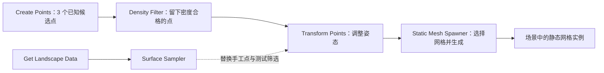

# 04 PCG 程序化内容生成（Procedural Content Generation）

> 知识成熟度：L2。本文核对 Epic 公开文档，解释图数据、最小生成流程及扩展边界；不包含本次 UE 编译、编辑器操作、PIE、GPU 或性能实测。
> 最后更新：2026-10-10（本次为公开资料静态校订，未运行 UE）。
> 版本基准：主体依据 2026-10-10 实际读取的 UE 5.6 版本选择页；World 坐标设置的版本证据缺口在操作步骤旁说明，C++ 扩展部分另标 API 索引版本。公开文档不是不可变源码快照，不承诺跨版本直接编译。
> 历史边界：旧稿曾记录本机 UE 5.8.0 / CL 55116800 的源码核对。本次没有该安装或 checkout，不能继承为本次观察，也不据此宣布历史记录已被证实或推翻。

## PCG 解决什么问题，图中的线传什么

当关卡中一片树林必须随地形、道路和美术规则反复调整时，逐棵移动树很难维护。PCG 把“在哪里放、哪些位置合格、放什么”拆成可重复求值的图。它也能用于建筑、样条摆放和资产工具，并不限于开放世界植被。

先区分三件事：**空间输入描述哪里可以取样，点数据描述候选放置位置，Spawner 才创建场景中的对象或实例**。一张图可以读 Landscape、样条或属性集，不能把所有输入都当成已经存在的点数组；生成节点还会改变场景，并非每个节点都是无副作用的数学函数。PCG Component 把图和关卡中的生成范围关联起来。[官方概览：Procedural Node Graph、PCG Component](https://dev.epicgames.com/documentation/en-us/unreal-engine/procedural-content-generation-overview?application_version=5.6)

下面是一条数据链。前四个框是图内节点，最后一个框是结果；后文给出每个输入值与连接位置。



图的价值在于能够逐段检查：没有实例时，先确认上游到底有没有点；有点却摆错时，检查 Transform；仅最终外观错误时，再检查网格、轴心与生成设置。

## 点不只是坐标：属性、空间与密度

`FPCGPoint` 是理解点数据的一个入口。下表是语义摘要，不是结构体源码；公开的 [PCGPoint 字段及元数据访问 API（5.6）](https://dev.epicgames.com/documentation/en-us/unreal-engine/python-api/class/PCGPoint?application_version=5.6)列出字段和取值接口。该 Python API 页用于核对公开反射信息，不表示游戏运行时使用 Python。

| 数据 | 用途及容易混淆之处 |
| --- | --- |
| `Transform` | 位置、旋转、缩放。本文最小例显式使用世界空间；局部空间的 Create Points 或资产组合必须先说明参照物 |
| `BoundsMin / BoundsMax` | 点自身局部包围范围，可经 Transform 得到空间范围；不是物理碰撞形状，也不天然等于将来网格的大小 |
| `Density` | 供后续节点解释的无量纲密度值；常用范围 0～1。它不是“每平方米点数”，也不是写成 0.3 就必定自动删除七成实例 |
| `Steepness` | 点体积的密度影响由软到硬的形状参数；不是地表坡度角 |
| `Seed` | 随机过程的输入之一；点、节点设置与组件都可能贡献种子 |
| `Color` | 点上的颜色数据。要影响材质仍需相应属性传递和材质读取，不能等同于已写入网格顶点色 |
| `MetadataEntry` | 指向元数据条目的键，不是点内嵌的一份 `FPCGMetadata` 属性袋。自定义属性值还依赖所属数据的元数据 |

例如，两点有相同位置、不同 Density；`Density Filter` 会按区间筛选，而不按位置筛选。相反，把 Steepness 从 0 改到 1，改变的是该点体积的密度表示，不能据此判断它位于平地还是陡坡。[Surface Sampler 的 Point Steepness、Point Extents 说明](https://dev.epicgames.com/documentation/en-us/unreal-engine/python-api/class/PCGSurfaceSamplerSettings?application_version=5.6)

本文坐标和 Bounds 按 UE 默认长度单位厘米，旋转按度，Scale 无单位：300 cm 是 3 m；采样设置 `Points Per Square Meter` 则明确按平方米。不能把 0.15 点/m² 当成 0.15 点/cm²。[UE 单位说明](https://dev.epicgames.com/documentation/en-us/unreal-engine/units-of-measurement-in-unreal-engine?application_version=5.6)

## 最小正常流程：三个点生成两个实例

这是基于公开节点语义编写的**待在 UE 中复现步骤**。它用已知输入隔离密度筛选与生成，先不引入地形、随机分布、分区或 GPU。

### 1. 准备范围、图和网格

在已启用 PCG 插件的项目中，用一个普通、非 World Partition 的测试关卡。放入 PCG Volume，范围覆盖世界坐标 X=-500～500、Y=-500～500、Z=-100～500 cm。注意填写或观察的是实际范围，不是把 Actor 的 Scale 数值当厘米。

新建 PCG Graph `PCG_ThreePoints`，赋给该 Volume 的 PCG Component；关闭 `Is Partitioned`，Generation Trigger 设为 Generate On Demand，组件 Seed 固定为 42。准备一个已能正常显示的简单 Static Mesh，记录其尺寸和轴心；本例的点只是网格轴心的位置，不承诺底面贴地。图分配和 Generate 入口参见[官方 PCG Component 操作](https://dev.epicgames.com/documentation/en-us/unreal-engine/procedural-content-generation-overview?application_version=5.6)，触发模式见[Generation Trigger 枚举](https://dev.epicgames.com/documentation/en-us/unreal-engine/python-api/class/PCGComponentGenerationTrigger?application_version=5.6)。

### 2. 填入明确的点，而不是依赖默认值

本例以**项目版本已确认支持 World 坐标设置**为宿主前提：5.6 的设置页确认有 `Coordinate Space` 参照系选项，但本次未读到其 5.6 枚举子页；`WORLD` 仅有[当前标为 5.8 的公开枚举页](https://dev.epicgames.com/documentation/en-us/unreal-engine/python-api/class/PCGCoordinateSpace)旁证，不能据此称 5.6 的枚举成员或 UI 已核对。复现前按项目版本的 UI/API 确认；没有对应选项时，先停止下面的世界坐标断言并核对参照系，不要默默改成局部坐标。

确认此前提后，添加 `Create Points`，将 `Coordinate Space` 设为 World，关闭 `Cull Points Outside Volume`，在 `Points To Create` 中添加三项。每项显式设置位置、Density、Rotation=(0,0,0)、Scale=(1,1,1)、BoundsMin=(-25,-25,-25)、BoundsMax=(25,25,25)、Steepness=1、Color=(1,1,1,1)；Seed 分别设为 11、12、13。

| 点 | 世界位置，cm | Density |
| --- | --- | --- |
| A | (-300, 0, 100) | 1.0 |
| B | (0, 0, 100) | 0.2 |
| C | (300, 0, 100) | 1.0 |

`Create Points` 直接产生给定列表；坐标空间和范围剔除是它的独立设置。首次 Generate 后，先 Inspect 此节点，确认输出确为表中的三个世界坐标，再继续判断过滤和实例结果。先关闭剔除是为了让这个固定输入练习只检查密度规则；实际项目要按生成域重新决定是否启用。[Create Points API（5.6；确认设置项，不补足上述枚举缺口）](https://dev.epicgames.com/documentation/en-us/unreal-engine/python-api/class/PCGCreatePointsSettings?application_version=5.6)

### 3. 按数据引脚连接到真正的生成节点

按以下顺序连接各节点的普通点数据输出与输入；不要接到设置覆盖用的高级引脚。

1. `Create Points` 输出 → `Density Filter` 输入。Lower Bound=0.5，Upper Bound=1.0，Invert Filter 关闭，Keep Zero Density Points 关闭。本例没有卡在 0.5 边界的点，保留 A、C，剔除 B。[Density Filter 参数](https://dev.epicgames.com/documentation/en-us/unreal-engine/python-api/class/PCGDensityFilterSettings?application_version=5.6)
2. `Density Filter` 输出 → `Transform Points` 输入。Offset Min/Max 均为零，Rotation Min/Max 均为零，Scale Min/Max 均为 (1,1,1)，Apply to Attribute 关闭。本次先不改变位置和姿态，便于与表格逐一核对。[Transform Points 参数](https://dev.epicgames.com/documentation/en-us/unreal-engine/python-api/class/PCGTransformPointsSettings?application_version=5.6)
3. `Transform Points` 输出 → `Static Mesh Spawner` 输入。选择 Weighted 网格选择器，只加一个 Mesh Entry，Weight=1，在 Descriptor 中选择准备好的 Static Mesh；使用 CPU 执行。其输出可接图的 `Output` 供查看数据；真正创建实例的是 Spawner。[网格选择器](https://dev.epicgames.com/documentation/en-us/unreal-engine/python-api/class/PCGMeshSelectorWeighted?application_version=5.6)、[Spawner 参数](https://dev.epicgames.com/documentation/en-us/unreal-engine/python-api/class/PCGStaticMeshSpawnerSettings?application_version=5.6)

第一次确认节点链完整后，在关卡中选中该组件并点击 Generate。等待生成完成，在图的 Debug Tree 中选中这个组件，对节点使用 Inspect 查看点；可用 D 切换点的 Debug 显示。**调试点的可视化不是生成的网格实例**。

### 4. 预期结果与一个有意义的反例

| 观察位置 | 预期结果，尚非本次实测 |
| --- | --- |
| Create Points 后 | 3 个点，坐标和 Density 与输入表一致 |
| Density Filter 后 | 2 个点，世界 X 分别为 -300、300 |
| Transform Points 后 | 仍为这 2 个点，姿态未变 |
| 场景结果 | 这两个位置各有一个所选网格实例；中心 B 处没有实例 |

上表是**第一轮生成**：输入 3 点 → 过滤后 2 点 → 变换后仍为 2 点 → 生成 2 个实例。Transform Points 在此流程中不增加点。

再做**第二轮生成**：仅将 Density Filter 的 Lower Bound 从 0.5 改为 0.1，其他输入和设置保持不变，再点击 Generate。此轮预期是输入 3 点 → 过滤后 3 点 → 变换后仍为 3 点 → 生成 3 个实例。这里的 0.2 没有自动变成“20% 概率生成一次”；究竟删除点还是概率抽样，取决于执行的节点。若需要随机抽取子集，应显式使用 `Select Points` 等相应节点，而非把 Density 视作全图自动执行的规则。[节点参考：Filter、Select Points](https://dev.epicgames.com/documentation/en-us/unreal-engine/procedural-content-generation-framework-node-reference-in-unreal-engine?application_version=5.6)

若三点输入正确而最终没有实例，先查过滤后的点数，再查 Mesh Entry 是否选了资产、Spawner 是否启用及生成日志。若关闭点 Debug 后“物体消失”，先前看到的可能只有调试显示。不要用重装插件代替这条数据链的逐段检查。

## 把已知点换成地表采样：为什么会贴地，为什么还会穿插

最小图通顺以后，再做树林版本：保留下游 Transform Points 和 Static Mesh Spawner，把 Create Points 与测试用 Density Filter 替换为 `Get Landscape Data → Surface Sampler`。准备一个已经加载、实际与 PCG Volume 相交的 Landscape；只用一块 Landscape，可避免初学时把 Actor 选择规则与采样混在一起。

`Get Landscape Data` 的地表数据输出接 `Surface Sampler` 的地表输入；其点输出接 Transform Points。让 Sampler 的 `Unbounded` 保持关闭，且不接额外 Bounding Shape 时，它按拥有者边界限制采样域。这是“在哪里撒”的前提，PCG Volume 本身不会凭空提供一个可采样地表。[Get Landscape Data](https://dev.epicgames.com/documentation/en-us/unreal-engine/python-api/class/PCGGetLandscapeSettings?application_version=5.6)、[Surface Sampler 参数](https://dev.epicgames.com/documentation/en-us/unreal-engine/python-api/class/PCGSurfaceSamplerSettings?application_version=5.6)

从小范围开始，例如覆盖 20 m × 20 m 的地表，设 Points Per Square Meter=0.15、Point Extents=(50,50,50) cm、Looseness=1。先 Inspect 采样结果，再决定是否增加密度。50 cm 是点的半尺寸，不是树冠的自动测量。400 m²×0.15≈60 只能作输入规模的粗估，不能当严格点数断言；网格构造、边界、输入密度及版本选项都会参与结果。公开节点参考与设置 API 对网格构造的叙述还有新旧差异，本文不把其中一条公式推广到所有版本和设置。

采样点应已经随 Landscape 表面变化，不需要为了“贴地”无条件再接一次 Projection。让 Transform Points 的平移保持零；想让树竖直时启用 Absolute Rotation，再给偏航角变化；想保留沿法线的朝向时保留相对旋转。然后以 Uniform Scale 在 0.8～1.2 间变化，是对相同图的外观扩展，不是保证自然分布的定律。若实例悬空或埋地，依次检查采样点位置、额外偏移、模型轴心与缩放。[官方地表示例](https://dev.epicgames.com/documentation/en-us/unreal-engine/procedural-content-generation-overview?application_version=5.6)、[变换的绝对/相对设置](https://dev.epicgames.com/documentation/en-us/unreal-engine/python-api/class/PCGTransformPointsSettings?application_version=5.6)

## 增加规则前，先说明它读哪个量

原有“地形 → 筛选 → 姿态 → 实例”的拓扑可以保留，但每种规则需要真实的数据来源，不能都塞给 Density Filter。

其他输入也有对应入口：`Spline Sampler` 可沿样条曲线采点，再供路灯摆放；`Mesh Sampler` 从指定静态网格表面采点，要求项目已启用 Geometry Script 与 PCG Geometry Script Interop 插件，所得点可作为藤蔓系统的输入，并不等于完整藤蔓生成。`Intersection` / `Union` 用于组合空间分布，结果还受输入引脚和密度规则影响，不能无条件视作普通点数组集合；水域剔除可沿用 `Difference` 的区域排除思路。`Bounds Modifier` 修改点的 Bounds，可在 Self Pruning 或空间运算前调整占位范围。[节点参考：Bounds Modifier、Mesh/Spline Sampler、Intersection、Union](https://dev.epicgames.com/documentation/en-us/unreal-engine/procedural-content-generation-framework-node-reference-in-unreal-engine?application_version=5.6)

| 要做的事 | 合适的输入与处理 | 判断是否接对 |
| --- | --- | --- |
| 限制高度 | 在已知空间中的点上，用 Attribute Filter/Range 读取 `$Position.Z`，阈值按 cm | 在所需世界高度上下各选一点，查看筛选两侧输出 |
| 限制坡度 | 先取得地表法线 N，再与世界 Up 点积。地面法线已单位化且朝上时，允许坡角≤30° 等价于 `dot(N, Up) >= cos(30°)`，约 0.866 | 在改变点的朝向之前取法线；不能拿已被 Absolute Rotation 覆写的 Up 当原始法线，更不能用 Steepness 代替 |
| 排除道路 | 先把道路样条解释成有宽度的排除区域，再做 Difference 或显式距离过滤 | 画出排除宽度及道路附近的点；一条中心曲线不自动代表完整路面 |
| 避免点互相占位 | 设置有意义的 Bounds，再用 Self Pruning | 先看点 Bounds 是否覆盖所需间距；这不是对任意网格三角面做碰撞求解 |
| 按 Landscape 图层权重筛选 | 在 Get Landscape Data 的 Sampling Properties 中启用 Get Layer Weights，采样后 Inspect 实际输出属性，再过滤具体层 | 核对层名、属性类型和非零权重；不存在一个可对所有项目照填的通用 `LayerWeight` 字段 |

高度筛选的属性选择和范围常量来自[Attribute Filtering Range API](https://dev.epicgames.com/documentation/en-us/unreal-engine/python-api/class/PCGAttributeFilteringRangeSettings?application_version=5.6)；坡度判据是向量几何推导，法线/图层是否采集见[Landscape Data Props](https://dev.epicgames.com/documentation/en-us/unreal-engine/python-api/class/PCGLandscapeDataProps?application_version=5.6)。道路、Self Pruning、样条内外采样的具体模式见[节点参考：Spline Sampler、Difference、Self Pruning](https://dev.epicgames.com/documentation/en-us/unreal-engine/procedural-content-generation-framework-node-reference-in-unreal-engine?application_version=5.6)。该表解释规则选择，不声称已经提供完整道路或坡度资产。

要让点的 Color 或湿度属性影响材质，还要配置实例自定义数据打包并在材质中消费；Spawner 公开 `Instance Data Packer` 设置。生成组件可能是 ISM 或 HISM，甚至允许根据 Nanite 等条件调整描述符，因此“Static Mesh Spawner 必定输出 HISM”不成立。[Spawner 数据打包与描述符设置](https://dev.epicgames.com/documentation/en-us/unreal-engine/python-api/class/PCGStaticMeshSpawnerSettings?application_version=5.6)

## 自定义 C++ 节点：先保留正确的过滤规则

内置 Attribute Filter 已能表达大部分高度/密度筛选。需要复用专门算法时，再把规则封装成 Settings 与 Element：Settings 保存可编辑参数和引脚合同，Element 在上下文中读取输入并产生输出。公开 API 定位为 `PCGSettings.h` 的 `UPCGSettings`、`PCGElement.h` 的 `IPCGElement`；本次实际读到的这两个 C++ 索引为 **5.8**，仅用于定位扩展接口，不能当作本文 5.6 示例的编译证据。[UPCGSettings](https://dev.epicgames.com/documentation/en-us/unreal-engine/API/Plugins/PCG/UPCGSettings)、[IPCGElement](https://dev.epicgames.com/documentation/en-us/unreal-engine/API/Plugins/PCG/IPCGElement)

在同次读取的 5.8 API 索引中，`FPCGDataCollection` 包含 `FPCGTaggedData` 条目，条目携带 Data、Pin 和 Tags。读输入和提交输出时要保留这层数据路由，不能用旧稿笼统的“节点只接收 FPCGData”替代实际类型合同。[FPCGDataCollection](https://dev.epicgames.com/documentation/en-us/unreal-engine/API/Plugins/PCG/FPCGDataCollection)、[FPCGTaggedData](https://dev.epicgames.com/documentation/en-us/unreal-engine/API/Plugins/PCG/FPCGTaggedData)

旧示例实际只做高度和密度的硬过滤，并没有坡度、噪声或侵蚀算法。保留其有用的核心谓词如下；这是自写教学节选，未编译，不是引擎源码或完整插件：

```cpp
#include "PCGPoint.h"

// 前提：输入点的 Transform 已处于世界空间；阈值单位为 cm。
static bool KeepHeightAndDensity(const FPCGPoint& Point,
                                 double MaxWorldZCm,
                                 float MinDensity)
{
    return Point.Transform.GetLocation().Z <= MaxWorldZCm
        && Point.Density >= MinDensity;
}
```

手工追踪 `MaxWorldZCm=1000`、`MinDensity=0.3`：点 (Z=800,Density=0.8) 保留；(1200,0.8) 因高度剔除；(800,0.2) 因密度剔除。1000 cm 表示固定世界高度 10 m，既不是“相对地面的高度”，也不是米单位的 1000。此谓词不使用随机数，无须为了它设置随机开关。

落地为完整节点时，还有以下必要合同；只把上述循环粘进类中并不够：

1. 目标模块依赖 PCG；Settings 头、生成头和实现文件名称保持一致，显式声明支持的点输入/输出引脚。`CreateElement()` 对应执行体，不把整个头与实现杂糅成一个声称可编译的文件。
2. 输入如果不是支持的点数据，应报告或按明确转换规则处理。不同版本有不同点数据表示，直接只 Cast 到某一个具体点数据类可能遗漏其他输入；按目标版本检查对应点接口。
3. 输出是新数据时，需要建立正确的元数据继承/复制关系，保留有效点的属性关联；不能只复制 `MetadataEntry` 数字，却丢失它依赖的元数据。保留输入数据的 Tags，再明确设置输出 Pin，避免后续按 Tag 分路失效。
4. 在执行上下文内保存本次计算状态，不能把会被多个图实例使用的共享设置当作一次执行的临时缓存。具体对象创建、调度和分帧接口须对照目标源码；本节不提供未经验证的线程安全承诺。

上述合同是代码审查与实现路线；需要在目标 UE 工程中补齐 UHT、编译、带元数据输入和空输入等验证后，才能称为完成的自定义节点。固定种子有利于在固定输入、规则与版本下复查差异，但不能独立保证跨平台、跨版本、CPU/GPU 逐点完全一致。5.6 公开设置已把旧 `use_seed` 标为废弃并指向 `UseSeed()`，不应继续把 `bUseSeed=true` 当成通用解决方案。[公开设置中的废弃说明](https://dev.epicgames.com/documentation/en-us/unreal-engine/python-api/class/PCGSurfaceSamplerSettings?application_version=5.6)

## Generate、Cleanup 与再次生成

关卡编辑器中的 Generate 和 Cleanup 是最容易观察的入口。运行时应先明确采用“业务事件按需触发”还是“附近生成源驱动”，二者不是同一个机制。

对一个已经注册、已赋图、拥有有效输入范围的组件，按需生成的顺序是：先绑定完成/清理回调，再提交生成，收到完成事件后读取需要的结果。组件公开的 Generate 是网络调用入口；GenerateLocal 是本地入口且会延后执行。CleanupLocal 同样不是同步完成保证；Cleanup 的布尔参数名为 `remove_components`，不能把它理解为删除承载图的 PCG Component，也不是“立即清空全部内存”的保证。生成结果中哪些受管组件会移除，须按目标版本的资源语义核对。[PCGComponent 5.6 API：generate、generate_local、cleanup_local、完成事件](https://dev.epicgames.com/documentation/en-us/unreal-engine/python-api/class/PCGComponent?application_version=5.6)

```text
已有组件 + 已赋图 + 输入已就绪
  → 绑定本次所需的 Generated / Cleaned 回调
  → 按需请求 GenerateLocal
  → Generated 后观察实例与结果
  → 需要撤销时请求 CleanupLocal
  → Cleaned 后确认受管结果清除，再决定是否生成
```

这是调用顺序示意，不是蓝图或 C++ 的完整可运行资产。本地最小例先只允许一个未完成的生成/清理请求；重复按钮可暂时禁用，防止把多次事件日志误认为同一次结果。不要在每帧无条件强制 Generate，也不要把函数调用后的日志命名为“生成完成”。

对编辑器最小例，先将 Density Filter 的 Lower Bound 恢复为 0.5，生成并确认 2 个实例。Cleanup 后应看不到该图创建的实例，再 Generate 应能恢复这 2 个实例。若外部系统另外 Spawn 了 Actor、改了既有 Actor 属性或将资源脱离 PCG 管理，不能指望此 Cleanup 撤销一切。砍树也应修改可持久的业务状态或排除输入后重建：直接按某次 ISM Instance Index 移除实例只是即时展示改动，不能充当跨重生成稳定的树木身份。这一持久化策略是项目设计建议，不是 PCG 自动提供的存档能力。

## 大世界边界：生成网格、流送与 HLOD 各管一件事

`Is Partitioned` 把 PCG 生成范围分给局部组件；普通分区网格由 PCGWorldActor 配置。启用 Hierarchical Generation 后，还可以让图的不同分支采用不同 Grid Size，且 Grid Size 节点应放在对应采样器之前。它们决定计算与结果如何分块，不要求与 World Partition 的流送格一一相同。[生成模式：Partitioned、Hierarchical Generation](https://dev.epicgames.com/documentation/unreal-engine/using-pcg-generation-modes-in-unreal-engine?application_version=5.6)

World Partition 负责世界对象的加载/卸载；PCG 的 Runtime Generation 还要配置 `Generation Trigger=Generate at Runtime`、生成源和各级生成半径。生成源进入范围时请求调度，超出清理范围后清理；这不是“单元进入视野就同步生成”。较大的清理范围可以减少边界来回移动引发的反复工作，但距离与预算必须按项目验证。

只有先选对模式，才谈验证：编辑器已生成并随关卡保存的内容，重点检查流送与打包；运行时生成的内容，重点检查输入是否已加载、生成源、半径和任务耗时。分区并不证明零卡顿；从大网格向小网格传点时还要防止重复，在合适位置按局部范围裁剪。上述机制与风险见同一[生成模式文档](https://dev.epicgames.com/documentation/unreal-engine/using-pcg-generation-modes-in-unreal-engine?application_version=5.6)。

HLOD 是另一条构建与运行链。官方说明 PCG 资产指定 Data Layer/HLOD Layer 后，生成的 Actor 可继承相应层；不能把未经核对的 `bIncludeInHLOD` 或一条通用“Bake PCG”命令当作全部步骤。[Using PCG with World Partition](https://dev.epicgames.com/documentation/unreal-engine/using-pcg-with-world-partition-in-unreal-engine?application_version=5.6) 具体构建过程转到[大世界植被与渲染协同](../../04-图形动画与物理仿真/材质地形与世界表现/05-大世界植被与渲染协同.md)，本节不声称已经验证那篇的源码与工程步骤。

## GPU、Actor 与性能取舍

GPU 执行只适用于支持它的节点或 Custom HLSL 路径，不能因启用 PCG 插件就推断整图已搬到 GPU。连续 GPU 节点可组成 Compute Graph；CPU/GPU 边界的数据上传、读回和图准备都有成本。先在 CPU 图确认输出语义，再为适合的大批数据评估 GPU，并检查目标版本、RHI、支持节点和所需生成能力；本文不提供统一的硬件兼容清单或“千万点”容量保证。[GPU Processing：Supported Nodes、Compute Graph 与传输成本](https://dev.epicgames.com/documentation/en-us/unreal-engine/using-pcg-with-gpu-processing-in-unreal-engine?application_version=5.6)

静态网格实例适合重复外观，Spawn Actor 适合需要独立行为的对象；Subgraph 是组合图的方式，不是另一种渲染实例化器。选择 Actor 时把 Tick、组件、碰撞和游戏状态成本纳入预算，不能给所有项目套一个数量禁令。PCG 与手工 Foliage 可以共同使用，但要明确谁拥有哪片结果，避免自动再生成覆盖人工调整。[节点参考：Spawner、Subgraph](https://dev.epicgames.com/documentation/en-us/unreal-engine/procedural-content-generation-framework-node-reference-in-unreal-engine?application_version=5.6)

性能排查按实际耗时定位：取样和输入查询、过滤、资产加载、实例创建、渲染各自可能成为瓶颈。把已具备所需属性的廉价筛选前置，是减少下游工作量的候选优化；如果高度或法线只能通过查询获得，就不能把依赖它们的筛选移到查询之前。本次没有测量，不给出固定淘汰比例、生成预算或异步开关处方。

## 关联阅读与验证边界

- [Landscape 地形系统](../../04-图形动画与物理仿真/材质地形与世界表现/01-Landscape地形系统.md)：地表与材质层的来源
- [植被 Foliage 与实例化渲染](../../04-图形动画与物理仿真/材质地形与世界表现/02-植被Foliage与实例化渲染.md)：实例组件和渲染取舍
- [大世界植被与渲染协同](../../04-图形动画与物理仿真/材质地形与世界表现/05-大世界植被与渲染协同.md)：PCG 与世界构建的扩展案例
- [PCG 源码](38-PCG源码.md)：执行器与上下文的源码专题；其中历史安装、CL 与行号需要在各自环境核验
- [World Partition 大世界](../世界组织与资源加载/09-WorldPartition大世界.md)：世界对象流送的职责
- [程序化生成算法](../../02-数学与游戏算法/随机采样与程序化生成/02-程序化生成.md)：噪声和空间采样的数学基础

本文完成的是文档层的原理核对与可观察复现设计。第一轮留下 2 点、第二轮修改阈值后留下 3 点，是由显式输入和筛选规则推导的预期，不是 UE 运行报告；后续最小实机验收应记录引擎版本、每轮图设置、各节点点数、实际实例数，以及 Cleanup 后重生成结果。自定义节点编译、元数据保全、World Partition 流送、GPU 与性能需要各自对应的工程证据，不能由这个最小例替代。
