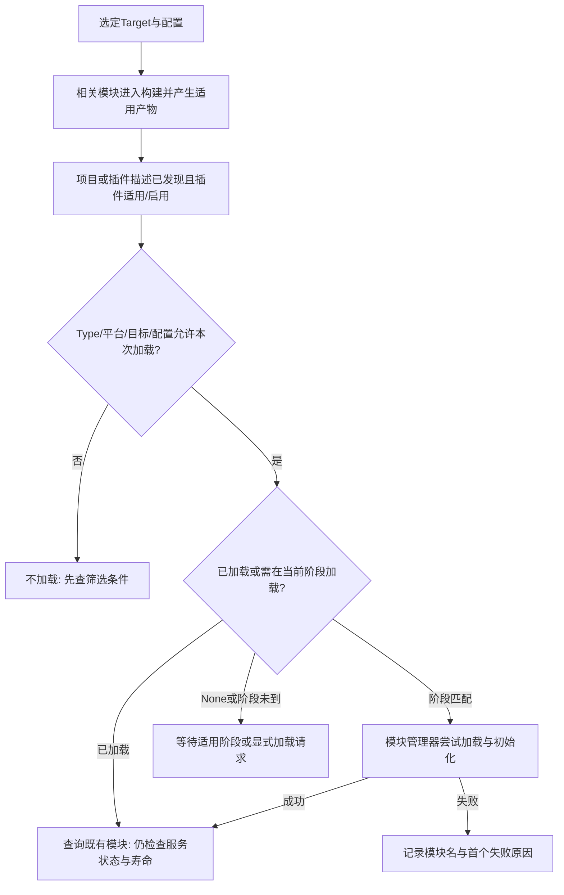

# 04 引擎启动流程与模块架构

> 知识成熟度：L2。主要结论来自公开接口、官方指南及已存历史摘录的静态核对；示例未编译、未运行。
> 版本基准：2026-10-10 实际读取的 Epic 固定 UE 5.5 / 5.6 文档；补充 API 页当次标示 UE 5.8，逐项见来源表。网页版本标签不证明用户安装版本。
> 适用范围：UE 模块配置、启动加载政策和生命周期排障；第 4.1 节是职责定位图，尚未提供固定版本 Standalone Game 从平台入口到首个 World 开始游戏的函数调用链。Game、Editor/PIE、Server、Commandlet、Program 的路径需分别确认，不能互换。
> 源码核对状态：未访问真实引擎 checkout。仅阅读仓内《08-Tick与模块系统源码》的已有摘录；该材料自述 UE 5.8.2、分支 UE5、CompatibleChangelist 55116800，未提供可供本轮确认的引擎 commit。其历史身份不能替代当前源码身份，也不等于原稿声称的本机 UE 5.8.0 / CL 55116800。
> 最后更新：2026-10-10（全文静态修订；UE、UHT、UBT、编译、引擎启动、插件加载、GC、线程及性能实验均未运行）。

## 一、概述：先分清四种“准备好了”

模块是 UE 组织代码和构建依赖的重要单元，启动时还通过模块接口建立服务、注册类型和扩展入口。Windows 的模块常以 DLL 交付，但单体或合并构建并非“一模块一 DLL”，模块对象也不是 UObject。排查时至少区分四层：

1. **构建可达**：目标选择了相关模块，头文件和链接依赖正确，产物能生成。
2. **加载完成**：本次宿主允许该模块加载，代码及模块接口被装入，启动回调完成。
3. **服务可用**：模块提供的某项功能、资源或异步初始化达到了它自己的就绪条件。
4. **玩法可用**：调用属于哪个 World、GameInstance、LocalPlayer，是否处于有效玩法期。

前一层不自动推出后一层。DLL 已映射，不代表 `StartupModule` 已执行；模块可查询，不代表它发起的资源请求已经完成；`PostEngineInit` 到达，也不代表 PIE 已启动或任意 Actor 已 BeginPlay。退出时还要反向问：谁停止新请求、移除回调、等在途工作结束，以及谁允许代码最终卸载。

本文围绕模块声明与构建、插件组织、GameInstance、控制台命令和启动排障展开，读者可据此区分模块未加载、服务未就绪和会话尚未建立。具体 Standalone 启动调用链仍是未补齐的教学项；构建/UHT、Actor 生命周期、Subsystem 的细节由关联主篇承接。

## 二、核心概念与责任表

| 对象 | 负责什么 | 不代表什么 |
| --- | --- | --- |
| UE Module | 代码边界、构建规则、模块实现与加载身份 | 不必独占 DLL；不是 C++ 单个翻译单元 |
| `IModuleInterface` | 模块对象的启动、退出及相关能力接口 | 不提供 UObject 的 GC，也不自动回收所有外部使用者 |
| `IMPLEMENT_MODULE` | 建立模块实现与名称所需的注册配套 | 不是操作系统 `main`；不保证此处已创建游戏世界 |
| `IMPLEMENT_PRIMARY_GAME_MODULE` | 游戏主模块所需的构建/入口配套 | 不是业务模块启动全序，第三参数的实际宏用途须看版本 |
| `FModuleManager` | 查询、加载、卸载模块接口与相关状态 | 查询得到的裸指针不是永久寿命凭证 |
| `Build.cs` | 模块的编译、公开/私有依赖等构建规则 | 不把所有 `StartupModule` 自动拓扑排序 |
| `Target.cs` | Game/Editor/Client/Server/Program 等目标规则 | 启动参数不能补出未构建的目标能力 |
| `.uproject` / `.uplugin` | 项目/插件描述、模块与插件配置 | 插件启用、模块适用性、实际加载仍是不同判断 |
| `Type` / `LoadingPhase` | 允许哪个宿主加载 / 何时自动尝试加载 | 不是服务就绪和异步排空协议 |
| UBT / UHT / UAT | 构建协调 / 反射配套生成 / 上层自动化 | 编译、Cook、Stage、Package、Run 不是一个成功状态 |
| `FEngineLoop` | 应用启动、主循环与退出的控制入口 | 不是所有平台/模式共用的一张无分支时序表 |
| `UEngine` / `GEngine` | 引擎实例及全局访问入口 | 不直接标识唯一游戏 World 或 PIE 会话 |
| `UGameInstance` | 一次运行游戏实例的会话宿主 | 不保证进程唯一、联网复制或退出后持久化 |
| World / Actor / Subsystem | 世界、玩法对象和按宿主管理的服务 | 与模块、引擎进程各有不同寿命 |
| `GIsEditor` / 运行模式信息 | 区分适用执行路径的上下文 | 单一标志不能替代 Target、WorldType、NetMode 与会话身份 |

模块接口及文件职责见 S01、S04、S05、S12；引擎循环仅按 S13 的公开职责说明，不由类页推导未展示的实现。

## 三、模块如何从构建描述变成可用服务

### 3.1 构建图、加载阶段和业务依赖是三张图

`Build.cs` 中的依赖让构建系统准备接口可见性、编译环境与链接关系。公开头暴露了另一模块的类型，通常需要公开依赖；只在私有实现中使用，通常使用私有依赖。它们的精确规则见 [UBT 构建系统与编译配置](../../08-工程实践与质量/构建编译与制品/01-UBT构建系统与编译配置.md)。

`LoadingPhase` 则是启动加载政策。官方 Modules 指南明确：**同一 LoadingPhase 内，不能依赖模块之间确定的加载次序**。A 的 `StartupModule` 同步需要 B 的模块接口时，应显式加载 B，处理失败，并避免 A↔B 的初始化循环。把 B 放在 `PublicDependencyModuleNames`，或恰好在一次日志里先出现，都不能代替这条运行期关系。（S01、S06）

业务依赖又更细：B 的 `StartupModule` 可能只是发起数据加载。A 成功取得 B，只能按 B 的公开服务合同判断是否能工作，不能据此使用尚未完成的数据。需要异步准备时，B 应暴露清楚的 Ready/Failed/Closing 状态、订阅方式和取消/关闭责任；不要用“再等一帧”猜测完成。

**正常退出的方向也要讲对。** 官方 `ShutdownModule` 合同按模块完成 `StartupModule` 的逆序退出。若 A.Startup 内同步加载 B，B 先完成，A 后完成，则正常退出时先 A、后 B，使 A 可在自己的 Shutdown 中使用 B。该保证限定正常模块退出关系；显式提前卸载 B、初始化循环、未完成的业务任务都不能靠它兜底。`UnloadModule` 官方文档特别提示手动卸载可能过早移走别人的依赖。（S07、S09）

已存 H08 的非单体加载摘录也把 `LoadOrder` 的再次赋值放在 Startup 返回之后；它附近有一句“后赋值的依赖模块会先关”的解释方向错误，不能沿用。本篇采用上面的 A/B 因果推演，不修改相邻历史材料。

### 3.2 自动加载要依次通过哪些条件



这是作者的诊断因果图，不是函数体逐行展开。模块没有被编译、插件没有启用、Type/平台过滤不符、阶段未到和加载失败，是不同的问题；重新生成 IDE 工程不会自动修复全部情况。

S12 将 `IsCompiledInConfiguration` 和 `IsLoadedInCurrentConfiguration` 明确分为两类查询。H08 已存 `LoadModulesForPhase` 函数片段只显示：遍历描述符、跳过已加载项、匹配阶段和配置、调用加载接口并收集失败。该片段没有依赖拓扑排序；不能扩大成“整个引擎加载过程不存在任何依赖处理”。其中某项失败继续收集错误，也不等于上层启动流程会忽略错误继续游戏。

### 3.3 查询、加载和失败处理

| 问题 | 适用接口与含义 | 使用边界 |
| --- | --- | --- |
| 这个名字对应的模块是否存在？ | `ModuleExists` | 存在性不问当前是否已经加载 |
| 当前是否加载？ | `IsModuleLoaded` | 状态快照，不保证后续不被卸载 |
| 只取已有接口 | `GetModule` / 适用的 `GetModulePtr<T>` | 不靠查询启动模块；空值须处理 |
| 需要尝试加载 | `LoadModule` | 失败可返回空；不要把返回空当业务成功 |
| 需要具体失败信息 | `LoadModuleWithFailureReason` | 保存 `EModuleLoadResult` 与日志上下文；线程前提依版本核对 |
| 模块是不可缺失的硬性前提 | `LoadModuleChecked` | checked 不是温和失败恢复 API；可选功能不应用它兜底 |
| 想记录名称/文件/状态 | `QueryModule` / `QueryModules` | 诊断信息不替代模块接口的有效使用期 |

以上接口角色在固定 5.5 API 中可定位，当前 5.8 类页仍列出相应职责。（S04、S08、S09、S14）

下面是**作者方法体示意**，应置于已有宿主的初始化入口，直接包含 `Modules/ModuleManager.h`；未编译。调用者必须在允许加载的线程上，并与卸载协调，不能在函数返回后无期限缓存 `Loaded`：

```cpp
FModuleManager& Modules = FModuleManager::Get();
const FName ModuleName(TEXT("MyFeature"));

const bool bExists = Modules.ModuleExists(TEXT("MyFeature"), nullptr);
const bool bAlreadyLoaded = Modules.IsModuleLoaded(ModuleName);
IModuleInterface* Existing = Modules.GetModule(ModuleName);

// 可选功能：尝试加载，失败由调用方降级。不要写成静态 FModuleManager::LoadModule。
IModuleInterface* Loaded = Modules.LoadModule(ModuleName, ELoadModuleFlags::None);
if (Loaded == nullptr)
{
    // 记录失败并保持该功能不可用；本示意不伪造具体失败原因。
    return;
}
// 只在宿主保证模块使用期的范围内，通过其真实接口访问功能。
```

原示例把 `ModuleExists` 的结果命名为 `bLoaded`，会把磁盘/注册可发现误当已初始化，应使用 `IsModuleLoaded`。这里保留两种查询是为了诊断差异，不建议业务每次操作都重复调用整套接口。

线程方面，H08 已存的特定 `GetOrLoadModule` 片段允许非游戏线程取得已加载模块，但未加载且非游戏线程时返回 `NotLoadedByGameThread`。它同时注明直接 `LoadModuleWithFailureReason` 路径行为有区别。因此本文的教学政策是：**初始化/首次加载集中在经过确认的游戏线程入口，后台只使用事先准备且寿命被保证的服务**。这不是“所有版本所有加载 API 都线程安全”或“返回裸指针自动锁住模块”的承诺。

## 四、启动排障：职责里程碑与模块加载阶段

### 4.1 职责定位图：从哪一层查起

下面按职责列出排障入口；表格行序不表达函数调用先后：

| 要定位的问题 | 需要辨认的责任层 |
| --- | --- |
| 进程入口或启动模式不符 | 平台入口与应用准备；先确认 Target、平台和实际命令行 |
| 配置未生效、模块未出现 | 前置配置、描述符筛选和模块装入；对照本篇第 3 节与 LoadingPhase |
| 引擎服务暂不可用 | 引擎实例创建/初始化，以及该服务自己的就绪条件 |
| 游戏实例或地图尚未准备好 | 本次 GameInstance、World 及其适用的开始游戏路径 |
| 已进入运行期但不推进 | 主循环与具体宿主的更新责任 |
| 退出后仍有回调或代码使用者 | 停止接纳工作、对象/服务退出和进程清理；见第 6 节 |

这张表只帮助选择排查层。公开类页和分散摘录不足以给出 `main/WinMain/GuardedMain` 到首个世界开始游戏的具体调用栈。`FEngineLoop` 的公开 API 区分 `PreInit`、两段 PreInit 和应用退出准备；具体 Init/Tick/Exit 调用方式、RHI、渲染线程、Slate、输入、音频、资源注册表的相对顺序，要读所选平台和模式的真实实现。平台入口也不应统一写在 `LaunchEngineLoop.cpp`。（S13）

本仓 H08 保存了几个明确的局部调用段：

- `LoadStartupModules` 中依次尝试 PreDefault、Default、PostDefault，失败返回；这是已存函数体内的局部顺序。
- 同一阶段处的项目管理器和插件管理器是调用表达式中的两条分支入口，不能画成“项目管理器必调用插件管理器”的嵌套链；是否执行后一调用还受短路与失败返回影响。
- 存录另有 PreLoadingScreen、PostConfigInit、EarliestPossible、PostEngineInit 的调用片段；这些片段分散在较长函数中，缺少完整上下文，不能按文件行号大小编成启动全序。
- H08 将 `GEngine` 创建定位到 `FEngineLoop::Init` 的说明及行号，未在本轮已存正文中给出对应赋值语句块；本篇不把该定位重新认证为真实 checkout 观察。原稿的“PreInit 已创建 GEngine”没有足够依据，应撤回；可操作结论是不要在早期/Default 模块启动时假定 GEngine、World 或具体服务已经可用。

**尚缺的具体链：** 要补 Standalone Game 示例，需先固定引擎版本/commit、平台、Game Target 和启动参数，再核对该路径的平台入口、`PreInit/Init`、引擎与 GameInstance 创建、初始地图加载和开始游戏的实际调用点及分支。当前没有这些完整实现证据，不能把上述局部 `LoadStartupModules` 顺序继续外推成全链；本节的交付止于排障定位。

编辑器启动后可以尚无 PIE 游戏实例；同一编辑器进程也可以有多个 PIE 会话。独立游戏、编辑器内游戏和 Server 的启动责任并不相同。通常 GameInstance 先于本次游戏的关卡玩法准备，但不能把“某 GameInstance::Init 早于本次会话的初始 Actor”扩写成“早于整个进程任何 Actor 的 BeginPlay”。网络客户端、旅行、流送和晚生成 Actor 还各有自己的开始路径，见 Actor 主篇与 S10。

### 4.2 LoadingPhase 的准确含义

下表按固定 5.5 枚举页列出名字，并对照 H08 已存枚举。它描述自动启动加载的相对里程碑；**枚举值排列本身不是对所有模式完整执行顺序的证明**。（S02）

| LoadingPhase | 合同重点 | 选用理由与限制 |
| --- | --- | --- |
| `EarliestPossible` | 尽早到可以发现插件描述、平台文件系统可用的阶段 | 文件读取/压缩格式等低层功能；不是任何系统都已就绪 |
| `PostConfigInit` | 配置系统初始化之后、引擎完整初始化之前 | 确实需要早期配置钩子时使用；不授权访问 World |
| `PostSplashScreen` | 系统 splash 之后的首屏相关阶段 | 不能因名称就推成编辑器菜单就绪 |
| `PreEarlyLoadingScreen` | 在 CoreUObject 之前，为手动早期加载画面等准备 | 明确不能无条件创建或使用 UObject |
| `PreLoadingScreen` | 正式加载画面触发之前的钩子 | 不等于 `None`，也不是“手动加载” |
| `PreDefault` | Default 之前 | 明确有提前注册/类型可发现要求时使用 |
| `Default` | 启动期间的默认加载点 | 普通游戏模块的常见选择；不是 PostEngineInit 的别名 |
| `PostDefault` | Default 之后 | 需要晚于默认阶段时评估；仍不等于任意玩法准备完毕 |
| `PostEngineInit` | 引擎初始化之后 | 某些依赖较晚引擎能力的扩展；具体服务仍需确认 |
| `None` | 不自动加载 | 调用方承担显式加载、失败及退出协议 |
| `Max` | 枚举边界/辅助值 | 不作为项目的加载阶段选项 |

本次固定版本和已存枚举中没有 `BeforePostEngineInit`，原稿该项不能作为配置值。不能由这次证据断言所有未来版本永远不存在同名扩展。

默认先用 `Default`，只为明确依赖或注册截止点改变阶段。将 A 调早不一定修好问题：它可能反而早于 B 所需的引擎能力；即便 A 显式加载 B，B 若必须等晚期服务，仍会失败。正确做法通常是把“低层注册”和“依赖世界/资源的业务启动”拆开，后者由真正的宿主就绪条件驱动。

### 4.3 Type 是宿主适用性，不是打包成功证明

固定 EHostType 文档中：Runtime 覆盖适用的非 Program 宿主，RuntimeAndProgram 明确包括支持的 Program；Editor/EditorNoCommandlet 与 UncookedOnly 是不同条件，Developer 已标为因歧义弃用，DeveloperTool 按开发工具构建条件选择。ServerOnly 的描述是排除专用客户端，不能仅凭名字推断“只会在 Dedicated Server 进程加载”。（S03）

因此：

- Runtime 模块可以在 Editor 宿主中使用；“Runtime”不是“只在游戏进程”。
- Editor 专用代码应独立到适用的 Editor 模块，避免运行时公开接口暴露 `UnrealEd` 类型。
- `UncookedOnly` 不能与 `Editor` 互换；是否 cooked 与是否 editor 是不同维度。
- 错误依赖 Editor 模块并不会获得“打包时自动保留它”的合法豁免，可能直接让非编辑器目标构建失败。
- Type、插件启用、平台/Target/Configuration 筛选和实际产物都要匹配，才能谈最终包中的模块。

### 4.4 GameInstance、Subsystem 与世界各管一段寿命

`UGameInstance` 是一次运行游戏实例的宿主；固定官方 API 明确 Standalone 通常一份，PIE 每个实例一份。它可以承载同一会话跨地图的昵称、设置和累计统计，但不能因此缓存旧 World 的 Actor 并无限期使用，也不会自动保存到磁盘或复制给远端。（S10）

模块注册菜单、命令和全局工厂；GameInstance/其 Subsystem 管某个会话服务；WorldSubsystem 管具体 World 服务；LocalPlayerSubsystem 管本地玩家范围。EditorSubsystem 对应编辑器宿主。应按实际拥有关系选型，不能把它们统称为带网络能力的进程单例。

启动一个模块不等于创建所有 Subsystem，`Get` 某服务也不是任意条件下的创建/重试入口。同集合初始化依赖可在 Initialize 中显式声明；它不替代跨 World/跨 GameInstance 的业务协议，也不承诺所有退出回调按依赖逆序。详细合同见 [World、关卡与 Subsystem 体系](../世界组织与资源加载/07-World关卡与Subsystem体系.md)。

## 五、声明与使用示例

以下全部是**作者静态候选**，不是引擎源码，也没有 UHT/编译/加载结果。文件名、模块名和宏需与实际项目一致；新建模块、修改描述、编辑器设置等均只作教学说明，本轮没有执行。

### 5.1 主模块和业务拆分

```cpp
// Source/MyGame/Private/MyGame.cpp
#include "Modules/ModuleManager.h"

IMPLEMENT_PRIMARY_GAME_MODULE(FDefaultGameModuleImpl, MyGame, "MyGame");
```

保留主模块常见入口用法即可，不把三个参数解释成跨版本不变的运行时注册算法。H08 已存宏有单体/非单体分支，第三个字符串在所存分支中未被用于手工覆盖项目名；宏再引用的其它宏体未全部读取，不能声称已解释平台 `main` 的产生过程。

```text
Source/
├── MyGame/          主模块与项目装配
├── MyGameCore/      规则、数据与不依赖 UI 的功能
├── MyGameUI/        UMG/Slate 适配和呈现
└── MyGameEditor/    编辑器工具与扩展
```

依赖应从使用方指向提供方；Editor 可消费 Runtime 的接口，核心运行时不要反向依赖编辑器实现。无 UI 的逻辑模块也不必为了模板习惯声明 Slate、InputCore 或 Engine：按真正使用的公开/私有接口逐项添加。

### 5.2 Build.cs、Target.cs 与描述文件

与下一节命令模块配套的最小规则，只依赖 Core：

```csharp
// Source/MyFeature/MyFeature.Build.cs
using UnrealBuildTool;

public class MyFeature : ModuleRules
{
    public MyFeature(ReadOnlyTargetRules Target) : base(Target)
    {
        PCHUsage = PCHUsageMode.UseExplicitOrSharedPCHs;
        PrivateDependencyModuleNames.Add("Core");
    }
}
```

这是私有 `.cpp` 中使用 Core 的例子；若后来在 Public 头中暴露其类型，应重新评估 Public 依赖。游戏对象需要 CoreUObject/Engine 时再加入；UI 和 Editor 依赖也按使用边界加入相应模块，不把一个“全家桶 Build.cs”当万能模板。

`Target.cs` 中可以显式列根模块，下面仅是构造函数内的**片段**：

```csharp
Type = TargetType.Game;
ExtraModuleNames.Add("MyGame");
ExtraModuleNames.Add("MyFeature");
```

目标模板、BuildSettingsVersion 和 IncludeOrderVersion 应跟当前引擎及项目迁移政策一致；原来的 V5/Unreal5_4 组合不作为跨版本推荐。额外模块也可能通过目标依赖链或启用插件被纳入，不能说“每个模块必须都出现在 ExtraModuleNames”。

项目自己的 MyFeature 需要在相应 `.uproject` 模块配置中声明适用类型和阶段，例如 **Modules 数组中的一个对象**：

```json
{
    "Name": "MyFeature",
    "Type": "Runtime",
    "LoadingPhase": "Default"
}
```

插件组织的独立示例：

```json
{
    "FileVersion": 3,
    "Version": 1,
    "FriendlyName": "MyPlugin",
    "Modules": [
        {
            "Name": "MyPluginRuntime",
            "Type": "Runtime",
            "LoadingPhase": "Default"
        },
        {
            "Name": "MyPluginEditor",
            "Type": "Editor",
            "LoadingPhase": "PostEngineInit"
        }
    ]
}
```

这里 MyPlugin 是插件身份，MyPluginRuntime/MyPluginEditor 是模块身份，各需自己的源文件和规则；插件可以包含多个模块，也可以是无代码的内容插件。`.uplugin` 在引擎或项目的插件搜索位置被发现，`.uproject` 的 Plugins 配置表达项目使用关系；不是把 `.uplugin` 原文嵌进 `.uproject`。需要另一个插件时还应检查插件依赖/启用关系，不只增加某个模块的 Build.cs 依赖。（S11）

### 5.3 StartupModule 注册命令，ShutdownModule 清理自己拥有的登记

下面单个 `.cpp` 完整展示注册/失败/退出三条分支。它只输出诊断，不保存 UObject、不启动后台工作，也不捕获 `this`。它要求：生命周期操作与该命令执行由宿主串行协调，且宿主禁止 Startup/Shutdown 的同步嵌套重入；管理器在注销时仍存在；其它代码不会移走/替换本模块拥有的登记；退出前没有尚在执行该回调的调用者。代码中的空捕获不能免除最后这个代码寿命要求。（S15）

```cpp
// Source/MyFeature/Private/MyFeatureModule.cpp
#include "CoreMinimal.h"
#include "HAL/IConsoleManager.h"
#include "Modules/ModuleInterface.h"
#include "Modules/ModuleManager.h"

class FMyFeatureModule final : public IModuleInterface
{
public:
    virtual void StartupModule() override
    {
        IConsoleManager& Console = IConsoleManager::Get();
        if (Console.FindConsoleObject(TEXT("MyFeature.Dump"), false) != nullptr)
        {
            UE_LOG(LogTemp, Warning, TEXT("MyFeature.Dump is already registered"));
            return; // 不接管或注销别人的同名登记。
        }

        DumpCommand = Console.RegisterConsoleCommand(
            TEXT("MyFeature.Dump"),
            TEXT("Print MyFeature command availability"),
            FConsoleCommandDelegate::CreateLambda([]()
            {
                UE_LOG(LogTemp, Log, TEXT("MyFeature command invoked"));
            }),
            ECVF_Default);

        if (DumpCommand == nullptr)
        {
            UE_LOG(LogTemp, Warning, TEXT("MyFeature.Dump registration unavailable"));
        }
    }

    virtual void ShutdownModule() override
    {
        if (DumpCommand != nullptr)
        {
            IConsoleManager::Get().UnregisterConsoleObject(DumpCommand, false);
            DumpCommand = nullptr;
        }
    }

    // 本教学宿主没有提供运行中的卸载协调流程，显式不声明支持。
    virtual bool SupportsDynamicReloading() override { return false; }

private:
    IConsoleCommand* DumpCommand = nullptr; // 借用登记对象，所有权按 Console API 管理。
};

IMPLEMENT_MODULE(FMyFeatureModule, MyFeature)
```

`StartupModule` 返回类型是 void。上面发现同名命令后返回，只意味着本功能没有注册，不能让调用者误判模块管理器会因此收到“加载失败”。若诊断命令是必要功能，项目还要设计能被调用方读取的功能状态和失败报告。

该实现保存返回的登记对象，退出只处理自己的对象，解决原稿“捕获 this 却只写一句清理注释”的缺口。它未实现并发动态卸载、异步任务退场或所有者被外部替换的恢复流程；`SupportsDynamicReloading=false` 也不是任何直接底层卸载调用都无法越过的强制锁，见下一节。

### 5.4 GameInstance 的会话内数据示例

保留跨地图累计数据的使用方式，避免把它表述为进程全局或磁盘存档：

```cpp
// Source/MyGame/Public/MyGameInstance.h
#pragma once

#include "CoreMinimal.h"
#include "Engine/GameInstance.h"
#include "MyGameInstance.generated.h"

UCLASS()
class MYGAME_API UMyGameInstance : public UGameInstance
{
    GENERATED_BODY()

public:
    virtual void Init() override;
    virtual void Shutdown() override;

    UPROPERTY(BlueprintReadWrite, Category = "Session")
    int32 TotalKills = 0;
};
```

```cpp
// Source/MyGame/Private/MyGameInstance.cpp
#include "MyGameInstance.h"

void UMyGameInstance::Init()
{
    Super::Init();
    TotalKills = 0; // 新游戏实例的会话初值；不在每次加载关卡时重置。
}

void UMyGameInstance::Shutdown()
{
    // 本例只有数值；真实服务应在仍可用的退出窗口先关闭自己的请求和登记。
    Super::Shutdown();
}
```

MyGame 的公开头使用 CoreUObject/Engine，规则需为这些接口配置适当依赖；`MYGAME_API` 必须匹配实际模块，generated include 保持为最后一条 include。这里只教授寿命与职责，不提供存档 I/O 或异步保存实现。重要保存应放在有反馈/重试机会的业务保存点，不能只等进程退出。

蓝图使用时，在项目的 Maps & Modes 中选 Game Instance Class，按当前 World/会话上下文取得 GameInstance 并转换为真实类型，处理缺失/转换失败，再访问数据。Default GameMode 影响玩法规则类，不是模块加载开关。插件可从编辑器的插件界面启用，但界面位置和是否需重启以目标版本为准。GameInstance 的初始化事件只适合该会话，不是任意引擎服务或 Actor 全部完成的通知。

### 5.5 构建与启动之间的最小连接

```text
项目/插件/Target/Module 规则
    → UBT 确定构建输入与依赖
    → 必要的 UHT 反射配套生成
    → C++ 编译与链接
    → 适用的可执行文件/模块产物
    → 用对应配置启动并尝试加载
```

UHT 是否重跑取决于输入与生成结果有效性，不能写成每次构建必完整运行。成功链接也不证明内容已 Cook 或已生成可分发包；UAT 的 Cook/Stage/Package/Archive/Run 见 [UAT 与自动化打包](../../08-工程实践与质量/构建编译与制品/02-UAT与自动化打包.md)。本篇不复述它们的命令或扩大构建写集。

## 六、退出、GC、线程与异步使用者的责任

### 6.1 三件不能合并的事

1. `ShutdownModule`：模块级清理入口。
2. 模块接口对象析构及 UObject 的各自清理：对象身份和代码归属需分清。
3. 动态库代码最终释放：任何还能回到其中执行的函数、析构器、虚表或闭包都必须处理。

模块类不是 UObject。它保存一个裸 UObject 指针，并不会因为模块仍加载而自动成为 GC 强引用。反过来，UObject 尚存或某个普通 C++ shared pointer 还持有对象，也不自动证明对应模块代码能安全卸载。GC 引用、业务活期、任务执行期和代码驻留期必须分别建立合同，参见 UObject 主篇。

H08 已存 `UnloadModule` 片段有正常关机时不急于释放 DLL 的分支；这说明“Shutdown 回调完成”和“DLL 物理卸载”本来就可能不同。不能据此承诺任意显式卸载都安全，也不能把不释放 DLL 当成继续访问已析构模块对象的许可。

### 6.2 有异步使用者时应先形成可卸载状态

下面是**作者退出协议**，用于设计自己的模块服务，不是声称 UE 自动按这套步骤完成所有工作：

```text
Active
  → Closing：拒绝新请求，撤销本业务期的结果接纳资格
  → Detaching：移除命令/委托/ticker/timer/外部服务登记，停止生产新工作
  → Quiescing：取消或协作结束已有工作，确认在途回调及其后续链已结束
  → Releasing：在正确线程和依赖仍可用时释放资源、解除对象/接口引用
  → Closed：满足宿主约定后才允许真正卸载代码
```

必须把这些条件写到具体服务上：

- 移除一个委托或发出 Cancel，不自动说明之前入队的回调已经停止；如果某 API 有特定等待保证，按该保证的精确范围使用。
- 回调即使只捕获值或 weak pointer，回调函数体、闭包析构器或所用类型仍可能属于将卸载的模块。weak 有效性只回答对象的一个方面，不解决代码寿命。
- 业务先撤权，让迟到结果不能再改旧 World/旧会话；随后还要证明任务真正结束。禁止提交结果与代码可卸载是两个判据。
- 在游戏线程等待一个必须回游戏线程才能完成的任务，会形成互等；持有工作线程退出所需的锁再 join 也会死锁。应在允许调度完成的更早关闭窗口协调，不能在 Shutdown 中临时“无限等待”。
- 渲染、音频、任务系统或第三方库的工作各有不同线程和完成凭证，不能用统一的“全部 Flush”口号代替具体归属。
- 正常关闭、初始化中途失败、重复关闭都应有确定结果；失败后只回滚自己已成功取得的资源和登记，不能清理别人的全局状态。

`ShutdownModule` 是收尾机会，不是凭空生成可卸载证明的地方。需要协调的业务可先由游戏实例、编辑器操作或专门宿主调用关闭协议；达到 Closed 后，再由获授权的模块管理流程决定卸载。

### 6.3 不把卸载事件升级成通用屏障

当次标示 5.8 的 `FModuleManager` 类页分别描述：

- `OnModulesChanged`：已知模块集合发生变化时的通知。
- `OnModulesUnloaded`：为所列模块触发其 UObject 清理的事件。
- `OnLibraryUnmount`：合并库卸载之前，相关模块对象已经销毁之后的事件。

这些是不同通知/清理职责。只有后者的公开描述带有相应对象销毁先后条件，且范围限定在该合并库过程；**都不能因此推成任意业务线程、队列、网络请求或回调闭包已经排空**。本轮没有读取这些事件的完整实现、调用方或 GC 链，因此不进一步承诺 GC 完成方式、代码卸载延迟策略或各模式必触发的次数。（S14）

### 6.4 正常退出、显式卸载、Hot Reload 与 Live Coding

`SupportsDynamicReloading` 表达动态卸载能力，`SupportsAutomaticShutdown` 表达正常退出清理意愿，二者不等价。H08 所存接口默认返回 true，但示例是否安全仍取决于作者的清理协议；返回 true 不会替你取消所有任务。

H08 的直接 `UnloadModule` 已存函数体没有调用 `PreUnloadCallback` 或检查 `SupportsDynamicReloading` 的语句；当前公开类页也明确直接 Unload 不调用 PreUnload。因此不要把只放在 PreUnload 中的关键清理当作所有路径都覆盖；不同包装入口可能有额外能力判断，不能凭一个 override 声称底层任意卸载被禁止。（S05、S14、H08）

Live Coding 是运行时二进制修补，官方指南将其与传统 Hot Reload 分开，且重实例化后的指针/缓存要更新或失效。H08 保存的回调矩阵也将 Live Coding 与旧 Hot Reload 分成不同列。不要期待一次 Live Coding 必然重跑 Startup/Shutdown，也不要认为覆写 `SupportsDynamicReloading` 就“开启 Live Coding”。结构改动、残留实例和析构问题要按真实版本/设置验证；必要时关闭编辑器做完整构建与重新启动，不把“加 UPROPERTY 一定不支持”写成通用限制。（S16）

## 七、最佳实践与排障

1. 模块按功能与可依赖方向拆分，公开头只暴露真正需要的接口；避免 Runtime→Editor 的反向耦合。
2. 每个初始化动作写明最低前提：模块已加载、引擎能力可用、某 World 已准备，还是某资源异步完成。
3. `Default` 作为常见起点；更早/更晚的阶段必须对应具体需要，不凭“保险”一律 PostEngineInit。
4. 同步模块依赖显式加载并处理失败；同阶段顺序、文件排列与 Build.cs 依赖不当成运行时全序。
5. Startup 以轻量注册为主；重 I/O 和资源加载若延后，应保留失败状态、请求身份和关闭协议。
6. 需要跨地图的数据放在正确 GameInstance/服务实例里；需要持久化和联网时另建合同。
7. 每个登记保存能精确撤销的身份；清理顺序按真实拥有和依赖关系设计，不能留空 Shutdown。
8. 为可选模块选允许失败的加载接口，为不可缺失依赖建立明确失败政策，不拿 checked 当恢复机制。
9. 诊断按“构建→描述/筛选→自动阶段→加载→服务就绪→玩法上下文”找第一处失配。
10. 卸载前先结束使用者；正常退出逆序只覆盖模块关系，不能替代 GC、线程和异步完成证明。

### 常见问题 FAQ

**Q1：为什么模块没有编译或加载？**
先看实际 Target/Configuration 及构建日志，再看规则可达性、名称、插件启用和 Type/平台筛选。已生成产物后，才检查 LoadingPhase/None、实际加载请求和失败原因。生成 IDE 项目文件是刷新编辑视图，不是完成编译或加载。

**Q2：LoadingPhase 选错会怎样？**
过早会访问未准备的系统；过晚可能错过类型注册或挂钩窗口。同阶段的显式加载可以建立同步模块依赖，但不能把 B 需要的晚期引擎能力提前创造出来。

**Q3：StartupModule 里能 NewObject 吗？**
不能给跨阶段的统一“能”。先确认该路径 CoreUObject 和相关对象处理已经就绪、线程正确、Outer/引用持有合法，以及创建的对象是否需要尚不存在的 World。PreEarlyLoadingScreen 明确早于 CoreUObject；PostEngineInit 也不等于任意游戏对象可以创建。与其用一条阶段规则兜底，不如把需要世界的对象放进对应宿主生命周期。

**Q4：Runtime 与 Editor 模块怎么区分？**
Runtime 可服务适用的游戏和编辑器宿主；Editor 给编辑器工具。UncookedOnly 是另一种筛选语义。目标能否构建和包中是否有产物还受依赖及筛选影响，不能靠反向依赖把 Editor 代码合法带进游戏。

**Q5：GameInstance 和 GameMode 都能存数据，如何选择？**
同一游戏实例跨地图会话数据适合 GameInstance/其服务；特定世界的权威规则属于 GameMode，需被客户端观察的状态通常另走相应复制对象。GameInstance 在多 PIE 中可有多份，也不自动联网或落盘。GameMode/GameState 的详细寿命及旅行规则见 Gameplay 主篇。

**Q6：启动顺序与 BeginPlay 是什么关系？**
模块和引擎初始化提供前提，世界和 Actor 还要走各自适用的开始路径。某 Actor 的 BeginPlay 不是“所有对象都准备好”的全局屏障，晚生成、流送和网络客户端不能塞进唯一 LoadMap→所有 Actor 开始的全序。

**Q7：热重载和 Live Coding 对模块有什么要求？**
先区分二进制修补、对象重实例化与真正模块卸载/重载。自己的登记、缓存、实例和异步使用者都要有失效/退出策略；不能只依靠 Startup/Shutdown 会重新执行的假设。

**Q8：客户端、服务器、编辑器是同一个程序吗？**
它们来自相关代码库，但有不同 Target 和运行模式。`-server` 的实际意义取决于正在运行的宿主，不能把普通游戏二进制凭参数变成另一个 Server 构建，也不能概括所有 Server/Commandlet 为固定“无任何渲染/音频模块”。专用服务器的实例与监听另见关联主篇。

**Q9：如何观察启动过程？**
先保留实际日志中的版本、Target、命令行、模块名/文件、失败代码和首错；常见日志入口为项目 Saved/Logs，关注 LogInit、LogModuleManager、LogLoad。需要时由项目选择对应日志详细度并记录 Startup/Shutdown/服务 Ready 与宿主身份。`-log`、`-unattended` 或图形诊断参数不构成顺序保证；不要把 `-d3ddebug` 当通用模块排障必要条件。本轮没有启动带这些参数的程序。

**Q10：插件与模块是什么关系？**
插件是可发现、可配置的一组功能和内容，可以没有代码，也可以含多个模块；项目模块本身不需要被称作“特殊插件”。插件身份、模块名、构建依赖和加载阶段分别维护。

## 八、验证与基准建议：只做有限纸面推演

以下为 **PAPER_EXPECTED**，不是 UE、模型或性能实验记录。它们用于检查推理是否自洽，并给后续真实验证明确判据。

| 场景与前提 | 纸面预期 / 失败判据 | 反例与恢复 |
| --- | --- | --- |
| P01 A/B 同为 Default，只在 Build.cs 声明 A 依赖 B | 不能从中推出 A.Startup 看见 B 服务已准备 | A 同步加载 B、检查失败；异步服务另有 Ready 协议 |
| P02 A.Startup 同步加载 B，无循环且正常完成；B先完成、A后完成 | 正常退出应先 A 后 B | 手动提前卸载 B 超出此保证；阻止该非法卸载或先结束 A |
| P03 模块可发现但 LoadingPhase=None，未显式请求加载 | ModuleExists 可以为真，IsModuleLoaded 仍可能为假 | 显式加载可能成功或失败；都不能靠存在性查询宣告成功 |
| P04 A 请求 B，B 又反向请求尚在启动的 A | 查询到接口不证明 A 已完成；不能以非空解决循环 | 拆接口/注册阶段，或由上层协调业务 Ready，禁止循环假设 |
| P05 Editor 启动完毕但未进入 PIE；随后同时开两份 PIE | PostEngineInit 不等于某场游戏实例就绪；GameInstance身份分别记录 | 按具体会话上下文取得服务，不用全局首次缓存 |
| P06 已注册命令但名字原已被其他方占用 | 示例不取得所有权，不注销外部登记；模块加载与功能可用分开 | 记录功能不可用；由实际拥有方解决命名冲突 |
| P07 关闭时移除了登记，但旧回调已在后台运行或已排入队列 | 不能因 unregister/Cancel 返回就卸载模块代码 | 撤业务接纳权，再按具体API等待在途及后续链结束 |
| P08 游戏线程在Shutdown等待任务，任务又等待回游戏线程处理 | 存在互等，不能标作成功关闭 | 提前协调关闭，避免阻塞所需调度线程和退出所需锁 |
| P09 Live Coding 只修补函数体，代码期待 Startup 再注册命令 | 不能假定发生模块重载回调 | 独立验证修补与重实例化合同，不靠重跑Startup恢复状态 |
| P10 UObject仍有引用或库收到卸载通知，同时还有该模块闭包 | 对象回收、通知发生和代码安全卸载不是同一判据 | 宿主记录具体对象/任务/闭包的拥有与终止证据 |

真实验证应在确认目标引擎身份后，先通过示例 UHT/编译/链接，再分别验证 Game/Editor-PIE/Server 或适用 Commandlet；记录模块加载/关闭开始结束、服务 Ready、World/PIE 身份、线程、失败原因和时间戳。显式卸载需先完成使用者关闭合同，不能在未知活跃对象/任务上“试卸载看看”。

性能方面只提出问题：启动耗时来自扫描、OS 装载、Startup 本身、资产/I/O，还是服务等待？需要实际阶段计时和同配置对照，本文没有“延迟加载必更快”或百分比收益结论。机械文档检查只能验证文本结构，不能认证这些运行结果。

## 九、来源、阅读边界与关联阅读

### 9.1 本轮实际核对的官方来源

读取日期均为 2026-10-10。固定参数页的版本按实际返回标题记录；未固定的当前页只记录当次 5.8 标签，不冒充旧 CL 源码。公开 API 的 Header/Source 字段只是下一步定位入口，不能等同读取函数体。

| 编号与来源 | 实际核对位置 / 版本 | 支持范围与限制 |
| --- | --- | --- |
| S01 [Unreal Engine Modules](https://dev.epicgames.com/documentation/en-us/unreal-engine/unreal-engine-modules?application_version=5.6) | Setup/Dependencies/Implementation/Controlling Module Loading Order，5.6 | 规则与实现的职责、同阶段次序不确定、显式加载；不把高层概述当源码全序 |
| S02 [ELoadingPhase::Type](https://dev.epicgames.com/documentation/unreal-engine/API/Runtime/Projects/ELoadingPhase__Type?application_version=5.5) | Values，5.5 | 阶段枚举与语义；不证明所有平台/模式都经历全表 |
| S03 [EHostType::Type](https://dev.epicgames.com/documentation/unreal-engine/API/Runtime/Projects/EHostType__Type?application_version=5.5) | Values，5.5 | Runtime/Editor/Uncooked/DeveloperTool等差别；不保证实际构建/打包纳入 |
| S04 [FModuleManager](https://dev.epicgames.com/documentation/unreal-engine/API/Runtime/Core/Modules/FModuleManager?application_version=5.5) | Functions，5.5 | 查询、加载、ModuleExists与IsModuleLoaded；未读全部实现 |
| S05 [IModuleInterface](https://dev.epicgames.com/documentation/en-us/unreal-engine/API/Runtime/Core/IModuleInterface?application_version=5.6) | Functions，5.6 | Startup/Shutdown与能力查询的角色；类页不证明所有路径回调矩阵 |
| S06 [StartupModule](https://dev.epicgames.com/documentation/en-us/unreal-engine/API/Runtime/Core/Modules/IModuleInterface/StartupModule?application_version=5.5) | Remarks，5.5 | 在Startup加载依赖的生命周期意图；不等于异步业务完成 |
| S07 [ShutdownModule](https://dev.epicgames.com/documentation/en-us/unreal-engine/API/Runtime/Core/IModuleInterface/ShutdownModule) | Description，当次5.8 | 正常引擎退出按Startup完成逆序；不扩展到任意提前卸载 |
| S08 [LoadModule](https://dev.epicgames.com/documentation/unreal-engine/API/Runtime/Core/Modules/FModuleManager/LoadModule?application_version=5.5) | Remarks/Parameters，5.5 | 名称/加载flag与失败返回空；未认证全部加载分支 |
| S09 [UnloadModule](https://dev.epicgames.com/documentation/unreal-engine/API/Runtime/Core/Modules/FModuleManager/UnloadModule?application_version=5.5) | Remarks/Parameters，5.5 | 显式卸载的依赖风险与参数；不推断通用线程屏障 |
| S10 [UGameInstance](https://dev.epicgames.com/documentation/en-us/unreal-engine/API/Runtime/Engine/Engine/UGameInstance?application_version=5.5) | Remarks/Init/GetSubsystem，5.5 | 每PIE实例、会话寿命与查询角色；不认证完整LoadMap链 |
| S11 [Plugins](https://dev.epicgames.com/documentation/en-us/unreal-engine/plugins-in-unreal-engine?application_version=5.6) | Anatomy/Folders/Code/Descriptors，5.6 | 插件与模块组织、发现和使用关系；页面旧Developer/工具链等示例不机械沿用 |
| S12 [FModuleDescriptor](https://dev.epicgames.com/documentation/en-us/unreal-engine/API/Runtime/Projects/FModuleDescriptor) | Fields/IsCompiled/IsLoaded，当次5.8 | 描述符筛选与构建/加载区分；AdditionalDependencies仍有构建职责 |
| S13 [FEngineLoop](https://dev.epicgames.com/documentation/en-us/unreal-engine/API/Runtime/Launch/FEngineLoop) | PreInit/AppInit/AppPreExit/AppExit，当次5.8 | 公开职责；页面不展示完整平台入口、Init或Tick函数体 |
| S14 [FModuleManager 当前类页](https://dev.epicgames.com/documentation/en-us/unreal-engine/API/Runtime/Core/FModuleManager) | OnModulesChanged/OnModulesUnloaded/OnLibraryUnmount/UnloadModule，当次5.8 | 区分事件限定职责；没有任意回调排空保证 |
| S15 [IConsoleManager](https://dev.epicgames.com/documentation/en-us/unreal-engine/API/Runtime/Core/IConsoleManager) | Find/Register/UnregisterConsoleObject，当次5.8 | 按登记身份配对；不额外保证注销等待正在执行的命令 |
| S16 [Live Coding](https://dev.epicgames.com/documentation/en-us/unreal-engine/using-live-coding-to-recompile-unreal-engine-applications-at-runtime?application_version=5.6) | Overview/Settings/Object Reinstancing，5.6 | 二进制修补、重实例化与缓存更新；不保证本项目补丁安全 |

### 9.2 已存源码材料与本轮未读范围

H08 指 [08-Tick与模块系统源码](08-Tick与模块系统源码.md) 中已有的模块部分：ModuleInterface 回调注释，ModuleManager 宏/模块记录及 GetOrLoadModule、非单体加载、卸载节选，ModuleDescriptor 阶段枚举和 LoadModulesForPhase，以及数段 LaunchEngineLoop 调用点。本轮仅阅读已存字节，没有新增外部源码或重新访问其自述 checkout。

这些片段可以解释“已经登记 / Startup尚未完成”“加载完成顺序 / 正常关闭逆序”“阶段与配置过滤”之间的关系。以下内容仍未核对：平台主入口、完整 PreInit/Init/Tick/Exit 调用体、宏引用的全部宏体、模块管理器全锁策略、当前 GC/库延迟卸载的完整实现，以及真实项目使用者何时退出。历史文中的环境声明、全树检索结论和时序示意不自动成为本轮观察事实。

本次若干推测的固定版本 API URL 返回工具不可访问；Game Flow 的部分固定入口只返回标题，不能当已读正文。采用上表确实返回有效内容的页面；未取得不等于证明网站404或API不存在。

### 9.3 关联阅读

- [01-UObject与反射系统.md](../对象模型与生命周期/01-UObject与反射系统.md)：UHT、对象创建与GC引用责任
- [02-Actor与Component生命周期.md](../对象模型与生命周期/02-Actor与Component生命周期.md)：不同路径的BeginPlay/EndPlay、业务期与最终销毁
- [03-Gameplay框架与游戏模式.md](../模块化框架与对象通信/03-Gameplay框架与游戏模式.md)：GameMode、GameState与会话/世界职责
- [07-World关卡与Subsystem体系](../世界组织与资源加载/07-World关卡与Subsystem体系.md)：宿主范围、初始化依赖与退出边界
- [UBT构建系统与编译配置](../../08-工程实践与质量/构建编译与制品/01-UBT构建系统与编译配置.md)：规则、UHT、C++与产物的独立判据
- [UAT与自动化打包](../../08-工程实践与质量/构建编译与制品/02-UAT与自动化打包.md)：Cook、Stage、Package与Run
- [UE Dedicated Server启动与监听源码](<../../07-网络与游戏服务端/专用服务器实例与容量/32-UE%20Dedicated%20Server启动与监听源码.md>)：服务端启动的独立研究入口，阅读时保留该篇自己的证据边界
- [委托事件与对象通信](../模块化框架与对象通信/04-委托事件与对象通信.md)：登记身份、重入与回调所有者退出
- [定时器与引擎Ticker](06-定时器与引擎Ticker.md)：不同句柄、调度宿主和特定移除合同
