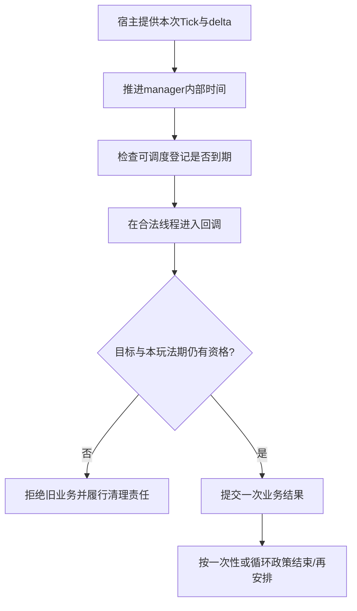
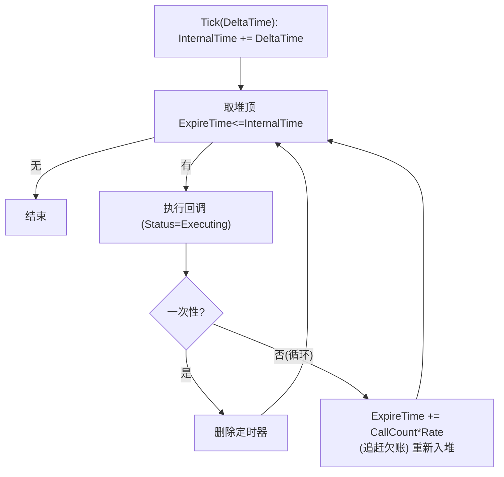

# 06 定时器与引擎 Ticker

> 知识成熟度：L2。依据公开官方资料静态核对接口，项目示例用于解释拥有、关闭和计时政策，不声称已经运行。
> 版本基准：2026-10-09实际读到的Epic公开页以5.8标签为主；5.5的限次字段、FApp/World和委托页、5.7的状态枚举另标。5.5发布说明按其历史内容解释，网页标签不认证patch、CL或本机安装。
> 事实边界：未读取UE checkout、Build.version及旧文CL55116800对应函数体，也未核目标CVar、World访问器路由和travel清理实现。所有代码为作者教学候选，未经过UHT/UBT/编译；UE、PIE、真实timer/ticker、线程、GC、网络、时钟设置、性能及模型运行均为NOT_RUN。
> 适用范围：UE运行时玩法延迟/周期任务、编辑器与引擎服务的回调驱动；完整玩法例限定单GameThread、固定manager合法窗口和有限输入。
> 最后更新：2026-10-09（全文静态修订；旧原文和Git差异逐字保存在文末）。

## 一、概述：先问按什么钟，再问谁还需要这次回调

技能冷却、重生倒计时、掉落物消失、周期伤害和属性恢复都需要“以后再做”。定时器保存一次将来回调的登记，免去每个对象自行检查截止点；但登记仍须等调度器获得执行机会，回调触发也不意味着目标业务成功。

- `FTimerManager`适合按已选游戏时间政策安排一次或周期玩法动作，提供设置、替换、暂停、清除和查询
- `FTSTicker`提供Core层的延时/周期回调入口，适合引擎服务、编辑器工具及与特定Actor Tick分开的驱动。它不是后台线程，也不是独立现实钟
- Actor/Component Tick适合连续更新、插值，以及需要明确Tick组/依赖的工作。其暂停、间隔和线程选项须按实际配置判断

选择时分别回答四问：**时间来自哪里，回调何时有机会执行，登记属于哪个实例，哪个玩法期仍允许它产生效果？** 例如冷却UI可以每帧刷新，却显示一个随游戏暂停的剩余值；现实连接超时可以独立计时，却只能在合法线程提交踢人决定。刷新节奏与计时真相不必是同一机制。

## 二、API、句柄与状态

| 概念 | 用途 | 不能由名字推导的保证 |
| --- | --- | --- |
| `FTimerManager` | 非UObject的timer管理器，具有自己的内部时钟与登记存储 | 不等同World.TimeSeconds，不是网络时钟或独立线程 |
| `FTimerHandle` | 区分timer的值身份；用于原manager的增删改查 | 不拥有manager，不证明登记现在仍存在；本文未测sizeof |
| `FTimerDelegate` | 无显式调用参数的timer委托；绑定时可携带payload | UObject弱绑定不递归保护其他捕获 |
| `SetTimer` | 正Rate安排一次/重复动作，同handle可替换 | Rate≤0是清除，不是“立即调用” |
| `FTimerManagerTimerParameters` | 已读5.8页列出bLoop、bMaxOncePerFrame、FirstDelay | 字段存在不证明首次引入版本 |
| `SetTimerForNextTick` | 专用next-tick重载；已读5.8签名返回FTimerHandle | 不是FirstDelay=0的已证等价式，不是全引擎阶段屏障 |
| `PauseTimer` / `UnPauseTimer` | 暂停一条登记并续走 | 不等同暂停World，更不暂停所有业务时钟 |
| `ClearTimer` | 清原manager中的登记，并处理传入handle | 不撤销已经做出的业务效果，不更新所有handle副本 |
| `TimerExists` / `IsTimerActive` / `IsTimerPending` | 分别查询存在、存在且未暂停、存在且Pending | active谓词不等于状态枚举恰为Active；Pending不等于所有“尚未到期” |
| Rate / Elapsed / Remaining | 查询所属timer的周期、已过和剩余口径 | 无登记返回值不能代替业务完成状态 |
| 时间膨胀 | 上游时间政策改变传给调度器的推进量 | 不把配置Rate本身自动改成另一个数值 |
| `FTSTicker` | 由调用者Tick驱动，delay为0或正间隔 | 不承诺独立实时唤醒、固定频率或同到期排序 |
| `FTickerDelegate` | `bool(float)`；true再次安排，false结束本登记 | 回调使用的数据仍需合法线程、寿命和业务资格 |
| `FTSTicker::FDelegateHandle` | 该类的嵌套弱handle类型 | 不与普通委托的全局FDelegateHandle或FTimerHandle混用 |
| `FTSTicker::GetCoreTicker()` | Core/Launch使用的单例入口 | 不代表所有自建ticker都使用同样的线程和delta |
| `FTSTickerObjectBase` | 当前公开的便利基类，含Tick入口与登记handle | 未读其析构函数体；不能以类名替代派生资源退出协议 |

以上按[FTimerManager接口](https://dev.epicgames.com/documentation/en-us/unreal-engine/API/Runtime/Engine/FTimerManager)、[参数结构](https://dev.epicgames.com/documentation/en-us/unreal-engine/API/Runtime/Engine/FTimerManagerTimerParameters)和[FTSTicker接口](https://dev.epicgames.com/documentation/en-us/unreal-engine/API/Runtime/Core/FTSTicker)分别核对。

### 2.1 句柄是地址簿中的身份，不是业务结果

`FTimerHandle::IsValid()`的公开说明表示它曾被manager初始化；当前是否还有这条登记要向原manager问`TimerExists`。若Hcopy是H的值副本，清除H并不会神奇改写Hcopy的本地位值。反过来，只对H调用`Invalidate()`也不等于已向manager撤销登记。[FTimerHandle](https://dev.epicgames.com/documentation/en-us/unreal-engine/API/Runtime/Engine/FTimerHandle)

保存handle时一并维护其manager归属。World切换后重新取得的manager不一定是原实例；不能向新manager清旧handle。一次性timer结束后，“登记不存在”还可能意味着被取消、替换或清理，不能据此发放冷却完成奖励。

### 2.2 Pending不是“还没到点”

公开字段把`PendingTimerSet`描述为本帧添加、待manager Tick后加入的timer集合；`ActiveTimerHeap`保存活动timer，`PausedTimerSet`保存暂停timer。因此已经在活动堆里等待未来到期的登记，也可以不再Pending。

`IsTimerActive`的公开谓词是“存在且未暂停”。一条Pending但未暂停的登记可以符合它；不要用这个查询去证明底层`Status == Active`。已读[ETimerStatus页（5.7）](https://dev.epicgames.com/documentation/en-us/unreal-engine/API/Runtime/Engine/ETimerStatus)列出了Pending、Active、Paused、Executing和ActivePendingRemoval，但枚举名称本身不是完整转移算法。

## 三、时间推进、首延时和大帧

### 3.1 Manager如何把等待变成回调机会

`FTimerManager`公开信息显示：所有timer存于稀疏数组，其他集合/堆按handle关联；`InternalTime`在Tick期间推进，`ExpireTime`属于这个manager的时钟。活动timer到期后获得执行机会，一次性登记结束，循环登记继续安排。暂停登记不按通常活动timer的方式消耗等待。[FTimerData](https://dev.epicgames.com/documentation/en-us/unreal-engine/API/Runtime/Engine/FTimerData)



这是概念因果图，业务资格检查是项目责任。它不复刻某个版本的Tick函数体，不规定堆比较符号、同到期timer的全序、回调新增项在当轮的精确位置。旧文中的比较器、`CallCount`公式和固定cpp行号未在本轮读取对应源码，不能继续当现行认证。

### 3.2 三种“零或下一次”不能混用

1. `SetTimer`的`Rate <= 0`按接口合同清除旧登记，不会帮你立即完成业务
2. 对正Rate提供`FirstDelay=0`是在选择首次延时参数；负FirstDelay则使用Rate。它没有因此成为专用next-tick API的已证等价物
3. 已读`SetTimerForNextTick`重载返回`FTimerHandle`，需要取消时保存它。指南里“不填入handle”的旧式措辞不能覆盖实际返回类型

依据：[SetTimer参数](https://dev.epicgames.com/documentation/en-us/unreal-engine/API/Runtime/Engine/FTimerManager/SetTimer)、[SetTimerForNextTick签名](https://dev.epicgames.com/documentation/en-us/unreal-engine/API/Runtime/Engine/FTimerManager/SetTimerForNextTick)。

UE5.5发布说明记录：某些next-tick调用没有等到下一world tick，修复需要启用`TimerManager.GuaranteeEngineTickDelay`等opt-in选项。本轮没有读取或修改目标配置，不能把这条历史修复当成5.8默认值证明。world tick、engine frame、另一个Actor Tick完成、UMG布局完成和渲染提交也不是同一边界。真正依赖初始化/阶段完成时，用对应完成状态或显式依赖，不凭“next”这个名字推顺序。[UE5.5发布说明的Framework升级说明](https://dev.epicgames.com/documentation/en-us/unreal-engine/unreal-engine-5-5-release-notes)

### 3.3 大帧可以追赶多次，限一次不等于补偿业务

公开5.5的`bMaxOncePerFrame`说明，循环timer原本可能在一帧delta内执行多次，设置该标志后到期时每帧至多执行一次。这足以否定旧文“5.8新增”，却不能证明其首次引入版本。[5.5字段说明](https://dev.epicgames.com/documentation/en-us/unreal-engine/API/Runtime/Engine/FTimerData/bMaxOncePerFrame?application_version=5.5)

PAPER_EXPECTED：若自定义理想到期点为0.2、0.4、0.6、0.8秒，时间由0跳到0.65，前三个点已经过去，展示了追赶为何会形成突发。这是到期集合的手算，不认证引擎的精确取整公式、等号边界或下次到期点。

项目要另选效果政策：每次回调发一次奖励，限一次就可能少发；按实际游戏时长积累恢复量，需要同域经过量及有界结算；选择丢弃过期工作，应明确记录这种降级。一个`bMaxOncePerFrame`不同时提供这些语义，更不是整个frame的CPU耗时上限。

### 3.4 暂停、倍率和现实时间

已核的`PauseTimer(H)`暂停单条timer，elapsed/remaining保持，`UnPauseTimer`续走。它不要求把内部暂停存储一定解释为“ExpireTime改写成remaining”；该实现表示本轮未读。[Gameplay Timers的暂停说明](https://dev.epicgames.com/documentation/en-us/unreal-engine/gameplay-timers-in-unreal-engine)

World级暂停和倍率则先影响宿主是否调用Tick、提供什么delta。若工程的驱动确实按半速提供推进量，并且没有额外暂停/clamp/丢弃，2个manager秒约需4个现实秒才能积满，之后还要等执行机会。它不是“恰好4秒准点执行”的保证。旧文的`UWorld::Tick`片段不能证明本轮目标版本所有世界类型、驱动和暂停分支。

`GetTimerRate`返回配置周期，不是倍率改为0.5就把Rate=2改成1。Elapsed/Remaining反映timer自己的计时状态，也不应无条件当作从Start以来的墙钟秒数；首次延时不同于周期时尤需查实际接口。查询返回-1要处理无登记分支，不能当作已成功结算。

World的[5.5公开类页](https://dev.epicgames.com/documentation/unreal-engine/API/Runtime/Engine/Engine/UWorld?application_version=5.5)区分：TimeSeconds在游戏暂停时停止且受dilation/clamping；UnpausedTimeSeconds不停于暂停但仍受dilation/clamping；RealTimeSeconds不受这些影响，但原点仍是World为play启动，不是UTC，也不承诺跨World连续。FApp的delta仅是帧时间差；固定时间步功能说明它不能无条件等同现实经过量。详见[GameClock的时间域与UI合同](../../07-网络与游戏服务端/运行调度与过载保护/12-世界时间确定性与GameClock.md)。

## 四、谁拥有登记，何时结束玩法期

### 4.1 World与GameInstance入口不等于travel承诺

官方指南列出World和GameInstance的manager访问方式，UGameInstance类页也列出TimerManager字段。这些证据不足以证明每个World getter都返回GI实例、这是一项5.8变化，或关卡切换永不清/总会清所有timer。[Gameplay Timers](https://dev.epicgames.com/documentation/en-us/unreal-engine/gameplay-timers-in-unreal-engine)、[UGameInstance字段](https://dev.epicgames.com/documentation/en-us/unreal-engine/API/Runtime/Engine/UGameInstance)

跨关卡要分别看manager是否还活着、登记是否仍在、delegate目标是否有效、本次业务是否还允许。若某服务确需跨World存在，由存活宿主明确迁移剩余时长/截止政策和新的World身份；不要把旧World裸指针装进长期回调，也不要因为GI存活就默认旧玩法继续有效。

### 4.2 弱绑定保护指定owner，不替项目做退场

`CreateUObject`/`CreateWeakLambda`对指定UObject提供弱目标关系；普通lambda里的裸this、局部引用或另一个对象指针各有自己的寿命。其他对象应另作weak捕获并在合法线程检查，或让消息真正拥有所需值。弱目标检查也不授予任意线程访问权限。[CreateWeakLambda（5.5）](https://dev.epicgames.com/documentation/unreal-engine/API/Runtime/Core/Delegates/TDelegate_InRetValType_ParamType-/CreateWeakLambda?application_version=5.5)、[Epic编码规范的延迟捕获说明](https://dev.epicgames.com/documentation/en-us/unreal-engine/epic-cplusplus-coding-standard-for-unreal-engine)

EndPlay可先于真正销毁，Actor甚至可能随后复入。BeginDestroy是更晚的GC阶段，大多数玩法退出应已处理。业务关闭先撤销旧期写资格，再在原manager仍合法时清登记；不能等旧manager失效后再去解引用“补清”。[Actor生命周期](https://dev.epicgames.com/documentation/en-us/unreal-engine/unreal-engine-actor-lifecycle)

`ClearAllTimersForObject`覆盖能关联为该object绑定函数的timer，不是扫描所有lambda捕获的万能清理器。精确handle仍是可追账的责任。机制层面的weak、业务层的active/epoch、存储的当前调用寿命、manager借用窗口应分开，详见[委托与对象通信](../模块化框架与对象通信/04-委托事件与对象通信.md)。

## 五、三条玩法链

### 5.1 最短成员函数例：先理解登记，再补业务协议

下面是局部用法，不是完整生命周期类。调用者已在有效玩法期/GT上，Duration有限且为正，目标World/manager合法，`OnCooldownFinished`为该Actor成员；native成员函数绑定本身不要求UFUNCTION，动态/蓝图入口另按反射规则。

```cpp
FTimerHandle CooldownHandle; // Actor成员，与原manager一起管理

GetWorldTimerManager().SetTimer(
    CooldownHandle, this, &AMyActor::OnCooldownFinished,
    Duration, false, -1.f);
```

这个简例只说明接口。回调不带请求epoch时，单凭函数名不能辨认旧请求；它也没展示关闭、通知重入或输入失败。以下主例把这些责任写全。

### 5.2 冷却主例：完整单GT入口与旧请求退出

**工程准入前提**：这是服务端/单机权威Actor的一期玩法。引擎在合法GT调用BeginPlay/EndPlay；从取得manager到本Actor关闭清理结束，真实World/GI宿主保证该manager仍存在且是同一个实例。跨World重挂前先EndPlay关闭，不能在中途悄悄换manager。这个窗口须在项目生命周期接线中验证，没有一个传入true的“ManagerAlive”开关能代替它。

manager自身的Tick和回调栈也必须完成后才能由宿主销毁manager；通知中发生EndPlay可以先撤权/清登记，不能在还借用manager的引擎栈上直接拆掉它。Actor当前栈的GC保活不替代这条manager拥有关系。

普通公开方法只允许在合法Actor引用上进入；禁止原始delete或从无效raw指针调用。实际外部广播是可重入边界，已进入timer回调使用UObject的临时强引用保持本Actor存储到整个同步调用返回；强引用不恢复EndPlay后业务资格，也不持有World/manager。[Object Pointers](https://dev.epicgames.com/documentation/en-us/unreal-engine/object-pointers-in-unreal-engine)说明这种GC保活作用；普通TSharedPtr不能用于拥有UObject。

代码为作者候选，按头文件/实现分开展示，`CooldownActor.generated.h`应由目标工程UHT生成，本次未执行。事件是本地原生通知；网络状态另见第六节。

```cpp
// CooldownActor.h
#pragma once
#include "CoreMinimal.h"
#include "GameFramework/Actor.h"
#include "TimerManager.h"
#include "CooldownActor.generated.h"

enum class ECooldownState : uint8
{
    Idle, Pending, Completed, Canceled, Superseded, RegistrationFailed
};
enum class ECooldownStart : uint8
{
    Started, Replaced, InvalidInput, Closed, EpochExhausted, RegistrationFailed
};

UCLASS()
class ACooldownActor final : public AActor
{
    GENERATED_BODY()
public:
    DECLARE_EVENT_OneParam(ACooldownActor, FCompletedEvent, uint64);
    FCompletedEvent& OnCompleted() { return CompletedEvent; }
    ECooldownStart StartCooldown(float Seconds, uint64& OutEpoch);
    bool CancelCooldown(); // 取消本次；仍在本玩法期时可再次Start
    ECooldownState GetCooldownState() const { return State; }

protected:
    void BeginPlay() override;
    void EndPlay(const EEndPlayReason::Type Reason) override;

private:
    void ClearCurrentRegistration();
    void FinishCooldown(uint64 ExpectedEpoch);
    FTimerManager* Manager = nullptr; // 借用，绝非拥有或存活检测
    FTimerHandle CooldownHandle;
    uint64 Epoch = 0;                // 跨本对象多次玩法期保留，不回绕
    ECooldownState State = ECooldownState::Idle;
    bool bOpen = false;
    FCompletedEvent CompletedEvent;
};
```

```cpp
// CooldownActor.cpp
#include "CooldownActor.h"
#include "Engine/World.h"
#include "UObject/StrongObjectPtr.h"

void ACooldownActor::BeginPlay()
{
    Super::BeginPlay();
    check(IsInGameThread());
    check(Manager == nullptr && !CooldownHandle.IsValid());
    if (!HasAuthority()) { return; }
    UWorld* World = GetWorld();
    if (!IsValid(World)) { return; }
    Manager = &World->GetTimerManager();
    bOpen = true; // 之后才接受本玩法期的请求
}

void ACooldownActor::ClearCurrentRegistration()
{
    check(IsInGameThread());
    check(Manager != nullptr); // 仅检查协议前提，不检测悬垂指针
    FTimerManager* const OriginalManager = Manager;
    FTimerHandle OriginalHandle = CooldownHandle;
    CooldownHandle.Invalidate();
    if (OriginalHandle.IsValid())
    {
        OriginalManager->ClearTimer(OriginalHandle);
    }
}

ECooldownStart ACooldownActor::StartCooldown(float Seconds, uint64& OutEpoch)
{
    check(IsInGameThread());
    OutEpoch = 0;
    if (!bOpen) { return ECooldownStart::Closed; }
    if (!FMath::IsFinite(Seconds) || Seconds <= 0.f || Seconds > 3600.f)
    {
        return ECooldownStart::InvalidInput; // 保留已有请求
    }
    if (Epoch == MAX_uint64) { return ECooldownStart::EpochExhausted; }

    const bool bReplaced = State == ECooldownState::Pending;
    if (bReplaced) { State = ECooldownState::Superseded; }
    ClearCurrentRegistration();
    const uint64 ExpectedEpoch = ++Epoch;
    State = ECooldownState::Pending;

    const TWeakObjectPtr<ACooldownActor> WeakSelf(this);
    FTimerDelegate Callback = FTimerDelegate::CreateWeakLambda(
        this, [WeakSelf, ExpectedEpoch]()
        {
            TStrongObjectPtr<ACooldownActor> Self = WeakSelf.Pin();
            if (Self) { Self->FinishCooldown(ExpectedEpoch); }
        });
    Manager->SetTimer(CooldownHandle, Callback, Seconds, false, -1.f);
    if (!Manager->TimerExists(CooldownHandle))
    {
        State = ECooldownState::RegistrationFailed;
        ClearCurrentRegistration();
        return ECooldownStart::RegistrationFailed;
    }
    OutEpoch = ExpectedEpoch;
    return bReplaced ? ECooldownStart::Replaced : ECooldownStart::Started;
}

bool ACooldownActor::CancelCooldown()
{
    check(IsInGameThread());
    if (!bOpen || State != ECooldownState::Pending) { return false; }
    State = ECooldownState::Canceled;
    ClearCurrentRegistration();
    return true;
}

void ACooldownActor::FinishCooldown(uint64 ExpectedEpoch)
{
    check(IsInGameThread());
    if (!bOpen || State != ECooldownState::Pending || Epoch != ExpectedEpoch)
    {
        return;
    }
    State = ECooldownState::Completed; // 先锁存，再清旧登记，最后外调
    ClearCurrentRegistration();
    CompletedEvent.Broadcast(ExpectedEpoch);
    // 外调后没有新的成员/World/handle访问；Self保活覆盖整个调用栈
}

void ACooldownActor::EndPlay(const EEndPlayReason::Type Reason)
{
    check(IsInGameThread());
    bOpen = false;
    if (State == ECooldownState::Pending) { State = ECooldownState::Canceled; }
    if (Manager != nullptr)
    {
        ClearCurrentRegistration();
        Manager = nullptr;
    }
    Super::EndPlay(Reason);
}
```

3600秒是教学输入上界，不是UE限制。注册查询分支只处理“没有获得可查询登记”，不捕获引擎OOM/终止等异常。非法输入与epoch耗尽在替换之前拒绝，旧请求不丢；合法替换会结束旧请求，若新登记失败则得到明确失败，不伪装恢复原timer。`OutEpoch=0`只表示未成功返回新请求身份。

同GT且正延时注册不在本`StartCooldown`里同步执行用户回调。`ClearTimer`在timer回调中使用、复用handle有官方允许；代码没有因而推断任意线程/对象自毁都安全。完成时先清H8，通知可以Start出H9，旧8尾部没有再清/Invalidate当前handle，H9得以保留。取消不发“完成”通知，取消后可合法Start；EndPlay关闭后不能Start，后续真实BeginPlay才建立新期，epoch不重置。epoch耗尽仍不阻碍Cancel/EndPlay。

事件发出不代表所有监听者消费成功，也不回滚Completed。监听者若需异步保存身份应复制值；旧调用不负责替新请求收尾。若manager活期前提被工程破坏，不能靠`Manager != nullptr`证明安全：应在更早的合法宿主退出窗口清理，或由宿主确认原manager已销毁后结束旧责任，不能再解引用。本文没有实现任意失效manager的探测器。

### 5.3 周期恢复、伤害与有限初始化重试

下面的登记片段使用已读参数结构。前提是同GT的有效owner、原manager借用窗口、已提交的RegenPending及独立RegenEpoch；目标类声明了`OnRegenTimer(uint64)`，回调进入后按下述完整协议处理。这是局部API候选，不是把它贴进5.2类就能编译的扩展。

```cpp
FTimerManagerTimerParameters Params{};
Params.bLoop = true;
Params.FirstDelay = 1.f;
Params.bMaxOncePerFrame = true;
Manager->SetTimer(
    RegenHandle,
    FTimerDelegate::CreateUObject(this, &ARegenActor::OnRegenTimer, ExpectedEpoch),
    2.f, Params);
```

完整有限协议用伪代码表达，`RegenState`、`GrantsLeft`等是作者状态，非UE自带字段：

```text
StartRegen：只在GT和本玩法期接受
  要求Health为有限数且0≤Health≤100，当前没有RegenPending
  若RegenEpoch已到MAX_uint64：拒绝，不能回绕
  递增独立RegenEpoch，保存Expected；GrantsLeft=3，状态=RegenPending
  在原Manager登记上面的Rate=2、FirstDelay=1循环timer
  若原Manager查询不到登记：状态=RegistrationFailed，清本地/原登记，返回失败

OnRegenTimer(Expected)：由合法弱对象调用入口进入
  先取得本owner的TWeakObjectPtr::Pin临时强引用覆盖整个方法和通知栈
  若Pin失败、本期已关、不是RegenPending或Expected≠RegenEpoch：返回
  要求Health仍在有限[0,100]、GrantsLeft在[1,3]；否则记InvalidState并清原登记，返回
  在无外调的GT区段：Health=min(Health+10,100)，GrantsLeft减1
  若GrantsLeft>0：本次结束，继续等待以后的调度机会
  否则先置Completed，把原Manager/原Handle复制到本地receipt
  清空当前RegenHandle，再向receipt的原Manager清原Handle
  最后发一次包含Expected及Health值的完成通知；之后不再触碰当前登记或World

Cancel/EndPlay：先撤本期或本请求资格，Pending改Canceled
  在Manager仍合法时按原receipt清登记，不等待下一帧
  重复关闭无新责任；普通Cancel后可另启新epoch，EndPlay后须等新合法玩法期
```

这里的临时强引用是针对UObject的GC保活，不能把已经EndPlay的Actor重新当作有业务资格；工程接线与5.2相同。Health只有该GT owner写入，任意外部修改、线程写入或资源替换不在这个有限例内。

PAPER_EXPECTED：初始Health=75，三个合法机会依次变为85、95、100；第三次先结束登记再通知。此例明确按回调计次，卡顿时限一次可能少发，不宣称真实时间或游戏时长上的恢复总量守恒。周期伤害也先定义“每次结算”还是“按经过时长积分”，避免把追赶突发误当动画插值。

延迟初始化同样不能无界自设timer：保存原deadline与最多3次检查的教学预算；就绪则成功并清登记，第三次仍未就绪则失败并清登记，关闭先撤权。重试不重置原deadline，检查本身必须有限。掉落物消失是一次性版本：掉落物仍在其有效world/epoch时才执行销毁；若已提前拾取/销毁或关卡退出，只完成清理，不能再次发放掉落效果。

### 5.4 重生：让存活的权威owner负责等待

把唯一重生timer弱绑定在即将销毁的Pawn上，Pawn结束后回调可能自动失效，重生责任随之丢失。通常应由能覆盖等待期的服务端玩家会话、控制器或玩法管理owner保存登记，并独立记住玩家身份、world/session epoch及本次重生请求。选择哪种宿主取决于项目的切图、断线和匹配规则。

| 阶段 | 有限控制流 | 失败或退出 |
| --- | --- | --- |
| 接纳 | 权威owner确认本玩家确需重生、请求身份未被使用，保存原manager/handle和Pending记录 | 断线、旧epoch、非法时长或重复请求拒绝；不在已毁Pawn上补登记 |
| 等待 | timer只提供以后检查的机会；存活宿主持有请求记录 | 离开/换World先撤权，在合法窗口清原登记 |
| 到期领取 | 同GT复核连接、玩法资格和Pending；先把该请求置Claimed并清原登记 | 过期/已取消请求不产生新Pawn；重复callback不再领取 |
| 执行一次 | 由本次调用拥有的独立请求receipt覆盖整个真实重生/Spawn调用；明确只尝试一次 | Spawn可调用外部逻辑，不能假设无重入或无部分效果 |
| 收尾 | 将真实结果记入原receipt：Succeeded、明确失败，或已有副作用/结果未知 | 失败不自动无限重试；交仍有效宿主决定恢复。旧尾部不写新会话，不把计时到点当作Spawn成功 |

这里的结果类别是项目协议，不是`SpawnActor`现成的返回枚举。真正接入时必须按选用入口的返回值与已发生效果判断；若调用后owner已退场，原receipt仍承担记录/清理责任，不向新World清旧timer。本文解释等待与领取的职责，具体Spawn、会话恢复和网络权限实现仍由对应玩法/网络专题负责。

## 六、服务器权威与客户端倒计时

timer登记和handle是本地调度身份，不是自动复制的网络状态。服务器负责决定冷却/伤害/重生，客户端可以有本地timer或ticker刷新UI；本地回调不能授予玩法成功。旧文“5.1～5.3曾有实验性的bReplicateToOwningClient，5.8删除”本次未找到一手版本依据，撤下活动事实层，不从现行结构字段反推迁移史。

项目可复制一个逻辑完整的状态值：`world/session epoch、effect/request ID、revision、status、EndTime、时间域及所需暂停/倍率映射`。这些字段是作者业务设计，不是`FTimerManagerTimerParameters`，也不是已经实现的网络协议。接收方须取得一致的状态快照，不能自行拼接不同版本字段；身份、版本与权限另由协议保障，更大revision不是权限证明。

已读[AGameStateBase](https://dev.epicgames.com/documentation/en-us/unreal-engine/API/Runtime/Engine/AGameStateBase)把`GetServerWorldTimeSeconds`描述为同步的服务端模拟TimeSeconds，并列有周期更新和OnRep相关入口。它支持客户端估计服务端游戏时间，不承诺零误差、固定RTT/2、默认刷新频率或UTC语义。[Game Mode and Game State](https://dev.epicgames.com/documentation/unreal-engine/game-mode-and-game-state-in-unreal-engine?lang=en-US)说明服务端GameMode与两端GameState的分工。

有限显示链如下：

1. 接收当前world/epoch且版本有效的deadline状态，保存一致的时间映射；新会话重取基准，旧包不覆盖新期
2. 使用同域的服务端时间估计计算`max(EndTime - EstimatedServerNow, 0)`。本地ticker只是刷新机会，不能把本机单调时间点直接减服务端World秒数
3. 游戏暂停/倍率改变时应用新的有效映射；游戏冷却可以冻结，菜单动画仍可继续。若效果本身被单独Pause，服务器还须明确发布冻结剩余值或重建deadline，不能让原EndTime继续被UI无条件扣减
4. 超出允许外推的新鲜度范围时标记待同步/陈旧，停止过度外推。界面归零仍等待权威状态确认，不自行解锁技能或生成角色

PAPER_EXPECTED：A/epoch7中EndTime=120、估计Now=117，显示3；同游戏域暂停后Now保持117，仍为3；旧revision到达被拒绝。网络延迟/映射陈旧可能造成校正和视觉回弹，单次同步remaining无法消除它们。真实超时/运营截止应使用其声明的时间域和权威，不能因为显示在UI里就一律改用现实秒。

“只通知某客户端”属于接收者权限、RPC或私有复制状态的选择；不把一个timer参数当作定向网络传输。更完整的时间域、恢复和有限外推边界见[GameClock](../../07-网络与游戏服务端/运行调度与过载保护/12-世界时间确定性与GameClock.md)。

## 七、FTSTicker：延时驱动和退出合同

### 7.1 Delay有skew，Ticker没有自己的现实时间来源

`AddTicker`接受delay/interval，delay=0在文档中称next frame；回调返回true继续按间隔安排，false结束本登记。`Tick(DeltaTime)`由宿主调用，因此谁驱动、给什么delta、在哪个线程执行须单独确认。[AddTicker](https://dev.epicgames.com/documentation/en-us/unreal-engine/API/Runtime/Core/FTSTicker/AddTicker)

官方`Tick`说明迟到后会再等待完整Delay，有timer skew；delay=0.1并不保证每现实秒调用10次，也不补执行每个错过的固定槽。PAPER_EXPECTED：0.1执行后，下一次不早于0.2；直到0.27才有机会执行，则随后不早于0.37，在0.38的机会可以继续。这不是引擎浮点边界实测。[FTSTicker::Tick](https://dev.epicgames.com/documentation/en-us/unreal-engine/API/Runtime/Core/FTSTicker/Tick)

`FireTime`是not-before到期点；公开容器信息不提供按FireTime稳定排序或相同到期全序。AddedElements说明新登记先进入线程安全队列，在下次Tick转入主容器；不能再照搬旧文“当帧新增必当帧处理”的实现注释。[FElement](https://dev.epicgames.com/documentation/en-us/unreal-engine/API/Runtime/Core/FTSTicker/FElement)

Core ticker不依附某个Actor的玩法暂停；但实际引擎是否继续驱动、使用何种delta仍取决于宿主。没有Tick机会的应用挂起期间不会执行回调。FApp delta不是独立单调钟，官方[固定帧率自定义时间步](https://dev.epicgames.com/documentation/en-us/unreal-engine/API/Runtime/TimeManagement/UGenlockedFixedRateCustomTimeSte-)甚至可让delta不等真实经过时长。当前EngineLoop→CoreTicker完整函数体未读，不能把旧调用链重新认证成“绝对现实时间”。

### 7.2 方法线程安全与业务线程安全分开

| 操作 | 已读公开合同 | 仍须项目保证 |
| --- | --- | --- |
| AddTicker | 可并发登记 | 闭包捕获的数据合法，登记期与退出期可追踪 |
| RemoveTicker | 可并发；若遇正在执行的该登记，等待它结束 | 不持callback需要的锁，不形成线程/GT互等；衍生工作另收尾 |
| Tick | 不得并发调用 | 唯一驱动者、delta含义及线程正确 |
| FTSTicker实例的Reset | 必须在ticking thread调用 | 这是重置整个实例，不是注销某一个handle |
| callback | 在实际Tick执行线程被调用 | UObject/UI/服务资源各自的亲和、同步、业务资格与有界工作 |

“thread-safe ticker”不意味着任意线程都可以访问Actor、Widget或渲染资源。后台统计是用途，不说明回调在后台线程；Core ticker也不等RenderThread。需要后台计算时采用[多线程与任务系统](11-多线程与任务系统.md)的值拥有、接纳和完成合同。

### 7.3 显式Start/Stop的有限成员式例

下面的普通C++对象由GT宿主持有`TSharedPtr`，只采集最多三个合法回调的delta值，不发起任务、网络或任意用户回调。**准入前提**是本工程Core ticker的实际驱动线程为GT；`check`只诊断本例前提，不创建同步保证。闭包中的弱shared pointer适用于该普通C++对象，不能替换成用TSharedPtr拥有UObject。

Start只能在完整构造且进入shared ownership后调用；同实例只启动一次，终止后要新建实例。Stop必须由宿主在非callback入口、资源拆除之前调用。代码是教学候选，未编译。

```cpp
#include "CoreMinimal.h"
#include "Containers/Ticker.h"
#include "Templates/SharedPointer.h"

enum class ESampleTickerStart : uint8
{
    Started, AlreadyStarted, Closed, InvalidInput, RegistrationFailed
};
enum class ESampleTickerEnd : uint8
{
    None, LimitReached, InvalidDelta, Stopped, RegistrationFailed
};

class FSampleTicker final : public TSharedFromThis<FSampleTicker>
{
public:
    FSampleTicker() = default; // 构造中不登记this
    FSampleTicker(const FSampleTicker&) = delete;
    FSampleTicker& operator=(const FSampleTicker&) = delete;
    FSampleTicker(FSampleTicker&&) = delete;
    FSampleTicker& operator=(FSampleTicker&&) = delete;
    ~FSampleTicker()
    {
        check(IsInGameThread());
        check(bStopCalled); // 宿主须先显式Stop；析构不发起异步清理
    }

    ESampleTickerStart Start(float Delay, int32 Limit)
    {
        check(IsInGameThread());
        if (bStopCalled) { return ESampleTickerStart::Closed; }
        if (bStarted) { return ESampleTickerStart::AlreadyStarted; }
        if (!FMath::IsFinite(Delay) || Delay < 0.f || Delay > 60.f ||
            Limit < 1 || Limit > 3)
        {
            return ESampleTickerStart::InvalidInput;
        }
        bStarted = true;
        bOpen = true;
        MaxCalls = Limit;
        const TWeakPtr<FSampleTicker> WeakSelf = AsShared();
        TickHandle = FTSTicker::GetCoreTicker().AddTicker(
            FTickerDelegate::CreateLambda([WeakSelf](float DeltaTime) -> bool
            {
                TSharedPtr<FSampleTicker> Self = WeakSelf.Pin();
                return Self ? Self->TickOnce(DeltaTime) : false;
            }), Delay);
        if (!TickHandle.IsValid())
        {
            bOpen = false;
            End = ESampleTickerEnd::RegistrationFailed;
            return ESampleTickerStart::RegistrationFailed;
        }
        return ESampleTickerStart::Started;
    }

    void Stop()
    {
        check(IsInGameThread());
        if (bStopCalled) { return; }
        bStopCalled = true;
        bOpen = false;
        if (End == ESampleTickerEnd::None) { End = ESampleTickerEnd::Stopped; }
        FTSTicker::FDelegateHandle OriginalHandle = TickHandle;
        TickHandle.Reset(); // 只丢本地弱身份，不是FTSTicker::Reset
        if (OriginalHandle.IsValid())
        {
            FTSTicker::RemoveTicker(OriginalHandle);
        }
    }

private:
    bool TickOnce(float DeltaTime)
    {
        check(IsInGameThread());
        if (!bOpen) { return false; }
        if (!FMath::IsFinite(DeltaTime) || DeltaTime < 0.f || DeltaTime > 10.f)
        {
            bOpen = false;
            End = ESampleTickerEnd::InvalidDelta;
            return false;
        }
        Samples[CallCount++] = DeltaTime;
        if (CallCount == MaxCalls)
        {
            bOpen = false;
            End = ESampleTickerEnd::LimitReached;
            return false;
        }
        return true;
    }

    FTSTicker::FDelegateHandle TickHandle;
    float Samples[3] = {};
    int32 CallCount = 0;
    int32 MaxCalls = 0;
    bool bStarted = false;
    bool bOpen = false;
    bool bStopCalled = false;
    ESampleTickerEnd End = ESampleTickerEnd::None;
};
```

宿主把`TSharedPtr<FSampleTicker> Driver = MakeShared<FSampleTicker>()`保存在自己的生命周期成员中，资源就绪后调用`Driver->Start(0.25f, 3)`并处理返回值；关闭入口先`Driver->Stop()`，之后才释放Driver及相关服务资源。不是创建一个临时局部变量后马上丢掉owner。60秒delay、10秒delta和3次上限都是教学工作域，不是引擎推荐配置。

重复Start返回AlreadyStarted而不覆盖handle；非法输入在登记前拒绝，可修正后首次Start。到达次数上限/无效delta返回false后不再重新登记，后续Start仍拒绝复用同实例。false以后宿主仍调用Stop：若旧弱handle已过期就只清本地身份，尚可取得时向原登记Remove；重复Stop无新动作。提前关停先关bOpen、取原handle、Remove，再由宿主拆资源。回调内Self覆盖完整同步方法，例子没有callback内delete/reset最后owner的出口。

`Samples`存的是传给本次callback的delta，不能把稀疏ticker回调的这些值相加就声称测得注册后的全部现实时间。`Start`的失败分支仅报告未取得有效登记身份，不声称可从OOM、引擎退出或任意并发宿主故障中恢复。断言在某些构建中会关闭，因此真实宿主仍须遵守线程和关闭前提。

### 7.4 Remove的局部等待必须准确理解

官方[RemoveTicker](https://dev.epicgames.com/documentation/en-us/unreal-engine/API/Runtime/Core/FTSTicker/RemoveTicker)确实给出特定合同：可以并发调用；若碰上该登记的回调正在执行，会等它结束，返回后该登记不会再执行。不能把普通委托“Remove不是通用屏障”的提醒误写成否定这里的等待。

这个合同也没有承诺回调发出的Task/网络请求已完成、所有排队/复制的闭包已析构，或含回调及析构代码的模块现在可以卸载。AddTicker说明delegate所用资源须在ticking thread释放；Remove调用线程、callback线程和闭包资源实际析构时机不能任意互换。模块卸载还需真实引擎宿主确认残留闭包与异步工作结束，本文没有发明一个万能drain接口。

等待也可能形成环：B持有锁L并Remove(H)，H的回调T又等L；或GT在Remove中等T，而T同步等待GT完成另一步。不要持这类锁或处于这种依赖关系时阻塞。接口没有给出及时返回的时间上界；自回调调用Remove的内部特殊路径未读，本文采用回调返回false、宿主在外层入口Stop，不宣称自移除必然死锁或一定有某个特判。

当前[FTSTickerObjectBase](https://dev.epicgames.com/documentation/en-us/unreal-engine/API/Runtime/Core/FTSTickerObjectBase)是已核的便利基类名称，公开页有构造、虚析构和Tick接口。其析构体本轮未读，不能继续认证旧`FTickerObjectBase`片段或说“基类析构自动解决所有关停”。即使有自动退订，派生资源拆除与在途访问仍需设计；上例选择在资源退场前显式Stop。

## 八、三种驱动与蓝图入口

| 维度 | Actor/Component Tick | FTimerManager | FTSTicker |
| --- | --- | --- | --- |
| 实例/归属 | 已注册TickFunction及拥有者 | 明确的manager实例 | Core实例或项目自建实例 |
| 调度目标 | 连续更新，可设interval/依赖 | 延时、重复、暂停和查询 | delay/interval，迟到后有skew |
| 暂停与delta | 按Tick配置、world和实际执行路径 | 单timer Pause已核；World政策由实际输入/驱动确认 | 按宿主Tick机会及所给delta，不自带现实钟 |
| 线程 | 按bRunOnAnyThread等配置；非一律GT | 本文限定GT，官方指南警告线程不安全 | Add/Remove可并发，Tick不可并发；业务亲和另管 |
| 选择例 | 角色移动、逐帧插值 | 冷却、重生、周期伤害、掉落到期 | 编辑器/服务驱动、UI刷新机会 |

[FTickFunction公开页](https://dev.epicgames.com/documentation/en-us/unreal-engine/API/Runtime/Engine/FTickFunction)包含bTickEvenWhenPaused、TickInterval和bRunOnAnyThread；不能说所有Actor/Component Tick一律暂停或都在GT，也不能把Actor局部时间设置自然推广到共享manager。

蓝图保留以下八类入口。节点显示名与native函数参数并非永远一一相同，应看目标版本节点及[UKismetSystemLibrary](https://dev.epicgames.com/documentation/en-us/unreal-engine/API/Runtime/Engine/UKismetSystemLibrary)、[K2_SetTimerDelegate](https://dev.epicgames.com/documentation/en-us/unreal-engine/API/Runtime/Engine/UKismetSystemLibrary/K2_SetTimerDelegate)和[K2_SetTimer](https://dev.epicgames.com/documentation/en-us/unreal-engine/API/Runtime/Engine/UKismetSystemLibrary/K2_SetTimer)的公开说明。

| 节点类别 | 使用要点 |
| --- | --- |
| Set Timer by Event | 用事件委托登记；保存返回handle，给有效的正时间 |
| Set Timer by Function Name | 维护正确对象与函数名/签名；名称重构需同步，不预设失败一定静默 |
| Clear Timer by Handle | 清对应World上下文/manager中的旧登记；区分节点是否还显式Invalidate本地handle |
| Clear All Timers for Object | 按对象关联的绑定清理，不假设所有lambda捕获都可被识别 |
| Is Timer Active by Handle | 是存在且未暂停的查询，不等业务完成或Status枚举判断 |
| Pause Timer by Handle / Unpause Timer by Handle | 暂停/恢复这条登记，UI及其他时钟政策另管 |
| Get Timer Remaining / Elapsed / Rate by Handle | 查询该timer口径，处理无登记，不以-1宣告成功 |
| Set Timer for Next Tick by Event | 专用延后入口，保留取消身份；严格帧/阶段顺序仍按版本与依赖合同处理 |

按事件绑定常能减少字符串身份维护风险，但没有测量就不写“必更快”或具体性能差；Event和FunctionName都须有合法目标及生命周期。

## 九、十条最佳实践

1. **先定义时间域。** 冷却/Buff可用游戏持续，心跳/连接超时使用适合的经过时长，运营截止按业务时刻；timer/ticker只是具体驱动选择
2. **记录原manager和精确handle。** 句柄不是拥有关系，复制、Invalidate、过期和manager清理分别处理；不要向新World的manager清旧登记
3. **闭包逐个核寿命。** weak owner不递归保护其他捕获；当前栈保活、合法线程和玩法epoch都要成立，不能只做非空判断
4. **在合法退出窗口清理。** 玩法退出先撤权再清原登记；travel迁移由存活宿主明确负责，BeginDestroy不代替EndPlay，不能保证切图总保留或总清除
5. **把UI刷新与显示真相分开。** 游戏冷却UI应遵循该游戏时间政策；真实截止另选时间域，暂停UI动画和冻结玩法倒计时可同时成立
6. **由服务器决定玩法结果。** 复制状态/身份/deadline，客户端可本地刷新和有限外推；数字归零不授予技能、奖励或重生权限
7. **显式选择追赶政策。** bMaxOncePerFrame限制回调次数，不补偿效果或限制总CPU耗时；计次、聚合、丢弃和有限重试各自声明
8. **Ticker回调仍有线程和预算。** 服务、编辑器和UI用途不等于后台线程；固定Tick驱动者，UObject/渲染操作遵守自己的API合同
9. **Start/Stop与资源拥有配套。** 完整构造后登记，宿主先Stop再拆资源；false、Remove局部等待、异步完成及模块卸载不混成一个事件
10. **连续插值选连续更新机制。** timer的大帧突发不适合直接模拟平滑动画；精度、抖动和成本用真实负载验证，不声称小Rate可突破调度机会限制

## 十、常见问题FAQ

### Q1：定时器设了但没触发？

先查是否确在原manager有登记，Rate是否被传成非正数、同handle是否被替换/清理；再查单timer是否暂停、宿主是否Tick及delta属于什么域。随后查delegate目标、玩法active/epoch、World或manager是否已退场。最后核首延时与依赖条件。handle非空不是充分证据；登记不存在也不能直接宣布冷却完成。

### Q2：Rate和FirstDelay是什么关系？

Rate是配置的周期/等待参数；负FirstDelay用Rate，非负FirstDelay选择首次延时。正Rate与FirstDelay=0不等价于已证明的严格下一全引擎帧；要专用延后入口用SetTimerForNextTick并保存返回handle，精确时序仍核版本/CVar和调用位置。若产品要求零时长即时完成，应另走明确业务分支，不能用Rate=0伪装。

### Q3：PauseTimer后剩余时间还准确吗？

已核接口承诺暂停该timer时elapsed/remaining保持、恢复续走。这个准确性针对其manager的timer状态，不是墙钟或服务端业务截止保证；无登记查询需另处理。不要据接口表现推断当前源码一定用ExpireTime字段保存remaining。

### Q4：为什么循环timer一帧触发好几次？

大delta可产生追赶。bMaxOncePerFrame把到期循环限制为该帧至多一次，5.5公开资料已包含它，不能称5.8新增。缺少的业务效果是否补偿由项目决定；本次没有核精确CallCount取整公式、相等边界或性能上限。

### Q5：GetTimerManager拿的是World还是GameInstance的？

官方公开了两种访问入口及GI的manager字段；具体World访问器路由与宿主寿命必须看实际版本和世界类型。本轮未取得旧文对应World.cpp函数体，不能重签“5.8变化”“所有World与GI同一个”。使用中保留原实例责任，切图前结束旧玩法或显式迁移，而不是凭一段旧代码猜travel清理。

### Q6：服务器和客户端timer能同步吗？

登记handle不构成同步协议。服务器发布权威状态与同域deadline/身份，客户端使用服务端时间估计刷新显示。延迟、暂停/倍率、重连和陈旧状态都须处理，本地timer归零不代表服务端批准。旧复制参数迁移史没有获本次一手支持。

### Q7：Ticker回调返回false会怎样？

该登记不再按true路径重新安排；想再次登记要明确建立新责任。示例是单次生命周期对象，false后仍由宿主Stop清本地handle，再拆资源；不要在callback里销毁owner，也不要把false当作其启动的异步工作全部完成。

### Q8：蓝图by Function Name和by Event如何选？

Event常能减少字符串身份维护，Function Name需要同步维护正确对象、名称与签名。两者都需要返回handle、正确时间参数和退出清理；未做性能测量，不宣称Event必然更快，也不保证拼错一定静默失败。动态绑定的反射要求与native成员函数绑定分开。

### Q9：暂停游戏后timer/Ticker还走吗？

先区分PauseTimer、World玩法暂停和应用不再Tick。单timer Pause的冻结合同已核；World暂停是否继续给某manager/Ticker机会和delta，应查实际驱动。UI刷新可以继续，但显示的游戏冷却应遵循游戏暂停政策；连接真实超时另选合适时钟。不能用Core ticker的常见用途认证所有自建ticker、应用挂起和目标World分支。

### Q10：timer回调内还能SetTimer/ClearTimer吗？

官方指南允许timer回调内设置timer，包括复用原handle。业务协议仍须先完成/取消旧请求并清其登记，再通知；通知重入新请求后，旧尾部不能清新handle。这个许可不扩成任意线程、无限重试或对象自毁安全，也不证明旧文提到的TimerToActivate/TimerToPause是现行实现。

## 十一、验证与基准建议：有限纸面判例，全部PAPER_EXPECTED

这些是按明示题设推导的预期，供审稿反驳错误实现，不是UE日志、真实线程交错、已编译测试或运行模型。数值均教学输入；实际target engine、CVar、时钟域、线程、网络和GC仍NOT_RUN。

| ID | 有限输入与步骤 | PAPER_EXPECTED | 关键反例/边界 |
| --- | --- | --- | --- |
| P01 Rate零/负 | 原manager M中H存在；分别调用SetTimer(H,Rate=0)、Rate=-1；另一个题用正Rate=1/FirstDelay=0 | 前两者清旧登记，不触发“立即完成”；后一题只选择首延时参数 | FirstDelay=0不能推出等于SetTimerForNextTick、严格跨引擎帧或最早TickGroup |
| P02 next-tick | 调用专用SetTimerForNextTick取得H；目标版本/CVar尚未核；依赖Actor B初始化 | 可以保存H作取消；下一tick语义按目标版本/设置确认 | 5.5发布说明有opt-in修复，不能只看函数名宣称B已完成或renderer已过屏障 |
| P03 Pending/active | 已知H在PendingTimerSet中且未暂停；另一个H2已进入active heap但尚未到期 | H可同时符合exists且not-paused的IsTimerActive与IsTimerPending；H2未到期不等于Pending | 把active查询严格等同ETimerStatus::Active、Pending等同未到期均失败；不推断未读状态转移时刻 |
| P04 handle副本 | H登记在M；复制Hcopy=H；ClearTimer(H)；随后Hcopy.IsValid、M.TimerExists(Hcopy)；另题仅H.Invalidate | Clear后原登记不存在；Hcopy仍可能保留非空身份，存在性必须查M；仅Invalidate本地句柄不等取消登记 | 值句柄不是owning指针；不能向另一个manager N清M的登记 |
| P05 单timer暂停 | 在同manager中已知查询remaining=0.75；PauseTimer；期间外部时钟走100秒；UnPauseTimer | 暂停保持该timer elapsed/remaining，恢复从剩余继续；不会仅因外部100秒一次补100次 | 这是PauseTimer接口合同；不声称UWorld暂停分支本轮已读 |
| P06 半速与执行机会 | 明示host每现实1秒仅给manager推进0.5秒，无clamp/其他暂停；剩余2 manager秒；四次输入后再允许一次回调处理 | 需要累计四个现实秒才能消耗2 manager秒；实际执行取决于之后调度机会 | “恰好4秒准点”失败；若host改固定delta或暂停不Tick，必须重新按实际输入解释 |
| P07 大帧与限一次 | 纸面理想到期点0.2/0.4/0.6/0.8；manager从0跳到0.65；未取消、未重入；另一题bMaxOncePerFrame=true | 理想due集合含前三点，展示追赶可成突发；限一次题至多一次业务回调，不凭此声称其余奖励已执行 | 这是理想到期集合，不认证引擎Trunc公式、strict/non-strict比较器、下次ExpireTime；同到期顺序不承诺 |
| P08 冷却替换/旧通知 | Start(2秒)得epoch7；合法Start(3秒)替换得epoch8；旧epoch7入口被投递；epoch8到期两次 | 旧7无业务作用；8只有第一次锁存Completed并清登记后通知；重复完成拒绝 | 若完成仅由!TimerExists推出，可把取消/替换当成功；非法Duration=NaN或0先拒绝且不清现有8 |
| P09 完成通知中重入 | epoch8 callback先Completed/清H8；通知里Start新epoch9；通知返回 | 新H9保留；旧8尾部不清H9、不重写current epoch/status；8的通知失败仍不撤销已锁存Completed | 通知后无条件Handle.Invalidate/Clear或bPending=false会误伤新请求 |
| P10 EndPlay但对象仍活 | owner玩法epoch4登记；EndPlay先关闭并清M.H；owner weak仍valid；旧4入口发生；未来新玩法期epoch5 | 旧4只拒绝，无Health/UI/world写；新5由新期拥有关系重新建立 | weak对象存在不等玩法有效；不能在失效M上补清，也不能把Clear交给新world manager |
| P11 epoch耗尽 | 已使用MAX_uint64；请求新Start；再Cancel/Close两次 | 新Start拒绝，不回绕为0；Close仍关闭与清理已拥有登记，第二次幂等 | “uint64永不可能用完”不能代替停止分支 |
| P12 weak额外捕获 | owner仍valid，OtherRaw所指已销毁；callback由CreateWeakLambda(owner,...)进入 | 必须为Other单独weak/值拥有并在合法线程验证；本例失败时不访问Other | 弱owner不是任意闭包捕获的安全证明；非空OtherRaw不能证明活着 |
| P13 重生拥有方 | Pawn死亡销毁；存活服务器session持有respawn请求r3；先断线再到期，另一题仍在线但spawn失败 | 断线题撤权/清登记，不重生；仍在线题只尝试一次，记录真实失败/未知结果并停止，由宿主处理 | 若唯一timer弱绑定已毁Pawn则可能永不触发；若据timer触发便记重生成功也失败 |
| P14 有限周期奖励 | Rate2/FirstDelay1/最多每帧1，明确最多3次，每次+10且max100，初Health75；在足够到期机会下逐次处理 | 85→95→100；第三次先清登记再通知；大帧少回调按本例计次政策少发，无补偿暗示 | 不能把该例称“始终每2游戏秒10HP总量不丢”；按时长积分要另一个同域算法及上界 |
| P15 UI估计与权限 | 同world/epoch A7，状态revision4/EndTime=120游戏秒；估计服务端now117得3；新pause映射后now仍117；旧revision3晚到 | 展示3随对应游戏暂停保持；旧3拒绝；恢复映射再外推；客户端数字变0也不能自行解锁技能 | 不能每现实秒无条件减1；错world/epoch先拒绝、陈旧标待同步；不许把本地monotonic点直接减服务端120 |
| P16 Ticker迟到重排 | InDelay=0.1；在ticker时钟0.1、0.27、0.38各给一次Tick机会；每次callback返回true | 若0.1执行后下一not-before为0.2，则0.27迟到执行后完整再等0.1，即不早于0.37；0.38可执行。不是保证10Hz | 不将0.2、0.3等每个理论槽补执行；无Tick的挂起期无callback。该例解释S12合同，不认证机器精确浮点边界 |
| P17 Tick/add并发权限 | 线程A调用Add；唯一线程T执行Tick；另线程B尝试同时Tick；callback将修改UObject | Add可并发不授予B并发Tick；UObject业务仍需合法线程/同步/活期；本文UI只在GT接纳 | 不能从“thread-safe ticker”推出所有方法/回调字段线程安全 |
| P18 Remove等待 | T已进入登记H回调，B在不持回调所需锁的前提下Remove(H)；回调正常返回 | 文档合同要求B等待在途完成，B返回后H不再执行；已经发生的业务效果不回滚 | 不能泛称Remove绝非屏障；若callback启动Task W，Remove不等W。若B持L、callback待L则等待环，合同无定时返回保证 |
| P19 false/宿主Stop | 同一ticking thread上callback判断closing并返回false；宿主一直持有owner直到回调返回；另一题宿主非callback入口Stop | 本登记不再重调；显式Stop先撤权再Remove/Reset，再释放callback访问资源 | callback内delete this、Reset当注销、派生资源先析构再靠基类兜底均不纳入保证 |
| P20 关闭不等闭包销毁 | 新Add的闭包还在AddedElements；Remove返回；宿主准备卸载模块；回调曾发出后台任务 | 只能据Remove认定该登记未来不执行；闭包析构时机、后台工作停止、模块代码卸载必须另有宿主确认 | “Remove返回所以所有closure已destroy/可卸载”没有来源；禁止自造drain API或承诺不会需要未来Tick |
| P21 严格次序要求 | 两timer同ExpireTime，ticker两个item同FireTime；业务要求A先于B | API未提供这里的稳定全序；应用显式串联或使用适当依赖/状态条件 | 不凭heap比较器、容器类型、注册先后或nexttick名字编造全序 |
| P22 初始化有限重试 | 原deadline固定、最多3次检查；第2次依赖就绪；另题3次仍未就绪；关闭可能在任次之前 | 成功清timer；次数耗尽记录失败并清timer；关闭先撤权。3次是教学cap，非UE限制 | 原始指南“等Actor出现”不能落实成无界自设nexttick无限重试 |

### 实际运行前应补的证据，当前不执行

- 精确UE checkout Build.version/源码revision与目标配置；Manager归属、UWorld Tick delta/暂停分支、travel清理、nexttick CVar默认及项目覆盖
- 标出Add调用、manager/ticker实例、frame/tick身份和回调次序；跨帧要求实际测边界，不能只测次数；同到期顺序若未有合同就不写进正确性前提
- 非法输入、Start替换、callback重入、EndPlay仍存活、Pawn先毁、spawn失败、world切换、过期UI状态的真实断言和失败样本
- Ticker移除的在途等待、同线程false退出、资源释放亲和、模块卸载责任和后台任务收敛；不得制造真实死锁来验证本文纸例
- 性能另按真实timer数、callback工作量、帧delta分布、取消比例与运行环境采样；本篇没有性能倍速、准确到毫秒或生产容量结果


## 十二、来源定位与未验证范围

下表记录2026-10-09实际取得的公开资料范围。页面Header/Source路径是进一步查阅线索，不表示已读文件。L2只覆盖这些接口资料与解释；代码、纸例和项目政策没有继承引擎实现/运行保证。

| 来源 | 实际版本或位置 | 本文采用的范围 |
| --- | --- | --- |
| [FTimerManager](https://dev.epicgames.com/documentation/en-us/unreal-engine/API/Runtime/Engine/FTimerManager) | 标签5.8，Variables/Public | InternalTime、集合/存储与查询谓词；不认证完整Tick算法 |
| [SetTimer](https://dev.epicgames.com/documentation/en-us/unreal-engine/API/Runtime/Engine/FTimerManager/SetTimer) | 5.8，native参数表 | 同handle替换、Rate≤0清除、负FirstDelay用Rate |
| [SetTimerForNextTick](https://dev.epicgames.com/documentation/en-us/unreal-engine/API/Runtime/Engine/FTimerManager/SetTimerForNextTick) | 5.8，返回类型/重载 | 专用入口及返回FTimerHandle；非严格阶段屏障 |
| [FTimerManagerTimerParameters](https://dev.epicgames.com/documentation/en-us/unreal-engine/API/Runtime/Engine/FTimerManagerTimerParameters) | 5.8，Public fields | bLoop/bMaxOncePerFrame/FirstDelay；不倒推历史变化 |
| [FTimerData](https://dev.epicgames.com/documentation/en-us/unreal-engine/API/Runtime/Engine/FTimerData) | 5.8，fields | ExpireTime属manager钟，回调字段当前名TimerDelegate，loop/限次说明 |
| [bMaxOncePerFrame](https://dev.epicgames.com/documentation/en-us/unreal-engine/API/Runtime/Engine/FTimerData/bMaxOncePerFrame?application_version=5.5) | 实际5.5，Remarks | 大帧多次和限一次；不能推首次引入年 |
| [Gameplay Timers](https://dev.epicgames.com/documentation/en-us/unreal-engine/gameplay-timers-in-unreal-engine) | 5.8，management/pause/query/known issues | 访问入口、单timer暂停、回调内复用与GT警告；旧式示例不覆盖现行签名 |
| [UE5.5 Release Notes](https://dev.epicgames.com/documentation/en-us/unreal-engine/unreal-engine-5-5-release-notes) | 外壳5.8，内容明确5.5；Framework | next-tick修复和opt-in；目标CVar当前值未知 |
| [FTimerHandle](https://dev.epicgames.com/documentation/en-us/unreal-engine/API/Runtime/Engine/FTimerHandle) | 5.8，IsValid/Invalidate | 初始化身份与本地清handle，非存在性或完成查询 |
| [FTSTicker](https://dev.epicgames.com/documentation/en-us/unreal-engine/API/Runtime/Core/FTSTicker) | 5.8，typedefs/variables/Reset | 嵌套弱handle、加入队列、Reset线程要求 |
| [AddTicker](https://dev.epicgames.com/documentation/en-us/unreal-engine/API/Runtime/Core/FTSTicker/AddTicker) | 5.8，重载描述 | 可并发登记、delay与资源释放线程 |
| [Tick](https://dev.epicgames.com/documentation/en-us/unreal-engine/API/Runtime/Core/FTSTicker/Tick) | 5.8，Description | 禁并发Tick、skew及完整间隔重排 |
| [RemoveTicker](https://dev.epicgames.com/documentation/en-us/unreal-engine/API/Runtime/Core/FTSTicker/RemoveTicker) | 5.8，Description | 特定登记的在途执行等待；不推全部工作收敛 |
| [FElement](https://dev.epicgames.com/documentation/en-us/unreal-engine/API/Runtime/Core/FTSTicker/FElement) | 5.8，FireTime/State | not-before与状态名称；非完整状态机或排序保证 |
| [FTSTickerObjectBase](https://dev.epicgames.com/documentation/en-us/unreal-engine/API/Runtime/Core/FTSTickerObjectBase) | 5.8，ctor/dtor/Tick | 当前便利基类接口；析构体未读 |
| [FApp::GetDeltaTime](https://dev.epicgames.com/documentation/en-us/unreal-engine/API/Runtime/Core/Misc/FApp/GetDeltaTime?application_version=5.5)、[FApp](https://dev.epicgames.com/documentation/unreal-engine/API/Runtime/Core/FApp?lang=en-US) | 单页5.5、类页5.8 | 秒delta与固定步设置存在；不认证EngineLoop驱动链 |
| [GenlockedFixedRateCustomTimeStep](https://dev.epicgames.com/documentation/en-us/unreal-engine/API/Runtime/TimeManagement/UGenlockedFixedRateCustomTimeSte-) | 5.8，Philosophy/字段 | 引擎delta可被固定/量化的反例；非本机配置 |
| [UWorld](https://dev.epicgames.com/documentation/unreal-engine/API/Runtime/Engine/Engine/UWorld?application_version=5.5) | 实际5.5，Time/Unpaused/Real条目 | 三种World相对时间口径，非manager驱动函数体 |
| [AGameStateBase](https://dev.epicgames.com/documentation/en-us/unreal-engine/API/Runtime/Engine/AGameStateBase) | 5.8，WorldTime/OnRep/Update | 服务端模拟时间与同步相关接口，非误差/频率保证 |
| [Game Mode and Game State](https://dev.epicgames.com/documentation/unreal-engine/game-mode-and-game-state-in-unreal-engine?lang=en-US) | 5.8，GameState | 服务端GameMode及复制GameState职责 |
| [CreateWeakLambda](https://dev.epicgames.com/documentation/unreal-engine/API/Runtime/Core/Delegates/TDelegate_InRetValType_ParamType-/CreateWeakLambda?application_version=5.5)、[C++编码规范](https://dev.epicgames.com/documentation/en-us/unreal-engine/epic-cplusplus-coding-standard-for-unreal-engine) | 5.5委托页、5.8 Captures段 | 指定weak对象与额外捕获风险 |
| [FTickFunction](https://dev.epicgames.com/documentation/en-us/unreal-engine/API/Runtime/Engine/FTickFunction) | 5.8，fields/functions | 暂停/线程/interval配置与依赖入口 |
| [UGameInstance](https://dev.epicgames.com/documentation/en-us/unreal-engine/API/Runtime/Engine/UGameInstance) | 5.8，TimerManager字段 | 存在manager指针；不证明World getter路由 |
| [ETimerStatus](https://dev.epicgames.com/documentation/en-us/unreal-engine/API/Runtime/Engine/ETimerStatus) | 实际标签5.7 | 枚举项；不冒称完整5.8状态转移 |
| [Actor Lifecycle](https://dev.epicgames.com/documentation/en-us/unreal-engine/unreal-engine-actor-lifecycle) | 5.8，End/GC段 | EndPlay、复入和更晚的BeginDestroy |
| [Object Pointers](https://dev.epicgames.com/documentation/en-us/unreal-engine/object-pointers-in-unreal-engine) | 5.8，weak/strong段；本轮补读 | Weak.Pin取得临时UObject强引用，防GC不等于玩法资格/线程安全/manager拥有 |
| [UKismetSystemLibrary](https://dev.epicgames.com/documentation/en-us/unreal-engine/API/Runtime/Engine/UKismetSystemLibrary)、[K2_SetTimerDelegate](https://dev.epicgames.com/documentation/en-us/unreal-engine/API/Runtime/Engine/UKismetSystemLibrary/K2_SetTimerDelegate)、[K2_SetTimer](https://dev.epicgames.com/documentation/en-us/unreal-engine/API/Runtime/Engine/UKismetSystemLibrary/K2_SetTimer) | 5.8类页与方法页 | 蓝图DisplayName、timer参数及返回handle |

部分方法页请求失败：UWorld::GetTimerManager、FApp个别路径/UseFixedTimeStep、GameState::GetServerWorldTimeSeconds和TStrongObjectPtr类单页未取得相应正文；这里只采用成功取得的类页或Object Pointers指南范围。5.5发布说明首次仅返回标题，后续已取得Framework相关段；Actor Lifecycle短路径失败后，正确长路径取得正文。失败没有被记成已读函数体。

未取得的核心实现仍包括旧CL对应的`Engine/Source/Runtime/Engine/Private/TimerManager.cpp`、`World.cpp`、`LevelTick.cpp`、`Engine/Source/Runtime/Core/Private/Containers/Ticker.cpp`及Launch主循环相关实现。精确比较器、CallCount公式、同到期顺序、同轮新增回调处理、暂停内部表示和travel清理不能由API标题补齐。bReplicateToOwningClient精确搜索未找到依据是有限负检索，不是“历史从未存在”的证明。

源码、编译、UE/PIE、时钟、网络、GC、真实线程/关闭/性能实验均未运行。普通文件核对和历史回拼只证明文档保存/结构状态，不能把它们写成timer或ticker运行测试通过；全文继续L2、verified: []。

## 十三、关联阅读

- [02-Actor与Component生命周期.md](../对象模型与生命周期/02-Actor与Component生命周期.md)：Tick注册、玩法期和EndPlay，与timer登记归属配合
- [04-引擎启动流程与模块架构.md](./04-引擎启动流程与模块架构.md)：继续核实际主循环与模块关停，本文不代证CoreTicker/World Tick全序
- [05-场景组件与变换体系.md](../../04-图形动画与物理仿真/空间层级与变换/05-场景组件与变换体系.md)：延迟变换与连续插值的分工、组件有效使用期
- [07-World关卡与Subsystem体系.md](../世界组织与资源加载/07-World关卡与Subsystem体系.md)：World/GI宿主与Subsystem归属，具体getter路由按版本核对
- [11-多线程与任务系统](11-多线程与任务系统.md)：业务撤权、任务完成、值拥有和等待环，不把Ticker注销当通用任务取消
- [04-委托事件与对象通信](../模块化框架与对象通信/04-委托事件与对象通信.md)：弱绑定、同步通知重入、当前栈寿命及显示会话
- [12-世界时间确定性与GameClock](../../07-网络与游戏服务端/运行调度与过载保护/12-世界时间确定性与GameClock.md)：时间域、暂停倍率、迁移与有限客户端外推

服务器网络同步、UI刷新、性能调度和GameplayAbility冷却仍是后续应用方向；本篇只提供timer/Ticker的调度与拥有边界，不复制它们的完整协议。
## 历史原文与逐字回拼

以下是历史证据，不是现行结论；原代码仅展示，未执行。完整旧文保留一份，差异片段去重保留。

<!-- TIMER_TICKER_ORIGINAL_CURRENT_BEGIN -->
````````text
---
type: Concept
title: "06 定时器与引擎 Ticker"
status: stable
verified: []
maturity: L2
---
# 06 定时器与引擎 Ticker
> 知识成熟度：L2（本轮审计修订时补标）。
> 版本基准：UE 5.8.0（本机 `Engine/Build/Build.version`：CL 55116800，分支 `++UE5+Release-5.8`）。
> 兼容性边界：适用于 UE5.8 编辑器/运行时，UE4.27 与早期 UE5 仅作迁移背景，具体模块以正文为准。
> 官方参考：[Unreal Engine UE5.8 官方文档总页](https://dev.epicgames.com/documentation/en-us/unreal-engine)。
> 最后更新：2026-08-06（本轮元数据维护）。

## 一、概述

游戏逻辑中大量需求是"延迟一段时间做某事"或"每隔一段时间做某事"：技能冷却、重生倒计时、掉落物消失、属性恢复……虚幻提供了两套引擎级机制：

- **`FTimerManager`（定时器管理器）**：以"时间点"为单位调度的 Gameplay 定时器，挂在世界/GameInstance 上，**受暂停与时间膨胀影响**，是绝大多数玩法逻辑的首选；
- **`FTSTicker`（引擎 Ticker）**：Core 模块提供的引擎级逐帧回调（Tick），**不受游戏暂停/时间膨胀影响**，适合引擎系统、编辑器工具、每帧都需要的驱动逻辑（如动画插值器的外部驱动、后台统计）。

理解两者的边界，是本文的核心目标。你会学到：`FTimerHandle` 的正确用法、循环/暂停/清除语义、时间膨胀如何流入定时器、5.8 中定时器管理器的归属变化、服务器定时器的正确姿势，以及 `FTSTicker` 的增删与生命周期。

> 适用版本：UE 5.x（关键 API 以本机 UE 5.8 源码为准：`Runtime/Engine/Public/TimerManager.h`、`Runtime/Core/Public/Containers/Ticker.h`）。

## 二、核心概念

| 概念 | 说明 | 关键点 |
| --- | --- | --- |
| `FTimerManager` | 定时器管理器（非 UObject） | 每个 GameInstance/World 一份；`GetWorld()->GetTimerManager()` 获取 |
| `FTimerHandle` | 定时器句柄（8 字节） | 增删改查都靠它；按值传递 |
| `FTimerDelegate` | 定时器回调委托 | `CreateUObject`/`CreateLambda`/蓝图动态委托 |
| `SetTimer` | 设置定时器 | 重载极多：句柄 + 回调 + 周期 + 循环 + 首延时 |
| `FTimerManagerTimerParameters` | 5.8 的参数结构体 | `bLoop`、`bMaxOncePerFrame`、`FirstDelay` |
| `SetTimerForNextTick` | 下一帧最早时机执行一次 | 本质是 `FirstDelay = 0` 的一次性定时器 |
| `PauseTimer` / `UnPauseTimer` | 暂停/恢复 | 暂停保留剩余时间，恢复后继续 |
| `ClearTimer` | 清除定时器 | 清除后句柄失效 |
| `IsTimerActive` / `IsTimerPending` / `TimerExists` | 状态查询 | Pending = 已设置未到触发时机 |
| `GetTimerRate` / `GetTimerElapsed` / `GetTimerRemaining` | 查询周期/已过/剩余 | 均受时间膨胀影响 |
| 时间膨胀（TimeDilation） | 世界时间流速 | `WorldSettings.TimeDilation` 作用于定时器与 Tick |
| `FTSTicker` | 引擎级 Ticker（Core 模块） | 逐帧回调，按 FireTime 排序 |
| `FTickerDelegate` | Ticker 回调 | `bool Tick(float DeltaTime)`，返回 false 自动移除 |
| `FDelegateHandle` | Ticker 注册句柄 | `AddTicker` 返回，`RemoveTicker` 需要它 |
| `FTSTicker::GetCoreTicker()` | 全局核心 Ticker | 引擎主循环驱动 |
| `FTickerObjectBase` | Ticker 便捷基类 | 析构自动移除 |

## 三、原理详解

### 3.1 FTimerManager 内部机制

`FTimerManager`（TimerManager.h，`class FTimerManager : public FNoncopyable`）不是 UObject，内部用 `TSparseArray<FTimerData>` 存储全部定时器，并按**到期时间（`ExpireTime`）**组织成最小堆（源码比较器：`LhsData.ExpireTime < RhsData.ExpireTime`）。

`FTimerData` 的关键字段：

| 字段 | 含义 |
| --- | --- |
| `ExpireTime` | 下一次触发的引擎时间（秒）；暂停时存"剩余时间" |
| `Rate` | 周期（秒） |
| `Status` | `Pending` / `Active` / `Paused` / `Executing` 等 |
| `bLoop` | 是否循环 |
| `bMaxOncePerFrame` | 5.8 新增：一帧最多触发一次（防大帧追赶） |
| `Delegate`（`FTimerUnifiedDelegate`） | 回调（成员函数/动态委托/lambda 三态） |

每帧流程（`FTimerManager::Tick(DeltaTime)`，TimerManager.cpp）：

1. `InternalTime += DeltaTime`（推进管理器内部时钟）；
2. 取出堆顶 `ExpireTime <= InternalTime` 的定时器，标记 `Executing` 并执行回调；
3. 一次性定时器：执行后删除；循环定时器：`ExpireTime += CallCount * Rate` 重新入堆，其中
   `CallCount = TruncToInt((InternalTime - ExpireTime) / Rate) + 1`——即**大 DeltaTime 下循环定时器会"追赶"多次**，把欠下的次数一次补齐（除非设了 `bMaxOncePerFrame`）；
4. 暂停的定时器不参与触发，`ExpireTime` 保存剩余时间。



`SetTimer` 的语义细节（源码注释明确）：

- `InRate <= 0.f`：**视为清除**已有定时器（不是"立即执行"）；
- `InFirstDelay < 0.f`：首延时取 `InRate`；`>= 0` 则首延时用该值；
- 同一个 `FTimerHandle` 重复 `SetTimer`：旧定时器被替换（先清除再设置）；
- 管理器在 `bIsPaused` 的世界中不 Tick（见 3.2），因此暂停 = 定时器冻结。

### 3.2 时间膨胀与暂停

时间膨胀不是定时器自己实现的，而是**世界 Tick 喂给它的 DeltaTime 已经被缩放**。看 5.8 源码链路（`Engine/Private/LevelTick.cpp` 的 `UWorld::Tick`）：

```cpp
// LevelTick.cpp:1596 附近——先做时间膨胀
DeltaSeconds *= Info->GetEffectiveTimeDilation();
// ...
// LevelTick.cpp:1816 附近——再把"膨胀后"的 Delta 喂给定时器
if (TickType != LEVELTICK_TimeOnly && !bIsPaused)
{
    GetTimerManager().Tick(DeltaSeconds);
}
```

结论：

- **定时器完全受 `WorldSettings.TimeDilation` 影响**：膨胀 0.5 时，2 秒定时器实际要 4 秒现实时间才触发；
- **世界暂停（`SetPause`）时定时器不触发**（`!bIsPaused` 分支直接跳过）；
- `GetTimerRate/Elapsed/Remaining` 返回的都是"游戏时间"口径（已膨胀），与现实时间不同；
- 反例：UI 倒计时、超时踢人等**必须按现实时间**的逻辑，不要用世界定时器，应使用 `FTSTicker` 或 `FPlatformTime`/`FApp::GetDeltaTime()` 自算。

### 3.3 5.8 的归属：UWorld::GetTimerManager 与 GameInstance

5.8 中定时器管理器的归属有一个值得注意的变化（`Engine/Private/World.cpp:8056`）：

```cpp
FTimerManager& UWorld::GetTimerManager() const
{
    return (OwningGameInstance ? OwningGameInstance->GetTimerManager() : *TimerManager);
}
```

即：**游戏运行期（World 有 OwningGameInstance）`GetWorld()->GetTimerManager()` 返回的是 GameInstance 自己的 `FTimerManager`**（`UGameInstance` 构造时创建，GameInstance.cpp:55），World 自带的 `FTimerManager` 仅在无 GameInstance 的上下文（如编辑器世界）使用。后果：

- 常规游戏里 `GetWorld()->GetTimerManager()` 与 `GetGameInstance()->GetTimerManager()` 是**同一个管理器**；
- 定时器生命周期跟着 **GameInstance** 走：普通关卡切换（不销毁 GameInstance）时定时器**不会**因 World 销毁而自动清除——旧世界的定时器可能继续触发，必须显式清理；
- 定时器回调里缓存了 World 指针时，跨地图触发会拿到已清理的 World，务必用 `CreateWeakLambda`/`CreateUObject`（弱引用）并做空判。

### 3.4 服务器定时器

`FTimerManager` 是**进程内对象**，服务器与每个客户端各有各的管理器，**定时器本身不复制**。多人玩法正确姿势：

1. **权威侧（服务器）** 设置定时器驱动游戏状态（伤害结算、刷怪、状态到期）；
2. 状态变化通过复制属性或 RPC 同步到客户端；
3. 客户端如需"倒计时 UI"，由复制的状态反推或同步剩余时间，而不是各自设一个定时器（两端时钟偏差会漂移）。

历史注记：UE 5.1~5.3 左右曾提供实验性的 `bReplicateToOwningClient` 定时器参数；**5.8 的 `FTimerManagerTimerParameters` 已精简为 `{ bLoop, bMaxOncePerFrame, FirstDelay }`**（TimerManager.h 源码核实），不再有复制参数。需要"只通知某客户端"的定时效果，请走 RPC。

### 3.5 FTSTicker：引擎级 Ticker

`FTSTicker`（`Runtime/Core/Public/Containers/Ticker.h`）是 Core 模块的逐帧调度器：

```cpp
class FTSTicker
{
    FDelegateHandle AddTicker(const FTickerDelegate& InDelegate, float InDelay = 0.0f);
    void RemoveTicker(FDelegateHandle Handle);
    void Tick(float DeltaTime);
    static FTSTicker& GetCoreTicker();
};
DECLARE_DELEGATE_RetVal_OneParam(bool, FTickerDelegate, float); // bool Tick(float DeltaTime)
```

要点：

- **按 FireTime 排序**：`FireTime = CurrentTime + DelayTime`（Ticker.cpp），每帧 Tick 时把到期的回调按序执行；`InDelay` 支持错峰，把开销分散到不同帧；
- 回调返回 **`false` 表示"本次执行后移除自己"**，返回 `true` 继续保留（若返回 `false` 且循环保留需要重新 AddTicker）；
- `AddTicker` 返回 `FDelegateHandle`，`RemoveTicker(Handle)` 移除；句柄是 `TWeakPtr<FElement>`，失效安全；
- `FTSTicker::GetCoreTicker()` 是全局实例，由引擎主循环（`FEngineLoop::Tick`）每帧驱动，DeltaTime 为 `FApp::GetDeltaTime()`（**现实时间**，不受 TimeDilation/Pause 影响）；
- `FTickerObjectBase` 便捷基类：构造传入延迟与 Ticker，重写 `virtual bool Tick(float DeltaTime) = 0`，**析构自动移除**，适合"类成员式"注册；
- 新增元素在当帧 Tick 中通过队列（`AddedElements.Enqueue`）合并，当前帧即可被处理（Ticker.cpp 注释："take in all new elements... tick them this frame as well"）。

### 3.6 三种机制对比

| 维度 | Actor/Component `Tick` | `FTimerManager` | `FTSTicker` |
| --- | --- | --- | --- |
| 挂靠 | Actor/Component 的 PrimaryTick | GameInstance/World | Core 全局 |
| 调度方式 | 每帧（可设 `TickInterval`） | 到期触发（可能一帧多次追赶） | 每帧 |
| 受暂停影响 | 是（暂停组） | 是（不 Tick） | **否** |
| 受时间膨胀影响 | 是 | 是 | **否** |
| 回调签名 | `Tick(float DeltaSeconds)` | 无参委托（方法/lambda） | `bool Tick(float DeltaTime)` |
| 典型用途 | 角色移动、插值 | 冷却、倒计时、延迟调用 | 引擎服务、编辑器、UI 层计时 |

## 四、代码示例

### 4.1 C++：基本 SetTimer（成员函数）

```cpp
// AMyActor.h
UFUNCTION()
void OnCooldownFinished();
FTimerHandle CooldownHandle;

// AMyActor.cpp
void AMyActor::StartCooldown(float Duration)
{
    GetWorldTimerManager().SetTimer(
        CooldownHandle,                       // 句柄（引用，可被替换/清除）
        this, &AMyActor::OnCooldownFinished,  // 成员函数回调
        Duration,                             // 周期
        /*bLoop=*/false);                     // 一次性
}
```

### 4.2 C++：循环 + lambda + 参数结构体（5.8）

```cpp
// 每 2 秒恢复一次生命，首延时 1 秒；用参数结构体
FTimerManagerTimerParameters Params;
Params.bLoop = true;
Params.FirstDelay = 1.f;
Params.bMaxOncePerFrame = true;   // 大帧时最多触发一次（5.8）
GetWorldTimerManager().SetTimer(RegenHandle,
    FTimerDelegate::CreateWeakLambda(this, [this]()
    {
        Health = FMath::Min(Health + 10.f, MaxHealth);
    }),
    2.f, Params);

// 下一帧最早时机执行一次（推迟一帧）
GetWorldTimerManager().SetTimerForNextTick(this, &AMyActor::OnNextTick);

// 暂停 / 恢复 / 清除 / 查询
GetWorldTimerManager().PauseTimer(CooldownHandle);
GetWorldTimerManager().UnPauseTimer(CooldownHandle);
GetWorldTimerManager().ClearTimer(CooldownHandle);
if (GetWorldTimerManager().IsTimerActive(CooldownHandle)) { /* ... */ }
float Remaining = GetWorldTimerManager().GetTimerRemaining(CooldownHandle);
```

### 4.3 C++：FTSTicker 注册与移除

```cpp
// 头文件
FTSTicker::FDelegateHandle TickHandle;
bool TickEveryFrame(float DeltaTime);   // 返回 false 自动移除

// 实现
TickHandle = FTSTicker::GetCoreTicker().AddTicker(
    FTickerDelegate::CreateUObject(this, &AMyClass::TickEveryFrame));

// 不再需要时（如 EndPlay）
FTSTicker::GetCoreTicker().RemoveTicker(TickHandle);

// 便捷基类版本：继承 FTickerObjectBase，重写 Tick 即可，析构自动移除
class FMyFrameDriver : public FTickerObjectBase
{
public:
    FMyFrameDriver() : FTickerObjectBase(/*Delay=*/0.0f) {}
    virtual bool Tick(float DeltaTime) override { /* ... */ return true; }
};
```

### 4.4 蓝图节点速查

| 节点 | 说明 |
| --- | --- |
| `Set Timer by Event` | 用自定义事件作回调（推荐，可视化） |
| `Set Timer by Function Name` | 用函数名作回调（字符串查找，慢一点） |
| `Clear Timer by Handle` | 按句柄清除 |
| `Clear All Timers for Object` | 清除某对象上的全部定时器（EndPlay 时常用） |
| `Is Timer Active by Handle` | 查询 |
| `Pause Timer by Handle` / `Unpause Timer by Handle` | 暂停/恢复 |
| `Get Timer Remaining / Elapsed / Rate by Handle` | 查询剩余/已过/周期 |
| `Set Timer for Next Tick by Event` | 下一帧执行一次 |

## 五、最佳实践

1. **玩法延迟逻辑优先用 `FTimerManager`**，不要自己维护 `FPlatformTime` 累加器；需要每帧驱动才考虑 Tick/Ticker；
2. **句柄生命周期管理**：`FTimerHandle` 存成员；对象销毁前 `ClearTimer`（或依赖 `ClearAllTimersForObject` 兜底——管理器内部会清理引用该对象的弱委托）；重复 `SetTimer` 同一句柄自动替换旧定时器，不必先 Clear；
3. **回调里必须安全**：用 `CreateWeakLambda(this, ...)`/`CreateUObject`（内部弱引用），避免对象已销毁仍触发；回调内做空判再访问 World/Actor；
4. **5.8 注意跨地图存活**：常规游戏里定时器挂在 GameInstance 的管理器上，关卡切换不会自动清；`EndPlay`/`BeginDestroy` 中显式 `ClearTimer` 是唯一可靠姿势；
5. **倒计时 UI/超时检测用现实时间**：用 `FTSTicker` 或 `GetWorld()->GetRealTimeSeconds()`（注意别和 `TimeSeconds` 混淆），否则 TimeDilation 会让 UI 失准；
6. **服务器权威 + RPC 同步**：玩法定时器放服务器，客户端只显示复制来的状态；
7. **大帧追赶**：循环定时器在一帧内可能连触发多次（追赶逻辑）；需要严格"每帧最多一次"时用 5.8 的 `bMaxOncePerFrame`，或改用 Tick 内累计；
8. **FTSTicker 用于引擎级/非玩法代码**：它不受暂停影响，游戏暂停时仍在跑；编辑器工具、后台驱动、渲染相关驱动用它，Gameplay 不要用；
9. **FTSTicker 记得移除**：`AddTicker` 返回的句柄要在 Shutdown/EndPlay 时 `RemoveTicker`；`FTickerObjectBase` 析构自动处理，优先用它；
10. **不要用定时器做高频插值**：每帧插值用 Tick；定时器最小精度受帧率限制（DeltaTime 驱动），且追赶语义会让"动画式"逻辑跳变。

## 六、常见问题 FAQ

### Q1：定时器设了但没触发？

排查：① 句柄被 `ClearTimer` 或重复 `SetTimer`（`Rate<=0` 也算清除）覆盖；② 世界暂停（`SetPause`）——定时器整体冻结；③ 回调对象已销毁（弱引用失效）；④ 管理器随 GameInstance/World 重建（如 PIE 重启）；⑤ `InFirstDelay` 传了负值之外的非预期值。

### Q2：`Rate` 和 `FirstDelay` 什么关系？

`Rate` 是循环周期，`FirstDelay` 是第一次触发前的延时。`FirstDelay < 0` 时首延时 = `Rate`；`FirstDelay = 0` 时下一帧最早时机触发（`SetTimerForNextTick` 就是它的特例）。

### Q3：暂停的定时器，`GetTimerRemaining` 还准吗？

准。暂停时 `ExpireTime` 保存的是剩余时间（TimerManager.cpp 注释明确），暂停期间剩余时间不减少；恢复后续走。

### Q4：为什么循环定时器偶尔一帧触发好几次？

追赶逻辑：帧间隔过大（卡顿、断点调试）时，`CallCount = TruncToInt((InternalTime - ExpireTime) / Rate) + 1` 会把欠的周期一次补齐。不想这样就用 `bMaxOncePerFrame`（5.8）或改 Tick。

### Q5：`GetTimerManager()` 拿到的管理器是 World 的还是 GameInstance 的？

5.8 中 `UWorld::GetTimerManager()` 有 OwningGameInstance 时返回 GameInstance 的管理器（World.cpp:8056）；两者在常规游戏里是同一个。因此"World 销毁定时器自动清"的旧认知在 5.8 不再成立，跨地图请显式清理。

### Q6：服务器和客户端的定时器能同步吗？

不能直接同步——两端各有独立管理器。服务器设定时器改状态，通过复制属性/RPC 通知客户端；客户端如需倒计时显示，由复制状态计算。

### Q7：FTSTicker 回调返回 false 会怎样？

该回调在本次执行后自动移除（不用手动 `RemoveTicker`）。需要长期保留就返回 `true`。

### Q8：蓝图 `Set Timer by Function Name` 和 `by Event` 哪个好？

`by Event` 更安全高效：函数名版本运行时按字符串反射查找（慢且拼错静默失败），Event 版本直接绑定委托。C++ 侧统一用成员函数/委托。

### Q9：暂停游戏（Pause）后定时器还走吗？

不走。`UWorld::Tick` 在 `bIsPaused` 时跳过 `GetTimerManager().Tick`（LevelTick.cpp:1816 条件）。菜单/UI 需要继续走的计时用 FTSTicker 或现实时间。

### Q10：定时器里还能再 SetTimer/ClearTimer 吗？

能。执行回调时定时器处于 `Executing` 状态，回调内修改（含清除自己、重设自己）是安全的；引擎对此有专门处理（`TimerToActivate`/`TimerToPause` 暂存机制，TimerManager.cpp）。

## 七、关联阅读

- [02-Actor与Component生命周期.md](../对象模型与生命周期/02-Actor与Component生命周期.md)：Actor/Component Tick 调度与本文定时器同属"时间驱动"主线，理解两者分工；
- [04-引擎启动流程与模块架构.md](./04-引擎启动流程与模块架构.md)：`FEngineLoop::Tick` 驱动 CoreTicker 与 World Tick 的宏观时序；
- [05-场景组件与变换体系.md](../../04-图形动画与物理仿真/空间层级与变换/05-场景组件与变换体系.md)：定时器常与组件变换配合（延迟移动、插值），句柄生命周期与组件生命周期对齐；
- [07-World关卡与Subsystem体系.md](../世界组织与资源加载/07-World关卡与Subsystem体系.md)：World/GameInstance 是 TimerManager 的宿主，Subsystem 中取定时器的方式（`GetWorld()->GetTimerManager()`）；
- 引擎源码：`Runtime/Engine/Public/TimerManager.h`、`Private/TimerManager.cpp`、`Runtime/Core/Public/Containers/Ticker.h`、`Private/Containers/Ticker.cpp`、`Engine/Private/LevelTick.cpp`（时间膨胀与 Tick 链路）、`Engine/Private/World.cpp`（`UWorld::GetTimerManager`）；
- 后续分类：网络同步（服务器定时器与 RPC 配合）、UI 与性能优化（UI 计时与 Ticker 错峰）、GameplayAbility（Ability 的冷却/延迟实现）。
````````
<!-- TIMER_TICKER_ORIGINAL_CURRENT_END -->

<!-- TIMER_TICKER_HISTORY_H01_BEGIN -->
````````text
- [02-Actor与Component生命周期.md](./02-Actor与Component生命周期.md)：Actor/Component Tick 调度与本文定时器同属"时间驱动"主线，理解两者分工；
````````
<!-- TIMER_TICKER_HISTORY_H01_END -->

<!-- TIMER_TICKER_HISTORY_H02_BEGIN -->
````````text
- [05-场景组件与变换体系.md](./05-场景组件与变换体系.md)：定时器常与组件变换配合（延迟移动、插值），句柄生命周期与组件生命周期对齐；
- [07-World关卡与Subsystem体系.md](./07-World关卡与Subsystem体系.md)：World/GameInstance 是 TimerManager 的宿主，Subsystem 中取定时器的方式（`GetWorld()->GetTimerManager()`）；
````````
<!-- TIMER_TICKER_HISTORY_H02_END -->

### 历史回拼表

以 CURRENT/Hxx 注释标记内的原字节为准；CURRENT 行号为1起、含端点、保留LF。

| Git blob | bytes | SHA-256 | 回拼顺序 |
| --- | --- | --- | --- |
| `30d16d16bd2d0c58a2bf55bc96853acb155d1f6e` | 18789 | `849a9ff7a6e806e8dfc633c94ce6f9dcf31ed360f7bbcffb14c54c9842654963` | CURRENT[8:8] + CURRENT[14:314] + H01 + CURRENT[316:316] + H02 + CURRENT[319:320] |
| `a8a2cd255ee1909976d4beb2086429eeac00cd95` | 19213 | `7d9c610e60099c3b2534982413b99117f62aa199218859456d63cfebb1fa8203` | CURRENT[8:8] + CURRENT[10:314] + H01 + CURRENT[316:316] + H02 + CURRENT[319:320] |
| `694ffc41bc9cfe346e2f3fb121a3bedfaad68ff2` | 19272 | `7354dbf17b7b153e26bd898123d3692a27e4d0d923b251bdfe1e05517253c054` | CURRENT[8:314] + H01 + CURRENT[316:316] + H02 + CURRENT[319:320] |
| `2fd447084bb39371ee949d82cec6ebac9a8ed658` | 19373 | `4eace259a9fe2e6018f055afb932329d7c1aa68f98da153c561881c91f856492` | CURRENT[1:314] + H01 + CURRENT[316:316] + H02 + CURRENT[319:320] |
| `c3159511b208759e5ccb60b2b63744d75d5226a0` | 19488 | `3dcea2c86afd22fb541edaa59601a30c7ef48368767027714b3c8e5cbe5b3d85` | CURRENT[1:320] |
