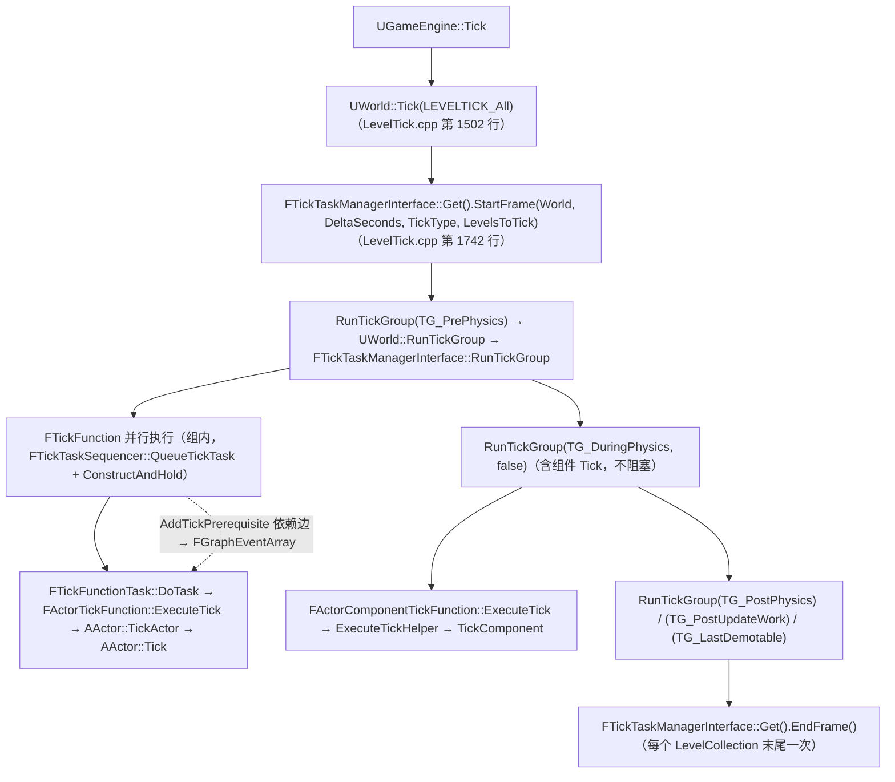
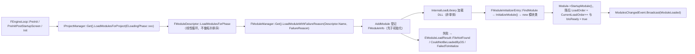

# UE 引擎源码分析 08：Tick 调度与模块系统源码剖析
> 知识成熟度：L2（本轮审计修订时补标）
> 源码基线 / 版本基准：UE 5.8.0（本机 `Engine/Build/Build.version`：Major 5 / Minor 8 / Patch 0 / CL 55116800，分支 `++UE5+Release-5.8`）；逐字抽取用的证据源 checkout 为 UE 5.8.2（见下条"证据源"）。
> 验收边界：以本机 `C:\Program Files\Epic Games\UE_5.8\Engine` 只读源码为准；未在本文落地的主题不视为已完成源码覆盖。
> 官方参考：[Unreal Engine 官方文档总页](https://dev.epicgames.com/documentation/en-us/unreal-engine)。
> 最后更新：2026-09-15（补深：Tick 与模块系统全部代码块改为 UE 5.8.2 checkout 逐行机械抽取并标注行区间；订正「TickFunction.h 不存在但 FTickFunction 在 Classes/Engine 下」「FTickFunction 是 USTRUCT 且 TickGroup 类型为 TEnumAsByte」「UWorld::Tick 还有 TG_LastDemotable 与 RunPauseFrame 分支」「AActor::TickActor 在 5.8 只剩一次 Tick 调用」「AddTickPrerequisite* 确实校验 bCanEverTick」「IMPLEMENT_MODULE 是 IS_MONOLITHIC 双分支」「IModuleInterface::SupportsDynamicReloading 默认返回 true」「LoadModule 是 LoadModule→GetOrLoadModule→LoadModuleWithFailureReason 三段」「UnloadModule 不做 SupportsDynamicReloading 检查」「LoadModulesForPhase 不做拓扑排序」「GEngine 在 FEngineLoop::Init 而非 PostEngineInit 阶段创建」等与 5.8 源码不符的说法）。

> 对应知识点：[01-引擎基础/04 引擎启动流程与模块架构](04-引擎启动流程与模块架构.md) 与 [01-引擎基础/02 Actor 与 Component 生命周期](../对象模型与生命周期/02-Actor与Component生命周期.md)
>
> 适用版本：UE 5.8.0；本机 `Engine/Build/Build.version`：CL 55116800，分支 `++UE5+Release-5.8`。
> 源码依据（版本基线同名条目）：`C:\Program Files\Epic Games\UE_5.8\Engine\Source\Runtime`；以本机 5.8 源码为准。UE4.27 仅作为历史兼容性对照。
> 证据源（本轮逐行核对）：只读 checkout `C:\Users\zhaozhiqi\Documents\GitHub\UnrealEngine`（分支 `UE5`，`Engine/Build/Build.version` = Major 5 / Minor 8 / Patch 2 / `CompatibleChangelist` 55116800）。文中每个引擎代码块由脚本按行区间机械抽取（仅剥除行尾空白，保留行首 tab/缩进），引用句中的相对路径以 checkout 根为基准，可直接拼成绝对路径打开。
> 本轮源码依据（文件 + 行区间，均为 checkout 行号）：`Engine/Classes/Engine/EngineBaseTypes.h` 81–110 / 112–173 / 175–265 / 278–326 / 377–389 / 487–524 / 550–552 / 564–596（另 69–79 为 `ELevelTick`）；`Engine/Public/TickTaskManagerInterface.h` 15–67；`Engine/Private/TickTaskManager.cpp` 281–340 / 457–460 / 865–889 / 932–938 / 1069–1112 / 1969–1994 / 2005–2057 / 2115–2192 / 2360–2377 / 2402–2436 / 2438–2461 / 2481–2490 / 2620–2711；`Engine/Private/LevelTick.cpp` 1650–1656 / 1737–1780 / 1870–1887；`Engine/Private/Actor.cpp` 372–390 / 841–855 / 1754–1770 / 1997–2009；`Engine/Classes/GameFramework/Actor.h` 4875–4895；`Engine/Private/Components/ActorComponent.cpp` 548 / 1695–1711 / 1755–1761；`Engine/Classes/Components/ActorComponent.h` 974–977；`Core/Public/Modules/ModuleInterface.h` 7–61；`Core/Public/Modules/ModuleManager.h` 612–658 / 881–904 / 922–971 / 974–985 / 1094–1136；`Core/Private/Modules/ModuleManager.cpp` 445–462 / 924–979 / 981–1050 / 1180–1314 / 1317–1406；`Projects/Public/ModuleDescriptor.h` 21–77 / 79–132 / 151–205 / 208–212 / 244–245；`Projects/Private/ModuleDescriptor.cpp` 779–806 / 826–830；`Launch/Private/LaunchEngineLoop.cpp` 3783–3802 / 3894–3901 / 4669–4695 / 4766–4780 / 4860–4868 / 6561–6567 / 6804–6813。
> 行号口径：行号以 UE 5.8.2 checkout（`C:\Users\zhaozhiqi\Documents\GitHub\UnrealEngine`，分支 `UE5`，`CompatibleChangelist` 55116800）为准；安装版 UE 5.8.0（CL 55116800）同名文件可能相差数行，定位请以「符号名 + 引用句」为主、行号为辅。
> 文中所有类名 / 函数名 / 宏名均为 UE 真实 API；标注"节选"的代码是对超长函数做了裁剪、未改动任何符号；作者自写示例显式标注「作者示例（非引擎源码）」，且不放进标有「摘自」的块里。
> 事实边界声明：凡本轮未在 5.8 全树检索到命中的符号，直接写明"检索范围 + 无命中"，不做推测。

## 一、概述

### 1.1 本篇回答的问题

- `AActor::Tick` 与 `UActorComponent::TickComponent` 到底是谁在哪个线程、什么时机调用的？
- Tick Group（`TG_PrePhysics`、`TG_DuringPhysics`、`TG_PostPhysics`、`TG_PostUpdateWork` 等）在源码层面如何实现"组内并行、组间串行"？
- `AddTickPrerequisiteActor` / `AddTickPrerequisiteComponent` 建立的依赖关系如何变成任务图上的边？
- `IMPLEMENT_MODULE` 展开后长什么样？`StartupModule()` 什么时候被调用？模块加载顺序由谁保证？
- `LoadModule` / `LoadModuleWithFailureReason` / `UnloadModule` 内部到底做了什么？

### 1.2 与知识库文章的对应关系

| 知识库文章 | 讲清了什么 | 本篇补充的源码层内容 |
| --- | --- | --- |
| 《04 引擎启动流程与模块架构》 | main() → FEngineLoop → 模块系统的概念：模块 = DLL、LoadingPhase 语义、.uproject / .uplugin / Build.cs 的关系 | `FModuleManager` / `FModuleDescriptor` / `IMPLEMENT_MODULE` 的实现 |
| 《02 Actor 与 Component 生命周期》 | Actor 生成、BeginPlay、Tick、Destroy 的使用规则与触发顺序 | `FTickTaskManager` → `FTickFunction::ExecuteTick` → `TickActor` 的完整调用链 |

建议先读知识库两篇文章建立概念，再读本篇；两篇配合可以回答"初始化顺序、Tick 顺序、模块加载顺序"这三类最容易踩坑的顺序问题。

## 二、源码定位

| 模块 | 文件（从 checkout 根开始的完整相对路径） | 关键符号 | 作用 |
| --- | --- | --- | --- |
| Engine | `Engine/Source/Runtime/Engine/Classes/Engine/EngineBaseTypes.h` | `ELevelTick`（第 69 行）、`ETickingGroup`（第 83 行）、`FTickPrerequisite`（第 114 行）、`FTickFunction`（第 183 行）、`FTickFunction::FInternalData`（第 278 行）、`FActorTickFunction`（第 566 行）、`FActorComponentTickFunction`（第 612 行） | Tick 函数基类、分组与依赖定义。**订正**：`TickFunction.h` 在 Engine/Source 全树无命中（检索命令见 2.5），但 `FTickFunction` 位于 `Classes/Engine/` 下（不是 `Public/`），且是 `USTRUCT()` 反射结构体而非普通 C++ struct |
| Engine | `Engine/Source/Runtime/Engine/Public/TickTaskManagerInterface.h` | `FTickTaskManagerInterface`（第 20 行）、`AllocateTickTaskLevel`（第 26 行）、`FreeTickTaskLevel`（第 29 行）、`StartFrame`（第 38 行）、`RunPauseFrame`（第 47 行）、`RunTickGroup`（第 54 行）、`EndFrame`（第 57 行）、`Get`（第 66 行） | 调度器接口（本文件全文仅 67 行）。**订正**：接口里没有 `FTickTaskSequencer`，它是 `TickTaskManager.cpp` 内的文件局部类（第 460 行） |
| Engine | `Engine/Source/Runtime/Engine/Private/TickTaskManager.cpp` | `FTickFunctionTask`（第 281 行）、`FTickTaskSequencer`（第 460 行；`QueueTickTask` 第 872 行、`ReleaseTickGroup` 第 938 行、`StartFrame` 第 1072 行、`EndFrame` 第 1117 行）、`FTickTaskLevel`（第 1210 行）、`FTickTaskManager`（第 1970 行；`StartFrame` 第 2005 行、`RunTickGroup` 第 2120 行、`EndFrame` 第 2175 行、`AddTickFunction` 第 2203 行）、`FTickFunction::RegisterTickFunction`（第 2406 行）、`FTickFunction::QueueTickFunction`（第 2622 行） | 核心调度实现：分组、并行、依赖、降级。**订正**：5.8 无 `FTickTaskManager::Tick`；`FTickTask` 类也不存在，任务直接以 `FTickFunction*` 交给 `TGraphTask<FTickFunctionTask>` |
| Engine | `Engine/Source/Runtime/Engine/Private/LevelTick.cpp` | `UWorld::RunTickGroup`（第 783 行）、`UWorld::Tick`（第 1502 行）、`StartFrame` 调用点（第 1742 行）、`RunPauseFrame`（第 1784 行）、`EndFrame`（第 1886 行） | 每帧 Tick 的总入口（5.8 实现在 LevelTick.cpp，不是 World.cpp）。**订正**：`ULevel::Tick` 在 Engine/Source 全树无命中 |
| Engine | `Engine/Source/Runtime/Engine/Private/Actor.cpp` | `FActorTickFunction::ExecuteTick`（第 372 行）、`AddTickPrerequisiteActor` / `AddTickPrerequisiteComponent`（第 841 / 849 行）、`SetActorTickEnabled`（第 1754 行）、`AActor::TickActor`（第 1997 行）、`AActor::Tick`（第 2006 行）、`PrimaryActorTick.TickGroup = TG_PrePhysics`（第 276 行） | Actor 级 Tick 与依赖便捷接口 |
| Engine | `Engine/Source/Runtime/Engine/Classes/GameFramework/Actor.h` | `FActorComponentTickFunction::ExecuteTickHelper`（第 4877 行，模板定义在头文件里） | 组件 Tick 的公共执行前判定 |
| Engine | `Engine/Source/Runtime/Engine/Private/Components/ActorComponent.cpp` | `PrimaryComponentTick.TickGroup = TG_DuringPhysics`（第 548 行）、`FActorComponentTickFunction::ExecuteTick`（第 1695 行）、`SetComponentTickEnabled`（第 1755 行） | 组件级 Tick |
| Core | `Engine/Source/Runtime/Core/Public/Modules/ModuleInterface.h` | `IModuleInterface`（第 30 行）、`StartupModule`（第 49 行）、`PreUnloadCallback`（第 59 行）、`PostLoadCallback`（第 68 行）、`ShutdownModule`（第 79 行）、`SupportsDynamicReloading`（第 88 行）、`SupportsAutomaticShutdown`（第 98 行）、`IsGameModule`（第 108 行） | 模块接口。**订正**：`SupportsDynamicReloading()` 默认返回 **true**，不是 false |
| Core | `Engine/Source/Runtime/Core/Public/Modules/ModuleManager.h` | `FModuleInfo`（第 616 行）、`FStaticallyLinkedModuleRegistrant`（第 821 行）、`FModuleInitializerEntry`（第 864 行）、`FDefaultModuleImpl`（第 884 行）、`FDefaultGameModuleImpl`（第 892 行）、`IMPLEMENT_MODULE`（第 946 / 955 行，`IS_MONOLITHIC` 双分支）、`IMPLEMENT_GAME_MODULE`（第 984 行）、`IMPLEMENT_PRIMARY_GAME_MODULE`（第 1100 / 1114 / 1130 行三分支） | 模块管理器声明与注册宏。**订正**：`ImplementModuleInline.h` 在 Engine/Source 全树无命中，宏全部定义在 `ModuleManager.h` |
| Core | `Engine/Source/Runtime/Core/Private/Modules/ModuleManager.cpp` | `AddModule`（第 445 行）、`LoadModule`（第 924 行）、`GetOrLoadModule`（第 930 行）、`LoadModuleChecked`（第 968 行）、`LoadModuleWithFailureReason`（第 981 行）、`UnloadModule`（第 1317 行） | 模块加载 / 卸载实现 |
| Projects | `Engine/Source/Runtime/Projects/Public/ModuleDescriptor.h`（实现 `Projects/Private/ModuleDescriptor.cpp`） | `ELoadingPhase`（第 24 行）、`EHostType`（第 82 行）、`FModuleDescriptor`（第 154 行）、`LoadModulesForPhase`（第 245 行声明 / `.cpp` 第 779 行实现） | 模块描述与加载阶段（5.8 位于 Projects 模块） |
| Launch | `Engine/Source/Runtime/Launch/Private/LaunchEngineLoop.cpp` | `PreInitPreStartupScreen`（第 1728 行）、`PreInitPostStartupScreen`（第 3447 行）、`LoadStartupCoreModules` 调用点（第 3785 行）、`PreLoadingScreen`（第 3798 行）、`LoadStartupModules()`（第 3896 行调用 / 第 4669 行定义，内含 PreDefault/Default/PostDefault）、`FEngineLoop::Init`（第 4747 行）、`GEngine =`（第 4779 行）、`PostEngineInit`（第 4863 行） | 各 LoadingPhase 的触发点。**订正**：`GEngine` 在 `FEngineLoop::Init()` 里创建（第 4779 行），也就是 `Default` 阶段**之后**、`PostEngineInit` 之前 |

### 2.5 逐字抽取约定、行号口径与检索范围

**抽取方式**：本文所有引擎代码块由脚本从 checkout 按行区间机械读取（仅剥除行尾空白，保留行首 tab/缩进），不做等价重写、不改注释。引用句统一格式为「摘自 `<相对路径>`（第 N 行起）」，相对路径以 checkout 根 `UnrealEngine/` 为基准；节选块在代码内用 `// …（节选：省略第 A~B 行，共 K 行）` 标出被跳过的真实行区间，K 与 `B-A+1` 一致。

**行号口径**：行号以 checkout（`UE5` 分支，`CompatibleChangelist` 55116800）为准，安装版 UE 5.8.0（CL 55116800）与官方 GitHub 快照可能相差数行。行号只用于定位，不作为 ABI、补丁级契约或跨版本稳定性承诺。

**作者示例**：凡不由引擎源码抽取的示例（自定义类型、伪代码、流程图）一律显式标注「作者示例（非引擎源码）」，并且不放进标有「摘自」的块里。

**本轮"5.8 全树检索无命中"的符号**（检索范围：`Engine/Source`）：

| 符号 | 结论 |
| --- | --- |
| `TickFunction.h`（文件） | 无此文件；`FTickFunction` 定义在 `Engine/Classes/Engine/EngineBaseTypes.h` 第 183 行 |
| `ImplementModuleInline.h`（文件） | 无此文件；`IMPLEMENT_MODULE` 等宏全部在 `Core/Public/Modules/ModuleManager.h` |
| `FTickTaskManager::Tick`（函数） | 无命中；帧被拆成 `StartFrame` / `RunTickGroup` / `EndFrame` |
| `FTickTask`（类） | 无命中；任务直接以 `FTickFunction*` 交给 `TGraphTask<FTickFunctionTask>` |
| `ULevel::Tick`（函数） | 无命中；Level 级调度记录是 `ULevel::TickTaskLevel`（`FTickTaskLevel*` 成员） |
| `AllocateTickTaskManager` | 无命中；真实名称为 `AllocateTickTaskLevel` / `FreeTickTaskLevel` |
| `FLoadModuleResult`（类型） | 无命中；失败原因类型是 `EModuleLoadResult` |
| `DEFINE_STATIC_MAIN_FUNC` / `IMPLEMENT_MODULE_IMPLEMENTATION`（宏） | 无命中 |
| `bDisableParallel`（成员） | 无命中；并行性由 `bRunOnAnyThread` / `bAllowTickBatching` 与任务图决定 |
| `SupportsDynamicReloading` 出现在 `ModuleManager.cpp` | 无命中（该检查只在 `FModuleDescriptor::UnloadModulesForPhase`） |
| `ProcessNewlyLoadedUObjects` 定义在 `UObjectGlobals.cpp` | **订正**：定义在 `CoreUObject/Private/UObject/CompiledInUObjectInit.cpp` 第 84 行，声明在第 33 行 |
| `FTickTaskSequencer` 定义在 `TickTaskManagerInterface.h` | **订正**：接口头文件里没有它；它在 `TickTaskManager.cpp` 第 460 行，是文件局部类 |

```powershell
# 只读复核（checkout 根），用于重新确认上面这张表
$ue = 'C:\Users\zhaozhiqi\Documents\GitHub\UnrealEngine'
rg -n --glob '*.h' --glob '*.cpp' 'FTickTaskManager::Tick|class FTickTask|class FTickTaskSequencer|AllocateTickTaskManager|FLoadModuleResult|bDisableParallel|DEFINE_STATIC_MAIN_FUNC|SupportsDynamicReloading' "$ue\Engine\Source"
rg --files --no-messages "$ue\Engine\Source" | rg 'TickFunction\.h|ImplementModuleInline\.h'
rg -n 'ULevel::Tick' "$ue\Engine\Source"
rg -n 'void ProcessNewlyLoadedUObjects' "$ue\Engine\Source\Runtime\CoreUObject"
```

## 三、Tick 系统源码剖析

### 3.1 线程模型：Tick 由谁驱动

UE 的 Tick 建立在 TaskGraph（任务图）之上：

- 每个可 Tick 对象（Actor / Component）持有一个 `FTickFunction` 派生实例（`FActorTickFunction` / `FActorComponentTickFunction`）；
- 注册后，每帧由 `FTickTaskManager` 把它们通过 `FTickTaskSequencer::QueueTickTask` 以 `FTickFunction` 直接入队投递给任务图（5.8 中 `FTickTask` 包装类已移除）；
- 同一 Tick Group 内的任务可以多线程并行，**组与组之间严格串行**；
- 默认情况下 `AActor::PrimaryActorTick` 属于 `TG_PrePhysics`（`Actor.cpp` 第 276 行 `PrimaryActorTick.TickGroup = TG_PrePhysics;`），`UActorComponent::PrimaryComponentTick` 属于 `TG_DuringPhysics`（`ActorComponent.cpp` 第 548 行 `PrimaryComponentTick.TickGroup = TG_DuringPhysics;`）。

这条"平级"关系是源码事实，不是描述：`FTickFunction` 的构造函数里 `TickGroup(TG_PrePhysics)`、`EndTickGroup(TG_PrePhysics)`、`bCanEverTick(false)`、`bStartWithTickEnabled(false)`、`TickInterval(0.f)`，所以 Actor/组件构造函数必须**显式**打开 `bCanEverTick` 并改分组，否则永远不 Tick。摘自 `Engine/Source/Runtime/Engine/Private/TickTaskManager.cpp`（第 2360 行起）：

```cpp
/** Default constructor, intitalizes to reasonable defaults **/
FTickFunction::FTickFunction()
	: TickGroup(TG_PrePhysics)
	, EndTickGroup(TG_PrePhysics)
	, bTickEvenWhenPaused(false)
	, bCanEverTick(false)
	, bStartWithTickEnabled(false)
	, bAllowTickOnDedicatedServer(true)
	, bAllowTickBatching(false)
	, bHighPriority(false)
	, bRunOnAnyThread(false)
	, bRunTransactionally(false)
	, bDispatchManually(false)
	, bWasDispatchedManually(false)
	, TickState(ETickState::Enabled)
	, TickInterval(0.f)
{
}
```

要点：① `FTickFunction` 的默认组是 `TG_PrePhysics`，但**默认不注册也不启用**（`bCanEverTick = false`）；② `bAllowTickOnDedicatedServer` 默认为 `true`，专用服务器过滤发生在 `RegisterTickFunction` 里而不是 `ExecuteTick` 里（见 3.5）；③ `TickState` 初值是 `ETickState::Enabled`，但它只在 `IsTickFunctionRegistered()` 为真时才有调度意义。

### 3.2 Tick Group 定义

（2026-09-15：原示意块已替换为 5.8 源码逐字版）

`ETickingGroup` 在 5.8 里是**带 `UMETA` 的 UENUM**，底层类型 `int`，且只有 `TG_StartPhysics` / `TG_EndPhysics` / `TG_LastDemotable` / `TG_NewlySpawned` 标了 `UMETA(Hidden)`——也就是蓝图里能选的只有 PrePhysics / DuringPhysics / PostPhysics / PostUpdateWork 四组；原稿写"由 `enum class` 改为普通 enum"方向对（5.8 确实是普通 `enum`），但漏了 `UMETA` 与 `int` 底层类型。摘自 `Engine/Source/Runtime/Engine/Classes/Engine/EngineBaseTypes.h`（第 81 行起）：

```cpp
/** Determines which ticking group a tick function belongs to. */
UENUM(BlueprintType)
enum ETickingGroup : int
{
	/** Any item that needs to be executed before physics simulation starts. */
	TG_PrePhysics UMETA(DisplayName="Pre Physics"),

	/** Special tick group that starts physics simulation. */
	TG_StartPhysics UMETA(Hidden, DisplayName="Start Physics"),

	/** Any item that can be run in parallel with our physics simulation work. */
	TG_DuringPhysics UMETA(DisplayName="During Physics"),

	/** Special tick group that ends physics simulation. */
	TG_EndPhysics UMETA(Hidden, DisplayName="End Physics"),

	/** Any item that needs rigid body and cloth simulation to be complete before being executed. */
	TG_PostPhysics UMETA(DisplayName="Post Physics"),

	/** Any item that needs to be ticked after all normal gameplay tasks. */
	TG_PostUpdateWork UMETA(DisplayName="Post Update Work"),

	/** Last group which tick functions can be delayed into because of dependencies. */
	TG_LastDemotable UMETA(Hidden, DisplayName = "Last Demotable"),

	/** Special tick group that is not actually a tick group. After every tick group this is repeatedly re-run until there are no more newly spawned items to run. */
	TG_NewlySpawned UMETA(Hidden, DisplayName="Newly Spawned"),

	TG_MAX,
};
```

紧接着就是依赖边的数据结构 `FTickPrerequisite`。摘自 `Engine/Source/Runtime/Engine/Classes/Engine/EngineBaseTypes.h`（第 112 行起）：

```cpp
/** This is a small structure to define how a tick function depends on other tick functions. */
USTRUCT()
struct FTickPrerequisite
{
	GENERATED_BODY()

public:
	/**
	 * Tick functions are owned by UObjects, so we need a separate weak pointer to the UObject
	 * solely for the purpose of determining if PrerequisiteTickFunction is still valid.
	 */
	TWeakObjectPtr<class UObject> PrerequisiteObject;

	/**
	 * Pointer to the actual tick function and must be completed prior to our tick running.
	 * @warning This should not be accessed directly, use Get() to validate the PrerequisiteObject first.
	 */
	struct FTickFunction*		PrerequisiteTickFunction;

	FTickPrerequisite()
		: PrerequisiteTickFunction(nullptr)
	{
	}

	/**
	 * Constructor
	 * @param TargetObject - UObject containing this tick function. Only used to verify that the other pointer is still usable
	 * @param TargetTickFunction - Actual tick function to use as a prerequisite
	 */
	FTickPrerequisite(UObject* TargetObject, struct FTickFunction& TargetTickFunction)
		: PrerequisiteObject(TargetObject)
		, PrerequisiteTickFunction(&TargetTickFunction)
	{
		check(PrerequisiteTickFunction);
	}

	/** Equality operator, used to prevent duplicates and allow removal by value. */
	bool operator==(const FTickPrerequisite& Other) const
	{
		return PrerequisiteObject == Other.PrerequisiteObject &&
			PrerequisiteTickFunction == Other.PrerequisiteTickFunction;
	}

	/** Return the tick function, if it is still valid. Can be null if the tick function was null or the containing UObject is invalid. */
	struct FTickFunction* Get()
	{
		if (PrerequisiteObject.IsValid(true))
		{
			return PrerequisiteTickFunction;
		}
		return nullptr;
	}

	const struct FTickFunction* Get() const
	{
		if (PrerequisiteObject.IsValid(true))
		{
			return PrerequisiteTickFunction;
		}
		return nullptr;
	}
};
```

逐段解构（`ETickingGroup`）：

1. **这段在做什么**：定义九个枚举值加一个 `TG_MAX` 哨兵，顺序即"帧内阶段顺序"，`UWorld::Tick` 就是按这个顺序逐个 `RunTickGroup`。
2. **关键判断为什么这样写**：`TG_StartPhysics` 与 `TG_EndPhysics` 的注释是 "Special tick group that starts / ends physics simulation"，它们是**钩子组**——引擎在 `TG_PrePhysics` 之后让物理启动、在 `TG_EndPhysics` 处收物理结果，所以"与物理并行"的语义由组的先后位置表达，而不是由某个 bool 参数表达。
3. **与相邻阶段如何衔接**：`TG_NewlySpawned` 的注释明确它不是真正的组，而是 "After every tick group this is repeatedly re-run until there are no more newly spawned items to run"，这解释了 `FTickTaskManager::RunTickGroup` 里那个上限 101 次的重跑循环。
4. **容易误解的点**：`TG_LastDemotable` 的注释是 "Last group which tick functions can be delayed into because of dependencies"——它不是"最后一个组"，而是"因依赖降级能到达的最后一个组"；`TG_MAX` 不是可用组。

逐段解构（`FTickPrerequisite`）：

1. **这段在做什么**：把"依赖某个 TickFunction"表示成 `{弱对象指针, 裸 TickFunction 指针}` 一对，并提供 `Get()` 做有效性过滤。
2. **关键判断为什么这样写**：`PrerequisiteObject.IsValid(true)` 里的 `true` 是"允许在 GC 期间也算有效"的开关，避免 Tick 依赖在 GC 扫描中途被误判失效。
3. **与相邻阶段如何衔接**：依赖的清理不在 `AddTickFunction` 里，而在**每帧排帧时的 `FTickFunction::QueueTickFunction`**：它逐个检查 `Prerequisites[i].PrerequisiteObject.IsValid(true)`，失效的用 `Prerequisites.RemoveAtSwap(PrereqIndex--)` **就地摘除**（`TickTaskManager.cpp` 第 2638~2645 行）。
4. **容易误解的点**：`PrerequisiteTickFunction` 是**裸指针**，注释明确写了 "This should not be accessed directly, use Get() to validate the PrerequisiteObject first"；`QueueTickFunction` 的写法是先取裸指针再立刻验 `PrerequisiteObject`，顺序不能反。

各组语义速查：

| TickGroup | 典型用途 | 注意点 |
| --- | --- | --- |
| TG_PrePhysics | 输入处理、AI、游戏逻辑 | Actor 默认组；物理还没跑 |
| TG_StartPhysics / TG_DuringPhysics / TG_EndPhysics | 与物理系统耦合的逻辑 | DuringPhysics 与物理并行，不能假设物理结果已就绪 |
| TG_PostPhysics | 依赖物理结果的逻辑（如残影、地面判定） | 物理已结束 |
| TG_PostUpdateWork | 相机更新后的逻辑（后处理、UI 相关） | 蓝图可见的最晚普通组 |
| TG_LastDemotable | 因依赖被降级的手动派发 Tick | `UMETA(Hidden)`；`UWorld::Tick` 在 `TG_PostUpdateWork` 之后仍跑一次 |
| TG_NewlySpawned | 不是真组：每个组后反复重跑直到没有新生成对象 | 不能把 Tick 直接注册到这个组（`AddTickFunction` 有 `check`） |

### 3.3 UWorld::Tick：每帧的总入口

（2026-09-15：原示意块已替换为 5.8 源码逐字版）

真实的 `UWorld::Tick` **没有** `if (TickType == LEVELTICK_All)` 这层判断，而是先算出一个 `bDoingActorTicks` 复合条件，再在**每个 LevelCollection 的循环里**执行排帧。摘自 `Engine/Source/Runtime/Engine/Private/LevelTick.cpp`（第 1650 行起）：

```cpp
	bool bDoingActorTicks =
		(TickType!=LEVELTICK_TimeOnly)
		&&	!bIsPaused
#if UE_SUPPORT_FOR_ACTOR_TICK_DISABLE
		&&  IsActorTickAndUserCallbacksEnabled()
#endif
		&&	(!NetDriver || !NetDriver->ServerConnection || NetDriver->ServerConnection->GetConnectionState()==USOCK_Open);
```

分组执行顺序（注意 `TG_LastDemotable` 与 `RunPauseFrame` 分支）。摘自 `Engine/Source/Runtime/Engine/Private/LevelTick.cpp`（第 1737 行起；节选，省略第 1781~1869 行，共 89 行）：

```cpp
		if (bDoingActorTicks)
		{
			// Actually tick actors now that context is set up
			SetupPhysicsTickFunctions(DeltaSeconds);
			TickGroup = TG_PrePhysics; // reset this to the start tick group
			FTickTaskManagerInterface::Get().StartFrame(this, DeltaSeconds, TickType, LevelsToTick);

			SCOPE_CYCLE_COUNTER(STAT_TickTime);
			CSV_SCOPED_TIMING_STAT_EXCLUSIVE(TickActors);
			{
				SCOPE_TIME_GUARD_MS(TEXT("UWorld::Tick - TG_PrePhysics"), 10);
				SCOPE_CYCLE_COUNTER(STAT_TG_PrePhysics);
				CSV_SCOPED_SET_WAIT_STAT(PrePhysics);
				RunTickGroup(TG_PrePhysics);
			}
			bInTick = false;
			EnsureCollisionTreeIsBuilt();
			bInTick = true;
			{
				SCOPE_CYCLE_COUNTER(STAT_TG_StartPhysics);
				SCOPE_TIME_GUARD_MS(TEXT("UWorld::Tick - TG_StartPhysics"), 10);
				CSV_SCOPED_SET_WAIT_STAT(StartPhysics);
				RunTickGroup(TG_StartPhysics);
			}
			{
				SCOPE_CYCLE_COUNTER(STAT_TG_DuringPhysics);
				SCOPE_TIME_GUARD_MS(TEXT("UWorld::Tick - TG_DuringPhysics"), 10);
				CSV_SCOPED_SET_WAIT_STAT(DuringPhysics);
				RunTickGroup(TG_DuringPhysics, false); // No wait here, we should run until idle though. We don't care if all of the async ticks are done before we start running post-phys stuff
			}
			TickGroup = TG_EndPhysics; // set this here so the current tick group is correct during collision notifies, though I am not sure it matters. 'cause of the false up there^^^
			{
				SCOPE_CYCLE_COUNTER(STAT_TG_EndPhysics);
				SCOPE_TIME_GUARD_MS(TEXT("UWorld::Tick - TG_EndPhysics"), 10);
				CSV_SCOPED_SET_WAIT_STAT(EndPhysics);
				RunTickGroup(TG_EndPhysics);
			}
			{
				SCOPE_CYCLE_COUNTER(STAT_TG_PostPhysics);
				SCOPE_TIME_GUARD_MS(TEXT("UWorld::Tick - TG_PostPhysics"), 10);
				CSV_SCOPED_SET_WAIT_STAT(PostPhysics);
				RunTickGroup(TG_PostPhysics);
			}

// …（节选：省略第 1781~1869 行，共 89 行）
		if (bDoingActorTicks)
		{
			SCOPE_CYCLE_COUNTER(STAT_TickTime);
			{
				SCOPE_CYCLE_COUNTER(STAT_TG_PostUpdateWork);
				SCOPE_TIME_GUARD_MS(TEXT("UWorld::Tick - PostUpdateWork"), 5);
				CSV_SCOPED_SET_WAIT_STAT(PostUpdateWork);
				RunTickGroup(TG_PostUpdateWork);
			}
			{
				SCOPE_CYCLE_COUNTER(STAT_TG_LastDemotable);
				SCOPE_TIME_GUARD_MS(TEXT("UWorld::Tick - TG_LastDemotable"), 5);
				CSV_SCOPED_SET_WAIT_STAT(LastDemotable);
				RunTickGroup(TG_LastDemotable);
			}

			FTickTaskManagerInterface::Get().EndFrame();
		}
```

收尾（`TG_PostUpdateWork` → `TG_LastDemotable` → `EndFrame`）。摘自 `Engine/Source/Runtime/Engine/Private/LevelTick.cpp`（第 1870 行起）：

```cpp
		if (bDoingActorTicks)
		{
			SCOPE_CYCLE_COUNTER(STAT_TickTime);
			{
				SCOPE_CYCLE_COUNTER(STAT_TG_PostUpdateWork);
				SCOPE_TIME_GUARD_MS(TEXT("UWorld::Tick - PostUpdateWork"), 5);
				CSV_SCOPED_SET_WAIT_STAT(PostUpdateWork);
				RunTickGroup(TG_PostUpdateWork);
			}
			{
				SCOPE_CYCLE_COUNTER(STAT_TG_LastDemotable);
				SCOPE_TIME_GUARD_MS(TEXT("UWorld::Tick - TG_LastDemotable"), 5);
				CSV_SCOPED_SET_WAIT_STAT(LastDemotable);
				RunTickGroup(TG_LastDemotable);
			}

			FTickTaskManagerInterface::Get().EndFrame();
		}
```

逐段解构：

1. **这段在做什么**：`bDoingActorTicks` 决定"这一帧要不要跑 Tick 组"，然后 `FTickTaskManagerInterface::Get().StartFrame(this, DeltaSeconds, TickType, LevelsToTick)` 把本帧所有 TickFunction 排好队，再用七次 `RunTickGroup` 逐组放行。
2. **关键判断为什么这样写**：`bDoingActorTicks` 的第四个条件 `(!NetDriver || !NetDriver->ServerConnection || NetDriver->ServerConnection->GetConnectionState()==USOCK_Open)` 是"客户端连接尚未建立时不要跑 Actor Tick"，这解释了为什么联机启动瞬间 `BeginPlay` 里设的 Tick 看似没反应。
3. **与相邻阶段如何衔接**：`StartFrame` 之后立刻进 `SCOPE_CYCLE_COUNTER(STAT_TickTime)`，并在 `TG_PrePhysics` 与 `TG_StartPhysics` 之间插入 `EnsureCollisionTreeIsBuilt()`（期间 `bInTick` 被置 false 再置回 true）——所以"PrePhysics 组跑完、物理启动前"有一个明确的碰撞树构建点。
4. **容易误解的点**：`RunTickGroup(TG_DuringPhysics, false)` 的第二个参数 `false` 意思是"不阻塞"，源码注释写明 "No wait here, we should run until idle though. We don't care if all of the async ticks are done before we start running post-phys stuff"；`FTickTaskManagerInterface::Get().EndFrame()` 在**每个 LevelCollection 迭代末尾**都会调用一次，不是每帧一次。

要点：

- 真正的"是否 Tick"判据是 `bDoingActorTicks`，不是 `LEVELTICK_All`：`LEVELTICK_TimeOnly` 与暂停都会让它为假，暂停时改走 `RunPauseFrame`（`LevelTick.cpp` 第 1784 行；`RunPauseFrame` 在调度器接口第 47 行声明）；
- `FTickTaskManagerInterface::Get()` 返回**进程级单例**，按 Level 隔离靠的是 `ULevel::TickTaskLevel` 成员：`TickTaskLevelForLevel` 只在该指针为空时才调 `AllocateTickTaskLevel()` 新建（见本节起首对 `TickTaskManager.cpp` 的引用）。接口全文只有 67 行、7 个虚函数。摘自 `Engine/Source/Runtime/Engine/Public/TickTaskManagerInterface.h`（第 15 行起）：

```cpp
/**
 * Interface for the tick task manager, which is used to queue and execute FTickFunctions.
 * These functions are called for a world to handle the "tick frame" that runs normal gameplay operations.
 * The frame is split into multiple tick groups to allow broad coordination between different engine systems.
 */
class FTickTaskManagerInterface
{
public:
	virtual ~FTickTaskManagerInterface() = default;

	/** Allocate a new ticking structure to track registered ticks for a level. */
	virtual FTickTaskLevel* AllocateTickTaskLevel() = 0;

	/** Free a ticking structure used for tracking registered ticks. */
	virtual void FreeTickTaskLevel(FTickTaskLevel* TickTaskLevel) = 0;

	/**
	 * Queue all of the ticks for one tick frame.
	 * This initializes execution of all tick functions for the frame and handles prerequisite scheduling.
	 * @param World	- World currently ticking
	 * @param DeltaSeconds - time in seconds since last tick
	 * @param TickType - type of tick (viewports only, time only, etc)
	 */
	virtual void StartFrame(UWorld* InWorld, float DeltaSeconds, ELevelTick TickType, const TArray<ULevel*>& LevelsToTick) = 0;

	/**
	 * Run all of the ticks for a pause frame synchronously on the game thread.
	 * The capability of pause ticks are very limited. There are no dependencies or ordering or tick groups.
	 * @param World	- World currently ticking
	 * @param DeltaSeconds - time in seconds since last tick
	 * @param TickType - type of tick (viewports only, time only, etc)
	 */
	virtual void RunPauseFrame(UWorld* InWorld, float DeltaSeconds, ELevelTick TickType, const TArray<ULevel*>& LevelsToTick) = 0;

	/**
	 * Run a tick group, ticking all actors and components registered to execute in that tick group.
	 * @param Group - Ticking group to run
	 * @param bBlockTillComplete - if true, do not return until all ticks with the corresponding EndTickGroup have completed
	 */
	virtual void RunTickGroup(ETickingGroup Group, bool bBlockTillComplete ) = 0;

	/** Finish a frame of ticks for all worlds that called StartFrame. */
	virtual void EndFrame() = 0;

	/** Dumps all registered tick functions to output device. */
	virtual void DumpAllTickFunctions(FOutputDevice& Ar, UWorld* InWorld, bool bEnabled, bool bDisabled, bool bGrouped) = 0;

	/** Returns a map of enabled ticks, grouped by 'diagnostic context' string, along with count of enabled ticks */
	virtual void GetEnabledTickFunctionCounts(UWorld* InWorld, TSortedMap<FName, int32, FDefaultAllocator, FNameFastLess>& TickContextToCountMap, int32& EnabledCount, bool bDetailed, bool bFilterCoolingDown=false) = 0;

	/** Accessor for the singleton global tick task manager. */
	static ENGINE_API FTickTaskManagerInterface& Get();
};
```

**订正**：`AllocateTickTaskManager` 在 5.8 全树无命中（检索范围 `Engine/Source`）；真实名字是 `AllocateTickTaskLevel` / `FreeTickTaskLevel`。

### 3.4 FTickTaskManager::Tick：分组调度核心

**订正**：5.8 中 `FTickTaskManager::Tick` **不存在**（检索范围 `Engine/Source`，`rg -n 'FTickTaskManager::Tick'` 无命中）。帧生命周期被拆成接口上的三段：`StartFrame` 排帧、`RunTickGroup` 逐组放行、`EndFrame` 收尾。`FTickTaskManager` 是 `FTickTaskManagerInterface` 的唯一实现，类定义从 `TickTaskManager.cpp` 第 1969 行的注释行开始。摘自 `Engine/Source/Runtime/Engine/Private/TickTaskManager.cpp`（第 1969 行起）：

```cpp
/** Class that aggregates the individual levels and deals with parallel tick setup **/
class FTickTaskManager : public FTickTaskManagerInterface
{
public:
	/**
	 * Singleton to retrieve the global tick task manager
	 * @return Reference to the global tick task manager
	**/
	static FTickTaskManager& Get()
	{
		static FTickTaskManager SingletonInstance;
		return SingletonInstance;
	}

	/** Allocate a new ticking structure for a ULevel **/
	virtual FTickTaskLevel* AllocateTickTaskLevel() override
	{
		return new FTickTaskLevel;
	}

	/** Free a ticking structure for a ULevel **/
	virtual void FreeTickTaskLevel(FTickTaskLevel* TickTaskLevel) override
	{
		check(!LevelList.Contains(TickTaskLevel));
		delete TickTaskLevel;
	}
```

排帧的全部工作在这里。注意 `bConcurrentQueue` 分支：默认走"串行排帧 + 批处理"，只有打开并发排队 CVar 时才走 `ParallelFor`。摘自 `Engine/Source/Runtime/Engine/Private/TickTaskManager.cpp`（第 2005 行起）：

```cpp
	virtual void StartFrame(UWorld* InWorld, float InDeltaSeconds, ELevelTick InTickType, const TArray<ULevel*>& LevelsToTick) override
	{
		SCOPE_CYCLE_COUNTER(STAT_QueueTicks);
		CSV_SCOPED_TIMING_STAT_EXCLUSIVE(QueueTicks);

#if !UE_BUILD_SHIPPING
		if (CVarStallStartFrame.GetValueOnGameThread() > 0.0f)
		{
			QUICK_SCOPE_CYCLE_COUNTER(STAT_Tick_Intentional_Stall);
			FPlatformProcess::Sleep(CVarStallStartFrame.GetValueOnGameThread() / 1000.0f);
		}
#endif
		if (FTaskSyncManager* SyncManager = FTaskSyncManager::Get())
		{
			// This can create tick functions
			SyncManager->StartFrame(InWorld, InDeltaSeconds, InTickType);
		}

		Context.TickGroup = ETickingGroup(0); // reset this to the start tick group
		Context.DeltaSeconds = InDeltaSeconds;
		Context.TickType = InTickType;
		Context.Thread = ENamedThreads::GameThread;
		Context.World = InWorld;

		bTickNewlySpawned = true;
		TickTaskSequencer.StartFrame();
		FillLevelList(LevelsToTick);

		int32 NumWorkerThread = 0;
		bool bConcurrentQueue = false;

		if (!FTickTaskSequencer::SingleThreadedMode())
		{
			// Concurrent tick may be faster in some situations but can change the order of ticking
			bConcurrentQueue = !!CVarAllowConcurrentQueue.GetValueOnGameThread();
		}

		if (!bConcurrentQueue)
		{
			int32 TotalTickFunctions = 0;
			for( int32 LevelIndex = 0; LevelIndex < LevelList.Num(); LevelIndex++ )
			{
				TotalTickFunctions += LevelList[LevelIndex]->StartFrame(Context);
			}
			INC_DWORD_STAT_BY(STAT_TicksQueued, TotalTickFunctions);
			CSV_CUSTOM_STAT(Basic, TicksQueued, TotalTickFunctions, ECsvCustomStatOp::Accumulate);
			TickTaskSequencer.SetupBatchedTicks(TotalTickFunctions);
			for( int32 LevelIndex = 0; LevelIndex < LevelList.Num(); LevelIndex++ )
			{
				LevelList[LevelIndex]->QueueAllTicks();
			}
			TickTaskSequencer.FinishBatchedTicks(Context);
		}
```

逐段解构（排帧）：

1. **这段在做什么**：把 `LevelsToTick` 交给 `FillLevelList`（只保留 `bIsVisible && TickTaskLevel` 的 Level），然后对每个 `FTickTaskLevel` 依次 `StartFrame(Context)` → `QueueAllTicks()`，最后由 `TickTaskSequencer.FinishBatchedTicks(Context)` 统一提交。**订正**：`AddTickFunction(Level, this)` 只做三件事——`check` 分组合法、`TickTaskLevelForLevel(InLevel)` 取或建 `FTickTaskLevel`、挂进去并回写 `TickFunction->InternalData->TickTaskLevel`（第 2203~2209 行）；**它不解析依赖**，依赖解析发生在排帧时的 `QueueTickFunction`（见 3.5.1）。
2. **关键判断为什么这样写**：`Context` 是 `FTickTaskManager` 的**单例成员**而不是局部变量，所以并行排帧（`QueueTickFunctionParallel`）能共享同一份 `TickGroup/DeltaSeconds/World` 上下文；`StartFrame` 一开始就把 `Context.TickGroup = ETickingGroup(0)` 重置，保证每帧都从 `TG_PrePhysics` 起步。
3. **与相邻阶段如何衔接**：`FillLevelList` 有 `check(!LevelList.Num())`，与 `EndFrame` 末尾的 `LevelList.Reset()` 配对——排帧前必须为空、收帧后必须清空，这解释了"同一 World 一帧内不能重复 `StartFrame`"。
4. **容易误解的点**：并发排队分支里有 `ensureMsgf(!CVarAllowBatchedTicks..., TEXT("Concurrent queuing is not compatible with batched ticks!"))`——批处理与并发排队是互斥的两条优化路径，不是叠加的。

`RunTickGroup` 与 `EndFrame` 的真实实现（`bBlockTillComplete` 为真时处理新生成对象的重跑，超过 101 次迭代判定为 runaway）。摘自 `Engine/Source/Runtime/Engine/Private/TickTaskManager.cpp`（第 2115 行起）：

```cpp
	/**
		* Run a tick group, ticking all actors and components
		* @param Group - Ticking group to run
		* @param bBlockTillComplete - if true, do not return until all ticks are complete
	*/
	virtual void RunTickGroup(ETickingGroup Group, bool bBlockTillComplete ) override
	{
		check(Context.TickGroup == Group); // this should already be at the correct value, but we want to make sure things are happening in the right order
		check(bTickNewlySpawned); // we should be in the middle of ticking

		TArray<FTickFunction*> TicksToManualDispatch;
		FTaskSyncManager* SyncManager = FTaskSyncManager::Get();

		if (SyncManager)
		{
			SyncManager->StartTickGroup(Context.World, Group, TicksToManualDispatch);
		}

		TickTaskSequencer.ReleaseTickGroup(Group, bBlockTillComplete, TicksToManualDispatch);
		Context.TickGroup = ETickingGroup(Context.TickGroup + 1); // new actors go into the next tick group because this one is already gone
		if (bBlockTillComplete) // we don't deal with newly spawned ticks within the async tick group, they wait until after the async stuff
		{
			QUICK_SCOPE_CYCLE_COUNTER(STAT_TickTask_RunTickGroup_BlockTillComplete);

			bool bFinished = false;
			for (int32 Iterations = 0;Iterations < 101; Iterations++)
			{
				int32 Num = 0;
				for( int32 LevelIndex = 0; LevelIndex < LevelList.Num(); LevelIndex++ )
				{
					Num += LevelList[LevelIndex]->QueueNewlySpawned(Context.TickGroup);
				}
				if (Num && Context.TickGroup == TG_NewlySpawned)
				{
					SCOPE_CYCLE_COUNTER(STAT_TG_NewlySpawned);
					TickTaskSequencer.ReleaseTickGroup(TG_NewlySpawned, true, TicksToManualDispatch);
				}
				else
				{
					bFinished = true;
					break;
				}
			}
			if (!bFinished)
			{
				// this is runaway recursive spawning.
				for( int32 LevelIndex = 0; LevelIndex < LevelList.Num(); LevelIndex++ )
				{
					LevelList[LevelIndex]->LogAndDiscardRunawayNewlySpawned(Context.TickGroup);
				}
			}
		}

		if (SyncManager)
		{
			SyncManager->EndTickGroup(Context.World, Group);
		}
	}

	/** Finish a frame of ticks **/
	virtual void EndFrame() override
	{
		TickTaskSequencer.EndFrame();
		bTickNewlySpawned = false;
		for( int32 LevelIndex = 0; LevelIndex < LevelList.Num(); LevelIndex++ )
		{
			LevelList[LevelIndex]->EndFrame();
		}

		FTaskSyncManager* SyncManager = FTaskSyncManager::Get();
		if (SyncManager)
		{
			SyncManager->EndFrame(Context.World);
		}

		Context.World = nullptr;
		LevelList.Reset();
	}
```

- `RunTickGroup(ETickingGroup Group, bool bBlockTillComplete)`（接口第 54 行）：进来先 `check(Context.TickGroup == Group)` 强制顺序，再 `TickTaskSequencer.ReleaseTickGroup(...)`，然后把 `Context.TickGroup` 前进一格（注释："new actors go into the next tick group because this one is already gone"）；
- `EndFrame()`：清 `bTickNewlySpawned`、逐 Level `EndFrame()`、把 `Context.World` 置 `nullptr` 并 `LevelList.Reset()`。

`FTickTaskSequencer` 是 `TickTaskManager.cpp` 里的**文件局部类**（类头注释是 "Class that handles the actual tick tasks and starting and completing tick groups"，见下方源码块），通过 `static FTickTaskSequencer& Get()` 提供进程级单例；它不是 `TickTaskManagerInterface` 的一部分。摘自 `Engine/Source/Runtime/Engine/Private/TickTaskManager.cpp`（第 457 行起）：

```cpp
/**
 * Class that handles the actual tick tasks and starting and completing tick groups
 */
class FTickTaskSequencer
```

（2026-09-15：原示意块已替换为 5.8 源码逐字版）

**订正**：`FTickTaskSequencer` 的成员函数**不是**以 `FTickTaskSequencer::` 限定名在 `.cpp` 里定义的——类整体定义在 `TickTaskManager.cpp` 内部，成员函数全是类内 inline 定义，所以原稿写的 `void FTickTaskSequencer::StartFrame();` 这种形式在 5.8 里不存在。真实签名如下。摘自 `Engine/Source/Runtime/Engine/Private/TickTaskManager.cpp`（第 865 行起）：

```cpp
	/**
	 * Start a tick task and add the completion handle
	 *
	 * @param	InPrerequisites - prerequisites that must be completed before this tick can begin
	 * @param	TickFunction - the tick function to queue
	 * @param	Context - tick context to tick in. Thread here is the current thread.
	 */
	FORCEINLINE void QueueTickTask(const FGraphEventArray* Prerequisites, FTickFunction* TickFunction, const FTickContext& TickContext)
	{
		FTickContext UseContext = SetupTickContext(TickFunction, TickContext);
		FTickGraphTask* Task = TGraphTask<FTickFunctionTask>::CreateTask(Prerequisites, ENamedThreads::GameThread).ConstructAndHold(TickFunction, &UseContext);
		TickFunction->SetTaskPointer(FTickFunction::ETickTaskState::HasTask, Task);

		if (TickFunction->bDispatchManually)
		{
			const ETickingGroup TickGroup = TickFunction->InternalData->ActualEndTickGroup;
			ManualDispatchTicks[TickGroup].Add(TickFunction);
			TickCompletionEvents[TickGroup].Add(Task->GetCompletionEvent());
			TickFunction->bWasDispatchedManually = false;
		}
		else
		{
			AddTickTaskCompletion(TickFunction->InternalData->ActualStartTickGroup, TickFunction->InternalData->ActualEndTickGroup, Task, TickFunction->bHighPriority);
		}
	}
```

`ReleaseTickGroup` 的签名（真正的"放行 + 可选等待"）。摘自 `Engine/Source/Runtime/Engine/Private/TickTaskManager.cpp`（第 932 行起）：

```cpp
	/**
	 * Release the queued ticks for a given tick group and process them.
	 * @param WorldTickGroup - tick group to release
	 * @param bBlockTillComplete - if true, do not return until all ticks are complete
	 * @param TickFunctionsToManualDispatch - dispatch any manual tick functions in this lister after the normal ones
	**/
	void ReleaseTickGroup(ETickingGroup WorldTickGroup, bool bBlockTillComplete, TArray<FTickFunction*>& TicksToManualDispatch)
```

- `QueueTickTask(const FGraphEventArray* Prerequisites, FTickFunction* TickFunction, const FTickContext& TickContext)`：`TGraphTask<FTickFunctionTask>::CreateTask(Prerequisites, ENamedThreads::GameThread).ConstructAndHold(...)`——**先建后挂（ConstructAndHold）**，即"任务图里已经有了这个节点，但还不放行"。放行动作在 `ReleaseTickGroup` 里做，这才是"组内并行、组间串行"的真正机制：所有任务先建好图，再按组逐批解锁。
- `ReleaseTickGroup(ETickingGroup WorldTickGroup, bool bBlockTillComplete, TArray<FTickFunction*>& TicksToManualDispatch)`：先 `DispatchTickGroup`（默认在**另一个线程**上派发，好让游戏线程继续排队），再按 `bBlockTillComplete || bSingleThreadMode` 决定是否 `WaitUntilTasksComplete`；`WaitForTickGroup` 游标保证不会重复等待已完成的组。
- `StartFrame()`：缓存 `bSingleThreadMode`（专用服务器 / 单线程模式），重置 `TickCompletionEvents[TG_MAX]`、`ManualDispatchTicks[TG_MAX]`、`TickTasks[TG_MAX][TG_MAX]`、`HiPriTickTasks[TG_MAX][TG_MAX]` 全部数组，并把 `WaitForTickGroup` 归零。摘自 `Engine/Source/Runtime/Engine/Private/TickTaskManager.cpp`（第 1069 行起）：

```cpp
	/**
	 * Resets the internal state of the object at the start of a frame
	 */
	void StartFrame()
	{
		bLogTicks = !!CVarLogTicks.GetValueOnGameThread();
		bLogTicksShowPrerequistes = !!CVarLogTicksShowPrerequistes.GetValueOnGameThread();

		// Always cache the setting at the start of the tick process because in some rare cases (forking) the process can switch from single-thread to multi-thread mid-tick
		bSingleThreadMode = SingleThreadedMode();

		if (bLogTicks)
		{
			UE_LOGF(LogTick, Log, "tick %6llu ---------------------------------------- Start Frame",(uint64)GFrameCounter);
		}

		if (bSingleThreadMode)
		{
			bAllowConcurrentTicks = false;
		}
		else
		{
			bAllowConcurrentTicks = !!CVarAllowAsyncComponentTicks.GetValueOnGameThread();
		}

		bAllowBatchedTicksForFrame = !!CVarAllowBatchedTicks.GetValueOnGameThread();
		bAllowBatchedTicksUnorderedForFrame = !!CVarAllowBatchedTicksUnordered.GetValueOnGameThread();
		bAllowOptimizedPrerequisites = !!CVarAllowOptimizedPrerequisites.GetValueOnGameThread();

		WaitForCleanup();

		for (int32 Index = 0; Index < TG_MAX; Index++)
		{
			check(!TickCompletionEvents[Index].Num());  // we should not be adding to these outside of a ticking proper and they were already cleared after they were ticked
			TickCompletionEvents[Index].Reset();
			ManualDispatchTicks[Index].Reset();
			for (int32 IndexInner = 0; IndexInner < TG_MAX; IndexInner++)
			{
				check(!TickTasks[Index][IndexInner].Num() && !HiPriTickTasks[Index][IndexInner].Num());  // we should not be adding to these outside of a ticking proper and they were already cleared after they were ticked
				TickTasks[Index][IndexInner].Reset();
				HiPriTickTasks[Index][IndexInner].Reset();
			}
		}
		WaitForTickGroup = (ETickingGroup)0;
```
- `EndFrame()`：只做批处理数据复位（`Pair.Key.IntVersion = 0; Pair.Value->Reset();` + `TickBatchesNum = 0`），**不**做跨帧等待——"清空本帧状态"的真实工作量比直觉小得多，因为清理已经在 `ReleaseTickGroup` 里 `ResetTickGroup(Block)` 做过了（`TickTaskManager.cpp` 第 1114~1132 行）。
- `NewlySpawnedTickFunctions`（`TSet<FTickFunction*>`）仍在，`FTickTaskLevel` 里第 1949 行声明；它在 `RunTickGroup` 的 `TG_NewlySpawned` 重跑循环与 `EndFrame` 的 `DO_CHECK` 告警里使用。

### 3.5 FTickFunction：注册 / 注销 / 执行

（2026-09-15：原示意块已替换为 5.8 源码逐字版）

**订正**：原稿把 `FTickFunction` 写成普通 C++ struct 并手写了成员列表，与 5.8 有三处实质差异：① 它是 `USTRUCT()` 反射结构体，成员带 `UPROPERTY`；② `TickGroup` / `EndTickGroup` 的类型是 `TEnumAsByte<enum ETickingGroup>`，不是 `ETickingGroup`；③ 除 `TickGroup` 外还有 `bTickEvenWhenPaused` / `bAllowTickOnDedicatedServer` / `bAllowTickBatching` / `bRunOnAnyThread` / `bRunTransactionally` / `bDispatchManually` 等开关，而"`bDisableParallel` 已移除"针对的是一个从未在 5.8 存在的名字（全树无命中）。公开成员与访问器如下。摘自 `Engine/Source/Runtime/Engine/Classes/Engine/EngineBaseTypes.h`（第 175 行起；节选，省略第 266~277 行，共 12 行）：

```cpp
/**
 * Abstract base class for all tick functions.
 * Registered tick functions are executed by the functions in FTickTaskManagerInterface during the engine tick frame.
 *
 * @warning Most of these functions are not threadsafe. The tick manager stores raw pointers to these structs
 * and accesses them on the game thread, so registered functions cannot be safely destroyed during a tick frame.
 */
USTRUCT()
struct FTickFunction
{
	GENERATED_BODY()

public:
	// The following UPROPERTYs are for configuration and inherited from the CDO/archetype/blueprint etc

	/**
	 * Defines the first tick group where this function can be executed.
	 * These groups determine the relative order of when objects tick during a frame update.
	 * If this function has prerequisites, execution may be delayed to a later group.
	 */
	UPROPERTY(EditDefaultsOnly, Category="Tick", AdvancedDisplay)
	TEnumAsByte<enum ETickingGroup> TickGroup;

	/**
	 * Defines the tick group that this tick function must finish within.
	 * Normal synchronous ticks do not need to set this manually.
	 * The game thread will stall at the end of this group if the function (or a spawned task) is still in progress.
	 */
	UPROPERTY(EditDefaultsOnly, Category="Tick", AdvancedDisplay)
	TEnumAsByte<enum ETickingGroup> EndTickGroup;

public:
	/** Bool indicating that this function should execute even if the gameplay is paused. Pause ticks are very limited in capabilities. */
	UPROPERTY(EditDefaultsOnly, Category="Tick", AdvancedDisplay)
	uint8 bTickEvenWhenPaused:1;

	/** If false, this tick function will never be registered and will never tick. Only settable in defaults. */
	UPROPERTY()
	uint8 bCanEverTick:1;

	/** If true, this tick function will start enabled, but can be disabled later on. */
	UPROPERTY(EditDefaultsOnly, Category="Tick")
	uint8 bStartWithTickEnabled:1;

	/** If we allow this tick to run on a dedicated server */
	UPROPERTY(EditDefaultsOnly, Category="Tick", AdvancedDisplay)
	uint8 bAllowTickOnDedicatedServer:1;

	/** True if we allow this tick to be combined with other ticks for improved performance */
	uint8 bAllowTickBatching:1;

	/** Run this tick first within the tick group, presumably to start async tasks that must be completed with this tick group, hiding the latency. */
	uint8 bHighPriority:1;

	/** If false, this tick will only run on the game thread. If true it can run on any thread in parallel with the game thread and with other async ticks and tasks */
	uint8 bRunOnAnyThread:1;

	/** (experimental) if true, the tick function will be run transactionally */
	uint8 bRunTransactionally:1;

	/** True if this is an event that will not execute until it has been manually dispatched (and prerequisites complete) instead of being dispatched at start of the tick group */
	uint8 bDispatchManually : 1;

private:
	/** For bDispatchManually functions, if this is set and the task is valid the task has been fully triggered and will execute */
	uint8 bWasDispatchedManually:1;

	enum class ETickState : uint8
	{
		// This tick will not execute in the next/current frame.
		Disabled,
		// This tick will execute normally.
		Enabled,
		// This tick has a tick interval that is counting down before the next execution.
		CoolingDown
	};

	/** Internal tick state, set by tick manager every frame. */
	ETickState TickState : 2;

public:
	/** The time in seconds between executions of this tick function. If <= 0 then it will tick every frame. */
	UPROPERTY(EditDefaultsOnly, Category="Tick", meta=(DisplayName="Tick Interval (secs)"))
	float TickInterval;

private:
	/** List of prerequisites for this tick function, modified by calling Add/RemovePrerequisite. */
	TArray<struct FTickPrerequisite> Prerequisites;

	/** Defines the internal state of a tick function, set in TickTaskManager */
	enum class ETickTaskState : uint8
```

`FInternalData`（注册后才懒分配的内部状态，包含冷却链与"实际组"）与它所在的成员声明。摘自 `Engine/Source/Runtime/Engine/Classes/Engine/EngineBaseTypes.h`（第 278 行起）：

```cpp
	struct FInternalData
	{
		FInternalData();

		/** Whether the tick function is registered. */
		bool bRegistered : 1;

		/** Cache whether this function was rescheduled as an interval function by the TickManager */
		bool bWasInterval:1;

		/** Internal state, this determines what TaskPointer points to */
		ETickTaskState TaskState;

		/** Internal data that indicates the tick group we actually started in (it may have been delayed due to prerequisites) */
		TEnumAsByte<enum ETickingGroup> ActualStartTickGroup;

		/** Internal data that indicates the tick group we are guaranteed to end by (it may have been delayed due to prerequisites) */
		TEnumAsByte<enum ETickingGroup> ActualEndTickGroup;

		/** Internal data to track if we have started visiting this tick function yet this frame, smaller than full frame counter */
		std::atomic<uint32> TickVisitedGFrameCounter;

		/** Internal data to track if we have finished visiting this tick function yet this frame, smaller than full frame counter */
		std::atomic<uint32> TickQueuedGFrameCounter;

		/** Pointer to a type determined by TaskState, do not access directly */
		void* TaskPointer;

		/** The next function in the cooling down list for ticks with an interval */
		FTickFunction* Next;

		/**
		 * If TickInterval is greater than 0 and the TickState is CoolingDown, this is the time,
		 * relative to the element ahead of it in the cooling down list, remaining until the next time this function will tick
		 */
		float RelativeTickCooldown;

		/**
		 * The last world game time at which we were ticked, uses GetUnpausedTimeSeconds for bTickEvenWhenPaused.
		 * Valid only if we've been ticked at least once since having a tick interval, otherwise set to -1.
		 */
		double LastIntervalTickSeconds;

		/** Back pointer to the FTickTaskLevel managing this tick function, if it is currently registered */
		class FTickTaskLevel* TickTaskLevel;
	};

	/** Lazily allocated struct that contains the necessary data for a tick function that is registered */
	TUniquePtr<FInternalData> InternalData;
```

注册 / 注销 / 启停的真实实现。摘自 `Engine/Source/Runtime/Engine/Private/TickTaskManager.cpp`（第 2402 行起）：

```cpp
/**
* Adds the tick function to the primary list of tick functions.
* @param Level - level to place this tick function in
**/
void FTickFunction::RegisterTickFunction(ULevel* Level)
{
	if (!IsTickFunctionRegistered())
	{
		// Only allow registration of tick if we are are allowed on dedicated server, or we are not a dedicated server
		const UWorld* World = Level ? Level->GetWorld() : nullptr;
		if(bAllowTickOnDedicatedServer || !(World && World->IsNetMode(NM_DedicatedServer)))
		{
			if (InternalData == nullptr)
			{
				InternalData.Reset(new FInternalData());
			}
			FTickTaskManager::Get().AddTickFunction(Level, this);
			InternalData->bRegistered = true;
		}
	}
	else
	{
		check(FTickTaskManager::Get().HasTickFunction(Level, this));
	}
}

/** Removes the tick function from the primary list of tick functions. **/
void FTickFunction::UnRegisterTickFunction()
{
	if (IsTickFunctionRegistered())
	{
		FTickTaskManager::Get().RemoveTickFunction(this);
		InternalData->bRegistered = false;
	}
}
```

依赖登记的真实实现（注意 `bCanEverTick` 双条件）。摘自 `Engine/Source/Runtime/Engine/Private/TickTaskManager.cpp`（第 2481 行起）：

```cpp
void FTickFunction::AddPrerequisite(UObject* TargetObject, struct FTickFunction& TargetTickFunction)
{
	const bool bThisCanTick = (bCanEverTick || IsTickFunctionRegistered());
	const bool bTargetCanTick = (TargetTickFunction.bCanEverTick || TargetTickFunction.IsTickFunctionRegistered());

	if (bThisCanTick && bTargetCanTick)
	{
		Prerequisites.AddUnique(FTickPrerequisite(TargetObject, TargetTickFunction));
	}
}
```

`GetCompletionHandle()` 与 `ExecuteTick` 的声明（前者是依赖边的原材料，后者是纯虚、带 `PURE_VIRTUAL` 兜底）。摘自 `Engine/Source/Runtime/Engine/Classes/Engine/EngineBaseTypes.h`（第 377 行起；节选，省略第 390~486 行，共 97 行）：

```cpp
	/**
	 * Returns true if GetCompletionHandle will return a valid completion handle.
	 * This is only true for functions that are registered and have not finished ticking in the current frame.
	 */
	ENGINE_API bool IsCompletionHandleValid() const;

	/**
	 * Gets the current completion handle of this tick function, so it can be delayed until a later point when some additional
	 * tasks have been completed. Only valid after StartFrame has been called and then only until the TickFunction finishes
	 * execution. This returns a reference so IsCompletionHandleValid must be called first.
	 * The returned handle can be safely accessed on any thread to coordinate with other async tasks.
	 */
	ENGINE_API FGraphEventRef GetCompletionHandle() const;
// …（节选：省略第 390~486 行，共 97 行）

	/**
	 * Queues a tick function for execution from the game thread
	 * @param TickContext - context to tick in
	 */
	void QueueTickFunction(class FTickTaskSequencer& TTS, const FTickContext& TickContext);

	/**
	 * Queues a tick function for execution from the game thread
	 * @param TickContext - context to tick in
	 * @param StackForCycleDetection - Stack For Cycle Detection
	 */
	void QueueTickFunctionParallel(const FTickContext& TickContext, TArray<FTickFunction*, TInlineAllocator<8> >& StackForCycleDetection);

public:
	// Functions to be used by executing tasks, don't call these directly from user code

	/** Returns the delta time to use for ExecuteTick using the global delta time and world. This also updates internal tracking data. */
	ENGINE_API float CalculateDeltaTime(float DeltaTime, const class UWorld* TickingWorld);

	/** Logs the DiagnosticMessage and other function info. */
	ENGINE_API void LogTickFunction(ENamedThreads::Type CurrentThread, bool bLogPrerequisites, int32 Indent = 0);

	/** Logs the prerequisite info specifically. */
	ENGINE_API void ShowPrerequistes(int32 Indent = 1);

	/** Clear any current task information such as the completion handle. This must be called after execution. */
	ENGINE_API void ClearTaskInformation();

	/**
	 * Override this abstract function to actually execute the tick. Batched tick managers should use ExecuteNestedTick.
	 * If this function sets bRunOnAnyThread, this function could execute on a background thread.
	 * @param DeltaTime - frame time to advance, in seconds
	 * @param TickType - kind of tick for this frame
	 * @param CurrentThread - thread we are executing on, useful to pass along as new tasks are created
	 * @param MyCompletionGraphEvent - completion event for this task. Useful for delaying the completion of this task until child tasks are complete.
	 */
	virtual void ExecuteTick(float DeltaTime, ELevelTick TickType, ENamedThreads::Type CurrentThread, const FGraphEventRef& MyCompletionGraphEvent) PURE_VIRTUAL(,);
```

逐段解构：

1. **这段在做什么**：`RegisterTickFunction(ULevel* Level)` 先判 `IsTickFunctionRegistered()`，未注册才走 `FTickTaskManager::Get().AddTickFunction(Level, this)` 并把 `InternalData->bRegistered` 置真；`UnRegisterTickFunction()` 是它的逆操作，且**析构函数会自动调用**（第 2396~2399 行）。
2. **关键判断为什么这样写**：`RegisterTickFunction` 里的 `if(bAllowTickOnDedicatedServer || !(World && World->IsNetMode(NM_DedicatedServer)))` 是**专用服务器过滤的唯一位置**——它不在 `ExecuteTick` 里，所以"这个 Tick 在 DS 上不跑"的语义是"它压根没进调度器"，而不是"进了但被跳过"。
3. **与相邻阶段如何衔接**：`InternalData` 是 `TUniquePtr<FInternalData>` 懒分配（第 326 行），第一次注册才 `new`；`InternalData->TickTaskLevel` 是回指指针，`AddTickFunction` 末尾写它（第 2208 行）、`SetTickFunctionEnable` 与 `UpdateTickIntervalAndCoolDown` 读它。改分组、改间隔都沿这条指针回到 `FTickTaskLevel`。
4. **容易误解的点**：`check(FTickTaskManager::Get().HasTickFunction(Level, this))` 在 `else` 分支——重复注册同一个 TickFunction 会**触发 check**，不是静默无操作；`ExecuteTick` 是 `PURE_VIRTUAL(,)`，派生类必须覆写。

另外，`SetTickFunctionEnable` 的真相比"设个 bool"复杂：它**先把 TickFunction 从 `FTickTaskLevel` 摘出、改 `TickState`、再插回**。摘自 `Engine/Source/Runtime/Engine/Private/TickTaskManager.cpp`（第 2438 行起）：

```cpp
/** Enables or disables this tick function. **/
void FTickFunction::SetTickFunctionEnable(bool bInEnabled)
{
	if (IsTickFunctionRegistered())
	{
		if (bInEnabled == (TickState == ETickState::Disabled))
		{
			FTickTaskLevel* TickTaskLevel = InternalData->TickTaskLevel;
			check(TickTaskLevel);
			TickTaskLevel->RemoveTickFunction(this);
			TickState = (bInEnabled ? ETickState::Enabled : ETickState::Disabled);
			TickTaskLevel->AddTickFunction(this);
		}

		if (TickState == ETickState::Disabled)
		{
			InternalData->LastIntervalTickSeconds = -1.0;
		}
	}
	else
	{
		TickState = (bInEnabled ? ETickState::Enabled : ETickState::Disabled);
	}
}
```

#### 3.5.1 排帧期的依赖解析与 TickGroup "降级"

真正的依赖解析在 `FTickFunction::QueueTickFunction` 里，它一次完成「失效依赖清理 → 依赖递归入队 → 取最大组 → 降级 → 入队」五件事。摘自 `Engine/Source/Runtime/Engine/Private/TickTaskManager.cpp`（第 2620 行起；节选，省略第 2706~2711 行，共 6 行）：

```cpp
}

void FTickFunction::QueueTickFunction(FTickTaskSequencer& TTS, const struct FTickContext& TickContext)
{
	// Only compare the 32bit part of the frame counter
	uint32 CurrentFrameCounter = (uint32)GFrameCounter;

	checkSlow(TickContext.Thread == ENamedThreads::GameThread); // we assume same thread here
	check(IsTickFunctionRegistered() && !TTS.HasBeenVisited(this, CurrentFrameCounter));

	// Mark visited at start of function
	InternalData->TickVisitedGFrameCounter.store(CurrentFrameCounter, std::memory_order_relaxed);
	if (TickState != FTickFunction::ETickState::Disabled)
	{
		ETickingGroup MaxStartTickGroup = ETickingGroup(0);
		ETickingGroup MaxEndTickGroup = ETickingGroup(0);

		TArray<FTickFunction*, TInlineAllocator<2>> RawPrerequisites;
		for (int32 PrereqIndex = 0; PrereqIndex < Prerequisites.Num(); PrereqIndex++)
		{
			FTickFunction* Prereq = Prerequisites[PrereqIndex].PrerequisiteTickFunction;
			if (!Prerequisites[PrereqIndex].PrerequisiteObject.IsValid(true))
			{
				// stale prereq, delete it
				Prerequisites.RemoveAtSwap(PrereqIndex--);
			}
			else if (Prereq->IsTickFunctionRegistered())
			{
				// If the prerequisite object is valid Prereq can't be null, and if it is registered InternalData can't be null either
				if (!TTS.HasBeenVisited(Prereq, CurrentFrameCounter))
				{
					// If the prerequisite hasn't been visited, queue it now
					Prereq->QueueTickFunction(TTS, TickContext);
				}

				if (Prereq->InternalData->TickQueuedGFrameCounter.load(std::memory_order_relaxed) != CurrentFrameCounter)
				{
					// This can only happen if the prerequisite is is partially queued in the current stack
					UE_LOGF(LogTick, Warning, "While processing prerequisites for %ls, could not use %ls because it would form a cycle.", *DiagnosticMessage(), *Prereq->DiagnosticMessage());
				}
				else if (Prereq->InternalData->TaskState == ETickTaskState::NotQueued)
				{
					// Ignore disabled dependencies, this means that intermediate scene components will break the automatic dependency setting
				}
				else if (TTS.ShouldConsiderPrerequisite(this, Prereq))
				{
					MaxStartTickGroup = FMath::Max<ETickingGroup>(MaxStartTickGroup, Prereq->InternalData->ActualStartTickGroup.GetValue());
					MaxEndTickGroup = FMath::Max<ETickingGroup>(MaxEndTickGroup, Prereq->InternalData->ActualEndTickGroup.GetValue());
					RawPrerequisites.Add(Prereq);
				}
			}
		}

		// tick group is the max of the prerequisites, the current tick group, and the desired tick group
		ETickingGroup MyActualTickGroup = FMath::Max<ETickingGroup>(MaxStartTickGroup, FMath::Max<ETickingGroup>(TickGroup.GetValue(), TickContext.TickGroup));
		if (MyActualTickGroup != TickGroup)
		{
			// if the tick was "demoted", make sure it ends up in an ordinary tick group.
			while (!CanDemoteIntoTickGroup(MyActualTickGroup))
			{
				MyActualTickGroup = ETickingGroup(MyActualTickGroup + 1);
			}
		}
		InternalData->ActualStartTickGroup = MyActualTickGroup;
		InternalData->ActualEndTickGroup = MyActualTickGroup;

		// Also check to see if the end tick group needs to be extended separately
		ETickingGroup MyActualEndTickGroup = FMath::Max<ETickingGroup>(MaxEndTickGroup, FMath::Max<ETickingGroup>(EndTickGroup.GetValue(), MyActualTickGroup));

		if (MyActualEndTickGroup > MyActualTickGroup)
		{
			check(MyActualEndTickGroup <= TG_NewlySpawned);
			ETickingGroup TestTickGroup = ETickingGroup(MyActualTickGroup + 1);
			while (TestTickGroup <= MyActualEndTickGroup)
			{
				if (CanDemoteIntoTickGroup(TestTickGroup))
				{
					InternalData->ActualEndTickGroup = TestTickGroup;
				}
				TestTickGroup = ETickingGroup(TestTickGroup + 1);
			}
		}

		if (TickState == FTickFunction::ETickState::Enabled)
		{
			TTS.QueueOrBatchTickTask(RawPrerequisites, this, TickContext);
// …（节选：省略第 2706~2711 行，共 6 行）
```

逐段解构：

1. **这段在做什么**：遍历自己的 `Prerequisites`，把每个仍有效的依赖**递归** `QueueTickFunction`（保证依赖先入队）；再用 `MaxStartTickGroup = Max(依赖的 ActualStartTickGroup, 自己的 TickGroup, 当前 Context.TickGroup)` 算出自己实际被放行的组。
2. **关键判断为什么这样写**：`if (MyActualTickGroup != TickGroup)` 之后的 `while (!CanDemoteIntoTickGroup(MyActualTickGroup)) MyActualTickGroup++;` 就是**降级（demote）**：被依赖方在更晚的组时，本 Tick 被推到那一组，并且必须跳过不可作为起点的特殊组。`TG_LastDemotable` 的命名正来自这里。
3. **与相邻阶段如何衔接**：`RawPrerequisites` 收集完后才 `TTS.QueueOrBatchTickTask(RawPrerequisites, this, TickContext)`——先定组、再入队，所以 `QueueTickTask` 收到的 `Prerequisites` 已经是"经过有效性过滤的 `FTickFunction*` 数组"。
4. **容易误解的点**：① 循环依赖不报错，只打一句 `UE_LOGF(LogTick, Warning, "... could not use %ls because it would form a cycle.")`（第 2658 行）并**放弃这条边**——互相 `AddTickPrerequisite` 的两个 Actor 之间没有任何顺序保证；② `else if (Prereq->InternalData->TaskState == ETickTaskState::NotQueued)` 这一支的注释是 "Ignore disabled dependencies, this means that intermediate scene components will break the automatic dependency setting"——被禁用的依赖被**忽略而不是报错**，这正是场景组件层级自动依赖在中间组件禁用 Tick 后失效的原因。

### 3.6 Actor / Component 的 Tick 调用链

**订正**：原稿写"`FTickTask::Execute` 在任务图的工作线程上执行"，但 5.8 里 `FTickTask` 类不存在（Engine/Source 全树无命中）。真正在任务图里跑的是 `FTickFunctionTask::DoTask`。摘自 `Engine/Source/Runtime/Engine/Private/TickTaskManager.cpp`（第 281 行起；节选，省略第 298~312 行，共 15 行）：

```cpp
class FTickFunctionTask
{
	/** Functions to tick */
	FTickFunction* Target;
	/** Tick context with the desired execution thread */
	FTickContext Context;

public:
	FORCEINLINE FTickFunctionTask(FTickFunction* InTarget, const FTickContext* InContext)
		: Target(InTarget)
		, Context(*InContext)
	{
	}
	static FORCEINLINE TStatId GetStatId()
	{
		RETURN_QUICK_DECLARE_CYCLE_STAT(FTickFunctionTask, STATGROUP_TaskGraphTasks);
	}
// …（节选：省略第 298~312 行，共 15 行）
	void DoTask(ENamedThreads::Type CurrentThread, const FGraphEventRef& MyCompletionGraphEvent)
	{
		if (Context.bLogTick)
		{
			Target->LogTickFunction(CurrentThread, Context.bLogTicksShowPrerequistes);
		}
		if (Target->IsTickFunctionEnabled())
		{
#if DO_TIMEGUARD
			FTimerNameDelegate NameFunction = FTimerNameDelegate::CreateLambda( [&]{ return FString::Printf(TEXT("Slowtick %s "), *Target->DiagnosticMessage()); } );
			SCOPE_TIME_GUARD_DELEGATE_MS(NameFunction, 4);
#endif
			LIGHTWEIGHT_TIME_GUARD_BEGIN(FTickFunctionTask, GTimeguardThresholdMS);

#if UE_WITH_REMOTE_OBJECT_HANDLE && UE_AUTORTFM
			auto ExecuteTickWork = [this, CurrentThread, &MyCompletionGraphEvent]()
			{
				// !IsCompletionHandleValid is an indication we had previously been ticked this frame and then migrated back
				if (Target->IsCompletionHandleValid() && Target->IsTickFunctionEnabled())
				{
#endif
				Target->ExecuteTick(Target->CalculateDeltaTime(Context.DeltaSeconds, Context.World), Context.TickType, CurrentThread, MyCompletionGraphEvent);
#if UE_WITH_REMOTE_OBJECT_HANDLE && UE_AUTORTFM
				}
			};

			if (Target->bRunTransactionally)
			{
```

注意实参顺序：`Target->ExecuteTick(Target->CalculateDeltaTime(Context.DeltaSeconds, Context.World), Context.TickType, CurrentThread, MyCompletionGraphEvent)`——`DeltaTime` 是**先经 `CalculateDeltaTime` 换算**（处理 TickInterval 累计与暂停语义）再传进 `ExecuteTick` 的，所以 `ExecuteTick` 拿到的不是原始 `Context.DeltaSeconds`。

`FActorTickFunction::ExecuteTick` 的真实实现比原稿短得多：有效性判定用 `IsValid(Target)`，`LEVELTICK_ViewportsOnly` 判定用 `Target->ShouldTickIfViewportsOnly()`，而且**时间膨胀在这里乘**。摘自 `Engine/Source/Runtime/Engine/Private/Actor.cpp`（第 372 行起）：

```cpp
void FActorTickFunction::ExecuteTick(float DeltaTime, enum ELevelTick TickType, ENamedThreads::Type CurrentThread, const FGraphEventRef& MyCompletionGraphEvent)
{
	if (IsValid(Target))
	{
		if (TickType != LEVELTICK_ViewportsOnly || Target->ShouldTickIfViewportsOnly())
		{
			FScopeCycleCounterUObject ActorScope(Target);
			Target->TickActor(DeltaTime*Target->CustomTimeDilation, TickType, *this);
		}

#if UE_WITH_REMOTE_OBJECT_HANDLE
		UE_AUTORTFM_OPEN
		{
			CachedDiagnosticContext = DiagnosticContext(true);
			CachedDiagnosticMessage = DiagnosticMessage();
		};
#endif
	}
}
```

`FActorComponentTickFunction::ExecuteTick` 把全部前置判定委托给 `ExecuteTickHelper`。摘自 `Engine/Source/Runtime/Engine/Private/Components/ActorComponent.cpp`（第 1695 行起）：

```cpp
void FActorComponentTickFunction::ExecuteTick(float DeltaTime, enum ELevelTick TickType, ENamedThreads::Type CurrentThread, const FGraphEventRef& MyCompletionGraphEvent)
{
	TRACE_CPUPROFILER_EVENT_SCOPE(FActorComponentTickFunction::ExecuteTick);

	ExecuteTickHelper(Target, Target->bTickInEditor, DeltaTime, TickType, [this, TickType](float DilatedTime)
	{
		Target->TickComponent(DilatedTime, TickType, this);
	});

#if UE_WITH_REMOTE_OBJECT_HANDLE
	UE_AUTORTFM_OPEN
	{
		CachedDiagnosticContext = DiagnosticContext(true);
		CachedDiagnosticMessage = DiagnosticMessage();
	};
#endif
}
```

`ExecuteTickHelper` 的定义在**头文件**里（模板），它替组件做了四件事：`IsValid` / 两个 cycle counter / `Target->bRegistered` / `LEVELTICK_ViewportsOnly` 与时间膨胀。摘自 `Engine/Source/Runtime/Engine/Classes/GameFramework/Actor.h`（第 4875 行起）：

```cpp
/** Helper function for executing component tick functions using the same conditions as FActorTickFunction */
template <typename ExecuteTickLambda>
void FActorComponentTickFunction::ExecuteTickHelper(UActorComponent* Target, bool bTickInEditor, float DeltaTime, ELevelTick TickType, const ExecuteTickLambda& ExecuteTickFunc)
{
	if (IsValid(Target))
	{
		FScopeCycleCounterUObject ComponentScope(Target);
		FScopeCycleCounterUObject AdditionalScope(Target->AdditionalStatObject());

		if (Target->bRegistered)
		{
			AActor* MyOwner = Target->GetOwner();
			if (TickType != LEVELTICK_ViewportsOnly || bTickInEditor ||
				(MyOwner && MyOwner->ShouldTickIfViewportsOnly()))
			{
				const float TimeDilation = (MyOwner ? MyOwner->CustomTimeDilation : 1.f);
				ExecuteTickFunc(DeltaTime * TimeDilation);
			}
		}
	}
}
```

`AActor::TickActor` 在 5.8 只剩一句 `Tick(DeltaSeconds)`（原稿里的 `NM_DedicatedServer` 早退、`check(!IsPendingKill())`、`bCanEverTick` 判定都不在本函数里）。摘自 `Engine/Source/Runtime/Engine/Private/Actor.cpp`（第 1997 行起）：

```cpp
void AActor::TickActor( float DeltaSeconds, ELevelTick TickType, FActorTickFunction& ThisTickFunction )
{
	// Actor validity was checked before this
	if (GetWorld())
	{
		Tick(DeltaSeconds);	// perform any tick functions unique to an actor subclass
	}
}

void AActor::Tick( float DeltaSeconds )
{
	if (GetClass()->HasAnyClassFlags(CLASS_CompiledFromBlueprint) || !GetClass()->HasAnyClassFlags(CLASS_Native))
	{
```

`UActorComponent::TickComponent` 的声明（组件逻辑覆写点）。摘自 `Engine/Source/Runtime/Engine/Classes/Components/ActorComponent.h`（第 974 行起）：

```cpp
	 * @param ThisTickFunction - Internal tick function struct that caused this to run
	 */
	ENGINE_API virtual void TickComponent(float DeltaTime, enum ELevelTick TickType, FActorComponentTickFunction *ThisTickFunction);

```

逐段解构：

1. **这段在做什么**：任务图工作线程拿到 `FTickFunction*` 后调 `ExecuteTick`；Actor 侧乘 `CustomTimeDilation` 后进 `TickActor`，组件侧经 `ExecuteTickHelper` 乘**拥有者的** `CustomTimeDilation` 后进 `TickComponent`。
2. **关键判断为什么这样写**：组件侧的 `if (Target->bRegistered)` 是"组件已挂到 Actor 上"的门禁，`IsValid(Target)` 是"UObject 尚未被 GC"的门禁——两者缺一不可，所以"`SetComponentTickEnabled(false)` 后 Tick 不跑"与"组件 `DestroyComponent` 后 Tick 不跑"走的是两条不同分支。
3. **与相邻阶段如何衔接**：`Actor.cpp` 第 379 行把 `FActorTickFunction&` 自己传进 `TickActor`，而 `AActor::TickActor` 的第三个参数 `ThisTickFunction` 在 5.8 里**未被使用**（函数体只有 `GetWorld()` 判空 + `Tick(DeltaSeconds)`），这是给派生类留的扩展位。
4. **容易误解的点**：`LEVELTICK_ViewportsOnly` 的判定被拆在两处——Actor 在 `ExecuteTick` 里问 `ShouldTickIfViewportsOnly()`，组件在 `ExecuteTickHelper` 里问 `bTickInEditor || MyOwner->ShouldTickIfViewportsOnly()`。所以"编辑器里视口 Tick"对组件多一条 `bTickInEditor` 通路。

要点：

- **组件 Tick 不经过 Actor 的 Tick 循环**：每个启用 Tick 的组件独立注册 `FActorComponentTickFunction`，与 Actor 的 `FActorTickFunction` 平级，都由 `FTickTaskManager` 调度（UE4 早期版本曾在 `TickActor` 里循环调用组件 Tick，UE5 已移除——5.8 的 `AActor::TickActor` 函数体可证）；
- 因此"先 Actor 后组件"并不是必然顺序——默认组件在 `TG_DuringPhysics`、Actor 在 `TG_PrePhysics`，恰好是先 Actor 后组件；若修改了 Actor 的 TickGroup，顺序就会变，需要依赖或分组来保证；
- `SetComponentTickEnabled(false)` 对应 `SetTickFunctionEnable(false)`（**不是** `UnRegisterTickFunction`），所以"禁用 Tick"的真实语义是**在调度器内把 `TickState` 置为 `Disabled` 并重新挂链**，TickFunction 仍然注册着。`AActor::SetActorTickEnabled` 走同一条路径（源码见本小节末尾第二个块）。摘自 `Engine/Source/Runtime/Engine/Private/Components/ActorComponent.cpp`（第 1755 行起）：

```cpp
void UActorComponent::SetComponentTickEnabled(bool bEnabled)
{
	if (PrimaryComponentTick.bCanEverTick && !IsTemplate())
	{
		PrimaryComponentTick.SetTickFunctionEnable(bEnabled);
	}
}
```

摘自 `Engine/Source/Runtime/Engine/Private/Actor.cpp`（第 1754 行起）：

```cpp
void AActor::SetActorTickEnabled(bool bEnabled)
{
	if (PrimaryActorTick.bCanEverTick && !IsTemplate())
	{
		PrimaryActorTick.SetTickFunctionEnable(bEnabled);
	}
}

bool AActor::IsActorTickEnabled() const
{
	return PrimaryActorTick.IsTickFunctionEnabled();
}

void AActor::SetActorTickInterval(float TickInterval)
{
	PrimaryActorTick.TickInterval = TickInterval;
}
```

### 3.7 Tick 依赖：AddTickPrerequisiteActor / AddTickPrerequisiteComponent

（2026-09-15：原示意块已替换为 5.8 源码逐字版）

**订正**：原稿的条件判断写成 `if (PrerequisiteActor)` 单条件，5.8 真实代码是**三重条件**，两侧都要求 `bCanEverTick`。摘自 `Engine/Source/Runtime/Engine/Private/Actor.cpp`（第 841 行起）：

```cpp
void AActor::AddTickPrerequisiteActor(AActor* PrerequisiteActor)
{
	if (PrimaryActorTick.bCanEverTick && PrerequisiteActor && PrerequisiteActor->PrimaryActorTick.bCanEverTick)
	{
		PrimaryActorTick.AddPrerequisite(PrerequisiteActor, PrerequisiteActor->PrimaryActorTick);
	}
}

void AActor::AddTickPrerequisiteComponent(UActorComponent* PrerequisiteComponent)
{
	if (PrimaryActorTick.bCanEverTick && PrerequisiteComponent && PrerequisiteComponent->PrimaryComponentTick.bCanEverTick)
	{
		PrimaryActorTick.AddPrerequisite(PrerequisiteComponent, PrerequisiteComponent->PrimaryComponentTick);
	}
}
```

内部机制：

1. `AddPrerequisite` 把 `FTickPrerequisite(TargetObject, TargetTickFunction)` 加进 `Prerequisites` 数组，用 `AddUnique` 去重（`TickTaskManager.cpp` 第 2488 行）；
2. 依赖解析发生在**排帧时**的 `FTickFunction::QueueTickFunction`（第 2622 行起，不是 `AddTickFunction`）：有效的依赖被递归入队，并把 `Prereq->InternalData->ActualStartTickGroup` 并进自己的起点组；
3. `FTickTaskSequencer::QueueTickTask` 收到的是 `const FGraphEventArray* Prerequisites`——调用方在入队前把每个依赖解析成 `Prereq->GetCompletionHandle()` 塞进数组（第 847~855 行），再由 `TGraphTask<FTickFunctionTask>::CreateTask(Prerequisites, ENamedThreads::GameThread)` 变成任务图的边。于是**依赖对象的 Tick 完成后，本 Tick 才会开始**。这与 TickGroup 是两套正交机制：Group 管"帧内阶段顺序"，Prerequisite 管"对象间先后"，而后者可以通过 `ActualStartTickGroup` 反向影响前者。

> **订正常见误区**（2026-09-15）：`AddTickPrerequisiteActor` / `AddTickPrerequisiteComponent` **确实**校验 `bCanEverTick`（第 841~855 行三重条件），`FTickFunction::AddPrerequisite` 本身还再校验一次 `(bCanEverTick || IsTickFunctionRegistered())`（第 2483~2489 行）。所以真实行为是：**不满足条件时依赖被静默丢弃，不报错也不生效**。原稿说"要求被依赖方已注册 Tick"方向正确，但实现是"`bCanEverTick` 或已注册"二者之一，且**发起方自己**同样要有 `bCanEverTick`。另外，被依赖方后续被禁用 Tick 时，依赖在排帧期被 `Ignore disabled dependencies` 分支忽略（第 2660~2663 行注释），同样静默。

## 四、模块系统源码剖析

### 4.1 模块 = DLL + IModuleInterface

（2026-09-15：原示意块已替换为 5.8 源码逐字版）

**订正**：原稿写 `virtual bool SupportsDynamicReloading() { return false; }`，5.8 真实默认值是 **`true`**；`ShutdownModule()` 的声明顺序也排在 `PreUnloadCallback` / `PostLoadCallback` **之后**（原稿把它提前了）；析构函数是 `= default` 而非 `{}`。类头还有一段非常有用的"回调触发矩阵"注释，直接回答"什么时候会调 StartupModule"。摘自 `Engine/Source/Runtime/Core/Public/Modules/ModuleInterface.h`（第 7 行起；节选，省略第 30~48 行，共 19 行）：

```cpp
/**
 * Interface class that all module implementations should derive from. This is used to initialize a module after it's
 * been loaded, and also to clean it up before the module is unloaded. Callbacks are invoked at the following times:
 *
 * Operation                                         | Startup | PostLoad | PreUnload | Shutdown |
 * --------------------------------------------------|---------|----------|-----------|----------|
 * Engine Startup                                    | Yes     | No       | ----      | ----     |
 * Engine Shutdown                                   | ----    | ----     | Yes       | Yes      |
 * Hot Reload (Legacy)                               | Yes     | Yes      | Yes       | Yes      |
 * Live Coding                                       | No      | No       | No        | No       |
 * CCmd Load                                         | Yes     | Yes      | ----      | ----     |
 * CCmd Unload                                       | ----    | ----     | Yes       | Yes      |
 * CCmd Reload                                       | Yes     | Yes      | Yes       | Yes      |
 * FModuleManager::LoadModule                        | Yes     | No       | ----      | ----     |
 * FModuleManager::LoadModuleChecked                 | Yes     | No       | ----      | ----     |
 * FModuleManager::LoadModuleWithCallback            | Yes     | Yes      | ----      | ----     |
 * FModuleManager::LoadModulePtr                     | Yes     | No       | ----      | ----     |
 * FModuleManager::LoadModuleWithFailureReason       | Yes     | No       | ----      | ----     |
 * FModuleManager::UnloadModule                      | ----    | ----     | No        | Yes      |
 * FModuleManager::UnloadOrAbandonModuleWithCallback | ----    | ----     | Yes       | Yes      |
 * FModuleManager::AbandonModule                     | ----    | ----     | No        | Yes      |
 * FModuleManager::AbandonModuleWithCallback         | ----    | ----     | Yes       | Yes      |
 */
// …（节选：省略第 30~48 行，共 19 行）
	virtual void StartupModule()
	{
	}

	/**
	 * Called before the module is unloaded. Occurs during engine shutdown, hot reloading, and unloading or reloading
	 * via console commands. During engine shutdown this is called for all modules before ShutdownModule is called for
	 * any module. During engine shutdown, this is called in reverse order that modules finish StartupModule. Is not
	 * called for explicit @ref FModuleManager::UnloadModule and @ref FModuleManager::AbandonModule requests.
	 */
	virtual void PreUnloadCallback()
	{
	}

	/**
	 * Called after the module has been reloaded. Occurs during hot reloading and loading or reloading via console
	 * commands. Not called during engine startup or explicit requests through @ref FModuleManager public API, other
	 * than @ref FModuleManager::LoadModuleWithCallback.
	 */
	virtual void PostLoadCallback()
	{
	}

	/**
	 * Called before the module is unloaded. Occurs in all unloading situations, including hot reloading, unloading or
	 * reloading via console commands, explicit requests through @ref FModuleManager public API, and engine shutdown.
	 * During engine shutdown, this is called in reverse order that modules finish StartupModule. This means that, as
	 * long as a module references dependent modules in it's StartupModule, it can safely reference those dependencies
	 * in ShutdownModule as well.
	 */
	virtual void ShutdownModule()
	{
	}

	/**
	 * Override this to set whether your module is allowed to be unloaded on the fly
	 *
	 * @return Whether the module supports shutdown separate from the rest of the engine.
	 */
	virtual bool SupportsDynamicReloading()
	{
		return true;
	}

	/**
	 * Override this to set whether your module would like cleanup on application shutdown
	 *
	 * @return Whether the module supports shutdown on application exit
	 */
	virtual bool SupportsAutomaticShutdown()
	{
		return true;
	}

	/**
	 * Returns true if this module hosts gameplay code
	 *
	 * @return True for "gameplay modules", or false for engine code modules, plugins, etc.
	 */
	virtual bool IsGameModule() const
	{
		return false;
	}
};
```

`StartupModule` 与 `PreUnloadCallback` 的原文注释（含"在 `StartupModule` 里加载的依赖可保证 `ShutdownModule` 时仍可用"这条契约）。摘自 `Engine/Source/Runtime/Core/Public/Modules/ModuleInterface.h`（第 40 行起）：

```cpp
	/**
	 * Called after the module is loaded. Occurs in all loading situations, including engine startup, loading or
	 * reloading via console commands, hot reloading, and explicit requests through @ref FModuleManager public API.
	 * @ref FModuleManager::CurrentModule is guaranteed to be set when this is called.
	 *
	 * Load dependent modules here, and they will be guaranteed to be available during ShutdownModule. ie:
	 *
	 * FModuleManager::Get().LoadModuleChecked(TEXT("HTTP"));
	 */
	virtual void StartupModule()
	{
	}

	/**
	 * Called before the module is unloaded. Occurs during engine shutdown, hot reloading, and unloading or reloading
	 * via console commands. During engine shutdown this is called for all modules before ShutdownModule is called for
	 * any module. During engine shutdown, this is called in reverse order that modules finish StartupModule. Is not
	 * called for explicit @ref FModuleManager::UnloadModule and @ref FModuleManager::AbandonModule requests.
	 */
	virtual void PreUnloadCallback()
	{
	}
```

逐段解构：

1. **这段在做什么**：`IModuleInterface` 定义五个可覆写钩子 + 三个能力查询，是全库唯一的模块接口；模块类必须公开继承它，并交给 `IMPLEMENT_MODULE` 生成的 `Initialize<Name>Module()` 去 `new`。
2. **关键判断为什么这样写**：注释里的矩阵明确写了 `Live Coding` 一列**全 No**——即 Live Coding 重载不会调用任何回调；而 `FModuleManager::LoadModule` 一行是 `Startup=Yes / PostLoad=No / PreUnload=---- / Shutdown=----`，说明 `PreUnloadCallback` **不**在普通卸载路径上，只在热重载 / 控制台卸载 / 引擎关闭时出现。
3. **与相邻阶段如何衔接**：`StartupModule` 的文档字符串直接给了做法——"Load dependent modules here, and they will be guaranteed to be available during ShutdownModule. ie: `FModuleManager::Get().LoadModuleChecked(TEXT("HTTP"));`"。这比"不要假定其他模块已加载"更准确：引擎保证的是"你在 `StartupModule` 里加载过的依赖，`ShutdownModule` 时一定还活着"。
4. **容易误解的点**：`SupportsDynamicReloading()` 默认 `true` 意味着"默认允许动态卸载"；真正让编辑器"重载"失败的是覆写返回 `false`（`FModuleDescriptor::UnloadModulesForPhase` 记 `UnloadNotSupported`，`ModuleDescriptor.cpp` 第 826~830 行），或者模块其实没加载（`ModuleInfo.Module.IsValid()` 为假）。

### 4.2 IMPLEMENT_MODULE：宏展开真相

（2026-09-15：原示意块已替换为 5.8 源码逐字版）

**订正**：原稿把两个分支混成了一个宏。5.8 里 `IMPLEMENT_MODULE` 由 `#if IS_MONOLITHIC || UE_MERGED_MODULES` 分成**两套完全不同的定义**，且都在 `ModuleManager.h` 里（`ImplementModuleInline.h` 在 Engine/Source 全树无命中）。先看宏定义前的模块名一致性辅助函数。摘自 `Engine/Source/Runtime/Core/Public/Modules/ModuleManager.h`（第 922 行起）：

```cpp
namespace UE::Core::Private
{
	constexpr bool ModuleNameEquals(const char* Lhs, const char* Rhs)
	{
		for (;;)
		{
			if (*Lhs != *Rhs)
			{
				return false;
			}

			if (*Lhs == '\0')
			{
				return true;
			}

			++Lhs;
			++Rhs;
		}
	}
}
```

两个分支并列（注意 `IMPLEMENT_MODULE_##ModuleName` 里的 `UE_STATIC_ASSERT_WARN` 才是真正的"模块名一致性校验"）。摘自 `Engine/Source/Runtime/Core/Public/Modules/ModuleManager.h`（第 943 行起）：

```cpp
#if IS_MONOLITHIC || UE_MERGED_MODULES

	// If we're linking monolithically we assume all modules are linked in with the main binary.
	#define IMPLEMENT_MODULE( ModuleImplClass, ModuleName ) \
		/** Global registrant object for this module when linked statically */ \
		static FStaticallyLinkedModuleRegistrant< ModuleImplClass > ModuleRegistrant##ModuleName( TEXT(#ModuleName) ); \
		/* Forced reference to this function is added by the linker to check that each module uses IMPLEMENT_MODULE */ \
		extern "C" AUTORTFM_DISABLE void IMPLEMENT_MODULE_##ModuleName() { UE_STATIC_ASSERT_WARN(UE::Core::Private::ModuleNameEquals(#ModuleName, UE_MODULE_NAME ), "Module name mismatch (" #ModuleName " != " UE_MODULE_NAME "). Please ensure module name passed to IMPLEMENT_MODULE is " UE_MODULE_NAME " to avoid runtime errors in monolithic builds."); } \
		PER_MODULE_BOILERPLATE_ANYLINK(ModuleImplClass, ModuleName)

#else

	#define IMPLEMENT_MODULE( ModuleImplClass, ModuleName ) \
		\
		/**/ \
		/* InitializeModule function, called by module manager after this module's DLL has been loaded */ \
		/**/ \
		/* @return	Returns an instance of this module */ \
		/**/ \
		AUTORTFM_DISABLE static IModuleInterface* Initialize##ModuleName##Module() \
		{ \
			return new ModuleImplClass(); \
		} \
		static FModuleInitializerEntry ModuleName##InitializerEntry(TEXT(#ModuleName), Initialize##ModuleName##Module, TEXT(UE_MODULE_NAME)); \
		/* Forced reference to this function is added by the linker to check that each module uses IMPLEMENT_MODULE */ \
		extern "C" AUTORTFM_DISABLE void IMPLEMENT_MODULE_##ModuleName() { UE_STATIC_ASSERT_WARN(UE::Core::Private::ModuleNameEquals(#ModuleName, UE_MODULE_NAME ), "Module name mismatch (" #ModuleName " != " UE_MODULE_NAME "). Please ensure module name passed to IMPLEMENT_MODULE is " UE_MODULE_NAME " to avoid runtime errors in monolithic builds."); } \
		PER_MODULE_BOILERPLATE_ANYLINK(ModuleImplClass, ModuleName)

#endif //IS_MONOLITHIC
```

`IMPLEMENT_GAME_MODULE` 在 5.8 就是 `IMPLEMENT_MODULE` 的别名，本身不加任何东西。摘自 `Engine/Source/Runtime/Core/Public/Modules/ModuleManager.h`（第 974 行起）：

```cpp
/**
 * Module implementation boilerplate for game play code modules.
 *
 * This macro works like IMPLEMENT_MODULE but is specifically used for modules that contain game play code.
 * If your module does not contain game classes, use IMPLEMENT_MODULE instead.
 *
 * Usage:   IMPLEMENT_GAME_MODULE(<My Game Module Class>, <Game Module name string>)
 *
 * @see IMPLEMENT_MODULE
 */
#define IMPLEMENT_GAME_MODULE( ModuleImplClass, ModuleName ) \
	IMPLEMENT_MODULE( ModuleImplClass, ModuleName )
```

`IMPLEMENT_PRIMARY_GAME_MODULE` 同样是三分支（单体桌面 / 单体非桌面 / 非单体），非单体分支几乎什么都不做。摘自 `Engine/Source/Runtime/Core/Public/Modules/ModuleManager.h`（第 1094 行起）：

```cpp
/** IMPLEMENT_PRIMARY_GAME_MODULE must be used for at least one game module in your game.  It sets the "name"
	your game when compiling in monolithic mode. This is passed in by UBT from the .uproject name, and manually specifying a
	name is no longer necessary. */
#if IS_MONOLITHIC
	#if PLATFORM_DESKTOP

		#define IMPLEMENT_PRIMARY_GAME_MODULE( ModuleImplClass, ModuleName, DEPRECATED_GameName ) \
			/* For monolithic builds, we must statically define the game's name string (See Core.h) */ \
			TCHAR GInternalProjectName[64] = TEXT( UE_STRINGIZE(UE_PROJECT_NAME) ); \
			/* Implement the GIsGameAgnosticExe variable (See Core.h). */ \
			bool GIsGameAgnosticExe = false; \
			IMPLEMENT_FOREIGN_ENGINE_DIR() \
			IMPLEMENT_SIGNING_KEY_REGISTRATION() \
			IMPLEMENT_ENCRYPTION_KEY_REGISTRATION() \
			IMPLEMENT_TARGET_NAME_REGISTRATION() \
			IMPLEMENT_GAME_MODULE( ModuleImplClass, ModuleName ) \
			PER_MODULE_BOILERPLATE

	#else	//PLATFORM_DESKTOP

		#define IMPLEMENT_PRIMARY_GAME_MODULE( ModuleImplClass, ModuleName, DEPRECATED_GameName ) \
			/* For monolithic builds, we must statically define the game's name string (See Core.h) */ \
			TCHAR GInternalProjectName[64] = TEXT( UE_STRINGIZE(UE_PROJECT_NAME) ); \
			PER_MODULE_BOILERPLATE \
			IMPLEMENT_FOREIGN_ENGINE_DIR() \
			IMPLEMENT_SIGNING_KEY_REGISTRATION() \
			IMPLEMENT_ENCRYPTION_KEY_REGISTRATION() \
			IMPLEMENT_TARGET_NAME_REGISTRATION() \
			IMPLEMENT_GAME_MODULE( ModuleImplClass, ModuleName ) \
			/* Implement the GIsGameAgnosticExe variable (See Core.h). */ \
			bool GIsGameAgnosticExe = false;

	#endif	//PLATFORM_DESKTOP

#else	//IS_MONOLITHIC

	#define IMPLEMENT_PRIMARY_GAME_MODULE( ModuleImplClass, ModuleName, GameName ) \
		/* Nothing special to do for modular builds.  The game name will be set via the command-line */ \
		IMPLEMENT_SIGNING_KEY_REGISTRATION() \
		IMPLEMENT_ENCRYPTION_KEY_REGISTRATION() \
		IMPLEMENT_TARGET_NAME_REGISTRATION() \
		IMPLEMENT_GAME_MODULE( ModuleImplClass, ModuleName )
#endif	//IS_MONOLITHIC
```

逐段解构：

1. **这段在做什么**：单体（或 merged modules）分支把模块实例化交给**静态对象** `ModuleRegistrant##ModuleName`（`FStaticallyLinkedModuleRegistrant<ModuleImplClass>`）；非单体分支导出返回 `IModuleInterface*` 的 `Initialize##ModuleName##Module()`，并把它的地址登记进 `FModuleInitializerEntry`。
2. **关键判断为什么这样写**：`UE::Core::Private::ModuleNameEquals(#ModuleName, UE_MODULE_NAME)` 这个 `constexpr` 比较是为了在编译期抓住"`IMPLEMENT_MODULE` 传的模块名与 UBT 传给编译器的 `UE_MODULE_NAME` 不一致"——单体构建下这会导致运行期找不到初始化器，所以宁可在编译期用 `UE_STATIC_ASSERT_WARN` 告警。
3. **与相邻阶段如何衔接**：非单体分支 `Initialize##ModuleName##Module()` 的返回值被 `LoadModuleWithFailureReason` 用来构造 `TUniquePtr<IModuleInterface>`；返回 `nullptr` 会走 `EModuleLoadResult::FailedToInitialize`。这就是"模块类工厂"与"加载成功与否"的唯一接口。
4. **容易误解的点**：`IMPLEMENT_PRIMARY_GAME_MODULE` 的第三个参数在 5.8 里**确实被弃用**——注释写明 "This is passed in by UBT from the .uproject name, and manually specifying a name is no longer necessary"，参数名在前两个分支叫 `DEPRECATED_GameName`、在非单体分支叫 `GameName`，但两处都**不再使用**该参数值。

- `PER_MODULE_BOILERPLATE`：定义在 `Engine/Source/Runtime/Core/Public/Modules/Boilerplate/ModuleBoilerplate.h`（`PER_MODULE_BOILERPLATE_ANYLINK` 在第 16 行、`PER_MODULE_BOILERPLATE` 在第 115 行）；
- 5.8 中 `DEFINE_STATIC_MAIN_FUNC` 与 `IMPLEMENT_MODULE_IMPLEMENTATION` 已移除（Engine/Source 全树无命中）；静态链接注册由 `FStaticallyLinkedModuleRegistrant` 完成，DLL 导出入口为 `Initialize##ModuleName##Module()`；
- `FDefaultModuleImpl` 是"什么都不做"的模块基类，`FDefaultGameModuleImpl` 只多覆写 `IsGameModule() { return true; }`。摘自 `Engine/Source/Runtime/Core/Public/Modules/ModuleManager.h`（第 881 行起）：

```cpp
/**
 * A default minimal implementation of a module that does nothing at startup and shutdown
 */
class FDefaultModuleImpl
	: public IModuleInterface
{ };


/**
 * Default minimal module class for gameplay modules.  Does nothing at startup and shutdown.
 */
class FDefaultGameModuleImpl
	: public FDefaultModuleImpl
{
	/**
	 * Returns true if this module hosts gameplay code
	 *
	 * @return True for "gameplay modules", or false for engine code modules, plug-ins, etc.
	 */
	virtual bool IsGameModule() const override
	{
		return true;
	}
};
```

- `IMPLEMENT_PRIMARY_GAME_MODULE` 在单体构建下额外定义 `GInternalProjectName` / `GIsGameAgnosticExe` 并调用 `IMPLEMENT_GAME_MODULE`；非单体构建下注释是 "Nothing special to do for modular builds"。它**不是**"把模块注册为主游戏模块"的机制。项目模块的 .cpp 典型写法（**作者示例（非引擎源码）**）：

```cpp
// 作者示例（非引擎源码）
class FMyGameModule : public IModuleInterface {};

IMPLEMENT_PRIMARY_GAME_MODULE(FMyGameModule, MyGame, "MyGame");
```

> 由此可以回答知识库里的问题：模块 DLL 的"入口"不是 main，而是导出的 `Initialize<Name>Module()` 函数（UBT 按 `IMPLEMENT_MODULE` 传的模块名生成符号名）；模块管理器不关心模块类叫什么，只关心 DLL 导出的这个函数。

### 4.3 FModuleManager：LoadModule / LoadModuleWithFailureReason / UnloadModule

**订正**：原稿把加载写成"`LoadModule` 转调 `LoadModuleWithFailureReason`"的两段式，5.8 是**三段式**——`LoadModule` → `GetOrLoadModule` → `LoadModuleWithFailureReason`，而且 `GetOrLoadModule` 承担了"非游戏线程直接返回 `NotLoadedByGameThread`"的职责。`FModuleInfo` 是模块的运行时记录（注意 `Module` 是 `TUniquePtr<IModuleInterface>`，模块对象由它独占持有）。摘自 `Engine/Source/Runtime/Core/Public/Modules/ModuleManager.h`（第 612 行起）：

```cpp
private:
	/**
	 * Information about a single module (may or may not be loaded.)
	 */
	class FModuleInfo
	{
	public:

		/** The original file name of the module, without any suffixes added */
		FString OriginalFilename;

		/** File name of this module (.dll file name) */
		FString Filename;

		/** Handle to this module (DLL handle), if it's currently loaded */
		void* Handle;

		/** The module object for this module.  We actually *own* this module, so it's lifetime is controlled by the scope of this shared pointer. */
		TUniquePtr<IModuleInterface> Module;

		/** True if this module was unloaded at shutdown time, and we never want it to be loaded again */
		bool bWasUnloadedAtShutdown;

		/** True if this module is full loaded and ready to be used */
		TAtomic<bool> bIsReady;

		/** Arbitrary number that encodes the load order of this module, so we can shut them down in reverse order. */
		int32 LoadOrder;

		/** static that tracks the current load number. Incremented whenever we add a new module*/
		static int32 CurrentLoadOrder;

	public:

		/** Constructor */
		FModuleInfo()
			: Handle(nullptr)
			, bWasUnloadedAtShutdown(false)
			, bIsReady(false)
			, LoadOrder(CurrentLoadOrder++)
		{ }

		~FModuleInfo() = default;
	};

	typedef TSharedPtr<FModuleInfo, ESPMode::ThreadSafe> ModuleInfoPtr;
	typedef TSharedRef<FModuleInfo, ESPMode::ThreadSafe> ModuleInfoRef;
```

`LoadModule` / `GetOrLoadModule` / `LoadModuleChecked` 三者关系。摘自 `Engine/Source/Runtime/Core/Private/Modules/ModuleManager.cpp`（第 924 行起）：

```cpp
IModuleInterface* FModuleManager::LoadModule(const FName InModuleName, ELoadModuleFlags InLoadModuleFlags)
{
	EModuleLoadResult FailureReason = EModuleLoadResult::Success;
	return GetOrLoadModule(InModuleName, FailureReason, InLoadModuleFlags);
}

IModuleInterface* FModuleManager::GetOrLoadModule(const FName InModuleName, EModuleLoadResult& OutFailureReason, ELoadModuleFlags InLoadModuleFlags)
{
	LLM_SCOPE_BYNAME(TEXT("Modules"));
	// We allow an already loaded module to be returned in other threads to simplify
	// parallel processing scenarios but they must have been loaded from the main thread beforehand.
	IModuleInterface* Module = GetModule(InModuleName);
	if (Module)
	{
		return Module;
	}
	else if (!IsInGameThread())
	{
		OutFailureReason = EModuleLoadResult::NotLoadedByGameThread;
		return Module;
	}

	IModuleInterface* Result = LoadModuleWithFailureReason(InModuleName, OutFailureReason, InLoadModuleFlags);

	// This should return a valid pointer only if and only if the module is loaded
	checkSlow((Result != nullptr) == IsModuleLoaded(InModuleName));

	return Result;
}

const TCHAR* LexToString(EModuleLoadResult LoadResult)
{
	switch (LoadResult)
	{
	case EModuleLoadResult::Success:				return TEXT("Success");
	case EModuleLoadResult::FileNotFound:			return TEXT("FileNotFound");
	case EModuleLoadResult::FileIncompatible:		return TEXT("FileIncompatible");
	case EModuleLoadResult::CouldNotBeLoadedByOS:	return TEXT("CouldNotBeLoadedByOS");
	case EModuleLoadResult::FailedToInitialize:		return TEXT("FailedToInitialize");
	case EModuleLoadResult::NotLoadedByGameThread:	return TEXT("NotLoadedByGameThread");
	default:										return TEXT("<Unknown>");
	}
}

IModuleInterface& FModuleManager::LoadModuleChecked( const FName InModuleName )
{
	EModuleLoadResult FailureReason = EModuleLoadResult::Success;
	IModuleInterface* Module = GetOrLoadModule(InModuleName, FailureReason, ELoadModuleFlags::LogFailures);

	checkf(Module, TEXT("ModuleName=%s, Failure=%s, IsInGameThread=%s"),
		*InModuleName.ToString(),
		LexToString(FailureReason),
		IsInGameThread() ? TEXT("Yes") : TEXT("No"));

	return *Module;
}
```

`LoadModuleWithFailureReason` 的四个真实阶段：① 快查已加载的 `FindModule`；② `AddModule` 登记（**在初始化之前**）；③ 按构建类型走静态初始化器或 DLL 加载；④ `StartupModule()` + 置 `bIsReady` + 广播 `ModuleLoaded`。先看"找到已知模块 / 新建模块记录"这一段。摘自 `Engine/Source/Runtime/Core/Private/Modules/ModuleManager.cpp`（第 981 行起；节选，省略第 1026~1049 行，共 24 行）：

```cpp
IModuleInterface* FModuleManager::LoadModuleWithFailureReason(const FName InModuleName, EModuleLoadResult& OutFailureReason, ELoadModuleFlags InLoadModuleFlags)
{
	IModuleInterface* LoadedModule = nullptr;
	OutFailureReason = EModuleLoadResult::Success;

	// note that this behaves differently than ::LoadModule(), when called from not-game-thread
	//	 LoadModule just redirects to ::GetModule on non-game-thread

#if !(UE_BUILD_SHIPPING || UE_BUILD_TEST)
	WarnIfItWasntSafeToLoadHere(InModuleName);
#endif

	// Do fast check for existing module, this is the most common case
	ModuleInfoPtr FoundModulePtr = FindModule(InModuleName);

	const auto EnsureModuleFilename = [this, InModuleName, &FoundModulePtr]()
	{
#if UE_MERGED_MODULES
		ModuleInfoRef ModuleInfo = FoundModulePtr.ToSharedRef();
		if (ModuleInfo->Filename.IsEmpty() || !FPlatformProcess::ModuleExists(ModuleInfo->Filename))
		{
			TMap<FName, FString> ModulePathMap;
			FindModulePaths(*InModuleName.ToString(), ModulePathMap);
			if (ModulePathMap.Num() == 1)
			{
				ModuleInfo->Filename = MoveTemp(TMap<FName, FString>::TIterator(ModulePathMap).Value());
			}
		}
#endif // UE_MERGED_MODULES
	};

	if (FoundModulePtr.IsValid())
	{
		LoadedModule = FoundModulePtr->Module.Get();

		if (LoadedModule)
		{
			EnsureModuleFilename();

			// note: this function does not check (bIsReady || IsInGameThread()) the way GetModule() does
			//   that looks like a bug if called from off-game-thread

			return LoadedModule;
		}
	}
// …（节选：省略第 1026~1049 行，共 24 行）
```

`AddModule` 本体（只创建 `FModuleInfo` 并登记，**不加载 DLL**）。摘自 `Engine/Source/Runtime/Core/Private/Modules/ModuleManager.cpp`（第 445 行起）：

```cpp
void FModuleManager::AddModule(const FName InModuleName)
{
	// Do we already know about this module?  If not, we'll create information for this module now.
	if (!((ensureMsgf(InModuleName != NAME_None, TEXT("FModuleManager::AddModule() was called with an invalid module name (empty string or 'None'.)  This is not allowed.")) &&
		!Modules.Contains(InModuleName))))
	{
		return;
	}

	ModuleInfoRef ModuleInfo(new FModuleInfo());

#if !IS_MONOLITHIC
	RefreshModuleFilenameFromManifestImpl(InModuleName, ModuleInfo.Get());
#endif	// !IS_MONOLITHIC

	// Make sure module info is added to known modules and proper delegates are fired on exit.
	FModuleManager::Get().AddModuleToModulesList(InModuleName, ModuleInfo);
}
```

非单体分支的 DLL 加载、`Initialize<Name>Module()` 调用与 `ModuleLoaded` 广播（跳过归并模块分支的那段告警文案）。摘自 `Engine/Source/Runtime/Core/Private/Modules/ModuleManager.cpp`（第 1180 行起；节选，省略第 1281~1294 行，共 14 行）：

```cpp
		// Determine which file to load for this module.
		const FString ModuleFileToLoad = FPaths::ConvertRelativePathToFull(ModuleInfo->Filename);

		// Clear the handle and set it again below if the module is successfully loaded
		ModuleInfo->Handle = nullptr;

		// Skip this check if file manager has not yet been initialized
		if (FPlatformProcess::ModuleExists(ModuleFileToLoad))
		{
			ModuleInfo->Handle = InternalLoadLibrary(InModuleName, ModuleFileToLoad);

			if (ModuleInfo->Handle != nullptr)
			{
#if UE_MERGED_MODULES

				// We just loaded a library and so we have a lot of pending initializers ready to go, including the one for our module
				ProcessPendingStaticallyLinkedModuleInitializers();
				const FInitializeStaticallyLinkedModule* MergedModuleInitializerPtr = StaticallyLinkedModuleInitializers.Find(InModuleName);
				if (MergedModuleInitializerPtr != nullptr)
				{
					InitializeModule(MergedModuleInitializerPtr);
				}

#endif // UE_MERGED_MODULES

				{
					// Defer String Table find/load during CDO registration, as it may happen
					// before StartupModule has had a chance to load the String Table
					IStringTableEngineBridge::FScopedDeferFindOrLoad DeferStringTableFindOrLoad;

					// First things first.  If the loaded DLL has UObjects in it, then their generated code's
					// static initialization will have run during the DLL loading phase, and we'll need to
					// go in and make sure those new UObject classes are properly registered.
					// Sometimes modules are loaded before even the UObject systems are ready.  We need to assume
					// these modules aren't using UObjects.
					// OK, we've verified that loading the module caused new UObject classes to be
					// registered, so we'll treat this module as a module with UObjects in it.
					ProcessLoadedObjectsCallback.Broadcast(InModuleName, bCanProcessNewlyLoadedObjects);
				}


				// Find our "Initialize<Name>Module" global function, which must exist for all module DLLs
				FInitializeModuleFunctionPtr InitializeModuleFunctionPtr = FModuleInitializerEntry::FindModule(*InModuleName.ToString());

#if !UE_MERGED_MODULES
				if (!InitializeModuleFunctionPtr)
				{
					// If not found this might be some special case module so look for "InitializeModule" global function
					InitializeModuleFunctionPtr = (FInitializeModuleFunctionPtr)FPlatformProcess::GetDllExport(ModuleInfo->Handle, TEXT("InitializeModule"));
				}
#endif //  !UE_MERGED_MODULES

				if (InitializeModuleFunctionPtr != nullptr)
				{
					if ( ModuleInfo->Module.IsValid() )
					{
						// Assign the already loaded module into the return value, otherwise the return value gives the impression the module failed load!
						LoadedModule = ModuleInfo->Module.Get();
					}
					else
					{
						// Initialize the module!
						ModuleInfo->Module = TUniquePtr<IModuleInterface>(InitializeModuleFunctionPtr());

						if (ModuleInfo->Module.IsValid())
						{
							// Startup the module
							{
#if CPUPROFILERTRACE_ENABLED
								UE_TRACE_LOG_SCOPED_T(Cpu, StartupModule, CpuChannel)
									<< StartupModule.Name(*InModuleName.ToString());
#endif // CPUPROFILERTRACE_ENABLED
								ModuleInfo->Module->StartupModule();
							}

							// The module might try to load other dependent modules in StartupModule. In this case, we want those modules shut down AFTER this one because we may still depend on the module at shutdown.
							ModuleInfo->LoadOrder = FModuleInfo::CurrentLoadOrder++;

							// It's now ok for other threads to use the module.
							ModuleInfo->bIsReady = true;

							// Module was started successfully!  Fire callbacks.
							ModulesChangedEvent.Broadcast(InModuleName, EModuleChangeReason::ModuleLoaded);

							// Set the return parameter
							EnsureModuleFilename();
							LoadedModule = ModuleInfo->Module.Get();
						}
						else
						{
							UE_CLOGF((InLoadModuleFlags & ELoadModuleFlags::LogFailures) != ELoadModuleFlags::None,
								LogModuleManager, Warning, "ModuleManager: Unable to load module '%ls' because InitializeModule function failed (returned nullptr.)", *ModuleFileToLoad);

							InternalFreeLibrary(InModuleName, ModuleInfo->Handle);
							ModuleInfo->Handle = nullptr;
							OutFailureReason = EModuleLoadResult::FailedToInitialize;
						}
					}
				}

#if !UE_MERGED_MODULES
// …（节选：省略第 1281~1294 行，共 14 行）
			}
			else
			{
				UE_CLOGF((InLoadModuleFlags & ELoadModuleFlags::LogFailures) != ELoadModuleFlags::None,
					LogModuleManager, Warning, "ModuleManager: Unable to load module '%ls' because the file couldn't be loaded by the OS.", *ModuleFileToLoad);

				OutFailureReason = EModuleLoadResult::CouldNotBeLoadedByOS;
			}
		}
		else
		{
			UE_CLOGF((InLoadModuleFlags & ELoadModuleFlags::LogFailures) != ELoadModuleFlags::None,
				LogModuleManager, Warning, "ModuleManager: Unable to load module '%ls' because the file '%ls' was not found.", *InModuleName.ToString(), *ModuleFileToLoad);

			OutFailureReason = EModuleLoadResult::FileNotFound;
		}
	}
#endif

	return LoadedModule;
```

非单体分支的两条失败路径（找不到导出函数 / `Initialize<Name>Module()` 返回空指针）。摘自 `Engine/Source/Runtime/Core/Private/Modules/ModuleManager.cpp`（第 1295 行起）：

```cpp
			}
			else
			{
				UE_CLOGF((InLoadModuleFlags & ELoadModuleFlags::LogFailures) != ELoadModuleFlags::None,
					LogModuleManager, Warning, "ModuleManager: Unable to load module '%ls' because the file couldn't be loaded by the OS.", *ModuleFileToLoad);

				OutFailureReason = EModuleLoadResult::CouldNotBeLoadedByOS;
			}
		}
		else
		{
			UE_CLOGF((InLoadModuleFlags & ELoadModuleFlags::LogFailures) != ELoadModuleFlags::None,
				LogModuleManager, Warning, "ModuleManager: Unable to load module '%ls' because the file '%ls' was not found.", *InModuleName.ToString(), *ModuleFileToLoad);

			OutFailureReason = EModuleLoadResult::FileNotFound;
		}
	}
#endif

	return LoadedModule;
```

`UnloadModule` 的真实流程（注意 `bIsShutdown` / `bAllowUnloadCode` 与 `InternalFreeLibrary` 的关系，以及**它不是**在 `SupportsDynamicReloading()` 为 false 时拒绝卸载）。摘自 `Engine/Source/Runtime/Core/Private/Modules/ModuleManager.cpp`（第 1317 行起；节选，省略第 1407~1437 行，共 31 行）：

```cpp
bool FModuleManager::UnloadModule( const FName InModuleName, bool bIsShutdown, bool bAllowUnloadCode)
{
	UE_LOGF(LogModuleManager, Verbose, "UnloadModule %ls %d", *InModuleName.ToString(), bAllowUnloadCode);

	// Do we even know about this module?
	ModuleInfoPtr ModuleInfoPtr = FindModule(InModuleName);
	if( ModuleInfoPtr.IsValid() )
	{
		FModuleInfo& ModuleInfo = *ModuleInfoPtr;

		// Only if already loaded
		if( ModuleInfo.Module.IsValid() )
		{
			// If we are running in a transaction we defer the unload until we know the body of
			// the transaction is definitely going to be committed.
			if (AutoRTFM::IsClosed())
			{
				AutoRTFM::OnCommit([this, InModuleName, bIsShutdown, bAllowUnloadCode]
				{
					this->UnloadModule(InModuleName, bIsShutdown, bAllowUnloadCode);
				});
				return true;
			}

			// Will offer use-before-ready protection at next reload
			ModuleInfo.bIsReady = false;

			// Shutdown the module
			ModuleInfo.Module->ShutdownModule();

			// Release reference to module interface.  This will actually destroy the module object.
			ModuleInfo.Module.Reset();

#if IS_MONOLITHIC

#if UE_DELEGATE_CHECK_LIFETIME
			FMulticastDelegateTracker::CheckForStaleDelegatesInModules({ InModuleName });
#endif // UE_DELEGATE_CHECK_LIFETIME

#else

#if UE_MERGED_MODULES
			// Double-check that we don't have a valid handle for this...
			if (ModuleInfo.Handle == nullptr)
			{
				void** HandlePtr = LibraryHandles.Find(ModuleInfo.Filename);
				if (HandlePtr)
				{
					ModuleInfo.Handle = *HandlePtr;
				}
			}
#endif // UE_MERGED_MODULES

			if( ModuleInfo.Handle != nullptr )
			{
				// If we're shutting down then don't bother actually unloading the DLL.  We'll simply abandon it in memory
				// instead.  This makes it much less likely that code will be unloaded that could still be called by
				// another module, such as a destructor or other virtual function.  The module will still be unloaded by
				// the operating system when the process exits.
				if( !bIsShutdown && bAllowUnloadCode )
				{
					// Unload the DLL
					InternalFreeLibrary( InModuleName, ModuleInfo.Handle );
				}
				ModuleInfo.Handle = nullptr;
			}
#endif // IS_MONOLITHIC

			// If we're shutting down, then we never want this module to be "resurrected" in this session.
			// It's gone for good!  So we'll mark it as such so that we can catch cases where a routine is
			// trying to load a module that we've unloaded/abandoned at shutdown.
			if( bIsShutdown )
			{
				ModuleInfo.bWasUnloadedAtShutdown = true;
			}

			// Don't bother firing off events while we're in the middle of shutting down.  These events
			// are designed for subsystems that respond to plugins dynamically being loaded and unloaded,
			// such as the ModuleUI -- but they shouldn't be doing work to refresh at shutdown.
			else
			{
				// A module was successfully unloaded.  Fire callbacks.
				ModulesChangedEvent.Broadcast( InModuleName, EModuleChangeReason::ModuleUnloaded );
			}

			return true;
		}
	}

	return false;
// …（节选：省略第 1407~1437 行，共 31 行）
```

逐段解构：

1. **这段在做什么**：加载路径把"记录模块（`FModuleInfo`）"与"加载代码（DLL / 静态初始化器）"分开，`Module` 指针为空就代表"记录了但没加载"；卸载路径是 `bIsReady = false` → `ShutdownModule()` → `Module.Reset()` → 视参数 `InternalFreeLibrary`。
2. **关键判断为什么这样写**：`AddModule` 注释写明 "this AddModule must be done before the module is initialized because StartupModule may call functions that Find/Load on this module and they should get back this pointer, even though it is not finished initializing yet"——这就是"模块尚未初始化但已可被 `FindModule` 找到"的原因，也是"`StartupModule` 里 `LoadModule` 自己"不会无限递归的原因。
3. **与相邻阶段如何衔接**：`ModuleInfo->LoadOrder = FModuleInfo::CurrentLoadOrder++` 在 `StartupModule()` **之后**赋值，注释解释了原因："The module might try to load other dependent modules in StartupModule. In this case, we want those modules shut down AFTER this one"——关机顺序按 `LoadOrder` 倒序，所以后赋值的依赖模块会先关。
4. **容易误解的点**：**`UnloadModule` 里没有 `SupportsDynamicReloading()` 检查**（`rg -n 'SupportsDynamicReloading' ModuleManager.cpp` 无命中）。该检查在调用方 `FModuleDescriptor::UnloadModulesForPhase`（`ModuleDescriptor.cpp` 第 826~830 行）。直接调 `FModuleManager::Get().UnloadModule(...)` 会绕过该能力查询——原稿"模块 `SupportsDynamicReloading()` 返回 false 所以拒绝卸载"只在经由 `UnloadModulesForPhase` 时成立。
5. **`FLoadModuleResult` 订正**：5.8 里失败原因类型是 `EModuleLoadResult`（`enum class`），取值 `Success / FileNotFound / FileIncompatible / CouldNotBeLoadedByOS / FailedToInitialize / NotLoadedByGameThread`（见 `ModuleManager.cpp` 第 954~966 行的 `LexToString`）；`FLoadModuleResult` 在 Engine/Source 全树无命中。

### 4.4 FModuleDescriptor：模块描述与加载阶段

（2026-09-15：原示意块已替换为 5.8 源码逐字版）

**订正**：原稿只列了 6 个字段，5.8 有**十几个**筛选字段（架构 / 目标 / 配置 / 程序 / 游戏 target 各自 allow+deny）。`FModuleDescriptor` 的真实前段如下。摘自 `Engine/Source/Runtime/Projects/Public/ModuleDescriptor.h`（第 151 行起；节选，省略第 171~200 行，共 30 行）：

```cpp
/**
 * Description of a loadable module.
 */
struct FModuleDescriptor
{
	/** Name of this module */
	FName Name;

	/** Usage type of module */
	EHostType::Type Type;

	/** When should the module be loaded during the startup sequence?  This is sort of an advanced setting. */
	ELoadingPhase::Type LoadingPhase;

	/** List of allowed platforms */
	TArray<FString> PlatformAllowList;

	/** List of disallowed platforms */
	TArray<FString> PlatformDenyList;

// …（节选：省略第 171~200 行，共 30 行）
	/** List of additional dependencies for building this module. */
	TArray<FString> AdditionalDependencies;

	/** When true, an empty PlatformAllowList is interpeted as 'no platforms' with the expectation that explict platforms will be added in plugin extensions */
	bool bHasExplicitPlatforms;
```

`LoadModulesForPhase` 与默认构造签名（默认 `Type = EHostType::Runtime`、`LoadingPhase = ELoadingPhase::Default`）。摘自 `Engine/Source/Runtime/Projects/Public/ModuleDescriptor.h`（第 208 行起）：

```cpp
	/** Normal constructor */
	PROJECTS_API FModuleDescriptor(const FName InName = NAME_None, EHostType::Type InType = EHostType::Runtime, ELoadingPhase::Type InLoadingPhase = ELoadingPhase::Default);

	/** Reads a descriptor from the given JSON object */
	PROJECTS_API bool Read(const FJsonObject& Object, FText* OutFailReason = nullptr);
```

`ELoadingPhase` 的真实取值（**订正**：原稿写的"5.8 无 PreEngineInit 阶段"方向对，但漏了真正的名字 `PreEarlyLoadingScreen`，它排在 `PostSplashScreen` 与 `PreLoadingScreen` 之间）。摘自 `Engine/Source/Runtime/Projects/Public/ModuleDescriptor.h`（第 21 行起）：

```cpp
/**
 * Phase at which this module should be loaded during startup.
 */
namespace ELoadingPhase
{
	enum Type
	{
		/** As soon as possible - in other words, uplugin files are loadable from a pak file (as well as right after PlatformFile is set up in case pak files aren't used) Used for plugins needed to read files (compression formats, etc) */
		EarliestPossible,

		/** Loaded before the engine is fully initialized, immediately after the config system has been initialized.  Necessary only for very low-level hooks */
		PostConfigInit,

		/** The first screen to be rendered after system splash screen */
		PostSplashScreen,

		/** Loaded before coreUObject for setting up manual loading screens, used for our chunk patching system */
		PreEarlyLoadingScreen,

		/** Loaded before the engine is fully initialized for modules that need to hook into the loading screen before it triggers */
		PreLoadingScreen,

		/** Right before the default phase */
		PreDefault,

		/** Loaded at the default loading point during startup (during engine init, after game modules are loaded.) */
		Default,

		/** Right after the default phase */
		PostDefault,

		/** After the engine has been initialized */
		PostEngineInit,

		/** Do not automatically load this module */
		None,

		// NOTE: If you add a new value, make sure to update the ToString() method below!
		Max
	};

	/**
	 * Converts a string to a ELoadingPhase::Type value
	 *
	 * @param	The string to convert to a value
	 * @return	The corresponding value, or 'Max' if the string is not valid.
	 */
	PROJECTS_API ELoadingPhase::Type FromString( const TCHAR *Text );

	/**
	 * Returns the name of a module load phase.
	 *
	 * @param	The value to convert to a string
	 * @return	The string representation of this enum value
	 */
	PROJECTS_API const TCHAR* ToString( const ELoadingPhase::Type Value );
};
```

`EHostType` 的真实取值（原稿列的 `RuntimeNoCommandlet` / `Developer` / `DeveloperTool` / `Editor` / `EditorNoCommandlet` / `EditorAndProgram` / `Program` / `ServerOnly` / `ClientOnly` 都在，但漏了 `RuntimeAndProgram` / `CookedOnly` / `UncookedOnly` / `ClientOnlyNoCommandlet` 与 `Developer` 的弃用注释）。摘自 `Engine/Source/Runtime/Projects/Public/ModuleDescriptor.h`（第 79 行起）：

```cpp
/**
 * Environment that can load a module.
 */
namespace EHostType
{
	enum Type : int
	{
		// Loads on all targets, except programs.
		Runtime,

		// Loads on all targets, except programs and the editor running commandlets.
		RuntimeNoCommandlet,

		// Loads on all targets, including supported programs.
		RuntimeAndProgram,

		// Loads only in cooked games.
		CookedOnly,

		// Only loads in uncooked games.
		UncookedOnly,

		// Deprecated due to ambiguities. Only loads in editor and program targets, but loads in any editor mode (eg. -game, -server).
		// Use UncookedOnly for the same behavior (eg. for editor blueprint nodes needed in uncooked games), or DeveloperTool for modules
		// that can also be loaded in cooked games but should not be shipped (eg. debugging utilities).
		Developer,

		// Loads on any targets where bBuildDeveloperTools is enabled.
		DeveloperTool,

		// Loads only when the editor is starting up.
		Editor,

		// Loads only when the editor is starting up, but not in commandlet mode.
		EditorNoCommandlet,

		// Loads only on editor and program targets
		EditorAndProgram,

		// Only loads on program targets.
		Program,

		// Loads on all targets except dedicated clients.
		ServerOnly,

		// Loads on all targets except dedicated servers.
		ClientOnly,

		// Loads in editor and client but not in commandlets.
		ClientOnlyNoCommandlet,

		//~ NOTE: If you add a new value, make sure to update the ToString() method below!
		Max
	};
```

`LoadModulesForPhase` 本体：**没有拓扑排序**，就是一个"阶段匹配 + 配置匹配 + `LoadModuleWithFailureReason`"的线性循环。摘自 `Engine/Source/Runtime/Projects/Private/ModuleDescriptor.cpp`（第 779 行起）：

```cpp
void FModuleDescriptor::LoadModulesForPhase(ELoadingPhase::Type LoadingPhase, const TArray<FModuleDescriptor>& Modules, TMap<FName, EModuleLoadResult>& ModuleLoadErrors)
{
	FScopedSlowTask SlowTask((float)Modules.Num());
	for (int Idx = 0; Idx < Modules.Num(); Idx++)
	{
		SlowTask.EnterProgressFrame(1);
		const FModuleDescriptor& Descriptor = Modules[Idx];

		// Don't need to do anything if this module is already loaded
		if (!FModuleManager::Get().IsModuleLoaded(Descriptor.Name))
		{
			if (LoadingPhase == Descriptor.LoadingPhase && Descriptor.IsLoadedInCurrentConfiguration())
			{
				// @todo plugin: DLL search problems.  Plugins that statically depend on other modules within this plugin may not be found?  Need to test this.

				// NOTE: Loading this module may cause other modules to become loaded, both in the engine or game, or other modules
				//       that are part of this project or plugin.  That's totally fine.
				EModuleLoadResult FailureReason;
				IModuleInterface* ModuleInterface = FModuleManager::Get().LoadModuleWithFailureReason(Descriptor.Name, FailureReason);
				if (ModuleInterface == nullptr)
				{
					// The module failed to load. Note this in the ModuleLoadErrors list.
					ModuleLoadErrors.Add(Descriptor.Name, FailureReason);
				}
			}
		}
	}
}
```

逐段解构：

1. **这段在做什么**：`LoadModulesForPhase` 遍历描述符数组，对每个 `Descriptor` 检查 `IsModuleLoaded`、`LoadingPhase == Descriptor.LoadingPhase`、`IsLoadedInCurrentConfiguration()` 三个条件，全过才 `LoadModuleWithFailureReason`，失败则记进 `ModuleLoadErrors`。
2. **关键判断为什么这样写**：失败**不中断**循环（只 `ModuleLoadErrors.Add`），所以"一个模块加载失败后其他模块继续加载"；文案与弹窗在调用方 `FProjectManager::LoadModulesForProject`（`ProjectManager.cpp` 第 51 行起）里按 `EModuleLoadResult` 分别拼装。
3. **与相邻阶段如何衔接**：`ELoadingPhase` 本身**没有顺序表**——阶段顺序由 `FEngineLoop` 硬编码的调用顺序决定（见下面的调用点）。所以"`Default` 一定晚于 `PreDefault`"是调用点顺序的结论，不是枚举值顺序的结论。
4. **容易误解的点**：**订正**原稿"`LoadModulesForPhase` 会先把模块按依赖拓扑排序（依据 `AdditionalDependencies`），再逐个 `LoadModule`"——5.8 的 `ModuleDescriptor.cpp` 里没有排序代码，`AdditionalDependencies` 的注释是 "List of additional **dependencies for building** this module"（构建期语义）。运行期加载顺序靠"模块在 `StartupModule` 里 `LoadModuleChecked` 显式拉依赖" + 调用点顺序。

`ELoadingPhase` 与触发点对照（**订正**：调用链是 `IProjectManager::Get().LoadModulesForProject(Phase)` / `IPluginManager::Get().LoadModulesForEnabledPlugins(Phase)`，由它们再转调 `FModuleDescriptor::LoadModulesForPhase`；不是 `FEngineLoop` 直接调 `FModuleManager::Get().LoadModulesForPhase`）：

| LoadingPhase | 源码里的触发位置 | 典型模块 |
| --- | --- | --- |
| EarliestPossible | `LaunchEngineLoop.cpp` 第 6564 行（`PreInit` 早期，注释 "Load 'asap' plugin modules"） | 读文件所需的插件（压缩格式等） |
| PostConfigInit | `LaunchEngineLoop.cpp` 第 6809 行（注释 "Load 'pre-init' plugin modules"） | 依赖 GConfig 的低层钩子 |
| PostSplashScreen | `LaunchEngineLoop.cpp` 第 3366 / 3398 行 | 启动画面相关 |
| PreEarlyLoadingScreen | `LaunchEngineLoop.cpp` 第 3510 / 3617 / 3643 行 | 手动加载画面、chunk 补丁系统 |
| PreLoadingScreen | `LaunchEngineLoop.cpp` 第 3798 行（紧跟 `LoadStartupCoreModules`） | 早期工具模块 |
| PreDefault / Default / PostDefault | `FEngineLoop::LoadStartupModules()`，第 4675 / 4682 / 4689 行 | 绝大多数游戏模块（不写即 `Default`） |
| PostEngineInit | `LaunchEngineLoop.cpp` 第 4068 行（`PreInitPostStartupScreen`，commandlet 分支）与第 4863 行（`FEngineLoop::Init`，主路径） | 编辑器/服务类模块 |
| None | 不自动加载 | 只由代码显式 `LoadModule` 的模块 |

阶段触发点在 `FEngineLoop` 里是**分散**的，不在一个函数里。`EarliestPossible`（`PreInit` 早期）。摘自 `Engine/Source/Runtime/Launch/Private/LaunchEngineLoop.cpp`（第 6561 行起）：

```cpp
	// Load "asap" plugin modules
	IPluginManager&  PluginManager = IPluginManager::Get();
	IProjectManager& ProjectManager = IProjectManager::Get();
	if (!ProjectManager.LoadModulesForProject(ELoadingPhase::EarliestPossible) || !PluginManager.LoadModulesForEnabledPlugins(ELoadingPhase::EarliestPossible))
	{
		return false;
	}
```

`PostConfigInit`。摘自 `Engine/Source/Runtime/Launch/Private/LaunchEngineLoop.cpp`（第 6804 行起）：

```cpp
	{
		SCOPED_BOOT_TIMING("Load pre-init plugin modules");
		UE_SCOPED_ENGINE_ACTIVITY(TEXT("Loading Plugins (PreInit)"));

		// Load "pre-init" plugin modules
		if (!ProjectManager.LoadModulesForProject(ELoadingPhase::PostConfigInit) || !PluginManager.LoadModulesForEnabledPlugins(ELoadingPhase::PostConfigInit))
		{
			return false;
		}
	}
```

`PreLoadingScreen` 与 `LoadStartupCoreModules`（都在 `PreInitPostStartupScreen` 里）。摘自 `Engine/Source/Runtime/Launch/Private/LaunchEngineLoop.cpp`（第 3783 行起）：

```cpp
	{
		SCOPED_BOOT_TIMING("LoadStartupCoreModules");
		if (!LoadStartupCoreModules())
		{
			// At least one startup module failed to load, return 1 to indicate an error
			return 1;
		}
	}


	SlowTask.EnterProgressFrame(10);

	{
		SCOPED_BOOT_TIMING("IProjectManager::Get().LoadModulesForProject(ELoadingPhase::PreLoadingScreen)");
		// Load up all modules that need to hook into the loading screen
		if (!IProjectManager::Get().LoadModulesForProject(ELoadingPhase::PreLoadingScreen) || !IPluginManager::Get().LoadModulesForEnabledPlugins(ELoadingPhase::PreLoadingScreen))
		{
			return 1;
		}
	}
```

`PreDefault` / `Default` / `PostDefault` 集中在 `FEngineLoop::LoadStartupModules()`，每段都同时驱动 `IProjectManager` 与 `IPluginManager`。摘自 `Engine/Source/Runtime/Launch/Private/LaunchEngineLoop.cpp`（第 4669 行起）：

```cpp
bool FEngineLoop::LoadStartupModules()
{
	FScopedSlowTask SlowTask(3);
	LLM_SCOPE_BYNAME(TEXT("Modules"));
	SlowTask.EnterProgressFrame(1);
	// Load any modules that want to be loaded before default modules are loaded up.
	if (!IProjectManager::Get().LoadModulesForProject(ELoadingPhase::PreDefault) || !IPluginManager::Get().LoadModulesForEnabledPlugins(ELoadingPhase::PreDefault))
	{
		return false;
	}

	SlowTask.EnterProgressFrame(1);
	// Load modules that are configured to load in the default phase
	if (!IProjectManager::Get().LoadModulesForProject(ELoadingPhase::Default) || !IPluginManager::Get().LoadModulesForEnabledPlugins(ELoadingPhase::Default))
	{
		return false;
	}

	SlowTask.EnterProgressFrame(1);
	// Load any modules that want to be loaded after default modules are loaded up.
	if (!IProjectManager::Get().LoadModulesForProject(ELoadingPhase::PostDefault) || !IPluginManager::Get().LoadModulesForEnabledPlugins(ELoadingPhase::PostDefault))
	{
		return false;
	}

	return true;
}
```

`Default` 阶段的调用点（被 `if (!LoadStartupModules())` 拦住，失败即 `return 1`）。摘自 `Engine/Source/Runtime/Launch/Private/LaunchEngineLoop.cpp`（第 3894 行起）：

```cpp
	{
		SCOPED_BOOT_TIMING("LoadStartupModules");
		if (!LoadStartupModules())
		{
			// At least one startup module failed to load, return 1 to indicate an error
			return 1;
		}
	}
```

`PostEngineInit` 在 `FEngineLoop::Init()` 里，紧随之后的 `SetEngineStartupModuleLoadingComplete()` 标记阶段全部完成。摘自 `Engine/Source/Runtime/Launch/Private/LaunchEngineLoop.cpp`（第 4860 行起）：

```cpp
	{
		SCOPED_BOOT_TIMING("IProjectManager::Get().LoadModulesForProject(ELoadingPhase::PostEngineInit)");
		// Load all the post-engine init modules
		if (!IProjectManager::Get().LoadModulesForProject(ELoadingPhase::PostEngineInit) || !IPluginManager::Get().LoadModulesForEnabledPlugins(ELoadingPhase::PostEngineInit))
		{
			RequestEngineExit(TEXT("One or more modules failed PostEngineInit"));
			return 1;
		}
	}
```

依赖解析要点（**订正**第 3 条）：

- 运行时 DLL 的硬依赖由链接器保证（Build.cs 的 `PublicDependencyModuleNames`），加载模块 DLL 时 OS 自动加载其依赖 DLL；
- `AdditionalDependencies` 的源码注释是 "List of additional dependencies for **building** this module"（`ModuleDescriptor.h` 第 201 行），是**构建期**语义；
- **订正**：`LoadModulesForPhase` **不会**按依赖拓扑排序——它只做阶段与配置过滤，然后逐个 `LoadModuleWithFailureReason`（`ModuleDescriptor.cpp` 第 779~806 行）。真正保证运行期可用性的是"模块在 `StartupModule` 里 `LoadModuleChecked` 显式拉依赖"（`ModuleInterface.h` 第 45~47 行注释给出的官方做法）。

### 4.5 StartupModule 调用时机小结

```text
FEngineLoop::PreInit / PreInitPostStartupScreen / Init
 ├─ IProjectManager::Get().LoadModulesForProject(ELoadingPhase::xxx)   （LaunchEngineLoop.cpp 第 6564/6809/3798/4682/4863 行等）
 │   └─ IPluginManager::Get().LoadModulesForEnabledPlugins(ELoadingPhase::xxx)
 │       └─ FModuleDescriptor::LoadModulesForPhase(...)                （ModuleDescriptor.cpp 第 779 行）
 │           └─ FModuleManager::Get().LoadModuleWithFailureReason(Name, FailureReason, ELoadModuleFlags::None)
 │               ├─ [单体/merged] StaticallyLinkedModuleInitializers.Find(Name) → ModuleInitializer.Execute()
 │               │     └─ Initialize<Name>Module() → new 模块类
 │               └─ [非单体] InternalLoadLibrary() 加载 DLL
 │                     └─ FModuleInitializerEntry::FindModule(Name) 或 GetDllExport("InitializeModule")
 │                         └─ Initialize<Name>Module() → new 模块类
 │                             └─ Module->StartupModule()              ← 你的初始化代码
```

（上面这段是**作者示例（非引擎源码）**调用链梳理，符号与行号均取自本轮逐字核对的源码。）

两个容易混淆的点：

1. **构造函数 ≠ StartupModule**：模块类构造函数由 `Initialize##ModuleName##Module()`（非单体分支里 `return new ModuleImplClass();`）执行；此时 `FModuleInfo` 已由 `AddModule` 登记、但 `ModuleInfo->Module` 还没赋上、`bIsReady` 仍是 false。所以构造函数里 `FModuleManager::Get().FindModule(自己的名字)` 能拿到记录，但 `GetModule()` 拿不到接口指针。初始化逻辑放 `StartupModule()`。
2. **StartupModule 里不要假定其他模块已加载**：若依赖其他模块，应在 `StartupModule()` 开头用 `LoadModuleChecked<...>(...)` 显式加载。`LoadModuleChecked` 的真实实现就是 `GetOrLoadModule(..., ELoadModuleFlags::LogFailures)` + `checkf`。摘自 `Engine/Source/Runtime/Core/Private/Modules/ModuleManager.cpp`（第 968 行起）：

```cpp
IModuleInterface& FModuleManager::LoadModuleChecked( const FName InModuleName )
{
	EModuleLoadResult FailureReason = EModuleLoadResult::Success;
	IModuleInterface* Module = GetOrLoadModule(InModuleName, FailureReason, ELoadModuleFlags::LogFailures);

	checkf(Module, TEXT("ModuleName=%s, Failure=%s, IsInGameThread=%s"),
		*InModuleName.ToString(),
		LexToString(FailureReason),
		IsInGameThread() ? TEXT("Yes") : TEXT("No"));

	return *Module;
}
```

**订正（GEngine 的创建时机）**：`GEngine` 在 `FEngineLoop::Init()` 里创建（`LaunchEngineLoop.cpp` 第 4779 / 4792 行），而 `FEngineLoop::Init()` 由 `Launch.cpp` 第 50 行在 `GEngineLoop.PreInit(...)` 返回**之后**才调用。`PreDefault` / `Default` / `PostDefault` 三个阶段在 `PreInitPostStartupScreen` 里（第 3896 行 → `LoadStartupModules()`）就加载完了，**都在 `GEngine` 创建之前**。因此：**只有 `PostEngineInit`（第 4863 行）及之后的模块可以假定 `GEngine` 非空**；`PreDefault` / `Default` / `PostDefault` 以及更早的五个阶段都不能。原稿"`GEngine` 在 `PostEngineInit` 阶段才创建"方向对（那个阶段确实能访问），但把创建点归给 `PostEngineInit` 不准确——真实创建点在它**之前**的 `FEngineLoop::Init()` 开头。

## 五、运行流程（Mermaid）

### 5.1 Tick 调度时序



### 5.2 模块加载时序



## 六、与业务关联

- **性能分析**：`stat unit` 中的 "tick" 对应的是 `FTickTaskManager::StartFrame` / `RunTickGroup` / `EndFrame` 三段合计（真实的 STAT/CSV 记号是 `STAT_QueueTicks`、`STAT_TickTime`、`STAT_TG_*`、`STAT_ReleaseTickGroup`；`FTickTaskManager::Tick` 在 5.8 不存在）；把高频逻辑拆进合适的 TickGroup（输入在 PrePhysics、物理反馈在 PostPhysics）可减少组间串行等待。
- **初始化顺序**：`BeginPlay` 阶段用 `AddTickPrerequisiteActor` 建立先后关系，而不是依赖"注册顺序"这种隐式行为。注意跨组依赖会让**发起方被降级**（见 3.5.1），不是把被依赖方提前。
- **模块划分**：Runtime 模块尽量不依赖 Editor 模块；编辑器专属逻辑放 `Editor` 类型模块（`LoadingPhase = PostEngineInit`），游戏模块保持 `Default`。
- **启动崩溃排查**：`LoadingPhase` 太早 + 依赖 `GEngine` 是经典崩溃原因（`GEngine` 在 `FEngineLoop::Init()` 才创建，晚于 `Default`）；`StartupModule` 内先 `LoadModuleChecked` 再使用。
- **热重载**：`IModuleInterface::SupportsDynamicReloading()` 默认就是 `true`；只有显式覆写成 `false` 的模块才会被 `FModuleDescriptor::UnloadModulesForPhase` 拒绝（`ModuleDescriptor.cpp` 第 826 行 `UnloadNotSupported`）。直接调 `FModuleManager::UnloadModule` 不经此检查。

## 七、常见问题 FAQ

**Q1：为什么我的 Actor 的 Tick 不执行？**
按源码里的**真实门禁顺序**排查：① `PrimaryActorTick.bCanEverTick`（只在 CDO/构造里可改；`AActor::SetActorTickEnabled` 第 1756 行会检查它）；② 是否注册过（`FTickFunction::RegisterTickFunction(ULevel* Level)`，参数是 `ULevel*` 不是 `UWorld*`）；③ `SetTickFunctionEnable` 是否把它置成 `Disabled`（`IsTickFunctionEnabled()` 判 `TickState != Disabled`）；④ World 层 `bDoingActorTicks` 是否为真（`LevelTick.cpp` 第 1650 行：`TickType != LEVELTICK_TimeOnly && !bIsPaused && 连接就绪`）；⑤ 专用服务器上 `bAllowTickOnDedicatedServer`（默认 true，但注册时会被过滤）；⑥ `Target` 是否被 GC（`FActorTickFunction::ExecuteTick` 里的 `IsValid(Target)`）；⑦ `FTickFunctionTask::DoTask` 里的 `IsTickFunctionEnabled()`（第 319 行）。**订正**：`bTickEvenWhenPaused` 与 `bAllowTickOnDedicatedServer` 也在这条链上，原稿漏了；"PendingKill" 在 5.8 的 Actor Tick 路径上已不再判定（`AActor::TickActor` 第 1997 行只看 `GetWorld()`）。

**Q2：Actor 和它的组件谁先 Tick？**
默认 Actor 在 `TG_PrePhysics`（`Actor.cpp` 第 276 行）、组件在 `TG_DuringPhysics`（`ActorComponent.cpp` 第 548 行），先 Actor 后组件；但这只是默认值。要保证顺序请用依赖（`AddTickPrerequisite*`）或显式分组。**补充**：跨组依赖不是"把被依赖方提前"，而是"把发起方**降级**"——`QueueTickFunction` 第 2666~2684 行把 `MaxStartTickGroup` 取依赖与自己的较大者，然后 `while (!CanDemoteIntoTickGroup(...)) MyActualTickGroup++` 跳过特殊组。所以"组件依赖 Actor"永远是零成本（Actor 组更早），而"Actor 依赖组件"会让 Actor 的 Tick 被推到 `TG_DuringPhysics` 或更晚。

**Q3：TickInterval 是怎么实现的？**
真实机制不是"每帧判断一次"，而是**冷却链**：`FInternalData` 里有 `Next`（冷却链下一项）、`RelativeTickCooldown`（相对前一项的剩余时间）与 `LastIntervalTickSeconds`，`TickState` 在 `Enabled` / `CoolingDown` / `Disabled` 三态间迁移（`EngineBaseTypes.h` 第 242~253、306~319 行）。`FTickTaskLevel` 在排帧时把 TickState 改成 `CoolingDown` 并挂进冷却链（`TickTaskManager.cpp` 第 1417 / 1451 行），帧末 `ScheduleTickFunctionCooldowns()` 统一推进（第 1654 行）。所以"不执行时任务仍会创建"**不准确**：进入 `CoolingDown` 的 TickFunction 在 `QueueTickFunction` 末尾的 `if (TickState == FTickFunction::ETickState::Enabled)`（第 2703 行）处被跳过，根本不会走 `QueueOrBatchTickTask`。注意 `AActor::SetActorTickInterval` 改的是 `PrimaryActorTick.TickInterval`（`Actor.cpp` 第 1767~1770 行）。

**Q4：为什么模块加载失败没有弹窗？**
`LoadModule`（`ModuleManager.cpp` 第 924 行）走 `GetOrLoadModule` → `LoadModuleWithFailureReason`，**默认不带 `ELoadModuleFlags::LogFailures`**，所以日志不会打印；带日志的是 `LoadModuleChecked`（第 971 行显式传 `ELoadModuleFlags::LogFailures`）。`FModuleDescriptor::LoadModulesForPhase`（`ModuleDescriptor.cpp` 第 797 行）也不传 flag，失败信息被收进 `ModuleLoadErrors`，由 `FProjectManager::LoadModulesForProject` 统一拼文案弹窗（`ProjectManager.cpp` 第 62~87 行）。常见原因按 `EModuleLoadResult` 分类：`FileNotFound`（DLL 不在搜索路径）、`CouldNotBeLoadedByOS`（OS 加载失败，常见于依赖 DLL 缺失）、`FailedToInitialize`（找不到 `Initialize<Name>Module()` 导出函数，或它返回 `nullptr`）。

**Q5：StartupModule 里能访问 GEngine 吗？**
**订正**：`GEngine` 在 `FEngineLoop::Init()` 里创建（`LaunchEngineLoop.cpp` 第 4779 / 4792 行），而 `FEngineLoop::Init()` 在 `PreInit` 全部返回**之后**才由 `Launch.cpp` 第 50 行调用。`PreDefault` / `Default` / `PostDefault` 在 `PreInitPostStartupScreen` 里（第 3896 行）就加载完了，**都在 `GEngine` 创建之前**。所以只有 `PostEngineInit`（第 4863 行）及之后的模块可以假定 `GEngine` 非空；`PreDefault` / `Default` / `PostDefault` 以及更早的阶段都不能——原稿"`Default` 阶段可以访问"这句不成立。

**Q6：编辑器里点"重载"某些模块失败？**
两条真实原因：① 模块覆写 `SupportsDynamicReloading()` 返回 `false` → `FModuleDescriptor::UnloadModulesForPhase` 记 `EModuleUnloadResult::UnloadNotSupported` 并跳过（`ModuleDescriptor.cpp` 第 826~830 行）；② `FModuleManager::UnloadModule` 里 `ModuleInfo.Module.IsValid()` 为假（模块其实没加载）会直接返回 `false`（`ModuleManager.cpp` 第 1328 行）。**订正**：引擎里**没有**"引用计数非零就拒绝卸载"这套机制——`FModuleInfo` 的成员只有 `OriginalFilename` / `Filename` / `Handle` / `Module` / `bWasUnloadedAtShutdown` / `bIsReady` / `LoadOrder`（`ModuleManager.h` 第 616~655 行），没有引用计数。

## 八、关联阅读

- [01-引擎基础/04 引擎启动流程与模块架构](04-引擎启动流程与模块架构.md)
- [01-引擎基础/02 Actor 与 Component 生命周期](../对象模型与生命周期/02-Actor与Component生命周期.md)
- [01-引擎基础/01 UObject 与反射系统](../对象模型与生命周期/01-UObject与反射系统.md)
- [01-引擎基础/03 Gameplay 框架与游戏模式](../模块化框架与对象通信/03-Gameplay框架与游戏模式.md)
- [03-Actor与Component生命周期源码.md](../对象模型与生命周期/03-Actor与Component生命周期源码.md)：Actor/Component Tick 的注册与调度入口。
- 同分类：[09-网络复制与RPC源码.md](../../07-网络与游戏服务端/状态复制与兴趣管理/09-网络复制与RPC源码.md)、[10-渲染线程与RHI源码.md](../../04-图形动画与物理仿真/渲染管线与光照/10-渲染线程与RHI源码.md)
