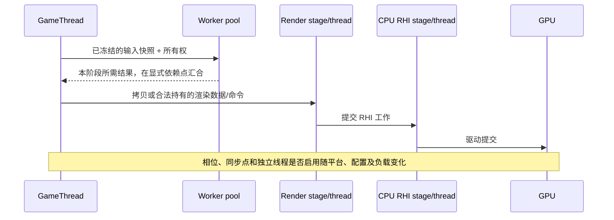
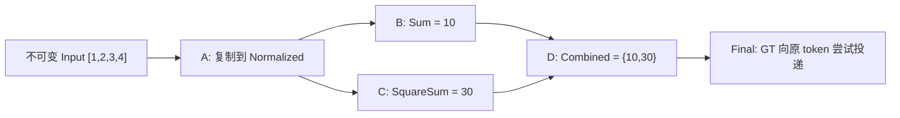

# 11 多线程与任务系统（Multithreading & Task Systems）

> 知识成熟度：L2。主要承诺是公开接口核对、并发因果解释及完整有限教学设计；不是已编译或已运行的工业级 UE 实现。2026-10-06 核对的 Epic 页面主要标为 UE5.8，C++ 内存序采用固定草案 N4659。正文中的项目伪代码、纸面轨迹和工程接入前提分别标明，`verified: []` 不因静态检查而改变。

本篇回答五个问题：该开线程还是派任务；怎样发布载荷；谁让存储活到使用结束；旧结果是否仍有写权；如何确认停止和释放。前置知识是 C++ 对象寿命、原子和 UE 游戏线程。多核能提供并行机会，创建线程本身不保证 60/120FPS、服务器 Tick 预算或吞吐改善。

当前范围是纯值后台计算与合法 GT（GameThread）入口提交。没有读取历史私有 checkout、Build.version、CL 或当前平台宏体；没有编译、运行 UE/UHT/UBT/PIE/GC/TaskGraph/真实线程、trace 或性能实验。代码中的类型和状态是本文设计，精确目标 API、启动失败握手及完成同步仍须工程核验。下方历史原件不构成本轮环境证明。

## 历史记录：保留原声明，不能当作当前认证

下面七行是旧版本原文，包含旧“全面补齐”“已核对”的自述及旧时间。保留它们是为了保全来源身份；当前证据等级和可用边界以上文及各节为准。

> 知识成熟度：L2（已按 UE5.8 源码基线全面补齐并发拓扑、无锁队列、TaskGraph 依赖图与工业级实战代码）。

> 版本基准：UE5.8.0 / CL55116800 / ++UE5+Release-5.8（本机 `C:\Program Files\Epic Games\UE_5.8\Engine`）。
> 适用范围：客户端 / 服务端 C++ 开发中的多线程编程、任务图编排与线程间通信架构。
> 事实边界：本文代码与符号已核对本机 5.8 源码（`Source\Runtime\Core\Public\HAL\Runnable.h`、`RunnableThread.h`、`Thread.h`、`Async\AsyncWork.h`、`Async\Async.h`、`Async\ParallelFor.h`、`Async\TaskGraphInterfaces.h`、`HAL\CriticalSection.h`、`HAL\Event.h`、`Misc\ScopeLock.h`、`Templates\Atomic.h` 等）。
> 官方参考：[Unreal Engine 官方多线程与任务系统文档](https://dev.epicgames.com/documentation/en-us/unreal-engine)。
> 最后更新：2026-08-20（深化重构：补充无锁环形队列、DAG 任务图、MESI 伪共享防护与 Insights 诊断）。


2026-09-30 的 PR2 已实质改正 FRunnable 前言，并补入异步请求资格、取消与 Pin 边界；本轮继续保留这些正确贡献，闭合其余全文教学责任，不称首次修订。

## 一、先选工具，再定义拥有和停止

短小、可完成的计算优先考虑任务；固定索引集合考虑数据并行；真正需要长驻或独立阻塞等待的工作才考虑专用线程。`Async` / `AsyncTask` 是另一类函数式入口，执行位置由所选重载/执行策略决定；“async”这个名字不保证新建 OS 线程。任务切分也有调度和汇合成本。

### 1.1 原有十四类原语的职责

表内头文件是可移植定位线索，不表示本轮读取了引擎函数体。

| 概念 | 英文/API | 定位线索 | 使用与拥有边界 |
|---|---|---|---|
| 游戏主线程 | GameThread | `ENamedThreads::GameThread` | 普通玩法状态与本文接纳入口的串行拥有者；不概括所有 GC 阶段都在 GT |
| 渲染线程 | RenderThread | `ENamedThreads::ActualRenderingThread` | 消费渲染状态/命令；具体阶段可能再分派任务，线程映射受配置影响 |
| RHI 线程 | RHIThread | `ENamedThreads::RHIThread` | CPU 侧 RHI 命令执行主体之一；不等于 GPU，也不保证所有平台独立启用 |
| 工作线程池 | TaskGraph Workers | `FTaskGraphInterface` | 执行适合该调度器的任务；每个被调用接口仍要有合法线程合同 |
| 可运行对象 | `FRunnable` | `HAL/Runnable.h` | `Init/Run/Stop/Exit` 分别承担初始化、工作、停止请求和退出职责；不是四个函数一律都必须自定义 |
| 线程工厂/包装器 | `FRunnableThread` | `HAL/RunnableThread.h` | 创建线程，支持优先级/栈/亲和参数；Runnable、事件与载荷由拥有者维持到所有借用结束 |
| 系统线程包装 | `FThread` | `HAL/Thread.h` | move-only；空构造和启动构造分开。本文只采用先协作退出、再显式 `Join()`，析构不代为 Join |
| 线程池任务模板 | `FAsyncTask<T>` | `Async/AsyncWork.h` | 可选择显式 `FQueuedThreadPool` 或同步启动；未完成时不能销毁包装器，不把默认池当唯一选择 |
| 自动释放任务 | `FAutoDeleteAsyncTask<T>` | `Async/AsyncWork.h` | 完成后自删；后台启动调用后不再访问 wrapper。捕获对象和刷盘持久性仍是独立责任 |
| 索引数据并行 | `ParallelFor` | `Async/ParallelFor.h` | 针对索引工作，不限连续数组；粒度/负载应测量，避免阻塞及长任务，不当作任意异步句柄 |
| 任务依赖图 | `TaskGraph` | `Async/TaskGraphInterfaces.h` | 前驱完成约束 ready；目标线程另选。完成事件不自动持有业务资源、取消任务或回滚 |
| 递归互斥 | `FCriticalSection` | `HAL/CriticalSection.h` | 当前公开 API 为 `UE::FPlatformRecursiveMutex` 别名，可递归且可能不公平；互斥不延长被锁对象寿命 |
| 作用域锁 | `FScopeLock` | `Misc/ScopeLock.h` | 正常作用域退出/栈展开时解锁；不能消除锁顺序、重入或跨线程等待环 |
| 池化事件 RAII | `FEventRef` | `HAL/Event.h` | 管理池化 FEvent 的作用域寿命；事件提示重查谓词，不是每项工作计数，更不是工作完成确认 |

依据：[FThread 构造、析构与 Join](https://dev.epicgames.com/documentation/unreal-engine/API/Runtime/Core/FThread)、[Runnable 生命周期](https://dev.epicgames.com/documentation/unreal-engine/API/Runtime/Core/FRunnable?lang=en-US)、[线程池任务](https://dev.epicgames.com/documentation/unreal-engine/API/Runtime/Core/FAsyncTaskBase?lang=en-US)、[自动删除任务](https://dev.epicgames.com/documentation/unreal-engine/API/Runtime/Core/FAutoDeleteAsyncTask)、[ParallelFor 重载](https://dev.epicgames.com/documentation/unreal-engine/API/Runtime/Core/ParallelFor)、[Core 别名表](https://dev.epicgames.com/documentation/unreal-engine/API/Runtime/Core?lang=en-US)、[作用域锁](https://dev.epicgames.com/documentation/unreal-engine/API/Runtime/Core/FScopeLock)、[FEventRef](https://dev.epicgames.com/documentation/unreal-engine/API/Runtime/Core/FEventRef)。

FThread 的公开析构说明要求已 joined 或 detached，但本轮没有核实可调用的 Detach 入口，故不提供这种用法。Join 阻塞调用者；自等、持有工作线程所需锁、等待一个依赖当前线程 continuation 的任务都不成立。脱离线程也不能自动延长捕获载荷寿命。

ParallelFor 的 PreWork 重载明确描述发起侧先做 PreWork，再参与循环工作；不能说所有计算都在新后台线程且调用方立即返回。本轮未取得基础重载全部等待终点/调用方参与实现，使用时核对所选重载的同步完成合同，不冒称源码已审。[PreWork 参数合同](https://dev.epicgames.com/documentation/unreal-engine/API/Runtime/Core/ParallelForWithPreWork?lang=en-US)

现代依赖任务还可考察 `UE::Tasks`；官方说明它与 TaskGraph 共用后端调度器/worker。本篇只展开 TaskGraph 一条主路线。[Tasks System](https://dev.epicgames.com/documentation/en-us/unreal-engine/tasks-systems-in-unreal-engine)

### 1.2 条件化 CPU 流水线（F01）



图表示生产/消费关系，不保证 GT=N、RT=N−1、RHI/GPU=N−2，也不规定所有 worker 必在 Actor Tick 前结束。输入冻结解决“读什么”；持有者解决“读时仍存在”；依赖解决“何时可读”。把裸指针排到后面，只有顺序没有拥有关系，仍可能悬垂。

[命名线程合同](https://dev.epicgames.com/documentation/unreal-engine/API/Runtime/Core/ENamedThreads__Type?lang=en-US)说明渲染执行有时映射到 GT；[低延迟帧同步](https://dev.epicgames.com/documentation/en-us/unreal-engine/low-latency-frame-syncing-in-unreal-engine)按配置/平台定义同步模式，不能推导固定三帧延迟。

### 1.3 UObject 的三条独立边界

1. **存储还活着**：弱引用不保活；无参 `Pin()` 成功取得临时强引用可覆盖合法使用期，不选择 `Pin(true)` 来接纳 PendingKill
2. **这个方法此时可调用**：强引用不使成员、容器、Actor 变换或任意方法线程安全；具体 API 的亲和、数据竞争与同步合同仍需满足
3. **本轮玩法仍有权提交**：同一 Actor 可能 EndPlay 后仍存活，甚至复入；World/玩法期/请求身份要再验证，GC 保活不会恢复旧写权

本文选保守路线：GT 抽取值快照，后台不调用 World/Actor，合法 GT 入口再核资格。它不证明所有 UObject 分配或 GetWorld override 一概禁止/允许后台调用；具体 GetWorld 当前完整合同未取得。GC 有并行阶段，也不能把 GT 生命周期协调写成所有 GC 工作均在 GT。[对象指针与保活](https://dev.epicgames.com/documentation/en-us/unreal-engine/object-pointers-in-unreal-engine)、[Pin 无参合同](https://dev.epicgames.com/documentation/en-us/unreal-engine/API/Runtime/Core/TWeakObjectPtr/Pin)、[线程化渲染的数据镜像](https://dev.epicgames.com/documentation/en-us/unreal-engine/threaded-rendering-in-unreal-engine)、[Actor EndPlay 与复入](https://dev.epicgames.com/documentation/en-us/unreal-engine/unreal-engine-actor-lifecycle)

## 二、有界通道：发布载荷与归还槽位（F03）

后台结果通过有界队列送回 GT，反向命令用另一条队列。一条 SPSC 只有一个固定生产者和一个固定消费者；两端各自不可重入、不可重叠调用。即使只有一个 OS 线程，T 的赋值回调里再次 Enqueue 也违反单端协议。换线程接任角色须另有安全交接；所有调用结束并同步后才能 Reset/析构。

以下是完整的教学队列，未编译。`Buffer` 的 T 在队列构造时全部建立并一直存活；出入队是赋值，不是逐项构造/析构。入参在复制期间必须存活且不受冲突修改，OutItem 由消费者独占；它们不能别名共享槽位。const& 入队不支持仅可移动类型；右值赋值表达式也可能选择拷贝赋值。裸指针或浅句柄不自动转移所指资源。

```cpp
#include "CoreMinimal.h"
#include <atomic>
#include <type_traits>

template<class T, uint32 Capacity>
class TSPSCRingQueueSketch
{
    static_assert(Capacity > 0 && (Capacity & (Capacity - 1)) == 0,
                  "Capacity must be a positive power of two");
    static_assert(std::is_default_constructible<T>::value);
    static_assert(std::is_nothrow_copy_assignable<T>::value);
    static_assert(std::is_nothrow_move_assignable<T>::value);
    static_assert(std::is_nothrow_destructible<T>::value);
    static constexpr uint32 Mask = Capacity - 1;
public:
    TSPSCRingQueueSketch() = default;
    TSPSCRingQueueSketch(const TSPSCRingQueueSketch&) = delete;
    TSPSCRingQueueSketch& operator=(const TSPSCRingQueueSketch&) = delete;
    TSPSCRingQueueSketch(TSPSCRingQueueSketch&&) = delete;
    TSPSCRingQueueSketch& operator=(TSPSCRingQueueSketch&&) = delete;

    bool Enqueue(const T& Item) noexcept // producer only, non-reentrant
    {
        const uint32 T0 = Tail.load(std::memory_order_relaxed);
        const uint32 H0 = Head.load(std::memory_order_acquire);
        if (static_cast<uint32>(T0 - H0) >= Capacity) return false;
        Buffer[T0 & Mask] = Item;
        Tail.store(T0 + 1, std::memory_order_release);
        return true;
    }
    bool Dequeue(T& OutItem) noexcept // consumer only, non-reentrant
    {
        const uint32 H0 = Head.load(std::memory_order_relaxed);
        const uint32 T0 = Tail.load(std::memory_order_acquire);
        if (H0 == T0) return false;
        OutItem = MoveTemp(Buffer[H0 & Mask]);
        Head.store(H0 + 1, std::memory_order_release);
        return true;
    }
    // Both endpoints stopped and synchronized with this caller;
    // neither may resume while this query is executing.
    uint32 NumQuiescent() const noexcept
    {
        const uint32 H0 = Head.load(std::memory_order_relaxed);
        const uint32 T0 = Tail.load(std::memory_order_relaxed);
        return static_cast<uint32>(T0 - H0);
    }
private:
    T Buffer[Capacity];
    // Layout candidate, not proof of hardware line size or performance.
    alignas(PLATFORM_CACHE_LINE_SIZE) std::atomic<uint32> Head{0};
    alignas(PLATFORM_CACHE_LINE_SIZE) std::atomic<uint32> Tail{0};
};
```

### 2.1 两条同步链缺一不可

- 生产者写槽 → Tail release 发布 → 消费者 acquire 观察足够的发布 → 读/移出普通载荷
- 消费者完成读/移动 → Head release 归还 → 生产者 acquire 观察可复用前缀 → 覆盖槽位

删除第一条，索引为原子也不能证明普通载荷已发布；删除第二条，不能证明覆盖前消费者已读完。各自索引只有一方写，own relaxed 与程序顺序/单对象一致性配合；没有必要无理由全部换 seq_cst。对方的旧计数可使 try 操作暂时报满/空，acquire 不保证墙钟意义的最新值。[N4659 发布/获取](https://timsong-cpp.github.io/cppwp/n4659/atomics.order#2)、[单原子 coherence 与冲突访问](https://timsong-cpp.github.io/cppwp/n4659/intro.races)

设累计消费/发布数 H、T，占用 D=T−H，保持 `0 ≤ D ≤ C < 2^32`。uint32 存储模 2^32，正二次幂 C 整除该模数，所以无符号模差和掩码索引可跨回绕工作。C=1 有效，C=3 拒绝；uint32 可表达最大正二次幂 2^31 满足此算术前提，不额外加未经证明的 C<2^31。巨大数组是否可分配另论。旧断言漏过 C=0，但标准数组本身要求正边界，不能说零长数组已经合法运行。[无符号规则](https://timsong-cpp.github.io/cppwp/n4659/basic.fundamental#4)、[数组边界](https://timsong-cpp.github.io/cppwp/n4659/dcl.array#1)

**PAPER_EXPECTED，未执行**：C=4 入1..4后第5次失败，出1后再入5，接着应出2、3、4、5。槽0在 Head 发布后才可复用。若静止状态 H=0xfffffffe、T=1，占用是3；旧 Num 普通大小比较会错报0，模差查询才得3。

Num 的另一个问题与回绕无关：C=2，观察者先读 H=0；两端入/出 A、入/出 B、再入 C；观察者随后读 T=3，得到3，而整个历程占用最多1。acquire、seq_cst、uint64或夹紧到容量都不能把两次独立读取变成快照。故这里只保双方已停且同步的 NumQuiescent；不能用 Num 决定读槽、准入或销毁。

### 2.2 类型、进展和背压

类型特征只限制不抛的表达式，不证明无分配、无锁、无重入或无外部副作用。抛出型移动赋值可能先改变源槽、再抛出，此时 Head 未动也不能保证消息原样；本例明确不支持这类恢复协议。出队后的槽是有效但可能已移出的 T，后续赋值和最终析构须合法；不要随意加 placement-new/手工析构。

目标 `atomic<uint32>` 的 `is_lock_free()` / `is_always_lock_free` 及整个 T 操作都要核验；没有显式 mutex 不足以称完整操作 lock-free/wait-free，更不证明快。[原子进展边界](https://timsong-cpp.github.io/cppwp/n4659/atomics.lockfree)、[GCC 目标相关原子回退](https://gcc.gnu.org/onlinedocs/gcc/_005f_005fatomic-Builtins.html)

try-full 不发布新项，try-empty 不改 OutItem；丢弃、合并、退让或上游背压是调用方政策。GT 不得为等待自己才能释放的空位无限忙等。下节选择输入满直接拒绝、输出满直接丢弃并记账。

### 2.3 缓存布局不等于同步

不同热字段共行可能增加相干交互，但每次写不一定产生相同事务，更无固定慢数倍保证。x86-64/ARM64 各级缓存一律64B不成立；Apple 官方资料给出128B实例，也讨论64/128B差异，应按型号/层级核实。[Apple 游戏线程调度](https://developer.apple.com/videos/play/tech-talks/110147/)、[WWDC25 CPU 性能](https://developer.apple.com/videos/play/wwdc2025/308/)、[Intel 相干状态条件](https://www.intel.com/content/www/us/en/developer/articles/technical/fast-core-to-core-communications.html)

纸面地址0x1000和0x1040在64B假设下异行，在128B假设下同行。`alignas(64) uint32 counters[2]`只对齐数组起点，元素仍相邻。头尾分别对齐可减少额外共行干扰，不消除每个索引的必要共享或Buffer槽间干扰；PLATFORM_CACHE_LINE_SIZE本轮未核值。padding不修数据竞争，收益还要权衡内存和局部性。[Linux false sharing 诊断](https://docs.kernel.org/kernel-hacking/false-sharing.html)

## 三、FRunnable：有限平方工作与可追账关闭（F04）

本例保留 PR2 的协作式停机、单启动、非工作线程销毁及先收束通知者要求。它不提供进程级崩溃隔离；10ms 是一次空闲等待参数，不是自适应调度或总停机期限。为了真正封闭通知寿命，这次只允许 **GT 串行 Start/Submit/Poll/Close**，不暴露 NotifyNewWork。没有并发外部 producer，也没有空的 WaitForNotifiers 帮忙“证明”安全。

### 3.1 在调用 Create 之前必须满足的工程准入

下面是完整有限教学设计的项目伪代码，不是可直接启用的 UE 实现。目标工程须先核实：

- 当前确为真实后台线程模式，不走 single-thread/fake-thread 回退
- 目标版本/平台的 Create 返回 null 时，Init/Exit/其他启动路径已全部停止借用 Worker 和事件；“返回 null”或“Init 无业务副作用”都不够证明这个时点
- 成功 WaitForCompletion 对调用者提供本例读取最终普通计数、最后输出所需的完成同步，而不只是物理线程似乎不再执行
- 启动前完整构造的数据能合法交给工作线程，生命周期拥有者仍在有效 GT 阶段，且无绕过门面的停止/提交入口

这些都是**事先工程接入门**；当前未认证目标实现，因此不得在未核工程启用候选。此时在集成层报告项目原因 `UnsupportedStartupContract`，不要先调用 Create 再猜测等待，也不要添加一个返回true的验证函数或调用者随手传入的bool来绕过门禁。正文没有实现一个能在运行时证明这些源码合同的API。

[FEvent 池允许失败](https://dev.epicgames.com/documentation/en-us/unreal-engine/API/Runtime/Core/FGenericPlatformProcess/GetSynchEventFromPool)支持事件空检查；[Create 失败返回 null 的明确文字来自5.5页](https://dev.epicgames.com/documentation/unreal-engine/API/Runtime/Core/HAL/FRunnableThread/Create?application_version=5.5)，当前 [FRunnableThread 类页](https://dev.epicgames.com/documentation/unreal-engine/API/Runtime/Core/FRunnableThread)支持签名和等待用途，却不替本轮证明私有失败握手/栅栏。以下 Failed 归池路线只在上述前提已先确认时成立。

### 3.2 状态、值和计数

Created→Starting→Running 或 Failed；关闭到Closed，任何已尝试启动或已关闭对象不重启。`Close(Created)`是stop-before-start的唯一路线，之后Start拒绝。Start内部不调用拥有者/用户回调，本例不支持Starting中重入Close。

GT独占State、NextId、Accepted、PolledBeforeClose。worker独占Computed、DroppedOutput、AbandonedInput，GT仅在完成同步后读取。worker不读取GT的State或尚在Create返回后写回的Thread指针。事件地址与队列存储在启动前建立，直到完成同步后不变。

输入 Job{Id, int32 Value}，输出 Result{Id, int64 Square}；先扩int64再乘，int32最小值平方2^62仍可表达。两条容量4队列方向固定：GT→worker输入，worker→GT输出。ID只使用1至UINT64_MAX−1，耗尽拒绝，不回绕。

```cpp
#include "HAL/Runnable.h"
#include "HAL/RunnableThread.h"
#include "HAL/PlatformProcess.h"
#include "HAL/Event.h"
#include <atomic>
#include <limits>
// 与上一节 TSPSCRingQueueSketch 配套；项目伪代码，未编译。
struct FSquareJob { uint64 Id = 0; int32 Value = 0; };
struct FSquareResult { uint64 Id = 0; int64 Square = 0; };
struct FWorkerSummary {
    uint64 Accepted = 0, Computed = 0, AbandonedInput = 0;
    uint64 PolledBeforeClose = 0, DroppedOutput = 0;
    uint64 DiscardedOutputOnClose = 0;
};
enum class EStart { Started, AlreadyAttemptedOrClosed,
                    EventUnavailable, ThreadCreateFailed };
enum class ESubmit { Accepted, Full, Closed, NotRunning, IdExhausted };
struct FSubmitReply { ESubmit Code; uint64 Id = 0; };
enum class EPoll { Result, NoResult, Closed, NotRunning };
struct FPollReply { EPoll Code; FSquareResult Value{}; };
enum class EClose { Closed, InvalidPhase };
struct FCloseReply { EClose Code; FWorkerSummary Value{}; };

class FFiniteSquareWorker final : public FRunnable
{
    enum class EState { Created, Starting, Running, Failed, Closing, Closed };
    EState State = EState::Created; // GT-only
    FRunnableThread* Thread = nullptr; // GT-only
    FEvent* Wake = nullptr; // stable before Create until after join
    TSPSCRingQueueSketch<FSquareJob, 4> Input;
    TSPSCRingQueueSketch<FSquareResult, 4> Output;
    std::atomic<bool> StopRequested{false};
    uint64 NextId = 1, Accepted = 0, PolledBeforeClose = 0; // GT-only
    uint64 Computed = 0, DroppedOutput = 0, AbandonedInput = 0; // worker-only
    FWorkerSummary ClosedSummary{}; // GT-only
public:
    FFiniteSquareWorker() = default;
    FFiniteSquareWorker(const FFiniteSquareWorker&) = delete;
    FFiniteSquareWorker& operator=(const FFiniteSquareWorker&) = delete;
    ~FFiniteSquareWorker() override
    {
        // Owner must already be on a valid GT and obey non-reentrancy.
        check(IsInGameThread());
        const auto Reply = Close();
        check(Reply.Code == EClose::Closed);
    }
    EStart Start()
    {
        check(IsInGameThread());
        if (State != EState::Created) return EStart::AlreadyAttemptedOrClosed;
        State = EState::Starting;
        Wake = FPlatformProcess::GetSynchEventFromPool(false); // auto-reset
        if (!Wake) { State = EState::Failed; return EStart::EventUnavailable; }
        // Only an already-admitted target may reach this call.
        Thread = FRunnableThread::Create(this, TEXT("FiniteSquareWorker"));
        if (!Thread) {
            State = EState::Failed; // no accepted jobs; Close owns pool return
            return EStart::ThreadCreateFailed;
        }
        State = EState::Running;
        return EStart::Started;
    }
    FSubmitReply Submit(int32 Value)
    {
        check(IsInGameThread());
        if (State == EState::Closed || State == EState::Closing)
            return {ESubmit::Closed};
        if (State != EState::Running) return {ESubmit::NotRunning};
        if (NextId == std::numeric_limits<uint64>::max())
            return {ESubmit::IdExhausted};
        const uint64 Id = NextId;
        if (!Input.Enqueue(FSquareJob{Id, Value})) return {ESubmit::Full};
        ++NextId;
        ++Accepted; // after Tail publication, before Submit returns
        Wake->Trigger();
        return {ESubmit::Accepted, Id};
    }
    FPollReply Poll()
    {
        check(IsInGameThread());
        if (State == EState::Closed || State == EState::Closing)
            return {EPoll::Closed};
        if (State != EState::Running) return {EPoll::NotRunning};
        FSquareResult R;
        if (!Output.Dequeue(R)) return {EPoll::NoResult};
        ++PolledBeforeClose;
        return {EPoll::Result, R}; // independent value; no user callback here
    }
    FCloseReply Close()
    {
        check(IsInGameThread());
        if (State == EState::Closed) return {EClose::Closed, ClosedSummary};
        if (State == EState::Starting || State == EState::Closing)
            return {EClose::InvalidPhase}; // caller contract violation, no busy-wait
        if (State == EState::Created) {
            State = EState::Closed; // no event/thread/job ever acquired
            return {EClose::Closed, ClosedSummary};
        }
        if (State == EState::Failed) {
            // Create-null borrow quiescence was an admission prerequisite.
            // Init may have run; null alone would NOT justify this release.
            if (Wake) {
                FPlatformProcess::ReturnSynchEventToPool(Wake);
                Wake = nullptr;
            }
            State = EState::Closed; // no accepted work; no invented Run drain
            return {EClose::Closed, ClosedSummary};
        }
        State = EState::Closing; // all prior Submit calls returned; no future input
        Stop();
        Thread->WaitForCompletion(); // target completion synchronization required
        delete Thread;
        Thread = nullptr;
        uint64 Discarded = 0;
        FSquareResult R;
        while (Output.Dequeue(R)) ++Discarded; // no producer after completion
        ClosedSummary = {Accepted, Computed, AbandonedInput,
                         PolledBeforeClose, DroppedOutput, Discarded};
        FPlatformProcess::ReturnSynchEventToPool(Wake);
        Wake = nullptr;
        State = EState::Closed;
        return {EClose::Closed, ClosedSummary};
    }
private:
    bool Init() override { return true; } // admitted fixed preconditions, no business init
    void Stop() override // called only by GT Close through this owner protocol
    {
        StopRequested.store(true, std::memory_order_release);
        Wake->Trigger(); // prompt recheck; not instant termination
    }
    bool ObserveStop() const
    {
        return StopRequested.load(std::memory_order_acquire);
    }
    uint32 Run() override
    {
        for (;;) {
            if (ObserveStop()) goto FinalDrain; // outer-loop entry
            uint32 Processed = 0;
            for (uint32 N = 0; N < 4; ++N) {
                if (ObserveStop()) goto FinalDrain; // before dequeue
                FSquareJob J;
                if (!Input.Dequeue(J)) break; // ordinary empty ends only this batch
                if (ObserveStop()) { // local item was removed but not computed
                    ++AbandonedInput;
                    goto FinalDrain;
                }
                const int64 Wide = static_cast<int64>(J.Value);
                const FSquareResult R{J.Id, Wide * Wide};
                ++Computed;
                if (!Output.Enqueue(R)) ++DroppedOutput;
                ++Processed;
                // Do not insert a stop/return between computation and classification.
                if (ObserveStop()) goto FinalDrain; // entire item accounted
            }
            if (ObserveStop()) goto FinalDrain; // includes ordinary empty path
            if (Processed != 0) continue;
            if (ObserveStop()) goto FinalDrain; // before wait
            Wake->Wait(10); // triggered or timeout: both recheck predicates
            if (ObserveStop()) goto FinalDrain; // after wait
        }
    FinalDrain:
        // Every edge here already acquired the unique GT release true.
        // Any local uncomputed job was counted before this label.
        FSquareJob Uncomputed;
        while (Input.Dequeue(Uncomputed)) ++AbandonedInput;
        return 0; // only successful-Run terminal route; no later computation/wait
    }
    void Exit() override {} // no second drain and no external cleanup to perform
};
```

正常Start返回前Run可能已执行；因此Run不靠非原子State/Thread回写通信。已准入主例Init固定true，不等于所有FRunnable都不会初始化失败；若加入Init=false而Create仍非null的路线，必须另核成功握手后才接受工作。事件选择自动重置；若改手动重置，须重新设计Reset协议，不能只改一个参数。[FEvent](https://dev.epicgames.com/documentation/unreal-engine/API/Runtime/Core/FEvent)、[Wait 返回语义](https://dev.epicgames.com/documentation/en-us/unreal-engine/API/Runtime/Core/FEvent/Wait)、[手动重置合同](https://dev.epicgames.com/documentation/unreal-engine/API/Runtime/Core/FEvent/Create)

### 3.3 为什么普通 try-empty 不能用作最终清账

最后一次成功Submit依次完成：写Job槽→Input.Tail release→Accepted记账→返回。GT串行Close先关准入、此后不再生产，再release Stop=true。worker某次acquire**实际读到这次true**后才进入FinalDrain。由程序顺序、同步和传递性，最后Tail修改happens-before最终drain读取；同一Tail的write-read coherence禁止读取它之前的修改。比较的是modification order，不是回绕后的数值大小。[N4659 coherence /17](https://timsong-cpp.github.io/cppwp/n4659/intro.races#17)

因此，在无后续生产条件下，这时第一次Dequeue=false才可结束最终排空。正常运行的一次false可能只是旧Tail，它只结束批次；Wait触发/超时也不是停止授权。GT最后Join、原子bool这个类型或一次Trigger不能追溯补记一个沿relaxed出口漏掉的Job。新增停止发布链并未替换SPSC的两条载荷/槽位交接链。

**P13-N，PAPER_EXPECTED负例，未运行**：初态H=T=0，GT Submit(3)发布Tail=1、Accepted=1，然后release Stop。旧入口以relaxed读到true，却可能在drain的Tail acquire读到旧0（选没有从事件另获同步的分支），于是错误结束，Computed=Abandoned=0。这里说明缺少证明，不声称实机必发生，也没有执行潜在竞态。

**P13-P，PAPER_EXPECTED正例，未运行**：只把终止入口换成acquire并读到该true。最后Tail发布先于drain读取，Job1被取走计Abandoned=1，再次为空；Accepted=1、Computed=0，结果方向计数全0。

### 3.4 所有停止位置与末项归属

| 位置 | acquire=true后的动作 | false后的动作 |
|---|---|---|
| 外层/每项dequeue前 | 无局部项，进公共drain | 尝试有限批次 |
| dequeue成功而未计算 | 局部Job先记Abandoned一次，再drain | 只许可当前项计算 |
| 当前平方及输出分类后 | 该项保持Computed，进drain | 继续下一项前检查 |
| 批后，包括普通empty | 进drain | 非空批回循环；空批走Wait前检查 |
| Wait前/后 | 进drain | 等待或回循环；Wait结果不当工作数 |

进入drain后不再查Stop、计算或Wait；Exit也不再次drain。P15-LOCAL手头未算项只记一次；P15-LAST即使GT已发布，刚才false许可的当前项也先完成平方→Computed→发布输出或Dropped，不能半途漏记，也不再改为Abandoned。P15-STALE允许发布后几次acquire仍读旧false，不承诺“发布后至多再算一项”；第一次观察true后才不再开始计算。P15-WAIT中empty/触发/超时都仍经过上述入口。这四项均为PAPER_EXPECTED。

成功完成同步后，GT才丢弃尚未Poll的输出、读取worker最终计数。共同前提包括角色不变、无关闭后输入、Stop发布被acquire观察、局部分类完备、目标完成同步、计数不溢出。在此前提下的纸面恒等式为：

- `Accepted = Computed + AbandonedInput`
- `Computed = PolledBeforeClose + DroppedOutput + DiscardedOutputOnClose`

它们区分“接受”“计算”“被用户取走”；Accepted不是交付保证。输出满明确丢弃，剩余输入由worker丢弃，join后输出由GT丢弃，各项只记一次。若将来实测不等，应寻找缺失路径，不能补差值粉饰。Created/Failed从未接纳输入，摘要0不冒称运行过drain。

### 3.5 安全等待不等于及时返回

Close在GT合法调用，之前Submit已返回且未来入口已关，所以本例不存在仍借用事件的外部Notify。仅把一个裸事件判空并不能延寿；若扩为并发外部Submit/Notify，需要更长寿命入口与在途调用归零协议，内部Closed bool不能挽救已delete对象上的调用。

关准入后最多4项排队输入及一个局部/处理中项，平方/try-output有限且不等待GT；这限制剩余工作数量。还需worker最终得到调度、最终观察停止、平台等待与完成同步按合同返回。acquire不保证即时最新；无等待环也不排除第三方无限阻塞、不检查停止、超大批次、无限循环或调度饥饿。10ms仅是一次事件等待参数。将计算替换成物理/IO服务后必须重审这些条件；不得借用本例声称整体10ms停机。

## 四、TaskGraph：真正的分叉、汇合与值传递（F02/F05）

这是与专用Worker分开的第二种选型，不把上一节GT同步Close接到依赖GT才完成的链。固定输入 `[1,2,3,4]`：A复制到Normalized；B计算Sum=10，C计算SquareSum=30；D等两者并生成Combined={10,30}；Final等D并在GT尝试投递原token。没有Sleep，也没有空Process充当计算。



前驱完成决定何时ready，`InDesiredThread`另决定在哪类线程执行；TaskGraph并非都不绑定命名线程。“完成”的graph event不要和FEvent的signal/reset混称。D读B/C所写字段必须有两条依赖；B/C只读Normalized且分别写独立成员，没有共享计数++。[FFunctionGraphTask 的前驱/目标线程参数](https://dev.epicgames.com/documentation/en-us/unreal-engine/API/Runtime/Core/FFunctionGraphTask)

下面F05和下一节F06组成一个有限项目伪代码例。API形状用于说明接线，头文件自足性、目标重载、分配/调度失败政策未通过编译认证。`ESPMode::ThreadSafe`只使引用计数适合跨线程，不替Packet字段同步；依赖负责字段可读，强引用负责存储寿命。Packet只含纯值，最后析构可发生在任意任务/调度线程，不执行GT清理。

```cpp
#include "Async/TaskGraphInterfaces.h"
#include "Templates/SharedPointer.h"
#include <array>

struct FAggregate { int64 Sum = 0; int64 SquareSum = 0; };
struct FWorkPacket {
    const std::array<int32, 4> Input{{1, 2, 3, 4}};
    std::array<int32, 4> Normalized{};
    int64 Sum = 0, SquareSum = 0;
    FAggregate Combined{};
};
class FDeliveryHub;
using FHubStrong = TSharedPtr<FDeliveryHub, ESPMode::ThreadSafe>;
using FHubWeak = TWeakPtr<FDeliveryHub, ESPMode::ThreadSafe>;
using FPacketStrong = TSharedPtr<FWorkPacket, ESPMode::ThreadSafe>;
// Implemented in F06 below; only Final on GT calls this bridge.
void DeliverToHub(FHubStrong Self, uint64 OriginalToken, FPacketStrong Packet);
struct FDispatchReply { bool CompleteChain; FGraphEventRef FinalEvent; };

FDispatchReply DispatchFixedGraph(FHubWeak WeakHub, uint64 OriginalToken,
                                 FPacketStrong Packet)
{
    // Called only after registration. Each closure owns its own Packet reference.
    auto A = FFunctionGraphTask::CreateAndDispatchWhenReady([Packet] {
        for (int32 I = 0; I < 4; ++I) Packet->Normalized[I] = Packet->Input[I];
    }, TStatId(), nullptr, ENamedThreads::AnyBackgroundThreadNormalTask);
    if (!A.IsValid()) return {false, {}};
    FGraphEventArray AfterA; AfterA.Add(A);
    auto B = FFunctionGraphTask::CreateAndDispatchWhenReady([Packet] {
        int64 Total = 0;
        for (int32 Value : Packet->Normalized) Total += int64(Value);
        Packet->Sum = Total;
    }, TStatId(), &AfterA, ENamedThreads::AnyBackgroundThreadNormalTask);
    if (!B.IsValid()) return {false, {}};
    auto C = FFunctionGraphTask::CreateAndDispatchWhenReady([Packet] {
        int64 Total = 0;
        for (int32 Value : Packet->Normalized) {
            const int64 Wide = int64(Value);
            Total += Wide * Wide;
        }
        Packet->SquareSum = Total;
    }, TStatId(), &AfterA, ENamedThreads::AnyBackgroundThreadNormalTask);
    if (!C.IsValid()) return {false, {}};
    FGraphEventArray AfterBC; AfterBC.Add(B); AfterBC.Add(C);
    auto D = FFunctionGraphTask::CreateAndDispatchWhenReady([Packet] {
        Packet->Combined = {Packet->Sum, Packet->SquareSum};
    }, TStatId(), &AfterBC, ENamedThreads::AnyBackgroundThreadNormalTask);
    if (!D.IsValid()) return {false, {}};
    FGraphEventArray AfterD; AfterD.Add(D);
    auto Final = FFunctionGraphTask::CreateAndDispatchWhenReady(
        [WeakHub, OriginalToken, Packet] {
            check(IsInGameThread());
            FHubStrong HeldHub = WeakHub.Pin(); // strong made and released on GT
            if (HeldHub) DeliverToHub(HeldHub, OriginalToken, Packet);
            // If pin fails, only this pure-value delivery is dropped.
        }, TStatId(), &AfterD, ENamedThreads::GameThread);
    return {Final.IsValid(), Final};
}
```

Input固定且不可变，故C的总和30也不会接近int64上限；这不是任意长度/任意int32数组平方和不溢出的保证。D之后Packet不再写。删B→D依赖后，D读Sum失去必要顺序；引用计数再安全也不能修这条边。栈上前驱数组本身不构成已证悬空错误，按选定工厂的消费合同使用，不额外编造“必须永久保存数组”的限制。

正常返回策略：每次派发返回有效event，最后返回包含GT接纳尝试的FinalEvent。防御性无效句柄分支只说整链未建成，不认证API通常会这样失败；已有纯值任务可能仍执行，不回滚它们。调用抛异常、致命分配失败或引擎退出中无正常返回的合同须在工程接入前确定，本例没有通用调度异常恢复。若允许可恢复异常，要捕获并把原token撤权/归账，而不是套用正常返回后的Closed断言。

FinalEvent完成只说明这一条链的任务完成，仍可能被业务拒绝；GT不能同步等一个还需GT执行Final的事件。任务取消、超时和注册资源移除也都不等于调度器已停止。

## 五、对象还活着，不代表旧任务还有权写回（F06）

> 2026-09-30 增补边界：本节核对的是 Epic 官方 Object Pointers 文档；没有访问本机 UE5.8 源码、运行编辑器或编译下面的项目伪代码。前文历史源码核对记录不代表本次重新验证。


上述原句保留PR2的核查时间和未运行身份。既有“先终态再外调”方向正确，但一个bool不让普通C++ Session、宿主或借用结果继续存活，也不保证外调回来还能清CurrentSession。下面把身份、实际副作用和原账释放展开为有限GT Hub。

### 5.1 六项资格继续成立

| 校验 | 本例对应内容 | 失败动作 |
|---|---|---|
| 弱引用有效 | 原Owner身份仍匹配，无参Pin成功 | RejectedNoEffect，不使用未知裸地址 |
| Owner/World/玩法期 | WeakOwner、WorldEpoch、GameplayEpoch | 旧对象/旧World/同对象旧玩法期均拒绝 |
| RequestId + Revision | 不复用OriginalToken、CurrentToken、InputRevision、TargetKey | 旧意图不能覆盖新意图 |
| 未取消且未终结 | Hub开放，Gate开放，原记录Open | 幂等拒绝，不重复领取提交 |
| 仍在deadline内 | 同一单调时钟，now < Deadline | Timeout，不提交 |
| 当前权威及目标约束 | 合法GT生命周期/输入拥有者维护AuthorityAllowed及TargetKey | RejectedNoEffect；载荷字段不自带授权 |

此处TargetKey是输入意图身份，不是实际射线、移动或伤害目标的全部业务校验。真实Actor/World mutator没有实现；副作用明确限定为普通C++ GT-only `ResultSink.CurrentAggregate`和`AppliedCount`更新。

### 5.2 六类存储各由谁持有

| 存储/资源 | 真正的持有者 | 释放与访问限制 |
|---|---|---|
| Packet及不可变输入 | A/B/C/D/Final各自强持，Deliver参数也强持 | 仅值；可在任意线程末引用释放，无UObject/Hub/Sink/g1强引用或外部析构 |
| 原g1记录 | Hub表、Start/Deliver独立local、可选GT观察者 | 所有strong仅GT创建/释放，析构无外调；worker从不持有 |
| 借用Result | Final/Deliver强持Packet，借用其const Combined | 仅同步通知作用域有效；延期必须复制两个整数/receipt |
| provider实际资源 | Hub的Map[token]→g1注册项 | PendingErase只是待处理；实际Remove成功才记原项RegistryRemovedAck |
| 外层Hub | GT生命周期owner；每个公开入口独立strong参数 | strong覆盖整个Start/Deliver/Cancel/Close及尾扫，worker只带weak；不能从悬垂raw进成员后才补Pin |
| ResultSink/Gate | GT owner、Hub及g1的真实strong | 所有访问/末strong均GT；字段/析构无用户代码，Owner是弱UObject身份 |

引用计数线程安全不规定析构在哪个线程。上表的strong只在GT路线才保证Hub/g1/Sink在GT末释放；不能把它们捕获进任何TaskGraph closure。也不能用TSharedPtr管理UObject。[UE智能指针的线程边界](https://dev.epicgames.com/documentation/en-us/unreal-engine/smart-pointers-in-unreal-engine)、[C++对象寿命](https://eel.is/c++draft/basic.life)

### 5.3 完整有限接纳/清理控制流

下例所有入口都是static门面，**调用前**从合法GT owner复制strong，或像Final一样在GT从weak Pin；Self参数本身覆盖完整外层栈。Scope在入口参数之后建立，所有return先析构Scope再释放Self/Packet。查表只复制strong，不留Map引用/iterator跨派发或通知。

本例采用正常返回、无可恢复内存分配异常的工程政策；容器/共享对象分配不能任意用户重入。创建/登记的逻辑拒绝发生在派发前，Map Add完成并确认原项后才派发。致命分配故障不是一个声称已Closed的普通返回；需要可恢复OOM的项目须先提供真实分配/注册失败适配，不以空helper替代。固定通知只有Noop、关闭g1后开g2、关闭Hub、报告通知失败，不能偷换成任意用户闭包。

```cpp
#include "GameFramework/Actor.h"
#include "UObject/WeakObjectPtrTemplates.h"
#include "HAL/PlatformTime.h"
#include <limits>
// 与 F05 合读；项目伪代码，不是完整模块/已编译 UE 实现。
struct FResultGate {
    bool Open = true;
    TWeakObjectPtr<AActor> WeakOwner;
    uint64 WorldEpoch = 0, GameplayEpoch = 0;
    uint64 InputRevision = 0, TargetKey = 0, CurrentToken = 0;
    bool AuthorityAllowed = false;
};
struct FResultSink {
    FResultGate Gate;
    FAggregate CurrentAggregate{};
    uint64 AppliedCount = 0;
};
using FSinkStrong = TSharedPtr<FResultSink, ESPMode::ThreadSafe>;
enum class EHook { Noop, CloseG1AndStartG2, CloseHub, ReportNotificationFailure };
enum class EOutcome { Open, Claimed, Applied, RejectedNoEffect,
                      Timeout, Canceled, DispatchFailed };
enum class ENotice { NotRun, Done, NotificationFailed };
struct FAppliedReceipt { uint64 Token = 0; FAggregate Value{}; uint64 Sequence = 0; };
struct FDeliveryRecord {
    uint64 Token = 0, WorldEpoch = 0, GameplayEpoch = 0;
    uint64 InputRevision = 0, TargetKey = 0;
    TWeakObjectPtr<AActor> WeakOwner;
    double Deadline = 0;
    FSinkStrong Sink;
    EOutcome Outcome = EOutcome::Open;
    EHook Hook = EHook::Noop;
    ENotice Notice = ENotice::NotRun;
    bool PendingErase = false, RegistryRemovedAck = false, CleanupFailed = false;
    uint32 RemovedCount = 0;
    FAppliedReceipt Receipt{}; // assigned once upon actual value commit
};
using FRecordStrong = TSharedPtr<FDeliveryRecord, ESPMode::ThreadSafe>;
enum class ELaunch { Dispatched, Closed, InvalidGate, TokenExhausted,
                     RegistrationFailed, DispatchFailed };
struct FLaunchReply { ELaunch Code; uint64 OriginalToken = 0; FGraphEventRef FinalEvent; };

class FDeliveryHub final
{
    FSinkStrong Sink;
    TMap<uint64, FRecordStrong> Map;
    uint64 NextToken = 1;
    uint32 CallDepth = 0;
    bool Closed = false;

    // No external calls here, and no map entry reference survives this function.
    FRecordStrong LookupCopy(uint64 Token)
    {
        if (const FRecordStrong* Found = Map.Find(Token)) return *Found;
        return {};
    }
    void SweepPending() // GT, depth zero; record/Sink destructors cannot call out
    {
        TArray<uint64> Keys;
        for (const auto& Pair : Map)
            if (Pair.Value->PendingErase) Keys.Add(Pair.Key);
        for (uint64 Token : Keys) {
            FRecordStrong Original = LookupCopy(Token);
            if (!Original || !Original->PendingErase) continue;
            // No external call or mutation between copy, identity check and remove.
            if (LookupCopy(Token) != Original) {
                Original->CleanupFailed = true;
                continue;
            }
            const int32 Removed = Map.Remove(Token);
            if (Removed == 1) {
                Original->RegistryRemovedAck = true;
                ++Original->RemovedCount; // exactly one successful registry erase
            } else {
                Original->CleanupFailed = true; // no invented acknowledgment
            }
        }
    }
    struct FCallScope {
        FDeliveryHub& Hub;
        explicit FCallScope(FDeliveryHub& In) : Hub(In) { ++Hub.CallDepth; }
        ~FCallScope() { if (--Hub.CallDepth == 0) Hub.SweepPending(); }
    };
    static void Reject(FRecordStrong Original, EOutcome Why)
    {
        Original->Outcome = Why;
        Original->PendingErase = true; // not a cleanup acknowledgment
    }
public:
    explicit FDeliveryHub(FSinkStrong InSink) : Sink(InSink)
    {
        check(IsInGameThread() && Sink.IsValid());
    }
    ~FDeliveryHub()
    {
        check(IsInGameThread() && Closed && Map.Num() == 0 && CallDepth == 0);
        // No asynchronous cleanup, delegate or World API in this destructor.
    }
    static FLaunchReply Start(FHubStrong Self, EHook Hook = EHook::Noop)
    {
        check(IsInGameThread());
        if (!Self) return {ELaunch::Closed};
        FCallScope Scope(*Self); // destroyed before Self
        if (Self->Closed) return {ELaunch::Closed};
        // Prepare: no external callback; gate is maintained by legal GT owner.
        const FResultGate G = Self->Sink->Gate;
        if (!G.Open || !G.AuthorityAllowed) return {ELaunch::InvalidGate};
        {
            auto OwnerPin = G.WeakOwner.Pin(); // no-argument Pin, GT scope only
            if (!OwnerPin.IsValid()) return {ELaunch::InvalidGate};
        }
        if (Self->NextToken == std::numeric_limits<uint64>::max())
            return {ELaunch::TokenExhausted};
        const uint64 Token = Self->NextToken;
        if (Self->Map.Contains(Token)) return {ELaunch::RegistrationFailed};
        const double Now = FPlatformTime::Seconds();
        if (!FMath::IsFinite(Now) || !FMath::IsFinite(Now + 1.0))
            return {ELaunch::InvalidGate};
        FRecordStrong Original = MakeShared<FDeliveryRecord, ESPMode::ThreadSafe>();
        FPacketStrong Packet = MakeShared<FWorkPacket, ESPMode::ThreadSafe>();
        Original->Token = Token;
        Original->WeakOwner = G.WeakOwner;
        Original->WorldEpoch = G.WorldEpoch;
        Original->GameplayEpoch = G.GameplayEpoch;
        Original->InputRevision = G.InputRevision;
        Original->TargetKey = G.TargetKey;
        Original->Deadline = Now + 1.0; // sample window, not a performance guarantee
        Original->Sink = Self->Sink;
        Original->Hook = Hook;
        Self->Map.Add(Token, Original);
        ++Self->NextToken; // never reuse an issued token
        Self->Sink->Gate.CurrentToken = Token; // fully registered BEFORE dispatch
        const FDispatchReply Sent = DispatchFixedGraph(FHubWeak(Self), Token, Packet);
        if (!Sent.CompleteChain) {
            if (Original->Outcome == EOutcome::Open)
                Original->Outcome = EOutcome::DispatchFailed;
            Original->PendingErase = true;
            return {ELaunch::DispatchFailed, Token, Sent.FinalEvent};
        }
        // It may already be Applied/Closing due to synchronous reentry.
        // Never reinstall CurrentToken or reopen Original here.
        return {ELaunch::Dispatched, Token, Sent.FinalEvent};
    }
    static void Cancel(FHubStrong Self, uint64 OriginalToken)
    {
        check(IsInGameThread());
        if (!Self) return;
        FCallScope Scope(*Self);
        FRecordStrong Original = Self->LookupCopy(OriginalToken);
        if (!Original) return;
        if (Original->Outcome == EOutcome::Open)
            Original->Outcome = EOutcome::Canceled;
        Original->PendingErase = true; // preserve Applied if it already happened
    }
    static void CloseHub(FHubStrong Self)
    {
        check(IsInGameThread());
        if (!Self) return;
        FCallScope Scope(*Self);
        Self->Closed = true; // close admission first, including reentrant Start
        Self->Sink->Gate.Open = false;
        for (auto& Pair : Self->Map) { // no external call within this traversal
            FRecordStrong Original = Pair.Value;
            if (Original->Outcome == EOutcome::Open)
                Original->Outcome = EOutcome::Canceled;
            Original->PendingErase = true;
        }
        // Idle: this scope immediately sweeps. Reentry: outermost scope sweeps.
    }
    static void Deliver(FHubStrong Self, uint64 OriginalToken, FPacketStrong Packet)
    {
        check(IsInGameThread());
        if (!Self || !Packet) return;
        FCallScope Scope(*Self);
        FRecordStrong Original = Self->LookupCopy(OriginalToken);
        if (!Original) return;
        if (Self->Closed || Original->Outcome != EOutcome::Open) return;
        // Strong Packet owns this borrow across all synchronous notification calls.
        const FAggregate& Result = Packet->Combined;
        {
            FSinkStrong TargetSink = Original->Sink;
            const FResultGate G = TargetSink->Gate; // value snapshot, no map reference
            auto OwnerPin = Original->WeakOwner.Pin();
            if (!G.Open || !OwnerPin.IsValid() || G.WeakOwner != Original->WeakOwner ||
                G.WorldEpoch != Original->WorldEpoch ||
                G.GameplayEpoch != Original->GameplayEpoch ||
                G.CurrentToken != Original->Token ||
                G.InputRevision != Original->InputRevision ||
                G.TargetKey != Original->TargetKey || !G.AuthorityAllowed) {
                Reject(Original, EOutcome::RejectedNoEffect);
                return;
            }
            const double Now = FPlatformTime::Seconds();
            if (!FMath::IsFinite(Now) || Now >= Original->Deadline) {
                Reject(Original, EOutcome::Timeout);
                return;
            }
            if (TargetSink->AppliedCount == std::numeric_limits<uint64>::max()) {
                Reject(Original, EOutcome::RejectedNoEffect);
                return;
            }
            Original->Outcome = EOutcome::Claimed;
            Original->PendingErase = true;
            // Bounded ordinary value assignment only: no delegates/mutators here.
            const uint64 Sequence = TargetSink->AppliedCount + 1;
            TargetSink->CurrentAggregate = Result;
            TargetSink->AppliedCount = Sequence;
            Original->Receipt = {OriginalToken, Result, Sequence};
            Original->Outcome = EOutcome::Applied; // actual effect separately recorded
        } // OwnerPin released on GT BEFORE notification; no later gameplay access
        const FAppliedReceipt Receipt = Original->Receipt; // immutable value copy
        const ENotice Notice = Notify(Self, OriginalToken, Original->Hook, Receipt);
        // Reentry may have created g2. Tail touches ONLY stable original g1.
        Original->Notice = Notice;
    }
private:
    static ENotice Notify(FHubStrong Self, uint64 OriginalToken, EHook Hook,
                          FAppliedReceipt Receipt)
    {
        // Caller has Scope and strong packet; Receipt is a value, never retained ref.
        check(Receipt.Token == OriginalToken);
        switch (Hook) {
        case EHook::Noop:
            return ENotice::Done;
        case EHook::CloseG1AndStartG2:
            Cancel(Self, OriginalToken);
            // g1 receives this hook once, after it is Applied; g2 uses Noop.
            return Start(Self, EHook::Noop).Code == ELaunch::Dispatched
                 ? ENotice::Done : ENotice::NotificationFailed;
        case EHook::CloseHub:
            CloseHub(Self); // same gate shutdown protocol, not actual Actor EndPlay
            return ENotice::Done;
        case EHook::ReportNotificationFailure:
            return ENotice::NotificationFailed; // no rollback of committed values
        }
        return ENotice::NotificationFailed;
    }
};
void DeliverToHub(FHubStrong Self, uint64 OriginalToken, FPacketStrong Packet)
{
    FDeliveryHub::Deliver(Self, OriginalToken, Packet);
}
```

### 5.4 按原账收尾，不能清到g2

Start在派发前已经登记原g1、CurrentToken和完整Packet；因此即使Start未返回就发生同步Deliver，外层Self与Scope仍在，Original由独立local持有。通知可以Cancel(g1)并Start(g2)，Map可能扩容，但旧尾部没有保存Map entry引用。返后只记g1.Notice，不写CurrentToken、不重开g1、不再读写Actor/World/Sink。g2明确Noop，避免固定示范无限递归。

Deliver内Claimed、Applied、通知结果、清理ack是四件事。只有所有资格通过后，才在没有外调的GT区段完整更新值和计数；拒绝在提交之前不写Sink，通知在提交之后执行。通知失败仍是Applied+NotificationFailed。借用Result的Packet强持有覆盖整个Deliver/通知栈；接收方要异步保存时复制receipt，不能保存const&。

Cancel/Close不等ack：它们先撤权、标PendingErase。idle Close本次Scope退出即Map.Remove；若在Start/Deliver/通知里重入，则最外层CallDepth归零时立刻清扫，不依赖下一Tick。Remove成功后才把原g1.RegistryRemovedAck设true且RemovedCount加一；意外不一致记CleanupFailed，不伪造ack，也不无条件清空CurrentSession。这里实际资源就是这一个注册项，不冒称网络、移动、Ability或World资源已释放。

Hub长期owner放掉最后一份强引用之前必须在合法GT调用CloseHub，让全部登记按此路线收束。若合法重入路径中长期owner被放掉，入口已有的Self仍覆盖外层尾部；不能另有raw owner手动delete Hub/g1/Sink。析构不偷偷异步清理，要求GT、Closed、Map空、深度0；异常未满足时应报告生命周期违约，而不是把智能指针当清理服务。

### 5.5 玩法退场、没有未来GT及部分副作用

真实项目GT生命周期拥有者负责维护Gate的Owner、WorldEpoch、GameplayEpoch、相关输入版本/目标和权威；同一Actor退出玩法即先关Gate/Hub，新玩法期使用新epoch及合法新Hub，不把旧token复用。这个接线必须在仍合法的预退场/EndPlay窗口实现；上面的CloseHub hook只演示同一门控，**没有实现或运行真实Actor EndPlay**。不能等World已失效再补清理。

- idle退场：CloseHub当次清掉从未Deliver的注册，不等Final
- 同步通知中退场：先关准入，允许当前受持有的有限外层栈正常返回；尾扫在最外层返回前清原登记
- 迟到Final仍获得执行：只能看见weak Hub失效、Hub已关或原token已不存在，丢纯值，不访问World、不复建注册
- 若GT完全不再派发：Final可能永不执行，FinalEvent不得标完成；Packet仍由任务/调度器按其后续寿命处置。既有登记已在合法退场清掉，不代表后台已停、引擎队列已drain或所有存储已回收

本例纯值提交没有外调中的部分写路径。若替换成真实Actor mutator，外部函数可能失败且已有部分效果，或结果未知；必须保存FailedAfterEffect/Unknown及实际效果账，不能自动重试、假回滚，或仅因先置Completed就宣称无副作用。它是另一项需要实现与验证的适配，不能只换函数名继承本例保证。

取消首先撤回写资格，再安排自己的停止/解除责任；弱指针不消除GT→Final→GT等待环。跨框架的 RequestId、InputRevision、取消及回滚契约以 [GameplayTasks、StateTree、GAS 与 AI 协同](../../06-游戏AI/感知决策与行为规划/07-GameplayTasks-StateTree-GAS-AI协同.md) 为主责正文；这里仅解释跨线程回写边界，避免维护第二套协议。普通服务端实体的身份复用回归见 [Entity 生命周期](../../07-网络与游戏服务端/世界权威与故障恢复/03-Entity生命周期与组件模型.md)。

## 六、纸面正反例矩阵：全部 PAPER_EXPECTED

以下24组是输入、操作与可证伪判据，**全部PAPER_EXPECTED，未执行**；P13-N/P13-P与P15四分支是其中的细化，不是新增运行结果。不运行潜在data race、替代引擎模型，也不从文字断言推导已通过UE测试。

| ID | 输入/事件顺序 | PAPER_EXPECTED判据 |
|---|---|---|
| P01 | Capacity=0 | 正容量约束拒绝；原断言漏拒绝，不称标准零长数组已运行 |
| P02 | C=1、3、4、uint32正二次幂上界2^31 | 1单槽可用、3拒绝、4允许；2^31符合模差条件，不证明实际可分配，不加C<2^31 |
| P03 | C4入1..4、第5次入5、出1再入5 | 首次第五项拒绝；Head归还后才复用；FIFO为1..5 |
| P04 | 两端已停同步，H=0xfffffffe、T=1 | 模差3；旧Num错报0，静止查询为3 |
| P05 | C2，先读H=0，入/出A、入/出B、入C，再读T=3 | 双读可得3但占用从未超过1；seq_cst不造整体快照 |
| P06 | 写槽后未release Tail，或删消费者acquire | 不得凭索引猜测读普通载荷；缺发布边，无运行负例 |
| P07 | 消费者尚读/移动槽，删Head release/acquire | 槽复用缺同步依据；保第二条链 |
| P08 | 原子实现非无锁，或T赋值内含锁/分配/重入 | 不认证完整操作lock-free；noexcept也不证明不阻塞 |
| P09 | 事件池返回null | Failed/EventUnavailable，不Create、不进入Run解引用，Close零账一次 |
| P10 | 事件成功，Create=null；对照仍有启动借用的未知目标 | 不发布Running、不Wait null；仅事先核失败收束后才归池。未核目标禁用候选，报UnsupportedStartupContract |
| P11 | 第二次Start、Close(Created)再Start、重复Close | 全部按单启动/闭后拒绝；重复不重Stop/delete/归池；主例Init固定true |
| P12 | 未Stop、输出有位，两次Trigger合并，输入两项 | 队列决定两项真实工作；输出满则Dropped，不按通知数计工作 |
| P13 | GT Submit满/关/ID耗尽；最后Submit(3)后release Stop | Full/Closed/IdExhausted无新发布；P13-N旧relaxed入口可能漏最后Tail，P13-P acquire=true后Abandoned=1 |
| P14 | 空队列10ms超时或被触发 | 不造工作；Wait/普通empty不授权终止，仍经acquire Stop入口 |
| P15 | LOCAL/LAST/STALE/WAIT及所有循环/批次入口 | 局部未算只Abandoned一次，Computed完整输出分类；首次true后才drain，不承诺即时可见/发布后至多一项/总10ms |
| P16 | 固定DAG [1,2,3,4]，B/C先后任意 | A→B/C→D→GT一致，D得{10,30}；正确资格下Sink值同、AppliedCount仅加一 |
| P17 | 删B→D但仍读Sum | 无必要顺序的反例；不通过Sleep制造或运行竞态证明 |
| P18 | g1后启动g2，g2先完成，g1后到 | g1因CurrentToken不符无写权；不改g2，g1的注册仍归原账清除 |
| P19 | 同一合法结果Deliver两次 | Applied后再入不提交；成功移除原项一次；完成后查无项，不重复通知 |
| P20 | Start未返同步Deliver；通知Cancel(g1)+Start(g2)，Map扩容 | Hub/g1/Packet真实strong覆盖完整栈与借用；无Map引用跨外调，尾部不清g2；GT对象末strong仍GT |
| P21 | 提交前拒绝或now==Deadline；提交后通知失败；对照外部部分失败 | 前者不改Sink；后者保Applied+NotificationFailed；外部FailedAfterEffect/Unknown不假回滚/自动重试 |
| P22 | 同Actor EndPlay后仍活，后来新玩法期 | 合法入口先关Gate；旧epoch拒绝，Pin成功不恢复旧玩法资格；真实EndPlay接线未实现 |
| P23 | 未Deliver注册idle Close；通知中重入退场；迟返Final/无未来GT | idle当次erase，重入在最外层尾清并ack；不等GT Final。无未来派发时FinalEvent可能永不完成，不能称全引擎停机 |
| P24 | stat存在但trace没有Task；另见GC相关栈点 | 查通道、配置和实际事件；缺数据不诊断饱和，单栈点不唯一归因 |

落地时先选定真实UE revision/平台，核启动失败、完成同步、调度返回与生命周期接线，再完成模块/头文件/UHT/编译。随后分别做功能、停止/重入、GC/World、trace和性能验证，保存实际输入/原始输出/失败；不能用文本门禁或普通C++模型认证UE。当前本文的编译、工程运行和性能仍全部NOT_RUN。

## 七、性能分析与排障指南

### 7.1 命令回答什么问题

| 命令/入口 | 已核用途 | 必须额外确认的边界 |
|---|---|---|
| `stat TaskGraphTasks` | TaskGraph性能统计 | 不承诺直接给队列深度/worker饱和度；字段随构建/版本观察 |
| `stat Threading` | 线程信息/统计 | 不以它单独认证上下文切换频率或锁自旋开销 |
| `-trace=default,task` | 官方Task任务事件采集入口 | 用Trace.Status及实际轨迹核通道/事件确已捕获，不以启动参数存在作成功 |
| `ContextSwitch` trace | 适用平台的OS调度切换 | 受平台/权限限制，Windows可能需管理员权限；锁等待需对应埋点/分析工具 |
| `loadtime` trace | 资源加载分析 | 仅相关时启用，不能当所有任务分析的必要条件 |
| `r.OneFrameThreadLag`、`r.GTSyncType` | 各自文档化的帧同步策略 | 按平台和模式核对，二者不是任意旧变量的等价改名 |

[Stat Commands](https://dev.epicgames.com/documentation/unreal-engine/stat-commands-in-unreal-engine)、[Timing Insights 的Task/ContextSwitch通道](https://dev.epicgames.com/documentation/en-us/unreal-engine/timing-insights-in-unreal-engine)、[Insights采集和运行控制](https://dev.epicgames.com/documentation/en-us/unreal-engine/unreal-insights-reference-in-unreal-engine-5)支持上表窄用途。本文未启动trace，不声称已抓到微秒卡顿。官方内置任务通道是Task；这不证明项目不存在自定义taskgraph preset。

旧表的 `r.TargetPreFrameTime` 当前注册与语义仍**未核实**，从已核命令表移出；精确搜索未找到不能证明它不存在。帧同步用途转向各自有来源的变量，而不是宣布一次名称替换。[帧同步模式与平台回退](https://dev.epicgames.com/documentation/en-us/unreal-engine/low-latency-frame-syncing-in-unreal-engine)、[官方CVar目录](https://dev.epicgames.com/documentation/en-us/unreal-engine/unreal-engine-console-variables-reference)

### 7.2 三类故障树（F07）

```text
现象 A：崩溃栈含 FGCArrayPool::Get / GUObjectArray::AllocateObjectSlot 等
  ├─ 先取证：完整堆栈、实际线程、指针来源/持有、GC与加载阶段、对象/玩法期
  ├─ 候选：不合法线程调用、悬垂借用、共享成员竞态、其他内存破坏
  └─ 处置：按具体API核线程与寿命；无合同则GT快照/提交。单栈点不足以锁定NewObject/LoadClass
现象 B：ParallelFor 比串行更慢
  ├─ 先取证：结果正确性、同等工作量、计时范围、实际CPU/任务轨迹
  ├─ 候选：粒度过细、调度开销、负载不均、带宽、共行干扰
  ├─ 粒度路线：核所选重载，比较批量；256只是待测值，不是通用最优值
  └─ 布局路线：核地址/跨度/目标行大小，比较隔离与局部汇总；不预定3–5倍或数十倍
现象 C：退出关卡/停止PIE时等待不返回
  ├─ 先画等待图：GT等Final，Final又排在GT，是环；weak引用不消环
  ├─ 查寿命：停止新入口和在途调用了吗？事件/原账是否过早销毁？实际停止是否确认？
  ├─ 即使无环：查无界阻塞、不看取消、巨大批次、无限循环及调度饥饿
  └─ 处置：合法独立有限Worker可Stop→Wait→释放；依赖GT的链用撤权/原账收尾。
     超时只诊断，不证明线程已停；10ms单次Wait、一次acquire或看到empty都不是总关闭期限
```

怀疑布局问题时先证明访问合法，再测目标机器；没有性能证据就保留简单正确实现。怀疑关闭问题时把“请求停止”“首次观察停止”“Run/Exit完成”“注册资源移除”“FinalEvent完成”分别打点，缺失哪项就报告哪项，不能因没崩溃补全事实。

## 八、来源分层与当前结论

- **公开UE合同**：2026-10-06核对的Epic页面主要标签5.8，用于线程/任务/事件/对象/trace的窄合同。Create-null明确来源是5.5；当前GetWorld细项、SupportsMultithreading专页、部分API细项出现空页或访问失败，未把它们当完整实现已读。CVar巨页直接获取有限，只采用可定位条目及独立帧同步说明
- **语言机制**：N4659固定C++17工作草案，官方PDF确定2017-03-21身份；分节HTML是定位镜像。模差、双同步、停止发布链是对作者有限设计的静态应用，不是所有弱内存执行的完整形式化证明，更不认证UE私有栅栏
- **项目设计**：容量4、平方、固定{10,30}DAG、token不复用、GT Hub注册资源、无外调值提交和固定hook是本文选择；没有声称是引擎内置通用协议或生产安全保证
- **历史材料**：前部H01、异步段2026-09-30边界与原Object Pointers来源保留原身份。关联FalseSharing文中的窄例/旧基准不能借作本文队列吞吐、缓存物理归因或引擎运行证据
- **未验证**：私有CL/Build.version、宏值、编译/链接、运行时线程模式、启动失败收束、完成同步、真实EndPlay/GC/World、所有调度器退出和硬件性能。工程未满足准入时不启用候选；L2只对应当前主要文证/静态承诺

## 关联阅读与前后置专题

- [01-UObject与反射系统](../对象模型与生命周期/01-UObject与反射系统.md)：深入理解 GC 标记扫描与 UObject 线程安全边界；
- [02-Actor与Component生命周期](../对象模型与生命周期/02-Actor与Component生命周期.md)：Actor Tick 依赖拓扑与主线程调度阶段划分；
- [07-UI与性能优化/03-性能分析工具与Profiling](../../08-工程实践与质量/调试与性能分析/03-性能分析工具与Profiling.md)：利用 Unreal Insights 剖析 TaskGraph 瓶颈；
- [12-08 Tick与模块系统源码](08-Tick与模块系统源码.md)：FTickTaskManager 与引擎主循环源码底层；
- [00-04 C++并发与内存模型/03-LockFree与FalseSharing](../../01-编程与计算机基础/并发与同步/03-LockFree与FalseSharing.md)：访问正确性、无锁进展、缓存布局与历史实验的证据边界；
- [00-08 计算机体系结构与性能/01-处理器存储层次与性能工程](../../01-编程与计算机基础/硬件体系结构与性能/01-处理器存储层次与性能工程.md)：现代 CPU 超标量乱序执行与多级缓存层次机制。
