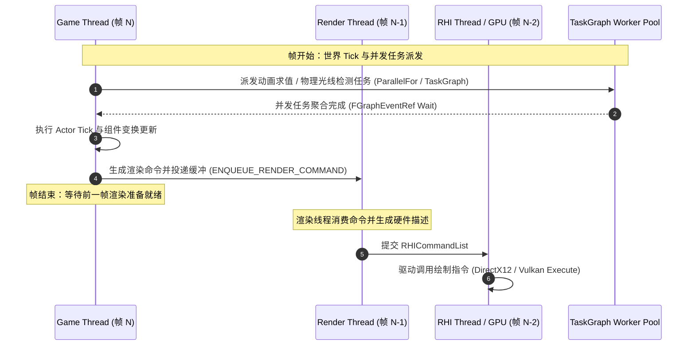
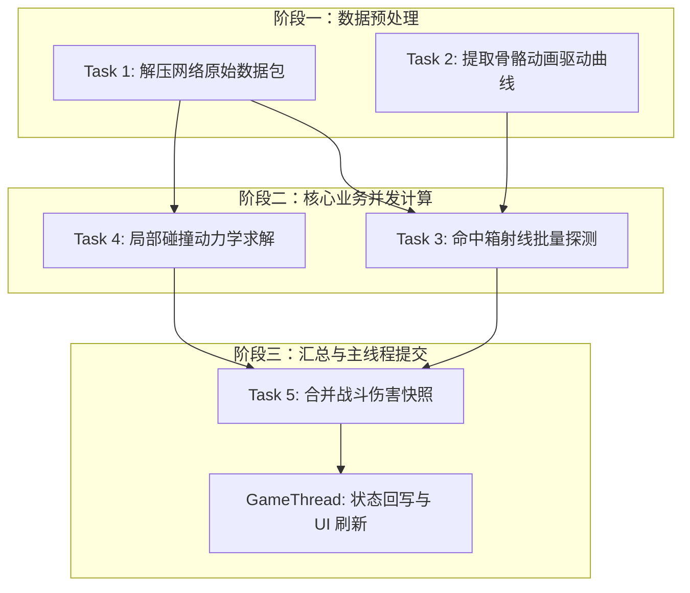

# 11 多线程与任务系统（Multithreading & Task Systems）
> 知识成熟度：L2（已按 UE5.8 源码基线全面补齐并发拓扑、无锁队列、TaskGraph 依赖图与工业级实战代码）。

> 版本基准：UE5.8.0 / CL55116800 / ++UE5+Release-5.8（本机 `C:\Program Files\Epic Games\UE_5.8\Engine`）。
> 适用范围：客户端 / 服务端 C++ 开发中的多线程编程、任务图编排与线程间通信架构。
> 事实边界：本文代码与符号已核对本机 5.8 源码（`Source\Runtime\Core\Public\HAL\Runnable.h`、`RunnableThread.h`、`Thread.h`、`Async\AsyncWork.h`、`Async\Async.h`、`Async\ParallelFor.h`、`Async\TaskGraphInterfaces.h`、`HAL\CriticalSection.h`、`HAL\Event.h`、`Misc\ScopeLock.h`、`Templates\Atomic.h` 等）。
> 官方参考：[Unreal Engine 官方多线程与任务系统文档](https://dev.epicgames.com/documentation/en-us/unreal-engine)。
> 最后更新：2026-08-20（深化重构：补充无锁环形队列、DAG 任务图、MESI 伪共享防护与 Insights 诊断）。

---

## 概述

虚幻引擎（Unreal Engine 5）是一个**高并发异构多线程架构引擎**。为了在多核处理器上达成稳定的 60FPS/120FPS 渲染与专用服务器高主频 Tick，引擎将不同性质的计算拆解到独立核心与工作线程池上协同运行。

对现代商业级游戏开发而言，多线程绝非简单地“开一个线程跑死循环”，而是涉及：
- **确定性线程模型划分**：清晰界定 GameThread、RenderThread、RHIThread 与 WorkerThreads 的职责范围与屏障同步时机；
- **自底向上的分层调度基础设施**：从原生线程封装（`FRunnable` / `FThread`）、全局线程池任务（`FAsyncTask`）、函数式异步（`Async` / `AsyncTask`）、细粒度数据并行（`ParallelFor`），到复杂的有向无环图调度器（`TaskGraph`）；
- **对象模型与内存安全屏障**：严格遵循 `UObject` 单线程归属原则，防止 GC 根集合遍历过程中的野指针、内存空洞与数据竞争；
- **低争用并发与伪共享防御**：规避锁竞争与 CPU 缓存行（Cache Line）伪共享（False Sharing），设计高性能无锁队列进行跨线程双向通信。

---

## 核心概念表

| 概念 | 英文 | 源码位置与 5.8 依据 | 核心职责与工程约束 |
| :--- | :--- | :--- | :--- |
| **游戏主线程** | Game Thread | `ENamedThreads::GameThread` (`TaskGraphInterfaces.h`) | 驱动游戏逻辑主循环、Actor/Component Tick、UObject 内存生命周期管理与 GC 标记 |
| **渲染线程** | Render Thread | `ENamedThreads::ActualRenderingThread` | 场景可见性剔除、渲染指令打包、深度预通道（Prepass）与 RDG（渲染依赖图）录制 |
| **RHI 线程** | RHI Thread | `ENamedThreads::RHIThread` | 将平台无关的 RHICommandList 翻译为硬件驱动调用（DirectX 12 / Vulkan / Metal） |
| **工作线程池** | TaskGraph Workers | `FTaskGraphInterface` | 承担异步任务求值（动画并行姿态混合、物理碰撞探测、网络数据包解码、PCG 点云计算） |
| **原生可运行接口** | `FRunnable` | `HAL\Runnable.h` | 长生命周期、自定义工作流后台线程的抽象接口（需自行实现 `Init/Run/Stop/Exit`） |
| **线程实例工厂** | `FRunnableThread` | `HAL\RunnableThread.h` | 平台线程创建工厂，支持绑定优先级、亲和性掩码（Affinity Mask）与栈尺寸 |
| **现代轻量线程** | `FThread` | `HAL\Thread.h` (5.8 推荐) | 现代 C++ 风格 move-only 封装，构造即启动，析构自动 `Join()` 校验，防止线程句柄泄漏 |
| **线程池任务模板** | `FAsyncTask<T>` | `Async\AsyncWork.h` | 依赖全局 GThreadPool 的任务包装器，支持 `StartBackgroundTask()` 与同步回退 |
| **自动释放任务** | `FAutoDeleteAsyncTask<T>` | `Async\AsyncWork.h` | 运行完成后由线程池自动回收内存的轻量任务，适用于一次性离线数据烘焙与日志刷盘 |
| **数据并行遍历** | `ParallelFor` | `Async\ParallelFor.h` | 针对连续数组的大规模并行切片算法，支持动态任务窃取与 `MinBatchSize` 批量控制 |
| **任务依赖图** | `TaskGraph` | `Async\TaskGraphInterfaces.h` | 基于 DAG（有向无环图）的任务依赖编排系统，以 `FGraphEventRef` 保证前驱任务完成 |
| **递归互斥锁** | `FCriticalSection` | `HAL\CriticalSection.h` | 5.8 中为 `UE::FPlatformRecursiveMutex` 别名，同一线程可重入加锁，保护临界资源 |
| **作用域 RAII 锁** | `FScopeLock` | `Misc\ScopeLock.h` | RAII 栈对象，构造自动加锁、析构自动解锁，杜绝异常与提前分支造成的死锁 |
| **跨线程事件唤醒** | `FEventRef` | `HAL\Event.h` | 基于内核事件对象的信号原语，支持毫秒级挂起（Wait）与跨线程批量激活（Trigger） |

---

## 架构与原理详解

### 1. 虚幻引擎核心线程模型与时间步对齐

游戏引擎的流水线实质上是时间轴上的生产者-消费者模型。GameThread 生成场景状态，RenderThread 准备渲染命令，RHIThread 派发 GPU 指令：



**关键约束：**
1. **三帧流水线延迟**：GameThread 通常比 GPU 渲染提前 1~2 帧。如果 GameThread 过快，将由帧同步机制挂起等待；
2. **UObject 访问防线**：所有继承自 `UObject` 的资产与实体，其属性读写、组件挂接、销毁标记只能由 GameThread 主导。后台线程禁止调用 `UObject::GetWorld()` 或跨线程修改 `UPROPERTY`。

---

### 2. TaskGraph 任务图与有向无环图调度

TaskGraph 解决的是“复杂前置依赖”任务的自动化并行。它并不绑定特定操作系统线程，而是由任务调度器将任务派发至可用工作核心：



- 每个任务可以绑定任意多个前驱 `FGraphEventRef`，只有所有前驱事件均置为完成态（Signaled）时，调度器才激活该任务。
- 任务执行完毕后，可无缝派发一个终结回调任务回 `ENamedThreads::GameThread` 执行安全回写。

---

### 3. CPU 缓存行对齐与伪共享（False Sharing）防御

在多核高频并发遍历（如 `ParallelFor`）时，性能杀手往往并非锁争用，而是 **CPU 缓存行伪共享**：
- x86-64 与 ARM64 架构的 L1/L2/L3 Cache 均以 **64 字节（64-Byte Cache Line）** 为基本传输单元；
- 若线程 A 写入位于同一个 64 字节缓存行内的变量 `ValueA`，即使线程 B 只写入 `ValueB`，硬件 MESI 协议也会导致整个缓存行在不同核心间频繁失效与颠簸（Invalidate & RFO），导致多线程性能暴跌甚至慢于单线程数十倍；
- **防御准则**：在多线程统计数组、环形缓冲区控制头中使用 `alignas(PLATFORM_CACHE_LINE_SIZE)` 强制 64 字节对齐填充。

---

## 工业级 C++ 实战代码

### 2.1 高吞吐 SPSC 无锁环形队列（后台工作线程 ↔ 主线程安全解耦）

在大量后台数据（如传感器采集、网络解析、大型碰撞查询）需要送回主线程时，加锁互斥会阻塞主线程。以下是生产环境标准的单生产者单消费者（SPSC）无锁环形队列实现：

```cpp
#pragma once

#include "CoreMinimal.h"
#include <atomic>

template <typename T, uint32 Capacity>
class TSPSCLockFreeQueue
{
    static_assert((Capacity & (Capacity - 1)) == 0, "Capacity must be a power of 2 for fast modulo masking.");
    static constexpr uint32 Mask = Capacity - 1;

public:
    TSPSCLockFreeQueue() : Head(0), Tail(0) {}

    // 仅由生产者（如工作线程）调用
    bool Enqueue(const T& Item)
    {
        const uint32 CurrentTail = Tail.load(std::memory_order_relaxed);
        const uint32 CurrentHead = Head.load(std::memory_order_acquire);

        if ((CurrentTail - CurrentHead) >= Capacity)
        {
            return false; // 队列满
        }

        Buffer[CurrentTail & Mask] = Item;
        Tail.store(CurrentTail + 1, std::memory_order_release);
        return true;
    }

    // 仅由消费者（如 GameThread）调用
    bool Dequeue(T& OutItem)
    {
        const uint32 CurrentHead = Head.load(std::memory_order_relaxed);
        const uint32 CurrentTail = Tail.load(std::memory_order_acquire);

        if (CurrentHead == CurrentTail)
        {
            return false; // 队列空
        }

        OutItem = MoveTemp(Buffer[CurrentHead & Mask]);
        Head.store(CurrentHead + 1, std::memory_order_release);
        return true;
    }

    uint32 Num() const
    {
        const uint32 CurrentHead = Head.load(std::memory_order_relaxed);
        const uint32 CurrentTail = Tail.load(std::memory_order_relaxed);
        return (CurrentTail >= CurrentHead) ? (CurrentTail - CurrentHead) : 0;
    }

private:
    T Buffer[Capacity];

    // 强制 64 字节对齐，隔绝 Head 与 Tail 之间的伪共享颠簸
    alignas(PLATFORM_CACHE_LINE_SIZE) std::atomic<uint32> Head;
    alignas(PLATFORM_CACHE_LINE_SIZE) std::atomic<uint32> Tail;
};
```

---

### 2.2 健壮的 FRunnable 工业级后台工作线程

以下为协作式停机和事件唤醒示意；固定 10ms 等待不等于自适应调度，线程也不提供进程级崩溃隔离。调用方必须保证只启动一次、从非工作线程销毁，并在销毁前停止外部 NotifyNewWork 调用：

```cpp
#include "HAL/Runnable.h"
#include "HAL/RunnableThread.h"
#include "HAL/Event.h"
#include <atomic>

class FAsyncPhysicsWorker : public FRunnable
{
public:
    FAsyncPhysicsWorker()
        : Thread(nullptr)
        , bShutdownRequested(false)
        , WorkWakeupEvent(FPlatformProcess::GetSynchEventFromPool(false))
    {
    }

    virtual ~FAsyncPhysicsWorker() override
    {
        Stop();
        if (Thread)
        {
            Thread->WaitForCompletion();
            delete Thread;
            Thread = nullptr;
        }
        if (WorkWakeupEvent)
        {
            FPlatformProcess::ReturnSynchEventToPool(WorkWakeupEvent);
            WorkWakeupEvent = nullptr;
        }
    }

    void StartThread()
    {
        // 绑定优先级与核心亲和性
        Thread = FRunnableThread::Create(
            this,
            TEXT("AsyncPhysicsWorkerThread"),
            128 * 1024, // 128KB 独立堆栈
            TPri_BelowNormal,
            FPlatformAffinity::GetNoAffinityMask(),
            EThreadCreateFlags::None
        );
    }

    virtual bool Init() override
    {
        UE_LOG(LogTemp, Log, TEXT("[FAsyncPhysicsWorker] 线程启动初始化完成."));
        return true;
    }

    virtual uint32 Run() override
    {
        while (!bShutdownRequested.load(std::memory_order_relaxed))
        {
            // 等待生产事件或超时 10ms，防止忙轮询打满核心
            WorkWakeupEvent->Wait(10);

            if (bShutdownRequested.load(std::memory_order_acquire))
            {
                break;
            }

            // 执行批处理数学运算（只处理纯数值数据）
            ProcessBatchMathPayload();
        }
        return 0;
    }

    virtual void Stop() override
    {
        bShutdownRequested.store(true, std::memory_order_release);
        if (WorkWakeupEvent)
        {
            WorkWakeupEvent->Trigger(); // 立即唤醒退出
        }
    }

    virtual void Exit() override
    {
        UE_LOG(LogTemp, Log, TEXT("[FAsyncPhysicsWorker] 线程已安全退出清理."));
    }

    void NotifyNewWork()
    {
        if (WorkWakeupEvent)
        {
            WorkWakeupEvent->Trigger();
        }
    }

private:
    void ProcessBatchMathPayload()
    {
        // 纯数据密集运算，严禁操作任何 UObject 指针
    }

    FRunnableThread* Thread;
    std::atomic<bool> bShutdownRequested;
    FEvent* WorkWakeupEvent;
};
```

---

### 2.3 TaskGraph DAG 编排与主线程弱引用安全回写

```cpp
#include "Async/TaskGraphInterfaces.h"
#include "GameFramework/Actor.h"

void LaunchComplexSimulationPipeline(AActor* ContextActor)
{
    check(IsInGameThread()); // 在对象所属线程建立快照和弱引用
    if (!IsValid(ContextActor))
    {
        return;
    }

    // 1. 任务 A：在后台执行视锥体粗筛
    FGraphEventRef TaskA = FFunctionGraphTask::CreateAndDispatchWhenReady(
        []()
        {
            // 执行纯数据计算
            FPlatformProcess::Sleep(0.002f);
        },
        TStatId(),
        nullptr,
        ENamedThreads::AnyBackgroundThreadNormalTask
    );

    // 2. 任务 B：依赖任务 A 的输出，执行精细碰撞检测
    FGraphEventArray PrerequisitesForB;
    PrerequisitesForB.Add(TaskA);

    FGraphEventRef TaskB = FFunctionGraphTask::CreateAndDispatchWhenReady(
        []()
        {
            // 依赖 TaskA 完成后并发执行
            FPlatformProcess::Sleep(0.003f);
        },
        TStatId(),
        &PrerequisitesForB,
        ENamedThreads::AnyBackgroundThreadNormalTask
    );

    // 3. 终结任务：将结果安全回调回 GameThread 并以 TWeakObjectPtr 判空
    FGraphEventArray PrerequisitesForFinal;
    PrerequisitesForFinal.Add(TaskB);

    TWeakObjectPtr<AActor> WeakActor(ContextActor);
    FFunctionGraphTask::CreateAndDispatchWhenReady(
        [WeakActor]()
        {
            // 此时保证在 GameThread 安全上下文中
            check(IsInGameThread());
            if (AActor* TargetActor = WeakActor.Get())
            {
                // 仅展示生命周期判空；真实项目还要校验本次请求是否仍有效
                TargetActor->SetActorEnableCollision(true);
            }
        },
        TStatId(),
        &PrerequisitesForFinal,
        ENamedThreads::GameThread
    );
}
```

---

### 2.4 对象还活着，不代表旧任务还有权写回

> 2026-09-30 增补边界：本节核对的是 Epic 官方 Object Pointers 文档；没有访问本机 UE5.8 源码、运行编辑器或编译下面的项目伪代码。前文历史源码核对记录不代表本次重新验证。

前面的 `WeakActor.Get()` 只防止失效对象访问。假设 NPC 在请求 A 寻路后切换目标，随后请求 B 完成，再收到 A 的结果：Actor 仍活着，GameThread 也正确，旧结果仍会覆盖新意图。必须把对象身份、请求身份和副作用授权分开验证。

| 校验 | 回答的问题 | 失败动作 |
| --- | --- | --- |
| 弱引用有效 | 原对象是否仍可访问 | 丢弃结果 |
| Owner/World 会话匹配 | 是否跨重生、切图或重连 | 丢弃结果 |
| RequestId + Revision 匹配 | 当前决策是否仍等待这次结果 | 计数 stale_result，不应用 |
| 未取消且未终结 | 是否已退出或已经处理过回调 | 幂等返回 |
| 仍在 deadline 内 | 是否已错过这次行为窗口 | 转超时，不提交 |
| 当前权威及目标约束 | 是否仍允许改变游戏状态 | 返回明确拒绝原因 |

推荐数据流：GameThread 抽取只读快照 → Worker 计算纯数据 → GameThread 校验身份与版本 → 应用一次结果。不要让 Worker 捕获 `this`、读取会变化的 Actor 属性，再把“最后回到 GameThread”当作此前读取安全的证明。

```cpp
// 项目伪代码：Session 和请求字段需要由项目实现，不是现成 UE API。
// 本段在 GameThread 执行；后台只消费 Snapshot。
void ApplyResult(const FResult& Result)
{
    check(IsInGameThread());
    AActor* Owner = Session.WeakOwner.Get();
    if (!Owner || Session.bClosed || Session.bCompleted)
        return;
    if (Result.RequestId != Session.RequestId ||
        Result.Revision != Session.Revision ||
        Result.WorldEpoch != Session.WorldEpoch)
        return; // 旧会话不能覆盖新意图
    if (NowMonotonic() >= Session.Deadline)
    {
        FinishOnce(Timeout);
        return;
    }
    if (!ValidateCurrentAuthorityAndTarget(*Owner, Result))
    {
        FinishOnce(Rejected);
        return;
    }
    Session.bCompleted = true; // 在可能重入的委托/副作用之前置终态
    ApplyGameplayResult(*Owner, Result);
    UnbindAndReleaseOnce();
}
```

取消的顺序同样重要：先设置关闭标记/撤销本次请求的写回资格，再请求后台停止和解除委托。取消是协作协议，不能假设排队中的完成回调会凭空消失；GameThread 不应等待一个还依赖 GameThread continuation 的任务，否则会自锁。

官方文档说明弱引用不保活，并提供通过 `Pin()` 获取强引用的方式；这解决对象存活期，不会自动让 Actor 变换、组件注册、黑板或任意 UObject 方法变成线程安全接口。必须继续遵守所调用 API 的线程约束。没有明确线程安全契约时，保持纯数据计算、所属线程提交。

最小回归矩阵应包含：A/B 乱序完成、同一结果重复两次、退出状态后结果到达、Owner 销毁、World 切换、超时与完成在同帧竞争。断言同时检查最终状态、完成事件次数和资源释放次数；“没有崩溃”不足以证明旧结果没有写入。

跨框架的 RequestId、InputRevision、取消及回滚契约以 [GameplayTasks、StateTree、GAS 与 AI 协同](../../06-游戏AI/感知决策与行为规划/07-GameplayTasks-StateTree-GAS-AI协同.md) 为主责正文；这里仅解释跨线程回写边界，避免维护第二套协议。普通服务端实体的身份复用回归见 [Entity 生命周期](../../07-网络与游戏服务端/世界权威与故障恢复/03-Entity生命周期与组件模型.md)。

## 性能分析与排障指南

### 1. 核心控制台命令与统计指标

| 调试控制台命令 / 启动参数 | 观测焦点与工程意义 |
| :--- | :--- |
| `stat TaskGraphTasks` | 展开当前排队任务数、Worker 线程饱和度与阻塞等待时间 |
| `stat Threading` | 统计活跃线程上下文切换频率与锁自旋开销 |
| `-trace=cpu,taskgraph,loadtime` | 开启 Unreal Insights 细粒度任务事件捕获（抓取微秒级调度卡顿） |
| `r.TargetPreFrameTime` | 动态帧步调节奏，控制 GameThread 与 RenderThread 之间的超前帧数 |

### 2. 高频并发缺陷排查排障手册

```text
现象 A：崩溃堆栈落在 FGCArrayPool::Get 或 GUObjectArray::AllocateObjectSlot
  ├─ 根本原因：工作线程或网络异步回调中直接执行了 NewObject<T> 或 LoadClass<T>。
  └─ 解决方案：严禁在非 GameThread 调用对象分配接口；通过 AsyncTask(ENamedThreads::GameThread, ...) 投递到主线程。

现象 B：在多核机器上开启 ParallelFor 后，耗时反而比串行循环高 3~5 倍
  ├─ 根本原因 1：单次迭代逻辑过轻，任务切分与线程上下文唤醒（Scheduling Overhead）超过计算开销。
  │  └─ 解决方案：使用 ParallelFor 带 MinBatchSize 参数的重载，将数据按块（如 256 个一组）粗粒度派发。
  ├─ 根本原因 2：多个线程高频写入位于相邻地址的局部变量数组，触发硬件缓存行颠簸（False Sharing）。
  │  └─ 解决方案：局部变量进行 64B 内存对齐填充，或各核心在独立本地栈局部累加，结束后单线程归并。

现象 C：退出关卡或停止 PIE 时出现偶发死锁（Deadlock）卡死
  ├─ 根本原因：主线程析构 Actor 并在析构函数中 Wait 等待后台任务，而后台任务被派发到 GameThread 队列中等待执行。
  └─ 解决方案：杜绝在析构函数中同步阻塞等待；后台回调使用弱指针脱敏，避免相互持有等待。
```

---

## 关联阅读与前后置专题

- [01-UObject与反射系统](../对象模型与生命周期/01-UObject与反射系统.md)：深入理解 GC 标记扫描与 UObject 线程安全边界；
- [02-Actor与Component生命周期](../对象模型与生命周期/02-Actor与Component生命周期.md)：Actor Tick 依赖拓扑与主线程调度阶段划分；
- [07-UI与性能优化/03-性能分析工具与Profiling](../../08-工程实践与质量/调试与性能分析/03-性能分析工具与Profiling.md)：利用 Unreal Insights 剖析 TaskGraph 瓶颈；
- [12-08 Tick与模块系统源码](08-Tick与模块系统源码.md)：FTickTaskManager 与引擎主循环源码底层；
- [00-04 C++并发与内存模型/03-LockFree与FalseSharing](../../01-编程与计算机基础/并发与同步/03-LockFree与FalseSharing.md)：底层 6 种内存序与 MESI 伪共享物理实证；
- [00-08 计算机体系结构与性能/01-处理器存储层次与性能工程](../../01-编程与计算机基础/硬件体系结构与性能/01-处理器存储层次与性能工程.md)：现代 CPU 超标量乱序执行与多级缓存层次机制。
