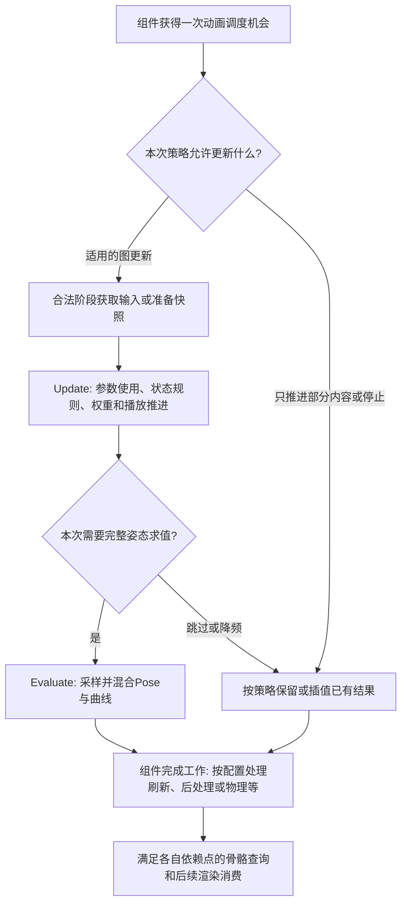
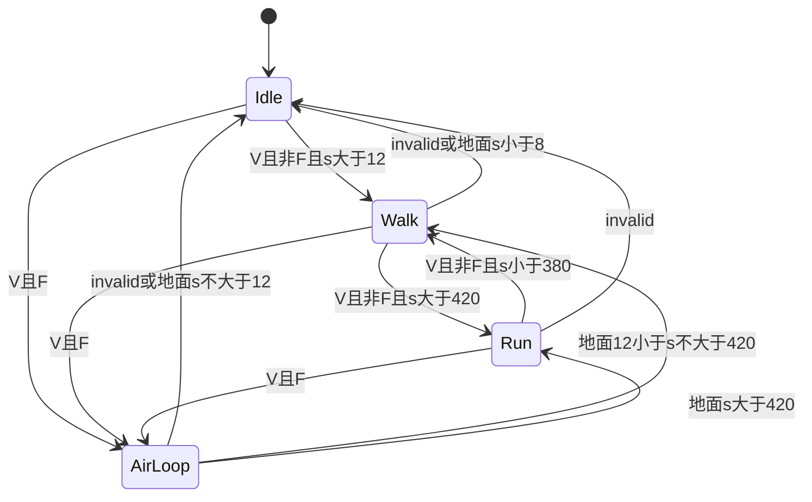
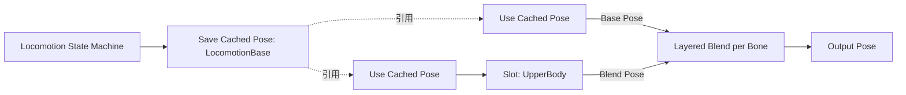
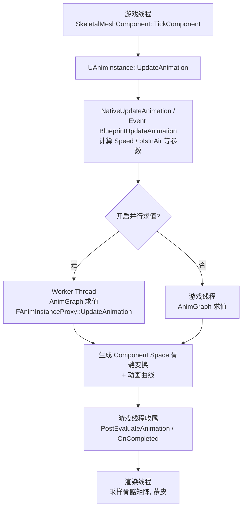
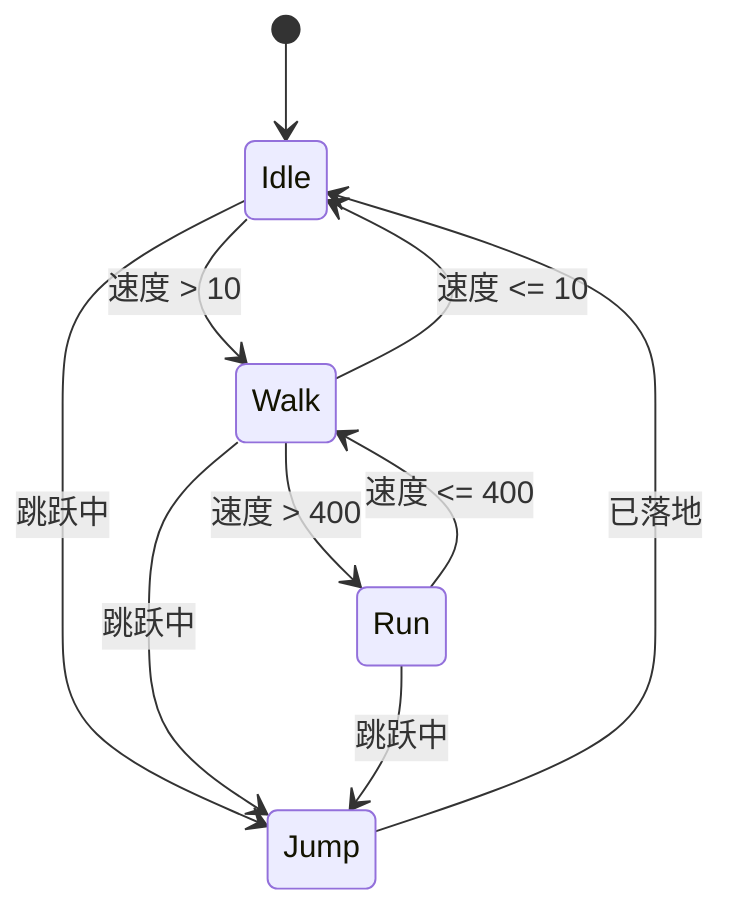

# 01 动画蓝图与状态机

> 知识成熟度：L2。已静态选读文末列明的官方文档；代码未经过UHT、编译或执行，PAPER_EXPECTED是有限纸面追踪。没有UE/PIE、动画资产、真实线程/时钟/网络/GC或性能实验。
> 知识基线：版本基准为带版本选择器的UE5.6动画指南；2026-10-09实际返回标题为UE5.8的选定公开API页。4.27的Sub Anim Instance和5.5的FinalizeBoneTransform仅作明确标注的历史对照，不拼成同一checkout的已证实现。
> 事实边界：本轮未读取实际Engine/Build/Build.version或引擎源码函数体。旧文的本机5.8路径、CL55116800、调用顺序及命令可用性不能当作当前验证。动态API网页以后可能改变。
> 适用范围：传统Animation Blueprint的实例、取数、状态转换、姿态混合与调试；基础例限定Character的地面移动和IsFalling空中表现，不实现完整跳跃/游泳/飞行、联网技能或AnimNext框架。
> 最后更新：2026-10-09。重写更新/求值/刷新边界、可装配移动示例、实例切换与事件责任；旧原文和必要历史异文在末尾逐字保留。

## 概述：动画图把哪一种状态变成什么

角色的水平速度是500cm/s、正在下落、手上拿着武器，这些信息本身没有指定骨骼应该摆在哪里。动画系统要选择资产、推进播放、决定权重，再把各部分组合为姿态。动画蓝图承担这层表现转换；它可以消费玩法状态，也可以提供动画事件，但播放成功、进入某个状态和命中/奖励结算成功是不同事实。

先把几个容易混在一起的对象分开。Skeleton描述骨骼相关数据；动画序列包含随时间变化的动画数据；AnimBP资产描述图和逻辑；编译后得到可供组件使用的生成类；UAnimInstance是运行对象，保存这一实例的动画状态；SkeletalMeshComponent把它接到具体Mesh及组件更新流程。仅创建AnimBP不会使角色使用它，还要设置组件的Animation Mode和Anim Class。[UE5.6创建与分配指南](https://dev.epicgames.com/documentation/en-us/unreal-engine/animation-blueprints-in-unreal-engine?application_version=5.6)

同一个AnimBP类可以服务多个角色，它们的运行状态应各自归属相应实例。一个角色可能有多个Mesh；一个Mesh也可能涉及主动画实例、linked实例或post-process动画实例。因此“一角色一AnimBP”“每Mesh永远只有一个实例”都不适合作为生命周期或缓存假设。

| 概念 | 职责 | 不应据此推断 |
| --- | --- | --- |
| AnimBP资产/生成类 | 定义可复用的图与默认配置 | 资产就是当前角色的运行对象 |
| UAnimInstance | 持有一轮动画运行状态与接口 | 是跨换类/换角色的稳定业务仓库 |
| EventGraph | 用动画事件驱动普通蓝图逻辑 | 所有动画工作都在这个图内完成 |
| AnimGraph | 组织播放器、状态机、混合、骨骼控制并输出Pose | 只能读取一个变量，或任意节点都没有内部状态 |
| State Machine / State | 用离散模式组织子图，状态内部仍是完整动画图 | 当前逻辑状态是唯一参与混合的姿态 |
| Transition | 决定何时可转移以及如何过渡 | bool为真就瞬间得到纯目标Pose |
| Blend / Blend Space | 混合姿态；后者以坐标选样本权重 | 可以替代所有模式资格判断 |
| Slot | 给Montage或Sequencer等接入图的入口 | 是Linked Anim Graph的另一种名字 |
| Sync Group | 协调播放器节奏与相位 | 自动修正世界移动、步幅和全部脚滑 |
| Linked Graph / Layer | 引用图或通过接口替换动画层 | 每个实例自动只拥有某一段骨骼 |
| Sub Anim Instance | 历史复用图工作流中的实例/节点概念 | 到UE5.2才首次出现 |

图编译会生成动画执行所需的数据和节点结构。公开API可见FAnimNode、生成类、实例与proxy等接口，但本文没有读取编译器及内存布局实现，不把“整张图都展开存到FAnimInstanceProxy里”写成已证布局。变量也是数据通道之一，输入Pose、链接图的属性输入、Property Access和节点函数各有用途。[Graphing](https://dev.epicgames.com/documentation/en-us/unreal-engine/graphing-in-animation-blueprints-in-unreal-engine?application_version=5.6)、[Linking](https://dev.epicgames.com/documentation/en-us/unreal-engine/animation-blueprint-linking-in-unreal-engine?application_version=5.6)

## 一、更新、求值、骨骼刷新与后续消费

“动画已经更新”至少可能指三件事：参数和播放时间推进了，图计算出新的Pose了，组件供消费者查询的骨骼变换刷新了。它们不能互相代替。

1. **Update**传播本次时间与权重、处理状态规则、推进播放器等运行状态。规则决定接下来哪些子图有资格贡献，不必已经计算每根骨骼的新变换
2. **Evaluate**根据图的当前状态采样和混合Pose、曲线等动画结果。Pose中的局部变换、组件空间骨骼控制及其转换有各自含义
3. **组件完成与刷新**把适用结果接回组件；具体配置还可能涉及后处理、物理混合、曲线和插值。业务查询及渲染随后消费相应结果，需要各自正确的依赖点

公开5.8的[FAnimInstanceProxy](https://dev.epicgames.com/documentation/unreal-engine/API/Runtime/Engine/FAnimInstanceProxy)把UpdateAnimation与EvaluateAnimation列成不同接口，并分别提供state、asset player、transition的时间/权重查询。接口名和概述支持职责区分，不能据此补出完整私有调用栈。



这是**条件依赖图**，不是引擎源码全序。它没有规定所有后处理/物理分支的排列，也没有保证一显示帧恰好一次update、evaluate或骨骼刷新。LOD、可见性、URO、图的relevance以及组件/世界调度都会影响实际工作。官方优化页也说明，worker工作结束后仍可能有游戏线程完成任务。[UE5.6 Animation Optimization](https://dev.epicgames.com/documentation/en-us/unreal-engine/animation-optimization-in-unreal-engine?application_version=5.6)

例如5.8公开的AlwaysTickPose策略在离屏时仍可Tick Pose，但只在被渲染时刷新BoneTransforms；AlwaysTickPoseAndRefreshBones则在这项可见性策略中两者都做。这直接说明“动画变量变了”不等于“socket骨骼查询已是本次新值”。选项也不会绕过所有世界暂停或组件整体禁用条件。[EVisibilityBasedAnimTickOption](https://dev.epicgames.com/documentation/en-us/unreal-engine/API/Runtime/Engine/EVisibilityBasedAnimTickOption)

读取某根骨骼前，要说清查询哪个组件、哪个坐标空间、需要动画结果还是物理后结果，以及哪个受支持的完成点保证该数据已可用。NativeUpdateAnimation返回、一个notify到达、PostEvaluateAnimation这个名字，均不能单独证明所有骨骼、物理结果和渲染提交已经完成。5.5的FinalizeBoneTransform历史API描述了它在该版本完成骨骼变换的职责，但本文未核5.6/5.8具体调用位置，不能把它写成万能的手工调用补丁。

## 二、数据在哪取，哪些工作可以并行

普通AnimBP EventGraph在游戏线程运行；动画图的update/evaluate是否能放到worker，取决于功能、设置和当次条件。Blueprint Thread Safe Update Animation及相应受支持函数提供了另一条更新数据的路径；这不是把任意游戏对象函数打个标签便能安全并行。[UE5.6多线程动画更新](https://dev.epicgames.com/documentation/en-us/unreal-engine/animation-optimization-in-unreal-engine?application_version=5.6)

| 路径/阶段 | 合理用途 | 责任边界 |
| --- | --- | --- |
| EventGraph / 本例NativeUpdateAnimation | 在合法游戏线程调用期，从当前拥有者获取移动数据 | 仍要处理对象未就绪、退出玩法、换组件与空返回；GT不是任意时刻都可访问所有对象 |
| Property Access | 按编译器和配置支持的访问路径向动画逻辑提供属性 | 核对Call Site、数据来源、取样时点；不是任意UObject访问的豁免 |
| Blueprint Thread Safe Update Animation | 用受支持输入更新本实例的动画参数/纯数据计算 | 写自己的受支持动画字段，与并行期改外部Actor或任意共享内存不同 |
| AnimGraph update/evaluate | 推进节点状态、采样、混合、IK等动画计算 | 使用该节点/API允许的数据；不得假定worker可调用GT专属世界逻辑 |
| 后续游戏逻辑 | 消费明确发布的结果、处理业务事件 | 选择合法阶段及仍有效的宿主；不直接从worker任意回写玩法 |

Property Access的Call Site可涉及游戏线程、worker，以及EventGraph前后位置；Automatic根据上下文和安全条件选择。若改为手动选项，就承担相应取样/线程责任。官方例给出Try Get Pawn Owner→Get Movement Component→IsFalling的受支持Property Access工作流，不能据此把同样三个任意C++函数调用搬到任意线程。[Graphing的Call Site设置](https://dev.epicgames.com/documentation/en-us/unreal-engine/graphing-in-animation-blueprints-in-unreal-engine?application_version=5.6)、[动画变量示例](https://dev.epicgames.com/documentation/en-us/unreal-engine/how-to-get-animation-variables-in-animation-blueprints-in-unreal-engine?application_version=5.6)

Thread Safe是入口/调用合同，BlueprintPure是蓝图函数属性；它们都不是互斥锁。非空指针、IsValid、弱指针和GC强持有也不能证明对象可并发读取、宿主仍处于本轮玩法或数据不会变。先明确数据由谁在何时写，再在受支持的动画阶段取值；需要快照时，复制的是有一致性与寿命合同的值，不是仅把一个裸指针改个变量名。

这也纠正“AnimGraph中所有变量都绝对禁止修改”的过度表述：官方thread-safe update可以维护动画变量，动画节点本身也有状态；错误的是在没有相应合同的求值/并行阶段改共享状态或调用不安全接口。公开5.8的[NativeThreadSafeUpdateAnimation](https://dev.epicgames.com/documentation/en-us/unreal-engine/API/Runtime/Engine/UAnimInstance/NativeThreadSafeUpdateAnimation)有worker更新入口及linked节点相关性说明，不是每个实例每显示帧必调用的保证。

Fast Path主要减少AnimGraph参数访问进入Blueprint VM的开销。某个表达式使节点失去Fast Path，不等于所有并行求值被禁用；出现不安全调用也不能指望引擎必定自动串行化并修复竞态。先使用受支持数据路径，再根据编译警告和目标工程trace优化。本文不构造新的异步宿主、后台队列或timer桥接器。

## 三、状态、过渡和时间分别表示什么

State内部仍是一张动画图，可以播放序列、使用Blend Space、混合姿态或嵌套状态机。State Machine选择逻辑上的当前状态，同时处理到其他状态的过渡。普通crossfade持续期间，源和目标可以同时对输出有非零贡献。因此“当前状态叫Run”与“Walk仍有权重”可以同时成立。

| 量 | 回答的问题 | 常见误用 |
| --- | --- | --- |
| Asset player time | 指定播放器采样/播放到了哪一处 | 当作状态进入以来经过时间；忽略循环、倍率、同步或起始位置 |
| State elapsed time | 某状态活动持续了多久 | 当作其中所有播放器的同一个时间 |
| Transition elapsed | 当前过渡已推进多少时间 | 当作源动画剩余时间 |
| Transition duration | 所选过渡的配置时长 | 当作动作必须播放的完整时长或业务截止时间 |

假设已明确是Linear普通二路过渡、duration=0.2s，概念权重可写成`alpha=clamp(elapsed/duration,0,1)`。在elapsed=0.05s时目标权重为0.25、源为0.75。这只解释指定模型的权重，不计算骨骼姿态；自定义曲线、按骨骼profile、零时长、打断和惯性化不能无条件套用。骨骼旋转还必须满足姿态表示/坐标空间约定，不能把四元数分量随意相加，参见已修订的[四元数与旋转](../../02-数学与游戏算法/数学与数值计算/02-四元数与旋转.md)。

### 3.1 规则选择资格，混合设置决定表现

一条有向Transition含返回bool的规则与混合配置。创建两个状态之间的连线，并不等于已经写好规则；反方向要有独立边。多个可用规则同时为真时，官方文档规定较小的Priority Order优先；不要把视觉列表顺序当完整规则。Max Transitions Per Frame限制一次frame/tick允许的转换决策数，不能假定总是只走一条，也不能假定每次都把所有出边全部算完。[UE5.6 Transition Rules](https://dev.epicgames.com/documentation/en-us/unreal-engine/transition-rules-in-unreal-engine?application_version=5.6)

规则应读取已经定义的输入，保持可重复检查，不在判断`Speed>420`时顺便扣体力、发伤害或启动一次性业务。设置Duration控制混合时间，Mode/Custom Blend Curve控制权重曲线，Blend Profile用于不同骨骼的混合速度；它们不是同一个“参数曲线”。过渡中又选择其他状态时可以打断当前过渡，不能把开始转换当作一定会完全混入。

### 3.2 自动规则和状态事件不是“播放完毕成功”

Automatic Rule Based on Sequence Player in State按最相关资产播放器的剩余时间与AutomaticRuleTriggerTime等配置尝试开始转换；负触发时间配置使用crossfade duration，非负值使用指定剩余时间阈值。它可以在动画结束前启动混合。以长1秒的非循环Recovery播放器为例，剩余0.15秒、触发设置0.2秒可以解释为什么开始离开时还未到尾；这不是精确等号实现测试。循环空中动画是否落地，应读取移动状态，不靠“播完一次Jump”。

需要检查具体动画时，先给播放器明确名字并确认节点的状态/播放器上下文。例如读Recovery状态中RecoveryPlayer的剩余时间，须确认这是要离开的播放器、资产是否循环、倍率和relevance是否符合设计。本轮5.6指南某些relevant-time词条的源/目标文字与5.8 proxy描述存在差异；不把它们拼成统一实现断言，复杂图需在目标版本检查所选节点。

Entered State表示状态开始活动/开始转入，Left State对应开始离开，Fully Blended State表示完全混入；Transition还有start、end、interrupt事件。它们帮助表现调试，但不是一组涵盖业务提交、物理和渲染的全序事务。按本次真正发生的事件处理，不用“进入过”推出“完全到达过”。

Always Reset on Entry、Reinitialize on Becoming Relevant和Skip First Update Transition分别影响重新进入、再次相关和首次更新行为。状态变得不相关后再回来，是否重新初始化及播放器状态如何处理，需要看所选设置；它不等于整个AnimInstance永远只初始化一次。[UE5.6 State Machines](https://dev.epicgames.com/documentation/en-us/unreal-engine/state-machines-in-unreal-engine?application_version=5.6)

## 四、从空图搭出一个可追踪的移动例

基础例只回答“有效Character现在怎样移动，应显示哪种循环姿态”。输入取不到时提供明确的invalid状态；这个降级姿态不会把角色的真实移动模式改为落地。所有代码均为完整列出的**教学候选**，未经过UHT/编译；示例不包含项目资产、模块文件或运行结果。

### 4.1 资产和工程前提

准备兼容同一目标Skeleton的Skeletal Mesh，以及Idle、Walk、Run、AirLoop四段循环序列。AirLoop表达持续下落/空中姿态；一次Jump起跳动画播到尾后会停在末帧，不能承担任意时长的空中循环。如果项目需要JumpStart→AirLoop→Land，应另建明确阶段及资产，不靠一次动画长度猜落地。

原生类放入依赖Core、CoreUObject、Engine的项目模块，把MYGAME_API替换为模块导出宏；保存为MyAnimInstance.h/.cpp，generated头保持在普通include之后。代码只在引擎提供的合法游戏线程生命周期/update入口中使用，不手动从worker调用NativeUpdateAnimation。输入域要求有效Character与Movement组件，以及有限的水平速度；本教学接收上限100000cm/s仅用于拒绝异常输入，不是引擎通用限速。

### 4.2 完整参数生产者：每轮失败都写出明确结果

```cpp
// MyAnimInstance.h -- 教学候选，未编译
#pragma once

#include "CoreMinimal.h"
#include "Animation/AnimInstance.h"
#include "MyAnimInstance.generated.h"

UCLASS()
class MYGAME_API UMyAnimInstance : public UAnimInstance
{
    GENERATED_BODY()

public:
    UPROPERTY(BlueprintReadOnly, Category = "Movement")
    float Speed = 0.0f; // 水平cm/s；有效性另看下面的标志

    UPROPERTY(BlueprintReadOnly, Category = "Movement")
    bool bIsInAir = false; // 本例严格对应IsFalling，不包括游泳/飞行

    UPROPERTY(BlueprintReadOnly, Category = "Movement")
    bool bMovementDataValid = false;

protected:
    virtual void NativeInitializeAnimation() override;
    virtual void NativeUpdateAnimation(float DeltaSeconds) override;
    virtual void NativeUninitializeAnimation() override;

private:
    void ResetMovementOutput();
};
```

```cpp
// MyAnimInstance.cpp -- 教学候选，未编译
#include "MyAnimInstance.h"
#include "GameFramework/Pawn.h"
#include "GameFramework/Character.h"
#include "GameFramework/CharacterMovementComponent.h"

void UMyAnimInstance::ResetMovementOutput()
{
    Speed = 0.0f;
    bIsInAir = false;
    bMovementDataValid = false;
}

void UMyAnimInstance::NativeInitializeAnimation()
{
    Super::NativeInitializeAnimation();
    ResetMovementOutput();
}

void UMyAnimInstance::NativeUpdateAnimation(float DeltaSeconds)
{
    Super::NativeUpdateAnimation(DeltaSeconds);
    ResetMovementOutput();

    APawn* Pawn = TryGetPawnOwner();
    if (!IsValid(Pawn))
    {
        return;
    }

    const ACharacter* Character = Cast<ACharacter>(Pawn);
    if (!IsValid(Character))
    {
        return;
    }

    const UCharacterMovementComponent* Movement =
        Character->GetCharacterMovement();
    if (!IsValid(Movement))
    {
        return;
    }

    const double HorizontalSpeed = Pawn->GetVelocity().Size2D();
    if (!FMath::IsFinite(HorizontalSpeed) || HorizontalSpeed > 100000.0)
    {
        return;
    }

    Speed = static_cast<float>(HorizontalSpeed);
    bIsInAir = Movement->IsFalling();
    bMovementDataValid = true;
}

void UMyAnimInstance::NativeUninitializeAnimation()
{
    ResetMovementOutput();
    Super::NativeUninitializeAnimation();
}
```

这里不缓存拥有者裸指针，每次允许的update重新获取。先重置再取数，使Owner空、非Character Pawn、Movement缺失和无效速度都输出`0,false,false`，而不是把上一轮`bIsInAir=true`带到新对象。速度为(300,400,900)cm/s时水平量是500；竖直900不进入Speed。`!IsMovingOnGround()`还可能覆盖其他非地面模式，不能作为本例IsFalling的替代定义。

IsValid只在已成立的调用/寿命前提内拒绝无效对象；它本身不保证游戏线程、当前玩法资格或跨线程无竞态。动画对象的初始化/反初始化也不是Actor BeginPlay/EndPlay或GC释放的同义词。公开[UAnimInstance生命周期接口](https://dev.epicgames.com/documentation/unreal-engine/API/Runtime/Engine/UAnimInstance)给这些钩子，本文不补造它们在所有创建路径中的全序。

进阶时可用官方Property Access＋Blueprint Thread Safe Update Animation实现同一数据合同，但要保持一个清楚的参数生产者，不能两个路径同时无规则地写同一字段。本文的C++和后面的纸例使用上面这条入门路径。

### 4.3 创建和连接图

1. 新建目标Skeleton的AnimBP，父类选择UMyAnimInstance；不把一个没有AnimGraph的原生类当作已经配好的动画资产
2. 在角色Mesh上设置Animation Mode为Use Animation Blueprint，Anim Class选择该AnimBP生成类。检查实际游戏角色使用的Mesh和实例，不只看编辑器预览
3. AnimGraph添加名为Locomotion的State Machine并连接到Output Pose；进入Locomotion，创建Idle、Walk、Run、AirLoop，Entry连接Idle
4. 各state放相应Sequence Player，连接该state的Output Pose。四段都启用Loop，明确选择已有资产
5. 按下表逐条添加**有向边**及规则。所有边使用Standard Blend、Linear、Duration=0.2秒、不启用自动播放器规则；本例不配置Blend Profile
6. 选状态机，设Max Transitions Per Frame=1、Skip First Update Transition关闭、Reinitialize on Becoming Relevant开启；四个state的Always Reset on Entry开启。这是本例政策，不声称是默认设置
7. 给Walk与Run播放器的Sync设置Method=Sync Group、Group Name=LocomotionFeet，并设置合适的leader角色。两段序列放同名LeftFoot/RightFoot marker，确认含义对应相同落脚相位；没有共同marker时预期可能回退长度同步
8. 编译AnimBP后，在目标工程的PIE中选实际调试实例，再观察参数、state与权重。此步是待执行验证入口，本轮没有启动UE或编译资产

以下记V=`bMovementDataValid`，F=`bIsInAir`，s=`Speed`；速度单位cm/s。false数据不靠`s=0`隐式代表落地。规则表是本例的完整连接定义：

| 源→目标 | bool规则 | Priority Order |
| --- | --- | --- |
| Idle→AirLoop | `V && F` | 0 |
| Idle→Walk | `V && !F && s > 12` | 1 |
| Walk→AirLoop | `V && F` | 0 |
| Walk→Idle | `!V || (V && !F && s < 8)` | 0 |
| Walk→Run | `V && !F && s > 420` | 1 |
| Run→AirLoop | `V && F` | 0 |
| Run→Idle | `!V` | 0 |
| Run→Walk | `V && !F && s < 380` | 1 |
| AirLoop→Idle | `!V || (V && !F && s <= 12)` | 0 |
| AirLoop→Walk | `V && !F && s > 12 && s <= 420` | 1 |
| AirLoop→Run | `V && !F && s > 420` | 1 |

invalid→Idle是**有效数据门禁的明确例外**。Idle在invalid时不转出；其他状态进入Idle需要0.2秒普通混合，并非规则一成立就成为100%纯Idle姿态。表中相同Priority值的出边条件互斥，不依赖未知的同优先级决胜顺序。



图中“地面”缩写均指V且非F，精确等号以表为准。本例没有泛用Any节点；若要减少三条空中边，可以进一步使用官方State Alias，但应明确包括哪些状态，不能用Global Alias无意包含AirLoop自己及后来新增的状态。

### 4.4 阈值、恢复与扩展输入

Idle在s=12仍保持Idle，s>12才进入Walk；Walk在s=8仍保持Walk，s<8才回Idle。Walk在420保持Walk，Run在380保持Run。8–12与380–420形成迟滞区间，同一速度下结果可以取决于前态；它是防边界抖动的政策，不是时间滤波或加速度模型。

AirLoop落地时采用确定的重新选择：s≤12去Idle，12<s≤420去Walk，s>420去Run，不记忆起跳前是否Run。invalid恢复后从Idle重新按表决策；若有效、非空中且速度500，先Idle→Walk，再在后续允许的状态机更新机会Walk→Run，因为Max=1且没有Idle→Run直边。同样Run骤停到0先去Walk再去Idle；若产品需要一步直达，应显式增加边、修改优先级与纸例，而不是依赖未配置的多次转换。

最简单的速度规则可以单独写成：

```text
Idle -> Walk
  Return Value = bMovementDataValid && !bIsInAir && Speed > 12
  Blend Logic = Standard Blend
  Mode = Linear
  Duration = 0.2 seconds
```

原有体力/瞄准用途可作为**明确命名的项目扩展**：角色输入/武器系统在合法游戏线程维护`bWantsToAim`，角色的权威属性系统维护`Stamina`及其有效性；动画取数阶段把所需值读成`bIsAiming`、`bHasStamina`和数据有效标志。没有这些生产者就不添加该规则或保留上次值。比如：

```text
项目扩展，基础例不启用：
  Walk -> Run 的资格还要求 bHasStamina
  bHasStamina := 已确认有效的Stamina > 0
  上身瞄准混合输入 bIsAiming := 当前有效角色的bWantsToAim
```

若加体力限制，Run退出边也要定义“体力不足回Walk”，并处理属性数据失效；只改进入边是不完整的。规则判断不负责扣体力，动画瞄准权重也不自动执行开火权限或命中结算。

## 五、初始化、拥有者与运行时换AnimBP

### 5.1 实例的使用期不等于Actor或资产寿命

AnimBP可能在编辑器预览中创建，角色也可能换Mesh、换类、重新初始化或退出当前玩法。TryGetPawnOwner空先作为可处理输入，而不是必然错误；核实组件所属Actor是不是Pawn，不能把Scene Attach到某Pawn当作Owner就是该Pawn。缺输入时按§4输出invalid，下一次受支持update再重新获取，不承诺“延迟一帧必定修好”。

若选择缓存拥有者，需明确何时重绑/失效、哪个使用期仍有资格，以及缓存采用何种追踪引用。Outer表达对象归属上下文，不是通用RAII父销子；强持有可影响GC可达性，却不能延长Actor的玩法资格；弱指针不会自动提供数据同步。已有[Actor与Component生命周期](../../03-引擎架构与资源系统/对象模型与生命周期/02-Actor与Component生命周期.md)与[UObject](../../03-引擎架构与资源系统/对象模型与生命周期/01-UObject与反射系统.md)的合同继续适用。

[5.8 GetAnimInstance](https://dev.epicgames.com/documentation/en-us/unreal-engine/API/Runtime/Engine/USkeletalMeshComponent/GetAnimInstance)仅承诺可用时返回驱动组件的当前transient实例，并标明construction script中使用不安全。不要在构造中取一次后永久保存，更不要把旧指针非空等同“还是当前实例”。

### 5.2 换类：先确定合法调用点，再观察结果

运行时使用SetAnimInstanceClass而非直接写AnimClass。5.8公开接口返回void，描述其清除/重新初始化实例并设AnimationBlueprint模式；**当前实例求值期间调用会警告失败，例如从anim notify中调用**。这是明确的失败条件，调用过不等于已应用。[5.8 SetAnimInstanceClass](https://dev.epicgames.com/documentation/en-us/unreal-engine/API/Runtime/Engine/USkeletalMeshComponent/SetAnimInstanceClass)

换武器的表现意图应由仍合法的角色/装备宿主保存，包含本轮请求及目标AnimBP生成类。调用者必须确认：这是自己的当前角色/组件和当前玩法期、目标类有适配的图及Skeleton、资产可用、当前处在该项目已确认的外部游戏线程非求值窗口。窗口未知、来自求值/notify调用栈、宿主已退场或请求已过期时，**停止本次操作，报告未尝试（未调用本次setter）**；不能绕过setter直接写字段，也不自动安排next-tick重试。

下面是合法调用点内的有限C++操作示意，返回的是“观察到的实例变化”，不是业务成功。该函数不创建合法窗口，也不验证项目Skeleton兼容性或玩法期；调用者在进入前与消费结果前都须完成上述项目判断。缺少这些条件时不得调用，不能只传一个true伪装阶段已确认。

```cpp
// 独立操作示意；未编译。头文件直接列出，项目宿主合同见正文。
#include "CoreMinimal.h"
#include "CoreGlobals.h"
#include "Animation/AnimInstance.h"
#include "Components/SkeletalMeshComponent.h"
#include "GameFramework/Character.h"

namespace AnimClassChangeExample
{
    enum class EObservation : uint8
    {
        InvalidInput,
        AlreadyUsesClass,
        ChangeNotObserved,
        DifferentInstanceObserved
    };

    EObservation ApplyAtConfirmedGameThreadPoint(
        ACharacter* Character,
        TSubclassOf<UAnimInstance> NewAnimBPClass)
    {
        if (!IsInGameThread() || !IsValid(Character) || !NewAnimBPClass)
        {
            return EObservation::InvalidInput;
        }

        USkeletalMeshComponent* Mesh = Character->GetMesh();
        if (!IsValid(Mesh) || Mesh->GetOwner() != Character)
        {
            return EObservation::InvalidInput;
        }

        UAnimInstance* Before = Mesh->GetAnimInstance();
        if (IsValid(Before) && Before->GetClass() == NewAnimBPClass.Get())
        {
            return EObservation::AlreadyUsesClass;
        }

        Mesh->SetAnimInstanceClass(NewAnimBPClass.Get());

        if (!IsValid(Character) || !IsValid(Mesh) ||
            Character->GetMesh() != Mesh || Mesh->GetOwner() != Character)
        {
            return EObservation::ChangeNotObserved;
        }

        UAnimInstance* After = Mesh->GetAnimInstance();
        if (IsValid(After) && After != Before &&
            After->GetClass() == NewAnimBPClass.Get())
        {
            return EObservation::DifferentInstanceObserved;
        }
        return EObservation::ChangeNotObserved;
    }
}
```

InvalidInput在本例中发生于setter调用之前，表示本次未尝试；AlreadyUsesClass同样没有调用setter，只是观察到当前同类，不证明这次创建了新实例。ChangeNotObserved则发生于setter调用之后，表示**后置观察未确认目标，结果未知**：宿主/组件关系改变或After不匹配，均不能证明没有发生清理、初始化、重入等效果，也不能证明已回滚。函数并未捕获或把API警告转换为返回枚举；若接口报告失败，应单独记录该事实，不能由此推断外部状态整体不变。

即使这些对象仍IsValid，期间也可能结束了原玩法资格；函数没有替项目验证这种资格，所以调用者不能仅根据DifferentInstanceObserved结算其他业务。例子的A→B指不同目标类且观察到不同当前实例；函数调用前后不解引用旧Before来复制proxy或播放器内部状态。

| 情况 | 宿主的明确处理 |
| --- | --- |
| 调用前未确认窗口、已经退出玩法或请求过期 | 不进入操作，标记未尝试/取消；未调用本次setter，不遗留无限重试 |
| 调用前发现非法对象/类或不属于当前角色 | 记录InvalidInput与本次未尝试；重新核归属而非改字段 |
| 求值期间调用导致API警告失败 | 记录接口报告失败；不推断外部状态整体未变或已回滚，示例枚举并不直接检测此警告 |
| 调用后宿主/组件检查失败，或未观察到目标新实例 | 记录ChangeNotObserved，即未确认/结果未知；不推断无效果或已回滚，由仍合法的宿主重新观察 |
| 同类AlreadyUsesClass | 不宣称A销毁、B重建；若需要重初始化，另核具体API与用途 |
| 不同目标类且观察到新当前实例 | 在宿主再次确认资格后，让新实例重新获取游戏状态；动画结果仍待正常更新/求值 |

调用后结果未确认时，停止盲目重试。仍合法的外部宿主须重新确认原请求身份与玩法期、Owner/Mesh、类兼容性和调用资格，并重新观察当前实例，再决定保留意图、取消或再次尝试；不得假定状态仍等于调用前。若决定再次尝试，还须重新确认该次调用窗口；没有这些前提就停止并上报。SetTimerForNextTick不是初始化、动画完成或对象寿命的证明。已有[Timer/Ticker篇](../../03-引擎架构与资源系统/运行架构与任务调度/06-定时器与引擎Ticker.md)也明确：RemoveTicker对指定登记有并发在途等待合同，这不扩展为衍生任务、资源析构或模块卸载的全局收敛，不能笼统说所有退订都无屏障。

需要延续的装备、瞄准意图和权威动作状态留在适当玩法Owner，新实例按当前有效数据重新建立表现。是否延续某段动画的播放时间是另一个设计选择，不能复制旧实例内存假装继承。组件不再使用旧实例，与旧UObject何时最终GC释放不同。

## 六、混合、Slot与同步：选择之后怎样组合

### 6.1 离散模式与连续参数分工

状态机适合“地面/空中/受击”等离散模式；Blend Space适合在一个模式内根据速度、方向等连续坐标混合样本。§4把地面拆成Idle/Walk/Run，便于学习规则；另一种常见设计是Ground状态内放1D/2D移动Blend Space，状态机只负责Ground↔Air。二者可以组合，不必用很长的bool混合链模拟所有离散规则，也不必为每个速度值建state。

Blend Space Player的坐标选择样本贡献，Play Rate/Loop等影响播放。Blend Space Evaluator则由外部归一化时间指定采样位置，官方5.6说明其默认teleport模式不推进对应notify/root motion。它们都有Pose输出，但不能因画面相似就认为播放时间和事件合同相同。[UE5.6 Blend Spaces in Animation Blueprints](https://dev.epicgames.com/documentation/en-us/unreal-engine/blend-spaces-in-animation-blueprints-in-unreal-engine?application_version=5.6)

| 手段 | 适合的输入和用途 | 必须分清 |
| --- | --- | --- |
| Blend | 两个Pose及alpha | alpha权重与过渡经过时间不是同一个输入 |
| Blend Poses by Bool | 持枪/不持枪等两个选择 | 选择bool和切换混合时间分开 |
| Blend Poses by Enum / Int | 姿态枚举、动作索引等多路选择 | 索引/枚举输入必须有定义，默认分支不可忽略 |
| Blend Space | 速度/方向驱动连续样本 | 不是“是否允许跳跃/奔跑”的业务资格检查 |
| Layered Blend per Bone | 保留腿部移动、叠加上身动作 | Branch Filter/Blend Mask定义骨骼范围；空间、curve和rootmotion设置另看节点 |
| Apply Additive | 基础Pose上增加已定义参考姿态的偏移 | additive资产不能当普通完整Pose随意混合 |
| Inertialization | 某些动作切换时延续运动差异并衰减 | 与普通crossfade的源Pose继续求值方式不同 |

手动alpha可以由变量或项目定义的曲线产生；连续按速度混合可用Blend Space或明确计算alpha再接标准Blend。本文不把旧名“Blend by Speed”“Blend Poses by Float”当已核标准内置节点。Blend Mask/Branch Filter决定哪些骨骼受层影响，Blend Profile决定骨骼混合速度，过渡Curve决定权重形状；把三者混称“混合曲线”会配置错对象。[UE5.6 Blend Nodes](https://dev.epicgames.com/documentation/en-us/unreal-engine/animation-blueprint-blend-nodes-in-unreal-engine?application_version=5.6)

对非additive、两路、已明确同一表示空间的简化说明，可以写`Output = BlendPose(Base, Action, alpha)`，输入权重为`1-alpha`与`alpha`。它不是把所有骨骼矩阵或四元数分量按同一个标量式直接相加；平移、旋转、尺度、曲线和逐骨权重各有规则。Pose混合也不自动解决骨骼空间错误、关节限制或碰撞。

### 6.2 惯性化保留的是过渡信息，不是继续播放旧源

普通crossfade在过渡期间求源与目标Pose再混合。5.6官方惯性化说明则使用过渡时的运动/姿态差异，作为后处理向目标衰减，开始后不再继续求值该源Pose。过渡发出惯性化请求时，下游必须有支持处理请求的Inertialization节点；仅把transition类型改名而不连接消费者并不完整。

这能省去旧源继续求值的部分工作，但不能推出任何图、硬件或负载下总成本一定更低，也不能保留旧文“一定比crossfade更贵”。节点本身有处理成本，质量还受两边姿态差、时长和连续打断影响。受击、开火或快速切武器可尝试它，是否合适应以目标资产/工程观察判断。

该页还明确：源Sequence在惯性化开始后的后续notify不再由继续求值而触发。**这不等于已排队的事件被清空、所有NotifyState/transition/montage事件都停止或玩法动作已取消**。若以前用旧源后半段notify清理业务，必须重新检查中断和清理责任，不能依赖它迟早到达。[UE5.6 Inertialization](https://dev.epicgames.com/documentation/en-us/unreal-engine/animation-blueprint-blend-nodes-in-unreal-engine?application_version=5.6)

### 6.3 Slot分层例：两条基础姿态支路要接完整

Slot给Montage和Sequencer等提供动画插入点；没有插入时传入基础Pose，播放时按Slot及图的设置参与覆盖/混合。它与引用另一个AnimBP的Linked Graph是不同机制。[UE5.6 Animation Slots](https://dev.epicgames.com/documentation/en-us/unreal-engine/animation-slots-in-unreal-engine?application_version=5.6)

以上半身开火、下半身继续移动为例：

1. 在Skeleton的Anim Slot Manager创建UpperBody槽，例如放入WeaponActions组；Montage的Slot轨道选择同一槽名。修改Slot也涉及Skeleton资产
2. 将Locomotion输出接Save Cached Pose，命名LocomotionBase。两处Use Cached Pose引用它，避免把两条连线误画成两套独立移动状态机
3. 第一处直接接Layered Blend per Bone的Base Pose；第二处先接Slot UpperBody，再接该Layered节点的Blend Pose输入
4. 在Layered节点选择明确的Branch Filter或Blend Mask，覆盖项目所需上半身骨骼，层alpha按所需动作策略设置；把Layered输出接Output Pose。骨骼名称和深度取决于实际Skeleton，不能复制一个通用spine名字就保证适配



缓存Pose不是跨帧永远新鲜的业务快照，连线也没有定义所有节点的完整调度。图中下身来自base支路，上身按骨骼过滤使用Slot支路，所以Montage动作不会必然把走路腿部覆盖掉。应同时检查Slot/Montage名称、组、层掩码和权重，不能只看Montage播放接口被调用。

同一个Slot Group的Montage会存在打断关系；Slot覆盖源时还要考虑Always Update Source Pose等设置。动画状态机是否持续推进及恢复时是否重新初始化，与relevance/源更新配置有关，不能宣称Montage和state“互不干扰”。想做全身交互则可把全身Slot接在移动图之后，不需要用上身掩码。

### 6.4 Sync Group对齐相位，不能包办所有脚滑

走和跑周期长度不同，直接混合可能一只脚准备落地、另一段却正在抬脚。Sync Group选择leader并让followers按对应节奏同步；默认可按权重变更leader，组角色也能改变这个选择。共同marker让播放器在同名相位区间中对齐，例如leader在LeftFoot→RightFoot区间的25%，follower对齐到自己相应区间25%，不是跳到最近标记。

§4的Method=Sync Group和Group Name只是第一步；标记名称与语义也要匹配。只有组内共同marker用于同步，不足时可回退到按长度同步。Sync影响notify选择：通常leader主导、follower抑制，但notify还有Trigger on Follower选项，不能说follower绝不触发。[UE5.6 Sync Groups](https://dev.epicgames.com/documentation/en-us/unreal-engine/animation-sync-groups-in-unreal-engine?application_version=5.6)、[Notify属性](https://dev.epicgames.com/documentation/en-us/unreal-engine/animation-notifies-in-unreal-engine?application_version=5.6)

即使相位对齐，角色世界速度和素材步幅不匹配、播放率不合适、根运动配置错误、重定向/IK接触不良仍可能脚滑。删除“90%都是同步组问题”的无依据比例；排查时把相位、速度和足底约束分别观察。

## 七、跨角色复用：图接口和骨骼分层各管一件事

不同职业共用移动图、不同武器替换瞄准/持握姿态时，复制整张AnimBP容易让修复漂移。Linked Anim Graph引用具体AnimBP类，可暴露输入Pose和参数；Linked Anim Layer通过Animation Layer Interface声明动画层接口，由不同实现类提供对应图。父图负责怎样组合FullBody、UpperBody、IK等层，接口并不自动为每个实例分配独占骨骼。

一个可追的武器复用流程是：创建含UpperBody/IK层及相应输入的接口 → 基础AnimBP实现并调用这些层 → 武器专用AnimBP实现同一接口 → 在项目合法阶段通过受支持的链接接口选择实现 → 再按图的骨骼混合规则合成。切换、通知传播和资产卸载仍要显式安排；解绑引用不自动等于所有资产立刻从内存释放。相关层的组还可以共享动画实例，不能把“一层一对象”当恒定合同。[UE5.6 Animation Blueprint Linking](https://dev.epicgames.com/documentation/en-us/unreal-engine/animation-blueprint-linking-in-unreal-engine?application_version=5.6)

旧Sub Anim Instance保留的核心用途也是复用一段图，传入Pose和变量。[UE4.27官方教程](https://dev.epicgames.com/documentation/unreal-engine/using-sub-anim-instances?application_version=4.27)已展示它，所以旧文“UE5.2+才有”不成立；本文也没有核到通用Create Sub Anim Instance节点，不把这个名字继续作为步骤。历史节点名不直接认证5.8当前实现，当前项目按所选版本的Linked Graph/Layer工作流核实。

浅层状态机、命名子状态机、State Alias、参数化图和Linked Layer是不同程度的组织方法。只有行为确实独立才嵌套；拆分能帮助多人协作和局部替换，也增加实例身份、输入来源、relevance和跨图通知的调试成本。

## 八、notify、Root Motion和网络业务的边界

### 8.1 表现通知可以参与玩法，但不是成功凭证

脚步声、粒子、镜头提示可由notify触发。若某个notify参与伤害窗口或动作分支，还要由玩法系统明确谁有权结算、事件属于哪次动作、取消之后是否仍有效、重复到达怎样处理。动画实例及状态机不自动提供“恰好一次”的业务语义。

例如权威动作17已取消并开始18，后来接到17的提示时，应按动作身份/有效期拒绝旧业务；18的同一单次效果提示重复时，按业务记录避免重复结算。这里仅给有限接收合同，不新建后端事务、GAS或联网状态机。状态进入、蒙太奇开始、曲线变值都不能代替业务系统确认。

官方notify配置包括触发权重、概率、LOD过滤、Dedicated Server、follower，以及Montage的Queued/Branching Point时序取舍。这些会影响是否以及何时看到提示；Branching Point更精确也不等于网络事务或生命周期屏障。取消/中断/结束流程要承担必要清理，不等一条可能不再触发的尾部通知。[UE5.6 Animation Notifies](https://dev.epicgames.com/documentation/en-us/unreal-engine/animation-notifies-in-unreal-engine?application_version=5.6)

### 8.2 Root Motion分提取、消费和实际移动

动画根骨有位移，并不默认等于角色胶囊沿相同轨迹移动。先在资产启用相应根运动数据，再看AnimBP的Root Motion Mode，最后由适用的Movement路径消费；移动模式、碰撞和网络机制各自施加约束。

| Root Motion Mode | 文档所述用途 |
| --- | --- |
| No Root Motion Extraction | 保留根骨中的运动，不抽取为角色移动输入 |
| Ignore Root Motion | 抽取并从根骨移除，但不应用给角色 |
| Root Motion from Everything | 从贡献最终姿态、已启用Root Motion的资产提取并按贡献混合 |
| Root Motion from Montages Only | 只从符合条件的Montage提取 |

因此一段资产视觉上在播放、state已经到达、根骨曲线前进，都不能单独证明胶囊碰撞或服务器权威位移成功。5.6指南还说明某些Root Motion模式会使图的update需要游戏线程；这限制了并行update资格，不证明所有evaluate、物理和渲染工作有同一个线程全序。[UE5.6 Root Motion](https://dev.epicgames.com/documentation/en-us/unreal-engine/root-motion-in-unreal-engine?application_version=5.6)

### 8.3 各角色本地表现与服务端权威分开

模拟代理通常消费复制的移动/状态及本地平滑结果来建立表现，不能依赖该客户端没有的本地输入。要核对动画实例属于谁、Speed/瞄准/武器数据来自哪里、网络角色与时效是否正确；不能把服务器AnimBP每帧Tick当所有客户端动画正确的必要条件。

但如果专用服务器确实依赖动画骨骼、notify或Root Motion参与游戏逻辑，就必须给这些功能合适的动画调度策略，并在目标工程验证。不能因服务器不渲染就无条件停掉一切，也不能为“同步”要求所有服务端Mesh都完整求值。本文未验证网络Root Motion实现、预测回滚、复制频率或弱网下事件顺序。

## 九、LOD、离屏与诊断：先确定缺了哪一种结果

降低动画成本不能只盯状态数量。EventGraph游戏逻辑、活动播放器与过渡、IK/物理、linked图、曲线、worker完成后的GT任务都可能占预算。很多未相关分支不会像活动分支一样工作，但过渡可以保留多份贡献，不能反过来说“每帧只求一个state，所以state数量永远无关”。

- **LOD**：Mesh骨骼/资产与具体节点支持的LOD机制分别配置。并不是所有节点都能在AnimBP Class Settings一键裁掉；例如某页的LOD Threshold只明确描述其支持类别，不能扩成所有Blend Space都具备同一开关
- **可见性与URO**：区分是否推进动画、是否完整求值、是否刷新BoneTransforms及是否插值缓存。离屏、远距离、DS上的骨骼消费者有不同要求
- **计算优化**：先看编译警告、Fast Path与trace，再减少反复查找、字符串和不必要查询；缓存要有来源与失效合同，不能仅为省几次Cast引入过期拥有者
- **设置可核性**：旧文BoneFilter、bUseRefPoseOnInitAnim等列举未在本轮核为通用骨骼优化入口，不继续当成默认优化菜单。具体项目用其版本实际支持的设置

[UE5.6优化指南](https://dev.epicgames.com/documentation/en-us/unreal-engine/animation-optimization-in-unreal-engine?application_version=5.6)的建议需要结合项目测量，不能把某个示例频率或可见性策略当通用预算。本页没有任何节省毫秒或倍率的实测结论。

### 9.1 从实例身份排到最终消费者

| 排查层 | 具体检查 | 不能仅凭什么下结论 |
| --- | --- | --- |
| Mesh/实例 | 实际组件、Animation Mode、生成类、当前实例、预览或PIE对象 | 资产编辑器预览会动 |
| 参数 | V/F/s、生产者、单位、取样阶段、Owner/Movement有效性 | 本地输入存在、某个对象指针非空 |
| 规则 | 当前state、表中bool、优先级、每帧最大转换数、时间查询上下文 | Speed过一个阈值而忽略空中/invalid门禁 |
| Pose组成 | 各播放器和state权重、Slot/Layer覆盖、同步、relevance | 当前state名字或Montage开始返回 |
| 组件刷新 | LOD/URO/可见性、骨骼空间和需要的完成点、适用物理分支 | 参数更新或NativeUpdateAnimation已返回 |
| 玩法/网络 | 动作身份、角色权限、取消和重复、复制数据与新鲜度 | notify触发、curve变化或Mesh看起来移位 |

在AnimBP中选择实际调试实例，观察EventGraph变量与state/transition；用Pose Watch隔离节点Pose，用Rewind Debugger记录PIE片段回看，用Animation Insights查看时间开销。这些是[5.6官方调试工具入口](https://dev.epicgames.com/documentation/en-us/unreal-engine/animation-debugging-and-optimization-in-unreal-engine?application_version=5.6)，本文只静态读取概览，没有启动插件、打断点或采集trace。

GetCurveValue可帮助观察某条曲线，但0可能是资产没有该曲线、权重/过滤结果或取样结果，不能单独证明“动画没播”。查看当前播放内容也不能只打印一个状态名，过渡、Slot和linked层可能同时贡献。旧“(快捷键”、`a.animnode.*`泛用命令及ShowDebugAnimation存在/不存在结论未核，不继续提供为确定步骤；具体操作以目标版本工具界面和文档为准。

## 十、可复现验证建议（PAPER_EXPECTED）

下表全是**纸面预期，未执行**。它验证本文规则在给定输入下是否自洽，不模拟引擎调度、浮点精度、线程、骨骼资产或网络。基础state例使用§4的11条边、12/8/420/380阈值、Max=1、首轮正常混合、0.2秒Linear普通过渡；没有沿用旧10/400阈值。

| 编号 | 输入与操作 | PAPER_EXPECTED及负例 | 判定边界 |
| --- | --- | --- | --- |
| P01 每轮输出 | 有效Character，velocity=(300,400,900)、IsFalling=true；下一轮依次Owner空、非Character Pawn、Movement缺失；最后有效静止角色 | `(Speed,F,V)`先为`(500,true,true)`，三种失败各为`(0,false,false)`，恢复静止为`(0,false,true)`。非有限/大于本例上限的水平速度也invalid。只在Character成功分支写F会残留旧true | 只追踪代码赋值和勾股关系；不认证指针寿命或运行线程 |
| P02 迟滞与等号 | 有效地面，从Idle输入0,11,13,10,9,7 | 逻辑state为Idle,Idle,Walk,Walk,Walk,Idle。Idle的12不出，Walk的8不退，Walk的420不跑，Run的380不退。反例：单10阈值面对9.9/10.1反复翻转 | 逻辑state追踪不声称这些时刻Pose已经100%混入；迟滞不等于滤波 |
| P03 优先级和恢复 | Walk输入s=500且F=true；之后F=false且s=500；另从invalid Idle恢复为有效地面s=500 | 前两步去AirLoop、再Run。invalid时地面边与空中边都false，仅invalid回Idle例外可用；恢复从Idle先Walk，再在后续允许更新去Run。Run骤停0也先Walk再Idle；Air落地12→Idle、420→Walk、421→Run | Max=1且没有Idle→Run直边。未规定一次显示帧有几个调度机会；invalid入Idle也保留0.2秒混合 |
| P04 四种时间 | 源Walk播放器时间人为设0.73s，目标Run播放器从0.10s开始，transition duration=0.20s；取elapsed=0/0.05/0.10/0.20 | 指定Linear模型alpha=0/0.25/0.5/1。当前逻辑state可已是目标，而旧源仍有权重；播放器时间、state elapsed和transition elapsed不同 | 只算权重，不算骨骼；不覆盖同步、打断、profile、零时长与惯性化 |
| P05 自动规则 | 非循环RecoveryPlayer长1秒，remaining从0.25到0.15，自动触发设置0.2；另空中一次Jump早已到末帧但F仍true | 自动规则可以在动画末尾前开始离开；动画到尾不能推出落地。基础例用AirLoop且读取F退出 | 是参数用途说明，不认证等号判定/内部推进公式，不能当动作业务完成 |
| P06 Blend Space分工 | 人为一维线性模型：Walk样本坐标200、Run600，输入400；分别F=false/true | 示意样本权重均为0.5/0.5，但两组相同速度仍可由state规则选择地面或空中 | 不是UE任意BlendSpace的三角划分/平滑算法证明 |
| P07 旧/重提示 | 动作17被业务取消，当前为18；随后收到17的提示；18的单次效果提示又到两次 | 对17按有效动作身份拒绝；18同一效果按已有业务处理记录只结算一次 | 本文没有实现跨网恰好一次，也不说notify必定迟到/重发；这是接收责任例 |
| P08 换类 | 旧当前实例A、目标为不同AnimBP生成类；调用前窗口未知/宿主退出、API警告失败、调用后ChangeNotObserved、合法操作观察到B，分别追踪 | 调用前拒绝记未尝试；警告记接口报告失败；调用后ChangeNotObserved记未确认/结果未知，不推断无清理/初始化等效果或已回滚。仍合法宿主重新确认请求/玩法期与组件并观察当前状态，再决定保留、取消或再次尝试；只有不同类且观察到新实例B、宿主资格仍成立时接受这次表现配置变化。B先invalid，再按正常update取数 | 同类返回不证明重建；旧A不再当前≠立即GC。GT/IsValid/next-tick均不能单独建立宿主合同，不自动重试 |
| P09 骨骼新鲜度 | 角色离屏，采用AlwaysTickPose，已有动画调度且参数推进；业务查询socket | 这项可见性策略允许Pose推进但不刷新离屏BoneTransforms，所以仅凭参数变化不能认证socket是本次值 | 同时核整体调度、所需空间与完成点；未测实际骨骼数据 |
| P10 相位/惯性化/根运动 | leader在共同marker区间25%；切到惯性化；另将Root Motion设Ignore | follower按相应区间相位对齐而非跳最近marker；惯性化不继续源Pose求值且源Sequence后续notify不再由其触发；Ignore可提取但不应用角色位移 | 不推导队列全部清空、总成本必降、碰撞或权威位移成功 |

未来在真实项目验证时，记录引擎Build.version/平台/构建、Skeleton与资产Loop/Root Motion、AnimBP生成类、Owner/Mesh/实例身份、玩法期、V/F/s、角色网络身份、state/player/transition时间与权重、LOD/URO/可见性、实际线程，以及骨骼查询空间和需要的完成点。这个清单是采集字段，不是引擎全序。

按§4装配后，先覆盖预览无Pawn、正常创建和移动、阈值来回、高速起跳落地、长时间空中，再覆盖丢失Owner/Movement、重新初始化、换类成功与失败、Slot覆盖恢复、离屏再可见和低LOD。网络/DS依赖骨骼、notify或Root Motion的项目另行验证对应功能。出现不匹配先停相关应用、保留实际输入/观察，查身份与数据源，不用无限重试或“图看着正常”代替判断。

本轮没有创建项目测试工程、runner、CI任务或性能基准；以上步骤是之后可选择的验证方案。文档的字节保全、链接或静态检查不能升级为代码运行和动画正确性证据。

## 最佳实践

1. 给Speed/Direction/AimYaw等参数同时定义单位、空间、来源与有效性，名称一致才有可共享的意义
2. 入门先用清楚的GT取数路径；优化时用受支持的Property Access和thread-safe入口，保持写者/阶段清楚
3. 离散模式用state、连续速度/方向用Blend Space，根据需求组合，不把一种图形式绝对化
4. 保持状态机可读，独立行为才嵌套；Alias、Linked Graph和Layer Interface按复用边界选择
5. 需要步态相位同步时配置共同marker和组，同时检查步幅/世界速度、播放率、根运动与足底约束
6. 过渡duration和曲线按动作目标选择；0.2秒及受击更短时长只是例子，惯性化也要看质量与事件后果
7. 减少反复昂贵查询，但缓存必须有失效/重绑合同；不把射线、查找或字符串一股脑搬进worker
8. Thread Safe/Pure、指针有效和GC保活不能替代并发访问合同；Fast Path和线程调度是不同问题
9. 为低LOD选实际节点支持的降级方案，保留必要骨骼消费者，不假定一个全局开关涵盖所有图
10. 离屏策略区分Pose推进与骨骼刷新，DS/模拟代理按实际所需功能选择并验证
11. Montage/Slot承担合适的一次动作表现，state组织模式；仍检查组打断、源更新、取消和动作有效期
12. 先选正确实例，再用变量/state权重、Pose Watch、Rewind和Insights定位；不把工具名字当已有测量
13. 网络动画参数按本地实例和复制/平滑的数据源解释，不统一要求服务器每个AnimBP每帧更新
14. 共用逻辑优先考虑参数化或图接口复用，明确输入Pose/参数、层组合和实例/资产寿命
15. 参数和curve按职责取舍，curve用于动画表现数据；稳定动作身份、权限和业务状态不能靠曲线值替代

## 常见问题FAQ

### Q1：AnimGraph里能调用游戏逻辑，例如射线检测吗？

先看节点/API和调用阶段。任意GT专属世界接口不能因为在动画图里或勾了Thread Safe就安全；把需要的游戏结果在合法阶段取得，再通过有合同的输入交给动画逻辑。图本身可以做受支持的计算，官方Property Access/thread-safe update也能维护动画参数，所以“图里绝对不能算或改任何变量”同样错误。

### Q2：状态机该转换却不转换，或者很生硬？

从实际实例、V/F/s开始，再查完整bool、优先级、Max Transitions Per Frame、自动规则与时间查询上下文。§4在420仍Walk是有意等号政策，invalid也不会按普通速度边走。逻辑转入之后再看duration、曲线、模式、打断和Slot覆盖；state已经切换并不保证100%目标Pose或最终骨骼结果已提交。

### Q3：NativeUpdateAnimation里的TryGetPawnOwner为什么返回空？

预览实例可能没有游戏Pawn；组件Owner可能不是Pawn，或处于创建/重新初始化等上下文。核实Owner而非只看Scene Attach。按§4先输出invalid，后续合法update重新获取；不能承诺初始化里延迟一帧一定修好，也不能在无Owner时沿用旧F=true。

### Q4：出现并行期变量修改或线程安全警告怎么办？

定位具体写者、入口、Call Site和所调用API，区分动画字段的受支持update与并行期改外部共享状态。把取数/副作用移到明确合法阶段，或改成受支持的数据输入。不要为了去掉警告只加Thread Safe标签，不依赖未核的GetPostUpdateAnimation“万能事件”或下一帧队列；警告消失也不等于竞态已验证消除。

### Q5：状态很多，性能差怎么办？

未相关分支通常不与活动分支同样工作，但crossfade、linked层、Slot、IK和完成阶段可能同时有开销，不能只数state或声称永远只求一个。先用目标工程trace分开EventGraph、update、evaluate和完成成本，再决定简化图、减少查询、LOD或预算策略。本文没有状态数到耗时的换算。

### Q6：走路切跑步时脚滑？

检查同名Sync Group、Method、共同marker含义和leader切换，再看素材步幅/节奏与世界速度、播放率、Root Motion、重定向和IK。marker对齐的是相位，不是自动固定脚底世界位置；没有“90%必是同步组”的证据。

### Q7：离屏或远距离后动画停住？

分别查可见性策略、URO、节点LOD、组件和世界调度；再确认缺的是播放推进、Pose求值还是BoneTransforms刷新。AlwaysTickPose在离屏时不保证刷新骨骼；AlwaysTickPoseAndRefreshBones也不是绕过所有暂停/组件禁用。需要服务端骨骼或通知的功能要明确保留其所需工作。

### Q8：Simulated Proxy动画不对？

查该本地实例读的是复制/平滑后的移动数据，还是错误地依赖本地输入、别的角色或陈旧实例。瞄准/装备等参数需要相应有效来源；不能一律用“让服务器AnimBP也每帧Tick”修所有问题。权威业务状态和本地动画表现分开诊断，网络Root Motion与弱网行为需要项目证据。

### Q9：多个角色共用AnimBP，个别角色要特殊表现怎么办？

先考虑参数/资产差异，再用Linked Graph或经Animation Layer Interface实现的可替换层；图中的分骨混合决定部位，不是子实例自动独占骨骼。Sub Anim Instance在4.27已有，不能当作5.2新增特性。复用减少整图复制，但仍需维护数据输入、通知传播、relevance与实例身份。

### Q10：怎么看当前到底播放哪段动画？

选择实际PIE动画实例，观察state、播放器时间/权重、Slot和linked层；过渡中可能多段同时贡献，一个state名字回答不完这个问题。Pose Watch帮助定位Pose来源，Rewind/Insights帮助重看行为与开销。GetCurveValue为0也不能单独证明没有播放；未核的调试命令或快捷键不当确定入口。换类后没有观察到目标实例只说明结果未确认，不能证明没有中间效果或已回滚；按§5.2由仍合法宿主重新确认并观察，停止盲目重试。

## 关联阅读

- [02-动画蒙太奇与混合空间](02-动画蒙太奇与混合空间.md)：继续学习一次动作、Slot与连续采样；相关接口仍按所选版本核实
- [03-IK与程序化动画](03-IK与程序化动画.md)：骨骼控制、空间和足底约束，与状态机及混合共同影响姿态
- [07-UI与性能优化](../../../00_Index/学习路线/Gameplay与交互系统.md)：沿学习路线继续看角色表现与性能，节点开销需要目标工程测量
- [06-网络同步](../../../00_Index/学习路线/网络与游戏服务端.md)：区分复制、预测/平滑、权威状态与动画表现的职责

## 实际来源范围与未验证项

2026-10-09静态选读；以下定位只说明实际读过的公开页面范围，不是全文精读、源码函数体或运行验证。UE5.6指南按version selector定界；成功API页没有固定版本参数，以读取日返回标题UE5.8定界，今后可能漂移。4.27与5.5条目只作历史对照。未复制外部全文或获取受限引擎源码。

| 来源 | 版本/实读位置 | 支持范围及限制 |
| --- | --- | --- |
| S01 [Animation Blueprints](https://dev.epicgames.com/documentation/en-us/unreal-engine/animation-blueprints-in-unreal-engine?application_version=5.6) | 5.6；Creation; Assigning to Characters | 创建时指定Skeleton/父类；Mesh需设置Use Animation Blueprint与Anim Class才参与表现；不证明每Mesh只能有一个实例，未读取编译器实现 |
| S02 [Graphing in Animation Blueprints](https://dev.epicgames.com/documentation/en-us/unreal-engine/graphing-in-animation-blueprints-in-unreal-engine?application_version=5.6) | 5.6；Anim Graph; Property Access Settings; CPU Thread Usage; Animation Events | 图输出Pose；Property Access有按线程/事件图前后选择的Call Site；普通EventGraph与thread-safe更新入口不同；文档事件表概述不能作为Actor/组件所有创建与重初始化路径的全序；Pure不等于任意函数线程安全 |
| S03 [Animation Optimization](https://dev.epicgames.com/documentation/en-us/unreal-engine/animation-optimization-in-unreal-engine?application_version=5.6) | 5.6；Using Multi-Threaded Animation Updates; Fast Path; General Tips; Other Considerations | thread-safe函数需受支持的数据访问；Fast Path减少Blueprint VM调用；URO可减少动画更新；并行完成任务仍可能有GT工作；未核NeedsImmediateUpdate实现、任何默认cvar或性能数值；文档优化建议不成为项目预算 |
| S04 [State Machines](https://dev.epicgames.com/documentation/en-us/unreal-engine/state-machines-in-unreal-engine?application_version=5.6) | 5.6；Editing States; State Properties; State Alias; State Machine Properties | 状态有输出Pose；进入/离开/完全混入不同；有每帧最大转换数、首次更新处理、再次相关时重新初始化设置；未逐项读取/认证复杂conduit运行实现；状态活动与混合贡献不能混为一谈 |
| S05 [Transition Rules](https://dev.epicgames.com/documentation/en-us/unreal-engine/transition-rules-in-unreal-engine?application_version=5.6) | 5.6；Transition Functions; Transition Interrupt; Blend Types; Transition Properties | 规则输出bool，较小Priority Order优先；duration/curve/profile分工；自动规则考虑相关播放器剩余时间与触发时间；可被中断；页面相关时间函数的源/目标文字与S16描述有差异，实践避免模糊参数解释；未证明所有出边完整评估顺序 |
| S06 [How to Get Animation Variables](https://dev.epicgames.com/documentation/en-us/unreal-engine/how-to-get-animation-variables-in-animation-blueprints-in-unreal-engine?application_version=5.6) | 5.6；Jumping and Falling / Thread Safe（实际展开） | 官方例通过Property Access的Try Get Pawn Owner、Get Movement Component、IsFalling提供空中状态；全文只展开相关段；Speed方向步骤不能借目录宣称全读；未实跑节点绑定 |
| S07 [Blend Nodes](https://dev.epicgames.com/documentation/en-us/unreal-engine/animation-blueprint-blend-nodes-in-unreal-engine?application_version=5.6) | 5.6；Blend; Bool/Int/Enum; Layered blend per bone; Inertialization | 标准Blend以alpha混合；分层支持Branch Filter/Blend Mask；惯性化停止源Pose继续求值并影响源后续notify；未认证所有curve选项文字；该页Min/Max描述疑似互换故不采用；未比较实际性能 |
| S08 [Sync Groups](https://dev.epicgames.com/documentation/en-us/unreal-engine/animation-sync-groups-in-unreal-engine?application_version=5.6) | 5.6；Overview; Sync Settings; Group-Based and Marker-Based Syncing | leader/follower影响播放及notify；同名组与共同marker用于区间相位对齐，缺匹配marker可回退长度同步；不能从同步推出没有脚滑、角色位置正确或特定notify恰好一次 |
| S09 [Animation Slots](https://dev.epicgames.com/documentation/en-us/unreal-engine/animation-slots-in-unreal-engine?application_version=5.6) | 5.6；Overview; Using Slots; Slot Groups | Slot用于Montage和Sequencer接入；可用骨骼分层实现上身；源更新/覆盖策略、同组打断需明确；不把Slot当Linked Anim Graph宿主；不扩写Montage整篇 |
| S10 [Animation Blueprint Linking](https://dev.epicgames.com/documentation/en-us/unreal-engine/animation-blueprint-linking-in-unreal-engine?application_version=5.6) | 5.6；Linked Anim Graph; Inputs; Linked Anim Layer; Layer Interface; linking/template范围 | Linked Graph引用具体AnimBP，Layer Interface提供可替换层；组可共享动画实例；可暴露Pose和变量；不认证自动按骨骼分割、自动卸载所有资产或通知全部传播；不宣称UE5首次出现 |
| S11 [Animation Notifies](https://dev.epicgames.com/documentation/en-us/unreal-engine/animation-notifies-in-unreal-engine?application_version=5.6) | 5.6；Common Notify Properties; Keyframe Editing; Custom Notify Classes | notify受权重、概率、LOD、DS、follower配置影响；Queued与Branching Point精度/成本取舍；来源说明引擎事件配置，不支持权威业务恰好一次、奖励/伤害成功或网络一致性 |
| S12 [Root Motion](https://dev.epicgames.com/documentation/en-us/unreal-engine/root-motion-in-unreal-engine?application_version=5.6) | 5.6；Overview; Enabling; four Root Motion Modes; Results | 动画根骨位移提取与应用可分离；角色移动由Movement消费并受移动模式影响；RootMotion模式会限制并行update；未验证网络rootmotion/碰撞/完整求值线程实现，不能推断所有动画运行于同一线程 |
| S13 [Blend Spaces in Animation Blueprints](https://dev.epicgames.com/documentation/en-us/unreal-engine/blend-spaces-in-animation-blueprints-in-unreal-engine?application_version=5.6) | 5.6；Player; Properties; Graph; Evaluator | 输入坐标决定采样Pose；Player与外部时间控制Evaluator不同；默认teleport evaluator不推进notify/rootmotion；不是所有BlendSpace几何插值算法证明；LOD Threshold段只用于其明确指出的AimOffset类别 |
| S14 [UAnimInstance::NativeThreadSafeUpdateAnimation](https://dev.epicgames.com/documentation/en-us/unreal-engine/API/Runtime/Engine/UAnimInstance/NativeThreadSafeUpdateAnimation) | 5.8（成功响应标题；动态URL）；Description and signature | 公开override是动画图更新前的worker入口，文档对linked实例标相关性条件；不是任意UObject方法的线程安全授权；未读取函数体 |
| S15 [UAnimInstance](https://dev.epicgames.com/documentation/unreal-engine/API/Runtime/Engine/UAnimInstance) | 5.8（成功响应标题；动态URL）；NativeInitialize/Uninitialize/BeginPlay/PostEvaluate; TryGetPawnOwner; proxy accessor remarks | 有相互独立生命周期钩子；proxy访问器有等待正在运行任务的合同；超长类页只核已列符号和remarks，非源码全读；不补造所有callback先后 |
| S16 [FAnimInstanceProxy](https://dev.epicgames.com/documentation/unreal-engine/API/Runtime/Engine/FAnimInstanceProxy) | 5.8（成功响应标题；动态URL）；UpdateAnimation; EvaluateAnimation; Pre/PostUpdate; PreEvaluate; time and weight getters | 公开API分别推进图/播放器与求值；预更新/后更新用于数据搬运；state/player/transition有不同时间查询；不证明内存布局、所有线程调用顺序；与S05相关时间源/目标描述差异要保守处理 |
| S17 [USkeletalMeshComponent::SetAnimInstanceClass](https://dev.epicgames.com/documentation/en-us/unreal-engine/API/Runtime/Engine/USkeletalMeshComponent/SetAnimInstanceClass) | 5.8（成功响应标题；动态URL）；Description and signature | 接口清除并重新初始化动画实例、设AnimationBlueprint模式；求值期间调用可警告失败；不是旧UObject立即释放保证；返回void且调用不等于已成功换类 |
| S18 [USkeletalMeshComponent::GetAnimInstance](https://dev.epicgames.com/documentation/en-us/unreal-engine/API/Runtime/Engine/USkeletalMeshComponent/GetAnimInstance) | 5.8（成功响应标题；动态URL）；Description and signature | 返回可用时的当前实例；实例transient，construction script中使用不安全；不保证任何创建时间都非空；不等于资产或长期业务身份 |
| S19 [EVisibilityBasedAnimTickOption](https://dev.epicgames.com/documentation/en-us/unreal-engine/API/Runtime/Engine/EVisibilityBasedAnimTickOption) | 5.8（成功响应标题；动态URL）；all enum Values | TickPose与RefreshBoneTransforms在AlwaysTickPose策略下可以分离；离屏有Montage专用策略；不覆盖世界暂停、组件整体禁用或全部调度条件 |
| S20 [Animation Debugging and Optimization](https://dev.epicgames.com/documentation/en-us/unreal-engine/animation-debugging-and-optimization-in-unreal-engine?application_version=5.6) | 5.6；Rewind Debugger; Animation Insights; Pose Watch | 提供记录PIE重放、性能trace与节点Pose观察的官方工具入口；只读概览；没有实际开启工具或插件，也未读每个工具的完整设置页 |
| S21 [Animation Blueprint Editor](https://dev.epicgames.com/documentation/en-us/unreal-engine/animation-blueprint-editor-in-unreal-engine?application_version=5.6) | 5.6；interface; Toolbar; Class Settings（返回的选读内容） | 编辑器有Compile、Class Settings/Defaults、Pose Watch管理与预览工具；未验证旧(快捷键、a.animnode.*命令或任何特定debug console不存在断言 |
| S22 [Using Sub Anim Instances](https://dev.epicgames.com/documentation/unreal-engine/using-sub-anim-instances?application_version=4.27) | 4.27（历史反证专用）；Steps 1,2,9,10,11; End Result | 4.27已有Sub Anim Instance复用输入Pose及变量；原文UE5.2+首次出现错误；不把4.27节点名/实现移植成5.8当前规范 |
| S23 [USkeletalMeshComponent::FinalizeBoneTransform](https://dev.epicgames.com/documentation/unreal-engine/API/Runtime/Engine/Components/USkeletalMeshComponent/FinalizeBoneTransform?application_version=5.5) | 5.5（历史对照专用）；Remarks and signature | 接口描述其职责为当前tick骨骼变换完成；未成功读取对应5.6/5.8独立页，不能据此认证当前调用位置、后处理/物理顺序或渲染提交 |

### 失败入口与未读范围

下列11个URL在本轮实际请求时返回Internal Error/不可访问，未取得正文；这不是接口不存在的证明。表中成功替代页采用其实际版本，没有把请求参数当作版本已核证据。

- [失败入口1](https://dev.epicgames.com/documentation/en-us/unreal-engine/API/Runtime/Engine/UAnimInstance?application_version=5.6)：未取得页面正文
- [失败入口2](https://dev.epicgames.com/documentation/en-us/unreal-engine/API/Runtime/Engine/Animation/UAnimInstance?application_version=5.6)：未取得页面正文
- [失败入口3](https://dev.epicgames.com/documentation/en-us/unreal-engine/API/Runtime/Engine/USkeletalMeshComponent/SetAnimInstanceClass?application_version=5.6)：未取得页面正文
- [失败入口4](https://dev.epicgames.com/documentation/en-us/unreal-engine/API/Runtime/Engine/FAnimInstanceProxy?application_version=5.6)：未取得页面正文
- [失败入口5](https://dev.epicgames.com/documentation/en-us/unreal-engine/API/Runtime/Engine/USkeletalMeshComponent/SetAnimInstanceClass?application_version=5.8)：未取得页面正文
- [失败入口6](https://dev.epicgames.com/documentation/en-us/unreal-engine/API/Runtime/Engine/UAnimInstance/NativeThreadSafeUpdateAnimation?application_version=5.8)：未取得页面正文
- [失败入口7](https://dev.epicgames.com/documentation/en-us/unreal-engine/API/Runtime/Engine/FAnimInstanceProxy/UpdateAnimation?application_version=5.8)：未取得页面正文
- [失败入口8](https://dev.epicgames.com/documentation/en-us/unreal-engine/API/Runtime/Engine/FAnimInstanceProxy/EvaluateAnimation?application_version=5.8)：未取得页面正文
- [失败入口9](https://dev.epicgames.com/documentation/en-us/unreal-engine/blend-nodes-in-unreal-engine?application_version=5.6)：未取得页面正文
- [失败入口10](https://dev.epicgames.com/documentation/en-us/unreal-engine/API/Runtime/Engine/USkeletalMeshComponent/FinalizeBoneTransform)：未取得页面正文
- [失败入口11](https://dev.epicgames.com/documentation/en-us/unreal-engine/animation-blueprint-debugging-in-unreal-engine?application_version=5.6)：未取得页面正文

没有读取旧机器的Build.version/CL、任何引擎源码函数体、完整线程/物理/渲染全序、全部4.27→5.8迁移兼容性或网络Root Motion实现。Rewind Debugger/Animation Insights等详细设置页未展开，本文只把已读概览作为后续入口；旧调试CVar和快捷键未认证。

来源本身也要保守解释：Graphing的初始化事件概述不覆盖Actor/组件所有创建与重初始化路径；Transition Rules与Proxy的relevant-time源/目标文字差异未通过源码消解；Blend Nodes表中的Min/Max curve描述疑点没有被照抄为相反语义。PAPER_EXPECTED、本例阈值/有效性政策和失败处理由本文明确给出，不能说所有引擎项目默认如此。

## 历史原文与逐字回拼

以下是历史证据，不是现行结论；原代码仅展示，未执行。完整旧文保留一份，差异片段去重保留。

<!-- ANIMATION_STATE_MACHINE_ORIGINAL_CURRENT_BEGIN -->
````````text
---
type: Concept
title: "01 动画蓝图与状态机"
status: stable
verified: []
maturity: L2
---
# 01 动画蓝图与状态机
> 知识成熟度：L2（本轮审计修订时补标）。

> 版本基准：UE 5.8.0（本机 `Engine/Build/Build.version`：CL 55116800，分支 `++UE5+Release-5.8`）。
> 源码依据：`C:\Program Files\Epic Games\UE_5.8\Engine\Source\Runtime\Engine\Private\Animation`；以本机 5.8 源码为准。
> 兼容性边界：UE 4.27 仅作为动画蓝图迁移对照，当前求值与线程边界以 UE5.8 为准。
> 最后更新：2026-08-05（统一 UE5.8 版本基线）。
> 官方参考：[Unreal Engine UE5.8 官方文档总页](https://dev.epicgames.com/documentation/en-us/unreal-engine)。

## 概述

**动画蓝图（Animation Blueprint，AnimBlueprint）** 是 UE 中最核心的动画逻辑资产。它的职责是：读取角色当前的游戏状态（速度、朝向、是否在空中、是否在攻击），把这些状态转换为**骨骼姿态**（Pose），并最终驱动 SkeletalMeshComponent 完成渲染。

动画蓝图解决的问题是"**动画数据与游戏逻辑之间的翻译**"：

- 动画序列（Animation Sequence）只存"一段姿势随时间变化的数据"，它不知道角色在走路还是跑步；
- 游戏逻辑只知道"速度是 500，朝向偏右 30 度"，它不关心用哪段动画表现；
- 动画蓝图负责把"游戏状态"翻译成"播放哪段动画、以多大权重混合、怎么过渡"。

一张动画蓝图由三部分组成：

| 组成部分 | 作用 |
| --- | --- |
| 父类（AnimInstance） | 动画蓝图的运行时对象类型，负责生命周期与数据存储 |
| EventGraph（事件图） | 游戏线程上运行的逻辑：更新参数、接收事件、调用函数 |
| AnimGraph（动画图） | 每帧求值姿态的"数据流图"：播放、混合、IK、后处理 |

本文先讲清动画蓝图的整体结构与更新流程，再深入状态机（State Machine）与各类混合（Blend）节点，最后给出代码/蓝图示例与最佳实践。

## 核心概念

| 概念 | 英文 | 说明 | 关键点 |
| --- | --- | --- | --- |
| 动画蓝图 | Animation Blueprint | 继承自 AnimInstance 的蓝图资产，包含 EventGraph 与 AnimGraph | 一个角色一般一个 AnimBP |
| 动画实例 | AnimInstance | AnimBP 的运行时实例，挂在 SkeletalMeshComponent 上 | 每个 Mesh 组件一份实例 |
| 事件图 | EventGraph | 游戏线程执行的逻辑图 | 每帧更新参数、处理事件 |
| 动画图 | AnimGraph | 纯数据流图，输出最终 Pose | 并行求值，禁止副作用 |
| 状态机 | Anim State Machine | AnimGraph 内的高级节点，用状态+转换组织动画 | 状态内可嵌套任意节点树 |
| 状态 | AnimState | 状态机中的一个节点，内部是一棵动画节点树 | 同一时刻只有一个活动状态 |
| 转换 | Transition | 状态之间的边，含转换规则与混合时间 | 规则为真时开始过渡 |
| 混合节点 | Blend Node | 按权重/参数把多个姿势混合的节点 | Blend by Bool/Enum/Int/Float 等 |
| 插槽节点 | Slot | 留给蒙太奇等外部动画的占位节点 | 权重由蒙太奇混合控制 |
| 同步组 | Sync Group | 让多段动画按节奏点对齐播放的机制 | 用 Sync Marker 对齐脚步 |
| 链接动画图 | Linked Anim Graph | 把一段 AnimGraph 封装成可复用资产 | UE5 特性，支持覆盖与接口 |
| 子动画实例 | Sub Anim Instance | 按部位拆分 AnimInstance 逻辑 | UE5.2+ 特性 |

## 原理详解

### 动画蓝图的组成与编译

创建动画蓝图时，需要选择一个 Skeleton 作为父骨架，并选择一个父类（默认 `AnimInstance`，也可以是自定义的 C++ 子类）。动画蓝图资产本身不直接包含动画数据，它包含：

1. **变量与属性**：如 `Speed`、`bIsInAir`、`AimYaw`，是 EventGraph 与 AnimGraph 之间传递数据的唯一通道；
2. **EventGraph**：一个标准蓝图事件图，主要事件有 `Event BlueprintInitializeAnimation`（初始化）、`Event BlueprintUpdateAnimation`（每帧更新）、`Event BlueprintBeginPlay`，以及蒙太奇通知事件等；
3. **AnimGraph**：从"输出姿势（Output Pose）"节点反向展开的一棵节点树，每个节点输入姿势、输出姿势；
4. **Anim Class 设置**：LOD 阈值、可选的 Cached Poses、同步组定义等。

编译时，UE 会把 AnimGraph 展开为 `FAnimInstanceProxy` 上的求值结构（`FAnimNode_*` 链），运行时每个 SkeletalMeshComponent 实例化一份 AnimInstance。

### 动画更新流程

动画蓝图的每帧更新分为两个阶段：**游戏线程更新**与**并行求值**。



要点：

- `UpdateAnimation` 每 Tick 调用一次（也可手动 `TickAnimation` / `UpdateAnimation` 驱动）；
- EventGraph 中的 `BlueprintUpdateAnimation` 在**游戏线程**执行，可以放心访问 Pawn、Component、物理等游戏状态；
- AnimGraph 的求值在 **Worker Thread 并行执行**（UE 的并行动画求值，Parallel Animation Evaluation），因此 AnimGraph 中不允许修改 AnimInstance 变量、不允许调用有副作用的游戏接口；
- 求值完成后，动画曲线（Animation Curves）、蒙太奇权重等数据会合并回游戏线程，供 `GetCurveValue` 等查询；
- 渲染线程按插值后的骨骼矩阵进行蒙皮（Skinning）。

### EventGraph 与 AnimGraph 的分工

| 维度 | EventGraph | AnimGraph |
| --- | --- | --- |
| 执行线程 | 游戏线程 | Worker Thread（并行） |
| 频率 | 每帧一次（也可手动触发） | 每帧一次求值 |
| 可访问内容 | 游戏世界：Pawn、组件、碰撞 | 仅 AnimInstance 变量与动画相关节点 |
| 允许副作用 | 允许 | 不允许 |
| 输出 | 更新变量 | 输出最终 Pose |
| 典型内容 | 计算速度/朝向、监听事件 | 播放序列、状态机、混合、IK |

一个常见错误是把"查询游戏状态"写在 AnimGraph 里（比如用 Get World Location），这在并行求值下是不安全且非法的。正确做法：EventGraph 中计算好，存入变量，AnimGraph 只读取变量。

### 动画状态机工作原理

状态机是 AnimGraph 中的一个高级节点（AnimStateMachineNode）。它由**状态（State）**、**转换（Transition）**和**转换规则（Transition Rule）**组成：



#### 状态（State）

每个状态内部是一棵完整的动画节点树（播放序列、混合、甚至嵌套状态机）。状态机每帧只"激活"一个状态，该状态的输出即状态机的输出。状态内可以设置：

- **动画节点**：如 Sequence Player、Blend Space Player；
- **状态内混合**：状态内部的混合逻辑；
- **进入/退出状态时的行为**：通过状态机里的通知（Notify）或 Transition 的 Notify 触发事件。

#### 转换（Transition）

转换连接两个状态，包含：

- **转换规则（Transition Rule）**：一个返回 bool 的蓝图图表，通常读取 AnimInstance 变量（如 `Speed > 400`）；规则每帧评估；
- **混合时间（Blend Time）**：过渡持续时长，常见 0.1 ~ 0.3 秒；
- **自动基于播放器规则（Automatic Rule Based on Sequence Player in State）**：若开启，转换规则可自动用"当前动画播放进度/是否播完"作为条件，适合动画驱动转换（如播完收招动画后自动回 Idle）；
- **同步组（Sync Group）**：过渡双方属于同一同步组时，可开启"同步过渡"，让两段动画的脚步节奏对齐。

#### 转换的求值细节

1. 每帧，状态机对**所有出边**按优先级（Transition 列表顺序）评估转换规则；
2. 若多条规则同时为真，按优先级取第一条；
3. 转换不是瞬时的：在混合时间内，状态机输出 = 旧状态姿势与新状态姿势的 Crossfade（交叉淡化）；
4. 过渡期间新的规则仍然生效，可以打断当前过渡（Transition 打断行为可配置）；
5. 状态机支持嵌套：状态里可以再放一个状态机节点，用于"子状态机"组织复杂行为。

#### 状态机的输入输出

状态机节点本身没有"输出参数"，它只有输出姿势。所有驱动条件都通过 **AnimInstance 变量**传入（`Speed`、`bIsInAir` 等），因此"EventGraph 算参数 → 状态机看参数 → 决定状态"是标准范式。

### 混合节点（Blend Nodes）

状态机负责"选动画"，混合节点负责"按权重混合动画"。常用混合节点：

| 节点 | 用途 | 说明 |
| --- | --- | --- |
| Blend Poses by Bool | 二选一 | 如是否持枪 |
| Blend Poses by Enum | 多选一 | 如职业/姿态枚举 |
| Blend Poses by Int | 整数索引选择 | 如随机出招索引 |
| Blend Poses by Float | 一维参数混合 | 如按速度在 Idle/Walk/Run 间连续混合 |
| Blend Space Player | 1D/2D 混合空间播放 | 详见 02 篇 |
| Layered Blend per Bone | 按骨骼分层混合 | 如只混合上半身，保持下半身走路 |
| Blend by Speed | 按速度曲线混合 | 便捷的按速度混合节点 |
| Inertialization | 惯性化过渡 | UE5 特性，消除过渡跳变 |

权重分配的方式：

- **手动权重**：直接连一个浮点变量；
- **参数曲线**：用 Blend by Float 的"混合曲线（Blend Profile）"定义权重随参数变化的曲线；
- **骨骼掩码（Bone Mask）**：Layered Blend per Bone 通过骨骼掩码资产（Bone Mask）限定参与混合的骨骼。

#### 惯性化（Inertialization）

UE5 引入的过渡方式：不直接 Crossfade 两个姿势，而是把旧姿势的"速度"（姿态变化率）作为惯性延续到新姿势，再逐步衰减，从而消除快速切换时的抖动与"飘移"。适合高冲击切换（受击、开火状态切换），开销比 Crossfade 高，需按需使用。

### Slot 插槽节点

**Slot 节点**是 AnimGraph 中的占位节点（默认名为 `DefaultSlot`），它本身不播放动画，而是接收"外部注入"的动画——主要是**动画蒙太奇**（详见 02 篇）与**链接动画图**。

原理：

- 蒙太奇播放时，其动画被"塞进"指定名称的 Slot；
- Slot 节点的输出 = 蒙太奇姿势 × 蒙太奇权重 + 基础姿势 ×（1 - 权重）；
- 权重由蒙太奇的 Blend In / Blend Out 控制，所以 Slot 天然支持平滑进出；
- 多个 Slot 配合 Layered Blend per Bone，可以实现"上半身出招、下半身继续走路"的分层表现。

### 同步组（Sync Groups）

问题场景：从"走"切到"跑"时，两段动画的脚步相位不同，会出现"脚滑"或"瞬移"。同步组解决这个问题：

1. 在动画序列中放置**同步标记（Sync Marker）**（如标记左脚落地、右脚落地）；
2. 在 AnimBP 中创建同步组（Sync Group），把参与同步的状态/动画指定到同一组；
3. 过渡时状态机使用同步组对齐：新动画从与旧动画最近的标记点开始播放；
4. 同步组还支持"按节奏点混合（Blend with Markers）"，让过渡期间的步伐完全对齐。

同步组对"循环移动动画之间的转换"几乎是必备的，是消除脚滑的关键手段之一。

### 高级主题：Linked Anim Graph 与 Sub Anim Instance

#### Linked Anim Graph（UE5）

把一段常用 AnimGraph（如"基础移动姿势图"）保存为独立资产，供多个 AnimBP 链接复用：

- **默认模式**：复用整张图，子 AnimBP 只提供变量；
- **覆盖模式**：指定节点可被子 AnimBP 覆盖（如不同职业覆盖"攻击姿势"子图）；
- **接口（Anim Graph Interface）**：通过接口定义输入输出，实现"行为注入"。

适合项目需要"多角色共用一套动画逻辑，但个别部位表现不同"的场景。

#### Sub Anim Instance（UE5.2+）

把 AnimInstance 拆分为"根实例 + 子实例"：每个子实例管理一部分骨骼（如头部、手臂），通过 `Create Sub Anim Instance` 动态创建。好处是逻辑组件化、便于复用；代价是调试复杂度上升。

### LOD 与性能考虑

- **骨骼 LOD**：Skeleton 资产中定义 LOD 骨骼集，低 LOD 直接剔除骨骼与对应动画节点；
- **AnimBP LOD 阈值**：在动画蓝图 Class Settings 中可设置按 LOD 降级（如关闭部分后处理节点）；
- **VisibilityBasedAnimTickOption**：角色离屏时可降低动画更新频率或停止更新（注意与"模拟代理"配合）；
- **并行求值**：默认开启，不要在 AnimGraph 里做昂贵计算（每个节点每帧都要跑）；
- **骨骼过滤**：SkeletalMeshComponent 的 `bUseRefPoseOnInitAnim`、`BoneFilter` 等按需裁剪骨骼计算。

## 代码/蓝图示例

### 示例一：C++ 创建 AnimInstance 子类

```cpp
// MyAnimInstance.h
#pragma once

#include "Animation/AnimInstance.h"
#include "MyAnimInstance.generated.h"

UCLASS()
class MYGAME_API UMyAnimInstance : public UAnimInstance
{
    GENERATED_BODY()

public:
    /** 当前移动速度（cm/s，水平方向） */
    UPROPERTY(BlueprintReadOnly, Category = "Movement")
    float Speed = 0.f;

    /** 是否在空中 */
    UPROPERTY(BlueprintReadOnly, Category = "Movement")
    bool bIsInAir = false;

    /** 是否正在瞄准 */
    UPROPERTY(BlueprintReadOnly, Category = "Aim")
    bool bIsAiming = false;

protected:
    virtual void NativeUpdateAnimation(float DeltaSeconds) override;
};
```

```cpp
// MyAnimInstance.cpp
#include "MyAnimInstance.h"
#include "GameFramework/Pawn.h"
#include "GameFramework/Character.h"
#include "GameFramework/CharacterMovementComponent.h"

void UMyAnimInstance::NativeUpdateAnimation(float DeltaSeconds)
{
    Super::NativeUpdateAnimation(DeltaSeconds);

    const APawn* Pawn = TryGetPawnOwner();
    if (!Pawn)
    {
        Speed = 0.f;
        bIsInAir = false;
        return;
    }

    const FVector Velocity = Pawn->GetVelocity();
    Speed = Velocity.Size2D();  // 水平速度

    if (const ACharacter* Character = Cast<ACharacter>(Pawn))
    {
        const UCharacterMovementComponent* MoveComp = Character->GetCharacterMovement();
        bIsInAir = MoveComp && !MoveComp->IsMovingOnGround();
    }
}
```

然后在动画蓝图 Class Settings 中把父类设为 `UMyAnimInstance`，即可在 AnimGraph 中直接读取 `Speed`、`bIsInAir`。

### 示例二：搭建一个基础移动状态机（蓝图步骤）

1. 新建动画蓝图（选择目标 Skeleton）；
2. 在 AnimGraph 中拖入 **State Machine** 节点，命名为 `Locomotion`；
3. 双击进入状态机编辑器；
4. 新建状态：`Idle`、`Walk`、`Run`、`Jump`（右键 → Add State）；
5. 双击 `Idle` 状态，在状态内部添加 **Sequence Player**，选择待机动画，勾选 Loop；
6. 同样为 `Walk`、`Run` 配置动画序列（注意勾选循环）；
7. `Jump` 状态使用"单次播放"动画（不循环），并设置 `bAutomaticRuleBasedOnSequencePlayerInState` 相关转换（或直接依赖落地参数）；
8. 回到状态机，添加转换：`Idle → Walk`（规则：`Speed > 10`，Blend Time 0.2）、`Walk → Idle`（`Speed <= 10`）、`Walk → Run`（`Speed > 400`）、`Run → Walk`（`Speed <= 400`）、`Any → Jump`（`bIsInAir == true`）、`Jump → Idle`（`bIsInAir == false`）；
9. 选中涉及脚步对齐的转换（Walk↔Run），把两个状态内的动画加入同一**同步组**并启用同步过渡；
10. 编译并运行，用 `~` 控制台输入 `a.animnode.` 相关命令或 AnimDebugger 查看状态。

### 示例三：转换规则图表写法

转换规则是一个独立蓝图图表（Transition Rule），典型写法：

```text
[Transition: Idle -> Walk]
  Blend Time: 0.2
  Rule:
    Return Value = (Speed > 10.0)
```

复杂规则可以组合：

```text
[Transition: Walk -> Run]
  Rule:
    Return Value = (Speed > 400.0) && !bIsInAir && bHasStamina
```

注意：转换规则每帧评估，不要在里面写昂贵逻辑；规则读取的变量必须在 EventGraph 中维护好。

### 示例四：调试与诊断

- **AnimDebugger（UE5）**：运行游戏后，选中角色，在视口按 `(` 或通过菜单打开动画调试器，可单帧查看状态机当前状态、转换、混合权重、骨骼变换；
- **控制台命令**：5.8 无 `a.animnode.ShowDebug` / `ShowDebugAnimation`；骨骼调试用编辑器 AnimDebugger 或 `ShowDebug`，节点级 CVar 如 `a.animnode.IKRig.Enable`；
- **蓝图调试**：在 AnimBP 中打断点（EventGraph 部分），AnimGraph 不支持逐节点断点，但支持在节点上观察输入输出值；
- **曲线检查**：用 `GetCurveValue("CurveName")` 打印动画曲线，排查"动画到底有没有在播"。

### 示例五：按参数切换动画蓝图（运行时换 AnimBP）

```cpp
// 运行时切换整张动画蓝图
USkeletalMeshComponent* Mesh = Character->GetMesh();
Mesh->SetAnimInstanceClass(UMyWeaponAnimInstance::StaticClass());
// 或通过 AnimInstanceClass 属性指定默认类
Mesh->AnimClass = UMyWeaponAnimInstance::StaticClass();
```

切换后旧的 AnimInstance 会被销毁重建，注意保存需要延续的状态。

## 最佳实践

1. **参数统一命名规范**：`Speed`、`Direction`、`bIsInAir`、`AimYaw` 等建立项目级命名约定，避免各角色 AnimBP 各自为政；
2. **计算放 EventGraph / NativeUpdateAnimation，读取放 AnimGraph**：AnimGraph 保持"纯函数"风格；
3. **优先用状态机组织逻辑**，不要用一长串 Blend 节点模拟状态；状态机可读性、可调试性远好于手写混合网；
4. **状态机保持扁平**：过深的嵌套状态机难以维护；用子状态机只封装"确实独立"的行为（如"持枪姿态内部再分站立/蹲伏"）；
5. **移动动画务必用同步组 + Sync Marker**，这是脚滑问题的第一解药；
6. **过渡时间按需设置**：走路↔跑步 0.2s 左右，受击等硬切可以 0.05s 甚至用惯性化；
7. **不要每帧在 AnimBP 中做昂贵运算**（射线、查找、字符串操作），缓存到变量或移到外部系统；
8. **警惕并行求值陷阱**：不要在 AnimGraph 中修改变量、调用含副作用函数；否则会出现随机性 bug 与性能回退（引擎会强制回退串行求值）；
9. **为低 LOD 提供简化 AnimBP**：或使用 AnimBP 的 LOD 阈值关闭次要节点；
10. **离屏角色**：设置合理的 VisibilityBasedAnimTickOption，但注意网络模拟代理的需求；
11. **蒙太奇与状态机解耦**：一次性动作交给 Slot + 蒙太奇（见 02 篇），状态机只负责循环与姿态逻辑；
12. **善用 AnimDebugger 与 Anim Insights**：性能问题先用 Anim Insights 定位节点开销，再优化；
13. **网络下注意更新源**：模拟代理的动画由服务器位置推算，本地参数（如瞄准）不要在服务器 AnimBP 里计算；
14. **可复用图用 Linked Anim Graph**：同一套移动逻辑多角色共用时，优先链接图而不是复制粘贴；
15. **保持变量数量克制**：AnimInstance 变量过多会增大同步与调试成本，能用曲线表达的就用曲线。

## 常见问题 FAQ

### Q1：AnimGraph 里能调用游戏逻辑（如射线检测）吗？

不能。AnimGraph 在 Worker Thread 并行求值，禁止访问游戏世界与副作用操作。需要的结果先在 EventGraph 或 C++ 的 `NativeUpdateAnimation` 里算好，存成变量再给 AnimGraph 读。

### Q2：状态机该转换却不转换，或转换很生硬？

依次检查：① 转换规则引用的变量是否真的被更新（在 EventGraph 打印确认）；② 规则条件是否成立（如 `Speed > 400` 而实际速度只有 399）；③ 是否同时多条规则为真导致走了优先级错误的那条；④ 混合时间是否过短/过长；⑤ 是否误把"自动规则"开着导致规则被忽略。

### Q3：NativeUpdateAnimation 里 TryGetPawnOwner 返回空？

动画实例初始化时机早于 Pawn 绑定，或 Mesh 未附加到 Pawn。判空返回即可；也可以在 `BlueprintInitializeAnimation` 里延迟一帧再取。角色出生瞬间尤其常见。

### Q4：报错 "AnimInstance variable modified during parallel evaluation"？

AnimGraph 或并行求值期间修改了 AnimInstance 变量。把修改移到 EventGraph / NativeUpdateAnimation；若必须从动画侧回写，使用 `GetPostUpdateAnimation` 之类的事件或延迟到下一帧游戏线程处理。

### Q5：状态机状态很多，性能差怎么办？

状态机每帧只评估"活动状态的出边"，节点树也只求值活动分支（未激活状态不参与求值）。真正的开销在节点本身（如 IK、物理）。优先检查活动状态内节点开销；用 Anim Insights 定位。

### Q6：走路切跑步时脚滑？

90% 是同步组问题：确认两段动画有对齐的 Sync Marker、属于同一同步组、转换开启了同步过渡。另外检查动画本身脚步节奏是否一致（美术侧问题）。

### Q7：角色离屏/远距离后动画停住？

检查 SkeletalMeshComponent 的 `VisibilityBasedAnimTickOption` 设置；若为 AlwaysTickPoseAndRefreshBones 则始终更新，若为 OnlyTickPoseWhenRendered 则离屏不更新。网络模拟代理角色需要按需求调整。

### Q8：模拟代理（Simulated Proxy）动画不对？

模拟代理没有本地输入，其动画由服务器同步的速度/位置推算。检查：① 服务器是否在更新 AnimBP 参数（Server 端也要 Tick 动画）；② 是否把"本地专属"参数（如瞄准角度）用在了模拟代理上；③ 抖动与网络同步相关，见 06 篇。

### Q9：多个角色共用 AnimBP，个别角色要特殊表现怎么办？

用 Linked Anim Graph 覆盖，或 Sub Anim Instance（UE5.2+）拆分部位逻辑；避免为每个角色复制整张 AnimBP 再改，维护成本极高。

### Q10：怎么看到底当前播放的是哪段动画？

AnimDebugger 中查看活动状态与节点；也可以在 `BlueprintUpdateAnimation` 里输出当前状态名（C++ 侧可遍历 `GetStateMachineInstance()` 查询）；或在 AnimBP 中加一个"当前状态"调试变量方便日志与断点。

## 关联阅读

- [02-动画蒙太奇与混合空间](02-动画蒙太奇与混合空间.md)：Slot 节点的真正消费者——蒙太奇如何叠加到状态机之上；Blend Space 如何替代"手动 Blend by Float"。
- [03-IK与程序化动画](03-IK与程序化动画.md)：AnimGraph 后处理阶段的 IK 与 Control Rig，与状态机共同构成完整姿态流水线。
- [07-UI与性能优化](../../../00_Index/学习路线/Gameplay与交互系统.md)：动画求值开销、LOD、并行求值与性能剖析。
- [06-网络同步](../../../00_Index/学习路线/网络与游戏服务端.md)：动画参数与动画蓝图的网络更新策略。
````````
<!-- ANIMATION_STATE_MACHINE_ORIGINAL_CURRENT_END -->

<!-- ANIMATION_STATE_MACHINE_HISTORY_H01_BEGIN -->
````````text
# 01-动画蓝图与状态机
````````
<!-- ANIMATION_STATE_MACHINE_HISTORY_H01_END -->

<!-- ANIMATION_STATE_MACHINE_HISTORY_H02_BEGIN -->
````````text
> 适用版本：UE 4.27 ~ UE 5.x（涉及 UE5 特性会单独标注）
````````
<!-- ANIMATION_STATE_MACHINE_HISTORY_H02_END -->

<!-- ANIMATION_STATE_MACHINE_HISTORY_H03_BEGIN -->
````````text
- **控制台命令**：`a.animnode.ShowDebug`、`ShowDebugAnimation` 可叠加显示骨骼调试信息；
````````
<!-- ANIMATION_STATE_MACHINE_HISTORY_H03_END -->

<!-- ANIMATION_STATE_MACHINE_HISTORY_H04_BEGIN -->
````````text
- [07-UI与性能优化](../07-UI与性能优化/README.md)：动画求值开销、LOD、并行求值与性能剖析。
- [06-网络同步](../06-网络同步/README.md)：动画参数与动画蓝图的网络更新策略。
````````
<!-- ANIMATION_STATE_MACHINE_HISTORY_H04_END -->

<!-- ANIMATION_STATE_MACHINE_HISTORY_H05_BEGIN -->
````````text
- [07-UI与性能优化](../../../游戏知识/07-UI与性能优化/README.md)：动画求值开销、LOD、并行求值与性能剖析。
- [06-网络同步](../../../游戏知识/06-网络同步/README.md)：动画参数与动画蓝图的网络更新策略。
````````
<!-- ANIMATION_STATE_MACHINE_HISTORY_H05_END -->

### 历史回拼表

以 CURRENT/Hxx 注释标记内的原字节为准；CURRENT 行号为1起、含端点、保留LF。

| Git blob | bytes | SHA-256 | 回拼顺序 |
| --- | --- | --- | --- |
| `44ee89e16a6a1f8647dc06adb5cf2e408d967521` | 22890 | `702a5c14fe5d1d2f268ac7c09b6cdbae17ddfe5ae3ba931a7387f40db37e79de` | H01 + CURRENT[10:10] + H02 + CURRENT[16:324] + H03 + CURRENT[326:404] + H04 |
| `944f8c13a9f2d707384aee8984c0ede5968857cf` | 22967 | `2364c2817f8a970124e87e05cabfc7bda70a6fb7ec9beffbffbb6e3588681365` | H01 + CURRENT[10:10] + H02 + CURRENT[16:404] + H04 |
| `07114128d5bf6c4fc960d13b06fa2ce8a91a34c6` | 23314 | `af8660da345953bebe95f84e6fc1a0e7db4be4047d75025b6a7448768e570676` | H01 + CURRENT[10:14] + CURRENT[16:404] + H04 |
| `549aa2fc54e111d3390bbedf6be8ed7dadf5987f` | 23436 | `16340ac1f3d6224db70052f6f0c5f7fe19f1afc420c1a1af3462d58b8d5d55e9` | H01 + CURRENT[10:404] + H04 |
| `48992a6bf879895e4d7a0fcbbab1a996e54b034c` | 23495 | `571e271f66cf5ebe2f5ad8d2c7bbefbb7a8a9d66920a476a923fb677542c1dcd` | CURRENT[8:404] + H04 |
| `69b332bd07e964b2978ae8ffeeef24f7829ea100` | 23595 | `55ec4b14ab6eecf2e865494d1085e4e1f3852ab113e7a0bafa11a0abf6a0a29a` | CURRENT[1:404] + H04 |
| `79efb82e9c66f1efca0997dba5ce1f2e0d1bd277` | 23633 | `b5938bd5e47612ee0cb3c041d8febe549ce09719f4b0cab5a4565382433ae38b` | CURRENT[1:404] + H05 |
| `93407ac9e2cfc90b9de873204f28a426fe4f0673` | 23649 | `01defadb51bdd7061d6816a9d46b63a0011bf01e4dbe29b84a0b59e5fd0e13bc` | CURRENT[1:406] |
