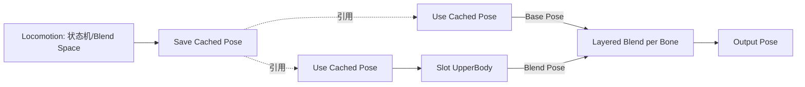

# 02 动画蒙太奇与混合空间

> 知识成熟度：L2。本文依据文末列明的公开一手资料作静态选读与纸面推演；没有运行UE、UHT、编译、PIE、动画资产、网络或性能实验。
> 版本基准：指南采用带版本参数的UE5.6页面；选定公开API与Aim Offset页面在2026-10-09返回UE5.8标题。未读取本机Build.version、CL55116800或引擎函数体，旧文的本机路径不构成本轮验证。动态API页可能改变，不能把两组资料拼成一个已测试checkout。
> 适用范围：传统AnimBP中的Montage播放编排、Slot分层、通知、Blend Space输入与采样。实践例限定单角色、正向播放、一个受控攻击动作；完整网络战斗、Root Motion预测和新动画框架集成不在例子内。
> 最后更新：2026-10-09（本文静态修订日期）。

## 一、先分清动作控制、姿态来源和玩法结果

攻击、受击、施法、处决、翻越、开箱等动作，常需要命名阶段、打断和事件。走路、跑步、转身、瞄准则常由连续参数决定姿态。Montage与Blend Space分别提供好用的表达方式，但不是“所有一次性动作必须用Montage、所有state只能循环”的硬规则。

| 对象 | 负责什么 | 不能单凭它确认什么 |
| --- | --- | --- |
| Montage资产 | 引用动画片段，组织Slot轨道、Section、通知与混合配置 | 已经绑定到当前角色或已造成伤害 |
| 本次Montage播放 | 在具体AnimInstance中推进这份编排 | 同名资产的上次播放已完全退出 |
| Slot节点 | 让Montage等动画进入AnimGraph的指定位置 | 自动选中上半身骨骼，或自动保持基础图更新 |
| Slot Group | 组织同一动画实例内相关Montage的播放/打断关系 | 自动同步其他角色、其他机器的时间 |
| Section | 时间轴上的命名分段和可重连后继 | 一定对应一整段Sequence，或跳转必有专用crossfade |
| AnimNotify / AnimNotifyState | 点提示 / 区间提示；可驱动表现及受控的玩法输入 | 恰好一次、必达、网络权威结算或骨骼刷新完成 |
| Blend Space | 按一维/二维坐标混合样本 | 决定角色是否有资格奔跑、攻击或落地 |
| Aim Offset | 在基础Pose上应用瞄准用的加法姿态 | 自动限定上半身、自动完成目标追踪或枪口命中 |

Montage的可控段落适合重装、蓄力和连招；Blend Space的坐标适合速度/方向或Yaw/Pitch。状态机仍可负责Ground/Air/Hit等模式，每个state里可以使用序列或Blend Space。选法取决于控制需求、资产和图的复杂度，不按“连续/离散”强制排他。[Montage概览](https://dev.epicgames.com/documentation/en-us/unreal-engine/animation-montage-in-unreal-engine?application_version=5.6)、[Blend Space概览](https://dev.epicgames.com/documentation/en-us/unreal-engine/blend-spaces-in-unreal-engine?application_version=5.6)

继承[01篇](01-动画蓝图与状态机.md)的边界：Update推进参数、时间和权重，Evaluate采样/混合Pose，组件还要完成适用的骨骼刷新等工作。播放接口返回、收到notify、得到最终骨骼以及完成玩法结算是不同事实。此处不画成“Evaluate结束→所有通知→全部业务→骨骼刷新”的固定源码全序。

## 二、Montage从资产走到可见姿态

### 2.1 资产编排与运行实例

Montage的Slot轨道引用Sequence片段；片段可设置原序列的起止范围、播放率及Loop Count。Section对整条Montage时间轴分段，负责默认或动态播放顺序；它不必与片段一一对应。通知、曲线和混合配置服务于这份编排。Child Montage可保留父资产编排、替换片段形成变体；不要把共用资产与共享运行状态混为一谈。[Montage编辑器](https://dev.epicgames.com/documentation/en-us/unreal-engine/animation-montage-editor-in-unreal-engine?application_version=5.6)、[Child Montages](https://dev.epicgames.com/documentation/en-us/unreal-engine/animation-montage-in-unreal-engine?application_version=5.6)

在通常的AnimBP路径中，应确认目标Mesh使用Use Animation Blueprint，Anim Class对应正确生成类，当前AnimInstance存在，资产与Skeleton兼容，并且正确Slot确实连到最终输出。接口接受了播放而图没有消费该Slot时，不能据此说角色已经显示动作。预览窗口也不能代替实际游戏实例。

`Montage_Play`的返回选择由`EMontagePlayReturnType`参数表达；公开API明确失败返回0。该返回值不应直接用作“过这么多秒动作必成功”的timer：倍率、段落重连、循环、跳转、提前淡出和中断都能改变流程。查询时尽量显式指定Montage；`GetCurrentActiveMontage`回答的是一个查询结果，不是全部Slot最终贡献的清单。[Montage_Play](https://dev.epicgames.com/documentation/en-us/unreal-engine/API/Runtime/Engine/UAnimInstance/Montage_Play)

### 2.2 Slot、Slot Group和Sync Group的分工

Slot名称和分组存于Skeleton，在Montage轨道和AnimGraph Slot节点中选择相应名称。命名成UpperBody本身不形成骨骼掩码；上身范围由后续Layered Blend per Bone等图配置决定。没有插入动画时Slot传入基础Pose；这不是“零开销”的实测结论。

同一Slot Group中启动新Montage会打断已有播放。不同组允许组织独立动作，但还要考虑`bStopAllMontages`、图中覆盖次序、骨骼掩码、Root Motion与其他玩法政策。一个Montage有多条Slot轨道时，这些Slot必须属于同组。旧动作淡出期间可能还有贡献，不能把“被打断”理解成姿态权重立即为零。[Animation Slots](https://dev.epicgames.com/documentation/en-us/unreal-engine/animation-slots-in-unreal-engine?application_version=5.6)

Slot覆盖源Pose后，上游是否继续推进/求值要看源更新与relevance等配置；官方页面给出Always Update Source Pose选项。因此“Montage不改状态机资产”不等于“Montage和状态机互不影响，底层永远照常更新”。恢复不连续时应检查基础图是否重新相关及初始化，而非只延长Blend Out。

Sync Group则协调动画播放器的节奏/相位，例如Walk和Run的落脚marker；它与Slot Group不是同一个组。跨角色的配对演出还需要选定双方、起始时刻、空间对齐、中断联动等控制。公开5.8另列`MontageSync_Follow`用于跟随另一AnimInstance的Montage，要求双方已在播放；这不是“同名Slot Group即可同步”，也不是已验证的网络演出方案。[Sync Groups](https://dev.epicgames.com/documentation/en-us/unreal-engine/animation-sync-groups-in-unreal-engine?application_version=5.6)、[UAnimInstance选定接口](https://dev.epicgames.com/documentation/en-us/unreal-engine/API/Runtime/Engine/UAnimInstance)

### 2.3 Section跳转、后继和循环

| 操作 | 合同 | 适用例和陷阱 |
| --- | --- | --- |
| Montage Jump to Section | 跳到命名Section；公开签名没有“跳转混合秒数”参数 | 按玩法选择起段；不等于完整播放被跳过的区间 |
| Montage Set Next Section | 重连指定Section之后的后继 | 当前Combo1尚在推进时，将其后继从Recovery改成Combo2 |
| Montage Get Current Section | 查询指定播放当前Section名称 | 必须知道查询的是哪个实例/资产，空结果不等于某项玩法已成功 |
| Montage Stop | 对指定Montage请求按淡出时长停止 | 空Montage参数会扩大到全部活跃Montage，示例不使用空目标 |

`JumpToSection`和`SetNextSection`解决不同问题：前者改变当前位置，后者改变之后的连接。把两者无条件连着调用，可能直接跳过本想保留的Combo1。循环蓄力可以配置Start→Loop→Loop，在松键时改成Loop→End；这让当前Loop正常走到后继。若设计要求马上退出，另用跳转或停止，并定义相应事件/姿态后果。片段的固定Loop Count与这种运行时Section循环也不同。[JumpToSection](https://dev.epicgames.com/documentation/unreal-engine/API/Runtime/Engine/UAnimInstance/Montage_JumpToSection?lang=en-US)、[SetNextSection](https://dev.epicgames.com/documentation/unreal-engine/API/Runtime/Engine/UAnimInstance/Montage_SetNextSection?lang=en-US)、[Montage_Stop](https://dev.epicgames.com/documentation/en-us/unreal-engine/API/Runtime/Engine/UAnimInstance/Montage_Stop)

### 2.4 Blend In/Out与结束信号

Blend In/Out配置控制权重随时间的进入和退出，Blend Profile可让不同骨骼采用不同混合速度。对单个非additive动作、同空间的两路概念模型，可以写`BlendPose(BasePose, ActionPose, alpha)`，说明两份贡献为1−alpha和alpha；不能把所有骨骼旋转、曲线和逐骨权重当成两个数直接相加。多Montage的混合也不是“新播者天然具有更高权重”的通用公式。

开启Enable Auto Blend Out时，尾部按配置淡出；关闭时可保持尾姿，需显式结束。Blend Out Trigger Time控制何时开始淡出，与Blend Out持续多久是两项设置。业务上的取消、解除限制、攻击结束和表现完全淡出也可以是不同时间点。

UAnimInstance的OnMontageBlendingOut与OnMontageEnded都可能对应自然结束或中断。前者可用于提前关闭本例的判定窗口，后者用于释放本例的播放占用；两者都不是“命中成功”通知。若用带回调的Play Montage蓝图节点，则On Completed、On Blend Out、On Interrupted各有对应输出，不能把其输出语义与AnimInstance广播委托简单互换。[Montage事件和混合属性](https://dev.epicgames.com/documentation/en-us/unreal-engine/animation-montage-editor-in-unreal-engine?application_version=5.6)、[实例委托](https://dev.epicgames.com/documentation/en-us/unreal-engine/API/Runtime/Engine/UAnimInstance)

## 三、通知提供时序提示，玩法系统拥有有效期

### 3.1 选择正确的通知类型和接收入口

AnimNotify适合脚步声、特效或一次提示；AnimNotifyState通过Begin/Tick/End表达一段区间。公开5.8的UAnimNotifyState同时列有普通NotifyBegin/Tick/End、蓝图Received回调和BranchingPoint回调；C++应按选定版本真正重写的入口实现，不混淆三组函数。Skeleton Notify可以在AnimBP EventGraph接收；自定义Notify/NotifyState可实现各自的受支持回调。不要把任意签名的`AnimNotify_名字`成员函数当成所有C++通知的统一重写接口，也不要对所有版本套用一个参数表。

Montage Notify与Montage Notify Window是Montage工作流的专用类型。使用Play Montage蓝图节点时，其On Notify Begin/End输出接收这些类型；普通Play Anim Montage节点不提供同一套回调输出。多个通知可以被项目编排成连招提示序列，但本页不把“Notify Chain”另列为已核的通用UE通知类别。[Animation Notifies](https://dev.epicgames.com/documentation/en-us/unreal-engine/animation-notifies-in-unreal-engine?application_version=5.6)

Queued与Branching Point是时序精度和成本取舍。Branching Point更适合需要精确动画分支的提示，但仍不提供网络可靠投递、恰好一次结算或对象生命周期屏障。通知可能受权重、概率、LOD、Dedicated Server、Sync follower等配置影响；Blend Space还有自己的Notify Trigger Mode。正常推进跨过某时刻、手动跳Section、直接设置时间、Evaluator teleport是不同操作，不承诺所有跳过区间都会补发通知。

普通玩法通知在受支持的游戏线程路径消费；优化文档也讨论worker完成后的GT通知工作。但GT回调并不证明组件所有骨骼/物理数据已经刷新，也不意味着在回调内可以安全重建当前AnimInstance。本文没有读取所有分发路径的源码顺序。[动画优化的Other Considerations](https://dev.epicgames.com/documentation/en-us/unreal-engine/animation-optimization-in-unreal-engine?application_version=5.6)

### 3.2 窗口不能只靠最后一个NotifyEnd清理

判定窗口、霸体、镜头或特效都需要定义谁开启、谁关闭。必要清理由动作Owner承担：正常窗口End可关闭；中断、播放失败、显式取消、角色退场、换Mesh/AnimBP也必须关闭。关闭操作应可重复执行，避免先收到取消又收到End时重复扣资源或误开下一动作。

NotifyState资产保存可复用配置，例如Radius=100cm；每个角色本次已命中集合、当前窗口、动作状态放在相应玩法实例中。不要把某角色运行状态直接存到共用通知资产上。多人或允许同一资产重叠播放时，仅凭Montage指针/通知名字不能识别“第几次攻击”；必须有项目定义的播放/动作关联方式，且证明回调属于该次动作。不能在回调到达时读“当前动作ID”便假装补齐了来源身份。

本篇下面采用单次播放约束，并要求保留实际播放身份；只等待Ended也不能被当成任意外部队列都已清空。需要连续取消后立刻重播、预测回滚或多个并行窗口的战斗系统，应在动作战斗主篇建立更完整的合同，不直接扩展这个入门例。

## 四、实践例A：移动中单次上身攻击

这是可装配的**教学流程**，不是已编译工程。角色BP_AttackCharacter是本例自定义宿主；没有`AActor::OnAttackWindowBegin`这样的通用引擎方法。例子只管理窗口资格，不提供碰撞算法、伤害数值、联网协议或自动测试框架。

### 4.1 资产、图和明确限制

1. 准备同一目标Skeleton的移动动画和原地攻击Sequence，制作非循环AttackMontage，Section为Attack→Recovery→结束；启用Auto Blend Out。攻击Root Motion关闭，本例角色位移来自Movement
2. Skeleton中创建WeaponActions组与UpperBody槽，Montage轨道选择这个槽。其他系统不得自行重播同一AttackMontage，也不得替换本例事件绑定；受击可以播放其他Montage打断它
3. Locomotion输出接Save Cached Pose。两处Use Cached Pose中，一路接Layered Blend per Bone的Base Pose，另一路接UpperBody Slot，再接其Blend Pose；设置实际Skeleton的上身Branch Filter或Blend Mask，层alpha=1，输出接Output Pose
4. 给Attack区间添加原生自定义ANS_AttackWindow，配置半径100cm；窗口不放在起点，且不跨Section、不循环。自定义原生类设置bIsNativeBranchingPoint，使Montage使用对应的BranchingPointNotifyBegin/Tick/End入口，转交payload中的Mesh、SequenceAsset和MontageInstanceID；只使用普通蓝图Received事件但没有播放身份的版本不满足本例接收合同
5. 播放接受后，用GetActiveInstanceForMontage取得本次实例，只在本次合法调用期读取GetInstanceID，不保存该原始指针。以当前AnimInstance＋本次ID建立记录。给该播放通过Montage_SetBlendingOutDelegate和Montage_SetEndDelegate设置回调，绑定时捕获这一记录的身份，不在回调到达时读取“当前ID”替代来源。其他系统不得覆盖这两个单播委托；拿不到实例或绑定条件不满足即关闭窗口并停用本次动作

这些是目标工程需要实现的原生通知转发与宿主接线步骤，下面给状态表和有限播放函数，没有提供可直接编译的整套战斗组件。公开[BranchingPoint payload](https://dev.epicgames.com/documentation/en-us/unreal-engine/API/Runtime/Engine/FBranchingPointNotifyPayload)、[Montage实例ID](https://dev.epicgames.com/documentation/en-us/unreal-engine/API/Runtime/Engine/FAnimMontageInstance)和[NotifyState入口](https://dev.epicgames.com/documentation/en-us/unreal-engine/API/Runtime/Engine/UAnimNotifyState)支持这些字段/入口；未核其全部内部时序。



允许一份AttackMontage处于本例的播放及淡出期；期间重复输入返回Busy，不重播、不排队。这里的“占用”由本例记录维护，不能用`!Montage_IsPlaying`立即释放，因为停止推进、进入淡出和完全结束不是同一件事。这是本例减少交错的策略，代价是不能立刻连发；它不能替代实际播放身份过滤。

### 4.2 一次请求的完整路径

宿主维护`Enabled`、`Busy`、`AcceptWindowBegin`、`WindowOpen`、`BoundAnim`、`PlayingMontage`、`PlayingInstanceID`和本次`HitActors`集合。它们是本角色状态。`CloseWindow`只把WindowOpen设false并停止本例判定消费，可重复调用；不在关闭时发奖励或退款。

| 入口 | 本例操作 |
| --- | --- |
| RequestAttack | Enabled为false或Busy为true则拒绝；确认当前Mesh/实例、资产、Section与图前提；先设Busy=true、AcceptWindowBegin=false、WindowOpen=false、清空HitActors并记录实例/资产，再调用Montage Play |
| 输入检查失败 | 在调用前拒绝，不占用Busy，不等待一个根本未开始的播放回调 |
| 播放返回0 | CloseWindow并记录失败；宿主/实例仍匹配且没有本次播放记录时清空本次占用，返回失败而不等待Ended。调用后资格或状态无法确认则停用动作并报告故障，不自动重试 |
| 返回正值且仍是当前实例 | 确认4.1的实际播放ID与回调绑定后才设AcceptWindowBegin=true；等待正常动画流程。正值不代替Slot可见性检查，也不开始伤害结算 |
| Notify Begin | payload的Mesh/资产/播放ID与本次记录一致，宿主当前实例仍是BoundAnim，Enabled、Busy及AcceptWindowBegin均为true，才设WindowOpen=true；其他情况忽略 |
| Notify Tick | 与Begin相同的Mesh/资产/实际播放ID及当前实例检查通过、WindowOpen为true，且权威玩法层仍允许该次动作时，才执行项目选定的判定；命中后先检查/加入本次HitActors，再交权威玩法层决定是否伤害。本文不实现Sweep |
| Notify End | 相同来源检查后CloseWindow；不把End当作攻击成功 |
| 匹配的BlendingOut | 绑定时捕获的实例/播放ID仍匹配本次记录才处理；无论自然结束或中断，CloseWindow并将AcceptWindowBegin设false；保持Busy直到匹配Ended。此刻不开始新的AttackMontage |
| 匹配的Ended | 绑定时捕获的实例/播放ID仍匹配才CloseWindow；清空本次播放记录、HitActors并释放Busy。中断与自然结束分别记录，不给任意一种自动算“命中成功” |

如果通知早于播放ID/回调绑定确认到达，因AcceptWindowBegin=false而忽略；本例不把这次早提示缓存后套到另一次播放。配置中窗口离开起点只是降低这种不匹配的机会，不是初始化完成证明。事件处理只改本例状态，不在这些回调内递归发起另一攻击、重建AnimInstance或切换Mesh。下一次输入在前一次播放结束、宿主重新确认仍可用之后才接受。绑定、播放及停止均应位于项目确认合法的游戏线程调用阶段；`IsValid`和“是GT”不能单独证明这组前提。

### 4.3 取消、失败和实例更换

- **显式取消**：先AcceptWindowBegin=false、调用CloseWindow，再向记录的Montage请求停止。仍等该次Ended才解除正常Busy；Stop不是同步析构或队列清空证明
- **退场或换实例**：先Enabled=false、AcceptWindowBegin=false并关闭窗口，解除本例仍拥有的对应事件绑定，丢弃旧动作资格。由仍合法宿主决定是否需要/可以停止旧播放；不要从旧notify里换类。新实例准备好后重新绑定并创建新的使用期；旧来源不匹配即拒绝
- **缺失终止事件或状态无法确认**：窗口保持关闭，停止接受新攻击并报告故障。由仍合法宿主重新观察当前Mesh/实例与播放状态后显式恢复；不靠固定延时猜Ended已到达，也不无限轮询重试
- **重复/过期提示**：End、取消和Ended的关闭操作幂等；已经取消/淡出时拒绝Begin。示例禁止同实例同资产重叠或未结束重入；即便上次Ended后已经开始下一次，也按实际播放ID拒绝旧提示，不能只换一个bool

资源消耗何时扣、失败是否返还、输入是否缓冲属于玩法政策，本例没有默默作出承诺。若需要连招，可在独立的输入窗口缓冲下一击，然后在Combo1尚有效时重连后继；同时补齐缓冲过期、取消、恢复段和每击命中记录，不能只加一句SetNextSection就称完整连招系统。

### 4.4 C++播放接口的有限操作示意

以下独立函数只演示预检、显式目标和返回值观察。调用者仍须提供4.1–4.3的宿主、绑定、Busy与合法阶段合同；函数不创建这些条件，也不返回/绑定Montage实例ID，不替代4.1的接线和生命周期管理。头文件和函数一并列出，未编译、未运行。

```cpp
#include "CoreMinimal.h"
#include "CoreGlobals.h"
#include "Animation/AnimInstance.h"
#include "Animation/AnimMontage.h"
#include "Components/SkeletalMeshComponent.h"

enum class EAttackPlayObservation : uint8
{
    InvalidInput,
    InvalidSection,
    PlayRejected,
    RequestedSectionObserved,
    UnconfirmedAfterCall
};

EAttackPlayObservation PlayAtConfirmedPoint(
    USkeletalMeshComponent* Mesh, UAnimMontage* Montage, FName Section)
{
    if (!IsInGameThread() || !IsValid(Mesh) || !IsValid(Montage))
        return EAttackPlayObservation::InvalidInput;

    UAnimInstance* Anim = Mesh->GetAnimInstance();
    if (!IsValid(Anim))
        return EAttackPlayObservation::InvalidInput;
    if (Section.IsNone() || Montage->GetSectionIndex(Section) == INDEX_NONE)
        return EAttackPlayObservation::InvalidSection;

    const float Result = Anim->Montage_Play(
        Montage, 1.0f, EMontagePlayReturnType::MontageLength, 0.0f, false);
    if (Result == 0.0f)
        return EAttackPlayObservation::PlayRejected;

    if (!FMath::IsFinite(Result) || Result < 0.0f ||
        !IsValid(Mesh) || !IsValid(Anim) || !IsValid(Montage) ||
        Mesh->GetAnimInstance() != Anim)
        return EAttackPlayObservation::UnconfirmedAfterCall;

    Anim->Montage_JumpToSection(Section, Montage);
    if (!IsValid(Mesh) || !IsValid(Anim) || !IsValid(Montage) ||
        Mesh->GetAnimInstance() != Anim)
        return EAttackPlayObservation::UnconfirmedAfterCall;

    return Anim->Montage_GetCurrentSection(Montage) == Section
        ? EAttackPlayObservation::RequestedSectionObserved
        : EAttackPlayObservation::UnconfirmedAfterCall;
}
```

传入Attack Section。InvalidInput/InvalidSection发生在播放调用前；PlayRejected表示接口返回失败，不替调用者证明所有外部状态都没变化。RequestedSectionObserved后还须完成4.1的实例ID读取与绑定；它仅表示当前查询观察到所请求Section，仍不证明动作已经显示或业务仍有资格；UnconfirmedAfterCall不意味着回滚，必须关闭窗口并重新核当前状态。`false`表示本例不请求停止所有Montage，仍受同组打断等规则约束。[Montage_Play](https://dev.epicgames.com/documentation/en-us/unreal-engine/API/Runtime/Engine/UAnimInstance/Montage_Play)、[UAnimMontage::GetSectionIndex](https://dev.epicgames.com/documentation/en-us/unreal-engine/API/Runtime/Engine/UAnimMontage)

需要取消时在相同宿主合同下对明确目标调用`Anim->Montage_Stop(0.2f, Montage)`；0.2秒是本例表现选择，不是清理deadline。`Montage_GetCurrentSection(Montage)`、`Montage_IsPlaying(Montage)`和当前位置查询可辅助诊断。旧文的`GetSlotWeight`没有在本轮选读的UAnimInstance接口中核成可直接调用的通用方法，不将其留作编译承诺。

## 五、Root Motion、曲线和网络各自证明什么

Root Motion要分三个问题：动画根骨有没有运动数据，AnimBP怎样提取/混合，适用的移动路径怎样消费并受碰撞/移动模式约束。启用序列的Enable Root Motion和Root Lock相关设置只是其中一层，不能靠列一个未核的Montage字段或Movement开关解释所有角色位移。

| AnimBP Root Motion Mode | 区别 |
| --- | --- |
| No Root Motion Extraction | 运动留在根骨，不抽取为角色移动输入 |
| Ignore Root Motion | 提取并从根骨移除，但不应用于角色 |
| Root Motion from Everything | 从贡献姿态、已启用根运动的资产提取并混合 |
| Root Motion from Montages Only | 从符合条件的Montage提取 |

根骨走了、Mesh离开胶囊、胶囊实际移动和服务器承认位移是不同观察。Walking/Falling与Flying等移动模式对根运动的处理不同；不要把某段位移原样视为无碰撞约束的世界轨迹。需要根运动的角色移动还会影响并行update资格，不可推出全部动画工作从此只有一个线程。[Root Motion](https://dev.epicgames.com/documentation/en-us/unreal-engine/root-motion-in-unreal-engine?application_version=5.6)

动画曲线可以表达AttackStrength等动画数据并被消费；曲线值只是采样/混合结果，不代替已授权动作、命中判定和伤害结算。读取曲线与获取最新socket都应遵守01篇的数据阶段与有效性约束。

`Montage_Play`是BlueprintCallable函数，不会因为Actor的bReplicates为true而变成RPC。需要网络玩法时，要明确由何种RPC、复制状态或已有能力系统让各端知道播放意图，以及谁负责取消/纠正；仅调用本地播放不完成整条协议。官方Montage指南把播放触发的网络安排与Root Motion复制/纠正分开说明，不能扩成自动复制全部Section、通知和业务结果。[Montage的Network Games部分](https://dev.epicgames.com/documentation/en-us/unreal-engine/animation-montage-in-unreal-engine?application_version=5.6)

本例未实现网络协议。多人项目还须核预测重播、迟到状态、模拟代理、DS动画调度和取消传播；某客户端notify到达不等于服务器已经认可命中，服务器不渲染也不等于可以停掉其实际依赖的骨骼/根运动/通知工作。

## 六、Blend Space：坐标、权重和播放时间分开

### 6.1 一维、二维与采样模型

Sample把一个动画/姿态放在参数坐标上；坐标的物理意义由项目命名与输入定义。样本不强制落在网格节点；Snap to Grid是编辑选项。Use Grid选择旧网格混合路径，否则使用三角剖分；三角模式下不能把Grid Divisions当作“提高运行时插值精度”的旋钮。[Blend Space设置](https://dev.epicgames.com/documentation/en-us/unreal-engine/blend-spaces-in-unreal-engine?application_version=5.6)

用两个指定的一维线性样本说明权重：Walk在150、Run在450，输入225时，Run权重为`(225−150)/(450−150)=0.25`，Walk为0.75。二维的三角形内部可用重心权重理解局部混合，例如坐标A=(0,0)、B=(1,0)、C=(0,1)，P=(0.25,0.25)对应0.5/0.25/0.25。这是**给定数学模型的纸例**，不证明任意UE资产必然选这三个点，也不覆盖网格、边界、退化三角形、滤波与逐骨平滑。

轴范围、样本覆盖范围和实际速度范围要分别检查。样本外区域不能凭想象写成“自动外推新步态”；先限制本例输入并观察边界样本和权重。狭长/退化分布可能造成不好的混合，编辑器有相应提示；增加动画数量也不必然改善质量。

坐标决定各样本的贡献，时间决定每段动画采到哪一刻。Play Rate不是相位偏移；Start Position、Loop、样本节奏/marker和运行时同步另有职责。Blend Space也可混静态姿态，不要求所有样本必为循环动画。

### 6.2 Player、Evaluator和更新阶段

Blend Space Player引用资产并推进播放；其Coordinates接轴输入，Play Rate和Loop控制播放。Evaluator由外部给归一化时间；5.6指南说明默认Teleport to Normalized Time不推进相应Root Motion或notifies，关闭该选项才恢复对应行为。相同画面不等于相同事件合同。[Blend Space节点](https://dev.epicgames.com/documentation/en-us/unreal-engine/blend-spaces-in-animation-blueprints-in-unreal-engine?application_version=5.6)

AnimInstance变量是一条常用输入路径，不能由此说“混合空间只有改变量这一种接口”。节点引脚、图内Blend Space和受支持的节点访问方式也有各自用途。把坐标写入变量，只在后续允许的图更新/求值中才可能影响结果，不保证立即刷新骨骼。数据生产者、单位、空间、合法取样点与invalid输出应明确；线程和Property Access规则沿用01篇。

### 6.3 平滑、环绕、通知与脚滑

| 设置/问题 | 应分清的对象 |
| --- | --- |
| Smoothing Time / Type | 滤波轴输入，控制坐标随时间怎样变化 |
| Weight Speed / Smoothing | 限制各样本权重变化，路径可能不同于坐标滤波；文档不建议与轴平滑随意叠加 |
| Wrap Input | 把轴当作环；两端样本应相容，仍需核实际混合模式与过边界行为 |
| Notify Trigger Mode | All Animations / Highest Weighted Animation / None影响哪些样本提供通知；不是自动业务去重 |
| 脚滑 | 同时检查相位、素材步幅/世界速度、播放率、根运动、重定向与IK，不能只归因于步频 |

把179°与−179°各自规范到[-180,180]仍会得到两个相差358的普通数，所以NormalizeAxis本身不能让标量滤波选择短弧。方向轴采用Wrap Input时要检查−180/180两侧的动画是否接得上；也可改用前/右速度分量坐标，代价是需要另一套采样布局。不要一面不断累积角度、一面又无说明地接到有限非环绕轴。

相位同步可使用共同marker和适当Sync设置；它无法自动消除世界速度与步幅不一致。选Highest Weighted Animation可减少混合时多个脚步提示，但仍须检查leader变化、素材事件、触发阈值和实际音效策略。不可把“最高权重”当“整个玩法全局恰好一次”。[Blend Space属性](https://dev.epicgames.com/documentation/en-us/unreal-engine/blend-spaces-in-unreal-engine?application_version=5.6)、[Sync Groups](https://dev.epicgames.com/documentation/en-us/unreal-engine/animation-sync-groups-in-unreal-engine?application_version=5.6)

## 七、实践例B：地面速度与方向的参数化移动

### 7.1 资产与坐标约定

先做1D：Speed轴0–600cm/s，Idle=0、Walk=150、Jog=350、Run=600，样本使用目标Skeleton兼容的原地循环序列，角色由Movement移动。选Player并启用Loop；本例先关闭轴/权重平滑，确认输入与采样关系，再单独评估一种平滑。关闭Root Motion不会自动把已有向前平移的素材变成合格原地动画，要在预览检查根骨与胶囊关系。

扩展2D时明确轴顺序：X=Direction（度，−180至180），Y=Speed（cm/s，0至600）。定义+X为角色水平前方、+Y为角色水平右方，Direction=atan2(右向速度,前向速度)，因此右移为+90°，左移为−90°；不用容易因观察方向而歧义的“逆时针为正”。下表是采样位置示意，不能仅凭这些几行认定完整覆盖了所有高速侧移/后退。

| 坐标(Direction, Speed) | 示例动画 | 资产覆盖要求 |
| --- | --- | --- |
| (0,150)、(0,450) | Fwd_Walk、Fwd_Run | 前向速度段 |
| (90,150)、(−90,150) | StrafeR_Walk、StrafeL_Walk | 两侧移动 |
| (−180,150)、(180,150) | 相容的Back_Walk端点 | 环绕接缝，避免两端动作不一致 |
| (45,450) | FwdR45_Run | 只补右前高速；其他需要的方向必须另补 |
| 各方向的Speed=0边界 | 相容的Idle姿态 | 静止时不要混入未经定义的高速外缘 |

### 7.2 输入生产和失效输出

下列是可翻译为EventGraph的完整**参数算法**，不是已运行引擎代码。输入来自当前有效Character的世界速度与Yaw朝向；只处理水平移动，空中/游泳/飞行由外层状态选择处理。示例每次允许更新都从invalid输出开始，初始化、反初始化与换Owner同样重置，避免沿用上个角色的数据。

```text
每次受支持的取数入口：
  Speed = 0; Direction = 0; MovementDataValid = false
  重新取得当前Owner及Movement；缺失、已退场、来源不匹配 => 返回invalid
  读取有限的世界速度 V 与角色Yaw；任意非有限分量 => 返回invalid
  Vxy = (V.x, V.y, 0)
  Forward = Yaw对应的水平单位前向量
  Right   = Yaw对应的水平单位右向量
  RawSpeed = length(Vxy)
  RawSpeed > 100000 cm/s => 返回invalid（本例异常阈值，不是引擎限速）
  Speed = clamp(RawSpeed, 0, 600)
  若RawSpeed > 1 cm/s：
      Direction = degrees(atan2(dot(Vxy, Right), dot(Vxy, Forward)))
  否则Direction = 0（本例静止政策，不试图从零向量算朝向）
  MovementDataValid = true
```

1cm/s是本例低速方向阈值；需要保留最后移动方向时应另记有效期，不默认从旧Owner继承。RawSpeed超过600仍保留“资产范围不足”的诊断事实，钳制输入只是有限降级，不会让600cm/s步态真实匹配900cm/s移动。

在Ground状态把Speed/Direction接到Blend Space Player；MovementDataValid=false时选择明确的Idle降级，valid且允许地面移动时使用该播放器；Air分支读取真实移动状态。把节点输出接回4.1的Locomotion基础图，Montage叠加上身。缺参不能靠“Speed恰好为0”混同静止、失效和落地。相位、脚底和Root Motion需用目标资产另验。

### 7.3 Aim Offset的不同资产合同

Aim Offset样本采用Mesh Space additive，并基于明确的参考Pose；Aim Offset节点需要Base Pose与Yaw/Pitch输入。它不是普通完整Pose的移动Blend Space，也不因为名字带Aim就自动读取Controller或完成LookAt求解。准备兼容基础瞄准姿态，定义瞄准旋转相对角色的角差、范围及失效时回中；控制器/目标无效时不要继续用上次目标。

若只想上半身参与，仍由素材设计和图的骨骼混合限定。跑动时允许多大侧转应由项目决定，过大Yaw可能让躯干扭曲；可限制移动时的瞄准范围，或让角色本体转向。Preview Base Pose是编辑预览配置，不等于运行时Base Pose自动接好了。[Aim Offset](https://dev.epicgames.com/documentation/en-us/unreal-engine/aim-offset-in-unreal-engine)

Motion Matching则在Pose Search中按查询选择姿态，涉及schema、数据库和特征权重，不能概括成“更大的自动Blend Space”。官方另外列有AnimNext/UAF动画图框架，两者不构成“Motion Matching到5.5演进成AnimNext”的替代关系。本文只保留选型入口，未验证其与Montage的具体集成或项目适用规模。[UE5.6 Motion Matching](https://dev.epicgames.com/documentation/en-us/unreal-engine/motion-matching-in-unreal-engine?application_version=5.6)、[UAF Anim Graph目录页](https://dev.epicgames.com/documentation/unreal-engine/API/PluginIndex/AnimNextAnimGraph?application_version=5.6)

## 八、排查与有限纸面验证

### 8.1 从实际实例逐层检查

| 症状 | 先检查 | 不可靠的捷径 |
| --- | --- | --- |
| Play返回正值却不动 | 当前Mesh/Anim Class、Skeleton、Slot连线、层权重/掩码、是否被新动作覆盖 | 认为返回时长就证明最终Pose可见 |
| 播完回不到移动 | Auto Blend Out、Section循环、基础图relevance/源更新、结束记录 | 强行再切一次状态或固定延时解锁 |
| Notify不来或重复 | 正确资产/轨道和接收入口、时间路径、权重/概率/LOD/DS/follower、Blend Space通知模式 | 认定Section跳过也必补发，或重复一定是引擎bug |
| 窗口中断后残留 | 取消/淡出/Ended/退场清理、来源身份、是否重入 | 只依赖末尾NotifyEnd |
| 位移跳变 | 根骨数据、提取模式、Root Lock、移动消费/碰撞和网络角色 | 改一个未核字段便宣布Root Motion已修复 |
| 方向穿过后方绕大圈 | 符号/空间、环绕、端点动画、滤波对象 | 只NormalizeAxis或叠加多层平滑 |
| 走跑脚滑 | 相位、世界速度/素材步幅、倍率、根运动、重定向与IK | 把任何脚滑归成混合权重不够平滑 |
| 多人不同步 | 播放意图/取消的网络协议、权威动作状态、时间/空间对齐 | 依赖bReplicates或同名Slot Group |
| 多Montage冲突 | 组关系、bStopAllMontages、淡出贡献、图覆盖顺序与掩码 | 以为不同Slot必定互不干扰 |

在真实工程中选择实际AnimBP调试实例，分别记录输入坐标、当前Section/播放位置、活动贡献、组、取消原因与窗口状态。先用资产编辑器预览采样/三角分布，再用动画图调试/Pose Watch隔离姿态来源；Rewind/Insights用于回看与成本分析，相关使用入口见01篇。本轮没有采集任何trace、帧时间或骨骼数值。

### 8.2 PAPER_EXPECTED：下表未在引擎执行

| 纸例 | 给定条件 | 预期与边界 |
| --- | --- | --- |
| P01 缺资产/错段名 | 调用4.4，Mesh或Montage无效，或Section不存在 | 在播放前拒绝；不留开窗口。只追踪分支，未验证UE对象寿命 |
| P02 接受/未确认 | 返回正值且当前实例/Section匹配；另一次调用后实例改变 | 前者仅记录RequestedSectionObserved，后者UnconfirmedAfterCall并关闭窗口；两者都不直接结算伤害 |
| P03 中断和重入 | 窗口打开→取消→旧Begin→End→Ended；中间再次输入 | 取消关闭并禁Begin，End重复关闭，Ended才释放Busy；中间返回Busy；下次播放开始后旧ID的提示仍拒绝。身份拿不到时不开放窗口 |
| P04 换实例/退场 | 旧实例A绑定后角色换到B，收到A的提示 | 旧使用期关闭/失效；按来源拒绝A，新实例另绑定。旧对象是否GC不影响资格判断 |
| P05 后继与跳转 | Start→Loop→Loop；运行时改Loop后继为End | 当前Loop之后可走End；Jump到End则是另一路径，不要求补齐被跳过通知 |
| P06 一维权重 | 固定线性模型Walk=150，Run=450，输入225 | Walk=0.75、Run=0.25；不包含平滑、时间与引擎边界算法 |
| P07 二维权重 | 指定A/B/C与P，见6.1 | 重心0.5/0.25/0.25，和为1；不是UE三角剖分实测 |
| P08 方向和失效 | Yaw=0，V=(0,150,900)，随后零速度、Owner缺失 | 先Speed=150、Direction=90、valid；静止0/0/valid；缺Owner为0/0/invalid。竖直900不进入水平速度 |
| P09 环绕 | 方向从179到−179，两端Pose相容 | 普通数值差−358，短角差2；是否平滑越过接缝须看所选模式/配置，NormalizeAxis不足以证明正确 |
| P10 时间与事件 | 相同坐标，分别Player和默认teleport Evaluator | 可以采出相似Pose，但后者不据此推进根运动/notify；不能用截图证明事件等价 |
| P11 根运动与网络 | Ignore Root Motion；仅在一端本地Montage_Play | 提取不等于应用角色位移；本地调用不构成已完成的多端协议 |

未来实测应记录Build.version、平台、实际资产/Skeleton、AnimInstance身份、Slot/Group、Section连接、速率/Auto Blend Out、通知配置、Blend Space模式/平滑、可见性/URO/LOD、Root Motion Mode及网络角色。覆盖正常播放、重复输入、取消中断、换实例、离屏、缺输入、低速/超范围、接缝、丢终止事件等；有差异时先保留实际观察，不用“文档静态检查通过”代替引擎证据。

## 九、来源选读范围与未验证项

下表列实际选读位置，不表示精读整站、视频、源码或运行样例。URL的版本参数固定的是文档选择器，不是不可变源码快照；公开API按2026-10-09返回标题标记。普通教学历史在原Git保留，当前正文采用上面的修订合同。

| 来源 | 实读版本/位置 | 本文用途与限制 |
| --- | --- | --- |
| [Montage](https://dev.epicgames.com/documentation/en-us/unreal-engine/animation-montage-in-unreal-engine?application_version=5.6) | 5.6；Sections、Slots、Child Montages、Network Games | 编排/变体、网络触发与根运动复制边界；未核网络源码 |
| [Montage Editor](https://dev.epicgames.com/documentation/en-us/unreal-engine/animation-montage-editor-in-unreal-engine?application_version=5.6) | 5.6；Playing、Asset Details、Sections、Animations | 节点输出、自动淡出、片段与Section；未核页面所有默认值或内部混合实现 |
| [Slots](https://dev.epicgames.com/documentation/en-us/unreal-engine/animation-slots-in-unreal-engine?application_version=5.6) | 5.6；Using Slots、Slot Groups | Skeleton归属、同组打断、源更新选项；不证明任意图全序/性能 |
| [Notifies](https://dev.epicgames.com/documentation/en-us/unreal-engine/animation-notifies-in-unreal-engine?application_version=5.6) | 5.6；Notify States、Montage Notifies、Common Properties、Custom Classes | 类型、接收入口、过滤及Tick Type；不认证所有跳时路径与回调版本签名 |
| [Blend Spaces](https://dev.epicgames.com/documentation/en-us/unreal-engine/blend-spaces-in-unreal-engine?application_version=5.6) | 5.6；类型、Setup、Asset Details、Preview/Debugging | 网格/三角、环绕/平滑/通知、编辑预览；未核所有凸包外算法 |
| [Blend Space Nodes](https://dev.epicgames.com/documentation/en-us/unreal-engine/blend-spaces-in-animation-blueprints-in-unreal-engine?application_version=5.6) | 5.6；Player、Graph、Evaluator | 输入与时间控制不同，teleport事件边界 |
| [Root Motion](https://dev.epicgames.com/documentation/en-us/unreal-engine/root-motion-in-unreal-engine?application_version=5.6) | 5.6；Enabling、模式表、Results | 提取/应用/移动模式；未认证碰撞轨迹与网络预测 |
| [Animation Optimization](https://dev.epicgames.com/documentation/en-us/unreal-engine/animation-optimization-in-unreal-engine?application_version=5.6) | 5.6；Thread Safe、General Tips、Other Considerations | 取数和GT完成工作；未运行性能实验 |
| [Sync Groups](https://dev.epicgames.com/documentation/en-us/unreal-engine/animation-sync-groups-in-unreal-engine?application_version=5.6) | 5.6；角色、长度/marker同步 | 相位和素材约束；不承担世界位置同步 |
| [Montage_Play](https://dev.epicgames.com/documentation/en-us/unreal-engine/API/Runtime/Engine/UAnimInstance/Montage_Play)、[JumpToSection](https://dev.epicgames.com/documentation/unreal-engine/API/Runtime/Engine/UAnimInstance/Montage_JumpToSection?lang=en-US)、[SetNextSection](https://dev.epicgames.com/documentation/unreal-engine/API/Runtime/Engine/UAnimInstance/Montage_SetNextSection?lang=en-US)、[Stop](https://dev.epicgames.com/documentation/en-us/unreal-engine/API/Runtime/Engine/UAnimInstance/Montage_Stop) | 5.8返回标题；签名与Description | 失败值、目标、跳转/后继/停止；未读函数体，不声称编译通过 |
| [UAnimInstance](https://dev.epicgames.com/documentation/en-us/unreal-engine/API/Runtime/Engine/UAnimInstance)、[UAnimMontage](https://dev.epicgames.com/documentation/en-us/unreal-engine/API/Runtime/Engine/UAnimMontage) | 5.8返回标题；选定委托、播放查询、MontageSync_Follow、GetSectionIndex条目 | 仅选读相关API列表，不把缺项搜索当接口不存在的完整证明 |
| [NotifyState](https://dev.epicgames.com/documentation/en-us/unreal-engine/API/Runtime/Engine/UAnimNotifyState)、[BranchingPoint payload](https://dev.epicgames.com/documentation/en-us/unreal-engine/API/Runtime/Engine/FBranchingPointNotifyPayload)、[Montage实例](https://dev.epicgames.com/documentation/en-us/unreal-engine/API/Runtime/Engine/FAnimMontageInstance)、[返回类型](https://dev.epicgames.com/documentation/en-us/unreal-engine/API/Runtime/Engine/EMontagePlayReturnType) | 5.8返回标题；三组通知入口、payload字段、GetInstanceID与枚举 | 原生接线依据；不伪称只有简单蓝图事件就已取得播放ID，未核内部生命周期全序 |
| [Aim Offset](https://dev.epicgames.com/documentation/en-us/unreal-engine/aim-offset-in-unreal-engine) | 5.8返回标题；Base Pose、Mesh Space Additive、AnimBP Setup | 样本/基础姿态/输入；未核目标追踪算法 |
| [Motion Matching](https://dev.epicgames.com/documentation/en-us/unreal-engine/motion-matching-in-unreal-engine?application_version=5.6)、[UAF Anim Graph](https://dev.epicgames.com/documentation/unreal-engine/API/PluginIndex/AnimNextAnimGraph?application_version=5.6) | 5.6选择器；前者概要及schema用途，后者目录/依赖 | 仅区分查询选姿与图框架；未展开插件实现/集成，不推断发布日期 |

访问限制如实保留：本轮带5.6参数的Montage_Play、Montage_JumpToSection、Montage_SetNextSection及Aim Offset入口返回不可访问；直接Montage_SetEndDelegate与GetSectionIndex子页同样失败。后两者只在成功的类API页核到条目；其他成功来源不能回填为这些失败入口已读。没有启动PowerShell仓库检查、UE、模型或网络目标实验，也未获取受限引擎源码。

## 关联阅读

- [01-动画蓝图与状态机](01-动画蓝图与状态机.md)：Slot 节点、同步组、AnimGraph 更新流程——蒙太奇与混合空间都运行在这套框架上。
- [03-IK与程序化动画](03-IK与程序化动画.md)：蒙太奇 Root Motion 提取、Foot IK 与混合空间/蒙太奇的配合。
- [08-动作战斗系统与打击手感](08-动作战斗系统与打击手感.md)：连招状态机、打断与取消窗口（Cancel Window）、输入缓冲及高精度骨骼扫掠打击判定。
- [06-网络同步](../../../00_Index/学习路线/网络与游戏服务端.md)：蒙太奇播放复制、动画曲线同步。
- [07-UI与性能优化](../../../00_Index/学习路线/Gameplay与交互系统.md)：蒙太奇与混合空间的求值开销。
