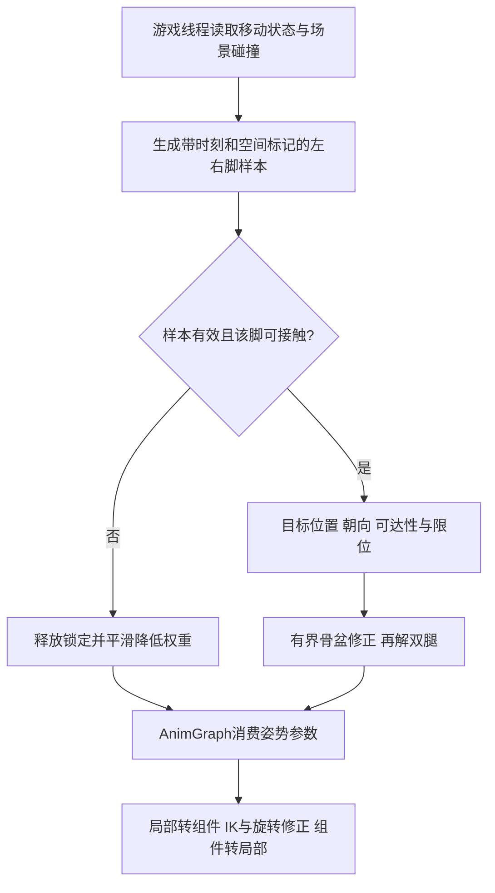

# 03 IK与程序化动画

> 知识成熟度：L2。本文提供几何推导、官方文档接口核对与未执行的接线/验证方案，不是引擎源码分析或运行报告。
> 知识基线：主体依据 2026-10-10 已选读的 Epic Unreal Engine 5.8 文档；第 7.2 节单独依据当日返回标题明确标为 5.6 的 AnimDynamics、Space Conversion Nodes 与 Skeletal Controls 页面。不将两组页面合称统一版本，也不承诺其他小版本行为相同。
> 版本基准：第 7.2 节限定 UE 5.6 公开文档接口，其余章节保留原来源边界；均不是本机安装版本或引擎实现核验。
> 事实边界：未读取本机 UE 源码、Build.version 或实现函数，未运行 UE、PIE、编译、算法程序、性能或网络测试。旧文的本机 UE5.8.0、CL 55116800、Windows 安装路径和 2026-08-05 日期是历史原文，本轮没有复证，不沿用为当前环境观察。
> 最后更新：2026-10-10。正文中的 PAPER_EXPECTED 是纸面推导的预期结果；所有骨名、距离、权重、误差阈值和预算必须按实际角色与平台复核。

## 1. 先分清要解决的是接触、姿态还是角色移动

关键帧能给出好看的动作，但不会自动知道脚下新出现的台阶、手要抓的栏杆高度或角色刚刚急停。程序化修正需要在动作意图之上补上环境信息，而不能把所有问题都交给一个 IK 节点。

| 读者遇到的问题 | 所需输入与工具 | 成功的含义 |
| --- | --- | --- |
| 手握住道具、脚踩住斜坡 | 基础姿势、目标位置、弯曲方向；两骨 IK | 接触误差可接受，骨长与姿态仍合理 |
| 尾巴/触手末端跟随目标 | 连续骨链、末端目标；FABRIK 等多骨求解 | 在迭代预算内降低误差，并报告不可达情况 |
| 攀爬时手脚牵动身体 | 多目标与骨盆活动范围；FBIK 或显式身体协调 | 允许的身体自由度内平衡冲突目标 |
| 头发、披风、饰品随惯性摆动 | 时间步、上一帧状态、限位；弹簧或次级模拟 | 状态连续，停用/传送后能正确复位 |
| 翻越、处决动作带动胶囊移动 | 动画根轨迹、移动模式、网络动作状态；Root Motion | 角色碰撞和位移与动作一致 |
| 从动作库选合适的跑转停姿势 | 姿势/轨迹特征与数据库；Motion Matching | 选择符合意图的基础动作，再按需要叠加 IK |

前置知识是骨骼父子层级、局部/组件/世界坐标、旋转与向量投影，以及 AnimGraph 的更新和求值区别。FK、IK、Control Rig、AnimDynamics、Root Motion 不是同一层工具：FK/IK 描述姿势关系，Control Rig 组织求解逻辑，次级模拟维护随时间变化的状态，Root Motion 参与角色移动。

## 2. FK 到 IK：先固定空间和单位

### 2.1 数据合同

FK 根据父骨骼变换逐层得到子骨骼的位置与方向；同一骨架、相同局部变换与组件变换给出确定的末端位置。IK 则从末端要求倒推关节状态，可能多解、无解或在约束下只能近似。关节通常也有局部平移/缩放，不能把所有 FK 都缩写为“只乘旋转”。

本文的几何推导使用欧氏位置向量，输入 `R`（根）、`J`（中关节）、`E`（末端）、`T`（目标）、`P`（关节方向参考点）必须在同一空间，长度采用 cm，时间采用 s，三角函数内部角采用 rad。UE 编辑器常用角度展示与数学函数的弧度不能混用；默认长度单位参见 [Units of Measurement](https://dev.epicgames.com/documentation/unreal-engine/units-of-measurement-in-unreal-engine?lang=en-US)。本例预设骨架和 Mesh 无非均匀缩放；负缩放、非均匀缩放或动态骨长要重新定义测量空间与轴。

| 数据 | 参照对象 | 常见错误 |
| --- | --- | --- |
| Local / Parent Bone | 当前骨骼的父骨骼 | 当成相对 Mesh 的坐标 |
| Component | Skeletal Mesh Component | 用 Actor/Capsule 变换替代 Mesh 变换 |
| World | 关卡世界 | 世界命中点直接接到组件空间目标 |
| Bone Space Target | 明确指定的参考骨骼 | 忘记目标骨骼、用错该帧骨骼变换 |
| Control Rig Local / Global | 当前 Rig 层级及其求值上下文 | 把 Rig 的 Global 一律当成关卡世界 |

世界位置转组件位置要包含平移；方向和法线不应加平移。对刚性旋转，法线与方向同样旋转后归一化；一般非均匀缩放下法线需要相应逆转置变换，不能套用无缩放示例。还要使位置与转换变换来自一致的采样时刻。

纸面反例：Mesh 世界平移为 `(1000,0,0)` cm，旋转为单位旋转；地面目标世界位置 `(1020,10,0)`，正确组件位置为 `(20,10,0)`。若将 `(1020,10,0)` 当组件坐标输入，即使求解数学正确，目标也会偏离 1000 cm。把角色移回世界原点会掩盖这个错误。

### 2.2 姿势引脚空间与目标属性空间是两件事

AnimGraph 的 Skeletal Control 节点处理组件空间姿势。接线应读作：

```text
状态机 / Slot / 分层混合的基础姿势
  → Local to Component
  → 骨盆修正（若需要）
  → 左腿 IK → 右腿 IK → 明确的脚掌旋转修正
  → Component to Local
  → Output Pose
```

这不意味着 Effector 属性必须填组件空间：节点仍可按它的空间选项解释目标。选择 World Space 时传世界目标；选择 Component Space 时转换后再传。不要转换一次却仍把空间标签设为 World，也不要重复转换。将连续的组件空间节点集中可减少来回转换；该接线合同来自 [Space Conversion Nodes](https://dev.epicgames.com/documentation/en-us/unreal-engine/animation-blueprint-component-space-conversion-in-unreal-engine)。

## 3. Two Bone IK：解的是三角形，加上一个弯曲平面

### 3.1 两个不同的角

设两段骨长 `a = |J−R| > 0`、`b = |E−J| > 0`，目标距离 `d = |T−R|`。固定根、无拉伸且无额外关节限位时，可达距离满足：

```text
|a − b| ≤ d ≤ a + b
```

先按上述区间判断几何可达；`d=0` 与近零正距离的处理不同，见 §3.3。对 `d > 0` 的非退化三角形，用余弦定理得到：

```text
cos α = (a² + d² − b²) / (2ad)
cos β = (a² + b² − d²) / (2ab)
```

`α` 是根处第一段骨与根到目标连线的夹角；`β` 是中关节三角形内角。若把完全伸直定义为屈曲 0，则屈曲量为 `π−β`，但这仍不是可直接写入任意骨架局部 Euler 轴的角度。旧式写法把第一式称作“中间关节弯曲角”会同时弄错关节和角度约定。

要把三角形嵌入三维，令 `u = (T−R)/d`，将 `P−R` 投影到垂直于 `u` 的平面：

```text
q = (P−R) − dot(P−R, u) u
v = q / |q|
x = (a² + d² − b²) / (2d)
h = sqrt(max(0, a² − x²))
J_solved = R + x u + h v
E_solved = T
```

`P` 决定中关节弯向哪侧，不要求 `J_solved = P`。末端位置确定后，末端朝向仍需单独选择；手掌抓握方向、脚底法线都不能仅靠三角形位置求解推出来。把段方向转回骨骼旋转还需要骨骼初始轴、父变换和 twist 约定。

### 3.2 可以手算的正例和反例

PAPER_EXPECTED：取 `R=(0,0,0)`、`T=(5,0,0)`、`a=3`、`b=4`、`P=(0,1,0)`，单位 cm。则 `x=1.8`、`h=2.4`，中关节为 `(1.8,2.4,0)`；到根距离为 3，到目标距离为 4。根角 `α≈53.13°`，中关节内角 `β=90°`。这两个值不相等，直接揭示角度误标。

把 `P` 改成 `(0,-1,0)`，得到 `(1.8,-2.4,0)`：同一末端有另一合法解。把 `P` 改成 `(2,0,0)`，则 `q=0`，无法定义弯曲平面；此时“有填 Joint Target”也不代表有效。

把目标改为 `(8,0,0)`，最大无拉伸长度只有 7；若选择最近可达目标 `(7,0,0)`，原目标误差至少 1 cm。不能报告“求解成功且已到达 8”，也不能靠增加迭代改变骨长约束。若 `a=5,b=2,d=1`，目标落在内侧不可达球内，最小距离为 3；只检查最远可达距离还不够。

近根但可达的 PAPER_EXPECTED 边界：取 `a=1 cm`、`b=(1+δ) cm`、`d=2δ cm`，其中 `δ` 无量纲且 `0<δ<1`。此时 `|a−b|=δ cm < d < a+b=(2+δ) cm`，严格位于可达区间。即使选择足够小的 `δ`，使 `d≤ε_d`（`ε_d>0` 是实现选用的长度容差），也不能由“不等骨长且距离接近零”推出不可达；实现可以回退，但应保留原目标残差并报告数值回退。

### 3.3 退化、限位与输出状态

下面是本文建议的求解前后合同，不是对 UE 内部容错分支的描述：

| 情况 | 原因 | 明确处理 |
| --- | --- | --- |
| 非有限坐标、`a/b` 接近零 | 除法与归一化没有定义或不可靠 | 拒绝样本，保持基础姿势/降低 Alpha，记录输入错误 |
| `d=0`（精确重合） | 根到目标方向未定义 | 无拉伸几何中，`a≠b` 时不可达；`a=b` 时可折叠但解不唯一，沿有效历史平面/预设姿势处理 |
| `0<d≤ε_d`（近零正距离） | 方向在数学上有定义，但归一化/消减可能不可靠，采样误差可能被放大 | 仍按 `\|a−b\|≤d≤a+b` 判几何可达；若拒绝求解，沿历史/参考姿势回退并保留原目标残差，标为数值回退，不能只因近零和不等骨长标成不可达 |
| `q≈0` 或伸直到 `h≈0` | 弯曲面缺失或对噪声敏感 | 优先保持上一有效弯曲面，必要时用参考姿势；切侧要有连续规则 |
| 略超 `acos` 的 `[-1,1]` | 浮点舍入 | 只在输入可达性已判定后夹紧余弦；不能借此掩盖任意不可达输入 |
| 目标被距离限幅 | 改变了要求 | 同时保留原目标和实际求解目标，分别报告残差 |
| 关节角超限 | 几何解不等于解剖/机械合法解 | 限位后重算末端误差；接受误差、调整根/目标或换支持该约束的 solver |
| 非均匀缩放/镜像/重定向骨架 | 原轴与骨长假设变化 | 重新核对骨链、空间和弯曲侧，不沿用世界“膝前肘后”常数 |

阈值应相对骨链尺度与输入误差设定，并区分长度阈值和无量纲角阈值。`ε_d` 是数值处理策略，不会改变精确几何可达区间；若输入误差使内/外边界无法可靠判定，应报告不确定并回退，不把容差当作不可达证明。位置合法、骨长合法、角度合法、末端误差合格和帧间连续是五个不同验收条件。解析求解不需要迭代，但不因此自动避免翻转、奇异配置或关节限位冲突。

### 3.4 UE AnimGraph Two Bone IK 的实际接线合同

[Two Bone IK 官方属性](https://dev.epicgames.com/documentation/en-us/unreal-engine/animation-blueprint-two-bone-ik-in-unreal-engine)规定：`IK Bone` 是末端，父骨骼与祖父骨骼组成链；`Effector Location` 和 `Joint Target Location` 各自有空间选项。先在 Skeleton Tree 确认真实层级，不照搬 `Foot_L → Knee_L → Thigh_L` 的示意名字。

用单腿验证时，先关闭拉伸、Alpha 取 1，给一个确定可达的目标和不共线的 Joint Target。预览 Debug Draw 中目标与关节参考点，验证上节三角形关系，再扩展双腿。按需要启用 `Allow Stretching`，同时设置 `Start Stretch Ratio` 和 `Max Stretch Scale`；数值是拉伸起点比率与上限比例，不能当角度限位。

末端旋转应在 `Maintain Effector Rel Rot`、目标参考空间取旋转等选项之间明确选择。官方对 `Take Rotation from Effector Space` 的说明限定于 Bone/Parent Bone Space；不要编造一个通用 `Effector Rotation` 引脚。需要以地面法线设置脚掌朝向时，可另用明确空间的 Transform (Modify) Bone，或选择具有完整 effector transform 合同的求解方案。Twist 轴设置也不能替代任意膝/肘屈曲上下限。

## 4. FABRIK：距离投影如何把误差沿长链传播

### 4.1 几何步骤与停机条件

取同一空间内位置 `p[0..n]`、固定根 `R`、正段长 `l[0..n−1]`、目标 `T`。一次反向遍历把末端放到目标，再沿链向根恢复距离；根因此可能移动。一次正向遍历重新固定根，再向末端恢复距离；末端因此又可能离开目标。两种约束交替传播，直到误差足够小或预算耗尽。

下面是**教学伪代码**，只表示无角限、无碰撞、无拉伸的几何模型；不是 UE 源码、可编译实现或本轮已运行程序：

```text
输入：有限的 p、R、T；p[0]=R 且初始各段距离满足 l[i]
      全部 l[i] > 长度容差；epsilon > 0；N 有限
若输入无效：INVALID_INPUT，输出原姿势
总长 L = sum(l)
若 |T−R| > L：
    沿 R 到 T 方向依次放置各段
    返回 UNREACHABLE，保留原目标残差
否则：
    若末端误差已经 ≤ epsilon：返回 REACHED
    重复至多 N 轮：
        p[n] = T
        对 i 从 n−1 到 0：
            p[i] = p[i+1] + l[i] * 安全单位方向(p[i]−p[i+1])
        p[0] = R
        对 i 从 0 到 n−1：
            p[i+1] = p[i] + l[i] * 安全单位方向(p[i+1]−p[i])
        在完整一轮结束后测量 |p[n]−T|
        若残差 ≤ epsilon：返回 REACHED
    返回 BUDGET_EXHAUSTED 与最终残差
```

“安全单位方向”遇到零长度差向量时，要选择之前有效的相应段方向或结束为退化失败，不能返回任意 NaN；任何回退会影响解的连续性，必须纳入检验。无约束自由串联链的内侧距离下界是 `max(0, 2*max(l)−L)`，加入角限后可达集合更小。上面仅单独提前处理最远不可达，其他不可达/退化配置仍可能耗尽预算；预算耗尽不能冒充不可达的数学证明。

位置求解还没有完成骨骼朝向重建。绕骨段轴的 twist、多链耦合、碰撞避让和 preferred pose 都需要额外定义。若在每次投影后再施加角限制，原距离或末端约束可能被破坏，需要在同一循环里协调并测量残差。

### 4.2 一轮足以暴露“刚放到目标就算成功”

PAPER_EXPECTED：二维链 `p0=(0,0), p1=(1,0), p2=(2,0)`，两段长均为 1，目标 `(1,1)`。反向遍历令 `p2=(1,1)`；此时 `p1=(1,0)`、`p0=(0,0)` 已满足距离，正向遍历也不变，因此末端误差为 0。这是特选的简单正例，不是“一轮总会收敛”。

反例：同样链长，目标 `(3,0)`；可达最远为 `(2,0)`，残差至少 1。若只看反向遍历刚赋值后的 `p2=T` 就宣布成功，会漏掉根位置已经不满足要求。正确残差在恢复根并完成正向遍历后量取。目标靠近伸直极限、初始链共线、约束冲突或预算太少时，误差都可能难以下降；FABRIK 不提供“没有奇异点”或“多迭代必达”的保证。

### 4.3 UE FABRIK 节点及选择边界

[FABRIK AnimBP Node](https://dev.epicgames.com/documentation/en-us/unreal-engine/fabrik-animation-blueprint-in-unreal-engine)通过 `Root Bone` 和 `Tip Bone` 定义层级链，用 `Effector Transform` 及其空间设置目标；不是靠一个任意整数 `Chain` 属性选出骨骼。`Precision` 是末端位置误差容差，`Max Iterations` 是迭代上限，`Effector Rotation Source` 决定末端旋转来源，Alpha 决定应用强度。

先确认 Root 是 Tip 的祖先，再比较输入骨长和目标距离，最后调精度/预算。候选配置要记录 cm 制容差，不能把“默认 10 次”“一般 5～20 次足够”当跨项目结论。官方该节点页面没有给出逐关节角限、Pole Vector 或通用碰撞求解接口；不能把 FABRIK 的可扩展数学形式说成这个节点已经实现全部约束。

三关节链且目标简单时可先选 Two Bone IK；长链只需要末端位置时可试 FABRIK；多目标牵动身体且需要每骨 stiffness/limits 时再考虑 FBIK。CCD 也是迭代 IK 家族，但本文未核对其 UE 节点细节。选择依据是自由度、约束和实测预算，不是“长链用哪个名字就一定稳定”。需要保留原动画风格时，可保留基础姿势（必要时缓存）并按区域/Alpha 混合，但混合会改变末端接触误差，必须在最终姿势复测。

## 5. Foot IK：把场景样本变成同一帧合同内的姿势修正

### 5.1 一条明确的数据链



下面是建议的单角色接线方案，尚未在 UE 执行。它把场景读取与姿势求值分开，以便发现一帧延迟和循环依赖：

1. 初始化时解析 Owner、Mesh 和骨名，初始化上一有效接触、平滑值、弯曲平面与样本序号。初始化存的是引用/配置，不是永不更新的髋部世界位置；预览中 Owner 可能为空，Mesh/AnimInstance 重建后须重新绑定。
2. 在游戏线程的角色/组件采样阶段进行地形查询，并固定与移动更新的先后关系。若用动画 Event Graph 做简单采样，确认它的更新顺序；不要在 worker 求值或标为 Thread Safe 的函数中任意访问世界、做碰撞查询或调用非线程安全 UObject 逻辑。
3. 为左右脚分别选择预测落点或未被本次 IK 修正的参考位置，在世界中沿重力反方向向上偏移后向下查询。避免用本次输出脚位置反过来定义本次目标。只能读取上一已完成姿势时，明确记录这是一帧滞后的方案，不能命名为“当前未修正 pose”。
4. 保存命中点、法线、命中组件/移动基座、采样时刻、合法性与步态相位。用动画蓝图的受支持数据访问路径取得这些值，再转换到所选求解空间；不要让外部线程任意改 AnimInstance 状态。动画优化文档区分了 Game Thread Event Graph 与 Thread Safe 更新，并介绍 Property Access；具体 C++ 快照同步须在实际项目中验证。[Animation Optimization](https://dev.epicgames.com/documentation/en-us/unreal-engine/animation-optimization-in-unreal-engine)
5. 在 AnimGraph 内统一消费同一份样本，完成骨盆、腿链和脚掌旋转；调试时同时画样本时刻、原目标、限幅目标与最终脚位置。最终误差必须在后续动画节点之后再观察，避免把中途 solver 成功误当最终姿势成功。

`Line Trace By Channel` 依据 Trace Channel 与场景响应过滤；`WorldStatic` 常是 Object Type，不能不区分查询种类就填进任意通道。选择已配置的脚部 Trace Channel，或明确使用 By Object Type，并忽略角色自己；动态平台也要能被选定查询命中。官方示例的通道与 Ignore Actors 合同见 [Single Line Trace](https://dev.epicgames.com/documentation/en-us/unreal-engine/using-a-single-line-trace-raycast-by-channel-in-unreal-engine)。射线长度应由腿长、允许台阶/下探距离决定；旧例 50～120 cm 仅可作为特定角色起点。

### 5.2 接触位置、法线与脚底朝向

若脚踝到脚底参考点的偏移沿脚底法线、距离为 `hsole`，简化目标可写作 `ankle_target = hit_point + hsole * normal`。实际鞋底偏移不在该轴时，应先用目标朝向旋转完整的局部 sole-to-ankle 向量。直接给世界 Z 加常数不能保证斜坡脚底接触。

法线只确定脚底“上方”，没有确定绕法线的 yaw。保留基础动作的脚前向 `f`，投影 `f_t = f − dot(f,n)n` 并归一化，再与 `n` 建立目标朝向。若投影接近零，回退上一有效切向或参考切向。最后按真实骨骼的脚前向/脚底轴换算成骨骼旋转，不假定每个模型都沿同一局部轴。

位置修正、斜面角度、旋转速度都设上限；±30 cm、±45°是旧文示例常数，不是 UE 标准。超出可站立坡面时降低接触权重或改动作，不靠更大 Clamp 强行扭脚。可用 Transform (Modify) Bone 的 Rotation、Mode、Space 明确应用旋转，确认是 Replace 还是 Add；该节点的组件空间姿势和各变换空间见 [Transform Bone](https://dev.epicgames.com/documentation/en-us/unreal-engine/animation-blueprint-transform-bone-in-unreal-engine)。只填写一个未连入图的 Foot Rotation 变量不会改变脚掌。

单条射线不足以判断整个脚底支撑：台阶边缘会发生法线/命中面跳变。可在需要时使用多点或 sweep 来估计支撑面，并保留接触迟滞。更多采样也不能自动证明表面可站立，需要玩法的坡度、可移动基座和落脚区域规则。

### 5.3 骨盆不是“双脚均值反向补偿”

腿的可达性取决于髋到目标的三维距离，不只取决于脚的高度差。骨盆移动会改变两腿根位置；应先选有限的骨盆位移，再解双腿，并检查两腿是否仍在可达范围。作为设计模型，可为每条支撑腿求允许的骨盆竖直位移集合，取两者交集，再在交集中选接近原姿态的值。水平距离、内侧可达半径、角限可能使集合变复杂；无交集时必须放松接触、调整站姿或触发迈步。

PAPER_EXPECTED 的一维简化反例：两腿原本都接近最大长度，左脚目标高度不变、右脚目标下降 20 cm。取均值让骨盆只下降 10 cm，右腿仍比原来多需伸展 10 cm，可能不可达。取均值再“反向”上移骨盆更糟。下降 20 cm 也不是通用答案，因为左腿可能超出折叠/膝角限制。这个反例说明应检查可达集合，不能把任意平均数写成重心求解。

骨盆姿势修正不自动移动 Capsule、修正 CharacterMovement 地面检测或满足动力学质心平衡。若玩法位置也须改变，应由移动系统处理，并避免再让 IK 用相同偏移重复补偿。

### 5.4 权重、脚锁与生命周期

- 支撑相可以提高接触权重，摆腿相要允许抬脚；速度只能辅助调权。静止 1、跑步 0.3 是示例，不能替代步态相位或锁脚规则，否则空中脚也会被拉向地面。
- 平滑例：`a = 1−exp(−Δt/τ)`，`x_new = x_old + a*(target−x_old)`，其中 `τ>0` 为秒。对固定目标这是连续一阶响应的采样形式；它引入延迟，不解决错误命中。旋转用适当旋转插值而非未经处理的 Euler 角线性混合。
- 支撑锁定可存移动平台局部接触点，每帧由平台变换重建世界目标。永远锁在世界点上会让电梯移走、脚仍留在旧位置；平台销毁/失效时要释放锁。
- 未命中时降低权重回归动画；样本过期、跳跃、传送、重生、切换 Mesh/AnimInstance、停用后恢复和 LOD 跳变都要定义清除/重建历史状态的规则。新一轮不能继承上一位置的弹簧速度或接触点。
- 预测式步态可在 Swing Phase 规划未来落点，旧文 0.1～0.2 s 仅是思路示例。它需要移动预测、落脚合法性和失效重规划，不是提前做一次射线就保证台阶平滑。

## 6. Control Rig：执行顺序、输入姿势与全身约束

### 6.1 不以节点摆放位置决定执行顺序

Control Rig 可以在 Sequencer 中制作动画，也能作为 AnimGraph 的 Control Rig 节点消费基础姿势并输出修正。它的 Bone、Control、Null 等层级元素应区分 initial/current 变换与父空间；目标在 Rig 和世界之间的转换必须明确。

官方 [Solve Directions](https://dev.epicgames.com/documentation/en-us/unreal-engine/control-rig-forwards-solve-and-backwards-solve-in-unreal-engine)把生命周期分为：Construction Event 在初始化后准备初值/元素，Forwards Solve 由控制量驱动骨骼，Backwards Solve 由骨骼反求 controls，支持把已有动画烘焙回 Rig。Forwards/Backwards 是 Rig 数据驱动方向，不能和 FK/IK 或 FABRIK 的两次遍历混为一谈。

应沿执行上下文连线组织“输入姿势 → FK 基础 → IK → 次级修正”，数据依赖也要清楚；把节点视觉上从上排到下不构成执行合同。烘焙回 Control Rig 时需要相应的 Backwards Solve 逻辑，不是任意 forward rig 都天然可逆。

### 6.2 接入 AnimGraph 与后处理的检查表

[Control Rig in Animation Blueprints](https://dev.epicgames.com/documentation/en-us/unreal-engine/control-rig-in-animation-blueprints-in-unreal-engine)列出的合同包括 Control Rig Class、Source 姿势输入、Transfer Input Pose/Curves、Reset Input Pose to Initial，以及可暴露的 controls/variables。按以下次序建立最小接线：

1. 创建与目标骨架兼容的 Rig 与 AnimBP，指定 Rig Class，将 Source 接基础动画。
2. 需要保留基础动画时启用其姿势传入；避免无意开启重置到初始姿势。只传部分骨时把列表作为显式合同记录。
3. 将目标/权重变量暴露为输入，声明各 pin 的空间。先让所有修正权重为零，确认基础动画仍正确，再逐个启用。
4. 若放在蒙太奇/Slot 与分层混合之后，IK 会再次改动相应骨骼；若放在之前，后续混合可能覆盖 IK。需要手臂攻击优先时，对骨骼或权重做清晰分工，不能假定一个统一“最后修正”顺序适合所有动作。
5. Skeletal Mesh 可配置 PostProcessAnimBlueprint，另有后处理 LOD 阈值，见 [USkeletalMesh](https://dev.epicgames.com/documentation/en-us/unreal-engine/API/Runtime/Engine/USkeletalMesh)。是否采用后处理取决于资产复用和职责，不能同时在主图和后处理重复求解同一脚，也不能由“Post”名字推断它必定晚于所有物理/其他系统。

Control Rig/RigVM、AnimGraph 节点、场景查询都有成本；没有同角色、同约束、同平台测量，不能直接断言 Rig 一定比原生节点慢，或 Sequencer 无性能顾虑。先看图规模、重复执行、循环和数据访问，再规划距离/LOD 降级；隔帧求解会改变状态步长与接触延迟，恢复时须重新初始化或平滑接入。

### 6.3 FBIK：把“能调限位”落实到合同

[Full-Body IK](https://dev.epicgames.com/documentation/en-us/unreal-engine/control-rig-full-body-ik-in-unreal-engine)说明该 Control Rig 节点采用 Position Based IK。它需要 FullBodyIK 插件、Root、Effectors 与 Forwards Solve 接线；本文只描述先决条件，没有启用插件或更改项目设置。

它提供每骨 stiffness、preferred angles、轴限位与排除骨，以及目标权重、迭代设置、拉伸和 Root Behavior。Root Behavior 的 Pre Pull、Pin to Input、Free 对身体是否可动给出不同选择；`Start Solve from Input Pose` 则区别每次从输入姿势开始还是延续前次解。preferred angle 引导弯曲，不等于锁死关节；全锁与排除骨也不是同一个操作。

应用时先确定谁有优先权：抓牢的手、承重脚和骨盆可移动范围可能互相冲突。先用一个可达 effector 验证空间与骨链，再加第二目标和 limits；迭代增加只增加预算，不扩大合法可达集合。该节点不自动完成环境碰撞采样、足底支撑判定或动力学质心平衡；本文不把“Full Body”扩写为有来源保证的 COM 控制，也不推断最早支持版本为 UE5.3。

## 7. 程序化次级动画：时间状态与接触求解不同

### 7.1 数学函数、弹簧和约束的分工

呼吸、待机微动可以用正弦/噪声，移动速度可调幅值；曲线/贝塞尔适合定义明确轨迹。尾巴、头发、道具的惯性响应需要保存上一时刻状态，规则/IK 则用于眼球/头部追踪、朝向、距离或环境接触。这些手段可以组合，但要规定哪一步写哪根骨，避免用噪声破坏已建立的接触。

一个标量质量-弹簧-阻尼的教学模型是 `m*x'' + c*x' + k*(x−target)=0`，`m>0,k≥0,c≥0`。状态是位置和速度；刚度增大提高响应频率，阻尼会抑制振荡但过强也可能让跟随迟钝。临界阻尼 `c=2*sqrt(k*m)` 只属于这个线性模型，不能直接套成任意 UE 节点 multiplier 的数值。

时间离散同样重要：给速度/位置乘 `DeltaSeconds` 并不自动稳定；步长相对弹簧频率过大时，特定显式积分会发散。固定子步需要明确累计时间、子步上限、过载策略和复位规则；每两帧算一次若使用更大步长，可能更不稳定。旧文用 `FMath::FixedTurn` 代表固定时间步长积分，本轮没有取得支持该用法的 API 资料，不能把它当可执行指南；本文不以该 API 提供积分步骤。

### 7.2 UE 5.6 AnimDynamics：五骨尾巴的最小接线

本例选择一个具体 AnimGraph 节点，不要求先搭 Control Rig。以下是按 UE 5.6 公开文档编写的**未执行制作步骤**；接口与属性名已静态核对，资产、参数和运动效果尚未在 UE 验证。它只演示“基础 FK 姿势上增加尾巴惯性”，不负责碰撞避障或末端追踪。

**准备一个有界输入。** 已有 Skeletal Mesh 的尾部层级为 `Body → Tail_1 → Tail_2 → Tail_3 → Tail_4 → Tail_5`，没有跳过或分叉；`Body` 不是 Skeleton 的根运动骨。五根尾骨参考姿势沿各自局部 `+X`，相邻尾骨间距 10 cm，组件缩放为 1。准备同骨架动画 `A_TailDrive`：在 `t=0、0.5、1 s` 为 `Body` 的局部 Y 位移设置 `0、10、0 cm` 三个线性插值关键帧，尾骨保持参考局部变换，循环播放。这里的骨名、尺寸和动画是作者规定的测试输入，不是模板角色自带资产；没有这条真实蒙皮骨链时，应先准备资产，节点不会生成骨骼或蒙皮。

1. 为该 Skeleton 建立或复制一个测试 AnimBP，指定上述 Mesh 为预览对象。从资产浏览器把 `A_TailDrive` 放入 AnimGraph，得到序列播放节点，并打开循环。先直接连到 `Output Pose`，确认 `Body` 往返、尾部由基础 FK 带动，且没有 Root Motion 驱动角色位移。
2. 断开这条姿势线，插入下列节点。白色局部姿势先转换成蓝色组件姿势，再进入 AnimDynamics；末尾转换回局部姿势，接最终输出。`Simulation Space` 是节点内部模拟参照，不能替代姿势引脚的空间转换。[Space Conversion Nodes，5.6](https://dev.epicgames.com/documentation/en-us/unreal-engine/animation-blueprint-component-space-conversion-in-unreal-engine?application_version=5.6)

```text
A_TailDrive（Sequence Player，Loop）
  → Local to Component
  → AnimDynamics（Component Pose 输入）
  → Component to Local
  → Output Pose
```

3. 先做单骨入口：`Chain=false`、`Bound Bone=Tail_2`、`Simulation Space=Component`。确认 `Do Update` 与 `Do Eval` 开启，`External Force=(0,0,0)`，`Gravity Scale=0`、`Use Gravity Override=false`、`Enable Wind=false`，暂不开线性/角度弹簧和球形/平面 limits。这样观测只针对身体往返输入。保持预览在 LOD 0，令节点 `LOD Threshold=0`，排除节点被更高 LOD 跳过的情况。[Skeletal Controls，5.6](https://dev.epicgames.com/documentation/en-us/unreal-engine/animation-blueprint-skeletal-controls-in-unreal-engine?application_version=5.6)
4. 在该骨物理体的设置中填入下表，打开 `Preview Live`、`Show Linear Limits` 和 `Show Angular Limits`。数值只是一组能重填的作者候选，不是 Epic 推荐值或已调好的角色参数；盒与关节偏移必须结合预览核对。

| 字段 | 本例候选值 | 要核对的内容 |
| --- | --- | --- |
| `Box Extents` | `(2,1,1)` cm | 盒用于模拟近似；不是自动读取蒙皮外形 |
| `Local Joint Offset` | `(-2,0,0)` cm | 非零偏移给出明确测试输入；显示的连接点和盒位置符合本资产的轴向 |
| `Linear X/Y/Z Limit Type` | 三轴均选受限项（5.6 文档写作 `Limit`） | 三轴位移范围不自由漂移 |
| `Linear Axes Min / Max` | 均为 `(0,0,0)` | 此例锁住线性范围，观察角运动 |
| `Angular Constraint Types` / `Twist Axis` | `Angular` / `X` | 使用沿尾骨 +X 的轴约定 |
| `Angular Limits Min / Max` | `(0,-25,-25)` / `(0,25,25)` 度 | X 不扭转，Y/Z 保留有限摆角 |
| `Num Solver Iterations Pre / Post Update` | `8 / 2` | 固定比较输入；不作稳定性或性能保证 |

5. `Alpha=0` 时先确认仍是原 FK，再设为 1，使用节点的 `Reset Simulation` 重新开始同一输入。核对 `Tail_2` 有模拟产生的附加摆动，且基本姿势和输出仍连续；完全不动时，先检查实际 Alpha、姿势连线、模拟更新开关和关节偏移，不能直接把迭代数加大。Alpha 只控制输出修正权重，0 不作为清空历史状态的命令。[Skeletal Controls，5.6](https://dev.epicgames.com/documentation/en-us/unreal-engine/animation-blueprint-skeletal-controls-in-unreal-engine?application_version=5.6)
6. 单骨入口成立后，在同一个 AnimDynamics 节点启用 `Chain`，改为 `Bound Bone=Tail_1`、`Chain End=Tail_5`。展开生成的各骨物理体设置，逐项记录绑定骨名并设置上表的盒、偏移与约束，不假定改一个条目会自动改全链。五骨指选中的骨骼层级，不据此推断内部有五个自由刚体。检查相邻盒没有重叠，重新编译图并 `Reset Simulation`，再播放完全相同的 `A_TailDrive`。[AnimDynamics，5.6：Chains 与 Property Reference](https://dev.epicgames.com/documentation/en-us/unreal-engine/animation-blueprint-animdynamics-in-unreal-engine?application_version=5.6)

**观测闭环（待执行）。** 保持输入、帧率和参数不变，各比较一次单骨、五骨链、`Alpha=0/1` 与关闭 `Do Eval`：记录 `Body`、`Tail_2` 和 `Tail_5` 的显示姿势及约束盒。应能辨认基础动画与模拟修正的差别；摆幅、相位延迟、是否抖动须由实测填写，不能预写“越远必然越慢”或“8/2 一定收敛”。若链甩飞，先停下并检查父子层级、盒重叠、偏移和角度范围；若只看到整体刚性平移，回到单骨入口定位。此轮不加噪声、弹簧或碰撞，让失败能回到一个具体配置。

得到这条基础通路后，再单独增加角度弹簧或低幅噪声，明确新增单元究竟使用基础动画目标还是上一段已修正输出，避免逐段传播误差。第 7.1 节的 `m/k/c` 数学模型用于解释响应，不直接映射成节点参数；固定输入、初始化与采样节奏后才能讨论重复性，需要精确复现动作时再考虑烘焙。

[Spring Controller](https://dev.epicgames.com/documentation/en-us/unreal-engine/animation-blueprint-spring-controller-in-unreal-engine) 的骨骼伸展用途仍与本例区分：其 Spring Bone、Max Displacement、Spring Stiffness、Spring Damping 不能替代上面的链、姿势转换和角限，也不是同时解位置/旋转并带通用 Mass 参数的弹簧接口。

### 7.3 AnimDynamics、物理动画与布料

[AnimDynamics](https://dev.epicgames.com/documentation/en-us/unreal-engine/animation-blueprint-animdynamics-in-unreal-engine) 使用自己的简化模拟结构，支持线性/角度约束以及平面、球形 limits。链由 Chain、Bound Bone、Chain End 选定；模拟空间与重置状态是接线的一部分。它的这些 limits 不能等价为完整世界碰撞、角色 Physics Asset 接触或布料自碰撞。

最小验证方案是先做单骨、显示模拟盒和关节偏移，再开链并逐段查看约束；最后加入平面/球限，检查是否与骨链尺度和模拟空间一致。保留基础姿势作对照，分别检查模拟开关与输出混合，不能把降低显示权重当作清空历史状态。不要只增大角色碰撞体就假定它会改善 AnimDynamics。传送后世界空间状态可能不再适用，停用/恢复应验证 reset；链更长、约束更多通常需要更多工作，但本文没有 CPU 时间或通用链长预算。

物理动画、ragdoll 混合、Chaos Cloth 分属不同机制。要实现受击后从 ragdoll 起身，需要动画参考、身体模拟/驱动与姿势混合的明确协调；把 Physics Asset 的非模拟跟随、Physical Animation 的驱动和任意 `SetBlendWeight` 名字混写为“Animation Driven 模式”不可执行。参见已有的[布娃娃与物理动画](../物理求解与动力学/04-布娃娃与物理动画.md)核对具体接口；APEX Cloth 仅作旧项目历史名词，布料/毛发的方案选择按实际资产、碰撞要求和预算决定，不能统一宣称某方案最便宜或最高质量。

## 8. 动画数据消费：曲线、Root Motion 与 Motion Matching

### 8.1 曲线驱动需要存在性、采样时机与用途

FootstepStrength、AttackPower 等名字只是项目约定。动画曲线可以驱动声音、镜头和效果强度，但一帧读到某个数不等于一次离散事件，更不自动等于服务器权威伤害。

[GetCurveValue](https://dev.epicgames.com/documentation/en-us/unreal-engine/API/Runtime/Engine/UAnimInstance/GetCurveValue) 的单参数形式返回命名曲线值；双参数形式返回是否找到，并通过 OutValue 给值。下面保留“读取动画曲线并辨别缺失”的用途，是**未编译 C++ 接口示例**：

```cpp
// 在明确的消费阶段调用；Anim 已由调用方校验生命周期。
float AttackPower = 0.0f;
const bool bFound = Anim->GetCurveValue(FName(TEXT("AttackPower")), AttackPower);
if (!bFound)
{
    AttackPower = 0.0f; // 本例的表现回退策略
}
```

文档核对支持上述重载，不表示本文核对了其实现或当前项目生命周期。不要把 `NativeUpdateAnimation` 中的读取默认解释为“本次 AnimGraph 尚未求值的最终曲线”；记录消费的是哪次已求值数据，注意混合、LOD、动画停更和缺失曲线。每条曲线要登记名称、单位/范围、混合语义、消费方和缺失策略；脚步声用接触/事件逻辑避免每帧重复触发，网络战斗结算应另有权威合同。

### 8.2 Root Motion 的四种提取结果

Root Bone 是骨架根参考，不应自动等同 pelvis。IK 改脚掌姿势不会自动改变根轨迹和 Capsule。Root Motion 要先有有效根轨迹、正确资产设置，再选择 AnimBP Root Motion Mode。[Root Motion 官方说明](https://dev.epicgames.com/documentation/en-us/unreal-engine/root-motion-in-unreal-engine)区分：

| 模式显示名 | 根轨迹与角色应用的区别 |
| --- | --- |
| No Root Motion Extraction | 根运动保留在骨骼姿势中，不提取 |
| Ignore Root Motion | 提取并从根骨骼移除，但不用于推动角色 |
| Root Motion from Everything | 从参与最终姿势且启用 Root Motion 的资产提取，按贡献权重混合 |
| Root Motion from Montages Only | 从启用 Root Motion 的 Montage 路径提取 |

`LeaveRootMotionInPlace` 不应解释成“扣掉根位移后原地播放”。制作时检查动画序列的根轨迹、Enable Root Motion/Root Lock 与 AnimBP 模式，不从“当前有 Active Montage”直接推出正在提取或消费位移，更不能拿未核对的 `Montage->bEnableRootMotion` 字段写成已验证 C++。

移动模式仍影响最终运动：官方说明 Walking/Falling 与 Flying 对竖直根位移和重力的处理不同。动作撞墙但还在播放时，记录期望移动量、实际移动量、碰撞和 Montage 状态，由玩法决定继续、停止或转失败动作；不能将正常 Root Motion 位移叫作“瞬移式推进”，也不能把未核对的 `bAllowPhysicsFallDuringMontage` 当通用恢复开关。

### 8.3 根动画和 Root Motion Source 是两条来源

```text
动画根轨迹 → 提取/混合 → CharacterMovement 消费 → 碰撞与移动模式 → 角色位移
程序化移动参数 → 显式 Root Motion Source → CharacterMovement 消费
```

官方 [Networked Character Movement](https://dev.epicgames.com/documentation/en-us/unreal-engine/understanding-networked-movement-in-the-character-movement-component-for-unreal-engine)分别说明 AnimMontages 与 Root Motion Sources：后者由代码创建/应用，并有 handle 生命周期；不能声称播放任意 Root Motion Montage 会自动创建 `FRootMotionSource_MoveToForce`。

网络还要区分拥有者预测、服务器权威校验与模拟代理同步。不能简单要求“客户端绝不消费”，也不能把模拟代理全写成普通位置插值；Root Motion 有对应同步路径。Gameplay 要保证各端触发了正确动作，不能仅依赖普通移动复制自动同步所有 Montage 决策。本文未做 DS 或弱网测试，具体重放、纠正与中断语义由网络/动作专题承担。

保留旧示例“观察根骨骼与当前动作”的目的时，调试应同时记录：当前动作/播放位置、配置的提取模式、根骨骼变换所处空间、角色实际位移。读骨骼前验证 Mesh 和骨名；[GetBoneTransform API](https://dev.epicgames.com/documentation/en-us/unreal-engine/API/Runtime/Engine/USkinnedMeshComponent/GetBoneTransform)存在不同重载，不能仅凭 `GetBoneTransform(index)` 注释就宣称返回 Component Space。本轮未核对该重载实现，需在目标版本选择显式空间合同或明确转换，且已完成姿势读数不应冒充当前求值中的新姿势。

### 8.4 Motion Matching 的职责边界

[Motion Matching](https://dev.epicgames.com/documentation/en-us/unreal-engine/motion-matching-in-unreal-engine)介绍 Pose Search 插件、Schema、Database 与 AnimGraph 节点：根据姿势、速度、轨迹等特征查询动作库。它选基础动作，IK 再处理接触，两者可配合；强制下一招/技能节奏仍要由玩法与动画组织约束。

本文不沿用“UE5.4+ 全部实验性、UE5.5+ 必由 AnimNext 承载”的断言。版本状态应按具体功能核对，页面中实验性子项不等于整个系统都是实验。选型仍要评估动作覆盖、数据库内存、查询耗时、可预测性和与 Montage/状态机的衔接；没有原型测量就不声称全面替换更省成本。

## 9. 验证建议：先看输入，再看约束，最后看最终姿势

以下是 PAPER_EXPECTED 和待执行矩阵，不是运行记录。先在纸面检查数学反例，后续若获得 UE 运行范围，再记录 Engine 版本、骨架/资产、节点配置、采样阶段和实际结果。参数应固定后比较，避免一边调参一边把不同输入称为重复实验。

| 场景/操作 | 应观察到的判据 | 失败时优先定位 |
| --- | --- | --- |
| 两骨 3/4/5，改变 Pole 侧 | 两段长度正确，中关节镜像；根角与中角不同 | 角度定义、局部轴、弯曲平面 |
| 超远/内侧不可达目标 | 原目标残差保留，有明确降级，不能伪报 REACHED | 可达域、是否错误开启拉伸 |
| Pole 共线、根与目标精确重合 `d=0` | 无 NaN；等长/不等长按精确几何分支处理，按定义回退 | 归一化、历史平面和初始化 |
| 近等长且近根：`a=1 cm,b=(1+δ) cm,d=2δ cm`，`0<δ<1` | 几何判为可达；落入数值容差时可回退，但保留原目标残差，不能误报不可达 | 是否把近零容差与精确重合混用 |
| 移动/旋转 Mesh 后目标不变 | 世界接触保持正确，相对组件数值相应改变 | Actor 与 Mesh 混用、重复转换、跨时刻变换 |
| FABRIK 降低迭代上限 | 可能残留误差但不越界执行；根与骨长守恒 | 测量时机、限位与预算 |
| 脚目标命中斜坡，只开位置 IK | 脚踝可达但脚底仍可能倾斜不符 | 旋转路径和 sole offset |
| 左右脚高差加大 | 骨盆有界；无可行共同姿势时释放/迈步 | 错误平均、腿内/外可达限制 |
| 台阶边缘/短暂无命中/跳跃 | 接触迟滞、失效回退、摆腿不被强拉地面 | Trace 过滤、支撑相与权重 |
| 电梯移动后平台销毁 | 锁点跟平台；失效即释放 | 锁点空间和引用寿命 |
| 传送、重生、换 Mesh、LOD 退出再进入 | 旧锁点与弹簧状态不污染新姿势 | reset/重建与样本过期 |
| 加 Slot/分层混合/后处理 | 最终姿势仍符合所定优先权，无双重 IK | 图顺序、权重和重复写骨 |
| 有/无曲线、曲线值为 0 | 缺失与合法零值可区分，效果不重复触发 | 存在性、采样时刻与事件合同 |
| Root Motion 四模式/撞墙/中断 | 根骨骼、提取量与角色位移分别可解释 | 资产、模式、移动与玩法中断 |
| 相同输入低帧率/变帧率/停更恢复 | 次级动画有限且连续；误差和延迟可量化 | 时间步、子步预算与状态重置 |

性能评估应分别记录场景查询、动画更新、姿势求值、Rig/solver 和次级模拟的开销，以及角色数量、链长、LOD、误差和迭代配置。降低精度/频率是否可接受要同时看脚滑、迟滞与穿插；本文没有“快一个量级”、移动端固定链数或普遍迭代次数的实测证据。

## 10. 常见问题：把症状追到合同

- **膝/肘翻转**：检查 Pole 与根目标是否共线、经过伸直/折叠退化、骨架轴是否反向、重定向后弯曲侧是否改变。Pole 不是唯一原因，也不保证消除全部翻转。
- **FABRIK 够不到**：先查链 Root/Tip、目标空间、骨长可达域，再查预算和实际支持的约束；不可达时增加到 20 次或更多没有几何保证。
- **脚抖动**：按顺序检查命中面跳变、样本时刻错配、IK 输出反馈到射线、权重跳变和双腿/骨盆冲突。只加平滑可能把抖动变成拖脚。
- **斜坡穿地/悬空**：检查可碰撞面与查询过滤、sole offset、朝向是否真正接入、偏移/角度限幅；脚底支撑不足时换落点或动作。
- **Control Rig 覆盖攻击姿势**：比较 Slot、掩码混合与 Rig 的实际顺序，限制修正骨/权重；后处理不是无条件正确的位置。
- **Control Rig 开销大**：先剖析实际节点与查询，再精简链/循环、按 LOD 降级；降频前验证状态累计和接入恢复，不能以节点类别推断瓶颈。
- **Root Motion 飘或撞墙卡住**：分开查看模式、资产根轨迹、动作同步、预测纠正与真实移动阻挡；依据玩法定义失败/中断，不手工再叠一份位移。
- **AnimDynamics 生硬或穿插**：检查盒尺寸、关节偏移、约束空间、弹簧/阻尼和 limits；它不自动使用完整世界碰撞。ragdoll 混合另查实际物理动画接口。
- **低帧率尾巴失真**：核对状态步长与目标采样、稳定性、子步上限、停更/传送复位；`DeltaSeconds` 或隔帧更新本身都不构成稳定性证明。

## 关联阅读

- [01-动画蓝图与状态机](01-动画蓝图与状态机.md)：动画更新、姿势求值与并行访问边界，是接入 IK/Control Rig 的前提。
- [02-动画蒙太奇与混合空间](02-动画蒙太奇与混合空间.md)：Slot、动作组织、Root Motion 与基础姿势混合。
- [08-动作战斗系统与打击手感](08-动作战斗系统与打击手感.md)：动作位移、命中感与多人权威校验，区分表现修正和玩法结算。
- [06-网络同步](../../../00_Index/学习路线/网络与游戏服务端.md)：Root Motion 的网络上下文与动画数据消费边界。
- [07-UI与性能优化](../../../00_Index/学习路线/Gameplay与交互系统.md)：角色表现剖析、预算与 LOD 策略。
- [Unreal Engine 官方文档总页](https://dev.epicgames.com/documentation/en-us/unreal-engine)：保留原有入口；具体结论由正文中的专题/API 链接支持。
