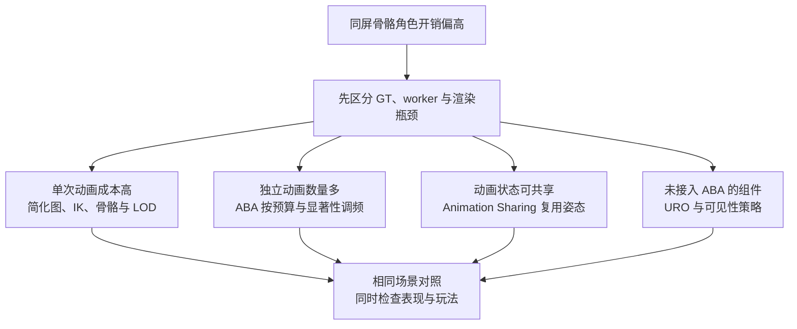
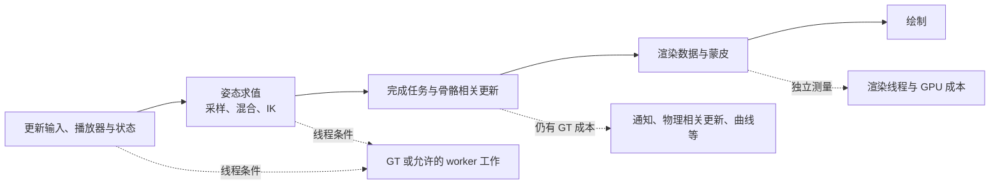
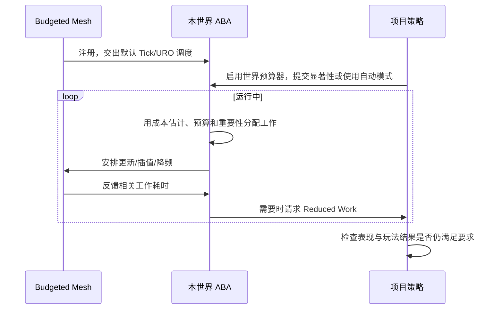
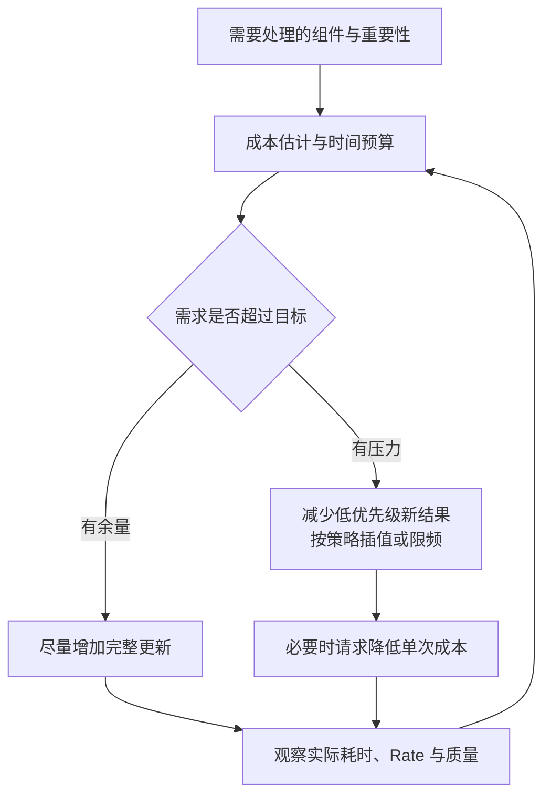
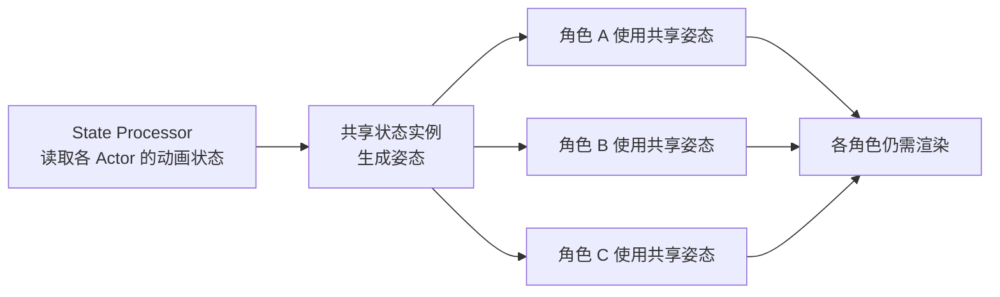

# 04 动画性能与预算分配

> 知识成熟度：L2。本文核对 Epic 公开文档和 API；接线例与观察步骤未在 UE 中运行，不代表编译、动画正确性或性能验收通过。
> 版本基准：2026-10-10 读取时标为 **Unreal Engine 5.8** 的官方页面；这些 URL 会随官网更新，具体读取范围见第 8 节。本文没有读取本机引擎源码或 `Build.version`。
> 知识基线：ABA 公开接入契约与参数、URO/可见性语义、通知/Root Motion/Sharing 的官方说明；预算算例是教学推导，精确内部算法未核对。
> 适用范围：骨骼动画的运行时成本、更新频率与表现取舍；以 ABA 为主，补充 URO、可见性和 Animation Sharing。多人玩法、Root Motion、物理与离屏骨骼使用者须另行验证。
> 最后更新：2026-10-10（公开资料静态核对与教学路线修订；未运行 UE）。
> 历史依据：原文记录 UE 5.8.0、CL 55116800、`++UE5+Release-5.8` 及本机源码核对。本轮保留其研究背景和可复用机制，但没有重现该机器/CL；它不能充当本轮运行证据。

## 1. 概述

同屏角色多时，动画可能消耗大量 CPU 时间。先找出时间花在哪里：单个角色的 Event Graph、混合和 IK 太重，应该降低单次成本；许多角色各自重复同类求值，可以考虑共享；角色仍需独立动画，但总量超过预算，则可降低不重要角色的更新频率。三种优化可以协作，不能从角色数量直接推断哪种一定更快。



**Animation Budget Allocator（ABA）控制受管理组件的动画 Tick，目标是让相关 Game Thread 工作趋近预算。** 它不是整帧 CPU、全部 worker 工作或 GPU 蒙皮的硬上限。预算过紧时，平滑、最低质量和频率限制仍可能使实际耗时超出目标。动画看起来平滑，也不等于每帧更新、求值和刷新骨骼都发生过。

读完本文应能完成三件事：接通一个受 ABA 管理的角色；解释预算变紧后哪些工作减少、哪些结果仍需单独检查；依据测量和玩法依赖决定哪些角色可以降频。先熟悉 [动画蓝图与状态机](01-动画蓝图与状态机.md) 中的 Update/Evaluate，再读下面的接线。

## 2. 核心概念

| 概念 | 本文含义 | 不应混同的对象 |
| --- | --- | --- |
| 动画更新 Update | 推进播放器时间、状态与相关更新逻辑 | 不是已生成新的最终骨骼变换 |
| 姿态求值 Evaluate | 采样、混合与节点计算得到姿态等输出 | 不代表组件/世界空间骨骼已刷新或 GPU 已完成 |
| 骨骼刷新 | 更新使用者读取的骨骼变换 | 动画时间推进不保证离屏 Socket 数据新鲜 |
| BudgetMs | ABA 的目标时间预算，单位 ms | 不是角色总 CPU+GPU 耗时的硬上限 |
| 工作单元 | 预算器估算受管理工作时使用的成本单位 | 不能直接当成一次完整 worker 求值或固定毫秒 |
| 显著性 Significance | 项目或自动策略提供的重要性排序输入 | 高显著性不替代可见性、Tick 与玩法契约 |
| 插值 | 在较低频的新结果之间补充姿态表现 | 不会自动补出相同频率的玩法计算和事件 |
| 限频 | 减少新的动画工作发生次数 | `Rate=4` 是每四帧一次的量级，不是 4 Hz |
| Reduced Work | 请求项目切换到更便宜的单次动画路径 | 回调本身不会替项目关闭 IK 或物理 |
| URO | 可配置的动画更新率/求值率优化 | 不只是按最近渲染时间工作的固定开关 |
| VisibilityBasedAnimTickOption | 按渲染状态决定 TickPose/骨骼刷新策略 | 与全局预算、URO 的职责不同 |
| Animation Sharing | 同状态的多个角色复用共享实例的姿态 | 不会消除逐角色状态处理、绘制与蒙皮成本 |

## 3. 原理详解

### 3.1 骨骼动画的成本构成



这是职责图，不是固定串行调用栈。并行求值满足条件时可分担工作，但完成阶段仍有 GT 工作；动画图节点、Event Graph、物理、曲线和通知各有代价。[Animation Optimization](https://dev.epicgames.com/documentation/unreal-engine/animation-optimization-in-unreal-engine) 的 Overview、General Tips、Other Considerations 支持这些区分。蒙皮还可能走顶点工厂、Compute Skin Cache 或 Mesh Deformer；见 [Skeletal Mesh Rendering Paths](https://dev.epicgames.com/documentation/en-us/unreal-engine/skeletal-mesh-rendering-paths-in-unreal-engine)。因此不能把整条流水线叫作“每角色每帧完整 CPU 求值”。

| 已测出的成本 | 可考虑的改动 | 改后仍要测什么 |
| --- | --- | --- |
| Event Graph/GT 逻辑 | 减少冗余读取和运算，按支持条件使用线程安全更新/Fast Path | GT 完成任务、线程安全与功能一致性 |
| 活动混合、IK、Control Rig、动画物理 | 减少单次工作，设计可恢复的表现降级 | 关键动作/接触与恢复后的连续性 |
| 骨骼和资产复杂度 | 骨骼/网格 LOD、动画资产与节点策略 | 所需骨骼、Socket、曲线是否仍可用 |
| 独立求值数量 | ABA、URO 或共享实例 | 新结果的频率、延迟、通知与玩法依赖 |
| 蒙皮、材质、绘制 | 网格 LOD、渲染侧优化 | GPU/渲染线程耗时；ABA 降频未必改善它 |

这些行没有普遍的成本高低排序，瓶颈由当前角色资产、图和平台决定。

### 3.2 URO、可见性、ABA 与共享各管什么

URO 的 [FAnimUpdateRateParameters](https://dev.epicgames.com/documentation/unreal-engine/API/Runtime/Engine/FAnimUpdateRateParameters) 分别暴露 `UpdateRate`、`EvaluationRate`、`bSkipUpdate`、`bSkipEvaluation` 和插值控制，还有屏幕尺寸/LOD 相关配置。同一 Actor 的组件共享这些参数以帮助同步。它有项目配置空间；但没有 ABA 这种跨受管理组件的时间预算目标。

普通 `USkeletalMeshComponent` 的可见性选项另有明确分工：[枚举说明](https://dev.epicgames.com/documentation/unreal-engine/API/Runtime/Engine/EVisibilityBasedAnimTickOption?lang=en-US)。

| VisibilityBasedAnimTickOption | 未渲染时的主要行为 | 使用前应回答的问题 |
| --- | --- | --- |
| `AlwaysTickPoseAndRefreshBones` | 仍 TickPose 并刷新骨骼 | 是否确实需要离屏新鲜骨骼，成本是否可接受？ |
| `AlwaysTickPose` | 继续 TickPose，只在渲染时刷新骨骼 | 离屏使用者是否误把推进时间当成新骨骼？ |
| `OnlyTickMontagesAndRefreshBonesWhenPlayingMontages` | 只推进 Montage 并处理相应骨骼更新 | 非 Montage 动画是否也承担功能？ |
| `OnlyTickMontagesWhenNotRendered` | 只推进 Montage，跳过其余工作 | 是否仍有人读普通动画姿态或 Socket？ |
| `OnlyTickPoseWhenRendered` | 未渲染时不做该姿态更新/刷新 | 完全停更能否被玩法与回屏表现接受？ |

这些是**可见性选项自身**的行为说明，前提是组件的更新路径有机会运行；它们不能越过被禁用的组件、另一调度器的停更或别的跳帧限制。阴影、Scene Capture、bounds 与组件/Actor 渲染标志也可能使“玩家没看见”与引擎判定不同。专用服务器没有玩家视口，不能用客户端是否可见决定服务器是否需要骨骼。

ABA 注册接口会关闭组件的默认 Tick/URO，并将并行动画任务交给预算器。不要对同一个已注册组件再手动启用 URO；未注册的普通组件可以独立使用 URO。Animation Sharing 则减少需要独立求值的实例数。共享组件是否又由 ABA 管理，必须核实实际组件类型和注册链，不能因两个插件都启用就声称自动叠加。

### 3.3 ABA 架构与注册

[组件 API](https://dev.epicgames.com/documentation/unreal-engine/API/Plugins/AnimationBudgetAllocator/USkeletalMeshComponentBudgeted?lang=en-US) 给出的头文件包含名是 `SkeletalMeshComponentBudgeted.h`，所属模块是 `AnimationBudgetAllocator`。`IAnimationBudgetAllocator::Get(World)` 取得该世界的预算器；世界对象与全局 CVar 是不同层次。

| 接口/设置 | 用途 | 接入注意点 |
| --- | --- | --- |
| `SetAutoRegisterWithBudgetAllocator` | 组件随自身注册/注销加入、退出预算器 | 最小例选择自动模式，避免另建第二套注册责任 |
| `RegisterComponent` / `UnregisterComponent` | 显式注册/注销 | 手动模式成对管理；[公开契约](https://dev.epicgames.com/documentation/unreal-engine/API/Plugins/AnimationBudgetAllocator/IAnimationBudgetAllocator/RegisterComponent)说明注册对 Tick、URO、并行任务的接管 |
| `SetEnabled` / `GetEnabled` | 世界预算器开关 | 全局 `a.Budget.Enabled` 仍可能禁止工作 |
| `SetComponentSignificance` | 提交重要性及跳帧、离屏、降级、插值标志 | 手动提交时关闭自动显著性，避免两路输入争用 |
| `SetComponentTickEnabled` | 通过预算器改变组件 Tick 状态 | `GetEnabled` 不是“每个组件本帧都求值”的证明 |
| `OnReduceWork()` | 通知项目增减单次工作 | 回调参数是组件与降级 bool；业务实现须真正接到动画表现 |
| `SetParameters` | 设置参数块 | 明确 CVar/平台配置的覆盖来源，读回有效值 |
| `UpdateComponentTickPrerequsites` | 外部改变 Tick 前置关系后刷新预算器认知 | 保留 API 的 `Prerequsites` 拼写；它不自动建立玩法所需的先后关系 |
| `ForceNextTickThisFrame` | 请求忽略 Tick rate 在本帧安排 Tick | 不是同步 `Evaluate`/刷新完成屏障，调用顺序仍需核对 |
| `AddExternalAnimationTimeSpentThisFrame` | 计入 ABA 尚未统计的外部动画耗时 | 是成本记账，不是输入动画 DeltaTime，更不是 Root Motion 修复接口 |

`SetGameThreadLastTickTimeMs` 与 `SetGameThreadLastCompletionTimeMs` 表达 GT Tick/完成任务的计时接口；不能把它们命名解释成全部 worker 求值用时。一般业务接入无需再重复上报组件自身已统计的开销。[IAnimationBudgetAllocator](https://dev.epicgames.com/documentation/en-us/unreal-engine/API/Plugins/AnimationBudgetAllocator/IAnimationBudgetAllocator)



### 3.4 预算估计与三类表现

可以用“工作单元”和“每帧更新、插值、限频”理解预算分配。先做一个**教学估算**：假定受统计的每次工作平均花费 `c` ms、目标为 `B` ms，则本帧可承担的数量量级为 `B/c`。这不是引擎逐字算法；实际还受成本平滑、插值成本、优先级、最低质量、依赖和节流影响。

例如假设 20 个组件每次成本均为 0.1 ms，全部每帧做一次需 2 ms；目标 1 ms 只相当于约 10 个这样的工作。若要求 4 个关键组件每帧更新，它们先消耗约 0.4 ms，其余 16 个只能竞争约 0.6 ms，或降低单次成本。再把目标压成 0.2 ms，就与“4 个关键组件每帧且成本不变”相矛盾。降低预算不能凭空满足矛盾约束，也不能由这个平均数反推出每个组件的实际 Rate。



`Rate=1`、较低频新姿态加插值、较低频并保持已有姿态，分别影响不同观感。插值本身有成本，也可能增加表现延迟；不插值会更明显地阶梯变化。假设游戏保持 60 fps，Rate 从 1 增至 4，对应更新频率从约 60 次/秒降至 15 次/秒；Rate 从 4 降回 1，则从约 15 次/秒恢复到 60 次/秒。若游戏只剩 30 fps，Rate=4 就约为 7.5 次/秒。因此按帧计的上限不是固定 Hz 保证。

原文引用的 `CalculateWorkDistributionAndQueue`、`QueueForTick`、`FrameOffset`、`AccumulatedDeltaTime` 是进一步读源码的历史入口；本轮未读取实现，不再把精确 Bucket 公式、插值 Alpha、帧偏移取模、时间膨胀顺序或“根组件与 Mesh 取最小 Tick 率”写成已核实的 5.8 源码结论。继续研究时须在目标 checkout 联合核对队列、依赖、更新与完成阶段。

### 3.5 Reduced Work、显著性与离屏

Reduced Work 改变“每次做多贵”，增大 Rate（增大帧间隔、降低更新频率）改变“多久做一次”。前者可保留角色正常时间推进而舍弃部分次级表现；后者会降低新姿态/状态结果的时间分辨率。只有确实存在可关闭且可恢复的表现工作，才应允许相应组件进入项目的降级路径。

[参数块](https://dev.epicgames.com/documentation/unreal-engine/API/Plugins/AnimationBudgetAllocator/FAnimationBudgetAllocatorParamet-)提供压力阈值、迟滞、切换节流与每帧切换数等配置。恢复逻辑要与降级同样完整：关闭 Foot IK 后恢复原策略，关闭次级模拟后处理其状态连续性；不要用 `bUseRefPoseOnInitAnim` 充作运行时性能开关，也不要将示意的 `SetAnimationLOD` 当作通用组件 API。

自动显著性适合先验证接线。之后可以由项目按距离、画面占比、玩家关注和玩法重要性统一提供输入。本文示例约定输入为 `[0,1]`；这是项目约定，不是仅凭 API 名称证明所有实现都强制归一化。`OnCalculateSignificance()` 是静态委托入口，接管它会影响使用自动模式的组件，不能为一个角色随意覆盖全局策略。

`bNeverSkip`、`bTickEvenIfNotRendered`、`bAllowReducedWork`、`bForceInterpolate` 是不同参数；公开签名不能证明其中一个越过所有组件与可见性限制。尤其不要把 `bNeverSkip=true` 简写成“任何情况下每帧完整求值且 Socket 一定最新”。必须在目标版本核对其内部调度和实际结果。离屏保留名额也不是所有离屏角色都有新鲜姿态；重要组件须按使用者需要显式设计。

### 3.6 参数调优与配置来源

先记录生效值，再逐项改变参数。以下列出主要控制轴；名字和描述以公开指南/API 可核对部分为界，**数值示例不充作平台推荐或当前项目默认值**。

| 控制轴 | 入口举例 | 为什么调整 |
| --- | --- | --- |
| 时间目标 | `a.Budget.BudgetMs` / `BudgetInMs` | 改变受管理工作的时间目标；本例使用 1.0、0.2 ms 作两次对照 |
| 最低质量 | `a.Budget.MinQuality` | 非零会约束降频幅度，并可能使目标超支；它不衡量姿态或玩法正确性 |
| 最大帧间隔 | `a.Budget.MaxTickRate` | 限制继续降频的幅度；保持质量会与更低预算冲突 |
| 插值数量/间隔/折算成本 | `MaxInterpolatedComponents`、`InterpolationMaxRate`、`InterpolationTickMultiplier` | 平滑、开销与延迟的取舍；属性名不是 CVar 名称的自动拼接规则 |
| 高频与插值档收缩 | `AlwaysTickFalloffAggression`、`InterpolationFalloffAggression` | 改变压力下的分配倾向，不代表对角色身份作硬保证 |
| 初始成本与平滑 | `InitialEstimatedWorkUnitTimeMs`、`WorkUnitSmoothingSpeed` | 初始估计影响启动阶段，实测反馈影响后续分配 |
| 降级阈值/迟滞 | `BudgetFactorBeforeReducedWork`、`BudgetFactorBeforeReducedWorkEpsilon` | 防止压力边缘反复切换 |
| 激进/紧急降级 | `BudgetFactorBeforeAggressiveReducedWork`、`BudgetPressureBeforeEmergencyReducedWork` | 更高压力下加快或扩大便宜路径的使用，不等于“停止所有动画” |
| 降级切换频率 | `ReducedWorkThrottleMinInFrames`、`ReducedWorkThrottleMaxInFrames`、`ReducedWorkThrottleMaxPerFrame` | 控制恢复/降级的切换成本与响应速度 |
| Tick 档位节流 | `StateChangeThrottleInFrames` | 避免调度频率随瞬时噪声剧烈变化 |
| 离屏预算 | `MaxTickedOffsreenComponents` | 保留部分离屏工作；`Offsreen` 是 API 现有拼写 |
| 自动显著性距离 | `AutoCalculatedSignificanceMaxDistance` | 影响自动策略，不能取代关键对象的玩法需求 |

原文列出的 `MaintainReduceWorkWhenOffScreen`、`ComponentsWithZeroSigAreNonRendered`、`ForceTickWhenComponentExitsOffScreen` 和 Verbose/Force 调试扩展，本轮未在对应实现核实；保留为后续源码查询线索，不把这些名字或默认值当成本例的恢复依赖。官方指南自己的部分 CVar 拼写也与参数块名字不同，例如 ReduceWork/ReducedWork；应查目标构建控制台帮助和源码后使用，不能盲目从表格复制整套配置。

### 3.7 调试和测量分别回答什么

本例使用 `a.Budget.Debug.Enabled 1` 与 `stat AnimationBudgetAllocator`。读每个组件的数值 Rate 和 `Hi/Lo/I` 标记，再看注册数、Tick 数、Interpolated、Throttled、Demand 等。不要依赖原文互相不一致的“绿/黄/红等于固定档位”口诀；颜色可能随版本/调试模式变化。

调试图的 ms 时间目标与 stat 的组件数量不是同一单位。`Num Registered Components` 也未必等于 Actor 数，一个角色可有多个 Mesh。只看到注册数增加，不能证明新姿态率、时间目标或玩法均合格。

正式测量至少分别保留：ABA 图/统计，GT 动画工作，worker 任务及完成/等待关系，整帧与 GPU 时间。前后使用相同构建、硬件、角色资产、镜头、LOD、负载与采样区间，报告预热和样本数；调试显示/逐帧打印本身可能改变成本。原文列出的 CSV `AnimationBudget`/`AnimQuality` 名称须先核目标构建是否实际输出，不能把未存在的列写成验收通过。

### 3.8 Animation Sharing 简述

共享按动画状态组织实例，多名角色跟随同一实例的姿态；多状态、随机起始相位、过渡与按需动画可增加变化。[官方指南](https://dev.epicgames.com/documentation/en-us/unreal-engine/animation-sharing-plugin-in-unreal-engine)明确有对应配置。它适合状态可共享的群体，但实例数、混合、逐 Actor 状态处理及渲染仍会增长，不能承诺总成本与人数无关。



| 核心对象 | 职责 |
| --- | --- |
| `UAnimationSharingSetup` / Skeleton Setups | 保存 Skeleton、状态处理器、状态与共享动画配置 |
| `UAnimationSharingStateProcessor` | 根据 Actor 的状态返回枚举；蓝图便于验证接线，规模化再评估原生实现 |
| Animation States / Animation Setups | 状态对应动画、随机实例、On Demand、Additive 与并发限制 |
| `UAnimationSharingManager` | 为世界创建管理器、按 Skeleton 注册/注销 Actor |
| `UAnimSharingInstance` 与状态/过渡/叠加 AnimBP | 管理共享运行实例；不与逐 Actor 任意 AnimBP 混为一谈 |
| Scalability Settings | 管理混合、显著性与平台配置等成本/表现取舍 |

On Demand 可以为事件提供实例，但受并发上限约束；达到上限后的复用不能承诺动作从头逐 Actor 独立播放。[FAnimationStateEntry](https://dev.epicgames.com/documentation/en-us/unreal-engine/API/Plugins/AnimationSharing/FAnimationStateEntry) 的 `WiggleTimePercentage` 描述了资源用尽后按动画长度比例选择已启动实例来复用的条件；具体池调度仍须核实现，不能笼统推断“截断所有攻击”。Additive 是叠加动画，不是材质受击闪红的同义词。共享通知也须沿共享实例到实际 Actor 的分发路径核对，不能把 Sync Group 的 `Trigger on Follower` 误当作 Leader Pose/Animation Sharing 的通用广播开关。

## 4. C++ / 蓝图示例

### 4.1 最小蓝图路线：从能播放到观察预算调度

**输入与目的**：在 UE 5.8 的练习关卡，准备一个 Skeletal Mesh 和同 Skeleton 的一段 in-place 循环 Animation Sequence，以下分别称为 `Mesh` 与 `Loop`。不接入移动、Root Motion、伤害和动画物理。先验证一个组件，再扩为 24 个展示角色；24 和后面的预算值只是教学输入，不是容量结论。以下是未执行的操作步骤和预期判据。

1. 在 Edit → Plugins 启用 Animation Budget Allocator，按编辑器提示重启。新建相同 Skeleton 的 `ABP_BudgetDemo`，AnimGraph 中一个选定 `Loop` 的 Sequence Player（Loop Animation=true）直接接 Output Pose。保存并确认资产预览可以循环。
2. 创建 Character 蓝图 `BP_BudgetDemo`。选择**继承的 Mesh**，把 Component Class 改为 `SkeletalMeshComponentBudgeted`；为它赋 `Mesh`，Animation Mode=Use Animation Blueprint，Anim Class=`ABP_BudgetDemo`。不要保留普通角色 Mesh 又额外加一个动画网格来冒充替换成功。
3. Budgeting 中显式勾选 Auto Register With Budget Allocator、Auto Calculate Significance；本例不手动设置显著性、不启用 URO、不另绑 Reduced Work。Should Use Actor Rendered Flag 保持 false，使观察对象集中在该 Mesh。
4. 在关卡启动前确认控制台 `a.Budget.Enabled` 的当前值，令其为 1。这里使用全局功能开关；不从任何旧文默认值猜测现状。角色 Event BeginPlay 接 `Enable Animation Budget`，Enabled=true，启用所属世界的预算器。[蓝图接口](https://dev.epicgames.com/documentation/unreal-engine/BlueprintAPI/AnimationBudget/EnableAnimationBudget)明确全局 CVar 可覆盖该设置。
5. 在能完整看到角色的镜头前放置一个实例并开始 PIE，输入 `a.Budget.Debug.Enabled 1` 和 `stat AnimationBudgetAllocator`。先检查动画实际循环、组件注册数与调试信息；没有这些证据先排查类、注册、双开关、世界和资产，不靠继续调低预算掩盖接线问题。
6. 停止 PIE 后复制到 24 个：近、中、远三组各 8 个，固定相机能同时看到三组；保留一个可辨认的近角色和远角色作为观察对象。记录实际位置、LOD 和角色数。第一轮使用 `a.Budget.BudgetMs 1.0`、`a.Budget.MinQuality 0`，关闭调试强制模式 `a.Budget.Debug.Force 0`，预热后记录同一时间窗口的 Rate、Interpolated、Throttled 和图上耗时。
7. 同镜头、同资产和人数，将唯一自变量改为 `a.Budget.BudgetMs 0.2` 后再观察。若产生压力，预期出现更低频或插值等分配变化，低显著性组件通常更容易被降频；这是待观察的机制结果，不要求每台机器恰好出现三个档。若仍足够便宜而没有压力，记录“此负载未触发”，不要写成插件失效或宣称已省时。
8. 恢复 1.0 ms，确认调度在平滑/节流影响后恢复趋势。结束练习时恢复改过的 CVar。真实性能比较使用独立采样，不能以这轮带覆盖层的目视演示证明目标平台性能。

```text
相容 Mesh + Loop → ABP_BudgetDemo → 继承 Mesh 的 Budgeted 类
        → 自动注册 + 自动显著性
        → 全局允许 + 本世界 Enable
        → 1 个角色验证接线 → 24 个角色固定镜头对照
        → 记录 1.0 / 0.2 / 恢复 1.0 的实际结果
```

**反例**：只创建 Budgeted 类、只设置全局 CVar、或只看游戏 FPS，均不足以证明 ABA 管理链成立。相反，注册数正确但无降频，也可能只是负载小于目标；要把“接线是否成立”和“是否达到压力”分开判断。

### 4.2 C++：替换已有 Character Mesh 与提交显著性

下面是**接入节选，未编译**，不是可直接运行的完整游戏模块。项目需先启用插件，并在使用这些类型的模块依赖中加入 `AnimationBudgetAllocator`；若类型暴露在公共头文件，则放公共依赖。角色类声明对应构造函数与 `BeginPlay`，Mesh/AnimClass 仍由其蓝图子类设置。

```cpp
#include "GameFramework/Character.h"
#include "SkeletalMeshComponentBudgeted.h"
#include "IAnimationBudgetAllocator.h"

ABudgetCharacter::ABudgetCharacter(const FObjectInitializer& ObjectInitializer)
    : Super(ObjectInitializer.SetDefaultSubobjectClass<USkeletalMeshComponentBudgeted>(
          ACharacter::MeshComponentName))
{
    auto* Mesh = CastChecked<USkeletalMeshComponentBudgeted>(GetMesh());
    Mesh->SetAutoRegisterWithBudgetAllocator(true);
    Mesh->SetAutoCalculateSignificance(false); // 本例改由项目提交
}

void ABudgetCharacter::BeginPlay()
{
    Super::BeginPlay();
    auto* Mesh = CastChecked<USkeletalMeshComponentBudgeted>(GetMesh());
    if (IAnimationBudgetAllocator* Allocator = IAnimationBudgetAllocator::Get(GetWorld()))
    {
        Allocator->SetEnabled(true); // 全局 CVar 仍须允许
        Mesh->SetComponentSignificance(
            0.5f,
            false,  // bNeverSkip
            false,  // bTickEvenIfNotRendered
            false,  // bAllowReducedWork：尚未实现便宜路径
            false); // bForceInterpolate
    }
}
```

这里复用 `ACharacter::MeshComponentName`，因而 `GetMesh()`、AnimBP 与现有角色组件关系仍指向同一 Mesh。自动注册模式下不再调用第二套 Register；真实项目将显著性更新放在统一策略中，按变化/采样更新，不能只在 BeginPlay 固定一次便声称实现动态战斗焦点。

`OnReduceWork().BindUObject(...)` 提供项目扩展点，但绑定回调不等于优化完成。接入便宜路径时要走完：回调写项目状态 → 动画系统以受支持方式读取 → 明确关闭某段可选表现 → 观察该段工作和成本减少 → 收到恢复请求时恢复。同样的输入下正常/降级/恢复都正确后，才把对应 `bAllowReducedWork` 改为 true。不要复制不存在的通用 `SetAnimationLOD`，也不要靠改变初始化参考姿势伪装成本下降。

### 4.3 直接调用预算器时的两个边界

手动模式应在组件已注册到世界后由明确的所有者调用 `RegisterComponent`，在退出时成对 `UnregisterComponent`；组件自动模式则由组件负责。公开注销契约说明会恢复默认 Tick/URO 与内部并行任务路径，但项目还应核对退出后的实际配置是否符合自己的原始策略。[注销 API](https://dev.epicgames.com/documentation/unreal-engine/API/Plugins/AnimationBudgetAllocator/IAnimationBudgetAllocator/UnregisterCompon-)

外部改变 Tick 前置关系后，再调用 `UpdateComponentTickPrerequsites` 更新预算器；它没有承诺替项目建立移动→动画→读取 Socket 的完整顺序。`ForceNextTickThisFrame` 也只承诺本帧 Tick 请求，不能在调用下一行就假设姿态完成。需要“本次玩法读取一定用新结果”的路径，应先建立能验证的完成先后关系，必要时不让该路径参与视觉降频。

### 4.4 参数配置：用确实被选择的 Scalability 档

原文的自造 `[AnimationBudgetAllocator @ 2]` 段没有展示任何读取者。可以按官方指南将预算挂到项目实际使用的质量组，例如：

```ini
; Config/DefaultScalability.ini，教学配置，非平台推荐
[ViewDistanceQuality@1]
a.Budget.BudgetMs=1.0

[ViewDistanceQuality@2]
a.Budget.BudgetMs=2.0
```

项目应用相应 View Distance Quality 档之后，读取 `a.Budget.BudgetMs` 确认 1.0/2.0 真正生效；同时记录 Device Profile、命令行和运行时赋值有无覆盖。不要仅凭 ini 文件存在判断配置已加载。世界级 Enable 仍需第 4.1 节的启动接线。

### 4.5 Animation Sharing：一个 Idle 桶的最小接线

先用一段循环 `Idle` 做独立学习场景，不与 ABA 例混跑。输入是同 Skeleton 的 Mesh/Idle，输出是两个角色使用同一状态的共享动画。下面仍为未执行的静态路线。

1. 启用 Animation Sharing 插件并按提示重启；建枚举 `E_CrowdState`，只含 Idle。建 `AnimationSharingStateProcessor` 蓝图，Class Defaults 指定该枚举；`ProcessActorState` 返回 Idle 的值，Should Process=true。
2. 建 `AnimSharingStateInstance` 子类 AnimBP，Sequence Player 的 Sequence pin 接 `Animation to Play`，Start Position pin 接 `Permutation Time Offset`，开启循环并接 Output Pose。这个图读取共享实例提供的输入。
3. 建 Animation Sharing Setup。Skeleton Setups 加入输入 Skeleton 与 Mesh、State Processor；Animation States 加 Idle，Animation Setups 指定 Idle Sequence、上述 AnimBP，Num Randomized Instances=1。暂不使用 On Demand/Additive/过渡混合，使首个例子只检查一个状态桶。
4. 准备只展示 Mesh 的 Character 蓝图。由同一个关卡启动流程调用 `Create Animation Sharing Manager(Setup)`，把返回 bool 接 Branch。True 分支调用 `Get Animation Sharing Manager`，对返回对象做 Is Valid 检查；有效后再 Spawn 两个展示 Actor，逐个调用该 Manager 的 `Register Actor`，In Actor=生成结果，Sharing Skeleton=Setup 所用 Skeleton，并检查注册返回值。Create 返回 false、Manager 无效或注册失败时停止该路径并检查设置；避免依赖两个独立 BeginPlay 的隐含先后顺序。
5. 预期两个角色都循环 Idle。运行时可输入 `a.Sharing.ToggleVisibility` 切换共享 Leader Pose 组件的显示；官方指南说明调试网格位于关卡原点 `(0,0,0)`，应到原点附近观察共享姿态，而不只盯着展示角色的位置。再把随机实例数改为 2，对照起始相位变化。该命令和整个例程本轮均未执行；`Get Animation Sharing Manager` 为 null 或注册失败时，先检查创建顺序与 Skeleton 匹配，不继续把空引用当成功。

这是共享状态/实例的功能接线，不是人数扩展性能结论。之后再加入第二状态、过渡 AnimBP、On Demand 或 Additive，并逐项核对实例增长与表现。管理器创建、查找和注册返回值依据 [UAnimationSharingManager](https://dev.epicgames.com/documentation/unreal-engine/API/Plugins/AnimationSharing/UAnimationSharingManager)；逐 Actor 通知需求另查共享状态实例的处理路径。

## 5. 最佳实践

### 5.1 从测量得到预算，不从平台名称猜数字

原文 PC/移动端的固定毫秒表没有对应设备、资产、构建和测量记录，不能当平台推荐。先量当前动画相关工作占帧预算多少，确定允许的姿态间隔、关键对象和降级范围，再试 `BudgetMs`。预算越低不一定越好：可能只是把成本问题转成运动阶梯、响应滞后或玩法数据陈旧。

### 5.2 显著性还要包含使用者需求

角色离摄像机远，但仍可能被锁定、发射抛射物、参与近战命中或驱动重要附着物。先列谁读取动画结果、读取什么、允许多旧，再决定它可否降频。高显著性、禁止跳过、离屏继续工作和禁用可选降级是不同选择，不要统一用一个“主角=1”的数值替代。

### 5.3 玩法、通知与 Root Motion

| 使用者 | 降频可能改变什么 | 应保留的判断依据 |
| --- | --- | --- |
| 脚步声、远景次级表现 | 时间精度、同步观感 | 允许的延迟/遗漏策略与实际播放记录 |
| Socket 挂点、武器扫掠、骨骼碰撞 | 新骨骼的采样间隔与读写先后 | 记录读到的变换与刷新时点，决定是否豁免该路径 |
| 动画通知驱动的玩法 | 触发条件、时间与所属 Actor | 在实际更新模式下验证事件，不以画面正常替代 |
| Root Motion 驱动移动 | 提取、移动消耗、碰撞与网络结果 | 同一动作的胶囊轨迹、终点、事件次序和角色模式 |

通知有权重、概率、LOD、专用服务器等触发条件；Montage Queued 与 Branching Point 也有精度/成本差异。[Animation Notifies](https://dev.epicgames.com/documentation/unreal-engine/animation-notifies-in-unreal-engine)并未承诺换用同步类型就能越过停更或可见性条件。降频也不等于所有跨越的通知必然丢失：是否收集/何时派发，须核实际更新路径。不能作“跳帧一定丢通知”或“累计时间一定补齐所有事件”两种绝对结论。

玩法可以使用动画事件，但若事件是权威命中或状态变化的唯一触发源，应验证动画在服务器、离屏、混合/中断和降频下是否仍提供所需语义，或另建可靠的玩法时序。不要把共享实例上的一次通知未经分发直接当成所有跟随角色各自的事件。

[Root Motion](https://dev.epicgames.com/documentation/unreal-engine/root-motion-in-unreal-engine)需要资产提取、AnimBP 模式与 Movement 的配合；不同 Movement Mode 也会影响位移。累计动画时间或上报外部耗时均不能证明移动结果正确；本轮未测 ABA 与 Root Motion 的交互。上线前仍需针对实际引擎版本和动作验证，而不是用一次 `ForceNextTickThisFrame` 代替整段动作的更新契约。

### 5.4 降级与恢复策略

- 先做可选且局部的表现降级，如远景次级运动或可省略的 IK；没有便宜路径时保持 `bAllowReducedWork=false`。
- 回调要可重复、快速，恢复原策略；不要在压力回调同步加载重资产。引擎节流控制切换频率，不能修复项目遗漏的恢复路径。
- 离屏后重新出现、LOD 跨档、慢动作和暂停恢复会暴露连续性问题；按实际模拟器决定是否需要重新初始化，不能一概“补一帧就恢复”。
- ABA 调频、动画图降级、骨骼/网格 LOD 和 Sharing 分别改变不同成本。逐项引入并检查依赖，才能归因收益或回归。

### 5.5 验收记录应该包含的内容

| 场景 | 操作与记录 | 能支持的结论 |
| --- | --- | --- |
| 正常接线 | 第 4.1 节一个角色播放、注册和调试证据 | 该世界该组件的接入成立 |
| 固定负载预算对照 | 同镜头人数下 1.0→0.2→1.0，记录实际值、Rate、耗时 | 该负载下调度如何响应；无压力要明确写无压力 |
| 同显著性与重点对象 | 固定其余条件，改变一个项目策略输入 | 优先级变化是否符合项目意图 |
| 离屏/回屏 | 保持动作并转动镜头，记录相关骨骼/事件 | 具体可见性策略是否满足该使用者 |
| 关键动作 | 同动作比较胶囊、Socket、通知与状态结果 | 该动作在受测模式下的正确性 |
| 真实目标平台 | 记录构建、资产、设备、采样与 GT/worker/GPU | 可重复的性能结论及其覆盖范围 |

不采用通用“AnimQuality≥0.85”“所有平台超预算≤10%”或“一百骨骼必耗 1–2 ms”。这些阈值与数值须有项目目标和测量证据。仓库文档 CI、链接检查或这张待执行表，都不认证动画性能。

## 6. 常见问题 FAQ

### Q1：Budgeted 组件没有效果？

先查插件、实际 Mesh 类、自动/手动注册责任、世界 Enable 与全局 CVar。再查负载是否足以产生压力，以及是否残留 Debug.Force 或配置覆盖。原文把全局默认值和自动注册默认值写死不足以诊断当前项目。

### Q2：动画不跟手或 Root Motion 不对？

先区分姿态降频的表现延迟与真实位移/碰撞错误，比较更新、求值、刷新与读取先后。`AddExternalAnimationTimeSpentThisFrame` 只是记账；不能用它注入 DeltaTime。关键动作可能需要更保守的策略，不能只抬显著性就宣布修复。

### Q3：不插值一定更好吗？

不插值可以减少相关工作，但新姿态之间的阶梯更明显；插值也不保证快速动作无误差。固定 Rate、镜头和动作比较成本与观感，避免同时改多个参数后无法归因。

### Q4：设了 BudgetMs 为什么还超目标？

检查最低质量、最大帧间隔、关键对象约束、初始/平滑估计以及是否量到了 ABA 不负责的工作。若必要工作本身已超过预算，继续降低目标不会解决矛盾；应减单次成本、减少独立实例或重新分配帧预算。

### Q5：ABA 与 URO 能同时开吗？

同一已注册组件交给 ABA，注册契约会禁用 URO；未注册组件可以使用 URO。退出 ABA 后按项目策略核对实际恢复状态。不要把“项目内两者共存”解释为同一组件两套控制器叠加。

### Q6：离屏看起来冻结，回来猛跳？

可能是可见性暂停、ABA 离屏限制、较低新姿态率或状态恢复问题。先记录哪一步停了以及谁需要离屏数据，再选继续工作、便宜更新或接受停更。不存在仅由回屏 CVar 就保证所有物理和骨骼消费者恢复的结论。

### Q7：Animation Sharing 只能所有人完全一致吗？

同一共享实例提供同一姿态，但可用多状态、多实例相位、按需、混合与叠加增加变化；变化也增加成本。任意逐角色图与独立 IK 需求未必适合当前共享路径，须评估实际所需自由度。

### Q8：On Demand 并发不够用怎么办？

先核状态的实例上限及实际复用行为，再对比提高实例数或将关键角色移到独立动画路径的成本。不能假设共享实例池自动保证每个攻击独立从起点播放，也不能直接推断旧实例一定被截断。

### Q9：怎么知道预算分配合理？

注册、调频、毫秒成本、观感与玩法是不同证据。先用小例证明接线和压力响应，再用实际平台与动作检验需求；图上“贴着预算线”不能证明 worker/GPU、通知、Root Motion 或整体帧时间全部达标。

## 7. 关联阅读与前后置专题

- [01-动画蓝图与状态机](01-动画蓝图与状态机.md)：Update/Evaluate、线程与 Fast Path 的前置基础。
- [03-IK与程序化动画](03-IK与程序化动画.md)：IK、次级运动及降级时的表现边界。
- [07-动画资产与骨骼基础](07-动画资产与骨骼基础.md)：Skeleton、曲线、通知和 LOD 使用者。
- [性能分析工具与Profiling](../../08-工程实践与质量/调试与性能分析/03-性能分析工具与Profiling.md)：GT、worker 与整帧的测量。
- [Mass实体框架与群集模拟](../../06-游戏AI/导航移动与群体协同/04-Mass实体框架与群集模拟.md)：大规模实体及表现替代方案。
- [动画系统求值源码](11-动画系统求值源码.md)：并行求值、代理与完成阶段的进一步核对。
- [处理器存储层次与性能工程](../../01-编程与计算机基础/硬件体系结构与性能/01-处理器存储层次与性能工程.md)：CPU 数据布局与缓存成本。

## 8. 来源覆盖与历史保全

下列网页均在 2026-10-10 读取时显示 **UE 5.8**。公开指南和 API 页面是静态依据；没有取得相应 `.cpp` 实现、运行引擎或进行性能测量。主要正文的 L2 标定不覆盖历史内部算法细节和任何平台容量。

| 来源 | 实际读取范围 | 支持与限制 |
| --- | --- | --- |
| S01 [ABA 指南](https://dev.epicgames.com/documentation/unreal-engine/animation-budget-allocator-in-unreal-engine) | 定义、Prerequisites、Set Up、Using、Platform Scaling、公开接口和 CVar 表 | GT 目标、接线与调试入口；不证明所有平台默认值/预算或私有分配算法 |
| S02 [Budgeted 组件](https://dev.epicgames.com/documentation/unreal-engine/API/Plugins/AnimationBudgetAllocator/USkeletalMeshComponentBudgeted?lang=en-US) | 头文件、属性、公开函数、委托 | 类/输入/自动注册责任；不证明构造默认值或 `bNeverSkip` 所有分支 |
| S03 [预算器接口](https://dev.epicgames.com/documentation/en-us/unreal-engine/API/Plugins/AnimationBudgetAllocator/IAnimationBudgetAllocator)及 Register/Unregister、Prerequisites、ExternalTime 子页 | 方法签名、公开 Remarks | 接管与恢复责任、外部耗时记账；不证明强制 Tick 已同步完成 |
| S04 [参数块](https://dev.epicgames.com/documentation/unreal-engine/API/Plugins/AnimationBudgetAllocator/FAnimationBudgetAllocatorParamet-) | 属性名称与范围 | 参数控制轴；不把属性名直接视为 CVar 名 |
| S05 [Animation Optimization](https://dev.epicgames.com/documentation/unreal-engine/animation-optimization-in-unreal-engine) | Overview、线程安全/Fast Path、General Tips、Other Considerations | 成本拆分、URO 与 GT 完成工作；未核具体源码执行分支 |
| S06 [URO 参数](https://dev.epicgames.com/documentation/unreal-engine/API/Runtime/Engine/FAnimUpdateRateParameters) | 参数、Actor 共享说明、时间/插值辅助函数 | 更新/求值分离与可配置性；不等于某项目所有 Tick 策略 |
| S07 [Visibility 枚举](https://dev.epicgames.com/documentation/unreal-engine/API/Runtime/Engine/EVisibilityBasedAnimTickOption?lang=en-US) | 五个值和 Remarks | TickPose/骨骼刷新的区别；未验证与其他控制器叠加 |
| S08 [Notifies](https://dev.epicgames.com/documentation/unreal-engine/animation-notifies-in-unreal-engine) | Skeleton/State/Montage Notify、Common Notify Properties | 回调路径、概率/权重/LOD/服务器/Sync Group 条件；不证明 ABA 跳帧后的逐事件投递 |
| S09 [Root Motion](https://dev.epicgames.com/documentation/unreal-engine/root-motion-in-unreal-engine) | Enabling、AnimBP 模式、Results | 提取与移动消费及模式差异；未验证 ABA 的移动/网络结果 |
| S10 [Sharing 指南](https://dev.epicgames.com/documentation/en-us/unreal-engine/animation-sharing-plugin-in-unreal-engine) | 概述、Skeleton/State/Processor、状态/过渡/叠加图、Manager、调试 | 状态桶及接线；没有项目规模性能结论 |
| S11 [Sharing Manager](https://dev.epicgames.com/documentation/unreal-engine/API/Plugins/AnimationSharing/UAnimationSharingManager)与 [State Entry](https://dev.epicgames.com/documentation/en-us/unreal-engine/API/Plugins/AnimationSharing/FAnimationStateEntry) | 管理器创建/获取/注册、状态字段（含 WiggleTimePercentage） | 公开 API 和并发配置；未核内部池复用算法 |
| S12 [Skeletal Mesh Rendering Paths](https://dev.epicgames.com/documentation/en-us/unreal-engine/skeletal-mesh-rendering-paths-in-unreal-engine) | 渲染路径、骨骼影响、Skin Cache | 蒙皮是另一个成本环节；未测具体 GPU 收益 |

原文对 ABA/Sharing 的问题划分、工作单元视角、三类调度表现、显著性、降级/恢复和五幅机制图的教学用途保留；现在改为有边界的模型与可执行接线。历史 5.8 源码路径保留为定位：`Engine/Plugins/Runtime/AnimationBudgetAllocator/Source/AnimationBudgetAllocator/` 与 `Engine/Plugins/Developer/AnimationSharing/Source/AnimationSharing/`。未复核的精确公式/默认值/私有分支与无测量的经验数值不再承担现行结论；这不抹除原研究背景，也不将静态修订升级为运行验证。
