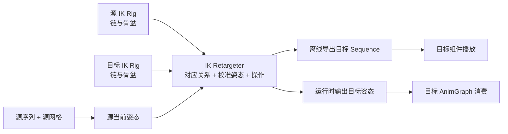
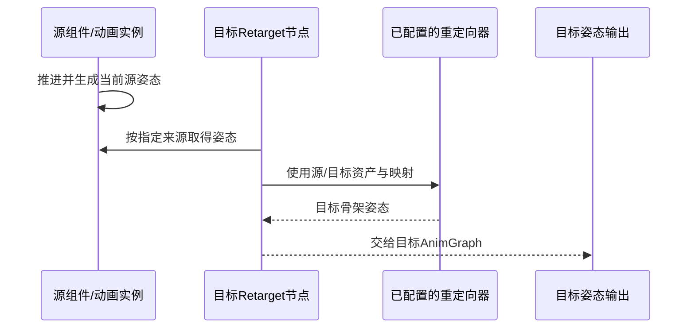

# 06 动画重定向与 IK Retargeter

> 知识成熟度：L2。原理、资产步骤与接口边界经公开一手资料静态核对；步骤中的结果均为预期，未作 UE 运行验证。
> 版本基准：正常练习限定 UE 5.6 的标准 Third Person 模板与本页列明的资产前提，采用该版本公开概览及 Python API 的 Op Stack / Retarget From 接口。§5 的处理器与扩展操作另据实际返回的 UE 5.8 页面，不作为 5.6 按钮或 ABI 保证。
> 适用范围：两套语义可对应的双足骨架之间复用骨骼动画；从 IK Rig、链映射和姿态校准到离线序列，再接运行时节点。任意四足、人形、面部绑定之间的万能转换不在承诺内。
> 最后更新：2026-10-10（补齐正常重定向与消费步骤，修正运行时独占、Root/空间、处理器版本、接触与通知等结论）。
> 证据范围：2026-10-10 实际读取 Epic 公开页面文字选段；未读取引擎 checkout、Build.version 或函数实现，未下载资产、导入、编译、运行 UE/PIE、Cook 或测性能。旧文 UE5.8.0 / CL 55116800 / Windows 路径仅属历史记录。

## 1. 先理解：重定向究竟在改变什么

假设已有 Manny 的跑步动画，现在要让另一套骨架的旧 UE4 人偶表演同一个动作。源序列的轨道关联源 Skeleton；目标的脊柱节数、骨长和参考姿势可能不同。只把序列的 Skeleton 引用换成目标，不能自动建立这些对应关系。

先判断是否需要重定向。同一 Skeleton 可被满足层级约定的多个网格共享；近似相同的层级、命名和比例还可能使用 Compatible Skeletons。IK Retargeter 用于需要重新解释姿态的情况，不是每次换皮肤都必须增加的一层。[Skeletons — Sharing / Compatible Skeletons](https://dev.epicgames.com/documentation/en-us/unreal-engine/skeletons-in-unreal-engine?application_version=5.6)

### 1.1 IK Rig 定义“哪里是手臂”，Retargeter 定义“怎样搬过去”

| 对象 | 保存或表达的东西 | 不承担的责任 |
| --- | --- | --- |
| 源/目标 Skeletal Mesh 与 Skeleton | 网格、参考骨架及动画关联 | 不自动推断另一角色的运动语义 |
| IK Rig | 骨骼链、重定向骨盆、可选 Goal 与 Solver | 单独创建后不会生成目标动画 |
| IK Retargeter | 源/目标 Rig、链对应、Retarget Pose 与操作配置 | 不自动创建玩家控制和世界移动 |
| 离线导出的 Animation Sequence | 面向目标 Skeleton 的动画数据 | 不再靠源角色每帧提供姿态 |
| Retarget Pose From Mesh 节点 | 从受支持的来源读取姿态并动态重定向 | 不等于播放或复制源 AnimBP 的全部玩法逻辑 |

**Retarget Chain 是一套骨架内从起点到终点的一条连续父子路径**。例如上臂→前臂→手是一条链；头可以是一根骨的链。它不是“角色 A→角色 B→角色 C 的转接次数”。链名只是对应键，两边骨骼名可以不同；链内骨数不同，也不等于必须逐骨一一复制。骨数不同的 FK 链可以按链长的归一化位置插值旋转。自动映射有 Exact/Fuzzy 等方式，结果仍须核对左右侧与语义。[RetargetFKChainSettings](https://dev.epicgames.com/documentation/en-us/unreal-engine/python-api/class/RetargetFKChainSettings?application_version=5.6)、[IKRetargeterController](https://dev.epicgames.com/documentation/en-us/unreal-engine/python-api/class/IKRetargeterController?application_version=5.6)



两条输出路线都成立。离线导出产生新的目标序列；运行时路线每帧计算目标姿态。保留源动画是一项编辑策略，不能据此推出“重定向不会生成资产”。[IK Rig Retargeting — Preview Animation and Export](https://dev.epicgames.com/documentation/en-us/unreal-engine/ik-rig-animation-retargeting-in-unreal-engine?application_version=5.6)

### 1.2 三种 Root 必须分开

| 名称 | 例子 | 影响 |
| --- | --- | --- |
| 骨架根骨 Root Bone | 模板中的 `root` | 骨架整体基准；可承载 Root Motion 轨迹 |
| Retarget Root / Retarget Pelvis | 双足角色通常选 `pelvis` | 重定向身体/骨盆运动与比例的参照 |
| IK Solver Root | 一条 Limb IK 腿可选 `thigh_l` | 求解器可调整哪一段关节 |

这三项即使偶尔指向同一骨，也不是同一种设置。把地面上的 `root` 当成骨盆，或把骨盆设成单腿求解器的起点，都会改变所求的问题。骨盆被正确重定向，也不能证明根骨轨迹已生成，更不能证明胶囊已经移动。Root Motion 的提取和 Movement 消费还在后面。[IK Rig Editor — Set Solver Root](https://dev.epicgames.com/documentation/unreal-engine/ik-rig-in-unreal-engine?application_version=5.6)、[Root Motion](https://dev.epicgames.com/documentation/en-us/unreal-engine/root-motion-in-unreal-engine?application_version=5.6)

### 1.3 参考姿势、比例与 IK Goal 各解决一个问题

参考姿势是骨架自身的基准，Retarget Pose 是用于此次映射的校准姿势，不要求等于动画第 0 帧。源为 A-Pose、目标为 T-Pose 时，同一个抬臂动作可能叠上静态角度差；先把两侧校准为语义相近的站姿，才能区分“动作变化”和“起始偏差”。可以都用 A-Pose，不必强改成 T-Pose，也不要为校准去改共享 Skeleton 的参考姿势。

比例修正关心位移与骨长。FK 能保留弯曲形状，却不保证手脚落在同一接触点；例如两条臂都伸直，长臂的手比短臂远，复制角度本来就不能同时复制手的位置。IK Goal 增加末端要求，Solver 才根据关节自由度去满足它；目标不可达时仍需放松接触、移动身体或换动作。创建一个 Goal 不等于已经接上求解器。

基础重定向可不建 Goal；只有需要末端修正时再连接对应链与 Solver。Goal 的位置/旋转 Alpha 控制与输入姿态的混合，预览中的 Additive/Absolute 也不能直接当成所有运行时节点的世界空间约定。[双足教程 — Retarget Chains](https://dev.epicgames.com/documentation/en-us/unreal-engine/retargeting-bipeds-with-ik-rig-in-unreal-engine?application_version=5.6)、[IK Rig Editor — IK Goals](https://dev.epicgames.com/documentation/unreal-engine/ik-rig-in-unreal-engine?application_version=5.6)

## 2. 完成一个正常例：Manny 跑步 → 旧 UE4 人偶 → 独立播放

本例先得到可独立播放的目标序列，解决骨架映射；不在第一遍同时接入地形 IK、武器持握或角色移动。以下是供读者执行的完整步骤，不是已经观察到的结果。

### 2.1 固定输入，并先确认资产确实在项目里

练习工程限定 **UE 5.6、Games → Third Person → Blueprint、Variant = None**，并已具备创建 IK Rig / IK Retargeter 的项目功能。使用完整模板中的 UE5 Manny 与 legacy UE4 Mannequin；不是从网上任意挑两个人形。公开模板页说明包含新旧人偶，但本轮没有检查任何本机模板安装。[Third Person Template](https://dev.epicgames.com/documentation/en-us/unreal-engine/third-person-template-in-unreal-engine?application_version=5.6)

在现有练习工程检查以下入口，并记录实际完整资产路径：

1. 源网格 `SKM_Manny`，从 `Content/Characters/Mannequins/Meshes` 查找；源动画 `MM_Run_Fwd`，从 `Content/Characters/Mannequins/Animations/Manny` 查找。后一个名字与目录在官方 USD 教程的“3. Export a USD File…”第 1 步可定位；这里只借用资产身份，不执行 USD/Live Link 流程。[资产定位](https://dev.epicgames.com/documentation/en-us/unreal-engine/using-livelink-with-the-usd-importer-in-unreal-engine?application_version=5.6)
2. 查找模板资产 `RTG_UE4Manny_UE5Manny`，官方给出的目录是 `Characters/Mannequin_UE4/Rigs`。只读打开它，从 **Source IK Rig** 找到旧 UE4 人偶的预览网格；若 Source Preview Mesh 未覆盖，以该 Source IK Rig 的 Preview Mesh 为准。本文称这个实际网格为 `Mesh_UE4`，这是教学别名，不是假定的文件名。本例的转换方向与模板这份 Retargeter 相反，因此不直接拿它来执行。[模板旧人偶入口](https://dev.epicgames.com/documentation/en-us/metahuman/retargeting-unreal-engine-4-mannequin-animations-to-a-metahuman?application_version=5.6)
3. 打开两份网格与源序列：`MM_Run_Fwd` 必须关联 Manny 使用的源 Skeleton；`Mesh_UE4` 使用另一份目标 Skeleton。比较引用路径，不只比较显示名。源序列应为普通非 Additive 跑步序列，本例还要求检查其根骨轨迹保持原地；记录实际时长 `T` 和 Root Motion/Root Lock 设置。锁根或预览忽略位移可能掩盖轨迹，不能仅凭视口人物不前进或名字含 Run 就推定条件成立。

**缺少任一入口、引用不符或根轨迹不满足原地前提，先停止这个练习并确认模板版本与内容来源。**不要强改 Skeleton 来消除筛选，也不要悄悄用新下载同名资产替换。若原工程已删去旧人偶，本例的输入尚未准备完成；本文未验证额外迁移/导入的替代路线。无需获取 MetaHuman 或额外动作包。

### 2.2 建立两份 Rig：先要清楚的链，暂不增加 Goal

1. 在 Content Browser 建 `Content/RetargetDemo` 文件夹，将源序列复制为 `A_Manny_Run_Source`，保留其 Skeleton 引用。后续设置与对照都在练习资产上做，不覆盖模板资产。
2. 用 Add → Animation 下的 **IK Rig** 创建 `IK_Manny_Demo`，选择 `SKM_Manny`；再创建 `IK_UE4_Demo`，选择上一步确认的 `Mesh_UE4`。打开后核对预览网格与骨架树，确认两侧都能看到完整双足角色。
3. 两侧选各自的 `pelvis` 为重定向骨盆：本轮 5.6 概览称 **Set Pelvis**；旧双足教程称 **Set Retarget Root**。这是同一职责的新旧用语对应，不是再选一次骨架的 `root`。确认标记出现在骨盆，而非腿或场景组件上。
4. 依下表在两侧建立同名链。选择起点到终点的连续父子骨，右键 New Retarget Chain；填写 Chain Name，核对 Start/End，Goal 选 None。UI 子菜单文字有版本差异时，以对象类型和这些字段核对，不把自动生成结果当成完成。

| 两侧使用的链名 | 各自在骨架树选择的范围 | 必查点 |
| --- | --- | --- |
| Spine | 骨盆上方第一根脊柱 → 颈部下方最后一根脊柱 | 两侧节数可不同，终点不能误包进头或手臂 |
| Neck / Head | 第一根颈骨 → 最后一根颈骨；头骨单独一链 | 单骨链 Start 与 End 相同 |
| LeftClavicle / RightClavicle | 左/右锁骨各一根 | 与手臂链分开，确认左右 |
| LeftArm / RightArm | 左/右上臂 → 对应手骨 | 沿主父链，不把 twist 旁支或某根手指选成 End |
| LeftLeg / RightLeg | 左/右大腿 → 对应脚骨 | 包含膝关节，终点为脚而非脚趾 |
| LeftToe / RightToe | 左/右脚掌球部/趾基骨 | 两侧确有语义对应时各建一条单骨链 |

这里用解剖位置选择真实骨，不硬套固定脊柱节数；Start/End 的具体骨名应记在练习记录中。第一遍不建手指细分、辅助 IK 骨和 twist 旁支链，它们的精细动作不在这个跑步主姿态例的验收范围。保存两份 Rig，先处理 Output Log 的缺骨/无效链警告。链是连续范围、单骨链合法、基础例可以 No Goal，依据[双足教程的 Rig Setup](https://dev.epicgames.com/documentation/en-us/unreal-engine/retargeting-bipeds-with-ik-rig-in-unreal-engine?application_version=5.6)。

### 2.3 建立映射和校准姿势

5. 在练习文件夹创建 **IK Retargeter**，源选 `IK_Manny_Demo`，命名 `RTG_Manny_UE4_Demo`。在 Asset Settings 设目标 `IK_UE4_Demo`，预览网格分别为 Manny 与 `Mesh_UE4`。源/目标方向错了，会直接改变动画筛选和输出骨架。
6. 使用 **Op Stack** 的基础配置：让 **Pelvis Motion → FK Chains** 负责第一遍。默认栈中若有 IK Chains、IK Solve 与 Root Motion，本例先禁用它们，保留可恢复配置；不增加落地、步幅或缩放操作。这个限制只适用于已确认的原地片段。检查 Pelvis Motion 的 Source/Target Pelvis Bone 指向各自骨盆，Rotation/Translation Alpha 与水平/竖直 Scale 均为 1，额外 Offset 为零、Blend to Source Translation 为 0，以免已有配置混入。[Pelvis 设置](https://dev.epicgames.com/documentation/en-us/unreal-engine/python-api/class/IKRetargetPelvisMotionOpSettings?application_version=5.6)明确区分这些字段；不要把 Python 构造签名中的占位初值当成编辑器默认值。5.6 Controller 文档列出默认操作顺序，旧 `root_settings/chain_settings` API 则已标为迁向 Pelvis/FK/IK Op；不能把旧 Chain Mapping 教程当成另一套必须同时配置的全局面板。[Controller](https://dev.epicgames.com/documentation/en-us/unreal-engine/python-api/class/IKRetargeterController?application_version=5.6)、[IKRetargeter API](https://dev.epicgames.com/documentation/en-us/unreal-engine/python-api/class/IKRetargeter?application_version=5.6)
7. 选中 **FK Chains**，在其链设置中逐条指定目标链所对应的源链；可以先自动匹配，再逐项检查。`LeftArm→LeftArm`、`LeftLeg→LeftLeg`，不能依赖“名称相近”判断左右正确。FK 的目标 Rig 应是 `IK_UE4_Demo`，不要遗留其他目标 override。各主链启用 FK、Rotation Alpha 为 1；多骨链以 **Interpolated** 起步，Translation Mode 为 **None**，以保留目标参考骨长。这里的 None 是“不复制链骨平移”，不是禁用骨盆运动。[FK 设置语义](https://dev.epicgames.com/documentation/en-us/unreal-engine/python-api/class/RetargetFKChainSettings?application_version=5.6)
8. 切到 **Show/Edit Retarget Pose**，检查两人朝向、肩臂张角、肘膝弯曲方向和脚的朝向。模板若已经为语义相近的 A-Pose，不必改成 T-Pose；需要修改时，在目标侧新建命名姿势 `UE4_MatchManny`，确认 Current Retarget Pose 选中它，再调整骨旋转。退出编辑模式，回到 Run Retarget。预览 Mesh Offset 只用来把两人并排摆开，Mesh Scale 保持 1；它们不是修复真实比例的参数。

暂停时同一姿势正常、播放时才出错，说明不能只靠继续改校准姿势解决。反过来，如果两人连静态校准都存在肩臂角偏差，先消掉这项偏差，再判断源动作本身。此处的姿势编辑与预览偏移含义见[IK Rig Retargeting — Retarget Pose / Asset Settings](https://dev.epicgames.com/documentation/en-us/unreal-engine/ik-rig-animation-retargeting-in-unreal-engine?application_version=5.6)。

### 2.4 从预览落到真正可消费的目标动画

9. 在 Asset Browser 双击 `A_Manny_Run_Source`。若找不到它，先查源 Skeleton 与 Source Rig/Preview Mesh，不能靠改目标骨架让源筛选“通过”。播放并分别拖到 `0、T/4、T/2、3T/4`；观察目标主肢体是否跟随同侧源肢体、躯干是否随骨盆运动、骨长是否稳定。转到侧面检查膝盖与肩部。预期是目标保持自身比例表演同一跑步节奏，脚底接触和手指细节未必最终合格。
10. 保存 Retargeter；在 Asset Browser 只选这段源动画，点击 **Export Selected Animations**。目标目录设 `Content/RetargetDemo/Exported`，用明确前缀/后缀区分来源；导出后将该新序列命名为 `A_UE4_Run_Demo`。这是创建目标 Sequence，不是导出 FBX。不要把源序列改名当成重定向完成。
11. 打开 `A_UE4_Run_Demo`，检查它的 Skeleton 引用等于 `Mesh_UE4` 的目标 Skeleton，预览网格选 `Mesh_UE4`；再次在相同时间点看主姿态。比较时长、循环接缝和根骨轨迹；若与预览差异明显，先核对是否选错导出资产、Retarget Pose 和 Root Lock。预览中的并排位移不应被误认为动画位移。导出机制见[Preview Animation and Export](https://dev.epicgames.com/documentation/en-us/unreal-engine/ik-rig-animation-retargeting-in-unreal-engine?application_version=5.6)。
12. 创建 Actor 蓝图 `BP_RetargetExportDemo`，添加 Skeletal Mesh 组件 `Body`，网格设 `Mesh_UE4`；Animation Mode 设 **Use Animation Asset**，Anim to Play 设 `A_UE4_Run_Demo`，启用 Playing/Looping、Play Rate 设 1。保存、编译蓝图，拖进可见的关卡位置，保持缩放 `(1,1,1)`，Play 后观察循环。此 Actor 不包含源 Manny 组件，仍应能播放目标跑步；这才把“重定向配置→目标资产→消费者”接通。[Skeletal Meshes — Animating Skeletal Meshes](https://dev.epicgames.com/documentation/en-us/unreal-engine/skeletal-mesh-assets-in-unreal-engine?application_version=5.6)

| 对照操作 | 预期结果 | 说明的机制 |
| --- | --- | --- |
| 在 Retargeter 临时把 LeftArm 的源链设 None，再恢复 | 左臂失去原来的源链动作，恢复后重新跟随 | 链映射控制哪段运动被传递；不能只看整人“似乎在动” |
| 目标 Sequence 在没有源组件的 Actor 中循环 | 仍能播放 | 离线序列已是目标资产，不需要每帧运行这份 Retargeter |
| 恢复映射后修改命名 Retarget Pose，只保存 Retargeter，不重新导出 | 已导出的序列不自动变成新版结果 | 配置更新与重新生成资产是两步 |

所有对照都先在练习副本操作并恢复。通过主姿态例后，再加入一段停步/转身动作和实际使用的手部姿态检查泛化；一段跑步正常不能认证整个动作库。若输出缺骨或严重扭曲，应停止批量导出，回查 Rig 和映射。

## 3. 何时改用运行时 Retarget Pose From Mesh

当源姿态来自实时 AnimBP、Live Link 或需要动态换目标角色时，运行时重定向可以避免预先导出每段目标序列。代价是源仍需产生有效姿态，目标每帧还要重定向；不等于“资产零成本”或“源网格隐藏后可停更”。[Runtime IK Retargeting](https://dev.epicgames.com/documentation/en-us/unreal-engine/runtime-ik-retargeting-in-unreal-engine?application_version=5.6)

沿用上节已校准的两套网格与 `RTG_Manny_UE4_Demo`，在另一个练习 Actor 中接线：

1. 为目标 Skeleton 创建 `ABP_UE4_RetargetDemo`，AnimGraph 添加 **Retarget Pose From Mesh → Output Pose**，IKRetargeter Asset 设为练习 Retargeter。
2. 在节点选择来源为父 Skeletal Mesh Component。本轮 5.6 API 的字段是 **Retarget From**，枚举包括 `PARENT_SKELETAL_MESH_COMPONENT`、自定义组件与 Source Pose Pin；旧教程的 **Use Attached Parent** 是对应的旧界面表达。不要在新版找不到旧复选框时，误切到 Source Pose Pin。[5.6 节点](https://dev.epicgames.com/documentation/en-us/unreal-engine/python-api/class/AnimNode_RetargetPoseFromMesh?application_version=5.6)、[来源枚举](https://dev.epicgames.com/documentation/en-us/unreal-engine/python-api/class/RetargetSourceMode?application_version=5.6)
3. 创建 `BP_RetargetRuntimeDemo`，添加源组件 `SourceManny` 与目标组件 `TargetUE4`，将 **TargetUE4 挂为 SourceManny 的子组件**。源网格与动画设为 Manny、`A_Manny_Run_Source`，采用 Use Animation Asset 并循环播放；目标网格设为 `Mesh_UE4`，采用 Use Animation Blueprint，Anim Class 指定 `ABP_UE4_RetargetDemo`。父组件必须是实际源 Mesh，不是普通 SceneComponent 或 Capsule。
4. 两组件保持单位缩放，先以一致朝向、零相对旋转检查，再仅平移目标方便并排观察；保存/编译并放进关卡。预期目标跟随源当前跑步姿态。这个目标不播放上节导出的 Sequence，姿态来自运行时节点。
5. 先保持源可见建立基准，再隐藏源测试。隐藏时在源组件把 **Visibility Based Anim Tick Option** 设为 **Always Tick Pose and Refresh Bones**，保证目标所需骨骼仍更新；这会保留相应开销。若使用自定义来源模式，必须提供准确组件引用并保证源先完成目标所需的姿态更新。[Runtime 教程的组件与隐藏源设置](https://dev.epicgames.com/documentation/en-us/unreal-engine/runtime-ik-retargeting-in-unreal-engine?application_version=5.6)

该节点 API 明确要求来源已动画化且在目标实例之前 tick；组件引用正确与姿态新鲜是两个条件。先查源是否在推进、引用/父级是否正确、节点 LOD 是否停用，再查链，不要看到目标冻结就重建所有动画。[节点时序与 LOD 合同](https://dev.epicgames.com/documentation/en-us/unreal-engine/python-api/class/AnimNode_RetargetPoseFromMesh?application_version=5.6)



图只表达数据依赖，不是完整线程时间线。换 Mesh、Skeleton 或 Retargeter 后需让配置重新匹配；自定义处理器还必须重建相应缓存。这个展示例没有证明 Root Motion 驱动胶囊、通知派发、网络同步或任意 LOD 下都正确。

## 4. 做局部修正前，分清空间、根运动和接触

### 4.1 Global 不自动等于 World

骨骼 Local 是相对父骨；Component 是相对 SkeletalMeshComponent；World 才是关卡空间。Rig/处理器的 Global 一般表达该骨架层级内已累积的姿态，不能把名字当作世界坐标证明。5.8 节点公开字段明确区分组件空间缓存与目标骨索引映射，直接写 C++ 时不能将 Compact Pose、Skeleton 和 Mesh 的索引数组互换。[FAnimNode_RetargetPoseFromMesh](https://dev.epicgames.com/documentation/en-us/unreal-engine/API/Plugins/IKRig/FAnimNode_RetargetPoseFromMesh)

纸面例：源 Mesh 在世界 X=1000，手的组件坐标 X=50，则手世界 X=1050。目标 Mesh 在世界 X=2000，若要求抓同一个世界点，目标组件输入应是 X=-950；直接给 50 会去到世界 X=2050。通常跨角色动画复用并不要求两人的手抓同一世界点，所以先声明目标是“复用姿态”还是“保持世界接触”，不能把两者混成一种误差。

外部碰撞点接 IK 时，按该节点/Goal 的空间选项做一次正确转换，并使用同一采样时刻的 Mesh 变换。单位、非均匀缩放、镜像、角色朝向变化需要另测，世界原点上的预览很容易掩盖空间错误。

### 4.2 骨盆移动、根骨轨迹、角色位移分层检查

本例以原地动画和关闭 Root Motion 操作为界；需要位移动画时，另行确认：源根骨是否有轨迹；Retargeter 是复制/缩放源 Root，还是从目标 Pelvis 生成；导出序列根轨迹是否符合预期；播放端如何提取，并由哪个 Movement 消费。生成目标根运动会改变数据，不能笼统称“原样传递”。5.8 Operation Stack 的 Root Motion 节列出这两种来源，不能把它的具体设置无条件套回旧版本。[5.8 Root Motion 操作](https://dev.epicgames.com/documentation/unreal-engine/retargeting-operation-stack-in-unreal-engine-5-8)

动画序列的 Enable Root Motion、Root Lock、AnimBP 的 Root Motion Mode 与移动模式分别有作用。例如 Ignore Root Motion 会提取但不应用给角色；显示骨盆在前进，仍可能没有胶囊位移。碰撞、移动模式和网络消费应在角色工程中单独验证。[Root Motion — Enabling / Results](https://dev.epicgames.com/documentation/en-us/unreal-engine/root-motion-in-unreal-engine?application_version=5.6)

### 4.3 从基础 FK 到需要接触的 IK

若腿长差异导致脚底滑动，先核对链、姿势、骨盆高度和动作与移动速度的关系。确实需要末端约束时，在目标 Rig 为对应脚建立 Goal，并把 Goal 接到合适 Solver；Limb IK 要指定大腿为求解根，FBIK 的根与限位另按全身问题设置。再让相应重定向 IK 操作消费这些链/Goal，检查末端与膝盖，而不是只看 Goal 手柄移动了没有。

Speed Planting 还需要**源脚速度曲线**与正确阈值来识别支撑区间。它不是勾选后就能从任何动画猜出落脚时机；抬腿阶段也应解除固定。官方教程给出 Motion Extractor Modifier、每脚曲线、目标 Goal/Solver 的依赖；曲线名、阈值和首选角都要按实际资产选，不照抄示例数值。[Fix Foot Sliding](https://dev.epicgames.com/documentation/en-us/unreal-engine/fix-foot-sliding-with-ik-retargeter-in-unreal-engine?application_version=5.6)

尤其不要把 **Floor Constraint** 描述为自动向关卡发射地面射线。5.8 文档的该约束以 Z=0 的 XY 平面为地面假设；真实台阶、斜坡与移动平台需要场景查询和额外的目标动画修正。重定向后再接 Control Rig/脚部 IK 是一种可行组织方式，具体顺序由谁有权修改同一骨骼决定；Control Rig 也能做整身绑定和动画创作，并不限于局部后处理。[5.8 Floor Constraint](https://dev.epicgames.com/documentation/unreal-engine/retargeting-operation-stack-in-unreal-engine-5-8)

## 5. Op Stack 与处理器：读源码前需要的版本地图

### 5.1 操作按职责组合，不能混用两代类型

5.6 Python API 已把旧全局链/根设置标记 deprecated，转向 FK/IK Chain Op 与 Pelvis Op。自动映射也可针对特定 Op；一个 Op 可覆盖默认目标 Rig，因此检查 Asset Settings 后，还要看实际消费链的操作。操作存在先后与父子约束，“界面可以拖动”不代表任意重排都等价。[IKRetargeter](https://dev.epicgames.com/documentation/en-us/unreal-engine/python-api/class/IKRetargeter?application_version=5.6)、[Controller](https://dev.epicgames.com/documentation/en-us/unreal-engine/python-api/class/IKRetargeterController?application_version=5.6)

下面保留原文的功能分类，用于找到待调节的责任，不是要求把所有操作塞进每个资产，也不是固定的内置数量清单：

| 要解决的问题 | 操作/设置方向 | 先有的输入 |
| --- | --- | --- |
| 起始姿态不等价 | Retarget Pose、必要的姿态叠加 | 两侧参考姿势与校准目标 |
| 身体位移/姿态与链形状 | Pelvis Motion、FK Chains | 正确骨盆与链映射 |
| 手脚末端、弯曲方向 | IK Chains / IK Solve、极向量与 Goal 调整 | 可达目标、已关联的 Goal/Solver |
| 比例、步幅、植根 | 源/Goal 缩放、Stride Warping、Speed Planting | 明确缩放责任，植根另需速度曲线 |
| 特殊骨随动与姿态平滑 | Pin Bones、Filter Bones | 明确跟随骨对；Filter 是所选骨的时间滤波，不是排除链映射 |
| 局部末端调整与形变 | Offset Goals、Stretch 等 | 明确目标偏移及允许的骨长变化 |
| 根轨迹、曲线、武器 | Root Motion、曲线复制/重映射、武器相关操作 | 根轨迹来源、曲线语义与实际道具约束 |

各操作在 5.8 有新增/调整，精确参数以所用版本为准。公开 5.8 页的 Retarget Pose Op 要求位于栈首；并非每个项目的默认栈都含旧文列出的 22 项。旧 `URetargetOpBase` 与新的 `FIKRetargetOpBase/FIKRetargetOpSettingsBase` 不应在同一继承关系图中混写。[FIKRetargetOpBase](https://dev.epicgames.com/documentation/en-us/unreal-engine/API/Plugins/IKRig/FIKRetargetOpBase)分别说明执行操作与可编辑设置结构的职责。

### 5.2 自定义 C++ 接入的用途与边界

通常先用 AnimGraph 节点接入。需要自定义工具或处理器时，5.8 官方 API 明确：**`UIKRetargetProcessor` 是自 5.6 起保留的旧 UObject 兼容接口；当前处理器为 `FIKRetargetProcessor`**。不能在新例中对 F 类型调用 `NewObject`，也不能把新参数结构传给旧签名。[旧处理器说明](https://dev.epicgames.com/documentation/en-us/unreal-engine/API/Plugins/IKRig/UIKRetargetProcessor)

5.8 的 `FRetargetInitParameters` 列有 `SourceSkeletalMesh`、`TargetSkeletalMesh`、`RetargeterAsset`、`CustomProfile` 和警告选项；初始化可能失败，须检查 `IsInitialized()`。原例的 `IKRetargetAsset` 字段名不能据此认定可编译。[初始化参数](https://dev.epicgames.com/documentation/unreal-engine/API/Plugins/IKRig/FRetargetInitParameters?lang=en-US)

```text
# 教学伪代码：表达职责，不是可编译 UE C++ 或完整节点实现
准备源网格、目标网格、Retargeter、Profile 与明确的骨索引映射
初始化该版本的处理器；若失败，输出诊断并停止消费结果
每次取得新鲜源姿态：
    转成接口要求的骨架全局/组件空间，核对数组与索引
    按当前源缩放合同处理一次，不重复缩放缓存
    运行重定向，取得目标骨架全局姿态
    由动画节点映射到目标所需骨集合与输出姿态空间
更换参与资产或配置需要重建时：使缓存失效，重新准备
```

`FIKRetargetProcessor` 页面支持初始化、逐帧求解、全局姿态输入输出及重初始化入口；但该页概述仍写 `ScaleSourcePose()`，函数表实际列 `ApplySourceScaleToPose()`，并说明外部缩放用于避免多次应用。因此这里只保留伪代码，不伪造字段完整的调用范例。运行参数、线程、源姿态采集和结果写回须对实际版本实现再核对；普通 Actor Tick 里直接写骨骼数组不是已证明安全的集成。[处理器公开 API](https://dev.epicgames.com/documentation/unreal-engine/API/Plugins/IKRig/FIKRetargetProcessor?lang=en-US)

可继续定位 `Engine/Plugins/Animation/IKRig/Source/IKRig/Public/Retargeter/IKRetargetProcessor.h`、`Retargeter/IKRetargetOps.h` 与 `AnimNodes/AnimNode_RetargetPoseFromMesh.h`；这些是官方 API 给出的可移植定位，本轮未验证任何本机路径或函数体。

## 6. 批量使用与常见问题 FAQ

### Q1：手指扭曲或交叠？

先查是否需要手指动作、每指链边界与基准弯曲方向。需要精确手势时建立各自语义链并比较旋转模式；不需要时可明确保留目标手势/覆盖姿态。5.8 的 Filter Bones 文档描述的是时间滤波，不能照旧文把它当作“从FK复制中排除手指”的开关。不要将拉伸手指或删除映射当作通用修复，第一遍跑步例未覆盖的手指细节须另验。[5.8 Filter Bones](https://dev.epicgames.com/documentation/unreal-engine/retargeting-operation-stack-in-unreal-engine-5-8)

### Q2：脚漂浮、滑步或穿地？

按“源动作→骨盆/链→校准姿势→比例→接触约束→角色速度”定位。预览平面正确而关卡台阶错误，应查环境 IK 的场景采样与空间。Speed Planting 要有有效速度曲线；Floor Constraint 不自动提供地面碰撞检测。

### Q3：手够不到目标或穿进躯干？

先量目标到肩的距离是否可达，再看 Goal/Solver 接线、肘弯方向与接触权重。IK 不保证避开身体，拉伸会改变形变；可以调整身体、道具位置或动作，不以无限放大链长掩盖差异。

### Q4：整人偏移、倾斜或缩放异常？

分开看编辑器 Mesh Offset/Scale、真实参考骨架、Retarget Pose、骨盆选择和组件变换。若只有部分动画异常，再看其根轨迹与 Root Lock。不是所有整体偏差都来自“根骨没有进入链”。

### Q5：骨名完全不同，是否必须重命名？

不必只为映射统一骨名。两侧各选正确链，再显式映射同一动作语义；链内旋转模式决定如何传递，不能笼统声称总按骨序号一对一。新增尾巴或四足支撑方式无法从不存在的源动作自动恢复。

### Q6：曲线或通知没有按预期工作？

先区分“源数据存在”“重定向输出含数据”“目标系统真正消费”。5.8 Remap Curves 支持按名复制/重映射并作用于导出；曲线值到了不代表 Morph Target、材质或玩法接线存在。Notify 是播放事件，运行时姿态节点不能据此推定为目标重播源实例全部通知。离线导出后查通知轨道与时间，运行时明确由哪个播放器派发事件，避免重复或漏发。加法动画还须另核目标基准，不属于正常例。[5.8 曲线操作](https://dev.epicgames.com/documentation/unreal-engine/retargeting-operation-stack-in-unreal-engine-5-8)

### Q7：人形转四足、异形仍然“不像”？

工具允许不同骨数，不等于动作功能相同。先判断支撑、朝向和关节活动是否有可定义的对应；没有对应时考虑只复用部分动作、目标专属动画或重新制作。图中连上两份 Rig 不能证明这种资产组合兼容。

### Q8：运行时开销大或远处角色突然不动？

先量源求值与目标重定向成本，再检查节点和 Op 的 LOD。固定动作库可比较离线导出方案；运行时可按需求减少操作，但隔帧求解会影响脚锁、延迟和状态连续性，不能宣称移动端一律 FK 或“降频无损”。源隐藏后的更新成本也应算在总预算中。

### Q9：节奏、力道或根轨迹不对？

重定向不自动创作符合另一体型的表演。逐项比较播放率、支撑相、骨盆起伏、步幅、根运动来源和角色速度；一次只改一个责任。动作越过多个中间骨架可能累积重采样或配置差异，但没有通用的“只能转两级”规则；能直接从可信源转到目标时更容易追查。

### Q10：旧项目升级，配置看起来还在却结果变了？

保留升级前后同一批代表动作与设置记录。分别对照旧链/根字段、新 Op 和目标 Rig override、Retarget Pose、来源节点模式、输出根轨迹及曲线；deprecated 字段留在资产里不证明新版仍以它驱动行为。本文核对了公开迁移说明，未读全部 PostLoad 实现，不能保证任意旧资产无损自动迁移。

批量导出前先验跑步、停止/转身和实际持物动作；每个目标骨架都核对一次 Rig 与比例。同一源可服务多个目标，但不能把未验证的 Retargeter 随意换一个 Target Mesh 后直接批量发布。把“动画可播、接触可信、事件正确、成本可接受”分别判断。

## 7. 来源定位与未验证范围

以下为本轮实际读取的文字范围；列出页面不意味着播放了内嵌视频、检查了图片像素或运行过案例。

| 来源组 | 实际版本/定位 | 本文采用的范围 |
| --- | --- | --- |
| IK Rig Retargeting；Retargeting Bipeds | 返回标题均标 5.6；Chains、Pelvis/Retarget Root、Retarget Pose、Export | 资产职责与流程。前者已是 Op Stack，后者仍示旧面板，不混作统一 UI 截图依据 |
| Third Person；USD；MetaHuman UE4 教程 | 前两者标题 5.6；后者为 MetaHuman 文档、请求参数 5.6；Template Contents、USD §3.1、Create Retargeter | 新旧模板人偶、MM_Run_Fwd 与 RTG 入口。未按其教程下载资产或做 USD/MetaHuman 工作 |
| Skeletons；IK Rig Editor；Skeletal Meshes；Root Motion | 返回 5.6；Sharing/Compatible、Goals/Solver Root、Animating、Enabling/Results | 配对、Goal 接线、单序列消费、根运动分层 |
| IKRetargeter / Controller / RetargetFKChainSettings / PelvisMotionOpSettings Python API | 返回 5.6；deprecated字段、default ops、auto map、target override、FK及骨盆属性 | 5.6 操作入口与旋转/平移责任，不认证脚本或 C++ 已运行 |
| Runtime IK；AnimNode / RetargetSourceMode Python API | 返回 5.6；组件装配、隐藏源更新；source mode、source component、LOD | 旧父级复选框与来源枚举分开，保留有效源及时序前提 |
| Fix Foot Sliding | 返回 5.6；Source Animation、Goal/Solver、Speed Curve | 植根依赖；旧截图位置和示例阈值不是全版本默认 |
| Retargeting Operation Stack in UE 5.8 | 返回 5.8；Pelvis、Root Motion、Remap Curves、Retarget Pose、Filter Bones、Floor Constraint | 仅作 §4–6 对应版本的功能/边界解释，不反推 5.6 相同细节 |
| UIK/FIKRetargetProcessor、FRetargetInitParameters、FAnimNode_RetargetPoseFromMesh、FIKRetargetOpBase C++ API | 返回 5.8；deprecated说明、初始化/求解/缩放函数表、节点/Op字段 | 兼容类与新处理器、空间/索引接入边界；未读函数实现 |

直接请求旧 general Operation Stack 页的 5.6/5.8 参数版本未成功；从概览点击曾返回 5.7，因此没有把它当成 5.6 教程。5.8 专页另行读取成功。FIKRetargetProcessor 的若干无语言参数入口超时，后用返回的 `?lang=en-US` 官方入口读到正文；FRetargetRunParameters 直接页未读成功。参数查询不是实际安装版本证据，也不能替代源码。

没有验证模板文件实际存在、所有链的资产骨名、重定向视觉质量、导出通知/加法/Root Motion 保真、任意骨架组合、性能、引擎线程实现或 Cook。练习资产门槛与停止条件用于暴露这些前提，不把未运行步骤记成成功结果。

## 关联阅读

- [01-动画蓝图与状态机](01-动画蓝图与状态机.md)：目标姿态如何进入 AnimGraph，以及播放器、通知、Root Motion 与玩法消费的边界。
- [03-IK与程序化动画](03-IK与程序化动画.md)：可达性、目标空间、Solver、环境接触与 Control Rig 的接线。
- [05-AnimNext动画框架](05-AnimNext动画框架.md)：新动画框架的职责与版本边界；本文不认证其重定向接入实现。
- [07-动画资产与骨骼基础](07-动画资产与骨骼基础.md)：网格、Skeleton、参考姿势、序列与曲线/通知；本文承担跨骨架映射。
- [12-引擎源码分析/18-RigVM与ControlRig源码](18-RigVM与ControlRig源码.md)：RigVM 与 Control Rig 的实现阅读入口；不将两者等同于重定向处理器。

## 更新日志

- 2026-10-10：按官方资料修订因果解释、5.6 模板练习、离线导出与运行时接线；分开 Root/骨盆/Solver、空间、Op 版本和事件消费。保留 L2、verified 为空；未运行 UE。
- 以下为原始历史记录，保留其当时表述，不代表本轮复证或继续认可其中全部版本/API结论：
- 2026-08-07：新建。基于本机 UE5.8（CL 55116800）核对 `UIKRetargeter`/`UIKRigDefinition`/`FBoneChain`/`UIKRigEffectorGoal`/`FRetargetChainMapping`/`UIKRetargetProcessor`/`FIKRetargetOpSettingsBase` 及 22 个内置 Retarget Ops 等真实符号；`FRetargetInitParameters`/`FRetargetRunParameters` 精确字段与 Op 参数细节标注"待核对/示意"。
