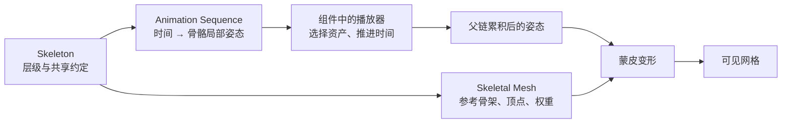
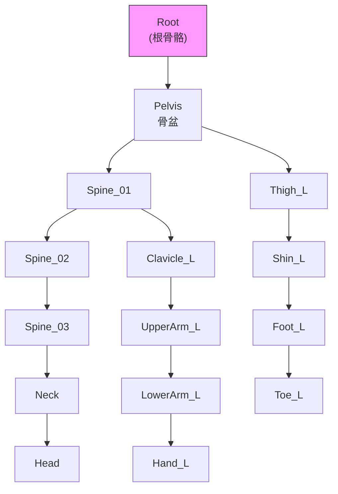
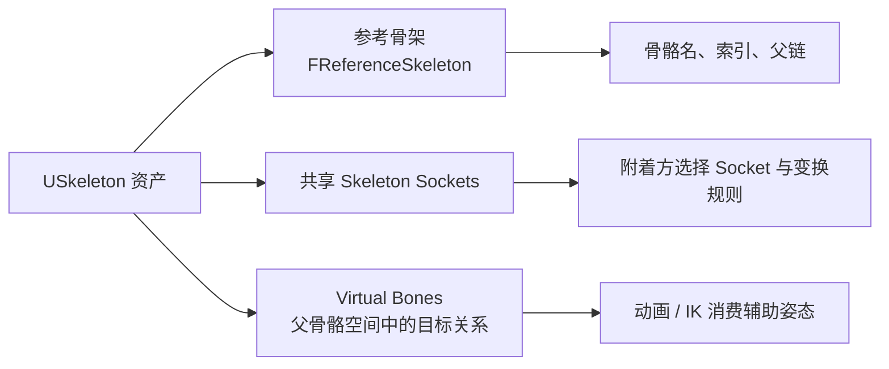
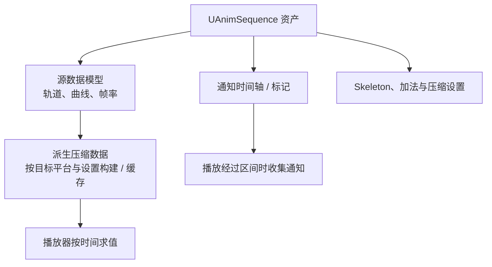

# 07 动画资产与骨骼基础

> 知识成熟度：L2。正文的 UE 资产职责与教学步骤依据公开资料静态核对；蒙皮数值实验属于历史局部证据。
> 版本基准：2026-10-10 实际访问的 Epic 公开文档/API 页面，所用页面标注 Unreal Engine 5.8；本轮没有读取本机 UE checkout、`Engine/Build/Build.version` 或引擎实现。原记录的 UE5.8.0 / CL 55116800 是历史记录，不是本轮环境证据。
> 适用范围：从现成骨骼网格与序列建立单资产播放，再理解骨架、参考姿势、蒙皮、序列、导入、重定向、曲线/通知与资源预算。
> 最后更新：2026-10-10（补完整正常播放例，修正资产职责、Raw/Final、重定向、曲线、通知、采样与压缩的过强结论）。
> 验证边界：本轮只做文档/API 选段核对和仓库静态阅读；未执行 UE 导入、资产创建、蓝图或 C++ 编译、PIE、Cook、设备或性能测试。下文操作和观察均是供读者复现的步骤与预期，不是本轮运行结果。

## 概述

要让角色动起来，先分清“形状”“骨架约定”“某时刻的姿态”和“谁在播放”。否则容易在网格不动时修改权重，在比例不同的时候强换 Skeleton，或把动画曲线当成已经执行的玩法逻辑。

| 对象 | 负责什么 | 不要混同的事 |
| --- | --- | --- |
| Skeletal Mesh | 顶点、蒙皮权重、网格参考骨骼及 LOD 等可渲染数据 | Skeleton 资产本身不是这层几何 |
| Skeleton 资产 | 共享骨骼层级与动画关联，以及插槽、虚拟骨骼和共享动画元数据 | 同名骨骼不自动证明两套骨架可共享 |
| 参考姿势 / 绑定姿态 | 参考姿势提供局部变换基准；绑定姿态用于解释顶点与骨骼的原始空间关系 | 动画第 0 帧、重定向姿势和加法基准不必相同 |
| Animation Sequence | 沿时间变化的骨骼轨道、曲线及通知等资产数据 | 有序列文件不等于有播放实例 |
| SkeletalMeshComponent / 播放器 | 选择动画、推进时间、求值姿态并交给网格呈现 | 单序列播放不负责玩家输入、导航或角色移动 |

这里把 Skeleton 资产与网格分开，是为了定位修改的后果：换外观主要改变网格；共享骨架上的变化可能影响多份网格与动画；换序列改变时序内容；换组件的 Animation Mode 改变消费入口。职责依据 [Skeletal Meshes](https://dev.epicgames.com/documentation/en-us/unreal-engine/skeletal-mesh-assets-in-unreal-engine) 与 [Skeletons](https://dev.epicgames.com/documentation/en-us/unreal-engine/skeletons-in-unreal-engine)。



序列先给骨骼姿态，父子层级把局部变换组合起来，蒙皮才让顶点跟随。只完成其中一条引用，不能期待整条链都成立。

## 核心概念

| 概念 | 读者应把握的含义 |
| --- | --- |
| Bone Hierarchy / Reference Skeleton | 骨骼名、父索引和参考局部变换；原始骨骼与含虚拟骨骼的最终集合要区分 |
| Skinning / inverse bind | 消除绑定时的变换，再按当前骨骼姿态和权重重建顶点位置 |
| Socket / Virtual Bone | 前者是附着偏移，后者是供动画/IK 使用的辅助变换关系 |
| Animation Track / Data Model | 骨骼随时间的变换轨道及编辑器源数据接口 |
| Curve / Notify | 前者在某时刻给值，后者在播放经过区间时参与事件派发 |
| Additive Animation | 相对指定基准的姿态差量；类型、空间和基准需配套 |
| Retargeting / Compression | 前者适配角色骨架与比例，后者用受控误差换取数据体积等成本 |

## 先完成一个正常例：让模板 Manny 播放一段跑步动画

目标是在关卡里放一个独立的动画展示 Actor。先看单序列如何驱动网格，再考虑 AnimBP、重定向和玩法事件。本例不需要购买角色、下载额外动画包或安装 DCC。

### 输入与资产前提

使用 UE5 的 **Games → Third Person → Blueprint、Variant = None** 标准模板项目。本文基于公开 5.8 文档指定两项已经随模板提供的资产：

- 网格 `SKM_Manny`，在 `Content/Characters/Mannequins/Meshes` 中查找
- 序列 `MM_Run_Fwd`，位于 `Content/Characters/Mannequins/Animations/Manny`

[Third Person Template](https://dev.epicgames.com/documentation/en-us/unreal-engine/third-person-template-in-unreal-engine) 支持模板选择与 Manny 资产入口；[Using Live Link With USD](https://dev.epicgames.com/documentation/en-us/unreal-engine/using-livelink-with-the-usd-importer-in-unreal-engine) 的“3. Export a USD File…”第 1 步明确给出 `MM_Run_Fwd` 的位置。这里只借用其资产定位，不需要执行 Live Link/USD/Maya 流程。

若现有项目没有这些资产，先确认模板版本、Variant 和内容是否完整。不要把任意同名下载资源当成本例输入；本轮没有检查本机模板安装。前置知识只需会使用 Content Browser、Details 和关卡视口。

### 从资产到播放的步骤

1. **确认配对**：分别打开 `SKM_Manny` 和 `MM_Run_Fwd`，从资产编辑器进入各自关联的 Skeleton，记录完整资产路径。正常前提是两者关联同一个 Skeleton；比较路径，不能只比较显示名。序列的 Skeleton 属性入口见 [Animation Sequence Editor](https://dev.epicgames.com/documentation/en-us/unreal-engine/animation-sequence-editor-in-unreal-engine)。引用不一致先停止本例，检查是否混入别的版本资产。
2. **构造练习副本**：在 Content Browser 新建 `Content/AnimationAssetDemo` 文件夹，将 `MM_Run_Fwd` 复制一份并命名 `A_Manny_Run_Demo`，放入该文件夹；保留原序列。副本继续引用原来的 Skeleton，不新建骨架、不改骨名。复制序列不会复制一套网格权重。
3. **在资产编辑器建立基准**：打开 `A_Manny_Run_Demo`，在 Preview Scene Settings 选择 `SKM_Manny` 为预览网格。播放、暂停，再拖动时间轴到开头、约四分之一和二分之一时长，记录左右腿/手的相对姿态变化。记下资产实际时长 `T`，不预设它必为某帧数或几秒。预览网格和 Skeleton Tree 用来检查这对资产，不会自动在关卡生成 Actor。
4. **创建消费方**：在练习文件夹选择 Add → Blueprint Class → Actor，命名 `BP_AnimationAssetDemo`。打开后添加一个 **Skeletal Mesh** 组件，命名 `Body`，保持为根场景组件的子组件。在 Body 的 Details 中将 Skeletal Mesh Asset 设为 `SKM_Manny`。本例只需这个组件；不要引用模板角色的状态机或控制脚本。
5. **明确接线**：保持选中 Body，在 Animation 分类设置 `Animation Mode = Use Animation Asset`、`Anim to Play = A_Manny_Run_Demo`；将 `Playing = true`、`Looping = true`、`Initial Position = 0`、`Play Rate = 1`（若 Play Rate 隐藏，展开 Animation 的高级属性）。副本资产自己的 `Rate Scale` 也保持 `1`。保存并编译这个 Actor 蓝图。单资产模式的绑定方式由 [Skeletal Meshes — Animating Skeletal Meshes](https://dev.epicgames.com/documentation/en-us/unreal-engine/skeletal-mesh-assets-in-unreal-engine) 支持；默认播放字段见 [FSingleAnimationPlayData](https://dev.epicgames.com/documentation/en-us/unreal-engine/API/Runtime/Engine/FSingleAnimationPlayData)。
6. **放到能看到的位置**：把 `BP_AnimationAssetDemo` 拖进模板关卡，放在 Player Start 前方可见的地面附近，调整 Actor 高度使脚部不埋地，保持缩放 `(1,1,1)`。保存关卡，点击 Play，使用模板已有玩家视角看这个展示 Actor。预期是它反复播放跑步姿态；这说明“资产 → 组件播放器 → 骨骼 → 网格”已接通。
7. **做单变量对照**：停止 Play，修改蓝图 Body 的默认值后保存/编译，再重新 Play。先将 `Playing` 关掉，预期不再自动推进这段动画；再恢复为 true 并把组件 `Play Rate` 改为 `0.5`，预期同一循环耗时约为原来的两倍，姿态顺序相同。`Playing/Looping` 是初始化默认值，不能把 Details 中的保存值当作任意时刻的实时状态。最后恢复 `Playing = true`、`Looping = true`、`Play Rate = 1`。
8. **解释观察**：预览正常而关卡不动，先查第 4–5 步的组件/模式/资产/播放默认值；两处都异常，先回到第 1–3 步核对配对与内容。如果只有腿在跑而 Actor 没向前移动，不要先改骨架：本例没有 CharacterMovement 或位移逻辑，动画姿态与 Actor 的世界移动是两个责任。源序列的根轨迹也应在资产里单独观察。

| 对照 | 应保持的输入 | 预期变化 | 支持的结论 |
| --- | --- | --- | --- |
| 预览拖动时间轴 | 同一网格、Skeleton、序列 | 不同时刻出现不同姿态 | 序列有时序内容，配对可供初步检查 |
| Playing 关闭后重新 Play | 同一资产与组件 | 不自动推进 | 资产存在与播放器推进不同 |
| 组件 Play Rate 从 1 改为 0.5 | 资产 Rate Scale = 1 | 一次循环约从 `T` 变成 `2T` | 变速首先改变时间推进，不需要改源采样率 |

这些是预期，不是已观测结果。此例可用于导入后的初检、NPC 展示、比较同一动作不同网格的表现；它不证明 AnimBP、Root Motion、通知、网络或 Cook 正确。需要输入驱动的走跑切换时，再进入 [01-动画蓝图与状态机](01-动画蓝图与状态机.md)。

## 原理详解

### 1. 骨骼层级：骨架树（Bone Hierarchy）

骨架是一棵树。骨骼姿态通常记录相对父骨骼的局部变换，组件空间姿态由根到叶逐级组合，再与组件到世界变换组合得到世界姿态。父骨盆转动，即使小腿自己的局部关键帧没变，脚也会随整条父链移动；将子骨骼局部变换直接拿去蒙皮，会漏掉这部分运动。

`FReferenceSkeleton` 保存骨骼信息与参考姿态。当前 [官方 API](https://dev.epicgames.com/documentation/en-us/unreal-engine/API/Runtime/Engine/FReferenceSkeleton) 中，`RawRefBoneInfo/RawRefBonePose` 对应原资产骨骼，`FinalRefBoneInfo/FinalRefBonePose` 包括添加的虚拟骨骼；这不是“编辑前/提交后”两份数据。查询入口包括 `GetNum()`、`GetBoneName()`、`GetParentIndex()` 与 `GetRawRefBonePose()`。

`GetBoneAbsoluteTransforms()` 中的 absolute 是相对骨架原点、已经组合父链的参考变换，不是某个场景 Actor 当前的世界坐标。原文的 `FReferenceSkeletonModifier` 构造/修改入口适合工具开发时继续核对，不是导入后必须手工调用的步骤。



骨骼名是**资产间匹配的重要键**；运行时顶点通常保存骨骼调色板（palette）的数值索引，不逐顶点保存或查找名字。动画轨道、网格骨骼和当前 LOD/section 的索引不应默认相同；改名、重导入、LOD 裁剪后需要重新核对各层映射。

### 2. 蒙皮原理：坐标空间、绑定姿态与权重契约

线性混合蒙皮（Linear Blend Skinning，LBS）先计算每根骨骼对绑定顶点的变换结果，再按权重加权；它不是“把顶点乘当前骨骼局部变换”，也不是对骨骼旋转直接作四元数插值。

#### 2.1 先声明输入和输出空间

下式为**教学数学约定**：齐次列向量，矩阵从右向左作用；不是 UE `FTransform` 或 shader 代码的可直接抄写顺序。内存 row-major/column-major 与行向量/列向量是不同问题，移植时必须核对两者。

| 符号 | 精确定义 |
| --- | --- |
| `p` | 绑定网格局部空间的顶点，齐次分量为 1 |
| `B_i` | 绑定时第 i 根骨骼局部 → 世界变换 |
| `M_bind` | 绑定网格局部 → 世界变换 |
| `I_i = inverse(B_i) * M_bind` | 绑定网格局部 → 绑定骨骼局部，即此约定下的 inverse bind |
| `G_i(t)` | 当前骨骼局部 → 世界变换，已累积父链 |
| `M(t)` | 若后续绘制还要使用的网格局部 → 世界变换，须可逆 |
| `w_i` | 该顶点对第 i 项 palette 的权重，有限、非负、总和为 1 |

```text
# 示意：直接输出世界坐标
p_world = Σ_i w_i * G_i(t) * I_i * p

# 示意：下游还会乘 M(t) 时，先输出网格局部坐标
S_i(t) = inverse(M(t)) * G_i(t) * I_i
p_local = Σ_i w_i * S_i(t) * p
p_world = M(t) * p_local
```

`inverse bind` 消除绑定时已有的位移/旋转，再施加当前骨骼变换。若绑定网格与骨骼已使用同一组件参考空间，或 `M_bind` 已烘焙到资产，可以写成熟悉的 `G_i * inverse(B_i)`；**不能在未声明空间时省略变换**。在实际 glTF 中以资产给定的 inverseBindMatrices 为准，不能把加载时默认姿态当作一定等于绑定姿态而重新求逆。

上述空间转换可由 [Khronos skinning 教程](https://github.khronos.org/glTF-Tutorials/gltfTutorial/gltfTutorial_020_Skins.html)的世界坐标公式推导。特别注意 [glTF 规范](https://registry.khronos.org/glTF/specs/2.0/glTF-2.0.html#skins)：蒙皮网格节点本身的变换应被忽略，bind-shape 应事先合入数据或 inverse bind；上式 `inverse(M)` 与下游 `M` 是一对抵消，**不是给 glTF 再添加一次 mesh node 运动**。UE 的组件空间实现应按其自身管线核对，本文没有宣称 glTF 与 UE 存储/API 相同。

#### 2.2 一个可手算的关节旋转反例

取根骨骼绑定矩阵为单位阵，子骨骼绑定位置为 `(0,1,0)`，顶点 `p=(0,2,0)`。子骨骼绕自身 Z 轴转 90°，列向量约定下：

```text
B_child = T(0,1,0)
G_child = T(0,1,0) * Rz(90°)
I_child = T(0,-1,0)

正确：G_child * I_child * p = (-1,1,0)
漏 inverse bind：G_child * p = (-2,1,0)
乘法顺序颠倒：I_child * G_child * p = (-2,0,0)
根/子各 0.5 权重：p_local = (-0.5,1.5,0)
```

再把整个角色平移到 `x=10`：正确世界位置为 `(9.5,1.5,0)`；若骨骼 palette 已输出世界位置，又当作网格局部再乘 model，就变成 `(19.5,1.5,0)`。这是常见的双重变换，不能靠改权重补偿。

两条必要自检：① 返回真实绑定姿态时复原绑定几何；② 对网格与全部骨骼同时施加同一世界刚体变换，网格局部变形保持不变。它们不能代替完整资产视觉验收，但可快速排除空间混用。

#### 2.3 索引与影响数是资产契约

- **索引先映射再使用**：以 glTF 为例，`JOINTS_n` 索引 `skin.joints`，不是直接索引全部场景节点；若 `skin.joints=[5,12]`，顶点中的 `1` 对应节点 `12`，并使用同序的 `inverseBindMatrices[1]`。重排 palette 却不重映射顶点会静默绑错骨骼，所有索引都未越界也可能出错。
- **4 个槽不等于通用上限**：glTF 每组 `JOINTS_n/WEIGHTS_n` 有 4 项，可有后续组；客户端允许只支持一组，互通前需确认。UE 的 [Rendering Paths](https://dev.epicgames.com/documentation/unreal-engine/skeletal-mesh-rendering-paths-in-unreal-engine?lang=en-US)（2026-10-10 重新核对对应 influences 选段）说明默认固定 4/8 influences，依平台而定；Unlimited 路径当前源数据实际最多 12，项目/平台/每 LOD 还可限额。“Unlimited”不是数学上无限。每顶点影响数与每 section 骨骼数量限制是两种预算。
- **裁剪后归一化仍会改变形状**：保留大权重可作为压缩启发式，不能保证极端姿态误差小。实验中权重 `.6/.3/.1` 的三个平移影响得到 `(0.9,0,1)`；删掉 `.1` 再归一化得到 `(1,0,0)`。验收应量化顶点偏差，并覆盖肩、肘、扭转和 LOD 切换。
- **输入异常先拒绝或显式修复**：零权重和、NaN、负权重、越界/错位 palette 都要诊断；不要用“最后归一化”掩盖资产故障。量化权重需按实际格式设置容差，实验的 `1e-9` 仅为双精度教学输入。

#### 2.4 权重合法也不保证形变正确

LBS 线性平均的是变换后的点，旋转矩阵平均后一般不再是刚体旋转。一个直接反例：对 `(1,0,0)` 分别绕 Z 轴转 `+90°/-90°` 再各取一半，结果为原点；权重完全合法，半径仍塌缩到零。关节扭转收缩不一定是坏权重，需结合 rig、修形与蒙皮算法判断。

UE 同时提供 CPU 与 GPU 蒙皮路径；顶点权重缓冲可从 `FSkinWeightVertexBuffer` 等结构追踪（沿用原文示意，本轮未核对该结构源码）。GPU 蒙皮可走 vertex shader 路径，也可走 compute Skin Cache，不能把“GPU 蒙皮”全等同于 Skin Cache；具体路径与开销参见同一 Rendering Paths 官方页。这里的公式只讨论**位置**，未实现法线/切线、非均匀缩放的法线处理、morph 或 dual-quaternion skinning。

#### 2.5 验证与排查顺序

历史 [蒙皮坐标与权重契约实验](../../../evidence/labs/skinning-contract/README.md)记录了 2026-10-02 的运行：16 个 `unittest` 在 Python 3.12/Linux 默认与 `-O` 模式均通过，保存输入与源码哈希及 [原始输出](../../../evidence/labs/skinning-contract/results/python_linux.txt)。本轮只读了归档说明与原始输出，未重跑实验。实验仅支持上述数值命题，不构成 UE 导入、Cook、GPU 或目标平台验证；本篇整体保持 L2。

推荐排查顺序：**父链/空间 → inverse bind 与真实绑定姿态 → palette 映射 → 权重/影响裁剪 → 渲染与 LOD 配置**。先用单骨骼 100% 权重和绑定姿态缩小问题，再恢复多权重、LOD 和动画；“骨骼预览正确但网格错”不能直接推出只是权重问题。

### 3. Skeleton 资产：共享什么，修改会影响谁

`USkeleton` 是项目中的资产对象，承担网格与动画共享的骨骼约定，并管理相关共享数据。多个网格共享 Skeleton 的前提是骨骼名字与主要层级关系一致；允许合规的外围骨骼扩展，不等于可以任意插入父节点或改名。即使能共享，体型比例也可能需要姿态适配。[Skeletons — Sharing Skeletons](https://dev.epicgames.com/documentation/en-us/unreal-engine/skeletons-in-unreal-engine) 描述了这些限制。

**Socket** 是相对父骨骼的附着偏移。例如把武器挂在手上，用 Socket 调整握把位置，不需要改变网格顶点。默认 Skeleton Socket 随共享 Skeleton 保存；只适用于某件外观的偏移可使用 Mesh Socket，保存于特定 Skeletal Mesh。真正附着时还要选择保留相对、保留世界或对齐目标的变换规则；“创建了 Socket”本身不会把武器挂上去。[Skeletal Mesh Sockets](https://dev.epicgames.com/documentation/en-us/unreal-engine/skeletal-mesh-sockets-in-unreal-engine)

**Virtual Bone** 在选定父骨骼空间中跟随目标骨骼，是非蒙皮的辅助关系。例如从 root 建到 hand_l 的虚拟骨骼，再配合适当的混合遮罩和 IK，保留一份手部目标来抑制加法动画造成的漂移。创建 VB 不会自动施加“两点约束”，仍需消费它的动画逻辑。默认命名以当前编辑器实际生成结果为准，不把 `VB_` 拼接规则当成跨版本契约。[Virtual Bones](https://dev.epicgames.com/documentation/en-us/unreal-engine/virtual-bones-in-unreal-engine)



工具开发时，[USkeleton API](https://dev.epicgames.com/documentation/en-us/unreal-engine/API/Runtime/Engine/USkeleton) 提供骨骼映射、`FindSocket`、`GetVirtualBones` 与 `GetCompatibleAssets` 等入口。`RebuildLinkup` 用于网格重导入等使映射失效的场景；普通编辑器用户应先检查导入结果，不把手动调用内部重建函数当成每次导入的仪式。兼容资产检索也不等于视觉正确性证明。

### 4. Animation Sequence：源数据、时间与运行时表示

一段序列回答“给定动画时间，骨骼和曲线该是什么值”。[Animation Sequences](https://dev.epicgames.com/documentation/en-us/unreal-engine/animation-sequences-in-unreal-engine) 描述的关键帧包含位置、旋转、缩放；播放器在时间推进时取样，必要时在关键帧间插值，而不是每个游戏帧只能取一个源帧。



- **源数据**：编辑器的数据模型提供轨道/曲线及采样信息；修改工具应使用对应数据模型/控制器接口，不直接写过时的公开字段。当前 API 暴露 `GetDataModel()`、`GetDataModelInterface()`、`GetController()`；本文未阅读这些接口的实现或线程约束。[UAnimSequenceBase API](https://dev.epicgames.com/documentation/unreal-engine/API/Runtime/Engine/UAnimSequenceBase)
- **派生数据**：压缩表示不等于编辑器源关键帧数组。当前 `UAnimSequence` API 包含按平台取得压缩数据、压缩有效性/过期检查和缓存入口，因此不能说“只有 Cook 后才存在压缩数据”。Cook 是目标平台交付链中的一环，缓存和重建还可能在编辑器阶段发生；精确调度需另读实现。[UAnimSequence API](https://dev.epicgames.com/documentation/en-us/unreal-engine/API/Runtime/Engine/UAnimSequence)
- **时间参数**：采样率描述数据的时间分辨率；`Rate Scale` 和播放器 Play Rate 影响播放速度；插值模式影响采样之间怎么取值。它们解决不同问题。

一个可纸面追踪的例子：同一条一秒钟的线性位移，从 0 走到 100，分别按 30Hz 和 60Hz 采样。若时间范围正确且使用线性插值，`t=0.5s` 都应得到 50，不会因为源采样率不同就自动错拍。反过来，把“一秒内的 30 个时间间隔”误解释为 60Hz，会变成半秒；改变了时间解释，动作才会加速。这是教学推导，不是 Manny 资产测量。曲线复杂时低采样率会损失细节，动作混合的脚步相位还需同步标记或节奏设计，不能只统一到 30fps。

### 5. 曲线与通知：值通道和事件通道

曲线适合表达连续量，例如握紧权重、面部形变或材质参数；通知适合表达某个播放区间里的事件，例如脚步音效。骨骼轨道改变姿态，曲线本身不会自动执行任意玩法逻辑，事件接收方也必须存在。

[Animation Curves](https://dev.epicgames.com/documentation/en-us/unreal-engine/animation-curves-in-unreal-engine) 描述的常用动画曲线为浮点通道：序列保存时间键，Skeleton 管理可共享的曲线名称/元数据。曲线还可设置 Connected Bones 和 Max LOD，不能绝对地说“曲线与骨骼无关”。用于材质时需要匹配标量参数名并启用 Material 类型；用于玩法时需要消费逻辑。骨骼变换轨道、动画属性与这些浮点曲线也不应混成一种数据。

例如在练习序列的曲线编辑器中设计 `GripWeight`：`t=0` 为 0、`t=T/2` 为 1、`t=T` 为 0，并设为线性插值。可预期 `t=T/4` 的曲线值为 0.5；若没有握紧逻辑或对应材质消费它，画面不会因此变化。这个例子解释数据与用途的关系，不宣称本文已创建曲线，也不把新增曲线视为只改了序列：它可能同时修改共享 Skeleton。

[Animation Notifies](https://dev.epicgames.com/documentation/en-us/unreal-engine/animation-notifies-in-unreal-engine) 区分：

- 点 Notify：在时间轴某处安排一个事件
- Notify State：在一个区间安排 Begin/Update/End 类回调
- Skeleton Notify：名称保存在共享 Skeleton，具体时间位置安排在序列中，并由 AnimBP 的对应事件接收

因此在最小例的单资产模式下，不应添加一个仅由 AnimBP 接收的 Skeleton Notify 后，期待不存在的 AnimBP Event Graph 自行运行。已有标准音效/特效 Notify 则还有自己的资源与附着参数，须逐项配置。

“播放经过时间点”也不是无条件触发保证：混合权重阈值、触发概率、LOD 过滤、Sync Group 领导者/跟随者以及是否在编辑器/专用服务器触发都会影响结果。曲线的最终混合值也取决于消费节点与混合策略。预览中看到通知位置或能读到原始曲线，不等于最终实例在那一刻收到了事件或相同数值。

### 6. 加法动画：必须知道差量相对谁

加法动画表达相对基准姿态的变化，适合呼吸、受伤抖动和瞄准等叠加需求。它必须成对定义“差量”和“差量所处的空间/基准”；把一个完整姿态误当增量相加，会重复施加基准。

仅考虑绕同一固定轴的标量角度：基准抬臂 10°，目标 30°，增量是 20°。把它叠到 40° 的基础姿态得到 60°；若误把 30° 当增量，会得到 70°。这只是受限教学例，三维旋转不能一般地用欧拉角相减代替旋转组合。

在序列 [Asset Details](https://dev.epicgames.com/documentation/en-us/unreal-engine/animation-sequence-editor-in-unreal-engine) 中确认 Additive Anim Type、基准来源及对应动画/帧：Local Space 与 Mesh Space 的差量解释不同；参考姿态、另一序列、另一序列某帧等也不能互换。`IsValidAdditive()` 只能辅助检查配置有效性，仍须看实际叠加结果。重定向后基准或空间变了，应重新建立/核对目标端加法关系，不能从“原动画合法”推出“新角色叠加正确”。

### 7. FBX 导入与重导入：把入口数据接到同一约定

前面的模板例使用现有资产，已能学习绑定和播放。有 DCC 产出的资产时，正常导入链是：**带蒙皮网格与骨骼 → Skeleton/Skeletal Mesh → 同源动画 → 检查配对 → 使用前例播放器**。

下面的选项名针对官方 [FBX Import Options](https://dev.epicgames.com/documentation/en-us/unreal-engine/fbx-import-options-reference-in-unreal-engine) 描述的窗口。若本机出现的是 Interchange 管线界面，不假定控件和默认值相同，先按该管线对应文档核对；本轮没有切换任何导入器或设置。

1. 在 DCC 先确认骨骼名/父链、蒙皮权重、单位/朝向、参考与绑定姿态，导出明确的动画时间范围。骨名相同但父链不同，不是可直接复用的充分条件。
2. 首次导入这套带蒙皮网格时选择 Skeletal Mesh，导入网格；如果是新骨架，Skeleton 留空以创建对应资产。有经过确认的兼容共享 Skeleton 时才指定已有项。
3. 导入仅动画的 FBX 时关闭 Import Mesh，选择刚才那一套 Skeleton，启用 Import Animations；根据源文件选择 Exported Time 或明确的帧范围，并记录采样率选项。导入后应得到 Animation Sequence，而不是又无意创建一套网格/骨架。
4. 打开导入序列，确认 Skeleton、总时长、关键动作时刻与预览网格；像前例一样先预览，再将其接入 Body 的 Anim to Play。动画错乱先看导入警告和资产关系，不靠盲目改组件旋转修复骨骼层级错误。

这些步骤要求已有合格 FBX，本文未提供或生成该外部输入。若只想练习本篇主线，模板资产已足够，无需为这个可选入口额外准备商业角色。

几个会改变含义的选项必须单独理解：`Use T0As Ref Pose` 用动画第 0 帧替换网格参考姿势，不是普通动画播放开关；`Update Skeleton Reference Pose` 会更新共享 Skeleton 的参考姿势；`Import Meshes in Bone Hierarchy` 决定层级中的网格作为网格导入还是转成骨骼，不能简写为“按骨骼层级导入”。

重导入前留存序列与 Skeleton 的可恢复副本或版本，记录轨道、曲线/通知、时间位置、基准和压缩设置；重导入后逐项比较。官方资料明确有删除已有自定义属性曲线等选项，但本轮来源不支持“通知通常全部被覆盖”或“标准 FBX 能嵌入 UE Notify”的通用结论。不同导入器/重建流程的保留策略需用真实副本验证，不能先假定必丢或必保留。

`Retarget Source/Retarget Source Asset` 属于基准来源设置，不是把动画指向任意目标角色的替代操作；修改后要检查相关参考姿态与依赖。当前 API 的 `GetRetargetSourceAsset/SetRetargetSourceAsset` 可作工具开发入口，历史弃用年份与原行号不在本轮实现核对范围内。

### 8. 重定向：共享、导出、运行时是三种选择

| 选择 | 正常用途 | 输出与代价 |
| --- | --- | --- |
| 共享同一 Skeleton，或符合条件的 Compatible Skeletons | 骨架结构相同/近似的外观复用 | 复用动画数据；比例、姿态仍需检查 |
| IK Retargeter 预览后导出 | 为目标角色制作可独立播放的序列 | 产生目标 Animation Sequence，占用新的资产与维护空间 |
| Retarget Pose From Mesh 运行时重定向 | 动态从源角色姿态驱动目标 | 可不生成目标序列，但依赖源/目标组件与每帧求解条件 |

[IK Rig Animation Retargeting — Preview Animation and Export](https://dev.epicgames.com/documentation/en-us/unreal-engine/ik-rig-animation-retargeting-in-unreal-engine) 明确支持导出目标序列；[Runtime IK Retargeting](https://dev.epicgames.com/documentation/en-us/unreal-engine/runtime-ik-retargeting-in-unreal-engine) 才是运行时路线。不能把整个 IK Retargeter 系统写成“只在播放时求解，永远零复制”。

换骨架要核对链映射、角色比例、重定向姿势和根运动，再验手脚接触。重定向姿态不是网格绑定姿态，加法基准也不是同一概念。姿态传到目标组件，不等于源序列的所有 Notify 事件自动在目标 AnimBP 中再派发；导出流程是否保留曲线、通知和标记，也要检查目标资产及其消费方。具体接线留给 [06-动画重定向与IKRetargeter](06-动画重定向与IKRetargeter.md)。

### 9. LOD、压缩与加载预算

先区分花在哪里：几何顶点、蒙皮影响数、需要的骨骼、AnimGraph 节点、更新频率和动画数据常驻量，不能用一个“动画 LOD”参数代表全部。

- **网格 LOD**：顶点/权重与影响数可随 LOD 变化；[Bones to Remove](https://dev.epicgames.com/documentation/en-us/unreal-engine/skeletal-mesh-lods-in-unreal-engine) 还会裁剪该 LOD 使用的骨骼，不等于永久删除共享 Skeleton 中的骨名。
- **节点与频率**：支持 `LODThreshold` 的 [Skeletal Control 基类](https://dev.epicgames.com/documentation/en-us/unreal-engine/API/Runtime/AnimGraphRuntime/FAnimNode_SkeletalControlBase) 会限制该节点运行，并不表示整张 AnimGraph 停止；URO 的更新频率又是另一层。降面数不保证动画 CPU 同比例下降，详见 [04-动画性能与预算分配](04-动画性能与预算分配.md)。
- **动画数据**：骨骼数、时长、采样密度与曲线数量可作为原始数据量的估算方向，压缩后大小还受静止轨道、冗余键、编码方法和误差目标影响。“骨骼数 × 帧数 × 固定字节”不能直接预测最终内存或 Cook 包大小。
- **压缩选择**：Bone Compression Settings 与 Curve Compression Settings 分别控制对应数据。对关键动作比较压缩前后的姿态、末端位置、曲线和接触误差，再检查体积/加载成本；`IsCompressedDataValid()` 不是“视觉质量合格”的证明。[Animation Sequences — Animation Compression](https://dev.epicgames.com/documentation/en-us/unreal-engine/animation-sequences-in-unreal-engine)
- **资源依赖**：按需加载的收益取决于实际引用关系，硬引用整套动画仍可能让它们常驻。Blend Space 是组织/混合输入动画的资产，增加它不会自动消除它所引用序列的数据。

在本篇最小例中只改变 Play Rate，并没有减少关键帧或压缩数据，所以不能据此宣称省内存或降低蒙皮成本。本轮没有运行任何平台性能比较。

### 10. 常见资产管线坑位速查

| 症状 | 首先区分的层 | 首选排查点 |
| --- | --- | --- |
| 预览正常、关卡不动 | 消费入口 | 选中的组件、Animation Mode、Anim to Play、初始化播放默认值 |
| 两处都动作错乱 | 资产与骨架配对 | Skeleton 引用、骨名/父链、导入日志、基准姿态 |
| 顶点飞走/网格撕裂 | 空间与蒙皮 | 父链、inverse bind、palette、权重与 LOD |
| 挂点不对 | 附着 | Socket 所属资产、父骨骼、偏移与附着变换规则 |
| 曲线存在但效果为零 | 值的消费 | 名称/类型、实例求值、混合策略、Connected Bones/LOD |
| 通知存在但不触发 | 事件的消费 | 接收方、时间推进、权重/概率/LOD/同步组/执行环境 |
| 加法叠加变形 | 差量定义 | 基准来源、Local/Mesh Space、重定向后的姿态关系 |
| 重定向后脚滑 | 姿态适配与运动 | 链/比例/姿势、根运动与角色实际速度 |
| 内存超预算 | 数据与依赖 | 实际压缩大小、重复资产、硬引用与常驻关系 |
| LOD 切换异常 | 多层配置 | 该 LOD 的骨骼/影响数、节点阈值、曲线过滤与更新频率 |

先确定是哪一条责任链断开，再改对应输入。命名只是骨架兼容检查的一部分，不能把所有动画问题都压成命名错误。

## 代码 / 示例

### C++：只查询资产，不在查询时修改共享骨架

下例是接入已有 UE 工程的函数节选，输入是已加载的 Skeleton 与 Sequence 指针；不是完整工程，本轮未编译或运行。先用前面的编辑器正常例理解数据，再用它给资产检查工具增加日志。

```cpp
#include "CoreMinimal.h"
#include "ReferenceSkeleton.h"
#include "Animation/Skeleton.h"
#include "Animation/AnimSequence.h"

void DescribeAnimationAssets(USkeleton* Skeleton, UAnimSequence* Sequence)
{
    if (!Skeleton || !Sequence)
    {
        UE_LOG(LogTemp, Warning, TEXT("Skeleton or sequence is missing"));
        return;
    }

    const FReferenceSkeleton& Ref = Skeleton->GetReferenceSkeleton();
    for (int32 Index = 0; Index < Ref.GetNum(); ++Index)
    {
        UE_LOG(LogTemp, Display, TEXT("Bone=%s Parent=%d"),
            *Ref.GetBoneName(Index).ToString(), Ref.GetParentIndex(Index));
    }

    const FFrameRate Rate = Sequence->GetSamplingFrameRate();
    UE_LOG(LogTemp, Display, TEXT("Sequence=%s Length=%.3f SampleRate=%d/%d Additive=%d"),
        *Sequence->GetName(), Sequence->GetPlayLength(),
        Rate.Numerator, Rate.Denominator, Sequence->IsValidAdditive());
}
```

这段输出回答骨架名/父链、采样率和长度，不证明输入 Skeleton 正好是该 Sequence 的关联骨架，也不证明变形正确；调用方仍须比较实际资产引用。每帧反复按名字查找可在结构稳定的生命周期内缓存，但重导入或切换网格/LOD 后不能沿用未经核对的索引映射。

符号定位来自公开 API：`Engine/Source/Runtime/Engine/Public/ReferenceSkeleton.h`、`Engine/Source/Runtime/Engine/Classes/Animation/Skeleton.h`、`Engine/Source/Runtime/Engine/Classes/Animation/AnimSequence.h`、`Engine/Source/Runtime/Engine/Classes/Animation/AnimSequenceBase.h`。这是官方 API 的文件定位，不是本轮已读取的实现源码。原文中的具体 Windows 路径、行号和弃用年份不作为本轮证据。

## 最佳实践

1. 先让一对已知同源的网格/序列在独立组件中播放，再增加 AnimBP、IK、蒙太奇与玩法逻辑
2. 将骨名、父链、单位、基准姿态、必要插槽/曲线/通知一起作为资产交接约定；同名不等于兼容
3. 共享 Skeleton 前核对结构和比例；需要不同骨架时选明确的共享或重定向路线，不强制“一种角色只有一个 Skeleton”
4. 优先用 Socket 表达附着偏移，用 Virtual Bone 配合动画逻辑表达辅助目标；不把它们当成蒙皮骨骼的万能替代
5. 用实际时长、接触相位和采样误差检查动画；统一帧率是管线选择，不是混合正确性的证明
6. 重导入检查副本与前后差异，尤其是时间范围、共享参考姿态、曲线/通知和依赖；不要预设某项数据必丢或必留
7. 加法、重定向和 Root Motion 分别有自己的基准与消费路径，组合后需要重新验收
8. 先测资产大小/常驻和具体运行阶段，再优化压缩、加载或 LOD；Blend Space 不自动节省输入序列内存

## 常见问题 FAQ

### Q1：序列编辑器能播，关卡里的角色不动？

查消费入口：Body 是否为正确 SkeletalMeshComponent、是否仍处在 Use Animation Blueprint、Anim to Play 是否指向练习副本、Playing 是否在开始播放前启用。预览器与关卡组件是两份播放上下文。

### Q2：动画播放时“骨骼对不上”，或换 Skeleton 后失效？

核对完整 Skeleton 引用、骨名、父链和基准，而不是仅查显示名。名字不匹配、层级不兼容可能触发错误或丢失预期轨道，具体结果看导入日志；不能承诺总是静默丢弃。需要跨骨架时按 §8 选择合适路线，兼容列表不会自动修正所有比例差异。

### Q3：顶点飞到天上或网格撕裂？

先验证 §2 的绑定姿态复原和单骨骼旋转，再查父链/空间、inverse bind、palette 映射、权重和非有限值、重导入后的关联映射。角色移动后偏移翻倍应查 model 是否重复施加；只看权重颜色不能排除这些问题。

### Q4：创建了虚拟骨骼，手仍然漂移？

VB 只提供辅助关系。检查选定父骨骼和目标骨骼、是否保存 Skeleton、混合遮罩是否保留了所需目标，以及 IK 是否真正消费它。不要通过猜测固定前缀代替检查真实骨名。

### Q5：曲线有键，但读不到或画面不变？

先确认当前实例真正播放了该序列、名称与消费方匹配，再查曲线类型、混合结果、Connected Bones/Max LOD 及压缩/导入选项。查询资产原始曲线不等于查询实例最终值；没有消费方时不出现画面变化是正常的。

### Q6：通知没触发，或重导入后位置不对？

先分清数据是否仍在、时间是否改变、接收方是否存在。再查触发条件与播放路径。重导入前后比较事件名、类型、时间/区间和实际回调；本轮没有证据支持“所有重导入通常会覆盖通知”，也不建议依靠未经证明的 FBX Notify 嵌入流程。

### Q7：不同帧率的动画混合就会卡顿吗？

不会由帧率不同直接推出。检查时间范围是否被误解释、低采样是否损失运动细节、循环接缝与接触相位是否对齐，以及运行时更新是否被降频。变速先理解播放器 Play Rate 与资产 Rate Scale，不要为“统一数字”改变动作时长。

### Q8：加法动画换角色后扭曲？

检查差量的 Local/Mesh Space、基准姿态或基准序列/帧，以及重定向是否改变了它们的关系。`IsValidAdditive` 通过只表明相应配置检查通过，仍需要观察目标端叠加结果。

### Q9：动画资产或运行时内存过大？

先测实际压缩体积和引用/常驻关系，分清编辑器源数据、Cook 数据和运行时数据，再考虑误差可接受的压缩、采样或冗余资产整理。避免把 Blend Space 或降低网格三角形数当作一定减少动画数据内存的方案。

### Q10：FBX 导入后多出骨骼或层级变了？

检查源文件中的辅助节点、骨名/父链与 Import Meshes in Bone Hierarchy 等具体选项。对照导入日志和结果树，必要时回 DCC 修正并在副本上重试；不要修改共享 Skeleton 的参考姿势来掩盖不明原因的导入差异。

## 来源与验收边界

本轮在 2026-10-10 阅读了文中链接的 Epic 页面相关选段：模板内容和资产路径；网格/Skeleton 职责；序列编辑器与 FBX 选项；曲线、通知、Socket/VB；重定向导出与运行时；Rendering Paths 的 influences/Skin Cache、LOD 的骨骼裁剪，以及 API 中实际使用的类型/函数。API 文档不等于 `.cpp` 实现阅读，页面标注 5.8 也不等于本机安装版本验证。

§2 的数学推导、反例与 glTF 解释沿用既有知识，原有 Khronos 来源和实验入口保留；本轮未重读 Khronos 全文或执行数值实验。仅检查了历史实验说明与原始输出，不能把 2026-10-02 的结果改记为本轮运行。

当前可验收的是：正常例的输入/资产关系/组件接线/操作/预期是否连贯，来源是否支持对应结论，静态链接与元数据是否有效。仍待实际环境验证的是模板资产存在性、菜单/默认值、导入器差异、预览与关卡对照、编译、通知/曲线消费、Cook 与目标平台性能。本篇保持 L2，`verified` 不因写作或静态检查而新增事件。

## 关联阅读

- [01-动画蓝图与状态机](01-动画蓝图与状态机.md)：资产如何被 AnimBP 消费——骨骼与序列是动画图的输入。
- [02-动画蒙太奇与混合空间](02-动画蒙太奇与混合空间.md)：蒙太奇/混合空间对序列资产的组织与曲线/通知的依赖。
- [04-动画性能与预算分配](04-动画性能与预算分配.md)：资产层预算（压缩/帧率/轨道）与运行时开销（URO/ABA）的配合。
- [06-动画重定向与IKRetargeter](06-动画重定向与IKRetargeter.md)：重定向依赖骨骼命名与链定义，资产层规范是重定向质量的前提。
- [12-引擎源码分析/11-动画系统求值源码](11-动画系统求值源码.md)：从源码看动画求值管线如何读取骨骼与序列数据。

## 更新日志

- 2026-10-10：补模板 Manny 序列副本与独立 Actor 的完整播放教学；修正 Skeleton/网格职责、Raw/Final、曲线关联、通知条件、采样率、重导入、重定向与压缩边界。依据 Epic 公开 5.8 文档/API 选段；未读本机引擎实现、未运行 UE 或编译。保留蒙皮推导和 2026-10-02 历史实验。
- 2026-10-02：修正蒙皮输入/输出空间、inverse bind 与 palette 索引契约，移除“1~4 根影响”和“LOD 只影响蒙皮”的绝对化结论；补手算反例与 16 项 stdlib Python 数值测试。该次官方资料复核与数学实验不冒充 UE5.8 本机源码/运行验证，未重验其余历史小节。
- 2026-08-07：原文新建记录称基于本机 UE5.8（CL 55116800）核对 `FReferenceSkeleton`、`USkeleton`、`UAnimSequence` 等符号并记录行号；这是原历史说明，本轮没有复验该环境、行号或全量实现。原始文字保留在 Git 历史与本次仓外原稿中。
