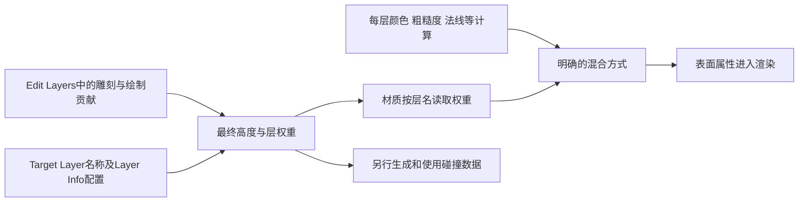

# 01 Landscape 地形系统

> 知识成熟度：L2。本篇依据公开一手资料静态核对；没有运行 UE、编辑器、C++/蓝图、编译、Cook、地形导入、GPU/设备采集或性能实验，`verified: []` 不变。
> 版本基准：主要采用 Epic 文档的 `application_version=5.6` 页面；编辑数据接口局部采用 5.5，Proxy 类型/API 只能读到读取日显示 5.8 的动态页。选择器不是不可变源码修订，已发现网页内部的新旧说明混合，见第 8 节。
> 事实边界：原稿声称 UE5.8 关键 API 已对照本机源码，本轮未取得那份 Engine checkout、Build.version 或原始核对记录。本文不认证旧行号、引入版本、源码实现及全平台行为。
> 适用范围：高度场地形的概念与使用层；帮助选择尺寸、导入素材、配置绘制层，以及区分显示、碰撞、流送和编辑结果。不是运行时地形编辑器实现。
> 验证建议：文中的 `PAPER_EXPECTED` 均为手算或流程推演；所有目标工程操作均为 `NOT_RUN`，没有把计划写成实验结果。
> 最后更新：2026-10-09，修订数据单位、层混合、LOD/Nanite/碰撞/WP及导入与恢复边界。

## 1. 概述

Landscape 用规则高度场表达山地、平原和道路周围的地表：水平网格确定采样位置，高度决定起伏，权重决定不同地表外观的影响。它把编辑数据、渲染表示、碰撞和分区组织结合起来，但这些部分不是一份数据改完就同时完成的单一对象。

选择它的理由是已有的地形编辑和分块表示工作流，而不是“任何大地面都必然比 Static Mesh 快”。高度场不能在同一水平位置表达任意多层表面；洞口可以用可见性遮罩衔接额外网格，洞壁、悬挑和地下空间仍要另建几何。洞的视觉、碰撞与导航也需分别验收。[S02]、[S16]

前置知识是 Actor/Component、坐标变换和普通材质输入。读完应能回答：

- 为什么 1009×1009 是一组合法输入，而随意把它补成 1024×1024 可能改变导入结果
- 同样的高度编码在 Z Scale=1 与 100 时为什么不是同一个世界高度
- Edit Layer、Target Layer、Layer Info 和材质混合节点各改哪份数据
- 为什么画面已有山坡，角色碰撞、Nanite 派生数据或另一个流送区域仍可能未准备好
- 怎样在隔离内容中导入、保存、排查并恢复，而不是在失败后继续覆盖原地形

材质一般原理见[材质系统详解](02-材质系统详解.md)，加载与测量方法见[渲染与加载性能优化](../../08-工程实践与质量/调试与性能分析/04-渲染与加载性能优化.md)。本文保留地形特有的数据合同，不重复它们的完整教程。

## 2. 核心概念（表格）

| 对象/数据 | 用途 | 容易混淆的边界 |
| --- | --- | --- |
| `ALandscape` / `ALandscapeProxy` | 主地形与代理管理基础 | 公开动态 API 列出前者继承后者；继承关系不是“主 Actor 内嵌另一个基类 Actor” |
| `ALandscapeStreamingProxy` | 同一地形的分区代理类型 | 也是 Proxy 派生类；编辑成一个整体不等于运行时只加载一个 Actor |
| Landscape Component | 地形渲染、可见性与碰撞组织的基本块 | Component 数、Section 数、Runtime Cell 数不能互换 |
| Section / Subsection | Component 内的子块，1 个或 2×2 个 | Section 是传统 Landscape LOD 计算单位；边界样本在存储中有重复 |
| Heightmap / Weightmap | 高度与各 Target Layer 的权重数据 | 源文件、编辑层数据、最终纹理和碰撞高度场不是同一资源 |
| Edit Layer | 非破坏编辑栈中的一层 | 保存高度/绘制等编辑贡献；不是材质中一种“草/泥/雪”表面 |
| Target Layer / Layer Info | 有名字的绘制目标与其关联资产/设置 | 必须匹配材质使用的层名；不意味着每层固定独占一张纹理 |
| Landscape 材质 | 消费层权重并计算表面属性 | 使用普通材质工作流与 Landscape 专用表达式，没有本文所称的独立“Landscape Material Domain” |
| Collision Mip | 为简单/复杂碰撞选择高度场细节 | 与视觉 LOD、Nanite 集群细节、材质凹凸各有独立职责 |
| Spline / RVT / Grass | 曲线路面、着色缓存、地表植被的相关系统 | 网格、形变、着色与草实例分别更新，不构成一个通用运行时编辑接口 |

类型关系只取 [S11]、[S12] 的公开声明；组件/Section 机制取 [S01]，层与材质取 [S03]–[S05]，碰撞取 [S08]。具体私有成员、线程、宏守卫和缓存刷新顺序未读实现，不能从名字补出调用链。

## 3. 原理详解

### 3.1 地形数据组织：先算网格，再定世界尺寸

[S01] 说明 Section 的顶点边长取 2 的幂，最大 256；一个 Component 可有 1 或 2×2 Sections。高度纹理中的相邻边界样本会重复，逻辑上相邻块却在同一位置衔接。因此要把“唯一顶点数量”和“含重复边界的存储样本数量”分开。

令每 Section 边长为 `q` 个 quads（四边形），即 `q+1` 个顶点；每轴有 `s=1` 或 `2` 个 Sections；每轴 Component 数为 `Cx、Cy`：

```text
每 Component 每轴 quads：Q = s × q
整图唯一顶点尺寸：Nx = Cx × Q + 1，Ny = Cy × Q + 1
水平跨度：Lx = (Nx−1) × dx，Ly = (Ny−1) × dy
```

`dx、dy` 是相邻网格点的世界距离，不是贴图 UV 的重复次数。例中使用默认厘米长度约定，X/Y Scale=100 对应 100 cm=1 m 的间距，且没有额外父变换/旋转/非均匀缩放。该取值只是示例，不能按游戏品类推荐固定间距。

`PAPER_EXPECTED P01`：选 `q=63、s=2、Cx=8、Cy=4`，得到 `Q=126`、`Nx=1009、Ny=505`，共 32 Components、128 Sections。取 `dx=dy=1 m`，跨度为 1008 m×504 m，而不是 1009 m×505 m。若每轴 `s=1`，同样覆盖和密度需 `Cx=16、Cy=8`，即 128 Components、仍为 128 Sections。后者组织块更多，但不能据这个计数推导总帧时间、所有 Pass draw 数或内存倍数。

这也是 2×2 Sections 下 `ComponentSizeQuads=126` 合理的原因：不能把 63/127/255 一律当作 Component 边长规则。四个相邻 63-quads Sections 沿一轴有 127 个唯一位置，却各存 64 个边界样本；物理纹理布局不等于简单的整图 `(Nx,Ny)` CPU 数组。

小 Component 让剔除与地形细节选择更细，却增加组件组织成本；Section 也有绘制成本。[S01] 的组件建议是指南条件下的取舍，不是硬件无关预算。先固定覆盖范围、采样密度与代表视点，再比较候选，不能沿用“组件宁小勿大”。

### 3.2 高度编码：局部值、Z Scale 与世界位置

[S01] 给出的 16-bit 高度范围约为局部 `−256…255.992`，再乘导入 Z Scale。本文把常见无符号高度编码 `h∈[0,65535]` 的均匀映射写成数学合同；它不是逐字引用原稿的 `LandscapeDataAccess` 实现：

```text
z_local = (h − 32768) / 128
轴向、无旋转例：z_world_cm = z_origin_cm + z_local × Sz
相邻编码世界步长：Δz_cm = Sz / 128
```

局部数值不是“米”。`Sz=1` 时一步约 0.0078125 cm；`Sz=100` 时才约 0.78125 cm。一般变换应对完整局部位置应用 Landscape 到世界的变换，不把这个仅沿 Z 的例式直接套到旋转地形、不同坐标原点或层叠网格。

`PAPER_EXPECTED P02`：原点高度为 0，分别取 `Sz=1` 与 `100`：

| h | 局部高度 | Sz=1 的世界高度 | Sz=100 的世界高度 |
| --- | --- | --- | --- |
| 32768 | 0 | 0 cm | 0 m |
| 32896 | 1 | 1 cm | 1 m |
| 32640 | −1 | −1 cm | −1 m |
| 65535 | 255.9921875 | 255.9921875 cm | 255.9921875 m |

选择 Z Scale 需要同时考虑最低点、最高点和垂直原点，不能只抄一个“山顶海拔”。`PAPER_EXPECTED P03`：目标范围 −100 m…300 m，示例留出余量并取 `Sz=100、z_origin=100 m`。可表示约 −156 m…355.9921875 m；两端目标分别编码 7168、58368，均未触碰边界。若按名义总跨度计算，应先把 400 m 换成 40000 cm，再除以 `Sz=1` 时的名义跨度 512 cm：`Sz = (400 m × 100 cm/m) ÷ 512 cm = 78.125`。这个比例无量纲；错误在于随后假定它能恰好覆盖两个端点。原点仍取 100 m 时，顶端仅为 299.993896484375 m，比 300 m 少一个编码步长 0.006103515625 m；这些均是纸面值，应保留余量或明确端点映射/量化策略。更大 Sz 扩大范围也放大量化步长，并非精度免费增加。

渲染高度占 R/G 的 16-bit 数据由 [S02] 支持；原稿的 R 高字节、G 低字节可作为明确给定的演示编码 `h=256R+G` 手算，但本轮未读目标源码确认所有读取路径的字节布局。例 `R=128、G=128` 得 32896，之后仍须经过上述单位与变换。文件字节序、纹理通道、GPU 采样值和碰撞高度不能混为一种接口。

拿到 `UTexture2D*` 也不等于拿到可直接索引的 CPU 像素。原来的常量 `FColor(128,0,128,128)` 没有使用算出的 X/Y，任何 UV 都返回同值，不构成高度采样实现。本篇不提供未经核对的 LockMip/BulkData 运行时读回代码；正确 CPU 采样还需确认源数据、行步长、mip、组件 UV 映射、过滤、边界重复和变换。

### 3.3 材质与绘制层：先确定每种“层”的职责



图是数据职责关系，不保证某次编辑在同一帧使所有消费者就绪。`Layer Info` 关联层身份和绘制设置；Paint 对权重数据的处理，与材质最终怎样混合是两个问题。[S04] 区分 Weight-Blended（绘制一层会调整其他权重层）与 Non Weight-Blended（绘制目标彼此独立）。不能因材质选择了 Alpha Blend，就断言编辑工具一定采用对应的独立权重设置。

[S03] 的三种材质混合用途是：`LB Weight Blend` 按权重组合，`LB Alpha Blend` 按顺序叠加，`LB Height Blend` 利用额外高度输入改变过渡。后者的 height 是层过渡资料，不会因为接上它就改变 Landscape 几何或碰撞。所有 Height Blend 层在同处无有效贡献可能出现黑点/无效法线；应检查基础覆盖和输入，不能一律增大灯光。

`PAPER_EXPECTED P04` 定义一个自有最小材质例：在测试地形上，只使用一个可见、alpha=1 的 Edit Layer，先建立 Grass/Mud 的完整基础覆盖，不叠加其他编辑贡献。Grass 与 Mud 各绑定同名的 Weight-Blended Layer Info；Snow 绑定同名的 Non Weight-Blended Layer Info，绘制 Snow 因而不调整草泥权重。[S04] 材质用三个 `Landscape Layer Sample` 节点，层名分别设为 `Grass`、`Mud`、`Snow`，将读到的绘制权重记为 `wg、wm、ws`。[S03] `SnowAmount` 是另一个普通 Scalar Parameter，示例取值0到1；它与绘制权重分开，唯一接线合同是：

```text
Rbase = wg × 0.8 + wm × 0.4，前提是已有基础覆盖 wg + wm = 1
a = clamp(ws × SnowAmount, 0, 1)
Rout = Lerp(Rbase, 0.2, a) = (1−a) × Rbase + a × 0.2
```

当 `wg=.75、wm=.25、ws=1、SnowAmount=.5`，得到 `Rbase=.7、a=.5、Rout=.45`。`ws=0` 时，无论示例范围内的 SnowAmount 怎样变化都保留 Rbase；`SnowAmount=0` 时，不论 ws 为何也恢复基础覆盖；仅在 `ws=1、SnowAmount=1` 时全覆盖为 .2。这些连续数值是纸面输入，不声称8-bit绘制数据能精确存下 .75。反例：若误把 Snow 建成 Weight-Blended，或另行擦掉草泥基础，之后降低 SnowAmount 不能凭空恢复旧分布。这里是粗糙度标量，不是最终像素颜色；法线方向需要合适的混合与归一化合同，不能照抄标量公式。

最小搭建选择普通 Surface 材质：将 Grass/Mud 两个 Sample 输出各经 Multiply 乘 .8/.4，再用 Add 得到 Rbase；Snow Sample 输出乘 `SnowAmount`，经 Clamp（Min=0、Max=1）得到 a；Lerp 的 A 接 Rbase、B 接 .2、Alpha 接 a，输出接 Roughness。Base Color 用三种易辨认常量建立同样的基础加权与覆盖关系。将材质赋给地形，确认 Target Layers 的三个名字与上述 Layer Info 类型逐一匹配，先确认草泥基础覆盖，再绘制 Snow；观察绘制效果时令 SnowAmount=1，未绘雪处的 ws=0 应仍显示草泥。改变 SnowAmount 只控制材质计算，不写入 ws 或其他 Paint 数据；节点的 Preview Weight 只用于材质预览，不能代替真实 Paint 数据。若基础覆盖缺失，先修好绘制数据再做本例，不用雪覆盖掩盖缺口。[S03]、[S04]

一张主材质可定义多个候选层，但每个 Component 实际使用的层影响其材质分支；不能把全世界层数直接当每像素实际采样数。[S03] 也说明层可按纹理通道分配。这不保证“4 层只需一次总采样”或“超过 8 层必烘焙”：各层颜色/normal 等自身采样、编译限制和覆盖仍要计入。原稿的一层一张权重图模型只适合概念示意，不能作为资源布局。

### 3.4 Edit Layers 与 Spline：可逆编辑有前提

Edit Layers 将编辑贡献分开保存，可通过隐藏、alpha 和顺序观察结果；隐藏或 alpha=0 不等于删除底层数据，删除/折叠则可能失去原来的分层结构。[S05] 因而建议基础导入、手工细节与道路形变分别管理，并保存能恢复整个编辑状态的内容版本；一个合并后的高度图只能保住某次结果，不能恢复全部编辑层、笔刷和外部资产关系。

Spline 至少有三项不同成果：控制曲线、对高度/绘制层的作用、沿线的道路网格。已读 [S06] 的创建操作是 Manage→Spline、Ctrl+左键创建点，并在 Spline Meshes 中指定网格。形变需要相应的 Spline 编辑层配置及 Raise/Lower、宽度和衰减；新旧版本 UI 细节存在变化，不把“放点后地形必自动变化”作跨版本保证。

`PAPER_EXPECTED P05`：只添加路面网格、未形成有效形变贡献时，路面可见而原山坡仍穿过它；这不证明网格生成失败。相反，只有抬/压地形而未绑定道路网格，也不会自动得到桥面。隐藏独立道路编辑贡献用于比较形变，网格的显示/碰撞则另查；已把形变合并到基础层后，删除曲线不保证还原原地貌。

把道路网格换材质的用途可以保留为普通网格操作，但原 `GetSplineMeshComponents()` 遍历示例未核当前对象归属、代理分布和接口，不能保证一个 Splines Component 能枚举全世界路网。运行时网格换外观与编辑器 Spline 修改高度分别验证。Landmass 的官方入口描述 Blueprint 地形笔刷与 Edit Layers，[S18] 不能证明它是可直接替换 Landscape 的运行时程序化网格系统。

### 3.5 LOD、Nanite、HLOD、RVT：四种不同工作

| 机制 | 解决的问题 | 本文采用的边界 |
| --- | --- | --- |
| 传统 Landscape LOD | 视图下选择几何细节并过渡 | Section/mip 机制见 [S01]、[S02]；不是简单“超过某米就隔行删点” |
| Nanite Landscape | 从地形构建 Nanite 渲染表示 | 不是只为最远处准备的 HLOD，也不是动态地形编辑接口 |
| HLOD | 用合适的远景代理表示未加载区域的内容 | 构建输入、输出、材质和流送要配套；不自动成为玩法碰撞来源 |
| RVT | 按需缓存和复用区域着色结果 | 需要资产、Volume、写入与采样方，不能代替高度场或碰撞更新 |

[S11] 的动态 API 描述 `LOD0ScreenSize` 与 LOD 分布参数，体现屏幕尺度语义；距离、视野等会影响投影，不能把分布值直接当米。原 `LODFalloff=Sqrt` 更自然、固定 LOD0 距离建议和通用每组件一 draw，均没有本轮依据。该页还列出 per-LOD 材质覆盖的公开入口；按距离/细节简化材质仍是候选，但具体材质选择、生效渲染路径和切换画质须核目标版本，不能把它当作无条件生效的一键烘焙。

Nanite 需要从源地形构建并保持派生表示更新；雕刻后过期数据会改变编辑器显示路径，并可能把重建工作拖到 Cook。[S07] 明确运行时仍需非 Nanite 数据，例如 RVT/水相关用途，因此启用并不意味着原数据消失或内存减半。应分别核源地形、构建结果、目标支持与实际生效；不沿用“5.4 起实验性、仅远处用”的时间线。

`PAPER_EXPECTED P06`：源地形 A 变为 B，但 Nanite 表示仍对应 A。编辑器此时显示了 B，不能据截图证明 Nanite(B) 已经完成；需检查目标代理的派生数据状态再做路径对照。Nanite 边界小孔可与代理间简化有关，文档提供 Skirt，但 Skirt 不能修复源瓦片本身的高度不连续，也不能证明碰撞已连续。[S07]

HLOD 通用指南 [S17] 主要讲 Static Mesh Actor 合并、简化与代理；[S11] 的动态页另有 Landscape 的 HLOD 设置。本文不把这两者拼成已认证的 5.6 Landscape HLOD 构建配方。项目要核目标版本的 Landscape builder、材质/LOD 输入与最终远景覆盖；改变源数据后同时审查派生内容，远景成本也不能称“可忽略”。

RVT 在运行时按需产生 texel，是着色缓存而非普遍的一次性离线烘焙；相关对象、Volume 范围、写入和采样类型必须匹配。它也不是每帧完整更新的任意动态物体缓存。[S10] 地形与路面融合可使用这一工作流，但最终采样、更新、驻留和降级仍有代价，不能写成“多层全部只剩一次采样”。细节继续看[虚拟纹理与材质混合](07-虚拟纹理与材质混合.md)。

### 3.6 碰撞与 World Partition：看见、能踩到和已加载分开

[S08] 将简单与复杂碰撞的 mip 设置分开，允许全地形或按 Component 调整；较粗碰撞以精度换资源。Player Collision 与 Visibility Collision 视图可帮助观察对应表示，但实际玩法仍取决于查询通道、simple/complex 选择、角色形状与响应设置。视觉 LOD0、材质细节或 Nanite 外观都不是角色脚下碰撞精度的保证。

`PAPER_EXPECTED P07`：假设一条窄脊在精细表示中存在，某个粗碰撞采样没有保住它；画面有脊而查询/角色支撑面较低，并不构成“渲染高度解码错”的证据。先固定同一点和查询条件，对照所用碰撞表示，再判断是否需要更细 mip；这里未模拟 UE 的降采样或物理解算。

World Partition 中的 Landscape 可在编辑时作为统一地形操作，内部由可独立流送的代理组成。[S02]、[S12] 直接否定“必须保持单一 ALandscapeProxy 才不裂缝”的旧解释。相邻边界高度、变换与派生表示的一致性才是要核的内容；把所有代理强行常驻不是修复接缝的通用办法。

分区加载由流送源和世界设置控制；有 WP 不等于项目已启用空间流送。传送目的区域可以先建立加载需求、等待相关内容，再移动玩家。[S09] 对地形使用者，项目的接受条件应同时包含“目标区域就绪”和“本次查询获得符合要求的碰撞命中”，而不是只看到远景代理就开始生成物体。

生命周期建议是：目标区域进入需求→取得当前有效代理/组件→查询并验证结果→使用；区域退出或世界更换→停止本次访问并清理缓存引用。再次加载应重新取得当前对象，不把旧裸指针和一次空结果当永久事实。这是应用侧使用合同；本轮未核 WP 的具体回调线程、复制时序或所有 Actor 状态实现。完整机制仍由 [World Partition](../../03-引擎架构与资源系统/世界组织与资源加载/09-WorldPartition大世界.md) 主责。

### 3.7 运行时访问与修改边界

| 需求 | 可选方向 | 不能跳过的前提 |
| --- | --- | --- |
| 获取可踩表面的位置/法线 | 对正确碰撞通道作 trace，再验证命中 | 区域已加载、碰撞有效、目标类型与空间范围符合要求 |
| 查询特定 Landscape 高度 | 查目标版本的 `GetHeightAtLocation` | [S11] 只确认存在返回 `TOptional<float>` 的声明；本轮未读具体实现/细节页 |
| 雪覆盖、湿度等外观 | 在已准备好的地形材质中更新参数 | 参数确实接入输出、MID 路径有效、当前及后续代理的应用策略明确 |
| 编辑器批量改高度/权重 | 目标版本支持的 Landscape 编辑/导入工作流 | 编辑层、范围、派生数据、事务与保存恢复；不是打包运行时承诺 |
| 打包游戏挖坑/堆山 | 先评估经过验证的专用方案或预制状态 | 碰撞、导航、流送、存档/复制和派生表示一起设计；本篇未提供实现 |

[S13] 的 5.5 API 把 `FLandscapeEditDataInterface` 列在 Landscape 模块、头文件 `LandscapeEdit.h`，不是原稿所说的 LandscapeEditor 模块。公开签名包含编辑层、mip、bounds 和碰撞相关参数；这些名字提示多个消费者，却不足以证明打包目标可调用、某组 flags 已覆盖全部更新或调用是原子的。未读取实现中的宏守卫，不宣称已完成源码核对。

同样，原稿“引擎没有任何公开运行时改地形 API”的绝对否定超出本轮证据。本文能确认的是：没有得到一条已核实现且完成目标构建验证的通用运行时形变路线。直接改纹理再标渲染 dirty，不能据此保证碰撞、草、Nanite、导航和保存都同步；普通 MID scalar 更新也不等同写 Paint 权重图。

`GetHeightAtLocation` 不能因 C++ 声明存在就被编成一个已确认的蓝图节点，更不能把空值无条件解释成某一个原因。原“失败返回 QueryLocation.Z”会把失败伪装成合法高度；本篇的查询例显式返回成功/未命中，见 4.2。

## 4. 示例

### 4.1 导入一块可核对、可恢复的小地形

以下是目标工程的操作方案，全部 `NOT_RUN`。先在独立测试地图/内容副本进行；不靠一次 Undo 承担整个资产恢复。

1. **登记输入**：保存源高度图原件、尺寸、位深/格式、瓦片命名和轴方向、单位、最低/最高值、水平间距及垂直原点。采用 [S14] 支持的 16-bit 灰度 PNG/r16 等路径；RAW 的侧车元数据须按目标导入器核对，不照抄网页中拼写可疑的键名。
2. **预先计算**：用 P01 选 `1009×505` 输入、63 quads/Section、2×2 Sections/Component、8×4 Components。若源工具没有这组分辨率，先明确裁切/补边/重采样的意图，不能让导入器悄悄改变地图范围。
3. **建立基线**：记录引擎/build、测试地图、材质和 Layer Info、Edit Layer 状态、变换，以及本次允许产生/修改的内容。WP 项目还记录代理组织和当前载入区域；不把 Landscape Grid、Region 和 runtime streaming cell 混为一个参数。
4. **执行时检查预览**：Landscape→Import from File，选源文件，核 Overall Resolution、Component 数与 X/Y/Z Scale；瓦片方向不一致时核 Flip Y 与文件相邻关系。已有地形导入须明确范围和模式，Subregion 不检查分辨率不能成为跳过预检的理由。[S14]
5. **验收数据**：先看已知平面/脊线/边界点的位置、跨度与方向，再赋最小 Grass/Mud/Snow 材质、核真实绘制层。大地形先验证代表瓦片和边界；未通过不得批量覆盖。画面、碰撞和派生数据分别验收。
6. **保存与重开**：通过后检查实际 modified 内容，保存相关地图/代理、Layer Info、材质与依赖，重新打开并对照相同点。使用 OFPA 的项目不能只保存或提交主 `.umap`；外部 Actor 文件及内容依赖也属于完整改动。[S15]
7. **保留可恢复性**：需要高度快照时明确导出“所选 Edit Layer”还是“全部层混合结果”，以及 loaded/all、单文件/瓦片选项。[S14] 快照与完整内容版本各有用途，不用单张 PNG 宣称已备份全部地形。

`PAPER_EXPECTED P08` 的故障处理：预览尺寸不符时停止导入，修正输入合同；导入后方向反了或边缘不接时停止后续刷画/构建，保留失败输入与设置记录，从测试副本恢复再重试。不能先用 Sculpt 抹平掩盖源瓦片问题。

若导入中止或保存失败，先记录哪些新资产/外部 Actor 和已有资产变 dirty，停止继续写入；只按事先确认的本次改动清单恢复或隔离，复核原基线仍可打开。没有清单、碰到其他人的修改或不确定派生内容归属时，保持现场并停止清理，不能批量删外部 Actor 文件夹。Undo 可用于单笔编辑回退，但不证明已恢复导入、保存、构建和外部文件的全部副作用。

### 4.2 运行时吸附：命中才生成，失败不伪造高度

采用 [S19] 的 `Line Trace By Channel` 和 `Break Hit Result` 作为有正式文档的蓝图入口；下面将其改为按一次放置请求执行的项目流程，未创建/编译蓝图。本例假定调用方已获项目玩法许可进行本地放置；命中与区域就绪只提供几何条件，涉及共享玩法状态时仍由项目权威侧决定并复核。

```text
放置请求：保存本次目标XY、上下Z界、允许地形身份与放置偏移
  → 目标区域未就绪：保留待放置状态，按项目期限等待或取消
  → 从 (X,Y,Ztop) 到 (X,Y,Zbottom) 作 Line Trace By Channel
  → 检查返回/Blocking Hit；没有命中：报告未命中，不生成
  → 检查 Hit Actor/Component 属于本次允许的 Landscape 代理
  → 检查命中位置在本次范围内，法线有效且满足坡度要求
  → 确认请求仍有效，再计算接触位置/朝向并尝试生成
  → 生成失败：报告失败，不记录一个不存在的已放置对象
```

示例选择已有合适通道并忽略自己；若 Visibility 先碰到桥、屋顶或装饰物，返回的第一个阻挡物不是地形。过滤后拒绝该命中不会自动得到它下面的地形：应选正确查询合同，或明确处理遮挡物的再次查询，不能偷偷接受第一个 Actor。配置新通道/修改响应并非本轮执行内容。

`PAPER_EXPECTED P09`：垂直段从 Z=1000 cm 到 −1000 cm，地形命中 Z=200 cm，项目规定物体底部离地 10 cm，且示例原点就在底部，则目标原点 Z=210 cm。没有命中时结果是“不可放置”，不是 0、200 或旧 QueryLocation.Z。实际模型原点在中心时须加入正确支撑偏移；沿法线偏移与沿世界 Z 偏移不是同一合同。

若需要贴坡，法线定义上方向，项目另给可用前方向并处理与法线近平行的退化情况；单个 `FindLookAtRotation` 不能无条件确定贴坡完整朝向。高度查询也不替代物体体积的重叠/扫掠验收。结束、取消、世界切换或目标卸载时撤销本请求，清理临时引用和调试显示；等待后的结果必须重新核对象和请求，不让旧放置请求污染新地图。

### 4.3 运行时外观：让同一地形的雪参数有明确归属

[S11] 的动态 API 描述 `bUseDynamicMaterialInstance`，以及对地形组件 MID 设置 scalar/vector/texture 参数的入口。这里只保留 `SetLandscapeMaterialScalarParameterValue` 作为目标版本的核查点，不宣称它覆盖未加载代理、所有 Nanite 材质路径或自动修改地形权重。

`PAPER_EXPECTED P10` 的项目策略：预先准备 P04 的同一材质，保留 Snow 的 Non Weight-Blended 绘制权重 `ws`，只更新 scalar `SnowAmount`，始终按 `a=clamp(ws × SnowAmount, 0, 1)` 控制外观；应用侧维护一个已确认的 SnowAmount 期望值。区域代理有效且材质路径准备好时，向该代理应用当前值；新代理载入时重新应用，不能只在开局遍历一次。每次应用记录目标、原值与本次写入值/拥有者；未能确认参数存在、原值或绑定就停止接管，不能报成功。

固定 P04 的 `wg=.75、wm=.25、ws=1` 时，将 `SnowAmount` 从 0 改成 .5，纸面结果由 `Rout=.7` 变为 `.45`；若该处 `ws=0` 则两次都为 `.7`，归零 SnowAmount 也不擦除已绘制的 ws。高度、碰撞与绘制数据保持其自己的状态。正式项目如需全局天气，长期期望状态可由已有系统管理；本篇不新建天气框架。试验结束先停止后续更新/加载事件应用，再仅在同一有效目标仍由本次操作拥有时恢复已记录原值并复核；外部系统已接管则不得覆盖。目标已卸载时释放本次记录，不用旧指针强行恢复；需要恢复后续载入区域时由项目的原期望状态负责。

这个流程保留了原稿雪覆盖、动态参数和退出恢复的用途，同时明确区分“setter 调用过”“目标实际使用这份参数”“画面呈现新值”。不采用 `Comp->SetMaterial(0, SnowMat)` 作为所有 Landscape 路径通用运行时换材质配方。

### 4.4 Spline 道路的最小编辑检查

先保存无道路基线，在独立道路贡献中建立两点曲线；仅选择本次曲线的 segments，指定路面网格和正确 Forward/Up Axis。调形变宽度/衰减、Raise/Lower 与目标绘制层后，对比控制曲线、地形高度、路面接缝和两者碰撞，再保存并重开。[S06]

原“Shift 点击创建”“Road Mesh/Fill Mesh 必有这些字段”没有本轮资料支持，不照着旧菜单名盲点。跨代理道路还要在两侧载入与单侧卸载的情况下检查所需内容。需要回退时先恢复本次编辑贡献/曲线与网格记录，再复核地形和碰撞；已折叠的修改改走完整内容版本恢复，不能承诺删曲线即可还原。

## 5. 最佳实践

1. 先列覆盖范围、最小几何特征、水平间距、垂直范围与原点，再算合法网格；颜色纹理分辨率不能补救高度采样不足。
2. 将编辑层、绘制层、混合方式与运行参数分别命名。新层先用常量颜色和已知基础覆盖检查，再加入复杂贴图与法线。
3. 将源数据、传统渲染、Nanite、碰撞、HLOD、RVT 和植被视为不同消费者；改源后逐项确认需要重建/更新的内容和保存结果。
4. 对 WP 内容按区域和当前对象身份访问。渲染剔除、纹理 mip 驻留、代理卸载与业务取消是不同事件，不能靠一个开关推断全部释放。
5. 导入、层折叠、版本迁移前保留源文件与内容基线；恢复按明确改动清单进行，保存成功与重新载入一致性都要检查。
6. 性能选择要同时看组件/Section、有效材质层、视图/Pass、碰撞精度、流送峰值和画质。没有目标数据时只给候选，不设通用层数、面积、内存、毫秒或“最优”预算。

`stat Landscape`、`ProfileGPU` 等旧稿入口只能作为目标构建待核的工具名；本文未执行、未确认其全部字段。测量时先记录版本/build、设备/RHI、renderer、分辨率、相机轨迹、内容冷热和实际渲染路径，结束恢复临时视图/设置并停止采集。具体方法回到渲染与加载性能主篇，不用此文的纸面计数充当 GPU 实测。

## 6. FAQ

**远处糊了，先增大 LOD0 吗？** 先区分轮廓几何、材质纹理 mip/RVT 页面、法线、HLOD 代理或时序显示。记录实际路径和资源状态；只有证据指向几何细节选择时才改对应参数。增大某个分布值不保证修好纹理，也可能增加工作量。

**瓦片之间开裂？** 先查边缘样本、坐标方向、间距/变换和源数据是否一致，再分辨传统 LOD 过渡、过期 Nanite 或远景代理。WP 拆成多个代理本身是预期组织，强行改成单一代理不是诊断结论。

**Paint 后变黑、擦不回草？** 检查层名/Layer Info、真实基础权重、Height Blend 零贡献及法线输入。材质删除层后可能出现 orphaned layer；[S04] 说明绘制数据在删除前可保留，不应一见问号就删数据。先恢复层名/绑定并核结果。

**高度查询或 trace 失败？** 先确认查询对象仍有效、目标区域加载、坐标范围和碰撞/通道，再核返回值语义。AABB 内不意味着必有可命中表面；洞口、其他阻挡物和查询表示都要考虑。没有命中不能改用常量高度或未经实现的 GPU 读回假装成功。

**能在打包游戏挖坑吗？** 本文未核验通用运行时形变实现。先明确需要视觉覆盖、几何洞口、真实碰撞改变还是持久世界修改，再选择方案；有 Blueprint/API 名称不等于 packaged target 已支持完整流程。

**Grass 会随任意材质参数立即重生成吗？** 外观 shader 参数与生成草实例的数据/缓存有不同生命周期，本轮没有获得“任意 MID 参数改变都会更新 Grass”的合同。Landscape Grass、Foliage 和实例化继续看[植被专题](02-植被Foliage与实例化渲染.md)，不把草的存在用于认证本篇地形更新链。

## 7. 关联阅读

- [植被 Foliage 与实例化渲染](02-植被Foliage与实例化渲染.md)：地形之上的草与实例内容。
- [过场与影视 Sequencer](../过场渲染与虚拟制片/03-过场与影视Sequencer.md)：地形/植被进入镜头的原有用途。
- [关卡流送](../../03-引擎架构与资源系统/世界组织与资源加载/08-关卡流送LevelStreaming.md)、[World Partition](../../03-引擎架构与资源系统/世界组织与资源加载/09-WorldPartition大世界.md)：区域加载、可见性和世界组织。
- [资源加载与异步加载源码](../../03-引擎架构与资源系统/世界组织与资源加载/13-资源加载与异步加载源码.md)：资源的加载和持有边界。
- [Nanite 与 Lumen](../渲染管线与光照/04-Nanite与Lumen.md)、[材质系统](02-材质系统详解.md)、[虚拟纹理与材质混合](07-虚拟纹理与材质混合.md)：几何表示、表面计算与缓存。
- [Landscape 与 Foliage 源码分析](23-Landscape与Foliage源码.md)：已有实现层入口；其中旧本机源码声明不能替代本轮的一手资料或运行证据。

保持本篇稳定身份、title/H1与现有导航落点。修订前完整正文和六条 Git 历史已按原字节保存在仓外审计包，并保留原 Git 来源；普通历史不整篇重贴为现行教程。书籍、工作日志、附件和其他原始资料不在改动范围。

## 8. 来源与验证边界

### 8.1 实际读取的一手资料

读取日期为 2026-10-09 UTC。以下只认证列出的静态内容；网页、API 声明、源码实现与运行结果是不同证据。

| 来源 | 版本与实际采用位置 | 限制 |
| --- | --- | --- |
| [S01] Technical Guide | 5.6选择器；Components、Sections、尺寸、Z Scale | 数量/单位关系；不采用硬件无关性能预算或 RAW 示例可疑键名 |
| [S02] Landscape Overview | 5.6选择器；WP、渲染纹理、LOD、碰撞 | 只用职责；正文混有5.8设置文字及normal位数排版异常，不按完整5.6源码认证 |
| [S03] Landscape Materials | 5.6选择器；层名、Blend/Weight/Coords、组件层分支 | 不把Alpha表格含糊句、RGB8四通道文字或移动建议拼成通用规则 |
| [S04] Paint Mode | 5.6选择器；Layer Info、Weight Editing、Orphaned Layers | 绘制数据合同；不将资产描述直接当内存所有权实现 |
| [S05] Edit Layers | 5.6选择器；栈、隐藏/alpha、删除/折叠 | 页面有较新special layer/UI说明；目标菜单、默认开关另核 |
| [S06] Splines | 5.6选择器；创建、网格、形变与属性 | 新式Spline layer说明按所读页记录，不保证旧工程操作完全相同 |
| [S07] Nanite Landscape | 5.6选择器；构建、派生更新、双数据与Skirt | 文中tessellation过期说明及CVar拼写存在不一致，不提供其命令配方 |
| [S08] Collision Guide | 5.6选择器；两类mip、视图与逐组件选择 | 不采用文档示例mip作全部玩法预算 |
| [S09] World Partition | 5.6选择器；Enable Streaming、Actors、Sources | 只用于流送职责；不据此认证复制或内部完整状态机 |
| [S10] Runtime Virtual Texturing | 5.6选择器；缓存、资产/Volume、写入采样与候选对象 | 不给固定一次采样或零成本结论 |
| [S11] ALandscapeProxy | 动态页显示5.8；继承、LOD、MID、查询/编辑/HLOD声明 | 未读源码；GetHeightAtLocation详情页未取得，不能确认蓝图暴露/空值所有原因 |
| [S12] StreamingProxy | 动态页显示5.8；继承与关联声明 | 不认证首次引入版本或全部共享属性传播 |
| [S13] EditDataInterface | 5.5；模块/头文件、构造与SetHeightData/SetAlphaData声明 | 未读宏守卫/实现，不认证目标打包可用或事务顺序 |
| [S14] Heightmap Import/Export | 5.6选择器；文件格式、创建/已有地形、范围与导出选项 | 导入Grid定义措辞不清，未推导代理数量；实际UI须核目标 |
| [S15] One File Per Actor | 5.6选择器；外部Actor文件、Editor/Cook与源控 | 保存/提交完整性；不复制Perforce专有界面为所有工具通则 |
| [S16] Visibility Tool | 5.6选择器；高度场限制、孔洞与额外网格 | 页面同时含新/旧Hole Material步骤；本文不选未核的跨版本自动配置 |
| [S17] WP HLOD | 5.6选择器；代理用途、类型及生成输入变化 | 通用Static Mesh工作流，不代替Landscape专用builder验证 |
| [S18] Blueprint Brushes | 5.6选择器；Landmass与Edit Layers用途 | 未启用插件；不把编辑笔刷当运行时程序化网格替代 |
| [S19] Line Trace by Channel | 5.6选择器；首个阻挡命中、Out Hit与忽略列表 | 文末“all Objects”不改变single trace语义；项目例按一次请求执行 |

5.6带语言前缀的 Landscape Materials 多次只返回标题，5.5替代入口一度超时，最终从 Paint 页正式链接读到去掉语言前缀的5.6正文。5.6/5.5若干 Proxy/StreamingProxy/高度查询 API 读取失败或为空壳；只在明确标5.8动态页上确认能看到的声明。EditDataInterface 的5.6入口失败后采用5.5；Blueprint Brushes 的带语言前缀入口失败后改用官方相邻入口。失败未计为已读证据。

还未读取目标版本的 LandscapeDataAccess 实现、CPU纹理读回、查询函数体、Spline网格枚举、编辑宏守卫、Nanite动态材质支持与完整运行时形变实现。没有取得原稿本机源码/CL、早期生成对话或真实工程结果。邻篇的成熟度或局部实验不能给本篇加级。

### 8.2 验证矩阵：全部为 PAPER_EXPECTED / NOT_RUN

| 编号 | 输入/反例 | 应检查的结果 | 本轮证据类型 |
| --- | --- | --- | --- |
| P01 | 63 quads、2×2 Sections、8×4 Components；换1 Section布局 | 1009×505、1008 m×504 m；数量与跨度单位分开 | 纸面算式 |
| P02 | h=32768/32896/32640/65535；Sz=1/100 | 局部值经过比例才成为世界高度 | 纸面算式 |
| P03 | 目标−100…300 m；原点100 m、Sz=100；反例(400 m×100 cm/m)÷512 cm=78.125 | 默认编码7168/58368；反例上端299.993896484375 m，须留量化余量 | 纸面算式 |
| P04 | 草泥Weight-Blended；雪Non Weight-Blended；wg=.75、wm=.25、ws=1、SnowAmount=.5 | a=clamp(ws×SnowAmount,0,1)=.5，Rout=.45；ws=0或SnowAmount=0保留Rbase；误改基础不可凭空恢复 | 纸面材质合同，非精确8-bit存储声明 |
| P05 | 道路网格、形变贡献分开；先折叠再删曲线 | 网格/高度/碰撞分别判断，回退前提明确 | 流程推演 |
| P06 | 雕刻后源B、Nanite仍旧A；源瓦片本身裂缝 | 可见更新不等于派生更新；Skirt不是修源工具 | 流程推演 |
| P07 | 窄脊与假设的粗碰撞遗漏 | 先查实际碰撞表示，不能由画面判查询正确 | 条件反例 |
| P08 | 导入尺寸/方向错误、保存失败、中途取消 | 停止扩散；按本次清单恢复并核原基线 | 恢复方案 |
| P09 | 正常命中、无命中、先命中桥、期间卸载/取消 | 只接受有效当前地形结果，失败不生成 | 查询合同 |
| P10 | 同P04接线；SnowAmount从0到.5、ws=1/0；代理后载入、外部接管、试验退出 | ws=1时.7→.45，ws=0时保持.7；Paint数据不改；应用当前期望，仅恢复自己拥有的参数写入 | 纸面数值与生命周期合同 |

实际验证时还需补：源文件与版本/构建身份、目标平台与渲染路径、真实导入设置和输出、边界/高度/材质/碰撞对照、保存重开与恢复记录；启用 Nanite/HLOD/RVT 后分别核派生结果。若测性能，再定义计时范围、冷热状态、相机轨迹和画质标准。没有这些记录时只可称资料核对或计划，不能称已编译、已运行、无接缝、无碰撞误差或达到性能目标。

[S01]: https://dev.epicgames.com/documentation/en-us/unreal-engine/landscape-technical-guide-in-unreal-engine?application_version=5.6
[S02]: https://dev.epicgames.com/documentation/en-us/unreal-engine/landscape-overview?application_version=5.6
[S03]: https://dev.epicgames.com/documentation/unreal-engine/landscape-materials-in-unreal-engine?application_version=5.6
[S04]: https://dev.epicgames.com/documentation/en-us/unreal-engine/landscape-paint-mode-in-unreal-engine?application_version=5.6
[S05]: https://dev.epicgames.com/documentation/en-us/unreal-engine/landscape-edit-layers-in-unreal-engine?application_version=5.6
[S06]: https://dev.epicgames.com/documentation/en-us/unreal-engine/landscape-splines-in-unreal-engine?application_version=5.6
[S07]: https://dev.epicgames.com/documentation/en-us/unreal-engine/using-nanite-with-landscapes-in-unreal-engine?application_version=5.6
[S08]: https://dev.epicgames.com/documentation/en-us/unreal-engine/landscape-collision-guide-in-unreal-engine?application_version=5.6
[S09]: https://dev.epicgames.com/documentation/en-us/unreal-engine/world-partition-in-unreal-engine?application_version=5.6
[S10]: https://dev.epicgames.com/documentation/en-us/unreal-engine/runtime-virtual-texturing-in-unreal-engine?application_version=5.6
[S11]: https://dev.epicgames.com/documentation/en-us/unreal-engine/API/Runtime/Landscape/ALandscapeProxy
[S12]: https://dev.epicgames.com/documentation/en-us/unreal-engine/API/Runtime/Landscape/ALandscapeStreamingProxy
[S13]: https://dev.epicgames.com/documentation/unreal-engine/API/Runtime/Landscape/FLandscapeEditDataInterface?application_version=5.5
[S14]: https://dev.epicgames.com/documentation/en-us/unreal-engine/importing-and-exporting-landscape-heightmaps-in-unreal-engine?application_version=5.6
[S15]: https://dev.epicgames.com/documentation/en-us/unreal-engine/one-file-per-actor-in-unreal-engine?application_version=5.6
[S16]: https://dev.epicgames.com/documentation/en-us/unreal-engine/landscape-visibility-tool-in-unreal-engine?application_version=5.6
[S17]: https://dev.epicgames.com/documentation/en-us/unreal-engine/world-partition---hierarchical-level-of-detail-in-unreal-engine?application_version=5.6
[S18]: https://dev.epicgames.com/documentation/unreal-engine/landscape-blueprint-brushes-in-unreal-engine?application_version=5.6
[S19]: https://dev.epicgames.com/documentation/en-us/unreal-engine/using-a-single-line-trace-raycast-by-channel-in-unreal-engine?application_version=5.6
