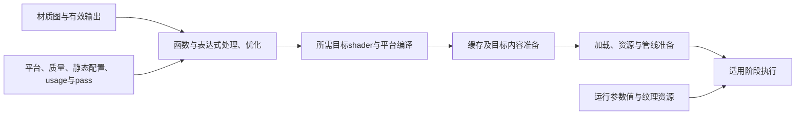
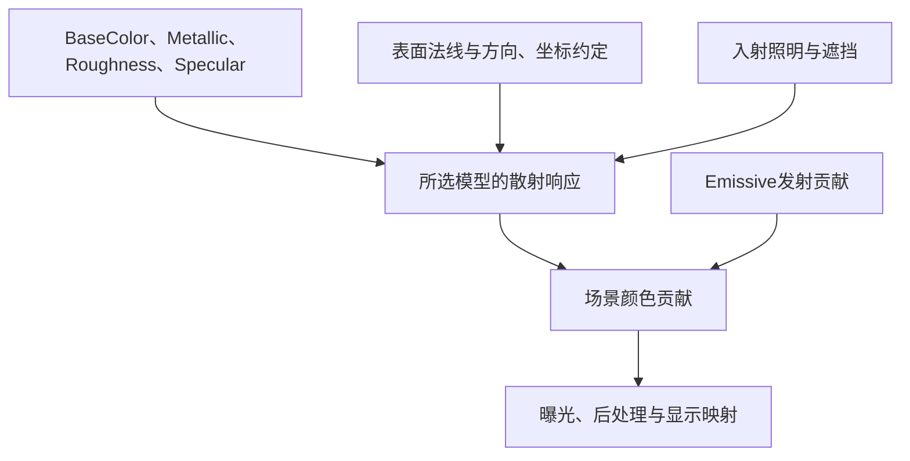
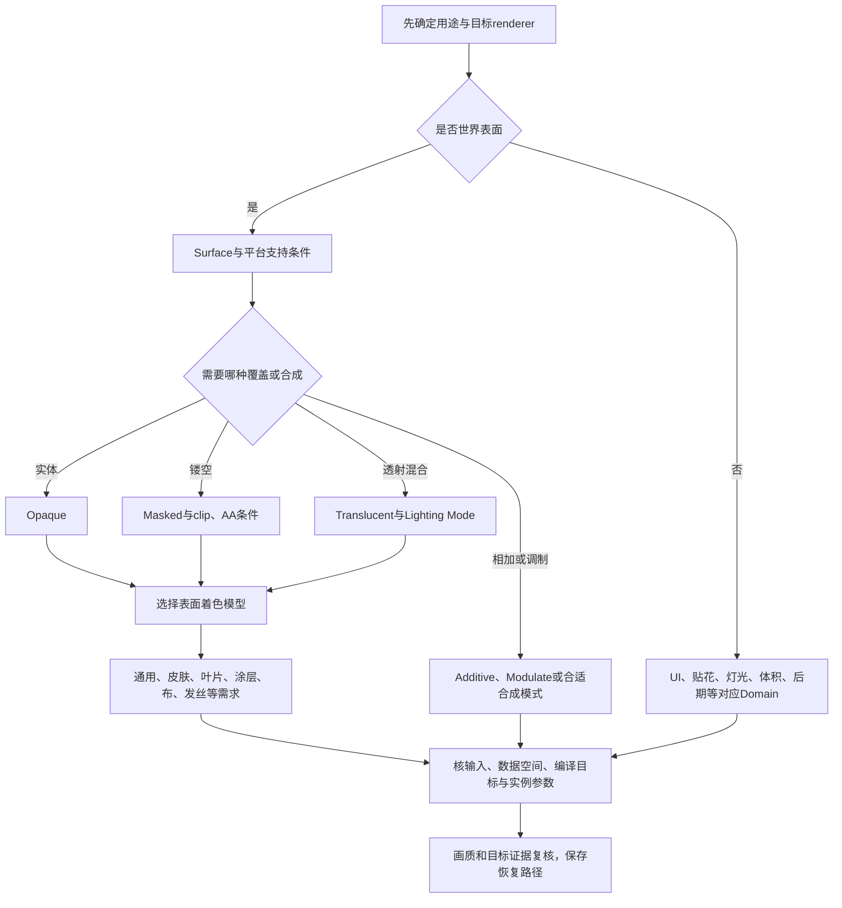
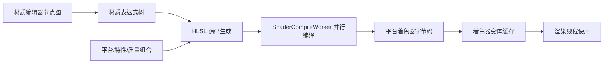
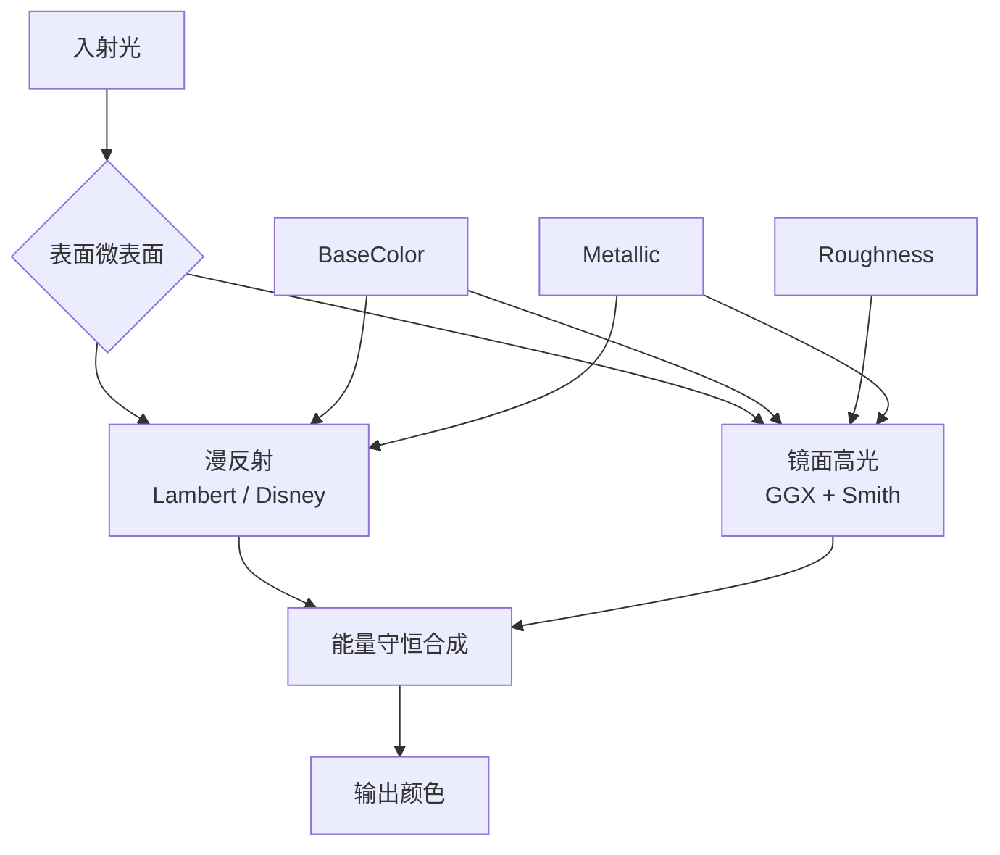
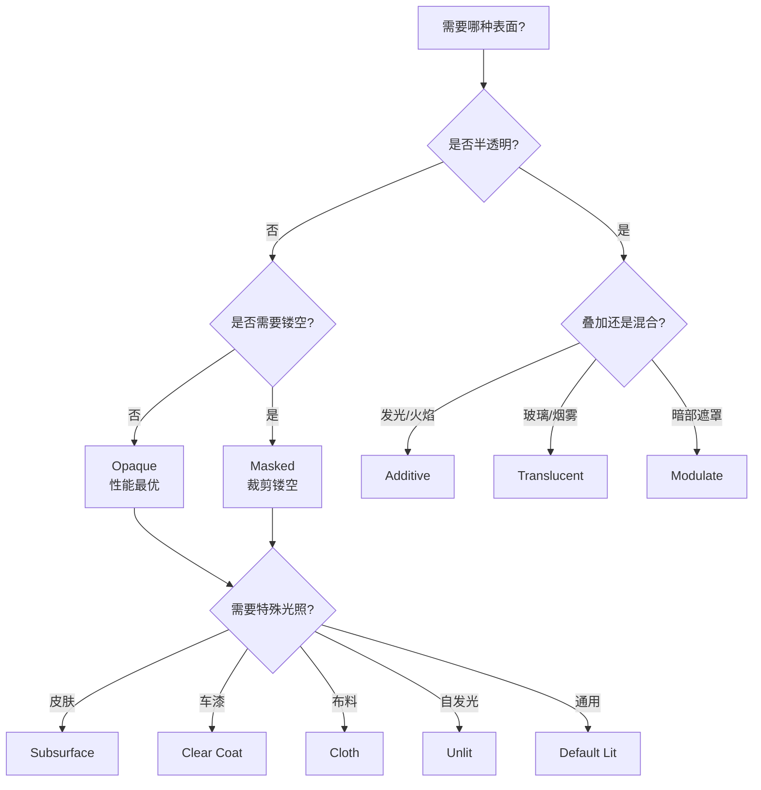

# 02 UE5 材质系统详解

> 知识成熟度：L2。依据可定位的一手资料静态核对；没有运行UE、材质编辑器、C++/蓝图、shader编译、打包、设备采集或性能实验，`verified: []`不变。
> 版本基准：主要参考Epic公开文档的`application_version=5.6`页面；C++接口局部采用5.5选择器，历史材料另标2012/2013/4.27。版本选择器不是不可变源码提交。
> 事实边界：未取得原UE5.8.0 / CL55116800的Engine checkout或`Build.version`原件；旧前言在第10章逐字保留，公开同名API不能认证那份实现。本文主线为传统Main Material输入与Default Lit工作流，其他材质系统、renderer和平台须另核。
> 验证建议：`PAPER_EXPECTED P01–P11`是可手推的输入、结果与反例，操作与代码均未执行。第9章区分已读来源、来源冲突和实际验证入口。
> 最后更新：2026-10-10，仅补4.1首次自建材质、MIC覆盖与关卡赋材质流程及其来源；2026-10-09的材质原理修订、既有示例与6条Git历史保全继续保留。

## 1. 概述

材质把纹理、常量、参数和几何数据转成渲染所需的表面属性或颜色。节点图是描述计算的工具：它既能描述石面的粗糙度，也能描述叶片的裁剪、顶点摆动、灯光图案或UI外观。这些用途不使用同一组输入，更不保证进入同一个渲染阶段。

最容易走错的顺序是先堆节点，再猜“为什么Opacity是灰的”“为什么改参数触发编译”“为什么桌面预览正常而目标机不对”。本文先确定用途及平台条件，再解释编译和数据合同，最后把地面、摆动、溶解与动态参数串起来。前置知识只需知道网格有顶点/UV/法线，纹理存数据，shader在GPU阶段执行。

阅读后应能完成四件事：

- 选择合适的Material Domain、Blend Mode和Shading Model，解释有效输入为何变化
- 区分图节点、编译后shader、静态排列和运行参数，避免把实例化当成无条件免编译或合批
- 按数值域、颜色编码、坐标空间和明确端点搭建三个最小材质
- 根据编译信息、工作覆盖和目标设备数据区分画错、持续慢与首次卡顿

开始具体项目时记录引擎版本/build、设备/GPU、RHI、renderer、feature level、材质质量档及是否使用其他材质系统。平台支持、已经启用和实际生效是三个问题；“UE5项目”或“运行在手机”都不能替代这份记录。渲染阶段与准备链详见[渲染管线概览](../渲染管线与光照/01-渲染管线概览.md)，本文只解释它们对材质的约束。

## 2. 核心概念：先选用途，再连有效输入

### 2.1 材质域（Material Domain）

Domain回答材质被哪个用途消费；Blend Mode回答覆盖/混合；Shading Model回答适用表面如何响应光。三者一起决定主节点哪些输入有效。输入变灰时先查这些属性，不能靠再接一个节点让禁用输入生效（S01、S02）。

| 代表材质域 | 原有用途 | 使用时先确认 |
| --- | --- | --- |
| Surface | 石、金属、皮肤等物体表面 | renderer、混合、着色模型和mesh usage；不是所有Surface都写标准Deferred GBuffer |
| Deferred Decal | 弹孔、污渍、血迹等局部覆盖 | DBuffer/GBuffer等实际贴花路线、接收材质响应和平台条件，见3.3 |
| Light Function | 灯光动画、投影图案、调制 | 对应光源和渲染路径支持；不是独立灯光或任意表面材质 |
| Volume | 雾、烟、云等体积属性 | 具体体积系统如何使用这些数据，不能套用Surface全部引脚 |
| Post Process | 描边、马赛克、色调效果 | 插入点、实际场景输入和输出，见3.3 |
| User Interface | UMG/Slate界面外观 | UI渲染的输入与混合要求，不把世界表面求光规则直接搬入UI |

这是原稿六种常见用途的速查，不是完整底层枚举。所读S02还列出Virtual Texture；RVT等用法由[虚拟纹理与材质混合](./07-虚拟纹理与材质混合.md)继续。物理材质定义碰撞/摩擦等物理属性，不等同这里决定视觉外观的Material。

### 2.2 混合模式（Blend Mode）

下面的颜色公式只是混合代数。`S`表示已由适用着色流程得到的源颜色，`D`是目标中已有颜色，`a`是不透明度；公式不同时证明光照、深度、阴影和平台支持（S03）。

| 混合模式 | 用途与核心语义 | 条件与代价 |
| --- | --- | --- |
| Opaque | 实体表面，覆盖处取S | 没有连续透明合成；复杂shader、几何和覆盖仍可能昂贵 |
| Masked | 网孔、叶片；按Opacity Mask与clip比较保留/丢弃 | 被丢弃部分没有该表面反射；仍须求覆盖，不能假定无overdraw成本 |
| Translucent | 玻璃、烟等连续透明；常见over为`aS+(1−a)D` | 普通透明顺序重要，Lighting Mode另选；不把CustomDepth写入当普通场景深度写入 |
| Additive | 火焰、光晕等相加效果，`S+D` | 黑色不贡献，亮背景可能不明显；发光外观不保证照亮场景 |
| Modulate | 调制背景，典型为`S×D` | 适合暗化类效果；光照/雾/合成路线的限制须核目标 |
| AlphaComposite | 已预乘alpha的颜色，`S+(1−a)D` | 素材和计算必须遵守预乘合同，不能再重复乘一次a |
| AlphaHoldout | 视空间抠洞，`D×(1−a)` | S03要求施加面使用Unlit；接收面为其列出的透明混合类型，不能对Opaque任意打洞 |

`PAPER_EXPECTED P01`：传统Surface中，mask样本为0.25、clip为0.5时，Masked会丢弃该样本。把0.25接Base Color只改变颜色输入，不会产生孔洞；用Masked也不能让该处变成普通25%alpha玻璃。另一例中，预乘红色`S=(0.25,0,0)`、`a=.25`叠在蓝色`D=(0,0,1)`上，AlphaComposite得到`(.25,0,.75)`；重复乘a会错成`(.0625,0,.75)`。

Opaque/Masked与普通透明在深度和着色上的路线不同，但“透明无深度写入（可配置）”过于含糊。S02的Allow Custom Depth Writes针对另一份CustomDepth数据，不能据此推出已获得不透明表面相同的遮挡、排序或光照行为。普通透明交叉排序及Separate Translucency的边界见渲染篇3.8。

### 2.3 着色模型（Shading Model）

以下是传统材质的代表选择。实际pin由Domain/Blend/模型共同控制，支持还受renderer与平台限制；不是所有模型或附加输入都同时可用（S04）。

| 模型/用途 | 应理解的响应 | 关键检查 |
| --- | --- | --- |
| Default Lit | 通用直接/间接照明与反射 | BaseColor、Roughness、Metallic、Normal等数据正确 |
| Unlit | 颜色不由入射光照计算，常用Emissive表达 | 仍可有适用的WPO/PDO或覆盖输入；发光不必选择Unlit，Lit表面也可加Emissive |
| Subsurface | 皮肤、蜡等次表面散射近似 | Subsurface Color等；不等于普通透明混合 |
| Preintegrated Skin | 皮肤响应的一种近似取舍 | 所读资料有Subsurface Color，没有原稿所称通用Curve输入；不能据名字保证移动端适用 |
| Subsurface Profile | 使用profile的皮肤等表面 | profile资产及目标路径，不与上一模型混为一项 |
| Two Sided Foliage | 薄叶透光 | Subsurface Color与叶片数据；单开Two Sided不等于已有透光模型 |
| Clear Coat | 基底上方的薄涂层，如车漆/漆面 | 涂层强度/粗糙度；双法线选项需对应设置 |
| Cloth | 织物表面绒毛近似 | Fuzz Color、Cloth遮罩 |
| Eye | 眼球表面 | Iris输入与专门的几何/UV依赖，不能只换模型就复制眼球效果 |
| Hair | 发丝方向相关散射/高光 | Tangent、Scatter、Backlit等，而非照搬通用Normal输入 |
| Thin Translucent | 白色镜面高光与有色透射 | Blend/Lighting Mode及专用透射输出，见3.4 |
| Single Layer Water | 专用水面响应 | 模型、输入及独立水面路线，不能当普通透明玻璃处理 |
| From Material Expression | 图内选择适用的传统着色模型 | 不是任意创造新模型，平台与组合仍有限制 |

原稿把Strand列作独立Shading Model没有本轮证据支持。发丝几何与Hair Strands usage仍有用途：S02把Used with Hair Strands列为usage设置，不能与Hair着色模型混淆；进一步阅读[Groom毛发系统](./06-Groom毛发系统.md)。这里不宣称已核所有引擎版本的完整枚举。

### 2.4 常用节点、函数与主节点输入速查

Expression是图中的计算节点；Material Function封装可复用图；主节点输入是计算结果的去处。把三者混称“节点”会直接导致无法按图搭建。

| 项目 | 身份与用途 | 输入合同/限制 |
| --- | --- | --- |
| Texture Sample | 采样表达式 | 纹理语义、Sampler Type、UV/过滤/mip须一致；Texture Object本身不等于一次采样 |
| Multiply / Add / Lerp | 数学表达式 | Lerp的A/B与Alpha含义先定义；Alpha不自动表示湿度或透明度 |
| Component Mask | 分量选择 | R/G/B/A的业务含义由资产合同决定 |
| Append / AppendVector | 组合分量 | 组合出向量不等于已得到有效方向或法线 |
| Normal | 主节点输入 | 本文传统切线normal工作流直接接符合语义的采样/混合结果，不再插一个虚构的“Normal采样节点” |
| NormalFromHeightMap | 原稿保留的高度转法线函数入口 | 本轮未核该函数在目标版本的完整接口；最小例使用已有normal贴图，不依赖此名称 |
| World Position Offset | 主节点输入 | 世界空间顶点位移，见4.2；标量权重仍需与明确方向组成向量 |
| Pixel Depth Offset | 主节点输入 | 调整像素深度，用于深度交界等效果；不等同WPO移动网格顶点 |
| Vertex Color | 顶点属性表达式 | 可供混合/固定权重；通道意义由资产作者约定 |
| Fresnel | 视角权重表达式 | Exponent、Base Reflect Fraction影响结果；Normal输入用世界空间，正视值不能通称0；它不是完整BRDF或灯光 |
| Noise / Voronoi | 噪声表达式及Noise/Vector Noise中的函数选项 | 值域、空间、周期和计算成本先核，不把Voronoi一概写成独立节点 |
| DistanceFieldGradient | 距离场相关表达式 | S24要求相关距离场数据与设置；归一化后才作方向，零梯度不能盲目归一化；平台支持另核 |
| Quality Switch | 质量分支表达式 | 按实际材质质量选择网络，未选分支不等于永远无需准备 |
| Feature Level Switch | 特性等级分支表达式 | 不自动识别所有设备性能档；所读文档有旧特性等级列表，不照搬作当前完整枚举 |

使用Fresnel的Normal输入时，切线normal不能当世界向量直接接入；按目标流程变换空间或使用合适的世界法线表达式，并避免制造依赖自身Normal输出的循环。S24的开头简述和可调Base Reflect Fraction须一起读。

## 3. 原理详解

### 3.1 从节点图到着色器：先分清编译内容与运行数据

主节点的有效输入选择了需要求值的图。函数调用可展开为表达式，编译过程能折叠常量、处理静态选择并删除无用工作；随后针对目标平台和所需阶段生成、编译shader。一个材质还可参与depth/base/shadow等不同pass，mesh usage与vertex factory等维度也影响所需集合（S05–S07）。这不是每次保存都无条件重走全部步骤的固定调用栈。



图描述职责，不承诺每个框一一对应一个函数、线程或GPU事件。编辑器编译、DDC缓存、Cook、运行加载和PSO准备各有证据；包中已有shader不保证首用时全部资源或PSO就绪，详细分层见渲染篇8.4。

`PAPER_EXPECTED P03`：Roughness由常量`.2+.3`得到`.5`，旁边还有完全未连接到有效输出的Noise链。输出语义为`.5`；S19说明无连接链不计入该材质的指令统计，S06说明存在常量折叠。不能按图元素数报GPU指令数，也不能因删掉无连接链就宣称帧时间下降。若改成每像素变化的纹理数据，计算前提已经改变。

材质实例继承父材质并覆盖已暴露参数，但参数不是同一种东西：

- **运行数据参数**：scalar/vector以及类型兼容的texture等覆盖通常复用已经准备好的shader。改色不会因颜色有许多取值就为每个值生成静态排列；仍有参数更新、资源绑定与内存等成本
- **静态参数**：Static Switch等在编译期决定表达式选择；实际使用的静态组合需要对应编译结果。被剔除分支不在该排列运行，不代表另一组合无需shader
- **MIC与MID**：MIC适合预先配置的外观变体；MID用于运行中更新参数。MID不把Static Switch变成运行bool；普通Lerp也不能自动当作静态裁枝

`PAPER_EXPECTED P04`：两个静态bool有`00/01/10/11`四种可能，项目仅使用`00/10`；每种配置有50个实例，只改Color这个Vector Parameter。使用集合是两种静态配置，颜色取值本身不制造50倍静态排列；最终shader总条目仍不等于2，因为平台、pass、quality和usage等还要参与。后来实际使用`01`，需要它的相应准备；用MID scalar写一个同名值不能替代静态配置。

控制变体首先是控制真正需要的功能组合和usage，检查Cook覆盖及编译日志。共享材质代码、共用父材质、复用缓存分别解决不同问题，不能把它们视为消除全部排列的开关。同一父材质的不同实例也不自动保证draw合并。

### 3.2 PBR基础：输入描述表面，光照与显示仍会改变结果

BRDF描述一个表面点如何把入射光反射到观察方向。常见不透明工作流把漫反射与镜面响应结合起来：漫反射描述扩散响应，镜面项与微表面方向分布、遮蔽和Fresnel等有关。次表面传播、透射和发射又有不同的模型范围，不能把所有材质都压成一组不透明公式。

Karis在SIGGRAPH 2013的UE4原作者材料中选择了Lambert漫反射、GGX法线分布，以及拟合Smith行为的Schlick几何项。它可以解释这些词为何出现，却不是原CL55116800或所有UE5模型的实现认证（S09）。



图中的散射能量约束不等于最后像素不超过显示范围。下面是传统金属/粗糙度工作流应遵守的数据合同（S01、S08）：

- **BaseColor**：传统物理材质输入为线性RGB，各分量在0–1内；对非金属用于漫反射颜色，对纯金属表达有色镜面反射的基础。颜色纹理可按sRGB编码保存，采样后按正确编码解释，不能把存储值与工作空间数值混为一谈
- **Metallic**：纯裸石、塑料与金属常选0/1；锈蚀、污渍、覆盖过渡及过滤可能出现有意义的中间值。先说明混合意图，别用中间值遮掩错误环境反射
- **Roughness**：控制反射分布宽窄，不等于统一缩暗高光。输入通常在0–1；实际近似、过滤和抗锯齿会影响极低粗糙度的观感
- **Specular**：传统工作流的非金属反射控制，文档默认0.5约对应正视4%反射。不能把这个滑块直接读成同数值百分比，也不照搬文档“1完全反射”的简句作普遍物理映射
- **Normal**：改变着色方向而不自动增加轮廓几何；需匹配贴图编码、切线基/UV与主节点空间设置。切线Z沿局部表面法线，不是处处指向世界Z
- **Emissive**：允许大于1的HDR值，用于发射颜色；看到发光和Bloom不等于已经通过某种GI/烘焙机制照亮周围，需确认实际照明方案

对无自发光的被动表面，守恒要求反射总能量不超过入射；这是积分约束，某一方向的BRDF值并不必须小于1（S28）。`PAPER_EXPECTED P05`：材质参数不变，照明强度或曝光变了，屏幕亮度仍可改变、被压缩或裁切。这个反例足以否定“PBR保证不过曝/不发灰”；反射环境、曝光与色调映射不能由材质参数独自修好。

采样前还要区分颜色与数据。`PAPER_EXPECTED P06`采用一个明确的资产约定：BaseColor为普通sRGB颜色图；ORM的R/G/B分别存线性AO/Roughness/Metallic；Normal是切线法线图。ORM不作颜色gamma变换，Sampler Type须与纹理设置一致。一份ORM在同一UV读取一次后取三个通道，可服务三个输入；若用三个不同UV各采一次，就不能因“只有一个资产”称为一次采样。不同分辨率、mip、UV或编码需求的数据也不宜为了打包强行合并（S13、S14）。

TextureCoordinate选择UV通道与重复尺度；WorldPosition等提供另一个空间中的数据。世界投射能让相邻物体共享图案位置，但运动物体可能从固定图案下滑过，形成texture swimming（S15、S25）。资产数、sampler绑定数、表达式采样次数和实际访存是不同计数；shared sampler不自动删除采样工作。

`PAPER_EXPECTED P07`：主切线法线`n=(.6,0,.8)`、flat细节`f=(0,0,1)`。添加flat细节应保持n；但`normalize(n+f)`把x:z从`3:4`变成`1:3`，归一化救不了已改变的方向。对单位normal整体乘0.5再归一化也会恢复原方向，并不是把强度减半。细节合成应保留flat恒等元，选择合适的方向算法/函数，而非对RGB独立相加（S17）。

### 3.3 材质域如何进入其用途

**Surface**把可用输入交给适用的渲染路径。传统不透明Deferred常产生后续求光所需属性，前向路径可在表面着色时结合光照；透明又有自己的求光与合成条件。WPO/覆盖等还可能影响深度和阴影工作，不能把所有材质成本只算在BasePass。

**Deferred Decal**修改接收表面的外观。S10描述两条基本路线：在BasePass前积累DBuffer属性，由接收材质消费；或在BasePass后、光照前混合到GBuffer。Emissive/AO有额外处理，不必进入同一DBuffer；接收端响应通道与平台路线都很重要。

`PAPER_EXPECTED P02`：假设当前renderer提供DBuffer，墙面允许接收Roughness响应，原值`.8`，贴花目标`.2`。贴花属性先产生、墙面着色消费它，后续光照响应可以改变；这不预测具体屏幕颜色。若接收端不响应，或该路径没有这一DBuffer能力，单凭贴花“编译成功”不能证明效果实现。不能再说贴花“不参与光照且总直接改GBuffer”。

**Light Function**用于光源图案/调制，例如旋转树影纹理；它不是新增一盏光。是否支持所需颜色、光源类型和renderer由目标确认，不把旧单通道限制或新功能当全版本事实。

**Volume**为相关体积系统提供属性，如雾、烟和云；体积数据及求值位置与普通表面不同。进一步阅读[体积渲染与云](./08-体积渲染与云.md)，本文不构造新的体积材质系统。

**Post Process**插入已有图像处理流程；典型通过Emissive输出处理后的颜色。S26说明`PostProcessInput0`通常提供前序pass结果，任意改成SceneColor不保证读取正确阶段。深度/法线/GBuffer可用性、颜色是HDR还是已经映射、UV指向viewport还是更大纹理，均受插入点和路径约束。详见[后处理与画面特效](../渲染管线与光照/05-后处理与画面特效.md)。

### 3.4 着色模型、透明光照模式与双面

Shading Model描述表面响应，Translucency Lighting Mode选择透明如何取得/计算光照，Two Sided又是另一项几何/着色设置。把三个开关当同一个“高画质等级”会得到错误组合。

S11将透明分成体积效果和表面等类型；有的从低分辨率照明体积取光，有的用Surface ForwardShading逐像素处理局部光高光。传统Deferred项目也可有这种前向处理的透明表面。因此S02/S03中“透明不支持动态照明/高光”的宽泛旧句不能覆盖全部Lighting Mode。

要表达薄有色玻璃，S11给出的具体组合是Blend=Translucent、Shading Model=Thin Translucent、Lighting Mode=Surface ForwardShading，再用Thin Translucent Material输出表达式控制透射色。该组合表达白色高光与被染色背景，不只是“颜色随视角变化”；目标支持、排序和反射条件仍须核实。

Two Sided让背面也参与渲染/着色，S02说明背面法线处理及静态光照的限制：一个lightmap UV集合不能自然提供两侧独立的静态照明结果。它适合减少双份叶片几何的需求，但透叶还需合适模型与输入；成本取决于实际覆盖、pass与遮挡，不能简单报“开销翻倍”。

### 3.5 Mobile材质：按实际路径记录条件

移动设备、Mobile renderer、桌面renderer、RHI和feature level不是同一维。所读S12明确存在Mobile Forward、Mobile Deferred及高端移动设备上的其他renderer选择；不能把所有手机等同一个ES3.1配置，也不能延续“Mobile Deferred统一仍属实验”的说法。

| 原稿关注维度 | 选择材质时实际要核什么 |
| --- | --- |
| 路径与照明 | S12中Mobile Forward为0，Mobile Deferred为1；预计算照明、动态灯需求和材质支持分开评估，不能把变量字符串当热切换成功证据 |
| 材质复杂度与高光 | Forward材质需要承担相应光照代码；S02还有Mobile High Quality BRDF选项，不能写所有移动材质统一简化高光 |
| GBuffer与带宽 | Deferred的中间数据在适用tile-based GPU/API上可能留在片上；否则流量不同，不能只用“低精度/无GBuffer”概括 |
| AA与透明 | S12所述Mobile Deferred不支持MSAA，透明仍走前向处理；masked抗锯齿需目标AA和相关设置支持 |
| 精度 | 材质/平台精度策略可能影响大坐标和细小变化；Full Precision等选项有成本，先证明问题来自精度再选 |
| 采样与压缩 | 核目标renderer已占用的资源、纹理语义和cook格式；不把桌面BC5无条件推荐给移动设备，也不把ASTC视作所有平台通用答案 |
| 特性/节点 | 距离场、几何细分、复杂顶点动画、Nanite/Lumen等支持须按具体路径查；本轮未取得完整移动能力矩阵，不补一张全为支持或不支持的表 |
| 后期与屏幕覆盖 | 全屏后期、大面积透明、多层masked植被可能贵；质量档需同时检查观感、覆盖与实际时间 |

Quality Switch和Feature Level Switch可在同一父材质中提供简化网络，但它们不自动证明目标采用了那一支，也不保证减少全部编译排列。先确定功能需求，再核实际编译与生效配置；树叶/草的masked覆盖、透明重叠和纹理工作都要保留到目标设备验证。

`r.Mobile.ShadingPath`在这里是查找项目路径的入口，不是要求执行的运行态切换命令；实际配置、重启/内容准备和支持条件参照目标版本。Mobile Preview不能代替目标设备耗时，详细方法继续读[移动端渲染专项](../渲染管线与光照/10-移动端渲染专项.md)。

### 3.6 材质性能：计数、覆盖与时间不能互代

“ALU×像素+带宽+变体”不是一个单位成立的耗时公式。材质既有顶点/像素等阶段的计算与采样，又有重复覆盖、阴影/其他pass工作；编译、包体、内存和加载则是其他阶段的成本。减少一类计数是否改善当前瓶颈，需要相应数据。

- **Stats / Platform Stats**给所选目标的shader统计及编译错误。无连接图不计入该统计；同名材质换平台、pass或静态配置后数字也可能不同。它们不直接测GPU阶段毫秒，也没有本篇已核的统一“高了必告警”阈值（S19）
- **指令代理**遗漏某些重要差异：运算种类、循环、采样、编译后端与实际执行条件都影响成本。S16对反三角函数已有“开销未充分反映在指令数”的提示；Shader Complexity也是线索，不是计时器（S20）
- **覆盖与overdraw**决定重复处理多少表面采样。透明、masked、双面、阴影和视图范围都应记录；相同静态指令数在不同覆盖下可以产生不同负担
- **采样与纹理**看UV/过滤/mip、分辨率、格式、缓存和资源占用。通道打包是有前提的优化；`stat streaming`提供流送线索，不能由池告警推断“增大r.Streaming.PoolSize就解决所有卡顿”
- **变体与首用成本**看实际组合、编译/Cook日志、加载和PSO准备。编译更少不等于像素shader更快，稳态材质变便宜也不保证首用卡顿消失

实际对照先保存状态，固定代表场景、相机、构建、renderer、质量、分辨率和冷热条件，再只改一个有明确语义的候选。确认改动确实生效后记录目标设备的有效计时和画质，结束恢复并复核；没有有效数据时停在候选判断。原稿移动材质128 ALU建议只保留于历史区，不作为当前统一预算。本轮没有执行上述操作或建立性能模型。

## 4. 代码 / 蓝图示例：明确输入、端点与失败路径

三个搭建例都属于`PAPER_EXPECTED`。下面的“连线”描述待搭建图的合同，未在编辑器创建资产或编译shader；表中的常量是教学输入，不是统一美术标准或性能预算。

### 4.1 示例一：PBR地面、干湿混合与细节法线

**先用无贴图材质走通一次。** 这一段沿用`PAPER_EXPECTED P08`，目标是看清父材质中的计算如何经MIC参数影响关卡物体，再加入纹理。基线仍是UE5.6传统Surface/Opaque/Default Lit；准备一个已有灯光和可见反射环境的测试关卡、同一单材质槽静态网格的两个关卡实例A/B。网格只提供几何，本例不需要导入贴图、Starter Content或第三方素材。以下是读者待执行的编辑器步骤，本轮没有创建资产、编译shader或运行关卡。

1. 在项目自己的Content目录中右键，从Create Basic Asset选择Material，命名`M_GroundStudy`，双击打开。选主材质节点，在Details确认Material Domain=Surface、Blend Mode=Opaque、Shading Model=Default Lit。S31只用于这个创建/打开入口，材质属性含义见2章。
2. 在图中右键搜索并添加下表参数节点，逐个设置Parameter Name与Default Value。名称须唯一且与表一致；可把它们放在同一个参数Group中。Scalar的Slider Min/Max可设为0/1方便编辑，但滑条范围不代替图中的Clamp（S29）。

| 参数名 | 节点类型 | 默认值与含义 |
| --- | --- | --- |
| `Tint` | Vector Parameter | 线性RGBA=`(.18,.18,.18,1)`；只使用RGB，A不控制本例覆盖 |
| `Rdry` | Scalar Parameter | `.8`，干燥粗糙度，0–1无量纲 |
| `Rwet` | Scalar Parameter | `.2`，湿润端粗糙度，0–1无量纲 |
| `Wetness` | Scalar Parameter | `0`，干湿插值权重，0–1无量纲；不是有长度单位的积水深度 |

3. 添加Component Mask、Clamp、LinearInterpolate（Lerp）和Constant，按下面连接。每个Clamp都明确设Min=0、Max=1；Tint的`.18`是线性通道值，不是sRGB十六进制输入。先不采纹理，因此暂不需要Tiling/UV节点。

```text
Tint → Component Mask（R、G、B勾选，A不勾）→ Clamp(0,1) → Base Color
Wetness → Clamp(0,1) → Lerp.Alpha
Rdry → Lerp.A；Rwet → Lerp.B
Lerp → Clamp(0,1) → Roughness
Constant（值0）→ Metallic
```

Normal暂不连接法线贴图，使用网格本来的着色法线；Specular保留默认，Emissive不加发射贡献。这样只改变干湿权重就能单独观察粗糙度路径，不会同时把法线或发光改掉。完成连线后按Apply并Save，先确认没有相关编译错误再继续；这是待执行步骤，不代表本文已取得编译结果。

4. 回到Content Browser，右键`M_GroundStudy`选择Create Material Instance，分别创建`MI_GroundDry`和`MI_GroundWet`。双击各实例，核对Parent均为`M_GroundStudy`；在Details中勾选`Wetness`旁的覆盖框，Dry设0、Wet设1。其余参数暂不覆盖，继承父值，再保存两个MIC。没有勾选时继承父值；普通Constant也不会自动出现在实例参数列表中（S29）。
5. 在关卡中选A，在其Details的Materials项把对应槽设为`MI_GroundDry`；选B设为`MI_GroundWet`。本例单槽网格通常显示Element 0，仍应确认它确实覆盖正在观察的表面；多槽资产不能照抄索引。这里改的是关卡实例的材质覆盖，不是在Static Mesh Editor改网格资产默认材质（S30）。保存关卡；用Details回读两个槽位名称，避免其实给A/B用了同一个MIC。
6. 固定灯光、反射环境、观察位置、曝光及其他材质参数，只在Wet实例中把`Wetness`从1改到.5、再改到0。预期其Roughness输入依次为`.2/.5/.8`，Dry仍为`.8`；`.5`来自`.8×(1−.5)+.2×.5`。在能看到高光或环境反射的表面上，低粗糙度通常呈现更集中的高光/更清晰的反射。两个位置本就可能受光不同，判断参数因果应同时看同一B物体改值前后，不把A/B像素颜色相等当验收条件。

这一对照只验证待搭建图的输入关系和预期外观方向，不保证“湿一定更亮”、真实水膜、轮廓/碰撞变化或性能改善。若没有可见变化，依次核Parent、覆盖框、参数名称/类型、参数是否连到有效主节点输入、实际槽位所用MIC，以及可用照明/反射与曝光；若A也跟着变，先查是否误改父材质或共用同一个MIC。完成练习可把Wet设回1，保留干/湿两种实例；不需要为这一步增加MID或运行时控制代码。

**再接入纹理与细节。** 已走通基础流程后，把下文的BaseColor采样RGB接到Multiply一侧，Tint接另一侧，以该乘积替换原来的纯色Base Color路径；其余数据按下面的纹理合同逐项接入。这里的湿度遮罩W可先沿用`Clamp(Wetness,0,1)`，需要空间变化时再换成有明确通道含义的线性遮罩。先一次只替换一条路径，保留两个MIC作对照。

前提是传统Surface/Opaque/Default Lit，网格具有所选UV0及匹配的切线基。准备BaseColor、Normal和数据贴图；若采用ORM，明确本例R=AO、G=Roughness、B=Metallic，不能靠文件名猜通道。BaseColor按实际颜色编码解释，Normal使用相匹配的法线采样语义，数据图关闭错误的颜色gamma处理（P06）。

`PAPER_EXPECTED P08`的基础连线：

```text
UV0 × Tiling → 各纹理的UV输入
BaseColor采样RGB × Tint → Base Color
切线normal采样 → 主节点Normal输入
Rdry与Rwet、湿度遮罩W → Lerp(A=Rdry, B=Rwet, Alpha=W) → Roughness
本例裸石地面Metallic=0；有金属混合意图时另定义mask
```

本例BaseColor采样结果及线性RGB参数Tint的各分量均限定在0–1，乘积也在此范围；Tint用于基色调色，需要大于1的发射贡献另走Emissive。湿度遮罩W进入Lerp前限制在0–1，定义W越大越湿，`Rdry=.8`、`Rwet=.2`：W为0/.5/1时Roughness应为.8/.5/.2。反接A/B会在“更湿”时得到更粗糙的输入。这里不预言最终像素亮度；照明、法线和曝光仍会影响观感。

需要近看细节时，S25的`DetailTexturing`提供可定位的函数入口：Scale控制细节重复，Normal接主法线，DetailNormal接细节法线Texture Object，NormalIntensity控制细节强度，取其Normal输出进入主节点。它还提供Diffuse/DetailDiffuse/DiffuseIntensity路径，可按需要做颜色细节。核目标版本对应输入，并用“flat细节应保留主法线”的P07检查合成意图；不在此断言该函数内部就是某一RNM公式。

S18的4.27官方皮肤教程还提到`BlendAngleCorrectedNormals`，可作为两套法线合成的历史查找入口，不能未经目标核对把其内部实现或默认强度规则写死。自定义细节强度时，可先明确让强度0提供flat向量、强度1提供原细节方向，再送入合适合成流程；例如只用于上半球细节的`normalize(Lerp((0,0,1), detailNormal, s))`需要`0≤s≤1`且避免零向量，它并非完整的主/细节合成公式。

失败时先看纹理语义与Sampler Type、UV通道、湿度通道以及切线约定，再看mip/压缩和照明。细节贴图增加采样；多套UV/分辨率需求可能使打包不合适。不要用RGB直接Add把错误暂时调得“看起来接近”。

### 4.2 示例二：草地 / 旗帜摆动（WPO）

叶片有孔才需要Masked；是否Two Sided及是否采用Two Sided Foliage按外观和目标支持选择。旗帜可以沿固定边绘权重，不必假设所有资产的高度轴都是局部Y。

`PAPER_EXPECTED P09`使用明确的顶点权重：Vertex Color R中的`h∈[0,1]`，根/固定边为0，自由端为1。D是世界空间单位风向，本例`D=(1,0,0)`；A为世界长度幅值，本例10；Time以秒计，f为每秒周期数，phaseCycles为周期单位的相位。

```text
q = f × Time + phaseCycles
Sine：Period明确设为1，输入q
WPO = D × A × h × Sine(q)
数学上对应 D × A × h × sin(2πq)
```

周期1的Sine已把q解释为周期位置，不应又在节点输入乘一次2π。q=.25时，h=0/.5/1对应位移`(0,0,0)/(5,0,0)/(10,0,0)`；q=.75方向反转，根始终不动。使用`1−h`会反而移动根部；只给一个标量也没有定义风向。

噪声可作为相位或幅度的可选变化，但须先定义值域和空间。`frac(Time)`回绕不是所有用途必跳变；若下游是未按周期衔接的噪声，就可能在wrap处不连续。本例不扩展Time暂停/倍率的未核合同。

WPO改变渲染顶点位置，不会自动改变组件mobility、碰撞几何或把烘焙光照切成动态。需在目标项目检查网格顶点密度、bounds、剔除/阴影、运动信息与时序历史，以及预计算形态和动画是否一致。超出原bounds可能被错误剔除；扩大bounds也有代价，不是无限通用修复。Nanite与具体照明路径的WPO支持不在本轮实现验证范围内（S01、S15、S16）。

### 4.3 示例三：溶解（Dissolve）与可见侧边缘

设Surface/Masked，Opacity Mask Clip Value固定为.5。线性噪声`n∈[0,1]`，进度p先Clamp到[0,1]，宽度w必须大于0。P10中的比较直接产生0/1，所以与clip=.5不发生恰等阈值的歧义。

`PAPER_EXPECTED P10`定义如下；它是图的数学合同，不是直接粘进某个未核节点的源码：

```text
p ≤ 0：keep=1，edge=0
p ≥ 1：keep=0，edge=0
0 < p < 1：
    keep = n ≥ p ? 1 : 0
    edge = keep × (1 - SmoothStep(Min=p, Max=p+w, Value=n))
Opacity Mask = keep
Emissive = edge × GlowColor × GlowStrength
```

所读UE Step节点的X接样本n、Y接阈值p；数学/HLSL常写`step(edge,x)`，不要按文字参数顺序机械接反。首尾分支用目标支持的比较/选择表达式落实，明确等号分支；若使用If表达式，核其等值阈值设置，不能把默认容差当精确数学相等（S16）。

| p=.4、w=.2，n | .2 | .4 | .5 | .6 | .8 |
| --- | --- | --- | --- | --- | --- |
| keep | 0 | 1 | 1 | 1 | 1 |
| edge | 0 | 1 | .5 | 0 | 0 |

可见一侧紧靠边界时发光，远离边界不发光；p=0全保留且无边缘，p=1全消失。反例是只写`step(1,n)`：n恰为1仍保留；显式末端分支解决这个定义问题。w=0或负数须拒绝或给出经过设计的有效下限，不能用零宽SmoothStep继续推正确结果。

进度由下一节的scalar参数驱动；GlowColor为vector参数，GlowStrength为强度。材质仍是Masked，时序dither是另外一种有AA/画质条件的方案，不会免费变成连续透明。噪声过滤、阴影覆盖和overdraw都需目标核验，本轮没有执行材质搭建。

### 4.4 蓝图与C++：动态更新同一个MID

`PAPER_EXPECTED P11`要求对象A和B拥有可独立控制的材质参数。先保证父材质含`DissolveProgress`、`GlowColor`等正确类型的参数且连接到有效输出。创建节点要选Target为Primitive Component的`Create Dynamic Material Instance`；某个同名`Set Scalar Parameter Value`文档实际属于Kismet Material Library/Collection，并不是这个MID的setter（S21–S23）。

蓝图示意，未执行：

```text
初始化事件
  → 确认目标组件、材质槽及父材质，保存非空原材质与目标/槽位记录；原材质为空则停止
  → Create Dynamic Material Instance（Target=目标组件，Element Index=目标槽，Source Material=本例确认的父材质）
  → 检查Return Value，保存到MID变量
  → 确认目标槽实际使用该返回MID，记录本次接管成功，再允许更新
进度事件
  → 检查保存的MID仍有效、目标仍使用它
  → 在该MID上Set Scalar/Vector Parameter Value
结束演示
  → 先停止本例的后续参数更新
  → 核本次接管成功、目标组件/槽位仍有效且槽中仍为本次MID
  → 条件成立才恢复SavedMaterial并复核绑定；外部已换材质则保留外部绑定
  → 无论是否恢复，都清理本例MID/原材质引用、目标/槽位记录与接管/恢复状态
```

Source Material在已读API里可选；本例为避免父材质不明确，选择显式提供已确认的父材质，这是示例策略而非API要求它永远非空。原绑定为空时，本例在创建前停止接管，因此不会尝试恢复空绑定；这是示例前置条件，不能与Create返回空的创建失败混为一谈。S21/S22明确无效Element Index保持原材质并返回NULL，失败后不能继续调用setter。初始化未完成接管时应清除本例持有及恢复状态，不进入后续更新。

下面是置于已有Actor/Component中的**未经编译的C++片段**，不是可独立构建的程序。需要Engine模块与相应头文件（`Components/PrimitiveComponent.h`、`Materials/MaterialInstanceDynamic.h`）；类的UHT/generated头、组件获取及事件接线由已有工程提供。运行策略限定在该对象的正常游戏线程生命周期内，未核实现的线程细节不当源码事实。

```cpp
// 在已有UCLASS的成员区；保存跨事件使用的GC可追踪引用。
UPROPERTY(Transient)
TObjectPtr<UMaterialInstanceDynamic> DissolveMID = nullptr;

UPROPERTY(Transient)
TObjectPtr<UMaterialInterface> SavedMaterial = nullptr;
```

```cpp
// 一次初始化事件的函数体示意：
// MeshComp、MaterialSlot、ParentMaterial由调用上下文提供并已核目标。
// 本例显式要求ParentMaterial，仅是本例选择。
if (!MeshComp || !ParentMaterial)
{
    return;
}
SavedMaterial = MeshComp->GetMaterial(MaterialSlot);
if (!SavedMaterial)
{
    return; // 本例不接管原绑定为空的槽；尚未调用Create。
}
DissolveMID = MeshComp->CreateDynamicMaterialInstance(
    MaterialSlot, ParentMaterial, NAME_None);
if (!DissolveMID ||
    MeshComp->GetMaterial(MaterialSlot) != DissolveMID.Get())
{
    return;
}
DissolveMID->SetScalarParameterValue(TEXT("DissolveProgress"), 0.0f);
DissolveMID->SetVectorParameterValue(TEXT("GlowColor"), FLinearColor::Red);
```

```cpp
// 后续更新事件的函数体示意：仍须有有效MeshComp和原MaterialSlot。
if (MeshComp && DissolveMID &&
    MeshComp->GetMaterial(MaterialSlot) == DissolveMID.Get())
{
    DissolveMID->SetScalarParameterValue(
        TEXT("DissolveProgress"), FMath::Clamp(Progress, 0.0f, 1.0f));
}
```

这些成员必须位于实际存活的UObject中；UPROPERTY使引用可被GC追踪，不保证持有者永不销毁，也不提供并发同步。不要用已离开作用域的裸局部指针冒充跨帧持有。上面的C++片段仅展示初始化与更新；接管状态、失败清理及退出事件按蓝图示意的合同由已有工程接线。原材质、目标组件和槽位的恢复记录须活到退出事件。退出先停本例更新，再核目标组件和原槽位仍有效、本次接管成功且该槽仍绑定本次MID，才恢复SavedMaterial并复核；外部已替换该槽时不得覆盖外部写入。目标失效或无法复核时记录未恢复，随后同样释放本例持有的引用并清除恢复记录/状态，不继续使用失效目标。以上是本例的生命周期和写入归属策略，不是同名API对任意组件或并发调用的保证。

A/B独立性是这个例子的要求，需要核实实际持有和槽位使用的实例；不能只因调用了同名Create就保证每次新分配或绝不复用。若A/B实际共享同一个MID，修改其参数会影响该实例的全部使用者。不要每Tick重新创建MID，也不要将缺少可见变化立即当setter失败：参数名/类型、有效输出、静态分支、资源准备及显示时点都可能参与。

旧`CreateAndSetMaterialInstanceDynamic`在读取日显示5.8的公开动态页标为弃用并指向CreateDynamicMaterialInstance（S27）；这是页面当时的声明，不认证原CL弃用时点。setter调用返回也不等于GPU已显示新参数，编译/Cook/PSO准备继续遵守渲染篇的阶段边界。

## 5. 最佳实践

1. **参数化要有边界**：复用合理的父材质和函数，用scalar/vector暴露常改项；static开关按真正需要的功能组合管理，不把一个巨大万能父材质当无成本统一方案
2. **记录PBR输入意图**：说明纯材料与混合区域、颜色编码和roughness范围；金属度不是亮度修复滑块，BaseColor也不用于烘焙所有照明效果
3. **统一法线合同**：烘焙切线、UV/green约定、Sampler Type、空间与强度端点一起定义；强度1的团队约定不是任意函数都天然遵守的物理标准
4. **按需要选择透明**：需要透射高光就不能拿裁剪冒充；可接受镂空才评估Masked。记录排序、覆盖、AA和照明模式的画质/成本取舍
5. **从目标平台设计**：先核renderer与设备条件，再提供质量/feature分支；预览用于发现问题，最终支持与时间需目标验证
6. **监控不同准备成本**：记录实际静态组合、shader编译与Cook覆盖、包体/内存及首用行为。团队以后纳入CI时也须保留目标与基线，本轮未创建或运行CI
7. **管理纹理内容**：Texture Group、mip、LODBias、格式和streaming预算与目标内容一起定；不能盲增池大小或把所有通道打包当质量不变的优化
8. **控制重复覆盖**：大片水面、粒子和多层植被叠加时，分别检查透明、masked、几何和阴影；不从“隐藏了对象”直接推出所有模拟/渲染工作归零

## 6. 常见问题 FAQ

### Q1：材质在编辑器里正常，打包后变黑 / 变粉？

先确认实际看到的是原材质还是default/fallback，读取该材质和目标平台的编译/Cook/资源错误。检查所用节点、usage/静态配置、引用资源以及纹理Sampler Type是否匹配；编辑器缓存存在不证明目标包拥有所需内容。S07明确有编译失败fallback材质，不能把粉红色当UE统一错误码，也不应未定位就关闭含糊的“Strip Unused”选项。无日志或目标内容证据时只列候选原因。

### Q2：材质指令数过高或超限怎么办？

先区分编译器/平台真实资源限制、项目静态预算和实际耗时超预算；错误信息及Platform Stats目标要对得上。再评估质量分支、数据打包、噪声/采样或模型的简化，同时守住数据与画质合同。拆材质可能增加slot和draw，减少节点可能根本未改生成shader；改完还需相同条件复核，不能套128条通用阈值。

### Q3：半透明材质不受光照 / 排序错乱？

受光先核Domain、Blend、Shading Model、Translucency Lighting Mode和renderer，再查实际照明/反射输入。排序则检查重叠与相交关系：单物体排序键不能同时解决所有像素的前后交叉。Separate Translucency处理合成阶段等关系，不会自动升级光照或修好所有排序。改Masked/dither需接受覆盖与AA的不同结果；更多排序解释见渲染篇FAQ。

### Q4：金属材质看起来太黑或发灰？

先确认表面确为裸金属或有明确混合意图，再查BaseColor、Roughness、Normal、可反射环境与曝光/色调映射。纯金属缺少漫反射并不表示“材质坏了”，环境与反射路径不足可能让它很暗；Lumen反射或Reflection Capture是否支持、启用且有效另核。合法混合和过滤可有中间Metallic值，不要一律清零或强设1来掩盖另一类问题。

### Q5：法线贴图方向反了 / 接缝明显？

按采样语义/编码→烘焙切线基和UV→green通道约定→强度/合成→mip与压缩逐层看。先用单一主法线与flat细节的P07合同排除错误合成，再定位资产问题；单纯“UE是左手坐标、世界Z向上”不能证明切线法线每个方向都正确。某格式或平台只是候选，不凭看到接缝就直接认定压缩是根因。

### Q6：同一材质在不同质量档位下表现差异大？

先记录实际feature level、material quality、renderer和静态配置，再检查被选中网络与有效默认分支、目标shader是否准备。设计的降级可以改变外观，但缺输入、类型不匹配或配置没生效也会造成异常；不能把所有差异都称正常。比较时保持纹理mip/streaming与照明条件可比，避免把多种变化归给一个Switch。

### Q7：移动端材质在桌面预览正常，真机上卡？

确认真机的build、renderer/RHI、分辨率、质量、shader/Cook和streaming状态，然后看有效设备计时、覆盖、采样/带宽、几何与阴影。桌面与设备差异不限于GPU算力，还包括路径和精度、资源格式、热状态及工具口径。Mobile Preview是支持/观感检查入口，不能代替真机；测不到有效数据就先解决测量前提，不强行归因材质指令。

## 7. 关联阅读

- [01-渲染管线概览.md](../渲染管线与光照/01-渲染管线概览.md)：材质进入哪些阶段、GBuffer边界、透明排序及shader/Cook/PSO准备
- [03-光照与阴影系统.md](../渲染管线与光照/03-光照与阴影系统.md)：表面如何消费光照与遮挡数据
- [05-后处理与画面特效.md](../渲染管线与光照/05-后处理与画面特效.md)：Post Process域、AA及输出处理
- [07-虚拟纹理与材质混合.md](./07-虚拟纹理与材质混合.md)、[06-Groom毛发系统.md](./06-Groom毛发系统.md)、[08-体积渲染与云.md](./08-体积渲染与云.md)：对应用途继续深入
- [10-移动端渲染专项.md](../渲染管线与光照/10-移动端渲染专项.md)：renderer、设备与预算
- [04-渲染与加载性能优化.md](../../08-工程实践与质量/调试与性能分析/04-渲染与加载性能优化.md)、[07-Shader编译管线与PSO.md](../../08-工程实践与质量/构建编译与制品/07-Shader编译管线与PSO.md)：测量与内容准备

原稿提到的“02-资源与资产规范（若有）”未找到同名Canonical，不制造链接；纹理命名/编码/分组/mip的用途由本篇8.5及S13/S14提供入口。上述邻篇是延伸阅读，不表示本轮已复核它们全部正文或私有源码声明；本篇一手来源见第9章。

## 8. 附录：材质开发工作流

### 8.1 材质节点分类参考表

| 分类 | 代表入口 | 使用要点 |
| --- | --- | --- |
| 纹理 | Texture Sample、Texture Object、TextureCoordinate | 资源、采样、坐标分开，记录UV/编码/过滤/mip |
| 数学 | Add、Subtract、Multiply、Divide、Power、Lerp | 值域和端点明确，除法等运算检查无效输入 |
| 向量 | Component Mask、Append、Dot、Cross、Normalize | 通道选择不是空间变换，Normalize需处理零向量 |
| 参数/常量 | Constant、Constant2/3Vector、Scalar/Vector Parameter | 说明输入类型、是否允许运行修改和参数名 |
| 组合工具 | Fresnel、Clamp、Saturate、SmoothStep、Step | Fresnel控制量和world normal、Step的X/Y、SmoothStep的有效宽度分别核 |
| 几何属性 | WorldPosition、ObjectPositionWS、VertexColor等 | 像素/顶点、位置/方向及坐标系不同；原“Local Position”需求先查目标提供的表达式/函数或变换，不假定同名独立节点 |
| 扰动/细节 | Noise、Vector Noise的Voronoi、normal相关函数 | 噪声值域/周期明确；原NormalFromHeightMap具体接口未核，可从normal贴图路径开始 |
| 分支 | Quality Switch、Feature Level Switch、Static Switch Parameter | 编译选择与运行值区分，记录真实使用组合 |
| 特殊数据/扩展 | SceneTexture、DistanceFieldGradient、Custom | 数据可用阶段、平台和资源前提先确认；Custom不是天然更快 |

### 8.2 着色模型输入引脚速查

这是额外用途速查，不表示该行列完全部pin，也不保证各renderer支持（S01/S04）。

| 着色模型 | 关注输入/资产 | 典型场景与边界 |
| --- | --- | --- |
| Default Lit | 标准表面输入 | 通用不透明等适用表面 |
| Unlit | Emissive颜色及适用WPO/PDO/覆盖 | 特效、招牌；UI还须选UI域，不能直接套Surface设置 |
| Subsurface | Subsurface Color、适用Opacity | 蜡、皮肤等；Opacity此处不应直接按普通透明解读 |
| Preintegrated Skin | Subsurface Color等 | 原稿Curve不是本轮已核pin；性能适用按目标判断 |
| Clear Coat | Clear Coat、Clear Coat Roughness | 基底上方涂层；第二法线有对应条件 |
| Cloth | Fuzz Color、Cloth | 绒毛颜色与贡献遮罩 |
| Eye | Iris Mask、Iris Distance | 需几何/UV与专门眼球流程配合 |
| Hair | Scatter、Tangent、Backlit等 | 发丝方向与散射，区分Hair Strands usage |
| Thin Translucent | 专用输出的透射色 | 与Translucent、Surface ForwardShading组合使用 |

Subsurface Profile、Two Sided Foliage、Single Layer Water等选择见2.3；不同模型会复用Custom Data位置，不能把所有显示名当同时存在的独立属性集合。

### 8.3 材质性能检查清单

以下均为目标项目的验证建议，本轮未执行。

- [ ] Stats/Platform Stats选对平台、renderer/quality与静态配置；区分编译限制、项目预算和设备耗时
- [ ] 核采样次数、纹理/sampler资源与打包合同；UV/mip/编码需求不同则不盲目合并
- [ ] 看透明覆盖、重叠与排序需求；不能只统计材质资产数量
- [ ] 检查Masked边缘与所用AA；dither或alpha-to-coverage有各自支持/画质条件，不是通用修复
- [ ] MIC/MID是否在所需静态配置内复用；静态参数变化与实例独立性另核
- [ ] Texture Group、mip、格式及streaming预算适合目标设备
- [ ] 未用图/贴图是否妨碍维护；删除无连接图不冒称运行优化
- [ ] Feature/Quality分支与默认网络实际覆盖目标，目标shader已准备
- [ ] Cook/包体/内存与shader编译/首用行为各有记录，不以静态计数代替时间

### 8.4 材质调试工具

| 工具/入口 | 用途 | 不能单独证明什么 |
| --- | --- | --- |
| Material Stats / Platform Stats | 对应目标shader统计、编译错误 | 不是GPU阶段耗时；目标缺编译支持时不能把空结果当0成本 |
| Material Preview | 独立网格/照明环境检查 | 不代表关卡照明、目标设备或所有pass |
| Lit / Unlit / Detail Lighting / Normal等适用视图 | 区分颜色、受光、法线问题 | 支持依renderer而定；调试视图不是最终画质性能基准 |
| Material Quality / Preview State | 检查质量、feature、静态选择 | 改预览不保证实际构建采用同一配置 |
| Asset Audit / Reference Viewer / Size Map | 引用、大小与资产关系 | 不直接等价GPU工作时间 |
| Output Log及编译/Cook日志 | 定位具体错误、fallback与准备缺口 | 没有错误不证明所有目标配置或PSO已就绪 |
| `stat streaming`等支持的观察入口 | 流送/内存线索 | 不替代采样带宽分析或设备时间线 |

打开工具前记录观察对象，完成后恢复预览、视图与临时设置。S19是工具用途依据，S20只采用4.27调试方法的稳定边界，不认证原CL全部界面。

### 8.5 常见材质规范（团队可裁剪采用）

1. 命名区分Material、Instance、Texture和Function；`M_`、`MI_`、`T_`以及原稿的`F_`可以是团队约定，不是引擎强制统一前缀
2. 参数用清楚的名称、Group、范围和单位；明确mask是湿度、可见性还是混合比例，颜色是何种工作空间
3. 记录目标平台和质量分支，允许在同一父材质中正确分流，不要求复制一套“桌面绝不可引用”的独立材质；附输入贴图通道/编码、normal约定、mip/压缩与Texture Group规则
4. 透明接入前在目标项目检查排序、照明、覆盖和画质；未取得真机证据就标未验证，不能以预览代替
5. 新材质审查覆盖计算/采样、真实静态组合、资产格式及支持条件，并按需要补设备时间；保留保存、复现和恢复信息

### 8.6 材质相关术语表

| 术语 | 含义与边界 |
| --- | --- |
| BRDF | 表面点的反射方向分布；能量约束针对积分，不等于屏幕颜色上界 |
| PBR | 用物理约束组织表面响应和输入的工作流，不是所有条件下观感相同的保证 |
| BaseColor | 基色，传统工作流中与非金属漫反射/金属有色反射相联系 |
| Roughness | 反射分布的粗糙度控制，不等于统一高光强度 |
| Metallic | 材料金属性质/有意混合，纯材料常用0/1 |
| Normal Map | 存储方向细节的贴图，编码、切线/世界空间和烘焙约定必须匹配 |
| Emissive | 发射颜色贡献，允许HDR；不保证自动照亮环境 |
| Opacity | 在所选用途中的不透明度/相关模型输入；并非处处同义 |
| Opacity Mask | Masked覆盖裁剪输入，clip定义阈值 |
| WPO | 世界空间顶点位移；不是自动更新碰撞或mobility |
| PDO | 像素深度偏移输入；不是顶点几何位移 |
| MIC | Material Instance Constant，用于预先配置的实例；静态参数仍影响所需shader |
| MID | Material Instance Dynamic，用于运行参数更新；实际引用/共享与寿命需管理 |
| Variant / Permutation | 按目标和静态条件准备的shader排列；不等于每个参数值或每个实例 |
| Instructions | 所选编译统计的指令计数代理；不同阶段/平台及实际耗时不能直接互代 |
| Texture Group | 统一管理纹理相关LOD/mip等策略的分组，实际cook格式和预算另核 |

### 8.7 材质类型选择决策



先选用途，才能判断哪些输入有意义；表面再按实体、镂空、透射或特殊合成选择Blend，最后结合模型与Lighting Mode确认目标支持。AlphaComposite的预乘与AlphaHoldout的接收限制见2.2。自发光可加入Lit材质，只有不需要入射光响应时才考虑Unlit；“Opaque性能最优”不应成为跳过测量的决策终点。

### 8.8 材质迭代建议节奏

- 原型期：用符合用途的最小域/模型和简单输入验证覆盖、几何与照明；常规Surface可从Default Lit开始，UI/体积无需强套
- 定稿期：补齐normal/roughness和资产通道合同，检查参数命名、质量分支及近远距离观感
- 优化期：对有证据的高成本工作减少采样、覆盖或组合，记录目标时间和画质，确认瓶颈是否转移
- 大版本与平台变更：复核实际支持、shader/Cook组合、工具和默认行为；原先通过的一个环境不自动覆盖新版本

## 9. 来源、版本边界与验证建议

### 9.1 实际选读来源

S01–S28读取日期为2026-10-09 UTC；S29–S31为2026-10-10 UTC的4.1局部补充。下表定位表示实际读到的部分，不声称整页、整部引擎或所有平台已核；S23含多个接口入口。没有新增外部资料全文或受限Engine源码。版本标签、原作者材料年份和实际源码revision是不同证据。

| ID | 来源与实际选读范围 | 采用边界 |
| --- | --- | --- |
| S01 | [Material Inputs，5.6](https://dev.epicgames.com/documentation/en-us/unreal-engine/material-inputs-in-unreal-engine?application_version=5.6) | Inputs/Properties、PBR输入、Normal/WPO、Custom Data、PDO；输入有效性与数据含义，不采用旧AO/Specular绝对句 |
| S02 | [Material Properties，5.6](https://dev.epicgames.com/documentation/en-us/unreal-engine/unreal-engine-material-properties?application_version=5.6) | Material、Two Sided/Tangent Space、Translucency、Hair Strands usage、Mobile；不认证底层完整枚举 |
| S03 | [Material Blend Modes，5.6](https://dev.epicgames.com/documentation/en-us/unreal-engine/material-blend-modes-in-unreal-engine?application_version=5.6) | Opaque/Masked、混合公式、AlphaComposite/Holdout；透明光照旧简句须按具体模式限缩 |
| S04 | [Shading Models，5.6](https://dev.epicgames.com/documentation/en-us/unreal-engine/shading-models-in-unreal-engine?application_version=5.6) | 传统模型用途与输入；Unlit、Skin、Foliage、Coat、Hair、Eye、Water、Thin等选段；非全平台支持表 |
| S05 | [Instanced Materials，5.6](https://dev.epicgames.com/documentation/en-us/unreal-engine/instanced-materials-in-unreal-engine?application_version=5.6) | 运行参数、Static Parameters、MIC/MID；实际使用的静态组合与运行值分开 |
| S06 | [Custom Material Expressions，5.6](https://dev.epicgames.com/documentation/en-us/unreal-engine/custom-material-expressions-in-unreal-engine?application_version=5.6) | Warnings中的constant folding；不把Custom节点优化限制扩大为后端永不优化 |
| S07 | [Shader Development，5.6](https://dev.epicgames.com/documentation/en-us/unreal-engine/shader-development-in-unreal-engine?application_version=5.6) | Material/mesh/vertex factory、shader集合、fallback、SCW/DDC/Cook；不移植旧宏或存储布局 |
| S08 | [Physically Based Materials，5.6](https://dev.epicgames.com/documentation/en-us/unreal-engine/physically-based-materials-in-unreal-engine?application_version=5.6) | PBR输入、Roughness/Specular、Metallic；营销式稳定观感不等于屏幕亮度恒定 |
| S09 | [Brian Karis，Real Shading in Unreal Engine 4，SIGGRAPH 2013](https://cdn2.unrealengine.com/Resources/files/2013SiggraphPresentationsNotes-26915738.pdf) | PDF文件页0–2，Introduction与Diffuse/Microfacet BRDF；仅2013 UE4历史机制 |
| S10 | [Decal Materials，5.6](https://dev.epicgames.com/documentation/en-us/unreal-engine/decal-materials-in-unreal-engine?application_version=5.6) | DBuffer/GBuffer路线、接收响应、Emissive/AO特例与平台边界；不采用矛盾移动段制作支持矩阵 |
| S11 | [Lit Translucency，5.6](https://dev.epicgames.com/documentation/en-us/unreal-engine/lit-translucency-in-unreal-engine?application_version=5.6) | Lighting Mode、Per-Pixel Lighting、Thin Translucency设置；不把末尾旧限制覆盖全部模式 |
| S12 | [Mobile Rendering and Shading Modes，5.6](https://dev.epicgames.com/documentation/en-us/unreal-engine/mobile-rendering-and-shading-modes-for-unreal-engine?application_version=5.6) | 路径0/1、Forward/Deferred、透明/MSAA、Tile Memory；不认证变量flags或设备性能 |
| S13 | [Using Texture Masks，5.6](https://dev.epicgames.com/documentation/en-us/unreal-engine/using-texture-masks-in-unreal-engine?application_version=5.6) | Texture Masks、channel packing、sRGB/Sampler Type；黑白与压缩绝对建议不泛化 |
| S14 | [Texture Asset Editor，5.6](https://dev.epicgames.com/documentation/en-us/unreal-engine/texture-asset-editor-in-unreal-engine?application_version=5.6) | Texture Settings、sRGB/Source Color、normal mip；不推出所有平台压缩格式 |
| S15 | [Coordinates Material Expressions，5.6](https://dev.epicgames.com/documentation/en-us/unreal-engine/coordinates-material-expressions-in-unreal-engine?application_version=5.6) | TextureCoordinate、WorldPosition/ObjectOrientation、Pixel/Vertex Normal与Tangent；空间/阶段区分 |
| S16 | [Math Material Expressions，5.6](https://dev.epicgames.com/documentation/en-us/unreal-engine/math-material-expressions-in-unreal-engine?application_version=5.6) | Add/Clamp/ComponentMask、昂贵运算提示、Step/SmoothStep/Sine；纸面数学不等编译实测 |
| S17 | [Colin Barré-Brisebois / Stephen Hill，Blending in Detail，2012-07-10](https://blog.selfshadow.com/publications/blending-in-detail/) | Linear Blending、flat恒等元、RNM机制；只采用方向合成原理，不等同UE函数源码 |
| S18 | [Creating Human Skin，4.27](https://dev.epicgames.com/documentation/en-us/unreal-engine/creating-human-skin?application_version=4.27) | Setup/Normal：曝光控制、green约定、BlendAngleCorrectedNormals；仅4.27历史方法入口 |
| S19 | [Material Editor UI，5.6](https://dev.epicgames.com/documentation/en-us/unreal-engine/unreal-engine-material-editor-ui?application_version=5.6) | Stats、HLSL Code、Platform Stats及工具用途；未连输出不计入统计，静态计数非GPU时间 |
| S20 | [View Modes，4.27](https://dev.epicgames.com/documentation/en-us/unreal-engine/view-modes?application_version=4.27) | Lit/Unlit/Detail Lighting、Shader Complexity；仅4.27方法论，不认证当前全部工具 |
| S21 | [Create Dynamic Material Instance，Blueprint，5.6](https://dev.epicgames.com/documentation/en-us/unreal-engine/BlueprintAPI/Rendering/Material/CreateDynamicMaterialInstance?application_version=5.6) | Target为Primitive Component的创建输入/输出，无效Element Index返回NULL；5.6公开节点合同 |
| S22 | [UPrimitiveComponent::CreateDynamicMaterialInstance，C++，5.5](https://dev.epicgames.com/documentation/unreal-engine/API/Runtime/Engine/Components/UPrimitiveComponent/CreateDynamicMaterialInstance?application_version=5.5) | 签名/Remarks/ElementIndex；明确为5.5 C++接口说明，未读实现或编译片段 |
| S23 | [UMaterialInstanceDynamic，5.5](https://dev.epicgames.com/documentation/en-us/unreal-engine/API/Runtime/Engine/Materials/UMaterialInstanceDynamic?application_version=5.5)；[SetScalarParameterValue，5.5](https://dev.epicgames.com/documentation/unreal-engine/API/Runtime/Engine/Materials/UMaterialInstanceDynamic/SetScalarParameterValue?application_version=5.5) | MID scalar/vector/texture setter与引用入口；不能用Collection同名节点的日志合同替代 |
| S24 | [Utility Material Expressions，5.6](https://dev.epicgames.com/documentation/en-us/unreal-engine/utility-material-expressions-in-unreal-engine?application_version=5.6) | DistanceFieldGradient、Fresnel、Feature/Quality Switch、Noise/Voronoi；不迁移旧特性列表或指令预算 |
| S25 | [Texturing Material Functions，5.6](https://dev.epicgames.com/documentation/en-us/unreal-engine/texturing-material-functions-in-unreal-engine?application_version=5.6) | DetailTexturing输入/输出、WorldAligned相关函数；不保证内部等同某个RNM实现 |
| S26 | [Post Process Materials，5.6](https://dev.epicgames.com/documentation/en-us/unreal-engine/post-process-materials-in-unreal-engine?application_version=5.6) | Graph、Critical Settings、SceneTexture/GBuffer、CustomDepth、UV；输入时点与数据可用条件 |
| S27 | [CreateAndSetMaterialInstanceDynamic，读取日动态页显示5.8](https://dev.epicgames.com/documentation/en-us/unreal-engine/API/Runtime/Engine/UPrimitiveComponent/CreateAndSetMaterialInstanceDyna-) | 读取日动态页显示5.8的DeprecatedFunction及迁移提示；不认证原CL弃用时点 |
| S28 | [Pharr/Jakob/Humphreys，PBRT第4版（2023），§4.3 Surface Reflection](https://pbr-book.org/4ed/Radiometry,_Spectra,_and_Color/Surface_Reflection) | 第4版§4.3.1，BRDF/BTDF和积分能量约束；不是UE实现，也未复制代码 |
| S29 | [Creating and Using Material Instances，5.6](https://dev.epicgames.com/documentation/en-us/unreal-engine/creating-and-using-material-instances-in-unreal-engine?application_version=5.6) | Creating a Parameterized Material、Creating/Editing a Material Instance与Adjusting Material Parameters；参数化、Apply/Save、创建MIC与勾选覆盖，不把Slider范围当所有输入的强制钳制 |
| S30 | [Using Materials With Static Meshes，5.6](https://dev.epicgames.com/documentation/en-us/unreal-engine/using-materials-with-static-meshes-in-unreal-engine?application_version=5.6) | Applying a Material via the Details Panel及Static Mesh Editor两段；关卡实例覆盖与网格资产默认材质的区别，不要求本例使用教程的Starter Content资产 |
| S31 | [Mesh Balloons，5.6](https://dev.epicgames.com/documentation/en-us/unreal-engine/how-to-use-a-solid-mesh-to-create-a-balloon-effect-in-niagara-for-unreal-engine?application_version=5.6) | 仅Create a Material第1–2步：Content Browser新建Material、命名并打开；不把其Niagara、Particle Color或气球素材前提带入本例 |

### 9.2 来源冲突、读取失败与未覆盖项

2026-10-10补充读取时，Essential Material Concepts、Creating and Using Materials、Creating Your First Material及Artist 03的所尝试5.6入口未返回正文；Artist Quick Start的5.6入口只返回标题空页，一次相关链接点击亦失败。新建Material步骤最终采用成功返回的S31选段，MIC和关卡赋材质采用S29/S30；搜索中的动态5.8结果仅用于发现入口，不作为5.6流程依据。上述步骤仍未在编辑器运行。

S02/S03有透明不支持动态光/高光的宽泛句，S11和S02的具体Lighting Mode却描述了Surface ForwardShading。本篇采用具体模式的条件，不制作一个覆盖所有透明的布尔结论。S10的移动兼容与Substrate移动段也有难以一致解释的范围，故只采用已清楚说明的贴花基本路线，不拼完整移动支持表。

带5.6选择器的材质/shader文档仍混有旧feature、宏、编译器、菜单或历史存储说明。本篇没有把它们变成原CL源码事实。S01/S08的Specular简句、S13的mask黑白与压缩绝对建议、S19的计数与成本简句也按其具体范围采用，不能跳过数据类型、格式或运行条件。

本轮未成功取得完整Mobile Rendering Features正文，Texture Expressions、Depth Material Expressions、Substrate overview及5.6相关C++详情的部分入口为空壳或读取失败。改用成功读到的Texture Asset Editor、5.6 Blueprint创建页及明确标5.5的C++接口；PDO不补未核的符号约束，NormalFromHeightMap不作为已确认函数合同。S18使用4.27历史资料，因为其5.6入口未读到。

Karis论文的Self Shadow入口因内容过大未返回，之后从官方CDN读到原作者相关页；没有把未返回的全文当已读。Post Process页一次find返回无匹配，但重新open取得所用段落，以实际返回正文为准。S27动态页读取时显示5.8，不认证旧CL弃用时点。

没有原UE5.8.0/CL55116800的checkout/Build.version原件，没有材质图运行、编译日志、Cook产物、GPU capture或设备计时。早期生成对话/原始输入流也未取得；第10章保护的是现存Markdown及可读Git版本，不能声称补回仓库之外的全部原始材料。

### 9.3 从纸面预期走向实际验证

P01比较裁剪与预乘；P02追踪贴花属性消费；P03区分图与编译程序；P04追踪静态组合；P05区分表面、照明与显示；P06核纹理/采样合同；P07核flat normal恒等元；P08算干湿端点；P09算根/尖位移；P10算溶解端点与边缘；P11追踪实际实例和参数目标。它们均为`PAPER_EXPECTED`，不是自动测试、UE日志或性能结果。

目标项目若要验证，应先保存材质、实例参数、设置与原槽位绑定，记录版本/build、设备/GPU、RHI/renderer/quality、相机/场景与分辨率。按4章明确素材、输入和正反例，确认所需功能与shader已准备，检查具体编译错误和有效输出。代码片段还需补齐真实类/模块/生命周期，在目标工程编译后才可声称接口可用。

性能问题先分画错、持续慢或首次卡顿，再选择对应数据；只改变一个有明确定义的候选，确认实际生效，记录有效时间和画质，最后恢复并复核。工具为空、目标shader缺失、实例实际共享或无法确定采样/空间时，应停在相应前提，不把“命令执行过”“看起来差不多”或Markdown检查通过当运行证据。本轮没有执行这些验证，也没有新增或运行runner/CI。

## 10. 历史原文保全（非现行用法）

本节完整保留修订前原文与可读Git历史，作为历史材料，不作为现行用法。旧稿中的UE5.8.0 / CL55116800、旧日期与运行描述只代表历史声明，不是本轮源码或运行观察。未取得更早生成对话和原始输入流。

当前完整基线：24675 bytes、447 LF，SHA256 `519db9d42615cd23028df5a22e14e411ca7001170f7aaf805cad2e767e5c57e8`。下方原始内容嵌入一次；取行时以原始基线内部1起始闭区间计数，包含每行LF，不包含外围围栏/标记。按回拼表依次连接字节，不插额外分隔符。相同字节的两条提交仍分别记来源。

### 10.1 当前完整基线

<!-- MATERIAL_HISTORY_BASELINE_BEGIN -->
``````text
---
type: Concept
title: "02 UE5 材质系统详解"
status: stable
verified: []
maturity: L2
---
# 02 UE5 材质系统详解
> 知识成熟度：L2（本轮审计修订时补标）。
> 版本基准：UE 5.8.0（本机 `Engine/Build/Build.version`：CL 55116800，分支 `++UE5+Release-5.8`）。
> 兼容性边界：适用于 UE5.8 编辑器/运行时，UE4.27 与早期 UE5 仅作迁移背景，具体模块以正文为准。
> 官方参考：[Unreal Engine UE5.8 官方文档总页](https://dev.epicgames.com/documentation/en-us/unreal-engine)。
> 最后更新：2026-08-06（本轮元数据维护）。

## 1. 概述

材质（Material）定义了物体表面"看起来是什么样"：颜色、粗糙度、金属度、发光、半透明、法线细节等。UE 的材质系统是**节点图（Node Graph）驱动的**——美术在材质编辑器里连线，引擎把节点图编译成 GPU 上执行的着色器（Shader）代码。

UE5 的材质系统建立在 **PBR（Physically Based Rendering，基于物理的渲染）** 之上：用少量物理参数（BaseColor、Roughness、Metallic、Normal）即可描述绝大多数真实表面，且在不同光照环境下表现一致。理解材质系统，是理解"画面质量"与"渲染性能"之间权衡的关键——因为每个材质节点最终都变成 GPU 指令，材质越复杂，BasePass 越贵。

阅读本文后，你应该能够：

- 理解材质编辑器节点图与最终着色器之间的关系；
- 掌握 PBR 的核心概念（能量守恒、金属/粗糙度工作流）；
- 区分 6 种材质域（Material Domain）与常见着色模型（Shading Model）；
- 知道 Mobile（移动端）材质有哪些限制与优化手段；
- 学会用材质指令数统计评估材质性能；
- 能按"连线思路"搭建常见材质（地面、草地摆动、溶解等）。

## 2. 核心概念

### 2.1 材质域（Material Domain）

| 材质域 | 用途 | 说明 |
| --- | --- | --- |
| Surface（表面） | 常规物体表面 | 最常用，输出到 G-Buffer 或前向光照 |
| Deferred Decal（延迟贴花） | 贴花投影到表面 | 不参与光照，直接修改 G-Buffer 属性 |
| Light Function（光照函数） | 修改光源的光照结果 | 常用于灯光动画、遮蔽图案 |
| Volume（体积） | 体积效果（如 Fog Volume） | 与体积雾/体积材质配合 |
| Post Process（后处理） | 全屏后期效果 | 读取 SceneColor/深度等做自定义后期（详见 05 篇） |
| User Interface（UI） | UI 材质 | 用于 UMG 控件渲染 |

### 2.2 混合模式（Blend Mode）

| 混合模式 | 用途 | 说明 |
| --- | --- | --- |
| Opaque（不透明） | 大多数实体表面 | 不混合，写入深度，性能最好 |
| Masked（遮罩） | 有镂空的表面（铁丝网、植被叶片） | 按 Opacity Mask 裁剪像素，仍算不透明（写入深度） |
| Translucent（半透明） | 玻璃、烟雾、水 | 按 Opacity 混合，需要排序，无深度写入（可配置） |
| Additive（相加） | 火焰、光晕、粒子 | 颜色相加，适合发光效果 |
| Modulate（调制） | 暗色遮罩效果 | 用材质颜色调制背景 |
| AlphaComposite | 带 alpha 通道的合成 | 支持 pre-multiplied alpha |
| AlphaHoldout | 抠像合成 | 用于影视合成流程 |

### 2.3 着色模型（Shading Model）

| 着色模型 | 适用表面 | 关键输入 |
| --- | --- | --- |
| Default Lit | 绝大多数物体 | BaseColor / Roughness / Metallic / Normal |
| Unlit（无光照） | 自发光、UI、特效 | 只输出 Emissive，不受光照 |
| Subsurface（次表面散射） | 皮肤、蜡烛、树叶 | SubsurfaceColor |
| Preintegrated Skin | 预积分皮肤（移动端友好） | SubsurfaceColor + 曲线 |
| Clear Coat（清漆） | 车漆、漆面 | ClearCoat / ClearCoatRoughness |
| Cloth（布料） | 织物 | FuzzColor / Cloth |
| Eye（眼睛） | 眼球 | Iris 相关参数 |
| Hair（毛发） | 头发 | 各向异性高光 |
| Thin Translucent | 薄片半透明 | 颜色随视角变化 |
| SingleLayerWater | 水面 | 水的折射/吸收参数 |
| Strand | 基于线段的毛发（UE5.1+） | 配合 Strand 几何 |

### 2.4 常用节点速查

| 节点 | 作用 |
| --- | --- |
| Texture Sample | 采样纹理（最常用） |
| Multiply / Add / Lerp | 基础数学运算 |
| Component Mask | 提取纹理通道（R/G/B/A） |
| Append | 组合向量 |
| Normal | 法线贴图采样（切线空间） |
| NormalFromHeightMap | 由高度图生成法线 |
| World Position Offset | 修改顶点位置（物体形变、摆动） |
| Pixel Depth Offset | 修改像素深度（伪位移） |
| Vertex Color | 读取顶点色（地形/植被混合） |
| Fresnel | 边缘光计算（视角相关） |
| Noise / Voronoi | 程序化噪声 |
| Distance Field Gradient | 距离场梯度（描边/溶解） |
| Quality Switch | 按质量级别切换连线 |
| Feature Level Switch | 按特性等级切换连线（高低端） |

## 3. 原理详解

### 3.1 从节点图到着色器

材质编辑器中的每个节点对应一段 HLSL 代码片段。当材质被保存或引用时，引擎会：

1. 把节点图展开为**材质表达式树**；
2. 生成对应着色器模型（SM5/SM6/ES3.1 等）的 HLSL 源码；
3. 通过 Shader Compiler（默认使用 ShaderCompileWorker 多进程并行编译）编译成平台着色器字节码；
4. 编译结果按**变体（Variant）**缓存：同一材质在不同质量级别、不同特性组合下可能编译出多个变体；
5. 运行时按需加载，供渲染线程的 MeshDrawCommand 使用。



关键含义：

- **节点越少、指令越少**：每个节点都是真实 GPU 指令，材质"好看"是有性能价格的；
- **变体爆炸**：大量材质 + 大量质量开关会显著增加编译时间与包体，需用 Shared Material Code 等机制控制；
- **材质实例不重新编译**：材质实例（Material Instance）只改参数值，复用父材质的着色器，这是"美术改参数不卡编译"的原因。

### 3.2 PBR 基础：基于物理的着色

PBR 的目标是让材质在不同光照/视角下表现一致。UE 的光照计算基于 **BRDF（双向反射分布函数）**，把表面反射拆成两部分：

- **漫反射（Diffuse）**：光线进入表面后被散射，各方向近似均匀，与视角无关；UE 默认用 Lambert / Disney 漫反射模型；
- **镜面高光（Specular）**：光线在表面直接反射，与视角强相关；UE 默认使用 **GGX（Trowbridge-Reitz）** 微表面法线分布 + Smith 遮蔽项。



UE 的 **金属/粗糙度工作流**（Metallic/Roughness Workflow）：

- **BaseColor（基色）**：非金属 = 漫反射颜色；金属 = 反射率颜色（金属没有漫反射，基色即高光颜色）；
- **Metallic（金属度）**：0 = 非金属（电介质），1 = 金属（导体）；金属表面几乎没有漫反射，高光带颜色；
- **Roughness（粗糙度）**：0 = 镜面（高光尖锐、反射清晰），1 = 粗糙（高光弥散、反射模糊）；
- **Specular（高光强度）**：非金属默认 0.5 附近（约 4% 反射率），一般保持默认；
- **Normal（法线）**：通过法线贴图在切线空间扰动表面法线，模拟微观细节而不增加三角形。

能量守恒的意义：反射出去的能量 + 吸收的能量 = 入射能量，表面不会"凭空发光"。这也是 PBR 材质在不同光照下不"过曝/发灰"的理论基础。

### 3.3 材质域详解

#### Surface（表面）材质

最常用。输出连接口包括：Base Color、Metallic、Specular、Roughness、Emissive Color、Normal、Opacity、World Position Offset、Pixel Depth Offset、Ambient Occlusion 等。不透明表面在 BasePass 写入 G-Buffer；半透明表面在 Translucent Pass 处理。

#### Deferred Decal（贴花）

贴花不参与光照计算，而是直接**改写 G-Buffer 属性**（如把弹孔、血迹覆盖到墙上）。UE5 中贴花投影到 Nanite 网格时注意：Nanite 网格默认支持贴花，但需要开启相应渲染特性（以版本为准）。

#### Light Function（光照函数）

把材质作为"光照的遮罩/调制器"：例如用动画材质让灯光产生转动的树影。它不产生独立光照，只修改光源结果。

#### Volume（体积）材质

用于体积效果，通常与体积雾、体积材质系统配合（如云、烟）。

#### Post Process（后期）材质

全屏后处理材质：可以读取 SceneColor、SceneDepth、WorldNormal 等场景纹理，实现风格化后期（描边、马赛克、色调分离等）。详见 05 篇"后期材质"章节。

### 3.4 着色模型与光照模式

着色模型决定**光照计算公式**。例如：

- **Default Lit**：标准 PBR；
- **Subsurface**：在标准光照上叠加次表面散射（光穿过半透明薄层），皮肤质感的关键；
- **Clear Coat**：在底层清漆之上再算一层高光（两层 BRDF），车漆效果；
- **Cloth**：用 Fuzz（绒毛）近似布料纤维散射；
- **Hair / Strand**：各向异性高光模拟发丝反光；
- **Unlit**：完全不受光，只输出 Emissive——自发光招牌、全息 UI 常用。

材质还有一个"双面（Two Sided）"开关：开启后背面也渲染（如单面植被叶片），代价是深度/光照处理变复杂，默认关闭。

### 3.5 Mobile（移动端）材质专题

移动端（Feature Level ES3.1）材质与桌面差异显著：

#### 移动端渲染路径对材质的影响

| 项目 | 桌面 | 移动端 |
| --- | --- | --- |
| 默认渲染路径 | 延迟着色 | Mobile Forward（可切 Deferred 实验） |
| 光照 | 多光源逐像素 | 每像素光源数受限，其余降级为逐顶点/烘焙 |
| 高光计算 | GGX 全精度 | 简化高光（移动端 Specular 模型） |
| Nanite / Lumen | 支持 | 不支持 |
| G-Buffer | 全精度多缓冲 | 低精度或无需 G-Buffer |
| MSAA | 延迟下不可用 | 前向下可用 |

#### 移动端材质限制清单

- **指令数限制**：移动 GPU（尤其 Adreno/Mali 中低端）ALU 有限，建议单材质控制在 128 条 ALU 指令以内（经验值，随平台浮动）；材质编辑器 Stats 面板可直接查看；
- **纹理采样限制**：采样器数量与纹理带宽受限，尽量少采样、用压缩格式（ASTC/ETC2）；
- **半精度**：移动端大量使用 half 精度计算，部分高精度需求（如大范围 World Position）可能精度不足；
- **不支持的节点/特性**：Tessellation（细分曲面）不支持；部分顶点动画节点开销大；Distance Field 相关节点在移动端不可用；
- **法线贴图**：移动端法线建议用 BC5/ASTC 压缩格式，避免高质量格式浪费带宽；
- **后期**：全屏后处理（Bloom、DOF）在移动端要谨慎，最好提供低画质档位关闭。

#### 移动端材质优化建议

- 用 **Quality Switch / Feature Level Switch** 节点为高低端设备提供不同连线；
- 半透明材质尽量少用，且避免大量重叠；
- 用材质实例复用着色器，减少变体；
- 树叶、草地等 Masked 材质注意 Overdraw（重复光栅化）；
- 用 `r.Mobile.ShadingPath` 与移动端 Profile 实测，不要只看桌面表现。

### 3.6 材质性能：指令数、采样与变体

材质性能 = 指令数（ALU）× 运行像素数 + 纹理采样带宽 + 变体管理成本。

- **指令数**：材质编辑器工具栏 Stats（或材质详情面板）显示编译后的指令数（Instructions）、纹理采样数等；过高的材质会在日志中警告；
- **Overdraw（过度绘制）**：半透明、Masked、多层植被叠加会让同一像素被计算多次，是移动端头号杀手；
- **变体（Variant）**：`r.MaterialQualityLevel`、Feature Level、静态开关（Static Switch）组合会生成变体；变体过多 → 编译慢、内存大、加载卡顿；
- **纹理流送（Texture Streaming）**：`stat streaming` 查看纹理内存；合理设置纹理组（Texture Group）的 LOD 与池大小（`r.Streaming.PoolSize`）。

## 4. 代码 / 蓝图示例：材质节点连线思路

以下给出常用材质的"连线思路"，可在材质编辑器中按步骤复现（均为思路描述，具体节点名以编辑器为准）。

### 4.1 示例一：PBR 地面材质（BaseColor 混合 + 法线混合 + 粗糙度）

```
1. 拖入 3 张纹理：BaseColor 图、Normal 图、Roughness 图（各配对应纹理采样节点）
2. BaseColor 通道：
   TextureSample(BaseColor) → RGB 输出 → 接 Base Color 引脚
   若需要颜色变化：Multiply(采样结果, 颜色常量)
3. 法线通道：
   TextureSample(Normal) → RGB → Normal 节点（默认切线空间）→ 接 Normal 引脚
   需要混合两套法线时：用 BlendAngleCorrectedNormals 节点（角度修正法线混合）
4. 粗糙度通道：
   TextureSample(Roughness) → R 通道（ComponentMask R）→ 接 Roughness
   若要"粗糙中带湿滑"：Lerp(0.2, 0.8, 遮罩贴图)
5. 金属度：常量 0（地面一般非金属），或由 Mask 贴图控制
6. 细节增强：
   Multiply(细节法线, 0.5) → Add(主法线, 细节) 增加近看细节
```

### 4.2 示例二：草地 / 旗帜摆动（World Position Offset）

```
1. 材质混合模式：Masked（叶片镂空）+ Two Sided
2. 采样噪声或程序化噪声（Noise 节点）作为摆动相位
3. 用 World Position Offset 引脚：
   WPO = Noise * 摆动幅度 * (1 - 高度权重)
   高度权重 = 用 Local Position 的 Y 分量归一化（根部不动、顶部摆动大）
4. 可选：用 Time 节点（如 frac(Time)）驱动相位，形成风吹动画
5. 注意：开启 WPO 后该材质无法使用烘焙光照的部分优化（WPO 物体在光照贴图中按动态处理）
```

### 4.3 示例三：溶解（Dissolve）效果

```
1. 材质混合模式：Masked
2. 采样噪声/纹理作为溶解图案，接 Opacity Mask：
   OpacityMask = Step(溶解进度, Noise)
   即：噪声值大于进度才显示，产生不规则溶解边缘
3. 边缘发光：
   Edge = SmoothStep(进度, 进度+0.1, Noise) - SmoothStep(进度+0.1, 进度+0.2, Noise)
   Emissive += Edge * 发光颜色
4. 进度由蓝图中设置的材质参数（Scalar Parameter）驱动
```

### 4.4 蓝图侧：动态修改材质参数

```cpp
// C++：动态材质实例
UMaterialInstanceDynamic* MID = MeshComp->CreateAndSetMaterialInstanceDynamic(0);
MID->SetScalarParameterValue(TEXT("DissolveProgress"), Progress);
MID->SetVectorParameterValue(TEXT("GlowColor"), FLinearColor::Red);
```

```text
// 蓝图：Set Scalar Parameter Value 节点
// 目标 = 动态材质实例（Create Dynamic Material Instance 获得）
// 参数名与材质中的 Scalar Parameter 名称一致
```

## 5. 最佳实践

1. **参数化优先**：把常用材质做成材质实例（Material Instance），参数暴露给美术，避免复制材质导致变体爆炸；
2. **PBR 参数规范化**：BaseColor 在 0~1 线性空间；金属度非 0 即 1（极少中间值）；粗糙度贴图比纯常量更真实；
3. **法线贴图统一格式与强度**：团队统一法线强度规范（如 1.0 基准），避免同一场景不同材质法线强度不一致；
4. **半透明谨慎使用**：半透明 = 排序 + 无深度写入 + 高开销；能用 Opaque/Masked 就不用 Translucent；
5. **移动端从一开始就按移动端标准写**：用 Feature Level Switch 分离高低端连线，定期在真机 Profile；
6. **监控指令数与变体**：在 CI 或日常检查中关注材质指令数告警与着色器编译时长；
7. **纹理规范**：使用纹理组（Texture Group）统一 Mip 与压缩设置，LODBias 统一管理；开启纹理流送并设置合理池大小；
8. **避免全屏 Overdraw 场景**：大片半透明水面 + 大量粒子 + 多层植被叠加是移动端性能灾难。

## 6. 常见问题 FAQ

### Q1：材质在编辑器里正常，打包后变黑 / 变粉？

粉红色通常是**着色器编译失败或缺失**（如平台不支持某节点）。检查 Output Log 的着色器编译错误、确认材质没有使用目标平台不支持的节点，并检查材质实例引用的资源是否被剥离（可先禁用"Strip Unused"类打包选项排查）。

### Q2：材质指令数超限怎么办？

优先用 Quality Switch / Feature Level Switch 降级；其次合并纹理通道（把 AO/粗糙度/金属度打包进一张纹理的 R/G/B）；再考虑拆材质或用更简单的着色模型（如从 Subsurface 降为 Default Lit）。

### Q3：半透明材质不受光照 / 排序错乱？

半透明默认使用简化光照（Translucent Lighting Mode 可选 Volumetric/Per-Vertex/Per-Pixel 等）；排序错乱见 01 篇 FAQ。若需要复杂光照，可考虑 Separate Translucency 或改用不透明方案（如用 Masked + 后期做伪半透明）。

### Q4：金属材质看起来太黑或发灰？

金属没有漫反射，光照完全来自高光；若 BaseColor 太暗或环境光不足，金属会显黑。检查 Metallic 是否误设为中间值（0~1 之间会产生不物理的混合）、环境/反射是否足够强（Lumen 反射或 Reflection Capture）。

### Q5：法线贴图方向反了 / 接缝明显？

法线贴图需要与 UV 和坐标约定匹配（UE 使用左手坐标系、法线 Z 向上）；接缝通常来自 UV 接缝或压缩格式差异。检查纹理压缩格式（移动端 ASTC 某些平台接缝更明显）与法线强度。

### Q6：同一个材质在不同质量档位下表现差异大？

这是 Feature Level / Quality Switch 正常行为。若某档位表现异常，检查该档位的连线分支是否遗漏（如 Switch 的默认输入为空导致黑色输出）。

### Q7：为什么移动端材质在桌面上看不出问题，真机上卡？

桌面 GPU 远强于移动 GPU：指令数、带宽、Overdraw 在真机上被放大。务必用 `r.Mobile.ShadingPath` 与移动端预览（Mobile Preview）检查，并在真机用平台 Profile 工具测量。

## 7. 关联阅读

- 本分类 [01-渲染管线概览.md](../渲染管线与光照/01-渲染管线概览.md)：材质如何写入 G-Buffer、各 Pass 中材质的作用位置；
- 本分类 [03-光照与阴影系统.md](../渲染管线与光照/03-光照与阴影系统.md)：材质与光源交互（光照模型、阴影接收）；
- 本分类 [05-后处理与画面特效.md](../渲染管线与光照/05-后处理与画面特效.md)：Post Process 材质域的应用；
- 分类外："02-资源与资产规范"（若有）：纹理压缩、纹理组、资产命名规范；
- 官方文档：Unreal Engine 5 "Materials"、"Physically Based Rendering"、"Material Instancing" 章节。

## 8. 附录：材质开发工作流

### 8.1 材质节点分类参考表

| 分类 | 代表节点 | 使用要点 |
| --- | --- | --- |
| 纹理 | Texture Sample、Texture Object、Texture Coordinate | 注意 UV 通道与压缩格式 |
| 数学 | Add、Subtract、Multiply、Divide、Power、Lerp | 组合的基础，注意数值范围 |
| 向量 | Component Mask、Append、Dot、Cross、Normalize | 处理方向与通道 |
| 工具 | Constant、Constant2Vector/3Vector、Scalar/Vector Parameter | 参数化入口 |
| 函数 | Fresnel、Clamp、Saturate、SmoothStep、Step | 制作边缘光/过渡 |
| 材质属性 | World Position、Object Position、Local Position、Vertex Color | 空间信息与顶点数据 |
| 扰动 | Noise、Voronoi、NormalFromHeightMap | 程序化细节 |
| 分支 | Quality Switch、Feature Level Switch、Static Switch Parameter | 平台/质量分流 |
| 特殊 | SceneTexture、Distance Field Gradient、Custom | 场景数据与自定义代码 |

### 8.2 着色模型输入引脚速查

| 着色模型 | 额外输入 | 典型场景 |
| --- | --- | --- |
| Default Lit | （无） | 通用 |
| Unlit | 仅 Emissive | 特效、UI、发光体 |
| Subsurface | Subsurface Color、Opacity | 皮肤、蜡烛、树叶透光 |
| Preintegrated Skin | Subsurface Color、Curve | 移动端皮肤 |
| Clear Coat | Clear Coat、Clear Coat Roughness | 车漆、清漆 |
| Cloth | Fuzz Color、Cloth | 布料 |
| Eye | Iris Mask、Iris Distance | 眼球 |
| Hair | 各向异性参数 | 头发 |
| Thin Translucent | 透射颜色 | 薄片玻璃 |

### 8.3 材质性能检查清单

- [ ] 材质编辑器 Stats：指令数是否在目标平台预算内（移动端 <128 为佳）；
- [ ] 纹理采样数量：尽量合并通道（AO/Roughness/Metallic 打包一张）；
- [ ] 半透明材质数量与重叠情况（Overdraw）；
- [ ] Masked 材质的 Opacity Mask 是否有抗锯齿（可加 dither 抖动）；
- [ ] 材质实例（MIC）是否复用了父材质着色器；
- [ ] 纹理组（Texture Group）与 Mip 设置是否符合平台规范；
- [ ] 是否有未使用的节点/贴图（会被优化掉但影响可读性）；
- [ ] Feature Level Switch 是否覆盖了移动端分支；
- [ ] 打包后检查材质变体数量与着色器编译时长。

### 8.4 材质调试工具

| 工具 | 用途 |
| --- | --- |
| 材质编辑器 Stats 面板 | 指令数、纹理采样数、着色器阶段耗时预估 |
| 材质预览（Material Preview） | 独立光照环境预览 |
| 视口 "Lit / Unlit / Normal" 模式 | 快速检查各通道 |
| Material Quality Level（编辑器工具栏） | 切换质量档预览 |
| Asset Audit（资产审计） | 批量检查材质引用与大小 |
| Output Log 着色器错误 | 编译失败定位 |
| `stat streaming` | 纹理流送内存监控 |

### 8.5 常见材质规范（团队可裁剪采用）

1. 命名：`M_` 前缀（材质）、`MI_`（材质实例）、`T_`（纹理）、`F_`（材质函数）；
2. 每个材质必须有清晰的参数注释（Group 分组）；
3. 移动端材质单独维护分支（Feature Level Switch），桌面分支不允许被移动端引用；
4. 半透明材质在提交前必须真机验证排序与 Overdraw；
5. 新材质接入"材质审查清单"：指令数、采样数、变体数、格式规范四项必查。

### 8.6 材质相关术语表

| 术语 | 含义 |
| --- | --- |
| BRDF | 双向反射分布函数，描述表面反射特性 |
| PBR | 基于物理的渲染 |
| BaseColor | 基色（漫反射颜色/金属反射色） |
| Roughness | 粗糙度（0 镜面 ~ 1 粗糙） |
| Metallic | 金属度（0 非金属 ~ 1 金属） |
| Normal Map | 法线贴图（切线空间扰动法线） |
| Emissive | 自发光（不受光照影响） |
| Opacity | 不透明度（半透明混合） |
| Opacity Mask | 遮罩阈值裁剪（Masked） |
| WPO | World Position Offset 顶点位移 |
| PDO | Pixel Depth Offset 像素深度偏移 |
| MIC | Material Instance Constant 材质实例 |
| MID | Material Instance Dynamic 动态材质实例 |
| 变体（Variant） | 材质按平台/质量/特性组合编译出的着色器版本 |
| 指令数（Instructions） | 编译后 GPU 指令数量，性能核心指标 |
| 纹理组（Texture Group） | 纹理 Mip/压缩/LOD 的设置分组 |

### 8.7 材质类型选择决策



### 8.8 材质迭代建议节奏

- 原型期：全部用 Default Lit + 简单参数，快速验证造型与光照；
- 定稿期：按规范补齐法线/粗糙度/通道打包，进入材质审查；
- 优化期：针对最贵的材质做指令数与采样优化，用 Feature Level Switch 分流；
- 每次大版本：全量材质审计 + 打包变体统计，防止"变体膨胀"悄悄发生。
``````
<!-- MATERIAL_HISTORY_BASELINE_END -->

### 10.2 历史差异片段

片段 `ffd3f4085fced3317cbb474828e7cedbe21652dd6de7b44fcbfd1283e293f12f`：385 bytes、3 LF；原始旧路径导航。

<!-- MATERIAL_HISTORY_FRAGMENT_ffd3f4085fced3317cbb474828e7cedbe21652dd6de7b44fcbfd1283e293f12f_BEGIN -->
``````text
- 本分类 [01-渲染管线概览.md](./01-渲染管线概览.md)：材质如何写入 G-Buffer、各 Pass 中材质的作用位置；
- 本分类 [03-光照与阴影系统.md](./03-光照与阴影系统.md)：材质与光源交互（光照模型、阴影接收）；
- 本分类 [05-后处理与画面特效.md](./05-后处理与画面特效.md)：Post Process 材质域的应用；
``````
<!-- MATERIAL_HISTORY_FRAGMENT_ffd3f4085fced3317cbb474828e7cedbe21652dd6de7b44fcbfd1283e293f12f_END -->

### 10.3 逐字回拼表

B[a–b]为完整基线内部第a到b行，F为上方唯一385B片段。所有原件UTF-8、LF；不规范化空格或重复行。

| Commit（真实Git记录） | 原路径 | Bytes / LF | 回拼顺序 | SHA256 / Git blob |
| --- | --- | --- | --- | --- |
| `79bb4a9ecb084d5765bcced9b5b4c586666f6d30` | `知识/04-图形动画与物理仿真/材质地形与世界表现/02-材质系统详解.md` | 24675 / 447 | B[1–447] | `519db9d42615cd23028df5a22e14e411ca7001170f7aaf805cad2e767e5c57e8` / `3ba04a3a407a476311d977caf900aec24dea3c6f` |
| `c354aea4bafcb52691b5ebc2631c02e8731bcc8c` | `知识/04-图形动画与物理仿真/材质地形与世界表现/02-材质系统详解.md` | 24675 / 447 | B[1–447] | `519db9d42615cd23028df5a22e14e411ca7001170f7aaf805cad2e767e5c57e8` / `3ba04a3a407a476311d977caf900aec24dea3c6f` |
| `9beb653aa267a4a0dbcf44a32fa21ce205cc3ce5` | `游戏知识/02-渲染与图形/02-材质系统详解.md` | 24606 / 447 | B[1–331] + F + B[335–447] | `7a6ce7987655cae438414085500809859a98cf80d9175ac8d176b325728785da` / `332279ff99411a63584f14c23c147bccd6396bfa` |
| `2653b9e01c9e9664429ba6225eed6853db30426e` | `游戏知识/02-渲染与图形/02-材质系统详解.md` | 24508 / 440 | B[8–331] + F + B[335–447] | `0c0c035f660bde9e1492985bcbf982efc9d2c09c8325d03bb44dac56e701a36a` / `2391d947c4fc6330f33702a3daef8fa209b53876` |
| `27b9549fd65ac78c1306b77f88f2384880cf8c2f` | `游戏知识/02-渲染与图形/02-材质系统详解.md` | 24449 / 439 | B[8–8] + B[10–331] + F + B[335–447] | `b373540a5d52ce00ccae3eb387fabf4ac151213c2860366b538d039d33791424` / `49e9b12c1f0bb95386d3bbe0ca02aa07eea4b18d` |
| `a90206240792bc881ddbc44374b47733a837107d` | `游戏知识/02-渲染与图形/02-材质系统详解.md` | 24025 / 435 | B[8–8] + B[14–331] + F + B[335–447] | `ea4420a23fcbbd4870a5ac1ab3cb98b34e5380c0d6e5b3914f617592db0fc536` / `a1017e441f70c010aa660826d31dec2034573f3c` |
