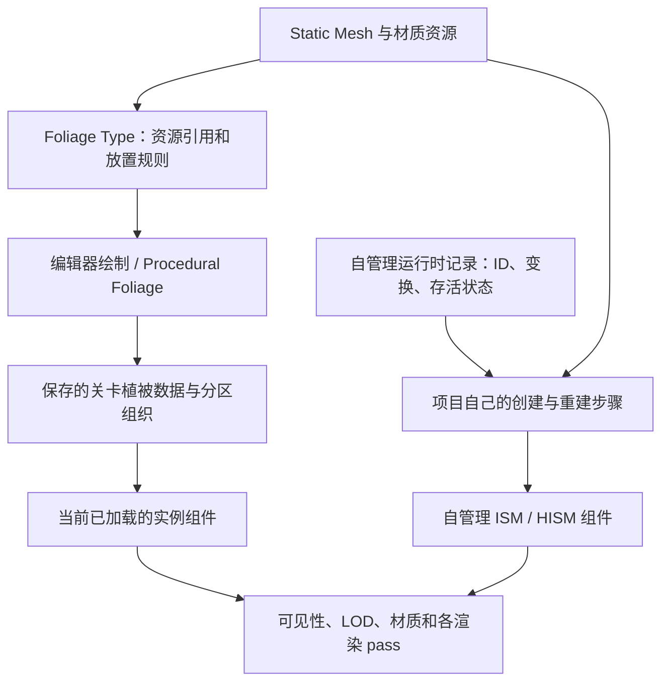
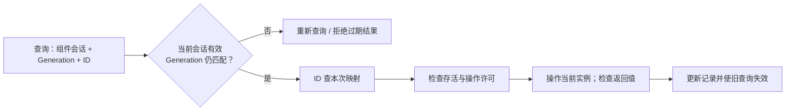

# 02 植被 Foliage 与实例化渲染

> 知识成熟度：L2。主要承诺是解释选型、实例操作与身份、编辑器制作和流送边界，依据官方资料静态核对；`verified: []` 不表示已有运行验证。
> 版本基准：Epic 标注 **Unreal Engine 5.6** 的 Foliage、ISM、Components、World Partition 专题与 Python API 文档；ISM 逐实例 LOD 的引入条件另查 **5.4 Release Notes**。Python API 只用于核对暴露属性和操作语义，不把 Python 当作打包游戏的运行时方案，也不据此声称 C++ 签名或实现源码已读。
> 适用范围：已理解 Actor、组件、Static Mesh 和局部/世界变换的 UE 开发者；编辑器植被制作及少量运行时实例管理。最后更新：2026-10-10。
> 证据边界：本轮未访问 UE 源码 checkout，未编译 C++/蓝图、未运行 UHT、PIE、打包、设备或 GPU 测试。文中的图、伪代码和预期结果是教学推导；不是运行截图、性能报告或 UE 5.8 本机源码结论。

## 1. 先决定“树”是什么，再决定怎么画

假设一片小树林有很多只负责遮景的树、三棵能被玩家采集的树，以及几只移动的动物。把每一棵树都做成带 Tick、碰撞、组件和状态的 Actor，可能付出不需要的管理成本；把采集树只做成一组变换，又缺少“哪棵已经被砍”的可靠身份。两种需求可以共享网格，却不应共享同一套业务假设。

Foliage 是**制作、放置和管理植被的工作流**；ISM/HISM 是**多个相同 Static Mesh 的组件表示**；Nanite 是另一层几何渲染机制。先区分层次，才能解释“我在 Foliage 模式画的对象”和“我自己创建的 ISM 实例”为什么不自动拥有相同的保存、编辑和流送行为。

| 方案 | 合适的起点 | 需要承担或核对的成本 |
| --- | --- | --- |
| Static Mesh Foliage | 编辑器里绘制装饰性树、草和石块；复用 Foliage Type 的放置规则 | 实例数据、材质、阴影、碰撞、流送仍有成本；绘制工具会使用实例化批次 |
| Actor Foliage | 通过 Foliage 工具放置需要 Actor 能力的少量对象 | 保持普通 Actor 的成本；不会因为进入 Foliage Palette 就免费批处理所有逻辑 |
| 自管理 ISM | 运行时添加重复网格，自己控制生成、查询和销毁；需要较多变换更新 | 自己管理实例身份与生命周期；现代 ISM 也有剔除和 LOD，不能当作“没有 LOD 的轻版” |
| 自管理 HISM | 非 Nanite 或存在 fallback 路径、实例数量较多且位置稳定时的候选 | 静态层次结构可帮助剔除与 LOD，但改变实例集合/位置时有维护代价；收益须按项目比较 |
| Nanite + 实例组件 | 网格、材质、平台与渲染路径符合项目要求时 | Nanite 有自己的剔除和 LOD；官方对完全使用 Nanite 的项目建议 ISM，含 fallback 的项目仍需分路径判断 |

以上选型来自 [S1、S2](#10-来源与核对范围)，不是按“超过几百个必用 HISM”划线。HISM 的 H 也不等于 World Partition 的 HLOD：前者组织实例，后者服务世界远景表示。

## 2. 实例化减少哪些工作，哪些工作仍然存在

### 2.1 从资源到场景表示



图中的两条入口最终都可能用到实例组件，但运行时 `Add Instance` 只改变它收到的组件。不能由“组件出现在 WP 地图中”推断这些实例已经写回 Foliage 资产、取得稳定存档身份或登记为可独立卸载的世界 Cell。`AInstancedFoliageActor` 的官方 5.6 API 父类是 `ISMPartitionActor`；这只是理解系统组织的入口，不是“全世界一个总 IFA”的承诺。本文不展开未读过的 `FFoliageInfo` 布局和引擎内部数组。见 [S7、S11](#10-来源与核对范围)。

同一 ISM 中，实例共享网格以及许多组件级属性；它们可以有不同变换和每实例材质数据。改变组件的碰撞配置或共享材质，不能理解为只改变某一个实例。[S2、S3](#10-来源与核对范围)

### 2.2 “一次 draw call 画多个实例”不是整片森林只有一次 draw call

硬件实例化可以让兼容的一组绘制共享提交，但实际渲染仍有材质/网格分组、LOD、阴影和其他 pass 的工作。引擎还可能对普通 Static Mesh 绘制做动态合批，所以“有 N 个组件就必有 N 次 draw call”同样过度简化。网格绘制管线按 pass 生成命令，绑定不兼容也会妨碍合并。[S9](#10-来源与核对范围)

一个实用的成本检查表是：

- 管理：Actor/组件数量、实例数据内存、注册与卸载、碰撞和导航
- 更新：增删、变换与自定义数据的提交；HISM 的空间结构维护
- 可见性：实例是否需要参与剔除、选择 LOD 和不同视图的工作
- 绘制：可见几何、叶片遮罩与重叠、WPO、阴影及材质复杂度

这是用于拆分问题的分析方法，不是相加就能得到帧耗时的测量公式。即使屏幕外一整组被剔除，判断其不可见、保有资源、维护它的数据仍可能需要工作；不能写成“整节点跳过，零开销”。同样，批量 API 是减少反复提交的入口，不保证一次调用恰好重建一次树或在固定时间内完成。

### 2.3 ISM/HISM 的 LOD 认知要带版本

5.4 发布说明增加了 ISM 逐实例 LOD，条件包含 GPUScene、instance culling 和组件的 GPU LOD 选项。5.6 概览也明确现代 ISM 支持逐实例 LOD，并指出 HISM 的分组行为与普通 Static Mesh 不完全相同。迁移旧项目时应核对该项目实际渲染路径，不能把早期 ISM 的整体 bounds LOD 结论套到所有 UE5 版本。[S2、S10](#10-来源与核对范围)

概念上，HISM 的空间层次让一组稳定实例可以共同参与可见性与 LOD 判断；频繁移动则削弱“长期复用这份组织”的前提。这里不推导树的固定形状、更新线程、重建范围或 O(log N) 的整帧保证。也不要求所有植被剔除都发生在 CPU 树节点上：现代 ISM 与 Nanite 有各自路径。

## 3. 能看见、正在渐隐、有碰撞，是三个问题

### 3.1 LOD、距离剔除、密度和流送分开配置

| 控制 | 改变什么 | 排查时先看什么 |
| --- | --- | --- |
| Static Mesh LOD / 组件 LOD 设置 | 可见对象使用的几何细节 | 网格是否真有 LOD；屏幕尺寸设置和当前渲染路径 |
| Start / End Cull Distance | 非 Nanite Foliage 的渐隐区间与最终移除绘制 | 材质是否接入 `PerInstanceFadeAmount`；不要只改 Start 就期待自动透明 |
| Enable Density Scaling | 被允许参加植被质量缩放的类型 | 装饰草与重要碰撞树要分开；数量变少不是存档里死亡对象变多 |
| World Partition streaming | 对应场景对象是否加载 | Streaming Source、Data Layer、空间加载设置；并非调一次 LOD 能解决 |

在 5.6 Foliage 文档所述路径中，非 Nanite 植被可把 `PerInstanceFadeAmount` 接到材质遮罩/透明度计算来减轻整组消失；同页明确 Nanite 网格不受这里的距离剔除与实例渐隐设置影响。应先确认正在测的是哪一路径，再决定参数是否“失效”。[S1](#10-来源与核对范围)

本文不使用旧稿的 `HISM->LODDistances = {...}`；当前已读官方材料支持 Static Mesh 的 LOD/屏幕尺寸、组件的 LOD scale，以及剔除距离接口，不支持把该数组当作本篇可依赖的公开配置入口。缩放随机范围是放置变化，也不是自动“随距离缩小”的曲线。[S2、S3、S4](#10-来源与核对范围)

### 3.2 材质变化与玩法状态不要混用

颜色或风的相位可由每实例随机数/自定义浮点数据驱动，让同一材质呈现差异；自定义数据的维数和材质读法必须配套。WPO 表现顶点摆动，不代表业务记录的位置、碰撞体或导航障碍跟着移动。若树干真的倒下并参与物理，通常需要另外设计 Actor/物理表示。[S2、S3](#10-来源与核对范围)

因此，“被隐藏”“被距离剔除”“视觉渐隐到零”“从组件移除”“玩法中已采集”应使用不同状态。尤其不要把低画质下没画出来的树当作不存在，也不要把材质里的一个 float 当成持久身份。后文的稳定 ID 是项目数据，不是材质随机数。

## 4. 编辑器制作：从一个可检查的小样开始

以下是**未执行的操作练习**，目的是把设置与结果联系起来。先用一小块平坦地表和一个简单、非 Nanite、材质明确的 Static Mesh，避免把地形、复杂材质和性能问题混在第一次尝试里。

1. 打开 Foliage 模式（5.6 文档快捷键为 Shift+3），把网格加入 Palette；保存相应 Foliage Type，给它清楚的资源名。确认选中的是 Static Mesh Foliage，而非 Actor Foliage
2. 打开对应地表 Filter，选中要画的类型；用 Single 放一个，检查网格、缩放、接地高度和朝向。空 Palette 勾选、错误 Filter 或坡度/高度条件都可能让笔刷没有结果
3. 再使用小笔刷 Paint。Point Density 是类型 Density 的乘数；类型 Density 的单位是每 1000×1000 Unreal units 面积，不是每平方米。在本文按厘米解释坐标时，这块面积是 10m×10m，即 100m²。它还受放置约束影响，不能直接承诺每笔生成固定数量
4. 调整 Radius、Ground Slope Angle、Scale 与 Align to Normal。Radius 控制实例之间的最小距离；`Collision with World` 是放置前检查，与游戏中采用哪一种碰撞响应不是同一个开关
5. 修改已有分布时使用 Reapply 并只选择确实要重新应用的字段；观察已经放置的样本，避免假设所有旧实例会自动重算全部属性
6. 为非 Nanite 小样设置有间隔的 Start/End Cull Distance，再在材质接入 FadeAmount。沿同一路径拉远观察：几何细节变化、渐隐、最终消失分别记录。切回不读取 FadeAmount 的材质，是解释“为什么突然消失”的反例
7. 装饰草可考虑允许密度缩放；重要的碰撞树不要仅因画面质量档位被当作可任意删减的装饰。类型 API 明确建议小型无碰撞细节开启、重要或大型碰撞对象关闭此选项
8. 保存类型资产与关卡，关闭后重开并重新载入工作区域，核对已保存的编辑器实例。这个步骤验证编辑器内容保存，不验证运行时采集存档

工具入口与渐隐见 [S1](#10-来源与核对范围)，类型参数见 [S4](#10-来源与核对范围)。若要大范围初始分布，可用 Procedural Foliage Spawner 配合 Foliage Types，在放置的范围上 Resimulate，再调整生长/竞争参数和 Blocking Volume，保存结果。5.6 教程的核心操作是 Resimulate，不是每次还必须存在一个通用 Generate 按钮。编辑期生成不等于生成出的树在游戏中没有渲染或碰撞成本。[S8](#10-来源与核对范围)

Landscape Grass 属于地形材质驱动的另一条生成工作流，PCG 也有自己的生成与管理合同；本篇不把它们的运行时实例全部解释成手工绘制 IFA 的同一种存储。

### 4.1 已有 Transform 的编辑器批量导入

如果上游已经给出了测绘、关卡工具或自定义散点产生的 Transform 数组，目标是**按这些给定位置写入编辑器植被内容并保存**，就不需要再让 Procedural Foliage 生长模拟生成另一份分布。下面是未执行的编辑器工具合同，保留这项用途的实际入口，不是已核对实现的完整导入脚本：

1. 准备输入清单：批次标识、目标地图/关卡、Foliage Type 资产以及有限、有效的 Transform 数组。本文约定交接格式为世界空间、厘米、明确的旋转/缩放；来自组件局部空间的数据先按来源组件变换转换。另存输入批次，用于核对重导是否会追加重复实例
2. 在关卡副本中选定目标世界、关卡或 WP 工作区域，并确认相关区域已加载、Foliage Type 指向预期网格。先取三个容易识别且不全位于原点的输入位置作为小批次，不直接对整片森林执行
3. 实际可查的官方入口是 5.6 Python API 的 `unreal.InstancedFoliageActor.add_instances(world_context_object, foliage_type, transforms)`；同页列出 `get_used_foliage_types()` 和 `get_instance_transforms(foliage_type, instances_level)`，可作为导入后核对的入口。[S11](#10-来源与核对范围)
4. 该短 API 说明只确认参数与入口，**没有说明 Transform 的空间、目标关卡/分区路由、事务或持久保存细节**。工具作者必须先在选定版本核对这些合同，再把交接的世界 Transform 转成接口要求的空间，并确认新增落在预期目标；不能仅凭一个 World Context 或函数名字猜测。未确认时停在输入准备和接口核对，不盲调旧稿的 `FFoliageInfo::AddInstances` 伪签名
5. 完成选定版本的适配后，在副本导入小批次；对照给定位置、旋转、缩放、目标 Type、实际归属和新增数量，使用 Foliage 模式选择结果，并结合上述读取入口检查。对已有内容采用明确的追加或替换批次策略，不能为了重试而清空同类型的全部已有实例
6. 保存确实被修改的类型/关卡及相关内容，重开地图并重新加载目标区域后复查这些输入实例；只有这一检查成立，才把“小批次编辑器导入并保存”作为结果。之后是否扩大批次要另看项目成本。运行时组件变更或一次 API 返回都不能替代保存验证

这条流程用于构建编辑器导入工具；本轮只静态读取了 S11 的公开入口，未核对其 C++ 实现、未调用 Python、未执行导入、保存或重开。具体实现仍须在对应引擎版本落实上述空间与目标归属合同。

## 5. 运行时组件：先弄清操作对象与坐标

自管理运行时内容可以把一个 ISM 作为普通 Actor 的组件，在有效的场景生命周期内调用它的接口。蓝图预置组件由 Actor 生命周期负责注册；C++ 动态创建组件时还要正确设置所属 Actor、附着关系和注册，只有 `NewObject` 并不等于已经显示。运行中注册组件本身也有成本。[S6](#10-来源与核对范围)

下面列的是官方 5.6 暴露 API 的语义；名称采用常见蓝图显示方式以便找节点。C++ 移植要在项目的对应头文件核对实际签名和模块依赖。[S3](#10-来源与核对范围)

| 操作 | 输入与结果 | 调用者必须处理的事 |
| --- | --- | --- |
| Add Instance | 一个 Transform；返回实例索引 | `World Space=false` 表示组件局部空间，不能把世界坐标直接塞进去 |
| Add Instances | Transform 数组、是否返回索引、空间与导航更新选项 | 需要索引时打开返回选项；不要忽略返回内容或自行假设旧缓存全有效；批量接口不保证固定重建次数 |
| Update Instance Transform | 当前实例索引、新 Transform、空间与更新标记；返回成功与否 | 检查返回值；批量更新应组织通知而非每次都强制提交；不要把 render dirty 当作 GPU 完成栅栏 |
| Remove Instance / Remove Instances | 当前索引或索引集合；返回成功与否 | 删除会改变集合；未核对具体删除/重排规则前，不能继续信任旧的 ID→索引缓存 |
| Get Instance Transform | 索引和目标坐标空间；读取实例 Transform | 无效索引是失败，不应当作原点位置或有效默认值继续业务 |
| Get Instances Overlapping Sphere / Box | 查询体积、体积的空间；返回索引集合 | 判定的是实例 bounds 相交；不是可见像素、精确碰撞或伤害许可 |
| Get Instance Count / Clear Instances | 读取当前组件数量 / 清空实例 | 当前组件数量不是整世界对象总数；清空显示不自动写入存档 |

**可手算的坐标反例**：组件位于世界 X=1000cm，局部 X=300cm 的实例在没有旋转缩放时应位于世界 X=1300cm。把 1300 当作局部坐标再添加，会得到 2300cm。移动组件后所有局部实例一同移动；“当初用 World Space 添加”不等于建立了永远脱离组件的世界锚点。

自定义散点也应先统一单位。若 `RadiusCm=2000`，密度 `0.1 个/m²`，数量模型是 `floor(π × (2000/100)² × 0.1)=125`。旧式直接用 cm² 乘“每平方米密度”会放大一万倍。这个等式只是均匀面积预算的手算；没考虑坡度、间距、碰撞排除，不能当成 Foliage 笔刷或 Procedural Foliage 的精确输出公式。生成器还应限制输入为有限非负值并给实例数设上限。

### 5.1 从圆盘范围生成一批变换

下面补上这个数量预算对应的**平面圆盘散点伪代码，未编译、未运行**。它只生成某一组件局部空间的 Transform 数组，不做地形投射、间距排除或存档。输入是局部中心 `C`、半径 `Rcm`、每平方米密度 `ρ`、数量上限 `MaxCount`、固定种子 `Seed` 和正的统一缩放区间 `[sMin,sMax]`。生成后可交给 §5 的组件 Add Instances；若用于 §4.1 的编辑器导入，先将局部变换转换为交接所需的世界空间。

```text
BuildDiskTransforms(C, Rcm, ρ, MaxCount, Seed, sMin, sMax):
    要求 C 各分量、Rcm、ρ、sMin、sMax 为有限数
    要求 Rcm >= 0、ρ >= 0、MaxCount 为非负整数、0 < sMin <= sMax
    AreaM2 = π * (Rcm / 100)^2
    Budget = AreaM2 * ρ
    若 AreaM2 或 Budget 非有限，返回失败，不先转换为整数
    N = floor(min(Budget, MaxCount))
    用明确选定的随机算法和 Seed 初始化一次随机流
    输出数组为空
    重复 N 次，始终按下列顺序从同一流取四个 [0,1) 样本：
        uAngle, uRadius, uYaw, uScale
        θ = 2π * uAngle
        r = Rcm * sqrt(uRadius)
        P = C + (r*cos(θ), r*sin(θ), 0)
        YawDegrees = 360 * uYaw
        s = sMin + (sMax - sMin) * uScale
        若 P 或 s 非有限，返回失败，不向组件提交部分结果
        追加 Transform(P, 零Pitch/Roll和YawDegrees, (s,s,s))
    返回成功及输出数组
```

上限截断时输出数量小于原面积预算，这是显式限制，不再声称实现原目标密度。在面积和预算均通过有限值检查后，`Rcm=0`、`ρ=0` 或 `MaxCount=0` 时 N=0。每次调用重新初始化同样的流会生成同样布局的候选输入；若反复追加到同一组件，仍可能得到重复实例，需自己选择清空重建或去重策略。

**为什么半径取平方根？** 在独立均匀样本的理想模型下，半径不超过 `a` 的圆盘占总面积 `a²/R²`。取 `r=R√u` 时，`P(r≤a)=P(u≤a²/R²)=a²/R²`；再令角度均匀，就与面积比例一致。反例是 `r=Ru`：半径一半以内会拿到一半样本，但那部分面积只有四分之一，所以中心偏密。这个推导说明位置采样的分布，不保证有限批次看起来没有团簇；随机 yaw/scale 也不会自动防止网格重叠。

固定 Seed 解决的是重建输入序列的可复现性，与面积均匀是两个条件。只有随机算法、种子、输入、取样顺序以及相关计算行为一致时，才可期待相同布局；新增一次随机调用、改算法、版本或浮点计算环境都可能破坏逐值一致性。这里不保证跨引擎版本或平台位级相同，也不把生成顺序号自动升级为跨存档的业务身份。

## 6. 有限完整练习：三个实例的身份与增删改查

### 6.1 约束、准备与数据

这是一个可以按步骤搭建的**蓝图设计与伪代码练习，未编译、未运行**。范围仅一个 Actor、一个预置 ISM、三个初始对象、手动顺序调用。无 Tick、异步任务、网络、伤害、存档写入和运行时世界分区系统；不以这个小规模全量重建方案作为大型森林的性能实现。

在一个普通测试关卡创建 Actor 蓝图 `BP_InstanceLesson`：保留 Scene Root，添加名为 `Visuals` 的 ISM。选择**局部 bounds 中心与网格 pivot 同在局部原点、bounds 球半径小于 50cm** 的简单网格，例如资源几何范围为 `[-20,20]cm` 三轴立方体，其中心在原点、包围球半径为 `20√3cm<50cm`。先核对资源实际 bounds，中心偏离原点或半径不满足要求时不要沿用后面的唯一命中预期。采用非 Nanite、无 WPO、NoCollision 和不影响导航；Actor 与组件保持单位变换，所有实例保持零旋转和单位缩放。组件开始时没有预置实例，材质统一使用容易观察的不透明材质。本练习使用下面三个固定位置，**不混入 §5.1 的随机 yaw/scale 或散点输出**。

创建一个记录结构 `Record`：`Id`（Name）、`LocalTransform`（Transform）、`Alive`（Boolean）。`Records` 是 Record 数组，由以下固定内容初始化；每行 ID 唯一且不能随删除重新编号：

| 业务 ID | 局部位置（cm） | Alive |
| --- | --- | --- |
| Tree_A | (0,0,0) | true |
| Tree_B | (300,0,0) | true |
| Tree_C | (600,0,0) | true |

另外建立 `IdToIndex`（Name→Integer Map）、`IndexToId`（Integer→Name Map）、`Generation`（Integer，初值 0）、`Ready`（Boolean，初值 false）。这些 Map 和 Generation 只解释本 Actor 本次有效表示；生产系统跨卸载还要有独立的组件会话/世界身份。不要把这里三个可读 ID 的命名法机械扩展为多人世界的全局发号规则。

### 6.2 由业务记录重新建立映射

以下伪代码中的大小写 API 名代表蓝图操作意图，不是逐字 C++ 或 Python。数组/Map 查找、Branch、For Each Loop 与结构更新均使用蓝图普通节点；所有操作按同一事件链顺序进行，没有延迟节点。

```text
Rebuild():
    Ready = false
    Generation += 1
    IdToIndex.Clear(); IndexToId.Clear()
    Visuals.ClearInstances()
    若 Visuals 的网格未指定，返回 false
    若 Records 中有空 ID、重复 ID 或无效 Transform，返回 false
    对 Records 按原数组顺序遍历：
        若 Record.Alive：
            i = Visuals.AddInstance(Record.LocalTransform, WorldSpace=false)
            若 i < 0 或 i 已存在于 IndexToId：
                Visuals.ClearInstances()
                IdToIndex.Clear(); IndexToId.Clear()
                返回 false
            IdToIndex[Record.Id] = i
            IndexToId[i] = Record.Id
    若组件数量 != IdToIndex 数量：
        Visuals.ClearInstances()
        IdToIndex.Clear(); IndexToId.Clear()
        返回 false
    Ready = true
    返回 true

MoveById(Id, NewLocalTransform):
    若 !Ready、ID 不存在、不存活或新 Transform 无效，返回 false
    i = IdToIndex[Id]
    若 !Visuals.UpdateInstanceTransform(i, NewLocalTransform,
             WorldSpace=false, MarkRenderStateDirty=true, Teleport=true)：
        返回 false
    更新 Records 中该 ID 的 LocalTransform
    Generation += 1
    返回 true

RemoveById(Id):
    若 !Ready、ID 不存在或不存活，返回 false
    若 !Visuals.RemoveInstance(IdToIndex[Id])，返回 false
    将 Records 中该 ID 的 Alive 设为 false
    返回 Rebuild()    // 丢弃所有旧索引；用剩余记录重建映射

AddRecord(NewRecord):
    若 !Ready、ID 为空或已经存在、Transform 无效，返回 false
    把 Alive=true 的 NewRecord 加入 Records
    返回 Rebuild()

QueryLocalSphere(Center, Radius):
    若 !Ready、Center 无效或 Radius 不是有限非负数，返回查询失败
    在本次顺序调用中取得 Visuals.GetInstancesOverlappingSphere(
        Center, Radius, SphereInWorldSpace=false)
    把每个有效索引经 IndexToId 转成业务 ID
    返回 (查询成功, 当前 Actor/组件引用, Generation, 业务 ID 集合)
```

“有效 Transform”在本练习中明确为位置数值有限、旋转为零、缩放为一；初始化、MoveById 和 AddRecord 均按这个约束校验。后表的三元组仅表示位置，旋转/缩放继续保持上述值。Center 也要求各分量有限；失败查询与成功但没有候选要分开。重复 ID 在进入渲染之前拒绝。API 更新失败不修改对应记录；若一次重建中途失败，业务记录仍可用于修复后重试，但表示停在 `Ready=false` 且无残留实例，不把一半显示成功当作完整状态。

`RemoveInstance` 成功后全量重建是本练习刻意选择的简化：既演示删除入口，又不需要假设引擎删除后是移动尾项还是顺序压缩。代价是清空/重建整个小组件；实际大集合若要增量修复映射，必须另核对选定版本、组件类型的删除语义与索引变化通知，不能直接删掉这个重建步骤。这里逐个 Add 只为了使用返回索引建立明确对应关系；需要批量添加时应建立同样严格的输入与结果对应检查。

### 6.3 操作顺序与预期判据

| 顺序 | 输入/操作 | 预期及要解释的原因 |
| --- | --- | --- |
| 1 | BeginPlay 只调用一次 Rebuild | Ready=true，组件数量=3；两个 Map 互为反向映射；不把具体索引值写成业务合同 |
| 2 | QueryLocalSphere((300,0,0),75) | 在 §6.1 居中 bounds、半径<50cm、单位变换前提下只有 Tree_B 入选；候选来自 bounds，不等于射线命中 |
| 3 | MoveById(Tree_B,(300,200,0))，再分别查询旧球和中心(300,200,0)、半径75的球 | 返回 true 后 Record 与组件变换一致；旧球没有候选，新球只返回 B；Generation 已改变 |
| 4 | RemoveById(Tree_B) | 返回 true 后组件数量=2，B 的 Alive=false，映射只含 A/C；旧查询结果不能直接再次使用 |
| 5 | 再 RemoveById(Tree_B) | false；数量仍为 2，不能重复产生“采集奖励”之类副作用 |
| 6 | AddRecord(Tree_D,(900,0,0)) | 成功后数量=3，业务集合为 A/C/D；D 不继承任何旧索引代表的业务含义 |
| 7 | 再添加同名 Tree_D | false；原记录和组件数量不变 |
| 8 | 只再次 Rebuild，不重置 Records | 仍为 A/C/D；这是从记录恢复表示，不是再创建一遍初始三棵树 |
| 9 | 清空网格再 Rebuild；随后修好网格并重试 | 第一次 false、Ready=false、无残留实例；修复后可由同一 Records 恢复 |

唯一候选的纸面理由是：初始 B 的 bounds 中心恰在查询球中心；A/C 中心各距它 300cm，大于 `75+50=125cm`。B 移动后距旧查询中心 200cm，也大于125cm，而新球中心恰与 B 的新 bounds 中心一致，仍远离 A/C。这个推导依赖 §6.1 的同一组前提，不适用于 pivot 偏移、放大实例、WPO 或其他网格。

所有表内结果都是**待在 UE 验证的预期**。开始下一项之前检查前一项返回值；失败时停止该事件链，不能继续操作旧 Map。若故意把“拿到 B 的索引 → 删除别的实例 → 用旧索引改位置”接起来，就能看到为什么数字位置不够表达稳定身份：即使这个数字仍在有效范围内，也未必还是原来的 B。



图中的 Generation 是本文设计的临时失效标记，不是 UE 提供的稳定实例 ID。即使引擎版本另有 ID 接口，也不能未经核对就把它当成跨进程、跨地图、跨存档的业务身份。消费查询结果时需重新检查会话、代次、ID 存活和具体业务条件；本练习的单事件链只演示前半部分。

## 7. 碰撞和玩法：从候选对象到可执行动作

Foliage Type 的放置检查、实例 bounds 查询、物理碰撞和玩法许可分别回答不同问题：能否放在这里、哪些实例可能相关、射线/运动碰到什么、玩家现在是否允许改变它。把球内数量当作命中对象，或从视觉删除直接发奖励，都会跳过必要步骤。

装饰草可以明确采用无碰撞；挡路的树需检查网格的简单碰撞、组件响应、所用查询通道和导航需求。开启 Overlap 事件还要满足双方的配置条件。材质风摆不会自动替代这些物理设置。具体碰撞系统见[碰撞检测与物理材质](../物理求解与动力学/02-碰撞检测与物理材质.md)。[S3、S4](#10-来源与核对范围)

对砍树这样的玩法，建议按以下项目合同组织，而不是把它理解成引擎自动提供的功能：

1. 用碰撞查询或已核对的空间查询取得候选，保留组件会话信息；若命中结果提供实例索引，必须验证它适用于当前组件并立即经映射解析业务 ID
2. 在游戏指定的权威侧，以业务 ID 查存活状态，并验证距离、工具、冷却等具体条件；多人客户端提交的命中/索引只能是请求线索
3. 通过后只完成一次业务状态变更，记录树已被采集；再同步视觉表示、交互 Actor、音效等结果。重复、迟到或组件重建后的请求必须重新判定
4. 需要倒树物理时，让受控 Actor 承接动态表示，并明确避免静态实例与 Actor 双重显示/双重碰撞；转换失败时保留可重建的业务状态

这条链不是本文已实现的 RPC、存档或物理系统。它解释为什么 Foliage/ISM 接口不足以独自负责交互授权。

另有 `UFoliageStatistics` 的官方统计入口。已读 5.6 Python API 是 `foliage_overlapping_sphere_count(world_context_object, static_mesh, center_position, radius)`，还提供 box count 与 box transforms；它明确需要待统计网格，返回数量或变换，并不返回本项目的稳定业务 ID。旧稿的三参数 `CountOverlappingSphere(World, Center, Radius)` 没有得到本次来源支持，不能继续当作可编译例。也不能把统计入口当成自管理 ISM 的通用查询，或据一次当前世界查询声称已经遍历全部未加载分区。[S5](#10-来源与核对范围)

## 8. 资源、组件、世界和持久记录各有寿命

| 层次 | 它拥有的内容 | 结束/失效后怎么办 |
| --- | --- | --- |
| Mesh / Material / Foliage Type 资源 | 可复用的形状、表现与配置 | 有资源不代表有实例；资源引用/加载失败时不要发布 Ready 状态 |
| Actor 与实例组件 | 当前场景注册、变换和渲染/碰撞表示 | 组件注销后不再按有效场景表示使用；清除映射、回调和外部观察者持有的临时引用 |
| 当前 World / 已加载区域 | 当前可以参与显示、查询和交互的集合 | 地图切换、区域卸载后重新获取对应世界与组件，不能沿用旧索引 |
| 项目持久记录 | 稳定 ID、存活、需要保存的变换等 | 由存档或权威世界状态负责；加载回来时根据记录重建视觉 |

组件注册/注销及渲染状态见 [S6](#10-来源与核对范围)；持久记录这一行是本文的项目设计建议，不是 `Add Instance` 的附带保存功能。运行时改变组件不会自动生成一个永久关卡修改；给带 ISM 的 Actor 勾选复制，也不能据此推断任意实例增删已按项目需要持久化或网络同步。

5.6 Foliage 文档给出的默认 Instanced Foliage Grid 为 256m，并明确它与 World Partition grid 分开。World Partition 则按流送来源与相关设置加载/卸载区域；编辑器已放置 Actor 的 Runtime Grid、Is Spatially Loaded 和 Data Layer 会影响载入。[S1、S7](#10-来源与核对范围)

因此，流送练习应分别记录“对象在数据里存在”“当前组件存在”“当前实例可见”。卸载导致暂时查不到，不是树在业务上被砍了；再次加载应应用已保存的存活状态，避免已砍的树重生。运行时 Spawn 的自管理组件不应被默认许诺为“自动进入运行时分区”。选择区域管理者的生命周期、何时重建和何时丢弃缓存，属于项目必须明确的集成点。

第 6 节只把 Records 放在演示 Actor 中，所以销毁它就没有跨卸载持久化保证。要验证持久化，须另建明确的记录持有者和加载流程，再让新 Actor/新组件建立全新的映射；不要用这个单 Actor 练习冒充已验证的 WP 存档方案。若以后加入异步资源加载，应在应用结果前检查世界、组件会话和请求是否仍有效；本文没有核对异步 API 或跨线程调用保证。

## 9. 排查与选型回看

**草突然成片消失，是不是 LODDistances 配错？** 先确认非 Nanite/Nanite 路径，再分辨 LOD 变化、End Cull、未接 FadeAmount、质量缩放和流送卸载。随机缩放不能代替找出真正的消失条件。

**实例数量没变，为什么 draw call 或帧时还变？** 视图、材质、LOD、阴影、可见面积和更新行为都可能变化。先让资源、相机、平台、渲染路径与负载固定，再比较；只看总数量不能定位 CPU/GPU 瓶颈，也没有“实例化后无 CPU 成本”的保证。

**Add Instances 卡，直接关闭导航更新就行吗？** 只有内容确实不参与导航时才能这么设计。先区分分配/添加、注册、碰撞/导航、HISM 维护和后续渲染成本；批量、分块或减少修改频率都是候选，不能用错误导航状态换取看似更快。

**删了一个，后续操作错树？** 先检查是不是把实例索引当了稳定 ID。第 6 节通过重建丢弃旧映射；大型增量方案必须有明确的删除重排合同。查询结果和索引的有效期也不能跨卸载延长。

**同一个球体，数量统计和砍树命中不一致？** 两者可能问的不是同一个集合，也使用不同判定：Foliage 统计有网格过滤，自管理查询有组件范围，bounds 相交又不同于物理射线。先写出空间、集合和过滤条件，再对照。

**既然树要动，是否必须 Mass？** 风摆主要是材质表现，少量移动可以使用合适的 Actor 或 ISM 更新。MassEntity 是面向数据计算的 gameplay 框架；有大量实体逻辑需要批量处理时再评估，不能仅由“每帧变化”决定，更不能把视觉落叶一律指定为 Mass。[S12](#10-来源与核对范围)

**如何证明优化有效？** 另在目标项目记录引擎版本、平台/RHI、Nanite/fallback、网格材质、相机、实例数量与分布、更新频率、碰撞/导航、流送状态；分别观察 Game/Render/GPU 与相关 pass。测试静态、批量变化、反复增删和进入/离开区域的场景，比较同等画面与玩法条件下的结果。本篇没有运行这些测量，也没有给出容量阈值。

## 10. 来源与核对范围

核对日期为 2026-10-10；下面只列支撑现行正文的已读取范围。专题与 API 页面可能继续更新，版本标签不等于源码 revision。API 页面在工具中的可读正文是证据范围；没有把错误页、空页、搜索片段或别的版本的 C++ 页面升级为已读 5.6 源码。

| 来源 | 本次实际使用的范围 |
| --- | --- |
| [S1 Foliage Mode，UE 5.6](https://dev.epicgames.com/documentation/en-us/unreal-engine/foliage-mode-in-unreal-engine?application_version=5.6) | Foliage Types、工具/笔刷/Filter、Culling/LOD、Scalability、WP 网格、添加与重新附着的说明 |
| [S2 Instanced Static Mesh Component，UE 5.6](https://dev.epicgames.com/documentation/en-us/unreal-engine/instanced-static-mesh-component-in-unreal-engine?application_version=5.6) | 组件共享属性、HISM 对比、Nanite/fallback 选型、Custom Data、蓝图/Foliage 创建入口 |
| [S3 InstancedStaticMeshComponent，Python API 5.6](https://dev.epicgames.com/documentation/en-us/unreal-engine/python-api/class/InstancedStaticMeshComponent?application_version=5.6) | add/update/remove/clear、数量/变换/相交查询、custom data、LOD scale/cull 与组件属性；不是 C++ 实现读取 |
| [S4 FoliageType，Python API 5.6](https://dev.epicgames.com/documentation/en-us/unreal-engine/python-api/class/FoliageType?application_version=5.6) | Density 单位、Radius、放置/坡度/缩放、碰撞放置检查、密度缩放条件、Procedural 参数 |
| [S5 FoliageStatistics，Python API 5.6](https://dev.epicgames.com/documentation/en-us/unreal-engine/python-api/class/FoliageStatistics?application_version=5.6) | 完整可读短页：sphere/box count、box transforms 的输入与返回 |
| [S6 Components，UE 5.6](https://dev.epicgames.com/documentation/en-us/unreal-engine/components-in-unreal-engine?application_version=5.6) | 注册/注销、render state、Scene Component 的变换/附着；未据此承诺实例接口的线程安全 |
| [S7 World Partition，UE 5.6](https://dev.epicgames.com/documentation/en-us/unreal-engine/world-partition-in-unreal-engine?application_version=5.6) | 概述、Using World Partition、Actors、Streaming Sources 与 HLOD 生成入口；未执行转换、构建或 Cook |
| [S8 Procedural Foliage Tool，UE 5.6](https://dev.epicgames.com/documentation/en-us/unreal-engine/procedural-foliage-tool-in-unreal-engine?application_version=5.6) | Spawner/Type 设置、Resimulate、竞争/生长参数与 Blocking Volume；未运行模拟或构建光照 |
| [S9 Mesh Drawing Pipeline，UE 5.6](https://dev.epicgames.com/documentation/en-us/unreal-engine/mesh-drawing-pipeline-in-unreal-engine?application_version=5.6) | draw 按 pass 组织、绑定兼容与合并条件；未扩展为所有现代 RHI/Nanite 的完整实现结论 |
| [S10 UE 5.4 Release Notes](https://dev.epicgames.com/documentation/en-us/unreal-engine/unreal-engine-5.4-release-notes?application_version=5.4) | 已读返回内容中逐实例 ISM LOD 的新增项及启用条件；未声称读完整份发布说明 |
| [S11 InstancedFoliageActor，Python API 5.6](https://dev.epicgames.com/documentation/en-us/unreal-engine/python-api/class/InstancedFoliageActor?application_version=5.6) | 父类 ISMPartitionActor 与空间加载属性；本次补读 add_instances、get_instance_transforms、get_used_foliage_types 的公开参数。该页未说明添加的空间/分区路由/事务/保存实现，未访问内部 FFoliageInfo 源码 |
| [S12 MassEntity，UE 5.6](https://dev.epicgames.com/documentation/en-us/unreal-engine/mass-entity-in-unreal-engine?application_version=5.6) | 顶层短页的 gameplay/data-oriented 定位；未研究 Mass 处理器、渲染或复制实现 |

## 11. 关联阅读

- [Landscape 地形系统](./01-Landscape地形系统.md)：地表与 Landscape Grass 的后续学习入口；本文不依赖其具体实现承诺
- [大世界植被与渲染协同](./05-大世界植被与渲染协同.md)：场景层面的协同问题
- [WorldPartition 大世界](../../03-引擎架构与资源系统/世界组织与资源加载/09-WorldPartition大世界.md)：流送与世界组织
- [渲染管线概览](../渲染管线与光照/01-渲染管线概览.md)、[Nanite 与 Lumen](../渲染管线与光照/04-Nanite与Lumen.md)：渲染路径及相关系统
- [Mass 实体框架与群集模拟](../../06-游戏AI/导航移动与群体协同/04-Mass实体框架与群集模拟.md)：动态实体逻辑选型
- [Niagara 粒子系统基础](../特效粒子与流体仿真/01-Niagara粒子系统基础.md)：视觉粒子与交互状态分工的相关主题
- [过场与影视 Sequencer](../过场渲染与虚拟制片/03-过场与影视Sequencer.md)：场景表现与过场入口
