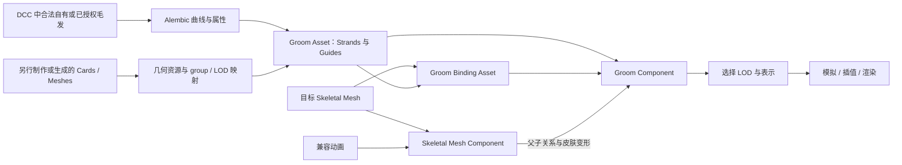
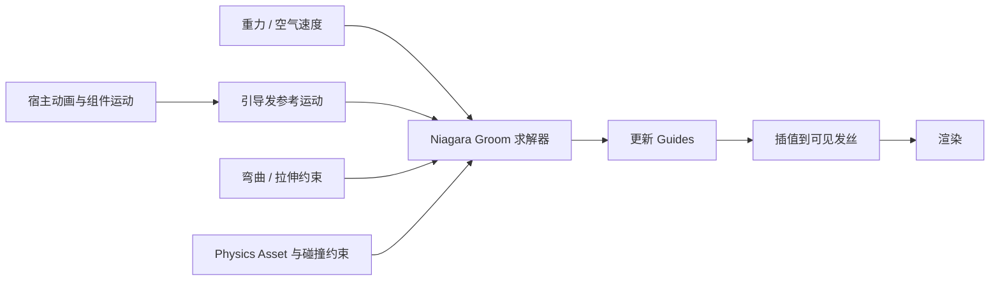
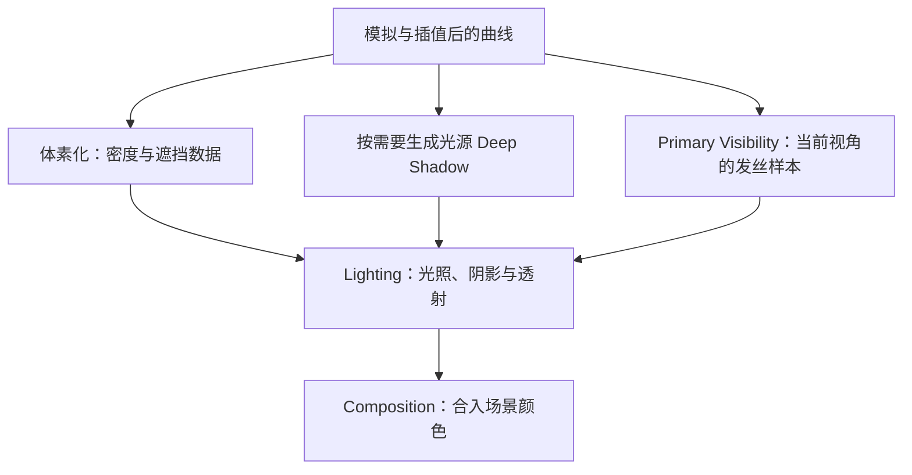

# 06 Groom 毛发系统

> 知识成熟度：L2（公开官方文档静态核对；正常例、对照例与画面预期均未运行）。
> 版本基准：2026-10-11 实际返回、标题标为 Unreal Engine 5.8 Documentation 的 Epic Groom 专题页面；这是公开文档基准，不是本机 UE 5.8.0 源码或 Build.version 认证。
> 事实边界：同一 UE 版本的 Groom、宿主网格、动画、绑定与平台配置；DCC 导出器还须单独核对。本文没有随附可直接导入的毛发资产。
> 最后更新：2026-10-11（补齐从源资产到关卡的正常路线，修正绑定类型、替代几何、缓存与证据范围）。
> 未验证项：未运行 DCC、UE 编辑器、导入、资产构建、项目设置、蓝图或着色器编译、PIE、设备、GPU 或性能实验；未读取受限引擎源码。步骤中的“应看到”是判定标准，不是本轮观察结果。

## 1. 为什么需要 Groom：把形状、运动和画面接起来

角色转头时，发根应跟着头皮走，较长的发梢可以滞后摆动；相机拉远时，应减少不可辨认的细节。单独把一团头发摆在头顶，只解决了静止时的位置，没有解决皮肤变形、动态、远景成本和平台支持。

Groom 把这些问题分开处理：

- **源资产与导入**提供曲线形状、宽度、分组和可选属性。UE 的 Groom 系统不代替 DCC 中的梳理、造型。
- **绑定与宿主组件**决定头发参考谁的运动。绑定正确时，关闭物理仍应跟随角色。
- **模拟与插值**把少量 Guides 的运动传到可见发丝；它们不负责补出缺失的源头发。
- **LOD 与渲染**决定当前使用哪份几何、采样和光照。切到 Cards 不会自动创建卡片网格或图集。

阅读顺序：先看第 2 节的资源关系，再完成第 4 节的一组 Strands。已有正常结果后，才加入 Cards、缓存或复杂材质。各环节的官方入口见第 8 节。

## 2. 三种表示与五类依赖

### 2.1 Strands、Cards、Meshes 分别是什么

| 表示 | 实际数据与用途 | 必须付出的代价或准备 |
| --- | --- | --- |
| Strands（发丝） | 多条有控制点和宽度的曲线，适合需要逐根轮廓与运动的近景 | 曲线和点越多，变形、可见性与光照工作通常越多；平台须支持 Strands |
| Cards（发片） | 三角形带状面片配合纹理近似许多根头发，适合中远景或平台取舍 | 需要实际卡片网格、匹配图集/材质及 group/LOD 映射；覆盖区域重叠也有成本 |
| Meshes（发块） | 如 hair helmet 的网格外形，强调远景体积与剪影 | 需要实际网格；不能期待它保留逐根发梢动态或与 Strands 相同的细节 |

[LOD 文档](https://dev.epicgames.com/documentation/en-us/unreal-engine/setting-up-level-of-detail-for-grooms-in-unreal-engine)列出 Strands/Cards 的 skinning、RBF、simulation 支持，以及 Meshes 的 RBF 支持边界。不能把“Cards/Meshes 几何可在某平台显示”推成“该平台支持相同的 Skinning/RBF/Cache 组合”。

三者不是固定的质量排名：一个重叠很多、材质复杂的 Cards 资产也可能很贵。应比较实际镜头下的轮廓、运动、成本，而不是只看表示名称。

### 2.2 哪个对象保存什么

| 对象 | 持有或提供的内容 | 常见混淆 |
| --- | --- | --- |
| Groom Asset | 导入的毛发、分组、Guides、材质槽和 LOD 等设置；Cards/Meshes 需要另行配置资源 | 导入成功不等于绑定或所有 LOD 已完成 |
| Groom Binding Asset | 特定 Groom 与目标 Skeletal Mesh/Geometry Cache 的对应关系 | 不是 Skeleton 资产；不能因两个角色共用 Skeleton 就假定绑定通用 |
| Skeletal Mesh Component | 当前网格及其动画后的表面，是本例的宿主 | 骨架相同不保证拓扑、UV、比例和发根位置相同 |
| Groom Component | 关卡或蓝图中的实例，引用 Groom、Binding，并可覆盖材质或模拟设置 | 只有 Groom Asset 放在内容浏览器里，关卡不会凭空出现头发 |
| Physics Asset / Groom Cache | 前者为模拟提供碰撞形体；后者提供兼容毛发的离线动画数据 | Physics Asset 不负责皮肤绑定；Cache 也不包含完整渲染资产 |

[资产与组件文档](https://dev.epicgames.com/documentation/en-us/unreal-engine/groom-components-and-assets-in-unreal-engine)说明上述主要分工。静态展示可不绑定；刚性附着可跟随骨骼/插槽；需要跟随皮肤变形时使用相应 Skinning 路线。

### 2.3 先分清两个“绑定类型”

创建 Binding 时，**Groom Binding Type** 选择绑定目标种类：Skeletal Mesh 或 Geometry Cache。本文选择 Skeletal Mesh；Geometry Cache 路线有自己的插件和资产前提。

Groom 的每个 LOD 还有 **Binding Type**：Rigid 或 Skinning。前者按附着点作刚性跟随，后者跟随蒙皮表面；已经分配 Binding Asset，也必须让当前 LOD 选择 Skinning 才使用这份绑定数据。这两个下拉框回答不同问题。[绑定文档](https://dev.epicgames.com/documentation/en-us/unreal-engine/setting-up-bindings-for-grooms-in-unreal-engine)

Source Skeletal Mesh 是可选的原造型网格，Target 是实际驱动网格。对本来就按 Target 造型且发根对齐的 Groom，本例不引入 Source。跨网格转移依赖匹配的 UV 布局等条件，不能把任意换体型理解为自动修复。

## 3. 原理：一帧中哪些东西改变

### 3.1 从制作数据到实例

实线表示依赖，不表示所有步骤都自动完成。尤其是 Alembic 的 Strands 导入、替代几何制作和 Binding 构建，是三件事。重导入改变发根或宿主几何后，要重新检查依赖；仅改颜色一般不改变几何对应关系。

### 3.2 绑定、Guides、插值各解决一层问题

皮肤绑定解决“根部跟谁走”；Guides 以少于可见曲线的数据量描述动态；插值再把运动传给渲染曲线。若先模拟错误绑定的头发，调刚度只会在错误基础上增加运动，无法修正目标网格不匹配。

Guides 可以来自导入数据，也可从 Strands 生成。Rigged Guides 是额外的骨骼化路线，不是“系统自动从任意角色骨骼长出头发”。首次例子选择 Generated Guides；有制作好的 Guides 时应改选并检查分布，不能同时声称仍使用导入 Guides 又覆盖它们。

[插值文档](https://dev.epicgames.com/documentation/en-us/unreal-engine/groom-interpolation-in-unreal-engine)还区分局部插值与 Global/RBF Interpolation。RBF 用于较大皮肤变形下的形状保持，需要合适的蒙皮绑定；它不是增加物理弹性或替代发根投影。用 Guides/Strands Guides Influences 视图检查对应，比无条件提高插值质量更有信息。

### 3.3 模拟的因果链

Physics 面板提供 Groom Rods、Groom Springs 或 Custom Solver。弯曲/拉伸刚度、阻尼、子步和迭代影响动态与成本；自碰撞黏度也不保证任意发束都不穿插。不能脱离造型和输入运动宣布某求解器总是更快或更正确。

保留几个容易混淆的量纲：Bend/Stretch Stiffness（弯曲/拉伸刚度）按文档以 GPa 表示，阻尼取 0 到 1；Gravity Vector 用 cm/s²，Air Velocity 用 cm/s。物理 Strands Thickness 参与质量和惯量，渲染 Hair Width 控制几何外观；即使都与粗细有关，也不能把两者当成相同旋钮。Collision Radius 要与实际碰撞形体及尺度一起看，不套用旧文固定默认数值。

Asset、每组/LOD、Component 的有效设置要一起检查。Local Simulation、参考骨骼的速度缩放和 Teleport Distance 处理运动参考空间与重置；它们不修正 DCC 比例错误。参数名称与层级见[模拟文档](https://dev.epicgames.com/documentation/en-us/unreal-engine/enabling-physics-simulation-on-grooms-in-unreal-engine)。

### 3.4 发丝怎样成为像素

这张图解释数据职责，不是源码 Pass 的无条件调用顺序。发丝可见性解决极细曲线在像素中的覆盖；体素密度和 Deep Shadow 提供沿光线的遮挡信息；透射参与光照，最后合成。Cards/Meshes 使用自己的三角形和材质资源，不能把 Strands 的整套成本直接套过去。

[性能文档](https://dev.epicgames.com/documentation/en-us/unreal-engine/groom-scalability-and-performance-with-unreal-engine)讨论 MSAA 与 PPLL 的取舍：更多采样增加细节也增加成本。本文不把某个默认采样数、深阴影分辨率或固定 MB 数当作普适预算。离屏 Groom 还可能为了投影而更新，不能只凭“摄像机看不到”推断没有成本。

## 4. 完整正常例：一束头发跟随同一角色，再加入摆动

目标是得到一条能够逐段判定的路线：合法源曲线 → 导入 Groom → 分配材质 → 同网格绑定 → 关卡宿主动画 → 可选择的物理摆动。以下名称是教学别名，要替换为实际拥有的资产，不是 UE 自动附送的文件。

### 4.1 输入、软件与平台前提

准备一套自己制作或已获授权、允许在该项目使用的数据：

| 教学名称 | 必需内容 |
| --- | --- |
| `SK_GroomStudy` | 项目中已正确导入的 Skeletal Mesh、对应 Skeleton；DCC 有同一参考姿势与比例的造型网格 |
| `A_HeadTurn` | 对这个 Skeleton 可正常播放的动画，至少能看见头部转动；先单独确认宿主动画可用 |
| DCC 毛发工程 | 按该网格头皮制作的一小束曲线；有可导出的渲染曲线、正宽度，根部与网格对齐 |
| `PA_GroomStudy` | 仅在做碰撞观察时需要，包含与头颈位置相符的碰撞形体 |

本例选官方 Strands 支持列表中的 Windows + DX12 环境，并以同一 UE 5.8 项目贯穿操作；这不是说 DX12 是所有 Groom 的唯一要求。若使用其他平台，逐项核[平台支持](https://dev.epicgames.com/documentation/en-us/unreal-engine/groom-platform-support-in-unreal-engine)。移动端的 Cards 几何支持不意味着可照搬此例的 Skinning/RBF 路线。

DCC 本身需要合法可用的软件及正确导出器。没有源曲线或配套角色时，先完成资产制作/授权这项前置工作；空工程和空文本文件不能产生有效 Alembic。第三人称模板可提供宿主示例，但不会赠送一份与任意头皮匹配的 Groom。

### 4.2 在 DCC 准备并导出源曲线

1. 在宿主参考姿势下制作小束头发，确认曲线从根到梢的方向、单位、位置和宽度。首次只用一个组，避免把分组、跨角色转移同时引入。
2. 使用该 DCC 的 Groom/Alembic 导出流程，输出曲线而非仅输出三角形头发模型。本文采用单帧静态形状；不导入离线动画 Cache。
3. 有自制 Guides 时按 schema 标记；本例选择不提供独立 Guides，稍后由 UE 生成。保存导出单位与轴向，避免靠关卡任意缩放掩盖导入错误。
4. 输出实际 `.abc` 文件，并保留 DCC 原工程。按[Alembic schema](https://dev.epicgames.com/documentation/en-us/unreal-engine/using-alembic-for-grooms-in-unreal-engine)核对曲线、宽度与属性作用域。RootUV 是可选的空间属性；缺省生成方式不等于真实头皮 UV，不能用于证明绑定已成功。

使用 Maya/XGen 的读者可沿[官方 XGen 导出指南](https://dev.epicgames.com/documentation/en-us/unreal-engine/xgen-guidelines-for-hair-creation-in-unreal-engine)完成具体转换：legacy description 先转 Interactive Groom，Spline Description 经 Cache 导出并转为 NURBS 曲线，再按需要添加分组/Guide 属性并 Export Selection to Alembic。静态导出选 Current Frame，保留最终宽度；只导出要用的曲线节点。该页面虽然处于 UE5.8 文档下，制作示例明确使用 **Maya 2018.6**；其中旧脚本不能冒充已适配当前 Maya/Python。本例不复制执行那些脚本，也不声称通用于所有 DCC 菜单。

### 4.3 UE 导入：先证明形状正确

1. 在测试项目中启用 **Alembic Groom Importer** 与 **Groom**。按官方快速开始启用 **Support Compute Skin Cache**，然后重启编辑器。检查设置实际生效，再继续导入；这里列的是读者操作方案，本轮没有改任何设置。
2. 将上一步真实的 `.abc` 导入内容浏览器。看到 Groom Import Options 后，先检查有效性提示、组数、Curve Count、Guide Count 和属性列表。
3. Conversion 的 Rotation/Scale 对应记录的轴向与单位，Scale 用于换算为厘米。本例保持源造型，首次不主动减少曲线或点；在当前导入面板选择 **Generated Guides**，例如密度 0.1 仅作这束头发的起点。它不代表适用所有资产的默认质量。
4. 导入并命名为 `G_HeadStudy`，打开 Groom Asset Editor。看轮廓、宽度、组数及 Guides；若曲线为空、异常巨大、倒向或与参考网格明显错位，回到导出/转换，先不创建绑定。

这些字段见[导入文档](https://dev.epicgames.com/documentation/en-us/unreal-engine/importing-grooms-into-unreal-engine)。预期得到的是一个有非零渲染曲线和可检查 Guides 的 Groom Asset，**不是**已接好角色的关卡结果。

### 4.4 材质与近景 LOD：建立最少依赖

创建 `M_HeadStudy`，本例使用传统材质路线：[Surface、Opaque](https://dev.epicgames.com/documentation/en-us/unreal-engine/unreal-engine-material-properties)、Hair Shading Model，并确认 **Use with Hair Strands**。用固定颜色接 Base Color、标量接 Roughness，例如暗棕色与 0.5；只用于看清形状，不声称写实参数或物理标定。应用并保存材质。

在 Groom 的 Materials 面板添加/确认命名槽 `HeadHair` 并分配此材质；在该组 Strands 的 Material 选择同一槽。Component 的材质覆盖稍后保持一致，避免实际显示另一份材质。[材质文档](https://dev.epicgames.com/documentation/unreal-engine/groom-materials-in-unreal-engine)

首次在 LOD 面板选 Manual，只使用可见的 LOD0：Geometry Type=Strands、Binding Type=Skinning、Simulation=Disable；Physics 中也先关闭模拟，RBF 暂不强制启用。此时只考察皮肤绑定，不拿发梢摆动当成功条件。保存资产；材质编译或资源构建失败应先解决，不能靠后面的绑定掩盖。

### 4.5 创建绑定并把三个引用接到同一宿主

1. 右键 `G_HeadStudy` → Create Binding，目标种类选 **Skeletal Mesh**，Target Skeletal Mesh 指定 `SK_GroomStudy`。本例造型直接匹配目标，Source 留空。创建并保存为 `GB_HeadStudy`；检查其 Groom 与 Target 引用无误。
2. 把 `SK_GroomStudy` 拖入一个有动态照明的测试关卡。选中它的 Skeletal Mesh Component，添加 Groom Component，确认 Groom 是该网格组件的**子组件**。
3. 给 Groom Component 的 Groom Asset 指定 `G_HeadStudy`，Binding Asset 指定 `GB_HeadStudy`。无需为本 Skinning 例子额外指定头部 socket；不要又施加一次头部变换造成双重偏移。源数据已对齐时，从相对位置/旋转为零、缩放为一开始检查。
4. 再检查实际宿主网格仍为 `SK_GroomStudy`，当前 LOD0 的 Binding Type 仍为 Skinning，材质槽无错误覆盖，Groom Cache 留空。
5. 给宿主选择 **Use Animation Asset**，Anim to Play 选择 `A_HeadTurn`，确认播放与循环设置。在编辑器的播放/模拟流程观察，或先在 Groom Binding 预览中选择同一兼容动画逐帧检查。宿主赋动画的入口见[骨骼网格体资产](https://dev.epicgames.com/documentation/en-us/unreal-engine/skeletal-mesh-assets-in-unreal-engine)。

**正常预期**：头部转动，头皮与毛发根部一起移动；此时无物理摆动是正确结果。用 Lit > Groom > Instances 检查有效几何/LOD/Binding Type，再用 Root Bindings 看根部与对应表面的关系。仅看到头发“位于头顶”还不足以证明蒙皮绑定正确。

### 4.6 再打开动态，而不改变绑定基准

保持同一宿主、动画、Groom 和 Binding：

1. 在 Groom Physics 中对该组开启 Enable Simulation，选择内置 Groom Rods 或 Groom Springs；本例可从 Groom Springs 开始。LOD0 的 Simulation 改为 Auto，以使用资产设置。
2. 在 Groom Component 检查有效模拟设置。若要看头部碰撞，分配 `PA_GroomStudy` 并确认碰撞形体位置；没有合适 Physics Asset 就只做动态观察，不能宣称已验证防穿透。
3. 播放同一头部动画，用 Guides 调试视图看引导发是否运动，再看渲染发丝。预期发根仍跟随，发梢在造型长度、约束和输入运动允许时有相对运动；短而硬的毛发不必出现明显甩动。
4. 关闭该组/LOD 模拟重看同一帧：皮肤跟随应保留，额外动态减弱或消失。这个对照把“绑定跟随”和“物理摆动”分开。
5. 大幅跳转时间或瞬移后若状态异常，按实际需要 Reset Simulation，再检查 Local Simulation/参考骨骼与速度设置；不要先改发根位置或随机提高刚度。

至此完成的是一条可执行的配置路线。只有在实际环境得到上述结果、保留资产与观察记录后，才能称该项目验证通过。

## 5. LOD、Cards/Meshes 与缓存的后续选择

### 5.1 LOD 决定用哪份已经存在的数据

对第 4 节的单组例子，可先加一个 Strands LOD1，减少曲线/控制点，设定比 LOD0 更小的 Screen Size。用强制 LOD 视图分别检查，再回到自动选择并移动相机。预期简化版仍保留主要轮廓；若明显变稀，再谨慎调整 Thickness Scale。这里的 Screen Size 是屏幕覆盖率条件，不是固定米数。

需要 Cards LOD 时，先导入自制卡片网格与匹配材质/纹理，或研究实验性的 Hair Card Generator。到 Cards 面板建立条目，指定 Mesh、Material、Group Index 与 LOD Index；再在对应 LOD 选择 Cards。**只改 Geometry Type 或 Use Cards，不构成卡片制作流程。**

Meshes 同样要在自己的面板指定几何、材质和映射。不要把另一个“远景发组”当作同一发组的远景 LOD，否则可能叠出两套发型。Minimum LOD 的平台设置会影响保留/烹饪的档位，须确认目标平台实际留下的几何。[Cards/Meshes 文档](https://dev.epicgames.com/documentation/en-us/unreal-engine/setting-up-cards-and-meshes-for-grooms-in-unreal-engine)

Auto LOD 可自动减少 Strands 曲线；它不承诺生成 Cards 图集或任意平台的动态兼容性。首次教学例用 Manual 是为使每档输入可检查，不代表生产项目必须如此。

### 5.2 材质、阴影与性能应怎么调

- Hair Width 的单位是厘米。先检查导出宽度和实际尺度，再调根/梢缩放；“更粗”可能只是遮住发量不足。
- Hair Attributes 提供沿发丝方向、RootUV、Seed 等输入。要做空间发色变化，先确认对应属性确实存在且含义正确。Hair 着色模型的 Scatter、Tangent、Backlit、Specular 与 Roughness 分别涉及散射、方向与高光等表现；它们不是相互替代的“透光开关”，输入列表见[Shading Models](https://dev.epicgames.com/documentation/en-us/unreal-engine/shading-models-in-unreal-engine)。
- [Groom Textures](https://dev.epicgames.com/documentation/en-us/unreal-engine/generating-groom-textures-in-unreal-engine)区分 Follicle 纹理与 Strands 纹理：前者帮助头皮材质和发根过渡，后者将发丝信息投影到替代网格所用贴图。生成贴图也不等于创建了卡片几何或完成绑定。
- 体素化、Deep Shadow、光追几何各有用途与代价。需要精细睫毛阴影可以评估光追几何；不能把开启它理解为自动获得所有 Lumen/路径追踪效果。
- Stable Rasterization 会改变覆盖表现，发组可能变厚；Scatter Scene Lighting 面向短绒毛等情形，不能作为所有发型的统一修复。
- 保持相机、灯光、分辨率、角色数和动画相同，再比较曲线/点数、LOD、模拟和阴影的变化。显存与耗时应实际测量，没有通用“每角色 5–10 MB”保证。

字段依据见[Strands 设置](https://dev.epicgames.com/documentation/en-us/unreal-engine/groom-strands-in-unreal-engine)，成本分析见[性能文档](https://dev.epicgames.com/documentation/en-us/unreal-engine/groom-scalability-and-performance-with-unreal-engine)。本轮没有执行其中任何控制台调参或性能测量。

### 5.3 Groom Cache 是另一条输入路线

离线 DCC 已算好的动画可导入 Groom Cache，但仍需拓扑兼容的 Groom Asset 承担渲染资源。Guides Cache 记录引导发位置并使用引擎插值；官方流程要求对应组启用 simulation。Strands Cache 记录每根发丝的动画属性，不依赖同一插值流程，数据量与带宽通常更大。

曲线数、各曲线点数等拓扑必须兼容；“动画把头发剪短”不能靠删掉点数制造不兼容。当前[Cache 文档](https://dev.epicgames.com/documentation/en-us/unreal-engine/using-groom-caches-with-hair-in-unreal-engine)还说明，Component 已分配 Binding 时 Cache 槽不可同时赋值。应单独准备缓存播放配置，不能在第 4 节的实例上假定一个开关就能无条件切换。

Guide-Cache Support 是插值文档中的特定支持选项，不能据此推导所有缓存、绑定、平台组合兼容。过场离线回放与实时交互模拟的选择，应围绕需要控制的运动和实际资源决定。

## 6. 可复现对照与排错

以下是尚未运行的验证建议。在测试资产副本里逐项改变输入，保留原资产与配置以便恢复；一次只改变一项。

| 对照 | 输入/操作 | 应观察与结论 |
| --- | --- | --- |
| 绑定与模拟分离 | 同一网格、动画、Skinning 绑定，模拟先关再开 | 关闭仍跟随皮肤；开启才可能增加发梢动态。若关闭就脱离头皮，先查绑定 |
| Rigid 与 Skinning | 保存正常例后，把测试 LOD 改成 Rigid 并使用有效附着点 | 刚性整体跟随不等于跟随局部皮肤变形；改回 Skinning 恢复本例 |
| 缺失替代几何 | 正常例副本强制使用尚无对应资源的 Cards 档 | 不应期待自动生成发片；具体警告/缺失表现以实际版本为准，回到已有 Strands 再补资源 |
| 单位错误 | 对比导出记录与导入 Conversion，查看 Groom 和宿主尺寸 | 明显比例差异先修导出/导入，不靠局部模拟参数补救 |
| 材质覆盖 | 改资产槽颜色，再检查 Component 是否覆盖该槽 | 资产变化不生效时先找实际使用的材质，不把它误判成着色模型失效 |

常见故障按依赖顺序缩小：

1. **根本看不到毛发**：文件是否为有效 Groom 曲线、曲线数/宽度是否非零、插件与重启是否完成、当前表示/LOD 是否有资源、实例与材质是否引用正确。
2. **参考姿势正常，动画后错位**：查宿主父子关系、Binding 的 Groom/Target、有效 LOD 的 Skinning、导入变换，以及网格是否在绑定后被重导入改变。不要仅按共用 Skeleton 判断兼容。
3. **跟随但完全不摆**：先确认输入动画确实变化，再看组/LOD/Component 模拟开关、Guides、造型长度和刚度；不要求任意短发都摆出长发幅度。
4. **穿插或爆动**：查单位、Physics Asset、碰撞半径与身体形状、时间跳变、参考空间；恢复已知正常配置，再逐项验证。
5. **阴影、闪烁或远景突变**：检查有效表示、LOD 和照明；用体素/覆盖调试帮助定位。不要一次改多个 CVar，否则不能归因。
6. **内存或帧率问题**：先记录可见/投影实例、有效曲线数和几何类型，再实际采样 CPU/GPU 与资源内存；不能用单张静态画面证明预算。

[调试文档](https://dev.epicgames.com/documentation/en-us/unreal-engine/debugging-grooms-in-unreal-engine)提供 Lit > Groom 的 Instances、Guides、Memory、Voxels 视图与 `r.HairStrands.Dump` 日志汇总。本文优先这些可定位入口，不把旧命令表的每个拼写、默认值或适用版本都当作本轮已验证。

## 7. 常见问题 FAQ

**Q1：Groom 与 Skeletal Mesh 是什么关系？**

它们是不同资产。宿主给出运动表面；Groom 提供毛发；Binding 建立两者关系，Component 把它们用于场景。刚性展示不一定需要蒙皮绑定。

**Q2：为什么头发没有影子或影子太浅？**

先确认动态照明、投影设置、有效表示和体素/Deep Shadow 路线；检查宽度和密度相关设置。体积雾不是一般 Groom 投影必须开启的条件。旧文把两者绑在一起的表述不作为操作要求。

**Q3：Nanite Strands 什么时候用？**

旧版正文记录过实验性 Nanite 发丝及“无模拟、无绑定”限制。本轮公开 `UGroomAsset` API 页面能看到 `UsesNanite()`、`HasValidNaniteData()`、`HasNaniteFallbackMesh()` 名称，但名称不能证明完整启用流程、平台或兼容矩阵。本例不依赖该路线；使用前需对实际版本继续核源码/发布说明与运行结果，不能把普通 Nanite 网格规则直接搬过来。

**Q4：Cards 和 Meshes 怎么生成？**

它们需要实际网格与材质/纹理。Cards 可自制导入，或评估实验性 Hair Card Generator；Meshes 也须提供资源并映射到组/LOD。修改表示不会自动生成这些依赖。

**Q5：如何让头发参与 Lumen 或光追？**

先分清环境遮挡、光照、光追几何与路径追踪。官方性能页描述了毛发体素和按资产/实例启用光追几何的选择；开启某项不保证各路径画面完全一致。目标平台与具体效果仍需分别验证。

**Q6：Groom Cache 与实时模拟怎么选？**

需要保留 DCC 离线运动时评估 Cache；需要交互响应时评估实时模拟。缓存类型、拓扑与绑定兼容性先按第 5.3 节核对，而非无条件热切换。

**Q7：裁剪、景深或运动时闪烁怎么办？**

先固定相机/分辨率并隔离 LOD、宽度、采样与运动因素，再做单变量对照。平台文档明确景深可能有伪影；没有一个速度 CVar 能保证解决所有场景。

**Q8：显存占用怎么看？**

用 Groom Memory 可视化和 `r.HairStrands.Dump` 区分资产、绑定与组件，再结合实际 GPU 工具。纹理、曲线、体素、阴影等占比随资产和视角变化，不应写死从大到小的顺序。

**Q9：换发型或换体型要重建绑定吗？**

重新核对 Groom、发根、宿主拓扑/UV/LOD 和绑定的依赖；发生影响对应关系的变化时重建并复验。仅改颜色不改变几何映射。不同实例可以有不同材质覆盖，但不能随意共用不匹配的绑定。

## 8. 来源、历史与继续阅读

### 8.1 本轮核对的公开资料

| 官方资料 | 本文使用的范围 |
| --- | --- |
| [Quick Start](https://dev.epicgames.com/documentation/en-us/unreal-engine/hair-simulation-and-rendering-quick-start-guide-in-unreal-engine)、[Project Setup](https://dev.epicgames.com/documentation/en-us/unreal-engine/setting-up-a-project-for-grooms-in-unreal-engine) | 插件、Skin Cache、组件接入与材质/模拟入口 |
| [Importing Grooms](https://dev.epicgames.com/documentation/en-us/unreal-engine/importing-grooms-into-unreal-engine)、[Alembic Schema](https://dev.epicgames.com/documentation/en-us/unreal-engine/using-alembic-for-grooms-in-unreal-engine) | 导入有效性、单位、曲线/Guide 统计和属性 |
| [XGen Guidelines](https://dev.epicgames.com/documentation/en-us/unreal-engine/xgen-guidelines-for-hair-creation-in-unreal-engine) | DCC 导出衔接；保留 Maya 2018.6 的历史环境边界 |
| [Components and Assets](https://dev.epicgames.com/documentation/en-us/unreal-engine/groom-components-and-assets-in-unreal-engine)、[Bindings](https://dev.epicgames.com/documentation/en-us/unreal-engine/setting-up-bindings-for-grooms-in-unreal-engine) | 资源与实例职责、目标种类、父子关系与每 LOD 绑定 |
| [Interpolation](https://dev.epicgames.com/documentation/en-us/unreal-engine/groom-interpolation-in-unreal-engine)、[Physics](https://dev.epicgames.com/documentation/en-us/unreal-engine/enabling-physics-simulation-on-grooms-in-unreal-engine) | Guides、RBF、求解器与设置层级 |
| [LOD](https://dev.epicgames.com/documentation/en-us/unreal-engine/setting-up-level-of-detail-for-grooms-in-unreal-engine)、[Cards and Meshes](https://dev.epicgames.com/documentation/en-us/unreal-engine/setting-up-cards-and-meshes-for-grooms-in-unreal-engine) | 表示选择、已有资源映射与几何能力差异 |
| [Materials](https://dev.epicgames.com/documentation/unreal-engine/groom-materials-in-unreal-engine)、[Strands](https://dev.epicgames.com/documentation/en-us/unreal-engine/groom-strands-in-unreal-engine) | 材质槽、Hair Attributes、宽度及渲染属性 |
| [Scalability and Performance](https://dev.epicgames.com/documentation/en-us/unreal-engine/groom-scalability-and-performance-with-unreal-engine)、[Debugging](https://dev.epicgames.com/documentation/en-us/unreal-engine/debugging-grooms-in-unreal-engine) | 渲染阶段、成本来源与调试入口；未采用疑似笔误的命令拼写 |
| [Groom Caches](https://dev.epicgames.com/documentation/en-us/unreal-engine/using-groom-caches-with-hair-in-unreal-engine)、[Platform Support](https://dev.epicgames.com/documentation/en-us/unreal-engine/groom-platform-support-in-unreal-engine) | Cache 输入、拓扑/Binding 限制和分项平台支持 |
| [UGroomAsset API](https://dev.epicgames.com/documentation/en-us/unreal-engine/API/Plugins/HairStrandsCore/UGroomAsset) | 仅公开类/头文件定位与部分 Nanite 相关符号存在，不推断实现行为 |
| [Skeletal Mesh Assets](https://dev.epicgames.com/documentation/en-us/unreal-engine/skeletal-mesh-assets-in-unreal-engine) | 宿主 Animation Mode 与 Anim to Play 的操作入口 |

核对日期为 2026-10-11。主要 Groom 页面实际返回 UE5.8 标题；带 `application_version=5.8` 的首轮读取失败，本文链接采用本轮成功返回的公开入口，不能把查询参数存在当作固定版本已取得。XGen 中旧制作环境、公开页面个别字段描述/拼写不一致，以及 API 页只给签名的边界分别保留；官方文档核对不等于源码或运行验证。

### 8.2 历史表述怎样使用

本文初建于 2026-08-05；同日有 CVar/文字校正，2026-08-06 添加版本元数据，随后补成熟度、OKF 与导航并迁移至现路径。旧文记录的“本机 UE5.8.0 / CL 55116800 / ++UE5+Release-5.8”是旧来源陈述，**本轮未重新认证**。

旧文的 `GroomAsset.h`、`GroomBindingAsset.h`、`GroomAssetPhysics.h`、`GroomAssetInterpolation.h` 与 Renderer/HairStrands 路径可作为未来有授权源码环境时的检索线索；当前公开 API 可核的头文件入口为 `Engine/Plugins/Runtime/HairStrands/Source/HairStrandsCore/Public/GroomAsset.h`。本轮未验证旧行号、私有渲染函数、所有枚举与 CVar 默认值，也不把“某 CVar 不存在”的旧判断继续当当前事实。

旧版有用的表示比较、数据流/渲染/模拟图、材质与绑定用途、排错问题和九个 FAQ 在本文继续承担教学职责；错误或无现行证据的自动生成、通用性能数字、Nanite 限制与缓存热切换说法已更正或收窄。原 Git 历史及书籍、日志、附件不因正文修订而改写。

### 8.3 关联阅读

- [01-渲染管线概览](../渲染管线与光照/01-渲染管线概览.md)：可见性、光照与场景合成
- [04-Nanite与Lumen](../渲染管线与光照/04-Nanite与Lumen.md)：几何与全局光照专题；不要直接推导 Groom 支持矩阵
- [03-光照与阴影系统](../渲染管线与光照/03-光照与阴影系统.md)：阴影数据与光源的关系
- [09-光线追踪与路径追踪](../渲染管线与光照/09-光线追踪与路径追踪.md)：不同渲染路径与能力边界
- [01-Niagara粒子系统基础](../特效粒子与流体仿真/01-Niagara粒子系统基础.md)：理解求解与数据更新背景
- [10-渲染线程与RHI源码](../渲染管线与光照/10-渲染线程与RHI源码.md)：进一步研究渲染调度
- [04-编译器优化与GPU异构](../../01-编程与计算机基础/硬件体系结构与性能/04-编译器优化与GPU异构.md)：GPU 工作与测量背景

### 8.4 术语速查

Strands 是可见曲线；Guides 是较少的引导曲线；Cards/Meshes 是另备的替代几何；Binding 解决几何对应；Interpolation 传递运动；Simulation 求解动态；Deep Shadow/体素化提供遮挡与透射相关数据；Composition 把毛发样本合入画面。它们是相互依赖的不同职责，不是一个“让头发正常”的总开关。
