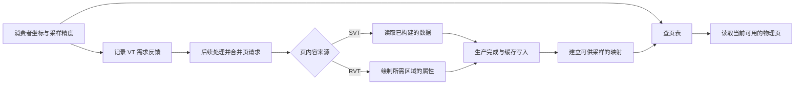
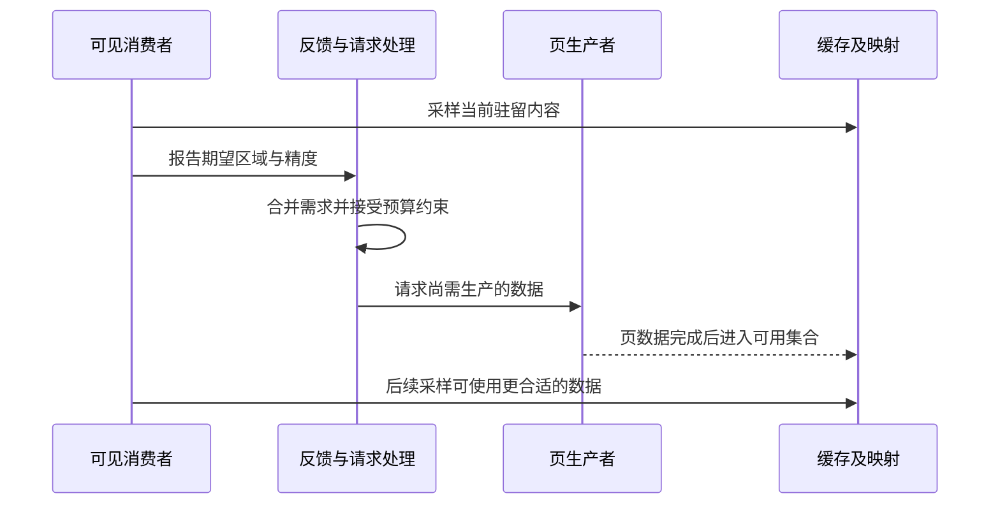
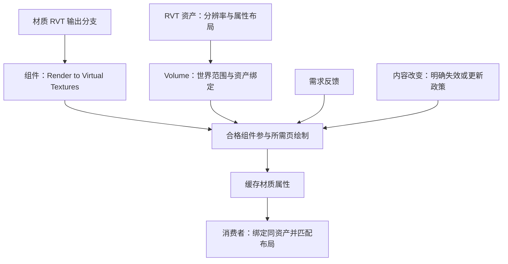
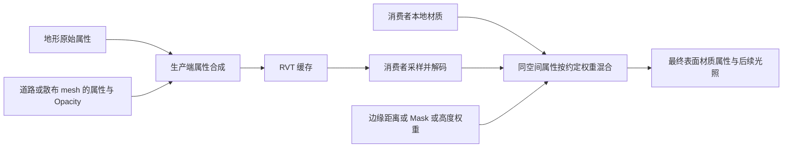
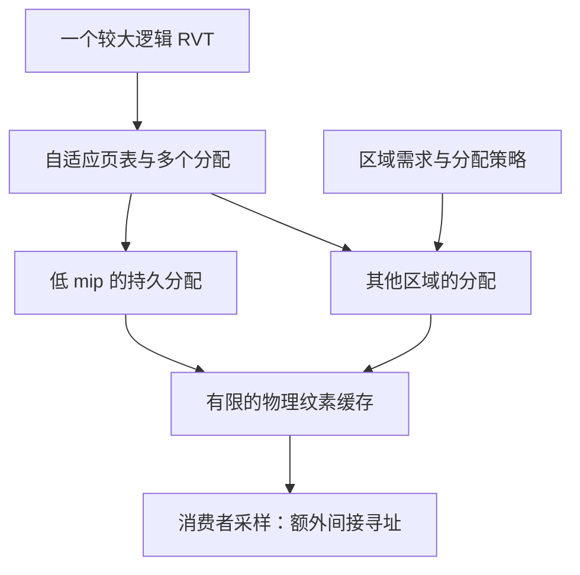

# 07 虚拟纹理与材质混合

> 知识成熟度：L2；官方文档和公开 API 的静态核对，不代表项目效果、引擎实现或性能已经验证。
> 版本基准：工作流以显式 UE 5.6 官方页面为基线；部分 C++ API 页面本次返回 UE 5.8 标题，单列为当前接口阅读，不能外推到旧 CL。
> 最后更新：2026-10-10；修订 SVT/RVT 的生产、驻留、反馈、采样、失效、混合、资源准备和诊断合同。
> 历史版本声明：原稿记录 UE 5.8.0、CL 55116800、分支 `++UE5+Release-5.8`。本轮没有读取该 checkout 的 `Engine/Build/Build.version` 或 Renderer 实现，不能把旧声明写成本轮源码确认。
> 验证边界：本文图例、公式和案例均为静态教学；未执行 UE、UHT、编译、GPU 抓帧、配置加载、cook 或性能测试。第 8 节是后续验证入口。

## 1. 先判断要流送什么、要缓存什么

大地形的三类问题很容易被混在一起：源纹理太大，常驻显存容不下；大量表面重复计算复杂地表材质；道路与地面使用不同坐标和材质，交界不连续。它们分别涉及资源驻留、着色缓存和混合规则。打开一个 VT 选项不会同时解决三类问题。

| 方案 | 页内容从哪里来 | 主要解决的问题 | 仍需付出的代价 |
| --- | --- | --- | --- |
| 普通纹理流送 | 已构建的纹理 mip | 按纹理 mip 管理驻留 | 选择较高 mip 时可能加载未真正参与屏幕采样的区域 |
| SVT，Streaming Virtual Texturing | 已构建纹理的分块数据，经流送进入 GPU 缓存 | 对巨大纹理或 UDIM 按页取用 | 页请求、I/O、上传、页表查找和缓存压力 |
| RVT，Runtime Virtual Texturing | 符合条件的场景表面在 GPU 上生成页 | 复用与视角无关的地表材质属性，并供消费者混合 | 页绘制、编码、缓存更新、采样与失效管理 |
| RVT 的预构建低 mip | 编辑阶段生成的 Streaming Virtual Texture 数据 | 降低大范围低分辨率页反复绘制的成本 | 构建和更新资产、发布数据一致性、流送成本 |

SVT 的“streaming”描述页的来源；RVT 的“runtime”描述可在运行时生成内容。两者可以组合，不能把 RVT 的所有页都说成磁盘读取，也不能把 SVT 说成现场渲染几何。[S01][S02]

AVT（Adaptive Virtual Texture）在本文指稀疏自适应页表/分配组织，见第 6 节。它不应与“磁盘纹理、运行时材质”并列成第三种通用内容来源。RVT 缓存的是所选属性；Base Color 不是已经完成光照的最终屏幕颜色，RVT 也不是 Lumen Surface Cache 或虚拟阴影贴图。

本文的最小前置是 UV、mip、过滤、世界/切线坐标，以及[材质系统详解](02-材质系统详解.md)中的属性和材质编译上下文。阅读顺序是：先分开需求与内容变化，再追踪一页如何可用，最后决定混合和预算。

## 2. 共同机制：页、映射、缓存和需求反馈

### 2.1 资源身份不能只看一个页号

| 概念 | 应当回答的问题 | 常见误解 |
| --- | --- | --- |
| 虚拟页 | 属于哪个 VT/producer、哪个 mip、哪个区域及哪些层？ | 单个数字在所有资产、生命周期中永久唯一 |
| 物理页 | 当前哪些实际纹素驻留在缓存中？ | 为所有逻辑页永久保留显存 |
| 页表 | 当前虚拟位置可映射到哪份驻留内容？ | 存放完整材质，或承诺所有细节已加载 |
| Producer | 如何取得或生成所需页数据？ | 页一被请求就已经完成 |
| Feedback | 哪些采样区域需要哪些精度的数据？ | 自动知道地形、参数、WPO 或上游贴图变了 |
| Invalidation | 哪份已缓存内容不再代表生产者当前状态？ | 与缓存未命中或驱逐完全相同 |
| Tile border/padding | 页内可过滤内容边缘要额外保留多少纹素？ | `r.VT.Borders` 就是设置保护带的开关 |

“虚拟”是逻辑地址与物理驻留分开，不是分辨率或地址无限。资产、页表和实现均有上限。不同格式、层组合和 tile 条件会落入不同物理池；总显存有富余，也可能只有某个池持续超额。[S03][S10]

### 2.2 一次采样与后续页生产不是同一时刻



图表示功能因果，不是某个 CL 的逐函数调用栈。先有有效数据再让采样使用对应映射，是理解正确性的必要不变量；它不证明具体函数用 CPU 原子操作或由某个 CVar 保证同步。目标细页未就绪时，画面可能先使用可用的较粗层级；明确某种资产的完整回退规则仍须核对目标版本。[S01][S03]

公开 `IVirtualTexture` 合同把请求和生产分开：`RequestPageData` 返回请求可用性；`ProducePageData` 将已请求的数据生产到缓存。所读当前 API 还说明 `Pending` 数据在生产时可能阻塞，因此“有异步 I/O”不等于所有后续步骤无等待。这些接口说明不包含 Renderer 内部任务编排或 GPU 完成时序。[S07][S08]

不要把流送反馈类比成会让着色线程停住等待磁盘的 CPU PageFault。两者可以对照“虚拟地址、有限物理驻留、替换”的思想，但图中的视觉收敛与操作系统缺页处理具有不同语义。

### 2.3 反馈、更新预算与可见延迟



反馈是反应式需求信息。快速转向、瞬移或更高输出分辨率会改变工作集；旧画面平稳不表示下一画面所需页已驻留。把“回读延迟”“排队”“磁盘/解码”“页绘制/上传”“映射可见”合称一个固定帧数会掩盖瓶颈。[S01][S08]

例：假设消费者需要 A、B 两个细页，当前只有它们的粗层级，教学调度预算每轮只完成一页。第一轮请求 A、B，完成 A；第二轮仍需 B。这里的“两轮”来自给定纸面预算，不是 UE 默认值。即使所有页后来命中，反馈仍可能参与驻留管理；不能宣称“收敛以后反馈消失”。

源属性在这段时间改变，则另有一条内容失效链。继续反馈同一个 A，只说明 A 仍被需要，不表示系统识别出 A 的颜色从干燥变湿。

### 2.4 页表内存、物理池和 mip bias

页表内存管理映射，物理池存放驻留纹素。所读文档区分两者：页表按需求分配；物理池按匹配的格式和 tile 条件配置容量，页缓存发生 LRU 替换。必须分别观察，不能用一个“VT 内存”数解释所有问题。[S03]

教学反例：某池可放 4 页，而稳定视图交替要求 A、B、C、D、E 五个互斥细页。不改变需求和容量时，移入第五页会挤出仍可能马上需要的页。提高每轮上传预算可能加快反复搬运，却没有修复容量约束。应先查实际工作集、精度、格式和池匹配，再选择降需求或增加该池预算。

驻留 mip bias 是以降低精度换空间的策略，不是无限显存保护。文档中的 residency bias 需要相应配置，且最大池 bias 会影响整体 VT 采样；一个池超额可能让别处也变模糊。编辑器自动增长产生的 Transient Pool 设置也不等于已经保存的发行配置，不能据编辑器最终清晰断言 cooked build 容量充分。[S03]

## 3. SVT：从源纹理资产到消费者

### 3.1 资产、采样器和数据准备是一条链

SVT 的基本流程是：源纹理导入并设置用途 → 构建适用于目标平台的纹理数据 → 可读取的分块数据随内容发布 → 可见采样产生需求 → 数据进入物理池 → 材质通过 virtual sampler 读取。RVT Output 不参与这条普通 SVT 资产生产链。[S01][S15]

1. 先明确纹理属性：颜色、法线或数据掩码；它们的编码、压缩和采样解释不能互换。决定采用 SVT 后，检查项目支持和 Texture 资产的 Virtual Texture Streaming 设置。
2. 纹理启用 VT 后，引用它的 Texture Sample 也要用相应 Virtual Sampler Type。只改纹理标记、仍以普通 Color sampler 读取，是配置不一致；转换工具可辅助更新，但仍需检查引用者。
3. 纹理参数的 sampler 类型来自父材质。把 VT 临时放进非 Virtual 参数槽，不能指望材质实例自动改变已编译采样合同。
4. 目标平台内容准备需要保证 VT 数据和使用它的材质变体同时可用；编辑器预览、派生数据已生成、cook 成功、安装包包含对应资源，是不同证据。

第 4 项是交付检查合同，本文没有执行它。当前 `FTexturePlatformData` API 可看到 `VTData`、派生数据可用性和 `SerializeCooked` 等职责；这些声明支持区分构建数据与运行时驻留，不支持猜测某个项目包内的 chunk 布局或 cook 结果。[S15]

UDIM 提供多个 UV 区域的源图组织，可导入为一个 VT 资产，各区域可有不同源分辨率。它不是新的一套 RVT 世界投影：UV/UDIM 的组织问题和 RVT Volume 的世界覆盖问题要分开验收。[S01]

### 3.2 更少驻留不等于更便宜的每次采样

页表寻址和实际纹理访问都有成本。相同 UV 与 Sampler Source 的 VT 采样可能共享 stack 的部分工作；换用不同 UV、增加采样的层或增加消费者，并不会因都叫 VT 而自动合并。[S01]

一个材质原先两张普通贴图，改成两张 SVT 后只显示屏幕小区域，可能节省驻留，却增加采样指令；另一个材质原先重复做很多地层混合，改为复用 RVT 属性后可能减少主 pass 的计算，却增加页生产。比较时分别列显存、主 pass、页生产和 I/O，不用单一“省采样”覆盖全部收益。

SVT 细页就绪也不消除源图噪声、mip aliasing、压缩和过滤限制。边界宽度影响过滤覆盖与缓存/磁盘开销；屏幕上的调试网格只显示页/mip 情况，不会给已构建页补 padding。

## 4. RVT：生产者、消费者和失效分工

### 4.1 哪些对象真正写入哪张 RVT



这里有三重连接：资产定义布局；Volume 把资产放入世界；组件的 Render to Virtual Textures 指定写入目标，材质输出分支给属性值。只接一个 RVT Output 节点、只把 mesh 放进 Volume，或只在消费者选择资产，都不能代替其他连接。[S02][S05]

RVT 按 Volume 的局部负 Z 方向作正交投影，适合地表类数据。倾斜面、垂直墙、上下叠放的几何会受到投影和合成规则影响。页不是玩家视角的截图；依赖 Camera Vector、Fresnel、屏幕空间信息的部分应留在合适的主渲染分支，不能把“有实时 GPU 绘制”理解为“缓存天然随观察方向变化”。[S02]

生产者 LOD 和最终屏幕几何 LOD 是两个选择问题。Virtual Texture LOD Bias、Skip Mips、Min Coverage 改变写页时是否/如何贡献，不直接等于主 pass 的剔除。低分辨率页虽纹素少，却可能覆盖很多组件；按“页数少”推断绘制成本低会漏掉组件数量和材质复杂度。

### 4.2 材质属性布局是读写协议

当前公开 Output 节点分别列出 BaseColor、Normal、Roughness、Specular、Opacity、Mask、WorldHeight 等输入；不能用原稿的 `RoughnessSpecularMetallic (RGB)` 当作通用节点针脚。选定资产 Material Type 后，只使用该类型实际承载的属性；不能把任意 Metallic 通道想象成所有 RVT 都有。[S11]

消费者同样需要匹配 Virtual Texture Content、packed/adaptive page table 等相关设置，参数替换也要遵守类型合同。`RuntimeVirtualTextureSample` 的世界位置/坐标输入决定从哪里取数据；资产相同、坐标错误仍会得到错误区域。[S04][S12]

关于具体通道打包：本次所读 UE 5.6 RVT 概览与 Settings 页对部分 BC 布局表述存在差异，Settings 页还保留概览称已移除的旧类型名。因此本文不把其中任何一张表复制成跨版本权威，也不据此给固定压缩倍率。实现时记录目标资产 Material Type、层数、每层格式和平台；当前 API 的 `GetLayerCount` / `GetLayerFormat` 仅是核对入口，本文没有调用。[S02][S04][S09]

### 4.3 缓存驻留、内容有效和依赖就绪是三个状态

将某页记成 `(已驻留, 内容仍有效, 源依赖已就绪)` 有助于排查，三个条件不能互相推定：

- 页已驻留，但生产后材质参数改变：仍可能读到旧属性
- 页已驻留且没有新内容编辑，但生成时源普通纹理只有低 mip：缓存可能保留低清结果
- 源纹理现已高清，并不证明之前生成的 RVT 页已重绘
- 页因容量不足被驱逐，后续可重新生产；这与业务主动让一块区域失效是不同原因

固定 5.6 Material API 的 `relax_runtime_virtual_texture_restrictions` 说明 RVT 输出 pass 读取 VT 的限制与依赖未就绪风险，放宽编译限制也不建立完整反馈/更新顺序。不要构造“RVT A 写入时采样自己”或 A/B 相互依赖的图，期待缓存自动求出稳定解。需要地形在主 pass 读自己写入的 RVT 时，写分支应来自独立原始材质逻辑，读分支用于最终表面；RVT Replace/Feature Switch 等节点负责区分上下文。[S06][S02][S05]

对于普通流送纹理作为生产输入，也必须考虑低 mip 被缓存的时间。连续页更新可以提高再次生成的机会，但它是有限预算下对已生成页的刷新，不是逐页依赖完成通知，也不能保证某个变化在固定 N 帧内可见。[S04]

### 4.4 内容变化该由谁负责

固定 5.6 组件 API 提供 `invalidate(world_bounds, invalidate_priority)`，语义是把世界范围对应区域标脏；`request_preload(world_bounds, level)` 是请求指定区域/级别预加载。前者处理旧内容，后者请求需求；两者都不是“函数返回后目标细页已完成”的承诺。[S13]

下面是项目层生命周期伪代码，不是已编译的 UE 接口封装，也没有在本文执行：

```text
记录：生产者上次写入的 RVT 集合、旧世界包围范围、内容修订号
准备改变：确认目标 RVT 支持此用法，区分画面要求与玩法要求
应用改变：更新材质/几何及项目自己的内容修订号
失效范围：旧覆盖范围 ∪ 新覆盖范围，另考虑过滤及影响范围
请求处理：通过目标版本的受支持途径标脏；预热需求另行管理
观察完成：对旧区和新区检查实际结果，不从提交请求推断完成
卸载/移除：旧区域的残留也要处理，不能只丢掉生产者引用
```

“旧 ∪ 新”是此教学场景的正确性推导：道路从 A 移到 B，只刷新 B 会留下 A 的缓存印记。所读 API 不证明所有移动、WPO、参数修改或对象卸载都由引擎自动覆盖这条链。若项目确需频繁变化，必须核对具体自动失效路径及支持范围，或让高频动态细节走独立渲染方案，不能用全局 Flush 每帧补洞。

静止画面也仍有采样、反馈、资源管理和其他渲染成本；“静止后零开销”不成立。RVT 通常适合低变化的地形、样条道路和静态散布表面；骨骼动画、快速移动网格和持续 WPO 不应凭默认缓存语义就被当作正确生产者。[S02]

## 5. 材质混合：把坐标、属性和权重讲清楚

### 5.1 合成进 RVT 与读出后混合是两次操作



生产端 Opacity 表示该写入如何参与页合成；存入 Mask 通道的数值是给后续消费者使用的数据；消费者的插值权重则由材质逻辑定义。即使三个数恰巧相等，也不是同一个合同。把“写入透明度”和“湿润掩码”混为一谈，会使改湿度意外改变道路覆盖。

RVT 多生产者的叠放不是主视图的深度遮挡。官方说明此合成不依赖通常的 Z-buffer，并允许用 Translucency Sort Priority 规定顺序；相同优先级顺序未定义。若设计要求道路覆盖地形、碎石覆盖道路，明确排序并验证，不能靠编辑器当前恰好正确。[S02]

### 5.2 最小道路边缘例：从 UV 遮罩接到世界法线

本例保持“地形只写 RVT_Ground，道路只在主 pass 读取”的方向。补齐的是一条可以逐节点搭建的静态材质路径，仍未创建资产、编译 Shader 或运行 UE。节点语义以 UE 5.6 官方页面核对；下面的网格尺寸、常量和遮罩公式是本文的教学选择，不是官方性能建议。

**先固定输入。** 使用一个平坦地表和一块朝上的矩形道路网格；道路局部 X 为横向、Y 为纵向，UV0 的 U 从左边 0 连续变化到右边 1，V 沿长度变化。道路模型可取 X=-200～200 cm、Y=-400～400 cm，UV0=(X/400+0.5, Y/800+0.5)，正面法线 +Z、U 切线 +X。模型尺寸写在顶点中，Actor 缩放保持 (1,1,1)，不加 WPO、负缩放或翻面。地表在道路下方，世界 XY 覆盖至少 [-1000,1000] cm；道路略高于地表以避免共面闪烁，两者都在同一轴对齐 RVT Volume 内。这个例子只混合表面属性，不解决道路悬空、轮廓裂缝或几何贴合。

创建 RVT_Ground，Material Type 选 Base Color, Normal, Roughness, Specular；此例不使用 RVT 的 Mask 存储通道。创建 M_Ground_Write 和 M_Road_Read，均用 Surface、Opaque、Default Lit，关闭 Use Material Attributes 和 Two Sided。地表材质开启 Tangent Space Normal，道路材质关闭它，令道路最终 Normal 输入明确接受世界法线。[S02][S06][S22]

**A. 地表写入：同一套原始值分接主输出与 RVT Output。**

| 原始节点 | 主材质输出 | Runtime Virtual Texture Output 输入 |
| --- | --- | --- |
| Constant3Vector=(0.3,0.2,0.1)，作为线性颜色 | Base Color | BaseColor |
| Constant=0.8 | Roughness | Roughness |
| Constant=0.5 | Specular | Specular |
| Constant3Vector=(0,0,1)，切线法线 | Normal | 先经 Transform，Source=Tangent、Destination=World，再接 Normal |
| Constant=0 | Metallic | 不接不存在的 Metallic 输入 |
| Constant=1 | 不接主材质 Opacity | Opacity |

地表 RVT 写入分支不包含 RVT Sample。Runtime Virtual Texture Output 不隐式变换输入法线；这里显式写世界空间，保证道路读到的法线与后面的混合空间一致。[S02][S19] 表中的属性接线遵循本篇原有 Output 公开声明及固定 5.6 Quick Start 的写入方式；不是已导入的材质资产。[S05][S11]

**B. 道路边缘遮罩：每根线都有来源。**

在 M_Road_Read 中按下列顺序创建节点，给每个结果加注释名。TextureCoordinate 的 Coordinate Index=0，UTiling=1、VTiling=1，Un Mirror U/V 关闭；使用原始 UV0，不从沥青贴图的平铺 UV 分支取值。[S18]

| 节点 | 输入连接/数值 | 输出含义 |
| --- | --- | --- |
| ComponentMask，只勾 R | TextureCoordinate → 输入 | u，横向 0～1 |
| OneMinus | u → 输入 | 1-u |
| Min | A=u，B=1-u | d，到较近侧边的 UV 距离 |
| Divide | A=d，B=Constant 0.2 | q，每侧 20% 路宽的线性过渡 |
| Saturate | q → 输入 | t，限制到 0～1 |
| OneMinus | t → 输入 | w，0 为道路，1 为地表 |

也就是 w=1-saturate(min(u,1-u)/0.2)。分母在这个最小例中固定为正值 0.2，不留未定义参数。宽 400 cm 时，每侧过渡宽 80 cm；换成非等宽或 UV 拉伸道路后，这个 UV 比例不再等于固定世界宽度。该 mask 只处理左右边缘，不处理道路两端。Min、Divide、Saturate、OneMinus 及下文 Lerp 都使用普通材质数学节点。[S17]

**C. 采样和混合：同一个标量 w 驱动各属性。**

1. 添加 Runtime Virtual Texture Sample，Virtual Texture=RVT_Ground；Material Type、packed/adaptive 设置与资产一致，保留反馈，Mip Value Mode=None。添加 Absolute World Position，将完整 XYZ 接到 Sample.WorldPosition；Sample 的 World Position Origin Type 设为 Absolute，不能把道路 UV0 接入世界位置。[S04][S18][S20][S21]
2. 道路本地颜色用 Constant3Vector=(0.1,0.1,0.1)，粗糙度用 Constant=0.4，镜面用 Constant=0.5；分别建立三个 LinearInterpolate：A 接道路值，B 接 RVT Sample 的 BaseColor、Roughness、Specular，三个 Alpha 都接 w，再分别接主材质同名输出。Metallic 接 Constant=0。[S17]
3. 道路切线法线用 Constant3Vector=(0.6,0,0.8)，接 Transform（Source=Tangent、Destination=World），再接 Normalize，得到 N_road_world；RVT Sample.Normal 也接 Normalize，得到 N_ground_world。第四个 Lerp 的 A=N_road_world、B=N_ground_world、Alpha=w，其输出接 Normalize，再接道路主材质 Normal。这里使用的是 Transform 向量节点，不是 TransformPosition；道路 Tangent Space Normal 保持关闭。[S06][S19]

```text
UV0.R -> Min(u, 1-u) -> Divide(0.2) -> Saturate -> OneMinus -> w

道路原始颜色/粗糙度/镜面 ---------------------> Lerp.A
RVT Sample 对应属性 -------------------------> Lerp.B
w ------------------------------------------> Lerp.Alpha
Lerp 输出 ----------------------------------> 主材质对应属性

道路切线法线 -> Transform(Tangent -> World) -> Normalize -> Lerp.A
RVT Sample.Normal ---------------------------> Normalize -> Lerp.B
w -------------------------------------------------------> Lerp.Alpha
Lerp -> Normalize -> 主材质 Normal（Tangent Space Normal 关闭）
```

这是两套完整表面法线的过渡，不是细节法线叠加；多个细节层仍需适当的法线重定向/混合法。限定的地表法线为 +Z，道路法线经过水平旋转后仍有正 Z 分量，所以本例的加权向量不会因相反法线而归零。换成陡壁、背面或任意法线贴图时必须重新处理近零向量及法线混合政策；Normalize 本身不会把一个零向量变成有效法线。[S19]

**D. 先按纸面值核对，再进入第 7.2 节搭场景。**

| u | d | q=d/0.2 | w | 理想输入下的结果 |
| ---: | ---: | ---: | ---: | --- |
| 0 或 1 | 0 | 0 | 1 | 地表端点 |
| 0.1 或 0.9 | 0.1 | 0.5 | 0.5 | 两组属性各半 |
| 0.15 或 0.85 | 0.15 | 0.75 | 0.25 | 保留原算例的权重 |
| 0.2 或 0.8 | 0.2 | 1 | 0 | 道路端点 |
| 0.5 | 0.5 | 2.5 | 0 | 中央仍是道路，不外推 |

u=0.15 时，原颜色算例仍成立：C=(0.15,0.125,0.1)、R=0.5。若道路的切线基底与世界轴一致，混合法线归一化前为 (0.45,0,0.85)，不是把未转换的两种空间直接相加。世界 yaw 旋转道路 90° 后，本地法线的水平分量应随道路转动，地表采样法线仍朝世界 +Z。以上都是给定输入的 PAPER_EXPECTED；RVT 编码/过滤与实际渲染可能使读出数值有误差，截图的显示颜色也不等于这里的线性常量。反例是把 sRGB 编码值直接当线性量，或把道路的法线空间开关留错；正确的 w 也不能补救表示不一致。

w 是道路消费者现场算出的边缘 mask，不是 RVT Output.Opacity、RVT 的通用 Mask 通道或道路主材质的 Opacity Mask。要做湿润度等可缓存标量，按下一节另选带 Mask 的资产类型并定义它的含义；本例不把这些职责混用。

### 5.3 高度、Mask、全替代与多 RVT

- Mask 路径：先约定 0/1、方向和范围，再与消费者本地边缘条件组合。资产没存 Mask 时，不能用未定义输出代替权重
- World Height 路径：存储受 Volume 高度范围影响，先确定采样输出的解释和世界单位，再比较道路与地表高度；不要把一个归一化存储值直接减世界厘米。过渡宽度必须非零，悬空/叠层场景需额外条件
- Landscape Height Blend：这是生产前地形层的权重计算，不等于 RVT 的 World Height 类型。地层混好后可被缓存，但捕获结果不会修复原权重空洞或几何裂缝
- 全替代：消费者可直接使用足够完整的 RVT 属性；光照、视角相关项和未存属性仍在消费者承担。是否更省取决于被替代的工作量及新增页生产/采样成本
- 多 RVT：先统一坐标、属性语义和混合权重，再考虑额外页表/采样/生产成本。多个 Volume 边界不会自动变成连续表面

若 RVT 只存颜色，观察到“颜色相接”不能证明法线、粗糙度、阴影或几何也连续；若材质改变了 opacity mask，阴影系统是否重新得到正确数据还需要单独的路径证据。[S04]

## 6. Adaptive 页表及与 Nanite/VSM 的边界

### 6.1 大逻辑范围并不消除物理池预算



固定 5.6 Settings 说明 adaptive page table 用于更大 tile 数，代价是额外采样间接性；当前 `IAdaptiveVirtualTexture` API 说明它管理同一空间中的多个分配，并能取到低 mip 的持久分配。[S04][S10] 图据此表达组织关系，不证明内部必按相机距离分固定档、每个 UV 格子使用某个硬编码大小或总能及时升级。

选择顺序应是：明确世界覆盖与需要的 texel 密度 → 查看普通页表/虚拟尺寸限制 → 评估 adaptive 是否需要 → 确认生产和采样设置一致 → 另算物理缓存及更新预算。范围大但画面需要的独特细页也很多时，adaptive 不能让这些页免费驻留。

原稿引用 `AdaptiveVirtualTexture.h` 的英文内部注释及 AVT 多个 CVar；本轮不重发受限实现，也不把原注释视为当前源码已读。可核实的接口责任如上，内部增减 level、淘汰和默认值留给目标 checkout；尤其不能用“长时间不用必自动释放”的口号替代版本核对。

### 6.2 虚拟化对象不同，支持矩阵也不同

| 系统 | 主要数据 | 本文能作的联系 | 不能据此得出的结论 |
| --- | --- | --- | --- |
| VT / RVT | 纹理或材质属性页 | 有限驻留、间接映射、按需生产 | 与几何/阴影共享同一页表和失效政策 |
| Nanite | 几何表示与其流送 | 最终材质可以涉及纹理，但生产路径另查 | 任意 Nanite mesh 都走本文描述的 RVT 写入路径 |
| VSM | 阴影数据 | 可与地表材料同时使用 | RVT 颜色一致就保证阴影缓存一致 |

具体反例来自官方 Nanite Landscape 文档：运行时仍需非 Nanite Landscape 数据供 RVT、水等路径使用。[S14] 因此“启用 Nanite 后普通地形数据可删掉”和“Nanite 页直接成为 RVT 页”都不成立。此结论不自动裁决其他 Nanite Static Mesh、植被、WPO 或未来版本的全部支持。

RVT 可以帮助不同表面/LOD 复用相同地表属性，仍受坐标、mip、过滤和缓存有效性约束；几何轮廓跳变、Nanite proxy 缝、VSM 失效或 Lumen 更新问题要分别定位。原文“彻底消除闪烁”和“联合必然解决地表阴影闪烁”不作为本篇承诺。

## 7. 配置与内容发布的最小闭环

### 7.1 尺寸先写单位，避免把 tiles 当 texels

RVT Size 设置可能以 tiles 表示，而非最终 texel 宽度；所读 5.6 Settings 明确最终分辨率与 tile 数、Tile Size 相乘，并根据 Volume 宽高比处理轴向尺寸。[S04] 在记录配置时至少分别写出 `Nx、Ny`（逻辑页数）、`T`（有效页边长纹素）、`B`（每侧 border）和 Volume 世界覆盖宽高。

规则矩形教学近似：最高精度有效分辨率为 `Nx*T` 与 `Ny*T`；世界 X 向 texel 间距约为 `WorldWidth/(Nx*T)`。例：X 向 16 页、每页 128 有效纹素、覆盖 1024 米，则为 0.5 米/texel。这组数字专用于手算单位，不是资产默认、推荐配置或“RVT 足够清晰”的判定。

固定覆盖面积、逻辑分辨率提高一倍时，每轴 texel 间距减半，但覆盖同一区域所需细节数据可能明显增加。增大 tile 可减少逻辑页数量，却增加单页生产和边缘无用驻留；缩小 tile 可细化需求，但增加请求、映射和页管理。不存在只看“128 或 256”就适合所有场景的结论。

### 7.2 道路和地形的设置顺序

1. 在 UE 5.6 项目中确认目标平台支持 VT；Project Settings → Engine → Rendering → Virtual Textures → Enable virtual texture support 开启后按官方要求重启。这里是待执行操作，不表示本轮改过配置。[S05]
2. 按第 5.2 节创建 RVT_Ground 及两份材质，把 M_Ground_Write 赋给平坦地表，把 M_Road_Read 赋给满足所列 UV0/切线约定的道路。先使用给定常量，不引入贴图流送、Nanite、WPO 或高度混合。
3. 放置 Runtime Virtual Texture Volume，绑定 RVT_Ground；用地表的 Transform from Bounds → Set Bounds 起步，再检查世界包围盒确实覆盖地表与略高的道路，尤其不要留下零高度或漏出 Volume 的消费者。[S02][S05]
4. 地表的 Render to Virtual Textures（Quick Start 称 Draw in Virtual Textures）列表只加入 RVT_Ground，Draw in Main Pass=Always；Volume 的 Hide Primitives 关闭。道路写入列表保持空，不加 RVT Output，并保留主 pass 显示。这样地表只写原始属性，道路不会写回它正采样的缓存。[S02]
5. 先在道路材质预览 w 节点：左右两边为 1、中央为 0；若沿长度渐变，先修 UV0 的 U/V 约定，若出现周期条纹，先去掉 mask 分支的 UV 平铺。再检查 RVT Sample 绑定和空间，最后恢复第 5.2 节完整输出。
6. 进入项目后依次验证 u=0/0.15/0.2/0.5 的端点和过渡、道路水平旋转后的法线方向，以及移出 Volume/缺失绑定的失败表现；不要用一个最终好看的截图代替这些因果检查。Unsupported 平台的 Feature Switch/回退仍需另验，本最小例只覆盖已支持的路径。
7. 写页、主 pass、碰撞和导航分别验收。此道路仍是可见几何；若改成只写 RVT 的代理，不能因为隐藏几何就推断它有可行走表面或已关闭碰撞。[S02]

以上为逐节点搭建方案及待执行验收，没有创建材质资产、运行 Shader 编译、PIE、Cook 或 GPU 对照。第 5.2 节提供了 mask 的实际来源；官方 Quick Start 只支持本节的连接工作流，不是本文自定义道路 mask 或运行成功的证据。[S05]

### 7.3 RVT 的 streaming low mips 要单独构建、更新和验收

大范围低 mip 可能把很多世界组件纳入一次页生产；预构建低 mip 可以将这部分转为流送。设置 Streaming Levels 后，构建对应 Virtual Texture Builder 数据；修改相关内容后还要重新构建。编辑器可以继续显示运行时生成数据，因而“在编辑器看到了最新道路”不证明 streaming low mips 已更新。[S02][S13]

建议把以下项作为同一次发布核对的记录字段，而不是执行脚本：

| 记录 | 用来排除的错误 |
| --- | --- |
| 目标引擎 revision、平台/RHI、材质质量档和设备配置 | 拿编辑器或另一设备的支持证明当前包 |
| 源纹理、RVT 资产、Volume、生产/消费材质的版本 | 新材质配旧布局或旧低 mip |
| Streaming Levels 与对应 Builder 资产 | 只设置开关却没有低 mip 数据 |
| 内容改变后的低 mip 构建记录与 Map Check 结果 | baked 数据过期或资产设置不匹配 |
| 目标平台 cook/打包和依赖纳入证据 | 资产编辑完成但目标数据未发布 |
| 编辑器切到 streaming low mips 的对照、目标包实际显示 | 编辑器运行时页遮住陈旧的预构建结果 |
| Fixed/Transient 池配置、实际匹配格式和质量档 | 编辑器自动增长掩盖发行容量缺口 |

资产设置不匹配时，所读文档说明相关 streaming 数据可能被禁用并出现警告。这是检查信号，不保证所有内容变化都有完备自动追踪。区域失效针对运行时缓存，不会替代编辑阶段的低 mip 重建、cook 或内容版本管理。

移动端也要同时核对全局和移动 VT 支持、目标 renderer、实际压缩格式和成本；官方 Rendering Settings 给出了单独的移动支持设置。[S16] 不把“能选择 ASTC”当成所有手机支持全部 RVT 路径的证据，更不承诺移动端采用 RVT 一定更快。

## 8. 成本、观测和失败定位

### 8.1 预算来自工作集与变化率

一个便于拆账的成本表达是：`总成本 = 可见消费者采样 + 页表/请求管理 + 本期页生产/流送 + 资源同步/等待`。RVT 缓存收益取决于被复用的材质计算是否超过新增工作；同时比较同画质下的显存、CPU、GPU、I/O 和尾部峰值，不能只比较主 pass 的一项。

纸面内存估算：若每物理页有效边长 `T`、每侧 border `B`，第 i 层块压缩尺寸为 `wi*hi`、每块 `bi` 字节，则一页数据近似为 `sum(ceil((T+2B)/wi) * ceil((T+2B)/hi) * bi)`；再乘实际驻留页数。还需另计页表、对齐、其他缓存和资源开销。这个公式用于解释尺寸/层数变化，不预测引擎精确分配或项目峰值。

决定取舍的条件包括：视图同时要多少独特页、相机移动速率、生产者数量与材质复杂度、源 I/O、内容变化频率、可接受模糊/更新延迟。原稿 256–512 MB、每帧几十页、固定 1–2 次采样、AVT 固定 2–4 档均没有项目测量支撑，不能作为通用预算。

### 8.2 已在官方页面读到的观测入口

下面只列用途与边界，均未执行；目标版本、构建类型和平台仍须核对实际可用性。调试可视化、dump 和修改更新预算并非同一种操作。

| 入口 | 可帮助观察或改变什么 | 不能证明什么 |
| --- | --- | --- |
| `stat virtualtexturing` | VT 时间/计数与页表相关统计 [S01] | 单凭这一屏不能分清所有业务失效原因 |
| `stat virtualtexturememory` | 相关内存计数 [S01] | 不能替代每池容量、工作集和质量检查 |
| `r.VT.Borders 1` / `0` | SVT 页/mip 网格可视化 [S01] | 不设置 Tile Border，不修复过滤数据 |
| `r.VT.Residency.Show 1`、`r.VT.Residency.Notify 1` | 每池驻留/超额及相关 bias [S03] | 无警告不证明内容新鲜或坐标正确 |
| `r.VT.DumpPoolUsage` | 按资产定位物理池页占用 [S03] | 页数不是 GPU 毫秒，也不是全部显存 |
| `r.VT.Flush` | 清理物理缓存，辅助比较旧缓存问题 [S02] | 不保证下一帧所有页恢复，更不是持久修复 |
| `r.VT.MaxUploadsPerFrame` 及编辑器对应项 | 页更新/上传预算 [S02] | 调高不能补容量、修复错误输入或保证无卡顿 |
| `r.VT.MaxContinuousUpdatesPerFrame` 及编辑器对应项 | 连续更新资产的刷新预算 [S02] | 不提供指定页的固定完成期限 |
| `r.VT.RVT.TileCountBias`、`r.VT.PoolSizeScale` 及分组项 | 虚拟精度/物理预算调节 [S02] | 不能混为只改画质且绝无内存影响 |
| `r.VT.MaxAnisotropy` | VT 采样过滤相关设置 [S02] | 不弥补缺失 padding、错误 UV 或低源精度 |

Pool Auto Grow in Editor 及 `r.VT.PoolAutoGrow` 的用途还须结合所读版本区分编辑器设置和 cooked 调试能力。[S03] 本文不推荐直接复制未验证的 ini；所有更改应有原值、目标假设、比较结果和恢复步骤。

### 8.3 症状要落到正确的阶段

| 症状 | 先区分什么 | 可证伪的检查设计 |
| --- | --- | --- |
| 持续糊或清晰度来回变 | 原始 texel 密度、请求精度、物理池超额、采样 bias | 同一镜头对照源图、RVT 覆盖/尺寸、驻留图和实际页数 |
| 转向后短时低清 | 新工作集未就绪，还是持续容量不足 | 观察停留后是否收敛；比较上传、I/O/页绘制与驻留趋势 |
| 改材质后旧颜色停留 | 内容失效没有发生，还是刷新队列尚未完成 | 分别记录参数变化、标脏范围和消费者实际变化；Flush 仅作诊断对照 |
| 移动道路留下旧印记 | 旧覆盖范围未被处理 | 对旧区 A 与新区 B 分别截图，检查生命周期是否仅刷新 B |
| 页边出现线/法线跳变 | padding/过滤、属性空间、坐标、压缩或排序 | 简化到常量属性后逐项恢复，不先断定页表非原子 |
| 远景用旧道路，近景正确 | 预构建低 mip 过期或切换区不匹配 | 明确显示 streaming low mips 并对照 Builder 的构建记录 |
| 编辑器好、打包坏 | 支持/质量档、资源纳入、过期数据、池自动增长差异 | 对照第 7.3 节完整记录，而不是只把池加大 |
| 新视角或大范围刷新出现峰值 | 页覆盖组件数、生产材质、更新预算、I/O/同步等待 | 在同画质下逐个改变一个因素，保存 CPU/GPU/IO 证据 |
| 阴影/轮廓仍跳 | 几何或阴影路径的问题 | 固定地表属性，单独检查几何 LOD 与阴影缓存，避免继续改 VT 预算 |

### 8.4 后续验证矩阵（未运行）

| 场景与输入 | 操作目标 | 预期与失败判据 |
| --- | --- | --- |
| 一张普通纹理和对应 SVT、相同 UV/颜色用途 | 对照采样类型与最终图像 | 错 sampler 应被识别，不能把编译错误记成资源缺页 |
| 静态地形 + 只读 RVT 的道路 | 验证第 5 节 `w=0/1/0.25` 与统一法线空间 | 端点属性正确；旋转道路后不能因空间混用而出现法线错位 |
| 同页内容由干变湿，观察者不动 | 区分反馈与内容变化 | 明确触发更新后属性应改变；仅“仍看着它”不是充分更新条件 |
| 生产者从 A 移到 B，随后卸载 | 检验旧/新覆盖与残留 | A 清除、B 正确，再移除后 B 也无旧缓存；不要求无依据的固定帧数 |
| 上游普通纹理晚到高清 | 检验低清结果是否被缓存及重绘政策 | 源变清不被误判成 RVT 同步变清；记录连续更新的实际影响 |
| 小物理池 + 大视图工作集 | 区分容量与吞吐 | 单增上传预算若仍 churn，则不能宣称容量问题已解决 |
| 变更道路后保留旧 streaming low mips | 负向对照发布一致性 | 应能在远近或显式 streaming 视图发现差异；重建后再验 |
| 目标平台关闭 VT 或选不支持路径 | 检验 Feature Switch 与主 pass 回退 | 必要地形/道路仍有已设计的显示，不因 Never 路径消失 |
| 普通和 adaptive，保持同画质需求 | 评估虚拟寻址需求与采样代价 | 分开记录页表、物理池、生产和采样；不预设 adaptive 更快 |

上述是测试设计，不包含实现、自动断言、跑分或截图。记录时还需实际引擎 revision、场景/资产版本、镜头轨迹、分辨率、质量档、设备、驱动和冷暖缓存状态，结果方能支撑其覆盖范围。

## 9. FAQ

**Q1：RVT 与普通 Texture Streaming 有什么区别，SVT 又在中间做什么？**

普通流送以纹理 mip 为驻留单位；SVT 取用已构建纹理的页；RVT 按需生成场景材质属性页。RVT 的低 mip 也可预构建后流送。选择时先回答数据从哪里来、哪些部分能复用，再讨论缓存。

**Q2：RVT 会降低画质吗？**

可能。有限 texel 密度、属性压缩、mip/过滤、缓存未就绪与生产输入的分辨率均会改变结果。增加逻辑尺寸只改善其中一环，可能加重物理池和更新压力；应拿同画质目标比较。

**Q3：RVT 能让地形 LOD 完全不闪吗？**

不能作普遍保证。它可以统一部分地表属性的来源；坐标变化、几何形变、过滤、驻留与阴影仍可能变化。页表保证寻址职责，不保证整个画面的视觉一致性。

**Q4：普通 RVT 与 Adaptive 怎么选？**

普通虚拟范围足够时，先把尺寸、缓存和生产链做正确；确需更大虚拟 tile 数时再评估 adaptive。后者有额外间接采样成本，也必须满足同样的内容、池和更新预算。

**Q5：能把 Nanite 植被和 WPO 都烘进 RVT 吗？**

要按资产类型、版本和实际写入路径核对。Nanite Landscape 的 RVT 仍需非 Nanite 数据；这个事实不能外推到所有 mesh。动态 WPO 也不会因屏幕反馈而天然建立正确失效，频繁动画不是默认缓存的理想输入。

**Q6：移动端能用吗？**

存在移动 VT 支持设置，但这不替代目标设备/renderer、压缩格式、材质质量档和性能验收。保留明确回退；不能以 ASTC 名字或桌面预览证明整个移动链可用。[S16]

**Q7：Flush 后短时闪变说明什么？**

物理缓存被清后，需要重新取得或生成相关页；恢复受数据源、容量和预算影响。若 Flush 暂时消除旧内容，说明缓存有效性值得检查，不能据此断定具体失效根因，更不能承诺下一帧完整恢复。

## 10. 来源、历史定位与关联阅读

### 10.1 实际阅读范围

下列链接指官方具体页面。S01–S06、S13、S14、S16–S22 使用显式 5.6 页面；S07–S12、S15 保留为先前返回标题为 5.8 的 C++ API 声明。新增道路例只静态核对下表列明的节点与属性选段；S11/S12 的固定 5.6 C++ 页面本轮未成功读取，不宣称查过同一 5.6 checkout 的全部针脚实现。API 阅读限公开声明和说明，没有取得实现、目标 CL 或运行证据；标注 5.6 的指南也不是源代码 release hash。

| 编号 | 官方来源与本次核对范围 |
| --- | --- |
| S01 | [Streaming Virtual Texturing](https://dev.epicgames.com/documentation/en-us/unreal-engine/streaming-virtual-texturing-in-unreal-engine?application_version=5.6)：转换、sampler、UDIM、stack、过滤、反应式流送、统计 |
| S02 | [Runtime Virtual Texturing](https://dev.epicgames.com/documentation/en-us/unreal-engine/runtime-virtual-texturing-in-unreal-engine?application_version=5.6)：资产/组件、投影、法线、候选对象、排序、低 mip 构建和局限 |
| S03 | [Virtual Texture Memory Pools](https://dev.epicgames.com/documentation/en-us/unreal-engine/virtual-texture-memory-pools-in-unreal-engine?application_version=5.6)：页表/物理池、格式匹配、LRU、超额、bias、HUD、自动增长与 dump |
| S04 | [Virtual Texturing Settings and Properties](https://dev.epicgames.com/documentation/en-us/unreal-engine/virtual-texturing-settings-and-properties-in-unreal-engine?application_version=5.6)：tile 单位、padding、反馈分辨率、匹配设置、adaptive、连续更新、主 pass |
| S05 | [Runtime Virtual Texturing Quick Start](https://dev.epicgames.com/documentation/unreal-engine/runtimevirtual-texturing-quick-start-in-unreal-engine?application_version=5.6)：地形写/读分支与道路样条组件关联 |
| S06 | [Material Python API](https://dev.epicgames.com/documentation/en-us/unreal-engine/python-api/class/Material?application_version=5.6)：`relax_runtime_virtual_texture_restrictions` 的缓存风险，以及 `tangent_space_normal` 对主材质 Normal 输入空间的约定；只阅读，未调用 |
| S07 | [IVirtualTexture](https://dev.epicgames.com/documentation/en-us/unreal-engine/API/Runtime/RenderCore/IVirtualTexture)：producer 责任、请求与生产分离、Pending 可能等待 |
| S08 | [IVirtualTexture::RequestPageData](https://dev.epicgames.com/documentation/unreal-engine/API/Runtime/RenderCore/IVirtualTexture/RequestPageData)：请求层、mip、地址、优先级和可用性说明 |
| S09 | [URuntimeVirtualTexture](https://dev.epicgames.com/documentation/en-us/unreal-engine/API/Runtime/Engine/URuntimeVirtualTexture)：层数/格式、adaptive/continuous 标志的公开 getter |
| S10 | [IAdaptiveVirtualTexture](https://dev.epicgames.com/documentation/en-us/unreal-engine/API/Runtime/RenderCore/IAdaptiveVirtualTexture) 与 [FAllocatedVTDescription](https://dev.epicgames.com/documentation/en-us/unreal-engine/API/Runtime/RenderCore/FAllocatedVTDescription)：多个分配、低 mip 持久分配、描述字段 |
| S11 | [RVT Output API](https://dev.epicgames.com/documentation/en-us/unreal-engine/API/Runtime/Engine/UMaterialExpressionRuntimeVirtua-_1)：独立属性输入，未读取 Compile/Build 实现 |
| S12 | [RVT Sample API](https://dev.epicgames.com/documentation/en-us/unreal-engine/API/Runtime/Engine/UMaterialExpressionRuntimeVirtua-_3)：坐标、属性解释、匹配设置和参数校验接口 |
| S13 | [RuntimeVirtualTextureComponent Python API](https://dev.epicgames.com/documentation/en-us/unreal-engine/python-api/class/RuntimeVirtualTextureComponent?application_version=5.6)：invalidate、request_preload、streaming 数据和平台/质量设置；只阅读，未执行 Python 引擎 API |
| S14 | [Using Nanite with Landscapes](https://dev.epicgames.com/documentation/en-us/unreal-engine/using-nanite-with-landscapes-in-unreal-engine?application_version=5.6)：Technical Considerations 中 RVT 对非 Nanite 数据的需求 |
| S15 | [FTexturePlatformData](https://dev.epicgames.com/documentation/unreal-engine/API/Runtime/Engine/FTexturePlatformData)：VTData、派生数据、平台格式与 cooked 序列化职责 |
| S16 | [Rendering Settings](https://dev.epicgames.com/documentation/en-us/unreal-engine/rendering-settings-in-the-unreal-engine-project-settings?application_version=5.6)：仅全局/移动 Virtual Texture 支持与相关设置 |
| S17 | [Math Material Expressions](https://dev.epicgames.com/documentation/en-us/unreal-engine/math-material-expressions-in-unreal-engine?application_version=5.6)：仅 ComponentMask、Divide、LinearInterpolate、Min、OneMinus、Saturate 的节点语义；道路公式与数值表为本文自定推导 |
| S18 | [Coordinates Material Expressions](https://dev.epicgames.com/documentation/en-us/unreal-engine/coordinates-material-expressions-in-unreal-engine?application_version=5.6)：仅 TextureCoordinate 的 UV 通道/平铺设置、WorldPosition 的世界位置含义 |
| S19 | [Vector Operation Material Expressions](https://dev.epicgames.com/documentation/en-us/unreal-engine/vector-operation-material-expressions-in-unreal-engine?application_version=5.6)：仅 Normalize、Transform 的 Source/Destination 与非均匀缩放限制 |
| S20 | [RVT Sample Python API](https://dev.epicgames.com/documentation/en-us/unreal-engine/python-api/class/MaterialExpressionRuntimeVirtualTextureSample?application_version=5.6)：仅资产/类型、反馈、mip、packed/adaptive 与 WorldPosition 输入原点属性；未读取实现或运行 API |
| S21 | [PositionOrigin Python API](https://dev.epicgames.com/documentation/en-us/unreal-engine/python-api/class/PositionOrigin?application_version=5.6)：仅 Absolute 与 Camera Relative 的原点区别 |
| S22 | [Material Properties](https://dev.epicgames.com/documentation/en-us/unreal-engine/unreal-engine-material-properties?application_version=5.6)：仅 Surface、Opaque、Default Lit、Use Material Attributes、Two Sided 和 Tangent Space Normal 设置 |

### 10.2 历史源码和命令线索：保留查找用途，不冒充已确认

原稿提供 `Engine/Source/Runtime/Renderer/Private/VT/VirtualTextureSystem.cpp`、`RuntimeVirtualTextureRender.cpp`、`AdaptiveVirtualTexture.cpp`、`VirtualTextureFeedback.cpp`、`TexturePagePool.cpp`、`TexturePageMap.cpp`，并提及 `VirtualTextureProducer.cpp` 和 `AdaptiveVirtualTexture.h`。这些作为旧稿查找线索保留，本轮未核其在 CL 55116800 的存在性或符号。

具体待核问题包括 `Initialize/BeginUpdate/SubmitRequests/EndUpdate` 的真实调用关系、`GatherRequests/FinalizeRequests` 的更新时序、`GrowPhysicalPools` 的条件、`TransferGPUToCPU` 的数据格式与 `RenderPage` 的实际宿主。不能用这些名字证明“每 mip 一张独立表”“`.X=PageId,.Y=PageCount`”“固定 1/16 分辨率”或“原子页表更新”。

旧命令名逐项保留为搜索清单；下表不是推荐配置，也不保证存在、默认值或语义。已经由官方文档支持的观测入口放在第 8.2 节，两类证据不混用。

| 历史线索 | 原用途及本轮处理 |
| --- | --- |
| `r.VT.EnableFeedback`、`r.VT.EnableFeedback.Produce` | 反馈/生产开关待核，不据名字推断可随意关闭 |
| `r.vt.FeedbackLatency`、`r.vt.FeedbackDefaultBufferSize`、`r.vt.FeedbackOverdrawFactor`、`r.vt.FeedbackCompactionFactor` | 回读/采样/压缩线索待核；不设固定时延或默认尺寸 |
| `r.VT.MaskedPageTableUpdates`、`r.VT.Borders.Mip` | 页表更新/显示线索待核；不是本文的接缝修复开关 |
| `r.VT.Residency.UpperBound`、`r.VT.Residency.LowerBound`、`r.VT.Residency.AdjustmentRate`、`r.VT.Residency.MaxMipMapBias`、`r.VT.Residency.LockedUpperBound` | 历史驻留调节线索待核；不当作通用显存硬上限 |
| `r.VT.SortTileRequestsByPriority`、`r.VT.AsyncPageRequestTask` | 请求排序/任务拆分待核；不能据名称保证性能 |
| `r.VT.RVT.ASTC`、`r.VT.RVT.ASTC.High`、`r.VT.RVT.DirectCompress`、`r.VT.RVT.HighQualityPerPixelHeight` | 编码/高度路径待核；不承诺所有移动设备支持 |
| `r.VT.AVT.MaxAllocPerFrame`、`r.VT.AVT.MaxFreePerFrame`、`r.VT.AVT.MaxPageResidency`、`r.VT.AVT.AgeToFree`、`r.VT.AVT.PoolResidencyToFree`、`r.VT.AVT.LevelIncrement` | adaptive 分配/释放策略待核；不把命令存在等同策略启用 |
| `r.VT.Dump`、`r.VT.ListPhysicalPools`、`r.VT.SaveAllocatorImages`、`r.VT.RenderCaptureNextPagesDraws` | 原诊断/抓帧线索待核，本轮未抓帧或导出 |
| `r.VT.EnablePlayback`、`r.VT.PlaybackMipBias`、`r.VT.ForceContinuousUpdate` | 历史回放/刷新入口待核；区别于已读到的资产连续更新合同 |
| `r.VT.RVT.MipColors` | 原稿称“5.7 改名为 r.VT.Borders”，本轮无迁移证据，不沿用该版本结论 |

### 10.3 关联阅读与责任边界

- [01-渲染管线概览](../渲染管线与光照/01-渲染管线概览.md)：材质、资源准备与渲染阶段的关系
- [02-材质系统详解](02-材质系统详解.md)：属性、坐标、混合和编译上下文；本篇只接续 VT 责任
- [03-光照与阴影系统](../渲染管线与光照/03-光照与阴影系统.md)：区分地表属性、光照结果和阴影缓存
- [04-Nanite与Lumen](../渲染管线与光照/04-Nanite与Lumen.md)：几何/间接光技术的独立边界
- [01-Landscape地形系统](01-Landscape地形系统.md)：Layer Blend、地形数据和生产者设置
- [05-大世界植被与渲染协同](05-大世界植被与渲染协同.md)：植被根部混合与动态/静态成本区分
- [虚拟内存、PageFault与mmap](../../01-编程与计算机基础/操作系统与系统I-O/02-虚拟内存、PageFault与mmap.md)：虚拟/物理映射的对照，避免误把纹理反馈当 CPU 缺页中断
- [渲染与加载性能优化](../../08-工程实践与质量/调试与性能分析/04-渲染与加载性能优化.md)：把同画质比较、CPU/GPU/I/O 和资产准备分别取证

这些链接是前后置导航，不表示本轮复核了邻篇的全部事实、源码或实验，也不把邻篇已有改动重复计入本主题。
