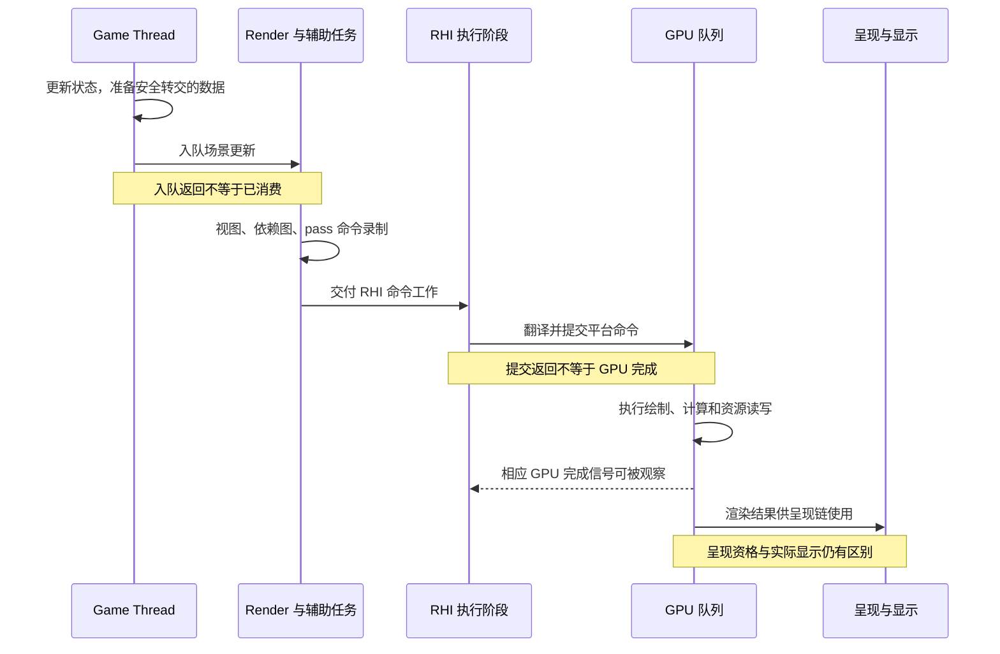
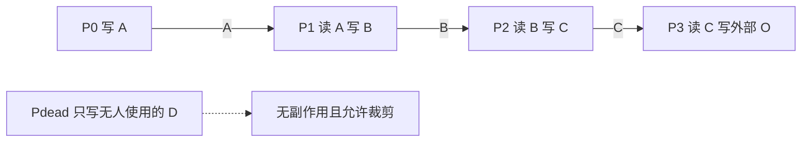
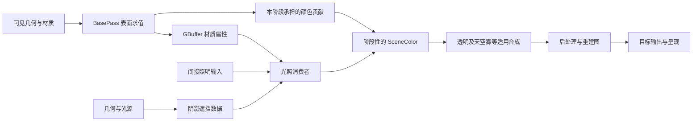
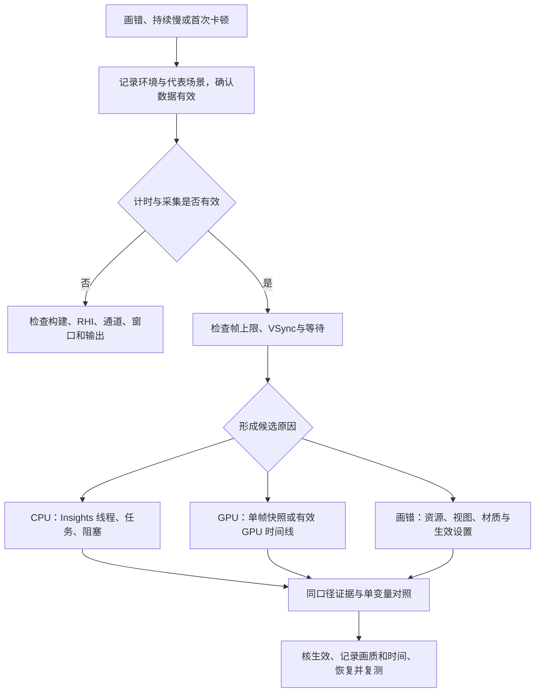
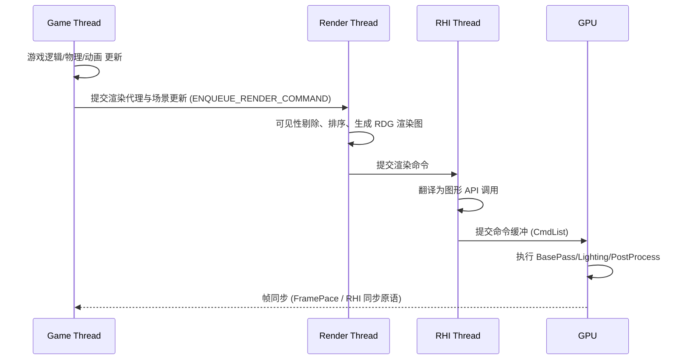
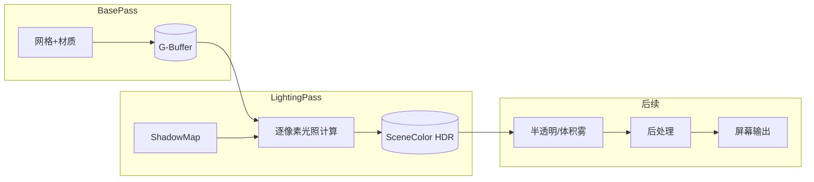
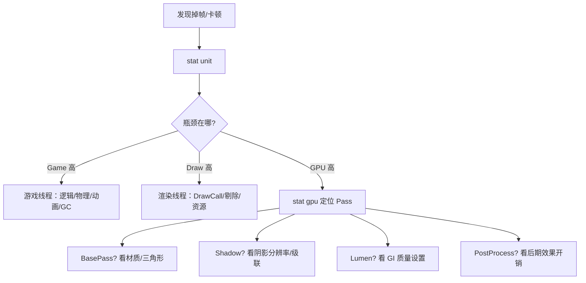

# 01 UE5 渲染管线概览

> 知识成熟度：L2。核对了可定位的一手资料，本文仍是静态概念教学；没有运行 UE、PIE、打包、着色器编译、设备捕获、控制台或性能实验，`verified: []` 不变。
> 版本基准：主要参考 Epic 公开文档的 `application_version=5.6` 页面；选择器不是不可变源码版本。S13 是 UE5.6 上下文的一手支持帖，S19 是读取日显示 5.8 的动态公开变量表，S20 仅采用 4.27 文档中的测量方法，D3D12/MSVC 文档各限其对象。
> 事实边界：未取得原 UE5.8.0 / CL55116800 的 Engine checkout 或 `Build.version` 原件。该身份仅在第10章保留为历史原文声明，公开同名 API 不能证明那份源码。平台、RHI、renderer、构建与实际配置必须由目标项目另行确认。
> 验证建议：正文的 `PAPER_EXPECTED P01–P13` 是可手推的输入、结果与反例；操作步骤均未执行。第8章说明实际测量应如何准备、生效核查和恢复，第9章列已读来源及读取失败。
> 最后更新：2026-10-09，修订线程/资源完成域、RDG、渲染路径、统计和配置教学，保全现存全文与8条 Git 历史版本。

## 1. 概述

渲染管线把游戏状态转成图像，但这条链上有多种“完成”：游戏线程交出了数据，渲染工作可能仍在排队；CPU 提交了 GPU 命令，资源可能仍被 GPU 读取；GPU 写完图像，显示系统也可能还没把它扫描到屏幕。把这些事件混为一谈，会同时误判资源释放、帧率瓶颈和输入延迟。

本文从三个读者任务展开：追踪一帧的数据及其所有者，选择符合平台和画质需求的渲染路径，以及用有效的观测区分画错、持续慢和首次卡顿。前置知识只需能区分 CPU/GPU、纹理、网格和着色器。具体 GI、阴影、材质算法及引擎源码细节由第7章的专题继续。

UE 有桌面 Deferred、桌面 Forward、Mobile Forward、Mobile Deferred 等实现路径。Nanite、Lumen、Virtual Shadow Map（VSM）改变几何、照明或阴影的工作；是否可用、启用及采用哪种实现，取决于实际版本、renderer、RHI、特性等级和项目内容。不要由“运行在手机”推断所用 renderer，也不要由“UE5 项目”推断所有特性都默认启用。

阅读时始终带着这份目标描述：引擎版本与构建、平台与 GPU、RHI/feature level、实际 renderer、AA 方法、内部/输出分辨率、动态分辨率、画质档位、场景和相机。缺一项不一定妨碍学习机制，但可能使具体开关、图像对比或计时失去可比性。

## 2. 核心概念

### 2.1 三种渲染路径对比

先比较算法思想，再映射 UE 的配置入口。Forward+ 通常表示用屏幕分块或视锥空间分簇等结构筛选候选灯，属于前向求光的组织策略；分块与分簇也不必具有完全相同的空间划分。

| 对比项 | 延迟着色 Deferred | 前向着色 Forward | Forward+ 类策略 |
| --- | --- | --- | --- |
| 核心思路 | 先保存可见表面的材质属性，再由光照阶段消费 | 表面着色时结合材质和影响它的光源，输出颜色 | 先建立局部候选灯列表，再让前向着色查询列表 |
| 多光源代价 | 仍受灯光覆盖采样数、BRDF、阴影及访存影响 | 可以单 pass 循环求光，也有多 pass 实现；不是每灯必增一 pass | 减少无关灯测试；局部重叠灯很多时列表仍长 |
| AA | UE 延迟路径通常结合后处理/时序 AA；具体支持依 renderer | UE 桌面 Forward 有 MSAA 支持，仍需确认所用效果的兼容性 | 列表策略本身不决定引擎支持哪些 AA |
| 半透明 | 常另走适用的前向光照与合成路径 | 可对透明表面求光，但排序/混合仍有问题 | 候选灯优化不解决透明排序 |
| 带宽与内存 | 多属性缓冲读写有成本；tile 内存可改变外存流量 | 可减少同等规模 GBuffer 的读写；仍有深度、阴影和后期资源 | 列表构建、存储和查询也有成本 |
| 使用理由 | 分离表面属性与光照、适配许多屏幕空间消费者 | 画质需求、MSAA、目标设备与实测预算适配 | 在前向求光中控制候选灯数量 |
| UE 中的身份 | 是实际 renderer 家族的一部分 | 是实际 renderer 家族的一部分 | 不是与桌面/移动路径并列的独立项目开关 |

| 实际 UE 路径 | 配置入口与条件 | 选择时先核什么 |
| --- | --- | --- |
| 桌面 Deferred | 目标支持桌面 renderer，未选择桌面 Forward；不能据此推出全部 GI/阴影默认 | GBuffer 消费、材质/照明功能、时序 AA、带宽 |
| 桌面 Forward | Project Settings → Rendering → Forward Shading；官方要求重启 | MSAA、材质与效果支持；不支持直接采样标准 Deferred GBuffer 的用法 |
| Mobile Forward | Mobile Shading 的 Forward；S08 中 `r.Mobile.ShadingPath=0` | 预计算照明、支持的灯光/材质、AA 与设备预算 |
| Mobile Deferred | Mobile Shading 的 Deferred；S08 中 `r.Mobile.ShadingPath=1` | GPU/API 的 tile 能力、动态照明需求；S08 所述路径不支持 MSAA，半透明仍以前向方式处理 |

S07 的桌面 Forward 使用视锥空间网格组织灯和反射捕获；不能把它简化为“每多一灯就重画所有物体”。S08 的 Mobile Forward 默认声明只代表该所读页面，未认证原 CL55116800 的枚举或 CVar flags。来源：[Forward Shading（S07）](https://dev.epicgames.com/documentation/en-us/unreal-engine/forward-shading-renderer-in-unreal-engine?application_version=5.6)、[Mobile Shading Modes（S08）](https://dev.epicgames.com/documentation/en-us/unreal-engine/mobile-rendering-and-shading-modes-for-unreal-engine?application_version=5.6)。

### 2.2 渲染管线主要阶段

下表描述职责和数据依赖，不能当作所有 UE 帧的固定函数调用序列。多个 view、阴影视图、SceneCapture、异步计算和不同 renderer 会增加、合并或替换工作。

| 阶段 | 职责 | 主要输入 → 输出 | 观察入口与限制 |
| --- | --- | --- | --- |
| 场景更新 | 接受对象增删、变换和资源状态变化 | GT 转交的数据 → 渲染场景/代理状态 | 线程与任务时间线；这不是 PrePass |
| 视图与可见性（含 InitViews 相关工作） | 为视图选择候选对象、准备视图数据 | 相机、包围体、可见性数据 → 可见候选 | `stat initviews` 及可见性调试 |
| 深度预通道（PrePass / Early-Z） | 在启用的范围内先写深度 | 几何/必要的材质覆盖信息 → 深度 | GPU pass 与深度视图；不保证全场景都参与 |
| BasePass | 按 renderer 处理可见表面 | 几何/材质 → GBuffer 或已着色颜色，也可能有其他输出 | 材质属性与 SceneColor；按路径解释 |
| 阴影数据生成 | 计算光源方向上的遮挡信息 | 光源、投影、遮挡几何/缓存 → shadow 数据 | 对应 shadow 方法的生成与消费开销分别看 |
| 直接/间接光照 | 结合表面、光源、遮挡及 GI 结果 | 材质属性、shadow、Lightmap 或动态 GI → 颜色贡献 | 实际 lighting/GI scopes；前向可在表面着色内做一部分 |
| 半透明、天空与雾 | 生成/合成这些类型的颜色、透射等贡献 | 场景、深度、照明等 → 中间结果或场景颜色 | 按实际效果与合成时点查看 |
| 后处理与重建 | 曝光、Bloom、DOF、AA/时序重建、色调映射等 | 场景颜色、深度、velocity、历史等 → 后续图像 | 输入/输出时点与内部/输出尺寸必须明确 |
| 输出与呈现 | 按目标编码图像并交显示链 | 最终渲染输出 → 待呈现图像 → 显示 | GPU 完成、Present、显示不是同一个事件 |

`PAPER_EXPECTED P04`：给定已更新的场景代理、一台相机、启用深度预通道的传统不透明 Deferred，以及一盏投影灯。InitViews 得到候选；PrePass 产生深度；BasePass 产生材质属性及其承担的颜色贡献；shadow 工作生成光源遮挡数据。光照消费者必须等它实际读取的数据准备好。不开 PrePass 时，深度可由其他阶段生成；这不意味着“场景停止更新”。新增 SceneCapture 会新增视图工作，不能用主相机计数覆盖全帧。

### 2.3 线程模型

“Game / Render / RHI”首先是职责划分。GPU 是硬件执行端；RHI 工作可以由专用线程、任务或内联路径执行，具体模式由版本和平台实现决定。任务工作线程也可能并行准备或录制部分工作。来源：[Parallel Rendering（S02）](https://dev.epicgames.com/documentation/en-us/unreal-engine/parallel-rendering-overview-for-unreal-engine?application_version=5.6)。

| 执行阶段 | 角色与关键产物 | 该阶段结束能证明什么 |
| --- | --- | --- |
| Game Thread | 推进对象状态，生成可安全转交的更新/代理所需数据；部分物理和动画工作可委派任务 | 此次状态生产或交接结束；不代表 RT 已消费 |
| Render Thread 与辅助任务 | 管理渲染侧数据，组织视图、mesh pass、RDG 及命令录制 | 对应 CPU 工作结束；不自动代表 RHI 已提交 |
| RHI 执行阶段 | 将 RHI 命令翻译/组织为平台 API 的命令与提交 | 对应 CPU 翻译/提交结束；GPU 可能仍在排队 |
| GPU 队列 | 执行绘制、计算、复制，读写资源 | 需要适当完成信号才能证明相应 GPU 工作结束；多个队列要覆盖全部使用者 |
| 呈现/显示系统 | 接收图像、安排呈现和扫描输出 | GPU 写完图像不等于用户已经看见；显示链另有等待 |

## 3. 原理详解

### 3.1 一帧的旅程：从 Game Thread 到 GPU

帧号只是追踪状态的标签。GT 处理后续状态时，RT 和 GPU 可以仍处理较早状态；实际领先量由调度、队列、限帧、同步和显示方式共同决定。`r.OneFrameThreadLag` 讨论的是允许 **GT 领先 RT** 的节流关系，旧稿写成 RT 领先 GT 已纠正。它不能单独给出 GPU 排队深度或端到端输入延迟，改变它也可能改变吞吐。来源：[Low Latency Frame Syncing（S03）](https://dev.epicgames.com/documentation/en-us/unreal-engine/low-latency-frame-syncing-in-unreal-engine?application_version=5.6)。



图只画必要的数据交接，不承诺每帧正好跨三个独立 CPU 线程，也不以 GPU 直接回调 GT 表示显示完成。理解这个分层后，才有办法判断“消费者退场”是否已经覆盖某份数据的全部使用者。

#### 3.1.1 状态交接与 CPU 数据寿命

GT 所有的可变对象不应被 RT 随意并发读取。渲染侧代理（如 `FPrimitiveSceneProxy`）和专门转交的数据让双方有清楚的所有权与更新协议；创建代理不意味着 GT 从此不再产生任何渲染更新。入队机制仅安排未来执行，不能自动修复裸指针、竞态和悬空引用。来源：[Threaded Rendering（S01）](https://dev.epicgames.com/documentation/en-us/unreal-engine/threaded-rendering-in-unreal-engine?application_version=5.6)。

`PAPER_EXPECTED P02`：GT 的 Transform 为10，复制只读 `S_N={Transform:10}` 并由明确所有者持有到 RT 消费结束；GT 随后把自身 Transform 改成20。RT 读快照仍得到10。反例是 lambda 只捕获 GT 对象的裸指针，结果可能随调度改变，甚至对象已销毁；按引用捕获已离开作用域的栈变量同样可能悬空。复制指针不是复制对象，引用计数也不自动保证并发读写正确。

CPU payload 可以在所有 CPU 消费者结束后退场。若消费过程又保存了其中的地址、把数据交给另一个任务，或采用依赖调用者存储的异步上传方式，就必须继续满足这些消费者的寿命合同；不能仅以外层 lambda 返回为依据。

#### 3.1.2 渲染资源与 GPU 存储何时可复用

分别问三件事：CPU payload 谁还会读；代理/渲染资源对象是否仍被渲染命令引用；底层 GPU 存储是否仍在任何队列中被使用。对象从场景移除、RT 消费释放命令、GPU 结束访问可以是不同时间。缓存的绘制命令也可能持有资源引用，替换资源时要遵守缓存更新和失效协议（S06）。

`PAPER_EXPECTED P01`：一帧 N 的 GPU 工作需要上传区间 U。假设本例的 RT 栅栏只跟踪 RT 消费，不含更深同步：

| 事件 | 已发生 | 不能由此推出 |
| --- | --- | --- |
| E0：GT 入队 N | 更新已排队 | RT 已消费 |
| E1：RT 消费并录制 | 此 RT 工作结束 | RHI 已提交，或 GPU 已读完 U |
| E2：RHI 提交返回 | 命令已提交到平台执行链 | GPU 已开始/完成 |
| E3：GPU 读取 U | 旧帧仍在使用 U | 可以立即覆写 U |
| E4：覆盖 U 最后访问的 GPU 完成信号达成 | 相应队列使用 U 已结束 | 其他队列的使用也已结束，或图像已显示 |
| E5：图像进入呈现/显示处理 | 渲染结果交给显示链 | 某个更早 CPU 事件等于实际扫描显示 |

只有全部使用者的完成得到覆盖，U 才能复用。单队列时可用排在最后访问之后的对应完成信号；多队列时还要证明跨队列同步覆盖全部使用。若只等 E1 就覆写，而 E3 后来才读取，会破坏 N 帧输入不变性。D3D12 的上传 ring-buffer 示例正是按 GPU 完成进度回收区间（[S05](https://learn.microsoft.com/en-us/windows/win32/direct3d12/fence-based-resource-management)）。

看到 `Fence` 名称不能直接判定同步深度。`FRenderCommandFence` 等 API 的具体保证取决于版本、参数和调用协议；本例只证明“仅有 RT 消费保证不足以释放 GPU 仍用的存储”，不声称所有这类栅栏永远不能执行更深同步。等待范围过大也有代价：它会压缩流水重叠，不能把全局等待当常规性能修复。

#### 3.1.3 RDG：声明依赖、录制工作、约束资源寿命

RDG（Render Dependency Graph）组织 pass 对资源的使用。它不是 GPU 命令缓冲本身，也不读取任意 C++ lambda 的内部语义来猜依赖。按 S04 的概念接口，过程可分为：

1. **Setup**：描述纹理/缓冲及 pass 参数，声明读写与执行类型。描述资源不必意味着此刻已经得到可随意使用的物理分配；lambda 引用的数据须活到相应执行时点。
2. **依赖和图处理**：从声明建立生产者/消费者关系，确定可删除的无用工作、资源有效使用区间及所需屏障/同步。是否合并 pass、使用异步计算或复用存储受图结构、标志、后端和兼容条件约束。
3. **Execute 的 CPU 工作**：在合适的调度时机调用保留 pass 的执行函数来录制 RHI 工作，组织提交链。调用返回不证明 GPU 全图完成。
4. **GPU 使用与退场**：GPU 遵循提交和同步关系读写。RDG 管理其合同内的资源寿命；普通 CPU 对象、隐藏指针和图外副作用仍由调用者负责。

`PAPER_EXPECTED P03`：下图为教学图，A/B/C 是描述符兼容的暂态资源，O 是外部输出；所有资源使用都写入 pass 参数。Pdead 只写没人读取、不导出的 D，**无外部副作用且允许裁剪**。



输出 O 使 P0→P1→P2→P3 成为保留链，Pdead 可被裁掉；不能把“它应该执行过”用于驱动游戏逻辑。A 的使用区间是 P0–P1，B 是 P1–P2，C 是 P2–P3。P1 同时读 A、写 B，所以 A/B 不能因为 P0 的 CPU 函数已返回就共用同一存储。A/C 仅在全部 GPU 使用有正确先后同步、分配和后端允许时成为别名复用候选，不保证一定节省一张纹理。

反例：lambda 偷读没写进参数的 A，图就可能缺依赖、屏障或正确寿命；“没声明外部副作用”也不等于“没有副作用”。普通 Compute 类型不能当作 GPU 一定异步并行的承诺。

需要跨图/跨帧持有结果时，用相应版本的外部资源注册/提取协议持有底层资源，并在下一图重新注册；不要保留旧 builder 的 `FRDGTexture` 裸指针当新图句柄。外部注册让图认识已有资源，提取使结果能在图后继续持有，可能延长寿命并限制别名机会。取得外部引用仍不代表 CPU 可读 GPU 结果；readback 另需正确复制和完成检查。来源：[RDG 的 Builder、Resources、Passes、External Resources（S04）](https://dev.epicgames.com/documentation/en-us/unreal-engine/render-dependency-graph-in-unreal-engine?application_version=5.6)。

### 3.2 可见性与剔除

剔除的目标是尽早排除对当前视图无贡献的工作，但不同方法使用的数据和结果可用时点不同。相机移动、对象移动、预计算条件失效都可能改变有效性；不能把全部剔除都归结为“RT 用上一帧深度”。

- **视锥与距离**：相机/包围体和对象距离参数决定候选。包围体过大可能保留更多对象，过小可能错误剔除；距离设置本身是内容/画质约束。
- **预计算可见性**：依赖事先生成的可见性数据及适用场景条件；没有对应数据或偏离其假设时，不能指望它提供相同效果。
- **硬件遮挡查询**：GPU 产生遮挡结果，CPU/后续工作在结果可用后使用。S11 描述了下一帧读取查询结果的流程；“查询的结果有延迟”与“所有查询均直接使用上一帧深度”不是同一个命题。
- **HZB 遮挡**：利用层次深度缓冲进行保守测试，和单个硬件查询的组织方法不同；历史数据、保守性和具体阶段依实现判断。
- **Nanite 可见性/细节选择**：有自己的 GPU 几何流程；传统 Actor/mesh draw 数无法完整描述它的内部工作。这里不重述尚未核验的具体 BVH 布局或某 CL 的阶段顺序。

`stat initviews` 给出相关 CPU 统计入口；判断遮挡是否工作还要配合目标构建支持的可见性调试。`FreezeRendering` 在 S11 的用途是固定当时的可见/被遮挡集合，再移动视角观察剔除结果。它不是冻结整个游戏、GPU 或资源流送的通用快照。记录原相机与冻结状态，完成观察后解除并恢复视图；冻结下的帧不能充作普通运行基准。来源：[Visibility and Occlusion Culling（S11）](https://dev.epicgames.com/documentation/unreal-engine/visibility-and-occlusion-culling-in-unreal-engine?application_version=5.6)。

### 3.3 几何处理与 Draw Call

传统 mesh 绘制可沿着“代理 → `FMeshBatch` 等批次描述 → 对应 mesh pass 的 `FMeshDrawCommand` → RHI 录制/提交”追踪。命令描述包含着色器、资源绑定及绘制状态；有的可缓存，有的按帧动态构造，缓存是否有效依赖其引用资源和状态。

可见对象数、section 数、缓存命令数、执行的 RHI draws、GPU 间接调用及实际图元数属于不同口径。一个对象可在多个 section、view、depth/base/shadow pass 中出现；也可能被剔除，或在兼容条件下与其他实例合并。状态排序可减少切换，但“同材质名称”不保证资源绑定、pass 和其他状态兼容。透明排序另见3.8。

`PAPER_EXPECTED P06`：两份相同传统 mesh 实例，每份两个 section，分别参加 depth 和 base，一个 view，暂不计 shadow/其他 pass。假设每 section 每 pass 一次 draw、不合并，则有 `2×2×2=8` 个候选 draw。若对应 section 在各 pass 的 shader/resource/state 均兼容，且实现确实将两实例合并，简化计数是 `2×2=4` 次实例化 draw。再增加一个 view 或 shadow 工作，计数又变。不能由两个 Actor 推出两次 draw，也不能由四个缓存命令推出本帧恰好四次硬件调用。

DrawCall 多可能增加 CPU 准备、提交和状态开销，但低 DrawCall 不保证 GPU 快：几何、着色、overdraw、阴影、带宽仍可昂贵。`stat sceneRendering`、`stat rhi`、GPU 工具的统计范围也不完全相同；比较前记录所处帧/视图/pass/队列和计数定义。S13 特别说明 CPU 侧无法准确获知一些 indirect draw 的实际图元数，Nanite 的动态工作量不能靠该计数反推。来源：[Mesh Drawing Pipeline（S06）](https://dev.epicgames.com/documentation/en-us/unreal-engine/mesh-drawing-pipeline-in-unreal-engine?application_version=5.6)、[Epic 工程师的 GPU draw/dispatch 统计说明（S13）](https://forums.unrealengine.com/t/frhidrawstatscategory-stopped-providing-stats-in-ue-5-6/2684677)。

### 3.4 BasePass 与 G-Buffer（延迟着色核心）

延迟着色把表面材质求值与后续光照消费分开。传统不透明路径的 BasePass 将所需属性编码到 GBuffer；消费者据此求光，不必为每盏灯重新执行完整的材质几何流程。BasePass 还可能承担自发光、预计算照明或其他颜色贡献，不能定义成“只写 GBuffer”。深度、velocity、场景颜色的生成位置也随路径和配置变化。



这是 P04 的典型数据依赖示意，图中合成框包含多种可能的工作位置；有些透明或效果会在不同后期阶段合成，不保证图上每个框对应一个固定 GPU pass。SceneColor 表示某阶段的场景颜色资源，不是“最终屏幕”的通用别名。后处理材质还须区分 `SceneColor` 与 `PostProcessInput0` 等实际输入，选择错误时点会读到与预期不同的图像（S16）。

| 应理解的语义数据 | 使用目的 | 读取时的条件 |
| --- | --- | --- |
| 世界法线及必要的每物体信息 | 表面朝向、光照和部分屏幕空间效果 | 先确认坐标空间、编码与可视化转换 |
| Metallic / Specular / Roughness / Shading Model | 描述反射和材质着色模型 | 不是最终光照颜色；模型可能采用不同编码/布局 |
| Base Color / AO 或间接相关信息 | 基色和部分遮蔽/照明输入 | 基色与受光颜色不同，AO 的保存及消费位置依实现 |
| 着色模型自定义数据 | 次表面、清漆等模型需要的属性 | 是否存在、意义与格式由所用模型及材质系统决定 |
| 预计算阴影因子等数据 | 供适用的静态/混合照明路径消费 | 没启用相应路径时不能强求同一缓冲内容 |
| Velocity（单独看待） | TAA、TSR、运动模糊等使用的运动信息 | 生成位置、单位、视图和历史条件须匹配；不固定为某张 GBuffer |

旧稿的 GBufferA–E 对照保留在第10章，是一种历史布局示意。当前分析应按实际 renderer、平台、材质系统、格式和捕获标签辨认；不能把字母名当跨版本 ABI。标准 Deferred GBuffer 的采样用途也不能直接搬到桌面 Forward。

代价来自属性写入、读取、存储及求光，但不能据此说所有移动设备都必须避免 Deferred：支持的 tile-based GPU/API 可能把中间数据留在片上存储，减少外存读写（3.7）。普通半透明又不能用一组单层不透明 GBuffer 表达所有重叠表面，因而有单独处理。来源：[Post Process Materials 的 graph/GBuffer 说明（S16）](https://dev.epicgames.com/documentation/en-us/unreal-engine/post-process-materials-in-unreal-engine?application_version=5.6)。

### 3.5 光照与阴影 Pass

直接光照回答“光源如何照到表面”，阴影数据回答“该方向是否被遮挡”，GI 回答间接传播的贡献；它们可以共享输入或以不同 pass 组织，但不能只看一个 Lighting 名称就概括全部成本。

- **直接光照**：平行光、点光、聚光、矩形光的覆盖、材质响应和实现不同。可能使用局部体积、全屏或分块/列表等处理，不保证每一灯都固定生成一次全屏 pass。
- **阴影**：需要生成或更新相应遮挡表示，再由着色阶段采样/过滤；传统 shadow map、VSM 或其他可用方法的工作和缓存条件不同。场景/光源变化可改变更新量，不能由 VSM 的一个开关推断“所有阴影已关闭”。
- **间接光照**：Lightmap/Volumetric Lightmap 等预计算数据与动态 GI 有不同的内容准备和运行成本；Lumen 是某些配置下的选择，不能从引擎主版本推断实际启用。
- **环境贡献**：SkyLight 等表示来自天空/环境的照明，和绘制可见天空本身不是同一任务；检查画面时需区分照明输入与背景/大气合成。

`PAPER_EXPECTED P05`：用一个简化模型说明多灯成本。设被处理的表面采样集合为 P，采样 p 的影响灯列表为 L(p)，列表长度 `n(p)=|L(p)|`。暂不算阴影生成、列表构建、带宽和 BRDF 差异，逐采样逐灯求值的基本计数为 `Σ_p n(p)=Σ_p |L(p)|`。四个采样的列表长度 `(1,1,1,1)` 合计4；再加一盏覆盖所有采样的灯，变成 `(2,2,2,2)`，合计8。这是算法计数，不是 GPU 时间翻倍预测。

两盏小范围灯和两盏全屏灯的覆盖计数可能很不同；即使采用 Deferred，也不能说灯数与成本只有弱关系。Forward+ 类列表减少无关灯测试，但若大量灯覆盖同一区域，该区域列表仍会长。真实成本还须把阴影、求光质量、带宽及并行情况一起看。

### 3.6 前向渲染路径与 Forward+

前向着色在表面被着色时结合材质和光源得到颜色；“材质和求光在一起”不意味着整帧只有一个 pass，深度、阴影、透明和后期仍有各自工作。多光源既可在同一着色调用内遍历，也可用其他组织方式，不能把传统多 pass 前向的限制当作所有 UE Forward 的实现。

S07 描述的 UE 桌面 Forward 用视锥空间网格筛出相关灯和反射捕获，像素着色只处理相关列表。它适合某些 MSAA 需求，也让部分材质按需选择特性；收益仍要对目标材质、分辨率和内容测量。复杂像素着色、多层透明和阴影不会因为换了路径而消失。

选择前至少检查：需要的效果是否支持、是否有依赖 GBuffer 采样的后处理材质、MSAA 是否覆盖所关心的边缘问题、目标 shader 变体是否准备好。MSAA 对几何覆盖边缘的作用与时序 AA 对历史重建的作用不同；不能承诺某一种总是更清晰或更快。开启路径按4.2执行项目设置与重启流程，不能以 console 字符串已输入作为成功证明（S07）。

### 3.7 移动端渲染路径

移动设备、Mobile renderer、桌面 renderer、RHI 与 feature level 是不同维度。先记录目标项目实际选择，再谈限制；不能把所有手机等同某一个 ES3.1 配置，也不能据一个网页列出未经验证的全设备能力表。

在实际读到的 S08（5.6 选择器）中，Mobile Forward 对应 `r.Mobile.ShadingPath=0`，页面称其为默认；Mobile Deferred 对应1。使用预计算照明时该页建议考虑 Forward，多动态光照可评估 Deferred；具体材质、灯光、阴影及设备支持仍受配置限制。该页所述 Mobile Deferred 不支持 MSAA，半透明仍用前向方式着色。

Mobile Deferred 的关键取舍不只是“多写几张纹理”。在适用的 tile-based GPU/API 上，GBuffer 可通过 tile 内存及 subpass 等机制在片上生产和消费，降低外部内存带宽；实际收益取决于硬件、API、存储策略和效果组合。没有这些条件时不能套用同样结论，也不能反过来说所有 Deferred 都必然带来相同外存流量。

Nanite、Lumen、VSM 的完整移动/桌面跨平台矩阵不由本篇给出：本轮部分官方移动能力页未读到正文，其他带版本选择器的页面也有内容漂移。可完成的判断是：用所选 renderer 的正式支持表、目标 GPU/RHI 和实际项目设置检查每项需求；缺证据的特性先记待验证，再决定替代方案和内容预算。不要把“移动端三件套一律不支持/默认关”或“新版全都能开”当答案。

### 3.8 半透明、天空、雾与后处理

普通 alpha 混合与顺序有关。传统透明常按物体或批次进行深度排序，但一个排序键不足以解决互相穿插的面；“从远到近”也不是所有透明类型和混合方式的统一规则。

`PAPER_EXPECTED P11`：用普通非预乘 over 混合 `C_out=αC_front+(1−α)C_back`。黑背景上有红层 `(1,0,0)` 和蓝层 `(0,0,1)`，各 α=0.5。先蓝后红得到 `(0.5,0,0.25)`；先红后蓝得到 `(0.25,0,0.5)`。两者不同；相交物体若在不同像素上互换前后关系，一个全物体排序键无法同时满足两侧。

`Translucency Sort Priority`、拆分几何、减少重叠可缓解特定场景，但不是通用逐像素排序。改成 masked/dither 或项目支持的顺序无关方案会改变画质与成本。Separate Translucency 处理透明分层/合成及 DOF 等关系，不会自动求出所有相交面的正确顺序；要确认具体透明类型和合成位置。

SkyAtmosphere、VolumetricCloud、指数高度雾和体积雾各自生成或消费不同数据，不能全部压成“光照后的一次雾 pass”。后处理同样是一张图，AA/TSR、曝光、Bloom、DOF、色调映射等按所用输入和历史相互依赖；某些透明可能在后期的不同位置合成。输出可以是 SDR 或 HDR 目标，不能把管线尾部写成必然 HDR→LDR。查看资源时先标明处于哪一阶段，细节继续阅读后处理专题。来源：[S16](https://dev.epicgames.com/documentation/en-us/unreal-engine/post-process-materials-in-unreal-engine?application_version=5.6)、[Post Process Effects（S17）](https://dev.epicgames.com/documentation/en-us/unreal-engine/post-process-effects-in-unreal-engine?application_version=5.6)。

### 3.9 渲染管线性能分析

先分清要研究稳态帧间隔、单帧迟滞、输入到显示延迟，还是某个 CPU/GPU scope 的工作时间。时间单位都是毫秒，并不表示这些数字可以相加或来自同一帧的同一观测范围。

`PAPER_EXPECTED P07`：无限帧的理想流水线，GT/RT/RHI/GPU 的服务时间分别为4/6/2/8ms；各阶段独立、可重叠，没有额外等待、同步或限帧。稳态帧间隔下界是最大服务时间8ms，对应理想吞吐上界125帧/秒；同一帧顺序经过这些阶段的无重叠工作时延之和是20ms。8ms 与20ms是不同口径，125帧/秒和20ms都不是对真实 UE 项目帧率或输入延迟的预测。真实 CPU 资源共享、排队、Present/VSync、统计平滑和采样窗口都会影响读数。

| 工具/数据 | 适合回答什么 | 使用前提与容易误读之处 |
| --- | --- | --- |
| `stat unit` | 当前帧间隔及 Game/Draw/GPU 等统计的关系 | 确认数据有效、限帧/VSync和执行模式；线程值可含等待，不直接相加 |
| `stat gpu` | 可用 GPU 事件的时间分布 | 构建、RHI、平台和 timestamp/统计支持必须有效；空或0不是零工作 |
| `profilegpu` | 某一帧的 GPU 工作快照 | 版本影响输出方式；S13 的 UE5.6 情境使用 Output Log，不能期待旧版相同 UI |
| Unreal Insights | 采集期间多帧线程/任务/等待及已启用 GPU 事件的时间线 | 先配置并实际采集相应 trace 通道，之后打开产生的 trace；启动查看器本身不等于已采集 |
| `stat sceneRendering` / `stat rhi` | 所支持的绘制、资源或工作量统计 | 确认计数口径；indirect 图元等可能无法由 CPU 准确统计 |
| `stat initviews` / `stat streaming` | 可见性 CPU 工作及流送线索 | 不能单凭一个数量判定 GPU 或 I/O 根因 |
| 目标 RHI 的 GPU 捕获/平台工具 | 具体资源、提交、队列和 pass 的细节 | 平台、设备、构建与工具支持要匹配；捕获有扰动 |

S13 的 `profilegpu` 是**单帧快照**，不是“自动录下一段 Insights 时间线”。该帖还说明新统计按 GPU pipeline 记录 draw/dispatch，并讨论 Output Log 与旧 UI 的差别；不能把它提到的后续修复 CL 当作本篇历史 CL 已含修复的证据。Insights 的持续采集则按 S12 选择通道/输出，在实际 trace 中确认事件确实存在，再开始解释。

`PAPER_EXPECTED P10`：教学 capture 中父 scope Rendering=10ms，内含 Base=4ms、Post=3ms；另一 compute 队列5ms与 graphics 部分重叠。`10+4+3` 重复计算子项，`10+5` 也不自动等于帧时间15ms。必须比较同帧、同视图、同队列及 inclusive/exclusive 口径，沿决定输出完成的依赖路径看重叠和等待。父项余下3ms不能凭空命名为某个实际 pass。



接近 Frame 的某项是候选线索，不是“哪个最大根因就在哪”的证明。GPU 等待、CPU 同步、固定帧上限、统计平滑都可能改变表象；有时画面已经受限帧约束，减少某 pass 只增加余量，不改变显示帧率。没有有效 trace、日志或同条件对照时，应停在候选判断。来源：[Stat Commands（S10）](https://dev.epicgames.com/documentation/en-us/unreal-engine/stat-commands-in-unreal-engine?application_version=5.6)、[Insights Reference（S12）](https://dev.epicgames.com/documentation/en-us/unreal-engine/unreal-insights-reference-in-unreal-engine-5?application_version=5.6)。

## 4. 代码 / 蓝图示例：控制台命令与配置

### 4.1 常用控制台命令速查

以下是未执行的操作入口，不是一段可整体粘贴运行的脚本。编辑器视口、PIE、本地玩家控制台和打包构建的可用命令/上下文不同；发布构建可能禁用调试控制台或统计。先在目标版本确认名称已注册、可设置时点及帮助，再选一项操作。

| 类别 | 项目 | 生效前提与用途 |
| --- | --- | --- |
| 项目/初始化选择 | `r.ForwardShading`、`r.Mobile.ShadingPath` | 经对应项目设置选 renderer，按提示重启和准备 shader/cook；不是热切换脚本 |
| AA 选择 | `r.AntiAliasingMethod` | S19 读取日公开表为0=None、1=FXAA、2=TAA、3=MSAA、4=TSR；目标 renderer 必须支持，默认/覆盖与运行时可改性另核 |
| 内部尺寸 | `r.ScreenPercentage` | 先辨认主屏幕比例、实际内部尺寸及视口/DRS接管；不等同修改窗口输出分辨率 |
| 动态分辨率 | `r.DynamicRes.OperationMode` | 平台实现、用户设置和暂停状态共同约束；见下表 |
| GT/RT 节流 | `r.OneFrameThreadLag` | 讨论 GT 相对 RT 的推进；若目标允许运行态对照，保存并恢复原值，不据此承诺显示延迟 |
| RHI 执行模式 | 查目标构建的 RHI 线程/任务设置和时间线 | 旧稿使用 `r.RHIThread.Enable`，本轮未核其在各版本的注册/可改性；先确认实际执行模式，不能拿字符串当统一启用入口 |
| 遮挡策略 | `r.AllowOcclusionQueries` 等适用设置 | 先确认当前路径是否使用该机制、何时允许修改；不能由一个开关覆盖所有 HZB/Nanite 可见性 |
| 功能诊断 | 后期、阴影、GI、Nanite 等相应设置 | 确认特性已启用、开关实际含义、fallback和shader准备；一次只改一项，见8.5/8.7 |

`PAPER_EXPECTED P09`：在平台动态分辨率实现可用的前提下，S09 的 OperationMode 取值为0关闭、1遵循 `GameUserSettings`、2独立于该用户开关允许启用。旧稿把1/2解释成 GPU 时间算法/帧率算法已经纠正。下表只推许可状态，不保证每帧都会改变比例。

| mode | User=false，未暂停 | User=true，未暂停 | 已暂停，任意 User |
| --- | --- | --- | --- |
| 0 | 禁用 | 禁用 | 禁用 |
| 1 | 禁用 | 允许启用 | 禁用 |
| 2 | 允许启用 | 允许启用 | 禁用 |

即使允许启用，也可能因当前预算已满足或 min/max 约束维持原比例。支持、许可/活动状态、实际发生缩放是不同判断。来源：[Dynamic Resolution（S09）](https://dev.epicgames.com/documentation/en-us/unreal-engine/dynamic-resolution-in-unreal-engine?application_version=5.6)。

观察类入口的短示意如下，均未执行。一次只使用需要的入口，并检查它实际产生的数据：

```text
stat unit             # 帧间隔与 CPU/GPU 统计入口
stat gpu              # 支持时的 GPU scopes
stat sceneRendering   # 所支持的绘制/场景统计
stat rhi              # 所支持的 RHI 工作与资源统计
stat initviews        # 视图/可见性 CPU 线索
stat streaming        # 资源流送线索
profilegpu            # 一帧 GPU 快照，查看本版本实际日志或 UI
```

上述 `#` 后文字是说明，不是要求连注释粘贴到 UE 控制台。打开显示项后按该版本支持的方式关闭/恢复；若工具结果为空，先排查3.9的前提，不继续推断“没有开销”。

`FreezeRendering` 用于3.2的可见性状态检查；`show PostProcessing`、`show Lighting`、`show Fog`、`show Translucency` 用于8.1的视图对照。它们是对当前 viewport/context 的观察/诊断开关，不是完整发布质量配置。`vis SceneColor` 或资源可视化入口须确认该构建有功能、资源名实际存在、所看时点正确；不能将 `vis GBufferA` 恒等为世界法线的跨版本解码规则。

Insights 的示意采集参数可写为 `-trace=cpu,frame,gpu -tracefile=RenderTrace.utrace`（未执行，需附在实际目标程序支持的启动方式中，并选可写输出路径）。先用目标版本支持的 `Trace.Status` 确认通道，复现后 `Trace.Stop`，确认实际生成的 trace，再在 Insights 打开并检查相应事件。采集窗口、构建编译支持和运行平台缺一，都可能只得到不完整数据；`profilegpu` 不会代替这一整套流程（S12）。

### 4.2 项目配置示例（DefaultEngine.ini）

`PAPER_EXPECTED P12`：项目原为桌面 Deferred；在编辑器控制台输入 `r.ForwardShading 1`，没有重启或准备目标 shader。不能推出已切换 Forward。同样，输入未注册/不可改变量后程序继续执行，也不是设置成功的证据。

以下是**未经执行的配置示意**，以项目设置实际保存的文件为准：

```ini
[/Script/Engine.RendererSettings]
r.ForwardShading=False
r.DefaultFeature.AutoExposure=True
r.DefaultFeature.MotionBlur=True
```

两个 `r.DefaultFeature.*` 键的拼写和可被相机/Volume覆盖的语义来自读取日显示5.8的 S19，不能说已核原 CL55116800。旧稿漏了 `r.` 与字段间的点。上述默认值表达示意选择，不表示某个未检查的项目当前就加载了它们。

可用的操作顺序是：

1. 保存原配置与实际运行信息，确认要修改的是当前项目、目标平台及 renderer。
2. 在 Project Settings → Rendering 中选择目标路径，检查相关材质/后期/AA 的支持；Mobile 选其自己的 Mobile Shading 项。
3. 保存设置，核对产生的 `DefaultEngine.ini` 差异。依编辑器提示重启，准备目标 shader/打包内容；桌面 Forward 的重启要求由 S07 明确说明。
4. 从启动/运行日志、实际设置和可用特性确认路径；更改默认后期参数时，核对 Volume、camera、用户设置及设备 profile 的覆盖。
5. 若键不识别、文件没加载、目标变体缺失或平台覆盖了设置，先解决该前提。恢复时还原原设置/文件，再按相同重启与内容准备流程验证回到原状态。

变体裁剪的用途保留在8.4：只在确认目标功能不需要相应组合时减少准备的内容，并验证覆盖。空的 `[/Script/Engine.Engine]` 段和一行注释不会完成 shader 裁剪。来源：[公开变量表（S19）](https://dev.epicgames.com/documentation/unreal-engine/unreal-engine-console-variables-reference)。

### 4.3 蓝图中的实践

蓝图可以选择受支持的画质设置或调节后期参数，但设置执行流与渲染执行流是两回事。

**画面调节入口**：在关卡放置 Post Process Volume，先决定是否使用 Infinite Extent（Unbound）。检查 Enabled、Priority、Blend Weight、范围/混合及每个属性的 override，再检查 camera 的混合影响。一次修改所需属性，观察相应画面；没有变化时先查生效区域与覆盖，不立即判定渲染路径不支持。这个入口用于画面调节，不自动证明性能收益（S17）。

**开发调试入口**：实际节点名为 `Execute Console Command`，属于 Kismet System Library。`Command` 是命令字符串，`Specific Player` 仅在需要经特定本地 PlayerController 路由时指定，不需要拼成旧稿的 `Get World → Exec Console Command` 固定链。下面是未执行的蓝图流程示意：

```text
PAPER_EXPECTED：目标构建已确认 r.ScreenPercentage 可在此上下文修改
按钮事件
  → 保存原设置并记录当前实际内部尺寸
  → Execute Console Command（Command = "r.ScreenPercentage 50"）
  → 核对读回值、日志和实际内部尺寸
  → 固定场景下采集所需观察
  → 恢复原设置并再次确认
```

节点的 Out 执行引脚只表示蓝图继续流转，不能证明变量注册/可改、路径切换、shader 重建或 GPU 完成（P12）。玩家持久设置应通过 `UGameUserSettings` 或项目自己的设置系统应用和保存支持的质量项；调试 console 字符串本身不是完整的发布设置方案。来源：[Execute Console Command（S18）](https://dev.epicgames.com/documentation/en-us/unreal-engine/BlueprintAPI/Development/ExecuteConsoleCommand?application_version=5.6)。

`PAPER_EXPECTED P08`：输出1920×1080，主屏幕比例每轴从100%降到50%，暂忽略对齐，输出尺寸不变，则内部尺寸为960×540，像素数从2073600降到518400，即1/4。不能由此推出所有 pass 或整帧时间也降到1/4。教学模型 `T_gpu=C+kP` 中若固定成本 C=4ms、原像素相关成本 kP=8ms，则12ms变6ms；这只是模型。若 GT 仍需16ms，帧率可能不变；阴影、几何、流送、全输出尺寸后期也未必按比例缩减。

实际对照应保存初值，固定相机、场景、构建和预热状态，只改比例，检查 DRS/编辑器视口策略是否接管，采集后恢复。若读回值与实际尺寸不一致，先解决生效问题。原“关闭 Lumen 间接光”的实践用途留在功能诊断：先确认确实启用 Lumen、目标开关存在且可改、改变后使用何种 fallback，再单独改变和恢复。不要同时降比例、关 GI、关阴影后，把全部差异归给其中一项。

## 5. 最佳实践

1. **按问题选证据**：画错先看正确阶段的资源/属性与设置覆盖；持续慢看稳态时间和依赖；首用卡把时间线与加载、资源创建、PSO 等事件对齐。缺观测先补前提。
2. **按目标需求选路径**：记录 renderer、AA、照明/阴影方案和材质需求；对比功能组合时承认 fallback 和图像历史可能变化。没有“关掉默认三件套一定更快”或“全部保留一定最优”的统一答案。
3. **把带宽放进成本链**：GBuffer、场景颜色、历史和透明都可能产生读写；移动端要看 tile/外存条件，桌面也不能忽略带宽。GPU scope、资源格式/尺寸和对应硬件数据共同支持判断。
4. **用项目预算管理工作量**：帧目标、输出/内部尺寸、目标硬件和代表场景确定预算；DrawCall 只是同口径的一项。旧稿桌面2000–5000、移动200–500的数字仅作历史原文，不作为当前阈值。
5. **建立可复现基准**：固定构建、场景、相机和冷热状态，记录限帧/同步、工具开销、重复采样、画质和设置。若以后纳入自动回归，也必须覆盖这些条件；本次没有新增或运行 runner/CI。Pixel Streaming 的端到端结果还含编码、网络、解码和显示链，不能直接充作渲染耗时。
6. **保留恢复路径**：调试视图、show flags、临时 CVar、路径配置分别记录原值/状态和恢复方式。功能可见性改变可能不停止它的模拟或其他后台工作，不能从“看不见”推“零成本”。
7. **维护版本记录**：命令可用性、重启要求、数据口径和目标设备结果各自留证；公开页面的读取日期与实际源码 revision 分开，不把资料存在说成实验完成。

以上测量纪律也可在 Epic 历史版 [Performance and Profiling Overview（S20）](https://dev.epicgames.com/documentation/en-us/unreal-engine/performance-and-profiling-overview?application_version=4.27) 找到方法论背景；这里不迁移其中旧功能名单或数值预算作为 UE5 实现结论。

## 6. 常见问题 FAQ

### Q1：`stat gpu` 没有输出或全为 0？

先确认命令在此构建/上下文可用，GPU 统计与 timestamp 支持存在，采集窗口有工作且工具确实收到事件。平台/RHI/构建差异都可能让输出不完整。`stat unit` 的 GPU 项可能遇到同源数据缺口，不能保证能替代；需要时使用该平台支持的分析工具。不要据空输出判断零成本，也不要沿用旧稿关于原 CL 中某 CVar 已移除的未经核验断言。

### Q2：`r.ForwardShading 1` 后画面变暗或某些效果消失？

先检查是否真正通过项目设置、重启和对应 shader 准备完成切换；字符串提交不证明生效。再核对材质、后期 GBuffer 采样、反射/光照特性及 AA 的支持与设置差异。S07 指出的 GBuffer 采样限制就是一种可定位原因，但不能把所有变化只归因于光源数量，也不要混用桌面 Forward 与 Mobile Shading 配置。

### Q3：为什么渲染线程（Draw）高，但 GPU 不高？

候选包括 CPU 侧可见性/命令准备、状态和 draw 工作量，也包括任务等待、资源准备和同步。用 Insights 看 RT 是在做工作还是在等；用同口径场景/draw 计数支持工作量假设。GPU 低还须确认计时有效、有没有限帧或 CPU 供给不足，单看两个数字不能断定合批就是解法。

### Q4：GPU 高但 `stat gpu` 里看不出哪个 Pass 贵？

查看本版本 `profilegpu` 的单帧输出；在 S13 的 UE5.6 情境是 Output Log，不是自动生成 Insights 多帧捕获。需要跨帧原因时按4.1实际采集 Insights GPU 等通道。检查父子 inclusive 计时、跨队列重叠、缺事件及帧/视图范围（P10）；再针对有证据的候选做单变量对照。关闭后期或换 shadow 方法会改变内容和依赖，不直接等于测到了被关功能的纯成本。

### Q5：半透明物体排序错乱？

按3.8的 alpha 例先确认问题是顺序、材质还是合成阶段。对象相交时单一物体排序不能逐像素正确；Sort Priority、拆几何、减少重叠只在相应条件下缓解。Separate Translucency 是分层/合成机制，不能自动修相交排序。改 masked/dither 或项目支持的顺序无关方法需同时评估画质、性能和兼容性。

### Q6：延迟着色下 MSAA 不可用？

不要把“某个 renderer 不支持”说成延迟算法在理论上绝无实现可能。在本文引用的 UE 路径中，桌面 Forward 提供 MSAA 选项，S08 所述 Mobile Deferred 不支持 MSAA；选择还受材质和效果限制。对于常规桌面 Deferred，本轮未核得完整 AA 支持表，不能仅因公开枚举3表示MSAA就推断该路径支持；应先查目标版本、RHI与桌面renderer的AA支持说明，再核项目设置及对应shader准备，不能以控制台接受值作为支持证据。若需求是 MSAA，先评估支持它的目标路径；TAA/TSR 则利用时序信息，各有清晰度、历史和性能取舍。`r.ScreenPercentage` 更改内部尺寸，不能被自动等同为超采样或质量必然更好。

## 7. 关联阅读

- [02-材质系统详解.md](../材质地形与世界表现/02-材质系统详解.md)：表面属性、材质域与混合，连接 BasePass 的输入。
- [03-光照与阴影系统.md](./03-光照与阴影系统.md)：直接/间接照明和阴影数据生成的进一步解释。
- [04-Nanite与Lumen.md](./04-Nanite与Lumen.md)：几何和动态 GI 专题；查实际版本与路径边界。
- [05-后处理与画面特效.md](./05-后处理与画面特效.md)：后处理、AA 与重建的细节。
- [10-移动端渲染专项.md](./10-移动端渲染专项.md)：移动设备预算和 renderer 选择。
- [10-渲染线程与RHI源码.md](./10-渲染线程与RHI源码.md)、[11-多线程与任务系统.md](../../03-引擎架构与资源系统/运行架构与任务调度/11-多线程与任务系统.md)：进一步学习执行职责与任务调度。
- [04-渲染与加载性能优化.md](../../08-工程实践与质量/调试与性能分析/04-渲染与加载性能优化.md)、[07-Shader编译管线与PSO.md](../../08-工程实践与质量/构建编译与制品/07-Shader编译管线与PSO.md)：测量、内容准备和首用卡顿专题。

这些现有 Canonical 是延伸入口，本次没有复核它们全部正文或其中声称的私有源码；不能用邻篇的 CL 声明代替本篇的一手来源核对。官方具体来源见第9章。

## 8. 附录：渲染调试工作流

### 8.1 常用渲染调试视图

先选正确的 viewport、渲染阶段和语义资源，再决定命令。下表保留各类原调试目的，但不把物理 GBuffer 字母当固定解码。`vis`/VisualizeTexture、编辑器可视化或 GPU 捕获的可用性由目标构建/RHI决定；资源缺失时先确认路径与生产时点。

| 视图/入口 | 查看内容与目的 | 前提、失败判断与恢复 |
| --- | --- | --- |
| SceneColor 资源可视化，如支持时的 `vis SceneColor` | 定位某阶段的颜色，区分材质/光照和后续合成 | 标清阶段；不是最终显示颜色，也不保证可视化值是原始线性数据 |
| World Normal 语义视图/实际法线资源 | 检查法线方向、变换和质量 | 确认空间与编码；只有核实实际布局后才用 `GBufferA` 等物理名 |
| Metallic / Roughness / Shading Model 等视图 | 检查 PBR 参数和着色模型 | 逐项看语义；不要用旧 `GBufferB` 名推断所有材质系统布局 |
| Base Color / AO 等语义视图 | 区分基色和遮蔽输入 | 不把受光颜色当基色；旧 `GBufferC` 只是历史映射 |
| Scene Depth 视图/实际深度资源 | 检查遮挡和 DOF 相关深度 | 先识别深度编码及可视化转换；不直接把显示灰度当世界距离 |
| Velocity 视图/实际运动资源 | 排查 TAA、TSR、运动模糊的输入 | 确认视图、生成阶段和历史状态；画面拖影还可能来自重建/历史处理 |
| `show PostProcessing` 或对应视图选项 | 将后期影响作为候选对照 | 固定 viewport 和其他条件；关闭可能同时影响多个效果，结束恢复 |
| `show Lighting` 或对应视图选项 | 区分照明表现与材质输入 | 不是对所有直接/间接照明独立成本的测量；确认模式含义并恢复 |
| `show Fog` 或对应视图选项 | 排查雾对画面的影响 | 先识别雾类型与实际受控项；可见性关闭不一定停止全部计算 |
| `show Translucency` 或对应视图选项 | 排查透明对象/合成的贡献 | 不覆盖所有 masked 植被或模拟工作；结束恢复 |
| 编辑器 Lit / Unlit / Wireframe 等 | 联查光照、材质、几何与遮挡 | 比较的是不同可视化模式，不能把调试模式耗时当最终画质成本 |
| 编辑器 Nanite 可视化 | 查看支持的几何、覆盖/过绘制等信息 | 实际路径需启用且视图支持；无图层不能证明无成本，恢复普通视图 |

桌面 Forward 不提供标准 Deferred GBuffer 采样的相同用途（S07），应转用该路径支持的语义视图、材质检查或捕获工具。调试完成后恢复视图模式、show flags 和相机；记录某资源“不可用”比猜一个字母含义更有用。S11 提供可见性调试依据，S16 提供后期/GBuffer 语义；本轮未成功读取 View Modes 页的完整正文，因此不把表中所有入口宣称为原 CL 的逐项工具实测。

### 8.2 stat unit 输出解读

`PAPER_EXPECTED`：保留旧稿的数字作为阅读练习，以下不是本轮实际运行输出：

```text
Frame: 16.67 ms   Game: 8.2 ms   Draw: 6.4 ms   GPU: 12.5 ms
```

| 指标 | 读法 | 下一步要核对的证据 |
| --- | --- | --- |
| Frame | 当前统计口径下的帧时间/间隔 | 是否受帧上限、VSync、呈现等待或工具采样影响 |
| Game | 游戏线程相关时间 | 时间线中的实际工作、任务等待、同步等，不直接等于逻辑纯计算时间 |
| Draw | 渲染线程相关时间 | 可见性/命令准备、任务、资源与等待分别看 |
| GPU | 有效 GPU 计时域的统计 | RHI/平台支持、事件覆盖、帧和队列口径；不定义为任意 pass 数字之和 |
| RHIT（出现时） | RHI 执行线程相关统计 | 是否启用该执行模式，翻译/提交与等待的具体分布 |
| DynRes（出现时） | 动态分辨率比例信息 | 是分辨率状态，不是另一条 CPU/GPU 线程毫秒数 |

在该练习中，`8.2+6.4+12.5=27.1ms` 不是帧时间；GPU 项较大可以提出 GPU 工作较重的候选，却不足以证明它已饱和。Frame=16.67ms还可能与60Hz或限帧有关，需要有效时间线和测量条件（P07）。`PAPER_EXPECTED` 的预算换算 `1000/60≈16.67ms`、`1000/120≈8.33ms` 只把目标帧率换为间隔预算，不预测当前机器能达到该目标。

分辨率对照按 P08 保存/核生效/恢复；若 GPU 时间下降而 Frame 没变，再检查 CPU、限帧和等待，不能反过来说 GPU 数字必然无效。来源：S09 的动态分辨率统计与 S10 的 Unit 说明。

### 8.3 r. 命令分类速查（本分类各篇通用）

下表是搜索与学习索引。通配符不是可粘贴的完整命令；每个具体变量仍需目标版本的注册、flags、生效时点和恢复规则。没有证据时不声称某个旧变量已经删除或替换。

| 分类 | 代表名称/家族 | 用途与阅读入口 |
| --- | --- | --- |
| 渲染路径 | `r.ForwardShading`、`r.Mobile.ShadingPath` | 4.1/4.2；项目选择、重启与内容准备 |
| AA/分辨率 | `r.AntiAliasingMethod`、`r.ScreenPercentage`、`r.DynamicRes.*` | P08/P09 与[后处理专题](./05-后处理与画面特效.md)；分清算法、内部尺寸和用户设置 |
| 阴影 | `r.Shadow.*`、`r.ContactShadows`、`r.Shadow.Virtual.*` | [光照阴影专题](./03-光照与阴影系统.md)；先确定所用方法及开关实际控制范围 |
| GI/反射 | `r.DynamicGlobalIlluminationMethod`、`r.ReflectionMethod`、`r.Lumen.*` | [Nanite/Lumen专题](./04-Nanite与Lumen.md)；目标支持、启用状态与fallback |
| Nanite | `r.Nanite.*`、`stat nanite` 等支持的观察入口 | 同专题；实际几何路径、可视化与传统 draw 统计区分 |
| 后处理 | `r.BloomQuality`、`r.DepthOfFieldQuality`、`r.MotionBlur.*` | [后处理专题](./05-后处理与画面特效.md)；质量项与 camera/Volume 混合覆盖分别查 |
| 统计 | `stat unit`、`stat gpu`、`stat sceneRendering`、`stat rhi` | 3.9/8.2；不是所有统计都有同一口径或平台支持 |

原“关闭 Lumen 间接光”的字符串 `r.Lumen.DiffuseIndirect.Allow 0` 只在目标确认该变量存在、允许运行态修改且含义匹配时才能作为临时诊断；本轮没有执行或核实原 CL 的 flags。关闭该贡献不自动等于关闭全部 GI/反射，也不能跳过保存原值和恢复。

### 8.4 着色器编译与加载

先按阶段分开需要准备的东西，否则“Shader Compilation Hitch”会变成任何首次卡顿的笼统名称。

| 阶段/对象 | 发生什么 | 常见证据与不能推出的结论 |
| --- | --- | --- |
| 编辑器/开发态 shader 编译 | 按平台、材质和 permutation 编译所需着色器，SCW 可承担并行工作 | 编译日志和 worker 状态；不把某台机器的 worker 数/CVar 硬搬到所有版本 |
| DDC 与 Cook | 缓存编译产物，为目标构建准备所需字节码和内容 | 缓存命中/缺失、Cook 日志和覆盖；有缓存不证明所有目标组合已准备 |
| 运行加载 | 获取包中相应字节码及资源 | I/O、解压、资源创建和加载事件；不能预设发布包会像编辑器一样补编全部缺失 shader |
| PSO 创建/预缓存 | 把 shader 与 vertex layout、blend/depth/raster、RT format 等相关状态组合成目标管线对象 | PSO 命中、Miss/Too Late、异步完成和实际使用时点；字节码存在不代表 PSO 已就绪 |
| 驱动缓存及内部编译 | 驱动可复用相关结果，但创建对象仍可能有成本 | 平台/驱动记录和热冷状态；不同驱动/配置的缓存不可盲目等同 |

`PAPER_EXPECTED P13`：包里已有 shader 字节码 B，但某组 vertex layout、blend/depth/raster state、render-target format 与 B 组成的 PSO 尚未创建，相关缓存也无可直接复用的对象。首次使用仍可能发生创建/编译等待，所以 Cook 成功不证明所有 PSO 就绪。反过来，一次首用卡顿可能来自加载、I/O或资源创建；缺对应时间线/日志时不能只凭现象认定 PSO。

缺 B 是内容准备/Cook 覆盖问题，PSO 尚未就绪是另一个阶段问题。DDC 与 driver PSO cache 不是同一缓存；PSO 预缓存也可能漏掉或赶不上使用时点。PGO（Profile-Guided Optimization）用程序运行 profile 指导编译优化，不是 `ShaderPipelineCache` 的同义词或 GPU PSO 万能预热开关。

排查材质错误先看 Output Log 中具体编译、平台或资源错误，并区分 fallback/default material 与原材质；不能假定所有错误必定显示粉红。调整 shader 编译并行度前，查目标版本支持的配置及 CPU/内存负载；本轮不认证旧稿关于某 worker CVar 已移除的断言。

变体裁剪应从目标功能和材质组合出发：只去掉确实不需要的排列，重新准备对应目标内容，并在实际设备/构建核查覆盖和首次使用。它可能减少编译量、包体和加载工作，但本篇没有执行裁剪或量化收益。来源：[Shader Development（S14）](https://dev.epicgames.com/documentation/en-us/unreal-engine/shader-development-in-unreal-engine?application_version=5.6)、[PSO Precaching（S15）](https://dev.epicgames.com/documentation/en-us/unreal-engine/pso-precaching-for-unreal-engine?application_version=5.6)、[MSVC PGO（S22）](https://learn.microsoft.com/en-us/cpp/build/profile-guided-optimizations?view=msvc-170)。

### 8.5 渲染问题排查清单

这是供目标项目采用的验证建议，本轮各项均未执行。每次对照记录输入、工具、有效输出、设置生效证据、画质变化和恢复结果；无有效输出的分支停止根因判断。

- [ ] 记录版本/build/platform/GPU/RHI/renderer/feature level/AA、内部及输出尺寸、DRS、质量档位和配置覆盖。
- [ ] 固定代表场景和相机；区分首次/冷态与已预热稳态，记录shader/PSO和streaming状态，明确研究的是画错、持续慢还是首次卡顿。
- [ ] 检查 `stat unit` 等数据有效，识别帧上限、VSync和呈现等待；不要先把最大数当根因。
- [ ] CPU 候选用 Insights 区分工作、任务及等待；GPU 候选看有效 GPU scopes、单帧快照或时间线，并核对父子/队列/帧口径。
- [ ] 画错用正确阶段的颜色、法线/PBR/depth/velocity及对应模式检查；当前路径没有 Deferred GBuffer 时改用支持的入口。
- [ ] 对后期、Lighting、Fog 或 Translucency 的候选，只改变一个有明确语义的可用项；记录 viewport/context，观察后恢复。可见性改变不等于所有工作停止。
- [ ] 对 Nanite/Lumen/VSM 等特性先确认启用、支持、目标开关与fallback；不要同时关闭三项再把结果归到其中一项。变体/历史/几何或照明替代路径改变时在结论中写清。
- [ ] 对分辨率和 Scalability，保存原值、确认实际内部尺寸与最终生效设置；查设备profile、用户设置、camera/Volume覆盖。
- [ ] 检查 Output Log 的shader编译、资源创建、PSO和流送警告；将时间对齐到卡顿，区分首次/重复发生。
- [ ] 恢复设置、相机、冻结状态、show flags 和视图；重复原基准，确认恢复成功及瓶颈是否转移，再决定是否保留产品改动。

### 8.6 渲染管线关键术语表

| 术语 | 含义与边界 |
| --- | --- |
| Pass | 组织某类输入/输出工作的步骤；一个 pass 可含多个 draw/dispatch，名称不保证固定函数或硬件事件粒度 |
| Draw Call | 向图形 API/执行链发出的绘制工作；一次可绘多个实例，间接调用参数还可由 GPU 生成，不等于一个对象一种材质 |
| MeshDrawCommand | UE mesh pass 所用的绘制描述，可缓存、重用或合并；命令对象数量不同于本帧硬件工作量 |
| RDG（Render Dependency Graph） | 以声明的资源使用组织依赖、屏障、寿命和执行录制；不是 GPU 已完成的证明 |
| Scene Proxy | GT 对象的渲染侧表示；更新与寿命须遵守跨线程所有权协议，不是任意共享可变镜像 |
| G-Buffer | 延迟着色保存的表面/材质属性集合；物理布局由具体实现决定 |
| RenderTarget | 渲染写入的目标资源/视图，常为纹理；是否屏幕输出及何时可读要看其用途 |
| HDR / LDR | 表示/输出的动态范围；场景线性值、tone mapping 和显示编码应分开 |
| Shader | GPU 阶段程序；可用字节码、资源和 PSO 准备是不同条件 |
| Feature Level | 引擎约定的特性能力档，不等于物理设备类别或 renderer 选择 |
| Scalability | 一组质量策略/设置；最终值还受平台、设备和用户设置等优先级影响 |
| Temporal 效果 | 利用历史帧数据的效果；历史失效、运动和遮挡变化会影响结果 |
| 带宽 | 单位时间可传输数据的能力；总流量、缓存/tile复用和访问模式决定实际压力 |
| Overdraw | 多层工作覆盖同一像素/采样；透明、masked、深度测试和材质代价影响实际着色量 |
| Queue / Submit | 工作排队及提交；CPU 返回不等于 GPU 执行结束 |
| Fence / 完成域 | 某同步对象具体保证的进度范围；名称不能代替 API/版本/参数合同 |
| PSO | 由 shader 与相关渲染状态形成的管线对象；已 Cook 字节码不保证首次使用时已存在 |

### 8.7 常见瓶颈速查

表中“第一步”产生可区分的证据，不直接给根因判决。单变量干预仍须先核功能和命令生效，完成后恢复。

| 现象 | 候选原因 | 第一步与有条件对照 |
| --- | --- | --- |
| 帧率低但画面简单 | 限帧/VSync、固定渲染成本、像素/带宽、CPU等待 | unit与时间线先看上限/等待；内部比例确实生效后按P08对照，不能由低复杂度排除固定成本 |
| 物体多时卡 | 可见section/状态/RT任务、shadow、多view、流送 | 看 initviews、同口径 draw 和 RT 任务；比较可见工作，不能只按 Actor 数或同材质推合批 |
| 植被/半透明多时卡 | overdraw、masked材质、阴影、几何、模拟 | 用覆盖/材质视图和对应pass/模拟时间分开；关 Translucency 不代表 masked 植被或模拟都消失 |
| 阴影区域卡 | shadow生成、cache失效、覆盖和过滤 | 先确认实际shadow方法和生成/消费；VSM开关可能换方法，不等于关闭全部阴影 |
| 大场景卡 | 可见性、I/O/流送、资源创建、内存压力 | 联看 initviews、streaming 与加载/线程时间线；先区分持续负载和首次进入区域 |
| 光照复杂时卡 | 灯覆盖、shadow、GI/反射工作 | 按P05核覆盖，单独改变一类灯或已启用GI的支持质量项；记录照明fallback和画质 |
| 镜头转动卡 | 新可见对象/流送/PSO、历史失效、阴影更新、后期 | 把相机运动与首次资源/PSO和各pass时间对齐；不能只因转镜头就认定后处理 |

### 8.8 术语速记口诀

```text
状态转交先明所有者，CPU 消费与 GPU 使用分别退场
声明依赖再录制，提交以后仍可能排队，写完图像还要呈现
延迟存表面再求光，前向着色查灯表，覆盖、阴影、带宽都算账
先核设置真的生效，再核计时范围，单项对照、记录、恢复
```

## 9. 来源、版本边界与验证建议

读取日期统一为2026-10-09 UTC。以下位置表示本轮实际读到的正文部分，未声称整页、整部引擎或全部平台已核对；网页自身的“Total lines”也不代表全部内容都已返回。S01–S18/S21主要采用5.6选择器，仍需注意页内旧宏、UE4背景或后续内容漂移。本文从中采用可定位的机制，不复制未核验的现代 API 实现。

| ID | 来源与所读位置 | 本文用途及边界 |
| --- | --- | --- |
| S01 | [Threaded Rendering](https://dev.epicgames.com/documentation/en-us/unreal-engine/threaded-rendering-in-unreal-engine?application_version=5.6)：Rendering thread、Thread specific data、Inter-thread communication、Resources | 数据所有权/异步寿命；旧宏不作为当前API范例 |
| S02 | [Parallel Rendering Overview](https://dev.epicgames.com/documentation/en-us/unreal-engine/parallel-rendering-overview-for-unreal-engine?application_version=5.6)：Threading、Commands、Synchronization | Render/RHI分工与执行模式；不认证原CL调度 |
| S03 | [Low Latency Frame Syncing](https://dev.epicgames.com/documentation/en-us/unreal-engine/low-latency-frame-syncing-in-unreal-engine?application_version=5.6)：开头、GT同步选项及平台说明 | GT可领先RT及显示链区别；不移植来源示例延迟预算 |
| S04 | [Render Dependency Graph](https://dev.epicgames.com/documentation/en-us/unreal-engine/render-dependency-graph-in-unreal-engine?application_version=5.6)：Builder、Resources and Views、Passes、External Resources | 声明/寿命/屏障/延后录制、注册/提取；未提供或运行UE模块 |
| S05 | [D3D12 Fence-Based Resource Management](https://learn.microsoft.com/en-us/windows/win32/direct3d12/fence-based-resource-management)：Ring buffer scenario | GPU完成后复用上传区间的机制；不是所有UE RHI的API实现 |
| S06 | [Mesh Drawing Pipeline](https://dev.epicgames.com/documentation/en-us/unreal-engine/mesh-drawing-pipeline-in-unreal-engine?application_version=5.6)：Journey、Cached/Dynamic、Lifetime、Merging、Parallelism | mesh到pass命令、缓存资源寿命、合并/并行；不同计数口径 |
| S07 | [Forward Shading Renderer](https://dev.epicgames.com/documentation/en-us/unreal-engine/forward-shading-renderer-in-unreal-engine?application_version=5.6)：Enable、MSAA、Performance、Supported Features | 重启、灯光网格、GBuffer限制；不采用案例性能百分比 |
| S08 | [Mobile Rendering and Shading Modes](https://dev.epicgames.com/documentation/en-us/unreal-engine/mobile-rendering-and-shading-modes-for-unreal-engine?application_version=5.6)：Set mode、Forward/Deferred、Tile Memory | 路径0/1与页面默认声明、MSAA/透明、tile条件；非全设备支持矩阵 |
| S09 | [Dynamic Resolution](https://dev.epicgames.com/documentation/en-us/unreal-engine/dynamic-resolution-in-unreal-engine?application_version=5.6)：Operation Mode、pause matrix、Stats | mode0/1/2、暂停与分辨率统计；未测试目标平台 |
| S10 | [Stat Commands](https://dev.epicgames.com/documentation/en-us/unreal-engine/stat-commands-in-unreal-engine?application_version=5.6)：Stat表、Unit | 常用统计入口及读法；最接近Frame只是线索 |
| S11 | [Visibility and Occlusion Culling](https://dev.epicgames.com/documentation/unreal-engine/visibility-and-occlusion-culling-in-unreal-engine?application_version=5.6)：Dynamic Occlusion、Statistics、Freezing | 查询结果时点、HZB、冻结可见性用途 |
| S12 | [Unreal Insights Reference](https://dev.epicgames.com/documentation/en-us/unreal-engine/unreal-insights-reference-in-unreal-engine-5?application_version=5.6)：Trace Channels、Command-Line、Console Commands | 基础cpu/frame/gpu通道和采集/查看分工；未实测所有通道 |
| S13 | [Epic Pro Support 统计说明](https://forums.unrealengine.com/t/frhidrawstatscategory-stopped-providing-stats-in-ue-5-6/2684677)：Luke Thatcher，2025-10-23第3帖 | profilegpu单帧、GPU pipeline统计、Output Log与旧UI、间接图元限制；后续修复CL仅属帖中历史 |
| S14 | [Shader Development](https://dev.epicgames.com/documentation/en-us/unreal-engine/shader-development-in-unreal-engine?application_version=5.6)：Compilation、Caching and Cooking、Special Materials | SCW、DDC、Cook和错误材质；早期平台例不当现行全平台格式 |
| S15 | [PSO Precaching](https://dev.epicgames.com/documentation/en-us/unreal-engine/pso-precaching-for-unreal-engine?application_version=5.6)：Component、Memory、Validation | 状态组合、异步创建、Miss/Too Late、driver cache创建成本 |
| S16 | [Post Process Materials](https://dev.epicgames.com/documentation/en-us/unreal-engine/post-process-materials-in-unreal-engine?application_version=5.6)：Graph、Blendable Location、GBuffer | 图与输入时点、透明合成、语义属性；不推出固定物理字母布局 |
| S17 | [Post Process Effects](https://dev.epicgames.com/documentation/en-us/unreal-engine/post-process-effects-in-unreal-engine?application_version=5.6)：Using Volumes、Defaults | Volume区域/混合与覆盖；不证明性能收益 |
| S18 | [Execute Console Command](https://dev.epicgames.com/documentation/en-us/unreal-engine/BlueprintAPI/Development/ExecuteConsoleCommand?application_version=5.6)：Inputs/Outputs | 节点名、Command、Specific Player、执行流；不证明设置生效 |
| S19 | [Console Variables Reference](https://dev.epicgames.com/documentation/unreal-engine/unreal-engine-console-variables-reference)：读取日显示5.8的DefaultFeature/Forward/AA条目 | 两DefaultFeature键、覆盖和AA枚举；动态公开表不是CL55116800源码 |
| S20 | [Performance and Profiling Overview，4.27](https://dev.epicgames.com/documentation/en-us/unreal-engine/performance-and-profiling-overview?application_version=4.27)：General Tips、Show Flags | 只采用目标机/ms/重复测量/限帧/隐藏不等零工作的历史方法论 |
| S21 | [Rendering Project Settings](https://dev.epicgames.com/documentation/en-us/unreal-engine/rendering-settings-in-the-unreal-engine-project-settings?application_version=5.6)：仅返回入口段 | 仅确认设置页面入口，其余正文未读到，不据此证明具体键 |
| S22 | [MSVC Profile-guided optimizations](https://learn.microsoft.com/en-us/cpp/build/profile-guided-optimizations?view=msvc-170)：PGO基本机制 | 区分程序编译优化和PSO预热，没有运行PGO |

### 9.1 读取失败与不能补造的证据

本轮未成功取得 Mobile Features Reference 等若干固定版本移动能力页、GPU Profiling 独立指南、View Modes 正文、所需 URendererSettings 5.6 API正文；5.6 release notes 的返回超过读取长度限制。固定5.6/5.5 CVar页也有空壳或失败，因此4.2的两个键和4.1的AA枚举明确改由S19动态公开表支持，不伪装成固定5.6证据。

部分 Lumen/Nanite/VSM 页虽带5.6选择器，却出现与同页其他段或其他入口难以一致解释的内容；例如 Lumen 默认硬件/软件路径叙述并存。本文不据此制作原CL的全平台默认表，也不拿旧记忆强行覆盖网页。核心Forward/Mobile结构采用实际读到的S07/S08，具体特性兼容性留给目标版本确认。

官方 GPU profiler/RHI submission talk 页没有返回有效正文，未获得视频原始流或字幕，不能把标题当作内容已读。S13 的一手文字用于其明确说明的工具语义；本轮无真实 `profilegpu` 日志、GPU capture、utrace、shader编译输出或目标设备数据。

所保存的外部阅读证据是工具实际返回的提取文字，不是完整 HTTP 原件、网页截图或私有 Engine checkout。**早期原稿的完整生成对话/原始流也未取得**；本轮只能保护现存 Markdown 与可读 Git 版本，不能声称恢复了仓库之外的全部原始材料。

### 9.2 纸面验证与实际验证的分界

P01/P02按事件与所有者追踪完成域和数据寿命；P03按声明图追踪依赖、裁剪及别名条件；P04按资源生产/消费解释pass；P05/P06分别手数灯覆盖和draw候选；P07/P08分清间隔/速率/时延和像素比例；P09检查模式/用户/暂停真值表；P10检查计时重复与重叠；P11计算混合顺序；P12检查设置生效证据；P13区分字节码和PSO。它们均为 `PAPER_EXPECTED`，不是实验日志。

真正验证目标项目时，按8.5准备环境和恢复方式，记录原始输出、对应输入、实际设置及测量范围。无法取得目标设备、有效计时或具体版本实现时，结论止于公开资料及纸面机制；不把命令被接受、工具窗口打开、源码路径文字存在、静态检查通过升级为UE运行或性能验证。

## 10. 历史原文保全（非现行用法）

保全范围限现存Markdown与可读Git版本；早期完整生成对话/原始流未取得。下方完整基线为25205 bytes、431 LF，SHA256为`de9aa75d845c14fc454882d18dc038677858e796c52d524b0a0dd0dba021f9f3`。其内部重复行逐次保留，不通过去重改变重数。后附12个原始差异片段共1713 bytes，每片只嵌入一次；回拼表按1起始闭区间取基线行，或取对应SHA片段，依顺序连接可恢复8条历史提交记录（7种不同正文，首两条相同仍分别记录来源）。

这些历史块含旧配置、错误解释和旧环境声明。它们的作用是保存原字节和核对演变，现行教学与操作应读第1–9章。回拼只证明列出的仓库版本保全，不证明历史声明中的Engine或实验已经核验。

以下文字含已纠正的错误。当前基线全文只保留一份；按后面的回拼表加历史差异片段可逐字恢复每个版本。它们不能作为 UE5.8/CL55116800 源码已经复核的证据。

<!-- RP-BEFORE BEGIN -->
`````text
---
type: Concept
title: "01 UE5 渲染管线概览"
status: stable
verified: []
maturity: L2
---
# 01 UE5 渲染管线概览
> 知识成熟度：L2（本轮审计修订时补标）。
> 版本基准：UE 5.8.0（本机 `Engine/Build/Build.version`：CL 55116800，分支 `++UE5+Release-5.8`）。
> 兼容性边界：适用于 UE5.8 编辑器/运行时，UE4.27 与早期 UE5 仅作迁移背景，具体模块以正文为准。
> 官方参考：[Unreal Engine UE5.8 官方文档总页](https://dev.epicgames.com/documentation/en-us/unreal-engine)。
> 最后更新：2026-08-06（本轮元数据维护）。

## 1. 概述

渲染管线（Rendering Pipeline）描述的是"一帧画面从游戏逻辑到屏幕像素"的完整处理流程。UE5 的渲染管线由**游戏线程（Game Thread）**发起，经**渲染线程（Render Thread）**组织，再经 **RHI 线程**提交给 **GPU** 执行，最终输出到屏幕。

UE5 默认采用**延迟着色（Deferred Shading）**为主路径，同时保留**前向着色（Forward Shading）**与**移动端前向/延迟**路径，以适应不同平台与项目需求。UE5 还在经典管线之上叠加了 Nanite（虚拟化几何体）、Lumen（动态全局光照）、Virtual Shadow Map（虚拟阴影贴图）等新一代技术，但它们本质上仍然工作在"BasePass → Lighting → 后处理"这个大的框架内。

阅读本文后，你应该能够：

- 说清楚一帧画面经过哪些主要 Pass，以及各自的作用；
- 区分延迟着色与前向着色的原理与适用场景；
- 理解 Game / Render / RHI 三线程与 GPU 之间的协作与时序；
- 熟练使用 `stat gpu`、`stat unit`、`profilegpu`、`FreezeRendering` 等工具定位渲染瓶颈；
- 知道常用 `r.` 控制台变量分别控制管线的哪一环。

## 2. 核心概念

### 2.1 三种渲染路径对比

| 对比项 | 延迟着色 Deferred | 前向着色 Forward | Forward+（聚类前向） |
| --- | --- | --- | --- |
| 核心思路 | 先写入 G-Buffer，再统一做光照 | 每个物体逐像素直接计算光照 | 前向基础上按屏幕分块聚类光源，减少重复光照 |
| 光源数量 | 几乎不受限（开销与光源数弱相关） | 每物体受限，多光源需多 Pass | 支持大量光源，开销近似延迟 |
| 抗锯齿 | TAA / FXAA（MSAA 困难） | 原生支持 MSAA | 支持 MSAA |
| 半透明物体 | 不在 G-Buffer 中，需单独处理 | 天然支持（逐像素光照） | 支持 |
| 带宽与内存 | 高（读写多张 GBuffer） | 低 | 中 |
| UE 中的开关 | 默认路径 | `r.ForwardShading 1` | 前向路径内部自动启用聚类剔除 |
| 典型用途 | 主机 / PC 高画质 | 要求 MSAA 或低带宽场景 | 移动端 Forward 的增强形态 |

### 2.2 渲染管线主要阶段

| 阶段 | 职责 | 主要输入 → 输出 | 相关命令 / 调试 |
| --- | --- | --- | --- |
| 场景更新（PrePass） | 同步场景变化、剔除 | 场景数据 → 可见图元列表 | `stat initviews` |
| 遮挡 / 视锥剔除 | 过滤不可见图元 | 包围体 → 可见集合 | `r.AllowOcclusionQueries` |
| 深度预通道（Early-Z） | 提前写深度，减少无效像素着色 | 深度缓冲 | `r.EarlyZPass` |
| BasePass | 输出 G-Buffer（几何 + 材质属性） | 网格 → GBufferA/B/C/D/E | `vis GBufferA` |
| 光照 Pass | 计算直接光照与阴影 | G-Buffer + 光源 + ShadowMap → 光照结果 | `show Lighting` |
| 间接光照 | Lumen / 烘焙光照贡献 | Lumen Scene / Lightmap → 间接光 | `r.DynamicGlobalIlluminationMethod` |
| 半透明 Pass | 渲染半透明物体 | 排序后的半透明图元 → SceneColor | `show Translucency` |
| 后处理 Pass | 曝光、Bloom、色调映射、AA 等 | SceneColor(HDR) → 输出(LDR) | `show PostProcessing` |

### 2.3 线程模型

| 线程 | 角色 | 关键产物 |
| --- | --- | --- |
| Game Thread（游戏线程） | 运行游戏逻辑、物理、动画；把要渲染的东西"申报"给渲染线程 | 渲染代理（Proxy）、场景更新命令 |
| Render Thread（渲染线程） | 组织渲染命令：剔除、排序、生成 Draw Call 与 Pass 顺序 | 渲染命令列表（RDG 图） |
| RHI Thread（RHI 线程） | 把渲染线程的命令翻译成具体图形 API 调用（D3D12/Vulkan/OpenGL） | RHI 命令缓冲 |
| GPU | 真正执行绘制、着色、光栅化 | 帧缓冲 / 屏幕输出 |

## 3. 原理详解

### 3.1 一帧的旅程：从 Game Thread 到 GPU

UE5 中"渲染一帧"并不是单线程顺序完成的，而是**流水线化**的：游戏线程推进到第 N+1 帧时，渲染线程可能正在处理第 N 帧，GPU 正在执行第 N-1 帧。三者通过命令缓冲与帧同步机制解耦，最大程度利用多核 CPU 与 GPU。



关键点：

- 游戏线程通过 `FPrimitiveSceneProxy`（图元场景代理）把"要画什么"交给渲染线程，之后游戏线程不再直接接触渲染数据；
- 渲染线程基于场景代理构建渲染命令；UE5 的 RDG（Render Dependency Graph）把这些命令组织成一张有依赖关系的图，自动做资源生命周期管理与 Pass 合并；
- `r.OneFrameThreadLag 1`（默认开启）允许渲染线程领先游戏线程一帧，换取更高吞吐；调试时若发现"输入延迟感异常"，可临时关闭对比。

### 3.2 可见性与剔除

一帧画面中往往有数万乃至数百万个图元，但屏幕上可见的只是少数。UE 在渲染线程执行多级剔除：

1. **视锥剔除（Frustum Culling）**：用包围盒/包围球与相机视锥体求交，剔除完全在视锥外的物体；
2. **距离剔除**：按 `MinDrawDistance` / `MaxDrawDistance` 与 `Cull Distance Volume` 剔除过远/过近物体；
3. **遮挡剔除（Occlusion Culling）**：用上一帧的 GPU 深度做硬件遮挡查询（Hardware Occlusion Query），剔除被完全遮挡的物体；`r.AllowOcclusionQueries 0/1` 控制开关；
4. **预计算可见性（Precomputed Visibility）**：关卡构建时预计算的可见性单元格，适合静态场景；
5. **Nanite 场景剔除**：Nanite 在 GPU 端用场景 BVH（包围体层级结构）做细粒度剔除与 LOD 选择（详见 04 篇）。

### 3.3 几何处理与 Draw Call

剔除之后，渲染线程把可见图元组织为 **FMeshDrawCommand**（网格绘制命令），并做排序：

- 不透明物体按材质 / 状态排序，减少渲染状态切换（State Change）；
- 半透明物体按**从远到近**排序（背面到正面），保证混合正确；
- 每个 MeshDrawCommand 最终对应 GPU 上的一次 DrawCall。

UE5 中 Draw Call 数量不是唯一瓶颈：`stat sceneRendering` 会同时报告 Draw Call、三角形数量与可见图元数量；配合 Nanite 后，三角形数量上限被大幅放宽，瓶颈更多转移到光栅化与着色开销上。

### 3.4 BasePass 与 G-Buffer（延迟着色核心）

延迟着色的核心思想是"**先存起来，再统一算光**"：

1. **BasePass**：把所有不透明物体的几何与材质属性写入多张 RenderTarget，统称 **G-Buffer**；
2. **Lighting Pass**：对屏幕上的每个像素，从 G-Buffer 读出法线、颜色、粗糙度等信息，再逐个光源计算光照；
3. 光照结果累加进 SceneColor（HDR 场景颜色缓冲），供半透明与后处理使用。



UE5 的 G-Buffer 大致布局如下（具体格式随平台与设置变化）：

| 缓冲 | 内容 |
| --- | --- |
| GBufferA | 世界法线（World Normal）+ 每物体数据 |
| GBufferB | 金属度（Metallic）、高光（Specular）、粗糙度（Roughness）、着色模型 ID |
| GBufferC | 基色（BaseColor）+ 环境光遮蔽（AO/间接辐照度） |
| GBufferD | 着色模型自定义数据（如次表面颜色、清漆强度等） |
| GBufferE | 预计算阴影因子（Precomputed Shadow Factors） |
| Velocity Buffer | 屏幕空间运动矢量（用于 TAA、运动模糊、TSR） |

延迟着色的优缺点：

- 优点：光照复杂度与场景图元数量解耦，支持大量动态光源；便于实现 SSAO、SSR 等屏幕空间效果；材质属性与光照计算分离，迭代灵活；
- 缺点：G-Buffer 读写带宽大（对移动端不友好）；难以原生支持 MSAA；半透明物体无法写入 G-Buffer，需要单独的前向式光照处理；对带宽敏感平台需压缩 G-Buffer（如移动端低精度格式）。

### 3.5 光照与阴影 Pass

光照计算在延迟路径中分为多个 Pass：

- **直接光照**：平行光、点光、聚光、矩形光分别生成光源网格/全屏 Pass，逐像素叠加；
- **阴影**：光源先渲染 ShadowMap（深度图），光照 Pass 中做深度比较；UE5 默认使用 Virtual Shadow Map（详见 03 篇）；
- **间接光照**：UE5 默认由 Lumen 提供动态 GI（Screen Probes + Radiance Cache + Surface Cache，详见 04 篇）；烘焙方案则由 Lightmap / Volumetric Lightmap 提供；
- **环境光**：SkyLight（天空光）提供来自天空/环境的低频光照。

### 3.6 前向渲染路径与 Forward+

前向着色在**同一个 Pass 内**完成几何与光照计算：渲染每个物体时，直接对影响它的光源做光照。其优势在于：

- 支持 MSAA（硬件抗锯齿），适合锯齿敏感的描边类渲染；
- 支持逐物体/逐像素的定制光照（如某些卡通渲染）；
- 带宽需求低，移动端友好。

代价是光源数量受限：每多一个光源，物体就可能需要多一个 Pass（多 Pass 前向），或在一个 Pass 内循环计算（开销随光源数线性增长）。UE 的前向路径（`r.ForwardShading 1`）内部会启用**聚类/分块剔除（Forward+）**：把屏幕分成小块（Tile），为每个 Tile 维护影响它的光源列表，从而在保留前向优势的同时支持大量光源。

### 3.7 移动端渲染路径

UE5 移动端（Feature Level ES3.1）默认渲染路径为 **Mobile Forward**（5.8；`RendererSettings.h` 中 `EMobileShadingPath::Forward=0` 并标注 "The default shading path for mobile"，只读 CVar `r.Mobile.ShadingPath` 由项目设置驱动），也可配置为 Mobile Deferred：

- `r.Mobile.ShadingPath 0`：Mobile Forward（5.8 默认），带宽友好，支持 MSAA；
- `r.Mobile.ShadingPath 1`：Mobile Deferred（可选；CVar 只读，由项目设置驱动），提供延迟着色的光照能力，但 G-Buffer 使用低精度格式、不支持 MSAA。

移动端路径的主要限制：

- 不支持 Nanite、Lumen、Virtual Shadow Map（UE5 移动端默认关闭这些特性）；
- 动态光源数量与阴影质量受硬件限制（建议少量动态光 + 静态烘焙）；
- 材质使用简化着色（半精度、简化高光），部分节点不可用（详见 02 篇 Mobile 材质章节）。

### 3.8 半透明、天空、雾与后处理

- **半透明（Translucency）**：在延迟光照之后、后处理之前渲染；需要从远到近排序；不写入 G-Buffer，光照用简化方式（逐像素或体积光照）；
- **天空与大气**：SkyAtmosphere（大气散射）、VolumetricCloud（体积云）在场景 Pass 中渲染，参与 Lumen 的天空贡献；
- **雾**：指数高度雾（ExponentialHeightFog）+ 体积雾（Volumetric Fog）在光照后、后处理前合成；
- **后处理**：对最终 HDR 场景颜色做一系列全屏效果（AA、Bloom、色调映射、DOF 等），详见 05 篇。

### 3.9 渲染管线性能分析

定位渲染瓶颈的标准姿势：

1. 控制台执行 `stat unit`：看 Game / Draw / GPU 三行耗时，先判断瓶颈在 CPU 还是 GPU；
2. `stat gpu`（5.8 直接可用，无需前置 CVar）：列出 GPU 各 Pass 的毫秒耗时（BasePass、ShadowDepths、Lumen、PostProcess 等），直接定位最贵的 Pass；
3. `profilegpu`：录制一段 GPU 时间线（配合 Unreal Insights 的 GPU 通道查看）；
4. `stat sceneRendering`：观察 DrawCall / 三角形 / 光源数量等 CPU 侧指标；
5. `FreezeRendering`：冻结渲染场景，用于"画面卡在某状态"时的静态排查。



## 4. 代码 / 蓝图示例：控制台命令与配置

### 4.1 常用控制台命令速查

以下命令可在编辑器控制台（`~` 键）或打包游戏的控制台中执行：

```ini
; ---- 渲染路径 ----
r.ForwardShading 0        ; 0=延迟着色（默认），1=前向着色
r.Mobile.ShadingPath 0    ; 移动端：0=Forward（5.8 默认），1=Deferred（可选），CVar 只读
r.AntiAliasingMethod 2    ; 0=None 1=FXAA 2=TAA 3=MSAA 4=TSR
r.ScreenPercentage 100    ; 渲染分辨率百分比（配合 TAA/TSR 上采样）
r.DynamicRes.OperationMode 0 ; 0=关闭 1=基于 GPU 时间自适应 2=基于帧率

; ---- 线程与调试 ----
r.OneFrameThreadLag 1     ; 渲染线程领先游戏线程一帧（默认 1）
r.RHIThread.Enable 1      ; 启用 RHI 线程
r.AllowOcclusionQueries 1 ; 硬件遮挡查询开关
FreezeRendering           ; 冻结渲染（再次输入解除）

; ---- 统计 ----
stat unit                 ; 三线程帧耗时
stat gpu                  ; GPU 各 Pass 耗时
stat sceneRendering       ; DrawCall/三角形/可见性统计
stat rhi                  ; RHI 资源与状态统计
stat streaming            ; 纹理/网格流送状态
profilegpu                ; 录制 GPU 时间线

; ---- 可视化调试 ----
show PostProcessing       ; 开关后处理
show Lighting             ; 开关光照
show Fog                  ; 开关雾
show Translucency         ; 开关半透明
vis SceneColor            ; 查看最终场景颜色缓冲
vis GBufferA              ; 查看 G-BufferA（世界法线）
```

### 4.2 项目配置示例（DefaultEngine.ini）

```ini
[/Script/Engine.RendererSettings]
r.ForwardShading=False
DefaultFeatureAutoExposure=True
DefaultFeatureMotionBlur=True

[/Script/Engine.Engine]
; 打包时剔除不需要的着色器变体可显著减少包体与编译时间
; （此处仅为示意，实际通过项目设置中的 Shader 相关选项配置）
```

### 4.3 蓝图中的实践

蓝图本身不直接操作渲染管线，但常用做法包括：

- 用 **Post Process Volume** 的组件属性（在关卡中放置）调节最终画面（详见 05 篇）；
- 用 `Get World` → `Exec Console Command` 节点在蓝图中动态执行渲染控制台命令（如低画质模式切换）：

```
执行顺序：玩家设置界面 → 调用 Exec Console Command
命令示例："r.ScreenPercentage 50"（性能模式降分辨率）
命令示例："r.Lumen.DiffuseIndirect.Allow 0"（关闭 Lumen 间接光）
```

## 5. 最佳实践

1. **先定位再优化**：任何渲染优化都从 `stat unit` + `stat gpu` 开始，不要在没数据的情况下凭感觉调参。
2. **保持默认链路，按需降级**：UE5 默认（Nanite + Lumen + VSM）在主机/PC 上是经过优化的组合；盲目关掉再叠加烘焙方案可能得不偿失。
3. **关注带宽**：延迟着色的 G-Buffer 带宽是硬成本，移动端务必走 Mobile Forward 或低精度 G-Buffer。
4. **管理 Draw Call 预算**：桌面端目标通常在 2000~5000 DrawCall（视平台），移动端 200~500 左右；用 `stat sceneRendering` 持续监控。
5. **尽早建立性能基准**：使用 Unreal Insights 与自动化性能测试（如 Pixel Streaming 对比或专用测试关卡），把"渲染耗时回归"纳入日常 CI。
6. **调试视图是好朋友**：`vis GBuffer*`、`show` 系列、Nanite 可视化、Lumen 可视化（编辑器视口）能快速确认"哪个阶段出了问题"。
7. **版本差异留档**：命令名与默认值随引擎版本变化，团队内维护一份"本版本验证过的命令清单"。

## 6. 常见问题 FAQ

### Q1：`stat gpu` 没有输出或全为 0？

可能是 GPU 统计未开启或平台不支持。直接执行 `stat gpu`（5.8 无 `r.GPUStatsEnabled` CVar）；部分平台（如某些移动设备）不支持 GPU 计时，此时依赖 `stat unit` 的 GPU 行与平台 Profile 工具。

### Q2：`r.ForwardShading 1` 后画面变暗或某些效果消失？

前向路径下，延迟专用效果（如部分 G-Buffer 调试、某些反射方案）不可用；同时光源数量受限。检查是否误开了移动端设置，或项目设置中 ForwardShading 与材质/光照特性冲突。

### Q3：为什么渲染线程（Draw）高，但 GPU 不高？

典型原因是 Draw Call 过多、状态切换频繁、或者 CPU 侧剔除/资源加载阻塞。用 `stat sceneRendering` 看 DrawCall 数量，用 Unreal Insights 看渲染线程命令耗时分布。

### Q4：GPU 高但 `stat gpu` 里看不出哪个 Pass 贵？

把 `stat gpu` 输出与 `profilegpu`（Unreal Insights GPU 时间线）结合看；也可以逐步用 `show PostProcessing` 关闭后期、用 `r.Shadow.Virtual.Enable 0` 关闭虚拟阴影等，用"二分法"缩小范围。

### Q5：半透明物体排序错乱？

半透明按深度排序天然不稳定（互相穿插时无正确顺序）。常见缓解：把半透明物体拆小、使用 `Translucency Sort Priority`、限制半透明物体重叠数量、或改用带深度的半透明方案（如 Separate Translucency + DOF 需求）。

### Q6：延迟着色下 MSAA 不可用？

对，G-Buffer 使 MSAA 成本极高且实现复杂。需要 MSAA 时改用前向路径；否则用 TAA/TSR 达到类似甚至更好的抗锯齿效果（配合 `r.ScreenPercentage` 超采样）。

## 7. 关联阅读

- 本分类 [02-材质系统详解.md](../材质地形与世界表现/02-材质系统详解.md)：BasePass 写入的 G-Buffer 内容由材质决定；
- 本分类 [03-光照与阴影系统.md](./03-光照与阴影系统.md)：Lighting Pass 与阴影产物的细节；
- 本分类 [04-Nanite与Lumen.md](./04-Nanite与Lumen.md)：Nanite 如何改变 BasePass 几何流程、Lumen 如何改变间接光照 Pass；
- 本分类 [05-后处理与画面特效.md](./05-后处理与画面特效.md)：管线末端的完整后处理链；
- 分类外："01-引擎基础"（线程模型、模块结构）与"07-UI与性能优化"（性能分析方法论）可作前后置阅读；
- 官方文档：Unreal Engine 5 "Rendering Overview"、"Rendering Thread" 与 "Render Dependency Graph" 章节。

## 8. 附录：渲染调试工作流

### 8.1 常用渲染调试视图

| 视图/命令 | 查看内容 | 典型用途 |
| --- | --- | --- |
| `vis SceneColor` | 最终场景颜色（后处理前 HDR） | 确认光照/材质是否正常 |
| `vis GBufferA` | 世界法线 | 检查法线方向与质量 |
| `vis GBufferB` | 金属度/粗糙度/着色模型 | 检查 PBR 参数 |
| `vis GBufferC` | BaseColor + AO | 检查基色与遮蔽 |
| `vis SceneDepth` | 深度缓冲 | 检查深度/DOF 对焦 |
| `vis Velocity` | 运动矢量 | 排查 TAA/运动模糊异常 |
| `show PostProcessing` | 后处理开关 | 区分后处理与场景问题 |
| `show Lighting` | 直接光照开关 | 区分光照与材质问题 |
| `show Fog` | 雾开关 | 排查雾相关观感 |
| `show Translucency` | 半透明开关 | 排查半透明渲染 |
| 编辑器视口 "Lit" 系列 | 光照/无光照/线框等 | 美术与渲染联查 |
| 编辑器视口 "Nanite" 系列 | Nanite 三角形/过绘制 | 排查 Nanite 几何问题 |

### 8.2 stat unit 输出解读

控制台执行 `stat unit` 后，顶部会显示类似：

```text
Frame: 16.67 ms   Game: 8.2 ms   Draw: 6.4 ms   GPU: 12.5 ms
```

解读规则：

| 指标 | 含义 | 若异常 |
| --- | --- | --- |
| Frame | 整帧耗时（目标 60fps≈16.7ms，120fps≈8.3ms） | 帧率不达标 |
| Game | 游戏线程耗时（逻辑/物理/动画/GC） | 优化游戏逻辑 |
| Draw | 渲染线程耗时（剔除/排序/命令生成） | 优化 DrawCall/资源 |
| GPU | GPU 总耗时（所有 Pass） | 用 stat gpu 下钻 |

判断口诀：**哪个线程最接近 Frame 时间，瓶颈就在哪**；若 Game 与 Draw 都低而 GPU 高，则为 GPU 瓶颈；反之 CPU 瓶颈。

### 8.3 r. 命令分类速查（本分类各篇通用）

| 分类 | 代表命令 | 详见 |
| --- | --- | --- |
| 渲染路径 | r.ForwardShading、r.Mobile.ShadingPath | 本篇 4.1 |
| 抗锯齿/分辨率 | r.AntiAliasingMethod、r.ScreenPercentage、r.DynamicRes.* | 05 篇 3.8 |
| 阴影 | r.Shadow.*、r.ContactShadows、r.Shadow.Virtual.* | 03 篇 3.4 |
| GI/反射 | r.DynamicGlobalIlluminationMethod、r.ReflectionMethod、r.Lumen.* | 04 篇 3.7 |
| Nanite | r.Nanite.*、stat nanite | 04 篇 3.4 |
| 后处理 | r.BloomQuality、r.DepthOfFieldQuality（5.8）、r.MotionBlur.* | 05 篇 4.1 |
| 统计 | stat unit / stat gpu / stat sceneRendering / stat rhi | 本篇 3.9 |

### 8.4 着色器编译与加载

- 材质/渲染特性对应的着色器由 **ShaderCompileWorker（SCW）** 进程池并行编译；首次加载/打包时编译，之后走缓存；
- 运行时遇到未编译的着色器会触发**编译阻塞（Shader Compilation Hitch）**，表现为卡顿；用预缓存（PGO/ShaderPipelineCache）缓解；
- 着色器编译进程数在项目设置/编辑器偏好中配置（5.8 无 `r.ShaderCompiler.NumWorkers` CVar）；
- 打包时通过"Shader 变体裁剪"（剔除未使用材质/特性组合）显著减少包体与加载时间；
- 排查"粉红材质"时，优先看 Output Log 中该材质的着色器编译错误信息。

### 8.5 渲染问题排查清单

- [ ] `stat unit` 确认瓶颈线程；
- [ ] `stat gpu` 定位最贵 Pass；
- [ ] `show PostProcessing` 排除后处理；
- [ ] `show Lighting` / `show Fog` 排除光照与雾；
- [ ] `vis` 系列检查 G-Buffer 各层；
- [ ] 关闭 Nanite/Lumen/VSM 对比默认链路（r.Nanite 0、r.Lumen.DiffuseIndirect.Allow 0、r.Shadow.Virtual.Enable 0）；
- [ ] 检查缩放质量（Scalability）档位与项目设置中的渲染选项；
- [ ] 查看 Output Log 中渲染相关警告（着色器编译失败、资源流送异常）。

### 8.6 渲染管线关键术语表

| 术语 | 含义 |
| --- | --- |
| Pass | 一帧渲染中的子步骤（BasePass、ShadowPass、PostProcess 等） |
| Draw Call | 一次 GPU 绘制调用（一个网格 + 一种材质状态） |
| MeshDrawCommand | UE 渲染线程生成的绘制命令单元 |
| RDG（Render Dependency Graph） | UE5 渲染命令依赖图，管理资源生命周期与 Pass 合并 |
| Scene Proxy | 游戏线程对象在渲染线程的镜像代理 |
| G-Buffer | 延迟着色的几何/材质属性缓冲集合 |
| RenderTarget | GPU 离屏渲染目标（纹理） |
| HDR / LDR | 高动态范围 / 低动态范围 |
| Shader | 着色器（顶点/像素/计算等阶段程序） |
| Feature Level | 特性等级（如 ES3.1 移动端、SM5/SM6 桌面） |
| Scalability | 可伸缩性配置（画质档位，影响渲染选项与 r. 命令） |
| Temporal 效果 | 依赖历史帧的效果（TAA、TSR、Lumen 去噪） |
| 带宽 | GPU 显存读写吞吐，延迟着色主要成本之一 |
| Overdraw | 同一像素被多次着色（半透明/多层植被） |

### 8.7 常见瓶颈速查

| 现象 | 常见瓶颈 | 第一步 |
| --- | --- | --- |
| 帧率低但画面简单 | GPU 带宽/分辨率 | 降 ScreenPercentage 验证 |
| 物体多时卡 | Draw Call / 渲染线程 | stat sceneRendering 看 DrawCall |
| 植被/半透明多时卡 | Overdraw | 关 Translucency/植被对比 |
| 阴影区域卡 | ShadowDepths | r.Shadow.Virtual.Enable 0 对比 |
| 大场景卡 | 剔除/流送 | stat streaming / stat initviews |
| 光照复杂时卡 | Lighting / Lumen | r.Lumen.DiffuseIndirect.Allow 0 对比 |
| 镜头转动卡 | 后处理/全屏效果 | show PostProcessing 对比 |

### 8.8 术语速记口诀

```text
一帧三步走：几何（BasePass）→ 光照（Lighting）→ 后期（Post）
三线程接力：Game 申报 → Render 排单 → RHI/GPU 执行
延迟看缓冲（G-Buffer），前向看光源（逐像素）
性能定位：unit 分线程，gpu 看 Pass，sceneRendering 看数量
```
`````
<!-- RP-BEFORE END -->

### 历史版本回拼表

行范围1起始且包含末行；取原始换行并按顺序拼接。

```json
{
  "base": "51d814b09afc24ce7c600a4ac72194029135a42a",
  "before_sha256": "de9aa75d845c14fc454882d18dc038677858e796c52d524b0a0dd0dba021f9f3",
  "before_bytes": 25205,
  "before_LF": 431,
  "current_original_copy_count": 1,
  "history_count": 8,
  "unique_fragment_count": 12,
  "unique_fragment_bytes": 1713,
  "versions": [
    {
      "commit": "79bb4a9ecb084d5765bcced9b5b4c586666f6d30",
      "path": "知识/04-图形动画与物理仿真/渲染管线与光照/01-渲染管线概览.md",
      "blob": "1f002db9bac6e2e7fcbfd40193243df1619fa5e4",
      "bytes": 25205,
      "LF": 431,
      "sha256": "de9aa75d845c14fc454882d18dc038677858e796c52d524b0a0dd0dba021f9f3",
      "recipe": [
        {
          "kind": "before",
          "start_line_1": 1,
          "end_line_1": 431
        }
      ],
      "byte_reassembly": "PASS"
    },
    {
      "commit": "c354aea4bafcb52691b5ebc2631c02e8731bcc8c",
      "path": "知识/04-图形动画与物理仿真/渲染管线与光照/01-渲染管线概览.md",
      "blob": "1f002db9bac6e2e7fcbfd40193243df1619fa5e4",
      "bytes": 25205,
      "LF": 431,
      "sha256": "de9aa75d845c14fc454882d18dc038677858e796c52d524b0a0dd0dba021f9f3",
      "recipe": [
        {
          "kind": "before",
          "start_line_1": 1,
          "end_line_1": 431
        }
      ],
      "byte_reassembly": "PASS"
    },
    {
      "commit": "9beb653aa267a4a0dbcf44a32fa21ce205cc3ce5",
      "path": "游戏知识/02-渲染与图形/01-渲染管线概览.md",
      "blob": "3c61fc9ea24d39d0847bdb996e6124182c864d2b",
      "bytes": 25176,
      "LF": 431,
      "sha256": "3ed5b2f1aefcfa531c378e7180d4eceabd9cb877b73960dd7521c53d51e1fa46",
      "recipe": [
        {
          "kind": "before",
          "start_line_1": 1,
          "end_line_1": 316
        },
        {
          "kind": "fragment",
          "sha256": "d07411d2acc745c801fbf611954e5533720a7b56f0c1ddbe14091c39ce08e0a4",
          "bytes": 122,
          "LF": 1
        },
        {
          "kind": "before",
          "start_line_1": 318,
          "end_line_1": 431
        }
      ],
      "byte_reassembly": "PASS"
    },
    {
      "commit": "2653b9e01c9e9664429ba6225eed6853db30426e",
      "path": "游戏知识/02-渲染与图形/01-渲染管线概览.md",
      "blob": "152b243d9d46b8ed7c9f5b82d9ca6b7ce103d492",
      "bytes": 25078,
      "LF": 424,
      "sha256": "39b049a320b374e5a4a364c7caa19d3d13e2dff1715635df45bdb3ff0da92785",
      "recipe": [
        {
          "kind": "before",
          "start_line_1": 8,
          "end_line_1": 316
        },
        {
          "kind": "fragment",
          "sha256": "d07411d2acc745c801fbf611954e5533720a7b56f0c1ddbe14091c39ce08e0a4",
          "bytes": 122,
          "LF": 1
        },
        {
          "kind": "before",
          "start_line_1": 318,
          "end_line_1": 431
        }
      ],
      "byte_reassembly": "PASS"
    },
    {
      "commit": "27b9549fd65ac78c1306b77f88f2384880cf8c2f",
      "path": "游戏知识/02-渲染与图形/01-渲染管线概览.md",
      "blob": "6d693f16239720df7da23a9e2087911d0f4faa24",
      "bytes": 24858,
      "LF": 423,
      "sha256": "a272e597b18e677cb848a8649d33477e81acfa15079b46d85da68133d5966eba",
      "recipe": [
        {
          "kind": "before",
          "start_line_1": 8,
          "end_line_1": 8
        },
        {
          "kind": "before",
          "start_line_1": 10,
          "end_line_1": 174
        },
        {
          "kind": "fragment",
          "sha256": "f5c73162af6a6b32f6fafaad03bcda4abd4dfb570e7862e54b5cc99bc0d900bb",
          "bytes": 171,
          "LF": 1
        },
        {
          "kind": "before",
          "start_line_1": 176,
          "end_line_1": 176
        },
        {
          "kind": "fragment",
          "sha256": "051614c5da68f9d743fd63a974a5a728185282312e0031c27e32f09551fd77a1",
          "bytes": 251,
          "LF": 2
        },
        {
          "kind": "before",
          "start_line_1": 179,
          "end_line_1": 224
        },
        {
          "kind": "fragment",
          "sha256": "4032ab6bf885bc21c273fc59b8ab8cff0637dc9ded0e69f54591064bac8cd43e",
          "bytes": 93,
          "LF": 1
        },
        {
          "kind": "before",
          "start_line_1": 226,
          "end_line_1": 316
        },
        {
          "kind": "fragment",
          "sha256": "d07411d2acc745c801fbf611954e5533720a7b56f0c1ddbe14091c39ce08e0a4",
          "bytes": 122,
          "LF": 1
        },
        {
          "kind": "before",
          "start_line_1": 318,
          "end_line_1": 431
        }
      ],
      "byte_reassembly": "PASS"
    },
    {
      "commit": "d294ec876825038e6ed8c16b363d0ca811d414f0",
      "path": "游戏知识/02-渲染与图形/01-渲染管线概览.md",
      "blob": "362b10cd7bb1f86315b9c20555595ca844494483",
      "bytes": 24434,
      "LF": 419,
      "sha256": "17f648eb3cf943092e49a61588ab6a3ffce79ff1639e48993d39ab3aa05cbd5c",
      "recipe": [
        {
          "kind": "before",
          "start_line_1": 8,
          "end_line_1": 8
        },
        {
          "kind": "before",
          "start_line_1": 14,
          "end_line_1": 174
        },
        {
          "kind": "fragment",
          "sha256": "f5c73162af6a6b32f6fafaad03bcda4abd4dfb570e7862e54b5cc99bc0d900bb",
          "bytes": 171,
          "LF": 1
        },
        {
          "kind": "before",
          "start_line_1": 176,
          "end_line_1": 176
        },
        {
          "kind": "fragment",
          "sha256": "051614c5da68f9d743fd63a974a5a728185282312e0031c27e32f09551fd77a1",
          "bytes": 251,
          "LF": 2
        },
        {
          "kind": "before",
          "start_line_1": 179,
          "end_line_1": 224
        },
        {
          "kind": "fragment",
          "sha256": "4032ab6bf885bc21c273fc59b8ab8cff0637dc9ded0e69f54591064bac8cd43e",
          "bytes": 93,
          "LF": 1
        },
        {
          "kind": "before",
          "start_line_1": 226,
          "end_line_1": 316
        },
        {
          "kind": "fragment",
          "sha256": "d07411d2acc745c801fbf611954e5533720a7b56f0c1ddbe14091c39ce08e0a4",
          "bytes": 122,
          "LF": 1
        },
        {
          "kind": "before",
          "start_line_1": 318,
          "end_line_1": 431
        }
      ],
      "byte_reassembly": "PASS"
    },
    {
      "commit": "b688b2f4652a5e0760d23886db819ee5bd462273",
      "path": "游戏知识/02-渲染与图形/01-渲染管线概览.md",
      "blob": "b978eda30db0344b75b72dfe99ca9bb6ff3986cc",
      "bytes": 24226,
      "LF": 419,
      "sha256": "ae15e499f36e98b1d23a29169eefc12ce718598992d88a534905bfdd31ecabdf",
      "recipe": [
        {
          "kind": "before",
          "start_line_1": 8,
          "end_line_1": 8
        },
        {
          "kind": "before",
          "start_line_1": 14,
          "end_line_1": 174
        },
        {
          "kind": "fragment",
          "sha256": "6548c4e8ffb14b6911f92c37127e0e03f10f6875d093bf23ad1fc1bd6c800e4a",
          "bytes": 77,
          "LF": 1
        },
        {
          "kind": "before",
          "start_line_1": 176,
          "end_line_1": 176
        },
        {
          "kind": "fragment",
          "sha256": "e247f79f71973c29c55258b7790c6b3d6c77612a5669bef941d6cf3bde84bb92",
          "bytes": 224,
          "LF": 2
        },
        {
          "kind": "before",
          "start_line_1": 179,
          "end_line_1": 197
        },
        {
          "kind": "fragment",
          "sha256": "e994a380ae62a503e1cd6be408cd256afcc022088df5d79478734f17a613c9a6",
          "bytes": 179,
          "LF": 1
        },
        {
          "kind": "before",
          "start_line_1": 199,
          "end_line_1": 224
        },
        {
          "kind": "fragment",
          "sha256": "126ca6b59df0145b9f970fdb1a9270e08b01b80acb561f76a81694899b3593d3",
          "bytes": 78,
          "LF": 1
        },
        {
          "kind": "before",
          "start_line_1": 226,
          "end_line_1": 292
        },
        {
          "kind": "fragment",
          "sha256": "bcda175c3650979e809d8aef8ad59d485ec61b965512940175769a089c25ef34",
          "bytes": 213,
          "LF": 1
        },
        {
          "kind": "before",
          "start_line_1": 294,
          "end_line_1": 316
        },
        {
          "kind": "fragment",
          "sha256": "d07411d2acc745c801fbf611954e5533720a7b56f0c1ddbe14091c39ce08e0a4",
          "bytes": 122,
          "LF": 1
        },
        {
          "kind": "before",
          "start_line_1": 318,
          "end_line_1": 370
        },
        {
          "kind": "fragment",
          "sha256": "13be8a6dbf9828941f8a9f3d37c5ff671ba502f965f08647a4d980205680dbaf",
          "bytes": 85,
          "LF": 1
        },
        {
          "kind": "before",
          "start_line_1": 372,
          "end_line_1": 377
        },
        {
          "kind": "fragment",
          "sha256": "eb369a86ad0afd1a5d44bbb98710d82d69fcd3301bc48778dc73cfc2c6652f05",
          "bytes": 84,
          "LF": 1
        },
        {
          "kind": "before",
          "start_line_1": 379,
          "end_line_1": 431
        }
      ],
      "byte_reassembly": "PASS"
    },
    {
      "commit": "a90206240792bc881ddbc44374b47733a837107d",
      "path": "游戏知识/02-渲染与图形/01-渲染管线概览.md",
      "blob": "3da290e895588b54f6dbef21e491cc35e9109677",
      "bytes": 24221,
      "LF": 419,
      "sha256": "ab13f8b9766dccf7e553a412f4e2500a0767d1dd0b77ad537ccf9abfc34b4dd6",
      "recipe": [
        {
          "kind": "before",
          "start_line_1": 8,
          "end_line_1": 8
        },
        {
          "kind": "before",
          "start_line_1": 14,
          "end_line_1": 174
        },
        {
          "kind": "fragment",
          "sha256": "6548c4e8ffb14b6911f92c37127e0e03f10f6875d093bf23ad1fc1bd6c800e4a",
          "bytes": 77,
          "LF": 1
        },
        {
          "kind": "before",
          "start_line_1": 176,
          "end_line_1": 176
        },
        {
          "kind": "fragment",
          "sha256": "e247f79f71973c29c55258b7790c6b3d6c77612a5669bef941d6cf3bde84bb92",
          "bytes": 224,
          "LF": 2
        },
        {
          "kind": "before",
          "start_line_1": 179,
          "end_line_1": 197
        },
        {
          "kind": "fragment",
          "sha256": "e994a380ae62a503e1cd6be408cd256afcc022088df5d79478734f17a613c9a6",
          "bytes": 179,
          "LF": 1
        },
        {
          "kind": "before",
          "start_line_1": 199,
          "end_line_1": 224
        },
        {
          "kind": "fragment",
          "sha256": "126ca6b59df0145b9f970fdb1a9270e08b01b80acb561f76a81694899b3593d3",
          "bytes": 78,
          "LF": 1
        },
        {
          "kind": "before",
          "start_line_1": 226,
          "end_line_1": 292
        },
        {
          "kind": "fragment",
          "sha256": "bcda175c3650979e809d8aef8ad59d485ec61b965512940175769a089c25ef34",
          "bytes": 213,
          "LF": 1
        },
        {
          "kind": "before",
          "start_line_1": 294,
          "end_line_1": 316
        },
        {
          "kind": "fragment",
          "sha256": "d07411d2acc745c801fbf611954e5533720a7b56f0c1ddbe14091c39ce08e0a4",
          "bytes": 122,
          "LF": 1
        },
        {
          "kind": "before",
          "start_line_1": 318,
          "end_line_1": 320
        },
        {
          "kind": "fragment",
          "sha256": "1c4cbcbf50ec5fcca72fc95b6c12d294ead999b18852b8d19f393d38219a1bea",
          "bytes": 136,
          "LF": 1
        },
        {
          "kind": "before",
          "start_line_1": 322,
          "end_line_1": 370
        },
        {
          "kind": "fragment",
          "sha256": "13be8a6dbf9828941f8a9f3d37c5ff671ba502f965f08647a4d980205680dbaf",
          "bytes": 85,
          "LF": 1
        },
        {
          "kind": "before",
          "start_line_1": 372,
          "end_line_1": 377
        },
        {
          "kind": "fragment",
          "sha256": "eb369a86ad0afd1a5d44bbb98710d82d69fcd3301bc48778dc73cfc2c6652f05",
          "bytes": 84,
          "LF": 1
        },
        {
          "kind": "before",
          "start_line_1": 379,
          "end_line_1": 431
        }
      ],
      "byte_reassembly": "PASS"
    }
  ],
  "not_source_checkout": true,
  "execution": "Only static Git byte reads, text diff and hash/reassembly; no UE/render commands run."
}
```

### 历史差异片段 d07411d2acc745c801fbf611954e5533720a7b56f0c1ddbe14091c39ce08e0a4

<!-- RP-HISTORY-FRAGMENT d07411d2acc745c801fbf611954e5533720a7b56f0c1ddbe14091c39ce08e0a4 BEGIN -->
`````text
- 本分类 [02-材质系统详解.md](./02-材质系统详解.md)：BasePass 写入的 G-Buffer 内容由材质决定；
`````
<!-- RP-HISTORY-FRAGMENT d07411d2acc745c801fbf611954e5533720a7b56f0c1ddbe14091c39ce08e0a4 END -->

### 历史差异片段 f5c73162af6a6b32f6fafaad03bcda4abd4dfb570e7862e54b5cc99bc0d900bb

<!-- RP-HISTORY-FRAGMENT f5c73162af6a6b32f6fafaad03bcda4abd4dfb570e7862e54b5cc99bc0d900bb BEGIN -->
`````text
UE5 移动端（Feature Level ES3.1）默认渲染路径为 **Mobile Deferred**（5.8；只读 CVar `r.Mobile.ShadingPath` 默认 1），也可配置为 Mobile Forward：
`````
<!-- RP-HISTORY-FRAGMENT f5c73162af6a6b32f6fafaad03bcda4abd4dfb570e7862e54b5cc99bc0d900bb END -->

### 历史差异片段 051614c5da68f9d743fd63a974a5a728185282312e0031c27e32f09551fd77a1

<!-- RP-HISTORY-FRAGMENT 051614c5da68f9d743fd63a974a5a728185282312e0031c27e32f09551fd77a1 BEGIN -->
`````text
- `r.Mobile.ShadingPath 0`：Mobile Forward，带宽友好，支持 MSAA；
- `r.Mobile.ShadingPath 1`：Mobile Deferred（5.8 默认；CVar 只读，由项目设置驱动），提供延迟着色的光照能力，但 G-Buffer 使用低精度格式。
`````
<!-- RP-HISTORY-FRAGMENT 051614c5da68f9d743fd63a974a5a728185282312e0031c27e32f09551fd77a1 END -->

### 历史差异片段 4032ab6bf885bc21c273fc59b8ab8cff0637dc9ded0e69f54591064bac8cd43e

<!-- RP-HISTORY-FRAGMENT 4032ab6bf885bc21c273fc59b8ab8cff0637dc9ded0e69f54591064bac8cd43e BEGIN -->
`````text
r.Mobile.ShadingPath 1    ; 移动端：0=Forward，1=Deferred（5.8 默认，CVar 只读）
`````
<!-- RP-HISTORY-FRAGMENT 4032ab6bf885bc21c273fc59b8ab8cff0637dc9ded0e69f54591064bac8cd43e END -->

### 历史差异片段 6548c4e8ffb14b6911f92c37127e0e03f10f6875d093bf23ad1fc1bd6c800e4a

<!-- RP-HISTORY-FRAGMENT 6548c4e8ffb14b6911f92c37127e0e03f10f6875d093bf23ad1fc1bd6c800e4a BEGIN -->
`````text
UE5 移动端（Feature Level ES3.1）默认走 **Mobile Forward** 路径：
`````
<!-- RP-HISTORY-FRAGMENT 6548c4e8ffb14b6911f92c37127e0e03f10f6875d093bf23ad1fc1bd6c800e4a END -->

### 历史差异片段 e247f79f71973c29c55258b7790c6b3d6c77612a5669bef941d6cf3bde84bb92

<!-- RP-HISTORY-FRAGMENT e247f79f71973c29c55258b7790c6b3d6c77612a5669bef941d6cf3bde84bb92 BEGIN -->
`````text
- `r.Mobile.ShadingPath 0`：Mobile Forward（默认），带宽友好，支持 MSAA；
- `r.Mobile.ShadingPath 1`：Mobile Deferred（实验性），提供延迟着色的光照能力，但 G-Buffer 使用低精度格式。
`````
<!-- RP-HISTORY-FRAGMENT e247f79f71973c29c55258b7790c6b3d6c77612a5669bef941d6cf3bde84bb92 END -->

### 历史差异片段 e994a380ae62a503e1cd6be408cd256afcc022088df5d79478734f17a613c9a6

<!-- RP-HISTORY-FRAGMENT e994a380ae62a503e1cd6be408cd256afcc022088df5d79478734f17a613c9a6 BEGIN -->
`````text
2. `stat gpu`（必要时先 `r.GPUStatsEnabled 1`）：列出 GPU 各 Pass 的毫秒耗时（BasePass、ShadowDepths、Lumen、PostProcess 等），直接定位最贵的 Pass；
`````
<!-- RP-HISTORY-FRAGMENT e994a380ae62a503e1cd6be408cd256afcc022088df5d79478734f17a613c9a6 END -->

### 历史差异片段 126ca6b59df0145b9f970fdb1a9270e08b01b80acb561f76a81694899b3593d3

<!-- RP-HISTORY-FRAGMENT 126ca6b59df0145b9f970fdb1a9270e08b01b80acb561f76a81694899b3593d3 BEGIN -->
`````text
r.Mobile.ShadingPath 0    ; 移动端：0=Forward，1=Deferred（实验性）
`````
<!-- RP-HISTORY-FRAGMENT 126ca6b59df0145b9f970fdb1a9270e08b01b80acb561f76a81694899b3593d3 END -->

### 历史差异片段 bcda175c3650979e809d8aef8ad59d485ec61b965512940175769a089c25ef34

<!-- RP-HISTORY-FRAGMENT bcda175c3650979e809d8aef8ad59d485ec61b965512940175769a089c25ef34 BEGIN -->
`````text
可能是 GPU 统计未开启。先执行 `r.GPUStatsEnabled 1` 再执行 `stat gpu`；部分平台（如某些移动设备）不支持 GPU 计时，此时依赖 `stat unit` 的 GPU 行与平台 Profile 工具。
`````
<!-- RP-HISTORY-FRAGMENT bcda175c3650979e809d8aef8ad59d485ec61b965512940175769a089c25ef34 END -->

### 历史差异片段 13be8a6dbf9828941f8a9f3d37c5ff671ba502f965f08647a4d980205680dbaf

<!-- RP-HISTORY-FRAGMENT 13be8a6dbf9828941f8a9f3d37c5ff671ba502f965f08647a4d980205680dbaf BEGIN -->
`````text
| 后处理 | r.BloomQuality、r.DepthOfField.Method、r.MotionBlur.* | 05 篇 4.1 |
`````
<!-- RP-HISTORY-FRAGMENT 13be8a6dbf9828941f8a9f3d37c5ff671ba502f965f08647a4d980205680dbaf END -->

### 历史差异片段 eb369a86ad0afd1a5d44bbb98710d82d69fcd3301bc48778dc73cfc2c6652f05

<!-- RP-HISTORY-FRAGMENT eb369a86ad0afd1a5d44bbb98710d82d69fcd3301bc48778dc73cfc2c6652f05 BEGIN -->
`````text
- `r.ShaderCompiler.NumWorkers` 可调整编译进程数（编辑器内加速）；
`````
<!-- RP-HISTORY-FRAGMENT eb369a86ad0afd1a5d44bbb98710d82d69fcd3301bc48778dc73cfc2c6652f05 END -->

### 历史差异片段 1c4cbcbf50ec5fcca72fc95b6c12d294ead999b18852b8d19f393d38219a1bea

<!-- RP-HISTORY-FRAGMENT 1c4cbcbf50ec5fcca72fc95b6c12d294ead999b18852b8d19f393d38219a1bea BEGIN -->
`````text
- 分类外："01-引擎基础"（线程模型、模块结构）与"03-性能优化"（性能分析方法论）可作前后置阅读；
`````
<!-- RP-HISTORY-FRAGMENT 1c4cbcbf50ec5fcca72fc95b6c12d294ead999b18852b8d19f393d38219a1bea END -->
