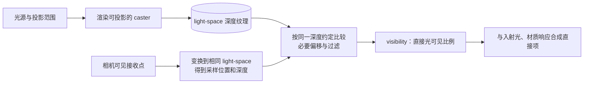
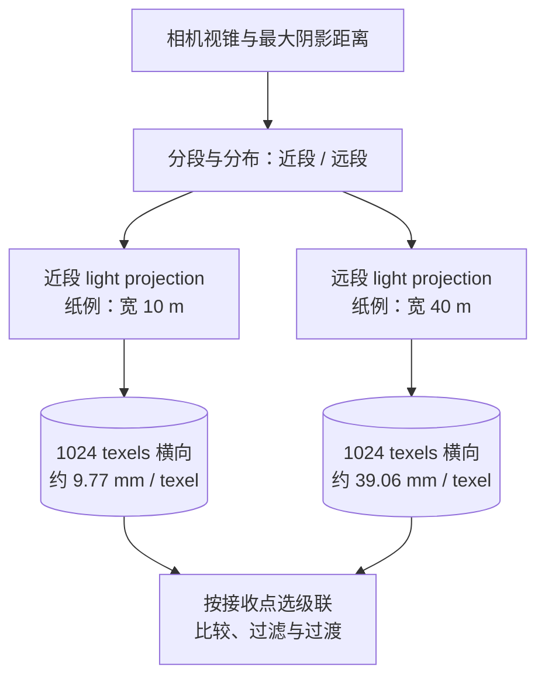
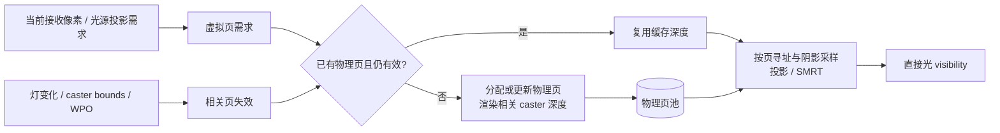
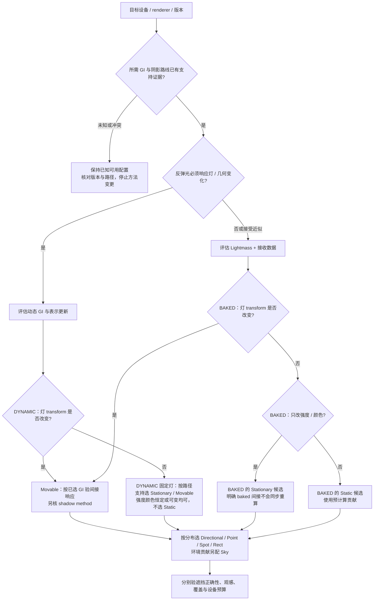
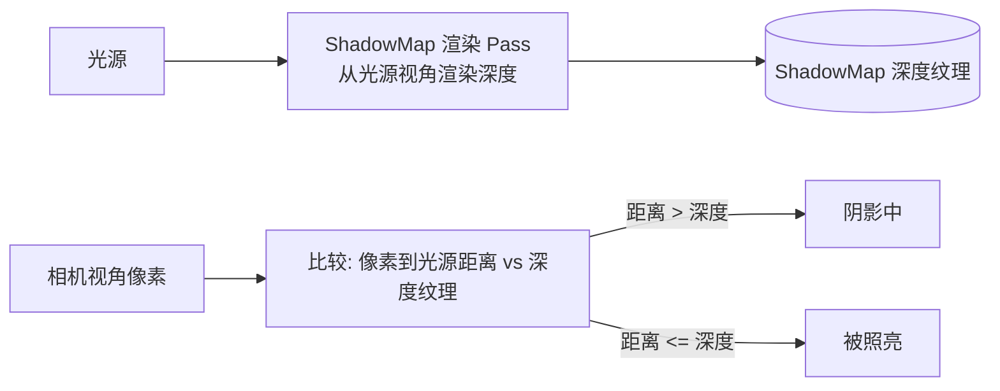
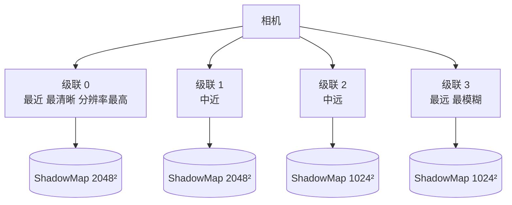
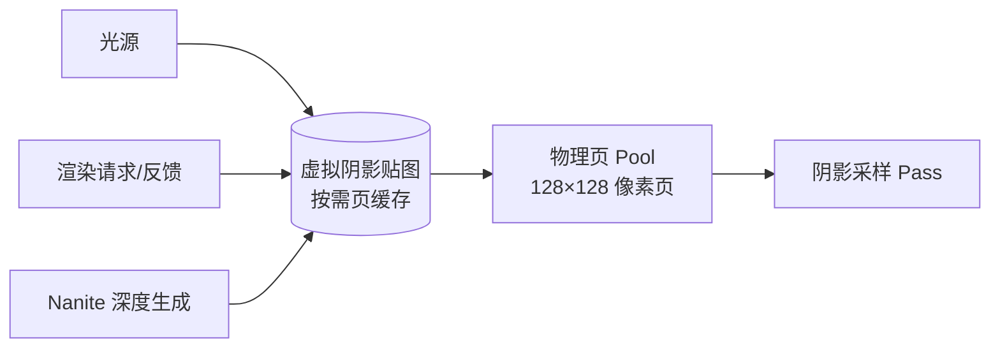
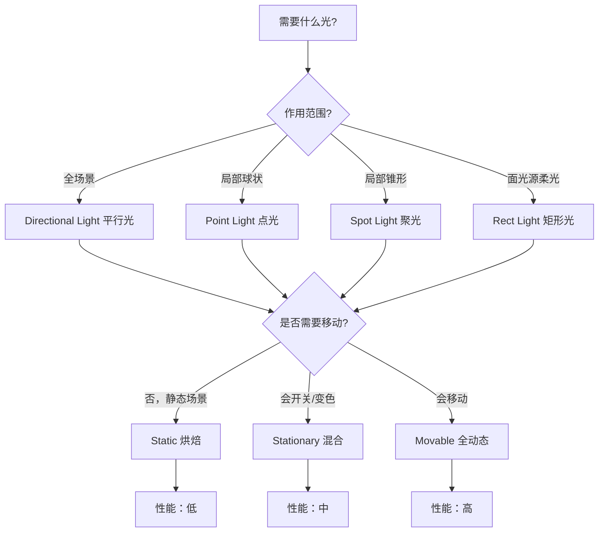

# 03 UE5 光照与阴影系统

> 知识成熟度：L2。已核对公开官方资料；下述关卡、蓝图逻辑、控制台示意和纸例均为 `PAPER_EXPECTED / NOT_RUN`，没有运行 UE、编译、烘焙、GPU 或性能实验。
> 版本基准：2026-10-09 实际读到的 Epic UE 5.6 选择页为主要依据；独立硬件射线阴影与移动渲染矩阵另用访问时显示 5.8 的动态页，并明确保留版本缺口。版本选择参数不是不可变源码 revision。
> 知识基线：光源能量与分布、直接可见性、预计算或动态间接光、曝光，以及阴影表示与更新成本。先区分这些数据，再调参数。
> 源码核对状态：未核对。没有检查本机引擎、头文件、实现、CVar dump 或原稿所称 UE 5.8.0 / CL 55116800 / `++UE5+Release-5.8`；该声明完整保存在文末历史资料中，不作为本轮环境事实。
> 适用范围：游戏关卡光照的选择、搭建和诊断。平台、RHI、渲染器、GI 和阴影方法必须分别确认；文中的公开支持表不等于具体设备保证。
> 最后更新：2026-10-09。重写单位、mobility、GI/阴影关系、偏移/缓存/性能因果及运行时示意；保留原用途与可逐字恢复的历史全文。

## 1. 先说明场景要改变什么

设想一个房间连着门外道路：墙和窗固定，角色会走动，壁灯会开关变色，玩家手电会移动，太阳可能昼夜旋转。看见墙变暗，可能是直射被挡住、间接光变少、材质不同，也可能只是自动曝光改变。把所有现象都归为“阴影质量”会越调越乱。

阅读本文需要知道材质、相机和渲染 Pass 的基本含义。学完应能解释五种光源及单位，选择 Static / Stationary / Movable，追踪 Lightmass / VLM / Lumen 数据，理解 Shadow Map / CSM / DF / Contact / VSM / ray-shadow 的表示与局限，并据症状选择下一项证据，而不是记一组万能控制台数值。

### 1.1 三条独立的选择轴

1. **光从哪里来、怎样分布**：光源类型、单位、IES、尺寸和方向决定入射光；材质决定如何响应。
2. **允许什么改变、已有数据何时更新**：mobility 是灯的变化合同；GI 系统决定反弹光是旧烘焙数据还是动态求解。物体自身也有 mobility，不能与灯的设置混称。
3. **怎样判断直接光被谁挡住**：阴影方法查询深度图、距离场、屏幕深度或射线加速结构。这个选择与 GI 相关但并不等同。

把某接收点的直接照明理解为“入射光 × 材质响应 × 可见度”有助于排查；再加上适用的间接贡献，最后经过曝光和显示映射。这是职责分解，不是完整渲染方程或已核源码调用顺序。Sky Light 的环境照明也不能简单当成另一盏局部直射灯。[S01] [S06] [S16]

### 1.2 同一房间的两个明确配置

| 数据 / 行为 | A：BAKED，预计算路线 | B：DYNAMIC，动态路线 |
| --- | --- | --- |
| 前提 | 已启用且成功构建预计算光照；Static / Stationary 灯；选择 VLM；Lumen GI 关闭 | 目标设备与渲染器支持所选 Lumen 路线；灯按动态需求配置；确认实际阴影方法 |
| 静态墙的间接光 | Lightmass 产生的 lightmap 等预计算数据 | Lumen 的表示、追踪与缓存更新；不能仍假定叠加原静态 lightmap 贡献 |
| 可移动角色的间接光 | 从 VLM 等当前选择的体积数据插值，角色移动不重算场景反弹 | 从动态 GI 获得响应，仍受几何表示、覆盖与更新速度限制 |
| Stationary 壁灯开关 | 直接项可变化，已烘焙间接不重算 | 动态 GI 是否以及多快响应，由实际支持路径和更新决定 |
| 手电直接阴影 | 可用支持的动态阴影补充，不能让 VLM 生成新的手电反弹 | 另选 VSM、传统图或支持的独立 ray-shadow；GI 名称不能决定一切 |
| 曝光 | 比较时固定，否则容易把自动补偿误认成灯没变 | 同左；动态 GI 也不能消除曝光混淆 |

新建项目与从旧版本迁移的项目，启用 Lumen / VSM 的状态可能不同。不能仅凭“UE5”断定这两项已开。VSM 可与烘焙间接配合；开启 VSM 不等于开启 GI。[S08] [S10] [S13]

## 2. 光源、单位与可变化性

### 2.1 五类光源，五种使用意图

| 光源 | 形态与用途 | 单位和重要限制 |
| --- | --- | --- |
| Directional Light | 近似全场景平行入射；太阳、月亮、主要室外光 | Intensity 用 lux 表示照度；方向和表面朝向影响接收，不靠移动灯的位置形成局部衰减 |
| Point Light | 向周围发射；灯泡、火焰附近照明、局部补光 | 物理设置下可选 cd / lm，也有 unitless；球状影响范围不是灯泡物理大小 |
| Spot Light | 受锥角约束；手电、射灯、车灯 | 可选 cd / lm / unitless；锥角与配光改变分布，同一数值不保证同一受照结果 |
| Rect Light | 有朝向的矩形发光形状；窗形灯、灯板、室内照明 | 可选 cd / lm / unitless，不能统一写成 lux；宽高如何参与漫反射和软阴影依 mobility / 阴影路径而异 |
| Sky Light | 捕获天空/环境或使用指定 Cubemap，提供环境照明 | HDR 环境涉及亮度，物理单位页以 cd/m² 解释；输入贴图和 Intensity 缩放都重要，不能把它视为无物理量的任意“底色” |

这里的 cd 是某方向光强，lm 是总光通量，lux（lm/m²）是接收面照度，cd/m² 是亮度。它们不是互换的“亮度数字”。局部光的物理单位还受平方反比选项等前提约束，关闭物理衰减后的艺术参数不能继续无条件套物理计算。[S01] [S16] [S17]

**受控纸例**：理想点源为 100 cd、垂直照到接收面、无遮挡且未触及半径裁剪。按 E = I / r²，1 m 为 100 lx，2 m 为 25 lx；斜入射还需接收角的余弦因素。只改曝光补偿不会改写这个照度模型，但会改变显示结果。100 lm 与 100 cd 不能直接等同；这个例子也不预测 UE 最终像素值。[S01] [S02]，完整输入与反例见 P02。

### 2.2 半径、发光尺寸、配光和曝光各管什么

- **Attenuation Radius** 限定局部灯的有效覆盖和边缘淡出范围。收紧可能减少受影响像素、物体与阴影工作，也可能切掉需要的照明；它不是灯泡直径，也不保证按比例省时间。
- **Source Radius / Length、Rect 宽高、Directional Source Angle** 描述发光形状或角尺寸。支持面积阴影的算法可据此产生半影；传统硬深度图不会因某个尺寸值变大就自动成为完整面积光积分。柔和程度也受遮挡物与接收面的距离影响。[S08] [S17] [S21]
- **IES** 主要规定角分布。是否取 profile 的光强、当前单位及 lightmap 精度需要另外检查；导入真实灯具配光不等于整个场景已绝对校准。[S18]
- **Temperature** 是灯光颜色的色温控制，**White Balance** 是相机/显示处理的另一环节。调白平衡可能改变整幅画面的冷暖，不能据此认定灯光颜色没生效。
- **曝光** 会补偿场景明暗。先固定测试相机、曝光模式和视口 override，再比较灯或 GI；返回正式玩法时再检查自动曝光范围、速度和室内外过渡。[S02]

把灯的影响半径减半与把发光半径加倍是两种不同操作：前者改变覆盖，后者在支持的算法上改变半影。应固定其他量分别对照，不能一次全改再把结果归功于“更物理”。

### 2.3 灯的 Static / Stationary / Movable

下表以 A 的传统预计算组合为起点；VSM 的替换规则见 4.5，Lumen 的间接规则见第 3 节。它不是所有渲染器的统一实现表。[S03] [S04] [S05]

| 灯 mobility | 允许变化与直接项 | 间接数据 / 阴影 | 选择与代价 |
| --- | --- | --- | --- |
| Static | 为不在运行时改变的灯；静态表面的贡献可预计算 | 预计算间接；动态物体可接收选定体积光照，但不能假定它获得一盏实时 Static 灯的完整动态直射阴影 | 适合固定环境；省去逐灯动态工作仍有纹理、采样、内存和构建代价 |
| Stationary | 位置与方向等 transform 固定；强度、颜色可以在运行时改变，直接照明实时计算 | 已烘焙间接保留；传统路线静态几何阴影有预计算数据，可移动物体有相应动态补充 | 适合固定灯的有限亮度/颜色变化；不是所有数据都随开关更新，也不保证比 Movable 便宜 |
| Movable | transform、颜色、强度可变；动态直接光及所选阴影 | 本身不提供 Lightmass 的静态间接贡献；角色所读 VLM 不会因此成为动态 GI；新的反弹需动态 GI 系统 | 手电、移动灯、昼夜太阳；成本受覆盖、caster、表示更新、缓存和采样影响 |

**Stationary 的常见陷阱**：白色壁灯的直接项 D 和烘焙间接 B 原本都非零。运行时把 Intensity 设为 0，可以消去其直接项，B 仍是原数据；改成红灯时，直接项可变红，B 不会自动同步。若玩法要求全房反弹跟着开关，应选择支持的动态 GI 或明确接受近似，不能用 `Visibility` 假装重新烘焙。

传统 Stationary 阴影还涉及有限的预计算阴影通道分配和重叠限制；Directional 往往占用贯穿关卡的通道，几何上的重叠关系可能使实际可用局部灯少于直觉中的“四盏”。应检查 overlap 可视化与退化提示，而非只数相机画面里有几盏灯。传统 per-object 动态阴影随移动物体数量、bounds 和覆盖增长；VSM 下不能原样套这套补阴影要求。[S04] [S08]

## 3. 间接光：存什么、何时更新

### 3.1 路线与数据比较

| 技术 | 数据来源与用途 | 更新、限制与适用判断 |
| --- | --- | --- |
| CPU Lightmass | 预计算静态照明；静态表面的 lightmap 等、动态接收者可用的体积数据 | 改变相关静态场景后需构建；UV、密度和求解质量分别影响结果；运行时仍需存储与采样 |
| GPU Lightmass | 另一种生成预计算光照的工作流 | 编辑器内交互构建仍是烘焙，不是游戏运行时动态 GI；不要把 CPU 参数逐项照搬，本文不提供安装/驱动操作 |
| Volumetric Lightmap（VLM） | 存放预计算间接光的体积样本，对动态接收者插值 | 角色能移动采样，样本并不因此计算新的手电反弹；密度、几何和砖内存预算影响细节 |
| Sparse Volume Lighting Samples / Indirect Lighting Cache（ILC） | 另一条传统体积采样与缓存路线 | 与 VLM 是可选路线的区别，不是修黑角色时必须同时打开的两层 |
| Lumen GI | 屏幕信息及所选场景表示的动态追踪与缓存 | 可响应照明和几何变化，但有表示、覆盖、更新与收敛限制；不是保证所有反弹同帧完成 |
| Lumen 的软件 / 硬件追踪 | 为动态 GI / 反射提供不同场景查询表示 | SDF 与三角形加速结构的可见几何、更新成本不同；“硬件光追 GI”不能当任意平台第三个无条件灯模式 |

依据：[S10] [S11] [S12] [S13] [S23]。本文只解释与光照选择有关的边界，完整 Lumen 原理见关联阅读。

### 3.2 Lightmass、UV、体积与 Portal

Lightmap Resolution 改变存储光照纹理的采样密度；不重叠的合适 UV、padding 和几何接缝决定能否正确存结果。分辨率更高通常增加存储和构建工作，但提高求解质量不能修复重叠 UV 本身。[S03] [S12]

Lightmass Importance Volume 把较高质量的计算和体积采样聚焦于主要游戏区域，不是“体积外完全不计算光照”的硬边界。VLM 的边界外使用边界值延伸（clamp），Sparse/ILC 的体积外无间接贡献行为不同。角色发黑时要先知道当前使用哪条路线、构建数据是否有效，再检查样本可视化、密度、砖内存和角色位置；不能把所有问题都归因于 Importance 未覆盖。VLM 的 GPU 逐像素插值和移动端 CPU 按 bounds 中心的处理也不能混为一个精度保证。[S12] [S13]

Portal 为 CPU Lightmass 在特定方向增加采样机会，常用于 Sky / emissive 驱动的小型室内开口。它不产生光、不是门窗遮挡物、不控制曝光，也不是每扇窗或 Lumen 场景的必选项。完全封闭且无入光的暗室不会因放 Portal 自动变亮；过多 Portal 还会增加构建代价。CPU 与 GPU Lightmass 的工作流应分别核对。[S14] [S23]

### 3.3 Lumen 与 baked lighting 的精确边界

启用 Lumen GI 时，不能仍把静态 lightmap 的照明贡献算作叠加项，Static 灯也不是这条动态 GI 路线的照明来源。动态直射变化可以先于间接缓存传播：关灯后间接渐变不一定是直接阴影失效，应分开观察。[S10]

这不等于“任何 Lumen 功能与烘焙都互斥”。S10 的专节描述了符合前提的独立 Lumen Reflections 与 baked static lighting 组合，并要求其硬件追踪相关设置；不要把这种反射组合再推广成 Lumen GI 与 lightmap 的任意混合。S11 的部分旧文字仍把相关反射支持说成未来事项，两页存在年代差异，本文采用专节的有限组合，不认证当前工程已满足前提。

**对照**：A、B 都有 Movable 手电。A 的直接光和直接阴影可以跟着手电动，但 VLM 仍是旧间接数据；B 才由动态 GI 更新新的反弹，且快慢与准确性取决于表示和缓存。把灯改为 Movable、把 `r.Shadow.Virtual.Enable` 设为 1，都不是“新增反弹已正确更新”的充分条件。

## 4. 直接阴影：表示、比较与更新

### 4.1 先看算法能看见什么

| 方法 | 查询什么 / 教学用途 | 漏掉什么或付出什么 |
| --- | --- | --- |
| 传统 Shadow Map | 光源投影下的深度，判定接收点是否被前面的表面遮挡 | 离散分辨率、投影精度和 bias 权衡；生成深度与投影采样分别花工作 |
| CSM | 平行光对相机视锥分段，为各段安排阴影投影 | 以覆盖、采样密度和过渡换取可用范围；多个级联可能重复处理 caster |
| Distance Field Shadow | 追踪预生成的网格 SDF 表示以估计遮挡和柔影 | 有构建/内存与形状近似；并不自动代表任意骨骼和 WPO 变形，也不保证所有灯类型皆可用 |
| Contact Shadow | 在当前屏幕深度中补查遮挡细节 | 离屏、被遮住或未写入表示的几何可能缺失；不能替代场景级阴影 |
| Virtual Shadow Maps | 按需求分配和复用高虚拟分辨率深度页 | 有页生成、失效、池压力与采样成本；平台和渲染器须支持 |
| 独立硬件 ray-shadow | 向光源方向查询支持的射线场景表示 | 加速结构构建/更新与采样有成本；几何替身可能不同于最终可见表面，不是 Lumen HW 开关的同义词 |

比较依据：[S06] [S08] [S09] [S19]；ray-shadow 的有限补充来自访问时显示 5.8 的 [S21]，不用于认证 5.6 实现。成本需在相同场景、设备、画质和更新负载下比较，不能为各方法写普遍“低/中/高”。

### 4.2 深度图为什么有粉刺，也为什么会漂浮

深度图保存的是光源投影及其深度约定下的遮挡信息，不能把任意世界距离直接拿来与 NDC 或投影深度比较。接收点必须变换到同一坐标和约定中，再取得相应样本。[S24] [S26]



量化、投影采样和表面斜率会让“同一个面”的两次深度估计不完全相等，产生 Shadow Acne。偏移为这些误差留出余量；余量过大又把本应被挡住的接收点放行，造成 Peter Panning 或漏阴影。Slope bias 只是把余量与斜率联系起来，也可能过量，不能保证同时消除两种伪影。

**P06 的一维纸算**：定义可见当 z − b ≤ d，d = 0.400，同面接收深度因误差为 0.402，真正挡后点为 0.410。b = 0 时同面误判遮挡；b = 0.003 时 0.399 ≤ 0.400 且 0.407 > 0.400，两个判定符合假设；b = 0.020 时真正挡后点也变成可见。这里是无量纲、单调深度模型，不代表 UE 的反向 Z、偏移符号或参数单位。

| 调整项 | 应查的路径与对象 | 失败边界 |
| --- | --- | --- |
| Shadow Bias / Shadow Slope Bias | 传统灯阴影面板与当前深度图路径 | 先看投影精度、接触和斜面；增加任何 bias 都可能损失真实遮挡 |
| Shadow Cascade Bias Distribution | 适用 Directional CSM 的跨级联偏移分配 | 不能替代正确的距离、分段和过渡设置 |
| Normal bias | 某些方法例如 VSM 的法线方向偏移控制 | 不是所有光源面板都有同名通用选项，也不能将全局 VSM 变量当单灯传统 bias |
| Contact Shadow Length | 支持该功能的光源/渲染路径上的屏幕追踪范围 | 不是修复场景阴影缺失的无限长度补丁 |

先确认实际方法，再寻找该方法暴露的控制项；没有核实它生效时不要同时改多组偏移。[S05] [S07] [S08]

### 4.3 CSM：把有限采样分配给哪里

CSM 沿相机视锥深度分段，为各段拟合光源投影。近段覆盖较小的世界范围，通常能获得较高的世界采样密度；这不要求远级联的图像素数一定更少。接收点选对应级联并在适用的过渡区域混合，才能避免明显分层。[S07] [S24]



图中只是 P07 的正交投影纸例，不是 UE 自动切分参数。相同 1024 texels 覆盖 10 m 与 40 m，得到 10/1024 m 和 40/1024 m 的采样间距；把分辨率降到 512、保持覆盖不变，间距会加倍。因此“减级联并降分辨率就修复远处模糊”没有一般依据。若总预算固定，可以重新分配近远质量，但要说清牺牲了哪部分。

| 控制 | 真正改变什么 | 不能直接推出 |
| --- | --- | --- |
| Num Dynamic Shadow Cascades | 灯所请求的实际动态级联数，另受上限/质量配置约束 | 提高全局上限就已经增加此灯实际级联 |
| Dynamic Shadow Distance Movable / Stationary Light | 对应 mobility 的动态覆盖距离 | 超出后必然没有任何烘焙或 DF 阴影；须看组合路线 |
| Distribution / Transition / Fade | 分段分配、级联接合与末端淡出 | 同义的“清晰度滑条” |
| `r.Shadow.CSM.MaxCascades` | 最大级联上限；S20 列值为 10 | 原稿所称本机 5.8 默认已获认证，或项目最终请求数必为 10 |
| `r.Shadow.DistanceScale` | 适用路径的距离缩放 | 减少级联会自动扩大最大距离 |
| `r.Shadow.MaxResolution` | 传统阴影图的分辨率上限之一 | 同时控制 VSM 虚拟分辨率、物理池和所有灯最终图尺寸 |

Scalability、device/profile 和项目配置可能覆盖值，应记录最终值而非只看页面示例。[S20] [S25]

**过滤与成本**：PCF 是对若干采样位置分别进行深度比较，再过滤比较结果。P08 在同一深度坐标系内取四个不同位置，等权可见值 {1,1,0,0} 得到 0.5；先平均四个深度再比较是另一种运算。材质纹理各向异性不是所有阴影走样的通用修复。

同一 caster 可能落入多个级联；点光传统图还可能涉及 cubemap 多面。裁剪、投影覆盖、缓存和具体生成方式决定额外几何工作，不是“一灯刚好多画一遍”或“每多一级耗时翻倍”。相机看不见的物体仍可能给画面内投影，不能全部剔除。[S06] [S24] [S25]

### 4.4 传统阴影控制与 DF / Contact 的边界

以下保留控制台查参用途。它是 **console 的 `名称 值` 语法示意，未执行**；不是可直接贴进 `.ini` 的配置段。数值是示意选择，支持范围、最终值和可否运行时改变须在工程中确认；方法切换单列，不混入质量按钮。

```text
传统 CSM 示例：r.Shadow.CSM.MaxCascades 3
传统距离示例：r.Shadow.DistanceScale 1.0
传统图上限示例：r.Shadow.MaxResolution 2048
caster 屏幕半径阈值示例：r.Shadow.RadiusThreshold 0.03
CSM 过渡示例：r.Shadow.CSM.TransitionScale 1.0
传统 Movable Point/Spot 缓存示例：r.Shadow.CacheWholeSceneShadows 1
接触阴影总开关示例：r.ContactShadows 0
另行评估的方法选择：r.Shadow.Virtual.Enable 1
```

`RadiusThreshold` 按投影 caster 的屏幕包围球半径剔除小 caster，不是按灯的半径淘汰“小灯”。纸例半径 0.02、0.08 对阈值 0.03，前者可能被剔除，不能由此推出灯减少一盏或时间减少多少。传统 `CacheWholeSceneShadows` 面向 Movable Point / Spot 中不变的静态 primitive 深度，与 Stationary 的预计算数据和 VSM 页缓存是不同机制；缓存命中仍有采样/投影工作。S05 页内另一条缓存命令文字与 S20 有冲突，此处采用变量参考的精确名称与有限语义。[S20]

**DF 阴影**：Mesh Distance Field 预生成表面距离的三维表示，运行时再追踪它。Static Mesh 是资产类型，Actor 刚体移动并不意味着该 SDF 一律不可用；反过来，离线形状也不会自动跟随任意骨骼或 WPO 变形。近处 CSM 加远处 DF 是有条件的组合，不是所有灯与所有材质的统一配置。生成数据的构建时间、内存和近似误差都应计入选择。[S09]

`Generate Mesh Distance Fields` / `r.GenerateMeshDistanceFields` 描述表示生成的前提，`r.DistanceFieldShadowing` 是相关功能控制；看见变量存在不代表只切一个开关就拥有完整有效数据。DF 还与 DFAO、Lumen 软件追踪相关，但这些不是同一个阴影功能。[S09] [S11]

**Contact** 只补查屏幕中已有深度。离屏墙可能正在挡住太阳，而当前屏幕深度没有它，所以不能把 Contact 当独立场景遮挡来源；移动端还必须先核对应渲染路径和版本的支持情况，见 4.7。[S06]

### 4.5 VSM：页结构、缓存与柔影

UE 的 Virtual Shadow Maps 将大虚拟深度图分成按需求处理的页。S08 描述的页大小为 128×128、虚拟图为 16k 量级；这是该文档机制说明，不是显存按整图常驻或所有场景固定分配的承诺。

- Directional 使用 clipmap 覆盖尺度不同的区域；Spot 使用带 mip 的局部投影，Point 涉及 cubemap 的各面。
- One-Pass Projection 是局部灯投影阶段的批处理策略，不是“点光和聚光的页结构名称”。
- Nanite 可高效生成相关深度，但本轮没有读取实现，不能认证“所有 VSM 深度必走软件光栅”。非 Nanite 内容的成本与支持也要检查。
- SMRT 用阴影图中的深度样本估计软阴影，不等于对真实三角形做硬件 ray tracing；有限深度表示会产生自身的遮挡/漏光局限。[S08]



图表达数据依赖，不是引擎函数执行顺序。P11 的纸面页集合 {A,B,C} 在灯/几何不变时可复用；一个物体的 bounds 只影响 B，则 B 需要更新；新视野再需要 D，而池只有 3 页时会产生预算压力。这个例子没有模拟真实分配器，不能据此预言淘汰哪页、出现哪条日志或是否自动降级。

物体移动、灯旋转、WPO 和过大的 bounds 可扩大失效与重绘区域。仅看到相机不动不等于没有失效；反过来，Movable 标签也不等于每帧整张图必重绘。不要为改善命中率盲目禁止失效，那会留下错误旧阴影。

| 原有组合 | VSM 文档中的替换或保留关系 |
| --- | --- |
| 传统 CSM、传统动态图、Stationary per-object / 预计算直接阴影相关机制 | 对采用 VSM 的光源由 VSM 路线承担，不能继续把传统 CSM 滑条视为通用控制 |
| Static 的已烘焙照明、Stationary 的 baked 间接 | 不因 VSM 本身而一律删除；是否使用 lightmap 还取决于 GI 设置 |
| Directional 的特定远处非 Nanite DF 阴影组合 | DF 并未被“VSM 替代全部方法”这句话自动排除，按专页条件核对 |
| 明确选择 DF 阴影的 Point / Spot | S08 说明该局部灯选择继续覆盖当前 shadow map method；不能从项目开启 VSM 推出每盏灯都在采 VSM |
| 明确选择支持的 ray-shadow 的光源 | ray-shadow 可优先于 VSM；不由 Lumen HW 开关单独决定 |

依据：[S08] [S10]。S08 的“新建项目默认”与迁移项目的选择不同，不能直接扩成任何 UE5 项目默认。

### 4.6 区分 VSM 分辨率、池容量、失效和采样

模糊可能来自有效采样密度、滤波/SMRT 或运动；缺块可能来自池压力、几何表示或失效问题。提高物理页数不会自动提高虚拟 texel 密度，更不一定省 GPU 时间。要分别看需求页、已分配页、新页、失效区域和生成/投影耗时。

```text
方法选择示意，未执行：r.Shadow.Virtual.Enable 1
物理池预算示意，非推荐默认：r.Shadow.Virtual.MaxPhysicalPages 2048
未来只读观测入口：stat gpu
未来配合当前版本 VSM visualization / 统计核对页需求、失效与池压力
```

S20 的该池变量列表值为 4096，原稿示例是 2048；两者都不是本文观察到的工程最终值。S08 描述池溢出可能造成破损/缺失，S20 又列有动态分辨率控制；具体版本策略需核验，既不承诺永远优雅降级，也不把每次压力都说成必然同一种破坏。半透明、WPO、特殊材质和几何的表示/失效应单独回归。[S08] [S20]

### 4.7 支持先于质量：保留无法合并的版本结论

S08 本轮显示 5.6 的 Supported Platforms 节列出 PS5、Xbox Series S/X 及有条件的 PC 平台；其接口条件包括 DirectX 12 的 Shader Model 6.6 atomics 或 Vulkan 的 `VK_KHR_shader_atomic_int64`，并另列操作系统、显卡、驱动及 Apple Silicon / Linux 条件。必须按实际平台检查整组要求，不能凭“支持 DX12”或 S05 的 DX11 字样就批准 VSM。[S08]

CSM 在 S19 的桌面 Directional 表中有较广路径支持，仍不代表每种设备都有相同数量、精度或预算。独立 ray-shadow 要有项目硬件追踪支持并看单灯覆盖选择；S21 动态 5.8 页把 Windows / Linux 的 Vulkan 追踪标为 Experimental，本文不将它当固定 5.6 或所有移动平台的生产保证，也不提供配置修改步骤。[S19] [S21]

| 场景 | 本轮可用的有限依据 | 本文允许得出的判断 |
| --- | --- | --- |
| 桌面 Deferred / Forward | 5.6 桌面矩阵 S19 与各专页；Forward 列对 VSM、独立 ray-shadow 有明确限制，S11 也限制 Lumen Forward | 必须先确定渲染路径，不能把 Deferred 的方案搬到 Forward 后只降质量 |
| 桌面 XR、Rect + Forward | S19 有内部或跨页差异；S17 的传统 Rect / Forward 说法与矩阵不完全一致 | 精确支持及面积光行为待实际版本/路径核验，不宣称所有 XR 或 Forward 组合已验证 |
| Android Vulkan 与 Lumen | S11 的 5.6 平台文字明确并列 Android Vulkan 与 Mobile Renderer；动态入口 S22 在本轮显示 5.8，移动矩阵的两条 Lumen 模式却全为 No | 这是未解决的版本/路径文档冲突；不能擅自把前者改释成 desktop renderer 保证，也不能用 5.8 的 No 推出全部 5.6 mobile 不支持 |
| Contact Shadows 移动三路径 | 2026-10-09 准备访问固定 5.5 入口未获得正文；当日独立重试已读到 5.5，其 Mobile Forward / Mobile Deferred / HDR-off 三列为 No / No / No；S22 动态 5.8 则为 Yes / No / No | 保留两次访问事实；不能将 5.8 的 Forward Yes 扩到 Deferred 或补签 5.6 支持 |
| VSM / 独立 ray-shadow 移动路径 | 本轮动态 5.8 移动矩阵为 No；固定 5.6 mobile / ray-shadow 入口本轮未取得有效正文 | 不拿动态页替固定 5.6 签发矩阵；具体配置仍需版本和设备证据 |

这不是让读者随机试开关：先选已确认支持的配置作为基线，未知组合停止方法变更，记录缺失的版本/路径证据。访问失败只说明本轮工具未取得正文，不证明页面永久不存在或功能不存在。完整定位见第 9 节。

## 5. 游戏关卡搭建与动态控制

### 5.1 房间与道路的搭建顺序

先保存当前可用场景和曝光基线，明确目标渲染路径与动态需求，再开始布光。下述是未来工程中的操作顺序，本轮没有执行任何设置、构建或控制台命令。

```text
共同前提：记录引擎版本、设备/RHI、renderer、GI、shadow method 和曝光
1. 放 Directional 主光：方向、lux 规范、Cast Shadows 与实际阴影路线一致
2. 配 Sky Light：确认 Cubemap 或场景捕获来源，明确何时更新
3. 放局部灯：按用途选 Point / Spot / Rect，确认单位、IES、半径及遮挡
4A. BAKED：Static / Stationary + 已构建静态照明 + 选定体积数据
    角色/手电所需动态直射和阴影另配；接受或重新设计关灯后的 baked 间接残留
4B. DYNAMIC：受支持 Lumen 路线 + 满足变化需求的灯 + 独立确定 shadow method
    不把旧 lightmap 当继续贡献的保险层；检查快变灯与动态遮挡的 GI 响应
5. 固定相机和曝光，先验遮挡正确，再验画质，最后比较目标设备开销
6. 低端或移动备用配置单独验证其支持与数据，不由关闭一个开关自动生成
```

天空外观改变与 Sky Light 捕获更新是两件事。Static 的捕获/构建、Stationary / Movable 的捕获时机、手动 Recapture、适用的 Real Time Capture 及时间分摊各有条件；放置 SkyAtmosphere 不保证所有 Sky Light 每帧自动更新。指定 Cubemap 时更要明确内容是否随昼夜变化。[S16]

局部灯的物理衰减应依据单位和用途配置，不能把“全部打勾”当照明校准。缩半径前检查墙后、转角、角色路径和体积雾是否仍得到需要的光；实时阴影灯数只是一种负载指标，覆盖和动态 caster 同样重要。

### 5.2 Lightmass 构建工作流

```text
1. 选 CPU 或 GPU Lightmass，并确认当前 GI / 预计算设置允许使用结果
2. 固定需要烘焙的灯与几何，标明单位、mobility、UV 通道和光照密度
3. 为主要游戏区域规划 Importance 与所选体积光照数据
4. CPU 路线若确有 Sky / emissive 室内采样问题，再评估少量 Portal
5. 检查 lightmap UV 不重叠、padding、密度和分辨率预算，再进行构建
6. 保存构建结果与真实日志；分别检查静态墙、移动角色和边界位置
7. 对关灯/改色、手电、门移动记录接受的近似；错误数据恢复到已知构建基线
```

Lightmap 密度不足与求解噪声是不同问题；修 UV、加分辨率、提采样不能互相替代。构建变慢时区分参与内容、Importance 范围、纹理密度与工具配置，不要未经诊断就扩大所有预算。GPU Lightmass 的交互构建可以改变迭代流程，但不证明游戏中可实时重烘，也不等于本文验证了速度优势。[S12] [S13] [S14] [S23]

### 5.3 开关、闪烁、变色与手电：蓝图逻辑示意

原稿给出灯 Actor 引用、强度、颜色和可见性节点，目的是控制灯。本节保留这个用途，但区分灯属性和已烘焙数据。以下是原创逻辑伪代码，不是节点截图或已经运行的蓝图；固定 5.6 的两个 API 入口本轮未取得签名正文，因此不把同名文字认证为某一 C++ 版本实现。

```text
准备：获得属于当前关卡的有效灯组件引用，记录其类型、mobility、单位、原始值及实际 GI / 预计算路线
若引用无效：停止本次变化，不继续发送属性操作
若 GI 路线或该组件在当前 renderer 中的支持未知：保持原配置，停止本次变化
若灯为 Static：不以运行时改值实现玩法灯；返回关卡设计选择
若灯为 Stationary：仅请求受支持的强度/颜色变化，保持 transform
    若为 A / BAKED：原 baked 间接不会因改色/强度而重算，明确接受的残留
    若为 B / DYNAMIC（Lumen GI）：检查动态 GI 表示与缓存的响应，不使用原 lightmap 贡献，也不承诺同帧收敛
若灯为 Movable：可表达手电位置/方向与强度/颜色变化
    GI 与直接阴影是否响应，按实际两条数据路线分别验收
开关/闪烁：按设计时间序列改变所选直接光属性；记住原值以便恢复
Visibility / Toggle：只表达组件显示/贡献的相应控制，不等于抹除旧 lightmap
退出该测试或取消玩法状态：恢复本次修改拥有的灯值，重新检查曝光与 GI
```

壁灯变红但墙上仍有原来的间接颜色，是 A 路线可以预期的结果；移动手电的直接阴影跟随、反弹却不更新，则要检查是否只用 VLM，而不是继续修改 mobility。闪烁灯对表面与体积雾也可能有不同响应，见 5.5。[S04] [S05] [S10] [S13]

### 5.4 运行时质量档位与“换方法”分开

原 C++ 示例把 CSM 数量、距离和关闭 VSM 三条全局 Exec 连在一起，无法形成通用可靠档位：前两项主要针对传统路线，第三项改变了 shadow method；后者还涉及内容支持与替代配置，不能假定能平滑热切换。原代码逐字保留在历史区，活动示例改为不依赖未经认证 API 签名的伪代码。[S08] [S20] [S25]

```text
请求：在当前已确认支持的渲染路线中应用“低 / 中 / 高”之一
读取：该设备的已批准质量配置、当前有效值及恢复配置
若请求暗含 shadow method / renderer / GI 变更：停止普通质量切换，另作方案验证
若当前为传统 CSM：在已验证档位中选择距离、请求级联数和精度组合
若当前为 VSM：选择其专用质量与预算组合，不把 CSM 值当主要质量控制
若设备或配置未知：保持已知可用配置，记录无法完成此次切换的原因
应用后未来须检查：近景接触、远景覆盖、移动 caster、缓存冷暖与目标帧时间
不满足正确性 / 画质 / 性能中的任一要求：恢复已知配置，不继续叠加全局命令
```

真实实现还需确定配置层级、全局 CVar 对其他关卡/视图的影响、是否需要重建资源/重启、当前 build 暴露哪些命令。Scalability 组组合多项设置，其公开示例不是用户工程最终值；没有相关工程证据时不提供“必可编译、必可运行”的 C++ 包装。

GI 与反射选项仍可用于辨认路线，以下是 **S20 枚举含义的 console 示意，NOT_RUN**，不替代支持检查或项目依赖：

```text
r.DynamicGlobalIlluminationMethod 1
  公开枚举：0=None，1=Lumen，2=Screen Space GI
r.ReflectionMethod 1
  公开枚举：0=None，1=Lumen，2=Screen Space Reflections
两项独立选择；变量有值不证明本机满足对应资源、渲染器或硬件条件
```

### 5.5 体积光、体积雾与光轴

Directional 的 Light Shaft Occlusion 与 Bloom 是不同屏幕效果控制，不能把 Bloom 当作真实体积遮挡。Volumetric Fog 在相机体积网格中累积介质与照明，可以表现雾中光和阴影；它与 Volumetric Cloud 不是同一个功能。[S07] [S15]

体积网格精度、View Distance、受阴影的局部灯与 volume 材质工作决定许多成本；仅说“雾越浓越贵”不足以预测 GPU 工作。时域重投影复用历史降低噪声，快变手电或枪口灯却可能留下旧亮度，形成拖影。可先评估取消该灯的体积贡献（Volumetric Scattering Intensity），而保留表面照明；全局取消历史复用会改变噪声与稳定性，不是无代价修复。[S15]

```text
console 示意，NOT_RUN；数值不是项目默认或通用预算
r.VolumetricFog 1
r.VolumetricFog.GridPixelSize 8
r.VolumetricCloud 1
show Fog
GridPixelSize 变大表示更粗的屏幕映射网格；不保证某个耗时比例
show Fog 是显示调试入口，不能当成保存好的工程质量配置
```

完整体积机制继续看 [08-体积渲染与云](../材质地形与世界表现/08-体积渲染与云.md)。本文的体积纸例 P13 只解释历史响应，不产生任何本轮雾/GPU 测量。

## 6. 最佳实践与八个常见问题

### 6.1 八项实践，按因果而不是固定常数

1. **先定支持与变化需求**：看玩法是否必须让间接光随关灯、门和太阳响应，再选择 BAKED / DYNAMIC；不要只看场景是否有移动角色。
2. **为实时阴影制定负载预算**：记录灯覆盖、caster 类型与变化、目标设备；“一两盏”不是通用红线，`RadiusThreshold` 也不是小灯淘汰器。
3. **CSM 从可解释的覆盖开始**：最大距离、分段、实际请求数、上限和过渡各自记录，再安排近远质量；Mobile Contact 的支持先核，不当必备补偿。
4. **Bias 找最小充分余量**：先确认算法和空间，再在同一接触处权衡粉刺与分离；Slope 不保证解决所有伪影。
5. **按世界采样密度分配分辨率**：近战、道路和开放场景的覆盖不同，2048 不是充分性的证明；VSM 池容量也不是清晰度滑条。
6. **分开看深度生成、投影与更新**：观察 GPU 项目前先记录当前方法、相机与灯/几何运动，比较缓存冷暖；没有计时证据不宣称优化收益。
7. **烘焙先验数据再加预算**：Importance、UV、VLM 砖内存、CPU/GPU 工具分别诊断；Portal 只处理适合的采样问题。
8. **统一单位和曝光基线**：灯强度、IES、材质和后处理分别登记；对比时固定曝光，发布配置再做自动曝光和动态回归。

### 6.2 FAQ 1：阴影闪烁，先加 Bias 吗？

先确定是传统图、CSM 过渡、VSM 失效、DF 表示还是时域采样。未来可固定相机，再分别固定灯和几何比较：固定后仍在同一斜面出现粉刺，才有理由查精度与 bias；仅跨级联处变化则查分段/过渡；WPO 或移动灯触发 VSM 更新则查失效与页需求。加 bias 可能掩盖症状却丢接触，不应作为第一条无条件指令。[S05] [S07] [S08] [S09]

### 6.3 FAQ 2：阴影与物体分离，Slope Bias 一定能修吗？

过量偏移会放行本应遮挡的点，但几何替身、bounds、接触表示也可造成不一致。先在当前算法上核对偏移项，局部减小并观察 acne 是否重现；Slope 本身也可能过量。若实际阴影使用另一种几何表示，应先查表示差异而非持续把某个传统灯面板值降到零。[S05] [S08] [S21]

### 6.4 FAQ 3：阴影到某处突然消失，增加级联就行吗？

检查灯/物体的距离裁剪、CSM 最大覆盖与淡出、远级联参与或 DF 组合；若是 VSM 则查页池、失效与几何支持；仅 Contact 的细节在离屏后消失还可能来自屏幕表示缺口。减少级联不会自动加大最大距离，增加上限也不保证改变组件请求数。[S06] [S07] [S08]

### 6.5 FAQ 4：动态物体发黑，要同时打开 VLM 和 ILC 吗？

先确认 GI 路线和实际 Volume Lighting Method，检查光照是否成功构建、采样位置、样本密度及砖预算。VLM 与 Sparse/ILC 是不同选择；VLM 边界外 clamp 与 ILC 外无间接不同，不能统一称“体积外一定黑”。若当前用 Lumen，优先查其场景表示和动态 GI，而不是盲目重建一套未参与的烘焙数据。[S10] [S13]

### 6.6 FAQ 5：Stationary 一定要加 per-object 与 Contact 才有动态阴影吗？

传统混合路线要检查移动物体 bounds、per-object 阴影与覆盖；它们有成本和表示条件。采用 VSM 时，S08 所列传统补阴影机制被其动态路线替代，不再一律要求照搬 per-object 配置。Contact 是屏幕补充，不能替代场景遮挡，也不能让 baked 间接随关灯重算。[S04] [S06] [S08]

### 6.7 FAQ 6：VSM 模糊或缺块，直接加物理页吗？

先区分分辨率/采样、池压力、cache 失效、bounds 和材质/几何表示。若统计确认需求超过预算，才评估减少覆盖、降低精度或增加池；若是采样噪声或表示漏光，加页未必有用。不得以“页面被稀释”解释所有情况，也不能保证池增大后速度更快。[S08] [S20]

### 6.8 FAQ 7：体积雾很贵或闪烁，只降低浓度/关重投影吗？

检查网格精度、体积距离、受阴影局部灯和材质，再区分快变灯的拖影与采样噪声。单灯取消体积贡献可以避免它的历史拖影，保留其表面照明；降低精度和取消时域复用会影响其他质量。每次只改变一项，不从密度大小推导固定耗时比例。[S15]

### 6.9 FAQ 8：移动端远处阴影糊，减级联降分辨率再加 Contact？

先锁定 Mobile Forward / Deferred / HDR-off、版本与目标设备。固定覆盖时降分辨率会降低采样密度；若为了帧预算重分配近远质量，应明确缩短了哪里、保留了哪里。Contact 的 5.5 与动态 5.8 表格有差异，不能当全移动路径功能。5.6 精确矩阵缺口仍待核，详见 4.7。[S19] [S22] [S24]

## 7. 排查、预算与验收

### 7.1 光源参数速查

| 参数 | 检查对象 / 路径 | 决策用途 |
| --- | --- | --- |
| Intensity / Intensity Units | 光源类型和物理衰减配置 | 区分 cd、lm、lux、环境亮度与 unitless，不能只比较数字 |
| Light Color / Temperature | 灯颜色、色温模式 | 与相机白平衡分别控制；Stationary 的 baked 间接不随改色重算 |
| Attenuation Radius | 局部灯影响范围 | 约束照明覆盖及潜在工作，不代表发光尺寸 |
| Source Radius / Length / Angle / Rect Width、Height | 灯类型与实际阴影方法 | 决定相应发光形状；支持程度和半影响应依路径 |
| IES Profile / profile intensity | 配光与强度来源 | 区分角分布和能量标定，检查烘焙精度 |
| Cast Shadows | 组件、方法与几何支持 | 总开关不是支持和有效遮挡数据的证明 |
| Shadow Bias / Shadow Slope Bias | 对应传统阴影路径 | 量化余量与接触精度权衡，不通用替代 VSM 控制 |
| Normal bias | 例如 VSM 对应项 | 查真实适用项，不能假定所有灯面板有相同参数 |
| Contact Shadow Length | 支持 Contact 的渲染器和灯 | 屏幕追踪范围，不补齐全部离屏遮挡 |
| Dynamic Shadow Distance / Cascade 设置 | Directional 的传统 CSM | 最大覆盖、分段、过渡、实际级联数与上限分别看 |
| Light Shaft Occlusion / Bloom | Directional 的屏幕效果 | 遮蔽与泛光用途有别，不等于体积光照求解 |

依据：[S01] [S05] [S07] [S08] [S17] [S18]。

### 7.2 十种症状的下一步证据

| 现象 | 先区分的可能原因 | 下一项证据 → 有条件的修正 / 停止 |
| --- | --- | --- |
| 阴影闪烁 | 投影/bias、CSM 过渡、VSM 失效、时域噪声 | 固定相机/灯/几何对照，查看对应可视化 → 仅调整被定位的精度、过渡或失效问题 |
| 阴影分离 | 过量偏移、几何表示差异 | 同一接触点与当前表示对照 → 减相应 bias 并复查 acne；表示不匹配时停止盲调 |
| 阴影突然消失 | 距离裁剪、覆盖、Contact 离屏、VSM 页/材质问题 | 记录消失位置与方法 → 修对应距离、几何或页预算，不靠级联数量猜测 |
| 动态物体发黑 | 缺预计算数据、VLM/ILC 选择或动态 GI 表示 | 查看实际 GI / Volume Lighting Method 与样本 → 修数据/密度；不同时打开两个传统选项 |
| 漏光 | UV/接缝、薄几何、SDF 近似、VSM 深度或 GI 表示 | 先分直接/间接，再查 lightmap、SDF 或页/场景表示 → 局部修 UV/几何/质量，不能统一只提分辨率 |
| 烘焙慢 | 参与内容、Importance 范围、lightmap 密度、求解工具 | 查看实际构建日志与数据规模 → 收敛真正过大的部分，CPU/GPU 参数不交叉套用 |
| 室内过亮/过暗 | 曝光、Sky capture、直接光、GI 数据 | 固定曝光再分别隔离贡献 → 修对应来源；Portal 不负责曝光也不产光 |
| 阴影过黑 | 合理遮挡、环境输入不足、间接丢失或显示映射 | 检查材质/曝光和间接数据 → 必要时修环境与 GI，不先加无阴影灯掩盖错误 |
| 远处阴影糊 | 覆盖过大、采样密度、分段/滤波 | 计算覆盖/texel 并核实际方法 → 重分距离或质量，明示预算取舍 |
| 移动光源无阴影 | 组件开关、方法支持、距离、caster/receiver 设置 | 核实际灯/对象与阴影方法 → 恢复有效覆盖或选择支持组合；未知方法不强切 |

该表是一套判别顺序，未声称这些原因在本轮工程中真实发生。未来应保留对照截图、配置和原始计时，避免只留“改了某值后好像好了”。

### 7.3 性能预算：先定义测量，再判断收益

60 fps 的帧周期为 1000/60 ≈ 16.67 ms，30 fps 为约 33.33 ms；这只是算术目标，不是已经测到的 GPU 预算。CPU / GPU 有流水、等待和可能重叠，GPU 工具的父子区间也可能嵌套；不能把名称不同的计时条无条件相加。

阴影至少分清几何/页深度生成与接收像素投影采样，动态 GI 还涉及其表示与更新，体积雾有自己的网格/灯工作。缓存命中可能省重绘而不省所有投影；较少灯但覆盖更大、caster 更复杂或变化更多，仍可能更贵。优化顺序应由目标设备数据决定。[S05] [S08] [S15] [S25]

原稿“PC 中高配 60fps/GPU 16ms、ShadowDepths 2.0～3.5ms、Lumen 2.0～4.0ms”等整组数字与移动端经验表，**原字完整保存在文末 CURRENT**。它们是历史经验参考，本轮没有其对应硬件、分辨率、画质、场景、采样和 raw trace，未复现、未认证为当前预算；缺 raw 限制外推，不构成对历史真实性的否定。活动正文不另造更优的毫秒数。

未来一次有效比较至少固定：

- 引擎 revision、项目内容/配置、设备、驱动、RHI、renderer 与 build 类型
- 分辨率、upscaler、GI 与 shadow method、灯的形状/覆盖、caster 类型和运动
- 同一相机路径、曝光、缓存冷暖、预热与重复方式，保留异常样本
- 分别验正确遮挡、画质和帧耗时，记录原始 GPU/CPU 数据与截图；不只比较一个 FPS

`stat gpu` 等是未来定位入口，不是本文已经执行的命令；文档静态检查通过也不是 GPU 性能通过。

### 7.4 六项工作流清单

- [ ] 明确主光、补光、氛围光各自职责，记录使用的单位与曝光基线
- [ ] 标注灯与物体的 mobility、GI 和阴影数据来源，特别写明开关灯的间接行为
- [ ] 按目标设备和内容制定实时阴影负载预算，记录覆盖、caster 与缓存条件
- [ ] 烘焙/动态方案或方法切换分别回归正确性、观感与性能，不能只验证帧率
- [ ] 光照配置、场景和实际构建产物可追溯，保存已知可恢复基线
- [ ] 移动端及其他目标平台用真实设备验证实际 renderer 与备用配置，不从桌面预览外推

### 7.5 光源选型决策图



这里没有固定低/中/高成本标签；例如某个 Stationary 的传统 per-object 工作可能比另一配置更贵。固定恒定灯也能留在受支持的动态 GI 路线中：mobility 允许变化不等于要求实际变化。图中 Static 和旧 baked 间接残留只属于 BAKED 分支；DYNAMIC 固定灯按 renderer 与该路线的支持选 Stationary 或 Movable，继续验动态 GI 的表示/缓存响应。

### 7.6 七项美术验收清单

- [ ] 主光方向清楚，关卡阴影方向与太阳/可见灯具一致
- [ ] 暗部细节符合设计；区分合理遮挡、缺 GI 和曝光，不用补光掩盖数据错误
- [ ] 高光与显示范围符合目标，固定曝光对照后再验自动曝光与色调映射
- [ ] 阴影柔和度符合所选光源形状和实际算法，近接触与远半影分别看
- [ ] 室内外过渡检查曝光、Sky 和间接光；Portal 仅负责其适用的烘焙采样
- [ ] 冷暖和色温符合关卡意图，灯色与相机白平衡职责明确
- [ ] 角色、门、载具和手电在运动/开关过程中与环境的直接、间接和体积表现一致或有明确接受的近似

## 8. 验证与基准：16 个有限纸例

以下全部是原创、可手算或可逐步追踪的 PAPER_EXPECTED / NOT_RUN。未执行UE、渲染、光照烘焙、编译、GPU、模型程序或性能实验。数字是明确构造的输入，不是日志，不适用跨设备容量推断。

### P00 版本与来源身份

- 输入：旧篇写本机UE5.8.0/CL55116800；本轮有官方5.6选择页、两条动态5.8显示页及后续可读的固定5.5移动矩阵，没有引擎checkout。
- 操作：分别标“历史原话”“本轮读到网页”“本轮未验证”。
- 预期：不得将网页标题或参数同名推导为已核对原CL；旧原话进入完整CURRENT，活动基线只声明实际来源。
- 反例：改掉日期保留“本机已核对”；见5.6 API页就认证C++行为。
- 判据/停止：没有revision、文件、符号和运行证据时停止于公开合同；不为补齐而访问受限源码。

### P01 同房间两条照明路线

- 输入：白墙、地板、静态壁灯、可移动角色和手电。A已经成功烘焙Static/Stationary＋VLM，Lumen GI关闭；B支持所选Lumen路线，Lumen GI开启且太阳/手电Movable。
- 操作：沿“灯直接贡献→阴影visibility→材质响应→间接贡献→曝光”分别标出数据来自哪一阶段。
- 预期：A的预计算间接不因角色走动重算；B依赖动态GI表示和更新，Static lightmap贡献不能当成仍叠加。Shadow method须另选。
- 反例：仅把VSM打开就说开启GI；只设mobility就认为一定有间接光。
- 判据/恢复：每种可见明暗需能指向当前数据来源；路线前提不清时先停止调参数，列实际项目配置。
- 依据：S03/S08/S10/S13。

### P02 单位、距离与曝光的受控对照

- 输入：理想点源 I=100 cd，接收面垂直入射，在不触及衰减裁剪且无遮挡时分别距1 m和2 m；保持曝光及材质相同。这里忽略实际有限发光体、IES和引擎边缘淡出。
- 操作：手算 E=I/r²；再保持距离而只改变曝光补偿+1 EV。
- 预期：两距离的模型照度为100 lx和25 lx；+1 EV改变显示映射，不能改写模型照度。相同数字100 lm与100 cd不能当同一强度；Rect不能以lux作为默认统一单位。
- 反例：用“画面一样亮”证明光源能量一样；把2 m衰减写成一半；把非物理falloff还标为cd合同。
- 判据/停止：区分物理量、分布、距离、材质和曝光；不声称UE最终像素值等于这些数字。
- 依据：S01/S02。

### P03 Stationary开关灯留下旧间接

- 输入：只讨论BAKED传统路线；Stationary壁灯白色，间接已烘焙，transform固定。初始直接项D与预计算间接B都非零。
- 操作：在纸面将灯运行时Intensity设0；另例改成红色；角色继续移动。
- 预期：动态直接项可以变化，B不会重新计算，因此关灯后有残留间接、改色后间接不必同步变红；角色可继续读取VLM。移动灯transform超出Stationary使用合同。
- 反例：声称只有Movable才能调亮度；声称Stationary调色同时改写lightmap。
- 判据/恢复：若玩法要求整体GI随关灯响应，重新评估动态GI路线或接受设计近似，不用Visibility假装重新烘焙；实际操作待授权工程。
- 依据：S04/S10/S13。

### P04 Movable、VLM与Lumen响应

- 输入：两个项目均有Movable手电；A仅baked GI＋VLM，B使用受支持Lumen；灯指向刚移动的门。
- 操作：分列手电直接光、直接阴影、角色所收间接和环境反弹的更新来源。
- 预期：Movable给灯自由度，A的VLM不能自动生成新手电的动态反弹；B可更新GI但缓存/表示导致传播有时序和质量限制。Lumen HW/SW是追踪表示选项，不是第三种“硬件GI灯”。
- 反例：VLM/ILC等同实时GI；“每帧运行”就意味着所有反弹同帧完全收敛。
- 判据/恢复：从数据生命周期解释差异；超出软件表示的skinned/WPO遮挡不能凭灯mobility保证，选路径后再实测。
- 依据：S05/S10/S11/S13。

### P05 发光体大小和影响半径

- 输入：同一Point或Spot，先固定source size只缩Attenuation Radius；再固定radius增source size。分别假设传统硬shadow map与支持area shadow的路线。
- 操作：判断哪个改变照明覆盖/caster集合、哪个可改变半影。
- 预期：radius约束影响范围，收紧可能减少覆盖但也会切掉需要的照明；source size对半影的影响依shadow method，不保证传统图自动真实软化。
- 反例：把radius当灯泡尺寸；通过扩大Rect宽高就保证任意路径相同面积阴影；给所有灯开physical falloff声称已校准。
- 判据/恢复：需先识别算法、光源类型与材质；保留Rect跨文档支持冲突边界。
- 依据：S01/S06/S17/S21。

### P06 深度比较、粉刺与Peter Panning

- 输入：原创一维、同一单调深度坐标模型；shadow depth d=0.400，接收深度z=0.402；定义 lit 当 z-b≤d。原地真实同面测量误差为0.002；另给真实挡后z=0.410。
- 操作：分别手算b=0、0.003、0.020，并对真实挡后点同算。
- 预期：b=0让同面误差落阴影；0.003可消除此误差且挡后点仍阴影；0.020会把挡后点也误判lit。模型说明为何偏移过大漏阴影/分离，不承诺真实UE深度约定或偏移单位。
- 反例：比较world距离与NDC depth；任意加slope bias说一定同时解决两种伪影。
- 判据/恢复：所有比较必须同空间/同约定；在给定实际路径查constant/slope/normal选项，找最小充分余量并保留接触细节；没有数据不盲调全局normal bias。
- 依据：S05/S07/S08/S24/S26。

### P07 CSM采样密度和覆盖范围

- 输入：两个原创正交shadow投影宽度分别10 m和40 m，均1024 texels；假设只看横向，不等同实际UE自动分区。
- 操作：手算每texel覆盖：10/1024与40/1024 m；再把每张图改512而不变覆盖；最后仅改变cascade数量，不改最大距离。
- 预期：前者约9.77 mm，后者约39.06 mm，远图世界密度低但像素数相同；减半图宽分辨率让texel覆盖加倍；减cascade不自动提高最大距离。
- 反例：说远级联必须像素分辨率更低；“减少级联+降低分辨率”无条件修复移动端模糊；增MaxCascades就改变组件请求数。
- 判据/恢复：区分最大覆盖、分段分布、map像素数、有效密度、transition；只有明确固定预算重新分配才可权衡。
- 依据：S07/S20/S24/S25。

### P08 过滤、caster阈值与多pass成本

- 输入：在同一深度坐标系内的四个不同采样位置分别比较，得到visibility={1,1,0,0}；四个样本等权；另给caster A/B的屏幕包围球半径0.02/0.08，阈值0.03，仅采用变量公开描述构造最小例。
- 操作：手算四样本PCF平均；判断阈值针对哪种对象；列一个Directional多cascade和Point cubemap的潜在额外深度工作。
- 预期：此PCF例可见度0.5，不能解释成“先平均深度再比较”；阈值可能剔除小caster A，不是剔除一个小光源；几何/遮挡裁剪与缓存决定工作，并非一灯恰一遍或多一级必翻倍。
- 反例：r.MaxAnisotropy当所有shadow走样修复；把camera背后的caster一律排除；以pass数量直接预言毫秒。
- 判据/恢复：区分caster、receiver、light三种集合，按算法取样/裁剪语义定位；原数值不是实测。
- 依据：S06/S20/S24/S25。

### P09 DF与contact的不可见信息

- 输入：A是已生成SDF的刚体Static Mesh资产被移动；B为骨骼变形角色；C是camera画面外但应挡光的墙。
- 操作：对每个对象分别问“场景SDF是否代表它”“当前screen-depth是否有它”，不执行追踪。
- 预期：资产名Static Mesh不意味着Actor不能动；离线SDF不自动代表任意骨骼/WPO变形；屏幕contact无法保证C的遮挡，不能单独充当场景阴影。DF/SDF限制与mobility不同。
- 反例：“所有动态网格都不参与DF”；“开contact就补齐离屏角色/墙”；Mesh DF存在即所有光种阴影都支持。
- 判据/恢复：用实际表示可视化作为未来验证入口，不把本篇无运行图当观察；不可读平台页时只保留已支持的有限结论。
- 依据：S06/S09/S11。

### P10 VSM替代、GI正交与射线阴影

- 输入：三个配置：传统Stationary＋baked GI；VSM＋Stationary＋baked GI；VSM＋Lumen GI。另一个light明确启用可支持的ray-shadow。
- 操作：分别标直接阴影是否依赖传统per-object/CSM，间接数据是否仍是baked；记录ray-shadow选择优先关系。
- 预期：VSM替换所列传统动态阴影路径，不能仍把CSM设置当该灯全部阴影的统一控制；VSM本身不移除baked GI；Lumen GI才改变lightmap贡献。Ray-shadow不是Lumen HW开关的同义词。
- 反例：因场景有Lumen就说阴影必VSM；VSM下Stationary还一律要求per-object补阴影；SMRT等同硬件三角形ray tracing。
- 判据/恢复：按光源实际shadow选择、项目GI、geometry支持分别核对。只读模型不执行切换。
- 依据：S08/S10/S19/S21。

### P11 VSM缓存与物理页预算

- 输入：理想纸面帧F0需要页{A,B,C}，F1视野仍需同集且灯/遮挡物不变；F2移动物体bounds只影响B；F3camera新增D；物理池容量为3页。该离散例不模拟UE分配器。
- 操作：标哪些信息可复用，哪些需要更新；对F3声明缺少实际淘汰/降分辨率策略。
- 预期：F1可复用已有效数据；F2的B需要更新；F3出现新增需求和预算压力。不能从容量数字预言某条UE日志、自动优雅降级或固定页淘汰。移动灯可更广泛失效，WPO/过大bounds会扩工作。
- 反例：Movable标签等于每帧必全重画；“静态画面”排除render-state/WPO失效；加pool一定提高速度；缓存正确等于没有投影采样成本。
- 判据/恢复：未来要看需求/新页/失效页/物理池与GPU时间；先定位原因再减覆盖/精度或调预算，不能盲目禁失效留旧阴影。
- 依据：S05/S08/S20。

### P12 VLM/ILC、UV与Portal

- 输入：房间墙有重叠lightmap UV，角色位于Importance边界外；对照VLM和Sparse/ILC。一个小窗由Sky照明；另一个完全封闭暗房没有光输入。
- 操作：将UV重叠、稀疏体积、边界取值、采样方向四类问题分别连到数据。
- 预期：VLM边界clamp与ILC外无间接不同；加Indirect Lighting Quality不能修UV重叠本身；Portal增加特定采样，不凭空照亮封闭房、更不控制曝光；GPU Lightmass参数不能无条件套CPU。
- 反例：一律重启ILC或提高lightmap resolution；每门窗必放Portal；Importance外全不烘焙；编辑器交互bake当运行时GI。
- 判据/恢复：先选真实工具、构建有效性、数据可视化与geometry，再局部修UV/密度/预算；没有工程不执行Build Lighting。
- 依据：S03/S12/S13/S14/S23。

### P13 体积雾时域拖影

- 输入：低分辨率体积光照使用历史累积；手电/枪口灯当前帧迅速从1到0，旧history仍含亮贡献。
- 操作：纸面说明历史样本降低噪声却滞后；比较该灯Volumetric Scattering Intensity=0与全局关闭重投影的意义。
- 预期：快变灯可留下拖影；前者取消该灯体积贡献但不必取消表面照明；后者可能影响整体稳定性，不是无代价修复。密度变化本身不能推出GPU成本倍数。
- 反例：把Light Shaft Bloom当真实体积遮挡；把降低fog分辨率说成消所有闪烁；把体积云开关与雾总开关同义。
- 判据/恢复：分别检查分辨率、view distance、shadowed local light与volume材质；未来固定相机/场景比较，保留体积篇链接。
- 依据：S07/S15。

### P14 运行时档位与平台降级

- 输入：配置A使用VSM，B桌面Forward传统阴影，C mobile Deferred。质量按钮请求“更省”，但没有重新烘焙或重建资源。
- 操作：先检查各自路径支持，再讨论路径内quality组/距离/精度；单列“关闭VSM改Shadow Map”作为方法变更。
- 预期：CSM参数不会自动成为A的VSM质量旋钮；关闭VSM不能自动生成已验证替代，Nanite等内容需核对；C不能无条件使用contact（动态5.8表该列N），固定版本缺口须说明。
- 反例：直接三条Exec当通用安全切换；方法变化只比较FPS不回归阴影正确性；使用同名CVar就认证project setting无需重启/编译。
- 判据/恢复：未来保存原配置、明确支持的目标档位，错误/未知/不支持要保持已知路线并停止该变更；本篇所有代码只是逻辑示意。
- 依据：S08/S19/S20/S22/S25。

### P15 性能预算、历史与证据

- 输入：原篇有PC 60fps/GPU16ms、ShadowDepths2.0–3.5ms等经验数值；无本轮硬件/分辨率/画质/采样/raw。构造目标60fps和30fps。
- 操作：只手算1000/60≈16.67ms、1000/30≈33.33ms；区分帧周期目标、GPU阶段时间、CPU/GPU流水与可能重叠，不简单把所有名称不同的计时条相加。
- 预期：历史数值完整保留且标未复现，缺raw只限制外推不证明虚假；活动正文不能保证2灯/2048/3cascade通用充分。渲染主篇应解释待量工作而非编造提升比例。
- 反例：把本轮文件检查PASS写成GPU性能通过；把新参数值填进假日志；把官方旧硬件数字变成当前PC预算。
- 判据/停止：到NOT_RUN为止。未来要固定engine/project/driver/device/RHI、resolution/upscaler、shadow/GI路线、camera路径、光源/caster变化与cache冷暖，保存截图/原始计时、重复与异常样本，分别验正确性/画质/耗时。
- 依据：历史CURRENT；S05/S08/S15/S25仅支持机制，未支持当前毫秒数。


这些纸例的计算与推理可以手工复核，但没有执行 UE 或任何光照模型。未来若要把状态改为已运行，必须补相应工程输入、版本、步骤、原始结果和正反控制；不能用本文的文档解析/历史回拼结果替代。

## 9. 官方来源、定位与冲突记录

以下均于 2026-10-09 核对相关公开正文，不是引擎源码。S01–S20、S23、S25 的版本选择页显示 5.6；S21/S22 使用实际读到的动态入口，当日显示 5.8；S24/S26 为 Microsoft 通用原理资料。页面选择器不构成不可变 commit，也不能追认原稿 CL 或设备默认。

| 标识 / 资料 | 实际版本范围 | 核对位置与本文用途 |
| --- | --- | --- |
| [S01] Physical Lighting Units | 5.6 | Lighting Units; Directional; Point, Spot and Rect; Tips；lux是受照面照度；Point/Spot/Rect可选cd/lm/unitless，物理单位受平方反比设置约束；Sky/HDR以亮度解释。灯光数值和曝光要配套。 |
| [S02] Auto Exposure | 5.6 | Metering; Manual; Min/Max EV100; Editor Viewport Override；显示亮暗会受自动曝光、物理相机和viewport override影响；固定曝光是比较光源的控制条件。 |
| [S03] Static Light Mobility | 5.6 | Lightmap Resolution; Volume Lighting Method; Force No Precomputed Lighting；Static的贡献预计算；lightmap分辨率影响纹理与构建成本；VLM和Sparse/ILC是两条体积数据路径。 |
| [S04] Stationary Light Mobility | 5.6 | Stationary Direct Lighting; Shadowing; Dynamic Shadowing；传统混合路径实时直接光与预计算间接光分开；颜色强度能变；有限阴影通道和per-object成本需单独解释。 |
| [S05] Movable Light Mobility | 5.6 | Supported Shadow Types; Shadow Biasing; Shadow Map Caching；移动光的动态阴影取决于技术；constant/slope bias是误差与接触的取舍；Point/Spot可缓存不变遮挡物。 |
| [S06] Shadowing | 5.6 | Contact Shadows; Cascaded Shadow Maps; Shadow Performance；阴影提供可见性；contact是屏幕深度补充；级联距离/分布/数量独立；attenuation、draw distance及采样影响不同工作。 |
| [S07] Directional Lights | 5.6 | Light properties; Light Shafts; Cascaded Shadow Maps；明确组件名Shadow Slope Bias、Shadow Cascade Bias Distribution、Num Dynamic Shadow Cascades及两种Dynamic Shadow Distance；Light Shafts分occlusion/bloom。 |
| [S08] Virtual Shadow Maps | 5.6 | Goals; Enabling; replacement rules; SMRT; Clipmaps; Local Lights; Caching; Supported Platforms; Pool Overflow；页按需分配/缓存；Directional clipmap与local mip/cubemap不同；SMRT采样深度；移动/WPO失效；VSM替代传统CSM/per-object，ray-shadow优先；池超限可破损。 |
| [S09] Distance Field Soft Shadows | 5.6 | Scene Setup; Point/Spot; Directional; Scene Representation; Limitations；预构建SDF可被运行时追踪；近处CSM与远处DF可分担；形状近似、构建与内存成本须交代。 |
| [S10] Lumen Global Illumination and Reflections | 5.6 | Getting Started; Supported Light Types; Lighting Update Speed; Using Lumen Reflections with Baked Static Lighting；Lumen GI隐藏静态lightmap贡献；新建/升级项目启用不同；缓存导致间接变化并非同帧全收敛；独立Lumen反射与GI分离。 |
| [S11] Lumen Technical Details | 5.6 | Surface Cache; Screen Tracing; Software/Hardware RT; General Limitations；screen trace后用SDF/三角形表示；不同表示有几何限制，HW更新加速结构有成本；Forward限制。 |
| [S12] CPU Lightmass Global Illumination | 5.6 | Diffuse Interreflection; Lightmap Resolution; Importance Volume; World Settings；烘焙储存静态贡献；Importance Volume聚焦高质量计算；外部不是完全不计算；UV/分辨率/求解质量区分。 |
| [S13] Volumetric Lightmaps | 5.6 | How It Works; Settings; VLM versus ILC; Troubleshooting；VLM记录预计算间接并插值，默认替代ILC；体积外边界clamp与ILC外黑样本不同；砖内存过低会丢细节。 |
| [S14] Lightmass Portals | 5.6 | How It Works; Known Issues and Limitations；Portal给CPU Lightmass重要方向更多采样，适合sky/emissive驱动的小型室内，过多会增加构建代价。 |
| [S15] Volumetric Fog | 5.6 | Controls; Temporal Reprojection; Performance；体积纹理分辨率/受阴影局部灯/volume材质工作是成本来源；时域重投影可让快变灯拖影；可单独调该灯体积贡献。 |
| [S16] Sky Lights | 5.6 | Scene Capture; Real Time Capture; Time Slicing；天空外观变化和Sky Light capture更新分开；capture规则与mobility相关；实时捕获仍有内容和时间分摊边界。 |
| [S17] Rectangular Area Lights | 5.6 | Mobility; Rect Light Properties；矩形发射方向、宽高、衰减体积、Source Texture/Intensity Units彼此不同；实际面光阴影依赖所选技术。 |
| [S18] IES Light Profiles | 5.6 | Usage; Profile Light Intensity；IES控制角分布；是否取profile intensity独立；lightmap不足会丢配光细节。 |
| [S19] Supported Features by Rendering Path: Desktop and Desktop XR | 5.6 | Top Rendering Features; GI; Shadowing；桌面Deferred/Forward和XR需要分别判定；表内VSM及standalone ray-shadow在Forward标N。 |
| [S20] Console Variables Reference | 5.6 | Shadow rows 5626-5693; Virtual Shadow rows; r.DynamicGlobalIlluminationMethod；MaxCascades是最大级联上限；RadiusThreshold剔除caster屏幕包围球；CacheWholeSceneShadows用于Movable Point/Spot静态primitive深度；多个路径开关独立。 |
| [S21] Hardware Ray Tracing | dynamic 5.8 page observed | Hardware Ray Traced Shadows; Project Settings; Lights；独立ray-shadow与Lumen硬件GI/反射各自选择；光源角尺寸和caster-receiver距离影响软硬；Nanite fallback可能造成表示误差。 |
| [S22] Mobile Rendering Features Reference | dynamic 5.8 page observed | Lighting Features; per-path table; mobility rows；按mobile Forward/Deferred/HDR-off各列看；VSM/ray-shadow/Lumen列N；contact为Yes/No/No，CSM有支持但还须设备前提。 |
| [S23] GPU Lightmass Global Illumination | 5.6 | Introduction; Enabling; Using GPU Lightmass；GPU Lightmass仍生成预计算光照，编辑器交互烘焙不等于游戏动态GI；CPU与GPU工作流/设置不同。 |
| [S24] Cascaded Shadow Maps | Microsoft Learn article, accessed 2026-10-09 | Perspective Aliasing; Partitioning; PCF；同尺寸map分配到不同覆盖范围会有不同世界空间texel密度；分段、投影、选择、过滤是不同职责。 |
| [S25] Scalability Reference | 5.6 | Scalability Settings; Shadows - sg.ShadowQuality; Textures - sg.TextureQuality；quality组从Scalability配置组合设置；CSM上限/距离/图精度可能被profile覆盖；texture anisotropy是纹理设置，不自动修复所有阴影走样。 |
| [S26] Common Techniques to Improve Shadow Depth Maps | Microsoft Learn technical article accessed 2026-10-09 | Shadow Depth Maps Review; Shadow Acne; Peter Panning; Slope-Scale Depth Bias; projection fitting；light-space深度图与同空间接收深度比较；量化/精度/投影引起acne；过量bias错误放行导致分离；紧投影与caster覆盖须同时考虑。 |
| [S27] Mobile Rendering Features Reference 固定入口 | 显示 5.5，独立重试当日 12:14 UTC 可读 | 移动阴影矩阵；Contact Shadows 三路径为 No / No / No，与 S22 的 Yes / No / No 分开记录 |

### 9.1 不把来源冲突拼成支持保证

- S11 的 5.6 Android Vulkan / Mobile Renderer 文字与 S22 动态 5.8 的 Lumen No 矩阵并列，保留未解决的版本/路径差异；不擅自改为 desktop renderer 保证
- S19 的 XR / Lumen、Rect 支持与部分专页存在内部或跨页差异。选择特定平台方案前需工程证据，不能靠其中一个 Yes 覆盖其他限制
- S17 对传统 Movable Rect 和 Forward 的描述不等于任意现代面积阴影实现；本文不从宽高参数存在推出所有路径同样柔和
- S10 已有独立 Lumen 反射配 baked lighting 的专节，S11 部分旧文字仍说未来支持；仅采用前者有明确前提的组合，不扩成 GI 任意混用
- S05 的 DX11 VSM、特定厂商独占 ray tracing 及缓存变量文字，不作为通用平台/实现结论；VSM 用专页，缓存名称及对象用 S20
- S08 的新旧默认、SMRT、One-Pass 和池压力说明与 S20 的变量列表不能组合成工程默认、固定淘汰策略或无条件热切换保证
- Microsoft S24 中 VSM 缩写指 Variance Shadow Maps；本文 UE 的 VSM 指 Virtual Shadow Maps，两者不可混用

### 9.2 本轮未取得的精确证据

固定 5.6 的 mobile 矩阵与 hardware ray tracing 入口在本轮读取/重试中未获得有效正文；固定 5.5 ray tracing 入口只得到空标题。移动 5.5 的初次失败记录仍成立为当时的访问观察，同日独立重试已成功获得 S27。动态 5.8 页只能补其明示范围，不能填补固定 5.6 的矩阵或原稿本机声明。

固定 5.6 的 ULightComponent / SetIntensity 与 SetLightColor API 入口本轮也未取得有效正文，因此第 5 节采用原创伪代码。本文没有根据同名节点或搜索结果认证 C++ 签名、实现或可编译性；未读取受限引擎源码，也没有为补缺口执行任何配置、安装或目标实验。

来源支持的是公开机制和限定的使用合同。设备性能、最终 CVar 值、runtime 切换安全性、缓存统计、截图和烘焙结果均未验证；记录缺口不代表断言相关功能不存在。

[S01]: https://dev.epicgames.com/documentation/en-us/unreal-engine/using-physical-lighting-units-in-unreal-engine?application_version=5.6
[S02]: https://dev.epicgames.com/documentation/en-us/unreal-engine/auto-exposure-in-unreal-engine?application_version=5.6
[S03]: https://dev.epicgames.com/documentation/en-us/unreal-engine/static-light-mobility-in-unreal-engine?application_version=5.6
[S04]: https://dev.epicgames.com/documentation/en-us/unreal-engine/stationary-light-mobility-in-unreal-engine?application_version=5.6
[S05]: https://dev.epicgames.com/documentation/en-us/unreal-engine/movable-light-mobility-in-unreal-engine?application_version=5.6
[S06]: https://dev.epicgames.com/documentation/en-us/unreal-engine/shadowing-in-unreal-engine?application_version=5.6
[S07]: https://dev.epicgames.com/documentation/en-us/unreal-engine/directional-lights-in-unreal-engine?application_version=5.6
[S08]: https://dev.epicgames.com/documentation/en-us/unreal-engine/virtual-shadow-maps-in-unreal-engine?application_version=5.6
[S09]: https://dev.epicgames.com/documentation/en-us/unreal-engine/distance-field-soft-shadows-in-unreal-engine?application_version=5.6
[S10]: https://dev.epicgames.com/documentation/en-us/unreal-engine/lumen-global-illumination-and-reflections-in-unreal-engine?application_version=5.6
[S11]: https://dev.epicgames.com/documentation/en-us/unreal-engine/lumen-technical-details-in-unreal-engine?application_version=5.6
[S12]: https://dev.epicgames.com/documentation/en-us/unreal-engine/cpu-lightmass-global-illumination-in-unreal-engine?application_version=5.6
[S13]: https://dev.epicgames.com/documentation/en-us/unreal-engine/volumetric-lightmaps-in-unreal-engine?application_version=5.6
[S14]: https://dev.epicgames.com/documentation/en-us/unreal-engine/lightmass-portals-in-unreal-engine?application_version=5.6
[S15]: https://dev.epicgames.com/documentation/en-us/unreal-engine/volumetric-fog-in-unreal-engine?application_version=5.6
[S16]: https://dev.epicgames.com/documentation/en-us/unreal-engine/sky-lights-in-unreal-engine?application_version=5.6
[S17]: https://dev.epicgames.com/documentation/en-us/unreal-engine/rectangular-area-lights-in-unreal-engine?application_version=5.6
[S18]: https://dev.epicgames.com/documentation/en-us/unreal-engine/using-ies-light-profiles-in-unreal-engine?application_version=5.6
[S19]: https://dev.epicgames.com/documentation/en-us/unreal-engine/supported-features-by-rendering-path-for-desktop-with-unreal-engine?application_version=5.6
[S20]: https://dev.epicgames.com/documentation/unreal-engine/unreal-engine-console-variables-reference?application_version=5.6
[S21]: https://dev.epicgames.com/documentation/en-us/unreal-engine/hardware-ray-tracing-in-unreal-engine
[S22]: https://dev.epicgames.com/documentation/unreal-engine/rendering-features-reference
[S23]: https://dev.epicgames.com/documentation/en-us/unreal-engine/gpu-lightmass-global-illumination-in-unreal-engine?application_version=5.6
[S24]: https://learn.microsoft.com/en-us/windows/win32/dxtecharts/cascaded-shadow-maps
[S25]: https://dev.epicgames.com/documentation/en-us/unreal-engine/scalability-reference-for-unreal-engine?application_version=5.6
[S26]: https://learn.microsoft.com/en-us/windows/win32/dxtecharts/common-techniques-to-improve-shadow-depth-maps
[S27]: https://dev.epicgames.com/documentation/unreal-engine/rendering-features-reference?application_version=5.5

## 10. 术语表

| 术语 | 在本文中的含义 |
| --- | --- |
| 直接光照 | 来自光源直接入射的贡献，仍受材质与可见度影响 |
| 间接光照 / GI | 光与场景相互作用后的反弹贡献；可能预计算，也可能动态求解 |
| Shadow Map | 光源投影深度表示；接收点在相同坐标/约定中比较 |
| CSM | 相机视锥分段的阴影投影安排，用覆盖和采样密度分配有限精度 |
| Bias | 为投影、量化等误差留出的偏移余量；具体形式与单位依算法 |
| Shadow Acne | 表面自阴影斑点，常与深度误差和比较有关 |
| Peter Panning | 阴影与接触分离的现象，过量偏移是可能原因之一 |
| VSM | UE Virtual Shadow Maps，按需求分配/复用虚拟深度页；不等于 Variance Shadow Maps，也不是全项目无条件默认 |
| 距离场阴影 | 追踪 SDF 近似表示产生的阴影；资产表示与 runtime mobility 分开 |
| 接触阴影 | 以当前屏幕深度补查细节遮挡；存在离屏信息缺口 |
| Lightmap | 存放预计算表面光照的数据纹理，需合适 UV 与采样密度 |
| Volumetric Lightmap | 存放预计算间接的体积数据，动态物体采样不等于重新计算 GI |
| ILC | 传统间接光缓存/稀疏体积路线，不能与 VLM 当作必开两层 |
| Lightmass | 生成预计算光照的工具体系；CPU/GPU 工作流有别 |
| Stationary | transform 固定且可改变强度/颜色的灯合同；baked 间接不因改值自动重算，阴影行为还依方法 |
| lux / cd / lm | 接收面照度 / 方向光强 / 总光通量，不是三种同义数值 |
| IES | 灯具角向配光描述，使用其强度与项目标定须另外判断 |
| Visibility | 对直接光可见程度的判定或估计，不能代替 GI 求解 |
| 曝光 | 把场景光照映射到成像/显示的控制，不改变纸例中的入射照度 |
| 独立 ray-shadow | 使用支持的射线场景表示判断直接遮挡，与 Lumen 的硬件 GI/反射选项区分 |

## 11. 关联阅读

- [01-渲染管线概览.md](./01-渲染管线概览.md)：光照与阴影生成/投影在渲染流程中的位置
- [02-材质系统详解.md](../材质地形与世界表现/02-材质系统详解.md)：材质响应、着色模型与 Emissive
- [04-Nanite与Lumen.md](./04-Nanite与Lumen.md)：Lumen 场景表示与 Nanite 相关机制
- [05-后处理与画面特效.md](./05-后处理与画面特效.md)：曝光、色调映射和最终画面

以下附录保全既有全文与必要异文，供查证原记录；学习与配置决策使用前面的活动正文和明确来源边界。

## 历史原文与逐字回拼

本区保存既有记录，不作为本轮运行事实或现行建议。CURRENT 整篇仅一份；其余只存唯一异文。旧参数、经验数字、版本和错误结论均逐字保全；资料缺口不意味着历史作者造假。

### CURRENT：整改前完整原文

<!-- LIGHTING_HISTORY_CURRENT_BEGIN -->
~~~~~~~~~~text
---
type: Concept
title: "03 UE5 光照与阴影系统"
status: stable
verified: []
maturity: L2
---
# 03 UE5 光照与阴影系统
> 知识成熟度：L2（本轮审计修订时补标）。
> 版本基准：UE 5.8.0（本机 `Engine/Build/Build.version`：CL 55116800，分支 `++UE5+Release-5.8`）。
> 兼容性边界：适用于 UE5.8 编辑器/运行时，UE4.27 与早期 UE5 仅作迁移背景，具体模块以正文为准。
> 官方参考：[Unreal Engine UE5.8 官方文档总页](https://dev.epicgames.com/documentation/en-us/unreal-engine)。
> 最后更新：2026-08-06（本轮元数据维护）。

## 1. 概述

光照与阴影决定了场景的明暗层次、空间感与氛围，也是渲染系统中**性能成本最高**的部分之一。UE5 的光照体系由两部分构成：

- **直接光照（Direct Lighting）**：平行光、点光、聚光、矩形光直接照射表面，配合阴影贴图产生投影；
- **间接光照（Indirect Lighting）**：光在表面之间反弹后的结果（GI），UE5 默认由 Lumen 动态计算，也可用 Lightmass 烘焙成 Lightmap。

阴影方面，UE5 在经典 **Shadow Map** 与 **CSM（Cascaded Shadow Maps，级联阴影贴图）** 之上，引入了 **Virtual Shadow Map（VSM，虚拟阴影贴图）** 作为默认方案，并与 Nanite、Lumen 深度联动。

阅读本文后，你应该能够：

- 区分四种光源及其参数含义（强度单位、衰减、色温、IES）；
- 理解 Static / Stationary / Movable 三态光源与烘焙的关系；
- 理解 Shadow Map 原理与 Bias 系列参数的用途（阴影粉刺、Peter Panning）；
- 掌握 CSM 级联的原理与常用 `r.Shadow.*` 命令；
- 知道距离场阴影、接触阴影、虚拟阴影贴图各自解决什么问题；
- 理解间接光照的两条路线（Lightmass 烘焙 vs Lumen 动态）。

## 2. 核心概念

### 2.1 光源类型

| 光源 | 光照形态 | 强度单位 | 典型用途 |
| --- | --- | --- | --- |
| Directional Light（平行光） | 全场景平行光（太阳/月亮） | lux（勒克斯） | 主光、室外日光 |
| Point Light（点光） | 球状全向光 | cd（坎德拉） | 灯泡、篝火、区域补光 |
| Spot Light（聚光） | 圆锥形光 | cd（坎德拉） | 手电、射灯、车灯 |
| Rect Light（矩形光） | 矩形面光源 | lux | 影视级软光、室内灯带 |
| Sky Light（天空光） | 环境光（来自天空/环境） | 无（由 Cubemap/大气贡献） | 天光、环境底色 |

### 2.2 光源移动性三态（与烘焙的关系）

| 属性 | Static（静态） | Stationary（固定） | Movable（可移动） |
| --- | --- | --- | --- |
| 直接光照 | 烘焙进 Lightmap | 实时（但阴影可烘焙） | 全实时 |
| 间接光照 | 烘焙 | 烘焙 | 实时（Lumen 或 ILC） |
| 阴影 | 烘焙 | 静态物体烘焙阴影 + 动态物体实时阴影（可叠加接触阴影） | 全实时动态阴影 |
| 性能 | 最便宜 | 折中 | 最贵 |
| 适用 | 大量静态场景光 | 场景中"不移动但会开关/变色"的光 | 玩家灯光、移动光源 |

### 2.3 阴影技术对比

| 技术 | 原理 | 优势 | 局限 |
| --- | --- | --- | --- |
| Shadow Map（阴影贴图） | 从光源视角渲染深度图，比较深度 | 通用、简单 | 分辨率固定、有 Bias 伪影 |
| CSM（级联阴影） | 视锥按距离切多段，各段一张 ShadowMap | 近处清晰远处覆盖大 | 级联间接缝、远处锯齿 |
| 距离场阴影（DF Shadow） | 用网格距离场做追踪 | 大范围柔和阴影 | 需要 Distance Field 数据、开销高 |
| 接触阴影（Contact Shadow） | 屏幕空间深度追踪 | 补细节小阴影 | 只适合近距离细节 |
| 虚拟阴影贴图 VSM（UE5 默认） | 阴影贴图虚拟化，按需分配物理页 | 支持 Nanite 高精度、动态更新高效 | 有固定显存成本、移动端不支持 |

### 2.4 间接光照方案对比

| 方案 | 类型 | 更新方式 | 适用 |
| --- | --- | --- | --- |
| Lightmass（烘焙） | 静态 Lightmap + Volumetric Lightmap | 编辑时构建 | 静态场景、移动端、低端 PC |
| Lumen | 动态全局光照 | 每帧实时 | PC/主机高画质（详见 04 篇） |
| 硬件光追 GI | 动态全局光照 | 每帧实时（RTX 等） | 顶级画质需求（UE5 中融入 Lumen 硬件模式） |

## 3. 原理详解

### 3.1 光源参数与衰减

#### 强度与单位

- **平行光**：强度以 lux 计（如晴天日光约 100000 lux 量级，引擎默认 3.14 为相对值，实际按项目光照单位规范）；
- **点光 / 聚光**：强度以 cd（坎德拉）计，配合 **Inverse Squared Falloff（平方反比衰减）**：光照强度随距离平方衰减，这是物理正确的衰减方式；
- **矩形光**：以 lux 计，模拟面光源的柔和光照。

#### 关键参数

- **Attenuation Radius（衰减半径）**：光的有效影响范围，超出即不计算；调小半径能显著省性能；
- **Source Radius / Source Length**：光源体积参数，越大阴影越柔和（软阴影）；
- **IES Profile**：真实灯具的配光曲线文件，让灯光呈现真实灯具的亮暗分布；
- **Light Temperature（色温）**：以开尔文（K）表示的灯光颜色，配合"White Balance"做白平衡校正；
- **Use Inverse Squared Falloff**：是否使用物理平方反比衰减（默认开启）。

### 3.2 Shadow Map 原理

Shadow Map 的核心思想：**从光源视角看场景，记录"谁离光源最近"，渲染时把像素深度与该深度比较，更深的就是阴影中。**



由于深度纹理是离散采样，直接比较会产生两类经典伪影：

- **Shadow Acne（阴影粉刺/自阴影伪影）**：表面自身因深度量化误差产生斑点闪烁；解决：加 **Shadow Bias（深度偏移）** 与 **Normal Bias（法线偏移）**，让比较时留出余量；
- **Peter Panning（彼得潘现象/物体与阴影分离）**：Bias 加过头，阴影"飘"离物体；解决：用 Slope Scale Depth Bias（坡度缩放偏移）——按表面与光线夹角自适应偏移，而不是统一加大。

UE5 光源面板中的阴影参数（以 Directional Light 为例）：

| 参数 | 作用 |
| --- | --- |
| Shadow Bias | 基础深度偏移，对抗粉刺 |
| Normal Bias | 沿法线方向偏移，减少自阴影 |
| Slope Scale Depth Bias | 按坡度缩放偏移（UE5 新增，效果更稳） |
| Contact Shadow Length | 接触阴影长度（屏幕空间补充细节阴影） |

### 3.3 CSM（级联阴影贴图）

平行光的阴影范围很大（整个场景），一张 ShadowMap 无法兼顾"近处清晰"与"远处覆盖"。CSM 的解决办法是：**把视锥沿深度切成多段（级联），每段分配一张分辨率独立的 ShadowMap**，近处级联分辨率高、远处级联分辨率低。



关键概念与命令：

- **级联数量**：`r.Shadow.CSM.MaxCascades`（5.8 默认 10；主机/PC 常用 3~4，移动端 1~2）；
- **动态阴影距离**：光源组件上的 `Dynamic Shadow Distance Movable Light`（动态阴影距离），决定阴影渲染到多远，超出部分无实时阴影；
- **级联过渡**：`r.Shadow.CSM.TransitionScale`（级联间过渡带宽度），过渡带处理不好会出现"阴影分层线"；
- **距离缩放**：`r.Shadow.DistanceScale`（整体缩放动态阴影距离）；
- **阴影淡出（Fade）**：阴影在最大距离处渐隐，避免突然消失。

CSM 的经典问题：

- 级联边界接缝（过渡带设置不当）；
- 远处阴影锯齿/闪烁（分辨率不足，可开 16 倍各向异性过滤或软阴影）；
- 每个级联需要重新渲染场景深度，DrawCall 与三角形数随级联数翻倍——这是阴影 Pass 开销的主要来源（`stat gpu` 中 ShadowDepths 项）。

### 3.4 阴影质量与距离控制

```ini
; ---- 阴影常用控制台变量 ----
r.Shadow.CSM.MaxCascades 3        ; 级联数量（5.8 默认 10）
r.Shadow.DistanceScale 1.0        ; 阴影距离整体缩放
r.Shadow.MaxResolution 2048       ; 阴影贴图最大分辨率
r.Shadow.RadiusThreshold 0.03     ; 小于该屏幕半径的光源不渲染阴影
r.Shadow.CSM.TransitionScale 1.0  ; 级联过渡带宽度
r.Shadow.CacheWholeSceneShadows 1 ; 缓存全场景阴影（Stationary 光源）
r.ContactShadows 0                ; 全局接触阴影开关（光源上单独配置长度）
r.Shadow.Virtual.Enable 1         ; UE5 虚拟阴影贴图开关
```

优化思路：**阴影 Pass 是"额外的场景渲染"**——每个投射阴影的光源都要多渲染一遍深度。减少阴影光源数量、缩小衰减半径/阴影距离、降低级联数与分辨率，是立竿见影的手段。

### 3.5 距离场阴影（Distance Field Shadow）

网格距离场（Mesh Distance Field）把每个静态网格体预计算成 3D 距离场（存储到网格体内任意点的最近表面距离）。基于距离场可以做：

- **距离场阴影**：大范围、柔和、支持任意光源（尤其适合平行光的大面积柔和投影，替代 CSM 的远距离部分）；
- **距离场 AO**：环境光遮蔽的补充；
- **Lumen 的追踪基础**：Lumen 的软件光线追踪主要依赖距离场（详见 04 篇）。

相关设置：项目设置开启 `Generate Mesh Distance Fields`（`r.GenerateMeshDistanceFields 1`）；`r.DistanceFieldShadowing 0/1` 开关距离场阴影。注意距离场有内存与构建时间成本，且动态网格（骨骼网格）不参与。

### 3.6 虚拟阴影贴图 VSM（UE5 默认）

UE5 的默认阴影方案是 **Virtual Shadow Map（虚拟阴影贴图）**，它把阴影贴图当作"虚拟纹理"管理：

- 整张阴影贴图是**虚拟的**，只有被需要的部分（页 Page）才会分配物理显存并按需更新；
- **平行光**使用 **Clipmap** 结构（多级 clipmap 覆盖大范围，近处精细）；
- **点光/聚光**使用 **One-Pass Projection**（一次投影，按需页更新）；
- 与 **Nanite** 深度配合：Nanite 网格可以高效地为 VSM 生成深度（用 Nanite 的软件光栅化路径）；
- 与 **Lumen** 配合：动态场景阴影与 GI 一致更新，实现"全动态"光照闭环。



相关命令：

```ini
r.Shadow.Virtual.Enable 1        ; 总开关（项目设置 Shadow Map Method = Virtual Shadow Maps）
r.Shadow.Virtual.MaxPhysicalPages 2048 ; 物理页池上限（显存预算）
stat gpu                         ; 观察 ShadowDepths / VirtualShadowMap 耗时
```

VSM 的注意点：

- 显存成本：物理页池是固定预算，场景太大、光源太多时可能"页不够用"导致阴影降级；
- 不支持移动端（UE5 移动端使用传统 ShadowMap/CSM 路径）；
- 对半透明物体、部分特殊材质（如 WPO 大幅形变）有兼容性要求，以引擎版本为准。

### 3.7 间接光照：Lightmass 烘焙 vs Lumen

#### Lightmass（烘焙路线）

Lightmass 是 UE 的静态光照烘焙器：

- 把静态物体（Static）与固定光源（Stationary）的直接光/间接光烘焙进 **Lightmap（光照贴图）**，运行时零成本采样；
- 动态物体用 **Volumetric Lightmap（体积光照贴图）** 采样场景间接光（球谐存储）；
- 关键工具：**Lightmass Importance Volume**（限定烘焙范围）、**Lightmass Portal**（窗口处的光入口）、**Lightmap Resolution**（分辨率越高越清晰，内存越大）；
- 优点：运行开销极低，移动端/低端平台主力方案；缺点：静态光照无法响应动态变化，迭代需要重新烘焙。

#### Lumen（动态路线）

Lumen 每帧计算动态全局光照，支持光源/物体任意移动（详见 04 篇）。UE5 默认开启 Lumen；项目设置 `Dynamic Global Illumination Method` 可选 None / Lumen / Screen Space（SSGI）。

```ini
r.DynamicGlobalIlluminationMethod 1 ; 0=None 1=Lumen 2=SSGI（屏幕空间 GI）
r.ReflectionMethod 1                ; 0=None 1=Lumen 2=屏幕空间反射
```

### 3.8 体积光、体积雾与光轴

- **Light Shafts（光轴）**：平行光组件上的 Light Shaft Occlusion / Bloom，模拟透过云层/窗户的光柱（老方案，效果简单）；
- **Volumetric Fog（体积雾）**：Exponential Height Fog 组件开启 Volumetric Fog（`r.VolumetricFog 1`），在 3D 网格中累积光照，产生逼真的体积光与雾中阴影，是 UE5 推荐的现代方案；开销与雾浓度、分辨率相关。

```ini
r.VolumetricFog 1          ; 体积雾开关
r.VolumetricFog.GridPixelSize 8 ; 体积雾网格像素大小（越大越省）
r.VolumetricCloud 1        ; 体积云开关（配合天空大气）
show Fog                   ; 调试开关：显示/隐藏雾
```

> 体积雾/体积云的完整实现、参数与性能预算见 [08-体积渲染与云](../材质地形与世界表现/08-体积渲染与云.md)（本文只列常用开关）。

## 4. 代码 / 蓝图示例：光照设置与动态控制

### 4.1 典型光照搭建步骤（关卡）

```
1. 放置 Directional Light（太阳）：
   - 旋转对准太阳角度；强度按项目光照单位规范（如 lux 量级）
   - 开启 Cast Shadows；动态阴影距离按场景大小设置
   - 可选：Light Shaft / 体积雾配合（开启 Volumetric Fog）
2. 放置 Sky Light（天空光）：
   - 使用 SkyAtmosphere 自动获取天空颜色（Real Time Capture 或 Cubemap）
3. 室内补光：
   - Spot Light 做主照明，Point Light 做点缀
   - 全部开启 Inverse Squared Falloff，Attenuation Radius 收紧
4. 移动端/低端备用方案：关键光烘焙（Lightmass）+ 少量动态光
```

### 4.2 蓝图动态控制灯光

```text
蓝图示例：灯光闪烁 / 开关
- 引用 DirectionalLight Actor
- Set Intensity（修改强度）
- Set Light Color（修改颜色）
- Set Visibility / Toggle（开关）
- 注意：Movable 光源才能实时改变阴影与光照；
  Stationary 光源改变亮度/颜色会同时影响烘焙结果（建议构建后不再改）
```

### 4.3 运行时性能档位切换（Exec Console Command）

```cpp
// C++ 或蓝图中执行控制台命令切换阴影质量
GetWorld()->Exec(GetWorld(), TEXT("r.Shadow.CSM.MaxCascades 2"));
GetWorld()->Exec(GetWorld(), TEXT("r.Shadow.DistanceScale 0.5"));
GetWorld()->Exec(GetWorld(), TEXT("r.Shadow.Virtual.Enable 0"));
```

## 5. 最佳实践

1. **先定光照方案再摆灯**：静态场景优先 Lightmass 烘焙（省电省性能）；需要大量动态元素的场景用 Lumen + VSM；两者混用要注意"烘焙 + 动态"的过渡（如 Stationary 光源 + 接触阴影）。
2. **限制实时阴影光源数量**：通常 1~2 个带阴影的移动光源即可，其余用无阴影或烘焙；`r.Shadow.RadiusThreshold` 让远处小光源自动跳过阴影。
3. **CSM 从 3 级联起步**：桌面 3~4 级联 + 合理动态阴影距离；移动端 1~2 级联 + 缩小阴影距离，配合 Contact Shadow 补近景细节。
4. **Bias 参数精调**：出现闪烁加 Bias，出现 Peter Panning 减 Bias；优先调 Slope Scale Depth Bias 而非粗暴加 Shadow Bias。
5. **阴影分辨率匹配场景**：近战型游戏近景阴影 2048 足够，开放世界远景靠级联距离与淡出控制，而不是无限加分辨率。
6. **用 `stat gpu` 盯 ShadowDepths**：阴影 Pass 常常是 GPU 第一大项；优化收益顺序：减光源 > 减级联/距离 > 减分辨率。
7. **烘焙要设好 Importance Volume**：范围过大烘焙慢、过小漏光；Lightmap 分辨率按物体重要性分级，避免整关 1024 起步。
8. **统一光照单位规范**：团队约定 lux 标定（如"晴天太阳 100000 lux，室内 300~500 lux"），否则每个关卡光照强度风格不一致。

## 6. 常见问题 FAQ

### Q1：阴影闪烁 / 抖动（Shadow Flicker）？

优先排查：Bias 不足（加 Shadow Bias / Normal Bias）；级联过渡带（调 `r.Shadow.CSM.TransitionScale`）；阴影贴图分辨率不足导致的走样（提高分辨率或开启软阴影）；距离场数据过期（重新 Build Distance Fields）。

### Q2：物体与阴影分离（Peter Panning）？

Bias 过大。减小 Shadow Bias，用 Slope Scale Depth Bias 替代统一偏移；检查光源的 Dynamic Shadow Distance 与物体距离是否处于级联边缘。

### Q3：远处阴影突然消失？

动态阴影距离（Dynamic Shadow Distance）或 CSM 级联数不足；阴影 Fade 距离设置过近。适当增大距离或减少级联换取更远覆盖（视性能预算）。

### Q4：烘焙（Lightmass）后动态物体没有间接光照/发黑？

检查 Volumetric Lightmap 是否覆盖该区域（Lightmass Importance Volume 范围）；动态物体需在光照构建后重新采样（ILC/Volumetric Lightmap）；确认物体 Mobility 为 Movable 且开启了 Indirect Lighting Cache 参与。

### Q5：Stationary 光源下动态物体没有阴影或阴影生硬？

Stationary 光源的烘焙阴影只作用于静态物体；动态物体需要额外实时阴影（Per-Object Shadow）或接触阴影（Contact Shadow Length）补充。

### Q6：VSM 下阴影模糊/缺失？

物理页池不足（`r.Shadow.Virtual.MaxPhysicalPages` 调大）；光源阴影距离过大导致页被稀释；检查是否误关了 `r.Shadow.Virtual.Enable`；VSM 与某些半透明/特殊材质兼容性问题以引擎版本为准。

### Q7：体积雾很贵 / 雾中灯光闪烁？

降低体积雾分辨率（`r.VolumetricFog.GridPixelSize`）与 Temporal Reprojection 设置；减少雾中带阴影的光源数量；雾浓度动画尽量平滑。

### Q8：移动端阴影太糊？

移动端预算有限：缩小动态阴影距离 + 减少级联 + 降低阴影分辨率，近景用 Contact Shadow 或烘焙阴影弥补；必要时阴影只保留主角周围一小圈。

## 7. 关联阅读

- 本分类 [01-渲染管线概览.md](./01-渲染管线概览.md)：Lighting/Shadow Pass 在整体管线中的位置；
- 本分类 [02-材质系统详解.md](../材质地形与世界表现/02-材质系统详解.md)：材质如何响应光照（着色模型、Emissive）；
- 本分类 [04-Nanite与Lumen.md](./04-Nanite与Lumen.md)：Lumen 全局光照与反射的完整原理、VSM 与 Nanite 的配合；
- 本分类 [05-后处理与画面特效.md](./05-后处理与画面特效.md)：曝光与色调映射对光照表现的最终影响；
- 官方文档：Unreal Engine 5 "Lighting"、"Shadowing"、"Virtual Shadow Maps"、"Lightmass" 章节。

## 8. 附录：光照工作流与排查清单

### 8.1 光照构建（Lightmass）标准流程

```text
1. 关卡布光：放置光源、调整强度/色温/IES，标注光源移动性
2. 放置 Lightmass Importance Volume（覆盖主要游戏区域）
3. 门窗处放置 Lightmass Portal（改善室内外过渡）
4. 设置 Lightmap Resolution（按物体重要性分级）
5. 构建光照（Build Lighting），检查漏光/接缝/过暗区域
6. 动态物体验证：Volumetric Lightmap 范围内间接光照正常
7. 存档光照构建结果（光照贴图随关卡保存）
```

### 8.2 光源参数速查表

| 参数 | 位置 | 说明 |
| --- | --- | --- |
| Intensity | 光源常规 | 强度（单位见 2.1） |
| Light Color | 光源常规 | 灯色（或色温模式） |
| Temperature | 光源常规 | 色温（K），需配合白平衡 |
| Attenuation Radius | 光源常规 | 衰减半径（性能关键） |
| Source Radius / Length | 光源常规 | 软阴影/柔光 |
| IES Profile | 光源常规 | 配光曲线 |
| Cast Shadows | 光源阴影 | 阴影总开关 |
| Shadow Bias / Normal Bias | 光源阴影 | 阴影伪影控制 |
| Slope Scale Depth Bias | 光源阴影 | 坡度自适应偏移 |
| Contact Shadow Length | 光源阴影 | 接触阴影 |
| Dynamic Shadow Distance | 平行光阴影 | 动态阴影距离 |
| Light Shaft 相关 | 平行光 | 光轴效果 |

### 8.3 光照问题排查矩阵

| 现象 | 可能原因 | 排查顺序 |
| --- | --- | --- |
| 阴影闪烁 | Bias 不足 / 级联过渡 / 分辨率 | 加 Bias → 调 TransitionScale → 提分辨率 |
| 阴影分离 | Bias 过大 | 减 Bias、用 Slope Scale Bias |
| 阴影突然消失 | 阴影距离 / 级联数不足 | 查 Dynamic Shadow Distance |
| 动态物体发黑 | Volumetric Lightmap 未覆盖 | 查 Importance Volume 范围 |
| 漏光 | Lightmap 分辨率低 / 接缝 | 提分辨率、修 UV 接缝 |
| 烘焙慢 | Importance Volume 过大 | 收紧体积、分级分辨率 |
| 室内过亮/过暗 | Portal / 天光设置 | 检查 Portal 与 Sky Light 强度 |
| 阴影过黑 | 环境光不足 | 提 Sky Light / GI 强度 |
| 远处阴影糊 | 级联分辨率/距离分配 | 调级联数与距离缩放 |
| 移动光源无阴影 | 光源未开 Cast Shadows / 距离 | 检查组件与距离 |

### 8.4 光照性能预算示例（供参考）

```text
PC 中高配（60fps，GPU 预算 16ms）：
  ShadowDepths:       2.0~3.5 ms   （1 个主平行光 + 2 个局部光）
  Lumen（间接光）:     2.0~4.0 ms
  直接光照 Pass:      0.5~1.0 ms
  VolumetricFog:      0.5~1.5 ms   （开启时）

移动端（30fps，GPU 预算 33ms）：
  阴影（CSM 1~2 级联）: 1.0~2.0 ms
  光照（烘焙为主）:     0.2~0.5 ms
  体积雾:              0（关闭）
```

> 以上为经验参考值，实际以目标设备 `stat gpu` 实测为准。

### 8.5 光照工作流规范建议

- [ ] 每关明确"主光 + 补光 + 氛围光"三层结构；
- [ ] 光源移动性标注（Static/Stationary/Movable）写入关卡规范；
- [ ] 实时阴影光源数量预算写入性能红线（如"同时最多 2 个"）；
- [ ] 烘焙与动态方案切换有完整回归清单（观感 + 性能）；
- [ ] 光照迭代走版本管理，构建结果可追溯；
- [ ] 真机（移动端）必须实测：烘焙为主 + 少量动态光的组合。

### 8.6 光照与阴影术语表

| 术语 | 含义 |
| --- | --- |
| 直接光照 | 光源直接照射表面的光 |
| 间接光照 | 光在表面间反弹的光（GI） |
| Shadow Map | 从光源视角渲染的深度贴图 |
| CSM | 级联阴影贴图（视锥分段） |
| Bias | 阴影深度偏移（对抗伪影） |
| Shadow Acne | 阴影粉刺（自阴影斑点） |
| Peter Panning | 物体与阴影分离的伪影 |
| VSM | 虚拟阴影贴图（UE5 默认） |
| 距离场阴影 | 基于网格距离场的柔和阴影 |
| 接触阴影 | 屏幕空间补充的近距离细节阴影 |
| Lightmap | 光照贴图（烘焙结果） |
| Volumetric Lightmap | 体积光照贴图（动态物体间接光） |
| Lightmass | UE 静态光照烘焙器 |
| Stationary | 固定光源（实时光照 + 烘焙阴影/间接光） |
| lux / cd | 光照强度单位（勒克斯 / 坎德拉） |
| IES | 灯具配光曲线文件 |

### 8.7 光源选型决策



### 8.8 光照观感检查清单（美术向）

- [ ] 主光方向明确，场景有统一的光影方向；
- [ ] 暗部有细节（环境光/间接光足够，不死黑）；
- [ ] 高光不过曝（曝光与色调映射正确）；
- [ ] 阴影柔和度与光源大小匹配（大面积光源阴影柔和）；
- [ ] 室内外过渡自然（Portal + 曝光衔接）；
- [ ] 色温统一（暖光/冷光符合关卡氛围设定）；
- [ ] 动态元素（角色/载具）的光照与阴影与场景一致。
~~~~~~~~~~
<!-- LIGHTING_HISTORY_CURRENT_END -->

### F001：历史唯一异文

<!-- LIGHTING_HISTORY_F001_BEGIN -->
~~~~~~~~~~text
> 体积雾/体积云的完整实现、参数与性能预算见 [08-体积渲染与云](08-体积渲染与云.md)（本文只列常用开关）。
~~~~~~~~~~
<!-- LIGHTING_HISTORY_F001_END -->

### F002：历史唯一异文

<!-- LIGHTING_HISTORY_F002_BEGIN -->
~~~~~~~~~~text
- 本分类 [02-材质系统详解.md](./02-材质系统详解.md)：材质如何响应光照（着色模型、Emissive）；
~~~~~~~~~~
<!-- LIGHTING_HISTORY_F002_END -->

### F003：历史唯一异文

<!-- LIGHTING_HISTORY_F003_BEGIN -->
~~~~~~~~~~text
- **级联数量**：`r.Shadow.CSM.MaxCascades`（0~4，默认 2；主机/PC 常用 3~4，移动端 1~2）；
~~~~~~~~~~
<!-- LIGHTING_HISTORY_F003_END -->

### F004：历史唯一异文

<!-- LIGHTING_HISTORY_F004_BEGIN -->
~~~~~~~~~~text
r.Shadow.CSM.MaxCascades 3        ; 级联数量（0-4）
~~~~~~~~~~
<!-- LIGHTING_HISTORY_F004_END -->

### F005：历史唯一异文

<!-- LIGHTING_HISTORY_F005_BEGIN -->
~~~~~~~~~~text
r.Shadow.CSM.MaxFarCascades 1     ; 是否启用更远的额外级联
~~~~~~~~~~
<!-- LIGHTING_HISTORY_F005_END -->

### 回拼表

CURRENT 使用保留换行的零基行数组，区间左闭右开；按规则连接 UTF-8 原始字节。每行 SHA-256 与真实 Git 定位对应。

| 版本 | Git 定位 | SHA-256 | 回拼规则 |
| --- | --- | --- | --- |
| CURRENT | `5c1d1187a479d09c572a0ca2ad0a4f9b24d5af7a:知识/04-图形动画与物理仿真/渲染管线与光照/03-光照与阴影系统.md` | `f5301e807e12c134101652f6df55e084a79eee683db6c33fa5c32eb954b3ae2a` | CURRENT[0:454] |
| H01 | `9beb653aa267a4a0dbcf44a32fa21ce205cc3ce5:游戏知识/02-渲染与图形/03-光照与阴影系统.md` | `9cc77cafeba6a580bc4ff61605196ad05658deb6598e8e1329391f2650ca84cf` | CURRENT[0:238] + F001 + CURRENT[239:326] + F002 + CURRENT[327:454] |
| H02 | `2653b9e01c9e9664429ba6225eed6853db30426e:游戏知识/02-渲染与图形/03-光照与阴影系统.md` | `08dce68b54488fbe0362404099731bd3b29f3fc3c7b92623009a17c07a54c82c` | CURRENT[7:238] + F001 + CURRENT[239:326] + F002 + CURRENT[327:454] |
| H03 | `27b9549fd65ac78c1306b77f88f2384880cf8c2f:游戏知识/02-渲染与图形/03-光照与阴影系统.md` | `c2b7a84b1af43b3d77cbe56c8672f5710e4ea00480a51bd7ccb7003382b2eb43` | CURRENT[7:8] + CURRENT[9:238] + CURRENT[240:326] + F002 + CURRENT[327:454] |
| H04 | `d294ec876825038e6ed8c16b363d0ca811d414f0:游戏知识/02-渲染与图形/03-光照与阴影系统.md` | `90975ea5b70a922d87e14f539859819cf9ee78c53ca245cc57d6e31cd7226796` | CURRENT[7:8] + CURRENT[13:238] + CURRENT[240:326] + F002 + CURRENT[327:454] |
| H05 | `a90206240792bc881ddbc44374b47733a837107d:游戏知识/02-渲染与图形/03-光照与阴影系统.md` | `99b0584af4a058f330b799e20a5944458f984a81d700a359a086484317c21114` | CURRENT[7:8] + CURRENT[13:135] + F003 + CURRENT[136:151] + F004 + CURRENT[152:156] + F005 + CURRENT[156:237] + CURRENT[239:326] + F002 + CURRENT[327:454] |
