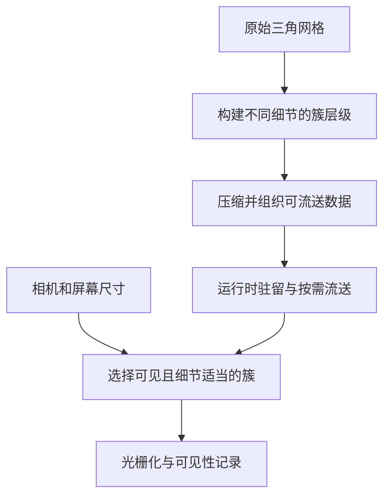
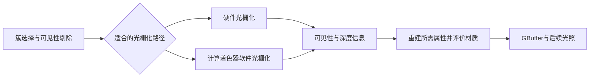
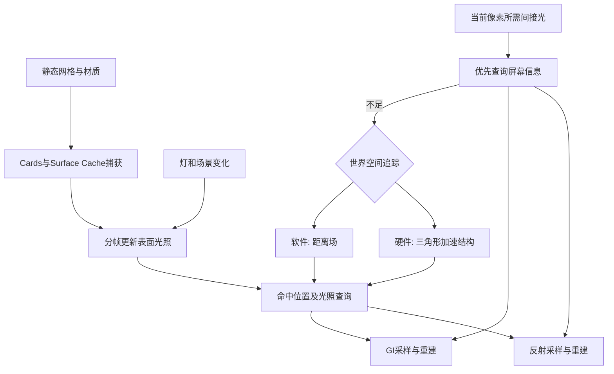

# 04 Nanite 与 Lumen

> 知识成熟度：L2。本轮核对公开官方文档与历史资料；原理解释和完整小场景是纸面教学方案。以下全部操作、画面判据、几何生成代码及参数对照均为 **PAPER_EXPECTED / NOT_RUN**，没有实际创建资产或运行 UE、GPU、编译、CVar、设备或性能实验。
> 版本基准：Lumen 主例采用访问时标题明确为 **UE 5.6** 的 S03、S04、S06；Nanite 当前公开说明 S01、S02 与渲染能力表 S13 实际返回 **UE 5.8**。这是两个文档基线的交集教学，不声称任何本机安装已验证，也不把 URL 的版本选择参数视为不可变源码 revision。涉及差异和冲突见第 6 节。
> 适用范围：桌面 Deferred Renderer、静态不透明网格、软件 Lumen 路线；先固定 Windows / DirectX 12 / SM6 的项目目标。硬件 RT 是独立可选分支，不是本例依赖；本文不据此承诺任何具体 GPU 的帧率或所有 UE5 小版本兼容。
> 最后更新：2026-10-10。补全“原理 → 合法自建资产与房间 → 正常观察与单变量对照 → 限制排障”；保留有用图解、调优用途、FAQ 和导航，校正无法由当前资料支持的绝对表述。
> 源码核对状态：未核对。本轮未读取引擎实现或 `Engine/Build/Build.version`。原文“本机 UE 5.8.0 / CL 55116800 / ++UE5+Release-5.8”的历史记录与原始命令表可在第 9 节所列原 Git 版本恢复，不作为本轮环境事实。

## 1. 先把“看见几何”和“看见反弹光”分开

房间里有一面红墙、一个白色球和一个金属球。靠近白球时，它的轮廓是否足够细，是几何表示问题；红墙能否把白色地面的暗部染红，是间接漫反射问题；金属球能否反映墙面的颜色和形状，是间接镜面反射问题。三者可以同时变化，原因却不同。

| 系统 | 主要回答的问题 | 本例中的作用 |
| --- | --- | --- |
| Nanite | 当前视角应保留哪些几何细节、哪些三角形最终可见？ | 为细分球选择和渲染适当的几何表示 |
| Lumen GI | 从别的表面反弹过来的漫反射光如何影响此处？ | 红墙到白地面、白球的颜色传递 |
| Lumen Reflections | 镜面方向及其粗糙度分布能看见什么间接反射？ | 金属球上的环境反射 |
| 直接光与阴影方法 | 灯光能否直接到达表面？ | 点光源照明及遮挡盒的直接阴影；本例固定使用 VSM |

Nanite 不替代材质、灯光、阴影和碰撞；Lumen 不要求场景全部为 Nanite。Nanite 能帮助 Lumen 高效更新部分表面捕获，但“勾选 Nanite”不等于“距离场已生成”“硬件 RT 已启用”或“Surface Cache 已覆盖”。直接阴影也不能仅凭 GI 方法名称判断。[S01] [S04]

阅读前只需认识 Static Mesh、材质和相机。本文重点是区分数据和观察；渲染线程、RDG、详细光源单位和源码调用链放在关联专题，不在这里重讲。

## 2. Nanite：为何离得远时不必处理每个原始三角形

### 2.1 构建、选择与流送是三件事

导入或启用 Nanite 时，引擎把原始三角网格加工成能表示不同细节的层级簇数据。运行时根据视角选择适当层级，并按需取得对应数据。这里仍然是三角网格；“虚拟化”并不意味着无限内存或任意复杂度都免费。[S01]

- **Cluster** 是一起参与几何处理的三角形簇。层级提供粗细不同的表示；不要理解成每个原始簇内部独立放着一套永不变边界的传统 LOD0/LOD1。
- **Group** 用来理解簇之间的组合及层级关系；跨簇边界必须保持一致，否则选粗细层级时会裂开。本文不认证某个引擎 revision 的构建算法。
- **Page** 是理解数据流送的单位；页的驻留与几何层级选择相关，但“选某层级”不等于“本帧立即从磁盘读完”。可用的驻留数据、IO 和更新预算仍限制结果。
- **包围体层级 / 剔除** 帮助跳过视锥外或被遮挡的数据。本文用它解释“减少无用工作”，不把场景实例结构和每资产的层级结构合成一个万能 BVH。

下图保留原文的“网格 → 簇层级 → 流送 → 渲染”主线，去掉把固定页尺寸和簇内 LOD 当作跨版本合同的标注：



原文约 128 三角形/簇、约 128KB/页是历史实现笔记，本轮没有取得对应版本实现来重新确认；理解机制不需要把这两个数设成资产制作约束。内存不足时也不能单凭总三角形数决定“应该够用”。

### 2.2 一个可手算的屏幕误差模型

假设简化前后某处表面相差 $\varepsilon$ 米，距离相机约 $z$ 米，视口高 $H$ 像素，垂直视场角 $\theta$。在小误差、近似正对相机的透视投影下：

$$
f_y=\frac{H}{2\tan(\theta/2)},\qquad
e_{px}\approx \frac{f_y\varepsilon}{z}
$$

取 H=1080、垂直 FOV=90°、误差 ε=0.01m，则 fy=540px。距离 10m 时约 0.54px；20m 时约 0.27px。若纸面阈值是 0.5px，同一份粗几何在远处更容易满足要求。**PAPER_EXPECTED**：拉远相机可允许更粗表示，轮廓在最终像素中仍近似稳定。

这是作者的投影推导，不是 Nanite 的完整误差公式、当前 CVar 定义或引擎数值输出。遮挡、角度、各向异性缩放、边界约束和实际选层算法都被省略；不能由它推断“每个像素恰好一个三角形”。

### 2.3 Visibility Buffer 与“两遍”的歧义

把处理拆成“先解决可见性，后评价材质”是有用的解释。可见性记录使后续阶段知道该像素对应的几何，再取得所需属性并输出 GBuffer。2021 年 Epic 作者演讲的 Visibility Buffer 段明确说明材质阶段写入 GBuffer；这不是每个三角形先完整着色再保留最近颜色。[S09]



原文“大三角形走硬件、小三角形走软件”的性能直觉可用于理解混合光栅化：小三角形容易浪费固定管线工作粒度。它不是当前所有材质、所有平台的精确分流规则。也不要把“可见性阶段 + 材质阶段”称为“两次光栅化同一批三角形”；两遍遮挡剔除的 Main/Post 统计又是另一件事。[S02] [S09]

图中没有把重心坐标承诺为所有版本 Visibility Buffer 的固定存储字段，也没有把材质阶段写成“从已有 GBuffer 读取完整材质”。这些实现细节需要指定 revision 后检查源码，本文不替代该工作。

## 3. Lumen：为何移动灯或换墙面颜色后，暗部会跟着变

### 3.1 从颜色传递追到场景表示

白灯照到红墙，墙面对不同波长的反射比例不同。墙反射出的光又到达白地面，因此地面即使没改材质，也可能带红色。Lumen GI 近似求解这类动态漫反射传播；它没有把白地面的 Base Color 改红。金属球的主要观察则是间接镜面反射，应该单独看 Lumen Reflections。[S03]

实时系统不能每帧把所有多次反弹完整算完，因此采用可重用的场景表示、采样、缓存及跨帧更新：

1. 对屏幕能提供的信息先做 Screen Traces。画面外和被遮住的信息不在当前屏幕里，所以还需要世界空间路线。
2. 软件路线查询 Mesh Distance Fields / Global Distance Field；硬件路线查询三角形加速结构。两者的几何覆盖、成本和误差不同。
3. Surface Cache 保存捕获的表面属性及更新的光照，供相交位置查询。Cards 的生成不等于离线烘焙完成整个关卡的动态光照。
4. GI 的探针采样、辐射缓存复用与时空重建帮助减少工作；它们不是每条反射射线都必须依次经过的同一条串行流水线。[S04]



图是职责图，不是已核对的源码调用顺序；硬件反射可选 Hit Lighting，因而不应将 Surface Cache 查询画成所有分支唯一的着色方式。Screen Probes 与 Radiance Cache 的实现和 MegaLights 的直接光采样详见关联源码专题，本文没有重新认证其中实现。

### 3.2 为什么用分开的厚墙、普通材质和固定曝光

小场景应先让三角几何、距离场和表面捕获容易对齐。厚的封闭盒比单面薄片更容易提供可靠的软件追踪表示；墙、地板、顶板分开建，也更容易捕获内表面。把家具和整个房间合成一张复杂网格，可能使某些内部表面无缓存覆盖。[S04]

反射也需要明确观察对象。粗糙度影响反射形状和采样；“SSR 不能做粗糙反射”不是它与 Lumen 的正确分界。这里关注的是屏幕之外是否仍有可查询的场景，以及查询到的几何和光照是否足够一致。曝光则会同时影响明暗，必须固定后再比较 GI。

## 4. 完整正常例：自建房间、白球和金属球

本节全部是 **PAPER_EXPECTED / NOT_RUN**。下面给出文件内容、尺寸、材质和比较顺序，使未来执行者无需寻找第三方模型。数值是教学输入，不是项目推荐预算；如果实际界面或支持面不同，应记录实际 UE 完整版本和差异，不能把本节自动标成运行通过。

### 4.1 项目与渲染配置

用一个新的 Games → Blank 项目，不复制现有生产项目的渲染设置。计划使用 Windows 11、D3D12 / SM6、受该 UE 版本支持的显卡与驱动；软件路线不要求 RTX / DXR，但 Nanite 自身的平台能力仍须满足。还须满足具体图形能力：S13实际返回5.8的 Nanite/VSM 表列出 DirectX 12 的 SM6.6 atomics、DirectX 12 Agility SDK支持与新驱动；本例选择该条件下的Windows 11，并在项目中启用SM6。其Vulkan替代项要求 VK_KHR_shader_atomic_int64，本例不切换到这条路线。S04的软件Lumen平台段以GTX 1070及以上为示例，和Nanite/VSM的能力条件需同时满足，不能只看“DX12显卡”字样。[S01] [S04] [S10] [S13]

在 Project Settings 中明确记录并设置：

| 位置 / 项 | 本例固定值 | 用意 |
| --- | --- | --- |
| Platforms → Windows / Default RHI | DirectX 12；D3D12 Targeted Shader Formats 勾 SM6 | 明确桌面图形路线 |
| Rendering / Forward Shading | 关闭 | 使用桌面 Deferred Renderer |
| Rendering / Dynamic Global Illumination Method | Lumen | 间接漫反射路线 |
| Rendering / Reflection Method | Lumen | 环境反射路线 |
| Rendering / Generate Mesh Distance Fields | 开启 | 准备软件追踪表示 |
| Rendering / Software Ray Tracing Mode | 显式选择 Detail Tracing | 不依赖 5.6 / 5.8 文档的不同默认值 |
| Rendering / Support Hardware Ray Tracing | 关闭 | 主例固定软件路线 |
| Rendering / Use Hardware Ray Tracing when available | 关闭；若前项关闭后不可编辑，记录其状态 | 避免设备自动改走硬件分支 |
| Rendering / Shadow Map Method | Virtual Shadow Maps | 固定直接阴影方案 |
| Anti-Aliasing Method | TSR | 固定重建条件 |
| Engine Scalability | Epic；记录 GI / Reflections 实际档位 | 避免 Low / Medium 档关闭 Lumen |

依界面提示重启，等资源构建完成，再继续。这里没有实际改配置、重启或验证该状态。新项目和迁移项目的默认设置不同，不能跳过这张记录。[S03] [S06]

创建 Empty Level，命名 `L_NaniteLumenRoom`。不添加 Sky Light、Directional Light、雾、发光面或 Reflection Capture；采用一盏可移动点光源，便于看清本例因果。只使用自建几何与常量材质，不需要商城、扫描资产或其他人的授权文件。

### 4.2 生成一份自有、封闭的细分球

下面是**作者编写的 Python 3 资产生成方案，PAPER_EXPECTED / NOT_RUN**；本轮没有运行、编译、导入或生成 OBJ。它只负责产生几何输入，不调用 UE，也不能验证 Nanite/Lumen。未来在一个新建的空目录保存为 `make_teaching_sphere.py` 后运行 `python make_teaching_sphere.py`；输出文件名已存在时会拒绝覆盖。

```python
from math import cos, sin, pi
from pathlib import Path

# Unit convention for the later import: one coordinate unit = one centimeter.
n_lat, n_lon = 64, 128
vertices = [(0.0, 0.0, 50.0)]  # north pole
for i in range(1, n_lat):
    theta = pi * i / n_lat
    for j in range(n_lon):
        phi = 2.0 * pi * j / n_lon
        radius = 50.0 + 3.0 * sin(8.0 * theta) * sin(6.0 * phi)
        vertices.append((radius * sin(theta) * cos(phi),
                         radius * sin(theta) * sin(phi),
                         radius * cos(theta)))
vertices.append((0.0, 0.0, -50.0))  # south pole

def ring(i, j):
    return 2 + (i - 1) * n_lon + (j % n_lon)  # OBJ indices start at 1

faces = []
for j in range(n_lon):
    faces.append((1, ring(1, j), ring(1, j + 1)))
for i in range(1, n_lat - 1):
    for j in range(n_lon):
        a, b = ring(i, j), ring(i, j + 1)
        c, d = ring(i + 1, j), ring(i + 1, j + 1)
        faces.extend(((a, c, d), (a, d, b)))
south = len(vertices)
for j in range(n_lon):
    faces.append((ring(n_lat - 1, j), south, ring(n_lat - 1, j + 1)))

lines = ["o TeachingWavySphere", "s 1"]
lines.extend("v {:.8f} {:.8f} {:.8f}".format(*v) for v in vertices)
lines.extend("f {} {} {}".format(*f) for f in faces)
with Path("TeachingWavySphere.obj").open("x", encoding="ascii", newline="\n") as out:
    out.write("\n".join(lines) + "\n")
```

索引纸面核算：中间 63 圈 × 128 点，加两个极点，共 8066 个顶点；两个极区各 128 个三角形，中间 62 段各 256 个，共 16128 个三角形。模运算封闭经度接缝；极点只写一次；每个四边区间拆成两个朝外三角形。半径始终为正。**这些是代码结构推导，不是文件解析结果或已通过的网格验证。**

未来导入时：

1. Content Browser 创建 `/Game/NaniteLumenLesson/`，导入 OBJ 为 Static Mesh，命名 `SM_TeachingSphere_Nanite`；Import Uniform Scale=1，Normal Import Method 选 Compute Normals。无需导入材质或纹理；保留生成的简单拓扑，不使用自动重拓扑。
2. 本方案用厘米坐标。打开 Static Mesh Editor 核对 Bounds 尺寸约 100cm（起伏可能略超出），实例缩放保持 (1,1,1)。若导入器单位转换导致尺寸不符，先修正导入尺度并重新导入，再建场景；不能靠把极小资产放大数百倍后继续距离场比较。
3. 在 Nanite Settings 勾 Enable Nanite Support、Apply Changes 并保存，等构建完成。保留该教学球的常规碰撞设置；本例没有物理实验。材料用下一节普通 Opaque 材质。
4. 可复制为 `SM_TeachingSphere_Traditional`，仅对复制资产关闭 Nanite，供几何对照。不要修改引擎自带资产，也不要以一个 Asset 的全局修改冒充两个独立版本。

如果不打算运行生成器，可在 Modeling Mode 的 Create → Sphere 自建球体并输出 Static Mesh，但必须记录所用 subdivisions 与实际三角形数，不能沿用上面 OBJ 的 8066/16128 纸面计数。正常路线采用上面的固定输入。[S01] [S08]

### 4.3 材质与房间的具体输入

在材质编辑器创建三个 Opaque、Default Lit、Two Sided 关闭的材质；不连接 WPO、Opacity、Pixel Depth Offset、Normal 或 Emissive。Base Color 通过 Constant3Vector 连接，Metallic / Roughness 通过 Constant 连接。下表 RGB 是线性输入，不是十六进制 sRGB 色值：

| 材质 | Base Color | Metallic | Roughness | 用途 |
| --- | --- | --- | --- | --- |
| `M_LessonWhite` | (0.7, 0.7, 0.7) | 0 | 0.8 | 墙、地面、白球、遮挡盒 |
| `M_LessonRed` | (0.65, 0.03, 0.03) | 0 | 0.8 | 一面红墙，作为颜色反弹来源 |
| `M_LessonMetal` | (0.8, 0.8, 0.8) | 1 | 0.15 | 观察粗糙镜面环境反射 |

房间使用 Modeling Mode → Create → Box，Output Type=Static Mesh、Pivot=Centered，按尺寸建独立封闭盒；完成每个形体后 Accept、保存，再在 Details 填位置。每个尺寸不同的盒分别建资产，Actor Scale 保持 (1,1,1)。宽/深/高对应世界 X/Y/Z；全部旋转为 (0,0,0)。这避免用很小的源网格任意放大后误判距离场质量。[S08]

| Actor | 尺寸 X×Y×Z，cm | 位置 X,Y,Z，cm | 材质 |
| --- | --- | --- | --- |
| Floor | 620×520×20 | (0,0,-10) | White |
| Ceiling | 620×520×20 | (0,0,310) | White |
| Wall_PosX | 20×520×300 | (310,0,150) | White |
| Wall_NegX | 20×520×300 | (-310,0,150) | White |
| Wall_PosY | 600×20×300 | (0,260,150) | White |
| Wall_Red | 600×20×300 | (0,-260,150) | Red |
| Blocker | 50×100×100 | (-20,-100,50) | White |
| Sphere_White | 使用生成球，Scale=1 | (100,-150,55) | White |
| Sphere_Metal | 使用同一生成球，Scale=1 | (100,100,55) | Metal |

内空间约 6m×5m×3m，墙厚 20cm。相邻盒在接缝处相接或重叠，不留意外缝隙。房间盒保持普通静态网格即可；两球显式使用 Nanite 资产。所有网格 Cast Shadow 保持开启，软件路线的 Affect Distance Field Lighting 保持开启。**Nanite 球与普通墙共存，是正常配置。**

加入 Point Light，Mobility=Movable，位置 (-150,-120,220)cm，白色，Intensity Units=Lumens，Intensity=3000，Use Inverse Squared Falloff 开启，Attenuation Radius=1000cm，Source Radius=10cm，Cast Shadows 开启，Indirect Lighting Intensity=1。这里不通过提高间接光倍率放大现象，以免 Screen Traces 带来视角相关混淆。[S04] [S12]

加入 Post Process Volume，勾 Infinite Extent (Unbound)。固定曝光：Metering Mode=Auto Exposure Histogram，勾选属性覆盖后设 Min EV100=Max EV100=4、Exposure Compensation=0；如果所用版本仍显示 Min/Max Brightness，先确认该项目的扩展亮度范围和对应曝光设置，不直接把 4 当成旧单位填写。保持色彩分级默认，Bloom Intensity=0，以减少亮晕干扰。Local Exposure 固定为 Bilateral，Highlight Contrast=Shadow Contrast=Detail Strength=1，Middle Grey Bias=0，相关曲线不指定，避免局部对比补偿混淆观察。主观察不需要 PIE 或蓝图：使用开启 Realtime 的编辑器 Lit 视口，并确认曝光使用 Game Settings，未启用编辑器 EV100 覆盖。[S11]

放 Camera Actor 于 (-240,50,150)cm，Rotation=(Pitch=-12°, Yaw=-5°, Roll=0°)，FOV=90°；从相机 Pilot 查看室内。相机应在墙内而非背面之外。记录固定机位和窗口分辨率，供后续比较。

### 4.4 正常路线的观察顺序

以下每一行均为 **PAPER_EXPECTED**，没有实测截图、像素值、收敛时长或性能数值。

| 步骤 | 实际执行者应做的操作 | PAPER_EXPECTED：应该检查什么 | 为什么能帮助判断 |
| --- | --- | --- | --- |
| A. 确认可见几何 | 在 Lit 视口查看两球；切 Nanite Visualization → Triangles，再恢复 Lit | 两球在 Nanite 可视化中显示有效的几何细节；普通墙不应被误当成已开启 Nanite | 先核实几何路线，避免仅凭资产复选框推断最终路径 |
| B. 看几何选层 | 单独在 Static Mesh Editor 查看 Nanite 球，切 Triangles；近看后拉远，再靠近 | 选出的几何细节可随屏幕尺寸变化，轮廓大体稳定；不要求特定三角形数或颜色 | 固定资产而改变投影，是屏幕误差模型的可见入口 |
| C. 看间接漫反射 | 恢复室内固定机位，观察红墙附近白地面、白球暗侧和遮挡盒后方 | 红墙可能使邻近白表面带红色，遮挡区域仍可能有反弹光；强弱随几何与采样而变 | 白材质没有改变，颜色来源是场景光传递 |
| D. 看环境反射 | 观察金属球，保持光源和机位不变 | 球上反射有房间形状和墙色；粗糙度0.15不应被当成完美镜子 | 将间接镜面反射与漫反射色渗分开 |
| E. 看表示是否一致 | View Mode → Lumen → Overview / Surface Cache；Show → Visualize → Mesh Distance Fields | 关键内表面应有合理表示；关注粉色无覆盖区域、消失的厚墙和粗糙错误形状 | 最终 Lit 能看见，不足以证明世界空间表示正确 |
| F. 动态改变 | 把点光源3000改成1500 lumens，机位、曝光、材质保持不变；等待画面稳定后还原 | 直接项与间接项都应总体减弱；间接更新可滞后，不能要求同一帧跳变 | 区分灯的变化、缓存传播和曝光补偿 |

如果 A 或 E 无法满足，先按第 7 节查原因。不要继续把后面的图像变化宣称为 Nanite 或 Lumen 的成功证据。若实际结果和预期不同，也不能调参数到“看着像”后删去失败记录。

### 4.5 用单变量对照把因果讲清

先保存基线关卡和截图，再逐项改，改完还原；每次都保持曝光、灯和相机一致。下列仍为 **PAPER_EXPECTED**：

1. **仅改变反弹源颜色**：把红墙的 Base Color 改为 (0.03,0.65,0.03)，其他材质不动。预期邻近白表面的间接染色向绿色变化，金属反射也随墙色改变。白材质本身仍为 (0.7,0.7,0.7)。不要同时把灯也改绿，否则无法区分直接照明。
2. **仅比较 GI 贡献**：先为这一项建立专用基线：在 Unbound Post Process Volume 中将 Reflection Method 覆盖为 None，Global Illumination Method 保持 Lumen；保存此时画面。然后只把 GI 改为 None，两态均固定 Reflections=None，灯、材质、曝光、相机和VSM不变，主要比较白色非金属表面的暗部。预期间接漫反射贡献减少，直接点光和直接阴影仍在；将GI恢复Lumen后可与该专用基线复比。不能承诺所有暗处必为纯黑，也不能由视觉差异换算“反弹次数”。之所以先固定反射为None，是因为本例关闭硬件RT，而S03明确独立于Lumen GI的Lumen Reflections需要硬件RT，不能假定GI关闭后软件反射仍有效。[S03]
3. **仅关闭反射**：先恢复GI=Lumen、Reflections=Lumen的原始基线并保存画面；随后仅把Reflection Method覆盖为None，GI始终保持Lumen。预期金属球的环境反射发生明显变化，但直接点光源的高光不必消失。这个对照检验的是反射贡献，不是“所有镜面照明”；比较完恢复Reflections=Lumen，再继续后续观察。
4. **仅比较 Nanite 与普通球**：在独立几何对照中用同一位置、材质和原始网格，分别启用两个球资产；一次只显示一个。预期两条几何路线都能被正常光照；区别应从各自可视化和几何负载证据判断。不能从“普通球仍被 Lumen 照亮”推断 Nanite 没有效果，也不能由高面数自动推出它更快。
5. **屏幕追踪对照**：在关卡视口 Show → Lumen 中临时关闭 Screen Traces，再检查相同视角的缓存与最终图。预期更容易暴露世界空间表示不匹配；恢复后屏幕信息可能掩盖部分问题。此观察不等于“Lumen 就是 SSR”，也不要求开关前后完全一致。[S04]

给每张未来截图记下“实际引擎版本 / 机位 / 渲染路线 / 更改项 / 还原状态”。在获得这些证据前，本文表格中的状态始终为 PAPER_EXPECTED，不勾选“通过”。

## 5. 软件追踪与硬件追踪：怎样选择同一例的可选分支

主例的软件路线以距离场寻找世界空间命中。它能在不依赖硬件 RT 的条件下工作，但无法仅凭主视图中的所有变形三角形重建相同几何；软件 Lumen 的 WPO 限制与 Nanite 材质支持 WPO 是两个不同合同。[S04]

若未来要研究硬件分支，另存项目副本，先核该版本支持的 OS、RHI、驱动和显卡，再开启 Support Hardware Ray Tracing、Use Hardware Ray Tracing when available，依提示启用 Compute Skin Cache 等依赖并重启。S04 列出的 Windows 硬件路线为 DirectX 12、NVIDIA RTX 2000 系或 AMD RX 6000 系及以上；S13还明确要求项目启用SM6，并列Intel Arc A系及以上。两表范围不同，不能把5.8列表直接补写成5.6已验证设备；S04平台表另列 Linux/Vulkan。本文只固定 Windows 主例，不把该列表扩写成完整设备认证。[S04] [S13]

反射若要比较 Surface Cache 与 Hit Lighting，应在硬件路线确认后明确选择 Ray Lighting Mode。Hit Lighting 改变命中后的光照评价，不等于自动修复所有几何缺失。Nanite 主视图与硬件追踪使用的 Fallback Mesh 可能不同；必须记录实际追踪几何。原生 Nanite RT 的实验开关也不是本文默认配置。[S01] [S04]

本例只需静态不透明物件，先把软件正常路线弄清。加入骨骼网格、玻璃、WPO、大量重叠实例或大世界，会引入新的场景表示和成本，应该独立建立输入和判据，而不是继续沿用这张小房间表。

## 6. 版本与平台：保留实际读到的差异

来源核对日期为 2026-10-10。下面并列记录，不据页面标题替引擎裁决，也不把公开文档互相不一致的句子拼成一个保证。

| 问题 | 固定5.6页 / 历史资料实际表述 | 默认页实际返回5.8的表述 | 本文处理 |
| --- | --- | --- | --- |
| 软件追踪默认模式 | S04 将 Detail Tracing 记为默认 | S05 将 Global Tracing 记为默认 | 主例显式选择 Detail Tracing，记录运行时实际设置 |
| lightmap 与 Lumen | S03的5.6 Additional Notes已说明独立Lumen反射可与烘焙光照配合，要求硬件RT并自动启用Hit Lighting；同为5.6的S04却仍把反射搭配lightmap描述为未来扩展，且明确Lumen GI不能与静态lightmap并用 | S05：GI仍不并用；反射可搭配lightmap | 同版本官方文档也不一致，本文不裁定能力引入版本；独立反射的明确配置合同按S03记录，必须核硬件RT前提。本例维持软件路线，GI对照两态均固定反射None，不测试烘焙混合 |
| 移动端renderer | S07明确为5.4+实验性的高端Android Vulkan SM5桌面renderer；不支持iOS/tvOS/iPadOS | S04、S05的平台段使用Android Vulkan + Mobile Renderer表述 | 两种官方表述存在冲突；不宣称普通移动渲染路径普遍支持，也不写所有移动端绝不支持；主例不覆盖移动端 |
| Nanite材质 | S10的5.1发布说明已列Masked、Two Sided、PDO和WPO beta | S01列Opaque/Masked与有限WPO，并列静态位移和Nanite Tessellation专题 | 撤去“Masked从5.2才有”“始终无位移/细分”的绝对表；主例只用Opaque常量材质 |
| Nanite地形、骨骼与新内容 | S10已列5.1的实验性Nanite Landscape；不能沿用“5.4首次” | S01包含Skeletal Mesh、Landscape、Foliage、Spline等不同专题 | 不从当前目录倒推每项历史引入版本；它们不属于本文静态球正常例 |
| 切线说明 | 本轮没有读取5.6 Nanite正文：指定URL返回仅标题占位 | S01仍写未来支持显式切线，而S02已有Explicit Tangents设置 | 原文逐顶点切线绝对表不升级为当前结论；本文常量材质不依赖该项 |

此外，Lumen 技术页的开头说硬件 RT 默认启用，而软件段又写默认使用 SDF；这不足以确定任意项目的初始选择。新建模板、迁移设置和“硬件可用时”条件都应记录，所以本文显式关闭硬件分支。不同页面的默认描述不能代替真实项目设置。

当前公开文档列出 Nanite / Lumen 对 Forward、VR 等限制；移动端、macOS、Linux或其他主机不能只按“PC / 主机”两个大类套用本例。缺少相应版本/RHI/设备证据时，应先查对应平台资料，再选择传统几何、烘焙、SSGI或其他可用方案，而不是仅改一个开关。[S01] [S04] [S07]

## 7. 限制、代价与排障：先看哪份表示出错

| 症状 | 先核对的证据 | 合理下一步与停止条件 |
| --- | --- | --- |
| Nanite可视化里没有球 | 实际RHI/SM、平台支持、资产是否构建并应用、组件是否禁用Nanite、输出日志 | 修复支持或资产问题后重做A；不能把“复选框已勾”当成功 |
| 球有默认/错误材质 | Blend Mode、日志提示、是否误用了Translucent、WPO等额外特性 | 先恢复本例Opaque常量材质；不立刻归因于光照 |
| 房间内漏光 | 接缝、厚度、法线、Mesh Distance Fields、实例缩放 | 恢复封闭厚盒与真实资产尺寸；若仍失败再查追踪覆盖，不能无限抬高全局质量 |
| Surface Cache大面积粉色 | 哪个关键表面没有覆盖、是否把整房间并成一网格 | 先分回墙/地/顶等模块；再研究Max Lumen Mesh Cards。粉色是覆盖问题，不是材质粉色 |
| 金属球反射黑块或形状不符 | Lumen Reflection View、缓存覆盖、小物体是否被裁、硬件分支的Fallback Mesh | 针对缺失表示处理；降低粗糙度或加亮曝光不能证明已修复 |
| 红色渗色不明显 | 白材质、红墙是否照亮、曝光是否固定、GI实际启用、观察区域是否主要被直射照亮 | 使用白球暗侧和遮挡后地面比较；不预设必须达到某个红色像素值 |
| 改灯后变化慢、移动相机出现补光 | 视口Realtime、缓存更新、相机速度、是否仍在构建 | 等画面稳定再比较；记录过程。没有本机证据时不承诺几帧收敛 |
| 画面持续噪声或拖影 | 采样/更新条件、相机运动、实际AA方式、极小高亮发光面 | 先恢复本例灯和材质；保留TSR作为控制变量，不声称关闭TAA必使所有Lumen去噪失效 |
| 更密几何却更慢 | 分辨率、材质、遮挡/overdraw、驻留/IO、VSM、Lumen更新及目标GPU计时 | 先测哪一段成本增加；小场景无性能证据时停止“Nanite一定更快”的结论 |

**反例解释**：用单面 Plane 代替20cm厚墙，即使主视图正面看起来封闭，也没有等价的软件距离场表示；因此“Lit里看到一堵墙”不是充分条件。把整间房与家具合并，则可能使部分内表面难以捕获。反例用于检查机制，不能当成建议的生产搭建方式。[S04]

半透明不等于“一律无GI”。S03说明 Lit Translucency 与体积雾可得到较低质量GI，高质量半透明反射有前层条件；这与“不透明Nanite网格材质支持”又是两条支持轴。玻璃水面应转入对应专题，不用 Emissive 冒充已解决照明。

碰撞也另有表示：Nanite高细节画面不保证精确逐三角碰撞。S02列出Fallback Mesh在碰撞、烘焙和部分RT场景中的用途；本例无碰撞测试，不扩展到Gameplay正确性。

## 8. 性能观察、控制台与运行时代码的正确用途

### 8.1 预算仍然存在

Nanite 改变几何处理和数据驻留的成本结构；实例数量、材质复杂度、像素量、遮挡与流送仍会花费资源。Lumen 则需要维持场景表示、采样和更新。优化一个系统不会自动降低另一个系统的成本。

历史原文的“低端2–5ms或更多”没有附可重现测量配置，不能用作本机预算。S06给出的4ms / 8ms分别是特定主机1080p内部渲染条件下60/30fps档位的目标，不是本文房间测量值，也不是整个帧时间。S02的特定演示资产压缩数值同样不能按三角形数线性预测本项目包体。

未来有权运行时，先固定相机、输出与内部渲染分辨率、引擎/驱动、材质、档位、冷/热缓存口径，再分别看GPU、显存、IO及画面差异。不要把文档CI、Markdown检查、资产构建完成或CPU侧代码执行称作渲染验证。

### 8.2 保留原命令的排查用途，不将它们当成万能配置

以下是**REFERENCE_ONLY / NOT_RUN**。它们用于定位应查哪一类状态；本轮没有查询帮助、读取实际值或执行命令。

| 名称 / 入口 | 用途 | 本文证据边界 |
| --- | --- | --- |
| Nanite Visualization → Triangles / Clusters / Overdraw | 观察几何细节、簇和重叠 | 用于未来A/B对照；颜色不是毫秒 |
| `NaniteStats` / `NaniteStats List` | 查该版本可用的Nanite视图统计 | S02公开说明；字段以实际输出为准 |
| `r.Nanite` | 控制Nanite路线，理解Fallback与传统绘制差异 | 不保证关闭后性能或画面无损 |
| `r.Nanite.Streaming.StreamingPoolSize` | 研究驻留池与IO/内存取舍 | S02支持名称和用途；本文不认证默认512MB |
| `r.Lumen.Visualize.CardPlacement 1` | 查看Cards布置 | S04/S05文档入口；未执行 |
| `r.DistanceFields.LogAtlasStats 1` | 距离场atlas统计 | S04/S05文档入口；不是Nanite几何流送池 |
| `stat gpu` | 未来定位GPU各阶段成本 | 原文用途保留；未采样，具体标签依版本 |
| `stat nanite`、`r.Nanite.MaxPixelsPerEdge`及旧文其他CVar | 历史排查笔记 | 未读取当前命令注册/默认值；不能照旧表认定支持和单位 |

原文的 C++ / 蓝图“高低画质”意图是让设置界面控制预算；它不能完成平台兼容性检查、生成距离场、建立烘焙数据或启用所有构建依赖。保留其代表性写法如下，但它只是**历史调用形式示意，未编译、未核当前API/CVar，不能直接作为生产档位实现**：

```cpp
// REFERENCE_ONLY / NOT_RUN: historical command-dispatch sketch.
// A valid World and supported command registration are prerequisites.
GetWorld()->Exec(GetWorld(), TEXT("r.Lumen.DiffuseIndirect.Allow 1"));
GetWorld()->Exec(GetWorld(), TEXT("r.Lumen.Reflections.Allow 1"));
// Turning these off removes contributions; it does not create baked lighting.
GetWorld()->Exec(GetWorld(), TEXT("r.Lumen.DiffuseIndirect.Allow 0"));
GetWorld()->Exec(GetWorld(), TEXT("r.Lumen.Reflections.Allow 0"));
```

未来的蓝图设置流程应是：用户选已定义档位 → 检查该构建的允许选项 → 应用已核实的设置 → 记录实际值和画面 → 允许还原。不能将“调用 Rebuild 或等待”当作所有 Lumen 切换的标准步骤，也不能承诺在没有烘焙数据的本例中关闭 GI 后自动得到 Lightmass。

## 9. FAQ、历史贡献与关联阅读

### Q1：有 Lumen 就必须给每个物体开启 Nanite 吗？

不必。主例故意让普通墙与Nanite球共存。高面数内容的捕获效率是启用Nanite的理由之一，是否正确参与光照仍需检查世界空间表示和缓存覆盖。

### Q2：Nanite是不是让三角形预算、VSM是不是让阴影分辨率预算失效？

不是。原文口号表达了虚拟化减少人工管理的目标，不能当成本无限的结论。应按可见几何、材质、像素、阴影更新、内存与IO分别看成本。

### Q3：为什么关了反射后金属球仍有亮点？

局部灯的直接镜面高光与环境间接反射不是同一个贡献。用固定灯、固定粗糙度的对照观察，不以“画面仍有高光”判定开关无效。

### Q4：能把Lumen与烘焙按房间自动混用吗？

不能沿用这个概括。Lumen GI与静态lightmap、独立Lumen反射与lightmap是不同合同。S03的5.6页已说明独立反射支持烘焙照明，前提是硬件RT，并会自动启用Hit Lighting；同为5.6的S04仍写“未来扩展”，与S03矛盾。第6节将它们与S05的5.8表述并列，不推断这项能力到5.8才出现。本文的软件动态房间没有验证独立反射或烘焙混合路线。[S03] [S04] [S05]

### Q5：暗部偏灰是否应该直接改对比度或间接光强度？

先确认曝光、材质、光源、场景表示和GI是否符合意图。色彩分级可以用于美术表达，但不能遮蔽漏光或错误表示，并把掩盖后的画面称为技术修复。

### Q6：移动端、VR或自定义描边呢？

本文不覆盖这些目标。必须分别核平台、renderer与特性，不把“移动端全部不支持”或“只要Vulkan就支持”当结论。描边、Custom Depth/Stencil及替代网格有不同成本和支持条件，转到后处理专题按真实版本核对。

### 历史贡献与本次修订的关系

- [2026-08-05 的 d294ec8 校订](https://github.com/fantuan812/learning/commit/d294ec876825038e6ed8c16b363d0ca811d414f0)确实修订了流送池CVar、Lumen硬件RT开关、旧Method命令和统计名等内容。这里保留其历史贡献，不将本文描述为首次技术改动；当时“5.8已移除/默认值”的验证环境本轮未重演。
- 之后的版本元数据、成熟度补标、OKF frontmatter和目录迁移也是已有维护。原文关于几何流送、混合光栅化、动态色渗、屏幕与世界追踪、缓存和性能取舍的有效教学意图，在本文对应章节继续保留。
- [本次修订前的完整正文](https://github.com/fantuan812/learning/blob/a0189945b33f20e7f2fb29c9ac38cd17cedd6bd7/知识/04-图形动画与物理仿真/渲染管线与光照/04-Nanite与Lumen.md)保留原图、原CVar/代码、版本简表及所有措辞。本文将无法支持的精确常量和绝对结论移到历史身份，不把它们继续推荐为当前操作合同；未改动书籍、工作日志或附件。

### 关联阅读

- [01 渲染管线概览](01-渲染管线概览.md)：线程、Pass与渲染调度职责
- [03 光照与阴影系统](03-光照与阴影系统.md)：光源、VSM、直接阴影与GI的选择
- [02 材质系统详解](../材质地形与世界表现/02-材质系统详解.md)：PBR输入及材质表达
- [05 后处理与画面特效](05-后处理与画面特效.md)：曝光、最终呈现和后处理
- [35 Nanite源码](35-Nanite源码.md)：进一步追踪实现的入口，阅读时仍需核其版本与证据
- [30 Lumen与MegaLights源码](30-Lumen与MegaLights源码.md)：缓存、探针和直接光采样的实现主题；本篇未认证其源码节选
- [本目录导航](README.md)

## 10. 来源定位与验证边界

| 编号 | 实际核对对象 | 支持范围与限制 |
| --- | --- | --- |
| S01 | [Nanite Overview，返回5.8](https://dev.epicgames.com/documentation/en-us/unreal-engine/nanite-virtualized-geometry-in-unreal-engine)，How does Nanite work / Enabling / Supported Features | 层级与流送、资产启用、支持边界；不是源码实现核对 |
| S02 | [Nanite Technical Details，返回5.8](https://dev.epicgames.com/documentation/en-us/unreal-engine/nanite-technical-details)，Fallback / Precision / Visualization / Console Variables | Fallback用途、调试入口、流送成本；不是本机命令dump |
| S03 | [Lumen GI and Reflections，5.6](https://dev.epicgames.com/documentation/en-us/unreal-engine/lumen-global-illumination-and-reflections-in-unreal-engine?application_version=5.6)，Getting Started / Lighting Features / Settings / Additional Notes → Using Lumen Reflections with Baked Static Lighting | GI、反射、配置及半透明边界；独立反射要求硬件RT且自动启用Hit Lighting，已与同版本S04矛盾表述并列 |
| S04 | [Lumen Technical Details，5.6](https://dev.epicgames.com/documentation/en-us/unreal-engine/lumen-technical-details-in-unreal-engine?application_version=5.6)，Surface Cache / Ray Tracing / Limitations / Visualization | 软件与硬件区别、厚墙模块化、缓存覆盖与排障 |
| S05 | [Lumen Technical Details，返回5.8](https://dev.epicgames.com/documentation/en-us/unreal-engine/lumen-technical-details-in-unreal-engine)，同名小节 | 只用于并列版本差异和补充边界，不覆盖5.6主例 |
| S06 | [Lumen Performance Guide，5.6](https://dev.epicgames.com/documentation/en-us/unreal-engine/lumen-performance-guide-for-unreal-engine?application_version=5.6)，Scalability | 特定目标预算与档位；无本文性能测量 |
| S07 | [Lumen on Mobile，5.6](https://dev.epicgames.com/documentation/en-us/unreal-engine/using-lumen-global-illumination-on-mobile-in-unreal-engine?application_version=5.6)，Compatibility / Limitations | 高端Android桌面renderer实验路线；与技术总页措辞冲突保留 |
| S08 | [Predefined Shapes，5.6](https://dev.epicgames.com/documentation/en-us/unreal-engine/predefined-shapes-in-unreal-engine?application_version=5.6)，Output Type / Shape / Positioning | Modeling的Static Mesh输出、尺寸与中心枢轴；尺寸表与OBJ由作者设计 |
| S09 | [Epic作者Nanite演讲，SIGGRAPH 2021](https://advances.realtimerendering.com/s2021/Karis_Nanite_SIGGRAPH_Advances_2021_final.pdf)，Visibility Buffer检索段；[课程来源页](https://advances.realtimerendering.com/s2021/) | 已核作者、主题与返回的材质写GBuffer段；PDF整页因长度限制未取得，不称完整演讲已读 |
| S10 | [UE5.1 Release Notes](https://dev.epicgames.com/documentation/en-us/unreal-engine/unreal-engine-5.1-release-notes?application_version=5.1)，Nanite Improvements / DX12 SM6返回段 | 修正历史支持年份；不据旧说明保证5.8所有行为 |
| S11 | [Auto Exposure，5.6](https://dev.epicgames.com/documentation/en-us/unreal-engine/auto-exposure-in-unreal-engine?application_version=5.6)，Histogram / Local Exposure / Editor Viewport Override | 固定曝光及避免视口覆盖；EV100=4为作者示例输入 |
| S12 | [Point Lights，5.6](https://dev.epicgames.com/documentation/en-us/unreal-engine/point-lights-in-unreal-engine?application_version=5.6)，Mobility / Light Properties | 局部灯的配置用途；3000lumens与位置为作者输入 |
| S13 | [Onboarding Licensees，返回5.8](https://dev.epicgames.com/documentation/en-us/unreal-engine/onboarding-licensees-in-unreal-engine)，Requirements for UE5 Rendering Features | 只核Nanite/VSM的atomics、SDK、SM6与驱动条件及硬件RT的SM6；不把其其他安装/账号说明作为本例步骤 |

获取限制也属于证据：指定5.6的Nanite概览本轮仅返回标题占位；指定5.8参数的该页无法通过工具获取，默认页实际标题为5.8且返回了正文。没有把空页当全文支持，也没有把5.6/5.8互相冲突的描述静默合并。

**本轮实际完成**：文档与Git历史静态阅读、正常例设计、来源与链接预检。**未完成/未运行**：OBJ生成与解析、UE导入、Nanite构建、距离场与Cards检查、材质/关卡创建、控制台、蓝图/C++编译、渲染画面、硬件路线、设备兼容性和性能。文档检查或CI即使通过，也只说明文档门禁结果；全文不升为L3/L4，`verified`仍为空。
