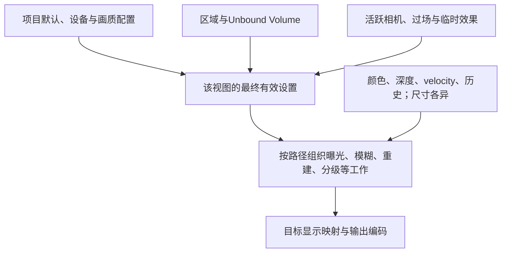
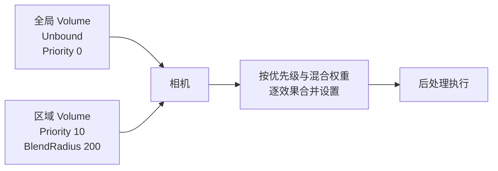
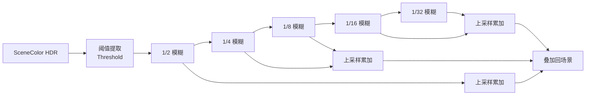
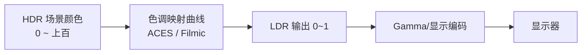

# 05 UE5 后处理与画面特效

> 知识成熟度：L2（公开官方资料静态核对；纸面推导与操作方案，不含引擎、GPU或显示设备实测）。
> 版本基准：主要采用 Epic 标题标明 UE 5.6 的固定版本文档；相机 API、材质插入枚举和移动能力矩阵补充采用明确标出的 UE 5.5 页面。本文不把这些资料合成为同一个引擎 checkout。
> 适用范围：理解后处理设置的来源、曝光与显示映射、效果取舍、自定义材质及排查工作流；平台和渲染路径另列。旧稿 UE 5.8.0 / CL55116800 是历史声明，本轮未复核。
> 最后更新：2026-10-09，重写后处理主责的因果解释、正反例、控制归属和验收边界；旧文及不同 Git 版本在末尾可逆保留。
> 证据范围：核对[Post Process Effects（S01）][S01]等公开文字和 API 文档；未运行 UE、PIE、编译、Shader、GPU、截图、校色、配置修改或性能实验。本文所有图、代码、示例数值和预期结果均为纸面条件，不能当作设备观察或性能预算。

## 1. 概述：先分清谁设参数、在哪一阶段用、最终如何显示

同一盏灯、同一个材质，进入洞穴后可能先黑再亮；切换相机后 Bloom 会变强；降低内部渲染分辨率后细节可能需要几帧才能稳定。这些现象分别牵涉曝光状态、设置来源与时间重建，不能只靠“增加后期强度”解决。

后处理并非对一张最终图片顺序执行所有效果的固定串行列表。某些效果需要场景线性颜色、深度、运动矢量或历史；一些运行在内部尺寸，另一些在重建后的输出尺寸。GI、AO和反射虽可能在 Post Process Volume 里配置，也不因此全变成最后的二维滤镜。线程、BasePass、光照与呈现的主责见[渲染管线概览](./01-渲染管线概览.md)。

本文要解决六个实际问题：

1. 给定默认设置、Volume、相机和画质选项，找出实际生效的参数来源
2. 区分曝光、线性色彩、颜色分级与显示映射，判断调节方向
3. 选择 Bloom、DOF、运动模糊、AA/TSR及风格效果，并说明适用条件与代价
4. 用正确的输入、插入点和 UV 构造一个最小后期材质
5. 动态切换画质或临时效果时，保留设置归属并能安全恢复
6. 用受控对照和目标平台视觉验收定位问题，而非套用统一毫秒预算



图是纸面职责图；箭头不证明实际引擎调用顺序或各层绝对优先级。

## 2. 核心概念：设置拥有者与 Volume 混合

### 2.1 不把 Volume 当作唯一设置来源

| 来源 | 应负责的内容 | 排查时必须记录 |
| --- | --- | --- |
| 项目默认 | 没有局部覆盖时的起点 | 具体项目与默认渲染设置 |
| 全局 Unbound Volume | 场景整体风格 | 实际对象、Enabled、Priority、Blend Weight、勾选的覆盖项 |
| 区域 Volume | 某区域的增量风格 | bounds、相机位置、Blend Radius、与其他体积重叠情况 |
| 活跃相机 | 镜头专属后处理 | 当前 view target、PostProcessSettings、PostProcessBlendWeight |
| 过场/玩法临时效果 | 有始有终的覆盖 | 启动者、释放条件、相机切换、打断和销毁 |
| 设备/Scalability/用户配置 | 能力与质量选择 | 平台、渲染路径、实际质量档和最终值；是否另有CVar覆盖 |
| 编辑器视口 | 查看与调试 | 是否使用Game Settings、独立曝光/Screen Percentage覆盖 |

S01明确没有放置Volume也有默认后处理；删除全局Volume不会自动移除色调映射。S12明确相机有后处理设置和权重，但它是5.5 API页，不是对任意CameraManager、Sequencer或插件组合的排序证明。

### 2.2 Priority、权重、半径与属性覆盖是不同条件

- Enabled 决定体积是否参与；Unbound 忽略空间边界，不等于忽略权重、Priority或逐属性覆盖
- Blend Radius 是世界单位的过渡区域；不要把它当成某效果的模糊半径，也不要仅凭相机已过几何边界判断贡献已归零
- Blend Weight 控制贡献程度；较高Priority不是无条件用一整份设置替换所有低Priority字段
- 普通后处理属性的覆盖勾选决定该字段是否参与；未勾选的字段不会因“这个Volume优先级高”就清除下层结果
- 重叠且Priority相同的体积没有可依赖的固定先后，不能靠放置顺序维持成片效果
- Volume是空间影响体积，不限于“必然长方体”的教学假设。复杂重叠与非可插值属性需要专项观察

以上混合合同来自S01；材质实例参数的混合另见3.8，不可套用普通属性勾选规则。

**PAPER_EXPECTED P01：只追踪一个可线性混合的标量。** 输入假设：全局已经给Bloom Intensity=0.8；唯一更高优先级区域勾选该项、值2.0，当前有效混合权重恰为0.5；无相机、其他Volume或质量覆盖。纸面线性混合为0.8×0.5＋2.0×0.5=1.4。取消该区域字段覆盖或令有效权重为0，应回到0.8。这里0.5是输入条件，不从距离直接推导；1.4是简化标量结果，不是引擎抓帧值。

反例：将权重0.5的高Priority体积解释成“必得2.0”；或为两个同Priority体积编造固定赢家。发现相机还勾选Bloom时，上述双层条件已不成立，必须先查该相机与最终视图的合成，不能用1.4断言引擎出错。

## 3. 原理详解

### 3.1 曝光：更高 EV 为什么反而更暗

曝光先改变进入后续成像链的亮度尺度。Histogram与Basic都基于亮度测光，但前者分析分布，后者使用对数亮度平均；Manual不按场景亮度自动寻找曝光。Histogram提供控制，并不自动保证每个画面最稳定。[Auto Exposure（S02）][S02]还区分物理相机曝光、补偿、测光mask、适应速度、Pre-Exposure和编辑器覆盖。

**PAPER_EXPECTED P02：固定补偿为0的手动曝光。** 条件明确为Manual测光、Apply Physical Camera Exposure启用、没有编辑器EV覆盖或其他曝光覆盖、Exposure Compensation为0。只在这组纸面条件中设f-number N=2、曝光时间t=1/64秒、ISO=100。EV100=log2(N²/t×100/ISO)=8；用文档的简化关系 E=2^(-EV100)、B=E×L，给定L=256，则B=1。保持L、N、ISO和上述开关/覆盖条件不变，只将曝光时间减半为t=1/128秒，则EV100变为9、B=0.5。这是色调映射前的条件推导，既不是最终sRGB像素，也不包含局部曝光、Pre-Exposure存储尺度或显示设备结果。若关闭Apply Physical Camera Exposure，S02所述相机参数公式不参与、该Manual分支EV100为0；不能仍用上述N/t/ISO声称得到EV8。

因此，EV数值与亮度的方向要分清：在其他条件相同且确实改变曝光的情况下，EV提高一档会减少曝光。自动曝光的Min/Max EV100只是适应范围，不是“暗部增益”和“高光增益”。只有目标触及边界时，调整该边界才改变钳制结果。

**PAPER_EXPECTED P03：上下限反例。** 假设测光目标为EV10，Max EV100=8使它被限制在8。把Max降为7不会治过曝，反而允许的曝光更亮；提高Max到10才解除此项限制。另一纸例目标EV−4被Min=−2钳住，提高Min到0会进一步变暗；降低Min可允许更亮的适应。若当前目标在范围内部，单改边界可以没有变化。Min=Max会停止自动适应，但固定亮暗仍取决于该值及其他控制，不等于“统一正确曝光”。

其余控制应按问题使用：

| 控制 | 解决什么 | 不应推出什么 |
| --- | --- | --- |
| Exposure Compensation | 在当前曝光基础上偏移观感；S02属性文字说明正向变亮、负向变暗 | 不改场景入射光；也不等于Min/Max边界 |
| Metering Mask / Histogram百分位 | 降低特定画面区域或极端亮暗对测光的影响 | 不保证任意构图都稳定 |
| Speed Up / Down | 分别控制暗环境到亮环境、亮环境到暗环境的适应速度 | 不直接解释所有闪烁，也不能修错相机覆盖 |
| Apply Physical Camera Exposure | Manual下决定相机ISO、曝光时间、光圈是否参与曝光 | 不表示改光圈时DOF和亮度永远无耦合 |
| Local Exposure | 对局部对比度作受控调整，帮助高反差画面保留细节 | 不替代照明设计，不保证所有平台可用 |
| Pre-Exposure | 用曝光尺度重映射中间颜色范围 | 不能把中间缓冲值直接视作未曝光物理亮度 |

S02手动公式的补偿符号和同页文字倍率说明存在不一致。本文P02只用补偿0来避免混合矛盾；补偿方向按该页属性文字解释，具体实现值须在目标版本验证。Min/Max Brightness与Min/Max EV100的标签还受扩展亮度范围设置影响，不能按旧稿成员名直接拼API。

### 3.2 线性场景颜色、颜色分级与显示映射

线性场景数值可大于1。数字“1”没有脱离编码、曝光和显示目标的统一亮度含义。色调/显示映射决定如何把场景范围放进目标可显示范围；SDR和HDR输出都存在，不能说所有显示器只能接收LDR。原生颜色分级主要在Scene Referred Linear Space处理，不能把白平衡、Global与分区调色全画在tonemap之后。LDR调色LUT是另一条有显示条件的工具。[S03][S03] [S04][S04]


这是颜色职责的纸面简图，不声称曝光、局部曝光、LUT或各pass在所有路径里都按此独立执行。

**PAPER_EXPECTED P04：顺序不可随意交换。** 为说明非线性，原创示意函数T(x)=x/(1+x)，它不是UE的ACES实现。给x=4，曝光倍率0.5放在映射前得T(2)=2/3；把映射后结果乘0.5得0.5×T(4)=0.4。两者不同，因此不能用最终图像调暗的结果去证明场景曝光等价，也不能用后期Gain替代整套曝光控制。

S03所称ACES Filmic Tonemapper是同一描述，不能分成“UE5 ACES”和“UE4 Filmic两种默认曲线”供任意切换。Slope、Toe、Shoulder控制曲线形状，宜由项目整体风格管理；日常镜头调色用Global/Shadow/Midtone/Highlight、白平衡等有目的调整。White Balance与Color Temperature模式方向不同，不能统一写成“色温反方向补偿”。

LUT可以快速表达风格，但LDR LUT不能自动保证HDR输出或不同屏幕颜色一致。跨平台还需要色域/传递函数、SDR或HDR模式、曝光和内容版本一致，并由美术在适当显示设备验收。普通聊天截图或SDR图像不足以证明HDR观感。

### 3.3 Bloom：光晕范围、强度与实现成本

标准Bloom用多个尺度的模糊组合近似光扩散；宽范围模糊可以在低分辨率完成。Threshold有过渡区，不是简单地把所有低于阈值的值完全切掉；Intensity缩放贡献，Size描述屏宽比例而非固定世界尺寸。S06的标准说明列Blur1–5，不能把旧稿“必有六级且逐级一一累加”当固定实现。[Bloom（S06）][S06]

Convolution Bloom用核形状表达更复杂光学散射，与标准Bloom不是仅换一个强度值；它有不同性能与资源要求。Dirt Mask调制Bloom的局部外观，某些纹理属性不可像标量那样平滑混合。把Tint设黑可能只隐藏贡献，不证明对应pass消失。

**PAPER_EXPECTED P05：受控比较计划。** 纸面输入是一处明亮发光标志和暗背景，固定曝光、相机、输出、材质与AA。先仅改Intensity，看光晕贡献；再恢复并改Threshold，看参与范围；再恢复并改Size，看扩散宽度。若同时让自动曝光重新适应，就不能把背景变暗全部归因于Bloom。预期只判断参数职责，不预测实际光晕像素或毫秒。

### 3.4 DOF：焦点、焦距、光圈与半透明合成

DOF按相对焦点的深度形成模糊。焦点距离回答“哪里清楚”，焦距改变视角与成像关系，f-number控制孔径；f-number小通常使焦外更明显。传感器/Filmback也参与镜头设计。Cinematic DOF适用于所读桌面/主机路径，Mobile Gaussian是另一个优化实现，不是所有平台都能自由选同一算法。[Cinematic DOF（S07）][S07]

**PAPER_EXPECTED P06：两个深度层。** 假设主体在300cm、背景在1000cm，镜头设置与相机位置不变。焦点在300cm时把主体作为应清楚的控制；焦点移至1000cm时比较焦点转移。只改变f-number要同时记录物理相机曝光是否启用，否则亮度变化会混入判断。此例不计算模糊半径，不保证某特定镜头参数必能产生足够可见差异。

半透明是否受DOF影响取决于它在哪个阶段合成，不能写成“默认全部不参与”。S10讨论AfterDOF默认、自动BeforeDOF条件和可选速度输出；改变合成阶段可能影响排序、TSR与成本。DOF不生效时依次查活跃相机/覆盖、目标平台与质量档、焦点是否真正离开其他物体、半透明阶段，而不是找一个无版本依据的“DOF Method=0”。

### 3.5 运动模糊：velocity不是所有光学运动

实时运动模糊使用屏幕运动数据，不是复原曝光期间全部连续运动。S08说明每像素单矢量不能完整表达阴影、反射等二次运动，快速物体交叉也可能有伪影。WPO、粒子或半透明需要自己的运动数据条件，不能因物体在动就认定velocity正确。

Amount是效果强度；Max在S01中是屏幕宽度百分比，旧稿的“16像素”单位错误；Target FPS和实际帧率也影响效果定义。相机旋转造成大面积运动，但严重异常应检查矢量、强度和截断，而不是把糊成一片当必然正确结果。[S01][S01] [S08][S08]

**PAPER_EXPECTED P07：单位检查。** 仅把Max的2%当纸面上限比例，1920宽对应38.4像素，3840宽对应76.8像素。这不是实际模糊长度，运动、Amount和算法还可能使结果更小。反例是把数值2在两个分辨率都解释成2像素。诊断用运动矢量和重投影对齐；性能或视觉对照必须固定相机轨迹、帧率口径与分辨率。

### 3.6 抗锯齿、TAA/TSR与动态分辨率

| 方法 | 主要机制与用途 | 关键边界 |
| --- | --- | --- |
| FXAA | 从当前图像空间对比度处理边缘 | 成本与细节损失需目标场景比较；没有历史重建职责 |
| TAA / TAAU | 跨帧采样并重投影；TAAU含上采样 | 历史不匹配、遮挡显露与运动数据可能产生拖影 |
| MSAA | 对几何覆盖边缘多采样 | 需要支持的Forward路径；不解决全部材质着色或时间走样 |
| TSR | 借历史与当前输入重建并抗锯齿 | 是有成本的时间重建；瞬时新细节、CPU限帧和低输入分辨率均影响收敛 |

S09/S10支持上表职责；没有“UE5一概默认TAA”或“TSR从5.1才有”的本轮依据。为一个视图选择有效的时间上采样实现，不能把TAA控制与TSR控制混用来解释结果；插件与项目具体选择另核。

**PAPER_EXPECTED P08：75%不等于75%像素。** 若输出1920×1080，两个方向内部比例都取0.75，忽略对齐/裁剪，则内部1440×810，像素比例0.75²=0.5625。它没有推出GPU耗时降43.75%：输出尺寸的pass、重建、带宽、CPU与固定开销仍在。100%输入也不表示关闭TSR；TSR仍可承担时间抗锯齿。S10指出DOF之后的重建会改变后续某些效果处理的分辨率。

**PAPER_EXPECTED P09：历史有效性反例。** 镜头切换后第一帧露出的纹理没有可靠旧历史，静止数帧可能逐渐获得细节；因此一张稳定静帧不能代表转镜头和遮挡显露质量。先固定输出和帧率口径，看TSR输入是否已拖影，再查运动矢量/重投影、WPO上一帧参数、半透明合成及像素动画标识。切换另一AA仅作为定位对照，不保证换成TAA便消除问题。

旧稿建议降低r.TemporalAACurrentFrameWeight来修TSR，缺少所属算法与方向依据，已撤出操作建议。所有r.TSR.*也必须先确认具体含义再改，不能靠名为History就通用减小。

动态分辨率是另一个设置拥有者：它根据GPU负载改变内部比例。S15的OperationMode=1还要求GameUserSettings允许且没有暂停；仅写1不能证明已激活。其平台列表和局限随版本变化，不能推广为PC、移动或任意XR都支持。固定比例、动态比例、编辑器独立覆盖和第三方上采样策略不可同时争写同一目的参数。

### 3.7 AO、SSR与其他风格效果的边界

AO近似局部环境遮蔽，SSR依赖当前屏幕可用信息；它们是照明/反射的组成或估计方式，不是所有路径通用可叠加的最后滤镜。SSAO/GTAO不能只凭名字判定“质量更高且固定更贵”；选用Lumen时也不能推导“再开SSAO一定叠加一层暗”。这里保留设置排查入口，光照、阴影和反射方法选型见[光照与阴影系统](./03-光照与阴影系统.md)、[Nanite与Lumen](./04-Nanite与Lumen.md)。S16支持SSR的屏幕信息边界。

**PAPER_EXPECTED P10：屏幕信息不足。** 若反射目标随镜头转动离开当前屏幕，仅增加SSR质量不能制造完全缺失的信息。实际反射是否回退其他来源取决于项目配置，不能只凭某帧消失判断材质坏了。

Vignette改变画面边缘亮度；Film Grain添加受控颗粒；Scene Color Tint改变颜色；Lens Flare模拟镜头散射。这些有各自参数与路径限制，不能把Lens Flare简单视作Bloom别名，也不能因为常见就给“恒定极低成本”。竞技可读性、舒适度、过场镜头和载具速度感是不同目标，应由相应视觉负责人选择强度，而不是写成某类游戏强制开关。

### 3.8 后期材质：输入与插入点是一份合同

先选择Post Process Domain，通过Emissive输出处理结果；通常前序pass颜色用SceneTexture的PostProcessInput0。不要直接将旧例中的SceneColor视为同阶段输入。输入的颜色空间、纹理尺寸、当前/历史关系和允许读取的缓冲均需随插入点确认。[Post Process Materials（S05）][S05]

S05仍用Before/After Tonemapping等旧表述；S10的5.6专节明确列出以下现代位置，S11的5.5枚举提供交叉定位。不能把旧术语逐字当成当前编辑器枚举或用枚举数值猜执行顺序。

| S10位置 | 纸面选择理由 | 输入与分辨率责任 |
| --- | --- | --- |
| Scene Color Before DOF | 希望修改进入DOF的场景颜色 | 场景线性、内部渲染尺寸；不能当最终屏幕像素 |
| Scene Color After DOF | 处理DOF结果、尚未合成AfterDOF半透明 | 场景线性、内部尺寸 |
| Translucency After DOF | 修改独立AfterDOF半透明层 | 不是全部场景颜色，合成合同不同 |
| SSR Input | 为后续帧SSR输入提供特定合成 | 不是通用最终图像入口；帧关系必须明确 |
| Scene Color Before Bloom | 希望修改Bloom输入 | 在使用TSR/TAAU的所述链中已重建到显示尺寸，颜色仍线性 |
| Replacing the Tonemapper | 替代现有映射职责 | 需要承担曝光、颜色与输出契约，不作为入门扫描线例 |
| Scene Color After Tonemapping | 有意处理已映射结果 | SDR、HDR或Linear依渲染设置不同，不能一律声称LDR |

不要把GBuffer WorldNormal列成所有平台都能读：Forward和不同移动路径可能没有同样资源。SceneDepth不等于CustomDepth；CustomDepth/Stencil需要相应项目能力与对象写入，读不到数据应先查生产者。SceneTexture的InvSize是被采样纹理的倒数尺寸；ViewportUV与SceneTextureUV也不必相等，分屏、编辑器和SceneCapture尤其需要确认。

**PAPER_EXPECTED P11：最小扫描线材质。** 条件限定为已确认输出合同的SDR、Scene Color After Tonemapping位置，使用此位置前序颜色Input0；这是有意的显示信号风格化，不冒充物理光照运算。以下是节点逻辑伪代码，未建材质、编译或渲染：

```text
C = SceneTexture(PostProcessInput0)             // 使用该插入点默认有效采样UV
y = clamp(ViewportUV.y, 0, 1)
N = 120                                        // 原创纸例：整幅viewport高度内120个周期，不是每像素频率
phase = frac(N * y)                             // frac(x) = x - floor(x)，范围0..1，不含1
mask = (phase < 0.5) ? 1 : 0                   // phase恰为0.5时取0；整周期边界phase=0时取1
alpha = clamp(Strength, 0, 1) * mask
Out = lerp(C, C * DarkMultiplier, alpha)
Emissive = Out
默认 Strength = 0；DarkMultiplier默认1，形成中性效果
```

纸面条纹边界由上述函数完全规定：phase=0.25时mask=1，phase=0.5或0.75时mask=0；y=1落在整周期边界，按同一规则取1。这是连续UV的定义，不承诺离散像素采样恰好经过这些位置。取mask=1、Strength=0.5，纸面颜色C=(0.8,0.4,0.2)、DarkMultiplier=0.25，得Out=(0.5,0.25,0.125)。Strength=0必须完全返回C；若未设置参数时已变黑，先修中性默认值。条纹频率太高会走样，改变viewport尺寸或搬到内部尺寸位置后不能沿用未经核对的“每行一像素”假设。

让该例进入视图的纸面流程如下，依据S05的材质实例与Volume挂载入口，未实际创建、挂载或修改任何资产：

1. 从上述Post Process母材质创建本次预览独立拥有的实例，保持Strength=0与DarkMultiplier=1作为中性起点；记录实例身份
2. 明确选定目标Volume V，记录它原有的后期材质列表、Enabled、空间条件与权重。在V的Post Process Materials / Blendables入口只增加本实例的一条受管引用，记录该条目的身份及权重，不清空或替换其他条目
3. 为最小例约定V已Enabled，当前相机位于有效影响区域或V已Unbound，Volume与本实例条目的有效权重均为1；排除相机及其他Volume对本例的干扰。若现场不满足，先查条件，不能靠不断提高材质强度代替检查
4. 在本实例上按纸例设置Strength=0.5、DarkMultiplier=0.25；通过当前活跃视图对照中性状态，按V07另行验收输入/输出。将Strength重新设为0应中性，但不证明pass已经被剔除
5. 结束或打断时，仅通过记录的身份移除本次增加的实例引用；其他列表条目及后来加入的独立效果保留。若预览另外改动了Volume状态，按4.3的owner/token合同解除自己的覆盖，不用旧列表快照覆盖当前列表

同一入门用途里的“色调分离”也可用纸面量化说明：对已明确为0–1显示信号的单通道c，设三档输出Q(c)=floor(2c+0.5)/2，仅得0、0.5、1。边界实际约定为c属于[0,0.25)时输出0、[0.25,0.75)时输出0.5、[0.75,1]时输出1，即恰在半档时向上取档。c=0.2/0.6/0.9分别得到0/0.5/1；通过Strength在原色与Q之间混合，Strength=0必须中性。输入范围和色域是本例前提，不把该做法直接用于未界定范围的HDR输入，也不承诺动态画面没有色带闪烁。它仍是未构建的节点方案。

**PAPER_EXPECTED P12：混合与次序。** 同一母材质的实例参数参与混合时，未勾选的实例参数仍可继承父值参与，这与普通后处理属性不同。Volume Priority影响同类实例的混合，材质Blendable Priority影响不同材质的执行次序。原创纸例A(x)=2x、B(x)=x+0.1，x=0.2时B(A(x))=0.5，A(B(x))=0.6，说明任意交换不能假定等价。此例只是代数，不是引擎色彩或blend实现。每个独立pass增加的实际成本应测量，不能只按材质节点数排序。

## 4. 控制工作流：查询、临时覆盖、恢复

### 4.1 控制台速查先写“归属与验证条件”

以下是未来获得目标工程运行权限后的查询/诊断入口，本轮一个也没执行。查询是否支持、CVar flags、最终值和写入来源，先于设值。命令既可能受构建限制，也可能被更高优先级来源、画质组或视口设置覆盖。

| 原用途 | 保留的入口 | 使用条件和本轮证据 |
| --- | --- | --- |
| 观察后处理是否有关 | viewport的Post Processing show flags | 切换后整条成像链可能改变，不是公平性能基线；记录原状态后恢复 |
| 选AA或TSR | 项目AA设置；r.AntiAliasingMethod；sg.AntiAliasingQuality | S09/S10；TSR例有值4，但未将完整旧枚举表认证为所有版本 |
| 调内部分辨率 | r.ScreenPercentage、有效主/次分辨率、视口覆盖 | S10/S14；用实际像素尺寸确认，不能只信控制台输入 |
| 曝光排错 | HDR (Eye Adaptation)可视化；曝光属性 | S02；区分Target、Actual、Compensation和编辑器EV覆盖 |
| Bloom/DOF/模糊质量 | sg.PostProcessQuality及各效果属性 | S06/S07/S14；质量组会改多个变量，不能把组切换当单变量实验 |
| 时间重建排错 | stat tsr；Temporal Upscaler、Motion Blur、Reprojection可视化 | S10；先看输入和矢量，再看重建输出 |
| 动态分辨率 | r.DynamicRes.OperationMode；Min/MaxScreenPercentage；FrameTimeBudget | S15；记录UserSettings、paused、平台支持和实际比例变化 |
| AO/SSR | 当前GI/反射方法与对应质量属性 | S01/S16；确认该路径存在，不能把AO Levels当通用强度 |
| GPU成本 | stat gpu及对应平台可用的GPU剖析入口 | 只作为待用观察入口；统计名称/聚合边界随路径变化 |

旧稿r.EyeAdaptationQuality、r.EyeAdaptation.MethodOverride、r.BloomQuality、r.DepthOfFieldQuality、r.MotionBlur.Amount/Max、r.AmbientOcclusion.Method/Levels、r.SSR.Quality等完整数字处方保存在历史材料。本轮未成功取得固定5.6 CVar总表正文，不能补造默认、枚举、越界行为或“旧变量已移除”的认证。专页已有的用途仍保留为上表的明确控制方式；无需用未经核对的命令凑成可复制配置。

### 4.2 蓝图画质界面的最小状态流程

旧例低档关闭运动模糊、高档却没有恢复它；低档/高档还修改不同AA字段，连续切换会依赖历史状态。正确方案先为每档定义完整的受管字段集合，把画质与临时风格权重分开拥有。

下面是原创蓝图流程合同，节点名称须在目标工程核对，未执行：

```text
打开设置：读取已应用档位与受管字段 -> 建立可取消的预览状态
选择档位：验证目标平台能力 -> 一次计算全部受管字段 -> 通过画质拥有者应用
检查：读取实际生效值、实际分辨率和活跃相机；不只看UI文字
确认：由用户设置系统保存已批准的档位
取消或超时：取消本次预览层，恢复仍有效的用户选择
临时受伤/载具/过场风格：独立效果层，只改自己的字段和权重
```

**PAPER_EXPECTED P13：往返切换。** 纸面受管集合只含Bloom质量、Motion Blur许可、AA方案、固定比例/动态策略四项；分别为低、高档填全。比较“启动→高”与“高→低→高”，受管结果应相同。若后者运动模糊仍关，说明恢复遗漏；若用户在预览期间确认另一新设置，旧预览取消不能覆写新选择。数值由目标项目定义，不给通用低端配置。

### 4.3 C++用途保留为有生命周期的控制合同

旧例调用WorldSettings里的DefaultPostProcessVolume并写AutoExposureMinEV100等成员，本轮没有可核实的对应API依据；因此不再提供为可编译范例。使用明确注入/配置的目标Volume或活跃Camera引用，由拥有者统一写入。公开S12证明Camera后处理字段存在，但不认证下面自定义函数名。

为保留原例的具体用途，可令requestedFields只拥有“Bloom Intensity及其覆盖位”和“曝光模式/已确认的曝光范围及对应覆盖位”。纸面示例Bloom Intensity=0.8仅为示意值，曝光上下限须成对校验Min≤Max；改变Min不等于固定曝光。不获取隐含全局对象，不覆盖整个FPostProcessSettings来顺带重置未分配字段。

以下为原创C++风格伪代码，未编译，所有函数名是项目自行实现的接口，不是UE API节选：

```text
BeginTemporaryLook(owner, target, requestKey, requestedFields, weight, lifetime):
    校验owner有权管理target，且target属于正确世界/玩家并当前可用
    identity = (owner的稳定身份, target的对象及生命周期身份, requestKey)
    existing = owner.FindActiveLayer(identity)
    若existing存在：
        仅更新该请求已拥有且允许变化的字段、覆盖位和权重
        返回existing.token                       // 此分支到此结束，不执行下方Add
    token = owner.AddOverrideLayer(identity, requestedFields, weight, lifetime)
    记录该层设置过哪些值、覆盖位及权重
    返回token

EndTemporaryLook(token):
    若token已释放：直接返回
    owner.RemoveOnlyThisLayer(token)
    owner.RecomputeFromCurrentLowerLayers()
```

requestKey由调用方为同一个逻辑请求分配并在重复Begin时复用；目标身份需区分销毁后新建的对象/世界，不能只用可复用的名字。独立请求各用自己的key，即使目标或字段相同也不合并。已有请求若要求扩大字段集合或改变拥有者/目标，不按普通权重更新吞掉差异，应由owner拒绝或走明确的新请求流程；本例不把这类变化定义成幂等重试。

**PAPER_EXPECTED P14：恢复不能只写默认值。** 纸面顺序：原设置A→临时层B→用户把底层改为C→B结束。结果应为C而非旧快照A，也不是假定默认值。实现若只有快照恢复，必须保证独占写入并检测状态版本；检测冲突后停止盲写。目标销毁、切世界、切相机、取消过场和重复结束都要释放自身责任；多人分屏不能误改全局Volume来改变一个玩家镜头。这个合同保留“运行时改曝光/Bloom”的用途，但不假装具有已运行实现。

## 5. 选择效果与成本：没有固定降级顺序

| 效果族 | 成本和画质受什么影响 | 有意义的对照 |
| --- | --- | --- |
| 曝光/局部曝光 | 测光方式、分辨率、局部处理与缓存状态 | 固定构图、适应状态、显示；分别观察亮度与GPU |
| 颜色分级/tonemap/LUT | 合并pass、输出格式/精度、显示路径 | 同一输出目标和风格下比较；不能用关闭映射后的图当同质量结果 |
| Bloom/Lens Flare | 标准或卷积、模糊范围、处理尺寸、核资源 | 同一曝光下比较质量与成本；黑Tint不算停用证明 |
| DOF | 画幅、焦外范围、质量、散射与半透明 | 固定相机/焦点轨迹；看前后景边缘和实际GPU范围 |
| Motion Blur | 矢量生产、覆盖范围、质量与输出尺寸 | 同一运动轨迹与帧率，查视觉和速度生产成本 |
| TAA/TSR | 输入/输出尺寸、历史质量、遮挡与运动 | 静止、平移、旋转、切镜头都看，记录帧率条件 |
| AO/SSR | 路径、采样、屏幕覆盖、分辨率与回退 | 先确认效果真正参与，再比较局部改变 |
| 自定义材质 | pass数、采样、输入精度、执行尺寸与全屏覆盖 | 逐个隔离、检查冗余pass；只删节点不证明更快 |
| Vignette/Film Grain等 | 当前实现、输出链与合并情况 | 以可读性/风格为先，成本仍需量测 |

纸面像素关系提示为什么尺寸重要：相同每像素工作若宽高都翻倍，样本数成为四倍；但合并、缓存和调度可能改变实际耗时。原“后处理通常1–3ms”和“Motion Blur>DOF>SSR>Bloom>AO”没有适用设备/场景/测量证据，不能作为优先级。选择最昂贵且可降级的实际项，由性能负责人和美术共同决定，测试旧预算与现预算均需留下原始记录。

### 5.1 移动端按路径与版本选择

下表只摘录S13的固定5.5矩阵，与本文主要5.6机制基线分开。它不是任意移动硬件承诺。

| S13所列能力 | Mobile Forward | Mobile Deferred | Mobile Forward HDR关闭 |
| --- | --- | --- | --- |
| Standard Bloom / Mobile Gaussian DOF | 支持 | 支持 | 不支持 |
| Convolution Bloom / Cinematic DOF / Motion Blur | 不支持 | 不支持 | 不支持 |
| 后期材质 / 原生颜色分级 | 支持 | 支持 | 不支持 |
| TSR | 不支持 | 不支持 | 不支持 |
| MSAA | 支持 | 不支持 | 支持 |

因此移动低档不是把桌面同一串命令改小；先固定renderer、HDR模式、设备与支持项，再选少量有视觉价值的效果。支持的效果也可能超过预算，关闭也不保证达到帧率。

需要准确并列两个页面的原条目：S09的5.6 AA表在Mobile Forward列写TAAU=N、FXAA=N；S13的5.5移动矩阵在Mobile Forward列写TAA=Yes、FXAA=Yes。TAAU与TAA的命名口径不同，因此这里同时存在版本和条目范围差异；FXAA也存在明确的N/Yes标记差异。本轮没有验证原因是功能变化、文档欠账或其他前提，不能据此确认目标版本支持或不支持。S13自己的SSR总特性行与Volume反射属性行也不相同。本轮未取得固定5.6移动完整矩阵，不能借其中一个Yes推出全平台可用，也不宣称SSR在移动一律不可用。TSR的桌面跨平台性质不等于移动renderer支持。动态分辨率另核S15及具体工程，不能把“API可兼容”当设备实测。

## 6. 常见问题与定位顺序

先保存同一视图的有效设置，再一次只改一个可解释因素。下表是诊断假设，不保证五分钟找到答案。

| 现象 | 优先排查 | 条件性下一步与反例 |
| --- | --- | --- |
| 整体过曝/发白 | 当前曝光、Actual/Target、Compensation、相机/视口覆盖、HDR输出 | 若被Max EV钳住，降Max会更亮；先验证原因再改Bloom或曲线 |
| 整体发灰 | 显示目标/编码、分级、LUT、局部曝光、材质中性输入 | 不是一律提高Contrast；错误颜色空间不能靠对比度修复 |
| 暗部死黑 | 曝光下限是否触发、局部/全局分级、输出黑位和照明 | 提高Min EV可能更暗；区分没有光照信息与显示映射压黑 |
| 高光刺眼 | 实际亮度、Bloom参与、肩部映射、显示模式 | 只提高Threshold会改变光晕而不必改变亮物体本身 |
| 黄/蓝偏色 | 光源、White Balance模式、Color Temperature模式、LUT | 先固定白色参考与显示条件，不统一用反方向色温口诀 |
| DOF不生效/主体糊 | 活跃相机、焦点距离、f-number、支持路径/质量、半透明阶段 | 焦点等于主体不等于所有前景清楚；不要假定旧Method开关存在 |
| TSR鬼影/细节忽糊 | 输入已有拖影、矢量/重投影、遮挡、WPO/半透明、实际比例 | 换AA作对照；不拿TAA权重直接调TSR |
| 运动模糊方向错误 | 矢量生产、目标FPS、Amount、Max单位 | 先与TSR/DOF模糊区分，再查该对象；百分比不是像素 |
| 后期材质黑屏/编译错 | Domain、Emissive、Input0、中性参数、插入点与可用SceneTexture | 移除自己的材质引用/层作对照，恢复后再逐项检查；材质预览不能替代实际view验证 |
| Volume边界跳变 | Priority相等、Radius、权重、覆盖位、MI非中性默认、相机切换 | 增大Radius只可能缓解空间过渡，不能消除设置owner竞争 |
| 平台观感不同 | renderer/HDR、曝光/AA/质量、实际内部和输出分辨率、设备显示链 | 共用LUT不等于校色完成，按目标设备复核 |
| 动态分辨率波动 | 实际比例、GPU负载、预算/上下限、平台支持、暂停/用户配置 | 先确认启用；收紧范围可能牺牲帧率，不保证更清晰且更快 |
| 四周暗/颗粒突变 | Vignette/Film Grain有效来源和权重 | 检查是否过场层未释放；不能只把全局值设0掩盖恢复缺陷 |

## 7. 关联阅读与主责边界

- [渲染管线概览](./01-渲染管线概览.md)：线程、帧工作与渲染路径、输出呈现；本文只说明后处理消费这些结果
- [材质系统详解](../材质地形与世界表现/02-材质系统详解.md)：材质Domain、实例与属性机制；本文承担后期材质的插入和图像输入合同
- [光照与阴影系统](./03-光照与阴影系统.md)：光照单位、灯光、阴影与GI；本文承担曝光和显示侧，不重写灯光选型
- [Nanite与Lumen](./04-Nanite与Lumen.md)：相关场景表示与间接/反射机制；此链接不是本轮替邻篇内容背书
- [渲染与加载性能优化](../../08-工程实践与质量/调试与性能分析/04-渲染与加载性能优化.md)：进入完整性能定位；本文的成本表不能替代目标测量

## 8. 验证建议、视觉责任与制作清单

### 8.1 验证矩阵：全部为未执行方案

所有测试必须先获得目标环境授权，由执行者记录版本、构建、平台、GPU/驱动、renderer、HDR/SDR、输出/内部尺寸、帧率、相机轨迹与生效设置。先定义预期与容差，再取结果；下面“预期”仍是PAPER_EXPECTED。

| 项目 | 输入/操作与正控制 | 负控制/失败条件 | 责任与恢复 |
| --- | --- | --- | --- |
| V01 Volume | 固定相机，单个区域改一个已勾选标量；验证边界过渡 | 权重0/取消覆盖无贡献；同Priority不接受稳定次序假设 | 关卡/渲染负责人；恢复原覆盖位、值和权重 |
| V02 相机 | 两个镜头显式不同后处理权重，跟踪当前view target | 只改非活跃相机不应据此判定Volume无效 | 相机负责人；解除过场和临时层 |
| V03 曝光 | 固定构图、补偿0、Manual或固定适应范围；记录映射前诊断与最终图 | 动态适应或视口override未控制，判样本不可比 | 灯光/技术美术；恢复曝光模式与视口覆盖 |
| V04 色彩 | 相同内容、显示模式和输出合同比较分级/LUT | 用SDR截图声称HDR已一致，判证据不足 | 美术/色彩负责人；保留目标显示设备的验收记录 |
| V05 Bloom/DOF/MB | 每次一个效果，固定焦点或相机运动 | 同时变曝光/分辨率/帧率，不能归因 | 镜头/特效负责人；恢复完整受管项 |
| V06 TSR | 静止、移动、遮挡显露、切镜头、WPO/半透明 | 输入已拖影、实际比例不同或历史未控制，不能直接归因TSR | 渲染负责人；恢复AA和分辨率拥有者 |
| V07 自定义材质 | P11中性参数、单pass、正确Input0；viewport变化 | Forward读无效GBuffer、无CustomDepth生产者、错误UV | 材质负责人；移除本层，保留原Blendables列表 |
| V08 配置生命周期 | 高低高、取消、超时、切相机/世界、重复结束 | 旧快照覆盖新选择、漏恢复MB、重复叠加、改错玩家 | 玩法/设置负责人；只释放自身token |
| V09 移动能力 | 每个目标设备/profile/renderer/HDR单独核对 | 只桌面预览或网页Yes，没有目标运行不能宣称验收 | 平台负责人；应用受支持回退，恢复原profile |
| V10 性能 | 固定可比视觉与轨迹，记录总帧及相关GPU范围、样本与原始记录 | CPU瓶颈、不同分辨率或关闭成像链后比较，不能证明效果开销 | 性能负责人＋美术联合决策；保存前后配置 |

### 8.2 截图与动态视觉验收由谁负责

工程负责人证明配置、资源与输入正确；美术/技术美术证明曝光、颜色、焦点、光晕与风格符合目标；性能负责人证明预算口径与测量可靠。三者不能互相替代。逐关低/中/高档截图仍保留为交付用途，同时补充运动序列、切镜头和过渡观察，因为静帧看不出全部拖影/闪烁。

每份视觉记录附：内容版本、视图/相机、时间或轨迹位置、曝光模式/适应状态、分辨率/AA、质量档、输出编码、显示目标、改动字段、预期与差异。HDR需合适的采集、查看和显示链；调试show flag图要标为诊断图。截图与设备实测未完成时，报告“待验收”，不能用文档检查PASS替代。

### 8.3 制作清单

- [ ] 全局风格有唯一负责人；Volume、相机与临时层的字段责任明确
- [ ] 曝光范围、过渡、白平衡和目标输出先确定，再评估Bloom和分级
- [ ] 过场记录焦点、物理相机曝光与DOF，打断/退出能释放覆盖
- [ ] 战斗可读性、载具速度感、风格化描边等各自有可复核视觉目标
- [ ] 扫描线/描边等自定义材质先确认插入点、纹理、UV、中性默认和时间重建关系
- [ ] 每个目标平台使用可支持配置；不从桌面CVar串生成移动“保证配置”
- [ ] 低/中/高档往返和取消不残留设置；新用户选择不被旧临时层覆盖
- [ ] 同时提交静态视觉、动态序列和实际性能证据，列出未验设备与失败样本

## 9. 来源与未覆盖项

以下来源均于2026-10-09静态核对。固定版本URL只表示所读官方页面版本，不是本轮源码、编译或GPU证据。

| 来源 | 本文使用的范围 |
| --- | --- |
| [S01 Post Process Effects][S01]，5.6 | Volume/default设置、效果属性、Motion Blur单位 |
| [S02 Auto Exposure][S02]，5.6 | Metering、Manual、EV边界、Compensation、Pre-Exposure、视口覆盖 |
| [S03 Color Grading and Filmic Tonemapper][S03]，5.6 | ACES Filmic、线性分级、LDR LUT与调色工作流 |
| [S04 HDR Display Output][S04]，5.6 | scene/display referred、HDR目标与显示变换 |
| [S05 Post Process Materials][S05]，5.6 | Domain/Input0、混合、SceneTexture/GBuffer、CustomDepth、UV |
| [S06 Bloom][S06]，5.6 | 标准/卷积、阈值过渡、屏宽尺寸、Dirt Mask |
| [S07 Cinematic DOF][S07]，5.6 | 桌面/主机、相机属性、焦点cm单位与成本条件 |
| [S08 Setting Up Motion Blur][S08]，5.6 | 单像素velocity的表示限制，不扩展MRQ实现 |
| [S09 AA and Upscaling][S09]，5.6 | 空间/时间AA、MSAA边界、质量控制 |
| [S10 TSR][S10]，5.6 | 内外尺寸、历史/运动、插入点与色域、鬼影排查 |
| [S11 EBlendableLocation][S11]，5.5 | 新位置命名与enum语义，非5.6源码认证 |
| [S12 UCameraComponent][S12]，5.5 | 相机后处理属性及权重，非最终合成排序 |
| [S13 Mobile Rendering Features][S13]，5.5 | 按三条移动路径分开的能力表 |
| [S14 Scalability Reference][S14]，5.6 | 质量组与多变量配置责任 |
| [S15 Dynamic Resolution][S15]，5.6 | OperationMode、用户设置、暂停及平台边界 |
| [S16 SSR][S16]，5.6 | 屏幕反射控制入口 |

本轮未取得固定5.6的移动后处理专页、移动DOF专页、AO专页、移动完整矩阵、相机和插入枚举API，以及可读的CVar总表正文。成功的5.5补充页仍是5.5，不填补5.6的未读项。S02补偿公式、S05旧插入点、S09/S13移动AA与SSR属性差异已在相关小节明示；不把互相冲突的片段拼成支持承诺。

未访问受限引擎源码，未验证旧CL55116800；未运行例程、控制台、设置修改、GPU或色彩设备；官方图片未作本轮视觉证据。本文保持L2与verified空列表，纸面例和操作计划没有升级成L3/L4。

[S01]: https://dev.epicgames.com/documentation/en-us/unreal-engine/post-process-effects-in-unreal-engine?application_version=5.6
[S02]: https://dev.epicgames.com/documentation/en-us/unreal-engine/auto-exposure-in-unreal-engine?application_version=5.6
[S03]: https://dev.epicgames.com/documentation/en-us/unreal-engine/color-grading-and-the-filmic-tonemapper-in-unreal-engine?application_version=5.6
[S04]: https://dev.epicgames.com/documentation/en-us/unreal-engine/high-dynamic-range-display-output-in-unreal-engine?application_version=5.6
[S05]: https://dev.epicgames.com/documentation/en-us/unreal-engine/post-process-materials-in-unreal-engine?application_version=5.6
[S06]: https://dev.epicgames.com/documentation/en-us/unreal-engine/bloom-in-unreal-engine?application_version=5.6
[S07]: https://dev.epicgames.com/documentation/en-us/unreal-engine/cinematic-depth-of-field-in-unreal-engine?application_version=5.6
[S08]: https://dev.epicgames.com/documentation/en-us/unreal-engine/setting-up-motion-blur?application_version=5.6
[S09]: https://dev.epicgames.com/documentation/en-us/unreal-engine/anti-aliasing-and-upscaling-in-unreal-engine?application_version=5.6
[S10]: https://dev.epicgames.com/documentation/en-us/unreal-engine/temporal-super-resolution-in-unreal-engine?application_version=5.6
[S11]: https://dev.epicgames.com/documentation/unreal-engine/API/Runtime/Engine/Engine/EBlendableLocation?application_version=5.5
[S12]: https://dev.epicgames.com/documentation/unreal-engine/API/Runtime/Engine/Camera/UCameraComponent?application_version=5.5
[S13]: https://dev.epicgames.com/documentation/unreal-engine/rendering-features-reference?application_version=5.5
[S14]: https://dev.epicgames.com/documentation/en-us/unreal-engine/scalability-reference-for-unreal-engine?application_version=5.6
[S15]: https://dev.epicgames.com/documentation/en-us/unreal-engine/dynamic-resolution-in-unreal-engine?application_version=5.6
[S16]: https://dev.epicgames.com/documentation/en-us/unreal-engine/screen-space-reflections-in-unreal-engine?application_version=5.6

## 10. 历史原文与可逆保存（仅供追溯，不作现行建议）

下列材料保留旧稿的原始字节语义，包括本轮已纠正的API、单位、平台、性能数字与CL声明。历史材料里的“本机”“已验证”和操作建议不是本文当前事实；不要复制执行。全量基准加差异可恢复本轮可见全部Git refs中当前/legacy路径的7个不同blob；不包含不可见、不可达或本轮以后产生的版本。

### 10.1 历史版本指纹

| Git blob | UTF-8 bytes | LF | SHA-256 | 恢复方式 |
| --- | --- | --- | --- | --- |
| d1a453e2d6909499c2e18b23afb90a26cb371900 | 23231 | 479 | 693887be407b544fad087c96927bf4a40487b5b6a7c753f0caaa2ee3530d3025 | 10.2原样取出 |
| 0c7a5fa08e0474ee0d47d0b761a7f5230f02e4db | 23202 | 479 | b40ad18f6b7af3cc5057c95c48d85e281a5557196e3013945da61a0c0aae97a5 | 10.2为基准，应用10.3差异 |
| a900148c313b09d51086456b032be8c862635198 | 23098 | 472 | 55e01334462df4d9d6112b581f269cb048a06c012153a87b7207be3f15915462 | 10.2为基准，应用10.4差异 |
| 24375f72baca2eb1b5e98cfdbdc89800c14ea824 | 23039 | 471 | 1600f34f0521a1c44e26d5b77a22e76695f7586b8011577ebccedf0c05e4f741 | 10.2为基准，应用10.5差异 |
| 50cc953bf43e5b2bd1e9b469f4c64e8082fca13f | 22615 | 467 | d2b8844b79ca7ab319694e30f88ec5617f7a77e3949bebad8de636bea5814e45 | 10.2为基准，应用10.6差异 |
| c64caebf35ef3971fd13cf63742340ab61cb9ffb | 22444 | 467 | 608d11f5dd86a96871e3eaa709a8abe9a4ac3029b7ed13753c8ab712662a53a9 | 10.2为基准，应用10.7差异 |
| 0f67b9238a21d78b4a03798ca86cb5fe31d76e4f | 22432 | 467 | a231f7172ad0ccb61e2dba521041fcc34782b1851c6630792e6c8cd3cfe3dadc | 10.2为基准，应用10.8差异 |

### 10.2 本轮开始前完整原文

恢复时仅提取下面围栏内容，保留最后一个LF，不包括围栏本身。

`````text
---
type: Concept
title: "05 UE5 后处理与画面特效"
status: stable
verified: []
maturity: L2
---
# 05 UE5 后处理与画面特效
> 知识成熟度：L2（本轮审计修订时补标）。
> 版本基准：UE 5.8.0（本机 `Engine/Build/Build.version`：CL 55116800，分支 `++UE5+Release-5.8`）。
> 兼容性边界：适用于 UE5.8 编辑器/运行时，UE4.27 与早期 UE5 仅作迁移背景，具体模块以正文为准。
> 官方参考：[Unreal Engine UE5.8 官方文档总页](https://dev.epicgames.com/documentation/en-us/unreal-engine)。
> 最后更新：2026-08-06（本轮元数据维护）。

## 1. 概述

后处理（Post Processing）是渲染管线的**最后一道工序**：场景已经渲染成一张 HDR 图像后，引擎在**全屏像素**上依次应用一系列效果，最终输出到屏幕。UE 中常见的后处理效果包括：

- **Bloom（泛光）**：亮部向外扩散的辉光；
- **Tonemapping（色调映射）**：把 HDR 亮度压缩到显示器可显示的 LDR 范围；
- **Auto Exposure（自动曝光）**：模拟人眼/相机根据场景亮度自适应；
- **Depth of Field（景深）**：焦点外的模糊；
- **Motion Blur（运动模糊）**：快速运动时的拖影；
- **Color Grading（颜色分级）**：白平衡、对比度、色调风格化；
- **AA（抗锯齿）与 TSR（时序超分辨率）**：消除锯齿并提升分辨率观感；
- **SSAO/GTAO、SSR**：屏幕空间环境光遮蔽与反射；
- **Vignette、Film Grain**：暗角与胶片颗粒等风格化效果。

后处理由 **Post Process Volume（后处理体积）** 统一管理，既可以全场景生效，也可以在特定区域局部生效。后处理往往是"画面质感"的最后一公里，也是性能上容易被忽略的固定开销。

阅读本文后，你应该能够：

- 理解 Post Process Volume 的优先级与混合机制；
- 掌握 Bloom、Tonemapping、自动曝光、DOF、运动模糊的原理与关键参数；
- 理解 TAA/TSR 与分辨率的关系，会使用 `r.ScreenPercentage` 做分辨率缩放；
- 会用 `r.*` 系列命令调试后处理各效果；
- 能写一个简单的 Post Process 材质（后期材质）；
- 知道后处理的性能预算与优化顺序。

## 2. 核心概念

### 2.1 Post Process Volume 属性

| 属性 | 作用 |
| --- | --- |
| Priority（优先级） | 数值高的 Volume 覆盖数值低的 |
| Blend Radius（混合半径） | 体积边界处的过渡范围，>0 时边缘平滑混合 |
| Blend Weight（混合权重） | 该体积设置生效的强度（0~1） |
| Unbound（无边界） | 勾选后作用于整个场景（全局后期） |
| Enabled | 开关 |
| 世界设置中的全局 Volume | 关卡默认的"全局后期"，通常勾选 Unbound |

### 2.2 后处理效果族

| 效果族 | 包含内容 | 关键参数 |
| --- | --- | --- |
| 曝光 | Auto Exposure（Eye Adaptation） | Min/Max EV100、测光模式、速度 |
| Bloom | 泛光 | Intensity、Threshold、Size 1~6 |
| 色调映射 | Tonemapping、Gamma | ACES/Filmic 曲线、Slope/Toe/Shoulder |
| 颜色分级 | White Balance、Shadow/Midtone/Highlight、LUT | 色温、色调、分级曲线 |
| 景深 | Cinematic / Gaussian DOF | Focal Distance、Aperture、Sensor Width |
| 运动模糊 | Camera / Per-Object Motion Blur | Intensity、Max |
| 抗锯齿 | FXAA、TAA、MSAA、TSR | r.AntiAliasingMethod |
| 屏幕空间效果 | SSAO/GTAO、SSR | Intensity、Radius、Quality |
| 风格化 | Vignette、Film Grain、Scene Color Tint | 强度、响应曲线 |
| 渲染特性 | TSR、动态分辨率 | r.ScreenPercentage、r.DynamicRes.* |

## 3. 原理详解

### 3.1 Post Process Volume 与混合机制

Post Process Volume 是一个**长方体区域**，放置在关卡中：

- 相机在体积内时，该体积的设置生效；多个体积重叠时按 **Priority** 从高到低覆盖；
- **Blend Radius** 让体积边界处产生渐变（从外部设置过渡到内部设置）；
- **Blend Weight** 控制该体积整体效果的强度；
- **Unbound** 体积作用于全场景，适合放"全局后期"（曝光、色调映射、Bloom 默认值）；
- 每个效果可以独立设置"是否被体积覆盖"（如只让某个体积改 Bloom，其余继承全局）。



常见坑：

- 相机在两个体积交界处时，效果可能"跳变"——用 Blend Radius 消除；
- 忘记勾选 Unbound 的全局体积被误删后，画面会"裸奔"（无色调映射、过曝）；
- 后期效果过多叠加会让画面发灰/发糊，注意"减法思维"。

### 3.2 Bloom（泛光）

Bloom 模拟相机/人眼的"亮部溢出"：超过一定亮度的区域向四周扩散光晕。实现上采用**多级降采样模糊金字塔**：

1. 从 HDR 场景颜色中提取超过 **Threshold（阈值）** 的亮部；
2. 对亮部图像连续降采样（1/2、1/4、1/8、1/16、1/32、1/64…）；
3. 每级做高斯模糊（半径逐级不同，对应 Bloom Size 1~6）；
4. 从最小一级开始逐级上采样并累加；
5. 叠加回场景颜色。



关键参数：

| 参数 | 含义 |
| --- | --- |
| Intensity | 整体强度 |
| Threshold | 亮部提取阈值，越高泛光越少 |
| Size 1~6 | 各级模糊半径（对应金字塔各级） |
| Tint | 各级泛光染色（暖色泛光等） |

命令：`r.BloomQuality 0~5`（0 关闭，数值越高越精细）。Bloom 对性能的影响主要在带宽与模糊开销，关掉或降级对低端设备收益明显。

### 3.3 Tonemapping（色调映射）与色彩管理

场景渲染结果是 **HDR（高动态范围）** 的（亮度可以远超 1.0），而显示器只能显示 **LDR（低动态范围，0~1）**。色调映射负责把 HDR 压缩映射到 LDR，同时保留高光细节与对比度。



UE5 的色调映射：

- **ACES**：UE5 默认色调曲线（电影工业标准，暗部与高光都有良好滚降，观感偏"电影感"）；
- **Filmic**：UE4 时代默认曲线，风格与 ACES 略有差异（旧项目兼容用）；
- **自定义 LUT**：项目可烘焙自己的 3D LUT（查找表）做统一调色，保证多平台观感一致；
- **Slope / Toe / Shoulder**：曲线三段的斜率控制（中间调对比度、暗部压缩、高光压缩），美术调"电影感"常用。

注意：色调映射在**曝光之后**执行；画面"过曝发白"或"整体发灰"通常要先检查曝光，再检查色调映射设置。

### 3.4 Auto Exposure（自动曝光 / Eye Adaptation）

自动曝光模拟人眼/相机对场景亮度的适应：

- **测光模式**：
  - **Histogram（直方图）**：统计画面亮度分布，按比例确定目标曝光（默认，最稳）；
  - **Average（平均）**：简单平均亮度；
  - **Manual（手动）**：固定曝光，不自动调整；
- **EV100**：曝光值单位（类似相机的 EV），**Min EV100 / Max EV100** 限定自动曝光范围；
- **Speed Up / Speed Down**：变亮/变暗的适应速度；
- **Exposure Compensation（曝光补偿）**：在自动曝光基础上整体加减亮度。

```ini
r.EyeAdaptationQuality 2       ; 曝光质量（0 关闭/最简，2 最高）
r.EyeAdaptation.MethodOverride -1 ; 5.8：-1=不覆盖（按后处理体积），1=直方图，2=Auto Basic，3=Manual
show EyeAdaptation             ; 调试显示曝光信息
```

常见问题：

- 进出洞穴/房间时画面"闪一下"——适应速度过快或过慢，调 Speed Up/Down；
- 自动曝光被大面积纯黑/纯白画面带偏——用直方图模式 + 设置合理范围；
- 需要固定观感的过场动画——切 Manual 模式固定曝光。

### 3.5 Color Grading（颜色分级）

颜色分级是对最终画面做风格化调色：

| 参数组 | 作用 |
| --- | --- |
| White Balance（白平衡） | 色温（Temperature）与色调（Tint）校正，配合光源色温使用 |
| Global | 全局饱和度与对比度 |
| Shadow / Midtone / Highlight | 对暗部/中间调/高光分别调色（可带色调） |
| Misc | 色偏、染色等附加控制 |
| LUT | 自定义 3D LUT，全画面统一映射（风格化最彻底） |


实践建议：颜色分级尽量**统一在全局 Volume 与 LUT 中做**，不要每级后期各自乱调，否则画面风格失控且难以排查。

### 3.6 Depth of Field（景深）

景深模拟相机对焦：焦点附近的物体清晰，远离焦点的物体模糊。

- **Cinematic DOF（电影级景深）**：基于物理相机模型（光圈、焦距、传感器），效果最真实；
- **Gaussian DOF（高斯景深）**：简单高斯模糊，开销低，适合移动端；
- 关键参数：**Focal Distance（对焦距离）**、**Aperture（光圈）**、**Sensor Width（传感器宽度）**、Near/Far 过渡范围。

```ini
r.DepthOfFieldQuality 2    ; 5.8：0=关，2=默认高质量（旧 r.DepthOfField.Method 已移除，方法由后处理体积控制）
```

注意：

- 半透明物体默认不参与 DOF（Separate Translucency 可配置）；
- 过场动画常用"手动对焦 + 焦点拉移"制造电影感；
- 游戏性场景（尤其竞技类）建议关闭或极弱景深，避免干扰操作。

### 3.7 Motion Blur（运动模糊）

运动模糊让快速运动的物体产生拖影，提升流畅感：

- **Per-Object（物体运动模糊）**：基于物体的 Velocity（运动矢量）缓冲；
- **Camera（相机运动模糊）**：相机快速转动时的全屏拖影；
- 参数：**Intensity（强度）**、**Max（最大模糊像素）**。

```ini
r.MotionBlur.Amount 0.5   ; 强度 0~1
r.MotionBlur.Max 16       ; 最大模糊像素数
show MotionBlur           ; 调试开关
```

运动模糊依赖 **Velocity Buffer**（见 01 篇 G-Buffer 表）：任何导致"像素与几何运动不一致"的情况（如 WPO 形变、粒子、动态阴影）都可能让模糊表现异常。竞技游戏通常关闭或降到最低。

### 3.8 抗锯齿与 TSR（时序超分辨率）

UE5 的抗锯齿选项（`r.AntiAliasingMethod`）：

| 值 | 方案 | 说明 |
| --- | --- | --- |
| 0 | None | 无抗锯齿（不推荐） |
| 1 | FXAA | 后处理式快速抗锯齿，便宜但会糊细节 |
| 2 | TAA | 时序抗锯齿，UE 默认，效果好但有拖影风险 |
| 3 | MSAA | 硬件抗锯齿，仅前向路径可用 |
| 4 | TSR | 时序超分辨率（UE5.1+），渲染低分辨率 + 重建高分辨率 |

**TSR（Temporal Super Resolution）** 是 UE5 的招牌技术：

- 以低于输出分辨率（如 50%~75%）的 `r.ScreenPercentage` 渲染，再用时序累积与运动矢量重建出高分辨率画面；
- 效果接近原生分辨率甚至更好（抗锯齿 + 细节重建），性能收益显著；
- 与 DLSS（NVIDIA）/ FSR（AMD）类似，但 UE 内置、跨平台；
- 需要运动矢量与 TAA 同源的历史缓冲，**不要与 TAA 同时混用**。

```ini
r.ScreenPercentage 75     ; 渲染分辨率百分比（TSR 建议 50~100）
r.AntiAliasingMethod 4    ; 4 = TSR
r.TemporalAACurrentFrameWeight 0.04 ; TAA 当前帧权重（调拖影）
```

### 3.9 SSAO / GTAO 与 SSR

- **SSAO（屏幕空间环境光遮蔽）**：利用深度缓冲计算像素周围被遮挡的程度，给暗部增加接触阴影般的立体感；
- **GTAO（Ground Truth AO）**：更精确的 AO 算法（UE5 中可选），质量更好、开销略高；
- **SSR（屏幕空间反射）**：用屏幕颜色做反射，近景反射效果好，屏幕外信息缺失时会有"反射消失"。

```ini
r.AmbientOcclusion.Method 1  ; 0=SSAO 1=GTAO
r.AmbientOcclusionLevels 2   ; AO 强度等级
r.SSR.Quality 2              ; 屏幕空间反射质量 0~4
```

注意：开启 Lumen 时，Lumen 自带部分间接光遮蔽效果，SSAO/GTAO 的设置与 Lumen 叠加时注意观感（可能过暗）。

### 3.10 其他风格化效果

- **Vignette（暗角）**：画面四周变暗，聚焦中心；
- **Film Grain（胶片颗粒）**：模拟胶片噪点，增加质感（有 Intensity 与 Response 参数）；
- **Scene Color Tint**：整体染色；
- **Lens Flare（镜头光晕）**：通常由 Bloom + 光源实现（UE 内置较简，重度的用插件/材质）。

### 3.11 后期材质（Post Process Material）

把材质的 **Material Domain 设为 Post Process**，即可写全屏自定义后期：

- 输入：PostProcessInput0（场景颜色）、SceneTexture 节点（SceneColor、SceneDepth、WorldNormal、CustomDepth 等）；
- 输出：Emissive 即最终画面颜色；
- 应用方式：在 Post Process Volume 的 Post Process Materials 数组中添加该材质。

```text
后期材质示例：扫描线 / 色调分离
1. 材质域：Post Process
2. 采样 SceneTexture: SceneColor 作为基础
3. 用 Screen Position（屏幕坐标）做条纹遮罩
4. 叠加：Lerp(原图, 原图*条纹强度, 条纹遮罩)
5. 输出到 Emissive
```

注意：后期材质是全屏执行的，**每个像素每帧都要跑一遍**，复杂节点会直接增加 GPU 时间（`stat gpu` 中 PostProcess 项可见）。

## 4. 代码 / 蓝图示例：后处理控制

### 4.1 常用控制台命令速查

```ini
; ---- 整体 ----
show PostProcessing           ; 一键开关全部后处理
r.AntiAliasingMethod 2        ; 0=None 1=FXAA 2=TAA 3=MSAA 4=TSR
r.ScreenPercentage 100        ; 渲染分辨率（配合 TSR 降分辨率）

; ---- 曝光 ----
r.EyeAdaptationQuality 2
r.EyeAdaptation.MethodOverride -1

; ---- Bloom ----
r.BloomQuality 5              ; 0~5

; ---- 景深 / 运动模糊 ----
r.DepthOfFieldQuality 2       ; 5.8（旧 r.DepthOfField.Method 已移除）
r.MotionBlur.Amount 0.5
r.MotionBlur.Max 16

; ---- AO / SSR ----
r.AmbientOcclusion.Method 1
r.AmbientOcclusionLevels 2
r.SSR.Quality 2

; ---- 分辨率与动态分辨率 ----
r.DynamicRes.OperationMode 1  ; 1=按 GPU 时间自适应
```

### 4.2 蓝图动态切换画质档

```text
蓝图流程（设置界面"画质"选项）：
1. 低画质：
   Exec Console Command: "r.BloomQuality 0"
   Exec Console Command: "r.MotionBlur.Amount 0"
   Exec Console Command: "r.ScreenPercentage 75"
2. 高画质：
   Exec Console Command: "r.BloomQuality 5"
   Exec Console Command: "r.ScreenPercentage 100"
   Exec Console Command: "r.AntiAliasingMethod 4"（TSR）
3. 同时在蓝图里切换 Post Process Volume 的 Blend Weight 实现风格差异
```

### 4.3 C++ 运行时修改后期设置

```cpp
// 获取全局后期设置并修改曝光
if (APostProcessVolume* Vol = GetWorld()->GetWorldSettings()->DefaultPostProcessVolume())
{
    Vol->Settings.bOverride_AutoExposureMinEV100 = true;
    Vol->Settings.AutoExposureMinEV100 = -2.0f;
    Vol->Settings.bOverride_BloomIntensity = true;
    Vol->Settings.BloomIntensity = 0.8f;
}
```

## 5. 最佳实践

1. **全局后期统一管理**：一个 Unbound 全局 Volume 管曝光/Bloom/色调映射，区域 Volume 只做局部效果；避免多个 Volume 互相打架。
2. **曝光优先于调色**：画面不好看先查曝光（EV 范围、测光模式），再动颜色分级——顺序颠倒会越调越乱。
3. **TSR 是 PC/主机默认上采样方案**：`r.ScreenPercentage 75` + TSR 通常比 100% 原生渲染更省且观感接近；竞技模式可关 TSR 换更高原生分辨率。
4. **后处理性能预算**：`stat gpu` 中 PostProcess 段常占 1~3ms；超预算时按"运动模糊 > 景深 > SSR > Bloom 级数 > AO"顺序降级。
5. **后期材质克制**：全屏后期材质优先用低开销节点；能用内置效果就不用自写后期材质。
6. **移动端后期从简**：移动端建议 Bloom 关或 1~2 级、无 DOF、无 SSR；动态分辨率与 TSR（若支持）是移动端提帧利器。
7. **风格一致化**：用 LUT 统一多平台观感；定期用"参考画面对比"校准色调，避免各关卡风格漂移。
8. **调试手段**：`show PostProcessing` 关闭全部后处理对比"素颜画面"，快速判断问题出在后处理还是场景本身。

## 6. 常见问题 FAQ

### Q1：画面整体过曝 / 发白？

先查自动曝光：Min/Max EV100 范围是否合理、测光模式是否被大面积亮部带偏；再查 Bloom Intensity 与 Threshold；最后查色调映射（ACES vs Filmic）与 Exposure Compensation。

### Q2：画面发灰、对比度不足？

常见原因：色调映射曲线斜率（Slope）偏低、Global 对比度被改低、或"后期材质叠加了灰色"。用 `show PostProcessing` 排除法定位是哪一层。

### Q3：DOF 不生效？

检查 DOF Method（0 为关闭）；确认相机在 Post Process Volume 影响范围内（或全局 Volume 开启）；半透明物体默认不参与；Cinematic DOF 需要正确的 Sensor Width 与 Focal Distance。

### Q4：TSR 下画面有拖影/鬼影？

降低 `r.TemporalAACurrentFrameWeight` 类权重参数或调整 TSR 历史缓冲设置；运动矢量异常（WPO/粒子）也会导致鬼影；竞技类可改用 TAA 或提高 ScreenPercentage。

### Q5：运动模糊"糊成一片"或方向不对？

检查 Velocity Buffer 是否有效（关闭了 Velocity 输出、或物体用了不支持的运动方式）；降低 `r.MotionBlur.Amount` 与 Max；全屏相机旋转时模糊过大是正常现象，控制相机角速度或调低强度。

### Q6：后期材质画面发黑/报错？

后期材质必须正确连接输出（Emissive）；SceneTexture 节点选择受支持的场景纹理（部分纹理需开启相应渲染特性，如 CustomDepth）；全屏材质错误会直接导致黑屏，先在材质编辑器预览中确认。

### Q7：不同平台画面观感不一致？

平台差异主要来自：分辨率/AA/TSR 设置、色调映射版本（打包平台设置）、后处理质量档位（Scalability）。统一使用 LUT 与 Scalability 配置，并在各平台截图对比校准。

### Q8：动态分辨率开启后画面忽清晰忽模糊？

这是正常行为（GPU 压力大时降分辨率保帧率）。若波动明显，收紧 `r.DynamicRes.*` 的帧率目标区间与最小 ScreenPercentage；或改为固定档位切换。

## 7. 关联阅读

- 本分类 [01-渲染管线概览.md](./01-渲染管线概览.md)：后处理在管线末端的位置、Velocity Buffer、stat gpu 观测；
- 本分类 [02-材质系统详解.md](../材质地形与世界表现/02-材质系统详解.md)：Post Process 材质域详解；
- 本分类 [03-光照与阴影系统.md](./03-光照与阴影系统.md)：光源色温与白平衡联动、体积雾；
- 本分类 [04-Nanite与Lumen.md](./04-Nanite与Lumen.md)：Lumen 输出与后期曝光的衔接；
- 分类外："07-UI与性能优化"（若有）：Scalability 分级、动态分辨率落地经验；
- 官方文档：Unreal Engine 5 "Post Process Effects"、"Temporal Super Resolution"、"Color Grading" 章节。

## 8. 附录：后处理工作流速查

### 8.1 后处理效果性能参考（按开销从低到高）

| 效果 | 相对开销 | 降级/关闭方式 | 备注 |
| --- | --- | --- | --- |
| Vignette / Film Grain | 极低 | 参数调 0 | 风格化，可常开 |
| Color Grading / LUT | 极低 | 保持全局统一 | 一般无性能负担 |
| Auto Exposure | 低 | r.EyeAdaptationQuality 0 | 直方图模式有少量开销 |
| Tonemapping | 低 | 不可关闭（可切曲线） | 必选环节 |
| FXAA | 低 | r.AntiAliasingMethod 1 | 画面偏糊 |
| TAA | 中 | r.AntiAliasingMethod 2 | 有拖影风险 |
| TSR | 中 | r.AntiAliasingMethod 4 | 上采样重建，省带宽 |
| Bloom | 中 | r.BloomQuality 0 | 级数越高越贵 |
| Motion Blur | 中 | r.MotionBlur.Amount 0 | 竞技向常关 |
| GTAO | 中高 | r.AmbientOcclusion.Method/Levels | 半分辨率计算 |
| SSR | 高 | r.SSR.Quality 0 | 全屏追踪昂贵 |
| Cinematic DOF | 高 | r.DepthOfFieldQuality 0/2（5.8） | 全屏模糊链 |
| 后期材质 | 视节点而定 | 移除材质引用 | 全屏每像素执行 |

### 8.2 画面问题 → 参数调整对照表

| 现象 | 优先检查项 | 调整方向 |
| --- | --- | --- |
| 过曝发白 | 曝光范围 / Bloom | 调小 Max EV100、Bloom Intensity |
| 整体发灰 | 对比度 / 色调映射 | 提高 Global Contrast、调 Slope |
| 暗部死黑 | Min EV100 / 暗部曲线 | 提高 Min EV100、调 Toe |
| 高光刺眼 | Threshold / 高光曲线 | 提高 Bloom Threshold、调 Shoulder |
| 偏色（黄/蓝） | 白平衡 | 按色温反方向补偿 |
| 锯齿明显 | AA 设置 | 开 TAA/TSR，或提高 ScreenPercentage |
| 动态模糊拖影 | 运动矢量 / TSR 权重 | 检查 Velocity、调历史权重 |
| 近景细节糊 | DOF 对焦距离 | 调整 Focal Distance 或关闭 DOF |
| 画面闪烁 | 曝光适应速度 / TAA | 调 Speed Up/Down、检查 AA |
| 屏幕四周暗 | Vignette | 调低或关闭 Vignette Intensity |

### 8.3 后处理排查流程（五分钟定位法）

```text
1. show PostProcessing 0/1 —— 判断问题是否出自后处理
2. 逐个关闭效果族：Bloom → DOF → Motion Blur → AO → SSR
   （控制台命令见 4.1，逐个对比画面）
3. 确认全局 Volume 与区域 Volume 的优先级/权重是否正常
4. 用 stat gpu 观察 PostProcess 段耗时是否异常
5. 最后检查后期材质列表（逐个移除验证）
```

### 8.4 移动端后处理推荐配置

```ini
; 移动端推荐（低画质档）
r.BloomQuality 1            ; 1 级泛光或关闭
r.DepthOfFieldQuality 0     ; 关闭景深（5.8；旧 r.DepthOfField.Method 已移除）
r.MotionBlur.Amount 0       ; 关闭运动模糊
r.AmbientOcclusionLevels 0  ; 关闭 AO
r.SSR.Quality 0             ; 关闭屏幕空间反射
r.ScreenPercentage 75       ; 降分辨率
r.AntiAliasingMethod 3      ; 前向路径可用 MSAA（或 TAA）
```

### 8.5 后期效果制作清单（美术向）

- [ ] 全局 Volume：曝光范围、ACES 曲线、Bloom 基础值、LUT 挂载；
- [ ] 过场专属 Volume：Cinematic DOF、固定曝光（Manual）、胶片颗粒；
- [ ] 战斗/竞技场景：关闭或降低 DOF、Motion Blur、Bloom；
- [ ] 载具/速度感场景：增强 Motion Blur、加 Vignette；
- [ ] 风格化关卡：后期材质（描边、色调分离）+ LUT 定制；
- [ ] 每关提交前：三档画质（低/中/高）截图对比 + stat gpu 记录。
`````

### 10.3 恢复 0c7a5fa08e0474ee0d47d0b761a7f5230f02e4db

该零上下文统一差异从10.2原文转换到本节指定blob；各差异独立应用，不能串接。恢复工具需支持零上下文差异。

`````diff
--- current-d1a453e2d6909499c2e18b23afb90a26cb371900
+++ 0c7a5fa08e0474ee0d47d0b761a7f5230f02e4db
@@ -407 +407 @@
-- 本分类 [02-材质系统详解.md](../材质地形与世界表现/02-材质系统详解.md)：Post Process 材质域详解；
+- 本分类 [02-材质系统详解.md](./02-材质系统详解.md)：Post Process 材质域详解；
`````

### 10.4 恢复 a900148c313b09d51086456b032be8c862635198

该零上下文统一差异从10.2原文转换到本节指定blob；各差异独立应用，不能串接。恢复工具需支持零上下文差异。

`````diff
--- current-d1a453e2d6909499c2e18b23afb90a26cb371900
+++ a900148c313b09d51086456b032be8c862635198
@@ -1,7 +0,0 @@
----
-type: Concept
-title: "05 UE5 后处理与画面特效"
-status: stable
-verified: []
-maturity: L2
----
@@ -407 +400 @@
-- 本分类 [02-材质系统详解.md](../材质地形与世界表现/02-材质系统详解.md)：Post Process 材质域详解；
+- 本分类 [02-材质系统详解.md](./02-材质系统详解.md)：Post Process 材质域详解；
`````

### 10.5 恢复 24375f72baca2eb1b5e98cfdbdc89800c14ea824

该零上下文统一差异从10.2原文转换到本节指定blob；各差异独立应用，不能串接。恢复工具需支持零上下文差异。

`````diff
--- current-d1a453e2d6909499c2e18b23afb90a26cb371900
+++ 24375f72baca2eb1b5e98cfdbdc89800c14ea824
@@ -1,7 +0,0 @@
----
-type: Concept
-title: "05 UE5 后处理与画面特效"
-status: stable
-verified: []
-maturity: L2
----
@@ -9 +1,0 @@
-> 知识成熟度：L2（本轮审计修订时补标）。
@@ -407 +399 @@
-- 本分类 [02-材质系统详解.md](../材质地形与世界表现/02-材质系统详解.md)：Post Process 材质域详解；
+- 本分类 [02-材质系统详解.md](./02-材质系统详解.md)：Post Process 材质域详解；
`````

### 10.6 恢复 50cc953bf43e5b2bd1e9b469f4c64e8082fca13f

该零上下文统一差异从10.2原文转换到本节指定blob；各差异独立应用，不能串接。恢复工具需支持零上下文差异。

`````diff
--- current-d1a453e2d6909499c2e18b23afb90a26cb371900
+++ 50cc953bf43e5b2bd1e9b469f4c64e8082fca13f
@@ -1,7 +0,0 @@
----
-type: Concept
-title: "05 UE5 后处理与画面特效"
-status: stable
-verified: []
-maturity: L2
----
@@ -9,5 +1,0 @@
-> 知识成熟度：L2（本轮审计修订时补标）。
-> 版本基准：UE 5.8.0（本机 `Engine/Build/Build.version`：CL 55116800，分支 `++UE5+Release-5.8`）。
-> 兼容性边界：适用于 UE5.8 编辑器/运行时，UE4.27 与早期 UE5 仅作迁移背景，具体模块以正文为准。
-> 官方参考：[Unreal Engine UE5.8 官方文档总页](https://dev.epicgames.com/documentation/en-us/unreal-engine)。
-> 最后更新：2026-08-06（本轮元数据维护）。
@@ -407 +395 @@
-- 本分类 [02-材质系统详解.md](../材质地形与世界表现/02-材质系统详解.md)：Post Process 材质域详解；
+- 本分类 [02-材质系统详解.md](./02-材质系统详解.md)：Post Process 材质域详解；
`````

### 10.7 恢复 c64caebf35ef3971fd13cf63742340ab61cb9ffb

该零上下文统一差异从10.2原文转换到本节指定blob；各差异独立应用，不能串接。恢复工具需支持零上下文差异。

`````diff
--- current-d1a453e2d6909499c2e18b23afb90a26cb371900
+++ c64caebf35ef3971fd13cf63742340ab61cb9ffb
@@ -1,7 +0,0 @@
----
-type: Concept
-title: "05 UE5 后处理与画面特效"
-status: stable
-verified: []
-maturity: L2
----
@@ -9,5 +1,0 @@
-> 知识成熟度：L2（本轮审计修订时补标）。
-> 版本基准：UE 5.8.0（本机 `Engine/Build/Build.version`：CL 55116800，分支 `++UE5+Release-5.8`）。
-> 兼容性边界：适用于 UE5.8 编辑器/运行时，UE4.27 与早期 UE5 仅作迁移背景，具体模块以正文为准。
-> 官方参考：[Unreal Engine UE5.8 官方文档总页](https://dev.epicgames.com/documentation/en-us/unreal-engine)。
-> 最后更新：2026-08-06（本轮元数据维护）。
@@ -168 +156 @@
-r.EyeAdaptation.MethodOverride -1 ; 5.8：-1=不覆盖（按后处理体积），1=直方图，2=Auto Basic，3=Manual
+r.EyeAdaptation.MethodOverride 0 ; 0=按项目设置 1=手动 2=直方图（以版本为准）
@@ -210 +198 @@
-r.DepthOfFieldQuality 2    ; 5.8：0=关，2=默认高质量（旧 r.DepthOfField.Method 已移除，方法由后处理体积控制）
+r.DepthOfField.Method 1    ; 0=关闭 1=Cinematic 2=Gaussian
@@ -312 +300 @@
-r.EyeAdaptation.MethodOverride -1
+r.EyeAdaptation.MethodOverride 0
@@ -318 +306 @@
-r.DepthOfFieldQuality 2       ; 5.8（旧 r.DepthOfField.Method 已移除）
+r.DepthOfField.Method 1       ; 0=关 1=Cinematic 2=Gaussian
@@ -407 +395 @@
-- 本分类 [02-材质系统详解.md](../材质地形与世界表现/02-材质系统详解.md)：Post Process 材质域详解；
+- 本分类 [02-材质系统详解.md](./02-材质系统详解.md)：Post Process 材质域详解；
@@ -430 +418 @@
-| Cinematic DOF | 高 | r.DepthOfFieldQuality 0/2（5.8） | 全屏模糊链 |
+| Cinematic DOF | 高 | r.DepthOfField.Method 0/2 | 全屏模糊链 |
@@ -464 +452 @@
-r.DepthOfFieldQuality 0     ; 关闭景深（5.8；旧 r.DepthOfField.Method 已移除）
+r.DepthOfField.Method 0     ; 关闭景深
`````

### 10.8 恢复 0f67b9238a21d78b4a03798ca86cb5fe31d76e4f

该零上下文统一差异从10.2原文转换到本节指定blob；各差异独立应用，不能串接。恢复工具需支持零上下文差异。

`````diff
--- current-d1a453e2d6909499c2e18b23afb90a26cb371900
+++ 0f67b9238a21d78b4a03798ca86cb5fe31d76e4f
@@ -1,7 +0,0 @@
----
-type: Concept
-title: "05 UE5 后处理与画面特效"
-status: stable
-verified: []
-maturity: L2
----
@@ -9,5 +1,0 @@
-> 知识成熟度：L2（本轮审计修订时补标）。
-> 版本基准：UE 5.8.0（本机 `Engine/Build/Build.version`：CL 55116800，分支 `++UE5+Release-5.8`）。
-> 兼容性边界：适用于 UE5.8 编辑器/运行时，UE4.27 与早期 UE5 仅作迁移背景，具体模块以正文为准。
-> 官方参考：[Unreal Engine UE5.8 官方文档总页](https://dev.epicgames.com/documentation/en-us/unreal-engine)。
-> 最后更新：2026-08-06（本轮元数据维护）。
@@ -168 +156 @@
-r.EyeAdaptation.MethodOverride -1 ; 5.8：-1=不覆盖（按后处理体积），1=直方图，2=Auto Basic，3=Manual
+r.EyeAdaptation.MethodOverride 0 ; 0=按项目设置 1=手动 2=直方图（以版本为准）
@@ -210 +198 @@
-r.DepthOfFieldQuality 2    ; 5.8：0=关，2=默认高质量（旧 r.DepthOfField.Method 已移除，方法由后处理体积控制）
+r.DepthOfField.Method 1    ; 0=关闭 1=Cinematic 2=Gaussian
@@ -312 +300 @@
-r.EyeAdaptation.MethodOverride -1
+r.EyeAdaptation.MethodOverride 0
@@ -318 +306 @@
-r.DepthOfFieldQuality 2       ; 5.8（旧 r.DepthOfField.Method 已移除）
+r.DepthOfField.Method 1       ; 0=关 1=Cinematic 2=Gaussian
@@ -350 +338 @@
-if (APostProcessVolume* Vol = GetWorld()->GetWorldSettings()->DefaultPostProcessVolume())
+if (APostProcessVolume* Vol = GetWorld()->Settings->GetDefaultPostProcessVolume())
@@ -407 +395 @@
-- 本分类 [02-材质系统详解.md](../材质地形与世界表现/02-材质系统详解.md)：Post Process 材质域详解；
+- 本分类 [02-材质系统详解.md](./02-材质系统详解.md)：Post Process 材质域详解；
@@ -410 +398 @@
-- 分类外："07-UI与性能优化"（若有）：Scalability 分级、动态分辨率落地经验；
+- 分类外："03-性能优化"（若有）：Scalability 分级、动态分辨率落地经验；
@@ -430 +418 @@
-| Cinematic DOF | 高 | r.DepthOfFieldQuality 0/2（5.8） | 全屏模糊链 |
+| Cinematic DOF | 高 | r.DepthOfField.Method 0/2 | 全屏模糊链 |
@@ -464 +452 @@
-r.DepthOfFieldQuality 0     ; 关闭景深（5.8；旧 r.DepthOfField.Method 已移除）
+r.DepthOfField.Method 0     ; 关闭景深
`````
