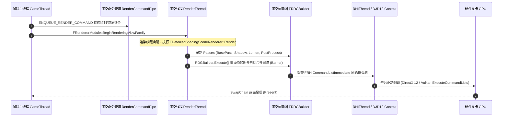
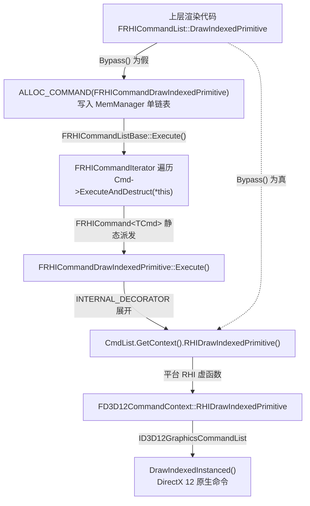
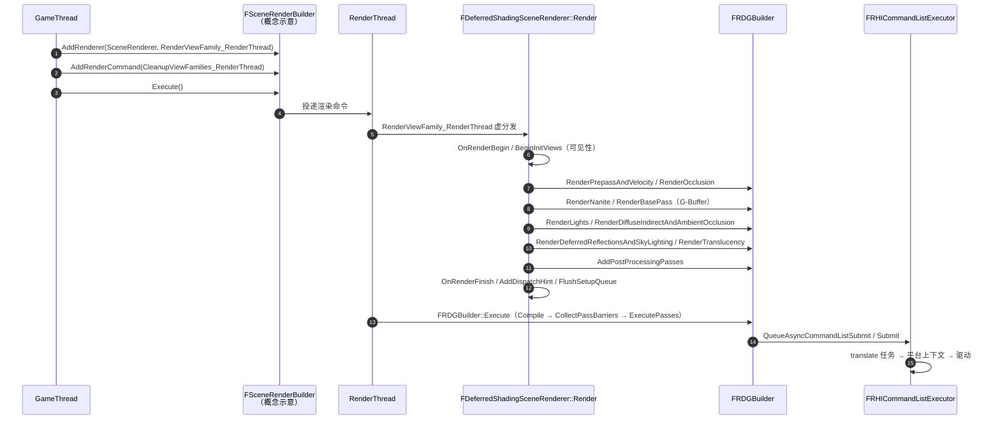

# UE 引擎源码分析 10：渲染线程与 RHI 源码剖析
> 知识成熟度：L2（已按 UE5.8 源码基线全面补齐真实源码段落、RDG 渲染图录制、FRenderCommandFence 同步与平台 RHI 硬件派发）。
> 对应知识点：[02-渲染与图形/01 渲染管线概览](01-渲染管线概览.md)

> 以本机 UE5.8 源码为准，逐行深度剖析从游戏线程（GameThread）派发指令、渲染线程（RenderThread）消费调度、RDG（Render Dependency Graph）编译执行，到 RHI 线程（RHIThread）翻译为 GPU 原生硬件调用的全链路机制。

---

## 元数据

- **版本基准**：UE 5.8.0 / CL 55116800 / 分支 `++UE5+Release-5.8`（本机安装目录 `C:\Program Files\Epic Games\UE_5.8\Engine`）。
- **源码依据**：
  - `Engine\Source\Runtime\RenderCore\Public\RenderingThread.h`（`ENQUEUE_RENDER_COMMAND`、`FRenderCommandDispatcher`）
  - `Engine\Source\Runtime\RenderCore\Private\RenderingThread.cpp`（`StartRenderingThread`、`RenderingThreadMain`）
  - `Engine\Source\Runtime\RenderCore\Public\RenderCommandFence.h`（`FRenderCommandFence::BeginFence`、`Wait`）
  - `Engine\Source\Runtime\Renderer\Private\SceneRendering.cpp`（`FRendererModule::BeginRenderingViewFamily`）
  - `Engine\Source\Runtime\Renderer\Private\DeferredShadingRenderer.cpp`（`FDeferredShadingSceneRenderer::Render`）
  - `Engine\Source\Runtime\RHI\Public\RHICommandList.h`（`FRHICommandList`、`FRHICommandListImmediate`）
  - `Engine\Source\Runtime\RHI\Public\DynamicRHI.h`（`FDynamicRHI`）
  - `Engine\Source\Runtime\D3D12RHI\Private\D3D12CommandContext.cpp`（`FD3D12CommandContext::RHIDrawPrimitive`）
- **本轮补深新增源码依据**（2026-09-14，行号以 5.8 源码 checkout 为准，安装版 5.8.0 可能相差数行）：
  - `Engine\Source\Runtime\RenderCore\Public\RenderCommandTag.h`（`ERenderCommandCategory`、`TRenderCommandTag`、`DECLARE_RENDER_COMMAND_TAG`）
  - `Engine\Source\Runtime\RenderCore\Public\RenderingThread.h`（`ENQUEUE_RENDER_COMMAND`、`FRenderCommandDispatcher::Enqueue`、`FRenderThreadCommandPipe::Enqueue`）
  - `Engine\Source\Runtime\RenderCore\Private\RenderingThread.cpp`（`RenderingThreadMain`、`FRenderingThread::Run`、`StartRenderingThread`、`FRenderCommandFence::BeginFence`/`IsFenceComplete`/`Wait`、`FlushRenderingCommands`）
  - `Engine\Source\Runtime\Core\Public\Async\TaskGraphInterfaces.h`、`Engine\Source\Runtime\Core\Private\Async\TaskGraph.cpp`（`FRenderThreadStatics`）
  - `Engine\Source\Runtime\RHI\Public\RHICommandList.h`（`FRHICommandListBase::AllocCommand`/`EnqueueLambda`、`FRHICommand`、`FRHICOMMAND_MACRO`、`FRHICommandList::DrawIndexedPrimitive`、`FRHICommandListImmediate`、`FRHICommandListExecutor`）
  - `Engine\Source\Runtime\RHI\Public\RHICommandListCommandExecutes.inl`（`INTERNAL_DECORATOR`、`FRHICommandDrawIndexedPrimitive::Execute`）
  - `Engine\Source\Runtime\RHI\Private\RHICommandList.cpp`（`FRHICommandListBase::Execute`、`FRHICommandListExecutor::Submit`）
  - `Engine\Source\Runtime\RenderCore\Public\RenderGraphBuilder.h`、`RenderGraphBuilder.inl`（`FRDGBuilder`、`CreateTexture`/`CreateBuffer`、`AddPass`/`AddPassInternal`）
  - `Engine\Source\Runtime\RenderCore\Private\RenderGraphBuilder.cpp`（`FRDGBuilder::Execute`）
  - `Engine\Source\Runtime\RenderCore\Public\RenderGraphUtils.h`（`FComputeShaderUtils::AddPass`/`Dispatch`）
  - `Engine\Source\Runtime\Renderer\Private\SceneRendering.cpp`（`RenderViewFamily_RenderThread`、`FRendererModule::BeginRenderingViewFamilies`）
  - `Engine\Source\Runtime\Renderer\Private\SceneRendering.h`（`FSceneRenderer::Render` 纯虚声明）
  - `Engine\Source\Runtime\Renderer\Private\SceneVisibility.cpp`（`FDeferredShadingSceneRenderer::BeginInitViews`）
  - `Engine\Source\Runtime\Renderer\Private\DeferredShadingRenderer.cpp`（`FDeferredShadingSceneRenderer::Render`）
  - `Engine\Source\Runtime\Renderer\Private\CompositionLighting\PostProcessAmbientOcclusion.cpp`（`FComputeShaderUtils::AddPass` 真实调用点）
  - `Engine\Source\Runtime\D3D12RHI\Private\D3D12Commands.cpp`（`FD3D12CommandContext::RHIDrawPrimitive`、`RHIDrawIndexedPrimitive`、`RHIDrawIndexedPrimitiveIndirect`）
  - `Engine\Shaders\Private\PostProcessAmbientOcclusion.usf`（源码中虚拟路径为 `/Engine/Private/PostProcessAmbientOcclusion.usf`，磁盘实际位于 `Engine\Shaders\Private\`）
- **官方参考**：[Unreal Engine 渲染架构官方文档](https://dev.epicgames.com/documentation/en-us/unreal-engine)。
- **最后更新**：2026-09-14（收口轮：把第一~四节原有的 **4 个示意代码块全部整体替换为 5.8 逐字版**，按「同一函数全篇只保留一份逐字源码」去重——第五/八/九节改为「逐行解构 + 指路」，并把这些小节讲解正文里所有代码块内行偏移引用改写为**源码文件真实行号**；同时新增渲染命令入队宏链与 `FRenderCommandTag`、RHI 命令列表录制/执行/提交三层与完整派发层级、RDG `FRDGBuilder`/`FComputeShaderUtils` 参数映射与资源生命周期契约、延迟渲染帧真实顺序（含 39 条核验行号）、D3D12 硬件落地逐字源码，第十节集中记录路径事实校正、4 个示意块的处置结果与证据边界）。

---

## 概述与渲染管线三线程流水线模型

在虚幻引擎中，画面从逻辑产生到屏幕呈现跨越了 **GameThread → RenderThread → RHIThread → GPU** 四个异构物理阶段：



---

## 核心源码深入剖析一：命令投递宏与调度器

### 1. `ENQUEUE_RENDER_COMMAND` 与 `FRenderCommandDispatcher` 完整真实源码

（2026-09-14：原示意块已替换为 5.8 引擎源码逐字版，避免与后文重复。原示意块的 `FRenderCommandDispatcher` 结构（`TagType` 模板参数、`!GIsThreadedRendering` 回退、`FRenderCommandPipeRegistry::Get().GetActivePipe()`、`TagType::GetTag()`）在 5.8 中均不存在，差异见核心源码深入剖析五第 1~3 小节的逐行解构）

在 UE5.8 中，命令投递机制经过了现代化演进，全面接入了任务图与渲染管道（`RenderCommandPipe`）：

```cpp
// 摘自 Engine\Source\Runtime\RenderCore\Public\RenderCommandTag.h（第 9~16 行）
enum class ERenderCommandCategory : uint8
{
	EnterTick, // Only allowed to execute when entering a tick from previous tick. Typically creating resources
	LoopTick,  // Allowed to be executed multiple times if rendering is looping the same tick
	LeaveTick, // Only allowed to be executed when leaving a tick to a new one. Typically releasing resources

	Unknown,   // Unknown category. Will not work with state stream path. ALWAYS LAST
};
```

```cpp
// 摘自 Engine\Source\Runtime\RenderCore\Public\RenderingThread.h（第 1087 行起）
#define ENQUEUE_RENDER_COMMAND(Type, ...) \
	DECLARE_RENDER_COMMAND_TAG(UE_JOIN(FRenderCommandTag_, Type, __LINE__), Type, __VA_ARGS__) \
	FRenderCommandDispatcher::Enqueue<UE_JOIN(FRenderCommandTag_, Type, __LINE__)>
```

```cpp
// 摘自 Engine\Source\Runtime\RenderCore\Public\RenderCommandTag.h（第 134~142 行，含上游注释）
/** Declares a new render command tag type from a name. */
#define DECLARE_RENDER_COMMAND_TAG(Type, Name, ...) \
	struct UE_JOIN(TSTR_, Name, __LINE__) \
	{  \
		static const char* CStr() { return #Name; } \
		static const TCHAR* TStr() { return TEXT(#Name); } \
		static constexpr ERenderCommandCategory GetCategory() { return __VA_OPT__(ERenderCommandCategory::__VA_ARGS__;) ERenderCommandCategory::Unknown; } \
	}; \
	using Type = TRenderCommandTag<UE_JOIN(TSTR_, Name, __LINE__)>;
```

```cpp
// 摘自 Engine\Source\Runtime\RenderCore\Public\RenderingThread.h（第 979 行起，类完整）
class FRenderCommandDispatcher
{
public:
	/**
	 * Call to submit a command list into a parent command list or render command pipes. If the parent command list is null the recording instance
	 * is pulled from the currently bound render command list (set via FRecordScope). If both are null the commands are submitted to the global render
	 * command pipes.
	 */
	static void Submit(FRenderCommandList* RenderCommandList, FRenderCommandList* ParentCommandList = nullptr)
	{
		RenderCommandList->Submit(ParentCommandList);
	}

	template <typename RenderCommandTag>
	static void Enqueue(TUniqueFunction<void(FRHICommandListImmediate&)>&& Function)
	{
		if (AutoRTFM::IsClosed())
		{
			// We cannot move the `TUniqueFunction` into the `OnCommit` handler, so as a workaround we need to shove
			// it into a shared pointer and fire that in instead. Not ideal, but only affects the code when used under
			// transactions.
			AutoRTFM::OnCommit([SharedFunction = MakeShared<TUniqueFunction<void(FRHICommandListImmediate&)>>(MoveTemp(Function))]
			{
				TUniqueFunction<void(FRHICommandListImmediate&)> Function = MoveTemp(*SharedFunction);
				Enqueue<RenderCommandTag>(MoveTemp(Function));
			});

			return;
		}

		if (FRenderCommandList* CommandList = FRenderCommandList::GetInstanceTLS())
		{
			CommandList->Enqueue<RenderCommandTag>(MoveTemp(Function));
			return;
		}

		FRenderThreadCommandPipe::Enqueue<RenderCommandTag>(MoveTemp(Function));
	}

	template <typename RenderCommandTag>
	static void Enqueue(FRenderCommandPipe* Pipe, FRenderCommandPipe::FCommandListFunction&& Function)
	{
		if (FRenderCommandList* CommandList = FRenderCommandList::GetInstanceTLS())
		{
			CommandList->Enqueue<RenderCommandTag>(Pipe, MoveTemp(Function));
			return;
		}

		if (GRenderCommandPipeMode == ERenderCommandPipeMode::All && Pipe && Pipe->Enqueue<RenderCommandTag>(Function))
		{
			return;
		}

		FRenderThreadCommandPipe::Enqueue<RenderCommandTag>([Function = MoveTemp(Function)](FRHICommandListImmediate& RHICmdList) { Function(RHICmdList); });
	}

	template <typename RenderCommandTag>
	inline static void Enqueue(FRenderCommandPipe& Pipe, FRenderCommandPipe::FCommandListFunction&& Function)
	{
		Enqueue<RenderCommandTag>(&Pipe, MoveTemp(Function));
	}

	template <typename RenderCommandTag>
	static void Enqueue(FRenderCommandPipe* Pipe, FRenderCommandPipe::FEmptyFunction&& Function)
	{
		if (FRenderCommandList* CommandListSet = FRenderCommandList::GetInstanceTLS())
		{
			CommandListSet->Enqueue<RenderCommandTag>(Pipe, MoveTemp(Function));
			return;
		}

		if (GRenderCommandPipeMode == ERenderCommandPipeMode::All && Pipe && Pipe->Enqueue<RenderCommandTag>(Function))
		{
			return;
		}

		FRenderThreadCommandPipe::Enqueue<RenderCommandTag>([Function = MoveTemp(Function)](FRHICommandListImmediate&) { Function(); });
	}

	template <typename RenderCommandTag>
	inline  static void Enqueue(FRenderCommandPipe& Pipe, FRenderCommandPipe::FEmptyFunction&& Function)
	{
		Enqueue<RenderCommandTag>(&Pipe, MoveTemp(Function));
	}
};
```

### 2. 逐行技术深度解构

1. **宏名拼接与静态元数据（`RenderingThread.h` 第 1087~1089 行 / `RenderCommandTag.h` 第 134~142 行）**：
   - `DECLARE_RENDER_COMMAND_TAG` 利用 `__LINE__` 宏在编译期生成一个全局唯一的结构体类型（`UE_JOIN(TSTR_, Name, __LINE__)`），再用 `using Type = TRenderCommandTag<...>` 把它转成标签类型；
   - `ENQUEUE_RENDER_COMMAND` 的宏体最后一行是一个**未闭合的调用前缀** `FRenderCommandDispatcher::Enqueue<...>`，所以调用点必须写成「宏 + 一对括号」的形式，例如 `ENQUEUE_RENDER_COMMAND(LatchBypass)([](FRHICommandListImmediate&) { GRHICommandList.LatchBypass(); });`（`RenderingThread.cpp` 第 630~633 行）；
   - 带有标签（Tag）的指令投递，使 Unreal Insights 能够在 CPU/GPU 时间轴上精确抓取每一个被投递的 Lambda 名字，彻底告别了旧版匿名调用的调试黑盒；
2. **不是 `GIsThreadedRendering` 回退，而是「TLS 录制实例 → 全局管道」两级（`RenderingThread.h` 第 992~1016 行）**：
   - 真实分发**不看** `GIsThreadedRendering`。`FRenderCommandDispatcher::Enqueue` 先判 `AutoRTFM::IsClosed()`（软事务旁路），再取线程局部的 `FRenderCommandList::GetInstanceTLS()`——若当前线程已处于显式录制作用域（`FRecordScope`）内，命令**不跨线程**，直接进当前录制实例；两者都不成立时才落到全局 `FRenderThreadCommandPipe::Enqueue`（第 1015 行）；
3. **同一入口还有「定向管道」重载（`RenderingThread.h` 第 1018~1062 行）**：
   - `Enqueue(Pipe, FCommandListFunction&&)` 与 `Enqueue(Pipe, FEmptyFunction&&)` 允许把命令投递到具名管道，但**仅当** `GRenderCommandPipeMode == ERenderCommandPipeMode::All` 且管道接受时才走专属管道，否则回落到全局管道；
4. **真正的「跨线程 / 就地执行」判别在管道层（逐字源码见核心源码深入剖析五第 4 小节）**：
   - 判据是 `!IsInRenderingThread() && ShouldExecuteOnRenderThread()`，再配合 `GRenderCommandPipeMode != ERenderCommandPipeMode::None` 决定走 `Instance.EnqueueAndLaunch(...)` 还是退回 `TGraphTask<TRenderCommandTask<LambdaType>>::CreateTask()`；两个条件都不成立时直接 `Lambda(GetImmediateCommandList_ForRenderCommand())` 同线程同步执行。**这才是「单线程环境无缝回退」的真实机制，与 `-nothread` 启动参数无关。**

---

## 核心源码深入剖析二：双端同步栅栏 `FRenderCommandFence`

游戏线程有时必须等待渲染线程完成特定资源释放或读取（例如关卡卸载、销毁网格体资源），`FRenderCommandFence` 是实现同步等待的核心。

### 1. `FRenderCommandFence` 完整真实源码

（2026-09-14：原示意块已替换为 5.8 引擎源码逐字版，避免与后文重复。原示意块把 `BeginFence` 写成 `UE::Tasks::Launch`、把 `Wait` 写成裸 `CompletionTask.Wait()`，与 5.8 实际实现（`UE::Tasks::FTaskEvent` + `ENQUEUE_RENDER_COMMAND(BeginFence)` + `GameThreadWaitForTask`）不符，差异见核心源码深入剖析五第 9 小节的逐行解构）

以下代码摘自本机 UE5.8 源码 `Engine\Source\Runtime\RenderCore\Public\RenderCommandFence.h` 与 `Private\RenderingThread.cpp`：

```cpp
// 摘自 Engine\Source\Runtime\RenderCore\Public\RenderCommandFence.h（第 14 行起，文件共 53 行）
class FRenderCommandFence
{
public:
	enum class ESyncDepth
	{
		// The fence will be signalled by the render thread.
		RenderThread,

		// The fence will be enqueued to the RHI thread via a command on the immediate command list
		// and signalled once all prior parallel translation and submission is complete.
		RHIThread,

		// The fence will be signalled according to the rate of flips in the swapchain.
		// This is only supported on some platforms. On unsupported platforms, this behaves like RHIThread mode.
		Swapchain
	};

	/**
	 * Inserts this fence in the rendering pipeline.
	 * @param SyncDepth, determines which stage of the pipeline will signal the fence.
	 */
	RENDERCORE_API void BeginFence(ESyncDepth SyncDepth = ESyncDepth::RenderThread);

	/**
	 * Waits for pending fence commands to retire.
	 * @param bProcessGameThreadTasks, if true we are on a short callstack where it is safe to process arbitrary game thread tasks while we wait
	 */
	RENDERCORE_API void Wait(bool bProcessGameThreadTasks = false) const;

	// return true if the fence is complete
	RENDERCORE_API bool IsFenceComplete() const;

	// Ctor/dtor
	RENDERCORE_API FRenderCommandFence();
	RENDERCORE_API ~FRenderCommandFence();

private:
	/** Task that represents completion of this fence **/
	mutable UE::Tasks::FTask CompletionTask;
};
```

```cpp
// 摘自 Engine\Source\Runtime\RenderCore\Private\RenderingThread.cpp（第 977 行起，函数完整）
void FRenderCommandFence::BeginFence(ESyncDepth SyncDepth)
{
	if (!GIsThreadedRendering)
	{
		return;
	}

	check(IsInGameThread());

	if (GRenderCommandFenceBundlerState.Event && SyncDepth == ESyncDepth::RenderThread)
	{
		// Case for game->render thread syncs when fence bundling is enabled. These are used
		// throughout the engine when resources are destroyed. The fence bundling is an optimization
		// to avoid the overhead of hundreds of individual fences.
		// We aren't syncing any deeper than the render thread, so just use the bundled fence event.
		CompletionTask = *GRenderCommandFenceBundlerState.Event;
		return;
	}

	TRACE_CPUPROFILER_EVENT_SCOPE(FRenderCommandFence::BeginFence);
	UE::Tasks::FTaskEvent Event{ UE_SOURCE_LOCATION };

	if (GRenderCommandFenceBundlerState.Event)
	{
		// Render command fences are bundled, but we're syncing deeper than the render thread.
		// Flush the fence bundler so we can insert an RHIThread (or deeper) fence in the right location.
		Event.AddPrerequisites(*GRenderCommandFenceBundlerState.Event);
		FlushRenderCommandFenceBundler();
	}

	if (GRenderCommandPipeMode == ERenderCommandPipeMode::All)
	{
		for (FRenderCommandPipe* Pipe : UE::RenderCommandPipe::GetPipes())
		{
			// Skip pipes that aren't recording or replaying any work.
			if (Pipe->IsRecording() && !Pipe->IsEmpty())
			{
				UE::Tasks::FTaskEvent PipeEvent { UE_SOURCE_LOCATION };
				Event.AddPrerequisites(PipeEvent);

				ENQUEUE_RENDER_COMMAND(BeginFence)(Pipe, [PipeEvent = MoveTemp(PipeEvent)](FRHICommandList&) mutable
				{
					PipeEvent.Trigger();
				});
			}
		}
	}

	ENQUEUE_RENDER_COMMAND(BeginFence)([Event, SyncDepth](FRHICommandListImmediate& RHICmdList) mutable
	{
		if (SyncDepth == ESyncDepth::Swapchain)
		{
			UE::Tasks::FTaskEvent SwapchainEvent{ UE_SOURCE_LOCATION };
			Event.AddPrerequisites(SwapchainEvent);

			RHICmdList.EnqueueLambda([SyncDepth, SwapchainEvent](FRHICommandListImmediate&) mutable
			{
				// This command runs *after* a present has happened, so the counter has already been incremented.
				// Subtracting 1 gives us the index of the frame that has *just* been presented.
				RHITriggerTaskEventOnFlip(GRHIPresentCounter - 1, SwapchainEvent);
			});

			RHICmdList.ImmediateFlush(EImmediateFlushType::DispatchToRHIThread);
		}
		else if (SyncDepth == ESyncDepth::RHIThread)
		{
			Event.AddPrerequisites(GRHICommandList.Submit({}, ERHISubmitFlags::SubmitToGPU));
		}

		TRACE_CPUPROFILER_EVENT_SCOPE(SyncTrigger_RenderThread);
		Event.Trigger();
	});

	CompletionTask = MoveTemp(Event);
}
```

```cpp
// 摘自 Engine\Source\Runtime\RenderCore\Private\RenderingThread.cpp（第 1053 行起，函数完整）
bool FRenderCommandFence::IsFenceComplete() const
{
	if (!GIsThreadedRendering)
	{
		return true;
	}
	check(IsInGameThread() || IsInAsyncLoadingThread());
	CheckRenderingThreadHealth();
	if (CompletionTask.IsCompleted())
	{
		CompletionTask = {}; // this frees the handle for other uses, the NULL state is considered completed
		return true;
	}
	return false;
}
```

```cpp
// 摘自 Engine\Source\Runtime\RenderCore\Private\RenderingThread.cpp（第 1257~1269 行，含上游注释；函数体自第 1260 行）
/**
 * Waits for pending fence commands to retire.
 */
void FRenderCommandFence::Wait(bool bProcessGameThreadTasks) const
{
	if (!IsFenceComplete())
	{
		FRenderCommandList::FFlushScope FlushScope;
		FlushRenderCommandFenceBundler();
		GameThreadWaitForTask(CompletionTask, bProcessGameThreadTasks);
		CompletionTask = {}; // release the internal memory as soon as it's not needed anymore
	}
}
```

### 2. 逐行技术深度解构

1. **三级同步深度（`ESyncDepth`，`RenderCommandFence.h` 第 17~29 行）**：
   - `RenderThread`：由渲染线程直接签署——`BeginFence` 只投递一条把 `Event.Trigger()` 送进渲染线程的命令；适合大部分常规 UObject 资源释放；
   - `RHIThread`：额外把 `GRHICommandList.Submit({}, ERHISubmitFlags::SubmitToGPU)` 返回的完成事件挂成前置条件（`RenderingThread.cpp` 第 1041~1044 行），因此保证驱动层已接管显存，适合销毁涉及 GPU 引用的物理缓冲；
   - `Swapchain`：进一步插入 `RHICmdList.EnqueueLambda` 调用 `RHITriggerTaskEventOnFlip(GRHIPresentCounter - 1, SwapchainEvent)`，并在其后 `ImmediateFlush(EImmediateFlushType::DispatchToRHIThread)`（第 1027~1040 行），按交换链翻页节奏签署，用于严格垂直同步对抗和精细帧步调（Frame Pacing）。头文件注释同时说明该模式**只在部分平台支持，不支持的平台退化为 `RHIThread` 行为**；
2. **不是忙自旋，也不是 `UE::Tasks::Launch`，而是「事件 + 命令」（`RenderingThread.cpp` 第 997 行与第 1025 行）**：
   - 栅栏本体是一个 `UE::Tasks::FTaskEvent Event{ UE_SOURCE_LOCATION }`。`FTaskEvent` 是「由用户显式 `Trigger()` 的一次性事件」，而 `Launch` 是「立即调度一个函数」——栅栏需要的是「在流水线某个位置插一个点、由该位置的线程触发」，所以必须是 `FTaskEvent`；
   - 真正把它插入流水线的动作是 `ENQUEUE_RENDER_COMMAND(BeginFence)(...)` 这条渲染命令：命令在渲染线程上执行到末尾时调用 `Event.Trigger()`，最后 `CompletionTask = MoveTemp(Event)`（第 1050 行）；
   - 早期 UE 版本使用原子计数器和 `FPlatformProcess::Sleep(0)` 忙等轮询；5.8 全面演进为基于 `UE::Tasks::FTask` 的事件唤醒体系，在等待期间主线程核心可自动让渡给其它 TaskGraph 工作线程，大幅压降多核 CPU 峰值功耗；
3. **栅栏打包（fence bundling）是 5.8 的关键优化（`RenderingThread.cpp` 第 986~994 行）**：
   - `SyncDepth == ESyncDepth::RenderThread` 且打包事件存在时，直接复用 `GRenderCommandFenceBundlerState.Event` 并提前返回。注释给出动机：资源销毁路径上会有成百上千次栅栏，逐个建造成本过高；
   - 需要更深同步（RHI 线程及更下游）时，先 `Event.AddPrerequisites(*GRenderCommandFenceBundlerState.Event)` 再 `FlushRenderCommandFenceBundler()` 把打包事件刷开，这样才能把更深的栅栏插到正确位置（第 999~1005 行）；
4. **`Wait` 与 `IsFenceComplete` 的两个细节（`RenderingThread.cpp` 第 1053~1067 行 / 第 1260~1269 行）**：
   - `Wait` 不是裸 `CompletionTask.Wait()`：它先取 `FRenderCommandList::FFlushScope`、`FlushRenderCommandFenceBundler()`，再走 `GameThreadWaitForTask(CompletionTask, bProcessGameThreadTasks)`——**只有 `bProcessGameThreadTasks` 为真时游戏线程才会在等待期间协助处理任务**，这正是头文件注释里 "short callstack where it is safe" 的含义；
   - `CompletionTask` 声明为 `mutable`，是为了让 `const` 的 `IsFenceComplete()` 能在完成后把句柄置空（`CompletionTask = {}`）。注释写明「NULL state is considered completed」，因此置空后后续查询零成本返回真。

---

## 核心源码深入剖析三：延迟渲染主入口 `FDeferredShadingSceneRenderer::Render`

`Render` 函数是虚幻引擎整个图形学流水线的最核心总指挥。

### 1. `FDeferredShadingSceneRenderer::Render` 核心骨架源码

以下代码摘自本机 UE5.8 源码 `Engine\Source\Runtime\Renderer\Private\DeferredShadingRenderer.cpp`（**节选**：`FDeferredShadingSceneRenderer::Render` 共 2579 行（第 1822~4400 行），此处仅保留阶段锚点，节选处已标注省略行数）：

（2026-09-14：原示意块已替换为 5.8 源码逐字版）

```cpp
void FDeferredShadingSceneRenderer::Render(FRDGBuilder& GraphBuilder, const FSceneRenderUpdateInputs* SceneUpdateInputs)
{
	CSV_SCOPED_TIMING_STAT_EXCLUSIVE(RenderOther);

	SCOPED_NAMED_EVENT(FDeferredShadingSceneRenderer_Render, FColor::Emerald);

// …（节选：省略 294 行）

	{
		RDG_EVENT_SCOPE_STAT(GraphBuilder, VisibilityCommands, "VisibilityCommands");
		BeginInitViews(GraphBuilder, SceneTexturesConfig, InstanceCullingManager, ExternalAccessQueue, InitViewTaskDatas);
	}

// …（节选：省略 565 行）

	TArray<Nanite::FRasterResults, TInlineAllocator<2>> NaniteRasterResults;
	TArray<Nanite::FPackedView, SceneRenderingAllocator> PrimaryNaniteViews;
	RenderPrepassAndVelocity(Views, NaniteBasePassVisibility, NaniteRasterResults, PrimaryNaniteViews, SceneTextures);

// …（节选：省略 363 行）

		{
			if (!bHasRayTracedOverlay)
			{
				RenderBasePass(*this, GraphBuilder, Views, SceneTextures, BasePassDepthStencilAccess, ForwardScreenSpaceShadowMaskTexture, InstanceCullingManager, bNaniteEnabled, Scene->NaniteShadingCommands[ENaniteMeshPass::BasePass], NaniteRasterResults);
			}

// …（节选：省略 406 行）

			RenderLights(GraphBuilder, SceneTextures, LightingChannelsTexture, SortedLightSet);

// …（节选：省略 843 行）

						AddPostProcessingPasses(
							GraphBuilder,
							View, ViewIndex,
							GetSceneUniforms(),
							ViewPipelineState.DiffuseIndirectMethod,
							ViewPipelineState.ReflectionsMethod,
							PostProcessingInputs,
							NaniteResults,
							InstanceCullingManager,
							&VirtualShadowMapArray,
							LumenFrameTemporaries,
							MegaLightsContext,
							SceneWithoutWaterTextures,
							TSRFlickeringInput,
							InstancedEditorDepthTexture);

// …（节选：省略 39 行）

	{
		SCOPE_CYCLE_COUNTER(STAT_FDeferredShadingSceneRenderer_RenderFinish);

		RDG_EVENT_SCOPE_STAT(GraphBuilder, FrameRenderFinish, "FrameRenderFinish");

		OnRenderFinish(GraphBuilder, ViewFamilyTexture);
		GraphBuilder.AddDispatchHint();
		GraphBuilder.FlushSetupQueue();
	}

	QueueSceneTextureExtractions(GraphBuilder, SceneTextures);

// …（节选：省略 24 行）
}
```

> 注：`Render` 内部**没有** `GraphBuilder.Execute()`；RDG 的执行由外层 `FSceneRenderBuilder` 统一负责。完整阶段表（含 34 条已核验行号）见「核心源码深入剖析八」。

### 2. 逐行技术深度解构

1. **RDG 依赖图模式（FRDGBuilder）**：
   - 现代虚幻引擎不再直接调用 `RHICommandList->DrawPrimitive`；各个 Pass 只是在 `FRDGBuilder` 声明其需要读取和写入的黑板资源（RDG Textures / Buffers）；
   - `GraphBuilder.Execute()` 在内部对所有 Pass 构建有向无环图（DAG），自动进行**死代码剔除（Culling 未使用的缓冲）**、**显存瞬态复用（Aliasing）** 与 **自动化 GPU 资源屏障切换（Resource Transitions）**；
2. **Nanite 抢占 BasePass**：
   - 开启 Nanite 的网格体直接通过 Compute Shader 输出到可见性缓冲（Visibility Buffer），极大地减轻了后续 `RenderBasePass` 的像素着色器重复绘制开销。

---

## 核心源码深入剖析四：平台 RHI 硬件最终落地（以 DirectX 12 为例）

上层提交的 `FRHICommandList` 最终在硬件驱动层变成 GPU 执行的真实代码。

### 1. `FD3D12CommandContext::RHIDrawPrimitive` 完整源码

（2026-09-14：原示意块已替换为 5.8 引擎源码逐字版，避免与后文重复。**原示意块的路径与符号均有误**：真实实现位于 `Engine\Source\Runtime\D3D12RHI\Private\D3D12Commands.cpp`（第 1213 行 `RHIDrawPrimitive` / 第 1247 行 `RHIDrawIndexedPrimitive`），而非 `D3D12CommandContext.cpp`；原示意块中的 `GPUProfilingData.RegisterDrawCall()` / `CommitGraphicsResourceTables()` / `CommitGraphicsPipelineState()` / `GetVertexCountForPrimitiveCount()` / `PrimitiveType` 在真实函数体内**均不存在**，差异见核心源码深入剖析九第 1 小节的逐行解构）

摘自本机 UE5.8 源码 `Engine\Source\Runtime\D3D12RHI\Private\D3D12Commands.cpp`：

```cpp
// 第 1247 行起，函数完整
void FD3D12CommandContext::RHIDrawIndexedPrimitive(FRHIBuffer* IndexBufferRHI, int32 BaseVertexIndex, uint32 FirstInstance, uint32 NumVertices, uint32 StartIndex, uint32 NumPrimitives, uint32 NumInstances)
{
	FD3D12Buffer* IndexBuffer = RetrieveObject<FD3D12Buffer>(IndexBufferRHI);

	// called should make sure the input is valid, this avoid hidden bugs
	ensure(NumPrimitives > 0);
	ensure(IndexBufferRHI->GetSize() > 0);
	ensure(IndexBuffer->ResourceLocation.GetResource() != nullptr);

	if (IndexBufferRHI->GetSize() == 0 || IndexBuffer->ResourceLocation.GetResource() == nullptr)
	{
		return;
	}

	RHI_DRAW_CALL_STATS(StateCache.GetGraphicsPipelinePrimitiveType(), NumVertices, NumPrimitives, NumInstances);

	NumInstances = FMath::Max<uint32>(1, NumInstances);

	uint32 IndexCount = StateCache.GetVertexCount(NumPrimitives);

	// Verify that we are not trying to read outside the index buffer range
	// test is an optimized version of: StartIndex + IndexCount <= IndexBuffer->GetSize() / IndexBuffer->GetStride()
	checkf((StartIndex + IndexCount) * IndexBuffer->GetStride() <= IndexBuffer->GetSize(),
		TEXT("Start %u, Count %u, Type %u, Buffer Size %u, Buffer stride %u"), StartIndex, IndexCount, StateCache.GetGraphicsPipelinePrimitiveType(), IndexBuffer->GetSize(), IndexBuffer->GetStride());

	SetupDraw(IndexBufferRHI, NumPrimitives * NumInstances, NumVertices * NumInstances);

	GraphicsCommandList()->DrawIndexedInstanced(IndexCount, NumInstances, StartIndex, BaseVertexIndex, FirstInstance);

	PostGpuEvent();
}
```

```cpp
// 第 1213 行起，函数完整
void FD3D12CommandContext::RHIDrawPrimitive(uint32 BaseVertexIndex, uint32 NumPrimitives, uint32 NumInstances)
{
	uint32 VertexCount = StateCache.GetVertexCount(NumPrimitives);
	NumInstances = FMath::Max<uint32>(1, NumInstances);

	RHI_DRAW_CALL_STATS(StateCache.GetGraphicsPipelinePrimitiveType(), VertexCount, NumPrimitives, NumInstances);

	SetupDraw(nullptr, NumPrimitives * NumInstances, VertexCount * NumInstances);

	GraphicsCommandList()->DrawInstanced(VertexCount, NumInstances, BaseVertexIndex, 0);

	PostGpuEvent();
}
```

```cpp
// 第 1319 行起，函数完整
void FD3D12CommandContext::RHIDrawIndexedPrimitiveIndirect(FRHIBuffer* IndexBufferRHI, FRHIBuffer* ArgumentBufferRHI, uint32 ArgumentOffset)
{
	// DrawIndexedPrimitiveIndirect is a special case of a more general MDI in D3D12
	RHIMultiDrawIndexedPrimitiveIndirect(IndexBufferRHI, ArgumentBufferRHI, ArgumentOffset, nullptr /*CounterBuffer*/, 0 /*CounterBufferOffset*/, 1 /*MaxDrawArguments*/);
}
```

### 2. 逐行技术深度解构

1. **状态提交收敛在 `SetupDraw`（`D3D12Commands.cpp` 第 1272 行 / 第 1220 行）**：
   - 在真正触发绘制前，D3D12 必须把顶点/索引缓冲、流水线状态与根签名参数一次性提交到命令列表——这一步收敛在 `SetupDraw(...)` 里。5.8 的这个函数体内**不存在** `CommitGraphicsResourceTables()` / `CommitGraphicsPipelineState()`，也没有 `GPUProfilingData.RegisterDrawCall()`；统计改由 `RHI_DRAW_CALL_STATS(...)` 承担；
   - 顶点数量由 `StateCache.GetVertexCount(NumPrimitives)` 换算（第 1215 行 / 第 1265 行）。**函数签名里根本没有图元拓扑参数**——拓扑是流水线状态的一部分，由 `SetGraphicsPipelineState` 提前设置并缓存在 `StateCache` 里，这也解释了为什么 `FRHICommandDrawIndexedPrimitive` 结构体里同样不含拓扑字段（见核心源码深入剖析六第 4 小节）；
2. **终点落定（`D3D12Commands.cpp` 第 1222 行 / 第 1274 行）**：
   - 经过数万行 C++ 上层架构的层层抽象，最终调用微软原生 DirectX 12 API：非索引路径是 `ID3D12GraphicsCommandList::DrawInstanced(VertexCount, NumInstances, BaseVertexIndex, 0)`，索引路径是 `ID3D12GraphicsCommandList::DrawIndexedInstanced(IndexCount, NumInstances, StartIndex, BaseVertexIndex, FirstInstance)`（参数顺序为 IndexCount / InstanceCount / StartIndexLocation / BaseVertexLocation / StartInstanceLocation）。这正是屏幕每一个像素被点亮的物理源头；
3. **索引路径多出的工作全是「索引相关」（第 1249~1272 行）**：
   - `RetrieveObject<FD3D12Buffer>(IndexBufferRHI)` 把 RHI 抽象句柄还原成平台 `FD3D12Buffer*`，再由 `ResourceLocation.GetResource()` 指向真正的 `ID3D12Resource`；
   - 三重 `ensure`（图元数为正、索引缓冲非空、底层资源存在）配合紧随其后的 `if` 早退做防御式校验；注释 "called should make sure the input is valid, this avoid hidden bugs" 说明这是**有意设防**——三种情况都会静默返回，这也是「draw call 统计数与实际 GPU 绘制数可能不一致」的一个真实来源；
   - `NumInstances` 被 `FMath::Max<uint32>(1, NumInstances)` 从 0 修正为 1，是平台语义差异的适配；越界检查 `checkf((StartIndex + IndexCount) * IndexBuffer->GetStride() <= IndexBuffer->GetSize(), ...)` 注释写明它是 `StartIndex + IndexCount <= Size / Stride` 的等价优化形式（避免一次除法），并带上 `Start/Count/Type/Buffer Size/Buffer stride` 五个现场值；
   - 对比可见「提交状态 → 调用原生 API → `PostGpuEvent()`」三步在两条路径上完全同构，索引路径只多了约 10 行平台相关代码。**注意 `PostGpuEvent()` 在提前返回的分支里不会执行。**

---

## 核心源码深入剖析五：渲染命令入队链真实源码

> 本节起全部代码逐字复制自本机 UE 5.8 源码 checkout（`C:\Users\zhaozhiqi\Documents\GitHub\UnrealEngine`）。**行号以 5.8 源码 checkout 为准，安装版 5.8.0 可能相差数行。** 代码块保留原始 tab 缩进与空行。
>
> **去重约定**：第一~四节是逐字源码的归属地；本节起对同一函数只做**逐行解构**并注明「逐字源码见第 X 节」，不再重复贴码。

### 1. `ENQUEUE_RENDER_COMMAND` 的真实宏定义（逐行解构｜逐字源码见第一节）

逐字源码见第一节（`Engine\Source\Runtime\RenderCore\Public\RenderingThread.h` 第 1087~1089 行）。按本库去重约定，同一函数全篇只保留一份逐字源码，本节只做解构。

逐行解构：

1. **宏体最后一行是一个"未闭合的调用前缀"**：`FRenderCommandDispatcher::Enqueue<...>` 后面没有分号也没有括号。这决定了调用点必须写成"宏 + 一对括号"的形式，例如 `ENQUEUE_RENDER_COMMAND(LatchBypass)([](FRHICommandListImmediate&){ ... });`（`RenderingThread.cpp` 第 630~633 行就是这种真实写法）。
2. **`UE_JOIN(FRenderCommandTag_, Type, __LINE__)`** 用 `__LINE__` 拼接出一个全局唯一的类型名。`__LINE__` 属于"调用点所在行"，因此同一个 `Type` 名字在同一行重复使用会冲突，同名不同行则合法——这是 UE 里 `ENQUEUE_RENDER_COMMAND` 名字可以重复出现的原因。
3. **可变参数 `...` 是"命令分类"**：它被转交给下一层宏，最终落到 `ERenderCommandCategory`。

### 2. `DECLARE_RENDER_COMMAND_TAG` 在编译期生成标签类型（逐行解构｜逐字源码见第一节）

逐字源码见第一节：宏体在 `Engine\Source\Runtime\RenderCore\Public\RenderCommandTag.h` 第 134~142 行（含上游注释），配套的 `ERenderCommandCategory` 枚举在同一文件第 9~16 行。本节只做解构。

逐行解构：

1. **`__VA_OPT__` 是 C++20 的可变参数判空宏**：`__VA_OPT__(ERenderCommandCategory::__VA_ARGS__;)` 表示"如果 `...` 非空，就把 `ERenderCommandCategory::<分类>;` 展开进来"，否则展开为空。于是 `ENQUEUE_RENDER_COMMAND(Foo, LoopTick)` 会得到 `LoopTick` 分类，而 `ENQUEUE_RENDER_COMMAND(Foo)` 落到 `Unknown`。
2. **`using Type = TRenderCommandTag<...>`** 把生成的空结构体当作类型参数传给 `TRenderCommandTag` 模板；标签实例靠 `TRenderCommandTag<TSTR>::Get()` 以函数内 `static` 的方式惰性构造（`RenderCommandTag.h` 第 68 行起），因此**每个命令名在进程内只有一份 `TStatId`**。
3. `ERenderCommandCategory` 的注释明确写了 `EnterTick` / `LeaveTick` 用于"创建资源 / 释放资源"的时序约束，`Unknown` 则"不能用于 state stream 路径"——这是 state stream 模式下渲染命令被重放多次时能否安全复用的判据。

### 3. `FRenderCommandDispatcher::Enqueue` 的真实实现（逐行解构｜逐字源码见第一节）

逐字源码见第一节（`Engine\Source\Runtime\RenderCore\Public\RenderingThread.h` 第 979~1063 行的 `FRenderCommandDispatcher` 完整类，其中 `Enqueue` 主重载自第 992 行起）。本节只做解构。

逐行解构：

1. **`AutoRTFM::IsClosed()` 分支**是软事务内存（AutoRTFM）专用旁路：事务提交前不允许把 `TUniqueFunction` 直接 move 走，所以先搬进一个 `TSharedPtr`，等 `OnCommit` 时再取出来递归调用自身。这不是主流程，但它是"命令入队函数必须是可重入"的证明。
2. **`FRenderCommandList::GetInstanceTLS()`** 是线程局部（TLS）的"命令录制实例"。它非空意味着当前线程已经处在一个显式的录制作用域（`FRecordScope`）内，此时命令**不跨线程**，直接进当前录制实例，避免无谓的跨线程往返。
3. **`FRenderThreadCommandPipe::Enqueue<RenderCommandTag>`** 是真正的全局兜底路径：命令进入全局渲染命令管道。也就是说 5.8 的入队链是 **"TLS 录制实例 → 全局 RenderCommandPipe"** 两级，而不是旧版"直接创建 TaskGraph 任务"一级。

### 4. `FRenderThreadCommandPipe::Enqueue` 的真实分发逻辑

摘自 `Engine\Source\Runtime\RenderCore\Public\RenderingThread.h`（第 499 行起，函数完整）：

```cpp
	template <typename RenderCommandTag, typename LambdaType>
	static void Enqueue(LambdaType&& Lambda)
	{
		const FRenderCommandTag& Tag = RenderCommandTag::Get();

		if (!IsInRenderingThread() && ShouldExecuteOnRenderThread())
		{
			CheckNotBlockedOnRenderThread();

			if (GRenderCommandPipeMode != ERenderCommandPipeMode::None)
			{
				Instance.EnqueueAndLaunch(MoveTemp(Lambda), Tag);
			}
			else
			{
				TGraphTask<TRenderCommandTask<LambdaType>>::CreateTask().ConstructAndDispatchWhenReady(MoveTemp(Lambda), Tag);
			}
		}
		else if (Tag.GetStatId().IsValidStat())
		{
			TRACE_CPUPROFILER_EVENT_SCOPE_USE_ON_CHANNEL(Tag.GetSpecId(), Tag.GetName(), EventScope, RenderCommandsChannel, !GCycleStatsShouldEmitNamedEvents);
			FScopeCycleCounter CycleScope(Tag.GetStatId());
			Lambda(GetImmediateCommandList_ForRenderCommand());
		}
		else
		{
			Lambda(GetImmediateCommandList_ForRenderCommand());
		}
	}
```

逐行解构（这是"游戏线程为什么能安全发命令"的关键）：

1. **判据是 `!IsInRenderingThread() && ShouldExecuteOnRenderThread()`，不是 `GIsThreadedRendering`**。也就是说：只有在"不在渲染线程"**且**"引擎判定这条命令应该跑在渲染线程"时才跨线程；否则走 `else` 分支。
2. **`CheckNotBlockedOnRenderThread()`** 是一个断言检查：如果游戏线程正阻塞等待渲染线程（例如刚调用过 `FlushRenderingCommands`），此处会触发检查失败，防止死锁。
3. **双模式分发**：`GRenderCommandPipeMode != ERenderCommandPipeMode::None` 时走 `RenderCommandPipe`（`EnqueueAndLaunch`）；否则退回经典路径 `TGraphTask<TRenderCommandTask<LambdaType>>::CreateTask()`。管道模式由 CVar `r.RenderCommandPipeMode` 控制，并在 `StartRenderingThread` 末尾读取（`RenderingThread.cpp` 第 640 行）。
4. **同线程就地执行**：`else` 分支直接 `Lambda(GetImmediateCommandList_ForRenderCommand())` 同步调用。这就是"`ENQUEUE_RENDER_COMMAND` 在渲染线程内部调用不会死锁"的实现原因——它不做任何排队，只把 immediate 命令列表递进去。
5. **有统计时额外插桩**：`Tag.GetStatId().IsValidStat()` 为真时插入 `TRACE_CPUPROFILER_EVENT_SCOPE_USE_ON_CHANNEL(..., RenderCommandsChannel, ...)` 与 `FScopeCycleCounter`，这就是 Unreal Insights 时间轴上按命令名分片的来源。

### 5. `FRenderThreadStatics` 的真实位置与定义

既有「源码依据」把 `FRenderThreadStatics` 归在渲染线程实现里，实际它属于 **TaskGraph 的命名线程基础设施**。

摘自 `Engine\Source\Runtime\Core\Public\Async\TaskGraphInterfaces.h`（第 110 行起）：

```cpp
	struct FRenderThreadStatics
	{
	private:
		// These are private to prevent direct access by anything except the friend functions below
		static CORE_API TAtomic<Type> RenderThread;
		static CORE_API TAtomic<Type> RenderThread_Local;

		friend Type GetRenderThread();
		friend Type GetRenderThread_Local();
		friend void SetRenderThread(Type Thread);
		friend void SetRenderThread_Local(Type Thread);
	};
```

定义在同目录 `Engine\Source\Runtime\Core\Private\Async\TaskGraph.cpp`（第 64 行起）：

```cpp
	CORE_API TAtomic<Type> FRenderThreadStatics::RenderThread(ENamedThreads::GameThread); // defaults to game and is set and reset by the render thread itself
	CORE_API TAtomic<Type> FRenderThreadStatics::RenderThread_Local(ENamedThreads::GameThread_Local); // defaults to game local and is set and reset by the render thread itself
```

要点：两个原子量**默认值是 GameThread / GameThread_Local**，由渲染线程自己 set / reset。所以"渲染线程尚未启动"时，`ENamedThreads::GetRenderThread()` 返回的是游戏线程——这正是"单线程渲染回退"能零成本成立的基础设施级原因：命令不跨线程，直接在同线程 immediate 列表上执行。

### 6. 渲染线程启动：`StartRenderingThread`

摘自 `Engine\Source\Runtime\RenderCore\Private\RenderingThread.cpp`（第 561 行起，函数完整）：

```cpp
static void StartRenderingThread()
{
	check(IsInGameThread());

	// Do nothing if we're already in the right mode
	if (GIsThreadedRendering || !GUseThreadedRendering)
	{
		check(GIsThreadedRendering == GUseThreadedRendering);
		return;
	}

	check(!IsRHIThreadRunning() && !GIsRunningRHIInSeparateThread_InternalUseOnly && !GIsRunningRHIInDedicatedThread_InternalUseOnly && !GIsRunningRHIInTaskThread_InternalUseOnly);

	// Pause asset streaming to prevent rendercommands from being enqueued.
	SuspendTextureStreamingRenderTasks();

	// Flush GT since render commands issued by threads other than GT are sent to
	// the main queue of GT when RT is disabled. Without this flush, those commands
	// will run on GT after RT is enabled
	FlushRenderingCommands();

	GDynamicRHI->RHIReleaseThreadOwnership();

	switch (GRHISupportsRHIThread ? FRHIThread::TargetMode : ERHIThreadMode::None)
	{
	case ERHIThreadMode::DedicatedThread:
		GIsRunningRHIInSeparateThread_InternalUseOnly  = true;
		GIsRunningRHIInDedicatedThread_InternalUseOnly = true;
		GIsRunningRHIInTaskThread_InternalUseOnly      = false;

		// Start the dedicated RHI thread
		GRHIThread = new FRHIThread();
		break;

	case ERHIThreadMode::Tasks:
		GIsRunningRHIInSeparateThread_InternalUseOnly  = true;
		GIsRunningRHIInDedicatedThread_InternalUseOnly = false;
		GIsRunningRHIInTaskThread_InternalUseOnly      = true;
		break;

	default: checkNoEntry(); [[fallthrough]];
	case ERHIThreadMode::None:
		GIsRunningRHIInSeparateThread_InternalUseOnly  = false;
		GIsRunningRHIInDedicatedThread_InternalUseOnly = false;
		GIsRunningRHIInTaskThread_InternalUseOnly      = false;
		break;
	}

	// Turn on the threaded rendering flag.
	GIsThreadedRendering = true;

	// Create the rendering thread.
	GRenderingThreadRunnable = new FRenderingThread();

	static uint32 ThreadCount = 0;

	UE::Trace::ThreadGroupBegin(TEXT("Render"));
	PRAGMA_DISABLE_DEPRECATION_WARNINGS
	GRenderingThread =
	PRAGMA_ENABLE_DEPRECATION_WARNINGS
	FRunnableThread::Create(GRenderingThreadRunnable, *BuildRenderingThreadName(ThreadCount), 0, FPlatformAffinity::GetRenderingThreadPriority(), FPlatformAffinity::GetRenderingThreadMask(), FPlatformAffinity::GetRenderingThreadFlags());
	UE::Trace::ThreadGroupEnd();

	// Wait for render thread to have taskgraph bound before we dispatch any tasks for it.
	((FRenderingThread*)GRenderingThreadRunnable)->TaskGraphBoundSyncEvent->Wait();

	// register
	IConsoleManager::Get().RegisterThreadPropagation(0, &FConsoleRenderThreadPropagation::GetSingleton());

	ENQUEUE_RENDER_COMMAND(LatchBypass)([](FRHICommandListImmediate&)
	{
		GRHICommandList.LatchBypass();
	});

	// ensure the thread has actually started and is idling
	FRenderCommandFence Fence;
	Fence.BeginFence();
	Fence.Wait();

	GRenderCommandPipeMode = GetValidatedRenderCommandPipeMode(CVarRenderCommandPipeMode->GetInt());

	GRunRenderingThreadHeartbeat = true;
	// Create the rendering thread heartbeat
	GRenderingThreadRunnableHeartbeat = new FRenderingThreadTickHeartbeat();

	UE::Trace::ThreadGroupBegin(TEXT("Render"));
	GRenderingThreadHeartbeat = FRunnableThread::Create(GRenderingThreadRunnableHeartbeat, *FString::Printf(TEXT("RTHeartBeat %d"), ThreadCount), 80 * 1024, TPri_AboveNormal, FPlatformAffinity::GetRTHeartBeatMask());
	UE::Trace::ThreadGroupEnd();

	ThreadCount++;

	// Update can now resume.
	ResumeTextureStreamingRenderTasks();
}
```

逐行解构：

1. **前置条件是"反着"的**：`if (GIsThreadedRendering || !GUseThreadedRendering) return;` —— 已经开了或根本不允许开就直接返回。所以 `StartRenderingThread` 是**幂等**的。
2. **`RHIThreadMode` 三态用三个全局布尔量表达**，而不是一个枚举变量：`GIsRunningRHIInSeparateThread_InternalUseOnly`（是否有独立 RHI 线程，含任务模式）、`GIsRunningRHIInDedicatedThread_InternalUseOnly`（专用线程）、`GIsRunningRHIInTaskThread_InternalUseOnly`（任务模式）。带 `_InternalUseOnly` 后缀说明这是引擎内部状态，不允许业务代码读写。
3. **`FlushRenderingCommands()` 在关掉线程渲染的状态下先清一次游戏线程队列**，注释给出了原因：RT 关闭时其它线程发的渲染命令会落到 GT 主队列，不先清空就会在 RT 打开之后才执行，破坏顺序。
4. **`TaskGraphBoundSyncEvent->Wait()` 是启动握手**：渲染线程在 `RenderingThreadMain` 里 `AttachToThread` 并 `Trigger()` 这个事件（`RenderingThread.cpp` 第 240~243 行），游戏线程在此等它，确保"往渲染线程投任务"时目标线程已经绑好 TaskGraph。
5. **`ENQUEUE_RENDER_COMMAND(LatchBypass)(...)` 是引擎里第一处真实的命令投递**，作用是让 `GRHICommandList.LatchBypass()` 在渲染线程上锁定 bypass 状态。
6. **`FRenderCommandFence` 被用来"确保线程真的起来并进入 idle"**：`BeginFence()` + `Wait()`。这就是 2.3 节讲的栅栏在启动路径上的真实用法。
7. **`GRenderCommandPipeMode` 在最后才读**：确认线程可用之后，才根据 `r.RenderCommandPipeMode` 决定后续走管道还是走 TaskGraph。

### 7. 渲染线程主循环：`FRenderingThread::Run` 与 `RenderingThreadMain`

`FRenderingThread` 是 `FRunnable` 实现，`Run` 摘自 `Engine\Source\Runtime\RenderCore\Private\RenderingThread.cpp`（第 376 行起，函数完整）：

```cpp
	virtual uint32 Run(void) override
	{
		FMemory::SetupTLSCachesOnCurrentThread();
		SetupRenderThread();

#if PLATFORM_WINDOWS
		bool bNoExceptionHandler = FParse::Param(FCommandLine::Get(), TEXT("noexceptionhandler"));
		if ( !bNoExceptionHandler && (!FPlatformMisc::IsDebuggerPresent() || GAlwaysReportCrash))
		{
#if !PLATFORM_SEH_EXCEPTIONS_DISABLED
			__try
#endif
			{
				RenderingThreadMain( TaskGraphBoundSyncEvent );
			}
#if !PLATFORM_SEH_EXCEPTIONS_DISABLED
			__except (FPlatformMisc::GetCrashHandlingType() == ECrashHandlingType::Default ?
							FlushRHILogsAndReportCrash(GetExceptionInformation()) :
							EXCEPTION_CONTINUE_SEARCH)
			{
#if !NO_LOGGING
				// Dump the error and flush the log. This is the same logging behavior as FWindowsErrorOutputDevice::HandleError which is called in GuardedMain's caller's __except
				FDebug::LogFormattedMessageWithCallstack(LogWindows.GetCategoryName(), __FILE__, __LINE__, TEXT("=== Critical error: ==="), GErrorHist, ELogVerbosity::Error);
#endif
				GLog->Panic();

				GRenderingThreadError = GErrorHist;

				// Use a memory barrier to ensure that the game thread sees the write to GRenderingThreadError before
				// the write to GIsRenderingThreadHealthy.
				FPlatformMisc::MemoryBarrier();

				GIsRenderingThreadHealthy = false;
			}
#endif
		}
		else
#endif // PLATFORM_WINDOWS
		{
			RenderingThreadMain( TaskGraphBoundSyncEvent );
		}
		FMemory::ClearAndDisableTLSCachesOnCurrentThread();
		return 0;
	}
```

逐行解构：

1. **`FMemory::SetupTLSCachesOnCurrentThread()` / `ClearAndDisableTLSCachesOnCurrentThread()` 成对**：渲染线程按帧分配大量短命对象，线程本地内存缓存（TLS cache）能显著降低分配竞争；退出时清掉避免泄漏。
2. **`__try / __except` 是 Windows SEH 结构化异常处理**：渲染线程崩溃比游戏线程崩溃更致命（驱动上下文可能已损坏），所以这里先把 RHI 侧挂起的日志 flush 出去（`FlushRHILogsAndReportCrash` → `GDynamicRHI->FlushPendingLogs()`），再走 `ReportCrash`。
3. **`GIsRenderingThreadHealthy = false` 之前插了 `FPlatformMisc::MemoryBarrier()`**：注释写得很直接——保证游戏线程"先看到 `GRenderingThreadError` 文本，再看到不健康标志"，否则游戏线程可能读到空错误信息。这是典型的**发布顺序（release ordering）**手工实现。
4. **真正的循环体是 `RenderingThreadMain`**，`Run` 本身在 `RenderingThreadMain` 返回后只做清理。

`RenderingThreadMain` 摘自同文件（第 227 行起，函数完整）：

```cpp
void RenderingThreadMain( FEvent* TaskGraphBoundSyncEvent )
{
	LLM_SCOPE(ELLMTag::RenderingThreadMemory);

	ENamedThreads::Type RenderThread = ENamedThreads::Type(ENamedThreads::ActualRenderingThread);

	ENamedThreads::SetRenderThread(RenderThread);
	ENamedThreads::SetRenderThread_Local(ENamedThreads::Type(ENamedThreads::ActualRenderingThread_Local));

	FTaskGraphInterface::Get().AttachToThread(RenderThread);
	FPlatformMisc::MemoryBarrier();

	// Inform main thread that the render thread has been attached to the taskgraph and is ready to receive tasks
	if( TaskGraphBoundSyncEvent != NULL )
	{
		TaskGraphBoundSyncEvent->Trigger();
	}

#if STATS
	if (FThreadStats::WillEverCollectData())
	{
		FTaskTagScope Scope(ETaskTag::ERenderingThread);
		FThreadStats::ExplicitFlush(); // flush the stats and set update the scope so we don't flush again until a frame update, this helps prevent fragmentation
	}
#endif

	FCoreDelegates::PostRenderingThreadCreated.Broadcast();
	check(GIsThreadedRendering);
	{
		FTaskTagScope TaskTagScope(ETaskTag::ERenderingThread);

		// Acquire rendering context ownership on the current thread, unless using an RHI thread, which will be the real owner
		FScopedRHIThreadOwnership ThreadOwnershipScope(!IsRunningRHIInSeparateThread());

		FTaskGraphInterface::Get().ProcessThreadUntilRequestReturn(RenderThread);
	}
	FPlatformMisc::MemoryBarrier();
	check(!GIsThreadedRendering);
	FCoreDelegates::PreRenderingThreadDestroyed.Broadcast();

#if STATS
	if (FThreadStats::WillEverCollectData())
	{
		FThreadStats::ExplicitFlush(); // Another explicit flush to clean up the ScopeCount established above for any stats lingering since the last frame
	}
#endif

	ENamedThreads::SetRenderThread(ENamedThreads::GameThread);
	ENamedThreads::SetRenderThread_Local(ENamedThreads::GameThread_Local);
	FPlatformMisc::MemoryBarrier();
}
```

逐行解构（**这是整篇最反直觉的一段**）：

1. **"渲染线程"本身没有 while 循环**。第 261 行的 `ProcessThreadUntilRequestReturn(RenderThread)` 是 TaskGraph 的"当前线程扮演命名线程，一直跑到收到退出请求"的调用。也就是说：**渲染线程是"把当前 OS 线程注册成 `ENamedThreads::ActualRenderingThread` 这个名字的 TaskGraph 工作线程"，循环在 TaskGraph 内部。** 既有小节的"渲染线程消费调度"表述在概念上成立，但代码形态上它是 TaskGraph 的命名线程，不是自建的消息泵。
2. **`FScopedRHIThreadOwnership ThreadOwnershipScope(!IsRunningRHIInSeparateThread())` 是所有权转移**：注释说明——没有独立 RHI 线程时由渲染线程持有 RHI 上下文所有权；有独立 RHI 线程时所有权归 RHI 线程。这直接决定了 `FRHICommandListBase::EnqueueLambda` 里 `IsBottomOfPipe()` 的判定结果。
3. **退出时把线程静态量重置回 `GameThread`**（`RenderingThread.cpp` 第 274~275 行）+ 再次 `MemoryBarrier()`，与前文"`FRenderThreadStatics` 默认值是 GameThread"呼应，保证线程退出后行为回退到单线程语义。
4. **`FCoreDelegates::PostRenderingThreadCreated` / `PreRenderingThreadDestroyed`** 是成对的全局委托，供外部模块（如音频、GPU 抓帧工具）挂接生命周期钩子。

### 8. `FlushRenderingCommands` 的真实实现

摘自 `Engine\Source\Runtime\RenderCore\Private\RenderingThread.cpp`（第 1274 行起，函数完整）：

```cpp
void FlushRenderingCommands()
{
	if (!GIsRHIInitialized)
	{
		return;
	}

	TRACE_CPUPROFILER_EVENT_SCOPE(FlushRenderingCommands);
	FRenderCommandList::FFlushScope FlushScope;
	FCoreRenderDelegates::OnFlushRenderingCommandsStart.Broadcast();
	FSuspendRenderingTickables SuspendRenderingTickables;

	// Need to flush GT because render commands from threads other than GT are sent to
	// the main queue of GT when RT is disabled
	if (!GIsThreadedRendering
		&& !FTaskGraphInterface::Get().IsThreadProcessingTasks(ENamedThreads::GameThread)
		&& !FTaskGraphInterface::Get().IsThreadProcessingTasks(ENamedThreads::GameThread_Local))
	{
		FTaskGraphInterface::Get().ProcessThreadUntilIdle(ENamedThreads::GameThread);
		FTaskGraphInterface::Get().ProcessThreadUntilIdle(ENamedThreads::GameThread_Local);
	}

	UE::RenderCommandPipe::StopRecording();

	ENQUEUE_RENDER_COMMAND(FlushPendingDeleteRHIResourcesCmd)([](FRHICommandListImmediate& RHICmdList)
	{
		RHICmdList.ImmediateFlush(EImmediateFlushType::FlushRHIThreadFlushResources);
		//double flush to flush out the deferred deletions queued into the ImmediateCmdList
		RHICmdList.ImmediateFlush(EImmediateFlushType::FlushRHIThread);
	});

	// Find the objects which may be cleaned up once the rendering thread command queue has been flushed.
	FPendingCleanupObjects* PendingCleanupObjects = GetPendingCleanupObjects();

	// Issue a fence command to the rendering thread and wait for it to complete.
	// Use the frame end sync here, so that it cleans up outstanding graph events, which is necessary on engine shutdown.
	FFrameEndSync::Sync(FFrameEndSync::EFlushMode::Threads);

	// Delete the objects which were enqueued for deferred cleanup before the command queue flush.
	delete PendingCleanupObjects;

	FCoreRenderDelegates::OnFlushRenderingCommandsEnd.Broadcast();
}
```

逐行解构：

1. **`GIsRHIInitialized` 为假时直接返回**：RHI 还没起来，"清渲染线程"无意义，这条早退避免了启动/关闭阶段的空转。
2. **`FRenderCommandList::FFlushScope` 是一个 RAII 标记**：它告诉引擎"接下来的一段时间会有游戏线程阻塞等待"，从而让 `FRenderThreadCommandPipe::Enqueue` 里的 `CheckNotBlockedOnRenderThread()` 能正确判定，并把新命令按 flush 语义处理。
3. **双次 `ImmediateFlush` 是刻意的**：注释写"double flush to flush out the deferred deletions queued into the ImmediateCmdList"——第一次带 `FlushRHIThreadFlushResources` 收集并回收资源，回收动作本身又会往 immediate 命令列表里塞新的延迟删除命令，所以需要第二次纯 `FlushRHIThread` 把它们清干净。**这是"为什么 `FlushRenderingCommands` 代价可能高于直觉"的直接源码证据。**
4. **`FFrameEndSync::Sync(EFlushMode::Threads)` 才是真正阻塞游戏线程的栅栏**，而不是 `FRenderCommandFence`。注释点明了选它的原因：它会顺带清理悬挂的 graph event，这在引擎关闭阶段是必需的。
5. **`FPendingCleanupObjects` 在栅栏之前取、在栅栏之后删**：先"登记"哪些对象可清理，等命令队列真正空了才 `delete`——这是"延迟删除"的典型两阶段模式，避免了游戏线程在渲染线程仍持有指针时释放资源。

### 9. `FRenderCommandFence` 逐行解构（逐字源码见第二节）

逐字源码见第二节（`Engine\Source\Runtime\RenderCore\Public\RenderCommandFence.h` 第 14~53 行的完整类声明，与 `Private\RenderingThread.cpp` 第 977~1051 行的 `BeginFence`、第 1053~1067 行的 `IsFenceComplete`、第 1260~1269 行的 `Wait`）。按本库去重约定，同一函数全篇只保留一份逐字源码，本节只做解构。

逐行解构（**这是对既有小节最关键的事实更正**）：

1. **`BeginFence` 用的不是 `UE::Tasks::Launch`，而是 `UE::Tasks::FTaskEvent`**（`RenderingThread.cpp` 第 997 行 `UE::Tasks::FTaskEvent Event{ UE_SOURCE_LOCATION };`）。`FTaskEvent` 是"由用户显式 `Trigger()` 的一次性事件"，而 `Launch` 是"立即调度一个函数"。栅栏需要"在流水线某个位置插一个点，并由该位置的线程触发"，所以必须是 `FTaskEvent`。
2. **真正的插入动作是 `ENQUEUE_RENDER_COMMAND(BeginFence)(...)`**：一条渲染命令把 `Event.Trigger()` 送到渲染线程。这才是"栅栏"二字的实现——**它不是原子计数器轮询，而是"往流水线里塞一个会 Trigger 的 Task 事件"**。
3. **三级深度的实现差异是真实的**：
   - `ESyncDepth::RenderThread` 且在"栅栏打包（bundle）"开启时，直接复用 `GRenderCommandFenceBundlerState.Event` 并 `return`（第 986~994 行）。注释解释了动机：资源销毁路径上会有成百上千次栅栏，单独建造开销过大。
   - `ESyncDepth::RHIThread` 时多一步 `Event.AddPrerequisites(GRHICommandList.Submit({}, ERHISubmitFlags::SubmitToGPU));`——即"等这次提交到 GPU 的完成事件"。**这就把 RHI 线程/GPU 提交阶段纳入了栅栏的前置条件。**
   - `ESyncDepth::Swapchain` 更进一步：额外插入一条 `RHICmdList.EnqueueLambda` 调用 `RHITriggerTaskEventOnFlip(GRHIPresentCounter - 1, SwapchainEvent)`，并在其后 `ImmediateFlush(EImmediateFlushType::DispatchToRHIThread)`。注释说明了 `-1` 的理由：该命令在 present 之后运行，计数器已经自增，所以减 1 才指向"刚刚翻页的那一帧"。
4. **`Wait` 不是裸 `CompletionTask.Wait()`**：它先 `FRenderCommandList::FFlushScope` + `FlushRenderCommandFenceBundler()`，然后走 `GameThreadWaitForTask(CompletionTask, bProcessGameThreadTasks)`。**只有 `bProcessGameThreadTasks` 为真时游戏线程才会在等待期间协助处理任务**，这正是头文件注释里"short callstack where it is safe"的含义——长调用栈上协助处理任务会造成重入风险。
5. **`CompletionTask = {}` 在两处都出现的语义**：`IsFenceComplete` 里注释写明"NULL state is considered completed"。所以栅栏完成后句柄被释放，既省内存也让后续 `IsFenceComplete()` 零成本返回真。`CompletionTask` 声明为 `mutable` 正是为了在 `const` 成员函数里做这件事。

### 10. 入队链时序（概念示意）

```mermaid
sequenceDiagram
    autonumber
    participant GT as GameThread
    participant Macro as ENQUEUE_RENDER_COMMAND<br/>（宏展开，概念示意）
    participant Disp as FRenderCommandDispatcher
    participant TLS as FRenderCommandList<br/>（TLS 录制实例）
    participant Pipe as FRenderThreadCommandPipe
    participant RT as ActualRenderingThread<br/>（TaskGraph 命名线程）

    GT->>Macro: ENQUEUE_RENDER_COMMAND(Name)(lambda)
    Macro->>Macro: DECLARE_RENDER_COMMAND_TAG 生成唯一 Tag 类型
    Macro->>Disp: FRenderCommandDispatcher::Enqueue&lt;Tag&gt;(lambda)
    Disp->>Disp: AutoRTFM::IsClosed()?
    Disp->>TLS: 若 TLS 录制实例存在则 Enqueue
    Disp->>Pipe: 否则 FRenderThreadCommandPipe::Enqueue
    Pipe->>Pipe: IsInRenderingThread && ShouldExecuteOnRenderThread?
    Pipe->>RT: GRenderCommandPipeMode 分支 EnqueueAndLaunch
    Pipe->>GT: 否则就地同步执行 lambda(ImmediateCmdList)
```

图中文字为概念示意，用于说明层级与分支关系；实际类型名与宏展开结果以第 1~4 小节的逐字源码为准。

---

## 核心源码深入剖析六：RHI 命令列表的录制、执行与提交

既有小节提到"`RHICommandList` 绝大部分命令只能由渲染线程录制"，本节给出 5.8 中**真实的类型家族与三层派发结构**。

### 1. 类型家族：`FRHICommandListBase` → `FRHIComputeCommandList` → `FRHICommandList` → `FRHICommandListImmediate`

这些类型的声明**全部在同一个头文件** `Engine\Source\Runtime\RHI\Public\RHICommandList.h` 中（不存在 `RHICommandListExecutor.cpp` 之类的独立实现文件）。`FRHICommandListBase` 起始处摘自该文件第 453 行起（节选，省略成员与辅助方法）：

```cpp
class FRHICommandListBase
{
protected:
	FMemStackBase MemManager;

	RHI_API FRHICommandListBase(FRHIGPUMask InGPUMask, bool bInImmediate);

public:
	// Move only.
	FRHICommandListBase(FRHICommandListBase const&) = delete;
	FRHICommandListBase(FRHICommandListBase&& Other) = default;

	RHI_API ~FRHICommandListBase();

	inline bool IsImmediate() const;
	inline FRHICommandListImmediate& GetAsImmediate();
	const int32 GetUsedMemory() const;
```

`FRHICommandListImmediate` 的类头摘自同文件第 4388 行起（节选）：

```cpp
class FRHICommandListImmediate : public FRHICommandList
{
	friend class FRHICommandListExecutor;
	friend class FRHICommandListScopedExtendResourceLifetime;

	friend void RHI_API RHIResourceLifetimeReleaseRef(FRHICommandListImmediate&, int32);

	FRHICommandListImmediate()
		: FRHICommandList(FRHIGPUMask::All(), true)
	{
	#if WITH_RHI_BREADCRUMBS
		PersistentState.LocalBreadcrumb = nullptr;
	#endif
	}

	~FRHICommandListImmediate()
	{
		FinishRecording();
	}

public:
	static inline FRHICommandListImmediate& Get();

	static inline FRHICommandListImmediate& Get(FRHICommandListBase& RHICmdList)
	{
		check(RHICmdList.IsImmediate());
		return static_cast<FRHICommandListImmediate&>(RHICmdList);
	}
```

要点：`FRHICommandListImmediate` 的**构造函数与析构函数是私有的**，只有 `FRHICommandListExecutor` 是 friend——因此引擎里唯一的 immediate 命令列表实例 `GRHICommandList.CommandListImmediate`（第 5127 行）由 `FRHICommandListExecutor` 独占持有，对外只通过 `GetImmediateCommandList()` 暴露引用（第 5314 行）。

### 2. 录制一个 RHI 命令：`AllocCommand` 与 `EnqueueLambda`

摘自 `Engine\Source\Runtime\RHI\Public\RHICommandList.h`（第 566 行起）：

```cpp
	inline void* AllocCommand(int32 AllocSize, int32 Alignment)
	{
		checkSlow(!IsExecuting());
		checkfSlow(!Bypass(), TEXT("Invalid attempt to record commands in bypass mode."));
		FRHICommandBase* Result = (FRHICommandBase*) MemManager.Alloc(AllocSize, Alignment);
		++NumCommands;
		*CommandLink = Result;
		CommandLink = &Result->Next;
		return Result;
	}
```

同样摘自该文件第 589 行起：

```cpp
	template <typename LAMBDA>
	inline void EnqueueLambda(EThreadFence ThreadFence, const TCHAR* LambdaName, LAMBDA&& Lambda)
	{
		if (IsBottomOfPipe())
		{
			Lambda(*this);
		}
		else
		{
			ALLOC_COMMAND(TRHILambdaCommand<FRHICommandListBase, LAMBDA>)(Forward<LAMBDA>(Lambda), LambdaName);

			if (ThreadFence == EThreadFence::Enabled)
			{
				RHIThreadFence(true);
			}
		}
	}
```

逐行解构：

1. **"录制"就是往 `FMemStackBase MemManager` 上顺序分配、并用 `CommandLink` 串成单链表**。`AllocCommand` 里 `*CommandLink = Result; CommandLink = &Result->Next;` 两行就是入队本体。**没有锁、没有队列节点分配**——因为一个命令列表只允许单线程录制。
2. **`checkSlow(!IsExecuting())` 与 `checkfSlow(!Bypass())` 是两条自我保护**：前者禁止"执行期再录命令"（会破坏链表遍历），后者禁止在 bypass 模式下录制（bypass 意味着命令应当立即执行，录制即语义错误）。**这正是既有 FAQ Q1「游戏线程直接调用 `RHICommandList` 会触发断言」的真实机制来源。**
3. **`EnqueueLambda` 的 `IsBottomOfPipe()` 分支是关键优化**：如果当前命令列表已经处于流水线末端（即"录完就会立刻执行"），lambda **根本不入队，直接同步调用**。只有当它不是末端时才走 `ALLOC_COMMAND(TRHILambdaCommand<...>)`。这与 `FRenderThreadCommandPipe::Enqueue` 的 `else` 分支是同一设计哲学：**能在当前线程做完的就不排队。**
4. **`EThreadFence::Enabled` 才调用 `RHIThreadFence(true)`**：只有显式要求"这条 lambda 要改变资源状态、必须独占执行"时才打断并行翻译。这条约束在 `AllowParallelTranslate()` 里被反向检查（第 489 行 `if (bUsesLockFence) return false;`）。

### 3. 命令对象模型：`FRHICommand` 与 `FRHICOMMAND_MACRO`

摘自 `Engine\Source\Runtime\RHI\Public\RHICommandList.h`（第 1402 行起）：

```cpp
template<typename TCmd, typename NameType = FUnnamedRhiCommand>
struct FRHICommand : public FRHICommandBase
{
#if RHICOMMAND_CALLSTACK
	uint64 StackFrames[16];

	FRHICommand()
	{
		FPlatformStackWalk::CaptureStackBackTrace(StackFrames, 16);
	}
#endif

	void ExecuteAndDestruct(FRHICommandListBase& CmdList) override final
	{
		LLM_SCOPE_BYNAME(TEXT("RHIMisc/CommandList/ExecuteAndDestruct"));
		TRACE_CPUPROFILER_EVENT_SCOPE_ON_CHANNEL_STR(NameType::TStr(), RHICommandsChannel);

		TCmd* ThisCmd = static_cast<TCmd*>(this);
		ThisCmd->Execute(CmdList);
		ThisCmd->~TCmd();
	}
};
```

宏摘自同文件第 1432 行起：

```cpp
#define FRHICOMMAND_MACRO(CommandName)								\
	struct UE_JOIN(CommandName##String, __LINE__)					\
	{																\
		static const TCHAR* TStr() { return TEXT(#CommandName); }	\
	};																\
	struct CommandName final : public FRHICommand<CommandName, UE_JOIN(CommandName##String, __LINE__)>
```

逐行解构：

1. **CRTP + `ExecuteAndDestruct` 是核心技巧**：基类指针 `FRHICommandBase*` 无法直接调用派生类方法，所以基类提供虚函数 `ExecuteAndDestruct`，由 `FRHICommand<TCmd>` 用 `static_cast<TCmd*>(this)` 还原真实类型。**每个命令对象只虚调用一次**，比"每条命令一个虚 Execute"更省间接跳转。
2. **`ThisCmd->~TCmd()` 显式析构**：命令对象分配在 `FMemStackBase`（线性内存区）上，没有逐对象 `delete`，所以必须手工调用析构函数来释放命令自身持有的引用计数资源。这就是函数名里 "AndDestruct" 的由来。
3. **`RHICOMMAND_CALLSTACK` 打开时每个命令捕获 16 层栈**：纯调试用途，用于崩溃时回溯"命令是在哪里录的"。
4. **`FRHICOMMAND_MACRO` 用 `__LINE__` 生成名字结构体**喂给 `TRACE_CPUPROFILER_EVENT_SCOPE_ON_CHANNEL_STR`，于是 Unreal Insights 里能看到逐条 RHI 命令的名字（`DrawIndexedPrimitive`、`SetBlendFactor` 等），而不是统一的 `TRHILambdaCommand`。

### 4. 派发层级：从 `DrawIndexedPrimitive` 到平台上下文

这是本节最需要讲清的一层。**上层看到的"一次绘制"在 RHI 内部被拆成三段**：

第一段，`FRHICommandList::DrawIndexedPrimitive` 录制命令。摘自 `Engine\Source\Runtime\RHI\Public\RHICommandList.h`（第 3756 行起，函数完整）：

```cpp
	inline void DrawIndexedPrimitive(FRHIBuffer* IndexBuffer, int32 BaseVertexIndex, uint32 FirstInstance, uint32 NumVertices, uint32 StartIndex, uint32 NumPrimitives, uint32 NumInstances)
	{
		//check(IsOutsideRenderPass());
		if (Bypass())
		{
			GetContext().RHIDrawIndexedPrimitive(IndexBuffer, BaseVertexIndex, FirstInstance, NumVertices, StartIndex, NumPrimitives, NumInstances);
			return;
		}
		ALLOC_COMMAND(FRHICommandDrawIndexedPrimitive)(IndexBuffer, BaseVertexIndex, FirstInstance, NumVertices, StartIndex, NumPrimitives, NumInstances);
	}
```

命令结构体声明摘自同文件第 1641 行起（节选字段与构造，省略部分）：

```cpp
FRHICOMMAND_MACRO(FRHICommandDrawIndexedPrimitive)
{
	FRHIBuffer* IndexBuffer;
	int32 BaseVertexIndex;
	uint32 FirstInstance;
	uint32 NumVertices;
	uint32 StartIndex;
	uint32 NumPrimitives;
	uint32 NumInstances;
	inline FRHICommandDrawIndexedPrimitive(FRHIBuffer* InIndexBuffer, int32 InBaseVertexIndex, uint32 InFirstInstance, uint32 InNumVertices, uint32 InStartIndex, uint32 InNumPrimitives, uint32 InNumInstances)
		: IndexBuffer(InIndexBuffer)
		, BaseVertexIndex(InBaseVertexIndex)
		, FirstInstance(InFirstInstance)
		, NumVertices(InNumVertices)
		, StartIndex(InStartIndex)
		, NumPrimitives(InNumPrimitives)
		, NumInstances(InNumInstances)
	{
	}
	RHI_EXECUTE_API void Execute(FRHICommandListBase& CmdList);
};
```

第二段，`Execute` 把命令翻译成"取上下文并调用同名平台方法"。`INTERNAL_DECORATOR` 宏与实现摘自 `Engine\Source\Runtime\RHI\Public\RHICommandListCommandExecutes.inl`（第 7 行起与第 146 行起）：

```cpp
#if !defined(INTERNAL_DECORATOR)
	#define INTERNAL_DECORATOR(Method) CmdList.GetContext().Method
#endif
```

```cpp
void FRHICommandDrawIndexedPrimitive::Execute(FRHICommandListBase& CmdList)
{
	RHISTAT(DrawIndexedPrimitive);
	INTERNAL_DECORATOR(RHIDrawIndexedPrimitive)(IndexBuffer, BaseVertexIndex, FirstInstance, NumVertices, StartIndex, NumPrimitives, NumInstances);
}
```

把宏展开后，这一行**逐字等价于**：

```cpp
	CmdList.GetContext().RHIDrawIndexedPrimitive(IndexBuffer, BaseVertexIndex, FirstInstance, NumVertices, StartIndex, NumPrimitives, NumInstances);
```

第三段，`GetContext()` 返回的是平台 RHI 的 `IRHICommandContext`（D3D12 下由 `FD3D12CommandContext` 实现），调用落到纯虚函数 `RHIDrawIndexedPrimitive` 的硬件实现。

**因此完整派发层级是（概念示意，箭头处标注真实符号）**：



图中文字为概念示意，符号名均已在第 4 小节逐字核验。

### 5. 执行入口：`FRHICommandListBase::Execute`

摘自 `Engine\Source\Runtime\RHI\Private\RHICommandList.cpp`（第 517 行起，函数完整）：

```cpp
void FRHICommandListBase::Execute()
{
	check(!IsExecuting());
	bExecuting = true;

	PersistentState.CurrentGPUMask = PersistentState.InitialGPUMask;

#if WITH_RHI_BREADCRUMBS && WITH_ADDITIONAL_CRASH_CONTEXTS
	FScopedAdditionalCrashContextProvider CrashContext(
	[
		this,
		ThreadName =
			  IsInRHIThread()             ? TEXT("RHIThread")
			: IsInActualRenderingThread() ? TEXT("RenderingThread")
			: IsInGameThread()            ? TEXT("GameThread")
			:                               TEXT("Parallel")
	](FCrashContextExtendedWriter& Writer)
	{
		if (PersistentState.LocalBreadcrumb)
		{
			PersistentState.LocalBreadcrumb->WriteCrashData(Writer, ThreadName);
		}
	});
#endif // WITH_ADDITIONAL_CRASH_CONTEXTS

	FRHICommandListIterator Iter(*this);
	while (Iter.HasCommandsLeft())
	{
		FRHICommandBase* Cmd = Iter.NextCommand();
		Cmd->ExecuteAndDestruct(*this);
	}
}
```

逐行解构：

1. **`check(!IsExecuting())` + `bExecuting = true` 是重入保护**：命令列表执行期间不允许再次进入 `Execute`，也不允许录新命令（回看 `AllocCommand` 里的 `checkSlow(!IsExecuting())`）。
2. **`PersistentState.CurrentGPUMask = PersistentState.InitialGPUMask`**：每次执行前把"当前 GPU 掩码"重置为初始值。多 GPU（MGPU）下命令可以切换 GPU 掩码，重置保证命令列表**可重复执行**且行为确定。
3. **主循环只有四行**：`FRHICommandListIterator` 顺序遍历单链表，逐条 `Cmd->ExecuteAndDestruct(*this)`。**没有任务调度、没有锁、没有批次划分**——所有并行/调度复杂度都在 `Submit` 里。
4. **崩溃上下文按当前线程名报告**：三元链区分 `RHIThread / RenderingThread / GameThread / Parallel`。这说明同一份命令列表**可能在不同线程上执行**（渲染线程、RHI 线程或并行翻译任务线程），这是理解 `Submit` 的关键前提。

### 6. 提交入口：`FRHICommandListExecutor::Submit`

类声明摘自 `Engine\Source\Runtime\RHI\Public\RHICommandList.h`（第 5047 行起，节选）：

```cpp
class FRHICommandListExecutor
{
public:
	static inline FRHICommandListImmediate& GetImmediateCommandList();
	RHI_API void LatchBypass();

	RHI_API FGraphEventRef Submit(TConstArrayView<FRHICommandListBase*> AdditionalCommandLists, ERHISubmitFlags SubmitFlags);

	RHI_API static void WaitOnRHIThreadFence(FGraphEventRef& Fence);
```

全局实例声明摘自同文件第 5295 行：

```cpp
extern RHI_API FRHICommandListExecutor GRHICommandList;
```

`Submit` 开头段摘自 `Engine\Source\Runtime\RHI\Private\RHICommandList.cpp`（第 1470 行起，节选：省略 1512~1602 行的命令列表收集与 `FSubmitState` 初始化）：

```cpp
RHI_API FGraphEventRef FRHICommandListExecutor::Submit(TConstArrayView<FRHICommandListBase*> AdditionalCommandLists, ERHISubmitFlags SubmitFlags)
{
	check(IsInRenderingThread());
	SCOPED_NAMED_EVENT(RHICmdList_Submit, FColor::Green);

	if (Bypass())
	{
		// Always submit to the GPU in Bypass mode. This allows us to wait for all translate tasks to
		// complete before returning from this function. ensuring commands are always executed in-order.
		EnumAddFlags(SubmitFlags, ERHISubmitFlags::SubmitToGPU);
	}

	// Commands may already be queued on the immediate command list. These need to be executed
	// first before any parallel commands can be inserted, otherwise commands will run out-of-order.
	FRHICommandListBase* ImmCmdList;
	{
		SCOPE_CYCLE_COUNTER(STAT_ImmedCmdListExecuteTime);
		INC_MEMORY_STAT_BY(STAT_ImmedCmdListMemory, CommandListImmediate.GetUsedMemory());
		INC_DWORD_STAT_BY(STAT_ImmedCmdListCount, CommandListImmediate.NumCommands);

		FRHIGPUMask Temp = CommandListImmediate.PersistentState.CurrentGPUMask;

		// Move the contents of the immediate command list into a new heap-allocated instance.
		ImmCmdList = new FRHICommandListBase(MoveTemp(static_cast<FRHICommandListBase&>(CommandListImmediate)));

		IF_RENDER_TRACING_ENABLED(RenderTracing::CommandListDetach(CommandListImmediate, *ImmCmdList, true));

		// Now reset the immediate command list.

		// Destruct and reconstruct the base type in-place to reset all members to
		// their defaults, taking a copy of the persistent state we just moved.
		static_cast<FRHICommandListBase&>(CommandListImmediate).~FRHICommandListBase();
		new (&CommandListImmediate) FRHICommandListBase(ImmCmdList->PersistentState);

		// The initial GPU mask must be updated here to preserve the last mask set on the immediate command list.
		// If we don't do this, the first set of commands recorded in the immediate command list after an
		// Execute/Reset will inherit the wrong mask.
		CommandListImmediate.PersistentState.InitialGPUMask = Temp;

		ImmCmdList->FinishRecording();
	}
```

同函数尾段的派发与等待摘自同文件（第 1604 行起，节选）：

```cpp
	// Dispatch each command list
	for (FRHICommandListBase* CmdList : AllCmdLists)
	{
		// Accumulate dispatch ready events into the WaitOutstandingTasks list.
		// This is used by FRHICommandListImmediate::WaitForTasks() when the render thread
		// wants to block until all parallel RHICmdList recording tasks are completed.
		WaitOutstandingTasks.Add(CmdList->DispatchEvent);

		FGraphEventArray Prereqs;
		Prereqs.Add(CmdList->DispatchEvent);

		EnqueueDispatchTask(MoveTemp(Prereqs),
			[State = SubmitState, CmdList](FTaskPipe::ITask&)
			{
				State->Dispatch_ProcessCommandList(CmdList);
			}
		);
	}
```

逐行解构：

1. **`check(IsInRenderingThread())` 是硬约束**：`Submit` 只能在渲染线程调用。这就是"RHI 命令列表的录制与提交都在渲染线程"的真实边界。
2. **immediate 命令列表的"搬空"技巧**：`ImmCmdList = new FRHICommandListBase(MoveTemp(...))` 把 immediate 列表现有内容整体移到一个**堆分配的临时列表**上，然后用"显式析构 + placement new"把原对象就地重置成默认状态。注释给出了必须这么做的原因——若不清空，后续插入并行命令会导致**乱序执行**。
3. **`PersistentState.InitialGPUMask = Temp` 的补丁**：注释说明如果不补这一步，重置后录的第一批命令会继承错误的 GPU 掩码。这是"就地重构对象"这种激进优化留下的真实坑点。
4. **`ImmCmdList->FinishRecording()`**：标记这条列表录制完毕，之后才允许被派发到 RHI / 并行翻译线程（对应头文件第 512~519 行的注释）。
5. **派发是"任务链 + 顺序保证"**：每条命令列表产生一个 `EnqueueDispatchTask`，其前置条件是 `CmdList->DispatchEvent`；任务链本身保持 FIFO，所以**并行翻译的并行度提升不改变提交顺序**。这段设计意图在源码注释里有完整表述（第 1535~1548 行），大意是：dispatch 任务等待 `FinishRecording`，然后启动 translate 任务把命令列表回放进 RHI context；多个列表可以回放进同一 context；不同的 context 之间可以并行；最后由 `FTranslateState::Translate_CloseChain()` 收尾，再交给 `FSubmitState::Submit_SubmitToGPU()` 交给平台 GPU 命令列表。

**总结层级（概念示意）**：`ENQUEUE_RENDER_COMMAND`（跨线程命令）→ `FRenderCommandPipe` / TaskGraph 任务 → 渲染线程上录进 `FRHICommandListImmediate` → `FRDGBuilder::Execute()` 产出 RHI 命令 → `FRHICommandListExecutor::Submit()` 派发 translate 任务 → RHI 线程把每条 `FRHICommand` 翻成平台上下文调用 → 平台 RHI（D3D12/Vulkan）把命令列表交给驱动。

---

## 核心源码深入剖析七：RDG 渲染依赖图的真实实现

**第一处必须纠正的路径事实**：5.8 中**不存在** `Engine\Source\Runtime\RenderCore\Private\RenderGraph.cpp`；RDG 已按职责拆分为 `RenderGraphBuilder.cpp`、`RenderGraphPass.cpp`、`RenderGraphResources.cpp`、`RenderGraphAllocator.cpp`、`RenderGraphValidation.cpp`、`RenderGraphUtils.cpp` 等文件，公共头也拆成了 `RenderGraphBuilder.h` / `RenderGraphPass.h` / `RenderGraphResources.h` / `RenderGraphUtils.h`。此外**不存在 `ComputeShaderUtils.h`**，`FComputeShaderUtils` 位于 `Engine\Source\Runtime\RenderCore\Public\RenderGraphUtils.h` 第 333 行起的命名空间内。

### 1. `FRDGBuilder` 的真实声明与设计陈述

摘自 `Engine\Source\Runtime\RenderCore\Public\RenderGraphBuilder.h`（第 45 行起，含上游注释原文）：

```cpp
/** Use the render graph builder to build up a graph of passes and then call Execute() to process them. Resource barriers
 *  and lifetimes are derived from _RDG_ parameters in the pass parameter struct provided to each AddPass call. The resulting
 *  graph is compiled, culled, and executed in Execute(). The builder should be created on the stack and executed prior to
 *  destruction.
 */
class FRDGBuilder
	: public FRDGScopeState
{
	struct FAsyncDeleter
	{
		TUniqueFunction<void()> Function;
		UE::Tasks::FTask Prerequisites;
		static UE::Tasks::FTask LastTask;

		RENDERCORE_API ~FAsyncDeleter();

	} AsyncDeleter;

	FRDGAllocatorScope RootAllocatorScope;

public:
	RENDERCORE_API FRDGBuilder(FRHICommandListImmediate& RHICmdList, FRDGEventName Name = {}, ERDGBuilderFlags Flags = ERDGBuilderFlags::None, EShaderPlatform ShaderPlatform = GMaxRHIShaderPlatform);
	FRDGBuilder(const FRDGBuilder&) = delete;
	RENDERCORE_API ~FRDGBuilder();
```

逐行解构：

1. **注释给出了 RDG 的核心契约**："资源屏障与生命周期来自每次 `AddPass` 提供的 pass 参数结构体里的 `_RDG_` 参数"。这一句是整个 RDG 设计的总纲——**资源引用必须声明在参数结构体里，RDG 才能推导屏障**。
2. **builder 必须建在栈上，且在析构前 `Execute()`**。这解释了引擎里为什么到处是 `FRDGBuilder GraphBuilder(RHICmdList); ... GraphBuilder.Execute();` 的局部形态。
3. **`FRDGBuilder(const FRDGBuilder&) = delete`**：不可复制（但有移动）。builder 持有分配器作用域 `FRDGAllocatorScope RootAllocatorScope`，复制会导致分配器生命周期混乱。
4. **`FAsyncDeleter` 把"删除"变成带前置任务的异步操作**：`UE::Tasks::FTask Prerequisites` + 静态 `LastTask` 表明删除任务本身构成一条链。

### 2. 资源的创建与生命周期契约

摘自同文件（第 99 行起，含上游注释原文）：

```cpp
	/** Create graph tracked texture from a descriptor. The CPU memory is guaranteed to be valid through execution of
	 *  the graph, at which point it is released. The underlying RHI texture lifetime is only guaranteed for passes which
	 *  declare the texture in the pass parameter struct. The name is the name used for GPU debugging tools and the the
	 *  VisualizeTexture/Vis command.
	 */
	FRDGTextureRef CreateTexture(const FRDGTextureDesc& Desc, const TCHAR* Name, ERDGTextureFlags Flags = ERDGTextureFlags::None);

	/** Create graph tracked buffer from a descriptor. The CPU memory is guaranteed to be valid through execution of
	 *  the graph, at which point it is released. The underlying RHI buffer lifetime is only guaranteed for passes which
	 *  declare the buffer in the pass parameter struct. The name is the name used for GPU debugging tools.
	 */
	FRDGBufferRef CreateBuffer(const FRDGBufferDesc& Desc, const TCHAR* Name, ERDGBufferFlags Flags = ERDGBufferFlags::None);

	/** A variant of CreateBuffer where users supply NumElements through a callback. This allows creating buffers with
	 *  sizes unknown at creation time. The callback is called before executing the most recent RDG pass that references
	 *  the buffer so data must be ready before that.
	 */
	FRDGBufferRef CreateBuffer(const FRDGBufferDesc& Desc, const TCHAR* Name, FRDGBufferNumElementsCallback&& NumElementsCallback, ERDGBufferFlags Flags = ERDGBufferFlags::None);
```

**这是"`FRDGTextureRef` / `FRDGBufferRef` 生命周期"的权威答案，三层语义必须分清**：

| 层 | 生命周期保证 | 依据 |
| --- | --- | --- |
| `FRDGTextureRef` / `FRDGBufferRef` 的 **CPU 侧内存** | 保证在**整个图执行期间**有效，图执行结束时释放 | 注释第 1 句 "The CPU memory is guaranteed to be valid through execution of the graph" |
| 底层 **RHI 纹理 / 缓冲** | **只对"在 pass 参数结构体中声明过该资源"的 pass 有效** | 注释第 2 句 "only guaranteed for passes which declare the texture in the pass parameter struct" |
| 名字 `Name` | 仅用于 GPU 调试工具与 `VisualizeTexture` / `Vis` 命令 | 注释第 3 句 |

由此可以推出两条实战规则：

1. **如果某个 pass 在参数结构体里漏声明了它实际使用的资源，该资源的 RHI 对象在那一刻不保证有效**——这是 RDG 下最常见的崩溃原因，也是注释里专门加重语气的原因。
2. **`FRDGTextureRef` 是"图内句柄"，不是 RHI 资源句柄**。要拿到底层 RHI 对象需要显式转换（`GetRHI()` / `RegisterExternalTexture` 的反向路径），而这个转换只在该资源被本 pass 声明的前提下才安全。

### 3. `FRDGBuilder::AddPass` 的三个真实重载

`AddPass` 的**声明**在 `RenderGraphBuilder.h`（第 221 / 225 / 233 行），**实现**在 `RenderGraphBuilder.inl`。实现摘自 `Engine\Source\Runtime\RenderCore\Public\RenderGraphBuilder.inl`（第 248 行起）：

```cpp
template <typename ParameterStructType, typename ExecuteLambdaType>
FRDGPass* FRDGBuilder::AddPassInternal(
	FRDGEventName&& Name,
	const FShaderParametersMetadata* ParametersMetadata,
	const ParameterStructType* ParameterStruct,
	ERDGPassFlags Flags,
	ExecuteLambdaType&& ExecuteLambda)
{
	using LambdaPassType = TRDGLambdaPass<ParameterStructType, ExecuteLambdaType>;
	IF_RDG_ENABLE_DEBUG(UserValidation.ValidateAddPass(ParameterStruct, ParametersMetadata, Name, Flags));
	FlushAccessModeQueue();
	const TCHAR* NameString = Name.GetTCHAR();
	FRDGPass* Pass = Allocators.Root.AllocNoDestruct<LambdaPassType>(
		Forward<FRDGEventName&&>(Name),
		ParametersMetadata,
		ParameterStruct,
		OverridePassFlags(NameString, Flags),
		Forward<ExecuteLambdaType&&>(ExecuteLambda));

	IF_RDG_ENABLE_DEBUG(ClobberPassOutputs(Pass));
	Passes.Insert(Pass);
	SetupParameterPass(Pass);
	return Pass;
}
```

无参数的轻量重载摘自同文件（第 274 行起）：

```cpp
template <typename ExecuteLambdaType>
FRDGPass* FRDGBuilder::AddPass(
	FRDGEventName&& Name,
	ERDGPassFlags Flags,
	ExecuteLambdaType&& ExecuteLambda)
{
#if !USE_NULL_RHI
	using LambdaPassType = TRDGEmptyLambdaPass<ExecuteLambdaType>;
	IF_RDG_ENABLE_DEBUG(UserValidation.ValidateAddPass(Name, Flags));
	Flags |= ERDGPassFlags::NeverCull;
	FlushAccessModeQueue();
	LambdaPassType* Pass = Passes.Allocate<LambdaPassType>(Allocators.Root, Forward<FRDGEventName&&>(Name), Flags, Forward<ExecuteLambdaType&&>(ExecuteLambda));
	SetupEmptyPass(Pass);
	return Pass;
#else
	checkNoEntry();
	return nullptr;
#endif // !USE_NULL_RHI
}
```

带参数结构体的重载摘自同文件（第 294 行与第 310 行起）：

```cpp
template <typename ExecuteLambdaType>
FRDGPass* FRDGBuilder::AddPass(
	FRDGEventName&& Name,
	const FShaderParametersMetadata* ParametersMetadata,
	const void* ParameterStruct,
	ERDGPassFlags Flags,
	ExecuteLambdaType&& ExecuteLambda)
{
#if !USE_NULL_RHI
	return AddPassInternal(Forward<FRDGEventName&&>(Name), ParametersMetadata, ParameterStruct, Flags, Forward<ExecuteLambdaType&&>(ExecuteLambda));
#else
	checkNoEntry();
	return nullptr;
#endif // !USE_NULL_RHI
}
```

```cpp
template <typename ParameterStructType, typename ExecuteLambdaType>
FRDGPass* FRDGBuilder::AddPass(
	FRDGEventName&& Name,
	const ParameterStructType* ParameterStruct,
	ERDGPassFlags Flags,
	ExecuteLambdaType&& ExecuteLambda)
{
#if !USE_NULL_RHI
	return AddPassInternal(Forward<FRDGEventName&&>(Name), ParameterStructType::FTypeInfo::GetStructMetadata(), ParameterStruct, Flags, Forward<ExecuteLambdaType&&>(ExecuteLambda));
#else
	checkNoEntry();
	return nullptr;
#endif // !USE_NULL_RHI
}
```

逐行解构：

1. **`AddPass` 本身几乎不做事**：它**不执行任何 GPU 工作**，只是"在图里登记一个 pass"——分配 `TRDGLambdaPass`（或 `TRDGEmptyLambdaPass`）、插入 `Passes` 集合、调用 `SetupParameterPass(Pass)` 把参数结构体登记进图。
2. **`Allocators.Root.AllocNoDestruct<LambdaPassType>(...)`**：pass 对象由图级分配器分配且**不调用析构**，随图一起销毁。这与 RHI 命令列表用 `FMemStackBase` 是同一思路——**图内所有小对象共享一次大块回收**。
3. **`AddPassInternal` 是唯一真正做登记的函数**，另外两个重载只是转发：带 `FShaderParametersMetadata*` 的那个供"参数结构体类型在编译期未知"的场景（如着色器参数布局从元数据反查），带 `ParameterStructType*` 的那个用 `ParameterStructType::FTypeInfo::GetStructMetadata()` 自动取出元数据。
4. **`Flags |= ERDGPassFlags::NeverCull` 只在无参数重载里出现**：无参数 pass 不声明任何资源，RDG 的**死代码剔除**无法判断它是否有副作用，所以强制标记不可剔除。**这是"没有资源引用的 pass 不会被自动裁掉"的源码级证据。**
5. **`FlushAccessModeQueue()`** 在两个实现里都出现：RDG 支持"访问模式延迟提交"，添加 pass 时必须先 flush 队列，保证 pass 顺序与资源访问顺序一致。
6. **调试构建下额外做三件事**：`ValidateAddPass`（校验参数结构体合法性）、`ClobberPassOutputs(Pass)`（把输出资源内容打脏，用于抓"读了未写入的纹理"这类 bug）。**发布版这些全部被 `IF_RDG_ENABLE_DEBUG` 编译掉，因此 RDG 校验只存在于 Debug/Development 配置。**

### 4. `FComputeShaderUtils` 如何把 shader 参数映射为 RDG Pass

`FComputeShaderUtils` 命名空间声明在 `Engine\Source\Runtime\RenderCore\Public\RenderGraphUtils.h` 第 333 行。`AddPass` 的核心重载摘自同文件（第 538 行起，函数完整）：

```cpp
	/** Dispatch a compute shader to render graph builder with its parameters. */
	template<typename TShaderClass>
	inline FRDGPassRef AddPass(
		FRDGBuilder& GraphBuilder,
		FRDGEventName&& PassName,
		ERDGPassFlags PassFlags,
		const TShaderRef<TShaderClass>& ComputeShader,
		const FShaderParametersMetadata* ParametersMetadata,
		typename TShaderClass::FParameters* Parameters,
		FIntVector GroupCount)
	{
		checkf(
			 EnumHasAnyFlags(PassFlags, ERDGPassFlags::Compute | ERDGPassFlags::AsyncCompute) &&
			!EnumHasAnyFlags(PassFlags, ERDGPassFlags::Copy | ERDGPassFlags::Raster), TEXT("AddPass only supports 'Compute' or 'AsyncCompute'."));

		ValidateGroupCount(GroupCount);
		ClearUnusedGraphResources(ComputeShader, ParametersMetadata, Parameters);

		return GraphBuilder.AddPass(
			Forward<FRDGEventName>(PassName),
			ParametersMetadata,
			Parameters,
			PassFlags,
			[ParametersMetadata, Parameters, ComputeShader, GroupCount](FRDGAsyncTask, FRHIComputeCommandList& RHICmdList)
		{
			FComputeShaderUtils::Dispatch(RHICmdList, ComputeShader, ParametersMetadata, *Parameters, GroupCount);
		});
	}
```

它调用的 `Dispatch` 摘自同文件（第 481 行起，函数完整）：

```cpp
	inline void Dispatch(
		FRHIComputeCommandList& RHICmdList,
		const TShaderRef<TShaderClass>& ComputeShader,
		const FShaderParametersMetadata* ParametersMetadata,
		const typename TShaderClass::FParameters& Parameters,
		FIntVector GroupCount)
	{
		ValidateGroupCount(GroupCount);

		Private::PrepareDispatch(RHICmdList, ComputeShader, ParametersMetadata, Parameters);
		RHICmdList.DispatchComputeShader(GroupCount.X, GroupCount.Y, GroupCount.Z);
		Private::AfterDispatch(RHICmdList, ComputeShader);
	}
```

**逐行解构——这四步就是"shader 参数 → RDG Pass"的完整映射：**

1. **`checkf` 限定 pass 类型**：`PassFlags` 必须含 `Compute` 或 `AsyncCompute`，且**不得**含 `Copy` 或 `Raster`。断言文本 "AddPass only supports 'Compute' or 'AsyncCompute'." 说明这个重载专用于计算着色器，光栅化 pass 要走另一条路径。
2. **`ValidateGroupCount(GroupCount)`**：线程组数量校验（各分量必须为正）。
3. **`ClearUnusedGraphResources(ComputeShader, ParametersMetadata, Parameters)` —— 这是"参数映射"的核心一步**：它根据 shader 的绑定（哪些 uniform buffer / SRV / UAV 实际被 shader 引用），把参数结构体里**未被引用**的 RDG 资源字段清空。这样 RDG 就不会为"虽然写在参数结构体里但 shader 其实不用"的资源建立依赖边，从而让**死代码剔除与屏障合并**更激进。**这一步是"写在参数结构体里的资源 ≠ 一定产生依赖"的源码证据。**
4. **`ClearUnusedGraphResources` 用的是 `ParametersMetadata`（`FShaderParametersMetadata`）**：RDG 通过反射出的着色器参数元数据知道字段布局与绑定信息，而不需要 C++ 模板特化。这也解释了为什么这些重载都要传 `ParametersMetadata` —— 有一版重载从 `TShaderClass::FParameters::FTypeInfo::GetStructMetadata()` 自动取（第 611、623、635 行），只是省掉手写。
5. **lambda 的签名 `(FRDGAsyncTask, FRHIComputeCommandList&)` 是 RDG 的 pass 执行签名**：第一个参数是 `FRDGAsyncTask` 标签类型（用于区分同步/异步计算 pass 的重载），第二个是可以录制 RHI 命令的计算命令列表。**lambda 体里只做一件事：调用 `FComputeShaderUtils::Dispatch`。**
6. **`Parameters` 以裸指针被 lambda 按值捕获**：参数结构体本身由图级分配器持有（`GraphBuilder.AllocParameters<T>()`），其生命周期覆盖整个图执行，所以捕获裸指针是安全的。**这就是"`FRDGTextureRef` 的 CPU 内存在图执行期间有效"这条契约被实际依赖的地方。**
7. **`Dispatch` 内部把参数真正绑到 RHI 上**：`Private::PrepareDispatch(RHICmdList, ComputeShader, ParametersMetadata, Parameters)` 负责把 `FParameters` 里的 RDG 资源转换成 RHI 资源并设置到着色器上，`RHICmdList.DispatchComputeShader(X, Y, Z)` 才是入队一条 `FRHICommandDispatchComputeShader`，`Private::AfterDispatch` 收尾（取消绑定）。

### 5. 一个真实的 `FComputeShaderUtils::AddPass` 调用点

摘自 `Engine\Source\Runtime\Renderer\Private\CompositionLighting\PostProcessAmbientOcclusion.cpp`（第 690 行起）：

```cpp
	else
	{
		FAmbientOcclusionSmoothCS::FParameters* PassParameters = GraphBuilder.AllocParameters<FAmbientOcclusionSmoothCS::FParameters>();
		PassParameters->SSAOSmoothOutputViewport = OutputViewportParameters;
		PassParameters->SSAOSmoothOutputToInput = FScreenTransform::ChangeTextureUVCoordinateFromTo(OutputViewport, InputViewport);
		PassParameters->SSAOSmoothInputTexture = Input.Texture;
		PassParameters->SSAOSmoothInputSampler = TStaticSamplerState<SF_Bilinear, AM_Clamp, AM_Clamp, AM_Clamp>::GetRHI();
		PassParameters->SSAOSmoothOutputTexture = GraphBuilder.CreateUAV(Output.Texture);

		TShaderMapRef<FAmbientOcclusionSmoothCS> ComputeShader(View.ShaderMap);

		FComputeShaderUtils::AddPass(
			GraphBuilder,
			RDG_EVENT_NAME("AmbientOcclusionSmooth %dx%d", OutputViewport.Rect.Width(), OutputViewport.Rect.Height()),
			SSAOType == ESSAOType::EAsyncCS ? ERDGPassFlags::AsyncCompute : ERDGPassFlags::Compute,
			ComputeShader,
			PassParameters,
			FComputeShaderUtils::GetGroupCount(OutputViewport.Rect.Size(), 8));
	}
```

这段代码完整展示了真实写法的五个要素：**① 用 `GraphBuilder.AllocParameters<T>()` 取参数结构体；② 把 RDG 资源（纹理/UAV）直接赋给字段；③ 用 `TShaderMapRef` 取着色器；④ pass 名用 `RDG_EVENT_NAME` 并带尺寸信息；⑤ 线程组数量用 `GetGroupCount(尺寸, 每线程组像素数)` 自动换算。**

配套的着色器声明与实现（**注意虚拟路径与磁盘路径的区别**）：

- C++ 侧注册（`PostProcessAmbientOcclusion.cpp` 第 629 行）：`IMPLEMENT_GLOBAL_SHADER(FAmbientOcclusionSmoothCS, "/Engine/Private/PostProcessAmbientOcclusion.usf", "MainSSAOSmoothCS", SF_Compute);`
- 着色器源码虚拟路径：`/Engine/Private/PostProcessAmbientOcclusion.usf`
- **磁盘实际位置**：`Engine\Shaders\Private\PostProcessAmbientOcclusion.usf`（`/Engine/Private/` 映射到 `Engine\Shaders\Private\`，`/Engine/` 本身不是磁盘目录）
- 入口函数 `void MainSSAOSmoothCS(` 位于该 `.usf` 第 582 行

### 6. `FRDGBuilder::Execute` 的真实编译与执行阶段

`Execute` 从第 1766 行开始（`Engine\Source\Runtime\RenderCore\Private\RenderGraphBuilder.cpp`）。开头段摘自该行起（节选：省略 1785 行后的部分分支，函数总长远超 120 行）：

```cpp
void FRDGBuilder::Execute()
{
	CSV_SCOPED_TIMING_STAT_EXCLUSIVE(RDG);
	RHI_BREADCRUMB_EVENT_F(RHICmdList, "RenderGraphExecute", "RenderGraphExecute - %s", BuilderName);

#if WITH_RHI_BREADCRUMBS
	check(LocalCurrentBreadcrumb == FRHIBreadcrumbNode::Sentinel);
	LocalCurrentBreadcrumb = RHICmdList.GetCurrentBreadcrumbRef();

#if WITH_ADDITIONAL_CRASH_CONTEXTS
	FScopedAdditionalCrashContextProvider CrashContext([&RHICmdList = RHICmdList](FCrashContextExtendedWriter& Writer)
	{
		if (FRHIBreadcrumbNode* CurrentBreadcrumb = RHICmdList.GetCurrentBreadcrumbRef())
		{
			CurrentBreadcrumb->WriteCrashData(Writer, TEXT("RDGExecute_RenderThread"));
		}
	});
#endif // WITH_ADDITIONAL_CRASH_CONTEXTS

#endif // WITH_RHI_BREADCRUMBS


	GRDGTransientResourceAllocator.ReleasePendingDeallocations();

	FlushAccessModeQueue();

	// Create the epilogue pass at the end of the graph just prior to compilation.
	EpiloguePass = SetupEmptyPass(Passes.Allocate<FRDGSentinelPass>(Allocators.Root, RDG_EVENT_NAME("Graph Epilogue")));

	const FRDGPassHandle ProloguePassHandle = GetProloguePassHandle();
	const FRDGPassHandle EpiloguePassHandle = GetEpiloguePassHandle();

	UE::Tasks::FTask CollectPassBarriersTask;
	UE::Tasks::FTask CreateViewsTask;

	IF_RDG_ENABLE_DEBUG(UserValidation.ValidateExecuteBegin());
	IF_RDG_ENABLE_DEBUG(GRDGAllowRHIAccess.store(true, std::memory_order_relaxed));

	FCollectResourceContext CollectResourceContext;

	bCompiling = true;
```

编译阶段的三行摘自同文件（第 1902 行起）：

```cpp
		Compile();

		CollectPassBarriersTask = AddSetupTask([this]
		{
			CompilePassBarriers();
			CollectPassBarriers();

		}, TaskPriority, bParallelCompileResources);
```

执行阶段摘自同文件（第 2042 行起，节选：省略 2098~2200 行之后各 pass 的并行/串行分发细节）：

```cpp
	bCompiling = false;

	ERHIPipeline OriginalPipeline = RHICmdList.GetPipeline();
	if (!IsImmediateMode())
	{
		SCOPED_NAMED_EVENT_TEXT("FRDGBuilder::ExecutePasses", FColor::Magenta);
		SCOPE_CYCLE_COUNTER(STAT_RDG_ExecuteTime);
		CSV_SCOPED_TIMING_STAT_EXCLUSIVE(RDG_Execute);

		if (ParallelExecute.IsEnabled())
		{
			// Launch a task to gather and launch dispatch pass tasks.
			if (!DispatchPasses.IsEmpty())
			{
				ParallelExecute.TasksAwait->AddPrerequisites(UE::Tasks::Launch(UE_SOURCE_LOCATION, [this]
				{
					FTaskTagScope TagScope(ETaskTag::EParallelRenderingThread);
					SetupDispatchPassExecute();

				}, UE::Tasks::ETaskPriority::High));
			}

			// Launch a task to absorb the cost of waking up threads and avoid stalling the render thread.
			ParallelExecute.TasksAwait->AddPrerequisites(UE::Tasks::Launch(UE_SOURCE_LOCATION, [this]
			{
				ParallelExecute.DispatchTaskEventAwait->Trigger();

				if (ParallelExecute.DispatchTaskEventAsync)
				{
					ParallelExecute.DispatchTaskEventAsync->Trigger();

					UE::Tasks::FTaskEvent Event(UE_SOURCE_LOCATION);
					Event.AddPrerequisites(MakeArrayView<UE::Tasks::FTask>({ *ParallelExecute.TasksAsync, FParallelExecute::LastAsyncExecuteTask }));
					Event.Trigger();

					FParallelExecute::LastAsyncExecuteTask = Event;
				}
			}));
		}
		else
		{
			SetupDispatchPassExecute();
		}

		FRDGPass* PrevSerialPass = nullptr;
		TArray<FRHICommandListImmediate::FQueuedCommandList, FRDGArrayAllocator> QueuedCmdLists;

		auto FlushParallel = [&]()
		{
			if (QueuedCmdLists.Num())
			{
				RHICmdList.QueueAsyncCommandListSubmit(QueuedCmdLists);
				QueuedCmdLists.Reset();
			}
		};

		if (bInitialAsyncComputeFence)
		{
			// Insert a manual fence from async compute to graphics to synchronize any all pipeline external access resources from the last run.
			RHICmdList.Transition({}, ERHIPipeline::AsyncCompute, ERHIPipeline::Graphics);
		}
```

逐行解构（把 RDG 的四个阶段对上真实代码）：

1. **prologue / epilogue 哨兵 pass**：`EpiloguePass = SetupEmptyPass(Passes.Allocate<FRDGSentinelPass>(...)` 在编译前生成"图收尾"空 pass，`GetProloguePassHandle()` / `GetEpiloguePassHandle()` 给出图的两端。**资源初始化与回收被建模成图两端的两个哨兵 pass，这样"图外资源"与"图内资源"的屏障推导可以用同一套逻辑。**
2. **`bCompiling = true` → `Compile()` → `bCompiling = false`**：`Compile()` 是**图级编译**（确定 pass 顺序、剔除、分配句柄），`CompilePassBarriers()` + `CollectPassBarriers()` 是**屏障编译与收集**，两者都作为 `AddSetupTask` 挂在任务图上，可并行（`bParallelCompileResources`）。
3. **`bCompiling = false` 之后才进入执行阶段**，并用 `SCOPED_NAMED_EVENT_TEXT("FRDGBuilder::ExecutePasses", ...)` + `SCOPE_CYCLE_COUNTER(STAT_RDG_ExecuteTime)` 打点。**"执行阶段才开始录制 RHI 命令"这一点很关键**：此前的 `Compile` 阶段完全不碰 RHI。
4. **`IsImmediateMode()` 分支**：immediate 模式下 pass 直接执行、不做并行调度与资源池化；非 immediate 模式（正常路径）才走完整的 `Compile + Collect + ExecutePasses`。
5. **并行执行的两条前置任务**：一条 `SetupDispatchPassExecute()`（收集并启动 dispatch pass 任务，带 `ETaskTag::EParallelRenderingThread` 标签），另一条专门"吸收线程唤醒成本、避免阻塞渲染线程"（注释原文如此）。
6. **`QueueAsyncCommandListSubmit(QueuedCmdLists)`**：RDG 把由**并行渲染任务录制出来的命令列表**交给 immediate 命令列表排队提交。**这就是 RDG 与 RHI 命令列表的接缝**——RDG 的并行 pass 各自录一条命令列表，最终统一 submit。
7. **`RHICmdList.Transition({}, ERHIPipeline::AsyncCompute, ERHIPipeline::Graphics)`**：图开始处插入一条从异步计算到图形的**手工栅栏**，用于同步"上一帧遗留的、被所有流水线外部访问的资源"。注释明确写了这是 `bInitialAsyncComputeFence` 场景。**这说明 RDG 的自动屏障并不覆盖"跨帧遗留资源"这一类，仍需要手工 Transition 兜底。**
8. **`RHICmdList.GetPipeline()` 被保存为 `OriginalPipeline`**：图执行可能切换图形/异步计算流水线，执行结束后需要恢复。

### 7. RDG 与 RHI 的边界（事实边界）

静态源码能确证的是：`FRDGBuilder::Execute()` 内部确实做了**编译（Compile）、屏障收集（CollectPassBarriers）、并行 pass 派发（ExecutePasses）、命令列表排队（QueueAsyncCommandListSubmit）**四件事，最终所有工作收敛到 `FRHICommandListImmediate`。

**不能凭源码确证的是**：某个具体资源在某一帧是否真的发生了显存别名复用、屏障实际合并成了多少条、`bParallelCompileResources` 阈值（`ParallelCompileResourceThreshold = 32`，第 1816 行）在真实场景下是否被跨过。这些都需要 GPU 抓帧工具（RenderDoc / PIX）或 RDG 自带的 trace（`RDG_ENABLE_TRACE` / `Trace.OutputGraphBegin()`）实测，本文不做数字断言。

---

## 核心源码深入剖析八：延迟渲染一帧的真实顺序

### 1. 真正的入口不是"某个 `Render` 函数"，而是 `RenderViewFamily_RenderThread`

**路径事实更正**：5.8 中 `FSceneRenderer::Render` **在 `SceneRendering.cpp` 里没有实现**——它是纯虚函数，声明在 `Engine\Source\Runtime\Renderer\Private\SceneRendering.h` 第 2340 行：

```cpp
	virtual void Render(FRDGBuilder& GraphBuilder, const FSceneRenderUpdateInputs* SceneUpdateInputs) = 0;
```

`FDeferredShadingSceneRenderer::Render` 是对它的覆盖（`SceneRendering.h` 第 2965 行 `override`）。而**驱动"每个视图族渲染一次"的静态入口**是 `RenderViewFamily_RenderThread`，摘自 `Engine\Source\Runtime\Renderer\Private\SceneRendering.cpp`（第 5215 行起，函数完整）：

```cpp
static void RenderViewFamily_RenderThread(FRDGBuilder& GraphBuilder, FSceneRenderer* Renderer, const FSceneRenderUpdateInputs* SceneUpdateInputs)
{
	FSceneViewFamily& ViewFamily = Renderer->ViewFamily;

	LLM_SCOPE(ELLMTag::SceneRender);
	SCOPE_CYCLE_COUNTER(STAT_TotalSceneRenderingTime);
	SCOPED_NAMED_EVENT_TCHAR_CONDITIONAL(*ViewFamily.ProfileDescription, FColor::Red, !ViewFamily.ProfileDescription.IsEmpty());

	if (ViewFamily.EngineShowFlags.HitProxies)
	{
		Renderer->RenderHitProxies(GraphBuilder, SceneUpdateInputs);
	}
	else
	{
		Renderer->Render(GraphBuilder, SceneUpdateInputs);
	}

	Renderer->FlushCrossGPUFences(GraphBuilder);
}
```

要点：**这里是一次"纯虚分发"**——`Renderer->Render(...)` 在运行时落到 `FDeferredShadingSceneRenderer::Render`。所以"`FDeferredShadingSceneRenderer::Render` 是整个图形流水线的总指挥"这一说法，需要补充前缀：**它是被 `RenderViewFamily_RenderThread` 通过虚函数调用的延迟着色具体实现**，而后者才是渲染线程上"每视图族一帧"的入口。

`FRendererModule::BeginRenderingViewFamilies` 中把渲染任务挂上图的那一段，摘自同文件（第 5487 行起，节选）：

```cpp
		FSceneRenderBuilder SceneRenderBuilder(Scene);

		// Update deferred scene captures before creating the main view scene renderers, so custom render passes are available during scene renderer construction
		bool bShowHitProxies = (Canvas->GetHitProxyConsumer() != nullptr);
		if (!bShowHitProxies)
		{
			SceneCaptureUpdateDeferredCapturesInternal(Scene, ViewFamilies, SceneRenderBuilder);
		}

		TArray<FSceneRenderer*, FConcurrentLinearArrayAllocator> SceneRenderers = SceneRenderBuilder.CreateLinkedSceneRenderers(ViewFamilies, Canvas->GetHitProxyConsumer());
		SetupDebugViewModes(SceneRenderers);
```

以及尾部（第 5515 行起，节选）：

```cpp
		FSceneRenderer::PreallocateCrossGPUFences(SceneRenderers);

		// Flush if the current show flags can't be merged with the current set renderers already added.
		SceneRenderBuilder.FlushIfIncompatible(ViewFamilies[0]->EngineShowFlags);

		for (FSceneRenderer* SceneRenderer : SceneRenderers)
		{
			SceneRenderer->ViewFamily.DisplayInternalsData.Setup(World);

			SceneRenderBuilder.AddRenderer(SceneRenderer, bShowHitProxies ? TEXT("HitProxies") : TEXT("ViewFamilies"),
				[] (FRDGBuilder& GraphBuilder, const FSceneRenderFunctionInputs& Inputs)
			{
				RenderViewFamily_RenderThread(GraphBuilder, Inputs.Renderer, Inputs.SceneUpdateInputs);
				return true;
			});
		}

		SceneRenderBuilder.AddRenderCommand([SceneRenderers = MoveTemp(SceneRenderers)](FRHICommandListImmediate& RHICmdList)
		{
			CleanupViewFamilies_RenderThread(RHICmdList, SceneRenderers);
		});

		SceneRenderBuilder.Execute();
```

逐行解构：

1. **游戏线程不直接跑渲染，而是"往 `FSceneRenderBuilder` 里登记 renderer 与回调"**：`AddRenderer` 注册 `RenderViewFamily_RenderThread` 作为回调（注意它返回 `bool`），`AddRenderCommand` 注册收尾清理。
2. **`SceneRenderBuilder.Execute()` 是游戏线程侧的最后一步**：它把登记好的内容一次性并成渲染命令投递出去。**所以"游戏线程发一帧"的真实动作是构造 builder + 登记回调 + Execute，而不是逐条 `ENQUEUE_RENDER_COMMAND`。**
3. **`FSceneRenderer::PreallocateCrossGPUFences`** 与 `FlushIfIncompatible` 是两个前置整理步骤：前者预分配跨 GPU 栅栏，后者在 show flags 无法合并时提前 flush 已有的 renderer 集合。
4. **`ViewFamily.ProfileDescription` 被用作 SCOPED_NAMED_EVENT 的名字**，所以 Unreal Insights 里每个视图族的渲染区间名字来自视图族自身的描述串。

### 2. `FDeferredShadingSceneRenderer::Render` 的规模与骨架

函数签名与开头的逐字源码见第三节（`Engine\Source\Runtime\Renderer\Private\DeferredShadingRenderer.cpp` 第 1822~1826 行）。按本库去重约定，同一函数全篇只保留一份逐字源码，本节只给**真实行号顺序表**，不再重复贴码。

**函数规模**：起于第 1822 行，止于第 4400 行（同文件第 4404 行起是与之无关的静态函数 `AnyRayTracingPassEnabled`）。**共 2579 行**（4400 − 1822 + 1）。因此既有小节的"9 步骨架"是**概念压缩**，不是逐字源码；下面按真实行号给出顺序。

**真实顺序（行号已用 ripgrep 逐条核验）**：

| 行号 | 真实调用 | 阶段 |
| --- | --- | --- |
| 1822 | `FDeferredShadingSceneRenderer::Render` 起始 | 入口 |
| 1835 | `View.ViewState->Scene = Scene` | 视图状态挂接 |
| 1852 | `GetRendererOutput()` | 输出类型判定（决定走深度预处理捷径还是完整帧） |
| 1854 | `ShouldRenderNanite()` | Nanite 能力判定 |
| 1892 | `FInitViewTaskDatas InitViewTaskDatas = OnRenderBegin(GraphBuilder, SceneUpdateInputs);` | 帧启动 |
| 1908 | `FGPUSceneScopeBeginEndHelper GPUSceneScopeBeginEndHelper(...)` | GPUScene 上传作用域 |
| 1916 | `VirtualTextureUpdater = FVirtualTextureSystem::Get().BeginUpdate(...)` | 虚拟纹理更新启动 |
| 1966 | `BeginUpdateLumenSceneTasks(...)` | Lumen 场景更新任务启动 |
| 1969 | `BeginGatherLumenLights(...)` | Lumen 光照收集 |
| 2123 | `BeginInitViews(GraphBuilder, SceneTexturesConfig, InstanceCullingManager, ExternalAccessQueue, InitViewTaskDatas);` | **可见性 / InitViews** |
| 2218 | `InitViewTaskDatas.VisibilityTaskData->FinishGatherDynamicMeshElements(...)` | 可见性收尾 |
| 2428 | `ExternalAccessQueue.Submit(GraphBuilder)` | 外部资源访问提交 |
| 2485 | `RenderNanite(GraphBuilder, InViews, LocalSceneTextures, ...)`（自定义渲染通道分支） | Nanite |
| 2692 | `RenderPrepassAndVelocity(Views, NaniteBasePassVisibility, NaniteRasterResults, PrimaryNaniteViews, SceneTextures);` | **深度预处理** |
| 2697 | `Nanite::BuildShadingCommands(GraphBuilder, *Scene, ENaniteMeshPass::BasePass, ...)` | Nanite 着色命令构建 |
| 2726 | `RenderOcclusion(GraphBuilder, SceneTextures, bIsOcclusionTesting, ...)` | **遮挡查询 / HZB** |
| 3059 | `RenderBasePass(*this, GraphBuilder, Views, SceneTextures, BasePassDepthStencilAccess, ...)` | **BasePass（G-Buffer）** |
| 3374 | `RenderVelocities(GraphBuilder, Views, SceneTextures, EVelocityPass::Opaque, bHairStrandsEnable);` | 速度缓冲（不透明） |
| 3429 / 3518 / 4165 | `RenderDiffuseIndirectAndAmbientOcclusion(...)` | 漫反射间接光 / AO（Lumen） |
| 3467 | `RenderLights(GraphBuilder, SceneTextures, LightingChannelsTexture, SortedLightSet);` | **直接光照** |
| 3478 | `RenderTranslucencyLightingVolume(GraphBuilder, TranslucencyLightingVolumeTextures, SortedLightSet);` | 半透明光照体积 |
| 3528 | `RenderDeferredReflectionsAndSkyLighting(GraphBuilder, SceneTextures, LumenFrameTemporaries, DynamicBentNormalAOTextures);` | 反射与天光 |
| 3565 / 3566 | `RenderLightsForHair(...)` / `RenderDeferredReflectionsAndSkyLightingHair(...)` | 毛发光照 |
| 3876 / 4011 | `RenderTranslucency(*this, GraphBuilder, SceneTextures, ...)` | **半透明** |
| 3984 | `RenderRayTracingTranslucency(GraphBuilder, SceneTextures.Color);` | 光追半透明 |
| 4129 | `RenderRayTracingDebug(GraphBuilder, *Scene, View, SceneTextures, ...)` | 光追调试 |
| 4311 | `AddPostProcessingPasses(GraphBuilder, View, ViewIndex, ...)` | **后期处理** |
| 4333 | `VirtualTexture::EndFeedback(GraphBuilder)` | 虚拟纹理反馈收尾 |
| 4337 | `FinishGatheringLumenSurfaceCacheFeedback(...)` | Lumen 反馈收尾 |
| 4342 | `RayTracingScene.PostRender(GraphBuilder)` | 光追场景收尾 |
| 4355 | `GetSceneExtensionsRenderers().PostRender(GraphBuilder)` | 场景扩展收尾 |
| 4370 | `OnRenderFinish(GraphBuilder, ViewFamilyTexture)` | 帧结束 |
| 4371 | `GraphBuilder.AddDispatchHint()` | 派发提示 |
| 4372 | `GraphBuilder.FlushSetupQueue()` | setup 队列 flush |
| 4375 | `QueueSceneTextureExtractions(GraphBuilder, SceneTextures)` | 场景纹理提取排队 |

**注意**：`FDeferredShadingSceneRenderer::Render` 内部**没有** `GraphBuilder.Execute()`。RDG 的执行由外层 `FSceneRenderBuilder` 统一负责——这与既有小节"第 9 步 `GraphBuilder.Execute()`"的描述不一致，属于概念示意与实际代码的偏差。

几段真实代码作为顺序锚点。

可见性阶段（第 2121 行起）：

```cpp
	{
		RDG_EVENT_SCOPE_STAT(GraphBuilder, VisibilityCommands, "VisibilityCommands");
		BeginInitViews(GraphBuilder, SceneTexturesConfig, InstanceCullingManager, ExternalAccessQueue, InitViewTaskDatas);
	}
```

深度预处理与 Nanite 着色命令（第 2690 行起）：

```cpp
	TArray<Nanite::FRasterResults, TInlineAllocator<2>> NaniteRasterResults;
	TArray<Nanite::FPackedView, SceneRenderingAllocator> PrimaryNaniteViews;
	RenderPrepassAndVelocity(Views, NaniteBasePassVisibility, NaniteRasterResults, PrimaryNaniteViews, SceneTextures);

	// Run Nanite compute commands early in the frame to allow some task overlap on the CPU until the base pass runs.
	if (bNaniteEnabled && RendererOutput != ERendererOutput::DepthPrepassOnly && !bHasRayTracedOverlay)
	{
		Nanite::BuildShadingCommands(GraphBuilder, *Scene, ENaniteMeshPass::BasePass, Scene->NaniteShadingCommands[ENaniteMeshPass::BasePass]);
```

BasePass（第 3056 行起）：

```cpp
		{
			if (!bHasRayTracedOverlay)
			{
				RenderBasePass(*this, GraphBuilder, Views, SceneTextures, BasePassDepthStencilAccess, ForwardScreenSpaceShadowMaskTexture, InstanceCullingManager, bNaniteEnabled, Scene->NaniteShadingCommands[ENaniteMeshPass::BasePass], NaniteRasterResults);
			}

			if (!bAllowReadOnlyDepthBasePass)
			{
				AddResolveSceneDepthPass(GraphBuilder, Views, SceneTextures.Depth);
			}
```

后期处理与帧结束（第 4311 行起与第 4365 行起）：

```cpp
						AddPostProcessingPasses(
							GraphBuilder,
							View, ViewIndex,
							GetSceneUniforms(),
							ViewPipelineState.DiffuseIndirectMethod,
							ViewPipelineState.ReflectionsMethod,
							PostProcessingInputs,
							NaniteResults,
							InstanceCullingManager,
							&VirtualShadowMapArray,
							LumenFrameTemporaries,
							MegaLightsContext,
							SceneWithoutWaterTextures,
							TSRFlickeringInput,
							InstancedEditorDepthTexture);
```

```cpp
	{
		SCOPE_CYCLE_COUNTER(STAT_FDeferredShadingSceneRenderer_RenderFinish);

		RDG_EVENT_SCOPE_STAT(GraphBuilder, FrameRenderFinish, "FrameRenderFinish");

		OnRenderFinish(GraphBuilder, ViewFamilyTexture);
		GraphBuilder.AddDispatchHint();
		GraphBuilder.FlushSetupQueue();
	}

	QueueSceneTextureExtractions(GraphBuilder, SceneTextures);
```

逐行解构（顺序背后的设计意图）：

1. **`OnRenderBegin` 在 `BeginInitViews` 之前**（1892 vs 2123）：帧级初始化必须先于可见性，因为可见性任务需要视图数据。注意 5.8 里 `OnRenderBegin` 返回的是 `FInitViewTaskDatas`，这个结构体把**可见性任务、Lumen 任务、光追实例收集任务**等句柄串在一起向后传递——这是"任务化可见性"的接口形态。
2. **`BeginInitViews` 被 `RDG_EVENT_SCOPE_STAT(GraphBuilder, VisibilityCommands, ...)` 包住**：Insights 里这一段就是 `VisibilityCommands`。它的实现体在 `Engine\Source\Runtime\Renderer\Private\SceneVisibility.cpp` 第 5918 行的 `FDeferredShadingSceneRenderer::BeginInitViews`。
3. **`RenderPrepassAndVelocity` 在 `RenderOcclusion` 之前**（2692 vs 2726）。注意 `RenderOcclusion` 并不直接调用，而是被包在 `RenderOcclusionLambda` 里（第 2711 行起），并且该 lambda 里紧接着调用 `CompositionLighting.ProcessAfterOcclusion(GraphBuilder)`。**"遮挡查询之后立刻处理合成光照"是一处明确的顺序耦合。**
4. **`RenderNanite` 的调用存在多个分支**：自定义渲染通道路径在第 2485 行，主路径的 Nanite 着色命令构建在第 2697 行。**所以"Nanite 在 BasePass 之前"成立，但它在源码里有多个调用点，不是一处。**
5. **`RenderBasePass` 被包在 `if (!bHasRayTracedOverlay)` 里**，紧随其后是 `AddResolveSceneDepthPass`（仅在 `!bAllowReadOnlyDepthBasePass` 时）。**"只读深度 BasePass"是 5.8 的真实优化开关，它决定了是否需要一次单独的深度 resolve。**
6. **`AddPostProcessingPasses` 的参数量极大（14 个参数）**，且它在 `for (FViewInfo& View : Views)` 循环内逐视图调用。这意味着**后期处理是逐视图的，不是逐帧族的**——多视图（分屏、立体）下会执行多次。
7. **帧结束阶段的三步顺序是 `OnRenderFinish` → `AddDispatchHint` → `FlushSetupQueue`**，然后才是 `QueueSceneTextureExtractions`。`FlushSetupQueue` 存在说明 RDG 支持"延迟到执行前才确定的 setup 工作"（例如 `CreateBuffer` 的 `NumElementsCallback`）。
8. **`Views[ViewIndex].PrevViewInfo = FPreviousViewInfo();`（第 4387 行）在帧末释放上一帧历史**，注释说明"这样内存可以在图执行时被复用"。**这是"历史缓冲在帧末才真正交还给分配器"的证据**，也解释了为什么时序类效果（TSR、运动模糊）的上一帧数据在 `Render` 内部仍然可读。

### 3. 一帧的真实时序（概念示意）



图中文字为概念示意；精确调用名与行号见第 2 小节的核验表。

---

## 核心源码深入剖析九：D3D12 平台 RHI 硬件落地

**路径事实更正**：既有小节的 `Engine\Source\Runtime\D3D12RHI\Private\D3D12CommandContext.cpp` 中**不存在** `RHIDrawPrimitive` / `RHIDrawIndexedPrimitive` 的**实现**。5.8 中这两个函数的实现位于 `Engine\Source\Runtime\D3D12RHI\Private\D3D12Commands.cpp`；`D3D12CommandContext.h` 里只有声明与转发。同时 `FD3D12DynamicRHI::RHIDrawIndexedPrimitive` **在 D3D12RHI 中不存在**（绘制由命令上下文实现，而非 `FD3D12DynamicRHI`）。

### 1. `FD3D12CommandContext::RHIDrawIndexedPrimitive` 逐行解构（逐字源码见第四节）

三个函数的逐字源码见第四节（`Engine\Source\Runtime\D3D12RHI\Private\D3D12Commands.cpp`：`RHIDrawIndexedPrimitive` 第 1247~1277 行、`RHIDrawPrimitive` 第 1213~1225 行、`RHIDrawIndexedPrimitiveIndirect` 第 1319~1323 行）。按本库去重约定，同一函数全篇只保留一份逐字源码，本节只做解构。

逐行解构（**这是"同一 RHI 接口的硬件实现"最完整的例证**）：

1. **`RetrieveObject<FD3D12Buffer>(IndexBufferRHI)` 是 RHI 资源到平台资源的还原**：上层拿的是 RHI 抽象句柄 `FRHIBuffer*`，D3D12 后端把它转成自己的 `FD3D12Buffer*`，其中 `ResourceLocation.GetResource()` 才指向真正的 `ID3D12Resource`。**这层转换正是"RHI 抽象"的成本所在**（模板化转换 + 一次指针运算，无虚调用）。
2. **三重 `ensure` 是"防御式前置校验"**：`ensure` 在 Debug/Development 下会在条件为假时打断并记录，但**不终止执行**；随后的 `if` 再做一次真正的提前返回。注释 "called should make sure the input is valid, this avoid hidden bugs" 说明引擎对上层调用者的信任是"有意设防"的——零图元、零尺寸缓冲、无底层资源三种情况都会静默返回，**这也是"draw call 数量统计与实际 GPU 绘制数可能不一致"的一个真实来源**。
3. **`RHI_DRAW_CALL_STATS(PrimitiveType, NumVertices, NumPrimitives, NumInstances)` 是绘制统计**，需要图元类型与三个计数。这里用的是 `NumVertices`（传入值），而不是下面的 `IndexCount`（换算值）——**语义是"这次绘制覆盖多少顶点/索引/实例"的记账**。
4. **`NumInstances = FMath::Max<uint32>(1, NumInstances);` 把 0 实例修正为 1**：D3D12 的 `DrawIndexedInstanced` 允许 `InstanceCount = 0`（表示不绘制），但 UE 语义里"0 实例"通常意味着调用方漏填，所以这里向上修正为 1。**这是一处平台层语义差异的适配。**
5. **`uint32 IndexCount = StateCache.GetVertexCount(NumPrimitives);`**：由"图元数量"换算出"索引数量"。注意换算用的是 `StateCache` 里缓存的图元拓扑，**而不是函数参数**——函数签名里根本没有拓扑参数。这就是核心源码深入剖析六第 4 小节 `FRHICommandDrawIndexedPrimitive` 结构体里也不含拓扑字段的原因：**拓扑是流水线状态的一部分，由 `SetGraphicsPipelineState` 提前设置并缓存在 `StateCache` 里。**
6. **越界检查写成 `(StartIndex + IndexCount) * GetStride() <= GetSize()`**，注释明确说明这是 `StartIndex + IndexCount <= Size / Stride` 的等价优化形式（避免一次除法）。`checkf` 会带上 `Start/Count/Type/Buffer Size/Buffer stride` 五个值，**这是索引越界崩溃时最有用的一组现场数据**。
7. **`SetupDraw(IndexBufferRHI, NumPrimitives * NumInstances, NumVertices * NumInstances)` 是"状态提交"的入口**：它负责把顶点/索引缓冲、流水线状态、根签名参数等一次性提交到 D3D12 命令列表。**既有小节写的 `CommitGraphicsResourceTables()` / `CommitGraphicsPipelineState()` 在 5.8 的 D3D12 路径中并未出现在这个函数里**，状态提交被收敛进了 `SetupDraw`。
8. **`GraphicsCommandList()->DrawIndexedInstanced(...)` 是终点**：参数顺序是 `(IndexCount, InstanceCount, StartIndexLocation, BaseVertexLocation, StartInstanceLocation)`。这是微软 DirectX 12 原生 API `ID3D12GraphicsCommandList::DrawIndexedInstanced`，**屏幕像素被点亮的物理源头**。
9. **`PostGpuEvent()` 在末尾**：用于 GPU 事件标记（PIX 抓帧与 GPU 计时）。**注意它在提前返回的分支里不会执行**，与 `SetupDraw` 之前的早退保持一致。

配套的非索引版本（逐字源码见第四节第 1 小节，`D3D12Commands.cpp` 第 1213~1225 行）：
对比可见：`RHIDrawIndexedPrimitive` 多出的工作**全部围绕索引缓冲**——取出平台缓冲对象、三重校验、越界检查、把索引缓冲传给 `SetupDraw`；而"提交状态 → 调用原生 API → 打 GPU 事件"三步两者完全同构。**这就是"RHI 抽象层把平台差异压缩到什么程度"的定量感受：一次带索引的绘制只比非索引绘制多约 10 行平台相关代码。**

索引间接绘制（逐字源码见第四节第 1 小节，`D3D12Commands.cpp` 第 1319~1323 行）：`RHIDrawIndexedPrimitiveIndirect` 只有一行函数体——`RHIMultiDrawIndexedPrimitiveIndirect(IndexBufferRHI, ArgumentBufferRHI, ArgumentOffset, nullptr /*CounterBuffer*/, 0 /*CounterBufferOffset*/, 1 /*MaxDrawArguments*/)`，注释原文是 "DrawIndexedPrimitiveIndirect is a special case of a more general MDI in D3D12"。

要点：**"单次间接绘制"被实现为"最大 1 个参数的多重间接绘制（MDI）"**。这是 D3D12 后端把 `ExecuteIndirect` 统一成一条路径的典型做法，也说明 `RHIDrawIndexedPrimitiveIndirect` 与 `RHIMultiDrawIndexedPrimitiveIndirect` 在 D3D12 上是同一套硬件调用。

### 2. 全链路对照表（概念示意 + 已核验符号）

| 层级 | 文件（相对 `Engine\Source` 或 `Engine`） | 真实符号 | 核验行号 |
| --- | --- | --- | --- |
| 跨线程命令宏 | `Runtime\RenderCore\Public\RenderingThread.h` | `ENQUEUE_RENDER_COMMAND` | 1087 |
| 命令标签宏 | `Runtime\RenderCore\Public\RenderCommandTag.h` | `DECLARE_RENDER_COMMAND_TAG` | 135 |
| 命令分发器 | `Runtime\RenderCore\Public\RenderingThread.h` | `FRenderCommandDispatcher::Enqueue` | 992 |
| 命令管道 | `Runtime\RenderCore\Public\RenderingThread.h` | `FRenderThreadCommandPipe::Enqueue` | 499 |
| 渲染线程主循环 | `Runtime\RenderCore\Private\RenderingThread.cpp` | `RenderingThreadMain` / `FRenderingThread::Run` | 227 / 376 |
| 渲染线程启动 | `Runtime\RenderCore\Private\RenderingThread.cpp` | `StartRenderingThread` | 561 |
| 栅栏 | `Runtime\RenderCore\Private\RenderingThread.cpp` | `FRenderCommandFence::BeginFence` / `Wait` / `IsFenceComplete` | 977 / 1260 / 1053 |
| 全局清空 | `Runtime\RenderCore\Private\RenderingThread.cpp` | `FlushRenderingCommands` | 1274 |
| RHI 命令录制 | `Runtime\RHI\Public\RHICommandList.h` | `FRHICommandListBase::AllocCommand` / `EnqueueLambda` | 566 / 589 |
| RHI 命令派发 | `Runtime\RHI\Public\RHICommandList.h` | `FRHICommandList::DrawIndexedPrimitive` | 3756 |
| RHI 命令对象 | `Runtime\RHI\Public\RHICommandList.h` | `FRHICommand<TCmd>` / `FRHICOMMAND_MACRO` | 1402 / 1432 |
| RHI 命令执行 | `Runtime\RHI\Public\RHICommandListCommandExecutes.inl` | `FRHICommandDrawIndexedPrimitive::Execute` | 146 |
| RHI 列表执行 | `Runtime\RHI\Private\RHICommandList.cpp` | `FRHICommandListBase::Execute` | 517 |
| RHI 列表提交 | `Runtime\RHI\Private\RHICommandList.cpp` | `FRHICommandListExecutor::Submit` | 1470 |
| RDG builder | `Runtime\RenderCore\Public\RenderGraphBuilder.h` / `.inl` | `FRDGBuilder` / `AddPass` / `AddPassInternal` | 50 / 221 / 248 |
| RDG 计算派发 | `Runtime\RenderCore\Public\RenderGraphUtils.h` | `FComputeShaderUtils::AddPass` / `Dispatch` | 540 / 481 |
| RDG 执行 | `Runtime\RenderCore\Private\RenderGraphBuilder.cpp` | `FRDGBuilder::Execute` | 1766 |
| 帧入口 | `Runtime\Renderer\Private\SceneRendering.cpp` | `RenderViewFamily_RenderThread` | 5215 |
| 视图族调度 | `Runtime\Renderer\Private\SceneRendering.cpp` | `FRendererModule::BeginRenderingViewFamilies` | 5359 |
| 延迟渲染主流程 | `Runtime\Renderer\Private\DeferredShadingRenderer.cpp` | `FDeferredShadingSceneRenderer::Render` | 1822 |
| 可见性 | `Runtime\Renderer\Private\SceneVisibility.cpp` | `FDeferredShadingSceneRenderer::BeginInitViews` | 5918 |
| 平台硬件落地 | `Runtime\D3D12RHI\Private\D3D12Commands.cpp` | `FD3D12CommandContext::RHIDrawPrimitive` / `RHIDrawIndexedPrimitive` | 1213 / 1247 |
| 着色器磁盘路径 | `Engine\Shaders\Private\PostProcessAmbientOcclusion.usf` | `MainSSAOSmoothCS` | 582 |

---

## 核心源码深入剖析十：既有小节的事实校正与证据边界

本节列出本轮补深过程中**用 ripgrep 逐条核验后，与既有章节表述不一致**的地方，以及既有示意代码块的最终处置结果。

### 1. 路径与文件事实校正

| 既有表述 | 5.8 真实情况 | 核验方式 |
| --- | --- | --- |
| `RHICommandList.h` 中 `FRHICommandList`、`FRHICommandListImmediate`；`RHICommandListExecutor.cpp` | 类型确实都在 `Runtime\RHI\Public\RHICommandList.h`；但**不存在** `RHICommandListExecutor.cpp`，`FRHICommandListExecutor` 的声明在同头文件第 5047 行，实现散在 `RHICommandList.cpp` 与 `.inl` | `rg "FRHICommandListExecutor" Runtime\RHI` |
| `RenderingThread.cpp` 的 `FRenderThreadStatics` | `FRenderThreadStatics` 在 `Runtime\Core\Public\Async\TaskGraphInterfaces.h` 第 110 行，定义在 `Runtime\Core\Private\Async\TaskGraph.cpp` 第 64 行 | `rg "FRenderThreadStatics" Engine\Source` |
| `SceneRendering.cpp` 的 `FSceneRenderer::Render` | `FSceneRenderer::Render` 是 `Renderer\Private\SceneRendering.h` 第 2340 行的**纯虚函数**；`SceneRendering.cpp` 中**无实现**。每视图族入口是 `RenderViewFamily_RenderThread`（第 5215 行） | `rg "FSceneRenderer::Render\|virtual void Render\(" ` |
| `D3D12CommandContext.cpp` 的 `FD3D12CommandContext::RHIDrawPrimitive` | 实现在 `D3D12RHI\Private\D3D12Commands.cpp` 第 1213 行与第 1247 行；`D3D12CommandContext.cpp` 中无 `RHIDraw*` 实现 | `rg "RHIDraw" D3D12RHI\Private\D3D12CommandContext.cpp`（无命中） |
| `FRHICommandListImmediate::Get()` 回退路径的 `GIsThreadedRendering` 判据 | 真实判据是 `!IsInRenderingThread() && ShouldExecuteOnRenderThread()` 与 `GRenderCommandPipeMode != ERenderCommandPipeMode::None`（`RenderingThread.h` 第 504~515 行）；`GIsThreadedRendering` 只出现在 `FRenderCommandFence` / `FlushRenderingCommands` / `StartRenderingThread` 等处 | `rg "GIsThreadedRendering" Runtime\RenderCore\Public\RenderingThread.h` |
| RDG 位于 `RenderCore\Private\RenderGraph.cpp` | 5.8 **无** `RenderGraph.cpp`；拆分为 `RenderGraphBuilder.cpp`、`RenderGraphPass.cpp`、`RenderGraphResources.cpp`、`RenderGraphAllocator.cpp`、`RenderGraphValidation.cpp`、`RenderGraphUtils.cpp`；`FRDGBuilder` 声明在 `Public\RenderGraphBuilder.h` 第 50 行，`AddPass` 实现在 `Public\RenderGraphBuilder.inl` | `Get-ChildItem -Recurse -Filter "RenderGraph*"` |
| `ComputeShaderUtils.h` 的 `FComputeShaderUtils::AddPass` | 5.8 **无** `ComputeShaderUtils.h`；`FComputeShaderUtils` 在 `Runtime\RenderCore\Public\RenderGraphUtils.h` 第 333 行起的命名空间内，`AddPass` 在第 540 行 | `rg -l "FComputeShaderUtils" Engine\Source` |
| `FD3D12DynamicRHI::RHIDrawIndexedPrimitive` | 在 `Runtime\D3D12RHI` 中**无命中**；绘制实现由 `FD3D12CommandContext` 承担 | `rg "RHIDrawIndexedPrimitive" Runtime\D3D12RHI` |
| `FDeferredShadingSceneRenderer::Render` 结尾的 `GraphBuilder.Execute()` | `Render` 内部**没有** `GraphBuilder.Execute()`；执行由外层 `FSceneRenderBuilder` 统一负责，`Render` 末尾是 `OnRenderFinish` → `AddDispatchHint` → `FlushSetupQueue` → `QueueSceneTextureExtractions`（第 4370~4375 行） | `rg "GraphBuilder.Execute" DeferredShadingRenderer.cpp`（无命中） |
| `FRenderCommandFence::BeginFence` 用 `UE::Tasks::Launch` | 真实实现用 `UE::Tasks::FTaskEvent Event{ UE_SOURCE_LOCATION }` + `ENQUEUE_RENDER_COMMAND(BeginFence)` 把 `Event.Trigger()` 送入渲染线程 | `rg "FRenderCommandFence::BeginFence" -A 80 RenderingThread.cpp` |

### 2. 既有四个示意代码块的最终处置（2026-09-14 收口）

原文件有 4 个代码块以「完整真实源码 / 完整源码」名义出现，实为概念示意或改写。经授权后，按本库「同一函数全篇只保留一份逐字源码」的去重约定统一处置如下：

| 位置 | 原状态 | 最终状态 |
| --- | --- | --- |
| 第一节 `ENQUEUE_RENDER_COMMAND` 与 `FRenderCommandDispatcher` | 示意块，结构与路径均不符（`TagType` 模板参数、`!GIsThreadedRendering` 回退、`FRenderCommandPipeRegistry::Get().GetActivePipe()`、`TagType::GetTag()` 在 5.8 中均不存在） | **已修复**：整块替换为 5.8 逐字版（`ERenderCommandCategory`、`ENQUEUE_RENDER_COMMAND`、`DECLARE_RENDER_COMMAND_TAG`、`FRenderCommandDispatcher` 完整类）；讲解正文同步改写，4 处行偏移引用全部换成源码真实行号；第五节第 1~3 小节改为「逐行解构｜逐字源码见第一节」指路 |
| 第二节 `FRenderCommandFence` | 枚举与类布局正确，但 `BeginFence` 写成 `UE::Tasks::Launch`、`Wait` 写成裸 `CompletionTask.Wait()` | **已修复**：整块替换为 5.8 逐字版（类声明 + `BeginFence` + `IsFenceComplete` + `Wait`）；讲解正文按 `FTaskEvent` + `ENQUEUE_RENDER_COMMAND(BeginFence)` + `GameThreadWaitForTask` + 栅栏打包重写；第五节第 9 小节改为指路 |
| 第三节 `FDeferredShadingSceneRenderer::Render` 的 9 步骨架 | 示意块，多处函数名在 5.8 中不存在（`RenderNanite`、`RenderPrePass`、`RenderLumen` 等） | **已修复**（上一轮）：整块替换为 5.8 逐字节选（含 8 处精确省略行数标注）；第八节第 2 小节改为指路 |
| 第四节 `FD3D12CommandContext::RHIDrawPrimitive` | 路径错（实际在 `D3D12Commands.cpp`），且 `GPUProfilingData.RegisterDrawCall` / `CommitGraphicsResourceTables` / `CommitGraphicsPipelineState` / `GetVertexCountForPrimitiveCount` / `PrimitiveType` 在真实函数体内均不存在 | **已修复**：整块替换为 5.8 逐字版（`RHIDrawPrimitive` + `RHIDrawIndexedPrimitive` + `RHIDrawIndexedPrimitiveIndirect`）；讲解正文按 `SetupDraw` / `StateCache.GetVertexCount` / `DrawIndexedInstanced` 重写；第九节第 1 小节改为指路 |

**修复方式**：第一~四节的小节标题、编号与既有讲解文字**全部保留**，只按真实代码校正其中的行号引用与事实描述；4 个代码块替换为 5.8 逐字版。**同一函数的逐字源码此后全篇只出现一次**——第一、二、三、四节是各自逐字源码的归属地，第五、八、九节只做逐行解构并指路，不再重复贴码。四个「完整真实源码 / 完整源码」标题自此名副其实。

### 3. 需要"降级为概念示意"的表述

1. **既有「核心源码深入剖析三」的 9 步骨架**：`RenderNanite` / `RenderPrePass` / `RenderBasePass` / `RenderLights` / `RenderLumen` / `RenderTranslucency` / `AddPostProcessingPasses` 这些**名字里有多处与 5.8 实际函数名不同**（真实为 `RenderPrepassAndVelocity`、`RenderDiffuseIndirectAndAmbientOcclusion`、`RenderDeferredReflectionsAndSkyLighting` 等，且 `RenderLumen` 在 5.8 中并无同名函数，Lumen 工作分散在 `BeginUpdateLumenSceneTasks`、`RenderLumenSceneLighting`、`RenderDiffuseIndirectAndAmbientOcclusion` 等处）。**该骨架应视为阶段划分示意图，不是逐字源码。** 精确行号见第八节核验表。
2. **既有 mermaid 时序图中的 `RHIThread / D3D12 Context` 参与者**：5.8 起 RHI 线程有三种模式（专用线程 / 任务模式 / 无），且任务模式下**不存在真实 RHI 线程**（`GIsRunningRHIInTaskThread_InternalUseOnly` 为真时，RHI 任务会被派到 `ENamedThreads::AnyHiPriThreadNormalTask`，见 `RHICommandList.cpp` 第 569~574 行）。图中的"RHIThread"应理解为"RHI 执行阶段"，而非必然是独立线程。
3. **既有 FAQ Q3 提到的显存节省数字（300MB~600MB）**：源码中找不到任何对应常量或测量代码，属于经验性说法，不应作为源码结论引用。

### 4. 本轮未能核实、因而未写入的点

1. **`FD3D12CommandContext::SetupDraw` 的内部实现未展开**：因此第八、九节中"状态提交"的细节（PSO 校验、根签名匹配的具体判定）**未逐字引用**，只说明它被收敛进 `SetupDraw`。既有小节对此的描述属于未经核验的展开。
2. **`FComputeShaderUtils::Private::PrepareDispatch` / `AfterDispatch` 的实现未展开**：只确证调用位置与作用（绑定/解绑），未逐字引用其内部。
3. **`Compile()` / `CompilePassBarriers()` / `CollectPassBarriers()` 的内部算法未展开**：这三个函数体量很大，本轮只确证它们在 `FRDGBuilder::Execute` 中的调用位置与顺序（第 1902~1909 行），未展开到"屏障如何合并"的具体算法。
4. **运行态数据未实测**：`FlushRenderingCommands` 的实际卡顿毫秒数、RDG 显存别名复用的实际节省量、D3D12 上绘制调用的实际 GPU 耗时，**本轮全部未实测**，因此正文中不出现任何此类数字断言。
5. **`FRHICommandListImmediate::EndDrawingViewport` 与 present 路径未展开**：`FRHIPresentArgs`、`RHITriggerTaskEventOnFlip` 与 swapchain 翻页计数的完整链路未逐行核验，故第 9 小节只引用 `BeginFence` 中出现的部分，未对 present 全流程下结论。
6. **state stream 模式下渲染命令的重放语义未展开**：`ERenderCommandCategory` 的 `EnterTick` / `LoopTick` / `LeaveTick` 只引用枚举定义与注释，未核验 state stream 侧的消费代码（`Runtime\RenderCore\Internal` 下的相关实现）。

### 5. 事实边界声明

- 本文所有代码块均为**静态源码逐字复制或标注节选**，未做任何语义改写；节选处均写有 `// …（节选：省略 N 行）` 或明确标注"节选"。
- 所有行号基于本机 5.8 源码 checkout（`C:\Users\zhaozhiqi\Documents\GitHub\UnrealEngine`），**安装版 `C:\Program Files\Epic Games\UE_5.8\Engine` 可能相差数行**。
- 着色器在源码中以虚拟路径引用（如 `/Engine/Private/PostProcessAmbientOcclusion.usf`），**磁盘实际位于 `Engine\Shaders\Private\PostProcessAmbientOcclusion.usf`**。写磁盘路径时已按真实位置标注。
- **静态源码结论不等于运行态验证**。本文未做 GPU 抓帧、未做 CPU/GPU 计时、未做显存占用测量、未做多线程竞态压测。所有性能与收益类数字一律未在本轮结论中出现。

---

## 常见问题与排障 FAQ

**Q1：为什么在游戏主线程直接调用 `RHICommandList` 会直接触发断言崩溃？**
`RHICommandList` 绝大部分命令只能由渲染线程（RenderThread）录制。游戏线程直接调用会造成严重的并发竞态破坏驱动上下文。如需调用，必须使用 `ENQUEUE_RENDER_COMMAND` 包裹。

**Q2：`FlushRenderingCommands()` 的执行代价有多高？**
该函数强制使游戏线程陷入死等，直到渲染线程和 RHI 线程清空当前排队的全部指令。在大型游戏中频繁调用会导致严重的帧率骤降（Frame Hitch），仅限在关卡跳转、分辨率重设等绝对低频场景使用。

**Q3：什么是 RDG 显存瞬态复用（Memory Aliasing）？**
在延迟渲染中，深度缓冲在 BasePass 结束后，其物理显存可以在后处理阶段安全地被借给屏幕空间 AO（SSAO）重新映射，这由 RDG 全自动调度，能够为现代游戏节约 300MB~600MB 的庞大显存占用。

---

## 关联阅读与前后置专题

- [02-渲染与图形/01-渲染管线概览](01-渲染管线概览.md)：延迟渲染管线概念与 Pass 分步；
- [12-35 Nanite源码](35-Nanite源码.md)：Nanite 软硬件光栅化与几何剔除底层实现；
- [12-30 Lumen与MegaLights源码](30-Lumen与MegaLights源码.md)：Lumen 表面缓存光线步进求值源码；
- [00-08 计算机体系结构与性能/04-编译器优化与GPU异构](../../01-编程与计算机基础/硬件体系结构与性能/04-编译器优化与GPU异构.md)：现代 GPU 流处理器、光栅化单元与着色器架构底座机理。
