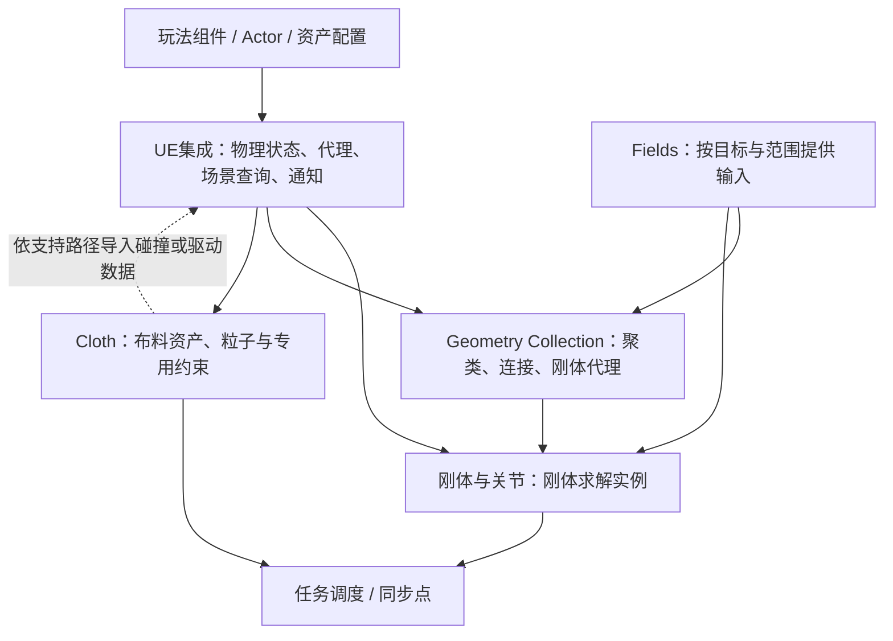
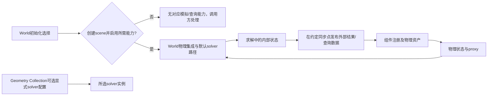
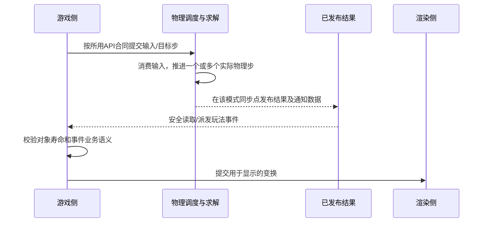
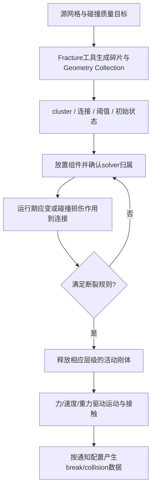
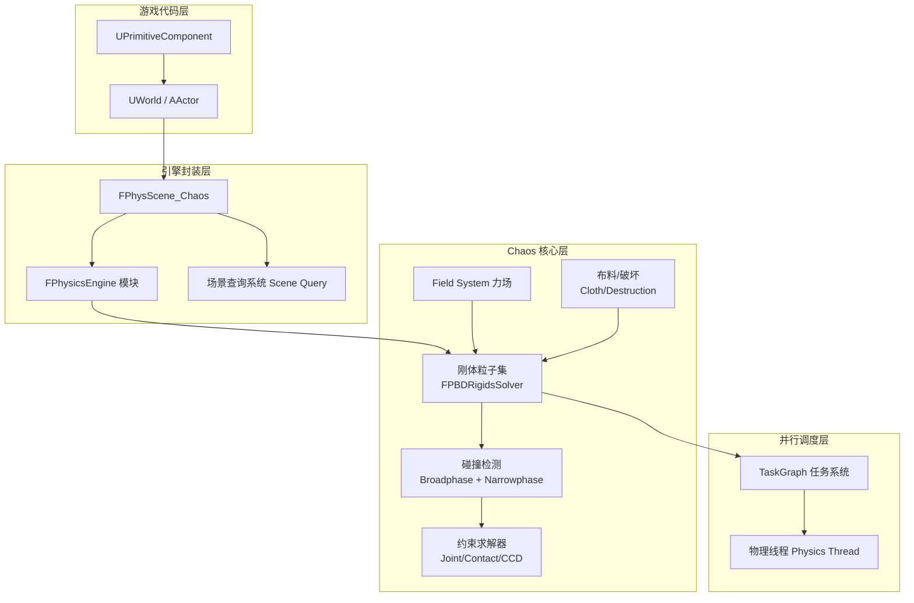
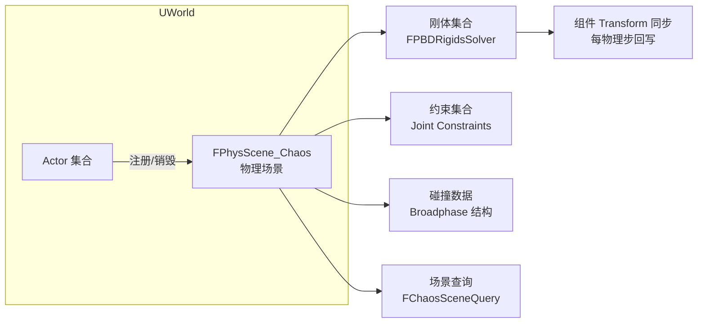
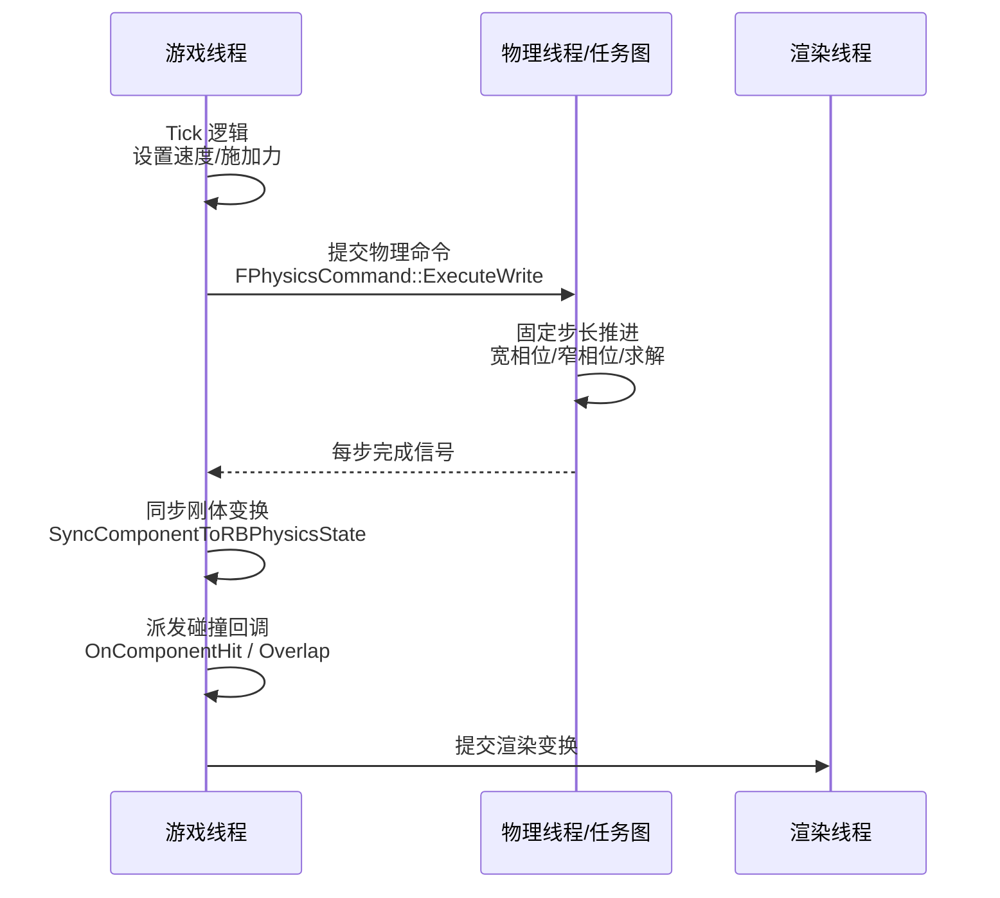
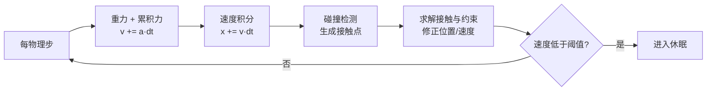
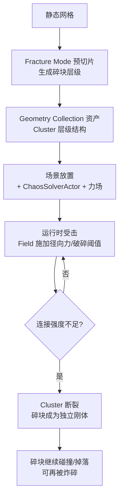

# 01 Chaos 物理引擎概览

> 知识成熟度：L2。本篇建立物理资产、状态、时间步、访问与玩法接口的机制合同；公开资料静态核对不等于引擎运行验证。
> 版本基准：UE5 Chaos；API资料以2026-10-09读取的官方5.8页面为参照，历史里程碑明确标版本。原文的UE5.8.0/CL55116800本机核对声明保留在历史区，本轮未复核该安装或项目配置。
> 证据边界：公式与P01–P14为PAPER_EXPECTED，都是有限前提下人工推导。C++/蓝图、UE、数值模型、线程、网络、设备和性能实验均未执行，示例未编译。
> 最后更新：2026-10-09。修订因果、访问和单位合同，原文与历史差异完整保留。

## 概述：物理能力从哪些条件产生

把一个箱子勾成Simulate Physics，涉及的不只是“换成Chaos后端”：资产必须有可用碰撞形状，组件要建立物理状态，body要有正确运动类型和质量，求解器要推进时间，结果还要同步到玩法和渲染。破坏和布料增加了自己的资产、约束、碰撞输入和更新流程。

本文围绕四个问题展开：对象属于哪个World/scene/solver；谁能在什么时刻访问哪份状态；力、冲量和质量如何决定运动；如何把正确性与CPU预算一起验收。它解释系统边界，不把概念图当源码调用图，也不把任意积分器两行代码说成Chaos内部实现。

## 1. Chaos的能力与演进

Chaos是UE的物理技术集合。刚体、布娃娃、破坏、布料、车辆和物理场可以在同一游戏中协作，但共同名称不意味着所有对象进入同一个求解实例，更不意味着布料挂到任意碎块便自动获得正确双向动力学反馈。

| 版本事实 | 一手依据 | 能推出的边界 |
| --- | --- | --- |
| UE4.23提供Chaos物理/破坏Beta预览 | [4.23发布说明](https://www.unrealengine.com/blog/unreal-engine-4-23-released?lang=en-US) | 破坏不是4.26才首次加入；当时的启用与构建流程不能当UE5新项目流程 |
| UE5.0默认启用Chaos，PhysX不再是受支持后端 | [5.0发布说明，Physics与Upgrade Notes](https://dev.epicgames.com/documentation/unreal-engine/unreal-engine-5.0-release-notes?application_version=5.0) | 不能把残留类型名/第三方文件解释成“UE5还能切回官方PhysX后端” |
| UE5.3引入Panel Cloth资产工作流 | [Panel Cloth概览](https://dev.epicgames.com/documentation/unreal-engine/panel-cloth-editor-overview) | 资产/编辑流程和可选XPBD布料约束有版本演进，不是刚体总开关 |
| UE5.4将Chaos Destruction列为Production Ready | [5.4发布说明](https://dev.epicgames.com/documentation/en-us/unreal-engine/unreal-engine-5.4-release-notes?application_version=5.4) | 不应把整套Chaos所有子功能一概标成同一成熟状态 |

旧文把PhysX称为“闭源且Epic无法改”、把预切片APEX称为“假破坏”，不是选择架构的可靠依据。Chaos常见破坏工作流同样使用预破碎几何，再在运行期改变连接和动力学状态；资产预处理与实时刚体模拟并不矛盾。

| 概念 | 本篇采用的含义 | 常见误读 |
| --- | --- | --- |
| Dynamic body | 由力、重力、冲量及约束改变状态的动力学body | 一个bool足以补出缺失碰撞资产/有效物理状态 |
| Kinematic body | 运动目标由外部控制；仍可能参与与dynamic的接触 | “不积分”就“对求解器没有影响” |
| Static body | 不作为常规运动body推进的场景碰撞对象 | 渲染Mesh就是物理几何 |
| World / physics scene | 游戏世界与它的物理集成/数据管理入口 | 每种World都必有正在模拟的scene |
| Solver | 在其对象集合上推进状态和处理约束的求解实例 | 一个World或所有Chaos子系统只能一个solver |
| Proxy | UE外部状态与物理内部状态之间的桥接对象 | 拿到指针便可跨任意线程直接访问 |
| Broadphase / narrowphase | 筛候选与生成更精确几何/接触信息 | 所有几何组合都只用GJK/EPA |
| Fixed step / substep | 固定模拟时距与一段推进时间的细分 | 默认120Hz；子步等于固定异步tick |
| Sleeping / disabled | 暂停活跃求解与更强的禁用状态 | 休眠、删除、不可见是同一件事 |
| CCD | 在支持的运动/形状/配置域中处理步内接触风险 | 任意传送/旋转/初始穿透都自动不穿墙 |
| Geometry Collection / cluster | 带碎片和聚类层级的破坏资产/模拟组织 | 每个叶片始终是独立活动刚体 |
| Field | 按空间与属性目标施加影响的机制 | 一次Wake或径向速度一定破坏连接 |

### 分层职责概念图



[Clothing Tool](https://dev.epicgames.com/documentation/unreal-engine/clothing-tool-in-unreal-engine?lang=en-US)明确说明Chaos Cloth有低层cloth solver。粒子是一种状态表示，共用数学或基础设施不证明跨求解器接触、约束和反作用力已自动建立。布料与破坏交互要另验资产关系、碰撞来源、更新先后和单/双向反馈。

## 2. World、scene、solver与物理状态

[World初始化参数](https://dev.epicgames.com/documentation/unreal-engine/API/Runtime/Engine/FWorldInitializationValues)分别控制scene初始化、物理scene创建、是否模拟以及trace是否有效。游戏World、预览World、编辑器工具World不能一概视为相同。首先确认当前对象注册到哪个World、该World是否建立相关物理状态，再检查“力没生效”。

在当前公开类型表中，FPhysScene对应FPhysScene_Chaos；后者建立UE层对象、代理、查询与通知的联系。其底层[FChaosScene](https://dev.epicgames.com/documentation/unreal-engine/API/Runtime/PhysicsCore/FChaosScene?lang=en-US)公开GetSolver、开始/结束帧和等待任务等入口。普通玩法优先从组件/World API进入，不需要手工创建solver。

### 对象归属概念图



自定义ChaosSolverActor能承载所选对象的solver；“放在这一片区域”不是自动空间归属规则，应检查组件实际分配。也不要假定分配到不同solver的刚体天然参与同一套接触求解。普通示例无需把“必须手放一个ChaosSolverActor”列为前提。

组件注销、重建物理状态、切关卡、对象销毁都会改变代理和内部handle有效性。只能在其合同允许的作用域使用body/handle；跨帧缓存裸指针要有明确的失效机制。

### 查询结构不是“刚体当前位置”的同义词

LineTrace、Sweep、Overlap读取符合过滤条件的空间查询数据；模拟则生成接触并求解运动。两者可共享几何和加速结构，也有不同启用标志与更新时刻。[Collision Response Reference](https://dev.epicgames.com/documentation/unreal-engine/collision-response-reference-in-unreal-engine?lang=en-US)区分QueryOnly、PhysicsOnly以及两者都启用。QueryOnly对象可以被trace命中，却不因而获得刚体接触冲量。

FChaosScene的CopySolverAccelerationStructure明确要求调用者使用合适同步点，不能因为存在“查询API”就宣称任意线程、任意内部状态都可即时查询。查询应记录世界、空间、形状、过滤、查询类型及使用哪一份已发布状态。

## 3. 线程、时间标签与结果同步

GT/PT首先是职责：GT维护玩法对象与外部接口，物理工作在配置选择的求解上下文和任务中推进，RT消费渲染数据。并行任务不等于独立固定tick；同步结果也不等于全程在GT做求解。旧PhysX的SyncScene/AsyncScene模型不能直接当Chaos默认结构。

[FSingleParticlePhysicsProxy](https://dev.epicgames.com/documentation/unreal-engine/API/Runtime/Chaos/FSingleParticlePhysicsProxy)分别暴露external的GameThreadAPI与internal的PhysicsThreadAPI，后者甚至可能因内部对象已删除而为空。由此应建立三条规则：

1. 玩法侧通过受支持的组件或外部接口发意图；不拿PT内部指针在GT随意改粒子，也不在PT直接写UObject属性。
2. 跨线程传不可变值快照或明确所有权的数据，记录命令目标和世代/有效期。结果回GT后仍要检查对象寿命、World和请求是否已过时。简单把裸this捕获进AsyncTask不能解决销毁问题。
3. 区分“调用被接纳”“物理步消费”“结果发布”“玩法回调派发”“渲染呈现”。不能拿立即读位置当冲量成功/失败证据；也不能笼统保证所有getter立即旧或立即新。

### 一条条件化时序（概念，不是每帧必经源码序列）



FPhysicsCommand是[FPhysInterface_Chaos的别名](https://dev.epicgames.com/documentation/unreal-engine/API/Runtime/PhysicsCore)。[ExecuteRead/Write接口](https://dev.epicgames.com/documentation/en-us/unreal-engine/API/Runtime/Engine/FPhysInterface_Chaos/ExecuteWrite)是受目标/上下文约束的访问入口；公开重载表没有承诺“所有write都排队到下物理步”。[FPhysScene_Chaos](https://dev.epicgames.com/documentation/unreal-engine/API/Runtime/Engine/FPhysScene_Chaos?lang=en-US)另有带PhysicsStep和owner的EnqueueAsyncPhysicsCommand，不能与普通访问包装混为一谈。本轮未检查受限实现，锁、立即执行或排队细节不凭函数名断言。

[Actor Ticking](https://dev.epicgames.com/documentation/unreal-engine/actor-ticking-in-unreal-engine)的常规帧调度里，PrePhysics适合提供本帧物理输入，DuringPhysics的数据可能处在更新前后，PostPhysics位于该帧物理完成之后。但启用固定异步模拟时还需辨认物理tick和发布时刻，不能把PostPhysics等同于“我刚提交的目标步一定完成”。

## 4. 刚体动力学：单位先于参数大小

对恒定正质量m、同一世界空间里的质心速度v：

```text
F_net = m*a
p = m*v
J = integral(F_net dt) = m*DeltaV
恒力在时长h内：J = F_net*h
力矩 tau = r × F，r从质心指向作用点
L = I_world*omega，惯性张量和omega必须在相同空间
dL/dt = tau_external；只有合外力矩为零时角动量才守恒
```

转动不是普遍的“alpha=tau/一个标量”。惯性张量随姿态变换，body-space形式还有陀螺项；有外力、驱动、阻尼、接触或约束时不能无条件宣称角动量守恒。数学与表示细节转到旋转和关节专篇。

### 物理单位与接口标志

本篇纸例约定长度cm、质量kg、时间s。Epic工程师[2014年的AddForce一手解释](https://forums.unrealengine.com/t/how-to-make-physics-forces-independent-of-frame-rate/294966/13)使用kg·cm/s²；下面给出沿用这一原生数值约定时的量纲换算。本轮未用5.8二进制实测单位；若目标分支/包装做SI换算，以该具体接口合同为准。

| 量 | cm–kg–s约定 | 与SI的换算/调用含义 |
| --- | --- | --- |
| 位置/速度/加速度 | cm、cm/s、cm/s² | 1m=100cm；向量坐标空间也须一致 |
| Force | kg·cm/s² | 1N=100该单位；AddForce默认按力解释，不能先乘dt又当力传入 |
| Impulse | kg·cm/s | 1N·s=100该单位；一次事件调用一次，不每子步重复完整冲量 |
| Torque | kg·cm²/s² | 1N·m=10000该单位；力臂cm与力单位同时参与 |
| Angular impulse / inertia | kg·cm²/s、kg·cm² | radians/degrees接口角单位要对应，不能仅把向量名换成Radians |
| bAccelChange=true | 加速度变化输入cm/s² | 忽略质量换算，改变的是输入物理量，不是“相同力” |
| bVelChange=true | 速度变化输入cm/s | 忽略质量换算；相同数值不再代表相同冲量 |

[Units of Measurement](https://dev.epicgames.com/documentation/en-us/unreal-engine/units-of-measurement-in-unreal-engine)列出编辑器显示单位和换算选项，其中Force默认显示N。不能仅凭显示单位就认定一个没有单位元数据的FVector参数自动由N换算；显示配置、物理量和原生接口数值是三件事。

### 质量来自哪一层

理想实心物体有m=ρV，但[物理材质参考](https://dev.epicgames.com/documentation/unreal-engine/physical-materials-reference-for-unreal-engine)的Density单位是g/cm³，并存在Raise Mass To Power调整；SetMassScale、质量override、实际碰撞几何及组合body也可能影响最终质量。不要把渲染Mesh体积或材质密度单独当最终kg数。读实际body质量，检查对应骨骼/焊接/约束对象，再解释加速度。

SetMassScale用于缩放质量策略；SetMassOverrideInKg用于明确的质量覆盖。它们是玩法选择，不存在“密度永远比硬编码正确”的规则。惯量分布、质心、质量比和约束共同影响行为，仅调质量不一定获得期望旋转。

### 一步推进的职责图


这是职责依赖，不指定Chaos必采用哪一个Euler变体或固定顺序；实际接触、CCD、预测和求解可能交织。休眠也不是“某一步速度小就睡”：阈值、时间、接触岛和唤醒规则相关；睡眠体仍占内存，并可能留在查询和碰撞结构中。醒来、禁用、删除和切成kinematic各自改变不同状态。

## 5. 步长、子步与回调

[UPhysicsSettings](https://dev.epicgames.com/documentation/en-us/unreal-engine/API/Runtime/Engine/UPhysicsSettings)分别有bTickPhysicsAsync/AsyncFixedTimeStepSize、bSubstepping、MaxSubstepDeltaTime、MaxSubsteps、MaxPhysicsDeltaTime。先记录选了哪种推进模式、实际生效参数及其覆盖来源，再讨论Hz。

- 帧关联推进可接受变动时长；子步是在一次接纳的模拟区间内分段，不自动使每个子步永远等长
- 固定异步步把物理步时距与显示帧分开；它增加了输入采样、积压、结果发布和插值的时间关系，不能只看CPU平均耗时
- 最大子步数是预算上限；遇到hitch时，不可能在有限预算内无条件同时满足“所有真实时间都推进”和“每步不超上限”。具体是截断、延迟或改变步长，要看实际版本和模式
- 子步减少某些离散误差，却不保证所有刚体/约束稳定或所有高速碰撞无穿透；加迭代也不能修正错误过滤、输入单位或碰撞形状

[子步文档](https://dev.epicgames.com/documentation/en-us/unreal-engine/physics-sub-stepping-in-unreal-engine)解释了普通一帧力在内部子步上的保持与目标插值。高层AddForce按其合同在持续期间每帧调用，通常不手工乘DeltaTime；不要同时在游戏Tick和每个内部子步重复同一输入。自定义async回调需要自己的目标tick、重模拟和单位合同，不能照搬本篇GT示例。

同一资料说明子步通知可能汇总到最后派发，一帧可有同一pair的多个通知甚至Begin与End。接触发生时间、事件被收集时间、Gameplay处理时间要区分；伤害应按自己的命中ID、攻击有效期与权威规则去重，不能按回调次数直接累加。

### 查询、模拟、事件、玩法四个门

| 门 | 先确认什么 | 不能推出什么 |
| --- | --- | --- |
| Query | 查询形状/时刻/过滤、目标参与query、返回类型 | 一次trace命中会自动产生模拟冲量或Hit事件 |
| Simulation | shape/body有效、模拟启用、运动类型与双方响应 | Block配置本身已经订阅所有通知 |
| Notification | Hit/Overlap/Break各自的生成选项、绑定、寿命和派发上下文 | 每个事件都是新的、独立且仍有效的玩法命中 |
| Gameplay | 目标有效、权限/去重/规则、网络权威与预测 | 几何结果本身是可信伤害或拾取授权 |

GT上的公开OnComponentHit可承担适当玩法响应，[官方OnHit教程](https://dev.epicgames.com/documentation/en-us/unreal-engine/using-the-onhit-event)就是例子。内部PT回调则不能任意改UObject。是否延后销毁/传送应由重入、生命周期和业务顺序决定；“放到timer下一帧”不是线程安全证明，也不保证确为下一个物理步。

## 6. C++与蓝图：一次冲量和持续力

下例是本篇自写的GT教学骨架，不是已编译插件。须在项目正常模块中创建MyThrower.h/.cpp，由蓝图子类给MeshComp配置有效Static Mesh、简单碰撞与PhysicsActor profile；场景具备物理模拟能力。没有这些资产，代码无法凭空生成球。示例演示普通帧调用，未涵盖异步固定tick或网络重模拟输入。

```cpp
// MyThrower.h — generated header必须放在本文件include末尾
#pragma once
#include "CoreMinimal.h"
#include "GameFramework/Actor.h"
#include "MyThrower.generated.h"

class UStaticMeshComponent;

UCLASS()
class AMyThrower : public AActor
{
    GENERATED_BODY()
public:
    AMyThrower();
    virtual void Tick(float DeltaSeconds) override;

    UPROPERTY(VisibleAnywhere, BlueprintReadOnly, Category="Physics")
    TObjectPtr<UStaticMeshComponent> MeshComp;

    // Strength的量纲是kg*cm/s；false表示请求未被本示例接纳
    UFUNCTION(BlueprintCallable, Category="Physics")
    bool ThrowSphere(FVector Direction, float Strength);

    // Force的量纲是kg*cm/s^2；存储后每个GT Tick提交，直到替换/停止
    UFUNCTION(BlueprintCallable, Category="Physics")
    bool SetConstantForce(FVector Force, bool bWake);

    UFUNCTION(BlueprintCallable, Category="Physics")
    void StopConstantForce();

protected:
    virtual void BeginPlay() override;
    virtual void EndPlay(const EEndPlayReason::Type Reason) override;
private:
    bool CanApply() const;
    FVector ConstantForce = FVector::ZeroVector;
};
```

```cpp
// MyThrower.cpp — 仅GT调用；不把此例当PT回调样板
#include "MyThrower.h"
#include "Components/StaticMeshComponent.h"
#include "PhysicsEngine/BodyInstance.h"

namespace
{
    bool IsFiniteVector(const FVector& V)
    {
        return FMath::IsFinite(V.X) && FMath::IsFinite(V.Y)
            && FMath::IsFinite(V.Z);
    }
}

AMyThrower::AMyThrower()
{
    PrimaryActorTick.bCanEverTick = true;
    PrimaryActorTick.TickGroup = TG_PrePhysics;
    MeshComp = CreateDefaultSubobject<UStaticMeshComponent>(TEXT("MeshComp"));
    SetRootComponent(MeshComp);
    MeshComp->SetMobility(EComponentMobility::Movable);
    MeshComp->SetCollisionProfileName(TEXT("PhysicsActor"));
}

void AMyThrower::BeginPlay()
{
    Super::BeginPlay();
    // 资产和简单碰撞由蓝图/编辑器预先配置，注册后才启用模拟
    if (!MeshComp || !MeshComp->GetStaticMesh() || !MeshComp->IsRegistered())
    {
        SetActorTickEnabled(false);
        return;
    }
    MeshComp->SetSimulatePhysics(true);
    MeshComp->SetEnableGravity(true);
    if (!CanApply()) SetActorTickEnabled(false);
}

bool AMyThrower::CanApply() const
{
    if (!IsInGameThread() || !IsValid(MeshComp)
        || !MeshComp->IsRegistered() || !MeshComp->IsSimulatingPhysics())
        return false;
    const FBodyInstance* Body = MeshComp->GetBodyInstance();
    return Body && Body->IsValidBodyInstance();
}

bool AMyThrower::ThrowSphere(FVector Direction, float Strength)
{
    if (!CanApply() || !IsFiniteVector(Direction)
        || !FMath::IsFinite(Strength) || Strength < 0.0f)
        return false;
    // 这里拒绝极端输入；是教学域上限，不是推荐物理预算
    if (Direction.GetAbsMax() > 1000000.0 || Strength > 1000000.0f)
        return false;
    if (!Direction.Normalize()) return false;
    const FVector J = Direction * Strength;
    if (!IsFiniteVector(J)) return false;
    MeshComp->AddImpulse(J, NAME_None, false);
    return true; // 只表示调用已提交，不承诺碰撞/约束后的最终速度
}

bool AMyThrower::SetConstantForce(FVector Force, bool bWake)
{
    if (!CanApply() || !IsFiniteVector(Force)
        || Force.GetAbsMax() > 10000000.0)
        return false;
    ConstantForce = Force;
    if (bWake) MeshComp->WakeRigidBody(NAME_None);
    return true;
}

void AMyThrower::Tick(float DeltaSeconds)
{
    Super::Tick(DeltaSeconds);
    if (!CanApply()) { ConstantForce = FVector::ZeroVector; return; }
    if (ConstantForce != FVector::ZeroVector)
        MeshComp->AddForce(ConstantForce, NAME_None, false);
}

void AMyThrower::StopConstantForce()
{
    if (IsInGameThread()) ConstantForce = FVector::ZeroVector;
}

void AMyThrower::EndPlay(const EEndPlayReason::Type Reason)
{
    ConstantForce = FVector::ZeroVector;
    Super::EndPlay(Reason);
}
```

公开[AddForce签名](https://dev.epicgames.com/documentation/unreal-engine/API/Runtime/Engine/UPrimitiveComponent/AddForce?lang=en-US)只有Force、BoneName、bAccelChange三参。旧例的第四个bWake不能混入；示例把唤醒明确为独立动作。SetConstantForce一次调用保存的是本例自己的命令状态，Tick才持续提交。Stop只停止以后提交，不能撤回已被物理步消费的力。

CanApply只检查可调用状态，不验证资产质量、质量比、运动约束或网络权限；生产代码还应有日志、调用域限制和项目幅度预算。初始资产错误会禁用本例Tick，修好运行时资产后须显式恢复组件和Tick，示例不提供自动重试。SetMassScale/override应在明确body和质量目标后配置，本例不暗设实际质量正好2kg。

蓝图对照：先配置移动Mesh与简单碰撞，再在运行期确认Is Simulating Physics；击飞事件调用一次Add Impulse；持续推力用开始/停止状态控制Event Tick里的Add Force；bAccelChange/bVelChange打开时重新按加速度/速度命名输入。读取Get Physics Linear Velocity必须知道所读状态的更新时间，观察睡眠用实际构建可用的诊断字段，不依赖旧文固定统计列名。

## 7. 破坏：资产连接断开与碎块运动

Chaos Destruction的常见流程是作者准备Geometry Collection、预切片和cluster层级，在运行期按碰撞/应变等规则断开连接并改变活动刚体集合。它不等于“任意StaticMesh收到Wake后自动生成新断面”。需要程序化运行期拓扑变化时，应单独研究具体版本支持与成本。

### 破坏流程概念图



[Chaos Fields指南](https://dev.epicgames.com/documentation/unreal-engine/chaos-fields-user-guide-in-unreal-engine)把锚定、应变/运动、睡眠/禁用区分开。External Strain改变连接是否断开，internal strain/decay可改变阈值；linear/angular velocity改变碎块运动。Radial Vector只是空间方向/分布的一部分，不能只看节点名字就推断它发送的是破坏应变。Culling限制场的作用范围，也不是自动按摄像机不可见关闭求解。

最小蓝图设计仍保留五步：

1. 从网格生成Geometry Collection并预切片；例如20–50片仅是便于检查的教学资产规模
2. 配好碰撞近似、cluster层级、damage threshold和初始dynamic/kinematic/anchor策略
3. 放置组件，确认使用world solver还是显式solver；检查场实际作用对象，不能只靠空间上靠近SolverActor
4. 启用所需break/collision通知，再绑定OnChaosBreakEvent；[组件API](https://dev.epicgames.com/documentation/en-us/unreal-engine/API/Runtime/GeometryCollectionEngine/UGeometryCollectionComponent)提供SetNotifyBreaks。回调中的音效/特效应有去重、数量和生命周期预算
5. 运行逻辑分别表达“以strain尝试断开连接”和“给已释放部分运动输入”。Wake只解决睡眠/激活路径，不能当断裂命令；再碎裂取决于现有层级或另行实现的拓扑能力

完整cluster可能作为聚合体求解，断开才增加活动body/接触/事件。资产叶片数、可见碎片数和本帧活动刚体数应分别量测。移除碎片、休眠、disable、切换缓存播放或表现LOD各有碰撞/玩法与再激活后果，不能只按“几秒后删掉”视为等价优化。

## 8. 性能预算与测量边界

物理预算不是一个“200/500刚体”通用上限。输入至少包括活动body和岛、碰撞形状复杂度/更新、候选与接触对、关节/约束、迭代数、实际子步、CCD集合、查询量、布料粒子/自碰撞、破坏释放峰值、GT/PT等待与事件回调工作。

| 决策 | 要比较的量 | 不能直接承诺 |
| --- | --- | --- |
| 减少活动body、调整休眠 | 活动岛/唤醒频率/查询数据/接触峰值 | 休眠零成本或永远是最大瓶颈 |
| 简化碰撞形状 | 候选、接触、形状更新和玩法误差 | 自动凸包只有离线成本、运行期免费 |
| 调整迭代/子步 | 残差/堆叠漂移/穿透与CPU每步/每帧 | 迭代越高必稳；120Hz适合所有场景 |
| 有选择地用CCD | 支持的形状/运动、漏碰风险和对应profile | 固定“贵数倍”或绝对不穿墙 |
| Cloth/GC的LOD与缓存 | 仿真与渲染各自成本、碰撞/事件需求 | 视觉看不见即可安全停掉玩法物理 |

先在指定引擎/构建/平台/场景和输入窗口里记录预算，再按同一条件比较平均与高分位峰值。CPU工作量、关键路径wall time、GT等待和整帧耗时不同；并行不意味着没有同步延迟。示例P12的4ms是分摊CPU工作，不是实测整帧耗时。

[官方性能分析入口](https://dev.epicgames.com/documentation/en-us/unreal-engine/introduction-to-performance-profiling-and-configuration-in-unreal-engine)把stat看作快速观察，复杂归因使用Unreal Insights等工具。保留stat physics/stat chaos作为目标构建中应核实的定位入口，不承诺每版都有同名组或固定Sleeping Bodies列。旧文的Sleep/Collision CVar与默认值留在历史区；没有核到目标构建时，不建议照抄开关。

[CVD入门](https://dev.epicgames.com/documentation/unreal-engine/getting-started-with-chaos-visual-debugger)可检查粒子、碰撞几何、接触和约束；[采集说明](https://dev.epicgames.com/documentation/unreal-engine/capturing-data-with-chaos-visual-debugger)提示数据通道、构建支持和记录成本。[文件记录](https://dev.epicgames.com/documentation/unreal-engine/recording-to-file)能避开实时播放的一部分开销，但不等于零采集成本。没录到某通道不证明它未发生；插桩诊断与基准计时要分别报告。

FreezeRendering改变的是渲染相关观察条件，不能隔离出物理的纯耗时；关闭碰撞/强制休眠则改变了工作负载和游戏行为。这样的对照若以后获准执行，必须记录变化，不能把结果叫相同玩法下的优化。本轮没有操作这些设置或运行任何测量。

## 9. 有限纸面正反例

全部标为PAPER_EXPECTED，无程序输出或引擎观测；单位和前提以§4为准。

| ID | 输入/前提 | 人工期望与用途 |
| --- | --- | --- |
| P01 | m=2kg，F=1000kg·cm/s²，h=0.02s，无别的力/约束 | a=500cm/s²，Δv=10cm/s，J=20kg·cm/s；不能据此断言离散位置恰等解析解 |
| P02 | 一次J=20，质量2与4kg | Δv=10与5cm/s；若bVelChange=true，输入20改作速度增量，两者都是20 |
| P03 | bAccelChange=true，输入500cm/s²，持续0.02s，质量2与4kg | 两者Δv=10；等价物理力分别1000与2000 |
| P04 | P01拆成2×0.01s，力保持 | 每段Δv=5，总10；错误每段重复完整J=20则总20；Force先乘0.02再按力传入则总0.2 |
| P05 | 采用r×F向量代数，r=(0,10,0)cm，F=(1000,0,0) | τ=(0,0,−10000)kg·cm²/s²；r=0则无附加力矩。引擎旋转符号还需遵守具体角API坐标约定 |
| P06 | 理想实心V=1000cm³，ρ=1g/cm³，无质量修正 | m=1kg；线尺寸×2则理论8kg；最终引擎质量仍需核幂/scale/override |
| P07 | 教学均分政策frame=0.05s、maxh=0.02、maxsteps=4，无frame clamp | 需要3步且每步1/60s；frame改0.2需10步，4步预算不能同时保持总时长与maxh。不是引擎实测默认算法 |
| P08 | QueryOnly形状、过滤匹配且几何相交 | 查询可命中，不自动有模拟冲量或玩法伤害 |
| P09 | 同一pair子步1进入，子步2离开，最终一起派发 | 同显示帧有Begin与End不矛盾；不能按通知次数累计独立伤害 |
| P10 | published state=k，输入目标k+1尚未确认发布 | 只能说新状态未确认；立即getter不能作为统一的完成栅栏 |
| P11 | 一个完整cluster含20叶片，仅调用wake | 活动刚体数不必20；wake本身不是strain，不能保证断裂 |
| P12 | 60显示帧/s，120物理步/s，假设每步2ms CPU工作 | 每秒240ms CPU工作、平均每显示帧分摊4ms；非观测wall time或普遍性能数字 |
| P13 | 两个1kg body，速度10与0cm/s，只有内部碰撞 | 封闭连续模型总p=10kg·cm/s；加入kinematic推动/外力等后不能沿用封闭守恒账 |
| P14 | NaN force、零方向冲量或无有效模拟body | 示例拒绝；不把归一化失败改成任意方向。回GT的旧对象结果另做寿命/世代检查 |

以后若要运行验收，至少要固定具体build与资产、力与冲量模式、同步/async模式、hitch策略、事件与对象销毁、动态/运动学接触、破坏层级、网络预测和测量开销。本轮只完成文档、链接、字节保全及纸面推导，所有运行项仍为NOT_RUN。

## 10. 最佳实践与FAQ

八项实践各自保留可验收目的：先按玩法时序选同步/async；按目标平台建立数量与时间预算；区分休眠/禁用/删除；按形状与轨迹选CCD；按误差与hitch预算选步长；读取实际body质量；按回调上下文处理生命周期；用CVD解释状态，再以独立计时回答预算。

**Q1：UE5还能切回PhysX吗？** 5.0官方升级说明已称其不受支持。自定义fork能否另做集成是另一个工程问题；残留文件名不是现成受支持后端。本篇只覆盖Chaos。

**Q2：AddImpulse后不动？** 依次查正确World和已注册组件、资产碰撞/有效body、是否真的模拟、锁轴/约束/运动类型、方向与单位、施加给哪个骨骼body、命令是否被消费及何时读取。重力关闭不妨碍冲量改变速度；提交成功也不保证约束后仍有自由位移。

**Q3：高速物体穿墙？** 相对速度、薄壁、尺寸、旋转和实际h共同增加漏碰风险，v·h>尺寸不是充要条件。先查shape/过滤/初始重叠/瞬移路径，再选择支持域内的CCD、sweep、分段或步长调整。不能一律改到1/240s就宣布修复。

**Q4：物理卡顿先看什么？** 先区分CPU工作和GT等待，定位峰值帧及对应活动岛、候选/接触、查询、GC释放、布料和事件处理；再做可比条件下的归因。没有“80%一定是未休眠或网格碰撞”的本项目证据。

**Q5：服务器与客户端不一致怎么办？** 权威性和是否本地模拟是两件事。[Networked Physics](https://dev.epicgames.com/documentation/en-us/unreal-engine/networked-physics-overview)包含Default、Predictive Interpolation和Resimulation；客户端可以预测，服务器仍裁定权威状态。记录tick、输入、历史与校正策略；固定步不能独立保证跨平台逐位一致，也不能由浮点存在推导每次运行必然发散。

**Q6：Solver迭代很高就换XPBD？** 先确认读的是配置迭代预算、实际执行计数还是求解耗时，再查接触/关节、质量比、几何、步长与误差。Panel Cloth里的XPBD约束选项不等于所有Chaos刚体通用切换。降低迭代应伴随目标误差验收。

**Q7：碎块很多就卡？** 分清资产叶片与实际活跃body/接触/通知峰值。可评估聚类、碰撞简化、破坏LOD、缓存、睡眠与有明确玩法后果的移除策略；Culling场不是摄像机可见性系统，wake也不会凭空生成破坏拓扑。

## 关联阅读

- [02-碰撞检测与物理材质](02-碰撞检测与物理材质.md)：通道、查询、Hit/Overlap与材质；该篇的具体版本断言也须独立核对，不能反向证明本篇引擎行为
- [03-物理约束与关节](03-物理约束与关节.md)：刚体如何连接、驱动和限制自由度
- [04-布娃娃与物理动画](04-布娃娃与物理动画.md)：角色物理资产与动画驱动边界
- [引擎架构与资源系统](../../03-引擎架构与资源系统/README.md)：World与Component生命周期、物理状态建立/销毁
- [网络与游戏服务端](../../07-网络与游戏服务端/README.md)：权威、复制、插值和预测的责任
- [数值积分与运动学模拟](../../02-数学与游戏算法/数学与数值计算/05-数值积分与运动学模拟.md)：ODE、步长、稳定性与约束组合；通用方法不证明Chaos实现
- [碰撞检测](../../02-数学与游戏算法/空间查询与碰撞/04-碰撞检测.md)：查询输出、CCD时域与失败状态；几何命中不自动等于响应或伤害

## 来源与本轮边界

引用为Epic官方公开文档/发行说明，及一条有日期的Epic工程师历史单位解释。5.8页面是读取时网站标签，不是本机CL55116800源码快照；部分页面仍有UE4/APEX遗留段，本文只引用明确窄范围。未引入受限源码或外部全文。

AddForce、FChaosScene、World初始化、PhysicsSettings、ExecuteWrite和proxy页面已直读；AddImpulse单页与OnComponentHit单页工具访问失败，仅使用官方组件列表/官方教程支持本文相应的有限论断。没有验证目标项目CVar、默认Hz、锁实现或精确async发布延迟。

2026-10-09：按资产/状态/时间/访问/单位/事件/预算重整全文；保留原有图、C++与蓝图、七FAQ及阅读用途；旧文与全部实际Git差异在下方隔离保存。maturity保持L2、verified保持空；不把静态资料核对记作引擎运行证据。

## 历史保全附录（隔离区，不作现行API或运行证据）

这里保留整改前全文及所有可达Git历史唯一内容。旧结论、旧菜单、旧默认值和代码错误仅作为原始材料；现行教学以前文为准。原文不是外部引擎源码。

恢复规则：基线B0是下方七反引号围栏内部的原始UTF-8/LF字节，保留末尾换行。历史H使用其零上下文补丁从B0恢复；不能按现行Markdown链接重新解释或自动修补原文。相同字节的多个提交仍分别列出。

| 提交 | 当时路径 | Git blob | 字节 | SHA-256 / 恢复项 |
| --- | --- | --- | --- | --- |
| 79bb4a9ecb084d5765bcced9b5b4c586666f6d30 | `知识/04-图形动画与物理仿真/物理求解与动力学/01-Chaos物理引擎概览.md` | e9a1be89eff55d2725fa7bbf376d50f8cfacb5b3 | 21739 | `c7c3c39bddee5aba00b9fbd1d019f4b363bcdb01725a9e8201b8bb7ab860a243` / B0 |
| c354aea4bafcb52691b5ebc2631c02e8731bcc8c | `知识/04-图形动画与物理仿真/物理求解与动力学/01-Chaos物理引擎概览.md` | e9a1be89eff55d2725fa7bbf376d50f8cfacb5b3 | 21739 | `c7c3c39bddee5aba00b9fbd1d019f4b363bcdb01725a9e8201b8bb7ab860a243` / B0 |
| 9beb653aa267a4a0dbcf44a32fa21ce205cc3ce5 | `游戏知识/09-物理系统/01-Chaos物理引擎概览.md` | e9a1be89eff55d2725fa7bbf376d50f8cfacb5b3 | 21739 | `c7c3c39bddee5aba00b9fbd1d019f4b363bcdb01725a9e8201b8bb7ab860a243` / B0 |
| 039a990f5af37e3f5911e384035cf1592578741f | `游戏知识/09-物理系统/01-Chaos物理引擎概览.md` | 4ec92513392e8835ef20088cff7ca364e7c77e3a | 21639 | `5537ffe508ca71d0559d71c605fbc64a614f28d61d9a10919da10edcaeccfcef` / H-5537ffe508ca |
| 2653b9e01c9e9664429ba6225eed6853db30426e | `游戏知识/09-物理系统/01-Chaos物理引擎概览.md` | 2824d7f05b0e2f6ec5d4f217a9de54789d921e0b | 21638 | `ae74baf79d54a6c49f796898c03e1aca3acb246958936743489b5a5db5c1029b` / H-ae74baf79d54 |
| f97556acb80af617fe6fbedcbaf99485888371ba | `游戏知识/09-物理系统/01-Chaos物理引擎概览.md` | a98c81e6bcac627a0e142bb3cc5f1b2ef5e52280 | 21579 | `db98c2cd144dabaa9fc412559b5838177fdff9f5e9fba995d4ab705055743e27` / H-db98c2cd144d |
| d294ec876825038e6ed8c16b363d0ca811d414f0 | `游戏知识/09-物理系统/01-Chaos物理引擎概览.md` | 52f381fc5fda082a8dc7a2c461e6b58e1d047a8d | 21155 | `d84e3731d48ff516a06fb5e279b854b8bf879824b83592e931ba33746855a284` / H-d84e3731d48f |
| b688b2f4652a5e0760d23886db819ee5bd462273 | `游戏知识/09-物理系统/01-Chaos物理引擎概览.md` | 6193aabc0e8f1e0d1faf29d62d9156d3dd1259f6 | 21020 | `d5cc229b27bdae846aa849cf2fb349163bcdebbc9902cf1496e6e48b06a8b9c6` / H-d5cc229b27bd |
| fef024a60b93f24b38c96585ecbb2010b67cbfd0 | `游戏知识/09-物理系统/01-Chaos物理引擎概览.md` | cda6d06b293b6e561ee2e3cf0e065594f2468c9b | 20979 | `bc757ae10b3edf6edf728f1494a2f09605fd3c4c34bceb06d99eab598aaadb2f` / H-bc757ae10b3e |

### B0：整改前全文

<!-- CHAOS_BASE_BEGIN -->
```````text
---
type: Concept
title: "01 Chaos 物理引擎概览"
status: stable
verified: []
maturity: L2
---
# 01 Chaos 物理引擎概览
> 知识成熟度：L2（本轮审计修订时补标）。
> 版本基准：UE 5.8.0（本机 `Engine/Build/Build.version`：CL 55116800，分支 `++UE5+Release-5.8`）。
> 兼容性边界：适用于 UE5.8 编辑器/运行时，UE4.27 与早期 UE5 仅作迁移背景，具体模块以正文为准。
> 官方参考：[Unreal Engine UE5.8 官方文档总页](https://dev.epicgames.com/documentation/en-us/unreal-engine)。
> 最后更新：2026-08-06（本轮元数据维护）。

> 适用版本：UE 5.x（UE5.0 起 Chaos 为默认物理后端；涉及版本差异会单独标注）

## 概述

**Chaos** 是 Epic Games 自研的高性能物理系统，从 UE 4.23 开始以实验性插件形式引入，UE 4.26 加入破坏（Destruction）能力，到 **UE 5.0 正式成为引擎默认物理后端**，全面替代了长期使用的 NVIDIA PhysX。它不是一个简单的"换皮"：Chaos 从底层重新设计了粒子/刚体统一架构，并把**刚体模拟、布料模拟、破坏模拟**收敛到同一套核心之上，让"墙被炸碎、碎块继续碰撞、布料挂在碎块上"这类跨域交互成为原生能力。

对 UE 客户端开发者而言，理解 Chaos 需要抓住四件事：

- **物理场景**：每个 World 对应一个物理场景（`FPhysScene_Chaos`），所有刚体、约束、查询都在其中注册；
- **线程模型**：物理模拟在游戏线程之外的物理线程/任务图上运行，理解"谁在哪个线程改什么数据"是避免踩坑的前提；
- **刚体动力学**：质量、力、冲量、力矩如何决定一个物体的运动，这是所有物理玩法的数学地基；
- **性能预算**：物理是典型的 CPU 密集型系统，需要从数量、迭代、时间步长三个维度做预算管理。

本文是"物理系统"分类的第一篇，目标是建立整体框架：先讲 Chaos 的演进与架构，再深入物理场景与线程模型，然后给出刚体动力学基础，最后简述 Chaos 破坏系统与性能预算。

## 核心概念

| 概念 | 英文 | 说明 | 关键点 |
| --- | --- | --- | --- |
| Chaos 物理系统 | Chaos Physics | Epic 自研物理后端，UE5 默认 | 刚体/布料/破坏统一核心 |
| 物理场景 | FPhysScene | 每个 UWorld 持有的物理世界 | 刚体、约束、查询的注册地 |
| 物理场景句柄 | FPhysicsSceneHandle | Chaos 层的场景封装 | 同步/异步两种模式 |
| 刚体 | Rigid Body | 有质量、可受力、可碰撞的物体 | 由几何体 + 物理材质组成 |
| 动力学刚体 | Dynamic Body | 受重力/力/冲量驱动 | `bSimulatePhysics = true` |
| 运动学刚体 | Kinematic Body | 位置由外部（动画/逻辑）驱动 | 不参与动力学求解 |
| 求解器 | Solver | 求解接触与约束的迭代器 | 位置/速度两阶段迭代 |
| 宽相位 | Broadphase | 粗筛潜在碰撞对 | BVH/网格加速结构 |
| 窄相位 | Narrowphase | 精确求接触点/法线 | 凸体 GJK/EPA，网格采样 |
| 物理线程 | Physics Thread | 执行模拟的线程 | UE 默认异步模拟场景 |
| 固定时间步长 | Fixed Tick | 物理以固定步长推进 | 默认 120Hz（1/120s） |
| 休眠 | Sleeping | 静止刚体进入低开销状态 | 醒来需要超过阈值扰动 |
| 连续碰撞检测 | CCD | 防止高速穿透 | 扫掠式碰撞/Sweep |
| 几何集合 | Geometry Collection | Chaos 破坏的网格资产 | 由碎块（Cluster）层级构成 |
| 力场系统 | Field System | 按空间施加物理影响的系统 | 驱动破坏/扰动的主要手段 |

## 原理详解

### 从 PhysX 到 Chaos：演进路线

UE4 时代物理后端是 NVIDIA PhysX（UE4.26 前默认），它成熟稳定，但存在三个先天问题：

1. **黑盒**：闭源 SDK，Epic 无法修改底层行为，也难以深度集成到引擎渲染/动画管线；
2. **分裂**：刚体（PhysX）、布料（APEX/NvCloth）、破坏（APEX Destruction）是三套独立系统，跨域交互（布料挂在碎块上）成本极高；
3. **破坏能力弱**：PhysX 本身没有真正的"断裂/碎裂"模拟，APEX 破坏是预切片的假破坏。

Chaos 的演进大致分四个阶段：

| 版本 | 里程碑 | 说明 |
| --- | --- | --- |
| UE 4.23~4.25 | 实验性引入 | Chaos 作为实验插件提供刚体/布料基础能力 |
| UE 4.26~4.27 | 破坏系统完善 | Chaos Destruction 与 Field System 进入可用状态 |
| UE 5.0 | 成为默认后端 | 新项目默认 Chaos；PhysX 仍可选 |
| UE 5.3+ | 持续收敛 | 物理控制组件、Chaos Vehicles 稳定、布料工具升级 |

> 注意：UE 5.8 中 PhysX 集成代码已移除（本机 5.8 源码中已无 PhysX 物理模块，仅残留少量构建键与第三方二进制），Chaos 是唯一物理后端。不要在新项目里依赖 PhysX 专属特性。

### Chaos 架构分层

Chaos 的架构可以抽象为四层：



要点说明：

- **引擎封装层**负责把 UE 的 `UPrimitiveComponent`（盒体/球体/胶囊体/网格体组件）翻译成 Chaos 的物理对象，并管理组件变换与物理位置的同步（`FPhysScene::SyncComponentToRBPhysicsState` 等）；
- **物理核心层**以"粒子（Particle）"为基本单元，刚体、布料顶点、破坏碎块在核心层都是粒子集合的不同形态（`FPBDRigidParticle` / `FPBDPositionConstraint` 等），这正是 Chaos 能跨域交互的原因；
- **并行调度层**决定模拟跑在哪些线程上，见下文线程模型。

### 物理场景与世界

UE 中每个 `UWorld` 都会创建一个物理场景（`FPhysScene`），实际类型是 `FPhysScene_Chaos`。它是所有物理内容的"容器"：



与物理场景相关的几个关键事实：

- **场景查询（Scene Query）**：`LineTrace`、`Sweep`、`Overlap` 等查询走的是 `FChaosSceneQuery`，它与模拟（Simulation）相对独立，可以离线查询也可以在线查询；
- **同步/异步场景**：UE 历史上物理场景分 `SyncScene` 与 `AsyncScene`。Chaos 默认把模拟放在异步场景中运行（通过 `FPhysScene_Chaos` 的 solver 线程），游戏线程只做提交与结果回读，从而避免物理模拟阻塞游戏逻辑；
- **多世界**：编辑器里每个 `UWorld`（主世界、预览世界、蓝图编辑器世界）都有独立物理场景，彼此不共享刚体；
- **网络**：服务器与客户端各自有独立物理场景，物理模拟默认**只在服务器权威**，客户端通过变换同步（`ReplicatedMovement` / 插值）呈现，需要小心的是：不要指望客户端物理模拟与服务器完全一致（浮点误差与线程时序都会导致发散）。

### 物理线程模型

UE 的物理执行涉及三个线程角色：

| 线程 | 职责 | 说明 |
| --- | --- | --- |
| 游戏线程（GT） | 提交物理操作、读取物理结果、触发碰撞回调 | 提交时把"意图"打包进命令缓冲区 |
| 物理线程（PT） | 执行模拟求解 | Chaos 的 solver 运行于此，可再并行切分 |
| 渲染线程（RT） | 读取变换渲染 | 变换由 GT 同步，RT 只管绘制 |



开发中最重要的三条线程规则：

1. **不要在物理线程直接改游戏对象**：物理回调（如 `OnComponentHit`）默认在游戏线程派发，但某些 Chaos 内部回调可能在物理线程执行，修改 `UActorComponent` 状态前需要切回游戏线程（用 `AsyncTask(ENamedThreads::GameThread, ...)` 或 `FFunctionGraphTask`）；
2. **物理命令缓冲区**：`FPhysicsCommand::ExecuteWrite/ExecuteRead` 是引擎用来保证"游戏线程提交、物理线程消费"安全的机制，游戏线程上的写操作会排队到物理步进时执行，所以**同一帧内立即读取物理结果可能拿不到最新值**；
3. **Tick 与固定步长**：游戏 Tick 是变步长的，物理模拟通常按**固定步长**推进（5.8 中专用物理线程默认以 `p.Chaos.Thread.DesiredHz`=60 的目标频率推进；异步模式可在 Project Settings → Physics → Framerate 的 `Async Fixed Time Step Size` 调整，默认 1/30；5.8 已无 `p.Chaos.Solver.FixedStep` 这个 CVar）。物理步长与帧率不同步时，引擎会插值刚体位置用于渲染，这就是"物理比帧率平滑"的原因。

### 刚体动力学基础

刚体运动由**牛顿第二定律**与**角动量守恒**共同决定。核心方程如下：

| 物理量 | 公式 | 说明 |
| --- | --- | --- |
| 力 | F = m·a | 力 = 质量 × 加速度 |
| 加速度 | a = F / m | 同等力下质量越大加速度越小 |
| 冲量 | J = F·Δt = m·Δv | 瞬间改变速度的手段（AddImpulse） |
| 动量 | p = m·v | 碰撞守恒的核心量 |
| 力矩 | τ = r × F | 力臂 × 力，产生角加速度 |
| 转动惯量 | I | 由质量分布决定，Chaos 自动从几何体计算 |
| 角动量 | L = I·ω | 角速度 ω 与惯性张量 I 的关系 |

在 UE/Chaos 中的落地方式：

- **质量**：`UPrimitiveComponent::SetMassScale` 调整缩放系数；实际质量 = 几何体体积 × 密度（来自物理材质），Chaos 会自动计算；`bOverrideMass` 可直接指定；
- **力**：`AddForce`（持续力，每物理步都施加）、`AddForceAtLocation`（偏移力臂产生力矩）；
- **冲量**：`AddImpulse`（瞬时速度突变，常用于击飞/爆炸）、`AddImpulseAtLocation`（带旋转冲击）；
- **力矩**：`AddTorqueInRadians` / `AddAngularImpulseInRadians`；
- **休眠**：刚体速度与角速度低于阈值并持续一段时间后自动休眠（Sleeping），醒来需要外部扰动超过阈值。`stat chaos` 里可以看到 `Sleeping Bodies` 数量——把不动的物体尽快休眠是最大性能杠杆。



### UE5 Chaos 破坏系统简述

Chaos Destruction 是 UE5 物理的招牌能力：**任意静态网格可以在运行时被真实地打碎**，碎块之间保留可断裂的连接（Cluster），断裂后继续参与刚体碰撞。

关键资产与工具：

| 资产/工具 | 作用 | 说明 |
| --- | --- | --- |
| Geometry Collection（几何集合） | 破坏的网格资产 | 由 Fracture Mode 从静态网格生成 |
| Fracture Mode（断裂模式） | 编辑器工具 | 选择切片方式（Uniform/Voronoi/Radial/Planar） |
| Cluster | 碎块聚类 | 多个碎块聚合为一个可整体运动的 Cluster |
| Field System（力场） | 运行时施加力的系统 | Radial Vector、Noise、Culling 等场 |
| ChaosSolverActor | 破坏求解器 Actor | 负责一片区域破坏的模拟 |

破坏的典型流程：



运行时破坏通过 **Field System** 驱动：`Radial Vector`（径向力）、`Noise`（随机扰动）、`Culling`（裁剪范围）组合成一个 Field 网络，在 `ChaosSolverActor` 的 `FieldSystem` 组件上执行。UE5 提供了 `Fracture` 演示项目（Content Example）可快速上手。破坏系统的性能要点是**碎块数量**：每块都是独立刚体，数百块的连锁断裂很容易打满 CPU 预算。

### 物理性能预算

物理性能主要被五个因素决定：

| 因素 | 影响 | 预算建议 |
| --- | --- | --- |
| 动力学刚体数量 | 每个刚体参与宽相位/窄相位 | 同屏动态刚体尽量控制在数百以内 |
| 接触点数量 | 网格对网格接触昂贵 | 能用盒体/胶囊体不用网格碰撞 |
| 求解迭代次数 | 迭代越多越稳越贵 | 默认位置/速度迭代足够时别加 |
| CCD 刚体数量 | 每个 CCD 刚体开销数倍 | 只对高速小物体开 CCD |
| 布料/破坏对象 | 粒子量与约束量 | 布料 LOD、碎块上限 |

常用调试命令与统计：

| 命令/工具 | 用途 |
| --- | --- |
| `stat chaos` | Chaos 各项统计（刚体数、休眠数、求解时间） |
| `stat physics` | 物理整体开销 |
| `p.Chaos.Solver.Sleep.Enabled 1` | 启用求解器休眠（5.8 真实名称，默认 1） |
| `p.Chaos.Solver.Collision.Enabled 0/1` | 开关碰撞检测（5.8 真实名称，默认 1） |
| Chaos Visual Debugger（CVD） | 可视化物理线程的碰撞与约束状态 |
| `FreezeRendering` 配合 `stat` | 冻结渲染定位物理峰值 |

一条实用的经验公式：**先数"动态刚体数 × 是否休眠"，再看接触对，最后才考虑迭代**。绝大多数物理卡顿都来自"不该动的物体在动"或"网格碰撞被滥用"。

## 代码/蓝图示例

### C++：创建一个可物理模拟的物体并施加力

```cpp
// MyThrower.h
UCLASS()
class AMyThrower : public AActor
{
    GENERATED_BODY()
public:
    AMyThrower();

    UPROPERTY(VisibleAnywhere, BlueprintReadOnly)
    class UStaticMeshComponent* MeshComp;

    UFUNCTION(BlueprintCallable, Category = "Physics")
    void ThrowSphere(const FVector& ImpulseDirection, float ImpulseStrength);

    UFUNCTION(BlueprintCallable, Category = "Physics")
    void ApplyConstantForce(const FVector& Force, bool bWake);
};
```

```cpp
// MyThrower.cpp
#include "MyThrower.h"
#include "Components/StaticMeshComponent.h"

AMyThrower::AMyThrower()
{
    PrimaryActorTick.bCanEverTick = false;

    MeshComp = CreateDefaultSubobject<UStaticMeshComponent>(TEXT("MeshComp"));
    RootComponent = MeshComp;

    // 开启物理模拟：刚体动力学
    MeshComp->SetSimulatePhysics(true);
    // 质量缩放：让物体更"重"
    MeshComp->SetMassScale(NAME_None, 2.0f);
    // 开启重力
    MeshComp->SetEnableGravity(true);
}

void AMyThrower::ThrowSphere(const FVector& ImpulseDirection, float ImpulseStrength)
{
    // 冲量：瞬时速度突变（质量会参与换算：J = m·Δv）
    MeshComp->AddImpulse(ImpulseDirection.GetSafeNormal() * ImpulseStrength, NAME_None, /*bVelocityChange=*/false);
}

void AMyThrower::ApplyConstantForce(const FVector& Force, bool bWake)
{
    // 持续力：每个物理步都会施加
    MeshComp->AddForce(Force, NAME_None, /*bAccelChange=*/false, bWake);
}
```

要点：

- `bVelocityChange = true` 时忽略质量（直接改速度），适合做"统一手感"的击飞；
- `bAccelChange = true` 时 `Force` 被当作加速度而非力，适合让不同质量物体获得相同加速度；
- 施加物理操作后，结果要等物理步进才生效，不要在同一帧内 `AddImpulse` 后立刻读位置。

### 蓝图对照

1. 在关卡中放置一个 Static Mesh Actor，细节面板勾选 **Simulate Physics**；
2. 事件图表中调用 `Add Impulse` / `Add Force` / `Add Torque in Radians` 节点（都在 Physics 分类下）；
3. 需要读取物理状态时使用 `Get Physics Linear Velocity` / `Is Simulating Physics` / `Is Gravity Enabled`；
4. 观察物体是否休眠：选中物体看细节面板的 Physics 选项，静止物体在 `stat chaos` 中会出现在 Sleeping 列表。

### 破坏系统最小示例（蓝图思路）

1. 内容浏览器导入静态网格 → 菜单 Tools → Fracture Mode（或 Geometry → Fracture）；
2. 选择切片方式（如 Voronoi，碎块数 20~50），生成 Geometry Collection 资产；
3. 把资产拖入场景（会自动生成 GeometryCollectionActor），再放置一个 ChaosSolverActor 绑定；
4. 给 GeometryCollectionComponent 的 `OnChaosBreakEvent` 绑定事件，在碎块断裂时播放音效/特效；
5. 运行时调用蓝图节点 `Apply Radial Force`（作用于 FieldSystem）或 `Wake Rigid Bodies` 触发破坏。

## 最佳实践

- **默认用异步场景**：不要为省事把物理切成同步模式，异步模拟是 Chaos 性能与稳定性的基础；
- **数量预算先行**：开发现场先定"同屏动态刚体上限"，比如普通玩法 200、破坏场景 500，超了先砍数量再谈优化；
- **让物体尽快休眠**：静止的杂物设置合理休眠阈值（或手动 `PutRigidBodyToSleep`），休眠刚体几乎零开销；
- **高速物体开 CCD**：子弹、弹片等小而快的物体勾选 Use CCD，避免隧道效应穿墙，但别给所有物体开；
- **固定步长别乱改**：默认 120Hz 物理帧率适合绝大多数游戏；改低（如 60Hz）省 CPU 但会让高速碰撞变差，改高更稳但更贵；
- **质量用密度而非硬编码**：通过物理材质密度 + 几何体体积得到质量最自然，`SetMassScale` 做微调；
- **回调里只读不改**：`OnComponentHit` 回调中避免立即 `SetActorLocation` 或销毁 Actor（可能与物理线程竞争），用 `FTimerHandle` 延后一帧；
- **用 CVD 而不是猜**：Chaos Visual Debugger 能直接看到物理线程的碰撞点与约束，性能或穿模问题先开它看数据。

## 常见问题 FAQ

**Q1：UE5 里还能用 PhysX 吗？**
A：UE 5.x 中 PhysX 相关代码仍存在且部分项目可切回，但 Epic 已不再把它作为默认与长期方向。新项目、新功能（破坏、布料、车辆）都应使用 Chaos，不要依赖 PhysX 专属行为。

**Q2：`AddImpulse` 后物体没有动？**
A：先确认 `bSimulatePhysics` 已开启、重力正常、物体未被锁定（Lock 相关属性）；再确认没有其他约束/附着（Attach）把物体钉住；最后注意冲量在物理步进后才生效，别在提交后同帧断言结果。

**Q3：为什么两个物体穿了（隧道效应）？**
A：物体移动速度 × 物理步长 > 物体尺寸时就会穿透。对策：开启 CCD（Use CCD）、降低最大速度（Max Linear Velocity）、提高物理固定帧率（如 1/240）。

**Q4：物理很卡，第一步排查什么？**
A：开 `stat chaos` 看 Number of Bodies、Sleeping Bodies、Collision Detected。如果刚体数量正常，再看是否有大量未休眠的刚体、是否有网格碰撞（Mesh Collision）的接触对。80% 的卡顿来自这两个点。

**Q5：服务器与客户端物理不一样怎么办？**
A：这是预期行为——物理是浮点迭代，不同机器、不同线程时序必然发散。正确做法：物理模拟只在服务器跑（或只在客户端做表现），网络同步位置/旋转，客户端用插值平滑。不要把玩法判定依赖客户端本地物理。

**Q6：`stat chaos` 显示 Solver 迭代很高？**
A：迭代次数由 Project Settings 的 Physics 设置（位置/速度迭代）决定，堆叠场景（箱子塔）会触发更多迭代。先检查接触对是否过多（堆叠物体用更大接触面），再考虑切换求解器类型（如 PBD 换 XPBD，更稳定但更贵），最后才是降迭代。

**Q7：破坏碎块数量一多就卡？**
A：限制单次断裂的碎块总数（Fracture 时控制切片数），给碎块加"生命周期"（几秒后休眠或销毁），并用 Culling 场把玩家看不到区域的破坏模拟关掉。

## 关联阅读

- [02-碰撞检测与物理材质](02-碰撞检测与物理材质.md)：碰撞通道、Hit/Overlap 事件与物理材质——刚体"怎么撞"的细节；
- [03-物理约束与关节](03-物理约束与关节.md)：约束求解与关节——刚体"怎么连"；
- [04-布娃娃与物理动画](04-布娃娃与物理动画.md)：Chaos 在角色身上的应用——布娃娃、布料与物理动画；
- 01-引擎基础：UWorld/Component 生命周期是物理场景注册的基础；
- 06-网络同步：物理结果的服务器权威与客户端插值策略。
```````
<!-- CHAOS_BASE_END -->

### H-5537ffe508ca：由B0恢复

<!-- CHAOS_PATCH_BEGIN 5537ffe508ca71d0559d71c605fbc64a614f28d61d9a10919da10edcaeccfcef -->
```````diff
--- B0
+++ H-5537ffe508ca
@@ -1,7 +0,0 @@
----
-type: Concept
-title: "01 Chaos 物理引擎概览"
-status: stable
-verified: []
-maturity: L2
----
```````
<!-- CHAOS_PATCH_END 5537ffe508ca71d0559d71c605fbc64a614f28d61d9a10919da10edcaeccfcef -->

### H-ae74baf79d54：由B0恢复

<!-- CHAOS_PATCH_BEGIN ae74baf79d54a6c49f796898c03e1aca3acb246958936743489b5a5db5c1029b -->
```````diff
--- B0
+++ H-ae74baf79d54
@@ -1,8 +1 @@
----
-type: Concept
-title: "01 Chaos 物理引擎概览"
-status: stable
-verified: []
-maturity: L2
----
-# 01 Chaos 物理引擎概览
+# 01 Chaos物理引擎概览
```````
<!-- CHAOS_PATCH_END ae74baf79d54a6c49f796898c03e1aca3acb246958936743489b5a5db5c1029b -->

### H-bc757ae10b3e：由B0恢复

<!-- CHAOS_PATCH_BEGIN bc757ae10b3edf6edf728f1494a2f09605fd3c4c34bceb06d99eab598aaadb2f -->
```````diff
--- B0
+++ H-bc757ae10b3e
@@ -1,13 +1 @@
----
-type: Concept
-title: "01 Chaos 物理引擎概览"
-status: stable
-verified: []
-maturity: L2
----
-# 01 Chaos 物理引擎概览
-> 知识成熟度：L2（本轮审计修订时补标）。
-> 版本基准：UE 5.8.0（本机 `Engine/Build/Build.version`：CL 55116800，分支 `++UE5+Release-5.8`）。
-> 兼容性边界：适用于 UE5.8 编辑器/运行时，UE4.27 与早期 UE5 仅作迁移背景，具体模块以正文为准。
-> 官方参考：[Unreal Engine UE5.8 官方文档总页](https://dev.epicgames.com/documentation/en-us/unreal-engine)。
-> 最后更新：2026-08-06（本轮元数据维护）。
+# 01-Chaos物理引擎概览
@@ -69 +57 @@
-> 注意：UE 5.8 中 PhysX 集成代码已移除（本机 5.8 源码中已无 PhysX 物理模块，仅残留少量构建键与第三方二进制），Chaos 是唯一物理后端。不要在新项目里依赖 PhysX 专属特性。
+> 注意：UE 5.x 中 PhysX 相关代码仍大量保留在引擎里（如 `FPhysScene` 的 PhysX 路径、PhysicsAsset 的旧数据格式），但 Epic 的官方方向是全面转向 Chaos。不要在新项目里依赖 PhysX 专属特性。
@@ -166 +154 @@
-3. **Tick 与固定步长**：游戏 Tick 是变步长的，物理模拟通常按**固定步长**推进（5.8 中专用物理线程默认以 `p.Chaos.Thread.DesiredHz`=60 的目标频率推进；异步模式可在 Project Settings → Physics → Framerate 的 `Async Fixed Time Step Size` 调整，默认 1/30；5.8 已无 `p.Chaos.Solver.FixedStep` 这个 CVar）。物理步长与帧率不同步时，引擎会插值刚体位置用于渲染，这就是"物理比帧率平滑"的原因。
+3. **Tick 与固定步长**：游戏 Tick 是变步长的，物理模拟是**固定步长**的（默认 1/120 秒，可在 Project Settings → Physics 的 `Fixed Frame Rate` 调整，也受 `p.Chaos.Solver.FixedStep` 控制）。物理步长与帧率不同步时，引擎会插值刚体位置用于渲染，这就是"物理比帧率平滑"的原因。
@@ -249,2 +237,2 @@
-| `p.Chaos.Solver.Sleep.Enabled 1` | 启用求解器休眠（5.8 真实名称，默认 1） |
-| `p.Chaos.Solver.Collision.Enabled 0/1` | 开关碰撞检测（5.8 真实名称，默认 1） |
+| `p.Chaos.Solver.EnableSleepIntervals 1` | 强制启用休眠区间 |
+| `p.Chaos.Collision.Enabled 0/1` | 开关碰撞检测（排查用） |
```````
<!-- CHAOS_PATCH_END bc757ae10b3edf6edf728f1494a2f09605fd3c4c34bceb06d99eab598aaadb2f -->

### H-d5cc229b27bd：由B0恢复

<!-- CHAOS_PATCH_BEGIN d5cc229b27bdae846aa849cf2fb349163bcdebbc9902cf1496e6e48b06a8b9c6 -->
```````diff
--- B0
+++ H-d5cc229b27bd
@@ -1,13 +1 @@
----
-type: Concept
-title: "01 Chaos 物理引擎概览"
-status: stable
-verified: []
-maturity: L2
----
-# 01 Chaos 物理引擎概览
-> 知识成熟度：L2（本轮审计修订时补标）。
-> 版本基准：UE 5.8.0（本机 `Engine/Build/Build.version`：CL 55116800，分支 `++UE5+Release-5.8`）。
-> 兼容性边界：适用于 UE5.8 编辑器/运行时，UE4.27 与早期 UE5 仅作迁移背景，具体模块以正文为准。
-> 官方参考：[Unreal Engine UE5.8 官方文档总页](https://dev.epicgames.com/documentation/en-us/unreal-engine)。
-> 最后更新：2026-08-06（本轮元数据维护）。
+# 01-Chaos物理引擎概览
@@ -69 +57 @@
-> 注意：UE 5.8 中 PhysX 集成代码已移除（本机 5.8 源码中已无 PhysX 物理模块，仅残留少量构建键与第三方二进制），Chaos 是唯一物理后端。不要在新项目里依赖 PhysX 专属特性。
+> 注意：UE 5.x 中 PhysX 相关代码仍大量保留在引擎里（如 `FPhysScene` 的 PhysX 路径、PhysicsAsset 的旧数据格式），但 Epic 的官方方向是全面转向 Chaos。不要在新项目里依赖 PhysX 专属特性。
@@ -166 +154 @@
-3. **Tick 与固定步长**：游戏 Tick 是变步长的，物理模拟通常按**固定步长**推进（5.8 中专用物理线程默认以 `p.Chaos.Thread.DesiredHz`=60 的目标频率推进；异步模式可在 Project Settings → Physics → Framerate 的 `Async Fixed Time Step Size` 调整，默认 1/30；5.8 已无 `p.Chaos.Solver.FixedStep` 这个 CVar）。物理步长与帧率不同步时，引擎会插值刚体位置用于渲染，这就是"物理比帧率平滑"的原因。
+3. **Tick 与固定步长**：游戏 Tick 是变步长的，物理模拟是**固定步长**的（默认 1/120 秒，可在 Project Settings → Physics 的 `Fixed Frame Rate` 调整，也受 `p.Chaos.Solver.FixedStep` 控制）。物理步长与帧率不同步时，引擎会插值刚体位置用于渲染，这就是"物理比帧率平滑"的原因。
@@ -249,2 +237,2 @@
-| `p.Chaos.Solver.Sleep.Enabled 1` | 启用求解器休眠（5.8 真实名称，默认 1） |
-| `p.Chaos.Solver.Collision.Enabled 0/1` | 开关碰撞检测（5.8 真实名称，默认 1） |
+| `p.Chaos.Solver.EnableSleeping 1` | 强制启用求解器休眠（CVar 名称以版本实际输出为准） |
+| `p.Chaos.Collision.Enabled 0/1` | 开关碰撞检测（排查用） |
```````
<!-- CHAOS_PATCH_END d5cc229b27bdae846aa849cf2fb349163bcdebbc9902cf1496e6e48b06a8b9c6 -->

### H-d84e3731d48f：由B0恢复

<!-- CHAOS_PATCH_BEGIN d84e3731d48ff516a06fb5e279b854b8bf879824b83592e931ba33746855a284 -->
```````diff
--- B0
+++ H-d84e3731d48f
@@ -1,13 +1 @@
----
-type: Concept
-title: "01 Chaos 物理引擎概览"
-status: stable
-verified: []
-maturity: L2
----
-# 01 Chaos 物理引擎概览
-> 知识成熟度：L2（本轮审计修订时补标）。
-> 版本基准：UE 5.8.0（本机 `Engine/Build/Build.version`：CL 55116800，分支 `++UE5+Release-5.8`）。
-> 兼容性边界：适用于 UE5.8 编辑器/运行时，UE4.27 与早期 UE5 仅作迁移背景，具体模块以正文为准。
-> 官方参考：[Unreal Engine UE5.8 官方文档总页](https://dev.epicgames.com/documentation/en-us/unreal-engine)。
-> 最后更新：2026-08-06（本轮元数据维护）。
+# 01-Chaos物理引擎概览
```````
<!-- CHAOS_PATCH_END d84e3731d48ff516a06fb5e279b854b8bf879824b83592e931ba33746855a284 -->

### H-db98c2cd144d：由B0恢复

<!-- CHAOS_PATCH_BEGIN db98c2cd144dabaa9fc412559b5838177fdff9f5e9fba995d4ab705055743e27 -->
```````diff
--- B0
+++ H-db98c2cd144d
@@ -1,9 +1 @@
----
-type: Concept
-title: "01 Chaos 物理引擎概览"
-status: stable
-verified: []
-maturity: L2
----
-# 01 Chaos 物理引擎概览
-> 知识成熟度：L2（本轮审计修订时补标）。
+# 01-Chaos物理引擎概览
```````
<!-- CHAOS_PATCH_END db98c2cd144dabaa9fc412559b5838177fdff9f5e9fba995d4ab705055743e27 -->
