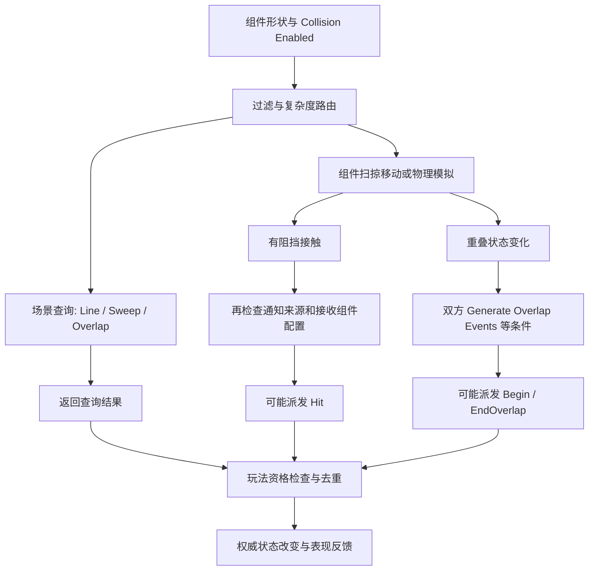

# 02 碰撞检测与物理材质

> 知识成熟度：L2。主要承诺是用实际读到的官方资料解释碰撞过滤、通知、场景查询与材质返回的责任边界，并给出可静态检查的玩法接入方法；不承诺某个引擎 revision 已运行通过。
> 版本基准：2026-10-09 读取的 Epic UE 5.6 碰撞/物理材质指南，UE 5.5 的指定组件与移动 API，以及标为 UE 5.8 的查询、结果、材质 API 和蓝图页面。每项真实版本、位置与冲突见文末；在线页面并非不可变源码快照，不能合并成同一版本实现认证。
> 适用范围：普通 PrimitiveComponent、Static Mesh、Physics Asset 的阻挡、重叠、同步 Line Trace/Sweep、物理材质及命中玩法。Geometry Collection、软体、Probe、网络回滚与求解器内部实现不在本文核对范围。
> 源码核对状态：未核对本机引擎源码；旧文 UE 5.8.0 / CL 55116800 / Windows 路径只保留为历史声明身份，不作为本轮环境观察。
> 最后更新：2026-10-09。证据为官方文字/API 静态选读及文档字节检查；全部 C++、蓝图、PAPER_EXPECTED 与待执行验收均未运行，未编译 UE/UHT/C++，未进行物理、网络、设备、设置、压力或性能实验。`verified: []` 保持空。

## 1. 先分清五个问题

同一个“子弹撞墙”的描述可能需要五种不同答案：墙有没有参与查询的形状，子弹与墙如何过滤，移动是否停止，游戏是否收到事件，命中后显示什么材质反馈。把它们归成一个“开碰撞”开关，会出现挡得住但没有 Hit、能点选但不模拟、能模拟却射线查不到等情况。

| 层次 | 输入与产物 | 不由它自动保证的事 |
| --- | --- | --- |
| 形状与启用方式 | 组件的碰撞几何、Collision Enabled、复杂度路由 | 可见网格不等于有可用碰撞几何 |
| 过滤 | Object Type、各通道响应、Profile、查询参数 | Block 是过滤/阻挡分类，不是“已经回调” |
| 移动或物理接触 | swept movement 或物理模拟各自处理命中 | Scene Query 本身不移动 Actor，也不自动施加伤害 |
| 通知 | Hit、Begin/EndOverlap 报告给订阅者 | 一次通知不等于一次可结算攻击；还需资格与去重 |
| 材质与玩法 | 接触参数、Surface Type、伤害/拾取规则 | 摩擦材质不会自动替代 CharacterMovement 的行走策略 |



图中的查询和通知是不同出口。调用 Line Trace 得到 `FHitResult` 不等于调用了目标组件的 `OnComponentHit`。物理接触涉及宽相位、窄相位与求解，本文只说明其外部配置；检测算法见关联主篇。

### 1.1 Collision Enabled 决定参加哪种工作

| 常用模式 | 场景查询 | 物理模拟接触 | 典型选择 |
| --- | --- | --- | --- |
| `NoCollision` | 不参加 | 不参加 | 纯装饰 |
| `QueryOnly` | 参加 raycast / sweep / overlap | 不参加刚体模拟 | 移动角色、触发区域、可查询目标 |
| `PhysicsOnly` | 不参加 | 参加 | 不需要查询的次级物理体 |
| `QueryAndPhysics` | 参加 | 参加 | 既受力又要被射线命中的箱子 |

“参加物理”不代表已经启用 `Simulate Physics`；后者还需要适用的 body、形状和其他组件条件。`QueryOnly` 也能在角色扫掠移动中阻挡，不能把它读成“不阻挡任何运动”。5.6 指南只列上述四种，而 5.8 `ECollisionEnabled::Type` 还列 `ProbeOnly`、`QueryAndProbe`，因此四行是本文常用子集，不是枚举全集。[碰撞响应参考](https://dev.epicgames.com/documentation/en-us/unreal-engine/collision-response-reference-in-unreal-engine?application_version=5.6)、[Collision Enabled API](https://dev.epicgames.com/documentation/en-us/unreal-engine/API/Runtime/Engine/ECollisionEnabled__Type)。

## 2. 通道回答身份和查询意图

Object Type 回答“我是哪类碰撞对象”。常见内置类型为 `WorldStatic`、`WorldDynamic`、`Pawn`、`PhysicsBody`、`Vehicle`、`Destructible`；这是过滤身份，不负责把可移动组件变成静态体。Trace Channel 回答“这次查询要问什么”，例如 `Visibility`、`Camera`。`Projectile` 可以是弹丸对象类型，`WeaponTrace` 可以是武器查询意图，二者不必是一条通道。

组件响应表对每个通道给出 `Ignore`、`Overlap` 或 `Block`。两个组件相遇时，需要分别读取 A 对 B 的 Object Type 的响应、B 对 A 的 Object Type 的响应。在通常的双边对象过滤中，其组合为：

| A 对 B / B 对 A | Ignore | Overlap | Block |
| --- | --- | --- | --- |
| Ignore | Ignore | Ignore | Ignore |
| Overlap | Ignore | Overlap | Overlap |
| Block | Ignore | Overlap | Block |

这可以记作“按 Ignore、Overlap、Block 的阻挡强度，取较弱响应”。两边 Block 才形成 Block；一边 Overlap 另一边 Block 得到 Overlap；一边 Ignore 就忽略。它描述的是过滤结果，Hit/Overlap 通知还要满足第 3 节条件，不能在矩阵单元写成“必然发生事件”。[Collision Overview 的 Interactions 与案例](https://dev.epicgames.com/documentation/en-us/unreal-engine/collision-in-unreal-engine---overview?application_version=5.6)。

**PAPER_EXPECTED F1：门和角色。** 门是 WorldDynamic，对 Pawn=Block；角色胶囊是 Pawn，对 WorldDynamic=Overlap。推导结果为 Overlap，门不会因自己设了 Block 就挡住角色。两边改为 Block 才满足双边阻挡过滤；若门的 Generate Overlap Events 关闭，原 Overlap 组合也不保证收到 BeginOverlap。只改变响应一项，可以区分“没有阻挡”和“没有通知”的原因。

ByChannel 查询则由调用者提供查询通道与查询响应参数，并读取目标对该通道的响应。查询没有一个真实的“射线 Actor”需要开启 Hit/Overlap 委托。ByObjectType 用对象类型集合筛选候选；ByProfile 从命名配置取得过滤语义。不要把双边对象矩阵机械套成三类 API 完全相同的返回合同。

### 2.1 自定义通道与预设

在 Project Settings → Engine → Collision 新建 Object Channel 或 Trace Channel，设置名字及默认响应；自定义对象通道与追踪通道合计最多 18 个。官方设置页没有支持“前 3 个内置物理通道可以任意改名”的规则。需要 `Level` 等项目语义时，定义清楚自己的类型/预设及代码映射，不把 `ECC_WorldStatic` 当作可随意改名的业务槽。新建查询通道的正常入口是 New Trace Channel，不是占用引擎保留的 `ECC_EngineTraceChannel*` 名字。[设置页](https://dev.epicgames.com/documentation/en-us/unreal-engine/collision-settings-in-the-unreal-engine-project-settings?application_version=5.6)、[自定义对象类型](https://dev.epicgames.com/documentation/en-us/unreal-engine/add-a-custom-object-type-to-your-project-in-unreal-engine?application_version=5.6)、[自定义查询通道](https://dev.epicgames.com/documentation/en-us/unreal-engine/add-a-custom-trace-type-to-your-project-in-unreal-engine)。

通道默认响应会影响既有预设和新资产。删除正在使用的对象类型会使其使用处回退到 WorldStatic；删除正在使用的 Trace Channel，其查询行为没有定义好的迁移保证。通道更名、删除和重排应按数据迁移处理，核对配置、资产和代码使用者，不靠显示名相似推断兼容。

Collision Preset/Profile 是命名的一组 Collision Enabled、Object Type 和响应配置；实例还可能进入 Custom 或被运行时代码覆盖。下面保留常用名字与用途，但不虚构每个项目都一致的完整矩阵：

| 预设 | 官方参考中的身份/用途 | 使用前还要核对 |
| --- | --- | --- |
| `BlockAll` / `BlockAllDynamic` | WorldStatic / WorldDynamic，默认阻挡 | 项目改动及新增通道默认响应 |
| `OverlapAll` / `OverlapAllDynamic` | WorldStatic / WorldDynamic，默认重叠 | 事件开关、查询能力 |
| `Pawn` | Pawn，适用于玩家/AI 胶囊 | 角色真正用于移动的组件 |
| `CharacterMesh` | Pawn，角色网格用途 | 不从名字推断它对 Pawn、Visibility 等每列的值 |
| `PhysicsActor` | 模拟 Actor 的常用预设 | Simulate Physics 与有效 body 单独检查 |
| `IgnoreOnlyPawn` | 参考页描述为忽略 Pawn 和 Vehicle | 官方表内有 `IngoreOnlyPawn` 拼写；以实际项目 profile 名为准 |
| `NoCollision` | 不参加碰撞 | 不等同于仍参加查询但所有通道 Ignore |
| `Trigger` | WorldDynamic，触发器用途 | 响应及 Generate Overlap Events |

原表中的 WorldStatic、WorldDynamic 是 Object Type，不是这张官方默认 profile 表里的对应预设名。不要用“WorldStatic 预设”替代 BlockAll，也不要把 OverlapAll 的类型写成 WorldDynamic。[默认预设表](https://dev.epicgames.com/documentation/en-us/unreal-engine/collision-response-reference-in-unreal-engine?application_version=5.6)。

## 3. 阻挡、Hit 和 Overlap 分开排查

### 3.1 Hit 是通知，不是 Block 的同义词

`OnComponentHit` 可来自 Character movement、开启 Sweep 的位置移动，或物理模拟。对于**物理模拟碰撞通知**，要在需要接收通知的组件开启 Simulation Generates Hit Events；不能写成“只要模拟物理就自动通知”，也不能把这个开关当作所有 swept movement Hit 的统一前置条件。两物体能互相挡住，其中一方仍可不生成自己的物理碰撞通知。[OnComponentHit 5.5 API](https://dev.epicgames.com/documentation/unreal-engine/API/Runtime/Engine/Components/UPrimitiveComponent/OnComponentHit?application_version=5.5)、[蓝图事件说明](https://dev.epicgames.com/documentation/en-us/unreal-engine/BlueprintAPI/Collision/OnComponentHit)。

物理模拟的 `NormalImpulse` 可表示接触冲量；swept-component 阻挡的该参数为零。因此零冲量不能作为“没撞到”的判据，Hit 也不能自动换算成固定伤害。持续接触可能反复上报，游戏必须规定每次撞击、每轮攻击或冷却窗口的结算单位。组件委托和 Actor 级通知若都接入同一结算器，应避免双重处理。

Hit 适合刚体撞击、阻挡接触反馈。落水、拾取和警戒范围更适合体积/Overlap 或专用环境状态；“落水一定要 Block Hit”会与可进入的水体需求冲突。

### 3.2 Overlap 是关系状态变化

典型 Begin/EndOverlap 需要可参与查询的碰撞形状、有效的 Overlap 过滤组合和双方开启 Generate Overlap Events。两边都设 Overlap 并非必要，Block+Overlap 也可形成重叠；任一 Ignore 则不会凭另一方 Overlap 产生该关系的事件。`OnComponentBeginOverlap` / `OnComponentEndOverlap` 报告进入/离开关系，不能当作每帧范围查询。[BeginOverlap API](https://dev.epicgames.com/documentation/unreal-engine/API/Runtime/Engine/Components/UPrimitiveComponent/OnComponentBeginOverlap?application_version=5.5)。

事件参数中的 `OtherActor`、`OtherComp`、`OtherBodyIndex` 帮助辨认参与者；`bFromSweep` 表明该通知与扫掠有关，不表示一定是“对方沿哪条路径移动过来”。只有该次事件提供了有效 sweep 语义时，才按相应含义消费 `SweepResult`。角色胶囊、网格、多 body 可能分别产生通知；范围计数应按组件/body 身份维护，不能拿一个 EndOverlap 就断言整个 Actor 已离开。

矩阵也不是“一个组件一生只产生一种事件”的排他承诺：不同组件对、不同路径和时刻会产生不同通知；Collision Overview 还提醒高速情况下即使有 Block 也可能收到 overlap。若同时消费两类通知，明确它们各自的业务用途和去重规则，不能按事件名重复结算。

**PAPER_EXPECTED F2：范围集合。** 同一角色的胶囊和另一个可重叠组件均进入警戒区。集合有两个参与键；只退出一个时，角色仍在范围。若应用简单在任何 EndOverlap 清空目标，将误报离开。若玩法只允许胶囊参与，则 Begin/End 两边都用同一个胶囊过滤规则。

Begin 不天然等于“现在唯一合法的拾取者”，End 也不能承担全部清理。组件销毁、Actor 退场、禁用碰撞、切关卡和玩法取消都应清理项目持有的关系；回调只是入口。需要检测出生时已经在范围内的对象，应显式定义初始化后的重叠快照和事件去重策略，不能等一个未承诺的新 Begin。

### 3.3 SetActorLocation 的 Sweep 与 Teleport 是两个参数

`bSweep=true` 会沿移动路径检查，可能触发沿途重叠并在阻挡前停止；Actor 的这个入口只 sweep 根组件，子组件随根移动而不各自完成同样的阻挡 sweep。根是无碰撞 SceneComponent、真正碰撞体是子组件时，“我已勾 Sweep”仍不足以支持预期。`Teleport` 控制物理状态如何迁移，例如 TeleportPhysics 保持速度；它与是否扫掠不是同一个开关。[SetActorLocation 5.5](https://dev.epicgames.com/documentation/unreal-engine/API/Runtime/Engine/GameFramework/AActor/SetActorLocation?application_version=5.5)。

`bSweep=false` 不检查整段路径是否被墙挡住，也不能保证沿途触发器被观察到。它**不能推出目标位置永远不会更新 Overlap**：Overlap 是组件重叠状态维护的一部分，具体通知还依赖更新路径、注册、开关和已有关系。`USceneComponent::UpdateOverlaps` 公开说明其职责是查询并更新重叠状态；本轮未读 MoveComponent 内部实现，不认证所有瞬移入口的回调时序。[组件重叠维护入口](https://dev.epicgames.com/documentation/unreal-engine/API/Runtime/Engine/USceneComponent?lang=en-US)。

**PAPER_EXPECTED F3：穿过薄触发器。** 起点和终点都在触发器外，未 sweep 的一次跳转不提供中途穿越的检测证据；若终点落在触发器内，则应检查最终位置重叠更新，不能沿用“瞬移永不 BeginOverlap”。对必须无遗漏的路径命中，选择明确的 sweep/分段查询设计，再对速度、形状、旋转和步长进行目标版本验证。

## 4. 场景查询的输入和返回合同

先选择你要问的问题，再选择 API。即时 Scene Query 读取碰撞场景；它不推进求解器、不移动组件，也不负责广播玩家攻击。视线检测与枪口检测可以共享查询机制，但不一定共享通道、忽略策略或权威时刻。

| 问题 | 入口 | 正确理解 |
| --- | --- | --- |
| 这条线遇到的第一个阻挡是什么 | `UWorld::LineTraceSingleByChannel` | 查指定 channel 的首个 blocking hit；不是任意最前面的 overlap |
| 到第一个阻挡前有哪些可报告命中 | `LineTraceMultiByChannel` | 返回沿途 overlap 与最近 block，已有序；有 block 时它在最后，不继续测其后方 |
| 球/盒/胶囊沿线是否撞上 | `SweepSingleByChannel` | 提供形状及旋转；返回首个阻挡，不把射线当有半径的子弹 |
| 这个位置是否有可报告交叠 | `OverlapAnyTestByChannel` | 可因 blocking 或 overlap 形状返回真；不输出沿途命中详情 |
| 只检查某些对象身份 | `LineTraceSingleByObjectType` 等 | 传 `FCollisionObjectQueryParams` 的类型集合，另定遮挡规则 |
| 沿用已命名过滤配置 | `LineTraceSingleByProfile` 等 | 输入真实 profile 名，确保项目配置存在 |

`SphereTraceSingleByChannel` 不是本文所核对的 `UWorld` 公共入口名称。原用途在 C++ 用 `SweepSingleByChannel` 配 `FCollisionShape::MakeSphere`，蓝图用 Kismet System Library 的 Sphere Trace By Channel。少返回数据与缩短查询范围有成本上的合理动机，但本文没有测得某入口在任意场景都更快。[UWorld 选读](https://dev.epicgames.com/documentation/en-us/unreal-engine/API/Runtime/Engine/UWorld)、[球形蓝图查询](https://dev.epicgames.com/documentation/en-us/unreal-engine/BlueprintAPI/Collision/SphereTraceByChannel)。

**PAPER_EXPECTED Q1：草、墙、敌人。** 从同一起点沿线依次为对 WeaponTrace=Overlap 的草、Block 的墙、Block 的敌人，形状均可查询且其他过滤接受。MultiByChannel 预期能返回草和墙，不返回墙后敌人；重新按 Distance 排序无法把未检测的敌人恢复出来。只剩草时，应检查输出列表，不要把“无 blocking hit”与“数组必为空”当作同一命题。每种查询的 bool 含义应按其具体函数合同使用。

对象 Multi 有一个需要公开保留的资料冲突：5.8 Traces Overview 写其返回符合所选对象类型的结果，而本轮读到的 UWorld `LineTraceMultiByObjectType` 简介却沿用了“到第一个 blocking hit”的文字。本文不据此宣布 C++ 对象 Multi 的截断/排序细节已经一致认证；使用前应对目标版本和固定场景核对。**可以确定的设计责任**是：对象筛选不是墙体遮挡政策；若只查 Pawn 而墙不在候选类型里，就不能凭候选集合证明视线畅通。先收集候选、再用明确遮挡通道验证，是可独立审查的玩法设计。[Traces Overview](https://dev.epicgames.com/documentation/en-us/unreal-engine/traces-in-unreal-engine---overview)。

### 4.1 FHitResult 不能只当布尔值

| 字段或访问器 | 读法与边界 |
| --- | --- |
| `bBlockingHit` | 这一结果来自 blocking collision；false 不等于从未出现任何 overlap 结果 |
| `bStartPenetrating` | 开始时已处在初始 blocking overlap；不能当普通沿途表面命中 |
| `GetActor()` / `GetComponent()` | 取命中对象/组件并检查有效性；不要假设存在名为 HitActor/HitComponent 的同名 C++ 字段 |
| `Time` / `Distance` | 本次路径的比例及 TraceStart 到 Location 的距离；不是世界时间或总飞行距离 |
| `Location` / `ImpactPoint` | 被扫形状到接触时的参考位置 / 实际接触点；有体积 sweep 时通常不同 |
| `Normal` / `ImpactNormal` | 分别针对被扫形状 / 被撞物体的世界空间命中法线；不要归因为“一个局部一个世界” |
| `PenetrationDepth` | 在初始穿透且可求推出向量时，沿 Normal 脱离所需距离；不是任意命中的厚度 |
| `PhysMaterial` | 弱引用；可能为空，返回请求和形状/材质路线要匹配 |
| `BoneName` | 骨骼命中信息，需匹配实际碰撞路线 |
| `Item` / `ElementIndex` / `FaceIndex` | 前两者是 primitive 特定数据；三角面索引看 FaceIndex，不把三者混为三角编号 |

这张表以 [FHitResult API](https://dev.epicgames.com/documentation/en-us/unreal-engine/API/Runtime/Engine/FHitResult) 的字段说明为准；Traces Overview 把 Normal 简写为追踪方向，不能用该简写覆盖 API 对 sweep 法线的定义。`IsValidBlockingHit()` 排除了开始已穿透的 blocking hit，适合明确拒收该情形的代码。

**PAPER_EXPECTED Q2：有半径的球撞平面。** 半径 10 cm 的球沿法线接近平面，忽略容差且没有初始穿透。球心接触时距平面 10 cm，ImpactPoint 位于平面，Location 位于球心；把弹孔贴到 Location 会悬空。该几何题只解释字段，未测量引擎的接触偏移或 sweep 容差。

### 4.2 查询参数与可观察性

`FCollisionQueryParams` 中，`bTraceComplex` 请求复杂路线；`bReturnPhysicalMaterial` 请求物理材质；`bReturnFaceIndex` 请求适用复杂静态网格查询的三角面索引；`AddIgnoredActor` / `AddIgnoredComponent` 设置本次查询的忽略集合。`TraceTag` 提供调试标记，并非开启了全部可视化。[参数 API](https://dev.epicgames.com/documentation/en-us/unreal-engine/API/Runtime/Engine/FCollisionQueryParams)。

持枪者、自身附属物和武器常需要明确忽略，但“友方全部忽略”是玩法选择：友军不受伤却能挡子弹，与友军完全不挡子弹是两种规则。前者可先得到友军阻挡，再拒绝伤害；若提前从查询删掉友军，子弹会继续命中其后目标。相机视线与枪口到落点的遮挡也要分别检查，否则贴墙时相机看到目标并不保证枪口能射到。

## 5. 简单与复杂碰撞是几何和路由选择

简单碰撞可由盒、球、胶囊或凸包组成；复杂碰撞通常使用三角网格。`bTraceComplex` 表示查询请求，资产的 Collision Complexity 决定请求实际映射到哪份几何，因此不能无条件写“false 一定凸包、true 一定逐三角”。

| Collision Complexity | 简单请求 | 复杂请求 | 本文静态网格用途边界 |
| --- | --- | --- | --- |
| Project Default | 按项目默认策略 | 按项目默认策略 | 先查项目设置，不能只看资产此名字 |
| Simple And Complex | 简单几何 | 三角网格 | 分别满足移动/一般查询与细节查询 |
| Use Simple Collision As Complex | 简单几何 | 仍为简单几何 | 不能靠 true 凭空获得网格细节 |
| Use Complex Collision As Simple | 三角网格 | 三角网格 | 可供其他简单模拟体撞击；该对象本身不能据此作为动态模拟体 |

关键区别是“模拟体撞在静态复杂表面上”与“三角网格对象本身受力运动”。官方明确 UseComplexAsSimple 不能模拟该对象；把它写成“牺牲性能即可让任何复杂网格模拟”会误导资产制作。[Simple versus Complex](https://dev.epicgames.com/documentation/en-us/unreal-engine/simple-versus-complex-collision-in-unreal-engine)。

**PAPER_EXPECTED G1：凹形椅座。** 一个跨过椅背和扶手的单凸包可能封住座位，角色站到凸包斜面上而非可见坐垫。静态椅子的复杂碰撞可表达座位，但若椅子要受力移动，优先制作合适的多个简单凸体。选择形状是在可进入空间、接触稳定性、资产/查询成本间取舍，不是“越精确越好”。

凸包的数学定义是包含给定点集的最小凸集；资产工具通常会做近似/分解，并不保证每个输出都是原网格的精确最小包。Static Mesh Editor 可添加简单形状、K-DOP、Auto Convex，复制入口在已读 UI 表中名为 Copy Collision from Selected Static Mesh；复制后仍需核对尺寸、坐标、碰撞槽和凹处覆盖。预先生成形状省去运行时构造步骤，**运行时查询、接触检测、内存与求解仍有成本**。[静态网格碰撞设置指南](https://dev.epicgames.com/documentation/en-us/unreal-engine/setting-up-collisions-with-static-meshes-in-unreal-engine)、[Static Mesh Editor UI](https://dev.epicgames.com/documentation/unreal-engine/static-mesh-editor-ui-in-unreal-engine?lang=en-US)。

骨骼网格通常通过 Physics Asset bodies 提供物理交互，不能把静态网格的 per-triangle 路线无条件外推到蒙皮网格。角色胶囊负责移动，Physics Asset 可用于部位命中/布娃娃；这两种用途本来就可有不同精度和通道。是否用它们作攻击判定由玩法、动画同步和预算决定，不应一概禁止“把玩法判定绑在网格上”。

## 6. 物理材质分成求解参数和玩法标签

`UPhysicalMaterial` 是物理材质资产，可在 Content Drawer → Physics → Physical Material 创建。渲染 Material/Material Instance 可关联它，但颜色、视觉粗糙度不会自动变成接触摩擦。Surface Type 是项目对表面类别的语义映射，用于脚步、弹孔、打击音效和滑行反馈；它本身不代替摩擦/恢复参数。[物理材质指南](https://dev.epicgames.com/documentation/en-us/unreal-engine/physical-materials-user-guide-for-unreal-engine?application_version=5.6)。

### 6.1 系数、合并和单位

| 属性 | 含义 | 需要防止的误读 |
| --- | --- | --- |
| Friction | 接触摩擦参数 | 0.05、0.6、1.0 可作教学候选，不是冰/地面/橡胶的通用实测值 |
| Restitution | 恢复/反弹系数，公开 API 标为 0 到 1 | 1 不是复杂离散系统总能量守恒或必定回原高度的保证 |
| Friction / Restitution Combine Mode | 两材料系数按指定方式合成 | 还要看项目默认与各材质 Override 开关 |
| Density | 质量属性计算输入，单位 **g/cm³** | 1 g/cm³ = 1000 kg/m³；不能把 1000 直接填进字段当水的 SI 密度 |
| RaiseMassToPower | 调整质量随物体尺度增大的增长方式 | 不是旧文写的 `RaiseMassToMinimum`，不表示质量最小值钳制 |
| Surface Type | 物理表面类别 | 需要项目映射及缺省反馈，不是复制协议或唯一材质资产 ID |

四种公式是 Average=(a+b)/2、Min=min(a,b)、Multiply=a×b、Max=max(a,b)。`bOverrideFrictionCombineMode` / `bOverrideRestitutionCombineMode` 决定材质是否覆盖项目设定。只有知道**最终采用哪种 mode**，才可以代入公式；枚举顺序本身不是双方不同 override 冲突时的选择证明。本轮未核对该冲突的 solver 源码，不承诺“冰的一边设 Min 就在所有配对里获胜”。[材质属性参考](https://dev.epicgames.com/documentation/en-us/unreal-engine/physical-materials-reference-for-unreal-engine?application_version=5.6)、[UPhysicalMaterial](https://dev.epicgames.com/documentation/en-us/unreal-engine/API/Runtime/PhysicsCore/UPhysicalMaterial)、[合并公式 API](https://dev.epicgames.com/documentation/unreal-engine/API/Runtime/PhysicsCore/EFrictionCombineMode__Type)。

**PAPER_EXPECTED M1：给定最终合并模式。** a=0.05、b=1.0，Average=0.525、Min=0.05、Multiply=0.05、Max=1.0；换成 a=0.05、b=0.6，Average=0.325。两个恢复系数都取 0.9 且最终选 Multiply 时为 0.81。数值演算保留旧文的手感比较用途，但不能据此承诺“完全滑”或某种弹跳高度。

**PAPER_EXPECTED M2：密度单位。** 假设简单碰撞表示一个实心 10 cm 立方体，体积 1000 cm³，密度 1 g/cm³，则未加项目质量修正的材料质量是 1000 g=1 kg。填成 1000 g/cm³ 会把同一个算式放大千倍。目标 body 的最终质量还可能经过 RaiseMassToPower、质量缩放或显式覆盖；这道单位题不是 `GetMass()` 的实测报告。示例铁的 SI 候选 7800 kg/m³ 应换算为 7.8 g/cm³，也仍需注明材质与温度等实际条件。

### 6.2 先确定命中了哪条材质路线

| 命中路线 | 优先查的资产位置 | 接入时的检查 |
| --- | --- | --- |
| Static Mesh 简单碰撞 | Static Mesh 的 Simple Collision Physical Material，及组件 PhysMaterialOverride | 查询参数是否请求返回；override 是否有意设置 |
| Static Mesh 复杂碰撞 | 命中面对应的 Material / Material Instance 物理材质 | 不把简单材质槽当面材质；记录 FaceIndex 与实际返回资产 |
| Skeletal Mesh / Physics Asset | 命中 body 的 Simple Collision Physical Material | 5.6 指南要求用对应 complex trace 取得 Physics Asset body 材质；这不代表查询了渲染三角面 |

这里不能给出旧文的统一“组件覆盖 > 骨骼体/槽位 > 网格默认”排行榜。实际读到的 5.6 User Guide 在 Static Mesh 的 Complex 表格写 override 可用，但 Misc 又明确说 override 不影响 complex collision traces，两处互相冲突。**本文不替它裁定具体实现**：简单路线按已明确的覆盖关系讲解，复杂路线保持有/无 override、不同面材质的验收项；未核对前不把复杂 trace 的返回值作为全组件 override 已生效的证据。此冲突不改变“检查返回弱指针并提供缺省 Surface Type”的接入责任。

直接 UWorld 查询需要 `bReturnPhysicalMaterial`；组件移动 sweep 则另有 `bReturnMaterialOnMove`。不要以为一次查询的参数会影响其他 Hit 回调或所有角色落地信息。[查询参数](https://dev.epicgames.com/documentation/en-us/unreal-engine/API/Runtime/Engine/FCollisionQueryParams)、[PrimitiveComponent 的移动材质开关](https://dev.epicgames.com/documentation/en-us/unreal-engine/API/Runtime/Engine/Components/UPrimitiveComponent?application_version=5.5)。

Surface Types 在 Project Settings → Physics → Physical Surfaces 配置。5.6 User Guide 写 62 个，而同版本 Reference 还保留 30 个的文字；本篇不依赖任何一个容量数做项目设计，容量及枚举可用项应在目标版本中确认。缺失材质、缺失表项或目标已退场时，表现应回退到 Default，不应解引用空指针或阻塞伤害事务。

### 6.3 换材质不等于切换角色行走模型

`SetPhysMaterialOverride` 改组件当前覆盖材质。公开函数说明明确：若物理已经运行，它不会因此重算质量/惯性，只改变摩擦等表面属性。因此换成更高 Density 的材质后不能假定箱子立即变重。[该函数 API](https://dev.epicgames.com/documentation/unreal-engine/API/Runtime/Engine/UPrimitiveComponent/SetPhysMaterialOverride)。

普通 CharacterMovement 的 `GroundFriction`、`BrakingFriction`、`BrakingFrictionFactor`、`BrakingDecelerationWalking` 处理行走转向和制动；它们与刚体接触摩擦不是同一套参数。想做角色冰面：取得脚下表面语义，由项目移动策略切换对应控制/制动参数，并在离开、腾空、换控或效果结束时按所属效果恢复；不能只给胶囊设置 PM_Ice 就承诺滑行。[GroundFriction 5.5 说明](https://dev.epicgames.com/documentation/unreal-engine/API/Runtime/Engine/GameFramework/UCharacterMovementComponent/GroundFriction?application_version=5.5)、[移动组件字段](https://dev.epicgames.com/documentation/en-us/unreal-engine/API/Runtime/Engine/UCharacterMovementComponent)。

## 7. C++ 与蓝图接入示例

以下均为**教学节选，未 UHT、未编译、未运行**。公共符号与责任按来源核对，项目类、通道配置、资产、Authority 调用路径和模块依赖仍由接入者提供。引用 `UPhysicalMaterial` 的项目需按自己的 Build.cs 配置 PhysicsCore；仅添加 include 不等于完成构建依赖。

### 7.1 射线取结果，再由玩法结算

下面保留原射击例的 Start/End、忽略自身与附属宿主、TraceTag、命中点/法线、表面音效和伤害用途。把“查询”和“提交伤害”分开，防止一次客户端表现查询直接成为伤害凭证。

```cpp
#include "Engine/World.h"
#include "Engine/HitResult.h"
#include "CollisionQueryParams.h"
#include "GameFramework/Actor.h"
#include "GameFramework/DamageType.h"
#include "Engine/DamageEvents.h"
#include "PhysicalMaterials/PhysicalMaterial.h"

// 调用前：World/Shooter 属于同一有效场景；Start/End 已经过项目射程与合法性检查。
bool QueryBlockingShot(UWorld* World, AActor* Shooter,
    const FVector& Start, const FVector& End, ECollisionChannel Channel,
    FHitResult& OutHit, EPhysicalSurface& OutSurface)
{
    OutHit = FHitResult();
    OutSurface = SurfaceType_Default;
    if (!IsValid(World) || !IsValid(Shooter)) return false;

    FCollisionQueryParams Params;
    Params.bTraceComplex = false; // 项目选择；还受资产 Complexity 路由影响
    Params.bReturnPhysicalMaterial = true;
    Params.AddIgnoredActor(Shooter);
    if (AActor* Parent = Shooter->GetAttachParentActor())
        Params.AddIgnoredActor(Parent);
    Params.TraceTag = TEXT("PlayerShoot");

    const bool bBlocked = World->LineTraceSingleByChannel(
        OutHit, Start, End, Channel, Params);
    if (!bBlocked || !OutHit.IsValidBlockingHit()) return false;

    if (const UPhysicalMaterial* Mat = OutHit.PhysMaterial.Get())
        OutSurface = Mat->SurfaceType;
    return true;
}

// 仅供服务器已验证的一次攻击调用，不是客户端 RPC 验证器。
float ApplyAcceptedShotDamage(AActor* Shooter, AController* Instigator,
    const FHitResult& Hit, const FVector& ShotDirection, float Damage)
{
    AActor* Target = Hit.GetActor();
    if (!IsValid(Shooter) || !Shooter->HasAuthority() || !IsValid(Target) ||
        !Hit.IsValidBlockingHit() || !FMath::IsFinite(Damage) || Damage <= 0.f ||
        ShotDirection.ContainsNaN())
        return 0.f;
    const FVector UnitDirection = ShotDirection.GetSafeNormal();
    if (UnitDirection.IsNearlyZero()) return 0.f;
    FPointDamageEvent Event(Damage, Hit, UnitDirection, UDamageType::StaticClass());
    return Target->TakeDamage(Damage, Event, Instigator, Shooter);
}
```

例中的 `TakeDamage` 给出完整参数，返回值是目标处理后的伤害量，不等于已经扣了某个现成的 Health 属性；目标类仍须实现伤害处理。`Hit.ImpactPoint` 和 `Hit.ImpactNormal` 可给表现层放置弹孔，OutSurface 用来查项目音效/特效表。骨骼部位命中还要核对目标碰撞路线与 BoneName。原来的 10.0 可作为调用者传入的教学伤害值，不是物理参数。[FPointDamageEvent 构造和方向合同](https://dev.epicgames.com/documentation/en-us/unreal-engine/API/Runtime/Engine/FPointDamageEvent)、[TakeDamage 参数和返回](https://dev.epicgames.com/documentation/en-us/unreal-engine/API/Runtime/Engine/AActor/TakeDamage)。

完整玩法顺序是：服务器确认这次攻击允许发生 → 根据已认可的发射时刻/姿态/范围形成查询 → 检查命中对象当前状态、队伍/无敌等资格 → 以项目攻击 ID 去重 → 调用伤害处理 → 发布结果给表现层。这里 Authority 检查只守住提交侧的一道门；它没有实现请求身份、射速、距离、视线、回滚或反作弊。若允许穿透，多次查询的继续位置、剩余距离、厚度和次数上限都要另定义，不能把 MultiByChannel 当自动穿透算法。

### 7.2 显式触发器和一次性拾取

不要 `GetComponentByClass<UPrimitiveComponent>()` 后假定找到的一定是触发区；角色/道具常有多个 primitive。下面是项目类 `AMyPickup` 的接口和方法节选，`Trigger` 明确指向指定触发器，`TryGrantTo` 是**项目提供的同步接口**，成功才表示背包/奖励已接纳，失败不消费拾取物。它不是引擎自带函数，本文不伪造背包事务实现。

```cpp
// AMyPickup 的类内声明；实际类还需 UCLASS / GENERATED_BODY 和构造资产设置。
UPROPERTY(VisibleAnywhere)
TObjectPtr<UPrimitiveComponent> Trigger;
bool bCollected = false;
bool bCollecting = false;
bool TryGrantTo(ACharacter* Character); // 项目合同：同步；失败不留下半份奖励

UFUNCTION()
void OnBeginOverlap(UPrimitiveComponent* OverlappedComp, AActor* OtherActor,
    UPrimitiveComponent* OtherComp, int32 OtherBodyIndex,
    bool bFromSweep, const FHitResult& SweepResult);
UFUNCTION()
void OnEndOverlap(UPrimitiveComponent* OverlappedComp, AActor* OtherActor,
    UPrimitiveComponent* OtherComp, int32 OtherBodyIndex);
```

```cpp
// 实现文件还需 Components/PrimitiveComponent.h、Components/CapsuleComponent.h、
// GameFramework/Character.h；BeginPlay/EndPlay 在实际类中声明 override。
void AMyPickup::BeginPlay()
{
    Super::BeginPlay();
    if (!IsValid(Trigger)) return;
    Trigger->OnComponentBeginOverlap.AddUniqueDynamic(this, &AMyPickup::OnBeginOverlap);
    Trigger->OnComponentEndOverlap.AddUniqueDynamic(this, &AMyPickup::OnEndOverlap);
}

void AMyPickup::OnBeginOverlap(UPrimitiveComponent* OverlappedComp,
    AActor* OtherActor, UPrimitiveComponent* OtherComp, int32 OtherBodyIndex,
    bool bFromSweep, const FHitResult& SweepResult)
{
    ACharacter* Character = Cast<ACharacter>(OtherActor);
    if (!HasAuthority() || bCollected || bCollecting || OverlappedComp != Trigger ||
        !IsValid(Character) || OtherComp != Character->GetCapsuleComponent()) return;

    bCollecting = true; // 奖励过程可能调用其他游戏代码，先挡住本地重入
    const bool bGranted = TryGrantTo(Character);
    bCollecting = false;
    if (!bGranted) return;
    bCollected = true;
    Trigger->SetCollisionEnabled(ECollisionEnabled::NoCollision);
    // 实际项目先复制/发布拾取结果；此例结束当前道具实例。
    Destroy();
}

void AMyPickup::OnEndOverlap(UPrimitiveComponent* OverlappedComp,
    AActor* OtherActor, UPrimitiveComponent* OtherComp, int32 OtherBodyIndex)
{
    // 本例无持续范围集合；不能在这里把 bCollected 重置为 false。
}

void AMyPickup::EndPlay(const EEndPlayReason::Type EndPlayReason)
{
    if (IsValid(Trigger))
    {
        Trigger->OnComponentBeginOverlap.RemoveDynamic(this, &AMyPickup::OnBeginOverlap);
        Trigger->OnComponentEndOverlap.RemoveDynamic(this, &AMyPickup::OnEndOverlap);
    }
    Super::EndPlay(EndPlayReason);
}
```

此前提还包括：Trigger 已创建、注册并具备 Query/Overlap 配置，角色胶囊也允许事件；`TryGrantTo` 不销毁/替换正在处理的拾取实例或 Trigger，且在当前同步调用期间相关对象仍有效。若奖励是异步或会销毁对象，应改为请求票据与生命周期检查，不能沿用上面的同步节选。满背包时此例退回未领取状态，但仍在范围内不会自动得到第二次 Begin；需要按钮交互或显式重试机制。复活/重刷创建新的拾取身份，不能靠 EndOverlap 重置已领取事实。

### 7.3 动态材质、移动忽略与通道响应分别设置

```cpp
// 资产由编辑器引用或上层已完成加载，避免每次接触同步 LoadObject。
bool SetContactMaterial(UPrimitiveComponent* Comp, UPhysicalMaterial* Material)
{
    if (!IsValid(Comp) || !IsValid(Material)) return false;
    Comp->SetPhysMaterialOverride(Material);
    return true; // 仅表示已调用 setter；不是物理效果或质量已验证
}

void SetMovementIgnore(UPrimitiveComponent* MovingComp, AActor* Other, bool bIgnore)
{
    if (IsValid(MovingComp) && IsValid(Other))
        MovingComp->IgnoreActorWhenMoving(Other, bIgnore);
}

void SetChannelResponse(UPrimitiveComponent* Comp, ECollisionChannel Channel,
    ECollisionResponse Response)
{
    if (IsValid(Comp)) Comp->SetCollisionResponseToChannel(Channel, Response);
}
```

三者作用域不同。移动忽略是该组件移动时忽略特定 Actor，必要时对方自己的移动也要配置；它不改全局通道、不自动影响独立 UWorld trace，也不影响该组件模拟物理时的移动。[IgnoreActorWhenMoving](https://dev.epicgames.com/documentation/unreal-engine/API/Runtime/Engine/UPrimitiveComponent/IgnoreActorWhenMoving?lang=en-US)。通道响应则改变对一类通道的响应，并非只忽略某个实例。

原 PM_Ice 资产路径可作为项目命名范例；实际使用时明确引用已配置 Friction、Combine 与 Override 的资产，setter 不会自动把其系数改成冰。效果结束时由同一配置拥有者恢复先前覆盖值/响应；若多效果并存，使用自己的效果栈或重算最终配置，不能无条件写回默认值覆盖后来者。材质资产经常被共享，不要为了一个 Actor 的临时效果悄悄修改共享资产。

### 7.4 蓝图对照与调试入口

1. Line Trace By Channel：提供 Start/End、Trace Channel、Trace Complex、Actors to Ignore/Ignore Self，消费 Return Value 与 Out Hit。实际读到的标准节点输入表**没有 Return PhysMat 开关**；不能要求读者勾一个不存在的针脚。若依赖材质返回，检查该节点/包装函数的实际行为；C++ 可显式设置查询参数。
2. Sphere Trace By Channel：同类过滤再加 Radius；Box/Capsule 还要匹配各自形状参数。查询得到结果后由图表明确调用玩法处理，不等待它自动触发 On Component Hit。
3. 范围触发：配置指定组件、双方 Generate Overlap Events、有效响应与查询能力，绑定 On Component Begin/End Overlap；按第 7.2 节处理重复、失败和退场。
4. Hit：物理碰撞通知在接收组件开启 Simulation Generates Hit Events；Character/sweep 路线另核对运动入口。组件事件和 Actor 事件只选定一个业务结算入口，或共同去重。
5. 鼠标拾取、Line Trace for Objects、By Profile 保留各自用途，但要按节点选用的过滤合同读取返回结果；Under Cursor 的可选项不等于普通 Trace 节点全部可调参数。
6. `show COLLISION` 可显示关卡碰撞模型/阻挡体；静态网格编辑器检查 simple/complex 形状，查询节点的 Draw Debug Type 显示射线。没有依据把 `Show Collision Complexity` 当已核实的通用控制台命令。TraceTag 只是标记，UWorld 的 DebugDrawTraceTag 等调试入口要按项目构建/设置核对。

来源：[Line Trace 节点输入表](https://dev.epicgames.com/documentation/en-us/unreal-engine/BlueprintAPI/Collision/LineTraceByChannel)、[Sphere Trace 节点](https://dev.epicgames.com/documentation/en-us/unreal-engine/BlueprintAPI/Collision/SphereTraceByChannel)、[官方碰撞调试指南](https://dev.epicgames.com/documentation/unreal-engine/review-collision-in-your-unreal-engine-game?lang=en-US)。这些是待使用入口，本次没有运行命令、打开项目或采集截图/性能。

## 8. 从需求到失败定位

### 8.1 保持可追踪的配置与结算责任

- 先把对象身份与查询意图区分，再为项目建立少量语义明确的通道；用集中映射代替散落的 ECC 数字。改 profile 会影响所有使用者，组件局部覆盖则需要明确拥有者、持续期与恢复策略。
- 为移动阻挡、命中反馈、精确表面查询分别选择足够的形状。简单并不等于错误，复杂并不保证更适合；Auto Convex 后仍有运行成本，查询范围、频率和 body 数量需要实测预算。
- Overlap 适合范围关系，Hit 适合接触通知，Sweep 适合沿路径的形状检测。三者不提供统一的“更便宜”排序，也不替代攻击去重。
- 过滤列表决定哪些对象可被观察；伤害资格决定已命中对象能否受伤。友方、持有者、武器组件与目标子组件分别处理，不用忽略列表偷偷改变遮挡政策。
- 服务器决定伤害和拾取等权威状态，但客户端仍可做本地查询/预测/表现。引擎不会因为联网就让“碰撞事件只在服务器发生”；本地回调不是自动复制的权威事务。跨机器时间与重现边界见网络/玩法主篇。

### 8.2 常见问题 FAQ

**Q1：设置了碰撞但两个物体还是穿过去？**

先确认实际移动的是哪个组件、用的是无 sweep 跳转、swept movement 还是模拟。然后查参与路线所需的 Collision Enabled、已烘焙/创建的形状、复杂度映射和双方响应，再查 profile 是否被实例/运行时代码覆盖。检查 Ignore 列表、根/子组件区别和高速运动方案；不要仅凭可见网格相交判断应该有物理阻挡。

**Q2：挡住了但 OnComponentHit 不触发？**

阻挡与通知分别成立。查是否真正发生了该入口可通知的阻挡接触，订阅的是不是参与碰撞的组件，物理路线下接收方是否开启 Simulation Generates Hit Events。查询返回阻挡本来就不等于派发 Hit；sweep 的零 NormalImpulse 也不能当未命中。没有依据声称所有角色移动组件“默认开”某个物理通知开关。

**Q3：Overlap 不触发或重复触发？**

查 Query 能力、形状、过滤组合、双方 Generate Overlap Events、注册与重叠状态更新、绑定时机及已有初始关系。无 sweep 移动不能保证沿途检测，但不能据此否定终点 overlap。重复时按组件/body 查是否多个参与者，并检查重复绑定和项目结算是否幂等。禁用/销毁/重刷不能只依赖 EndOverlap 恢复状态。

**Q4：射线结果偏了，或 Multi 查不到墙后面？**

检查世界空间 Start/End、相机/枪口区别、忽略集合、具体 channel 与目标响应、simple/complex 路由。球/胶囊 sweep 的 Location 与 ImpactPoint 不相同；Item 不等于 FaceIndex。MultiByChannel 在首个 block 后停止且已有序，额外排序不是穿透实现。初始穿透需独立策略，不能把推出向量当普通弹孔法线。

**Q5：角色走在冰面上还是不滑？**

先判定它是模拟刚体还是 CharacterMovement。前者检查双方最终材质、Combine 和 Override；后者检查项目是否从表面语义切换 GroundFriction 及制动策略、离开时如何恢复。Min 的纸面系数不能证明所有运动模型“完全滑”，低摩擦也不自动禁用制动、控制力或其他约束。

**Q6：弹孔/脚印音效怎么区分材质？**

沿明确查询路线请求材质，检查 `Hit.PhysMaterial.Get()`，取 SurfaceType 查项目反馈表，空值或无表项走 Default。Static Mesh simple、complex、Physics Asset body 的来源不同，移动 sweep 另有材质返回开关。复杂 override 的官方文字冲突仍需目标版本验收，不用“组件优先级最高”掩盖。

**Q7：胶囊与骨骼网格的命中不一致？**

它们是独立组件/形状，移动阻挡通常以胶囊为主，部位命中可由 Physics Asset 承担。查攻击通道实际接受哪个组件，是否同时重复命中两者，BoneName 与材质来自哪条路线。复杂查询标记不是骨骼网格逐渲染三角命中的保证。分别定义移动体积和部位判定，按攻击 ID 聚合即可保留细节用途而避免重复扣血。

### 8.3 待执行验收，全部 NOT_RUN

| 编号 | 输入与单变量改变 | 预期要观察的证据 / 失败判据 |
| --- | --- | --- |
| V1 | Block/Block 改为 Block/Overlap，再改为 Ignore | 实际阻挡、查询结果与各侧通知分栏；不把三个输出混记 |
| V2 | 保持刚体阻挡，只切接收方物理 Hit 开关 | 接触可继续而通知变化；与角色 sweep 的零冲量另对照 |
| V3 | 起终点都在触发器外；再把终点放内，分别 sweep/不 sweep | 沿途与终点关系分开，记录原/新位置和每个组件身份 |
| V4 | 草 Overlap、墙 Block、墙后 Pawn | Channel Multi 的截止位置；Objects Multi 则专门核对文档冲突，不预写成通过 |
| V5 | 同一 Static Mesh 的两份几何，切四种复杂度配置 | 实际选中的形状与 query 请求；UseComplexAsSimple 不能当动态模拟通过 |
| V6 | 面材质 A/B、简单材质 C、override D | simple/complex/Physics Asset 分别记录返回材质与空值，解决覆盖路线冲突 |
| V7 | 固定最终 Combine 的成对材质；另设双方不同 override | 先确认采用模式，再观察运动；不以手算公式替代 solver 验证 |
| V8 | 保持几何和初始质量，运行时换不同密度材质 | 区分表面参数更新与质量/惯性；不能仅看 UI 断言已重算 |
| V9 | 同一角色多组件进入、满背包、重复回调、对象退场 | 项目只结算一次；奖励失败不吞物品，持续在区内有明确重试入口 |
| V10 | 同一攻击在客户端预测、服务端确认及组件/Actor 两入口 | 权威结算去重，表现能纠正；不声称本轮做过联网或反作弊验收 |

这些项目先在固定引擎 revision、实际配置与最小资产场景核清，再讨论构建兼容、性能、并发或网络时序。纸面推导和静态检查不能把任一项改成“已运行”。

## 9. 来源版本、选读范围与历史身份

所有来源核对日为 2026-10-09。表中“5.8 页面”是页面显示版本，不代表读过 UE 5.8 内部代码。大 API 页只选读列出的字段/函数；没有把整个页面/类所有函数认证一遍。

| 来源 | 实际版本与选读位置 | 本文用途与限制 |
| --- | --- | --- |
| [Collision Overview](https://dev.epicgames.com/documentation/en-us/unreal-engine/collision-in-unreal-engine---overview?application_version=5.6) | 5.6，Interactions、模拟体与重叠案例 | 过滤/通知条件；页面保留 UE4 用词，不能当 Chaos 内部实现 |
| [Collision Response Reference](https://dev.epicgames.com/documentation/en-us/unreal-engine/collision-response-reference-in-unreal-engine?application_version=5.6) | 5.6，Preset / Enabled / Object / Response 表 | 默认配置用途；四种模式非新版本全集 |
| [Collision Settings](https://dev.epicgames.com/documentation/en-us/unreal-engine/collision-settings-in-the-unreal-engine-project-settings?application_version=5.6) 与 [Object Channel](https://dev.epicgames.com/documentation/en-us/unreal-engine/add-a-custom-object-type-to-your-project-in-unreal-engine?application_version=5.6) | 5.6，通道数量、删除、创建预设 | 合计18；不支持内置前三通道改名说法 |
| [Trace Channel](https://dev.epicgames.com/documentation/en-us/unreal-engine/add-a-custom-trace-type-to-your-project-in-unreal-engine) | 5.8 页面，创建步骤与默认响应 | 5.6 对应 URL 未成功读取，不能冒称已读 |
| [Hit](https://dev.epicgames.com/documentation/unreal-engine/API/Runtime/Engine/Components/UPrimitiveComponent/OnComponentHit?application_version=5.5) 与 [BeginOverlap](https://dev.epicgames.com/documentation/unreal-engine/API/Runtime/Engine/Components/UPrimitiveComponent/OnComponentBeginOverlap?application_version=5.5) | 5.5，Remarks；另对照 5.8 蓝图 Hit | 来源与开关、零冲量、双方事件条件；5.6 对应 API 打开失败 |
| [SetActorLocation](https://dev.epicgames.com/documentation/unreal-engine/API/Runtime/Engine/GameFramework/AActor/SetActorLocation?application_version=5.5) | 5.5，参数与返回说明 | sweep 根组件 / Teleport 分离，不覆盖全部内部通知时序 |
| [USceneComponent](https://dev.epicgames.com/documentation/unreal-engine/API/Runtime/Engine/USceneComponent?lang=en-US) | 5.8 页面定点选读，UpdateOverlaps / bSkipUpdateOverlaps | 仅支持状态维护入口，不是 MoveComponent 全文 |
| [UWorld](https://dev.epicgames.com/documentation/en-us/unreal-engine/API/Runtime/Engine/UWorld) 与 [Traces Overview](https://dev.epicgames.com/documentation/en-us/unreal-engine/traces-in-unreal-engine---overview) | 5.8 页面，LineTrace / Sweep / Overlap 系列、DebugDrawTraceTag；概览过滤/多命中/形状节 | Channel Multi 合同；Objects Multi 文字冲突保留 |
| [FHitResult](https://dev.epicgames.com/documentation/en-us/unreal-engine/API/Runtime/Engine/FHitResult) 与 [FCollisionQueryParams](https://dev.epicgames.com/documentation/en-us/unreal-engine/API/Runtime/Engine/FCollisionQueryParams) | 5.8 页面，本文使用字段/访问器 | 结果与参数语义；5.6 打开失败 |
| [Simple versus Complex](https://dev.epicgames.com/documentation/en-us/unreal-engine/simple-versus-complex-collision-in-unreal-engine) 与 [静态网格设置](https://dev.epicgames.com/documentation/en-us/unreal-engine/setting-up-collisions-with-static-meshes-in-unreal-engine) | 5.8 页面，四种路由、简单形状、K-DOP、凸分解与多形状编辑 | 5.6 complexity 两个候选 URL 均失败；不认证特定资产 |
| [Static Mesh Editor UI](https://dev.epicgames.com/documentation/unreal-engine/static-mesh-editor-ui-in-unreal-engine?lang=en-US) | 5.8 官方检索摘录，Collision 菜单 | 复制入口名含 Selected；未核对编辑器实际界面 |
| [Physical Materials Reference](https://dev.epicgames.com/documentation/en-us/unreal-engine/physical-materials-reference-for-unreal-engine?application_version=5.6) 与 [User Guide](https://dev.epicgames.com/documentation/en-us/unreal-engine/physical-materials-user-guide-for-unreal-engine?application_version=5.6) | 5.6，参数、创建、Static/Skeletal/Misc | Density 单位；复杂 override 与表面容量文字冲突公开保留 |
| [UPhysicalMaterial](https://dev.epicgames.com/documentation/en-us/unreal-engine/API/Runtime/PhysicsCore/UPhysicalMaterial) 与 [Combine enum](https://dev.epicgames.com/documentation/unreal-engine/API/Runtime/PhysicsCore/EFrictionCombineMode__Type) | 5.8 页面，Density / RaiseMassToPower / coefficient / override / formulas | 不从枚举数字推导 solver 选择优先级 |
| [PrimitiveComponent](https://dev.epicgames.com/documentation/en-us/unreal-engine/API/Runtime/Engine/Components/UPrimitiveComponent?application_version=5.5) | 5.5，委托、bReturnMaterialOnMove、setter | 5.8 类页首次超时且重读失败，5.5 setter 独页 cache miss 保留 |
| [SetPhysMaterialOverride](https://dev.epicgames.com/documentation/unreal-engine/API/Runtime/Engine/UPrimitiveComponent/SetPhysMaterialOverride) 与 [移动忽略](https://dev.epicgames.com/documentation/unreal-engine/API/Runtime/Engine/UPrimitiveComponent/IgnoreActorWhenMoving?lang=en-US) | 5.8 页面，Description | 表面变化不重算质量、忽略不作用于模拟移动 |
| [GroundFriction](https://dev.epicgames.com/documentation/unreal-engine/API/Runtime/Engine/GameFramework/UCharacterMovementComponent/GroundFriction?application_version=5.5) 与 [CharacterMovement](https://dev.epicgames.com/documentation/en-us/unreal-engine/API/Runtime/Engine/UCharacterMovementComponent) | 前者5.5 Remarks；后者5.8字段 Ground/Braking | 冰面控制与刚体参数分开；无角色运行数据 |
| [FPointDamageEvent](https://dev.epicgames.com/documentation/en-us/unreal-engine/API/Runtime/Engine/FPointDamageEvent) 与 [TakeDamage](https://dev.epicgames.com/documentation/en-us/unreal-engine/API/Runtime/Engine/AActor/TakeDamage) | 5.8 页面，构造、归一化方向、参数和返回 | 支撑节选签名，未实现项目 Health/背包/网络事务 |
| [Line Trace](https://dev.epicgames.com/documentation/en-us/unreal-engine/BlueprintAPI/Collision/LineTraceByChannel)、[Sphere Trace](https://dev.epicgames.com/documentation/en-us/unreal-engine/BlueprintAPI/Collision/SphereTraceByChannel)、[Review Collision](https://dev.epicgames.com/documentation/unreal-engine/review-collision-in-your-unreal-engine-game?lang=en-US) | 5.8 页面，输入表/事件说明/调试命令 | 未执行节点或控制台；错误拼接的 review URL 失败不删除 |

失败、超时、cache miss 和选读边界都保留在本轮仓外审计材料。不得把另一个版本页面成功当作原失败 URL 已恢复，也不能把公开 API 中的 Header/Source 路径当作本机文件已存在或已全文阅读。正文没有新增受限引擎源码，也没有分发外部文档全文。

### 9.1 原版本声明原字保留，仅用于追溯

以下是原文的历史身份，不是当前版本基准，也不是执行入口：

> 版本基准：UE 5.8.0（本机 `Engine/Build/Build.version`：CL 55116800，分支 `++UE5+Release-5.8`）。
> 源码依据：`C:\Program Files\Epic Games\UE_5.8\Engine\Source\Runtime\Engine\Classes\PhysicsEngine`、`Engine\Source\Runtime\PhysicsCore`。
> 适用范围：Chaos 碰撞通道、查询、事件和物理材质的运行时使用。
> 兼容性边界：UE 4.27/PhysX 仅作为历史迁移对照，当前物理后端以本机 UE 5.8 Chaos 源码为准。
> 最后更新：2026-08-05（统一 UE5.8 版本基线）。
> 官方参考：[Unreal Engine UE5.8 官方文档总页](https://dev.epicgames.com/documentation/en-us/unreal-engine)。

当前旧正文以及两个路径全部可达历史的实际字节，在仓外审计封包与原 Git 中完整保全；本篇和机械 manifest 的两路径修订不携带完整历史附录。旧示例的有效用途分别由第 7 节接入代码/合同和第 8 节 FAQ 承接，旧错误不再混进当前教学主线。书籍、工作日志、附件及既有运行原件未改动。稳定身份继续为 `kb-7d11ba6b04fc`，历史路径是 `游戏知识/09-物理系统/02-碰撞检测与物理材质.md`。

## 关联阅读

- [01-Chaos物理引擎概览](01-Chaos物理引擎概览.md)：碰撞检测在物理场景中的位置、模拟与通知边界。
- [03-物理约束与关节](03-物理约束与关节.md)：碰撞禁用与约束组合，按其自身证据范围阅读。
- [04-布娃娃与物理动画](04-布娃娃与物理动画.md)：Physics Asset 的骨骼体配置。
- [Gameplay 与交互系统](../../05-Gameplay与交互系统/README.md)：承接旧“03-游戏玩法编程”的 GAS/伤害系统用途。
- [游戏 AI](../../06-游戏AI/README.md)：承接旧“05-AI 系统”的视线查询与感知用途。

相邻篇章有各自的审查与运行边界，本文不替它们新增通过声明。主承诺仍是 L2 原始资料静态核对与工程解释，`verified: []` 不因文档门禁或本轮修订而自动改变。
