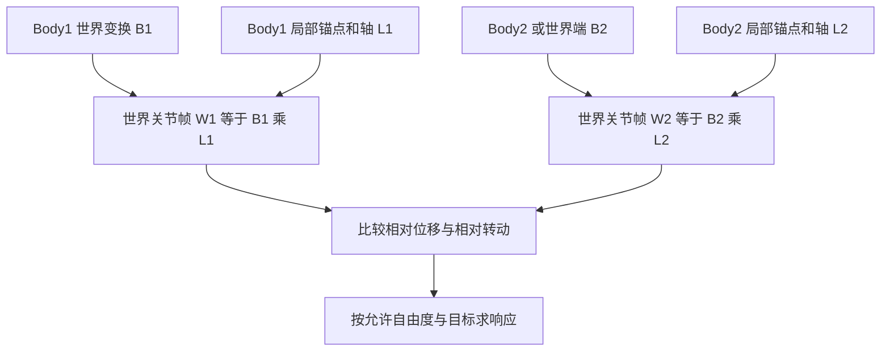
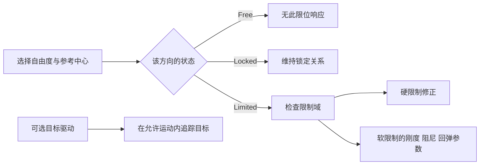
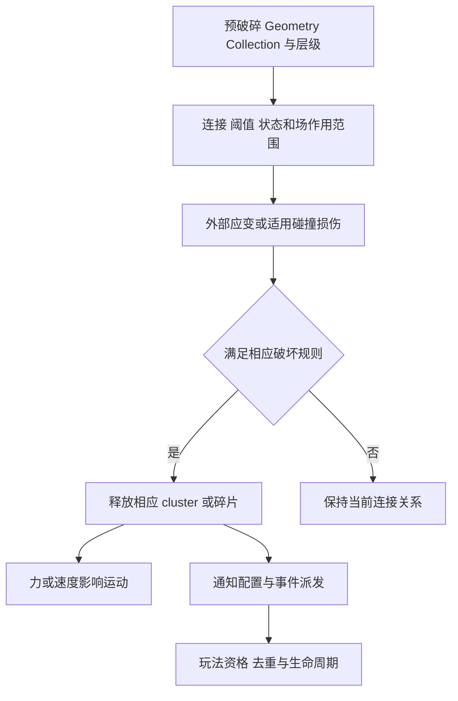
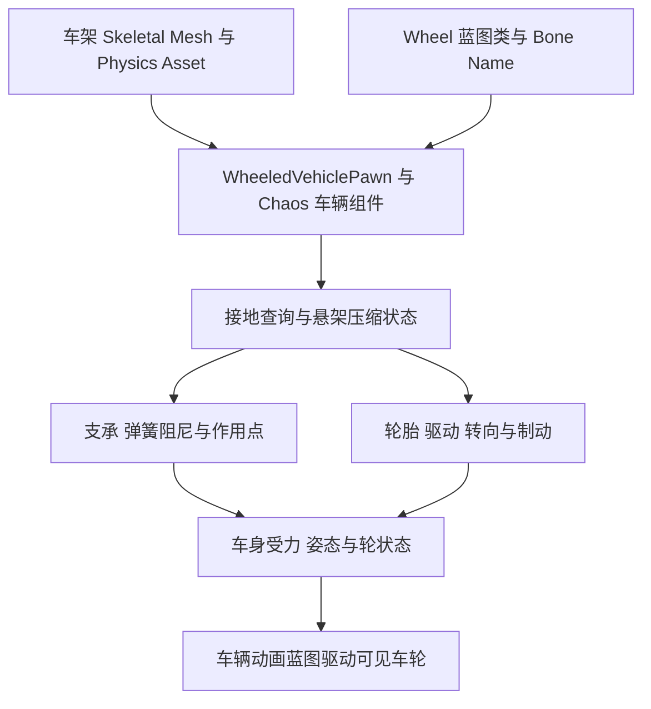

# 03 物理约束与关节

> 知识成熟度：L2。本文解释约束的对象、参考帧、自由度、目标与通知合同，并提供有限纸面例；不声称完成引擎实现或运行验证。
> 版本基准：2026-10-10 选读 Epic 固定 UE5.6 指南，以及实际返回标为 UE5.8 的公开 API/指南；它们不是同一不可变源码快照。逐项范围、失败与文字冲突见第 10 节。
> 适用范围：普通刚体 joint、Physics Constraint Component/Actor、Physics Asset 关节的共同概念；车辆和 Geometry Collection 只解释边界并转专篇。
> 源码核对状态：本轮没有读取或认证 UE5.8.0 / CL55116800 本机安装。旧文的版本、Windows 路径和更新日期保留为历史身份，不作为当前观察。
> 验证边界：所有 C++、蓝图、物理与数值模型、UE/UHT、设备、配置、网络和性能实验均为 NOT_RUN；PAPER_EXPECTED 仅为有限前提下的人工推导。没有新增 verified 事件。

## 1. 从连接需求到六自由度

门、翻板、轮轴需要绕固定轴转动；肩关节、摇杆、吊灯需要保留摆动；抽屉、滑块、液压杆需要沿轨道移动。这些需求可以通过刚体间的相对运动约束表达。车辆悬架和破坏系统也涉及约束思想，但不能据此断言它们内部各装了一组 `UPhysicsConstraintComponent`。

普通约束可连接两个有效物理 body，也可连接一个 body 与世界。Actor 是玩法/放置入口，PrimitiveComponent 和可选 BoneName 帮助选到实际 body；“两个 Actor”并不是求解器的完整输入。[约束总览](https://dev.epicgames.com/documentation/en-us/unreal-engine/physics-constraints-in-unreal-engine?application_version=5.6)


| 概念 | 本文含义 | 用途与边界 |
| --- | --- | --- |
| Physics Constraint Component / Actor | 组件承载普通 joint，Actor 提供独立场景入口 | 不是 Mesh、碰撞资产或 body 工厂 |
| 6 DOF | 三个相对平移量与三个相对转动自由度 | 以约束帧表达，不直接等同世界 XYZ/Euler 三列 |
| Hinge | 锁平移和两个摆动，只留一个扭转自由度 | 门、轮子、翻板、旋转平台 |
| Ball-and-Socket | 锁平移，角向保留三轴或有限锥域 | 肩/髋、摇杆、吊灯、链节点 |
| Prismatic / Slider | 只保留一个平移自由度，锁转动 | 抽屉、滑块、活塞 |
| Limit / Soft Limit | 限定允许域；软限制在限位附近产生弹性响应 | 软限制不是在整个行程里自动回中 |
| Drive / Motor | 对选定方向追踪位置、姿态或速度目标 | 速度电机是驱动配置，不是另一种万能约束类 |
| Breakable | 允许普通 joint 按力/力矩阈值断开 | 与主动 BreakConstraint、GC 损伤分别处理 |
| Suspension | 接触、支承、弹簧阻尼与车身反馈系统 | 可用专用车辆系统，也可自建有限弹簧机构 |
| Solver | 在实际步长、迭代和约束耦合下求响应 | 本文不从概念公式推断 Chaos 的内部迭代实现 |

## 2. 先找对 body，再定义约束帧

### 2.1 创建组件、创建物理状态、连接不是同一步

默认子对象可以在 Actor 构造函数里建立，配置也可以先存下来；这不证明构造时已有运行世界、碰撞形状和物理 body。单体 Static Mesh 需要合适的碰撞资产、注册及物理状态，至少一端应能作所需动态响应。两个不模拟的固定端不会被 drive 推成动态端。Skeletal Mesh 则需选中 Physics Asset 中确实存在的骨骼 body，不要把任意骨骼名当成刚体名。

`SetConstrainedComponents(Component1, BoneName1, Component2, BoneName2)` 指定对象，并根据调用时的位置更新参考帧。因此应先摆好端点、锚点与轴向，再在 body 可用的阶段连接。调用返回 void，不是“求解已成功”的回执。组件存在、body 有效、joint 有效、已经发生物理步、收到通知是不同证据。[组件 API 的绑定与初始化入口](https://dev.epicgames.com/documentation/en-us/unreal-engine/API/Runtime/Engine/UPhysicsConstraintComponent)、[FBodyInstance 的有效性接口](https://dev.epicgames.com/documentation/en-us/unreal-engine/API/Runtime/Engine/FBodyInstance)

单体组件开启 `SetSimulatePhysics(true)` 时会从场景父节点脱离；关闭模拟不会自动挂回。场景挂接不等于 joint，joint 也不保证被引用组件的 UObject 寿命。示例用反射强字段持有自身默认组件；外部对象观察、退场、注销和物理状态重建还需要各自的失效处理，不能跨重建缓存裸 body/solver handle。[SetSimulatePhysics](https://dev.epicgames.com/documentation/en-us/unreal-engine/API/Runtime/Engine/UPrimitiveComponent/SetSimulatePhysics)、[Actor 与 Component 生命周期](../../03-引擎架构与资源系统/对象模型与生命周期/02-Actor与Component生命周期.md)

### 2.2 两个局部帧共同定义一个关节

每一侧保存锚点位置和朝向，分别相对自己的 body。`FConstraintInstance` 的 Pos1/Pos2、PriAxis1/PriAxis2、SecAxis1/SecAxis2 表达这些量；Primary 是 twist 轴，Secondary 与其正交。它们不是唯一一个世界 `ConstraintFrame` 属性。[FConstraintInstance](https://dev.epicgames.com/documentation/en-us/unreal-engine/API/Runtime/Engine/FConstraintInstance)

为方便纸面推导，以下采用列向量的刚体变换记法，忽略缩放：B1/B2 为 body 到世界，L1/L2 为各自局部约束帧到 body；W1=B1·L1，W2=B2·L2。W1、W2 才是两侧实际世界关节帧。初始对齐应检查它们，而不是只检查两个 Mesh 原点是否重合。



这一乘法是本文数学约定，不是 UE `FTransform` 运算符调用顺序示例。实际求解还涉及质心/惯性坐标，不能拿组件变换直接冒充所有骨骼、焊接 body 的内部坐标。

**PAPER_EXPECTED P1：两个原点不同，锚点仍可一致。** 只考虑一维平移，body1 在世界 100cm、局部锚点 -20cm；body2 在世界 50cm、局部锚点 +30cm。两侧世界锚点都是 80cm。错误地给两侧都填局部 80cm，会得到世界 180cm 和 130cm，初始就带 50cm 误差。增大刚度无法修正这个输入错误。

### 2.3 轴、角度和目标空间分别确认

按本次实际返回的 5.8 `FTwistConstraint` / `FConeConstraint` 字段，Twist 绕关节局部 X 轴；Swing1 描述 X 轴在局部 XY 平面内的摆动限幅，Swing2 对应 XZ 平面。两个 swing 描述锥域，不宜在任意大旋转下当作互不影响的世界 Euler 轴。门要绕竖直轴转，应把关节局部 X 对到门轴，或者明确采用另一套自由度组合。[Twist 字段](https://dev.epicgames.com/documentation/en-us/unreal-engine/API/Runtime/Engine/FTwistConstraint)、[Swing 锥字段](https://dev.epicgames.com/documentation/en-us/unreal-engine/API/Runtime/Engine/FConeConstraint)

来源冲突要保留版本：5.6 Physics Constraint Reference 把 Twist Limit Angle 描述为 XZ 平面、Swing 2 Limit Angle 描述为绕 X 的对称 roll；5.8 类型页则分别把这些描述放在 Swing2LimitDegrees 与 TwistLimitDegrees。本文采用后者的明确字段解释当前候选，不把该文字差异当作已裁定 5.6 未读实现或旧 CL 行为的证据。

| 输入 | 本文采用的单位/空间 | 需要避免的混淆 |
| --- | --- | --- |
| 线性锚点、目标、限距 | 默认 UE 长度数值通常为 cm；相对约束/body 参考帧 | 世界坐标点不是可以原样传入的 local target；scale 选项另核 |
| Swing/Twist Limit | 度；Twist 是关于参考姿态的对称半角，swing 是锥域半角 | 90° 不等于门只能从关闭转到一侧 90° |
| Angular Orientation Target | FRotator 姿态输入，度表示；相对 body reference frame | `FRotator(Pitch,Yaw,Roll)` 参数顺序不是 Twist/Swing1/Swing2 |
| Angular Velocity Target | 每秒转数 rev/s，相对参考帧 | 90°/s 应换为 0.25rev/s；不是 90，也不是 π/2 |
| 力、力矩与加速度 drive | 由模式、质量/惯量及接口数值约定决定 | 不能把所有 Strength 数值直接标成 N 或 N·m |

角速度与相对姿态依据 [FAngularDriveConstraint](https://dev.epicgames.com/documentation/en-us/unreal-engine/API/Runtime/Engine/FAngularDriveConstraint)。显示单位与原生物理数值的区别见[Chaos 概览的单位合同](01-Chaos物理引擎概览.md#4-刚体动力学单位先于参数大小)。本轮未核 `GetCurrentSwing*`/`GetCurrentTwist` 的每层返回单位，不用它们的无单位简介反推 setter 或内部 radian 合同。

世界目标的转向至少要知道：哪个 body 是驱动对象、两侧局部帧、零姿态、目标前向轴，以及允许的自由度。仅对任意 `TurretPivot` 做 `InverseTransformPosition(WorldTarget).Rotation()`，只得到那个 pivot 空间的朝向，并不自动得到 joint target。

纸面上可定义“frame1 在 frame2 中”的目标旋转为 Rrel*=R2⁻¹·R1*，R1* 又包含所需 body 姿态与它的局部关节帧。这里解释为什么两侧帧都参与；公开 setter 简介没有完整规定所有端点交换/偏置组合的转换步骤，本篇不把这条几何定义直接认证为引擎 target 赋值公式。后面的回零示例刻意使用建立时两帧重合的零目标；任意世界瞄准还需在目标版本核对端点约定，并验零点和正方向。

## 3. 允许域、软限制和驱动各管什么

### 3.1 Free / Limited / Locked 与关节组合

| 状态 | 几何含义 | 不等于 |
| --- | --- | --- |
| Free | 该自由度没有这种限位 | 没有重力、接触、阻尼、其他 joint 或 drive |
| Limited | 在指定域内活动，越界时由限制响应 | 每步误差严格为零，或已经有回中弹簧 |
| Locked | 禁止该相对自由度 | 世界位置不动，或六个轴都锁一定更省计算 |

| 关节 | 线性配置 | 角向配置 | 典型用途 |
| --- | --- | --- | --- |
| 铰链 | X/Y/Z Locked | Swing1/Swing2 Locked，Twist Limited 或 Free | 门、轮轴、翻板 |
| 球窝 | X/Y/Z Locked | 三角向 Free 或适当 Limited | 肩/髋、吊灯、摇杆 |
| 滑轨 | X Limited 或 Free，Y/Z Locked | 全 Locked | 抽屉、活塞、升降滑块 |

这些是 DOF 配方，不保证每个编辑器入口都有同名预设按钮。Physics Asset 可保存自己的 constraint profile；不要把 profile、关节类型名称和场景组件类混成一个机制。

### 3.2 线性限制不是三个独立 min/max

`FLinearConstraint` 有一个共享 Limit，以及 XMotion/YMotion/ZMotion。组件的三个 SetLinear*Limit 接口不是三套独立区间；在 `FConstraintInstance` 的对应说明中，LimitSize 明确为三轴共用。调用时不要先给 X 写 30，再以为给 Locked 的 Y/Z 写 0 不会影响共享值。[FLinearConstraint](https://dev.epicgames.com/documentation/en-us/unreal-engine/API/Runtime/Engine/FLinearConstraint)、[共享限距的 setter 列表](https://dev.epicgames.com/documentation/en-us/unreal-engine/API/Runtime/Engine/FConstraintInstance)

只有 X Limited、其余平移 Locked、scale=1 的滑轨，允许行程可按关节中心的 [-L,+L] 理解。多个轴 Limited 时，应按这些方向的联合距离限制理解，不能承诺得到每轴 [-L,+L] 的独立长方体；Free 方向也不应被误当有限半径的一部分。

**PAPER_EXPECTED P2：行程与零点。** 需要从关闭位置 0cm 拉到 60cm 的抽屉，先选中点 30cm 为关节坐标零点，再使用半行程 L=30cm；关闭时目标是 -30cm，打开时 +30cm。不能只把 Limit 写 60 就宣称实现了 [0,60]。局部参考帧的偏置须与这个中点合同一致。

角限制同理：无偏置的 Twist Limit=90° 对应两侧共 180° 的允许扭转区间。需要单侧 0–90° 时应把参考中心移到中点并使用 45° 半角，或采用明确的参考帧偏置设计；不是向 SetAngularTwistLimit 传最小/最大两个角。

### 3.3 软限制只在其限制问题上工作

硬限制要求求解器尽量抵消越界运动，仍受步长、迭代、初始误差、质量比、接触和其他约束影响；不是连续世界中的“立刻停止”。软限制容许一定误差，用刚度与阻尼塑造限位响应。它适用于 Limited 方向，不会让 Locked 方向自动变成有行程的弹簧，也不会让任意 Free 方向自动回中。



软限制的 Stiffness、Damping 与 drive 的同名参数属于不同作用机制；Restitution 影响回弹，ContactDistance 等具体含义需看所选 API/版本。公开 FConstraintInstance 提供 `SetSoftLinearLimitParams`、`SetSoftSwingLimitParams`、`SetSoftTwistLimitParams`，各带五个参数；原文的 `Hinge->SetAngularTwistSoftConstraintParams(true,1000,200)` 未在本次组件 API 中找到，不再用作候选调用。[FConstraintInstance 的软限制入口](https://dev.epicgames.com/documentation/en-us/unreal-engine/API/Runtime/Engine/FConstraintInstance)

## 4. 驱动：目标、开关、模式和力限

### 4.1 位置与速度是两条目标通道

| 目的 | 组件 API | 参数含义 |
| --- | --- | --- |
| 线性位置跟踪 | SetLinearPositionDrive、SetLinearPositionTarget | 三个 bool 选 X/Y/Z；目标是局部位置 |
| 线性速度跟踪 | SetLinearVelocityDrive、SetLinearVelocityTarget | 三个 bool 选 X/Y/Z；零速度目标可配合位置驱动抑制相对运动 |
| 角向姿态跟踪 | SetAngularDriveMode，再选 SetOrientationDriveTwistAndSwing 或 SetOrientationDriveSLERP；SetAngularOrientationTarget | 模式、对应开关和目标缺一不可 |
| 角向速度跟踪 | 对应模式的 SetAngularVelocityDriveTwistAndSwing / SLERP、SetAngularVelocityTarget | 速度目标与姿态目标独立设置 |
| 强度与限幅 | SetLinearDriveParams / SetAngularDriveParams | PositionStrength、VelocityStrength、InForceLimit |

这些名字来自[组件公开函数列表](https://dev.epicgames.com/documentation/en-us/unreal-engine/API/Runtime/Engine/UPhysicsConstraintComponent)。旧文的 SetConstraintTargetPosition、SetConstraintTargetOrientation 和泛称 Set Constraint Motor 不是这套组件 API 的可照抄名字。蓝图查找对应英文空格化节点时应从正确类型引用拖出，并核目标版本引脚。

速度电机可关闭位置 drive、开启速度 drive、设置目标速度和输出上限。它持续尝试达到速度，并不无条件保持那个速度；负载、碰撞、限位和力限会阻止目标。绞盘、旋转齿轮可用这个模型；传送带是否采用物理轮轴、接触速度或另一玩法方案应按需求决定，不是加一个 motor 就自动得到输送面。

### 4.2 SLERP 与 Twist/Swing 必须配自由度

SLERP 使用整体姿态误差；TwistAndSwing 则分开控制扭转和摆动。官方 5.6 参考明确：任一角自由度 Locked 时 SLERP 不工作。因此 Swing 全锁的铰链应使用 TwistAndSwing，只启用需要的 twist drive；球窝三角向均非 Locked 时才适合考虑 SLERP。[角向驱动模式](https://dev.epicgames.com/documentation/en-us/unreal-engine/physics-constraint-reference-in-unreal-engine?application_version=5.6)

`SetOrientationDriveTwistAndSwing(true,false)` 的参数顺序是 Twist、Swing。旧 `SetAngularOrientationDrive` 已弃用，顺序却是 Swing、Twist；这两个 bool 从来不是“位置+速度”。速度通道应单独启用。[新开关签名](https://dev.epicgames.com/documentation/en-us/unreal-engine/API/Runtime/Engine/UPhysicsConstraintComponent/SetOrientationDriveTwistAndSwing)、[旧开关及弃用说明](https://dev.epicgames.com/documentation/en-us/unreal-engine/API/Runtime/Engine/UPhysicsConstraintComponent/SetAngularOrientationDrive)

目标应落在可行域内。把铰链目标指定为横向翻滚、把滑轨目标指定到 Y 轴，或持续把目标推到限位外，不能靠增大强度解决。5.8 的 AngularDrive 公开表出现 LimitViolationResponse，但本轮未逐项核查其枚举行为，不宣称所有版本默认都会替调用方裁剪目标。

### 4.3 力模式与加速度模式不同

以下是一维连续 PD 教学模型，不是 Chaos 离散求解器的逐行实现。先取相同坐标、相同物理量单位的误差 e=x*−x、ev=v*−v，再讨论：

```text
力模式：F* = k·e + c·ev，再受输出上限与其他动力学约束影响
单体对固定端的简化响应：a = F / m
加速度模式：a* = kp·e + kd·ev，由求解器结合有效质量产生响应
一轴转动类比：tau 与有效转动惯量对应，不是只看物体质量
```

同一数值的 k/c 在两种模式下不具有同一量纲。力模式的线性 k 是力/长度、c 是力/速度；加速度模式相应为 1/s² 与 1/s。角向还涉及惯量和角度表示。PositionStrength/VelocityStrength 都增大不意味着必然更稳，步长、饱和、负载与接触同样参与。

[FLinearDriveConstraint](https://dev.epicgames.com/documentation/en-us/unreal-engine/API/Runtime/Engine/FLinearDriveConstraint) 和 [FAngularDriveConstraint](https://dev.epicgames.com/documentation/en-us/unreal-engine/API/Runtime/Engine/FAngularDriveConstraint) 都有 acceleration mode，当前公开表将它列为默认启用。实例、profile 和蓝图覆盖仍需检查，例子显式设置模式。[角向模式 API](https://dev.epicgames.com/documentation/en-us/unreal-engine/API/Runtime/Engine/UPhysicsConstraintComponent/SetAngularDriveAccelerationMode)说明其加速度响应不随驱动轴惯量改变；它不是无限力、无负载或无质量耦合保证。

`FConstraintDrive` 将位置/速度开关、Stiffness、Damping、MaxForce 分开。力限、断裂阈值和软限位参数不能互相替代；“最大输出”不改变“每单位误差的刚度”。公开页面没有在本轮选段中完整交代各模式、每子步及零上限的所有内部换算，所以示例使用正的有限上限，不把 0 随意解释成停止或无限，也不把示例数值标成已核 N·m。[FConstraintDrive](https://dev.epicgames.com/documentation/en-us/unreal-engine/API/Runtime/Engine/FConstraintDrive)

**PAPER_EXPECTED P3：质量与模式。** 简化为无其他力、未饱和的单体对固定端；e=0.1m、ev=0。力模式 k=100N/m 得 F=10N，质量 1kg/2kg 分别 a=10/5m/s²。加速度模式 kp=100/s² 得相同 a*=10m/s²，但所需力分别是 10/20N。若实际输出上限不足，两者都不能沿用未饱和结论。这不是引擎参数到 SI 的实测转换。

## 5. C++ 与蓝图：固定世界铰链及回零驱动

### 5.1 有限宿主与资产前提

下面两个文件是自写教学候选例，按本次公开 5.8 API 表整理，**未经过 UHT/编译/链接/UE 运行**。`MYGAME_API` 替换为实际模块导出宏，模块需 Core、CoreUObject、Engine。它只覆盖：普通游戏世界、单体 Static Mesh 门板、同步可用的 body、无缩放、固定世界锚点、无运行期物理状态重建。

在蓝图子类给 DoorMesh 配有效 Static Mesh 与简单碰撞，核 PhysicsActor profile、Movable 和实例覆盖。示例假定门板中心为网格原点，沿局部 Y 宽 100cm，门轴在 Y=-50cm；不满足时应调整 Hinge 的位置。Hinge 的局部 X 沿门轴，门轴在 Actor 本地 Z 方向。Actor 的 SceneRoot 只组织固定锚点，不随门板模拟移动；绑定后不通过移动 Actor 来搬门轴。缺资产、异步 body 尚未就绪或 body 重建需要另行接入生命周期，本例不会盲目循环重绑。

```cpp
// MyConstraintDoor.h
#pragma once
#include "CoreMinimal.h"
#include "GameFramework/Actor.h"
#include "UObject/ObjectPtr.h"
#include "MyConstraintDoor.generated.h"

class USceneComponent;
class UStaticMeshComponent;
class UPhysicsConstraintComponent;

UCLASS()
class MYGAME_API AMyConstraintDoor : public AActor
{
    GENERATED_BODY()
public:
    AMyConstraintDoor();

    UPROPERTY(VisibleAnywhere, BlueprintReadOnly, Category="Door")
    TObjectPtr<USceneComponent> SceneRoot;
    UPROPERTY(VisibleAnywhere, BlueprintReadOnly, Category="Door")
    TObjectPtr<UStaticMeshComponent> DoorMesh;
    UPROPERTY(VisibleAnywhere, BlueprintReadOnly, Category="Door")
    TObjectPtr<UPhysicsConstraintComponent> Hinge;

    // true 仅表示本例接受配置请求，不表示门已到目标。
    UFUNCTION(BlueprintCallable, Category="Door")
    bool StartReturnToRest();

protected:
    virtual void BeginPlay() override;
    virtual void EndPlay(const EEndPlayReason::Type Reason) override;

private:
    bool bGameplayReady = false;
    bool bEndPlaySeen = false;
};
```

```cpp
// MyConstraintDoor.cpp
#include "MyConstraintDoor.h"
#include "Components/SceneComponent.h"
#include "Components/StaticMeshComponent.h"
#include "PhysicsEngine/BodyInstance.h"
#include "PhysicsEngine/ConstraintInstance.h"
#include "PhysicsEngine/PhysicsConstraintComponent.h"

AMyConstraintDoor::AMyConstraintDoor()
{
    PrimaryActorTick.bCanEverTick = false;
    SceneRoot = CreateDefaultSubobject<USceneComponent>(TEXT("SceneRoot"));
    SetRootComponent(SceneRoot);
    DoorMesh = CreateDefaultSubobject<UStaticMeshComponent>(TEXT("DoorMesh"));
    DoorMesh->SetupAttachment(SceneRoot);
    DoorMesh->SetMobility(EComponentMobility::Movable);
    DoorMesh->SetCollisionProfileName(TEXT("PhysicsActor"));

    Hinge = CreateDefaultSubobject<UPhysicsConstraintComponent>(TEXT("Hinge"));
    Hinge->SetupAttachment(SceneRoot);
    Hinge->SetRelativeLocation(FVector(0.f, -50.f, 0.f));
    Hinge->SetRelativeRotation(FRotator(90.f, 0.f, 0.f));

    Hinge->SetLinearXLimit(ELinearConstraintMotion::LCM_Locked, 0.f);
    Hinge->SetLinearYLimit(ELinearConstraintMotion::LCM_Locked, 0.f);
    Hinge->SetLinearZLimit(ELinearConstraintMotion::LCM_Locked, 0.f);
    Hinge->SetAngularSwing1Limit(EAngularConstraintMotion::ACM_Locked, 0.f);
    Hinge->SetAngularSwing2Limit(EAngularConstraintMotion::ACM_Locked, 0.f);
    Hinge->SetAngularTwistLimit(EAngularConstraintMotion::ACM_Limited, 90.f);
    // 正的教学参数，不是所有门通用的调参结果。
    Hinge->ConstraintInstance.SetSoftTwistLimitParams(
        true, 1000.f, 200.f, 0.f, 1.f);
    Hinge->SetLinearBreakable(false, 10000.f);
    Hinge->SetAngularBreakable(false, 10000.f);
}

void AMyConstraintDoor::BeginPlay()
{
    bGameplayReady = false;
    bEndPlaySeen = false;
    Super::BeginPlay();
    if (bEndPlaySeen || !IsValid(DoorMesh) || !IsValid(Hinge)
        || !DoorMesh->IsRegistered() || !Hinge->IsRegistered()
        || !DoorMesh->GetStaticMesh())
    {
        return;
    }
    DoorMesh->SetSimulatePhysics(true);
    FBodyInstance* Body = DoorMesh->GetBodyInstance(); // 只在此次调用中借用
    if (!Body || !Body->IsValidBodyInstance() || !DoorMesh->IsSimulatingPhysics())
    {
        return;
    }
    // 此时门板与关节已摆好。空的第二端代表本例选定的世界端。
    Hinge->SetConstrainedComponents(DoorMesh, NAME_None, nullptr, NAME_None);
    bGameplayReady = Hinge->ConstraintInstance.IsValidConstraintInstance();
}

bool AMyConstraintDoor::StartReturnToRest()
{
    if (!bGameplayReady || !IsValid(DoorMesh) || !IsValid(Hinge)
        || !DoorMesh->IsSimulatingPhysics() || Hinge->IsBroken()
        || !Hinge->ConstraintInstance.IsValidConstraintInstance())
    {
        return false;
    }
    Hinge->SetAngularDriveMode(EAngularDriveMode::TwistAndSwing);
    Hinge->SetAngularDriveAccelerationMode(false); // 显式选力模式
    Hinge->SetAngularDriveParams(500.f, 50.f, 1000.f);
    Hinge->SetAngularOrientationTarget(FRotator::ZeroRotator);
    Hinge->SetAngularVelocityTarget(FVector::ZeroVector);
    Hinge->SetOrientationDriveTwistAndSwing(true, false); // Twist / Swing
    Hinge->SetAngularVelocityDriveTwistAndSwing(true, false);
    DoorMesh->WakeAllRigidBodies();
    return true;
}

void AMyConstraintDoor::EndPlay(const EEndPlayReason::Type Reason)
{
    bEndPlaySeen = true;
    bGameplayReady = false; // 先关闭自己的玩法入口，组件按自身协议退场
    Super::EndPlay(Reason);
}
```

构造函数只创建/配置默认组件，连接放在资产和 body 检查之后。开启门板模拟导致脱离 SceneRoot 是这里预期的行为；Hinge 仍在固定根下。两帧以绑定时姿态建立，因此 ZeroRotator 表示本例的参考姿态，不保证是关卡美术定义的“关闭”。若门在绑定时已经敞开，那就是另一零点。自动门/炮塔若要跟踪非零角，还应先完成第 2.3 节的坐标转换与可行域检查。

BeginPlay 只是本例选定入口，不是所有异步/动态 body 的就绪屏障。例中的强字段也不阻止显式组件销毁。未来添加运行期换 Mesh、骨骼 body、重新注册、流送复入、移动底座或网络重模拟时，应重订连接和目标重建合同，不能据此宣称已有万能宿主。

### 5.2 一轴弹簧滑块：局部代码片段

下面是已连接、有效的 `UPhysicsConstraintComponent* Slider` 的游戏侧方法体片段；需要上述约束头文件，**不是独立类，未执行**。它示范行程内回中，与限位弹性分开。指针、world/生命周期与 body 前提由宿主提供，不能从这段配置凭空创建它们。

```cpp
// 先设置锁住的方向，最后一次写共享 Limit 为 30cm。
Slider->SetLinearYLimit(ELinearConstraintMotion::LCM_Locked, 30.f);
Slider->SetLinearZLimit(ELinearConstraintMotion::LCM_Locked, 30.f);
Slider->SetLinearXLimit(ELinearConstraintMotion::LCM_Limited, 30.f);
Slider->SetAngularSwing1Limit(EAngularConstraintMotion::ACM_Locked, 0.f);
Slider->SetAngularSwing2Limit(EAngularConstraintMotion::ACM_Locked, 0.f);
Slider->SetAngularTwistLimit(EAngularConstraintMotion::ACM_Locked, 0.f);
Slider->SetLinearDriveAccelerationMode(false);
Slider->SetLinearDriveParams(100.f, 20.f, 1000.f);
Slider->SetLinearPositionDrive(true, false, false);
Slider->SetLinearVelocityDrive(true, false, false);
Slider->SetLinearPositionTarget(FVector::ZeroVector);
Slider->SetLinearVelocityTarget(FVector::ZeroVector);
```

给升降平台使用时，将关节局部 X 转到所需方向，并核重力负载与输出上限；不要把 X/Y/Z 全设 Limited 后仍称一轴悬架。浮动球可以有意保留多向运动，布娃娃弹簧则应接入对应 Physics Asset/body 的目标合同。需要移动弹簧平衡点时更新 `SetLinearPositionTarget`，先把目标转换到已定义的关节空间，而不是直接填世界坐标。

### 5.3 蓝图对照与纸面验收

1. 在 Actor 蓝图中建立具有有效碰撞的目标组件，或放置 Physics Constraint Actor 选择精确组件/骨骼端点；确认哪一端模拟、哪一端固定/连接世界
2. 先放锚点并旋转关节轴，再连接和配置 DOF；编辑器预览 gizmo 只证明显示的配置，还需核两侧实际参考帧
3. 用 Set Linear Position Target、Set Angular Orientation Target 和对应 drive 节点配置；模式、开关、强度、上限、目标与可行域一起检查
4. 需要姿态回中时同时明确零速度通道；需要持续旋转时明确关闭位置目标、启用速度 drive，并将 deg/s 或 rad/s 换成该目标的 rev/s
5. 从极简门/滑块开始，分别验证 body、零点、正方向、限位、驱动和断裂通知。官方 [组件指南](https://dev.epicgames.com/documentation/en-us/unreal-engine/physics-constraint-component-user-guide-in-unreal-engine)可作建立组件与定位的入口；本轮没有核到“所有 UE5 模板/Lyra 都有约束门”的具体资产证据，不把它写成必有样例

**PAPER_EXPECTED P4：模式负例。** 按门例锁住两个 swing 后开启 SLERP，与已读模式前提冲突；改成 TwistAndSwing 并只驱动 twist 才消除这个配置矛盾。此推导不证明数值参数已经稳定。

**PAPER_EXPECTED P5：速度换算。** 目标每 4s 转一圈，应输入 0.25rev/s；90°/s÷360=0.25，(π/2)rad/s÷2π=0.25。给出相同数字 90 会请求另一速度，不是另一种等价表示。

**PAPER_EXPECTED P6：零点负例。** 绑定时门在视觉 30° 开度，局部 target=0 的候选例只要求回到那次参考姿态，不能推出门会回到美术 0°。另设关闭参考，或在已核坐标合同下转换目标。

## 6. 断裂状态、通知与 Geometry Collection

### 6.1 普通 joint 的断裂

Linear Breakable / Angular Breakable 分别控制是否按线性力/角向力矩阈值断开，入口为 `SetLinearBreakable` / `SetAngularBreakable`。它们不是碰撞冲量阈值，Hit 的 NormalImpulse 也不能不经时间和模型解释直接比较。`BreakConstraint()` 是主动断开请求，即使没有开启自动 breakable，也不能因此宣称 joint 永远不会被玩法主动断开。[约束属性参考](https://dev.epicgames.com/documentation/en-us/unreal-engine/physics-constraint-reference-in-unreal-engine?application_version=5.6)

普通组件提供 `OnConstraintBroken` 和 `IsBroken`。事件绑定、生命周期与玩法处理要配对；不要拿 Geometry Collection 的 SetNotifyBreaks 当普通组件订阅开关。若需要在破坏后播放特效、掉落或计分，应核对象仍有效和业务状态，按自己的破坏身份去重。公开表没有在本轮选段中承诺主动 BreakConstraint 与所有重建/终止路径的统一事件次数和派发时刻，不能用“没收到事件”独立证明物理状态完整。

`GetConstraintForce` 只返回最近用于维持 joint 的力/角向力量；未初始化或已断开时可返回零。零读数不是“完好且毫无负载”的充分条件，诊断须连同 joint 有效性、IsBroken、端点与结果时刻。[组件状态/通知接口](https://dev.epicgames.com/documentation/en-us/unreal-engine/API/Runtime/Engine/UPhysicsConstraintComponent)

### 6.2 GC 连接不是场景 joint 列表

Geometry Collection 保存碎片、cluster 层级与连接数据。破坏改变连接/聚类与活动刚体集合；普通 `UPhysicsConstraintComponent` 的 Break Threshold 与 GC 的 Damage Threshold 不能直接视作同一字段、单位或判据。`FChaosBreakingEventData` 是断裂事件数据，不是“碎片连接结构体”。[事件结构说明](https://dev.epicgames.com/documentation/en-us/unreal-engine/API/Runtime/GeometryCollectionEngine/FChaosBreakingEventData)



External Strain 可破坏连接；Internal Strain/decay 可改变损伤阈值；力或速度改变运动，Wake 解决的是适用对象的休眠/激活。只看到 Radial Vector 名字，不能证明场的目标属性是 strain。Culling/作用范围也不等于摄像机可见性。多层 cluster 可以逐层释放，但层级深度不是任意重新切几何的次数保证。[Chaos Fields 的 External/Internal Strain 与 Velocity](https://dev.epicgames.com/documentation/unreal-engine/chaos-fields-user-guide-in-unreal-engine)

| 原来希望调整的量 | 修订后的解释 |
| --- | --- |
| Damage Threshold | 与选中损伤/strain 路径及层级共同决定破坏，不直接当普通 joint 的牛顿阈值 |
| 碎块质量 | 影响运动与碰撞响应；不独立等价于连接强度 |
| 连接数量/拓扑 | 改变连通关系和传播路径，不能只靠边数保证“越多必越难碎” |
| Cluster 深度 | 决定现有层级结构，并受最大破坏/模拟层级及规则影响 |
| Break 通知 | GC 使用 SetNotifyBreaks 与 OnChaosBreakEvent；通知不创建连接、不触发断裂 |

GC 组件公开的通知入口见 [UGeometryCollectionComponent](https://dev.epicgames.com/documentation/en-us/unreal-engine/API/Runtime/GeometryCollectionEngine/UGeometryCollectionComponent)。碎片有视觉寿命、碰撞/玩法寿命和活动模拟状态；睡眠、禁用、移除/销毁并不等价。详见[Chaos 破坏系统与 Field](05-Chaos破坏系统与Field.md)及[Chaos 概览的破坏边界](01-Chaos物理引擎概览.md#7-破坏资产连接断开与碎块运动)。

**PAPER_EXPECTED P7：两条通知路径。** 给门 Hinge 绑定 OnConstraintBroken 不等于订阅了旁边 GC 的碎片事件；给 GC 开 SetNotifyBreaks 也不会让门获得通知。只有 Wake 输入时，不能推出 GC 连接已经断裂。

## 7. 悬架：专用车辆与通用弹簧分开

### 7.1 Chaos Vehicles 的资产与参数

Chaos 轮式车辆使用 `UChaosWheeledVehicleMovementComponent`，蓝图常从 WheeledVehiclePawn 开始。`UChaosVehicleWheel` 是 UObject 派生的车轮配置/运行对象，不是每个轮子都手动 Add Component 出来的普通场景组件。Wheel Setups 选择 Wheel Class 和 Bone Name，将轮的配置接到车架资产。[车辆组件](https://dev.epicgames.com/documentation/en-us/unreal-engine/API/Plugins/ChaosVehicles/UChaosWheeledVehicleMovementComp-)、[5.6 车辆建立指南](https://dev.epicgames.com/documentation/en-us/unreal-engine/how-to-set-up-vehicles-in-unreal-engine?application_version=5.6)

| 当前 Wheel API 字段 | 物理/配置角色 | 调整前提 |
| --- | --- | --- |
| SuspensionAxis | 车体局部悬架方向，常见为 -Z | 不是永远世界 Z，也不证明每个轮子由真实 joint 支撑 |
| SuspensionMaxRaise / Drop | 相对静止位置的压缩/伸展距离 | 行程、碰撞几何和 wheel radius 一起核 |
| SpringRate | 弹簧刚度，页面标 N/m | 与承载质量、预载和设计静挠度一起选择 |
| SpringPreload | 预载参数 | 官方字段文字也标 N/m，语义/换算未独立核实，不补造数值公式 |
| SuspensionDampingRatio | 阻尼比，页面范围 0–1 | 不是原表中 2000–5000 的通用阻尼系数 |
| SuspensionForceOffset | 力作用点偏移 | 影响车身力矩；不是刚度 |
| WheelRadius | 车轮半径，设置指南采用 cm | 按模型和接触配置，不套 30–50cm 普遍范围 |
| DebugTireLoad 等观测字段 | 轮胎负载信息 | 不把旧 Resting Load 名称当所有版本都可编辑的悬架参数 |

字段依据 [UChaosVehicleWheel](https://dev.epicgames.com/documentation/unreal-engine/API/Plugins/ChaosVehicles/UChaosVehicleWheel)。该页还区分悬架 trace 类型与简单/复杂查询选择；不是“看见轮骨骼移动，就证明存在独立模拟车轮 joint”。原来的 Suspension Max Force / Suspension Damping 不能作为这套当前字段表的精确调用名。



保留最小接入路线：准备车架网格、Physics Asset、Wheel 蓝图类、车辆动画蓝图和扭矩曲线；在车辆蓝图设置 Wheel Setups 的类/骨骼及资产；再定义输入、转向和机械配置，最后才做目标版本的运行验收。4 轮只是常见教学例，不是固定数量。5.6 指南保留旧输入配置与样例项目段落，本文未将其认证为当前项目的 Enhanced Input/模板资产布局。

### 7.2 弹簧因果与通用机构

对无预载的理想竖直单弹簧，静止时 k·x=mg；阻尼力由相对速度决定，静止时不能靠提高阻尼支撑额外重量。单自由度连续模型的临界阻尼为 ccrit=2√(km)，阻尼比 ζ=c/ccrit。它们解释承载、刚度、阻尼为何要一起看，不是 Chaos Vehicles 全部内部实现。

**PAPER_EXPECTED P8：载荷与静挠度。** 单弹簧承载 100kg，g=9.8m/s²，k=9800N/m，无预载，得静压缩 0.1m。若压缩行程只有 0.05m，这个模型没有行程内静平衡；增大阻尼不会改变这个静态结论。改参数或几何后仍需验证真实车身多轮分担与接触。

非车辆的弹跳平台、滑块和浮动球可采用第 5.2 节 Linear Drive；一轴导轨与三向浮动是不同机构。车辆还需要接触、摩擦、轮胎和驱动系统，不能以“刚度+阻尼+目标”三项宣称已实现完整汽车悬架。详细配置留给[Chaos 车辆系统](06-Chaos车辆系统.md)。

## 8. 稳定性与成本：先消除矛盾，再调预算

约束成本可用“活跃约束工作 × 迭代 × 实际子步”作为粗略预算线索，还受岛划分、接触、形状、质量/惯量比和调度影响；不是本项目已测出的复杂度函数。长链的误差传播和收敛更困难，不意味着成本数学上必为指数，也没有通用的“最多几十个约束”“链最多 10–20 节”上限。

| 场景或手段 | 先查什么 | 代价与边界 |
| --- | --- | --- |
| 单门、独立 joint | 初始帧、资产、接触矛盾、实际响应 | 不能仅因数量少就跳过异常排查 |
| 锁链、布娃娃 | 质量/惯量比、链长、误差分布、外部碰撞 | 增重所有链节不保证修复；可能加重支承负担 |
| 休眠与唤醒 | 实际 body/岛是否活跃、外力与目标是否持续唤醒 | 不是“约束组件睡了就没有任何成本” |
| Disable Collision | 当前 constrained pair 是否需要互撞 | 只禁这对 body 的碰撞，不是关闭它们与世界的碰撞 |
| 调迭代/子步 | 同场景的位移/角误差、接触、峰值耗时 | 降预算会牺牲收敛；高预算不修错坐标/无效 body |
| Physics Asset / LOD | 骨骼体、关节与动画管线的共同配置 | 集中资产管理有价值，但不能无测量断言同数 joint 必更轻 |
| Projection / Shock Propagation | 后处理误差、链与外界接触 | 可提高视觉刚性，也可能注入能量或破坏其他接触关系 |
| 锁轴或删关节 | 玩法真正允许域 | Locked 本身也要被求解，锁得越多不等于自动越便宜 |

`SetDisableCollision(true)` 的作用域是两端刚体；当前 profile、资产和运行时覆盖决定实际值，不把“默认互撞”当普遍事实。Projection 是求解后的修正，不能当正常动力学完全守恒的证明；官方参考提醒链与外物接触时要谨慎，Shock Propagation 也可能给链注入能量。[约束行为参考](https://dev.epicgames.com/documentation/en-us/unreal-engine/physics-constraint-reference-in-unreal-engine?application_version=5.6)

建议排查顺序：先核对象/帧/单位与允许域，再暂时隔离 drive 和限位响应，随后检查碰撞、质量比和负载，最后讨论步长/迭代及表现简化。软限位是手感选择，不是每扇门必须开启；高刚度、过低或过高阻尼、输出饱和、重复移动 body 都可能造成不期望响应。

未来性能验收应固定引擎 build、平台、资产、输入窗口和模拟模式，记录活动 body/岛/joint、接触、迭代与子步、最大误差、GT/PT 工作及等待。`stat chaos`/`stat physics` 仅作为需要在目标构建确认的观察入口；不是从一个 stat 数字就能判定“悬架阻尼不足”。本轮未执行这些命令。更完整测量边界见[Chaos 概览](01-Chaos物理引擎概览.md#8-性能预算与测量边界)。

## 9. 常见问题与待执行验收

**Q1：门推不动/推不开？** 先核有效碰撞/body、是否模拟、joint 两端、门轴与局部 X、Twist 状态/范围，再看其他 joint、body 锁轴、碰撞卡住、强 drive 和世界输入。组件存在或 Simulate Physics 勾选都不是充分证据。

**Q2：物体疯狂抖动？** 先排初始参考帧不一致、几何穿插、同一自由度被多个系统同时控制，再单独看 drive、软限位、质量/惯量比和实际步长。增阻尼不是每种抖动的共同解；若目标不可达或输出饱和，先修合同。

**Q3：锁链/布娃娃像面条？** 区分预期的软限制与求解残差，检查长链耦合、质量比、负载和迭代。适当缩短链、提高预算、表现 LOD 或检查 projection 可以作为候选，不保证统一增重或改 Physics Asset 就立即更硬、更快。

**Q4：运行时失效/脱开就是断裂吗？** 不一定。自动阈值断裂、玩法 BreakConstraint、端点销毁/换 body、注销、joint 未成功建立以及求解误差是不同原因。看状态和通知来源；Breakable=false 只排除相应自动阈值路径，不能排除其他失效。

**Q5：车辆悬架上下弹或压到底？** 分别检查 wheel/bone、接地查询、半径、悬架轴、行程、承载质量、刚度/预载和阻尼比；压到底可能根本没有行程内静平衡。不要只把不存在于所用字段表的 Max Force 拉高，也不要把每种跳动归咎于阻尼。

**Q6：应该绕 X 却绕 Y？** 问清是世界 X、body X 还是关节 X；显示两端世界关节帧，核 twist primary axis 与局部 reference orientation。仅旋转 Mesh 不一定改变所需关节零帧，重新绑定还可能重设参考关系。

**Q7：GC 碎块断不开？** 核预破碎与 cluster/连接、允许破坏层级、目标状态、strain/damage 路径、阈值和场范围；再看碰撞损伤选项与通知。Wake、径向速度或事件订阅都不是独立的断裂保证。

**Q8：目标设置了但不跟随？** 核对应 drive 开关/模式、Locked 与 SLERP 冲突、局部目标和单位、输出上限、负载、睡眠及结果发布时间。设置目标不是直接设置 transform；速度电机也会被有限行程挡住。

| 待执行项 | 正/负对照与判据 | 当前状态 |
| --- | --- | --- |
| 资产与 body | 有/无简单碰撞；正确/错误骨骼 body；检查失败是否停止绑定 | NOT_RUN |
| 参考帧 | P1 的一致/错误锚点，转动 Actor 后重新核世界帧 | PAPER_EXPECTED，UE NOT_RUN |
| 行程 | 一轴 30cm 半行程；单侧行程的中心偏置；共享 Limit 被后续 setter 覆盖 | PAPER_EXPECTED，UE NOT_RUN |
| 角驱动 | 同铰链分别选 SLERP/TwistAndSwing；只改变模式/开关 | PAPER_EXPECTED，UE NOT_RUN |
| 目标与模式 | P3/P5 的质量模式与角速度换算；有限力限、可行/不可行目标 | PAPER_EXPECTED，UE NOT_RUN |
| 生命周期 | 单体模拟脱离挂接、端点退场、重建与重新注册 | NOT_RUN；不由 BeginPlay 一项包办 |
| 断裂通知 | 自动阈值/主动断开/端点销毁分别观察；普通 joint 与 GC 分开绑定 | NOT_RUN |
| 悬架与预算 | 固定资产/输入，分离静支承、动态阻尼和接触；记录误差与性能 | NOT_RUN |

## 10. 来源版本、选读边界与历史身份

全部链接为 Epic 公开一手页面。API 表通常只有声明、字段注释和少量说明，不等同读到函数实现；本文没有引入受限引擎源码。在线版本标签也不认证旧文 Windows CL。

| 来源组 | 请求/实际返回 | 本次采用的窄范围与缺口 |
| --- | --- | --- |
| Physics Constraints、Physics Constraint Reference、How to Set up Vehicles | 请求 application_version=5.6，实际标题 5.6 | 连接世界、DOF/模式、限制与断裂字段、车辆资产与 Wheel Setups。5.6 指南的 Twist/Swing2 描述与本次 5.8 类型页不一致；本候选的 5.8 解释采用后者，不裁定未读 5.6 实现或旧 CL 行为；不背书该页全部属性描述 |
| UPhysicsConstraintComponent、FConstraintInstance | 固定版本 API 请求有失败；无版本 URL 实际标题 5.8 | 组件 API/事件、局部帧、共享线性 Limit、软限制签名与有效性；没有核函数实现、异步时序或所有 getter 单位 |
| FTwistConstraint、FConeConstraint、FLinearConstraint | 实际标题 5.8 | 度、twist X 轴、两个 swing 平面、共享距离字段；保留读到的具体边界 |
| FLinearDriveConstraint、FAngularDriveConstraint、FConstraintDrive | 带 5.8 查询请求失败，无版本 URL 实际标题 5.8 | drive 开关、加速度模式、角速度 rev/s、相对目标及参数职责；遗留 PhysX 注释不被当成当前后端实现依据 |
| SetOrientationDriveTwistAndSwing、SetAngularOrientationDrive、SetAngularDriveAccelerationMode、SetLinearDriveAccelerationMode | 实际标题 5.8 | 新旧参数顺序、弃用、模式开关；线性加速度页描述误用了 angular/inertia 字样，联合 FLinearDriveConstraint 字段解释，不照抄错句 |
| Physics Constraint Component User Guide、SetSimulatePhysics、FBodyInstance | 实际标题 5.8；IsValidBodyInstance 单页失败后读取类表相关行 | 组件建立/定位、单体脱离挂接、body 有效性接口。不是全类/全部注册路径实现审计 |
| Chaos Fields、UGeometryCollectionComponent、FChaosBreakingEventData | Fields 固定 5.6 请求失败，后续实际标题 5.8 | 只采用 external/internal strain 与运动/通知分工；Fields 示例一处混用 internal/external 文案，不按该句推导统一损伤公式 |
| UChaosVehicleWheel、UChaosWheeledVehicleMovementComponent | 最初 Runtime 路径失败，正确 Plugins 路径实际标题 5.8 | 轮对象基类、悬架/轮字段、车辆组件名；SpringPreload 单位与实现未充分确认，不给转换算法 |

其余明确缺口：SetAngularVelocityTarget、SetConstraintReferenceFrame、SetSoftTwistLimitParams 独立单页未成功返回可用正文，对应存在性/有限说明来自已读取的类表。FConstraintBrokenSignature 页返回 5.7 标题但零行正文，不作为 C++ 委托签名证据；本文采用已核组件事件入口的蓝图订阅说明。无版本页按读取日与实际标签引用，不伪装成固定 5.6/5.8 checkout。

### 10.1 原前言身份记录

以下原字保留，只用于追溯，**未在本轮复核为事实**：

> 版本基准：UE 5.8.0（本机 `Engine/Build/Build.version`：CL 55116800，分支 `++UE5+Release-5.8`）。
> 源码依据：`C:\Program Files\Epic Games\UE_5.8\Engine\Source\Runtime\Engine\Classes\PhysicsEngine`、`Engine\Source\Runtime\PhysicsCore`。
> 适用范围：UPhysicsConstraintComponent、线性/角向自由度、驱动与可断裂约束。
> 兼容性边界：UE 4.27/PhysX 仅作为历史迁移对照，当前物理后端以本机 UE 5.8 Chaos 源码为准。
> 最后更新：2026-08-05（统一 UE5.8 版本基线）。
> 官方参考：[Unreal Engine UE5.8 官方文档总页](https://dev.epicgames.com/documentation/en-us/unreal-engine)。

总页 URL 不锁定 UE5.8；上方标签是旧文的原称谓。本轮把正确用途、图例、C++/蓝图教学、悬架、破坏、性能与七个原 FAQ 融入现行正文，纠正的旧论断不再重复成正文教程。整改前全文及已有历史版本保全于独立交付证据和原 Git 历史，不更改工作日志、书籍、附件或其他原始材料。

## 关联阅读

- [01-Chaos物理引擎概览](01-Chaos物理引擎概览.md)：World/solver、body 状态、时间步、单位与预算
- [02-碰撞检测与物理材质](02-碰撞检测与物理材质.md)：过滤、碰撞响应、Hit/Overlap 通知与物理材质
- [04-布娃娃与物理动画](04-布娃娃与物理动画.md)：Physics Asset、骨骼 body 与物理动画驱动
- [05-Chaos破坏系统与Field](05-Chaos破坏系统与Field.md)：GC cluster、损伤场与碎片生命周期
- [06-Chaos车辆系统](06-Chaos车辆系统.md)：车辆资产、接触、轮胎与悬架的系统接入
- [Actor与Component生命周期](../../03-引擎架构与资源系统/对象模型与生命周期/02-Actor与Component生命周期.md)：创建、注册、物理状态、退出与持有边界
- [动画求值与角色表现](../动画求值与角色表现/README.md)：动画节点和物理驱动的协作入口
- [同步预测与回放](../../07-网络与游戏服务端/同步预测与回放/README.md)：门/关节状态的权威、输入与同步；本文未认证网络物理行为
