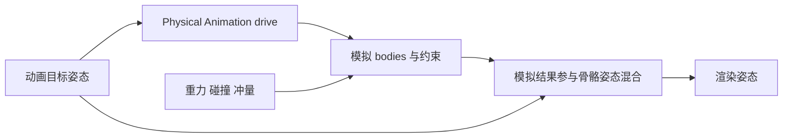

# 04 布娃娃与物理动画

> 知识成熟度：L2。本文按 Epic 官方文档/API 实际返回的选段静态核对；案例是纸面状态追踪，代码是未编译的调用节选。
> 版本基准：2026-10-10 读取时页面标示的 UE 5.8 文档；Physics Control 的引入背景单独核对 UE 5.1 release notes。未读取本机 UE 源码或 Build.version，不能据此声明某安装的 CL、默认配置或跨版本兼容。
> 最后更新：2026-10-10
> 适用范围：有 Physics Asset 的 Skeletal Mesh；以常规 Character 的胶囊移动、局部受击、死亡布娃娃和起身交接为例。布料和 Physics Control 保留各自入口与边界。
> 未验证项：UE/UHT/编译、编辑器/PIE、物理解算、网络同步、帧时及目标平台性能均未运行。文末说明来源选段和继续验证的判据。

## 概述：先分清谁在控制角色

布娃娃是由骨骼关联的刚体及关节组成的物理系统，可以全身倒地，也可以只让一条手臂受击摆动。它不限定于死亡或人形，也不要求 Skeleton 的每根骨骼都有物理体。Physics Asset 定义刚体与约束；动画提供姿态目标；物理给出碰撞和外力作用后的状态；最后还需决定哪些模拟结果参与显示。

对 Character，另有一条移动链：Controller/玩法输入 → CharacterMovement → 胶囊与 Actor 位置。Mesh 的 pelvis 骨骼、Physics Asset 的 root body、Skeleton 的 root bone、Actor 的 RootComponent 不是同一概念。进入布娃娃后，不能仅因 pelvis 移动就假设胶囊和 Controller 自动跟随。

[Characters 文档](https://dev.epicgames.com/documentation/unreal-engine/characters-in-unreal-engine?lang=en-US)区分了胶囊移动碰撞、骨骼网格和 CharacterMovement 的职责。由此，角色物理的核心问题是：进入、持续和退出每个状态时，谁写入移动、谁提供动画目标、谁模拟刚体、谁负责碰撞、谁决定玩法结果？

| 对象或量 | 负责什么 | 不应混同的对象 |
| --- | --- | --- |
| Physics Asset | Skeletal Mesh 使用的刚体形状及约束配置 | 不是“每个 Skeleton 强制且唯一一份” |
| Body Setup / 运行时 body | 配置骨骼关联的形状；实例持有模拟状态 | 骨骼数量不等于 body 数量；一个 body 可含多个形状 |
| Constraint | 限制两个刚体的相对自由度，可配置 drive | 不是动画显示混合权重 |
| Kinematic / Simulated | 外部姿态驱动 / 动力学求解驱动 | 同一刚体无需处于所谓“运动学+模拟”的第三种状态 |
| Physics Blend Weight | 模拟结果对最终骨骼姿态的影响 | 不是 drive 强度；不同 setter 还有不同副作用 |
| Physical Animation | 向模拟 body 施加追踪动画目标的 drive | 不是仅把两份姿态插值 |
| Chaos Cloth | 布料粒子、约束、碰撞及蒙皮关联 | 不由布娃娃 body 的混合权重统一控制 |

## Physics Asset：先确定模拟什么

[Physics Asset Editor](https://dev.epicgames.com/documentation/en-us/unreal-engine/physics-asset-editor-in-unreal-engine)把资产定义为 Skeletal Mesh 的刚体与约束配置。可在导入时创建，也可在 Content Drawer 中为选定 Skeletal Mesh 创建并双击编辑。不要把具体旧版菜单路径当作所有版本的固定入口。

一个可检查的资产准备顺序是：

1. 核对骨骼到 body 的对应关系。只给需要模拟或碰撞的部位建体；手指、面部骨骼不必全部建体。
2. 调整盒、球、胶囊或凸形等形状及其组合，让它们近似所需碰撞体积。渲染皮肤与碰撞形状不是同一表面。
3. 核对关节连接的两个 body、约束参考系及 Swing/Twist 限制。限制方向取决于关节参考系；“肘关节调某一轴”不能脱离资产朝向照搬。
4. 区分相邻 body 的碰撞过滤和 body 与地面、胶囊、其他 Pawn 的通道响应。形状初始交叠且允许相互碰撞，会给求解器一个需要分离的状态。
5. 结合尺寸检查质量、惯性、阻尼、关节限制及 drive。躯干与四肢采用合适比例是设计问题，没有“质量均等必然轻飘”或固定百分比的通用结论。

这些检查保留了先调资产、再调控制逻辑的用途，但不把姿态自然度归结为某一个参数。[官方故障排查](https://dev.epicgames.com/documentation/unreal-engine/troubleshooting-common-physics-asset-errors-in-unreal-engine)区分互相碰撞的 body 初始交叠导致的剧烈分离，以及细微运动阻止休眠的抖动。若移除 drive 后仍异常，先检查形状交叠、参考系和约束；若自由下落正常而跟随动画异常，再检查目标空间和 drive 配置。

## 三个开关：模拟、显示混合、姿态追踪

### 模拟与显示混合

[Physics-Based Animation](https://dev.epicgames.com/documentation/unreal-engine/physics-driven-animation-in-unreal-engine?lang=en-US)给出的局部受击思路是：从指定骨骼向下启用已有 bodies 的模拟，渐变该范围的物理混合权重，权重回到零后再关闭这组 bodies 的模拟。动画仍可继续求值。

| 调用 | 已核对的含义 | 使用边界 |
| --- | --- | --- |
| `SetAllBodiesBelowSimulatePhysics(Bone, true, bIncludeSelf)` | 沿骨骼层级向下开启 bodies 模拟 | 必须核对实际 body 与起点，不能把骨骼名存在等同于有 body |
| `SetAllBodiesBelowPhysicsBlendWeight(Bone, W, bSkipCustomPhysicsType, bIncludeSelf)` | 设置指定范围的物理混合权重 | 开启模拟与控制显示贡献分别管理 |
| `SetAllBodiesSimulatePhysics(b)` | 设置所有 bone bodies 的模拟标记 | 官方明确说它不改变组件的 `bSimulatePhysics` 标记 |
| `SetSimulatePhysics(b)` | 组件提供的模拟入口；骨骼网格内部有多个 bodies | 不把单刚体组件的附着语义无条件套到骨骼网格 |
| `SetPhysicsBlendWeight(W)` | 全局便捷入口，W=1 开启模拟，W=0 关闭模拟 | 会尊重各 body 的设置，fixed body 不会因此模拟；不是纯显示 setter |
| `WakeAllRigidBodies()` / `PutAllRigidBodiesToSleep()` | 唤醒 / 让 bodies 休眠 | 休眠不是关闭碰撞、停止动画、取消计时器或销毁对象 |

API 依据：[USkeletalMeshComponent](https://dev.epicgames.com/documentation/en-us/unreal-engine/API/Runtime/Engine/USkeletalMeshComponent)、[SetAllBodiesSimulatePhysics](https://dev.epicgames.com/documentation/en-us/unreal-engine/API/Runtime/Engine/USkeletalMeshComponent/SetAllBodiesSimulatePhysics)、[SetPhysicsBlendWeight](https://dev.epicgames.com/documentation/en-us/unreal-engine/API/Runtime/Engine/USkeletalMeshComponent/SetPhysicsBlendWeight)。

**纸面正反例：**右臂已有模拟 body，动画仍在运行。先开启右臂范围模拟，再让该范围权重走 0 → 1 → 0；最后关闭该范围模拟，得到一个有明确起止的受击流程。反例是所有 bodies 尚未开启模拟，却仅调用全局 `SetPhysicsBlendWeight(0.25f)`，便断言右臂会偏转：文档没有承诺这个中间值创建正确的局部模拟范围；它还是全局入口，会影响其他已参与混合的部位。此时应分别检查模拟标记和权重，而不是继续增加 Alpha。

### Physical Animation：让正在模拟的 body 追踪动画

Physical Animation 的数据流可以这样理解：



动画目标与物理结果同时存在是这一机制的工作条件。把动画整体停掉并不是通用修复；[Montage_Stop](https://dev.epicgames.com/documentation/en-us/unreal-engine/API/Runtime/Engine/UAnimInstance/Montage_Stop)停止的是 Montage，也不等于停止整个 AnimGraph。被动局部受击只需模拟与混合；主动追踪动画才需要额外的 drive。

官方[应用 Physical Animation Profile 示例](https://dev.epicgames.com/documentation/unreal-engine/applying-a-physical-animation-profile-in-unreal-engine)使用显式添加的 `UPhysicalAnimationComponent`：

1. 组件通过 `SetSkeletalMeshComponent` 绑定 Mesh。
2. 通过 `ApplyPhysicalAnimationProfileBelow` 应用预先建立的命名 profile。
3. 在 Mesh 上通过 `SetAllBodiesBelowSimulatePhysics` 开启目标范围模拟。
4. 配好 Mesh 与胶囊的碰撞关系，避免 Mesh 被自身胶囊排挤。

若传入的是代码中的 `FPhysicalAnimationData`，则使用 `ApplyPhysicalAnimationSettings` 或 `ApplyPhysicalAnimationSettingsBelow`；命名 profile 和这个结构体是两种输入。组件由 Actor 持有或通过明确引用传入，不依赖一个未经核对的 Mesh 专用 getter。本文采用以上有官方依据的组件流程，不要求在 AnimGraph 中寻找名为 `AnimNode_PhysicalAnimation` 的节点。

[SetSkeletalMeshComponent API](https://dev.epicgames.com/documentation/unreal-engine/API/Runtime/Engine/UPhysicalAnimationComponent/SetSkeletalMeshComponent)还注明重新绑定会清除已有物理动画数据。因此绑定应在初始化或切换 Mesh 时完成；若每帧重绑，之前应用的设置就不能假设仍有效。

### 局部空间、世界空间与强度

[FPhysicalAnimationData](https://dev.epicgames.com/documentation/unreal-engine/API/Runtime/Engine/FPhysicalAnimationData?lang=en-US)定义了以下分工：

- `bIsLocalSimulation` 选择 drive 目标采用局部还是世界空间；它不是“是否继承速度”。
- `OrientationStrength`、`AngularVelocityStrength` 分别处理朝向和角速度误差。
- `PositionStrength`、`VelocityStrength` 只用于 non-local simulation。
- `MaxAngularForce`、`MaxLinearForce` 限制对应误差校正的最大作用。
- `SetStrengthMultiplyer` 调节组件中现有 motors 的强度；它与显示用 Physics Blend Weight 是不同控制量。

因此，若设置了 `bIsLocalSimulation=true`，再增大 `PositionStrength` 并期待手臂被拉到指定世界位置，问题是使用了该模式不采用的参数，不能靠继续增大数值解决。需要世界位置目标时，先重新设计目标空间和参考对象，再配置相应 drive；局部肌肉式姿态跟随则主要核对角向控制。

对同一个动画目标，改变显示权重只改变模拟姿态显示多少；改变 drive 强度会改变求解输入，因而可能改变之后的运动。后者也受力上限、约束、碰撞、质量与时间步影响，不保证无穿透或瞬间贴合。

## 最小调用节选：上半身主动跟随与退出

第一次阅读先跟随这一条路线：正常动画 → 上半身局部模拟并追踪动画 → 淡出物理显示 → 关闭局部模拟 → 正常动画。全身倒地和起身随后再学；跨状态重入、Mesh 复用和异步收尾在“进阶：中断、重入与资源交接”集中说明。

前提：一个角色控制 owner 独占一个 Physical Animation 组件及其当前 Mesh 的物理状态交接；该组件只承担一个 `StartBody` 范围的受击，没有其他并行 motors 使用者。Physics Asset、命名 `ProfileName`、碰撞响应已设置；被动倒地范围没有另一个系统仍在施加主动 drive。多部位独立反应、共享组件或 Physics Control 并用不在这个有限示例内：全组件 `SetStrengthMultiplyer(0)` 会影响其全部 motors，不能用来只结束某一使用者。

调用者在正常生命周期调用，不在构造期间启动模拟。下面只是未编译的 C++ API 调用节选，**不实现回调接收、有效性检查或状态机**。先采用“只有当前反应可写，结束先让旧更新失效”的简单规则；不能把这些函数直接注册为延迟回调。有计时器、通知或重入时，还须满足后文进阶的完整所有权合同。

```cpp
#include "Components/SkeletalMeshComponent.h"
#include "PhysicsEngine/PhysicalAnimationComponent.h"

// 初始化，或按下文完成旧 Mesh 交接后调用；重新绑定会清空先前设置。
void BindPhysicalAnimation(
    UPhysicalAnimationComponent& PhysicalAnimation,
    USkeletalMeshComponent& Mesh)
{
    PhysicalAnimation.SetSkeletalMeshComponent(&Mesh);
    PhysicalAnimation.SetStrengthMultiplyer(0.0f); // 新绑定尚未启动反应。
}

// 前提：组件已绑定该 Mesh，命名 profile 存在并覆盖目标 bodies。
void BeginUpperBodyReaction(
    UPhysicalAnimationComponent& PhysicalAnimation,
    USkeletalMeshComponent& Mesh,
    FName StartBody,
    FName ProfileName)
{
    PhysicalAnimation.ApplyPhysicalAnimationProfileBelow(
        StartBody, ProfileName, true, true);
    PhysicalAnimation.SetStrengthMultiplyer(1.0f); // 本例显式恢复所选 profile 的强度倍率。
    Mesh.SetAllBodiesBelowSimulatePhysics(StartBody, true, true);
    Mesh.SetAllBodiesBelowPhysicsBlendWeight(StartBody, 1.0f, false, true);
}

// 在反应期间由调用者推进 W；例如渐变回 0。
// 这是该 body 范围的显示混合，不改变 drive 强度。
void UpdateReactionBlend(
    USkeletalMeshComponent& Mesh, FName StartBody, float W)
{
    Mesh.SetAllBodiesBelowPhysicsBlendWeight(StartBody, W, false, true);
}

// 前提：权重已过渡至零，owner 已撤销旧反应写入权并进入本次 Ending。
// 保留绑定/profile 数据；归零 motors 强度并停模拟，不声称已销毁 drive 数据。
void EndUpperBodyReaction(
    UPhysicalAnimationComponent& PhysicalAnimation,
    USkeletalMeshComponent& Mesh,
    FName StartBody)
{
    PhysicalAnimation.SetStrengthMultiplyer(0.0f);
    Mesh.SetAllBodiesBelowPhysicsBlendWeight(StartBody, 0.0f, false, true);
    Mesh.SetAllBodiesBelowSimulatePhysics(StartBody, false, true);
}
```

这里的 `true` 明确包含起点，`bSkipCustomPhysicsType=false` 明确不跳过自定义物理类型；项目如果要保留某些固定 body，应修改范围和参数，而不是照搬。接口签名见[Mesh API](https://dev.epicgames.com/documentation/en-us/unreal-engine/API/Runtime/Engine/USkeletalMeshComponent)与[Physical Animation 组件 API](https://dev.epicgames.com/documentation/unreal-engine/API/Runtime/Engine/UPhysicalAnimationComponent?lang=en-US)。

蓝图对应同名节点；绑定/profile 的 Target 是 Physical Animation 组件，模拟/混合的 Target 是 Mesh。被动受击可以省去组件绑定和 profile，保留开启模拟 → 受击输入 → 渐变权重 → 关闭模拟这条链。上半身受击时通常仍需要胶囊负责行走碰撞，不应照抄全身倒地方案把胶囊一律关掉。

### 沿一次正常受击走完调用链

具体输入：当前 Mesh 已有有效 Physics Asset，`StartBody=spine_01`（仅当该资产确实用此骨骼并有目标 bodies），命名 profile `UpperBodyHit` 已覆盖所需上半身；目标范围初始模拟关闭、显示权重为零，胶囊继续承担行走碰撞，动画照常求值。只触发一次反应，在结束前不倒地、不换 Mesh，也不启动第二次反应。下面 t0—t5 是先后步骤，不是固定秒数或实测帧。

| 时点 | 调用与输入 | 模拟 / 显示权重 / drive 倍率 | 读者应追踪的结果 |
| --- | --- | --- | --- |
| t0 正常动画 | 初始化时 `BindPhysicalAnimation`；目标范围尚未模拟 | 关 / 0 / 0 | Mesh 绑定建立；正常行走姿态由动画提供 |
| t1 一次受击开始 | 当前反应获得写入权，`BeginUpperBodyReaction(..., spine_01, UpperBodyHit)` | 开 / 1 / 1 | profile 作用于已有 bodies，物理结果显示出来，同时 drive 追踪动画目标 |
| t2 反应持续 | 当前反应调用 `UpdateReactionBlend(..., 0.5f)` | 开 / 0.5 / 1 | 显示处在动画与模拟之间，drive 仍是所选倍率；0.5 不表示“模拟了一半” |
| t3 淡出末端 | 当前反应调用 `UpdateReactionBlend(..., 0.0f)` | 开 / 0 / 1 | 已显示动画姿态，但该范围此刻仍在模拟、drive 还未收尾 |
| t4 正常结束 | 先进入 Ending 使旧反应更新失效，再由本次交接调用 `EndUpperBodyReaction` | 关 / 0 / 0 | 停所拥有范围的模拟，停止本组件主动强度；保留绑定/profile 配置 |
| t5 回正常动画 | 不再执行本次 Update；动画与胶囊继续原职责 | 关 / 0 / 0 | 再次受击要走新的 Begin，不能靠旧计时器恢复强度 |

这是原生调用的纸面时间线，未在 UE 运行。t1 的权重直接到 1 是此节选的简化起点，不保证自然平滑；需要淡入时，把开始阶段的权重也按项目曲线推进，再走上述淡出。真正的受击外力、动画目标变化和碰撞会决定动作，profile 本身不会自动制造指定幅度的“中弹摆动”。先用这条链分辨三个开关，再讨论视觉调参。

正常结束尤其要区分 t3 与 t4：权重零解决“显示什么”，停模拟和归零 drive 解决“谁还在计算并控制”。这一差别也解释了为何下一节的被动全身倒地不能偶然沿用局部受击的主动强度。

## 全身布娃娃：一次可逆的控制权交接

### 进入前保存，进入时分工

以下是面向常规 Character 的设计流程，不声称是引擎内置的完整死亡 API：

1. 保存后续真正需要恢复的状态：Mesh 附着与相对变换、Mesh/胶囊碰撞配置、移动模式、动画/Root Motion 策略，以及负责写这些状态的控制逻辑。先采集入场速度，再停移动。
2. 先进入 `EnteringRagdoll`，撤销受击/旧倒地更新的写入权，再进行本次组件交接；具体重入与激活身份规则见进阶段。让移动与转向逻辑服从倒地/死亡状态并阻止重复进入。CharacterMovement 的 `DisableMovement` 设置 `MOVE_None`，但 Controller 的存在本身不代表它会或不会继续执行项目逻辑。
3. 本例选择**被动倒地**：在开启所需模拟前，对上述独占组件调用 `SetStrengthMultiplyer(0.0f)`，保留配置但不沿用旧反应强度；没有其他主动 drive 写者是前提。若改为主动倒地，须另外定义由本次倒地状态持有的动画目标、profile、强度及退出政策，不能从旧受击偶然残留的设置推定。随后为 Mesh 选择允许所需物理碰撞的配置，并避免与自身胶囊互推。若关闭胶囊碰撞，要同时明确命中、交互及位置跟随由谁负责。
4. 开启所需 bodies 的模拟并设置显示混合。按资产检查哪些 body 固定、哪些模拟；不要为了“确保”把不同层级 setter 无条件叠加。
5. 按选定策略初始化速度，必要时对有效的目标 body 施加额外击退；开始稳定、恢复或退场条件的管理。

[SetSimulatePhysics](https://dev.epicgames.com/documentation/en-us/unreal-engine/API/Runtime/Engine/USkeletalMeshComponent/SetSimulatePhysics)特别区分单刚体组件与骨骼网格：骨骼网格内的 bodies 可以独立运动，开启模拟不会按单刚体规则自动解除组件附着。业务若显式 detach，应在退出时显式恢复；不能用一句“开物理一定脱离、关物理自动接回”描述全部情况。

`DisableMovement` 的语义见[CharacterMovement API](https://dev.epicgames.com/documentation/unreal-engine/API/Runtime/Engine/UCharacterMovementComponent)。这里只说明控制权交接，不指定所有角色都恢复为 Walking；空中、游泳或自定义移动状态需另行处理。

### 初始速度不等于额外冲量

有两种需要明确区分的设计选择：

- 保留已有 body 运动：需要核对实际项目在该切换路径中是否一直更新运动学 bodies、采样时机和当前速度；本文未核对引擎源码实现，不保证任意路径自动继承正确动量。
- 显式初始化：例如用 `SetAllPhysicsLinearVelocity(V, false)` 给 bodies 一个统一线速度。这只是刚性平移近似，不包含奔跑动画中每段肢体的相对线速度或角速度；也会覆盖已有线速度。

额外击退是另一件事。[Add Impulse](https://dev.epicgames.com/documentation/en-us/unreal-engine/BlueprintAPI/Physics/AddImpulse)说明：它作用于单个 body，`NAME_None` 指 root body，`bVelChange=true` 把输入视为速度变化，质量不参与该换算。因此 `AddImpulse(DeathVelocity * 0.5f, NAME_None, true)` 不是“把死亡前速度分配给全身”的同义写法。

**纸面情境：**已知某 root body 的线速度为 600 cm/s，同方向输入 300 且 `bVelChange=true`，按该接口含义会追加速度变化；它不是把速度设成 600。其他 bodies 还会通过约束相互作用，不能据此推导全身最终速度。若目的是保存原运动，先避免重复叠加；若目的是击退，明确它是一项额外效果。单体、全体及角速度接口的粒度见[Primitive Component API](https://dev.epicgames.com/documentation/en-us/unreal-engine/API/Runtime/Engine/UPrimitiveComponent)。

### 倒地持续、休眠和退场是不同状态

可用 `Simulating → Sleeping → Recovering` 或 `Retired` 描述生命周期，但具体转换条件由玩法定义：

- 休眠适合减少持续活动的物理解算；并不移除对象、渲染、查询碰撞或所有其他开销，也不能承诺永不再次唤醒。
- 有外力、交互或起身需求时，保留相应状态；不能把“经过 8 秒”当成已经稳定的观测。
- 不需要复活的尸体可先进入 `Retiring`，失效旧更新，再完成 drive/模拟收尾及碰撞、拾取和网络身份交接，最后到 `Retired`。冻结、替换表现和复用的完整责任见进阶表。
- 此被动分支持续保持 Physical Animation 强度倍率零。休眠不清 profile 或取消任务；旧计时器不得在复活后再次控制角色，接收点的完整核对放在进阶段。

因此，没有固定“同屏 5～10 具”或“3～5 秒必然足够”的通用预算。可调整 bodies/约束数量、活跃时间、距离策略及布料复杂度；效果与性能必须在项目负载下验证。

## 恢复站起：姿态连续与位置连续分别处理

[Animation Pose Snapshot](https://dev.epicgames.com/documentation/en-us/unreal-engine/animation-pose-snapshot-in-unreal-engine)支持捕获骨骼姿态，并从 snapshot 混合到起身 Montage，再回到正常移动。保存 pelvis 的一个 `FTransform` 或读取线速度不能替代全身 snapshot。Snapshot 还按当时 LOD 捕获；之后若在更高细节 LOD 使用，未捕获的骨骼会回到参考姿态。

除了姿态，还需处理坐标和胶囊。为方便纸面理解，设：

- C：胶囊/角色根的世界变换；
- M：Mesh 相对角色根的变换；
- P：pelvis 相对 Mesh 的骨骼变换。

在未脱离附着且变换链成立的简单情形，pelvis 世界位置由 C、M、P 的连续变换得到。pelvis 世界变换既不是 C，也不能直接当作 M；当 body 在世界中移动时，更不能只拿 Actor 的旧位置推定尸体的位置。实际转换须使用项目真实的附着关系、骨骼朝向和当前物理采样结果。

下面给出**带前置条件和失败出口的恢复设计**，不是一段复制即可运行的引擎代码：

1. 先进入新的 `Recovering`，撤销倒地更新的写入权，再由本次交接在仍能取得最终物理姿态时捕获 snapshot，并单独记录恢复锚点、面朝方向和所用 LOD。等待稳定可改善起身效果，但不是所有玩法必须等到完全静止。
2. 根据锚点、地面及起身动画选择候选胶囊位置与朝向。检查胶囊是否可放置，是否有足够空间，以及落点是否满足当前移动规则。
3. 若空间不足、仍在坠落或快照无效，启动新一次倒地或进入已定义的退场/重生分支，旧倒地工作继续无效；不要强开碰撞后依赖穿透修正“顶出去”。
4. 由当前恢复交接保持独占组件强度倍率为零，停止本次模拟对同一姿态的继续写入，恢复正确附着及 Mesh 相对偏移，把胶囊移至已批准位置；切换到使用快照的动画分支，使物理停止后仍有连续的姿态来源。保留 profile 配置不等于恢复 drive 强度。
5. 从 snapshot 混合到匹配朝向的起身动画。此时“物理显示权重已归零”与“快照到起身动画的混合”是两件事；后者不要求继续运行 ragdoll。
6. 按动作需要恢复碰撞、Root Motion、移动与输入控制，最后恢复 locomotion。恢复保存值或新状态规定的值，取消旧回调；不要一律写死 QueryAndPhysics、Walking 或某个相对偏移。

**纸面反例：**胶囊留在 A 点，pelvis 滚到相距两米的 B 点。只关闭模拟并播放起身 Montage，没有记录全身姿态、没有处理胶囊位置，便可能跳回旧根位置或从不匹配姿态起身。记录 pelvis 只能帮助选锚点；snapshot 解决姿态起点；可放置检查和根变换恢复解决位置。这三项不能互相替代。这里只说明缺失数据导致的问题，不声称所有资产都会按同一种轨迹跳变。

## 进阶：中断、重入与资源交接

前面的正常时间线只有一个受击写者，且按序进入和退出。项目若允许受击中死亡、倒地中复活、同一 Mesh 多次复用，或者使用计时器/异步通知，就需要下面的完整合同。它保留正常流程之外的安全边界；不是布娃娃入门前必须先实现的一套通用调度框架。

### 跨状态合同：保留配置不等于继续拥有写入权

本例选择“结束受击后保留绑定/profile 数据，强度倍率归零、范围不再模拟”的策略。权重为零、模拟关闭和 sleep 都不证明 drive 数据已清除；`SetStrengthMultiplyer(0)` 也不等于销毁 motors。再次主动受击必须由新激活明确应用所需 profile 并恢复强度，本例用倍率 1 表示恢复该 profile；它不是适合所有项目的参数推荐。

这里的 activation 是项目记录的一次控制激活身份，不是新增的 UE API。以下条件必须在实际工程成立：

1. owner 在同一串行控制上下文内管理状态切换与写入。切换开始时，**先记录新阶段和新 activation、撤销旧 activation 的写入权，再调用外部组件接口或取消工作**；例如结束反应先进入 `Ending`，倒地先进入 `EnteringRagdoll`。过渡期间只有该次交接可写，完成后才开放新状态更新。
2. 插值、计时器、动画通知等工作携带创建时的 owner 生命周期身份、Mesh 绑定代次、activation 和允许阶段。**在实际接收回调、准备改变阶段/ownership 或写 Mesh/Physical Animation 的位置**，核对对象仍有效、仍是同一绑定、activation 和阶段仍匹配；旧工作不能从当前状态补取一个新 activation 后继续执行。只在发送或入队时检查，或只检查 `Simulating` 这个可重复的状态名，都不够。
3. 连续多次外部调用之间若可能重入或让出控制，继续前再核对上述身份；一旦切换便放弃余下调用。节选可作为同一已获权交接中的调用顺序，不能据函数入口的一次检查推定整段永久有效。取消旧任务、解除旧订阅并释放其引用用于收尾；接收端拒绝过期工作仍是必要条件。

| 状态/交接 | 该 owner 的 drive 与模拟政策 | 保留内容、下一次入口 |
| --- | --- | --- |
| 受击结束 → 正常动画 | 先撤销旧反应，按 `EndUpperBodyReaction` 归零该独占组件强度、显示权重并停范围模拟 | Mesh 绑定/profile 数据可保留；旧插值失权，新反应走 `BeginUpperBodyReaction` 显式恢复 |
| 局部受击 → 全身被动倒地 | 先接管旧工作；开启全身所需模拟前归零该组件强度，不以混合权重或 sleep 代替 | 可保留 profile 数据供以后使用；倒地期间保持倍率零，旧反应不得恢复它 |
| 倒地 → `Recovering` | 先撤销倒地工作，恢复交接独占最终姿态采样；批准恢复后保持倍率零并停本次模拟 | 保留 snapshot、恢复值和可复用配置；失败回倒地也创建新 activation，不复活旧任务 |
| 倒地/受击 → `Retired` | 先进入 `Retiring` 撤销旧写者；取得需要的最终表现，再归零强度、停止所拥有 bodies 的模拟并完成碰撞/表现交接 | 可保留已冻结 Mesh 和配置，也可释放组件/表现；两者均不再接受旧工作，再用须从新激活入口开始 |
| 更换 Mesh | 先进入换绑阶段撤销旧工作；旧 Mesh 仍有效时，归零旧 drive、停止旧模拟并完成旧碰撞/表现责任 | 收尾后才调用 `BindPhysicalAnimation` 绑定新 Mesh；重新绑定清数据，新 profile/范围须重建，不能假设旧 Mesh 已随之收尾 |
| owner 退出/`EndPlay` | 先进入 `Exiting`、撤销旧工作激活并关闭新任务入口；仅本次退出交接在对象仍可合法访问时完成归零/停模拟与订阅收尾 | 退出完成后原 owner 身份失效；随 owner 退出的组件交由组件销毁生命周期释放。若 Mesh/组件继续存在，须先把碰撞、表现及后续控制明确交给接收者，否则不满足本例退出前提 |

表中的“停止”是本 owner 的写入许可及同步交接要求，不是宣称取消回调、某个 setter 或 `EndPlay` 会同步排空物理线程、所有异步回调或释放全部引擎资源。若项目还有在途异步工作，须在实际接收点用同一身份条件拒绝其结果，并在该工程已确认安全的生命周期边界完成交接；本文没有提供或验证异步排空实现。对象已无效时不得补做旧对象 setter。组件对其他系统共享、旧状态还有不受此 owner 管理的写者时，表中前提不成立，应先解决控制权归属。

### 用迟到回调检查控制权

**纸面追踪，不是运行结果：**绑定代次 m1 的受击 a1 应用 profile、倍率 1；正常结束先撤销 a1，再把倍率/权重归零并停范围模拟，profile 数据仍可保留。随后新激活 a2 进入被动倒地，先维持倍率零再开所需全身模拟。晚到的 a1 更新即使只想“归零权重”，也因 activation 不匹配被拒绝；不能让它关闭 a2 的 bodies。a2 若直接退场，则先进入 a3 的 `Retiring`，取最终表现后归零 drive、停模拟、完成碰撞/表现交接，才到 `Retired`。同 Mesh 再次使用须按新激活重建所需状态；换 Mesh 则先完成 m1 收尾再建立 m2 绑定，下一次反应显式应用新 profile 和倍率 1。m1/a1 或 m1/a2 的回调均不能修改 m2。反例只做 blend=0 或 sleep 后重新开模拟，既没有声明旧 drive 政策，也没有阻断旧写者，因而不能证明被动倒地或复用正确。

## 布料：保留用途，选对资产流程

Chaos Cloth 用粒子、约束和碰撞处理衣服、披风等表面变形；Ragdoll 用刚体和关节处理骨骼驱动。它们可以同角色并存，配置入口不同。风是外部作用/相关模拟配置，自碰撞是接触处理，不能简单把 Wind、Self-Collision 和 Distance 都当成同一类关节限制。

当前核对的官方资料区分两条制作路径：

| 路径 | 输入与资产绑定 | 关键检查 |
| --- | --- | --- |
| Skeletal Mesh 的 Clothing Tool | 从 Mesh 的 LOD section 创建 Clothing Asset，应用回 section 并绘制 mask | Physics Asset 碰撞、Max Distance、蒙皮关联及对应 LOD |
| Panel Cloth / Dataflow | 通过 Dataflow 构建独立 Cloth Asset，由 Chaos Cloth Component 使用 | 模拟/渲染网格、权重转移、配置与碰撞资产 |

[Clothing Tool](https://dev.epicgames.com/documentation/unreal-engine/clothing-tool-in-unreal-engine?lang=en-US)的 Create and Assign a Cloth Asset 与 Masks 说明的是 section 和绘制流程；[Panel Cloth Editor Overview](https://dev.epicgames.com/documentation/en-us/unreal-engine/panel-cloth-editor-overview)说明独立资产和组件流程，并指出与旧编辑器同样使用 Chaos solver。不能把两条流程合写为“导入勾选 Import Cloth 后，给 Mesh 的 Clothing Simulation 指定 Chaos Cloth Asset”这一通用操作。

布料穿模时先核对碰撞资产、映射及约束/mask，再区分身体碰撞和布料自碰撞；只开自碰撞不能补出缺失的身体碰撞。距离、LOD 和暂停策略可以降低工作量，但具体 LOD 编号不保证自动变成纯动画，视觉损失与恢复跳变也需另验。本文不承诺旧 NvCloth/APEX 资产无条件兼容或一律不可迁移。

## Physics Control：相关框架，不是无条件替代品

[UE 5.1 release notes 的 Physics Control Component (Experimental) 小节](https://dev.epicgames.com/documentation/en-us/unreal-engine/unreal-engine-5.1-release-notes?application_version=5.1)已介绍该插件：可以采用世界/父空间、动画或程序目标控制全部或部分 bodies。因此不能说它首次在 UE5.3 引入。

当前的 [UPhysicsControlComponent API](https://dev.epicgames.com/documentation/unreal-engine/API/Plugins/PhysicsControl/UPhysicsControlComponent)介绍了组件的 controls 与 body modifiers；`FAnimNode_RigidBodyWithControl` 也[有独立 API 入口](https://dev.epicgames.com/documentation/unreal-engine/API/Plugins/PhysicsControl/FAnimNode_RigidBodyWithControl)，不是随意改写为“Physics Control 节点”就能与前文组件流程互换的名称。

这些资料支持保留“程序目标跟随、肢体反应和全身控制”的用途，但不支持普遍的“首选替代方案”或“程序化防穿墙保证”。采用时还要核对项目所用插件版本、目标空间、模拟入口和生命周期；本文未运行该插件，不展开其配置为另一套完整教程。

## 网络边界：先定义尸体是否参与玩法

[Networking Overview](https://dev.epicgames.com/documentation/en-us/unreal-engine/networking-overview-for-unreal-engine)区分 Actor 移动复制、组件/属性复制与各端独立的视觉系统。仅让 Character 复制移动，不能据此宣称所有 ragdoll bodies、Animation Blueprint 状态和快照都会自动一致。

以下是由这个边界推导的设计选择：

- 尸体只用于表现时，可由服务器决定死亡/倒地、恢复和退场状态，各客户端产生局部物理表现。应允许末端肢体有差异，不让它们未经权威判定决定伤害、挡路或拾取。
- 尸体参与阻挡、搬运、命中或复活位置时，需要服务器定义有效碰撞与恢复锚点，并设计必要状态的同步与客户端表现。不能直接相信某客户端最终 pelvis 位置作为权威落点。
- 重连、晚加入或相关性恢复时，应能从当前状态重建表现，而不是只能靠一次瞬时通知启动。具体复制协议、量化和全身同步不在本篇已验证范围内。

[Networked Physics Overview](https://dev.epicgames.com/documentation/unreal-engine/networked-physics-overview?lang=en-US)描述了服务端权威物理复制及预测/重模拟的条件和代价；它不等于本文已经实现了 ragdoll 全骨骼同步。这里的服务器权威是玩法边界，不能由一个本地死亡函数代替。

## 按症状定位与继续验证

| 症状 | 先区分的状态 | 纸面判据与下一步 |
| --- | --- | --- |
| 入场抽搐或飞出 | Mesh/胶囊互撞、body 交叠、关节参考系、drive 目标 | 先确认碰撞关系及哪个控制器在写姿态；不要把停止所有动画当作唯一解 |
| 受击没有显示 | body 是否存在且模拟、权重范围、Include Self | 分别核对三项，不能只看一个全局权重 |
| drive 不跟随 | 组件绑定、profile 覆盖、local/world 模式、强度与上限 | local 模式不靠 PositionStrength 修复世界位置误差 |
| 掉入地面 | body/组件碰撞模式与响应、初始交叠、速度与时间步 | 先有有效地面碰撞，再考虑 CCD 等方法；CCD 不是错误通道的补救 |
| 身体软或僵 | 自由 ragdoll / 主动 drive、关节限制、质量惯性与阻尼 | 先明确目标，再逐项排除；没有固定“先放大关节范围”的顺序 |
| 起身瞬移或姿态突变 | 快照、LOD、胶囊锚点、Mesh 相对偏移、朝向 | 验证姿态连续和空间连续，并覆盖胶囊放不下的出口 |
| 被动倒地仍主动跟随，或复活后又休眠 | drive 强度、旧计时器/反应、owner 与 Mesh/activation 身份 | 按跨状态合同接管 drive，在实际接收点拒绝旧工作；零混合或 sleep 不能代替 |
| 多尸体/布料开销大 | 活跃 bodies/约束、布料复杂度、动画与渲染、生命周期 | 分开测量，按目标预算决定距离、简化和退场策略 |

将来允许运行时，最小验证应覆盖：局部受击结束后恢复、主动受击转被动倒地、同名状态再次进入时拒绝旧回调、Retired 后复用/换 Mesh/owner 退出的资源交接、入场速度策略、胶囊与 Mesh 互不排挤、快照到起身动画连续、站立空间不足、不同 LOD，以及有玩法影响时的多端权威状态。本文没有执行这些验证，也没有得到自然度、稳定性或性能保证。

## 来源核对范围

核对日期均为 2026-10-10。正文带链接处对应实际返回的内容；读过 API 文档不等于读过其链接指向的引擎源码文件。

| 官方来源 | 本次采用的选段 | 未覆盖范围 |
| --- | --- | --- |
| Physics Asset Editor / Characters | 资产用途与创建入口；Mesh/胶囊/移动分工 | 未操作编辑器、未验证资产手感 |
| Mesh API、模拟与权重函数 | 指定函数签名、body 与组件标记区别、附着说明、权重端点副作用 | 类 API 仅查相关条目，未通读引擎实现 |
| Physics-Based Animation / Applying a Physical Animation Profile | 局部模拟与混合开关；绑定、profile、开启模拟及胶囊碰撞 | 未运行示例地图，未核对图片内全部蓝图连线 |
| Physical Animation 组件 / FPhysicalAnimationData | 设置接口、全组件 motors 强度倍率、重新绑定清空数据、local/world、强度字段条件 | 跨状态合同为有限设计推导；未验证异步排空、力上限单位或特定参数效果 |
| Add Impulse / Primitive Component API | 单 body、None 指 root、速度变化与速度设置粒度 | 不证明全身动量自动继承 |
| Animation Pose Snapshot | 保存/读取 snapshot、起身混合、LOD 缺骨骼条件 | 未验证具体项目的根/胶囊交接顺序 |
| Clothing Tool / Panel Cloth Overview | section/mask 流程与独立 Dataflow/组件流程 | 不证明所有导入器、旧资产迁移及 LOD 策略 |
| UE 5.1 release notes / PhysicsControl API | 5.1 的 Experimental 小节；当前组件和节点符号 | 未通读发行说明、未运行插件或证明所有版本兼容 |
| Networking / Networked Physics Overview | 自动复制范围及服务器权威物理方案的边界 | 未做全骨骼复制实现、弱网或带宽实验 |

部分带 `application_version=5.6/5.8` 的直接请求失败；以上 UE5.8 引用依据是实际返回且标题标为 5.8 的页面选段，不伪称失败 URL 已读通。版本切换后的源码实现及默认值仍须在目标工程复核。

## 关联阅读

- [01-Chaos物理引擎概览](01-Chaos物理引擎概览.md)：刚体与约束在 Chaos 中的求解基础；
- [02-碰撞检测与物理材质](02-碰撞检测与物理材质.md)：骨骼体碰撞通道与物理材质配置；
- [03-物理约束与关节](03-物理约束与关节.md)：Physics Asset 中约束的本质就是关节配置；
- 04-动画系统：AnimGraph、状态机与角色物理表现的配合；
- 06-网络同步：布娃娃的服务器权威与客户端表现。
