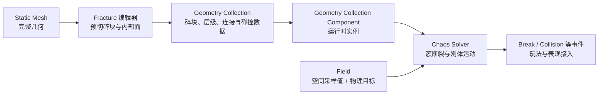
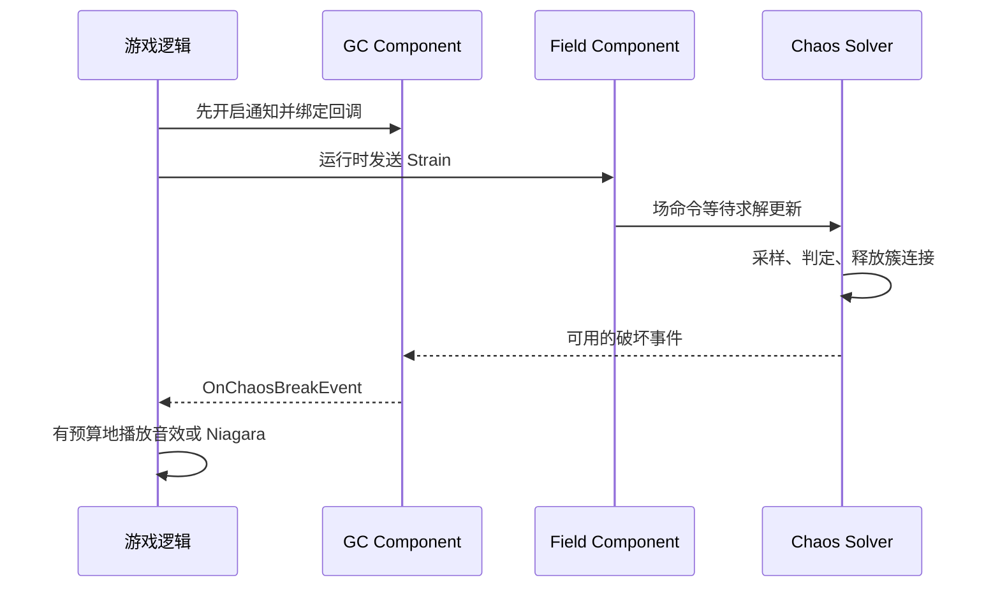
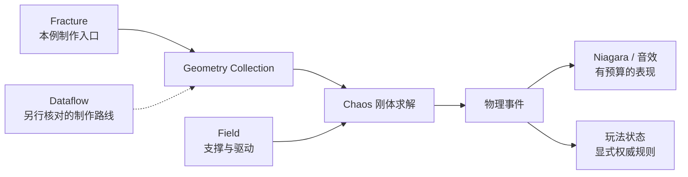

# 05 Chaos 破坏系统与 Field System

> 知识成熟度：L2。本轮核对公开官方工作流与 API；下面的编辑器操作、蓝图和 C++ 是待在目标工程执行的教学方案，没有运行 UE、PIE、Fracture、编译、缓存录制、网络或性能实验。
> 版本基准：2026-10-10 读取时标为 **Unreal Engine 5.8 Documentation** 的官方页面。文档版本不等于当前可访问的引擎二进制或源码 revision；本文没有重新读取 UE 安装目录。
> 最后更新：2026-10-10。
> 历史证据：2026-08-07 初稿记载 UE 5.8.0、CL 55116800、`++UE5+Release-5.8` 及本机只读源码核对。此次已核到该原始 Git 正文，但未定位到随文附带的原始读取输出或运行记录，因此保留为历史记录，不能当作本轮复核，也不能据此否认当时的局部核对。
> 适用范围：游戏中的 Geometry Collection 资产制作、簇断裂、Field 驱动与碎块刚体模拟。本文不涉及现实结构破坏设计。官方总入口：[Chaos Destruction](https://dev.epicgames.com/documentation/en-us/unreal-engine/chaos-destruction-in-unreal-engine)。

## 1. 要解决什么问题

希望一个游戏方块在触发前保持完整，触发后部分碎块落下，留下一部分固定的支撑。只给普通 Static Mesh 施力会移动整个刚体，不会凭空生成切面。Chaos Destruction 的通常做法是：编辑时先准备碎块，运行时再决定什么时候解除簇连接、哪些块能运动。

读完后应能解释并准备一个小例子：**引擎基本 Cube → Geometry Collection → 20 个预切碎块 → 左侧 Anchor → 一次 External Strain → 未锚定碎块下落 → 接收破坏事件**。先读 [Chaos 概览](./01-Chaos物理引擎概览.md) 和 [碰撞检测](./02-碰撞检测与物理材质.md) 有助于理解，但本例不要求已有破坏资产、射击模板、第三方模型或自定义 C++ 工程。

## 2. 从资产到运行结果：每一步改变了什么



### 2.1 Fracture、Cluster 和 Connection Graph 是三件事

- **Fracture** 产生实际碎块网格及内部切面。提高运行时场强不会把没有预切分的网格自动细分成任意新形状。
- **Cluster** 是层级中的父节点，把子碎块暂时作为整体处理。一个未断裂簇可以承载多个叶子，不能把“资产有 20 个叶子”直接等同于“当前有 20 个独立动态刚体”。
- **Connection Graph** 描述连接关系，参与碎块释放和连通性判断；层级和空间连接不是同一张表。释放后的碎块还受自身状态、锚定、碰撞、重力等条件影响。

Uniform Voronoi 的站点控制切分图样；Cluster 工具控制已有碎块的归组。不要混淆名称相近的 **Cluster fracture 方法**和 **Cluster 归组工具**。可在 Fracture Hierarchy 中读父子关系，在 Level Statistics 中核对层数和数量。[切分工具](https://dev.epicgames.com/documentation/en-us/unreal-engine/fracturing-geometry-collections-user-guide)、[簇工具](https://dev.epicgames.com/documentation/en-us/unreal-engine/cluster-geometry-collections-user-guide-in-unreal-engine)。

这是一种面向游戏的离散破坏模型，不等于对每个连接建立一个用户可见的 Physics Constraint Component，也不等于连续介质的真实应力计算。普通关节约束的用法仍见 [物理约束与关节](./03-物理约束与关节.md)。

### 2.2 场的形状与场的物理目标要分开

Field 可以看作在位置 x 上计算值的函数。**节点回答“这个位置得到多少值”，Target 回答“这个值修改哪种物理量”**。

| 目标 | 输入类别与效果 | 不能直接替代的东西 |
| --- | --- | --- |
| External Strain | 标量破坏输入，参与簇连接的断裂判定 | 不是推动碎块的径向速度，也不能无条件换算为牛顿 |
| Internal Strain / Decay | 改变内部抗破坏阈值，指南中的 decay 用于逐渐削弱 | 不能照搬 External Strain 的调用和符号约定 |
| Linear Force | 向量力；运动结果还与质量、时间积分有关 | 不是一次设置线速度，也不是自动破坏开关 |
| Linear Velocity | 向量速度目标 | 不等于同数值、同方向的力 |
| Dynamic State / Anchor | 控制参与模拟的状态或初始化锚定 | 不是单纯把 Damage Threshold 调高 |
| Sleeping / Disable | 休眠或退出模拟 | 不等于销毁 Actor，也不必然移除渲染几何 |

例如 Radial Vector 生成径向向量；Radial Falloff 生成随位置变化的标量。向量节点可服务于速度或力目标，但节点名字不是 Target 枚举。旧示例中的 `EFieldPhysicsType::Field_RadialVector` 不在当前官方目标枚举中。[Field 概览](https://dev.epicgames.com/documentation/unreal-engine/overview-of-physics-fields-in-unreal-engine?lang=en-US)、[EFieldPhysicsType](https://dev.epicgames.com/documentation/unreal-engine/API/Runtime/Chaos/EFieldPhysicsType)。

**断裂与飞散应分别观察**：场破坏了连接，碎块可以只因重力落下；看见碎块飞走，也不证明发生了断裂，完整簇同样可以整体移动。主例故意不加径向速度，便于看到这个区别。

### 2.3 阈值不是一个脱离上下文的数

UE 5.8 公开了两类 Damage Model：按用户阈值计算，或根据物理材质强度及连通性计算。用户阈值路径还受是否使用尺寸阈值、材质修正等设置影响。只有明确选定路径后，讨论 `DamageThreshold` 数组才有意义。[Damage Model 枚举](https://dev.epicgames.com/documentation/unreal-engine/API/Runtime/Chaos/EDamageModelTypeEnum)、[UGeometryCollection 的 Damage 字段](https://dev.epicgames.com/documentation/en-us/unreal-engine/API/Runtime/GeometryCollectionEngine/UGeometryCollection)。

可以用一个简化账本理解：某个受评估簇的有效阈值为 1000，实际采样到的 External Strain 为 500 时，不应仅因这一输入而断裂；若其他条件不变，采样值为 5000，则进入足以触发破坏的范围。这里比较的是**采样值与有效阈值**，不是 UI 中的中心 Magnitude 与所有碎块无条件比较。衰减、处理层级、未命中区域、状态过滤及另一套 Damage Model 都能使这个简化条件不成立。

这不是“500 + 500 必定累积到 1000”的保证，也不是把应变当作真实材料的百分比。本文示例值只是隔离机制的教学输入。

### 2.4 支撑、坐标和单位

地面提供接触支撑；Anchor 给选中的碎块建立初始固定状态。两者不同：悬空的 Dynamic 簇不会因为视觉上像墙就自动固定；Anchor 也不是只在场景中摆个可见盒子就完成绑定。

本例所有位置和包围范围都用**世界坐标、厘米**；旋转为零，Actor Scale 为 `(1,1,1)`。蓝图的 `Get Actor Location` 给出场中心。后续若把局部命中位置传给场，应先明确转换到所需空间；缩放场的可视化图形也不能被当作已经核对了任意 API 的 Radius。

官方单位页描述编辑器的单位显示体系；不能由它推定每个无单位 float 参数都以同一种 SI 单位传入。特别是 Strain 的数值不能贴上 N、Pa 或 m/s。若改用具体 Force、Velocity 或 Angular API，分别核实其单位和“设置/增加/积分”的语义，再做换算。[Units of Measurement](https://dev.epicgames.com/documentation/en-us/unreal-engine/units-of-measurement-in-unreal-engine)。

## 3. 最小正常路线：自建方块、左侧锚定、单次断裂

以下是**纸面复现步骤与预期观察**，不表示本轮已经执行。编辑器字段若与下述 5.8 文档不一致，应先核版本及资产，不盲目寻找同名旧节点替换。

### 3.1 明确依赖与场景输入

| 依赖 | 本例使用什么 | 不满足时停在哪里 |
| --- | --- | --- |
| 编辑器 | UE 5.8，Blueprint 工程、Basic 关卡、Fracture Mode | 没有 Fracture 时，先核目标安装/工程中的 Fracture 与 Geometry Collection 编辑器功能 |
| 内置几何 | Place Actors / Shapes 中的 Cube，以及一个静态地面 | 核实 Cube 实际包围盒；不用未知尺寸的外部模型代替 |
| GC 运行时 | GeometryCollectionEngine 对应资产与组件 | 没有 Geometry Collection 资产类型时停止资产步骤 |
| Field 运行时 | FieldSystemEngine 的 Field System Component | 添加组件或搜索节点时核对 Target 类型 |
| 支撑资产 | 引擎内容 `EditorResources/FieldNodes/FS_AnchorField_Generic` | 先显示 Engine Content；仍找不到则该前置条件未满足 |
| 触发蓝图 | 自建 `BP_OneShotStrain`，一个 Field System Component | 不依赖 First Person Rifle、Content Examples 或第三方蓝图 |

官方 Quick Start 未要求为普通安装另行配置 UE4 时代的 Chaos 编译开关。本例不提供通用“必须启用三个插件”的 `.uproject` 配方，也不推断插件的 Beta 标记与默认开关。Fracture/Geometry Collection 编辑器能力、FieldSystemEngine 运行时模块、引擎内置 Field 蓝图内容是不同依赖；目标构建缺哪一项，应在该版本的插件列表与模块说明中解决。Chaos Caching、Niagara、Cloth、Flesh、Dataflow 都不是本例前置。[Quick Start](https://dev.epicgames.com/documentation/en-us/unreal-engine/destruction-quick-start)、[Field System Component API](https://dev.epicgames.com/documentation/en-us/unreal-engine/API/Runtime/FieldSystemEngine/UFieldSystemComponent)。

1. 准备一个 Blueprint 工程和 Basic 关卡，将静态地面顶面放在世界 `Z=0`，覆盖至少 `X/Y=-500…500 cm`，使其阻挡物理刚体。
2. 放一个基本 Cube，确认其包围尺寸为 `100×100×100 cm`，位置为 `(0,0,150)`，旋转为零，缩放为 `(1,1,1)`。于是几何范围为 `X/Y=-50…50`、`Z=100…200`，离地 100 cm。
3. 保存关卡为 `L_ChaosCube`。下述数值都是本例选择，不是硬件预算或引擎默认值。

### 3.2 制作 Geometry Collection 和第一层碎块

1. 只选 Cube，进入 **Fracture Mode**；在 **Generate → New** 新建 `/Game/ChaosLearning/GC_Cube`。场景中原 Static Mesh Actor 被 Geometry Collection Actor 替换。
2. 核对新 Actor 的位置和世界包围范围仍对应上一步。此时“有 GC 资产”只说明容器已建立，还没有完成切分。
3. 选中根节点，使用 **Uniform**。设置 Min/Max Voronoi Sites 都为 `20`，Random Seed 为 `123`，Chance to Fracture 为 `1`；本例令 Grout 和 Noise Amplitude 都为 `0`，然后执行一次 Fracture。
4. 核对 Hierarchy：应有根和一层子碎块；Level Statistics 用于确认本次实际生成的叶子数量。将 Explode Amount 临时设为 `1` 查看内部切面，再恢复为 `0`。它是编辑预览，不是运行时破坏结果。
5. 保存 GC。不要继续对全部碎块反复 Fracture，否则本例的一层结构、阈值表和单次评估前提已经改变。

这里固定站点数和种子是为了记录资产制作输入，**并不保证跨引擎版本、不同几何或网络机器上的物理轨迹相同**。基本 Cube 是封闭几何；这也避开了开口面、相交模型和复杂薄片带来的额外变量。[GC 创建流程](https://dev.epicgames.com/documentation/en-us/unreal-engine/geometry-collections-user-guide)、[Uniform 与公共切分选项](https://dev.epicgames.com/documentation/en-us/unreal-engine/fracturing-geometry-collections-user-guide)。

### 3.3 设置本例的物理与 Damage Model

在 GC 资产和场景 GC 组件中核对以下设置，尤其注意场景实例可能覆盖资产值：

- 初始状态为 **Dynamic**，启用物理模拟和重力；碰撞允许物理模拟，地面与 GC 相互阻挡
- **Enable Clustering = true**；本例只有 Level 0 根与 Level 1 叶子，不增加中间簇；本例将 **Max Cluster Level** 与 **Max Simulated Level** 都设为 `1`，覆盖这里需要的层级
- Damage Model 选择 **User Defined Damage Threshold**；关闭 **Use Size Specific Damage Threshold** 和 **Use Material Damage Modifiers**，将所用层级的 Damage Threshold 都明确设为 `1000`，本例数组记为 `[1000,1000]`
- 关闭 **Enable Damage From Collision**，使地面碰撞仍可支撑碎块，但不作为本例的第二个破坏输入
- 本轮关闭实例 **Allow Removal on Break / Allow Removal on Sleep**；不用 Cache Playback，不加 Sleep/Disable Field，使观察窗口内的变化只有断裂与运动

记录资产和实例实际值。不要用 `SetSimulatePhysics(false)` 代替锚定，再期待场对未参与模拟的组件照常起作用。关闭碰撞破坏也不等于关闭碰撞。[GC 组件的 Damage、Collision、Removal API](https://dev.epicgames.com/documentation/en-us/unreal-engine/API/Runtime/GeometryCollectionEngine/UGeometryCollectionComponent)。

### 3.4 添加左侧 Anchor：先建立支撑再触发

1. Content Browser 打开 **Show Engine Content**，在 `Engine/Content/EditorResources/FieldNodes` 找到 `FS_AnchorField_Generic`，拖一个实例进关卡。
2. 设置 Anchor Falloff Shape 为 **Box**。调整其可视体积，让它覆盖 Cube 左侧的碎块采样位置；本例目标世界范围为 `X=-60…0`、`Y=-60…60`、`Z=90…210 cm`。这是想覆盖的范围，不是把 Actor Scale 直接填写成厘米数。
3. 选 GC Actor，在 **Chaos Physics → Initialization Fields** 数组加入该关卡 Anchor 实例。仅把 Field 放到旁边而不注册，不完成这一步。
4. 用碎块显示检查：左侧应有被覆盖的碎块，同时右侧还应有未覆盖的碎块。若体积恰好切过某块的表面，不能据此认定其采样点已被覆盖；调节体积并记录实际覆盖，避免“全部锚定”和“一个也没锚定”两种退化情况。

官方 Anchor 示例会为演示单块支撑而关闭 Clustering；**本例保持 Clustering 开启**，因为目标是先维持一整个有支撑的簇，再由 Strain 释放未锚定部分。若只想单独确认 Anchor，可以先做一个不带触发器的副本，临时关闭 Clustering：预计锚定块停留，未锚定块直接下落；确认后回到开启 Clustering 的主例。

Anchor 指南描述其将选中 bone 设为 Static；这与“所有 Anchor 在所有版本都只设 Kinematic”的说法不同。初始化支撑是独立配置步骤，不在 BeginPlay 后临时假装补上一张已生效的初始化列表。[Anchor Field 官方步骤](https://dev.epicgames.com/documentation/unreal-engine/chaos-fields-user-guide-in-unreal-engine)。

### 3.5 自建一次触发的 Field 蓝图

1. 新建 Actor Blueprint `BP_OneShotStrain`，添加 **Field System Component**，命名为 `StrainField`。它是运行时组件；不需要从 GC 组件上取一个假定存在的 Field 组件。
2. 在 Event Graph 从 `StrainField` 引用拉线，选择 Target 为 **Field System Component** 的 **Apply External Strain** 节点。
3. 连接执行链：`Event BeginPlay → Delay(1.0 秒) → Apply External Strain`。不要把此节点放在 Construction Script；官方 API 将它标为 UnsafeDuringActorConstruction。
4. 连接参数：Enabled=`true`；Position=`Get Actor Location`；Radius=`300`；Magnitude=`5000`；Iterations=`1`。Iterations 是进入簇层级的评估层数，不是求解器迭代次数，也不是持续 1 秒。
5. 将这个 BP 放在世界 `(0,0,150)`，保持旋转零、Scale `(1,1,1)`；关卡里只放一个触发器。组件启用 **Is Chaos Field**，Supported Solvers 留空以使用可用求解器；无需开启用于材质/Niagara 采样的 **Is World Field**。
6. 保存 BP 和关卡。运行方案采用 Simulate 即可观察；无需设置玩家输入、射击事件或角色控制器。

该节点对空间范围内适用的物理对象发送命令，不是“只影响某个 GC 指针”的定向调用。本例使用空关卡和单个 GC 避免误作用到旁边对象。Radius 内存在衰减，所以 `5000` 不是每个碎块收到的恒定值；本例大半径、居中、简单层级的设计用于避免边缘低值主导结果。[ApplyStrainField](https://dev.epicgames.com/documentation/en-us/unreal-engine/API/Runtime/FieldSystemEngine/UFieldSystemComponent/ApplyStrainField)。

### 3.6 预期结果，以及怎样判断路线真的走通

| 阶段 | 正常路线的预期观察 | 能说明什么 |
| --- | --- | --- |
| 编辑完成 | 有 20 个切分叶子，Explode 恢复 0，左侧有 Anchor 覆盖且 Initialization Fields 指向它 | 资产和支撑输入已准备，不是运行证明 |
| 开始后、触发前 | 有锚定支撑的完整簇停在原处 | 无场时支撑成立；若整块先掉下去，先修 Anchor |
| 约 1 秒后 | 发出一次 Strain；经过求解更新后连接断开，未锚定部分因重力下落，锚定部分留下 | 破坏输入和状态释放连通；不要求每块都飞出 |
| 碎块到达地面 | 发生阻挡和堆积，可逐渐停止运动 | 碰撞与支撑有效，不等于自动回收 |
| 停止并重新开始 | 从同一个未破坏资产状态重新建立实例 | 便于只修改一个变量对照，不靠旧残骸继续猜 |

这是因果预期，不是承诺固定帧号、完整轨迹或 Break Event 次数。命令发出后要等物理线程处理，Delay 只是把观察阶段分开，不是物理完成屏障。

在主例可成立的前提下做三个反例，每次重新开始：

1. 将 Magnitude 改为 `0`：仅此场不应触发破坏。若仍破坏，检查别的场、碰撞破坏、未聚簇或旧运行状态。
2. 保持 Magnitude，移走触发器使 GC 在半径外：不应由此场破坏。用它验证世界位置和作用范围。
3. 去掉 Initialization Fields 中的 Anchor：悬空 Dynamic 簇会受重力影响，触发前就可能整体下落。这说明“固定”和“抗破坏阈值”不能互相替代。

不要因为第一次没有明显散落就无限提高强度。先观察层级是否释放、是否全部锚定及是否有重力；再定位场的中心、范围与有效阈值。

## 4. 代码、事件和表现接入

### 4.1 与主例同一含义的 C++ 调用节选

下面只是调用边界的**未编译节选**，不是完整 Actor 类。调用方应持有已注册的 Field System Component，在运行时触发；所属 C++ 模块需依赖 `Core`、`CoreUObject`、`Engine`、`FieldSystemEngine`。若另行引用 GC 类型或绑定其事件，再加入 `GeometryCollectionEngine`。

```cpp
#include "CoreMinimal.h"
#include "Field/FieldSystemComponent.h"

// WorldCenter 和 RadiusCm 使用本例的世界空间厘米坐标。
// StrainMagnitude 是破坏输入，不命名为 Force 或 Newtons。
static void IssueOneStrain(
    UFieldSystemComponent* Field,
    const FVector& WorldCenter,
    float RadiusCm,
    float StrainMagnitude)
{
    if (!IsValid(Field) || !Field->IsRegistered() ||
        WorldCenter.ContainsNaN() ||
        !FMath::IsFinite(RadiusCm) || RadiusCm <= 0.0f ||
        !FMath::IsFinite(StrainMagnitude) || StrainMagnitude <= 0.0f)
    {
        return;
    }

    Field->ApplyStrainField(
        true, WorldCenter, RadiusCm, StrainMagnitude, 1);
    // 这里只发送命令，不能在下一行断言碎块已经破坏。
}
```

例如主例在运行时调用 `IssueOneStrain(Field, FVector(0, 0, 150), 300, 5000)`。这个函数本身不会创建 GC、启用支撑、生成碎块或登记事件。输入检查也不证明场命中了对象。

自定义场网络有两种容易混淆的入口：

| 调用对象 | C++ 方法 | Target 类型 / Blueprint 显示名 |
| --- | --- | --- |
| `UFieldSystemComponent` | `ApplyPhysicsField` | `EFieldPhysicsType` / Add Transient Field |
| `UGeometryCollectionComponent` | `ApplyPhysicsField` | `EGeometryCollectionPhysicsTypeEnum` / Add Physics Field |

两者不是把同一枚举强制转换一下就能交换的 API。分别使用当前官方签名；主例选择简化的 `ApplyStrainField`，避免凭空构造 `GC->GetFieldSystemComponent()` 依赖。[Field 入口](https://dev.epicgames.com/documentation/unreal-engine/API/Runtime/FieldSystemEngine/UFieldSystemComponent/ApplyPhysicsField?lang=en-US)、[GC 入口](https://dev.epicgames.com/documentation/en-us/unreal-engine/API/Runtime/GeometryCollectionEngine/UGeometryCollectionComponent/ApplyPhysicsFiel-)、[GC Target 枚举](https://dev.epicgames.com/documentation/unreal-engine/API/Runtime/Chaos/EGeometryCollectionPhysicsTypeEn-)。

### 4.2 破坏事件：开启通知、绑定、再触发

在关卡蓝图引用 GC Actor，取得其 Geometry Collection Component。BeginPlay 时先 **Set Notify Breaks(true)**，再 **Bind Event to On Chaos Break Event**，把回调连到 Print String 等小反馈。主例触发器仍在约 1 秒后发场，为绑定留出清晰的教学顺序。

如果事件不来，先分清“连接没有断”和“发生了断裂但通知未启用/未订阅”。`OnChaosBreakEvent` 与 `OnRootBreakEvent` 的用途不同，不把任意碎块断裂当作根破坏，也不把回调数量当作唯一碎块计数。重建组件、反复绑定与关卡重开还需要避免重复订阅。[GC 事件及 SetNotifyBreaks](https://dev.epicgames.com/documentation/en-us/unreal-engine/API/Runtime/GeometryCollectionEngine/UGeometryCollectionComponent)。



把破坏事件接到粒子和音效时，先限制数量、距离和冷却。例如同一个场景 GC 在一个很短窗口内合并一次碎裂声音，是项目表现策略，不是“每次委托只代表一个确定玩法命中”。需要得分、掩体失效等权威状态时，应有独立、幂等的玩法判定。

### 4.3 需要“飞散”时，再加入 Master Field

主例验证的是断裂与支撑。进一步学习可用同目录的 `FS_MasterField` 替换一次触发器：官方 Quick Start 使用 Trigger 激活方式和 `CE Trigger`，这个预制蓝图把 Strain、线速度/角速度及噪声组合起来。先确认具体资产的设置，再逐项打开表现。

不要同时保留两套触发器后比较效果。也不要把 Master Field 默认施加的 Velocity 统称为“爆炸力”：Velocity 直接影响速度；Force 路径还受质量影响。噪声、径向偏移、持续触发和多次 Strain Hit 都会引入新变量，必须在主例成立之后再加。[Master Field 指南](https://dev.epicgames.com/documentation/unreal-engine/chaos-fields-user-guide-in-unreal-engine)、[官方触发蓝图路线](https://dev.epicgames.com/documentation/en-us/unreal-engine/destruction-quick-start)。

## 5. 从小例子进入工程：碰撞、网络、缓存与回收

### 5.1 碰撞与质量

视觉网格、查询碰撞和用于模拟的碰撞表示不保证完全相同。出现穿透、抖动或一开始就弹开，先查是否有相交初始几何、薄片、缩放、错误的碰撞过滤或不合适的碰撞形状，再考虑求解器精度与时间步。不能把所有穿模都归因于迭代次数不足。

质量、密度和物理材质要核对 GC 资产与组件实际采用的路径；不要只修改一个普通 Static Mesh 的 Mass UI 后以为所有 GC 碎块都已同步改变。材质还能参与 Damage Model，必须区分摩擦/弹性、质量来源和抗破坏参数三个作用。详见 [碰撞检测与物理材质](./02-碰撞检测与物理材质.md)。

### 5.2 网络：破坏通知不是复制协议

游戏可以采用服务器决定关键破坏结果、客户端负责粒子音效的策略。但一个 `Replicated bool bBroken` 只能表达约定的玩法状态，不能自动传输全部簇释放、碎块变换、碰撞和回收结果。

GC 有自己的复制相关数据和入口。公开 API 对 `SetEnableReplication` 特别提示，应在组件完全注册之前使用，例如构造阶段；不要把它写成破坏发生后随手开启的通用补救。项目还应明确 Actor 复制、相关性、晚加入、重建和碎块精度取舍，按目标版本验证。[GC 复制 API](https://dev.epicgames.com/documentation/en-us/unreal-engine/API/Runtime/GeometryCollectionEngine/UGeometryCollectionComponent)。

固定 Fracture Seed 只控制指定资产制作过程，不能保证多个客户端独立求解得到相同轨迹。本文没有双端、专用服务器、丢包、晚加入或回放验证，不能把单机纸面例子称为联网方案。

### 5.3 缓存：记录轨迹与实时响应是不同目标

固定背景演出可以考虑 Chaos Cache。当前 `AChaosCacheManager` 提供 Cache Collection、Observed Components、Record/Playback 等控制；录制对象、缓存资产和播放驱动对象必须对应。改变 GC 层级、资产或时序后，不能假定旧缓存仍匹配。

缓存重放不证明实时求解可确定，也不是网络复制的替代品。不要把旧版教程中的 Cache UI 路径直接移植到新版本。本例不启用 ChaosCaching，也没有录制或验证缓存；扩展时单独核对插件、对象适配及播放与实时模拟的切换边界。[Chaos Cache Manager API](https://dev.epicgames.com/documentation/en-us/unreal-engine/API/Plugins/ChaosCaching/AChaosCacheManager)。

### 5.4 休眠、Disable、Removal、销毁不是一回事

| 行为 | 需要区分的结果 |
| --- | --- |
| Sleeping | 暂停活跃运动；碰撞等条件可能再次唤醒 |
| Disable / Kill Field | 退出模拟；不能据此宣称 Actor 或渲染网格已销毁 |
| Remove on Sleep / Remove on Break | 按资产和实例许可处理碎块移除；不必等待 Actor 生命周期结束 |
| Destroy Actor | 销毁整个 Actor，影响其全部组件和玩法状态，不是单个叶子的“休眠” |

当前 GC 资产的 Remove on Sleep 还区分等待休眠时间与移除过程时间；实例的 Allow Removal 开关不能替代资产配置。只打开某一个设置，不足以断言所有碎块将按固定秒数消失。Removal Event 是通知，不是靠订阅事件自动执行清理。[GC Removal 字段](https://dev.epicgames.com/documentation/en-us/unreal-engine/API/Runtime/GeometryCollectionEngine/UGeometryCollection)、[实例许可](https://dev.epicgames.com/documentation/en-us/unreal-engine/API/Runtime/GeometryCollectionEngine/UGeometryCollectionComponent)。

玩法上必须先决定残骸是否继续挡路、可被玩家推动、会否影响晚加入状态，再选择回收策略。渲染消失、物理退出和玩法失效应分别验证。

## 6. 常见问题 FAQ

### Q1：Geometry Collection 和 Static Mesh 有什么区别？

本流程中 Static Mesh 提供输入几何，GC 保存预切碎块和层级。尚在簇中的叶子并不都独立运动。游戏也可以用替换网格或预制碎片实现别的破坏方案，不能说所有破坏都必须用 GC。

### Q2：为什么一碰就全碎？

先看是否关闭了 Clustering、是否有碰撞破坏、Damage Model 是否采用你调的阈值，以及场是否持续或多次命中。不要只提高“力阈值”掩盖未聚簇或重复触发。

### Q3：破坏太卡怎么办？

统计同时活跃刚体、碰撞对、碰撞形状、场采样范围、层级释放峰值和表现事件，再缩小问题。资产叶子总数只是一个输入，不能由“中端机最多 256 块”推导项目容量。

### Q4：Field System 必须开插件吗？

应分清运行时模块、编辑器工具和内置内容。本文 API 属于 FieldSystemEngine，Anchor 蓝图来自引擎内容。能否创建/编辑相关对象取决于目标构建；不把历史三个插件的默认开关当作跨版本合同。

### Q5：服务器和客户端都要处理破坏事件吗？

按职责设计。客户端表现可消费本地事件，权威玩法不能仅相信客户端碎裂通知。事件是否产生、是否复制以及晚加入恢复是三个需要分别验证的问题。

### Q6：怎么让碎块飞得自然？

先证明连接确实断了，再加入速度或力、合适质量、摩擦和阻尼。调整一种变量后重新观察；噪声与多层破坏不应掩盖错误的支撑或坐标。

### Q7：破坏后碎块会一直留下吗？

取决于当前资产、实例和玩法策略。Sleep 不等于删除；Remove on Sleep/Break、Disable 与销毁 Actor 各有不同后果，见第 5.4 节。

### Q8：布料或角色能直接挂在碎块上吗？

共享 Chaos 名称不能推出任意系统之间自动双向耦合。必须核对具体组件的碰撞、约束或附着支持，并验证物理更新顺序；本文没有提供或验证布料挂接实现。

### Q9：可以做可破坏掩体吗？

可以把 GC 用作游戏掩体的物理表现，但掩体失效、射线阻挡、导航和复制需要显式玩法规则。演示方块裂开，不等于这些系统已经联通。

### Q10：官方资料和源码从哪里看？

先按本文引用的创建、Fracture、Field 和 API 页面走通小例子。API 页面列出可移植头文件路径；源码学习见 [Chaos 破坏与 Field 源码](./37-Chaos破坏与Field源码.md)。未读取目标源码时，不沿用别台机器的行号作为本轮事实。

### Q11：Dataflow 和传统 Fracture 有什么区别？

两者可以服务于资产制作的不同工作流。本例使用 Fracture Mode；迁移到 Dataflow 时，单独核对目标版本的节点、生成资产和再生成行为，不能只因插件名字出现 Solver 就推断它替代了所有实时破坏求解。

### Q12：Chaos Flesh 与破坏能直接协同吗？

可以作为另外的集成研究目标，但“同属生态”不保证可直接将软体、肌肉和 GC 碎块耦合。本文没有软体资产、耦合接口或运行证据，不把它列成已实现能力。

## 7. 排查与性能观察

| 现象 | 先排查 | 本文入口 |
| --- | --- | --- |
| 触发前整体落下 | Initialization Fields 是否引用正确 Anchor，是否命中支撑碎块 | 3.4 |
| 场触发却没有断裂 | 有无预切块/簇、Target 类型、世界位置、半径、Damage Model 与有效阈值 | 2.2、2.3、3.5 |
| 断了却没有飞散 | 是否全部锚定、是否仅施加 Strain、是否有重力或几何堆积 | 3.6、4.3 |
| 始终有少数连接未释放 | 场的采样范围、处理层级、Max Cluster Level、尺寸/材质阈值 | 2.3、3.3 |
| 事件没有到来 | 实际是否断裂、Notify Breaks、绑定对象和重复重建 | 4.2 |
| 穿模或开始就弹开 | 几何相交、碰撞形状与过滤、时间步和求解精度 | 5.1 |
| 碎块不消失 | Sleep 与 Removal 混淆、资产配置、实例许可及仍在运动 | 5.4 |
| 两端不同 | 权威来源、GC 复制配置、晚加入、独立求解误差 | 5.2 |

物理破坏常出现短时峰值，但“未破坏时零开销”也不成立：资产、渲染、组件、碰撞和维护工作仍可能存在。预算应记录场景、目标机器、时间步、碰撞配置和同时触发规模，不给未经测量的低/中/高端机固定上限。

实际获准测试时，先测一个小例子，再观察活跃碎块、碰撞、场命令频率、事件产生/消费量、物理线程与游戏线程耗时，以及回收前后残骸数量。Unreal Insights 和目标版本可用的 Chaos 调试工具是观察入口；工具名称存在不等于本轮跑过。多加 Solver Actor 也不是默认性能修复，每个独立求解域及其交互边界都需要依据项目验证。

## 8. 关联阅读与本轮边界



- [01-Chaos物理引擎概览.md](./01-Chaos物理引擎概览.md)：物理场景、求解与线程边界
- [02-碰撞检测与物理材质.md](./02-碰撞检测与物理材质.md)：碰撞、摩擦、弹性及事件区别
- [03-物理约束与关节.md](./03-物理约束与关节.md)：普通关节约束；不要与 GC 簇连接直接等同
- [04-布娃娃与物理动画.md](./04-布娃娃与物理动画.md)：角色的物理动画，需独立处理与碎块的交互
- [15-物理系统源码](15-物理系统源码.md)：FPhysScene 与 Chaos 源码学习入口
- [37-Chaos破坏与Field源码](./37-Chaos破坏与Field源码.md)：进一步核对破坏/Field 的实现链
- [01-Niagara粒子系统基础](../特效粒子与流体仿真/01-Niagara粒子系统基础.md)：碎裂后的烟尘、火花等表现

本轮实际核对的是上述官方页面中可见的创建步骤、Field 目标/方法、Damage Model、事件、缓存与 Removal 字段。没有下载或复制受限引擎实现，没有取得新的 Build.version，没有核对初稿各源码文件的当前行号、插件默认值或原 CL。官方字段页也有局部说明不够精确的地方，例如 ApplyStrainField 的参数文案仍混用 force；本文按其函数用途与 Strain 工作流解释，不据此增加力学单位承诺。

## 更新日志

- 2026-08-07：初稿记录本机 UE5.8 的源码路径、事件/接口符号及插件状态核对；该记录属于原稿历史，本文未附其原始读取输出，本轮未独立复核对应安装和 CL
- 2026-10-10：按可读的 UE5.8 官方工作流/API 增补自建 Cube 的完整纸面正常路线；分开切分、簇、Strain、力/速度、Anchor、事件、复制、缓存和回收；修正示例入口与无证据泛化，保留流程图、FAQ 意图和相关学习入口。维持 L2 与 `verified: []`，不新增运行或性能验证声明
